# 1 React 正在不断发展

*React* 是一个用于构建美观用户界面的 JavaScript 库。React 团队希望开发者的体验尽可能出色，以便开发者能够受到启发并能够创建令人愉悦、高效的用户体验。"React Hooks in Action with Suspense and Concurrent Mode" 是您了解库中最新添加功能的指南，这些功能可以简化您的代码，提高代码重用性，并帮助使您的应用程序更加流畅和响应迅速，从而让开发者和用户都更加满意。

本章简要概述了 React 及其新功能，以激发您对书中后续详细内容的兴趣。

## 1.1 什么是 React？

假设您正在创建一个用于网页、桌面、智能手机或甚至虚拟现实（VR）体验的用户界面（UI）。您希望您的页面或应用能够显示随时间变化的各种数据，如认证用户信息、可筛选的产品列表、数据可视化或客户详情。您期望用户与该应用交互，选择过滤器、数据集和客户进行查看，填写表单字段，甚至探索 VR 空间！或者，也许您的应用将从网络或互联网中获取数据，如社交媒体更新、股票行情或产品可用性。React 正在这里帮助。

React 使得构建可组合、可重用且对数据变化和用户交互做出反应的用户界面组件变得简单。社交媒体网站的一页可能包括按钮、帖子、评论、图片和视频等众多界面组件。React 帮助更新界面，当用户滚动页面、打开帖子、添加评论或切换到其他视图时。页面上的某些组件可能有重复的 *子组件*，即具有相同结构但内容不同的页面元素。而这些子组件也可以由组件组成！这里有图片缩略图、重复的按钮、可点击文本和图标。整体来看，页面有数百个这样的元素。但通过将这些丰富的界面分解为可重用组件，开发团队能够更容易地专注于特定功能区域，并将组件用于多个页面。

使定义和重用组件，并将它们组合成复杂但易于理解和使用的界面变得简单，这是 React 的核心目的之一。其他前端库也存在（如 AngularJS、Vue.js 和 Ember.js），但这是一本关于 React 的书，所以我们专注于 React 如何处理组件、数据流和代码重用。

在接下来的几节中，我们将从高层次的角度了解 React 如何帮助开发者构建这样的应用程序，突出其五个关键特性：

+   从可重用、可组合的组件构建用户界面

+   使用 JSX 描述 UI——HTML 风格的模板与 JavaScript 的结合

+   在不引入太多惯用约束的情况下充分利用 JavaScript

+   智能同步状态和 UI

+   帮助管理代码、资源和数据的获取

### 1.1.1 从组件构建 UI

社交媒体网站展示了丰富的、分层的、多层次的用户界面，React 可以帮助你设计和编码。但就目前而言，让我们从一个稍微简单一些的例子开始，以了解 React 的功能。

假设你想构建一个测验应用来帮助学习者测试他们所学习的事实。你的组件应该能够显示和隐藏问题，以及显示和隐藏答案。一个问题及答案对可能看起来像图 1.1。

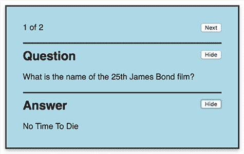

图 1.1 显示问题及答案的测验应用的一部分

你可以为问题部分创建一个组件，为答案部分创建另一个组件。但这两个组件的结构是相同的：每个组件都有一个标题，一些显示和隐藏的文本，以及一个用于显示和隐藏的按钮。React 使得定义一个单一的组件变得容易，比如一个`TextToggle`组件，你可以用它来处理问题和答案。你将标题、文本以及是否显示文本传递给每个`TextToggle`组件。你将这些值作为属性（或 props）传递，类似于这样：

```
<TextToggle title="Question" text="Who created JavaScript?" show={true} />

<TextToggle title="Answer" text="Brendan Eich" show={false} />
```

等等！现在是什么？这是 HTML？XML？JavaScript？嗯，用 React 编程就是用 JavaScript 编程。但 React 提供了一个类似于 HTML 的语法来描述你的 UI，称为 JSX。在运行你的应用之前，JSX 需要预处理以将其转换为创建用户界面元素的实际 JavaScript。一开始这似乎有点奇怪，将 HTML 与 JavaScript 混合，但事实证明这种便利性是一个很大的优点。一旦你的代码最终在浏览器（或其他环境）中运行，它实际上就是 JavaScript。一个名为*Babel*的包几乎总是用来将你编写的代码编译成将要运行的代码。你可以在[`babeljs.io`](https://babeljs.io/)了解更多关于 Babel 的信息。

本章仅提供了一个 React 的高级概述，因此我们在这里不会进一步探讨 JSX。不过，提前提一下是值得的，因为它是 React 开发中广泛使用的一部分。实际上，在我看来，React 的 JavaScript 特性是其吸引力之一——尽管其他观点也是可用的——而且，在大多数情况下，它并没有引入很多限制。尽管最佳实践已经出现并且仍在继续出现，但成为一名优秀的 JavaScript 程序员和成为一名优秀的 React 程序员是非常相似的技术。

假设你已经创建了`TextToggle`组件；接下来是什么？使用 React，你可以定义由现有组件组成的新组件。你可以将问题卡（显示问题和答案）封装成自己的`QuestionCard`组件。如果你想同时显示多个问题，你的`Quiz`组件 UI 可以由多个`QuestionCard`组件组成。

图 1.2 显示了由两个 `QuestionCard` 组件组成的 `Quiz` 组件。`Quiz` 组件是 `QuestionCard` 的容器，除了包含的卡片外，没有可见的存在。

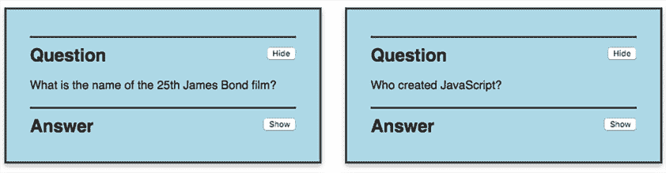

图 1.2 显示两个 `QuestionCard` 组件的 `Quiz` 组件

因此，`Quiz` 组件由 `QuestionCard` 组件组成，而它们又由 `TextToggle` 组件组成，这些组件由标准的 HTML 元素组成——例如 `h2`、`p` 和 `button`。最终，`Quiz` 组件包含所有原生 UI 元素。图 1.3 显示了您的 `Quiz` 组件的简单层次结构。

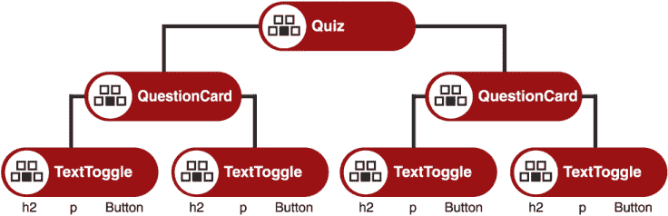

图 1.3 `Quiz` 组件层次结构

React 使这种组件创建和组合变得容易得多。一旦您制作了组件，您就可以轻松地重用和共享它们。想象一个学习资源网站，它为不同的主题提供不同的页面。在每一页上，您都可以包含您的 `Quiz` 组件，只需传递该主题的测验数据即可。

许多 React 组件可以在 npm 等包管理存储库中下载。当有现成的、经过良好使用和测试的示例，如下拉菜单、日期选择器、富文本编辑器和可能还有测验模板时，无需重新创建常见用例，无论是简单还是复杂。

React 还提供了机制和模式，用于将您的应用程序数据传递给需要它们的组件。实际上，这种状态和 UI 的同步是 React 的核心所在，也是它所做的事情。

### 1.1.2 同步状态和 UI

React 保持应用程序的用户界面与其数据同步。在任何时刻存储在您应用程序中的数据被称为应用程序的 *状态*，可能包括，例如，当前帖子、登录用户的详细信息、是否显示或隐藏评论，或文本输入字段的内 容。如果通过网络到达新的数据或用户通过按钮或文本输入更新值，React 会计算出需要对显示进行哪些更改，并高效地更新它。

React 智能地安排更新顺序和时机，以优化应用程序的感知性能并提高用户体验。图 1.4 代表了这个想法，即 React 通过重新渲染用户界面来响应用件状态的变化。


图 1.4 当组件的状态中的值发生变化时，React 会重新渲染用户界面。

但更新状态和重新渲染不是一个一次性任务。使用您应用程序的访客可能会引起大量的状态变化，React 将需要反复询问您的组件以获取表示最新状态值的最新 UI。您的组件的职责是将它们的状 态和属性（传递给它们的属性）转换为它们用户界面的描述。然后 React 会根据需要将这些 UI 描述安排到浏览器文档对象模型 (DOM) 中进行更新。

循环图

为了表示状态变化和 UI 更新的持续周期，本书使用圆形周期图来展示您的组件与 React 之间的交互。图 1.5 是一个简单的例子，展示了组件首次出现时以及用户更新值时 React 如何调用您的组件代码。

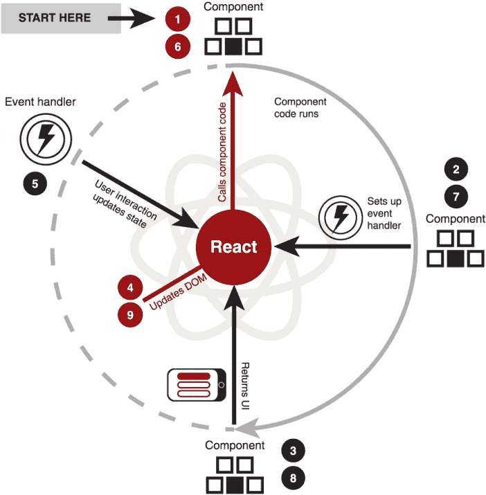

图 1.5 React 调用并重新调用您的组件以使用最新的状态生成其 UI 的描述。

周期图旁边附有表格，如表 1.1，更详细地描述了图的步骤。图和表的配对不一定涵盖所有发生的事情，但提取了关键步骤，以帮助您理解与组件在不同场景下工作相关的相似之处和不同之处。

例如，本节中的图示没有显示事件处理程序如何与 React 一起更新状态；这个细节将在介绍相关 React Hooks 的后续图中添加。

表 1.1 当 React 调用并重新调用函数组件时的关键步骤

| 步骤 | 发生了什么？ | 讨论 |
| --- | --- | --- |
| 1 | React 调用组件。 | 为了生成页面的 UI，React 遍历组件树，调用每个组件。React 将传递给每个组件任何在 JSX 中设置的属性作为 props。 |
| 2 | 组件指定了一个事件处理程序。 | 事件处理程序可能监听用户点击、计时器触发或资源加载等。处理程序将在稍后运行时更改状态。React 将在步骤 4 更新 DOM 时将处理程序连接到 DOM。 |
| 3 | 组件返回其用户界面。 | 组件使用当前状态值来生成其用户界面并将其返回，完成其工作。 |
| 4 | React 更新 DOM。 | React 将组件返回的 UI 描述与当前的应用程序 UI 描述进行比较。它高效地做出任何必要的 DOM 更改，并根据需要设置或更新事件处理程序。 |
| 5 | 事件处理程序被触发。 | 发生了一个事件，并且处理程序运行。处理程序更改了状态。 |
| 6 | React 调用组件。 | React 知道状态值已更改，因此必须重新计算 UI。 |
| 7 | 组件指定了一个事件处理程序。 | 这是一个新版本的处理程序，可能使用新更新的状态值。 |
| 8 | 组件返回其用户界面。 | 组件使用当前状态值来生成其用户界面并将其返回，完成其工作。 |
| 9 | React 更新 DOM。 | React 将组件返回的 UI 描述与应用程序 UI 的先前描述进行比较。它高效地做出任何必要的 DOM 更改，并根据需要设置或更新事件处理程序。 |

这些插图还使用一致的图标来表示周围文本中讨论的关键对象和动作，例如组件、状态值、事件处理程序和用户界面。

问答应用中的状态

社交媒体页面，如本章开头讨论的那样，通常需要大量的状态，包括加载新帖子、用户点赞帖子、添加评论以及以各种方式与组件交互。其中一些状态，如当前用户，可能被许多组件共享，而其他状态，如评论，可能仅限于帖子本身。

在 Quiz 应用中，你有一个问答组件，即 `QuestionCard`，如图 1.6 所示。用户可以显示和隐藏每个问题和答案，并移动到下一个可用的问题。

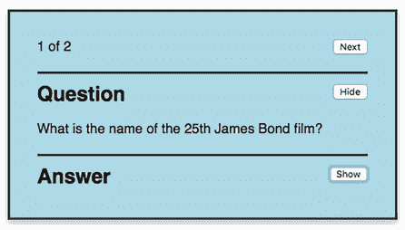

图 1.6 答案隐藏的问答组件

`QuestionCard` 组件的状态包括显示当前问题和答案所需的信息：

+   问题编号

+   问题的数量

+   问题文本

+   答案文本

+   问题是隐藏还是显示

+   答案是否隐藏或显示

点击答案的显示按钮会改变组件的状态。可能一个 `isAnswerShown` 变量从 `false` 切换到 `true`。React 会注意到状态已更改，将更新显示的组件以显示答案文本，并将按钮的文本从显示切换到隐藏（图 1.7）。

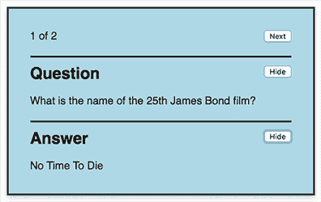

图 1.7 显示答案的问答组件

点击“下一步”按钮会改变问题编号。它将从问题 1 切换到问题 2，如图 1.8 所示。如果整个测验的问题和答案都在内存中，React 可以立即更新显示。如果它们需要从文件或服务中加载，React 可以在更新 UI 之前等待数据被检索，或者在网络较慢时显示一个加载指示器，如旋转器。

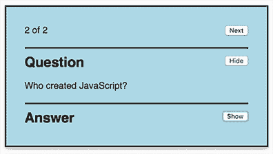

图 1.8 显示第二个问题的问答组件。答案已被隐藏。

简单的 Quiz 应用示例不需要太多状态来执行其任务。大多数现实世界的应用更为复杂。决定状态应该放在哪里——是否一个组件应该管理自己的状态，是否某些组件应该共享状态，以及是否某些状态应该全局共享——是构建应用的重要部分。React 为这三种场景提供了机制，例如，像 Redux、MobX、React Query 和 Apollo Client 这样的发布包，提供了通过组件外的数据存储管理状态的方法。

在过去，组件是否管理自己的状态决定了你会使用哪种组件创建方法；React 提供了两种主要方法：函数组件和类组件，如下一节所述。

### 1.1.3 理解组件类型

要定义一个组件，React 允许你使用两种 JavaScript 结构：一个函数或一个类。在 React Hooks 之前，当组件不需要任何本地状态时（你会通过 props 传递给它所有数据）：

```
function MyComponent (props) {
  // Maybe work with the props in some way.
  // Return the UI incorporating prop values.
}
```

当组件需要管理自己的状态、执行副作用（如加载数据或与 DOM 交互）或直接响应事件时，你会使用类：

```
class MyComponent extends React.Component {
  constructor (props) {
    super(props);

    this.state = {
      // Set up state here.                         ❶
    };
  }

  componentDidMount () {
    // Perform a side effect like loading data.     ❷
  }

  render () {
    // Return the UI using prop values and state.   ❸
  }
}
```

❶ 类组件在其构造函数中设置其状态。

❷ 类组件可以包括其生命周期各个阶段的函数。

❸ 类组件有一个返回其 UI 的`render`方法。

React Hooks 的添加意味着你现在可以使用函数组件来管理状态和副作用：

```
function MyComponent (props) {
  // Use local state.
  const [value, setValue] = useState(initialValue);             ❶
  const [state, dispatch] = useReducer(reducer, initialState);  ❶

  useEffect(() => {
    // Perform side effect.                                     ❷
  });

  return (
    <p>{value} and {state.message}</p>                          ❸
  );
}
```

❶ 使用钩子来管理状态。

❷ 使用钩子来管理副作用。

❸ 直接从函数中返回 UI。

React 团队建议在新项目中使用函数组件（尽管没有计划移除类组件，因此无需对现有项目进行大规模重写）。表 1.2 列出了组件类型及其描述。

表 1.2 组件类型及其描述 *(继续)*

| 组件类型 | 描述 |
| --- | --- |
| 无状态函数组件 | 一个接收属性并返回 UI 的 JavaScript 函数 |
| 函数组件 | 一个接收属性并使用钩子来管理状态和执行副作用的 JavaScript 函数，同时返回 UI |
| 类组件 | 包含一个返回 UI 的`render`方法的 JavaScript 类。它也可能在其构造函数中设置状态，并在其生命周期方法中管理状态和执行副作用。 |

函数组件只是返回其用户界面描述的 JavaScript 函数。在编写组件时，开发者通常使用 JSX 来指定 UI。UI 可能取决于传递给函数的属性。对于无状态函数组件，故事就到这里结束了；它们将属性转换为 UI。更普遍地说，函数组件现在可以包含状态并处理副作用。

类组件是使用 JavaScript 类语法构建的，从`React.Component`或`React.PureComponent`基类扩展而来。它们有一个构造函数，可以在其中初始化状态，并且 React 会在组件生命周期中调用它们的方法；例如，当 DOM 使用最新的组件 UI 更新时或当传递给组件的属性更改时。它们还有一个`render`方法，返回组件 UI 的描述。类组件是创建可以引起副作用的具有状态组件的方法。

我们将在第 1.3 节中看到，具有钩子的函数组件在创建有状态组件和管理副作用方面比类组件提供了一种更好的方法。首先，让我们更广泛地了解一下 React 的新特性以及这些新特性如何使使用 React 变得更加出色。

组件副作用

React 组件通常将状态转换为 UI。当组件代码执行与此主要焦点无关的操作时——例如从网络获取数据（如博客文章或股票价格）、设置对在线服务的订阅或直接与 DOM 交互以聚焦表单字段或测量元素尺寸——我们把这些操作描述为组件的 *副作用*。

我们希望我们的应用程序及其组件的行为可预测，因此应确保任何必要的副作用都是故意的且可见的。正如你在第四章中将要看到的，React 提供了 `useEffect` hook 来帮助我们设置和管理函数组件中的副作用。

## 1.2 React 的新特性有哪些？

React 16 包含了对核心功能的重写，这为稳定推出新的库功能和方法的实施铺平了道路。在接下来的章节中，我们将探讨其中的一些最新增补。新功能包括以下内容：

+   带状态的函数组件（`useState`、`useReducer`）

+   上下文 API (`useContext`)

+   更干净的副作用管理（`useEffect`）

+   简单但强大的代码重用模式（自定义 hooks）

+   代码拆分（`lazy`）

+   更快的初始加载和智能渲染（并发模式—实验性）

+   更好的加载状态反馈（`Suspense`，`useTransition`）

+   强大的调试、检查和性能分析（开发工具和性能分析器）

+   目标化错误处理（错误边界）

以 use 开头的单词—`useState`、`useReducer`、`useContext`、`useEffect` 和 `useTransition`—是 *React Hooks* 的例子。它们是你可以从 React 函数组件中调用的函数，并且可以钩入关键的 React 功能：状态、生命周期和上下文。React Hooks 允许你在函数组件中添加状态，干净地封装副作用，并在你的项目中重用代码。通过使用 hooks，你可以摆脱对类的需求，以优雅的方式减少和整合你的代码。第 1.3 节将更详细地讨论 React 组件和 hooks。

并发模式和 `Suspense` 提供了更细致地控制代码、数据和资产加载的手段，以及以协调的方式处理加载状态和回退内容（如加载指示器）。目标是提高应用程序加载和状态变化时的用户体验，并改善开发者体验，使开发者更容易接入这些新行为。React 可以暂停渲染昂贵但非紧急的组件，转而执行紧急任务，如响应用户交互，以保持应用程序的响应性，并平滑用户生产力的感知路径。

[`reactjs.org`](https://reactjs.org) 上的 React 文档是一个极好的资源，提供了对哲学、API 和库推荐使用的清晰、结构化的解释，以及团队博客文章、指向实时代码示例、关于新特性的会议演讲和其他与 React 相关的资源链接。虽然这本书将专注于 hooks、Suspense 和并发模式，但请务必查看官方文档，以了解更多关于 React 其他新增功能的信息。特别是，请查看关于 React 17 的博客文章([`reactjs.org/blog/2020/10/20/react-v17.html`](https://reactjs.org/blog/2020/10/20/react-v17.html))。React 的下一个主要版本于 2020 年 10 月发布，但没有包含面向开发者的新功能。相反，它包括了一些更改，使得逐步升级 React 应用程序变得更加容易，以及并发模式和其 API 的进一步实验性开发。

## 1.3 React Hooks 可以给函数组件添加状态

如 1.1.2 节所述，React 的核心优势之一是它如何同步应用程序和组件状态与 UI。随着状态的变化，基于用户交互或来自系统或网络的数据更新，React 会智能且高效地计算出在浏览器中的 DOM 或更广泛环境中的 UI 应该进行哪些更改。

状态可以是组件本地的，提升到树中的更高组件，通过属性在兄弟组件间共享，或者全局的，并通过 React 的 Context 4 访问，并返回一个包装了传入组件的新组件，但具有额外的功能）。为了使组件具有状态，过去通常使用一个从 `React.Component` 扩展的 JavaScript 类组件。现在，有了 React Hooks，你可以在函数组件中添加状态。

### 1.3.1 带状态的函数组件：更少的代码，更好的组织

与类相比，使用 hooks 的函数组件鼓励编写更干净、更精简的代码，这种代码易于测试、维护和重用。*函数组件* 是一个返回其用户界面描述的 JavaScript 函数。该 UI 依赖于传入的属性以及组件管理或访问的状态。图 1.9 展示了一个表示函数组件的图表。

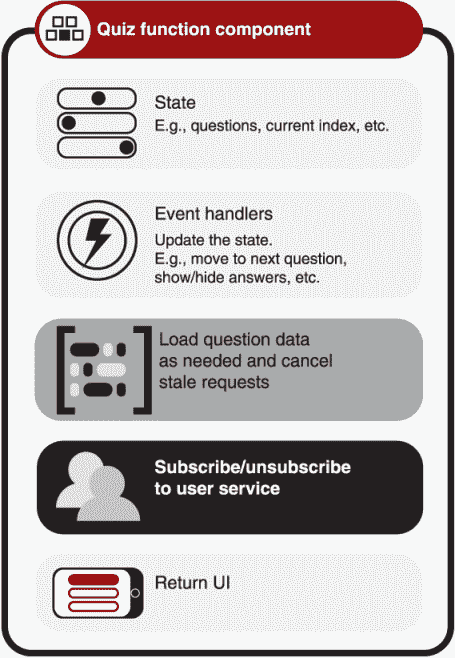

图 1.9 一个具有状态和封装了加载数据以及管理服务订阅的 `Quiz` 功能组件

该图展示了执行了几个副作用的 `Quiz` 组件：

+   它加载自己的问题数据——包括初始数据和当用户选择新的问题集时的新问题。

+   它订阅用户服务——该服务提供有关当前在线的其他 quiz 用户的更新，以便用户可以加入团队或挑战对手。

在 JavaScript 中，函数可以包含其他函数，因此组件可以包含响应用户与 UI 交互的事件处理器，例如显示、隐藏或提交答案，或移动到下一个问题。在组件内部，你可以轻松封装副作用，如获取问题数据或订阅用户服务。你还可以包括清理代码以取消任何未完成的数据获取并从用户服务取消订阅。使用钩子，这些功能甚至可以提取到组件外部的函数中，以便重用或共享。

下面是使用新的函数组件方法而不是旧的基于类的方法的某些结果：

+   代码更少

+   代码组织更好，相关代码与任何清理代码一起保持在一起

+   将功能提取到外部函数中，以便重用和共享

+   更容易测试的组件

+   在类构造函数中不需要调用`super()`函数

+   不需要与`this`和绑定处理器一起工作

+   更简单的生命周期模型

+   处理器、副作用函数和返回的 UI 作用域内的本地状态

列表中的所有项目都有助于编写更易于理解的代码，因此更容易使用和维护。这并不是说细微差别可能不会让第一次使用新方法的开发者感到困惑，但当我们深入探讨每个概念及其在本书中各部分之间的联系时，我会突出这些细微差别。

《*React Hooks in Action*》概述了组件构建的函数式方法，而不是使用类。但有时将新方法与旧方法进行比较是有意义的，以激发采用并因为看到差异很有趣（在钩子的情况下，这有点酷！）。如果你是 React 的新手，从未见过类组件的代码，请不要担心。请放心，本书余下的部分我们将使用函数组件作为首选方法。以下讨论应该仍然能让你了解这种新方法如何简化并组织创建 React 组件所需的代码。

本节的标题是“有状态的函数组件：更少的代码，更好的组织。”比什么更好？嗯，使用类组件时，状态是在构造函数中设置的，事件处理器绑定到`this`，副作用代码分散在多个生命周期方法（`componentDidMount`、`componentWillUnmount`、`componentWillUpdate`等）中。在生命周期方法中，与不同效果和功能相关的代码通常并排放置。你可以在图 1.10 中看到`Quiz`类组件代码如何跨方法分割，以及某些方法如何包含两个任务的代码混合。

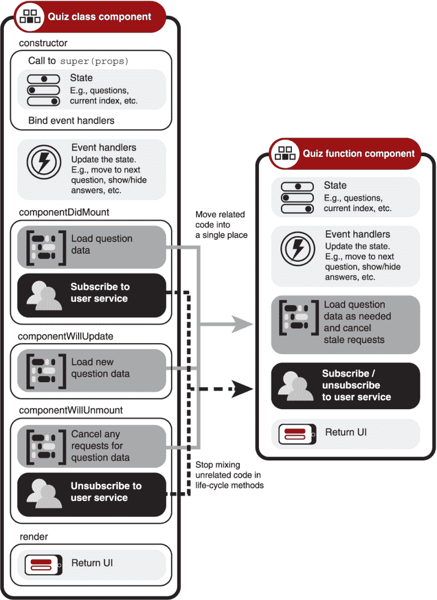

图 1.10 一个代码分布在生命周期方法中的类组件，以及具有相同功能但代码更少、更有组织的函数组件

带有钩子的函数组件不再需要所有生命周期方法，因为效果可以被封装到钩子中。这种变化导致了更整洁、更有组织的代码，如图 1.10 中的 `Quiz` 函数组件所示。代码已经被更合理地组织，两个副作用被分开，并且每个效果的相关代码都集中在一个地方。这种改进的组织使得查找特定效果代码、了解组件的工作方式以及未来维护它变得更加容易。实际上，将功能或效果的代码放在一个地方使得将其提取为外部函数变得更加容易，这正是我们接下来要讨论的。

### 1.3.2 自定义钩子：更简单的代码重用

带有钩子的函数组件鼓励你将相关的副作用逻辑放在一个地方。如果副作用是许多组件都需要的功能，你可以进一步组织代码，将其提取到自己的外部函数中；你可以创建所谓的 *自定义钩子*。

图 1.11 展示了如何将 `Quiz` 功能组件的题目加载和用户服务订阅任务移动到它们自己的自定义钩子中。任何仅用于这些任务的任何状态都可以移动到相应的钩子中。

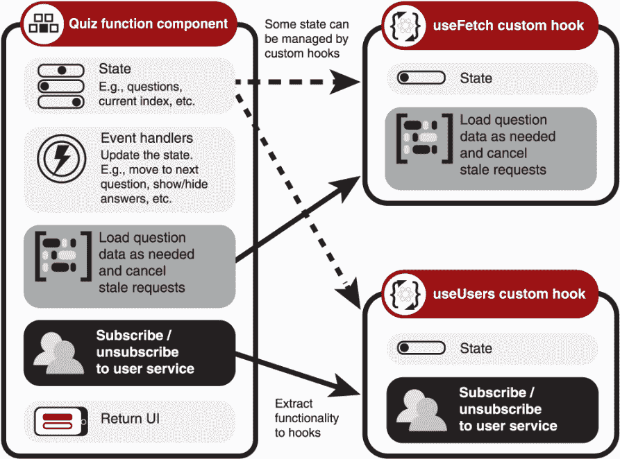

图 1.11 获取问题数据和订阅用户服务的代码可以提取到自定义钩子中。相关的状态也可以由钩子管理。

这里没有魔法；这只是函数在 JavaScript 中通常工作的方式：函数从组件中提取出来，然后从组件中调用。一旦你有了自定义钩子，你就不再局限于从原始组件中调用它。你可以在许多组件中使用它，与你的团队共享，或者发布供他人使用。

图 1.12 展示了使用 `useUsers` 自定义钩子和 `useFetch` 自定义钩子实现的新超级瘦 `Quiz` 功能组件，它执行了之前由自身独立完成的用户服务订阅和问题获取任务。但现在，第二个组件 `Chat` 也开始使用 `useUsers` 自定义钩子。钩子在 React 中使得这种功能共享变得更加容易；自定义钩子可以在你的应用程序组合中任何需要的地方导入和使用。

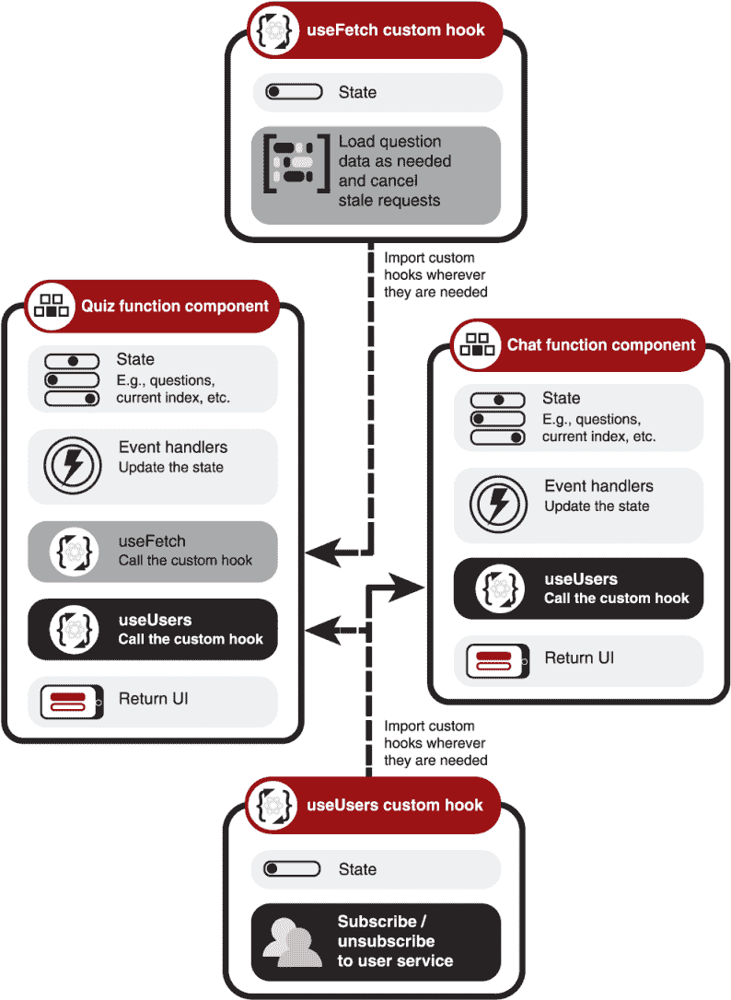

图 1.12 你可以将代码提取到自定义钩子中以实现重用和共享。`Quiz` 组件调用 `useUsers` 和 `useFetch` 钩子。`Chat` 组件调用 `useUsers` 钩子。

每个自定义钩子都可以维护自己的状态，无论它需要执行什么任务。由于钩子只是函数，如果组件需要访问钩子的任何状态，钩子可以将状态包含在其返回值中。例如，一个用于为指定 ID 获取用户信息的自定义钩子可以本地存储获取到的用户数据，但将其返回给调用钩子的任何组件。每个钩子调用都封装了自己的状态，就像任何其他函数一样。

要了解程序员如何轻松地将常见任务抽象为自定义钩子的多样性，请查看[`usehooks.com`](https://usehooks.com)网站（图 1.13）。

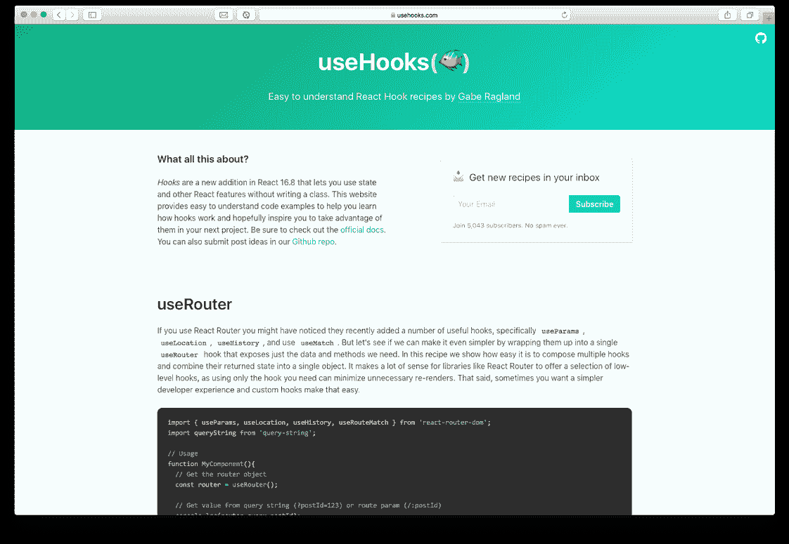

图 1.13 useHooks 网站有许多自定义钩子的示例。

它展示了易于使用的配方，包括以下内容：

+   `useRouter`—包装 React Router 提供的新的钩子

+   `useAuth`—允许任何组件获取当前的认证状态，并在状态改变时重新渲染

+   `useEventListener`—抽象了向组件添加和删除事件监听器的过程

+   `useMedia`—使在组件逻辑中使用媒体查询变得容易

在自己实现钩子之前，在 useHooks 或 npm 等包仓库网站上研究是否存在适合您用例的钩子是非常值得的。如果您已经使用了用于常见场景（如数据获取或状态管理）的库或框架，请检查最新版本，看看它们是否引入了钩子以简化使用。我们将在下一节中查看一些这样的包。

### 1.3.3 第三方钩子提供现成的、经过良好测试的功能

在组件之间共享功能并非新事物；它已经是一段时间内 React 开发的一个基本组成部分。钩子提供了一种比旧方法（如高阶组件和渲染属性）更干净的方式来共享代码和连接到功能，后者往往导致高度嵌套的代码（“包装地狱”）和虚假的代码层次结构。

与 React 一起工作的第三方库迅速发布了新版本，充分利用了钩子更简单的 API 和更直接的集成方法。我们将在本节中简要介绍三个示例：

+   React Router 用于页面导航

+   Redux 作为应用程序数据存储

+   React Spring 用于动画

React Router

*React Router* 提供了组件，帮助开发者管理他们应用中页面之间的导航。它的自定义钩子使得访问导航中涉及的常见对象变得容易：`useHistory`、`useLocation`、`useParams` 和 `useRouteMatch`。例如，`useParams` 允许访问页面 URL 中匹配的任何参数：

```
URL:     /quiz/:title/:qnum
Code:    const {title, qnum} = useParams();
```

Redux

对于某些应用程序，可能需要一个单独的状态存储。Redux 是创建此类存储的流行库，通常与 React Redux 库结合使用。自 7.1 版本以来，React Redux 提供了钩子，使与存储的交互更加容易：`useSelector`、`useDispatch` 和 `useStore`。例如，`useDispatch` 允许你向存储发送一个动作来更新状态。假设你有一个用于构建测验问题集的应用程序，并且你想添加一个问题：

```
const dispatch = useDispatch();
dispatch({type: "add question", payload: /* question data */});
```

新的自定义钩子消除了与将 React 应用程序连接到 Redux 存储相关的部分样板代码。React 还有一个内置的钩子 `useReducer`，它可能提供了一个更简单的模型来分发动作以更新状态，并在某些情况下消除对 Redux 的感知需求。

React Spring

React Spring 是一个基于 Spring 的动画库，目前提供了五个钩子来访问其功能：`useSpring`、`useSprings`、`useTrail`、`useTransition` 和 `useChain`。例如，要在这两个值之间进行动画，你可以选择 `useSpring`：

```
const props = useSpring({opacity: 1, from: {opacity: 0}});
```

React Hooks 使得库作者能够为开发者提供更简单的 API，这些 API 不会在他们的代码中引入可能深度嵌套的虚假组件层次结构。同样，React 的其他几个新特性，如并发模式和 Suspense，使库作者和应用程序开发者能够更好地管理代码中的异步过程，并提供更平滑、更响应式的用户体验。

## 1.4 并发模式和 Suspense 提供更好的用户体验

我们希望为用户提供出色的体验，帮助他们顺畅愉快地与我们的应用程序互动。这可能意味着他们在生产力应用程序中完成工作，在社交平台上与朋友联系，或者在游戏中捕捉到一个晶体。无论他们的目标是什么，我们设计和编写的界面应该是达到目的的手段，而不是障碍。但是，我们的应用程序可能需要加载大量代码，获取大量数据，并尝试操纵数据以提供用户所需的信息，即使他们在快速切换视图时也是如此，滚动、点击和触摸。

React 在 16 和 17 版本中的重写大部分动机是为了构建一个架构，以应对用户界面在加载和处理数据时面临的多种需求，同时用户继续与应用程序交互。并发模式是这一新架构的核心部分，`Suspense` 组件自然地适应了这种新模式。但它们解决了哪些问题？

假设你有一个应用程序，它在一个长列表中显示产品，并有一个文本框，用户可以在其中输入以过滤列表。当用户输入时，应用程序会更新列表。每个按键都会触发代码重新过滤列表，需要 React 将更新的列表组件绘制到屏幕上。昂贵的过滤过程、重新计算和更新 UI 占用了处理时间，降低了文本框的响应性。用户的体验就像是一个滞后、缓慢的文本框，不会显示用户输入的文字。图 1.14，虽然显然不是浏览器可能调度代码运行的完美表示，但它说明了长时间运行的操作可能会减慢屏幕更新，从而使用户体验变差。

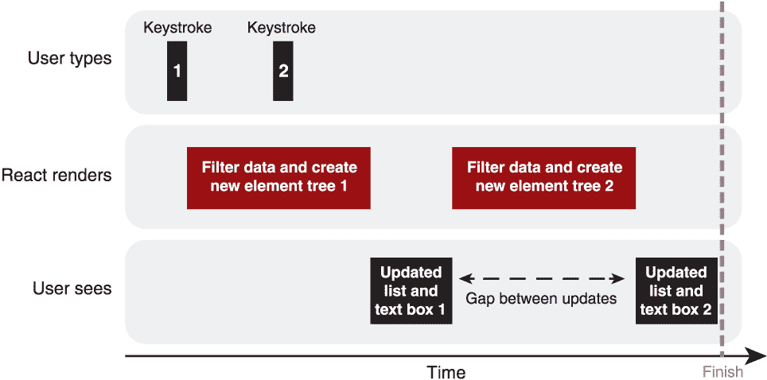

图 1.14 没有并发模式时，像按键这样的交互会被长时间运行的更新所阻塞。

如果应用程序能够优先处理文本框更新并保持用户体验平滑，暂停和重新启动围绕输入的过滤任务，那岂不是很好？欢迎来到并发模式！

### 1.4.1 并发模式

在 *并发模式* 下，React 可以以更细粒度的方式调度任务，暂停构建元素、检查差异和更新前一个状态的 DOM，以确保它能够响应用户交互，例如。在前面的过滤应用程序示例中，React 可以暂停渲染过滤列表，以确保用户输入的文字出现在文本框中。

那么并发模式是如何实现这种魔法的呢？新的 React 架构将任务分解成更小的单元工作，为浏览器或操作系统提供常规的点，以便通知应用程序用户正在尝试与之交互。React 的调度器可以根据每个任务的优先级来决定执行哪些任务。对组件树的一部分进行协调和提交更改可以暂停或放弃，以确保优先级更高的组件首先更新，如图 1.15 所示。

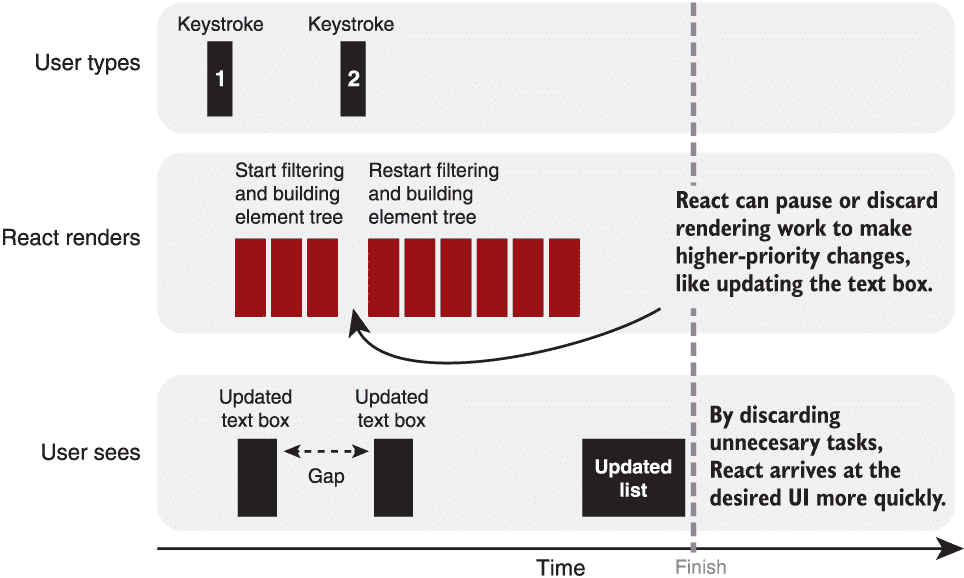

图 1.15 在并发模式下，React 可以暂停较长时间运行的更新，以便快速响应用户交互。

不仅用户交互可以从这种智能调度中受益；对传入数据的响应、懒加载的组件或媒体，或其他异步过程也可以享受到更平滑的用户界面升级。React 可以在内存中渲染更新状态的 UI 时继续显示一个完全交互的现有 UI（而不是旋转器），当足够多的 UI 准备就绪时，切换到新的 UI。并发模式启用了一组新的钩子，`useTransition` 和 `useDeferredValue`，这些钩子可以改善用户体验，平滑从一个视图到另一个视图或从一个状态到另一个状态的转换。它还与 `Suspense` 一起使用，`Suspense` 既是渲染回退内容的组件，也是指定组件正在等待某些内容（如加载数据）的机制。

### 1.4.2 悬疑

正如你所见，React 应用程序是由组件按层次结构构建的。为了在屏幕上显示您应用程序的当前状态（例如使用 DOM），React 遍历您的组件并在内存中创建*元素树*，即预期 UI 的描述。它将最新的树与之前的树进行比较，并智能地决定需要做出哪些 DOM 更新来实现预期的 UI。并发模式允许 React 暂停处理元素树的一部分，要么是为了处理更高优先级任务，要么是因为当前组件尚未准备好被处理。

建造用来与`Suspense`一起工作的组件现在可以*挂起*，如果它们还没有准备好返回它们的 UI（记住，组件要么是函数，要么有渲染方法，并将属性和状态转换为 UI）。它们可能正在等待组件代码、资源或数据加载，但还没有它们需要完全描述 UI 所需的信息。React 可以暂停挂起组件的处理，并继续遍历元素树。但在屏幕上看起来会怎样？你的用户界面会出现漏洞吗？

除了为组件指定挂起机制外，React 还提供了一个`Suspense`组件，您可以使用它来填补挂起组件在您的用户界面中留下的空缺。将您的 UI 部分包裹在`Suspense`组件中，并使用它们的`fallback`属性让 React 知道如果被包裹的组件之一挂起，应该显示什么内容：

```
<Suspense fallback={<MySpinner />}>
   <MyFirstComponent />
   <MySecondComponent />
</Suspense>
```

`Suspense`允许开发者故意管理多个组件的加载状态，无论是为单个组件、组件组还是整个应用程序显示回退内容。它为库作者提供了一个机制来更新他们的 API 以与`Suspense`组件一起工作，这样他们的异步功能就可以充分利用`Suspense`提供的加载状态管理。

## 1.5 React 的新发布渠道

为了使应用程序开发者和库作者能够充分利用生产中的稳定功能，同时为即将到来的功能做准备，React 团队已经开始在单独的渠道发布代码：

+   *最新版*—稳定的 semver 发布

+   *下一个*—追踪 React 开发的 master 分支

+   *实验性*—包括实验性 API 和功能

对于生产环境，开发者应该坚持使用最新版本；这是当你从 npm（或其他包管理器）安装 React 时获得的那一个。在撰写本文时，大部分并发模式和用于数据获取的 Suspense 都处于实验频道。它们正在开发中，但 API 的变化可能会发生。React 和 Relay（用于数据获取）团队已经在新 Facebook 网站上使用了许多实验性功能一段时间了。这种积极的使用使它们能够对新的方法在具体环境和规模上进行深入理解。通过尽早开放对新功能的讨论并在实验频道提供这些功能，React 团队使得库作者能够测试集成和新 API，以及应用开发者开始适应新的思维方式和细微差别。

## 1.6 这本书是为谁而写的？

这本书是为想要了解 React 最新特性的经验丰富的 JavaScript 开发者而写的。它专注于 React Hooks、并发模式和 Suspense，使用大量的代码示例来帮助你快速掌握这些特性，并准备好在自己的项目中使用它们（尽管目前这些特性可能还无法在生产环境中使用）。除了提供简单实用的示例外，本书还会花一些时间深入探讨一些特性的背后的推理以及开发者应该注意的细微差别。

这本书并不是对 React 整体介绍的入门书籍，也不会详细涵盖 React 生态系统、构建工具、样式或测试。读者应该对 React 的基本概念有所了解，并且能够创建、构建和运行一个 React 应用程序。本书偶尔会使用类组件示例来与新的函数组件方法进行比较，但不会深入教授基于类的编程方法、高阶组件或渲染属性。（如果你不熟悉所有这些术语，不用担心；你不需要了解它们来学习新概念。）

读者应该熟悉一些较新的 JavaScript 语法添加，如`const`和`let`，对象和数组解构，默认参数，扩展运算符以及数组方法如`map`、`filter`和`reduce`。一些与类组件的比较显然会使用 JavaScript 的类语法，因此熟悉这一点会有所帮助，但不是必需的。

## 1.7 开始学习

书中主要示例，一个预订应用，的代码示例在 GitHub 上，网址为[`github.com/jrlarsen/react-hooks-in-action`](https://github.com/jrlarsen/react-hooks-in-action)，并且可以从 Manning 网站的书页上下载（[www.manning.com/books/react-hooks-in-action](http://www.manning.com/books/react-hooks-in-action)）。示例应用开发的每个步骤都在单独的 Git 分支上，书中的代码列表包括了相关分支的名称。更小的、独立的 React 示例托管在 CodeSandbox 上（[`codesandbox.io`](https://codesandbox.io)），以及一些简单的纯 JavaScript 示例在 JS Bin 上（[`jsbin.com`](https://jsbin.com)）。与沙盒和 Bin 相关的链接将伴随书中的列表。

## 摘要

+   使用 React 创建可重用的组件，通过将状态转换为 UI 来构建应用。

+   使用 JSX 和 props 以类似 HTML 的语法描述 UI。

+   创建函数组件，将相关的代码和功能集中在一起。

+   使用 React Hooks 来封装和共享组件的功能，执行副作用，以及钩入组件的生命周期中的时刻。

+   创建你自己的自定义钩子，并使用第三方库提供的钩子。

+   使用`Suspense`组件为需要时间返回其 UI 的组件提供后备。

+   探索实验性的并发模式，以在内存中处理多个版本的 UI，使得在状态变化时从一个界面平滑过渡到另一个界面变得更加容易。

+   注意 React 的三个发布渠道：最新版、下个版本和实验版。

+   查阅 React 官方文档，网址为[`reactjs.org`](https://reactjs.org)。
