# 2 使用 useState 钩子管理组件状态

本章涵盖

+   通过调用`useState`请求 React 管理组件状态值

+   使用更新函数更改状态值并触发重新渲染

+   使用前一个状态来帮助生成新的状态值

+   管理多个状态值

+   考虑 React 和组件如何交互以持久化和更新状态以及同步状态和 UI

如果你正在构建 React 应用程序，你期望应用程序使用的数据会随时间变化。无论是完全服务器渲染、移动应用，还是全部在浏览器中，应用程序的用户界面应该表示渲染时的当前数据，或*状态*。有时应用程序中的多个组件会使用这些数据，有时一个组件不需要分享其秘密，可以独立管理其状态，而不需要巨无霸级的应用级状态存储器的帮助。在本章中，我们将关注个人化，专注于自我管理的组件，而不考虑周围的其他组件。

图 2.1 是一个非常基本的 React 工作原理的说明：它应该使用当前状态来渲染 UI。如果状态发生变化，React 应该重新渲染 UI。插图显示了一个友好的消息中的名称。当名称值发生变化时，React 更新 UI 以显示消息中的新名称。我们通常希望状态和 UI 保持同步（尽管我们可能选择在状态转换期间延迟同步——例如在获取最新数据时）。

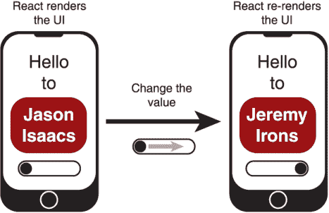

图 2.1 当你在组件中更改一个值时，React 应该更新 UI。

React 提供了一些函数，或*钩子*，以使其能够跟踪组件中的值并保持状态和 UI 同步。对于单个值，React 提供了`useState`钩子，这也是我们在本章中要探索的钩子。

我们将探讨如何调用钩子，它返回什么，以及如何使用它来更新状态，触发 React 更新 UI。组件通常需要多个状态值来完成其工作，因此我们将看到如何多次调用`useState`来处理多个值。这不仅仅是记录`useState`API（你可以去官方 React 文档中查看）。我们将通过讨论`useState`钩子来帮助你更好地理解函数组件是什么以及它们是如何工作的。为此，我们将以回顾我们在代码列表中遇到的关键概念来结束本章。

说到代码列表，在本章中，我们将开始构建将在整本书中作为主要示例的应用程序。这个例子作为一个一致的上下文，我们使用 React Hooks 来解决常见的编码问题。设置应用程序需要一点家务管理，但一旦完成，我们就能专注于本章剩余部分的单个组件。

## 2.1 设置预订管理器应用程序

您的有趣而专业的公司拥有众多资源，员工可以预订：会议室、视听设备、技术人员时间、桌球，甚至派对用品。有一天，老板要求您为公司网络搭建一个应用程序的框架，让员工可以预订这些资源。该应用程序应包含三个页面，用于预订、可预订资源和用户，如图 2.2 所示。（技术上，它是一个单页应用程序，页面实际上是组件，但我们仍将它们称为“页面”，因为从用户的角度来看，他们是在页面之间切换。）

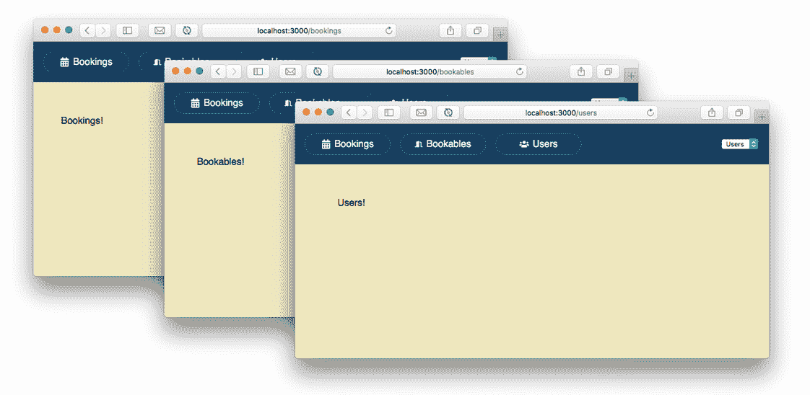

图 2.2 预订应用程序有三个页面：预订、可预订资源和用户。

到本节结束时，您将能够显示每个页面，并使用链接在它们之间导航。本节末尾的项目文件夹将包括类似于图 2.3 所示的 public 和 src 文件夹。

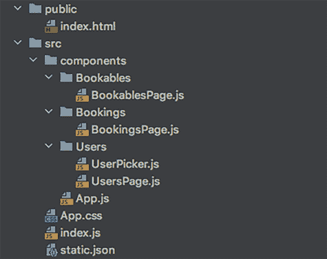

图 2.3 初始设置后的 public 和 src 文件夹

您可以看到组件文件夹内的子文件夹如何对应于三个页面。为了使应用程序达到图中的形状，我们共有六个任务要做：

1.  使用`create-react-app`为我们的预订应用程序生成框架。

1.  删除我们将不会使用的`create-react-app`生成的文件。

1.  编辑 public 和 src 文件夹中剩余的四个文件。

1.  安装一些来自 npm 的包。

1.  添加一个数据库文件，为应用程序提供一些要显示的数据。

1.  为每个页面创建子文件夹，并将页面组件放入其中。

或者，您可以在 GitHub 上找到正在进行的预订示例应用程序的代码示例，网址为[`github.com/jrlarsen/react-hooks-in-action`](https://github.com/jrlarsen/react-hooks-in-action)，为代码的每次演变设置了分支。每个示例应用程序的列表都包括要检出分支的名称，并在电子书中链接到 GitHub 存储库。例如，在您克隆存储库后，要获取第一个分支的代码，请输入以下命令：

```
git checkout 0201-pages
```

使用以下命令安装项目依赖项：

```
npm i
```

使用以下命令运行项目：

```
npm start
```

然后，您可以跳转到第 2.2 节。

对于那些想从零开始构建大部分应用程序的人来说，我们首先需要的是一个 React 应用程序。

### 2.1.1 使用 create-react-app 生成应用程序框架

React 的`create-react-app`实用工具会生成具有预设的 linting 和编译工作流程的项目。它还附带了一个开发服务器，这对于我们在应用程序不断演变的各个阶段工作来说非常完美。让我们使用`create-react-app`来生成一个名为`react-hooks-in-action`的新 React 项目。在运行之前，我们不需要使用 npm 安装`create-react-app`；我们可以通过使用`npx`命令从其存储库运行它：

```
npx create-react-app react-hooks-in-action
```

命令执行需要一些时间，您最终会在 react-hooks-in-action 文件夹中获得大量生成的文件。当我运行 `create-react-app` 命令时，我的电脑使用 npm 安装文件。如果您已安装 Yarn，`create-react-app` 将使用 Yarn，您将获得 yarn.lock 文件而不是 package-lock.json。（`npx` 是当您安装 npm 时包含的一个方便的命令。它的作者 Kat Marchán 在 Medium 文章“Introducing npx”中解释了其背后的思考，见 [`mng.bz/RX2j.`](https://shortener.manning.com/RX2j)）

我们不需要为我们的应用程序安装的所有文件，所以让我们快速删除几个。从 react-hooks-in-action 文件夹内的公共文件夹中，删除除 index.html 之外的所有文件。从 src 文件夹中，删除除 App.css、App.js 和 index.js 之外的所有文件。图 2.4 突出了需要删除的文件。

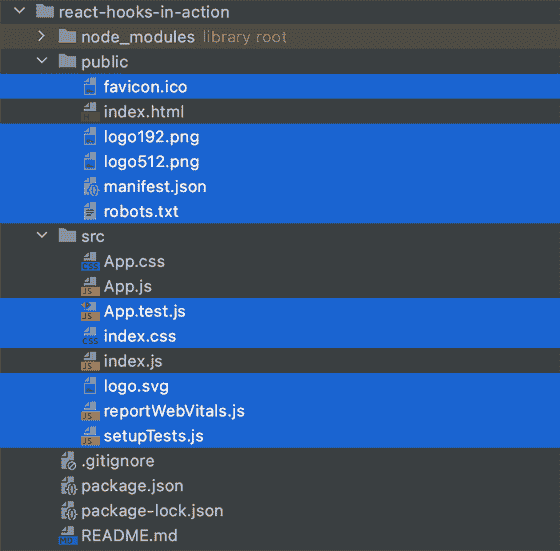

图 2.4 我们的项目不需要 `create-react-app` 生成的许多默认文件。

图 2.5 显示了在公共和 src 文件夹中留下的四个主要文件。我们使用它们来运行我们的应用程序，导入我们在本书中构建的组件。

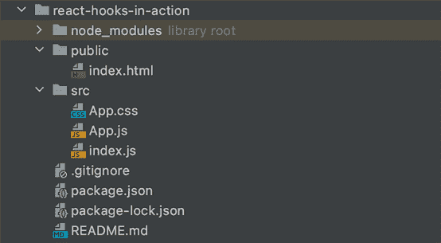

图 2.5 我们需要在公共和 src 文件夹中设置的四个文件

这四个文件是为 React 的演示页面设置的，而不是我们的预订应用程序。是时候进行一些调整了。

### 2.1.2 编辑四个关键文件

我们的小工作马文件将使应用程序启动并运行。让我向您介绍一下：

+   /public/index.html——包含应用程序的网页

+   /src/App.css——用于在页面上组织元素的样式

+   /src/components/App.js——包含所有其他组件的根组件

+   /src/index.js——导入 `App` 组件并将其渲染到 index.html 页面的文件

index.html

在公共文件夹内，编辑 index.html 文件。`create-react-app` 生成的许多样板代码可以删除。具有 `id` 为 `root` 的 `div` 元素必须保留；它是应用程序的容器元素。React 将将 `App` 组件渲染到该 `div` 中。您还可以设置页面的标题，如下所示。

分支：0201-pages，文件：/public/index.html

列表 2.1 预订应用程序的 HTML 骨架

```
<!DOCTYPE html>
<html lang="en">
  <head>
    <meta charset="utf-8" />
    <meta name="viewport" content="width=device-width, initial-scale=1" />
    <title>Bookings App</title>      ❶
  </head>
  <body>
    <div id="root"></div>            ❷
  </body>
</html>
```

❶ 设置页面的标题。

❷ 确保有一个具有 id 为 root 的 div。

这就是我们网页所需的所有内容。`App` 组件将出现在 `div` 中，而我们所有的其他组件——包括可预订项目、预订、用户及其单独的页面——将由 `App` 组件管理。

App.css

本书并非旨在教你层叠样式表（CSS），因此它不会专注于样式列表。有时，CSS 将与组件中的事件（例如加载数据时）结合使用，相关样式将在这些时刻突出显示。样式表将随着时间的推移而发展，因此，如果你感兴趣，请查看仓库。初始样式可以在 *分支*：0201-pages，*文件*：/src/App.css 中找到。（如果你对整个项目中 CSS 的发展不感兴趣，但想与 JavaScript 一起编码，只需从完成的项目中获取 App.css 文件即可。）

样式使用 CSS 网格属性定位每个页面上的主要组件，并使用一些 CSS 变量定义文本和背景的常用颜色。

App.js

`App` 组件是我们应用程序的根组件。它显示带有其链接和用户选择器下拉菜单的页眉，如图 2.6 所示。


图 2.6 带有三个链接和一个下拉列表的页眉

`App` 组件还设置了通往三个主要页面的路由，如列表 2.2 所示。通过将 URL 与页面组件匹配，路由器向用户显示适当的页面。App.js 文件已移动到新的组件文件夹中。它导入了一些我们在本章后面创建的组件。

分支：0201-pages，文件：/src/components/App.js

列表 2.2 `App` 组件

```
import {                                                                ❶
  BrowserRouter as Router,                                              ❶
  Routes,                                                               ❶
  Route,                                                                ❶
  Link                                                                  ❶
} from "react-router-dom";                                              ❶

import "../App.css";

import {FaCalendarAlt, FaDoorOpen, FaUsers} from "react-icons/fa";      ❷

import BookablesPage from "./Bookables/BookablesPage";                  ❸
import BookingsPage from "./Bookings/BookingsPage";                     ❸
import UsersPage from "./Users/UsersPage";                              ❸
import UserPicker from "./Users/UserPicker";                            ❸

export default function App () {
  return (
    <Router>                                                            ❹
      <div className="App">
        <header>
          <nav>
            <ul>
              <li>
                <Link to="/bookings" className="btn btn-header">        ❺
                  <FaCalendarAlt/>                                      ❺
                  <span>Bookings</span>                                 ❺
                </Link>                                                 ❺
              </li>
              <li>
                <Link to="/bookables" className="btn btn-header">       ❻
                  <FaDoorOpen/>
                  <span>Bookables</span>
                </Link>
              </li>
              <li>
                <Link to="/users" className="btn btn-header">
                  <FaUsers/>                                            ❼
                  <span>Users</span>
                </Link>
              </li>
            </ul>
          </nav>

          <UserPicker/>                                                 ❽
        </header>

        <Routes>                                                        ❾
          <Route path="/bookings" element={<BookingsPage/>}/>           ❿
          <Route path="/bookables" element={<BookablesPage/>}/>         ⓫
          <Route path="/users" element={<UsersPage/>}/>                 ⓬
        </Routes>
      </div>
    </Router>
  );
}
```

❶ 从 react-router-dom 导入路由元素。

❷ 导入导航链接的图标。

❸ 导入单独的页面组件和 UserPicker 组件。

❹ 将应用包裹在 Router 组件中以启用路由。

❺ 与 Router 一起使用 Link 组件。

❻ 使用“to”属性指定链接的地址。

❼ 使用导入的图标装饰链接。

❽ 将 UserPicker 放在页眉中。

❾ 将 Route 组件的集合包裹在 Routes 组件中。

❿ 为每个要匹配的路径使用一个 Route。

⓫ 将路径匹配到特定的页面组件。

⓬ 指定要显示的匹配路径的组件。

注意，列表顶部没有 `import` `React` `from` `"react"`。React 组件过去需要这一行才能在 JSX 转换为常规 JavaScript 时正常工作。但是，像 `create-react-app` 这样的编译 React 的工具可以在 React 最新版本中转换 JSX，而无需导入语句。关于这一变化，请参阅 React 博客（[`mng.bz/2ew8`](https://shortener.manning.com/2ew8)）。

该应用使用 React Router 版本 6 来管理其三个页面的显示。在撰写本文时，React Router 6 是通过 React Router 的 Next 频道提供的测试版。安装方法如下：

```
npm i history react-router-dom@next
```

在其 GitHub 页面 ([`github.com/ReactTraining/react-router`](https://github.com/ReactTraining/react-router)) 上了解更多关于 React Router 的信息。我们使用 `Link` 组件在标题中显示页面链接，并使用 `Route` 元素根据匹配的 URL 有条件地显示页面组件。例如，如果用户访问 /bookings，则显示 `BookingsPage` 组件：

```
<Route path="/bookings" element={<BookingsPage/>}/>
```

目前，你不需要担心 React Router；它只是管理链接和页面组件的显示。我们将在第十章中使用它提供的自定义钩子来访问匹配的 URL 和查询字符串参数，那时我们会更多地使用它。

如图 2.7 所示，我们已经用 Font Awesome ([`fontawesome.com`](https://fontawesome.com/)) 的图标装饰了标题链接。


图 2.7 标题栏中每个链接旁边都有 Font Awesome 图标。

这些图标作为 react-icons 包的一部分提供，因此我们需要安装该包：

```
npm i react-icons
```

react-icons 的 GitHub 页面 ([`github.com/react-icons/react-icons`](https://github.com/react-icons/react-icons)) 包含了包中可用的图标集的详细信息，以及相关许可信息的链接。

`App` 组件还导入了三个页面组件—`BookablesPage`、`BookingsPage` 和 `UsersPage`—以及 `UserPicker` 组件。我们在 2.1.4 节中创建了这些组件。

index.js

React 需要一个 JavaScript 文件作为应用程序的起点。在 src 文件夹中，编辑 index.js 文件，使其看起来如下所示。它导入了 `App` 组件并将其渲染到 listing 2.1 中 index.html 文件中看到的根 `div` 中。

分支：0201-pages，文件：/src/index.js

列表 2.3 顶级 JavaScript 文件

```
import ReactDOM from "react-dom";
import App from "./components/App";    ❶

ReactDOM.render(
 <App />,                             ❷
  document.getElementById("root")      ❸
);
```

❶ 导入 App 组件。

❷ 指定 App 作为要渲染的组件。

❸ 指定渲染 App 组件的位置。

这样，四个现有的文件就调整好了！我们仍然需要为 `App` 组件创建页面组件以及用于标题的 `UserPicker` 下拉菜单。首先，应用需要一些可预订项和用户来显示。让我们给它一些数据。

### 2.1.3 为应用程序添加数据库文件

我们的应用程序需要几种类型的数据，包括用户、可预订项和预订。我们首先从单个 JavaScript 对象表示法 (JSON) 文件 static.json 中导入所有数据。我们只需要在列表中显示一些可预订项和用户，所以初始数据文件并不复杂，如下所示。（您可以通过访问指定的文件来复制 GitHub 上列表分支的数据。）

分支：0201-pages，文件：/src/static.json

列表 2.4 预订应用的数据结构

```
{
 "bookables": [ /* array of bookable objects */ ],  ❶

 "users": [ /* array of user objects */ ],     ❷

 "bookings": [],                                    ❸

 "sessions": [                                      ❹
    "Breakfast",
    "Morning",
    "Lunch",
    "Afternoon",
    "Evening"
  ],

 "days": [                                          ❺
    "Sunday",
    "Monday",
    "Tuesday",
    "Wednesday",
    "Thursday",
    "Friday",
    "Saturday"
  ]
}
```

❶ 将可预订项数据数组分配给 bookables 属性。

❷ 指定可以使用该应用的用户。

❸ 目前暂时不设置预订。

❹ 配置可用的会话。

❺ 配置星期几。

可预订数组中的每个元素都是一个类似以下的对象：

```
{
  "id": 3,
  "group": "Rooms",
  "title": "Games Room",
  "notes": "Table tennis, table football, pinball! Please tidy up!",
  "sessions": [0, 2, 4],
  "days": [0, 2, 3, 4, 5, 6]
}
```

可预订项目存储在一个包含可预订对象的数组中，分配给`bookables`属性。每个可预订项目都有`id`、`group`、`title`和`notes`属性。书籍代码仓库中的数据注释略长，但结构相同。每个可预订项目还指定了可以预订的天数和时段。

用户也以对象的形式存储，结构如下：

```
{
  "id": 1,
  "name": "Mark",
  "img": "user1.png",
  "title": "Envisioning Sculptor",
  "notes": "With the company for 15 years, Mark has consistently..."
}
```

可预订项目将由`BookablesPage`组件列出，用户将由`UsersPage`组件列出。我们最好把这些页面建好！

### 2.1.4 创建页面组件和 UserPicker.js 文件

随着我们对应用添加功能，我们使用组件来封装这些功能并展示使用 hooks 的技术。我们将我们的组件放在与它们所在的页面相关的文件夹中。在组件文件夹内创建三个新的文件夹，分别命名为 Bookables、Bookings 和 Users。对于骨架应用，创建三个与以下列表中类似的结构相同的占位符页面。将它们命名为`BookablesPage`、`BookingsPage`和`UsersPage`。

分支：0201-pages，文件：/src/components/Bookables/BookablesPage.js

列表 2.5 `BookablesPage`组件

```
export default function BookablesPage () {
  return (
    <main className="bookables-page">    ❶
      <p>Bookables!</p>
    </main>
  );
}
```

❶ 为每个页面分配一个类，以便 CSS 文件可以适当地设置页面样式。

我们通过以下列表中的`UserPicker`组件来完成应用设置的收尾工作。目前，它只是在下拉列表中显示单词“用户”。我们将在本章的后面用数据填充它。

分支：0201-pages，文件：/src/components/Users/UserPicker.js

列表 2.6 `UserPicker`组件

```
export default function UserPicker () {
  return (
    <select>
      <option>Users</option>
    </select>
  );
}
```

我们对预订应用上下文中的 hooks 进行持续探索的所有部件都已就绪。通过启动`create-react-app`开发服务器来测试它是否正常工作：

```
npm start
```

如果一切顺利，你可以在三个页面之间导航，每个页面都会向你喊出它的身份：可预订的！预订！用户！让我们通过显示数据库中的可预订项目来平息“可预订”页面。

## 2.2 使用 useState 存储、使用和设置值

你的 React 应用负责维护一定的状态：在用户界面中显示的值或帮助管理显示的内容。状态可能包括论坛上的帖子、那些帖子的评论以及是否显示评论等。当用户与应用交互时，他们会改变应用的状态。他们可能会加载更多帖子、切换评论的可见性，或者添加自己的评论。React 确保状态和 UI 保持同步。当状态改变时，React 需要运行使用该状态的组件。组件通过使用最新的状态值返回它们的 UI。React 将返回的 UI 与现有的 UI 进行比较，并高效地更新必要的 DOM。

一些状态在应用程序中共享，一些状态由几个组件共享，还有一些状态由组件本身本地管理。如果组件只是函数，它们如何跨渲染持久化其状态？它们的变量在执行完毕后不是丢失了吗？React 又是如何知道变量发生变化的？如果 React 忠实地试图匹配状态和 UI，它肯定需要知道状态的变化，对吧？

在调用组件时持久化状态并保持 React 在状态改变时处于循环中的最简单方法是使用`useState`钩子。`useState`钩子是一个函数，它请求 React 的帮助来管理状态值。当你调用`useState`钩子时，它返回最新的状态值以及一个用于更新值的函数。使用更新函数使 React 保持循环并让它完成其同步任务。

本节介绍了`useState`钩子，涵盖了为什么我们需要它以及如何使用它。特别是，我们查看以下内容：

+   为什么仅仅将值赋给变量不能让 React 完成其工作

+   `useState`如何返回一个值和一个用于更新该值的函数

+   为状态设置一个初始值，无论是直接作为值还是作为函数的懒加载

+   使用更新函数让 React 知道你想要更改状态

+   确保在调用更新函数时你有最新的状态，并且需要使用现有值来生成新值

这个列表可能看起来有点吓人，但`useState`钩子非常容易使用（你将大量使用它！），所以不要担心；我们只是在覆盖所有基础。在我们第一次调用`useState`之前，让我们看看如果我们只是尝试自己管理状态会发生什么。

### 2.2.1 将新值赋给变量不会更新 UI

图 2.8 显示了我们对`BookablesList`组件第一次尝试想要的结果：一个包含四个可预订房间的列表，并且选定了讲堂。

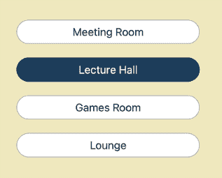

图 2.8 显示了`BookablesList`组件，其中突出显示了选中的房间列表

要显示房间列表，`BookablesList`组件需要获取列表的数据。它从我们的静态.json 数据库文件中导入数据。组件还需要跟踪当前选中的可预订项。列表 2.7 显示了组件的代码，通过将`bookableIndex`设置为`1`来硬编码房间选择。（*注意我们正在一个新的 Git 分支上；使用命令* `git checkout 0202-hard-coded` 切换到该分支。）

分支：0202-hard-coded，文件：/src/components/Bookables/BookablesList.js

列表 2.7 带有硬编码选择的`BookablesList`组件

```
import {bookables} from "../../static.json";                            ❶

export default function BookablesList () {

 const group = "Rooms";                                                ❷

 const bookablesInGroup = bookables.filter(b => b.group === group);    ❸

  const bookableIndex = 1;                                              ❹

  return (
    <ul className="bookables items-list-nav">
      {bookablesInGroup.map((b, i) => (                                 ❺
        <li
          key={b.id} 
          className={i === bookableIndex ? "selected" : null}           ❻
        >
          <button
            className="btn"
          >
            {b.title}
          </button>
        </li>
      ))}
    </ul>
  );
}
```

❶ 使用对象解构将可预订数据分配给一个局部变量。

❷ 设置要显示的可预订项组。

❸ 过滤可预订项以仅显示该组中的项。

❹ 硬编码选中可预订项的索引。

❺ 对可预订项进行映射以创建每个项的列表项。

❻ 通过比较当前索引和所选索引来设置类。

代码将来自静态.json 文件的图书可预约项数组分配给一个名为 `bookables` 的局部变量。我们本可以采取额外的步骤：

```
import data from "../../static.json";

const {bookables} = data;
```

但我们不需要其他任何数据，所以我们直接在导入中为 `bookables` 进行了赋值：

```
import {bookables} from "../../static.json";
```

这种 *解构* 方法是我们在这本书中经常使用的方法。

拥有图书可预约项数组后，我们过滤它以获取指定组中的那些图书可预约项：

```
const group = "Rooms";

const bookablesInGroup = bookables.filter(b => b.group === group);
```

`filter` 方法返回一个新数组，我们将它分配给 `bookablesInGroup` 变量。然后我们对 `bookablesInGroup` 数组进行映射以生成显示的图书可预约项列表。在映射函数中，我使用了简短的变量名，`b` 代表图书可预约项，`i` 代表索引，因为它们在分配后立即使用，并且靠近它们的分配位置。我认为它们的含义是清晰的，但你可能更喜欢更具描述性的变量名。

为了显示我们的新组件，我们需要将其连接到 `BookablesPage` 组件。以下列表显示了所需的两个更改。

分支：0202-hard-coded，文件：/src/components/Bookables/BookablesPage.js

列表 2.8 显示 `BookablesList` 的 `BookablesPage` 组件

```
import BookablesList from "./BookablesList";    ❶

export default function BookablesPage () {
  return (
    <main className="bookables-page">
      <BookablesList/>                          ❷
    </main>
  );
}
```

❶ 导入新的组件。

❷ 将占位文本替换为组件。

尝试更改 `BookablesList` 中的硬编码索引值。组件将始终突出显示具有指定索引的图书可预约项——到目前为止，一切顺利。但是，更改代码以更改突出显示的房间是很好的，但我们真正想要的是让用户通过点击图书可预约项来更改它，所以让我们为每个列表项按钮添加一个事件处理器。点击图书可预约项应该选择它，并且 UI 应该更新以突出显示所选项。以下列表包括一个 `changeBookable` 函数和一个调用它的 `onClick` 事件处理器。

分支：0203-direct-change，文件：/src/components/Bookables/BookablesList.js

列表 2.9 向 `BookablesList` 组件添加事件处理器

```
import {bookables} from "../../static.json";

export default function BookablesList () {
  const group = "Rooms";
  const bookablesInGroup = bookables.filter(b => b.group === group);

 let bookableIndex = 1;                        ❶

  function changeBookable (selectedIndex) {     ❷
 bookableIndex = selectedIndex;              ❷
    console.log(selectedIndex);                 ❷
 }                                             ❷

  return (
    <ul className="bookables items-list-nav">
      {bookablesInGroup.map((b, i) => (
        <li
          key={b.id}
          className={i === bookableIndex ? "selected" : null}          
        > 
          <button
            className="btn"
            onClick={() => changeBookable(i)}   ❸
          >
            {b.title}
          </button>
        </li>
      ))}
    </ul>
  );
}
```

❶ 使用 `let` 声明变量，因为它将被分配新的值。

❷ 声明一个函数，将点击的图书可预约项的索引分配给 `bookableIndex` 变量。

❸ 包含一个 `onClick` 处理器，将点击的图书可预约项的索引传递给 `changeBookable` 函数。

现在点击其中一个房间会将该房间的索引分配给 `bookableIndex` 变量。*瞧！* 哦。等等……如果你运行列表 2.9 中的代码并尝试点击不同的房间，你会看到突出显示没有改变。但是，代码 *确实* 更新了 `bookableIndex` 的值！你可以检查控制台以查看正在记录的索引。为什么新的选择没有显示在屏幕上？为什么 React 没有更新 UI？为什么人们总是忽略我？

没问题，深呼吸。记住，组件是返回 UI 的函数。React 调用这些函数以获取 UI 的描述。React 是如何知道何时调用函数并更新 UI 的呢？仅仅因为你在组件函数中更改了变量的值，并不意味着 React 会注意到。如果你想引起注意，你不能只是在心里对人说“你好，世界！”；你必须大声说出来。图 2.9 显示了在组件中直接更改值时会发生什么：React 没有注意到。它很快乐，吹着口哨，打磨着它的小玩意儿——UI 保持坚如磐石，没有变化。

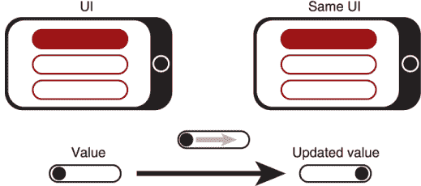

图 2.9 直接在我们的组件代码中更改变量不会更新 UI。

那么，我们如何吸引 React 的注意并让它知道它有工作要做？我们调用 `useState` 钩子。

### 2.2.2 调用 `useState` 返回一个值和一个更新函数

我们想通知 React，组件内使用的值已更改，以便它可以重新运行组件并更新 UI。仅仅直接更新变量是不够的。我们需要一种更改该值的方法，某种类型的更新函数，它可以触发 React 调用组件并使用新值获取更新的 UI，如图 2.10 所示。

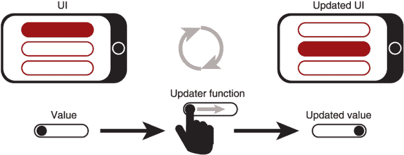

图 2.10 而不是直接更改一个值，我们调用一个更新函数。更新函数更改值，React 使用从组件重新计算的用户界面来更新显示。

为了避免组件代码运行完成后组件状态值消失，我们让 React 为我们管理这个值。这就是 `useState` 钩子的作用。每次 React 调用我们的组件以获取其 UI 时，组件都可以请求 React 提供最新的状态值和更新值的函数。组件可以在生成其 UI 时使用该值，并在更改值时使用更新函数，例如，在用户点击列表中的项目时。

如图 2.11 所示，调用 `useState` 返回一个值和其更新函数，包含两个元素的数组。

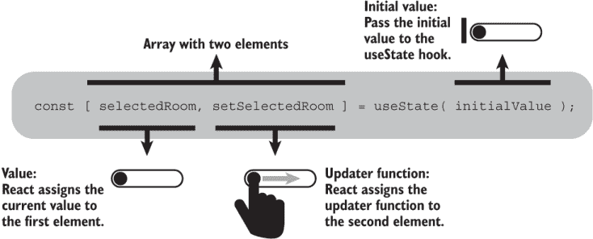

图 2.11 `useState` 函数返回一个包含两个元素的数组：一个值和一个更新函数。

您可以将返回的数组分配给一个变量，然后通过索引单独访问两个元素，如下所示：

```
const selectedRoomArray = useState();           ❶

const selectedRoom = selectedRoomArray[0];      ❷

const setSelectedRoom = selectedRoomArray[1];   ❸
```

❶ `useState` 函数返回一个数组。

❷ 第一个元素是值。

❸ 第二个元素是用于更新值的函数。

但更常见的是使用数组解构，并在一步中将返回的元素分配给变量：

```
const [selectedRoom, setSelectedRoom] = useState();
```

数组解构允许我们将数组中的元素分配给我们的变量。`selectedRoom` 和 `setSelectedRoom` 这些名称是任意选择的，虽然通常会将第二个元素（更新函数）的变量名以 `set` 开头。以下也是可行的：

```
const [myRoom, updateMyRoom] = useState();
```

如果你想为变量设置一个初始值，请将初始值作为参数传递给`useState`函数。当 React 首次运行你的组件时，`useState`将像往常一样返回一个两元素数组，但会将初始值分配给数组的第一个元素，如图 2.12 所示。

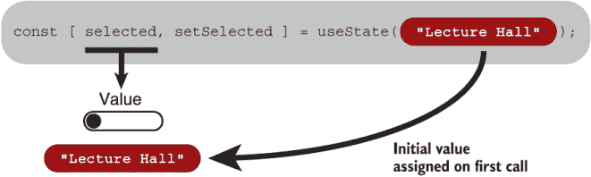

图 2.12 当组件首次运行时，React 将传递给`useState`的初始值分配给`selected`变量。

当以下代码行在组件中首次执行时，React 将返回数组中的第一个元素`Lecture Hall`作为值`Lecture Hall`。代码将该值分配给`selected`变量：

```
const [selected, setSelected] = useState("Lecture Hall");
```

让我们更新`BookablesList`组件，使用`useState`钩子请求 React 管理选定项索引的值。我们将其`1`作为初始索引传递。你应该看到当`BookablesList`组件首次出现在屏幕上时，演讲厅被突出显示，如图 2.13 再次所示。


图 2.13 选择演讲厅的`BookablesList`组件

下面的列表显示了组件的更新代码。它包括一个`onClick`事件处理程序，该处理程序使用分配给`setBookableIndex`的更新器函数在用户点击可预订项时更改选定的索引。

分支：0204-set-index，文件：/src/components/Bookables/BookablesList.js

列表 2.10 在更改选定房间时触发 UI 更新

```
import {useState} from "react";                                     ❶
import {bookables} from "../../static.json";

export default function BookablesList () { 
  const group = "Rooms";
  const bookablesInGroup = bookables.filter(b => b.group === group);
  const [bookableIndex, setBookableIndex] = useState(1);            ❷

  return (
    <ul className="bookables items-list-nav">
      {bookablesInGroup.map((b, i) => (
        <li
          key={b.id}
          className={i === bookableIndex ? "selected" : null}       ❸
        > 
          <button
            className="btn"
            onClick={() => setBookableIndex(i)}                     ❹
          >
            {b.title}
          </button>
        </li>
      ))}
    </ul>
  );
}
```

❶ 导入`useState`钩子。

❷ 调用`useState`并将返回的状态值和更新器函数分配给变量。

❸ 在生成 UI 时使用状态值。

❹ 使用更新器函数更改状态值。

React 运行`BookablesList`组件代码，从`useState`调用返回`bookableIndex`的值。组件使用该值在生成 UI 时为每个`li`元素设置正确的`className`属性。当用户点击可预订项时，`onClick`事件处理程序使用更新器函数`setBookableIndex`告诉 React 更新它所管理的值。如果值已更改，React 知道它将需要一个新版本的 UI。React 再次运行`BookablesList`代码，将更新的状态值分配给`bookableIndex`，让组件生成更新的 UI。React 可以比较新生成的 UI 与旧版本，并决定如何高效地更新显示。

使用`useState`，React 现在正在监听。我不再感到那么孤独了。它正在实现其保持状态与 UI 同步的承诺。`BookablesList`组件描述了特定状态下的 UI，并为用户提供了一种更改状态的方法。React 随后施展其魔法，检查新的 UI 是否与旧的不同（*diffing*），批量处理和安排更新，决定以高效的方式更新 DOM 元素，然后为我们代表执行操作并接触 DOM。我们专注于状态；React 执行 diffing 并更新 DOM。

挑战 2.1

创建一个`UsersList`组件，显示从数据库中获取的用户列表。启用用户选择，并将组件连接到`UsersPage`。（记住，如果你还没有这样做，你可以从应用的 GitHub 仓库中复制完整的数据库文件。）

挑战 2.2

更新`UserPicker`下拉列表组件，使其显示列表中的用户选项。现在不必担心连接任何事件处理程序。挑战任务在 0205-user-lists 分支中实现。

在列表 2.10 中，我们向`useState`传递了一个初始值`1`。当用户点击不同的可预订项时，该值会被另一个数字替换。如果我们想存储更复杂的东西，比如对象，作为状态，我们更新状态时就需要更加小心。让我们看看原因。

### 2.2.3 调用更新函数替换之前的状态值

如果你从 React 中基于类的组件构建方法转换过来，你习惯于状态是一个对象，具有不同属性的不同状态值。转换到函数组件时，你可能试图复制这种状态作为对象的方法。拥有一个单一的状态对象并且新的状态更新与现有状态合并可能感觉更自然。

但`useState`钩子易于使用且易于多次调用，一次用于每个你希望 React 监控的状态值。值得养成为每个状态属性单独调用`useState`的习惯，如第 2.4 节中进一步讨论的，而不是坚持熟悉的做法。如果你需要以对象作为状态值或想要将一些相关值组合在一起（比如长度和宽度），你应该意识到函数组件的更新函数`setState`与类组件中使用的`this.setState`的不同。在本节中，我们将简要探讨在两种组件类型中更新对象状态。

类组件方法

使用类时，你在构造函数（或类上的静态属性）中设置状态为一个对象：

```
class BookablesList extends React.Component {
  constructor (props) {
    super(props);

    this.state = {
      bookableIndex: 1,
      group: "Rooms"
    };
  }
}
```

要更新状态（例如在事件处理程序中），你调用`this.setState`，传递一个包含任何你想做的更改的对象：

```
handleClick (index) {
  this.setState({
    bookableIndex: index
  });
}
```

React 将你传递给`setState`的对象与现有状态合并。在上面的例子中，它更新了`bookableIndex`属性，但`group`属性保持不变，如图 2.14 所示。

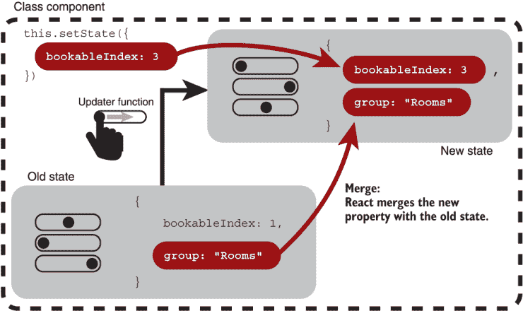

图 2.14 在类组件中，调用更新函数（`this.setState`）会将新属性与现有状态对象合并。

函数组件方法

相比之下，对于新的 hooks 方法，更新函数会将之前的状态值替换为你传递给函数的值。如果你有简单的状态值，这很简单，就像这样：

```
const [bookableIndex, setBookableIndex] = useState(1);

setBookableIndex(3);  // React replaces the value 1 with 3.
```

但如果你决定在状态中存储 JavaScript 对象，你需要小心行事。更新函数将完全替换旧对象。比如说，你这样初始化状态：

```
function BookablesList () {
  const [state, setState] = useState({
    bookableIndex: 1,
    group: "Rooms"
  });
}
```

如果你只使用改变的 `bookableIndex` 属性调用更新器函数 `setState`，那么你将丢失 `group` 属性：

```
function handleClick (index) {
  setState({
    bookableIndex: index
  });
}
```

旧状态对象被新对象替换，如图 2.15 所示。

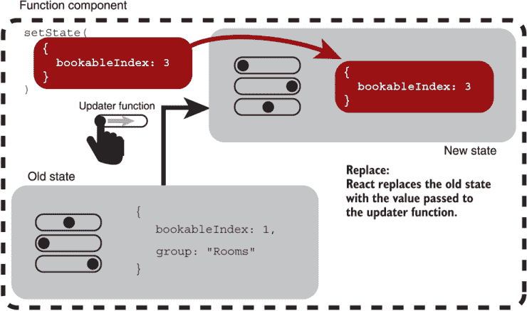

图 2.15 在函数组件中，调用更新器函数（由 `useState` 返回）用你传递给更新器函数的内容替换旧状态值。

因此，如果你确实需要使用带有 `useState` 钩子的对象，在设置新属性值时，请复制旧对象的所有属性：

```
function handleClick (index) {
  setState({
    ...state,
    bookableIndex: index
  });
}
```

注意在前面的代码片段中如何使用展开运算符 `...state` 来复制旧状态的所有属性到新状态。实际上，为了确保在基于旧状态设置新值时你有最新的状态，你可以将一个函数作为参数传递给更新器函数，如下所示：

```
function handleClick (index) {
  setState(state => { ❶
 return {
 ...state, ❷
 bookableIndex: index
 };
 });
}
```

❶ 将函数传递给 `setState`。

❷ 在设置新值时使用旧状态值。

React 将传递最新的状态作为第一个参数。这个更新器函数的函数版本将在 2.2.5 节中更详细地讨论。

在处理对象的问题得到简要说明后，我们还需要在多次调用 `useState` 之前提到 `useState` 钩子 API 的另一个特性。偶尔，你可能需要推迟计算昂贵的初始值。为此有一个函数。

### 2.2.4 将函数传递给 `useState` 作为初始值

有时一个组件可能需要做一些工作来计算某个状态片段的初始值。也许组件从遗留存储系统中接收了一串复杂的数据，并需要从错综复杂的结中提取有用的信息。解开这根线可能需要一段时间，而你只想做一次。这种方法是浪费的：

```
function untangle (aFrayedKnot) {
  // perform expensive untangling manoeuvers
  return nugget;
}

function ShinyComponent ({tangledWeb}) {
  const [shiny, setShiny] = useState(untangle(tangledWeb));

  // use shiny value and allow new shiny values to be set
}
```

每当 `ShinyComponent` 运行时，可能是在设置另一状态片段的响应中，昂贵的 `untangle` 函数也会运行。但是 `useState` 只在第一次调用时使用其初始值参数。在第一次调用之后，它不会使用 `untangle` 返回的值。反复运行昂贵的 `untangle` 函数是浪费时间。

幸运的是，`useState` 钩子接受一个函数作为其参数，一个*懒初始化状态*，如图 2.16 所示。

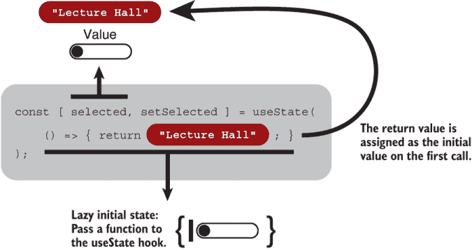

图 2.16 你可以将函数传递给 `useState` 作为初始值。React 将使用函数的返回值作为初始值。

React 只在组件首次渲染时执行该函数。它使用函数的返回值作为初始状态：

```
function ShinyString ({tangledWeb}) {
  const [shiny, setShiny] = useState(() => untangle(tangledWeb));

  // use shiny value and allow new shiny values to be set
}
```

如果你需要执行昂贵的操作来生成某个状态片段的初始值，请使用懒初始化状态。

### 2.2.5 使用旧状态设置新状态

如果用户能够更轻松地在`BookablesList`组件中的可读内容之间循环，那就太好了。让我们添加一个“下一步”按钮来实现循环，如图 2.17 所示。如果我们把焦点移到“下一步”按钮上，用户可以通过键盘激活它。

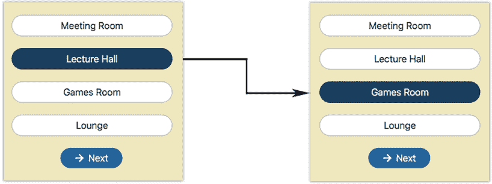

图 2.17 点击“下一步”按钮选择列表中的下一个可读内容。

“下一步”按钮需要增加`bookableIndex`状态值，当它超过最后一个可读内容时，会回绕到 0。下面的列表显示了“下一步”按钮的实现。

分支：0206-next-button，文件：/src/components/Bookables/BookablesList.js

列表 2.11 向`setBookableIndex`传递一个函数。

```
import {useState} from "react"; 
import {bookables} from "../../static.json";
import {FaArrowRight} from "react-icons/fa";                        ❶

export default function BookablesList () {
  const group = "Rooms";
  const bookablesInGroup = bookables.filter(b => b.group === group);
  const [bookableIndex, setBookableIndex] = useState(1);

  function nextBookable () {                                        ❷
 setBookableIndex(i => (i + 1) % bookablesInGroup.length);       ❸
 }

  return (
    <div>
      <ul className="bookables items-list-nav">
        {bookablesInGroup.map((b, i) => (
          <li
            key={b.id}
            className={i === bookableIndex ? "selected" : null}
          >
            <button
              className="btn"
              onClick={() => setBookableIndex(i)}
            >
              {b.title}
            </button>
          </li>
        ))}
      </ul>
      <p>
 <button
 className="btn"
 onClick={nextBookable}                                   ❹
 autoFocus
 >
 <FaArrowRight/>
 <span>Next</span>
 </button>
 </p>
    </div>
  );
}
```

❶ 导入一个 Font Awesome 图标。

❷ 为“下一步”按钮创建一个事件处理程序。

❸ 将更新函数传递给一个用于增加索引的函数。

❹ 包含一个按钮来调用`nextBookable`函数。

在“下一步”按钮的事件处理程序`nextBookable`中，我们调用更新函数`setBookableIndex`，并传递给它一个函数：

```
setBookableIndex(i => (i + 1) % bookablesInGroup.length);
```

该函数使用`%`运算符，它给出除法时的余数。当`i + 1`与可读内容的数量`bookablesInGroup.length`相同时，余数为`0`，索引回绕到开始。但为什么不用我们已有的状态值作为索引呢？

```
setBookableIndex((bookableIndex + 1) % bookablesInGroup.length);
```

通过使用钩子将我们状态值的管理权交给 React，我们不仅请求它更新值并触发重新渲染；我们还赋予它高效安排任何更新何时发生的权限。React 可以智能地将更新批量处理在一起，并忽略冗余的更新。

当我们想要基于其前一个值更新一个状态值时，就像我们的“下一步”按钮示例中那样，我们不是传递一个要设置的值给更新函数，而是传递一个函数。React 将传递当前状态值给这个函数，并将该函数的返回值用作新的状态值。所有这些都在图 2.18 中展示。

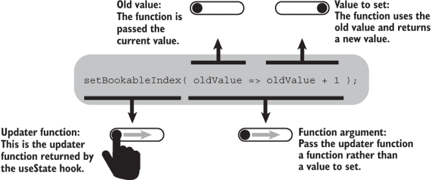

图 2.18 将一个函数传递给更新函数，该函数使用旧的状态值并返回一个新的状态值。

通过传递一个函数，我们确保任何基于旧值的新的值都有最新的信息来工作。

列表 2.11 使用一个单独的函数`nextBookable`来响应“下一步”按钮的点击，但在`onClick`属性中将响应点击可读内容的处理程序内联。这只是一个个人选择；当处理程序执行的操作不仅仅是调用一个简单的更新函数时，我倾向于将其放在自己的函数中而不是内联。在列表 2.11 的情况下，我们同样可以将“下一步”按钮的处理程序内联或可读内容点击处理程序放在自己的命名函数中。

因此，我们可以调用`useState`来请求 React 为我们管理一个值。但，当然，在我们的组件中我们可能需要不止一个状态值。让我们看看如何处理多个状态值，当我们给用户在`BookablesList`组件中选择组的能力时。

## 2.3 多次调用 useState 以处理多个值

在详细了解了`useState`的工作原理后，现在是时候物尽其用了。我们不仅限于单一的信息，甚至不是一个具有许多属性的单一对象。如果我们对多个值感兴趣，以驱动组件的 UI，我们只需继续调用该钩子：`useState`用于这个，`useState`用于那个，`useState`用于其他。我们可以使用`useState`来处理所有事情！

在本节中，我们向`BookablesList`组件添加功能，首先让用户在可预订项的组之间切换，然后显示所选可预订项的详细信息。记住，我们的任务是专注于状态，因此我们需要与几个值一起工作：

+   选定的组

+   选定的可预订项

+   组件是否显示可预订项的可用性（天数和时段）

到本节结束时，我们为所有三个状态值调用`useState`。我们将返回的值嵌入到我们的 UI 中，并使用更新函数在用户选择组或可预订项或切换详细信息显示时更改状态。

### 2.3.1 使用下拉列表设置状态

让我们从更新`BookablesList`组件开始，使用户能够选择要预订的资源类型：房间或工具包。图 2.19 显示了该组件的两个实例，第一个显示了房间组中的可预订项，第二个显示了工具包组中的可预订项。

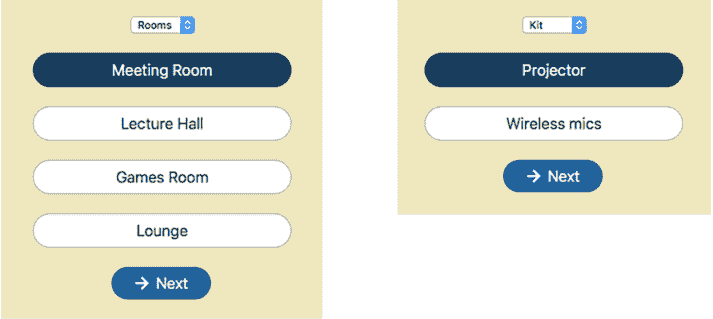

图 2.19 `BookablesList`组件的两个视图：带有下拉列表选择可预订项类型的视图：第一个选择了房间，第二个选择了工具包

我们希望用户进行两次选择：要显示的组，房间或工具包，以及组内的可预订项。更改任何变量都应更新显示，因此我们希望 React 跟踪它们两个。我们应该创建某种状态对象通过`useState`钩子传递给 React 吗？嗯，不。最简单的方法是调用`useState`两次：

```
const [group, setGroup] = useState("Kit");
const [bookableIndex, setBookableIndex] = useState(0);
```

React 使用调用顺序来确定哪个跟踪变量是哪个。在前面的代码片段中，每次 React 调用组件代码时，`useState`的第一次调用将第一个跟踪值分配给`group`变量，而`useState`的第二次调用将第二个跟踪值分配给`bookableIndex`变量。`setBookableIndex`更新第二个跟踪值，而`setGroup`更新第一个。

您的老板一直在看着您，所以让我们为`BookablesList`组件实现组选择功能。以下列表显示了最新的代码。

分支：0207-groups，文件：/src/components/Bookables/BookablesList.js

列表 2.12 `BookablesList`组件使用两次`useState`调用

```
import {useState} from "react"; 
import {bookables} from "../../static.json";
import {FaArrowRight} from "react-icons/fa";

export default function BookablesList () {
  const [group, setGroup] = useState("Kit");                              ❶
  const bookablesInGroup = bookables.filter(b => b.group === group);
  const [bookableIndex, setBookableIndex] = useState(0);                  ❷
  const groups = [...new Set(bookables.map(b => b.group))];               ❸

  function nextBookable () {
    setBookableIndex(i => (i + 1) % bookablesInGroup.length);
  }

  return (
    <div>
      <select
 value={group}
 onChange={(e) => setGroup(e.target.value)}                        ❹
 >
 {groups.map(g => <option value={g} key={g}>{g}</option>)}         ❺
 </select>

      <ul className="bookables items-list-nav">
        {bookablesInGroup.map((b, i) => (
          <li
            key={b.id}
            className={i === bookableIndex ? "selected" : null}
          >
            <button
              className="btn"
              onClick={() => setBookableIndex(i)}
            >
              {b.title}
            </button>
          </li>
        ))}
      </ul>
      <p>
        <button
          className="btn"
          onClick={nextBookable}
          autoFocus
        >
          <FaArrowRight/>
          <span>Next</span>
        </button>
      </p>
    </div>
  );
}
```

❶ 使用第一个跟踪状态值来保存所选组。

❷ 使用第二个跟踪状态值来保存所选可预订项索引。

❸ 将一组唯一的组名分配给`groups`变量。

❹ 包含一个事件处理程序来更新所选组。

❺ 创建一个下拉列表以显示可预订数据中的每个组。

代码将`group`变量分配给初始值`Kit`，因此组件一开始就显示 Kit 组中的可预订项列表。当用户从下拉列表中选择新组时，`setGroup`更新器函数让 React 知道值已更改。要获取下拉列表中的组名，我们将可预订数据通过几个转换。首先，我们创建一个仅包含组名的数组：

```
bookables.map(b => b.group)  // array of group names
```

然后，我们从组名数组创建一个`Set`。集合只包含唯一值，因此任何重复项都将被丢弃：

```
new Set(bookables.map(b => b.group))  // set of unique group names
```

最后，我们创建一个新的数组并将`Set`元素展开到其中。新数组只包含唯一的组名。这正是我们想要的！

```
[...new Set(bookables.map(b => b.group))]  // array of unique group names
```

如果 JS-Fu 有点密集，你可以始终创建一个`getUniqueValues`实用函数来使事物更易于阅读：

```
function getUniqueValues (array, property) {
  const propValues = array.map(element => element[property]);
  const uniqueValues = new Set(propValues);
  const uniqueValuesArray = [...uniqueValues];

  return uniqueValuesArray;
}

const groups = getUniqueValues(bookables, "group");
```

我们将坚持使用简洁版本，因为它永远不会改变。

我希望你们同意，使用两件状态项工作相当简单。我们只需调用两次`useState`。要更新状态，我们调用适当的更新器函数。用户进行选择，事件处理程序更新状态，React 执行差异比较并触发 DOM。让我们再来一次！

### 2.3.2 使用复选框设置状态

我们接下来的任务是向组件添加一个详细信息部分，以便我们的办公室同事对每个可预订项有更多了解。我们使每个可预订项的可用性显示为可选。图 2.20 显示了带有已勾选的“显示详细信息”复选框的`BookablesList`组件；可预订项可用的日期和时段是可见的。

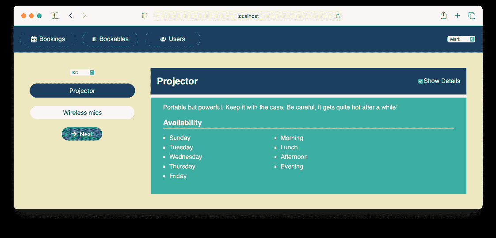

图 2.20 `BookablesList`组件的可用性显示。标题右侧的“显示详细信息”复选框已勾选。

图 2.21 显示了未勾选复选框的组件；日期和时段被隐藏。

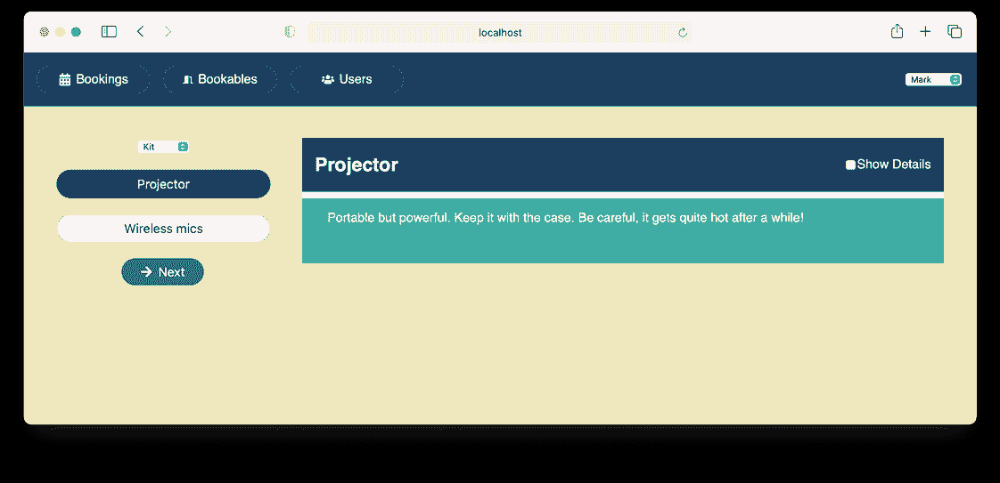

图 2.21 `BookablesList`组件的可用性被隐藏。标题右侧的“显示详细信息”复选框未勾选。

除了选定的组和选定的可预订项索引外，我们现在还有第三件状态项：我们需要跟踪是否显示所选可预订项的详细信息。以下列表显示了通过`useState`钩子调用跟踪我们的三个变量的`BookablesList`组件。

分支：0208-bookable-details，文件：/src/components/Bookables/BookablesList.js

列表 2.13 `Bookables`组件跟踪三个变量

```
import {useState, Fragment} from "react";                          ❶
import {bookables, sessions, days} from "../../static.json";
import {FaArrowRight} from "react-icons/fa";

export default function BookablesList () {
  const [group, setGroup] = useState("Kit");
  const bookablesInGroup = bookables.filter(b => b.group === group);
  const [bookableIndex, setBookableIndex] = useState(0);
  const groups = [...new Set(bookables.map(b => b.group))];

 const bookable = bookablesInGroup[bookableIndex];                ❷

  const [hasDetails, setHasDetails] = useState(false);             ❸

  function nextBookable () {
    setBookableIndex(i => (i + 1) % bookablesInGroup.length);
  }
  return (
    <Fragment>
      <div>
        /* unchanged UI for list of bookables */
      </div>
      {bookable && (                                               ❹
        <div className="bookable-details">                         ❺
          <div className="item">
            <div className="item-header">
              <h2>
                {bookable.title}
              </h2>
              <span className="controls">
                <label>
                  <input                                           ❻
                    type="checkbox"                                ❻
                    checked={hasDetails}
                    onChange={() => setHasDetails(has => !has)}    ❼
                  />
                  Show Details
                </label>
              </span>
            </div>
            <p>{bookable.notes}</p>
            {hasDetails && (                                       ❽
              <div className="item-details">
                <h3>Availability</h3>
                <div className="bookable-availability">
                  <ul>                                             ❾
                    {bookable.days                                 ❾
                      .sort()                                      ❾
                      .map(d => <li key={d}>{days[d]}</li>)        ❾
                    }                                              ❾
                  </ul>                                            ❾
                  <ul>                                             ❿
                    {bookable.sessions                             ❿
                      .map(s => <li key={s}>{sessions[s]}</li>)    ❿
                    }                                              ❿
                  </ul>                                            ❿
                </div>
              </div>
            )}
          </div>
        </div>
      )}
    </Fragment>
  );
}
```

❶ 导入`React.Fragment`以包裹多个元素。

❷ 将当前选定的可预订项分配给其自己的变量。

❸ 使用第三个跟踪状态值来保存是否显示详细信息。

❹ 仅当选择可预订项时显示详细信息。

❺ 包含一个新 UI 部分以显示所选可预订项的详细信息。

❻ 允许用户通过复选框切换详细信息。

❼ 包含一个事件处理程序以更新是否显示详细信息。

❽ 仅当`hasDetails`为真时显示详细信息。

❾ 显示可用日期列表。

❿ 显示可用会话的列表。

组件使用当前的 `bookableIndex` 从 `bookablesInGroup` 数组中访问所选可预订项：

```
const bookable = bookablesInGroup[bookablesIndex];
```

没有必要调用 `useState` 来存储可预订对象本身，因为它可以从状态中已有的索引值推导出来。UI 包括一个新部分来显示所选可预订项的详细信息。但是，组件仅在存在可显示的可预订项时显示该部分：

```
{bookable && (
  <div className="bookable-details">
    // details UI
  </div>
)}
```

类似地，只有当 `hasDetails` 状态值为 `true` 时，所选可预订项的额外信息才可见；换句话说，复选框被勾选：

```
{hasDetails && (
  <div className="item-details">
    // Bookable availability
  </div>
)}
```

看起来我们在 `BookablesList` 组件上的工作已经完成。我们有了当前所选组中的可预订项列表，并且能够切换所选可预订项的详细信息显示。但在你自我表扬并预订游戏室和派对用品之前，请遵循以下三个步骤：

1.  选择游戏室；然后显示其详细信息。

1.  将组切换到 Kit。显示可预订的设备列表，但没有选择任何可预订项，并且详细信息消失。（选择了哪个可预订项？）

1.  点击“下一步”按钮。Kit 的第二个项目，无线麦克风，被选中，并显示其详细信息。

空气中有一丝陈旧的数据味道。你能找出发生了什么吗？我们希望用户交互导致状态的可预测变化。有时这意味着单个交互应该导致多个状态的变化。下一章将探讨这个问题，并介绍 *reducers*，这是一种协调更复杂状态变化并消除陈旧味道的机制。但在我们切换钩子之前，我们将回顾构建 `BookablesList` 组件所教给我们的关于函数组件的一般知识。在此之前，这里有一个挑战！

挑战 2.3

更新 `UsersList` 组件以显示所选用户的详细信息。显示用户姓名、职称和备注。一种可能的方法如图 2.22 所示，代码位于书籍 GitHub 仓库的 0209-user-details 分支中。

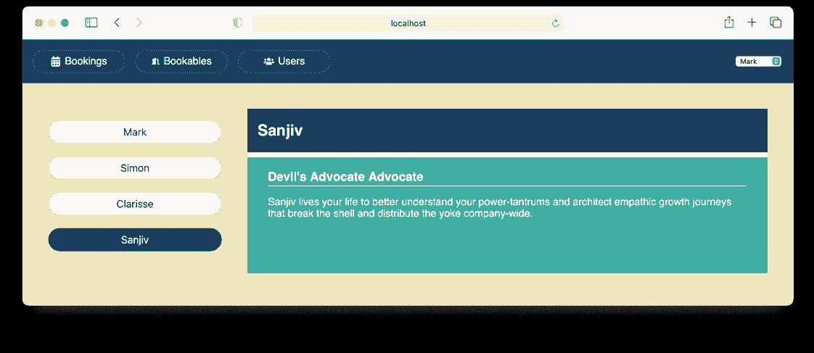

图 2.22 显示所选用户详细信息的 `UsersList` 组件

## 2.4 回顾一些函数组件概念

到目前为止，我们的 `BookablesList` 组件非常简单。但一些基本概念已经在发挥作用，这些概念是我们对函数组件和 React 钩子理解的基础。对这些概念有牢固的掌握将使我们在本书中的未来讨论以及你对钩子的专家级使用变得更加容易。特别是，这里有五个关键概念：

+   组件是接受 props 并返回其 UI 描述的函数。

+   React 调用组件。作为函数，组件运行其代码然后结束。

+   一些变量可能存在于事件处理器创建的闭包中。其他变量在函数结束时被销毁。

+   我们可以使用钩子让 React 帮我们管理值。React 可以将最新的值和更新器函数传递给组件。

+   通过使用更新函数，我们让 React 知道值的变化。它可以重新运行组件以获取最新的 UI 描述。

图 2.23 中的组件周期图显示了当我们的`BookablesList`组件运行并且用户点击可预订项时涉及的一些步骤。表 2.1 讨论了每个步骤。

表 2.1 使用`useState`时的关键步骤

| 步骤 | 发生了什么？ | 讨论 |
| --- | --- | --- |
| 1 | React 调用组件。 | 为了生成页面的 UI，React 遍历组件树，调用每个组件。React 将传递给每个组件任何在 JSX 中设置的属性作为 props。 |
| 2 | 组件第一次调用`useState`。 | 组件将初始值传递给`useState`函数。React 从该组件设置该`useState`调用的当前值。 |
| 3 | React 将当前值和更新函数作为一个数组返回。 | 组件代码将值和更新函数分配给变量以供以后使用。第二个变量名通常以`set`开头（例如，`value`和`setValue`）。 |
| 4 | 组件设置事件处理器。 | 事件处理器可能监听用户点击，例如。处理器将在稍后运行时更改状态。React 将在第 6 步更新 DOM 时将处理器连接到 DOM。 |
| 5 | 组件返回其 UI。 | 组件使用当前状态值来生成其用户界面并返回它，完成其工作。 |
| 6 | React 更新 DOM。 | React 使用所需的任何更改更新 DOM。 |
| 7 | 事件处理器调用更新函数。 | 一个事件被触发，处理器运行。处理器使用更新函数来更改状态值。 |
| 8 | React 更新状态值。 | React 用更新函数传递的值替换状态值。 |
| 9 | React 调用组件。 | React 知道状态值已更改，因此必须重新计算 UI。 |
| 10 | 组件第二次调用`useState`。 | 这次，React 将忽略初始值参数。 |
| 11 | React 返回当前状态值和更新函数。 | React 已更新状态值。组件需要最新的值。 |
| 12 | 组件设置事件处理器。 | 这是处理器的新版本，可能使用新更新的状态值。 |
| 13 | 组件返回其 UI。 | 组件使用当前状态值来生成其用户界面并返回它，完成其工作。 |
| 14 | React 更新 DOM。 | React 将新返回的 UI 与旧的 UI 进行比较，并高效地使用所需的任何更改更新 DOM。 |

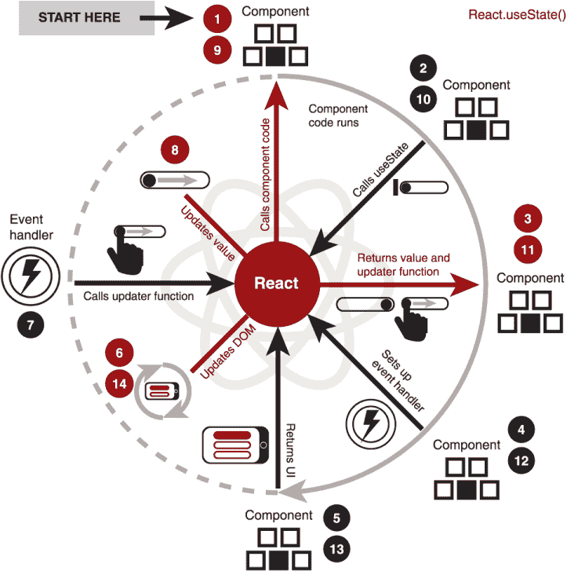

图 2.23 使用`useState`时的关键时刻步骤

为了清晰和精确地讨论概念，我们不时地回顾迄今为止遇到的词汇和对象。表 2.2 描述了我们遇到的一些术语。

表 2.2 我们遇到的一些关键术语

| 图标 | 术语 | 描述 |
| --- | --- | --- |
|   | 组件 | 接受 props 并返回其 UI 描述的函数。 |
|  | 初始值 | 组件将此值传递给 `useState`。React 在组件首次运行时将状态值设置为这个初始值。 |
|  | 更新函数 | 组件调用此函数来更新状态值。 |
|  | 事件处理器 | 在响应某种事件时运行的函数——例如，用户点击一个可预订项。事件处理器通常会调用更新函数来改变状态。 |
|  | `UI` | 用户界面组成的元素描述。状态值通常包含在 UI 的某个地方。 |

## 摘要

+   当你想让 React 管理组件的值时，调用 `useState` 钩子。它返回一个包含两个元素的数组：状态值和更新函数。如果需要，你可以传递一个初始值：

    ```
    const [value, setValue] = useState(initialValue);
    ```

+   如果你需要执行一个昂贵的计算来生成初始状态，可以在函数中将它传递给 `useState`。React 会在第一次调用组件时运行这个函数来获取这个懒加载的初始状态：

    ```
    const [value, setValue] = useState(() => { return initialState; });
    ```

+   使用 `useState` 返回的更新函数来设置新值。新值将*替换*旧值。如果值已更改，React 将安排重新渲染：

    ```
    setValue(newValue);
    ```

+   如果你的状态值是一个对象，确保在更新函数仅更新属性子集时，从上一个状态复制未更改的属性：

    ```
    setValue({
      ...state,
      property: newValue
    });
    ```

+   为了确保在调用更新函数并基于旧值设置新值时使用最新的状态值，将一个函数作为参数传递给更新函数。React 将最新的状态值分配给函数参数：

    ```
    setValue(value => { return newValue; });

    setValue(state => {
      return {
        ...state,
        property: newValue
      };
    });
    ```

+   如果你有多件状态，你可以多次调用 `useState`。React 使用调用顺序来一致地分配值和更新函数到正确的变量：

    ```
    const [index, setIndex] = useState(0);                     // call 1
    const [name, setName] = useState("Jamal");                 // call 2
    const [isPresenting, setIsPresenting] = useState(false);   // call 3
    ```

+   专注于状态以及事件如何更新状态。React 将同步状态和 UI 的任务完成：

    ```
    function Counter () {
      const [count, setCount] = useState(0);                           ❶

      return (
        <p>{count}                                                     ❷
          <button onClick={() => setCount(c => c + 1)}> + </button>    ❸
        </p>
      );
    }
    ```

    ❶ 考虑组件需要什么状态。

    ❷ 显示状态。

    ❸ 根据事件更新状态。
