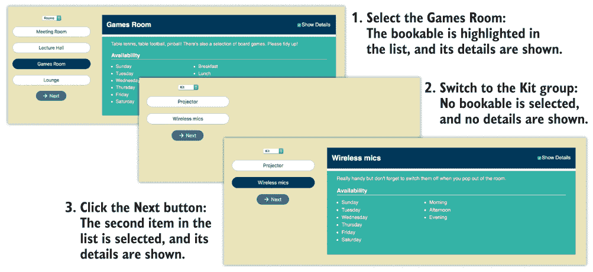
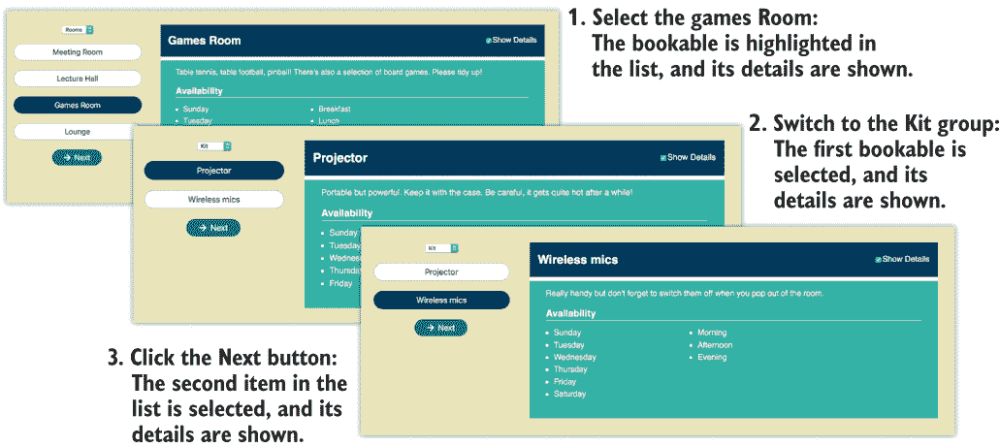
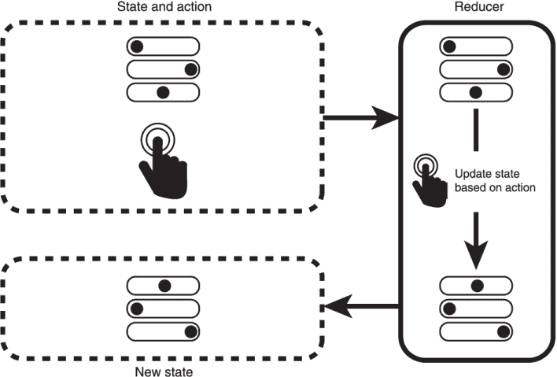
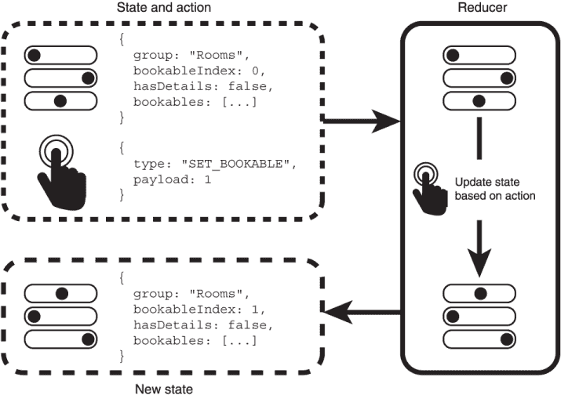
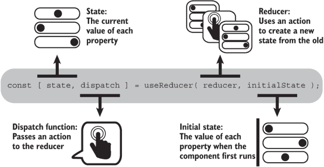
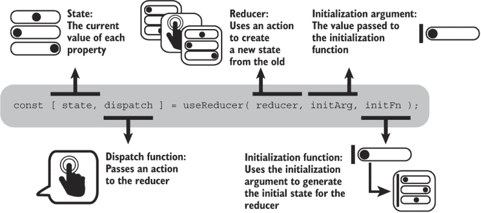
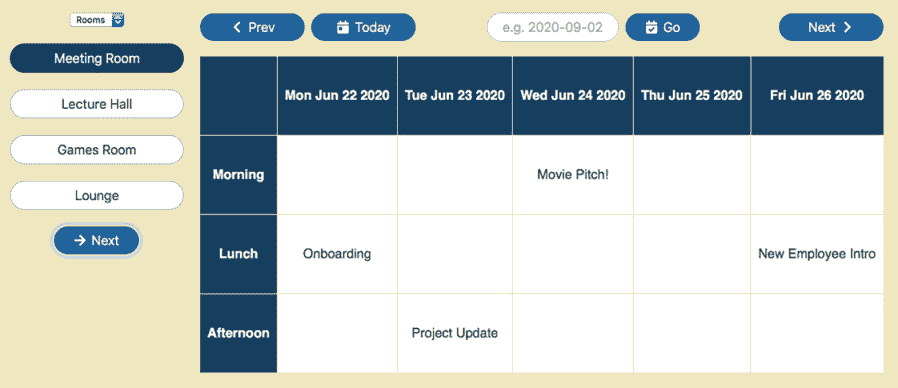
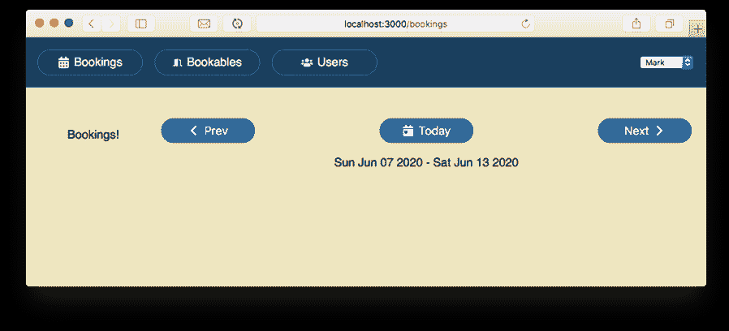
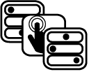
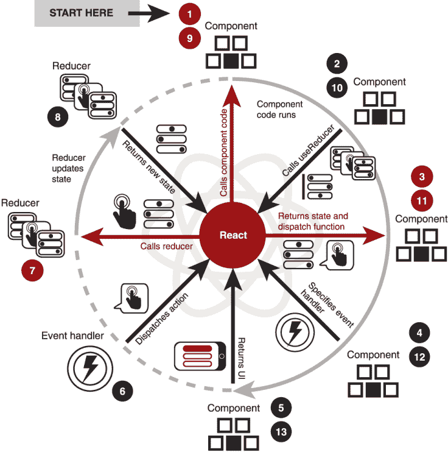

# 3 使用 `useReducer` 钩子管理组件状态

本章涵盖

+   通过调用 `useReducer` 请求 React 管理多个相关状态值

+   将组件状态管理逻辑放在一个位置

+   通过向 reducer 发送动作来更新状态和触发重新渲染

+   使用初始化参数和初始化函数初始化状态

随着你的应用程序的增长，某些组件处理更多状态是很自然的，尤其是如果它们向多个子组件提供该状态的不同部分。当你发现你总是需要一起更新多个状态值，或者你的状态更新逻辑分布得太广，难以追踪时，可能就是时候定义一个函数来为你管理状态更新了：一个 *reducer* 函数。

一个简单、常见的例子是加载数据。比如说，一个组件需要加载在疫情期间被困在家时可以做的事情的博客帖子。你希望在请求新帖子时显示加载用户界面，如果出现问题则显示错误用户界面，当帖子到达时显示帖子本身。组件的状态包括以下值：

+   *加载状态*——你正在加载新的帖子吗？

+   *任何错误*——服务器返回了错误，或者网络是否已断开？

+   *帖子*——检索到的帖子列表。

当组件请求帖子时，你可能将加载状态设置为 `true`，错误状态设置为 `null`，并将帖子设置为空数组。一个事件导致三个状态值的变化。当帖子返回时，你可能将加载状态设置为 `false` 并将帖子设置为返回的帖子。一个事件导致两个状态值的变化。你当然可以通过调用 `useState` 钩子来管理这些状态值，但是，当你总是用对多个更新函数的调用（例如 `setIsLoading`、`setError` 和 `setPosts`）来响应事件时，React 提供了一个更干净的替代方案：`useReducer` 钩子。

在本章中，我们首先解决预订应用程序中 `BookablesList` 组件的问题：我们的状态管理有些问题。然后，我们介绍 reducer 和 `useReducer` 钩子作为管理我们状态的一种方式。3.3 节展示了如何使用函数初始化 reducer 的状态，当我们开始一个新的组件 `WeekPicker` 的工作时。我们以回顾 `useReducer` 钩子如何与我们对函数组件的理解相匹配来结束本章。

你能闻到那味道吗？空气中有一股明显的异味。有些东西被遗漏了，应该被整理一下。有些陈旧的。让我们清除那些分散注意力的声音！

## 3.1 对单个事件响应更新多个状态值

你可以随意多次调用`useState`，每次为 React 需要管理的每个状态片段调用一次。但一个组件可能需要持有许多状态值，而且通常这些状态片段是相关的；你可能希望对单个用户操作响应时更新多个状态片段。你不希望当它们应该被整理时，有些状态片段被忽视。

当用户从一个组切换到另一个组时，我们的`BookablesList`组件目前存在一个问题。这不是一个大问题，但在这个部分中，我们将讨论这个问题是什么，为什么它是问题，以及我们如何通过使用`useState`钩子来解决它。这为我们设置了 3.2 节中的`useReducer`钩子。

### 3.1.1 使用不可预测的状态变化将用户从电影中拉出来

我们不希望出现笨拙、不可预测的界面，阻碍用户完成任务。如果用户界面不断将他们的注意力从他们想要的焦点上拉走，或者让他们在没有反馈的情况下等待，或者将他们引向死胡同，他们的思维过程就会被打断，他们的工作会变得更加困难，他们的这一天就会被毁了。

这就像你在看电影时，突然的摄像机运动，或者疯狂的剪辑，或者明显的产品植入，或者艾德·希兰将你从故事中拉出来。你的思维链断了。你过度意识到这是一部电影，有些地方不太对劲。或者当你阅读一本编程书时，一个痛苦的比喻，勉强的幽默尝试，令人困惑的旁白，或者元幽默将你从解释中拉出来。你过度意识到你正在读一个绝望的作者，有些地方不太对劲。

好的，抱歉。回到房间。让我们看看一个例子。在前一章的 2.3 节末尾，我们诊断了我们的`BookablesList`组件 UI 中轻微的卡顿。用户可以选择一个组，然后从该组中选择一个可预订书籍。然后显示该可预订书籍的详细信息。但是，一些可预订书籍和组选择组合会导致 UI 更新有些不正常。如果你遵循这三个步骤，你应该会看到图 3.1 中显示的 UI 更新：

1.  选择游戏室；然后显示其详细信息。

1.  将组切换到 Kit。Kit 可预订书籍列表显示时没有选择任何可预订书籍，并且详细信息消失。

1.  点击下一步按钮。Kit 的第二个项目，无线麦克风，被选中，并显示其详细信息。



图 3.1 选择一个可预订书籍，切换组，然后点击下一步按钮可能导致不可预测的状态变化。

从房间组切换到 Kit 组，组件似乎失去了跟踪哪个可预订书籍被选中。点击下一步按钮然后选择第二个项目，跳过了第一个。这不是一个大问题——用户仍然可以选择可预订书籍——但这可能足以让用户从他们的专注流程中跳出来。发生了什么？

结果表明，在我们状态中，所选的可预订项和所选的组并不是完全独立的值。当用户选择游戏室时，`bookableIndex`状态值被设置为 2；它是列表中的第三项。如果他们然后切换到只有两个项目（索引为 0 和 1）的套件组，`bookableIndex`值就不再与一个可预订项匹配。UI 最终没有选择任何可预订项，也没有显示任何详细信息。我们需要仔细考虑用户选择一个组后我们希望 UI 处于的状态。那么，我们如何修复我们的陈旧索引问题并平滑用户的路径？

### 3.1.2 保持用户在电影中，通过可预测的状态变化

为我们的同事构建预订应用，我们希望尽可能使其使用无摩擦。比如说，同事 Akiko 下周有客户来访。她正在为访问安排日程，需要在下午预订会议室，然后下班后预订游戏室。Akiko 的关注点在于她的任务：整理日程并为一次伟大的客户访问做准备。预订应用应该让她继续专注于她的任务。她应该想着，“我会预订那些房间，然后订购餐饮，”而不是“嗯，等等，哪个按钮？我点击了吗？它冻结了吗？啊，*我讨厌电脑*！”

这就像你在看电影时完全投入到一个角色的困境中。你不会注意到摄像机的移动和剪辑，因为它们有助于平滑地将你带入故事。你已经不再在电影院；你进入了电影的世界。技巧消失了，故事就是一切。或者当你读书时，它奇特但引人入胜的角色和推动性的情节把你带入叙事。几乎就像书消失了，你占据了角色的思想、感受、地点和行动。最终，你注意到自己，意识到你已经读了 100 页，天都快黑了……

好的，抱歉。回到房间。让我们回到例子。在用户选择一个组之后，我们希望 UI 处于一个可预测的状态。我们不希望突然取消选择和跳过的可预订项。一个简单且合理的方法是在用户选择新组时始终选择列表中的第一个可预订项，如图 3.2 所示。



图 3.2 选择可预订项，切换组，然后点击下一步按钮会导致可预测的状态变化。

`group`和`bookableIndex`状态值是相互关联的；当我们更改组时，我们也更改索引。在图 3.2 的第 2 步中，注意当切换组时，列表中的第一项（投影仪）会自动选中。下面的列表显示了`changeGroup`函数在设置新组时将`bookableIndex`设置为 0。

分支：0301-related-state，文件：/src/components/Bookables/BookablesList.js

列表 3.1 在更改组时自动选择可预订项

```
import {useState, Fragment} from "react"; 
import {bookables, sessions, days} from "../../static.json";
import {FaArrowRight} from "react-icons/fa";

export default function BookablesList () { 
  const [group, setGroup] = useState("Kit");
  const bookablesInGroup = bookables.filter(b => b.group === group);
  const [bookableIndex, setBookableIndex] = useState(0);
  const groups = [...new Set(bookables.map(b => b.group))];
  const bookable = bookablesInGroup[bookableIndex];
  const [hasDetails, setHasDetails] = useState(false);

  function changeGroup (event) {       ❶
    setGroup(event.target.value);      ❷
    setBookableIndex(0);               ❸
  }

  function nextBookable () {
    setBookableIndex(i => (i + 1) % bookablesInGroup.length);
  }

  return (
    <Fragment>
      <div>
        <select
          value={group}
          onChange={changeGroup}       ❹
        >
          {groups.map(g => <option value={g} key={g}>{g}</option>)}
        </select>

        <ul className="bookables items-list-nav">
          /* unchanged list UI */
        </ul>
        <p>
          /* unchanged button UI */
        </p>
      </div>

      {bookable && (
        <div className="bookable-details">
          /* unchanged bookable details UI */
        </div>
      )}
    </Fragment>
  );
}
```

❶ 创建一个处理函数来响应组选择。

❷ 更新组。

❸ 在新组中选择第一个可预订项。

❹ 将新函数指定为 onChange 处理程序。

每当组发生变化时，我们将可预订索引设置为零；当我们调用`setGroup`时，我们总是随后调用`setBookableIndex`：

```
setGroup(newGroup);
setBookableIndex(0);
```

这是一个相关状态的简单例子。当组件开始变得复杂，由多个事件引起多个状态变化时，跟踪这些变化并确保所有相关状态值一起更新变得越来越困难。

当状态值以这种方式相互关联时，要么相互影响，要么经常一起改变，将状态更新逻辑移动到单个位置可能会有所帮助，而不是将执行更改的代码分散在事件处理函数中，无论是内联定义还是单独定义。React 通过`useReducer`钩子为我们提供了帮助，以管理这种状态更新逻辑的组合，我们将在下一节中查看该钩子。

## 3.2 使用 useReducer 管理更复杂的状态

就目前而言，`BookablesList`组件示例足够简单，你可以继续使用`useState`，并在`changeGroup`事件处理程序中调用每个状态片段的相应更新函数。但是，当你有多个相互关联的状态时，使用*reducer*可以使状态变化更容易理解和实现。在本节中，我们介绍了以下主题：

+   Reducer 帮助你以集中化、定义良好的方式管理状态变化，具有对状态执行操作的清晰动作。

+   Reducer 通过使用动作从上一个状态生成一个新的状态，这使得指定更复杂的更新变得更容易，这些更新可能涉及多个相互关联的状态。

+   React 提供了`useReducer`钩子，允许你的组件指定初始状态，访问当前状态，并派发动作以更新状态并触发重新渲染。

+   派发定义良好的动作使跟踪状态变化和了解组件如何对不同事件响应的状态交互变得更加容易。

我们从 3.2.1 节开始，描述了一个 reducer 和一个简单的 reducer 示例，该 reducer 管理计数器的增加和减少。在 3.2.2 节中，我们为`BookablesList`组件构建了一个 reducer，执行切换组、选择可预订项和切换可预订详情等必要的状态变化。最后，在 3.2.3 节中，我们通过使用 React 的`useReducer`钩子将我们新铸造的 reducer 集成到`BookablesList`组件中。

### 3.2.1 使用预定义动作集的 reducer 更新状态

*reducer*是一个函数，它接受一个状态值和一个动作值。它根据传入的两个值生成一个新的状态值。然后，它返回新的状态值，如图 3.3 所示。



图 3.3 一个 reducer 接受一个状态和一个动作，并返回一个新的状态。

状态和动作可以是简单的、原始的值，如数字或字符串，或者更复杂的对象。使用还原器，你将所有更新状态的方式集中在一个地方，这使得管理状态变化变得更容易，尤其是在单个动作影响多个状态时。

在一个超级简单的例子之后，我们将回到`BookablesList`组件。比如说，你的状态只是一个计数器，你只能执行两种动作：增加计数器或减少计数器。下面的列表显示了一个管理此类计数器的还原器。`count`变量的值从 0 开始，变为 1，然后变为 2，然后又回到 1。

代码在 JS Bin 上：[`jsbin.com/capogug/edit?js,console`](https://jsbin.com/capogug/edit?js,console)

列表 3.2 一个简单的计数器还原器

```
let count = 0;

function reducer (state, action) {         ❶
  if (action === "inc") {                  ❷
    return state + 1;
  }
  if (action === "dec") {                  ❷
    return state - 1;
  }
  return state;                            ❸
}

count = reducer(count, "inc");             ❹
count = reducer(count, "inc");
count = reducer(count, "dec");             ❺
```

❶ 创建一个接受现有状态和动作的还原器函数。

❷ 检查指定的动作，并相应地更新状态。

❸ 处理缺失或不识别的动作。

❹ 使用还原器来增加计数器。

❺ 使用还原器来减少计数器。

还原器处理增量和减量动作，并且对于任何其他指定的动作，只返回未更改的计数。（而不是默默地忽略未识别的动作，你可以根据应用程序的需求和还原器所扮演的角色抛出一个错误。）

对于我们这两个小小的动作来说，这似乎有点过度，但有了还原器，扩展它就变得容易了。让我们再添加三个动作，用于将任意数字加到计数器上或从计数器上减去，以及将计数器设置为指定的值。为了能够用我们的动作指定额外值，我们需要稍微增强它——让我们将其制作成一个具有类型和有效载荷的对象。比如说，我们想将 3 加到计数器上；我们的动作看起来像这样：

```
{
  type: "add",
  payload: 3
}
```

下面的列表显示了具有额外功能和传递给还原器的动作的新还原器。`count`变量的值从 0 开始，变为 3，然后变为-7，接着变为 41，最后变为 42。

代码在 JS Bin 上：[`jsbin.com/kokumux/edit?js,console`](https://jsbin.com/kokumux/edit?js,console)

列表 3.3 添加更多动作并指定额外值

```
let count = 0;

function reducer (state, action) {
  if (action.type === "inc") {                              ❶
    return state + 1;                                       ❶
  }                                                         ❶

  if (action.type === "dec") {                              ❶
    return state - 1;                                       ❶
  }                                                         ❶

  if (action.type === "add") {                              ❷
    return state + action.payload;                          ❷
  }                                                         ❷

  if (action.type === "sub") {                              ❷
    return state - action.payload;                          ❷
  }                                                         ❷

  if (action.type === "set") {                              ❷
    return action.payload;                                  ❷
  }                                                         ❷

  return state;
}

count = reducer(count, { type: "add", payload: 3 });        ❸
count = reducer(count, { type: "sub", payload: 10 });       ❸
count = reducer(count, { type: "set", payload: 41 });       ❸
count = reducer(count, { type: "inc" });                    ❸
```

❶ 现在检查两个原始动作的动作类型。

❷ 使用动作有效载荷来执行新的动作。

❸ 通过传递一个对象来指定每个动作。

列表 3.3 的最后一个还原器调用指定了增量动作。增量动作不需要任何额外信息。它总是将 1 加到`count`上，因此动作不包括有效载荷属性。

让我们在构建`BookablesList`组件的还原器时将这些关于状态和动作类型及有效载荷的想法付诸实践。然后我们可以看到如何利用 React 的帮助来使用该还原器来管理组件的状态。

### 3.2.2 为 BookablesList 组件构建还原器

`BookablesList` 组件有四项状态：`group`、`bookableIndex`、`hasDetails` 和 `bookables`（从 `static.json` 导入）。该组件还有四个动作来执行该状态：设置组、设置索引、切换 `hasDetails` 和移动到下一个可预订项。为了管理四项状态，我们可以使用具有四个属性的对象。如图 3.4 所示，通常将状态和动作都表示为对象。



图 3.4 将状态对象和动作对象传递给 reducer。reducer 根据动作类型和有效负载更新状态。reducer 返回新的、更新后的状态。

`BookablesList` 组件从静态的 `static.json` 文件中导入可预订项数据。当 `BookablesList` 组件挂载时，这些数据不会改变，并且我们将其包含在初始状态中，用于在 reducer 中查找每个组中的可预订项数量。

以下列表显示了使用对象作为状态和动作的 `BookablesList` 组件的 reducer。我们将其从其自己的文件 `reducer.js` 导出，位于 `/src/components/Bookables` 文件夹中。

分支：0302-reducer，文件：/src/components/Bookables/reducer.js

列表 3.4 `BookablesList` 组件的 reducer

```
export default function reducer (state, action) {
 switch (action.type) {                                    ❶❷

    case "SET_GROUP":                                       ❸
      return {
        ...state,
        group: action.payload,                              ❹
 bookableIndex: 0
      };

    case "SET_BOOKABLE":
      return {
        ...state,                                           ❺
        bookableIndex: action.payload
      };

    case "TOGGLE_HAS_DETAILS":
      return {
        ...state,
        hasDetails: !state.hasDetails                      ❻
      };

    case "NEXT_BOOKABLE":
      const count = state.bookables.filter(
 b => b.group === state.group
 ).length;                ❼

      return {
        ...state,
        bookableIndex: (state.bookableIndex + 1) % count   ❽
      };

    default:                                               ❾
      return state;
  }
}
```

❶ 使用 switch 语句组织每个动作类型的代码。

❷ 将动作类型指定为每个 case 的比较。

❸ 为每个动作类型创建一个 case 块。

❹ 更新组并将可预订项索引设置为 0。

❺ 使用扩展运算符复制现有的状态属性。

❻ 使用任何更改覆盖现有的状态属性。

❼ 计算当前组中的可预订项数量。

❽ 使用计数从最后一个索引到第一个索引进行包装。

❾ 总是包含一个默认情况。

每个 `case` 块返回一个新的 JavaScript 对象；前一个状态不会被修改。使用对象扩展运算符来复制旧状态中的属性到新状态。然后，在对象上设置需要更新的属性值，覆盖前一个状态中的值，如下所示：

```
return {
  ...state,                  ❶
  group: action.payload,     ❷
  bookableIndex: 0           ❷
};
```

❶ 将旧状态对象的属性扩展到新对象中。

❷ 覆盖任何需要更新的属性。

在我们的状态中总共只有四个属性，我们可以明确地设置它们：

```
return {
  group: action.payload,
  bookableIndex: 0,
  hasDetails: state.hasDetails,    ❶
  bookables: state.bookables       ❶
};
```

❶ 复制未更改属性的先前值。

使用扩展运算符可以保护代码在演变过程中的安全性；状态可能会在未来获得新的属性，并且它们都需要被复制过来。

注意到 `SET_GROUP` 动作更新了两个属性。除了更新要显示的组外，它还将选定的可预订项索引设置为 `0`。当切换到新组时，动作会自动选择第一个可预订项，并且只要组中至少有一个可预订项，如果已检查显示详情切换，组件将显示第一个可预订项的详情。

Reducer 还处理一个`NEXT_BOOKABLE`动作，从`Bookables`组件中移除了在从一个可预订项移动到下一个时计算索引的责任。这就是为什么在 reducer 的状态中包含可预订数据是有帮助的；我们使用组中可预订的数量来在增加`bookableIndex`时从最后一个可预订项包裹到第一个：

```
case "NEXT_BOOKABLE":
  const count = state.bookables.filter(                   ❶
    b => b.group === state.group
  ).length;

  return {
    ...state,
    bookableIndex: (state.bookableIndex + 1) % count      ❷
  };
```

❶ 使用可预订数据来计算当前组中的可预订数量。

❷ 使用取模运算符从最后一个索引包裹到第一个。

我们已经设置了一个 reducer，但如何将其整合到我们的组件中？我们如何访问状态对象并使用我们的动作调用 reducer？我们需要`useReducer`钩子。

### 3.2.3 使用 useReducer 访问组件状态和发送动作

`useState`钩子让我们请求 React 管理我们组件的单个值。使用`useReducer`钩子，我们可以通过传递 reducer 和组件的初始状态来给 React 提供更多帮助来管理值。当我们的应用程序中发生事件时，我们不是给 React 提供新值来设置，而是*发送*一个*动作*，React 使用 reducer 中相应的代码来生成一个新的状态，在调用组件以获取最新的 UI 之前。

在调用`useReducer`钩子时，我们传递给它 reducer 和一个初始状态。钩子返回当前状态和一个用于发送动作的函数，如图 3.5 所示的两个数组元素。



图 3.5 使用 reducer 调用`useReducer`。它返回当前状态和 dispatch 函数。使用 dispatch 函数向 reducer 发送动作。

正如我们使用`useState`一样，在这里使用`useReducer`时，我们使用数组解构将返回数组的两个元素分配给两个我们选择的变量名。第一个元素，当前状态，我们分配给一个我们称为`state`的变量，第二个元素，dispatch 函数，我们分配给一个我们称为`dispatch`的变量：

```
const [state, dispatch] = useReducer(reducer, initialState);
```

React 只关注第一次调用组件时传递给`useReducer`（在我们的情况下，`reducer`和`initialState`）的参数。在随后的调用中，它忽略这些参数，但仍然返回当前状态和 reducer 的 dispatch 函数。

让我们在`BookablesList`组件中使用`useReducer`钩子并开始发送一些动作！以下列表显示了更改。

分支：0302-reducer，文件：/src/components/Bookables/BookablesList.js

列表 3.5 使用 reducer 的`BookablesList`组件

```
import {useReducer, Fragment} from "react";                        ❶
import {bookables, sessions, days} from "../../static.json";
import {FaArrowRight} from "react-icons/fa";

import reducer from "./reducer";                                   ❷

const initialState = {                                             ❸
 group: "Rooms",                                                  ❸
 bookableIndex: 0,                                                ❸
 hasDetails: true,                                                ❸
 bookables                                                        ❸
};                                                                 ❸

export default function BookablesList () {
 const [state, dispatch] = useReducer(reducer, initialState);     ❹

 const {group, bookableIndex, bookables, hasDetails} = state;     ❺

  const bookablesInGroup = bookables.filter(b => b.group === group);
  const bookable = bookablesInGroup[bookableIndex];
  const groups = [...new Set(bookables.map(b => b.group))];

  function changeGroup (e) {
 dispatch({                                                     ❻
 type: "SET_GROUP",                                           ❻
 payload: e.target.value                                      ❻
 });                                                            ❻
 }

  function changeBookable (selectedIndex) {
 dispatch({
 type: "SET_BOOKABLE",
 payload: selectedIndex
 });
 } 

  function nextBookable () {
    dispatch({ type: "NEXT_BOOKABLE" });                           ❼
  }

  function toggleDetails () {
 dispatch({ type: "TOGGLE_HAS_DETAILS" });
 }

  return (
    <Fragment>
      <div>
        // group picker

        <ul className="bookables items-list-nav">
          {bookablesInGroup.map((b, i) => (
            <li
              key={b.id}
              className={i === bookableIndex ? "selected" : null}
            >
              <button
                className="btn"
                onClick={() => changeBookable(i)}                  ❽
              >
                {b.title}
              </button>
            </li>
          ))}
        </ul>

        // Next button
      </div>

      {bookable && (
        <div className="bookable-details">
          <div className="item">
            <div className="item-header">
              <h2>
                {bookable.title}
              </h2>
              <span className="controls">
                <label>
                  <input
                    type="checkbox"
                    checked={hasDetails}
                    onChange={toggleDetails}                     ❾
                  />
                  Show Details
                </label>
              </span>
            </div>
            <p>{bookable.notes}</p>
            {hasDetails && (
              <div className="item-details">
                // details
              </div>
            )}
          </div>
        </div>
      )}
    </Fragment>
  );
}
```

❶ 导入 useReducer 钩子。

❷ 从列表 3.4 中导入 reducer。

❸ 指定一个初始状态。

❹ 调用 useReducer，传递 reducer 和初始状态。

❺ 将状态值分配给局部变量。

❻ 发送一个带有类型和负载的动作。

❼ 发送一个不需要负载的动作。

❽ 调用新的 changeBookable 函数。

❾ 调用新的 toggleDetails 函数。

列表 3.5 导入了我们在列表 3.4 中创建的 reducer，设置了一个初始状态对象，然后在组件代码中，将 reducer 和初始状态传递给`useReducer`。接下来，`useReducer`返回当前状态和`dispatch`函数，我们使用数组解构将它们分配给变量`state`和`dispatch`。该列表使用一个中间的`state`变量，然后将状态对象解构为单个变量——`group`、`bookableIndex`、`bookables`和`hasDetails`——但你也可以直接在数组解构中执行对象解构：

```
const [
  {group, bookableIndex, bookables, hasDetails},
  dispatch
] = useReducer(reducer, initialState);
```

在事件处理程序中，`BookablesList`组件现在发送动作而不是通过`useState`更新单个状态值。我们使用单独的事件处理函数（`changeGroup`、`changeBookable`、`nextBookable`、`toggleDetails`），但你也可以在 UI 内轻松地内联发送动作。例如，你可以设置显示详情复选框如下：

```
 <label>
   <input
     type="checkbox"
     checked={hasDetails}
     onChange={() => dispatch({ type: "TOGGLE_HAS_DETAILS" })}
   />
   Show Details
 </label>
```

任何一种方法都可以，只要你觉得代码易于阅读和理解。

虽然示例很简单，但你应该欣赏 reducer 如何帮助你结构化代码、状态变更以及理解，尤其是当组件状态变得更加复杂时。如果你的状态复杂，或者初始状态设置成本很高，或者是由你希望重用或导入的函数生成的，`useReducer`钩子有一个第三个参数你可以使用。让我们来看看。

## 3.3 使用函数生成初始状态

你在第二章中看到，我们可以通过将函数传递给钩子来生成`useState`的初始状态。同样，对于`useReducer`，除了将初始化参数作为第二个参数外，我们还可以将初始化函数作为第三个参数。初始化函数使用初始化参数来生成初始状态，如图 3.6 所示。



图 3.6 `useReducer`的初始化函数使用初始化参数来生成 reducer 的初始状态。

与往常一样，`useReducer`返回一个包含两个元素的数组：状态和`dispatch`函数。在第一次调用时，状态是初始化函数的返回值。在后续调用中，它是调用时的状态：

```
const [state, dispatch] = useReducer(reducer, initArgument, initFunction);
```

使用`dispatch`函数向 reducer 发送动作。对于`useReducer`的特定调用，React 将始终返回相同的`dispatch`函数。（当重新渲染可能依赖于变化的 props 或依赖项时，拥有一个不变的函数很重要，你将在后面的章节中看到。）

在本节中，我们开始为预订应用开发第二个组件，即`WeekPicker`组件，我们将工作分为五个小节：

+   介绍`WeekPicker`组件

+   创建用于处理日期和周的工作函数

+   构建 reducer 来管理组件的日期

+   创建 `WeekPicker`，将初始化函数传递给 `useReducer` 钩子

+   将 `BookingsPage` 更新为使用 `WeekPicker`

### 3.3.1 介绍 `WeekPicker` 组件

到目前为止，在预订应用中，我们一直专注于 `BookablesList` 组件，显示可预订项目的列表。为了为实际预订资源打下基础，我们需要开始考虑日历；在完成的应用中，我们的用户将从一个预订网格日历中选择日期和时段，如图 3.7 所示。



图 3.7 预订页面将包括可预订项目的列表、预订网格和周选择器。

让我们从简单开始，只考虑在一周和下一周之间切换的界面。图 3.8 显示了在预订网格中显示周的选择可能界面。它包括以下内容：

+   选择周的开始和结束日期

+   用于移动到下一周和上一周的按钮

+   一个按钮用于显示包含今天日期的那一周


图 3.8 `WeekPicker` 组件显示了所选周的起始和结束日期，并具有在周之间导航的按钮。

在本书的后面部分，我们将添加一个直接跳转到特定日期的输入。现在，我们将坚持使用我们的三个按钮和周日期文本。为了获取指定周的起始和结束日期，我们需要几个实用函数来处理 JavaScript 的日期对象。让我们首先创建这些函数。

### 3.3.2 创建用于处理日期和周的实用函数

我们的预订网格将一次显示一周，从周日到周六。在特定日期，我们显示包含该日期的那一周。让我们创建代表一周的对象，包括一周中的特定日期以及一周的开始和结束日期：

```
week = {
  date,       ❶
  start,      ❷
  end         ❸
};
```

❶ 指定日期的 JavaScript Date 对象

❷ 包含特定日期的一周开始日期的日期对象

❸ 一周结束日期的日期对象

例如，考虑 2020 年 4 月 1 日星期三。一周的开始是 2020 年 3 月 29 日星期日，一周的结束是 2020 年 4 月 4 日星期六：

```
week = {
  date,   // 2020-04-01     ❶
  start,  // 2020-03-29     ❶
  end     // 2020-04-04     ❶
};
```

❶ 为指定的日期分配一个 JavaScript Date 对象。

下面的列表显示了几个实用函数：一个用于从旧日期创建新日期，偏移指定天数，另一个用于生成周对象。该文件名为 date-wrangler.js，位于新的/src/utils 文件夹中。

分支：0303-week-picker，文件：/src/utils/date-wrangler.js

列表 3.6 日期处理实用函数

```
export function addDays (date, daysToAdd) {
  const clone = new Date(date.getTime());
  clone.setDate(clone.getDate() + daysToAdd);        ❶
  return clone;
}

export function getWeek (forDate, daysOffset = 0) {
  const date = addDays(forDate, daysOffset);         ❷
  const day = date.getDay();                         ❸

  return {
    date,
    start: addDays(date, -day),                      ❹
    end: addDays(date, 6 - day)                      ❺
  };
}
```

❶ 将日期按指定天数移动。

❷ 立即移动日期。

❸ 获取新日期的天数索引，例如，星期二=2。

❹ 例如，如果今天是星期二，则后退 2 天。

❺ 例如，如果今天是星期二，则向前推进 4 天。

`getWeek`函数使用 JavaScript 的`Date`对象的`getDay`方法来获取指定日期的星期索引：星期天是 0，星期一是 1，...，星期六是 6。为了到达一周的开始，函数减去与日索引相同的日期数：对于星期天，它减去 0 天；对于星期一，它减去 1 天；...；对于星期六，它减去 6 天。一周的结束是一周开始后的 6 天，因此为了得到一周的结束，函数执行与一周开始相同的减法，但也要加上 6。我们可以使用`getWeek`函数为给定日期生成一个周对象：

```
const today = new Date();
const week = getWeek(today);     ❶
```

❶ 获取包含今天日期的周的周对象。

如果我们想获取相对于第一个参数中日期的日期的周对象，我们可以将偏移天数作为第二个参数指定：

```
const today = new Date();
const week = getWeek(today, 7);     ❶
```

❶ 获取包含今天日期一周的周对象。

`getWeek`函数让我们在预订应用中从一周导航到另一周时生成周对象。让我们在 reducer 中用它来做这件事。

### 3.3.3 为组件构建 reducer 以管理日期

Reducer 帮助我们集中管理`WeekPicker`组件的状态逻辑。在一个地方，我们可以看到所有可能的操作以及它们如何更新状态：

+   通过将当前日期加上七天来移动到下个星期。

+   通过从当前日期减去七天来移动到上一个星期。

+   通过将当前日期设置为今天的日期来移动到今天。

+   通过将当前日期设置为操作的负载来移动到指定的日期。

对于每个操作，reducer 返回一个与上一节中描述的周对象。虽然我们实际上只需要跟踪一个日期，但我们可能需要在某个时候生成周对象，并且将周对象生成与 reducer 一起抽象化对我来说似乎是合理的。您可以在以下列表中看到可能的状态变化如何转换为 reducer。我们将 weekReducer.js 文件放在 Bookings 文件夹中。

分支：0303-week-picker，文件：/src/components/Bookings/weekReducer.js

列表 3.7 `WeekPicker`的 reducer

```
import {getWeek} from "../../utils/date-wrangler";          ❶

export default function reducer (state, action) {
  switch (action.type) {
    case "NEXT_WEEK":
      return getWeek(state.date, 7);                        ❷
    case "PREV_WEEK":
      return getWeek(state.date, -7);                       ❸
    case "TODAY":
      return getWeek(new Date());                           ❹
    case "SET_DATE":
      return getWeek(new Date(action.payload));             ❺
    default:
      throw new Error(`Unknown action type: ${action.type}`)
  }
}
```

❶ 导入`getWeek`函数。

❷ 返回 7 天后的周对象。

❸ 返回 7 天前的周对象。

❹ 返回今天的周对象。

❺ 返回指定日期的周对象。

Reducer 导入`getWeek`函数以生成每个状态变化时的周对象。有`getWeek`函数可供导入意味着我们也可以在调用`WeekPicker`组件中的`useReducer`钩子时将其用作初始化函数。

### 3.3.4 将初始化函数传递给`useReducer`钩子

`WeekPicker` 组件允许用户从周切换到周，在公司预订资源。我们在前面的部分设置了 reducer；现在是时候使用它了。reducer 需要一个初始状态，一个周对象。下面的列表展示了我们如何使用 `getWeek` 函数从传递给 `WeekPicker` 作为属性的日期生成初始周对象。WeekPicker.js 文件也在 Bookings 文件夹中。

分支：0303-week-picker，文件：/src/components/Bookings/WeekPicker.js

列表 3.8 `WeekPicker` 组件

```
import {useReducer} from "react";
import reducer from "./weekReducer";
import {getWeek} from "../../utils/date-wrangler";                   ❶
import {FaChevronLeft, FaCalendarDay, FaChevronRight} from "react-icons/fa";

export default function WeekPicker ({date}) {                        ❷
  const [week, dispatch] = useReducer(reducer, date, getWeek);       ❸

  return (
    <div>
      <p className="date-picker">
        <button
          className="btn"
          onClick={() => dispatch({type: "PREV_WEEK"})}              ❹
        >
          <FaChevronLeft/>
          <span>Prev</span>
        </button>

        <button
          className="btn" 
          onClick={() => dispatch({type: "TODAY"})}                  ❹
        >
          <FaCalendarDay/>
          <span>Today</span>
        </button>
        <button
          className="btn"
          onClick={() => dispatch({type: "NEXT_WEEK"})}              ❹
        >
          <span>Next</span>
          <FaChevronRight/>
        </button>
      </p>
      <p>
        {week.start.toDateString()} - {week.end.toDateString()}      ❺
      </p>
    </div>
  );
}
```

❶ 导入 getWeek 日期处理函数。

❷ 接收初始日期作为属性。

❸ 生成初始状态，将日期传递给 getWeek。

❹ 向 reducer 发送动作以切换周。

❺ 使用当前状态来显示日期信息。

我们调用 `useReducer` 时，将指定的日期传递给 `getWeek` 函数。`getWeek` 函数返回一个设置为初始状态的周对象。我们将 `useReducer` 返回的状态分配给一个名为 `week` 的变量：

```
const [week, dispatch] = useReducer(reducer, date, getWeek);
```

除了让我们能够重用 `getWeek` 函数来生成状态（在 reducer 和 `WeekPicker` 组件中），初始化函数（`useReducer` 的第三个参数）还允许我们在 `useReducer` 的初始调用中仅运行一次昂贵的状态生成函数。

最后，一个新的组件！让我们将其连接到 `BookingsPage`。

### 3.3.5 将 BookingsPage 更新为使用 WeekPicker

下面的列表展示了更新后的 `BookingsPage` 组件，它导入并渲染了 `WeekPicker` 组件。结果页面如图 3.9 所示。

分支：0303-week-picker，文件：/src/components/Bookings/BookingsPage.js

列表 3.9 使用 `WeekPicker` 的 `BookingsPage` 组件

```
import WeekPicker from "./WeekPicker";        ❶

export default function BookingsPage () {
  return (
    <main className="bookings-page">
      <p>Bookings!</p>
      <WeekPicker date={new Date()}/>         ❷
    </main>
  );
}
```

❶ 导入 WeekPicker 组件。

❷ 在 UI 中包含 WeekPicker，并传递当前日期。



图 3.9 带有 `WeekPicker` 组件的 `BookingsPage` 组件

`BookingsPage` 将当前日期传递给 `WeekPicker` 组件。周选择器首先显示当前周的起始和结束日期，从周日到周六。尝试从周切换到周，然后点击 Today 按钮回到当前周。这是一个简单的组件，但有助于推动后续章节中的预订网格。它还提供了一个 `useReducer` 初始化函数参数的例子。

在本章正式的总结部分之前，让我们简要回顾一下我们遇到的一些关键概念，以加深你对函数组件和钩子的理解。

## 3.4 回顾一些 useReducer 概念

讨论中混入了一些术语，所以如果所有的动作、reducer 和 dispatch 函数让你感到头晕，表 3.1 用例子描述了这些术语。喘口气吧！

表 3.1 我们遇到的一些关键术语

| 图标 | 术语 | 描述 | 示例 |
| --- | --- | --- | --- |
|  | 初始状态 | 组件首次运行时变量和属性的值 | `{``group: "Rooms",``bookableIndex: 0,``hasDetails: false``}` |
|  | 动作 | Reducer 使用的用于更新状态的信息 | `{``type: "SET_BOOKABLE",``payload: 1``}` |
|  | Reducer | React 传递当前状态和动作的函数。根据动作创建新的状态。 | `(state, action) => {``// 检查动作``// 根据动作类型和``// 动作负载更新状态``// 返回新状态``};` |
|  | 状态 | 执行特定点的变量和属性的值 | `{``group: "Rooms",``bookableIndex: 1,``hasDetails: false``}` |
|  | 分发函数 | 用于向 reducer 分发动作的函数。用它来告诉 reducer 要采取什么动作。 | `dispatch({``type: "SET_BOOKABLE",``payload: 1``});` |

一旦我们通过调用`useReducer`将 reducer 和初始状态传递给 React，它就会为我们管理状态。我们只需分发动作，React 将根据接收到的动作使用 reducer 来更新状态。记住，我们的组件代码返回其 UI 的描述。更新了状态后，React 知道它可能需要更新 UI，因此它将再次调用我们的组件代码，当组件调用`useReducer`时，传递给它最新的状态和分发函数。为了强调组件的函数性，图 3.10 展示了 React 首次调用`BookablesList`组件时，用户通过选择组、选择可预订项或切换显示详细信息复选框来触发事件时的每个步骤。

表 3.2 列出了图 3.10 中的步骤，描述了正在发生的事情，并对每个步骤进行了简要讨论。



图 3.10 使用`useReducer`时的关键时刻步骤

每次需要 UI 时，React 都会调用组件代码。组件函数运行至完成，并在执行过程中创建局部变量，当函数结束时，这些变量会被销毁或在闭包中被引用。函数返回组件的 UI 描述。组件使用钩子，如`useState`和`useReducer`，来在调用之间保持状态，并接收更新器和分发函数。事件处理程序在用户操作时调用更新器函数或分发动作，React 可以更新状态并再次调用组件代码，重新开始循环。

表 3.2 使用`useReducer`时的关键步骤

| 步骤 | 发生了什么？ | 讨论 |
| --- | --- | --- |
| 1 | React 调用组件。 | 为了生成页面的 UI，React 遍历组件树，调用每个组件。React 将传递给每个组件任何在 JSX 中设置的属性作为 props。 |
| 2 | 组件第一次调用 `useReducer`。 | 组件将初始状态和 reducer 传递给 `useReducer` 函数。React 将 reducer 的当前状态设置为初始状态。 |
| 3 | React 返回当前状态和 dispatch 函数作为一个数组。 | 组件代码将状态和 dispatch 函数分配给变量以供后续使用。这些变量通常被称为 `state` 和 `dispatch`，或者我们可能将状态进一步解构为其他变量。 |
| 4 | 组件设置一个事件处理器。 | 事件处理器可能监听用户点击、计时器触发或资源加载等。处理器将派发一个动作来改变状态。 |
| 5 | 组件返回其 UI。 | 组件使用当前状态来生成其用户界面并返回它，完成其工作。React 将新 UI 与旧 UI 进行比较并更新 DOM。 |
| 6 | 事件处理器派发一个动作。 | 发生了一个事件，处理器运行。处理器使用 dispatch 函数来派发一个动作。 |
| 7 | React 调用 reducer。 | React 将当前状态和已派发的动作传递给 reducer。 |
| 8 | reducer 返回新的状态。 | reducer 使用动作来更新状态并返回新版本。 |
| 9 | React 调用组件。 | React 知道状态已更改，因此必须重新计算 UI。 |
| 10 | 组件第二次调用 `useReducer`。 | 这次，React 将忽略这些参数。 |
| 11 | React 返回当前状态和 dispatch 函数。 | 状态已被 reducer 更新，组件需要最新的值。dispatch 函数与 React 在前一次 `useReducer` 调用返回的函数完全相同。 |
| 12 | 组件设置一个事件处理器。 | 这是一个新版本的事件处理器，可能使用一些新更新的状态值。 |
| 13 | 组件返回其 UI。 | 组件使用当前状态来生成其用户界面并返回它，完成其工作。React 将新 UI 与旧 UI 进行比较并更新 DOM。 |

## 摘要

+   如果你有多块相互关联的状态，考虑使用 reducer 来清晰地定义可以改变状态的动作。reducer 是一个函数，你向它传递当前状态和动作。它使用动作来生成新状态。它返回新状态：

    ```
    function reducer (state, action) {
      // use the action to generate a new state from the old state.
      // return newState.
    }
    ```

+   当你想要 React 为组件管理状态和 reducer 时，调用 `useReducer` 钩子。传递给它 reducer 和初始状态。它返回一个包含两个元素的数组，即状态和 dispatch 函数：

    ```
    const [state, dispatch] = useReducer(reducer, initialState);
    ```

+   使用带有初始化参数和初始化函数的`useReducer`钩子来生成初始状态，当钩子首次被调用时。钩子会自动将初始化参数传递给初始化函数。初始化函数返回 reducer 的初始状态。这在初始化成本高昂或您想使用现有函数初始化状态时很有用：

    ```
    const [state, dispatch] = useReducer(reducer, initArg, initFunc);
    ```

+   使用`dispatch`函数派发一个动作。React 会将当前状态和动作传递给 reducer。如果状态已更改，它将用 reducer 生成的新状态替换状态，并重新渲染：

    ```
    dispatch(action);
    ```

+   对于比最基本动作更复杂的情况，考虑遵循常见做法，并将动作指定为具有`type`和`payload`属性的 JavaScript 对象：

    ```
    dispatch({ type: "SET_NAME", payload: "Jamal" });
    ```

+   React 总是为组件中特定调用`useReducer`返回相同的`dispatch`函数。（如果`dispatch`函数在调用之间发生变化，当作为 prop 传递或作为其他钩子的依赖项包含时，可能会引起不必要的重新渲染。）

+   在 reducer 中，使用`if`或`switch`语句检查派发的动作类型：

    ```
    function reducer (state, action) {
      switch (action.type) {
        case "SET_NAME":
          return {
            ...state,
            name: action.payload
          }
        default:
          return state;
          // or return new Error(`Unknown action type: ${action.type}`)
      }
    }
    ```

    在`默认`情况下，要么返回未更改的状态（如果 reducer 将与其他 reducer 组合，例如）或者抛出错误（如果 reducer 不应该接收未知动作类型）。
