# 4 处理副作用

本章涵盖了

+   在组件中识别副作用的类型

+   使用 `useEffect` 钩子包裹副作用

+   通过指定依赖项列表来控制效果何时运行

+   从效果中返回一个清理函数

+   使用效果为组件获取数据

React 将我们的数据转换为 UI。每个组件都扮演自己的角色，将其对整体用户界面的贡献返回。React 构建元素树，将其与已渲染的内容进行比较，并将任何必要的更改提交到 DOM。当状态发生变化时，React 会再次执行此过程以更新 UI。React 在高效地决定应该更新什么以及安排任何更改方面做得非常好。

然而，有时我们需要我们的组件超出这个数据流过程，并直接与其他 API 交互。以某种方式影响外部世界的行为称为 *副作用*。常见的副作用包括以下内容：

+   命令式设置页面标题

+   与 `setInterval` 或 `setTimeout` 等定时器一起工作

+   测量 DOM 中元素的宽度、高度或位置

+   将消息记录到控制台或其他服务

+   在本地存储中设置或获取值

+   获取数据或订阅和取消订阅服务

无论我们的组件试图实现什么，它们简单地忽略 React 并盲目地执行任务都是一种风险。更好的做法是请求 React 的帮助，有效地安排这些副作用，考虑它们何时以及多久运行一次，即使 React 在渲染每个组件并将更改提交到屏幕的过程中也在工作。React 提供了 `useEffect` 钩子，以便我们更好地控制副作用并将它们集成到组件的生命周期中。

在本章中，我们深入了解 `useEffect` 钩子的工作原理。我们从第 4.1 节开始，尝试一些简单的示例，突出调用钩子、控制其运行时机以及指定在组件卸载时清理任何效果的方法。在第 4.2 节中，我们在预订应用程序示例中设置一个简单的服务器用于数据，并创建组件来练习获取这些数据。最后，在第 4.3 节中，我们将预订应用程序从导入数据库文件切换到从服务器获取数据。

`useEffect` 钩子是我们与外部世界安全交互的门户。让我们踏上这条道路的第一步。

## 4.1 使用简单示例探索 useEffect API

我们的一些 React 组件非常友好，它们会主动向 React 之外的 API 和服务打招呼。尽管这些组件永远乐观，喜欢对所有遇到的人抱最好的期望，但还有一些安全措施需要遵循。在本节中，我们探讨以不会失控的方式设置副作用。特别是，我们探索以下四种场景：

+   在每次渲染后运行副作用

+   仅在组件挂载时运行效果

+   通过返回一个函数来清理副作用

+   通过指定依赖项来控制效果运行的时间

为了专注于 API，我们将创建一些超级简单的组件示例，而不是直接跳入预订应用作为上下文。首先，让我们说，“Bonjour, les side-effects。”

### 4.1.1 在每次渲染后运行副作用

假设你想在浏览器页面的标题中添加一个随机的问候语。点击你友好的组件的“说你好”按钮应该生成一个新的问候语并更新标题。图 4.1 显示了三个这样的问候语。

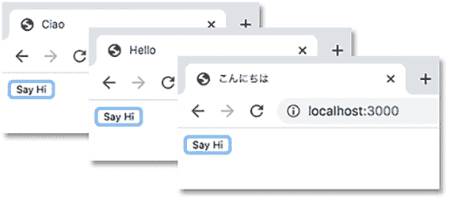

图 4.1 点击“说你好”按钮使用随机的问候语更新页面标题。

文档标题不是文档正文的一部分，并且不会被 React 渲染。但是标题可以通过窗口的`document`属性访问。你可以这样设置标题：

```
document.title = "Bonjour";
```

以这种方式访问浏览器 API 被认为是副作用。我们可以通过将代码包裹在`useEffect`钩子中来使其明确：

```
useEffect(() => {
  document.title = "Bonjour";
});
```

下面的列表显示了一个`SayHello`组件，当用户点击“说你好”按钮时，它会使用随机的问候语更新页面标题。

*直播*: [`jhijd.csb.app`](https://jhijd.csb.app), *代码*: [`codesandbox.io/s/sayhello-jhijd`](https://codesandbox.io/s/sayhello-jhijd)

列表 4.1 更新浏览器标题

```
import React, { useState, useEffect } from "react";      ❶

export default function SayHello () {
  const greetings = ["Hello", "Ciao", "Hola", "こんにちは"];

  const [index, setIndex] = useState(0);

  useEffect(() => {                                      ❷
    document.title = greetings[index];                   ❸
  });

  function updateGreeting () {
    setIndex(Math.floor(Math.random() * greetings.length));
  }

  return <button onClick={updateGreeting}>Say Hi</button>
}
```

❶ 导入`useEffect`钩子。

❷ 将函数，即效果，传递给`useEffect`钩子。

❸ 在效果内部更新浏览器标题。

组件使用随机生成的索引从数组中选择一个问候语。每当`updateGreeting`函数调用`setIndex`时，React 会重新渲染组件（除非索引值没有变化）。

React 在每次渲染后，在浏览器重新绘制页面后，在`useEffect`钩子内运行效果函数，以更新页面标题。注意，效果函数可以访问组件内的变量，因为它处于相同的范围。特别是，它使用了`greetings`和`index`变量的值。图 4.2 显示了如何将效果函数作为第一个参数传递给`useEffect`钩子。

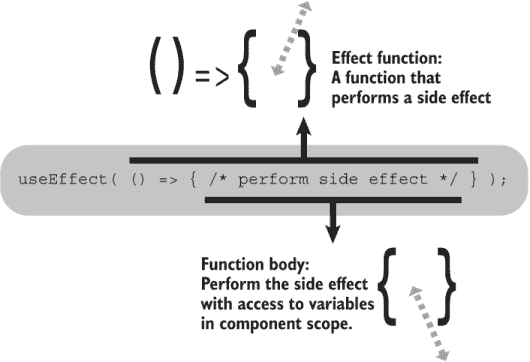

图 4.2 将效果函数传递给`useEffect`钩子

当你以这种方式调用`useEffect`钩子时，没有第二个参数，React 会在每次渲染后运行效果。但如果你只想在组件挂载时运行一个效果怎么办？

### 4.1.2 仅在组件挂载时运行效果

假设你想使用浏览器窗口的宽度和高度，可能用于一个酷炫的动画效果。为了测试读取尺寸，你创建了一个小组件来显示当前的宽度和高度，就像图 4.3 所示。

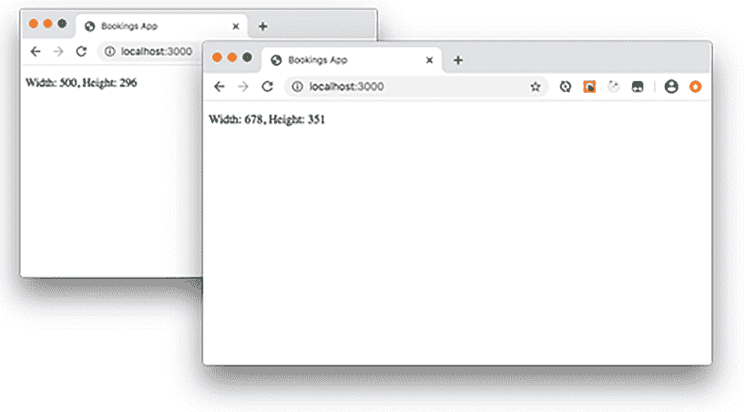

图 4.3 显示窗口的宽度和高度，当它被调整大小时

下面的列表显示了组件的代码。它尝试读取`window`对象的`innerWidth`和`innerHeight`属性，因此，我们再次使用`useEffect`钩子。

*实时预览*: [`gn80v.csb.app/`](https://gn80v.csb.app/)，*代码*: [`codesandbox.io/s/windowsize-gn80v`](https://codesandbox.io/s/windowsize-gn80v)

列表 4.2 调整窗口大小

```
import React, { useState, useEffect } from "react";

export default function WindowSize () {
  const [size, setSize] = useState(getSize());

  function getSize () {                                  ❶
    return {
      width: window.innerWidth,                          ❷
      height: window.innerHeight                         ❷
    };
  }

  useEffect(() => {
    function handleResize () {
      setSize(getSize());                                ❸
    }

    window.addEventListener('resize', handleResize);     ❹
  }, []);                                                ❺

  return <p>Width: {size.width}, Height: {size.height}</p>
}
```

❶ 定义一个返回窗口尺寸的函数。

❷ 从窗口对象中读取尺寸。

❸ 更新状态，触发重新渲染。

❹ 注册调整大小事件的监听器。

❺ 将空数组作为依赖参数传递。

在`useEffect`内部，组件注册了一个用于调整大小事件的监听器：

```
window.addEventListener('resize', handleResize);
```

当用户调整浏览器窗口大小时，`handleResize`处理程序通过调用`setSize`来更新状态，以获取新的尺寸：

```
function handleResize () {
  setSize(getSize());
}
```

通过调用更新器函数，组件会启动重新渲染。我们不希望每次 React 调用组件时都重新注册事件监听器。那么我们如何防止效果在每次渲染后都运行呢？秘诀是将空数组作为`useEffect`的第二个参数传递，如图 4.4 所示。

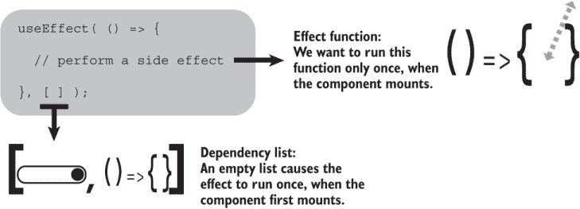

图 4.4 通过传递空依赖项数组，使效果函数在组件挂载时运行一次。

正如我们在 4.1.4 节中看到的，第二个参数是用于依赖项列表的。React 通过检查列表中的值自上次组件调用效果以来是否已更改来确定是否运行效果。通过将列表设置为空数组，列表将永远不会更改，我们导致效果仅在组件首次挂载时运行一次。

但是等等；警钟应该已经响起。我们注册了一个事件监听器……我们不应该让那个监听器一直监听，就像一个僵尸在墓穴中永远蹒跚而行。我们需要进行一些清理并注销监听器。让我们驯服那些僵尸。

### 4.1.3 通过返回函数清理副作用

我们在设置长时间运行的副作用，如订阅、数据请求、计时器和事件监听器时必须小心，以免弄乱。为了避免僵尸吞噬我们的大脑，我们的记忆开始泄漏，或者幽灵意外地移动家具，我们应该仔细撤销可能引起我们行动的幽灵般回声的任何效果。

`useEffect`钩子包含一个简单的清理我们效果的机制。只需从效果中返回一个函数。React 在需要整理时运行返回的函数。以下列表更新了我们的窗口测量应用程序，以便在不再需要时移除调整大小监听器。

*实时预览*: [`b8wii.csb.app/`](https://b8wii.csb.app/)，*代码*: [`codesandbox.io/s/windowsizecleanup-b8wii`](https://codesandbox.io/s/windowsizecleanup-b8wii)

列表 4.3 返回清理函数以移除监听器

```
import React, { useState, useEffect } from "react";

export default function WindowSize () {
  const [size, setSize] = useState(getSize());

  function getSize () {
    return {
      width: window.innerWidth,
      height: window.innerHeight
    };
  }

  useEffect(() => {
    function handleResize () {
      setSize(getSize());
    }

    window.addEventListener('resize', handleResize);

    return () => window.removeEventListener('resize', handleResize);    ❶
  }, []);

  return <p>Width: {size.width}, Height: {size.height}</p>
}
```

❶ 从效果中返回一个清理函数。

因为代码将空数组作为第二个参数传递给 `useEffect`，所以效果只会运行一次。当效果运行时，它会注册一个事件监听器。React 保留效果返回的函数，并在需要清理时调用它。在列表 4.3 中，返回的函数移除了事件监听器。我们的内存不会泄漏。我们的思维不会受到僵尸效果的影响。

图 4.5 展示了我们对 `useEffect` 钩子最新了解的这一步：返回一个清理函数。

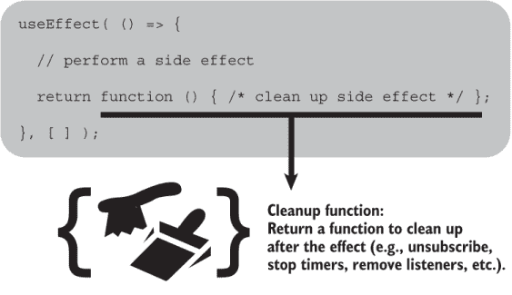

图 4.5 从效果中返回一个函数。React 将运行该函数来清理效果。

因为清理函数是在效果内部定义的，所以它可以访问效果作用域内的变量。在列表 4.3 中，清理函数可以移除 `handleResize` 函数，因为 `handleResize` 也是在同一个效果内部定义的：

```
useEffect(() => {
  function handleResize () {                                           ❶
    setSize(getSize());
  }

  window.addEventListener('resize', handleResize);

  return () => window.removeEventListener('resize', handleResize);     ❷
}, []);
```

❶ 定义 `handleResize` 函数。

❷ 在清理函数中引用 `handleResize` 函数。

React Hooks 方法，其中组件和钩子只是函数，很好地利用了 JavaScript 的固有特性，而不是过度依赖与底层语言概念上分离的特异 API 层。但这确实意味着，你需要很好地掌握作用域和闭包，以最好地理解在哪里放置你的变量和函数。

当 React 卸载组件时，它会运行清理函数。但这并不是它运行清理函数的唯一时间。每当组件重新渲染时，React 都会在运行效果函数之前调用清理函数，*如果效果需要再次运行的话*。如果有多个效果需要再次运行，React 会调用那些效果的清理函数。清理完成后，React 会根据需要重新运行效果函数。

我们已经看到了两种极端情况：只在第一次运行效果和每次渲染后都运行效果。如果我们想要对效果运行的时间有更多的控制呢？还有一个情况需要考虑。让我们填充那个依赖数组。

### 4.1.4 通过指定依赖项来控制效果运行的时间

图 4.6 是我们对 `useEffect` API 的最终说明，包括作为第二个参数传递的数组中的依赖值。

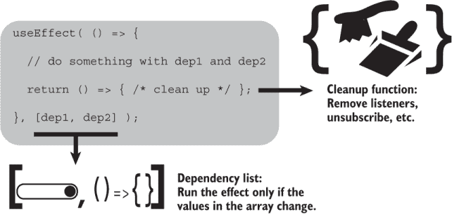

图 4.6 当调用 `useEffect` 时，你可以指定一个依赖项列表并返回一个清理函数。

每次 React 调用一个组件时，它都会记录 `useEffect` 调用的依赖数组中的值。如果自上次调用以来值数组已更改，React 会运行效果。如果值未更改，React 会跳过效果。这可以防止效果在它依赖的值未更改且任务结果将保持不变时运行。

让我们看看一个例子。假设你有一个用户选择器，允许你从下拉菜单中选择一个用户。你想要将选定的用户存储在浏览器的本地存储中，以便页面能够记住每次访问时选定的用户，如图 4.7 所示。

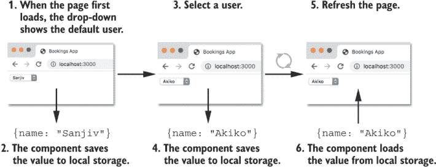

图 4.7 一旦选择了一个用户，刷新页面会自动重新选择相同的用户。

以下列表显示了实现所需效果的代码。它包括对`useEffect`的两个调用，一个用于从本地存储获取任何存储的用户，另一个用于在值更改时保存所选用户。

*实时*: [`c987h.csb.app/`](https://c987h.csb.app/)，*代码*: [`codesandbox.io/s/userstorage-c987h`](https://codesandbox.io/s/userstorage-c987h)

列表 4.4 使用本地存储

```
import React, { useState, useEffect } from "react";

export default function UserStorage () {
  const [user, setUser] = useState("Sanjiv");

  useEffect(() => {
    const storedUser = window.localStorage.getItem("user");   ❶

    if (storedUser) {
      setUser(storedUser);
    }
  }, []);                                                     ❷

  useEffect(() => {                                           ❸
    window.localStorage.setItem("user", user);                ❹
  }, [user]);                                                 ❺

  return (
    <select value={user} onChange={e => setUser(e.target.value)}>
      <option>Jason</option>
      <option>Akiko</option>
      <option>Clarisse</option>
      <option>Sanjiv</option>
    </select>
  );
}
```

❶ 从本地存储读取用户。

❷ 仅当组件首次挂载时运行此效果。

❸ 指定第二个效果。

❹ 将用户保存到本地存储。

❺ 当用户更改时运行此效果。

组件按预期工作，将更改保存到本地存储，并在页面重新加载时自动选择保存的用户。

但为了更好地理解函数组件及其钩子如何管理所有这些部分，让我们按照组件渲染和重新渲染的步骤以及页面访问者从列表中选择用户的步骤来运行。我们关注两个关键场景：

1.  访问者首先加载页面。本地存储中没有用户值。访问者从列表中选择一个用户。

1.  访问者刷新页面。本地存储中有一个用户值。

在我们通过步骤进行时，注意两个效果依赖列表如何确定效果函数的运行时机。

访问者首先加载页面

当组件首次运行时，它渲染带有 Sanjiv 选择的用户下拉列表。然后第一个效果运行。本地存储中没有用户，所以没有发生任何事情。然后第二个效果运行。它将 Sanjiv 保存到本地存储。以下是步骤：

1.  用户加载页面。

1.  React 调用组件。

1.  `useState`调用将`user`的值设置为`Sanjiv`。（这是组件第一次调用`useState`，所以使用初始值。）

1.  React 渲染带有 Sanjiv 选择的用户列表。

1.  效果 1 运行，但没有存储的用户。

1.  效果 2 运行，将`Sanjiv`保存到本地存储。

React 按照组件代码中出现的顺序调用效果函数。当效果运行时，React 会记录依赖列表中的值，在这个例子中是`[]`和`["Sanjiv"]`。

当访问者选择一个新的用户（比如 Akiko）时，`onChange`处理程序调用`setUser`更新函数。React 更新状态并再次调用组件。这次，效果 1 没有运行，因为它的依赖列表没有变化；它仍然是`[]`。但效果 2 的依赖列表已从`["Sanjiv"]`变为`["Akiko"]`，所以效果 2 再次运行，更新本地存储中的值。以下步骤继续：

1.  用户选择 Akiko。

1.  更新函数将用户状态设置为 Akiko。

1.  React 调用组件。

1.  `useState`调用将`user`的值设置为 Akiko。（这是组件第二次调用`useState`，所以使用第 8 步设置的最新值。）

1.  React 渲染带有 Akiko 选择的用户列表。

1.  Effect 1 不会运行（`[]` = `[]`）。

1.  Effect 2 运行（`["Sanjiv"]` != `["Akiko"]`），将 `Akiko` 保存到本地存储。

访问者刷新页面

当本地存储设置为 Akiko 时，如果用户重新加载页面，effect 1 将用户状态设置为存储的值，Akiko，正如我们在图 4.7 中所看到的。但在 React 调用组件的新状态值之前，effect 2 仍然需要使用旧值运行。以下是步骤：

1.  用户刷新页面。

1.  React 调用组件。

1.  `useState` 调用将 `user` 的值设置为 `Sanjiv`。（这是组件第一次调用 `useState`，因此使用初始值。）

1.  React 渲染带有 Sanjiv 选择的用户列表。

1.  Effect 1 运行，从本地存储中加载 Akiko 并调用 `setUser`。

1.  Effect 2 运行，将 Sanjiv 保存到本地存储。

1.  React 调用组件（因为 effect 1 调用了 `setUser`，改变了状态）。

1.  `useState` 调用将 `user` 的值设置为 `Akiko`。

1.  React 渲染带有 Akiko 选择的用户列表。

1.  Effect 1 不会运行（`[]` = `[]`）。

1.  Effect 2 运行（`["Sanjiv"]` != `["Akiko"]`），将 `Akiko` 保存到本地存储。

在步骤 6 中，effect 2 被定义为初始渲染的一部分，因此它仍然使用初始的 `user` 值，`Sanjiv`。

通过将 `user` 包含在 effect 2 的依赖项列表中，我们能够控制 effect 2 的运行时机：只有当 `user` 的值发生变化时才会运行。

### 4.1.5 总结调用 useEffect 钩子的方式

表 4.1 收集了 `useEffect` 钩子的各种用例到一个地方，展示了不同的代码模式如何导致不同的执行模式。

表 4.1 `useEffect` 钩子的各种用例

| 调用模式 | 代码模式 | 执行模式 |
| --- | --- | --- |
| 没有第二个参数 | `useEffect(() => {``// 执行效果``});` | 在每次渲染后运行。 |
| 作为第二个参数的空数组 | `useEffect(() => {``// 执行效果``}, []);` | 只运行一次，当组件挂载时。 |
| 作为第二个参数的依赖数组 | `useEffect(() => {``// 执行效果``// 使用 dep1 和 dep2``}, [dep1, dep2]);` | 当依赖数组中的任何值发生变化时运行。 |
| 返回一个函数 | `useEffect(() => {``// 执行效果``return () => {/* 清理 */};``}, [dep1, dep2]);` | React 将在组件卸载时运行清理函数，并在重新运行效果之前。 |

挑战 4.1

在 CodeSandbox（或你喜欢的任何地方），创建一个应用，当窗口大小调整时更新文档标题。它应该显示“小”、“中等”或“大”，具体取决于窗口的大小。

### 4.1.6 在浏览器重绘之前调用 useLayoutEffect 来运行效果

大多数时候，我们通过调用 `useEffect` 来同步副作用和状态。React 在组件渲染后和浏览器重绘屏幕之前运行效果。偶尔，我们可能在 React 更新 DOM 但浏览器尚未重绘之前想要对状态进行进一步的更改。我们可能想以某种方式使用 DOM 元素的尺寸来设置状态，例如。在 `useEffect` 中进行更改将使用户看到中间状态，该状态将立即更新。

我们可以通过调用 `useLayoutEffect` 钩子而不是 `useEffect` 来避免这种状态变化的闪烁。这个钩子具有与 `useEffect` 相同的 API，但在 React 更新 DOM 和浏览器重绘之前同步运行。如果效果对状态进行了进一步的更新，中间状态不会被绘制到屏幕上。通常你不需要 `useLayoutEffect`，但如果遇到问题（可能是一个元素在状态之间闪烁），你可以尝试将 `useEffect` 更换为有问题的效果。

既然我们已经看到了 `useEffect` 钩子能做什么，是时候获取一些数据了。让我们让我们的应用数据通过服务器而不是文件导入的方式变得可用。

## 4.2 获取数据

到目前为止，在这本书中，我们一直在从 static.json 文件导入预订应用示例的数据。但通常情况下，我们会从服务器获取数据。为了让我们的示例更加真实，让我们开始这样做。我们不会连接到公共服务器，而是在本地运行一个 JSON 服务器，使用位于 src 文件夹外的新的 db.json 文件。然后我们将创建一个从该服务器获取数据的组件。我们将涵盖以下内容：

+   创建新的 db.json 文件

+   使用 `json-server` 包设置 JSON 服务器

+   构建一个组件从我们的服务器获取数据，显示用户列表

+   在效果中使用 `async` 和 `await` 时要注意

### 4.2.1 创建新的 db.json 文件

在第二章和第三章中，我们从 static.json 文件中导入数据。对于我们的服务器，将预订、用户和可预订数据复制到项目根目录下的新的 db.json 文件中。不要复制 static.json 中的 `days` 和 `sessions` 数组；我们将这些视为配置信息，并继续导入。（在我们更新了当前正在使用它的组件之后，我们将从 static.json 中删除重复的数据。）

```
// db.json
{
  bookings: [/* empty */],
  users: [/* user objects */],
  bookables: [/* bookable objects */]
}

// static.json
{
  days: [/* names of days */],
  sessions: [/* session names */]
}
```

在后面的章节中，我们将开始通过发送 POST 和 PUT 请求来更新数据库文件。`create-react-app` 开发服务器在 src 文件夹内的文件更改时重启。将 db.json 文件放在 src 文件夹之外可以避免在测试添加新的可预订项目和进行预订时发生不必要的重启。

### 4.2.2 设置 JSON 服务器

到目前为止，我们一直从 JSON 文件 static.json 中导入 `BookablesList`、`UsersList` 和 `UserPicker` 组件的数据：

```
import {bookables} from "../../static.json";
import {users} from "../../static.json";
```

为了更好地展示我们在实际应用中执行的数据获取任务，我们希望通过 HTTP 提供我们的数据。幸运的是，我们不需要为我们的数据启动一个真实的数据库。我们可以使用 `json-server` npm 包。这个包是一个非常方便、简单的方式来提供 JSON 数据作为模拟 REST API。在 [`github.com/typicode/json-server`](https://github.com/typicode/json-server) 有一个用户指南，您可以查看这个包的灵活性。要使用 npm 全局安装此包，请输入以下命令：

```
npm install -g json-server
```

然后，从我们项目的根目录开始，使用以下命令启动服务器：

```
json-server --watch db.json --port 3001
```

您应该能够在 `localhost:3001` 上查询我们的数据库。图 4.8 显示了我启动服务器时机器上的终端输出。

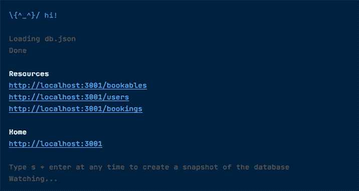

图 4.8 运行 `json-server` 的输出。`db.json` 文件中的属性已被转换为可获取资源的端点。

我们已经通过 URL 端点将 `db.json` 文件中的 JSON 数据公开。将文件中的数据与图 4.8 进行比较，您可以看到服务器已经将 JSON 对象的每个属性转换为端点。例如，要获取用户列表，请导航到 `localhost:3001/users`；要获取 ID 为 1 的用户，请导航到 `localhost:3001/users/1`。太棒了！

您可以在浏览器中测试这些请求。前面提到的两个请求的结果如图 4.9 所示：首先是数组中的用户对象列表，其次是具有 ID 为 1 的用户对象。

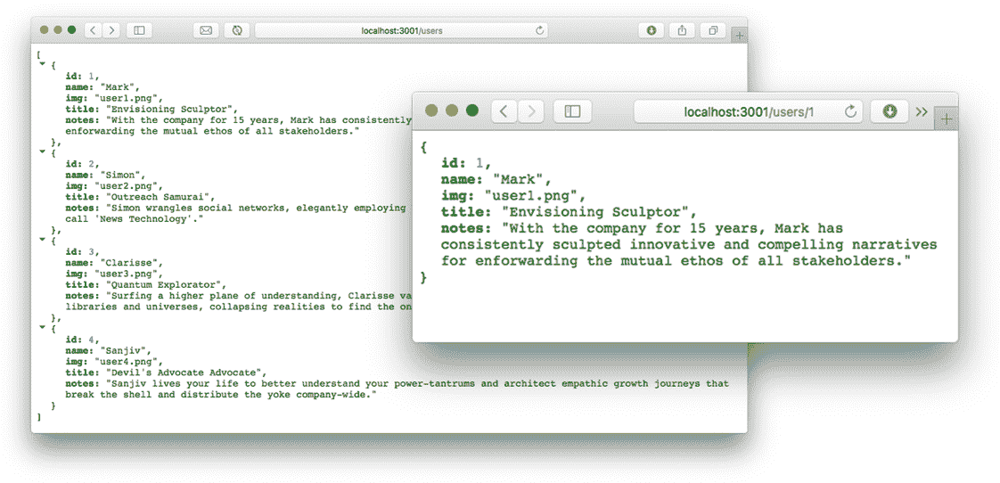

图 4.9 显示两个浏览器响应，我们的预订应用数据现在可以通过 HTTP 获取

让我们尝试我们的服务器，并从 `useEffect` 钩子中获取一些数据。

### 4.2.3 在 useEffect 钩子中获取数据

为了介绍从 `useEffect` 钩子中进行数据获取，我们更新了 `UserPicker` 组件，从我们的 JSON 数据库中获取用户。图 4.10 显示了包含四个用户的展开下拉列表。


图 4.10 显示从数据库中获取的用户列表

记住，React 在渲染后调用 effect 函数，因此数据在第一次渲染时不可用；我们将用户列表的空列表设置为初始值，并返回替代 UI，一个新的 `Spinner` 组件，用于加载状态。以下列表显示了获取用户列表并将其显示在下拉列表中的代码。

分支：0401-user-picker，文件：/src/components/Users/UserPicker.js

列表 4.5 `UserPicker` 组件获取数据

```
import {useState, useEffect} from "react"; 
import Spinner from "../UI/Spinner";

export default function UserPicker () {
  const [users, setUsers] = useState(null);

 useEffect(() => {                          ❶

    fetch("http://localhost:3001/users")     ❷
      .then(resp => resp.json())             ❸
      .then(data => setUsers(data));         ❹

  }, []);                                    ❺

  if (users === null) {
    return <Spinner/>                        ❻
  }

  return (
    <select>
      {users.map(u => (
        <option key={u.id}>{u.name}</option>
      ))}
    </select>
  );
}
```

❶ 在 effect 函数内部获取数据。

❷ 使用浏览器的 fetch API 向数据库发送请求。

❸ 将返回的 JSON 字符串转换为 JavaScript 对象。

❹ 更新状态以包含已加载的用户。

❺ 包含一个空的依赖数组，以便在组件首次挂载时加载数据。

❻ 在用户加载时返回替代 UI。

`UserPicker` 代码使用浏览器的 fetch API 从数据库中检索用户列表，通过使用 `resp.json` 方法将响应解析为 JSON，并调用 `setUsers` 以更新本地状态。组件最初渲染一个 `Spinner` 占位符（来自存储库中新的 /src/components/UI 文件夹），然后将其替换为用户列表。如果您想向 fetch 调用添加延迟，以更好地查看任何加载状态，请使用带有 `delay` 标志启动 JSON 服务器。此代码片段将响应延迟 3000 毫秒，即 3 秒：

```
json-server --watch db.json --port 3001 --delay 3000
```

列表 4.5 中的效果只在其组件挂载时运行一次。我们预计用户列表不会改变，因此不需要管理列表的重新加载。以下列表显示了以这种方式从效果中获取数据的步骤：

1.  React 调用组件。

1.  `useState` 调用将 `users` 变量设置为 `null`。

1.  `useEffect` 调用将数据获取效果函数注册到 React 中。

1.  `users` 变量是 `null`，因此组件返回旋转图标。

1.  React 运行效果，从服务器请求数据。

1.  数据到达，效果调用 `setUsers` 更新器函数，触发重新渲染。

1.  React 调用组件。

1.  `useState` 调用将 `users` 变量设置为返回的用户列表。

1.  `useEffect` 的空依赖数组 `[]` 未改变，因此钩子调用不会重新注册效果。

1.  `users` 数组有四个元素（它不是 `null`），因此组件返回下拉 UI。

这种在组件渲染之前启动数据请求的获取数据方法被称为 *渲染时获取*。其他方法有时可以为用户提供更平滑的体验，我们将在第二部分中查看其中一些。但根据数据源复杂性和稳定性以及应用程序需求，在 `useEffect` 钩子调用中获取数据的简单性可能完全足够，并且非常吸引人。

挑战 4.2

更新 `UsersPage` 上的 `UsersList` 组件以从服务器获取用户数据。0402-users-list 分支包含更新组件的挑战解决方案代码。

### 4.2.4 使用 async 和 await

列表 4.5 中的 `fetch` 调用返回一个承诺，列表使用承诺的 `then` 方法来处理响应：

```
fetch("http://localhost:3001/users")
  .then(resp => resp.json())
  .then(data => setUsers(data)); 
```

JavaScript 还提供了 `async` 函数和 `await` 关键字来处理异步响应，但与 `useEffect` 钩子结合使用时有一些注意事项。作为将我们的数据获取转换为 async-await 的初始尝试，我们可能会尝试这样做：

```
useEffect(async () => {
  const resp = await fetch("http://localhost:3001/users");
  const data = await (resp.json());
  setUsers(data);
}, []);
```

但这种方法会触发 React 在控制台显示警告，如图 4.11 所示。

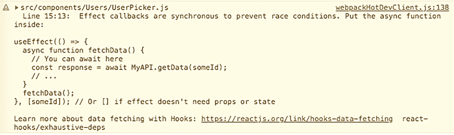

图 4.11 我们使用 async-await 的数据获取效果导致 React 发布了一些警告。

浏览器传来的关键信息如下：

+   效果回调是同步的，以防止竞争条件。将异步函数放在里面。

`async` 函数默认返回一个承诺。将效果函数设置为 `async` 会导致问题，因为 React 正在寻找效果返回值应该是一个清理函数。为了解决问题，请记住将 `async` 函数放在效果函数内部，而不是使效果函数本身 `async`：

```
useEffect(() => {
  async function getUsers() {           ❶
    const resp = await fetch(url);      ❷
    const data = await (resp.json());   ❷
    setUsers(data);
  }
 getUsers();                           ❸
}, []);
```

❶ 定义一个异步函数。

❷ 等待异步结果。

❸ 调用异步函数。

现在我们已经设置了 JSON 服务器，尝试了使用 `useEffect` 钩子的 fetch-on-render 数据获取方法的示例，并花了一点时间考虑 async-await 语法，我们准备更新预订应用程序以获取 `BookablesList` 组件的数据。

## 4.3 为 `BookablesList` 组件获取数据

在前面的章节中，我们看到了一个组件如何在初始渲染后通过在 `useEffect` 钩子调用中包含获取代码来加载数据。更复杂的应用程序由许多组件和多个数据查询组成，这些查询可能使用多个端点。您可能会尝试通过将状态及其相关数据获取操作移动到单独的数据存储中，然后连接组件到存储来简化这种复杂性。但对于您的应用程序，将数据获取放在消耗数据的组件中可能是一个更直接和易于理解的方法。我们将在第九章中考虑不同的方法，当时我们将查看自定义钩子，以及在第二部分中查看数据获取的模型。

目前，我们将保持简单，让 `BookablesList` 组件加载自己的数据。我们将通过四个步骤开发其数据获取功能：

+   检查数据加载过程

+   更新 reducer 以管理加载和错误状态

+   创建一个辅助函数来加载数据

+   加载可预订项

### 4.3.1 检查数据加载过程

在 4.2 节中，`UserPicker` 组件使用了 fetch API 从 JSON 数据库服务器加载数据列表。对于 `BookablesList` 组件，我们考虑了加载和错误状态以及可预订项本身。我们希望更新的组件具体做什么？

在组件首次渲染后，它将发出对所需数据的请求。在此阶段，在任何数据加载之前，我们没有可预订项或组来显示，因此组件将显示一个加载指示器，如图 4.12 所示。

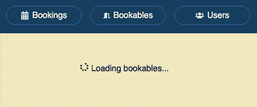

图 4.12 当数据正在加载时，`BookablesList` 组件显示一个加载指示器。

如果在加载数据时出现问题——可能是网络、服务器、授权或缺少文件问题——组件将显示如图 4.13 所示的错误消息。

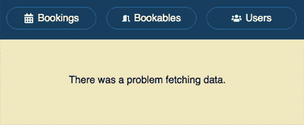

图 4.13 `BookablesList` 组件在加载数据时显示错误消息。

如果一切顺利并且数据到达，它将在我们第二章和第三章中开发的 UI 中显示。来自“房间”组的“会议室”可预订项被选中，其详细信息正在显示。图 4.14 显示了预期的结果。

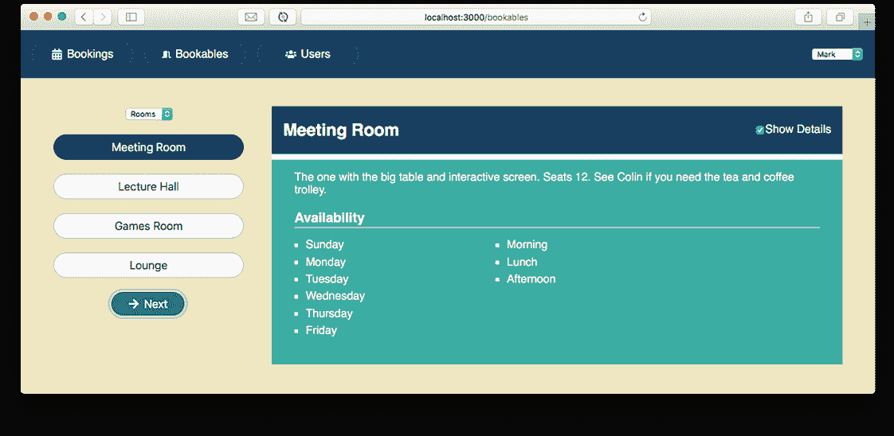

图 4.14 `BookablesList`组件显示了数据加载后的可预订项列表。

到这个时候，用户将能够与应用程序交互，选择组和可预订项，使用“下一步”按钮遍历可预订项，以及使用“显示详细信息”复选框切换可预订项的详细信息。

在第三章中，我们创建了一个 reducer 来帮助管理`BookablesList`组件的状态。我们应该如何更新 reducer 以应对新的功能？

### 4.3.2 更新 reducer 以管理加载和错误状态

我们已经看到了我们试图实现的目标。现在我们必须考虑驱动此类界面的组件状态。为了启用加载指示器和错误消息，我们在状态中添加了两个额外的属性：`isLoading`和`error`。我们还把可预订项设置为空数组。完整的初始状态现在看起来是这样的：

```
{
    group: "Rooms",
    bookableIndex: 0,
    hasDetails: true,
    bookables: [],
    isLoading: true,
 error: false 
}
```

组件将在第一次渲染后开始加载数据，所以我们从一开始就将`isLoading`设置为`true`。我们的初始 UI 将是加载指示器。

为了响应数据获取事件而更改状态，我们在 reducer 中添加了三个新的动作类型：

+   `FETCH_BOOKABLES_REQUEST`—组件初始化请求。

+   `FETCH_BOOKABLES_SUCCESS`—可预订项从服务器到达。

+   `FETCH_BOOKABLES_ERROR`—出了些问题。

在以下列表之后，我们进一步讨论了新的动作类型，它们在我们的更新 reducer 中显示。

分支：0403-bookables-list，文件：/src/components/Bookables/reducer.js

列表 4.6 在 reducer 中管理加载和错误状态

```
export default function reducer (state, action) {
  switch (action.type) {
    case "SET_GROUP": return { /* unchanged */ }
    case "SET_BOOKABLE": return { /* unchanged */ }
    case "TOGGLE_HAS_DETAILS": return { /* unchanged */ }
    case "NEXT_BOOKABLE": return { /* unchanged */ }

    case "FETCH_BOOKABLES_REQUEST":
      return {
        ...state,
        isLoading: true,
        error: false,
        bookables: []                 ❶
      };

    case "FETCH_BOOKABLES_SUCCESS":
      return {
        ...state,
        isLoading: false,
        bookables: action.payload     ❷
      };

    case "FETCH_BOOKABLES_ERROR":
      return {
        ...state,
        isLoading: false,
        error: action.payload         ❸
      };

    default:
      return state;
  }
}
```

❶ 请求新数据时清除可预订项。

❷ 通过负载将加载的可预订项传递给 reducer。

❸ 通过负载将错误传递给 reducer。

FETCH_BOOKABLES_REQUEST

当组件发送其请求获取可预订项数据时，我们希望在 UI 中显示加载指示器。除了将`isLoading`设置为`true`外，我们确保没有现有的可预订项，并清除任何错误消息。

FETCH_BOOKABLES_SUCCESS

哇哦！可预订项已经到达，并且位于动作的负载中。我们希望显示它们，所以将`isLoading`设置为`false`并将负载分配给`bookables`状态属性。

FETCH_BOOKABLES_ERROR

哎！出了些问题，错误消息在动作的负载中。我们希望显示错误消息，所以将`isLoading`设置为`false`并将负载分配给`error`状态属性。

你可以看到，对于每个动作，都有很多相互关联的状态变化在进行；有一个 reducer 来分组和集中这些变化是非常有帮助的。

### 4.3.3 创建一个辅助函数来加载数据

当`UserPicker`组件获取其数据时，它没有担心加载状态或错误消息；它直接在`useEffect`钩子内部调用`fetch`。现在我们做了一些更多的事情，在数据加载时给用户一些反馈，可能最好创建一些专门的数据获取函数。我们希望我们的数据代码执行三个关键任务：

+   发送请求

+   检查响应是否存在错误

+   将响应转换为 JavaScript 对象

下面的列表中的`getData`函数执行了所需的三个任务。在列表之后，我们将更详细地讨论每个任务。在 utils 文件夹中已添加文件 api.js。

分支：0403-bookables-list，文件：/src/utils/api.js

列表 4.7 获取数据的函数

```
export default function getData (url) {                       ❶

  return fetch(url)                                           ❷
    .then(resp => {

      if (!resp.ok) {                                         ❸
        throw Error("There was a problem fetching data."); ❹
      }

      return resp.json();                                     ❺
    });
}
```

❶ 接受一个 URL 参数。

❷ 将 URL 传递给浏览器的 fetch 函数。

❸ 检查响应是否存在问题。

❹ 对于任何问题抛出错误。

❺ 将响应的 JSON 字符串转换为 JavaScript 对象。

发送请求

`getData`函数接受一个参数，即`url`，并将其传递给`fetch`函数。（`fetch`函数还接受第二个参数，即`init`对象，但我们现在不会使用它。）您可以在 MDN 上了解更多关于 fetch API 的信息：[`mng.bz/1r81`](http://mng.bz/1r81)。`fetch`返回一个 promise，它应该解析为从响应对象中获取我们的数据。

检查响应是否存在错误

我们在 fetch 返回的 promise 上调用`then`，设置一个函数来对响应进行一些初始处理：

```
return fetch(url)
  .then(resp => {
    // do some initial processing of the response
  });
```

首先，我们检查响应的状态，如果状态不是`ok`（HTTP 状态码不在 200 到 299 的范围内），则抛出错误：

```
if (!resp.ok) {
  throw Error("There was a problem fetching data.");
}
```

状态码不在 200 到 299 范围内的响应是有效的，`fetch`不会自动为它们抛出任何错误。我们进行自己的检查，并在必要时抛出错误。我们在这里不捕获任何错误；调用代码应设置它需要的任何`catch`块。

将响应转换为 JavaScript 对象

如果响应通过检查，我们将服务器返回的 JSON 字符串转换为 JavaScript 对象，通过调用响应的`json`方法。`json`方法返回一个 promise，它解析为我们的数据对象，然后我们从函数中返回这个 promise：

```
return resp.json();
```

`getData`函数对`fetch`的响应进行了一些预处理，有点像中间件。使用`getData`的组件不需要自己进行这些预处理检查和更改。让我们看看`BookablesList`组件如何使用我们的数据获取函数来加载用于显示的 bookables。

### 4.3.4 加载 bookables

是时候享受所有这些准备带来的好处了。列表 4.8 显示了最新的`BookablesList`组件文件。代码导入了我们新的`getData`函数，并在组件首次挂载时运行的`useEffect`钩子中使用它。它还包括`isLoading`和`error`状态值以及一些相关的 UI，用于数据加载或显示错误消息时。

分支：0403-bookables-list，文件：/src/components/Bookables/BookablesList.js

列表 4.8 `BookablesList`组件加载其自身的数据

```
import {useReducer, useEffect, Fragment} from "react"; 
import {sessions, days} from "../../static.json";             ❶
import {FaArrowRight} from "react-icons/fa";
import Spinner from "../UI/Spinner";
import reducer from "./reducer";

import getData from "../../utils/api";                        ❷

const initialState = {
  group: "Rooms",
  bookableIndex: 0,
  hasDetails: true,
  bookables: [],                                              ❸
  isLoading: true,                                            ❹
  error: false                                                ❹
};

export default function BookablesList () {
  const [state, dispatch] = useReducer(reducer, initialState); 

  const {group, bookableIndex, bookables} = state;
  const {hasDetails, isLoading, error} = state;               ❺

  const bookablesInGroup = bookables.filter(b => b.group === group);
  const bookable = bookablesInGroup[bookableIndex];
  const groups = [...new Set(bookables.map(b => b.group))];

  useEffect(() => {

    dispatch({type: "FETCH_BOOKABLES_REQUEST"});              ❻

    getData("http://localhost:3001/bookables")                ❼

      .then(bookables => dispatch({                           ❽
        type: "FETCH_BOOKABLES_SUCCESS",                      ❽
        payload: bookables                                    ❽
      }))

      .catch(error => dispatch({                              ❾
        type: "FETCH_BOOKABLES_ERROR",                        ❾
        payload: error                                        ❾
      }));

  }, []);

  function changeGroup (e) {}
  function changeBookable (selectedIndex) {}
  function nextBookable () {}
  function toggleDetails () {}

  if (error) {                                                ❿
    return <p>{error.message}</p>                             ❿
  }                                                           ❿

  if (isLoading) {                                            ⓫
    return <p><Spinner/> Loading bookables...</p>             ⓫
  }                                                           ⓫

  return ( /* unchanged UI for bookables and details */ );
}
```

❶ 不再导入 bookables。

❷ 导入 getData 函数。

❸ 将 bookables 设置为空数组。

❹ 将新属性添加到初始状态中。

❺ 从状态中解构新属性。

❻ 分发一个动作以开始数据获取。

❼ 获取数据。

❽ 在状态中保存加载的预订项。

❾ 更新状态以包含任何错误。

❿ 如果有错误，返回一些简单的错误 UI。

⓫ 在等待数据时返回一些简单的加载 UI。

`getData`的调用在效果函数中。在第 4.3.3 节中，我们看到了`getData`如何返回一个 promise 并可以抛出错误。因此，在第 4.8 节中，我们使用了`then`和`catch`方法，从每个中分发适当的动作，这些动作在第 4.3.2 节中进行了讨论。最后，我们使用`if`语句来返回加载和错误条件下的 UI。如果没有错误且`isLoading`为`false`，我们返回现有的可预订列表和可预订详情的 UI。

挑战 4.3

更新`UsersList`组件以使用`getData`函数并管理加载和错误状态。可能的解决方案代码位于 0404-users-errors 分支。

我们将在第六章回到数据获取，当我们扩展预订应用中的组件列表时。在那之前，在下一章中，我们将研究在组件中管理状态的另一种方法：`useRef`钩子。

## 摘要

+   有时我们的组件会超出 React 数据流过程，直接与其他 API 交互，最常见的是在浏览器中。以某种方式影响外部世界的动作被称为*副作用*。

+   常见的副作用包括强制设置页面标题、使用定时器如`setInterval`或`setTimeout`、测量 DOM 中元素的宽度或高度或位置、将消息记录到控制台、在本地存储中设置或获取值、获取数据或订阅和取消订阅服务。

+   将副作用放在效果函数内部，作为`useEffect`钩子的第一个参数：

    ```
    useEffect(() => {
      // perform effect
    });
    ```

    React 在每次渲染后都会运行效果函数。

+   要管理效果函数何时运行，将依赖项数组作为`useEffect`钩子的第二个参数传递。

+   传递一个空的依赖项数组，使 React 在组件挂载时运行一次效果函数：

    ```
    useEffect(() => {
      // perform effect
    }, []);
    ```

+   在依赖数组中包含效果函数的所有依赖项，以便 React 在指定依赖项的值发生变化时运行效果函数：

    ```
    useEffect(() => {
      // perform effect
      // that uses dep1 and dep2
    }, [dep1, dep2]);
    ```

+   从效果中返回一个清理函数，React 将在重新运行效果函数之前以及组件卸载时运行此函数：

    ```
    useEffect(() => {
      // perform effect
      return () => {/* clean-up */};
    }, [dep1, dep2]);
    ```

+   如果您使用的是渲染时获取数据的方法，请在效果内部获取数据。React 将渲染组件，然后触发数据获取代码。当数据到达时，它将重新渲染组件：

    ```
    useEffect(() => {
      fetch("http://localhost:3001/users")
        .then(resp => resp.json())
        .then(data => setUsers(data));
    }, []);
    ```

+   为了避免竞争条件和遵循从效果函数返回空或清理函数的约定，将`async`函数放在效果函数内部。根据需要，您可以立即调用它们：

    ```
    useEffect(() => {
      async function getUsers() {
        const resp = await fetch(url);
        const data = await (resp.json());
        setUsers(data);
      }
     getUsers();
    }, []);
    ```

+   将单独的副作用放入单独的 `useEffect` 调用中。这样会更易于理解每个副作用的作用，更易于通过使用单独的依赖项列表来控制副作用何时运行，并且更易于将副作用提取到自定义钩子中。

+   如果在重新渲染时，多个副作用将要运行，React 将在运行任何自身效果之前，调用所有正在重新运行的效果的清理函数。
