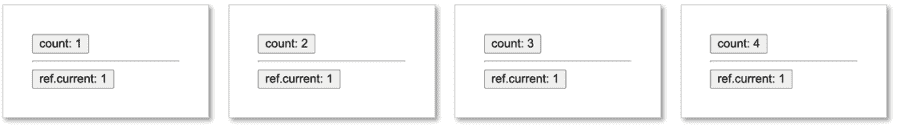
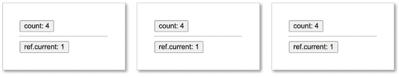
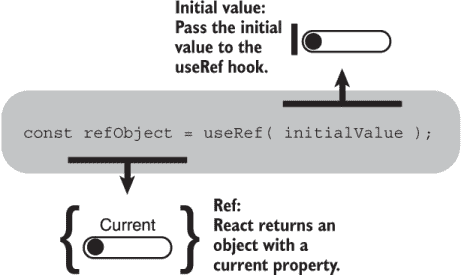
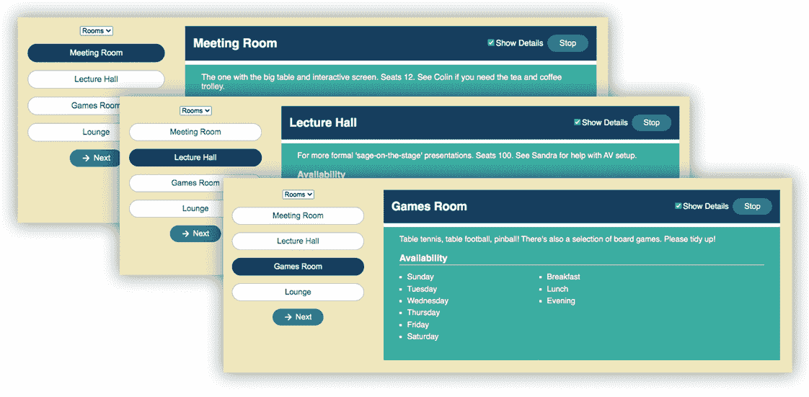
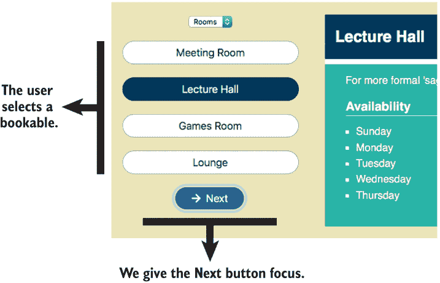
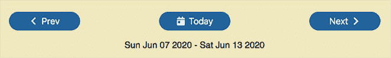
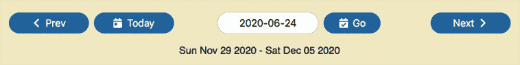

# 5 使用`useRef`钩子管理组件状态

本章涵盖

+   调用`useRef`钩子以获取引用

+   通过将值分配给其`current`属性来更新引用

+   无触发重新渲染的状态更新

+   在 JSX 中设置`ref`属性以将 DOM 元素引用分配给引用

+   通过引用访问 DOM 元素属性和方法

虽然你组件存储的大多数值将直接表示在应用程序的用户界面中，但有时你可能会使用一个变量仅用于应用程序的机制，而不是供用户消费。你可能需要使用`setTimeout`或`setInterval`作为动画的一部分，因此你需要保留它们返回的 ID。或者你可能想以非受控输入的形式与 DOM 表单元素一起工作，因此你需要保留对这些元素的引用。无论如何，你可能不需要向用户显示这些值，因此更改它们不应自动触发重新渲染。

本章从两个示例开始，探讨在不更新 UI 的情况下改变状态：首先是比较使用`useState`和`useRef`管理状态，然后是一个更长的示例，展示如何为`BookablesList`组件的新演示模式管理计时器。本章的后半部分有两个更多示例，这次是探索对 DOM 元素的引用：在`BookablesList`组件中自动设置焦点，以及从文本框中读取`WeekPicker`组件的日期。这些示例的混合将帮助你更好地理解`useRef`钩子如何帮助你管理组件中的状态。

好的，1，2，3，我们出发吧！

## 5.1 无重新渲染状态更新

在本节中，我们使用一个简单的`Counter`组件来介绍引用作为在渲染之间持久化状态的一种方式。使用`useState`钩子，调用状态值的更新器函数通常会导致重新渲染。使用`useRef`钩子，我们可以更新我们的值而不需要相应的 UI 变化。我们首先看看当用户点击其按钮时`Counter`组件的行为，增加计数器（但不一定是 UI），以及实现这种行为的代码。然后，在看到`useRef`的实际应用后，我们关注新钩子的 API。

### 5.1.1 比较更新状态值时使用`useState`和`useRef`

图 5.1 显示了`Counter`组件 UI 的四个截图，其中有两个按钮，一个标有*count*，另一个标有*ref.current*。每个按钮旁边还有一个附加到按钮文本的计数器。按钮的行为方式不同。

点击计数按钮会增加其计数，如图所示，图中显示了原始组件和点击三次的结果。按钮计数从 1 增加到 2，再到 3，然后到 4。每次增加都伴随着重新渲染，因此`Counter`组件显示了最新的值。



图 5.1 每次点击 Count 按钮都会将计数增加 1。因为事件处理程序通过调用其更新函数来增加计数，所以 React 在每次更改后都会重新渲染组件。

图 5.2 显示了随后点击 Ref.current 按钮三次的结果。其计数器似乎没有变化。组件显示 1，然后 1，然后 1。实际上，值*确实*在增加，从 1 增加到 2，然后到 3，最后到 4。只是改变`ref.current`的值并不会导致 React 重新渲染，所以`Counter`组件继续显示旧值。



图 5.2 点击 Ref.current 按钮三次似乎没有效果。实际上，事件处理程序确实将`ref.current`增加到 2，然后是 3，然后是 4，但 React 没有重新渲染组件。

再次点击 Count 按钮将计数器从 4 增加到 5。React 重新渲染组件以显示最新的值，如图 5.3 所示。这样做也会更新 Ref.current 按钮显示的值，并跳转到 4，其当前值。


图 5.3 再次点击 Count 按钮将计数增加到 5。React 重新渲染组件，现在显示了`count`和`ref.current`的最新值。

在前面的章节中，你已经看到了如何通过使用`useState`钩子来实现像 Count 按钮这样的按钮。我们如何实现 Ref.current 按钮，其中状态在渲染之间保持不变，但更新 ref 不会导致重新渲染？以下列表显示了按钮示例的代码，包括第一次调用`useRef`钩子。

*Live*: [`gh6xz.csb.app/`](https://gh6xz.csb.app/), *Code*: [`codesandbox.io/s/counterstatevsref-gh6xz`](https://codesandbox.io/s/counterstatevsref-gh6xz)

列表 5.1 比较更新状态时`useState`和`useRef`。

```
import React, { useRef, useState } from "react";

function Counter() {
  const [count, setCount] = useState(1);                                ❶
  const ref = useRef(1);                                                ❷

 const incCount = () => setCount(c => c + 1);                          ❸

  const incRef = () => ref.current++;                                   ❹

  return (
    <div className="App">
      <button onClick={incCount}>count: {count}</button>                ❺
      <hr />
      <button onClick={incRef}>ref.current: {ref.current}</button>     ❻
    </div>
  );
}
```

❶ 使用 useState 初始化计数值。

❷ 使用 useRef 初始化 ref 值。

❸ 定义一个处理程序，该处理程序调用 setCount 来增加计数。

❹ 定义一个更新 ref 的“current”属性的处理器。

❺ 调用计数值的处理程序。

❻ 调用 ref 值的处理程序。

那么，为什么按钮的行为不同呢？嗯，一个使用`useState`钩子，另一个使用`useRef`钩子。

Count 按钮通过调用`useState`来让 React 管理其计数状态值。按钮的事件处理程序使用状态值的更新函数`setCount`来更改计数器。调用更新函数会改变状态并触发重新渲染。React 在渲染之间保持状态，每次都将它传回组件，其中它被分配给`count`变量。

Ref.current 按钮通过调用`useRef`让 React 管理其计数状态值。这个钩子返回一个对象，一个*ref*，我们用它来存储状态值。改变存储在 ref 上的值不会触发重新渲染。React 在渲染之间保持状态，每次都将相同的 ref 对象传递回组件，其中它被分配给`ref`变量。

列表 5.1 中的两个按钮都包含在按钮文本中的状态值，`{count}`和`{ref.current}`，并在用户点击它们时调用一个处理函数。但`.current`是什么意思？让我们更仔细地看看如何使用`useRef`。

### 5.1.2 调用 useRef

在列表 5.1 中，我们通过调用`useRef`并传递一个初始值`1`从 React 获取一个 ref。我们将 ref 分配给一个变量，`ref`：

```
const ref = useRef(1);
```

`useRef`函数返回一个具有`current`属性的对象，如图 5.4 所示。每次 React 运行组件代码时，每次对`useRef`的调用都将返回相同的 ref 对象。



图 5.4 `useRef`返回一个具有 current 属性的对象。

第一次 React 调用组件代码时，它将你传递给`useRef`函数的初始值分配给 ref 对象的`current`属性：

```
const ref1 = useRef("Towel");
const ref2 = useRef(42);

ref1.current;  // "Towel"
ref2.current;  // 42
```

在后续的渲染中，React 根据`useRef`调用的顺序将相同的 ref 对象分配给相应的变量。你可以通过将它们分配给 refs 的`current`属性来持久化状态值：

```
ref1.current = "Babel Fish";
ref2.current = "1,000,000,000,000";
```

将新值分配给 ref 对象的`current`属性不会触发重新渲染。但作为 React 总是返回相同的 ref 对象，新值在组件再次运行时是可用的。

好吧，按钮示例有点简单，也有点奇怪——谁会想要坏掉的按钮？现在是时候增加一点复杂性了。

## 5.2 使用 ref 存储计时器 ID

在上一节中，你看到了如何使用`useRef`钩子在渲染之间为我们的函数组件保持状态。要更新`useRef`返回的 ref，我们将它的`current`属性设置为我们要存储的值。以这种方式更改`current`属性不会导致组件重新渲染。在本节中，我们来看一个稍微复杂一点的例子，使用`useRef`钩子来请求 React 帮助管理计时器的 ID。我们回到预订应用作为我们的上下文。

假设你的老板想要你为`BookablesList`组件创建一个演示模式。在你点击停止按钮之前，组件应该自动依次选择每个可预订项，显示其详细信息，就像你在图 5.5 中看到的那样。你的老板认为这会非常适合公司去年购买的接待室屏幕。



图 5.5 在演示模式下，应用程序将自动依次前进到每个可预订项，显示其详细信息，直到你点击停止按钮（右上角）。

在演示模式下独立运行时，组件会遍历组中的所有可预订项，当它离开最后一个时，会回到第一个。我们将使用定时器来安排组件何时移动到下一个可预订项。如果用户点击停止按钮，演示模式结束，我们将取消任何正在运行的定时器。以下列表显示了用于存储定时器 ID 的 ref、设置定时器的新效果以及停止按钮的 UI。

分支：0501-timer-ref，文件：/src/components/Bookables/BookablesList.js

列表 5.2 使用 ref 保持演示模式下的定时器 ID

```
import {useReducer, useEffect, useRef, Fragment} from "react";    ❶
import {sessions, days} from "../../static.json";
import {FaArrowRight} from "react-icons/fa";
import Spinner from "../UI/Spinner";
import reducer from "./reducer";
import getData from "../../utils/api";

const initialState = { /* unchanged */ };

export default function BookablesList () {

  // unchanged variable setup

 const timerRef = useRef(null);                                  ❷

  useEffect(() => { /* load data */ }, []);

 useEffect(() => {                                               ❸

    timerRef.current = setInterval(() => {                        ❹
 dispatch({ type: "NEXT_BOOKABLE" });
 }, 3000);

 return stopPresentation;                                 ❺

  }, []); 
  function stopPresentation () {                                  ❻
 clearInterval(timerRef.current);                              ❻
 }                                                               ❻

  function changeGroup (e) { /* unchanged */ }
  function changeBookable (selectedIndex) { /* unchanged */ }
  function nextBookable () { /* unchanged */ }
  function toggleDetails () { /* unchanged */ }

  // unchanged UI for error and loading

  return (
    <Fragment>
      <div>
      { /* list of bookables */ }
      </div>

      {bookable && (
        <div className="bookable-details">
          <div className="item">
            <div className="item-header">
              <h2>
                {bookable.title}
              </h2>
              <span className="controls">
                <label>
                  <input
                    type="checkbox"
                    checked={hasDetails}
                    onChange={toggleDetails}
                  />
                  Show Details
                </label>
                <button                                         ❼
 className="btn"
 onClick={stopPresentation}                    ❽
 >
 Stop
 </button>
              </span>
            </div>

            { /* further details */ }
          </div>
        </div>
      )}
    </Fragment>
  );
}
```

❶ 导入 useRef 钩子。

❷ 将 ref 分配给 timerRef 变量。

❸ 当组件首次挂载时运行一个效果。

❹ 启动一个间隔定时器，并将其 ID 分配给 ref 的`current`属性。

❺ 返回一个清除定时器的函数。

❻ 使用定时器 ID 清除定时器。

❼ 包含一个停止按钮。

❽ 从按钮调用 stopPresentation 函数。

当我们在新效果中设置定时器时，浏览器的`setInterval`方法返回一个 ID。如果需要（如果用户点击停止按钮或导航到应用中的另一个页面），我们可以使用该 ID 来清除定时器。`stopPresentation`函数需要访问 ID 以便它可以清除定时器。我们需要存储 ID，但当我们开始或停止定时器时，无需重新渲染组件，因此我们不想使用`useState`钩子。我们使用`useRef`钩子，因此我们需要导入它：

```
import {useReducer, useEffect, useRef, Fragment} from "react";
```

我们调用`useRef`，将其`null`作为初始值传递，因为还没有定时器。每次组件运行时，`useRef`都会返回相同的 ref 对象，我们将它分配给`timerRef`变量：

```
const timerRef = useRef(null);
```

我们使用 ref 来存储我们的定时器 ID，通过将 ID 分配给 ref 的`current`属性：

```
timerRef.current = setInterval(/* wibbly-wobbly, timey-wimey stuff */, 3000);
```

`stopPresentation`函数使用存储在`timerRef.current`中的 ID 来清除定时器并结束演示模式。该函数在用户点击停止按钮时运行，并且由于第二个效果将其作为清理函数返回，当用户导航到应用中的另一个页面且组件卸载时：

```
function stopPresentation () {
 window.clearInterval(timerRef.current);
} 
```

本节介绍了使用 ref 存储状态以避免更新状态导致组件重新渲染的另一个示例。在设置和清除定时器 ID 时，无需重新运行组件代码，因此使用 ref 来存储其值是有意义的。下一节将探讨 refs 的一个非常常见的用例，即保持对 DOM 元素的引用。

## 5.3 保持对 DOM 元素的引用

如果你是处理 refs 的老手，你可能会对我们在第 5.2 节中使用的它们感到惊讶，在那里我们更新状态而不重新渲染。如果是这样，你将回到本节，我们将调用`useRef`钩子来帮助我们存储对按钮和表单字段的引用。这样的 DOM 元素引用让我们能够直接与元素交互，绕过通常的 React 状态到 UI 的流程。特别是，我们来看两个常见的用例：

+   响应事件对元素设置焦点

+   读取未受控文本框的值

我们看到如何让 React 自动将 DOM 元素引用分配给我们的 refs 的 `current` 属性，这样我们就可以直接操作或读取这些元素。这两个例子都使用了预订应用程序的组件。在第 5.3.2 节中，我们在 `WeekPicker` 组件中添加了一个文本框。但首先，我们关注 `BookablesList` 组件，使用户能够通过键盘从一个可预订项切换到下一个，变得更加容易。

### 5.3.1 响应事件对元素设置焦点

您的老板又提出了关于预订应用程序的新建议。忘记演示模式吧！当用户选择一个可预订项时，焦点自动转移到“下一步”按钮不是很好吗？然后用户只需按空格键就可以从一个可预订项切换到另一个！图 5.6 展示了这种情况。



图 5.6 当用户选择一个可预订项时，焦点会自动设置在“下一步”按钮上。

我们可以添加一个额外的状态，比如 `nextHasFocus`，并在它改变时重新渲染，以给“下一步”按钮聚焦。但是浏览器有一个 `focus` 方法，所以如果我们只有一个按钮元素的引用，我们可以调用 `focus` 并完成工作：

```
const nextButtonEl = document.getElementById("nextButton");

nextButtonEl.focus();
```

但是，既然我们选择了使用 React，我们更倾向于尽可能保持在它的状态到 UI 流程中。直接使用 `getElementById` 调用 DOM 的时机可能会变得复杂，因为 React 会根据状态变化更新 DOM。此外，在应用程序中，同一个组件可能会被多次使用，因此使用多个实例的应该是唯一的 `id` 属性来识别组件元素，这最终会导致问题而不是解决问题。幸运的是，React 提供了一种方法，可以自动将 DOM 元素引用分配给使用 `useRef` 钩子创建的 refs。

列表 5.3 展示了 `BookablesList` 组件代码，增加了三个功能以实现我们想要的“下一步”按钮聚焦行为。我们做了以下操作：

1.  创建一个新的 ref，`nextButtonRef`，用于保存对“下一步”按钮元素的引用。

1.  使用 JSX 中的特殊 `ref` 属性来请求 React 自动将一个引用分配给按钮元素到 `nextButtonRef.current`。

1.  使用我们的引用，`nextButtonRef.current`，来设置对“下一步”按钮的焦点。

分支：0502-set-focus，文件：/src/components/Bookables/BookablesList.js

列表 5.3 使用 ref 设置焦点

```
import {useReducer, useEffect, useRef, Fragment} from "react";
import {sessions, days} from "../../static.json";
import {FaArrowRight} from "react-icons/fa";
import Spinner from "../UI/Spinner";
import reducer from "./reducer";
import getData from "../../utils/api";

const initialState = { /* unchanged */ };

export default function BookablesList () {
  // unchanged variable setup
  const nextButtonRef = useRef();            ❶

  useEffect(() => { /* load data */ }, []);

  // remove timer effect and stopPresentation function

  function changeGroup (e) { */ unchanged */ }

  function changeBookable (selectedIndex) {
    dispatch({
      type: "SET_BOOKABLE",
      payload: selectedIndex
    });
    nextButtonRef.current.focus();           ❷
  }

  function nextBookable () { /* unchanged */ }
  function toggleDetails () { /* unchanged */}

  if (error) {
    return <p>{error.message}</p>
  }

  if (isLoading) {
    return <p><Spinner/> Loading bookables...</p>
  }

  return (
    <Fragment>
      <div>
        <select value={group} onChange={changeGroup}>
          {groups.map(g => <option value={g} key={g}>{g}</option>)}
        </select>
        <ul className="bookables items-list-nav">
          { /* unchanged */ }
        </ul>
        <p>
          <button
            className="btn"
            onClick={nextBookable}
            ref={nextButtonRef}            ❸
            autoFocus
          >
            <FaArrowRight/>
            <span>Next</span>
          </button>
        </p>
      </div>

      {bookable && (
        <div className="bookable-details">
          { /* Stop button removed */ }
        </div>
      )}
    </Fragment>
  );
}
```

❶ 调用 useRef 并将 ref 分配给 nextButtonRef 变量。

❷ 使用 ref 来聚焦“下一步”按钮。

❸ 将 nextButtonRef 分配给 JSX 中的 ref 属性。

在列表 5.3 中，我们调用 `useRef` 钩子并将它返回的 ref 分配给 `nextButtonRef` 变量：

```
const nextButtonRef = useRef();
```

我们没有分配一个初始值；我们将让 React 自动为我们分配 `nextButtonRef.current` 属性的值。我们需要聚焦“Next”按钮，所以，而不是我们自己深入 DOM，我们将我们的引用分配给用户界面 JSX 中按钮的特殊 `ref` 属性：

```
<button
  className="btn"
  onClick={nextBookable}
 ref={nextButtonRef}
 autoFocus
>
  <FaArrowRight/>
  <span>Next</span>
</button>
```

一旦 React 为 DOM 创建了按钮元素，它就会将对该元素的引用分配给 `nextButtonRef.current` 属性。我们在 `changeBookable` 函数中使用这个引用，通过调用元素的 `focus` 方法来聚焦按钮：

```
function changeBookable (selectedIndex) {
  dispatch({
    type: "SET_BOOKABLE",
    payload: selectedIndex
  });
  nextButtonRef.current.focus();
}
```

组件在用户直接在可预订列表中选择可预订时调用 `changeBookable` 函数。因此，直接选择可预订将焦点转移到“Next”按钮上。这正是老板想要的！做得好。

这个例子展示了如何使用 `useRef` 钩子创建一个引用，然后让 React 将 DOM 元素的引用分配给该引用。我必须承认这有点牵强，但它确实展示了涉及的步骤。当程序化设置页面上的元素焦点时，请务必小心；确保它不会混淆用户的期望，使您的应用更难使用。这是一个有效的技术，但可能需要仔细的用户测试。

### 5.3.2 通过引用管理文本框

第三章介绍了 `WeekPicker` 组件，作为在预订应用中从一周导航到另一周的方式。用户可以点击“Prev”和“Next”按钮来切换周次，或者点击“Today”按钮来显示包含当前日期的周。第三章的 `WeekPicker` 版本如图 5.7 所示。



图 5.7 第三章的 `WeekPicker` 组件，带有切换周次和跳转到包含今天日期的周的按钮

但是，如果公司里有人在几个月后要预订会议室举办活动，他们必须一次又一次地点击“Next”按钮，直到达到他们想要的日期。输入特定日期并直接跳转到该周会更好。图 5.8 显示了一个改进的带有文本框和“Go”按钮的 `WeekPicker` UI。



图 5.8 带有文本框和“Go”按钮的 `WeekPicker` 组件，用于直接输入日期

`WeekPicker` 组件的 reducer 已经有了 `SET_DATE` 动作；让我们来使用它。在下面的列表中，我们为具有文本框和“Go”按钮的 UI 添加了 `WeekPicker`，文本框的引用，以及“Go”按钮的 `goToDate` 处理函数。

分支：0503-text-box，文件：/src/components/Bookings/WeekPicker.js

列表 5.4 带有文本框和“Go”按钮的 `WeekPicker`

```
import {useReducer, useRef} from "react";
import reducer from "./weekReducer";
import {getWeek} from "../../utils/date-wrangler";
import {
  FaChevronLeft,
  FaCalendarDay,
  FaChevronRight,
  FaCalendarCheck
} from "react-icons/fa";

export default function WeekPicker ({date}) {
  const [week, dispatch] = useReducer(reducer, date, getWeek);
  const textboxRef = useRef();               ❶

  function goToDate () {                     ❷
    dispatch({                               ❸
      type: "SET_DATE",                      ❸
      payload: textboxRef.current.value      ❹
    });
  }

  return (
    <div>
      <p className="date-picker">
        // Prev button
        // Today button

        <span>
          <input
            type="text"
            ref={textboxRef}                 ❺
            placeholder="e.g. 2020-09-02"
            defaultValue="2020-06-24"
          />

          <button                            ❻
            className="go btn"
 onClick={goToDate}               ❼
          >
            <FaCalendarCheck/>
            <span>Go</span>
          </button>
        </span>

        // Next button
      </p>
      <p>
        {week.start.toDateString()} - {week.end.toDateString()}
      </p>
    </div>
  );
}
```

❶ 创建一个引用来保存文本框的引用。

❷ 为“Go”按钮定义一个处理程序。

❸ 分发 SET_DATE 动作。

❹ 使用引用获取文本框中的文本值。

❺ 将具有引用属性的文本框添加到 UI 中。

❻ 将“Go”按钮添加到 UI 中。

❼ 将处理程序分配给设置日期。

在渲染组件并更新 DOM 之后，React 将输入元素、我们的文本框的引用分配给 `textboxRef` 变量的 `current` 属性。`goToDate` 函数使用这个引用在用户点击“Go”按钮时从文本框中获取文本：

```
function goToDate () {
  dispatch({
    type: "SET_DATE",
    payload: textboxRef.current.value
  });
}
```

因此，`textboxRef.current` 持有一个对输入元素、文本框的引用，然后 `textboxRef.current.value` 就是文本框中的文本。

未受控组件

`WeekPicker` 文本框中的文本是我们组件状态的一部分。在这个例子中，我们的组件没有管理文本框的状态。当用户在文本框中输入字符时，组件并不感兴趣，尽管浏览器会在用户输入时显示新字符。只有当用户点击“Go”按钮时，我们才会通过我们的 ref 从 DOM 中读取文本状态并将其发送到 reducer。允许 DOM 以这种方式管理其状态的组件被称为 *未受控组件*。

虽然 `WeekPicker` 示例演示了如何使用 ref 与表单字段一起使用，但这种方法并不真正符合使用 `useState` 和 `useReducer` 管理状态并在 UI 中显示状态的哲学。React 推荐使用 *受控组件*，以充分利用 React 管理状态的帮助。

受控组件

要将 `WeekPicker` 组件转换为完全受控组件，我们可以通过调用 `useState` 钩子从 DOM 中取回文本框的状态：

```
const [dateText, setDateText] = useState("2020-06-24");
```

然后，我们可以将 `dateText` 状态设置为文本框的 `value` 属性，并使用随附的更新函数 `setDateText` 在用户在文本框中输入时更改状态：

```
return (
  <div>
    <input
      type="text"
      value={dateText}                                 ❶
      onChange={(e) => setDateText(e.target.value)}    ❷
    />
    <button onClick={goToDate}>Go</button>
  </div>
);
```

❶ 使用 dateText 状态作为文本框的值。

❷ 当用户在文本框中输入时，更新 dateText 状态。

最后，在 `goToDate` 函数中，我们不再需要文本框的引用，可以直接将 `dateText` 值发送到 reducer：

```
function goToDate () {
  dispatch({
    type: "SET_DATE",
    payload: dateText
  });
}
```

在受控组件中，数据流是从组件到 DOM，这与标准的 React 方法一致。

## 摘要

+   当您希望 React 管理一个状态值但不想更改值触发重新渲染时，请调用 `useRef` 钩子。例如，用于存储 `setTimeout` 和 `setInterval` 的 ID 或 DOM 元素的引用。如果需要，您可以传递一个初始值。它返回一个具有 `current` 属性的对象，该属性设置为初始值：

    ```
    const ref = useRef(initialValue);
    ref.current; // initialValue
    ```

+   每次组件运行时，`useRef` 调用都会返回相同的 ref 对象。通过将它们分配给 ref 的 `current` 属性来在渲染之间持久化 ref 中的值：

    ```
    ref.current = valueToStore;
    ```

+   React 可以自动将 DOM 元素引用分配给 ref 的 `current` 属性。将您的 ref 变量分配给 JSX 中元素的 `ref` 属性：

    ```
    const myRef = useRef();                     ❶

    ...

    return (
      <button ref={myRef}>Click Me!</button>    ❷
    );

    ...

    myRef.current;                              ❸
    ```

    ❶ 创建一个 ref。

    ❷ 在 JSX 中指定 ref 属性。

    ❸ 现在的 `current` 属性将引用按钮元素。

+   使用 ref 与 DOM 元素交互。例如，设置元素的焦点：

    ```
    myRef.current.focus();
    ```

+   从 DOM 中读取状态的组件被称为 *非受控组件*。您可以使用 refs 来访问和更新状态。

+   React 推荐您使用 *受控组件*。使用 `useState` 钩子或 `useReducer` 钩子来管理状态，并让 React 使用最新的状态值更新 DOM。您的组件将成为唯一的真相来源，而不是在组件和 DOM 之间分割状态。
