# 6 管理应用程序状态

本章涵盖

+   将共享状态传递给需要它的组件

+   当状态未向下传递时的应对策略——缺少属性

+   将状态提升到组件树中以提高其可用性

+   将分派和更新函数传递给子组件

+   使用 `useCallback` 钩子保持函数身份

到目前为止，我们已经看到了组件如何使用 `useState`、`useReducer` 和 `useRef` 钩子来管理自己的状态，以及如何使用 `useEffect` 钩子加载数据状态。然而，组件通常需要协同工作，使用共享状态值来生成它们的 UI。每个组件可能都有一个嵌套在其内部的整个子组件层级，它们在等待数据时发出声音，因此状态值可能需要深入到子组件的深处。

在本章中，我们研究如何通过将状态提升到公共父组件来决定如何管理需要消费状态值的子组件的状态值可用性。在第八章中，我们将看到 React 的 Context API 如何被用来直接将值提供给需要它们的组件。在这里，我们坚持使用属性将状态向下传递给子组件。

我们从第 6.1 节开始，介绍一个新的 `Colors` 组件，该组件与三个子组件共享一个选中的颜色。我们看到如何从子组件更新由父组件管理的共享状态。本章的其余部分使用预订应用程序示例来探讨两种共享状态的方法：将状态对象和分派函数传递给子组件，以及将单个状态值及其更新函数传递给子组件。这两种方法都是常见的模式，有助于突出一些关于状态、属性、效果和依赖关系的常见问题。我们最后将查看 `useCallback` 钩子，这个钩子允许我们请求 React 的帮助来保持我们作为属性传递的函数的身份，尤其是在子组件将这些函数视为依赖项时。

对于我们的第一个技巧，让我们先复习一下属性的知识：选择一种颜色，任何颜色……

## 6.1 将共享状态传递给子组件

当不同的组件使用相同的数据来构建它们的 UI 时，最明确地共享该数据的方式是将它作为从父组件到子组件的属性传递。本节通过查看一个新示例，即图 6.1 所示的 `Colors` 组件，介绍了传递属性（特别是传递由 `useState` 返回的状态值和更新函数）的方法。该组件包括三个 UI 部分：

+   一个带有选中颜色高亮的颜色列表

+   显示所选颜色的文本

+   一个背景设置为所选颜色的条

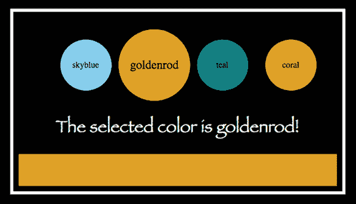

图 6.1 `Colors` 组件。当用户选择一种颜色时，菜单、文本和颜色条都会更新。当选择金盏花时，其菜单圆圈更大，文本显示“……金盏花！”并且条的颜色是金盏花。

点击列表中的颜色（其中一个圆圈）会突出显示该选择并更新文本和颜色条。您可以在 CodeSandbox 上看到组件的实际操作效果 ([`hgt0x.csb.app/`](https://hgt0x.csb.app/))。

### 6.1.1 通过在子组件上设置属性从父组件传递状态

列表 6.1 显示了 `Colors` 组件的代码。它导入了三个子组件：`ColorPicker`、`ColorChoiceText` 和 `ColorSample`。每个子组件都需要所选颜色，因此 `Colors` 组件持有该状态并将其作为属性传递给它们，即 JSX 中的属性。它还传递了可用颜色和 `setColor` 更新函数到 `ColorPicker` 组件。

*实时预览*: [`hgt0x.csb.app/`](https://hgt0x.csb.app/), *代码*: [`codesandbox.io/s/colorpicker-hgt0x`](https://codesandbox.io/s/colorpicker-hgt0x)

列表 6.1 `Colors` 组件

```
import React, {useState} from "react";

import ColorPicker from "./ColorPicker";                                ❶
import ColorChoiceText from "./ColorChoiceText";                        ❶
import ColorSample from "./ColorSample";                                ❶

export default function Colors () {
  const availableColors = ["skyblue", "goldenrod", "teal", "coral"];    ❷
                                                                        ❷
  const [color, setColor] = useState(availableColors[0]);               ❷

  return (
    <div className="colors">
      <ColorPicker
        colors={availableColors}                                        ❸
        color={color}                                                   ❸
        setColor={setColor}                                             ❸
      />
      <ColorChoiceText color={color} />                                 ❸
      <ColorSample color={color} />                                     ❸
    </div>
  );
}
```

❶ 导入子组件。

❷ 定义状态值。

❸ 将适当的状态值作为属性传递给子组件。

`Colors` 组件向下传递两种类型的属性：用于子组件 UI 的状态值 `colors` 和 `color`；以及一个更新共享状态的函数 `setColor`。让我们首先看看状态值。

### 6.1.2 将状态作为属性从父组件接收

`ColorChoiceText` 组件和 `ColorSample` 组件都显示当前所选颜色。`ColorChoiceText` 将其包含在其消息中，而 `ColorSample` 使用它来设置背景颜色。它们从 `Colors` 组件接收颜色值，如图 6.2 所示。

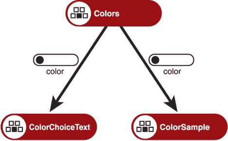

图 6.2 `Colors` 组件将当前颜色状态值传递给子组件。

`Colors` 是共享状态的子组件最近的共享父组件，因此我们在 `Colors` 中管理状态。图 6.3 显示了 `ColorChoiceText` 组件显示包含所选颜色的消息。该组件只需将颜色值作为其 UI 的一部分即可；它不需要更新该值。


图 6.3 `ColorChoiceText` 组件在其消息中包含所选颜色。

`ColorChoiceText` 组件的代码在列表 6.2 中。当 React 调用该组件时，它将其作为组件的第一个参数传递，即一个包含父组件设置的 所有属性的对象。这里的代码解构了属性，将 `color` 属性分配给同名的局部变量。

*实时预览*: [`hgt0x.csb.app/`](https://hgt0x.csb.app/), *代码*: [`codesandbox.io/s/colorpicker-hgt0x`](https://codesandbox.io/s/colorpicker-hgt0x)

列表 6.2 `ColorChoiceText` 组件

```
import React from "react";

export default function ColorChoiceText({color}) {     ❶
  return color ? (                                     ❷
    <p>The selected color is {color}!</p>              ❸
  ) : (
    <p>No color has been selected!</p>                 ❹
  )
}
```

❶ 从父组件接收颜色状态作为属性。

❷ 检查是否存在颜色。

❸ 在 UI 中使用属性。

❹ 如果父组件未设置颜色，则返回备用 UI。

如果父组件未设置 `color` 属性会怎样？`ColorChoiceText` 组件对没有 `color` 属性感到高兴；它返回备用 UI，表示没有选择颜色。

如图 6.4 所示的 `ColorSample` 组件显示一个背景设置为所选颜色的条形。


图 6.4 `ColorSample` 组件显示所选颜色的条形。

`ColorSample` 对缺失属性采取了不同的方法。它根本不返回任何 UI！在下面的列表中，你可以看到组件正在检查 `color` 值。如果它缺失，组件返回 `null`，React 在元素树中的该点不渲染任何内容。

*直播*: [`hgt0x.csb.app/`](https://hgt0x.csb.app/), *代码*: [`codesandbox.io/s/colorpicker-hgt0x`](https://codesandbox.io/s/colorpicker-hgt0x)

列表 6.3 `ColorSample` 组件

```
import React from "react";

export default function ColorSample({color}) {    ❶
  return color ? (                                ❷
    <div
      className="colorSample"
      style={{ background: color }}
    />
  ) : null;                                       ❸
}
```

❶ 将状态从父组件作为属性接收。

❷ 检查是否存在颜色。

❸ 如果没有颜色，则不渲染任何 UI。

你可以在属性解构中将 `color` 的默认值设置为部分。也许如果父组件没有指定颜色，那么它应该是白色？

```
function ColorSample({color = "white"}) {         ❶
  return (
    <div
      className="colorSample"
      style={{ background: color }}
    />
  );
}
```

❶ 为属性指定默认值。

对于某些组件，默认值可能就足够了，但对我们需要共享状态的基于颜色的组件，我们必须确保所有默认值都是相同的。因此，我们要么有替代的 UI，要么没有 UI。如果组件没有属性就无法工作，并且默认值没有意义，你可以抛出一个错误，解释属性缺失的原因。

虽然我们在这本书中不会探讨它们，但你也可以使用 PropTypes 来指定预期的属性及其类型。React 将使用 PropTypes 在开发期间警告问题（[`reactjs.org/docs/typechecking-with-proptypes.html`](https://reactjs.org/docs/typechecking-with-proptypes.html)）。或者，使用 TypeScript 而不是 JavaScript，并对整个应用程序进行类型检查（[www.typescriptlang.org](http://www.typescriptlang.org)）。

### 6.1.3 从父组件作为属性接收更新器函数

`ColorPicker` 组件使用两个状态值来生成其 UI：可用颜色列表和所选颜色。它显示可用颜色值作为列表项，应用程序使用 CSS 将它们样式化为一行彩色圆圈，如图 6.5 所示。图中的所选项目，*goldenrod*，比其他项目样式更大。

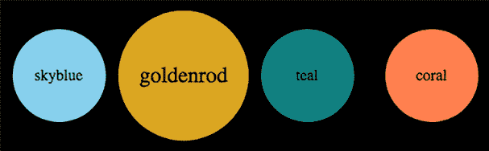

图 6.5 `ColorPicker` 组件显示颜色列表并突出显示所选颜色。

`Colors` 组件将使用的两个状态值传递给 `ColorPicker` 组件。`Colors` 还需要提供一种更新所有三个子组件所选颜色的方式。它通过传递 `setColor` 更新器函数将此责任委托给 `ColorPicker` 组件，如图 6.6 所示。

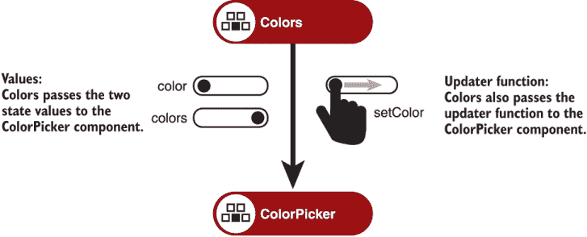

图 6.6 `Colors` 组件将两个状态值传递给 `ColorPicker`。它还传递了 `setColor` 更新器函数，因此可以从子组件设置颜色状态值。

以下列表显示了 `ColorPicker` 组件解构其属性参数，将三个属性分配给局部变量：`colors`、`color` 和 `setColor`。

*Live*: [`hgt0x.csb.app/`](https://hgt0x.csb.app/), *Code*: [`codesandbox.io/s/colorpicker-hgt0x`](https://codesandbox.io/s/colorpicker-hgt0x)

列表 6.4 `ColorPicker` 组件

```
import React from "react";

export default function ColorPicker({colors = [], color, setColor}) {      ❶
  return (
    <ul>
      {colors.map(c => (
        <li
          key={c}
          className={color === c ? "selected" : null}
          style={{ background: c }}
          onClick={() => setColor(c)}                                      ❷
        >
          {c}
        </li>
      ))}
    </ul>
  );
}
```

❶ 将状态和更新函数从父组件作为属性接收。

❷ 使用更新函数设置父组件的状态。

解构语法为 `colors` 包含一个默认值：

```
{colors = [], color, setColor}
```

`ColorPicker` 组件遍历 `colors` 数组以为每个可用颜色创建一个列表项。使用空数组作为默认值会导致组件在父组件未设置 `colors` 属性时返回一个空的未排序列表。

对于一本关于 React Hooks 的书来说，更有趣的是 `color` 和 `setColor` 属性。这些属性来自父组件中对 `useState` 的调用：

```
const [color, setColor] = useState(availableColors[0]);
```

`ColorPicker` 不关心它们来自哪里；它只期望有一个 `color` 属性来保存当前颜色，以及一个 `setColor` 属性，它是一个可以调用来设置颜色的函数。`ColorPicker` 使用每个列表项的 `onClick` 处理器中的 `setColor` 更新函数。通过调用 `setColor` 函数，子组件 `ColorPicker` 能够设置父组件 `Colors` 的状态。然后父组件重新渲染，使用新选定的颜色更新所有子组件。

我们从头创建了 `Colors` 组件，因为我们知道我们需要共享状态来传递给子组件。有时我们与现有组件一起工作，随着项目的开发，我们会意识到它们持有的状态其他兄弟组件也可能需要。接下来的几节将探讨几种将状态从子组件提升到父组件的方法，使其更广泛可用。

## 6.2 将组件拆分为更小的部分

React 通过 `useState` 和 `useReducer` 钩子为我们提供了两种在应用程序中管理状态的方法。每个钩子都提供了一种更新状态的方式，从而触发重新渲染。随着我们的应用程序的发展，我们在能够直接从单个组件的效果、处理函数和 UI 中访问本地状态的便利性与该组件的状态变得膨胀和混乱的不便之间取得平衡，其中一个部分的 UI 的状态变化会触发整个组件的重新渲染。

应用程序中的新组件可能想要分享现有状态的一部分，因此我们现在需要共享之前由一个组件封装的状态。我们是将状态值和更新函数提升到父组件吗？或者可能是提升减少器和分发函数？移动状态会如何改变现有组件的结构？

在本节中，我们继续构建预订应用程序示例，作为这些问题的背景。特别是，我们探索以下内容：

+   将组件视为更大应用程序的一部分

+   在页面 UI 中组织多个组件

+   创建 `BookableDetails` 组件

遇到的概念对现有的 React 开发者来说并不新鲜。我们的目标是考虑在使用 React Hooks 时，它们是否以及如何发生变化。

### 6.2.1 将组件视为更大应用的一部分

在第五章中，我们让`BookablesList`组件承担双重职责：显示所选组的可预订项列表，并显示所选可预订项的详情。图 6.7 显示了具有列表和详情的组件。

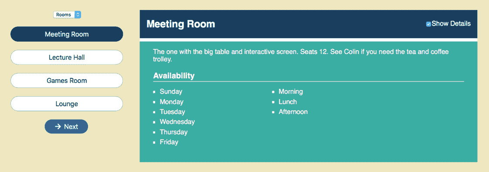

图 6.7 第五章中的先前`BookablesList`组件显示了可预订项列表和所选可预订项的详情。

该组件管理所有状态：可预订项、所选组、所选可预订项，以及用于显示详情、加载状态和错误的标志。作为一个没有子组件的单个函数组件，所有状态都在本地作用域中，并在生成返回的 UI 时可用。但是，切换“显示详情”复选框会导致整个组件重新渲染，并且在使用演示模式时，我们必须仔细考虑在渲染之间持久化计时器 ID。

我们还需要在预订页面上有一个可预订项列表。各种组件将争夺屏幕空间，我们希望有灵活性，能够将可预订项列表与详情分开显示，如图 6.8 所示，其中可预订项列表位于左侧。实际上，如图所示，我们可能根本不想显示可预订详情，将此信息保留在专门的“可预订”页面上。

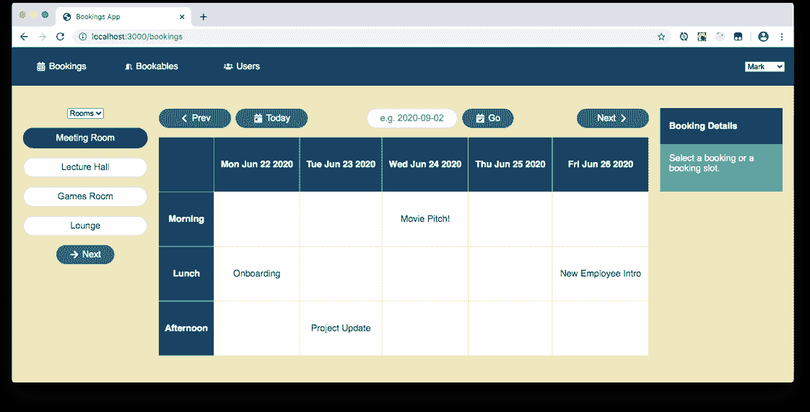

图 6.8 可预订项列表（在左侧）也用于预订页面上。

为了能够独立使用`BookableList` UI 的列表和详情部分，我们将为所选可预订项的详情创建一个单独的组件。`BookablesList`组件将继续显示组、可预订项列表和“下一步”按钮，但新的`BookableDetails`组件将显示详情并管理“显示详情”复选框。

当前`BookablesPage`组件导入并渲染`BookablesList`组件。我们需要做一些调整，以便使用新的列表版本以及`BookableDetails`组件。

### 6.2.2 在页面 UI 中组织多个组件

`BookablesList`和`BookableDetails`组件都需要访问所选的可预订项。我们创建了一个`BookablesView`组件来包装列表和详情，并管理共享状态。表 6.1 列出了我们日益增长的组件，并概述了它们如何协同工作。

表 6.1 可预订组件及其协同工作方式

| 组件 | 目的 |
| --- | --- |
| `BookablesPage` | 显示`BookablesView`组件（以及稍后用于添加和编辑可预订项的表单） |
| `BookablesView` | 将`BookablesList`和`BookableDetails`组件分组，并管理它们的共享状态 |
| `BookablesList` | 通过分组显示可预订项列表，并允许用户通过点击可预订项或使用“下一步”按钮来选择可预订项 |
| `BookableDetails` | 显示选定可预订项的详细信息，并带有用于切换可预订项可用性显示的复选框 |

在第 6.3 节和第 6.4 节中，我们将探讨两种将状态提升到`BookablesView`组件的方法：

+   将现有的 reducer 从`BookablesList`提升到`BookablesView`组件

+   将选定的可预订项从`BookablesList`提升到`BookablesView`组件

首先，如以下列表所示，我们更新页面组件以导入并显示`BookablesView`而不是`BookablesList`。

分支：0601-lift-reducer，文件：src/components/Bookables/BookablesPage.js

列表 6.5 `BookablesPage`组件

```
import BookablesView from "./BookablesView";     ❶

export default function BookablesPage () {
  return (
    <main className="bookables-page">
      <BookablesView/>                           ❷
    </main>
  );
}
```

❶ 导入新组件。

❷ 使用新组件。

在不同的仓库分支上，我们将为两种状态共享方法中的每一种创建一个不同的`BookablesView`组件版本。`BookableDetails`组件将保持不变，所以让我们先构建它。

### 6.2.3 创建可预订详情组件

新的`BookableDetails`组件执行与旧`BookablesList`组件 UI 的后半部分完全相同的任务；它显示选定可预订项的详细信息以及一个用于切换部分信息的复选框。图 6.9 显示了带有复选框、可预订项标题、备注和可用性的`BookableDetails`组件。

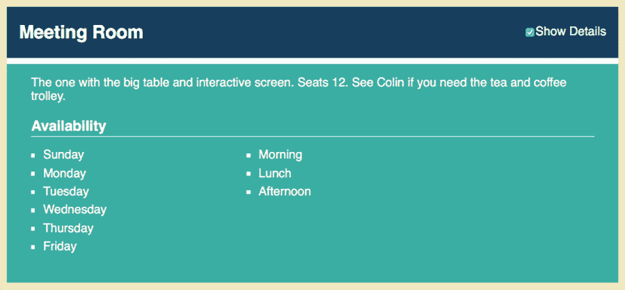

图 6.9 带有复选框、标题、备注和可用性的`BookableDetails`组件

如图 6.10 所示，`BookablesView`组件传递选定的可预订项，以便`BookableDetails`能够显示所需的信息。


图 6.10 `BookablesView`管理共享状态并将选定的可预订项传递给`BookableDetails`。

新组件的代码如下所示。该组件接收选定的可预订项作为属性，但管理自己的`hasDetails`状态值。

分支：0601-lift-reducer，文件：src/components/Bookables/BookableDetails.js

列表 6.6 `BookableDetails`组件

```
import {useState} from "react"; 
import {days, sessions} from "../../static.json";
export default function BookableDetails ({bookable}) {    ❶
  const [hasDetails, setHasDetails] = useState(true);     ❷

  function toggleDetails () {
    setHasDetails(has => !has);                           ❸
  }
  return bookable ? (
    <div className="bookable-details item">
      <div className="item-header">
        <h2>{bookable.title}</h2>
        <span className="controls">
          <label>
            <input
              type="checkbox"
              onChange={toggleDetails}                    ❹
              checked={hasDetails}                        ❺
            />
            Show Details
          </label>
        </span>
      </div>
      <p>{bookable.notes}</p>
      {hasDetails && (                                    ❻
        <div className="item-details">
          <h3>Availability</h3>
          <div className="bookable-availability">
            <ul>
              {bookable.days
                .sort()
                .map(d => <li key={d}>{days[d]}</li>)
              }
            </ul>
            <ul>
              {bookable.sessions
                .map(s => <li key={s}>{sessions[s]}</li>)
              }
            </ul>
          </div>
        </div>
      )}
    </div>
  ) : null;
}
```

❶ 通过属性接收当前可预订项。

❷ 使用本地状态来保存`hasDetails`标志。

❸ 使用更新器函数来切换`hasDetails`标志。

❹ 当点击复选框时切换`hasDetails`标志。

❺ 使用`hasDetails`标志来设置复选框。

❻ 使用`hasDetails`标志来显示或隐藏可用性部分。

`BookablesView`组件中的其他组件不关心`hasDetails`状态值，因此将其完全封装在`BookableDetails`中是很有意义的。如果一个组件是某个特定状态的唯一使用者，那么将那个状态放在组件中似乎是一个明显的做法。

`BookableDetails`是一个简单的组件，它只显示选定的可预订项。只要它接收到那个状态值，它就满意了。`BookablesView`组件如何管理这个状态则是一个更开放的问题；它应该调用`useState`、`useReducer`还是两者都调用？接下来的两个部分将探讨两种方法。第 6.4 节对 reducer 进行了相当多的修改以去除它。但首先，第 6.3 节采取了一条更简单的路径，并使用了现有的`BookablesList`中的 reducer，将其提升到`BookablesView`组件中。

## 6.3 从 useReducer 共享状态和 dispatch 函数

我们已经有一个 reducer 来管理`BookablesList`组件的所有状态变化。reducer 管理的状态包括可预订项数据、选定的组以及选定可预订项的索引，以及加载和错误状态的属性。如果我们把 reducer 提升到`BookablesView`组件中，我们可以使用 reducer 返回的状态来推导出选定的可预订项并将其传递给子组件，如图 6.11 所示。

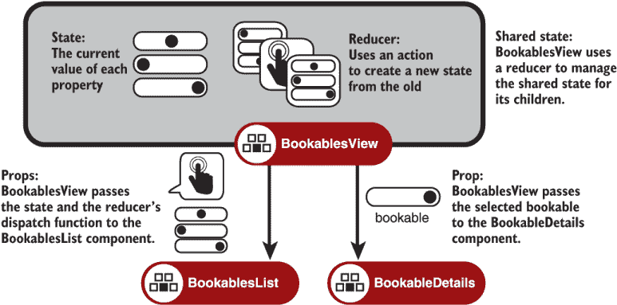

图 6.11 `BookablesView`使用 reducer 管理状态，并将选定的可预订项或整个状态传递给其子组件。

虽然`BookableDetails`只需要选定的可预订项，但`BookablesList`需要 reducer 返回的其余状态以及用户选择可预订项和切换组时继续 dispatch 动作的方式。图 6.11 还显示了`BookablesView`将 reducer 的状态和 dispatch 函数传递给`BookablesList`。

将状态从`BookablesList`提升到`BookablesView`组件相对直接。我们分三步完成它：

+   在`BookablesView`组件中管理状态

+   从 reducer 中移除一个动作

+   在`BookablesList`组件中接收状态和 dispatch

让我们先更新`BookablesView`组件以控制状态。

### 6.3.1 在 BookablesView 组件中管理状态

`BookablesView`组件需要导入它的两个子组件。然后它可以向它们传递它们所需的状态以及更新该状态的途径。在下面的列表中，你可以看到新组件的导入、`BookablesView`管理的状态、对`useReducer`钩子的调用，以及作为 JSX 的 UI，状态值和 dispatch 函数被设置为 props。

分支：0601-lift-reducer，文件：src/components/Bookables/BookablesView.js

列表 6.7 将可预订项状态移动到`BookablesView`组件

```
import {useReducer, Fragment} from "react";

import BookablesList from "./BookablesList";                     ❶
import BookableDetails from "./BookableDetails";                 ❶

import reducer from "./reducer";                                 ❷

const initialState = {                                           ❸
  group: "Rooms",
  bookableIndex: 0,
  bookables: [],
  isLoading: true,
  error: false
};

export default function BookablesView () { 
 const [state, dispatch] = useReducer(reducer, initialState);   ❹

  const bookablesInGroup = state.bookables.filter(               ❺
    b => b.group === state.group                                 ❺
  );                                                             ❺
  const bookable = bookablesInGroup[state.bookableIndex];        ❺

  return (
    <Fragment>
      <BookablesList state={state} dispatch={dispatch}/>         ❻
      <BookableDetails bookable={bookable}/>                     ❼
    </Fragment>
  ); 
}
```

❶ 导入构成 UI 的所有组件。

❷ 导入 BookablesList 使用的 reducer。

❸ 设置初始状态，不包含 hasDetails。

❹ 在 BookablesView 中管理状态和 reducer。

❺ 从状态中推导出选定的可预订项。

❻ 将状态和 dispatch 传递给 BookablesList。

❼ 将选定的可预订项传递给 BookableDetails。

`BookablesView`组件导入它需要的子组件并设置初始状态，该状态原本位于`BookablesList`组件中。我们已经从状态中移除了`hasDetails`属性；新的`BookableDetails`组件管理是否显示详细信息的自身状态。

### 6.3.2 从减法器中删除动作

随着`BookableDetails`组件愉快地切换自己的详细信息，减法器不再需要处理用于切换共享`hasDetails`状态值的动作，因此可以从 reducer.js 中删除以下情况：

```
case "TOGGLE_HAS_DETAILS":
  return {
    ...state,
    hasDetails: !state.hasDetails
  };
```

除了这些，减法器可以保持原样。太棒了！

### 6.3.3 在 BookablesList 组件中接收状态和分发

`BookablesList`组件需要进行一些调整。它现在依赖于`BookablesView`组件（或任何其他渲染它的父组件），而不是依赖于它自己的本地减法器和动作。`BookablesList`的代码相对较长，所以我们按部分考虑。代码的结构看起来像这样：

```
export default function BookablesList ({state, dispatch}) {
  // 1\. Variables
  // 2\. Effect
  // 3\. Handler functions
  // 4\. UI
}
```

以下四个小节讨论了必要的任何更改。如果您将这些部分拼接在一起，您将拥有完整的组件。

变量

除了两个新属性`state`和`dispatch`外，`BookablesList`组件中的变量没有其他添加。但是，由于减法器提升到`BookablesView`组件，并且不再需要显示可预订的详细信息，因此有一些删除。以下列表显示了剩余的内容。

分支：0601-lift-reducer，文件：src/components/Bookables/BookablesList.js

列表 6.8 `BookablesList`：1\. 变量

```
import {useEffect, useRef} from "react";
import {FaArrowRight} from "react-icons/fa";
import Spinner from "../UI/Spinner";
import getData from "../../utils/api";

export default function BookablesList ({state, dispatch}) {          ❶
  const {group, bookableIndex, bookables} = state;
  const {isLoading, error} = state;

  const bookablesInGroup = bookables.filter(b => b.group === group);
  const groups = [...new Set(bookables.map(b => b.group))];

  const nextButtonRef = useRef();

  // 2\. Effect
  // 3\. Handler functions
  // 4\. UI
}
```

❶ 将状态和分发属性分配给局部变量。

减法器及其初始状态以及`hasDetails`标志都不再存在。最后，我们不再需要显示可预订的详细信息，因此我们移除了`bookable`变量。

影响

除了一个小细节外，效果几乎没有任何变化。在以下列表中，您可以看到我们已将`dispatch`函数添加到效果依赖数组中。

分支：0601-lift-reducer，文件：src/components/Bookables/BookablesList.js

列表 6.9 `BookablesList`：2\. 影响

```
export default function BookablesList ({state, dispatch}) {   ❶
  // 1\. Variables

  useEffect(() => {
    dispatch({type: "FETCH_BOOKABLES_REQUEST"});

    getData("http://localhost:3001/bookables")
      .then(bookables => dispatch({
        type: "FETCH_BOOKABLES_SUCCESS",
        payload: bookables
      }))
      .catch(error => dispatch({
        type: "FETCH_BOOKABLES_ERROR",
        payload: error
      }));
  }, [dispatch]);                                              ❷

  // 3\. Handler functions
  // 4\. UI
}
```

❶ 将分发属性分配给局部变量。

❷ 将分发函数包含在效果的依赖数组中。

在上一个版本中，当我们从`BookablesList`组件内部调用`useReducer`并将分发函数分配给`dispatch`变量时，React 知道分发函数的身份永远不会改变，因此不需要将其声明为效果的依赖项。现在，由于父组件将`dispatch`作为属性传入，`BookablesList`不知道它从何而来，因此无法确定它不会改变。省略`dispatch`会导致浏览器控制台出现如图 6.12 所示的警告。

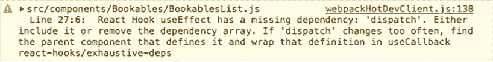

图 6.12 React 在分发从依赖数组中缺失时警告我们。

在依赖数组中包含`dispatch`是一种良好的实践；我们知道它不会改变（至少现在是这样），因此效果不会不必要地运行。注意图 6.12 中的警告说“如果`dispatch`变化得太频繁，找到定义它的父组件，并将该定义包裹在`useCallback`中。”我们将在第 6.5 节中查看使用`useCallback`钩子来保持函数依赖项的标识。

处理函数

现在选定的可预订项的详细信息由不同的组件显示，我们可以移除`toggleDetails`处理函数。其他一切保持不变。简单！

UI

再见，`bookableDetails` div！我们完全切除了 UI 的第二部分，用于显示可预订的详细信息。以下列表显示了更新后的、超级精简的`BookablesList` UI。

分支：0601-lift-reducer，文件：src/components/Bookables/BookablesList.js

列表 6.10 `BookablesList`：4. UI

```
export default function BookablesList ({state, dispatch}) {
  // 1\. Variables
  // 2\. Effect     
  // 3\. Handler functions

  if (error) {
    return <p>{error.message}</p>
  }

  if (isLoading) {
    return <p><Spinner/> Loading bookables...</p>
  }

  return (
    <div>
      <select value={group} onChange={changeGroup}>
        {groups.map(g => <option value={g} key={g}>{g}</option>)}
      </select>
      <ul className="bookables items-list-nav">
        {bookablesInGroup.map((b, i) => (
          <li
            key={b.id}
            className={i === bookableIndex ? "selected" : null}
          >
            <button
              className="btn"
              onClick={() => changeBookable(i)}
            >
              {b.title}
            </button>
          </li>
        ))}
      </ul>
      <p>
        <button
          className="btn"
          onClick={nextBookable}
          ref={nextButtonRef}
          autoFocus
        >
          <FaArrowRight/>
          <span>Next</span>
        </button>
      </p>
    </div>
  );
}
```

UI 中剩下的只是可预订列表及其关联的分组选择器和下一步按钮。因此，我们也移除了将两个大块 UI 分组的`Fragment`组件。

当可预订的详细信息独立行动，并且 reducer 提升到父组件时，对`BookablesList`组件的更改主要采取了删除的形式。一个关键的增加是将`dispatch`包含在数据加载效果的依赖数组中。将状态存储在`BookablesView`组件中（或者甚至更高层次的组件树中）看起来很简单。把所有数据都放在那里，并将 dispatch 函数传递给任何需要更改状态的子组件。这是一个有效的方法，有时也被 Redux 等流行状态存储库的用户使用。但在将所有状态提升到应用顶部之前，即使大多数组件不关心最终存储在那里的大多数状态，让我们先调查一个替代方案。

## 6.4 从 useState 共享状态值和更新函数

在本节中，我们尝试了一种不同的方法。我们只提升需要共享的状态：选定的可预订项。图 6.13 显示了`BookablesView`组件将选定的可预订项传递给其两个子组件。`BookableDetails`和`BookablesList`组件仍然得到他们需要的，而且`BookablesList`不会给`BookablesView`提供它不需要共享的大量状态，而是将剩余的状态和所需的功能管理起来：加载指示器和错误。

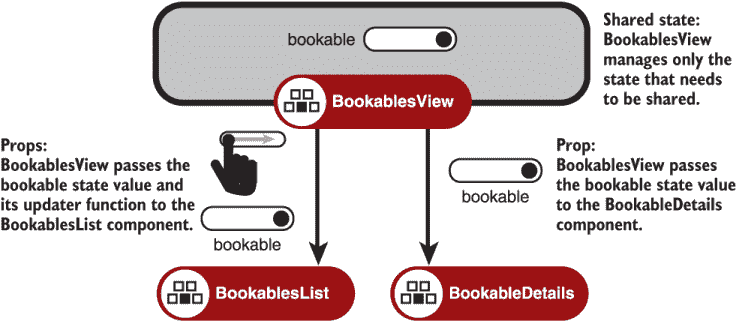

图 6.13 `BookablesView`只管理共享状态。它将可预订项传递给`BookableDetails`组件。它将可预订项及其更新函数传递给`BookablesList`。

将选定的可预订项从`BookablesList`提升到`BookablesView`组件在`BookablesView`中需要做的工作要少得多，但在`BookablesList`中需要进行许多更改。我们分两步完成这些更改：

+   在`BookablesView`组件中管理选定的可预订项

+   在`BookablesList`中接收可预订项和更新函数

`BookablesList`组件仍然需要一种方式来让`BookablesView`知道用户已选择一个新的可预订项。`BookablesView`将选中的可预订项的更新函数传递给`BookablesList`。让我们更仔细地看看`BookablesView`组件的最新代码。

### 6.4.1 在`BookablesView`组件中管理选中的可预订项

如列表 6.11 所示，这个版本的`BookablesView`组件非常简单；它不需要处理 reducer、初始状态或从状态中推导出选中的可预订项。它包含一个对`useState`钩子的调用，以管理选中的可预订项状态值。然后，它将选中的可预订项传递给子组件和更新函数到`BookablesList`。当用户选择一个可预订项时，`BookablesList`组件可以使用更新函数让`BookablesView`知道状态已更改。

分支：0602-lift-bookable，文件：/src/components/Bookables/BookablesView.js

列表 6.11 将选中的可预订项放入`BookablesView`组件

```
import {useState, Fragment} from "react";

import BookablesList from "./BookablesList";
import BookableDetails from "./BookableDetails";

export default function BookablesView () { 
  const [bookable, setBookable] = useState();                           ❶

  return (
    <Fragment>
      <BookablesList bookable={bookable} setBookable={setBookable}/>    ❷
      <BookableDetails bookable={bookable}/>                            ❸
    </Fragment>
  );
}
```

❶ 将选中的可预订项作为状态值管理。

❷ 将可预订项及其更新函数向下传递。

❸ 将可预订项向下传递。

`BookablesView`不再需要为当前组过滤可预订项或从该过滤列表中获取当前可预订项。让我们看看`BookablesList`如何适应新的方法。

### 6.4.2 在`BookablesList`中接收可预订项和更新函数

通过让`BookablesView`组件管理选中的可预订项，我们改变了`BookablesList`组件的工作方式。在 reducer 版本中，`BookablesView`将`bookableIndex`和`group`作为状态的一部分存储。现在，由于`BookablesList`直接接收可预订项，这些状态值不再需要。选中的可预订项看起来像这样：

```
{
  "id": 1,
  "group": "Rooms",
  "title": "Meeting Room",
  "notes": "The one with the big table and interactive screen.",
  "days": [1, 2, 3],
  "sessions": [1, 2, 3, 4, 5, 6]
}
```

它包括一个`id`和一个`group`属性。无论选中的可预订项在哪个组中，都是当前组；我们不需要单独的`group`状态值。此外，很容易在组内的可预订项数组中找到选中可预订项的索引；我们不需要`bookableIndex`状态值。由于不再需要`group`、`bookableIndex`和`hasDetails`状态值，结果是一个更小、更简单的状态，让我们切换回使用`useState`调用而不是 reducer。

`BookablesList`组件的所有部分都进行了更改，因此我们按部分考虑代码。代码的结构看起来像这样：

```
export default function BookablesList ({bookable, setBookable}) {
  // 1\. Variables
  // 2\. Effect
  // 3\. Handler functions
  // 4\. UI
}
```

接下来的四个小节中的每一个都讨论了一个代码部分。如果你将这些部分拼接在一起，你将拥有完整的组件。

变量

`BookablesList`组件现在接收选中的可预订项作为属性。选中的可预订项包括一个`id`和一个`group`属性。我们使用`group`属性来过滤列表，并使用`id`来突出显示选中的可预订项。

以下列表显示了更新的 `BookablesList` 组件接收 `bookable` 和 `setBookable` 作为属性，并通过三次调用 `useState` 设置三件本地状态。

分支：0602-lift-bookable，文件：/src/components/Bookables/BookablesList.js

列表 6.12 `BookablesList`：1. 变量

```
import {useState, useEffect, useRef} from "react";                    ❶
import {FaArrowRight} from "react-icons/fa"; 
import Spinner from "../UI/Spinner";
import getData from "../../utils/api";

export default function BookablesList ({bookable, setBookable}) {     ❷
  const [bookables, setBookables] = useState([]);                     ❸
  const [error, setError] = useState(false);                          ❸
  const [isLoading, setIsLoading] = useState(true);                   ❸

 const group = bookable?.group;                                      ❹

  const bookablesInGroup = bookables.filter(b => b.group === group);
  const groups = [...new Set(bookables.map(b => b.group))];
  const nextButtonRef = useRef();
  // 2\. Effect
  // 3\. Handler functions
  // 4\. UI
}
```

❶ 导入 `useState` 而不是 `useReducer`。

❷ 接收选定的可预订项和更新函数作为属性。

❸ 通过对 `useState` 钩子的调用管理状态。

❹ 从选定的可预订项获取当前组。

列表 6.12 通过使用 *可选链操作符*，`?.`，从 JavaScript 中最近添加的一个，获取选定的可预订项的当前组：

```
const group = bookable?.group;
```

如果没有选择可预订项，表达式 `bookable?.group` 返回 `undefined`。它在我们访问 `group` 属性之前避免了检查可预订项是否存在：

```
const group = bookable && bookable.group;
```

在选择可预订项之前，组将是 `undefined`，而 `bookablesInGroup` 将是一个空数组。我们需要在将可预订项数据加载到组件中后立即选择一个可预订项。让我们看看加载过程。

影响

以下列表显示了更新的影响代码。现在它使用更新函数而不是发送动作。

分支：0602-lift-bookable，文件：/src/components/Bookables/BookablesList.js

列表 6.13 `BookablesList`：2. 影响

```
export default function BookablesList ({bookable, setBookable}) {
  // 1\. Variables

  useEffect(() => {
    getData("http://localhost:3001/bookables")

      .then(bookables => {
        setBookable(bookables[0]);       ❶
        setBookables(bookables);         ❷
 setIsLoading(false);
      })

      .catch(error => {
 setError(error); ❸
        setIsLoading(false)
      });

  }, [setBookable]);                     ❹

  // 3\. Handler functions
  // 4\. UI
}
```

❶ 使用 `setBookable` 属性选择第一个可预订项。

❷ 使用本地更新函数设置可预订项状态。

❸ 如果有错误，设置错误状态。

❹ 将外部函数包含在依赖列表中。

第一个影响仍然使用在第四章中创建的 `getData` 工具函数来加载可预订项。但是，它不是向 reducer 发送动作，而是使用列表中的所有四个更新函数：`setBookable`（作为属性传入）和 `setBookables`、`setIsLoading` 以及 `setError`（通过本地调用 `useState`）。

当数据加载时，它将数据分配给可预订项状态值，并使用数组中的第一个可预订项调用 `setBookable`：

```
setBookable(bookables[0]);
setBookables(bookables);
setIsLoading(false);
```

React 能够合理地响应多个状态更新调用，如刚刚列出的三个。它可以批量更新以有效地安排所需的任何重新渲染和 DOM 更改。

正如我们在第 6.3 节中关于 reducer 版本的 `dispatch` 属性所看到的，React 不信任作为属性传入的函数在每个渲染中都是相同的。在这个版本中，`BookingsView` 将 `setBookable` 函数作为属性传入，因此我们将其包含在第一个影响的依赖数组中。实际上，我们有时可能定义自己的更新函数而不是直接使用 `useState` 返回的函数。我们将在第 6.5 节中介绍如何使这些函数作为依赖项很好地工作，那里我们将介绍 `useCallback` 钩子。

如果在加载数据的过程中抛出了错误，`catch` 方法将其设置为错误状态值：

```
.catch(error => {
  setError(error);
  setIsLoading(false);
);
```

处理函数

在 `BookablesList` 组件的先前版本中，处理函数向 reducer 发送动作。在这个新版本中，处理函数的主要任务是设置可预订项。在下面的列表中，注意每个处理函数都包含对 `setBookable` 的调用。

分支：0602-lift-bookable，文件：/src/components/Bookables/BookablesList.js

列表 6.14 `BookablesList`: 3. 处理函数

```
export default function BookablesList ({bookable, setBookable}) {
  // 1\. Variables
  // 2\. Effect

  function changeGroup (e) {
    const bookablesInSelectedGroup = bookables.filter(
      b => b.group === event.target.value                   ❶
    );
    setBookable(bookablesInSelectedGroup[0]);               ❷
  }

  function changeBookable (selectedBookable) {
    setBookable(selectedBookable);
    nextButtonRef.current.focus();
  }

  function nextBookable () {
    const i = bookablesInGroup.indexOf(bookable);
    const nextIndex = (i + 1) % bookablesInGroup.length;
    const nextBookable = bookablesInGroup[nextIndex];
    setBookable(nextBookable);
  }

  // 4\. UI
}
```

❶ 过滤所选组。

❷ 将可预订项设置为新组中的第一个。

当前组是从所选可预订项派生出来的；我们不再有 `group` 状态值。因此，当用户从下拉列表中选择一个组时，`changeGroup` 函数不会直接设置新组。相反，它选择所选组中的第一个可预订项：

```
setBookable(bookablesInSelectedGroup[0]);
```

`setBookable` 更新器函数来自 `BookablesView` 组件，并触发 `BookablesView` 的重新渲染。`BookablesView` 然后，重新渲染 `BookablesList` 组件，并将新选定的可预订项作为属性传递给它。`BookablesList` 组件使用可预订项的 `group` 和 `id` 属性来在下拉列表中选择正确的组，仅显示该组中的可预订项，并在列表中突出显示所选的可预订项。

`changeBookable` 函数没有惊喜：它设置了所选的可预订项并将焦点移动到“下一步”按钮。除了将可预订项设置为当前组中的下一个之外，`nextBookable` 如果需要会回滚到第一个。

UI

我们不再在状态中有 `bookableIndex` 值。下面的列表显示了我们是如何使用可预订项 `id` 的。

分支：0602-lift-bookable，文件：/src/components/Bookables/BookablesList.js

列表 6.15 `BookablesList`: 4. UI

```
export default function BookablesList ({bookable, setBookable}) {
  // 1\. Variables
  // 2\. Effect
  // 3\. Handler functions

  if (error) {
    return <p>{error.message}</p>
  }

  if (isLoading) {
    return <p><Spinner/> Loading bookables...</p>
  }

  return (
    <div>
      <select value={group} onChange={changeGroup}>
        {groups.map(g => <option value={g} key={g}>{g}</option>)}
      </select>

      <ul className="bookables items-list-nav">
        {bookablesInGroup.map(b => (
          <li
            key={b.id}
            className={b.id === bookable.id ? "selected" : null}   ❶
          >
            <button
              className="btn"
              onClick={() => changeBookable(b)}                    ❷
            >
              {b.title}
            </button>
          </li>
        ))}
      </ul>
      <p>
        <button
          className="btn"
          onClick={nextBookable}
          ref={nextButtonRef}
          autoFocus
        >
          Next
        </button>
      </p>
    </div>
  );
}
```

❶ 使用 ID 检查是否应该突出显示可预订项。

❷ 将可预订项传递给 `changeBookable` 处理函数。

在可预订项列表中发生了一些关键的 UI 变化。代码遍历与所选可预订项相同的组中的可预订项。一个接一个地，组中的可预订项被分配给 `b` 变量。`bookable` 变量代表所选的可预订项。如果 `b.id` 和 `bookable.id` 相同，列表中的当前可预订项应该被突出显示，因此我们将其类设置为 `selected`：

```
className={b.id === bookable.id ? "selected" : null}
```

当用户点击可预订项以选择它时，`onClick` 处理函数将整个可预订项对象 `b` 传递给 `changeBookable` 函数，而不仅仅是可预订项的索引：

```
onClick={() => changeBookable(b)}
```

再次没有使用 reducer 的 `BookablesList` 组件。虽然做了一些改动，但鉴于其仅列出可预订项的更专注的角色，整体上它也更简单。

你觉得哪种方法更容易理解？在父组件中将动作派发到 reducer，还是在使用它的组件中管理大部分状态？在第一种方法中，我们没有做太多修改就将 reducer 移到了 `BookablesView` 组件。我们能否以与第二种方法中变量相同的方式简化 reducer 中持有的状态？无论你更喜欢哪种实现方式，本章都给了你练习调用 `useState`、`useReducer` 和 `useEffect` 钩子，并考虑传递给子组件的派发和更新函数的一些细微差别的机会。

挑战 6.1

将 `UsersList` 组件拆分为 `UsersList` 和 `UserDetails` 组件。使用 `UsersPage` 组件来管理选定的用户，将其传递给 `UsersList` 和 `UserDetails`。在 0603-user-details 分支中找到解决方案。

## 6.5 将函数传递给 `useCallback` 以避免重新定义它们

现在我们应用程序正在增长，并且组件正在协同工作以提供功能，将状态值向下传递给子组件作为属性是很自然的。正如我们在本章中看到的，这些值可以包括函数。如果这些函数是来自 `useState` 或 `useReducer` 的更新器或派发函数，React 保证它们的身份将是稳定的。但对于我们自己定义的函数，组件作为 React 调用的函数的本质意味着我们的函数将在每次渲染时定义。在本节中，我们探讨了这种重新定义可能引起的问题，并查看了一个新的钩子 `useCallback`，它可以帮助解决这些问题。

### 6.5.1 依赖于我们传递给属性中的函数

在上一节中，所选可预订项的状态由 `BookablesView` 组件管理。它将可预订项及其更新器函数 `setBookable` 传递给 `BookablesList`。`BookablesList` 在用户选择可预订项时调用 `setBookable`，并在包含数据获取代码的效果中调用，这里没有包含 `catch` 块：

```
useEffect(() => {
  getData("http://localhost:3001/bookables")
    .then(bookables => {
      setBookable(bookables[0]);     ❶
      setBookables(bookables);
      setIsLoading(false);
    });
}, [setBookable]);                   ❷
```

❶ 数据到达后，将当前可预订项设置为第一个。

❷ 将 `setBookable` 函数作为依赖项包含。

我们将 `setBookable` 更新器函数作为依赖项包含。每当其依赖项列表中的值发生变化时，该效果会重新运行。但到目前为止，`setBookable` 一直是由 `useState` 返回的更新器函数，因此保证其值不会改变；数据获取效果只运行一次。

父组件 `BookablesView` 将更新器函数分配给 `setBookable` 变量，并将其直接设置为 `BookablesList` 的属性之一。但在更新状态之前进行某种类型的验证或处理值并不罕见。假设 `BookablesView` 想要检查是否存在可预订项，如果存在，则在更新状态之前添加一个时间戳属性。以下列表显示了这样的自定义设置器。

列表 6.16 在设置状态之前验证和增强 `BookablesView` 中的值

```
import {useState, Fragment} from "react";

import BookablesList from "./BookablesList";
import BookableDetails from "./BookableDetails";

export default function BookablesView () {
  const [bookable, setBookable] = useState();

  function updateBookable (selected) {
    if (selected) {                                                        ❶
      selected.lastShown = Date.now();                                     ❷
      setBookable(selected);                                               ❸
    }
  }

  return (
    <Fragment>
      <BookablesList bookable={bookable} setBookable={updateBookable}/>    ❹
      <BookableDetails bookable={bookable}/>
    </Fragment>
  );
}
```

❶ 检查是否存在可预订项。

❷ 添加时间戳属性。

❸ 设置状态。

❹ 将我们的处理函数作为更新属性传递。

`BookablesView` 现在将自定义的 `updateBookable` 函数作为 `setBookable` 属性分配给 `BookablesList`。`BookablesList` 组件对此毫不在意，并且随时调用新的更新函数来选择可预订项。那么，问题是什么？

如果你更新代码以使用新的更新函数并加载可预订项页面，开发者工具的网络标签页将突出显示一些令人不安的活动：可预订项被反复获取，如图 6.14 所示。

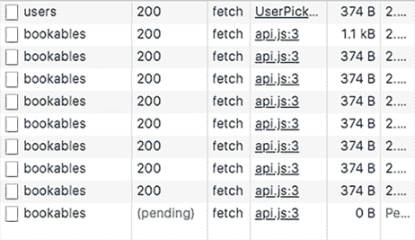

图 6.14 开发者工具的网络标签页显示了可预订项被反复获取。

父组件 `BookablesView` 管理所选可预订项的状态。每当 `BookablesList` 加载可预订项数据并设置可预订项时，`BookablesView` 会重新渲染；React 会再次运行其代码，重新定义 `updateBookable` 函数并将新版本的函数传递给 `BookablesList`。`BookablesList` 中的 `useEffect` 调用会看到 `setBookable` 属性是一个新函数，并再次运行效果，重新获取可预订项数据并再次设置可预订项，重新启动循环。我们需要一种方法来保持我们的更新函数的身份，使其在渲染之间不发生变化。

### 6.5.2 使用 `useCallback` 钩子保持函数身份

当我们想要在渲染之间使用相同的函数，但又不希望每次都重新定义它时，我们可以将函数传递给 `useCallback` 钩子。React 将在每次渲染时从钩子返回相同的函数，只有在函数的依赖项之一发生变化时才会重新定义它。使用钩子的方式如下：

```
const stableFunction = useCallback(funtionToCache, dependencyList);
```

当依赖项列表中的值不改变时，`useCallback` 返回的函数是稳定的。当依赖项改变时，React 会重新定义、缓存并返回使用新依赖项值的函数。下面的列表显示了如何使用新的钩子来解决我们的无限获取问题。

列表 6.17 使用 `useCallback` 保持稳定的函数身份

```
import {useState, useCallback, Fragment} from "react";                    ❶

import BookablesList from "./BookablesList";
import BookableDetails from "./BookableDetails";

export default function BookablesView () {
  const [bookable, setBookable] = useState();

  const updateBookable = useCallback(selected => {                        ❷
    if (selected) {
      selected.lastShown = Date.now();
      setBookable(selected);
    }
  }, []);                                                                 ❸

  return (
    <Fragment>
      <BookablesList bookable={bookable} setBookable={updateBookable}/>   ❹
      <BookableDetails bookable={bookable}/>
    </Fragment>
  );
}
```

❶ 导入 `useCallback` 钩子。

❷ 将更新函数传递给 `useCallback`。

❸ 指定依赖项。

❹ 将稳定的函数作为属性分配。

将我们的更新函数包裹在 `useCallback` 中意味着 React 将在每次渲染时返回相同的函数，除非依赖项的值发生变化。但我们已经使用了一个空的依赖项列表，因此值永远不会改变，React 将始终返回完全相同的函数。`BookablesList` 中的 `useEffect` 调用现在会看到其 `setBookable` 依赖项是稳定的，并且它将停止无限期地重新获取可预订项数据。

当与仅在它们的属性更改时重新渲染的组件一起工作时，`useCallback` 钩子可以非常有用。这些组件可以使用 React 的 `memo` 函数创建，这在 React 文档中有描述：[`reactjs.org/docs/react-api.html#reactmemo`](https://reactjs.org/docs/react-api.html#reactmemo)。

`useCallback`允许我们缓存函数。为了更普遍地防止值的重新定义或重新计算，React 还提供了`useMemo`钩子，我们将在下一章中探讨这一点。

## 摘要

+   如果组件共享相同的状态值，将值提升到组件树中最接近的共享祖先组件，并通过属性传递状态：

    ```
    const [bookable, setBookable] = useState();
    return (
      <Fragment>
        <BookablesList bookable={bookable}/>
        <BookableDetails bookable={bookable}/>
      </Fragment>
    );
    ```

+   如果子组件需要更新共享状态，请将`useState`返回的更新函数传递给它们：

    ```
    const [bookable, setBookable] = useState();
    return <BookablesList bookable={bookable} setBookable={setBookable} />
    ```

+   解构属性参数，将属性分配给局部变量：

    ```
    export default function ColorPicker({colors = [], color, setColor}) {
      return (
        // UI that uses colors, color and setColor
      );
    } 
    ```

+   考虑为属性使用默认值。如果属性未设置，将使用默认值：

    ```
    export default function ColorPicker({colors = [], color, setColor}) {
      return (
        // iterate over colors array
      );
    }
    ```

+   检查`undefined`或`null`属性值。如果适当，返回替代 UI：

    ```
    export default function ChoiceText({color}) {
      return color ? (
        <p>The selected color is {color}!</p>
      ) : (
        <p>No color has been selected!</p>
      );
    }
    ```

+   当适当渲染无内容时，返回`null`。

+   要让子组件更新由父组件管理的状态，向子组件传递一个更新函数或一个分发函数。如果函数在效果中使用，请将函数包含在效果依赖列表中。

+   通过将函数包装在`useCallback`钩子的调用中来保持函数在渲染之间的身份。React 仅在依赖项更改时重新定义函数：

    ```
    const stableFunction = useCallback(functionToCache, dependencyList);
    ```
