# 7 使用 useMemo 管理性能

本章涵盖

+   使用 `useMemo` 钩子避免重新运行昂贵的计算

+   使用依赖数组控制 `useMemo`

+   考虑用户体验作为你的应用重新渲染

+   在获取数据时处理竞态条件

+   使用 JavaScript 的可选链语法与方括号

React 在以高效、吸引人和响应式的方式显示数据方面做得很好。但将原始数据直接扔到屏幕上是很罕见的。无论我们的应用是统计的、金融的、科学的、娱乐的还是异想天开的，我们几乎总是在将其呈现出来之前操纵我们的数据。

有时这种操作可能很复杂或耗时。如果花费的时间和资源是使数据生动起来的必要条件，那么结果可能会弥补成本。但如果我们的计算降低了用户体验，我们需要考虑简化代码的方法。也许寻找更高效的算法会带来回报，或者也许我们的算法已经足够高效，没有方法使它们更快。无论如何，如果我们知道它们的输出将不会改变，我们就根本不应该执行这些计算。在这种情况下，React 提供了 `useMemo` 钩子来帮助我们避免不必要的和浪费的工作。

我们从本章开始就故意浪费资源，冒着用一些资源密集型的字母组合生成操作使浏览器崩溃的风险。我们调用 `useMemo` 来保护用户免受一些严重缓慢的 UI 更新的影响。然后我们在示例应用程序中将预订内容生动起来，这次调用 `useMemo` 来避免无理由地重新生成预订格子的网格。在获取所选周和可预订的预订时，我们检查在 `useEffect` 调用内部处理多个请求和响应的方法。

7.1 节标题有点混乱；让我们找出它试图教我们关于 React 钩子的什么。

## 7.1 通过喊“哦，短饼！”来打破厨师的心

假设你正在尝试开发一个寻找单词、名字和短语有趣字母组合的应用程序。开发过程还处于早期阶段，到目前为止，你有一个可以找到某些源文本中所有字母组合的应用程序。在图 7.1 中，你的初出茅庐的应用程序正在显示源文本 `ball` 的 12 个不同的字母组合。该应用程序已在 CodeSandbox 上实时运行 ([`codesandbox.io/s/anagrams-djwuy`](https://codesandbox.io/s/anagrams-djwuy))。

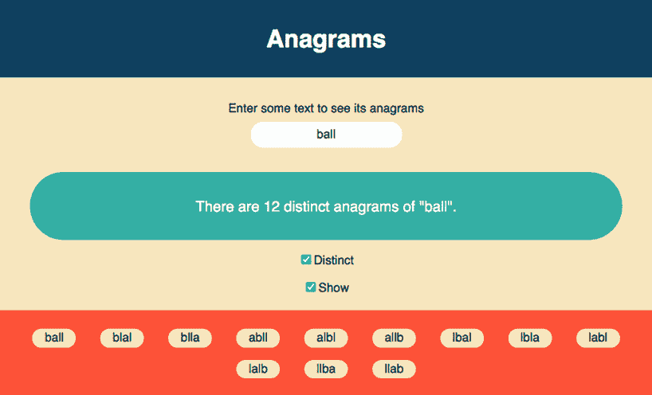

图 7.1 Anagrams 应用程序计算并显示用户输入文本的字母组合。用户可以计算所有字母组合或仅计算不同的字母组合，并且可以切换字母组合的显示。

你可以在全部排列和不同排列之间切换。例如，因为“ball”有一个重复的字母“l”，你可以交换它们的位置，仍然得到单词“ball”。在全部排列类别中，这两个相同的单词被单独计算，但在不同排列类别中则不是。你还可以隐藏生成的排列，让你在输入源文本时，应用在幕后找到新的排列，而无需在输入时渲染新的排列。

注意！随着源文本中字母数量的增加，排列的数量会急剧增加。有 *n*!（n 的阶乘）种 *n* 个字母的组合。对于四个字母，那是 4 × 3 × 2 × 1 = 24 种组合。对于十个字母，有 10!，即 3,628,800 种组合，如图 7.2 所示。应用限制为十个字符——移除限制请自行承担风险！

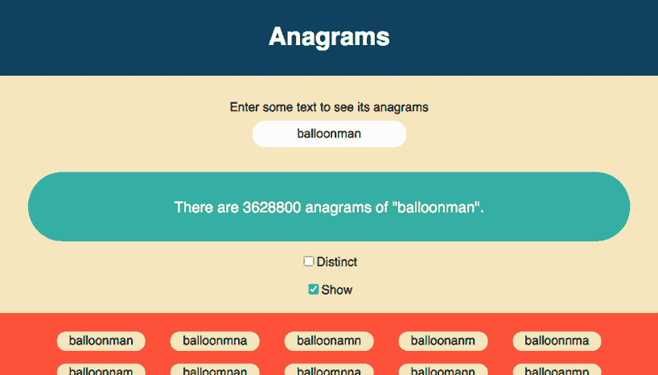

图 7.2 注意！随着源文本长度的增加，排列的数量会迅速增加。一个 10 个字母的单词有超过 350 万个排列。

### 7.1.1 使用昂贵的算法生成排列

同事为你提供了查找排列的代码。算法如下所示。它当然可以改进。但无论算法如何，你只想在绝对必要时才执行这种昂贵的计算。

*Live*: [`djwuy.csb.app/`](https://djwuy.csb.app/)，*Code*: [`codesandbox.io/s/anagrams-djwuy`](https://codesandbox.io/s/anagrams-djwuy)

列表 7.1 查找排列

```
export function getAnagrams(source) {             ❶
  if (source.length < 2) {
    return [...source];
  }
  const anagrams = [];
  const letters = [...source];

  letters.forEach((letter, i) => {
    const without = [...letters];
    without.splice(i, 1);
    getAnagrams(without).forEach(anagram => {     ❷
      anagrams.push(letter + anagram);
    });
  });

  return anagrams;
}

export function getDistinct(anagrams) {           ❸
  return [...new Set(anagrams)];
}
```

❶ 创建一个函数来查找某些源文本中字母的所有组合。

❷ 在移除一个字母后，递归地调用源文本上的函数。

❸ 创建一个从数组中删除重复项的函数。

该算法取单词中的每个字母，并附加剩余字母的所有排列。所以，对于“ball”来说，它会找到以下内容：

“b” + “all” 的排列

“a” + “bll” 的排列

“l” + “bal” 的排列

“l” + “bal” 的排列

主应用调用 `getAnagrams` 和 `getDistinct` 来获取显示所需的信息。以下列表是一个早期的实现。你能发现任何问题吗？

列表 7.2 修复前的排列应用

```
import React, { useState } from "react";
import "./styles.css";
import { getAnagrams, getDistinct } from "./anagrams";                    ❶

export default function App() {
  const [sourceText, setSourceText] = useState("ball");                   ❷
  const [useDistinct, setUseDistinct] = useState(false);                  ❸
  const [showAnagrams, setShowAnagrams] = useState(false);                ❸

  const anagrams = getAnagrams(sourceText);                               ❹
  const distinct = getDistinct(anagrams);                                 ❹

  return (
    <div className="App">
      <h1>Anagrams</h1>
      <label htmlFor="txtPhrase">Enter some text...</label>
      <input
        type="text"
        value={sourceText}
        onChange={e => setSourceText(e.target.value.slice(0, 10))}        ❺
      />
      <div className="count">                                             ❻
        {useDistinct ? (                                                  ❻
          <p>                                                             ❻
            There are {distinct.length} distinct anagrams.                ❻
          </p>                                                            ❻
        ) : (                                                             ❻
          <p>                                                             ❻
            There are {anagrams.length} anagrams of "{sourceText}".       ❻
          </p>                                                            ❻
        )}                                                                ❻
      </div>                                                              ❻

      <p>
        <label>
          <input
            type="checkbox"
            checked={useDistinct}
            onClick={() => setUseDistinct(s => !s)}
          />
          Distinct
        </label>
      </p>
      <p>
        <label>
          <input
            type="checkbox"
            checked={showAnagrams}
            onChange={() => setShowAnagrams(s => !s)}
          />
          Show
        </label>
      </p>

      {showAnagrams && (                                                  ❼
        <p className="anagrams">                                          ❼
          {distinct.map(a => (                                            ❼
            <span key={a}>{a}</span>                                      ❼
          ))}                                                             ❼
        </p>                                                              ❼
      )}                                                                  ❼
    </div>
  );
}
```

❶ 导入排列查找函数。

❷ 管理源文本状态。

❸ 包含用于切换不同排列和排列显示的标志。

❹ 使用排列函数生成数据。

❺ 限制字母的数量。

❻ 显示排列的数量。

❼ 显示排列列表。

关键问题是代码在每次渲染时都会调用昂贵的排列函数。但是，只有当源文本改变时，排列才会改变。当用户点击任一复选框，在全部排列和不同排列之间切换，或者显示和隐藏列表时，你真的不应该再次生成排列。以下是当前对排列函数的调用：

```
export default function App() {
  // variables

  const anagrams = getAnagrams(sourceText);   ❶
  const distinct = getDistinct(anagrams);     ❶

  return ( /* UI */ )
}
```

❶ 昂贵的函数在每次渲染时运行。

我们需要一种方法来请求 React 仅在输出可能不同时运行昂贵的函数。对于`getAnagrams`，这是当`sourceText`值改变时。对于`getDistinct`，这是当`anagrams`数组改变时。

### 7.1.2 避免冗余函数调用

以下列表显示了实时示例的代码。它将昂贵的函数包装在`useMemo`钩子的调用中，为每个调用提供依赖项数组。

*Live*: [`djwuy.csb.app/`](https://djwuy.csb.app/), *Code*: [`codesandbox.io/s/anagrams-djwuy`](https://codesandbox.io/s/anagrams-djwuy)

列表 7.3 使用`useMemo`的字母组合应用

```
import React, {useState, useMemo} from "react";                   ❶
import "./styles.css";
import {getAnagrams, getDistinct} from "./anagrams";

export default function App() {
  const [sourceText, setSourceText] = useState("ball");
  const [useDistinct, setUseDistinct] = useState(false);
  const [showAnagrams, setShowAnagrams] = useState(false);

  const anagrams = useMemo(                                       ❷
    () => getAnagrams(sourceText),                                ❸
    [sourceText]                                                  ❹
  );

  const distinct = useMemo(                                       ❺
    () => getDistinct(anagrams),                                  ❻
    [anagrams]                                                    ❼
  );

  return ( /* UI */ )
}
```

❶ 导入`useMemo`钩子。

❷ 调用`useMemo`。

❸ 将昂贵的函数传递给`useMemo`。

❹ 指定依赖项列表。

❺ 将`getDistinct`返回的值赋给一个变量。

❻ 在另一个函数中包装对`getDistinct`的调用。

❼ 仅当字母组合数组改变时重新运行`getDistinct`函数。

在这个版本中，React 应该在`sourceText`改变时调用`getAnagrams`，在`anagrams`改变时调用`getDistinct`。用户可以随意切换，而不会导致应用在重建相同的百万个字母组合时产生一系列昂贵的调用。

你可以看到最后一个例子，决定没有更多东西可以学习了，然后埋头于沙子中——*一些鸸鹋*。或者过于胆怯而不敢询问更多细节——*老鼠*？*我*？但是，要勇敢，依靠 React，平息那些昂贵的调用——*useMemo*！

## 7.2 使用`useMemo`缓存昂贵的函数调用

如果我们有一个函数`expensiveFn`，它需要时间和资源来计算其返回值，那么我们只想在绝对必要时调用该函数。通过在`useMemo`钩子内部调用该函数，我们请求 React 为给定的一组参数存储由该函数计算出的值。如果我们再次在`useMemo`内部调用该函数，使用与上次调用相同的参数，它应该返回存储的值。如果我们传递不同的参数，它将使用该函数计算新值，并在返回新值之前更新其存储。为给定参数集存储结果的过程称为*记忆化*。

当调用`useMemo`时，传递给它一个*创建函数*和依赖项列表，如图 7.3 所示。

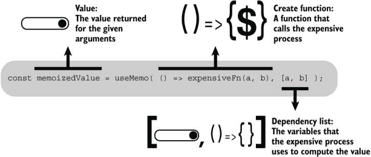

图 7.3 使用函数和依赖项列表调用`useMemo`钩子。

依赖项列表是一个值数组，应包括函数在其计算中使用的所有值。在每次调用中，`useMemo`会将依赖项列表与之前的列表进行比较。如果每个列表都包含相同顺序的相同值，`useMemo`可能会返回存储的值。如果列表中的任何值已更改，`useMemo`将调用函数，存储并返回函数的返回值。再次强调，`useMemo`*可能*返回存储的值。React 保留清除其存储以释放内存的权利。因此，即使依赖项未更改，它也可能调用昂贵的函数。

如果您省略了依赖列表，`useMemo`总是会运行您的函数，这有点违背了初衷！如果您传递一个空数组，列表中的值永远不会改变，因此`useMemo`可以始终返回存储的值。然而，它可能仍然决定清除其存储并再次运行您的函数。几乎可以肯定，最好避免这种可能或可能不的行为。

这就是`useMemo`的工作方式。我们再次在 7.4 节的预订示例应用中看到它的作用，用于生成预订槽位的网格。首先，我们使用我们的状态共享和 React Hooks 技能将 Bookings 页面组件放在一起，并传递它们需要一起良好工作的各个部分。

## 7.3 组织 Bookings 页面上的组件

到目前为止，Bookables 和 Users 页面在预订应用中受到了所有关注；是时候让 Bookings 页面得到一些关注了！我们需要将第六章中的共享状态概念付诸实践，并决定哪些组件将管理哪些状态，当我们让用户查看不同可预订项目和不同周次的预订时。

图 7.4 显示了 Bookings 页面的布局，左侧是可预订项目的列表，页面的其余部分是预订信息。我们有一个`BookingsPage`组件用于页面本身，一个`BookablesList`组件用于左侧的列表，以及一个`Bookings`组件用于页面的其余部分。预订信息包括周选择器、显示预订网格的区域以及显示所选预订详情的区域。

图 7.4 为预订网格和预订详情提供了占位符。我们将在第 7.4 节中使预订网格变得生动，并引入`useMemo`钩子。我们将在第八章中填充预订详情并介绍`useContext`钩子。在本节中，我们将页面上的各个部分放在一起。

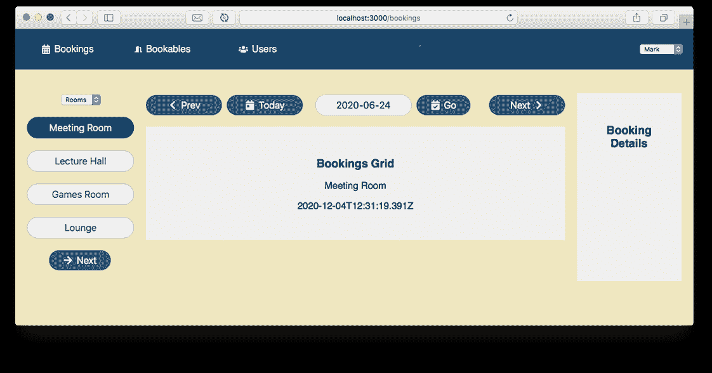

图 7.4 Bookings 页面包括两个组件：一个用于可预订项目的列表，另一个包含周选择器、预订网格和预订详情。

本书使用预订应用来教您关于 React Hooks 的知识。为了节省您的时间和精力，我更专注于教授钩子，而不是教授您如何编写预订应用，这可能会变得非常重复，并且不会对学习 React 有所帮助。因此，有时本书会设置挑战，并将您指向示例的 GitHub 仓库以获取某些组件的最新代码。随着 Bookings 页面的示例应用变得越来越复杂，仓库中的更改案例在书中并未全部列出；当您需要检查仓库时，我会明确指出。

表 7.1 列出了 Bookings 页面中涉及到的组件，以及它们的主要功能和它们管理的共享状态。在第八章中，我们将使用`useContext`钩子从`BookingDetails`组件访问当前用户；尽管我们在这章中没有与`App`组件打交道，但它包含在表中，以便您可以看到组件的完整层次结构。

表 7.1 预订页面组件

| 组件 | 角色 | 管理的状态 | 钩子 |
| --- | --- | --- | --- |
| `App` | 渲染带有页面链接的标题。渲染用户选择器。使用路由渲染正确的页面。 | 当前用户 | `useState` + 上下文 API—见第八章 |
| `BookingsPage` | 渲染 `BookablesList` 和 `Bookings` 组件。 | 已选可预订项 | `useState` |
| `BookablesList` | 渲染可预订项列表并允许用户选择可预订项。 |  |  |
| `Bookings` | 渲染 `WeekPicker`、`BookingsGrid` 和 `BookingDetails` 组件。 | 已选周和已选预订 | `useReducer` 和 `useState` |
| `WeekPicker` | 允许用户切换周次以查看。 |  |  |
| `BookingsGrid` | 显示所选可预订项和周的预订时段网格。用任何现有的预订填充网格。突出显示所选预订。 |  |  |
| `BookingDetails` | 显示所选预订的详细信息。 |  |  |

我们将从 `BookingsPage` 开始工作；列表应该能给你一个很好的页面结构和状态在组件层次结构中流动的感觉。讨论分为两个小节，以共享状态为重点：

+   使用 `useState` 管理所选可预订项

+   使用 `useReducer` 和 `useState` 管理所选周和预订

表 7.1 中显示的所有组件都需要在应用返回到工作状态之前就位，但列表并不长，所以我们很快就能到达那里。

### 7.3.1 使用 `useState` 管理所选可预订项

我们的第一块共享状态是已选可预订项。它被 `BookablesList` 和 `Bookings` 组件使用。（记住，`Bookings` 组件是 `WeekPicker`、`BookingsGrid` 和 `BookingDetails` 组件的容器。）它们最近的共享父级是预订页面本身。

列表 7.4 展示了 `BookingsPage` 组件调用 `useState` 来管理所选可预订项。`BookingsPage` 还将更新函数 `setBookable` 传递给 `BookablesList`，以便用户可以从列表中选择可预订项。它不再直接导入 `WeekPicker`。

分支：0701-bookings-page，文件：src/components/Bookings/BookingsPage.js

列表 7.4 `BookingsPage` 组件

```
import {useState} from "react";
import BookablesList from "../Bookables/BookablesList";
import Bookings from "./Bookings";

export default function BookingsPage () {
  const [bookable, setBookable] = useState(null);     ❶

  return (
    <main className="bookings-page">
      <BookablesList
        bookable={bookable}                           ❷
        setBookable={setBookable}                     ❸
      />
      <Bookings
        bookable={bookable}                           ❹
      />
    </main>
  );
}
```

❶ 使用 `useState` 钩子管理所选可预订项。

❷ 将可预订项传递下去，以便在列表中突出显示。

❸ 传递更新函数，以便用户可以选择可预订项。

❹ 让预订组件显示所选可预订项的预订。

页面将所选可预订项传递给（稍后创建的）`Bookings` 组件，以便它可以显示可预订项的预订。为了显示正确的预订（并让用户创建新的预订），`Bookings` 组件还需要知道所选周。让我们看看它是如何管理这个状态的。

### 7.3.2 使用 `useReducer` 和 `useState` 管理所选周和预订

用户可以通过使用周选择器来切换周。他们可以向前或向后导航一周，也可以直接跳转到包含今天日期的那一周。他们还可以在文本框中输入一个日期并转到该日期的周。为了与预订网格共享选定的日期，我们将周选择器的 reducer 提升到 `Bookings` 组件中，如下所示。

分支：0701-bookings-page，文件：src/components/Bookings/Bookings.js

列表 7.5 `Bookings` 组件

```
import {useState, useReducer} from "react";
import {getWeek} from "../../utils/date-wrangler";

import WeekPicker from "./WeekPicker";
import BookingsGrid from "./BookingsGrid";
import BookingDetails from "./BookingDetails";

import weekReducer from "./weekReducer";             ❶

export default function Bookings ({bookable}) {      ❷

  const [week, dispatch] = useReducer(               ❸
    weekReducer, new Date(), getWeek
  );

  const [booking, setBooking] = useState(null);      ❹

  return (
    <div className="bookings">
      <div>
        <WeekPicker
          dispatch={dispatch}
        />

        <BookingsGrid
          week={week}
          bookable={bookable}
          booking={booking}
          setBooking={setBooking}
        />
      </div>

      <BookingDetails
        booking={booking}
        bookable={bookable}
      />
    </div>
  );
}
```

❶ 导入现有的周选择器 reducer。

❷ 从属性中解构当前可预订项。

❸ 管理选定周的共享状态。

❹ 管理选定的预订的共享状态。

`Bookings` 组件导入 reducer 并在调用 `useReducer` 钩子时传递它。它还调用 `useState` 钩子来管理 `BookingsGrid` 和 `BookingDetails` 组件的共享选定预订状态。

挑战 7.1

更新 `WeekPicker` 组件，使其接收 `dispatch` 作为属性，不再自己调用 `useReducer`。它不需要显示选定的日期，因此从返回的 UI 末尾移除该功能，并移除任何多余的导入。检查仓库以获取最新版本（src/components/Bookings/WeekPicker.js）。

在 7.4 节中，我们构建预订网格以显示实际预订。对于当前仓库分支，我们只需添加几个占位符组件来检查页面结构是否工作良好。以下列表显示了我们的临时预订网格。

分支：0701-bookings-page，文件：src/components/Bookings/BookingsGrid.js

列表 7.6 `BookingsGrid` 占位符

```
export default function BookingsGrid (props) {
  const {week, bookable, booking, setBooking} = props;

  return (
    <div className="bookings-grid placeholder">
      <h3>Bookings Grid</h3>
      <p>{bookable?.title}</p>
      <p>{week.date.toISOString()}</p>
    </div>
  );
}
```

以下列表显示了我们的临时详情组件。

分支：0701-bookings-page，文件：src/components/Bookings/BookingDetails.js

列表 7.7 `BookingDetails` 占位符

```
export default function BookingDetails () {
  return (
    <div className="booking-details placeholder">
      <h3>Booking Details</h3>
    </div>
  );
}
```

现在应该一切就绪，应用应该恢复正常工作。预订页面应该看起来像图 7.4（如果您有最新的 CSS，或者为占位符自己创建一个）。

挑战 7.2

对 `BookablesList` 进行小幅修改，移除移动焦点到“下一步”按钮的代码。这将仅简化组件以供未来的更改。更新位于当前分支：/src/components/Bookables/BookablesList.js。

在所有组件就绪并且对页面如何管理每一块共享状态有了一定的了解之后，是时候向预订应用引入一个新的 React 钩子了。`useMemo` 钩子将帮助我们仅在必要时运行昂贵的计算。让我们看看为什么我们需要它以及它是如何帮助的。

## 7.4 使用 `useMemo` 高效构建预订网格

在 Bookings 页面结构和层次结构就绪后，我们准备构建迄今为止最复杂的组件，即 `BookingsGrid`。在本节中，我们开发网格，使其能够显示给定周和地点的预订时段，并将任何现有预订放入网格中。图 7.5 显示了具有三个行（会话）和五个列（日期）的网格。网格中有四个现有预订，用户已选择其中一个预订。

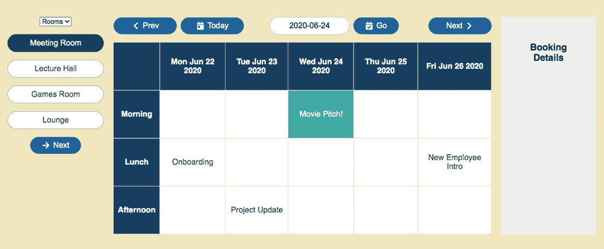

图 7.5 显示了所选可预订项目和周的预订网格。网格中的一个预订已被选中。

我们在五个阶段中开发组件：

1.  生成会话和日期的网格——我们希望将数据转换，以便更容易查找空预订时段。

1.  生成预订查找——我们希望将数据转换，以便更容易查找现有预订。

1.  提供一个 `getBookings` 数据加载函数——它将处理构建我们向 JSON 服务器请求的查询字符串。

1.  创建 `BookingsGrid` 组件——这是本节的核心内容，也是我们请求 `useMemo` 帮助的地方。

1.  处理在 `useEffect` 中获取数据时的竞态响应。

在第 5 阶段，我们将了解如何在 `useEffect` 钩子调用中管理多个请求和响应，以及如何管理错误。有很多内容需要消化，所以让我们从将天数和会话列表转换为二维预订网格开始。

### 7.4.1 生成会话和日期的网格

预订网格以表格形式显示空预订时段和现有预订，其中会话为行，日期为列。图 7.6 展示了 Meeting Room 可预订项目的预订时段示例网格。

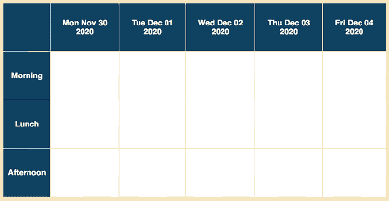

图 7.6 显示了 Meeting Room 可预订项目的预订网格。它为每个会话有行，为每个日期有列。

用户为不同会话和周的不同日子预订不同的可预订项目。当用户选择新的可预订项目时，`BookingsGrid` 组件需要生成一个新的网格，用于最新的会话和日期。图 7.7 显示了用户切换到 Lounge 可预订项目时生成的网格。

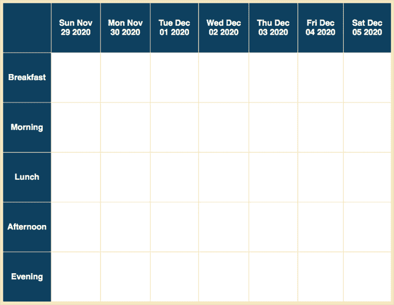

图 7.7 显示了 Lounge 可预订项目的预订网格。Lounge 在每周的每一天都提供五个时段。

网格中的每个单元格都对应一个预订时段。我们希望网格数据结构化，以便轻松访问特定预订时段的数据。例如，要访问 2020 年 8 月 3 日早餐会话的数据，我们使用以下方法：

```
grid["Breakfast"]["2020-08-03"]
```

对于空预订时段，预订数据看起来像这样：

```
{
  "session": "Breakfast",
  "date": "2020-08-03",
  "bookableId": 4,
  "title": ""
}
```

在数据库的数据中，每个可预订项目指定了可以预订的会话和日子。以下是 Meeting Room 的数据：

```
"id": 1,
"group": "Rooms",
"title": "Meeting Room",
"notes": "The one with the big table and interactive screen.",
"sessions": [1, 2, 3],
"days": [1, 2, 3, 4, 5]
```

`days` 代表一周中的天数，其中周日 = 0，周一 = 1，...，周六 = 6。因此，会议室可以在周一至周五预订会话 1、2 和 3，正如我们在图 7.6 中所看到的。要获取预订的具体日期，而不仅仅是天数，我们还需要显示周的开始日期。要获取具体的会话名称，我们需要从配置文件 static.json 中导入会话名称数组。

网格生成函数 `getGrid` 在以下列表中。调用代码将 `getGrid` 的当前可预订和所选周的起始日期传递给它。

分支：0702-bookings-memo，文件：/src/components/Bookings/grid-builder.js

列表 7.8 网格生成器

```
import {sessions as sessionNames} from "../../static.json";        ❶
import {addDays, shortISO} from "../../utils/date-wrangler";

export function getGrid (bookable, startDate) {                    ❷

  const dates = bookable.days.sort().map(                          ❸
    d => shortISO(addDays(startDate, d))                           ❸
  );                                                               ❸

  const sessions = bookable.sessions.map(i => sessionNames[i]);    ❹

  const grid = {};

  sessions.forEach(session => {
    grid[session] = {};                                            ❺
    dates.forEach(date => grid[session][date] = {                  ❻
      session,
      date,
      bookableId: bookable.id,
      title: ""
    });
  });

  return {                                                         ❼
    grid,                                                          ❼
    dates,                                                         ❼
    sessions                                                       ❼
  };                                                               ❼
}
```

❶ 将会话名称分配给 `sessionNames` 变量。

❷ 将当前可预订的书籍和周开始日期作为参数接受。

❸ 使用天数和起始日期创建一周的日期数组。

❹ 使用会话名称和数字创建一个会话名称数组。

❺ 为每个会话分配一个对象到网格中。

❻ 为每个会话分配一个预订对象到每个日期。

❼ 除了网格之外，为了方便，返回日期和会话数组。

`getGrid` 函数首先将日期和会话索引映射到日期和会话名称。它使用截断的 ISO 8601 格式表示日期：

```
const dates = bookable.days.sort().map(
  d => shortISO(addDays(startDate, d))
);                                                                     
```

`shortISO` 函数已被添加到包含 `addDays` 函数的 `utils/date-wrangler.js` 文件中。`shortISO` 返回给定日期的 ISO-字符串的日期部分：

```
export function shortISO (date) {
  return date.toISOString().split("T")[0];
}
```

例如，对于表示 2020 年 8 月 3 日的 JavaScript 日期对象，`shortISO` 返回字符串 `"2020-08-03"`。

列表中的代码还从 static.json 导入会话名称并将它们分配给 `sessionNames` 变量。会话数据如下所示：

```
"sessions": [
  "Breakfast",
  "Morning",
  "Lunch",
  "Afternoon",
  "Evening"
]
```

将可预订的每个会话索引映射到其会话名称：

```
const sessions = bookable.sessions.map(i => sessionNames[i]);
```

因此，如果所选的可预订的是会议室，那么 `bookable.sessions` 是数组 `[1, 2, 3]`，而 `sessions` 变为 `["Morning", "Lunch", "Afternoon"]`。

在获取了日期和会话名称之后，`getGrid` 然后使用嵌套的 `forEach` 循环来构建预订会话的网格。您也可以在这里使用 `reduce` 数组方法，但我发现在这种情况下 `forEach` 语法更容易理解。（不要担心，`reduce` 粉丝；下一个列表将使用其服务。）

### 7.4.2 生成预订查找

我们还希望有一个简单的方法来查找现有预订。图 7.8 展示了一个包含四个单元格中现有预订的预订网格。


图 7.8 包含四个单元格中现有预订的预订网格

我们希望使用会话名称和日期来访问现有预订的数据，如下所示：

```
bookings["Morning"]["2020-06-24"]
```

查找表达式应返回 Movie Pitch! 预订的数据，具有以下结构：

```
{
  "id": 1,
  "session": "Morning",
  "date": "2020-06-24",
  "title": "Movie Pitch!", 
  "bookableId": 1,
  "bookerId": 2
}
```

但服务器以数组的形式返回预订数据。我们需要将预订数组转换为方便的查找对象。列表 7.9 向列表 7.8 中的 grid-builder.js 文件添加了一个新函数 `transformBookings`。

分支：0702-bookings-memo，文件：/src/components/Bookings/grid-builder.js

列表 7.9 `transformBookings` 函数

```
export function transformBookings (bookingsArray) {

  return bookingsArray.reduce((bookings, booking) => {    ❶

    const {session, date} = booking;                      ❷

    if (!bookings[session]) {                             ❸
      bookings[session] = {};                             ❸
    }                                                     ❸

    bookings[session][date] = booking;                    ❹

    return bookings;
  }, {});                                                 ❺
}
```

❶ 使用 reduce 遍历每个预订并构建预订查找。

❷ 解构当前预订的会话和日期。

❸ 为每个新会话添加一个属性。

❹ 将预订分配给其会话和日期。

❺ 将预订查找作为空对象开始。

`transformBookings` 函数使用 `reduce` 方法遍历数组中的每个预订并构建 `bookings` 查找对象，将当前预订分配给其分配的查找槽位。`transformBookings` 创建的查找对象只包含现有预订的条目，不一定包含预订网格中的每个单元格。

我们现在有了生成网格和将预订数组转换为查找对象的函数。但预订在哪里？

### 7.4.3 提供一个 getBookings 数据加载函数

`BookingsGrid` 组件需要一些预订来显示所选的可预订项和周。我们可以在 `BookingsGrid` 组件中的效果内部使用现有的 `getData` 函数，并在那里构建必要的 URL。相反，让我们将数据访问函数保留在 api.js 文件中。以下列表显示了更新文件中我们的新 `getBookings` 函数的部分。

分支：0702-bookings-memo，文件：/src/utils/api.js

列表 7.10 `getBookings` API 函数

```
import {shortISO} from "./date-wrangler";                        ❶

export function getBookings (bookableId, startDate, endDate) {   ❷

  const start = shortISO(startDate);                             ❸
  const end = shortISO(endDate);                                 ❸

  const urlRoot = "http://localhost:3001/bookings";

  const query = `bookableId=${bookableId}` +                     ❹
 `&date_gte=${start}&date_lte=${end}`; ❹

  return getData(`${urlRoot}?${query}`);                         ❺
}
```

❶ 导入一个格式化日期的函数。

❷ 导出新的 getBookings 函数。

❸ 格式化查询字符串的日期。

❹ 构建查询字符串。

❺ 获取预订，返回一个承诺。

`getBookings` 函数接受三个参数：`bookableId`、`startDate` 和 `endDate`。它使用这些参数来构建所需预订的查询字符串。例如，要获取 2020 年 6 月 21 日星期日到 2020 年 6 月 27 日星期六会议室的预订，查询字符串如下：

```
bookableId=1&date_gte=2020-06-21&date_lte=2020-06-27
```

我们运行的 `json-server` 将解析查询字符串并返回请求的预订数组，以便转换为查找对象。

在放置好辅助函数后，是时候将它们用于构建 `BookingsGrid` 组件了。

### 7.4.4 创建 BookingsGrid 组件并调用 useMemo

对于给定的可预订项和周，`BookingsGrid` 组件获取预订并显示它们，突出显示任何选定的预订。它使用三个 React Hooks：`useState`、`useEffect` 和 `useMemo`。我们将组件的代码拆分到多个列表中，在本小节和下一节中，从以下列表中的导入和组件骨架开始。

分支：0702-bookings-memo，文件：/src/components/Bookings/BookingsGrid.js

列表 7.11 `BookingsGrid` 组件：骨架

```
import {useEffect, useMemo, useState, Fragment} from "react";    ❶

import {getGrid, transformBookings} from "./grid-builder";       ❷

import {getBookings} from "../../utils/api";                     ❸

import Spinner from "../UI/Spinner";

export default function BookingsGrid () {

  // 1\. Variables
  // 2\. Effects
  // 3\. UI helper
  // 4\. UI

}
```

❶ 导入 `useMemo` 以缓存网格。

❷ 导入新的网格函数。

❸ 导入新的数据加载函数。

代码导入了之前创建的辅助函数和三个钩子。正如你将在接下来的几个列表中看到的，我们使用 `useState` 钩子来管理预订和任何错误的状态，使用 `useEffect` 钩子从服务器获取预订数据，使用 `useMemo` 钩子减少生成网格数据次数。

变量

`Bookings` 组件将所选的可预订项、所选周和当前所选的预订及其更新函数传递给 `BookingsGrid` 组件，如下面的列表所示。

分支：0702-bookings-memo，文件：/src/components/Bookings/BookingsGrid.js

列表 7.12 `BookingsGrid` 组件：1. 变量

```
export default function BookingsGrid (
 {week, bookable, booking, setBooking}                     ❶
) {
  const [bookings, setBookings] = useState(null);           ❷
  const [error, setError] = useState(false);                ❸

  const {grid, sessions, dates} = useMemo(                  ❹

    () => bookable ? getGrid(bookable, week.start) : {},    ❺

    [bookable, week.start]                                  ❻
  );

  // 2\. Effects
  // 3\. UI helper
  // 4\. UI  
}
```

❶ 解构 props。

❷ 本地处理预订数据。

❸ 本地处理加载错误。

❹ 使用 `useMemo` 将网格生成函数包装起来。

❺ 只有在有可预订的情况下才调用网格生成器。

❻ 当可预订项或周发生变化时，重新生成网格。

`BookingsGrid` 使用两个 `useState` 钩子本身处理预订和错误状态。然后它使用 7.4.2 节中的 `getGrid` 函数生成网格，将返回的网格、会话和日期数据分配给局部变量。我们决定将 `getGrid` 视为一个昂贵的函数，并用 `useMemo` 包装它。为什么它可能值得这样的处理？

当用户在预订页面上选择可预订项时，`Bookings` 组件显示可预订项可用会话和日期的预订时段网格。它根据可预订项的属性和所选周生成网格数据。正如我们将在下一个列表中看到的，`BookingsGrid` 组件使用在渲染时请求数据的数据加载策略，在初始渲染后发送数据请求。网格（如图 7.9 所示）在左上角单元格显示加载指示器，并在数据到达之前降低主体单元格的不透明度。

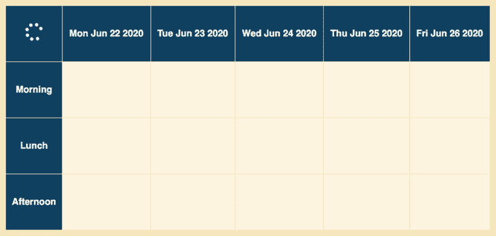

图 7.9 `BookingsGrid` 组件在其左上角单元格显示加载指示器，并在数据请求进行时降低网格单元格的不透明度。

当数据到达时，网格会重新渲染，隐藏加载指示器并显示所选周的预订。图 7.10 显示了网格中的四个预订。

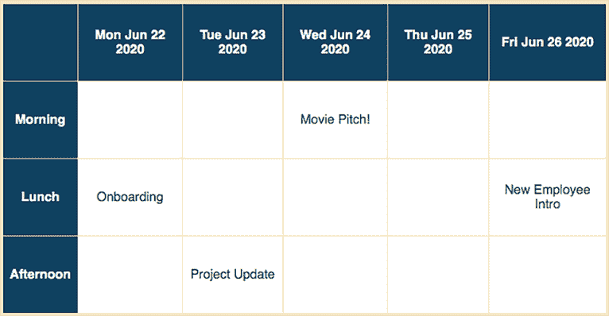

图 7.10 显示四个预订的预订网格

在预订就绪后，用户现在可以自由选择现有的预订或空预订时段。在图 7.11 中，用户选择了“电影提案”预订，并且组件再次重新渲染，突出显示单元格。

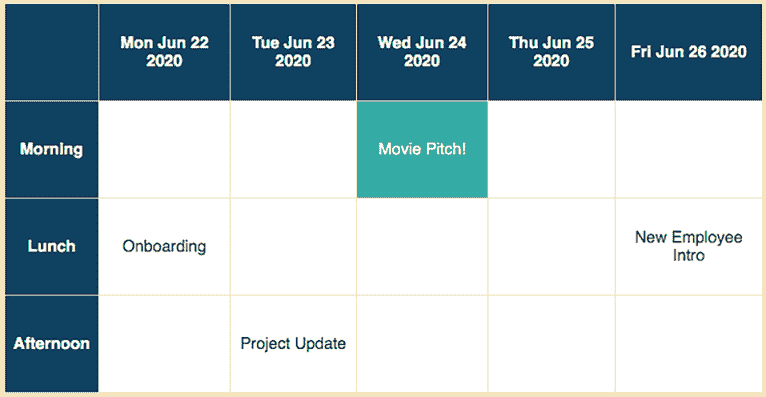

图 7.11 显示已选择的预订的预订网格

组件在状态变化时渲染，如表 7.2 所示，尽管预订时段的底层网格数据并未改变。

表 7.2 不同事件的预订网格渲染行为

| 事件 | 渲染方式 |
| --- | --- |
| 初始渲染 | 空网格 |
| 数据获取 | 加载指示器 |
| 数据加载 | 单元格中的预订 |
| 已选预订 | 高亮选择 |

对于列出的活动，我们不想在每次重新渲染时重新生成底层的网格数据，因此我们使用 `useMemo` 钩子，指定可预订和周的开始日期作为依赖项：

```
const {grid, sessions, dates} = useMemo(
  () => bookable ? getGrid(bookable, week.start) : {},
  [bookable, week.start]
);
```

通过将 `getGrid` 包裹在 `useMemo` 中，我们要求 React 存储生成的网格查找，并且只有在可预订或开始日期更改时才再次调用 `getGrid`。对于表 7.2 中的三个重新渲染场景（不是初始渲染），React 应该返回存储的网格，避免不必要的计算。

在现实中，对于我们生成的网格大小，我们实际上并不需要 `useMemo`。现代浏览器、JavaScript 和 React 几乎不会注意到所需的工作。此外，要求 React 存储函数、返回值和依赖值也有一些开销，因此我们不想对所有内容进行记忆化。然而，正如我们在本章前面看到的字母表排列示例中看到的那样，有时昂贵的函数可能会对性能产生不利影响，所以拥有 `useMemo` 钩子是个好主意。

尽管本章的主要重点是 `useMemo` 钩子，但在 `useEffect` 调用中进行数据获取的有用技术值得用小节标题标记。让我们看看如何避免得到多个请求和响应的纠缠。

### 7.4.5 在 useEffect 中获取数据时处理竞态响应

当与预订应用交互时，用户可能会变得有点点击狂热，快速在可预订和周之间切换，引发一系列数据请求。我们只想显示他们的最后选择的数据。不幸的是，我们无法控制数据从服务器返回的时间，一个较旧请求可能在较新的请求之后解决，导致显示与用户的选择不同步。

我们可以尝试实现一种取消进行中的请求的方法。然而，如果数据响应不是太大，简单地让请求按其流程运行并忽略到达的不想要的日期会更简单。在本小节中，我们完成 `BookingsGrid` 组件，获取预订数据，并构建用于显示的 UI。

影响

`BookingsGrid` 组件加载所选可预订和周次的预订。列表 7.13 显示了在 `useEffect` 调用中包裹我们的辅助函数 `getBookings` 和 `transformBookings` 的调用。效果在周或可预订更改时运行。

分支：0702-bookings-memo，文件：/src/components/Bookings/BookingsGrid.js

列表 7.13 `BookingsGrid` 组件：2. 影响

```
export default function BookingsGrid (
  {week, bookable, booking, setBooking}
) {
  // 1\. Variables

  useEffect(() => {
    if (bookable) {
      let doUpdate = true;                              ❶

      setBookings(null);
      setError(false);
      setBooking(null);

      getBookings(bookable.id, week.start, week.end)    ❷
        .then(resp => {
          if (doUpdate) {                               ❸
            setBookings(transformBookings(resp));       ❹
          }
        })
        .catch(setError);

      return () => doUpdate = false;                    ❺
    }
  }, [week, bookable, setBooking]);                     ❻

  // 3\. UI helper
  // 4\. UI
}
```

❶ 使用变量跟踪预订数据是否最新。

❷ 调用我们的 `getBookings` 数据获取函数。

❸ 检查预订数据是否最新。

❹ 创建一个预订查找并将其分配给状态。

❺ 返回一个清理函数以使数据无效。

❻ 当可预订或周发生变化时运行效果。

代码使用 `doUpdate` 变量来匹配每个请求及其数据。该变量最初设置为 `true`：

```
let doUpdate = true;
```

对于特定的请求，`then` 子句中的回调函数只有在 `doUpdate` 仍然是 `true` 时才会更新状态：

```
if (doUpdate) {
  setBookings(transformBookings(resp));
}
```

当用户选择新的可预订项或切换到新的一周时，React 会重新运行组件，并再次运行效果以加载新选择的数据。之前请求的飞行数据不再需要。在重新运行效果之前，React 会调用之前效果调用的任何相关清理函数。我们的效果使用清理函数来使飞行数据无效：

```
return () => doUpdate = false;
```

当之前请求的预订到达时，`getBookings` 相关调用的 `then` 子句会看到数据已过时，不会更新状态。

如果预订是当前的，`then` 子句通过传递响应到 `transformBookings` 函数将预订的线性数组转换为查找结构。查找对象通过 `setBookings` 分配到本地状态。

UI 辅助函数

预订网格中单元格的内容和行为取决于是否有要显示的预订以及用户是否选择了单元格。图 7.12 显示了一些空单元格和一个现有预订单元格，Movie Pitch!。

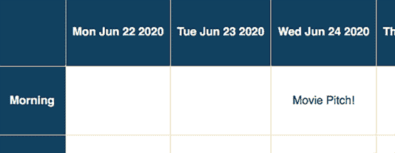

图 7.12 网格中的单元格表示存在的预订，如果存在，或者只是会话和日期的底层网格数据。

当用户选择一个单元格时，无论单元格显示的是现有预订还是空预订槽，该单元格都应该被突出显示。图 7.13 显示了用户选择 Movie Pitch! 预订后的网格。CSS 样式和单元格的 `class` 属性用于改变单元格的外观。

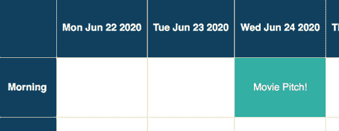

图 7.13 使用不同的 CSS 样式显示所选单元格。

列表 7.14 包含一个 `cell` 辅助函数的代码，该函数返回预订网格中单个单元格的 UI。它使用两个查找对象 `bookings` 和 `grid` 来获取单元格的数据，设置单元格的类，并在有预订的情况下附加事件处理程序。`cell` 函数在 `BookingsGrid` 的作用域内，可以访问 `booking`、`bookings`、`grid` 和 `setBookings` 变量。

分支：0702-bookings-memo，文件：/src/components/Bookings/BookingsGrid.js

列表 7.14 `BookingsGrid` 组件：3. UI 辅助工具

```
export default function BookingsGrid (
  {week, bookable, booking, setBooking}
) {
  // 1\. Variables
  // 2\. Effects

  function cell (session, date) {
    const cellData = bookings?.[session]?.[date]                  ❶
 || grid[session][date];                                     ❶

    const isSelected = booking?.session === session               ❷
 && booking?.date === date;                                  ❷

    return (
      <td
        key={date}
        className={isSelected ? "selected" : null}
        onClick={bookings ? () => setBooking(cellData) : null}    ❸
      >
        {cellData.title}
      </td>
    );
  }

  // 4\. UI
}
```

❶ 首先检查预订查找，然后是网格查找。

❷ 使用可选链，因为可能没有预订。

❸ 仅当预订已加载时设置处理程序。

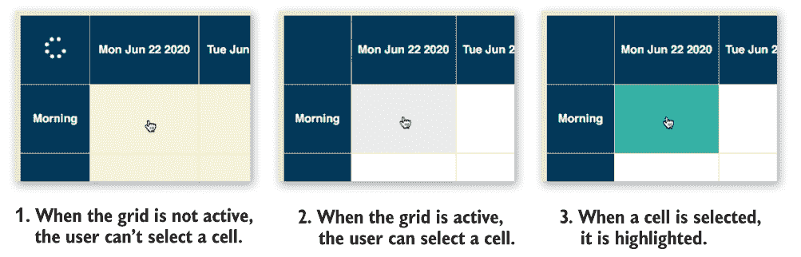

图 7.14 单元格的显示取决于网格是否处于活动状态以及单元格是否已被选中。在加载预订时，UI 显示加载指示器，网格不处于活动状态。

单元格的数据要么来自 `bookings` 查找中的现有预订，要么来自 `grid` 查找中的空预订时段数据。代码使用方括号表示法的可选链语法将正确的值分配给 `cellData` 变量：

```
const cellData = bookings?.[session]?.[date] || grid[session][date]; 
```

`bookings` 查找只包含现有预订的数据，但 `grid` 查找包含每个会话和日期的数据。我们需要为 `bookings` 使用可选链，但不为 `grid` 使用。

只有在存在预订时，我们才在单元格上设置点击处理程序。当预订正在加载时，当用户切换可预订项或周次时，处理程序设置为 `null`，用户无法与网格交互。

UI

`BookingsGrid` 拼图的最后一部分返回 UI。一如既往，UI 由状态驱动。我们检查预订时段的网格是否已生成，预订是否已加载，以及是否存在错误。然后我们返回替代 UI（加载文本）或附加 UI（错误消息），或者设置类名以显示、隐藏或突出显示元素。图 7.14 展示了三种状态下的预订网格：

1.  没有预订。网格显示加载指示器。网格处于非活动状态，用户无法与网格交互。

1.  预订已加载。网格隐藏了加载指示器。网格处于活动状态，用户可以与网格交互。

1.  预订已加载。网格隐藏了加载指示器。网格处于活动状态，用户已选择一个单元格。

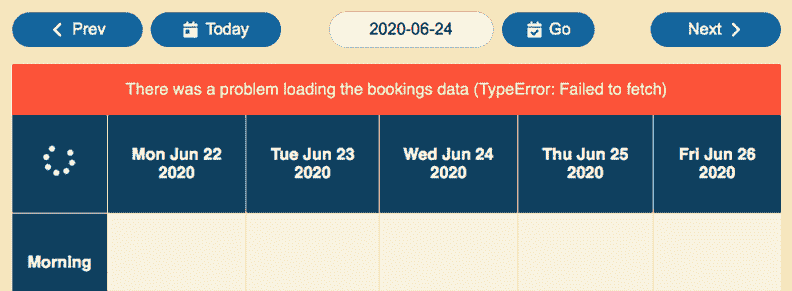

图 7.15 `BookingsGrid` 组件在网格上方显示任何错误。

在图 7.15 中，你可以看到错误信息直接显示在网格日期标题上方。

以下列表显示了错误部分，使用类名来控制网格是否处于活动状态，并调用我们的 UI 辅助函数 `cell` 来获取每个表格单元格的 UI。

分支：0702-bookings-memo，文件：/src/components/Bookings/BookingsGrid.js

列表 7.15 `BookingsGrid` 组件：4. UI

```
export default function BookingsGrid (
  {week, bookable, booking, handleBooking}
) {
  // 1\. Variables
  // 2\. Effects
  // 3\. UI helper
  if (!grid) {
    return <p>Loading...</p>
  }
  return (
    <Fragment>
      {error && (
        <p className="bookingsError">                                    ❶
          {`There was a problem loading the bookings data (${error})`}   ❶
        </p>                                                             ❶
      )}
      <table
        className={bookings ? "bookingsGrid active" : "bookingsGrid"}    ❷
      >
        <thead>
        <tr>
          <th>
 <span className="status">
 <Spinner/>                                                 ❸
 </span>
          </th>
          {dates.map(d => (
            <th key={d}>
              {(new Date(d)).toDateString()}
            </th>
          ))}
        </tr>
        </thead>
        <tbody>
        {sessions.map(session => (
          <tr key={session}>
            <th>{session}</th>
            {dates.map(date => cell(session, date))}                     ❹
          </tr>
        ))}
        </tbody>
      </table>
    </Fragment>
  );
}
```

❶ 如果有错误，在网格顶部显示错误部分。

❷ 当预订数据已加载时，包含一个“活动”类。

❸ 在左上角单元格中包含一个加载指示器。

❹ 使用 UI 辅助函数生成每个表格单元格。

如果 `bookings` 不是 `null`，则将 `active` 类分配给表格。应用的 CSS 隐藏加载指示器，并在网格处于活动状态时将单元格不透明度设置为 1。

在代码中，我们自行检查状态并决定从组件内部返回什么 UI。也可以使用 React 的 *错误边界* 来指定错误 UI，以及使用 React 的 `Suspense` 组件来指定数据加载时的回退 UI，这些操作与单个组件分开进行。在第二部分中，我们使用错误边界来捕获错误，并使用 `Suspense` 组件来捕获承诺（加载数据）。

在此之前，我们需要创建我们的 `BookingDetails` 组件来显示用户点击的任何预订时段或现有预订的详细信息。新组件需要访问应用中的当前用户，存储在根组件 `App` 中。而不是通过多层组件属性向下传递用户值，我们将利用 React 的 Context API 和 `useContext` 钩子来寻求帮助。

## 摘要

+   尽量避免通过将它们包装在 `useMemo` 钩子中来不必要地重新运行昂贵的计算。

+   将要缓存的昂贵函数传递给 `useMemo`：

    ```
    const value = useMemo(
     () => expensiveFn(dep1, dep2),
      [dep1, dep2]
    );
    ```

+   将 `useMemo` 钩子传递给昂贵函数的依赖项列表：

    ```
    const value = useMemo(
      () => expensiveFn(dep1, dep2),
     [dep1, dep2]
    );
    ```

+   如果依赖数组中的值在连续调用之间没有变化，`useMemo` 可以返回其存储的昂贵函数的结果。

+   不要依赖 `useMemo` 总是使用缓存值。如果 React 需要释放内存，它可能会丢弃存储的结果。

+   使用 JavaScript 的可选链式语法（方括号）来访问可能为 `undefined` 的变量的属性。即使在处理方括号时，也要包含一个点：

    ```
    const cellData = bookings?.[session]?.[date]
    ```

+   在 `useEffect` 调用中获取数据时，将局部变量和清理函数结合起来，以匹配数据请求及其响应：

    ```
    useEffect(() => {
      let doUpdate = true;

      fetch(url).then(resp => {
        if (doUpdate) {
          // perform update with resp
        }
      });

      return () => doUpdate = false;
    }, [url]);
    ```

    如果组件使用新的 `url` 重新渲染，前一次渲染的清理函数会将前一次渲染的 `doUpdate` 变量设置为 `false`，防止前一次的 `then` 方法回调使用过时的数据进行更新。
