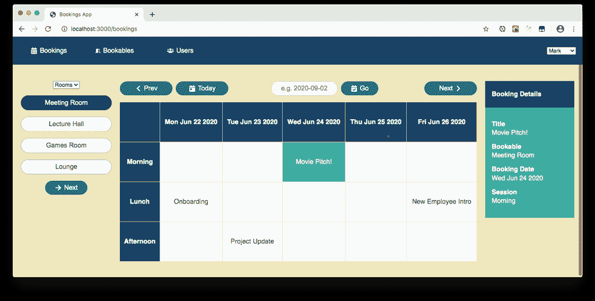
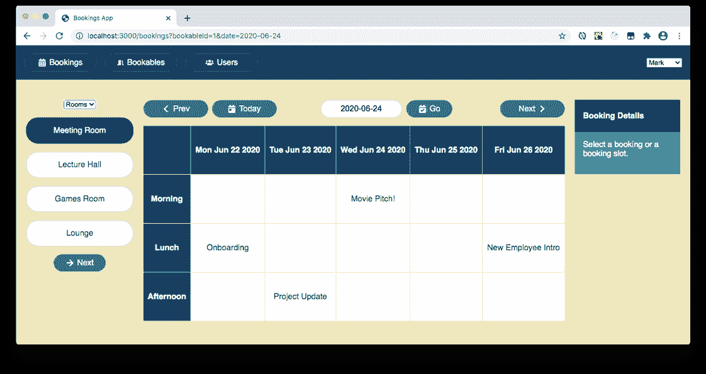
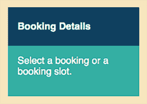
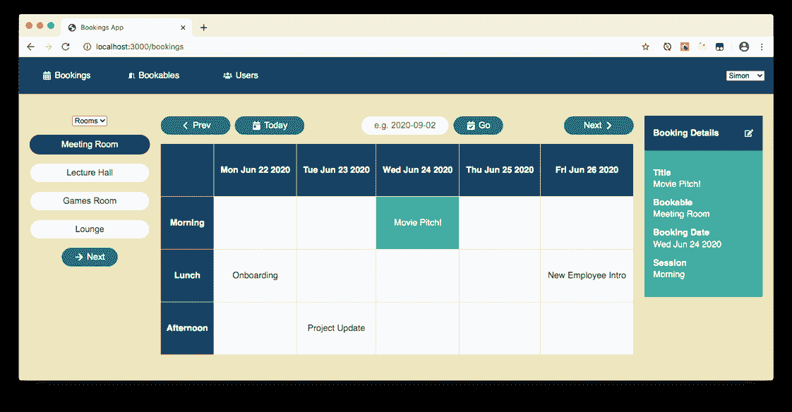
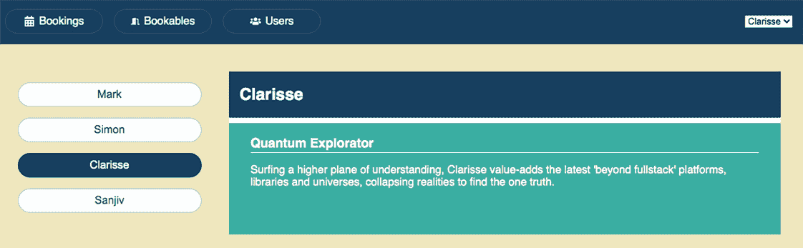
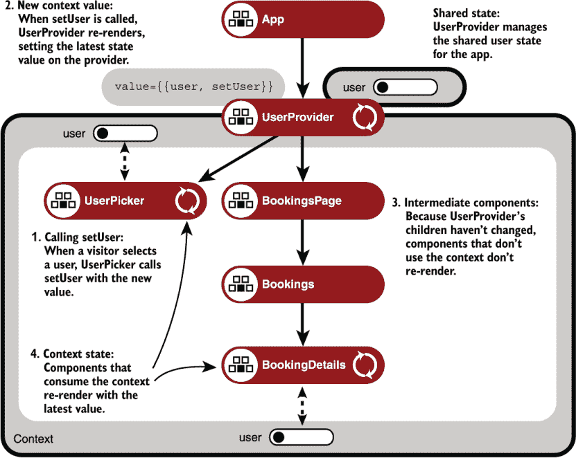

# 8 使用 Context API 管理状态

本章涵盖

+   通过 Context API 及其`Provider`组件提供状态

+   使用`useContext`钩子消费上下文状态

+   避免在更新状态值时进行不必要的重新渲染

+   创建自定义上下文提供者

+   在多个上下文中分割共享状态

我们已经看到状态被封装在组件中，提升到共享父组件中，在表单字段中，跨渲染持久化，以及从数据库中拉取，我们使用了很多钩子来帮助我们设置和使用该状态。我们的方法是将状态尽可能靠近使用它的组件。但是，对于许多嵌套在多个分支上的组件来说，渴望同样的美味虫子，同样的应用状态碎片，如主题、本地化信息或认证用户详情，并不少见。嗯嗯，碎片……React 的 Context API 是一种将美味的状态碎片直接送到你的巢穴而不通过多层中间代理传递的方法，这些中间代理更喜欢玉米卷而不是碎片。

在本章中，我们介绍了 Context API、其上下文对象、`Provider`组件和`useContext`钩子。我们关注我们的预订应用示例，其中多个组件需要同样的美味碎片：当前用户的详细信息。这为 Context API 的机制概述设定了场景，我们看到为什么、何时、何地以及如何向组件子树提供值，以及`useContext`钩子如何简化这些值的消费。我们通过将上下文功能封装到我们自己的自定义上下文和提供者组件中结束，这讨论加深了对 React 渲染行为的理解，尤其是在使用特殊的`children`属性时。

你能听到吗？那是嵌套组件在啁啾着寻找美味碎片。是喂食时间了！

## 8.1 需要从组件树的上层获取状态

在我们的示例应用中，预订页面允许访客选择可预订的房间和周。页面上的预订网格随后显示可用的预订时段，并用任何现有的预订填充适当的单元格。图 8.1 显示了访客选择会议室可预订和电影提案！预订后的预订页面。



图 8.1 用户选择预订后，预订详情组件（在右侧）显示所选预订的信息。

在第七章中，我们处理了`BookingDetails`组件的占位符，该组件用于显示关于所选预订的更多信息。图 8.1 也展示了本章中我们对`BookingDetails`组件的目标：列出所选预订的一些属性，如标题和预订日期。但是，当页面首次加载时，没有预订被选中，组件显示一条消息鼓励访客选择一个预订或预订时段，如图 8.2 所示。



图 8.2 在用户选择预订之前，预订详情组件（在右侧）显示消息“选择一个预订或预订时段。”

在本章中，我们减轻了`BookingDetails`组件的占位符职责，并提升其执行以下三个任务：

+   在页面首次加载时显示操作消息

+   当访客选择预订时显示预订信息

+   显示用户预订的编辑按钮

第三个任务促使我们研究 Context API，以便将当前用户值传递给应用中的组件。为什么`BookingDetails`组件需要知道用户？让我们找出答案。

### 8.1.1 在页面首次加载时显示操作消息

当预订页面加载，但在访客选择预订之前，`BookingDetails`组件将显示操作消息，如图 8.3 所示。



图 8.3 当页面首次加载时，`BookingDetails`组件向用户显示“选择一个预订或预订时段”的消息。

列表 8.1 展示了`BookingDetails`组件如何检查预订并返回操作消息的 UI 或现有预订的 UI。现有预订的 UI 由另一个组件`Booking`处理；我们将在 8.1.2 节中探讨这一点。

分支：0801-预订详情，文件：/src/components/Bookings/BookingDetails.js

列表 8.1 `BookingDetails`组件显示预订或消息

```
import Booking from "./Booking";                                   ❶

export default function BookingDetails ({booking, bookable}) {     ❷
  return (
    <div className="booking-details">
      <h2>Booking Details</h2>

      {booking ? (                                                 ❸
        <Booking                                                   ❹
          booking={booking}
          bookable={bookable}
        />
      ) : (
        <div className="booking-details-fields">
          <p>Select a booking or a booking slot.</p>               ❺
        </div>
      )}
    </div>
  );
}
```

❶ 导入`Booking`组件。

❷ 将预订和可预订属性分配给局部变量。

❸ 仅当选择预订时显示预订信息。

❹ 使用`Booking`组件来显示信息。

❺ 如果没有选择预订，则显示消息。

列表 8.1 使用 JavaScript 三元运算符（`a` `?` `b` `:` `c`）返回适当的 UI，预订或消息：

```
{booking ? (
  // return booking UI if there’s a booking
) : (
  // return message UI if there’s not a booking
)}
```

在后续章节中，我们将为带有输入字段和提交按钮的表单添加第三个 UI 可能性。目前，这是一个或/或的情况：预订或消息。让我们看看预订 UI 的代码。

### 8.1.2 当访客选择预订时显示预订信息

一旦用户注意并选择了一个现有预订，组件将显示其信息；电影提案！预订的详情如图 8.4 所示。（如果您没有预订数据，请从仓库中获取 db.json。如果您也需要最新的 App.css，请获取。）


图 8.4 显示所选预订和可预订信息的`BookingDetails`组件

信息包括预订的多个字段和一个可预订的字段。以下列表显示了`Booking`组件接收所选预订和可预订作为属性，并以标签和段落序列返回预订详情。

分支：0801-预订详情，文件：/src/components/Bookings/Booking.js

列表 8.2 `Booking`组件

```
import {Fragment} from "react";

export default function Booking ({booking, bookable}) {     ❶

  const {title, date, session, notes} = booking;            ❷

  return (
    <div className="booking-details-fields">
      <label>Title</label>
      <p>{title}</p>

      <label>Bookable</label>
      <p>{bookable.title}</p>                               ❸

      <label>Booking Date</label>
      <p>{(new Date(date)).toDateString()}</p>              ❹

      <label>Session</label>
      <p>{session}</p>

      {notes && (                                           ❺
        <Fragment>
          <label>Notes</label>
          <p>{notes}</p>
        </Fragment>
      )}
    </div>
  )
}
```

❶ 将预订和可预订属性分配给局部变量。

❷ 将预订属性分配给局部变量。

❸ 显示所选可预订的信息。

❹ 将日期属性格式化得更好。

❺ 仅当预订有备注时显示“备注”字段。

`BookingDetails` 组件现在成功地在用户尚未选择预订时的行动号召信息与用户做出选择后的 `Booking` 组件之间切换。这是组件三个任务中的两个已经完成。做得好！但第三个任务更复杂。问题是什么？

### 8.1.3 为用户的预订显示编辑按钮：问题

我们新创建的 `BookingDetails` 组件成功显示了所选可预订的信息。这很好！但计划可能会改变，会议可能会取消或日期冲突。用户应该能够编辑自己的预订以更新详细信息或直接删除它们。我们需要添加一个按钮，就像图 8.5 右侧预订详情标题旁边的按钮一样，以便用户可以切换到编辑预订。



图 8.5 当用户选择自己的其中一个预订时，预订详情组件（在右侧）在标题右侧显示一个带有编辑图标的编辑按钮。

图 8.6 将 `BookingDetails` 组件隔离出来，并显示组件标题右侧的编辑按钮（一个文档编辑图标）。问题是，我们只想在当前用户自己预订所选预订时显示该按钮。对于其他用户，按钮应该被隐藏。`BookingDetails` 组件需要知道当前用户的 `id`，以便它可以与所选预订的 `bookerId` 进行比较。


图 8.6 显示在标题右侧带有编辑按钮的预订详情组件

当前用户的状态位于应用程序组件层次结构的顶部，在 `App` 组件中。我们可以通过中间组件（`App` 到 `BookingsPage` 到 `Bookings` 到 `BookingDetails`）向下传递用户，但这些组件对用户状态不感兴趣，而且 `UserPicker` 组件（以及很快还将被 `UsersPage` 组件使用）也需要这个状态。在这种情况下，应用程序中分散的多个组件都需要一个状态。

Context API 提供了一种将状态提供给多个消费者的替代方法。我们如何提供我们想要共享的状态？

### 8.1.4 为用户的预订显示编辑按钮：解决方案

我们希望将当前用户信息与所有需要该信息的功能组件共享，因此让我们使用 React 的 Context API 创建一个 `UserContext` 对象。我们将共享的上下文放在其自己的文件中，即 /src/components/Users/UserContext.js。提供用户值的组件 `App` 以及消费用户值的组件，包括 `BookingDetails`，都可以导入上下文来设置或读取其值。代码如下所示。

分支：0802-user-context，文件：/src/components/Users/UserContext.js

列表 8.3 创建并导出用于用户值的上下文对象

```
import {createContext} from "react";

const UserContext = createContext();

export default UserContext;
```

是的，就是这样！我们使用`createContext`方法并将它返回的上下文对象分配给`UserContext`变量。这个上下文对象，`UserContext`，是跨应用共享当前用户值的关键：`App`组件将使用它来设置值，而消费组件将使用它，以及`useContext`钩子，来读取值。

要使用新的上下文对象为预订应用提供用户状态，我们以三种关键方式更新`App`组件：

1.  导入上下文对象。

1.  通过调用`useState`钩子来管理当前用户的状态。

1.  使用上下文的`Provider`组件包裹`Router`组件。

以下列表显示了所做的更新。

分支：0802-user-context，文件：/src/components/App.js

列表 8.4 在`App`中导入上下文对象并提供其值

```
import {useState} from "react";                            ❶

// unchanged imports
import UserContext from "./Users/UserContext";             ❷
export default function App () {
  const [user, setUser] = useState();                      ❸

  return (
    <UserContext.Provider value={user}>                    ❹
      <Router>
        <div className="App">
          <header>
            <nav>
              // unchanged nav
            </nav>

            <UserPicker user={user} setUser={setUser}/>    ❺
          </header>

          <Routes>
            // unchanged routes
          </Routes>
        </div>
      </Router>
    </UserContext.Provider>
  );
}
```

❶ 导入 useState 钩子。

❷ 导入要共享的上下文。

❸ 使用 useState 钩子管理用户状态。

❹ 将应用 UI 包裹在上下文提供者中。

❺ 将用户状态及其更新函数传递给 UserPicker。

`App`组件导入`UserContext`对象，然后将其 UI 包裹在上下文的`Provider`组件中，使`user`状态值对所有树中的组件可用：

```
<UserContext.Provider value={user}>
  // all app UI
</UserContext.Provider>
```

提供者不必包裹整个组件树。按照目前的代码，由于应用将`user`和`setUser`作为属性传递给`UserPicker`组件，我们只需将路由包裹在提供者中即可：

```
<Router>
  <div className="App">
    <header>
      // nav and user picker
    </header>
    <UserContext.Provider value={user}>
      <Routes>
        // routes
      </Routes>
    </UserContext.Provider>
  </div>
</Router>
```

但在后面的部分，我们将用户选择器切换到使用上下文而不是属性，因此将整个组件树包裹在提供者中是有用的。现在，`UserPicker`组件接收选定的用户及其更新函数作为属性。以下列表显示了它是如何使用这些属性的。

分支：0802-user-context，文件：/src/components/Users/UserPicker.js

列表 8.5 在`UserPicker`中接收用户和更新函数

```
import {useEffect, useState} from "react";
import Spinner from "../UI/Spinner";
export default function UserPicker ({user, setUser}) {              ❶
  const [users, setUsers] = useState(null);
  useEffect(() => {
    fetch("http://localhost:3001/users")
      .then(resp => resp.json())
      .then(data => {
        setUsers(data);
        setUser(data[0]);                                           ❷
      });
  }, [setUser]);                                                    ❸
  function handleSelect(e) {
    const selectedID = parseInt(e.target.value, 10);                ❹
    const selectedUser = users.find(u => u.id === selectedID);      ❹

    setUser(selectedUser);                                          ❺
  }

  if (users === null) {
    return <Spinner/>
  }

  return (
    <select
      className="user-picker"
      onChange={handleSelect}                                       ❻
      value={user?.id}                                              ❼
    >
      {users.map(u => (
        <option key={u.id} value={u.id}>{u.name}</option>           ❽
      ))}
    </select>
  );
}
```

❶ 将用户和 setUser 属性分配给局部变量。

❷ 一旦用户加载完成，将当前用户设置为第一个。

❸ 将 setUser 作为依赖项包括在内。

❹ 使用 id 查找选定的用户对象。

❺ 设置选定的用户。

❻ 为下拉指定事件处理器。

❼ 设置当前选择。

❽ 为每个选项设置一个值。

`UserPicker`组件从数据库中加载数据。一旦它有了数据，它就会调用作为属性接收的`setUser`来设置当前用户。由于状态的更新，`App`组件会重新渲染，将更新的用户值作为用户上下文提供者的值。由于`App`重新渲染，它的所有子组件也会重新渲染。这包括任何消费上下文的子组件，它们将获取新的上下文值。《UserPicker》也会显示选定的用户，将其设置为 UI 中 HTML `select`元素的值。（注意每个`option`元素现在都有一个`value`属性设置为用户的 ID。）


图 8.7 再次显示带有标题右侧编辑按钮的`BookingDetails`组件

要查看整个更新的上下文过程在实际中的应用，我们需要一个消费用户上下文值的组件。让我们从以下列表中所述的`BookingDetails`组件开始。记住，我们需要用户值来决定是否显示编辑按钮，如图 8.7 所示。

分支：0802-user-context，文件：/src/components/Bookings/BookingDetails.js

列表 8.6 `BookingDetails`组件从上下文中读取用户

```
import {useContext} from "react";                                         ❶

import {FaEdit} from "react-icons/fa";                                    ❷

import Booking from "./Booking";

import UserContext from "../Users/UserContext";                           ❸

export default function BookingDetails ({booking, bookable}) {

  const user = useContext(UserContext);                                   ❹

  const isBooker = booking && user && (booking.bookerId === user.id);     ❺

  return (
    <div className="booking-details">
      <h2>
        Booking Details
        {isBooker && (                                                    ❻
          <span className="controls">
            <button                                                       ❼
              className="btn"
            >
              <FaEdit/>                                                   ❽
            </button>
          </span>
        )}
      </h2>

      {booking ? (
        // booking
      ) : (
        // message
      )}
    </div>
  );
}
```

❶ 导入`useContext`钩子。

❷ 导入编辑按钮的图标。

❸ 导入我们的共享上下文。

❹ 使用共享上下文调用`useContext`并将值赋给`user`变量。

❺ 检查预订是否属于用户。

❻ 仅当预订属于用户时才显示编辑按钮。

❼ 渲染一个按钮，但不要附加处理程序。

❽ 使用导入的编辑图标作为按钮。

组件导入`UserContext`上下文对象并将其传递给`useContext`钩子，将钩子返回的值赋给`user`变量。一旦`BookingDetails`组件有了用户和预订信息，它就可以检查预订是否由该用户进行：

```
const isBooker = booking && user && (booking.bookerId === user.id);
```

如果当前用户预订了该预订，`isBooker`将为`true`，组件将在标题后显示编辑按钮：

```
<h2>
  Booking Details
  {isBooker && (
    // edit button UI
  )}
</h2>
```

按钮目前没有任何功能，但它应该只在当前用户（在用户选择器中选中的用户）是所选预订的预订者时出现。通过选择不同的用户然后选择不同的预订来测试显示和隐藏逻辑。（当你加载预订页面时，在周选择器中点击 Go 将带你到默认日期——如果你使用的是从仓库中的 db.json，它将设置一些预订。）

挑战 8.1

更新用户页面，以便在切换到页面时，它自动显示当前用户的详细信息。例如，如图 8.8 所示，如果当前用户是 Clarisse，你切换到用户页面，将显示 Clarisse 的详细信息，并在用户列表中选择 Clarisse。



图 8.8 在用户选择器（右上角）中选择了 Clarisse 作为当前用户。当访客切换到用户页面时，Clarisse 会自动在用户列表（左侧）中选中，并显示其详细信息（右侧）。

使用与`BookingDetails`组件相同的`UserContext`对象，并调用`useContext`以获取当前用户。完成的挑战位于 GitHub 仓库的 0803-users-page 分支。

React 的上下文 API 在共享预订应用中选择的用户方面表现良好。但它引发了一些问题：如果我们有多个要共享的值怎么办？或者一个具有许多属性的更复杂值？我们能否在调用`setUser`时避免触发整个组件树的重新渲染？让我们在寻找这些问题的答案时，更深入地挖掘 React 渲染的细微差别。

## 8.2 使用自定义提供者和多个上下文

我们已经成功地将共享状态的美味片段喂给了我们应用程序树中嵌套较深的组件。我们使用上下文对象的 `Provider` 组件来提供值，并且消费组件通过调用 `useContext` 并传入相同的上下文对象来访问该值。每当值发生变化时，消费者会重新渲染。如果只有消费者重新渲染通过上下文共享的值，那就太好了。在预订应用程序中，`App` 组件中更新用户状态会导致整个树重新渲染。不仅仅是品尝碎片的人更新；那些吃玉米卷的人（不关心用户的组件）也会更新。

在本节中，我们探讨扩展我们对上下文使用的方法。第一种，使用对象作为值，可能会引起问题。第二种和第三种，使用自定义提供者和多个上下文，可能有助于我们解决问题。最后一种方法允许我们为上下文指定一个默认值。

### 8.2.1 将对象作为上下文提供者的值

在列表 8.4 中，我们的 `App` 组件利用 `useState` 钩子来管理当前用户状态。它通过设置上下文对象 `Provider` 组件的 `value` 属性，使得 `user` 值可供子组件使用：

```
<UserContext.Provider value={user}>
  // app JSX
</UserContext.Provider/>
```

这些子组件之一，`UserPicker`，需要 `user` 状态值以及其更新函数 `setUser`。因为它需要的不仅仅是 `user` 值，所以我们使用传统的属性来满足其需求：

```
<UserPicker user={user} setUser={setUser}/>
```

传递属性没有问题。当前版本的程序运行良好，数据流易于跟踪。但是，鉴于我们已经在应用程序的上下文中有了 `user` 状态值，让我们更新 `UserPicker` 组件以消费该状态。我们想要的是：

```
<UserPicker/>
```

但 `UserPicker` 需要的 `user` 值和 `setUser` 函数。我们能将它们两个都放在上下文中吗？当然可以！

```
<UserContext.Provider value={{user, setUser}}>
  // app JSX
</UserContext.Provider/>
```

现在我们将 JavaScript 对象作为值赋给提供者，消费这些值的组件必须从值对象中解构它们需要的属性。例如，`BookingDetails` 组件将像这样获取用户值：

```
const {user} = useContext(UserContext);
```

现在赋值时，`user` 变量名周围有花括号。这并不糟糕。但关于 `UsersPage` 组件（在挑战 8.1 中更新过）呢？它之前将上下文值分配给了一个 `loggedInUser` 变量。没问题：

```
const {user : loggedInUser} = useContext(UserContext);
```

冒号语法允许我们在解构对象时将属性分配给不同命名的变量。在上面的代码片段中，上下文值的 `user` 属性被分配给名为 `loggedInUser` 的变量。

最后一个使用上下文值的组件是 `UserPicker` 组件。实际上，因为它需要 `user` 和 `setUser` 更新函数，这也是我们为什么将值切换为对象的原因。这没问题；在解构时，我们可以将所有需要的属性分配给局部变量：

```
const {user, setUser} = useContext(UserContext);
```

这三个不同的组件以三种不同的方式使用上下文值。在第 8.2.2 节中，我们进一步发展，为用户上下文开发我们自己的自定义提供者。如果你想要切换上下文值到对象的代码，如刚才讨论的，请查看挑战 8.2 的解决方案分支。

8.2 挑战

更新`App.js`，使`App`组件将一个对象（包含`user`和`setUser`属性）作为`value`属性传递给用户上下文的`Provider`组件。更新`BookingDetails`、`UsersPage`和`UserPicker`组件，通过解构使用新的对象值。完成挑战的代码位于 GitHub 仓库的 0804-object-value 分支。

### 8.2.2 将状态移动到自定义提供者

当前用户由预订应用的`UserPicker`组件确定（尽管在实际应用中，用户会进行登录）。当前用户的状态值由`App`组件管理；这就是上下文提供者`UserContext.Provider`包裹组件树的地方。当网站访客在用户选择器中选择用户时，`UserPicker`组件会调用`setUser`来更新`App`组件中的`user`状态值。React 注意到状态已更改，并重新渲染管理该状态的组件`App`。因为`App`重新渲染，所以它的所有子组件也会重新渲染，如图 8.9 所示。


图 8.9 在`App`组件中调用`setUser`重新渲染整个树。Provider 之后的组件周围的灰色带代表上下文：`UserPicker`和`BookingDetails`从上下文中访问用户值。

重新渲染本身并不是坏事——我们专注于状态，React 调用组件，执行 diffing 操作，并刺激 DOM——如果你的应用性能良好，就没有必要使代码复杂化。但是，如果树中有较慢、更复杂的组件，你可能想要避免不会改变 UI 的重新渲染。我们希望有一种方法来更新上下文提供者的值，而不会在整个组件树中引发一系列更新。我们希望上下文消费者（调用`useContext`的组件）在提供者值变化时重新渲染，而不仅仅是由于整个树重新渲染。我们能否避免在`App`组件中更新状态？

回答那个问题需要很好地理解 React 的渲染行为。我们将在以下四个小节中讨论这些概念以及如何应用它们：

+   创建自定义提供者

+   使用`children`属性渲染包装组件

+   避免不必要的重新渲染

+   使用自定义提供者

创建自定义提供者

如果 `App` 只管理 `user` 状态以便将其传递给 `UserContext.Provider`，而我们已经有了一个单独的 `UserContext` 文件，为什么不在与上下文相同的地方管理状态呢？我们能构建一个 `UserProvider` 组件，用它来包裹组件树并管理用户状态本身吗？当然可以！下面的列表展示了我们自己的自定义提供者组件，`UserProvider`。

分支：0805-custom-provider，文件：/src/components/Users/UserContext.js

列表 8.7 导出自定义提供者与用户上下文

```
import {createContext, useState} from "react";

const UserContext = createContext();
export default UserContext;                             ❶

export function UserProvider ({children}) {             ❷
  const [user, setUser] = useState(null);               ❸

  return (
    <UserContext.Provider value={{user, setUser}}>      ❹
      {children}                                        ❺
    </UserContext.Provider>
  );
}
```

❶ 导出上下文对象，以便其他组件可以导入它。

❷ 将特殊的 `children` 属性分配给一个局部变量。

❸ 在组件内管理用户状态。

❹ 设置一个对象作为上下文值。

❺ 在提供者内部渲染子组件。

`UserContext` 仍然是默认导出，所以不需要更改直接导入和使用它的文件。但是，上下文文件现在有一个命名导出，`UserProvider`，我们的自定义提供者组件。自定义提供者调用 `useState` 来管理用户值并获取一个更新函数。它将值和函数（封装在一个对象中）传递给 `UserContext.Provider` 组件作为上下文共享的值：

```
<UserContext.Provider value={{user, setUser}}>
  {children}
</UserContext.Provider>
```

当我们使用我们的自定义提供者时，我们用 JSX 将它包裹在应用的部分或全部周围。所有被包裹的组件都可以访问提供者设置的值（如果它们使用 `UserContext` 调用 `useContext`）：

```
<UserProvider>
  // app components
</UserProvider>
```

让我们更详细地看看那个 `children` 属性。

使用 `children` 属性渲染包裹的组件

每当组件包裹其他组件时，React 会将包裹的组件分配给包装器的 `children` 属性。例如，这里有一个 `Wrapper` 组件，它有一个作为子组件的 `MyComponent` 组件：

```
<Wrapper>
  <MyComponent/>
</Wrapper>
```

当 React 调用 `Wrapper` 来获取其 UI 时，它将子组件 `MyComponent` 传递给 `Wrapper`，并将其分配给 `children` 属性。（React 一直都在这样做；我们只是直到现在还没有使用 `children` 属性。）

```
function Wrapper ({children}) {                       ❶

  return <div className="wrapped">{children}</div>    ❷

}
```

❶ React 将任何子组件分配给 `children` 属性。

❷ 在返回 UI 时使用子组件。

当返回其 UI 时，`Wrapper` 使用 React 分配给 `children` 的组件。UI 变成以下内容：

```
<div className="wrapped"><MyComponent/></div>
```

对于 `Wrapper` 示例，`children` 是一个单个组件。如果 `Wrapper` 包裹多个兄弟组件，那么 `children` 是组件数组。更多关于在 React 文档中处理 `children` 属性的信息：[`reactjs.org/docs/react-api.html#reactchildren`](https://reactjs.org/docs/react-api.html#reactchildren)。

在我们的 `App` 组件中，React 将 `UserProvider` 的 `children` 属性分配给 `UserProvider` 包裹的组件。`UserProvider` 使用 `children` 属性确保 `UserContext.Provider` 组件仍然渲染我们的自定义 `UserProvider` 组件现在包裹的组件：

```
export function UserProvider ({children}) {              ❶
  const [user, setUser] = useState(null);

  return (
    <UserContext.Provider value={{user, setUser}}>
      {children}                                         ❷
    </UserContext.Provider>
  );
}
```

❶ React 将包裹的组件分配给 `children` 属性。

❷ 在上下文中提供者内部渲染包裹的组件。

它将子组件包裹在用户上下文的提供者中，并设置提供者的`value`，使得`user`值和`setUser`函数对被包裹的子组件可用。现在上下文和状态在同一位置。这对组织、理解和可维护性来说是个优点。但还有优化好处。

避免不必要的重新渲染

当一个后代（例如用户选择器）调用`setUser`来更新`UserProvider`组件中的`user`状态值时，React 会注意到状态已更改并重新渲染管理该状态组件`UserProvider`。但对于`UserProvider`，所有子组件都不会重新渲染，如图 8.10 所示。



图 8.10 当`UserProvider`重新渲染时，只有上下文消费者，而不是整个树，会重新渲染。

这可能令人意外，但这是标准的 React 渲染行为；这里没有应用特殊的记忆化函数。是什么让`UserProvider`在`App`组件管理用户状态时表现得不同？什么阻止 React 渲染提供者的子组件？

这是因为`UserProvider`将其子组件作为 prop 访问，并且在组件内部更新状态不会改变其 props。当后代调用`setUser`时，`children`的身份不会改变。它正是之前相同的对象。没有必要重新渲染所有子组件，所以 React 不会。

除了上下文消费者！上下文消费者在其上下文最近的提供者值更改时*总是*重新渲染。我们的自定义提供者为消费者提供了一个更新函数。当组件调用更新函数时，自定义提供者会重新渲染，更新其上下文值。React 知道提供者的子组件没有变化，所以不会重新渲染它们。然而，任何消费上下文的组件都会在提供者值更改时重新渲染，而不是因为整个组件树已经重新渲染。

使用自定义提供者

现在我们自定义提供者负责用户状态，我们可以简化`App`组件，移除导入和调用`useState`以及设置提供者值的需求。下面的列表显示了更简洁的代码。注意，我们也不再在`UserPicker`上设置 props；在挑战 8.2 中，它已经切换到使用上下文。

分支：0805-custom-provider，文件：/src/components/App.js

列表 8.8 在`App`组件中使用自定义提供者

```
// remove import for useState
// unchanged imports

import {UserProvider} from "./Users/UserContext";     ❶

export default function App () {
  return (
    <UserProvider>                                    ❷
      <Router>
        <div className="App">
          <header>
            // nav

            <UserPicker/>                             ❸
          </header>

          <Routes>
            // routes
          </Routes>
        </div>
      </Router>
    </UserProvider>                                   ❹
  );
}
```

❶ 导入自定义提供者。

❷ 将应用 UI 包裹在提供者中。

❸ 不要向用户选择器传递 props。

❹ 将应用 UI 包裹在提供者中。

因为在 JSX 中，`UserProvider` 包裹了 `Router`，所以 `Router` 组件被分配给 `UserProvider` 组件的 `children` 属性，而我们的自定义提供者 `UserProvider` 则将其包裹在 `UserContext.Provider` 中，这就是实际的上下文提供组件。这样，应用中的每个组件都可以访问用户上下文。在第九章中，我们将看到如何使用自定义钩子从消费者角度更轻松地与 Context API 一起工作。

我们的定制提供者将一个对象 `{user, setUser}` 分配为上下文提供组件的值。在下一节中，我们将探讨以这种方式使用对象的不利之处。

### 8.2.3 与多个上下文一起工作

现在我们有了在整个应用中共享值的方法，你可能会想创建一个单一、庞大的存储库来存储应用的状态，并让任何地方的组件消费它提供的庞大、有气味的值。但——正如你从上一句夸张的表述中猜到的——这并不总是最好的主意。如果一个组件需要一些状态，尽量在组件中管理它。

将状态与使用它的组件保持在一起，使其更容易使用和重用组件。如果应用发展，并且一个兄弟组件现在需要相同的状态，将状态提升到共享父组件中，并通过属性传递下来。如果在状态和某些使用它的组件之间引入了额外的嵌套组件层级，在伸手去拿 Context API 之前，考虑一下 *组件组合*。React 文档中有些关于组合的信息：[`mng.bz/PPjY`](https://shortener.manning.com/PPjY)。

如果你发现你确实有一些不经常改变且在应用的不同层级被多个组件使用的状态，那么 Context API 看起来是一个很好的选择。但即便如此，由上下文提供的单个状态对象可能效率不高。假设你的上下文状态值如下所示：

```
value = {
  theme: "lava",
  user: 1,
  language: "en",
  animal: "Red Panda"
};

<MyContext.Provider value={value}><App/></MyContext.Provider>
```

在你的组件层次结构中，一些组件使用主题，一些使用用户，其他使用语言，还有一些使用动物。问题是，如果单个属性值发生变化（比如主题从 `lava` 变为 `cute`），那么消费上下文的 *所有* 组件都将重新渲染，即使它们对更改的值不感兴趣。一个渴望仅获取最精华状态片段的嵌套组件得到了玉米卷、木薯粉和一大块羊肉塔吉锅！幸运的是，有一个简单的解决办法。（尽管，如果我能保留塔吉锅，我会开心好几天。嗯嗯，塔吉锅……）

在多个提供者之间拆分上下文值

你可以根据需要使用任意多的上下文，嵌套组件只需在其消费的上下文中调用 `useContext` 钩子。如果每个共享值都有自己的提供者，那么提供者看起来是这样的：

```
<ThemeContext.Provider value="lava">
  <UserContext.Provider value=1>
    <LanguageContext.Provider value="en">
      <AnimalContext.Provider value="Red Panda">
        <App/>
      </AnimalContext.Provider>
    </LanguageContext.Provider>
  </UserContext.Provider>
</ThemeContext.Provider>
```

然后，嵌套组件只消费它们需要的值，并在所选值改变时重新渲染。这里有两组组件，每组访问一对上下文值：

```
function InfoPage (props) {
  const theme = useContext(ThemeContext);
  const language = useContext(LanguageContext);

  return (/* UI */);
}

function Messages (props) {
  const theme = useContext(ThemeContext);
  const user = useContext(UserContext);

  // subscribe to messages for user

  return (/* UI */);
}
```

使用自定义提供者为多个上下文提供支持

你希望将提供者尽可能靠近消费其上下文的组件，包装子树而不是整个应用。有时，上下文确实在整个应用中使用，提供者可以放在或接近根位置。根部的代码通常变化不大，所以不必担心嵌套多个提供者；你不必将嵌套视为“包装地狱”或“末日金字塔”。如果你愿意，并且提供者可能保持在一起，你始终可以创建一个自定义提供者，将多个提供者组合在一个地方，如下所示：

```
function AppProvider ({children}) {
  // maybe manage some state here

  return (
    <ThemeContext.Provider value="lava">
      <UserContext.Provider value=1>
        <LanguageContext.Provider value="en">
          <AnimalContext.Provider value="Red Panda">
            {children}
          </AnimalContext.Provider>
        </LanguageContext.Provider>
      </UserContext.Provider>
    </ThemeContext.Provider>
  );
}
```

然后应用可以使用自定义提供者（s）：

```
<AppProvider>
  <App/>
</AppProvider>
```

正如我们在 8.2.2 节中看到的，使用具有 `children` 属性的自定义提供者也有助于减少不必要的子组件重新渲染。

使用单独的上下文为状态值及其更新函数

当上下文提供者的值发生变化时，其消费者会重新渲染。提供者也可能因为其父组件重新渲染而重新渲染。如果提供者的值是一个代码每次提供者渲染时都创建的对象，则值在每个渲染时都会变化，即使分配给对象的属性值保持不变。

再看看我们的预订应用中的自定义 `UserProvider` 组件：

```
export function UserProvider ({children}) { 
  const [user, setUser] = useState(null);

  return (
    <UserContext.Provider value={{user, setUser}}>     ❶
      {children}
    </UserContext.Provider>
  );
}
```

❶ 每次渲染都会将一个新的对象分配给值属性。

我们将一个对象 `{user,` `setUser}` 分配给提供者的 `value` 属性。每次组件渲染时，都会分配一个新的对象，即使两个属性 `user` 和 `setUser` 是相同的。上下文的消费者——`UserPicker`、`UsersPage` 和 `BookingDetails`——在 `UserProvider` 重新渲染时也会重新渲染。

此外，通过使用对象作为值，如果嵌套组件只使用对象上的一个属性，那么当其他属性变化时，它仍然会重新渲染（又是零碎和玉米卷）。在我们的例子中，这不是问题；`setUser` 从不改变，唯一使用它的组件 `UserPicker` 也使用 `user` 属性。但如果我们构建一个合适的登录系统，我们可以轻松地创建一个不需要当前用户但需要调用 `setUser` 的注销按钮。没有必要每次用户更改时都重新渲染按钮。

因此，我们有两个问题：

+   每次渲染都会将一个新的对象分配给提供者值。

+   在值上更改一个属性会重新渲染可能不会消费该值的消费者。

我们可以通过在自定义提供者中使用两个上下文而不是一个来解决这两个问题，如下所示。

分支：0806-multiple-contexts，文件：/src/components/Users/UserContext.js

列表 8.9 使用单独的提供者为值及其更新函数

```
import {createContext, useState} from "react";

const UserContext = createContext();
export default UserContext;

export const UserSetContext = createContext();     ❶

export function UserProvider ({children}) {
  const [user, setUser] = useState(null);

  return (
    <UserContext.Provider value={user}>            ❷
      <UserSetContext.Provider value={setUser}>    ❸
        {children}
 </UserSetContext.Provider>
    </UserContext.Provider>
  );
}
```

❶ 为设置当前用户创建一个单独的上下文。

❷ 将用户设置为值。

❸ 将更新函数作为值设置在其自己的提供者上。

`user` 和 `setUser` 并不是每次渲染时都重新创建，我们现在为每个值使用单独的上下文和提供者，因此一个值的消费者不会受到另一个值变化的影响。

最新分支也更新了消费者组件；它们不需要从值对象中解构值，`UserPicker` 导入并使用了新的 `UserSetContext` 上下文对象。

### 8.2.4 为上下文指定默认值

使用 Context API 涉及提供者和消费者：提供者设置一个值，消费者读取这个值。但与两个独立部分一起工作可能需要一点信任。如果我们调用 `useContext` 并传入一个上下文对象，但树中没有设置相应的提供者怎么办？如果适当，在创建上下文对象时，我们可以指定一个默认值以应对这种情况，如下所示：

```
const MyContext = createContext(defaultValue);
```

如果没有设置相应提供者来设置该上下文的值，`useContext` 钩子将返回上下文对象的默认值。如果您的应用程序使用默认语言或主题，这可能很有用；可以使用提供者来覆盖默认值，但如果未包含提供者，一切仍然可以正常工作。

## 摘要

+   对于许多组件使用的很少改变的价值，考虑使用 Context API。

+   创建一个上下文对象来管理组件将要访问的特定值：

    ```
    const MyContext = createContext();
    ```

+   导出上下文对象以使其对其他组件可用。（或者创建与提供者和消费者组件相同作用域的上下文对象。）

+   将上下文对象导入提供者和消费者组件文件中。

+   将需要访问共享状态值的组件树包裹在上下文对象的提供者组件中，将值作为属性设置：

    ```
    <MyContext.Provider value={value}>
      <MyComponent />
    </MyContext.Provider>
    ```

+   使用 `useContext` 钩子访问上下文值，传入上下文对象：

    ```
    const localValue = useContext(MyContext);
    ```

    每当上下文值发生变化时，消费组件将重新渲染。

+   可选地，在创建上下文时指定一个默认值：

    ```
    const MyContext = createContext(defaultValue);
    ```

    如果在组件树中没有设置上下文的提供者，`useContext` 钩子将返回默认值。

+   对于通常不一起消费的值，使用多个上下文。消费一个值的消费者组件可以独立于消费另一个值的组件重新渲染。

+   创建自定义提供者来管理共享值的州。

+   在自定义组件中使用 `children` 属性以避免重新渲染不消费上下文的子组件。
