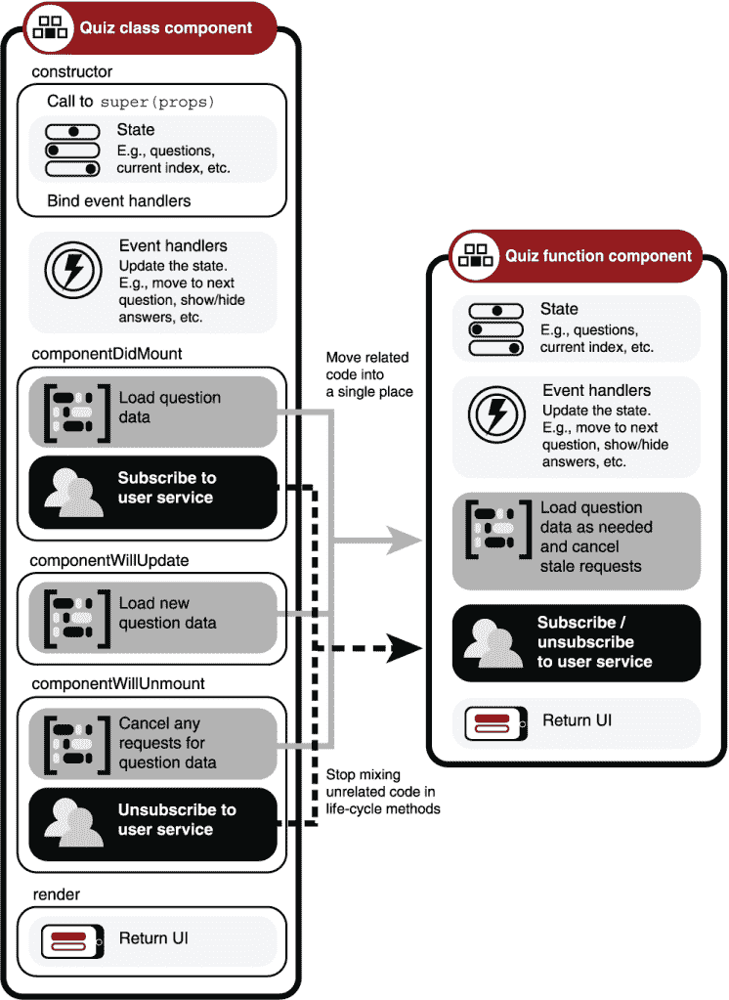
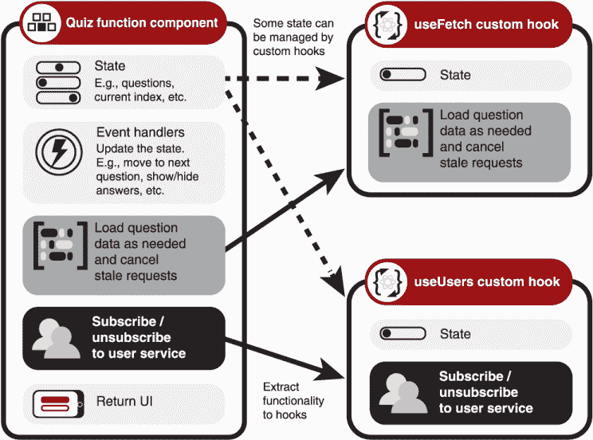
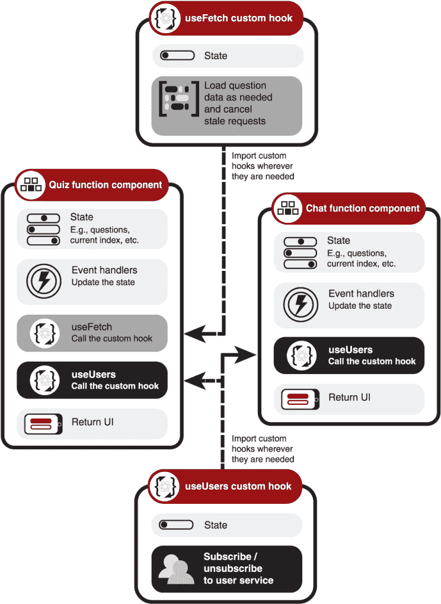
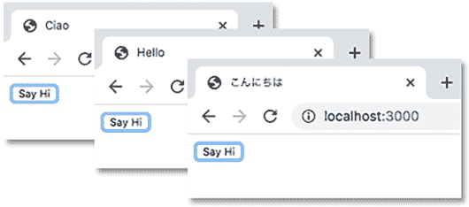
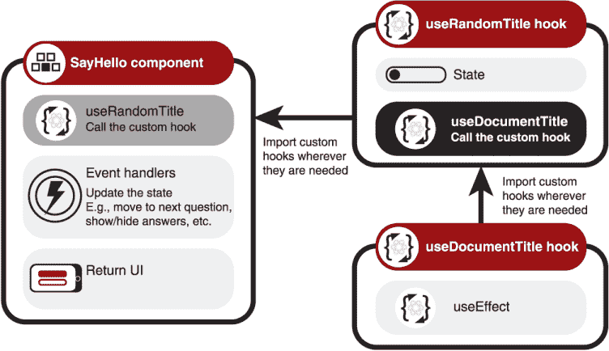
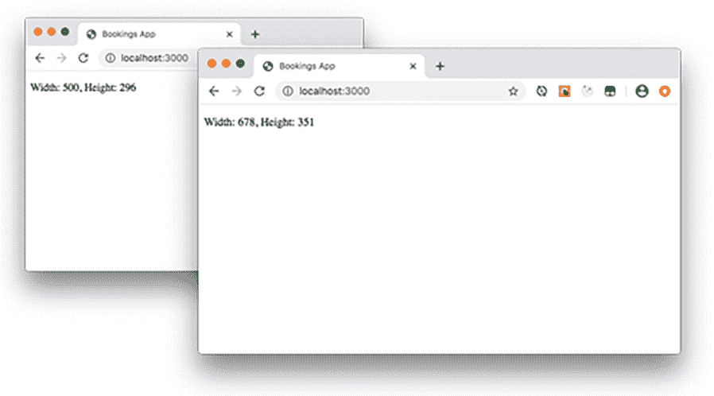
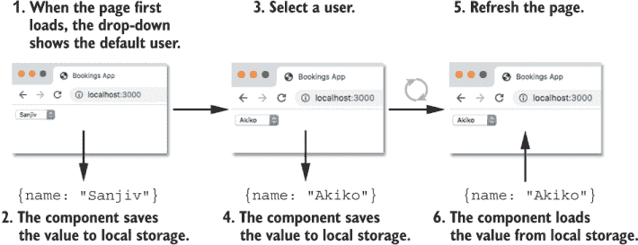
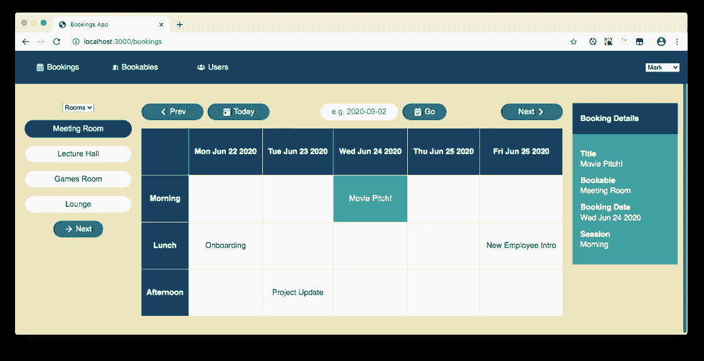
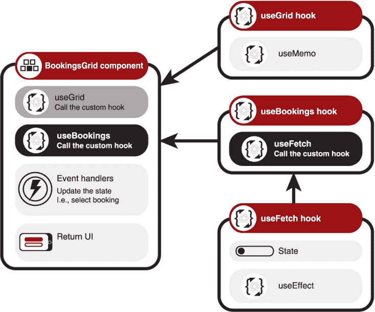

# 9 创建你自己的 hooks

本章涵盖

+   将功能提取到自定义 hooks 中

+   遵循 Hooks 规则

+   使用自定义 hook 消费上下文值

+   使用自定义 hook 封装数据获取

+   探索自定义 hooks 的更多示例

React Hooks 承诺简化组件代码并促进封装、可重用性和可维护性。它们让函数组件能够与 React 紧密合作来管理状态，并挂钩到生命周期事件以进行挂载、渲染和卸载。带有 hooks 的函数组件将相关代码集中在一起，并消除了在类组件的单独生命周期方法中混合无关代码的需要。

图 9.1 对比了基于类和基于函数的`Quiz`组件中代码的位置，该组件加载问题数据并订阅用户服务。而类组件将功能分散在其方法中，`Quiz`函数组件通过调用`useState`或`useReducer`来管理本地状态，并在单独的调用中使用`useEffect`来封装问题数据的加载和用户服务的订阅。



图 9.1 React Hooks 让我们将相关代码移动到单个位置，并停止在生命周期方法中混合无关代码。

我们可以在这里停止，让函数组件包含由 hooks 管理的状态和效果。`Quiz`函数组件看起来比类组件更整洁，更容易理解。但就像我们将较长的函数拆分成多个较短的函数一样，我们也可以将 hooks 执行的工作提取到组件外部的*自定义 hooks*中，以简化组件代码并准备功能以供重用。例如，对于`Quiz`组件，我们可以使用`useFetch`hook 来加载问题数据，并使用`useUsers`hook 来订阅服务。

本章包括*自定义 hooks*，一些基于我们之前看到的代码（第四章中的`useEffect`示例，包括用于获取数据的 hooks）和一些扩展了之前的代码（我们创建一个 hook 来访问第八章中的上下文值）。这些示例说明了自定义 hooks 如何通过参数变得灵活，并可以通过函数、数组和对象提供有用的返回值。但 hooks 的整洁性和灵活性也带来了一些限制，这些限制在 9.2 节中总结为*Hooks 规则*。

在我们深入研究规则或对预订应用进行深入探讨之前，让我们先详细了解一下为什么自定义 hooks 是一件好事，以及我们的前两个自定义 hooks，`useRandomTitle`和`useDocumentTitle`。

## 9.1 将功能提取到自定义 hooks 中

React 钩子让我们在函数组件中管理本地状态，通过上下文访问应用程序状态，并挂钩到生命周期事件以执行和清理副作用。通过将相关代码放在一个地方，而不是分散在各种类方法中，我们可以更好地利用函数。我们可以将常用代码提取到单独的函数中，简化我们的组件。图 9.2 展示了`Quiz`组件的关键功能，加载问题和订阅用户服务，可以被提取到两个函数中，或者自定义钩子`useFetch`和`useUsers`。



图 9.2 使用自定义钩子，我们可以将一些状态和功能移动到单独的函数中。

使用合适的自定义钩子命名，`Quiz`组件的代码变得更短，更容易理解，如图 9.3 的左侧所示。应该很明显，`Quiz`组件通过调用`useUsers`来访问用户信息，并通过调用`useFetch`来获取数据。



图 9.3 许多组件可以调用我们的自定义钩子。

将功能移动到自定义钩子中，也让我们可以在多个组件中重用该功能，图 9.3 展示了第二个组件`Chat`调用相同的`useUsers`钩子。特别有用的钩子可以在团队间共享，甚至发布并使全球的开发者可用。

库的作者可以创建钩子，使关键功能对函数组件可用，我们在第十章中查看了一些示例——使用 React Router 进行路由和用 React Query 获取数据。在本节中，我们再次向第四章中的一个简单组件问好，该组件在效果内部访问文档的标题。我们考虑以下内容：

+   识别可共享的功能

+   在组件外部定义自定义钩子

+   从自定义钩子中调用自定义钩子

在创建我们的第一个示例时，我们遇到了自定义钩子的命名约定，这需要在第 9.2 节中设置一些规则。

### 9.1.1 识别可共享的功能

我们有一个`SayHello`组件，它在文档的标题中显示问候语。首次加载时，组件显示一个随机问候语和一个“说你好”按钮。每次点击按钮时，它会更新问候语，如图 9.4 所示。



图 9.4 以不同问候语为标题的浏览器文档的三个视图

组件执行两个主要任务：

+   从列表中选择问候语

+   将文档标题设置为所选问候语

在接下来的小节中，我们将标题设置代码提取到我们的第一个自定义钩子`useDocumentTitle`中，并将随机标题选择提取到第二个`useRandomTitle`中。`SayHello`组件的原始代码再次在列表 9.1 中显示，其中可以看到调用`useEffect`钩子来设置文档的标题。（此列表中的效果现在指定了`index`作为依赖项；它仅在`index`更改时设置标题。）

*实时演示*: [`jhijd.csb.app`](https://jhijd.csb.app)，*代码*: [`codesandbox.io/s/sayhello-jhijd`](https://codesandbox.io/s/sayhello-jhijd)

列表 9.1 更新浏览器标题

```
import React, {useState, useEffect} from "react";                  ❶

function SayHello () {
  const greetings = ["Hello", "Ciao", "Hola", "こんにちは"];
  const [index, setIndex] = useState(0);

  useEffect(() => {                                                ❷
    document.title = greetings[index];                             ❸
  }, [index]);                                                     ❹

  function updateGreeting () {
    setIndex(Math.floor(Math.random() * greetings.length));
  }

  return <button onClick={updateGreeting}>Say Hi</button>
}
```

❶ 导入 `useEffect` 钩子。

❷ 将函数传递给 `useEffect` 钩子，作为效果。

❸ 在效果内部更新浏览器标题。

❹ 仅当索引发生变化时更新标题。

设置文档的标题是我们可能在多个页面和多个项目中想要使用的功能。作为函数，钩子让我们可以轻松地提取和共享功能。组件可以将参数传递给我们的钩子，钩子可以返回状态值和函数，以赋予组件完成任务所需的权力。让我们看看如何。

### 9.1.2 在组件外部定义自定义钩子

设置文档标题是一个简单的例子，你可以在需要该功能时轻松地重新创建效果。但它的简单性让我们可以专注于将提取到自定义钩子中，而不必与效果本身相关的任何认知压力。列表 9.2 显示了与列表 9.1 中相同的友好的 `SayHello` 组件，这次效果被移动到一个单独的函数 `useDocumentTitle` 中，该函数位于组件定义之外。

列表 9.2 将效果提取到 `useDocumentTitle` 钩子中

```
import React, {useState, useEffect} from "react";

function useDocumentTitle (title) {                                ❶
  useEffect(() => {                                                ❷
    document.title = title;
  }, [title]);                                                     ❸
}

export default function SayHello () {
  const greetings = ["Hello", "Ciao", "Hola", "こんにちは"];
  const [index, setIndex] = useState(0);

  function updateGreeting () {
    setIndex(Math.floor(Math.random() * greetings.length));
  }

  useDocumentTitle(greetings[index]);                              ❹

  return <button onClick={updateGreeting}>Say Hi</button>
}
```

❶ 定义一个以“use”开头的函数作为自定义钩子。

❷ 在自定义钩子内部调用原始的 `useEffect` 钩子。

❸ 仅当标题发生变化时更新文档标题。

❹ 调用自定义钩子，并传递要显示的标题。

在列表 9.2 中，自定义钩子是在组件外部定义的，但在同一文件中。你可以，并且通常这样做，将自定义钩子移动到自己的文件（或包含多个实用钩子的文件）中，并将其导入任何需要它的组件中。

我们将自定义钩子命名为 `useDocumentTitle`。在使用钩子时，有一些规则需要遵循以保持组件的平稳运行，如第 9.2 节所述，并且所有钩子的名称都以“use”开头有助于强制执行这些规则。这是一个重要的命名约定，值得拥有自己的侧边栏。

自定义钩子的名称应以“use”开头

为了明确一个函数是自定义钩子并且应该遵循钩子的规则，请以 `use` 开头命名，例如，`useDocumentTitle`、`useFetch`、`useUsers` 或 `useLocalStorage`。

我们不仅可以通过调用自定义钩子来增强组件的功能。我们的自定义钩子也可以充分利用额外的功能！毕竟，最终只是函数调用函数。

### 9.1.3 在自定义钩子中调用自定义钩子

在执行他们的工作时，你新塑造的钩子可能会执行一些有用的任务，这些任务可以被提取成它们自己的自定义钩子，其中一个钩子调用一个或多个其他钩子。并且你的钩子可以向调用组件返回值，这些值可以用于 UI 中，或者用于更新由钩子控制的州。例如，对于列表 9.2 中的`SayHello`组件，我们还可以提取“选择一个随机问候语”的功能。列表 9.3 显示了我们的标题设置组件`SayHello`的最终、紧凑形式，其中关键标题设置功能被提取到一个从另一个文件导入的`useRandomTitle`钩子中（如列表 9.4 所示）。

*Live*: [`ynmc2.csb.app/`](https://ynmc2.csb.app/), *Code*: [`codesandbox.io/s/userandomtitle-ynmc2`](https://codesandbox.io/s/userandomtitle-ynmc2)

列表 9.3 一个紧凑的标题设置`SayHello`组件

```
import React from "react";
import useRandomTitle from "./useRandomTitle";              ❶

const greetings = ["Hello", "Ciao", "Hola", "こんにちは"];

export default function SayHello () {
 const nextTitle = useRandomTitle(greetings);              ❷

  return <button onClick={nextTitle}>Say Hi</button>        ❸
}
```

❶ 导入我们的自定义钩子。

❷ 将自定义钩子传递给要使用的问候语，并将它返回的函数分配给一个变量。

❸ 使用钩子返回的函数来更新文档标题，每当按钮被点击时。

在列表 9.3 中，我们向`useRandomTitle`钩子传递了用于选择文档标题的问候语列表。钩子返回一个我们调用的函数来生成下一个标题。我们已经将标题的生成过程抽象到钩子中，但通过使用合理的钩子和变量名称，组件代码易于理解。图 9.5 显示了组件调用一个钩子，该钩子又调用另一个。



图 9.5 简化的`SayHello`组件调用了`useRandomTitle`钩子，该钩子又调用了`useDocumentTitle`钩子。

列表 9.4 显示了`useRandomTitle`钩子的代码。它包括它自己的两个钩子调用，一个是对内置的`useState`钩子的调用，另一个是对我们之前提到的`useDocumentTitle`自定义钩子的调用，现在已移动到自己的文件中（如列表 9.5 所示）。

*Live*: [`ynmc2.csb.app/`](https://ynmc2.csb.app/), *Code*: [`codesandbox.io/s/userandomtitle-ynmc2`](https://codesandbox.io/s/userandomtitle-ynmc2)

列表 9.4 `useRandomTitle`自定义钩子调用`useDocumentTitle`

```
import {useState} from "react";
import useDocumentTitle from "./useDocumentTitle";                      ❶

const getRandomIndex = length => Math.floor(Math.random() * length);    ❷

export default function useRandomTitle (titles = ["Hello"]) {           ❸

  const [index, setIndex] = useState(
    () => getRandomIndex(titles.length)                                 ❹
  );

  useDocumentTitle(titles[index]);                                      ❺

  return () => setIndex(getRandomIndex(titles.length));                 ❻
}
```

❶ 导入我们的自定义钩子。

❷ 在钩子外部定义此函数。

❸ 提供一个默认的问候语列表。

❹ 提供一个函数来为初始状态选择一个随机的问候语索引。

❺ 调用我们导入的自定义钩子来更新文档标题。

❻ 返回一个函数，以便使用此钩子的代码可以更新标题。

`useRandomTitle`自定义钩子使用`useState`钩子来管理要显示的标题的索引。使用钩子的代码不需要知道钩子如何管理当前标题；它只需要能够请求显示一个新的标题。钩子返回一个函数，以便使用钩子的代码可以请求下一个标题。`useRandomTitle`自定义钩子还调用了我们之前提到的`useDocumentTitle`自定义钩子，以下列表显示了从其自己的文件中导出的该自定义钩子。

*Live*: [`ynmc2.csb.app/`](https://ynmc2.csb.app/), *Code*: [`codesandbox.io/s/userandomtitle-ynmc2`](https://codesandbox.io/s/userandomtitle-ynmc2)

列表 9.5 从其自己的文件导出的 `useDocumentTitle` hook

```
import {useEffect} from "react";

export default function useDocumentTitle (title) {     ❶
  useEffect(() => {
    document.title = title;                            ❷
  }, [title]);                                         ❸
}
```

❶ 为标题指定一个参数。

❷ 将文档的标题设置为传入的值。

❸ 仅当标题值改变时更新文档标题。

列表 9.3、9.4 和 9.5 一起展示了自定义 hooks 如何调用自定义 hooks 并仅返回组件使用时所需的内容。但在我们被我们的提取/抽象热情冲昏头脑之前，我们需要了解一下 React 如何管理这些 hook 调用以及如何确保它们按预期工作。是的，有规则！

## 9.2 遵循 Hooks 的规则

到目前为止，这本书和这一章中我们已经看到了 hooks 的许多优点。它们帮助组织和澄清代码的方式以及它们承诺的高效代码抽象和重用都是非常有吸引力的。但是，为了让 hooks 履行其承诺，React 团队做出了一些有趣的实现决策。虽然 React 通常不会对你的 JavaScript 强加太多惯例，但与 hooks 一起，团队已经制定了一些规则：

+   自定义 hooks 的名称以 “use.” 开头。

+   只在顶层调用 hooks。

+   只在 React 函数中调用 hooks。

当你调用像 `useState` 和 `useEffect` 这样的 hooks 时，你是在请求 React 的帮助来管理状态和副作用、批量更新、计算 UI 差异以及安排 DOM 变更。为了 React 能够成功且可靠地跟踪组件的状态，这些组件中的 hook 调用需要保持一致性和数量。hooks 的三个规则就是为了确保你的 hooks 调用顺序在渲染之间不会改变。

Hooks 的规则

+   以 “use.” 开头命名 hooks。

+   只在顶层调用 hooks。

+   只在 React 函数中调用 hooks。

让我们更详细地看看最后两个规则。

### 9.2.1 只在顶层调用 hooks

组件每次运行时都一致地调用 hooks 非常重要。你不应该在某些情况下调用 hooks，而在其他情况下不调用，也不应该在组件每次运行时以不同的次数调用它们。为了确保你的 hook 调用一致，遵循以下约定：

+   *不要* 在条件语句中放置 hooks。

+   *不要* 在循环中放置 hooks。

+   *不要* 在嵌套函数中放置 hooks。

这三个场景中的任何一个都可能导致你跳过 hooks 的调用或改变组件调用 hooks 的次数。

如果你有一个只在特定条件下运行的副作用，并且这些条件没有被依赖数组覆盖，将条件放在副作用函数中。*不要这样做*：

```
if (condition) {
  useEffect(() => {       ❶
    // perform effect     ❶
  }, [dep1, dep2]);       ❶
}
```

❶ 不要在条件中将 hook 调用放在里面。

在条件中隐藏一个副作用可能会根据条件跳过该副作用。但我们的副作用必须 *始终* 运行。相反，*这样做*：

```
useEffect(() => {
  if (condition) {       ❶
    // perform task.     ❶
  }                      ❶
}, [dep1, dep2]);
```

❶ 将条件放在 hook 调用中。

此代码始终调用钩子，但在执行副作用任务之前检查条件。

### 9.2.2 只从 React 函数中调用钩子

钩子允许函数组件拥有状态，并管理它们何时使用或引起副作用。使用钩子的组件应该易于理解、维护和共享。它们的状态应该是可预测和可靠的。预期的状态变化应该在组件内部可见，尽管你可能将那些状态变化的精确实现提取到自定义钩子中。为了帮助你的组件合理工作：

+   *确实*可以从 React 函数组件中调用钩子。

+   *确实*可以从自定义钩子（以“use”开头命名）中调用钩子。

不要在其他常规 JavaScript 函数中调用钩子。请将钩子调用保持在函数组件和自定义钩子内。

### 9.2.3 使用 ESLint 插件为钩子规则提供支持

毫无疑问，这些“规则”可能会引起一些疑问。但我认为钩子的优点超过了三条规则的缺点。为了帮助你在代码中找出可能忽略规则的情况，有一个名为`eslint-plugin-react-hooks`的 ESLint 插件。如果你使用`create-react-app`生成项目骨架，该插件已经就位。

## 9.3 提取自定义钩子的更多示例

在第四章中，我们看到了一些其他副作用示例：获取窗口大小、使用本地存储和获取数据。尽管我们将副作用包裹在`useEffect`的调用中，但它们仍然在使用它们的组件的范围内。但是，这种功能值得分享，所以让我们提取并导出它。

在本节中，我们创建了更多自定义钩子：

+   `useWindowSize`—返回文档窗口的高度和宽度

+   `useLocalStorage`—使用浏览器的本地存储 API 获取和设置值

在第 9.4 节中，我们通过自定义钩子访问上下文，在第 9.5 节中，我们设置一个自定义钩子以简化数据获取。

作为函数，钩子可以返回任何所需的值以暴露其功能。我们已经看到了`useDocumentTitle`没有返回值，以及`useRandomTitle`的函数返回值。接下来的两个示例返回两种进一步类型的值：`useWindowSize`返回一个具有属性的对象，而`useLocalStorage`返回一个数组。当你阅读这些示例时，请考虑不同的返回类型如何适用于自定义钩子和使用钩子的组件。首先是一个返回单个对象属性（窗口长度和宽度）的钩子。

### 9.3.1 使用`useWindowSize`钩子访问窗口尺寸

假设你想测量浏览器窗口的宽度和高度，并在屏幕上显示这些尺寸，如果用户调整窗口大小，则自动更新它们。图 9.6 显示了同一窗口在两个不同尺寸下报告其尺寸。



图 9.6 显示窗口尺寸随其调整而变化

正如我们在第四章中看到的，这需要向窗口的调整大小事件添加和移除事件监听器。使用自定义钩子，我们可以简化使用尺寸的组件。以下列表显示了 `WindowSizer` 组件变得多么简单。

*Live*: [`zswj6.csb.app/`](https://zswj6.csb.app/), *Code*: [`codesandbox.io/s/usewindowsize-zswj6`](https://codesandbox.io/s/usewindowsize-zswj6)

列表 9.6 一个紧凑的组件，显示窗口宽度和高度

```
import React from "react";
import useWindowSize from "./useWindowSize";         ❶
export default function WindowSizer () {
  const {width, height} = useWindowSize();           ❷
  return <p>Width: {width}, Height: {height}</p>     ❸
}
```

❶ 导入自定义钩子。

❷ 调用钩子并将返回的尺寸赋值给变量。

❸ 在 UI 中使用尺寸。

`WindowSizer` 组件通过一行代码获取窗口尺寸。它不关心值是如何得到的，也不需要自己设置和拆除任何事件监听器：

```
const {width, height} = useWindowSize();
```

任何需要尺寸的项目和组件都可以导入和使用自定义钩子。钩子的抽象魔法在列表 9.7 中显示。它执行与第四章中尺寸报告组件相同的操作，但现在将 `useEffect` 调用和与事件相关的代码从任何单个组件中分离出来。

*Live*: [`zswj6.csb.app/`](https://zswj6.csb.app/), *Code*: [`codesandbox.io/s/usewindowsize-zswj6`](https://codesandbox.io/s/usewindowsize-zswj6)

列表 9.7 `useWindowSize` 自定义钩子

```
import {useState, useEffect} from "react";

function getSize () {                                                     ❶
  return {
    width: window.innerWidth,                                             ❷
    height: window.innerHeight                                            ❷
  };
}

export default function useWindowSize () {
  const [size, setSize] = useState(getSize());
  useEffect(() => {
    function handleResize () {
      setSize(getSize());                                                 ❸
    }

    window.addEventListener('resize', handleResize);                      ❹

    return () => window.removeEventListener('resize', handleResize);      ❺
  }, []);                                                                 ❻

  return size;                                                            ❼
}
```

❶ 定义一个返回窗口尺寸的函数。

❷ 从窗口对象中读取尺寸。

❸ 更新状态，触发重新渲染。

❹ 注册一个调整大小事件的监听器。

❺ 返回一个清理函数以移除监听器。

❻ 将空数组作为依赖参数传递。

❼ 返回包含尺寸的对象。

`useEffect` 的调用包括一个空依赖数组（它只在调用组件首次挂载时运行），并返回一个清理函数（它在调用组件卸载时移除事件监听器）。`useWindowSize` 自定义钩子返回一个具有 `width` 和 `height` 属性的对象。下一个自定义钩子 `useLocalStorage` 采用不同的方法，返回一个包含两个元素的数组，就像 `useState` 钩子一样。

### 9.3.2 使用 useLocalStorage 钩子获取和设置值

我们的第四个自定义钩子来自第四章中的第三个 `useEffect` 示例。我们有一个用户选择器，允许我们从下拉菜单中选择用户。我们将所选用户存储在浏览器的本地存储中，以便页面能够记住每次访问所选的用户，如图 9.7 所示。



图 9.7 一旦选择了一个用户，刷新页面会自动重新选择相同的用户。

我们希望我们的自定义钩子能够管理从本地存储中设置和检索所选用户。如下所示，`useLocalStorage` 钩子将用户和一个更新函数作为数组中的两个元素返回给 `UserPicker` 组件。

*实时查看*: [`zkl7p.csb.app/`](https://zkl7p.csb.app/)，*代码*: [`codesandbox.io/s/uselocalstorage-zkl7p`](https://codesandbox.io/s/uselocalstorage-zkl7p)

列表 9.8 使用本地存储的用户选择器组件

```
import React from "react";
import useLocalStorage from "./useLocalStorage";                      ❶

export default function UserPicker () {
  const [user, setUser] = useLocalStorage("user", "Sanjiv");          ❷

  return (
    <select value={user} onChange={e => setUser(e.target.value)}>     ❸
      <option>Jason</option>
      <option>Akiko</option>
      <option>Clarisse</option>
      <option>Sanjiv</option>
    </select>
  );
}
```

❶ 导入自定义钩子。

❷ 使用键和初始值调用钩子。

❸ 使用钩子返回的状态和更新函数。

`UserPicker` 组件使用数组解构将保存的用户和更新函数分配给局部变量 `user` 和 `setUser`。同样，组件不关心自定义钩子是如何工作的；它只关心保存的用户（以便可以在下拉列表中选择适当的选项）和更新函数（以便任何对选择的更改都可以保存）。以下列表显示了我们将提取到自定义钩子中的代码。

*实时查看*: [`zkl7p.csb.app/`](https://zkl7p.csb.app/)，*代码*: [`codesandbox.io/s/uselocalstorage-zkl7p`](https://codesandbox.io/s/uselocalstorage-zkl7p)

列表 9.9 `useLocalStorage` 自定义钩子

```
import {useEffect, useState} from "react";

export default function useLocalStorage (key, initialValue) {    ❶
  const [value, setValue] = useState(initialValue);              ❷

  useEffect(() => {
    const storedValue = window.localStorage.getItem(key);        ❸

    if (storedValue) {
      setValue(storedValue);                                     ❹
    }
  }, [key]);                                                     ❺

  useEffect(() => {
    window.localStorage.setItem(key, value);                     ❻
  }, [key, value]);                                              ❼

  return [value, setValue];                                      ❽
}
```

❶ 接受一个键和一个初始值。

❷ 本地管理状态。

❸ 获取键的任何本地存储值。

❹ 如果从本地存储中有值，则更新本地状态。

❺ 如果键更改，则重新运行此效果。

❻ 将最新值保存到本地存储。

❼ 重新运行此效果以使用新的键或值。

❽ 返回一个数组。

代码调用 `useState` 钩子来管理本地选择的用户状态。它还使用了两个 `useEffect` 钩子的调用，用于从本地存储检索任何保存的值以及保存更改的值。如果您想了解这两个效果如何一起使用本地存储来保存和检索所选用户，请回顾第四章。在本章中，我们将继续探讨在第八章首次遇到的上文。

## 9.4 使用自定义钩子消耗上下文值

在第八章中，我们看到了如何使用 React 的 Context API 通过将组件包裹在上下文提供者中并设置提供者的 `value` 属性来在应用程序或应用程序的子树中共享值。任何消耗上下文值的组件都需要导入提供者对应的上下文对象并将其传递给 `useContext` 钩子。在预订应用中，多个组件需要访问当前用户，我们创建了一个自定义提供者来使该值在整个应用程序中可用。

消费组件不需要知道值来自何处或使用什么机制使它们可用；我们可以通过自定义钩子抽象这些细节。对于预订应用，让我们创建一个 `useUser` 钩子，为需要设置用户的任何组件提供当前用户和更新函数。我们将像这样使用它：

```
const [user, setUser] = useUser();
```

或者，对于只需要值的组件，我们这样做：

```
const [user] = useUser();
```

以下列表扩展了第八章中提到的自定义用户提供者。该文件导出现有的提供者和我们新的自定义钩子。

分支：0901-context-hook，文件：/src/components/Users/UserContext.js

列表 9.10 `useUser` 自定义钩子

```
import {createContext, useContext, useState} from "react";

const UserContext = createContext();                     ❶
const UserSetContext = createContext();                  ❶

export function UserProvider ({children}) {
  const [user, setUser] = useState(null);

  return (
    <UserContext.Provider value={user}>
      <UserSetContext.Provider value={setUser}>
        {children}
      </UserSetContext.Provider>
    </UserContext.Provider>
  );
}

export function useUser () {                             ❷
  const user = useContext(UserContext);                  ❸
  const setUser = useContext(UserSetContext);            ❸

  if (!setUser) {
    throw new Error("The UserProvider is missing.");     ❹
  }

  return [user, setUser];                                ❺
}
```

❶ 不要导出上下文。

❷ 导出自定义钩子。

❸ 在钩子内部消耗上下文。

❹ 如果提供者缺失，则抛出错误。

❺ 以数组的形式返回两个上下文值。

自定义钩子`useUser`消耗在提供者中设置的两个上下文值，返回用户值和更新函数作为数组中的两个元素。它执行检查以确保在组件树的上层使用了提供者组件，如果缺失则抛出错误。

我们的自定义钩子已经准备好，我们可以简化需要访问当前用户的组件：`UserPicker`、`UsersPage`和`BookingDetails`。它们不再需要导入它们消耗的上下文；它们只需导入并调用`useUser`钩子。以下列表显示了`UserPicker`组件。

分支：0901-context-hook，文件：/src/components/Users/UserPicker.js

列表 9.11 从`UserPicker`组件调用`useUser`钩子

```
import {useEffect, useState} from "react";     ❶
import Spinner from "../UI/Spinner";

import {useUser} from "./UserContext";         ❷

export default function UserPicker () {
  const [user, setUser] = useUser();           ❸
  const [users, setUsers] = useState(null);

  useEffect(() => {
    // unchanged
  }, [setUser]);

  function handleSelect (e) { /* unchanged */ }

  if (users === null) {
    return <Spinner/>
  }

  return ( /* unchanged UI */ );
}
```

❶ 删除未使用的导入。

❷ 导入自定义钩子。

❸ 调用钩子并将用户和更新函数分配给局部变量。

因为`useUser`的调用返回一个数组，我们可以通过使用我们选择的变量名来解构返回值。`UserPicker`组件使用`user`和`setUser`。

`BookingDetails`组件只需要用户，所以它的`useUser`调用可以看起来像这样：

```
const [user] = useUser();
```

`UsersPage`组件从上下文`loggedInUser`中命名当前用户，所以它的`useUser`调用可以看起来像这样：

```
const [loggedInUser] = useUser();
```

随着更多功能被移动到自定义钩子中，组件本身变得更加简单，开始类似于仅接收和显示状态的展示组件。在钩子之前，展示组件会将任何业务逻辑留给包装组件。有了钩子，业务逻辑可以更容易地封装、重用和共享。

挑战 9.1

更新`UsersPage`和`BookingDetails`组件以调用`useUser`钩子而不是`useContext`钩子。当前分支 0901-context-hook 已经包含了最新的代码。

## 9.5 使用自定义钩子封装数据获取

在应用程序中，多个组件显示数据是很常见的，通常是从网络或互联网上的数据源获取的。随着我们的应用程序变大，组件消耗的数据开始交叉，我们可能需要使用集中式数据存储，这些存储可以有效地管理检索、缓存和更新。（我们将在第十章中查看 React Query 库。）但许多应用程序在组件使用自己的数据时运行得很好，通常是在`useEffect`钩子的调用中。通常，组件之间唯一的变化是从中获取数据的 URL。

在本节中，我们创建了一个用于获取数据的自定义钩子。我们向钩子提供 URL，它返回数据，以及一个状态值，如果出现错误，可能还会返回一个错误对象。我们这样使用钩子：

```
const {data, status, error} = useFetch(url);
```

正如你所见，钩子返回了一个包含我们需要的三个属性的对象。钩子在我们的示例应用程序中对于获取用户或可预订项同样有效。然而，预订需要一些额外的工作才能变得最有用，因此我们将创建一个专门的钩子来获取这些。本节分为三个部分：

+   创建 `useFetch` 钩子

+   使用 `useFetch` 钩子返回的数据和状态值

+   创建更专业的数据获取钩子：`useBookings`

`useFetch` 钩子可以在多个项目中使用，因此让我们详细地看看它。

### 9.5.1 创建 `useFetch` 钩子

我们的定制 `useFetch` 钩子接受一个 URL 并返回一个包含 `data`、`status` 和 `error` 属性的对象，如列表 9.12 所示。它使用 `useState` 钩子来管理数据（可能是 `undefined`、基本类型、对象或数组），状态（可以是 `idle`、`loading`、`success` 或 `error`），以及错误对象（可以是 `null` 或 JavaScript 错误对象）。钩子使用我们来自 `useEffect` 内部的 `getData` API 函数，就像我们之前的章节中组件所做的那样。

分支：0902-use-fetch，文件：/src/utils/useFetch.js

列表 9.12 `useFetch` 钩子

```
import {useEffect, useState} from "react";
import getData from "./api";

export default function useFetch (url) {
  const [data, setData] = useState();
  const [error, setError] = useState(null);
 const [status, setStatus] = useState("idle");    ❶

  useEffect(() => {
    let doUpdate = true;

    setStatus("loading");                          ❷
    setData(undefined);
    setError(null);

    getData(url)
      .then(data => {
        if (doUpdate) {
          setData(data);
          setStatus("success");                    ❸
        }
      })
      .catch(error => {
        if (doUpdate) {
          setError(error);                         ❹
          setStatus("error");
        }
      });

    return () => doUpdate = false;
  }, [url]);

  return {data, status, error};
}
```

❶ 将初始状态设置为“idle。”

❷ 在发送请求之前，将状态设置为“loading。”

❸ 如果数据成功返回，将状态设置为“success。”

❹ 如果在获取数据时出现问题，将状态设置为“error。”

与使用 `isLoading` 和 `isError` 这样的布尔值不同，`useFetch` 钩子使用一个 `status` 值，设置为字符串。（而不是在应用程序中散布字符串，最好是将可能的状态值作为变量从它们自己的文件中导出，并在需要的地方导入。但为了示例应用程序的目的，我们将坚持使用更简单、但稍微容易出错的无装饰字符串方法。）调用 `useFetch` 的组件可以检查状态以决定返回什么 UI。为了看到 `useFetch` 的实际应用，让我们更新 `BookablesList` 组件，利用 `status` 值。

### 9.5.2 使用 `useFetch` 钩子返回的数据、状态和错误值

我们设计 `useFetch` 钩子不仅返回数据，还提供了一个 `status` 字符串和一个 `error` 对象。状态对于决定显示什么 UI 非常有用，列表 9.13 中的更新后的 `BookablesList` 组件就使用了它来在错误消息、加载指示器或可预订项列表之间进行选择。

分支：0902-use-fetch，文件：src/components/Bookables/BookablesList.js

列表 9.13 从 `BookablesList` 组件调用 `useFetch` 钩子

```
import {useEffect} from "react";
import {FaArrowRight} from "react-icons/fa";
import Spinner from "../UI/Spinner";

import useFetch from "../../utils/useFetch";                              ❶

export default function BookablesList ({bookable, setBookable}) {

 const {data : bookables = [], status, error} = useFetch(                ❷
    "http://localhost:3001/bookables"                                     ❷
 );

  const group = bookable?.group;
  const bookablesInGroup = bookables.filter(b => b.group === group);
  const groups = [...new Set(bookables.map(b => b.group))];

  useEffect(() => {                                                       ❸
 setBookable(bookables[0]);
 }, [bookables, setBookable]);

  function changeGroup (event) { /* unchanged */ }
  function nextBookable () { /* unchanged */ }

  if (status === "error") {                                               ❹
    return <p>{error.message}</p>                                         ❺
  }

  if (status === "loading") {                                             ❻
    return <p><Spinner/> Loading bookables...</p>
  }

  return ( /* unchanged UI */ );
}
```

❶ 导入我们新的 `useFetch` 钩子。

❷ 调用 `useFetch` 并解构返回的对象。

❸ 当可预订项加载时选择第一个可预订项。

❹ 检查状态以查看是否发生错误。

❺ 显示错误对象的 `message` 属性。

❻ 检查状态以查看可预订项是否正在加载。

列表 9.13 调用`useFetch`并解构返回的对象，将属性分配给局部变量：

```
const {data : bookables = [], status, error} = useFetch(
 "http://localhost:3001/bookables"
);
```

它将`data`属性赋值给`bookables`变量，并在`data`属性为`undefined`时包含一个空数组的默认值：

```
data : bookables = []
```

如果你检查我们的`useFetch`实现（列表 9.12），你会看到没有为`data`值传递给`useState`的初始值，并且每次启动新的数据获取时都明确将其设置为`undefined`。`useFetch`返回从服务器获取的数据或`undefined`。在解构对象时，JavaScript 会在属性值为`undefined`时分配指定的默认值。"BookablesList"利用这种行为，当`data`为`undefined`时，将空数组分配给`bookables`。

挑战 9.2

更新`UserPicker`和`UsersList`组件以调用`useFetch`从数据库获取用户列表。使用`status`值来确定要显示的 UI。再次强调，当前分支 0902-use-fetch 已经包含了更改的文件。

### 9.5.3 创建更专业的数据获取钩子：useBookings

自定义钩子使得在组件之间封装和共享功能变得容易，我们的`useFetch`钩子使得从任何组件中获取数据变得简单。我们有`BookablesList`、`UserPicker`和`UsersList`组件都调用`useFetch`来管理它们的数据加载，仅在它们首次挂载时。对于交互式应用程序，尽管如此，我们仍然在用户选择时继续获取数据。例如，预订网格显示所选可预订项和周的预订，如图 9.8 所示，用户可以随意选择新的可预订项和新的周，因此我们需要获取新的数据以保持一切同步。



图 9.8 `BookingsGrid`显示了所选可预订项（会议室）和周（包含 2020-06-24）的预订。

要显示一个填充了预订的网格，我们为所选可预订项和周生成网格，并将预订数据转换成在填充网格时易于参考的形式。所以，这不仅仅是获取预订那么简单。我们将代码分为三个部分：

+   `useBookings`——一个自定义钩子，用于加载和转换预订数据

+   `useGrid`——一个自定义钩子，用于生成空的预订时段网格

+   `BookingsGrid`——调用两个自定义钩子的更新组件

三个部分的相互关系如图 9.9 所示，其中包括一个组件、三个自定义钩子和两个内置的 React 钩子。



图 9.9 `BookingsGrid`组件调用`useBookings`和`useGrid`自定义钩子，`useBookings`钩子调用`useFetch`自定义钩子。React 的`useMemo`和`useEffect`钩子也被使用。

好的，让我们深入代码，从新的 bookingsHooks.js 文件中的两个自定义钩子`useBookings`和`useGrid`开始。

useBookings

这就是更专业的自定义钩子可以派上用场的地方。列表 9.14 展示了 `useBookings` 钩子。它为指定的可预订 ID、开始日期和结束日期获取预订数据。它还使用我们之前创建的 `transformBookings` 函数，以预订网格易于处理的数据格式返回数据。

分支：0903-use-bookings，文件：/src/components/Bookings/bookingsHooks.js

列表 9.14 `useBookings` 钩子

```
import {shortISO} from "../../utils/date-wrangler";
import useFetch from "../../utils/useFetch";                       ❶
import {transformBookings} from "./grid-builder";

export function useBookings (bookableId, startDate, endDate) {     ❷
  const start = shortISO(startDate);
  const end = shortISO(endDate);

  const urlRoot = "http://localhost:3001/bookings";

  const queryString = `bookableId=${bookableId}` +                 ❸
 `&date_gte=${start}&date_lte=${end}`;                          ❸

  const query = useFetch(`${urlRoot}?${queryString}`);             ❹

  return {
    bookings: query.data ? transformBookings(query.data) : {},     ❺
    ...query
  };
}
```

❶ 导入我们的 useFetch 自定义钩子。

❷ 使用参数指定要获取的数据。

❸ 为指定数据构建查询字符串。

❹ 使用特定的 URL 调用 useFetch 钩子。

❺ 在返回之前转换加载的数据。

`useBookings` 钩子使用转换为字符串的 `bookableId`、`startDate` 和 `endDate` 值，即 `start` 和 `end`，来构建我们想要获取的特定数据的 URL，这是我们的数据服务器 `json-server` 能够理解的形式：

```
const queryString = `bookableId=${bookableId}&date_gte=${start}&date_lte=${end}`;
```

列表 9.14 将查询字符串拆分为两行以适应本书的格式，但它是一个相同的字符串。然后我们的 `useBookings` 钩子将生成的 URL 传递给我们的 `useFetch` 钩子，以获取 `data`、`status` 和 `error` 值，这些值被封装在一个对象中，该对象被分配给 `query`：

```
const query = useFetch(`${urlRoot}?${queryString}`);
```

最后，就像 `useFetch` 钩子一样，`useBookings` 钩子返回一个包含数据和状态以及错误值的对象。作为一个更专业的数据获取钩子，我们将 `data` 属性重命名为 `bookings`。我们可以将其称为 `data` 以保持与 `useFetch` 的一致性，但鉴于我们只使用它来获取预订，将其称为 `bookings` 看起来是一个不错的选择，并且 `data` 属性仍然会在返回对象中，因为查询对象（`data`、`status` 和 `error`）也被扩展到返回对象中。

useGrid

每个可预订项目只能在每周的某些天和一天中的某些时段进行预订。`BookingsGrid` 组件显示当前可预订项目的适当网格。但是，为了仅在可预订项目更改时运行网格创建逻辑，我们将对 `getGrid` 的调用包裹在 `useMemo` 钩子中。尽管这段代码可以愉快地保留在 `BookingsGrid` 本身中，但我们将其拉入自己的自定义钩子 `useGrid`，如下所示，以继续我们的组件简化过程。

分支：0903-use-bookings，文件：/src/components/Bookings/bookingsHooks.js

列表 9.15 `useGrid` 钩子

```
import {useMemo} from "react";
import {getGrid} from "./grid-builder";

export function useGrid (bookable, startDate) {
  return useMemo(
    () => bookable ? getGrid(bookable, startDate) : {},
    [bookable, startDate]
  );
}
```

`useGrid` 和 `useBookings` 钩子可以保留在同一个文件中，与 `BookingsGrid` 一起，因为它们只在那里使用，但本书后面会有更多的预订钩子和实用函数，所以一个专门的 bookingsHooks.js 文件对我们来说将更合适。我主要倾向于将函数、钩子和组件分开到各自的文件中，以便于本书的代码列表。但请不要认为这是一个推荐；你可以遵循对你和你的团队最有意义且最有用的课程。

我们的钩子已经准备就绪，现在让我们在`BookingsGrid`中充分利用`bookings`、`status`和`error`以及`grid`、`sessions`和`dates`返回的值。

BookingsGrid

在我们的两个新自定义钩子`useBookings`和`useGrid`就位后，我们可以更新`BookingsGrid`组件以调用它们。如下所示，随着功能被隐藏在自定义钩子中，`BookingsGrid`本身几乎只关注显示网格及其预订。

分支：0903-use-bookings，文件：/src/components/Bookings/BookingsGrid.js

列表 9.16 `BookingsGrid`组件

```
import {Fragment, useEffect} from "react";
import Spinner from "../UI/Spinner";

import {useBookings, useGrid} from "./bookingsHooks";                      ❶

export default function BookingsGrid (
  {week, bookable, booking, setBooking}
) {
 const {bookings, status, error} = useBookings(                           ❷
 bookable?.id, week.start, week.end                                     ❷
 ); ❷

 const {grid, sessions, dates} = useGrid(bookable, week.start);           ❸

 useEffect(() => {
    setBooking(null);                                                      ❹
 }, [bookable, week.start, setBooking]);

  function cell (session, date) {
    const cellData = bookings[session]?.[date]
      || grid[session][date];

    const isSelected = booking?.session === session
      && booking?.date === date;

    return (
      <td
        key={date}
        className={isSelected ? "selected" : null}
        onClick={
          status === "success"                                             ❺
            ? () => setBooking(cellData)
            : null
        }
      >
        {cellData.title}
      </td>
    );
  }

  if (!grid) {
    return <p>Waiting for bookable and week details...</p>
  }

  return (
    <Fragment>
      {status === "error" && (                                             ❻
        <p className="bookingsError">
          {`There was a problem loading the bookings data (${error})`}     ❼
        </p>
      )}
      <table
        className={
          status === "success"                                             ❽
            ? "bookingsGrid active"
            : "bookingsGrid"
        }
      >
        <thead>{ /* unchanged */ }</thead>
        <tbody>{ /* unchanged */ }</tbody>
      </table>
    </Fragment>
  );
}
```

❶ 导入我们的新自定义钩子。

❷ 使用指定的可预订项和日期调用`useBookings`钩子。

❸ 使用指定的可预订项和日期调用`useGrid`钩子。

❹ 在切换周或可预订项时取消预订。

❺ 使用状态值检查预订是否可用。

❻ 使用状态值检查是否有错误。

❼ 显示错误消息。

❽ 使用状态值设置网格的类。

该组件现在使用`useBookings`返回的`status`和`error`值来与网格交互，并在出现问题时显示消息。

将功能移动到自定义钩子中使我们的组件更简单，并使跨组件和项目共享功能变得更容易。我们的自定义钩子示例在章节过程中变得越来越复杂，但它们只是触及了可以实现的表面。在第十章中，我们介绍了用于路由和数据获取的第三方钩子，并开始看到自定义钩子如何让我们轻松访问现有第三方库的力量。

## 摘要

+   为了简化组件并共享使用 React Hooks 的功能，请在组件外部创建自定义钩子。

+   为了明确一个函数是自定义钩子并且应该遵循钩子规则，请以“use.”开头命名它。例如包括`useDocumentTitle`、`useFetch`、`useUsers`和`useLocalStorage`。

+   组件每次运行时调用钩子的一致性很重要。你不应该在某些情况下调用钩子，而在其他情况下不调用，也不应该在组件每次运行时以不同的次数调用它们。为了确保你的钩子调用一致，请遵循以下约定：

    +   不要将钩子放在条件语句内。

    +   不要将钩子放在循环内。

    +   不要将钩子放在嵌套函数内。

+   如果需要在某些条件下运行副作用代码，请将条件检查放在副作用内：

    ```
    useEffect(() => {
      if (condition) {
        // perform task.
      }
    }, [dep1, dep2]);
    ```

+   不要在常规 JavaScript 函数中调用钩子；请将钩子调用保持在函数组件和自定义钩子内。

+   为了帮助你发现你可能在代码中误用了钩子，请使用名为`eslint-plugin-react-hooks`的 ESLint 插件。如果你已经使用`create-react-app`生成了你的项目骨架，该插件已经就位。

+   在钩子内部管理与钩子功能相关的状态和效果，并仅返回组件需要的值：

    ```
    function useWindowSize () {
      const [size, setSize] = useState(getSize());

      useEffect(() => {/* perform effect */}, []);     

      return size;
    }
    ```

+   传递它们需要的钩子值，并返回空值、原语、函数、对象或数组—— whatever is most useful:

    ```
    useDocumentTitle("No return value");
    const nextTitle = useRandomTitle(greetings);
    const [user, setUser] = useUser();
    const {data, status, error} = useFetch(url);
    ```
