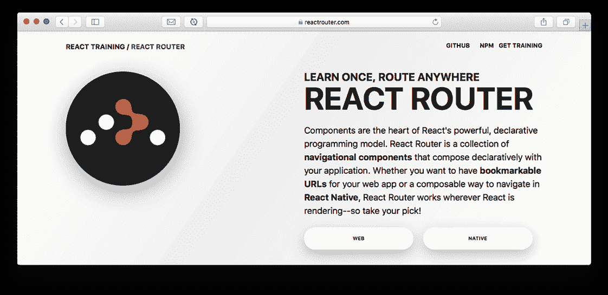
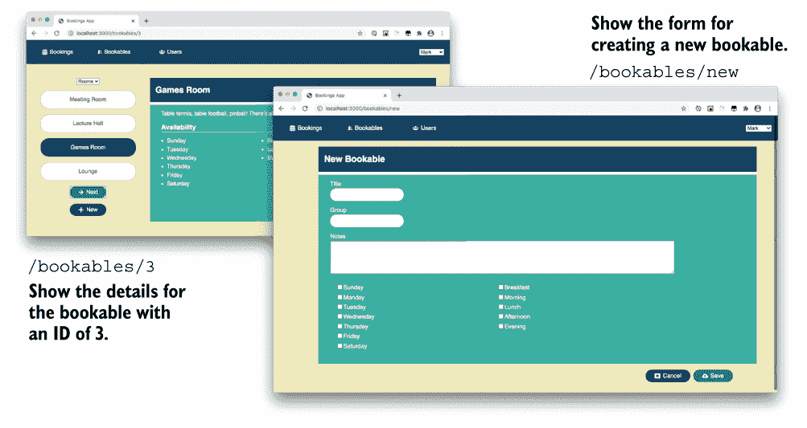
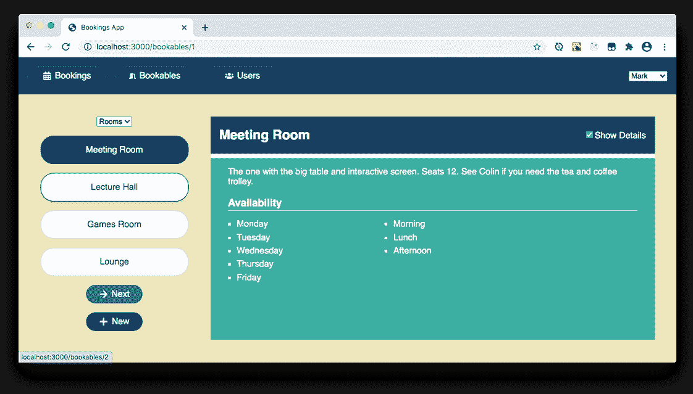
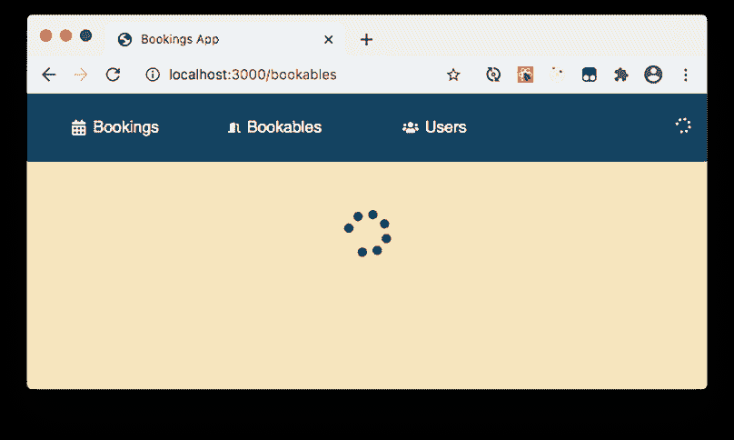
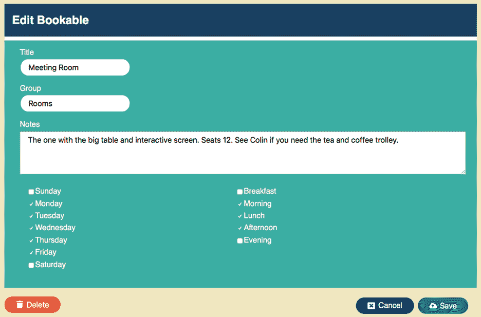

# 10 使用第三方钩子

本章涵盖了

+   充分利用第三方钩子

+   使用 React Router 的`useParams`和`useSearchParams`钩子访问 URL 中的状态

+   使用 React Router 的`useNavigate`钩子切换到新路由

+   使用 React Query 的`useQuery`钩子高效获取和缓存数据

+   使用 React Query 的`useMutation`钩子更新服务器上的数据

第九章介绍了自定义钩子作为从组件中提取功能的一种方式，使功能可重用并简化组件。自定义钩子提供了一种简单、易读的方式来从函数组件访问各种功能，无论是简单的任务，如更改文档标题或使用本地存储管理状态值，还是越来越复杂的任务，如获取数据或与应用程序状态管理器一起工作。许多现有的库都迅速提供了钩子，允许函数组件充分利用库的功能，本章尝试了一些钩子来改进预订示例应用。

预订应用一直使用 React Router 在预订、可预订和用户页面组件之间切换。但 React Router 可以处理更复杂的场景，在第 10.1 节和第 10.2 节中，我们介绍了其三个钩子。第一个是`useParams`，它允许我们通过在 URL 路径中包含其 ID 来指定要在可预订页面上显示的可预订项。第二个是`useNavigate`，它允许我们在用户点击“下一步”按钮或选择不同的组时导航到新的 URL。第三个是`useSearchParams`，它允许我们在 URL 的查询字符串中获取和设置搜索参数，以指定预订页面上可预订的 ID 和日期。

我们一直使用自己的`useFetch`钩子来加载数据，而没有考虑缓存或重新获取数据，这些技术可以帮助我们更有效地检索数据并更新 UI。是时候提升我们的数据游戏了，React Query 库可以通过最小的设置为我们做一些很棒的事情。在第 10.3 节中，我们尝试使用其`useQuery`钩子，并为通过`useMutation`钩子发送更改到服务器铺平道路。

让我们介绍我们的第一个第三方自定义钩子，并看看我们如何访问在 URL 中指定的状态。

## 10.1 使用 React Router 访问 URL 中的状态

React Router 为我们提供了导航组件（例如`Router`、`Routes`、`Route`和`Link`），我们使用这些组件将 UI 与 URL 路由相匹配。当用户导航到一个 URL 时，React Router 会显示该路由关联的 React 组件，并且，正如您将看到的，通过钩子使 URL 中的任何参数对嵌套组件可用。图 10.1 显示了[`reactrouter.com`](https://reactrouter.com/)的首页，在那里您可以了解更多信息。



图 10.1 React Router 的网页：一次学习，任意路由

预订应用包括三个页面——预订、Bookables 和用户，并且我们已经使用 React Router 根据 URL 显示相应的页面：/bookings、/bookables 和/users。URL 与页面组件的关联在 App.js 文件中，该文件包含以下代码：

```
<Routes>
  <Route path="/bookings" element={<BookingsPage/>}/>
  <Route path="/bookables" element={<BookablesPage/>}/>
  <Route path="/users" element={<UsersPage/>}/>
</Routes>
```

但你的老板回来了，并决定如果访客可以直接导航到特定的预订和日期，那会很好。例如，要显示 ID 为 3 的预订，访客将使用这个 URL：

```
/bookables/3
```

要查看 2020 年 6 月 24 日同一预订的预订情况，访客将使用这个：

```
/bookings?bookableId=3&date=2020-06-24
```

这些 URL 包含应用程序的状态，无论是作为 URL 路径的一部分（`/bookables/3`）还是作为查询字符串中的搜索参数（`bookableId=3&date=2020-06-24`）。在第 10.2 节中，我们将更新预订页面以使用查询字符串和`useSearchParams`钩子。在本节中，我们从 Bookables 页面开始，关注 URL 路径和`useParams`以及`useNavigate`钩子。本节分为四个小节，每个小节处理一个组件，如表 10.1 所示。

表 10.1 本节中我们将更改的四个组件

| 部分 | 组件 | 更改 |
| --- | --- | --- |
| 10.1.1 | `App` | 设置路由以启用嵌套 |
| 10.1.2 | `BookablesPage` | 向“Bookables”页面添加嵌套路由 |
| 10.1.3 | `BookablesView` | 使用`useParams`钩子访问 URL 参数 |
| 10.1.4 | `BookablesList` | 使用`useNavigate`钩子进行导航 |

让我们通过更新 App.js 以接受我们即将添加的新路由，开始参数化路径的第一步。

### 10.1.1 设置路由以启用嵌套

为了显示预订的详细信息以及编辑和创建预订，用户将导航到如下 URL：

```
/bookables/3           ❶
/bookables/3/edit      ❷
/bookables/new         ❸
```

❶ 显示 ID 为 3 的预订的详细信息。

❷ 编辑 ID 为 3 的预订。

❸ 创建一个新的预订。

与三个路由关联的三个组件中的两个在图 10.2 中：具有 ID 为 3 的预订的详细信息视图和创建新预订的表单。



图 10.2 不同的视图与不同的 URL 相关联。`/bookables/3`显示了 ID 为 3 的预订的详细信息，而`/bookables/new`显示了创建新预订的表单。

现在我们有多个以`/bookables`开头的路由，我们需要更新 App.js 以确保为所有这些路由渲染`BookablesPage`组件。以下列表显示了更改后的`path`属性，包括附加的`/*`。

分支：1001-bookables-routes，文件：/src/components/App.js

列表 10.1 在`App`组件中扩展`BookablesPage`路由

```
// imports

export default function App () {
  return (
    <UserProvider>
      <Router>
        <div className="App">
          <header>
            {/* unchanged */}
          </header>
          <Routes>
            <Route path="/bookings" element={<BookingsPage/>}/>
            <Route path="/bookables/*" element={<BookablesPage/>}/>     ❶
            <Route path="/users" element={<UsersPage/>}/>
          </Routes>
        </div>
      </Router>
    </UserProvider>
  );
}
```

❶ 匹配以“bookables”开头的任何 URL。

现在，任何以`/bookables/`开头的路径都将渲染`BookablesPage`组件。这个小小的改动使得组件能够设置我们需要的三个嵌套路由。

### 10.1.2 向“Bookables”页面添加嵌套路由

React Router 允许我们根据 *位置* 或 URL 来渲染不同的组件。我们使用 `Route` 组件来匹配一个 `path` 与一个要渲染的组件。在列表 10.1 中，我们指定了任何以 `/bookables` 开头的路径都应该渲染 `BookablesPage` 组件。列表 10.2 设置了一些嵌套路由，以在 Bookables 页面上显示更具体的组件。（我们还在存储库中添加了 `BookableEdit` 和 `BookableNew` 组件，以便应用程序可以编译。我们将在第 10.3 节中讨论它们。）

分支：1001-bookables-routes，文件：/src/components/Bookables/BookablesPage.js

列表 10.2 `BookablesPage` 组件中的嵌套路由

```
import {Routes, Route} from "react-router-dom";
import BookablesView from "./BookablesView";
import BookableEdit from "./BookableEdit";
import BookableNew from "./BookableNew";
export default function BookablesPage () {
  return (
    <Routes>                        ❶
      <Route path="/:id">           ❷
        <BookablesView/>
      </Route>
      <Route path="/">              ❸
        <BookablesView/>
      </Route>
      <Route path="/:id/edit">      ❹
        <BookableEdit/>
      </Route>
      <Route path="/new">           ❺
        <BookableNew/>
      </Route>
    </Routes>
  );
}
```

❶ 指定一组嵌套路由。

❷ 使用参数来捕获指定的可预订 ID。

❸ 即使没有指定 ID，也渲染 `BookablesView` 组件。

❹ 使用参数来显示指定可预订 ID 的编辑表单。

❺ 包含一个用于新可预订表单的单独路由。

在列表中，我们使用开闭 `Route` 标签，而不是 `element` 属性，只是为了显示你可以将匹配路由的 UI 指定为封装的 JSX，而不是作为属性。我们添加了两个渲染 `BookablesView` 组件的路由和两个用于创建和编辑可预订项目的路由。列表 10.2 中的第一个 `Route` 包含一个用于捕获要显示的可预订 ID 的参数：

```
<Route path="/:id"> ❶
  <BookablesView/>
</Route>
```

❶ 匹配形式为 /bookables/:id 的 URL。

因为这些路由嵌套在 `BookablesPage` 组件中，该组件在 URL 匹配 `/bookables/*` 时由 React Router 渲染，所以这个路由会为形式为 `/bookables/:id` 的 URL 进行渲染。例如，当导航到 `/bookables/3` 时，React Router 将渲染 `BookablesPage` 组件，然后渲染其中的 `BookablesView` 组件。React Router 还会将 `id` 参数设置为 `3`。那么，我们如何在渲染的组件中访问这个参数呢？这就是我们的第一个第三方自定义钩子！

### 10.1.3 使用 `useParams` 钩子访问 URL 参数

React Router 的 `useParams` 钩子返回一个对象，其属性对应于在 `Route` 组件的 `path` 属性中设置的 URL 参数。比如说，我们有一个像这样的 `Route` 组件：

```
<Route path="/milkshake/:flavor/:size" element={<Milkshake/>}/>
```

它的 `path` 属性包括两个参数，`flavor` 和 `size`。比如说，一个喜欢鸡尾酒的人会访问这个网址：

```
/milkshake/vanilla/medium
```

React Router 将渲染 `Milkshake` 组件。当 `Milkshake` 组件调用 `useParams` 时，钩子将返回一个对象，其属性对应于两个参数：

```
{
  flavor: "vanilla",
  size: "medium"
}
```

`Milkshake` 组件可以通过将它们分配给局部变量来访问这些参数：

```
const {flavor, size} = useParams();
```

嘘，现在我想要一杯奶昔。我得等一下；我们还有可预订的项目要看……

`Bookables` 页面渲染三个组件中的一个。其中两个组件，`BookablesView` 和 `BookableEdit`，需要知道它们正在处理哪个可预订项。该可预订项的 ID 在 URL 中指定。列表 10.3 展示了 `BookablesView` 组件。它过去只使用 `useState` 管理所选的可预订项，但现在使用第九章中的 `useFetch` 钩子获取所有可预订项的数据，并通过访问 URL 中的 `id` 参数来管理所选的可预订项。（这些更改将暂时破坏应用程序。）

分支：1001-bookables-routes，文件：/src/components/Bookables/BookablesView.js

列表 10.3 `BookablesView` 从 URL 获取 ID

```
import {Link, useParams} from "react-router-dom";             ❶
import {FaPlus} from "react-icons/fa";

import useFetch from "../../utils/useFetch";                  ❷

import BookablesList from "./BookablesList";
import BookableDetails from "./BookableDetails";
import PageSpinner from "../UI/PageSpinner";

export default function BookablesView () {
  const {data: bookables = [], status, error} = useFetch(     ❸
    "http://localhost:3001/bookables"
 );

  const {id} = useParams();                                   ❹

  const bookable = bookables.find(
    b => b.id === parseInt(id, 10)                            ❺
  ) || bookables[0];

  if (status === "error") {
    return <p>{error.message}</p>
  }

  if (status === "loading") {
    return <PageSpinner/>
  }

  return (
    <main className="bookables-page">
      <div>
        <BookablesList
          bookable={bookable}
          bookables={bookables}
          getUrl={id => `/bookables/${id}`}                   ❻
        />

        <p className="controls">
          <Link                                               ❼
            to="/bookables/new"
            replace={true}
            className="btn">
            <FaPlus/>
            <span>New</span>
          </Link>
        </p>
      </div>

      <BookableDetails bookable={bookable}/>
    </main>
  );
}
```

❶ 导入 `useParams` 钩子。

❷ 导入我们自定义的 `useFetch` 钩子。

❸ 使用 `useFetch` 获取可预订项。

❹ 将 ID 参数值分配给本地变量。

❺ 使用 ID 获取指定的可预订项。

❻ 提供一个生成可预订项 URL 的函数。

❷ 在表单中包含创建新可预订项的链接。

`BookablesView` 组件调用 React Router 的 `useParams` 钩子来获取一个包含 URL 中设置的所有参数的对象。它使用对象解构将 `id` 参数分配给具有相同名称的本地变量：

```
const {id} = useParams();
```

参数作为字符串返回，但每个可预订项的 `id` 属性是数字，因此在查找所有可预订项集合中指定的可预订项时使用 `parseInt`：

```
const bookable = bookables.find(
  b => b.id === parseInt(id, 10)
) || bookables[0];
```

如果找不到可预订项，则选择集合中的第一个可预订项，即 `bookables[0]`。一旦可预订项加载完成，并且假设没有错误，`BookablesView` 将渲染 `BookablesList` 和 `BookableDetails` 组件。它将用于生成每个可预订项 URL 的函数传递给 `BookablesList`。让我们看看这个函数是如何使用的，并介绍第二个 React Router 自定义钩子 `useNavigate`。

### 10.1.4 使用 `useNavigate` 钩子进行导航

React Router 的 `useNavigate` 钩子返回一个函数，我们可以使用它来设置一个新的 URL，提示路由器渲染与新的路径相关联的任何 UI。（记住，我们正在使用 React Router 6 的测试版，因此 API 可能会发生变化。如果发生这种情况，我将在 GitHub 仓库中添加一些额外的更新列表。）假设一个应用当前显示的是 `Milkshake` 组件。（抱歉，我实在无法将这些从我的脑海中排除出去。所以……奶油……）假设，用户是一个神经痛恐惧者，更喜欢珍珠奶茶。为了提供一个从奶昔页面导航到珍珠奶茶页面的方式，`Milkshake` 组件可以这样做：

```
const navigate = useNavigate();      ❶

navigate("/bubbletea");              ❷
```

❶ 将 URL 设置函数分配给 `navigate` 变量。

❷ 使用该函数设置一个新的 URL。

将 URL 设置函数分配给本地 `navigate` 变量，给组件提供了一个在事件处理程序中设置 URL 的方法。它也可以渲染一些指向新 URL 的链接。让我们在预订应用中使用这两种方法。

在 `BookablesView` 组件中，我们不再通过调用 `useState` 来获取选定的可预订项及其更新函数，而是现在在 URL 中指定选择项。以下是具有 ID 为 1 的可预订项的 URL：

```
/bookables/1
```

要切换到新的可预订项，我们设置一个新的 URL：

```
/bookables/2
```

要更新状态，我们需要一个指向新 URL 的链接或一个导航到新 URL 的函数（例如，由下一个按钮触发）：

```
// JSX
<Link to="/bookables/2">Lecture Hall</Link>     ❶

// js
navigate("/bookables/2");                       ❷
```

❶ 使用 React Router 的 Link 组件。

❷ 使用 React Router 的 useNavigate 钩子返回的函数。

图 10.3 显示了用户导航到 `/bookables/1` 后的应用程序。左侧的 `BookablesList` 组件显示了组选择器、当前组中的可预订项链接列表和下一个按钮。`BookablesView` 组件还渲染了一个位于 `BookablesList` 外部的“新建”按钮。



图 10.3 `BookablesView` 组件显示“新建”按钮和每个可预订项作为链接，这些链接指向新的 URL。通过调用函数，下一个按钮和组选择器会更改 URL。

可预订项链接和“新建”按钮使用 `Link` 组件渲染，组下拉菜单和下一个按钮在事件处理程序中导航。表 10.2 列出了元素及其功能。

表 10.2 导航中使用的元素和组件

| 元素/组件 | 文本 | 操作 |
| --- | --- | --- |
| `select` | 例如，`房间` | 调用导航函数 |
| `Link` | `会议室` | 设置链接到 `/bookables/1` |
| `Link` | `讲堂` | 设置链接到 `/bookables/2` |
| `Link` | `游戏室` | 设置链接到 `/bookables/3` |
| `Link` | `休息室` | 设置链接到 `/bookables/4` |
| `button` | `下一个` | 调用导航函数 |
| `Link` | `新建` | 设置链接到 `/bookables/new` |

列表 10.4 展示了 `BookablesList` 组件使用两种导航方法。`BookablesList` 组件用于不同的页面（可预订页面和预订页面），它们使用不同的 URL 结构。该组件需要知道如何从可预订项 ID 生成 URL，因此其父组件必须传递一个 `getUrl` 函数用于此目的。

分支：1001-bookables-routes，文件：/src/components/Bookables/BookablesList.js

列表 10.4 使用两种导航方法的 `BookablesList`

```
import {Link, useNavigate} from "react-router-dom";                        ❶
import {FaArrowRight} from "react-icons/fa";

export default function BookablesList ({bookable, bookables, getUrl}) {    ❷
  const group = bookable?.group;
  const bookablesInGroup = bookables.filter(b => b.group === group);
  const groups = [...new Set(bookables.map(b => b.group))];

  const navigate = useNavigate();                                          ❸

  function changeGroup (event) {
    const bookablesInSelectedGroup = bookables.filter(
      b => b.group === event.target.value
    );
    navigate(getUrl(bookablesInSelectedGroup[0].id));                      ❹
  }

  function nextBookable () {
    const i = bookablesInGroup.indexOf(bookable);
    const nextIndex = (i + 1) % bookablesInGroup.length;
    const nextBookable = bookablesInGroup[nextIndex];
    navigate(getUrl(nextBookable.id));                                     ❺
  }

  return (
    <div>
      <select value={group} onChange={changeGroup}>
        {groups.map(g => <option value={g} key={g}>{g}</option>)}
      </select>

      <ul className="bookables items-list-nav">
        {bookablesInGroup.map(b => (
          <li
            key={b.id}
            className={b.id === bookable.id ? "selected" : null}
          >
            <Link                                                          ❻
              to={getUrl(b.id)}                                            ❼
              className="btn"
              replace={true}
            >
              {b.title}
            </Link>
          </li>
        ))}
      </ul>
      <p>
        <button
          className="btn"
          onClick={nextBookable}
          autoFocus
        >
          <FaArrowRight/>
          <span>Next</span>
        </button>
      </p>
    </div>
  );
}
```

❶ 导入 useNavigate 钩子。

❷ 接受当前的可预订项、可预订项列表和 getUrl 函数作为 props。

❸ 调用 useNavigate 钩子，将导航函数分配给一个变量。

❹ 导航到新组中第一个可预订项的 URL。

❺ 导航到当前组中下一个可预订项的 URL。

❻ 使用 React Router 的 Link 组件指定链接。

❼ 使用 getUrl 函数生成每个链接的 URL。

（在此阶段，你应该能够加载 Bookables 页面和 Users 页面，但不能加载 Bookings 页面。）React Router 的 `useNavigate` 钩子返回一个函数，我们使用该函数来更新 URL，切换到选定的可预订项。列表 10.4 将该函数分配给一个名为 `navigate` 的局部变量，`changeGroup` 和 `nextBookable` 函数调用 `navigate`（而不是来自先前 `BookablesList` 版本的 `setBookable` 更新函数）。例如，以下是 `changeGroup` 函数调用 `navigate` 并传递新选定组中第一个可预订项的 URL：

```
function changeGroup (event) {
  const bookablesInSelectedGroup = bookables.filter(
    b => b.group === event.target.value
  );
  navigate(getUrl(bookablesInSelectedGroup[0].id));
}
```

`changeGroup` 使用我们传递给 `BookablesList` 的 `getUrl` 函数作为属性。在 Bookables 页面上，`getUrl` 函数看起来像这样：

```
id => `/bookables/${id}`
```

它只是将 `id` 追加到 URL 的末尾。Bookings 页面将使用不同的 `getUrl` 属性，该属性与该页面使用 URL 指定状态的方式相匹配。它使用查询字符串和 React Router 的 `useSearchParams` 钩子。现在让我们去那里：

```
navigate("/react-hooks-in-action/10/2");     ❶
```

❶ 前往本章的 10.2 节。

## 10.2 获取和设置查询字符串搜索参数

在前面的章节中，你看到了如何使用 `Route` 组件的 `path` 属性来提取我们应用的状态值。本节介绍另一种在 URL 中存储状态的方法：*查询字符串*中的*搜索参数*。这是一个带有两个搜索参数的 URL：

```
/path/to/page?key1=value1&key2=value2
```

查询字符串（粗体）位于 URL 的末尾，以问号开头。搜索参数是 `key1` 和 `key2`。指定每个参数值的键值对由 `&` 字符分隔。如果需要，我们可以附加更多参数，并且很容易包含或省略它们。在指定 URL 中的状态时，请记住以下三点：

+   你希望将哪些状态值作为参数

+   如何处理缺失或无效的参数

+   当状态需要改变时如何更新 URL

在你看到 React Router 如何让我们处理搜索参数（在第 10.2.1 节中获取它们，在第 10.2.2 节中设置它们）之前，让我们简要地考虑一下上面列出的三个点如何与示例应用中 Bookings 页面的需求相关。

在 Bookings 页面上，为了显示包含 2020 年 6 月 24 日（指定为 2020-06-24）的周会议室的预订网格（ID 为 1 的可预订项），我们希望导航到以下位置：

```
/bookings?bookableId=1&date=2020-06-24
```

因此，我们 URL 中的搜索参数是 `date` 和 `bookableId`。图 10.4 展示了该 URL 的 Bookings 页面，左侧突出显示了指定的可预订项，并在预订网格中显示了指定的日期。


图 10.4 使用 URL 中的键值对指定可预订项和日期的 Bookings 页面

但用户输入的 URL 可能不包括日期或可预订项 ID，因此我们需要在参数缺失或使用合理的默认值时抛出或报告错误。我们将使用表 10.3 中概述的状态值策略。

表 10.3 不同 URL 的状态值策略

| URL | 状态 |
| --- | --- |
| `/bookings?bookableId=1&date=2020-06-24` | 使用指定的日期和可预订项。 |
| `/bookings?date=2020-06-24` | 使用指定的日期和第一个可预订项。 |
| `/bookings?bookableId=1` | 使用今天的日期和指定的可预订项。 |
| `/bookings` | 使用今天的日期和第一个可预订项。 |

与任何用户输入的状态一样，我们需要确保它是有效的。`date`参数必须是一个日期，而`bookableId`必须是一个整数。我们将把无效值视为缺失值，并遵循表中规定的政策。

通过点击列表中的一个可预订项、切换组或点击“下一步”按钮来选择一个可预订项，或者通过点击周选择器中的按钮移动到不同的周，应该更新 URL，以设置适当的`date`和`bookableId`状态值，并重新渲染页面。

与查询字符串一起工作涉及获取和设置搜索参数值。React Router 提供了`useSearchParams`钩子用于这两个操作，我们将在更新 Bookings 页面以使用 URL 中的状态时，在接下来的两个小节中探讨获取和设置细节。

### 10.2.1 从查询字符串获取搜索参数

为了完成其工作，`BookingsPage`组件需要知道用户想要查看的选定可预订项和一周中的日期。这两个状态值都将包含在页面的 URL 中，如下所示：

```
/bookings?bookableId=1&date=2020-08-20
```

我们希望通过加粗的名称访问查询字符串中的每个参数：

```
searchParams.get("date");
searchParams.get("bookableId");
```

我们如何获取访问`searchParams`对象？React Router 提供了`useSearchParams`钩子，该钩子返回一个包含一个具有`get`方法的对象数组和用于设置它们的函数：

```
const [searchParams, setSearchParams] = useSearchParams();
```

由于我们不再使用`useState`管理状态，并允许用户在 URL 中输入状态，我们需要更仔细地检查该状态的有效性。而不是直接从组件中访问参数，让我们创建一个自定义钩子来获取和清理它们，在将此钩子用于`BookingsPage`和`Bookings`组件之前。

创建`useBookingsParams`钩子

在以下列表中，我们的新钩子`useBookingsParams`在 URL 中查找`date`和`bookableId`参数，并检查`date`是否是一个有效的日期，以及`bookableId`是否是一个整数。我们将此钩子添加到`bookingsHooks.js`文件中。

分支：1002-get-querystring，文件：/src/components/Bookings/bookingsHooks.js

列表 10.5 使用`useBookingsParams`钩子访问搜索参数

```
import {useSearchParams} from "react-router-dom"; 
import {shortISO, isDate} from "../../utils/date-wrangler";

export function useBookingsParams () {
  const [searchParams] = useSearchParams();              ❶

  const searchDate = searchParams.get("date");           ❷
  const bookableId = searchParams.get("bookableId");     ❸

  const date = isDate(searchDate)                        ❹
    ? new Date(searchDate)
    : new Date();                                        ❺

  const idInt = parseInt(bookableId, 10);                ❻
  const hasId = !isNaN(idInt);

  return {
    date,
    bookableId: hasId ? idInt : undefined                ❼
  };
}
```

❶ 获取一个`searchParams`对象。

❷ 使用`searchParams`对象来访问日期参数。

❸ 使用`searchParams`对象来访问`bookableId`参数。

❹ 检查日期参数是否是一个有效的日期。

❺ 如果日期参数无效，请使用今天的日期。

❻ 尝试将`bookableId`转换为整数。

❼ 如果`bookableId`不是整数，则将其设置为`undefined`。

我们在第 10.2.2 节中将 `useBookingsParams` 钩子升级为 *设置* 查询字符串参数。目前我们不需要设置查询字符串，所以列表 10.5 中的钩子代码只解构了 `useSearchParams` 返回的数组中的第一个元素：

```
const [searchParams] = useSearchParams();
```

一旦我们有了 `searchParams` 对象，我们调用它的 `get` 方法来检索查询字符串中任何参数的值。为了获取我们感兴趣的键的值，我们使用以下方法：

```
const searchDate = searchParams.get("date");
const bookableId = searchParams.get("bookableId");
```

在检查了两个值的有效性之后，新的钩子返回一个包含 `date` 和 `bookableId` 属性的对象。调用钩子的组件可以解构返回值：

```
const {date, bookableId} = useBookingsParams();
```

在预订页面组件中使用查询参数

例如，`BookingsPage` 组件必须添加以下单行代码来访问它需要的两个查询字符串搜索参数，如下所示列表。

分支：1002-get-querystring，文件：/src/components/Bookings/BookingsPage.js

列表 10.6 `BookingsPage` 访问查询字符串搜索参数

```
import useFetch from "../../utils/useFetch";
import {shortISO} from "../../utils/date-wrangler";
import {useBookingsParams} from "./bookingsHooks";             ❶

import BookablesList from "../Bookables/BookablesList";
import Bookings from "./Bookings";
import PageSpinner from "../UI/PageSpinner";

export default function BookingsPage () {
  const {data: bookables = [], status, error} = useFetch(
    "http://localhost:3001/bookables"
  );

  const {date, bookableId} = useBookingsParams();              ❷

  const bookable = bookables.find(
    b => b.id === bookableId                                   ❸
  ) || bookables[0];

  function getUrl (id) {
    const root = `/bookings?bookableId=${id}`;
    return date ? `${root}&date=${shortISO(date)}` : root;     ❹
  }

  if (status === "error") {
    return <p>{error.message}</p>
  }

  if (status === "loading") {
    return <PageSpinner/>
  }

  return (
    <main className="bookings-page">
      <BookablesList
        bookable={bookable}
        bookables={bookables}
        getUrl={getUrl}
      />
      <Bookings
        bookable={bookable}
      />
    </main>
  );
}
```

❶ 导入 useBookingsParams 自定义钩子。

❷ 调用 useBookingsParams 并解构它返回的对象。

❸ 使用 bookableId 参数查找选定的可预订项。

❹ 在使用之前检查日期值是否已定义。

如果 `bookableId` 值是 `undefined`（它未出现在 URL 中或无法解析为整数）或者没有带有该 ID 的预订，我们将回退到服务器返回的可预订列表中的第一个可预订项：

```
const bookable = bookables.find(
  b => b.id === bookableId)
) || bookables[0];
```

如果你发现当用户指定一个无效的 ID 时，用户会感到困惑，但他们仍然看到了默认可预订的预订，你可以选择对无效值抛出错误或报告错误。

`BookingsPage` 组件将 `getUrl` 函数传递给 `BookablesList` 组件（我们在第 10.1 节中更新了该组件以接受此类属性），因此列表可以生成当前页面的正确格式的 URL：

```
function getUrl (id) {
  const root = `/bookings?bookableId=${id}`;
  return date ? `${root}&date=${shortISO(date)}` : root;
}
```

`getUrl` 使用从 URL 搜索参数派生的 `date` 值，因此在将其包含在生成的 URL 中之前确保 `date` 不是假值。

在预订组件中使用日期查询参数

`Bookings` 组件也使用指定的日期；它生成一个表示包含日期的周的对象。然后它以三种方式使用 `week` 对象：

1.  它获取指定周的预订。

1.  如果用户切换到另一个周，它将选定的预订设置为 `null`。

1.  它将周对象传递给 `BookingsGrid` 组件。

以下列表显示了 `Bookings` 组件调用新的 `useBookingsParams` 钩子以从 URL 获取日期，并突出显示与周相关的代码，加粗显示。

分支：1002-get-querystring，文件：/src/components/Bookings/Bookings.js

列表 10.7 `Bookings` 组件访问查询字符串搜索参数

```
import {useEffect, useState} from "react";

import {getWeek, shortISO} from "../../utils/date-wrangler";
import {useBookingsParams, useBookings} from "./bookingsHooks";            ❶

import WeekPicker from "./WeekPicker";
import BookingsGrid from "./BookingsGrid";
import BookingDetails from "./BookingDetails";

export default function Bookings ({bookable}) {
  const [booking, setBooking] = useState(null);

  const {date} = useBookingsParams();                                      ❷
 const week = getWeek(date);                                              ❸
  const weekStart = shortISO(week.start);                                  ❹

  const {bookings} = useBookings(bookable?.id, week.start, week.end);      ❺
  const selectedBooking = bookings?.[booking?.session]?.[booking.date];

  useEffect(() => {
    setBooking(null);
  }, [bookable, weekStart]);                                               ❻

  return (
    <div className="bookings">
      <div>
        <WeekPicker/>                                                      ❼

        <BookingsGrid
          week={week}                                                      ❽
          bookable={bookable}
          booking={booking}
          setBooking={setBooking}
        />
      </div>

      <BookingDetails
        booking={selectedBooking || booking}
        bookable={bookable}
      />
    </div>
  );
}
```

❶ 导入 useBookingsParams 自定义钩子。

❷ 调用 useBookingsParams 并将日期分配给局部变量。

❸ 使用日期生成一个周对象。

❹ 创建一个日期字符串作为依赖项。

❺ 获取指定周的预订。

如果开始日期发生变化，将当前选定的预订设置为 null。

④ 从 WeekPicker 中移除 props。

将周对象传递给 BookingsGrid。

如果用户在网格中选中了一个预订，然后切换到另一个可预订项或周，列表中的效果会将选定的预订重新设置为 null。它使用依赖列表中的简单日期字符串`weekStart`，而不是分配给`week.start`的`Date`对象。每次渲染都会分配一个新的`Date`对象给`week.start`，即使对象可能代表相同的日期，效果在比较其依赖列表元素时也会将其视为新对象。我们不希望在每次渲染后都将选定的预订设置为`null`！尝试将依赖列表中的`weekStart`更改为`week.start`，以亲自查看问题。

`Bookings`和`BookingsPage`组件现在可以通过从 URL 中获取状态来继续执行其工作。如果你尝试切换可预订项或手动更新 URL 到新日期，你应该看到页面加载适当的预订。但是，在 UI 中切换日期是由`WeekPicker`组件管理的。它过去使用 reducer 来管理其状态。让我们看看如何更新它，以便在用户点击其按钮时与查询字符串一起工作。

### 10.2.2 设置查询字符串

`WeekPicker`组件允许用户移动到上一周、下一周、包含特定日期的那一周，或者包含今天日期的那一周。图 10.5 显示了带有其四个按钮和文本框的`WeekPicker` UI。


图 10.5 `WeekPicker`组件具有用于切换到不同周的按钮。

当前选定日期的状态存储在查询字符串中。比如说，是 2020 年，用户导航到预订页面以显示包含 7 月 20 日的周的预订。URL 如下所示：

```
/bookings?bookableId=1&date=2020-07-20
```

如果今天是 9 月 1 日，而周选择器文本框中的日期是 6 月 24 日，我们希望`WeekPicker`按钮将 URL 设置为表 10.4 中显示的值。

表 10.4 按钮与 URL 的匹配

| 按钮 | URL |
| --- | --- |
| 上一个 | `/bookings?bookableId=1&date=2020-07-13` |
| 下一个 | `/bookings?bookableId=1&date=2020-07-27` |
| 今天 | `/bookings?bookableId=1&date=2020-09-01` |
| 前往 | `/bookings?bookableId=1&date=2020-06-24` |

我们可以将`WeekPicker`按钮转换为指向表中 URL 的链接。但是，我们不知道“前往”按钮的日期，直到用户将其输入到文本框中。作为链接的替代方案，我们将保留所有按钮，并在按钮被点击时使用函数设置查询字符串。在第 10.1.4 节中，你看到了 React Router 的`useNavigate`钩子返回一个函数，我们使用该函数来设置整个 URL。`useSearchParams`钩子提供了一种仅设置查询字符串的方法。它返回一个数组，其第二个元素是一个我们可以用于此目的的函数。例如，在这里，我们将设置函数分配给一个名为`setSearchParams`的变量：

```
const [searchParams, setSearchParams] = useSearchParams();
```

要通过查询字符串更新 URL 中的新搜索参数，我们传递 `setSearchParams` 一个具有将构成参数的属性的对象。例如，要生成此 URL

```
/bookings?bookableId=3&date=2020-06-24
```

我们将传递 `setSearchParams` 这个对象：

```
{
  bookableId: 3,
  date: "2020-06-24"  
}
```

在 10.2.1 节的开始，我们创建了 `useBookingsParams` 钩子以获取 `date` 和 `bookableId` 参数（为了确保质量，其中混合了一些简单的验证）。现在我们想要设置 `date` 参数，我们需要更新钩子。以下列表向钩子添加了一个 `setBookingsDate` 函数，使新的函数作为钩子返回的对象上的一个属性可用。

分支：1003-set-querystring，文件：/src/components/Bookings/bookingsHooks.js

列表 10.8 使用 `useBookingsParams` 提供设置搜索参数的方法

```
export function useBookingsParams () {
  const [searchParams, setSearchParams] = useSearchParams();
  const searchDate = searchParams.get("date");
  const bookableId = searchParams.get("bookableId");

  const date = isDate(searchDate)
    ? new Date(searchDate)
    : new Date();
  const idInt = parseInt(bookableId, 10);
  const hasId = !isNaN(idInt);

  function setBookingsDate (date) {                           ❶
    const params = {};                                        ❷

    if (hasId) {params.bookableId = bookableId}               ❸
 if (isDate(date)) {params.date = date}                    ❸

    if (params.date || params.bookableId !== undefined) {
      setSearchParams(params, {replace: true});               ❹
    }
  }

  return {
    date,
    bookableId: hasId ? idInt : undefined,
    setBookingsDate                                           ❺
  };
}
```

❶ 创建一个函数以更新参数为新日期。

❷ 创建一个空对象来保存参数。

❸ 仅包含有效值作为参数。

❹ 使用新参数更新 URL。

❺ 将新函数包含在钩子的返回值中。

新的 `setBookingsDate` 函数创建一个参数对象，并为指定的日期和现有的 `bookableId` 值添加属性（如果它们有效）。如果它至少设置了一个属性，该函数将参数对象传递给 `setSearchParams`，更新 URL 以匹配新参数的查询字符串：

```
setSearchParams(params, {replace: true});
```

消费搜索参数的组件将重新渲染，使用最新的值作为最新状态。`{replace: true}` 选项导致浏览器用新 URL 替换其历史记录中的当前 URL。这将防止每个访问的日期出现在浏览器的历史记录中。浏览器的后退按钮不会通过在 `WeekPicker` 中选择的每个日期进行回退。如果您认为对于您的应用程序用户来说，能够通过每个选定的日期导航回退会有用，则可以省略选项参数。

列表 10.9 显示 `WeekPicker` 组件调用 `useBookingsParams` 以获取 `date` 参数和设置函数 `setBookingsDate`。它使用设置函数（将其重命名为 `goToDate`）来更新查询字符串，当用户点击其按钮之一时。

分支：1003-set-querystring，文件：/src/components/Bookings/WeekPicker.js

列表 10.9 `WeekPicker` 获取和设置搜索参数

```
import {useRef} from "react";
import {
  FaChevronLeft,
  FaCalendarDay,
  FaChevronRight,
  FaCalendarCheck
} from "react-icons/fa";
import {addDays, shortISO} from "../../utils/date-wrangler";
import {useBookingsParams} from "./bookingsHooks";                      ❶

export default function WeekPicker () {
  const textboxRef = useRef();

  const {date, setBookingsDate : goToDate} = useBookingsParams();       ❷

  const dates = {                                                       ❸
 prev: shortISO(addDays(date, -7)),                                  ❸
 next: shortISO(addDays(date, 7)),                                   ❸
 today: shortISO(new Date())                                         ❸
 }; ❸

  return (
    <div>
      <p className="date-picker">
        <button
          className="btn"
          onClick={() => goToDate(dates.prev)}                          ❹
        >
          <FaChevronLeft/>
          <span>Prev</span>
        </button>

        <button
          className="btn"
          onClick={() => goToDate(dates.today)}
        >
          <FaCalendarDay/>
          <span>Today</span>
        </button>

        <span>
          <input
            type="text"
            ref={textboxRef}
            placeholder="e.g. 2020-09-02"
            id="wpDate"
            defaultValue="2020-06-24"
          />

          <button
            onClick={() => goToDate(textboxRef.current.value)}          ❺
            className="go btn"
          >
            <FaCalendarCheck/>
            <span>Go</span>
          </button>
        </span>

        <button
          className="btn"
          onClick={() => goToDate(dates.next)}
        >
          <span>Next</span>
          <FaChevronRight/>
        </button>
      </p>
    </div>
  );
}
```

❶ 导入 useBookingsParams 自定义钩子。

❷ 调用钩子以获取日期和设置函数

❸ 为前一周、下一周和今天的周创建日期查找。

❹ 使用适当的日期调用设置函数

❺ 使用文本框日期调用设置函数

可预订项和预订页面现在都在 URL 中管理它们的一些状态。可预订项页面使用不同的 URL 来创建和编辑可预订项。然而，预订页面并没有为创建和编辑预订使用不同的 URL。这是因为预订、可预订项和日期之间的相互关系稍微复杂一些，用户可能不需要直接导航到单个预订的编辑表单。如果您认为用户直接导航到应用中特定状态视图会有所帮助，您现在有工具来实现这一功能。

无论您选择哪种路径来指定可预订项、日期和预订，您都需要加载相关数据。到目前为止，我们一直在使用我们自己的、相当天真的`useFetch`钩子来获取数据。是时候通过添加更多第三方钩子来提升我们的数据处理能力了。

## 10.3 使用 React Query 简化数据获取

预订应用的数据需求相当有限。数据最密集的组件是预订网格，但即使是它也一次只加载一个预订网格。但我们可以进行改进，使应用在网络速度慢时感觉更响应。而且，如果您的应用数据需求增加，这类改进可以在用户对应用性能的看法上产生重大影响——没有人希望在每次交互后都在屏幕上看到一串加载指示器！

预订应用是一个单页应用——尽管我们称我们的三个主要视图（预订、可预订项和用户）为应用内的页面。它使用 React Router 来显示不同 URL 的不同组件。其中一些组件使用相同的数据；`BookablesList`在预订页面和可预订项页面都从数据库中获取所有可预订项，用户选择器和用户页面都获取所有用户。如果可预订项页面已经加载了可预订项，那么在切换到预订页面时，我们就不需要等待它们再次加载。本节介绍了 React Query 并使用其`useQuery`和`useMutation`钩子。有四个子节：

+   *介绍 React Query*——它是什么？为什么它有帮助？我们从哪里获取它？

+   *使组件能够访问 React Query 客户端*——创建客户端实例并将其设置为包裹组件树的提供者组件的属性。

+   *使用`useQuery`获取数据*——定义查询、指定查询键，并使用状态和错误属性。后台重新获取和请求去重。

+   *使用`useMutation`更新服务器状态*——定义突变、在突变完成后采取行动，以及与查询缓存一起工作。

### 10.3.1 介绍 React Query

*React Query* 是一个用于管理 React 应用程序中服务器状态的库。它具有默认设置，无需配置即可产生出色的结果。图 10.6 显示了 React Query 网站的首页，[`react-query.tanstack.com/`](https://react-query.tanstack.com/)，在那里您可以找到文档、示例以及进一步学习资源的链接。（React Query 的作者，Tanner Linsley，创建了开源的 React 包，以帮助处理表单、表格、图表等。查看他的 GitHub 页面 [`github.com/tannerlinsley`](https://github.com/tannerlinsley)。）


图 10.6 React Query 的网页：为 React 提供高性能和强大的数据同步

React Query 的文档列出了一些它可以改进我们自己的 `useFetch` 钩子的方式。包括以下内容：

+   缓存

+   将对同一数据的多个请求去重为单个请求

+   在后台更新过时的数据

+   了解数据何时过时

+   尽快反映数据更新

从我们的 `useFetch` 切换到 React Query 的 `useQuery` 是简单的。首先，我们需要掌握 React Query 包。您可以使用 npm 包管理器来安装它，如下所示：

```
npm install react-query
```

对于预订应用程序，React Query 将提供缓存、合并多个请求、后台获取最新数据以及用于让用户了解的有用状态码和标志。如果您需要，它有一系列配置选项，可以帮助您创建强大但精简的数据驱动应用程序。但为什么我们需要像 React Query 这样的东西来为我们的预订应用程序服务？

如果你没有延迟运行 `json-server`，你可能没有注意到任何问题。从一页切换到另一页，从可预订切换到可预订，都是迅速而敏捷的——多么棒的应用！但尝试添加那个延迟；像这样重新启动 `json-server`：

```
json-server db.json --port 3001 --delay 3000
```

延迟的情况下，当我们点击可预订页面的链接时，我们会得到图 10.7 中所示的加载指示器。



图 10.7 当导航到可预订页面时，随着可预订数据的加载，我们会得到一个加载指示器。

三秒后，可预订内容已加载，预期的显示出现了 `BookablesList` 和 `BookableDetails` 组件。如果网络速度慢，有一个加载指示器没有问题；我们只需要耐心等待。但是，如果我们从可预订页面导航到预订页面，我们会再次得到加载指示器，因为预订页面正在重新加载可预订内容。实际上，每个页面都会在用户交互后重新加载现有数据。以下是一些用户交互后三种主要数据类型重新加载的方式列表：

+   *可预订内容*——预订页面和可预订页面都会获取完整的可预订内容列表。

+   *预订*—`Bookings` 和 `BookingsGrid` 组件加载相同的预订列表。在预订页面上，从一本书切换到另一本书然后再切换回来会重新加载第一本书的预订，而从一周切换到下一周然后再切换回来会重新加载第一周的预订。

+   *用户*—即使 `UserPicker` 组件已经加载了用户列表，切换到用户页面也会再次加载它们。

为了防止这种数据获取重复，我们应该将所有数据获取代码移动到一个中央存储中，并从需要它的组件中访问这个单一来源吗？使用 React Query，我们不需要做创建此类存储所涉及的所有工作。它让我们将数据获取代码保留在需要数据的组件中，但在幕后它管理数据缓存，当组件请求时传递已获取的数据。让我们看看如何让我们的组件访问这个缓存。

### 10.3.2 通过 React Query 客户端给组件提供访问权限

为了让组件访问共享的 React Query 缓存，我们通过将我们的应用 JSX 包裹在提供者组件中来提供缓存。React Query 使用 *客户端* 对象来持有缓存和配置，并提供进一步的功能。以下列表显示了如何创建客户端并将其传递给包裹应用组件树的提供者组件。

分支：1004-use-query，文件：/src/components/App.js

列表 10.10 将应用包裹在 `QueryClientProvider` 组件中

```
import {QueryClient, QueryClientProvider} from "react-query";      ❶

// other imports

const queryClient = new QueryClient();                             ❷

export default function App () {
  return (
    <QueryClientProvider client={queryClient}>                     ❸
      <UserProvider>
        <Router>
          {/* unchanged JSX */}
        </Router>
      </UserProvider>
    </QueryClientProvider>                                         ❸
  );
}
```

❶ 从 React Query 导入客户端构造函数和提供者组件。

❷ 创建客户端实例。

❸ 将应用包裹在提供者中，设置客户端作为属性。

将组件树包裹在提供者中，使得当我们在子组件中调用钩子时，客户端对象对 React Query 的钩子可用。让我们从使用 `useQuery` 钩子获取数据开始。

### 10.3.3 使用 useQuery 获取数据

我们自己的 `useFetch` 自定义钩子是一个简单的数据获取解决方案，在网络速度快时效果很好，但当引入延迟时显示出其局限性。为了创建始终感觉响应的应用程序并避免不必要的加载状态，我们希望组件能够从服务器获取数据，而无需等待之前获取的数据。React Query 将为我们管理缓存并提供 `useQuery` 钩子用于获取数据。

React Query 的 `useQuery` 钩子与我们的 `useFetch` 钩子类似，因为它返回一个包含数据、状态和错误对象的属性对象。但与我们传递给 `useFetch` 的 URL 不同，我们传递给 `useQuery` 的是一个键和一个异步函数，该函数返回数据：

```
const {data, status, error} = useQuery(key, () => fetch(url));
```

`useQuery` 使用键来识别其缓存中的数据；它可以立即返回对应现有键的数据，然后在后台从服务器获取最新数据。键可以是一个字符串，也可以是一个更复杂的数组或对象，它可以被序列化。

使用字符串作为查询键

我们可以向 `useQuery` 传递的最简单的键是像字符串这样的原始值。例如，在预订应用中，我们可以这样获取 bookables 列表：

```
const {data: bookables = [], status, error} = useQuery(
  "bookables", ❶
  () => getData("http://localhost:3001/bookables") ❷
);
```

❶ 为查询指定一个键。

❷ 提供一个异步数据获取函数。

我们使用字符串 `"bookables"` 作为键。每当任何组件随后调用 `useQuery` 并将 `"bookables"` 作为键时，React Query 将从其缓存中返回之前获取的 bookables 数据，然后在后台获取最新数据。这种行为使得 UI 看起来超级响应。在我们更新 `BookablesView` 和 `BookingsPage` 以调用 `useQuery` 而不是 `useFetch` 来从服务器获取 bookables 列表之后，你将能够看到这种行为。以下列表首先更新 `BookablesView` 组件。

分支：1004-use-query，文件：/src/components/Bookables/BookablesView.js

列表 10.11 使用 `useQuery` 的 `BookablesView`

```
import {Link, useParams} from "react-router-dom";
import {FaPlus} from "react-icons/fa";

import {useQuery} from "react-query";                         ❶
import getData from "../../utils/api";                        ❷

import BookablesList from "./BookablesList";
import BookableDetails from "./BookableDetails";
import PageSpinner from "../UI/PageSpinner";

export default function BookablesView () {
  const {data: bookables = [], status, error} = useQuery(     ❸
    "bookables",                                              ❹
    () => getData("http://localhost:3001/bookables")          ❺
  );

  const {id} = useParams();
  const bookable = bookables.find(
    b => b.id === parseInt(id, 10)
  ) || bookables[0];

  /* unchanged UI */
}
```

❶ 导入 useQuery 钩子。

❷ 导入我们的数据获取实用函数。

❸ 调用 useQuery 钩子。

❹ 为查询指定一个键。

❺ 提供一个异步数据获取函数。

列表 10.11 中对 `BookablesView` 的唯一更改是从 `useFetch` 切换到 `useQuery`。

挑战 10.1

这是一个简单的例子！将 `BookingsPage` 组件修改为调用 `useQuery` 来加载 bookables。使用 `bookables` 作为查询键。此更改已在 1004-use-query 分支上完成。

由于 Bookables 页面和 Bookings 页面使用相同的查询键，无论哪个先加载，都将能够从缓存中获取 bookables 数据。当 `BookablesView` 和 `BookingsPage` 都使用相同的键调用 `useQuery` 时，要查看缓存的作用，请按照以下步骤操作：

1.  以两到三秒的延迟启动 `json-server`。

1.  导航到 /bookables 下的 Bookables 页面。你应该会看到页面级加载指示器，然后是带有第一个可预订项的 bookables 列表。

1.  点击页面左上角的“Bookings”链接。Bookings 页面将立即渲染，无需页面级加载指示器。React Query 已使用其缓存中的 bookables 数据。

1.  点击页面左上角的“Bookables”链接。Bookables 页面将立即渲染。同样，React Query 会从其缓存中提供 bookables 数据。

由于 Bookings 页面和 Bookables 页面使用相同的查询键 `bookables`，在调用 `useQuery` 钩子时，React Query 会立即返回该键的现有数据。当最新数据到达时，它会在后台重新获取数据并重新渲染组件。`useQuery` 钩子可以接受更复杂的键。例如，`Bookings` 和 `BookingsGrid` 组件根据多个变量获取预订数据。让我们看看如何将多个变量折叠到传递给 `useQuery` 的查询键中。

使用数组作为查询键

预订页面在开始日期和结束日期之间获取可预订项的预订数据。React Query 需要能够跟踪每个可预订项、开始日期和结束日期组合的缓存数据，因此，在获取预订时，我们指定查询键为一个数组，如下所示：

```
["bookings", bookableId, start, end]
```

如果我们指定了一个之前已经使用过的键（比如点击一个可预订项），然后是第二个可预订项，然后又回到第一个可预订项，React Query 可以从缓存中返回与该键匹配的数据。

以下列表显示了 `Bookings` 和 `BookingsGrid` 使用来获取预订的更新后的 `useBookings` 自定义钩子。

分支：1004-use-query，文件：/src/components/Bookings/bookingsHooks.js

列表 10.12 `useBookings` 调用 `useQuery`

```
import {useQuery} from "react-query";

export function useBookings (bookableId, startDate, endDate) {
  const start = shortISO(startDate);
  const end = shortISO(endDate);

  const urlRoot = "http://localhost:3001/bookings";

  const queryString = `bookableId=${bookableId}` +
    `&date_gte=${start}&date_lte=${end}`;

  const query = useQuery(                           ❶
    ["bookings", bookableId, start, end],           ❷
    () => getData(`${urlRoot}?${queryString}`)      ❸
  );

  return {
    bookings: query.data ? transformBookings(query.data) : {},
    ...query
  };
}
```

❶ 调用 useQuery 钩子。

❷ 将数组指定为查询键。

❸ 提供一个异步的数据获取函数。

`Bookings` 和 `BookingsGrid` 组件使用相同的参数调用 `useBookings`，导致键相等。现在我们已经切换到调用 `useQuery` 而不是 `useFetch`，React Query 会看到键相等并将重复的请求合并为一个。

导航到预订页面，尝试在可预订项之间或在一周与另一周之间切换，然后再切回来。因为查询缓存已经包含了请求的数据，所以切换回之前选定的可预订项或周应该会立即渲染该选择的预订。这种用户界面的流畅性会导致用户满意度提升！

挑战 10.2

`UserPicker` 和 `UsersList` 组件都从数据库中获取用户列表。更新它们的代码以调用 `useQuery` 而不是 `useFetch`。通过导航到可预订页面然后点击用户链接来测试这个更改。在 1005-query-users 分支上的用户页面应该立即渲染，没有加载指示器。

### 10.3.4 查询缓存中的数据访问

可预订页面现在通过调用 `useQuery` 钩子并使用查询键 `bookables` 来获取可预订项的完整列表。在一段时间内，React Query 将该键与其缓存中的可预订项数据关联起来（请查阅文档以了解有关如何以及何时将缓存数据标记为过时的详细信息）。如果需要直接访问获取的数据或以某种方式操作它，React Query 会使缓存可用。在 10.3.4 节中，我们更新缓存以突变服务器状态。在本节中，我们访问缓存以提高编辑可预订表单的响应性。

在 10.1 节中，我们使用 React Router 在可预订页面设置嵌套路由。这些路由允许用户查看可预订项、创建新的可预订项以及编辑现有的可预订项。要编辑 ID 为 3 的可预订项，用户需要导航到 /bookables/3/edit。有两种导航方式：

+   在可预订页面，选择一个可预订项并点击编辑按钮。

+   直接在浏览器地址栏中输入 URL。

两种选项都显示了 `BookableEdit` 组件，其中填充了指定可预订项的详细信息以及删除、取消和保存按钮，如图 10.8 所示。第二种选项将需要从服务器加载可预订项数据，在可预订项加载时显示加载指示器。但第一种选项，可预订项页面已经加载了可预订项的完整列表。表单能否直接从缓存中获取现有数据，从而避免加载指示器？



图 10.8 编辑可预订项表单填充了所选可预订项的数据。

React Query 通过我们分配给 10.3.2 节中提供者的客户端对象使缓存对组件可用。调用 React Query 的 `useQueryClient` 钩子以获取客户端对象：

```
const queryClient = useQueryClient();
```

我们可以使用相关的查询键和 `getQueryData` 方法来访问已获取的数据。例如，要获取缓存中的可预订项列表：

```
const bookables = queryClient.getQueryData("bookables");
```

如果我们想要一个具有指定 ID 的可预订项，我们调用 `find` 数组方法，如下所示：

```
const bookable = bookables?.find(b => b.id === id);
```

因此，我们可以从缓存中检索特定的预订，但如何告诉 `useQuery` 返回现有的预订而不是从服务器获取它？以下列表显示了 `BookableEdit` 组件调用 `useQuery` 并带有第三个参数，一个包含 `initialData` 属性的配置对象。我们将在列表之后讨论它。

分支：1006-query-cache，文件：/src/components/Bookables/BookableEdit.js

列表 10.13 `BookableEdit` 组件访问缓存

```
import {useParams} from "react-router-dom";
import {useQueryClient, useQuery} from "react-query";            ❶

import useFormState from "./useFormState";
import getData from "../../utils/api";

import BookableForm from "./BookableForm";
import PageSpinner from "../UI/PageSpinner";

export default function BookableEdit () {
  const {id} = useParams();
  const queryClient = useQueryClient();                          ❷

  const {data, isLoading} = useQuery(                            ❸
    ["bookable", id],
    () => getData(`http://localhost:3001/bookables/${id}`),
    {
      initialData:                                               ❹
 queryClient.getQueryData("bookables")                    ❺
        ?.find(b => b.id === parseInt(id, 10))                   ❻
    }
  );

  const formState = useFormState(data);                          ❼

  function handleDelete() {}
  function handleSubmit() {}

  if (isLoading) {                                               ❽
    return <PageSpinner/>
  }

  return (
    <BookableForm
      formState={formState}
      handleSubmit={handleSubmit}
      handleDelete={handleDelete}
    />
  );
}
```

❶ 导入 useQueryClient 钩子。

❷ 调用钩子并将客户端分配给一个变量。

❸ 将初始数据和后续获取的数据分配给数据变量。

❹ 使用 initialData 属性为数据分配一个初始值。

❺ 使用键从缓存中获取特定数据。

❻ 查找指定 ID 的可预订项。

❼ 将可预订项数据设置为表单的状态。

❽ 使用由 useQuery 返回的 isLoading 布尔值。

React Query 的 `useQuery` 钩子接受一个配置对象作为第三个参数：

```
const {data, isLoading} = useQuery(key, asyncFunction, config);
```

配置允许调用代码控制各种查询相关功能，例如缓存过期、在发生获取错误时的重试策略、回调函数、是否与 `Suspense` 和错误边界（见第十一章）一起工作，以及设置初始数据。`BookableEdit` 设置 `initialData` 配置属性，以便在首次调用时，如果存在初始数据，`useQuery` 就不会麻烦从服务器获取数据：

```
const {data, isLoading} = useQuery(
  ["bookable", id],
  () => getData(`http://localhost:3001/bookables/${id}`),
  {
    initialData:
 queryClient.getQueryData("bookables")
      ?.find(b => b.id === parseInt(id, 10))
  }
);
```

如果初始数据为 undefined（例如，当用户通过直接导航到编辑可预订项表单来加载预订应用时）或在下一次渲染中，`useQuery` 将继续获取数据。`useQuery` 在它返回的对象上设置属性，包括不同状态值的布尔值。例如，`BookableEdit` 组件使用 `isLoading` 布尔值来检查 `status === "loading"`。

编辑可预订和新可预订表单使用自定义的 `useFormState` 钩子和 `BookableForm` 组件来管理和显示表单字段。在这里完善表单不会教给我们任何关于钩子的新知识，所以这是那种我要求你查看存储库以获取必要代码并了解它们如何工作的时刻。注意，`BookableDetails` 组件现在还包括一个编辑按钮，用于打开编辑可预订表单。请随意将更改视为挑战，并在检查存储库之前尝试实现表单。

因此，我们有一个显示现有可预订数据的编辑表单。但我们如何将我们对数据库所做的任何更改保存到数据库中？我们不是调用 `useQuery`，而是调用 `useMutation`。让我们让它为新可预订工作。

### 10.3.5 使用 useMutation 更新服务器状态

React Query 帮助我们同步我们的 React 应用程序 UI 与服务器上存储的状态。我们已经看到了 `useQuery` 如何简化获取该状态的过程，并在浏览器中临时将其缓存。我们还想在服务器上更新状态，React Query 提供了 `useMutation` 钩子来实现这个目的。

在 Bookables 页面上，我们可以打开新的可预订表单并在其字段中输入信息，但我们无法保存我们的创建。我们想要突变那个状态！我们需要一个将新的可预订发送到服务器的函数，类似于以下内容：

```
createBookable(newBookableFields);
```

以下列表显示了 `BookableNew` 组件在其 `handleSubmit` 函数中调用 `createBookable`。它通过调用 `useMutation` 获取 `createBookable` 突变函数，我们将在列表之后讨论必要的语法。

分支：1007-use-mutation，文件：/src/components/Bookables/BookableNew.js

列表 10.14 `BookableNew` 使用 `useMutation` 将数据保存到服务器

```
import {useNavigate} from "react-router-dom";
import {useQueryClient, useMutation} from "react-query";             ❶

import useFormState from "./useFormState";
import {createItem} from "../../utils/api";                          ❷

import BookableForm from "./BookableForm";
import PageSpinner from "../UI/PageSpinner";

export default function BookableNew () {
  const navigate = useNavigate();
  const formState = useFormState();
  const queryClient = useQueryClient();

  const {mutate: createBookable, status, error} = useMutation(       ❸

    item => createItem("http://localhost:3001/bookables", item),     ❹

    {
      onSuccess: bookable => {                                       ❺
        queryClient.setQueryData(                                    ❻
 "bookables",
 old => [...(old || []), bookable]
 );

        navigate(`/bookables/${bookable.id}`);                       ❼
      }
    }
  );

  function handleSubmit() {
    createBookable(formState.state);                                 ❽
  }

  if (status === "error") {
    return <p>{error.message}</p>
  }

  if (status === "loading") {
    return <PageSpinner/>
  }

  return (
    <BookableForm
      formState={formState}
      handleSubmit={handleSubmit}
    />
  );
}
```

❶ 导入 React Query 钩子。

❷ 导入 createItem API 函数。

❸ 调用 useMutation，将突变函数分配给 createBookable 变量。

❹ 向 useMutation 传递一个异步函数。

❺ 设置一个 onSuccess 回调。

❻ 将新的可预订添加到“bookables”查询缓存中。

❼ 导航到新创建的可预订。

❽ 使用新可预订的字段调用 createBookable 突变函数。

`useMutation` 钩子返回一个包含 `mutate` 函数和状态值的对象：

```
const {mutate, status, error} = useMutation(asyncFunction, config);
```

当你调用 `mutate` 时，React Query 会运行 `asyncFunction` 并更新状态属性（例如，`status`、`error`、`data` 和 `isLoading`）。当调用 `useMutation` 时，`BookableNew` 组件将突变函数分配给一个名为 `createBookable` 的变量：

```
const {mutate: createBookable, status, error} = useMutation(...);
```

`BookableNew` 将一个异步函数传递给 `useMutation`，用于将新可预订的字段发布到服务器。它使用来自 /src/utils/api.js 的 `createItem` 函数：

```
const {mutate: createBookable, status, error} = useMutation(

  item => createItem("http://localhost:3001/bookables", item),

  { /* config */ }
);
```

配置对象包括一个 `onSuccess` 属性，一个在服务器状态成功更改后运行的函数。该函数将新的可预订添加到 `bookables` 缓存中，并导航到新的可预订：

```
onSuccess: bookable => {                       ❶
  queryClient.setQueryData(
 "bookables",
 old => [...(old || []), bookable] ❷
 );

  navigate(`/bookables/${bookable.id}`); ❸
}
```

❶ 从服务器接收新创建的可预订。

❷ 将新的可预订项追加到可预订项的缓存中。

❸ 在 UI 中导航到新的可预订项。

挑战 10.3

将`BookableEdit`组件连接起来，以便它保存对可预订项的更改并允许删除可预订项。为每个操作创建单独的突变，并在`handleSave`和`handleDelete`函数中调用它们。（您可以在 api.js 中添加`editItem`和`deleteItem`方法，并在突变中调用这些方法。）1008-edit-bookable 分支包含带有大量注释的解决方案代码。

挑战 10.4

这是一个大项目！实现一个`BookingForm`组件，以便用户可以在预订页面创建、编辑和删除预订。`BookingDetails`组件应显示选定的预订的非可编辑详情的`Booking`组件，或者当用户想要编辑或创建预订时显示`BookingForm`组件。解决方案分支 1009-booking-form 在 bookingsHooks.js 文件中创建了三个自定义钩子（`useCreateBooking`、`useUpdateBooking`和`useDeleteBooking`）。

注意：我在预订应用中尚未实现任何表单验证。在实际应用中，我们会在客户端和服务器上添加验证。

注意：该仓库有两个更多分支用于本章，1010-react-spring 和 1011-spring-challenge，它们使用 React Spring 库为预订页面添加动画过渡，滑动预订网格以切换预订项和日期。这是第三方钩子的一个有趣额外用途。

## 摘要

+   使用 React Router，为以指定路径开始的路线渲染相同的组件。例如，为以/bookables/开始的 URL 渲染`BookablesPage`：

    ```
      <Route path="/bookables/*" element={<BookablesPage/>}/>
    ```

+   作为`element`属性的替代，将 JSX 包裹在打开和关闭`Route`标签之间：

    ```
    <Route path="/bookables/*">
      <BookablesPage/>
    </Route>
    ```

+   通过在组件树中更高位置的`Route`组件中包含`Routes`组件来嵌套路由。例如，`BookablesPage`可以包含其自己的嵌套路由，URL 为/bookables 和/bookables/new，通过返回如下 UI：

    ```
        <Routes>
          <Route path="/">
            <BookablesView/>
          </Route>
          <Route path="/new">
            <BookableNew/>
          </Route>
        </Routes>
    ```

+   在路由中使用参数，通过在参数名称前加冒号：

    ```
      <Route path="/:id" element={<BookablesView/>}/>
    ```

+   通过调用 React Router 的`useParams`钩子来在组件中访问参数。`useParams`返回一个包含参数及其值的对象。从对象中解构参数：

    ```
      const {id} = useParams();
    ```

+   使用 React Router 的`useNavigate`钩子进行导航：

    ```
    const navigate = useNavigate();
    navigate("/url/of/page");
    ```

+   使用 React Router 的`useSearchParams`钩子访问 URL 查询字符串中的搜索参数：

    ```
      const [searchParams, setSearchParams] = useSearchParams();
    ```

    对于 URL /bookings?bookableId=1&date=2020-08-20，可以这样访问参数：

    ```
      searchParams.get("date");
      searchParams.get("bookableId");
    ```

+   通过将对象传递给`setSearchParams`来设置查询字符串：

    ```
      setSearchParams({
        date: "2020-06-26",
        bookableId: 3
      });
    ```

+   使用 React Query 在浏览器中高效地获取和缓存服务器状态。将您的 app JSX 包裹在一个提供者中，并将客户端对象传递给提供者：

    ```
    const queryClient = new QueryClient();

    export default function App () {
      return (
        <QueryClientProvider client={queryClient}>
          {/* app JSX */}
        </QueryClientProvider>
      );
    }
    ```

+   要获取数据，将键和获取函数传递给`useQuery`钩子：

    ```
      const {data, status, error} = useQuery(key, () => fetch(url));
    ```

+   将配置对象作为第三个参数传递给`useQuery`：

    ```
      const {data, isLoading} = useQuery(key, asyncFunction, config);
    ```

+   通过使用配置对象来设置初始数据：

    ```
      const {data, isLoading} = useQuery(key, asyncFn, {initialData: [...]});
    ```

+   使用`getQueryData`方法和键从`queryClient`对象访问之前获取的数据：

    ```
    const queryClient = useQueryClient();
    const {data, isLoading} = useQuery(
      currentKey,
      asyncFunction,
      {
        initialData: queryClient.getQueryData(otherKey)
      }
    );
    ```

+   创建一个用于通过调用 React Query 的 `useMutation` 函数来更新服务器状态的突变函数：

    ```
      const {mutate, status, error} = useMutation(asyncFunction, config);
    ```

+   使用突变函数在服务器上更新状态：

    ```
      mutate(updatedData);
    ```
