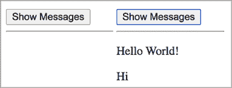
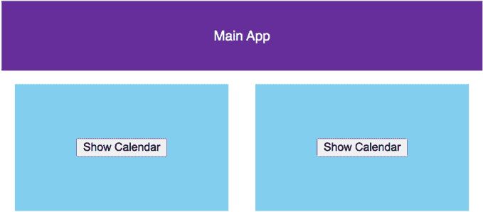
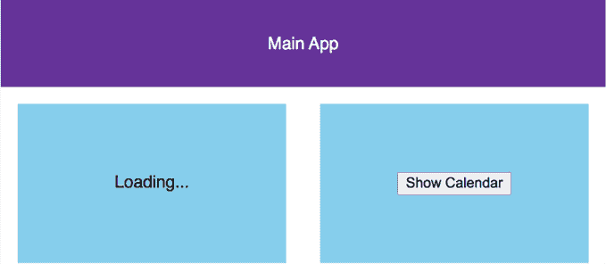
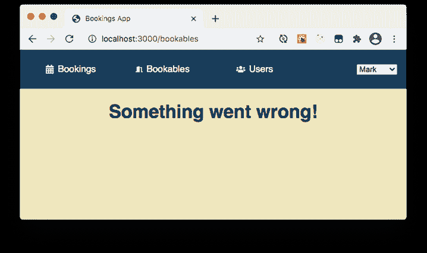
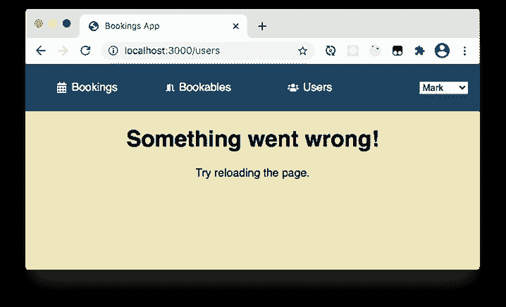
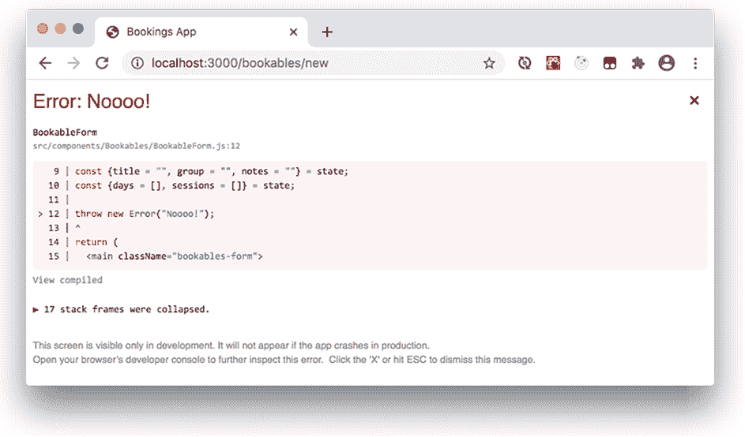

# 11 使用 Suspense 进行代码拆分

本章涵盖

+   使用`import`函数动态导入代码

+   使用`React.lazy`按需加载组件

+   使用`Suspense`组件声明性地指定回退 UI

+   理解`lazy`和`Suspense`如何协同工作

+   使用错误边界声明性地指定错误回退 UI

应用用户通常与某些组件的交互比与其他组件更多。例如，在预订应用中，用户经常访问预订页面而不切换到可预订或用户页面，在可预订页面上，他们可能永远不会打开新建或编辑表单。为了管理浏览器在任何时候加载的代码量，我们可以使用一种称为*代码拆分*的技术；而不是一次性加载应用的所有代码，我们按需加载它为*块*。

到目前为止，本书中的所有示例都使用了*静态导入*。在每个 JavaScript 文件顶部，我们包含`import`语句来指定*依赖项*，即当前文件使用的来自外部文件的代码。在构建时，webpack 等打包工具检查我们的代码，跟踪导入文件的路径，并生成一个*包*，一个包含应用实际使用所有代码的文件。然后，我们的网页请求这个包。

这种*摇树优化过程*，它避免了重复代码并丢弃未使用的代码，可以帮助保持包的良好组织并尽可能小。对于较大的应用和/或较慢的连接，"尽可能小"仍然可能足够大，需要一段时间才能加载。也许一开始就加载所有代码并不是最好的主意。如果应用的部分不太可能被使用或包含特别庞大的组件，减少初始包的大小并在用户访问特定路由或发起特定交互时才加载进一步的包可能是有帮助的。

在 React 中，我们与组件一起工作。我们希望在需要时才动态地将一些组件导入到我们的应用中。但 React 在渲染它们的时间调用组件。如果组件在渲染时未加载，React 应该怎么做？我们不希望整个应用暂停等待组件。对于较大的组件或那些通常不参与初始用户交互的组件，我们可以做以下四件事：

+   仅在我们尝试渲染组件时加载组件代码。

+   在组件加载时显示占位符。

+   继续渲染应用的其余部分。

+   在加载完成后，用组件替换占位符。

在本章中，我们通过使用 React 的`lazy`方法和`Suspense`组件来探讨如何将这些四点付诸实践。我们对占位符 UI 的讨论也将引导我们到*错误边界*，这是一种在发生错误时给 React 提供渲染内容的方式。首先，了解 JavaScript 如何让我们动态导入代码将很有用。

## 11.1 使用导入函数动态导入代码

在本节中，我们探讨从模块中动态导入 JavaScript 到另一个模块。我们不会使用 React，但这些概念对于我们在 React 应用中动态加载组件时非常重要。共有四个小节：

+   设置网页在点击按钮时加载 JavaScript

+   使用默认和命名导出从文件中使 JavaScript 可用

+   使用静态导入加载 JavaScript

+   调用`import`函数动态加载 JavaScript

### 11.1.1 设置网页在点击按钮时加载 JavaScript

假设我们有一个显示按钮的应用。当我们点击按钮时，会显示两条消息，如图 11.1 所示。



图 11.1 点击按钮显示两条消息。

为了演示模块导入，让我们将应用拆分为三个文件：index.html、index.js 和 helloModule.js。以下列表显示了 HTML，包括按钮、两个段落以保存两条消息，以及一个脚本元素以加载将按钮连接到显示消息的代码文件 index.js。

*实时查看*: [`vg0ke.csb.app`](https://vg0ke.csb.app), *代码*: [`codesandbox.io/s/jsstaticimport-vg0ke`](https://codesandbox.io/s/jsstaticimport-vg0ke)

列表 11.1 用于显示两条消息的 HTML 文件（index.html）

```
<!DOCTYPE html>
<html>
  <head>
    <title>Dynamic Imports</title>
    <meta charset="UTF-8" />
  </head>

  <body>
    <button id="btnMessages">Show Messages</button>      ❶
    <hr />
    <p id="messagePara"></p>                             ❷
    <p id="hiPara"></p>                                  ❷

    <script src="src/index.js"></script>                 ❸
  </body>
</html>
```

❶ 包含一个按钮以显示两条消息。

❷ 包含段落元素作为消息的目标。

❸ 加载将按钮连接起来的脚本。

我们还没有 index.js 文件，但我们知道它将使用一些方便的实用函数来将文本注入现有的 HTML 元素。这些实用函数位于它们自己的模块中。让我们看看这个模块以及它是如何使函数可用的。

### 11.1.2 使用默认和命名导出

我们方便的实用函数位于 JavaScript 模块 helloModule.js 中。该模块如下所示，并使用`export`和`default`关键字指定其他文件可以导入的值。其中一个消息函数是默认导出，另一个是命名导出。

*实时查看*: [`vg0ke.csb.app`](https://vg0ke.csb.app), *代码*: [`codesandbox.io/s/jsstaticimport-vg0ke`](https://codesandbox.io/s/jsstaticimport-vg0ke)

列表 11.2 创建具有默认和命名导出的模块（helloModule.js）

```
export default function sayMessage (id, msg) {       ❶
  document.getElementById(id).innerHTML = msg;
}

export function sayHi (id) {                         ❷
  sayMessage(id, "Hi");
}
```

❶ 将 sayMessage 函数设为默认导出。

❷ 将 sayHi 函数设为命名导出。

文件可以有一个默认导出和多个命名导出。它们不需要导出所有内容，只需导出那些它们希望其他文件能够导入的值（在我们的例子中是函数）。我们准备好了超级方便的消息注入函数，所以让我们开始导入吧！

### 11.1.3 使用静态导入加载 JavaScript

当用户点击按钮时，我们的应用程序执行显示消息的关键任务。我们需要最后一个文件，即`index.js`，它设置一个事件处理器来将按钮与显示消息的动作连接起来。但它不是从头开始的；毕竟我们有一些方便的实用函数可用。因此，`index.js`从`helloModule.js`模块导入消息函数，并在事件处理器中调用它们。从其他模块导入导出值的标准方法是在文件顶部静态导入，如下面的列表所示。

*实时演示*: [`vg0ke.csb.app`](https://vg0ke.csb.app)，*代码*: [`codesandbox.io/s/jsstaticimport-vg0ke`](https://codesandbox.io/s/jsstaticimport-vg0ke)

列表 11.3 静态导入（index.js）

```
import showMessage, {sayHi} from "./helloModule";     ❶

function handleClick () {
  showMessage("messagePara", "Hello World!");         ❷
  sayHi("hiPara");                                    ❷
}

document
  .getElementById("btnMessages")
  .addEventListener("click", handleClick);            ❸
```

❶ 导入两个消息函数。

❷ 调用导入的函数。

❸ 当按钮被点击时调用处理器。

我们将`helloModule`模块的默认导出分配给本地变量`showMessage`（我们可以选择变量名），并将命名导出`sayHi`分配给一个使用匹配括号内变量名的本地变量——在`helloModule.js`中它被命名为`sayHi`，因此我们在`index.js`中必须使用`sayHi`。

所有这些都按预期工作；这是一个简单的例子。但是，如果我们想导入的模块是一个更大的文件（至少现在假装是这样），而且大多数用户不太经常点击按钮，我们能避免在不需要时加载这个庞大的模块吗？这将真正帮助我们更快地加载主应用程序。

### 11.1.4 使用导入函数动态加载 JavaScript

如果只有当按钮被点击时才加载按钮使用的代码怎么办？以下列表显示了`index.js`如何使用`import`函数动态加载代码。

*实时演示*: [`n41cc.csb.app/`](https://n41cc.csb.app)，*代码*: [`codesandbox.io/s/jsdynamicimport-n41cc`](https://codesandbox.io/s/jsdynamicimport-n41cc)

列表 11.4 使用导入函数动态加载代码（index.js）

```
function handleClick() {
  import("./helloModule")                                ❶
    .then((module) => {                                  ❷
      module.default("messagePara", "Hello World!");     ❸
      module.sayHi("hiPara");                            ❸
    });
}

document
  .getElementById("btnMessages")
  .addEventListener("click", handleClick);
```

❶ 调用导入函数以动态加载一个模块。

❷ 将模块分配给一个本地变量。

❸ 使用模块属性调用导出的函数。

如果不会使用，就没有必要加载一个大文件，因此模块只有在点击按钮时才会加载。`handleClick`函数使用`import`函数来加载模块：

```
import("./helloModule")
```

`import`函数返回一个解析为导出模块的 promise。我们调用 promise 的`then`方法在模块加载后与之交互：

```
import("./helloModule").then((module) => { /* use module */ });
```

或者，我们可以使用`async/await`语法：

```
async function handleClick() {
  const module = await import("./helloModule");
  // use module
}
```

导出的值（在我们的例子中是函数）作为`module`对象的属性可用。默认导出分配给`default`属性，命名导出分配给同名属性。`helloModule.js`文件有一个默认导出和一个名为`sayHi`的命名导出，因此这些作为`module.default`和`module.sayHi`可用：

```
module.default("messagePara", "Hello World!");
module.sayHi("hiPara");                                       
```

我们可以像以下列表所示那样解构模块对象，而不是将函数作为模块对象的函数调用。

列表 11.5 从动态导入中解构模块属性

```
function handleClick() {
  import("./helloModule")
    .then(({default: showMessage, sayHi}) => {       ❶
      showMessage("messagePara", "Hello World!");    ❷
      sayHi("hiPara");                               ❷
    });
}

document
  .getElementById("btnMessages")
  .addEventListener("click", handleClick);
```

❶ 解构模块，将导出的函数分配给局部变量。

❷ 使用局部变量调用导出的函数。

在解构过程中，我们将默认导出分配给一个更合适的变量名，`showMessage`。再次强调，`async/await`版本相当简洁：

```
async function handleClick() {
  const {default: showMessage, sayHi} = await import("./helloModule");
  showMessage("messagePara", "Hello World!");
  sayHi("hiPara");
}
```

因此，这就是对动态导入的快速介绍。但是，我们想要动态导入 React 组件；如何在不破坏 React 渲染过程的情况下延迟组件的导入？现在我们需要这些知识，让我们来了解一下关于懒加载的详细信息。

## 11.2 使用`lazy`和`Suspense`动态导入组件

在前面的章节中，我们使用了`import`函数来动态加载 JavaScript 代码。我们仅在需要时加载代码，即用户点击按钮时。但我们也在控制渲染；我们通过调用`addEventListener`和`getElementById`以及设置`innerHTML`属性来强制性地附加事件处理程序并调整 DOM。

当使用 React 工作时，我们应该专注于更新状态，让 React 管理 DOM。如何将懒加载组件与 React 需要控制渲染过程的需求结合起来？我们需要一种方法，以声明方式让 React 知道如果它想要渲染的组件尚未准备好，应该怎么做。本节将探讨我们可以用来解决问题的两个部分，首先是分别探讨，然后一起探讨，最后将解决方案应用于预订应用示例。我们的四个小节如下：

+   使用`lazy`函数将组件转换为懒加载组件

+   使用`Suspense`组件指定回退内容

+   理解`lazy`和`Suspense`如何协同工作

+   在应用的路线上进行代码拆分

首先，在一个新闻应用中，我们有一个带有过大日历组件的日期。在这种情况下，懒惰是一种美德。

### 11.2.1 使用`lazy`函数将组件转换为懒加载组件

假设我们公司有一个应用，显示最新的公司新闻和公告。同事们经常检查这个应用以保持最新。该应用还包括一个功能齐全的日历组件，它可以在主页上与其他内容一起查看，或者在其自己的视图中打开。

然而，同事们只是偶尔检查日历。我们不想在应用首次加载时包含日历组件代码，而只想在用户点击显示日历按钮时加载日历代码。图 11.2 大致说明了设置，包括主应用区域和两种打开日历的方式。



图 11.2 我们的公司新闻应用仅在用户点击其中一个显示日历按钮时加载`Calendar`组件代码。

我们将使用相同的组件`CalendarWrapper`作为主应用程序下的两个日历区域（但想象一个会在当前位置打开日历，另一个会替换当前视图）。以下列表显示了应用程序 UI 的 JSX，包括主区域和两个日历区域。

列表 11.6 应用程序包括一个主区域和两个日历区域

```
<div className="App">
  <main>Main App</main>
  <aside>
    <CalendarWrapper />
    <CalendarWrapper />
  </aside>
</div>
```

以下列表中的`CalendarWrapper`组件代码。组件首先显示“显示日历”按钮。当用户点击按钮时，`CalendarWrapper`切换到显示`LazyCalendar`组件。

列表 11.7 包含显示日历按钮的组件

```
function CalendarWrapper() {
  const [isOn, setIsOn] = useState(false);
  return isOn ? (
    <LazyCalendar />                           ❶
  ) : (
    <div>
      <button onClick={() => setIsOn(true)}>Show Calendar</button>
    </div>
  );
}
```

❶ 包含一个延迟加载的组件。

列表 11.7 使用了`LazyCalendar`组件，这是一个特殊的组件，它直到首次渲染时才被导入。但它是从哪里来的？假设我们已经在名为 Calendar.js 的模块中有一个`Calendar`组件，我们可以结合动态导入和 React 的`lazy`函数将`Calendar`转换为`LazyCalendar`：

```
const LazyCalendar = lazy(() => import("./Calendar.js"));
```

我们传递给`lazy`一个返回承诺的函数。更一般地说，这个过程看起来像这样：

```
const getPromise = () => import(modulePath);     ❶

const LazyComponent = lazy(getPromise);          ❷
```

❶ 创建一个返回承诺的函数。

❷ 将生成承诺的函数传递给 React.lazy。

我们传递给`lazy`一个函数`getPromise`，当 React 需要首次渲染该组件时调用。`getPromise`函数返回一个解析为模块的承诺。模块的默认导出必须是一个组件。

但我们没有`Calendar`模块（我们想象它是一个大文件），所以为了我们的示例，并加强模块是具有默认和命名属性的对象的这一概念，让我们模拟一个模块，并使用以下代码使其延迟加载。

列表 11.8 创建一个模拟模块并使其组件延迟加载

```
const module = {
  default: () => <div>Big Calendar</div>                   ❶
};

function getPromise() {
  return new Promise(                                      ❷
    (resolve) => setTimeout(() => resolve(module), 3000)   ❷
  );
}

const LazyCalendar = lazy(getPromise);                     ❸
```

❶ 将一个函数组件分配给默认属性。

❷ 返回一个解析为我们模块的承诺。

❸ 通过将`getPromise`传递给`lazy`来创建一个延迟加载的组件。

太好了！我们已经准备好所有部件来尝试我们的第一个延迟加载组件：

+   一个“巨大的”日历组件(`()` `=>` `<div>Big` `Calendar</div>`)

+   将日历组件分配给其默认属性的模块

+   一个解析为模块的承诺（三秒后）

+   一个创建并返回承诺的函数`getPromise`

+   通过将`getPromise`传递给`lazy`创建的延迟组件`LazyCalendar`

+   一个包装组件`CalendarWrapper`，仅在用户点击按钮后显示`LazyCalendar`

+   包含两个`CalenderWrapper`组件的`App`组件

以下列表将所有部件放在一起。它是 CodeSandbox 上的一个 React 应用程序的一部分。创建和使用延迟组件的代码以粗体显示。

*实时*: [`9qj5f.csb.app`](https://9qj5f.csb.app)，*代码*: [`codesandbox.io/s/lazycalendarnosuspense-9qj5f`](https://codesandbox.io/s/lazycalendarnosuspense-9qj5f)

列表 11.9 使用延迟组件运行我们的应用程序

```
import React, { lazy, useState } from "react";
import "./styles.css";

const module = {
  default: () => <div>Big Calendar</div>                     ❶
};

function getPromise() {
  return new Promise(
    (resolve) => setTimeout(() => resolve(module), 3000)     ❷
  );
}

const LazyCalendar = lazy(getPromise);                       ❸

function CalendarWrapper() {
  const [isOn, setIsOn] = useState(false);
  return isOn ? (
    <LazyCalendar />                                         ❹
  ) : (
    <div>
      <button onClick={() => setIsOn(true)}>Show Calendar</button>
    </div>
  );
}

export default function App() {
  return (
    <div className="App">
      <main>Main App</main>
      <aside>
        <CalendarWrapper />
        <CalendarWrapper />
      </aside>
    </div>
  );
}
```

❶ 将组件作为模块的默认导出。

❷ 使用模块解析一个 promise。

❸ 将组件解析的 promise 转换为懒加载组件。

❹ 如同其他组件一样使用懒加载组件。

记住，对于真正的模块，我们使用动态导入；我们传递一个函数给`lazy`，该函数调用`import`函数。所以，如果`Calendar`组件是从 Calendar.js 模块的默认导出，我们会创建懒加载组件如下所示：

```
const LazyCalendar = lazy(() => import("./Calendar.js"));
```

但等等！如果你点击链接到 CodeSandbox 并点击其中一个显示日历按钮，你会看到一个问题，一个邪恶的错误！（实际上，就像大多数 React 错误一样，它相当友好；它告诉我们确切需要做什么。）错误如图 11.3 所示。它告诉我们“在树中添加一个`<Suspense fallback=. . .>`组件，以提供加载指示器或占位符来显示。”让我们遵循它的建议。


图 11.3  我们的应用一开始运行良好，但点击显示日历按钮会导致错误：“渲染时挂起的 React 组件，但没有指定回退 UI。”

### 11.2.2 使用 Suspense 组件指定回退内容

加载组件需要时间，我们想象的`Calendar`组件代码是一个大而健壮的文件。当需要显示日历但尚未加载时，我们的应用应该做什么？我们需要某种类型的加载指示器来让用户知道日历正在路上。可能就像图 11.4 中那样简单，只是显示“加载中...”这样的文本。



图 11.4 当用户第一次点击显示日历按钮时，应用显示加载指示器，直到组件加载完成。

幸运的是，正如图 11.3 中的错误所指出的，React 提供了一个简单的方式来指定回退 UI：`Suspense`组件。使用`Suspense`组件来包装包含一个或多个懒加载组件的 UI：

```
<Suspense fallback={<div>Loading...</div>}>
  <CalendarWrapper />
</Suspense>
```

使用`fallback`属性指定`Suspense`组件在所有懒加载子组件返回一些 UI 之前要渲染的内容。在下面的列表中，我们将两个`CalendarWrapper`组件都包装在自己的`Suspense`组件中，这样应用就知道如果其中一个包装器的`LazyCalendar`组件正在加载时应该做什么。

*实时*: [`h0hgg.csb.app`](https://h0hgg.csb.app)，*代码*: [`codesandbox.io/s/lazycalendar-h0hgg`](https://codesandbox.io/s/lazycalendar-h0hgg)

列表 11.10 使用`Suspense`组件包装两个日历区域

```
<div className="App">
  <main>Main App</main>
  <aside>
    <Suspense fallback={<div>Loading...</div>}>      ❶
      <CalendarWrapper />
    </Suspense>
    <Suspense fallback={<div>Loading...</div>}>      ❷
      <CalendarWrapper />
    </Suspense>
  </aside>
</div>
```

❶ 将包含懒加载组件的 UI 包装在 Suspense 组件中。

❷ 使用 fallback 属性指定占位符 UI。

如果你点击 CodeSandbox 上的新版本链接并点击显示日历按钮，你会看到图 11.4 中的“加载中...”回退持续三秒钟，然后`Calendar`组件将渲染，显示“大日历”，如图 11.5 所示。


图 11.5 一旦`Calendar`组件加载，它将替换回退内容。

一旦`Calendar`组件加载完成，它就不需要再次加载，因此点击第二个显示日历按钮将立即渲染第二个`Calendar`组件。在列表 11.10 中，每个`CalendarWrapper`组件都被包裹在其自己的`Suspense`组件中。但可能只需要一个`Suspense`组件。以下代码片段显示了两个`CalendarWrapper`组件的单个`Suspense`组件。

```
<Suspense fallback={<div>Loading...</div>}>
  <CalendarWrapper />
  <CalendarWrapper />
</Suspense>
```

如果你以这种方式包裹两个组件，第一次点击显示日历按钮将显示图 11.6 中所示的共享“加载中...”回退内容。


图 11.6 多个组件可以包裹在单个`Suspense`组件中。如果任何子组件正在加载，将显示回退内容。

当懒加载组件首次渲染时，React 会沿着组件树向上查找，并使用它找到的第一个`Suspense`组件。该`Suspense`组件将渲染其回退 UI 以替换其子组件。如果没有找到`Suspense`组件，React 将抛出我们在图 11.3 中看到的错误。

能够指定与加载组件分开的回退 UI，这在我们调整 UI 以获得最佳用户体验时提供了更大的灵活性。但是，这些单独的组件是如何协同工作的？React 是如何查找`Suspense`组件的组件树的？懒加载组件使用什么机制来渲染已加载的组件或将渲染传递给父组件？嗯，我就在这里帮助你们。我会告诉你们它们是如何做到的，这是一个承诺。

### 11.2.3 理解懒加载和 Suspense 如何协同工作

我们可以将懒加载组件视为具有内部状态：未初始化、挂起、已解析或拒绝。当 React 首次尝试渲染懒加载组件时，组件处于未初始化状态，但 React 会调用一个返回 promise 的函数来加载模块。例如，这里的返回 promise 的函数是`getPromise`：

```
const getPromise = () => import("./Calendar");
const LazyCalendar = lazy(getPromise);
```

这个 promise 应该解析为一个模块，其`default`属性是组件。一旦解析完成，React 可以将懒加载组件的状态设置为`已解析`并返回组件，准备渲染，类似于以下这样：

```
if (status === "resolved") {
  return component;
} else {
  throw promise;
}
```

`else`子句包含了与树中更上层的`Suspense`组件通信的关键：如果 promise 尚未解析，React 将`抛出`它，就像你会抛出一个错误一样。`Suspense`组件被设置为捕获 promise，如果 promise 处于挂起状态，则渲染回退 UI。

总结一下，表 11.1 显示了 React 在树中遇到懒加载组件时采取的步骤。它执行它能够执行的第一步操作。

表 11.1 React 遇到懒加载组件时采取的步骤

| 如果 LazyComponent 对象包含 | 动作 |
| --- | --- |
| 组件 | 调用组件。 |
| 未解析的 promise | 抛出 promise。 |
| 一个返回 Promise 的函数 | 调用函数以获取 Promise。将 Promise 存储在 `LazyComponent` 对象中。调用 Promise 的 `then` 方法，以便当 Promise 解析时，组件存储在 `LazyComponent` 对象中。抛出 Promise。 |

经验丰富的 Promise 管理员可能会想知道如果 Promise 被拒绝会发生什么，可能是因为网络错误。`Suspense` 组件不处理错误 UI；这是错误边界的工作范围，我们在第 11.3 节中讨论。在此之前，让我们将预订应用程序拆分为懒加载路由。

### 11.2.4 在其路由上拆分应用程序的代码

您现在知道如何通过懒加载一些组件将我们的应用程序拆分为单独的包。如果代码不会被使用，就没有必要加载大量代码。相反，当用户选择使用某些功能时，可以加载该功能的代码，同时显示一些回退 UI 以在加载时显示。

我们的预订应用程序示例已经根据预订、可预订项目和用户拆分为单独的路由。路由似乎是开始拆分代码的合理位置。下面的列表更新了 `App` 组件，懒加载每个页面组件，并将 `Routes` 组件包裹在 `Suspense` 组件中。

分支：1101-lazy-suspense，文件：/src/components/App.js

列表 11.11 在 `App` 中懒加载页面组件

```
import {lazy, Suspense} from "react";                                     ❶

// previous imports with the three pages removed

import PageSpinner from "./UI/PageSpinner";

const BookablesPage = lazy(() => import("./Bookables/BookablesPage"));    ❷
const BookingsPage = lazy(() => import("./Bookings/BookingsPage"));       ❷
const UsersPage = lazy(() => import("./Users/UsersPage"));                ❷

const queryClient = new QueryClient();

export default function App () {
  return (
    <QueryClientProvider client={queryClient}>
      <UserProvider>
        <Router>
          <div className="App">
            <header>
              <nav>
                {/* unchanged */}
              </nav>

              <UserPicker/>
            </header>

            <Suspense fallback={<PageSpinner/>}>                          ❸
              <Routes>
                <Route path="/bookings" element={<BookingsPage/>}/>       ❹
                <Route path="/bookables/*" element={<BookablesPage/>}/>   ❹
                <Route path="/users" element={<UsersPage/>}/>             ❹
              </Routes>
            </Suspense>
          </div>
        </Router>
      </UserProvider>
    </QueryClientProvider>
  );
}
```

❶ 导入懒加载函数和 `Suspense` 组件。

❷ 懒加载三个页面组件。

❸ 将页面路由包裹在带有 `PageSpinner` 回退的 `Suspense` 组件中。

❹ 就像使用任何其他懒加载页面组件一样使用。

现在，如果用户首先访问用户页面，比如，只有 `App` 组件、`UsersPage` 组件及其依赖项的代码被加载。`BookingsPage` 和 `BookablesPage` 的代码不包括在内。在组件加载时，我们的常用 `PageSpinner` 组件在顶部菜单栏下渲染。

`BookablesPage` 组件包含一些嵌套路由，用户可能直接导航到其中的任何一个，而无需选择访问其他路由。一次性加载所有代码是不必要的，所以让我们在下面的列表中再次进行懒加载。

分支：1101-lazy-suspense，文件：/src/components/Bookables/BookablesPage.js

列表 11.12 为 `BookablesPage` 懒加载嵌套组件

```
import {lazy} from "react";
import {Routes, Route} from "react-router-dom";

const BookablesView = lazy(() => import("./BookablesView"));    ❶
const BookableEdit = lazy(() => import("./BookableEdit"));      ❶
const BookableNew = lazy(() => import("./BookableNew"));        ❶

export default function BookablesPage () {
  return (
    <Routes>
      <Route path="/:id">
        <BookablesView/>                                        ❷
      </Route>
      <Route path="/">
        <BookablesView/>                                        ❷
      </Route>
      <Route path="/:id/edit">
        <BookableEdit/>                                         ❷
      </Route>
      <Route path="/new">
        <BookableNew/>                                          ❷
      </Route>
    </Routes>
  );
}
```

❶ 懒加载组件。

❷ 按照之前完全相同的方式使用组件。

这次，我们不在路由中包裹 `Suspense` 组件。我们现有的 `App` 中的回退将愉快地处理树中任何正在挂起的组件（抛出挂起 Promise 的组件）。`PageSpinner` 是一个合适的回退，因为三个组件——`BookablesView`、`BookablesEdit` 和 `BookablesNew`——都是页面级组件。它们都替换了它们之前的页面上的任何内容（不包括顶部始终存在的菜单栏）。请随意尝试在嵌套路由周围添加 `Suspense` 组件；一条“正在加载编辑表单……”的消息可能很有用。

`Suspense` 组件处理挂起的承诺。当组件抛出一个拒绝的承诺或更传统地，在渲染时抛出错误时会发生什么？如果 `Suspense` 组件不想知道，那会是谁呢？是时候为那些讨厌的错误设定一些边界了。

## 11.3 使用错误边界捕获错误

React 没有提供用于捕获子组件抛出的错误的组件。但它确实提供了一些生命周期方法，类组件可以实现这些方法来捕获和报告错误。如果你的一个类组件实现了其中之一或两个方法，它就被认为是**错误边界**。

如果你将组件树的全部或部分包裹在错误边界中，如果其中一个包装组件抛出错误，它将渲染回退用户界面。图 11.7 显示了在页面组件或其子组件之一抛出错误时，预订应用程序可能使用的回退用户界面类型。



图 11.7 与卸载应用程序不同，如果发生错误，错误边界可以显示一些回退用户界面。

假设我们有一个这样的错误边界组件 `ErrorBoundary`，我们希望它能够捕获预订应用程序中任何路由的错误。我们希望能够指定错误边界的位置，以及当抛出错误时哪些组件被回退 UI 替换。我们希望像这样使用 `ErrorBoundary`：

```
<UserProvider>
  <Router>
    <div className="App">
      <header>{/* unchanged menu */}</header>     ❶

      <ErrorBoundary>                             ❷
        <Suspense fallback={<PageSpinner/>}>      ❸
          <Routes>{/* unchanged */}</Routes>      ❹
        </Suspense>
      </ErrorBoundary>

    </div>
  </Router>
</UserProvider>
```

❶ 在错误边界之外留下一些 UI。

❷ 使用错误边界来捕获包装组件中的错误。

❸ 捕获包装组件中的承诺。

❹ 当一切正常时渲染包装组件。

只有页面组件被回退替换；应用程序继续在 `header` 元素中显示菜单，如图 11.7 的顶部所示。该图还显示了回退 UI，应用程序在子组件中发生错误时显示的消息“出了点问题”。

但那个 UI 从哪里来？我们在错误边界类组件中必须实现哪些生命周期方法？（一如既往地）一个好的起点是查看 React 文档。

### 11.3.1 检查 React 文档中的错误边界示例

为了捕获子组件渲染时抛出的任何错误，我们需要一个实现了生命周期方法 `getDerivedStateFromError` 和 `componentDidCatch` 的类组件。以下列表展示了来自 reactjs.org 的 React 文档中实现这些方法的错误边界组件。它显示了图 11.7 中显示的硬编码的回退用户界面。

React 文档：[`reactjs.org/docs/error-boundaries.html`](https://reactjs.org/docs/error-boundaries.html)

列表 11.13 reactjs.org 上的 `ErrorBoundary` 组件

```
class ErrorBoundary extends React.Component {                          ❶
  constructor(props) {
    super(props);
    this.state = { hasError: false };                                  ❷
  }

  static getDerivedStateFromError(error) {                             ❸
    // Update state so the next render will show the fallback UI.
    return { hasError: true };
  }

  componentDidCatch(error, errorInfo) {                                ❹  
    // You can also log the error to an error reporting service
    logErrorToMyService(error, errorInfo);
  }

  render() {
    if (this.state.hasError) {
      // You can render any custom fallback UI
      return <h1>Something went wrong.</h1>;                           ❺
    }
    return this.props.children;                                        ❻
  }
}
```

❶ 将 React 的 Component 类扩展以创建一个错误边界。

❷ 在状态中包含一个 hasError 属性。

❸ 当捕获到错误时返回新状态。

❹ 如果捕获到错误，则记录错误。

❺ 如果有错误，则渲染回退 UI。

❻ 如果没有错误，则渲染包装组件。

组件使用`hasError`属性管理状态，该属性标记组件是否捕获了错误。`componentDidCatch`方法还将任何错误信息记录到外部日志服务。最后，`render`方法返回包裹的组件，或者如果`getDerivedStateFromError`方法已将错误标志设置为`true`，则返回硬编码的回退 UI：

```
<h1>Something went wrong.</h1>
```

但列表 11.13 只是一个示例错误边界。让我们自己创建一个。

### 11.3.2 创建我们自己的错误边界

React 文档中的错误边界只是一个可能性。我们可能想要为我们的应用定制更多。例如，图 11.8 中的回退 UI 包括一个指示用户“尝试重新加载页面”的说明。



图 11.8 我们的`ErrorBoundary`组件允许我们在发生错误时指定自定义 UI 作为回退。

而不是仅仅切换一个硬编码的消息，让我们尝试实现一个错误边界，这样我们就可以在每次使用时指定不同的回退。下面的列表显示了一个这样的组件。我们不会记录任何错误，因此省略了`componentDidCatch`方法，并且组件的使用者可以在`fallback`属性中指定 UI。

分支：1102-error-boundary，文件：/src/components/UI/ErrorBoundary.js

列表 11.14 一个简单、可定制的`ErrorBoundary`组件

```
import {Component} from "react";

export default class ErrorBoundary extends Component {
  constructor (props) {
    super(props);
    this.state = {hasError: false};
  }

  static getDerivedStateFromError () {
    return {hasError: true};
  }

  render() {
    const {
      children,                                          ❶
      fallback = <h1>Something went wrong.</h1>          ❷
    } = this.props;

    return this.state.hasError ? fallback : children;    ❸
  }
}
```

❶ 从 props 中获取包裹的组件。

❷ 从 props 中获取回退，或使用默认回退。

❸ 渲染回退或包裹的组件。

我们将立即在预订应用中使用新的错误边界，作为对任何三个页面抛出的错误的通用捕获。在下面的列表中，`App`组件现在使用`ErrorBoundary`包裹了`Suspense`和`Routes`组件。

分支：1102-error-boundary，文件：/src/components/App.js

列表 11.15 带有错误边界的`App`

```
// other imports, including Fragment

import ErrorBoundary from "./UI/ErrorBoundary";                            ❶

const BookablesPage = lazy(() => import("./Bookables/BookablesPage"));
const BookingsPage = lazy(() => import("./Bookings/BookingsPage"));
const UsersPage = lazy(() => import("./Users/UsersPage"));

const queryClient = new QueryClient();

export default function App () {
  return (
    <QueryClientProvider client={queryClient}>
      <UserProvider>
        <Router>
          <div className="App">
            <header>{/* unchanged */}</header>

            <ErrorBoundary                                                 ❷
              fallback={                                                   ❸
                <Fragment>
                  <h1>Something went wrong!</h1>
                  <p>Try reloading the page.</p>                           ❹
                </Fragment>
              }
            >
              <Suspense fallback={<PageSpinner/>}>
                <Routes>
                  <Route path="/bookings" element={<BookingsPage/>}/>
                  <Route path="/bookables/*" element={<BookablesPage/>}/>
                  <Route path="/users" element={<UsersPage/>}/>
                </Routes>
              </Suspense>
            </ErrorBoundary>                                               ❺

          </div>
        </Router>
      </UserProvider>
    </QueryClientProvider>
  );
}
```

❶ 导入我们的错误边界。

❷ 将主要路由包裹在错误边界中。

❸ 提供一些回退 UI。

❹ 可能包括一些操作建议。

❺ 将主要路由包裹在错误边界中。

我们将应用的主要路由包裹在一个错误边界中。为了测试它，让我们从一个子组件抛出一个错误。在`BookableForm`组件中，在其返回 UI 之前，添加以下行：

```
throw new Error("Noooo!");
```

现在，重新加载应用，导航到可预订页面，然后在可预订列表下点击“新建”按钮或点击可预订详情页顶部的右上角的“编辑”按钮。关闭图 11.9 中显示的错误覆盖层；这是由 Create React App 添加的，在生产环境中不会出现。你应该看到图 11.8 中的回退 UI。



图 11.9 在开发模式下，Create React App 的服务器使用错误消息覆盖页面。按 Esc 键或点击 X 以关闭覆盖层，显示错误边界的回退 UI。

如果应用的单页包含多个组件，并且一个组件的失败不会影响其他组件——用户可以继续使用该页面——那么考虑将该组件包裹在其自己的错误边界中。当错误边界可以安全地隔离不稳定的组件时，没有必要阻止用户在其他地方使用功能。不过，如果能稳定这些不稳定的组件就更好了，我们可以进一步自定义错误边界组件，使其更容易从错误中恢复。

### 11.3.3 从错误中恢复

要求用户刷新页面是处理组件树下方未捕获的错误可能有效的一种方法。但是，特别是对于主应用中特定小部件周围的错误边界，如聊天窗口或股票行情，或社交媒体流，您可能希望给用户提供一个按钮来尝试重置或重新加载应用中的特定组件。在第十二章中，我们将使用从 npm 下载的预构建错误边界包 `react-error-boundary`。它提供了方便的额外功能，使其错误边界更加灵活和可重用。在 GitHub 上查看它：[`github.com/bvaughn/react-error-boundary`](https://github.com/bvaughn/react-error-boundary)。

第十二章继续本章的主题，即当 React 等待最终 UI 准备就绪时，给它一些可以渲染的内容。我们不会等待组件加载，而是等待数据或图像。加入我，我们将探索实验性的 React 功能。

## 摘要

+   在 JavaScript 文件的顶部将依赖项作为静态导入。像 webpack 这样的打包器可以执行摇树优化来创建一个包，一个包含应用使用所有代码的单个文件。

+   为了仅在用户操作或其他事件响应时加载 JavaScript 依赖项，使用 `import` 函数动态加载模块：

    ```
    function handleClick() {
      import("./helloModule")
        .then(module => {/* use module */});
    }
    ```

+   动态导入返回一个返回模块的承诺。在模块对象上访问默认和命名导出：

    ```
    function handleClick() {
      import("./helloModule")
        .then(module => {
          module.default("messagePara", "Hello World!");
          module.sayHi("hiPara");
        });
    }
    ```

+   使用 `React.lazy` 仅在组件首次渲染时加载组件。将 `lazy` 传递一个返回动态导入承诺的函数。承诺必须解析到一个模块，其默认属性是一个组件：

    ```
    const LazyComponent = React.lazy(() => import("./MyComponent"));
    ```

+   使用 `Suspense` 组件来告诉 React 在等待懒加载组件加载时应该渲染什么。(`Suspense` 组件捕获尚未加载的组件抛出的挂起承诺。)

    ```
    <Suspense fallback={<p>Just one moment...</p>}>
      { /* UI that could contain a lazy component */ }
    </Suspense>
    ```

+   使用错误边界组件来告诉 React 在渲染子组件时发生错误时应该渲染什么。错误边界是实现了 `getDerivedStateFromError` 和 `componentDidCatch` 生命周期方法之一的类组件：

    ```
    <ErrorBoundary>
      { /* App or subtree */ }
    </ErrorBoundary>
    ```

+   自定义错误边界以提供定制的回退 UI 和错误恢复策略。
