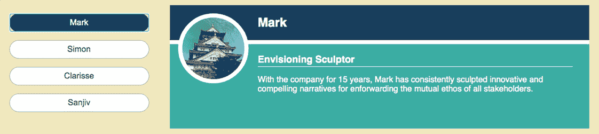
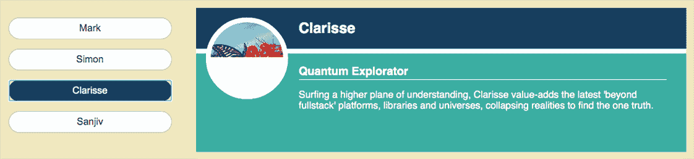
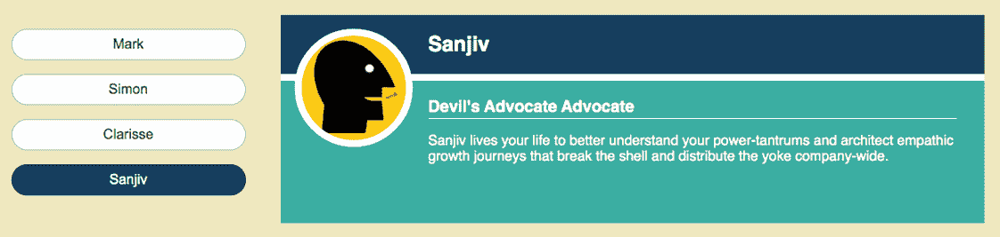
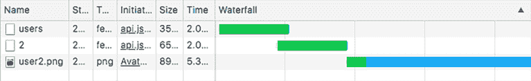
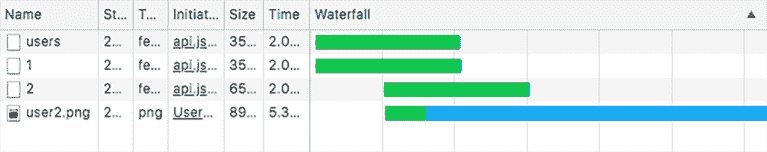

# 12 将数据获取与 Suspense 集成

本章节涵盖了

+   包装承诺以访问其状态

+   在获取数据时抛出承诺和错误

+   使用`Suspense`组件在加载数据和图像时指定回退 UI

+   尽早获取数据和资源

+   使用错误边界恢复错误

React 团队有一个使命，即维护和开发一个产品，使开发者尽可能容易地创建出色的用户体验。除了编写全面的文档、提供直观且富有教育意义的开发者工具、编写描述性且易于操作的错误消息以及确保增量升级路径外，该团队希望 React 能够使提供快速加载、响应和可扩展的应用程序变得容易。并发模式和 Suspense 提供了改善用户体验的方法，协调代码和资源的加载，实现更简单、有意的加载状态，并优先处理允许用户继续工作或玩耍的更新。

但 React 团队不希望并发模式的挂钩成为开发者的负担；他们希望尽可能多的好处是自动的，任何新的 API 都是直观的，并与现有思维模式保持一致。因此，并发模式仍然被标记为实验性，因为 API 正在测试和调整。希望我们不会悬而未决太久！[*不！我们同意，不要开关于悬而未决的玩笑——编辑*]

在第十三章中，我们将深入探讨并发模式的哲学和承诺。本章是第十一章中稳定的生产使用懒加载组件和 Suspense 与第十三章中延迟渲染、过渡和`SuspenseList`组件的试验性 API 之间的桥梁。在这里，我们使用关于抛出承诺的想法来考虑使用 Suspense 进行数据获取可能的样子。代码示例不是用于生产，但可以提供关于库作者为了与并发模式和 Suspense 良好协作可能需要考虑的内容的见解。

## 12.1 使用 Suspense 进行数据获取

在第十一章中，我们看到了当`Suspense`组件捕获抛出的承诺时，它们会显示回退 UI。在那里，我们正在懒加载组件，React 通过`lazy`函数和动态导入协调承诺的抛出：

```
const LazyCalendar = lazy(() => import("./Calendar"));
```

当尝试渲染懒加载组件时，React 首先检查组件的状态；如果动态导入的组件已加载，React 将直接渲染它，但如果它是挂起的，React 将抛出动态导入的承诺。如果承诺被拒绝，我们需要错误边界来捕获错误并显示适当的回退 UI：

```
<ErrorBoundary>
  <Suspense fallback="Loading...">
    <LazyCalendar/>
  </Suspense>
</ErrorBoundary>
```

当到达`LazyCalendar`组件时，React 可以使用已加载的组件、抛出一个现有的挂起承诺，或者开始动态导入并抛出一个新的挂起承诺。

我们希望对于从服务器加载数据的组件也有类似的功能。比如说我们有一个`Message`组件，它加载并显示一个消息。在图 12.1 中，`Message`组件已经加载了消息“Hello Data!”并正在显示它。


图 12.1 `Message`组件加载一个消息并显示它。

当数据正在加载时，我们希望使用`Suspense`组件显示一个回退，就像图 12.2 中的那样，上面写着“正在加载消息...”。


图 12.2 数据正在加载时，`Suspense`组件显示一个回退消息。

如果出现错误，我们希望`ErrorBoundary`组件显示一个回退，就像图 12.3 中的那样，上面写着“哎呀！”


图 12.3 如果有错误，`ErrorBoundary`组件显示一个错误消息。

符合我们预期的 JSX 将类似于以下内容：

```
<ErrorBoundary fallback="Oops!">
  <Suspense fallback="Loading message...">
    <Message/>
  </Suspense>
</ErrorBoundary>
```

但是，尽管我们有`lazy`函数用于懒加载组件，但没有稳定、内置的机制用于正在加载数据的组件。（有一个`react-cache`包，但它处于实验性且不稳定的状态。）

我们可能可以想出一个方法来加载数据，根据需要抛出承诺或错误。这样做，我们将对数据获取库需要实现的一些步骤有一些了解，但这只是一个了解，绝对不是对生产代码的建议。（一旦并发模式和 React 的数据获取策略确定下来，并且实战测试击败了现实世界的问题和边缘情况，可以查看像 Relay、Apollo 和 React Query 这样的库，它们提供高效、灵活、完全集成的数据获取。）看看以下关于我们的`Message`组件的列表。它包括一个假设的`getMessageOrThrow`函数。

列表 12.1 `Message`组件调用一个函数来检索数据

```
function Message () {
  const data = getMessageOrThrow();                     ❶
  return <p className="message">{data.message}</p>;     ❷
}
```

❶ 调用一个返回数据或抛出承诺或错误的函数。

❷ 在 UI 中包含数据。

我们希望`getMessageOrThrow`函数在数据可用时返回数据。如果有一个尚未解决为我们数据的承诺，该函数应该抛出它。如果承诺已被拒绝，该函数应该抛出一个错误。

问题在于，如果有一个我们的数据承诺（例如浏览器 fetch API 返回的承诺），我们没有检查其状态的方法。它是挂起的吗？它已经解决了吗？它已经被拒绝了？我们需要在代码中包装承诺，以报告其状态。

### 12.1.1 将承诺升级以包含其状态

要与`Suspense`和`ErrorBoundary`组件一起工作，我们需要使用承诺的状态来决定我们的行动。表 12.1 将状态与所需行动相匹配。

表 12.1 每个承诺状态的行动

| 承诺状态 | 行动 |
| --- | --- |
| 进行中 | 抛出承诺。 |
| 已解决 | 返回已解决的价值——我们的数据。 |
| 拒绝 | 抛出拒绝错误。 |

承诺不会报告自己的状态，因此我们想要某种`checkStatus`函数，该函数返回承诺的当前状态以及可用的已解析值或拒绝错误。类似于以下内容：

```
const {promise, status, data, error} = checkStatus();
```

或者，因为我们永远不会同时得到`data`和`error`，所以类似于以下内容：

```
const {promise, status, result} = checkStatus();
```

我们将能够使用条件语句如`if`(status `===` `"pending")`来决定是否抛出承诺或错误或返回值。

以下列表显示了一个`getStatusChecker`函数，它接受一个承诺并返回一个函数，该函数让我们能够访问承诺的状态。

列表 12.2 获取访问承诺状态的函数

```
export function getStatusChecker (promiseIn) {     ❶
  let status = "pending";                          ❷
  let result;                                      ❸

  const promise = promiseIn
    .then((response) => {                          ❹
      status = "success";
      result = response;
    })
    .catch((error) => {                            ❺
      status = "error";
      result = error;
    });

  return () => ({promise, status, result});        ❻
}
```

❶ 传递我们想要跟踪状态的承诺。

❷ 设置一个变量来保存承诺的状态。

❸ 为已解析值或拒绝错误设置一个变量。

❹ 在成功时，将已解析值赋值给结果。

❺ 在出错时，将拒绝错误赋值给结果。

❻ 返回一个函数来访问当前状态和结果。

使用`getStatusChecker`函数，我们可以获取我们需要来跟踪承诺状态并相应反应的`checkStatus`函数。例如，如果我们有一个`fetchMessage`函数返回一个承诺并加载消息数据，我们可以得到一个状态跟踪函数如下：

```
const checkStatus = getStatusChecker(fetchMessage());
```

好的，那太好了；我们有一个承诺状态跟踪函数。为了与 Suspense 集成，我们需要我们的数据获取函数使用该承诺状态来返回数据、抛出承诺或抛出错误。

### 12.1.2 使用承诺状态与 Suspense 集成

这里是我们的`Message`组件再次出现：

```
function Message () {
  const data = getMessageOrThrow();
  return <p className="message">{data.message}</p>;
}
```

我们希望能够调用一个数据获取函数——在这个例子中，是`getMessageOrThrow`——该函数能够通过适当地抛出承诺或错误或在其加载后返回我们的数据来自动与 Suspense 集成。以下列表显示了`makeThrower`函数，它接受一个承诺并返回这样一个函数，该函数使用承诺的状态来适当地行动。

列表 12.3 返回一个根据需要抛出异常的数据获取函数

```
export function makeThrower (promiseIn) {                ❶
  const checkStatus = getStatusChecker(promiseIn);       ❷

  return function () {                                   ❸
    const {promise, status, result} = checkStatus();     ❹

    if (status === "pending") throw promise;             ❺
    if (status === "error") throw result;                ❺
    return result;                                       ❺
  };
}
```

❶ 将数据获取的承诺传递进来。

❷ 获取一个用于跟踪承诺状态的功能。

❸ 返回一个可以抛出异常的函数。

❹ 每次函数被调用时获取最新的状态。

❺ 使用状态来抛出或返回。

对于`Message`组件，我们将使用`makeThrower`将`fetchMessage`函数返回的承诺转换成一个可以抛出承诺或错误的 数据获取函数：

```
const getMessageOrThrow = makeThrower(fetchMessage());
```

但我们何时开始获取？在哪里放置那行代码？

### 12.1.3 尽早获取数据

我们不必等到组件渲染完成才开始加载数据。我们可以在组件外部启动获取，使用 fetch 承诺构建一个可以抛出的数据访问函数，组件可以使用它。列表 12.4 展示了 `Message` 组件的完整 `App` 示例。浏览器在加载时执行代码，开始数据获取。一旦 React 渲染 `App` 和嵌套的 `Message`，`Message` 将调用 `getMessageOrThrow`，该函数访问现有的承诺。

*实时演示*: [`t1lsy.csb.app`](https://t1lsy.csb.app), *代码*: [`codesandbox.io/s/suspensefordata-t1lsy`](https://codesandbox.io/s/suspensefordata-t1lsy)

列表 12.4 使用 `Message` 组件

```
import React, {Suspense} from "react";
import {ErrorBoundary} from "react-error-boundary";
import fetchMessage from "./api";
import {makeThrower} from "./utils";
import "./styles.css";

function ErrorFallback ({error}) {
  return <p className="error">{error}</p>;
}

const getMessageOrThrow = makeThrower(fetchMessage());                ❶

function Message () {
  const data = getMessageOrThrow();                                   ❷
  return <p className="message">{data.message}</p>;                   ❸
}

export default function App () {
  return (
    <div className="App">
      <ErrorBoundary FallbackComponent={ErrorFallback}>               ❹
        <Suspense                                                     ❺
          fallback={<p className="loading">Loading message...</p>}
        >
          <Message />
        </Suspense>
      </ErrorBoundary>
    </div>
  );
}
```

❶ 尽快开始获取。

❷ 访问数据或抛出错误或承诺。

❸ 如果有数据，则使用数据。

❹ 捕获抛出的错误。

❺ 捕获抛出的承诺。

我们的错误边界是第十一章中提到的 `react-error-boundary` 包中的 `ErrorBoundary` 组件。我们通过设置 `FallbackComponent` 属性来指定其回退。`fetchMessage` 函数接受两个参数以帮助您测试 `Suspense` 和 `ErrorBoundary` 的回退：一个以毫秒为单位的 `delay` 和一个表示随机引发错误的 `canError` 布尔值。如果您希望请求持续三秒并有时失败，则将调用更改为以下内容：

```
const getMessageOrThrow = makeThrower(fetchMessage(3000, true));
```

在列表 12.4 中，`Message` 组件可以调用 `getMessageOrThrow`，因为它处于相同的范围。这并不总是情况，因此您可能希望将数据访问函数作为属性传递给 `Message`。您还可能希望根据用户操作加载新数据。让我们看看如何使用属性和事件使数据获取更加灵活。

### 12.1.4 获取新数据

假设我们想要升级我们的 `Message` 组件以包括一个“下一步”按钮，如图 12.4 所示。


图 12.4 `Message` 组件现在显示了一个“下一步”按钮。

点击“下一步”按钮将加载并显示一条新消息。在新消息加载期间，`Message` 将 *挂起*（`getMessageOrThrow` 函数或其等效函数将抛出其承诺），`Suspense` 组件将再次显示图 12.2 中的“加载消息...”回退 UI。一旦承诺解决，`Message` 将显示新加载的消息，“Bonjour”，如图 12.5 所示。


图 12.5 点击“下一步”按钮加载一条新消息。

对于我们加载的每一条新消息，我们需要一个新的承诺和一个可以抛出错误的新数据获取函数。在列表 12.6 中，我们将更新 `Message` 组件以接受数据获取函数作为属性。首先，列表 12.5 展示了 `App` 组件在状态中管理当前的数据获取函数并将其传递给 `Message`。

*实时演示*: [`xue0l.csb.app`](https://xue0l.csb.app), *代码*: [`codesandbox.io/s/suspensefordata2-xue0l`](https://codesandbox.io/s/suspensefordata2-xue0l)

列表 12.5 `App` 组件持有当前的 `getMessage` 函数

```
const getFirstMessage = makeThrower(fetchMessage());                      ❶

export default function App () {
  const [getMessage, setGetMessage] = useState(() => getFirstMessage);    ❷

  function next () {
    const nextPromise = fetchNextMessage();                               ❸
    const getNextMessage = makeThrower(nextPromise);                      ❹
    setGetMessage(() => getNextMessage);                                  ❺
  }

  return (
    <div className="App">
      <ErrorBoundary FallbackComponent={ErrorFallback}>
        <Suspense
          fallback={<p className="loading">Loading message...</p>}
        >
          <Message
            getMessage={getMessage}                                       ❻
            next={next}                                                   ❼
          />
        </Suspense>
      </ErrorBoundary>
    </div>
  );
}
```

❶ 立即获取第一条消息。

❷ 保持当前的数据获取函数在状态中。

❸ 开始获取下一条消息。

❹ 获取一个可以抛出承诺或错误的 data-fetching 函数。

❺ 更新状态以保存最新的数据获取函数。

❻ 将当前的数据获取函数传递给 Message 组件。

❻ 给 Message 组件一个请求下一条消息的方法。

我们向 `useState` 传递一个初始化函数，该函数返回第一条消息的数据获取函数 `getFirstMessage`。注意，我们不是调用 `getFirstMessage`；我们返回它，将其设置为初始状态。

`App` 还提供了一个 `next` 函数，用于加载下一条消息并将新的数据获取函数放入状态。`next` 函数的第一件事是开始获取下一条消息：

```
const nextPromise = fetchNextMessage();
```

我们在 CodeSandbox 上的 API 包含 `fetchNextMessage` 函数，该函数请求下一条消息并返回一个承诺。为了通过抛出挂起的承诺与 Suspense 集成，`next` 需要获取一个用于数据获取承诺的抛出承诺的函数：

```
const getNextMessage = makeThrower(nextPromise);
```

最后一步是更新状态；它持有当前的抛出承诺的函数。`useState` 和它返回的更新函数（在这种情况下为 `setGetMessage`），都接受一个函数作为参数。如果你向它们传递一个函数，它们会调用 `useState` 来获取其初始状态，并调用 `setGetMessage` 来获取新状态。因为我们试图存储的状态值本身就是一个函数，所以我们不能直接将这些状态设置函数传递给它。我们不这样做：

```
useState(getFirstMessage); // NOT THIS
```

我们不这样做：

```
setGetMessage(getNextMessage);  // NOT THIS
```

相反，我们传递 `useState` 和 `setGetMessage` 函数，这些函数返回我们想要设置为状态的函数：

```
useState(() => getFirstMessage);  // Return the initial state, a function
```

我们使用这个：

```
setGetMessage(() => getNextMessage);  // Return the new state, a function
```

我们不想在这里调用 `getNextMessage`；我们只想将其设置为新的状态值。设置状态值会导致 `App` 重新渲染，将最新的数据获取函数作为 `getMessage` prop 传递给 `Message`。

更新的 `Message` 组件如下所示。它显示了组件接受 `getMessage` 和 `next` 作为 props，并在 UI 中包含 Next 按钮。

*实时*: [`xue0l.csb.app`](https://xue0l.csb.app)，*代码*: [`codesandbox.io/s/suspensefordata2-xue0l`](https://codesandbox.io/s/suspensefordata2-xue0l)

列表 12.6 为数据获取传递 `Message` props

```
function Message ({getMessage, next}) {            ❶
  const data = getMessage();
  return (
    <>
      <p className="message">{data.message}</p>
      <button onClick={next}>Next</button>         ❷
    </>
  );
}
```

❶ 接受数据获取函数和按钮处理程序作为 props。

❷ 在 UI 中包含一个 Next 按钮。

`Message` 调用 `getMessage`，它返回新的消息数据或抛出异常。当用户点击 Next 按钮时，`Message` 调用 `next`，立即开始获取下一条消息。并且立即重新渲染。我们正在使用 *render-as-you-fetch* 方法，为 React 指定 `Suspense` 和 `ErrorBoundary` 作为当组件抛出承诺或错误时的回退。

说到错误，我们的 `App` 组件正在使用来自 `react-error-boundary` 包的 `ErrorBoundary` 组件。它还有一些额外的技巧，包括简单的错误恢复。让我们施展下一个咒语。

### 12.1.5 从错误中恢复

图 12.6 显示了我们想要的结果；当发生错误时，我们希望给用户提供一个可点击的重试按钮，以重置错误状态并再次尝试渲染应用程序。


图 12.6 `ErrorBoundary` 组件 UI 现在包括一个重试按钮，用于重置错误边界并加载下一条消息。

在列表 12.5 中，我们将 `ErrorFallback` 组件分配为 `ErrorBoundary` 的 `FallbackComponent` 属性：

```
<ErrorBoundary FallbackComponent={ErrorFallback}>
  {/* app UI */}
</ErrorBoundary>
```

以下列表显示了我们 `ErrorFallback` 组件的新版本。当 `ErrorBoundary` 捕获错误并渲染回退时，它会自动将 `resetErrorBoundary` 函数传递给 `ErrorFallback`。

*实时*: [`7i89e.csb.app/`](https://7i89e.csb.app/)，*代码*: [`codesandbox.io/s/errorrecovery-7i89e`](https://codesandbox.io/s/errorrecovery-7i89e)

列表 12.7 向 `ErrorFallback` 添加按钮

```
function ErrorFallback ({error, resetErrorBoundary}) {            ❶
  return (
    <>
      <p className="error">{error}</p>
      <button onClick={resetErrorBoundary}>Try Again</button>     ❷
    </>
  );
}
```

❶ 从 ErrorBoundary 作为属性接收 `resetErrorBoundary` 函数。

❷ 包含一个调用 `resetErrorBoundary` 的按钮。

`ErrorFallback` UI 现在包括一个重试按钮，该按钮调用 `resetErrorBoundary` 函数来移除错误状态并渲染错误边界的子组件，而不是错误回退 UI。除了在错误边界上重置错误状态外，`resetErrorBoundary` 还会调用我们分配给错误边界的 `onReset` 属性的任何重置函数。在下面的列表中，我们告诉 `ErrorBoundary` 在重置边界时调用我们的 `next` 函数并加载下一条消息。

*实时*: [`7i89e.csb.app/`](https://7i89e.csb.app/)，*代码*: [`codesandbox.io/s/errorrecovery-7i89e`](https://codesandbox.io/s/errorrecovery-7i89e)

列表 12.8 向 `ErrorBoundary` 添加 `onReset` 属性

```
export default function App () {
  const [getMessage, setGetMessage] = useState(() => getFirstMessage);
  function next () {/* unchanged */}
  return (
    <div className="App">
      <ErrorBoundary
        FallbackComponent={ErrorFallback}
        onReset={next}                         ❶
      >
        <Suspense
          fallback={<p className="loading">Loading message...</p>}
        >
          <Message getMessage={getMessage} next={next} />
        </Suspense>
      </ErrorBoundary>
    </div>
  );
}
```

❶ 包含一个 `onReset` 函数，如果重置，ErrorBoundary 将会调用它。

错误边界现在尝试做一些事情来尝试消除应用程序的错误状态：它尝试加载下一条消息。以下是当 `Message` 组件在尝试加载消息时抛出错误时它所经历的步骤：

1.  `Message` 组件抛出错误。

1.  `ErrorBoundary` 捕获错误并渲染 `ErrorFallback` 组件，包括重试按钮。

1.  用户点击重试按钮。

1.  按钮调用 `resetErrorBoundary`，从边界中移除错误状态。

1.  错误边界重新渲染其子组件并调用 `next` 来加载下一条消息。

查看 GitHub 上的 `react-error-boundary` 仓库以了解其其他超级有用的错误相关技巧：[`github.com/bvaughn/react-error-boundary`](https://github.com/bvaughn/react-error-boundary)。

### 12.1.6 检查 React 文档

在我们简要探索将数据获取与 Suspense 集成的一种实验方法时，我们创建了两个关键函数：

+   `getStatusChecker`—提供对承诺状态的窗口

+   `makeThrower`—将一个承诺升级为返回数据或抛出错误或承诺的承诺

我们使用 `makeThrower` 创建了 `getMessageOrThrow` 等函数，这些函数被 `Message` 组件用来获取最新消息、抛出错误或抛出承诺（挂起）。我们将数据获取函数存储在状态中并通过属性传递给子组件。

React 文档还有一个实验性的、仅供信息参考的、请务必小心——真的要小心——示例，展示了如何将我们自己的承诺与 Suspense 集成，如下所示，这个示例完成了我们的 `getStatusChecker` 和 `makeThrower` 函数在 `wrapPromise` 函数中的工作。在文档中阅读代码背后的理由：[`mng.bz/JDBK`](http://mng.bz/JDBK)。

代码：[`codesandbox.io/s/frosty-hermann-bztrp?file=/src/fakeApi.js`](https://codesandbox.io/s/frosty-hermann-bztrp?file=/src/fakeApi.js)

列表 12.9 来自 React 文档示例的 `wrapPromise` 函数

```
// Suspense integrations like Relay implement             ❶
// a contract like this to integrate with React.
// Real implementations can be significantly more complex.
// Don't copy-paste this into your project!
function wrapPromise(promise) {
  let status = "pending";
  let result;
  let suspender = promise.then(                           ❷
    r => {
      status = "success";
      result = r;
    },
    e => {
      status = "error";
      result = e;
    }
  );
  return {
 read() {                                              ❸
      if (status === "pending") {
        throw suspender;
      } else if (status === "error") {
        throw result;
      } else if (status === "success") {
        return result;
      }
    }
  };
}
```

❶ 这段代码仅用于兴趣，而不是用于生产用途。

❷ 代码将包装的承诺命名为 suspender。

❸ 该函数返回一个具有读取方法的对象。

`wrapPromise` 函数不是直接返回一个函数；它返回一个具有 `read` 方法的对象。因此，而不是将一个 *函数* 分配给一个局部变量，`getMessage`，如下所示

```
const getMessage = makeThrower(fetchMessage());    ❶

function Message () {
  const data = getMessage();                       ❷
  // return UI that shows data
}
```

❶ 将数据获取函数分配给 `getMessage`。

❷ 调用 `getMessage` 来获取数据或抛出。

我们将一个 *对象* 分配给一个局部变量，`messageResource`，如下所示：

```
const messageResource = wrapPromise(fetchMessage());    ❶

function Message () {
  const data = messageResource.read();                  ❷

  // return UI that shows data
}
```

❶ 将具有数据获取方法的对象分配给 `messageResource`。

❷ 调用读取方法来获取数据或抛出。

哪种方法更好？嗯，我敢打赌 React 团队对其示例进行了深思熟虑，并考虑了许多更多场景，在这些场景中，具有 `read` 方法的 *资源* 概念被发现比直接存储、传递和调用裸数据获取函数更容易思考和操作。话虽如此，我认为我们对将数据获取与 Suspense 集成所涉及的概念和程序进行的逐步探索是有用的。

最终，这些都仍然是理论性和实验性的，并且很可能会有所改变。除非你自己是数据获取库的作者，否则你会发现细节将由你使用的库来处理。我们一直在使用 React Query 进行我们的数据工作；它是否与 Suspense 集成？

## 12.2 使用 React Query 和错误边界

React Query 提供了一个实验性的配置选项来为查询启用 Suspense。而不是返回状态和错误信息，查询将抛出承诺和错误。你可以在 React Query 文档中了解更多关于实验性的 Suspense 集成的信息 ([`mng.bz/w9A2`](http://mng.bz/w9A2))。

对于预订应用，我们一直在使用 `useQuery` 返回的 `status` 值来有条件地渲染加载指示器和错误消息。我们所有的数据加载组件都有如下代码：

```
  const {data, status, error} = useQuery(     ❶
    "key",
    () => getData(url)
  );

  if (status === "error") {                   ❷
    return <p>{error.message}</p>
  }

  if (status === "loading") {                 ❷
    return <PageSpinner/>
  }

  return ({/* UI with data */});
```

❶ 当加载数据时，将状态值分配给一个局部变量。

❷ 检查状态并返回适当的 UI。

但我们已经看到了 `Suspense` 和 `ErrorBoundary` 组件如何让我们将加载和错误 UI 与单个组件解耦。预订应用已经设置了页面级别的 `Suspense` 和 `ErrorBoundary` 组件，所以让我们将查询切换到使用现有的组件。

分支：1201-suspense-data，文件：/src/components/Bookables/BookablesView.js

列表 12.10 带有 Suspense 集成的 `BookablesView` 组件

```
import {Link, useParams} from "react-router-dom";
import {FaPlus} from "react-icons/fa";

import {useQuery} from "react-query";
import getData from "../../utils/api";

import BookablesList from "./BookablesList";
import BookableDetails from "./BookableDetails";
// no need to import PageSpinner

export default function BookablesView () {
  const {data: bookables = []} = useQuery(
    "bookables",
    () => getData("http://localhost:3001/bookables"),
    {
      suspense: true                          ❶
    }
  );

  const {id} = useParams();
  const bookable = bookables.find(
    b => b.id === parseInt(id, 10)
  ) || bookables[0];

 // no status checks or loading/error UI     ❷

  return ({/* unchanged UI */});
}
```

❶ 传递一个将 suspense 设置为 true 的配置对象。

❷ 删除加载和错误状态的检查代码。

更新的 `BookablesView` 组件在加载可预订数据时将配置选项传递给 `useQuery`：

```
const {data: bookables = []} = useQuery(
  "bookables",
  () => getData("http://localhost:3001/bookables"),
  {
    suspense: true 
  }
);
```

该配置选项告诉 `useQuery` 在加载其初始数据时挂起（抛出一个承诺），如果出现问题则抛出错误。

挑战 12.1

更新 `BookingsPage` 和 `UsersList` 组件，在加载数据时使用 Suspense。删除组件内嵌入的任何不必要的加载和错误状态 UI。当前分支包括这些更改：1201-suspense-data。

## 12.3 使用 Suspense 加载图像

Suspense 与懒加载组件配合得很好，并且至少在试验性上可以与加载数据时自然出现的承诺集成。那么其他资源，比如脚本和图像，怎么办呢？关键是承诺：如果我们能将我们的请求包裹在承诺中，我们就可以（至少在实验上）与 Suspense 和错误边界一起工作，以提供后备 UI。让我们看看一个将图像加载与 Suspense 集成的场景。

您的老板希望您使用户页面更加有用，希望您为每个用户添加头像图片，稍后，再添加每个用户的预订和任务详情。我们将在下一章中介绍预订和任务。这里，我们旨在添加一个像图 12.7 中所示的日本城堡的头像图片。



图 12.7 `UserDetails` 组件为每个用户包含一个头像图片。

GitHub 仓库的 1202-user-avatar 分支包括用户列表和所选用户详情的独立组件，分别是 `UsersList` 和 `UserDetails`，在 `UsersPage` 组件中管理所选用户。仓库在 /public/img 文件夹中也有头像图片。`UsersPage` 现在只传递所选用户的 ID 给 `UserDetails`，然后 `UserDetails` 组件加载用户的详细信息，并将头像渲染为标准的 `img` 元素：

```
<div className="user-avatar">
  
</div>
```

不幸的是，在慢速网络速度和大型头像图片文件的情况下，图像可能需要一段时间才能加载，导致图 12.8 中显示的糟糕用户体验，其中图像（一朵花上的蝴蝶）逐渐出现。您可以使用浏览器开发者工具来限制网络速度。



图 12.8 当切换用户时，头像图片可能需要一段时间才能加载，可能会导致糟糕的用户体验。这里，图像只加载了一半。

在本节中，我们探讨了几种提高用户界面中慢加载图像用户体验的方法：

+   使用 React Query 和 Suspense 提供图像加载回退

+   使用 React Query 预加载图像和数据

两种方法结合使用，有助于为用户提供一个可预测的用户界面，其中，希望慢加载的资产不会引起注意，从而降低使用应用时的体验。

### 12.3.1 使用 React Query 和 Suspense 提供图像加载回退

我们希望在图像加载时显示某种回退，可能是一个具有小文件大小的共享头像占位符，就像图 12.9 中显示的头像轮廓图像。



图 12.9 当头像图像加载时，我们可以显示一个具有小文件大小且可以提前加载的占位符图像。

要与 Suspense 集成，我们需要一个图像加载过程，直到图像准备好使用时才抛出 promise。我们手动创建这个 promise，类似于围绕 DOM `HTMLImageElement` `Image` 构造函数这样做：

```
const imagePromise = new Promise((resolve) => {
  const img = new Image();                        ❶
  img.onload = () => resolve(img);                ❷
  img.src = "path/to/image/image.png"             ❸
});
```

❶ 创建一个新的图像对象。

❷ 当图像加载完成时解析 promise。

❸ 通过指定其源来开始加载图像。

我们还需要一个图像加载函数，在挂起时抛出 promise：

```
const getImageOrThrow = makeThrower(imagePromise);
```

最后，一个调用函数并渲染图像的 React 组件，在图像加载后显示：

```
function Img () {
  const imgObject = getImageOrThrow();                ❶

  return      ❷
}
```

❶ 获取图像对象或抛出一个 promise。

❷ 一旦图像可用，渲染一个标准的 img 元素。

但我们不想在每次渲染时不断重新加载图像，因此我们需要某种类型的缓存。嗯，我们已经在 React Query 中有一个这样的内置缓存。所以，我们不必构建自己的缓存和抛出自己的 promise，而是连接到 React Query 的 Suspense 集成（不要忘记它是实验性的）。以下列表显示了一个抛出挂起 promise 直到图像加载的 `Img` 组件。

分支：1203-suspense-images，文件：/src/components/Users/Avatar.js

列表 12.11 使用 React Query 的 `Img` 组件

```
function Img ({src, alt, ...props}) {
  const {data: imgObject} = useQuery(                        ❶
    src,                                                     ❷
    () => new Promise((resolve) => {                         ❸
      const img = new Image();
      img.onload = () => resolve(img);
      img.src = src;
    }),
    {suspense: true}                                         ❹
  );

  return      ❺
}
```

❶ 使用 React Query 进行缓存、去重和抛出。

❷ 使用图像 src 作为查询键。

❸ 向 useQuery 传递一个创建图像加载 promise 的函数。

❹ 抛出挂起的 promise 和错误。

❺ 在图像加载完成后返回一个标准的 img 元素。

使用具有相同源的多 `Img` 组件不会尝试多次加载图像；React Query 将返回缓存的 `Image` 对象。（图像本身将由浏览器缓存。）

在预订应用中，我们希望有一个使用 Suspense 来显示回退的 `Avatar` 组件，在图像加载时显示。以下列表使用 `Img` 组件以及一个 `Suspense` 组件来实现我们的目标。

分支：1203-suspense-images，文件：/src/components/Users/Avatar.js

列表 12.12 使用 `Img` 和 `Suspense` 的 `Avatar` 组件

```
import {Suspense} from "react";
import {useQuery} from "react-query";

export default function Avatar ({src, alt, fallbackSrc, ...props}) {   ❶
  return (
    <div className="user-avatar">
      <Suspense
        fallback={}      ❷
      >
                                  ❸
      </Suspense>
    </div>
  );
}
```

❶ 指定 fallbackSrc 和 src 属性。

❷ 使用 fallbackSrc 属性显示一个作为 Suspense 回退的图像。

❸ 使用 Img 组件与 Suspense 组件集成。

`UserDetails` 组件现在可以使用 `Avatar` 来显示备用图像，直到所需的图像加载完成，如下面的列表所示。

分支：1203-suspense-images，文件：/src/components/Users/UserDetails.js

列表 12.13 在 `UserDetails` 中使用 `Avatar` 组件

```
import {useQuery} from "react-query";
import getData from '../../utils/api';
import Avatar from "./Avatar";

export default function UserDetails ({userID}) {              ❶
  const {data: user} = useQuery(
    ["user", userID],
    () => getData(`http://localhost:3001/users/${userID}`),   ❷
    {suspense: true}
  );
  return (
    <div className="item user">
      <div className="item-header">
        <h2>{user.name}</h2>
      </div>
      <Avatar                                                 ❸
 src={`http://localhost:3001/img/${user.img}`}
 fallbackSrc="http://localhost:3001/img/avatar.gif"
 alt={user.name}
 />
      <div className="user-details">
        <h3>{user.title}</h3>
        <p>{user.notes}</p>
      </div>
    </div>
  )
}
```

❶ 传入要显示的用户 ID。

❷ 加载指定用户的图像数据。

❸ 显示一个头像，指定图像和备用源。

我们甚至可以通过在页面的 `head` 元素中添加一个带有 `rel="prefetch"` 的 `link` 元素，或者在父组件中强制预加载，来预加载备用图像。现在让我们看看如何预加载数据和图像。

### 12.3.2 使用 React Query 预取图像和数据

目前，`UserDetails` 组件在用户数据加载完成之前不会渲染 `Avatar`。我们在请求所需的图像之前等待用户数据，从而创建了一个 *瀑布效应*，如图 12.10 所示。



图 12.10 水瀑布面板显示，用户 2 的图像（user2.png）在用户 2 的数据加载完成之前不会请求。

第二行显示用户 2 的数据正在加载。第三行显示用户 2 的图像（user2.png）正在加载。以下是我们从点击到图像的步骤，当我们从用户列表中选择一个用户时：

1.  用户被选中。

1.  `UserDetails` 加载用户信息，挂起直到数据加载完成。

1.  一旦数据加载完成，`UserDetails` 组件渲染其 UI，包括 `Avatar` 组件。

1.  `Avatar` 组件渲染 `Img` 组件，该组件请求图像并在图像加载完成前挂起。

1.  一旦图像加载完成，`Img` 组件渲染其 UI，一个 `img` 元素。

图像只有在用户数据到达后才开始加载。但图像文件名是可以预测的。我们能否像图 12.11 的最后两行所示，在用户信息的同时开始加载图像？



图 12.11 我们希望用户 2 的图像和数据能够并发加载，如图表中的最后两行所示。

用户选择由 `UsersPage` 组件中的 `switchUser` 函数管理。为了得到图 12.11 所示的并发加载效果，让我们让 React Query 同时获取用户数据和图像。以下列表中包含了两个新的 `prefetchQuery` 调用。

分支：1204-prefetch-query，文件：/src/components/Users/UsersPage.js

列表 12.14 在用户页面预加载数据和图像

```
// other imports

import {useQueryClient} from "react-query";
import getData from "../../utils/api";

export default function UsersPage () {
  const [loggedInUser] = useUser();
  const [selectedUser, setSelectedUser] = useState(null);
  const user = selectedUser || loggedInUser;
  const queryClient = useQueryClient();

  function switchUser (nextUser) {
    setSelectedUser(nextUser);

    queryClient.prefetchQuery(                                       ❶
      ["user", nextUser.id],
      () => getData(`http://localhost:3001/users/${nextUser.id}`)
    );

    queryClient.prefetchQuery(                                       ❷
      `http://localhost:3001/img/${nextUser.img}`,
      () => new Promise((resolve) => {
        const img = new Image();
        img.onload = () => resolve(img);
        img.src = `http://localhost:3001/img/${nextUser.img}`;
      })
    );
  }

  return user ? (
    <main className="users-page">
      <UsersList user={user} setUser={switchUser}/>

      <Suspense fallback={<PageSpinner/>}>
        <UserDetails userID={user.id}/>                              ❸
      </Suspense>
    </main>
  ) : null;
}
```

❶ 预取用户信息。

❷ 预取用户头像图像。

❸ 渲染用户详细信息，包括头像。

通过尽早获取数据和图像，我们不会让用户等待太久，并减少了需要我们的后备图像的机会。但如果用户之前没有查看过该用户，切换到新用户仍然会在较慢的连接上给访客带来一个加载旋转器（如图 12.12 所示）。从详情面板切换到加载旋转器，然后再切换回下一个详情面板，并不是最流畅的体验。


图 12.12 切换到另一个用户在较慢的连接上会显示一个加载旋转器。

与用旋转器替换详情的刺耳体验相比，如果我们能推迟，直接从一组用户详情切换到另一组，避免*退化的*加载状态，以及*返回*到旋转器的感受，那就更好了。React 的并发模式承诺将使这种延迟转换变得容易得多，你将在第十三章中看到，当我们介绍我们最后的两个钩子：`useTransition`和`useDeferredValue`时。

## 摘要

+   尝试 Suspense 的数据获取集成，但不要在生产代码中使用它；它还不稳定，可能会发生变化。

+   当时候到来时，使用经过良好测试、可靠的数据库获取库来为您管理 Suspense 集成。

+   为了尝试使用 Suspense 进行数据获取，用可以检查其状态的函数包装承诺：

    ```
    const checkStatus = getStatusChecker(promise);
    ```

+   要与 Suspense 集成，数据获取函数应该抛出挂起的承诺和错误或返回已加载的数据。创建一个将数据获取承诺转换为必要时抛出的承诺的函数：

    ```
    const getMessageOrThrow = makeThrower(promise);
    ```

+   在组件中使用准备好的数据获取函数来获取 UI 数据或适当地抛出：

    ```
    function Message () {
      const data = getMessageOrThrow();
      return <p>{data.message}</p>
    }
    ```

+   尽早开始加载数据，也许在事件处理程序中。

+   提供让用户从错误状态中恢复应用的方法。像`react-error-boundary`这样的库可以提供帮助。

+   查阅 React 文档及其链接示例，以深入了解这些技术及其使用`read`方法的资源（[` mng.bz/q9AJ`](http://mng.bz/q9AJ)）。

+   使用类似的承诺处理技术来加载其他资源，如图像或脚本。

+   利用像 React Query（在 Suspense 模式下）这样的库来管理数据或图像获取时的缓存和多个请求。

+   通过调用 React Query 的`queryClient.prefetchQuery`方法来尽早加载资源。

+   如果可能，避免瀑布式，即后续的数据获取在开始之前等待之前的数据获取。
