# 13 尝试使用 useTransition、useDeferredValue 和 SuspenseList

本章涵盖

+   使用`useTransition`钩子延迟 UI 更新

+   使用`isPending`布尔值标记不一致的状态和 UI

+   使用`useDeferredValue`钩子同时使用旧值和新值

+   使用`SuspenseList`组件管理多个回退

+   理解并发模式的承诺

*并发模式*让 React 同时处理我们 UI 的多个版本，显示仍然完全交互的旧版本，直到新版本准备就绪。这意味着在短暂的时间内，最新状态可能不匹配浏览器中的当前 UI，React 给我们一些钩子和组件来管理我们向用户提供的反馈。目标是提高我们应用程序的用户体验，使它们感觉更响应，并编排更新，让我们的用户立即理解什么是过时的，什么是正在更新的，什么是新鲜的。

并发模式仍然是实验性的，因此在本章中引入的两个新钩子`useTransition`和`useDeferredValue`也是实验性的。它们允许 React 在组件加载新数据或计算新值时继续显示旧 UI 或旧值。这有助于我们避免退缩状态，即 UI 从一个有用的、交互式的组件回退到之前的加载状态。

在前两个章节中，我们花费了大量时间包装可以在`Suspense`组件中挂起的组件，并指定适当的回退。随着页面中`Suspense`组件数量的增加，我们可能会让我们的用户感染上回退热，导致一切开始旋转。一种潜在的疗法是`SuspenseList`组件，这是一种舒缓的绷带，它控制着旋转器，将它们从疾病状态转变为健康状态的标志。

让我们探索这些实验性解决方案，随着我们在预订应用中改进用户页面。

## 13.1 在状态之间实现更平滑的过渡

当我们首次加载用户页面时，我们会看到一个旋转器，因为当前用户的详情正在加载。这是可以接受的；我们可能预期在首次加载页面时会有一些旋转器。但当我们第一次选择新用户时，UI 会回到显示旋转器，如图 13.1 所示。（如果需要，可以延迟启动`json-server`来模拟较慢的连接。）

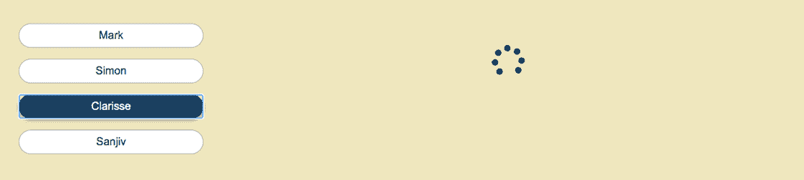

图 13.1 在用户列表中选择新用户（Clarisse）会导致旋转器替换用户详情面板。这可能会让人感到震惊；感觉像是倒退了一步。我们称之为退缩状态。

等待数据加载可能是不可避免的，但我们可以通过避免显示旋转器，并在新数据加载时继续显示旧数据来尝试提高页面的感知响应速度。

在本节中，我们探讨了最后两个内置钩子 `useTransition` 和 `useDeferredValue`，作为通过延迟 UI 更新来改善用户体验的方法。要使用这些钩子，我们的应用需要处于并发模式，为此我们需要 React 的实验版本。按照以下方式安装它：

```
npm install react@experimental react-dom@experimental
```

如果 React Query 坚持要使用稳定版本的 React 存在问题，您可以在安装 React 的实验版本之前卸载 React Query。然后，使用 `-force` 标志重新安装 React Query，如下所示：

```
npm install react-query --force
```

然后，更新 index.js 以渲染应用，如下所示。

分支：1301-use-transition，文件：/src/index.js

列表 13.1 启用并发模式

```
import ReactDOM from 'react-dom';
import App from './components/App.js';

const root = document.getElementById('root');
ReactDOM
  .unstable_createRoot(root)                    ❶
  .render(<App />);                             ❷
```

❶ 使用具有 ID “root” 的元素作为应用的根。

❷ 将 App 组件渲染到根元素中。

### 13.1.1 使用 useTransition 避免回退状态

图 13.2 展示了在用户页面选择新用户时的改进 UI 体验。在查看 Mark 的详细信息时，我们已点击用户列表中的 Clarisse，但右侧的用户详情面板继续显示旧 UI，Mark 的信息，而不是回退到加载指示器。

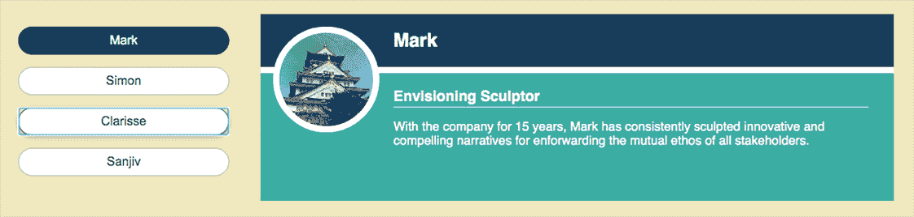

图 13.2 选择了一个新用户（Clarisse），但不是立即显示回退的加载指示器，UI 继续显示旧用户（Mark）。

以下列表展示了如何使用 `useTransition` 钩子给予 React 显示旧 UI 的权限，如果状态改变（例如切换用户）导致子组件挂起。

分支：1301-use-transition，文件：/src/components/Users/UsersPage.js

列表 13.2 在 `UsersPage` 上使用转换来改善 UX

```
import {
  useState,
 unstable_useTransition as useTransition,                      ❶
  Suspense
} from "react";

// unchanged imports

export default function UsersPage () {
  const [loggedInUser] = useUser();
  const [selectedUser, setSelectedUser] = useState(null);
  const user = selectedUser || loggedInUser;
  const queryClient = useQueryClient();

  const [startTransition] = useTransition() ❷

  function switchUser (nextUser) {
    startTransition(() => setSelectedUser(nextUser));           ❸

    queryClient.prefetchQuery(/* prefetch user details */);
    queryClient.prefetchQuery(/* prefetch user image */);
  }

  return user ? (
    <main className="users-page">
      <UsersList user={user} setUser={switchUser}/>

      <Suspense fallback={<PageSpinner/>}>                      ❹
        <UserDetails userID={user.id}/>
      </Suspense>
    </main>
  ) : <PageSpinner/>;
}
```

❶ 导入 useTransition 钩子。

❷ 获取转换函数，startTransition。

❸ 将用户状态改变包裹在转换中。

❹ 在第一个用户加载时显示加载指示器。

为了强调这全部都是实验性的，钩子有一个 `unstable` 前缀，因此我们从 `react` 包中导入 `unstable_useTransition`，并将其重命名为 `useTransition`。

`useTransition` 钩子返回一个数组，其第一个元素是一个我们用来包裹可能使组件挂起的状态改变的函数。我们将该函数分配给 `startTransition` 变量：

```
const [startTransition] = useTransition();
```

我们的状态改变发生在 `switchUser` 函数中。切换到新用户可能会使 `UserDetails` 组件挂起，如果 React Query 尚未加载该用户的数据。将状态改变包裹在 `startTransition` 中告诉 React 保持显示旧 UI 而不是 `Suspense` 回退，直到数据加载完成。如果没有旧 UI（组件尚未挂载），React 将在等待数据时显示 `Suspense` 回退：

```
startTransition(() => setSelectedUser(nextUser));
```

在新状态的数据加载时间不长的情况下，不回退到加载指示器是一个改进。如果加载时间较长，用户就会陷入困境，盯着旧 UI。应用崩溃了吗？我们需要给他们一些反馈，告诉他们应用正在加载数据。

### 13.1.2 使用 isPending 给用户反馈

`useTransition` 钩子允许 React 在状态变化时显示旧 UI。但如果它们持续太长时间，不一致的 UI 可能会导致困惑。如果 UI 继续显示一些旧值，那么给我们的用户提供一些变化正在发生的反馈将会很好。

我们追求的是类似于图 13.3 的东西；我们在用户列表中点击了新用户，Clarisse，但我们的转换仍然保留了旧用户 Mark 的详细信息在屏幕上，同时 Clarisse 的信息正在加载。我们降低用户详细信息面板的不透明度以显示详细信息已过时。

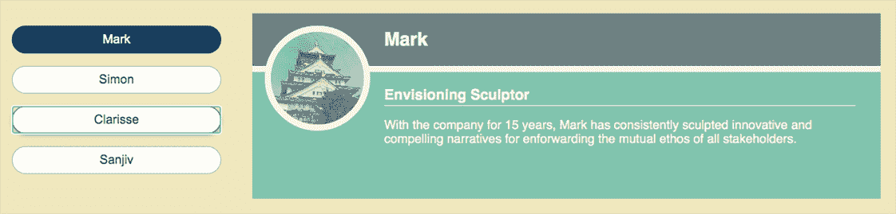

图 13.3 在转换期间，使用 `isPending` 值设置用户详细信息面板的类，允许通过 CSS 减少其不透明度。我们没有缩小的旋转器，但确实表示了转换。

有助于，`useTransition` 还在其数组中返回一个布尔值，以指示转换正在进行。我们可以将布尔值分配给一个局部变量，`isPending`：

```
const [startTransition, isPending] = useTransition();
```

然后，我们可以使用 `isPending` 在用户详细信息面板上设置一个类名，例如，如列表 13.3 中的 `UsersPage` 和列表 13.4 中的 `UserDetails` 所示。

分支：1302-is-pending，文件：/src/components/Users/UsersPage.js

列表 13.3 在转换期间解构 `isPending` 值以设置属性

```
export default function UsersPage () {
  // set up state

  const [startTransition, isPending] = useTransition();            ❶

  function switchUser (nextUser) {
    startTransition(() => setSelectedUser(nextUser));              ❷

    // prefetch user details and image
  }

  return user ? (
    <main className="users-page">
      <UsersList user={user} setUser={switchUser}/>

      <Suspense fallback={<PageSpinner/>}>
        <UserDetails userID={user.id} isPending={isPending}/>      ❸
      </Suspense>
    </main>
  ) : <PageSpinner/>;
}
```

❶ 将挂起标志分配给局部变量。

❷ 开始转换。

❸ 将挂起标志传递给 UserDetails。

分支：1302-is-pending，文件：/src/components/Users/UserDetails.js

列表 13.4 在 `UserDetails` 中使用 `isPending` 设置类名

```
export default function UserDetails ({userID, isPending}) {             ❶
  const {data: user} = useQuery(/* fetch user details */);

  return (
    <div
      className={isPending ? "item user user-pending" : "item user"}    ❷
    >
      {/* unchanged UI */}
    </div>
  );
}
```

❶ 从 props 获取 isPending 标志。

❷ 使用 isPending 标志有条件地设置类。

对于新的 `userID` 值，`UserDetails` 组件将在获取用户数据时挂起。然而，在转换进行时，React 将继续使用旧用户的 UI，但会将其重新渲染为 `isPending` 设置为 `true`。React 同时管理同一组件的两个版本。

### 13.1.3 将转换与常见组件集成

当并发模式和其 API 变得稳定时，我们预计会大量使用转换来平滑可能运行时间较长的更新状态。但与其在代码库的各个地方插入 `useTransition` 调用，React 文档建议我们将这些调用集成到我们的设计系统中。例如，我们的按钮可以将其事件处理程序包裹在转换中。

让我们尝试在我们的 `UsersList` 组件中使用准备好的转换按钮；我们可以从 `UsersPage` 和 `UserDetails` 中移除转换和 `isPending` 代码。图 13.4 显示了我们点击新用户 Clarisse 时会发生什么。按钮开始转换到 Clarisse，并使用 `isPending` 状态来提供反馈，显示正在加载用户的旋转器。在转换进行时，旧用户 Mark 仍然被突出显示，并且他的详细信息显示在右侧。

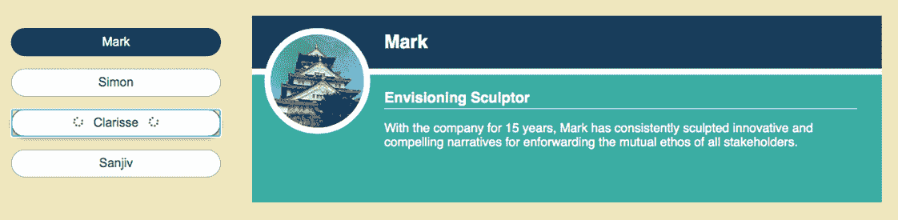

图 13.4 用户列表中的按钮在其转换进行时显示旋转器。

以下列表展示了我们新的 UI 组件 `ButtonPending`。它渲染一个按钮，同时也封装了过渡代码。点击按钮开始过渡，在过渡处于挂起状态时，按钮会显示旋转器。

分支：1303-button-pending，文件：/src/components/UI/ButtonPending.js

列表 13.5 使用过渡的 `ButtonPending` 组件

```
import {unstable_useTransition as useTransition} from 'react';
import Spinner from "./Spinner";

export default function ButtonPending ({children, onClick, ...props}) {    ❶
  const [startTransition, isPending] = useTransition();

  function handleClick () {
    startTransition(onClick);                                              ❷
  }

  return (
    <button onClick={handleClick} {...props}>
      {isPending && <Spinner/>}                                            ❸
      {children}
      {isPending && <Spinner/>}                                            ❸
    </button>
  );
}
```

❶ 传递一个需要过渡的处理程序。

❷ 在处理程序周围包裹一个过渡。

❸ 使用挂起标志来指示过渡正在进行中。

将 `UsersList` 组件中的 `button` 替换为 `ButtonPending`（实际上交换名称）。使用这个特殊按钮可以启用过渡！CSS 设置在几百毫秒后淡入旋转器；对于快速加载数据，您将看不到旋转器。

### 13.1.4 使用 `useDeferredValue` 保持旧值

在我们介绍并发用户界面的过程中，我们还将介绍一个工具：`useDeferredValue` 钩子。我们维护值的旧版本和新版本，并在我们的 UI 中使用这两个版本。图 13.5 展示了当我们从 Mark 切换到 Clarisse 用户时会发生什么。用户列表立即突出显示新用户，并显示一个旋转器，而详情面板继续显示旧用户的详细信息。

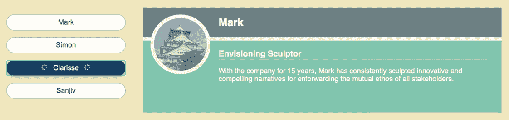

图 13.5 `UsersList` 显示了最新的选择（Clarisse）和内联旋转器，但用户详情面板仍然显示旧用户（Mark），即延迟值。

如果切换到新用户 Clarisse 导致详情面板渲染延迟，它将继续使用旧值 Mark，直到新值的 UI 可以渲染。新值已被**延迟**。以下列表更新了 `UsersPage`，这次是为用户传递给 `UserDetails` 的延迟值。

分支：1304-deferred-value，文件：/src/components/Users/UsersPage.js

列表 13.6 将延迟值传递给 `UserDetails`

```
import {
  useState,
 unstable_useDeferredValue as useDeferredValue, 
  Suspense
} from "react";

// other imports

export default function UsersPage () {
  const [loggedInUser] = useUser();
  const [selectedUser, setSelectedUser] = useState(null);
  const user = selectedUser || loggedInUser;
  const queryClient = useQueryClient();
 const deferredUser = useDeferredValue(user) || user;                ❶

 const isPending = deferredUser !== user;                            ❷

  function switchUser(nextUser) {
    setSelectedUser(nextUser);                                        ❸

    queryClient.prefetchQuery(/* prefetch user details */);
    queryClient.prefetchQuery(/* prefetch user image */);
  }

  return user ? (
    <main className="users-page">
      <UsersList
        user={user}                                                   ❹
        setUser={switchUser}
        isPending={isPending}                                         ❺
      />

      <Suspense fallback={<PageSpinner/>}>
        <UserDetails
          userID={deferredUser.id}                                    ❻
          isPending={isPending}                                       ❼
        />
      </Suspense>
    </main>
  ) : <PageSpinner/>;
}
```

❶ 跟踪用户值：如果新值延迟渲染，则返回旧值。

❷ 创建一个表示延迟值过时的标志。

❸ 更新用户值。

❹ 让列表知道新用户。

❺ 让列表知道其用户信息与 `UserDetails` 不一致。

❻ 在等待新用户信息的同时显示旧用户信息。

❼ 让 `UserDetails` 知道其用户信息已过时。

`UsersPage` 获取 `useDeferredValue` 钩子来管理旧用户和新用户值。我们使用以下方式调用 `useDeferredValue` 来跟踪一个值：

```
const deferredValue = useDeferredValue(value);
```

该钩子跟踪一个值。如果值从旧值更改为新值，钩子可以返回任一值。如果 React 可以成功使用新值渲染新的 UI，并且没有子组件挂起或延迟渲染，则钩子返回新值，React 更新 UI。如果新值导致 React 在完成渲染之前等待某个过程完成，则钩子返回旧值，React 使用旧值显示 UI（同时在内存中处理新值的 UI）。`deferredValue` 初始为 `undefined`，因此我们在末尾添加 `||` `user` 以确保一旦设置初始 `user` 值就立即使用：

```
const deferredUser = useDeferredValue(user) || user;
```

在列表 13.6 中，我们向 `UsersList` 传递新选定的用户值，同时向 `UserDetails` 传递可能过时的 `deferredUser` 值：

```
<UsersList
  user={user}
  setUser={switchUser}
  isPending={isPending}
/>

<Suspense fallback={<PageSpinner/>}>
  <UserDetails
    userID={deferredUser.id}
    isPending={isPending}
  />
</Suspense>
```

当 `UserDetails` 组件在加载新用户信息时，会继续显示之前用户的信息。当两个用户值不一致时，我们将 `isPending` 标志设置为 `true`；`UsersList` 将显示加载指示器，而 `UserDetails` 将降低其不透明度，以提供额外的视觉反馈，以吸引注意不一致的用户界面状态。

## 13.2 使用 SuspenseList 管理多个后备方案

当我们在 UI 中有多个 `Suspense` 组件时，对何时以及如何显示它们的后备方案有更多控制可能很有用；我们不希望屏幕上出现满载的旋转器和杂技组件。我们需要一个马戏团老板来指挥它们，以有序的方式介绍各个部分。这个马戏团老板就是 `SuspenseList` 组件。

假设用户页面现在包括所选用户的预订以及分配给他们的任何待办事项。UI 可能类似于图 13.6，其中用户信息、预订和待办事项作为用户详细信息面板的一部分显示。

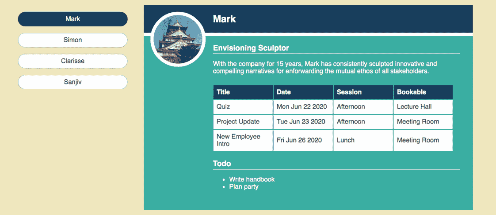

图 13.6 用户详细信息现在包括预订和待办事项。

在本节中，我们首先更新 `UserDetails` 以在单独的 `Suspense` 组件中显示新信息。然后我们将 `Suspense` 组件包裹在一个 `SuspenseList` 中，以更好地控制显示其后备方案的顺序。

### 13.2.1 显示来自多个来源的数据

我们希望 `UserDetails` 组件显示用户预订和待办事项。当数据加载时，我们可能会看到类似于图 13.7 的内容，其中 `Suspense` 组件显示后备信息，“正在加载用户预订……”和“正在加载用户待办事项……”。

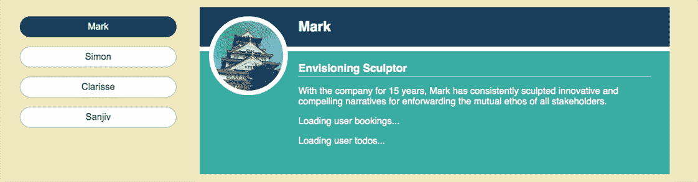

图 13.7 显示加载预订和待办事项的后备方案

列表 13.7 向 `UserDetails` UI 添加 `UserBookings` 和 `UserTodos` 组件。每个组件都加载自己的数据，因此我们将它们包裹在具有适当后备信息的 `Suspense` 组件中。请检查仓库中新组件的实现；对于当前讨论来说这不重要。

分支：1305-multi-suspense，文件：/src/components/Users/UserDetails.js

列表 13.7 在 `UserDetails` 中包含预订和待办事项

```
import {Suspense} from "react";
// other imports
import UserBookings from "./UserBookings";
import UserTodos from "./UserTodos";

export default function UserDetails ({userID, isPending}) {
  const {data: user} = useQuery(/* load user info */);

  return (
    <div className={isPending ? "item user user-pending" : "item user"}>
      <div className="item-header">
        <h2>{user.name}</h2>
      </div>

      <Avatar
        src={`http://localhost:3001/img/${user.img}`}
        fallbackSrc="http://localhost:3001/img/avatar.gif"
        alt={user.name}
      />

      <div className="user-details">
        <h3>{user.title}</h3>
        <p>{user.notes}</p>
      </div>

      <Suspense fallback={<p>Loading user bookings...</p>}>     ❶
        <UserBookings id={userID}/>                             ❷
      </Suspense>

      <Suspense fallback={<p>Loading user todos...</p>}>        ❸
        <UserTodos id={userID}/>                                ❹
      </Suspense>
    </div>
  );
}
```

❶ 为预订添加 Suspense 后备方案。

❷ 显示预订信息。

❸ 包含一个 Suspense 后备用于待办事项。

❹ 显示待办事项。

由于我们无法预测每个新组件加载数据需要多长时间，可能会出现一个 UI 马戏团问题。图 13.8 显示了如果待办事项首先加载会发生什么：待办事项列表被渲染，但预订的后备仍然显示在列表上方。当预订最终加载时，我们可能正在尝试阅读的待办事项将被即将到来的预订向下推到页面底部。

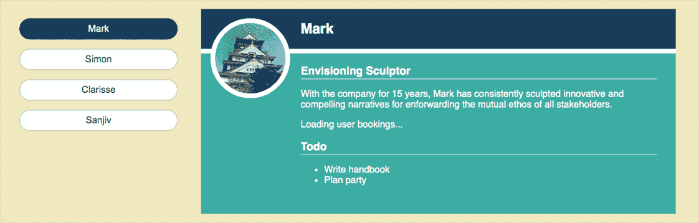

图 13.8 待办事项正在显示，但预订仍在加载。一旦预订加载完成，它们将把待办事项向下推。

如果我们可以同时显示两个组件，或者确保预订首先显示，我们将提高用户体验。让我们看看`SuspenseList`如何帮助我们让马戏团离开。

### 13.2.2 使用 SuspenseList 控制多个后备

为了避免当上面的组件渲染较慢时组件向下移动，我们可以指定组件按顺序、自上而下显示，即使较晚组件的数据首先加载。对于用户页面，我们希望首先显示用户的预订，如图 13.9 所示，即使待办事项的数据可能加载得更快。

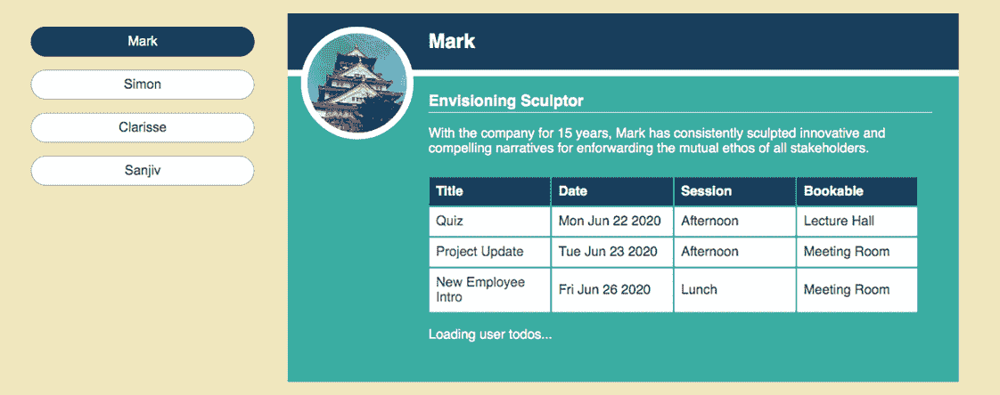

图 13.9 使用`SuspenseList`，我们可以设置显示顺序以强制预订首先显示。

我们将使用`SuspenseList`组件来管理我们的后备。它目前被导入为`unstable_SuspenseList`：

```
import {Suspense, unstable_SuspenseList as SuspenseList} from "react";
```

以下列表显示了`UserBookings`和`UserTodos`组件及其后备组件，它们被包裹在一个设置了`revealOrder`为`forwards`的`SuspenseList`中。

分支：1306-suspense-list，文件：/src/components/Users/UserDetails.js

列表 13.8 将两个`Suspense`组件包裹在`SuspenseList`中

```
<SuspenseList                       ❶
 revealOrder="forwards"            ❷
>
  <Suspense fallback={<p>Loading user bookings...</p>}>
    <UserBookings id={userID}/>
  </Suspense>

  <Suspense fallback={<p>Loading user todos...</p>}>
    <UserTodos id={userID}/>
  </Suspense>
</SuspenseList>
```

❶ 将 Suspense 组件包裹在 SuspenseList 中。

❷ 指定显示顺序。

我们也可以将`revealOrder`设置为`backwards`以首先显示待办事项，或者设置为`together`以同时显示预订和待办事项。

我们可能不希望显示多个后备，`SuspenseList`还有一个`tail`属性，如果设置为`collapsed`，则一次只显示一个后备：

```
<SuspenseList revealOrder="forwards" tail="collapsed">
  {/* UI with Suspense components */}
</SuspenseList>
```

图 13.10 显示了当我们设置`SuspenseList`上的`tail`属性时用户详情面板。用户详情面板只显示“正在加载用户预订...”的后备。如图 13.9 所示，“正在加载用户待办事项...”的后备只在预订渲染后出现。

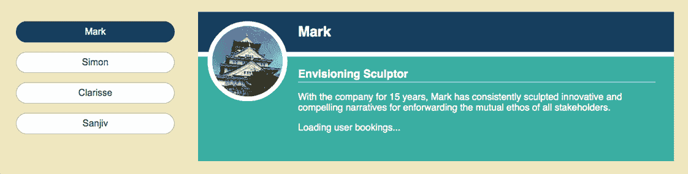

图 13.10 一次只显示一个后备：首先显示预订的后备，然后显示待办事项的后备。

`SuspenseList`仍然是实验性的，它将帮助我们编排加载状态的方式将在接下来的几个月内演变。我们的用户页面示例可以通过一些明智的数据预取和更仔细地组合本章中使用的所有技术来改进。但示例应该已经让你对 React 即将到来的一些新功能有了很好的感觉。

## 13.3 并发模式和未来

使用并发模式，React 可以在内存中同时渲染多个 UI 版本，并且只使用最适合当前状态的版本来更新 DOM，这可能是一个正在变化的过程，等待耗时的更新。这种灵活性允许 React 在需要更高优先级更新，如用户与表单字段交互时，中断渲染。这有助于保持应用响应，并提高应用的感知性能。

能够在内存中准备更新也使 React 能够在准备好足够的新 UI 时切换到更新后的 UI，无论是新页面、筛选后的列表还是用户的详细信息。旧 UI 仍然可以更新以显示挂起指示器，让用户知道正在发生变更。避免回退状态和令人不适的加载指示器可以使与我们的应用交互感觉更平滑，帮助用户专注于他们的任务，而不是对应用感到沮丧。

并发模式为更精确、有目的的代码、数据和资源加载铺平了道路，更平滑地整合了服务器端渲染与客户端组件的激活，及时注入资源，以便在用户交互时使组件即时响应。

图 13.11 展示了并发模式所承诺的许多特性。它来自 React 文档，网址为 [`mng.bz/7VRe`](https://shortener.manning.com/7VRe)，其中包括第三种模式，阻塞模式，这是采用并发模式的一个中间步骤，你可以在那里了解更多信息，以及本书第二部分中我们讨论的特性。

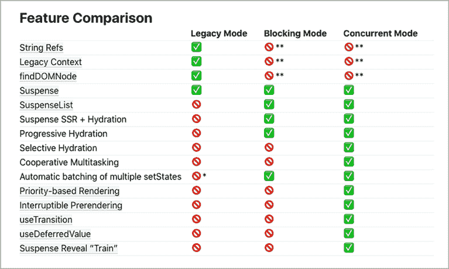

图 13.11 来自 React 文档页面关于采用并发模式的并发模式、阻塞模式和传统模式的特性比较

## 摘要

+   记住，这些 API 是实验性的，可能会发生变化。

+   通过更新应用最初渲染到浏览器的方式启用并发模式。使用 `ReactDOM.unstable_createRoot` 和 `render`，如下所示：

    ```
    const root = document.getElementById('root');
    ReactDOM.unstable_createRoot(root).render(<App />);
    ```

+   通过调用 `useTransition` 钩子延迟等待数据的新的 UI 的渲染：

    ```
    const [startTransition, isPending] = useTransition();
    ```

+   将可能导致组件暂停的状态更改包装在 `startTransition` 函数中。React 可以继续显示旧 UI，直到新 UI 准备好。

    ```
    startTransition(() => setSelectedUser(nextUser));
    ```

+   使用 `isPending` 布尔值，即 `useTransition` 返回数组中的第二个元素，来更新旧 UI，让用户知道状态正在更新。

+   创建设计系统组件，如自定义按钮，通过将事件处理程序包装在 `startTransition` 中来自动从一个状态过渡到另一个状态。

+   在更新状态时，如果新值导致延迟，继续使用旧值，通过调用 `useDeferredValue` 钩子来跟踪值：

    ```
    const deferredValue = useDeferredValue(value);
    ```

+   可以立即渲染的组件可以使用新状态，而可能暂停的组件可以使用延迟值：

    ```
    <QuickComponent value={value}/>

    <Suspense fallback={<PageSpinner/>}>
      <UserDetails value={deferredValue}/>
    </Suspense>
    ```

+   使用 `SuspenseList` 组件来管理 `Suspense` 组件显示其后备内容的顺序。指定 `revealOrder` 为 `forwards`、`backwards` 或 `together`，并且可选地通过设置 `tail` 属性一次只显示一个后备内容。

    ```
    <SuspenseList revealOrder="forwards" tail="collapsed">
      <Suspense fallback={<p>Loading 1...</p>}><Component1/></Suspense>
      <Suspense fallback={<p>Loading 2...</p>}><Component2/></Suspense>
    </SuspenseList>
    ```

+   记住，这些 API 是实验性的，很可能会发生变化。
