## 第一部分. 认识 React

如果你过去两年在开发前端 JavaScript 应用程序，你很可能听说过 React。即使你刚开始构建用户界面，你也可能听说过它。即使你在这本书中第一次听到 React，我仍然会照顾你：有许多非常流行的应用程序使用 React。如果你使用 Facebook，观看 Netflix，或者通过 Khan Academy 学习计算机科学，你已经使用了一个用 React 构建的应用程序。

React 是一个用于构建用户界面的库。它是由 Facebook 的工程师创建的，自发布以来在 JavaScript 社区中引起了轰动。在过去几年中，它的受欢迎程度有所上升，并且是许多团队和工程师构建动态用户界面的首选工具。事实上，React 的 API、思维模型和强大的社区的结合导致了 React 在其他平台上的开发，包括移动和甚至虚拟现实。

在这本书中，你将探索 React，了解为什么它是一个如此成功和有用的开源项目。在第一部分中，你将从 React 的基础开始学习。由于构建健壮的 JavaScript UI 应用程序所涉及的工具可能非常复杂，我们将避免陷入工具的泥潭，专注于学习 React API 的细节。我们还将避免“魔法”，并努力对 React 及其工作原理有一个具体和深入的理解。

在第一章中，你将从高层次了解 React。我们将涵盖一些重要思想，如组件、虚拟 DOM 以及 React 的一些权衡。在第二章第二章中，你将快速浏览 React 的 API，并构建一个简单的评论框组件，以便亲身体验 React。

## 第一章. 认识 React

*本章涵盖*

+   介绍 React

+   React 的一些高级概念和范式

+   虚拟 DOM

+   React 中的组件

+   React 团队

+   使用 React 的权衡

如果你作为科技行业的 Web 工程师工作，你很可能听说过 React。也许是在 Twitter 或 Reddit 等在线平台。也许是一个朋友或同事向你提起，或者你在一次 Meetup 上听到了关于它的演讲。无论在哪里，我敢打赌你听到的可能是赞扬或有点怀疑。大多数人对于像 React 这样的技术都有强烈的看法。有影响力和影响力的技术往往会引起这种反应。对于这些技术，通常在技术流行并扩展到更广泛的受众之前，只有少数人最初“理解”它。React 就是这样开始的，但现在在 Web 工程领域享有巨大的流行度和使用率。而且它之所以受欢迎，有很好的理由：它有很多东西可以提供，并且可以重新激发、更新甚至改变你对用户界面思考和构建的看法。

### 1.1. 认识 React

React 是一个用于在各种平台上构建用户界面的 JavaScript 库。React 为你提供了一个强大的心智模型来工作，并帮助你以声明性和组件驱动的方式构建用户界面。我们将在本书的其余部分详细探讨这些想法以及更多内容，这就是 React 在广义上最简短的解释。

React 在更广泛的网络工程世界中处于什么位置？你经常会听到 React 与 Vue、Preact、Angular、Ember、Webpack、Redux 和其他知名 JavaScript 库和框架一起被提及。React 通常是前端应用程序的主要部分，并且与上述其他库和框架具有相似的功能。事实上，许多流行的前端技术现在在微妙的方式上更像是 React，而不是过去。曾经有一段时间，React 的方法是新颖的，但其他技术后来受到了 React 的组件驱动、声明式方法的影响。React 继续保持着重新思考既定最佳实践的精神，主要目标是向开发者提供一个表达性的心智模型和性能良好的技术来构建 UI 应用程序。

什么使 React 的心智模型强大？它借鉴了计算机科学和软件工程技术的深层次领域。React 的心智模型广泛借鉴了函数式和面向对象编程的概念，并专注于组件作为构建的主要单元。在 React 应用程序中，你从组件创建接口。React 的渲染系统管理这些组件，并为你保持应用程序视图的一致性。组件通常对应于用户界面的某些方面，如日期选择器、标题、导航栏等，但它们也可以负责客户端路由、数据格式化、样式和其他客户端应用程序的责任。

React 中的组件应该易于思考和与其他 React 组件集成；它们遵循可预测的生命周期，可以维护自己的内部状态，并且与“常规的 JavaScript”协同工作。我们将在本书的其余部分深入探讨这些想法，但我们可以现在从高层次上看看它们。图 1.1 为你概述了构建 React 应用程序的主要成分。让我们简要地看看每个部分：

+   ***组件*—**封装的功能单元，是 React 中的基本单元。它们利用数据（*属性*和*状态*）来渲染 UI 作为输出；我们将在第二章及以后章节中探讨 React 组件如何与数据协同工作。某些类型的 React 组件还提供了一组生命周期方法，你可以将其钩入。在 React 中，*渲染过程*（基于你的数据输出和更新 UI）是可预测的，并且你的组件可以使用 React 的 API 将其钩入。

+   **React 库**—React 使用一组核心库。核心 React 库与 `react-dom` 和 `react-native` 库协同工作，专注于组件规范和定义。它允许你构建一个组件树，浏览器或其他平台的渲染器可以使用。`react-dom` 是这样一个渲染器，旨在浏览器环境和服务器端渲染。React Native 库专注于原生平台，并允许你为 iOS、Android 和其他平台创建 React 应用。

    ##### 图 1.1. React 允许你从组件创建用户界面。组件维护自己的状态，使用并配合“纯”JavaScript 编写，并从 React 继承了许多有用的 API。大多数 React 应用是为基于浏览器的环境编写的，但也可以在 iOS 和 Android 等原生环境中使用。有关 React Native 的更多信息，请参阅 Nader Dabit 的《React Native in Action》，该书也由 Manning 出版。

    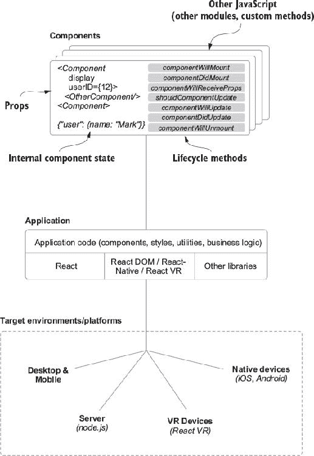

+   **第三方库**—React 并不自带数据建模、HTTP 请求、样式库或其他前端应用常见方面的工具。这让你可以自由地在应用中使用额外的代码、模块或其他你偏好的工具。尽管这些常见技术并未与 React 一同打包，但围绕 React 的更广泛生态系统充满了极其有用的库。在这本书中，我们将使用其中的一些库，并在第十章和第十一章中探讨 Redux，这是一个用于状态管理的库。

+   **运行 React 应用**—你的 React 应用运行在你构建的平台之上。这本书专注于 Web 平台，并构建基于浏览器和服务器端的应用，但其他项目如 React Native 和 React VR 也为你的应用在其它平台上运行打开了可能性。

在这本书中，我们将花费大量时间探索 React 的方方面面，但在开始之前，你可能会有一些疑问。React 是否适合你？还有谁在使用 React？使用 React 或不使用 React 的一些权衡是什么？在采用这项新技术之前，这些问题对于新技术的了解非常重要。

#### 1.1.1. 这本书面向的对象

这本书适合任何正在构建用户界面或对此感兴趣的人。实际上，它适合任何对 React 感兴趣的人，即使你不从事 UI 工程工作。如果你有一些使用 JavaScript 构建前端应用的经验，你将能从这本书中获得最大收益。

只要你掌握了 JavaScript 的基础知识并有一些构建 Web 应用程序的经验，你就可以学习如何使用 React 来构建应用程序。在这本书中，我不会涵盖 JavaScript 的基础知识。像原型继承、ES2015+代码、类型强制转换、语法、关键字、异步编码模式如 async/await 以及其他基本主题都不在本书的范围之内。我会简要地介绍与 React 特别相关的任何内容，但不会深入探讨 JavaScript 作为一门语言。

这并不意味着如果你不知道 JavaScript，就不能学习 React 或从这本书中学不到任何东西。但如果你花时间先学习 JavaScript，你会得到更多。在没有掌握 JavaScript 的实际知识的情况下盲目前进会使事情变得更难。你可能会遇到一些对你来说像是“魔法”的情况——事情会工作，但你不会明白为什么。这通常对作为开发者的你来说弊大于利，所以...最后警告：在学习 React 之前，先熟悉 JavaScript 的基础知识。它是一门非常表达性和灵活的语言。你会喜欢的！

你可能已经很好地了解了 JavaScript，甚至可能之前已经尝试过 React。鉴于 React 的流行程度，这并不令人惊讶。如果你是这样的人，你将能够更深入地理解 React 的一些核心概念。但如果你已经使用 React 一段时间，我不会涵盖你可能正在寻找的非常具体的话题。对于这些，请参阅其他与 React 相关的 Manning 书籍，如*React Native in Action*。

你可能不属于上述任何一组，可能想要对 React 有一个高级概述。这本书也适合你。你将学习 React 的基本概念，并且可以访问一个用 React 编写的示例应用程序——查看运行中的应用程序[`social.react.sh`](https://social.react.sh)。你将能够看到在实践中构建 React 应用程序的基本方法以及它可能适合你的团队或下一个项目。

#### 1.1.2. 关于工具的说明

如果你过去几年在前端应用程序方面的工作很多，你不会对应用程序周围的工具已经变得与框架和库本身一样成为开发过程的一部分而感到惊讶。你今天可能正在使用 Webpack、Babel 或其他工具。这些和其他工具在这个书中如何定位，你需要了解什么？

你不需要成为 Webpack、Babel 或其他工具的大师就能享受和阅读这本书。我创建的示例应用程序使用了几个重要的工具，你可以自由地阅读示例应用程序中的配置代码，但我不会在这本书中深入探讨这些工具。工具的变化很快，更重要的是，深入探讨这些主题会远远超出本书的范围。我会在工具与我们的讨论相关的地方确保注明，但除此之外，我会避免涉及。

我还觉得在学习像 React 这样的新技术时，工具可能会分散注意力。你已经在尝试理解一套全新的概念和范式了——为什么还要在学习复杂的工具上增加负担呢？这就是为什么第二章专注于首先学习“纯”React，然后再学习需要构建工具的 JSX 和 JavaScript 语言特性。你需要熟悉的一个工具领域是 npm。npm 是 JavaScript 的包管理工具，你将用它来安装项目的依赖项，并从命令行运行项目命令。你可能已经熟悉 npm 了，但如果不是，不要让这阻止你阅读这本书。你只需要最基础的终端和 npm 技能就可以继续前进。你可以在 [`docs.npmjs.com/getting-started/what-is-npm`](https://docs.npmjs.com/getting-started/what-is-npm) 上了解 npm。

#### 1.1.3\. 谁使用 React？

当涉及到开源软件时，谁在使用（以及谁没有使用）不仅仅是一个流行度的问题。它会影响你使用该技术的体验（包括支持、文档和安全修复的可用性），社区的创新水平，以及某个工具的潜在使用寿命。与拥有活跃社区、强大生态系统和多样化的贡献者经验和背景的工具一起工作通常更有趣、更容易，并且整体上更顺畅的体验。

React 最初是一个小项目，但现在拥有广泛的流行度和一个充满活力的社区。没有社区是完美的，React 的社区也不例外，但就开源社区而言，它拥有许多成功的重要元素。更重要的是，React 社区还包括其他开源社区的小子集。这可能令人望而生畏，因为生态系统可能看起来很庞大，但它也使社区变得强大和多样化。图 1.2 展示了 React 生态系统的地图。我在本书的整个过程中提到了各种库和项目，但如果你对了解 React 生态系统感兴趣，我已准备了一份指南 [`ifelse.io/react-ecosystem`](https://ifelse.io/react-ecosystem)。我会随着时间的推移保持更新，并确保它与生态系统的演变保持一致。

##### 图 1.2\. React 生态系统图丰富多彩——甚至比我这里能展示的还要丰富。如果你想了解更多，请查看我的指南 [`ifelse.io/react-ecosystem`](https://ifelse.io/react-ecosystem)，它将帮助你入门 React 生态系统。

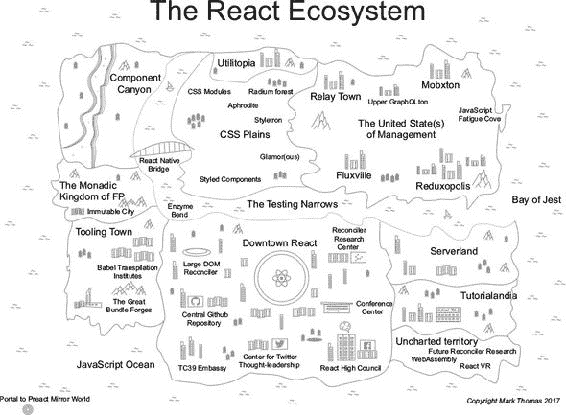

你可能与 React 的主要互动方式可能是开源，但你可能每天都在使用用其构建的应用程序。许多公司以不同的方式使用 React。以下是一些使用 React 为其产品提供动力的公司：

+   Facebook

+   Netflix

+   New Relic

+   Uber

+   Wealthfront

+   Heroku

+   PayPal

+   BBC

+   Microsoft

+   NFL

+   以及更多！

+   Asana

+   ESPN

+   Walmart

+   Venmo

+   Codecademy

+   Atlassian

+   Asana

+   Airbnb

+   Khan Academy

+   FloQast

这些公司并不是盲目跟随 JavaScript 社区的潮流。它们有非凡的工程需求，这些需求影响了大量用户，并且必须在严格的截止日期内交付产品。有人会说，“我听说 React 很好；我们应该将一切 React 化！”这样的说法在经理或其他工程师那里是不会被接受的。公司和开发者想要好的工具，这些工具可以帮助他们更好地思考，快速行动，以便他们能够构建具有高影响力、可扩展和可靠的软件。

### 1.2. React 不做什么？

到目前为止，我一直在从高层次上谈论 React：谁在使用它，这本书是为谁写的，等等。我写这本书的主要目标是教你如何使用 React 构建应用程序，并赋予你作为工程师的权力。React 并不完美，但与它一起工作确实是一种乐趣，我看到了团队用它做了很多伟大的事情。我喜欢写关于它，用它构建，在会议上听关于它的演讲，偶尔就这个或那个模式进行热烈的辩论。

但如果我不谈论一些 React 的缺点并描述它*不*做什么，那我就对你不公平了。理解某物不能做什么和了解它能做什么一样重要。为什么？最好的工程决策和思考通常是基于权衡，而不是意见或绝对论（“React 在本质上比工具*X*更好，因为我更喜欢它”）。关于前者：你可能不是在处理两种完全不同的技术（COBOL 与 JavaScript）；希望你甚至没有考虑那些与当前任务基本不匹配的技术。至于后者：构建伟大的项目和解决工程挑战永远不应该是关于意见的。并不是说人们的意见不重要——这当然是不正确的——而是意见并不能让事情变得更好或根本无法工作。

#### 1.2.1. React 的权衡

如果权衡是良好软件评估和讨论的精髓，那么 React 有哪些权衡呢？首先，React 有时被称为*仅仅是视图*。这可能会被误解或理解错误，因为它可能会让你认为 React 只是一个像 Handlebars 或 Pug（原名 Jade）这样的模板系统，或者它必须作为 MVC（模型-视图-控制器）架构的一部分。这两者都不正确。React 可以是这两者，但还可以更多。为了使事情更简单，我将更多地从它*是什么*的角度来描述 React，而不是它*不是什么*（例如，“仅仅是视图”）。React 是一个*声明式*、*组件化*的库，用于构建用户界面，它可以在各种平台上工作：网页、原生、移动、服务器、桌面，甚至在未来还可以在虚拟现实平台上（React VR）。

这导致了我们的第一个权衡：React 主要关注 UI 的*视图*方面。这意味着它不是用来做更多全面框架或库的工作。与 Angular 等类似的东西的快速比较可能有助于阐明这一点。在其最近的主要版本中，Angular 在概念和设计方面与 React 的相似之处比以前更多，但在其他方面它覆盖的领域比 React 更广。Angular 包括以下方面的有偏见的解决方案：

+   HTTP 调用

+   表单构建和验证

+   路由

+   字符串和数字格式化

+   国际化

+   依赖注入

+   基本数据建模原语

+   自定义测试框架（尽管这与其他领域的区分并不那么重要）

+   默认包含服务工作者（一种执行 JavaScript 的工作者式方法）

这有很多，根据我的经验，人们通常有两种反应^([1])于框架带来的所有这些功能。要么是“哇，我不用自己处理所有这些”要么是“哇，我无法选择如何去做任何事情”。Angular、Ember 等框架的优点通常是做事有明确的方式。例如，Angular 中的路由是通过内置的 Angular Router 完成的，HTTP 任务都是通过内置的 HTTP 例程完成的，等等。

> ¹
> 
> 并非有意为之的玩笑，但嘿，这是一本关于 React 的书，所以就这样吧。

这种方法并没有根本性的错误。我曾与使用这类技术的团队共事，也曾在更灵活的方向上工作的团队中工作，我们选择了“做好一件事”的技术。我们用这两种技术都取得了很好的成果，并且它们都很好地完成了它们的目的。我个人的偏好是选择自己的、做好一件事的方法，但这真的无关紧要；这完全是关于权衡。React 没有为 HTTP、路由、数据建模（尽管它确实对视图中的数据流有意见，我们将在后面讨论）或其他你可能看到在 Angular 中的事物提供有偏见的解决方案。如果你的团队认为这是在单一框架中绝对不能没有的东西，React 可能不是你的最佳选择。但根据我的经验，大多数团队希望 React 的灵活性加上它带来的心理模型和直观的 API。

React 灵活方法的优点之一是你可以自由地选择最适合工作的工具。不喜欢*X* HTTP 库的工作方式？没问题——用其他东西替换它。更喜欢用不同的方式做表单？实现它，没问题。React 为你提供了一套强大的原语来工作。公平地说，其他框架如 Angular 通常也会允许你替换东西，但事实上的和社区支持的做法通常是内置和包含的。

拥有更多自由显然的缺点是，如果你习惯于像 Angular 或 Ember 这样更全面的框架，你将需要为应用程序的不同领域提出或找到自己的解决方案。这可能是好事也可能是坏事，这取决于团队的开发者经验、工程管理偏好以及你具体情况的其他因素。对于“一刀切”以及“只做一件事做好”的方法有很多好的论据。我更倾向于那种让你随着时间的推移适应并灵活地做出工具决策的方法，这种方法将责任委托给工程团队来确定或创建正确的工具。还有那极其广泛的 JavaScript 生态系统需要考虑——你几乎找不到任何针对你正在解决的问题。但最终，事实仍然是，优秀的、有影响力的团队会使用这两种方法（有时同时使用！）来构建他们的产品。

在继续之前，如果不提一下锁定问题，那我就疏忽了。一个不可避免的事实是，JavaScript 框架很少真正是可互操作的；你通常不能有一个部分是 Angular，部分是 Ember，部分是 Backbone，部分是 React 的应用程序，至少在没有将每个部分分割开来或紧密控制它们交互的情况下是不可能的。当你能够避免这种情况时，将自己置于这种境地通常是没有意义的。你通常会为特定应用程序选择一个，最多再加上两个主要框架。

但是当你需要改变时会发生什么呢？如果你使用像 Angular 这样具有广泛职责的工具，迁移你的应用程序很可能会因为框架的深度惯用性而需要进行完全重写。你可以重写应用程序的较小部分，但你不能只是替换几个函数并期望一切都能正常工作。这正是 React 可以发光的地方。它采用了相对较少的“魔法”惯用性。这并不意味着迁移变得毫无痛苦，但它确实可以帮助你在迁移到或从 Angular 迁移时，避免承担紧密集成框架的成本。

当你选择 React 时，你做出的另一个权衡是，它主要是由 Facebook 开发和构建的，旨在满足 Facebook 的 UI 需求。如果你的应用程序与 Facebook 应用程序的 UI 需求在本质上不同，你可能会发现与 React 一起工作很困难。幸运的是，大多数现代 Web 应用程序都在 React 的技术领域内，但当然也有一些不在。这些可能还包括那些不适用于现代 Web 应用程序传统 UI 体系结构的程序，或者那些具有非常特定性能需求的程序（例如高速股票行情）。尽管如此，这些情况通常也可以通过 React 解决，尽管某些情况需要更具体的技术。

我们最后应该讨论的一个权衡是 React 的实现和设计。React 的核心中包含了处理组件数据变化时更新 UI 的系统。它们执行你可以通过某些称为*生命周期方法*的方法钩入的变化。我在后面的章节中详细介绍了这些内容。React 处理更新 UI 的系统使得构建模块化、健壮的组件变得容易，这些组件可以被你的应用使用。React 抽象出大部分保持 UI 与数据同步的工作，这是开发者喜欢与之合作以及为什么它是你手中的强大原语的一个重要原因。但不应假设与推动这项技术的“引擎”相关的没有缺点或权衡。

React 是一个抽象层，因此作为抽象层所带来的成本仍然存在。由于它是按照特定方式构建并通过 API 暴露的，因此你无法像使用其他系统那样深入了解你所使用的系统。这也意味着你需要以 React 的方式构建你的 UI。幸运的是，React 的 API 提供了“逃生门”，让你可以降级到更低的抽象级别。你仍然可以使用像 jQuery 这样的其他工具，但你需要以 React 兼容的方式使用它们。这又是一个权衡：以更简单的思维模型为代价，无法做到绝对地按照你的意愿做任何事情。

不仅你对底层系统的可见性有所降低，你还会接受 React 处理事情的方式。这通常会影响应用堆栈的一个较窄部分（只有视图而不是数据，特殊表单构建系统，数据建模等），但它确实会产生影响。我希望你能看到 React 的好处远远超过了学习的成本，而且在使用它时所做的权衡通常会使你作为一个开发者处于更好的位置。但假装 React 能神奇地解决你所有的工程挑战是不诚实的。

### 1.3. 虚拟 DOM

我们已经简要讨论了 React 的一些高级特性。我提出，React 可以帮助你和你的团队在创建用户界面方面变得更好，而这部分原因要归功于 React 提供的思维模型和 API。这一切背后的动力是什么？React 的一个主要主题是简化复杂的任务，并从开发者那里抽象出不必要的复杂性。React 试图做到足够多，以保持性能，同时让你有更多时间去思考应用的其他方面。它实现这一目标的主要方式之一就是鼓励你采用*声明式*而非*命令式*的方式。你可以声明你的组件在不同状态下应该如何表现和外观，而 React 的内部机制则处理管理更新、更新 UI 以反映变化等复杂性。

驱动这一技术的关键部分之一是虚拟 DOM。*虚拟 DOM*是一个数据结构或数据结构的集合，它模拟或反映了浏览器中存在的文档对象模型。我说*a*虚拟 DOM，因为其他框架如 Ember 使用它们自己类似技术的实现。一般来说，虚拟 DOM 将作为应用程序代码和浏览器 DOM 之间的中间层。虚拟 DOM 允许将变化检测和管理复杂性隐藏起来，并移动到专门的抽象层。在接下来的几节中，我们将从高层次的角度看看 React 中是如何实现这一点的。图 1.3 展示了我们将很快探讨的 DOM 和虚拟 DOM 关系的简化概述。

##### 图 1.3\. DOM 和虚拟 DOM。React 的虚拟 DOM 处理数据的变化检测，以及将浏览器事件转换为 React 组件可以理解和响应的事件。React 的虚拟 DOM 还旨在优化对 DOM 的更改，以提高性能。

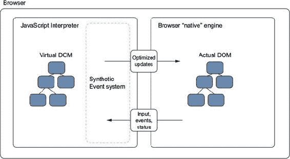

#### 1.3.1\. DOM

确保我们理解 React 的虚拟 DOM 的最好方法是从检查我们对 DOM 的理解开始。如果你已经觉得自己对 DOM 有深刻的理解，那么请随意继续前进。但如果你还没有，让我们从一个重要的问题开始：什么是 DOM？DOM，或称*文档对象模型*，是一个编程接口，允许你的 JavaScript 程序与不同类型的文档（HTML、XML 和 SVG）进行交互。它有一套由标准驱动的规范，这意味着一个公开的工作组已经创建了一套标准的功能集和它应该如何表现的行为。尽管存在其他实现，但 DOM 在大多数情况下与像 Chrome、Firefox 和 Edge 这样的网络浏览器是同义的。

DOM 提供了一种结构化的方式来访问、存储和操作文档的不同部分。从高层次来看，DOM 是一个树结构，反映了 XML 文档的层次结构。这个树结构由子树组成，而这些子树又由节点组成。你可能知道这些是`div`和其他构成你的网页和应用程序的元素。

你可能之前已经使用过 DOM API，但你可能不知道你正在使用它。每次你使用 JavaScript 中的方法来访问、修改或存储与 HTML 文档中的某些内容相关的信息时，你几乎肯定正在使用 DOM 或其相关 API（有关更多关于 Web API 的信息，请参阅[`developer.mozilla.org/en-US/docs/Web/API`](https://developer.mozilla.org/en-US/docs/Web/API)）。这意味着你使用的并非 JavaScript 语言本身的全部方法（`document.getElementById`、`querySelectorAll`、`alert`等）。它们是更大的集合——*Web API*的一部分——包括 DOM 和其他浏览器中的 API，允许你与文档交互。图 1.4 展示了你可能在网页中见过的简化版 DOM 树结构。

##### 图 1.4。这是一个使用你可能熟悉的元素的简单 DOM 树结构版本。暴露给 JavaScript 的 DOM API 允许你在树中对这些元素执行操作。

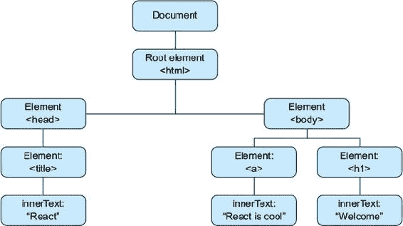

你可能使用过的一些常见方法或属性，用于更新或查询网页可能包括`getElementById`、`parent.appendChild`、`querySelectorAll`、`innerHTML`等。这些都是由宿主环境（在这种情况下，是浏览器）提供的，允许 JavaScript 与 DOM 交互。没有这种能力，我们将有远少于现在有趣的 Web 应用程序可以使用，也许就没有关于 React 的书可以写了！

与 DOM 交互通常很简单，但在大型 Web 应用程序的上下文中可能会变得复杂。幸运的是，当我们使用 React 构建应用程序时，我们通常不需要直接与 DOM 交互——我们主要让 React 来处理。有些情况下，我们想要超越虚拟 DOM 并直接与 DOM 交互，我们将在未来的章节中介绍这些情况。

#### 1.3.2. 虚拟 DOM

浏览器中的 Web API 允许我们通过 DOM 使用 JavaScript 与 Web 文档交互。但如果我们已经可以这样做，为什么我们还需要在中间添加其他东西呢？首先我要声明，React 对虚拟 DOM 的实现并不意味着常规的 Web API 是不好或不如 React。没有它们，React 无法工作。然而，在大型 Web 应用程序中直接与 DOM 交互确实存在一些痛点。通常，这些痛点出现在变更检测的领域。当数据发生变化时，我们希望更新 UI 以反映这一点。以高效且易于思考的方式进行这一操作可能会很困难，因此 React 旨在解决这个问题。

导致该问题的部分原因是浏览器处理与 DOM 交互的方式。当一个 DOM 元素被访问、修改或创建时，浏览器通常会在一个结构化树中进行查询以找到指定的元素。这只是为了访问一个元素，这通常只是更新的一部分。更常见的情况是，它可能需要重新执行布局、尺寸和其他操作，作为*突变*的一部分——所有这些都可能具有计算成本。虚拟 DOM 不能解决这个问题，但它可以帮助优化 DOM 的更新，以考虑到这些限制。

当创建和管理一个处理随时间变化的数据的大规模应用程序时，可能需要对 DOM 进行许多更改，而且这些更改往往可能发生冲突或以非最佳方式完成。这可能导致一个过于复杂的系统，工程师难以工作，并且可能为用户提供的是次优体验——双方都输。因此，性能是 React 设计和实现中的另一个关键考虑因素。实现虚拟 DOM 有助于解决这个问题，但需要注意的是，它被设计成“足够快”。一个健壮的 API、简单的心理模型以及其他诸如跨浏览器兼容性等因素，最终成为 React 虚拟 DOM 比极端关注性能更为重要的成果。我提出这个观点的原因是，你可能会听到虚拟 DOM 被描述为一种性能的银弹。它是高效的，但它并不是魔法般的性能子弹，最终，许多其他的好处对于使用 React 来说更为重要。

#### 1.3.3 更新和 diffing

虚拟 DOM 是如何工作的？React 的虚拟 DOM 在另一个软件世界中有一些建议相似之处：3D 游戏。3D 游戏有时采用一种渲染过程，大致如下：从游戏服务器获取信息，发送到游戏世界（用户看到的视觉表示），确定需要对视觉世界进行哪些更改，然后让显卡确定必要的最小更改。这种方法的一个优点是，你只需要处理增量更改的资源，通常可以比必须更新所有内容时更快地完成任务。

这是对 3D 游戏渲染和更新的方式的一种过于简化的描述，但总体思路为我们提供了一个很好的例子，当我们考虑 React 如何执行更新时。糟糕的 DOM 突变可能代价高昂，因此 React 试图在更新 UI 时保持高效，并采用类似于 3D 游戏的方法。

如图 1.5 所示，React 在内存中创建并维护一个虚拟 DOM，而像 React-DOM 这样的渲染器则负责根据变化更新浏览器 DOM。React 可以执行智能更新，并且只对已更改的部分进行工作，因为它可以使用 *启发式差异比较* 来计算内存中 DOM 的哪些部分需要更新到 DOM。理论上，这比“脏检查”或其他更粗暴的方法要流畅得多，但一个重要的实际影响是开发者有更简单的状态跟踪来推理。

##### 图 1.5\. React 的差异和更新过程。当发生更改时，React 确定实际 DOM 和内存中 DOM 之间的差异。然后它对浏览器 DOM 执行高效的更新。这个过程通常被称为 *差异*（“有什么变化？”）*和补丁*（“只更新变化的部分”）过程。

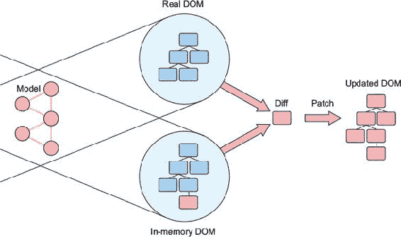

#### 1.3.4\. 虚拟 DOM：需要速度吗？

正如我之前提到的，虚拟 DOM 不仅仅是速度快。它通过设计就具有高性能，通常会产生快速、响应灵敏的应用程序，足以满足现代网络应用的需求。性能和更好的心理模型受到了工程师们的极大赞赏，以至于许多流行的 JavaScript 库都在创建它们自己的虚拟 DOM 版本或变体。即使在这些情况下，人们也倾向于认为虚拟 DOM 主要关注性能。性能是 React 的一个关键特性，但它是简单性的次级特性。虚拟 DOM 是使您能够推迟考虑复杂状态逻辑并专注于应用程序其他更重要部分的一部分。速度和简单性共同意味着用户和开发者都更快乐——双赢！

我已经花了一些时间讨论虚拟 DOM，但我不想给你一个印象，即它将是使用 React 的重要部分。实际上，你不需要深入思考虚拟 DOM 如何完成你的数据更新或如何改变你的应用程序。这是 React 简单性的一个部分：你被解放出来，可以专注于应用程序中最需要关注的部分。

### 1.4\. 组件：React 的基本单元

React 不仅使用了一种新颖的方法来处理随时间变化的数据；它还关注组件作为组织应用程序的范例。组件是 React 最基本的单元。你可以用几种不同的方式使用 React 创建组件，未来的章节将介绍这些方法。从组件的角度思考对于理解 React 的预期工作方式以及如何在项目中最佳地使用它至关重要。

#### 1.4.1\. 组件概述

组件是什么？它是更大整体的一部分。组件的概念可能对你来说很熟悉，即使你可能没有意识到，你也很可能经常看到它们。在设计构建用户界面时使用组件作为思维和视觉工具可以导致更好的、更直观的应用程序设计和使用。组件可以是任何你决定的东西，尽管不是所有东西都适合作为组件。例如，如果你决定整个界面是一个组件，没有子组件或进一步的细分，你可能并没有帮到自己。相反，将界面的不同部分分解成可以组合、重用和轻松重组的部分是有帮助的。

为了开始从组件的角度思考，我们将查看一个示例界面并将其分解为其组成部分。图 1.6 展示了本书后面将要工作的界面示例。用户界面通常包含在其他界面部分中重复使用或重新定制的元素。即使它们没有被重复使用，它们至少是独特的。这些不同的元素，即界面的独特元素，可以被视为组件。图 1.6 中左侧的界面在右侧被分解为组件。

##### 图 1.6. 将界面分解为组件的示例。每个独特的部分可以被视为一个组件。以统一的方式重复出现的项目可以被视为一个组件，该组件可以在不同的数据中重复使用。

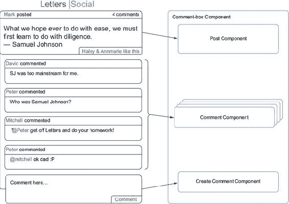

|  |
| --- |

**组件思维**

访问一个你经常使用且喜欢的网站（例如 GitHub）并将界面分解成组件。在这个过程中，你可能会发现自己将事物分成不同的部分。何时停止分解事物是有意义的？一个单独的字母是否应该是一个组件？何时一个小的组件是有意义的？何时将一组事物视为一个组件是有意义的？

|  |
| --- |

#### 1.4.2. React 中的组件：封装和可重用

React 组件具有良好的封装性、可重用性和可组合性。这些特性帮助实现了一种更简单、更优雅的方式来思考和构建用户界面。你的应用程序可以由清晰、简洁的组组成，而不是一团糟的意大利面代码。使用 React 构建你的应用程序几乎就像用乐高积木构建你的项目一样，只不过你不会用完积木。你可能会遇到错误，但幸运的是，没有积木可以踩到。

在练习 1.1 中，你练习了使用组件进行思考，并将接口分解为一些组成部分。你可以以任何数量种方式来做这件事，也许你可能并没有特别有组织或一致。这没关系。但是当你使用 React 中的组件时，考虑组件设计的组织和一致性将变得非常重要。你将希望设计出自我包含的组件，专注于特定的关注点或一系列相关关注点。

这使得组件具有可移植性、逻辑分组，并且易于在应用程序中移动和重用。即使它利用了其他库，一个设计良好的 React 组件应该相当自我包含。将你的 UI 分解为组件可以让你更轻松地在应用程序的不同部分工作。组件之间的边界意味着功能和组织可以很好地定义，而自我包含的组件意味着它们可以更容易地重用和移动。

React 中的组件旨在协同工作。这意味着你可以*组合*组件以形成新的*复合*组件。组件组合是 React 最强大的特性之一。你可以创建一个组件，并将其提供给应用程序的其他部分以供重用。这在大型应用程序中尤其有帮助。如果你在一个中到大型团队中，你可以将组件发布到私有注册表（npm 或其他），其他团队可以轻松拉取并用于新项目或现有项目。这可能不是所有规模团队的实际情况，但即使是小型团队也会从 React 组件促进的代码重用中受益。

React 组件的最后一个方面是*生命周期方法*。这些是在组件在其生命周期（挂载、更新、卸载等）的不同部分移动时可以使用的可预测、定义良好的方法。我们将在未来的章节中花费大量时间讨论这些方法。

### 1.5. React 团队

现在，你对 React 中的组件有了更多了解。React 可以使个人开发者的生活变得更轻松。但在团队中呢？总的来说，使 React 对个人开发者有吸引力的因素，也可能使其成为团队的绝佳选择。像任何技术一样，React 并不是每个用例或项目的完美解决方案，无论炒作如何，或者狂热的开发者可能试图让你相信什么。正如你之前看到的，React 有很多事情不做。但它所做的事情，它做得非常出色。

什么让 React 成为大型团队和大型应用的优秀工具？首先，使用它的简单性。*简单性*与*易用性*不同。易用的解决方案通常很脏、很快，最糟糕的是，它们可能会产生技术债务。真正简单的技术是灵活且健壮的。React 提供了强大的抽象，仍然可以在必要时深入到底层细节。简单技术更容易理解和操作，因为简化流程和去除不必要的部分的工作已经完成。在许多方面，React 让简单变得容易，提供了一个有效的解决方案，而没有引入有害的“黑魔法”或模糊不清的 API。

所有这些对个人开发者来说都是非常好的，但在更大的团队和组织中效果更明显。尽管 React 当然还有改进和继续发展的空间，但使其成为一个简单且灵活技术的辛勤工作对工程团队来说是值得的。具有良好心智模型的技术越简单，对工程师的心理负担就越小，让他们可以更快地工作并产生更大的影响。作为额外的好处，一套更简单的工具对新员工来说更容易学习。试图让新团队成员快速适应过于复杂的堆栈不仅会花费培训工程师的时间，而且新开发者可能需要一段时间才能做出有意义的贡献。因为 React 寻求仔细重新思考既定的最佳实践，所以在范式转换的初期会有成本，但之后通常是一个大型的、长期的胜利。

尽管 React 与其他同一领域中的工具相比确实不同，但在责任和功能方面，React 是一个相当轻量级的库。例如，Angular 可能要求你“接受”一个更全面的 API，而 React 只关注你的应用程序视图。这意味着它更容易与你的现有技术集成，并为你留下选择其他方面的空间。一些有偏见的框架和库要求全有或全无的采用立场，但 React 的“仅视图”范围和与 JavaScript 的通用互操作性意味着这并不总是如此。

你不必全盘接受，可以逐步将不同的项目或工具过渡到 React，而不必对结构、构建堆栈或其他相关领域进行剧烈的改变。这对几乎任何技术来说都是一个理想的特性，这也是 React 最初在 Facebook 上尝试的方式——在一个小的项目区域内。从那里，它逐渐成长并站稳脚跟，因为越来越多的团队看到了它的好处并亲身体验了它。这对你的团队意味着什么？这意味着你可以评估 React，而无需承担完全使用 React 重写产品的风险。

React 的简洁性、无偏见特性和性能使其非常适合大小项目。随着你对 React 的不断探索，你会看到它如何适合你的团队和项目。

### 1.6\. 摘要

React 是一个用于创建用户界面的库，最初由 Facebook 构建并开源。它是一个以简洁、性能和组件为设计理念的 JavaScript 库。它不提供创建应用程序的完整工具集，而是允许你选择如何实现你的数据模型、服务器调用和其他应用程序关注点，以及使用什么来实现它们。这些关键原因以及其他原因使得 React 可以成为小型和大型应用程序和团队的优秀工具。以下是 React 对一些典型角色的简要总结：

+   ***个人开发者*—** 一旦你学会了 React，你的应用程序可以更容易地快速构建。它们将更容易为大型团队工作，并且复杂功能可以更容易地实现和维护。

+   ***工程经理*—** 开发者学习 React 时会有一个初始成本，但最终他们能够更容易、更快地开发复杂的应用程序。

+   ***CTO 或高级管理层*—** React，就像任何技术一样，是一个有风险的投入。但最终的生产力提升和减轻心理负担往往超过了投入的时间。并非每个团队都是这样，但对于许多团队来说，这是真的。

总的来说，React 对于工程师的入门相对容易，可以减少应用程序中不必要的复杂性的总量，并通过促进代码重用减少技术债务。花点时间回顾一下你到目前为止学到的关于 React 的内容：

+   React 是一个用于构建用户界面的库，最初由 Facebook 的工程师创建。

+   React 提供了一个简单、灵活的 API，它围绕组件构建。

+   组件是 React 的基本单元，并且在 React 应用程序中被广泛使用。

+   React 实现了一个虚拟 DOM，它位于你的程序和浏览器 DOM 之间。

+   虚拟 DOM 允许使用快速的 diffing 算法高效地更新 DOM。

+   虚拟 DOM 允许出色的性能，但最大的优势是它提供的心理模型。

现在你对 React 的背景和设计有了更多了解，我们可以真正深入研究了。在下一章中，你将创建你的第一个组件，并更深入地了解 React 的工作原理。你将了解更多关于虚拟 DOM、React 中的组件以及如何创建自己的组件。

## 第二章\. <Hello World />：我们的第一个组件

*本章涵盖*

+   使用组件思考用户界面

+   React 中的组件

+   React 如何渲染组件

+   在 React 中创建组件的不同方法

+   在 React 中使用 JSX

第一章主要从理论角度介绍了 React。如果您是“给我看代码！”这类人，那么这一章就是为您准备的。我们将从本章开始近距离观察 React。随着我们深入了解 React 的一些 API，您将构建一个简单的评论框，这将帮助您看到 React 的实际运作机制，并开始巩固 React 工作原理的内心模型。我们将从构建没有任何“语法糖”或可能掩盖底层技术的便利性的 React 组件开始。我们将在本章末尾探讨 JSX（一种轻量级标记语言，有助于我们更轻松地构建 React 组件）。在后面的章节中，我们将更加复杂，并了解如何从 React 组件中创建完整的应用程序（Letters Social—请查看[`social.react.sh`](https://social.react.sh))，但在这章中，我们将保持范围仅限于几个相关组件。

在深入之前，让我们再次简要地回顾一下 React，以便定位自己。图 2.1 为您概述了大多数 React 应用程序的核心方面。让我们看看每个部分：

+   ***组件***—**封装的功能单元是 React 的基本单元。这些是构成您视图的元素。它们是接收属性作为输入的 JavaScript 函数或类，并维护自己的内部状态。React 为某些类型的组件提供了一套生命周期方法，以便您可以在不同的组件管理步骤中挂钩。**

+   ***React 库***—**React 应用程序使用 React 库运行。核心 React 库（`react`）由`react-dom`和`react-native`库支持。React DOM 处理浏览器或服务器端环境中的渲染，而 React Native 提供原生绑定，这意味着您可以为 iOS 或 Android 创建 React 应用程序。

+   ***第三方库***—**React 在数据建模、HTTP 调用、特定区域的样式（如外观和感觉）或其他应用程序方面不强制您有任何观点。对于这些，您将集成其他技术来构建您认为合适的应用程序。并非所有库都与 React 兼容，但您可以通过一些方法将大多数库与 React 集成。我们将在第四章、第十章和第十一章中探讨在 React 应用程序中使用非 React 代码。**

+   ***运行 React 应用程序***—**您从组件创建的 React 应用程序可以在您选择的平台上运行：Web、移动或原生。

##### 图 2.1\. 这是在非常高的层次上对 React 的描述，你可能从第一章中已经认识到了。使用 React，你可以使用组件来构建可以在浏览器和原生平台（如 iOS 和 Android）上运行的用户界面。它不是一个全面的框架——它给你自由选择用于数据建模、样式、HTTP 调用等方面的库。你可以在浏览器中运行 React 应用程序，并在 React Native 的帮助下在移动设备上运行。


### 2.1\. 介绍 React 组件

组件是使用 React 编写的客户端应用程序的基本单元。你肯定会创建很多组件！在本章中，你将从组件构建一个简单的评论框，以便亲身体验并快速了解 React。但首先，让我们花一点时间来探索“以组件思考”的方式，看看这对你的评论框会有什么影响。在本书的大部分内容中，我们通常会直接进入代码编写，而不花太多时间去规划，但在这个 React 的首次尝试中，我们将进行一些规划，以调整我们的心态。请参阅图 2.2。

##### 图 2.2\. React 组件概述。在本书的剩余部分，我们将探索这些关键部分的每个部分。


在本书中，我们将假装自己是虚构初创公司 Letters 的员工。你将构建一个下一代社交网络（你可以发布、评论和点赞——真正具有革命性的）。在本章中，我们正在探索 React 作为你公司潜在的技术选择。你被分配了一个创建一组简单组件的任务，以了解这项技术。你有一些设计团队给你的非常粗糙的原型，但仅此而已。图 2.3 展示了你将构建的版本。

##### 图 2.3\. 粗略的评论框原型。你将创建一个用户可以添加评论并查看先前评论的用户界面。


你应该如何开始构建这个？让我们先了解你的应用程序需要的数据，然后看看你如何将其转换为组件。你应该如何将原型转换为组件？你可以直接跳入并尝试创建组件，而不了解 React 的任何知识，但如果不了解它们的工作原理或它们将服务的目的，你可能会创建出混乱或不符合 React 习惯的东西。在接下来的几节中，我们将进行一些规划，以便你更好地了解如何构建和设计你的评论框。

|  |
| --- |

**回顾你的界面分解**

在继续之前，花点时间回顾一下上一章的一个练习。您查看了一个 Web 界面，并花了一些时间自己将其分解。花一分钟时间回顾一下相同的界面，看看现在您是否会对组件有更多的了解而做出不同的处理。您会以不同的方式将事物分组吗？以下是来自第一章的相同标记的 GitHub 个人资料界面，以帮助您回忆：


| |
| --- |

#### 2.1.1\. 理解应用程序数据

除了原型之外，在我们规划如何组织您的组件之前，我们还需要其他一些东西。我们需要知道 API 将向您的应用程序提供哪些信息。根据原型，您可能已经可以猜测一些可能返回的数据。对您的应用程序数据形状的感知将是我们在开始创建 UI 之前规划的重要部分。

| |
| --- |

**Web APIs**

您可能已经在工作中或学习中经常听到*API*这个词。如果您已经熟悉这个概念，请随意继续。如果不熟悉，本节可能对您有所帮助。什么是 API？API，或*应用程序编程接口*，是一组用于构建软件的例程和协议。这可能听起来有些模糊，这是一个相当通用的定义。API 是一个广泛的概念，适用于从公司平台到开源库的各个方面。

在 Web 开发和工程中，API 几乎成了远程、基于 Web 的*公共*API 的同义词。这意味着 API 通常是一种暴露定义好的与程序或平台交互方式的方法，通常通过互联网，供人们使用和消费。有许多例子，但其中两个更熟悉的是 Facebook 和 Stripe API。它们提供了一套通过 Web 与它们的程序和数据交互的方法。

我们虚构的公司 Letters 的后端基础设施团队为您创建了一个这样的 API。基于 Web 的 API 有许多不同的形式和类型，但您在本书中将使用的是*RESTful JSON API*。这意味着服务器将以 JSON 格式为您提供数据，并将可用的数据组织在用户、帖子、评论等资源周围。RESTful JSON API 是远程 API 的一种常见样式，所以如果您之前没有这样做过，这很可能不是您唯一一次与之合作。

| |
| --- |

以下列表显示了您将从 API 收到的数据示例，以及它如何与您的原型相匹配。

##### 列表 2.1\. 示例 JSON API

```
{
  "id": 123,                                              *1*
  "content": "What we hope ever to do with ease, we must first learn to do
     with diligence. — Samuel Johnson",
  "user": {
     "name": "Mark Thomas",
     "id": 1
  },
  "comments": [{                                          *2*
    "id": 0,                                              *3*
    "user": "David",
    "content": "too. mainstream."
  }, {
    "id": 1,
    "user": "Peter",
    "content": "Who was Samuel Johnson?"
  }, {
    "id": 2,
    "user": "Mitchell",
    "content": "@Peter get off Letters and do your homework!"
  }, {
    "id": 3,
    "user": "Peter",
    "content": "@mitchell ok dad :P"
  }]
}
```

+   ***1* 这在视觉原型中并未出现，但这并不意味着您不需要这块数据。**

+   ***2* 您已收到一组评论对象。**

+   ***3* 评论也有 ID。**

API 返回一个包含单个帖子的 JSON 响应。它包含一些重要的属性，包括 `id`、`content`、`author` 和 `comments`。`id` 是一个数字，`content` 和 `author` 是字符串，而 `comments` 是一个对象数组。每个评论都有自己的 ID、发表评论的用户和评论内容。

#### 2.1.2\. 多个组件：组合和父子关系

您拥有我们所需的数据和原型，但您如何着手构建组件以使用这些数据呢？首先，您需要了解组件如何与其他组件组织在一起。React 组件被组织成树状结构。就像 DOM 元素一样，React 组件可以嵌套，并包含其他组件。它们也可以“并列”于其他组件旁边，这意味着它们与其他组件处于同一级别（见图 2.4）。

##### 图 2.4\. 组件可以有不同的关系类型（父和子），可以用来创建其他组件，甚至可以独立存在。由于它们是自包含的，并且在移动时不会携带任何“负担”，因此它们被称为可组合的。

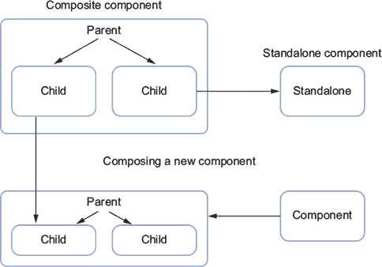

这引发了一个重要的问题：组件可以有什么样的关系？您可能会认为使用组件可以创建相当多的不同类型的关系，从某种意义上说，您是对的。组件可以以灵活的方式使用。因为它们是自包含的，并且通常不会携带任何“负担”，所以它们被称为*可组合的*。

可组合的组件通常很容易移动，并且可以重用来创建其他组件。您可以将它们想象成几乎像乐高积木。每个乐高积木都是自包含的，因此可以轻松移动——您不需要携带整个套装就可以移动一个积木，并且它们很容易与其他组件配合。便携性不是万能的，但它通常是设计良好的 React 组件的一个特性。

由于组件是可组合的，它们可以在应用程序的许多地方使用。无论组件在哪里使用，它都可能有助于形成某种类型的关系：*父*和*子*。如果一个组件包含另一个组件，那么它被称为父组件。另一个组件内部的组件被称为子组件。处于同一级别的组件之间没有直接的直接关系，尽管它们可能紧挨着。它们只“关心”它们的父亲和子代。

图 2.4 展示了组件如何以父子方式相互关联，并组合在一起以创建新的组件。请注意，尽管存在直接的父子关系，但两个兄弟组件之间没有直接的关系。当我们在 React 中探索数据流时，我会对此进行更多介绍。

#### 2.1.3\. 建立组件关系

我们已经对您界面的数据和视觉外观有了感知，以及父组件和子组件可以形成的关系组件。现在您可以开始定义您的组件层次结构了，这是应用您所学知识的过程。您将确定哪些将成为组件以及它们将位于何处。这个建立组件关系的过程对于每个团队或每个项目来说可能看起来都不一样。组件关系也可能会随时间而变化，所以不要期望第一次就能完美无缺。在 UI 中更容易进行迭代是 React 易于使用的一部分原因。

在我们继续之前，花一两分钟尝试将原型分解成组件。您已经这样做过几次了，但通过组件思考的练习将使使用 React 变得更加容易。在练习时，请记住以下几点：

+   确保组件以有意义的分组方式组织在一起；组件应该围绕相关的功能进行组织。如果无法在您的应用程序中移动组件，您可能创建了一个过于僵化的层次结构。这并不总是这种情况，但这是一个值得注意的地方。

+   如果您看到界面元素被多次重复，那么通常将其变成组件是一个很好的候选。

+   您第一次可能无法做到完美，这是完全可以接受的。迭代地改进您的代码是正常的。最初的规划并不是为了消除未来的变化，而是为了设定正确的起始方向。

在考虑这些指南的同时，您可以查看可用的数据和原型，并开始将它们分解成几个组件。图 2.5 展示了将界面分解成组件的一种方法。

##### 图 2.5。您可以将界面分解成仅仅几个组件。请注意，您不一定需要为界面的每个元素都创建组件，尽管随着应用程序的增长，将更多部分分解成组件可能是有意义的。您还会注意到，相同的评论组件将被用于每个附加到帖子上的评论。此外，请注意，我为了可读性在这里的旁边绘制了图表；您可能直接在所有内容上方绘制线条。

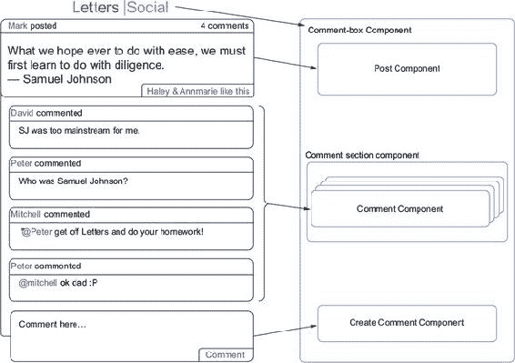

使用 React，您可以在设计应用程序时保持灵活性。我们提出了四个组件，但您可能有多种方式来划分这些内容。React 强制组件之间建立父子关系，但除此之外，您可以根据您和您的团队认为最有意义的方式来定义您的层次结构。例如，可能会有这样的情况，您将 UI 的一个小部分分解成许多不同的部分。UI 的大小并不直接关系到它应该由多少或多少个组件组成。

现在我们已经完成了一些初步规划，你就可以开始深入创建你的评论框 UI 了。在下一节中，你将开始创建 React 组件。你将不会使用任何像 JSX 这样的语法辅助工具。相反，我们将专注于“原始”React，你将在使用这些辅助工具之前先了解该技术的核心机制。

你可能会因为不得不放弃在正常 React 开发中使用的某些辅助工具而感到沮丧。我很高兴这样，因为这可能意味着你将更加真诚地欣赏和理解你将与之工作的抽象。虽然并不总是如此，但根据我的经验，从新技术的基础元素开始通常能更好地为你长期使用该技术做好准备。我们当然不需要用汇编代码编写我们的 JavaScript 程序，但我们也不要使用一个对核心机制理解不完整的技术。

### 2.2\. 在 React 中创建组件

在本节中，你将创建一些 React 组件并在浏览器中运行它们。目前，你不需要使用 node.js 或其他任何东西来设置和运行一切。你将通过 CodeSandbox ([`codesandbox.io`](https://codesandbox.io)) 在浏览器中运行代码。如果你更喜欢在本地编辑文件，你可以在 CodeSandbox 代码编辑器中点击下载，以获取该示例的代码。

你将使用三个库来创建你的第一个组件：`React`、`React DOM` 和 `prop-types`。`React DOM` 是从主 `React` 库中分离出来的一个渲染器，以更好地分离关注点；它负责将组件渲染到 DOM 或字符串（用于服务器端渲染）。`prop-types` 库是一个开发库，它将帮助你对你组件传递的数据进行类型检查。

你将通过首先创建一些组成部分来开始创建评论框组件。这将帮助你更好地理解 React 创建和渲染组件时整体会发生什么。你需要添加一个新的 DOM 元素，其 ID 为 `root`，以及一些使用 `React DOM` 的基本代码。以下列表显示了组件的裸骨起始点。对于每个列表，我都会包含一个链接，指向你可以轻松编辑和尝试的在线运行代码版本。

##### 列表 2.2\. 开始

```
//... index.js
const node = document.getElementById("root");           *1*

//... index.html
<div id="root"></div>                                   *2*
```

+   ***1* 保存对根元素的引用——你将在此 DOM 元素中渲染你的 React 应用程序。**

+   ***2* 在你创建的 index.html 文件中，你已经创建了一个具有 id ‘root’ 的 div 元素。**

列表 2.2 的代码可在网上找到，链接为 [`codesandbox.io/s/vj9xkqzkvy`](https://codesandbox.io/s/vj9xkqzkvy)。

#### 2.2.1\. 创建 React 元素

到目前为止，你的代码除了下载 React 库和找到`root` DOM 元素之外，不会做太多的事情。要使某些实质性的事情发生，你需要使用`React DOM`。你需要调用它的`render`方法，React 才能创建和管理你的组件。你将使用一个组件来调用这个方法，以及`container`（这将是之前存储在变量中的 DOM 元素）。`ReactDOM.render`的签名看起来像这样：

```
ReactDOM.render(
  ReactElement element,
  DOMElement container,
  [function callback]
) -> ReactComponent
```

`React DOM`需要一个类型为`ReactElement`的元素和一个 DOM 元素。你已经创建了一个有效的 DOM 元素可以使用，但现在你需要创建一个 React 元素。但什么是 React 元素呢？

| |
| --- |

##### 定义

*React 元素*是 React 中一个轻量级、无状态、不可变的原语。有两种类型：`ReactComponentElement`和`ReactDOMElement`。`ReactDOMElement`s 是 DOM 元素的虚拟表示。`ReactComponentElement`s 引用一个与 React 组件对应的函数或类。

| |
| --- |

*元素*是我们用来告诉 React 我们在屏幕上想要看到什么内容的描述符，并且在 React 中是一个核心概念。你大部分的组件都将是 React 元素的集合；它们会在你的 UI 的一部分周围创建一种“边界”，这样你就可以将功能、标记和样式组合在一起。但是，对于一个 React 元素来说，成为 DOM 元素的虚拟表示意味着什么呢？这意味着 React 元素对于 React 来说，就像 DOM 元素对于 DOM 一样——组成 UI 的基本原语。当你创建普通的 HTML 标记时，你使用各种元素类型（如`div`、`span`、`section`、`p`、`img`等）来包含和结构化信息。在 React 中，你可以使用 React 元素——这些元素告诉 React 你想要渲染的 React 组件或常规 DOM 元素——来组合和构建你的 UI。

可能 DOM 元素和 React 元素之间的平行关系一开始没有立即让你感到共鸣。没关系。记得 React 应该通过创建更好的心智模型来帮助你吗？DOM 元素和 React 元素之间的平行关系是它这样做的一种方式。这意味着你得到了一个熟悉的心智结构来工作：一个类似于常规 DOM 元素的元素树结构。图 2.6 将帮助你可视化 React 元素和 DOM 元素之间的一些相似之处。

##### 图 2.6。虚拟的“真实”DOM 共享一个类似的树状结构，这使得你在 React 中以类似的方式思考组件和整体应用程序的结构变得容易。DOM 由`DOMElements`（`HTMLElements`和`SVGElements`）组成，而 React 的虚拟 DOM 由 React 元素组成。

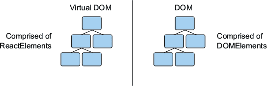

另一种思考 React 元素的方式是将其视为一组基本指令，供 React 使用，就像 DOM 元素的蓝图。React 元素是 `React DOM` 将取用并用于更新 DOM 的。在 图 2.7 中，React 元素被用于 React 应用程序的整体过程中。

##### 图 2.7\. React 元素是 React 用于创建虚拟 DOM 的，`React DOM` 将会管理和使用它来协调和更新实际的 DOM。它们是 React 创建和管理元素的简单蓝图。

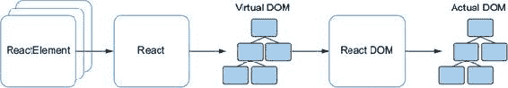

你现在对 React 元素有了更多的了解，但它们是如何被创建的，以及创建它们时发生了什么？你使用 `React.createElement` 来创建 React 元素—想想看！让我们看看它的函数签名，以了解如何使用它：

```
React.createElement(
  String/ReactClass type,
  [object props],
  [children...]
) -> React Element
```

`React.createElement` 接收一个字符串或组件（要么是一个扩展 `React.Component` 的类，要么是一个函数），一个 props 对象，以及子元素，并返回一个 React 元素。记住，React 元素是你想要 React 渲染的东西的轻量级表示。它可以指示一个 DOM 元素或另一个 React 组件。

让我们更仔细地看看这些基本指令中的每一个：

+   **`type`—** 你可以传入一个字符串，它是要创建的 HTML 元素的标签名（例如 `"div"`，`"span"`，`"a"` 等）或一个 React 类，我们稍后会讨论。把这个参数想象成 React 在问，“我将要创建什么类型的东西？”

+   **`props`—** 简称 *属性*。`props` 对象提供了一种指定在 HTML 元素上定义哪些属性（如果是在 `ReactDOMElement` 的上下文中）或将可用于组件类实例的方法。

+   **`children...`—** 记得我之前说过 React 组件是 *可组合* 的吗？这就是你可以进行组合的地方。使用 `children...`，在 `type` 和 `props` 之后传入的参数让你可以嵌套、排序，甚至进一步嵌套其他 React 元素。正如你在 列表 2.3 中可以看到的，你可以在 `children...` 中通过嵌套对 `React.createElement` 的调用来嵌套 React 元素。

`React.createElement` 会问，“我在创建什么？”，“我应该如何配置它？”，“它包含什么？”下面的列表展示了如何使用 `React.createElement`。

##### 列表 2.3\. 使用 `React.createElement`

```
...
     import React, { Component } from 'react';                            *1*
     import { render } 'react-dom';
     const node = document.getElementById('root');
     const root =                                                         *2*
        React.createElement('div', {}, //                                 *3*
          React.createElement('h1', {}, "Hello, world!", //               *3*
            React.createElement('a', {href: 'mailto:mark@ifelse.io'},     *4*
              React.createElement('h1', {}, "React In Action"),
              React.createElement('em', {}, "...and now it really is!")   *5*
            )
          )
        );
     render(root, node); //                                               *6*
...
```

+   ***1* 导入 React 和 React DOM 以便使用。**

+   ***2* React.createElement 返回一个单一的 React 元素，所以这就是你将存储在 root 中以供以后使用的内容。**

+   ***3* 空白字符有助于更好地显示嵌套，但不要错过你如何在各自的子...参数中嵌套多个 React.createElement 调用。**

+   ***4* 创建一个锚点链接—注意你设置的 mailto 属性，就像在常规 HTML 中做的那样。**

+   ***5* 子元素也可以传入内联文本。**

+   ***6* 调用我们之前提到的 render 方法。**

列表 2.3 的代码可在网上找到，链接为 [`codesandbox.io/s/qxx7z86q4w`](https://codesandbox.io/s/qxx7z86q4w)。

#### 2.2.2\. 渲染你的第一个组件

现在，你应该能看到除了空白页面之外的内容，如图 2.8 所示。你刚刚创建了你第一个 React 组件！使用浏览器中的开发者工具，尝试打开页面并检查 HTML。你应该看到与使用 React 创建的 HTML 元素相对应的内容。请注意，你传递的属性也已经通过，所以你可以点击链接并发送电子邮件告诉我你对学习 React 有多喜爱。

##### 图 2.8\. 你的第一个组件。它不多，但你已成功使用 React 创建了一个组件。


这很好，但你可能想知道 React 是如何将你的许多`React.createElement`转换成你在屏幕上看到的内容的。React 使用你提供的 React 元素创建一个虚拟 DOM，`React DOM`可以使用它来管理浏览器 DOM。记得从图 2.4 中了解虚拟和真实 DOM 具有相似的结构吗？嗯，React 需要在开始工作之前，从你的 React 元素中形成自己的虚拟 DOM 树结构。

为了做到这一点，React 会递归地评估每个`React.createElement`调用中的所有`children...`属性，并将结果传递给父元素。你可以将 React 这样做想象成一个小孩反复地问，“X 是什么？”直到他们理解 X 的每一个细节。图 2.9 展示了你如何思考 React 评估嵌套的 React 元素。沿着箭头向下和向右移动，看看 React 是如何检查每个 React 元素的`children...`，直到它能形成一个完整的树。

##### 图 2.9\. React 会递归地评估一系列 React 元素，以确定它应该如何为你的组件形成虚拟 DOM 树结构。它还会检查`children...`中的更多 React 元素以进行评估。React 会遍历所有可能的路径，就像一个孩子问，“X 是什么？”直到他们知道一切。你可以沿着箭头向下和向右移动，以了解 React 如何评估嵌套的 React 元素以及每个参数在询问什么。

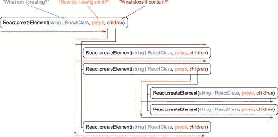

现在你已经创建了你的第一个组件，你可能会有一些疑问，甚至一些担忧。即使有一些格式化帮助，很明显，阅读嵌套几层深的组件将会很困难。我们将探讨更好的编写组件的方法，所以请不要担心——你不会将`React.createElement`嵌套数百次。现在使用它将帮助你更好地理解`React.createElement`的作用，并希望在你开始大量使用它时，能更欣赏 JSX。

您可能还担心您所创建的内容似乎过于简单。到目前为止，React 似乎像是一个冗长的 JavaScript 模板系统。但 React 可以做更多的事情：进入组件。

|  |
| --- |

**React 元素**

在继续学习组件之前，检查您对 React 元素的了解。无论是在纸上还是在您的脑海中，列出一些 React 元素的特征。在继续学习之前，这里有一些 React 元素的特征来帮助您回忆：

+   React 元素接受一个字符串来创建一种 DOM 元素（例如 `div`、`a`、`p` 等）。

+   您可以通过 props 对象向 React 元素提供配置；这些类似于 DOM 元素可以有的属性（例如 ``）。

+   React 元素是可嵌套的，并且您可以为元素提供其他 React 元素作为子元素。

+   React 使用 React 元素来创建虚拟 DOM，而 `React DOM` 可以在更新浏览器 DOM 时使用它。

+   React 元素是 React 中组件的构成部分。

|  |
| --- |

#### 2.2.3\. 创建 React 组件

如您可能已经猜到的，仅使用 React 元素和 `React.createElement` 来创建 UI 的部分对您来说并没有什么帮助，除了管理 DOM。您仍然可以将事件处理程序作为 props 传递以处理点击或输入更改，传递其他数据以显示，甚至嵌套元素。但您仍然会错过 React 提供的 *持久状态*、生命周期方法，这些方法将为您提供与组件交互的预测性方式，以及组件可能提供的任何类型的逻辑分组。您肯定想找到一种方法来将 React 元素组合在一起。

您可以通过组件来实现这一点。组件的作用是将功能、标记、样式和其他相关的 UI 元素捆绑和分组在一起。它们充当 UI 部分的一种边界，这些部分还可以包含其他组件。组件可以是独立且可重用的部分，允许您单独考虑每个部分。

您可以使用函数和 JavaScript 类创建两种主要类型的组件。我将在未来的章节中介绍第一种类型，即无状态函数式组件。现在我们将讨论第二种类型：使用 JavaScript 类创建的 *有状态* React 组件。从现在开始，当我提到 React 组件时，我指的是由类或函数创建的组件。

#### 2.2.4\. 创建 React 类

要真正开始构建某些内容，您需要的不仅仅是 React 元素；您还需要组件。如前所述，React 组件（由函数创建的组件）类似于 React 元素，但具有更多功能。React 中的组件是帮助将 React 元素和功能组合在一起的类。它们可以作为扩展 `React.Component` 基类或函数的类来创建。本节将探讨 React 类以及如何在 React 中使用此类组件。让我们看看如何创建一个 React 类：

```
class MyReactClassComponent extends Component {
     render() {}
}
```

与您使用 `React.createElement` 时调用 React 库中的特定方法不同，从 `React.Component` 创建组件是通过声明一个继承自 `React.Component` 抽象基类的 JavaScript 类来完成的。这个继承类通常需要定义至少一个将返回单个 React 元素或 React 元素数组的渲染方法。创建 React 类的旧方法是通过 `createClass` 方法。随着 JavaScript 中类的出现，这种方法已经改变，现在不推荐使用，尽管您仍然可以使用在 npm 上可用的 `create-react-class` 模块。有关使用 ES2015+ JavaScript 之外的 React 的更多信息，请参阅 [`reactjs.org/docs/react-without-es6.html`](https://reactjs.org/docs/react-without-es6.html)。

#### 2.2.5\. 渲染方法

我们将开始通过前面提到的 `render` 方法探索创建作为 React 类的组件。这是您在 React 应用程序中看到的最常见方法之一，几乎任何将内容渲染到屏幕上的组件都将有一个 `render` 方法。我们最终将探索那些不直接渲染任何内容，而是修改或增强其他组件（有时称为 *高阶* 组件）的组件。

渲染方法需要返回恰好一个 React 元素。以这种方式，渲染方法与创建 React 元素的方式相似——它们可以嵌套，但在最高级别只有一个节点。然而，与 React 元素不同，React 类的 `render` 方法可以访问嵌入的数据（持久内部组件状态）以及组件方法和从 `React.Component` 抽象基类继承的额外方法（所有这些我将在后面介绍）。我提到的持久状态对整个组件都是可用的，因为 React 为此类组件创建了一个“后备实例”。这也是为什么您会听到这些类型的组件被称为 *有状态* 组件的原因。

所有这些都意味着 React 将为 React 类的一个实例（不是蓝图本身）创建并跟踪一个特殊的数据对象，这个对象会随时间保持存在，并且可以通过特殊的 React 函数进行更新。我将在未来的章节中详细介绍这一点，但 图 2.10 展示了 React 类如何获得后备实例，而 React 元素则不会。

##### 图 2.10\. React 将在内存中为作为 React 组件类创建的组件创建一个后备实例。正如您所看到的，React 组件类会得到一个，而 React 元素和非 React 类组件则不会。请记住，React 元素是 DOM 的镜像，而组件是分组它们的方式。后备实例是为特定组件提供数据存储和访问的一种方式。存储在实例中的数据将通过特定的 API 方法提供给组件的渲染方法。这意味着您可以访问可以更改并且会随时间持久化的数据。

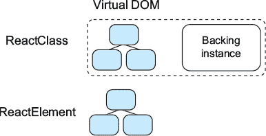

当使用 React 类创建组件时，你还可以访问 props——你可以传递给组件的数据，组件也可以将其传递给子组件。你可能记得这些 props 数据是传递给 `React.createElement` 的参数。和之前一样，你可以用它来指定组件在创建时的属性。props 不应在组件内部修改，但你很快就会发现更新 React 组件中数据的方法。

在下一节的 列表 2.5 中，你将看到 React 类组件的实际应用，以及你如何使用 `this.props` 创建更多嵌套的 React 元素并传递自定义数据。当你看到 React 类中使用 props 时，就好像你创建了一个自定义 HTML 元素，比如 `Jedi`，并给它一个自定义属性，比如“name”：`<Jedi name="Obi Wan"/>`。我将在未来的章节中更详细地介绍 `this` JavaScript 关键字，但请注意，在这种情况下，保留的 JavaScript 关键字 `this` 指的是组件实例。

#### 2.2.6. 通过 PropTypes 进行属性验证

你知道 React 类组件可以自由使用自定义属性，这听起来很棒；就好像你可以创建自己的自定义 HTML 元素，但功能更强大。记住，权力越大，责任越大。你需要提供某种方式来验证你将使用的属性，以便防止错误并规划组件将使用的数据类型。为此，你可以使用 React 命名空间内提供的验证器：`PropTypes`。`PropTypes` 验证器集最初包含在 React 核心库中，但后来在 React 15.5 版本中被拆分并弃用。要使用 `PropTypes`，你需要安装 `prop-types` 包，这个包仍然是 React 工具链的一部分，但不再包含在核心库中。这个包将包含在应用源代码和你在本章中使用的 CodeSandbox 示例中。

`prop-types` 库提供了一套验证器，让你可以指定组件需要或期望的 props。例如，如果你要构建一个 ProfilePicture 组件，没有图片（或处理没有图片的逻辑）将毫无用处。你可以使用 `PropTypes` 来指定 ProfilePicture 组件需要哪些 props 来工作，以及这些 props 应该是什么样子。

你可以将 `PropTypes` 理解为提供一种合同，其他开发者和你未来的自己可以履行或违反这个合同。使用 `PropTypes` 并非 React 运作所必需的，但应该用于防止错误和简化调试。使用 `PropTypes` 的另一个好处是，如果你首先指定了你期望的 props，你就有机会思考你的组件需要什么才能工作。

当使用 `PropTypes` 时，您需要通过静态类属性或类定义后的简单属性赋值在 `React.Component` 类中添加一个 `propTypes` 属性。注意类属性的小写，而不是来自 `React` 对象的属性，因为这很容易混淆。 列表 2.4 展示了如何使用 `PropTypes`，以及从 React 类组件返回 React 元素。在这个列表中，您将结合几个方面：创建一个可以传递给 `createElement` 的 `React` 类，添加一个 `render` 方法，并指定 `propTypes`。

##### 列表 2.4\. 使用 `PropTypes` 和 `render` 方法

```
import React, { Component } from "react";        *1*
import { render } from "react-dom";              *1*
import PropTypes from "prop-types";              *1*

const node = document.getElementById('root');
class Post extends Component {                   *2*
    render() {
        return React.createElement(
            'div',
            {
                className: 'post'                *3*
            },
            React.createElement(
                'h2',
                {
                    className: 'postAuthor',
                    id: this.props.id
                },
                this.props.user,                 *4*
                React.createElement(
                    'span',
                    {
                        className: 'postBody'    *5*
                    },
                    this.props.content           *6*
                )
            )
        );
    }
}

Post.propTypes = {
    user: PropTypes.string.isRequired,           *7*
    content: PropTypes.string.isRequired,        *7*
    id: PropTypes.number.isRequired              *7*
};

const App = React.createElement(Post, {
    id: 1,                                       *8*
    content: ' said: This is a post!',           *8*
    user: 'mark'                                 *8*
});

render(App, node);

...
```

+   ***1* 导入 React、React DOM 和 prop-types。**

+   ***2* 创建一个 React 类作为您的 Post 组件。在这种情况下，您只指定了 propTypes 和一个 render 方法。**

+   ***3* 创建一个具有类名 'post' 的 div 元素。**

+   ***4* 在 JavaScript 中，这有时可能会令人困惑——在这里，它将指代组件实例，而不是您的 React 类蓝图。**

+   ***5* 使用 className 而不是 class 作为 DOM 元素的 CSS 类名**

+   ***6* 再次，内容属性是您创建的 span 元素的内部内容。**

+   ***7* 属性可以是可选的或必需的，具有类型，甚至可能需要具有某种“形状”（例如具有某些属性的对象）。**

+   ***8* 将 Post React 类及其一些属性传递给 React.createElement 以创建某些内容。React DOM 可以渲染——尝试更改数据以查看您的组件输出如何变化。**

列表 2.4 的代码可在网上找到，网址为 [`codesandbox.io/s/3yj462omrq`](https://codesandbox.io/s/3yj462omrq)。

您应该看到一些文本出现：“mark said: This is a post！”如果您没有提供任何必需的属性，您将在开发者控制台中看到警告。由于某些组件需要工作，未提供某些属性可能会破坏您的应用程序，但验证步骤不会。换句话说，如果您忘记向应用程序提供关键数据，它可能会损坏，但使用 `PropTypes` 验证不会——它只会让您知道您忘记了属性。因为 `PropTypes` 只在开发模式下进行类型评估，所以您的生产环境应用程序不会额外消耗努力来执行 `PropTypes` 的工作。

现在你正在创建一个组件并传递一些数据，你可以尝试嵌套组件。我之前提到过这种可能性，这也是 React 让人愉快工作并如此强大的原因之一：你可以从其他组件中创建组件。列表 2.5 说明了这一点，并展示了 `children` 属性的特殊用法。我将在未来的章节中更详细地介绍这一点，当你处理路由和高级组件时。当你使用 `this.props.children` 属性时，它就像一个通道，让嵌套数据通过。在这种情况下，你将创建一个 `Comment` 组件，将其作为参数传递，并实现嵌套。

##### 列表 2.5\. 添加嵌套组件

```
//...
       this.props.user,
       React.createElement(
         "span",
         {
           className: "postBody"
         },
         this.props.content
       ),
       this.props.children                     *1*
//...
class Comment extends Component {              *2*
    render() {
        return React.createElement(
            'div',
            {
                className: 'comment'
            },
            React.createElement(
                'h2',
                {
                    className: 'commentAuthor'
                },
                this.props.user,
                React.createElement(
                    'span',
                    {
                        className: 'commentContent'
                    },
                    this.props.content
                )
            )
        );
    }
}

Comment.propTypes = {                          *3*
    id: PropTypes.number.isRequired,
    content: PropTypes.string.isRequired,
    user: PropTypes.string.isRequired
};

const App = React.createElement(
    Post,
    {
        id: 1,
        content: ' said: This is a post!',
        user: 'mark'
    },
    React.createElement(Comment, {             *4*
        id: 2,
        user: 'bob',
        content: ' commented: wow! how cool!'
    })
);

ReactDOM.render(App, node);
```

+   ***1* 将 this.props.children 添加到 Post 组件中，以便它可以渲染子组件。**

+   ***2* 创建一个 Comment 组件，类似于创建 Post 组件的方式。**

+   ***3* 声明 propTypes。**

+   ***4* 在 Post 组件内部嵌套 Comment 组件。**

列表 2.5 的代码可在网上找到，链接为 [`codesandbox.io/s/k2vn448pn3`](https://codesandbox.io/s/k2vn448pn3)。

现在你已经创建了一个嵌套组件，你应该能在浏览器中看到更多内容。接下来，我们将看到如何使用之前提到的与 React 类一起提供的嵌入状态来创建动态组件。

| |
| --- |

**逆向工程组件树**

在继续之前，通过像 GitHub 这样的网站逆向工程一个组件树来检验你的理解。打开你的开发者工具，选择一个不太深层的 DOM 元素，并从中重构一个 React 类。考虑以下 DOM 元素：

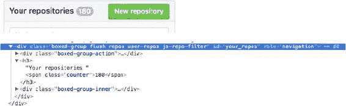

你会如何在 React 中构建类似的组件结构？（请随意不添加每个 CSS 类名。）

| |
| --- |

### 2.3\. 组件的生与死

在本节中，你将向你的 Post 和 Comment 组件添加交互功能。之前，我们发现作为 React 类创建的组件可以通过“后端实例”获得一些特殊的方式来存储和访问数据。为了理解这一点，让我们回顾一下 React 的工作原理的大致情况。图 2.11 总结了你迄今为止所学的知识。你可以从 React 类创建组件，这些类是由 React 元素（映射到 DOM 的元素）组成的。我所说的 *React 类* 是 `React.Component` 的子类，`React.createElement` 可以使用它。

##### 图 2.11\. React 中渲染的放大视图。React 类和 React 元素被 React 用于创建一个内存中的虚拟 DOM，该 DOM 管理着真实的 DOM。它还创建了一个“合成”的事件系统，这样你仍然可以响应来自浏览器的事件（如点击、滚动和其他由用户引起的事件）。

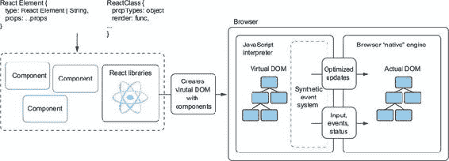

由 React 类创建的组件有后端实例，允许你存储数据，并且需要有一个返回精确一个 React 元素的 `render` 方法。React 会从 React 元素中创建一个内存中的虚拟 DOM，并处理 DOM 的管理和更新。

你已经为你的 React 类添加了 `render` 方法和一些 `PropTypes` 验证。但是，要创建动态组件，你需要更多。React 类可以有一些特殊的方法，这些方法会在 React 管理虚拟 DOM 时按特定顺序被调用。你用来返回 React 元素的 `render` 方法只是其中之一。

除了保留的生命周期方法，你还可以添加自己的方法。React 给你自由和灵活性，让你可以为组件添加任何需要的功能。几乎任何有效的 JavaScript 都可以在 React 中使用。如果你回顾一下第一章中的图 1.1，你会注意到生命周期方法、特殊属性和自定义代码构成了 React 组件的大部分。剩下的是什么？

#### 2.3.1\. React 状态思维

除了自定义方法和生命周期方法，React 类还提供了可以与组件持久化的状态（数据）。这来自于我提到的后端实例。*状态*是一个很大的主题——我不会在这一章中涵盖所有内容，但你现在可以学到足够多的知识，以便能够使你的组件交互和生动。什么是状态？另一种思考方式是将其视为*关于某个特定时间的信息*。例如，你可以通过问“你今天怎么样？”来获取你朋友的“状态”。

状态主要有两种类型：*可变*和*不可变*。简单来说，可以通过时间来区分它们。创建后能否改变？如果可以，那么它就是可变的。如果不可以，那么它就是不可变的。关于这些主题有深入研究的学术领域，所以在这里我不会深入探讨。

在 React 中，作为 JavaScript 类([`developer.mozilla.org/en-US/docs/Web/JavaScript/Reference/Classes`](https://developer.mozilla.org/en-US/docs/Web/JavaScript/Reference/Classes))创建的组件，如果扩展了 `React.Component`，则可能具有可变和不可变的状态，而由函数（无状态函数组件）创建的组件只能访问不可变状态（属性）。我将在未来的章节中介绍这些内容；现在，我将坚持使用继承自 `React.Component` 并获取状态和额外方法的组件。在这些类型的组件中，状态可以通过类的实例的 `this.state` 属性访问。你可以通过 `this.props` 访问提供的不可变状态，这你已经用来创建静态组件了。

`this.props` 不应在组件内部被修改。你将在未来的章节中看到如何向组件提供随时间变化的数据。现在，你需要知道的是，你不能直接修改 `this.props`。

你可能想知道如何在 React 中使用 `state` 和 `props`。答案基本上是你会如何使用传递给函数或函数中使用的数据。这包括计算、显示、解析、业务逻辑以及任何其他与数据相关的任务。实际上，props 和 state 是你在 UI 中利用动态或静态数据的主要方式（显示用户信息、传递数据到事件处理器等等）。

State 和 props 是构成你的应用程序并使其有用的数据载体。如果你正在创建一个社交网络应用程序（你将在未来的章节中这样做），你通常会使用 props 和 state 的组合来构建显示和更新用户信息、更新等组件。如果你使用 React 进行数据可视化，你可能将 props 和 state 作为可视化库（如 `D3.js`）的输入。无论你正在构建什么，你很可能会使用 state 和 props 来管理和在你的 React 应用程序中引导信息。

|  |
| --- |

**可变与不可变**

在继续之前，通过思考 React 中两种主要数据类型之间的区别来检查你的理解：可变和不可变。将每个陈述标记为真或假：

+   可变意味着数据可以随时间改变：T | F

+   State 通过 React 中的 `this.state` 属性访问：T | F

+   `props` 是 React 提供的可变对象：T | F

+   不可变数据不会随时间改变：T | F

+   Props 通过 `this.props` 访问：T | F

|  |
| --- |

#### 2.3.2\. 设置初始状态

你应该在何时使用状态以及如何开始使用它？现在，简单的答案是 *当你想要更改组件内部存储的数据时*。我说过 props 是不可变的（不可修改的），所以如果你需要更改数据，你需要可变的状态。在 React 中，通常需要可变的数据往往来自用户输入（通常是文本、文件、切换选项等），但也可能是许多其他事物。为了跟踪用户与表单元素的交互，你需要提供一个初始状态，然后随着时间的推移改变该状态。你可以使用组件的构造函数来设置组件的初始状态，一个基于早期代码列表中思想和概念的评论框组件。它将允许你通过简单的表单添加评论。以下列表显示了如何设置组件和设置初始状态。

##### 列表 2.6\. 设置初始状态

```
//...
class CreateComment extends Component {
    constructor(props) {
        super(props);                              *1*
        this.state = {
            content: '',                           *1*
            user: ''                               *1*
        };
    }
    render() {
        return React.createElement(
            'form',
            {
                                                   *2*
                className: 'createComment'
            },
            React.createElement('input', {
                type: 'text',                      *2*
                placeholder: 'Your name',
                value: this.state.user
            }),
            React.createElement('input', {
                type: 'text',
                placeholder: 'Thoughts?'           *2*
            }),
            React.createElement('input', {
                type: 'submit',
                value: 'Post'
            })
        );
    }
}
CreateComment.propTypes = {
    content: React.PropTypes.string
};
//...
const App = React.createElement(
    Post,
    {
        id: 1,
        content: ' said: This is a post!',
        user: 'mark'
    },
    React.createElement(Comment, {
        id: 2,
        user: 'bob',
        content: ' commented: wow! how cool!'
    }),
    React.createElement(CreateComment)              *3*
);
```

+   ***1* 在类构造函数中调用 super 并将初始状态对象分配给类的状态属性实例——请注意，你通常不会以这种方式分配状态，除非是在组件类的构造函数中。**

+   ***2* 创建一个作为 React 类的组件，该组件将包含一些用户输入字段——我将在未来的章节中更详细地介绍表单。**

+   ***3* 将 CreateComment 添加到 App 组件中。**

列表 2.6 的代码可在网上找到，链接为 [`codesandbox.io/s/p5r3kwqx5q`](https://codesandbox.io/s/p5r3kwqx5q)。

要更新在组件类构造函数中初始化的状态，你需要使用一个特殊的方法；你不能像在非 React 情况下那样直接覆盖 `this.state`。这是因为 React 需要跟踪状态并确保虚拟 DOM 和真实 DOM 保持同步。要在 React 类组件中更新状态，你将使用 `this.setState`；查看基本用法。它接受一个用于更新状态的更新函数，并且不返回任何内容：

```
setState(
   function(prevState, props) -> nextState,
   callback
)-> void
```

`this.setState` 接收一个更新函数，该函数返回的对象将被浅合并到状态中。例如，如果你最初将 `username` 属性设置为空字符串，你会使用 `this.setState` 来为你的组件状态设置新的用户名值。React 将获取该值并更新后端实例和 DOM 中的新值。

JavaScript 中更新或重新分配值与使用 `setState` 之间的一个关键区别是，React 可以根据状态变化来批量更新，以最大化效率。这意味着当你调用 `setState` 来执行状态更新时，它不一定立即发生。更准确地说，这更像是一种确认，React 将尽可能高效地根据新状态更新 DOM，尽可能快地完成。

什么会导致 React 更新？JavaScript 是事件驱动的，所以它可能是对某种用户输入的响应（至少在浏览器中是这样）。这可能是一个点击、按键或浏览器支持的其他许多事件之一。事件如何与 React 一起工作？React 实现了一个合成事件系统，作为虚拟 DOM 的一部分，它将浏览器中的事件转换为 React 应用程序的事件。你可以设置事件处理程序来响应来自浏览器的事件，就像你通常在 JavaScript 中做的那样。一个区别是，React 事件处理程序是在 React 元素或组件本身上设置的（而不是使用 `addEventListener`）。你可以使用这些事件的数据（输入框中的文本、单选按钮的值，甚至是事件的目标）来更新组件的状态。

代码示例 2.7 展示了如何将你关于设置初始状态和设置事件处理器的知识应用到实践中。浏览器中可以监听许多不同的事件，几乎涵盖了所有可能的用户交互（点击、输入、表单、滚动等）。我们最关心的是两个主要事件：当表单输入值发生变化时，以及当表单被提交时。通过监听这些事件，你可以接收并使用数据来创建新的评论。

##### 列表 2.7\. 设置事件处理器

```
...
class CreateComment extends Component {
    constructor(props) {
        super(props);
        this.state = {
            content: '',
            user: ''
        };
        this.handleUserChange = this.handleUserChange.bind(this);  *1*
        this.handleTextChange = this.handleTextChange.bind(this);  *1*
        this.handleSubmit = this.handleSubmit.bind(this);          *1*
    }
    handleUserChange(event) {                                      *2*
        const val = event.target.value;
        this.setState(() => ({
            user: val
        }));
    }
    handleTextChange(event) {                                      *3*
        const val = event.target.value;
        this.setState(() => ({
            content: val
        }));
    }
    handleSubmit(event) {                                          *4*
        event.preventDefault();
        this.setState(() => ({                                     *5*
            user: '',
            content: ''
        }));
    }
    render() {
        return React.createElement(
            'form',
            {
                className: 'createComment',
                onSubmit: this.handleSubmit
            },
            React.createElement('input', {
                type: 'text',
                placeholder: 'Your name',
                value: this.state.user,
                onChange: this.handleUserChange
            }),
            React.createElement('input', {
                type: 'text',
                placeholder: 'Thoughts?',
                value: this.state.content,
                onChange: this.handleTextChange
            }),
            React.createElement('input', {
                type: 'submit',
                value: 'Post'
            })
        );
    }
}
CreateComment.propTypes = {
    onCommentSubmit: PropTypes.func.isRequired,
    content: PropTypes.string
};
...
```

+   ***1* 由于使用类创建的组件不会自动绑定组件方法，你需要在构造函数中将它们绑定到 this 上。**

+   ***2* 为作者字段的变化分配一个事件处理器——你可以通过 event.target.value 获取输入元素的值，并使用 this.setState 来更新组件的状态。**

+   ***3* 为评论内容创建一个具有类似功能的事件处理器。**

+   ***4* 表单提交事件的事件处理器**

+   ***5* 提交后重置输入字段，以便用户可以提交更多评论。**

代码示例 2.7 的代码可在网上找到，网址为[`codesandbox.io/s/x9mxo31pxp`](https://codesandbox.io/s/x9mxo31pxp)。

你注意到你在组件类的构造函数中使用了`.bind`了吗？在 React 的早期版本中，React 会为你自动绑定方法到组件的实例上。但是，随着 JavaScript 类的引入，你需要自己绑定方法。如果你定义了一个组件方法但它不起作用，请确认你已经正确地绑定了你的方法——在刚开始使用 React 时很容易忘记。

接下来，尝试省略`onChange`事件处理器，看看你是否能在表单输入中输入任何内容。你将无法做到这一点，因为 React 正在确保 DOM 与虚拟 DOM 保持同步，而虚拟 DOM 没有更新，因此不会允许 DOM 发生变化。如果你现在还不完全明白，不要担心——第五章和第六章更详细地介绍了表单。

现在你有了监听事件和修改组件状态的方法，你可以实现使用单向数据流创建新评论的方式。在 React 中，数据是自上而下流动的，作为从父组件到子组件的输入。当你创建复合组件时，你可以通过 props 将信息传递给子组件并在子组件中使用它。这意味着你可以在父组件中存储`CreateComment`组件的数据，并从那里将数据传递给子组件。但是，你如何在子组件中将新评论（用户输入文本的形式）的数据返回到父组件和子组件中？图 2.12 展示了你需要的数据流示例。

##### 图 2.12。要添加帖子，你需要从输入字段捕获数据，并以某种方式将其发送到父组件，然后更新后的数据将用于渲染帖子。

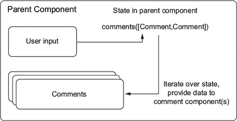

如何实现这一点？我们还没有探讨过通过属性传递函数这一种数据类型。因为函数可以作为参数传递给 JavaScript 中的其他函数，你可以利用这一点。你可以在父组件上定义一个方法，并将其作为属性传递给子组件。这样，子组件就可以将数据发送回父组件，而无需知道父组件如何处理这些数据。如果你需要更改数据的行为，你不需要对`CreateComment`组件做任何操作。要执行作为属性传递的函数，子组件只需要调用该方法并传递任何数据给它。下面的列表展示了如何使用函数作为属性。

##### 列表 2.8。使用函数作为属性

```
//...
class CreateComment extends Component {
    constructor(props) {
        super(props);
        this.state = {
            content: '',
            user: ''
        };
        this.handleUserChange = this.handleUserChange.bind(this);
        this.handleTextChange = this.handleTextChange.bind(this);
        this.handleSubmit = this.handleSubmit.bind(this);
    }
    handleUserChange(event) {
        this.setState(() => ({
            user: event.target.value
        }));
    }
    handleTextChange(event) {
        this.setState(() => ({
            content: event.target.value
        }));
    }
    handleSubmit(event) {
        event.preventDefault();
        this.props.onCommentSubmit({              *1*
            user: this.state.user.trim(),         *1*
            content: this.state.content.trim()    *1*
        });
        this.setState(() => ({
            user: '',
            text: ''
        }));
    }
    render() {
        return React.createElement(
            'form',
            {
                className: 'createComment',
                onSubmit: this.handleSubmit       *2*
            },
            React.createElement('input', {
                type: 'text',
                placeholder: 'Your name',
                value: this.state.user,
                onChange: this.handleUserChange
            }),
            React.createElement('input', {
                type: 'text',
                placeholder: 'Thoughts?',
                value: this.state.content,
                onChange: this.handleTextChange
            }),
            React.createElement('input', {
                type: 'submit',
                value: 'Post'

            })
        );
    }
}

//...
```

+   ***1* 调用由父组件传递的属性`onCommentSubmit`函数——你正在将表单数据传递进去并重置表单，这样用户就知道他们的操作已经成功了。**

+   ***2* 不要忘记将你设置的方法绑定到`onSubmit`事件上——没有它，正确的事件和你的方法之间将没有连接。**

列表 2.8 的代码可在网上找到，网址为[`codesandbox.io/s/p3mk26v3lx`](https://codesandbox.io/s/p3mk26v3lx)。

现在既然你的组件可以将新的评论数据传递给父组件，你需要包含一些模拟数据，这样你就可以开始评论了。在未来的章节中，你将使用 Fetch API 和 RESTful JSON API，但使用你创建的一些假数据现在就足够了。下面的列表展示了你如何模拟一些基本的帖子数据及其关联的评论。

##### 列表 2.9。模拟 API 数据

```
...
const data = {                                 *1*
    post: {                                    *1*
        id: 123,                               *1*
        content:
            'What we hope ever to do with ease, we must first learn to do
            with diligence. — Samuel Johnson',
        user: 'Mark Thomas',
    },
    comments: [
        {
            id: 0,                             *2*
            user: 'David',
            content: 'such. win.',
        },
        {
            id: 1,                             *2*
            user: 'Haley',
            content: 'Love it.',
        },
        {
            id: 2,                             *2*
            user: 'Peter',
            content: 'Who was Samuel Johnson?',
        },
        {
            id: 3,                             *2*
            user: 'Mitchell',
            content: '@Peter get off Letters and do your homework',
        },
        {
            id: 4,                            *3*
            user: 'Peter',
            content: '@mitchell ok :P',
        },
    ],
};
...
```

+   ***1* 为你的 CommentBox 组件设置模拟数据。**

+   ***2* 你将使用这些评论对象作为现有的评论。**

+   ***3* 你将使用这些评论对象作为现有的评论。**

接下来，你需要一种方式来显示所有评论。在 React 中，这很容易做到。你已经有了一个可以显示评论的组件。因为与 React 组件一起工作只需要常规的 JavaScript，你可以使用`.map()`函数来返回一个新的 React 元素数组。你不能使用`.forEach()`内联，因为它不会返回一个数组，并且会留下`React.createElement()`没有可用的内容。然而，你可以使用`forEach`构建一个数组，然后将其传递进去。

除了迭代现有的评论外，你还需要定义一个可以传递给 CreateComment 组件的方法。它需要通过从子组件接收数据来修改其状态中的评论列表。提交方法和状态都需要放入一个新的父组件：CommentBox。下面的列表展示了如何创建该组件并设置这些方法。

##### 列表 2.10\. 处理评论提交和遍历元素

```
...
class CommentBox extends Component {
    constructor(props) {
        super(props);
        this.state = {
            comments: this.props.comments                    *1*
        };
        this.handleCommentSubmit = this.handleCommentSubmit.bind(this);
    }
    handleCommentSubmit(comment) {
        const comments = this.state.comments;                *2*
        // note that we didn't directly modify state
        comment.id = Date.now();                             *2*
        const newComments = comments.concat([comment]);      *2*
        this.setState({
            comments: newComments                            *2*
        });
    }
    render() {
        return React.createElement(
            'div',
            {
                className: 'commentBox'
            },
            React.createElement(Post, {
                id: this.props.post.id,                     *3*
                content: this.props.post.content,           *3*
                user: this.props.post.user                  *3*
            }),
            this.state.comments.map(function(comment) {     *4*
                return React.createElement(Comment, {       *4*
                    key: comment.id,                        *4*
                    id: comment.id,                         *4*
                    content: comment.content,               *4*
                    user: comment.user                      *4*
                });
            }),
            React.createElement(CreateComment, {
                onCommentSubmit: this.handleCommentSubmit   *5*
            })
        );
    }
}

CommentBox.propTypes = {
    post: PropTypes.object,
    comments: PropTypes.arrayOf(PropTypes.object)
};

const App = React.createElement(CreateComment);

ReactDOM.render(                                             *6*
    React.createElement(CommentBox, {
                                                             *6*
        comments: data.comments,                             *6*
        post: data.post                                      *6*
    }),
    node
);

...
```

+   ***1* 将评论数据在最高级别传递给 CommentBox。**

+   ***2* 永远不要直接修改状态——相反，创建一个副本。**

+   ***3* 如前所述，将数据变量在最高级别传递以访问帖子数据。**

+   ***4* 遍历 this.state.comments 中的评论，并为每个评论返回一个 React 元素。**

+   ***5* 将父组件的 handleComment-Submit 方法传递给 CreateComment 组件以使用。**

+   ***6* 将模拟数据作为属性传递给 CommentBox 组件。**

列表 2.10 的代码可在网上找到，网址为[`codesandbox.io/s/z6o64oljn4`](https://codesandbox.io/s/z6o64oljn4)。

到目前为止，你有一个外观不佳、未经测试但功能性的组件，它将对属性进行验证、更新状态，并允许你添加新的评论。它看起来不多，所以我把它留给你作为一个挑战，让你把评论框做得值得我们的虚构公司 Letters。

### 2.4\. 了解 JSX

你已经创建了你的第一个动态 React 组件。如果你觉得很容易，那太好了！如果你发现代码中嵌套的`React.createElement`难以阅读，那也无所谓。我们即将讨论一些创建组件的更简单方法，但首先需要关注基础。几乎任何其他事情以相反的方式学习（“魔法”和容易先，基础和细节后）通常要容易得多，但长期来看可能会阻碍你，因为你没有做理解底层机制如何工作的艰苦工作。如果你回顾你的模拟数据，你可能记得这句话，它很及时：

> *我们希望轻松完成的事情，我们首先必须学会勤奋地去做。*
> 
> *塞缪尔·约翰逊*

#### 2.4.1\. 使用 JSX 创建组件

精通基础很重要，但这并不意味着我们必须让自己难堪。实际上，创建 React 组件比仅使用`React.createElement`有更简单、更好的方法。那就是 JSX：更好的方法。

JSX 是什么？它是对 ECMAScript 的一种类似于 XML 的语法扩展，没有定义任何语义，专门用于预处理器的使用。换句话说，JSX 是 JavaScript 的一个扩展，类似于 XML，并且仅用于代码转换工具。这不是你会在任何 ECMAScript 规范中看到被整合的东西。

JSX 通过允许你使用 XML 风格的（想想 HTML）代码代替`React.createClass`来帮助你。换句话说，它让你写出的代码看起来像 HTML，但实际上不是。像 Babel 这样的 JSX 预处理器程序——一个将你的 JavaScript 代码转换为与旧浏览器兼容的代码的转换器——会遍历并转换你所有的 JSX 代码，就像我们之前写的那样。一个影响是，在浏览器中直接运行未经转换的 JSX 代码将不起作用——当你的 JavaScript 被解析时，你会得到各种语法错误。

在 JavaScript 中编写类似 XML、类似 HTML 的代码可能会触发你的警告本能，但使用 JSX 有很多很好的理由，我将在后面介绍。现在，查看列表 2.11 以了解你的注释框组件可能的样子。我已经省略了一些代码，以便更容易地关注 JSX 语法。请注意，Babel 是 CodeSandbox 环境的一部分。通常，你会使用像 Webpack 这样的构建工具来转换你的 JavaScript，但你也可以导入 Babel 并在没有构建步骤的情况下使用它。但这会慢得多，而且不应该在生产环境中这样做。你可以在[`babeljs.io`](https://babeljs.io)了解更多信息。

##### 列表 2.11\. 使用 JSX 重写组件

```
...
    class CreateComment extends Component {
    constructor(props) {
        super(props);
        this.state = {
            content: '',
            user: ''
        };
        this.handleUserChange = this.handleUserChange.bind(this);
        this.handleTextChange = this.handleTextChange.bind(this);
        this.handleSubmit = this.handleSubmit.bind(this);
    }
    //...
    render() {
        return (
            <form onSubmit={this.handleSubmit} className="createComment">
                <input
                    value={this.state.user}
                    onChange={this.handleUserChange}                 *1*
                    placeholder="Your name"                          *1*
                    type="text"
                />
                <input
                    value={this.state.content}
                    onChange={this.handleTextChange}
                    placeholder="Thoughts?"
                    type="text"
                />
                <button type="submit">Post</button>
            </form>
        );
    }
}

class CommentBox extends Component {
//...
    render() {
        return (
            <div className="commentBox">
                <Post
                    id={this.props.post.id}                          *2*
                    content={this.props.post.content}                *2*
                    user={this.props.post.user}
                />
                {this.state.comments.map(function(comment) {         *3*
                    return (
                        <Comment
                            key={comment.id}
                            content={comment.content}                *3*
                            user={comment.user}                      *3*
                        />
                    );
                })}
                <CreateComment
                  onCommentSubmit={this.handleCommentSubmit}         *4*
                />
            </div>
        );
    }
}

CommentBox.propTypes = {
    post: PropTypes.object,
    comments: PropTypes.arrayOf(PropTypes.object)
};

ReactDOM.render(
    <CommentBox
        comments={data.comments}                                    *5*
        post={data.post}
    />,
    node
);

  ......
```

+   ***1* 在 JSX 中，你创建属性的方式与在 HTML 中一样——要传入表达式，请使用 `{}` 语法。**

+   ***2* 这是你在之前创建的 Post React 类——注意现在它更清楚地表明它是一个你创建的自定义组件，看起来它非常适合在 HTML 中使用。**

+   ***3* 在{}内部使用常规 JavaScript 遍历注释并为每个注释创建一个注释组件。**

+   ***4* 将 handleComment-Submit 处理程序作为属性传入。**

+   ***5* 在顶级上，CommentBox 也是一个你提供属性并传递给 React DOM 以进行渲染的自定义组件。**

列表 2.11 的代码可在网上找到，网址为[`codesandbox.io/s/vnwz6y28x5`](https://codesandbox.io/s/vnwz6y28x5)。

#### 2.4.2\. JSX 的优势和与 HTML 的区别

现在你已经看到了 JSX 的实际应用，你可能对它不那么怀疑了。如果你仍然谨慎，重要的是要考虑它为 React 中的组件工作带来的许多好处。以下是其中两个好处：

+   ***与 HTML 的相似性和更简单的语法*—** 如果反复编写 `React.createElement` 感到繁琐，或者发现嵌套难以理解，你并不孤单。JSX 与 HTML 的相似性使得以熟悉的方式声明组件的结构变得容易得多，并且显著提高了可读性。

+   ***声明性和封装性*—** 通过将构成视图的代码以及任何相关的方法一起包含，你创建了一个功能组。本质上，关于组件你需要知道的一切都在一个地方。没有任何东西是不必要地隐藏起来的，这意味着你可以更容易地推理你的组件，并且可以更全面地了解它作为一个系统是如何工作的。

感觉像是回到了 90 年代末编写你的标记与 JavaScript 一起，但这并不意味着这是一个坏主意。

需要注意的是，JSX 不是 HTML（或 XML）——它只会编译成你迄今为止使用的常规 React 代码，并且它不共享完全相同的语法和约定。存在一些细微的差异，你需要留意。未来的章节将更全面地介绍这些差异，但我会简要地指出其中的一些：

+   ***HTML 标签与 React 组件*—**使用 `React.createClass` 创建的自定义 React 组件按照约定首字母大写，这样你可以确定自定义和原生 HTML 组件之间的区别。

+   ***属性表达式*—**当你想将 JavaScript 表达式用作属性值时，将表达式包裹在一对大括号中（`<Comment a={this.props.b}/>`），而不是使用引号（`<User a="this.props.b"/>`），如列表 2.8 所示。

+   ***布尔属性*—**省略属性的值（`<Plan active/>`，`<Input checked/>`）会使 JSX 将其视为 `true`。要传递一个假值，你必须使用属性表达式（`attribute={false}`）。

+   ***嵌套表达式*—**要在元素内部插入表达式的值，你也使用一对大括号（`<p>{this.props.content}</p>`）。

JSX 和偶尔的“陷阱”存在细微的差异，但后面的章节将涵盖所有这些内容，并且更多。你将在你的组件中广泛使用 JSX，现在你已经开始使用 JSX，你将能够更容易地创建、阅读和思考你的组件。

### 2.5\. 摘要

在本章中，我们花了很多时间讨论组件，所以让我们回顾一些关键点：

+   我们在 React 中创建组件时主要使用两种类型的元素：React 元素和 React 类。React 元素是“你希望在屏幕上看到的内容”，可以与 DOM 元素相媲美。另一方面，React 类是从 `React.Component` 类继承的 JavaScript 类。这些就是我们通常所说的 *组件*。它们可以是类（通常扩展 `React.Component`）或函数（无状态函数组件，将在后面的章节中介绍）。

+   React 类可以访问随时间变化的状态（可变状态），但所有 React 元素都可以访问不应修改的 props（不可变状态）。

+   React 类还有称为 *生命周期方法* 的特殊方法，React 在渲染和更新过程中会按特定顺序调用这些方法。这使得你的组件更容易预测和操作，并允许你轻松地挂钩到组件更新过程。

+   React 类可以定义自定义方法来执行诸如修改状态等任务。

+   React 组件通过 props 进行通信，并具有父子关系。父组件可以向子组件传递数据，但子组件不能修改父组件。它们可以通过回调将数据传递回父组件，但不能直接访问父组件。

+   JSX 是 JavaScript 的一个类似 XML 的扩展，它允许你以更简单、更熟悉的方式编写组件。一开始在 JavaScript 中编写看起来像 HTML 的内容可能会感觉有些奇怪，但 JSX 可以使你在 React 中编写标记更加熟悉，并且通常比 `React.createElement` 调用更容易阅读。

你已经创建了你的第一个组件，但你只是触及了 React 所能实现的一小部分。在下一章中，你将开始探索如何处理更复杂的数据，了解不同类型的组件，并随着我们扩展你的 React 视野，进一步深入研究状态。
