## 第二部分\. React 中的组件和数据

在第一部分中，您从高层次了解了 React，快速浏览了一些其 API，并构建了一些组件。希望这能给您一个更好的整体感觉，了解 React 是什么以及它作为一项技术是如何工作的。但快速浏览并不能让您充分利用 React，以便您可以用它构建健壮、动态的用户界面。

正是第二部分的用武之地。在第二部分中，您将开始更深入地探索 React，并仔细查看其 API。我们将探讨您如何创建组件以及您可以创建的不同类型的组件。在第三章（kindle_split_014_split_000.xhtml#ch03）中，我们将探讨数据如何在 React 应用中流动。这将帮助您了解 React 如何在组件中处理数据。

在第四章中，您将了解 React 中的生命周期方法，并开始构建您将在本书的剩余部分关注的工程项目：一个名为 Letters Social 的社会化应用。如果您想提前查看最终项目，可以访问[`social.react.sh`](https://social.react.sh)。第四章将帮助您理解 React 组件 API，并展示如何设置构建 Letters Social 项目。

在第五章和第六章中，我们将探讨 React 中的表单。表单是大多数 Web 应用的一个重要部分，我们将探讨它们如何在 React 中工作。您将为 Letters Social 添加表单，并创建一个允许用户创建帖子并集成 Mapbox 以添加地图位置的界面。

在第七章和第八章中，我们将深入探讨路由。路由是现代前端 Web 应用的另一个关键部分。您将使用 React 从头开始构建一个路由器，并为 Letters Social 添加多个页面。在章节的末尾，您将集成 Firebase，以便用户可以登录到您的应用。

当我们在第九章中结束第二部分时，我们将专注于测试。测试是所有软件的重要部分，React 也不例外。您将探索使用 Jest 和 Enzyme 等工具来测试您的 React 组件。

## 第三章\. React 中的数据和数据流

*本章涵盖*

+   可变和不可变状态

+   有状态和无状态组件

+   组件通信

+   单向数据流

第二章 对 React 进行了一次快速浏览。我们花了一些时间从高层次上学习 React，探讨了其设计和 API 背后的某些概念，甚至还通过 React 组件构建了一个简单的评论框。在 第四章 中，你将开始更深入地使用组件，并开始构建 Letters Social 示例项目。但在你这样做之前，你需要了解一些关于如何在 React 中处理数据以及它在 React 应用程序中如何流动的知识。这正是本章的内容。

### 3.1. 引入状态

第二章 给了你一些在 React 组件中处理数据的初步了解，但如果你想构建更实质性的 React 应用程序，我们需要花更多的时间专注于这一点。在本节中，你将学习以下内容：

+   状态

+   React 如何处理状态

+   数据如何在组件间流动

现代网络应用程序通常被构建为以数据为先的应用程序。诚然，有许多静态网站（我的博客就是一个——[`ifelse.io`](https://ifelse.io)），但这些网站随着时间的推移也会更新，并且通常被认为与现代网络应用程序属于不同的类别。人们日常使用的多数网络应用程序都是高度动态的，并且充满了随时间变化的数据。

以 Facebook 这样的应用程序为例。作为一个社交网络，数据是它所有有用功能的生命线。它提供了多种方式在互联网上与其他人互动，而这些所有方式都是通过在浏览器（或其他平台）中修改和接收数据来实现的。许多其他应用程序包含极其复杂的数据，这些数据需要以人们可以理解和轻松使用的方式在 UI 中表示。开发者还需要能够维护和推理这些界面以及数据如何通过它们流动，因此应用程序处理数据的能力与它处理随时间变化的数据的能力一样重要。你将在下一章开始构建的示例应用程序 Letters Social（可在 [`social.react.sh`](https://social.react.sh) 查看它），将使用大量变化的数据，尽管它不会像大多数消费者或商业应用程序那样复杂。我将在本章中对此进行更明确的说明，但我们将继续学习如何在 React 中处理数据，直到本书的结尾。

#### 3.1.1. 什么是状态？

让我们简要地看一下状态，这样当我们研究 React 中的状态时，你可以有更好的理解。如果你以前从未明确思考或听说过程序中的状态，你可能至少见过它。你编写的大多数程序可能都有某种状态。如果你曾经使用过 Vue、Angular 或 Ember 这样的前端框架，你几乎肯定编写过具有状态方面的 UI。React 组件也可以有状态。但当我们说 *状态* 时，我们究竟在说什么呢？尝试这个定义：

|  |
| --- |

##### 状态

程序在某一时刻可访问的所有信息。

|  |
| --- |

这只是一个简化的定义，可能忽略了某些学术上的细微差别，但对于我们的目的来说已经足够好了。许多学者都撰写了论文，致力于精确地定义计算机系统中的状态，但对我们来说，状态是指程序在某一时刻可访问的信息。这包括，但不仅限于，在某一时刻你可以引用的所有值，而不需要做任何进一步的赋值或计算——换句话说，它是对你在某一时刻对程序了解的快照。

例如，这可能包括你之前创建的任何变量或其他可用的值。当你改变一个变量（而不仅仅是获取其值）时，你改变了程序的状态，它就不再是之前的状态了。你可以在某一时刻通过仅获取或获取值来检索状态，但当你随着时间的推移改变某些东西时，程序的状态就发生了变化。技术上讲，你的机器的底层状态在你使用它的每一刻都在变化，但我们只关心程序的状态。

让我们看一下一些代码，并逐步分析下一列表中的简化程序状态。我们不会深入探讨幕后发生的所有底层分配或过程——我们只是试图更明确地思考程序中的数据，以便在思考 React 组件时更容易。

##### 列表 3.1\. 简单程序状态

```
const letters = 'Letters';                                *1*
const splitLetters = letters.split('');                   *2*
console.log("Let's spell a word!");                       *3*
splitLetters.forEach(letter => console.log(letter));      *4*
```

+   ***1* 在名为 letters 的变量中存储一个字符串。**

+   ***2* 将字母拆分成一个字符串数组。**

+   ***3* 打印一条消息。**

+   ***4* 打印出每个字母。**

列表 3.1 展示了一个简单的脚本，它执行了一些基本的数据赋值和操作，并将结果输出。这很无聊，但我们可以用它来学习更多关于状态的知识。JavaScript 使用所谓的 *运行至完成* 语义，这意味着程序将从上到下，按照你认为的顺序执行。JavaScript 引擎通常会以你意想不到的方式优化你的代码，但它仍然应该以与你的原始代码一致的方式运行。

尝试从上到下逐行阅读 清单 3.1 中的代码。如果你想使用浏览器调试器来做这件事，请访问 [`codesandbox.io/s/n9mvol5x9p`](https://codesandbox.io/s/n9mvol5x9p)。你的浏览器开发工具应该会打开，你可以逐行执行代码并查看所有变量赋值等信息。

为了我们的目的，让我们考虑每一行代码都是一个时间点。根据我们对状态的简化定义“在给定时间点程序可用的所有信息”，你将如何描述在每一个给定时刻应用程序的状态？请注意，我们保持简单，省略了闭包、垃圾回收等：

1.  `letters` 是一个被赋予字符串 “Letters” 的变量。

1.  `splitLetters` 是通过从 `letters` 中拆分每个字符创建的，`letters` 仍然可用。

1.  步骤 1 和 2 中的所有信息仍然可用；一条消息被发送到控制台。

1.  我们的程序遍历数组中的每个项目并输出一个字符。这个过程可能会在几个时间点发生，因此程序也有 `Array.forEach` 方法提供的信息。

随着程序执行向前推进，状态随时间变化，并且由于你没有删除任何内容或更改引用，更多信息变得可用。表 3.1 展示了随着程序随时间向前推进，可用信息是如何增加的。

##### 表 3.1\. 逐步状态

| 步骤 | 程序可用的状态 |
| --- | --- |
| 1 | letters = “Letters” |
| 2 | letters = “Letters” splitLetters = [“L”, “e”, “t”, “t”, “e”, “r”, “s”] |
| 3 | letters = “Letters” splitLetters = [“L”, “e”, “t”, “t”, “e”, “r”, “s”] |
| 4 | letters = “Letters” splitLetters = [“L”, “e”, “t”, “t”, “e”, “r”, “s”] for sub-steps 0 through the length of splitLetters: letter = “L” (然后 “e”, “t”, 等。) |

尝试遍历你自己的代码并思考在每一行程序中可用的信息是什么。我们倾向于简化我们的代码——这是正确的，因为我们不必一次性考虑它的每一个可能的维度——但对于更简单的程序，也可能有大量的信息可用。

我们可以反思的一个观点是，当运行中的程序变得相对复杂（即使是大多数简单的 UI 也可能如此），推理它可能会变得困难。我的意思是，系统的复杂性可能很难一次性全部记住，系统中的逻辑可能会使思考变得困难。这对大多数程序都适用，但当涉及到构建 UI 时，这可能会特别困难。

现代浏览器应用的 UI 通常代表了多种技术的交集，包括提供数据、样式和布局 API 的服务器，JavaScript 框架，浏览器 API 等等。UI 框架的进步旨在简化这个问题，但它仍然是一个挑战。随着人们对 Web 应用期望的不断提高，这些应用变得越来越普遍，并嵌入到社会和日常生活中，这个挑战通常只会加剧。如果 React 要变得有用，它将需要通过减少或保护我们免受某些现代 UI 的极其复杂的状态的影响来帮助我们。我希望你能看到 React 确实做到了这一点。但它是如何做到的呢？一种方法是通过提供两个特定的 API 来处理数据：props 和 state。

#### 3.1.2\. 可变和不可变状态

在 React 应用中，你可以通过两种主要方式在组件中处理状态：通过你可以改变的状态，以及通过你不应该改变的状态。这里我们过于简化了：你的应用中将有多种类型的数据和状态存在。你可以用许多不同的方式表示数据，比如二叉树、Maps 或 Sets，或者常规的 JavaScript 对象。但你在 React 组件中与状态通信和交互的方式可以分为这两类。在 React 中，这些被称为*状态*（组件内可以改变的数据）和*属性*（组件接收的数据，不应该被组件改变）。

你可能听说过状态和属性被称为可变和不可变。这在某种程度上是正确的，因为 JavaScript 本身不支持真正的不可变对象（也许除了 Symbols）。在 React 组件中，状态通常是可变的，而属性不应该被改变。在我们深入探讨 React 特定的 API 之前，让我们更深入地探讨可变性和不可变性的概念。

你在第二章中看到，当我们说状态是可变的，我们的意思是我们可以覆盖或更新那些数据（例如，可以覆盖的变量）。另一方面，不可变状态是不可变的。也存在不可变的数据结构，这些数据结构可以改变，但只能以受控的方式进行（这有点像是 React 中状态 API 的工作方式）。当你使用 Redux 在第十章和第十一章时，你会模拟不可变数据结构。

我们可以稍微扩展我们对可变和不可变概念的理解，包括它们对应的数据结构类型：

+   ***不可变*—** 不可变、持久的数据结构在一段时间内支持多个版本，但不能直接被覆盖；不可变数据结构通常是持久的。

+   ***可变*—** 可变、短暂的数据结构在一段时间内只支持一个版本；当可变数据结构发生变化时，会被覆盖，并且不支持额外的版本。

图 3.1 展示了这些概念。

##### 图 3.1\. 不可变和可变数据结构中的持久性和短暂性。不可变或持久的数据结构通常记录历史并保持不变，但会创建随时间变化的内容的版本。另一方面，短暂的数据结构通常不记录历史，并且每次更新都会被清除。

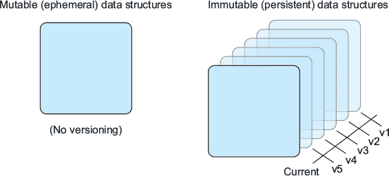

另一种思考不可变数据结构和可变数据结构之间区别的方法是，将它们视为具有不同的容量或内存。短暂的数据结构只能存储一瞬间的数据，而持久的数据结构可以跟踪随时间的变化。这就是不可变数据结构的不可变性变得更为清晰的地方：只有状态副本被创建——它们不会被替换。旧状态被新状态所取代，但数据本身并没有被替换。图 3.2 展示了如何进行更改。

##### 图 3.2\. 使用可变和不可变数据结构处理更改。短暂的数据结构没有版本，所以当你对它们进行更改时，所有之前的状态都会消失。你可以这样说，它们活在当下，而不可变数据结构能够随着时间的推移而持续存在。

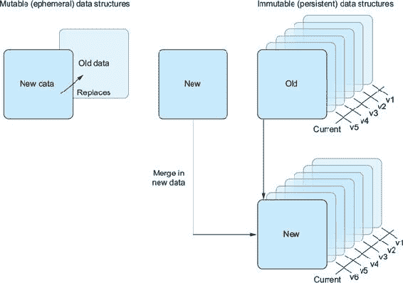

| |
| --- |

##### 小贴士

另一种思考不可变性与可变性之间区别的方法是，将其与“保存”和“另存为”之间的区别相比较。在许多计算机程序中，你可以以当前状态保存文件，或者以不同的名称保存当前文件的副本。不可变性与此类似，当你保存到它时，你是在保存一个副本，而可变数据可以在原地被覆盖。

| |
| --- |

尽管 JavaScript 本身不支持真正的不可变数据结构，但 React 以可变的方式（通过`setState`进行更改）暴露组件状态，并将属性作为只读。关于不可变性和不可变数据结构，还有很多其他内容，但我们不需要比我们已经了解的更多地去关心它们。如果你仍然好奇想了解更多，有一整个学术研究领域都专注于这类问题。还有方法可以在你的 JavaScript 应用程序（无论是否是 React）中广泛使用不可变数据结构（例如，使用 Immutable JS 库，更多信息请参阅[`facebook.github.io/immutable-js/`](https://facebook.github.io/immutable-js/)），但在 React 中，我们只会处理属性和状态 API。

### 3.2\. React 中的状态

你已经对状态和（不可）可变性有了更多的了解。所有这些如何与 React 结合？嗯，我们在上一章已经看到了一些关于属性和状态 API 的内容，所以你可能已经猜到它们一定是构建组件的重要部分。实际上，它们是 React 组件处理数据和相互通信的两种主要方式。

#### 3.2.1\. React 中的可变状态：组件状态

让我们从状态 API 开始。虽然我们可以这样说，所有组件都有某种“状态”（一般概念），但并非 React 中的所有组件都有本地组件状态。从现在开始，当我提到状态时，我指的是 React API，而不是一般概念。继承自 `React.Component` 类的组件将获得访问此 API 的权限。React 将为以这种方式创建的组件创建并跟踪一个后端实例。这些组件还将获得下一章中讨论的一系列生命周期方法的访问权限。

你可以通过 `this.state` 访问继承自 `React.Component` 的组件中的状态。在这种情况下，`this` 指的是类的实例，而 `state` 是 React 将为你跟踪的特殊属性。你可能认为你可以通过直接赋值或修改其中的属性来更新 `state`，但这并不是情况。让我们看看以下列表中一个简单 React 组件的组件状态示例。你可以在你的本地机器上创建此代码，或者更简单地在 [`codesandbox.io/s/ovxpmn340y`](https://codesandbox.io/s/ovxpmn340y) 上创建。

##### 列表 3.2\. 使用 `setState` 修改组件状态

```
import React from "react";
import { render } from "react-dom";
class Secret extends React.Component{                                        *1*
  constructor(props) {
     super(props);
     this.state = {
        name: 'top secret!',                                                 *2*
    };
     this.onButtonClick = this.onButtonClick.bind(this);                     *1*
  }
  onButtonClick() {                                                          *3*
    this.setState(() => ({                                                   *3*
      name: 'Mark'                                                           *3*
    }));
  }
  render() {
    return (
      <div>
        <h1>My name is {this.state.name}</h1>
            <button onClick={this.onButtonClick}>reveal the secret!</button> *4*
      </div>
    )
  }
}

render(
     <Secret/>,
     document.getElementById('root')                                         *5*
);
```

+   ***1* 创建一个将在一段时间内访问持久组件状态的 React 组件——别忘了将你的类方法绑定到组件实例上。**

+   ***2* 为组件提供一个初始状态，以便在 render() 中访问它时不会返回 undefined 值或抛出错误。**

+   ***3* 我们第一次看到 `setState`，这是修改组件状态的特殊 API；调用 `setState` 并传入一个回调函数，该函数返回一个新状态对象供 React 使用。**

+   ***4* 将揭示名称的函数绑定到按钮发出的点击事件上。**

+   ***5* 将顶层组件渲染到应用程序最顶层的 HTML 元素中——你可以按你喜欢的方式标识容器，只要 ReactDOM 能够找到它。**

列表 3.2 创建了一个简单的组件，当你点击按钮并使用 `setState` 更新组件状态时，它会揭示一个秘密名称。注意，`setState` 在 `this` 上可用，因为该组件继承自 `React.Component` 类。

当你点击按钮时，将触发一个点击事件，React 将执行你告诉它响应的函数。当它执行时，它将使用一个对象作为参数调用 `setState` 方法。该对象有一个 `name` 属性，指向一个字符串。React 将安排更新状态。当这项工作完成后，`React DOM` 将根据需要更新 DOM。你的 `render` 函数将被再次调用，但这次将使用不同的值提供给 JSX 表达式语法（`{}`）中的 `this.state.name`。它将读取“Mark”而不是“绝密！”我的秘密身份就会被揭露！

通常，当可能时，你应该尽量少用`setState`，因为这样会带来性能和复杂性的影响（React 需要为你跟踪其他东西，而你也需要在心理上跟踪另一份数据）。在 React 社区中，有一些流行的模式允许你几乎不用组件状态（包括 Redux、Mobx、Flux 等），这些模式作为你应用程序的选项是很好的探索对象——实际上，我们将在第十章和第十一章中查看 Redux。尽管通常最好使用无状态函数组件，或者依赖像 Redux 这样的模式，但使用`setState` API 本身并不是一个坏习惯——它仍然是 React 中更改组件数据的主要 API。

在继续之前，重要的是要注意，你永远不应该在 React 组件中直接修改`this.state`。如果你尝试直接修改`this.state`，调用`setState()`之后可能会替换你所做的修改，甚至更糟糕的是——React 将无法了解你对状态所做的更改。尽管你可以将组件状态视为可以改变的东西，但你应该将`this.state`对象视为在你的组件内部不可变的（就像 props 一样）。

这也很重要，因为`setState()`并不会立即修改`this.state`。相反，它创建了一个挂起的*状态转换*（关于渲染和变更检测的更多内容将在下一章中介绍）。在调用此方法之后访问`this.state`可能会返回现有值。所有这些因素都可能造成潜在的调试难题，所以请尽量使用`setState()`来修改组件状态。

即使是在列表 3.2 中的这样一个小型交互中，也有很多事情在进行。我们将在未来的章节中继续分解 React 在更新你的组件时发生的所有各种步骤，但此刻重要的是更仔细地看看你的组件的`render`方法。请注意，尽管你执行了状态突变并更改了数据，但它以一种相对可理解和可预测的方式进行。

更好的是，你可以一次性声明你想要的组件外观和结构的样子。你不必为它可能存在的两种不同状态做大量的额外工作（有或没有透露秘密名称）。React 处理了所有底层状态绑定和更新过程，而你只需要说，“名字应该在这里。”React 通过不强迫你在每个时间点都考虑每一块状态，就像在 3.1.1 节中必须做的那样，来帮助你。

让我们更仔细地看看`setState` API。它是更改 React 组件中动态状态的主要方式，你将在你的应用程序中经常使用它。让我们看看方法签名，看看你需要传递给它什么：

```
setState(
  updater,
  [callback]
) -> void
```

`setState` 接收一个用于设置组件新状态的函数以及一个可选的 `callback` 函数。`updater` 函数具有以下签名：

```
(prevState, props) => stateChange
```

在 React 的早期版本中，你可以将一个对象而不是函数作为 `setState` 的第一个参数传递。与当前版本的 React（16 及以上）的一个关键区别是，它可能意味着 `setState` 是同步的，而实际上，React 会安排状态的变化。`callback` 格式更好地传达了这一概念，并且通常与 React 的整体声明式异步范式更一致：你允许系统（React）安排更新，其中顺序但不是时间是有保证的。这与对 UI 的更声明式方法相一致，并且通常比在特定时间强制指定数据更新的命令式方法更容易思考。

如果你需要更新状态，该更新依赖于当前状态或属性，你可以通过 `prevState` 和 `props` 参数访问它们。当你想要执行类似切换布尔值并需要知道在执行更新之前的确切最后值时，这通常很有用。

让我们更深入地关注 `setState` 的机制。使用从你的 `updater` 函数返回的对象，它将对当前状态执行浅合并。这意味着你可以提供一个对象，React 将合并对象上的顶级属性到状态中。例如，假设你有一个具有属性 `A` 和 `B` 的对象。`B` 有一些深层嵌套的属性，而 `A` 只是一个字符串（`'hi!'`）。由于正在执行浅合并，只有顶级属性及其引用将被保留，而不是 `B` 的每个部分。React 不会为你找到 `B` 的某些深层嵌套属性以供更新。一种解决方法是对对象进行复制，深度更新它，然后使用它。你也可以使用像 `immutable.js`（[`facebook.github.io/immutable-js/`](https://facebook.github.io/immutable-js/））这样的库来使在 React 中处理数据结构更容易。

`setState` 是一个使用简单的 API；你给你的 ReactClass 组件提供一些要合并到当前状态中的数据，React 会为你处理。如果你需要出于某种原因监听过程的完成，你可以通过可选的 `callback` 函数连接到它。列表 3.3 展示了 `setState` 浅合并的一个示例。像之前一样，你可以在 CodeSandbox 上轻松创建和运行你的 React 组件，网址为 [`codesandbox.io/s/0myo6ny4ww`](https://codesandbox.io/s/0myo6ny4ww)。这应该可以节省你在机器上设置一切的麻烦。

##### 列表 3.3\. 使用 `setState` 进行浅合并

```
import React from "react";
import { render } from "react-dom";
class ShallowMerge extends React.Component {
  constructor(props) {
     super(props);
     this.state = {
       user: {
        name: 'Mark',  //          *1*
        colors: {
          favorite: '',
         }
       }
     };
     this.onButtonClick = this.onButtonClick.bind(this);
  }
  onButtonClick() {
    this.setState({
      user: {  //                  *2*
        colors: {
          favorite: 'blue'
        }
      }
    });
  }
  render() {
    return (
      <div>
        <h1>My favorite color is {this.state.user.colors.favorite} and my
     name is {this.state.user.name}</h1>
        <button onClick={this.onButtonClick}>show the color!</button>
      </div>
    )
  }
}

render(
  <ShallowMerge />,
  document.getElementById('root')
);
```

+   ***1* 用户属性下的初始状态中存在一个名称...**

+   ***2* ...但不在你设置的状态中——如果它高一个层级，浅合并就不会起作用。**

在学习 React 的初期忘记浅合并可能会成为常见的错误来源。在这个例子中，当你点击按钮时，初始状态中嵌套在 `user` 键下的 `name` 属性将被覆盖，因为在新状态中它不存在。你想要保留这两部分状态，但最终一个覆盖了另一个。

|  |
| --- |

**关于 setState API 的思考**

本章讨论了 React 组件中管理状态的组件 API。提到的一点是，你需要通过 `setState` API 来修改状态，而不是直接修改。你认为这会是什么问题，为什么不会起作用？尝试在 [`codesandbox.io/s/j7p824jxnw`](https://codesandbox.io/s/j7p824jxnw) 中试试。

|  |
| --- |

#### 3.2.2\. React 中的不可变状态：Props

我们已经讨论了 React 如何通过状态和 `setState` 让你以可变的方式处理数据，但 React 中的不可变数据呢？在 React 中，props 是传递不可变数据的主要方式。任何组件都可以接收 props（不仅仅是继承自 `React.Component` 的组件）并在它们的 `constructor`、`render` 和 `lifecycle` 方法中使用它们。

React 中的 props 大概是不可变的。你可以使用库和其他工具在你的组件中模拟不可变的数据结构，但 React 的 props API 本身是半不可变的。如果可用，React 会使用原生的 JavaScript `Object.freeze` 方法([`developer.mozilla.org/en-US/docs/Web/JavaScript/Reference/Global_Objects/Object/freeze`](https://developer.mozilla.org/en-US/docs/Web/JavaScript/Reference/Global_Objects/Object/freeze)) 来防止向其添加新属性或从其移除现有属性。`Object.freeze` 还防止现有属性（或它们的枚举性、可配置性或可写性）被更改，并防止原型被更改。这有助于防止你修改 `props` 对象，但这在技术上并不是一个真正的不可变对象（尽管你可以基本上这样认为）。

Props 是传递给 React 组件的数据，无论是从父组件还是从组件本身的 `defaultProps` 静态方法。而组件状态是局部化的，仅限于单个组件，props 通常是从父组件传递的。如果你在想，“我能否在父组件中使用状态来传递 props 给子组件？”你是对的。一个组件的状态可以是另一个组件的 props。

Props 通常作为属性传递给 JSX，但如果你使用`React.createElement`，你可以通过该接口直接将它们传递给子组件。你可以将任何有效的 JavaScript 数据作为 prop 传递给另一个组件——甚至其他组件（毕竟它们只是类）。一旦 props 被传递给组件以供使用，你不应该从组件内部更改它们。你可以尝试，但你可能会得到一个像`Uncaught TypeError: Cannot assign to read-only property '<myProperty>' of object '#<Object>'`这样的错误——或者更糟，你的 React 应用可能不会按预期工作，因为你违反了预期的使用。

下一个部分中的列表 3.4 展示了你可以如何访问 props 以及如何不将它们分配给它们。正如之前所述，属性可能会随时间变化，但不是从组件内部。这是单向数据流的一部分——这是后续章节中讨论的主题。简而言之，*单向*意味着数据从父组件流向子组件，通过组件向下流动。使用状态（从`React.Component`继承）的父组件可以更改其状态，并且这种更改后的状态可以作为属性传递给子组件，从而改变属性。

| |
| --- |

**在 render 方法中调用 setState**

我们已经确定`setState`是更新组件状态的方法。你可以在哪里调用`setState`？我们将在下一章中探讨哪些组件生命周期点允许你调用`setState`，但现在是时候专注于`render`方法了。你认为在组件的`render`方法中调用`setState`会发生什么？尝试在[`codesandbox.io/s/48zv2nwqww`](https://codesandbox.io/s/48zv2nwqww)中试试。

| |
| --- |

#### 3.2.3. 与 props 一起工作：PropTypes 和默认 props

当使用 props 时，你有一些 API 可用，这些 API 可以在开发过程中帮助你：PropTypes 和默认 props。PropTypes 提供了一种类型检查功能，你可以指定组件在使用时预期接收到的 props 类型。你可以指定数据类型，甚至告诉组件消费者他们需要提供的数据形状（例如，一个具有用户属性且具有某些键的对象）。在 React 的早期版本中，PropTypes 是核心`React`库的一部分，但现在它作为一个独立的`prop-types`包存在([`github.com/facebook/prop-types`](https://github.com/facebook/prop-types))。

`prop-types`库并不是魔法——它是一组函数和属性，可以帮助对输入进行类型检查。它也不特定于 React——你同样可以在其他库中使用它，如果你想在输入上进行类型检查的话。例如，你可以将`prop-types`引入另一个类似于 React 的组件驱动框架，如 Preact([`preactjs.com`](https://preactjs.com))，并类似地使用它。

要为组件设置 PropTypes，您需要在类上提供一个名为 `propTypes` 的静态属性。注意在 列表 3.4 中，您在组件类上设置的静态属性名称为小写，而您从 `prop-types` 库访问的对象名称为大写 (`PropTypes`)。要指定组件需要的 props，您添加您想要验证的 prop 名称，并将其分配给 `prop-types` 库默认导出的属性（`import PropTypes from 'prop-types'`）。使用 PropTypes，您可以声明几乎任何类型的 props、形状和要求类型（可选或必需）。

另一个可以帮助您使开发体验更轻松的工具是默认 props。还记得您如何可以使用类 `constructor` 为组件提供一个初始状态吗？您也可以为 props 做类似的事情。您可以为组件提供一个名为 `defaultProps` 的静态属性，以提供默认 props。使用默认 props 可以帮助确保您的组件将拥有运行所需的一切，即使使用组件的人忘记提供 prop。

##### 列表 3.4\. React 组件中的不可变 props

```
import React from "react";
import { render } from "react-dom";
import PropTypes from "prop-types";

class Counter extends React.Component {
  static propTypes = {                                 *1*
    incrementBy: PropTypes.number,
    onIncrement: PropTypes.func.isRequired             *2*
  };
  static defaultProps = {
    incrementBy: 1
  };

  constructor(props) {
    super(props);
    this.state = {
      count: 0
    };
    this.onButtonClick = this.onButtonClick.bind(this);
  }
  onButtonClick() {
    this.setState(function(prevState, props) {
      return { count: prevState.count + props.incrementBy };
    });
  }
  render() {
    return (
      <div>
        <h1>{this.state.count}</h1>
        <button onClick={this.onButtonClick}>++</button>
      </div>
    );
  }
}

render(<Counter incrementBy={1} />, document.getElementById("root"));
```

+   ***1* 指定一个具有“形状”的对象。**

+   ***2* 您可以将任何与 isRequired 连接的 propTypes 链接起来，以确保如果属性未显示时显示警告。**

#### 以下列表展示了在组件中使用 PropTypes 和默认 props 的示例。在 [`codesandbox.io/s/31ml5pmk4m`](https://codesandbox.io/s/31ml5pmk4m) 运行代码。

如果您想创建一个仅使用 props 而不使用状态的简单组件，您会怎么做？实际上，这是一个常见的用例，尤其是在本书后面将要探讨的一些常见的 React 友好的应用程序架构模式中，如 Flux 和 Redux。在这些情况下，您通常希望将状态保存在集中位置，而不是分散在您的组件中。但仅使用 props 在其他情况下也很有用。如果 React 不必为您管理后端实例，那么您的应用程序的资源使用惩罚将会更小。

事实上，您可以创建一种仅使用 props 的组件：一个无状态函数组件。这些组件有时被开发者称为 *无状态* 组件、*函数* 组件和其他类似名称，这可能会让人难以跟踪正在讨论的内容。它们通常意味着同一件事：一个不继承自 `React.Component` 的 React 组件，因此无法访问组件状态或其他生命周期方法。

无状态函数组件，不出所料，就是这样：一个没有访问或使用 React 状态 API（或从`React.Component`继承的其他方法）的组件。它之所以是无状态的，并不是因为它完全没有任何类型的（一般）状态，而是因为它没有 React 为你管理的后端实例。这意味着没有生命周期方法（在第四章中介绍），没有组件状态，并且可能占用更少的内存。

无状态函数组件之所以是函数式的，是因为它们可以被编写为命名函数或匿名函数表达式，并分配给一个变量。它们只接受 props，并且因为它们基于给定的输入返回相同的输出，所以本质上被认为是纯函数。这使得它们运行速度快，因为 React 可能会通过避免不必要的生命周期检查或内存分配来进行优化。以下列表展示了无状态函数组件的一个简单示例。在[`codesandbox.io/s/l756002969`](https://codesandbox.io/s/l756002969)运行代码。

##### 列表 3.5. 无状态函数组件

```
import React from "react";
import { render } from "react-dom";
import PropTypes from "prop-types";

function Greeting(props) {                                             *1*
  return <div>Hello {props.for}!</div>;
}

Greeting.propTypes = {                                                 *2*
     for: PropTypes.string.isRequired
};

Greeting.defaultProps = {                                              *2*
     for: 'friend'
};

render(<Greeting for="Mark" />, mountNode);

// Or using an arrow function
// const Greeting = (props) => <div>Hello {props.for}</div>;           *1*
//... specify props and default props same as before
// render(<Greeting name="Mark" />, document.getElementById("root"));
```

+   ***1* 无状态函数组件可以用函数或匿名函数创建。**

+   ***2* 对于无状态函数组件的任何形式，你都可以在函数或变量上指定 propTypes 和默认 props 作为属性。**

无状态函数组件可以非常强大，尤其是在与具有后端实例的父组件结合使用时。你不必在多个组件之间设置状态，可以创建一个单一的状态父组件，并使用轻量级的子组件来完成其余工作。在第十章和第十一章中，我们将探讨如何使用 Redux 将这种模式提升到一个全新的水平。在使用 Redux 的 React 应用程序中，你通常创建较少的状态组件（尽管仍然有一些情况这样做是有意义的），并将状态集中在一个单一的位置（存储库）。

|  |
| --- |

**在一个组件中使用状态来修改另一个组件的 props**

本章已经讨论了 props 和状态作为你在 React 组件中处理和传递数据的主要方式。你不应该直接修改状态或 props，但使用`setState`你可以告诉 React 更新组件的状态。你将如何在一个组件中使用状态来修改另一个组件的 props？前往[`codesandbox.io/s/38zq71q75`](https://codesandbox.io/s/38zq71q75)尝试一下。

|  |
| --- |

### 3.3. 组件通信

当您构建简单的评论框组件时，您可以看到您可以从其他组件中创建组件。这就是 React 很棒的一个原因。您可以从子组件轻松构建其他组件，同时保持事物很好地捆绑在一起。您还很容易表达组件之间的“是”和“有”的关系。这意味着您可以将组件视为既有“部分”也有“特定事物”。

您可以混合和匹配组件并灵活地构建事物，但这如何使它们相互通信呢？许多框架和库提供了一种特定于框架的方法，使应用程序的不同部分能够相互通信。在 Angular.js 或 Ember.js 中，您可能听说过或使用过服务来在应用程序的不同部分之间进行通信。通常这些是广泛可用、长期存在的对象，您可以在其中存储状态并在应用程序的不同部分访问它们。

React 使用服务或类似的东西吗？不。在 React 中，如果您想让组件相互通信，您传递 props，当您传递 props 时，您正在做两件简单的事情：

+   访问父组件中的数据（无论是状态还是属性）

+   将该数据传递给子组件

下面的列表展示了您熟悉的父子关系以及所有者-被所有者关系。在[`codesandbox.io/s/pm18mlz8jm`](https://codesandbox.io/s/pm18mlz8jm)运行它。

##### 列表 3.6. 从父组件向子组件传递属性

```
import React from "react";
import { render } from "react-dom";
import PropTypes from "prop-types";

const UserProfile = props => {                            *1*
  return ;
};
UserProfile.propTypes = {
  pagename: PropTypes.string                              *2*
};

UserProfile.defaultProps = {
  pagename: "erondu"                                      *2*
};

const UserProfileLink = props => {
  return <a href={`https://ifelse.io/${props.user-
     name}`}>{props.username}</a>;
};

const UserCard = props => {                               *3*
  return (
    <div>
      <UserProfile username={props.username} />
      <UserProfileLink username={props.username} />
    </div>
  );
};

render(<UserCard username="erondu" />, document.getElementById("root"));
```

+   ***1* 创建一个无状态的函数组件，返回一个示例图像。**

+   ***2* 记住，即使在无状态的函数组件上，您也可以指定默认属性和 propTypes。**

+   ***3* UserCard 是 UserProfile 和 UserProfileLink 的父组件。**

### 3.4. 单向数据流

如果您之前使用过框架开发过 Web 应用程序，您可能对术语“双向数据绑定”很熟悉。数据绑定是建立应用程序 UI 与其他数据之间连接的过程。在实践中，这通常表现为类似库或框架连接应用程序数据（如模型（用户））到用户界面并保持它们同步的东西。它们是同步的，因此被绑定在一起。在 React 中，另一种更有帮助的思考方式是将其视为“投影”：UI 是将数据投影到视图中的数据，当数据发生变化时，视图也会随之变化，如图 3.3 所示。

##### 图 3.3. 数据绑定通常指的是在您的应用程序数据和视图（数据的显示）之间建立连接的过程。另一种思考方式是将数据投影到用户可以看到的东西上（例如，一个视图）。

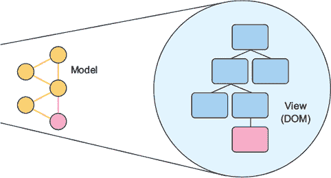

另一种思考数据绑定的方式是数据*流动*：数据是如何在应用程序的不同部分之间移动的？本质上，你是在问，“什么可以更新什么，从哪里，以及如何？”如果你想要有效地使用这些工具，了解这些工具如何塑造、操作和移动数据是非常重要的。不同的库和框架对数据流采取了不同的方法（React 在这方面也不例外，它有自己的看法）。

在 React 中，数据单向流动。这意味着，而不是在实体之间以水平方式流动，每个实体都可以更新另一个实体，而是建立了一个层次结构。你可以通过组件传递数据，但不能伸手修改其他组件的状态或属性，除非传递属性。你也不能修改父组件中的数据。

但你可以通过回调函数将数据向上传递到层次结构的更高层。当一个父组件从子组件接收到回调时，它可以更改其数据并将更改后的数据向下发送给子组件。即使在有回调的这种场景中，数据总体上仍然向下流动，并且由传递数据的父组件决定。这就是为什么我们说在 React 中数据是单向流动的，如图 3.4 所示 figure 3.4。

##### 图 3.4. React 中数据单向流动。属性从父组件传递到子组件（从所有者传递到拥有者），子组件不能编辑父组件的状态或属性。每个具有后端实例的组件可以修改自己的状态，但不能修改自身之外的东西，除了设置其子组件的属性。

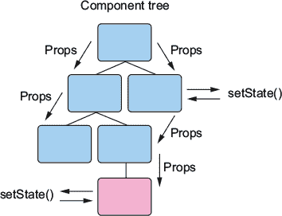

单向流在构建用户界面（UIs）时特别有用，因为它往往使人们更容易思考数据在应用程序中的流动方式。由于组件的层次结构和属性（props）以及状态（state）在组件中的局部化，通常更容易预测数据在应用程序中的流动方式。

在某些方面，避免这种层次结构并拥有从应用程序的任何部分修改任何内容的自由可能听起来很吸引人，但在实践中，这往往会导致难以思考的应用程序，并可能导致难以调试的情况。后面的章节将探讨像 Flux 和 Redux 这样的架构模式，这些模式允许你在协调跨组件或跨应用程序的操作的同时，保持单向数据流范式。

### 3.5. 摘要

本章讨论了以下主题：

+   状态是程序在某一时刻可用的信息。

+   不变状态不会改变，而可变状态会改变。

+   持久的不变数据结构不会改变——它们只记录它们的更改并复制自己。

+   当它们被更新时，短暂的可变数据结构会被清除。

+   React 使用可变数据（本地组件状态）和伪不可变数据（属性）。

+   属性是伪不可变的，一旦设置就不应该修改。

+   组件状态由一个后端实例跟踪，并且可以通过`setState`进行修改。

+   `setState`执行数据的浅层合并并更新你的组件状态，保留任何未被覆盖的顶层属性。

+   在 React 中，数据单向流动，从父组件流向子组件。子组件可以通过回调向父组件返回数据，但不能直接修改父组件的状态，父组件也不能直接修改子组件的状态。组件交互是通过 props 完成的。

在第四章中，我们将基于你对 React 中状态的了解，探讨如何使用生命周期方法来挂钩 React 的渲染和更新过程。我们还将开始探索 React 中的变化检测，你将开始使用新学的 React 技能构建 Letters Social 应用程序！

## 第四章：React 中的渲染和生命周期方法

*本章涵盖*

+   配置应用程序仓库

+   渲染过程

+   生命周期方法

+   更新 React 组件

+   使用 React 创建新闻源

在本章中，你将开始整合我们之前所涵盖的一些概念和技能，以创建你的第一个 React 应用程序。在之前的章节中，我们讨论了在 React 中处理数据以及你可以以不同方式处理可变（可更改）和不可变（不可更改）数据。但要构建更健壮的组件，你需要充分利用完整的组件 API，深入了解生命周期方法，并学习 React 中的渲染过程。

我们将探讨*渲染*，这是 React 将你的数据转换为用户界面的过程，以及一些与组件在其生命周期中交互的方法，称为*生命周期方法*。你将结合你已知的关于在 React 中读取和修改数据（props 和 state）的知识，更新你的组件状态，并将数据传递到不同的组件。

### 4.1\. 配置 Letters Social 仓库

在本章中，你将开始构建应用程序 Letters Social。我们将假装我们是一家初创公司，专注于创建下一个伟大的社交网络应用程序。我们的公司，Letters——巧妙地命名以区别于像 Alphabet 这样的网络巨头——正在开发 Social。你将在本书的过程中使用 React 来构建这个应用程序。到本书结束时，Letters Social 将使用服务器端渲染、Redux 和 React。该应用程序，如图 4.1 所示（kindle_split_015_split_001.xhtml#ch04fig01），支持一些值得注意的功能，以便你知道你将在本书的过程中构建什么：

+   创建包含文本的帖子

+   使用 Mapbox 向帖子添加位置

+   点赞和评论帖子

+   通过 GitHub 和 Firebase 提供 OAuth 身份验证

+   在新闻源中显示帖子

+   使用基本分页

##### 图 4.1. Letters Social，您将在本书中构建的 React 应用程序。您可以在[`github.com/react-in-action/letters-social`](https://github.com/react-in-action/letters-social)查看其源代码，并在[`social.react.sh`](https://social.react.sh)查看应用程序。


我们将在本章和下一章中逐一介绍这些功能。为了使您更容易理解，我已为第四章至第十二章（kindle_split_015_split_000.xhtml#ch04 至 kindle_split_024_split_000.xhtml#ch12）创建了 Git 分支。每个章节（在某些情况下是成对的章节）代表了该章节结束时的代码状态。例如，如果您检查第五章（kindle_split_016_split_000.xhtml#ch05）和第六章（kindle_split_017_split_000.xhtml#ch06）的 Git 分支，您将拥有这些章节结束时的代码。这将让您可以提前查看，并且可以从任何章节开始。如果您想学习第九章（kindle_split_020_split_000.xhtml#ch09）（涵盖测试 React 应用程序），例如，您可以检查第七章（kindle_split_018_split_000.xhtml#ch07）和第八章（kindle_split_019_split_000.xhtml#ch08）的代码，并从那里开始。我已经尽力使您检查代码变得尽可能容易，但您可以使用 Git 仓库和分支以您喜欢的方式使用。如果您有任何问题，请随时通过 pull requests 提出，或者将其 fork 作为添加新功能的起点。您也可以通过 README 与我联系，如果您有任何问题（或者只是喜欢这本书！）。您可以通过 README 这样做。

您还可以在[`docs.react.sh`](https://docs.react.sh)阅读一些关于源代码中文件的基本文档。它不是全面的，但如果您想了解代码并喜欢 JSDoc 风格的文档，这些文档将是一个不错的选择。仓库的 README 也列出了许多有用的资源。一如既往，如果您有任何问题，请随时联系我（或者只是喜欢这本书！）。您可以通过 README 这样做。

#### 4.1.1. 获取源代码

要获取源代码，请访问[`github.com/react-in-action/letters-social`](https://github.com/react-in-action/letters-social)。这是存储与本书相关的所有源代码的仓库。React in Action GitHub 组织中还有其他几个仓库，您也可以随意查看。主要源代码位于[`github.com/react-in-action/letters-social`](https://github.com/react-in-action/letters-social)。前往该地址，您可以下载源代码或使用以下命令克隆仓库：

```
git clone git@github.com:react-in-action/letters-social.git

git checkout chapter-4
```

这将在当前目录中克隆仓库并切换到起始分支（项目的起始分支）。下一步是安装依赖项。为了保持一致性，本书中将使用 npm ([www.npmjs.com](http://www.npmjs.com))，但如果你更喜欢使用 yarn（另一个包装 npm 的依赖管理库，位于 [`yarnpkg.com`](https://yarnpkg.com)），你也可以这样做。你只需确保使用 yarn 而不是 npm 进行安装。

你需要的所有模块都应该包含在应用程序源代码的 package.json 中。要安装，请在源代码目录中运行以下命令：

```
npm install
```

这将安装你需要的所有依赖项。如果你更改了 node 的版本（通过 nvm 或其他方式），你需要重新安装你的 node 模块，因为不同版本的 node 会以不同的方式编译不同的模块（如 node-sass）。

#### 4.1.2. 我应该使用哪个版本的 node？

现在是讨论应该使用哪个版本的 node 的好时机。我建议使用最新稳定版本。在撰写本文时，那是 8.X 版本线。我不会支持低于 6.X 的 node 版本，而且支持 8.X 或更高版本更有意义，因为这不是一个商业或生产环境，你无法在不进行大量测试的情况下轻松切换版本。Node 8.X 还使用了更新的 npm 版本，并包含了对底层 V8 引擎的重大速度改进。

如果你电脑上没有这些版本的 node，请访问 [`nodejs.org`](https://nodejs.org) 下载最新稳定版本的 node。另一个选项是使用 nvm 命令行工具在本地安装 node 的副本，并能够在它们之间切换。你可以在 [`github.com/creationix/nvm`](https://github.com/creationix/nvm) 查看 nvm 工具。

不同版本的 node 支持不同的 JavaScript 功能，因此了解你使用的版本支持哪些功能很重要。如果你想了解更多关于你的版本支持哪些功能以及其他版本支持哪些（或将要支持哪些）的信息，请访问 [`node.green`](http://node.green) 以查看不同版本的功能实现。

#### 4.1.3. 工具和 CSS 的注意事项

正如我在本书的其他地方提到的，围绕 JavaScript 应用程序的工具可能是一个复杂且快速变化的目标。这也是一个值得单独讨论的领域。出于这些原因，我不会介绍如何设置 Webpack、Babel 或其他工具。应用程序源代码已经实现了开发和构建过程，你可以自由探索我设置的配置，但这超出了本书的范围，因此我不会涉及它。

另一个值得注意的点是关于 CSS 的。我已经介绍了您在 React 中处理内联样式的方法，但 CSS 通常也不在本书的范围之内。因此，我为您创建了所有需要的样式。您看到的任何 UI 标记都有为其创建的样式。某些样式依赖于特定的类型或层次结构，因此如果您移动不同的元素或更改 CSS 类名，您可能会发现应用看起来破损。我的目标是让您在学习 React 时少考虑一件事情，但如果您对玩转应用样式感兴趣，请随意进行。

#### 4.1.4\. 部署

运行在[`social.react.sh`](https://social.react.sh)的应用已部署到[`zeit.co`](https://zeit.co)，但如果未来由于某些原因需要更改，我会根据当时最合理的云解决方案来保持应用运行。您无需担心应用托管在何处。如果在书的结尾您想对应用进行分支并添加以供自己学习和娱乐，您需要确定最适合自己部署应用的最佳方式。幸运的是，构建和运行过程都很直接，因此您应该会发现将其部署到其他地方相对容易。

#### 4.1.5\. API 服务器和数据库

为了避免您需要运行像 MongoDB 或 PostgreSQL 这样的数据库，我们将通过`JSON-server`库（[`github.com/typicode/json-server`](https://github.com/typicode/json-server)）使用模拟 REST API。我对默认服务器（您可以在仓库的 db 文件夹中看到）进行了一些修改，这有助于使项目变得更容易一些。您将不会与数据库交互，而是得到一个轻量级的数据库，它通过读取和修改 JSON 文件来工作。要创建示例数据或重置应用程序数据，您可以运行以下命令：

```
npm run db:seed
```

这将覆盖现有的 JSON 数据库，并用新的示例数据（用户、帖子以及评论都是基于*星球大战*主题——愿原力与你同在）替换它。在后续章节中，您在登录后将在数据库中创建一个用户。如果您重新运行数据库`seed`命令，您的用户将被覆盖，您需要注销并重新登录以解决问题。这种情况不应该发生，您可能不需要多次运行数据库命令，但您应该了解重置数据意味着什么，以防万一。

我包含了一些辅助工具，以便更容易地向 API 发送请求。你可以在 src/shared/http.js 中看到这些函数。我正在使用 `isomorphic-fetch` 库（[`github.com/matthew-andrews/isomorphic-fetch`](https://github.com/matthew-andrews/isomorphic-fetch)），因为它反映了浏览器中可用的标准 Fetch API，但也可以在服务器上运行。我将假设你有一些在浏览器中使用 HTTP 库的经验，如果没有，你可以使用包含的辅助文件作为学习 Fetch API 的起点（[`developer.mozilla.org/en-US/docs/Web/API/Fetch_API`](https://developer.mozilla.org/en-US/docs/Web/API/Fetch_API)）。

#### 4.1.6. 运行应用程序

开始以开发模式运行应用程序的最简单方法将是运行以下命令：

```
npm run dev
```

你还可以使用其他命令，但你会想要的主要是 `dev`。要查看其他可用的命令，你可以运行以下命令：

```
npm run
```

这应该会列出仓库中每个可用的命令。你可以随意尝试每个命令，看看它们如何适应。不过，你主要关心的将是 `npm run dev` 和 `npm run db:seed`。

### 4.2. 渲染过程和生命周期方法

如果你已经克隆了仓库并安装了依赖项，你应该拥有所需的一切。不过，在你开始构建 Letters Social 之前，你需要查看渲染和生命周期方法。这些是 React 的关键特性，一旦你了解了它们，你将更有能力开始构建 Letters Social 应用程序。

#### 4.2.1. 介绍生命周期方法

在 第二章 中，你了解到你可以在组件内部创建并分配函数作为事件（点击、表单提交等）的处理程序。这很有用，因为你可以创建动态组件，它们可以响应用户事件（任何现代网络应用的关键方面）。但如果你想要更多呢？仅仅作为一个特性，似乎你仍然在使用常规的 HTML 和 JavaScript。比如说，你想从 API 获取用户数据或读取 cookie 以供以后使用，所有这些都不需要等待用户触发的事件。这些是在网络应用中需要做的常规事情——在某些情况下，你可能希望自动执行这些操作，那么这些事情会在哪里发生呢？答案是生命周期方法。

| |
| --- |

##### 定义

*生命周期方法* 是附加到基于类型的 React 组件上的特殊方法，它们将在组件生命周期的特定点执行。*生命周期* 是思考组件的一种方式。具有生命周期的组件有一个比喻性的“生命”——它至少有一个开始、中间和结束。这种思维模型使思考组件变得更加容易，并为你提供了关于组件在其生命周期中的位置的上下文。生命周期方法并非 React 独有；许多 UI 技术由于它们的直观和有用性而采用它们。React 组件生命的主要部分是挂载、更新和卸载。图 4.2 展示了组件生命周期和渲染过程（React 如何随时间管理你的组件）的概述。

|  |
| --- |

##### 图 4.2\. React 概览。React 将渲染（创建、管理）组件，并从中创建用户界面。

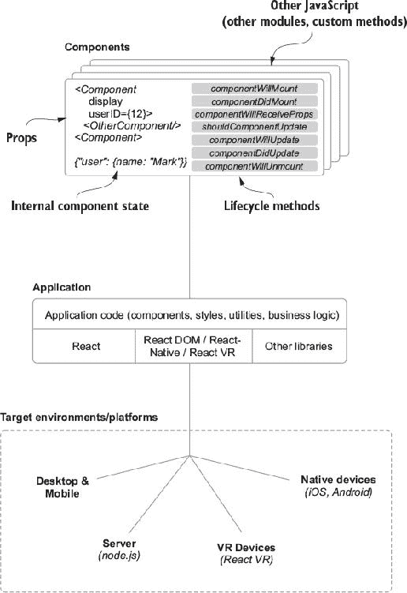

我在过去几章中提到了生命周期方法，但现在是我们真正深入探讨它们，以了解它们是什么以及如何使用它们的时候了。为了开始，再次从高层次上思考 React。看看 图 4.2 的顶部，以刷新你的记忆。我谈到了 React 中的状态，使用 `React.createElement` 和 JSX 创建组件，但我们仍然需要深入探讨生命周期方法。

让我们从过去的章节中唤醒你的记忆，并回顾一些概念。什么是渲染？*渲染* 的一种定义是“使成为或变为；使”。就我们的目的而言，你可以将渲染视为 React 为你创建和管理用户界面所做的事情。它是将你的应用程序显示在屏幕上的工作。这是 React 将你的组件转换为 UI 的过程。

你可以使用本章中学习的生命周期方法钩入此过程。这些方法为你提供了在组件生命周期的正确时刻执行所需操作的灵活性。它们仅适用于从扩展 `React.Component` 抽象基类的类创建的组件。

在 第三章 的末尾讨论的无状态函数组件没有可用的生命周期方法。你也不能在它们内部使用 `this.setState`，因为它们没有后盾实例；React 不跟踪它们的任何内部状态。它们仍然可以通过父组件的 props 更新其数据，但你无法访问生命周期方法。这可能看起来像是一种阻碍，或者像它们功能较弱，但在许多情况下，它们就是你需要的所有东西。

#### 4.2.2\. 生命周期方法的类型

本节将探讨 React 在不同组中提供的不同生命周期方法，并讨论每个方法的作用。生命周期方法可以分为两大类：

+   ****方法*——** 在某件事情发生前立即调用

+   ****方法*——** 在某件事情发生后立即调用

还有一些其他方法不适合归入上述任何一类。它们与初始化和错误处理有关，其中一个是用于更新的。然而，大多数方法都是 did 和 will 类型。

我们可以根据它们与生命周期哪个部分相关进一步将它们细分为更多类型（参见图 4.3）。组件有四个主要的生命周期部分，以及对应的生命周期方法：

+   ***初始化*—** 当一个组件类被实例化时。

+   ***挂载*—** 一个组件正在被插入到 DOM 中。

+   ***更新*—** 一个组件通过状态或属性使用新数据更新。

+   ***卸载*—** 一个组件正在从 DOM 中移除。

##### 图 4.3\. 渲染过程和组件生命周期的概述。这是 React 为你管理组件所使用的过程。组件的三个主要生命阶段是挂载、已挂载和卸载。组件挂载时正在被插入到 DOM 中，一旦插入，就变为已挂载，当它被移除时，就处于卸载状态。

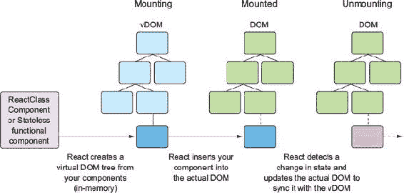

在初始化、挂载、更新和卸载期间，都会调用一些生命周期方法。这些方法并不多，尤其是与其他库和框架相比，但在学习 React 时，很容易混淆它们。为它们形成有意义的心理分组将帮助你导航渲染过程的各个部分。图 4.4 显示了 React 整个渲染过程的概述，我们将在本章的其余部分更详细地探讨它。

##### 图 4.4\. React 中组件生命周期的概述。`ReactDOM`渲染一个组件，当 React 管理你的组件时，会调用某些生命周期方法。

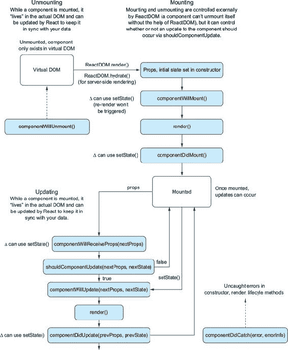

记住，将用户界面和组件视为生命周期的一部分并不特指 React 或 JavaScript。其他技术也成功采用了这一理念，有时甚至是在受到 React 的启发之后（例如[`componentkit.org`](http://componentkit.org)）。但这些特定的生命周期方法**是**React 独有的。要探索这些方法，你需要创建两个简单的组件——一个父组件和一个子组件——它们将实现我们将要查看的所有生命周期方法。前往[`codesandbox.io/s/2vxn9251xy`](https://codesandbox.io/s/2vxn9251xy)查看如何添加这些组件。你仍然可以从 CodeSandbox 下载代码，并使用浏览器开发者工具检查控制台。列表 4.1 显示了这些组件的基本设置。

##### 列表 4.1\. 探索生命周期方法

```
import PropTypes from 'prop-types';
import React, { Component } from 'react';
import { render } from 'react-dom';

class ChildComponent extends Component {                                    *1*
   static propTypes = {
        name: PropTypes.string                                              *2*
    };
    static defaultProps = (function() {                                     *3*
        console.log('ChildComponent : defaultProps');
        return {};
    })();
  constructor(props) {
        super(props);
        console.log('ChildComponent: state');
  }
  render() {
    console.log('ChildComponent: render');
    return (
      <div>
        Name: {this.props.name}
      </div>
    );
  }
};

class ParentComponent extends Component {                                   *4*
  constructor() {
     super(props);
     this.state = {                                                         *5*
        name: ''
     }
     this.onInputChange = this.onInputChange.bind(this);                    *5*
  }
  onInputChange(e) {
    this.setState({ text: e.target.value });                                *6*
  }
  render() {
    console.log('ParentComponent: render');
    return [
            <h2 key="h2">Learn about rendering and lifecycle methods!</h2>,
            <input key="input" value={this.state.text}
     onChange={this.onInputChange} />,
            <ChildComponent key="ChildComponent" name={this.state.text} />  *7*
        ];
  }
};

render(
  <ParentComponent />,                                                      *8*
  document.getElementById('container')
);
```

+   ***1* 声明一个子组件。**

+   ***2* 在类上设置 propTypes 作为静态方法。**

+   ***3* 设置默认属性——通常你会将其设置为对象而不是函数，但在这里你使用立即执行函数来注入 console.log 语句。**

+   ***4* 创建一个父组件。**

+   ***5* 在构造函数中绑定 onInputChange 方法，这样你就可以在 render 中引用该方法，并使其指向类实例，而不是定义。**

+   ***6* 使用表单输入中的数据更新状态。**

+   ***7* 在父组件中渲染子组件。**

+   ***8* 使用 React DOM 渲染父组件。**

你不需要你的组件为你做很多事情来探索生命周期方法的工作方式。在这里，你已经设置了一个父组件和一个子组件。父组件监听输入字段的更改，并通过状态向子组件提供新的属性。

#### 4.2.3\. 初始和“将要”方法

首先要探索的一组与生命周期相关的属性是组件的初始属性。这些包括你已经了解的两个属性：`defaultProps` 和 `state`（初始）。这些属性有助于为你的组件提供初始数据。在继续之前，让我们快速回顾一下：

+   `defaultProps`——一个静态属性，为组件提供默认属性。如果父组件没有设置该属性，则设置在 `this.props` 上，在挂载任何组件之前访问，并且不能依赖于 `this.props.` 或 `this.state`。因为 `defaultProps` 是一个静态属性，所以它从类中访问。

+   `state` *(初始)*——在构造函数中此属性的值将是为你组件的状态设置的初始值。这在需要提供占位符内容、设置默认值等情况非常有用。它与默认属性类似，但数据预期会被修改，并且仅在继承自 `React.Component` 的组件上可用。

即使设置初始状态和属性不是通过 React `Component` 类的特殊方法完成的（它们使用 JavaScript `constructor` 方法），它们仍然是组件生命周期的一部分。很容易在心中不小心忽略它们，但它们在为组件提供数据方面发挥着重要作用。

为了帮助说明渲染顺序和不同的生命周期方法，你接下来将创建两个简单的组件，你可以在这些组件上指定生命周期方法。你将创建一个父组件和一个子组件，这样你不仅可以看到不同方法调用的顺序，还可以看到这种顺序如何在父组件和子组件之间确定。为了使事情简单，你将只将信息输出到开发者控制台。图 4.5 展示了你完成后的开发者控制台将能够看到的内容。

##### 图 4.5\. 样本组件一旦被完善后的输出。生命周期方法会在每个步骤触发一个消息被记录到控制台，以及任何可用的方法参数。你可以在[`codesandbox.io/s/2vxn9251xy`](https://codesandbox.io/s/2vxn9251xy)看到生命周期方法的作用。

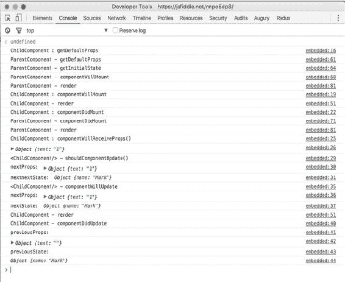

#### 4.2.4\. 挂载组件

现在你已经创建了父组件和子组件，让我们看看挂载。*挂载*是 React 将组件插入 DOM 的过程。记住，组件只存在于虚拟 DOM 中，直到 React 在真实 DOM 中创建它们。参见图 4.6 以了解挂载和父组件及子组件渲染过程的概述。挂载方法将允许你“钩入”组件生命的开始和结束，并且只会触发一次，因为根据定义，组件只有一个开始和结束。

##### 图 4.6\. 样本父组件和子组件的渲染过程

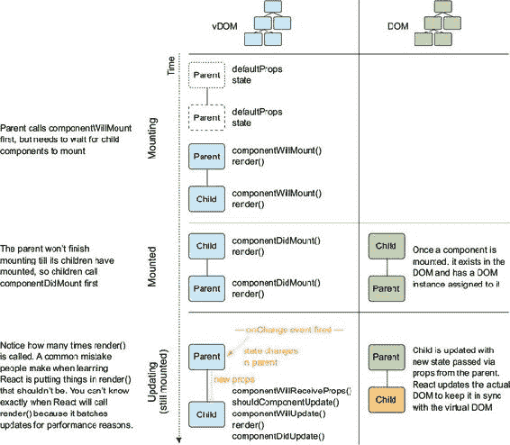

| |
| --- |

##### 定义

挂载是 React 将你的组件插入真实 DOM 的过程。一旦完成，你的组件就“准备好”了，通常这是一个执行 HTTP 调用或读取 cookie 的好时机。在这个时候，你也将能够通过一个称为*ref*的东西访问 DOM 元素，这将在未来的章节中讨论。

| |
| --- |

如果你回顾一下图 4.3，你会注意到在组件挂载之前，你只有一个机会改变状态。你可以通过使用`componentWillMount`来实现，这将为你提供一个在组件挂载之前设置状态或执行其他操作的机会。在这个方法中状态的变化不会触发重新渲染，这与会触发之前看到的更新过程的其它状态更新不同。了解哪些方法会触发重新渲染以及哪些不会，这对于理解你的应用行为以及调试出错时非常有用。图 4.7 展示了在我们在其中工作的生命周期概述背景下挂载方法。

##### 图 4.7\. 在更大的生命周期过程中挂载方法。组件被添加到 DOM 中，在这个过程中会触发几个特定的方法。

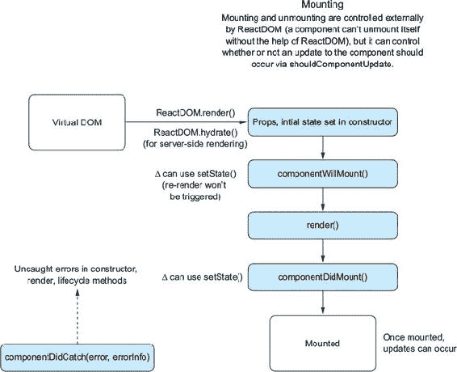

我接下来要介绍的方法是`componentDidMount`。当 React 调用这个方法时，你有机会使用`componentDidMount`以及访问组件的 refs。在这个方法中，你可以访问组件的状态和属性，以及你的组件已经准备好更新的知识。这意味着这是一个用从网络请求返回的数据更新组件状态的好地方。这也是与依赖于 DOM 的第三方库（如 jQuery 和其他库）一起工作的好地方。

如果你在其他方法（如`render()`）中执行处理程序或其他函数，由于 React 的工作方式，你可能会得到不可预测和意外的结果。渲染方法需要是*纯*的（基于给定输入的一致性），并且通常在组件的生命周期中多次调用。React 甚至可能将更新批处理在一起，因此你不能保证渲染会在特定时间发生。

现在我们已经查看了一些与挂载相关的方 法，你将把它们添加到你的组件中，这样我们就可以看到组件的生命周期。下一个列表显示了如何将挂载方法添加到你的组件中。

##### 列表 4.2\. 挂载方法

```
import PropTypes from 'prop-types';
import React, { Component } from 'react';
import { render } from 'react-dom';

class ChildComponent extends Component {
    static propTypes = {
        name: PropTypes.string
    };
    static defaultProps = (function() {
        console.log('ChildComponent : defaultProps');
        return {};
    })();
    constructor(props) {
        super(props);
        console.log('ChildComponent: state');
        this.state = {
            name: 'Mark'
        };
    }
    componentWillMount() {                                       *1*
        console.log('ChildComponent : componentWillMount');
    }
    componentDidMount() {                                        *1*
        console.log('ChildComponent : componentDidMount');
    }
    render() {
        if (this.state.oops) {
            throw new Error('Something went wrong');
        }
        console.log('ChildComponent: render');
        return [
            <div key="name">Name: {this.props.name}</div>
        ];
    }
}

class ParentComponent extends Component {
    static defaultProps = (function() {
        console.log('ParentComponent: defaultProps');
        return {
            true: false
        };
    })();
    constructor(props) {
        super(props);
        console.log('ParentComponent: state');
        this.state = { text: '' };
        this.onInputChange = this.onInputChange.bind(this);
    }
    componentWillMount() {                                       *2*
        console.log('ParentComponent: componentWillMount');
    }
    componentDidMount() {                                        *2*
        console.log('ParentComponent: componentDidMount');
    }
    onInputChange(e) {
        const text = e.target.value;
        this.setState(() => ({ text: text }));
    }
    render() {
        console.log('ParentComponent: render');
        return [
            <h2 key="h2">Learn about rendering and lifecycle methods!</h2>,
            <input key="input" value={this.state.text}
     onChange={this.onInputChange} />,
            <ChildComponent key="ChildComponent" name={this.state.text} />
        ];
    }
}

render(<ParentComponent />, document.getElementById('root'));
```

+   ***1* 将 component-DidMount 和 componentWillMount 添加到子组件中。**

+   ***2* 将 component-DidMount 和 componentWillMount 添加到父组件中。**

|  |
| --- |

**深思渐增**

组件已*挂载*意味着什么？

|  |
| --- |

#### 4.2.5\. 更新方法

一旦你的组件挂载并在 DOM 中，你将想要更新它。在第三章中，你看到可以使用`this.setState()`将新数据浅度合并到组件状态中，但当你触发更新时，还有更多的事情发生。React 提供了几个你可以用来钩入更新过程的方法：`shouldComponentUpdate`、`componentWillUpdate`和`componentDidUpdate`。图 4.8 显示了之前查看的整体生命周期图中的更新部分。

##### 图 4.8\. 更新生命周期方法。当一个组件正在更新时，会触发几个钩子，这些钩子让你确定组件是否应该更新，如何更新，以及何时完成更新。

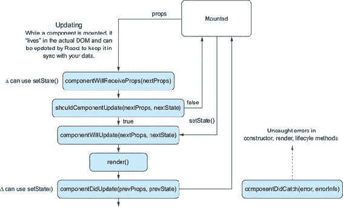

与我们之前看到的其他方法不同，你可以选择是否应该发生更新。更新方法和与挂载相关的方法之间的另一个区别是，它们为 props 和 state 提供了参数。你可以使用这些参数来确定是否应该发生更新或对变化做出反应。

如果由于某种原因`shouldComponentUpdate`返回`false`，则`render()`将跳过，直到下一个状态变化。这意味着你可以防止你的组件不必要地更新。因为组件不会更新，所以下一个方法`componentWillUpdate`和`componentDidUpdate`将不会被调用。

除非你明确指定，否则`shouldComponentUpdate`将始终返回`true`，但如果你总是小心地对待状态为不可变，并且在`render()`中只从 props 和状态中读取，那么你可以使用比较旧 props 和状态与其替代品的实现来覆盖`shouldComponentUpdate`。这可能对性能调整很有用，但应被视为一个逃生口。React 已经采用了复杂和高级的方法来确定什么应该更新以及何时更新。

如果您最终确实使用了 `shouldComponentUpdate`，那么它应该是在这些方法不足以满足某些原因的情况下。这并不意味着您永远不应该使用它，但您在刚开始使用 React 时可能不需要它。像所有生命周期方法一样，它是提供给您的，但只有在必要时才应使用。下一个列表显示了 React 的与更新相关的生命周期方法的示例。

##### 列表 4.3\. 更新方法

```
//...
class ChildComponent extends Component {
    //...
    componentWillReceiveProps(nextProps) {                             *1*

        console.log('ChildComponent : componentWillReceiveProps()');
        console.log('nextProps: ', nextProps);
    }
    shouldComponentUpdate(nextProps, nextState) {                      *2*
        console.log('<ChildComponent/> - shouldComponentUpdate()');
        console.log('nextProps: ', nextProps);
        console.log('nextState: ', nextState);
        return true;
    }
    componentWillUpdate(nextProps, nextState) {                        *2*
        console.log('<ChildComponent/> - componentWillUpdate');
        console.log('nextProps: ', nextProps);
        console.log('nextState: ', nextState);
    }
    componentDidUpdate(previousProps, previousState) {                 *2*
        console.log('ChildComponent: componentDidUpdate');
        console.log('previousProps:', previousProps);
        console.log('previousState:', previousState);
    }
    //...
    render() {
        console.log('ChildComponent: render');
        return [
            <div key="name">Name: {this.props.name}</div>
        ];
    }
}

class ParentComponent extends Component {
    //...
    onInputChange(e) {
        const text = e.target.value;
        this.setState(() => ({ text: text }));
    }
    //...
    render() {
        console.log('ParentComponent: render');
        return [
            <h2 key="h2">Learn about rendering and lifecycle methods!</h2>,
            <input key="input" value={this.state.text}
     onChange={this.onInputChange} />,
            <ChildComponent key="ChildComponent" name={this.state.text} />
        ];
    }
}
//...
```

+   ***1* 将更新方法添加到子组件中，以便您可以检查单个组件的更新过程。**

+   ***2* 将更新方法添加到子组件中，以便您可以检查单个组件的更新过程。**

现在您已经为您的组件指定了更新方法，再次运行它们并在文本框中输入一些内容。您将在开发者控制台中看到级联输出（列表 4.4 显示了组件应该输出的内容）。花一分钟时间看看渲染的顺序。您注意到什么了吗？顺序应该与您在本章中学到的内容一致，但现在您可以看到子组件和父组件的顺序是如何重要的。您可能还记得从第二章中，React 在形成树和渲染事物时是递归的——它将通过询问每个组件及其所有子组件来彻底检查您的组件的每个部分。

因为它知道关于您的组件树所需的所有信息，React 可以智能地按正确顺序为您创建组件。您会在列表 4.4 中注意到，子组件的挂载发生在其父组件之前。如果您考虑挂载对父组件的意义，这就有道理了：在父组件的挂载被认为完成之前，必须先创建子组件。如果子组件尚未存在，则不能说父组件已挂载。

您还会注意到，当发生更新时，您会看到子组件接收属性，因为该子组件的属性已被父组件通过 `this.setState()` 改变。从那里开始，更新方法按顺序运行：`shouldComponentUpdate`、`componentWillUpdate`、`componentDidUpdate`。如果您出于某种原因告诉组件不要更新，通过从 `shouldComponentUpdate` 返回 `false`，这些步骤就会被跳过。

##### 列表 4.4\. 输入文本的组件更新输出

```
ChildComponent : defaultProps
ParentComponent : defaultProps
ParentComponent : get initial State
ParentComponent : componentWillMount
ParentComponent : render
ChildComponent : componentWillMount
ChildComponent : render
ChildComponent : componentDidMount
ParentComponent : componentDidMount
ParentComponent : render
ChildComponent : componentWillReceiveProps
Object {text: "Mark"}                            *1*
<ChildComponent/> : shouldComponentUpdate
nextProps:  Object {text: "Mark"}
nextnextState:  Object {name: "Mark"}
<ChildComponent/> : componentWillUpdate
 nextProps:  Object {text: "Mark"}
 nextState:  Object {name: "Mark"}
 ChildComponent : render
 ChildComponent : componentDidUpdate
 previousProps:  Object {text: ""}
 previousState:  Object {name: "Mark"}
 >
```

+   ***1* “Mark” 被粘贴进去，这样您就不会为每个字母触发一系列更新。**

#### 4.2.6\. 卸载方法

正如我们可以监听组件的挂载一样，我们也可以监听其卸载。**卸载**是从 DOM 中移除组件的过程。如果你的应用完全使用 React 编写，一个**路由器**（在第八章 chapters 8 和第九章 chapters 9 中探讨）会在你切换到不同页面时移除组件。但你也可以使用 React 与其他框架和库集成，因此你可能需要在组件卸载时执行一些其他操作（比如清除一个间隔，切换一个设置等）。无论是什么，你都可以利用 `componentWillUnmount` 在组件被移除时执行任何必要的清理。图 4.9 Figure 4.9 展示了卸载过程是如何发生的。

##### 图 4.9\. `React DOM` 负责组件的挂载和卸载。挂载是将组件插入 DOM 的过程，而卸载则是其相反过程：从 DOM 中移除组件的过程。一旦组件被卸载，它们就不再存在于 DOM 中。

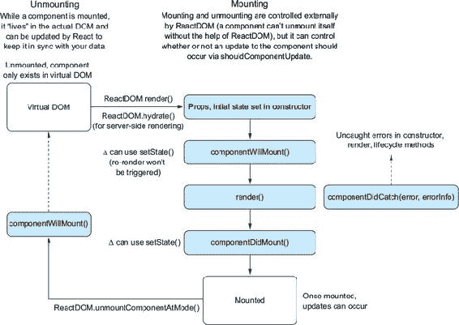

根据到目前为止挂载的工作方式，你可能会期望有一个 `componentDidUnmount` 方法可用，但实际上并没有。这是因为一旦组件被移除，它的生命周期就结束了，因此它不应该能够从坟墓之外做任何事情。让我们将 `componentWillUnmount` 添加到我们的运行示例中，以便我们可以全面了解组件的生命周期。

##### 列表 4.5\. 卸载

```
//...
class ChildComponent extends Component {
    //...
    componentWillUnmount() {
        console.log('ChildComponent: componentWillUnmount');       *1*
    }
    render() {
        console.log('ChildComponent: render');
        return [
            <div key="name">Name: {this.props.name}</div>
        ];
    }
}

class ParentComponent extends Component {
    //...
    componentWillUnmount() {
        console.log('ParentComponent: componentWillUnmount');      *1*
    }
    onInputChange(e) {
        const text = e.target.value;
        this.setState(() => ({ text: text }));
    }
    componentDidCatch(err, errorInfo) {
        console.log('componentDidCatch');
        console.error(err);
        console.error(errorInfo);
        this.setState(() => ({ err, errorInfo }));
    }
    render() {
        return [
            <h2 key="h2">Learn about rendering and lifecycle methods!</h2>,
            <input key="input" value={this.state.text}
     onChange={this.onInputChange} />,
            <ChildComponent key="ChildComponent" name={this.state.text} />
        ];
    }
}
//...
```

+   **1* 将 `componentWillUnmount` 方法添加到父组件和子组件中。**

#### 4.2.7\. 捕获错误

错误处理是编写清晰程序的重要组成部分。到目前为止，我们还没有看到 React 中处理错误的任何特殊方法。如果你长期使用 React，你可能还记得 React 的早期版本，如果 React 组件的 `render` 或生命周期方法中发生错误，整个应用会锁定。这通常是一个令人沮丧的原因，因为它意味着一个未捕获的错误可能会锁定整个应用。

更新版本的 React 引入了一个名为 **错误边界** 的新概念，以帮助处理这种情况。如果一个未捕获的异常在组件的 `constructor`、`render` 或生命周期方法中抛出，React 将从 DOM 中卸载该组件及其子组件。一开始这可能看起来有些困惑，但它的好处是能够将组件中的错误隔离，从而避免破坏应用的其他部分。

| |
| --- |

**组件之间的差异**

React 组件从抽象基类 `React.Component` 创建和从没有继承的纯函数创建之间有哪些不同之处？

| |
| --- |

您可以通过使用组件从 `React.Component` 继承的另一个方法来处理这些错误：`componentDidCatch`。该方法的意义与您在 JavaScript 中看到的 `try...catch` 行为类似。`componentDidCatch` 允许您访问抛出的错误和错误消息。使用这些信息，您可以确保组件适当地响应错误。在更大的应用程序中，您可能使用此方法为单个组件（可能是一个小部件、卡片或其他组件）或应用程序级别设置错误状态。以下列表显示了如何将 `componentDidCatch` 方法添加到父组件中。

##### 列表 4.6\. 处理错误

```
//...
class ChildComponent extends Component {
    constructor(props) {
        super(props);
        console.log('ChildComponent: state');
        this.oops = this.oops.bind(this);                             *1*
    }
    //...
    oops() {
        this.setState(() => ({ oops: true }));                        *2*
    }
    render() {
        console.log('ChildComponent: render');
        if (this.state.oops) {
            throw new Error('Something went wrong');                  *3*
        }
        return [
            <div key="name">Name: {this.props.name}</div>,
            <button key="error" onClick={this.oops}>
                Create error
            </button>
        ];
    }
}

class ParentComponent extends Component {
    //...
    constructor(props) {
        super(props);
        console.log('ParentComponent: state');
        this.state = { text: '' };
        this.onInputChange = this.onInputChange.bind(this);
    }
    //...
    componentDidCatch(err, errorInfo) {                               *4*
        console.log('componentDidCatch');
        console.error(err);
        console.error(errorInfo);
        this.setState(() => ({ err, errorInfo }));
    }
    render() {
        console.log('ParentComponent: render');
        if (this.state.err) {                                         *5*
            return (
                <details style={{ whiteSpace: 'pre-wrap' }}>
                    {this.state.error && this.state.error.toString()} *5*
                    <br />
                    {this.state.errorInfo.componentStack}             *5*
                </details>
            );
        }
        return [
            <h2 key="h2">Learn about rendering and lifecycle methods!</h2>,
            <input key="input" value={this.state.text}
     onChange={this.onInputChange} />,
            <ChildComponent key="ChildComponent" name={this.state.text} />
        ];
    }
}
render(<ParentComponent />, document.getElementById('root'));
```

+   ***1* 绑定类方法。**

+   ***2* 切换状态以抛出错误。**

+   ***3* 在 render 方法中抛出错误。**

+   ***4* 在父组件中添加 componentDidCatch 方法并使用它来更新组件状态。**

+   ***5* 如果抛出错误，显示错误和错误消息。**

我们已经探讨了 React 提供给您不同的生命周期方法，并看到了您如何在各种情况下使用它们。如果您觉得有太多方法需要跟踪，您会很高兴地知道这些方法构成了 React 组件 API 的主要部分（您也可以使用 表 4.1 作为速查表）。核心 React API 不会有我们之前所涵盖的更多内容。更重要的是，您不必使用这些方法中的每一个；使用您需要的。表 4.1 展示了迄今为止涵盖的方法的总结（请注意，`render` 没有包括在内）。

##### 表 4.1\. React 组件生命周期方法总结

|   | 初始 | 将要 | 已做 |
| --- | --- | --- | --- |
| **挂载** | defaultProps *参数*—无，静态属性 *功能*—多次访问的静态版本。如果父组件没有设置该属性，则将其值设置为 this.props。 *何时*—在组件创建时调用，此时不能依赖于 this.props。返回的复杂对象在实例之间共享，而不是复制。 | componentWillMount *参数*—无 *功能*—允许你在挂载过程发生之前操作组件数据。例如，如果你在这个方法中调用 setState，render()将看到更新的状态，并且尽管状态已更改，但只会执行一次。“最后的机会”来更改初始渲染数据。 *何时*—在客户端和服务器上仅调用一次（第十二章涵盖了服务器渲染），在初始渲染发生之前立即调用。 | componentDidMount *参数*—无 *功能*—在组件被插入到 DOM 中后立即调用。此时，你可以访问 refs（在未来的章节中讨论的访问底层 DOM 表示的方法）。通常是一个执行“不纯”操作的好地方，如与其他 JavaScript 库集成、设置定时器（通过 setTimeout 或 setInterval）或发送 HTTP 请求。我们经常使用这个方法来替换组件中的占位符数据。 *何时*—在客户端上仅调用一次（不在服务器上！），在初始渲染发生之后立即调用。子组件的 componentDidMount()方法在父组件之前调用。 |
| **更新** | shouldComponentUpdate *参数*—nextProps, nextState *功能*—如果 shouldComponentUpdate 返回 false，则 render()将完全跳过，直到下一个状态变化。此外，componentWillUpdate 和 componentDidUpdate 也不会被调用。作为高级性能调优的“逃生门”。 *何时*—在组件接收到新属性或状态之前调用渲染时被调用。对于初始渲染不会调用。 | componentWillReceiveProps *参数*—nextProps: 对象 *功能*—在调用 render()之前，利用这个机会在渲染之前对属性转换做出反应，可以通过使用 this.setState()更新状态。旧属性可以通过 this.props 访问。在这个函数内部调用 this.setState()不会触发额外的渲染。 *何时*—当组件接收到新属性时被调用。对于初始渲染不会调用此方法。 | componentDidUpdate *参数*—prevProps: 对象，prevState: 对象 *功能*—在组件的更新被刷新到 DOM 之后立即调用。对于初始渲染不会调用此方法。 *何时*—在组件更新后，利用这个机会操作 DOM。 |
|   |   | `componentWillUpdate` *参数*—nextProps: 对象, nextState: 对象 *作用*—利用这个机会在更新发生之前进行准备。你不能使用 setState()。 *触发时机*—在接收到新属性或状态时，立即在渲染之前调用。对于初始渲染不会调用。 `componentWillUnmount` *参数*—无 *作用*—在这个方法中执行任何必要的清理工作，例如取消定时器或清理在`componentDidMount`中创建的任何 DOM 元素。 *触发时机*—在组件卸载之前立即调用。 |   |
| **错误** | `componentDidCatch` *参数*—error, errorInfo *作用*—处理组件中的错误。React 将卸载发生错误的树中及其下方的组件。 *触发时机*—在构造函数、生命周期方法或渲染方法中发生错误时调用 |

### 4.3\. 开始创建 Letters Social

现在你对 React 的生命周期方法和它们的作用有了更多的了解，让我们将这些技能付诸实践。你将开始构建 Letters Social 应用程序。如果你还没有，请确保你已经阅读了本章的第一部分，以便了解如何使用 Letters Social 仓库。当你开始时，你应该在 start 分支上，但如果你想跳到本章的结尾，你可以检出 chapter-4 分支（`git checkout chapter-4`）。

到目前为止，你一直在 CodeSandbox 的浏览器上运行大部分代码。这对于学习来说是可以的，但你现在将切换上下文，开始在本地计算机上创建文件。你将想要使用仓库中包含的 Webpack 构建过程，原因有以下几点：

+   能够在许多文件中编写 JavaScript，这些文件输出为一个或少数几个文件，这些文件已经自动解决了依赖关系和导入顺序

+   能够处理和加工不同类型的文件（如 SCSS 或字体文件）

+   为了利用像 Babel 这样的其他构建工具，这样你就可以编写能在旧浏览器上运行的现代 JavaScript

+   通过移除死代码和压缩来优化 JavaScript

Webpack 是一个由许多团队和公司使用的强大工具。正如本章前面所述，我不会在这本书中介绍如何使用它。我在这本书中的一个希望是，你不需要学习 React 和每个相关的构建工具。一次学习太多的复杂性，而不是让学习变得容易。但如果你选择，你可以了解更多关于它的信息。如果你花些时间阅读关于 Webpack 的内容，就可以理解源代码中包含的构建过程。[`webpack.js.org`](https://webpack.js.org)。

你将通过创建一个 App 组件和一个主索引文件来开始构建 Letters Social，这个索引文件将作为进入应用程序的入口点（在这里调用 `React DOM` 的 `render` 方法）。App 组件将包含从 API 获取帖子的逻辑，并将渲染多个 Post 组件——你将在下一章创建帖子组件。仓库还包含了一些你不需要自己创建的组件。你现在将使用这些组件，并在未来的章节中使用。以下列表显示了入口点文件，src/index.js。

##### 列表 4.7\. 主应用程序文件（src/index.js）

```
import React, { Component } from 'react';                 *1*
import { render } from 'react-dom';                       *1*

import App from './app';                                  *2*

import './shared/crash';                                  *3*
import './shared/service-worker';                         *3*
import './shared/vendor';                                 *3*
import './styles/styles.scss';                            *3*

render(<App />, document.getElementById('app'));          *4*
```

+   ***1* 从 React DOM 中导入 React 和 render 方法——这个文件将是调用 React DOM 的 render 方法的主体调用所在的地方。**

+   ***2* 从 App 组件中导入默认导出——你将在下一列表中创建它。**

+   ***3* 导入一些与错误报告、服务工作者注册和样式（由仓库设置处理）相关的文件。**

+   ***4* 使用目标元素（HTML 模板可在 src/index.ejs 中找到）调用 render，以渲染主应用程序。**

主应用程序文件包含一些样式引用，Webpack 可以导入，以及调用 `React DOM` 的 `render` 方法的主体调用。这是你的 React 应用程序“开始”的地方。当脚本由浏览器执行时，它将渲染主应用程序，React 将接管。如果没有这个调用，你的应用程序将不会执行。你可能还记得从前几章中，你在主应用程序文件的底部调用了这个方法。实际上并没有什么不同——你的应用程序将由许多不同的文件组成，Webpack 将知道如何将它们（多亏了你的 `import`/`export` 语句）组合在一起并在浏览器中运行。

现在你已经有了应用程序的入口点，让我们创建主 App 组件。你可以将此文件放在 src 目录中，作为 src/app.js。你将为 App 组件草拟一个基本框架，然后在过程中填充它。在本章中，你的目标是让主应用程序运行并显示多个帖子。在下一章中，你将开始实现更多功能，并添加创建帖子以及添加位置到帖子的能力。随着你在 React 中探索不同的主题，如测试、路由和应用程序架构（使用 Redux），你将不断向应用程序添加功能。以下列表显示了 App 组件的基本内容。

##### 列表 4.8\. 创建 App 组件（src/app.js）

```
import React, { Component } from 'react';                              *1*
import PropTypes from 'prop-types';                                    *1*
import parseLinkHeader from 'parse-link-header';                       *1*
import orderBy from 'lodash/orderBy';                                  *1*

import ErrorMessage from './components/error/Error';                   *2*
import Loader from './components/Loader';                              *2*
import * as API from './shared/http';                                  *3*
import Ad from './components/ad/Ad';                                   *4*
import Navbar from './components/nav/navbar';                          *4*
import Welcome from './components/welcome/Welcome';                    *4*

class App extends Component {
    constructor(props) {
        super(props);
        this.state = {                                                 *5*
            error: null,                                               *5*
            loading: false,
            posts: [],
            endpoint: `${process.env

     .ENDPOINT}/posts?_page=1&_sort=date&_order=DESC&_embed=comments&_ *5*
     expand=user&_embed=likes`                                         *5*
        };
    }
    static propTypes = {
        children: PropTypes.node
    };
    render() {
        return (
            <div className="app">
                 <Navbar />
                {this.state.loading ? (                                *6*
                    <div className="loading">
                        <Loader />                                     *6*
                    </div>
                ) : (
                    <div className="home">
                        <Welcome />                                    *7*
                        <div>
                            <button className="block">                 *8*
                                Load more posts
                            </button>
                        </div>
                        <div>
                            <Ad                                        *7*
                                url="https://ifelse.io/book"
                                imageUrl="/static/assets/ads/ria.png"
                            />
                            <Ad
                                url="https://ifelse.io/book"
                                imageUrl="/static/assets/ads/orly.jpg"
                            />
                        </div>
                    </div>
                )}
            </div>
        );
    }
}

export default App;                                                    *9*
```

+   ***1* 导入你需要的库用于 App 组件。**

+   ***2* 导入要使用的错误信息和加载器组件。**

+   ***3* 导入用于创建和获取帖子的 Letters API 模块。**

+   ***4* 导入现有的 Ad、Welcome 和 Navbar 组件。**

+   ***5* 为组件设置初始状态——你将跟踪帖子以及获取更多帖子的端点。**

+   ***6* 如果正在加载，则渲染加载器而不是应用程序主体。**

+   ***7* 渲染 Welcome 和 Ad 组件。**

+   ***8* 这是你添加用于显示帖子的组件的地方。**

+   ***9* 导出 App 组件。**

有了这些，你可以运行开发命令 (`npm run dev`)，你的应用至少应该能够启动并在浏览器中可用。如果你还没有这样做，请确保至少运行一次 `npm run db:seed` 以生成数据库的示例数据。运行 `npm run dev` 会为你做几件事情：

+   启动 Webpack 构建过程和开发服务器

+   启动 JSON-server API 以响应网络请求

+   创建一个开发服务器（在 第十二章 中用于服务器端渲染）

+   当发生更改时热重载你的应用（这样你就不必每次保存文件时都刷新应用）

+   通知你构建错误（这些错误应该在命令行和浏览器中显示，如果发生的话）

当应用以开发模式运行时，你应该能够在 http://localhost:3000 上查看正在运行的应用。如果你想要使用 Postman ([www.getpostman.com](http://www.getpostman.com)) 或只是想通过浏览器导航到不同的资源，API 服务器正在运行在 http://localhost:3500。

在解决这些后勤问题之后，你应该将获取帖子的能力添加到 App 组件中。为此，你需要使用 Fetch API（包含在你拉入的 API 模块中）向 Letters Social API 发送网络请求。目前，你的组件没有做太多。你还没有在 `constructor` 和 `render` 方法之外定义任何生命周期方法，因此组件没有可以工作的数据。你需要从 API 获取数据，然后使用这些数据更新组件状态。你还将添加一个错误边界，以便在组件遇到错误时显示错误消息而不是整个应用卸载。下一个列表显示了如何向 App 组件添加类方法。

##### 列表 4.9\. 当 App 组件挂载时获取数据

```
//...
   constructor(props) {
        //...
        this.getPosts = this.getPosts.bind(this);                         *1*
    }

    componentDidMount() {
        this.getPosts();                                                  *1*
    }
    componentDidCatch(err, info) {                                        *2*
        console.error(err);                                               *2*
        console.error(info);
        this.setState(() => ({                                            *2*
            error: err
        }));
    }
    getPosts() {
        API.fetchPosts(this.state.endpoint)                               *3*
           .then(res => {
            return res
                .json()                                                   *4*
                .then(posts => {
                  const links = parseLinkHeader(res.headers.get('Link')); *5*
                  this.setState(() => ({
                        posts: orderBy(this.state.posts.concat(posts),
                        'date', 'desc'),                                  *6*
                        endpoint: links.next.url                          *7*
                    }));
                })
                .catch(err => {
                    this.setState(() => ({ error: err }));                *8*
                });
        });
    }
    render() {
       //...
       <button className="block" onClick={this.getPosts}>                 *9*
            Load more posts
       </button>
       //...
    }
 //...
```

+   ***1* 绑定类方法并在组件挂载时使用它从 API 获取帖子。**

+   ***2* 为应用设置一个错误边界以便处理错误。**

+   ***3* 使用包含的 API 模块获取帖子。**

+   ***4* API 模块使用 Fetch API，因此你需要解包 JSON 响应。**

+   ***5* The Letters Social API 在头部返回分页信息，因此你可以使用 parse-link-header 来提取下一页帖子的 URL。**

+   ***6* 将新帖子添加到状态中，并确保它们被正确排序。**

+   ***7* 更新端点状态。**

+   ***8* 如果有错误，更新组件状态。**

+   ***9* 现在你已经定义了它，将 getPosts 方法分配给加载更多事件处理程序。**

现在应用应该在挂载时获取帖子，并保持其本地组件状态。接下来，你需要创建一个 Post 组件来存放帖子数据。你将从源代码中附带的一组预存组件创建 Post 组件。这些主要是无状态的函数组件，你将在本书的其余部分在此基础上构建。查看 src/components/post 目录以熟悉它们。

你的帖子也将获取它们自己的内容，这样你可以在未来的章节中移动 Post 组件并单独渲染它。App 组件会发起请求获取帖子，但它真正关心的是帖子的 ID 和日期，而 Post 组件本身将负责加载其余内容。另一种方法是让 App 组件负责所有数据获取，并将数据传递给帖子。这种方法的优点是网络请求更少。为了说明目的，我们将使帖子负责额外的数据获取，因为我们仍然专注于学习生命周期方法，但我想要指出另一种方法以保持清晰。以下列表显示了 Post 组件。在 src/components/post/Post.js 中创建它。

##### 列表 4.10\. 创建 Post 组件（src/components/post/Post.js）

```
import React, { Component } from 'react';
import PropTypes from 'prop-types';

import * as API from '../../shared/http';                                  *1*
import Content from './Content';                                           *2*
import Image from './Image';                                               *2*
import Link from './Link';                                                 *2*
import PostActionSection from './PostActionSection';                       *2*
import Comments from '../comment/Comments';                                *2*
import Loader from '../Loader';                                            *2*

export class Post extends Component {                                      *3*
   static propTypes = {                                                    *4*
        post: PropTypes.shape({
            comments: PropTypes.array,
            content: PropTypes.string,
            date: PropTypes.number,
            id: PropTypes.string.isRequired,
            image: PropTypes.string,
            likes: PropTypes.array,
            location: PropTypes.object,
            user: PropTypes.object,
            userId: PropTypes.string
        })
    };
    constructor(props) {                                                   *5*
        super(props);
        this.state = {                                                     *6*
            post: null,
            comments: [],
            showComments: false,
            user: this.props.user
        };
        this.loadPost = this.loadPost.bind(this);                          *7*
    }
    componentDidMount() {
        this.loadPost(this.props.id);                                      *8*
    }
    loadPost(id) {
        API.fetchPost(id)                                                  *9*
            .then(res => res.json())
            .then(post => {
                this.setState(() => ({ post }));                           *9*
            });
    }
    render() {
        if (!this.state.post) {
            return <Loader />;                                             *10*
        }
        return (
            <div className="post">
                <UserHeader date={this.state.post.date}                    *11*
                            user={this.state.post.user} />                 *11*
                <Content post={this.state.post} />                         *11*
                <Image post={this.state.post} />                           *11*
                <Link link={this.state.post.link} />                       *11*
                <PostActionSection showComments={this.state.showComments}/>*11*
                <Comments                                                  *11*
                    comments={this.state.comments}
                    show={this.state.showComments}
                    post={this.state.post}
                    user={this.props.user}
                />
            </div>
        );
    }
}

export default Post;
```

+   ***1* 导入 API 模块，以便可以获取帖子。**

+   ***2* 导入 Post 的组成部分。**

+   ***3* 你需要生命周期方法，所以扩展 React.Component。**

+   ***4* 声明 prop 类型。**

+   ***5* 定义构造函数，以便可以设置状态和绑定类方法。**

+   ***6* 设置初始状态。**

+   ***7* 绑定类方法。**

+   ***8* 在挂载时加载帖子。**

+   ***9* 使用 API 获取单个帖子并更新状态。**

+   ***10* 如果帖子尚未加载，则显示加载组件。**

+   ***11* 为 CommentBox 组件设置模拟数据。**

你需要做的最后一件事是迭代帖子以便它们被显示。记住，显示动态组件列表的方法是构造一个数组（通过 `Array.map` 或其他方法），并在 JSX 表达式中使用它。此外，不要忘记 React 需要你为迭代的每个项目传递一个 key 属性，以便它知道在动态列表中更新哪些组件。这对于在 `render` 方法中返回的任何组件数组都是正确的。下一个列表显示了如何更新 App 组件的 `render` 方法以迭代帖子。

##### 列表 4.11\. 迭代 Post 组件（src/app.js）

```
//...
import Post from './components/post/Post';                               *1*
//...
<Welcome />
                        <div>
                            {this.state.posts.length && (
                                <div className="posts">
                                    {this.state.posts.map(({ id }) => (
                                        <Post id={id} key={id}
                                         user={this.props.user} />       *2*
                                    ))}                                  *3*
                                </div>
                            )}
                            <button className="block" onClick={this.getPosts}>
                                Load more posts
                            </button>
                        </div>
                        <div>
                            <Ad
                                url="https://ifelse.io/book"
                                imageUrl="/static/assets/ads/ria.png"
                            />
                            <Ad
                                url="https://ifelse.io/book"
                                imageUrl="/static/assets/ads/orly.jpg"
                            />
                        </div>
//...
```

+   ***1* 导入 Post 组件。**

+   ***2* 迭代你获取的帖子并为每个帖子渲染一个 Post 组件。**

+   ***3* 不要忘记为迭代的每个项目添加一个 key 属性。**

有了这些，你正在渲染帖子，并开始了 Letters Social 的构建，如图 4.10 所示。当然，还有很多改进的空间，但你已经在路上了。在下一章中，我们将探讨添加帖子以及为帖子添加位置。我们还将探索使用 refs——一种从你的 React 组件访问底层 DOM 元素的方法。

| |
| --- |

**未捕获的错误**

当 React 组件中发生未捕获的错误时会发生什么？有处理错误的方法吗？

| |
| --- |

##### 图 4.10。我们对 Letters Social 的第一次尝试。帖子正在渲染，你可以加载更多。在下一章中，你将添加创建带位置帖子的功能。


### 4.4. 概述

让我们回顾一下本章所学的内容：

+   React 组件是由继承自`React.Component`类并具有可钩入生命周期的 JavaScript 类创建的。这意味着它们在 React 管理它们的时间中有开始、中间和结束。由于它们继承自`React.Component`抽象基类，它们还可以访问无状态函数组件没有的特殊 React API。

+   React 提供了生命周期方法，你可以使用它们来钩入组件生命周期的不同部分。这意味着你的应用程序可以在 React 管理 UI 的过程中适当行动。这些生命周期方法并不都需要使用，并且只有在需要时才应该引入。很多时候，你可能只需要一个无状态函数组件。

+   React 提供了一种处理在组件的`constructor`、`render`或生命周期方法中发生的错误的方法：`componentDidCatch`。使用此方法，你可以在应用程序中创建*错误边界*。这些行为类似于 JavaScript 中的`try...catch`语句。当 React 捕获到错误时，它将卸载发生错误的组件及其子组件从 DOM 中，以促进渲染稳定性并防止整个应用程序崩溃。

+   你已经开始构建 Letters Social，这是我们将在本书的剩余部分探索 React 主题的项目。项目的最终版本可在网上找到，网址为[`social.react.sh`](https://social.react.sh)，源代码可在[`github.com/react-in-action/letters-social`](https://github.com/react-in-action/letters-social)找到。

在下一章中，你将开始为 Letters Social 添加更多功能。我们将专注于添加动态创建帖子的功能，甚至可以使用 Mapbox 为帖子添加位置。

## 第五章. 在 React 中使用表单

*本章涵盖*

+   在 React 中使用表单

+   React 中的受控和非受控表单组件

+   在 React 中验证和清理数据

到目前为止，您已经为使用 React 构建简单组件获得了一些基础知识：生命周期钩子、PropTypes 以及大部分顶级组件 API。您已经尝到了基础知识的味道，可以做一些基本的事情，比如更新本地组件状态和通过 props 在组件之间传递数据。您还介绍了组件结构、以组件为单位的思考方式以及生命周期方法。

在本章中，您将应用更多知识，并真正开始构建 Letters Social 示例应用。您将创建一个用户可以使用它来为 Letters Social 创建新帖子的组件。首先，我们将探讨整体问题并回顾数据需求。然后，我们将讨论 React 中的表单，并构建组件的功能。到本章结束时，您将学会如何在 React 应用中使用表单。

|  |
| --- |

**如何获取本章的代码？**

与每一章一样，您可以通过访问 GitHub 仓库[`github.com/react-in-action/letters-social`](https://github.com/react-in-action/letters-social)来获取本章的源代码。如果您想从一张白纸开始学习本章内容并跟随操作，您可以使用第四章中的现有代码（如果您跟随操作并自行构建了示例）或检出特定章节的分支（chapter-5-6）。

记住，每个分支都对应于章节末尾的代码（例如，chapter-5-6 对应于第五章和第六章末尾的代码）。您可以在您选择的目录中执行以下终端命令之一来获取当前章节的代码。如果您根本没有任何仓库，请输入以下命令：

```
   git clone git@github.com:react-in-action/letters-social.git
```

如果您已经克隆了仓库：

```
   git checkout chapter-5-6
```

您可能是从其他章节来到这里的，所以确保您已经安装了所有正确的依赖项总是一个好主意：

```
    npm install
```

|  |
| --- |

### 5.1\. 在 Letters Social 中创建帖子

到目前为止，您的 React 应用 Letters 除了让您阅读内容之外，并没有做什么。一个只读的社会网络实际上更像是一个图书馆，而这并不是您虚构的投资者想要的。您需要创建的第一个功能是创建帖子的能力。您将为用户创建使用表单创建帖子并显示在新闻源中的功能。为了开始，让我们回顾数据需求并概述问题，以便您确切了解需要完成什么。

#### 5.1.1\. 数据需求

你将开始使用一些浏览器 HTTP 库向你的模拟 API 服务器发送数据。你可能已经对它们的工作原理以及如何从 JavaScript 中与 RESTful 和其他类型的 Web API 进行通信有所了解，所以这里不会深入讲解。如果你在浏览器中使用 HTTP 或与服务器通信方面没有经验，有许多优秀的资源可供参考，例如 Nicolas G. Bevacqua 的《JavaScript 应用程序设计》（Manning，2015 年）。

当与 API 一起工作时，你通常需要发送满足某种合同的数据。如果数据库期望用户信息，你可能需要包括你的姓名、电子邮件，也许还有个人照片。你的数据通常需要具有特定的形状，否则服务器会拒绝它。你应该做的第一件事就是弄清楚你的数据需要以何种方式呈现，以便服务器满意。

列表 5.1 显示了 Letters Social 中帖子的基本模式。这里我们使用一个简单的 JavaScript 类，因为服务器实际上会使用它。在创建帖子时，你发送给服务器的有效负载需要包含模式中定义的大部分内容。请注意，你的帖子可以包含许多有用的属性，包括位置——你将在第六章中创建一个添加位置的功能。服务器将为未指定的属性分配一些智能默认值，但会忽略未定义的其他属性。在浏览器中，你不需要创建一个唯一的 ID——服务器可以自己完成这项工作。

##### 列表 5.1\. 帖子模式（db/models.js）

```
export class Post {
    constructor(config) {
        this.id = config.id || uuid();
        this.comments = config.comments || [];
        this.content = config.content || null;
        this.date = config.date || new Date().getTime();
        this.image = config.image || null;
        this.likes = config.likes || [];
        this.link = config.link || null;
        this.location = config.location || null;
        this.userId = config.userId;
    }
}
```

#### 5.1.2\. 组件概述和层次结构

现在你已经对将要处理的数据有所了解，你可以开始思考如何以组件形式表达这些数据。有许多关于你正在创建的社交网络应用的例子，所以思考你看到的例子应该不难。图 5.1 显示了你正在努力构建的最终产品，我们可以从中获得一些初步的灵感。

##### 图 5.1\. 你将构建的最终 Letters Social 应用程序。你能看到任何可以将事物分解为组件的方法吗？


我在本书前面讨论了建立组件层次结构和关系，并强调了它们在创建 React 应用程序中的重要性。在你开始创建组件之前，我们再次强调这一点。以下是你在 Letters 应用程序中目前拥有的内容：

+   从 API 可用的数据；一些帖子包含图片，其他帖子包含链接

+   每个帖子的用户数据，包括一些头像信息

+   一个充当整个应用程序的通用组件的 App 组件

+   一个 Post 组件，你将使用它迭代 API 中的数据

你需要添加创建帖子的功能，这些帖子可以与位置相关联，以及文本内容。你需要让用户选择这个位置，然后在新闻源中的每个帖子中显示该位置。CreatePost 组件应该放在哪里？根据原型和用户需求，它似乎应该作为迭代帖子的兄弟元素存在，所有这些都位于主 App 组件中，如 图 5.2 所示。

##### 图 5.2\. 现有和未来的组件。你已经创建了 Post 和 App 组件，用于获取和遍历数据。Create Post 组件将存在于用于显示帖子的组件之外。

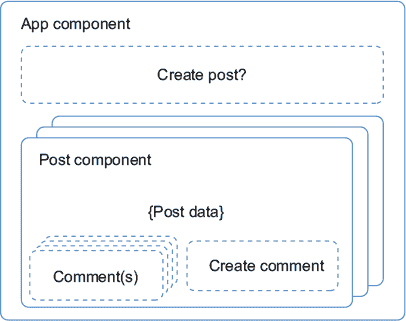

让我们看看如何创建组件的骨架。你只需输入组件的基本元素，导入正确的工具，导出 `Component` 类，并设置 PropTypes 以供以后定义。以下列表显示了如何创建这个基本骨架。

##### 列表 5.2\. 创建组件骨架 (src/components/post/Create.js)

```
import React, { Component } from 'react';       *1*
import PropTypes from 'prop-types';

class CreatePost extends Component {            *2*
  static propTypes = {                          *3*
  }
  constructor(props) {                          *4*
    super(props);
  }
  render () {
    return (
      <div className="create-post">
        Create a post — coming (very) soon
      </div>
    );
  }
}

export default CreatePost;                      *5*
```

+   ***1* 导入 React 和 PropTypes 对象以便使用它。**

+   ***2* 创建一个 React 组件。**

+   ***3* 在类上声明 PropTypes 作为静态属性。**

+   ***4* 设置构造函数——你稍后会用到它。**

+   ***5* 导出组件以便在其他地方使用。**

### 5.2\. React 中的表单

本章中你构建的两个组件都涉及表单的使用。Web 表单仍然类似于纸质表单——它们是接收和记录输入的结构化方式。用纸张时，你用钢笔或铅笔记录信息。用浏览器表单时，你用键盘、鼠标和电脑上的文件来捕获信息。你可能熟悉许多表单元素，如 `input`、`select` 和 `textarea` 等。

大多数网络应用程序在某种程度上都涉及表单。我从未参与过没有涉及任何形式的应用程序的生产部署。我还发现，表单有时因为难以处理而名声不佳。也许正因为如此，许多框架都实施了一种“魔法”方法来处理表单，旨在减轻开发者的负担。React 并不采用魔法方法，但它可以使表单更容易处理。

#### 5.2.1\. 开始使用表单

在前端框架中处理表单没有标准方法。在某些框架和库中，你可以设置一个表单 *模型*，该模型在用户更改表单值时更新，并且其中内置了特殊方法来检测表单处于不同状态。其他框架在处理表单时实施不同的范例和技术。它们共同的特点是它们以不同的方式处理表单。

我们应该如何看待不同的方法？哪一个更好？很难说哪一个在本质上比另一个更好，但有时“更容易使用”的方法可能会掩盖你背后的机制和逻辑。这并不总是坏事——有时你不需要了解框架的内部工作。但你需要有足够的理解来支持一个心理模型，这将让你能够创建可维护的代码并在出现问题时修复错误。在我看来，这正是 React 的亮点。在表单方面，它没有给你太多“魔法”，这让你在知道太多和知道太少之间找到了一个很好的平衡。

幸运的是，React 中表单的心理模型更像是你已经学过的。没有特殊的 API 集可以使用——表单只是我们在 React 中看到的东西的更多内容：组件！你使用组件、状态和属性来创建表单。因为我们是在之前的学习基础上构建的，所以在继续之前，让我们回顾一下 React 心理模型的一些部分：

+   组件有两种主要的数据处理方式：状态和属性。

+   由于它们是 JavaScript 类，组件除了可以用来响应事件和做其他任何事情的生命周期钩子外，还可以有自定义类方法。

+   就像对待常规 DOM 元素一样，你可以在 React 组件中监听事件，如点击、输入更改和其他事件。

+   父组件（如表单元素）可以通过属性向子组件提供回调方法，使组件之间能够相互通信。

当你构建创建帖子的组件时，你会使用这些熟悉的 React 思想。

#### 5.2.2\. 表单元素和事件

要创建一个帖子，你需要确保帖子被持久化到你的数据库中，帖子用户界面得到更新，并且你更新了用户的帖子列表。首先，你将构建表单元素，就像你构建一个常规 HTML 表单一样。标记并不复杂——你只接收一个输入，不需要显示其他内容。以下列表显示了组件的初始阶段：渲染一个`textarea`输入。

##### 列表 5.3\. 向你的 CreatePost 组件添加内容（src/components/post/Create.js）

```
//...
class CreatePost extends Component {
  render() {
    return (
      <div className="create-post">
                <textarea
                    placeholder="What's on your mind?"
                />
                </div>
                <button>Post</button>
            </div>
    );
  }
}
//...
```

现在你已经为你的基本表单创建了基本的标记，你可以开始连接这些元素。你可能还记得，从前面的章节中，React 让你以与常规浏览器 JavaScript 相同的方式与事件交互。它让你监听常规事件，如点击、滚动等，并对它们做出反应。当你处理表单时，你会利用这些事件。

| |
| --- |

##### 注意

如果你已经从事前端应用开发一段时间，你会知道不同浏览器之间有很多不一致性，尤其是在事件方面。除了从它那里获得的所有其他好处之外，React 还做了很多工作来抽象化浏览器实现中的这些差异。这是一个不太引起注意的好处，但它可以是一个难以置信的帮助。不必过多担心浏览器之间的差异通常会让你更多地关注应用程序的其他领域，并且通常会导致开发者更加快乐。

|  |
| --- |

由于用户交互，浏览器可以发生许多不同的事件——包括鼠标移动、键盘输入、点击等。在我们的应用中，我们特别关注这些类型的一些事件。对于我们的目的，你想要通过两个主要的事件处理程序——`onChange`和`onClick`——来监听：

+   **`onChange`—** 当输入元素发生变化时，这个事件会被触发。你可以使用`event.target.value`访问表单元素的新的值。

+   **`onClick`—** 当一个元素被点击时，这个事件会被触发。你会监听这个事件，以便知道用户何时想要将帖子发送到服务器。

接下来，你将为这些事件分配一些事件处理程序。目前，你将把这些函数放入一些控制台日志副作用中，这样我们就可以观察它们何时被触发。稍后，你会用真实的功能替换这些函数。以下列表显示了如何通过在组件类构造函数中绑定它们，然后在组件中分配它们来设置事件处理程序。

##### 列表 5.4\. 向 CreatePost 组件添加功能（src/components/post/Create.js）

```
class CreatePost extends Component {
  constructor(props) {
    super(props);
    this.handleSubmit = this.handleSubmit.bind(this);                 *1*
    this.handlePostChange = this.handlePostChange.bind(this);         *2*
  }

  handlePostChange(e) {                                               *3*
            console.log('Handling an update to the post body!');
  }

  handleSubmit() {
     console.log('Handling submission!');
  }

  render() {
    return (
       <div className="create-post">
                <button onClick={this.handleSubmit}>Post</button>    *4*
                <textarea
                    value={this.state.content}                       *5*
                    onChange={this.handlePostChange}                 *4*
                    placeholder="What's on your mind?"
                />
          </div>
    );
  }
}
```

+   ***1* 绑定处理提交和帖子更改的类方法。**

+   ***2* 在类上声明当正文文本（即 onChange 事件）更新时要使用的方法。**

+   ***3* 声明处理提交事件的函数，React 会将事件传递给处理程序**

+   ***4* 将事件处理程序传递给按钮和文本区域组件。**

+   ***5* 组件的值将从组件状态中读取**

事件处理程序接收一个合成事件作为参数，并且我们可以访问合成事件上的许多可用属性。表 5.1 展示了你可以访问的合成事件的一些属性。通过“合成”事件，我的意思是 React 将浏览器事件转换为你在 React 组件中可以操作的东西。

##### 表 5.1\. React 中合成事件可用的属性和方法

| 属性 | 返回类型 |
| --- | --- |
| bubbles | boolean |
| cancelable | boolean |
| currentTarget | DOMEventTarget |
| defaultPrevented | boolean |
| eventPhase | number |
| isTrusted | boolean |
| nativeEvent | DOMEvent |
| preventDefault() |   |
| isDefaultPrevented() | boolean |
| stopPropagation() |   |
| isPropagationStopped() | boolean |
| target | DOMEventTarget |
| timeStamp | number |
| type | string |

在我们继续之前，尝试一下：将 `console.log(event)` 添加到帖子组件的更改事件处理程序中。如果你在 `textarea` 元素中输入一些内容并打开浏览器开发者控制台，你应该会看到消息被记录出来（见图 5.3 以获取示例）。如果你检查这些对象或尝试访问表 5.1 中的某些属性，你应该会得到关于事件的详细信息。对我们来说，我们将关注返回的 `target` 属性。记住，`event.target` 只是对触发事件的 DOM 元素的引用，就像在正常的 JavaScript 中一样。

##### 图 5.3\. React 将一个合成事件传递给你设置的事件处理程序。它是一个*标准化*的事件，这意味着你可以访问与常规浏览器事件相同的属性和数据。

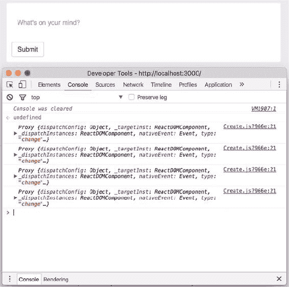

#### 5.2.3\. 在表单中更新状态

你现在可以监听事件，并观察你的组件如何监听更新和提交事件，但你还没有对数据进行任何操作。你需要对事件进行处理以更新你的应用程序状态。这是你在 React 中使用表单的关键方式：通过接收事件处理程序的事件，然后使用这些事件的数据来更新状态或属性。

状态和属性是 React 让你处理数据的两种主要方式。现在，如果你尝试在表单中输入一些内容，什么都不会发生。一开始这可能看起来像是一个错误，但这只是 React 在执行其工作。想想看：当你改变输入的值时，你正在修改 DOM，React 的主要工作之一就是确保 DOM 与从你的组件创建的内存中 DOM 版本保持同步。

由于你还没有在内存中的 DOM 中做任何改变（没有更新状态），React 不会用任何更改来更新实际的 DOM。这是一个 React 完美执行其工作的绝佳例子。如果你能够更新表单值，你可能会无意中把自己置于一个复杂的情况中，其中事物不同步，你需要回到更老的方式去做事情（这正是 React 最初改进的地方）。

要更新状态，你需要监听 React 在输入值改变时发出的事件。当这个事件被发出时，你会从中提取一个值，并使用这个值来更新组件状态。这给了你控制更新过程每个步骤的机会。

让我们看看如何将其付诸实践。列表 5.5 展示了如何设置事件处理程序来监听和更新用户更改数据值时组件的状态。稍后，你将使用之前工作过的 `event.target` 引用并访问 `value` 属性来使用 `textarea` 元素中的值更新你的状态。

##### 列表 5.5\. 使用输入更新组件状态（src/components/post/Create.js）

```
class CreatePost extends Component {
  constructor(props) {
    super(props);

    // Set up state
    this.state = {
      content: '',
    };

    // Set up event handlers
    this.handleSubmit = this.handleSubmit.bind(this);
    this.handlePostChange = this.handlePostChange.bind(this);
  }

  handlePostChange(event) {
    const content = event.target.value;                   *1*
        this.setState(() => {                             *2*
            return {
                content,
            };
        });
  }

  handleSubmit() {
      console.log(this.state);                            *3*
  }

  render() {
    return (
       <div className="create-post">
                <button onClick={this.handleSubmit}>Post</button>
                <textarea
                    value={this.state.content}            *4*
                    onChange={this.handlePostChange}
                    placeholder="What's on your mind?"
                />
       </div>

    );
  }
}
```

+   ***1* 从 DOM 元素的值属性中获取 textarea 元素的值（您想用其更新状态）**

+   ***2* 使用该值设置状态，并使用新值更新它**

+   ***3* 要查看更新后的状态，请点击表单提交按钮并检查开发者控制台**

+   ***4* 为 textarea 元素提供新的值**

#### 5.2.4\. 受控和非受控组件

这种在表单中更新组件状态的方法——通过使用事件和事件处理程序来紧密控制更新发生的方式——可能是处理 React 中表单的更常见方式。设计有此考虑的组件通常被称为 *受控* 组件。这是因为我们紧密控制组件以及状态如何改变。但还有另一种设计使用表单的组件的方法，称为 *非受控* 组件。图 5.4 展示了受控和非受控组件的工作概述，并说明了它们的一些区别。

##### 图 5.4\. 受控组件监听由 DOM 元素发出的事件，操作发出数据，然后更新组件状态并设置元素的值。这使一切都在组件的领域内，并创建了一个统一的状态宇宙。非受控组件维护其自己的内部状态，并在组件内创建了一个微观世界，切断了对该状态访问和控制。

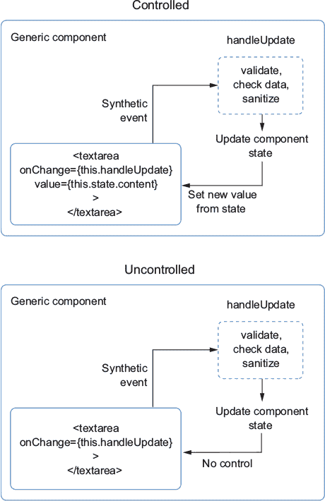

在非受控组件中，而不是使用`value`属性来设置数据，组件维护其自己的内部状态。您仍然可以使用事件处理程序监听输入的更新，但您将不再管理输入的状态。列表 5.6 展示了使用非受控组件方法的一个示例。本书我们将坚持使用受控组件，但至少要知道这种模式在实际中的样子。

##### 列表 5.6\. 使用非受控组件（src/components/post/Create.js）

```
class CreatePost extends Component {
  constructor(props) {
    super(props);

    this.state = {
      content: '',
    };

    this.handleSubmit = this.handleSubmit.bind(this);           *1*
    this.handlePostChange = this.handlePostChange.bind(this);   *1*
  }

  handlePostChange(event) {                                     *1*
    const content = event.target.value;                         *1*
    this.setState(() => {
        return {
            content,
        };
   });
  }

  handleSubmit() {                                              *1*
     console.log(this.state);
  }

  render() {
    return (
<div className="create-post">
                <button onClick={this.handleSubmit}>Post</button>
                <textarea
                    onChange={this.handlePostChange}            *2*
                    placeholder="What's on your mind?"
                />
       </div>
     );
  }
}
```

+   ***1* 您的处理程序与之前相同，但改变状态的效果将不会相同。**

+   ***2* 如前所述，现在没有任何值元素会监听组件状态。**

#### 5.2.5\. 表单验证和清理

使用表单记录和存储用户输入的一个重要部分是让用户知道他们何时违反了你设定的验证规则，以及何时提供不满足你应用程序的数据。希望接收来自你客户端应用程序数据的服务器应用程序已经实施了严格的数据验证和清理程序——你不能依赖浏览器应用程序在这个领域做所有的工作。即使你在服务器上实施了良好的数据清理和验证，你仍然需要在前端提供和执行良好的数据实践，以帮助用户，增加对恶意行为者的另一层防御，并促进数据完整性。如果不这样做，你可能会遇到困惑的用户、安全漏洞和没有意义的数据——这些都是你不想看到的事情。

如我们所见，使用表单更新组件状态涉及到状态、属性和组件方法，就像 React 中的许多其他方面一样。为了给你的组件添加验证和清理，你需要挂钩到更新过程。为此，你将编写通用的验证和清理函数，这些函数可以在任何可以使用 JavaScript 的地方使用，也许在大多数其他前端框架中也可以使用。

|  |
| --- |

**关于 React 事件和表单的思考**

花点时间思考一下你到目前为止在 React 中学到的关于事件和表单的知识。React 中的事件与你在浏览器中处理的事件有何不同？如果有的话，它们是如何不同的？

|  |
| --- |

幸运的是，你正在创建的 CreatePost 组件不需要大量的验证。你只需要检查最大长度并进行一些额外的验证，以确保组件不会向 API 服务器提交空帖子。我们使用简单的服务器设置用于学习和本地开发，因此它将接受大多数有效载荷而不进行太多验证。在服务器上编写应用程序是本书范围之外的另一个领域，所以我将只关注浏览器上的验证和清理。

在设置应用程序中表单和输入的验证时，你需要问自己几个问题：

+   应用程序的数据需求是什么？

+   根据这些限制，你如何帮助用户提供有意义的资料？

+   你有办法消除用户提供的数据中的不一致性吗？

首先，你需要找出业务或应用后端（如果有的话）设定的数据需求。你应该从这里开始，因为这方面的知识将帮助你建立如何处理数据的基本指南。因为我们已经确定你的服务器会乐意接受大多数东西，并且我们已经为帖子设定了基本的数据类型，我们可以继续下一个问题。

根据你的限制，你如何最好地帮助你的用户提供有意义的资料，并在你的应用中获得良好的体验？这通常涉及到检查数据的大小、字符类型，也许对于文件上传，还需要检查文件类型等。目前，你的 CreatePost 组件相对无害，除了长度之外没有太多需要验证的。接下来，你将检查最小和最大长度，并且只有当内容有效时才允许用户提交帖子。以下列表展示了如何为你的组件设置一些基本的验证。

##### 列表 5.7\. 添加基本验证（src/components/post/Create.js）

```
//...
class CreatePost extends Component {
  constructor(props) {
    super(props);

    this.state = {
      content: '',
      valid: false,                               *1*
    };

    this.handleSubmit = this.handleSubmit.bind(this);
    this.handlePostChange = this.handlePostChange.bind(this);
  }

  handlePostChange(event) {
    const content = event.target.value;
    this.setState(() => {
            return {
                content,
                valid: content.length <= 280      *2*
            };
    });
  }

  handleSubmit() {
    if (!this.state.valid) {
       return;
    }
    const newPost = {                             *3*
        content: this.state.content,              *3*
    };

    console.log(this.state);
  }

  render() {
    return (
      <div className="create-post">
                <button onClick={this.handleSubmit}>Post</button>
                <textarea
                    value={this.state.content}
                    onChange={this.handlePostChange}
                    placeholder="What's on your mind?"
                />
       </div>
     );
  }
}
```

+   ***1* 在本地组件状态中创建一个简单的有效属性**

+   ***2* 通过在此处设置最大长度来确定帖子的有效性——280 展示了用法，但用户有时希望帖子更长**

+   ***3* 创建一个新的帖子对象。**

我们已经解决了前两个问题（数据约束和验证）。现在我们可以着手解决最后一个方面：通过（非常）基本的数据清理来消除数据不一致性。验证是要求用户提供*某些*数据，而清理则是确保你得到的数据是安全的，并且格式正确，以及以某种方式存在，可以持久化。信息安全是一个庞大且非常重要的领域，这本书无法真正深入探讨正确的数据处理方法——但我们可以在 Letters 这个较小的领域进行探讨：攻击性内容。

你将使用一个名为 bad-words 的 JavaScript 模块，它可以从 npm（主要的 JavaScript 模块注册和服务——更多信息请访问[www.npmjs.com/about](http://www.npmjs.com/about)）获取，来帮助我们。它应该已经安装在你的项目中。bad-words 接受一个字符串，并将黑名单上找到的任何单词替换为星号。以下列表中的示例主要是虚构的，但至少你可以防止人们在公共应用([`social.react.sh`](https://social.react.sh))上发布可能具有攻击性的内容。记住，这是一个非常虚构的例子，并且绝对没有暗示或支持任何形式的审查。

##### 列表 5.8\. 添加基本内容清理（src/components/post/Create.js）

```
import PropTypes from 'prop-types';
import React from 'react';

import Filter from 'bad-words';                           *1*

const filter = new Filter();                              *2*

class CreatePost extends Component {
  //...
  handlePostChange(event) {
    const content = filter.clean(event.target.value);     *3*
     this.setState(() => {
            return {
                content,
                valid: content.length <= 280
            };
     });
  }
//...
   }
export default CreatePost;
```

+   ***1* 从 bad-words 模块导入默认对象**

+   ***2* 使用构造函数创建新的过滤器实例**

+   ***3* 将表单值传递给过滤器的 .clean() 方法，并使用返回的值设置状态**

### 5.3\. 创建新帖子

现在你正在对帖子进行一些基本的验证和清理，你将想要通过将它们发送到服务器来创建它们。我们将引入稍微复杂一些的复杂性来实现这一点，所以我们将简要介绍每个步骤，然后查看整个过程的示意图。

要将你的帖子发送到 API，你除了需要做 CreatePost 组件已经做的事情（包括跟踪状态、进行一些基本验证和执行一些基本内容清理）之外，还需要做以下几件事情。

接下来，你需要做以下事情来将数据发送到你的 API：

1.  捕获用户输入作为帖子内容，更新状态并执行你迄今为止实现的数据检查逻辑。

1.  调用一个从父组件（在这个例子中是主 App 组件）传递过来的事件处理函数作为 props，并将帖子数据传递给它。

1.  重置 CreatePost 组件的状态。

1.  在父组件中，使用从 CreatePost 子组件传递的数据对服务器执行 HTTP `POST` 操作。

1.  使用从服务器接收的新帖子更新本地组件状态。

1.  为了更好地理解你将要做什么，请参阅 图 5.5 中的插图。

##### 图 5.5\. CreatePost 组件概述。CreatePost 组件接收一个作为 props 的函数，使用其内部状态作为该函数的输入，并在用户点击提交时调用它。这个函数是从父 App 组件传递过来的，它将数据发送到 API，更新本地帖子，并从 API 初始化帖子刷新。

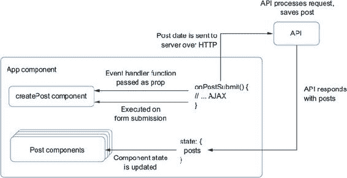

你将从在父组件（App.js）中添加一个处理提交后操作的功能开始。这个功能有几个部分，所以你会逐个添加它们，并且我们会逐一讲解。列表 5.9 展示了如何将提交后操作功能添加到主 App 组件中。

##### 列表 5.9\. 处理帖子提交（src/app.js）

```
import * as API from './shared/http';                                    *1*

//...

export default class App extends Component {
  //...
  createNewPost(post) {
     this.setState(prevState => {
                    return {
                        posts: orderBy(prevState.posts.concat(newPost),
     'date', 'desc')                                                     *2*
                    };
                });

  }
  //...
}
```

+   ***1* 导入 Letters API 模块。**

+   ***2* 连接新的帖子并确保帖子排序。**

你已经在父组件中设置了帖子创建处理函数，但在这个阶段它不会做任何事情，因为没有东西调用它。这是因为你需要将其传递给其子组件（你一直在工作的 CreatePost 组件）。还记得你可以如何将数据从父组件传递到子组件作为 props 吗？你也可以传递函数。这是至关重要的，因为它允许组件协作并一起工作。尽管组件可以交互，但它们并不是那么紧密地交织或耦合，以至于你永远不能移动它们；CreatePost 组件同样可以被移动到应用程序的另一个部分，并向另一个处理程序发出相同的数据。列表 5.10 展示了将回调函数作为 props 传递的示例。

|  |
| --- |

**受控和非受控组件**

以下是一些 React 中受控组件和非受控组件之间的区别？什么决定了组件被认为是受控的还是非受控的？

|  |
| --- |

##### 列表 5.10\. 通过 props 传递回调函数（src/app.js）

```
import CreatePost from './post/Create';               *1*

export default class App extends Component {
  //...
  render() {
   return (
     //...
     <CreatePost onSubmit={this.createNewPost} />     *2*
     //...
      )
     }
  //...
}
```

+   ***1* 导入组件以供使用。**

+   ***2* 使用 props 传递 handlePostSubmit 函数。**

到目前为止，你已经在父组件中设置了事件处理器的基础，并将其传递给子组件。这有助于你分离关注点——CreatePost 组件只负责打包一些帖子数据，然后将其发送到父组件，由父组件决定如何处理这些数据，即将其发送到 API。第六章 讨论了这一点以及更多内容。

### 5.4. 概述

下面是本章你学到的主要内容：

+   在 React 中处理表单的方式与处理任何其他组件类似：你可以使用事件和事件处理器来传递数据并提交数据。

+   React 不提供任何“魔法”方式来处理表单。表单只是组件。

+   表单验证和清理工作在相同的 React 思维模型中，包括事件、组件更新、重新渲染、状态和 props 等。

+   你可以在组件之间传递函数作为 props，这是一个强大且有用的设计模式，它可以防止组件耦合但促进组件通信。

+   数据验证和清理不是“魔法”——React 允许你使用常规 JavaScript 和库来处理你的数据。

在下一章中，你将在此基础上继续构建，并开始将第三方库与 React 集成，以在你的应用中添加地图。

## 第六章. 将第三方库与 React 集成

*本章涵盖*

+   以 JSON 格式向远程 API 发送表单数据

+   构建一些新的组件，包括位置选择器、自动完成和显示地图

+   将你的 React 应用程序与 Mapbox 集成以搜索位置和显示地图

在 第五章 中，我们开始探讨表单及其在 React 中的工作方式。你在 CreatePost 组件中添加了事件处理器来更新组件状态。在本章中，你将在此基础上继续工作，并尝试添加创建新帖子的功能。你将开始与在上一章中提供帖子的 JSON API 进行更多交互。

通常，你会在涉及非 React 库的上下文中构建 React 应用程序，这些库也使用 DOM。这些可能包括 jQuery、jQuery 插件，甚至是其他前端框架。我们已经看到 React 为你管理 DOM，这可以简化你对用户界面的思考。然而，仍然有一些时候你需要与 DOM 交互，这通常是在使用 DOM 的第三方库的上下文中。在本章中，我们将探讨一些方法，在添加 Mapbox 地图到 Letters Social 帖子时，如何使用 React 来实现这一点。

|  |
| --- |

**我如何获取本章的代码？**

与每一章一样，你可以通过访问 GitHub 仓库[`github.com/react-in-action/letters-social`](https://github.com/react-in-action/letters-social)来查看本章的源代码。如果你想从这个章节开始一个全新的起点并跟随，你可以使用你从第四章（如果你跟随并自己构建了示例）或检出章节分支（chapter-5-6）。

记住，每个分支都对应于章节末尾或指示的章节中的代码——例如，分支 chapter-5-6 对应于本章末尾的代码。你可以在你选择的目录中执行以下终端命令来获取当前章节的代码。

如果你根本没有任何仓库，请输入以下内容：

```
   git clone git@github.com:react-in-action/letters-social.git
```

如果你已经克隆了仓库：

```
   git checkout chapter-5-6
```

你可能已经从其他章节来到这里，所以始终确保你有所有正确的依赖项安装：

```
    npm install
```

|  |
| --- |

### 6.1\. 向 Letters 社交 API 发送帖子

如你所回忆的，从第二章，你创建了一个允许你添加评论的评论框组件。它将这些评论本地持久化，仅在内存中——当你刷新页面时，你添加的任何评论都会消失，因为它们与给定时间点的页面状态共存亡。你可以选择利用本地或会话存储，或者使用其他基于浏览器的存储技术（如 cookies、IndexedDB、WebSQL 等）。然而，这些仍然会将所有内容保持本地化。

你将要做的是将帖子数据格式化为 JSON 发送到你的 API 服务器，如列表 6.1 所示。它将处理存储帖子并响应新数据。当你克隆仓库时，在共享/http 文件夹中已经存在可以用于 Letters 社交项目的已创建函数。你正在使用 `isomorphic-fetch` 库进行网络请求。它遵循浏览器的 Fetch API，但具有优势，它也可以在服务器上工作。

##### 列表 6.1\. 向服务器发送帖子（src/components/app.js）

```
export default class App extends Component {
//...
createNewPost(post) {
        return API.createPost(post)                                      *1*
            .then(res => res.json())                                     *2*
            .then(newPost => {                                           *3*
                this.setState(prevState => {
                    return {
                        posts: orderBy(prevState.posts.concat(newPost),
     'date', 'desc')                                                     *4*
                    };
                });
            })
            .catch(err => {
                this.setState(() => ({ error: err }));                   *5*
            });
    }
```

+   ***1* 使用 Letters API 创建帖子。**

+   ***2* 获取 JSON 响应。**

+   ***3* 使用新的帖子更新状态。**

+   ***4* 确保帖子使用 Lodash 的 orderBy 方法排序。**

+   ***5* 如果有错误状态，请设置它。**

因此，你只剩下一件事要做：在子组件中调用帖子创建方法。你已经传递了它，所以只需确保点击事件触发父方法的调用，并将帖子数据传递下去。以下列表显示了如何在子组件中调用作为 prop 传递的方法。

##### 列表 6.2\. 通过 props 调用函数

```
class CreatePost extends Component {

// ...

fetchPosts() {/* created in chapter 4 */}

handleSubmit(event) {
    event.preventDefault();                   *1*
    if (!this.state.valid) {
      return;
    }
    if (this.props.onSubmit) {                *2*
      const newPost = {
        date: Date.now(),
        // Assign a temporary key to the post; the API will create a real one
     for us
        id: Date.now(),
        content: this.state.content,
      };

      this.props.onSubmit(newPost);           *3*
      this.setState({                         *4*
        content: '',                          *4*
        valid: null,                          *4*
      });                                     *4*
    }
  }
  // ...
}
```

+   ***1* 阻止默认事件并创建一个发送给父组件的对象**

+   ***2* 确保你有一个回调函数来处理。**

+   ***3* 调用通过 props 从父组件传递的 onSubmit 回调，传入新帖子**

+   ***4* 将状态重置为初始形式，以便用户有视觉提示表示帖子已提交**

现在，如果您使用 `npm run dev` 在开发模式下运行应用程序，您应该能够添加帖子！它们应该立即出现在您的源中，但如果您刷新页面，您仍然应该能够看到您添加的帖子。它不会有像其他人那样的个人资料图片或链接预览，但您将在后面的章节中添加这些功能。

### 6.2\. 使用地图增强您的组件

现在您已经为您的应用程序添加了创建帖子并将其发送到服务器的功能，您可以继续增强它。Letters Social 的虚构投资者一直在使用 Facebook 和 Twitter，并注意到这些平台允许您在帖子中添加位置。他们非常希望 Letters Social 具有这种功能，因此您将添加选择和显示位置的功能，以便在选择帖子时使用。您还将重用地图显示组件，以便在用户的新闻源中显示位置。图 6.1 展示了您将要构建的内容。

##### 图 6.1\. 您将为 Letters Social 创建的内容。您将增强当前的发帖能力，以便用户可以在帖子中添加位置。一旦完成，您在创建帖子时将能够搜索和选择位置。

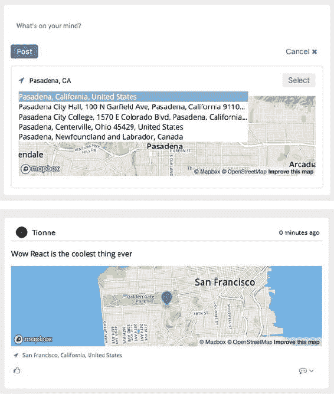

您可能已经注意到在 图 6.1 中，您将使用 Mapbox 创建地图。Mapbox 是一个地图和地理服务平台，提供了一系列令人难以置信的地图和位置相关服务。您可以使用数据自定义地图，创建不同风格的地图和覆盖层，进行地理搜索，添加导航等等。我无法涵盖 Mapbox 所做的所有事情，但如果您想了解更多信息，请访问 [www.mapbox.com](http://www.mapbox.com)。

#### 6.2.1\. 使用 refs 创建 DisplayMap 组件

您需要一种方式向用户展示位置，无论是他们在为新帖子选择位置时，还是当帖子在他们的新闻源中渲染时。我们将看到如何创建一个组件，它将服务于这两个目的，这样您就可以重用您的代码。您可能并不总是能够这样做，因为每个需要地图的地方可能有不同的需求。但在这个案例中，共享相同的组件将有效，并且可以为您节省额外的工作。首先，创建一个名为 src/components/map/DisplayMap.js 的新文件。您将把我们的所有地图相关组件放在这个目录中。

Mapbox 库是从哪里来的？在大多数其他情况下，我们使用的是从 npm 安装的库。您将在下一节中使用 Mapbox npm 模块，但您将使用不同的库来创建地图。如果您查看源代码中包含的 HTML 模板（src/index.ejs），您将看到对 Mapbox JS 库（`mapbox.js`）的引用：

```
...
<script src="https://api.mapbox.com/mapbox.js/v3.1.1/mapbox.js"></script>
...
```

这将使您的 React 应用程序能够与 Mapbox JS SDK 一起工作。请注意，Mapbox JS SDK 需要一个 Mapbox 令牌才能运行。我在 Letters Social 的应用程序源代码中包含了一个公共令牌，因此您不需要 Mapbox 账户。如果您有账户或想为了定制目的创建一个账户，您可以通过更改应用程序源代码中的配置目录中的值来添加您的令牌。

在您正在工作的项目或功能中，通常会有需要您将 React 与非 React 库集成的情形。您可能正在处理像 Mapbox（正如您在本章中所做的那样）这样的东西，或者可能是另一个没有考虑到 React 的第三方库。鉴于 React DOM 为您管理 DOM，您可能会想知道您是否可以这样做。好消息是 React 提供了一些很好的逃生舱，使得与这些库一起工作成为可能。

这就是引用发挥作用的地方。我在前面的章节中简要提到了引用，但在这里它们将特别有用。*引用*是 React 提供您访问底层 DOM 节点的方式。引用在 React 中可能很有用，但您不应过度使用它们。我们仍然想使用状态和属性作为使我们的应用程序交互和与数据交互的主要手段。但有一些很好的用例，其中引用很有用，包括以下内容：

+   为了管理焦点和命令式地与媒体元素如 `<video>` 交互

+   为了命令式地触发动画

+   为了与在 React 之外使用 DOM 的第三方库交互（这是我们用例）

您如何在 React 中使用引用？在过去的版本中，您会给 React 元素添加一个字符串属性（`<div ref="myref"></div>`），但新的方法是使用内联回调，如下所示：

```
<div ref={ref => { this.MyNode = ref; } }></div>
```

当您想要引用底层的 DOM 元素时，您可以从您的类中引用它。您可以在 `ref` 回调函数中与之交互，但大多数时候您会想要在您的组件类中存储引用，以便在其他地方可用。

我应该指出几点。您不能在 React 中的无状态函数组件外部使用引用，因为该组件没有后端实例。例如，这不会工作：

```
<ACoolFunctionalComponent ref={ref => { this.ref = ref; } } />
```

但如果组件是一个类，您将获得组件的引用，因为它确实有一个后端实例。您还可以将引用作为属性传递给消耗它们的组件。大多数时候，您只会想要在您需要直接访问 DOM 节点时使用引用，所以除非您正在构建一个需要引用来工作的库，否则这种用例可能不会经常出现。

您将使用引用与 Mapbox JavaScript SDK 进行交互。Mapbox 的库负责为您创建地图，并在地图上设置许多事情，如事件处理程序、UI 控件等。它的地图 API 需要使用 DOM 元素引用或 ID 来在 DOM 中搜索。您将使用引用。以下列表显示了您的 DisplayMap 组件的骨架。

##### 列表 6.3\. 向您的地图组件添加引用（src/components/map/DisplayMap.js）

```
import React, { Component } from 'react';
import PropTypes from 'prop-types';

export default class DisplayMap extends Component {
    render() {
        return [                                            *1*
            <div key="displayMap" className="displayMap">   *1*
                <div
                    className="map"                         *2*
                    ref={node => {
                        this.mapNode = node;                *2*
                    }}
                >
                </div>
            </div>
        ];
    }
}
```

+   ***1* 从渲染中返回元素数组**

+   ***2* Mapbox 将用于创建您的地图的 DOM 元素**

这是在使地图与 React 一起工作方面的一个良好开端。接下来，您需要使用 Mapbox JS API 创建地图。您将创建一个方法，该方法将使用您在类中存储的引用。您还需要设置一些默认属性和状态，以便地图有一个默认区域可以平移，并且不会一开始就显示整个世界。您将在组件中记录一些状态，包括地图是否已加载以及一些位置信息（纬度、经度和地点名称）。注意，通过 React 与另一个 JavaScript 库交互是一件相当简单的事情。最难的部分是使用引用，但除此之外，库可以相当容易地协同工作。以下列表显示了如何设置 DisplayMap 组件。

##### 列表 6.4\. 使用 Mapbox 创建地图（src/components/map/DisplayMap.js）

```
import React, { Component } from 'react';
import PropTypes from 'prop-types';

export default class DisplayMap extends Component {
    constructor(props) {
        super(props);
        this.state = {                                                    *1*
            mapLoaded: false,                                             *1*
            location: {                                                   *1*
                lat: props.location.lat,
                lng: props.location.lng,
                name: props.location.name
            }
        };
        this.ensureMapExists = this.ensureMapExists.bind(this);           *2*
    }
    static propTypes = {
        location: PropTypes.shape({
            lat: PropTypes.number,
            lng: PropTypes.number,
            name: PropTypes.string
        }),
        displayOnly: PropTypes.bool
    };
    static defaultProps = {
        displayOnly: true,
        location: {
            lat: 34.1535641,
            lng: -118.1428115,
            name: null
        }
    };
    componentDidMount() {
        this.L = window.L;                                                *3*
        if (this.state.location.lng && this.state.location.lat) {         *4*
            this.ensureMapExists();                                       *4*
        }
    }
    ensureMapExists() {
        if (this.state.mapLoaded) return;                                 *5*
        this.map = this.L.mapbox.map(this.mapNode, 'mapbox.streets', {    *6*
            zoomControl: false,                                           *6*
            scrollWheelZoom: false                                        *6*
        });
        this.map.setView(this.L.latLng(this.state.location.lat,
     this.state.location.lng), 12);                                       *7*

        this.setState(() => ({ mapLoaded: true }));                       *8*
    }
    render() {
        return [
            <div key="displayMap" className="displayMap">
                <div
                    className="map"
                    ref={node => {
                        this.mapNode = node;
                    }}
                >
                </div>
            </div>
        ];
    }
}
```

+   ***1* 设置初始状态**

+   ***2* 绑定 ensureMapExists 类方法。**

+   ***3* Mapbox 使用一个名为 Leaflet 的库（因此有“L”）。**

+   ***4* 检查地图是否有可用于工作的位置信息——如果有，设置地图。**

+   ***5* 确保您不会意外地重新创建已加载的地图。**

+   ***6* 使用 Mapbox 创建新地图并在组件中存储对其的引用（您正在禁用不需要的地图功能）**

+   ***7* 将地图视图设置为组件接收到的纬度和经度**

+   ***8* 更新状态以便您知道地图已加载**

您的组件现在应显示一个仅用于显示目的的足够好的地图。不过，请记住，您想要创建一个可以指示特定位置并在用户选择新位置时更新给用户的地图组件。您需要做更多工作以启用这些功能：添加向地图添加标记的方法、更新地图位置以及确保地图正确更新。以下列表显示了如何将这些方法添加到您的组件中。

##### 列表 6.5\. 一个动态地图（src/components/map/DisplayMap.js）

```
import React, { Component } from 'react';
import PropTypes from 'prop-types';

export default class DisplayMap extends Component {
    constructor(props) {
        super(props);
        this.state = {
            mapLoaded: false,
            location: {
                lat: props.location.lat,
                lng: props.location.lng,
                name: props.location.name
            }
        };
        this.ensureMapExists = this.ensureMapExists.bind(this);            *1*
        this.updateMapPosition = this.updateMapPosition.bind(this);        *1*
    }
    //...
    componentDidUpdate() {                                                 *2*
        if (this.map && !this.props.displayOnly) {
            this.map.invalidateSize(false);                                *2*
        }
    }
    componentWillReceiveProps(nextProps) {                                 *3*
        if (nextProps.location) {                                          *4*
            const locationsAreEqual = Object.keys(nextProps.location).every(
                k => nextProps.location[k] === this.props.location[k]
            );                                                             *4*
            if (!locationsAreEqual) {                                      *4*
                this.updateMapPosition(nextProps.location);
            }
        }
    }
    //...
    ensureMapExists() {
        if (this.state.mapLoaded) return;
        this.map = this.L.mapbox.map(this.mapNode, 'mapbox.streets', {
            zoomControl: false,
            scrollWheelZoom: false
        });
        this.map.setView(this.L.latLng(this.state.location.lat,
     this.state.location.lng), 12);
        this.addMarker(this.state.location.lat, this.state.location.lng);  *5*
        this.setState(() => ({ mapLoaded: true }));
    }
    updateMapPosition(location) {                                          *6*
        const { lat, lng } = location;
        this.map.setView(this.L.latLng(lat, lng));                         *6*
        this.addMarker(lat, lng);                                          *6*
        this.setState(() => ({ location }));                               *6*
    }
    addMarker(lat, lng) {
        if (this.marker) {
            return this.marker.setLatLng(this.L.latLng(lat, lng));         *7*
        }
        this.marker = this.L.marker([lat, lng], {                          *8*
            icon: this.L.mapbox.marker.icon({
                'marker-color': '#4469af'
            })
        });
        this.marker.addTo(this.map);                                       *8*
    }
    render() {
        return [
            <div key="displayMap" className="displayMap">
                <div
                    className="map"
                    ref={node => {
                        this.mapNode = node;
                    }}
                >
                </div>
            </div>
        ];
    }
}
```

+   ***1* 绑定类方法**

+   ***2* 告诉 Mapbox 使您的地图大小无效，防止在隐藏/显示地图时显示不正确**

+   ***3* 当要显示的位置发生变化时，您需要相应地做出反应**

+   ***4* 如果您有一个位置，检查当前位置和上一个位置以查看属性是否相同——如果不相同，您可以更新地图**

+   ***5* 在地图首次创建时添加标记**

+   ***6* 根据需要更新地图视图和组件状态。**

+   ***7* 更新现有标记而不是每次都创建一个。**

+   ***8* 创建标记并将其添加到地图中。**

当你给组件添加每个方法时，你可能已经注意到了一个模式：使用第三方库做些事情，教 React 了解它，然后重复。这通常是我经验中与第三方库集成的做法。你通常会想要找到一个集成点，你可以从中获取库的数据或使用它的 API 来告诉它做事情——但所有这些都在 React 中完成。有许多例外，其中可能非常困难，但根据我的经验，React 的 refs 和一般的 JavaScript 互操作性使得与非 React 库一起工作并不像其他情况下那样糟糕（并且我希望你在未来的 React 应用中也找到同样的感觉）。

你还可以对你的组件进行至少一项改进。Mapbox 还允许你根据地理信息生成地图的静态图像。这在某些情况下可能很有用，你可能不想加载交互式地图。你将添加这个功能作为备用，以便用户可以立即看到地图。这将在第十二章（kindle_split_024_split_000.xhtml#ch12）中很有用，那时你将进行服务器端渲染。服务器将生成不会调用任何挂载相关方法的标记，因此即使在应用完全加载之前，用户仍然可以看到帖子中的位置。

你还需要在你的地图组件中添加一点小的 UI，以便地图可以在仅显示模式下显示其位置名称。我们之前提到过，你将向主要元素添加一个兄弟元素，这就是为什么你返回了一个元素数组。这就是你将添加这个小标记的地方。以下列表显示了如何向你的组件添加图像备用和位置名称显示。

##### 列表 6.6\. 添加备用地图图像（src/components/map/DisplayMap.js）

```
import React, { Component } from 'react';
import PropTypes from 'prop-types';

export default class DisplayMap extends Component {
    constructor(props) {
        super(props);
        this.state = {
            mapLoaded: false,
            location: {
                lat: props.location.lat,
                lng: props.location.lng,
                name: props.location.name
            }
        };
        this.ensureMapExists = this.ensureMapExists.bind(this);
        this.updateMapPosition = this.updateMapPosition.bind(this);
        this.generateStaticMapImage = this.generateStaticMapImage.bind(this);*1*
    }
    //...
    generateStaticMapImage(lat, lng) {                                       *2*
        return `https://api.mapbox.com/styles/v1/mapbox/streets-
     v10/static/${lat},${lng},12,0,0/600x175?access_token=${process          *2*
            .env.MAPBOX_API_TOKEN}`;
    }
    render() {
        return [
            <div key="displayMap" className="displayMap">
                <div
                    className="map"
                    ref={node => {
                        this.mapNode = node;
                    }}
                >
                    {!this.state.mapLoaded && (                              *3*
                        
                    )}
                </div>
            </div>,
            this.props.displayOnly && (                                      *4*
                <div key="location-description" className="location-
     description">
                    <i className="location-icon fa fa-location-arrow" />
                    <span className="location-
     name">{this.state.location.name}</span>                                 *4*
                </div>
            )
        ];
    }
}
```

+   ***1* 绑定类方法。**

+   ***2* 使用经纬度从 Mapbox 生成图像 URL。**

+   ***3* 显示位置图像。**

+   ***4* 如果你处于仅显示模式，显示位置名称和指示器。**

#### 6.2.2\. 创建 LocationTypeAhead 组件

你可以在你的应用中显示地图，但你仍然无法创建它们。你需要构建另一个组件来支持这个功能：一个 *位置自动完成* 组件。在下一节中，你将使用这个组件在你的 CreatePost 组件中，以便用户可以搜索位置。这个组件将使用浏览器地理位置 API 以及 Mapbox API 来搜索位置。

你可以通过创建另一个文件开始，src/components/map/LocationTypeAhead.js。展示了你将在本节中创建的自动完成组件。

#####  一个你可以与你的地图组件一起使用，让用户向他们的帖子添加位置的自动完成组件


完成后，你的组件将具有以下基本功能：

+   显示一个位置列表供用户选择

+   将选定的位置传递给父组件以供使用

+   使用 Mapbox 和地理位置 API 允许用户选择他们的当前位置或通过地址搜索

接下来，你将开始创建组件的骨架，以确定其外观。列表 6.7 展示了它的第一个草图。你将再次使用 Mapbox，但这次你将使用一组不同的 API。在上一个章节中，你使用了地图显示 API，但在这里你将使用一组允许用户进行 *反向地理编码* 的 Mapbox API，这是一种更复杂的说法，即“通过文本搜索真实位置”。Mapbox 模块已经与项目一起安装，并将使用相同的公共 Mapbox 密钥来工作。如果你之前添加了你的 API 密钥，应用程序配置应在此处使用相同的密钥。

|  |
| --- |

**Mapbox 替代方案**

你在本章中使用了 Mapbox，但还有其他映射库，例如 Google 地图。你将如何切换 Mapbox 为 Google 地图？你需要做哪些不同的操作？

|  |
| --- |

##### 列表 6.7\. LocationTypeAhead 组件的起点

```
import React, { Component } from 'react';
import PropTypes from 'prop-types';
import MapBox from 'mapbox';                                            *1*

export default class LocationTypeAhead extends Component {
    static propTypes = {
        onLocationUpdate: PropTypes.func.isRequired,                    *2*
        onLocationSelect: PropTypes.func.isRequired                     *2*
    };
    constructor(props) {
        super(props);
        this.state = {                                                  *3*
            text: '',
            locations: [],
            selectedLocation: null
        };
        this.mapbox = new MapBox(process.env.MAPBOX_API_TOKEN);         *4*
    }
    render() {
        return [                                                        *5*
           <div key="location-typeahead" className="location-typeahead">
                <i className="fa fa-location-arrow"
     onClick={this.attemptGeoLocation} />                               *5*
                <input
                    onChange={this.handleSearchChange}                  *5*
                    type="text"
                    placeholder="Enter a location..."
                    value={this.state.text}
                />
                <button
                    disabled={!this.state.selectedLocation}             *5*
                    onClick={this.handleSelectLocation}                 *5*
                    className="open"
                >
                    Select
                </button>
            </div>
        ];
    }
}
```

+   ***1* 导入 Mapbox。**

+   ***2* 暴露两个方法，一个用于位置更新，一个用于位置选择。**

+   ***3* 设置初始状态**

+   ***4* 创建 Mapbox 客户端实例。**

+   ***5* 返回一个元素数组，这些元素将是你类型预测组件的标记。你需要实现事件处理器中引用的所有方法（onChange、onClick 等）。**

现在，你可以开始填写你在组件的 `render` 方法中引用的方法。请注意，你需要一种处理搜索文本变化的方法、一个允许你选择位置按钮，以及一个允许用户选择当前位置的图标。我将在下一部分介绍该功能；现在，你需要允许用户通过文本搜索位置并选择位置的方法。列表 6.8 展示了如何添加这些方法。这些位置将从哪里来？你将使用 Mapbox API 根据用户输入搜索位置，并使用这些结果显示地址。这是你可以使用 Mapbox 的方法之一。你也可以做相反的操作——输入坐标并将其转换为地址。你将在下一个列表中使用该功能来处理地理位置 API。

##### 列表 6.8\. 搜索位置（src/components/map/LocationTypeAhead.js）

```
    //...
    constructor(props) {
        super(props);
        this.state = {
            text: '',
            locations: [],
            selectedLocation: null
        };
        this.mapbox = new MapBox(process.env.MAPBOX_API_TOKEN);
        this.handleLocationUpdate = this.handleLocationUpdate.bind(this); *1*
        this.handleSearchChange = this.handleSearchChange.bind(this);     *1*
        this.handleSelectLocation = this.handleSelectLocation.bind(this); *1*
        this.resetSearch = this.resetSearch.bind(this);                   *1*
    }
    componentWillUnmount() {
        this.resetSearch();                                               *2*
    }
    handleLocationUpdate(location) {
        this.setState(() => {                                             *3*
            return {
                text: location.name,
                locations: [],
                selectedLocation: location
            };
        });
        this.props.onLocationUpdate(location);                            *4*
    }
    handleSearchChange(e) {
        const text = e.target.value;                                      *5*
        this.setState(() => ({ text }));                                  *5*
        if (!text) return;
        this.mapbox.geocodeForward(text, {}).then(loc => {                *6*
            if (!loc.entity.features || !loc.entity.features.length) {
                return;                                                   *7*
            }
            const locations = loc.entity.features.map(feature => {        *8*
                const [lng, lat] = feature.center;
                return {
                    name: feature.place_name,
                    lat,
                    lng
                };
            });
            this.setState(() => ({ locations }));                         *9*
        });
    }
    resetSearch() {                                                       *10*
        this.setState(() => {
            return {
                text: '',                                                 *10*
                locations: [],                                            *10*
                selectedLocation: null                                    *10*
            };
        });
    }
    handleSelectLocation() {
        this.props.onLocationSelect(this.state.selectedLocation);         *11*
    }
//....
```

+   ***1* 绑定类方法。**

+   ***2* 当组件卸载时，重置搜索。**

+   ***3* 当选择位置时，更新本地组件状态**

+   ***4* 同时，通过 props 回调将位置传递给父组件**

+   ***5* 从用户在搜索框中输入时接收的事件中提取文本**

+   ***6* 使用 Mapbox 客户端通过用户的文本搜索位置**

+   ***7* 如果没有结果，则不执行任何操作**

+   ***8* 将 Mapbox 结果转换为你在组件中更容易使用的格式。**

+   ***9* 使用新位置更新状态**

+   ***10* 允许重置组件状态（见 componentWillUnmount）**

+   ***11* 当位置被选中时，将当前选中位置传递上去**

接下来，你想要让用户选择他们用于帖子的当前位置。为此，你将使用浏览器地理位置 API。即使你之前没有使用过地理位置 API，这也是可以的。在很长一段时间里，它是一个前沿特性，你只能在某些浏览器上使用它。现在它已经得到了广泛的应用，并且更加有用。

地理位置 API 基本上做了你想象中的事情：你可以询问用户是否可以在你的应用中使用他们的位置。到目前为止，几乎所有浏览器都支持地理位置 API ([`caniuse.com/#feat=geolocation`](http://caniuse.com/#feat=geolocation))，因此你可以利用它并让用户选择用于帖子的当前位置。请注意，地理位置 API 只能在安全上下文中使用，所以如果你尝试将 Letters Social 部署到未加密的主机，它将无法工作。

你需要再次使用 Mapbox API，因为地理位置 API 返回的只是坐标。记得你是如何使用用户的文本在 Mapbox 中搜索位置的？你可以做相反的事情：向 Mapbox 提供坐标，并获取匹配的地址。下面的列表显示了如何使用地理位置和 Mapbox API 让用户选择他们用于帖子的当前位置。

##### 列表 6.9\. 添加地理位置（src/components/map/LocationTypeAhead.js）

```
    constructor(props) {
        super(props);
        this.state = {
            text: '',
            locations: [],
            selectedLocation: null
        };
        this.mapbox = new MapBox(process.env.MAPBOX_API_TOKEN);
        this.attemptGeoLocation = this.attemptGeoLocation.bind(this);     *1*
        this.handleLocationUpdate = this.handleLocationUpdate.bind(this);
        this.handleSearchChange = this.handleSearchChange.bind(this);
        this.handleSelectLocation = this.handleSelectLocation.bind(this);
        this.resetSearch = this.resetSearch.bind(this);
    }
    //...
    attemptGeoLocation() {
        if ('geolocation' in navigator) {                                 *2*
            navigator.geolocation.getCurrentPosition(                     *3*
                ({ coords }) => {                                         *4*
                    const { latitude, longitude } = coords;               *4*
                    this.mapbox.geocodeReverse({ latitude, longitude },
     {}).then(loc => {                                                    *5*
                        if (!loc.entity.features ||
     !loc.entity.features.length) {
                            return;                                       *5*
                        }
                        const feature = loc.entity.features[0];           *6*
                        const [lng, lat] = feature.center;                *7*
                        const currentLocation = {                         *8*
                            name: feature.place_name,
                            lat,
                            lng
                        };                                                *8*
                        this.setState(() => ({
                            locations: [currentLocation],                 *8*
                            selectedLocation: currentLocation,            *8*
                            text: currentLocation.name                    *8*
                        }));
                        this.handleLocationUpdate(currentLocation);       *9*
                    });
                },
                null,
                {
                    enableHighAccuracy: true,                             *10*
                    timeout: 5000,                                        *10*
                    maximumAge: 0                                         *10*
                }
            );
        }
    }
    //...
```

+   ***1* 绑定类方法**

+   ***2* 检查浏览器是否支持地理位置**

+   ***3* 获取用户设备的当前位置**

+   ***4* 这将返回你可以使用的坐标。**

+   ***5* 使用 Mapbox 对坐标进行地理编码，如果未找到任何内容则提前返回。**

+   ***6* 获取第一个（最近的）特征来使用**

+   ***7* 提取纬度和经度**

+   ***8* 创建用于的定位有效载荷并使用它来更新组件状态**

+   ***9* 调用带有新位置的 handleLocationUpdate 属性**

+   ***10* 传递给地理位置 API 的选项**

你的组件可以搜索 Mapbox 中的位置，并让用户通过地理位置 API 选择自己的位置。但是目前还没有向用户显示任何内容，所以你将解决这个问题。你需要使用位置结果，以便用户可以点击选择一个，如下面的列表所示。

##### 列表 6.10\. 向用户显示结果（src/components/map/LocationTypeAhead.js）

```
//...
render() {
        return [
            <div key="location-typeahead" className="location-typeahead">
                <i className="fa fa-location-arrow"
     onClick={this.attemptGeoLocation} />
                <input
                    onChange={this.handleSearchChange}
                    type="text"
                    placeholder="Enter a location..."
                    value={this.state.text}
                />
                <button
                    disabled={!this.state.selectedLocation}
                    onClick={this.handleSelectLocation}
                    className="open"
                >
                    Select
                </button>
            </div>,
            this.state.text.length && this.state.locations.length ? (     *1*
                <div key="location-typeahead-results" className="location-
     typeahead-results">
                    {this.state.locations.map(location => {               *2*
                        return (
                            <div
                                onClick={e => {                           *3*
                                    e.preventDefault();                   *3*
                                    this.handleLocationUpdate(location);  *3*
                                }}
                                key={location.name}                       *4*
                                className="result"
                            >
                                {location.name}                           *5*
                            </div>
                        );
                    })}
                </div>
            ) : null                                                      *6*
        ];
    }
//...
```

+   ***1* 如果有搜索查询并且你有匹配的结果，则显示结果。**

+   ***2* 遍历从 Mapbox 返回的位置。**

+   ***3* 如果用户点击位置，将其设置为选中位置**

+   ***4* 不要忘记为迭代的组件设置键。**

+   ***5* 显示位置名称**

+   ***6* 如果没有位置和搜索查询，则不执行任何操作。**

#### 6.2.3\. 更新 CreatePost 并在帖子中添加地图

现在您已经创建了 LocationTypeAhead 和 DisplayMap 组件，可以将这些组件集成到您一直在工作的 CreatePost 组件中。这将结合您创建的功能，并允许用户创建带有位置的文章。还记得 CreatePost 组件如何将数据传递回父组件以执行实际的文章创建吗？您将与 type-ahead 和 DisplayMap 组件做同样的事情，但它们将来自 CreatePost。它们将协同工作，但不会如此紧密地绑定在一起，以至于您不能移动它们或在其他地方使用它们。

您需要更新 CreatePost 组件以与您之前创建的 LocationTypeAhead 和 DisplayMap 组件一起工作——记住，它们分别产生和接收位置。您将在 CreatePost 组件中跟踪位置，并使用您最近创建的两个组件作为位置数据源和目的地。以下列表显示了如何添加您需要添加到文章中的方法。

##### 列表 6.11\. 在 CreatePost 中处理位置（src/components/post/Create.js）

```
constructor(props) {
        super(props);
        this.initialState = {
            content: '',
            valid: false,
            showLocationPicker: false,                                     *1*
            location: {                                                    *1*
                lat: 34.1535641,
                lng: -118.1428115,
                name: null
            },
            locationSelected: false                                        *1*
        };
        this.state = this.initialState;
        this.filter = new Filter();
        this.handlePostChange = this.handlePostChange.bind(this);
        this.handleRemoveLocation = this.handleRemoveLocation.bind(this);  *2*
        this.handleSubmit = this.handleSubmit.bind(this);
        this.handleToggleLocation = this.handleToggleLocation.bind(this);  *2*
        this.onLocationSelect = this.onLocationSelect.bind(this);          *2*
        this.onLocationUpdate = this.onLocationUpdate.bind(this);          *2*
    }
//...
handleRemoveLocation() {                                                   *3*
        this.setState(() => ({
            locationSelected: false,
            location: this.initialState.location
        }));
    }
    handleSubmit() {
        if (!this.state.valid) {
            return;
        }
        const newPost = {
            content: this.state.content
        };
        if (this.state.locationSelected) {                                 *4*
            newPost.location = this.state.location;
        }
        this.props.onSubmit(newPost);
        this.setState(() => ({
            content: '',
            valid: false,
            showLocationPicker: false,
            location: this.initialState.location,
            locationSelected: false
        }));
    }
    onLocationUpdate(location) {
        this.setState(() => ({ location }));                               *5*
    }
    onLocationSelect(location) {
        this.setState(() => ({                                             *5*
            location,
            showLocationPicker: false,
            locationSelected: true
        }));
    }
    handleToggleLocation(e) {                                              *6*
        e.preventDefault();
        this.setState(state => ({ showLocationPicker:
     !state.showLocationPicker }));
    }
//...
```

+   ***1* 为状态添加键，以便您可以跟踪位置和相关数据；设置一些默认位置数据**

+   ***2* 绑定类方法**

+   ***3* 允许用户从他们的文章中删除位置**

+   ***4* 提交文章时，如果存在，则将位置添加到有效负载中**

+   ***5* 处理来自 LocationTypeAhead 组件的位置更新。**

+   ***6* 切换显示位置选择器**

CreatePost 组件现在可以与位置一起工作，因此您需要添加 UI 来实现这一功能。一旦添加了添加位置的关联 UI，您会发现 `render` 方法变得有些杂乱。这并不一定是一件坏事，标记并不是那么复杂，以至于您需要重构任何东西（我处理过数百行长的 `render` 方法），但这是一个探索 React 组件不同渲染技术的良好机会——我称之为 *子渲染*。

| |
| --- |

**在其他地方使用 refs**

在本章中，我们已经花了一些时间探讨如何在 React 中使用 refs。您能想到其他库或情况，其中 refs 可能会很有用吗？您在过去的项目中是否使用过 refs 来与 React 集成？

| |
| --- |

*子渲染* 方法涉及将您的 `render` 方法的一部分拆分到组件（或任何地方的函数）上的类方法中，然后在主 `render` 方法中的 JSX 表达式中调用它。如果您需要拆分较大的 `render` 方法，需要隔离渲染 UI 的特定部分的逻辑，或出于其他原因，可以使用此技术。您可能会发现其他有用的情况，但关键要点是您可以拆分渲染为多个部分，这些部分不必是其他组件。以下列表说明了如何将 `render` 方法拆分为更小的部分。

##### 列表 6.12\. 在组件中添加子渲染方法（src/components/post/Create.js）

```
constructor(props) {
        //...
        this.renderLocationControls = this.renderLocationControls.bind(this);*1*
    }
renderLocationControls() {                                                   *1*
        return (
            <div className="controls">
                <button onClick={this.handleSubmit}>Post</button>
                {this.state.location && this.state.locationSelected ? (      *2*
                    <button onClick={this.handleRemoveLocation}              *3*
     className="open location-indicator">
                        <i className="fa-location-arrow fa" />
                        <small>{this.state.location.name}</small>            *3*
                    </button>
                ) : (                                                        *4*
                    <button onClick={this.handleToggleLocation}              *4*
     className="open">
                        {this.state.showLocationPicker ? 'Cancel' : 'Add loca-
     tion'}{' '}                                                             *5*
                        <i
                            className={classnames(`fa`, {                    *5*
                                'fa-map-o': !this.state.showLocationPicker,
                                'fa-times': this.state.showLocationPicker
                            })}
                        />
                    </button>
                )}
            </div>
        );
    }
    render() {
        return (
            <div className="create-post">
                <textarea
                    value={this.state.content}
                    onChange={this.handlePostChange}
                    placeholder="What's on your mind?"
                />
                {this.renderLocationControls()}                              *6*
                <div
                    className="location-picker"
                    style={{ display: this.state.showLocationPicker ? 'block' :
     'none' }}                                                               *7*
                >
                  {!this.state.locationSelected && [                         *8*
                        <LocationTypeAhead
                            key="LocationTypeAhead"                          *8*
                            onLocationSelect={this.onLocationSelect}
                            onLocationUpdate={this.onLocationUpdate}
                        />,
                        <DisplayMap
                            key="DisplayMap"
                            displayOnly={false}
                            location={this.state.location}
                            onLocationSelect={this.onLocationSelect}
                            onLocationUpdate={this.onLocationUpdate}
                        />
                    ]}
                </div>
            </div>
        );
    }
```

+   ***1* 在构造函数中绑定类方法**

+   ***2* 如果选择了位置，则显示允许用户移除其位置的按钮**

+   ***3* 绑定移除位置方法并显示当前位置**

+   ***4* 显示将切换位置选择器组件的按钮**

+   ***5* 根据位置状态显示正确文本并使用正确边界方法**

+   ***6* 调用子渲染方法**

+   ***7* 根据状态显示或隐藏位置选择器组件**

+   ***8* 如果未选择位置，则显示位置选择器组件**

最后，你需要将地图添加到具有位置的帖子中。你已经完成了构建 DisplayMap 组件并确保它可以在仅显示模式下工作的工作，所以你只需要将其包含在 Post 组件中。以下列表显示了如何做到这一点。

##### 列表 6.13\. 在帖子中添加地图（src/components/post/Post.js）

```
import React, { Component } from 'react';
import PropTypes from 'prop-types';

import * as API from '../../shared/http';
import Content from './Content';
import Image from './Image';
import Link from './Link';
import PostActionSection from './PostActionSection';
import Comments from '../comment/Comments';
import DisplayMap from '../map/DisplayMap';                *1*
import UserHeader from '../post/UserHeader';
import Loader from '../Loader';

export class Post extends Component {
    static propTypes = {
        post: PropTypes.object
    };
    //...
    render() {
        if (!this.state.post) {
            return <Loader />;
        }
        return (
            <div className="post">
                <UserHeader date={this.state.post.date}
     user={this.state.post.user} />
                <Content post={this.state.post} />
                <Image post={this.state.post} />
                <Link link={this.state.post.link} />
                {this.state.post.location && <DisplayMap
     location={this.state.post.location} />}               *2*
                <PostActionSection showComments={this.state.showComments} />
                <Comments
                    comments={this.state.comments}
                    show={this.state.showComments}
                    post={this.state.post}
                    handleSubmit={this.createComment}
                    user={this.props.user}
                />
            </div>
        );
    }
}

export default Post;
```

+   ***1* 导入 DisplayMap 组件以供使用。**

+   ***2* 如果帖子与位置相关联，则显示它并打开 displayOnly 模式**

通过这样，你为用户添加了在帖子中添加和显示位置的功能。你的投资者们一定会因为这样一个改变游戏规则的功能而感到高兴和印象深刻！

##### 图 6.3\. 本章工作的最终产品。你的用户可以创建帖子并将位置添加到它们中。


### 6.3\. 摘要

本章你学到了以下内容：

+   在 React 中，*ref* 是对底层 DOM 元素的引用。当你需要一个逃生舱并需要与在 React 之外与 DOM 一起工作的库一起工作时，refs 非常有用。

+   组件可以是受控的或不受控的。*受控*组件让你完全控制组件的状态，并涉及一个完整的周期，即监听并设置输入值。*不受控*组件在内部维护自己的状态，不提供洞察或控制。

+   通过使用 refs，通常可以将 React 组件与也使用 DOM 的第三方库集成。当你需要接触并交互 DOM 元素时，refs 可以作为逃生舱。

在下一章中，你将开始为你的应用程序添加复杂性并创建基本路由，以便你有多个页面的可能性。

## 第七章\. React 中的路由

*本章涵盖*

+   更高级的组件设计和使用

+   启用具有路由的多页 React 应用程序

+   使用 React 从零开始构建路由器

在本章中，你将通过添加路由来开始使你的应用更加健壮和可扩展。*路由*意味着用户将能够通过 URL 导航到应用的不同部分。到目前为止，应用仅限于一个页面，当你添加部分时，这会阻碍其增长。没有路由或其他机制来提供可管理的层次结构，大型应用会特别受拥挤的影响。我们将看到如何使用 React 为你的应用解决这个问题。你将从头开始构建一个简单的路由器，以便更好地理解你如何使用 React 应用进行路由。

| |
| --- |

**我如何获取本章的代码？**

与每一章一样，你可以通过访问 GitHub 仓库[`github.com/react-in-action/letters-social`](https://github.com/react-in-action/letters-social)来获取本章的源代码。如果你想从一张白纸开始学习本章，并跟随操作，你可以使用第五章和第六章（如果你跟随并自己构建了示例）中的现有代码，或者检出特定章节的分支（chapter-7-8）。

记住，每个分支都对应于章节末尾的代码（例如，分支 chapter-7-8 对应于这些章节末尾的代码）。你可以在你选择的目录中执行以下终端命令之一来获取当前章节的代码。

如果你根本就没有仓库，请输入以下命令：

```
   git clone git@github.com:react-in-action/letters-social.git
```

如果你已经克隆了仓库：

```
   git checkout chapter-7-8
```

你可能是从另一章来到这里的，所以确保你已经安装了所有正确的依赖项总是一个好主意：

```
    npm install
```

| |
| --- |

### 7.1. 什么是路由？

要真正了解路由，我们首先必须对它有一个概念。路由以某种方式是所有网站和 Web 应用的基石。它在最简单的静态 HTML 页面和最复杂的 React Web 应用中都扮演着核心角色。几乎在任何你想将 URL 映射到操作的时候，路由都会发挥作用。大多数应用都充满了 URL 链接，因为链接是网上移动的既定方式。想想看，一个用于查找东西的系统——URL 已经变得多么有效——它们几乎无处不在。为什么它们在网络上查找东西时如此有用？可能是因为我们习惯了像地址这样的路由系统，即使 URL 不需要逐个方向指示，它们也帮助我们找到我们想要的东西——在这种情况下，是应用或资源而不是位置。

| |
| --- |

##### 定义

*路由*可以有多个不同的含义和实现。就我们的目的而言，它是一个资源导航系统。在抽象层面，路由可能是一个您熟悉的概念，在 Web 工程中很常见。如果您在浏览器中工作，您熟悉与 URL 和浏览器中的资源（图像、脚本等的路径）相关的路由。在服务器上，路由可以专注于匹配传入请求路径（如[`ifelse.io/react-ecosystem`](https://ifelse.io/react-ecosystem)）到数据库中的资源。您正在学习如何使用 React，因此本书中的路由通常意味着将组件（人们想要的资源）与 URL（告诉系统他们想要的方式）匹配。

| |
| --- |

路由是 Web 应用的重要组成部分。比如说，您想要构建一个 Web 应用，让用户可以创建自定义筹款页面来为对他们重要的原因筹集资金。在这种情况下，您将需要路由，出于以下几个原因：

+   通常情况下，这样人们才能提供指向您的 Web 应用的链接。指向永久资源的 URL 应该是持久且随时间保持一致结构的。

+   公共筹款页面需要可靠地供每个人访问，因此您需要一个将它们引导到正确页面的 URL。

+   管理界面的不同部分将需要它。用户需要能够在其浏览历史中前后移动。

+   您网站的不同部分将需要它们自己的 URL，这样您就可以轻松地将人们引导到正确的部分（例如，/settings、/profile、/pricing 等等）。

+   通过页面分割代码有助于提高模块化，因此您也可以将应用分割开来。结合动态内容，这反过来可以减少在特定点必须加载的应用的大小。

#### 7.1.1. 现代前端 Web 应用中的路由

在过去，Web 应用的基本架构涉及的路由方法与现代方式不同。较老的方法涉及服务器（比如用 Python、Ruby 或 PHP 创建的东西）生成 HTML 标记并发送到浏览器。用户可能会填写一个包含一些数据的表单，将其发送回服务器，并等待响应。这在使网络更强大方面是革命性的，因为您可以修改数据而不是仅仅查看它。

从那时起，Web 服务在设计和管理方面经历了许多发展。如今，JavaScript 框架和浏览器技术已经足够先进，Web 应用可以实现更明显的客户端-服务器分离。客户端应用（全部在浏览器中）由服务器发送，然后有效地“接管”。服务器随后负责发送原始数据，通常是 JSON 形式。图 7.1Figure 7.1 展示了并比较了这两种通用架构的工作方式。

##### 图 7.1\. 比较稍微旧一些和现代的 Web 应用程序架构。在旧的方式中，动态内容会在服务器上生成。服务器通常会从数据库中获取数据，并使用它来填充一个将被发送到客户端的 HTML 视图。现在，客户端有更多的应用程序逻辑，由 JavaScript（在这种情况下，是 React）管理。服务器最初发送 HTML、JavaScript 和 CSS 资产，但之后，客户端 React 应用程序接管。从那时起，除非用户手动刷新页面，否则服务器只需发送原始 JSON 数据。

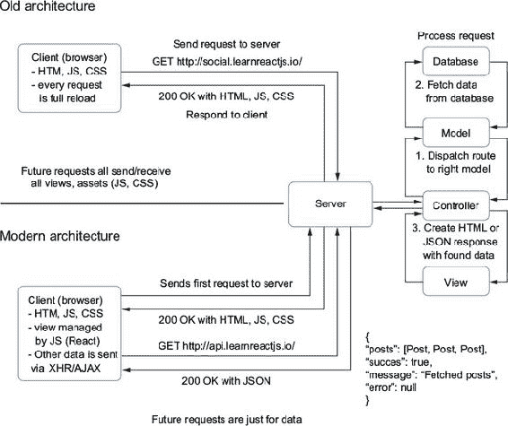

到目前为止，你一直在使用现代架构来构建学习应用程序 Letters Social。一个 node.js 服务器发送你应用程序所需的 HTML、JavaScript 和 CSS。一旦加载，React 就接管了。进一步的数据请求被发送到示例 API 服务器。但你缺少架构中的一个关键部分：客户端路由。

|  |
| --- |

**关于路由的沉思**

在我们深入构建你的 React 路由器之前，花点时间思考一下路由。你在过去的项目中遇到过哪些其他的路由示例？路由还有哪些其他用途？

|  |
| --- |

### 7.2\. 创建路由器

你将从头开始使用组件构建一个简单的路由器，以便更好地理解你如何使用 React 应用程序进行路由。以下是你将采取的步骤概述：

+   你将创建两个组件，Router 和 Route，它们将一起使用以实现客户端路由。

+   路由组件将由路由组件组成。

+   每个路由将代表一个 URL 路径（/、/posts/123）并将组件映射到该 URL。当你的用户访问 / 时，他们将看到一个对应的组件。

+   路由组件将看起来像一个正常的 React 组件（它将有一个 `render` 方法、组件方法和使用 JSX），但它将允许你将组件映射到 URL。

+   路由组件可以指定参数，如 `/users/:user`，其中 `:user` 语法将表示传递给组件的值。

+   你还将创建一个链接组件，它将使你能够使用客户端路由器进行导航。

如果这些内容还没有完全理解，请不要担心。我们将逐一处理每个步骤。让我们看看你构建路由时将努力实现的一个示例。

列表 7.1 展示了你将构建的路由组件在其最终形式下的使用情况。阅读起来很容易，你可以思考一下：你有一个带有与组件相关联的路由的路由器。路由不一定是分层的——你可以创建混乱并任意嵌套资源——但通常是这样的。这意味着它可以相对容易地映射到 React 的组合语义。如果你是第一次开始学习 React，那么下面列表中的路由示例可能是你能够立即理解的最容易的组件之一。

##### 列表 7.1\. 路由最终结果（src/index.js）

```
//...
    <Router location="/">                                       *1*
      <Route path="/" component={App}>                          *2*
        <Route path="posts/:post" component={SinglePost} />     *3*
        <Route path="login" component={Login} />
      </Route>
    </Router>,
//...
```

+   ***1* 路由器组件负责存储路由并返回用于渲染的正确组件**

+   ***2* 每个路由组件接收一个路径和一个组件，并将它们匹配起来，您可以在它们内部嵌套多个组件。**

+   ***3* 您可以向组件路径传递参数，这些参数代表动态值，这意味着您可以从路由中获取数据并将其用于组件。**

这种路由结构易于阅读和思考。由于 `React Router` 的存在，它在 React 应用程序中也非常成熟。您将遵循同样的基本 API 来构建您的路由器。在这个过程中，我们将从由 TJ Holowaychuk 创建的一个小型、轻量级路由库中汲取灵感，这个库叫做 `react-enroute`。使用这个库，您可以在 React 中探索路由，而无需重新创建像 `React Router` 这样的整个开源库。

我们对您将要构建的内容以及它在使用中的样子有更多的了解，但我们应该从哪里开始呢？我们从 `children` 开始。

#### 7.2.1\. 组件路由

不，您不会招募年轻人来实现您应用程序中的路由。相反，您将使用特殊的组件属性 `children`。您可能还记得 `children` 属性，在之前的章节中，它是 `React.createElement(type, props, children)` 签名的一部分，或者作为可以组合组件的特殊属性。

以前，您只从输入的角度关心 `children`：您会将组件传递给另一个组件以组合它们。现在，您将从一个组件内部访问 `children` 并使用组件本身来设置您的路由。这就是您开始将组件映射到 URL 的工作的地方。如果网络开发中的路由是将 URL 映射到行为或视图，那么 React 中的路由就是将 URL 映射到特定组件。

#### 7.2.2\. 创建 <Route /> 组件

您将创建一个路由器组件，它将使用子组件将 URL 路由与组件匹配并渲染它们。如果您在思考这将是什么样子时遇到困难，请记住，我们将有意识地逐步进行，您不需要一开始就完全理解所有内容。

列表 7.2 展示了两种组件类型：路由器（Router）和路由（Route）。让我们从路由组件开始，您可以使用它来将组件与路由关联起来。列表 7.2 展示了如何创建路由组件。它看起来可能没有太多内容，但正如您很快就会看到的，这是可以的。路由器组件将承担大部分繁重的工作，而路由组件将主要作为您对 URL 和组件映射的数据容器。

##### 列表 7.2\. 创建路由组件（src/components/router/Route.js）

```
import PropTypes from 'prop-types';
import { Component } from 'react';
import invariant from 'invariant';                                          *1*

class Route extends Component {
    static propTypes = {
        path: PropTypes.string,
        component: PropTypes.oneOfType([PropTypes.element, PropTypes.func]),
    };                                                                      *2*
    render() {
        return invariant(false, "<Route> elements are for config only and
     shouldn't be rendered");                                               *3*
    }
}

export default Route;                                                       *4*
```

+   ***1* 引入 invariant 库以确保路由组件永远不会被渲染，或者如果它被渲染了，您将抛出一个错误**

+   ***2* 每个路由都包含一个路径和一个函数，因此请使用 PropTypes 指定这些属性。**

+   ***3* 整个路由组件只是一个返回 invariant 库调用的函数——如果被调用，将抛出错误，你知道事情没有按正确的方式运行**

+   ***4* 使用命名导出使组件对外部模块可用**

你可能已经注意到，这里导入了一个新的库，名为 `invariant`。这是一个简单的工具，你将用它来确保在特定条件不满足时抛出错误。要使用它，你需要传入一个值和一个消息。如果该值是 *falsey* (`null`、`0`、`undefined`、`NaN`、`''`(空字符串) 或 `false`)，它将抛出错误。`invariant` 库在 React 中经常被使用，所以如果你在开发者工具控制台中看到类似“invariant violation”的警告或错误消息，那么它可能就是相关的。你将在这里使用它来确保路由组件不会渲染任何内容。

确实如此——路由组件不会渲染任何内容。如果它确实渲染了，`invariant` 工具将抛出错误。一开始这可能听起来有些奇怪。毕竟，到目前为止，你已经在组件中做了很多渲染。但这只是将路由和组件分组在一起的一种方式，React 可以理解，你也可以利用这种方式。你将使用路由组件来存储属性并传递你想要的子组件。随着你构建路由器组件，这将会变得更加清晰，但在继续之前，请先查看图 7.2 以检查你的理解。

##### 图 7.2\. 路由和路由组件将如何工作的概述。路由器（你将在下一节中构建），其子组件是路由组件。这些组件中的每一个都使用两个属性：一个 `path` 字符串和一个组件。`<Router/>` 将使用每个 `<Route/>` 来匹配 URL 并渲染正确的组件。因为一切都是 React 组件，你可以在渲染时传递属性给路由器，并使用这些属性作为顶级数据（如用户、认证状态等）的初始应用程序状态。

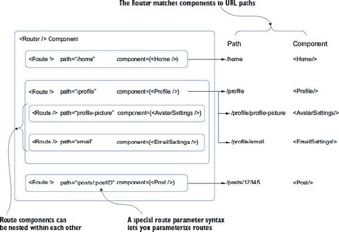

#### 7.2.3\. 开始构建 <Router/> 组件

要开始构建路由器，你需要再次通过创建组件的基础知识。现在这应该很熟悉了，尽管你最终将构建一个做一些你之前没有见过的独特事情的组件。好消息是，你不需要做任何“魔法”来创建你的路由器。你将使用 React 组件，向路由器组件添加一些逻辑，然后将其用作你的应用程序渲染的主要组件。

这可能看起来不是什么大问题。你可能正在想，“好吧，那是一个组件。毕竟这是 React，所以这似乎...很正常？”我指出这一点是因为它是一个很好的例子，展示了你可以用“仅仅”React 做到的强大而灵活的事情，而这些事情你可能不会立即想到去做。你不需要任何全新的工具。你只需要找到一种方法来记录 URL 和组件的映射，然后找到一种方法与正确的浏览器 API 交互。现在你可以开始构建这个事物了。

|  |
| --- |

**关于 React Router 呢？**

如果你曾经使用过 React，你可能听说过`React Router`。它是开源中最受欢迎的 React 项目之一，也是 React 应用程序中最受欢迎的路由解决方案。你可能想知道为什么你不直接安装`React Router`并学习如何使用该 API。你可以这样做，但我认为你会错过看到你可以如何使用 React 组件做一些你可能不会想到的事情的机会（比如将 URL 映射到组件！）。通过自己构建一些东西，你将学到比简单地使用 npm 安装东西多得多的东西。

现在，这与你在商业环境或任何生产环境中可能做的事情不同。尽管从头开始自己构建路由器可能很有帮助，但作为工程师，你的主要角色（几乎总是）是为公司创造价值，而你可以通过构建或使用经过良好测试、性能良好且易于工作的工具来实现这一点。

考虑到这一点，你和你的团队可能会选择使用`React Router`而不是自己构建。选择一个维护良好、受欢迎的开源库来满足你的需求，通常是一个更好的工程和商业决策。当我们讨论第十二章中的服务器端渲染时，你会用`React Router`替换你的路由器，这样我们可以利用它的一些特性。

|  |
| --- |

列表 7.3 展示了如何构建路由器组件。这里除了在组件上设置的`routes`属性之外，没有太多不寻常的地方。注意，因为你不想在运行时对路由做任何更改，所以你不会在 React 的本地组件状态中存储路由。可能有一些情况，你希望在运行时动态更改路由，比如用户正在积极自定义应用程序或类似的事情。在这些情况下，你可以使用组件的`state`接口。这里你没有这样的需求，所以你将路由放在组件上。

##### 列表 7.3\. 构建路由器（src/components/router/Router.js）

```
export default class Router extends Component {
  static propTypes = {                             *1*
    children: PropTypes.object,
    location: PropTypes.string.isRequired
  };

  constructor(props) {
    super(props);
    this.routes = {};                              *2*

}

  render() {}                                      *3*
}
```

+   ***1* 路由组件将有一个 render()方法。**

+   ***2* 你将在路由组件中存储路由到一个对象中。**

+   ***3* 指定 PropTypes——路由器将接收子组件和一个位置来工作。**

现在你有了 Router 组件的基本框架，你可以开始添加一些你将在组件的核心方法中使用的工具。

当处理路由时，你需要做一些事情。如果你仔细看了列表 7.2，你可能注意到你可以传递没有前面带有 `/` 的 `path` 属性。这可能看起来像一件小事，但你需要确保路由的使用者可以这样做。你还需要确保如果用户不小心或由于路由嵌套而包含过多的斜杠，任何双 `//` 都会被移除。

让我们看看如何创建两个辅助工具来解决这些问题。首先，你需要创建一个用于清理路径的工具。这将使用一个简单的正则表达式来将任何双斜杠替换为单个斜杠。如果你不熟悉正则表达式，你可以在网上找到许多很好的资源来了解更多关于它们的信息。它们是匹配文本中模式的一种强大方式，并且对于许多形式的软件开发至关重要。但它们也可能显得晦涩难懂，难以推理或学习。幸运的是，你只需要使用一个简单的正则表达式来查找和替换任何双斜杠（`//`）。下一个列表展示了如何实现简单的 `cleanPath` 方法。请注意，使用正则表达式清理字符串可能很棘手，因此不要期望你遇到的每个情况都这么简单。

##### 列表 7.4\. 向 Router 添加 cleanPath 工具（src/components/router/Router.js）

```
//...
cleanPath(path) {
    return path.replace(/\/\//g, '/');           *1*
}
//...
```

+   ***1* cleanPath 使用 String.replace 从路径中移除任何双斜杠字符（/）。**

我们不会深入探讨正则表达式，因为它们值得进行严肃的深入处理，但我们至少可以注意几点。首先，JavaScript 中的基本正则表达式语法是两个斜杠，其中包含一个在 `/<正则表达式>/` 内的表达式。其次，尽管 `\/\/` 这一系列字符看起来很神秘，坦白说，有点像 W，但它只是两个斜杠（`//`）加上转义字符（`/`），这样它们就不会被解释为注释或其他内容。最后，添加到正则表达式末尾的 `g` 字符是一个标志，表示*匹配所有出现*。要了解更多关于正则表达式的信息，请访问[`regexr.com/3eg8l`](http://regexr.com/3eg8l)，以获取关于正则表达式每个部分含义的详细见解，并练习匹配不同的模式。

现在你已经可以清理 `//` 的出现，你需要处理你添加的路由的几个其他情况。你可以称这个工具为 `normalizeRoute`，因为它将确保父路由和子路由在必要时以带有斜杠的正确字符串创建。这个函数将接受一个路径和一个可选的父路径。有了这两个输入，你可以处理几种情况。以下列表展示了 `normalizeRoute` 方法将如何工作。

##### 列表 7.5\. 创建 normalizeRoute 工具（src/components/router/Router.js）

```
//...
normalizeRoute(path, parent) {            *1*
    if (path[0] === '/') {                *2*
      return path;                        *2*
    }                                     *2*

    if (parent == null) {                 *3*
      return path;                        *3*
    }                                     *3*

    return `${parent.route}/${path}`;     *4*
  }
//...
```

+   ***1* 函数接收路径和父对象——路由属性是一个路径字符串。**

+   ***2* 如果路径只是 /，你可以直接返回它——我们不需要将它与父路径连接。**

+   ***3* 如果没有提供父路径，你可以直接返回路径，因为没有东西可以与之连接。**

+   ***4* 如果有父路径，你可以通过将它们连接起来将路径添加到父路径上。**

#### 7.2.4\. 匹配 URL 路径和参数化路由

你已经创建了一些辅助工具，但目前还没有进行任何路由。为了开始匹配 URL 到组件，你需要向你的路由器添加路由。你打算怎么做到这一点？本质上，你需要找到一种方法，根据当前的 URL 渲染给定的组件——这就是我一直在说的“匹配”部分。这可能听起来工作量不大，但实际上涉及到的步骤不止几个。

首先，让我们看看浏览器前端路由系统的一个关键组件：*路径匹配*。你需要某种方法来评估路径字符串并将它们转换为你可以使用的有意义的数据。为了实现这一点，你将使用一个小型包 `enroute`，它本身就是一个微型的路由器，你可以用它来匹配路径到你的组件。内部，`enroute` 将字符串转换为可以用于匹配字符串的正则表达式（例如，你将要检查的 URL）。你还可以用它来指定路径 *参数*，这样你就可以创建一个像 `/users/:user` 这样的路径，并在 `/users/1234` 中访问用户 ID，就像在代码中的 `route.params.user` 一样。这种方法很常见，如果你曾经使用过 express.js，你可能见过类似的东西。

能够参数化 URL 很有用，因为这样你可以将 URL 视为另一种可以传递给路由器的数据输入形式。URL 很强大，使它们动态化是其中的一个原因。URL 可以有意义，并允许用户直接访问资源，而无需首先访问一个页面，然后导航多次才能到达他们想去的地方。

你不会使用参数化路由的全部功能，但让我们看看几个例子，以确保你知道你正在努力实现什么。表 7.1 展示了几个在常见网络应用中可能有用的 URL 路径示例。

##### 表 7.1\. 带参数的常见路由示例

| 路由 | 示例用途 |
| --- | --- |
| / | 应用的主页。 |
| /profile | 用户的个人资料页面；显示设置。 |
| /profile/settings | 设置路由；是个人资料页面的子路由；显示用户相关设置。 |
| /posts/:postID | postID 可用于代码；示例路由为 /posts/2391448。如果你想要创建指向特定帖子的公开链接，这很有用。 |
| /users/:userID | :userID 是路径参数；根据 ID 显示特定用户很有用。 |
| /users/:userID/posts | 显示某个用户的全部帖子；URL 中的`:userID`部分是动态的，并在您的代码中可用。 |

您在这里仅利用了参数化路由的一个方面，即使用`:name`语法，但有一些工具可以让您做更多的事情。如果您想了解更多关于参数化路由的信息，请查看`path-to-regexp`库，可在[www.npmjs.com/package/path-to-regexp](http://www.npmjs.com/package/path-to-regexp)找到。这是一个非常好的工具，我们还可以花时间研究其他工具，但我们需要专注于当前的任务：使用 React 进行路由。

这些路由工具（`enroute`和`path-to-regexp`）的重要收获是您将使用它们来帮助匹配 URL 并处理 URL 中的某些路径参数。目前来说，您使用哪个工具或者是否想自己构建并不那么重要；您只需要一个能让您专注于基础的工具。React 的一个美妙之处在于，当您构建自己的应用程序时，您可以自由地根据自己的信息做出决定，选择想要使用的路由工具。

|  |
| --- |

**思考参数**

参数化路由通常是一种将数据引入应用程序的有用方式。您能想到除了获取帖子 ID 之外，您可能还会用路由参数做些什么吗？

|  |
| --- |

您将使用您的 URL 匹配库（`enroute`）来确定要渲染哪个路由，因此接下来您将在组件上设置它。目前，Router 组件的`render`方法没有任何作用，所以这似乎是一个很好的起点。以下列表显示了如何将`enroute`与路由器集成以及`render`方法的相应更改。

##### 列表 7.6\. 完成的 Router（src/components/router/Router.js）

```
import enroute from 'enroute';                                     *1*
import invariant from 'invariant';

export class Router extends Component {
  static propTypes = {                                             *2*
    children: PropTypes.element.isRequired,                        *2*
    location: PropTypes.string.isRequired,                         *2*
  }

  constructor(props) {                                             *3*
    super(props);

    // We'll store the routes on the Router component
    this.routes = {};                                              *4*

    // Set up the router for matching & routing
    this.router = enroute(this.routes);                            *5*
  }

  render() {
    const { location } = this.props;                               *6*
    invariant(location, '<Router/> needs a location to work');     *7*
    return this.router(location);                                  *8*
  }
}
```

+   ***1* enroute 是一个小巧的功能性路由器，您用它来匹配 URL 字符串和参数化路由。**

+   ***2* 将 PropTypes 作为静态类属性设置。**

+   ***3* 设置组件的初始状态并初始化 enroute**

+   ***4* 四条路由最终将作为对象出现，其键为您的 URL 路径。**

+   ***5* 将路由传递给 enroute，Render 将使用 enroute 的返回值来匹配 URL 到组件。**

+   ***6* 将当前位置作为 prop 传递给路由器。**

+   ***7* 使用 invariant 确保您没有忘记提供位置。**

+   ***8* 最后，也是最重要的，您想要使用路由器来匹配位置并返回相应的组件。**

您并没有添加太多代码，但路由器中一些最重要的部分现在已经就位。目前，没有为`enroute`提供任何路由，但基本机制已经存在。您想要尝试找到与路由关联的组件，然后使用路由器来渲染它。在下一节中，您将创建这些路由，以便路由器可以使用它们。

#### 7.2.5\. 向 Router 组件添加路由

要将路由添加到路由器，您需要两样东西：要使用的正确 URL 字符串和该 URL 的组件。您将在 Router 组件上创建一个方法，让您可以将这两者结合起来：`addRoute`。如果您快速查看[`github.com/lapwinglabs/enroute`](https://github.com/lapwinglabs/enroute)上的`enroute`使用示例，您将看到`enroute`是如何工作的。它接受一个对象，该对象以 URL 字符串为键，以函数为值，当匹配到其中一个路径时，它将调用该函数并传递一些额外的数据。列表 7.7 显示了如何在不使用 React 的情况下使用`enroute`库。使用`enroute`，您可以匹配接受参数和任何附加数据的函数到 URL 字符串。

##### 列表 7.7\. 路由配置示例（src/components/router/Router.js）

```
function edit_user (params, props) {                         *1*
   return Object.assign({}, params, props)                   *1*
}                                                            *1*

const router = enroute({                                     *2*
        '/users/new': create_user,                           *2*
        '/users/:slug': find_user,                           *2*
        '/users/:slug/edit': edit_user,                      *2*
        '*': not_found                                       *2*
      });

enroute('/users/mark/edit', { additional: 'props' })         *3*
```

+   ***1* 使用了两个参数：路由参数（如 /users/:user）和您传入的任何附加数据。**

+   ***2* 传入一个包含路径和函数的对象，这些函数用于处理这些路径。**

+   ***3* 使用时，传入一个位置和任何附加数据，正确的函数将被执行。**

现在您对`enroute`除了 React 之外的工作方式有了些了解，让我们看看如何将其集成到您的路由器中并给它一些活力。与前面列表中返回对象的方式不同，您想要返回一个组件。但您目前没有访问路由的路径或组件的方法。还记得您创建了一个用于存储它们的 Route 组件，但没有渲染任何内容吗？您需要从父组件（Router）获取这些数据。这意味着您将需要使用`children`属性。

|  |
| --- |

##### 注意

您已经看到了如何在 React 中将组件组合在一起，通过在组件之间创建父子关系来创建新的组件。到目前为止，您只是通过将组件嵌套在彼此内部来“外部”使用子组件。每次您在嵌套和组合组件时，您都在利用 React 的子组件概念。但您还没有从父组件动态访问任何嵌套子组件。您可以通过组件的 props 中的`children`来访问传递给父组件的子组件，正如您所猜的，就是`children`。

|  |
| --- |

每个 React 组件或元素上可用的`children`属性被称为*不透明*数据结构，因为它与 React 中的几乎所有其他内容不同，它不是一个数组或普通的 JavaScript 对象。这可能在 React 的将来版本中改变，但与此同时，这意味着 React 提供了一些工具，让您可以处理`children`属性。`React.Children`提供了一些方法，您可以使用它们来处理`children`不透明数据结构，包括以下内容：

+   **`React.Children.map`—** 与原生 JavaScript 中的`Array.map`类似，这个方法在`children`中的每个直接子元素上调用一个函数（这意味着它不会遍历每个可能的子组件，只是直接子元素）并返回它遍历的元素数组。如果`children`是`null`或`undefined`，则返回`null`或`undefined`而不是空数组：

    ```
    React.Children.map(children, function[(thisArg)])
    ```

+   **`React.Children.forEach`—** 与`React.Children.map`的工作方式类似，但它不返回数组：

    ```
    React.Children.forEach(children, function[(thisArg)])
    ```

+   **`React.Children.count`—** 返回在`children`中找到的组件总数。等于`React.Children.map`或`React.Children.forEach`在相同元素上调用其回调的次数：

    ```
    React.Children.count(children)
    ```

+   **`React.Children.only`—** 返回`children`中的唯一子元素或抛出错误：

    ```
    React.Children.toArray(children)
    ```

+   **`React.Children.toArray`—** 将`children`作为带有每个子元素键的扁平数组返回：

    ```
    React.Children.toArray(children)
    ```

因为你想在 Router 组件的`this.routes`上添加路由信息，所以你会使用`React.Children.forEach`来遍历 Router 的每个子元素（记住，那些是 Route 组件），并获取它们的属性。你将使用这些属性来设置你的路由并告诉`enroute`在哪个 URL 渲染哪个组件。

|  |
| --- |

**“React 中的自我消除组件”**

当 React 16 发布时，它使组件能够在渲染时返回数组。这之前是不可能的，但它开启了一些有趣的可能性。其中之一是*自我销毁*或*自我消除*^([1])组件的想法。之前，当你只能从任何给定组件返回单个节点时，你经常会发现自己将组件包裹在 div 或 span 中，只是为了得到有效的 JavaScript 输出。一个常见的场景可能看起来像这样：

> ¹
> 
> 非常感谢 Ben Ilegbodu 首先向我介绍这个想法！

```
export const Parent = () => {
    return (
        <Flex>
            <Sidebar/>                       *1*
            <Main />                         *1*
            <LinksCollection/>               *1*
        </Flex>
    );
}

export const LinksCollection = () => {
    return (
        <div>                                *2*
            <User />
            <Group />
            <Org />
        </div>
    );
}
```

+   ***1* 使用 Flexbox（或 CSS 网格）并排排列的顶级组件**

+   ***2* 添加包装 div 是因为在 JavaScript 中，User、Group 和 Org 不能一起返回——它不支持多个返回值**

这对许多团队来说是一个很大的烦恼，尽管这当然没有阻止人们使用 React。尽管如此，它造成的一个主要问题并不仅仅是包裹 div 看起来似乎是不必要的。正如你所看到的，应用程序是使用 Flexbox（或某些其他 CSS 布局 API，在这种情况下会中断）布局的。

包裹 div 造成的问题在于它迫使你将组件提升一个级别，这样它们就不会在单个节点中分组。当然，还有其他原因导致问题或强制采取折衷方案，但这是我多次遇到的一个问题。

然而，随着 React 16 及其后续版本的推出，现在可以返回数组，因此我们找到了一种绕过这个问题的方法。React 16 引入了许多其他强大的功能，但这个变化是受欢迎的。开发者现在可以这样做：

```
export const SelfEradicating = (props) => props.children
```

此组件充当一种传递组件，在渲染其子组件时让路或“自我消除”。使用这种方法，你可以在不涉及 CSS 布局技术等事项的情况下保持组件分离。具有“自我消除”组件的相同场景可能如下所示：

```
export const SelfEradicating = (props) => props.children

export const Parent = () => {
    return (
        <Flex>
            <Sidebar/>
            <Main />
            <LinksCollection/>
        </Flex>
    );
}

export const LinksCollection = () => {
    return (
        <SelfEradicating>
            <User />
            <Group />
            <Org />
        </SelfEradicating>
    );
}
```

|  |
| --- |

记住，`enroute` 预期你为每个路由提供一个函数，以便它可以传递参数信息和其它数据给它。这个函数是你在其中告诉 React 创建组件并处理渲染额外子组件的地方。列表 7.8 展示了如何将 `addRoute` 和 `addRoutes` 方法添加到你的组件中。`addRoutes` 使用 `React.Children.forEach` 遍历子 Route 组件，获取它们的数据，并为 `enroute` 设置路由。这是路由器的核心部分——一旦你实现了这个，路由器就会启动并运行！

|  |
| --- |

**props.children**

我们在本章中讨论了 React 的 `props.children`。`props.children` 和其他属性之间有什么区别？为什么可能会有区别？

|  |
| --- |

##### 列表 7.8\. `addRoute` 和 `addRoutes` 方法 (src/components/router/Router.js)

```
  addRoute(element, parent) {
    const { component, path, children } = element.props;                   *1*

    invariant(component, `Route ${path} is missing the "path" property`);  *2*
    invariant(typeof path === 'string', `Route ${path} is not a string`);  *2*

    const render = (params, renderProps) => {                              *3*

    const finalProps = Object.assign({ params }, this.props, renderProps); *4*

    const children = React.createElement(component, finalProps);           *5*
      return parent ? parent.render(params, { children }) : children;      *6*
    };

    const route = this.normalizeRoute(path, parent);                       *7*

    if (children) {                                                        *8*
      this.addRoutes(children, { route, render });                         *8*
    }                                                                      *8*

    this.routes[this.cleanPath(route)] = render;                           *9*
  }
//...
```

+   ***1* 使用解构来获取组件、路径和子组件属性。**

+   ***2* 确保每个 Route 都有一个路径和组件属性，否则抛出错误。**

+   ***3* render 是一个你将给 enroute 的函数，它接受与路由相关的参数和额外数据。**

+   ***4* 合并父组件和子组件的属性**

+   ***5* 创建一个新的组件，并合并属性。**

+   ***6* 如果有父组件，调用父参数的 render 方法，但使用你创建的子组件**

+   ***7* 使用 normalizeRoute 辅助函数确保 URL 路径设置正确**

+   ***8* 如果当前路由组件有更多嵌套子组件，重复此过程，并传入路由和父组件**

+   ***9* 使用 cleanPath 工具在路由对象上创建路径，并将你的完成函数分配给它**

呼呼！在这些代码行中发生了很多事情。请随意多次回顾它，以确保你对这些概念感到舒适。一旦你添加了 `addRoutes` 方法，我们将回顾步骤并使用可视化进行复习。但首先，你需要添加 `addRoutes` 方法。相对而言，它相当简短。以下列表展示了如何实现它。

##### 列表 7.9\. `addRoutes` 方法 (/components/router/Router.js)

```
//...
constructor(props) {                                                       *1*
    super(props);
    this.routes = {};
    this.addRoutes(props.children);                                        *1*
    this.router = enroute(this.routes);
}                                                                          *1*

addRoutes(routes, parent) {                                                *2*
    React.Children.forEach(routes, route => this.addRoute(route, parent)); *3*
}
```

+   ***1* 即使 `addRoutes` 在 `addRoute` 方法中使用，也要将其添加到组件的构造函数中以启动设置路由。**

+   ***2* 在 `addRoutes` 方法中使用时，如果有额外的子组件要遍历**

+   ***3* 使用 React.Children.forEach 工具遍历每个子组件，然后为每个子 Route 组件调用 addRoute。**

##### 图 7.3. 向你的路由器添加路由的过程。对于在 Router 组件中找到的每个 Route 组件，提取路径和组件属性，然后使用这些属性创建一个可以与 URL 路径配对的函数，供 `enroute` 使用。如果 Route 有子组件，则在继续之前对那些子组件运行相同的过程。完成后，`routes` 属性将设置所有正确的路由。

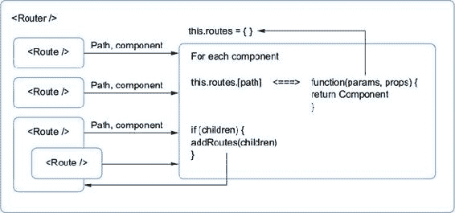

有了这些，你的路由器就完成了，准备投入使用。接下来的列表显示了最终状态的 Router 组件，为了简洁起见，省略了辅助工具（路径规范化、不变使用）。在下一章中，你将开始使用 Router 组件。

##### 列表 7.10. 完成的 Router（src/components/router/Router.js）

```
import PropTypes from 'prop-types';

import React, { Component } from 'react';
import enroute from 'enroute';
import invariant from 'invariant';

export default class Router extends Component {
    static propTypes = {
        children: PropTypes.array,
        location: PropTypes.string.isRequired
    };

    constructor(props) {
        super(props);

        this.routes = {};

        this.addRoutes(props.children);
        this.router = enroute(this.routes);
    }

    addRoute(element, parent) {
        const { component, path, children } = element.props;

        invariant(component, `Route ${path} is missing the "path" property`);
        invariant(typeof path === 'string', `Route ${path} is not a string`);

        const render = (params, renderProps) => {
            const finalProps = Object.assign({ params }, this.props,
     renderProps);

            const children = React.createElement(component, finalProps);

            return parent ? parent.render(params, { children }) : children;
        };

        const route = this.normalizeRoute(path, parent);

        if (children) {
            this.addRoutes(children, { route, render });
        }

        this.routes[this.cleanPath(route)] = render;
    }

    addRoutes(routes, parent) {
        React.Children.forEach(routes, route => this.addRoute(route,
     parent));
    }

    cleanPath(path) {
        return path.replace(/\/\//g, '/');
    }

    normalizeRoute(path, parent) {
        if (path[0] === '/') {
            return path;
        }
        if (!parent) {
            return path;
        }
        return `${parent.route}/${path}`;
    }

    render() {
        const { location } = this.props;
        invariant(location, '<Router/> needs a location to work');
        return this.router(location);
    }
}
```

### 7.3. 摘要

在本章中，你开始将你的 React 应用程序从带有一些组件的简单页面转变为一个更健壮的应用程序，该应用程序处理路由和路由配置。我们覆盖了很多内容，并探讨了组件的高级用法，从头开始构建整个路由器：

+   在现代客户端应用程序中，路由不需要你执行完整的页面刷新。相反，它可以由像 React 这样的客户端应用程序处理。这可以减少浏览器加载时间，也可能减少服务器负载。

+   React 没有像某些框架那样内置的路由库。相反，你可以自由地从社区中选择一个，或者从头开始构建自己的路由（就像你做的那样！）。

+   React 为你提供了几个与不透明的 `children` 数据结构一起工作的实用工具。你可以遍历多个组件，检查它们的数量，等等。

+   你可以使用你创建的路由设置动态地更改组件内部渲染的子组件。你正在监听浏览器位置的变化，并使用这些数据来渲染。

在下一章中，你将使用你的 Router 并使用 Firebase 为你的应用程序添加身份验证。

## 第八章. 更多路由和集成 Firebase

*本章涵盖*

+   使用你在 第七章 中构建的路由器

+   创建与路由相关的组件，如 Router、Route 和 Link

+   使用 HTML5 历史 API 来启用 push-state 路由

+   重新使用组件

+   集成用户身份验证和 Firebase

在上一章中，你从头开始构建了一个简单的路由器，以便更好地理解如何在 React 应用程序中实现路由。在这一章中，你将开始使用你构建的路由器，并将 Letters Social 应用程序拆分成更好的部分。到本章结束时，你将能够导航你的应用程序，查看单个帖子页面，并执行用户身份验证。

| |
| --- |

**我如何获取本章的代码？**

与每一章一样，您可以通过访问 GitHub 仓库[`github.com/react-in-action/letters-social`](https://github.com/react-in-action/letters-social)来查看本章的源代码。如果您想从一张白纸开始学习本章内容并跟随操作，可以使用您从第五章和第六章（如果您跟随并自己构建了示例）中现有的代码，或者查看特定章节的分支（chapter-7-8）。

记住，每个分支都对应着章节末尾的代码（例如，分支 chapter-7-8 对应着本章末尾的代码）。您可以在您选择的目录中执行以下终端命令之一来获取当前章节的代码。

如果您根本没有任何仓库，请输入以下内容：

```
   git clone git@github.com:react-in-action/letters-social.git
```

如果您已经克隆了仓库：

```
   git checkout chapter-7-8
```

您可能是从其他章节来到这里的，所以确保您已经安装了所有正确的依赖项总是一个好主意：

```
    npm install
```

|  |
| --- |

### 8.1\. 使用路由器

在上一章中，您使用 React 构建了一个工作路由器。在您在生产环境中开发 React 应用的情况下，您可能会选择像 React Router 这样的工具。幸运的是，React Router 遵循一个非常相似的 API，但它还提供了更多高级功能，让您能够进行更复杂的路由操作。不过，也许您并不需要所有这些功能，您构建的类似工具已经足够了。这完全没问题——选择最适合您解决问题的工具，而不是那些 GitHub 星标最多或 Hacker News 投票最高的工具。随着我们在第十二章中处理服务器端渲染，您的需求将会变化，因此我们将在这章中切换到 React Router。

让我们开始使用您的新鲜路由器。首先，您需要将路由器连接到 HTML5 历史 API([`developer.mozilla.org/en-US/docs/Web/API/History`](https://developer.mozilla.org/en-US/docs/Web/API/History))，以便利用无需完整页面重新加载的导航。您将使用*push state*导航，因为您不需要每次都击中服务器进行完整页面的刷新。但您也可以使用基于 hash 的路由（更多内容请参阅[`github.com/ReactTraining/react-router/blob/v3/docs/guides/Histories.md`](https://github.com/ReactTraining/react-router/blob/v3/docs/guides/Histories.md)）。

我们不会花太多时间探索 HTML5 API，因为它们值得单独处理。您将使用在 npm 上可用的知名`history`库，网址为[www.npmjs.com/package/history](http://www.npmjs.com/package/history)。这个库将让您以可靠和可预测的方式跨浏览器使用 History API。为了确保它已安装，请运行`npm install --save history`。一旦安装，您需要修改 index.js 文件，该文件目前是整个应用程序的根。到目前为止，该文件是 React DOM 将您的整个应用程序渲染到 DOM 元素的地方。但是您启用了路由，并且您的 Router 组件期望一个位置（见第七章）。您需要找到一种方法来提供该位置，并利用`history`库的 HTML5 History API，而 index.js 是做这件事的完美地方。

|  |
| --- |

**比较客户端和服务器端路由**

请花点时间考虑客户端路由和基于客户端-服务器 URL 的路由之间的区别。客户端路由和服务器端路由之间主要区别之一是什么？

|  |
| --- |

除了利用`history`之外，您还需要设置您的路由。为此，您需要重构一些组件，这将使您感受到 React 中可组合性和模块化的好处。您将移动一些内容，但不需要从根本上改变组件的工作方式。让我们首先看看如何修复 App 组件。它需要作为一个容器来容纳子路由，因为您希望每个页面都有相同的侧边栏和导航栏，只有传递给`children`属性的内容会改变。图 8.1 展示了这种外观的示例。

##### 图 8.1. 上面的截图中的方框区域将根据您根据 URL 决定渲染的视图而变化。随着时间的推移，您甚至可以进行更多嵌套并扩展该区域以包括侧边栏，这样您就可以在页面之间保持相同的导航栏，并拥有具有动态区域的其它路由。图 8.1 展示了这种外观的示例。

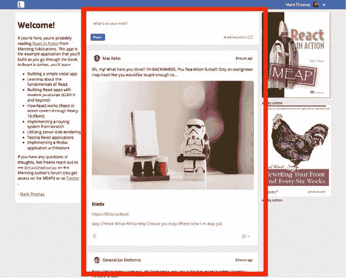

要实现这种嵌套，您需要重构 App 组件以动态显示`children`，如列表 8.1 所示。幸运的是，您不会删除我们完成的大部分工作——您只需移动它。在重构过程中，您将对您的应用程序文件进行一些重组。在`src`中创建一个名为`pages`的新目录。您将在这里放置那些通常只包含其他组件并提供数据的组件。当我们在后面的章节中开始探索 React 应用程序架构时，我会更多地讨论这个想法。

##### 列表 8.1\. 重构 App 组件（src/app.js）

```
import React, { Component } from 'react';
import PropTypes from 'prop-types';

import ErrorMessage from './components/error/Error';
import Nav from './components/nav/navbar';
import Loader from './components/Loader';

class App extends Component {
    constructor(props) {
        super(props);
        this.state = {
            error: null,
            loading: false
        };
    }
    static propTypes = {
        children: PropTypes.node
    };
    componentDidCatch(err, info) {                    *1*
        console.error(err);
        console.error(info);
        this.setState(() => ({
            error: err
        }));
    }
    render() {
        if (this.state.error) {                       *2*
            return (
                <div className="app">
                    <ErrorMessage error={this.state.error} />
                </div>
            );
        }
        return (
            <div className="app">
                <Nav user={this.props.user} />        *3*
                {this.state.loading ? (               *4*
                    <div className="loading">
                        <Loader />
                    </div>
                ) : (
                    this.props.children               *5*
                )}
            </div>
        );
    }
}

export default App;
```

+   ***1* 使用 componentDidCatch 设置顶级错误边界，以便在出现错误时显示错误**

+   ***2* 如果有错误，则渲染错误。**

+   ***3* 传递用户属性——当你集成 Firebase 时将使用它。**

+   ***4* 如果应用处于加载状态，则渲染加载器**

+   ***5* 使用 props.children 输出当前激活的路由。**

你需要创建一个主页面组件，以便用户可以看到帖子。创建一个名为 home.js 的文件，并将其放置在 pages 目录中。这个组件看起来应该很熟悉——它是你在将内容拆分为页面之前的主要组件。列表 8.2 显示了带有之前实现的方法逻辑的注释的 Home 组件。记住，就像所有章节一样，如果你想查看应用程序如何变化或章节末尾的样子，你可以查看每个章节的不同分支，可以在 [`github.com/react-in-action/letters-social`](https://github.com/react-in-action/letters-social) 上查看。

##### 列表 8.2\. 重新构建的 Home 组件（src/pages/Home.js）

```
import React, { Component } from 'react';
import parseLinkHeader from 'parse-link-header';
import orderBy from 'lodash/orderBy';

import * as API from '../shared/http';                            *1*
import Ad from '../components/ad/Ad';                             *1*
import CreatePost from '../components/post/Create';               *1*
import Post from '../components/post/Post';
import Welcome from '../components/welcome/Welcome';

export class Home extends Component {
    constructor(props) {
        super(props);
        this.state = {                                            *2*
            posts: [],
            error: null,
            endpoint: `${process.env

     .ENDPOINT}/posts?_page=1&_sort=date&_order=DESC&_embed=comments&_expand=
     user&_embed=likes`
        };
        this.getPosts = this.getPosts.bind(this);
        this.createNewPost = this.createNewPost.bind(this);
    }
    componentDidMount() {                                         *2*
        this.getPosts();
    }
    getPosts() {
        API.fetchPosts(this.state.endpoint)
            .then(res => {
                return res.json().then(posts => {
                    const links = parseLinkHeader(res.headers.get('Link'));
                    this.setState(() => ({
                        posts: orderBy(this.state.posts.concat(posts),
     'date', 'desc'),
                        endpoint: links.next.url,
                    }));
                });
            })
            .catch(err => {
                this.setState(() => ({ error: err }));
            });
    }
    createNewPost(post) {
        post.userId = this.props.user.id;
        return API.createPost(post)
            .then(res => res.json())
            .then(newPost => {
                this.setState(prevState => {
                    return {
                        posts: orderBy(prevState.posts.concat(newPost),
     'date', 'desc')
                    };
                });
            })
            .catch(err => {
                this.setState(() => ({ error: err }));
            });
    }
    render() {                                                    *3*
        return (
            <div className="home">
                <Welcome />
                <div>
                    <CreatePost onSubmit={this.createNewPost} />
                    {this.state.posts.length && (
                        <div className="posts">
                            {this.state.posts.map(({ id }) => {
                                return <Post id={id} key={id}
     user={this.props.user} />;
                            })}
                        </div>
                    )}
                    <button className="block" onClick={this.getPosts}>
                        Load more posts
                    </button>
                </div>
                <div>
                    <Ad url="https://ifelse.io/book"
     imageUrl="/static/assets/ads/ria.png" />
                    <Ad url="https://ifelse.io/book"
     imageUrl="/static/assets/ads/orly.jpg" />
                </div>
            </div>
        );
    }
}

export default Home;
```

+   ***1* 不要忘记调整导入路径——组件位于不同的目录。**

+   ***2* 对于这些，逻辑完全相同——你只是在移动组件以适应新的层次结构。**

+   ***3* 对于这些，逻辑完全相同——你只是在移动组件以适应新的层次结构。**

现在你已经将 Home 组件移动到位，你就可以配置你的路由并将 `history` 工具连接起来，以便你的 Router 能够响应用户浏览器位置的变化。通常，将单个模块作为实用工具提供给应用程序的其他部分，以便你不必重复工作是有帮助的。你将在本书的后面部分做更多这样的操作，你可能也已经自己这样做过了。你将使用 `history` 库来做这件事，如以下列表所示，因为你最终想用它（以及其他事情）来创建与你的 Router 一起工作的链接，而无需是正常的 `<a href=""></>` 标签。

##### 列表 8.3\. 设置历史库（src/history/history.js）

```
import createHistory from 'history/createBrowserHistory';
const history = createHistory();                             *1*
const navigate = to => history.push(to);                     *2*
export { history, navigate };                                *2*
```

+   ***1* 创建历史库的单个实例以供你的应用程序使用。**

+   ***2* 导出 navigate 方法和历史实例（以防你以后需要直接访问）。**

现在你已经设置了 `history`，你可以设置 index.js 的其余部分并配置你的 Router。以下列表显示了如何进行操作。

##### 列表 8.4\. 为路由设置 index.js（src/index.js）

```
import React from 'react';
import { render } from 'react-dom';                         *1*

import { App } from './pages/App';                          *2*
import { Home } from './pages/Home';                        *2*
import Router from './components/router/Router';            *2*
import Route from './components/router/Route';              *2*
import { history } from './history;                         *3*

import './shared/crash';
import './shared/service-worker';
import './shared/vendor';
import './styles/styles.scss';

export const renderApp = (state, callback = () => {}) => {  *4*
  render(                                                   *4*
    <Router {...state}>                                     *5*
      <Route path="" component={App}>                       *6*
        <Route path="/" component={Home} />                 *6*
      </Route>                                              *6*
    </Router>,
    document.getElementById('app'),                         *7*
    callback
  );
};

let state = {                                               *8*
  location: window.location.pathname,                       *8*
};                                                          *8*

history.listen(location => {                                *9*
    state = Object.assign({}, state, {
        location: location.pathname
    });
    renderApp(state);
});

renderApp(state);                                           *10*
```

+   ***1* 导入 React DOM。**

+   ***2* 导入 App、Home、Router 和 Route 组件。**

+   ***3* 导入你刚刚创建的历史实用工具**

+   ***4* 创建一个你将调用的函数来渲染你的应用；包装 React DOM 的 render 方法，以便你可以传递位置数据和回调函数。**

+   ***5* 使用 JSX 扩展运算符将位置状态作为属性传递给你的 Router**

+   ***6* 为 App 和 Home 组件创建路由**

+   ***7* 将应用渲染到 index.html 中的目标 DOM 元素**

+   ***8* 创建一个状态对象来跟踪位置和用户**

+   ***9* 当位置变化时触发，并更新 Router，使应用程序使用新的状态数据重新渲染**

+   ***10* 渲染应用。**

#### 8.1.1\. 创建帖子页面

你正在设置路由！在这个阶段，你已经做了很多工作来启用并使你的应用中的路由工作。但你还没有做任何事情来让用户能够在你的应用的不同部分之间移动。在这个阶段，你的应用可能会开始有更多的页面和页面子部分。如果你正在构建一个更复杂的社会化网络应用的版本，你可能会有个人资料页面、用户设置、消息等部分。但在这个案例中，你所需要做的只是显示单个帖子。你打算怎么做呢？你会从 URL 开始。还记得到目前为止在示例中多次使用的`/posts/:postID`路由吗？你的帖子页面将位于这个 URL。

你将从创建一个用于单个帖子的页面组件开始。在前面章节中，你构建了一个 Post 组件，它在加载后会获取其数据，因此创建这个单个帖子页面不应该有太多麻烦。你想要为这个页面创建一个新的组件，确保帖子被包含在内，并确保你正确地将它映射到路由。将会有所不同的一点是，你将从哪里获取帖子 ID。而不是从服务器进行初始获取，你将从 URL 中拉取它。你使用了一种特殊的语法来设置 URL，并且路由将使参数化路由数据对组件可用。以下列表显示了如何设置单个帖子页面。

##### 列表 8.5\. 创建 SinglePost 组件（src/pages/Post.js）

```
import PropTypes from 'prop-types';
import React, { Component } from 'react';

import Ad from '../components/ad/Ad';
import Post from '../components/post/Post';

export class SinglePost extends Component {
    static propTypes = {
        params: PropTypes.shape({
            postId: PropTypes.string.isRequired             *1*
        })
    };
    render() {
        return (
            <div className="single-post">
                <Post id={this.props.params.postId} />      *2*
                <Ad
                    url="https://www.manning.com/books/react-in-action"
                    imageUrl="/static/assets/ads/ria.png"
                />
            </div>
        );
    }
}

export default SinglePost;
```

+   ***1* 导入在前面章节中创建的 Post 组件**

+   ***2* 从路由传递的 props 中获取帖子 ID**

现在你有一个组件可以使用，你可以将其集成回路由中，这样用户就可以导航到单个帖子。列表 8.6 显示了如何将 Single-Post 组件添加到你的路由中。注意，你正在利用我们迄今为止在路由示例中看到的参数化路由。路径中的`:post`部分是作为`params`属性提供给你的组件的。

##### 列表 8.6\. 将单个帖子添加到路由中（src/index.js）

```
import React from 'react';
import { render } from 'react-dom';

import * as API from './shared/http';
import { history } from './history';
import Route from './components/router/Route';
import Router from './components/router/Router';
import App from './app';
import Home from './pages/home';
import SinglePost from './pages/post';                                  *1*

//...

export const renderApp = (state, callback = () => {}) => {
    render(
        <Router {...state}>
            <Route path="" component={App}>
                <Route path="/" component={Home} />
                <Route path="/posts/:postId" component={SinglePost} />  *2*
            </Route>
        </Router>,
        document.getElementById('app'),
        callback
    );
};

//...
```

+   ***1* 为你的路由导入 SinglePost 组件**

+   ***2* 使用特殊的参数化路由语法（:post）配置 SinglePost 路由**

#### 8.1.2\. 创建一个<Link/>组件

如果你以开发模式运行你的应用并尝试点击，你会注意到尽管你仍然为单个帖子设置了路由，但如果你不知道帖子的 ID，你无法到达那里，然后将它放入 URL 中。这并不是很有用，对吧？

你需要创建一个自定义的链接组件，使其与你的`history`工具和路由器一起工作——否则，用户可能会很快放弃你的应用，你的投资者也会感到难过。你该如何实现这一点？普通的锚点标签`(<a href="/">链接！</a>)`是不够的，因为它会尝试重新加载整个页面，而这不是你想要的。你也可能想要从根本不是锚点标签的东西中创建链接，比如列表中的帖子或你不想用锚点标签包裹的东西。

|  |
| --- |

##### 注意

*可访问性*是指界面可被某人使用的程度。你可能之前听说过人们谈论“网络可访问性”，但你可能对此了解不多。没关系——这很容易学习。你想要确保你的应用尽可能多的人可以使用，无论他们是用鼠标和键盘、屏幕阅读器还是其他设备。我刚刚提到了使用链接组件使应用中的任意元素可导航——在从可访问性的角度考虑事情时，这应该谨慎进行。考虑到这一点，我想简要地提及一下这本书的可访问性。因为构建可访问的 Web 应用是一个庞大且重要的主题，它超出了这本书的范围。有些公司、应用和爱好项目将其视为工程的第一等维度。尽管你可以将 Letters Social 的源代码作为使用 React 组件构建应用的多种方式的集合来参考，但我们并没有处理你应用中可能出现的所有不同的可访问性问题。想了解更多关于网络可访问性的信息，请查看 WAI-ARIA 创作实践([www.w3.org/WAI/PF/aria-practices](http://www.w3.org/WAI/PF/aria-practices))或 MDN 关于 ARIA 的文档([`developer.mozilla.org/en-US/docs/Web/Accessibility/ARIA`](https://developer.mozilla.org/en-US/docs/Web/Accessibility/ARIA))。Ari Rizzitano 还就这个主题准备了一场精彩的演讲，特别关注 React 中的可访问性，名为“构建可访问组件”([`speakerdeck.com/arizzitano/building-accessible-components`](https://speakerdeck.com/arizzitano/building-accessible-components))。

|  |
| --- |

你需要再次使用你的`history`实用工具，并将其集成到一个你可以用来在应用内部启用 push-state 链接的链接组件中。还记得你之前暴露的`navigate`函数吗？使用这个函数，你现在可以编程地告诉`history`库更改用户的位置。要将这个功能转换成一个组件，你将使用一些 React 实用工具将其他组件包裹在一个可点击的链接组件中。你将使用`React.cloneElement`来创建目标元素的副本，然后附加一个点击处理程序，该处理程序将执行导航。`React.cloneElement`的签名看起来像这样：

```
ReactElement cloneElement(
  ReactElement element,
  [object props],
  [children ...]
)
```

它需要一个要克隆的元素、要合并到新元素中的 `props` 以及它应该拥有的任何 `children`。你将使用这个实用工具来克隆你想要转换为 Link 的组件。并且你需要确保 Link 组件只有一个子节点，所以你将回过头来使用本章早些时候的 `React.Children.only` 工具。所有这些工具加在一起，将让你能够将其他组件转换为 Link 组件，帮助用户在应用中导航。以下列表显示了如何创建 Link 组件。

##### 列表 8.7\. 创建 Link 组件（src/components/router/Link.js）

```
import { PropTypes, Children, Component, cloneElement } from 'react';    *1*
import { navigate } from '../../history                                  *2*

class Link extends Component {
  static propTypes = {
    to: PropTypes.string.isRequired,                                     *3*
    children: PropTypes.node,                                            *3*
  }

  render() {
    const { to, children } = this.props;                                 *4*
    return cloneElement(Children.only(children), {                       *5*
      onClick: () => navigate(to),                                       *6*
    });
  }
}

import PropTypes from 'prop-types';                                      *7*
import { Children, cloneElement } from 'react';                          *7*
import { navigate } from '../../history';                                *8*

function Link({ to, children }) {                                        *9*
    return cloneElement(Children.only(children), {                       *10*
        onClick: () => navigate(to)                                      *11*
    });
}

Link.propTypes = {                                                       *12*
    to: PropTypes.string,
    children: PropTypes.node
};

export default Link;
```

+   ***1* 导入你需要的库**

+   ***2* 重复使用你一直在使用的工具**

+   ***3* to 和 children props 将分别持有目标 URL 和你正在 Link-化的组件**

+   ***4* 克隆 Link 组件的子组件，仅包裹一个节点（它可以有子节点）**

+   ***5* 在 props 对象中传递一个点击处理函数，该函数将使用历史记录导航到 URL**

+   ***6* 定义 propTypes**

+   ***7* 导入你需要的库**

+   ***8* 重复使用你一直在使用的工具**

+   ***9* to 和 children props 将分别持有目标 URL 和你正在 Link-化的组件**

+   ***10* 克隆 Link 组件的子组件，仅包裹一个节点（它可以有子节点）**

+   ***11* 在 props 对象中传递一个点击处理函数，该函数将使用历史记录导航到 URL**

+   ***12* 定义 propTypes**

要集成 Link 组件，你可以将单个帖子包裹在可重用的 Post 组件中，并确保 Link 获得一个 `to` prop，这将使用户导航到正确的页面（参见之前的关于可访问性的说明）。你可以遵循相同的模式以类似的方式包裹其他组件，并将它们转换为 Link-化的组件。以下列表显示了如何集成 Link 组件。

##### 列表 8.8\. 集成 Link 组件（src/components/post/Post）

```
import React, { Component } from 'react';
import PropTypes from 'prop-types';

import * as API from '../../shared/http';
import Content from './Content';
import Image from './Image';
import Link from './Link';
import PostActionSection from './PostActionSection';
import Comments from '../comment/Comments';
import DisplayMap from '../map/DisplayMap';
import UserHeader from '../post/UserHeader';

import RouterLink from '../router/Link';                           *1*

export class Post extends Component {

//...

    render() {
        return this.state.post ? (
            <div className="post">
                <RouterLink to={`/posts/${this.state.post.id}`}>   *2*
                    <span>
                        <UserHeader date={this.state.post.date}
     user={this.state.post.user} />
                        <Content post={this.state.post} />
                        <Image post={this.state.post} />
                        <Link link={this.state.post.link} />
                    </span>
                </RouterLink>                                      *2*
                {this.state.post.location && <DisplayMap
     location={this.state.post.location} />}
                <PostActionSection showComments={this.state.showComments} />
                <Comments
                    comments={this.state.comments}
                    show={this.state.showComments}
                    post={this.state.post}
                    handleSubmit={this.createComment}
                    user={this.props.user}
                />
            </div>
        ) : null;
    }
}

export default Post;
```

+   ***1* 导入 Link 组件；将其别名为 RouterLink 以避免与我们在帖子中使用的 Link 组件命名冲突**

+   ***2* 将你想要可链接的 Post 组件的部分包裹起来，并给它正确的 ID**

通过这样，你已完全将 Router 集成到你的应用中。现在用户可以查看单个帖子，这对于分享和一次关注一个帖子来说非常好。你的投资者会对你的下一轮融资感到满意并兴奋。然而，你还没有完成。在下一节中，我们将讨论当你无法将 URL 与组件匹配时应该做什么。

|  |
| --- |

**添加更多链接**

尝试在应用程序中找到可能成为良好链接候选者的其他区域，并使用链接组件将它们转换为链接。**提示**：用户在导航到单个帖子后如何返回主页？随着你继续前进，试着考虑用户在应用程序中移动时的用户体验。对他们来说什么是有意义的？你将哪些转换为链接？有没有将某些内容转换为链接，而这些内容原本不是锚点标签的情况？查看应用程序源代码中的单个帖子页面，以查看添加简单返回按钮的示例。

|  |
| --- |

#### 8.1.3\. 创建<NotFound/>组件

尝试在 Letters 应用程序中导航到`/oops`，看看会发生什么。什么都没有？是的，根据你的代码，应该是这样，但这不是你希望用户看到的结果。目前，你的 Router 组件不处理任何“未找到”或“通配符”路由。你希望对用户友好，并假设他们（或你）可能在某个时候犯错并尝试导航到应用程序中不存在的路由。为了解决这个问题，你将创建一个简单的 NotFound 组件，并在创建 Router 实例时进行配置。以下列表显示了如何创建 NotFound 组件。

##### 列表 8.9\. 创建 NotFound 组件（src/pages/404.js）

```
import React from 'react';
import Link from '../components/router/Link';       *1*

export const NotFound = () => {                     *2*
    return (
        <div className="not-found">
            <h2>Not found :(</h2>
            <Link to="/">                           *3*
                <button>go back home</button>
            </Link>
        </div>
    );
};

export default NotFound;
```

+   ***1* 导入你创建的链接组件，以便用户可以返回主页**

+   ***2* 不需要组件状态，因此创建一个无状态函数组件**

+   ***3* 使用链接组件让用户返回主页**

现在 NotFound 组件已经存在，你需要将其集成到你的路由配置中。你可能想知道你将如何告诉路由器它应该将用户发送到 NotFound 组件。答案是，在配置路由时使用`*`字符。该字符表示“匹配任何内容”，如果你将其放在配置的末尾，任何未匹配到其他内容的路由都将被发送到那里。务必注意这里的顺序：如果你将通配符路由放置得太高，它将匹配任何内容，而不是你想要的方式。以下列表显示了如何为你的路由器配置更多路由。

##### 列表 8.10\. 将单个帖子添加到路由器（src/index.js）

```
//...
import NotFound from './pages/404 ';                                    *1*
//...

export const renderApp = (state, callback = () => {}) => {
    render(
        <Router {...state}>
            <Route path="" component={App}>
                <Route path="/" component={Home} />
                <Route path="/posts/:postId" component={SinglePost} />
                <Route path="*" component={NotFound} />                 *2*
            </Route>
        </Router>,
        document.getElementById('app'),
        callback
    );
};
 //...
```

+   ***1* 导入 NotFound 组件。**

+   ***2* 为 NotFound 组件设置路由，使其作为通配符路由**

### 8.2\. 集成 Firebase

在你的路由器完全构建并运行之后，我们想要在本章中解决的一个新领域是：启用用户登录和身份验证。你将使用流行的易于使用的“后端即服务”平台 Firebase ([`firebase.google.com`](https://firebase.google.com)) 来完成这项工作。Firebase 提供的服务可以抽象或取代处理用户数据、身份验证和其他关注点的后端 API。就我们的目的而言，你可以将其视为后端 API 的即插即用替代品。

您不会用它来完全替换应用程序的后端（您仍在使用您的 API 服务器），但您将使用 Firebase 来处理用户登录和用户管理。要开始使用 Firebase，请访问 [`firebase.google.com`](https://firebase.google.com)，如果您还没有账户，请创建一个账户。一旦您注册，请转到 Firebase 控制台 [`console.firebase.google.com`](https://console.firebase.google.com)，并为 Letters Social 创建一个新项目。一旦完成，点击“将 Firebase 添加到您的 Web 应用”按钮以打开一个模态覆盖层。您将看到一些用于您应用程序的配置信息，您将在稍后使用这些信息。请参阅图 8.2。

##### 图 8.2\. Firebase 控制台。为您的 Letters Social 应用程序实例创建一个新项目。

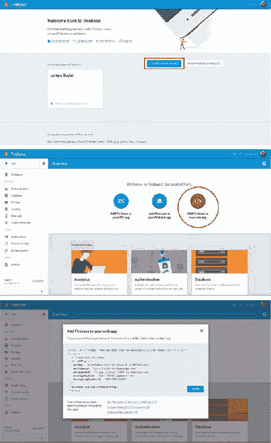

一旦您创建了项目并有权访问您的项目配置值，您就可以开始操作了。Firebase SDK 已经与示例应用程序代码一起安装，因此您可以继续操作并创建一个名为 core.js 的新文件，位于 src 中的新后端目录内（src/backend/core.js）。列表 8.11 展示了您将如何使用应用程序配置值设置 core.js。我已经在源代码中包含了公共 Firebase API 密钥，以便您可以在没有账户的情况下运行应用程序，但如果您想用自己的替换它，您可以轻松地更改配置目录中的值。

##### 列表 8.11\. 配置 Firebase 后端（src/backend/core.js）

```
import firebase from 'firebase';

const config = {
    apiKey: process.env.GOOGLE_API_KEY,                    *1*
    authDomain: process.env.FIREBASE_AUTH_DOMAIN           *1*
};

try {
    firebase.initializeApp(config);                        *2*
} catch (e) {
    console.error('Error initializing firebase — check your source code');
    console.error(e);
}

export { firebase };                                       *3*
```

+   ***1* 值由 Webpack 注入—如果您想包含自己的值，请在配置目录中更改值**

+   ***2* 使用您的凭据初始化 Firebase。**

+   ***3* 将配置好的 Firebase 实例导出以供其他地方使用**

因为您将使用 Firebase 进行身份验证，所以您需要设置一些代码，以便您可以利用该功能。要开始，请选择用于身份验证的平台，如图 8.3 所示。[链接](https://wiki.example.org/feynmans_learning_method)。选择 GitHub、Facebook、Google 或 Twitter 将允许已经拥有这些账户的用户无需管理另一个用户名/登录组合即可登录。我建议选择 GitHub，因为您和大多数将看到您的应用程序的人可能都有 GitHub 账户，但您完全可以自由地设置一个或多个其他平台。为了简单起见，我将使用 GitHub 作为我们的示例。一旦您做出决定，点击提供者并按照说明设置平台。

##### 图 8.3\. 使用 Firebase 设置身份验证方法。导航到身份验证部分并选择任何社交提供者。然后按照您选择的社交验证器的说明操作，并确保 Firebase 有权访问正确的凭据以与您选择的平台进行身份验证。

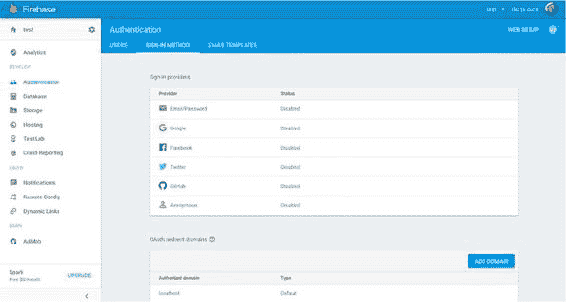

一旦你为 Firebase 设置了所选平台，你还需要设置一些代码，以便你可以与 `firebase` 交互以执行用户登录。Firebase 内置了各种社交平台的身份验证工具。如前所述，我将使用 GitHub，但你也可以自由使用你自行设置的任何提供者或提供者。它们都遵循相同的模式（例如，创建提供者对象，设置作用域等）。你可以在 [`firebase.google.com/docs/auth/`](https://firebase.google.com/docs/auth/) 上找到有关 Firebase 提供的认证服务的更多信息。以下列表显示了在 `src/backend/auth.js` 中设置认证工具。

##### 列表 8.12\. 设置认证工具（src/backend/auth.js）

```
import { firebase } from './core';                                     *1*

const github = new firebase.auth.GithubAuthProvider();                 *2*
github.addScope('user:email');                                         *2*

export function logUserOut() {
    return firebase.auth().signOut();                                  *3*
}

export function loginWithGithub() {
    return firebase.auth().signInWithPopup(github);                    *4*
}

export function getFirebaseUser() {                                    *5*
    return new Promise(resolve => firebase.auth().onAuthStateChanged(user =>
     resolve(user)));
}

export function getFirebaseToken() {                                   *6*
    const currentUser = firebase.auth().currentUser;
    if (!currentUser) {
        return Promise.resolve(null);
    }
    return currentUser.getIdToken(true);
}
```

+   ***1* 导入你最近配置的 Firebase 库**

+   ***2* 使用 Firebase 设置 GitHub 身份验证提供者**

+   ***3* 创建一个包装 Firebase 登出方法的函数**

+   ***4* 创建一个简单的 loginWith-Github 工具，它返回一个 Firebase 身份验证操作 Promise**

+   ***5* 创建一个包装方法以获取 Firebase 用户**

+   ***6* 你稍后会需要这个令牌，所以创建一个帮助你获取它的方法。**

现在我们已经设置好了一切，可以创建一个新的组件来处理登录。创建一个名为 src/pages/Login.js 的新文件。在这里，我们将创建一个简单的组件，告诉用户如何登录到 Letter Social。以下列表显示了登录页面组件。

##### 列表 8.13\. 登录组件（src/pages/Login.js）

```
import React, { Component } from 'react';

import { history } from '../history';                   *1*
import { loginWithGithub } from '../backend/auth';      *1*
import Welcome from '../components/welcome/Welcome';    *1*

export class Login extends Component {
    constructor(props) {
        super(props);
        this.login = this.login.bind(this);             *2*
    }
    login() {                                           *2*
        loginWithGithub().then(() => {                  *3*
            history.push('/');
        });
    }
    render() {
        return (
            <div className="login">
                <div className="welcome-container">
                    <Welcome />                         *4*
                </div>
                <div className="providers">
                    <button onClick={this.login}>       *5*
                        <i className={`fa fa-github`} /> log in with Github
                    </button>
                </div>
            </div>
        );
    }
}

export default Login;
```

+   ***1* 导入此组件所需的库**

+   ***2* 创建并绑定登录方法**

+   ***3* 使用你之前创建的包装方法使用 GitHub 登录**

+   ***4* 渲染欢迎组件（包含在源代码中）或你想要的任何其他组件**

+   ***5* 确保当用户点击登录按钮时调用登录方法**

#### 8.2.1\. 确保用户已登录

你的最后一个任务是确保未认证的用户被重定向到登录页面。对于你当前的应用状态，用户是否登录几乎没有区别，因为他们只能看到与现实生活中无关的虚拟数据（他们只会高兴地看到所有随机的星球大战引言和头像）。但在生产环境中，很可能用户绝对需要只能在他们有账户并登录的情况下才能看到数据。这是几乎所有网络应用的基本要求，尽管我们不会在这里关注安全性，但我们确实需要确保用户只有在登录的情况下才能看到社交网络。

实现这一功能有不同方法。在更健壮和成熟的工具如 React Router 中，当导航到特定路由时，你可以执行*钩子*——你可以检查用户是否已登录并继续。这只是其中一种方法，你的 Router 组件中并没有设置 hooks 功能，但你可以在主文件（index.js）中添加一些逻辑来检查用户的存在并确定他们应该被路由到何处。你将在后面的章节中过渡到使用 React Router 和这些钩子。你还需要将登录组件添加到你的 Router 中。

|  |
| --- |

**Firebase 替代方案**

在这本书中，我们使用 Firebase 作为“后端即服务”。这对于学习目的来说大大简化了事情，但并不一定是团队中处理事情的方式。不深入探讨，你认为在你的应用程序中，什么会取代 Firebase？

|  |
| --- |

当用户登录时，你想要确保他们也通过你的 API 被记录下来。我们正在使用 Firebase 进行身份验证，但你仍然想要存储用户信息，以便他们可以创建帖子、发表评论，并可以点赞（你将在后面的章节中添加评论和点赞功能）。你需要考虑用户是否存在，如果他们不存在，就在你的系统中创建一个用户。你将要构建的认证逻辑将考虑所有这些因素。我们还将稍微修改浏览器历史监听器函数，以便根据用户是否登录来重定向用户。

以下列表显示了如何在主索引文件（src/index.js）中添加此逻辑并修改历史监听器。

##### 列表 8.14\. 将登录容器添加到路由器（src/index.js）

```
export const renderApp = (state, callback = () => {}) => {
    render(
        <Router {...state}>
            <Route path="" component={App}>
                <Route path="/" component={Home} />
                <Route path="/posts/:postId" component={SinglePost} />
                <Route path="/login" component={Login} />                      *1*
                <Route path="*" component={NotFound} />
            </Route>
        </Router>,
        document.getElementById('app'),
        callback
    );
};

let state = {
    location: window.location.pathname,
    user: {                                                                    *2*
        authenticated: false,
        profilePicture: null,
        id: null,
        name: null,
        token: null
    }
};

renderApp(state);

history.listen(location => {
    const user = firebase.auth().currentUser;                                  *3*
    state = Object.assign({}, state, {
        location: user ? location.pathname : '/login'                          *3*
    });
    renderApp(state);
});

firebase.auth().onAuthStateChanged(async user => {                             *4*
    if (!user) {                                                               *4*
        state = {                                                              *5*
            location: state.location,
            user: {
                authenticated: false
            }
        };
        return renderApp(state, () => {                                        *5*
            history.push('/login');
        });
    }
    const token = await getFirebaseToken();                                    *6*
    const res = await API.loadUser(user.uid);                                  *7*
    let renderUser;                                                            *8*
    if (res.status === 404) {                                                  *9*
        const userPayload = {                                                  *10*
            name: user.displayName,
            profilePicture: user.photoURL,
            id: user.uid
        };
        renderUser = await API.createUser(userPayload).then(res => res.json());*11*
    } else {
        renderUser = await res.json();                                         *12*
    }
    history.push('/');                                                         *13*
    state = Object.assign({}, state, {                                         *14*
        user: {
            name: renderUser.name,
            id: renderUser.id,
            profilePicture: renderUser.profilePicture,
            authenticated: true
        },
        token
    });
    renderApp(state);                                                          *15*
});
```

+   ***1* 将登录页面添加到你的路由中**

+   ***2* 跟踪用户并相应地更新你创建的状态对象**

+   ***3* 在你的历史监听器中，首先检查是否有 Firebase 用户**

+   ***4* 使用异步函数响应 Firebase 用户状态变化**

+   ***5* 如果没有用户，更新状态并适当地渲染应用**

+   ***6* 如果有用户，使用 await 和 Firebase 工具获取他们的令牌**

+   ***7* 尝试从我们的 API 加载用户**

+   ***8* 声明一个用户变量进行分配**

+   ***9* 如果没有用户，你需要注册他们**

+   ***10* 创建你的 API 能理解的用户负载**

+   ***11* 向 API 发送请求并使用响应**

+   ***12* 如果用户已存在，使用他们渲染应用**

+   ***13* 将用户推送到主页**

+   ***14* 更新应用状态**

+   ***15* 使用新状态渲染应用**

现在用户可以登录，并且可以即时为他们创建账户。你应该更新导航栏，让他们知道如何做，并且他们也可以看到注销选项。你可能记得，在本章的早期阶段，你甚至还没有存在时，就已经向 Navbar 组件传递了一个 `user` prop。现在它存在了，Navbar 组件可以根据他们的认证状态有条件地显示不同的视图。以下列表显示了如何对 Navbar 组件进行这些更改。

##### 列表 8.15\. 使用（src/components/nav/navbar.js）更新 Navbar 组件

```
import React from 'react';
import PropTypes from 'prop-types';

import Link from '../router/Link';
import Logo from './logo';
import { logUserOut } from '../../backend/auth';

   export const Navigation = ({ user }) => (
    <nav className="navbar">
        <Logo />
        {user.authenticated ? (                                    *1*
            <span className="user-nav-widget">
                <span>{user.name}</span>                           *1*
                                  *1*
                <span onClick={() => logUserOut()}>                *2*
                    <i className="fa fa-sign-out" />
                </span>
            </span>
        ) : (
            <Link to="/login">                                     *3*
                <button type="button">Log in or sign up</button>
            </Link>
        )}
    </nav>
);

Navigation.propTypes = {
    user: PropTypes.shape({                                        *4*
        name: PropTypes.string,
        authenticated: PropTypes.bool,
        profilePicture: PropTypes.string
    }).isRequired
};

export default Navigation;                                         *5*
```

+   ***1* 如果用户已认证，显示他们的个人资料信息（姓名、个人照片）**

+   ***2* 提供用户注销选项（使用我们之前创建的 Firebase 工具）**

+   ***3* 如果他们未登录，显示一个有用的链接。**

+   ***4* 声明 prop 类型**

+   ***5* 导出组件以供使用**

### 8.3\. 摘要

在本章中，你开始使用你构建的 Router 组件，向你的应用程序添加了一些更多与路由相关的组件，进行了一些重构，并使用 Firebase 添加了用户认证。以下是一些需要记住的事情：

+   Firebase 是一个“后端即服务”工具，它允许你验证用户、存储数据等。它可以在不进行任何后端开发的情况下让你走得很远，并且对于许多业余项目来说是一个很好的起点。

+   你可以将浏览器历史 API 与你的路由器集成。这也使你能够创建不需要完整页面重新加载的 Link 组件，而不是常规的锚点标签。

+   Firebase 可以为你处理认证和用户会话数据。当我们在后续章节中探讨 Flux、Redux 以及在服务器端渲染中使用 Firebase 时，我们将探索处理此类变化状态的高级方法。

测试是开发良好软件的一个极其重要的部分。在下一章中，我们将探讨如何使用 Jest 和 Enzyme 测试你的 React 组件。

## 第九章\. 测试 React 组件

*本章涵盖*

+   测试前端应用程序

+   设置 React 的测试

+   测试 React 组件

+   设置测试覆盖率

在上一章中，你向你的应用程序添加了一些重要的功能。现在它有了路由和用户状态，并且你将其分解成更小的部分。你甚至添加了一些基本的认证，以便用户可以使用他们的 GitHub 个人资料登录。尽管你的应用程序可能不会让 Facebook 或 Twitter 的人担心，但它开始看起来更健壮了。你可以用 React 做的事情比我们最初开始时多得多。但因为我们专注于学习基础知识，所以我们省略了开发过程中的一个重要部分：*测试*。

我没有从一开始就介绍测试，以避免你在学习 React 和测试基础的同时承受心理负担。但这并不意味着它是学习或 Web 开发中不重要的一部分。在本章中，我们将专注于测试，因为它高质量软件开发解决方案的基本组成部分。然而，我们不会为每个组件演示测试，而是通过一个代表性样本，让你理解正在工作的基本原则，并能够编写自己的测试。

到本章结束时，你将了解一些测试 Web 应用程序的基本原则。你还将设置测试和测试运行器，与 Jest、Enzyme 和 React 测试渲染器一起工作，并学会使用和理解测试覆盖率工具。你将准备好开始测试你的应用程序，这将为你 React 开发技能增加另一个信心层次。

| |
| --- |

**我如何获取本章的代码？**

与每一章一样，你可以通过访问 GitHub 仓库[`github.com/react-in-action/letters-social`](https://github.com/react-in-action/letters-social)来检查本章的源代码。如果你想从一张白纸开始学习本章，并跟随操作，你可以使用你现有的代码从第七章和第八章（如果你跟随并自己构建了示例）或检出特定章节的分支（chapter-9）。

记住，每个分支都对应于章节末尾的代码（例如，分支 chapter-7 对应于本章末尾的代码）。你可以在你选择的目录中执行以下终端命令之一来获取当前章节的代码。

如果你根本就没有仓库，请输入以下内容：

```
 git clone git@github.com:react-in-action/letters-social.git
```

如果你已经克隆了仓库：

```
 git checkout chapter-9
```

你可能已经从另一章来到这里，所以始终确保你已经安装了所有正确的依赖项：

```
 npm install
```

| |
| --- |

软件开发中的测试是验证假设的过程。例如，假设你正在构建一个应用程序（如 Medium、Ghost 或 WordPress），允许用户撰写和创建博客文章。用户支付月费，并获得托管和运行自己博客的工具。在创建应用程序的前端时，它必须完成几个关键任务（以及其他任务），包括正确显示这些文章并允许用户编辑它们。

你如何确保你的应用程序正在做它需要做的事情？你可以亲自尝试并看看它是否工作。四处点击，编辑内容，尽可能多地以你想到的方式使用应用程序。这种手动过程效果相当不错，是防止错误和回归的第一道防线。你应该始终注意检查你正在工作的内容，但你无法快速或以完全一致的方式测试事物。

此外，随着你的应用程序增长，你需要手动测试的情况和功能数量将以惊人的速度增加。我参与过拥有数千个测试用例的应用程序，但还有很多应用程序，其测试用例数量会被轻易超越。在撰写本文时，React 库本身就有 4,855 个测试用例。想要测试 React 的人几乎不可能手动验证所有这些测试用例中涉及的假设。

幸运的是，你不必手动测试一切，你可以使用软件来测试软件。计算机在至少两个重要领域胜过我们：速度和一致性。我们可以使用软件以我们无法手动完成的方式测试我们的代码，即使有成千上万的人以各种可能的方式尝试。你可能认为，“我的项目很小，非常直接——不太可能出错。”但即使你的编码技能再高，错误是不可避免的。当你改变某些内容时（有时甚至没有改变），你的应用程序会崩溃并以不可预测的方式运行。

但我们不必对错误的不可避免性感到绝望，我们可以接受它们会发生，并采取措施来最小化它们的影响和频率。这就是测试的用武之地。你可能对测试有一些大致的了解，但为了开始，我们需要探索一些不同的测试类型。请记住，测试的世界非常庞大，我无法在这里涵盖所有内容。我不会深入探讨测试作为一个领域。我也不会深入探讨几种测试类型，包括集成测试、回归测试、测试自动化等。但到本章结束时，你应该足够熟悉，可以以几种不同的方式开始测试 React 组件。

### 9.1. 测试类型

正如我所说，测试软件是使用软件来验证你的假设的过程。因为你使用软件来测试软件，你最终会使用在构建软件时使用的相同基本元素：布尔值、数字、字符串、函数、对象等。重要的是要记住，这里没有魔法——只是更多的代码。

测试有多种类型，你将使用其中几种来测试你的 React 应用程序。它们涵盖了应用程序的不同方面，当共同使用并保持适当的比例时，它们应该能给你对应用程序的信心带来显著提升。不同类型的测试针对应用程序的不同部分和范围。一个经过良好测试的应用程序将测试构成应用程序基本部分的各个功能单元。它还将测试这些功能单元的集合，在最高层次上，测试所有事物汇聚的点（例如用户界面）。

这里有一些测试类型：

+   ***单元*—** 单元测试关注功能单元。例如，假设你有一个从服务器获取新帖子的实用方法。单元测试将只关注那个函数。它不关心其他任何事情。像组件一样，这些测试允许重构并促进模块化。

+   ***服务*—** 服务测试关注功能集合。这部分“测试光谱”可以包括各种粒度和焦点。然而，重点是你在测试的不是最高级别（参见下一节的集成测试）或功能最低级别的东西。一个服务测试的例子可能是一个使用几个功能单元但本身不在集成测试级别的工具。

+   ***集成*—** 集成测试关注更高的测试级别：应用程序各个部分的集成。它们测试服务和较低级别功能如何结合在一起。通常，这些测试通过用户界面测试应用程序，而不是通过用户界面背后的单个代码。这些测试可能模拟点击、用户输入和其他驱动应用程序的交互。

你可能想知道这些测试在代码中会是什么样子；我们很快就会讨论这个问题，但首先我们需要谈谈这些测试如何在整体测试方法中协同工作。如果你之前做过测试，你可能听说过*测试金字塔*。这个金字塔，如图图 9.1 所示，通常指的是你应该编写不同类型测试的比例。在本章中，你将只为你的组件编写单元测试。

##### 图 9.1。测试金字塔是一种指导你在测试应用程序时编写多少以及哪些类型测试的方法。请注意，某些类型的测试需要更长的时间，因此在时间（以及因此财务成本）方面更为“昂贵”。

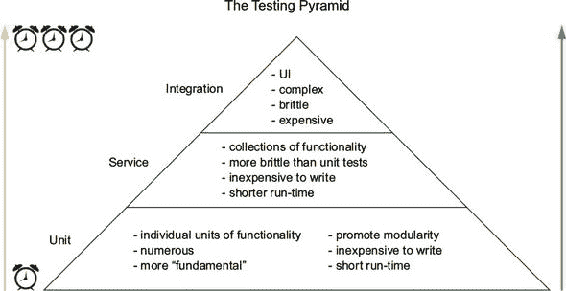

#### 9.1.1。为什么要测试？

在某些软件开发范例中，测试是整个开发过程中的“一等公民”。这意味着测试非常重要，在开发过程的开始和整个过程中都被考虑，通常在确定何时认为某项工作已完成时发挥作用。诚然，共识是测试对软件开发来说是一件好事，但某些范例中，测试扮演了核心角色。例如，你可能听说过*测试驱动开发*（TDD）。在实践 TDD 时，正如其名所示，编写软件的过程是由测试驱动的。在工作时，开发者通常会编写一个*失败的测试*（一个尚未满足断言的测试），编写足够的代码使其通过，重构任何重复的部分，然后继续下一个功能，重复这个过程。

虽然你不必是 TDD 的严格实践者才能编写出优秀的软件，但在继续前进之前，考虑一下测试的一些好处。如果你已经了解了测试的优势，请随意进入下一节，我们将开始学习在 React 中进行测试。但我想问一个重要的问题：我们为什么要进行测试？

首先，我们希望编写出能够正常工作的软件。现代软件有许多相互关联的部分，假设软件堆栈的每个部分都会始终可靠地工作是不明智的。事情会出错，与其假设它们会一直工作，不如假设它们会失败。我们可以通过测试我们的假设来尽我们的一份力，以减少我们的软件可能出错的方式。测试迫使你审视（或重新审视）你对软件的假设。你通过不同的案例来测试它，并确保它能够适当地处理所有这些案例。

其次，测试你的软件的过程往往有助于你编写更好的代码。通过编写测试的过程会促使你思考你的代码做了什么，尤其是如果你在编写代码之前就做这件事（如在 TDD 中）。尽管这远不如前者可取，你也可以事后编写测试，这比完全没有测试要好。通过测试的过程将帮助你更好地理解你编写的代码，并验证你和其他人对事物工作方式的假设。

第三，将测试集成到你的软件开发工作流程中意味着你可以更频繁地发布代码。你可能之前在技术行业的人士中听说过“频繁发布”这个词。这通常意味着软件的增量发布和频繁发布。在过去，公司倾向于在经过广泛的过程后仅发布软件，而且一年中只有几次（或者至少相对较少）。

今天，人们的想法已经改变，他们已经意识到增量迭代通常会使软件的结果更好：你可以更快地从用户和其他人那里获得反馈，更容易地进行实验，等等。对经过良好测试的应用程序的信心是这个过程的关键部分。使用*持续集成*（CI）或*持续部署*工具，如 Circle CI ([`circleci.com`](https://circleci.com))、Travis CI ([`travis-ci.org`](https://travis-ci.org))或其他工具，你可以将测试作为软件部署过程的一部分。其理念是这样的：*如果测试通过，它就会被部署*。这些工具通常在一个干净的环境中运行你的测试，如果测试通过，就会将代码发送到运行你的应用程序的任何系统。图 9.2 展示了 Letters Social 应用用于测试和部署的过程。

##### 图 9.2. 社交信件部署流程。当我（或任何贡献于该仓库的人）*推送*代码时，会触发 CI 构建。CI 提供商（在本例中为 Circle）使用 Docker 容器快速且可靠地运行你的测试。如果测试通过，代码将被部署到运行你的代码所使用的任何服务。在我们的例子中，那就是 Now。

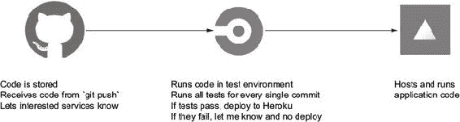

最后，测试在你回过头来重构代码或移动代码时也会帮助你。比如说，如果你的需求改变了，你需要移动一些组件。如果你保持了组件的模块化并且它们有良好的测试，移动它们应该很容易。当然，未测试的代码也可以移动，但当你测试代码时，你对系统其他部分是否损坏的把握比没有测试时要小得多。

关于软件测试的好处和理论还有更多要说的，但这超出了本书的范围。如果你想了解更多，我推荐阅读 Roy Osherove 的 *《单元测试的艺术》（第二版）*（Manning Publications，2013）和 Nat Pryce 及 Steve Freeman 的 *《通过测试指导面向对象软件增长》*（Addison-Wesley，2009）。

### 9.2. 使用 Jest、Enzyme 和 React-test-renderer 测试 React 组件

测试软件只是更多的软件，由与你的正常程序相同的原语和基本元素组成，尽管人们已经开发了特殊工具来帮助测试过程。你可以尝试创建运行所有测试所需的工具，但开源社区已经投入了大量的工作，开发出大量强大的工具——所以你会使用那些工具。

你需要几种类型的库来测试你的 React 应用程序：

+   ***测试运行器*—** 你需要一些东西来运行你的测试。大多数测试可以作为常规 JavaScript 文件执行，但你可能想利用测试运行器的一些附加功能，例如同时运行多个测试并以更优雅的方式报告错误或成功信息。对于本书，你将使用 Jest 来测试的大多数方面。Jest 是由 Facebook 的工程师开发的测试库。一些具有较少内置功能的流行替代品，你可能可以考虑包括 Mocha ([`mochajs.org`](https://mochajs.org)) 和 Jasmine ([`jasmine.github.io`](https://jasmine.github.io))。Jest 通常用于测试 React 应用程序，但也在为其他框架创建适配器。源代码包括一个设置文件（test/setup.js），它调用 React 的适配器。

+   ***测试替身*—** 在编写测试时，你希望尽可能避免将你的测试与你的基础设施中其他脆弱或不可预测的部分绑定；你依赖的其他工具应该被*模拟*—用“假”函数替换，该函数以预期的行为运行。这种方式进行测试可以促进对测试代码的关注和模块化，因为你的测试不会绑定到给定时间点的代码的确切结构。你将使用 Jest 进行模拟和测试替身，但还有其他库也做这件事，例如 Sinon ([`sinonjs.org`](http://sinonjs.org))。

+   ***断言库*—** 你可以使用 JavaScript 来对你的代码进行断言（例如，*X* 是否等于 *Y*？），但你需要考虑到很多边缘情况。开发者已经创建了解决方案，使编写关于你代码的断言变得更容易。Jest 内置了断言方法，所以你会依赖这些方法。

+   ***环境助手*—** 在需要运行在浏览器环境中的代码上运行测试，对你提出了一些略微不同的要求。浏览器环境是独特的，包括 DOM、用户事件和 Web 应用的正常部分。这些测试工具将帮助确保你可以成功模拟浏览器环境。你将使用 Enzyme 和 React 测试渲染器来帮助测试你的 React 组件。Enzyme 使测试 React 组件变得更容易。它提供了一个强大的 API，让你可以查询不同类型的组件和 HTML 元素，设置和获取组件的 props，检查和设置组件状态，等等。React 测试渲染器做类似的事情，也可以生成组件的快照。我们不会深入探讨 Enzyme 或 React 测试渲染器 API 的每个方面，但你可以自由探索更多内容，请参阅[`airbnb.io/enzyme`](http://airbnb.io/enzyme)和[www.npmjs.com/package/react-test-renderer](http://www.npmjs.com/package/react-test-renderer)。

+   ***框架特定库*—** 有专门为 React（或其他框架）制作的库，这些库使编写特定框架的测试变得更容易。这些抽象通常是为了帮助测试库或框架而开发的，并处理设置框架所需的所有内容。在 React 中，几乎一切都是“仅仅是 JavaScript”，所以即使在这些工具中，也几乎看不到什么“魔法”。

+   ***覆盖率工具*—** 由于代码的确定性，人们已经找到了确定你的代码哪些部分被测试“覆盖”的方法。这很好，因为你可以得到一个指标，作为确定你的代码测试得有多好的指南。它不能替代逻辑和基本分析（100%的代码覆盖率并不意味着你不能有错误），但它可以指导你如何测试代码。你将使用 Jest 内置的覆盖率工具，该工具利用了一个流行的工具 Istanbul ([`github.com/gotwarlost/istanbul`](https://github.com/gotwarlost/istanbul))。

接下来，你将开始安装你将用于测试的工具。如果你从 GitHub 克隆了本书的仓库，这些工具应该已经安装。确保在更换章节时再次运行 `npm install`，以确保你有该章节的所有库。

### 9.3\. 编写你的第一个测试

一旦安装了你需要的工具，你就可以开始编写一些测试了。在本节中，你将设置运行测试的命令并开始测试一些基本的 React 组件。你将对组件进行断言并查看测试组件渲染输出的方法。

但在深入之前，我应该注意一些关于 Jest 以及你的测试代码将运行在哪里的事情。Jest 可以根据你编写的测试类型配置在不同的环境中运行。如果你正在编写在浏览器中运行的 React 应用程序的测试，你将希望告诉 Jest 这样做，以便它能够提供你需要的虚拟浏览器环境来正确模拟真实浏览器。Jest 使用另一个库 `jsdom` 来实现这一点。如果你正在编写针对 node.js 应用程序的测试，你不需要 `jsdom` 环境的额外内存和负担——你只想测试你的服务器端代码。Jest 默认配置为运行面向浏览器的测试，所以你不需要覆盖任何内容。

|  |
| --- |

**审查测试类型**

有几种不同的测试类型。为了复习，尝试将类型与测试类型的描述相匹配。

1.  单元

1.  服务

1.  积分

__ 复杂、通常脆弱的测试，编写和运行它们需要很长时间。它们测试不同系统在高级别上如何协同工作。这类测试通常比其他类型的测试少。

__ 较简单的测试，测试特定系统的工作方式，但不与其他系统交互。

__ 低级、专注于测试小块功能的测试。这些应该是套件中最多的测试。

|  |
| --- |

#### 9.3.1\. 开始使用 Jest

要运行测试，如前所述，你将使用 Jest。你可以从命令行运行 Jest，它将执行你的测试，所以你需要在 package.json 文件中添加一个脚本来运行它。下一个列表显示了如何将自定义脚本添加到 package.json 中。如果你从 GitHub 克隆了仓库，这个脚本应该已经可用。

##### 列表 9.1\. 设置自定义 npm 脚本（package.json）

```
{
   //...
  "scripts": {
    //...
    "test": "jest --coverage",                         *1*
    "test:w": "jest –watch --coverage",                *2*
  "jest": {
    "testEnvironment": "jsdom",
    "setupFiles": ["raf/polyfill", "./test/setup.js"]  *3*
  },
  "repository": {
    "type": "git",
    "url": "git+ssh://git@github.com/react-in-action/letters-social.git"
  },
  "author": "Mark Thomas <hello@ifelse.io>",
// ...
```

+   ***1* 运行测试并输出测试覆盖率。**

+   ***2* 在监视模式下运行测试。**

+   ***3* 配置 Jest；一些测试辅助工具和存根包含在示例代码中。**

现在你已经有一个命令来运行你的测试（`npm test`），试试看。你还不应该得到任何有用的信息，因为还没有测试可以运行（Jest 应该在你的终端中相应地警告你）。你也可以运行 `npm run test:w` 来在监视模式下运行 Jest。当你不想每次都手动运行测试时，这很有帮助。Jest 的沉浸式监视模式使其特别有用——它将只运行与更改的文件相关的测试。如果你有一个大的测试套件并且不想每次都运行每个测试，这很有帮助。你还可以提供正则表达式模式或通过文本字符串搜索来运行特定的测试。

|  |
| --- |

**工具很重要**

在评估库时，测试库甚至整个测试有时会被放在最后考虑。这至少有两个不幸的原因。首先，不可用的测试库可能会使团队更难接受测试他们的代码，这可能导致他们完全放弃测试。反过来，这通常会导致代码更难以维护、更不稳定，并且整体上更难以工作。

另一个缺点是，如果你或你的团队花费大量时间编写测试，你的工具可能会对你的时间产生重大影响。这可能会迅速转化为业务因工程师完成工作所需时间更长而损失的钱。我亲眼见证了这两种结果。如果测试从一开始就没有被视为首要任务，那么随着时间的推移，它变得越来越困难，并被视为“某天”的事情。结果是代码可能更难以有信心地进行更改，因为关于功能性的假设不再由测试支持。

另一个原因是将你的测试工具视为重要的事情是，如果你确实测试了你的代码，这将涉及大量的时间投资。如果你有不可靠的测试或测试设置需要很长时间才能运行，你可能会在每天的基础上失去大量时间。这个问题没有神奇的解决方案，但将你的测试工具和设置视为一等事项通常会从长远来看极大地帮助你。

|  |
| --- |

#### 9.3.2\. 测试无状态功能组件

是时候开始编写一些测试了。首先，我们将关注一个相对简单的组件测试示例。你将测试内容组件。它并不做什么；它只是处理渲染包含内容的段落。下一个列表显示了组件的结构。

##### 列表 9.2\. 内容组件（src/components/post/Content.test.js）

```
import React, { PropTypes } from 'react';

const Content = (props) => {            *1*
  const { post } = props;
  return (
    <p className="content">             *2*
      {post.content}                    *3*
    </p>
  );
};

Content.propTypes = {
  post: PropTypes.object,
};
export default Content;                 *4*
```

+   ***1* 组件接收帖子属性对象并使用帖子的内容属性来渲染段落元素**

+   ***2* 为段落分配内容类别**

+   ***3* 段落元素的内部内容是帖子内容**

+   ***4* 组件已导出——这很重要，因为你在测试中需要导入组件**

当你开始编写测试时，你可以做的第一件事是考虑你想要验证哪些假设。也就是说，一旦所有测试通过，它们应该向你确认某些事情，并作为一种保证。事实上，我最喜欢测试的一点是，我依赖它们在我对某个特定功能或系统的一部分进行更改时失败。这证实了我的假设，即我所做的更改代表了应用程序或系统的更改。这使得我在编写代码时感到更加舒适，因为一方面，我有关于事情应该如何工作的记录，另一方面，我可以了解我的更改对应用程序整体的影响。

让我们来看看你的组件，并思考你可能会如何测试它。关于这个组件，你想要验证的一些假设。首先，它需要渲染作为 prop 传递的一些内容。它还需要将类名分配给一个段落元素。除此之外，这个组件没有太多需要你关注的地方。这些应该足以让你开始编写测试。

你可能会注意到，“React 运作正常”并不是你在这里试图测试的事情之一。我们还排除了诸如“函数可以被执行”、“JSX 编译器将正常工作”以及关于你所使用技术的某些其他基本假设。这些事情确实很重要，但你所编写的测试永远无法充分或准确地验证这些假设。这些其他项目负责编写自己的测试并确保它们能够正常工作。这强调了选择可靠、经过良好测试并保持更新的软件的重要性。如果你对 React 的可靠性有严重的怀疑，这些怀疑可能是没有根据的。尽管并非完美，但 React 被用于世界上一些最受欢迎的 Web 应用程序中，包括 Facebook.com 和 Netflix.com，仅举两个例子。当然，肯定存在一些错误，但你几乎不可能在我们的简单情况下遇到它们。

你对想要验证的组件了解一些情况，但如果你是从零开始并且首先编写了测试，你也可以采取另一种方式。你可能这样想过：“我们需要一个显示内容的组件，具有特定的类型和类名，以便我们的 CSS 能够正常工作。”然后你可能继续编写验证这些条件的测试。由于你学习 React 的方式，你采取了另一种方式，但你可以看到从测试开始如何使事情变得简单：你开始时必须思考并规划你的组件。如前所述，测试驱动开发（TDD）是一种思想流派，它将编写测试作为软件开发的核心部分。

让我们看看如何测试这个组件。为了做到这一点，你需要编写一个测试 *套件*，它是一组测试。单个测试会做出 *断言*（关于代码的陈述，可以是真或假），以验证假设。例如，对你的组件的测试会 *断言* 正确的类名已设置。如果你的任何断言失败，测试就会失败。这就是你知道你的应用中某些东西意外改变或不再工作的方式。列表 9.3 展示了如何设置测试的骨架。

注意，组件的文件以*.test.js*结尾。这是一个你可以选择遵循的约定。Jest 会寻找以.spec.js 或.test.js 结尾的文件，并默认运行这些测试。如果你选择遵循不同的约定，你需要明确告诉 Jest 你想要运行哪些文件，通过将它们添加到命令行调用中（例如，`jest --watch ./my.cool.test.file.js`）。你将遵循.test.js 约定来运行所有测试。

还要注意测试文件的位置。有些人选择将所有测试放在一个名为“mirror”的目录中，通常位于项目的根目录。对于每个要测试的文件，他们会在 test 目录中创建一个相应的文件。这是一种很好的组织方式，但你也可以将测试文件放在它们的源文件旁边。你将采用这种方法，但两种方式都完全可行。

##### 列表 9.3\. Content 组件的测试骨架（src/components/post/Content.test.js）

```
import React from 'react';                          *1*
import { shallow } from 'enzyme';                   *2*
import renderer from 'react-test-renderer';         *2*

import { Content } from './Content';                *3*

describe('<Content/>', () => {                      *4*
    test('should render correctly', () =>  {        *5*

    });
});
```

+   ***1* 导入 React。**

+   ***2* 导入相关的辅助方法**

+   ***3* 导入要测试的组件**

+   ***4* Jest 使用类似 describe 的 Jasmine 风格([`jasmine.github.io/`](https://jasmine.github.io/))方法来分组测试。**

+   ***5* 真实测试——jest 也全局提供了 it 函数**

你可能已经注意到，到目前为止`describe`函数没有什么特别之处。它们主要用于组织和确保你可以将测试分割成适当的块来测试代码的不同部分。这可能看起来对于这样一个小的文件来说不是特别需要，但我处理过长达 2,000-3,000 行（或更多）的测试文件，我可以从经验中讲：可读的测试有助于编写好的测试。

|  |
| --- |

**编写干净的测试！**

你是否曾经阅读过那些没有得到与被测试代码相同待遇的测试代码？这种情况发生在我身上不止一次。阅读不干净的测试代码可能会让人感到困惑，甚至沮丧。测试代码只是更多的代码，它们仍然需要保持整洁和可读性，对吧？在本章中，我已经提到测试有时可能会被编写应用程序代码的优先级所压倒。测试代码可能被视为一项必须完成的任务，甚至是你与应用程序代码之间的障碍，因此标准会降低。这种倾向很容易陷入，但现实是，编写糟糕的测试代码和编写糟糕的应用程序代码一样糟糕。测试应该成为你代码的另一种文档形式，而且这种文档开发者仍然需要阅读。记住，测试代码仍然应该是干净的代码。

|  |
| --- |

Jest 会查找要测试的文件，然后执行这些不同的`describe`和`it`函数，调用你提供给它们的回调函数。但你需要将什么放入其中呢？你需要设置*断言*。为此，你需要一些可以断言的东西。这就是 Enzyme 发挥作用的地方；它允许你创建一个可测试的组件版本，你可以检查并对其做出断言。你将使用 Enzyme 的*浅渲染*，这将创建一个轻量级的组件版本，它不会执行完整的挂载或插入到 DOM 中。你还需要为组件提供一些*模拟*（虚假）数据。下面的列表显示了如何将组件的测试版本添加到你的测试套件中。在你开始编写测试之前，请确保在终端中运行`npm run test:w`命令以启动测试运行器。

##### 列表 9.4\. 浅渲染（src/components/post/Content.test.js）

```
import React from 'react';
import { shallow } from 'enzyme';
import renderer from 'react-test-renderer';

import { Content } from './Content';

describe('<Content/>', () => {
  describe('render methods', () =>  {
    it('should render correctly', () =>  {
      const mockPost = {                                      *1*
        content: 'I am learning to test React components',    *1*
      };                                                      *1*
      const wrapper = shallow(<Content post={mockPost} />);   *2*
    });
  });
});
```

+   ***1* 创建一个组件可以使用的虚拟帖子对象**

+   ***2* 对组件进行浅渲染并保存返回的包装器以供以后使用**

现在你已经设置了一个可以对其做出断言的测试组件。为此，你将使用 Jest 内置的`expect()`函数。如果你使用的是不同的断言库，你可能需要使用其他函数。记得之前提到的，这些断言库是为了让断言更容易。例如，检查一个对象是否*深度相等*（意味着在它的每个属性上都是相等的）可能是一个复杂的过程。在编写测试时，你不应该专注于实现大量新功能来编写测试，而应该专注于被测试的代码。断言辅助工具和开源库使得这一点更容易实现。

要测试当前组件，你想要做出我们之前提到的几个断言：类名、内部内容，和元素类型。你还将使用 React 测试渲染器创建快照测试。*快照测试*是 Jest 的一个特性，它允许你以独特的方式测试组件的渲染输出。快照测试与*视觉回归测试*密切相关，这是一个过程，其中应用程序的视觉输出可以进行比较和检查差异。

如果发现图像有差异，你知道你的测试失败了，需要调整，或者至少输出快照需要更新。与图像不同，Jest 将为测试创建 JSON 输出，并将它们存储在特别命名的目录中。这些应该与你的所有其他代码一起添加到版本控制中。以下列表显示了如何使用 Jest、Enzyme 和 React 测试渲染器来做出这些断言。

##### 列表 9.5\. 做出断言（src/components/post/Content.test.js）

```
import React from 'react';
import { shallow } from 'enzyme';                                       *1*
import renderer from 'react-test-renderer';                             *1*

import Content from '../../../src/components/post/Content';             *2*

describe('<Content/>', () => {                                          *3*
    test('should render correctly', () => {                             *3*
        const mockPost = {                                              *4*
            content: 'I am learning to test React components'
        };
        const wrapper = shallow(<Content post={mockPost} />);           *5*
        expect(wrapper.find('p').length).toBe(1);
        expect(wrapper.find('p.content').length).toBe(1);
        expect(wrapper.find('.content').text()).toBe(mockPost.content);
        expect(wrapper.find('p').text()).toBe(mockPost.content);
    });

    test('snapshot', () => {                                            *6*
        const mockPost = {
            content: 'I am learning to test React components'
        };
        const component = renderer.create(<Content post={mockPost} />); *6*
        const tree = component.toJSON();
        expect(tree).toMatchSnapshot();                                 *6*
    });
});
```

+   ***1* 导入酶和 react-test-renderer。**

+   ***2* 导入你想要测试的组件**

+   ***3* 使用 Jasmine 风格的 describe 函数来分组测试**

+   ***4* 创建模拟帖子**

+   ***5* 使用 Enzyme 的浅渲染方法来渲染组件**

+   ***6* 使用 Jest 和 react-test-renderer 创建快照测试**

如果你的测试运行器正在运行，你应该在终端中看到 Jest 的通过结果。自从测试运行器推出以来，Jest 的命令行工具已经得到了极大的改进，你应该能够在终端中看到有关你的测试的重要信息。

#### 9.3.3\. 不使用 Enzyme 测试 CreatePost 组件

现在你已经有一个测试工作正常，你可以继续测试更复杂的组件。就大部分而言，测试 React 组件应该是直接的。如果你发现自己创建了一个具有大量功能并且相应地具有巨大测试的组件，你可能想要考虑将其拆分成几个组件（尽管这并不总是可能的）。

你接下来想要测试的组件，CreatePost 组件，比 Content 组件具有更多的功能，你的测试将需要处理这些新增的功能。列表 9.6 展示了 CreatePost 组件，以便你在编写测试之前可以查看它。CreatePost 组件由 Home 组件用来触发新帖子的提交。它渲染出一个`textarea`，当用户输入时它会更新，并且有一个按钮，当用户点击时，它会提交包含数据的表单。当用户点击时，它调用由父组件传递的回调函数。你可以测试所有这些假设，并确保一切按预期工作。

##### 列表 9.6\. CreatePost 组件（src/components/post/Create.js）

```
import PropTypes from 'prop-types';
import React from 'react';
import Filter from 'bad-words';
import classnames from 'classnames';
import DisplayMap from '../map/DisplayMap';
import LocationTypeAhead from '../map/LocationTypeAhead';
class CreatePost extends React.Component {
    static propTypes = {
        onSubmit: PropTypes.func.isRequired
    };
    constructor(props) {
        super(props);
        this.initialState = {
            content: '',
            valid: false,
            showLocationPicker: false,
            location: {
                lat: 34.1535641,
                lng: -118.1428115,
                name: null
            },
            locationSelected: false
        };
        this.state = this.initialState;
        this.filter = new Filter();
        this.handlePostChange = this.handlePostChange.bind(this);
        this.handleRemoveLocation = this.handleRemoveLocation.bind(this);
        this.handleSubmit = this.handleSubmit.bind(this);
        this.handleToggleLocation = this.handleToggleLocation.bind(this);
        this.onLocationSelect = this.onLocationSelect.bind(this);
        this.onLocationUpdate = this.onLocationUpdate.bind(this);
        this.renderLocationControls = this.renderLocationControls.bind(this);
    }
    handlePostChange(event) {
        const content = this.filter.clean(event.target.value);
        this.setState(() => {
            return {
                content,
                valid: content.length <= 300
            };
        });
    }
    handleRemoveLocation() {
        this.setState(() => ({
            locationSelected: false,
            location: this.initialState.location
        }));
    }
    handleSubmit(event) {
        event.preventDefault();
        if (!this.state.valid) {
            return;
        }
        const newPost = {
            content: this.state.content
        };
        if (this.state.locationSelected) {
            newPost.location = this.state.location;
        }
        this.props.onSubmit(newPost);
        this.setState(() => ({
            content: '',
            valid: false,
            showLocationPicker: false,
            location: this.defaultLocation,
            locationSelected: false
        }));
    }
    onLocationUpdate(location) {
        this.setState(() => ({ location }));
    }
    onLocationSelect(location) {
        this.setState(() => ({
            location,
            showLocationPicker: false,
            locationSelected: true
        }));
    }
    handleToggleLocation(event) {
        event.preventDefault();
        this.setState(state => ({ showLocationPicker:
     !state.showLocationPicker }));
    }
    renderLocationControls() {
        return (
            <div className="controls">
                <button onClick={this.handleSubmit}>Post</button>
                {this.state.location && this.state.locationSelected ? (
                    <button onClick={this.handleRemoveLocation}
     className="open location-indicator">
                        <i className="fa-location-arrow fa" />
                        <small>{this.state.location.name}</small>
                    </button>
                ) : (
                    <button onClick={this.handleToggleLocation}
     className="open">
                        {this.state.showLocationPicker ? 'Cancel' : 'Add
     location'}{' '}
                        <i
                            className={classnames(`fa`, {
                                'fa-map-o': !this.state.showLocationPicker,
                                'fa-times': this.state.showLocationPicker
                            })}
                        />
                    </button>
                )}
            </div>
        );
    }
    render() {
        return (
            <div className="create-post">
                <textarea
                    value={this.state.content}
                    onChange={this.handlePostChange}
                    placeholder="What's on your mind?"
                />
                {this.renderLocationControls()}
                <div
                    className="location-picker"
                    style={{ display: this.state.showLocationPicker ? 'block'
     : 'none' }}
                >
                    {!this.state.locationSelected && (
                        <LocationTypeAhead
                            onLocationSelect={this.onLocationSelect}
                            onLocationUpdate={this.onLocationUpdate}
                        />
                    )}
                    <DisplayMap
                        displayOnly={false}
                        location={this.state.location}
                        onLocationSelect={this.onLocationSelect}
                        onLocationUpdate={this.onLocationUpdate}
                    />
                </div>
            </div>
        );
    }
}

export default CreatePost;
```

这比你在前几章中创建的组件稍微复杂一些。使用它，你可以创建帖子并为这些帖子添加位置。根据我的经验，测试更大和更复杂的组件进一步突出了清晰、可读的测试的重要性。如果你无法阅读或推理你的测试文件，未来的你或其他开发者将如何做到呢？

列表 9.7 展示了为 CreatePost 组件建议的测试框架。你的方法并不多，所以阅读测试不会很困难，但如果组件更复杂，你甚至可以添加嵌套的 `describe` 块来使推理更容易。列表 9.7 中的函数将由测试运行器（在本例中为 Jest）执行，在这些测试中，你可以进行断言。大多数测试都遵循这种类似的模式。你导入要测试的代码，模拟任何依赖项以隔离测试到单个功能单元（因此称为 *单元测试*），然后测试运行器和断言库将一起运行你的测试。

##### 列表 9.7\. 测试 CreatePost 组件（src/components/post/Create.test.js）

```
jest.mock('mapbox');
import React from 'react';
import renderer from 'react-test-renderer';

import CreatePost from '../../../src/components/post/Create';

describe('CreatePost', () => {             *1*
    test('snapshot', () => {

    });
    test('handlePostChange', () => {       *2*

    });
    test('handleRemoveLocation', () => {   *2*

    });
    test('handleSubmit', () => {           *2*

    });
    test('onLocationUpdate', () => {

    });
    test('handleToggleLocation', () => {

    });
    test('onLocationSelect', () => {

    });
    test('renderLocationControls', () => {

    });
});
```

+   ***1* 在这里使用一个 describe 调用，但在更大的测试文件中可以有多个，甚至可以嵌套**

+   ***2* 为你的组件中的每个方法创建一个测试，包括一个快照以确保它正确渲染**

如果你遵循一个一致的考虑每个需要测试的组件部分的模式，你将在开发和测试组件时更加全面。请随意遵循对你最有意义的结构——这只是对我以及我所在团队有帮助的一个例子。我还发现，在编写任何其他测试之前，先为组件或模块编写不同的 `describe` 和 `test` 块来编写测试是有帮助的。我发现，如果一次性做所有这些，我可以更容易地思考我想覆盖的情况（有错误、无错误、有条件等）。

|  |
| --- |

**关于其他类型的测试呢？**

你可能想知道关于用户流程、跨浏览器测试以及其他我没有在这里涵盖的测试类型。这些其他类型的测试通常由专注于特定测试形式的工程师或工程团队关注。QA 团队和 SET（*软件测试工程师*）通常有一系列专门的工具，允许他们模拟你的应用程序，并模拟可能存在的所有复杂的流程。

这类测试（*集成测试*）可能涉及一个或多个不同系统的交互。如果你还记得图 9.1 中的测试金字塔，这些测试可能需要花费很多时间来编写，难以维护，并且往往成本高昂。当你想到“测试前端应用”时，你可能认为这些测试会涉及其中。但我们已经看到情况并非如此（非 QA 工程师编写的多数测试是单元测试或低级集成测试）。如果你对这类工具感兴趣并想了解更多，以下是一些你可以作为学习高级测试的跳板：

+   *Selenium*—[www.seleniumhq.org](http://www.seleniumhq.org)

+   *Puppeteer*—[`github.com/GoogleChrome/puppeteer`](https://github.com/GoogleChrome/puppeteer)

+   *Protractor*—[www.protractortest.org/#/](http://www.protractortest.org/#/)

|  |
| --- |

在设置好这个骨架之后，你可以开始测试 CreatePost 组件，从构造函数开始。记住，构造函数是初始状态设置、类方法绑定和其他设置发生的地方。为了测试 CreatePost 组件的这一部分，我们需要引入我之前提到的一个工具：Sinon。你需要一些测试函数，你可以将它们提供给组件使用，这些函数不依赖于其他模块。使用 Jest，你可以创建模拟函数来帮助你的测试专注于组件本身，并防止你将所有代码绑定在一起。记得我之前说过测试应该在代码更改时中断吗？这是真的，但更改一个测试也不应该破坏其他测试。就像常规代码一样，你的测试应该是解耦的，并且只关心它们正在测试的代码片段。

Jest 的模拟函数不仅帮助我们隔离代码，还帮助我们做出更多断言。你可以对组件如何使用`mock`函数做出断言，包括它是否被调用，调用时传递了什么参数，等等。以下列表展示了如何为你的组件设置快照测试，并使用 Jest 模拟一些组件所需的基本属性。

##### 列表 9.8\. 编写你的第一个测试（src/components/post/Create.test.js）

```
jest.mock('mapbox');                                                   *1*
import React from 'react';
import renderer from 'react-test-renderer';

import CreatePost from '../../../src/components/post/Create';

describe('CreatePost', () => {                                         *2*
    test('snapshot', () => {                                           *2*
        const props = { onSubmit: jest.fn() };                         *3*
        const component = renderer.create(<CreatePost {...props} />);  *4*
        const tree = component.toJSON();                               *5*
        expect(tree).toMatchSnapshot();                                *6*
    });
   //...
});
```

+   ***1* 使用 jest.mock 函数告诉 Jest 在运行测试时使用模拟而不是模块**

+   ***2* 在你之前创建的外部 describe 块内创建测试块**

+   ***3* 创建模拟属性对象并使用 Jest 创建模拟函数**

+   ***4* 使用 React 测试渲染器创建你的组件并传递属性**

+   ***5* 调用 toJSON 方法生成快照**

+   ***6* 断言快照匹配**

现在你已经完成了一次测试，你可以测试组件的其他方面。该组件主要负责允许用户创建帖子并将位置附加到它们上，因此你需要测试这些功能区域。你将从测试帖子创建开始。下面的列表显示了如何在你的组件中测试帖子创建方法。

##### 列表 9.9\. 测试帖子创建（src/components/post/Create.test.js）

```
jest.mock('mapbox');
import React from 'react';
import renderer from 'react-test-renderer';

import CreatePost from '../../../src/components/post/Create';

describe('CreatePost', () => {
    test('snapshot', () => {
        const props = { onSubmit: jest.fn() };
        const component = renderer.create(<CreatePost {...props} />);
        const tree = component.toJSON();
        expect(tree).toMatchSnapshot();
    });
    test('handlePostChange', () => {
        const props = { onSubmit: jest.fn() };                            *1*
        const mockEvent = { target: { value: 'value' } };                 *1*
        CreatePost.prototype.setState = jest.fn(function(updater) {       *2*
            this.state = Object.assign(this.state, updater(this.state));  *2*
        });

        const component = new CreatePost(props);                          *3*
        component.handlePostChange(mockEvent);                            *3*
        expect(component.setState).toHaveBeenCalled();                    *4*
        expect(component.setState.mock.calls.length).toEqual(1);          *4*
        expect(component.state).toEqual({                                 *4*
            valid: true,
            content: mockEvent.target.value,
            location: {
                lat: 34.1535641,
                lng: -118.1428115,
                name: null
            },
            locationSelected: false,
            showLocationPicker: false
        });

    });
    test('handleSubmit', () => {
        const props = { onSubmit: jest.fn() };
        const mockEvent = {                                               *5*
            target: { value: 'value' },                                   *5*
            preventDefault: jest.fn()
        };
           CreatePost.prototype.setState = jest.fn(function(updater) {    *6*
            this.state = Object.assign(this.state, updater(this.state));
        });

        const component = new CreatePost(props);                          *7*
        component.setState(() => ({                                       *7*
            valid: true,
            content: 'cool stuff!'
        }));
        component.state = {                                               *8*
            valid: true,
            content: 'content',
            location: 'place',
            locationSelected: true
        };
        component.handleSubmit(mockEvent);                                *9*
        expect(component.setState).toHaveBeenCalled();                    *9*
        expect(props.onSubmit).toHaveBeenCalledWith({                     *9*
            content: 'content',
            location: 'place'
        });
    });
});
```

+   ***1* 创建一个模拟的 props 集以使用**

+   ***2* 模拟 setState 以确保你的组件调用它，并且更新帖子正确地更新了状态。**

+   ***3* 直接实例化组件并调用其方法**

+   ***4* 断言你的组件调用了正确的方法，并且该方法正确地更新了状态**

+   ***5* 创建另一个模拟事件来模拟你的组件将接收的事件**

+   ***6* 再次模拟 setState。**

+   ***7* 实例化另一个组件并将组件的状态设置为模拟用户输入帖子内容**

+   ***8* 直接修改组件的状态（用于测试目的）**

+   ***9* 使用你创建的模拟事件处理帖子提交并断言模拟被调用**

最后，你想要测试组件的其余功能。除了让用户创建帖子外，CreatePost 组件还处理用户选择位置。其他组件通过作为 props 传递的回调处理更新位置，但你仍然需要测试与该功能相关的 CreatePost 组件的方法。

记住你已经在 CreatePost 上实现了一个子渲染方法，你使用它来简化读取 CreatePost 的`render`方法输出，并减少混乱。你可以用类似测试使用 Enzyme 或 React 测试渲染器组件的方式测试它。下面的列表显示了 CreatePost 组件的其余测试。

##### 列表 9.10\. 测试帖子创建（src/components/post/Create.test.js）

```
jest.mock('mapbox');
import React from 'react';
import renderer from 'react-test-renderer';

import CreatePost from '../../../src/components/post/Create';

describe('CreatePost', () => {
    test('handleRemoveLocation', () => {
        const props = { onSubmit: jest.fn() };
        CreatePost.prototype.setState = jest.fn(function(updater) {
            this.state = Object.assign(this.state, updater(this.state));
        });                                                                *1*
        const component = new CreatePost(props);
        component.handleRemoveLocation();                                  *2*
        expect(component.state.locationSelected).toEqual(false);           *3*
    });
    test('onLocationUpdate', () => {                                       *4*
        const props = { onSubmit: jest.fn() };
        CreatePost.prototype.setState = jest.fn(function(updater) {
            this.state = Object.assign(this.state, updater(this.state));
        });
        const component = new CreatePost(props);
        component.onLocationUpdate({
            lat: 1,
            lng: 2,
            name: 'name'
        });
        expect(component.setState).toHaveBeenCalled();
        expect(component.state.location).toEqual({
            lat: 1,
            lng: 2,
            name: 'name'
        });
    });
    test('handleToggleLocation', () => {                                   *5*
        const props = { onSubmit: jest.fn() };
        const mockEvent = {
            preventDefault: jest.fn()
        };
        CreatePost.prototype.setState = jest.fn(function(updater) {
            this.state = Object.assign(this.state, updater(this.state));
        });
        const component = new CreatePost(props);
        component.handleToggleLocation(mockEvent);
        expect(mockEvent.preventDefault).toHaveBeenCalled();
        expect(component.state.showLocationPicker).toEqual(true);
    });
    test('onLocationSelect', () => {                                       *5*
        const props = { onSubmit: jest.fn() };
        CreatePost.prototype.setState = jest.fn(function(updater) {
            this.state = Object.assign(this.state, updater(this.state));
        });
        const component = new CreatePost(props);
        component.onLocationSelect({
            lat: 1,
            lng: 2,
            name: 'name'
        });

    test('onLocationSelect', () => {                                       *5*
        const props = { onSubmit: jest.fn() };
        CreatePost.prototype.setState = jest.fn(function(updater) {
            this.state = Object.assign(this.state, updater(this.state));
        });
        const component = new CreatePost(props);
        component.onLocationSelect({
            lat: 1,
            lng: 2,
            name: 'name'
        });
        expect(component.setState).toHaveBeenCalled();
        expect(component.state.location).toEqual({
            lat: 1,
            lng: 2,
            name: 'name'
        });
    });

    test('renderLocationControls', () => {                                 *6*
        const props = { onSubmit: jest.fn() };
        const component = renderer.create(<CreatePost {...props} />);
        let tree = component.toJSON();
        expect(tree).toMatchSnapshot();
    });
});
```

+   ***1* 模拟 setState**

+   ***2* 调用 handleRemove-Location 函数**

+   ***3* 断言你以正确的方式更新了状态**

+   ***4* 对组件的其余方法重复相同的过程**

+   ***5* 对组件的其余方法重复相同的过程**

+   ***6* 为你创建的子渲染方法创建另一个快照测试**

#### 9.3.4\. 测试覆盖率

现在你已经测试了一些组件，让我们来看看测试覆盖率，看看你取得了哪些进展。在你的终端中，停止测试运行器并执行下一个列表中显示的命令。此命令将打开 Jest 中包含的覆盖率选项。

##### 列表 9.11\. 启用测试覆盖率（项目根目录）

```
> npm run test:w
```

一旦测试运行器执行完测试，它应该输出一个彩色表格，看起来可能像图 9.3（覆盖率较低）。该图显示了带有每列注释的 Jest 覆盖率输出。有不同形式的可读性代码覆盖率报告（例如 HTML），但在开发期间，终端输出最有用，因为它提供了即时反馈。

##### 图 9.3\. Jest 的测试覆盖率输出显示了项目中不同文件的覆盖率统计。每一列反映覆盖率的不同方面。对于每种覆盖率类型，Jest 都会显示覆盖的百分比。语句和函数仅仅是 JavaScript 语句和函数，而分支是逻辑分支。如果你的测试没有覆盖 if 语句的一部分，这应该在代码覆盖率中的未覆盖行列和分支的百分比覆盖率中反映出来。

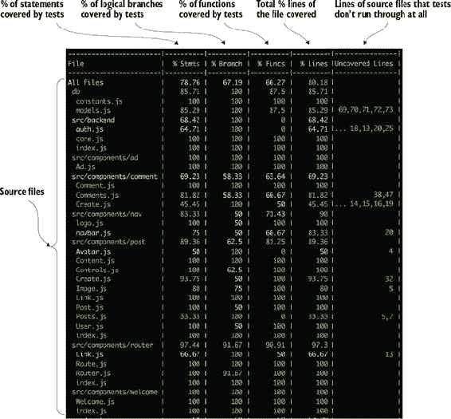

Istanbul 是生成图 9.3 中统计的工具。如果你想看到更详细的覆盖率信息，打开由包含覆盖率选项的`jest`命令生成的覆盖率目录。在这个目录中，Istanbul 应该创建了一些文件。如果你在浏览器中打开./coverage/lcov-report/index.html，你应该会看到类似图 9.4 的内容。

##### 图 9.4\. Istanbul 以计算机可读和人类可读的格式生成覆盖率元数据。这里显示的覆盖率报告对于更详细地探索代码覆盖率很有用。你甚至可以根据不同的列进行排序，并优先考虑覆盖率低的文件。请注意，有关于语句、分支（if/else 语句）、函数（调用了哪些函数）和行（代码行）的列。


Istanbul 的输出很有用，但你也可以深入到不同的文件中，获取关于单个文件更深入的信息。每个文件都应该显示不同行被覆盖的次数以及哪些行没有被覆盖。大多数情况下，顶层摘要就足够了，但有时你可能想检查单个报告，就像图 9.5 中的那样。当我编写测试时，我喜欢在覆盖所有用例后至少查看一次这些文件，以确保我没有错过任何边缘情况或逻辑分支。

##### 图 9.5\. 由 Istanbul 生成的单个文件覆盖率报告。您可以看到不同行被覆盖或未被覆盖的次数，并了解代码中哪些部分被覆盖。

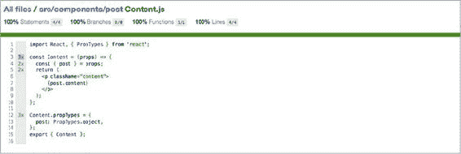

测试覆盖率是软件开发的重要且有用的工具，但不要将其视为代码工作的神奇保证。你可以达到 100%的覆盖率，但代码仍然可能出错。技术上，你也可以有 0%代码覆盖率但代码仍然可以工作。*覆盖率* 是确保你的测试正在执行代码的所有不同部分——不是保证没有错误或性能等问题——但它对此很有用，并且应该被视为考虑代码“完整性”时的重要数据点。我曾加入过一些团队，我们的成功定义包括，在特定用户故事或任务中，除了其他事项外，代码覆盖率超过 80%且总体覆盖率没有下降。将覆盖率用作指南，以确定你的代码哪些部分已经或尚未测试，并检查你的测试进度。

|  |
| --- |

**考虑覆盖率**

我们在本章中讨论了测试覆盖率。100%的测试覆盖率是否意味着你的代码是完美的？代码覆盖率在测试中应该扮演什么角色？

|  |
| --- |

### 9.4\. 摘要

在本章中，你学习了测试背后的某些原则以及如何测试 React 应用程序：

+   *测试* 是验证关于软件所做假设的过程。它帮助你更好地规划组件，防止未来出现故障，并有助于提高你对代码的信心。它在快速开发过程中也发挥着重要作用。

+   手动测试扩展性不好，因为无论多少人，都无法快速或充分地测试复杂的软件。

+   在软件测试过程中，我们使用各种工具，从运行我们的测试的工具到确定我们的代码有多少被测试覆盖的工具。

+   不同类型的测试应以不同的比例出现。*单元* 测试应该是最常见的，它们容易编写、成本低、速度快。*集成* 测试测试系统的许多不同部分的交互，可能很脆弱，编写时间较长。它们应该较少出现。

+   你可以使用各种工具测试 React 组件。因为它们只是函数，你可以严格地按这种方式测试它们。但像 Enzyme 这样的工具使测试 React 组件变得更容易。

+   清洁的测试，就像任何清洁的代码一样，易于阅读和良好组织，并使用适当的单元、服务和集成测试比例。它们应该提供有意义的保证，说明事物以特定方式运行，并应保证你的组件更改可以被评估。

在下一章中，我们将探讨 Letters Social 应用程序的更健壮的实现，并探索 Redux 架构模式。在继续之前，看看你是否能继续磨练你的测试技能，并将应用程序的测试覆盖率提高到 90%以上！
