## 第三部分\. React 应用程序架构

到第二部分结束时，你将把 Letters Social 示例应用程序从裸骨静态页面转变为具有路由、身份验证和动态数据的动态用户界面。在第三部分中，你将通过探索 React 的一些高级主题来扩展你已创建的内容。

在第十章和第十一章中，你将探索 Flux 应用程序架构并实现 Redux。Redux 是 Flux 模式的一种变体，已成为大型 React 应用程序的事实上的状态管理解决方案。你将探索 Redux 的概念，并将你的 React 应用程序过渡到使用 Redux 作为状态管理解决方案。在这个过程中，你将继续为 Letters Social 添加功能，包括评论和点赞帖子。

在第十二章中，我们将更进一步，探讨如何使用 React 在服务器上。得益于 node.js 服务器运行时的可用性，你可以在服务器上执行 React 代码。你将探索使用 React 进行服务器端渲染，甚至将你的 Redux 状态管理集成到该过程中。你还将集成 React Router，这是一个流行的 React 路由库。

最后，在第十三章中，你将稍微偏离 React Web，并探索 React Native。React Native 是另一个 React 项目，它让你能够编写可以在 iOS 和 Android 移动设备上运行的 React 应用程序。

到第三部分结束时，你将创建一个充分利用 React、Redux 和服务器端渲染的完整应用程序。你将完成对 React 的初步探索，但将能够通过 React 进一步发展你的能力，并探索其他高级主题，如 React Native。

## 第十章\. Redux 应用程序架构

*本章涵盖*

+   Redux 动作、存储、还原器和中间件

+   Redux 动作、存储、还原器和中间件的简单测试

到目前为止，你可以创建经过测试的 React 应用程序，处理动态数据，接受用户输入，并且可以与远程 API 通信。这已经很多了，涵盖了典型 Web 应用将执行的大部分内容；你可能觉得剩下的唯一事情就是练习。将你的技能付诸实践将帮助你掌握 React，但仍然有一个重要的领域你需要覆盖，那就是构建更大、更复杂的应用程序：应用程序架构。“应用程序架构”是“定义一个结构化解决方案的过程，该解决方案满足所有技术和管理要求，同时优化常见的质量属性，如性能、安全性和可管理性”（来自《微软应用程序架构指南》，第二版）。架构询问：“好吧，我们可以这样做，但现在我们如何更好地、更一致地做呢？”这关乎应用程序是如何组织的，数据是如何流动的，以及责任是如何委派给系统不同部分的。

每个应用程序都有某种隐含的架构，仅仅因为它有一个结构，并以特定的方式做事。我这里所说的是构建复杂应用程序的策略和范式。React 更倾向于成为一个更简约或无偏见的框架，专注于 UI，因此它没有内置的策略供你在构建更复杂的应用程序时遵循。

虽然没有内置的策略供你使用，但这并不意味着没有其他选择。有许多方法可以用 React 构建复杂的应用程序，其中许多方法基于 Facebook 工程师推广的 Flux 模型。Flux 与流行的 MVC 架构不同，它通过促进单向数据流、引入新概念（调度器、动作、存储）等方式进行区分。Flux 和 MVC 关注的是应用程序的外观“之上”的事情，甚至是一些特定的库或技术。它们更关注应用程序是如何组织的，数据是如何流动的，以及责任是如何委派给系统不同部分的。

本章探讨了 Flux 模式中最广泛使用和最受好评的变体之一：Redux。Redux 与 React 应用程序一起使用非常普遍，但实际上它可以与大多数 JavaScript 框架（内部或外部）一起使用。本章和下一章涵盖了 Redux 的核心概念（动作、中间件、还原器、存储和其他），然后是 Redux 与你的 React 应用程序的集成。Redux 中的*动作*代表正在执行的工作（获取用户数据、登录用户等），*还原器*决定状态应该如何改变，*存储*持有状态的中心化副本，而*中间件*允许你在过程中注入自定义行为。

|  |
| --- |

**我如何获取本章的代码？**

与每一章一样，你可以通过访问 GitHub 仓库[`github.com/react-in-action/letters-social`](https://github.com/react-in-action/letters-social)来查看本章的源代码。如果你想从这个章节开始，从零开始，并跟随操作，你可以使用第九章（如果你跟随并自己构建了示例）中的现有代码，或者查看特定章节的分支（chapter-10-11）。

记住，每个分支都对应于章节末尾的代码（例如，分支 chapter-10-11 对应于这些章节末尾的代码）。你可以在你选择的目录中执行以下终端命令之一来获取当前章节的代码。

如果你根本就没有仓库，请输入以下内容：

```
 git clone git@github.com:react-in-action/letters-social.git
```

如果你已经克隆了仓库：

```
 git checkout chapter-10-11
```

你可能是从另一章来到这里的，所以确保你已经安装了所有正确的依赖项总是一个好主意：

```
 npm install
```

|  |
| --- |

### 10.1. Flux 应用程序架构

现代应用程序必须比以往任何时候都要做更多的事情，因此它们在内部和外部都变得更加复杂。开发者们早已意识到，如果没有合适的设计模式，一个复杂的应用程序可能会变得一团糟。意大利面式的代码库不仅不便于工作，还会减慢开发者的工作效率，从而影响业务部门。你还记得上次不得不在一个充满一次性解决方案和 jQuery 插件的庞大代码库中工作的经历吗？可能不是那么愉快。为了对抗混乱，开发者们开发了像 MVC（模型-视图-控制器）这样的范式来组织应用程序的功能并指导开发。Flux（以及由此扩展的 Redux）是同一方向上的努力，它帮助你处理应用程序中增加的复杂性。

如果你对 MVC 范式不是特别熟悉，不必担心；我们不会花太多时间深入探讨它。但在我们讨论 Flux 和 Redux 之前，为了进行比较，简要地讨论一下 MVC 可能会有所帮助。如果你有兴趣了解更多，Jeff Atwood 在[`blog.codinghorror.com/understanding-model-view-controller/`](https://blog.codinghorror.com/understanding-model-view-controller/)有一些有用的想法，网上还有很多其他资源。以下是基础知识：

+   ***模型*—** 您应用程序的数据。通常是一个名词，如 User、Account 或 Post 等。您的模型至少应该有操作相关数据的基本方法。在最抽象的意义上，模型代表原始数据或知识。它是数据与您的应用程序代码相交的地方。例如，数据库可能存储多个属性，如 `access-Scopes`、`authenticated` 等。但模型将能够使用这些数据来执行 `isAllowedAccessForResource()` 等方法，这些方法将作用于底层数据以建模。模型是原始数据与您的应用程序代码相交的地方。

+   ***视图*—** 您模型的表示。视图通常是用户界面本身。视图不应包含任何与数据展示无关的逻辑。对于前端框架来说，这通常意味着特定的视图直接关联到一个资源，并且会与它关联 CRUD（创建、读取、更新、删除）操作。但现在的前端应用不再总是这样构建。

+   ***控制器*—** 控制器是绑定模型和视图的“胶水”。控制器通常只应该是胶水，而不应该是更多（例如，它们不应该包含复杂的视图或数据库逻辑）。您通常期望控制器比它们交互的模型具有更少的数据修改能力。

本章（Flux 和 Redux）我们将关注的范例与这些概念有所不同，但仍然旨在帮助您创建一个可扩展、合理且有效的应用程序架构。

Redux 的起源和设计归功于在 Facebook 流行的一种模式，称为 *Flux*。如果您熟悉 Ruby on Rails 和其他应用程序框架使用的流行 MVC 模式，Flux 可能与您习惯的不同。Flux 不是将应用程序的部分拆分为模型、视图和控制器，而是定义了几个不同的部分：

+   ***存储*—** 存储包含应用程序状态和逻辑；它们在传统 MVC 中类似于模型。然而，它们不是代表单个数据库记录，而是管理许多对象的状态。与模型不同，您可以根据需要表示数据，不受资源限制。

+   ***动作*—** 相比直接更新状态，Flux 应用通过创建修改状态的动作来改变其状态。

+   ***视图*—** 用户界面，通常是 React，但 Flux 不要求使用 React。

+   ***调度器*—** 行动和存储更新的中央协调者。

图 10.1 展示了 Flux 的概述。

##### 图 10.1\. 一个简单的 Flux 概述


在 Flux 模式中，如图 10.1 图 10.1 所示，动作是由视图创建的——这可能是用户点击了某个东西。从那里，分发器处理传入的动作。然后，动作被发送到适当的存储库以更新状态。状态发生变化后，会通知视图使用新的数据（如果适用）。注意，这与典型的 MVC 风格框架不同，在 MVC 风格框架中，视图和模型（如这里的存储库）都可以更新对方。这种双向数据流与 Flux 架构中典型的单向流不同。此外，请注意这里缺少了中间件：虽然在 Flux 中可以创建中间件，但它不如 Redux 中的第一类公民重要，所以我们在这里省略了它。

如果这些部分听起来很熟悉，那么如果你之前使用过 MVC 风格的应用程序，Flux 中数据流动的方式可能就不一样了。如前所述，在 Flux 范式下，数据流动更具有单向性，这与 MVC 类型实现通常强制执行的双向方式不同。这通常意味着在应用程序中没有单一的地方数据是从那里流动出来的；系统的许多不同部分都有修改状态的权限，并且状态通常在应用程序中分散。这种方法在许多情况下都很好用，但在大型应用中，调试和工作可能会变得令人困惑。

想象一下这在中型到大型应用中的样子。比如说，你有一组与自己的控制器和视图关联的模型（用户、账户和身份验证）。在应用程序的任何位置，确定状态的精确位置可能都很困难，因为状态分布在整个应用程序的各个部分（关于用户的信息可能存在于我提到的三个模型中的任何一个）。

这可能对小型应用来说不一定是个问题，甚至可以使其在大型应用中也能良好运行，但在非平凡的客户端应用中可能会变得更加困难。例如，当你需要修改模型在 50 个不同位置和 60 个不同控制器中的应用时，这些部分需要知道状态的变化会发生什么？使问题更加复杂的是，在某些前端框架中，视图有时会像模型一样行动（因此状态更加分散）。你的数据真相来源在哪里？如果它分布在视图和许多不同的模型中，并且在一个相当复杂的设置中，心理上跟踪所有这些内容将会很困难。这也可能导致应用程序状态不一致，从而引发应用程序错误，所以这不仅仅是一个“仅开发者”的问题——最终用户也会直接受到影响。

这之所以困难的部分原因是因为人们通常不擅长推理随时间发生的变化。为了说明这一点，想象一下你心中的跳棋盘。在脑海中保持可能一个或甚至几个棋盘快照并不难。但你能否在 20 次移动后跟踪棋盘的每个快照？30 次？整个游戏？我们应该构建更容易思考和使用的系统，因为随着时间的推移，跟踪数据异步变化是困难的。例如，考虑调用远程 API 并使用数据更新你的应用程序状态。对于少数情况来说很简单，但如果你必须调用 50 个不同的端点，并在用户仍在使用应用程序并做出可能导致更多 API 交互的更改时跟踪传入的响应，这可能会很困难。在心理上很难将它们全部排列成一行并预测变化的结果。

你可能已经注意到了 React 和 Flux 之间的某些相似之处。它们都是相对较新的构建用户界面的方法，它们都旨在改善开发者工作的心理模型。在每个中，变化应该是容易推理的，你应该能够以赋予你力量而不是阻碍你的方式构建你的 UI。

在代码中，Flux 看起来是什么样子？它主要是一种范式，因此有大量的库可供选择，它们实现了 Flux 的核心思想。它们在实现 Flux 的方式上彼此略有不同。Redux 也是如此，尽管它特有的 Flux 风格获得了最广泛的使用和认知。其他 Flux 库包括 Flummox、Fluxxor、Reflux、Fluxible、Lux、McFly 和 MartyJS（但在实践中，与 Redux 相比，你很少会看到这些库的使用）。

#### 10.1.1. 认识 Redux：Flux 的一种变体

可能最广泛使用且知名度最高的实现 Flux 背后思想的库是 Redux。Redux 是一个以略微修改的方式实现 Flux 思想的库。Redux 的官方文档将其描述为“JavaScript 应用的预测状态容器。”具体来说，这意味着它是一个将 Flux 的概念和思想以自己的方式付诸实践的库。

在这里，精确定义什么是 Flux 以及什么不是 Flux 并不重要，但我应该介绍一些 Flux 和 Redux 范式之间的重要区别：

+   ***Redux 使用单个 store*—** 与在应用中的多个 store 中定位状态信息不同，Redux 应用将所有内容都保存在一个地方。在 Flux 中，你可以有多个不同的 store。Redux 打破了这种做法，并强制执行一个单一的全球 store。

+   ***Redux 引入了 reducers*—** Reducers 是一种更不可变的方法来处理变更。在 Redux 中，状态以可预测和确定的方式改变，一次只改变状态的一部分，并且只在一个地方（全局 store）。

+   ***Redux 引入了中间件*——** 因为动作和数据以单向方式流动，您可以在 Redux 应用程序中添加中间件，并在数据更新时注入自定义行为。

+   ***Redux 动作与存储解耦*——** 动作创建者不会向存储发送任何内容；相反，它们返回中央分发器使用的动作对象。

这些可能对您来说很微妙，但这没关系——您的目标是学习 Redux，而不是做“找出不同”的练习。图 10.2 展示了 Redux 架构的概览。您将深入研究每个不同的部分，探索它们是如何工作的，并为您的应用程序开发一个 Redux 架构。

##### 图 10.2\. Redux 概览

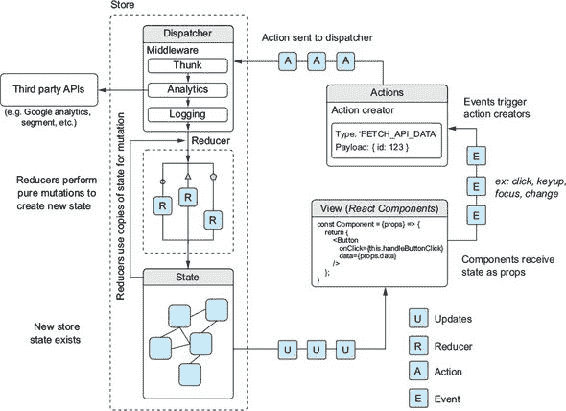

如您在图 10.2 中看到的，动作、存储和减少器构成了 Redux 架构的主体。Redux 使用一个单一的集中式状态对象，该对象以特定的、确定的方式更新。当您想要更新状态（通常是由于点击等事件）时，会创建一个动作。该动作将有一个特定减少器将处理的类型。处理给定动作类型的减少器将复制当前状态，使用动作中的数据对其进行修改，然后返回新状态。当存储更新时，视图层（在我们的案例中是 React）可以监听更新并相应地做出反应。此外，请注意，在图中，视图只是从存储中读取更新——它们不关心传达给它们的数据。《React-redux》库在存储更改时处理将新属性传递给组件，但视图仍然只是接收和显示数据。

#### 10.1.2\. 为 Redux 准备设置

Redux 是您应用程序架构的范式，但它也是一个您可以安装的库。这是 Redux 在“原始”Flux 实现上发光的一个领域。有如此多的 Flux 范式实现——Flummox、Fluxxor、Reflux、Fluxible、Lux、McFly 和 MartyJS 等——它们都有不同程度的社区支持以及不同的 API。Redux 拥有强大的社区支持，但 Redux 库本身有一个小而强大的 API，这有助于它成为 React 应用程序架构中最受欢迎和依赖的库之一。事实上，Redux 与 React 一起使用如此普遍，以至于每个库的核心团队通常相互交流，确保兼容性和功能意识。甚至有些人同时在两个团队中，因此项目之间通常有很好的可见性和沟通。

要设置使用 Redux，你需要做几件事情：

+   确保您已经使用当前章节的源代码运行了 `npm install`，以便所有正确的依赖项都已在本地上安装。在本章中，您将开始利用一些新的库，包括 `js-cookie`、`redux-mock-store` 和 `redux`。

+   安装 Redux 开发者工具。您可以使用它们在浏览器中检查 Redux 存储和动作。

Redux 是按设计可预测的，这使得创建一些惊人的调试工具变得容易。像 Dan Abramov 这样的工程师以及其他在 Redux 和 React 库上工作的工程师已经帮助创建了一些用于处理 Redux 应用的强大工具。由于 Redux 中的状态以可预测的方式变化，因此以新的方式进行调试成为可能：您可以跟踪应用程序状态的个别更改，检查更改之间的差异，甚至可以在时间上回放和重播应用程序状态。Redux Dev Tools 扩展程序让您能够做到这一切，并且作为浏览器扩展程序捆绑提供。要为您的浏览器安装它，请遵循[`github.com/zalmoxisus/redux-devtools-extension`](https://github.com/zalmoxisus/redux-devtools-extension)上的说明。图 10.3 展示了 Redux Dev Tools 可用的预览。

##### 图 10.3\. Redux Dev Tools 扩展程序将 Dan Abramov 的流行 Redux Dev Tools 库打包成一个方便的浏览器扩展。有了它，您可以回放和重播您的 Redux 应用，逐个检查更改，检查状态更改之间的差异，在一个区域中查看您的整个应用程序状态，生成测试模板，等等。


安装扩展后，您应该在浏览器工具栏中看到新的 Dev Tools 图标。截至写作时，它仅在检测到开发模式下的 Redux 应用实例时才会着色显示，因此如果您访问没有设置 Redux 的应用或其他网站，扩展程序将无法工作。但一旦您配置了应用，您将看到带有颜色的图标出现，点击它将打开工具。

### 10.2\. 在 Redux 中创建动作

在 Redux 中，动作是信息负载，用于将数据从您的应用程序发送到您的存储。除了动作之外，存储没有其他方式获取数据。动作在整个 Redux 应用程序中用于启动数据变化，尽管它们本身并不负责更新应用程序的状态（存储）。与架构的这一部分更相关的是 Reducers，我们将在动作之后查看它们。如果您习惯于按自己的喜好更新应用程序的状态，您可能一开始不会喜欢动作。它们可能需要一些时间来适应，但它们会导致应用程序通常更可预测且更容易调试。如果您的应用程序中数据变化的方式受到严格控制，您可以轻松预测应用程序中应该和不应该发生变化的内容。图 10.4 显示了动作在更广泛画面中的位置。我们从动作开始，将逐步通过 Redux 流，通过存储、Reducers，最终回到 React 以完成数据流。

##### 图 10.4. 操作是 Redux 应用程序知道如何更改的方式；它们有一个类型和任何其他应用程序需要的附加信息。

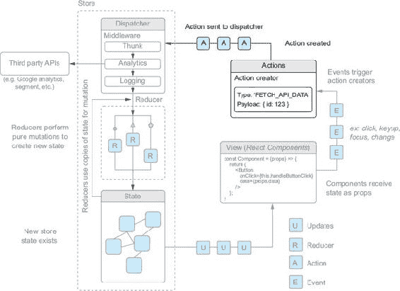

Redux 操作看起来是什么样子？它是一个普通的 JavaScript 对象（POJO），包含一个必需的 *type* 键和任何其他你想要的内容。类型键将由 reducer 和其他 Redux 工具用来关联一系列更改。每个独特的操作类型都应该有一个独特的类型键。类型通常定义为字符串常量，你可以自由地使用你喜欢的任何独特名称，尽管制定一个遵循的命名模式是个好主意。列表 10.1 展示了你可能想出的几个操作类型名称的例子。

通常情况下，你应该确保你的操作只包含它们绝对需要的那些信息。这样，你就可以避免传递额外的数据，并且需要思考的信息也会更少。下面的列表展示了两个简单的操作，一个包含额外的数据，另一个则没有。请注意，你可以根据需要为操作上的额外键命名，但如果你不一致，这可能会造成混淆，尤其是在团队中尤其如此。

##### 列表 10.1. 一些简单的 Redux 操作

```
{
    type: 'UPDATE_USER_PROFILE',                *1*
    payload: {
        email: 'hello@ifelse.io'                *1*
    }
}

{
    type: 'LOADING'                             *2*
}

{
    type: appName/dashboard/insights/load'      *3*
}
```

+   ***1*** 一个操作可以包含信息，告诉你的应用程序如何更改，比如新的用户电子邮件地址、错误诊断或其他信息。

+   ***2*** 每个操作都必须有一个类型——没有类型，你的应用程序不知道需要对存储进行何种更改。

+   ***3*** 类型通常是大写字符串常量，这样你就可以在应用程序中将它们与常规值区分开来，但在这里我使用了一个命名空间方案来确保操作是唯一的但可读的。

#### 10.2.1. 定义操作类型

虽然你可以在本章的后面添加更多内容，但你可以通过列出一些操作类型来开始将你的 Letters Social 应用程序过渡到 Redux 架构。这些类型通常映射到用户操作，如登录、登出、更改表单值等，但它们不一定是用户操作。你可能想要为打开、解决或错误的网络请求或其他不直接涉及用户的事情创建操作类型。

值得注意的是，在一个较小的应用程序中，你可能不一定需要在常量文件中定义你的操作类型；你可以在创建操作时记住传递它们，或者自己硬编码它们。缺点是，随着你的应用程序的增长，跟踪操作类型将是一个痛点，可能会导致困难的调试或重构情况。在大多数实际情况下，你会定义你的操作，所以这里你也会这样做。

您将草拟一些您预期会使用的动作类型，但您可以随时根据需要添加或删除它们。您将使用名称空间方法来处理动作类型，但请记住，在创建自己的动作时，只要它们是唯一的，您可以遵循您认为最好的任何模式。您还可以将类似动作类型“捆绑”到对象中，但它们也可以轻松地分散并作为单个常量导出。捆绑的优势在于，您可以将它们分组在一起，并使用更短的名字（如 `GET`、`CREATE` 等），而无需将它们构建到变量名本身中（如 `UPDATE_USER_PROFILE`、`CREATE_NEW_POST` 等）。列表 10.2 展示了如何创建您的初始动作类型。您将把它们放在 src/constants/types.js 中。您现在正在创建本章所需的全部动作，这样您可以引用它们，而无需不断回到文件中。

##### 列表 10.2\. 定义动作类型（src/contstants/types.js）

```
export const app = {
    ERROR: 'letters-social/app/error',
    LOADED: 'letters-social/app/loaded',
    LOADING: 'letters-social/app/loading'
};

export const auth = {
    LOGIN_SUCCESS: 'letters-social/auth/login/success',
    LOGOUT_SUCCESS: 'letters-social/auth/logout/success'
};

export const posts = {
    CREATE: 'letters-social/post/create',
    GET: 'letters-social/post/get',
    LIKE: 'letters-social/post/like',
    NEXT: 'letters-social/post/paginate/next',
    UNLIKE: 'letters-social/post/unlike',
    UPDATE_LINKS: 'letters-social/post/paginate/update'
};

export const comments = {
    CREATE: 'letters-social/comments/create',
    GET: 'letters-social/comments/get',
    SHOW: 'letters-social/comments/show',
    TOGGLE: 'letters-social/comments/toggle'
};
```

当使用 Redux 开发者工具时，这些动作类型将显示在您应用程序状态变化的时序图中，因此像 列表 10.2 中的那样以 URL 样式分组名称可以使它们在您有许多动作和动作类型时更容易阅读。您也可以使用 `:` 字符来分隔它们（`namespace:action_name:status`）或使用您认为最有意义的任何约定。

#### 10.2.2\. 在 Redux 中创建动作

现在您已经定义了一些类型，您就可以开始使用动作做一些事情了。您将重用应用程序现有部分的逻辑，因此大部分代码可能对您来说都很熟悉。这实际上是一个值得简要反思的好点：Redux 应用程序的大部分内容不应该是对任何现有应用程序逻辑的完全重做。希望您能够对其进行清理，但将应用程序状态的不同方面映射到 Redux 强制执行的模式上可能只是转换到使用 Redux 的主要工作。无论如何，我们需要开始处理动作。

动作是您在 Redux 应用程序中启动状态变化的方式；您不能像在其他框架中那样直接修改属性。动作是通过 *动作创建器*（函数返回动作对象）创建的，并通过 `dispatch` 函数由存储库分发。

我们不想在这里走得太远。我首先会介绍动作创建器本身。您将从简单开始，创建一些动作，以指示您的应用程序何时开始和完成加载。在这个时候，您不需要传递任何额外的信息，但我会在下一节介绍参数化动作创建器。下一个列表显示了如何创建加载和加载动作的两个动作创建器。为了保持组织结构，您将把任何动作创建器放在动作目录下。对于其他与 Redux 相关的文件也是如此；还原器和存储库将有自己的目录。

##### 列表 10.3\. `loading`和`loaded`动作创建器（src/actions/loading.js）

```
import * as types from '../constants/types';    *1*

export function loading() {
  return {
    type: types.app.LOADING                     *2*
  };
}

export function loaded() {                      *3*
  return {
    type: types.app.LOADED
  };
}
```

+   ***1* 从常量文件导入你的类型。**

+   ***2* 使用你之前定义的加载类型返回一个包含所需 type 键的动作对象**

+   ***3* 导出一个加载动作的动作创建器。**

#### 10.2.3\. 创建 Redux store 和分发动作

动作创建器本身不会做任何事情来改变你的应用状态（它们只是返回对象）。你需要使用 Redux 提供的分发器，以便动作创建器产生任何效果。`dispatch`函数由 Redux store 本身提供，并将是你将动作发送到 Redux 以进行处理的方式。你将设置 Redux store，以便你可以使用其`dispatch`函数与你的动作一起使用。

在你设置 store 之前，你需要创建一个根 reducer 文件，这将允许你创建一个有效的 store；reducer 在稍后查看 reducer 并构建它们之前不会做任何事情。你将在 src 中创建一个名为 reducers 的文件夹，并在其中创建一个文件，名为 root.js。在这个文件中，你将使用 Redux 提供的`combineReducers`函数来设置未来 reducer 的位置。这个函数确实做了它听起来应该做的事情：将多个 reducer 合并为一个。

没有合并 reducer 的能力，你会遇到多个 reducer 之间的冲突问题，并需要找到合并 reducer 或路由动作的方法。这是 Redux 优势可以具体观察到的领域之一。设置一切需要更多的工作，但一旦完成工作，Redux 会使应用状态管理更容易扩展。下一个列表展示了如何创建根 reducer 文件。

##### 列表 10.4\. 创建根 store（src/reducers/root.js）

```
import { combineReducers } from 'redux';      *1*
const rootReducer = combineReducers({});      *2*
export default rootReducer;                   *3*
```

+   ***1* 从 Redux 导入 combineReducers 工具。**

+   ***2* 使用 combineReducers 创建根 reducer，目前使用空对象**

+   ***3* 导出根 reducer。**

现在你已经为 Redux 设置了一个 reducer，接下来你需要配置和设置 store。创建一个名为 store 的文件夹，并在其中创建几个文件：store.js、stores/store.prod.js 和 stores/store.dev.js。这些文件负责导出一个函数，为你创建 store，并在开发模式下集成开发者工具。列表 10.5 展示了在同一列表中创建与 store 相关的文件。在这里，你使用不同的文件为每个环境，因为你可能希望在开发环境和生产环境中包含不同的中间件和其他库。这只是一个约定——Redux 没有要求你必须将函数放在多个文件或一个文件中。

##### 列表 10.5\. 创建 Redux store

```
// src/store/configureStore.js
import { __PRODUCTION__ } from 'environs';                 *1*
import prodStore from './configureStore.prod';
import devStore from './configureStore.dev';
export default __PRODUCTION__ ? prodStore : devStore;      *1*

// src/store/configureStore.prod.js
import { createStore } from 'redux';
import rootReducer from '../reducers/root';

let store;
export default function configureStore(initialState) {     *2*
  if (store) {
    return store;
  }
  store = createStore(rootReducer, initialState);          *3*
  return store;
}

// src/store/configureStore.dev.js
import thunk from 'redux-thunk';
import { createStore, compose} from 'redux';               *4*
import rootReducer from '../reducers/root';

let store;
export default initialState => {
    if (store) {                                           *5*
        return store;
    }
    const createdStore = createStore(
        rootReducer,
        initialState,
        compose(window.devToolsExtension())                *6*
    );
    store = createdStore;
    return store;
};
```

+   ***1* 此文件使得在使用你的应用中的 store 时，无需确定是使用开发环境还是生产环境的 store 变得更容易。**

+   ***2* 将初始状态传递给你的 Redux 配置**

+   ***3* 使用 Redux createStore 方法创建您的存储**

+   ***4* 从 Redux 中导入 compose 工具，这将允许您组合中间件**

+   ***5* 确保您始终访问相同的存储——这确保了如果另一个文件访问已创建的存储，则返回相同的存储。**

+   ***6* 如果已安装开发工具扩展，这将连接到它**

现在您已经配置好并准备好使用存储，您可以尝试分发一些动作并查看它们的工作方式。不久，您将把 Redux 连接到 React，但请记住，您不必在 React 或任何库或框架中使用 Redux。还有其他开源项目使用 Redux 与 Angular、Vue 等框架集成。

Redux 存储公开了一些重要的函数，您将在整个使用 Redux 的过程中使用它们：`getState` 和 `dispatch`。`getState` 将用于在特定时间点获取 Redux 存储状态的快照，而 `dispatch` 是您向 Redux 存储发送动作的方式。调用 dispatch 方法时，您传入一个动作，该动作是调用动作创建器的结果。使用 `store.dispatch()` 方法是触发 Redux 中状态变化的唯一方式，因此您将到处使用它。接下来，您将尝试使用存储来分发一些动作，使用您之前设置的 `loading` 动作创建器。以下列表显示了如何使用临时文件（src/store/exampleUse.js）分发一些动作。此文件仅用于演示目的，不会用于使主应用工作。

##### 列表 10.6\. 分发动作（src/store/exampleUse.js）

```
import configureStore from './configureStore';               *1*
import { loading, loaded } from '../actions/loading';
const store = configureStore();

console.log('========== Example store ===========');
store.dispatch(loading());                                   *2*
store.dispatch(loaded());                                    *3*
store.dispatch(loading());
store.dispatch(loaded());
console.log('========== end example store ===========');
```

+   ***1* 导入 configureStore 方法并使用它来创建存储**

+   ***2* 调用存储的 dispatch 方法并传入调用的动作创建器；将为 dispatch 方法返回一个对象**

+   ***3* 分发另一个动作。**

要分发这些动作，您只需将 exampleUse 文件导入到主应用文件中，它将在您打开应用时运行。列表 10.7 显示您需要对 src/index.js 进行的一些微小修改。一旦将 Redux 连接到 React，您将通过 React 组件与 Redux 交互，而无需像在这里进行演示那样手动分发动作。

##### 列表 10.7\. 导入 exampleUse 文件（src/index.js）

```
import React from 'react';
import { render } from 'react-dom';

import { App } from './containers/App';
import { Home, SinglePost, Login, NotFound, Profile } from './containers';
import { Router, Route } from './components/router';
import { history } from './history';
import { firebase } from './backend';
import configureStore from './store/configureStore';
import initialReduxState from './constants/initialState';

import './store/exampleUse';                               *1*
//...
```

+   ***1* 导入存储文件，以便在打开应用时运行。**

如果你以开发模式加载应用（使用 `npm run dev`），你应该会看到 Redux 开发者工具图标已启用。现在，当应用运行时，你导入的文件将运行并多次调用存储分发器，将动作发送到存储。目前，还没有为动作设置处理程序（通过减少器），而且你没有将任何东西连接到 React，所以不会有任何有意义的更改。但如果你打开开发者工具并查看动作历史，你应该会看到你分发的每个加载动作都分发了并记录了动作。图 10.5 显示了在您的图表上下文中分发的动作以及你应在 Redux 开发者工具中看到的输出。

##### 图 10.5\. 当你运行你的应用时，你创建的示例存储将接收你的动作创建者的结果并将它们分发给存储。目前，你没有设置任何减少器来执行任何操作，所以几乎不会发生什么。一旦你设置了减少器，Redux 将根据分发的动作类型确定需要做出的状态更改。

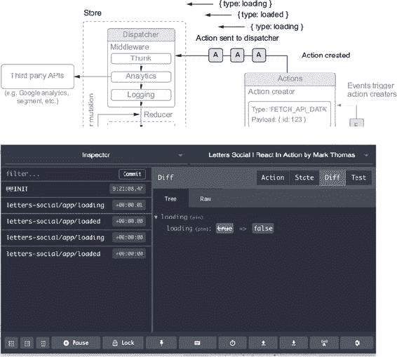

#### 10.2.4\. 异步操作和中间件

你可以分发动作，但现在是同步的。有许多情况下，你将想要根据异步动作更改你的应用。这些可能是一个网络请求，从浏览器中读取值（通过本地存储、cookie 存储等等），使用 WebSocket，或任何其他异步动作。Redux 默认不支持异步动作，因为它期望动作只是对象（不是 Promise 或其他）。但你可以通过集成你已安装的库来启用它：`redux-thunk`。

`redux-thunk` 是一个 Redux *中间件* 库，这意味着它作为 Redux 的某种“途中”或传递机制。你可能已经使用过其他利用这个概念的 API，比如 Express 或 Koa（Node.js 的服务器端框架）。中间件通过以可组合的方式让你钩入某种周期或过程，这意味着你可以在单个项目中独立创建和使用多个中间件功能。

根据 Redux 文档的描述，Redux 中间件是“在分发动作和动作到达 reducer 之间的第三方扩展点。”这意味着在动作被 reducer 处理之前，您有一个或多个机会对动作进行操作或因为动作而采取行动。您将使用 Redux 中间件来创建一个错误处理解决方案，但现在您可以使用`redux-thunk`中间件来在应用程序中启用异步动作创建。列表 10.8 展示了如何将`redux-thunk`中间件集成到您的应用程序中。请注意，您应该将中间件添加到您的生产环境和开发存储（configureStore.prod.js 和 configureStore.dev.js）中。记住，您可以选择最适合您情况的任何生产/开发存储设置——我只是将它们分成两部分，以便清楚地说明每个环境使用哪个。

##### 列表 10.8\. 通过 redux-thunk 启用异步动作创建

```
import thunk from 'redux-thunk';
import { createStore, compose, applyMiddleware } from 'redux';            *1*
import rootReducer from '../reducers/root';

let store;
export default (initialState) => {
  if (store) {
    return store;
  }
  const createdStore = createStore(rootReducer, initialState, compose(    *2*
    applyMiddleware(                                                      *2*
      thunk,                                                              *2*
    ),                                                                    *2*
    window.devToolsExtension()
    )
  );
  store = createdStore;
  return store;
};
```

+   ***1* 要将中间件集成到您的 Redux 存储中，请引入 applyMiddleware 实用工具**

+   ***2* 在 applyMiddleware 函数中插入并排序 Redux 中的中间件——在这里，您正在将 redux-thunk 中间件插入到您的存储中。**

现在您已经安装了`redux-thunk`中间件，可以创建异步动作创建器了。我为什么说*异步动作创建器*而不是*异步动作*？因为即使您在进行异步操作，如进行网络请求时，您创建的动作本身并不是异步任务。相反，`redux-thunk`教会您的 Redux 存储在动作通过时评估一个 Promise。这个 Promise 的流程就是您为存储分发动作的方式。Redux 实际上并没有发生真正的变化。动作仍然是同步的，但现在 Redux 知道当您将 Promise 传递到 dispatch 函数时，要等待 Promise 解决。

在前面的章节中，您使用`isomorphic-fetch`库创建了一些逻辑来从您的 API 获取帖子，并使用 React 来显示它们。这类执行异步工作的操作通常需要分发多个动作（通常是加载、成功和失败动作）。例如，假设您想让用户上传文件到服务器，该服务器在上传过程中发送进度数据。将动作映射到这个过程的不同部分的一种方法可以是创建一个动作来指示上传已开始，一个动作来告诉应用程序的其他部分正在加载，一个动作用于从服务器接收进度更新，一个动作用于上传完成，以及一个动作来处理错误。

`redux-thunk` 通过包装存储的 dispatch 方法来工作，使其能够处理除了普通对象（如 Promises、处理异步流的 API）之外的其他内容。中间件将异步地（例如在请求的开始和结束时）分发创建的动作，当 Promise 执行时让你适当地处理这些变化。正如已经提到的，这里的关键区别是动作本身仍然是同步的，但它们在分发到 reducers 时是异步的。图 10.6 展示了这是如何工作的。

##### 图 10.6\. 异步动作创建器由像 `redux-thunk` 这样的中间件库启用，它允许你分发除了动作之外的内容，如 Promise（这是 JavaScript 规范中异步工作的一部分）。它将解析 Promise，并允许你在 Promise 生命周期的不同点分发动作（在执行之前，在完成时，在出错时等等）。

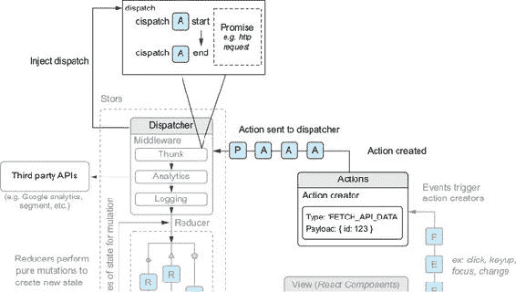

接下来，你将使用你关于异步动作创建器的知识来编写一些将处理获取和创建帖子的动作创建器。因为 `redux-thunk` 包装了存储的 dispatch 方法，所以你可以从你的动作创建器中返回一个函数，该函数接收 dispatch 方法作为一个函数，这允许你在 Promise 执行过程中分发多个动作。列表 10.9 展示了这种类型的动作创建器看起来是什么样子。你将创建几个异步动作创建器和一个同步动作创建器。你将从创建一些你需要处理用户与帖子评论交互的动作开始。首先是错误动作，你将使用它来显示用户错误信息，如果发生错误。在一个较大的应用程序中，你可能需要创建多种处理错误的方法，但对我们来说，这应该足够了。你可以在这里使用这个错误动作，也可以在任何组件错误边界中使用它。`componentDidCatch` 将提供你可以分发到存储的错误信息。

##### 列表 10.9\. 创建错误动作（src/actions/error.js）

```
import * as types from '../constants/types';
export function createError(error, info) {       *1*
    return {
        type: types.app.ERROR,                   *2*
        error,                                   *3*
        info                                     *3*
    };
}
```

+   ***1* 这个动作创建器是参数化的——你想要将错误信息发送到你的存储。**

+   ***2* 这个操作具有通用的应用程序错误类型——在较大的应用程序中，你会有许多类型的错误**

+   ***3* 传递实际错误和信息**

现在你有了处理错误的方法，你可以开始编写一些异步动作创建器。你将从注释开始，然后转向帖子。帖子动作和评论动作在整体上应该看起来很相似，但在每个动作集的工作方式上会有一些细微的差别。你想要能够做一些与评论相关的事情：显示和隐藏它们，加载它们，并为给定的帖子创建一个新的评论。列表 10.10 展示了你将创建的评论动作。

当你创建这些和其他动作时，你将继续使用 `isomorphic-fetch` 库来进行网络请求，但它遵循的 Fetch API 正在浏览器中变得更加标准化，并且现在成为进行网络请求的事实标准。当可能时，你将继续使用 Web 平台 API 或遵循相同规范的库。

##### 列表 10.10\. 创建评论动作（src/actions/comments.js）

```
import * as types from '../constants/types';
import * as API from '../shared/http';                                     *1*
import { createError } from './error';                                     *1*

export function showComments(postId) {                                     *2*
    return {
        type: types.comments.SHOW,
        postId
    };
}
export function toggleComments(postId) {                                   *3*
    return {
        type: types.comments.TOGGLE,
        postId
    };
}
export function updateAvailableComments(comments) {                        *4*
    return {
        type: types.comments.GET,
        comments
    };
}
export function createComment(payload) {                                   *5*
    return dispatch => {
        return API.createComment(payload)
            .then(res => res.json())                                       *6*
            .then(comment => {
                dispatch({                                                 *7*
                    type: types.comments.CREATE,
                    comment
                });
            })
            .catch(err => dispatch(createError(err)));                     *8*
    };
}
export function getCommentsForPost(postId) {                               *9*
    return dispatch => {
        return API.fetchCommentsForPost(postId)
            .then(res => res.json())                                       *10*
            .then(comments => dispatch(updateAvailableComments(comments)))
            .catch(err => dispatch(createError(err)));                     *10*
    };
}
```

+   ***1* 导入你的 API 辅助函数。**

+   ***2* 创建参数化动作创建者，以便你可以显示特定的评论部分。**

+   ***3* 你想要能够切换评论部分。**

+   ***4* 创建获取评论的能力——你在这个文件中的异步动作创建者将使用此函数**

+   ***5* 从给定的有效负载中创建评论；返回一个函数而不是一个普通对象**

+   ***6* Fetch API 实现了基于 Promise 的方法，如 json() 和 blob()。**

+   ***7* 使用从服务器获取的评论 JSON 创建派发评论动作**

+   ***8* 如果收到错误，请使用 createError 动作将其发送到存储**

+   ***9* 获取特定帖子的评论并使用 updateAvailable-Comments 动作**

+   ***10* 处理任何错误。**

现在你已经创建了评论的动作，你可以继续创建帖子相关的动作。帖子相关的动作将与你刚刚创建的动作类似，但也会使用一些评论动作。能够在你的应用程序中混合和匹配不同的动作是 Redux 作为你的应用程序架构工作良好的另一个原因。它提供了一种结构化、可重复的方式来使用动作创建功能，然后在整个应用程序中利用这些功能。

接下来，你将继续创建动作，并为你的帖子添加一些功能。在早期章节中，你创建了获取和创建帖子的功能。现在你还将创建点赞和取消赞帖子的方式。下一个列表显示了与你的应用程序中的帖子相关的动作创建者。你现在将开始使用四个动作创建者，然后在下一个列表中探索更多。

##### 列表 10.11\. 创建异步和同步动作（src/actions/posts.js）

```
import parseLinkHeader from 'parse-link-header';          *1*

import * as types from '../constants/types';
import * as API from '../shared/http';
import { createError } from './error';
import { getCommentsForPost } from './comments';

export function updateAvailablePosts(posts) {             *2*
    return {
        type: types.posts.GET,
        posts
    };
}
export function updatePaginationLinks(links) {            *3*
    return {
        type: types.posts.UPDATE_LINKS,
        links
    };
}
export function like(postId) {                            *4*
    return (dispatch, getState) => {                      *5*
        const { user } = getState();                      *5*
        return API.likePost(postId, user.id)
            .then(res => res.json())
            .then(post => {
                dispatch({                                *6*
                    type: types.posts.LIKE,
                    post
                });
            })
            .catch(err => dispatch(createError(err)));
    };
}
export function unlike(postId) {                         *7*
    return (dispatch, getState) => {
        const { user } = getState();
        return API.unlikePost(postId, user.id)
            .then(res => res.json())
            .then(post => {
                dispatch({
                    type: types.posts.UNLIKE,
                    post
                });
            })
            .catch(err => dispatch(createError(err)));
    };
}
```

+   ***1* JSON API 使用 Link 头部来指示分页选项**

+   ***2* 就像你对评论所做的那样，这个动作创建者会将新的评论传递到存储中。**

+   ***3* 根据需要更新存储中的分页链接**

+   ***4* 使用帖子的 ID 点赞特定的帖子。**

+   ***5* 返回的函数将由 Redux 注入 dispatch 和 getState 方法**

+   ***6* 派发带有帖子的 LIKE 动作作为元数据**

+   ***7* 取消赞一个帖子涉及相同的流程，但派发不同的动作类型**

你仍然需要为帖子创建更多动作类型。你可以点赞和取消赞帖子，但你还没有将之前创建的帖子创建迁移过来。你还需要一种方式来获取多个帖子以及单个帖子。列表 10.12 显示了你需要创建的相应的动作创建者。

希望到现在你已经开始掌握异步动作创建者的技巧了。在许多应用中，这类动作创建者相当常见。但可能性并不止于此。我发现仅使用`redux-thunk`本身对于大多数需要异步动作创建的应用来说已经足够了，但人们已经创建了大量的其他库来满足这一需求。例如，可以查看 Redux Saga 在[`github.com/redux-saga/redux-saga`](https://github.com/redux-saga/redux-saga)。

##### 列表 10.12\. 创建更多帖子动作创建者（src/actions/posts.js）

```
//...

export function createNewPost(post) {
    return (dispatch, getState) => {                                    *1*
        const { user } = getState();                                    *1*
        post.userId = user.id;                                          *2*
        return API.createPost(post)
            .then(res => res.json())
            .then(newPost => {
                dispatch({                                              *3*
                    type: types.posts.CREATE,
                    post: newPost
                });
            })
            .catch(err => dispatch(createError(err)));
    };
}
   export function getPostsForPage(page = 'first') {
    return (dispatch, getState) => {
        const { pagination } = getState();                              *4*
        const endpoint = pagination[page];
        return API.fetchPosts(endpoint)
            .then(res => {
                const links = parseLinkHeader(res.headers.get('Link')); *5*
                return res.json().then(posts => {
                    dispatch(updatePaginationLinks(links));             *6*
                    dispatch(updateAvailablePosts(posts));              *7*
                });
            })
            .catch(err => dispatch(createError(err)));
    };
}
export function loadPost(postId) {
    return dispatch => {                                                *8*
        return API.fetchPost(postId)
            .then(res => res.json())
            .then(post => {
                dispatch(updateAvailablePosts([post]));                 *8*
                dispatch(getCommentsForPost(postId));                   *8*
            })
            .catch(err => dispatch(createError(err)));
    };
}
```

+   ***1* 如前所述，使用`getState`函数访问状态快照**

+   ***2* 在新帖子中嵌入用户 ID**

+   ***3* 分发创建帖子动作。**

+   ***4* 获取分页状态对象**

+   ***5* 使用链接头解析器并传入链接头**

+   ***6* 分发链接动作**

+   ***7* 分发更新帖子动作**

+   ***8* 从 API 加载帖子并获取其相关评论**

#### 10.2.5\. 是使用 Redux 还是不使用 Redux？

在这些动作创建者完成之后，你已经创建了创建帖子评论的初始功能。尽管如此，你仍然缺少一个区域：用户的身份验证。在前面的章节中，你使用 Firebase 助手检查用户的身份验证状态，并使用它更新本地组件状态。你需要对身份验证做同样的事情吗？这又引出了另一个好问题：什么属于 Redux，什么不属于？在我们继续之前，让我们看看这个有些争议的问题。

React/Redux 社区中的观点从“把你想放什么进存储”到“绝对一切都必须放入存储”不等。还有一些工程师，他们只在 Redux 环境下使用 React，可能会认为这是唯一的方法，并将 React 和 Redux 视为一体。人们常常受限于他们的经验，但我希望我们能够花时间考虑事实和权衡，然后再形成不可动摇的观点。

首先，重要的是要记住，尽管 React 和 Redux 配合得很好，但这两项技术本身并没有内在的联系。你不需要 Redux 来构建 React 应用。我希望你在本书中已经看到了这一点。Redux 只是工程师可用的另一个工具——它不是构建 React 应用的唯一方式，当然也不是否定“正常”React 概念（例如本地组件状态）的东西。有些情况下，你可能只是通过将组件的状态带入 Redux 而增加了开销。

你应该怎么做？到目前为止，Redux 已经证明是给你的应用提供一个强大架构的绝佳方式，这已经帮助你更好地组织代码和功能（我们还没有谈到 reducers 呢！）。根据你到目前为止的经验，你可能倾向于迅速同意“绝对一切都应该在 Redux 存储中”的观点。但我想对此冲动提出警告，并看看权衡的结果。

根据我的经验，我们可以提出一些问题来指导关于哪些内容应该或不应该包含在 Redux 存储中的决策。第一个问题是这样的：应用的其他许多部分是否需要了解这一部分状态或功能？如果是这样，它可能应该放在 Redux 存储中。如果状态完全局限于一个组件，你应该考虑将其排除在 Redux 存储之外。一个例子是像下拉菜单这样的东西，除了用户之外不需要被控制。如果你的应用需要控制下拉菜单是打开还是关闭，并对其打开或关闭做出响应，那么这些状态变化可能应该通过存储进行。但如果不是这样，将状态保留在组件本地是完全可以的。

另一个问题是你正在处理的状态是否可以通过 Redux 简化或更好地表达。如果你正在将组件的状态和动作转换为 Redux，仅仅是为了这样做，你可能会为自己引入额外的复杂性，而从中得到的很少。但如果你的状态复杂或足够特殊，Redux 会使其更容易处理，你可能会希望将其包含在存储中。

考虑到这些因素，让我们重新审视是否应该将用户和身份验证逻辑集成到 Redux 中的问题。应用的其他部分是否需要了解用户？当然需要。你能否在 Redux 中更好地表达用户逻辑？如果不将其集中存储在存储中，你可能需要在应用的不同页面中复制逻辑，这可能不是最佳选择。目前来看，将用户和身份验证逻辑集成到 Redux 中似乎是合理的。

让我们看看如何创建一些操作！列表 10.13 展示了你将创建的用户相关操作。在这些例子中，你将使用 JavaScript 语言的现代特性 `async/await`。如果你对这部分语言的工作方式不熟悉，阅读 Mozilla 开发者网络文档（[`developer.mozilla.org/en-US/docs/Web/JavaScript/Reference/Statements/async_function`](https://developer.mozilla.org/en-US/docs/Web/JavaScript/Reference/Statements/async_function)）和 Dr. Axel Rauschmayer 所著的《探索 ES2016 和 ES2017》一书中关于 `async/await` 的章节（Leanpub，2017；[`exploringjs.com/es2016-es2017/ch_async-functions.html`](http://exploringjs.com/es2016-es2017/ch_async-functions.html)）可能会有所帮助。

##### 列表 10.13\. 创建用户相关操作（src/actions/auth.js）

```
import * as types from '../constants/types';
import { history } from '../history';                                          *1*
import { createError } from './error';                                         *1*
import { loading, loaded } from './loading';                                   *1*
import { getFirebaseUser, loginWithGithub, logUserOut, getFirebaseToken }      *1*
     from '../backend/auth';                                                   *1*

   export function loginSuccess(user, token) {                                 *2*
    return {
        type: types.auth.LOGIN_SUCCESS,
        user,
        token
    };
}
export function logoutSuccess() {                                              *2*
    return {
        type: types.auth.LOGOUT_SUCCESS
    };
}
export function logout() {                                                     *3*
    return dispatch => {
        return logUserOut()                                                    *3*
            .then(() => {
                history.push('/login');                                        *4*
                dispatch(logoutSuccess());                                     *4*
                window.Raven.setUserContext();                                 *4*
            })
            .catch(err => dispatch(createError(err)));
    };
}
export function login() {
    return dispatch => {
        return loginWithGithub().then(async () => {                            *5*
            try {                                                              *6*
                dispatch(loading());
                const user = await getFirebaseUser();                          *7*
                const token = await getFirebaseToken();                        *7*
                const res = await API.loadUser(user.uid);                      *8*
                if (res.status === 404) {                                      *8*
                    const userPayload = {                                      *8*
                        name: user.displayName,
                        profilePicture: user.photoURL,
                        id: user.uid
                    };
                    const newUser = await API.createUser(userPayload).then(res *9*
                          => res.json());                                      *9*
                    dispatch(loginSuccess(newUser, token));                    *10*
                    dispatch(loaded());                                        *10*
                    history.push('/');                                         *10*
                    return newUser;                                            *10*
                }
                const existingUser = await res.json();                         *11*
                dispatch(loginSuccess(existingUser, token));                   *11*
                dispatch(loaded());                                            *11*
                history.push('/');                                             *11*
                return existingUser;
            } catch (err) {
                createError(err);                                              *12*
            }
        });
    };
}
```

+   ***1* 导入你将需要的用于身份验证相关动作的模块。**

+   ***2* 创建登录和注销动作创建者——登录动作将被参数化以接受用户和令牌**

+   ***3* 使用 Firebase 注销用户**

+   ***4* 将用户推送到登录页面，分发注销动作，并清除用户上下文（用于错误跟踪库）**

+   ***5* 使用 Firebase 登录用户**

+   ***6* Async/await 使用 try...catch 错误处理语义**

+   ***7* 使用 await 从 Firebase 获取用户和令牌**

+   ***8* 尝试使用 API 查找从 Firebase 获取的用户——如果他们不存在（404），必须使用 Firebase 的信息注册他们**

+   ***9* 创建新用户**

+   ***10* 使用新用户分发登录动作并从函数中返回**

+   ***11* 如果用户已存在，则分发适当的登录操作并返回**

+   ***12* 在登录过程中捕获错误并将其分发到存储**

在所有这些之后，你已经为用户相关动作、评论、帖子、加载和错误创建了动作。如果这看起来很多，你会很高兴知道你所做的是创建了应用程序原始功能的大部分。你仍然需要在下一节中教 Redux 如何通过还原器响应状态变化，然后将一切连接到 React，但你重新创建的动作代表了（你或用户）与你的应用程序交互的所有基本方式。这是 Redux 的另一个优点：你最终将功能转换为动作的工作，但最终你拥有一个相当全面的动作集合，这些动作是某人在你的应用程序中可以采取的。这比那些代码混乱、无法准确了解应用程序（更不用说不同的动作了）的代码库要清晰得多。

#### 10.2.6\. 测试动作

在我们继续到还原器之前，你将编写一些针对这些动作的快速测试。为了方便起见，我不会涵盖为每个设置的还原器或动作编写测试，但我想要确保你有一些代表性的例子，以便了解如何测试 Redux 应用程序的不同部分。如果你想看到更多示例，请查看应用程序源代码并查看测试目录。

Redux 使得测试动作创建者、还原器以及 Redux 架构的其他部分变得简单直接。更好的是，它们可以主要独立于前端框架进行测试和维护。这在大型应用程序中尤为重要，在这些应用程序中，测试是一项非平凡的任务（比如，一个商业应用程序而不是周末的副项目）。对于动作，一般的思想是断言预期的动作类型或类型，以及基于给定动作创建的任何必要的有效载荷信息。

大多数动作创建者都可以轻松测试，因为它们通常返回一个包含类型和有效载荷信息的对象。有时，尽管如此，你需要进行一些额外的设置来适应像异步动作创建者这样的东西。为了测试异步动作创建者，你将使用你在本章开头安装的模拟存储（`redux-mock-store`——更多信息请参阅[`github.com/arnaudbenard/redux-mock-store`](https://github.com/arnaudbenard/redux-mock-store)）并使用 `redux-thunk` 进行配置。这样，你可以断言异步动作创建者分发某些动作，并验证它是否按预期工作。下面的列表显示了如何在 Redux 中测试动作。

##### 列表 10.14\. 测试 Redux 中的动作（src/actions/comments.test.js）

```
jest.mock('../../src/shared/http');                                      *1*
import configureStore from 'redux-mock-store';                           *2*
import thunk from 'redux-thunk';                                         *2*
import initialState from '../../src/constants/initialState';
import * as types from '../../src/constants/types';
import {
    showComments,
    toggleComments,
    updateAvailableComments,
    createComment,
    getCommentsForPost
} from '../../src/actions/comments';                                     *3*
import * as API from '../../src/shared/http';                            *4*

const mockStore = configureStore([thunk]);                               *5*
describe('login actions', () => {
    let store;                                                           *5*
    beforeEach(() => {
        store = mockStore(initialState);                                 *5*
    });
    test('showComments', () => {
        const postId = 'id';
        const actual = showComments(postId);                             *6*
        const expected = { type: types.comments.SHOW, postId };          *6*
        expect(actual).toEqual(expected);                                *6*
    });
    test('toggleComments', () => {
        const postId = 'id';
        const actual = toggleComments(postId);
        const expected = { type: types.comments.TOGGLE, postId };
        expect(actual).toEqual(expected);
    });
    test('updateAvailableComments', () => {
        const comments = ['comments'];
        const actual = updateAvailableComments(comments);
        const expected = { type: types.comments.GET, comments };
        expect(actual).toEqual(expected);
    });
    test('createComment', async () => {
        const mockComment = { content: 'great post!' };                  *7*
        API.createComment = jest.fn(() => {                              *8*
            return Promise.resolve({
                json: () => Promise.resolve([mockComment])               *8*
            });
        });
        await store.dispatch(createComment(mockComment));                *9*
        const actions = store.getActions();
        const expectedActions = [{ type: types.comments.CREATE, comment:
     [mockComment] }];                                                   *10*
        expect(actions).toEqual(expectedActions);
    });
    test('getCommentsForPost', async () => {
        const postId = 'id';
        const comments = [{ content: 'great stuff' }];
        API.fetchCommentsForPost = jest.fn(() => {
            return Promise.resolve({
                json: () => Promise.resolve(comments)
            });
        });
        await store.dispatch(getCommentsForPost(postId));
        const actions = store.getActions();
        const expectedActions = [{ type: types.comments.GET, comments }];
        expect(actions).toEqual(expectedActions);
    });
});
```

+   ***1* 使用 Jest 模拟 HTTP 文件以避免进行网络请求**

+   ***2* 导入模拟存储和 Redux 中间件，以便创建模拟存储以反映你的存储**

+   ***3* 导入你需要测试的动作**

+   ***4* 导入 API 以模拟其上的特定函数**

+   ***5* 创建模拟存储并在每次测试之前重新初始化它**

+   ***6* 断言动作创建者将输出具有正确类型和数据的动作**

+   ***7* 创建模拟评论以传递给动作创建者**

+   ***8* 使用 Jest 模拟 API 模块中的 createComment 方法**

+   ***9* 分发动作并使用 await 等待承诺解决**

+   ***10* 断言动作被创建为预期的那样**

#### 10.2.7\. 创建用于崩溃报告的自定义 Redux 中间件

你已经创建了一些动作，但在你转向 reducer 之前，你可以添加一些自己的中间件。*中间件* 是 Redux 允许你钩入数据流过程（动作分发到存储，由 reducer 处理，状态更新，监听器通知）的方式。Redux 对中间件的方法类似于 Express 或 Koa 等其他工具（Node.js 的网络服务器框架），尽管它解决的是不同的问题。图 10.7 展示了在类似 Express 或 Koa 的东西中可能出现的以中间件为重点的流程示例。

##### 图 10.7\. 中间件位于进程的开始和结束点之间，允许你在其中进行各种操作。

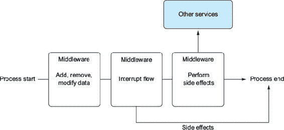

有时你可能想要中断流程，将数据发送到另一个 API，或解决任何其他应用程序范围的问题。图 10.7 展示了中间件的几个不同用例：数据修改、流程中断和执行副作用。这里的一个关键点是中间件应该是可组合的——你应该能够重新排列这些中的任何一个，而不用担心它们会相互影响。

Redux 中间件允许你在动作被分发和到达 reducer 之间进行操作（参见 图 10.7 中的“中间件”部分）。这是一个关注 Redux 应用程序所有部分共同问题并避免在许多地方重复代码的绝佳地方。

|  |
| --- |

**定义**

将术语与其定义匹配：

1.  存储

1.  Reducer

1.  动作

1.  动作创建者

___ Redux 中的中心状态对象；真相的来源。

___ 包含变更相关信息的对象。它们必须有一个类型，并且可以包含任何其他必要的信息来传达发生了什么。

___ Redux 用于根据某些事件计算状态变化的函数。

___ 用于创建有关应用程序中发生的事件的类型和有效负载信息的函数。

|  |
| --- |

例如，使用中间件可以是一个集中处理错误、将分析数据发送到第三方 API、进行日志记录等的好方法。你将实现一个简单的崩溃报告中间件，确保任何未处理的异常都会报告给你的错误跟踪和管理系统。我正在使用 Sentry ([`sentry.io`](https://sentry.io))，一个跟踪和记录异常以供后续分析的应用程序，但你也可以使用对你或你的团队最佳的选择（Bugsnag 是另一个不错的选择——请访问 [`bugsnag.com`](https://bugsnag.com)）。列表 10.15 展示了如何创建一些基本的错误报告中间件，当 Redux 遇到错误时会记录并发送到 Sentry。通常，当应用程序中出现异常时，工程师会收到某种类型的通知（立即或在仪表板上）；Sentry 记录这些错误并通知你它们发生的时间。

##### 列表 10.15\. 创建简单的崩溃报告 Redux 中间件

```
// ... src/middleware/crash.js
import { createError } from '../actions/error';
export default store => next => action => {                 *1*
    try {
        if (action.error) {
            console.error(action.error);
            console.error(action.info);
        }
        return next(action);                                *2*
    } catch (err) {                                         *3*
        const { user } = store.getState();                  *4*
        console.error(err);
        window.Raven.setUserContext(user);                  *4*
        window.Raven.captureException(err);
        return store.dispatch(createError(err));            *4*
    }
};

//... src/store/configureStore.prod.js

import thunk from 'redux-thunk';
import { createStore, compose, applyMiddleware } from 'redux';

import rootReducer from '../reducers/root';
import crashReporting from '../middleware/crash';           *5*

let store;
export default function configureStore(initialState) {
  if (store) {
    return store;
  }
  store = createStore(rootReducer, initialState, compose(
    applyMiddleware(thunk, crashReporting)                 *6*
  ));
  return store;
}
```

+   ***1* Redux 中间件由 Redux 将其注入的组成函数组成。**

+   ***2* 如果没有错误，则移动到下一个动作**

+   ***3* 报告错误，如果有**

+   ***4* 获取用户并发送错误；将错误派发到 store**

+   ***5* 拉入用于生产的中间件。**

+   ***6* 为生产环境添加中间件**

这只是 Redux 中间件可以做到的一小部分。丰富的文档包含了大量的 Redux 信息，以及对设计和 API 使用的见解，同时还提供了优秀的示例。有关 Redux 中间件的更多优秀示例，请参阅 [`redux.js.org/docs/advanced/Middleware.html#seven-examples`](http://redux.js.org/docs/advanced/Middleware.html#seven-examples)。

### 10.3\. 摘要

本章涵盖了以下主要要点：

+   Redux 是一个库和应用程序架构，不需要与任何特定的库或框架一起使用。它与 React 工作得特别出色，在许多 React 应用程序中作为状态管理和应用程序架构的首选工具而广受欢迎。

+   Redux 专注于可预测性并强制执行严格的数据处理方式。

+   *store* 是一个对象，作为应用程序的真相来源；它是应用程序的全局状态。

+   Flux 允许你拥有多个 store，但 Redux 只允许一个。

+   Reducers 是 Redux 用于根据给定操作计算状态变化的函数。

+   Redux 在许多方面与 Flux 相似，但引入了 reducers 的概念，拥有单个 store，并且其动作创建者不会直接派发动作。

+   动作包含有关发生的事情的信息。它们必须有一个类型，但可以包含您的 store 和 reducers 需要的任何其他信息，以确定如何更新状态。在 Redux 中，整个应用程序有一个单一的状态树；所有状态都生活在同一个区域，并且只能通过特定的 API 进行更新。

+   Action creators 是返回可以由存储分发的动作的函数。在有某些中间件（见下一条）的情况下，你可以创建异步动作创建器，这对于调用远程 API 等操作非常有用。

+   Redux 允许你编写中间件，这是一个将自定义行为注入 Redux 状态管理过程的地方。中间件在触发 reducer 之前执行，并允许你执行副作用或为你的应用实现全局解决方案。

在下一章中，你将在学习 reducer 并将其集成到你的 React 应用中时继续使用 Redux。

## 第十一章\. 更多 Redux 和将 Redux 与 React 集成

*本章涵盖*

+   Reducer，Redux 确定状态如何变化的方式

+   使用 Redux 与 React

+   将 Letters Social 转换为使用 Redux 应用架构

+   为你的应用添加点赞和评论功能

在本章中，你将继续上一章的工作，构建你的 Redux 架构的基本元素。你将努力将 React 与你的 Redux 动作和存储进行集成，并探索 reducer 的工作原理。Redux 是一个针对 React 设计的 Flux 模式的变体，它与 React 的单向数据流和 API 一起工作得很好。尽管它不是通用的选择，但许多大型 React 应用在实现状态管理解决方案时，会将 Redux 作为首选方案之一。你将效仿此做法，并在 Letters Social 中这样做。

| |
| --- |

**我如何获取本章的代码？**

与每一章一样，你可以通过访问 GitHub 仓库 [`github.com/react-in-action/letters-social`](https://github.com/react-in-action/letters-social) 来查看本章的源代码。如果你想从一张白纸开始，并跟随学习，你可以使用你现有的 第七章 和 第八章 的代码（如果你跟随并自己构建了示例）或检出特定章节的分支（chapter-10-11）。

记住，每个分支都对应着章节末尾的代码（例如，分支 chapter-10-11 对应着本章末尾的代码）。你可以在你选择的目录中执行以下终端命令之一，以获取当前章节的代码。

如果你根本就没有仓库，请输入以下内容：

```
 git clone git@github.com:react-in-action/letters-social.git
```

如果你已经克隆了仓库：

```
 git checkout chapter-10-11
```

你可能从另一章来到这里，所以始终确保你已经安装了所有正确的依赖项：

```
 npm install
```

| |
| --- |

### 11.1\. Reducer 确定状态如何变化

你可以创建和分发动作并处理错误，但这些动作还没有做任何事情来改变你的状态。要处理传入的动作，你需要设置 reducer。记住，动作只是描述发生了什么以及发生了什么的一些信息的方式，但仅此而已。reducer 的职责是指定状态应该如何响应这些动作。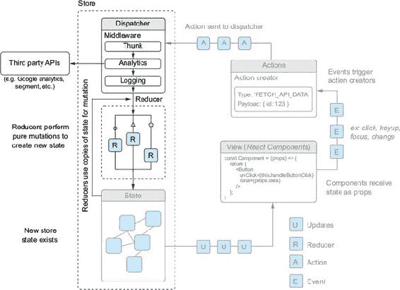展示了 reducer 如何融入我们一直在研究的 Redux 更广泛的画面中。

##### 图 11.1。Reducer 只是帮助确定应该对状态进行哪些更改的函数。你可以把它们看作是进入应用程序状态的某种类型的网关，它紧密控制着传入的更改。


但什么是 reducer 呢？如果你到目前为止一直喜欢 Redux 的简单直接，那么你不会对 reducer 感到失望：它们只是具有单一目的的更简单的函数。*Reducer* 是纯函数，它们接收先前的状态和一个动作作为参数，并返回下一个状态。根据 Redux 文档，它们被称为 reducer，因为它们的函数签名看起来就像你会传递给 `Array.prototype.reduce` 的内容（例如，`[1,2,3].reduce((a, b) => a + b, 0)`）。

Reducers 必须是*纯*函数，这意味着给定一个输入，它们将每次都产生相同的关联输出。这与产生副作用或进行 API 调用的动作或中间件形成对比。在 reducer 中进行任何异步或不纯的操作（如调用`Date.now`或`Math.random()`）是一种反模式，可能会降低应用程序的性能或可靠性。Redux 文档强调了这一点：“给定相同的参数，它应该计算下一个状态并返回它。没有惊喜。没有副作用。没有 API 调用。没有突变。只是一个计算。”关于这一点，请参阅[`redux.js.org/basics/reducers`](https://redux.js.org/basics/reducers)。

#### 11.1.1。状态形状和初始状态

Reducers 将开始修改单个 Redux 存储，因此这是一个讨论该存储将采取什么形状的好时机。设计任何应用程序的状态形状将既会影响又会受到应用程序 UI 工作方式的影响，但通常一个好的做法是尽可能地将“原始”数据与 UI 数据分开。做到这一点的一种方法是将像 ID 这样的东西与其对应物分开存储，并使用 ID 来查找数据。

你将创建一个初始状态文件，这将帮助你确定状态形状和结构。在 constants 文件夹中，创建一个名为 initialState.js 的文件。这将是在任何动作被分发或任何更改之前你的 Redux 应用的状态。你将包括错误和加载状态的信息，以及有关帖子、评论和用户的一些信息。你将把评论和帖子的 ID 存储在数组中，并将这些对象的主要信息存储在可以轻松引用的对象中。以下列表显示了设置初始状态的示例。

##### 列表 11.1\. 初始状态和状态形状（src/constants/initialState.js）

```
export default {                                                *1*
    error: null,
    loading: false,
    postIds: [],                                                *2*
    posts: {},                                                  *2*
    commentIds: [],                                             *2*
    comments: {},                                               *2*
    pagination: {                                               *3*
        first: `${process.env
            .ENDPOINT}/posts?_page=1&_sort=date&_order=DESC&
     _embed=comments&_expand=user&_embed=likes`,                *3*
        next: null,
        prev: null,
        last: null
    },
    user: {                                                     *4*
        authenticated: false,
        profilePicture: null,
        id: null,
        name: null,
        token: null
    }
};
```

+   ***1* Redux 将用于其初始状态的对象**

+   ***2* 将存储评论和帖子的 ID 与实际数据分开。**

+   ***3* 存储分页链接（通过 HTTP 头接收）——这只是分页的一种方法。**

+   ***4* 存储有关用户认证状态的信息**

#### 11.1.2\. 设置 reducer 以响应传入的动作

在设置好初始状态后，你应该创建一些 reducer 来处理传入的动作，以便你的 store 能够更新。Reducer 通常使用`switch`语句来匹配传入的动作类型，以便更新状态。它们返回状态的新副本（而不是带有更改的同一版本），然后将被用来更新 store。Reducer 还执行捕获所有行为的操作，以确保未知动作只返回现有状态。我们之前已经提到过，但重要的是再次强调，reducer 正在执行计算，并且应该根据给定的输入每次都返回相同的输出；不应启动任何副作用或不纯过程。

Reducer 负责计算 store 应该如何变化。在大多数应用中，你将有许多 reducer，每个 reducer 将负责 store 的一部分。这有助于保持文件整洁并保持专注。你最终将使用 Redux 提供的`combineReducers`方法，将你的 reducer 合并为一个。大多数 reducer 使用`switch`语句，其中包含不同动作类型的案例，并在底部有一个默认的捕获所有行为的案例，以确保未知动作类型（可能是意外创建的）不会对状态产生任何意外的效果。

Reducer 还会复制状态，并且不会直接修改现有的存储状态。如果你回顾一下 图 11.1，你会看到 reducer 在执行其任务时使用状态。这种方法类似于不可变数据结构通常工作的方式；修改的是副本而不是直接修改。列表 11.2 展示了如何设置加载 reducer。注意，在这种情况下，你只处理一个“扁平”的状态切片——布尔 `loading` 属性——所以你只需为新的状态返回 `true` 或 `false`。你将经常处理具有许多键或嵌套属性的 state 对象，并且你的 reducer 需要做的不仅仅是返回 `true` 或 `false`。

##### 列表 11.2\. 设置加载 reducer（src/reducers/loading.js）

```
import initialState from '../constants/initialState';
import * as types from '../constants/types';

export function loading(state = initialState.loading, action) {   *1*
  switch (action.type) {                                          *2*
    case types.app.LOADING:                                       *3*
      return true;                                                *3*
    case types.app.LOADED:                                        *4*
      return false;
    default:                                                      *5*
      return state;
  }}
```

+   ***1* 函数接受两个参数，状态和动作**

+   ***2* 通常，你会使用 switch 语句显式处理每种类型的动作并返回状态。**

+   ***3* 如果动作具有加载类型，则返回新状态值为 true**

+   ***4* 处理已加载情况并返回适当的 false 情况**

+   ***5* 默认返回现有状态**

现在当加载相关动作被分发时，Redux 存储将能够对此做出响应。当一个动作到来并且通过了任何现有的中间件，Redux 将调用 reducer 来确定应该基于该动作创建什么新状态。在你设置任何 reducer 之前，你的存储无法知道动作中包含的更改信息。为了可视化这一点，图 11.2 切除了 reducer 从流程中；看看是否有办法让动作达到存储？

##### 图 11.2\. 当 reducer 设置到位后，Redux 将知道在动作分发时如何更改存储。在一个中等复杂的应用中，你通常会有许多不同的 reducer，每个 reducer 负责存储状态的“切片”。

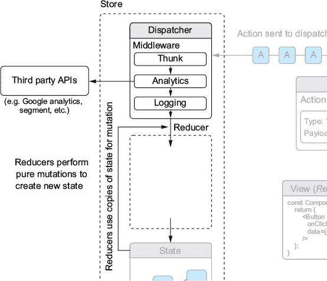

接下来，你将创建另一个 reducer 来运用你的 Redux 技能。毕竟，许多 reducer 不会只是返回一个`true`或`false`值，或者至少如果它们这样做，计算那个`true`或`false`值的过程中可能还有更多。Letters Social 应用的关键部分之一是显示和创建帖子，你需要将其迁移到 Redux。就像你可能将一个真实的 React 应用迁移到使用 Redux 一样，你应该能够保留应用使用的现有逻辑的大部分，并将其转换为 Redux 友好的形式。你将创建两个 reducer 来处理帖子本身，以及一个用于跟踪帖子 ID 的 reducer。在一个更大的应用中，你可能会将这些组合在另一个键下，但保持它们分开现在是可以的。这也作为了如何设置多个 reducer 来处理单个操作的示例。列表 11.3 显示了如何创建注释的 reducer。你将在这里创建相当多的 reducer，但一旦完成，你的应用不仅将有一个关于可能发生的操作的全面描述，还将有关于状态如何改变的方法。

##### 列表 11.3\. 创建注释 reducer（src/reducers/comments）

```
import initialState from '../constants/initialState';                   *1*
import * as types from '../constants/types';
export function comments(state = initialState.comments, action) {       *2*
    switch (action.type) {                                              *3*
        case types.comments.GET: {                                      *4*
            const { comments } = action;                                *4*
            let nextState = Object.assign({}, state);                   *4*
            for (let comment of comments) {
                if (!nextState[comment.id]) {
                    nextState[comment.id] = comment;
                }
            }
            return nextState;                                          *5*
        }
        case types.comments.CREATE: {                                  *6*
            const { comment } = action;
            let nextState = Object.assign({}, state);
            nextState[comment.id] = comment;
            return nextState;
        }
        default:                                                       *7*
            return state;
    }
}

export function commentIds(state = initialState.commentIds, action) {
    switch (action.type) {
        case types.comments.GET: {
            const nextCommentIds = action.comments.map(comment =>
     comment.id);                                                      *8*
            let nextState = Array.from(state);                         *9*
            for (let commentId of nextCommentIds) {
                if (!state.includes(commentId)) {
                    nextState.push(commentId);
                }
            }
            return nextState;
        }
        case types.comments.CREATE: {                                  *10*
            const { comment } = action;
            let nextState = Array.from(state);
            nextState.push(comment.id);
            return nextState;
        }
        default:
            return state;
    }
}
```

+   ***1* 拉取初始状态**

+   ***2* Reducer 是接受状态对象和操作的函数。**

+   ***3* 使用 switch 语句确定如何响应传入的操作**

+   ***4* 对于 GET，复制状态并添加你尚未拥有的注释**

+   ***5* 返回新状态**

+   ***6* 向状态添加新注释**

+   ***7* 默认返回相同状态**

+   ***8* 你只在这里想要 ID，因为你会将它们与主要对象分开存储。**

+   ***9* 创建前一个状态副本**

+   ***10* 推入新 ID**

现在你分发与注释相关的操作时，你的存储状态将相应更新。你注意到你能够响应那些并非严格相同类型的操作吗？即使它们不是同一类型的，reducer 也可以响应其范围内的操作。这是因为尽管“帖子”状态片段管理帖子，但还有其他可能影响它的操作。这里的要点是，reducer 负责决定状态的一个特定方面应该如何改变，无论哪个操作或哪种类型的操作正在通过。一些 reducer 可能需要了解许多不同类型的操作，而这些操作并非特别与它们所模拟的资源（帖子）相关。

现在你已经创建了注释 reducer，你可以创建处理帖子的 reducer。因为它将使用相同的策略来存储它们，即分别存储 ID 和对象，所以它将与注释 reducer 非常相似。它还需要知道如何处理点赞和取消点赞帖子（你已经在第十章中创建了这些功能的操作）。下面的列表显示了如何创建这些 reducer。

##### 列表 11.4\. 创建帖子 reducers（src/reducers/posts.js）

```
import initialState from '../constants/initialState';
import * as types from '../constants/types';
export function posts(state = initialState.posts, action) {
    switch (action.type) {
        case types.posts.GET: {                                      *1*
            const { posts } = action;
            let nextState = Object.assign({}, state);
            for (let post of posts) {
                if (!nextState[post.id]) {
                    nextState[post.id] = post;
                }
            }
            return nextState;
        }
        case types.posts.CREATE: {
            const { post } = action;
            let nextState = Object.assign({}, state);
            if (!nextState[post.id]) {
                nextState[post.id] = post;
            }
            return nextState;
        }
        case types.comments.SHOW: {                                  *2*
            let nextState = Object.assign({}, state);
            nextState[action.postId].showComments = true;
            return nextState;
        }
        case types.comments.TOGGLE: {                                *2*
            let nextState = Object.assign({}, state);
            nextState[action.postId].showComments =
     !nextState[action.postId].showComments;
            return nextState;
        }
        case types.posts.LIKE: {                                     *3*
            let nextState = Object.assign({}, state);
            const oldPost = nextState[action.post.id];
            nextState[action.post.id] = Object.assign({}, oldPost, action.post);
            return nextState;
        }
        case types.posts.UNLIKE: {                                   *3*
            let nextState = Object.assign({}, state);
            const oldPost = nextState[action.post.id];
            nextState[action.post.id] = Object.assign({}, oldPost, action.post);
            return nextState;
        }
        case types.comments.CREATE: {
            const { comment } = action;
            let nextState = Object.assign({}, state);
            nextState[comment.postId].comments.push(comment);
            return state;
        }
        default:
            return state;
    }
}

export function postIds(state = initialState.postIds, action) {      *4*
    switch (action.type) {
        case types.posts.GET: {
            const nextPostIds = action.posts.map(post => post.id);
            let nextState = Array.from(state);
            for (let post of nextPostIds) {
                if (!state.includes(post)) {
                    nextState.push(post);
                }
            }
            return nextState;
        }
        case types.posts.CREATE: {
            const { post } = action;
            let nextState = Array.from(state);
            if (!state.includes(post.id)) {
                nextState.push(post.id);
            }
            return nextState;
        }
        default:
            return state;
    }
}
```

+   ***1* 处理获取新帖子**

+   ***2* 显示或切换帖子的评论**

+   ***3* 点赞/取消点赞帖子涉及使用 API 的新数据更新状态中的特定帖子**

+   ***4* 以处理评论相同的方式处理新 ID**

我在这几个文件中包含了两个 reducer，因为它们非常相关，并且都作用于相同的基本数据（帖子与评论），但你可能会发现，大多数情况下你希望每个文件有一个 reducer 以保持事情简单。大多数情况下，你的 reducer 设置将与你的 store 结构相似或至少遵循其结构。你可能已经注意到一个细微之处，即你如何设计你的 store 状态形状（参见本章前面设置的初始状态）将极大地影响你的 reducers 以及，在一定程度上，你的 actions 的定义。从这个角度来看，通常花更多的时间来设计状态形状比草率地处理它要好。设计时间过少可能会导致大量返工以改进状态形状，而稳健的设计加上 Redux 提供的模式可以使添加新功能比不添加它更容易。

|  |
| --- |

**迁移到 Redux：值得吗？**

在本章中，我提到过几次 Redux 的初始设置可能是一项大量工作（也许你现在就有这种感觉！）但最终通常是有价值的。显然，这并不适用于所有可能的情况，但我发现我在工作的项目中以及我所知道的那些做过同样事情的工程师那里都是这样。我参与的一个项目涉及将应用从 Flux 迁移到 Redux 架构的完整迁移。整个团队可能花了大约一个月的时间，但我们能够以最小的不稳定性和错误创建来发布应用的重新编写版本。

然而，更大的整体成果是，由于 Redux 帮助我们建立的模式，我们可以更快地对产品进行迭代。在 Redux 迁移几个月后，我们最终进行了一系列应用的重设计。尽管我们最终重建了应用 React 部分的很大一部分，但 Redux 架构意味着我们只需要对应用的状态管理和业务逻辑部分进行相对较少的更改。更重要的是，Redux 为我们提供的模式使得在必要时向应用状态中添加内容变得非常简单。集成 Redux 值得最初的工作来设置它并将应用迁移到它，而且它继续在长期内带来回报。

|  |
| --- |

在处理了一些更复杂的 reducers 之后，你可以通过创建错误、分页和用户的 reducers 来完成我们的 Redux 工作。以下列表以错误 reducer 开始。

##### 列表 11.5\. 创建错误 reducer（src/reducers/error.js）

```
import initialState from '../constants/initialState';
import * as types from '../constants/types';
export function error(state = initialState.error, action) {
    switch (action.type) {
        case types.app.ERROR:                  *1*
            return action.error;
        default:
            return state;
    }
}
```

+   ***1* 这个状态片段并不复杂；在动作中传递错误**

接下来，你需要确保你的分页状态可以更新。目前，分页仅与帖子相关，但在更大的应用程序中，你可能需要为应用程序的许多不同部分设置分页（例如，当你有一个包含太多评论而无法一次性合理显示的帖子时）。对于你的示例应用程序，你只需要处理简单的分页，因此请创建以下列表中的分页 reducer。

##### 列表 11.6\. 创建分页 reducer（src/reducers/pagination.js）

```
import initialState from '../constants/initialState';
import * as types from '../constants/types';
export function pagination(state = initialState.pagination, action) {
    switch (action.type) {
        case types.posts.UPDATE_LINKS:                             *1*
            const nextState = Object.assign({}, state);            *2*
            for (let k in action.links) {                          *2*
                if (action.links.hasOwnProperty(k)) {
                    if (process.env.NODE_ENV === 'production') {   *3*
                        nextState[k] =
     action.links[k].url.replace(/http:\/\//, 'https://');         *3*
                    } else {
                        nextState[k] = action.links[k].url;        *4*
                    }
                }
            }
            return nextState;
        default:
            return state;
    }
}
```

+   ***1* 使用新的分页信息更新那些链接 URL**

+   ***2* 创建前一个状态的新副本，并将动作的有效负载中的 URL 合并进去**

+   ***3* 由于 Letters Social 在部署到 Zeit ([`zeit.co/now`](https://zeit.co/now))时终止 SSL 的怪异行为——如果你没有自己部署应用程序，请忽略**

+   ***4* 更新每种链接类型的 URL**

现在，你需要创建一个 reducer，它将允许你响应用户相关的事件，如登录和登出。在这个 reducer 中，你还将处理在浏览器上存储一些 cookie，以便你可以在第十二章（[kindle_split_024_split_000.xhtml#ch12](https://kindle_split_024_split_000.xhtml#ch12)）中进行服务器端渲染时使用它们。*Cookies* 是服务器可以发送到用户 Web 浏览器的小数据块。你可能因为每天使用计算机而熟悉 cookie（由于法律原因，在某些网站上你会收到关于它们的通知），但也许你以前从未以编程方式处理过它们。没关系。你将使用`js-cookie`库与 cookie 交互，而你将做的所有事情就是在用户的身份验证状态改变时设置和取消设置一个特定的 cookie。以下列表显示了创建用户 reducer 以执行此操作。

##### 列表 11.7\. 创建用户 reducer（src/reducers/user.js）

```
import Cookies from 'js-cookie';                              *1*
import initialState from '../constants/initialState';
import * as types from '../constants/types';
export function user(state = initialState.user, action) {
    switch (action.type) {
        case types.auth.LOGIN_SUCCESS:
            const { user, token } = action;                   *2*
            Cookies.set('letters-token', token);              *3*
            return Object.assign({}, state.user, {            *4*
                authenticated: true,
                name: user.name,
                id: user.id,
                profilePicture: user.profilePicture ||
     '/static/assets/users/4.jpeg',
                token
            });
        case types.auth.LOGOUT_SUCCESS:                       *5*
            Cookies.remove('letters-token');
            return initialState.user;
        default:
            return state;
    }
}
```

+   ***1* 导入 js-cookie 库以使用**

+   ***2* 从动作中提取用户和令牌**

+   ***3* 使用 js-cookie 在浏览器中存储令牌作为 cookie**

+   ***4* 返回包含新用户数据和令牌的状态副本**

+   ***5* 在登出时，将用户状态重置为初始状态并擦除 cookie**

#### 11.1.3\. 在我们的存储中组合 reducers

最后，你需要确保你的 reducer 已与你的 Redux 存储集成。尽管你已经创建了它们，但它们目前没有任何连接。让我们回顾一下你在第十章中创建的根 reducer，看看如何向其中添加新的 reducer。列表 11.8 展示了如何将你创建的 reducer 添加到根 reducer。这里需要注意的是，`combineReducers` 将根据你传入的 reducer 在你的存储中创建键的方式。对于列表 11.8 中的情况，你的存储状态将具有 `loading` 和 `posts` 键，每个键分别由相应的 reducer 管理。我在这里使用的是 ES2015 属性简写，但如果我想的话，也可以将最终的键命名为不同的名称。这一点很重要，以免你觉得你的函数名必须直接与存储上的键相关联。

##### 列表 11.8\. 向现有根 reducer 添加新 reducer（src/reducers/root.js）

```
import { combineReducers } from 'redux';

import { error } from './error';                        *1*
import { loading } from './loading';
import { pagination } from './pagination';              *1*
import { posts, postIds } from './posts';
import { user } from './user';
import { comments, commentIds } from './comments';      *1*

   const rootReducer = combineReducers({
    commentIds,                                         *2*
    comments,
    error,
    loading,
    pagination,                                         *2*
    postIds,
    posts,
    user                                                *2*
});

export default rootReducer;
```

+   ***1* 导入 reducer 以将其添加到根 reducer**

+   ***2* `combineReducers` 将在每个对应的键上挂载每个 reducer，但如果你希望的话，可以更改名称**

#### 11.1.4\. 测试 reducer

由于 Redux reducer 的纯函数和松耦合特性，测试 Redux reducer 是直接的——毕竟，它们只是函数。为了测试你的 reducer，你需要断言给定一定的输入，它们应该产生一定的状态。下一个列表展示了如何测试你为状态切片的 posts 和 post ID 创建的 reducer。与其他 Redux 部分一样，由于 reducer 也是函数，这使得它们易于隔离和测试。

##### 列表 11.9\. 测试 reducer（src/reducers/posts.test.js）

```
jest.mock('js-cookie');                                                   *1*

import Cookies from 'js-cookie';

import { user } from '../../src/reducers/user';                           *2*
import initialState from '../../src/constants/initialState';              *2*
import * as types from '../../src/constants/types';                       *2*

describe('user', () => {
    test('should return the initial state', () => {
        expect(user(initialState.user, {})).toEqual(initialState.user);   *3*
    });
    test(`${types.auth.LOGIN_SUCCESS}`, () => {
        const mockUser = {                                                *4*
            name: 'name',
            id: 'id',
            profilePicture: 'pic'
        };
        const mockToken = 'token';                                        *4*
        const expectedState = {                                           *4*
            name: 'name',
            id: 'id',
            profilePicture: 'pic',
            token: mockToken,
            authenticated: true
        };
        expect(                                                           *5*
            user(initialState.user, {
                type: types.auth.LOGIN_SUCCESS,
                user: mockUser,
                token: mockToken
            })
        ).toEqual(expectedState);
        expect(Cookies).toHaveBeenCalled();                               *6*
    });
    test(`${types.auth.LOGOUT_SUCCESS}, browser`, () => {
        expect(                                                           *7*
            user(initialState.user, {
                type: types.auth.LOGOUT_SUCCESS
            })
        ).toEqual(initialState.user);
        expect(Cookies).toHaveBeenCalled();
    });
});
```

+   ***1* 模拟 js-cookie 库**

+   ***2* 导入测试所需的 reducer 和类型**

+   ***3* 断言默认将返回初始状态**

+   ***4* 创建模拟用户、令牌和预期的状态以进行断言**

+   ***5* 给定一个登录动作，断言状态按预期改变**

+   ***6* 断言你的 cookies 模拟被调用**

+   ***7* 对 LOGOUT_SUCCESS 动作执行类似的断言**

通过这些，我们已经涵盖了 Redux 应用程序的大部分基础知识：store、reducers、actions 和 middleware！Redux 生态系统强大，还有更多你可以自己探索的领域。我们省略了一些 API 和/或 Redux 生态系统的一部分，比如高级 middleware 使用、selectors（与 store 状态交互的优化方式）等。我们还特别省略了广泛介绍 store API（例如，使用 `store.subscribe()` 与更新事件交互）。这是因为与 Redux 这一部分工作的细节将通过 `react-redux` 库进行抽象。如果你对这些领域有更深入的兴趣，并想了解更多关于 Redux 的信息，请参阅 [`redux.js.org`](https://redux.js.org)。我还在我的博客 [`ifelse.io/react-ecosystem`](https://ifelse.io/react-ecosystem) 上整理了一份关于 React 生态系统的指南，其中也包括了 Redux。

|  |
| --- |

**真或假**

Redux 对于它所做的事情来说是一个相对较小的库，但它对 store、reducer、actions 和 middleware 中的数据流工作方式有一些“强烈”的观点。花点时间评估以下陈述，以检查你的理解：

+   T | F Reducers 应该直接修改现有的状态。

+   T | F Redux 默认包含一种执行异步工作（例如网络请求）的方式。

+   T | F 默认为每个 reducer 包含一个初始状态是一个好主意。

+   T | F Reducers 可以组合，这使得分离状态片段更容易。

|  |
| --- |

### 11.2\. 将 React 和 Redux 结合起来

你已经在 Redux 上取得了进展，但你的 React 组件目前对此一无所知。你需要以某种方式将它们结合起来。现在你已经完成了 Redux 设置过程，通过构建出 reducers、actions 和一个 store 来使用，你可以开始将你的新架构与 React 集成。你可能已经注意到，你不需要做太多 React 的工作就能让 Redux 运行起来。这是因为 Redux 可以在不考虑特定框架——或者任何框架的情况下实现。当然，Redux 的工作方式与 React 应用程序特别契合，这也是它成为 React 应用程序架构中最受欢迎的选择之一的原因。但请记住，即使你开始将 React 和 Redux 集成，你也可以将其与 Angular、Vue、Preact 或 Ember 集成。

#### 11.2.1\. 容器组件与展示组件

当将 Redux 集成到 React 应用程序中时，你几乎肯定会使用`react-redux`库。这个库作为抽象层，涵盖了 Redux 存储和动作与 React 组件的集成。我将介绍一些你可以使用`react-redux`的方法，包括如何将动作引入你的组件，并讨论一些新的组件类型：表现性组件和容器组件。你不再需要在你的许多组件之间分配状态，因为 Redux 通过动作、reducer 和存储负责管理应用程序状态。再次提醒，创建不使用 Redux 的 React 应用程序并没有什么固有的错误；你仍然会得到使用 React 带来的所有其他好处。Redux 的可预测性和附加结构使得设计和维护大型、复杂的 React 应用程序更容易，这也是为什么许多团队会选择使用它而不是“纯”React。

这两种新的组件类别（表现性和容器）实际上只是对组件已经执行的功能的两种更专注的表达。普通组件与表现性或容器组件之间的区别在于它们的功能。而不是允许任何组件处理样式、UI 数据和*以及*应用程序数据，表现性组件处理 UI 和 UI 相关数据，而容器组件处理应用程序数据（类似于 Redux）。

理解容器组件和表现性组件之间的区别很重要，但你的应用程序仍在做同样的事情，只是关注点分离得更好。你并没有在应用程序中引入任何根本性的新内容；你的 React 组件仍然会接收属性、维护状态、响应用件，并以与之前相同的生命周期渲染。`react-redux`提供的关键区别在于将你的存储、reducer 和动作与组件集成。表现性组件和容器组件之间的新划分只是一个可以使你的生活更轻松的模式。

让我们来看看在具有 Redux 架构的 React 应用程序中使用的这两种一般类型的组件。正如所提到的，表现性组件是“仅 UI”组件。这意味着它们通常不会与确定应用程序数据如何更改、更新或发出的方式有很大关系。

下面是一些关于表现性组件的基本知识：

+   它们处理的是事物的外观，而不是数据流或确定的方式。

+   如果有必要，它们只有自己的状态（它们是带有后端实例的 React 类）；大多数时候，它们应该是无状态的函数组件，通过`react-redux`绑定从 Redux 接收属性。

+   当它们*确实*有自己的状态时，它应该是 UI 相关数据，而不是应用程序数据。例如：一个打开/关闭的下拉菜单项及其状态。

+   它们不决定数据如何加载或更改——这应该在容器中主要发生。

+   它们通常是通过“手动”创建的，而不是通过`react-redux`库。

+   它们可能包含样式信息，例如 CSS 类、其他与样式相关的组件以及任何其他与 UI 相关的数据。

如果你正在探索 React/Redux 生态系统，你可能会偶尔看到对*智能*（容器）和*愚笨*（展示）组件的引用。这种称呼方式已经不再流行，因为它被发现是不有帮助的，并且带有贬义倾向，但如果你看到这种术语被使用，你将能够将其映射到展示/容器二分法。考虑到这一点，容器组件通常执行以下操作：

+   作为数据源，可以是状态化的；状态通常来自你的 Redux 存储。

+   向展示组件提供数据和行为信息（如动作）。

+   可以包含其他展示组件或容器组件；容器作为父组件拥有许多展示子组件是很常见的。

+   通常使用`react-redux`的`connect`方法（稍后将详细介绍）创建，通常是高阶组件（从其他组件创建新组件的组件）。

+   通常不需要与应用数据无关的样式信息。例如，Redux 存储中的用户配置文件状态切片可能会记录用户的“最喜欢的颜色”为“红色”，但容器不会使用这些数据来进行任何样式设计——它只会将其传递给一个展示组件。

在本章中，我们将采取一种中间方法来将你的组件分解为展示组件和连接或容器组件。对于你想连接到 Redux 存储的每个组件，你将执行以下操作：

+   通过导出一个连接组件以及常规组件来修改它。

+   将任何属性和状态移动到`react-redux`可以使用（稍后将详细介绍）的特殊函数中。

+   引入你需要的任何动作，并将这些动作绑定到组件将拥有的`actions`属性。

+   在适当的地方用映射到 Redux 存储状态的属性替换本地状态。

图 11.3 应该能帮助你更好地理解一个连接组件通常是如何工作的；相同的 Redux 方面存在，但基本上是围绕 React 组件“重新排列”的，以便将存储的更新传递给组件。

##### 图 11.3\. 将 Redux 与 React 集成。`react-redux`提供了帮助你生成组件（高阶组件；生成其他组件的组件）的实用工具。

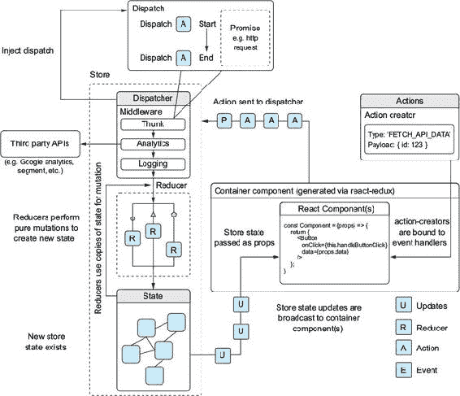

本章没有足够的空间涵盖将本书中接触到的每个组件都转换为容器组件，但容器组件和展示组件之间的区别以及你如何将 Redux 与 React 集成应该为你提供一些良好的起点实践，指引你走向正确的方向。

#### 11.2.2\. 使用<Provider />将组件连接到 Redux 存储

将你的 Redux 设置集成到你的 React 应用中的第一步是将整个应用包裹在 `react-redux` 提供的 Provider 组件中。该组件接受一个 Redux store 作为属性，并将该 store 提供给你的“连接”组件——这是连接到 Redux 的组件的另一种描述。在几乎所有情况下，这是你的 React 组件和 Redux 之间的集成中心点。store 必须可用于你的容器，否则你的应用可能无法正常工作（或者可能根本无法工作）。以下列表显示了如何使用 Provider 组件并更新身份验证监听器以处理你的 Redux actions。

##### 列表 11.10\. 使用 `react-redux` 的 <Provider />

```
import React from 'react';
import { render } from 'react-dom';
import { Provider } from 'react-redux';
import Firebase from 'firebase';

import * as API from './shared/http';
import { history } from './history';

import configureStore from './store/configureStore';                 *1*
import initialReduxState from './constants/initialState';            *1*

import Route from './components/router/Route';
import Router from './components/router/Router';
import App from './app';
import Home from './pages/home';
import SinglePost from './pages/post';
import Login from './pages/login';
import NotFound from './pages/404';

import { createError } from './actions/error';                       *1*
import { loginSuccess } from './actions/auth';                       *1*
import { loaded, loading } from './actions/loading';                 *1*
import { getFirebaseUser, getFirebaseToken } from './backend/auth';

import './shared/crash';
import './shared/service-worker';
import './shared/vendor';
import './styles/styles.scss';

const store = configureStore(initialReduxState);                     *2*

const renderApp = (state, callback = () => {}) => {
    render(
        <Provider store={store}>                                     *3*
            <Router {...state}>
                <Route path="" component={App}>
                    <Route path="/" component={Home} />
                    <Route path="/posts/:postId" component={SinglePost} />
                    <Route path="/login" component={Login} />
                    <Route path="*" component={NotFound} />
                </Route>
            </Router>
        </Provider>,
        document.getElementById('app'),
        callback
    );
};

const initialState = {
    location: window.location.pathname
};

// Render the app initially
renderApp(initialState);

history.listen(location => {                                        *4*
    const user = Firebase.auth().currentUser;
    const newState = Object.assign(initialState, { location: user ?
     location.pathname : '/login' });
    renderApp(newState);
});

getFirebaseUser()                                                   *5*
    .then(async user => {
        if (!user) {
            return history.push('/login');
        }
        store.dispatch(loading());                                  *5*
        const token = await getFirebaseToken();
        const res = await API.loadUser(user.uid);
        if (res.status === 404) {                                   *6*
            const userPayload = {
                name: user.displayName,
                profilePicture: user.photoURL,
                id: user.uid
            };
            const newUser = await API.createUser(userPayload).then(res =>
     res.json());
            store.dispatch(loginSuccess(newUser, token));           *6*
            store.dispatch(loaded());
            history.push('/');
            return newUser;
        }
        const existingUser = await res.json();
        store.dispatch(loginSuccess(existingUser, token));          *7*
        store.dispatch(loaded());
        history.push('/');
        return existingUser;
    })
    .catch(err => createError(err));
 //...
```

+   ***1* 导入你在这里需要的与 redux 相关的模块**

+   ***2* 使用初始状态创建 Redux store**

+   ***3* 使用来自 react-redux 的 Provider 包装你的路由器，并传递它 store**

+   ***4* 历史监听器保持不变**

+   ***5* 从 Firebase 获取用户并分发加载操作**

+   ***6* 如果还没有，创建新用户并分发用户/token**

+   ***7* 加载现有用户并分发**

现在 store 将可用于你的组件，你可以将它们连接到你的 store。你会记得从图 11.3 中，`react-redux` 将将 store 状态注入到你的组件作为 props，并在 store 更新时更改这些 props。如果你没有使用 `react-redux`，你需要手动在每个组件的基础上订阅 store 的更新。

要实现这一点，你需要使用来自 `react-redux` 的 `connect` 工具。它将生成一个连接到 Redux store 的容器组件（因此得名），并在 store 更改时应用更新。`connect` 方法只有几个参数，但它的内容比最初看起来要多；你可以在[`github.com/reactjs/react-redux`](https://github.com/reactjs/react-redux) 上了解更多。对于你的目的，你将使用订阅 store 的能力以及注入 store 的 `dispatch` 函数，以便为你的组件创建 actions。

要注入状态，你需要传递一个函数（`mapStateToProps`），该函数将接收 `state` 作为参数，并将返回一个将被合并到组件 props 中的对象；`react-redux` 将在组件接收新 props 时重新调用此函数。一旦你使用 `connect` 来包裹你的组件，你将需要调整组件中 props 的使用方式（我将在下一部分介绍 actions）；`state` 不应使用，除非它与 UI 特定的数据相关。记住，尽管这被认为是最佳实践，但这并不意味着没有模糊表现性和容器组件之间界限的有效案例；它们确实存在，即使它们很罕见；为你的团队和特定情况做出最佳工程决策。

列表 11.11 展示了如何使用 `connect` 以及如何调整你在我们的 Home 组件中访问 props 的方式，并将其转换为无状态函数组件。你将使用传递给 connect 的两个参数中的第一个：`mapStateToProps`。这个函数将接收状态（存储状态）并可以有一个额外的参数，`ownProps`，它将传递给容器组件的任何额外的 props。你现在不会使用这个参数，但 API 提供了它以防你需要它。

##### 列表 11.11\. `mapStateToProps`（src/pages/Home.js）

```
import PropTypes from 'prop-types';
import React, { Component } from 'react';
import { connect } from 'react-redux';
import orderBy from 'lodash/orderBy';                                      *1*

import Ad from '../components/ad/Ad';                                      *2*
import CreatePost from '../components/post/Create';                        *2*
import Post from '../components/post/Post';                                *2*
import Welcome from '../components/welcome/Welcome';                       *2*

export class Home extends Component {
    render() {
        return (
            <div className="home">
                <Welcome />
                <div>
                    <CreatePost />
                    {this.props.posts && (                                 *3*
                        <div className="posts">
                            {this.props.posts.map(post => (
                                <Post
                                    key={post.id}                          *4*
                                    post={post}                            *4*
                                />
                            ))}
                        </div>
                    )}
                    <button className="block">
                        Load more posts
                    </button>
                </div>
                <div>
                    <Ad url="https://ifelse.io/book" imageUrl="/static/
     assets/ads/ria.png" />
                    <Ad url="https://ifelse.io/book" imageUrl="/static/
     assets/ads/orly.jpg" />
                </div>
            </div>
        );
    }
}
//...
export const mapStateToProps = state => {
    const posts = orderBy(state.postIds.map(postId => state.posts[postId]),
     'date', 'desc');                                                      *5*
    return { posts };                                                      *6*
};
export default connect(mapStateToProps)(Home);                             *7*
```

+   ***1* 使用 Lodash 的 orderBy 函数对帖子进行排序**

+   ***2* 导入显示在主页上的组件**

+   ***3* 遍历帖子**

+   ***4* 传递帖子及其 ID（`mapStateToProps` 将进一步处理）**

+   ***5* 使用 orderBy 对帖子进行映射和排序**

+   ***6* `mapStateToProps` 函数返回连接组件的 props**

+   ***7* 导出连接组件**

当你现在运行应用时（使用 `npm run dev`），你不应该遇到任何运行时错误，但你也应该看不到任何帖子，因为没有任何操作在执行。但是，如果你打开 React 开发者工具，你应该能够看到 `react-redux` 正在创建你的连接组件。注意 `connect` 是如何创建另一个组件来包裹你传递给它的组件，并给它一组新的 props。在幕后，它还将订阅来自 Redux 存储的更新，并将它们作为新的 props 传递给你的容器。图 11.4 展示了当你同时打开开发者工具和你的应用时你应该看到的内容。

##### 图 11.4\. 如果你打开 React 开发者工具，你将能够通过 `connect` 挑选出新连接的组件以及它通过 `connect` 传递给它的 props。注意 `connect` 函数是如何创建一个新的组件来包裹你传递给它的组件的。

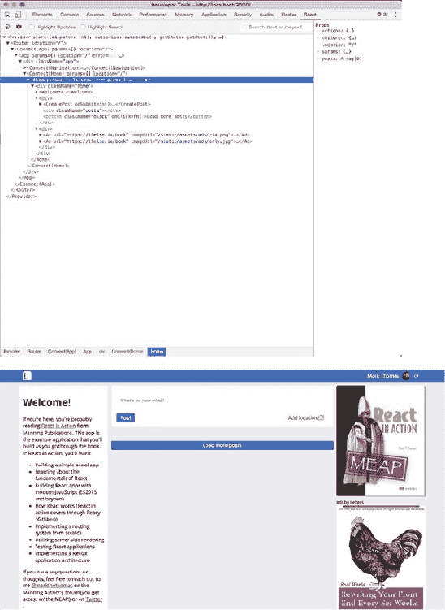

#### 11.2.3\. 将操作绑定到组件事件处理器

你需要让你的应用再次响应用户操作。你将使用第二个函数来完成这个任务：`mapDispatchToProps`。这个函数正是其名字所暗示的——它有一个 `dispatch` 参数，这将作为存储的 `dispatch` 方法注入到你的组件中。你可能已经注意到，在 第十章 的 图 10.3 或者在你的 React 开发者工具中，容器已经有一个注入到其 props 中的 `dispatch` 方法；你可以直接使用这个函数，因为它会自动注入，如果你没有提供 `mapDispatchToProps` 函数。但使用 `mapDispatchToProps` 的优点是，你可以用它将组件特定的操作逻辑与组件本身分离出来，并且它使得测试变得更加容易。

|  |
| --- |

**源代码作业**

`react-redux` 库提供了一些经过许多公司和个人在 React 中使用 Redux 进行战斗测试的抽象。但您不必使用这个库来让 React 和 Redux 一起工作。作为一个练习，花些时间阅读 React-Redux 的源代码，网址为 [`github.com/reactjs/react-redux/tree/master/src`](https://github.com/reactjs/react-redux/tree/master/src)。不建议您创建自己的方式来连接 React 和 Redux，但您应该能够看到这并不是“魔法”。

|  |
| --- |

`mapDispatchToProps` 函数将由 `react-redux` 调用，并生成的对象将合并到您的组件属性中。您将使用它来设置您的动作创建器并使它们可用于您的组件。您还将利用 Redux 的 `bindActionCreators` 辅助实用工具。`bindActionCreators` 实用工具将值是动作创建器的对象转换为一个具有相同键的对象——区别在于每个动作创建器都被包装在一个调度调用中，因此可以直接调用。

您可能已经注意到在 列表 11.11 中，您使用了一个 React 类而不是无状态函数组件。创建无状态函数组件很常见，但在这个例子中，您需要一种方法来最初加载帖子，因此您需要可以在组件挂载时调度动作的生命周期方法。一种解决方案是将初始化事件卸载到路由层，并在进入或退出某些路由时协调加载数据。您当前的路由器没有考虑到生命周期钩子，但其他路由器，如 React-router，确实具有这个功能。我们将在下一章中探讨切换到 React Router，您将利用这个功能。

然后，剩下的就是使用 `mapDispatchToProps` 来获取您的动作并将它们绑定到您的组件上。您还可以创建一个对象，将函数分配给您喜欢的任何键。这种模式可以使直接引用您的动作更容易，如果 `mapDispatchToProps` 对象上的函数之间没有额外的逻辑，那么它们之间。

##### 列表 11.12\. 使用 `mapDispatchToProps` (src/containers/Home.js)

```
// ...
import { createError } from '../actions/error';                               *1*
import { createNewPost, getPostsForPage } from '../actions/posts';            *1*
import { showComments } from '../actions/comments';                           *1*
import Ad from '../components/ad/Ad';
import CreatePost from '../components/post/Create';
import Post from '../components/post/Post';
import Welcome from '../components/welcome/Welcome';
export class Home extends Component {
    componentDidMount() {                                                     *2*
        this.props.actions.getPostsForPage();                                 *2*
    }
    componentDidCatch(err, info) {                                            *3*
        this.props.actions.createError(err, info);                            *3*
    }
    render() {
        return (
            <div className="home">
                <Welcome />
                <div>
                    <CreatePost onSubmit={this.props.actions.createNewPost} />*4*
                    {this.props.posts && (
                        <div className="posts">
                            {this.props.posts.map(post => (
                                <Post
                                    key={post.id}
                                    post={post}
                                    openCommentsDrawer=
     {this.props.actions.showComments}                                        *5*
                                />
                            ))}
                        </div>
                    )}
                    <button className="block"
     onClick={this.props.actions.getNextPageOfPosts}>                         *6*
                        Load more posts
                    </button>
                </div>
                <div>
                    <Ad url="https://ifelse.io/book" imageUrl="/static/
     assets/ads/ria.png" />
                    <Ad url="https://ifelse.io/book" imageUrl="/static/
     assets/ads/orly.jpg" />
                </div>
            </div>
        );
    }
}
//...
export const mapDispatchToProps = dispatch => {
    return {
        actions: bindActionCreators(                                          *7*
            {
                createNewPost,
                getPostsForPage,
                showComments,                                                 *7*
                createError,
                getNextPageOfPosts: getPostsForPage.bind(this, 'next')        *8*
            },
            dispatch                                                          *7*
        )
    };
};

export default connect(mapStateToProps, mapDispatchToProps)(Home);
```

+   ***1* 导入您将需要为此组件使用的动作**

+   ***2* 组件挂载时加载帖子**

+   ***3* 如果组件中发生错误，请使用 componentDidCatch 来处理它，将错误调度到存储**

+   ***4* 将创建帖子动作传递给 CreatePost 组件**

+   ***5* 通过 props 传递 showComments 动作**

+   ***6* 传递加载更多帖子的动作**

+   ***7* 使用 bindAction-Creators 将您的动作包装在调度调用中**

+   ***8* 使用 .bind() 确保每次调用 getPostsForPage 动作时都带有 ‘next’ 参数**

有了这些，你已经将你的组件连接到 Redux！正如我之前提到的，没有足够的空间来涵盖将你应用中的每个组件都转换为使用 Redux。好消息是它们都遵循相同的模式（创建 `mapStateToProps` 和 `mapDispatchToProps`，使用 `connect` 导出），你应该能够将它们转换为以与这里对主页相同的方式与 Redux 交互。以下是你在应用程序源中连接到 Redux 存储的其他组件：

+   *应用*—src/app.js

+   *评论*—src/components/comment/Comments.js

+   *错误*—src/components/error/Error.js

+   *导航*—src/components/nav/navbar.js

+   *帖子操作部分*—src/components/post/PostActionSection.js

+   *帖子*—src/components/post/Posts.js

+   *登录*—src/pages/login.js

+   *单帖子*—src/pages/post.js

所有这些组件集成后，你的应用程序将过渡到使用 Redux！现在你知道了如何添加 Redux “循环”（动作创建者、处理动作的减少器以及连接任何组件），那么你将如何添加新功能，比如用户资料？你还可以向 Letters Social 添加哪些其他功能？幸运的是，Letters Social 应用程序有许多扩展区域和你可以尝试 Redux 的新方法。

#### 11.2.4\. 更新你的测试

当你将你的主页组件转换为 React 时，你破坏了你之前为其编写的测试。你现在将修复它。幸运的是，大部分的测试逻辑现在应该存在于其他地方，所以如果有什么的话，这些测试应该比之前简单。以下列表显示了主页组件更新的测试文件。

##### 列表 11.13\. 更新主页组件测试（src/containers/Home.test.js）

```
jest.mock('mapbox');                                                    *1*
import React from 'react';
import renderer from 'react-test-renderer';                             *1*
import { Provider } from 'react-redux';

import { Home, mapStateToProps, mapDispatchToProps } from
     '../../src/pages/home';                                            *2*
import configureStore from '../../src/store/configureStore';
import initialState from '../../src/constants/initialState';

const now = new Date().getTime();                                       *2*
describe('Single post page', () => {
    const state = Object.assign({}, initialState, {                     *2*
        posts: {
            2: { content: 'stuff', likes: [], date: now },
            1: { content: 'stuff', likes: [], date: now }
        },
        postIds: [1, 2]
    });
    const store = configureStore(state);                                *3*
    test('mapStateToProps', () => {                                     *4*
        expect(mapStateToProps(state)).toEqual({
            posts: [
                { content: 'stuff', likes: [], date: now },
                { content: 'stuff', likes: [], date: now }
            ]
        });
    });
    test('mapDispatchToProps', () => {                                  *5*
        const dispatchStub = jest.fn();
        const mappedDispatch = mapDispatchToProps(dispatchStub);
        expect(mappedDispatch.actions.createNewPost).toBeDefined();
        expect(mappedDispatch.actions.getPostsForPage).toBeDefined();
        expect(mappedDispatch.actions.showComments).toBeDefined();
        expect(mappedDispatch.actions.createError).toBeDefined();
        expect(mappedDispatch.actions.getNextPageOfPosts).toBeDefined();
    });
    test('should render posts', function() {                            *6*
        const props = {
            posts: [
                { id: 1, content: 'stuff', likes: [], date: now },
                { id: 2, content: 'stuff', likes: [], date: now }
            ],
            actions: {
                getPostsForPage: jest.fn(),
                createNewPost: jest.fn(),
                createError: jest.fn(),
                showComments: jest.fn()
            }
        };
        const component = renderer.create(
            <Provider store={store}>
                <Home {...props} />
            </Provider>
        );
        let tree = component.toJSON();
        expect(tree).toMatchSnapshot();                                 *7*
    });
});
```

+   ***1* 模拟 Mapbox，因为 CreateComment 组件将尝试使用它，引入测试渲染器从 react-test-renderer**

+   ***2* 使用一些帖子创建初始状态**

+   ***3* 使用初始状态创建存储**

+   ***4* 为了测试 mapState-ToProps，断言特定的状态将导致正确的属性**

+   ***5* 断言 mapDispatchToProps 函数具有所有正确的属性**

+   ***6* 执行快照测试以断言组件的输出没有改变**

+   ***7* 执行快照测试以断言组件的输出没有改变**

### 11.3\. 总结

本章你学到的主要内容：

+   减少器是 Redux 用来根据给定的动作计算状态变化的函数。

+   Redux 在许多方面与 Flux 类似，但引入了减少器的概念，有一个单一存储，并且其动作创建者不会直接派发动作。

+   动作包含有关发生的事情的信息。它们必须有一个类型，但可以包含任何其他信息，你的存储和减少器将需要这些信息来确定如何更新。在 Redux 中，整个应用程序有一个单一的状态树；状态都生活在同一个区域，并且只能通过特定的 API 进行更新。

+   Action creators 是返回可以由 store 分发的 actions 的函数。在有某些中间件（见下一条项目符号）的情况下，你可以创建异步 action creators，这对于执行诸如调用远程 API 等操作非常有用。

+   Redux 允许你编写中间件，这是一个将自定义行为注入 Redux 状态管理过程的地方。中间件在触发 reducers 之前执行，并允许你执行副作用或为你的应用实现全局解决方案。

+   `react-redux` 为 React 组件提供了绑定，使你能够将你的组件连接到你的 store，处理新属性的传递，并检查 Redux 的更新（当 store 发生变化时）。

+   容器组件是只处理数据而不涉及 UI 相关内容的组件（想想“仅应用数据”）。

+   呈现组件只关注你可以看到的内容或 UI 特定的数据，例如下拉菜单是否打开（想想“你所看到的”）。

+   Redux 强制执行单向数据流模式，其中数据更改由响应 actions 的 reducers 计算并应用到 store 中。

在下一章中，你将探索现代网络应用中服务器端渲染的可能性，并开始使用 React 在服务器上。

## 第十二章\. 服务器上的 React 和集成 React Router

*本章涵盖*

+   使用 React 进行服务器端渲染

+   何时以及何时不要将服务器端渲染添加到你的应用中

+   将你的路由设置过渡到 React Router

+   使用 React Router 处理认证路由

+   在服务器端渲染期间获取数据

+   在服务器端渲染过程中使用 Redux

你知道你可以在浏览器外使用 React 吗？这是因为 `react-dom` 库的一些部分不需要浏览器环境即可工作，并且可以在 node.js 运行时（或几乎任何具有足够语言支持的 JavaScript 运行时）上运行。公平地说，大多数非平台特定的 JavaScript 都可以在浏览器或服务器上运行；这会排除 node.js 平台相关的 IO 功能，如读取文件或加密，以及浏览器平台相关的用户相关事件或 DOM 相关方面。但是，随着 node.js 平台的稳健性和普及，越来越多的框架开始考虑服务器和浏览器支持。

这对 React 也是如此；它通过 React DOM 的服务器 API 支持服务器端渲染（SSR）。这意味着什么？SSR 通常是指生成可以发送到浏览器通过 HTTP 或其他协议的静态 HTML 标记；它仍然是“渲染”，但在服务器环境中。在某些情况下，在应用程序中集成 SSR 可能是有用的，而在其他情况下则是不必要的。在本章中，我们将探讨一些服务器端渲染的历史背景，看看何时可能需要实现它，将其集成到 Letters Social 应用程序中，并替换你在 第七章 和 第八章 中创建的路由，以更好地支持 SSR 并允许未来的改进。你将使用 React 实现一个简单的服务器端渲染版本，以便熟悉基本概念。

|  |
| --- |

**我如何获取本章的代码？**

就像每一章一样，你可以通过访问 GitHub 仓库 [`github.com/react-in-action/letters-social`](https://github.com/react-in-action/letters-social) 来查看本章的源代码。如果你想从这个章节开始一个全新的环境并跟随，你可以使用你从 第十章 和 第十一章（如果你跟随并自己构建了示例）中现有的代码，或者检出特定章节的分支（chapter-12）。

记住，每个分支都对应于章节末尾的代码（例如，chapter-12 分支对应于本章末尾的代码）。你可以在你选择的目录中执行以下终端命令之一来获取当前章节的代码。

如果你根本就没有仓库，请输入以下命令：

```
 git clone git@github.com:react-in-action/letters-social.git
```

如果你已经克隆了仓库：

```
 git checkout chapter-12
```

你可能是从另一个章节来到这里的，所以始终确保你已经安装了所有正确的依赖项：

```
 npm install
```

|  |
| --- |

### 12.1. 服务器端渲染是什么？

在我们探索在服务器上使用 React 之前，让我们简要地回顾一下网络应用中渲染的历史背景。如果你已经熟悉了 SSR 的工作原理（也许你之前使用过像 Ruby on Rails 或 Laravel 这样的框架，或者已经理解了其机制），那么请随意跳到第 12.1.4 节，在那里你开始为你的应用程序实现 SSR。

在过去（并且至今对许多应用程序而言），只有服务器渲染视图的应用程序是普遍的标准。通常，这些应用程序会创建包含用户相关或其他数据的 HTML 字符串，并通过 HTTP 将其发送到浏览器。事情最终会得到改善，但最初即使是服务器端的功能也很原始。创建了简单的服务器端脚本，这些脚本会手动将 HTML 字符串的部分拼接在一起，然后将其作为响应发送下去。这虽然可行，但使得事情比必要的更加复杂，因为手动创建拼接视图既耗时又难以更改。随着时间的推移，框架甚至语言被开发或创建出来，以更好地帮助开发者构建主要在服务器上渲染的用户界面。

图 12.1 展示了这个过程的粗略概述。基本思想是服务器对浏览器的请求做出响应，返回动态生成的 HTML，例如，以某种方式包含请求用户的具体信息。示例 ERB 模板展示了工程师在创建 HTML 标记时可能工作的内容。如果你之前在 node.js 社区工作过，你可能熟悉 Pug（原名 Jade）模板语言。

##### 图 12.1。服务器端渲染的简化概述

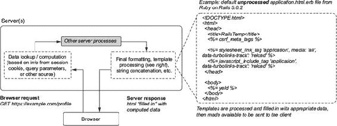

像 Ruby on Rails、WordPress（一个基于 PHP 的内容管理系统框架）等框架的开发和成长是为了满足以这种方式构建应用程序的需求。这种以服务器为中心的方法效果良好，并且至今仍然如此。但随着客户端 JavaScript 变得更加健壮，浏览器变得更加强大，开发者最终开始使用 JavaScript 来做的不仅仅是为他们的应用程序添加基本交互性。他们开始使用它来生成和更新带有动态数据的界面。这意味着服务器在模板化方面的使用减少，更多地作为数据源。今天你会发现许多应用程序（如你的）使用强大的客户端应用程序来管理 UI，并使用远程（通常是 REST）API 来提供动态数据。这种范式是你迄今为止在书中一直在使用的。但本章开始稍微改变这一点，因为你开始混合服务器端渲染和客户端渲染的模式。下一节将展示一些关于服务器端渲染的具体示例。图 12.2 展示了这种设置与图 12.1 中的设置相比的例子。

##### 图 12.2。随着浏览器和 JavaScript（有时进展缓慢）的演变，客户端 JavaScript 承担了更多的责任。在图 12.1 和这张图中，都在完成相同的基本任务（获取或计算数据；向用户展示），但客户端和服务器承担了不同的责任。

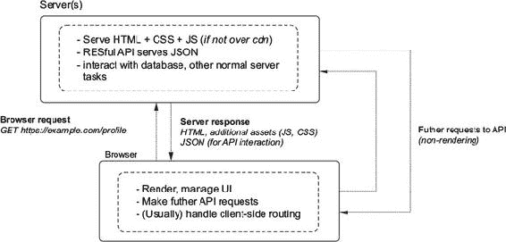

#### 12.1.1\. 深入研究服务器端渲染

在开始实现 SSR 之前，我们将从非 React 环境中探讨其更多方面，以便当你开始将其构建到你的应用中时，你的任务将更有意义。让我们看看一个使用 ERB（嵌入式 Ruby）的 SSR 示例。我们在图 12.1 中看到了 ERB 的引用。ERB 是 Ruby 编程语言的一个特性，可以用来创建 HTML（或其他类型的文本，如用于 RSS 订阅源生成的 XML）模板。如果你感兴趣，可以在[`guides.rubyonrails.org/layouts_and_rendering.html`](http://guides.rubyonrails.org/layouts_and_rendering.html)了解更多关于 ERB 和 Ruby on Rails 的信息。

许多 Ruby on Rails 应用将包含使用 ERB 模板生成的视图。框架将读取开发者创建的.erb 模板文件，并使用来自服务器或其他地方的数据填充它们。填充了数据后，生成的文本将被发送到用户的浏览器。模板化 HTML 视图的能力类似于 JSX，尽管语法和语义不同。React 创建并管理 UI，而像 ERB 这样的模板化方法仅覆盖“创建”这一半。列表 12.1 展示了 ERB 文件的一个简单示例，以展示在服务器端渲染应用中经常使用的模板化类型。除了语法差异外，它与其他模板语言（如 Handlebars、Jade、EJS，甚至在 React 中）所熟悉的内容不应有太大差异。许多这些模板语言允许你使用编程语言中许多基本结构，如循环、变量访问等；React 的 JSX 也不例外。

##### 列表 12.1\. ERB 模板化

```
<h1>Listing Books</h1>
<table>
  <tr>
    <th>Title</th>
    <th>Summary</th>
    <th></th>
    <th></th>
    <th></th>
  </tr>
<% @books.each do |book| %>                                             #A
  <tr>
    <td><%= book.title %></td>
    <td><%= book.content %></td>
    <td><%= link_to "Show", book %></td>
    <td><%= link_to "Edit", edit_book_path(book) %></td>
    <td><%= link_to "Remove", book, method: :delete, data: { confirm: "Are
     you sure?" } %></td>
  </tr>
<% end %>
</table>
<br>
<%= link_to "New book", new_book_path %>
```

快速查看服务器端渲染过程中发送到浏览器的内容，可能会有助于你对构建过程的机制有一个直观的了解。在服务器处理类似于列表 12.1 中的模板之后，它将发送一个文本响应到浏览器。结果将类似于列表 12.2，它展示了 HTTP（版本 1/1.1）响应的文本表示。这类似于你在服务器上渲染 Letters Social 应用时发送到浏览器的内容。

我使用了一个常见的命令行工具 cURL 来获取 http://example.com 的网页，以便我们可以看到原始 HTTP 请求。您可能已经在您的机器上安装了 cURL，但如果您没有，请访问[`github.com/curl/`](https://github.com/curl/) curl 并按照那里的说明进行安装。列表 12.2 显示了运行`curl -v https://example.com`的“原始”HTTP 响应样本输出。为了简洁起见，我省略了一些内容，并保留了 cURL 中的>和<符号来指示出站（>）和入站（<）消息。如果您不想使用 cURL，您也可以在浏览器中导航到 http://example.com 并打开开发者工具。Chrome、Firefox 和 Edge 都拥有网络部分，允许您检查 HTTP 请求。

##### 列表 12.2. 示例 HTTP 请求

```
> GET / HTTP/1.1                                          *1*
> Host: example.com                                       *1*
> User-Agent: curl/7.51.0                                 *1*
> Accept: */*                                             *1*

< HTTP/1.1 200 OK                                         *2*
< Cache-Control: max-age=604800
< Content-Type: text/html
< Date: Mon, 01 May 2017 16:34:13 GMT
< Etag: "359670651+gzip+ident"
< Expires: Mon, 08 May 2017 16:34:13 GMT
< Last-Modified: Fri, 09 Aug 2013 23:54:35 GMT           *3*
< Server: ECS (rhv/81A7)
< Vary: Accept-Encoding
< X-Cache: HIT
< Content-Length: 1270                                   *3*
<
<!doctype html>                                          *4*
<html>
<head>
    <title>Example Domain</title>

    <meta charset="utf-8" />
    <meta http-equiv="Content-type" content="text/html; charset=utf-8" />
    <meta name="viewport" content="width=device-width, initial-scale=1" />
</head>

<body>
<div>
    <h1>Example Domain</h1>
    <p>This domain is established to be used for illustrative examples in
     documents. You may use this
    domain in examples without prior coordination or asking for
     permission.</p>
    <p><a href="http://www.iana.org/domains/example">More
     information...</a></p>
</div>
</body>
</html>
```

+   ***1* 您使用 cURL 发送到服务器的请求**

+   ***2* 响应头提供了诸如响应状态和其他有用信息（如 Cache-Control、Expires 等）**

+   ***3* 响应头提供了诸如响应状态和其他有用信息（如 Cache-Control、Expires 等）**

+   ***4* 响应体——您将使用 React 生成的内容**

到本章结束时，您希望应用的服务器部分能够创建与列表 12.2 中相同类型的输出（但当然要针对您的 app）。希望到现在为止，服务器渲染的一般概念已经变得有意义。在接下来的两个部分中，我们将探讨何时以及何时不应将此功能构建到您的应用中。

### 12.2. 为什么要在服务器上渲染？

为什么您想进行 SSR？这取决于您的用例，可能会有一些非常有力的理由。例如，有一些轶事证据表明，当涉及到被搜索引擎索引和抓取时，服务器渲染的应用表现更好。尽管大型搜索引擎如 Google 似乎可以在服务器上执行或至少模拟 JavaScript 和 DOM，但似乎渲染动态内容而不需要 DOM 的网站表现更好。由于 Google 和其他公司的网站排名算法是保密的，因此很难确定 SSR 与非 SSR 应用对搜索引擎优化（SEO）的确切影响，但至少有来自行业中的个人和团队的轶事证据表明它可能产生积极影响。如果您有一个高度公开的应用，并且高度依赖在搜索引擎结果中显示，您可能需要考虑 SSR 来增加爬虫友好性，以及您所有的其他 SEO 优化。

在这本书中，您一直在构建一个需要交互性和允许用户动态创建内容的 app，但并非每个 app 都有这些需求。如果您只想使用 React 的静态方面，您可以使用 React-DOM 的静态渲染能力轻松创建一个静态页面生成器或模板库。

你可能希望在服务器上渲染的另一个原因是优化用户的体验。如果你的应用需要尽快向用户展示内容，那么在服务器上渲染可能允许你比等待客户端渲染更快地向他们展示内容。这可能适用于你的应用依赖于向人们展示广告或其他静态付费内容，并且负载大小不是特别大的情况。在你想快速展示内容而不需要交互的情况下，你通常更关心的是*首次绘制*，这是用户第一次能够在他们的浏览器中看到内容的时候。

首次绘制是你可以用来确定浏览器如何渲染应用的许多指标之一。另一个是*感知速度索引*（通常简称为*速度索引*或*SpeedIndex*）。这是通过记录页面随时间完成渲染的部分来计算的。浏览器会在页面加载时记录一个视频，并确定在给定的时间间隔内页面加载了多少百分比。这个指标可以用来理解在总体层面上，给定页面对于用户来说加载得多快。SSR 可以通过允许在加载过程的早期阶段有更多的网站内容可以被浏览器渲染，从而潜在地贡献到一个更快的速度索引。更多关于速度索引的信息，请参阅[`sites.google.com/a/webpagetest.org/docs/using-webpagetest/metrics/speed-index`](https://sites.google.com/a/webpagetest.org/docs/using-webpagetest/metrics/speed-index)。

大多数应用都将从更快的速度索引和快速首次绘制中受益。但在其他情况下，你可能不会像关心尽快向用户展示内容那样关心，因为你更关心他们使用你的应用的速度。用户能够与你的应用程序或页面交互所需的时间，称为*交互时间*（TTI），如果您的应用是一个高度交互、功能丰富的应用，如 Basecamp 或 Asana，那么这个时间可能更为重要。对于这些应用，SSR 可能没有意义，因为它们不是面向公众的，并且比快速向用户展示内容更依赖于交互性。

让我们看看几个应用，并看看 TTI 如何可能影响：

+   ***Basecamp（项目管理应用）***—**用户希望能够搜索问题、更新待办事项和检查项目状态。在这种情况下，你希望优化你的应用，尽可能快地加载 JavaScript，而不是试图尽快向用户展示内容。

+   ***Medium（博客/写作应用）***—**用户希望尽可能快地阅读和浏览文章。他们这样做的能力并不依赖于应用交互性，因此在这种情况下，你可能希望优化首次绘制。

当考虑 SSR 时，你还需要权衡在服务器和客户端渲染之间的资源使用权衡。如果你正在渲染大量数据（比如在线电子表格中的数千行），在服务器上执行这一操作可能需要你向浏览器发送更大的初始负载。这反过来可能意味着更长的 TTI（首次内容绘制时间），这可能会对你的用户造成不利影响，并可能使用更多的服务器资源。例如，在应用加载后以 JSON 格式获取相同数量的数据，可能会产生更小的负载大小，并可能带来更好的用户体验。

|  |
| --- |

**企业级和消费级应用的服务器渲染**

你可能会觉得我们本章关于服务器渲染的讨论是某种理论性的内容，你永远不会需要处理。但我想告诉你，服务器渲染比你想象的要普遍得多，并且是许多团队会积极考虑的一个选项。我在自己的经历以及我所遇到的工程师的经历中看到了这一点。我参与过面向公众的消费产品以及封闭的企业应用的开发，有机会看到服务器渲染在多种商业场景中被考虑。在这两种情况下，我们都希望为用户提供最好的服务，并考虑了服务器端渲染作为一个选项。

在企业应用中，我们面对的是希望应用能够快速交互的用户，而不仅仅是快速渲染。我们还必须提供可能包含数百行甚至数千行财务数据的页面（这可能会抵消服务器渲染带来的收益）。该应用由几个较小的应用组成，我们根据特定时间使用哪些应用来提供不同的 JavaScript 包。更复杂的是，数据完整性和安全性对我们来说是最重要的考虑因素，因此服务器渲染可能会引入一个新的安全领域，需要从安全角度进行评估和保障。

这些因素使得服务器渲染成为“锦上添花”的东西，可以在未来某个可以重新评估的时间保存。我们发现我们可以做其他事情来帮助我们的用户，比如提高我们的服务器性能，优化我们提供应用资源的方式，以及在必要时才在客户端延迟数据获取。有趣的是，人们对不同类型的应用也有不同的期望。像 Facebook、Twitter 和 Amazon 这样的消费应用都在争夺用户，他们有各种各样的选择，因此直接在其他许多方面与其他人竞争。在我的经验中，企业用户对他们用于工作的应用有一套不同的期望。速度当然非常重要，但稳定性、可靠性、清晰度以及商业应用的其他重要方面也同样重要。对于工程团队来说，在这些维度上优化可能比花同样时间在影响较小的指标上优化更有意义。这并不总是情况，但对我来说，我在一些项目上就是这样做的。

我参与的其他项目有着非常不同的需求。另一个应用是在电子商务领域。页面服务器渲染是有意义的，因为首次绘制时间和 SEO 考虑因素非常重要。我们努力最小化捆绑资源的尺寸，并尽可能快地向用户展示内容。任何迟缓的表现都可能阻止用户继续他们的购物体验。这些应用也与营销活动紧密集成，因此保证稳定的 SEO 性能是一个优先事项。

仍然有其他类型的案例，其中服务器渲染可以应用，但我希望这两个更简单的例子能帮助稍微阐明我们在本章讨论的一些实际问题的细节。

|  |
| --- |

在你的 SSR 实现中，不一定非得全有或全无。如果你必须在电子表格中渲染成千上万的行，可能让客户端处理渲染的这一方面是有意义的，但登录和注册页面可以在服务器上渲染，因为它们较小，并且更多地依赖于首次绘制而不是交互时间。你也可以选择在网页上渲染某些部分，但允许客户端处理所有进一步的数据获取和渲染。如果你对深入了解不同方面的 Web 性能有更多兴趣，一个好的起点是 Google 的 Web 基础指南：[`developers.google.com/web/fundamentals/performance/`](https://developers.google.com/web/fundamentals/performance/).

### 12.3. 你可能不需要 SSR

尽管 SSR 有一些潜在的好处，但你只有在真正需要时才应该将其构建到你的应用程序中。这是因为，根据其深度集成程度，它可能会引入显著复杂性。在本章中，我们将实现一个基本的、甚至可以说是简化的 SSR（服务器端渲染）版本，以便熟悉这些概念，但构建一个强大、专门设计的实现，以处理所有不同的 SSR 细微差别，可能需要重大的技术投入。

至少有几个原因说明为什么集成服务器端渲染会增加复杂性。以下是一些原因：

+   你需要以某种方式同步服务器和客户端，使得客户端能够理解何时接管。这可能包括设置标记、事件处理程序等客户端可能需要的更多内容。你的认证实现还需要考虑到来自服务器或客户端的请求，这可能需要做出改变。

+   客户端和服务器在不同的范式下运行，这些范式并不总是容易相互映射（例如，没有 DOM，没有文件系统等）。你必须协调交接和渲染，并确保你不使用，或者正确处理依赖于浏览器环境的组件。

+   尽管有一些例外，但 React（以及任何 JavaScript）最可靠地运行在 Node.js 运行时。这可能会使你的客户端和渲染它的服务器耦合在一起，因为它们现在都需要支持 JavaScript。这可能是一件好事，但也意味着你比以前更多地把自己绑定在 JavaScript 语言/平台上。

+   微调 SSR 可能需要对客户端和服务器进行特殊的调整。性能提升通常是通过关注特定功能的小幅、增量胜利来实现的，这几乎总是涉及权衡。这有时可能意味着在快速做出改变时灵活性降低，以及更复杂的维护过程。服务器端渲染给这个过程增加了另一个方面。

总体而言，这里谨慎的主要原因是“只使用你需要的东西”这一理念。我不想让你产生这样的想法，即你的 React 应用程序不完整，或者以某种方式“不够 React 化”，除非它使用了 SSR。最好的工程决策过程涉及对所涉及权衡的彻底考虑（而不仅仅是其他人使用什么或什么受欢迎！），这也适用于这里。一个例子可能是你正在编写一个简单的博客应用程序作为个人副项目。现实是，如果你不是 Netflix，你不需要 Netflix 的基础设施和编排技术。即便如此，并非所有大型公司都在做 SSR。例如，在撰写本文时，甚至 Instagram 似乎也没有使用 React 进行 SSR，而该公司在 React 上投入了大量资金。使用你所需要的。

### 12.4. 服务器上渲染组件

现在我们简要地探讨了服务器端渲染的一些权衡，我们可以开始深入了解它是如何与 React 一起工作的。让我们从您将使用的 React API 开始。ReactDOMServer（通过 `require('react-dom/server')` 或 `import ReactDOM from 'react-dom/server'` 访问）公开了四个重要的方法，您可以使用这些方法为您组件生成初始 HTML：

+   `renderToString`

+   `renderToStaticMarkup`

+   `renderToNodeStream`

+   `renderToStaticNodeStream`

让我们逐一查看每个方法。

首先，我们有 `ReactDOMServer.renderToString`。`renderToString` 做的事情正如其名：它接受一个 React 元素，并根据方法调用时存在的初始状态和属性（默认或传递的）从组件生成相应的 HTML 标记。如您在前面章节中记住的那样，React 元素是 React 应用程序的最小构建块。它们通过 `React.createElement`（或更常见的是 JSX）创建，并且可以从字符串类型或 React 组件类创建。该方法看起来像这样：

```
ReactDOMServer.renderToString(element) string
```

当您在服务器上渲染时，您会像往常一样使用组件并传递属性。您迄今为止所习惯的与在服务器上使用 React 的主要区别是缺少 DOM 和浏览器环境。这意味着 React 不会运行生命周期方法，如 `componentWillMount`，也不会持久化状态或利用其他 DOM 特定功能。

|  |
| --- |

服务器端渲染可能涉及相当多的复杂性，不应被视为所有应用程序的标准或“必备”功能。花点时间思考一下您可能如何实现（或选择不实现）以下类型应用程序的服务器端渲染：

+   没有面向公众部分的企业应用程序

+   严重依赖广告的社交媒体网站

+   电子商务应用程序

+   视频托管平台

|  |
| --- |

`ReactDOM.renderToStaticMarkup` 将与 `renderToString` 做同样的事情，但不会附加任何额外的 DOM 属性供 React 在客户端“接管”时使用。这在您只想进行基本的模板化或静态站点生成且不需要任何额外属性的情况下非常有用。`renderToStaticMarkup` 几乎与 `renderToString` 相同：

```
ReactDOMServer.renderToStaticMarkup(element) string
```

您将不会在此之后使用 `renderToStaticMarkup`，但一旦您学会了如何使用 React 实现服务器端渲染，在适当的项目中将其用于未来项目应该会很简单。

你可能已经注意到前两种方法在 `renderToNodeStream` 和 `renderToStaticNodeStream` 中有明显的补充。如果是这样，你猜对了。这些方法与其他方法相同，只是它们使用了 Node 的 Streams API，并在 React 16 中随着 fiber reconciler 和许多其他变化一起引入。Streams 在 node.js 中被广泛使用，如果你与 Node 有过任何工作，你可能已经听说过它们。如果你没有，那也无所谓，你可以在 [`nodejs.org/api/stream.html`](https://nodejs.org/api/stream.html) 上了解更多信息。对我们来说，这些基于流的方法的要点是它们是异步的。这使它们在它们的同步对应物之上具有显著的优势。在一段时间内，使用 React 进行服务器渲染的一个小缺点是这些方法是同步的。这对必须渲染包含许多组件的复杂页面的应用程序提出了挑战。我们将在本章后面探讨这些方法，当我们查看服务器渲染中的数据获取时。

现在你对可用的 API 方法了解得更多了，我们可以关注 `renderToString`。`renderToString` 将生成 React 可以在客户端使用和工作的代码。React-DOM 另有一个方法 `hydrate`，它几乎与您非常熟悉的常规 `render` 方法完全一样。主要区别在于 `hydrate` 专门处理由服务器端渲染生成的标记。

如果你在一个已经由 React-DOM 在服务器上创建了标记的节点上调用 `ReactDOM.hydrate()`，React 将保留现有的 HTML 并比其他情况下做更少的工作。这通常意味着在初始启动时 React 需要做的工怍会更少（这取决于你发送的数据量以及服务器负载、网络、天气等因素）。我不会再次提及这一点，但请记住，SSR 并非魔法，如果你像加载大型的 JavaScript 文件、不拆分代码或违反其他最佳实践这样的行为，你很容易就会抵消任何性能提升。

到目前为止，你还没有接触过任何服务器文件。除了本章的有限范围，服务器编程通常不在此书的范围之内，所以我们不会过多地介绍 node.js 运行时或网络服务器编程范式。如果你对 Node 和服务器端编程感兴趣，可以查看 Alex Young 等人所著的 *Node.js in Action* 第二版（Manning Publications，2017）：[www.manning.com/books/node-js-in-action](http://www.manning.com/books/node-js-in-action)。

你将通过关注需要进行的服务器更改来开始构建 SSR。列表 12.3 显示了在您对它进行任何操作以使其与 React 一起工作之前，主应用服务器代码的状态。我包括了所有内容，以便您可以了解它在做什么。大部分代码是简单的 Express 应用程序可能使用的样板中间件，但其中大部分与 SSR 没有直接关系。图 12.3 将列表 12.3 中的代码置于本章中我们讨论过的渲染方法背景中。

##### 图 12.3\. 截至列表 12.3，这是服务器代码的基本功能。它设置了您的服务器，添加了一些样板中间件，然后提供了一个简化版的 HTML 文件，该文件反过来下载您的应用。

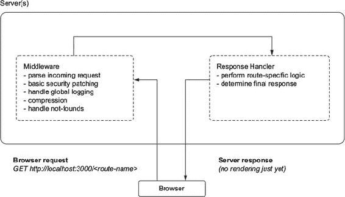

列表 12.3 显示了您的应用（基本）服务器设置。当您将其置于本章中我们一直在查看的 SSR 方法背景中时，它与以客户端为中心的范例相匹配。在这种方法中，服务器通常会仅发送一个不包含预渲染内容的 HTML 文件。您的构建工具目前正在处理生成和提供 HTML 文件。该文件包含对将下载并执行以进行渲染和管理应用程序的脚本的引用，但在服务器上（尚未！）没有进行渲染。

##### 列表 12.3\. 从服务器开始（server/server.js）

```
import { __PRODUCTION__ } from 'environs';                             *1*
import { resolve } from 'path';
import bodyParser from 'body-parser';
import compression from 'compression';
import cors from 'cors';
import express from 'express';
import helmet from 'helmet';
import favicon from 'serve-favicon';
import hpp from 'hpp';
import logger from 'morgan';
import cookieParser from 'cookie-parser';
import responseTime from 'response-time';
import * as firebase from 'firebase-admin';
import config from 'config';

import DB from '../db/DB';

const app = express();                                                *2*
const backend = DB();                                                 *2*

app.use(logger(__PRODUCTION__ ? 'combined' : 'dev'));
app.use(helmet.xssFilter({ setOnOldIE: true }));
app.use(responseTime());
app.use(helmet.frameguard());
app.use(helmet.ieNoOpen());
app.use(helmet.noSniff());
app.use(helmet.hidePoweredBy({ setTo: 'react' }));
app.use(compression());
app.use(cookieParser());
app.use(bodyParser.json());
app.use(hpp());
app.use(cors({ origin: config.get('ORIGINS') }));

app.use('/api', backend);                                             *3*
app.use(favicon(resolve(__dirname, '..', 'static', 'assets', 'meta',  *3*
     'favicon.ico')));

app.use((req, res, next) => {                                         *4*
    const err = new Error('Not Found');
    err.status = 404;
    next(err);
});

app.use((err, req, res) => {
    console.error(err);
    return res.status(err.status || 500).json({
        message: err.message
    });
});

module.exports = app;
```

+   ***1* 使用 ES 模块语法，在 node 8.5 及以上版本中可用通过 ESM**

+   ***2* 设置将应用于所有传入请求的中间件；处理日志记录、一些基本的安全保护、解析传入请求。**

+   ***3* 响应请求，您将集成 React DOM**

+   ***4* 错误处理代码，用于捕获来自其他路由的转发错误并发送给客户端**

您想要采取的第一步是引入 React-DOM 并尝试渲染一个简单的组件。在您开始集成您的应用之前，您将首先渲染一个包含一些文本的简单`div`。您将使用`React.createElement`进行这个小示例，这样您就不必处理服务器文件的转译，但您可以在稍后拉入组件以供使用时在其他文件中使用 JSX。这是因为您将使用`babel-register`，这是一个用于开发的 Babel 库，它即时转译您的代码。您可以在 index.js 中看到我们正在引入`babel-register`。在生产环境中，您不会这样做。相反，您将使用类似 Webpack 和 Babel 的工具将您的代码编译成一个包。在这里，我无法深入介绍工具，但您可以在[`webpack.js.org`](https://webpack.js.org)和[`babeljs.io`](https://babeljs.io)了解更多信息。

在这次第一次遍历中，你只需插入一条简单的消息作为`div`的子内容，并将其发送到客户端。一旦你设置了这一切，你将运行服务器并检查你得到什么反馈。图 12.4 显示了列表 12.4 中的代码做了什么。

##### 列表 12.4\. 尝试服务器端渲染

```
//...
app.use('/api', backend);
app.use(favicon(resolve(__dirname, '..', 'static', 'assets', 'meta',
     'favicon.ico')));
app.use('*', (req, res, next) => {                                   *1*
    const componentResponse = ReactDOMServer.renderToString(         *2*
        React.createElement(                                         *3*
            'div',                                                   *3*
            null,                                                    *3*
            `Rendered on the server at ${new Date()}`                *4*
        )
    );
    res.send(componentResponse).end();                               *5*
});
//...
```

+   ***1* 在请求处理器中，创建 HTML 字符串并发送下去**

+   ***2* 使用`renderToString`并传入裸骨 React 元素**

+   ***3* 创建一个没有属性的 div 类型的元素**

+   ***4* 传入带有时间戳的简单字符串作为子内容**

+   ***5* 将响应发送到客户端**

##### 图 12.4\. 你现在正在使用 React-DOM 来渲染一个简单的 HTML 字符串并将其发送到客户端。从某种意义上说，这就是所有 SSR（创建静态标记，发送到客户端）的全部。我提到的复杂性通常来自于，除了其他事情之外，获取创建文本所需的所有数据，与客户端协调过程，然后进行优化。

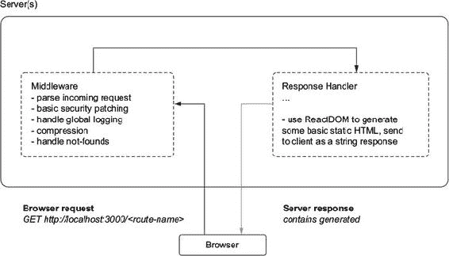

如果你修改了列表 12.4，只需在终端中运行`node server/run.js`来仅运行服务器，并使用另一个会话通过 cURL 发送请求，然后你应该会看到服务器返回的响应。在此之前，你每次都发送相同的 HTML 字符串，然后该文档会在之后加载你的应用程序脚本。React 随后会运行并将你的应用程序渲染到 DOM 中（创建 DOM 节点、分配事件监听器等）。使用这种新的方法，你可以将第一次渲染委托给服务器，并让 React 接管。列表 12.5 显示了如何运行服务器和使用 cURL 检查从服务器返回的响应。

##### 列表 12.5\. 检查你的第一个服务器端渲染响应

```
$ npm run server:dev

// ... in a different terminal session

$  curl -v http://localhost:3000                                          *1*
> GET / HTTP/1.1
> Host: localhost:3000
> User-Agent: curl/7.51.0
> Accept: */*
>
< HTTP/1.1 200 OK                                                         *2*
< X-Powered-By: react
< X-XSS-Protection: 1; mode=block
< X-Frame-Options: SAMEORIGIN
< X-Download-Options: noopen
< X-Content-Type-Options: nosniff
< Access-Control-Allow-Origin: *
< Content-Type: text/html; charset=utf-8
< Content-Length: 144
< ETag: W/"90-gXhNJUy73fc2MSrpr7eaKDZ7OV8"
< Vary: Accept-Encoding
< X-Response-Time: 0.795ms
< Date: Mon, 08 May 2017 10:26:55 GMT
< Connection: keep-alive
<
* Curl_http_done: called premature == 0
* Connection #0 to host localhost left intact

<div data-reactroot="">Rendered on the server at Mon May 08 2017 03:26:55
     GMT-0700 (PDT)</div>                                                 *3*
```

+   ***1* 向运行中的服务器发送请求，检查你得到什么反馈**

+   ***2* 你应该在请求中收到头部信息，但你最关心的是响应体。**

+   ***3* 最外层 HTML 元素上的特殊`react-root`和`react-checksum`属性**

通过这样，你已经完成了你的第一次服务器渲染。你使用了 React 来创建 React 组件的字符串表示形式并将其发送到客户端。目前，React 还没有被加载，所以它不能从服务器停止的地方继续，但一旦它被包含进来，它将能够接管。尝试运行相同的命令，但选择使用`renderToStaticMarkup`而不是它，看看你的服务器 HTTP 响应如何不同。

### 12.5\. 切换到 React Router

你在前面章节中构建的路由器是针对处理浏览器中的路由进行优化的，但它并没有考虑到服务器端渲染。有机会深入了解 React 的潜力是构建它自己的很大一部分，而不仅仅是安装第三方库，我希望这给了你看到组件可以以不同方式使用的机会。

对于相对简单的示例应用需求来说，它可能已经足够有用，但你的路由器在几个方面还不足。它有一个相当基础的 API，如果它能支持诸如路由钩子（路由之间的转换）、中间件（可以应用于多个路由的逻辑）等功能，那就更好了。随着你深入到 React 的服务器端渲染，你将需要更多的功能，比如根据请求 URL 生成组件树进行渲染的能力。这就是为什么你会转向使用 React Router V3。

React Router ([`github.com/ReactTraining/react-router`](https://github.com/ReactTraining/react-router)) 似乎是 React 单一最常用且最发达的路由解决方案。它在 GitHub 上拥有强大的追随者和贡献者社区，并且已经经历了多次重大修订。

在撰写本文时，React Router 的最新主要版本是 4。它目前处于变动中，在你阅读本文时可能已经被新的主要版本所取代。你会使用版本 3，因为它的 API 与你创建的路由相似，你应该能够几乎不需要更改就能使用它。你还会使用它，因为它是由 React 开源社区开发的一个健壮的技术。它能够做比你更简单的路由更多的事情，甚至超过了你在这里的需求。

|  |
| --- |

**选择第三方库还是内部构建**

你选择转向 React Router 而不是坚持使用自家的解决方案的另一个原因是，它更可能是你或你的团队将面临任何商业情况下的候选者。你可能会更倾向于选择像 React Router 这样的开源解决方案，而不是自己编写。这是因为，根据你的需求，构建和维护一个强大解决方案所需的时间可能或可能不值得。在处理外部依赖时，导航构建或购买决策也可能很棘手。我的观点是，记住两点：1) 你不必因为别人都在使用而使用某物，2) 建立自己的解决方案通常比初始工作要付出更多努力——维护通常是最大的时间消耗。开源贡献者的大社区通常会在你遇到之前捕捉到许多错误。

|  |
| --- |

值得注意的是，React Router 是一项重要的技术，我们在这里只会浅尝辄止。该项目已经包含了针对多种情况的广泛路由功能。在撰写本文时，最新的主要版本（4）甚至为 React Native 平台提供了路由解决方案。使用并参与 React Router 开发的开发者数量使得该项目极其有用，但这也带来了一个缺点，那就是在主要版本之间有时会有很大的变化。正因为如此，并且与您从头开始构建的路由相似，您不会使用 React Router 的最新版本。如果您想使用 React Router 的最新版本，我在我的博客上有一篇关于使用 React Router v4 和 React 16 的文章：[`ifelse.io/2017/09/07/server-rendering-with-react-router-and-react-16-fiber`](https://ifelse.io/2017/09/07/server-rendering-with-react-router-and-react-16-fiber)。我还会指出，尽管 React Router 的版本之间 API 已经发生变化，但大多数相同的概念仍然适用——您只需在过渡时将功能重新映射到新的 API 上即可。

#### 12.5.1\. 设置 React Router

我们已经决定使用 React Router 作为您自建路由的生产级替代品，因此让我们看看如何设置它。第一步是确保您已经安装了 React Router，并将其替换为当前的路由。尽管技术不同，但您将使用的 API 应该是相似的。

React Router 应该已经作为项目依赖项安装。现在您需要开始将项目过渡到 React Router 和一个允许您进行 SSR 的设置。从当前的 src/index.js 文件开始。这是一个入口文件，您在这里设置了应用的主要部分，包括监听浏览器历史记录、渲染路由组件和激活您的身份验证事件监听器。

这对于您的 SSR 设置是不适用的，因为那里的代码很大一部分依赖于浏览器环境，而且您不需要 React Router 的所有功能来使应用工作。您真正需要保留的是您的身份验证监听器。在添加任何内容之前，创建一个辅助工具以备后用。列表 12.6 展示了如何创建一个简单的实用工具来检查您是否处于浏览器环境中。一些工具技术，如 Webpack，可以帮助您捆绑出环境的代码，但就我们的目的而言，坚持使用这种方法。

##### 列表 12.6\. 检查浏览器环境（src/utils/environment.js）

```
export function isServer() {
    return typeof window === 'undefined';
}
```

现在，你可以使用这个助手来确定你处于什么环境，并根据你的需求有条件地执行代码。它不会进行详尽的检查以确保你处于浏览器环境，但应该足以满足你的需求。考虑到你的代码运行的环境是构建具有 SSR 功能的应用程序或客户端和服务器之间共享代码的应用程序（有时称为 *通用* 或 *同构*）的一个相当常见的方面。在我的经验中，这也可能是难以追踪的常见错误来源，特别是如果你安装了没有考虑环境意识的第三方依赖项。

到现在为止，React 社区中现有的许多技术通常要么支持 SSR，要么指出可能引起问题的位置。这并不总是如此。几年前使用 React 的早期版本时，我遇到了 React 本身的一些错误，导致某些库的某些方面无法预测地失败。不过，现在情况要好得多，SSR 不仅受到 React 社区的关注，也受到核心团队的关注。

在继续之前，你需要对你的一个还原器进行微调，以考虑服务器环境。用户还原器将使用 `js-cookie` 在浏览器上设置一个 cookie。服务器通常不允许你存储 cookie（尽管有一些库可以模拟这种行为，如 `tough-cookie` ([`github.com/salesforce/tough_cookie`](https://github.com/salesforce/tough_cookie)))，因此你需要使用你的环境助手来调整这段代码。以下列表显示了你需要进行的修改

##### 列表 12.7\. 修改用户还原器

```
export function user(state = initialState.user, action) {
    switch (action.type) {
        case types.auth.LOGIN_SUCCESS:
            const { user, token } = action;
            if (!isServer()) {                         *1*
                Cookies.set('letters-token', token);   *1*
            }                                          *1*
            return Object.assign({}, state.user, {
                authenticated: true,
                name: user.name,
                id: user.id,
                profilePicture: user.profilePicture ||
     '/static/assets/users/4.jpeg',
                token
            });
        case types.auth.LOGOUT_SUCCESS:
            Cookies.remove('letters-token');
            return initialState.user;
        default:
            return state;
    }
}
```

+   ***1* 只有在你处于浏览器环境时才尝试使用浏览器 cookie。**

回到手头的任务。你需要设置 React Router。与你的路由器类似，React Router（版本 3）允许你使用嵌套的 <Route/> 组件层次结构来指示哪些组件应该映射到哪些 URL。正如我之前提到的，React Router 是一个极其广泛使用且经过实战检验的解决方案，它具有许多你没有添加到自己的路由器中的功能；你将坚持直接将其替换为你的路由器，而不是探索它所能做的一切。

创建一个新的文件，src/routes.js，用于你的路由。你将路由拆分到自己的文件中，因为它们需要被你的服务器和客户端访问。这对于客户端代码与服务器代码并存的 应用程序来说很方便，但如果你将它们托管在其他地方（通过 npm、Git 子模块等），你可能需要找到另一种方法将你的路由引入到你的服务器中。你的路由文件应该看起来像你创建的路由器，但有几点细微差别。你添加了在同一个 <Route/> 组件中指定索引组件的能力，而 React Router 提供了一个单独的组件来达到这个目的。图 12.5 展示了你的路由配置的高级角色；它以与你的路由器相同的一般方式工作，并用于将 URL 映射到组件或组件树（当嵌套时）。列表 12.8 展示了如何将 React Router 集成到你的路由设置中。

##### 图 12.5。与你自己构建的路由器一样，React Router 的路由配置将 URL 映射到组件。你可以嵌套组件，以便在页面或子部分（如导航栏或其他共享组件）之间共享某些 UI 部分。

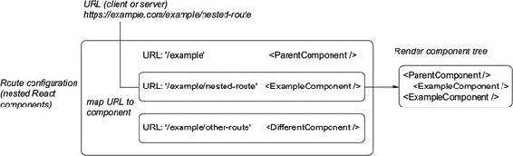

##### 列表 12.8。为 React Router 创建路由（src/routes.js）

```
import React from 'react';

import App from './pages/app';
import Home from './pages/index';
import SinglePost from './pages/post';
import Login from './pages/login';
import NotFound from './pages/404;

import { Route, IndexRoute } from 'react-router';

export const routes = (
    <Route path="/" component={App}>                          *1*
        <IndexRoute component={Home} />                       *2*
        <Route path="posts/:post" component={SinglePost} />   *3*
        <Route path="login" component={Login} />              *3*
        <Route path="*" component={NotFound} />               *3*
    </Route>
);
```

+   **1** 使用 App 来包裹整个应用。

+   **2** 使用 React Router 的 IndexRoute 组件确保你可以在索引 (/) 路径上显示组件。

+   **3** 按照你自己的路由器的方式匹配组件与路径。

现在你已经设置了一些路由，你可以将它们导入到你的主应用文件中，以便与 React Router 一起使用。相同的路由将在客户端和服务器上使用，这就是你可能听说过的 SSR 的 *通用* 或 *同构* 方面发挥作用的地方。在客户端和服务器上重用代码可能是一个很大的优势，但你可能不会在这里看到它的更多显著好处，因为这是一个非常有限的案例。你在这里获得的优势是，可以轻松地将你的客户端组件以“正常”的 React 方式暴露给服务器。

现在将您的路由导入到您的服务器中。列表 12.9 展示了如何将您的路由引入服务器并在渲染过程中使用它们。您的服务器将如何获取正确的组件（s）进行渲染？因为路由只是将 URL 映射到操作（在这种情况下是 HTTP 响应），您需要能够查找与路径关联的正确组件。在您自己的路由器中，您使用了一个基本的 URL-regex-matching 库来确定 URL 是否映射到您的路由器中的组件。它完成了根据 URL 确定哪个组件（如果有的话）应该被渲染的工作（参考图 12.5）。React Router 将允许您在服务器上做同样的事情。这样，您可以使用来自服务器的 HTTP 请求的传入 URL 来匹配要渲染到静态标记中的组件（s）。这是 React Router 和您进行 SSR 目标之间的关键连接点。React Router 使用 URL 来渲染组件或组件树，就像它通常所做的那样，但在服务器上。下一个列表展示了如何使用 React Router 设置您的 SSR 能力的初始服务器部分。

##### 列表 12.9\. 在服务器上使用 React Router（server/server.js）

```
//...
import { renderToString } from 'react-dom/server';                   *1*
import React from 'react';                                           *1*
import { match, RouterContext } from 'react-router';                 *1*
import { Provider } from 'react-redux';                              *1*
                                                                     *1*
import configureStore from '../src/store/configureStore';            *1*
import initialReduxState from '../src/constants/initialState';       *1*
import { routes } from '../src/routes';                              *1*

//...
app.use('*', (req, res) => {
    match({ routes: routes, location: req.originalUrl },             *2*
   (err, redirectLocation, props) => {                               *3*
        if (redirectLocation && req.originalUrl !== '/login') {
            return res.redirect(302, redirectLocation.pathname +
     redirectLocation.search);                                       *3*
        }

        const store = configureStore(initialReduxState);             *4*
        const appHtml = renderToString(                              *4*
               <Provider store={store}>
                    <RouterContext {...props} />
               </Provider>
            );

        const html = `                                               *5*
            <!doctype html>
            <html>
                <head>                                               *5*
                    <link rel="stylesheet"
     href="http://localhost:3100/static/styles.css" />
                    <meta charset=utf-8/>
                    <meta http-equiv="X-UA-Compatible" content="IE=edge">
                    <title>Letters Social | React In Action by Mark
     Thomas</title>
                    <meta name="viewport" content="width=device-
     width,initial-scale=1">
                </head>
                <body>
                    <div id="app">                                   *5*
                        ${appHtml}                                   *5*
                    </div>
                <script src="http://localhost:3000/bundle.js"
     type='text/javascript'></script>                                *5*
                </body>
            </html>
        `.trim();
        res.setHeader('Content-type', 'text/html');                  *6*
        res.send(html).end();                                        *6*
    });
});

//... Error handling

export default app;
```

+   ***1* 从 React Router 导入一些实用工具，renderToString 从 React DOM，Redux Provider 组件，您的 store 和您的路由**

+   ***2* 将 URL 传递给匹配函数以及路由**

+   ***3* 匹配会出错，重定向（如果有），并传递 props；将用于渲染自定义错误页面或重定向**

+   ***4* 将您从 React Router 导入的 RouterContext 组件传递进去，并用常规的 Redux Provider 组件包裹它**

+   ***5* 使用字符串模板字面量创建包含您的应用程序 HTML 的 HTML 文档**

+   ***6* 在响应中设置头部并发送回浏览器**

### 12.6\. 使用 React 路由处理受保护的路线

现在您已经设置了服务器，您可以稍微清理一下您的应用程序的客户端部分。您需要确保您正在使用您的新路由设置。您还需要移动一些与身份验证相关的逻辑，以便更好地利用 React Router。为此，您将使用 React Router 提供的一系列功能：钩子。类似于生命周期方法在组件挂载、更新和卸载时工作的方式，React Router 提供了一些钩子用于路由之间的转换。您可以使用这些钩子的多种方式，包括以下内容：

+   您可以在允许用户完成 URL 转换之前触发页面数据获取或检查用户是否已登录。

+   您可以在用户离开页面时处理任何清理操作或结束分析会话——您不仅限于与进入相关的事件。

+   使用 React Router 的钩子，您甚至可以进行同步 *或* 异步工作，因此您不受限制于其中之一。

+   向分析平台（如 Google Analytics）发送页面浏览事件。

图 12.6 展示了 React Router v3 中你可以使用的钩子基本流程。React Router 在底层与 History API ([`developer.mozilla.org/en-US/docs/Web/API/History_API`](https://developer.mozilla.org/en-US/docs/Web/API/History_API)) 交互，但将这些钩子暴露出来，以便在应用程序中更容易进行路由。如果你想了解更多关于 React Router V3 API 的信息，并探索社区编写的一些其他有用的指南，请查看 GitHub 上的文档 [`github.com/ReactTraining/react-router/blob/v3/docs/API.md`](https://github.com/ReactTraining/react-router/blob/v3/docs/API.md)。

##### 图 12.6\. React Router 在 Route 组件上暴露了一些事件处理器。你可以使用这些处理器来挂钩到用户或你的代码导致转换时发生的路由转换。请注意，“重定向”不是一个带有 3XX 状态码的 HTTP 重定向。

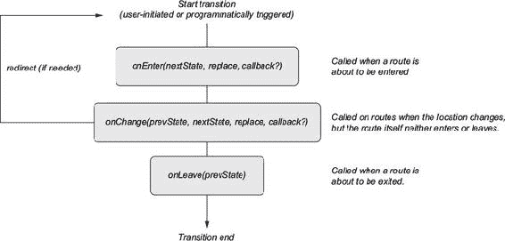

你将使用 `onEnter` 钩子来检查某些路由的登录用户，并在没有认证用户的情况下将他们重定向到登录页面。在实践中，你希望从安全的角度思考你的应用程序，并投入大量时间来防止用户转换到他们不应能够转换到的页面。你还需要确保你的安全策略也扩展到你的服务器。但就目前而言，Firebase 和路由钩子应该足以保护一些你的路由。下一个列表显示了如何为受保护页面设置 `onEnter` 钩子。你可能从上一章中认出了认证逻辑，其中你在登录操作中使用它。图 12.6 展示了此过程的工作方式。

##### 列表 12.10\. 设置 `onEnter` 钩子（src/routes.js）

```
import React from 'react';

import { Route, IndexRoute } from 'react-router';

import App from './pages/app';
import Home from './pages/index';
import SinglePost from './pages/post';
import Login from './pages/login';
import Profile from './pages/profile';
import NotFound from './pages/error';
import { firebase } from './backend';                                    *1*
import { isServer } from './utils/environment';                          *1*
import { getFirebaseUser, getFirebaseToken } from './backend/auth';      *1*

async function requireUser(nextState, replace, callback) {               *2*
    if (isServer()) {                                                    *3*
       return callback();
    }
    try {
        const isOnLoginPage = nextState.location.pathname === '/login';  *4*
        const firebaseUser = await getFirebaseUser();                    *5*
        const fireBaseToken = await getFirebaseToken();                  *5*
        const noUser = !firebaseUser || !fireBaseToken;                  *6*

        if (noUser && !isOnLoginPage && !isServer()) {                   *6*
            replace({
                pathname: '/login'
            });
            return callback();
        }
        if (noUser && isOnLoginPage) {                                   *7*
            return callback();
        }
        return callback();
    } catch (err) {
        return callback(err);                                            *8*
    }
}

export const routes = (
    <Route path="/" component={App}>
        <IndexRoute component={Home} onEnter={requireUser} />            *9*
        <Route path="/posts/:postId" component={SinglePost}
     onEnter={requireUser} />
        <Route path="/login" component={Login} />
        <Route path="*" component={NotFound} />
    </Route>
);
```

+   ***1* 导入 Firebase 和 isServer 实用工具。**

+   ***2* React Router 钩子需要三个参数：nextState、一个替换函数和一个回调函数。**

+   ***3* 如果你处于服务器，继续**

+   ***4* 你需要知道你是否在登录页面，这样你才不会无限重定向**

+   ***5* 使用样本仓库中包含的 Firebase 实用函数来获取 Firebase 用户和令牌**

+   ***6* 如果没有令牌或用户且不在登录页面，重定向用户**

+   ***7* 如果没有用户但他们在登录页面，允许他们继续**

+   ***8* 如果出错，则使用回调函数返回它**

+   ***9* 使用属性将钩子添加到适当的组件中**

在继续之前，你需要做的最后一点设置是清理主应用文件并替换你的链接组件。以下列表显示了简化后的主客户端文件版本。

##### 列表 12.11\. 清理你的应用索引（src/index.js）

```
import React from 'react';
import { hydrate } from 'react-dom';
import { Provider } from 'react-redux';                             *1*

import { Router, browserHistory } from 'react-router';              *2*
import configureStore from './store/configureStore';
import initialReduxState from './constants/initialState';
import { routes } from './routes';                                  *3*

import './shared/crash';
import './shared/service-worker';
import './shared/vendor';
// NOTE: this isn't ES*-compliant/possible, but works because we use
     Webpack as a build tool
import './styles/styles.scss';

// Create the Redux store
const store = configureStore(initialReduxState);

hydrate(                                                            *1*
    <Provider store={store}>                                        *4*
        <Router history={browserHistory} routes={routes} />         *5*
    </Provider>,
    document.getElementById('app')
);
```

+   ***1* 从 React-DOM 中导入和使用 hydrate 方法，以便它可以与服务器端渲染的标记一起工作**

+   ***2* 导入路由和 browserHistory**

+   ***3* 导入你的路由。**

+   ***4* 将你的应用包裹在 Redux Provider 中**

+   ***5* 将你的路由和 browser-History 传递给 Router 组件**

你已经使用`browserHistory`设置了 React Router，但你也可以使用基于哈希或内存的历史记录来设置它。这些与你的浏览器历史记录略有不同，因为它们不使用相同的浏览器历史 API。基于哈希的历史记录通过改变 URL 中的哈希片段来实现，但不会改变用户的浏览器历史记录。内存历史记录 API 完全不操作 URL，更适合像本地开发或 React Native（下一章将介绍）这样的应用。有关不同历史实现的信息，请参阅[`github.com/ReactTraining/react-router/blob/v3/docs/guides/Histories.md`](https://github.com/ReactTraining/react-router/blob/v3/docs/guides/Histories.md)。

如果你在本地上运行应用程序，你应该能看到所有内容在服务器上渲染并发送到客户端。React 应该接管，一切应该像你预期的那样交互式。不过，你可能注意到一个问题：使用链接的路由似乎出了问题。这是因为你构建了自己的链接组件，这些组件与你的旧路由器集成。幸运的是，要解决这个问题，你只需要将你一直在使用的 history 模块替换为 React Router 使用的模块。这里的转换应该很简单，但值得注意的是，当你选择或构建一个路由器时，它可能会影响应用程序的很大一部分。链接、页面间的切换、如何访问 props——所有这些都可能受到路由的影响，你应该考虑这一点。

你需要做的主要更改是替换链接使用的 history。React Router 仍然使用浏览器历史 API，但你可以通过使用 React Router 提供的而不是之前使用的来与你的路由器同步。由于你集中了导航包装器，任何需要将用户路由到其他位置的操作都应该在新设置中正常工作。下一个列表显示了你需要更改的行。除此之外，你不需要更改其他任何内容。

##### 列表 12.12\. 替换历史记录（src/history/history.js）

```
import { browserHistory } from 'react-router';       *1*
const history = typeof window !== 'undefined'
   ? browserHistory                                  *1*
   : { push: () => {} };
const navigate = to => history.push(to);
export { history, navigate };
```

+   ***1* 只需更改的行；让 React Router 知道你的转换**

在这些更改到位后，你应该在服务器上使用 React Router 进行渲染！让我们在结束前回顾一下：

+   当请求到来时，你将请求的 URL 传递给 React Router 的`match`实用工具，以获取你想要渲染的组件。

+   使用`match`的结果，你可以使用 React DOM 的`renderToString`方法构建一个 HTML 响应并将其发送回客户端。

+   如果你使用 cURL 或开发者工具检查你的开发服务器（使用`npm run server:dev`运行），你应该能在响应中看到你的组件的 HTML（见图 12.7）。

##### 图 12.7. 检查你的服务器端渲染应用。使用 React-DOM，你可以创建你的应用 HTML，然后将其发送到客户端。注意，因为你没有进行任何服务器端的数据获取，所以你不会期望看到任何动态数据填充你的应用（如帖子）。

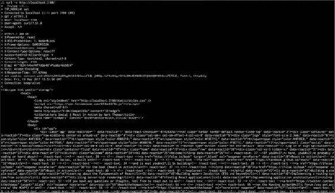

### 12.7. 使用数据获取的服务器端渲染

你已经将服务器端渲染集成到你的应用中。这可能在应用参与度和性能方面带来潜在的好处。然而，仍有改进的空间。你目前没有做任何事情来在发送之前渲染应用的全状态。你发送的负载在用户是否登录的情况下都是相同的。目前这取决于浏览器去做诸如启动认证流程和加载帖子之类的事情。你的服务器端渲染也是同步的，因为你还没有使用`renderToNodeStream`。在本节中，你将改进你的服务器端渲染以利用这个 API，并在服务器上集成 Firebase，这样你就可以进行了解认证状态的渲染。图 12.8 展示了集成数据获取的服务器端渲染的概述。

##### 图 12.8. 使用数据获取的服务器端渲染。总体上与你的渲染方式相似，主要区别在于你需要在渲染过程中进行一些数据获取。渲染输出将根据用户是否登录、用户的数据看起来如何以及他们何时登录而变化。


Firebase 提供了一种从服务器以类似浏览器的方式与他们的 API 进行交互的方法。这将使你即使在服务器上也能继续将 Firebase 视为你的数据库。在其他情况下，你可能需要做一些类似的事情，比如向一个微服务或数据库发起 HTTP 调用，以确定用户是否存在以及他们是否处于当前认证状态。由于你专注于 React，你将坚持使用 Firebase，但请注意，这是你可能在不同情况下替换这些系统的一个地方。

如果你还没有创建 Firebase 账户，这是一个很好的时机。我已经将应用程序源代码与账户的公共令牌一起分发，但为了使用 Firebase 用户管理 API，你需要有一个真实账户（你可以用它来访问用户信息，这是我不希望人们做的事情）。要设置 Firebase 账户，请访问[`firebase.google.com`](https://firebase.google.com)并注册一个账户（你应该能够使用现有的 Google 账户）。从那里，创建一个你喜欢的项目名称。

之后，您需要完成 Firebase 管理 SDK 的设置。这个过程可能会随时间而变化，所以在这里我不会具体说明。设置和安装说明可以在[`firebase.google.com/docs/admin/setup`](https://firebase.google.com/docs/admin/setup)找到，应该相对容易遵循。我们最感兴趣的是用户管理 API。您不需要在项目中安装任何其他东西，因为 node.js Firebase SDK 已经包含在您的项目依赖中。

作为最后的设置步骤，您需要替换应用程序中包含的 Firebase 密钥，因为它们与 Letters Social 项目相关，并且可能会与您自己的冲突。您可以在源代码中通过查看 config 目录找到它们。两个文件，development.json 和 production.json，分别包含开发和生产环境下的配置变量。请随意编辑这些或其他变量（也许您想自定义应用程序并在网站上部署它！）显示了 Firebase 控制台和服务账户页面。生成一个新的私有密钥，并将下载的文件移动到主应用程序仓库中——您很快就会用到它。

##### 图 12.9\. 创建一个新的 Firebase 项目并生成一个新的私有密钥。这将允许您验证到 Firebase 平台并使用 SDK 在服务器上管理用户。


现在您已经处理完这些后勤问题，可以回到编码了。您想要通过 Firebase 平台验证您的服务器应用程序，以便您可以验证和检索用于渲染完整应用程序状态的 Firebase 用户。您可能已经在 Firebase 页面上看到了如何做到这一点的示例片段，但列表 12.13 展示了如何在您的服务器上配置 Firebase Admin SDK。

##### 列表 12.13\. 在服务器上集成 Firebase (server/server.js)

```
// ...
import * as firebase from 'firebase-admin';                             *1*
import config from 'config';

// Initialize Firebase
firebase.initializeApp({
    credential: firebase.credential.cert(JSON.parse(process.env.LETTERS_
     FIREBASE_ADMIN_KEY)  ),                                            *2*
    databaseURL: 'https://letters-social.firebaseio.com'
});

// const serviceAccount = require("path/to/serviceAccountKey.json");    *3*
// admin.initializeApp({
//  credential: firebase.credential.cert(serviceAccount),
//  databaseURL: "https://test-8d685.firebaseio.com"
// });

// Our dummy database backend
import DB from '../db/DB';

//...
```

+   ***1* 导入 Firebase 管理 SDK**

+   ***2* 将 JSON 文件的字符串化版本设置为环境变量；解析它以便 Firebase 可以工作**

+   ***3* 使用 Firebase 进行验证的另一种方式**

现在当服务器运行时，它将自动连接到 Firebase 并允许您使用 Admin SDK 与用户交互。这样，您就可以在服务器上以了解请求用户的方式执行数据检索。这有什么意义？您可能还记得，在本章早期我说过服务器端路由可能很复杂，因为它可能涉及同步您的客户端和服务器。您不会做任何特别复杂的事情，但这就是我所指的。服务器端渲染可能会迅速变得极其复杂。

幸运的是，你不会做任何如此令人畏惧的事情。你将要做的就是以一种你可能之前没有使用过的方式使用 Redux。因为 Redux 没有任何限制它只能在浏览器中运行的特性，所以你也可以在服务器上用它进行状态管理。以下是你将要做的事情的简要概述，以实现允许数据获取的渲染：

+   从之前章节中存储的 cookie 中获取用户的令牌。

+   使用 Firebase 验证令牌，如果存在则获取用户。

+   如果他们没有有效的令牌（可能已过期），清除 cookie 并将他们发送到登录页面。

+   如果他们是有效用户，从你的服务器获取他们的信息并向存储库发送动作。

+   根据存储的状态渲染适当的路由组件。

+   使用 `JSON.stringify` 将当前存储状态序列化，并将其嵌入你需要发送到浏览器的 HTML 中。

如果这听起来很复杂，不要担心。你只是在之前做的服务器渲染流程中添加了一个小步骤。你不再每次都渲染相同的内容，而是从 Firebase 获取数据，并使用这些信息进行渲染。记住，这里的优势是你可以“完全”渲染应用程序，这样用户就可以立即看到内容。

你在服务器上使用 Redux 是“通用”JavaScript 付诸实践的绝佳例子。如果 Redux 严重依赖于浏览器 API，那么在服务器上集成它可能很困难或不可能，你可能需要采取完全不同的方法。然而，现在，你可以按需重新创建一个存储库，根据你的 API 和 Firebase 的响应来更新它，然后就像在浏览器中一样使用存储库来渲染你的应用程序。图 12.10 展示了在本章中我们一直在研究的服务器渲染的上下文中的此过程。

##### 图 12.10\. 作为渲染过程一部分的数据获取的服务器渲染

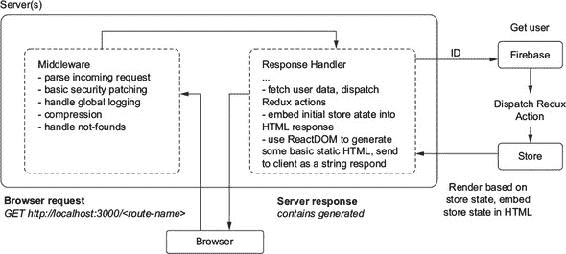

在这个流程中，您使用来自浏览器的 cookie 来验证用户的令牌是否有效。然后您从 Firebase 获取用户，并将动作分发到在服务器端创建的 Redux 存储。您仍然渲染为静态 HTML，但这次您使用更新的状态进行渲染，以便应用程序可以使用新数据渲染。您还将状态嵌入到 HTML 响应中，以便浏览器可以从服务器停止的地方继续。在执行此操作时，需要注意的一个问题是您的 Redux 存储在服务器上没有被重新创建或持久保存在内存中。我在一些项目中遇到过这种情况，在本地开发期间会短暂发生，很难追踪。除了令人烦恼之外，这意味着服务器将为所有请求的用户渲染相同的数据，因为存储的状态没有被清除。在生产环境中，这将是一个不可接受的严重安全漏洞。我提到这一点是为了强调协调浏览器和客户端可能很复杂，并且必须谨慎操作，以避免棘手的错误或安全漏洞。

让我们看看您需要执行数据获取和渲染过程的代码。列表 12.14 展示了获取数据的初始步骤以及可能由过期或无效令牌引起的一些基本错误处理。在下一步中，您将集成异步服务器渲染与 React-DOM 的 `renderToNodeStream`，并进一步提高您的服务器渲染性能。

##### 列表 12.14\. 为服务器渲染获取数据（server/server.js）

```
// ...
        const store = configureStore(initialReduxState);                   *1*
        try {
            const token = req.cookies['letters-token'];                    *2*
            if (token) {
                const firebaseUser = await firebase.auth()
                                                   .verifyIdToken(token);  *3*
                const userResponse = await fetch(
                    `${config.get('ENDPOINT')}/users/${firebaseUser.uid}`  *3*
                );
                if (userResponse.status !== 404) {                         *4*
                    const user = await userResponse.json();                *4*
                    await store.dispatch(loginSuccess(user));              *5*
                    await store.dispatch(getPostsForPage());.              *5*
                }
            }
        } catch (err) {
            if (err.errorInfo.code === 'auth/argument-error') {            *6*
                res.clearCookie('letters-token');                          *6*
            }
            // dispatch the error
            store.dispatch(createError(err));                              *6*
        }
        //...
```

+   ***1* 创建 Redux 存储实例**

+   ***2* 从请求的 cookie 中获取用户令牌**

+   ***3* 使用 Firebase 验证令牌，并使用响应从您的 JSON API 获取用户**

+   ***4* 如果用户存在，从 API 解包 JSON 响应（这里您使用 isomorphic-fetch 库和 async/await 语法）**

+   ***5* 感谢 Redux-thunk，您可以在登录时分发异步动作创建器，并在它们完成之前继续操作。**

+   ***6* 如果出现错误，例如令牌过期，将错误分发到存储**

这就是您需要完成的大部分工作，以使用用户上下文完全渲染应用程序！这种方法的缺点是，如果您有多个页面，每个页面都有不同的数据获取需求，那么将它们整合起来会变得困难。您没有一种方法可以说，“啊，我们正在请求页面 X，页面 X 需要 Y 数据。”尽管如此，还是有方法可以做到这一点，我在我的博客上简要介绍了这些方法，请访问 [`ifelse.io/2017/09/07/server-rendering-with-react-router-and-react-16-fiber`](https://ifelse.io/2017/09/07/server-rendering-with-react-router-and-react-16-fiber)（如果您想了解更多关于这一点以及一些较新的 React Router 版本的信息）。

要完成您的渲染改进，您还需要做几件事。首先，您需要找到一种方法来注入 React-DOM 将返回给我们的 HTML 字符串。因为它与流一起工作，所以您之前使用的字符串模板方法需要改变。您不会直接注入生成的 HTML，而是使用两个函数来为您的应用程序编写 HTML。一个将包含您的应用程序需要的标题信息（关于应用程序的元数据、Open Graph 数据、CSS 链接等）。另一个将 Redux 商店状态嵌入到 HTML 响应中。您希望嵌入状态，这样当浏览器接管时，它不会重做服务器已经完成的工作。您希望减少渲染，而不是增加！下一个列表显示了您将传递组件和 Redux 商店状态的 HTML 包装组件。

##### 列表 12.15\. 嵌入 Redux 状态

```
const ogProps = {
    updated_time: new Date(),
    type: 'website',
    url: 'https://social.react.sh',
    title: 'Letters Social | React in Action by Mark Thomas from Manning
     Publications',
    description:
        'Letters Social is a sample application for the React.js book React in
     Action by Mark Thomas from Manning Publications. Get it today at
     https://ifelse.io/book'
};                                                                         *1*

export const start = () => {                                                 *2*
    return `<!DOCTYPE html><html lang="en-us">
        <head>
            <link rel="stylesheet" href="/static/styles.css" type="text/css" />
            <link rel="stylesheet" href="https://api.mapbox.com/map-
     box.js/v3.1.1/mapbox.css" />
            <meta http-equiv="X-UA-Compatible" content="IE=edge" />
            <title>
                Letters Social | React in Action by Mark Thomas from Manning
     Publications
            </title>
            <link rel="manifest" href="/static/manifest.json" />
            <meta name="viewport" content="width=device-width,initial-scale=1" />
            <meta name="ROBOTS" content="INDEX, FOLLOW" />
            <meta property="og:title" content="${ogProps.title}" />
            <meta property="og:description" content="${ogProps.description}" />
            <meta property="og:type" content="${ogProps.type}" />
            <meta property="og:url" content="${ogProps.url}" />
            <meta property="og:updated_time" content="${ogProps.updated_time}" />
            <meta itemProp="description" content="${ogProps.description}" />
            <meta name="twitter:card" content="summary" />
            <meta name="twitter:title" content="${ogProps.title}" />
            <meta name="twitter:description" content="${ogProps.description}" />
            <meta property="book:author" content="Mark Tielens Thomas" />
            <meta property="book:tag" content="react" />
            <meta property="book:tag" content="reactjs" />
            <meta property="book:tag" content="React in Action" />
            <meta property="book:tag" content="javascript" />
            <meta property="book:tag" content="single page application" />
            <meta property="book:tag" content="Manning publications" />
            <meta property="book:tag" content="Mark Thomas" />
            <meta name="HandheldFriendly" content="True" />
            <meta name="MobileOptimized" content="320" />
            <meta name="theme-color" content="#4469af" />
            <link
                href="https://fonts.googleapis.com/css?fam-
     ily=Open+Sans:400,700,800"
                rel="stylesheet"
            />
        </head>
        <body>
            <div id="app">
    `;
};

export const end = reduxState => {                                             *3*
    return `</div>
        <script id="initialState">
            window.__INITIAL_STATE__ = ${JSON.stringify(reduxState)};
        </script>                                                              *3*
        <script src="https://cdn.ravenjs.com/3.17.0/raven.min.js"
     type="text/javascript"></script>
        <script src="https://api.mapbox.com/mapbox.js/v3.1.1/mapbox.js"
     type="text/javascript"></script>
        <script src="/static/bundle.js" type="text/javascript"></script>
        </body>
    </html>`;
};
```

+   ***1* 关于应用程序的基本元数据——一些与当前讨论不相关的样板代码被省略**

+   ***2* 将您的应用程序注入到主 div 中，这样当 React-DOM 在浏览器中接管时，它就不需要重做服务器已经完成的工作**

+   ***3* 浏览器中的 Redux 商店应该能够从服务器停止的地方接管，因此以 JSON-stringified 格式嵌入商店；**

有了这些，您需要修改 Redux 商店，以便它能够接管。在这个列表中，您将做两件事：确保每次在服务器上创建 Redux 商店都是从头开始的（以防止前面提到的潜在错误），并教会它从 DOM 中读取初始状态。以下列表显示了您将对您的生产商店（开发版本不会被服务器渲染，因此没有初始状态可拾取）进行的这些小修改。

##### 列表 12.16\. 修改用于 SSR 的 Redux 商店（src/store/configureStore.prod.js）

```
//...
let store;                                                       *1*
export default function configureStore(initialState) {
    if (store && !isServer()) {
        return store;                                            *1*
    }
    const hydratedState =
        !isServer() && process.env.NODE_ENV === 'production'     *2*
            ? window.__INITIAL_STATE__                           *2*
            : initialState;
    store = createStore(
        rootReducer,
        hydratedState,
        compose(applyMiddleware(thunk, crashReporting))
    );
    return store;
}
```

+   ***1* 如果您在服务器上，您希望每次都返回新的商店**

+   ***2* 如果您不在服务器上且应用程序处于生产模式，检查 DOM 以获取状态并尽可能使用**

现在，您的商店将能够从您的服务器嵌入的数据中读取初始状态，而无需做重复工作。接下来是什么？您可能还记得章节开头提到的，当在服务器上渲染时，您有异步选项可供使用。您目前使用的是 React-DOM 的 `renderToString` 方法，但它是同步的，如果许多用户同时访问应用程序，这可能会成为您服务器的瓶颈。在 React 16 中，引入了服务器渲染的异步选项，您将在这里使用它。使用方式相同，只是可以使用 node.js 流代替同步方法。

|  |
| --- |

**开源库**

你已经将服务器端渲染集成到 Letters Social 应用中。你使用 Redux 使其工作，但要将应用扩展到非常大的规模或引入新的数据获取需求（例如其他页面的数据）可能需要一些重构和重新考虑你的服务器端渲染方法。有一些开源库可以帮助使用 React 进行服务器端渲染，这些库有助于统一允许组件在服务器上渲染。作为一个提高你对 React 服务器端渲染可能性的理解的练习，花些时间查看它们及其源代码。你可能会对服务器端渲染（在 react-server [`github.com/redfin/react-server`](https://github.com/redfin/react-server)的情况下是优化渲染）所能实现的事情感到惊喜，以及抽象化如何使实现服务器端渲染变得更加容易（在 Next.js 的情况下：[`github.com/zeit/next.js/`](https://github.com/zeit/next.js/)）。

|  |
| --- |

如果你之前使用过 node.js，你可能熟悉流。如果不熟悉，那也无所谓。node.js 中的流是一个用于处理流数据的抽象接口。这可能包括读取或写入文件、转换和压缩图像，或处理 HTTP 请求和响应等。你可以在[`nodejs.org/api/stream.html`](https://nodejs.org/api/stream.html)了解更多关于 node.js 中流的信息。下面的列表展示了如何利用 React-DOM 中的新`renderToNodeStream` API。

##### 列表 12.17. 异步服务器端渲染（server/server.js）

```
        res.setHeader('Content-type', 'text/html');         *1*
        res.write(HTML.start());                            *2*
        const renderStream = renderToNodeStream(            *3*
            <Provider store={store}>
                <RouterContext {...props} />
            </Provider>
        );
        renderStream.pipe(res, { end: false });             *4*
        renderStream.on('end', () => {                      *5*
            res.write(HTML.end(store.getState()));
            res.end();
        });
```

+   ***1* 写入 Content-type 头，以便浏览器知道期望的内容类型**

+   ***2* 浏览器应该尽可能快地开始加载页面，因此发送应用程序的第一部分**

+   ***3* 为你的应用程序创建一个渲染流**

+   ***4* 将渲染的应用程序管道发送到浏览器，但不要结束流**

+   ***5* 当流发出结束事件并且渲染完成后，发送剩余的 HTML 并结束响应**

有了这些，Letters Social 现在正被完全渲染给用户。如果你使用开发者工具检查文档加载过程并查看服务器发送下来的内容，可以直接观察到这一点（图 12.11 显示了你应该看到的内容）。如果你在生产模式下运行应用程序，可能会看到速度上的差异，但查看 Chrome 或 Firefox 的开发者工具将允许你逐帧检查应用程序的加载。你会发现服务器正在发送完整的网页，而不仅仅是应用程序加载后进行渲染。

##### 图 12.11. 如果我们使用 Chrome 开发者工具检查 social.react.sh 的性能标签，你会看到服务器正在发送完全渲染的 HTML，而不是等待应用程序包加载完成后再渲染应用程序。


### 12.8. 摘要

在本章中，我们探讨了如何将服务器端渲染功能构建到你的应用程序中。正如我们所看到的，它可能涉及到你应用程序的许多方面，包括路由、数据获取和状态管理（Redux）：

+   服务器端渲染（SSR）是在服务器上为 UI 生成静态标记，并将其发送到客户端。使用 React 进行 SSR 涉及使用 React-DOM 来渲染一个 React 可以在客户端运行时重用的 HTML 字符串，或者静态标记（`ReactDOM.renderToString()`），它旨在在浏览器上保持静态（`ReactDOM.renderToStaticMarkUp()`）。

+   并非所有 JS 框架或库都是为处理 SSR 而构建的；React 是，并且可以“接管”在服务器上生成的标记，而无需最初在浏览器上重新渲染现有元素。

+   使用像 React Router 这样的路由解决方案可以允许你在客户端和服务器之间共享路由，从而让你能够在平台上共享一些代码。

+   SSR 的实现可能很复杂，并且仅在特定情况下才有意义。一些可能合理的情况包括当你特别关注 SEO 时，当你有一个关键路径需要快速首次绘制的应用程序时，或者如果你使用 React 作为静态标记生成器。

+   SSR 可以提供的性能提升通常只有在服务器发送的页面负载不是过大（这样就不会比之前加载得更慢）的情况下才能实现。更长的响应时间和更多数据可能会抵消你原本期望的快速首次绘制。

+   SSR 要求你考虑你的应用程序的哪些部分可以在服务器上运行，哪些不行。那些需要浏览器环境的特性需要修补才能工作，或者应该以不运行在服务器上的方式处理。

+   你可以通过在服务器上同步客户端和服务器之间的身份验证状态以及执行任何必要的服务器端数据获取来实现服务器上的“完整”渲染。

+   尽管存在其他 JS 平台实现，但 SSR 实际上要求你运行一个 node.js 服务器或至少调用一个服务器来生成发送给客户端的 HTML。

在下一章中，我们将简要介绍 React Native 并完成你对 React 基础知识的学习之旅。

## 第十三章。React Native 简介

*本章涵盖*

+   React Native 概述

+   React 和 React Native 之间的区别

+   了解更多关于 React Native 的方法

到目前为止，你已经掌握了使用 React 的基础知识，实现了路由器，探索了 Redux，研究了服务器端渲染，甚至过渡到了使用 React Router。接下来是什么？React 生态系统和社区中仍有大量内容可以学习和探索。本章从高层次的角度审视 React Native，这是 Facebook 在 React 生态系统内开发的另一个项目。使用 React Native，你可以编写在 iOS 和 Android 等移动平台上运行的 React 应用程序。这意味着你可以编写在智能手机和其他 React Native 现在或未来目标平台上的应用程序。React Native 以类似 React 的方式构建这些移动应用程序时提供了卓越的开发者体验，这也是它为什么在 React 社区中越来越重要和受欢迎的原因之一。

由于 React Native 和移动开发入门涵盖了相当大的领域，因此我将保持我们对 React Native 的讨论简明扼要，主要关注高级概念。到本章结束时，你应该对 React Native 是什么以及为什么你可能想使用它有一个概念，并且你会知道如何开始学习更多关于它的内容。

### 13.1. 介绍 React Native

在 React Native 出现之前，在创建移动应用程序方面你有几种选择。你可以使用可用的 iOS 和 Android 平台和语言，或者你可以选择可用的混合方法之一。这些方法在实现方式上有所不同，但它们通常会使用一个网页视图（想想“移动浏览器”）并向原生 SDK 公开一些接口。这种方法的缺点是，尽管你可以编写允许你使用许多熟悉的 Web API 和惯用方法的原生应用程序，但应用程序并不是“真正的原生”，有时在性能和整体感觉上会有明显的差异。好处是，没有移动开发专业知识的团队或开发者可以转移他们的 Web 相关技能，并能够创建一个移动应用程序。

移动开发的主题以及在这个世界中平台、语言和硬件如何扮演各自的不同角色超出了本书的范围。但混合和全原生方法之间的选择与我们对 React Native 的讨论相关，因为 React Native 提供了一个新的替代方案。使用 React Native，你可以构建“真正的原生”应用程序，同时可以使用 JavaScript 和平台特定代码（如 Swift 或 Java）的组合。

React Native 旨在将构建用户界面的 React 惯用和概念带到移动应用程序开发中，并将移动和浏览器开发的最佳方面结合起来。它鼓励跨平台代码共享（存在针对 iOS 和 Android 设备的组件），允许你在适当的地方编写原生代码，并编译成原生应用程序——所有这些都在使用许多 React 熟悉的惯用方法的同时完成。

让我们快速浏览一下 React Native 的几个顶级特性：

+   使用 React Native，你可以编写可以同时使用原生代码（Swift 或 Java）并编译为在 iOS 或 Android 上运行的本地应用程序的 JavaScript 应用程序。

+   React Native 可以在 Android 和 iOS 上处理创建相同的 UI 元素，这可能会简化移动应用程序的开发。

+   当你需要时，你可以添加自己的原生代码，这样你就不受限于仅使用 JavaScript。

+   React Native 应用程序与 React 共享语法，提供相同的以组件驱动、声明式概念，在某些情况下甚至提供相同的 API，以便在设计你的 UI 时使用。

+   构建 React Native 应用程序的开发者工具允许你在不需要等待漫长的编译周期的情况下重新加载你的应用程序。这通常可以节省开发者的时间，并使体验更加愉快。

+   能够共享代码并针对多个平台可以有时减少专门用于构建特定应用程序或项目的工程师数量。它可以导致维护的代码库减少，工程师可以更容易地在 Web 和原生平台之间移动。

+   你可以将 React 网页应用程序的逻辑和其他方面（如业务逻辑和某些情况下的样式）与 React Native 应用程序共享。

React Native 是如何工作的？它可能看起来是一个神秘的、黑盒的过程，将你的 JavaScript 转换为编译后的、本地应用程序。你不需要了解 React Native 的每个部分是如何工作的，才能与之合作，就像你不需要了解 React-DOM 的内部和外部才能编写出色的 React 应用程序一样。但至少对所使用的技术有一个工作理解通常是很有帮助的。

使用 React Native，你可以创建混合了 JavaScript 和原生代码的应用程序。React Native 通过在应用程序和底层移动平台之间创建某种桥梁来实现这一点。大多数移动设备都可以执行 JavaScript，React Native 就利用这一点来运行你的 JavaScript。当你的 JavaScript 与任何原生代码一起执行时，React Native 的桥接系统使用 `React` 核心库等工具，将组件层次结构（包括事件处理程序、状态、属性和样式）转换为移动设备上的视图。

当发生更新时（例如，用户按下按钮），React Native 将原生事件（一个点击、一个摇晃、一个地理位置事件，或任何其他事件）转换为你的 JavaScript 或原生代码可以处理的事件。它还会根据状态或属性的变化渲染适当的 UI。React Native 还会捆绑所有你的代码并执行任何必要的编译，以便你可以将你的应用程序发布到 Apple App Store 或 Google Play Store。

这些过程以及 React Native 的工作方式还有很多，但将设备上运行的 JavaScript 与原生平台 API 和事件之间进行转换的基本过程是 React Native“魔法”发生的地方。结果是您可以与之工作的平台，但在性能方面也不会妥协。它是在之前混合移动应用方法的问题和传统移动开发的一些痛点之间的一个折中方案。图 13.1 展示了它的工作的整体视图。

##### 图 13.1\. React Native 通过在您的 JavaScript 和底层原生平台之间创建桥梁来工作。大多数原生平台都实现了 JavaScript 虚拟机或其他运行 JavaScript 的本地方式。该桥梁使您的应用程序的 JavaScript 能够执行。React Native 桥接系统将在底层平台和您的 JavaScript 之间传递消息，以便将原生事件转换为 React 组件可以理解和响应的事件。

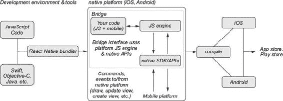

如果这听起来与您在这本书中学到的 React 有所不同，那么在许多方面确实是这样的。但更重要的是相似之处。我将在下一节中更详细地介绍这些相似之处，但您可以通过查看列表 13.1 中的代码来了解 React Native 组件与您迄今为止所使用的组件是多么相似。

即使我在本章中不介绍如何设置 React Native 项目，您仍然可以看到列表 13.1 中的代码做了什么。如果您想查看代码执行情况并尝试使用 React Native，请访问[`repl.it/KOAE/3`](https://repl.it/KOAE/3)。Repl.it 是一个在线平台，可以以交互式方式运行和共享代码，并且支持 React Native。您可以使用手机扫描 QR 码来查看您的 React Native playground 应用程序。这是一种无需进行任何设置或配置即可实验 React Native 的绝佳方式。

您可能会注意到的一个重要事情是，组件的元素（View，Text）与您之前章节中的组件中的`div`和`span`元素类似。这是一个 React 概念在各个平台之间持续存在的例子。组件的各个元素是什么并不那么重要，重要的是您可以重用和组合它们，如本列表所示。

##### 列表 13.1\. React Native 示例组件

```
import React, { Component } from 'react';                           *1*
import { Text, View } from 'react-native';                          *2*

export default class WhyReactNativeIsSoGreat extends Component {
    render() {
        return (
            <View>                                                  *3*
                <Text>                                              *4*
                    If you like React on the web, you'll like React Native.
                </Text>
                <Text>
                    You just use native components like 'View' and 'Text',
                    instead of web components like 'div' and 'span'.
                </Text>
            </View>
        );
    }
}
```

+   ***1* 您仍然可以使用常规的 React.Component，即使在原生应用中**

+   ***2* React Native 提供了构建移动应用程序的基本元素。**

+   ***3* 您可以使用 React Native 组合组件；这里的视图组件就像浏览器中的 div 元素（常见布局组件）**

+   ***4* 文本在浏览器中更像是 span 元素**

还有其他一些项目，如 React VR，其重点甚至更偏离您一直在工作的 Web UI，但它们使用相同的模式和概念。这是 React 平台最强大的方面之一，当您跨平台看到它时尤为明显。更多关于 React VR 的信息请访问[`facebook.github.io/react-vr`](https://facebook.github.io/react-vr)。

### 13.2\. React 和 React Native

React 和 React Native 有多相似？除了共享一个名字，它们都使用`React`核心库，但针对不同的平台（浏览器和移动设备）。本节将简要探讨它们的一些差异和相似之处。让我们比较一下 React 和 React Native 的一些重要方面：

+   ***运行时*—** React 和 React Native 针对不同的平台。React 针对浏览器，因此大量使用浏览器特定的 API。您可以在每个 API 中看到一些结果。例如，class、ID 等属性在基于 Web 的 React 组件中很常见。原生平台使用不同的布局和样式语义，因此在 React Native 组件上您不会看到很多这些属性。基于浏览器和移动应用程序也运行在不同的设备上，因此在考虑 React 和 React Native 时，不应忽视底层技术（如线程、CPU 利用率等）的差异。

+   ***核心 APIs*—** 许多 React 特定的 API（如用于组件生命周期、状态、属性等）在 React 和 React Native 中是相似的。但每个平台在联网、布局、地理位置、资源管理、持久化、事件和其他重要领域实现了不同的 API。React Native 旨在从面向浏览器的世界中导入一些熟悉的 API，例如用于联网的 Fetch API ([`developer.mozilla.org/en-US/docs/Web/API/Fetch_API`](https://developer.mozilla.org/en-US/docs/Web/API/Fetch_API)) 和用于布局的 Flexbox API ([`developer.mozilla.org/en-US/docs/Web/CSS/flex`](https://developer.mozilla.org/en-US/docs/Web/CSS/flex))。React Native 也暴露了事件，但它们更适用于移动平台（例如`onPress`）。这些差异可能是一个小障碍，但幸运的是，有一些库可以帮助消除 Web 和本地 API 之间的差异，如`react-primitives` ([`github.com/lelandrichardson/react-primitives`](https://github.com/lelandrichardson/react-primitives))。

+   ***组件*—** 基于 Web 的 React 项目没有“内置”组件（例如，用于图像、文本布局或其他 UI 元素）。您需要自己创建这些组件。另一方面，React Native 确实包括文本、视图、图像等组件。这些是您需要为移动应用程序创建 UI 的原生元素，类似于浏览器环境中的 DOM 元素。

+   **`React`核心库的使用**—**React 和 React Native 都使用`React`核心库进行组件定义。每个项目都利用不同的渲染系统将一切连接起来并与设备（浏览器或移动设备）交互。React Web 使用`react-dom`库，而 React Native 实现了自己的系统。这种方法使你能够在不同平台上以类似的方式编写组件。

+   **生命周期方法**—**React Native 组件也有生命周期方法，因为它们继承自相同的`React`基类，并且这些方法也由特定于平台的系统（React-DOM 或 React Native）处理。

+   **事件类型**—**与 React-DOM 实现了一个合成事件系统，允许你的组件以标准方式与浏览器事件一起工作不同，移动应用程序公开其他事件。一个例子是手势。你可以在触摸设备上平移、缩放、拖动等。用 React Native 组件编写的组件允许你响应这些事件。

+   **样式**—**由于 React Native 不针对浏览器，你需要以略微不同的方式对组件进行样式设计。常规移动开发中没有 CSS API，但你几乎可以使用所有 CSS 属性与 React Native 一起使用。React Native 提供了一个特定的 API，其中属性之间没有 1:1 的对应关系。以 CSS 动画为例。CSS 规范以及浏览器实现它的方式与 iOS 和 Android 启用和实现动画的方式不同，因此你需要以不同的方式动画化并使用每个平台正确的 API。学习新的样式 API 可能需要时间，并可能阻止直接在 Web 和原生项目中共享 CSS 样式。幸运的是，尽管如此，还有一些与 React 和 React Native 一起工作的库，如`styled-components`([www.styled-components.com](http://www.styled-components.com))。随着 React Native 的日益流行，你应该期待看到更多这些跨平台库的开发。

+   **第三方依赖**—**与 React 一样，你仍然可以使用第三方组件库为 React Native 开发。许多流行的库，如`React Router`和`styled-components`，甚至包括针对 React Native 的变体（如前所述）。React Native 最吸引人的方面之一是它仍然可以利用 JavaScript 模块生态系统。

+   **分发**—**虽然你可以将 React 应用程序部署到几乎任何现代浏览器，但 React Native 应用程序需要特定于平台的分发工具，用于开发和最终发布（例如 Xcode）。你通常需要使用 React Native 构建过程来编译你的应用程序以供最终上传。iOS 和 Android 工具的“围栏花园”性质是开发移动应用程序的一个众所周知的权衡。

+   ***开发工具*—** React 用于网页在浏览器中运行，因此你可以利用任何特定浏览器的工具来帮助调试和开发。对于 React Native，你不需要拥有特定平台的工具，但它仍然可能很有用。项目之间的一个关键区别是 React Native 专注于热重载，而这是 React 默认不包含的。*热重载*可以加快移动开发速度，因为你不需要等待你的应用程序编译。图 13.2 展示了当你与 React Native 一起工作时可以访问的一些开发者工具。

##### 图 13.2\. React Native 随带一些额外的开发者工具，这些工具有助于性能、调试和其他功能。这些工具还意味着你不太严格依赖于 Xcode 等工具进行开发，尽管你当然可以使用你平台特定的工具进行开发。尽管有许多原因，但 React Native 提供的优秀开发者体验似乎是其特别受欢迎的技术之一原因。

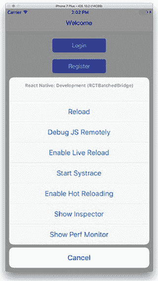

### 13.3\. 何时使用 React Native

并非每个开发者和每个团队都需要 React Native。让我们设想一些你可能遇到的场景，看看 React Native 是否是你应该考虑的：

+   ***独立开发者*—** 如果你第一次学习 React 或只是将其用于副项目，你可能会为了乐趣或如果你在处理任何移动项目时学习 React Native。如果你不熟悉原生开发但想逐步进入或拥有更简单的应用程序，React Native 也是可以考虑的。如果你已经了解 React，那么利用一些熟悉的概念来使用 React Native 进行移动开发是有意义的。

+   ***小型跨职能团队*—** 小型初创公司通常处于工程师将在整个堆栈上工作的位置，从服务器到客户端应用程序（网页、移动或其他）。在这种情况下，React Native 有时可以为那些在组织内扮演多个角色的工程师提供一种方式，让他们在没有深入移动经验的情况下开发移动应用程序，并且可以将他们的 React 动力延续到移动应用中。这也适用于希望轻松在不同应用程序或项目之间移动工程师的大型组织。

+   ***对原生开发经验有限到适中的团队*—** 如果你或你的团队对移动开发只有有限到适中的经验，但熟悉 React 和 JavaScript，React Native 可能会更容易让你快速组装产品。经验是无法替代的，但不必完全投入 Swift（iOS）或 Java（Android）可能潜在地节省你时间。

+   ***深入原生专业知识*—** 有些团队选择 React Native 并不是因为它在某些方面降低了移动开发的门槛，而是因为它有助于标准化业务（移动和桌面）应用程序的各种实现中的惯用和模式。但如果这不是问题，并且你已经对移动开发投入了大量的专业知识和时间，React Native 可能需要更仔细的评估，看看你的团队能否从可用的抽象和模式中受益。

除了你在考虑 React Native 时可能做出的团队和专业知识方面的考虑之外，你还应该意识到一些今天存在的技术的固有局限性：

+   ***使用 JavaScript*—** 如果你的团队或组织没有专注于 JavaScript 的开发者，或者已经在移动开发方面经验丰富，那么将工程师过渡到 JavaScript 和以 JavaScript 为中心的生态系统可能没有意义，这是完全可以接受的。就像 Web 上的 React 一样，React Native 并非万能的银弹，而应该基于权衡来评估，而不是围绕它的炒作。

+   ***特定的性能需求*—** React Native 性能良好，但作为一个抽象层，它可能会成为实现你或你的团队可能有的特定性能目标的另一个障碍。例如，如果渲染 3D 场景是应用程序的主要目标，React Native 可能不是最佳选择。其他框架（如 Unity）可能更适合。这与我刚才提到的“React 不是万能的银弹”的观点一致，并且我在前面的章节中一直试图保持这一观点。

+   ***高度专业化的应用程序*—** 有些应用程序类型不适合 React 模型。增强现实（AR）、图形密集型或其他高度专业化的应用程序通常需要特殊的库和技能，而大多数 Web 工程师并不具备这些技能。这并不是说不能做到，但截至目前，React Native 并没有专注于解决这些需求。

+   ***内部应用程序*—** 有时大公司会开发用于内部使用的应用程序，以帮助员工以各种方式更好地完成工作。React Native 非常适合这类应用程序，因为这类应用程序通常涉及相对简单的用户界面，并且可以由不专注于移动开发的工程师快速迭代。

当然，最终是否使用这项技术取决于你和你的团队来评估，但希望你现在对何时使用 React Native 可能或可能不合适有了更好的认识。

### 13.4\. 最简单的“Hello World”

尽管我不会介绍如何将 React Native 与 Letters Social 集成，但本节将花一些时间通过一个基本的“Hello World”示例来演示其功能。你将在 Letters Social 存储库之外工作，所以请随意将应用程序代码放在你喜欢的位置以跟踪计算机上的代码。运行以下列表中的命令以开始。

##### 列表 13.2\. 安装 `create-react-native-app`

```
cd ./path-to-your-react-native-sample-folder

npm install -g create-react-native-app

create-react-native-app .
```

运行这些命令后，你应该能在你想要的目录中看到创建的多个文件和一些说明。这些命令与 Create React App 中可用的命令类似，这是一个仅关注 Web 平台的 React.js 的类似项目。你可以在 [`github.com/facebookincubator/create-react-app`](https://github.com/facebookincubator/create-react-app) 上了解更多关于 Create React App 的信息。图 13.3 展示了当你开始使用 Create React Native App 库时应该看到的内容。

##### 图 13.3\. 当你在开发模式下启动应用程序时，你应该会看到 React Native 打包器启动，并看到这里所示的消息。按照说明确保你在本地机器上设置了 Expo XDE。根据你想要针对的环境，打开 Android 或 iOS 模拟器。


Create React Native App 工具安装了依赖项，创建了一些样板文件，设置了构建过程，并将 Expo React Native 工具包集成到项目中。Expo SDK 扩展了 React Native 的功能，使得与硬件技术的工作更加容易，以及其他方面。Expo XDE 开发环境使得管理多个 React Native 项目以及构建和部署它们变得容易。

你不会构建出任何实质性的东西，但你可以尝试修改并感受使用 React Native 开始构建应用程序的容易程度。一旦你使用 `yarn start` 启动了 React Native 打包器，打开一个模拟器（Android 或 iOS），这样你就可以看到正在运行的应用程序。替换一些样板代码，看看热重载是如何发生的。列表 13.3 展示了一个简单的组件，当它挂载时会从《星球大战》API 获取一些数据。注意，React Native 已经使用了现代的 Web API，如 Flexbox 和 Fetch（你之前章节中使用 polyfill 实现）。

##### 列表 13.3\. 简单的 React Native 示例（App.js）

```
import React from 'react';
import { StyleSheet, Text, View } from 'react-native';                *1*

export default class App extends React.Component {
    constructor(props) {                                              *2*
        super(props);
        this.state = {
            people: []
        };
    }
    async componentDidMount() {                                       *3*
        const res = await fetch('https://swapi.co/api/people');
        const { results } = await res.json();
        this.setState(() => {
            return {
                people: results
            };
        });
    }
    render() {
        return (
            <View style={styles.container}>                           *4*
                <Text style={{ color: '#fcd433', fontSize: 40, padding: 10 }}>
                    A long time ago, in a Galaxy far, far away...
                </Text>
                <Text>Here are some cool people:</Text>
                {this.state.people.map(p => {                         *5*
                    return (
                        <Text style={{ color: '#fcd433' }} key={p.name}>
                            {p.name}
                        </Text>
                    );
                })}
            </View>
        );
    }
}

const styles = StyleSheet.create({                                  *6*
    container: {
        flex: 1,
        backgroundColor: '#000',
        alignItems: 'center',
        justifyContent: 'center'
    }
});
```

+   ***1* 与 React 不同，React Native 为你的 UI 提供了原始组件。**

+   ***2* 构造函数、状态初始化和生命周期方法在 React 和 React Native 中是相同的**

+   ***3* 你也可以在 React Native 应用中使用现代 JavaScript 特性，如 async/await。**

+   ***4* 即使在 React Native 中样式看起来相似，你并没有使用 CSS。**

+   ***5* JSX 表达式在 React Native 和 React 中是相同的**

+   ***6* 在 React Native 中创建样式表需要使用其 Stylesheet API 来样式化你的组件。**

如果你修改了应用程序，你应该看到打包器实时响应并更新你的运行中的应用程序，如图 13.4 所示 figure 13.4。我希望这能让你感受到在 React Native 中构建应用程序是多么容易。你可能已经习惯了网页上的热重载，但对于移动开发来说，编译-检查-重新编译的周期可能会占用相当多的时间。

##### 图 13.4\. 你应该能够看到在运行你的应用程序代码的模拟器中即时反映出的变化。


有了这个，你已经创建了你的第一个 React Native 组件和代码，这应该让你对这项技术的工作原理以及与之合作的便捷性有一个初步的了解。

### 13.5\. 接下来去哪里

你在 React 文档、库生态系统和社区中会看到的一个短语是 *一次学习，到处编写*。这某种程度上是对 Java 社区中流行的 *一次编写，到处运行* 短语的致敬，这也是 React 范式的一个标志。正如我们在本章中看到的，你可以学习 React 概念并将它们应用到从网页到移动到 VR 的各种平台上。无论何时你学习如何在新的平台上使用 React，都会有一些平台特定的差异和细微差别，但你的大部分 React 知识将很容易迁移。这就是为什么与 React 合作可以如此愉快的原因之一。

如果你想要继续学习 React Native，有许多资源你可以查阅。一个是 Nader Dabit 编著的《React Native in Action》（Manning Publications，2018），如图 13.5 所示 figure 13.5，它与这本书配合得很好，因为它允许你在学习 React 的过程中无缝继续学习，并且是 React Native 的一个优秀入门。你将应用这本书到目前为止的工作中的知识，并利用这种势头深入构建使用 React Native 的移动应用程序。如果你的团队正在考虑为即将到来的项目使用 React Native，这也是一个值得查阅的好资源。

##### 图 13.5\. 《React Native in Action》由 Nader Dabit 编著，为 iOS、Android 和网页开发者提供了构建健壮、复杂 React Native 应用程序所需的技能。如果你对 React 仍然好奇，这是一本过渡到下一阶段的完美书籍。更多信息请访问 [www.manning.com/books/react-native-in-action](http://www.manning.com/books/react-native-in-action)。


另一个帮助你开始使用 React Native 的绝佳资源是 Create React Native App 项目。Create React Native App 为新的 React Native 项目提供了一个出色的起点，对于那些刚开始使用它的开发者来说，也是一个出色的示例应用程序。它包含了一些预设的库和工具，用于构建 React Native 应用程序，但允许你“退出”并重置到默认设置。如果你对 Create React App 或 Create React Native App 感兴趣，可以在网上查看：

+   *创建 React Native 应用*—[`github.com/react-community/create-react-native-app`](https://github.com/react-community/create-react-native-app)

+   *创建 React App*—[`github.com/facebook/create-react-app`](https://github.com/facebook/create-react-app)

+   *React Native 文档*—[`facebook.github.io/react-native`](https://facebook.github.io/react-native)

### 13.6. 概述

下面是本章所学内容的总结：

+   React Native 是 React 生态系统中的技术，开发者可以使用它来编写在移动 iOS 和 Android 设备上运行的 React 应用程序。

+   React Native 使用 `React` 核心库进行组件创建，但使用不同的库来处理在本地平台上渲染应用程序以及与底层平台（触摸事件、地理位置、相机访问等）的交互。

+   React Native 处理 JavaScript 和底层移动平台之间的桥接。

+   React Native 使用许多与 Web API 相同或相似的 API。它使用 Flexbox 进行布局，使用 Fetch 进行网络请求，以及其他熟悉的 API。

+   在构建 React Native 应用程序时，你可以混合使用 JavaScript 和原生代码。

+   React Native 为开发和编译你的应用程序提供了一套强大的工具。

+   React Native 的热重载开发者工具通过每次不需要等待应用程序重新编译来节省你的时间。

+   使用 React Native 可以帮助你或你的团队降低移动开发的门槛。

+   你可能不会希望为所有类型的移动应用程序都使用 React Native，但它应该足够用于大多数典型移动应用程序。

+   Nader Dabit 著的 *React Native in Action*（Manning，2018）是你在 React 之旅中可以考虑的绝佳资源——请访问 [www.manning.com/books/react-native-in-action](http://www.manning.com/books/react-native-in-action) 了解详情。
