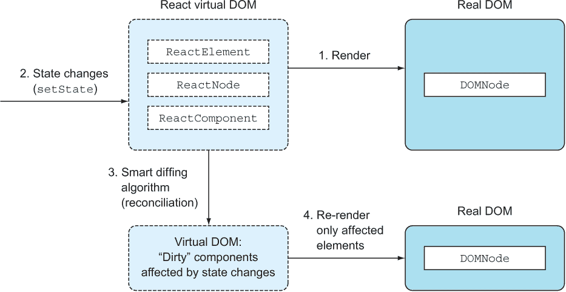
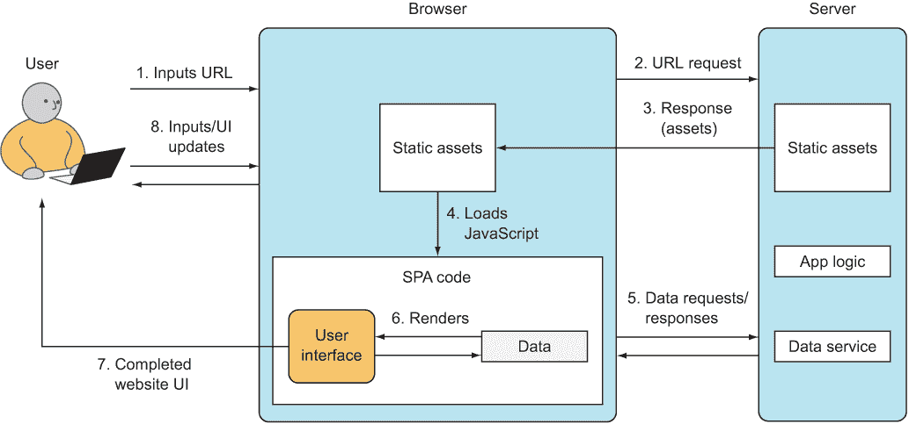
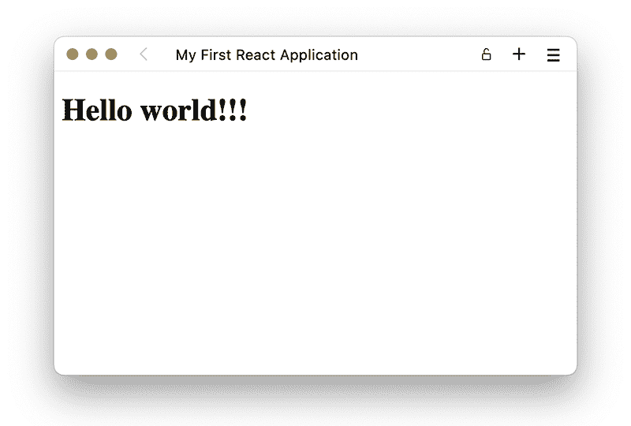
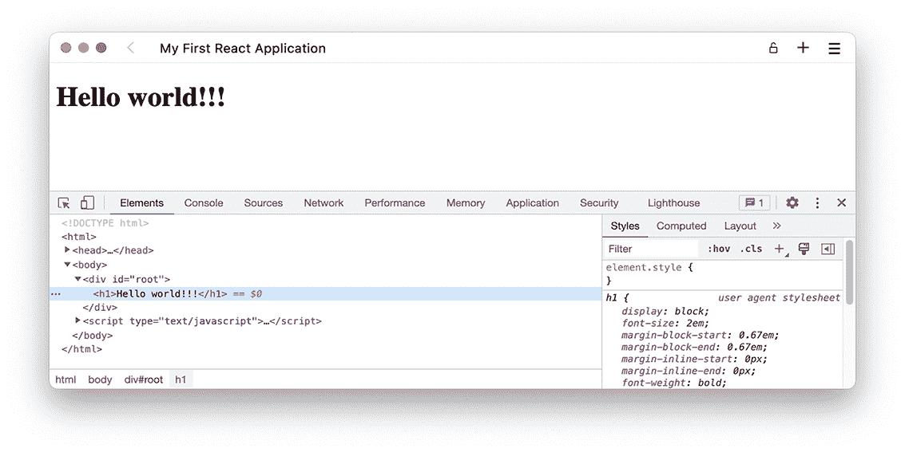

# 1 了解 React

本章涵盖

+   理解 React 是什么

+   使用 React 解决问题

+   将 React 集成到您的 Web 应用程序中

+   编写您的第一个 React Web 应用程序：Hello World

React 是一个突破性的工具，Web 开发者可能甚至不知道他们需要它，但一旦尝试过，就无法放弃。这对本书的两个作者以及许多其他热情的 Web 开发者来说绝对是正确的。React 非常受欢迎——而且有很好的理由。

如果您在 2000 年代初进行 Web 开发，您只需要一些 HTML 和一种服务器端语言，例如 Perl 或 PHP。啊，那些美好的日子，只是为了调试前端代码而放入 alert() 框。从那时起，互联网已经发生了很大的变化，构建网站的复杂性急剧增加。网站已经变成了具有复杂用户界面（UI）、业务逻辑和数据层的 Web 应用程序，这些应用程序需要随着时间的推移进行更改和更新——通常是实时更新。

已经编写了许多 JavaScript 模板库来尝试解决复杂 UI 的问题。但它们仍然要求开发者遵守旧的职责分离——将样式（层叠样式表 [CSS]）、数据和结构（HTML）以及动态交互（JavaScript）分开——并且它们不能满足现代需求（还记得 DHTML 吗？）。

相比之下，React 提供了一种新的方法，当正确使用时，可以简化前端 Web 开发。React 是一个强大的 UI 库，提供了一种许多大公司（如 Facebook、Netflix 和 Airbnb）已经采用并视为前进方向的选择。React 允许您在 JavaScript 中创建可重用的 UI 组件，您可以在网站上反复使用这些组件，而不是为您的 UI 定义一次性的模板。

您需要验证码控制或日期选择器吗？使用 React 定义一个 <Captcha /> 或 <DatePicker /> 组件，您可以将它添加到您的表单中：一个简单的即插即用组件，具有所有功能性和逻辑，以便与后端通信。您需要一个在用户输入四个或更多字母后异步查询数据库的自动完成框吗？定义一个 <Autocomplete charNum="4"/> 组件来执行该异步查询。您可以选择它是否具有文本框 UI 或没有 UI，而是使用另一个自定义表单元素——可能是 <Autocomplete textbox="..." />。

这种方法并不新颖。创建可组合的 UI 已经存在很长时间了，但 React 是第一个使用纯 JavaScript 而不使用模板来实现这一点的。这种方法已被证明更容易维护、重用和扩展。

React 是一个构建 UI 的优秀库，它应该是您的前端 Web 工具包的一部分，但它并不是所有前端 Web 开发的完整解决方案。我们将在本章中部分探讨在您的应用程序中使用 React 的优缺点，以及 React 可能如何融入您现有的 Web 开发堆栈。

在这本书中，我们将介绍 React 的基础知识，不再深入，为读者提供一个坚实的 React 库的核心概念和原则的基础，而不涉及任何外部或高级主题。通过专注于 React，读者将全面了解其功能，并准备好将他们的知识应用到广泛的 Web 开发项目中。

注意：本章示例的源代码可在[`rq2e.com/ch01`](https://rq2e.com/ch01)找到。

## 1.1 使用 React 的优点

每个新的库或框架都声称在某些方面优于其前辈。最初，我们有 jQuery，它在用原生 JavaScript 编写跨浏览器代码方面有飞跃性的改进。如果你还记得旧时的 JavaScript，一个单独的服务器请求就需要很多行代码，因为它必须考虑到 Internet Explorer 和 WebKit-like 浏览器。有了 jQuery，这只需要一行：例如，$.ajax()。在那些日子里，jQuery 在某些方面被称为框架——但不再是了！现在，框架是更大、更强大的东西。

同样，Backbone 和 Angular 的每一代新 JavaScript 框架都为桌面带来了新的东西。React 在这方面并不独特。新的地方在于 React 挑战了大多数流行前端框架使用的某些核心概念，例如，你需要有模板的想法。

以下列表突出了 React 与其他当时存在的库和框架相比的一些优点：

+   *更简单的 Web 应用*—React 使用基于组件的架构（CBA），纯 JavaScript；声明式风格；以及强大的、开发者友好的文档对象模型（DOM）抽象（不仅仅是 DOM，还有 iOS、Android 等）。

+   *快速的用户界面*—React 凭借其虚拟 DOM 和智能 reconciliation 算法提供了卓越的性能，这作为一个额外的好处，让你可以在不启动（启动）无头浏览器的情况下进行测试。

+   *更少的代码要写*—React 的庞大社区和丰富的组件生态系统为开发者提供了各种库和组件。当你考虑使用哪个框架进行开发时，这一点很重要。

许多特性使得 React 比当时大多数其他前端框架更容易使用。然而，自从 React 出现以来，已经产生了许多新的框架。部分原因是 React 的流行，其中一些新框架被开发出来，具有类似的好处或思想，但以不同的方式稍作修改。有些其他框架可能只是受到整体想法的启发，但工作方式完全不同，而有些则与 React 非常相似，只是功能集较小，有时需要你写更多的代码，但有时最终会得到一个更小的应用程序代码库。

我们将考虑使 React 流行的优势。这些都是 React 的主要卖点，它们使该框架在推出时独一无二，尽管今天其他现代框架也有类似的优势。让我们逐一分析这些优势，从 React 如何简单易用开始。 

### 1.1.1 简洁性

计算机科学中的简洁性概念受到开发者和用户的极高重视，但它并不等同于易用性。简单的东西可能难以实现，但最终将更加优雅和高效。而且，往往简单的事情最终会变得复杂。简洁性与 KISS 原则（保持简单，傻瓜）密切相关。其核心思想是，更简单的系统工作得更好。

React 的方法允许通过为软件工程师提供更好的 Web 开发体验来实现更简单的解决方案。当我们开始使用 React 时，这是一个积极的转变，让我们想起了从使用纯无框架 JavaScript 切换到 jQuery。

在 React 中，这种简洁性是通过以下特性实现的：

+   *声明式优于命令式* *风格*—React 通过自动更新视图来拥抱声明式风格。

+   *纯 JavaScript 使用 CBA*—React 不为其组件使用领域特定语言（DSLs），而是使用纯 JavaScript。并且在实现相同功能时没有分离。

+   *强大的抽象*—React 提供了一种简化的方式与 DOM 交互，允许你标准化跨浏览器中工作方式相似的事件处理和其他接口。

让我们逐一介绍这些特性。

声明式优于命令式风格

声明式风格意味着开发者编写的是“应该是怎样的”，而不是“要做什么”，一步一步（命令式）。但为什么声明式风格是一个更好的选择呢？好处是声明式风格减少了复杂性，并使你的代码更容易阅读和理解。

命令式和声明式编程风格的区别可能会迅速变得学术化。当被推向极端时，除非你很好地理解了一些相当复杂的概念，如单子（monads）和函子（functors），否则声明式编程可能真的很难阅读。以下是一些描述两种风格之间差异的不同方法：

+   *语句与表达式*—命令式编程通常与独立的语句一起工作，这些语句各自推进程序状态，而声明式编程则使用相互构建的表达式来推进逻辑流程。

+   *保留字使用*—命令式编程通常使用许多保留字，如 for、while、switch、if 和 else，而声明式编程则使用数组方法、箭头函数、对象访问、布尔表达式和三元运算符来实现相同的结果。

+   *函数组合*—命令式编程通常使用独立的函数调用和方法调用，而声明式编程使用函数组合来构建在先前表达式之上，并创建小的通用逻辑块，当组合时，可以达到期望的结果。

+   *可变性*—命令式编程通常使用可变对象并操作现有结构，而声明式编程使用不可变数据，并从旧结构中创建新结构，而不是编辑现有结构。

让我们创建一个简单的例子来说明这些不同的点。这个任务的目的是创建一个函数，countGoodPasswords，它给定一个密码列表，将返回有多少密码是*好的*。在这里，我们将*好的*密码定义为任何至少九个字符长的密码。

这是一个很好的简单任务，可以用任何编程语言以多种方式解决。一些编程语言天生使一种风格更自然，但 JavaScript 有点特别，因为它属于两个世界。你可以用命令式或声明式来解决这个任务。

让我们从（非常）天真的命令式解决方案开始：

```
function countGoodPasswords(passwords) {
  const goodPasswords = [];                     ❶
  for (let i = 0; i < passwords.length; i++) {  
    const password = passwords[i];              ❶
    if (password.length < 9) {                  ❷
      continue;                                 ❷
    }
    goodPasswords.push(password);               ❶❸
  }
  return goodPasswords.length;
}
```

❶ 新语句改变程序状态

❷ 保留字控制程序流程

❸ 修改现有对象

当然，这只是一部分被推向极端，即使在完全命令式编程范式中，这也可能更短。

让我们用声明式编程的心态实现这个相同的例子：

```
function countGoodPasswords(passwords) {
  return passwords.filter(p => p.length >= 9).length;
}
```

通过在几个步骤中操作一个对象，我们可以用单条语句直接达到目标，使用函数组合达到目标。我们过滤原始数组以得到一个临时值，即仅包含良好密码的数组。然而，我们从未在任何地方存储这个数组；我们直接进入下一步，即获取该数组的长度。

那只是一些通用的 JavaScript 代码。这与 React 有什么关系？当组合 UI 时，React 采用相同的声明式方法。首先，React 开发者以声明式风格描述 UI 元素。然后，当由这些 UI 元素生成的视图发生变化时，React 负责更新。太棒了！

当你需要更改视图时，React 的声明式风格的便利性完全显现出来。这些被称为*内部状态*的变化。当状态发生变化时，React 相应地更新视图。

注意：我们将在第五章中介绍状态的工作原理。

使用纯 JavaScript 的基于组件的架构

CBA 在 React 出现之前就已经存在。关注点分离、松耦合和代码复用是这种方法的核心，因为它提供了许多好处；软件工程师，包括 Web 开发者，都喜欢 CBA。在 React 中，CBA 的一个构建块是组件类。与其他 CBAs 一样，它有许多好处，其中代码复用是主要的好处（你可以写更少的代码！）。

在 React 出现之前，缺少的是对这个架构的纯 JavaScript 实现。当您使用 Angular、Backbone、Ember 或大多数其他类似 Model-View-Controller（MVC）的前端框架时，您有一个 JavaScript 文件和一个模板文件。（Angular 使用术语*directives*来表示组件。）

对于一个组件使用两种语言（以及两个或更多文件）存在一些问题。当您需要在服务器上渲染 HTML，而 JavaScript 仅用于使文本闪烁时，HTML 和 JavaScript 的分离工作得很好。现在，*单页应用*（SPAs）处理复杂的用户输入并在浏览器上执行渲染。这意味着 HTML 和 JavaScript 在功能上紧密耦合。对于开发者来说，在处理项目（组件）的一部分时，不要求 HTML 和 JavaScript 分离更有意义。

在底层，React 使用*虚拟 DOM*来查找浏览器中现有内容和新视图之间的差异（delta）。这个过程被称为*DOM diffing*或*状态和视图的协调*（将它们恢复到相似性）。这意味着开发者不需要担心显式地更改视图；他们只需要更新状态，视图将根据需要自动更新。您将在本书中反复看到我们隐式地使用这个概念。我们从不直接进行 DOM 操作；我们让 React 为我们做这项工作。

相反，使用 jQuery，您需要以命令式的方式实现更新。通过操作 DOM，开发者可以编程修改网页的部分，而无需重新渲染整个页面。DOM 操作就是您调用 jQuery 方法时所做的事情。

想象一下底层框架提供的帮助，如图 1.1 所示。在这个尺度的一个端点，您有一个“框架”，实际上根本帮不了您。如果您用纯 JavaScript 构建了您的应用程序，您就会处于这个极端。使用 jQuery 可以使 DOM 操作更容易，但更新时您仍然没有框架的帮助。您必须手动确保当 jQuery 数据更新时，您的 jQuery 视图也更新。


图 1.1 框架能帮您多少？jQuery 什么也不做；Angular 做所有的事情。对于一些人来说，React 在中间找到了一个甜蜜点。

在这个尺度的另一端，我们有像 Angular 这样的框架，这是一个非常流行的框架，在各个方面都与 React 相当。然而，Angular 以一种根本不同的方式工作，幕后发生了很多“魔法”。您通常只是描述了组件如何组合在一起，Angular 会尝试在幕后正确连接事物。Angular 的问题在于，如果事情没有正确工作，您通常会失去期望的精细控制。许多事情都隐藏起来，这使得事情变得不必要地复杂。

React 找到了一个快乐的平衡点，框架帮助你在幕后连接各种事物的大量繁琐工作，但又不至于让你失去制作复杂网络应用所需的精细控制。这显然是一个主观的观点，但我们并不孤单，我们也有这样的感觉。

强大的抽象

React 提供了以下出色的抽象，使 React 开发者的生活更加轻松：

+   合成事件抽象出原生事件在浏览器中的差异

+   JavaScript XML (JSX) 抽象出 JS DOM

+   浏览器独立性，允许在非浏览器环境中渲染（例如，在服务器上）

React 对浏览器事件模型有一个强大的抽象。换句话说，它隐藏了底层接口，并提供了标准化/合成的方法和属性。例如，当你创建一个 React 中的 onClick 事件时，事件处理程序接收到的不是原生浏览器特定的事件对象，而是一个包装在原生事件对象周围的合成事件对象。你可以期望无论在哪个浏览器中运行代码，合成事件都会表现出相同的行为。React 还有一套合成事件用于触摸事件，这对于构建移动设备的网络应用非常出色。

然后是 JSX，它是 React 中更具争议性的元素之一。对于一些人来说，JSX 的抽象是使用 React 的一个强有力的论据，而对于其他人来说，JSX 成为了一个障碍，甚至是一个阻碍。

如果你熟悉 Angular，那么你已经在模板代码中写了很多 JavaScript，因为在现代网络开发中，纯 HTML 太过静态，本身几乎没有什么用处。我们的建议是给 React 一个机会，并公正地尝试 JSX。

JSX 是在 JavaScript 之上的一点点语法糖，使用 HTML 类似的符号 <> 在 JavaScript 中编写 React 元素。React 与 JSX 配合得很好，因为开发者可以更好地实现和阅读代码。将 JSX 视为一个编译成原生 JavaScript 的迷你语言。因此，JSX 并不在浏览器上运行，而是用作编译的源代码。以下是一个用 JSX 编写的紧凑片段：

```
if (user.session) {
  return <a href="/logout">Logout</a>;
} else {
  return <a href="/login">Login</a>;
}
```

即使你在浏览器中使用运行时转换库加载 JSX 文件，将 JSX 编译成原生 JavaScript，你仍然没有运行 JSX；你运行的是 JavaScript。从这个意义上说，JSX 类似于 CoffeeScript。你将这些语言编译成原生 JavaScript，以获得比常规 JavaScript 更好的语法和功能。

我们知道，对于你们中的一些人来说，HTML 代码中穿插 JavaScript 代码看起来很奇怪。每个新的 React 开发者（包括我们）都需要一段时间来适应，因为我们预期会有大量的语法错误信息。是的，使用 JSX 是可选的。出于这两个原因，我们直到第三章才介绍 JSX。但请相信我们——一旦熟悉了它，它非常强大，甚至会上瘾。

React 的 DOM 抽象的另一个例子是您可以在服务器上渲染 React 元素。这有助于更好的搜索引擎优化（SEO）和性能提升。

在服务器上渲染 React 组件时，无论是 DOM 还是 HTML 字符串，都有许多选项。您甚至可以使用混合方法，其中模板在服务器上渲染一些内容，然后在浏览器中使用实时数据重新激活。我们将在第 1.3 节中详细讨论这一点。说到 DOM，React 最被追求的好处之一就是其出色的性能。

### 1.1.2 速度和可测试性

除了必要的 DOM 更新之外，您的框架可能还会执行不必要的更新，这使得复杂 UI 的性能变得更差。当您的网页上有许多动态 UI 元素时，这一点对用户来说尤其明显且痛苦。

另一方面，React 的虚拟 DOM 仅存在于 JavaScript 内存中。每次数据发生变化时，React 首先使用其虚拟 DOM 比较差异；只有当库知道渲染有变化时，它才会更新实际的 DOM。图 1.2 展示了当有数据变化时 React 的虚拟 DOM 如何工作的概览。



图 1.2 一旦组件被渲染，如果其状态发生变化，它将与内存中的虚拟 DOM 进行比较，并在必要时重新渲染。

最终，React 只更新必要的部分，以便内部状态（虚拟 DOM）和视图（真实 DOM）保持一致。例如，如果有<p>元素，并且您通过组件的状态增加文本，只有文本将被更新（即 innerHTML），而不是元素本身。这比重新渲染整个元素集或整个页面（服务器端渲染）提高了性能。

调和的细节

如果您喜欢在算法和大 O 符号上深入研究，这两篇文章很好地解释了 React 团队如何将 O(n³)问题转化为 O(n)问题：

+   “调和”，在 React 网站上（[`mng.bz/PQ9X`](http://mng.bz/PQ9X)）

+   Christopher Chedeau 的《React 的 Diff 算法》（[`mng.bz/68L4`](http://mng.bz/68L4)）

虚拟 DOM 的附加好处是，您可以在没有 PhantomJS（[`phantomjs.org`](http://phantomjs.org)）等无头浏览器的情况下进行单元测试。现在有几个库，包括 Jest 和 React Testing Library，允许您直接从命令行测试您的组件。我们将在后面的章节中更多地关注 React 组件和钩子的单元测试。

### 1.1.3 生态系统和社区

最后但同样重要的是，React 由被称为 Facebook 的巨无霸网络应用的开发者支持，以及他们的 Instagram 同行。与 Angular 和其他一些库一样，有一个大公司支持这项技术提供了一个可靠的测试平台（它部署到数百万个浏览器上），对未来有了保障，并且增加了贡献速度。当然，这也存在风险，因为如果 Facebook 突然想要将 React 引向新的方向，而你不喜欢这个方向，你可能会陷入困境，所以请仔细权衡你的选择。

社区已经为 React 创建了大量的优秀内容。你会发现，当你需要某种组件或界面时，你只需在网上搜索“react [组件名称]”，超过 95%的情况下，你都会找到有价值的东西。

开源软件的历史清楚地表明，开源项目的营销与其广泛采用和成功一样重要，就像代码本身一样。这意味着，如果一个项目有一个糟糕的网站，缺乏文档和示例，或者有一个丑陋的标志，大多数开发者都不会认真对待它——尤其是在现在，JavaScript 库如此之多的情况下。开发者很挑剔，他们不会使用一个丑陋的鸭子库。

正如俗话所说，“不要以貌取人*。” 这可能听起来有些争议，但遗憾的是，包括软件工程师在内的大多数人，都容易受到良好品牌等偏见的影响。幸运的是，React 有一个很好的工程声誉作为支撑。至于书封面，我们希望你不是仅仅因为封面才买这本书的！

## 1.2 React 的缺点

当然，几乎每件事都有其缺点。这与 React 一样，但完整的缺点列表取决于你问谁。一些差异，如声明式与命令式，非常主观。它们可以是优点也可以是缺点，这取决于你的个人偏好。以下是我们的 React 缺点列表（正如任何此类列表一样，它可能存在偏见）：

+   *React 不是一个功能齐全的瑞士军刀式框架*。开发者需要将其与 Redux 或 XState 等库配对，才能实现与 Angular 或 Ember 相当的功能。如果你需要一个简约的 UI 库来与现有的堆栈集成，这也可以是一个优势。

+   *React 堆栈需要维护和持续包管理*。因为你几乎不会单独使用 React，而是几乎总是将其与几个其他包结合使用，你需要不断维护你的依赖关系，并确保你正在使用各种包的正确版本。在更大的项目中，这可能会成为一项重要的额外任务来源。

+   *React 采用了一种相对较新的 Web 开发方法，JSX 和函数式编程可能会让初学者感到害怕。* 尤其是在早期，对于掌握 React 和类似框架的最佳实践、好书、课程和资源都存在缺乏。我们将在第三章中更详细地讨论 JSX。

+   *React 只具有单向绑定功能。* 虽然单向绑定对于复杂的 Web 应用来说更好，并且可以消除很多复杂性，但一些习惯了双向绑定的开发者（尤其是 Angular 开发者）会发现他们需要编写更多的代码。我们将在第九章中解释 React 的单向绑定是如何与 Angular 的双向绑定相比的，该章节涵盖了处理表单数据的内容。

+   *React 本身不是响应式的（如响应式编程和架构，它们更注重事件驱动、弹性、响应性）*。开发者需要使用其他库，例如 React Query 库，以便使他们的应用程序能够无缝且响应式地集成外部内容。这也要求开发者以不同的心态开发 React 应用程序，否则在尝试将圆形的 React 强行塞入方形架构时，可能会产生糟糕的代码。

为了继续介绍 React，让我们看看它是如何融入 Web 应用程序的。

## 1.3 React 如何融入您的网站

网站有多种变体，React 可以用于创建多种类型网站中的交互式内容，无论是作为其他技术的替代品，还是作为向您的网站添加新功能的方式。React 可以用于“经典”网站，这些网站主要是由服务器渲染的，以及客户端 Web 应用程序，也称为单页应用程序（SPAs），如前所述。

React 核心库首先是一个 UI 库。仅核心库本身就可以与其他 UI 库相媲美，但并不能直接与其他更全面的 Web 应用程序框架（如 Angular）相提并论。然而，结合其他库，无论是 React 团队开发的还是其他方（例如 React Router 和 Redux）开发的，React 可以成为任何 Web 应用程序框架的强大竞争对手。

如果您今天正在使用其他 SPA 框架（例如 Angular、Vue、Ember、Backbone 等）来渲染您的 Web 应用程序，您可能需要用基于 React 的堆栈来替换整个系统。创建一个混合 SPA，其中一些部分由 Angular 渲染，而其他部分由 React 渲染，是非常困难且几乎不可能的。

如果您的网站具有较小的交互式 UI 元素（或*小部件*），您可以使用 React 来处理 UI 的一部分。在这种情况下，您可以逐个用小的 React 应用程序替换您的 widget，而不改变其他所有内容。这些现有的 widget 可能是用纯 JavaScript、jQuery，甚至是 Angular 或类似的框架编写的。随着您将 widget 转换为 React 的过程，您可以评估最适合您组织的方案。

React 对于前端开发来说后端无关。换句话说，你不需要依赖于基于 JavaScript 的后端（Node 或 Deno）来使用 React。使用 React 与任何其他后端技术（如 Java、Ruby、Go 或 Python）配合都是可以的。毕竟，React 是一个 UI 库。你可以将其与任何后端和任何前端数据库（Backbone、Angular、Meteor 等）集成。

React 的另一个流行用途是用于静态站点生成器。在这种配置中，React 用于在本地环境中定义你的网站，但当部署到实时服务器时，它被渲染成仅包含 JavaScript 的纯 HTML 网站，JavaScript 只做最小的工作来增加交互性。所有模板等都将得到解决。最初，这种方法主要适用于较小的网站，如博客，这些网站更新不太频繁。

服务器端 React 渲染技术的最新进展使得这种预渲染方法在经常更新的大型 SPA 中也越来越受欢迎。你可以使用基于 React 的流行框架来实现这一点，例如 Next.js 或 Remix。这些被认为是*部分服务器端渲染的 Web 应用程序*，其中你的 React 代码在服务器和客户端上同时运行。例如，你可以在服务器上预渲染一个列表，并在客户端添加交互式过滤和排序选项。这听起来可能有点令人畏惧，但像 Next.js 和 Remix 这样的新框架使得这个过程相对容易。

为了总结 React 如何融入网站，它最常用于以下场景：

+   作为单页应用（SPA）中的 UI 库，例如 React+React Router+Redux

+   作为任何前端堆栈中的嵌入式小部件，例如在采用任何其他技术组合构建的网站中使用 React 自动完成输入组件

+   作为在部署时渲染的静态网站，用于提供不经常更新的内容

+   作为基于更强大框架构建的、可能由外部 CMS（如 WordPress 或 Contentful）提供内容的部分服务器端渲染网站或 SPA

+   作为使用 React Native 的移动应用程序或使用 Electron 的桌面应用程序中的 UI 库

React 与一些前端技术配合得很好，但它主要被用作 SPA 的一部分。我们将在下一节中介绍 React 如何融入 SPA。 

### 1.3.1 单页应用与 React

SPA 是一般网站的一个子集。如果一个网站在浏览器中有大量直接可用的功能，而不仅仅是信息，那么它就被认为是 SPA。例如，Facebook、Google Docs、Gmail 等都是例子。

SPA 是由多种技术构建的，其中 React 只是堆栈中可能的一部分。你甚至不能单独使用 React；至少还需要其他几种技术才能使 React 作为独立应用程序可用。在本节中，我们将介绍 SPA 的一般概念，然后指出 React 如何融入这个结构。

SPA 也被称为*胖客户端*，因为浏览器作为客户端，持有更多的逻辑并执行诸如 HTML 渲染、验证、UI 更改等功能。与此相对的是瘦客户端，其中浏览器客户端仅用于显示由服务器预先渲染的信息。在瘦客户端中，浏览器的工作非常少。

图 1.3 是一个非常高级的通用 SPA 示例，无论使用什么技术。它展示了用户、浏览器和服务器组成的典型架构的鸟瞰图。图示了用户发起请求，以及点击按钮、拖放、鼠标悬停等输入操作。



图 1.3 通用 SPA 架构

让我们按照图 1.3 中的编号步骤，逐步走过这个典型的端到端过程：

1.  用户在浏览器中输入 URL 以打开新页面。

1.  浏览器向服务器发送 URL 请求。

1.  服务器响应以静态资源，如 HTML、CSS 和 JavaScript。在大多数情况下，HTML 是骨架式的；也就是说，它只有网页的骨架。通常会有“加载……”消息和/或旋转的 GIF。

1.  静态资源包括应用程序的 JavaScript 代码。当加载时，此代码会请求额外的数据。

1.  数据以 JSON、XML 或其他格式返回。

1.  一旦应用程序接收到数据，它可以渲染缺失的 HTML（图中的用户界面块）。换句话说，渲染 UI 的过程发生在浏览器中，因为应用程序将数据注入到预渲染的模板中，也称为*活化*。

1.  一旦浏览器渲染完成，浏览器更新显示的内容，用户就可以与应用程序交互。

1.  用户看到一个漂亮的网页。用户可能与此页面交互（图中的输入），触发应用程序从服务器发送新的请求，并且步骤 2-6 的循环继续。在此阶段，如果应用程序实现了浏览器路由，则可能发生浏览器路由，这意味着导航到新的 URL 将不会触发从服务器的新页面重新加载，而是触发浏览器中的应用程序重新渲染。

总结来说，在 SPA 中，大多数 UI 渲染发生在浏览器中。只有数据在浏览器之间传输。与此相对的是“经典”网站，它不是 SPA，所有的渲染都在服务器上完成。React 通过根据数据渲染内容以及处理用户输入并根据这些输入的结果更新内容，在步骤 6 和 8 中适应了 SPA 架构。

### 1.3.2 React 堆栈

React 不是一个完整的、前端 JavaScript 单页应用 (SPA) 框架。React 在最小化方面表现得很好，因为它只做一件事情（渲染响应式 UI）并且尽力做好。它不强制执行特定的做事方式，如数据建模、样式或路由（它没有特定的观点）。正因为如此，开发者通常需要将 React 与路由和/或数据库配对。

虽然你可以将 React 作为你技术栈的一个小部分来使用，但开发者通常更倾向于使用以 React 为中心的栈，这包括 React 核心本身以及专门为与 React 一起使用而创建的数据、路由和样式库，例如以下内容：

+   *数据模型库和后端*—例如 TanStack Query ([`tanstack.com/query/latest`](https://tanstack.com/query/latest))、Redux ([`redux.js.org`](http://redux.js.org))、Recoil.js ([`recoiljs.org/`](https://recoiljs.org/))、XState ([`xstate.js.org/`](https://xstate.js.org/)) 和 Apollo ([www.apollographql.com/](http://www.apollographql.com/))

+   *路由库*—通常是 React Router ([`github.com/remix-run/react-router`](https://github.com/remix-run/react-router)) 或许多框架中实现的类似路由

+   *样式库*—可以是预定义的样式组件集，如 Material UI ([`mui.com/`](https://mui.com/)) 或 Bootstrap ([`react-bootstrap.github.io/`](https://react-bootstrap.github.io/))，或者是一个库，可以轻松地在 React 组件内部使用 CSS，如 Styled-Components ([`styled-components.com/`](https://styled-components.com/))、Vanilla Extract ([`vanilla-extract.style/`](https://vanilla-extract.style/))，甚至是 Tailwind CSS ([`tailwindcss.com/`](https://tailwindcss.com/)))

React 的库生态系统每天都在增长。此外，React 描述可组合组件（UI 的自包含块）的能力使得代码重用成为可能。许多组件被打包成 npm 模块。

可以在这里找到大量各种用途的 React 组件的精选列表：[`github.com/brillout/awesome-react-components`](https://github.com/brillout/awesome-react-components)。这个列表包括了从 UI 组件（包括大量的表单元素）到完整的 UI 框架，再到开发工具和测试工具。

React 网站框架

另一类 React 框架是完整的后端框架，它为你处理所有事情。这些框架有两种变体，但有时一个框架可以以两种方式工作：

+   静态站点生成器 (SSGs)

+   动态服务器端渲染的 React (SSR)

SSGs 就是这样——为你生成一个完全静态的网站框架，完全准备好部署到任何静态网站托管服务，这需要你很少的工作，并且不需要昂贵的托管费用。这对于较小的个人网站，如博客来说尤其受欢迎，但也可以用于较小的商业网站，甚至电子商务网站（不需要经常更新）。

SSR 框架更为复杂，它们会在服务器上预先渲染你的 React 应用，然后再通过网络将 HTML 发送给访客的浏览器。这意味着它对 SEO 友好，易于分享，并且具有许多其他优点。

我们在这里列出三个这样的框架：

+   *Gatsby*——这个非常流行的博客框架也适用于许多其他类型的静态网站。

+   *Next.js*——作为最流行的 React 网站框架之一，它适用于小型静态网站和大型动态网站。

+   *Remix*——这个相对较新的框架在快速动态 React 网站服务方面迅速获得了关注和人气。

所有这些框架——以及许多许多其他框架——都是 React 的不同扩展，每个框架都按照自己的范式运行。它们都在 React 之上添加了额外的功能，有时还附带一组 React 组件，帮助你充分利用框架创建网站。

到现在为止，你应该已经了解了 React 是什么，它的技术栈，它在高级 Web 应用中的位置，以及如何使用建立在 React 之上的工具来生成复杂的网站。现在是时候动手编写你的第一个 React 应用了。

## 1.4 你的第一个 React 应用：Hello World

让我们通过实现一个 Hello World 应用来探索你的第一个 React 应用——这是用于学习编程语言的典范示例（见图 1.4）。如果我们不这样做，编程之神可能会惩罚我们。


图 1.4 创建你的第一个 React 应用的过程只有三个简单的步骤。

在你开始之前，你需要准备一些东西。幸运的是，因为我们正在开发一个在浏览器中运行的应用，所以你不需要各种编译器或库。以下是你开始之前需要的东西的简要列表：

+   一个文本编辑器。

+   了解如何在你的系统上使用终端。

+   请确保已经安装了 npm 版本 5.2 或更高版本（鉴于 5.2 版本自 2017 年 7 月以来就已经存在，如果你有这个版本，那么你的 npm 版本应该足够好了）。

+   安装一个现代浏览器（任何 Edge、Firefox、Chrome 或 Safari 的最新版本都可以）。

就这些了。如果你能勾选这个清单，那么对于这个第一个例子来说你就准备好了。当我们进入未来章节中的其他示例时，你不需要比这个清单上更多的东西。

### 1.4.1 结果

项目将在网页上打印一个 *“*Hello world!!!” 标题（<h1>）。图 1.5 展示了完成后的样子（除非你并不那么热情，只想用一个感叹号）。



图 1.5 Hello World 应用程序

你现在还不会使用 JSX，只是纯 JavaScript（我们实际上直到第三章才会开始使用 JSX）。

首先学习 React 而不是 JSX

尽管所有 React 开发者都使用 JSX 编写 React，但浏览器只会运行标准 JavaScript，而不会直接理解 JSX。这就是为什么能够理解纯 JavaScript 中的 React 代码是有益的。我们之所以从纯 JavaScript 开始，另一个原因是想表明 JSX 是可选的，尽管它是 React 的实际标准模板语言。最后，预处理 JSX 需要更多的工具，但这样会使整个设置更简单，因为你将看到更少的“制作香肠”的过程，而能更多地做有趣的事情——编写出色的 React 组件。

我们希望尽快让你开始使用 React，而不会在这个章节中花费太多时间在设置上。你将在第二章中了解如何启动一个新的应用程序，我们将在第三章中添加 JSX。

### 1.4.2 编写应用程序

这个项目非常简单，它只包含一个 HTML 文件。这个文件将包含指向 React 18（写作时的最稳定版本）的 React 核心和 ReactDOM 库的最新版本的链接。当然，它还将包含一小段 JavaScript 代码，用于渲染我们正在构建的非常简单的应用程序。

HTML 文件的代码很简单，从在 `<head>` 中包含库开始。在 `<body>` 元素中，你将创建一个具有 ID root 的 `<div>` 容器和 `<script>` 元素（稍后应用程序的代码将放在这里），如下所示。

列表 1.1 加载 React 库和代码

```
<!DOCTYPE html>
<html>
  <head>
    <title>My First React Application</title>
    <script                                               ❶
➥ src="//unpkg.com/react@18/umd/react.development.js">   ❶
➥ </script>                                              ❶
    <script src="//unpkg.com/react-dom@18/umd             ❷
➥ /react-dom.development.js"></script>                   ❷
  </head>
  <body>
    <div id="root"></div>                                 ❸
    <script type="text/javascript">                       ❹
      ...                                                 ❺
    </script>
  </body>
</html>
```

❶ 导入 React 库

❷ 导入 ReactDOM 库

❸ 定义一个空的 `<div>` 元素来挂载 React UI

❹ 创建一个将包含我们的 JavaScript 的脚本节点

❺ 实际的 JavaScript 代码将放在这里。

只需使用你的文本编辑器输入此代码，并将其保存为名为 index.html 的文件，存放在你的机器上的某个文件夹中。

你可能想知道为什么我们不得不创建一个 `<div>` 节点来渲染内容，而不是直接在 `<body>` 元素中渲染 React 元素。答案是这样做可能会导致与其他库和操作文档体的浏览器扩展发生冲突。如果你尝试直接将元素附加到 body 上，你会在控制台中看到这个错误：

```
Warning: createRoot(): Creating roots directly with document.body is 
➥ discouraged, ....
```

这也是 React 的一个优点：它有很好的警告和错误信息！

注意：React 的警告和错误消息不是生产构建的一部分，以减少噪音、提高安全性和最小化分发大小。生产构建是从 React 核心库中提取的压缩文件，即 react.min.js。带有警告和错误消息的开发版本是未压缩版本，react.development.js，正如你在本例中看到的那样使用。

通过在 HTML 文件中包含库，你可以访问 React 和 ReactDOM 全局对象：window.React 和 window.ReactDOM。你需要从这些对象中获取两个方法：一个用于创建元素（React）和另一个用于将其渲染到 <div> 容器中（ReactDOM），如列表 1.2 所示。要创建一个 React 元素，你所需要做的就是调用 React.createElement(elementName, data, children) 并传递三个具有以下意义的参数：

+   elementName——HTML 标签作为字符串（例如，'h1'）或自定义组件类作为对象。我们目前还没有任何自定义组件，但我们将从第二章开始创建那些组件。

+   数据对象——包含元素属性和属性的 data 对象。我们现在不需要任何属性，所以我们只传递 null。我们将在第二章中重新使用属性。

+   子元素——子元素或内部 HTML/文本内容。在这个例子中，它只是“Hello world!!!”。

列表 1.2 创建并渲染 h1 元素

```
const reactElement = React.createElement(            ❶
  'h1',                                              ❶
  null,                                              ❶
  'Hello world!!!'                                   ❶
);                                                   ❶
const domNode = document.getElementById('root');     ❷
const root = ReactDOM.createRoot(domNode);           ❸
root.render(reactElement);                           ❹
```

❶ 创建一个带有文本“Hello world!!!”的 h1 React 元素

❷ 获取页面中 ID 为“root”的 DOM 元素的引用

❸ 为连接到特定 DOM 元素的 React 应用程序创建一个根容器

❹ 将 h1 元素渲染到根容器中

列表 1.2 中的代码放入 HTML 文件中的 <script> 标签，这是你之前创建的，代替我们最初放置的占位符 ...。此列表获取一个 React 元素并将对该对象的引用存储在 reactElement 变量中。reactElement 变量不是一个实际的 DOM 节点；而是 React h1 组件（元素）的实例化。你可以按任何你想要的方式命名它，例如，helloWorldHeading。换句话说，React 提供了对 DOM 的抽象。

一旦元素被创建并存储在变量中，然后你使用 ReactDOM.createRoot() 方法从 DOM 元素创建一个 React 应用程序容器（称为 *root*）。最后，你使用 root 的 .render() 方法将 React 元素渲染到根中，如列表 1.2 所示。

如果你愿意，你可以将所有步骤移动到一个单独的调用中。结果是一样的，只是你不使用我们接下来列表中所做的三个额外变量。

列表 1.3 单语句

```
ReactDOM
  .createRoot(document.getElementById('root'))
  .render(React.createElement('h1', null, 'Hello world!'));
```

我们将在列表 1.2 中使用更明确的版本，所以完整的 HTML 文件现在应该看起来像以下列表。

列表 1.4 创建并渲染 h1 元素

```
<!DOCTYPE html>
<html>
  <head>
    <title>My First React Application</title>
    <script src="//unpkg.com/react@18/umd/react.development.js"></script>
    <script src="//unpkg.com/react-dom@18/umd/react-
➥ dom.development.js"></script>
  </head>
  <body>
    <div id="root"></div>
    <script type="text/javascript">
      const reactElement = React.createElement(          ❶
        "h1",                                            ❶
        null,                                            ❶
        "Hello world!!!"                                 ❶
      );                                                 ❶
      const domNode = document.getElementById("root");   ❶
      const root = ReactDOM.createRoot(domNode);         ❶
      root.render(reactElement);                         ❶
    </script>
  </body>
</html>
```

❶ 插入的 JavaScript 位于其适当的位置。

HTML 文件完成后，我们现在需要通过将内容提供给我们的浏览器来查看其效果。

### 1.4.3 安装和运行一个网络服务器

现在是下一步，将 HTML 页面服务到浏览器。为什么我们需要服务内容？我们难道不能直接在浏览器中打开 HTML 文件吗？由于跨域限制，你无法在浏览器中打开位于本地硬盘上的文件，并使其访问其他域的内容（例如从[`unpkg.com`](https://unpkg.com)加载的 React 库）。浏览器根本不允许这样做。你可以尝试通过双击文件直接在浏览器中打开它，但它只会显示一个空白的白色页面。所以这不是一个好的方法。

相反，我们需要使用本地开发 Web 服务器来服务内容。这听起来可能非常复杂，但今天做起来却出奇地简单。

如果你按照介绍中的建议设置了 node，这将足够你开始使用。只需在你的 index.html 文件所在的文件夹中输入以下命令：

```
$ npx serve
```

就这样。你可能会被要求安装一个包（如果你之前没有使用过这个命令，只需按下 Enter 键确认即可），但几秒钟后，一旦工具报告一切都在正常运行，你的 Web 服务器就已经启动了。

本地开发 Web 服务器

不幸的是，在这个非常第一个例子中，你必须担心设置自己的本地 Web 服务器。尽管这个任务非常简单，但在这里做起来有点烦人。

如果由于某种原因，给定的命令对你不起作用，还有其他几种方法可以轻松地将当前文件夹作为本地 Web 服务器提供服务。

如果你安装了 Node，你可以尝试这个命令：

```
$ npx http-server -p 3000
```

或者，如果你在电脑上有一个工作的 Python 2 安装，你可以直接这样做：

```
$ python -m SimpleHTTPServer 3000
```

或者，如果你有一个工作的 Python 3 安装，你可以这样做（根据你的设置，你可能需要输入 python3 而不是 python）：

```
$ python -m http.server 3000
```

最后，如果你在本地已经设置好了 PHP 环境，你可以这样做：

```
$ php -S localhost:3000
```

任何这些命令都会在你的电脑上运行一个本地 Web 服务器，在运行命令的文件夹中，将你的 HTML 文件服务到 http://localhost:3000。

### 1.4.4 访问本地网站

当 Web 服务器运行时，你现在可以使用浏览器并访问这个网站：

```
http:/ /localhost:3000
```

在这里，你应该能看到你的应用正在运行，并且它应该看起来与这一节开头的图 1.5 非常相似。

图 1.6 显示了浏览器开发者工具中的元素标签页，其中选择了<h1>元素。你知道 React 在这里一定做了些什么，因为在你源 HTML 文件中，根节点内没有<h1>元素——它是空的。



图 1.6 检查由 React 渲染的 Hello World Web 应用

恭喜！你刚刚实现了你的第一个 React 应用！

分离的 JavaScript 文件

你可以将 JavaScript 代码抽象成一个单独的文件，而不是直接在 HTML 文件中包含脚本（参考列表 1.1）。例如，你可以创建一个名为 script.js 的文件，并将列表 1.2 或列表 1.3 中的整个片段复制粘贴到该文件中。然后，在 HTML 文件中，你需要在 <div id="root"> 之后链接到你的 script.js 文件，而不是包含脚本本身，如下所示：

```
<div id="root"></div>
<script src="script.js"></script>
```

从下一章开始，我们不会像这样创建我们的 React 应用程序。我们将使用一个小工具来快速生成和设置我们的 React 应用程序基本设置，这将使整个过程更加顺畅。它还将负责提供我们的内容，所以你再也不用担心 Web 服务器了。

## 1.5 问答

1.  React 是一个完整的框架，本身就可以创建许多应用程序，仅使用 React 就可以。*正确*还是*错误*？

1.  React 解决的主要问题是什么？

    1.  从服务器获取数据

    1.  创建漂亮的 HTML 小部件

    1.  在 UI 层渲染动态数据

1.  React 组件是通过以下哪种方法渲染到 DOM 中的？（注意，这是一个棘手的问题！）

    1.  ReactDOM.appendRoot(...).render()

    1.  ReactDOM.renderRoot(...).render()

    1.  ReactDOM.createRoot(...).render()

    1.  ReactDOM.launchRoot(...).render()

1.  你必须在服务器上使用 Node.js 才能使用 React 在你的 SPA 中。*正确*还是*错误*？

1.  你必须包含 react-dom.js 以在网页上渲染 React 元素。*正确*还是*错误*？

## 问答答案

1.  *错误*。你几乎总是需要使用其他框架或库来创建大多数 React 应用程序。

1.  虽然你可以在 React 中创建漂亮的 HTML 小部件，但 React 解决的主要问题是在 UI 层*渲染动态数据*（答案 *c*）。

1.  ReactDOM.createRoot(...).render().

1.  *错误*。你可以使用任何后端技术。

1.  *正确*。你需要 ReactDOM 库。

## 摘要

+   React for the web 由 React Core 和 ReactDOM 库组成。React Core 是一个库，旨在以通用方式使用 JavaScript 和（可选）JSX 构建、共享可组合的 UI 组件。另一方面，要在浏览器中使用 React，你可以使用 ReactDOM 库，它具有 DOM 渲染以及服务器端渲染的方法。

+   React 是声明式的；它只是一个视图或 UI 层。

+   React 使用你通过 ReactDOM.createRoot() 创建的组件。

+   你使用纯 JavaScript 在 React 中开发和组合 UI。

+   虽然是可选的，但在使用 React 开发时，你不需要使用 JSX（React 对象的类似 HTML 的语法），但每个人都在这样做。

+   React 可以以多种方式融入你的 Web 栈，从某些页面上的小部件到整个网站的基石。

+   React 不是一个瑞士军刀，而是由许多其他部分组成的 Web 应用程序的 UI 层。React 通常与 Redux 或 XState 等数据库一起使用。
