# 2 React 的初步步骤

本章涵盖

+   创建一个新的 React 项目

+   元素嵌套

+   创建组件类

+   使用属性工作

本章将教你如何创建一个新的 React 项目以及如何创建自定义组件来渲染 HTML。这两个概念都将作为所有未来章节的基础。

首先，我们将检查如何创建一个新的 React 项目。在这个过程中，我们将教你如何启动自己的 React 项目，以及如何利用 React 模板系统快速实例化本书中我们将要工作的示例和项目。单行代码就能下载代码并准备好一切，这真是太神奇了！

当我们开始我们的第一个 React 项目时，我们将介绍几个你将经常使用的 React 基本概念，包括元素、组件和属性。简而言之，元素是组件的实例，可以传递属性。它们的使用案例是什么，为什么你会使用它们？请耐心等待，直到第 2.3 节，因为现在我们将讨论如何创建一个新的 React 网络应用程序。

注意：本章中示例的源代码可在 [`rq2e.com/ch02`](https://rq2e.com/ch02) 获取。然而，在第 2.2 节中，你将了解到你不必手动下载任何内容。你可以直接从命令行使用单个命令实例化本章节和后续章节的所有示例。

## 2.1 创建新的 React 应用程序

在本节中，我们将向你介绍一个神奇的命令行程序，它将使你的所有 React 设置顺利进行。只需三个简短的命令和几分钟，你就可以下载一个完全功能的虚拟 React 网络应用程序，编译它，通过网络服务器运行它，并在你的浏览器中看到它（见图 2.1 的概述）。

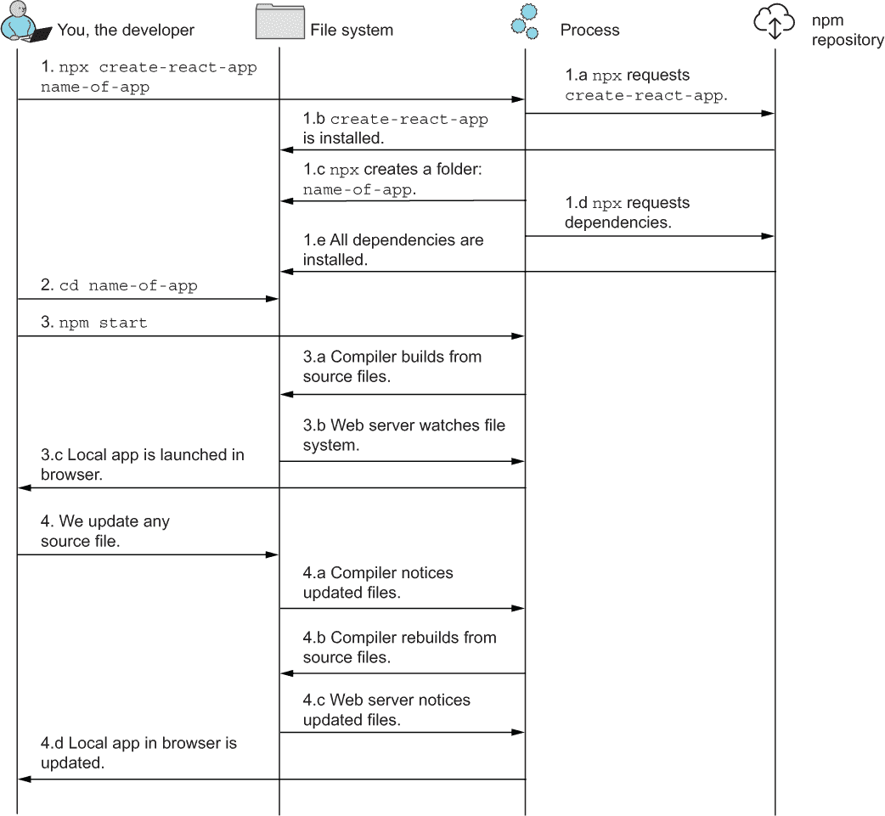

图 2.1 将你从无到有带到工作状态的三条命令。从那里，你可以更新源文件，系统将自动重新编译并在浏览器中更新你的应用程序。

如果你已经按照引言中建议安装了现代版本的 Node（以及 npm），你应该能在你的终端中输入以下命令：

```
$ npx create-react-app name-of-app
```

注意：npx 不是一个打字错误。npx 是一个与 npm 一起提供的包运行器工具。它允许我们仅使用此项目文件夹内存在的包来运行命令，或者运行在需要时动态下载的命令。

运行此命令，一个新的 React 应用程序就会为你设置好！第一次运行此命令时，npm 将要求确认下载 create-react-app 工具（只需按 Enter 键确认即可）。这指的是图 2.1 中的步骤 1.a 和 1.b。从那时起，每次使用该命令后都不会再提问。

注意：在接下来的章节中，我们将把 create-react-app 工具简称为 *CRA*。

此命令将创建一个新文件夹，其名称由传递的名称指定，在先前的例子中是 name-of-app。在此文件夹内，实用程序将初始化一个新的 Git 项目，下载应用程序所需的资源，然后下载并本地安装项目所需的所有依赖项。

此命令将运行一段时间，可能大约 1-3 分钟，具体取决于项目的复杂性和网络条件。一旦命令完成，您将看到类似以下内容：

```
Success! Created name-of-app at <folder>              ❶
Inside that directory, you can run several commands:

  npm start                                           ❷
    Starts the development server.

  npm run build                                       ❸
    Bundles the app into static files for production.

  npm test                                            ❸
    Starts the test runner.

  npm run eject                                       ❸
    Removes this tool and copies build dependencies, configuration
    files and scripts into the app directory. If you do this, you
    can't go back!

We suggest that you begin by typing:

  cd name-of-app                                      ❹
  npm start                                           ❷

Happy hacking!                                        ❺
```

❶ name-of-app 和 <folder> 将被替换为您的项目的实际名称和文件夹位置。

❷ 这是您可以在应用程序中运行的四个命令中的第一个（我们将在下一节讨论它的功能）。

❸ 下一个子节将讨论这三个其他命令。

❹ 此命令将文件夹更改为新创建的项目。

❺ 为什么，谢谢——愿您的黑客行为永远都是白帽！

哎，令人兴奋。请注意，如果您的输出提到的是 yarn 而不是 npm 命令，请不要担心。请参阅侧边栏以获取解释。

npm alternatives

对于在相同包仓库和结构上工作的 JavaScript 项目，有几个流行的包管理器，但它们的命令略有不同。最常用的管理器是 npm，但还有 Yarn 和 pnpm 等替代品。最受欢迎的选择 npm 随 Node 预装，并且是许多人使用的默认管理器。

然而，您可以选择安装不同的管理器，这将具有稍微简单的命令结构。在本书的范围内，使用 npm 或替代品之间没有区别，除了在输入命令时有一些略微不同的语法。如果您有 Yarn 或 pnpm，您可能也已经安装了 npm，因此这很可能总是适用于您。

如果您想使用这些包管理器之一，请检查有关如何运行命令的文档：

+   Yarn: [`classic.yarnpkg.com/lang/en/docs/cli/run/`](https://classic.yarnpkg.com/lang/en/docs/cli/run/)

+   pnpm: [`pnpm.io/cli/run`](https://pnpm.io/cli/run)

现在，让我们遵循前面代码片段中的建议并运行这两个命令：

```
$ cd name-of-app
$ npm start
```

现在魔法的第三部分发生了。一个 React 开发服务器启动，编译所有使用的文件和资源（如图 2.1 中的动作 3.a），并启动一个本地开发 Web 服务器（如图 2.1 中的动作 3.b）。几秒钟后，命令行将显示类似以下内容：

```
Compiled successfully!
You can now view name-of-app in the browser.
  Local:            http:/ /localhost:3000
```

此外，应用程序已经在您的浏览器中启动了，因为该命令还在正确的 URL 上启动了一个浏览器窗口（如图 2.1 中的动作 3.c）。如果没有，只需在浏览器中打开 localhost:3000 即可查看应用程序。此浏览器窗口将显示一个由模板为您创建的 React 应用程序（如图 2.2 所示）。这是为不指定特定模板的新 React 应用程序默认使用的模板。我们将在 2.1.3 节中稍后讨论模板。

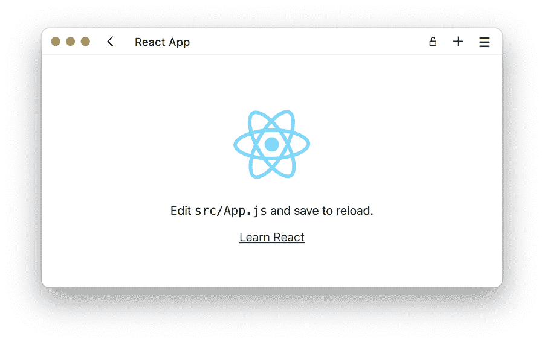

图 2.2 新建 React 项目启动的默认 React 应用程序。你的应用程序很可能是*暗色模式*，背景颜色为深色，文字为白色。为了更好的打印效果，此截图中的亮度已被反转。

注意，这个最后的命令 npm start 是一个持续运行的命令，它保持在终端中活跃。它将监视你的源文件，当任何源文件更改时，将重新编译整个应用程序，甚至用更新的应用程序重新加载浏览器（图 2.1 中的动作 4-4.d）！这真是纯粹的魔法。

如果你想要终止这个命令，只需在终端中按 Ctrl-C，你将回到正常的终端提示符。然而，你的应用程序不再工作，因为你同时也停止了本地开发 Web 服务器。

你可能已经注意到，创建我们的应用程序的先前输出不仅列出了我们刚刚使用的 start 命令，还列出了其他三个命令：build、test 和 eject。我们将在下一小节中更详细地介绍这四个命令。

### 2.1.1 React 项目命令

现在你已经将这个 React 应用程序源代码放在了你的系统上，你可能想以几种方式与之交互。你想要做的两件主要事情是看到你正在开发的内容，以及将你的应用程序部署到 Web 服务器上。你也可能想运行应用程序中的所有测试来验证一切是否仍然按设计工作。最后，你可能想摆脱 CRA 的限制，对底层的引擎进行修改。CRA 抽象了一些你一开始不需要担心的事情，但当应用程序变得更加高级时，你可能想访问应用程序配置的内部。出于这四个目的，使用 CRA 创建的新 React 应用程序自带这四个命令：

+   start—启动本地开发 Web 服务器，并在项目更改时持续编译项目，将其提供给任何本地浏览器。

+   build—将所有资源编译成一个可用于部署到正确 Web 主机的生产就绪包。

+   test—启动一个测试运行器，它将运行你在项目中定义的所有单元测试。

+   eject—揭示项目的内部工作原理，并使其完全可配置。

让我们逐一介绍它们，并讨论如何以及何时使用它们。

start

start 命令是你的主要命令，每次你开始一个新项目或重新开始一个旧项目时都会使用它。在编码会话的开始，你将在终端中运行 start 命令，然后你就可以在编辑器中编码，同时浏览器会自动提供更新的内容。

start 命令将在后台持续构建你的项目，使用的是 React 的开发版本及其实用库。这与 build 命令中使用的 React 生产版本是不同的。React 的开发版本包含了更好的错误信息和警告，以及调试在浏览器中运行的应用程序时的选项。然而，由于这些原因，React 的开发版本在文件大小上也要大得多，因此你不希望使用这个版本发布你的应用程序。这将使你的应用程序变得不必要地大，并阻碍用户尝试访问它。

start 命令也会在应用程序运行时在浏览器中重新加载应用程序，但比仅仅重新加载整个浏览器窗口要智能得多。React 将尝试只重新加载已更改的相关逻辑部分，而其他部分保持不变。例如，如果你点击了一个按钮来折叠一个在应用程序启动时默认打开的章节，React 将能够在保持浏览器中的状态的同时注入更新后的代码，因此这个章节在逻辑更新时仍然保持折叠状态。

build

这是当你准备好看到你的应用程序部署到真实的服务器并让用户尝试时运行的命令。当你运行 build 命令时，你将使用 React 的生产版本，它更加精简且针对部署进行了优化。构建的结果将被放入 /build 文件夹中。

默认情况下，实际上并没有发生什么，但如果你想在 build 命令中设置直接部署到你的云托管解决方案，也是可以的。请查阅你的云托管提供商的文档，以获取如何进行此操作的说明。我们在这本书中不会使用这个命令，因为我们将在项目中使用另一个模板来部署应用程序，其中将提供部署到云的选项。

test

如果你想要运行项目中定义的所有单元测试，请运行此命令。你可以在空默认模板上这样做，因为默认模板甚至包含一个默认的测试文件。

eject

这个命令可能有点危险，因为它不可逆。如果你卸载了你的应用程序，你将能够访问比其他情况下更多的 React 设置配置选项，但你也会失去自动更新所有相关工具到新版本的选择。我们在这本书中不会介绍如何卸载应用程序，但我们在第 2.1.4 节中会简要讨论其优缺点。

### 2.1.2 文件结构

当你使用 CRA 创建项目时，几乎总是遵循相同的文件结构。自定义模板可能会做不同的事情，但很少这样做。结构包括以下重要元素：

```
/
  public/
    index.html
  src/
    index.js
    App.js
  package.json
```

使用这两个文件夹和四个文件，你就准备就绪了。

公共文件夹用于将通过 Web 服务器直接提供的服务文件。这包括提供整个应用程序的 index.html 文件以及您不希望在应用程序中捆绑的二进制文件，例如 index.html 文件直接需要的文件（例如，favicon、层叠样式表[CSS]、字体或用于分享的图片）以及大文件（例如，视频和图片）。

源文件夹（src）是所有捆绑的 JavaScript 以及您想要捆绑为单个包的任何其他内容将放置的地方。这主要是 JavaScript，但可能还包括 CSS、图标、小图片、JSON 文件等。捆绑从源文件夹中的 index.js 文件开始。将主应用程序放在名为 App.js 或 app.js 的文件中是很常见的，这取决于个人偏好，但除此之外，您可以在这里灵活处理。一些模板在 src 文件夹内部使用子文件夹来结构化内容，这对于结构化更大的项目是必要的。

您项目的配置文件主要是 package.json，这是 npm 和 Yarn 所要求的。这是您项目的起始文件，它定义了依赖项以及您可以运行的命令，如第 2.1.1 节所述。

根目录通常会包含项目所需的各种库的大量其他配置文件。在项目根目录看到 20 多个其他配置文件的定制模板并不罕见。现在让我们继续讨论定制模板是什么以及它们如何帮助您。

### 2.1.3 模板

尽管我们在图 2.2 中看到的默认应用程序相当不错，但并不总是有帮助。默认应用程序使您能够以与该应用程序创建相同的方式创建一个简单的 Web 应用程序，但这可能不是您想要的。如果您想使用特定的技术栈创建 Web 应用程序或以特定方式使用 React，您可能需要使用不同的起始模板来正确设置。

当您使用 CRA 时，您可以指定要使用的模板。默认模板是您之前看到的带有（旋转）React 标志的模板。如果您想指定另一个模板，您可以通过参数来这样做：

```
$ npx create-react-app name-of-app --template name-of-template
```

您只能使用已存在的模板名称；如果该模板不存在，应用程序将终止。通常，人们甚至懒得选择模板，直接使用默认模板。但如果您知道您需要一个特定的设置或希望从某个特定状态开始您的代码库，您可以使用一个正好满足您需求的模板。一些常用的模板包括以下几种：

+   最小化模板，比默认模板具有更少的功能，例如，—template minimal。这个模板不包含图片、CSS、测试、Web 核心指标以及其他在默认模板中使用的其他小功能。

+   使用 TypeScript 的默认或最小模板的变体，例如，--template typescript 或 --template minimal-typescript。这对于使用 TypeScript 开始一个新项目非常有用。

+   其他开发者创建的复杂样板设置，其中你已经有了一堆特定的依赖项已经嵌入到你的新应用程序中，例如，--template redux-typescript，它预包装了 Redux 和 TypeScript，或者 --template rb，这是一个流行的 React 样板（因此称为 *rb*），它预包装了大量值得信赖的库，包括 Redux 和 Redux-Saga、styled components、ESLint、husky 以及更多。

关于 CRA 的模板系统的一个非常有用之处在于它是完全去中心化的。任何人都可以发布一个包到 npm，并以一种允许你将其用作自己应用程序基础的方式对其进行结构化。当然，这也是一个缺点。如果你在 npm 上找到一个模板，你无法确定它是否好，甚至是否真的做了它所说的。在这里，你可能需要相信群众的智慧——如果它很受欢迎，那么它可能很好。

允许几乎任何随机开发者发布 npm 上的模板的好处之一是，这包括 *我们*，本书的作者。我们将使用定制的 React 模板来展示本书中的所有示例和项目。我们稍后再回到这一点。首先，我们将讨论使用 CRA 的优点和缺点。

### 2.1.4 优点和缺点

使用 CRA 创建新的 React 应用程序有很多优点，但正如往常一样，这些优点也有其后果。我们已经讨论了许多优点，但让我们还是在这里列出它们：

+   *简单性*—在设置新应用程序时，你无需担心太多。你可以免费获得 JavaScript XML (JSX) 转换、打包、测试、自动重新加载等功能，无需处理所有依赖关系。

+   *可升级性*—你可以轻松升级到 React 及其他所有库的新版本。我们尚未讨论如何进行升级，但这个过程出奇地简单。只需运行 npm install --exact react-scripts@VERSION 即可将整个项目升级到特定的 React 脚本版本。查看 react-scripts 的变更日志以获取详细信息。

+   *社区*—随着可用的 CRA 模板如洪水般涌现，以及制作更多模板的简单途径，你很可能总能找到一个具有恰当工具组合的现成模板，这样你就不必担心正确混合它们。

+   *定制化*—除了各种模板之外，你还可以选择添加你项目所需的所有其他插件和库。例如，你的项目是否与 Google Maps 和 Amazon Web Services (AWS) 等接口？只需添加它们的库，你应该就可以顺利进行了。

然而，也有一些缺点。其中一些可以忽略或略过，但在某些情况下，你必须寻找 CRA 提供之外的其他设置。我们也将在这里讨论一些这些情况：

+   *理解*——如果不从头开始设置整个项目，你就不会知道所有这些努力都包含什么。如果你发现自己处于需要独特设置但一直依赖 CRA 的位置，你可能会很快发现自己陷入困境，因为你从未真正关注过它。但这是所有抽象的双重性：你通过不担心而获得好处，但代价是不知道下面发生了什么。

+   *控制*——你将失去对使用哪些库的控制权。CRA 目前使用 webpack 和 BabelJS 进行 JSX 捆绑和转译，但它们绝不是唯一的参与者。最近，出现了 esbuild、Bun、SWC 和 Rome 等工具，它们在某种程度上覆盖了相同的地盘，但你无法轻易切换到其中之一。你将陷入 CRA 目前为你选择的科技堆栈。另一方面，这也是一个优势，因为当另一个工具成为标准甚至可能优于 Babel 时，CRA 将适应并使用它——而不必让你担心。对于你坚持使用特定堆栈的实例，你必须从头开始设置你的项目。另一个选择是按照 2.1.1 节中描述的方式将应用程序推出，这会给你额外的可配置性和控制权，但代价是失去了可升级性。

+   *集成*——如果你想在服务器端设置中集成你的应用程序，CRA 目前无法帮助你。对于基于第一章中描述的网站框架的项目，你必须使用那些框架提供的设置，而不是 CRA。

在权衡了上述的利弊之后，我们得出结论，CRA（Create React App）非常适合新开发者。你将获得许多简洁性，并且减少了许多担忧。一旦你积累了更多经验，你就可以开始在 CRA 之外进行实验。这就是为什么我们在这本书的例子和项目中使用了 CRA。

## 2.2 关于本书中示例的说明

如前所述，我们将在这本书的所有项目和几乎所有示例中使用 CRA。唯一的例外是你在第一章中完成的第一例。

我们为这本书创建的所有模板都将按照以下结构命名：

```
rqXX-NAME
```

当然，rq 指的是*React Quickly*。XX 将被替换为章节编号，最后部分将是每个示例的定制简短名称。对于使用 CRA 的每个示例和项目，你都会看到模板名称以及如何在以下侧边栏中使用它。

仓库：rq02-nesting

这个例子可以在 rq02-nesting 仓库中看到。你可以通过创建一个基于相关模板的新 Web 应用程序来使用该仓库：

```
$ npx create-react-app rq02-nesting --template rq02-nesting
```

或者，你可以访问这个网站来浏览代码，直接在你的浏览器中查看应用程序的实际运行情况，或者下载源代码的 zip 文件：

[`rq2e.com/rq02-nesting`](https://rq2e.com/rq02-nesting)

有时候，示例将包含多个源代码变体，在这种情况下，每个变体都将像刚才展示的那样带有自己的模板。还有一些示例提供了额外的作业建议。在这些情况下，模板将指定为该额外作业的起点，而另一个模板将包含*一个*可能的解决方案。你可以使用解决方案模板作为灵感或与你自己的解决方案进行比较。所有这样的作业都可以有无限种解决方案，所以如果你的工作与模板不匹配，并不意味着它是错误的——它只是不同。

为了方便使用，你通常可以将模板名称用作你的应用程序名称。所以，假设你想要开始在这本书的下一个示例上工作。模板名称是 rq02-nesting，那么我们也可以将其用作 web 应用名称：

```
$ npx create-react-app rq02-nesting --template rq02-nesting
```

只需在控制台中输入这些内容，你就可以开始运行并准备好与我们一起解决示例中的问题。你也可以只阅读章节并查看书中的列表中的代码。如果你发现某些事情很奇怪或需要将手指伸入代码中尝试一些事情，那么你可以实例化模板并查看示例的实际效果。现在让我们继续这个示例，它似乎涉及到嵌套某个内容。

## 2.3 嵌套元素

回到创建 React 应用程序，这是我们在这本书中要做的，让我们开始做一些比第一章中我们看到的那个指导性但过于简化的示例稍微复杂一点的事情。在那个章节中，你学习了如何创建单个 React 元素。作为提醒，你使用的方法是 React.createElement()。例如，你可以创建一个链接元素如下：

```
const reactLinkElement = React.createElement("a",
  { href: "http:/ /react.dev" },
  "React Website"
)
```

当我们只创建单个元素时，这是可以的。问题是每个网站都有不止一个元素；否则，你怎么会有除了单个段落之外的其他信息呢？

创建多元素结构的解决方案是以分层方式嵌套元素。在上一章中，你通过创建单个 React 元素并使用 ReactDOM.createRoot().render()将其渲染到 DOM 中来实现你的第一个 React 代码：

```
const title = React.createElement("h1", null, "Hello world!");
const domElement = document.getElementById("root");
ReactDOM.createRoot(domElement).render(title);
```

需要注意的是，ReactDOM.createRoot().render()只能接受一个（根）React 元素作为参数，在这个例子中是 reactElement。结果应用程序如图 2.3 所示。

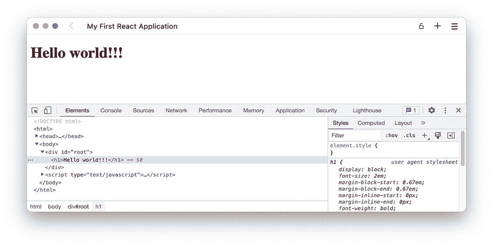

图 2.3 浏览器渲染单个标题元素。我们在这里打开了开发者工具来展示底层的 HTML 结构。请参考你选择的浏览器如何打开开发者工具，但 Ctrl-Alt-I/Cmd-Opt-I 可能有效。

仓库：rq02-nesting

这个示例可以在 rq02-nesting 仓库中看到。你可以通过基于相关模板创建新的 web 应用来使用该仓库：

```
$ npx create-react-app rq02-nesting --template rq02-nesting
```

或者，您可以访问这个网站浏览代码，直接在浏览器中查看应用程序的运行情况，或者下载源代码的 zip 文件：

[`rq2e.com/rq02-nesting`](https://rq2e.com/rq02-nesting)

当您检查 rq02-nesting 模板时，您将拥有前面的应用程序，但这次使用 CRA 而不是手动添加库和编写 HTML，就像我们在第一章中所做的那样。

记住，当您使用 createElement 时，第三个参数是元素的子节点。在这种情况下，我们只提供了简单的文本作为子节点。但实际上，那文本实际上是一个元素——至少在生成的 DOM 中是这样。在 React 中，它没有特定的元素类型，但它仍然在某种程度上充当一个元素。我们可以在一个非常简单的图中展示这种关系，如图 2.4 所示。

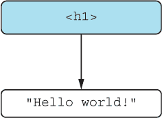

图 2.4 灰色节点是一个真实的 React 元素，而白色元素只是一个文本元素。

### 2.3.1 节点层次结构

在我们探讨如何创建复杂的 HTML 结构之前，我们首先需要了解一些基本术语。HTML 文档通常被表示为一个倒置的树，如图 2.5 所示。树中的节点通常以家族式的描述（父节点、子节点等）。

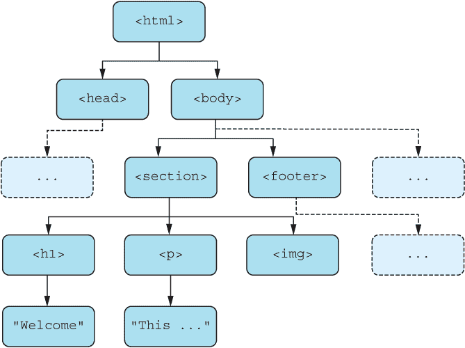

图 2.5 HTML 文档的倒置树结构，每个节点以家族角色（如父节点、子节点和兄弟节点）相互关联

以下术语与树结构相关：

+   *节点*—树中的任何成员都是一个节点，包括 HTML 元素和文本节点。图 2.5 中的所有框都是节点。最底部的两个框是文本节点，其余的都是元素节点。

+   *根*—树中的第一个（最顶部的）节点是树的根。在图 2.5 中，<html>节点是根节点。

+   *父节点*—直接位于给定节点之上的节点是其父节点。树中的每个节点只有一个父节点。那个节点之上的节点可以被称为祖父节点，依此类推。在图 2.5 中，<body>的父节点是<html>节点。根节点没有父节点，它是树中唯一没有父节点的节点。

+   *子节点*—任何直接位于给定节点下的节点是该节点的子节点。一个节点可以有多个子节点。<section>节点的子节点是<h1>、<p>和节点。并非所有节点都有子节点。元素没有子节点。文本节点永远不会有子节点。

+   *兄弟节点*—具有相同父节点的两个节点被认为是兄弟节点。<p>节点有两个兄弟节点：<h1>和节点。

+   *祖先节点*—一个节点的父节点，它的父节点，它的父节点的父节点，以此类推，一直到根节点，这些都被称为节点的祖先节点。<h1>节点有三个祖先节点：<section>、<body>和<html>节点。

+   *后代*——一个节点的子节点，以及所有这些子节点的子节点，所有子节点的子节点的子节点，等等，都被称为节点的后代。`<section>`节点有五个后代：它的三个直接子节点以及前两个子节点的两个孙子文本节点。

+   *嵌套*——嵌套是组织树中的节点并决定哪些节点将成为其他节点的子节点的过程，从而创建文档树。在图 2.5 中，我们决定将`<h1>`、`<p>`和``节点嵌套在`<section>`节点内。

### 2.3.2 简单嵌套

假设您想在字符串“Hello world!”中将单词*world*以斜体形式渲染，但仍然将其全部放在一个 h1 元素中。如图 2.6 所示，您创建一个包含字符串"world"的子元素的 em 元素，以及另一个包含三个子元素的 h1 元素：

+   字符串"Hello "（注意结尾的空格）

+   之前提到的 em 元素

+   字符串"!"

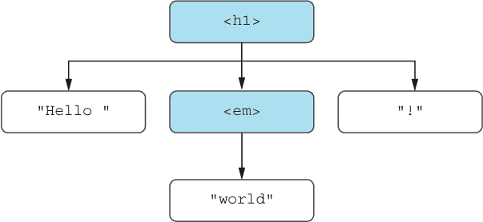

图 2.6 渲染我们稍微强调的欢迎信息所需的两个 React 元素和三个文本元素

使用 React.createElement，这变成了以下：

```
const world = React.createElement("em", null, "world");   ❶
const title = React.createElement(                        ❷
  "h1", null, "Hello ", world, "!"                        ❷
)                                                         ❷
```

❶ 使用三个参数创建元素

❷ 使用五个参数创建元素，最后三个是它的子元素

如您所见，我们现在向 createElement 传递了五个参数：首先，元素类型，然后是属性，最后是元素的子元素。您可以为元素传递任意数量的参数，就像子元素一样。您也可以将子元素作为数组传递：

```
const title = React.createElement("h1", null, ["Hello ", world, "!"])
```

在这种情况下，在将元素作为参数传递之前将它们放入数组中是没有意义的，但如果我们已经有一个元素数组，我们只需将其作为参数传递即可。将所有这些放在一起（不使用数组），整个脚本就变成了以下列表。

列表 2.1 强调问候世界

```
import React from "react";
import ReactDOM from "react-dom/client";
const world = React.createElement("em", null, "world");
const title = React.createElement("h1", null, "Hello ", world, "!");
const domElement = document.getElementById("root");
ReactDOM.createRoot(domElement).render(title);
```

如果我们将这些应用到实际中，我们的应用程序在浏览器中看起来就像图 2.7 所示。

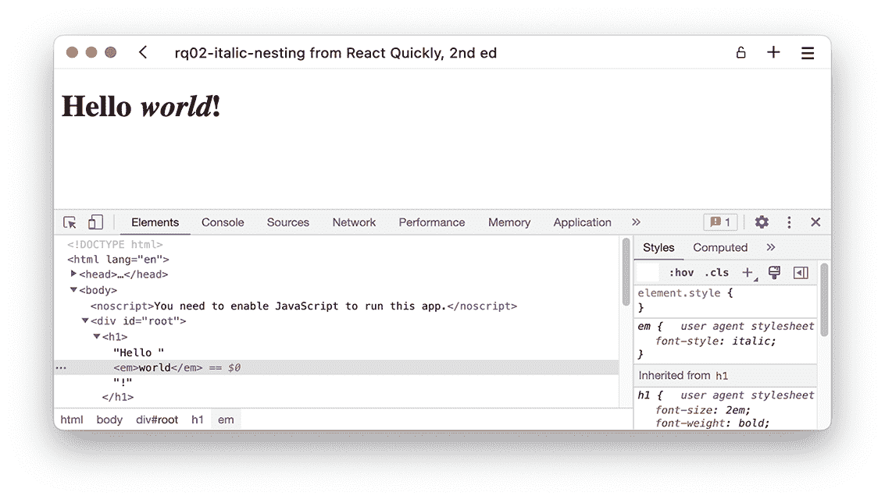

图 2.7 浏览器中的强调问候。注意开发者工具中的底层 HTML 结构。

仓库：rq02-nesting-italic

这个例子可以在仓库 rq02-nesting-italic 中看到。您可以通过创建基于相关模板的新 Web 应用程序来使用该仓库：

```
$ npx create-react-app rq02-nesting-italic --template rq02-nesting-italic
```

或者，您可以访问此网站来浏览代码，直接在您的浏览器中查看应用程序，或下载源代码的 zip 文件：

[`rq2e.com/rq02-nesting-italic`](https://rq2e.com/rq02-nesting-italic)

但如果您想在 h1 之后而不是仅仅在它内部放置一个元素呢？我们将在下一节中介绍兄弟元素。

### 2.3.3 兄弟元素

在许多情况下，您只能在顶层使用单个 React 元素。这适用于 ReactDOM.createRoot().render()方法——只能将单个元素渲染到 DOM 中作为根元素。您稍后还会看到自定义组件只能返回单个元素。

但如果你想在之前的例子中显示一个标题*然后*在其后显示一个链接（见图 2.8）怎么办？那将是两个相邻的不同元素，你不能直接使用 ReactDOM.createRoot().render()来渲染。

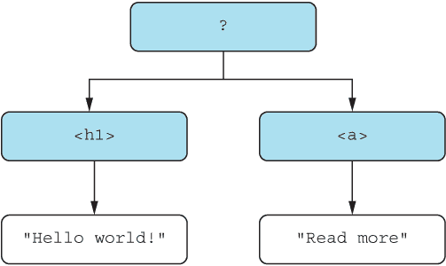

图 2.8 在根中渲染的两个兄弟 React 元素

相反，你必须将它们包裹在另一个元素中（如图 2.8 中的?所代表的内容）。这里你有两种不同的选择。一种选择是使用一个中性的 DOM 元素，这很简单，但会在输出 HTML 中添加一个“物理”元素。另一种选择是使用 React Fragment 元素，它像任何其他元素一样工作，但本身不会产生任何输出 HTML。请参见图 2.9 中这些方法的区别。

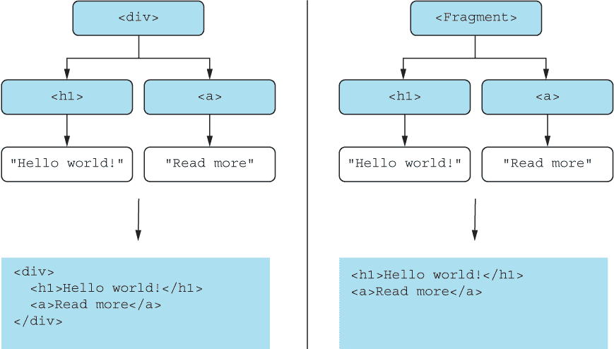

图 2.9 展示了两种不同的处理具有不同输出的兄弟元素的方法

如果你想要使用一个中性的 DOM 元素，例如，你可以使用一个<div>来将它们分组，如图 2.10 所示。这会产生你在图 2.10 中看到的 HTML。

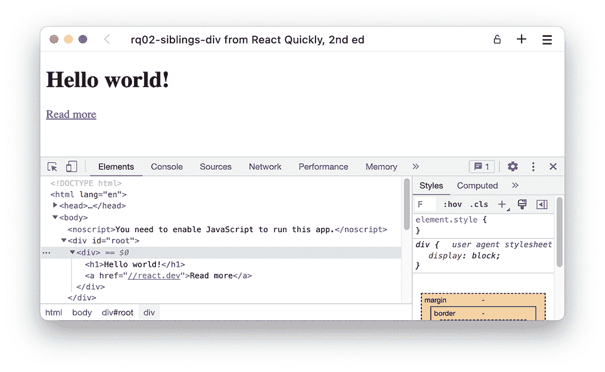

图 2.10 分组元素中的标题和链接

列表 2.2 分组容器中的两个元素

```
import React from "react";
import ReactDOM from "react-dom/client";
const title = React.createElement("h1", null, "Hello world!");
const link = React.createElement("a", { href: "//react.dev" }, "Read more");
const group = React.createElement("div", null, title, link);
const domElement = document.getElementById("root");
ReactDOM.createRoot(domElement).render(group);
```

仓库：rq02-siblings-div

这个例子可以在 rq02-siblings-div 仓库中看到。你可以通过基于相关模板创建一个新的 web 应用来使用那个仓库：

```
$ npx create-react-app rq02-siblings-div --template rq02-siblings-div
```

或者，你可以访问这个网站来浏览代码，直接在你的浏览器中查看应用程序的运行情况，或者下载源代码的 zip 文件：

[`rq2e.com/rq02-siblings-div`](https://rq2e.com/rq02-siblings-div)

<div>容器通常适用于块级内容，而<span>用于内联级内容。但你不一定要使用“真实”的元素。你还可以创建一个空的 React 元素，它的唯一目的是将多个其他元素分组，并且不会将自身输出到页面的 HTML 中。这可以通过被称为 React.Fragment 的神奇组件来完成，并且它可以作为分组元素类型使用。让我们在下一个列表中这样做。

列表 2.3 片段中的两个元素

```
import React from "react";
import ReactDOM from "react-dom/client";
const title = React.createElement("h1", null, "Hello world!");
const link = React.createElement("a", { href: "//react.dev" }, "Read more");
const group = React.createElement(     ❶
  React.Fragment, null, title, link    ❶
);                                     ❶
const domElement = document.getElementById("root");
ReactDOM.createRoot(domElement).render(group);
```

❶ 注意到 React.Fragment 被用作 createElement 的第一个参数。

仓库：rq02-siblings-fragment

这个例子可以在 rq02-siblings-fragment 仓库中看到。你可以通过基于相关模板创建一个新的 web 应用来使用那个仓库：

```
$ npx create-react-app rq02-siblings-frag --template rq02-siblings-fragment
```

或者，你可以访问这个网站来浏览代码，直接在你的浏览器中查看应用程序的运行情况，或者下载源代码的 zip 文件：

[`rq2e.com/rq02-siblings-fragment`](https://rq2e.com/rq02-siblings-fragment)

在浏览器中，这种输出的显示如图 2.11 所示。

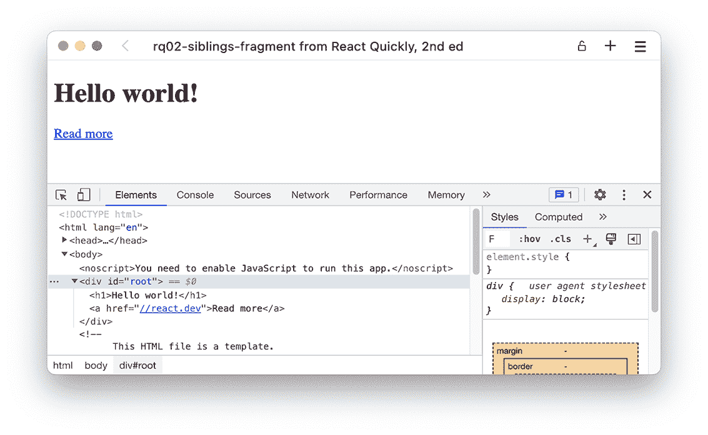

图 2.11 没有分组元素的标题和链接

你也可以用单个语句渲染整个元素，如下所示：

```
const group = React.createElement(
  React.Fragment,
  null,
  React.createElement(
    "h1",
    null,
    "Hello world!",
  ),
  React.createElement(
    "a",
    { href: "//react.dev" },
    "Read more",
  ),
); 
```

这在功能上与之前的代码等效；它只是使用了更少的变量。有些人可能会认为这使它更明显，而其他人可能会说这使它更难以阅读。

到目前为止，你主要将字符串值作为 createElement()的第一个参数提供。但第一个参数可以有两种类型的输入，正如我们刚才在片段中看到的那样：

+   作为字符串的标准 HTML 标签，例如，“h1”、“div”或“p”（不带尖括号）。名称是小写的。

+   作为引用的 React 组件（而不是字符串）。名称通常是首字母大写的。

第一种方法渲染标准 HTML 元素。你可以使用任何字符串作为 HTML 标签名，无论它是否在浏览器中默认有意义。因此，虽然你将主要使用正常的 HTML 元素，如 div、main、section 等，但没有任何阻止你创建一个 tiny-horse 元素，它在浏览器中会渲染为<tiny-horse>。它没有意义和默认样式，但它会工作。

在刚刚列出的第二种方法中，我们可以提供一个 React 组件作为引用。通过这种方式，我们并不是指 React 组件的名称作为字符串，而是直接引用所讨论的组件。你已经通过使用 React.Fragment 看到了一个这样的例子。现在让我们看看我们如何在下一节中创建自己的自定义组件。

## 2.4 创建自定义组件

在使用 React 嵌套元素之后，你很快就会遇到下一个问题：有很多重复的元素。你需要使用第一章中描述的基于组件的架构（CBA），它通过将功能分离成松散耦合的部分来允许代码的重用：遇见组件类，或者简称为组件，它们通常被简称为组件（不要与 Web 组件混淆）。

将标准 HTML 标签视为构建块。你可以使用它们来组合自己的 React 组件，你可以使用这些组件来创建自定义元素（组件的实例）。通过使用自定义元素，你可以将逻辑封装和抽象到可组合、可重用的组件中。这种抽象允许团队在大型、复杂的应用程序以及不同的项目中重用用户界面（UI）。例如包括面板、输入、按钮、菜单等。

对于这个例子，我们想要创建三个相同的链接。创建相同的链接并没有太多意义，但，目前我们无法自定义它们，所以我们就按照这个场景来。我们想要创建三个链接，它们都写着“了解更多关于 React”，并链接到 React 网站[www.react.dev](http://www.react.dev)。我们还希望将每个链接包裹在一个段落中，这样它们就会单独成行。

有两种不同的方法。我们可以通过有三个相同元素的副本来实现，或者我们可以通过创建一个可重用的链接组件，然后将其实例化三次来实现，如图 2.12 所示。

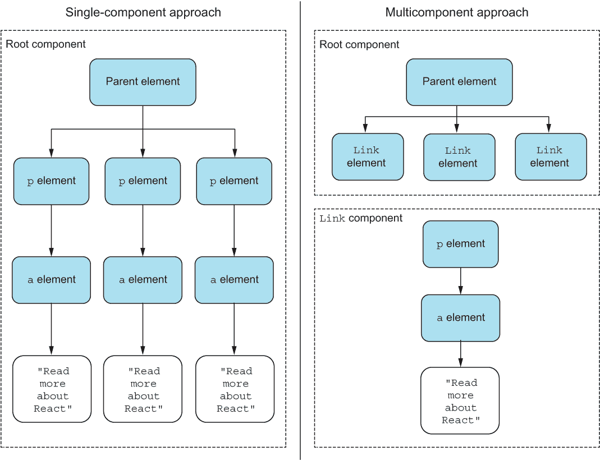

图 2.12 创建重复元素的两种方法

首先，让我们看看第一种方法，其中我们只使用单个组件，并通过手动复制来创建副本。我们希望在独立的段落中包含三个独立的链接，我们可以以一种相当冗长的方式做到这一点，如下面的列表所示。

列表 2.4 三个链接，每个链接一次

```
import React from "react";
import ReactDOM from "react-dom/client";
const link1 = React.createElement(
  "a", { href: "//react.dev" }, "Read more about React"
);
const p1 = React.createElement("p", null, link1);
const link2 = React.createElement(
  "a", { href: "//react.dev" }, "Read more about React"
);
const p2 = React.createElement("p", null, link2);
const link3 = React.createElement(
  "a", { href: "//react.dev" }, "Read more about React"
);
const p3 = React.createElement("p", null, link3);
const group = React.createElement(React.Fragment, null, p1, p2, p3);
const domElement = document.getElementById("root");
ReactDOM.createRoot(domElement).render(group); 
```

如果我们在浏览器中打开它，我们会得到图 2.13 中所示的结果，这正是我们想要的。

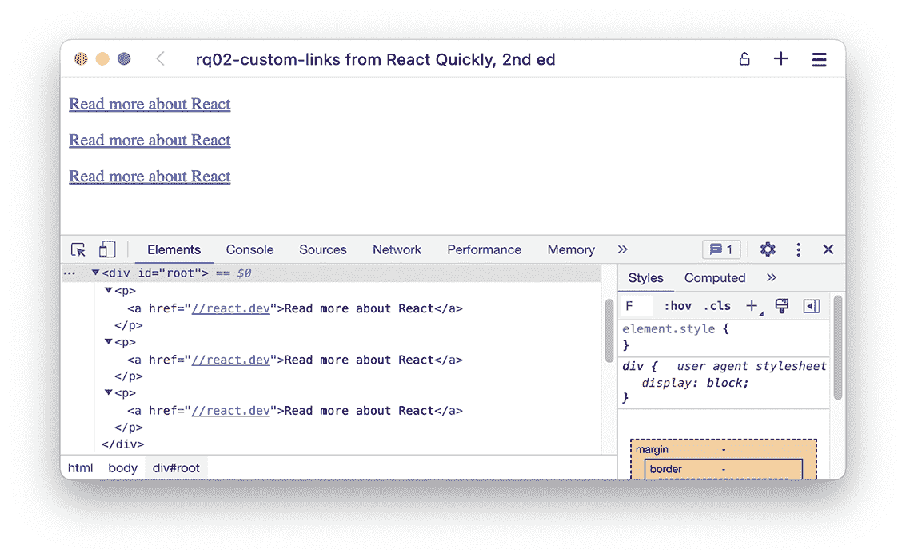

图 2.13 我们应用程序中的三个相同链接

但在列表 2.4 中，我们重复了很多次，这当然是不理想的。React 和类似框架的全部意义就是停止重复。这就需要自定义组件！

自定义组件是一个包含其他元素和组件实例的命名对象。因此，在这种情况下，我们可以创建一个单独的链接组件，以正确的方式渲染所需的链接，然后我们会包含三个链接组件的实例，而不是带有所有属性的“原始”<p>和<a>元素。

您可以通过使用 class CHILD extends PARENT ES6 语法扩展 React.Component 类来创建一个 React 组件类。让我们使用 class Link extends React.Component 创建一个自定义链接组件类。

对于这个新类，您必须实现的一个强制性方法是 render()方法。此方法必须使用 createElement()创建一个根元素返回，createElement()可以是从另一个自定义组件类或 HTML 标签创建的。如果需要，它们可以嵌套元素，只要只有一个根元素即可。

列表 2.5 创建和渲染 React 组件类

```
import React from "react";
import ReactDOM from "react-dom/client";
class Link extends React.Component {        ❶
  render() {                                ❷
    return React.createElement(             ❸
      "p",
      null,
      React.createElement(
        "a",
        { href: "//react.dev" },
        "Read more about React"
      )
    );
  }
}
const link1 = React.createElement(Link);    ❹
const link2 = React.createElement(Link);    ❹
const link3 = React.createElement(Link);    ❹
const group = React.createElement(
  React.Fragment, null, link1, link2, link3
);
const domElement = document.getElementById("root");
ReactDOM.createRoot(domElement).render(group); 
```

❶ 使用大写命名的 Link 定义一个 React 组件类

❷ 创建一个作为表达式的 render()方法（返回单个元素的函数）

❸ 返回一个包含我们所需此组件内容的新的元素

❹ 创建新的链接组件的一个实例

仓库：rq02-custom-links

这个例子可以在 rq02-custom-links 仓库中看到。您可以通过创建一个基于相关模板的新 Web 应用程序来使用该仓库：

```
$ npx create-react-app rq02-custom-links --template rq02-custom-links
```

或者，您也可以访问这个网站来浏览代码，直接在您的浏览器中查看应用程序，或者下载源代码的 zip 文件：

[`rq2e.com/rq02-custom-links`](https://rq2e.com/rq02-custom-links)

按照惯例，包含 React 组件的变量名称应该大写。在常规 JavaScript 中这不是必需的。您可以在前面的代码中使用小写类名 someLink 而不是 Link，它仍然可以工作。但是，由于它对于 JSX（我们将在下一章中介绍）是必要的，所以我们在这里也遵循这个约定。

类似于 ReactDOM.createRoot().render()，类组件中的 render()方法只能返回一个元素。如果您需要返回多个同一级别的元素，请将它们包裹在一个容器组件中——可以是 HTML 元素或 React 片段。如果我们现在在浏览器中运行此代码，我们会得到与之前完全相同的 HTML（参见图 2.13）。

这段新代码更加紧凑。去除了不必要的重复，并且我们将代码的一部分封装起来，可以尽可能多地重用。这就是组件可重用性的力量！它导致开发速度更快，错误更少。组件还具有属性、生命周期事件、状态、DOM 事件和其他功能，使它们可以交互和自包含；这些主题都在接下来的章节中介绍。 

目前，所有链接都是相同的。如果可以设置元素属性并单独修改其内容和行为，那岂不是太棒了？您可以使用属性做到这一点，正如我们接下来将要讨论的。

## 2.5 与属性一起工作

属性是 React 使用的声明式风格的基础。将属性视为元素内的不可变值。如果用于视图，它们允许元素有不同的变体，例如通过传递新值的属性来更改链接 URL：

```
React.createElement("a", { href: "//react.dev" }, "React"); 
```

有一个需要注意的事情是，属性在其组件内部是不可变的。父组件在创建子组件时分配属性。子元素不应该修改其属性。例如，您可以将属性 PROPERTY_NAME 和值 VALUE 传递给类型为 Link 的组件，如下所示：

```
React.createElement(Link, { PROPERTY_NAME: VALUE });
```

属性与 HTML 属性（如本节开头代码片段中的 href 所示）非常相似。这是它们的目的之一，但它们还有另一个用途——您可以在代码中按需使用元素的属性：

+   要渲染元素的常规 HTML 属性：href、title、style、class 等

+   作为为组件提供自定义指令以使其单独渲染

属性的对象可以通过使用 this.props 在组件内部访问。这个对象是一个冻结的（不可变的）对象，您只能读取其值，而不能设置它们。

JavaScript 中的冻结对象

在内部，React 使用 Object.freeze()，这是 JavaScript 中的一个内置函数，用于使 this.props 对象不可变。要检查一个对象是否被冻结，您可以使用 Object.isFrozen()方法。例如，您可以确定以下语句是否会返回 true：

```
class Test extends React.Component {
  render() {
    console.log(Object.isFrozen(this.props))
    return React.createElement("div")
  }
}
```

这方面的细节相当复杂，但到目前为止，只需知道您永远不应该尝试在组件内部编辑或添加属性。这是在父上下文中完成的事情。

### 2.5.1 单个属性

让我们从一个非常简单的例子开始。我们希望在我们之前创建的链接中自定义框架的名称。因此，我们可以在一个链接中写“了解更多关于 React”，在第二个链接中写“了解更多关于 Vue”，在第三个链接中写“了解更多关于 Angular”，如图 2.14 所示。

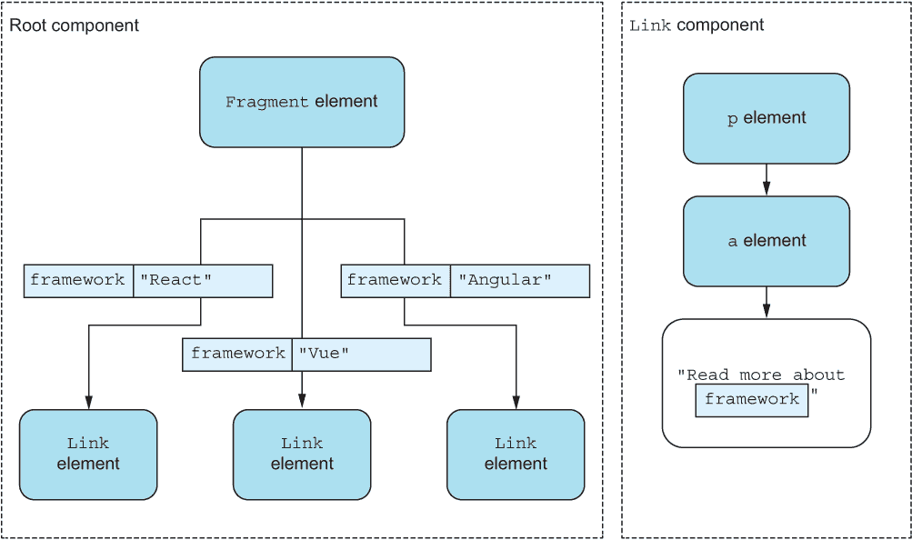

图 2.14 将属性传递给组件并在组件内部使用属性

要做到这一点，我们需要做两件事：

1.  将属性传递给我们的组件实例。

1.  在组件内部使用属性。

首先，我们需要将一个新属性传递给链接实例。所以，而不是仅仅使用

```
const link1 = React.createElement(Link);
```

我们将提供包含单个属性的对象作为第二个参数：

```
const link1 = React.createElement(Link, { framework: "React" });
```

我们在这里使用了变量名 framework。这是一个我们作为组件创建者可以任意选择的名称。我们只需要确保在第二步中使用相同的变量名。

现在，我们需要在我们的类中使用这个传递的属性。鉴于我们命名了变量为 framework，我们将通过 this.props.framework 来访问它。以下列表显示了整体代码结果。

列表 2.6 带有不同文本的链接实例

```
import React from "react";
import ReactDOM from "react-dom/client";
class Link extends React.Component {
  render() {
    return React.createElement(
      "p",
      null,
      React.createElement(
        "a",
        { href: "//react.dev" },
        `Read more about ${this.props.framework}`,   ❶
      ),
    );
  }
}
const link1 = React.createElement(Link, {
  framework: "React"                                 ❷
});
const link2 = React.createElement(Link, {
  framework: "Vue"                                   ❸
});
const link3 = React.createElement(Link, {
  framework: "Angular"                               ❹
});
const group = React.createElement(
  React.Fragment, null, link1, link2, link3
);
const domElement = document.getElementById("root");
ReactDOM.createRoot(domElement).render(group);
```

❶ 我们通过将 this.props.framework 与一些静态内容结合来渲染链接的文本内容。注意如何使用反引号来组合一个包含变量的字符串。这是 JavaScript 的一个特性，而不是 React 特有的。

❷ 我们链接组件的第一个实例使用 "React" 作为框架属性。

❸ 我们链接组件的第二个实例使用 "Vue" 作为框架属性。

❹ 我们链接组件的第三个实例使用 "Angular" 作为框架属性。

你可以在图 2.15 中看到这个功能在浏览器中的实际应用。

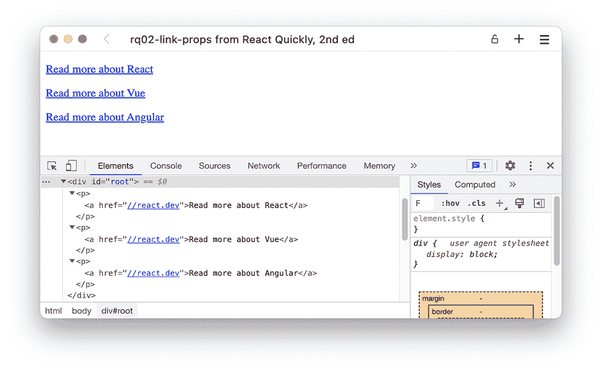

图 2.15 三个带有不同文本的链接，每个链接都在一个段落内

### 2.5.2 多个属性

你可能已经注意到所有链接仍然指向同一个网址，即 React 网站。这当然是不好的，因为我们需要不同的网址。使用相同的方法，我们简单地发明了一个新的属性，url，并在组件内部以及组件实例中使用它。你可以在图 2.16 中的图中看到这一点，并在列表 2.7 中的代码中实现。

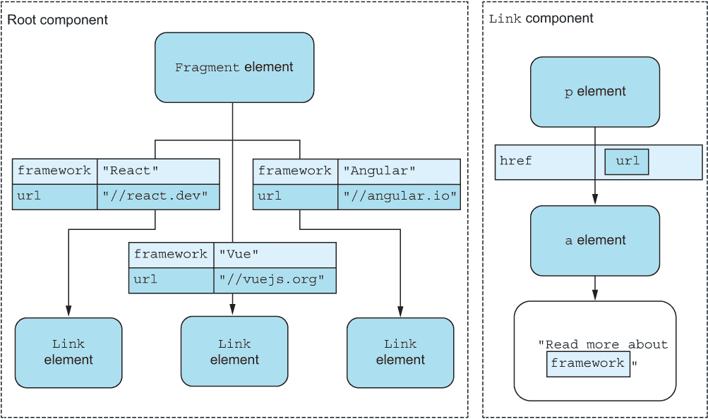

图 2.16 传递给我们的组件的两个不同属性

列表 2.7 带有不同文本和网址的链接实例

```
import React from "react";
import ReactDOM from "react-dom/client";
class Link extends React.Component {
  render() {
    const link = React.createElement(
      "a",
      { href: this.props.url },                   ❶
      `Read more about ${this.props.framework}`
    );
    return React.createElement("p", null, link);
  }
}
const link1 = React.createElement(Link, {
  framework: "React",
  url: "//react.dev",                             ❷
});
const link2 = React.createElement(Link, {
  framework: "Vue",
  url: "//vuejs.org",                             ❸
});
const link3 = React.createElement(Link, {
  framework: "Angular",
  url: "//angular.io",                            ❹
});
const group = React.createElement(
  React.Fragment, null, link1, link2, link3
);
const domElement = document.getElementById("root");
ReactDOM.createRoot(domElement).render(group); 
```

❶ 使用 url 属性在 <a> 元素上设置 href 属性

❷ React 的网址是 [`react.dev`](https://react.dev)。

❸ Vue 的网址是 [`vuejs.org`](https://vuejs.org)。

❹ Angular 的网址是 [`angular.io`](https://angular.io)。

仓库：rq02-link-props

这个例子可以在仓库 rq02-link-props 中看到。你可以通过创建一个基于相关模板的新 Web 应用来使用该仓库：

```
$ npx create-react-app rq02-link-props --template rq02-link-props
```

或者，你也可以访问这个网站来浏览代码，在你的浏览器中直接查看应用程序的实际应用，或者下载源代码的 zip 文件：

[`rq2e.com/rq02-link-props`](https://rq2e.com/rq02-link-props)

你可以在图 2.17 中看到这个功能在浏览器中的实际应用。如图所示，我们可以在自定义组件（在组件内部用于自定义返回的结构）和 HTML 元素（设置 HTML 属性）上使用属性。


图 2.17 三个带有不同文本和不同网址的链接

如果你在一个 HTML 元素上设置了一个自定义属性并搞错了会发生什么？React 仍然会渲染它。在 React 16 之前，无效的属性会被过滤掉，但鉴于现代 Web 应用程序经常使用可能依赖于某些自定义属性的第三方库，React 16 及以后的版本将允许你使用你选择的任何属性。

你可以根据属性的值完全修改渲染的元素。例如，我们可以检查框架属性，并在框架名称为"React"的情况下返回一个带有链接的大标题：

```
class Link extends React.Component {
  render() {
    const link = React.createElement(                 ❶
      "a",
      { href: this.props.url },  
      `Read more about ${this.props.framework}`,
    );
    if (this.props.framework === "React") {           ❷
      return React.createElement("h1", null, link);   ❸
    }
    return React.createElement("p", null, link);      ❹
  }
}
```

❶ 创建一个链接元素并将其存储在一个变量中

❷ 检查框架是否匹配"React"

❸ 如果匹配，返回一个包含链接的 h1 元素

❹ 否则，返回一个包含链接的段落元素

这也是一个很好的例子，说明 React 元素仅仅是普通的 JavaScript。我们可以创建一个元素并将其存储在一个变量中，然后稍后根据需要使用该变量。我们还可以使用常规 JavaScript 功能创建分支。如果我们在这个浏览器中渲染这个新组件，突然链接就不再相同了，如图 2.18 所示。

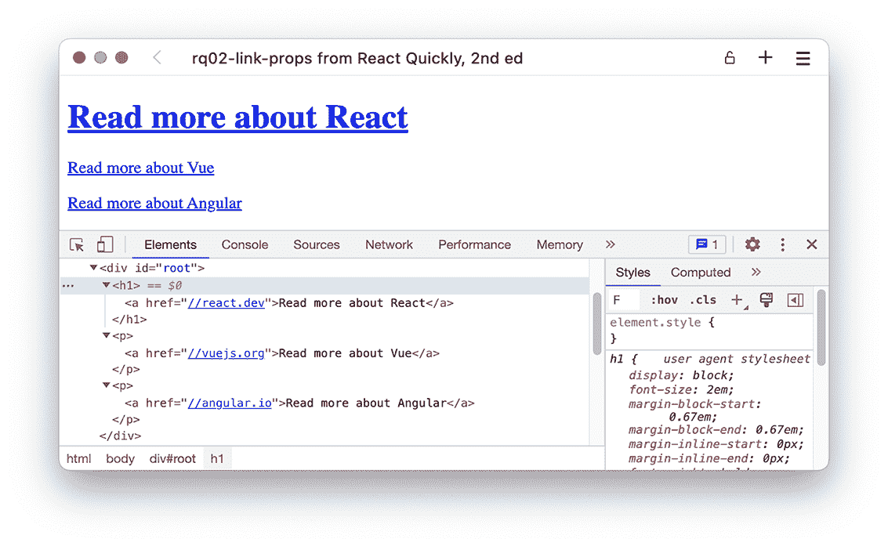

图 2.18 显示了三个链接，但 React 因其重要性而突出。

我们已经覆盖了一些非常简单的 HTML 的几种排列组合，这些 HTML 本身几乎毫无用处。但通过从小处着手，我们正在为未来的更高级主题建立一个坚实的基础。事实上，你可以通过自定义组件实现许多伟大的事情。

如果你（像许多 React 开发者一样）计划使用 JSX，那么了解 React 在常规 JavaScript 中的工作方式非常重要。这是因为，最终，浏览器仍然会运行常规 JavaScript，你有时需要理解 JSX 到 JS 转换的结果。从现在开始，我们将使用 JSX，这将在下一章中介绍。但在我们到达那里之前，我们需要讨论一下 React 应用程序的结构。

### 2.5.3 特殊属性：children

React 元素有一个特殊的属性，children。这不是你以常规方式指定的属性，但你确实像使用任何其他属性一样使用它。

让我们稍微改变一下我们的例子，创建一个只包含框架名称（没有“了解更多关于”这样的文本）的链接列表，如图 2.19 所示。

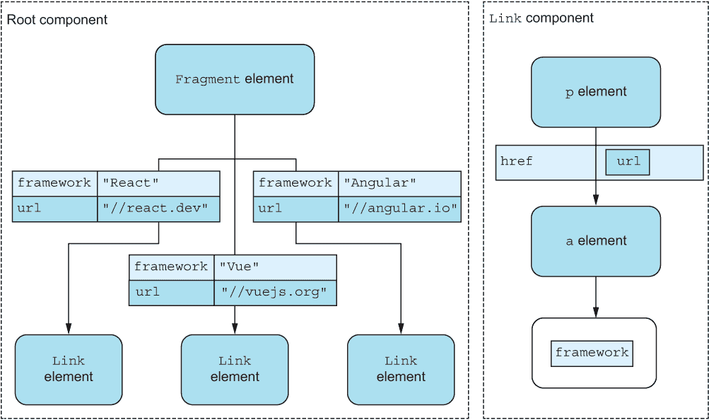

图 2.19 展示了我们新的结构，其中链接只包含框架名称

现在让我们更进一步。假设我们想要将 React 的框架以粗体显示。我们已经知道如何创建一个粗体元素——只需将其包裹在元素中，如下所示：

```
React.createElement("strong", null, "React");
```

但我们如何将其作为一个属性传递呢？我们可以通过创建如下所示的 React 框架节点来完成：

```
const boldReact = React.createElement("strong", null, "React");    ❶
const link1 = React.createElement(
  Link,
  { framework: boldReact, url: "//react.dev" }                     ❷
);
```

❶ 在变量 boldReact 中创建一个 React 元素

❷ 将该变量作为属性框架传递给 Link 元素

虽然这有点奇怪。我们现在正在创建元素，但作为属性传递，这不是我们通常的做法。如果我们能够创建一个元素并将其作为子元素传递，会怎样呢？

记得 React.createElement 的第三个参数及其之后的参数是元素的子节点吗？我们还没有在自定义组件中使用它，但我们可以使用。传递给自定义元素的子节点都可以通过 this.props.children 访问。该属性要么是一个节点（如果只传递了一个子元素），要么是一个节点数组（如果传递了多个子元素）。

因此，让我们将我们的根组件更改为包含三个链接，其中链接文本不是作为名为 framework 的属性传递，而是作为子节点。对于第一个链接，我们仍然希望使文本加粗，如图 2.20 所示，并在列表 2.8 中实现。

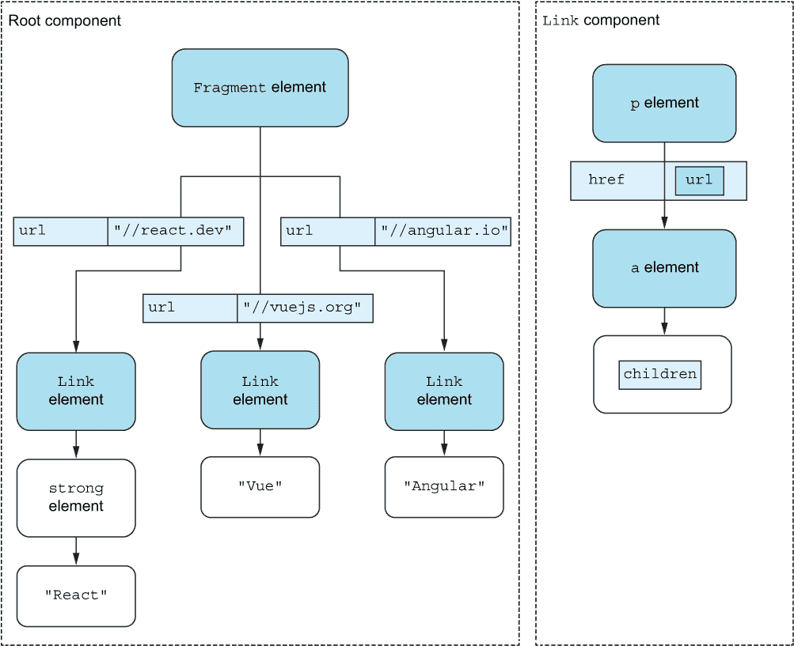

图 2.20：当我们将链接文本作为子节点而不是常规属性传递时的组件树

列表 2.8：作为子节点的文本链接

```
import React from "react";
import ReactDOM from "react-dom/client";
class Link extends React.Component {
  render() {
    return React.createElement(
      "p",
      null,
      React.createElement(
        "a",
        { href: this.props.url },
        this.props.children        ❶
      )
    );
  }
}
const boldReact = React.createElement("strong", null, "React");
const link1 = React.createElement(
  Link,
  { url: "//react.dev" },          ❷
  boldReact                        ❷
);
const link2 = React.createElement(
  Link,
  { url: "//vuejs.org" },          ❸
  "Vue"                            ❸
);
const link3 = React.createElement(
  Link,
  { url: "//angular.io" },         ❸
  "Angular"                        ❸
);
const group = React.createElement(
  React.Fragment, null, link1, link2, link3
);
const domElement = document.getElementById("root");
ReactDOM.createRoot(domElement).render(group);
```

❶ 注意我们如何像使用任何其他属性一样使用名为 children 的属性。

❷ 我们现在只向每个自定义组件传递一个命名属性，即 url 属性。但现在我们还传递了一个子节点，它将成为子节点属性。对于 React，它是一个嵌套元素。

❸ 我们现在只向每个自定义组件传递一个命名属性，即 url 属性。对于 Vue 和 Angular，子节点只是一个常规文本节点。

仓库：rq02-links-children

这个例子可以在 rq02-links-children 仓库中看到。您可以通过创建基于相关模板的新 Web 应用程序来使用该仓库：

```
$ npx create-react-app rq02-links-children --template rq02-links-children
```

或者，您可以访问此网站浏览代码，直接在浏览器中查看应用程序的运行情况，或下载源代码的 zip 文件：

[`rq2e.com/rq02-links-children`](https://rq2e.com/rq02-links-children)

如果在浏览器中运行此代码，您将得到图 2.21 所示的输出。使用正常属性和子节点属性之间的区别在此点可能看起来微不足道，但在下一章，当我们开始使用 JSX 时，您将看到当正确使用时它开始变得非常有意义。

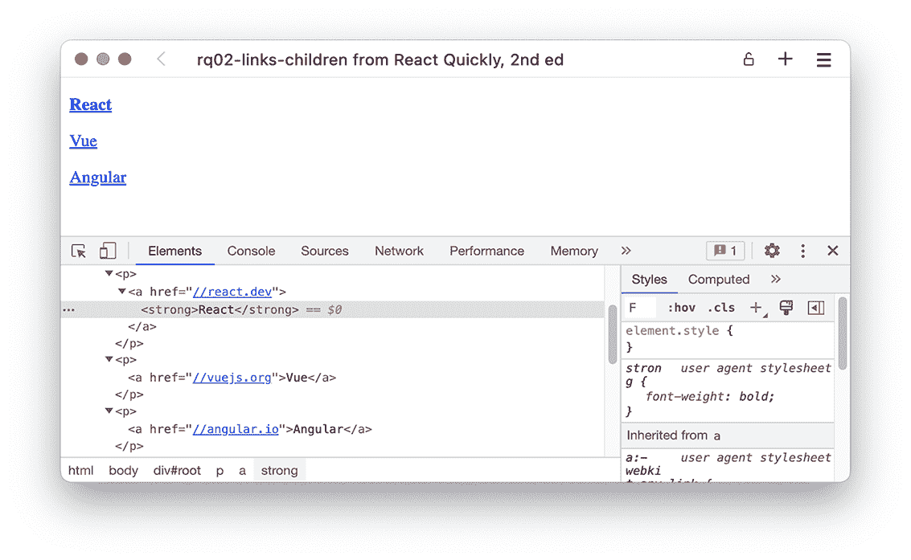

图 2.21：使用 children 属性（第一个链接设置为加粗）的链接组件

## 2.6 应用程序结构

从下一章开始，我们将以相同的方式、使用类似模式来组织我们的应用程序，以便于识别。我们还将遵循默认 CRA 模板提供的标准结构。

在本章前面的示例中，我们将我们的应用程序直接放入源文件夹内的 index.js 文件中。从现在开始，我们将使用自定义的 App 组件作为我们应用程序的根元素，并将其作为浏览器下的单一子元素进行渲染。这意味着我们再也不需要触摸 src/index.js 了。对于所有未来使用 CRA 的应用程序，它都将保持相同的文件。

为了这个目的，我们将用之前提到的三个链接重写我们的应用程序，将其分为两个新的组件。一个是根组件 App，另一个是链接组件 Link。我们将在前一个组件中使用后者的三次。最后，我们将从 React 命名空间中解构一些属性，以稍微缩短我们的组件定义。我们将所有这些放在 src/App.js 中。参见图 2.22 和列表 2.9。

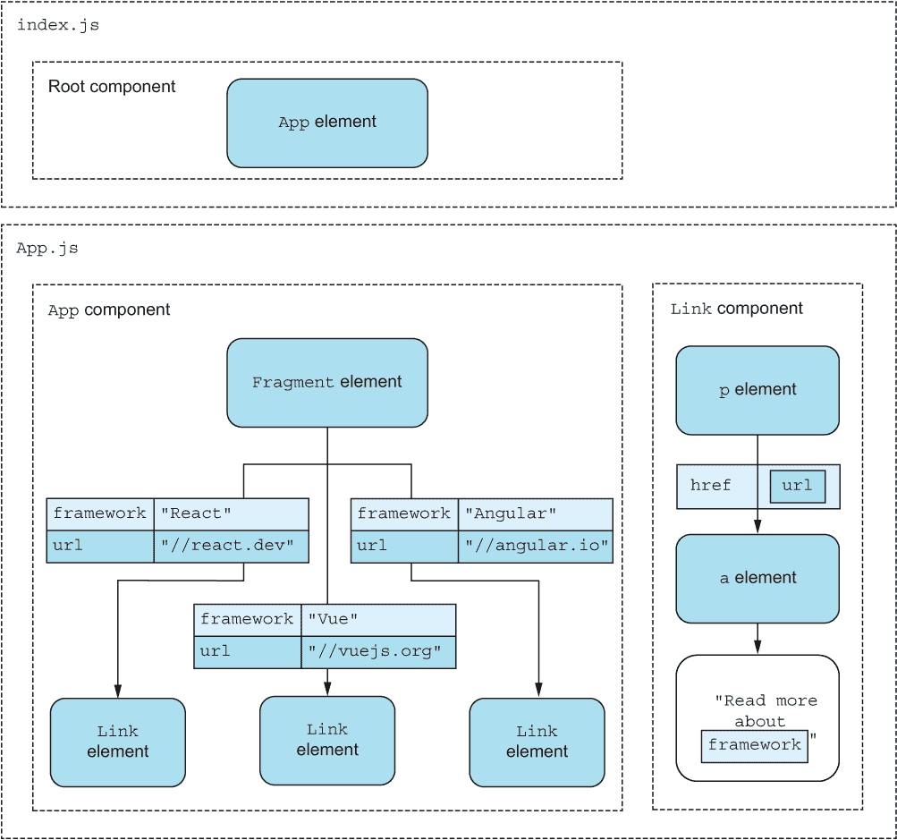

图 2.22 在 App.js 文件中的我们的新文件结构，包含两个组件

列表 2.9 放入 src/App.js 的应用程序

```
import React, { Fragment, Component } from "react";   ❶
class Link extends Component {                        ❷
  render() {
    return React.createElement(
      "p",
      null,
      React.createElement(
        "a",
        { href: this.props.url },
        `Read more about ${this.props.framework}`
      )
    );
  }
}
class App extends Component {                         ❸
  render() {
    const link1 = React.createElement(Link, {
      framework: "React",
      url: "//react.dev",
    });
    const link2 = React.createElement(Link, {
      framework: "Vue",
      url: "//vuejs.org",
    });
    const link3 = React.createElement(Link, {
      framework: "Angular",
      url: "//angular.io",
    });
    return React.createElement(                       ❹
      Fragment, null, link1, link2, link3             ❹
    );                                                ❹
  }
}
export default App;                                   ❺
```

❶ 解构 React 的导入，以便直接引用 Fragment 和 Component

❷ 链接组件与之前的列表完全相同

❸ 一个新的 App 组件，用于渲染我们应用程序的根

❹ App 组件必须返回一个单一元素

❺ 在 App.js 中，我们将 App 组件导出为该文件中唯一的可访问资源。

然后，我们将 src/index.js 更改为从 App.js 导入我们的 App，并将其渲染到根 DOM 元素中，如列表 2.10 所示。

列表 2.10 src/index.js

```
import React from "react";
import { createRoot } from "react-dom/client";
import App from "./App";                          ❶
createRoot(document.getElementById("root"))       ❷
  .render(React.createElement(App));              ❸
```

❶ 从 App.js 导入我们的应用程序并将其存储在局部变量 App 中

❷ 从具有 id="root"的 HTML 元素创建一个单个根元素

❸ 在那个根元素中渲染 App 组件

这个新的 src/index.js 文件现在基本上已经完成。我们再也不需要编辑它了；我们只编辑 src/App.js 来自定义我们的未来应用程序。

存储库：rq02-links-app

这个例子可以在 rq02-links-app 存储库中看到。您可以通过创建基于相关模板的新 Web 应用程序来使用该存储库：

```
$ npx create-react-app rq02-links-app --template rq02-links-app
```

或者，您也可以访问这个网站来浏览代码，在您的浏览器中直接查看应用程序的运行情况，或者下载源代码的 zip 文件：

[`rq2e.com/rq02-links-app`](https://rq2e.com/rq02-links-app)

随着我们的应用程序变大，我们将无法在 src/App.js 的单个文件中包含所有内容。当我们需要扩展时，我们只需创建新文件，并按需导入它们。虽然通常每个组件一个文件，并且文件名以组件命名（包括首字母大写），但这并不是一个严格的规定。如果一个组件需要几个其他的小组件来运行，你可以自由决定是否将它们全部放在一个文件中，就像我们在列表 2.10 中做的 Link 和 App 一样，或者将它们拆分成多个文件。

让我们看看如何使用单独的文件中的 App 和 Link 组件创建相同的示例。请参考图 2.23 中的图表。我们还需要更新 src/App.js，以从 src/Link.js 导入链接组件，如列表 2.11 所示。

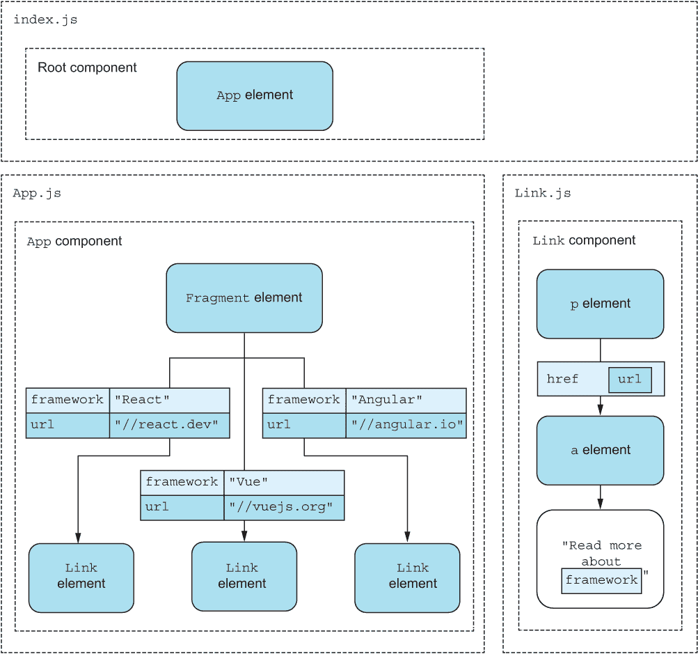

图 2.23 使用每个组件一个文件，我们的文件结构看起来是这样的。

列表 2.11 每个文件一个组件：src/App.js

```
import React, { Fragment, Component } from "react";
import Link from "./Link";                           ❶
class App extends Component {
  render() {
    const link1 = React.createElement(Link, {
      framework: "React",
      url: "//react.dev",
    });
    const link2 = React.createElement(Link, {
      framework: "Vue",
      url: "//vuejs.org",
    });
    const link3 = React.createElement(Link, {
      framework: "Angular",
      url: "//angular.io",
    });
    return React.createElement(Fragment, null, link1, link2, link3);
  }
}
export default App;
```

❶ 从另一个文件导入链接组件

然后，我们必须创建新的 src/Link.js，其中只包含链接组件，并记得在最后导出它。

列表 2.12 每个文件一个组件：src/Link.js

```
import React, { Component } from "react";
class Link extends Component {              ❶
  render() {
    return React.createElement(
      "p",
      null,
      React.createElement(
        "a",
        { href: this.props.url },
        `Read more about ${this.props.framework}`
      )
    );
  }
}
export default Link;                        ❷
```

❶ 链接组件定义现在单独在这个文件中。

❷ 记得在最后导出组件。

存储库：rq02-links-app-alt

此示例可以在 rq02-links-app-alt 存储库中看到。您可以通过创建基于相关模板的新网络应用程序来使用该存储库：

```
$ npx create-react-app rq02-links-app-alt --template rq02-links-app-alt
```

或者，您可以访问此网站浏览代码，在您的浏览器中直接查看应用程序的运行情况，或者下载源代码的 zip 文件：

[`rq2e.com/rq02-links-app-alt`](https://rq2e.com/rq02-links-app-alt)

我们将在整本书中使用这两种方法。在许多即将到来的章节中，我们的应用程序将很小且紧凑，所以我们将所有内容都放在 src/App.js 中。但在后面的章节中，我们的应用程序会变得更大，我们将超出单个文件的范围。我们还将为其他事物创建文件，比如常用函数或我们想在多个文件中使用的其他共享功能。当我们到达第十章的钩子主题时，我们还将使用单独的文件来创建自定义钩子。

当项目变得更大时，会引入文件夹结构。没有定义如何使用文件夹来结构化 React 项目的标准，因此团队通常会制定自己的最佳实践。

## 2.7 小测验

1.  可以使用以下哪个语句创建自定义的 React 组件？

    1.  const Name = React.createComponent()

    1.  class Name extends React.Component

    1.  const Name = React.createElement()

    1.  class Name extends React.Class

1.  React 组件的唯一必需成员是以下哪个？

    1.  function

    1.  return

    1.  name

    1.  render

    1.  class

1.  要访问组件内部的 url 属性，您使用以下哪个？

    1.  this.properties.url

    1.  this.data.url

    1.  this.props.url

    1.  url

1.  React 组件内部的属性是不可变的。*正确*还是*错误*？

1.  React 组件允许开发者创建可重用的 UI。*正确*还是*错误*？

## 小测验答案

1.  class Name extends React.Component. 此外，没有 React.Class 也没有 React.createComponent，React.createElement 用于创建组件实例，而不是组件定义。

1.  render() 是唯一必需的方法。此外，函数、返回和类不是有效的方法名称。

1.  this.props.url 是正确的，因为只有 this.props 返回属性对象。

1.  *正确*。在组件内部本身不可能更改属性。

1.  *正确*。开发者使用组件来创建可重用的 UI。

## 摘要

+   您可以使用命令行程序 create-react-app 创建新的 React 项目。这使您能够迅速使用一套宝贵的库入门。

+   新的 React 项目可以从指定的模板创建，本书中的所有示例都附带模板，这样您只需执行三个简短的命令就可以在本地查看示例，而无需直接定位或下载任何内容。我们还将提供下载示例的链接。

+   你可以通过将嵌套的 createElement() 调用放在彼此内部来嵌套 React 元素。你可以通过使用 createElement() 中的第三个、第四个等参数来组合兄弟节点。

+   你可以通过将 HTML 节点名作为 createElement() 的第一个参数来创建基于常规 HTML 节点名元素。

+   如果你想要使用属性来修改生成的元素，你可以将这些属性作为一个对象传递给 createElement() 的第二个参数。

+   要使用 CBA（React 的一个特性），你需要创建自定义组件。自定义组件可以通过 this.props 变量内部使用属性。子节点作为特别命名的 children 属性接收。

+   本书中的示例都将遵循一个非常简单的文件结构。
