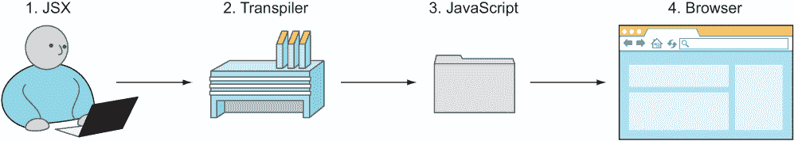
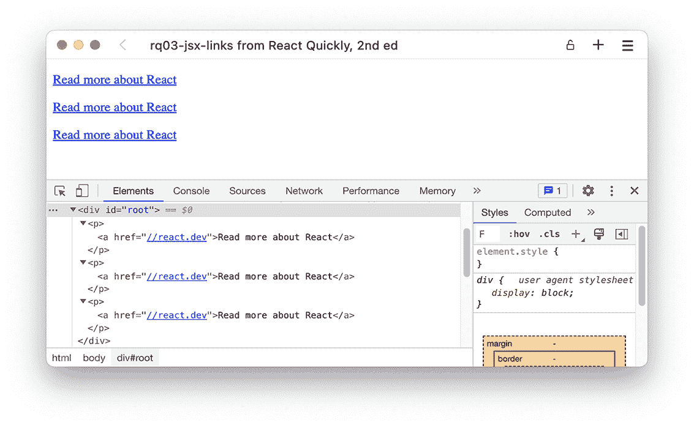
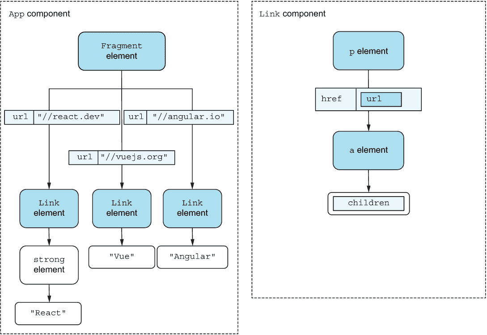
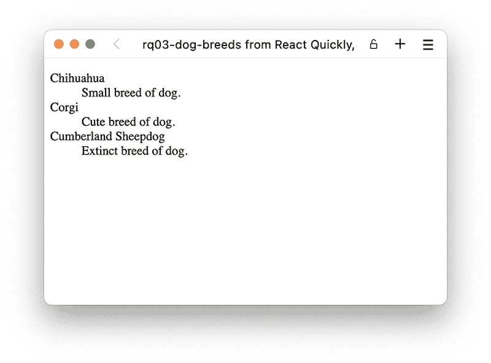
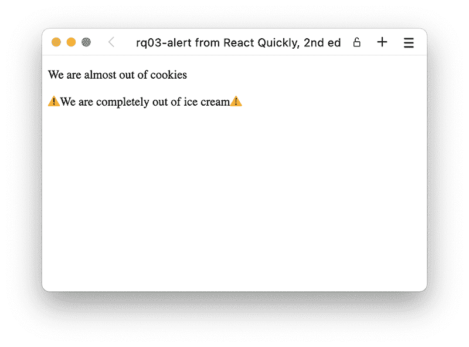
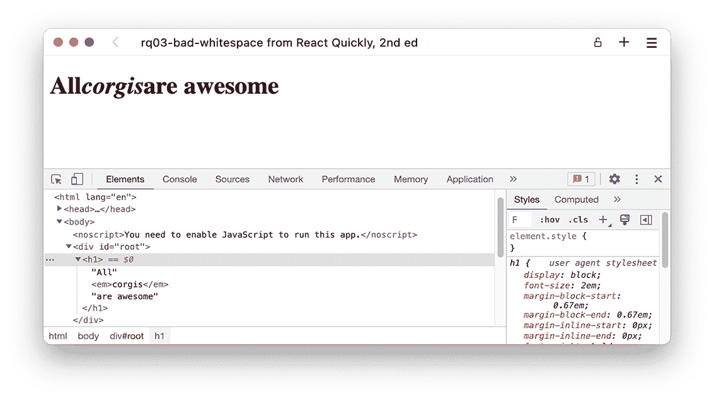
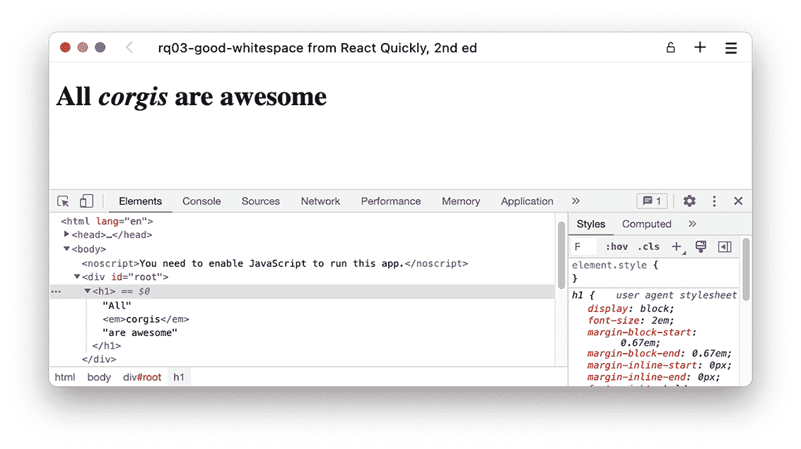

# 3 JSX 简介

本章涵盖

+   理解 JSX 及其优势

+   使用 JSX 更快、更轻松地实现自定义组件

+   React 和 JSX 的陷阱

JavaScript XML (JSX) 是 JavaScript 的语法扩展。它是让 React 变得出色的因素之一，但在它当初被引入时，也是 React 中更具争议性的元素之一。

这是一个在 JavaScript 中使用 JSX 的示例：

```
const link = <a href="//react.dev">React</a>;
```

JSX 是出现在尖括号之间的元素：<a href="//react .dev">React</a>。它不是一个字符串，不是一个模板字面量，也不是 HTML。它是一个使用称为 JSX 的语法扩展创建的 JavaScript 对象。它使得创建 React 元素更快、更紧凑，并且使得阅读 React 元素更容易。后者的优势至少与前者一样重要。

JSX 是为开发者准备的。仅凭自身，它不会做任何事情来使 Web 应用程序更好或更快。JSX 转换为不使用 JSX 时得到的相同代码。

虽然 JSX 不是必需的，但它被普遍接受为编写 React 组件的唯一方式。你可能会发现一些团队不使用 JSX，但它们绝对是少数。

在本章中，我们将更深入地探讨最初使用 JSX 的原因，然后讨论在实践应用 JSX 的所有不同部分，最后介绍一些在使用 JSX 时需要注意的技巧。在这个过程中，我们还将简要讨论将 JSX 转换为 JavaScript，称为 *transpiling*，你可能还记得第二章的内容。幸运的是，transpiling 并不是你需要过多担心的事情。

注意：本章示例的源代码可在 [`rq2e.com/ch03`](https://rq2e.com/ch03) 获取。但正如你在第二章中学到的，你可以使用单个命令直接从命令行实例化所有示例。

## 3.1 我们为什么使用 JSX？

JSX 是一个 JavaScript 扩展，为函数调用和对象构造提供了语法糖（即，使输入更简单，但功能上等效），尤其是 React.createElement() 的替代品。它看起来像模板引擎或 HTML，但它不是。JSX 生成 React 元素，同时让你充分利用 JavaScript 的全部功能。JSX 是编写 React 组件的绝佳方式，并具有以下优势：

+   *改进的开发者体验*—由于具有更优雅的、类似于 XML 的语法，代码更容易阅读，这有助于表示嵌套声明性结构。

+   *更好的错误信息*—React 假设你使用 JSX，并报告有用的错误信息，就像你真的在使用 JSX 一样。如果你没有使用 JSX，错误信息可能会有些误导，因为它会引用与你实际使用的语法不同的语法。

+   *更快的代码*—当将 JSX 转换为 JavaScript 时，编译器会即时优化代码，使得生成的 JavaScript 执行速度比手动输入更快。

+   *更高效的团队成员*——休闲开发者（例如，设计师）可以更容易地修改代码，因为 JSX 看起来像 HTML，这对他们来说已经很熟悉了。

+   *更少的语法错误*——开发者需要输入的代码更少，这意味着他们犯的错误也更少。

虽然 JSX 不是 React 的必需品，但它非常适合，我们强烈推荐它，正如 React 的创造者所做的那样。你很难在现实世界中找到一个不使用 JSX 的 React 团队。虽然我们无法说世界上所有的最新 React 项目都使用 JSX，但我们相当确信几乎所有的项目都使用。

### 3.1.1 JSX 之前和之后

为了展示 JSX 的优雅，这是创建一个包含一些自定义组件和链接的元素的代码片段：

```
const element = <main>
  <Title>Welcome</Title>
  <Carousel images={6} />
  <a href="/blog">Go to the blog</a>
</main>;
```

这与以下没有 JSX 优势的代码片段相同：

```
const element = React.createElement(
  'main',
  null,
  React.createElement(Title, null, 'Welcome'),
  React.createElement(Carousel, {images: 6}),
  React.createElement('a', {href: "/blog"}, 'Go to the blog'),
);
```

我们可能都会同意 JSX 版本一眼就能看懂。它看起来像 HTML，非常容易阅读，并且部分上与将要渲染的 HTML 输出相同，当然，除了自定义组件之外。

### 3.1.2 将 HTML 和 JavaScript 一起使用

从本质上讲，JSX 是一种具有类似 XML 语法的简单语言。它改变了人们编写用户界面（UI）组件的方式。以前，开发者以类似 MVC 的方式编写 HTML 以及控制器和视图的 JavaScript 代码，在各个文件之间跳转。这源于早期关注点分离的理念。当网站只由静态 HTML、一点 CSS 和一点使文本闪烁的 JavaScript 组成时，这种方法很好地服务于网络。

这种情况已经不再存在；如今，我们构建高度交互的用户界面（UIs），JavaScript 和 HTML 紧密耦合以实现各种功能。这违反了关注点分离的原则，这是大多数软件开发中追求的基本原则。这个原则是关于分离无关项，但将相关项放在一起。如果你寻求遵守这个原则，你应该将你的代码分解成这样的方式，即每个单独的部分只执行一个关注点，而这些“部分”可以用于不同的连接。如果你将模板和视图逻辑分开，但它们只有在结合使用时才能工作，那么你就无谓地分离了本应属于一起的两个项目。

React 通过将 UI 的描述和 JavaScript 逻辑结合在一起来修复这个被否定的原则；并且通过 JSX，代码看起来像 HTML，更容易阅读和编写。如果不是为了其他原因，我们也会使用 React 和 JSX 来实现编写 UI 的新方法。

JSX 被各种转换器（工具）编译成标准的 ECMAScript（见图 3.1）。你可能知道 JavaScript 也是 ECMAScript，但 JSX 不是规范的一部分，也没有任何定义的语义。这意味着，如果你尝试在没有先转译 JSX 的情况下，使用普通的 JavaScript 编译器编译包含嵌入式 JSX 的 JavaScript，你会得到错误。JSX 本身不是有效的 JavaScript，不能直接由 JavaScript 编译器编译。



图 3.1 JSX 被转换为常规 JavaScript。

注意：我们称之为“transpiling”（转译）而不是“compiling”（编译），因为我们将其从一种源语言（JSX）翻译成另一种源语言（JavaScript）。生成的 JavaScript 随后将由一个“真正的”编译器来解释执行。转译仅仅是转换语法，而不是解释代码。

当你的浏览器执行你的 React 应用程序时，你的浏览器只会看到生成所需结构的 React.createElement 语句。只有在你使用的编辑器中才会存在 JSX。转译器将包含 JSX 的文件转换为纯 JavaScript，其中到处都是 React.createElement()，以节省你的麻烦。

你可能会想知道为什么你应该费心去使用 JSX。考虑到对于新开发者来说，JSX 代码一开始看起来多么反直觉，一些开发者因此对这个令人惊叹的技术感到厌烦，这并不奇怪。例如，这段 JavaScript 代码中间有 JSX，将尖括号混入通常不会存在的地方：

```
const title = <h1>Hello</h1>;
```

但使 JSX 变得惊人的是 React.createElement(NAME, ...)的快捷方式。你不必反复编写这个函数调用，而是可以使用<NAME />。如前所述，你输入的越少，犯的错误就越少。在 JSX 中，开发者体验是首要关注的问题，也就是说，使开发者能够更快、更少错误地创建组件和应用程序。

使用 JSX 的主要原因在于许多人发现带有尖括号（<>）的代码比带有大量 React.createElement()语句的代码更容易阅读。一旦你习惯了将<NAME />视为不是 XML 而是 JavaScript 代码的别名，你就会克服 JSX 语法的直观上的怪异感。了解并使用 JSX 在开发 React 组件以及随后的 React 应用程序时可以带来很大的差异。

如前所述，JSX 需要在浏览器执行代码之前转换为常规 JavaScript。在大多数设置中，你根本不必担心这一点，但如果需要自己进行转换，我们将在第 3.3 节中讨论一些转译器。现在，我们将深入探讨以充分理解 JSX。

## 3.2 理解 JSX

让我们探索如何使用 JSX。你可以阅读本节并将其添加到书签以供参考，或者（如果你更喜欢在计算机上运行一些代码示例）开始使用 create-react-app (CRA) 模板中的示例进行工作。使用 CRA，你可以“免费”获得 JSX 转译，因此你不必担心自己设置它。

### 3.2.1 使用 JSX 创建元素

使用 JSX 创建 React 元素非常简单。参见表 3.1 了解一些你之前使用的 JavaScript 代码及其 JSX 等价物。

表 3.1 JavaScript 代码与 JSX 的比较

| JavaScript | JSX 等价物 |
| --- | --- |

|

```
React.createElement('h1')
```

|

```
<h1 />
```

|

|

```
React.createElement( 
  'h1', 
  null, 
  'Welcome',
);
```

|

```
<h1> 
  Welcome
</h1>
```

|

|

```
React.createElement( 
  Title, 
  null, 
  'Welcome',
);
```

|

```
<Title> 
  Welcome
</Title>
```

|

|

```
React.createElement( 
  Title, 
  {size: 6}, 
  'Welcome'
);
```

|

```
<Title size="6"> 
  Welcome
</Title>
```

|

|

```
React.createElement( 
  Title, 
  {size: 6}, 
  'Welcome to ', 
  React.createElement( 
    'strong', 
    null, 
    'Narnia', 
  ),
);
```

|

```
<Title size="6"> 
  Welcome to 
  <strong>Narnia</strong>
</Title>
```

|

在 JSX 代码中，属性及其值（例如，size={6}）来自 createElement() 的第二个参数。我们将在本章后面专注于处理属性。

现在，让我们看看一个没有属性的 JSX 元素示例。这是我们从上一章早期的一个例子，升级到使用自定义 App 组件的推荐结构。它只是一个包含文本“Hello world!”的 h1 元素，其中“world”一词被设置为斜体，如下所示。

列表 3.1 无 JSX 的强调问候

```
import React, { Component } from 'react';
class App extends Component {
  render() {
    return React.createElement(
      'h1',
      null,
      'Hello ',
      React.createElement('em', null, 'world'),
      '!',
     );
  }
}
export default App;
```

使用 JSX 实现这一点要简单得多。

列表 3.2 使用 JSX 的强调问候

```
import React, { Component } from 'react';
class App extends Component {
  render() {
    return <h1>Hello <em>World</em>!</h1>;
  }
}
export default App;
```

你甚至可以将使用 JSX 语法创建的对象存储在变量中，因为 JSX 只是 React.createElement() 的语法改进。此示例在返回之前将生成的元素引用存储在变量中：

```
const title = <h1>Hello <em>World</em>!</h1>;
return title;
```

这与列表 3.2 中的第 4 行完全相同；它只是在返回之前使用了一个额外的变量。

### 3.2.2 使用 JSX 与自定义组件

之前的例子使用了 `<h1>` JSX 标签，它也是一个标准的 HTML 标签名。当与自定义组件一起使用时，你应用相同的语法。唯一的区别是组件类名必须以大写字母开头，如 `<Title />`。

列表 3.3 展示了我们从第二章中提到的三个链接应用的更高级迭代，现在用 JSX 重新编写。在这种情况下，你创建一个新的组件类，并使用 JSX 从它创建一个元素。还记得我们之前章节中的 Link 示例吗？没有 JSX 的代码如下所示（转换为推荐的 App 结构）。

列表 3.3 无 JSX 的三个相同链接

```
import React, { Component, Fragment } from 'react';
class Link extends Component {
  render() {
    return React.createElement(
      'p',
      null,
      React.createElement(
        'a',
        {href: '//react.dev'},
        'Read more about React',
      ),
    );
  }
}
class App extends Component {
  render() {
    const link1 = React.createElement(Link);
    const link2 = React.createElement(Link);
    const link3 = React.createElement(Link);
    const group = React.createElement(Fragment, null, link1, link2, link3);
    return group;
  }
}
export default App;
```

使用 JSX，现在变成了列表 3.4。如果你在浏览器中运行它，你会得到与我们在第二章图 2.13 中得到的结果完全相同，我们再次在图 3.2 中展示。



图 3.2 应用程序中的三个相同链接，但现在使用 JSX 编写

列表 3.4 使用 JSX 的三个相同链接

```
import { Component, Fragment } from 'react';
class Link extends Component {                  ❶
  render() {
    return (
      <p>
        <a href="//react.dev">Read more about React</a>
      </p>
    );
  }
}
class App extends Component {
  render() {
    return (                                    ❷
      <Fragment>                                ❸
        <Link />                                ❹
        <Link />                                ❹
        <Link />                                ❹
      </Fragment>
    );                                          ❺
  }
}
export default App;
```

❶ 创建一个名为 Link 的组件，该组件可以使用 JSX 表记 <Link /> 实例化

❷ 开始返回多行 JSX 表达式的开括号

❸ React 片段就像任何其他元素一样，可以使用 JSX 渲染。

❹ Link 组件的三个相同实例

❺ 完成返回多行 JSX 表达式的闭括号

仓库：rq03-jsx-links

此示例可以在仓库 rq03-jsx-links 中看到。你可以通过创建一个基于相关模板的新应用程序来使用该仓库：

```
$ npx create-react-app rq03-jsx-links --template rq03-jsx-links
```

或者，你可以访问这个网站来浏览代码，在你的浏览器中直接查看应用程序的实际运行情况，或者下载源代码的 zip 文件：

[`rq2e.com/rq03-jsx-links`](https://rq2e.com/rq03-jsx-links)

### 3.2.3 多行 JSX 对象

你可能已经注意到列表 3.4 中返回的多行 JSX 对象周围的括号。如果你在例如返回之后在单独的一行上开始多行 JSX 对象，你必须包括这些括号。这是在不从同一行开始时创建多行 JSX 对象的方式：

```
return (
  <main>
    <h1>Hello world</h1>
  </main>
);
```

或者，你可以从与返回相同的行开始你的根元素，并避免括号。例如，这也是有效的：

```
return <main>
  <h1>Hello world</h1>
</main>;
```

这种第二种方法的缺点是减少了打开 <main> 标签的可见性。在代码中可能会很容易错过。选择权在你。我们将仅使用在多行 JSX 内容周围使用括号的前一种样式，以确保一致性。

注意，对于任何其他多行 JSX 对象的使用，例如，当你在变量中保存它们时，情况也是完全相同的。我们也会在那里使用括号：

```
const message = (
  <main>
    <h1>Hello world</h1>
  </main>
);
```

### 3.2.4 在 JSX 中输出变量

当你组合组件时，你希望它们足够智能，能够根据某些代码改变视图。例如，如果日期组件使用当前日期和时间，而不是硬编码的值，这将非常有用。

当使用仅 JavaScript 的 React 时，你必须使用字符串模板字面量（即反引号）来混合字符串和变量——或者更糟糕的是，连接。例如，要在没有 JSX 的 DateTimeNow 组件的字符串上下文中使用变量，你会编写以下代码：

```
class DateTimeNow extends React.Component {
  render() {
    const dateTimeNow = new Date().toLocaleString()
    return React.createElement(
      'span',
      null,
      `Current date and time is ${dateTimeNow}.`
    )
  }
}
```

在 JSX 中，你可以使用花括号 {} 符号动态输出变量，这大大减少了代码的复杂性：

```
class DateTimeNow extends React.Component {
  render() {
    const dateTimeNow = new Date().toLocaleString()
    return <span>Current date and time is {dateTimeNow}.</span>
  }
}
```

如果你引用的是一个 React 元素（可选地使用 JSX 创建），你可以在当前上下文中直接插入那部分 JSX：

```
const now = <date>{dateTimeNow}</date>;
const message = <p>Today is {now}</p>;
```

这相当于直接插入元素：

```
const message = <p>Today is <date>{dateTimeNow}</date></p>;
```

插入的变量也可以是属性，而不仅仅是本地定义的变量：

```
<p>Hello {this.props.userName}, today is {dateTimeNow}.</p>
```

你也可以调用你自己创建的组件的方法。这是一个常见的做法，用于隔离功能块，如下一列表所示。

列表 3.5 使用方法的 ButtonList

```
import { Component } from 'react';
class ButtonList extends Component {
  getButton(text) {                                              ❶
    return (
      <button disabled={this.props.disabled}>{text}</button>     ❷
    );
  }
  render() {
    return (
      <aside>
        {this.getButton('Up')}                                   ❸
        {this.getButton('Down')}                                 ❸
      </aside>
    );
  }
}
```

❶ 定义了 getButton 方法，该方法接受一个参数 text，它将是按钮上的标签

❷ 我们的按钮依赖于传递给我们的组件的另一个属性。

❸ 调用我们的方法以插入带有正确文本的按钮

列表 3.5 中的示例当然过于简化，因为在大多数情况下，你可能需要为这样的用例使用额外的组件。然而，确实存在一些情况下，组件方法会派上用场。这个示例的目的是展示你可以在 JSX 中直接调用组件方法。例如，你可以在花括号内执行任意的 JavaScript 表达式，例如直接格式化日期：

```
<p>Today is {new Date(Date.now()).toLocaleTimeString()}.</p>
```

现在，让我们将强调的问候语重写，首先将斜体字存储在一个变量中，然后再输出，在下一个列表中。然后，我们将继续讨论在下一节中如何处理 JSX 中的属性。

列表 3.6 使用 JSX 和变量强调问候语

```
import { Component } from 'react';
class App extends Component {
  render() {
    const world = <em>World</em>;
    return <h1>Hello {world}!</h1>;
  }
}
export default App;
```

### 3.2.5 在 JSX 中处理属性

我们在介绍 JSX 时已经提到了这个话题。元素属性使用属性语法定义。也就是说，你使用 key1=value1 key2=value2...的表示法在 JSX 标签内定义 HTML 属性和 React 组件属性。这与 HTML/XML 中的属性语法类似。

换句话说，如果你需要传递属性，就像在正常 HTML 中一样，在 JSX 中写入它们。你通过在 React 元素上设置具有 HTML 标签的元素属性（在第 2.3 节中讨论）来渲染标准 HTML 属性。例如，此代码为锚元素<a>设置了一个标准的 HTML 属性 href：

```
return <a href="/ /react.dev">Let's do React!</a>;
```

你使用完全相同的方法来设置自定义组件的属性。如果我们有上一章中的 Link 组件，我们可以在 JSX 中使用它，如下所示：

```
return <Link url=”//react.dev” framework=”React” />;
```

当然，使用硬编码的值来设置属性并不灵活。如果你想重用 Link 组件，那么 href 必须改变以反映每次不同的地址。这被称为动态设置值与硬编码。因此，接下来，我们将更进一步，考虑一个可以使用动态生成的属性值的组件。这些值可以来自组件属性（this.props）。在那之后，一切都很简单。你所需要做的就是使用花括号({})在尖括号(<>）内传递属性的动态值到元素。

例如，假设你正在构建一个将被用于链接到用户账户的组件。你的<a>标签需要一些属性，但 href 和 title 对于每个组件都必须不同，不能是硬编码的。让我们创建一个动态组件 ProfileLink，它渲染一个带有属性 url 和 label 的链接，分别对应 href 和 title。你使用{}将属性传递给<a>：

```
class ProfileLink extends React.Component {
  render() {
    return (
      <a
        href={this.props.url}
        title={this.props.label}
        target="_blank">Profile
      </a>
    );
  }
}
```

属性值从何而来？它们是在创建 ProfileLink 时定义的——也就是说，在创建 ProfileLink 的组件中，也就是它的父组件中。例如，当创建 ProfileLink 实例时，url 和 label 的值就是这样传递的，这导致渲染带有这些值的<a>标签：

```
<ProfileLink url="/users/johnny" label="Profile for Johnny" />
```

从上一章，你会记得当渲染标准元素（如 <h>、<p>、<div>、<a> 等）时，React 会渲染任何和所有属性，即使它们在 HTML 中没有任何语义意义。这不仅仅是对 JSX 的特定，这只是 React 的默认行为。

如果你有一个你想在元素上渲染的属性的对象，你可以按如下方式逐个渲染它们：

```
return (
  <Post
    id={post.id}
    title={post.title}
    content={post.content}
  />
);
```

这工作得很好，是一个安全的解决方案。然而，如果你有一个包含值的对象，并且你想渲染 *所有这些值*，你可以使用扩展运算符如下所示：

```
return <Post {...post} />;
```

注意，这将渲染 *每个* post 对象的属性，无论这是否有意义。只有当你确定对象只包含你需要的属性，或者至少确定任何多余的属性都会被忽略时，才使用此过程。

这甚至允许你通过扩展 this.props 来将传递给组件的所有属性渲染到该组件内的另一个元素中：

```
return <input value={this.value} {...this.props} />;
```

虽然这样做很方便，但它允许父组件传递任意值，这些值会覆盖你之前在组件中设置的任何值。如果 this.props 包含一个 value 属性，它将覆盖你在扩展之前设置的 value 属性。在扩展对象时，尤其是扩展传递给组件的所有属性时，要格外小心。我们将在下一章回到扩展运算符，并介绍一些其他常见的使用示例。

特殊属性：children

如果你回顾一下上一章，我们介绍了特殊属性“children”，它只看起来像是一个自定义组件内部的属性，而不是从外部。当使用 JSX 时，children 属性的使用变得更加整洁。在第二章的示例中，它看起来就像图 3.3 所示的树结构。



图 3.3 使用子节点作为链接内容时的组件树

让我们在 JSX 中重新实现这个功能。我们知道所有需要做的事情，所以让我们继续做吧。

列表 3.7 使用 JSX 的带有子节点的链接列表

```
import { Fragment, Component } from "react";
class Link extends Component {
  render() {
    return (
      <p>
        <a href={this.props.url}>    ❶
          {this.props.children}      ❶
        </a>
      </p>  
    );
  }
}
class App extends Component {
  render() {
    return (
      <Fragment>
        <Link url="//react.dev">
          <strong>React</strong>     ❷
        </Link>
        <Link url="//vuejs.org">Vue</Link>
        <Link url="//angular.io">Angular</Link>
      </Fragment>
    );
  }
}
export default App;
```

❶ 我们仍然使用 url 属性，就像之前一样，并且就像使用任何其他属性一样使用 this.props.children。

❷ 注意这些子节点在 JSX 中的优雅添加方式。它看起来就像代码的其他部分一样。

仓库：rq03-children

这个例子可以在 rq03-children 仓库中看到。你可以通过创建一个基于相关模板的新应用程序来使用该仓库：

```
$ npx create-react-app rq03-children --template rq03-children
```

或者，你可以访问这个网站浏览代码，直接在你的浏览器中查看应用程序的运行情况，或者下载源代码的 zip 文件：

[`rq2e.com/rq03-children`](https://rq2e.com/rq03-children)

使用属性和子节点之间的区别突然变得非常明显。我们本可以将链接内容作为属性传递，但看起来会很糟糕。如果我们使用常规属性方法，它看起来会是这样：

```
<Link
  url="//react.dev"
  content={<strong>React</strong>}
/>
```

但当我们使用子元素方法时，它变成了

```
<Link url="//react.dev">
  <strong>React</strong>
</Link>
```

我们肯定知道我们更喜欢后者这种方法。

### 3.2.6 JSX 中的分支

分支在编码中始终很重要。例如，如果用户已登录，显示他们的账户信息；否则，显示登录表单。因为 JSX 只是 JavaScript，我们可以基本上使用与常规编码中完全相同的结构来在我们的组件中创建分支。也就是说，关于如何在 JSX 中使用分支来创建 React 组件，已经出现了一些大多数开发者遵循的模式：

+   使用提前返回来渲染无内容。

+   使用三元运算符来渲染替代元素。

+   使用逻辑 AND 运算符（&&）来渲染可选元素。

+   使用对象映射来在许多不同的元素之间进行渲染。

+   使用额外的组件来实现更复杂的分支。

我们将在下一小节中逐一解释我们如何在 JSX 和自定义 React 组件中使用分支。

使用提前返回来渲染无内容

假设你有一个组件，只有当某个条件为真时才会渲染相关内容。例如，想象一个倒计时组件，只有当剩余秒数大于 0 时才会渲染一个值。

如果一个组件不渲染任何内容，我们可以简单地从组件中返回 null。然而，为了优化我们的组件，我们尽量尽早这样做，以避免执行额外的计算或创建不需要的 JSX 对象。目的是尽快分支到最简单的情况，以避免进行额外的计算或创建不需要的 JSX 对象。

我们可以像这样创建我们的倒计时组件：

```
class Countdown extends Component {
  render() {
    const seconds = this.props.remaining % 60;
    const minutes = Math.floor(this.props.remaining / 60);
    const message = <p>{minutes}:{seconds}</p>;
    if (seconds > 0 || minutes > 0) {
      return message;
    } else {
      return null;
    }
  }
}
```

这本身并没有什么错误——它工作得很好，并且完全功能化。但你会看到许多开发者使用提前终止的方法，如果组件不渲染任何内容。我们可以在计算秒数和分钟数以及创建 JSX 对象之前检测到这种情况：

```
class Countdown extends Component {
  render() {
    if (this.props.remaining === 0) {
      return null;
    }
    const seconds = this.props.remaining % 60;
    const minutes = Math.floor(this.props.remaining / 60);
    return <p>{minutes}:{seconds}</p>;
  }
}
```

在这里，我们也利用了这样一个事实：当我们从 if 块内部返回时，我们不需要 else 块。else 是隐含的，即 if 块之后的内容只有在条件失败时才会被访问。

使用三元运算符进行替代

在 React 组件中，另一个非常常见的案例是根据某些条件是否为真或假来渲染不同的元素。例如，让我们想象一个购物车，我们希望在购物车中有项目时显示这些项目，当购物车中没有项目时，显示一条消息说没有项目。

我们可以在 JSX 中通过使用变量并通过常规的 if/else 语句块分配不同的值来实现这一点。然而，这有点长，在 React 中使用三元运算符更为常见。if/else 构造是一个语句，而三元运算符是一个表达式，因此可以直接在 JSX 中内联使用：

```
<p>User is {this.props.isOnline ? 'Online' : 'Offline'}</p>
```

使用这个方法，我们可以创建之前提到的购物车组件：

```
class ShoppingCart extends Component {
  render() {
    return (
      <aside>
        <h1>Shopping cart</h1>
        {this.props.items.length === 0 ? (
          <p>Your cart is empty. Go buy something!</p>
        ) : (
          <CartItems items={this.props.items} />
        )}
      </aside>
    );
  }
}
```

使用逻辑运算符进行可选渲染

另一个常见的模式是需要根据条件是否为真有条件地渲染一个元素，如果不为真则不渲染。作为一个例子，我们想在用户是已验证用户时在用户名旁边显示一个小勾号，但对于未验证的平民则不显示。我们可以使用 *逻辑* AND 以及逻辑运算符短路的事实来实现这一点，即一旦整个表达式的真实性已知，就会立即返回。所以，当进行 a && b 时，JavaScript 会返回 a 如果 a 是 *假值* 或 b 如果 a 是 *真值*。如果 a 是真值，b 是什么无关紧要；它将无论如何返回。结合 React 将 false 渲染为空字符串的事实（稍后详细介绍）。

真实感

在 JavaScript 中，一个 *真实值* 在作为布尔值评估时转换为 true。例如，在一个 if 语句中

```
if (someVariable) {
  // this happens if and only if someVariable is truthy.
}
```

如果它不是假值，则该值是真实的。这实际上是官方定义，不是开玩笑。只有六个假值：

+   false

+   0

+   ""（空字符串）

+   null

+   Undefined

+   NaN（不是一个数字）

我们可以使用它来渲染条件元素，通过使我们的逻辑 AND 运算符在用户未验证时返回 false，如果用户已验证，则返回一个 React 元素：

```
class UserName extends Component {
  render() {
    return (
      <p>
        {this.props.username}
        {this.props.isVerified && <Checkmark />}
      </p>
    ); 
  }
}
```

你在 React 组件中经常会遇到这种模式，所以了解它是很好的。

使用对象进行切换

到目前为止，我们已经处理了渲染一个元素或无、或渲染一个元素或另一个元素的情况，但如果我们想根据条件渲染超过两种类型的元素怎么办？对于这种情况，我们想根据一些博客文章的状态渲染一个图标。如果文章处于草稿状态，我们渲染草稿图标。如果文章处于已发布状态，我们渲染已发布图标。而且，如果文章处于任何其他状态（我们碰巧知道这只是已删除状态），我们渲染垃圾图标。

好吧，我们可以嵌套三元运算符，首先检查 status === "draft"；然后，如果不等于，检查 status === "published"；如果不等于，假设它必须是已删除的：

```
class PostStatus extends Component {
  render() {
    return this.props.status === "draft" ?
      <DraftIcon /> :
      this.props.status === "published" ?
      <PublishedIcon /> :
      <TrashIcon />;
  }
} 
```

这会起作用，但看起来并不美观。另一个选择是使用 switch 语句，并在每个情况下简单地返回不同的值。但在这里使用一个具有不同情况属性的声明式方法，以解决不同的结果：

```
const status2icon = {
  draft: <DraftIcon />,
  published: <PublishedIcon />,
  deleted: <TrashIcon />,
};
class PostStatus extends Component {
  render() {
    return status2icon[this.props.status];
  }
} 
```

这相当简洁，不是吗？然而，请注意，这并没有处理状态不是那些情况的情况。以前，如果状态既不是草稿也不是已发布，组件会渲染垃圾图标，但现在，只有当状态是已删除时，它才会渲染垃圾图标。

为了处理状态为任何其他意外值的情况，我们需要在末尾添加一个逻辑 OR，以便如果对象索引解析为空，我们仍然可以渲染一个替代项。比如说，我们可以在任何未知情况下只渲染垃圾图标：

```
class PostStatus extends Component {
  render() {
    return status2icon[this.props.status] || status2icon.deleted;
  }
}
```

这种模式在 React 中可能不太常见，但你仍然会看到我们讨论过的简单情况。

使用额外的组件进行复杂分支

上述场景仅涵盖了一些简单的分支情况。如果您的组件逻辑比这更复杂，您会怎么做？

假设我们有一个像之前那样的购物车组件，底部有一些按钮。我们必须根据客户的要求实现以下业务逻辑：

+   如果用户已登录，则只显示一个结账按钮。

+   如果用户未登录，将同时显示一个登录按钮以及一个以访客身份结账的按钮。

+   如果任何商品缺货或购物车为空，结账或以访客身份结账的按钮将被禁用。

+   如果用户已登录但尚未添加信用卡，则显示一个添加信用卡按钮。

+   如果用户已登录，有文件中的信用卡，并且已输入地址，则在结账按钮旁边显示一个一键购买按钮。此按钮将根据与结账按钮相同的逻辑禁用。

现在，让我们使用您迄今为止学到的技巧来实现所有这些。

列表 3.8 复杂的购物车

```
import { Component, Fragment } from "react";
class ShoppingCart extends Component {
  render() {
    const hasItems = this.props.items.length > 0;
    const isLoggedIn = this.props.user !== null;
    const hasCreditCard = isLoggedIn && this.props.user.creditcard !== null;
    const hasAddress = isLoggedIn && this.props.user.address !== null;
    const isAvailable = this.props.items.every((item) => !item.outOfStock);
    return isLoggedIn ? (                                 ❶
      hasCreditCard ? (                                   ❷
        <Fragment>
          <button disabled={!hasItems || !isAvailable}>   ❸
            Checkout
          </button>
          {hasAddress && (                                ❹
            <button
              disabled={!hasItems || !isAvailable}        ❸
            >
              One-click buy
            </button>
          )}
        </Fragment>
      ) : (
        <button>Add credit card</button>
      )
    ) : (
      <Fragment>
        <button>Login</button>
        <button disabled={!hasItems || !isAvailable}>     ❸
          Checkout as guest
        </button>
      </Fragment>
    );
  }
}
class App extends Component {
  render() {
    const items = [1, 2, 3];
    const user = { creditcard: null, address: true };
    return <ShoppingCart items={items} user={user} />;
  }
}
export default App;
```

❶ 第一个三元运算符

❷ 第二个三元运算符

❸ 禁用按钮的重复逻辑

❹ 可选渲染的逻辑 AND

仓库：rq03-cart-single

这个例子可以在 rq03-cart-single 仓库中看到。您可以通过基于相关模板创建一个新应用来使用该仓库：

```
$ npx create-react-app rq03-cart-single --template rq03-cart-single
```

或者，您可以访问此网站浏览代码，在浏览器中直接查看应用程序的运行情况，或者下载源代码的 zip 文件：

[`rq2e.com/rq03-cart-single`](https://rq2e.com/rq03-cart-single)

好吧，这似乎涵盖了所有内容。然而，由于嵌套条件和重复属性，这变得有点复杂。对于这种情况，通常将事物拆分为多个组件，每个组件逐一处理不同的情况是个好主意。

在这里，我们可以创建新的组件<UserButtons />和<GuestButtons />。在顶层，我们可以选择使用这些组件中的哪一个，然后在每个组件内部添加必要的额外检查和条件。

列表 3.9 简化的多组件购物车

```
import { Component, Fragment } from "react";
class UserButtons extends Component {
  render() {
    const hasCreditCard = this.props.user.creditcard !== null;
    const hasAddress = this.props.user.address !== null;
    const disabled = !this.props.canCheckout;
    return hasCreditCard ? (                                ❶
      <Fragment>
        <button disabled={disabled}>Checkout</button>
        {hasAddress && (                                    ❷
          <button disabled={disabled}>One-click buy</button>
        )}
      </Fragment>
    ) : (
      <button>Add credit card</button>
    );
  }
}
class GuestButtons extends Component {
  render() {
    return (
      <Fragment>
        <button>Login</button>
        <button disabled={!this.props.canCheckout}>
          Checkout as guest
        </button>
      </Fragment>
    );
  }
}
class ShoppingCart extends Component {
  render() {
    const hasItems = this.props.items.length > 0;
    const isLoggedIn = this.props.user !== null;
    const isAvailable = this.props.items.every((item) => !item.outOfStock);
    const canCheckout = hasItems && isAvailable;
    return isLoggedIn ? (                                  ❸
      <UserButtons user={this.props.user} canCheckout={canCheckout} />
    ) : (
      <GuestButtons canCheckout={canCheckout} />
    );
  }
}
class App extends Component {
  render() {
    const items = [1, 2, 3];
    const user = { creditcard: null, address: true };
    return <ShoppingCart items={items} user={user} />;
  }
}
export default App;
```

❶ 三元运算符

❷ 可选渲染的逻辑 AND

❸ 三元运算符

仓库：rq03-cart-multi

这个例子可以在 rq03-cart-multi 仓库中看到。您可以通过基于相关模板创建一个新应用来使用该仓库：

```
$ npx create-react-app rq03-cart-multi --template rq03-cart-multi
```

或者，您可以访问此网站浏览代码，在浏览器中直接查看应用程序的运行情况，或者下载源代码的 zip 文件：

[`rq2e.com/rq03-cart-multi`](https://rq2e.com/rq03-cart-multi)

这与之前的工作方式相同，具有完全相同的复杂性，但每个组件都简单得多，您可以通过阅读代码轻松理解每个组件。您甚至可以更进一步，将<UserButtons>组件拆分为两个，分别处理“有信用卡”和“没有信用卡”的情况。

我们当然必须承认，更多的组件意味着更多的代码，更多的代码意味着更多的内存和 CPU 使用（通常），所以这个后者的例子比前者稍微消耗更多的资源。然而，在大多数应用程序中，这种差异是可以忽略不计的，代码质量通常胜过这种微小的优化。

### 3.2.7 JSX 中的注释

因为 JSX 是在 JavaScript 中编写的，所以你可以在 JSX 元素外部使用常规 JavaScript 注释，就像平常一样：

```
// This is the page title
const title = <h1>Hello world!</h1>;
```

然而，如果你有非常长的 JSX 代码段，你可能想在 JSX 内部添加行内注释。如果你想这样做，你并不总是可以直接使用常规 JavaScript 注释。

要在标签之间添加 JSX 注释，你可以使用 /**/ 或 // 将标准 JavaScript 注释包裹在 {} 中，如下所示：

```
const content = (
  <div>
    {/* Just like a JS comment */}
    {/* It can also span
        multiple lines */}
    {// Single line comments are possible too
    }
  </div>
);
```

你也可以在标签内直接使用 JavaScript 注释，无论是 /**/ 还是 //：

```
const content = (
  <div>
    <input
      /* This element is
         rendered because... */
      name={this.props.name} // Some important comment here
    />
  </div>
);
```

注意，当你使用常规单行注释在花括号内的标签之间时，你需要在结束花括号之前有一个换行符。以下代码会失败：

```
const content = (
  <div>
    {// This does NOT work! }
  </div>
);
```

这会导致编译错误，因为结束的花括号被认为是注释的一部分，所以没有匹配的结束括号，这会导致解析错误。

### 3.2.8 JSX 对象列表

在 React 元素中，一个常见的策略是将元素数组映射到 JSX 对象数组，以便在组件中返回。假设我们想要创建一个渲染下拉列表的组件。我们希望将下拉列表中的选项列表作为字符串数组传递给新的 <Select /> 组件。我们希望在应用程序中能够做到以下操作：

```
class App extends Component {
  render() {
    const items = ['apples', 'pears', 'playstations'];
    return <Select items={items} />;
  }
}
```

然后，我们的 Select 组件应该能够正确渲染一个包含 <option> 元素的 <select> 标签。我们该如何做到这一点呢？简单的方法是将元素从字符串映射到 JSX 对象，使用声明式编程，如下一列表所示。

列表 3.10 select 的简单实现

```
import { Component } from "react";
class App extends Component {
  render() {
    const items = ["apples", "pears", "playstations"];
    return <Select items={items} />;
  }
}
class Select extends Component {
  render() {
    return (
      <select>
        {this.props.items.map((item) => (   ❶
          <option>{item}</option>           ❷
        ))}
      </select>
    );
  }
}
export default App;
```

❶ 对于 items 数组中的每个元素

❷ 返回一个 JSX 元素

仓库：rq03-naive-select

这个例子可以在仓库 rq03-naive-select 中看到。你可以通过创建一个基于相关模板的新应用程序来使用该仓库：

```
$ npx create-react-app rq03-naive-select --template rq03-naive-select
```

或者，你可以访问这个网站来浏览代码，直接在你的浏览器中查看应用程序的运行情况，或者下载源代码的 zip 文件：

[`rq2e.com/rq03-naive-select`](https://rq2e.com/rq03-naive-select)

这是对解决这个问题的一个相当不错的尝试。然而，如果我们在这个浏览器中运行它，我们会得到一个警告：

```
Warning: Each child in a list should have a unique "key" prop.
```

应用程序运行正常，但我们得到了关于缺少 key 属性的警告。在当前我们学习 React 的这个阶段，key 属性的使用有点高级，但它是 React 用于跟踪渲染 DOM 中相同元素是否移动的。如果相同元素移动，React 会重用该元素，但如果 React 不知道它是否是相同的元素，React 将在每次列表渲染时删除所有旧元素并完全重新创建新元素。

为了本例的目的，我们只需使用映射数组中返回的根元素上的 item 值作为 key 属性。这导致了下一列表中显示的代码。

列表 3.11 select 的正确实现

```
import { Component } from "react";
class App extends Component {
  render() {
    const items = ["apples", "pears", "playstations"];
    return <Select items={items} />;
  }
}
class Select extends Component {
  render() {
    return (
      <select>
        {this.props.items.map((item) => (
          <option key={item}>{item}</option>   ❶
        ))}
      </select>
    );
  }
}
export default App;
```

❶ 我们已经为<option>元素添加了 key 属性。

存储库：rq03-correct-select

此示例可以在 rq03-correct-select 存储库中看到。您可以通过创建基于相关模板的新应用程序来使用该存储库：

```
$ npx create-react-app rq03-correct-select --template rq03-correct-select
```

或者，您可以访问这个网站浏览代码，直接在浏览器中查看应用的实际效果，或者下载源代码的 zip 文件：

[`rq2e.com/rq03-correct-select`](https://rq2e.com/rq03-correct-select)

这个关键属性是一个内部的 React 属性，它永远不会被渲染到 DOM 中。建议将 key 属性设置为元素的唯一标识符，而不仅仅是数组中元素的索引（如果元素在数组中移动，索引会改变，即使元素本身没有改变，这也会绕过适当的元素重用）。

Keys 必须是唯一的。如果您渲染了一个具有非唯一键的列表，您将在控制台中获得有关重复键的不同警告。

注意，Keys 是局部于单个数组的，因此它们只需在数组内部是唯一的，而不是在您的应用程序的所有数组之间，甚至不是在您的组件之间。不同的 JSX 对象数组之间可以有重复的键，只要没有任何单个数组内部有重复的键。

如前所述，这是 React 在此阶段理解的一个相当复杂的功能，所以，现在只需知道，如果在控制台中收到有关缺少 key 属性或重复键的警告，这就是原因。

### 3.2.9 JSX 中的片段

我们已经多次介绍了 JSX 片段。它们用于在只允许单个元素的情况下，在相同级别导出多个元素。我们之前已经做了类似的事情来包含标题和链接：

```
import { Fragment } from 'react';
...
return (
  <Fragment>
    <h1>Hello and welcome</h1>
    <a href="/blog">Go to the blog</a>
  </Fragment>
);
```

然而，从 React 16.2（和 Babel 7）开始，也允许使用更短的语法。现在您甚至不需要导入 Fragment 组件：

```
return (
  <>
    <h1>Hello and welcome</h1>
    <a href="/blog">Go to the blog</a>
  </>
);
```

这种新的简写语法使用看似空的标签来渲染片段。然而，这种<></>语法不能接受任何属性或属性。您可能想要应用的唯一属性可能是 key，因为您正在渲染一个元素列表，其中每个元素在根级别有多个 JSX 元素。

这种情况的一个经典场景是定义列表。它在 HTML 中的定义如下：

```
<dl>
  <dt>Term A</dt>
  <dd>Description of Term A.</dd>
  <dt>Term B</dt>
  <dd>Description of Term B.</dd>
</dl>
```

如您所见，每个条目都需要列表中的两个兄弟元素来渲染（<dt>和<dd>）。

例如，如果我们创建一个应用程序来渲染三种狗品种及其简要描述，我们需要将我们的狗品种名称和定义映射到两个元素。我们通过将它们包裹在片段中来实现这一点，但由于我们需要片段具有键属性，我们必须使用字面量片段组件，并且不幸的是，不能使用之前提到的简写语法。让我们在下面的列表中实现这一点。

列表 3.12 狗品种的定义列表

```
import { Component, Fragment } from "react";
class App extends Component {
  render() {
    const list = [
      { breed: "Chihuahua", description: "Small breed of dog." },
      { breed: "Corgi", description: "Cute breed of dog." },
      { breed: "Cumberland Sheepdog", description: "Extinct breed of dog."},
    ];
    return <Breeds list={list} />;
  }
}
class Breeds extends Component {
  render() {
    return (
      <dl>
        {this.props.list.map(
          ({ breed, description }) => (    ❶
            <Fragment key={breed}>         ❷
              <dt>{breed}</dt>
              <dd>{description}</dd>
            </Fragment>
          )
        )}
      </dl>
    );
  }
}
export default App;
```

❶ 使用解构来轻松访问列表项的属性

❷ 因为我们需要一个关键属性，所以我们必须使用适当的片段组件。请注意，我们只是使用品种作为键，因为这样可以唯一地标识数组中的每个元素。

存储库：rq03-dog-breeds

这个例子可以在 rq03-dog-breeds 存储库中看到。你可以通过创建一个基于相关模板的新应用程序来使用该存储库：

```
$ npx create-react-app rq03-dog-breeds --template rq03-dog-breeds
```

或者，你可以访问这个网站来浏览代码，直接在你的浏览器中查看应用程序的运行情况，或者将源代码作为 zip 文件下载：

[`rq2e.com/rq03-dog-breeds`](https://rq2e.com/rq03-dog-breeds)

如果我们在浏览器中运行这个程序，我们会得到一个非常好的定义列表，正如你在图 3.4 中看到的那样。使用带有键的片段并不像看起来那么边缘情况，所以在这个阶段了解这一点是非常有用的。



图 3.4 狗品种及其主要描述的精选子集的定义列表

你现在已经尝到了 JSX 及其优势的滋味。本章的其余部分将致力于 JSX 工具和潜在陷阱的避免——没错：工具和陷阱。

在我们继续之前，你必须理解，为了使任何 JSX 项目正常工作，JSX 需要被编译。浏览器不能直接运行 JSX——它们只能运行 JavaScript——所以你需要将 JSX 转换为普通 JavaScript（参见图 3.1）。幸运的是，这项任务比听起来要简单得多。

## 3.3 如何转换 JSX

对于本书中的所有项目和示例，你不需要设置自己的转换器（或技术堆栈中的大多数其他东西）。对于你将在野外遇到的许多项目也是如此，因为现有项目已经有一个工作流程，而新项目可以基于你想要工作的框架提供的最佳实践文档。

然而，如果你想从头开始设置 React 项目，你可以这样做，这包括设置 JSX 转换器。目前最流行的 JSX 转换工具是 Babel，但还有一些你可能想要考虑的替代方案。一些替代方案可以是构建工具包的一部分，使你的整个设置更容易维护，或者简单地作为 Babel 的替代品。替代方案包括 SWC、Sucrase 和 esbuild。请查阅它们的各种文档以了解如何使用它们：

+   Babel: [`babeljs.io/`](https://babeljs.io/)

+   SWC: [`swc.rs/`](https://swc.rs/)

+   Sucrase: [`sucrase.io/`](https://sucrase.io/)

+   esbuild: [`esbuild.github.io/`](https://esbuild.github.io/)

我们强烈建议您不要花太多时间自己创建一个 JSX 编译器设置。React 中的好人已经为我们创建了 CRA，它将满足本书中几乎所有的需求。您可能想在您自己的项目中查看自定义设置，但就本书而言，您将受到我们精选的强大工具提供的设置的覆盖。

## 3.4 React 和 JSX 的注意事项

本节涵盖了您在使用 JSX 时应该注意的一些边缘情况和奇怪之处：

+   叶子节点需要自闭合标签。

+   特殊字符以文本形式书写。

+   字符串转换有点特别。

+   style 属性是一个对象。

+   一些属性有保留的名称，必须重命名。

+   多词属性使用驼峰式命名法。

+   布尔属性的处理方式与 HTML 不同。

+   一些空白被折叠（但并非全部）。

+   您可以在需要的地方添加 data- 属性。

### 3.4.1 自闭合元素

JSX 要求您在关闭标签中包含一个斜杠 (/)，如果没有子元素，则在单个标签的末尾。例如，这是正确的：

```
<a href="//react.dev">React</a>

```

以下是不正确的，因为两个节点都缺少结束标签：

```
<a href="//react.dev">React

```

您可能知道 HTML 更具容错性。浏览器会忽略缺少的斜杠或结束标签，并在没有它们的情况下正常渲染元素。试试看：创建一个只包含 <button>Press me</button> 的 HTML 文件，您会看到这个按钮渲染得很好！

### 3.4.2 特殊字符

HTML 实体是显示特殊字符（如版权符号、破折号、引号等）的代码。以下是一些示例：

```
&copy;
&mdash;
&ldquo;
```

您可以将这些代码作为节点内的任何字符串文本内容或作为节点的属性来渲染。例如，这是一个静态 JSX（在代码中定义的文本，没有变量或属性）：

```
<span>&copy;&mdash;&ldquo;</span>
<input value="&copy;&mdash;&ldquo;"/>
```

但如果您想动态输出 HTML 实体（来自变量或属性），您将得到的是直接输出（即，&copy;&mdash;&ldquo;），而不是特殊字符。因此，以下代码将不起作用：

```
// Anti-pattern. Will NOT work!
const specialChars = '&copy;&mdash;&ldquo;'
<span>{specialChars}</span>
<input value={specialChars}/>
```

React/JSX 会自动转义危险的 HTML，这在安全性方面很方便（默认的安全性很棒！）。要输出特殊字符，您需要使用以下方法之一：

+   将特殊字符直接复制到您的源代码中。只需确保您使用 UTF-8 字符集。这是处理特殊字符的推荐方法。

+   使用 \u 转义特殊字符，并使用其 Unicode 编号（可以使用类似 [fileformat.info](http://fileformat.info) 的网站来查找）。

+   使用 String.fromCharCode(charCodeNumber) 将字符代码转换为字符编号。

+   使用特殊的属性 dangerouslySetInnerHTML 来设置内联 HTML（这是危险的，不推荐使用）。

为了说明最后一种方法（作为最后的手段——当泰坦尼克号上所有其他方法都失败时，就跑向救生艇！），看看以下代码：

```
const specialChars = '&copy;&mdash;&ldquo;';
<span dangerouslySetInnerHTML={{__html: specialChars}}/>
```

显然，React 团队在给属性命名时很有幽默感，将其命名为 dangerouslySetInnerHTML。

### 3.4.3 字符串转换

当 React 输出你的变量（或你的一般表达式）的值时，它会被渲染成什么样子？它只能渲染成两种东西之一：要么是一个字符串，它成为元素之间的字符串内容，要么是一个元素，它就变成了一个元素，就像它被直接渲染一样。但是，如果它们不是元素，"事物"是如何被转换成字符串的呢？嗯，React 在这里有点特别，因为它取决于你正在渲染的表达式的类型。看看表 3.2，了解 JavaScript 中不同原始值的可能性。

表 3.2 React 渲染不同类型

| 类型 | 输出 |
| --- | --- |
| "string" | "string" |
| "" | "" |
| 3.4 | "3.4" |
| 0 | "0" |
| NaN | "NaN" |
| Number.POSITIVE_INFINITY | "Infinity" |
| Number.NEGATIVE_INFINITY | "-Infinity" |
| true | "true" |
| false | "" |
| undefined | "" |
| null | "" |

这里有一些惊喜。最重要的是，假值变成了空字符串，但真值变成了"true"。所以，四个假值（空字符串、假、null 和 undefined）都变成了空字符串。

但是 0 呢，它也是假的？嗯，它变成了 0。如果你在你的组件中无法渲染一个 0，那就有点奇怪了，所以这有点必要。最后，NaN 也仅仅是"NaN"，而不是空字符串。这通常是为了帮助你更好地调试计算——如果你看到*NaN*，你就知道你在某个地方犯了错误，但如果你只是看到什么都没有，你可能不会那么快找到它。

这个事实——假值渲染无内容，但 0 渲染内容——特别是在使用逻辑 AND 渲染可选元素时非常重要，正如我们之前讨论的那样。你可能习惯在 JavaScript 中这样做：

```
if (items.length) {
  hasItems = true;
}
```

这里，我们只是使用 items.length 作为 if 语句的条件，因为我们知道 0 本身就是假的，所以我们不必说 items.length > 0——语句的真假性是一样的。

你在 JSX 中不应该这样做。假设你想要在购物车中至少有一个商品时渲染一个结账按钮，但没有商品时什么也不渲染：

```
class ShoppingCart extends Component {
  render() {
    return (
      <aside>
        <h1>Shopping cart</h1>
        <CartItems items={this.props.items} />
        {this.props.items.length && (          ❶
          <button>Checkout</button>
        )}
      </aside>
    );
  }
}
```

❶ 不要这样做，因为直接在逻辑 AND 表达式中使用数组长度作为条件会导致问题。

只要购物车中有超过 0 件商品，这个功能就会正常工作。但是当购物车中没有商品时会发生什么呢？在注释中突出显示的逻辑 AND 表达式会短路并返回第一个假值。此外，由于数组的长度为 0，表达式的结果突然变为 0，在文档中渲染为"0"，如前表 3.2 中所示。所以，如果你使用了刚才显示的代码，你的空购物车会在组件底部突然显示一个"0"，让所有人都感到困惑。

为了正确实现，始终比较要比较的数组的长度是否大于 0，以确保类型是布尔型。更好的是，你可以将这个比较存储在另一个变量中，使代码更容易阅读：

```
class ShoppingCart extends Component {
  render() {
    const hasItems = this.props.items.length > 0;   ❶
    return (
      <aside>
        <h1>Shopping cart</h1>
        <CartItems items={this.props.items} />
        {hasItems && <button>Checkout</button>}     ❷
      </aside>
    );
  }
}
```

❶ 将比较存储在保证为布尔类型的变量中

❷ 使用该变量有条件地渲染你的可选元素

在开发过程中忘记这一点并不罕见，所以在你整个应用程序中找到零散的 0 是完全可能的。它们几乎总是这种表达式的结果。

### 3.4.4 style 属性

JSX 中的 style 属性在用法上与纯 HTML 不同。使用 JSX 时，你需要传递一个 JavaScript 对象，而不是字符串，CSS 属性需要使用驼峰式命名。例如：

+   background-image 变成了 backgroundImage。

+   font-size 变成了 fontSize。

+   font-family 变成了 fontFamily。

你可以将 JavaScript 对象存储在变量中，或者使用双大括号（{{...}}）内联渲染。双大括号是必需的，因为一组用于 JSX，另一组用于 JavaScript 对象字面量。

假设你有一个具有此字体大小的对象：

```
const smallFontSize = { fontSize: '10pt' };
```

在你的 JSX 中，你可以使用 smallFontSize 对象作为

```
<input style={smallFontSize} />
```

或者通过直接传递值（30 点字体大小）而不使用额外变量来接受更大的字体：

```
<input style={{ fontSize: '30pt' }} />
```

让我们看看另一个直接传递样式的例子。这次，你正在为一个 <span> 设置红色边框：

```
<span style={{
  borderWidth: '1px',
  borderStyle: 'solid',
  borderColor: 'red',
}}>Red velvet cake is delicious</span>
```

或者，以下边框值也将起作用并执行相同的功能：

```
<span style={{border: '1px red solid'}}>Hey</span>
```

样式不是 CSS 字符串而是 JavaScript 对象的主要原因是为了让 React 在应用更改到视图时能够更快地与之交互。

### 3.4.5 保留名称：class 和 for

React（和 JSX）接受任何标准 HTML 属性，除了 class 和 for。这些名称是 JavaScript/ECMAScript 的保留字（分别用于创建类和 for 循环），JSX 被转换为常规 JavaScript。所以，就像你不能创建名为 for 或其他保留字的变量一样，你不能创建具有这些名称的属性（至少不能直接创建）。

相反，你可以使用 className 和 htmlFor，分别。例如，如果你想将 "hidden" 类名应用于一个元素，你必须使用 className 属性：

```
<p className="hidden">...</p>
```

如果你需要为表单元素创建一个标签，请使用 htmlFor：

```
<input type="checkbox" id={this.props.id} value="hasCorgi" />
<label htmlFor={this.props.id}>Corgi?</label>
```

这两者都很容易记住，因为如果你忘记了，你会得到编译器错误。

### 3.4.6 多词属性

与前一小节中提到的两个保留名称一样，React 也将其他 HTML 属性重命名。其中一些是有意义的，但其他一些则不太有。

由多个英文单词组成的任何属性都被重命名为 camelCase-style 命名。这对于使用连字符（如 clip-path 或 fill-opacity）的可伸缩矢量图形（SVG）属性是有意义的。我们无法直接在 JSX 中使用连字符属性，因此这些属性被分别重命名为 clipPath 和 fillOpacity。

然而，对于不使用连字符但通常全部为小写的 HTML 属性，也是如此，这可能会相当令人困惑。如果您输入

```
return <video autoplay>...</video>;
```

在 JSX 中，这不起作用，因为虽然属性名为 autoplay（在 HTML 中可以是全部小写），但在 React 中您必须使用驼峰式命名法，将其称为 autoPlay。这可能会有些令人沮丧。这适用于您在 HTML 中经常使用的许多属性。

React 不会警告您跳过这些属性，而是默默地过滤掉它们。因此，您可能永远不知道您输入错误，直到您意识到您的视频没有自动播放（因为使用了 autoPlay 而不是 autoplay），您的 iframe 不允许全屏（因为使用了 allowFullscreen 而不是 allowfullscreen），或者您的输入字段没有允许的最大字符数（因为使用了 maxLength 而不是 maxlength）。

### 3.4.7 布尔属性值

一些属性（例如 disabled、required、checked、autoFocus 和 readOnly）仅适用于表单元素。在这里要记住的最重要的事情是，属性值必须设置为 JavaScript 表达式（即在 {} 内部），而不是作为字符串设置。例如，使用 {false} 来启用输入：

```
<input disabled={false} />
```

但不要使用 "false" 值，因为它会通过真值检查（在 JavaScript 中，一个非空字符串是真值，您可能还记得第 3.2.6 节中的内容）。这是因为字符串 "false" 不是六个假值之一；它实际上是一个非空字符串，是真值，并导致值 true。React 将渲染输入为禁用状态（disabled 将被设置为 true）：

```
<input disabled="false" /> // Don't do this!
```

如果在属性之后省略了值，React 将将值设置为 true：

```
<input required />
```

这相当于手动将值设置为 true，所以只需使用前面的代码，而不是使用 required={true}。

对于 HTML 中的许多这些属性，完全省略值意味着将值设置为 false，因此如果您想将值明确设置为 true 或 false，只需包含它而不带值或省略它。如果您想根据变量的内容设置值，请使用表达式：

```
<input readOnly={!isEditable} />
```

注意 注意之前提到的多词问题。在 React 中，这个布尔属性被称为 readOnly，而不是您从 HTML 中所知道的 readonly。

带有布尔属性的定制组件

当您创建自己的组件时，情况也是如此。如果您有一个自定义组件并且想要接受布尔属性，您只需将 this.props 中的一个属性当作布尔值使用即可，React 将确保在指定时将其设置为 true。

例如，我们可以创建一个警报组件，该组件将向用户显示警报消息。这个消息要么是错误，要么是警告。为了控制警报级别，我们添加一个布尔标志 isError，如果为真，则在消息周围包含一个警告符号表情符号。然后我们将使用这个组件在我们的应用程序中显示两个不同的警报，一个作为错误，另一个作为警告，如列表 3.13 所示。如果我们在这个浏览器中运行它，我们可以看到两条消息是如何正确显示的（见图 3.5）。



图 3.5 第一条信息只是一个警告，但第二条肯定是一个错误。

列表 3.13 在 JSX 中传递和接受布尔属性

```
import { Component } from 'react';
class Alert extends Component {
  render() {
    return (
      <p>
        {this.props.isError && '⚠️'}
        {this.props.children}
        {this.props.isError && '⚠️'}
      </p>
    );
  }
}
class App extends Component {
  render() {
    return (
      <main>
        <Alert>We are almost out of cookies</Alert>
        <Alert isError>                               ❶
          We are completely out of ice cream
        </Alert>
      </main>
    );
  }
}
export default App;
```

❶ 通过在 JSX 中包含它而不指定值来将 isError 属性设置为 true

仓库：rq03-alert

这个例子可以在 rq03-alert 仓库中看到。你可以通过基于相关模板创建一个新的应用程序来使用该仓库：

```
$ npx create-react-app rq03-alert --template rq03-alert
```

或者，你可以访问这个网站浏览代码，直接在浏览器中查看应用程序的运行情况，或者下载源代码的 zip 文件：

[`rq2e.com/rq03-alert`](https://rq2e.com/rq03-alert)

### 3.4.8 空白

如果你想在组件之间添加空白——例如，如果你想在句子中添加一个粗体词——你必须非常小心地放置你的换行符。假设你想要写一个带有中间强调词的标题，例如，“所有柯基都很棒”，但“柯基”必须用斜体表示。你可以在 JSX 中像下面这样操作。

列表 3.14 部分强调信息的简单实现

```
import { Component } from 'react';
class App extends Component {
  render() {
    return (
      <h1>
        All                ❶
        <em>corgis</em>    ❷
        are awesome        ❸
      </h1>
    );
  }
}
export default App;
```

❶ 一些普通文本

❷ 然后是一个 JSX 节点

❸ 然后是一些更多的普通文本

仓库：rq03-bad-whitespace

这个例子可以在 rq03-bad-whitespace 仓库中看到。你可以通过基于相关模板创建一个新的应用程序来使用该仓库：

```
$ npx create-react-app rq03-bad-whitespace --template rq03-bad-whitespace
```

或者，你可以访问这个网站浏览代码，直接在浏览器中查看应用程序的运行情况，或者下载源代码的 zip 文件：

[`rq2e.com/rq03-bad-whitespace`](https://rq2e.com/rq03-bad-whitespace)

这看起来相当合理，不是吗？让我们用 CRA 运行这个应用程序，并在浏览器中观察它。你可以在图 3.6 中看到结果。



图 3.6 不当空格的强调信息

这显然是错误的。单词“柯基”周围的空格刚刚消失了。发生了什么？通常，在 JSX 中，换行符和制表符被视为空白被忽略。当我们有 JSX 时

```
return (
  <main>
    <h1>Hello world</h1>
  </main>
);
```

在本章前面，我们实际上并不想在 <main> 和 <h1> 元素之间添加空格。我们只是将其格式化为多行，因为这样看起来很漂亮——并不是因为我们想在浏览器中渲染大量的额外空白。所以，如果 JSX 中的元素之间有包含换行符的空白，所有空白都会被压缩。如果你在列表 3.14 的纯文本行末尾有额外的普通空格，这并不重要。如果元素之间有换行符，所有空白都会被压缩。

那么，我们如何正确地做到这一点呢？有两种方法可以确保空格被渲染：

+   在元素之间完全不要使用换行符。

+   在代码中将空格作为表达式添加。

后者听起来有点复杂，看起来也不是很好，但可能是必要的。让我们看看第一个解决方案——没有换行符——在实际中的应用。

列表 3.15 没有换行符的部分强调消息

```
import { Component } from 'react';
class App extends Component {
  render() {
    return (
      <h1>                                 ❶
        All <em>corgis</em> are awesome    ❷
      </h1>                                ❶
    );
  }
}
export default App;
```

❶ 在标题前后出现换行符。

❷ 标题内部没有出现换行符。

注意，我们可以在消息前后有换行符（因为这里的空白可以被压缩——我们不在乎它）。我们只是不希望在需要插入实际空格字符的地方出现换行符。现在让我们看看下一个列表中的空格表达式。

列表 3.16 带有空格表达式的部分强调消息

```
import { Component } from 'react';
class App extends Component {
  render() {
    return (
      <h1>
        All
        {" "}            ❶
        <em>corgis</em>
        {" "}            ❶
        are awesome
      </h1>
    );
  }
}
export default App;
```

❶ 作为表达式的插入空格

在这里，我们使用花括号添加空格。这将强制 JSX 引擎将空格作为实际元素包含，而不是将它们视为元素之间通常存在的可忽略的空白部分。你经常会看到开发者在换行符之前在行尾附加这样的空格表达式，如下所示。

列表 3.17 带有较少行的部分强调消息

```
import { Component } from 'react';
class App extends Component {
  render() {
    return (
      <h1>
        All{" "}               ❶
        <em>corgis</em>{" "}   ❶
        are awesome
      </h1>
    );
  }
}
export default App;
```

❶ 在行尾附加空格表达式

仓库：rq03-good-whitespace

这个例子可以在仓库 rq03-good-whitespace 中看到。您可以通过创建基于相关模板的新应用程序来使用该仓库：

```
$ npx create-react-app rq03-good-whitespace --template rq03-good-whitespace
```

或者，您可以访问这个网站来浏览代码，直接在浏览器中查看应用程序的运行情况，或者下载源代码的 zip 文件：

[`rq2e.com/rq03-good-whitespace`](https://rq2e.com/rq03-good-whitespace)

前面的两个列表都将正确地在浏览器中渲染我们的消息——一个无人可以质疑的消息，如图 3.7 所示。



图 3.7 所有柯基犬现在都正确地渲染为很棒。

### 3.4.9 data- 属性

有时候，您想通过 DOM 节点传递额外的数据。虽然您不应该将您的 DOM 用作数据库或本地存储，但在您想将变量传递给第三方库时，有时这是必要的。如果您需要创建自定义属性并将它们渲染，请使用 data- 前缀。

例如，这是一个有效的自定义 data-object-id 属性，React 将在视图中渲染（HTML 将与这个 JSX 相同）：

```
<li data-object-id={object.id}>...</li>
```

## 3.5 小测验

1.  要在 JSX 中输出一个 JavaScript 变量，你应该使用以下哪个？=, <%= %>, {}, 或 <?= ?>？

1.  在 JSX 中不允许使用 class 属性。*正确*还是*错误*？

1.  没有值的属性的默认值是 false。*正确*还是*错误*？

1.  JSX 中的内联 style 属性是一个 JavaScript 对象，而不是像其他属性那样是一个字符串。*正确*还是*错误*？

1.  如果你需要在 JSX 中实现 if/else 逻辑，你可以在{}中使用它。例如，class={if (!this.props.isAdmin) return 'hide'}是有效的 JSX 代码。*正确*还是*错误*？

## 问答答案

1.  你使用{}来表示变量和表达式。

1.  *正确*。class 是一个保留的 JavaScript 语句。因此，在 JSX 中你使用 className。

1.  *错误*。未指定值的属性的默认值是 true。

1.  *正确*。style 是为了性能原因而是一个对象。

1.  *错误*。首先，class 不是正确的属性名；它是 className。然后，而不是 if return（在这个上下文中，if return 本身就不是有效的 JavaScript），你应该使用三元运算符或逻辑表达式。你可以这样做：className={this.props.isAdmin || 'hide'}。

## 摘要

+   JSX 只是 React 方法（如 React.createElement）的语法糖。

+   你应该使用 className 和 forHtmlFor 而不是标准的 HTML class 和 for 属性。

+   style 属性接受一个 JavaScript 对象，而不是像正常 HTML 那样接受一个字符串。

+   三元运算符和逻辑运算符是实现 if/else 语句的最佳方式。

+   输出变量、注释和 HTML 实体既简单又直接。

+   在 React 中，一些多词 HTML 和 SVG 属性被重命名了，所以请注意这些特殊属性，并记得验证你的属性是否正确地进入了 HTML 文档。

+   JSX 需要在浏览器中运行之前将其转换为 JavaScript，但你很少需要担心这一点。然而，如果你发现这是必要的，有许多工具可用，包括 Babel，这是撰写本文时的最受欢迎的工具。
