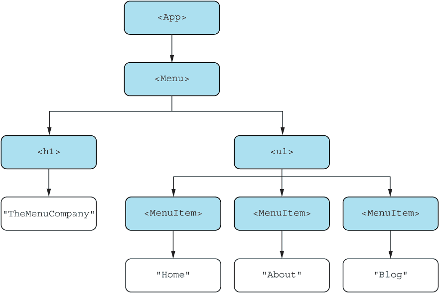
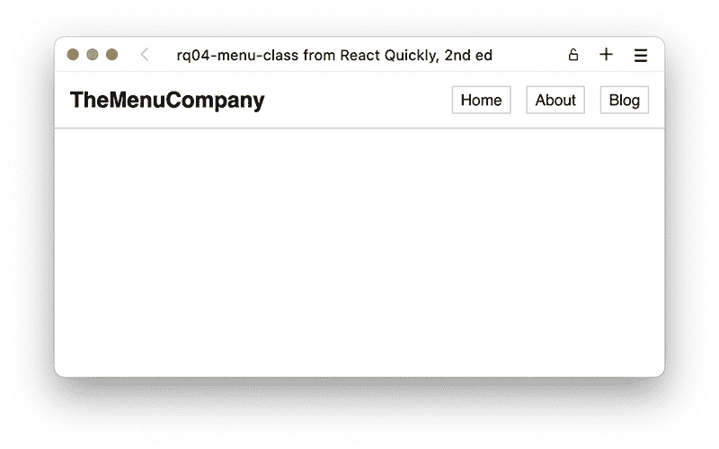
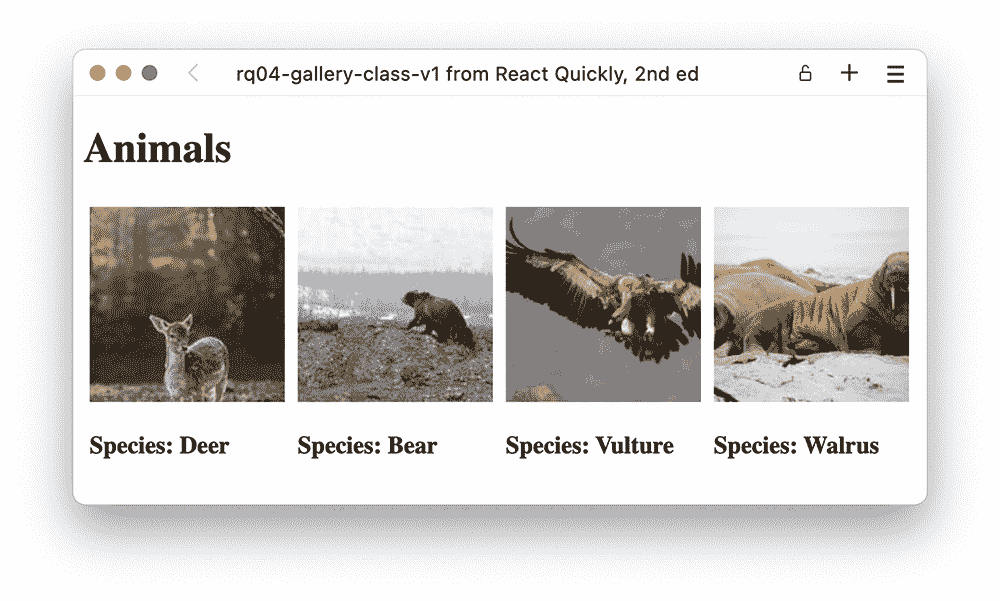

# 4 功能组件

本章涵盖

+   介绍功能组件

+   比较功能组件和基于类的组件

+   在两种组件定义类型之间进行选择

+   将基于类的组件转换为功能组件

在早期，React 长时间基于基于类的组件，但某个时候出现了替代方案，用于最简单的组件。功能组件是编写 React 组件的一种更简洁、在某些方面更简单的方式，并且它们现在具有与基于类的同族组件相同的特性集。

“功能组件”这个术语并不是指与非功能组件相对——没有人需要那些。相反，功能部分指的是组件定义本身是一个 JavaScript 函数，而不是 JavaScript 类。

最初，功能组件不如基于类的组件强大，但自从 React 16.8 中引入了 React hooks，功能组件突然变得与基于类的兄弟组件一样强大，甚至更强大。如今，许多 React 开发者仅使用功能组件，因为这是 React 团队推荐的主要方法。

基于类的组件在 React 中仍然完全受支持，并且可能不会在不久的将来消失。你也会发现它们在“野外”非常常见，原因有几个：

+   并非所有旧的代码库都已重构为基于类的组件，并且仍需维护。

+   一些较老的库仍然只记录了它们如何与基于类的组件接口，因此需要你的代码使用它们来正确地与库接口。

+   一些长期使用 React 的开发者开始使用基于类的组件，并且对他们来说感觉更舒适，因此他们更喜欢在可能的情况下坚持使用它们。

+   当从基于类的组件转换为功能组件时，组件的生命周期模型发生了相当大的变化，在某些情况下，使用旧有的基于类的方案来维护重新渲染的生命周期可能更容易。

+   在 React 中，只有使用基于类的组件才能实现核心功能的一小部分（特别是错误边界）。

不仅功能组件会一直存在，而且它们还将接管世界——至少是 React 的世界。所有迹象都表明，功能组件将是编写 React 的主要方式。编写功能组件使开发者的生活（几乎）没有任何缺点地变得更加容易。

在本章中，我们将介绍功能组件是什么，它们如何与基于类的组件不同（以及它们如何相同），如何在项目中选择使用哪种组件类型，以及如何将基于类的组件转换为功能组件。

注意：本章中示例的源代码可在[`rq2e.com/ch04`](https://rq2e.com/ch04)找到。但正如你在第二章中学到的，你可以使用单个命令直接从命令行实例化所有示例。

## 4.1 编写 React 组件的简短方式

在本节中，我们将介绍函数组件，并逐渐在它们之上添加一些额外的实用工具。这些实用工具仅仅是语法糖，通常由现代 JavaScript 功能而不是 React 特定功能启用。然而，我们将在本章中介绍这些技术，因为我们在后面的章节中都会使用它们。它们都是行业标准，所以您将在 React 代码库中经常看到它们。这些实用工具都是关于简化您编写和交互组件的方式：

+   使用解构简化对属性的访问

+   使用默认值简化组件接口

+   使用透传属性简化组件接口

这些实用工具共同为您提供了编写简单、表现性 React 组件的良好基础，使用简洁的组件定义。

### 4.1.1 一个示例应用

让我们创建一个简单的 React 应用程序：一个带有链接列表的菜单，所有这些链接都是用纯 HTML 构建的。这是一个非常简单的 HTML 片段，包含网站菜单，但它是每个 Web 应用程序的构建块之一。

我们将使用这个示例来说明，当组件变得稍微复杂一些时，前面提到的三个实用工具将帮助我们保持组件在外部和内部都保持简单。参见图 4.1 中的组件树。



图 4.1 我们菜单应用程序的树形图，显示了从顶部的`<App>`到底部的文本节点组件的整体结构

此应用程序的输出在浏览器中看起来将类似于图 4.2。



图 4.2 浏览器中看到的我们的菜单应用程序。这是一个简单的 HTML，带有一点点样式。

首先，我们将像之前看到的那样使用基于类的组件来创建它，然后其次，我们将使用函数创建相同的组件。当我们到达那里时，我们将简要讨论哪种方式更好。请注意，这是一个主观的讨论——没有正确答案——您应该自由地使用您认为最适合您的方法。

使用类实现

此应用程序包括三个组件：`<App/>`、`<App/>`内部的`<Menu/>`和`<Menu/>`中的`<MenuItem/>`。目前，让我们把所有东西都放在同一个文件中，即 App.js 文件，如列表 4.1 所示。

列表 4.1 使用类的菜单应用程序

```
import { Component } from "react";
import "./App.css";                                      ❶
class App extends Component {                            ❷
  render() {
    return (
      <main>                                             ❸
        <Menu />                                         ❹
      </main>
    );
  }
}
class Menu extends Component {                           ❷
  render() {
    return (
      <nav className="navbar">                           ❸
        <h1 className="title">TheMenuCompany</h1>        ❸
        <ul className="menu">                            ❸
          <MenuItem label="Home" href="/" />             ❺
          <MenuItem label="About" href="/about/" />      ❺
          <MenuItem label="Blog" href="/blog" />         ❺
        </ul>
      </nav>
    );
  }
}
class MenuItem extends Component {                       ❷
  render() {
    return (
      <li className="menu-item">                         ❸
        <a                                               ❸
          className="menu-link"
          href={this.props.href}                         ❻
        >
          {this.props.label}                             ❻
        </a>
      </li>
    );
  }
}
export default App;
```

❶ 导入 CSS 文件以设置应用程序样式

❷ 定义一个新组件

❸ 使用标准 HTML 标签

❹ 不传递属性就创建另一个自定义组件的实例

❺ 将属性传递给自定义组件

❻ 使用传递给自定义组件的属性

存储库：rq04-menu-class

这个示例可以在 rq04-menu-class 存储库中看到。您可以通过创建一个基于相关模板的新应用程序来使用该存储库：

```
$ npx create-react-app rq04-menu-class --template rq04-menu-class
```

或者，您也可以访问这个网站来浏览代码，直接在浏览器中查看应用程序的运行情况，或者下载源代码的 zip 文件：

[`rq2e.com/rq04-menu-class`](https://rq2e.com/rq04-menu-class)

这个应用程序只使用了我们已知的内容。例如，我们可以嵌套组件，使用内置的 HTML 组件和我们的自定义组件，向子组件传递属性，以及访问传递给我们的自定义组件的属性。

是的，我们也在这个应用程序中导入了一个 CSS 文件。CRA（Create React App）默认支持这一点，您也可以在创建新的 create-react-app（CRA）应用程序时在默认模板中看到这一点，正如我们在第二章中展示的那样。

使用函数的实现

对于这个例子，我们将直接深入实践。让我们看看使用功能组件的相同应用程序看起来是什么样子。

列表 4.2 使用函数的菜单应用程序

```
import "./App.css";
function App() {                   ❶
  return (
    <main>
      <Menu />
    </main>
  );
}
function Menu() {                  ❶
  return (
    <nav className="navbar">
      <h1 className="title">TheMenuCompany</h1>
      <ul className="menu">
        <MenuItem label="Home" href="/" />
        <MenuItem label="About" href="/about/" />
        <MenuItem label="Blog" href="/blog" />
      </ul>
    </nav>
  );
}
function MenuItem(props) {         ❷
  return (
    <li className="menu-item">
      <a className="menu-link" href={props.href}>
        {props.label}
      </a>
    </li>
  );
}
export default App;
```

❶ 这两个功能组件不接受任何参数。

❷ 这个功能组件接受一个（单个）参数。

仓库：rq04-menu-function

这个例子可以在 rq04-menu-function 仓库中看到。您可以通过创建一个基于相关模板的新应用程序来使用该仓库：

```
$ npx create-react-app rq04-menu-function --template rq04-menu-function
```

或者，您也可以访问这个网站来浏览代码，直接在浏览器中查看应用程序的运行情况，或者下载源代码的 zip 文件：

[`rq2e.com/rq04-menu-function`](https://rq2e.com/rq04-menu-function)

这看起来几乎太完美了，以至于不像是真的。要创建一个功能组件，我们只需创建一个函数并返回 JavaScript XML（JSX）——就是这样。

如果我们需要访问传递给组件的属性，我们可以通过传递给函数的单个参数（即属性的一个冻结对象）来实现。这与基于类的组件中的 this.props 的工作方式类似。

任何函数都可以

如您在注释中的列表 4.2 中看到的，一些功能组件接受一个 props 参数，但有些则不接受。此外，我们使用了函数定义的语句版本（即 function name() {}），但实际上我们并不需要这样做。任何可以作为函数执行并返回 JSX 的值都可以用作组件。

您甚至可以在另一个组件中内联定义它们。这通常被认为不是一种好的做法，但有时可能会有用。

```
const App = function() {                       ❶
  const EmptyMenu = () => { return <nav /> };  ❷
  return (
    <main>
      <EmptyMenu />
    </main>
  );
}
```

❶ 使用“function”关键字的功能表达式

❷ 使用箭头符号的功能表达式

在这里，我们使用函数表达式定义了一个组件 App，并在函数体内部使用箭头符号定义了另一个组件 EmptyMenu。目前这是一个空列表（因此不会显示任何菜单项），但它展示了创建组件是多么简单。

后一个函数甚至可以使用隐式返回进一步缩短：

```
const EmptyMenu = () => <nav />;
```

是的，这是一个完全有效的 React 组件。当然，这是一个非常简单的组件，它目前并没有做很多事情（但会逐渐增加），但**这确实**是一个 React 组件。

我们将在后面的章节中回到“任何函数都可以是组件”这一特性如何有用的讨论。现在，只需记住，我们出于惯例而不是框架约束以某种方式编写我们的组件。

### 4.1.2 属性解构

在上一个 MenuItem 示例中，我们以 props 对象的形式接收了函数组件的属性，并在之后使用，例如，props.label 来访问对象的属性。许多 React 开发者使用的一种更常见的方法是在函数签名中直接解构属性。解构是以紧凑的方式提取复杂值部分的过程。在 JavaScript 中，解构对象通常具有以下形式：

```
const someObject = { a: 1, b: 2, c: 3 };
const { a, b } = someObject;               ❶
```

❶ 将“someObject”解构为“a”和“b”部分

这个表达式将 someObject.a 的值赋给变量 a。同样，someObject.b 的值赋给变量 b。someObject.c 的值被忽略，因为我们没有在我们的表达式中解构它。

我们也可以在将对象参数传递给函数时使用解构：

```
function log({ message, level }) {
  console.log(level.toUpperCase(), "Message:", message);
}
log({ message: "Unknown product", level: "error" });
```

这将导致以下控制台输出：

```
ERROR Message: Unknown product
```

对于这样一个简单的例子，您可能会质疑为什么我们不将其改为两个不同的参数，如下所示：

```
function log(message, level) { ...
```

但是，随着函数变得更加复杂并且添加了更多的参数，仅使用单个对象就可以更容易地以可变数量的参数调用函数，而不是必须记住级别是第五个参数，依此类推。

在一个函数式 React 组件中，属性总是作为定义函数的第一个（也是唯一）参数给出。我们可以使用解构参数对象的方法，使组件定义在下一个列表中更加简洁。请注意，这仅是此示例中文件 App.js 的摘录。

列表 4.3 具有参数解构的 MenuItem

```
...
function MenuItem({ href, label }) {          ❶
  return (
    <li className="menu-item">
      <a className="menu-link" href={href}>   ❷
        {label}                               ❷
      </a>
    </li>
  );
}
...
```

❶ 在函数定义中解构参数

❷ 允许我们无需通过 props 对象即可使用属性

存储库：rq04-menu-destruct

此示例可在 rq04-menu-destruct 存储库中看到。您可以通过创建基于相关模板的新应用程序来使用该存储库：

```
$ npx create-react-app rq04-menu-destruct --template rq04-menu-destruct
```

或者，您可以访问此网站浏览代码，直接在浏览器中查看应用程序的实际应用，或下载源代码的 zip 文件：

[`rq2e.com/rq04-menu-destruct`](https://rq2e.com/rq04-menu-destruct)

这当然与在下一个列表中函数定义内部单独一行进行解构完全相同。

列表 4.4 具有显式解构的 MenuItem

```
...
function MenuItem(props) {                     ❶
  const { href, label } = props;               ❷
  return (
    <li className="menu-item">
      <a className="menu-link" href={href}>    ❸
        {label}                                ❸
      </a>
    </li>
  );
}
...
```

❶ 在这里，我们仍然接受一个 props 参数，但没有对其进行解构。

❷ 然而，我们在组件的第一行将其作为单独的语句进行了解构。

❸ 然后，我们可以像以前一样继续使用作为单独变量的属性。

在这本书中，我们将使用 4.3 列表中展示的方法，在组件定义中直接进行参数解构。您也经常在现实中看到这种情况，因为许多 React 开发者使用这种约定。然而，如前所述，这只是一种约定；其他变体也是可能的。

### 4.1.3 默认值

使用解构属性的一个额外好处是，我们还可以引入默认值。假设我们的菜单链接到博客应该在新的浏览器窗口（或标签页）中打开，而其他链接应该只在同一个会话中常规打开。我们可以通过添加一个新属性 target，该属性菜单必须指定来实现这一点。再次注意，这只是一个 App.js 的摘录。

列表 4.5 带有目标的菜单项

```
...
function Menu() {
  return (
    <nav className="navbar">
      <h1 className="title">TheMenuCompany</h1>
      <ul className="menu">
        <MenuItem
          label="Home" href="/" target="_self"          ❶
        />
        <MenuItem
          label="About" href="/about/" target="_self"   ❶
        />
        <MenuItem
          label="Blog" href="/blog" target="_blank"     ❶
        />
      </ul>
    </nav>
  );
}
function MenuItem({ label, href, target }) {            ❷
  return (
    <li className="menu-item">
      <a
        className="menu-link"
        href={href}
        target={target}                                 ❸
      >
        {label}
      </a>
    </li>
  );
}
...
```

❶ 为菜单项组件的每个实例添加一个新属性

❷ 在组件内部的解构中接受新属性

❸ 将属性作为属性分配给相关的 JSX 元素

然而，有人可能会认为，在同一个会话中打开链接是默认行为，菜单不需要指定这一点是有意义的。我们可以通过在函数定义中使用默认值来实现这一点。请注意，这不是 React 特定的功能，而只是正常的 JavaScript 功能。

列表 4.6 带有默认目标的菜单项

```
...
function Menu() {
  return (
    <nav className="navbar">
      <h1 className="title">TheMenuCompany</h1>
      <ul className="menu">
        <MenuItem label="Home" href="/" />               ❶
        <MenuItem label="About" href="/about/" />        ❶
        <MenuItem
          label="Blog" href="/blog" target="_blank"      ❷
        />
      </ul>
    </nav>
  );
}
function MenuItem({ label, href, target = "_self" }) {   ❸
  return (
    <li className="menu-item">
      <a
        className="menu-link"
        href={href}
        target={target}
      >
        {label}
      </a>
    </li>
  );
}
...
```

❶ 如果我们不需要覆盖默认值，我们不必指定目标属性。

❷ 但当我们需要覆盖默认值时，我们可以轻松地做到这一点。

❸ 使用内置 JavaScript 语法在解构时定义默认值

仓库：rq04-menu-default

此示例可在仓库 rq04-menu-default 中看到。您可以通过创建基于相关模板的新应用程序来使用该仓库：

```
$ npx create-react-app rq04-menu-default --template rq04-menu-default
```

或者，您也可以访问此网站浏览代码，在您的浏览器中直接查看应用程序的运行情况，或下载源代码的 zip 文件：

[`rq2e.com/rq04-menu-default`](https://rq2e.com/rq04-menu-default)

排序属性

您可以按任何顺序指定组件属性。尽管常见的 JavaScript 实践是在定义的末尾指定具有默认值的属性，但没有任何东西阻止您以不同的方式做。

这意味着以下行通常不推荐，但仍然完全有效：

```
function MenuItem({ label, target="_self", href }) {
```

此外，这是推荐的顺序：

```
function MenuItem({ label, href, target="_self" }) {
```

这仅指非默认属性与默认属性之间的顺序——属性列表的内部顺序没有一般性排序，因此如果您希望，您或您的团队可以设置此类建议。

### 4.1.4 透传属性

让我们的例子更加假设化，假设我们需要不同元素上的各种额外属性：

+   首页链接不需要任何额外属性。

+   关于链接需要一个 ID 为 "about-link"。

+   博客链接需要一个 ID 为 "blog-link"。

让我们利用我们目前所知道的知识，使用默认值来实现这一点。

列表 4.7 带有多个默认值的菜单项

```
...
function Menu() {
  return (
    <nav className="navbar">
      <h1 className="title">TheMenuCompany</h1>
      <ul className="menu">
        <MenuItem label="Home" href="/" />
        <MenuItem label="About" href="/about/" id="about-link" />
        <MenuItem
          label="Blog" href="/blog" target="_blank" id="blog-link"
        />
      </ul>
    </nav>
  );
}
function MenuItem({ label, href, target = "_self", id=null }) {
  return (
    <li className="menu-item">
      <a className="menu-link" href={href} target={target} id={id}>
        {label}
      </a>
    </li>
  );
}
...
```

这开始看起来有点重复。我们接受了一堆参数，只是为了将它们直接传递给单个元素——即使名称和所有其他内容都保持不变。

剩余语法

您可以使用另一种现代 JavaScript 概念，称为 *剩余语法*，来指示您希望某些参数以特殊方式处理，而所有其他参数则直接传递到目标元素。在解构对象时，您可以使用表示剩余语法的三个点来指定一个对象，该对象将分配所有未分配的剩余属性：

```
const someObject = { a: 1, b: 2, c: 3, d: 4 };
const { a, b, ...otherAttrs } = someObject;
```

我们在解构语句中未引用的两个属性 c 和 d，被作为属性传递到一个名为 otherAttrs 的新对象中。因此，前面的代码片段等价于以下代码片段：

```
const a = 1;
const b = 2
const otherAttrs = { c: 3, d: 4 };
```

我们可以在组件函数定义中使用它，如下所示：

```
function MyComponent({ a, b, ...rest }) {
  // a = 1, b = 2, rest = { c: 3 }
}
// Later:
<MyComponent a="1" b="2" c="3" />
```

我们可以将所有剩余的属性捕获到一个对象中，通常称为剩余。现在我们只需要使用这个对象，并将它内部的全部属性应用到输出元素上。

您已经看到如何从一个对象中将属性分配给 JSX 元素，但为了重申，我们使用扩展操作符来完成这个操作：

```
const extraProps = { target: "_blank", id: "link" }
return <a href="/blog/" {...extraProps} />
```

记住要使用括号包裹扩展，否则它将不起作用。

剩余的实际应用

让我们回到我们的例子。我们想要捕获传递给我们的 <MenuItem /> 组件的 label 和 href 属性，但我们不关心剩余的属性。如果向组件传递其他任何属性，我们希望直接将它们传递到我们的目标元素。将这些全部组合起来，我们的组件变成了下一个列表。

列表 4.8 带有剩余和扩展的菜单项

```
...
function MenuItem({ label, href, ...rest }) {            ❶
  return (
    <li className="menu-item">
      <a className="menu-link" href={href} {...rest}>    ❷
        {label}
      </a>
    </li>
  );
}
...
```

❶ 在这一行中，"..." 是剩余语法。

❷ 在这一行中，"..." 是扩展操作符。

仓库：rq04-menu-rest

这个例子可以在 rq04-menu-rest 仓库中看到。您可以通过创建一个基于相关模板的新应用程序来使用该仓库：

```
$ npx create-react-app rq04-menu-rest --template rq04-menu-rest
```

或者，您也可以访问这个网站来浏览代码，直接在您的浏览器中查看应用程序的运行情况，或者下载源代码的 zip 文件：

[`rq2e.com/rq04-menu-rest`](https://rq2e.com/rq04-menu-rest)

现在看起来好多了。我们不必指定那些我们实际上并不关心的额外属性。任何其他组件都可以传递它想要的任何东西，除了几个属性——在这里是 label 和 href——它们将接受特殊处理。请注意，我们现在甚至可以省略将 href 列为属性，因为它将包含在剩余变量中，但我们仍然列出它，因为它是一个强制属性，该组件的消费者应该始终指定。请注意，这纯粹是约定，不是由 React 强制执行的。

这里有一些需要注意的事项：正如你所见，剩余语法和扩展操作符是相同的。两者都是在变量名前有三个点。然而，它们的使用方式非常不同，一个用于解构，另一个用于赋值。它们有相似的性质，这就是为什么它们看起来相同，但它们是完全不同的操作符。

使用变量名 rest 作为额外参数是一种常见约定，但绝不是任何地方的要求。你会看到许多开发者使用它，但请随意将其更改为对你有意义的任何内容。

此外，这并不是 React 特有的功能，而仅仅是 JavaScript 语言的一个有用特性，你会在许多 React 开发者中使用它。我们将在未来的章节中也会使用它。

剩余和属性排序

剩余语法必须是对象解构中的最后一个元素，因此你必须指定在属性列表的末尾。当与默认属性结合使用时（当然，这仍然是可能的），常见的排序顺序如下：

1.  无默认属性

1.  默认属性

1.  休息

所有三种属性类型的示例

```
function MenuItem({ label, href, target="_self", ...rest }) {
```

## 4.2 组件类型比较

在你的 React 学习过程中，功能组件和基于类的组件之间的差异可能看起来很小，甚至微不足道。简化到最基本的形式，就是以下作为基于类的组件编写的差异：

```
class Menu extends Component {
  render() {
    return <nav />;
  }
}
```

与以下作为功能组件编写的方式相比：

```
function Menu() {
  return <nav />;
}
```

当我们在后面的章节中遇到更复杂的组件时，尤其是在使用回调和状态时，事情会变得更加复杂，功能组件与其基于类的兄弟之间的差异会越来越大。当我们到达组件组合和通用功能重用时，两个世界中的模式几乎完全不同。

在你的 React 之旅中，组件类型的选择是基本的，但坦白说，这已经不再是选择。除非有强烈的理由不适用于你的特定项目或开发团队，否则你可能会使用功能组件。尽管如此，在本节中，我们将讨论功能组件的优势和劣势，以及一些实际上*不是*选择因素的因素。

### 4.2.1 功能组件的优势

以下是一些使用功能组件的主观优势的非详尽列表：

+   *紧凑性*—在代码行数和纯模板代码开销方面，功能组件通常比基于类的组件更紧凑。实现功能组件时，你只需输入更少的字符。

+   *可读性*—在基于类的组件中追踪某些属性来源可能比在功能组件中使用钩子（新在 React 16.8 中，我们将在下一章中介绍）进行同样操作要困难得多。一般来说，功能组件更容易阅读和理解，即使是一瞥。

+   *纯净度*—函数的*纯净度*（一个纯净函数没有副作用且不依赖于任何其他信息，除了其参数）更容易确定，由于存在钩子，不纯净函数的副作用也更容易推断。基于类的组件的纯净度或缺乏纯净度通常更难以推断，这可能会使得调试和理解变得更加困难。

+   *简单性*—函数是任何编程语言和数学的基本组成部分。用于描述、处理、组合和解释函数的理论工具远远多于用于处理类的工具。类在许多编程语言中也是基本的，但它们仍然是一个比简单函数高得多的抽象层次。

+   *可测试性*—由于可以将功能的一部分拆分为独立的钩子，功能组件通常更容易进行单元测试，因为你可以将它们分解成更小的可组合单元，并轻松独立测试每个单元。

+   *流行度*—对功能组件的偏好本身就是一种好处。到目前为止，大多数其他 React 开发者可能更习惯于使用功能组件；大多数新开发都发生在功能组件的生态系统内；而且关于 React（视频、教程、书籍等）的新内容绝大多数都是专门针对功能组件的。

注意，所有这些好处都是关于开发者体验的。实际的产品——最终用户可用的最终 Web 应用程序——并不会因为组件类型的选择而得到改善或降低。这几乎完全是关于让开发者更容易编写、维护和调试组件，而功能组件的语法在这方面确实非常出色。

通常，使用功能组件更加优雅、更加简洁，最重要的是——更容易理解。当然，这部分是作者的主观意见，但这是在 GitHub 和类似仓库的公共代码库中可以看到的 React 开发者中的普遍观点。

### 4.2.2 功能组件的缺点

使用功能组件没有直接的不利之处。对于你可以在功能组件和基于类的组件中创建的任何功能，在功能组件中创建该功能永远不会带来任何不利之处。

### 4.2.3 组件类型之间的非因素

对于开发人员、开发团队和业务单元来说，一些重要的因素实际上在选择组件类型时并不是因素。这些非因素包括以下内容：

+   *速度*—将一个简单的组件作为函数式组件运行与作为基于类的组件运行之间没有固有的速度差异。使每个组件以及你的整个应用快速和响应的工具在这两种类型的组件中略有不同。大多数人可能会认为，在函数式组件中，这些工具更透明且更容易理解，但基于类的组件也存在类似工具，因此任何组件都可以通过适当的优化变得快速，如果不优化则可能表现迟缓。

+   *可组合性*—尽管使用的模式设计非常不同，但在两种类型的组件中，代码重用和功能组合性都同样良好且得到很好的支持。

+   *可用性*—对于访问你的 Web 应用的最终用户来说，使用哪种类型没有区别。用户体验不会影响这个决定。

+   *可访问性*—使 React 组件可访问是一项独特的技能，但这适用于你以任何一种方式编写组件的情况。

+   *可靠性*—无论选择哪种组件类型，组件都同样容易或困难地变得可靠或正确。可靠性是良好软件开发的一个属性，而不是工具选择的问题。

+   *可维护性*—至少到目前为止，没有迹象表明基于类的组件正在被弃用，因此预计 React 在所有未来版本中都将完全支持这两种组件类型。

虽然所有这些都是软件开发的重要方面，但它们并不是直接受组件类型选择的影响；相反，它们受开发者或掌握键盘的开发团队的技能和视野的影响。

### 4.2.4 选择组件类型

对于“我应该为我的项目选择哪种组件类型？”的简短回答是简单的：*使用函数式组件*。稍微长一点的回答会加上以下后缀：*除非有非常强烈的理由不这样做*。

根据我们最了解的意见，你应该始终使用任何技术的最新稳定版本，对于 React 来说，这无疑是函数式组件优于基于类的组件。函数式组件已经存在了一段时间，大部分新开发都发生在函数式组件及其环境中（特别是 hooks），而且大多数其他开发者也会使用函数式组件。然而，可能存在一些情况，我们会考虑使用基于类的组件，我们将在下一节中介绍这些情况。

## 4.3 不使用函数式组件的情况

如前所述，几乎你可以用基于类的组件做到的任何事情，你都可以用函数式组件做到，除了错误边界。还有一些其他情况下，你可能仍然会选择使用基于类的组件，即使你不需要从技术角度考虑。

在本节中，我们将讨论以下你可能想要避免使用函数式组件的情况：

+   你想要设置一个错误边界来处理渲染树中更下方的错误。

+   你在一个主要由类组件组成的代码库中工作，并想要创建一些与之兼容的东西。

+   你正在使用一个仅针对类组件定制的库。

+   你被特别指派使用内置的 React 功能 getSnapshotBeforeUpdate。

前面的项目按照它们在日常工作中可能发生的优先级顺序编写。鉴于列表中的第一个项目是一个仅在最大和最复杂的代码库中必要的特殊案例，你不太可能遇到这些异常。我们将在以下小节中逐一介绍这些异常。

### 4.3.1 错误边界

当一个成熟的 React 代码库达到一定的复杂度时，建立错误边界是一个合理的问题，所以如果你在一个大型代码库中工作，你很可能会遇到这种情况。目前，在撰写本文时，还没有不使用类组件就能解决这个问题的方法。甚至没有计划将错误边界功能转换为钩子或类似功能，这样它就可以在函数组件中使用。

错误边界是在子组件抛出 JavaScript 错误时提供一个回退机制的方式。当然，你应该始终努力避免未处理的错误，但随着事情变得复杂，输入变化，API 演变，你的代码库变得更加复杂且难以通过测试正确覆盖，错误仍然会发生。错误边界是你的方式，确保当这样的错误发生时，至少最终用户会看到一个格式良好的错误消息以及你真诚的道歉。你可能还应该将错误记录到你选择的分析工具中。

React API 中有两种方法处理子组件中发生的错误。一个是 getDerivedStateFromError，在这里你可以设置一个内部标志，表示这个组件应该以不同的方式渲染，因为某个地方发生了错误。另一个是 componentDidCatch，在这里你可以获取实际发生的错误及其堆栈跟踪和其他信息。这部分允许你将其记录下来用于调试目的。我们不会深入探讨这些方法的工作原理，因为这不属于本书的范围，但如果你需要它们，React 文档中关于这两种方法的说明相当详尽。

如果你发现自己需要在组件树中捕获错误，你必须至少使用一个类组件。尽管只有一个类组件的错误边界或两个，但你仍然可以保持 99%的组件是函数式的。

### 4.3.2 代码库是类基础的

假设你被雇佣到一个公司担任开发职位，该公司有一个旧的 React 代码库，他们仍在积极地进行开发。这是一个庞大的应用程序，可能有数百甚至数千个组件，以及一套复杂的功能。

你被要求只向这个应用程序的一小部分添加一些新功能。虽然混合使用基于类的和函数组件没有问题，但其他开发者可能会觉得某些组件是用一种风格编写的，而其他组件是用另一种风格编写的，这看起来非常奇怪。

将整个代码库重构为函数组件将是一项巨大的任务，但希望这是工程团队长期的目标。然而，很可能会有一个过渡期，其中代码库的某些部分已经被转换，你将被要求在某些部分继续使用类，在其他部分使用函数组件。

随着 React 的成熟和基于类的组件的幽灵越来越成为遥远的过去，这种情况变得越来越不可能。如果你发现自己处于这种情况，我们建议使用团队的智慧，顺应潮流。在团队全体准备好之前不要强迫转换，也不要违反团队约定的编码规范。

### 4.3.3 库需要基于类的组件

这种情况有些假设性，因为我们找不到需要基于类的组件的库，但这并不意味着它不存在。可能存在一种情况，你正在与第三方功能交互，这要求你使用基于类的组件。

最可能的情况是，你想使用一个在 React hooks 推出之前就不再更新的旧库，并且它们的示例和指南仍然使用基于类的组件。这并不意味着你不能使用带有 hooks 的库；只是意味着你必须自己解决，如果事情不顺利，就不能使用库文档来帮助你。虽然过时的文档可能是库指示你使用基于类的组件的最可能原因，但我们不能排除可能存在完全不兼容 hooks 的库。

如果上述任何一种情况发生，你的最佳选择是寻找一个更现代的库。自从 hooks 推出以来，四年的时间里，许多事情都发生了变化——不仅仅是符号——如果你长时间没有维护，你可能会发现这个库在很多方面都落后于时代。

### 4.3.4 更新前的快照

React API 中还有一个内置函数，在仅使用 hooks 的 React 世界中不存在：getSnapshotBeforeUpdate。这是一个非常具体的特性，用途非常狭窄，细节我们在这里不会过多讨论。如果你只是稍微调整一下组件的结构，你就能轻松地用 hooks 绕过它。

然而，如果你被具体指派去使用这个功能，就没有其他办法了（顺便问一下，是谁给你这个奇怪的任务的？）。如果你只是被指派去解决问题，其中 getSnapshotBeforeUpdate 将在基于类的组件中是一个解决方案，你可以使用函数组件找到一个类似的解决方案。

这种方法在这里仅提及以完善内容，并不是因为它是一个经常使用的方法。在 GitHub 上快速搜索只发现七个仓库提到了该方法。其中两个是 React 函数的列表，两个是使用此特定方法的示例，另外三个是旧的未维护的演示。因此，整个方法可能是 React API 中可能完全消失的功能，而不是升级到功能等效版本。

## 4.4 从类组件到函数组件的转换

您已经在代码列表 4.1 和 4.2 之间看到了一个简单的类组件被转换为功能组件。在本节中，我们将更深入地探讨这个转换，解决一些问题，并为接下来的旅程做好准备，因为随着我们在下一章中向组件添加越来越多的复杂功能，我们还将不断回到这个转换。

在这个转换练习中，我们将创建另一个简单的 Web 应用程序：一个带有图像和每个图像标题的画廊。这是一个简单的视觉应用程序，没有交互（因为我们还没有学习如何添加交互），但它突出了组件内部的不同功能，因此我们必须使用一些不同的技巧来转换组件。该应用程序的输出在浏览器中看起来像图 4.3。



图 4.3 浏览器中看到的画廊应用程序，带有简单的图形和标题

我们将创建这个组件的四个版本，如下迭代：

+   第 1 版，仅使用 render 方法

+   第 2 版，仅作为工具使用辅助方法

+   第 3 版，使用类访问的辅助方法

+   第 4 版，使用构造函数初始化计算

我们进行这些迭代的原因是了解如何在类使用越来越多的高级模式且在功能等效中需要略微不同的解决方案时，将类组件转换为功能组件。最后，我们将讨论一对一转换如何随着组件变得更加复杂而变得更加复杂——几乎不可能。

### 4.4.1 第 1 版：仅渲染

我们将使用与本章早期菜单完全相同的类来实现我们的第一个迭代。

原始

我们使用三个组件，每个组件都使用其 render 方法返回 JavaScript。

列表 4.9 使用类的画廊 v1

```
import { Component } from "react";
class App extends Component {
  render() {                           ❶
    return (
      <main>
        <h1>Animals</h1>
        <Gallery />
      </main>
    );
  }
}
class Gallery extends Component {
  render() {                           ❶
    return (
      <section style={{ display: "flex" }}>
        <Image index="1003" title="Deer" />
        <Image index="1020" title="Bear" />
        <Image index="1024" title="Vulture" />
        <Image index="1084" title="Walrus" />
      </section>
    );
  }
}
class Image extends Component {
  render() {                           ❷
    return (
      <figure style={{ margin: "5px" }}>
        
        <figcaption>
          <h3>Species: {this.props.title}</h3>
        </figcaption>
      </figure>
    );
  }
}
export default App;
```

❶ 我们这三个类组件只有一个 render 函数，没有其他方法。

❷ 我们这三个类组件只有一个 render 函数，没有其他方法。

仓库：rq04-gallery-class-v1

这个例子可以在 rq04-gallery-class-v1 仓库中看到。您可以通过创建一个基于相关模板的新应用程序来使用该仓库：

```
$ npx create-react-app rq04-c1 --template rq04-gallery-class-v1
```

或者，您也可以访问这个网站来浏览代码，直接在浏览器中查看应用程序的运行情况，或者下载源代码的 zip 文件：

[`rq2e.com/rq04-gallery-class-v1`](https://rq2e.com/rq04-gallery-class-v1)

转换

当将这样一个简单的组件转换为函数组件时，我们直接将类的`render`方法转换为具有与类相同名称的函数。因此，它遵循这个简单的模板。如果你有这个类：

```
class MyComponent extends Component {
  render() {
    ...
  }
}
```

你最终会得到这个：

```
function MyComponent() {
  ..
}
```

我们还必须做的唯一其他事情是确保我们在组件定义中直接解构 props，而不是像之前看到的那样通过 this.props 访问它们。这导致以下列表中显示的结果。

列表 4.10 图库 v1 使用函数

```
function App() {                                        ❶
  return (
    <main>
      <h1>Animals</h1>
      <Gallery />
    </main>
  );
}
function Gallery() {                                    ❶
  return (
    <section style={{ display: "flex" }}>
      <Image index="1003" title="Deer" />
      <Image index="1020" title="Bear" />
      <Image index="1024" title="Vulture" />
      <Image index="1084" title="Walrus" />
    </section>
  );
}
function Image({ index, title }) {                      ❷
  return (
    <figure style={{ margin: "5px" }}>
      
      <figcaption>
        <h3>Species: {title}</h3>                       ❸
      </figcaption>
    </figure>
  );
}
export default App;
```

❶ 组件定义改为函数

❷ 此组件定义还接受解构属性。

❸ 属性引用改为直接变量而不是对象属性

仓库：rq04-gallery-function-v1

这个例子可以在仓库 rq04-gallery-function-v1 中看到。你可以通过创建一个基于相关模板的新应用程序来使用该仓库：

```
$ npx create-react-app rq04-f1 --template rq04-gallery-function-v1
```

或者，你可以访问这个网站浏览代码，直接在你的浏览器中查看应用程序，或者下载源代码的 zip 文件：

[`rq2e.com/rq04-gallery-function-v1`](https://rq2e.com/rq04-gallery-function-v1)

这里没有什么令人惊讶的。我们使用了本章迄今为止学到的所有技巧：

+   函数组件简单来说就是一个返回 JSX 的函数。

+   如果我们需要接受属性，我们在函数定义中解构它们。

+   当我们需要访问属性时，我们可以直接使用解构变量。

在接下来的几个小节中，我们将迭代图像组件的定义，所以你将只看到该组件的不同版本。为了简洁起见，样本代码列表中只显示图像组件。

### 4.4.2 版本 2：类方法作为实用工具

在这个实现的版本中，我们考察了如果图像类有另一个作为渲染辅助功能的方法，我们会怎么做。论点是``元素的`src`属性有点长且复杂，如果我们有一个渲染这个 URL 的实用方法，JSX 看起来会简单得多。

原始

让我们通过一些代码改进来扩展图像库的基于类的实现。在这个迭代中，我们将假设画廊的开发者想要减少原始组件中列表 4.9 中这些行的视觉杂乱。

```

```

将其简化为如下所示：

```

```

这需要我们定义一个类方法`getImageSource`，它接受一个参数`index`，并返回一个包含 URL 的字符串：

```
getImageSource(index) {
  return `//lorempixel.com/200/100/animals/${index}/`;
}
```

将所有这些放在一起，最终的图像组件看起来像下一个列表。

列表 4.11 图库 v2 使用类（摘录）

```
...
class Image extends Component {
  getImageSource(index) {                               ❶
    return `//picsum.photos/id/${index}/150/150/`;
  }
  render() {
    return (
      <figure style={{ margin: "5px" }}>
        
        <figcaption>
          <h3>Species: {this.props.title}</h3>
        </figcaption>
      </figure>
    );
  }
}
...
```

❶ 在类中定义一个新方法

❷ 使用属性作为参数调用新方法

仓库：rq04-gallery-class-v2

这个例子可以在仓库 rq04-gallery-class-v2 中看到。你可以通过创建一个基于相关模板的新应用程序来使用该仓库：

```
$ npx create-react-app rq04-c2 --template rq04-gallery-class-v2
```

或者，您可以访问这个网站浏览代码，直接在浏览器中查看应用程序的实际应用，或者下载源代码的 zip 文件：

[`rq2e.com/rq04-gallery-class-v2`](https://rq2e.com/rq04-gallery-class-v2)

注意，这个列表只显示了图像组件。应用程序和画廊组件与之前相同。我们不会在列表 4.11 或随后的转换中重复这些内容。现在的任务是将这个新的基于类的组件，使用多种方法，转换为功能组件。

转换

将此函数转换为关键是要认识到，在面向对象的意义上，类方法并不是类的方法，而仅仅是一个实用函数。实际上，您可以将该函数完全移出类外，并得到相同的结果。

想象一下，之前展示的列表 4.11，现在看起来像列表 4.12。

列表 4.12 使用类和函数的画廊 v2（摘录）

```
...
function getImageSource(index) {                     ❶
  return `//picsum.photos/id/${index}/150/150/`;
}
class Image extends Component {  
  render() {
    return (
      <figure style={{ margin: "5px" }}>
        
        <figcaption>
          <h3>Species: {this.props.title}</h3>
        </figcaption>
      </figure>
    );
  }
}
...
```

❶ 我们已将方法移出，作为类外部的独立函数。

❷ 将函数作为任何其他函数调用，而不是作为类的方法

这也是以同样的方式工作的，因为 getImageSource 方法没有使用任何仅在类内部可用的知识。换句话说，该函数是纯函数，仅依赖于其输入，没有依赖任何外部信息，也没有任何外部影响。

使用实用函数将这个新的基于类的组件转换为现在与之前一样简单。我们保持实用函数不变，只需转换组件本身。

列表 4.13 使用函数的画廊 v2（摘录）

```
...
function getImageSource(index) {                        ❶
  return `//picsum.photos/200/100/animals/${index}/`;
}
function Image({ index, title }) {
  return (
    <figure style={{ margin: "5px" }}>
         ❷
      <figcaption>
        Species: {title}
      </figcaption>
    </figure>
  );
}
...
```

❶ 将实用函数保持在组件定义之外

❷ 将此函数作为任何其他函数调用

存储库：rq04-gallery-function-v2

这个例子可以在 rq04-gallery-function-v2 存储库中看到。您可以通过创建基于相关模板的新应用程序来使用该存储库：

```
$ npx create-react-app rq04-f2 --template rq04-gallery-function-v2
```

或者，您可以访问这个网站浏览代码，直接在浏览器中查看应用程序的实际应用，或者下载源代码的 zip 文件：

[`rq2e.com/rq04-gallery-function-v2`](https://rq2e.com/rq04-gallery-function-v2)

这确实比列表 4.10 中的前一个迭代要简单得多，紧凑得多。`` 标签更容易阅读，实际 URL 生成的细节已被移动到仅为此任务而创建的函数中。

在这里，我们使用了这个方法是无状态的知识；也就是说，该方法没有使用任何外部信息，只依赖于其参数。如果情况不是这样呢？我们将在下一小节中讨论。

### 4.4.3 版本 3：真正的类方法

现在，让我们重新审视之前示例中的类方法。让我们想象一下，实现此组件的开发者想利用这个事实，即该方法属于类的一部分，因此可以直接访问组件的属性。

原始

使用这些信息，方法不需要依赖于传递索引的参数，而是可以直接从组件属性中使用 this.props 检索索引：

```
getImageSource() {
  return `//lorempixel.com/200/100/animals/${this.props.index}/`;
}
```

现在，当我们使用这种方法时，我们不需要提供任何参数；我们只需调用该方法。这导致了以下列表中的组件定义。

列表 4.14：使用类的 Gallery v3（摘录）

```
...
class Image extends Component {
  getImageSource() {
    return `//picsum.photos/id/${
      this.props.index                    ❶
    }/150/150/`;
  }
  render() {
    return (
      <figure style={{ margin: "5px" }}>
        
        <figcaption>
          <h3>Species: {this.props.title}</h3>
        </figcaption>
      </figure>
    );
  }
}
...
```

❶ 这次，类方法直接使用了 props 对象。

❷ 我们现在可以调用该方法，而不需要向它传递任何参数。

存储库：rq04-gallery-class-v3

这个例子可以在 rq04-gallery-class-v3 存储库中看到。您可以通过创建一个基于相关模板的新应用程序来使用该存储库：

```
$ npx create-react-app rq04-c3 --template rq04-gallery-class-v3
```

或者，您可以访问这个网站浏览代码，直接在浏览器中查看应用的实际效果，或者下载源代码的 zip 文件：

[`rq2e.com/rq04-gallery-class-v3`](https://rq2e.com/rq04-gallery-class-v3)

现在这个类方法确实是类的一个方法，并且依赖于外部信息。我们接下来该怎么办？简短的回答是，在功能组件中并没有这个的直接等价物；然而，有类似的方法可以达到相同的结果。

将这个基于类的组件转换为功能组件有两种主要方法，每种方法都有其优点和缺点：

+   将方法转换为纯函数并将其移出组件。

+   在组件内部创建一个局部函数。

我们将在接下来的小节中介绍这两种方法，并进行比较。

使用纯函数进行转换

选项 1 是记住画廊图像的先前版本，并试图逆转这种复杂性和相互关联性的进步。对于这种方法，相当简单：目标是移除对组件属性或其他组件本地信息的任何直接访问，并将其作为参数传递给函数。这将使我们回到版本 2 中看到的相同的 getImageSource 版本，它接受一个参数并返回一个字符串。

实现这一点将完全类似于前面 4.13 列表所示。然而，想象一下，这个方法更加复杂并且使用了大量的属性：

```
getImageSource() {
  const { width, height, index } = this.props;
  return `//picsum.photos/id/${index}/${width}/${height}/`;
}
```

当我们在基于类的组件的渲染中使用这种方法时，看起来相当不错：

```
return (
  ...
  
  ...
);
```

这个函数的使用相当紧凑，并且将访问不同属性的所有复杂性都移动到了方法中。

如果我们将其转换为纯函数，我们突然需要向它传递大量的参数，增加了复杂性。在我们的纯函数功能组件中，我们必须将所有属性传递给函数，它看起来会突然变成这样：

```
return (
  ...
  
  ...
);
```

这不如之前那么优雅和隔离，但它会起作用，并且是一个有效的转换。

使用局部函数进行转换

选项 2 是将类方法转换为功能组件内部的局部函数，这将在下一个列表中展示。

列表 4.15：使用函数的 Gallery v3（摘录）

```
...
function Image({ index, title }) {
  const getImageSource = () =>                     ❶
    `//picsum.photos/id/${index}/150/150/`;        ❶
  return (
    <figure style={{ margin: "5px" }}>
          ❷
      <figcaption>
        <h3>Species: {title}</h3>
      </figcaption>
    </figure>
  );
}
...
```

❶ 在组件内部定义一个可以访问属性的本地函数

❷ 以任何其他函数的方式调用此函数

仓库：rq04-gallery-function-v3

这个例子可以在 rq04-gallery-function-v3 仓库中看到。您可以通过创建基于相关模板的新应用程序来使用该仓库：

```
$ npx create-react-app rq04-f3 --template rq04-gallery-function-v3
```

或者，您可以访问这个网站浏览代码，直接在浏览器中查看应用的实际效果，或者下载源代码的 zip 文件：

[`rq2e.com/rq04-gallery-function-v3`](https://rq2e.com/rq04-gallery-function-v3)

现在因为 getImageSource 的定义是组件内部的本地函数，它可以访问传递给组件的属性，我们不需要将所有属性传递给辅助函数。这种方法的缺点是每次我们创建一个新的组件时，都会创建一个新的本地函数。在这个只有四个组件的例子中，这并不重要，但想象一下拥有成千上万个甚至数百万个某些组件实例的庞大、复杂应用程序。如果我们有数百万个如列表 4.14 中定义的原始类组件的实例，我们仍然只有一个 getImageSource 方法的定义，这不会占用太多内存。

然而，根据我们在列表 4.15 中定义的功能组件，每个组件实例都将有一个本地定义的函数，并且每个实例都会占用程序内存中的一个槽位。这通常不是问题，但这是两种实现之间的细微差别。

当您将具有额外类方法的基于类的组件进行转换时，您可以使用之前概述的任一选项。只需注意两种选项的优点和缺点。在具体示例中，两种选项都是完全有效的解决方案，但有时一个选项可能比另一个选项更合适，具体取决于具体情况。

### 4.4.4 版本 4：构造函数

正如我们之前提到的，您还可以向基于类的组件添加构造函数。通常，构造函数用于初始化在组件整个生命周期中保持不变的属性，无论传递了哪些属性。这是因为构造函数只执行一次，即组件首次创建时，而不是每次组件属性更新或因其他原因重新渲染时。

我们将在未来的章节中详细介绍组件的重新渲染。现在，只需知道构造函数在组件的生命周期中只调用一次，因此您不应该在其中放置依赖于可能在未来改变的属性的任何功能。

在这个例子中，我们将向我们的图像组件添加一个构造函数，该函数生成一个随机 ID 以应用于我们的元素。这样做的原因可能包括将其附加到某些外部库或使用可访问的富互联网应用程序（ARIA）属性来引用元素以提高可访问性。

如果我们在渲染方法中创建了一个 ID，那么每次组件渲染时 ID 都会重新生成。相反，我们在构造函数中创建 ID，以确保它在组件的生命周期中保持不变。

列表 4.16 使用类的 Gallery v4（摘录）

```
...
class Image extends Component {
  constructor(props) {
    super(props);                                         ❶
    this.id =
      `image-${Math.floor(Math.random() * 1000000)}`;    ❷
  }
  render() {
    return (
      <figure style={{ margin: "5px" }} id={this.id}>    ❸
        
        <figcaption>
          <h3>Species: {this.props.title}</h3>
        </figcaption>
      </figure>
    );
  }
}
...
```

❶ 在基于类的组件的构造函数中调用 super(props) 是必需的；否则，你的组件将无法工作。

❷ 我们使用生成的唯一 ID 创建一个类变量。

❸ 我们随后在渲染方法中使用这个 ID，通过从类中检索它。

仓库：rq04-gallery-class-v4

这个例子可以在仓库 rq04-gallery-class-v4 中看到。你可以通过创建一个基于相关模板的新应用程序来使用那个仓库：

```
$ npx create-react-app rq04-c4 --template rq04-gallery-class-v4
```

或者，你可以访问这个网站来浏览代码，直接在你的浏览器中查看应用程序的运行情况，或者下载源代码的 zip 文件：

[`rq2e.com/rq04-gallery-class-v4`](https://rq2e.com/rq04-gallery-class-v4)

注意，我们只是直接将 ID 作为属性存储在类实例本身上，使用 this.id。我们不会将其放入 this.props 中，有两个原因：(1) 因为我们不能（它是一个冻结对象），(2) 因为它不是传递给我们的组件的属性——这是我们自行计算的结果。所以，我们如何利用我们目前的知识将这个组件转换为函数组件呢？我们不能！你将在第七章学习到完成这个任务的工具，特别是使用 hooks（特别是 useMemo）；然而，目前我们还没有这样的功能。

问题在于，与在组件首次创建时只运行一次构造函数并且有一个独立的渲染方法（每次组件渲染和重新渲染时都会运行）的基于类的组件不同，函数组件只有一个在每次组件渲染时（包括第一次渲染）都会运行的方法。在函数组件中，第一次渲染和后续渲染之间没有真正的区别。

我们还没有看到需要重新渲染的组件，但，现在请相信我们，你将在 React 中编写的几乎所有组件都需要多次渲染。如果一个组件只渲染一次，它很可能是一个非常简单的组件，没有内部逻辑或状态。例如，你的网络应用程序的标志可能定义在一个简单的组件中，该组件永远不会改变。我们将在第六章中详细讨论组件的生命周期和渲染。

为了让你提前了解使用函数组件进行 ID 生成的样子，请查看列表 4.17。在这里，我们使用钩子 useMemo 在组件第一次渲染时生成一个唯一的 ID，然后在每次后续渲染中重用这个相同的计算结果。

列表 4.17 使用函数的 Gallery v4（摘录）

```
import { useMemo } from 'react';                      ❶
...
function Image({ index, title }) {
  const id = useMemo(() =>                            ❷
    `image-${Math.floor(Math.random() * 1000000)}`,   ❷
  []);                                                ❷
  return (
    <figure style={{ margin: "5px" }} id={id}>
      
      <figcaption>
        <h3>Species: {title}</h3>
      </figcaption>
    </figure>
  );
}
...
```

❶ 从 React 包导入钩子

❷ 应用钩子并添加魔法——一个空数组——使钩子只运行一次。这被称为依赖数组，将在第六章中讨论。

仓库：rq04-gallery-function-v4

这个例子可以在 rq04-gallery-function-v4 存储库中看到。您可以通过创建一个基于相关模板的新应用程序来使用该存储库：

```
$ npx create-react-app rq04-f4 --template rq04-gallery-function-v4
```

或者，您可以访问这个网站浏览代码，直接在您的浏览器中查看应用程序的实际运行情况，或者下载源代码的 zip 文件：

[`rq2e.com/rq04-gallery-function-v4`](https://rq2e.com/rq04-gallery-function-v4)

我们现在不会深入探讨其工作原理，但这与在构造函数中初始化变量的逻辑等价。您将在第七章中了解更多关于 hooks、渲染和记忆化的内容。这项技术确实需要对组件进行一些重写，并且您需要稍微改变一下思维方式，但到目前为止看到的所有示例都可以通过不太多的工作转换为函数组件。

### 4.4.5 更多的复杂性意味着更困难的转换

到目前为止展示的所有示例都非常简单。我们没有任何交互或任何状态。例如，过滤您想看到的动物和点击展开每个动物的详细信息等功能需要更复杂的 React 组件，这反过来又需要更复杂的逻辑来转换为函数组件，如果这是您的任务的话。

当我们在未来章节中介绍函数式 React 组件的更复杂特性时，我们也会简要讨论这在一个基于类的组件中会是什么样子。此外，我们还将介绍如何处理使用这些特性将组件转换为函数组件等价特性的过程。

目前，只需知道虽然所有功能（除了我们在 4.3 节中较早看到的少数例外）都可以从类组件转换为函数组件，但这可能并不总是简单的。正如我们在使用类方法转换组件时必须做出判断一样，其他不同程度的复杂性将引入几种不同的方法，其中一些可能比其他方法更适合特定情况。除此之外，随着原始开发者开始组合所有这些特性，您可能会得到一个非常复杂的组件，需要完全重写才能在函数式世界中有意义。

## 4.5 小测验

1.  在 React 功能以及您能构建的应用程序方面，函数组件与类组件相比是*更弱*、*同样强大*还是*更强大*？

1.  向函数组件传递了多少个参数？

1.  哪个陈述不是使用函数组件的好处？

    1.  *函数组件比类组件更紧凑*。

    1.  *函数组件比类组件更快*。

    1.  *函数组件比类组件更容易理解*。

1.  如果您正在启动一个新的 React 应用程序，您应该使用*函数组件*还是*类组件*，其他条件都相同？

1.  将类组件转换为函数组件总是微不足道的；*正确*还是*错误*？

## 小测验答案

1.  函数组件与基于类的组件一样 *强大*。你可以使用一种类型构建的应用程序也可以使用另一种类型构建。

1.  函数组件接收 *一个* 参数：一个包含属性的冻结对象。

1.  *函数组件并不比基于类的组件更快*。虽然任何简单的实现可能会有轻微的速度差异，但两种类型的组件在适当优化后都可以非常快，或者在不恰当的组合下，可能会拖垮整个应用程序。组件类型的选择本身并不是应用速度的指标。

1.  在其他条件相同的情况下，你应该使用 *函数组件* 开始任何新的项目。

1.  *错误*。将简单的基于类的组件转换为函数组件最初可能很简单，但随着组件复杂性的增加，转换会变得越来越复杂。

## 摘要

+   函数组件是编写 React 组件的另一种方式，作为基于类的组件的替代方案。

+   任何返回 JSX 的 JavaScript 函数都是一个函数组件，但为了遵循惯例，我们倾向于以特定的风格编写函数组件。

+   某些 JavaScript 技巧经常被用来帮助定义函数组件，包括解构、默认值、剩余语法和对象展开运算符。

+   函数组件在各个方面至少与基于类的组件一样强大。

+   在某些方面，函数组件对开发者体验更有益，但这些好处并不延伸到最终产品，最终产品独立于组件类型的选择。

+   如果有机会选择，使用函数组件是编写 React 组件的推荐方式。

+   基于类的组件通常可以转换为函数组件，但这可能需要大量的工作和对现有功能的重构。
