# 5 使用状态使 React 交互

本章涵盖

+   组件中状态的作用

+   在函数组件中使用状态

+   将有状态的类组件转换为函数组件

我们迄今为止创建的所有组件都接受一些属性，并根据这些属性渲染一些 HTML。我们可以将标签属性传递给按钮，例如，按钮就会显示那个确切的按钮文本。但我们不能让按钮文本在发生某些事情时改变，比如在切换时在开启和关闭之间切换。这是因为我们缺乏对发生的事情做出反应的能力，也缺乏存储动态变化的信息的能力。

我们迄今为止创建的组件的输出仅取决于它们的属性。换句话说，从函数式编程的角度来看，组件是“纯”的。组件没有其他输入，也没有副作用。如果你给同一个组件相同的属性，你将始终得到相同的结果，而且只有那个结果。

这一切都很好，这正是我们想要的——但它也有些无聊。这样的组件对于展示数据至关重要，但如果我们想要创建一个交互式应用程序，它们就毫无用处。如果我们想在点击按钮或填写输入时更新某些内容，我们就需要将其存储在某个地方，并将该信息传递给其他组件以做出反应。想象一下登录表单。当用户输入他们的电子邮件和密码时，我们需要将信息存储在某个地方，以便在填写错误时显示错误消息。当用户点击发送按钮时，我们需要将数据发送到远程服务器。

仅依赖于其属性且没有超出这些属性内部逻辑的组件也被称为**无状态**组件。与之相对的是**有状态**组件。在这个上下文中，“状态”指的是通过使用内部变量随时间变化的能力。同一个组件可以在某个时刻有一个内部状态，导致一个 JavaScript XML（JSX）输出，而稍后可以有不同的状态，导致不同的输出。想象一下一个可以切换点击和未点击状态的按钮。它是否被点击是按钮的状态，而持有状态的组件是**有状态**的。

在本章中，我们将详细介绍什么是状态化应用程序，以及在这样的应用程序中有状态组件的作用。然后，我们将通过查看如何在函数组件内部设置、更新和使用组件状态来使这个概念更加具体。尽管 API 非常简单，仅由一个函数组成，即 useState，但有很多信息需要覆盖。

在本章结束时，我们将简要讨论在类组件中设置、更新和使用状态的工作方式。这是以相关但不同的方式进行处理的，因此有一些重要的事情需要注意。

当讨论基于类的组件时，我们还将介绍如何将具有状态的基于类的组件转换为具有状态的函数式组件。如果你被要求在一个仍然使用基于类的组件的老旧代码库上工作，但你想将其升级到函数式代码库以便使用最新的最佳技术，这将非常有用。如果你在网上找到的示例和指南教你如何在基于类的组件中做某事，这些知识也可能有所帮助。仍然有数千个老旧但有用的教程，但为了在现代代码库中使用所提供的建议，你必须转换一些概念。

注意：本章中示例的源代码可在[`rq2e.com/ch05`](https://rq2e.com/ch05)找到。但正如你在第二章中学到的，你可以使用单个命令直接从命令行实例化所有示例。

## 5.1 为什么 React 状态很重要？

状态对于创建任何类型的交互式应用至关重要。如果你的应用没有任何状态，这意味着你的应用是完全静态的——一旦在浏览器中打开，就无法进行任何更改。这可能适合博客文章或食谱，但如果你想用户登录、更新、点击或以其他方式与应用交互以影响显示的内容，你需要使你的应用具有状态。

React 组件是*单独具有状态的*。在组件中保持状态使你的 React 应用整体具有状态。

注意，虽然几乎所有的 React 应用都是具有状态的，但并非所有组件都是具有状态的。你可能只在应用中只有少数几个具有状态的组件，但那些组件可以控制整个应用的状态，并在必要时更新所有无状态组件。虽然很难对此进行概括，但粗略估计，在你的最终应用中，可能不超过三分之一的组件是具有状态的，并且随着应用的规模和复杂性的增加，这个比例可能会降低。想象一个虚构应用的虚构组件树，如图 5.1 所示。只有暗色组件是*具有状态的*，而亮色组件是*无状态的*。

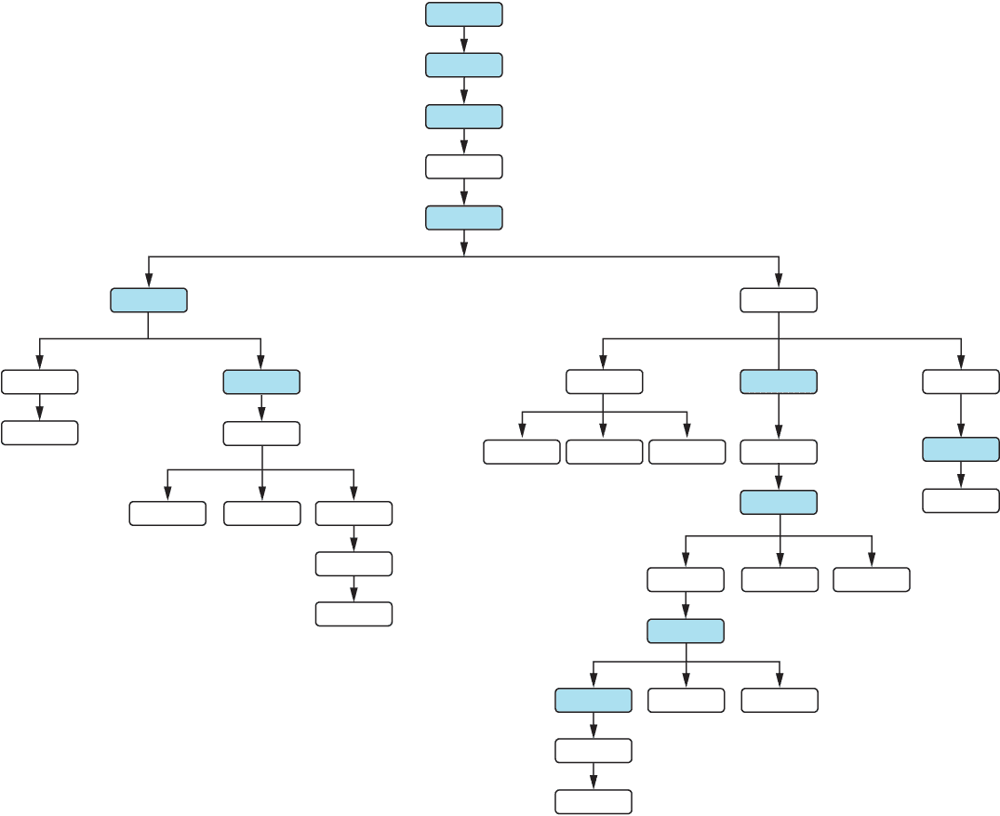

图 5.1 暗色组件是具有状态的；亮色组件是无状态的。注意具有状态的组件通常位于组件树的顶部，而无状态组件则更常见于叶节点。

React 没有工具可以使整个应用具有状态。React 应用仅定义为其组件的总和，因此要使你的应用具有状态，你必须使一些组件具有状态。

### 5.1.1 React 组件状态

组件状态是使组件具有状态而不是无状态的：

+   *具有状态的组件*——一个具有状态的组件独立于其上下文，并能够根据内部触发器更新自身。

+   *无状态组件*—无状态组件只能在父组件提供新属性给它时改变或更新。

React 组件状态是允许你在组件内部存储随时间变化的值的机制。想象一下，一个时钟组件可以根据传递给它的属性显示一天中的某个时间，而另一个时钟组件能够每秒更新并持续显示当前时间。要实现后者，组件需要有一种方式来存储一天中的当前时间（以及一种方式来推进这个值）。

图 5.2 展示了这两种方法之间的差异。

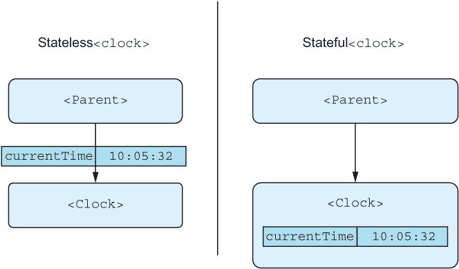

图 5.2 无状态时钟需要其父组件每秒更新一次以显示时间，而具有状态的时钟可以自行更新，父组件无需担心。

注意，为了使图 5.2 中的无状态时钟真正工作，父组件必须是状态化的，因为我们仍然需要在某个地方保持当前时间的状态。当然，我们也可以使父组件无状态化，但那样我们就必须将状态推到树的上层。

### 5.1.2 我应该把状态放在哪里？

好的，我们希望我们的应用程序具有状态。那么状态应该放在哪里呢？通常，你会尝试将状态尽可能靠近需要它的组件。

假设你有一个包含（实时且功能性的）时钟的顶部菜单的应用程序，一个包含许多不同页面且可以在你浏览页面时更新的主要内容区域，以及一个包含一些静态链接的页脚。你需要将时钟的状态存在某个地方，要么在时钟组件内部，要么在树中位于其上方的任何组件中。如果你像图 5.3 中那样设计你的应用程序，你可以在多个组件中选择放置你的时钟状态。

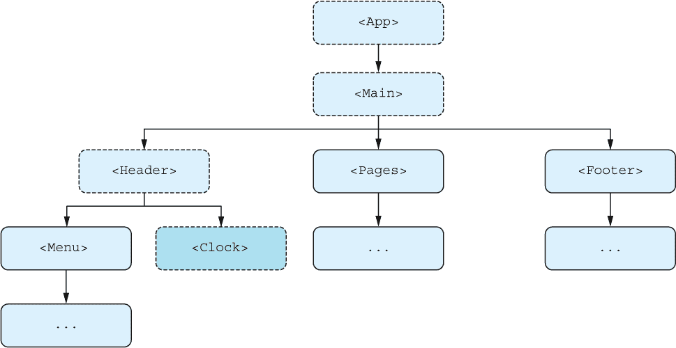

图 5.3 只有在较深灰色标记的组件中才需要时钟状态。你可以将你的时钟状态放在任何带有虚线边的组件中。这些代表时钟组件及其祖先。

在这个例子中，将时钟状态放在时钟组件内部是有意义的。没有其他组件需要知道当前时间，所以我们只需将状态局部化到需要它的组件。

另一方面，假设我们还需要保持当前显示在应用程序中的页面的状态。这个信息在 Pages 组件中是必需的，因为它实际上需要显示活动页面，同时在 Menu 组件中也是必需的，因为它需要显示带有高亮背景的当前页面的链接。

检查图 5.4 中的文档树显示，我们可以将信息放在 Main 或 App 中，因为这两个组件是唯一包含我们关心的所需状态的组件的两个组件。

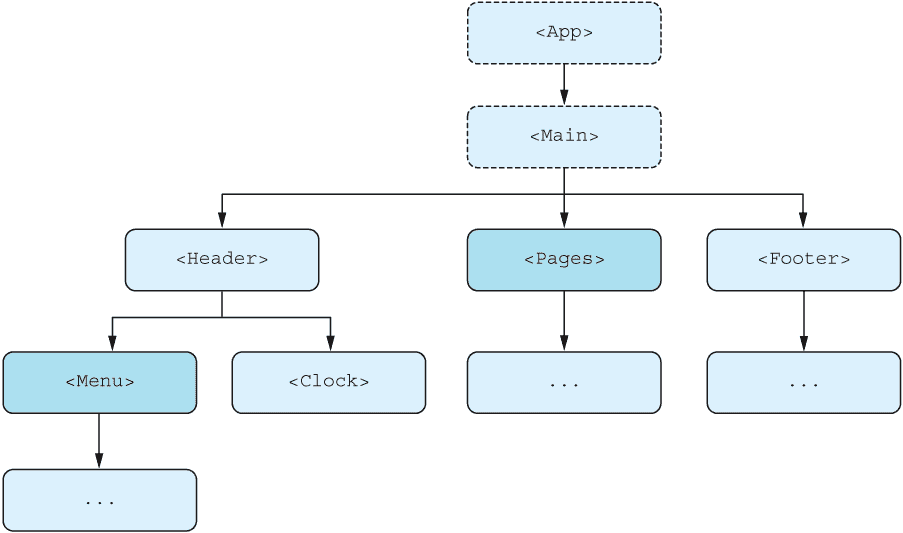

图 5.4 当前页面状态在两个用较深灰色标记的组件中是必需的。然后你可以将你的当前页面状态放在两个用虚线边框标记的组件中。这些是两个目标组件的共同祖先。

你是否决定将当前页面状态放在 Main 或 App 中取决于你，因为这可能是一个品味或个人偏好的问题。虽然有一个实际的理由将状态保持在文档树尽可能低的位置（即在 Main 中），但该组件可能已经有很多其他职责。因此，从组织目的来看，将此信息放在父 App 中可能更有意义。

### 5.1.3 你在组件状态中存储什么类型的信息？

通常，任何在 Web 应用程序中使用的状态都属于以下三个类别之一：

+   应用数据

+   UI 状态

+   表单数据

这不是一条规则，也不是 React 特有的一个特性，但它是有状态应用程序操作的结果。

不同类型的数据以不同的方式存储。我们将涵盖每个这些来讨论如何适当地存储和使用数据。可能会有其他组件状态的类别，但它们中的大多数都包含在前面的三个类别中。

应用数据

应用数据是用户正在处理、更新或读取的数据。如果你正在构建一个用户可以登录的 Web 应用，用户信息就是应用数据。如果用户可以登录并查看健身房的可选课程、预订课程等，所有这些数据都是应用数据。

应用数据通常在应用程序的全球级别存储。如果你有一个显示健身房课程的组件，那么在这个组件中存储可用的课程列表是可能的，但这也会意味着当组件卸载时，所有关于可用课程的信息都会丢失，并且它们必须在组件稍后再次挂载时从服务器重新加载。这两个术语，“挂载”和“卸载”，将在下一章中详细讨论。

通常更好的解决方案是在应用程序中创建一个持久的数据存储组件，这样当数据被加载一次后，它就会在整个应用程序中保持。我们将在未来看到不同的方法，这些方法将涉及内置的 React 功能（使用 React Context）。

UI 状态

UI 状态指的是 UI 组件的当前状态，例如哪个标签页当前是活跃的，面板是否折叠，菜单是否打开等。通常，这些是间歇性数据，不会持久化，但只是帮助 Web 应用程序以正确的方式渲染正确的元素。

UI 状态值通常尽可能保持本地化。关于菜单是否打开的信息仅对菜单组件内部相关，因此你可以轻松地将此信息作为本地状态存储在此组件内部。

表单数据

正如你在第九章中将会看到的，表单数据是组件状态的另一个非常常见的用例。当用户与表单交互、输入数据、从一个表单字段移动到下一个字段时，表单的当前状态通常保存在覆盖所有表单字段的组件的本地状态中。

### 5.1.4 不要存储在状态中的内容

应该永远不要存储在状态中的事物包括以下内容：

+   *不改变的价值*——这不仅仅是像魔法数字这样的常量，还包括在应用程序启动时加载的配置值。如果它不能改变，就不要让它成为变量。

+   *其他状态值的副本*——你应该尽量保持单一的真实来源。如果你的应用程序中有一个全局状态包含一些数据，如果你也在不同组件的本地状态中保留它，将会变得混乱（除非你允许用户在表单中本地更新那里的数据）。

+   *相同数据的副本*——如果你在状态中有相同数据的两个版本，你可能想合并这些数据。例如，如果你在状态中既有名字、姓氏和全名，每次其中一个值改变时，你至少需要更新这些值中的两个。只保留源值，即名字和姓氏在状态中，并根据需要根据状态计算全名会更好。

当然，还有很多其他你不应该放入状态中的事物（例如，你的车钥匙），但这个列表太长了，无法一一列出。前面的列表显示了你可能考虑做的常见陷阱，但你可能不应该这样做。

## 5.2 向函数组件添加状态

到目前为止，我们已经讨论了为什么、在哪里以及应该将哪些内容保留在组件状态中，但我们仍然不知道如何实际操作。在函数组件中保持状态有一个非常简单的 API，它既是主要吸引力，有时也是头疼的问题。因为它是一个非常底层的 API，你可能需要添加一些功能来获得流畅的开发者体验；然而，它允许你非常容易地创建状态组件的简单案例。

让我们直接进入，通过创建最简单的可能的状态组件，一个点击计数器，来看看 API 的实际应用。我们需要一种初始化计数器、显示当前值以及在点击按钮时增加计数器的方法。然而，有一个非常重要的最后一步。我们不能简单地更新任何旧变量并希望组件正确渲染。我们需要让 React 知道值已经被更新，这意味着我们需要通过 React 特定的 API。参考图 5.5 中的简单流程图。

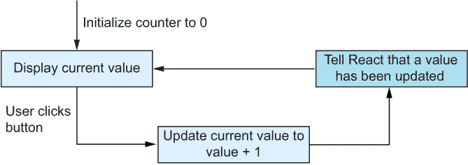

图 5.5 我们的计数器组件中的状态流程。我们初始化变量并显示它，在按钮点击时，我们增加值并确保 React 知道更新组件以显示新值。

要在函数组件中实现这一点，我们需要使用 React 包中的一个名为 useState 的函数。它接受一个初始值，并返回当前状态和一个更新函数。让我们添加如图 5.6 所示的 React 特定 API 所需的相关部分。

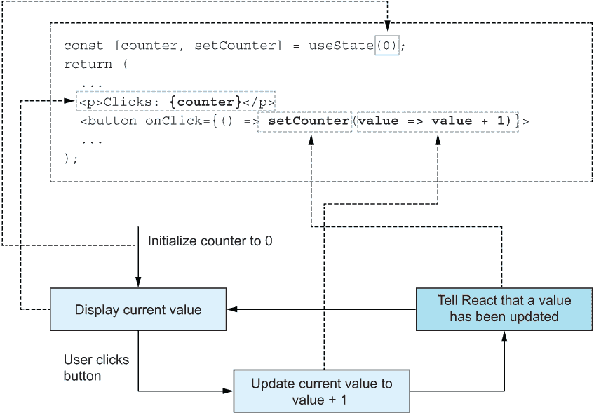

图 5.6 图表中状态流和引用每个动作的代码行。虚线和箭头将概念转换为实现给定目标的实际代码片段。

让我们看看整个代码，如列表 5.1 所示。请注意，我们将在后面详细介绍传递给 useState 钩子和从 useState 返回的值的所有细节，所以在这个时候关于 setCounter 函数不必过于困惑。它将在适当的时候解释。

列表 5.1 一个完全功能的计数器

```
import { useState } from "react";                          ❶
function Counter() {
  const [counter, setCounter] = useState(0);               ❷
  return (
    <main>
      <p>Clicks: {counter}</p>                             ❸
      <button
        onClick={() => setCounter((value) => value + 1)}   ❹
      >
        Increment
      </button>
    </main>
  );
}
function App() {
  return <Counter />;
}
export default App;
```

❶ 从 React 包中导入函数 useState

❷ 使用初始值初始化一个新的状态，并返回当前值和设置器函数

❸ 通过当前状态显示值

❹ 通过设置器函数更新值

仓库：rq05-functional-counter

这个例子可以在仓库 rq05-functional-counter 中看到。你可以通过创建一个基于相关模板的新应用程序来使用该仓库：

```
$ npx create-react-app rq05-functional-counter --template rq05-functional-counter
```

或者，你可以访问这个网站浏览代码，直接在你的浏览器中查看应用程序的运行情况，或者下载源代码的 zip 文件：

[`rq2e.com/rq05-functional-counter`](https://rq2e.com/rq05-functional-counter)

让我们立即在浏览器中运行这个程序，并开始点击，就像我们在图 5.7 中看到的那样。

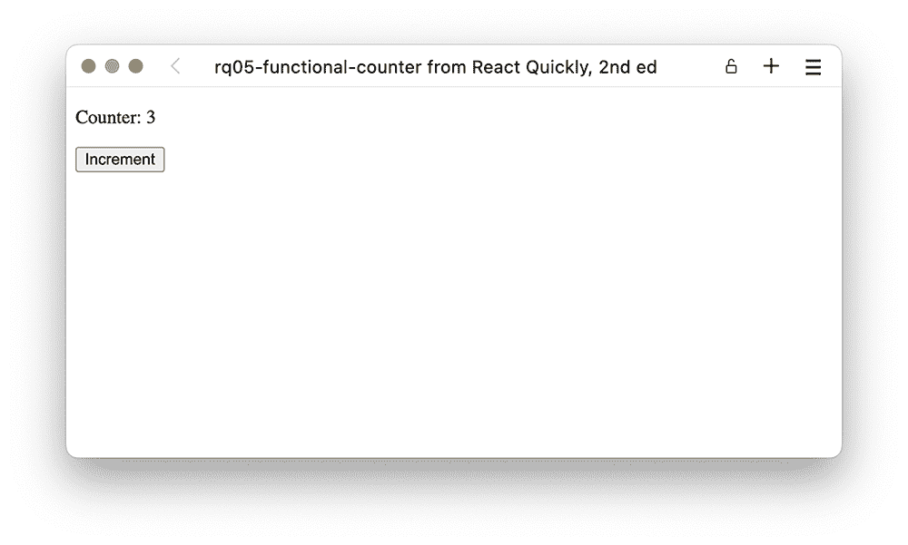

图 5.7 在仅点击三次后，计数器开始工作，但请随意继续。天高任鸟飞——或者实际上 9,007,199,254,740,991 是极限——但你可能不会走那么远。

这里有很多内容要介绍，所以让我们一步一步地过一遍这些步骤：

+   从 React 包中导入函数 useState。

+   在函数组件中调用 useState 并提供一个初始值。

+   将调用 useState 的响应解构为两个数组元素：

    +   第一个元素是当前值。

    +   第二个元素是设置器函数。

+   根据你的需要使用当前值。

+   当你想更新状态时，用函数或纯值调用设置器。

我们将在下一节中逐一介绍这些步骤。我们还将发现如何使用多个 useState 创建更复杂的组件。

哦，我们提到过，useState 是一个钩子吗？这是 React 16.8 中引入的新 React 钩子中的第一个也是最简单的一个，它改变了所有的一切。钩子是特殊的函数，你不能像对待其他函数一样对待它们。我们将在本节中介绍一些内容，但在第六章中我们将更深入地探讨钩子的话题。

### 5.2.1 导入和使用钩子

useState 是一个钩子。*钩子*是一个总称，指的是 React 16.8 及以后版本中存在的一种新型特殊函数。React 自带一些内置钩子，它们之所以被称为钩子，是因为 React 这样定义的。它们不做相同的事情，也不提供重叠的功能，但都是“钩入”React 核心功能的，并且需要特别注意才能正确工作。

由于 useState 是一个钩子，这一点实际上很容易看出，因为函数以 use*这个词开头。在现代 React 中，现在有一个约定，即任何以 use*开头的函数都是一个钩子，非钩子函数永远不应该以这个词开头。

那么，钩子有什么特别之处呢？钩子之所以被命名为钩子，是因为它们是从你的组件“到”React“内部机制”的钩子。你可以做一些没有这种额外访问权限不可能做到的神奇事情。一个函数组件只是一个函数，所以如果没有这种更深入的访问权限，它实际上不能做很多超出控制单个渲染的事情。

React 自带 15 个钩子（截至 React 18），它们是低级单元，可以组合成各种高级组件。随着时间的推移，可以添加新的内置钩子到 React API 中，所以当你阅读这篇文章时，可能会有超过 15 个。

你可以在 React 钩子之上创建自己的自定义钩子。如果你这样做，你应该将你的自定义钩子命名为 use*。例如，我们可以为前面的组件创建一个 useCounter 钩子。我们将在第十章中介绍自定义钩子。

钩子规则

当你在组件中使用钩子时，你必须始终使用该钩子。此外，每次渲染组件时，你必须使用完全相同的钩子，并且顺序完全一致。这听起来可能有些奇怪，但这是 React 为了使你的函数正确工作所必需的。

“始终使用”的意思是，相同的钩子必须在每次组件渲染时被调用，也就是说，每次组件定义函数运行时。这意味着你不能有条件地运行一个钩子，例如，通过将其放在 if 块中或包含在可选的 return 语句之后。

想象一下计数器组件的一个变体，我们向组件传递一个属性来指示它是否应该完全可见。你可能会认为我们可以做类似于图 5.8 中的事情。

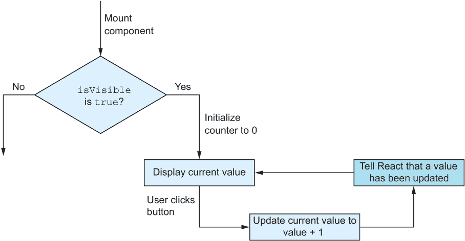

图 5.8 我们能否首先检查属性，如果为 false，就完全忽略初始化状态？

我们可以这样实现：

```
function Counter({ isVisible }) {
  if (!isVisible) {
   return null;                                ❶
  }
  const [counter, setCounter] = useState(0);   ❷
  return (
    ...
  );
}
```

❶ 如果 isVisible 为 false，我们从一开始就返回 null。

❷ 只有当 isVisible 不为 false 时，我们才实际使用 useState 钩子初始化状态。这是错误的！

嗯，这是不允许的！这里有什么问题？钩子函数 useState 并不是每次都调用，只是有时调用。如果一个渲染中 isVisible 属性设置为 true，钩子*将会*被调用，但如果在下一个渲染中设置为 false，钩子*不会*被调用。而且，这不仅仅是不好，它将完全破坏你的 React 应用程序。React 将抛出一个类似于以下错误的消息：

```
React Hook "useState" is called conditionally. React Hooks must be called
in the exact same order in every component render. Did you accidentally
call a React Hook after an early return?
```

因此，有时你需要编写看似次优的代码。你需要将所有的钩子放在组件中返回任何内容之前，如图 5.9 所示。

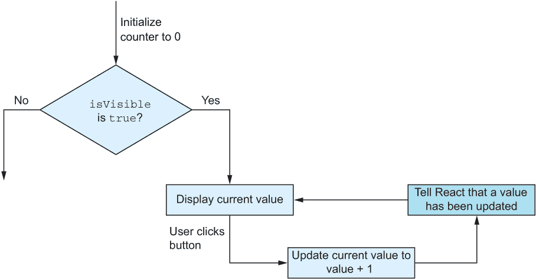

图 5.9 我们必须在可选地中止渲染之前初始化状态，即使我们根本不需要状态。

让我们这样实现：

```
function Counter({ isVisible }) {
  const [counter, setCounter] = useState(0);   ❶
  if (!isVisible) {
   return null;                                ❷
  }
  return (
    ...
  );
}
```

❶ 初始化两个可能永远不会用到的变量

❷ 只在我们所有的钩子执行完毕后返回某些内容

这也意味着你永远不能有条件地运行一个钩子（例如，在 if 块内部），你永远不能在循环中运行一个钩子（因为这意味着你可能有不同数量的钩子调用），而且你永远不能在回调或事件处理程序中调用一个钩子（它必须在组件体中直接调用）。你将在下一节中看到一些这些限制的示例以及如何绕过这些限制以实现预期的目标。

在下一章中，我们还将详细介绍更多关于钩子的内容，我们将深入探讨钩子的工作原理以及它们应该如何使用。

### 5.2.2 初始化状态

当你调用 useState 时，你必须传递一个初始值；如果不传递，则假定初始值为 undefined。只有你为每个组件实例在第一次调用 useState 时传递的值才重要。当你的钩子因任何原因重新渲染时，初始值将被忽略。

这种用法最明显的用例是在组件中设置基线。当它第一次挂载时，状态应该是什么？如果应该是作为属性传递的某个动态值，请使用该属性。如果应该是任何静态值，请写入该值。在 99%的情况下，你将设置你的初始值为静态值（包括 null 非常常见）或属性。我们将在本节的其余部分介绍一些初始化的示例。

初始值

每个状态都有一个初始值。我们的计数器初始值为 0，但当然不必是 0。我们可以将其初始化为 10、100，甚至是某个动态值。

假设我们想要创建一个计数器的变体，其中我们可以将值初始化为我们传递的某个属性。然后我们将创建一个应用程序，其中包含三个不同实例的此计数器，并使用不同的起始值进行初始化。结果组件树将类似于图 5.10。

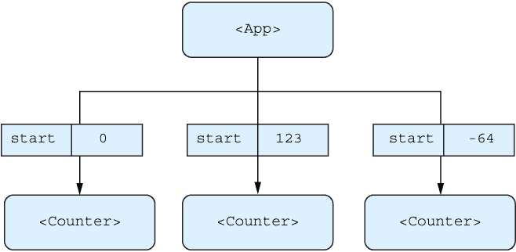

图 5.10 我们现在想要有三个计数器，它们初始化为不同的起始值，因为这样看起来很酷。

我们可以像以下列表所示实现这一点。在浏览器中的结果将看起来像图 5.11。

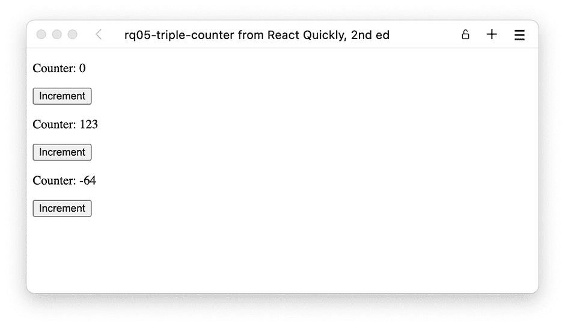

图 5.11 在我们点击任何计数器之前，我们的三个计数器

列表 5.2 三重计数器

```
import { useState } from "react";
function Counter({ start }) {                      ❶
  const [counter, setCounter] = useState(start);   ❷
  return (
    <main>
      <p>Counter: {counter}</p>
      <button onClick={() => setCounter(value => value + 1)}>
        Increment
      </button>
    </main>
  );
}
function App() {
  return (
    <>
      <Counter start={0} />                        ❸
      <Counter start={123} />                      ❸
      <Counter start={-64} />                      ❸
    </>
  );
}
export default App;
```

❶ 传递给此组件的属性名为 start。

❷ 我们使用这个属性来初始化我们的状态。

❸ 具有三个不同起始值的三个计数器实例

存储库：rq05-triple-counter

这个例子可以在 rq05-triple-counter 存储库中看到。你可以通过创建一个基于相关模板的新应用程序来使用该存储库：

```
$ npx create-react-app rq05-triple-counter --template rq05-triple-counter
```

或者，你可以访问这个网站来浏览代码，直接在你的浏览器中查看应用程序的运行情况，或者下载源代码的 zip 文件：

[`rq2e.com/rq05-triple-counter`](https://rq2e.com/rq05-triple-counter)

除了数字之外，以下是一些常见的静态初始值：

+   对于布尔值来说，是**true**还是**false**——如果你的菜单在点击按钮之前是隐藏的，那么`isMenuVisible`状态将被初始化为`false`。

+   **空字符串**，""——如果你有一个登录电子邮件地址的输入，你将初始化你的状态为空值，这样输入就是空的，直到用户开始输入。

+   `null`——如果你有一个尚未设置任何值的复杂值，`null`是表示尚未存在值的完美占位符。

最常见的动态初始值是使用一个属性。我们之前在计数器中就是这样做的。同样，如果你有一个组件需要更改你的名字，你也会使用一个属性。你会传入当前的名字作为属性，并根据这个属性初始化你的状态。

你也可以将你的状态初始化为 cookie 或类似本地存储中的值。对于一个登录表单，你可以使用存储在 cookie 中的最后已知电子邮件地址来初始化电子邮件地址状态。

只有第一个初始值是重要的

让我们创建一个具有可变起始值的计数器的新变体。这次，我们想在计数器外部添加一个新按钮，该按钮将改变计数器的起始值。因此，我们不是每次都初始化值为 0，而是有一个按钮，如果点击，将计数器的起始值减少 10，如图 5.12 中的流程图所示。我们实际上是在我们的状态组件之上创建了一个有状态的组件。

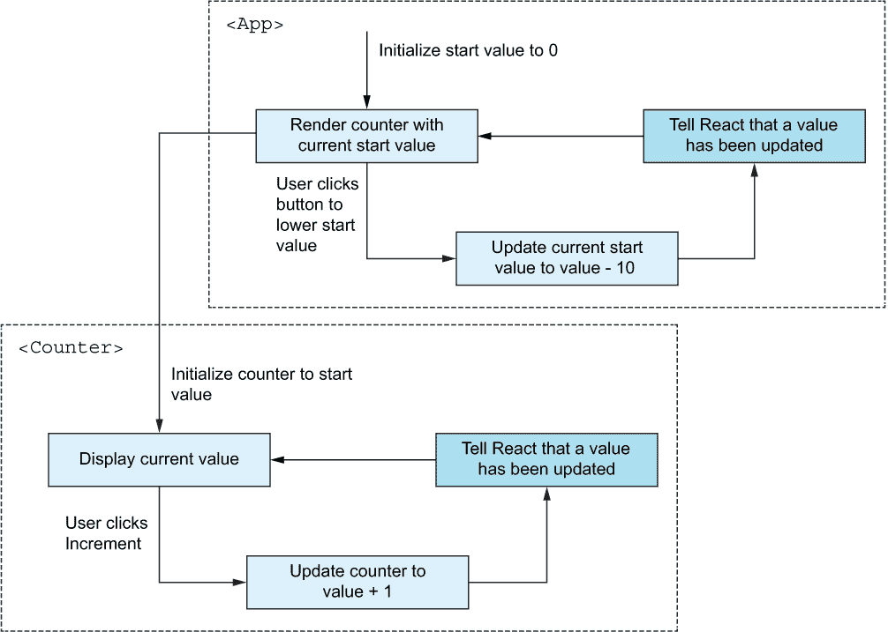

图 5.12 现在我们在应用程序和计数器中都有状态，我们想使用应用程序状态来初始化计数器状态。

而不是盲目地实现这个功能，让我们思考一些场景。在这个场景中会发生什么？

1.  首先，计数器将以初始值 0 开始。

1.  然后我们点击按钮来降低起始值，所以起始值现在应该是-10。

1.  那么计数器是否会更新到-10？

让我们再通过另一个场景来扩展：

1.  首先，计数器将以初始值 0 开始。

1.  然后我们点击计数器中的“增加”按钮，将计数器的值增加到 1。

1.  然后我们点击按钮来降低起始值（原本是 0），所以起始值现在应该是-10。

1.  那么计数器会更新到-10 吗？还是会更新到-9？

实际上，这两种场景都是没有意义的，因为我们之前简要提到过，只有传递给 useState 的第一个值被用作状态的值。如果初始值在后续渲染中发生变化，状态永远不会更新。这既有好的一面也有不好的一面。好的一面是，否则我们的计数器将始终是相同的值，因为我们每次渲染都传递相同的值。不好的一面是，如果我们实际上想根据某个传递的参数来改变值，我们无法做到（至少不是用这种方式）。

在这种情况下，如果我们开始计数后降低起始值，实际上并不清楚我们想要发生什么。在我们尝试在代码中实现它之前，弄清楚我们确切想要发生什么是很重要的。

有可能让状态值根据一个属性更新，但这需要其他钩子——特别是我们将在下一章中介绍的 useEffect 钩子。

初始化函数

有时候，你可能想将初始值设置为某个计算的结果。比如说，你有一个密码输入框，你想将其初始化为一个好的、强大的密码，但一旦用户开始输入，你就使用用户输入的内容。我们在代码库的某个地方有一个昂贵的函数 generatePassword，我们将使用它来创建这个初始密码。让我们像之前一样，在图 5.13 中绘制这个流程。

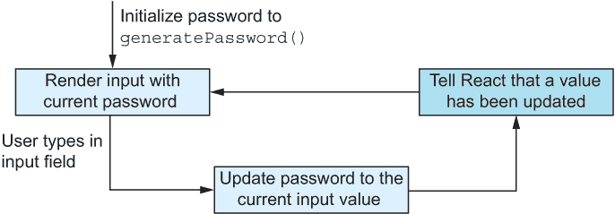

图 5.13 使用函数生成初始值时的状态流程

如果我们使用初始值来实现这个功能，我们得到的结果可能如下所示：

```
function Password() {
  const [password, setPassword] = useState(generatePassword());
  ...
}
```

然而，这个 generatePassword()函数实际上会在每次渲染时被调用（因为它在每次渲染时都会执行），而除了第一次渲染之外，每次渲染都会忽略返回值，正如之前解释的那样。它可能是一个运行很多昂贵算法的复杂函数，所以如果我们不需要返回值，我们应该避免运行它。

为了这个目的，初始值可以是一个返回初始值的函数。在这种设置中，初始值函数只会在第一次调用，对于未来的渲染将被忽略，如图 5.14 所示。

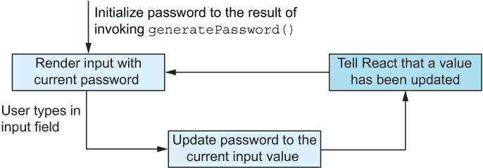

图 5.14 在这个例子中，我们实际上并没有调用 generatePassword。我们而是指示钩子仅在需要时调用该函数（即第一次）。

我们通常可以这样操作

```
const [password, setPassword] = useState(() => generatePassword());
```

或者，在这个例子中，更简单：

```
const [password, setPassword] = useState(generatePassword);
```

因为 generatePassword 已经是一个函数，所以我们可以直接传递它。然而，如果这个函数需要一个参数，比如生成密码的长度，我们就必须使用前面的形式：

```
const [password, setPassword] = useState(() => generatePassword(12));
```

通过函数初始化

如果你的状态是一个函数怎么办？如果我们传递一个函数给初始值，它将被调用，那么我们如何将函数作为初始值存储？我们创建另一个函数，它返回第一个函数。这听起来有点奇怪，但实际上是有道理的。

假设我们有一个计算器组件，我们可以对两个输入字段中输入的两个值执行一些数学运算（例如，加法、减法和乘法）。这个计算是一个函数，它接受两个值并返回一个单一响应。我们可以将其实现为一个类似于枚举的类型，如下所示：

```
const OPERATORS = {
  ADDITION: (a, b) => a + b,
  SUBTRACTION: (a, b) => a - b,
  PRODUCT: (a, b) => a * b,
};
function Calculator() {
  const [operator, setOperator] = useState(OPERATORS.ADDITION);
  ...
}
```

这看起来相当不错，但它不起作用。我们所做的是在图 5.15 中展示的。

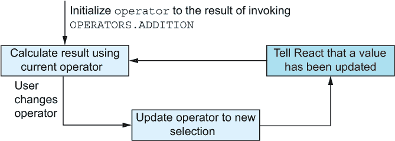

图 5.15 因为我们将函数作为初始值传递，React 会将其视为初始化函数并调用它——就像之前一样。

如果你将前面的代码片段输入到一个组件中，操作符将初始化为值 NaN。这当然是因为 useState 以一个函数作为初始化器被调用，所以它调用了该函数，但该函数不知道如何在没有参数的情况下操作，所以它只返回 NaN。我们需要的是一个返回操作符的函数，如图 5.16 所示。

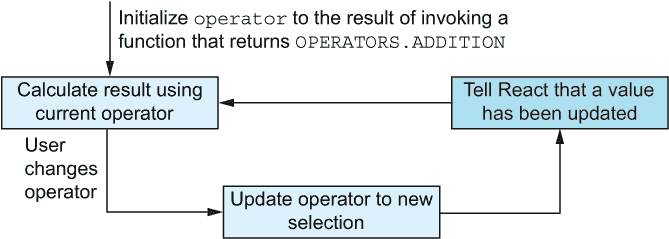

图 5.16 这次，我们仍然会将一个函数作为初始化值传递，但该函数将返回我们所需的价值（碰巧也是一个函数）。

我们可以将其实现为

```
function Calculator() {
  const [operator, setOperator] = useState(() => OPERATORS.ADDITION);
  ...
}
```

这可行，并且是一个完美的构造。当我们稍后讨论设置函数时，你会看到这种构造被重复使用。

### 5.2.3 解构状态值和设置器

当我们需要一个有状态的组件时，我们使用 useState 钩子。这个钩子返回一个值，我们将它解构为一个状态值和一个设置函数，如下所示：

```
const [value, setter] = useState(initial); 
```

这几乎就是强制性的了。有其他方法可以做到这一点，但每个人都会以这种方式使用 useState 钩子。如果你这样做，你的代码对其他开发者来说也是有意义的。这只是在使用此钩子时的一种必要约定。其他钩子以类似的方式工作，你只需要习惯这种符号。

useState 返回值

useState 钩子返回的值有点难以理解。钩子返回一个包含两个元素的数组。第一个元素是状态的当前值，第二个元素是设置函数。我们可以以许多方式“接受”这个返回值并将其转换为我们的使用。我们可以将返回的数组存储在一个变量中，并将两个项目分别称为 value[0] 和 value[1]，或者我们可以将那些元素复制到两个其他变量中。但推荐且最常见的方式是在将返回值赋值给变量时直接解构数组，并按我们的意愿命名两个返回值：

```
const [counter, setCounter] = useState(0); 
```

到目前为止，对于大多数 React 开发者来说，这只是一个本能。因为这就是你使用 useState 钩子的方式，过了一段时间，你实际上并没有真正思考过。这里唯一需要思考的是两个解构变量的命名。常见的方法是将状态值命名为我们存储的内容，并将设置函数命名为相同，但带有 set*前缀。这就是我们之前用 counter 和 setCounter 分别做的。

团队通常会制定自己的命名标准或采用他人的标准，但我们在这里建议的是一个安全的默认值。唯一的潜在偏差是当涉及到布尔状态值时。你可能有一个名为 isCollapsed 的状态值。那么，设置函数将被命名为 setIsCollapsed，这听起来就像糟糕的英语，所以有些人可能只是将其命名为 setCollapsed，并跳过布尔变量通常具有的 is*或 has*前缀。

为什么 useState 返回一个数组

好的，你理解 useState 返回一个数组，而且就是这样。但是，为什么 useState 返回一个包含两个无关值的数组？这显然不是一个列表！

想象一下，你是一个创建 useState 钩子的 React 核心开发者。useState 函数需要返回两个值。一个值是当前状态，可以是任何类型。第二个值是设置函数，它是一个可以接受任何值或甚至更新函数的函数。

JavaScript 没有元组或结构，你可以以“优雅”的方式结构性地组合不同类型。你可能认为我们可以返回一个具有两个属性的对象，并且只需要就它们的命名达成一致，例如，obj.value 和 obj.set。这些也可以简单地解构为

```
const { value, set } = useState(0); // This doesn't actually work!
```

但是，由于你倾向于在同一个组件中拥有多个状态，你将不得不经常重命名它们。即使你只有一个状态，你也可能想要一个更具描述性的名称，并且将对象中的命名属性解构到不同的局部变量中比将其解构到数组中更冗长：

```
const {
  value: counter,
  set: setCounter,
} = useState(0); // This still doesn't work
```

这需要很多额外的输入和不必要的开销。因此，与其返回一个具有两个命名属性的定义更明确的对象，React 开发者选择了数组以方便使用。

因为 React 开发者对 useState 函数非常熟悉，并且他们在日常工作中使用了无数次，所以这种不寻常的语法已经变成了肌肉记忆，他们实际上并没有真正思考过。但我们同意，这实际上有点奇怪。

### 5.2.4 使用状态值

想象一下我们之前的计数器。如果我们把增加按钮从增加值改为将值设置为字符串"hi there"，会发生什么？所以，它不再是数字，而是一个字符串。这看起来就像图 5.17。

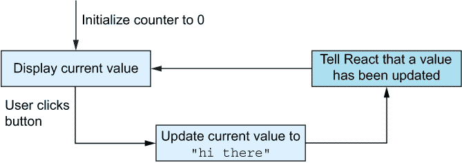

图 5.17 当我们点击按钮时，我们将计数器的值设置为字符串。

让我们尝试实现它：

```
import { useState } from "react";
function Counter() {
  const [counter, setCounter] = useState(0);             ❶
  return (
    <main>
      <p>Counter: {counter}</p>                          ❷
      <button onClick={() => setCounter("hi there")}>    ❸
        Increment
      </button>
    </main>
  );
}
```

❶ 将计数器初始化为数字

❷ 显示计数器当前是什么

❸ 点击时，将计数器的值更改为字符串

这实际上有效。如果我们点击按钮，结果将看起来像图 5.18。

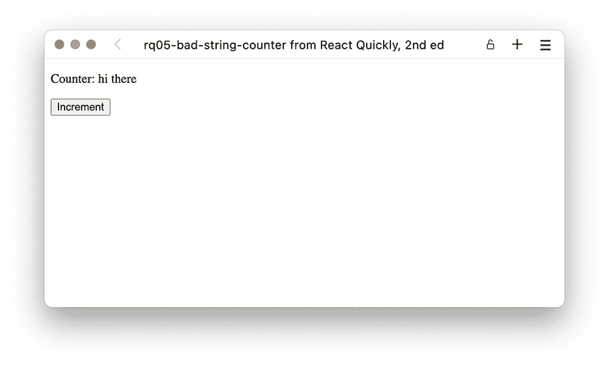

图 5.18 我们的“计数器”值现在是一个字符串，它仍然被显示，因为我们实际上并没有检查它是否是一个数字。

改变状态类型是非常没有意义的，就像改变任何其他变量的类型一样没有意义。

useState 钩子返回的状态值是你设置的值。你可以改变类型、复杂性等。你对值有完全的控制权。值将从你作为初始值传递的值开始，然后它将是传递给 setter 函数的值。

然而，大多数时候，你的状态类型不应该改变。就像你的代码库中的任何其他变量一样，保持类型的一致性是一个巨大的帮助，即使 JavaScript 没有对你施加任何这样的约束。例如，你可以初始化一个值为 null，然后将其设置为数字，其中 null 表示你还不确定这个数字是什么，所以初始化为 0 将是误导性的。例如，对于一个年龄输入来说，仅仅因为你还没有输入你的年龄，并不意味着它是 0。这将是类型的变化，其中类型最初是 null，但后来变为数字。

当然，你可以在状态中拥有对象字面量，这对于你总是一起更新或一起使用的相关值来说可能是有意义的。例如，你可能有一个显示文件加载进度的加载组件，它以百分比和以已加载的字节数（相对于总字节数）的文本形式显示：

```
function Loader() {
  const [progress, setProgress] = useState(null);
  const someCallback = () => {
    ...
    setProgress({ loaded, total });
  };
  if (!progress) {
    return null;
  }
  const { loaded, total } = progress;
  return (
    <h2>{Math.floor(100 * loaded / total)}%</h2>
    <p>Loaded { loaded } out of {total}.</p> 
  );
}
```

这只是一个部分示例，因为我们在这里实际上没有加载任何内容，所以我们需要更多的逻辑来实际获取某些内容并检查其值。但这是一个示例，展示了存储在单个状态值中的相关值。

在后面的章节中，我们将讨论如何使用多个状态而不是将所有状态都压缩到一个值中。你应该只在值紧密相关时将多个值放入单个状态中，就像前面的 Loader 示例中那样。

### 5.2.5 设置状态

设置状态相当直接，因为它的工作方式与设置初始值完全一样，具有所有相同的怪癖和解决方案。我们可以通过将其设置为静态值或使用返回要设置的新值的更新函数来更新状态。

设置为静态值

让我们创建一个简单的手风琴组件，你可以展开和折叠内容。标题包含两个按钮，分别带有加号和减号。点击加号按钮将展开手风琴并显示内容，点击减号按钮将折叠手风琴并隐藏内容。这如图 5.19 中的图解所示，并在列表 5.3 中实现。

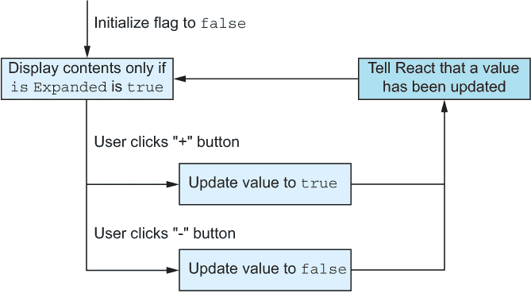

图 5.19 折叠面板的流程图。布尔值根据哪个按钮被点击设置为 true 或 false。

列表 5.3 简单折叠面板

```
import { useState } from "react";
function Accordion() {
  const [isExpanded, setExpanded] = useState(false);    ❶
  return (
    <main>
      <h2 style={{ display: "flex", gap: "6px" }}>
        Secret password
        <button onClick={() => setExpanded(false)}>     ❷
          -
        </button>
        <button onClick={() => setExpanded(true)}>      ❷
          +
        </button>
      </h2>
      {isExpanded && (                                  ❸
        <p>                                             ❸
          Password: <code>hunter2</code>.               ❸
        </p>                                            ❸
      )}                                                ❸
    </main>
  );
}
function App() {
  return <Accordion />;
}
export default App;
```

❶ 初始化状态为 false

❷ 当按钮被点击时，使用 true 或 false 调用设置器

❸ 如果布尔值为 true，则显示隐藏的折叠面板内容

仓库：rq05-accordion

这个例子可以在 rq05-accordion 仓库中看到。您可以通过创建一个基于相关模板的新应用程序来使用该仓库：

```
$ npx create-react-app rq05-accordion --template rq05-accordion
```

或者，您可以访问这个网站浏览代码，直接在浏览器中查看应用程序的实际效果，或者下载源代码的 zip 文件：

[`rq2e.com/rq05-accordion`](https://rq2e.com/rq05-accordion)

浏览器中的结果将类似于图 5.20。这个组件是使用设置器与静态值的一个例子。减号按钮无论您点击多少次，总是将状态值设置为 false。因为我们将其设置为固定值，所以我们不需要查看当前值。

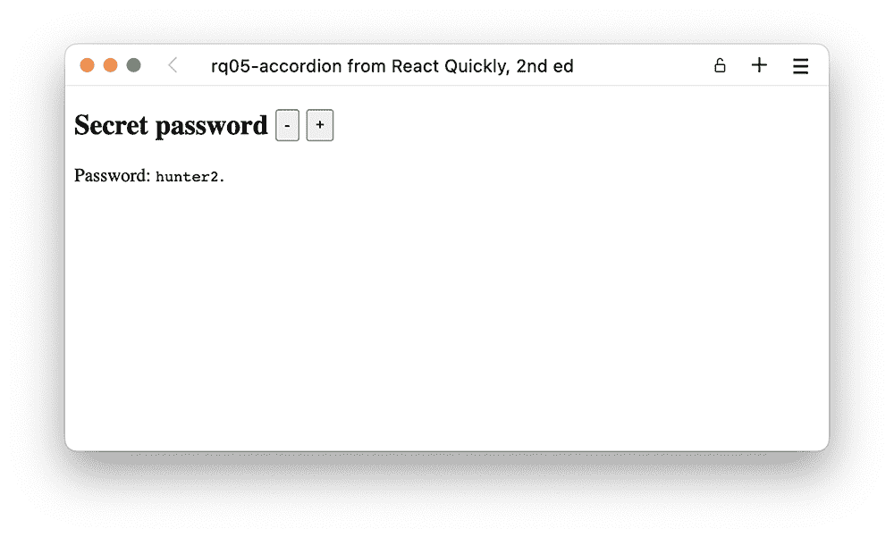

图 5.20 点击加号按钮后，隐藏的折叠面板内容被揭示。

使用更新函数进行设置

您可以将值设置为直接值，就像我们刚才所做的那样，或者使用一个返回新值的更新函数。如果您使用更新函数，它将作为参数传递当前状态。

我们已经看到了使用更新函数的一个例子：

```
const [counter, setCounter] = useState(0); 
...
<button onClick={() => setCounter((value) => value + 1)}>
```

通过使用一个简单的增量函数来更新状态值，该函数接受一个参数并返回参数+1。

设置为函数

要将状态值设置为函数，我们必须使用与初始值相同的解决方案。我们需要一个返回我们的操作函数的函数。

因此，如果我们扩展之前带有更改操作符按钮的计算器示例，我们就会实现一个完整的应用程序。让我们首先看看图 5.21 中的状态流程图，然后看看列表 5.4 中的实现。

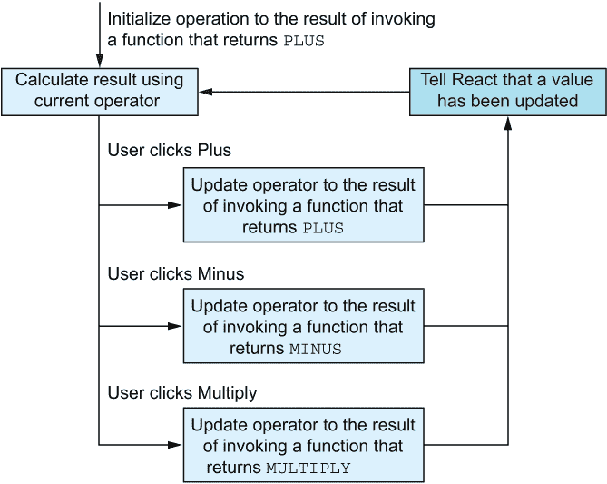

图 5.21 扩展的计算器示例现在有三个按钮来更改操作符。

列表 5.4 简单计算器

```
import { useState } from "react";
const PLUS = (a, b) => a + b;
const MINUS = (a, b) => a - b;
const MULTIPLY = (a, b) => a * b;
function Calculator({ a, b }) {
  const [operator, setOperator] = useState(() => PLUS);    ❶
  return (
    <main>
      <h1>Calculator</h1>
      <button
        onClick={() => setOperator(() => PLUS)}            ❷
      >
        Plus
      </button>
      <button
        onClick={() => setOperator(() => MINUS)}           ❷
      >
        Minus
      </button>
      <button
        onClick={() => setOperator(() => MULTIPLY)}        ❷
      >
        Multiply
      </button>
      <p>
        Result of applying operator to {a} and {b}:        ❸
        <code> {operator(a, b)}</code>
      </p>
    </main>
  );
}
function App() {
  return <Calculator a={7} b={4} />;
}
export default App;
```

❶ 使用返回默认操作符函数的函数初始化状态

❷ 使用返回被点击操作函数的函数更新状态

❸ 我们现在可以调用状态值作为函数，因为我们已经确保它始终是一个函数。

仓库：rq05-calculator

这个例子可以在 rq05-calculator 仓库中看到。您可以通过创建一个基于相关模板的新应用程序来使用该仓库：

```
$ npx create-react-app rq05-calculator --template rq05-calculator
```

或者，您可以访问这个网站浏览代码，直接在浏览器中查看应用程序的实际效果，或者下载源代码的 zip 文件：

[`rq2e.com/rq05-calculator`](https://rq2e.com/rq05-calculator)

在图 5.22 中查看这个花哨（但有点简单）的计算器在实际操作中的效果。

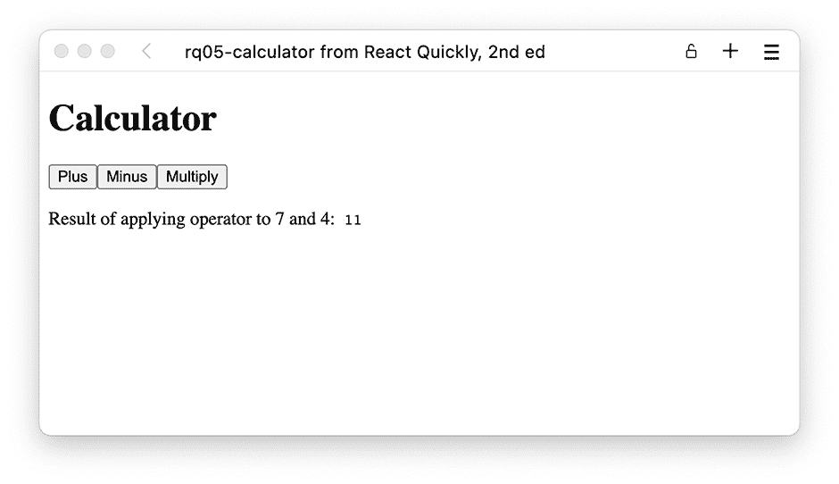

图 5.22 我们的计算器默认操作符为 PLUS。实际上，我们没有在任何地方显示操作符是什么，我们只是显示应用该操作符到两个操作数上的计算结果。

设置和渲染

如果我们在计算器中持续点击加号按钮会发生什么？组件每次都会重新渲染并执行计算吗？我们每次都将状态设置为完全相同的值，那么为什么应该这样呢？

实际上，组件不会重新渲染。React 包含内置优化，所以 useState 会等待当前周期的结束来更新组件。它会检查值是否实际改变，然后只有当值改变时才重新渲染组件。正因为如此，可能会出现调用状态设置函数但没有重新渲染的情况（因为实际上没有必要重新渲染，因为没有变化）。

让我们扩展之前创建的计数器，并添加一个重置按钮，该按钮将计数器重置为 0。现在状态流程图看起来像图 5.23。

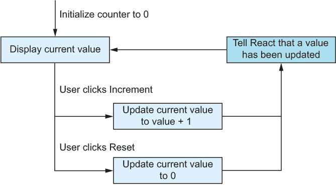

图 5.23 新的重置按钮将计数器设置为 0，无论旧值是多少。

如果我们实现这个功能，我们会得到以下列表。您可以在图 5.24 中看到这个新的可重置计数器。

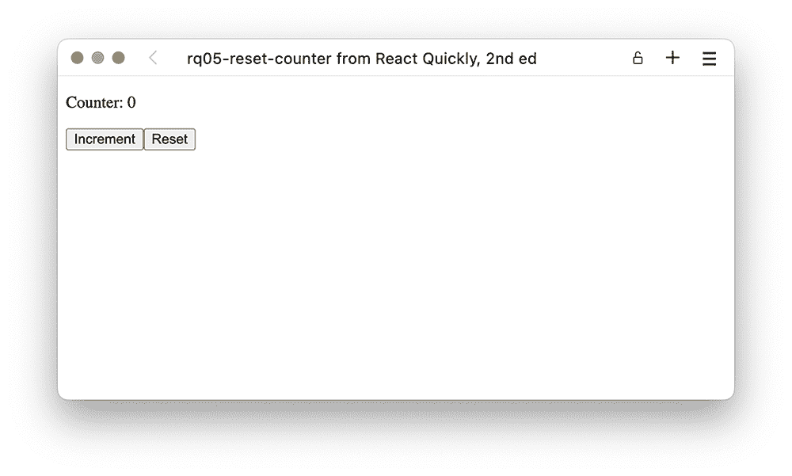

图 5.24 我们刚刚将计数器重置为 0 的可重置计数器

列表 5.5 可重置计数器

```
import { useState } from "react";
function Counter() {
  const [counter, setCounter] = useState(0);
  return (
    <main>
      <p>Counter: {counter}</p>
      <button onClick={() => setCounter((val) => val + 1)}>
        Increment
      </button>
      <button onClick={() => setCounter(0)}>    ❶
        Reset
      </button>
    </main>
  );
}
function App() {
  return <Counter />;
}
export default App;
```

❶ 当您点击重置时，计数器被设置为 0。

存储库：rq05-reset-counter

此示例可在 rq05-reset-counter 存储库中看到。您可以通过创建基于相关模板的新应用程序来使用该存储库：

```
$ npx create-react-app rq05-reset-counter --template rq05-reset-counter
```

或者，您也可以访问这个网站来浏览代码，直接在浏览器中查看应用的实际效果，或者下载源代码的 zip 文件：

[`rq2e.com/rq05-reset-counter`](https://rq2e.com/rq05-reset-counter)

点击重置会将值重置为 0。如果我们再次点击按钮，则不会发生任何操作。但你怎么知道组件是否重新渲染了呢？答案是 Chrome、Firefox 和现代版本的 Edge 都可用的一个非常有用的插件，称为*React 开发者工具*。您可以从它们各自的商店下载：

+   Chrome 和 Edge: [`mng.bz/wvoq`](http://mng.bz/wvoq)

+   Firefox: [`mng.bz/qrYw`](http://mng.bz/qrYw)

使用此插件，我们能够看到任何组件何时渲染。React 开发者工具的说明如图 5.25 所示。

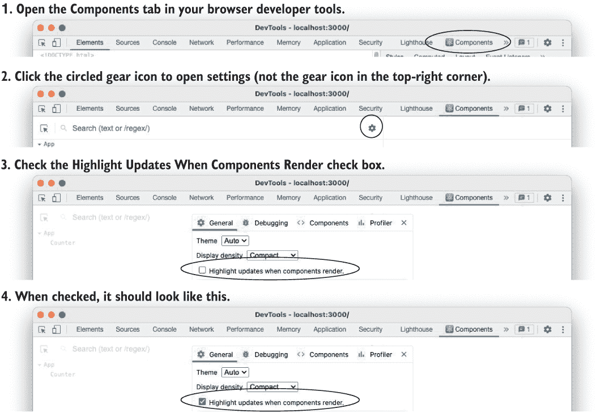

图 5.25 打开 React 开发者工具的组件面板，打开齿轮菜单，并选择“组件渲染时突出显示更新”复选框。

完成后，回到可重置计数器应用程序并点击增加计数器，您会看到每次计数器增加时，整个组件周围都会出现一个蓝色轮廓，并短暂闪烁。它应该看起来像图 5.26。

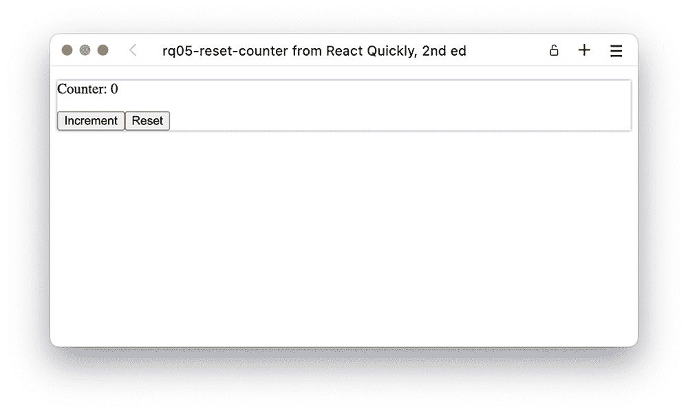

图 5.26 整个组件周围的蓝色轮廓表明它刚刚因为状态改变而重新渲染。

如果计数器不在 0 时点击重置按钮，您会看到蓝色轮廓闪烁，因为组件会重新渲染。但如果你在计数器已经是 0 时点击重置按钮，就不会出现蓝色轮廓。React 足够智能，知道如果状态没有改变，组件输出（或至少应该是）没有改变。

状态必须设置为新的值

这个重新渲染的条件还意味着，如果您将状态值设置为它已经是的对象，即使您在内部改变了对象，也不会发生任何事情，因为没有重新渲染。例如，如果您在状态中有一个数组。如果您就地操作数组并将其作为状态值再次设置，组件不会渲染，因为没有任何变化（至少从引用相等的角度来看）。

让我们看看这个实际效果，并讨论我们如何修复它。为此，我们将构建一个简单的待办事项应用程序。我们有一个可以勾选的项列表，当我们勾选一个项时，我们将其从数组中删除，然后再次渲染列表。

做这件事的错误方式是每次都将状态设置为相同的数组。我们编辑数组后再将其设置为状态值无关紧要，因为 React 不会查看我们的状态值内部，它只看引用。这种错误方法在图 5.27 中概述。

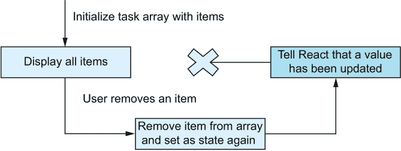

图 5.27 错误地使用数组作为状态值的方式是每次都将状态设置为相同的数组。这里的问题是 React 实际上看不到任何变化，它不会导致我们的组件重新渲染。

虽然我们现在明白这是错误的，但让我们还是尝试实现它，这样我们也可以看到它实际上不起作用。

列表 5.6 一个损坏的待办事项列表应用程序

```
import { useState } from "react";
function TodoApplication({ initialList }) {
  const [todos, setTodos] = useState(initialList);
  return (
    <main>
      {todos.map((todo, index) => (
        <p key={todo}>
          {todo}
          <button
            onClick={() => {
              todos.splice(index, 1);    ❶
              setTodos(todos);           ❷
            }}
          >
            x
          </button>
        </p>
      ))}
    </main>
  );
}
function App() {
  const items = [
    "Feed the plants",
    "Water the dishes",
    "Clean the cat"
  ];
  return <TodoApplication initialList={items} />;
}
export default App;
```

❶ 修改数组的内容

❷ 更新状态为它已经拥有的相同值（尽管我们改变了它，对吧？）

存储库：rq05-bad-todo

此示例可在 rq05-bad-todo 存储库中看到。您可以通过创建基于相关模板的新应用程序来使用该存储库：

```
$ npx create-react-app rq05-bad-todo --template rq05-bad-todo
```

或者，您可以访问此网站浏览代码，在浏览器中直接查看应用程序的实际应用，或下载源代码的 zip 文件：

[`rq2e.com/rq05-bad-todo`](https://rq2e.com/rq05-bad-todo)

让我们尝试一下，点击图 5.28 中显示的删除按钮。点击时没有任何反应。如果您尝试在 React 开发者工具插件中启用更新轮廓，您会看到组件实际上并没有重新渲染，因为状态值在引用上相同，即使它可能已经被“更新”。

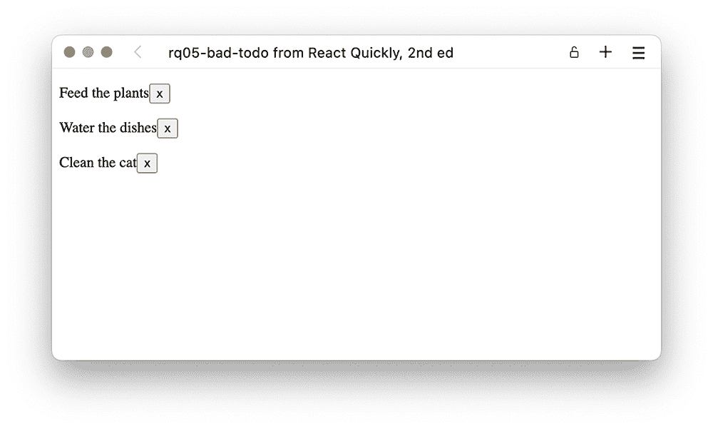

图 5.28 我们的功能待办事项应用程序看起来是正确的，但不起作用——点击按钮时没有任何反应。

因此，不仅建议您不要直接修改状态，这是绝对必要的。正确地做到这一点需要将状态值设置为一个新的数组，它是旧数组的副本，但不包含被删除的项。一种方法是在删除元素之前和之后对数组的一个切片使用扩展运算符。我们可以通过创建一个新的数组并将其设置为新的状态来修复模型，使其类似于图 5.29。这已在列表 5.7 中实现，它遵循该图。

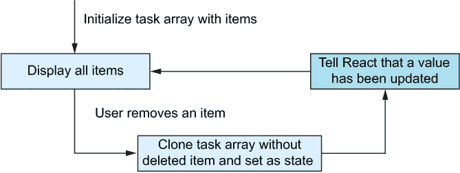

图 5.29 现在我们每次从数组中删除一个项目时，都会传递一个新的数组到设置函数。React 正确地识别出状态已更新，并将重新渲染组件。

列表 5.7 一个合适的待办事项列表应用程序

```
import { useState } from "react";
function TodoApplication({ initialList }) {
  const [todos, setTodos] = useState(initialList);
  return (
    <main>
      {todos.map((todo, index) => (
        <p key={todo}>
          {todo}
          <button
            onClick={() => {
              setTodos((value) => [         ❶
                ...value.slice(0, index),   ❶
                ...value.slice(index + 1),  ❶
              ]);
            }}
          >
            x
          </button>
        </p>
      ))}
    </main>
  );
}
function App() {
  const items = ["Feed the plants", "Water the dishes", "Clean the cat"];
  return <TodoApplication initialList={items} />;
}
export default App;
```

❶ 将状态设置为一个新的数组，这是两个东西的连接：从开始到删除元素之前的旧数组切片，加上从删除元素之后到结束的旧数组切片

仓库：rq05-proper-todo

这个例子可以在 rq05-proper-todo 仓库中看到。您可以通过创建基于相关模板的新应用程序来使用该仓库：

```
$ npx create-react-app rq05-proper-todo --template rq05-proper-todo
```

或者，您可以访问此网站浏览代码，直接在浏览器中查看应用程序的实际应用，或下载源代码的 zip 文件：

[`rq2e.com/rq05-proper-todo`](https://rq2e.com/rq05-proper-todo)

这看起来和以前一样，但现在我们实际上可以从列表中删除项目，如图 5.30 所示。

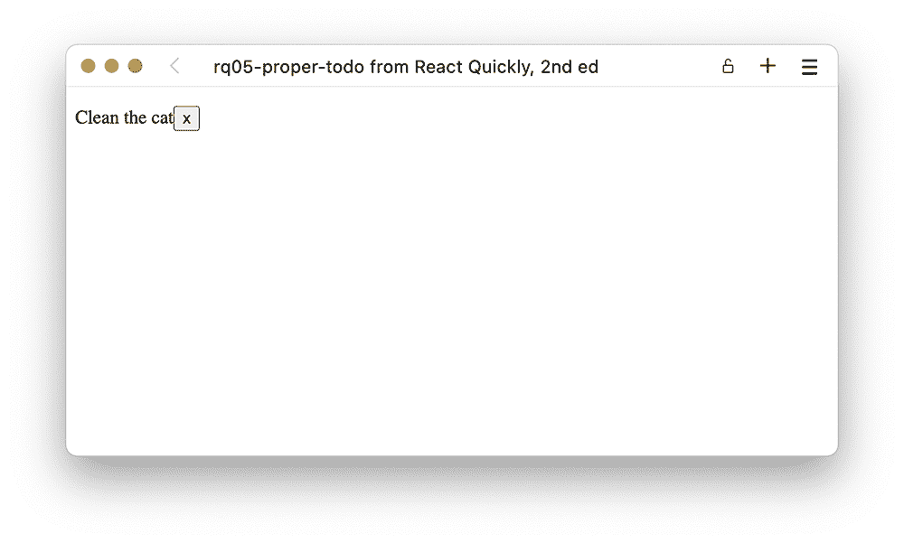

图 5.30 我们的功能性待办事项列表应用程序现在实际上按这里所示工作，因为我们已经完成了当天任务列表上的两个项目。现在，去洗个澡；这会变得很乱！

### 5.2.6 使用多个状态

我们已经暗示过几次，但只是为了确认——是的，您可以在同一个组件中拥有多个 useState 钩子，并且您通常会这样做。作为一个例子，让我们扩展我们的新待办事项列表应用程序。让我们在完成任务时停止从数组中删除项目，而是将它们标记为已完成。完成的项将以删除线的方式在列表中显示。除此之外，我们还会在顶部添加一个新的过滤器，您可以选择是否要查看所有项目或仅查看未完成的项。

要过滤列表，我们需要记住是否应该过滤掉已完成的项。最完美的方法是为这个过滤器标志添加另一个状态值，如图 5.31 所示。实现方式在列表 5.8 中展示。

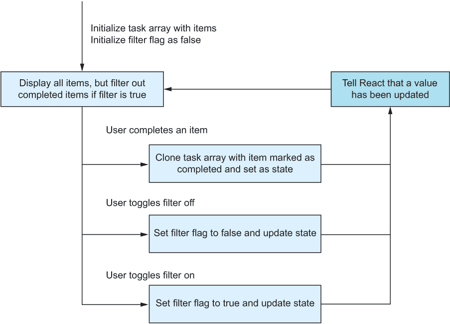

图 5.31 我们现在可以通过三种不同的方式更新状态。如果一个项目被标记为已完成，我们仍然需要记得创建一个新的数组，但将该项目标记为已完成。如果我们切换过滤器标志，我们只需设置相关的状态标志。

列表 5.8 带过滤器的待办事项应用程序

```
import { useState } from "react";
function markDone(list, index) {                          ❶
  return list.map(
    (item, i) => (i === index ? { ...item, done: true } : item)
  );
}
function TodoApplication({ initialList }) {
  const [todos, setTodos] = useState(initialList);        ❷
  const [hideDone, setHideDone] = useState(false);        ❸
  const filteredTodos = hideDone                          ❹
    ? todos.filter(({ done }) => !done)                   ❹
    : todos;                                              ❹
  return (
    <main>
      <div style={{ display: "flex" }}>
        <button onClick={() => setHideDone(false)}>       ❺
          Show all
        </button>
        <button onClick={() => setHideDone(true)}>        ❺
          Hide done
        </button>
      </div>
      {filteredTodos.map((todo, index) => (               ❻
        <p key={todo.task}>
          {todo.done ? (
            <strike>{todo.task}</strike>                  ❼
          ) : (
            <>
              {todo.task}
              <button
                onClick={() => setTodos((value) =>        ❽
                  markDone(value, todo.index)             ❽
                )}                                        ❽
              >
                x
              </button>
            </>
          )}
        </p>
      ))}
    </main>
  );
}
function App() {
  const items = [
    { task: "Feed the plants", done: false, index: 0 },   ❾
    { task: "Water the dishes", done: false, index: 1},   ❾
    { task: "Clean the cat", done: false, index: 2 },     ❾
  ];
  return <TodoApplication initialList={items} />;
}
export default App;
```

❶ 创建一个小的实用函数，该函数接受任务对象数组，并返回一个新数组，其中包含相同的对象，但其中一个对象将被标记为完成，如第二个参数所示

❷ 仍然使用 useState 钩子初始化任务列表

❸ 但现在我们为新的过滤器标志创建了 useState 钩子的第二个实例，我们将其默认设置为 false。

❹ 使用过滤器标志可选地过滤要显示的任务列表

❺ 两个过滤器按钮调用带有 true 或 false 的过滤器设置函数。

❻ 现在我们必须记住使用新的（可选过滤的）列表。

❼ 如果任务已完成，则使用删除线渲染任务

❽ 如果未完成，则渲染一个按钮，该按钮将调用我们的实用函数并更新任务列表状态

❾ 将初始项目列表作为一个对象列表创建，每个对象都标记为尚未完成。请注意，我们需要记住每个项目的原始位置，因为过滤数组中的索引将与原始索引位置不同。

仓库：rq05-filter-todo

这个例子可以在 rq05-filter-todo 仓库中看到。您可以通过创建一个基于相关模板的新应用来使用该仓库：

```
$ npx create-react-app rq05-filter-todo --template rq05-filter-todo
```

或者，您也可以访问这个网站来浏览代码，直接在浏览器中查看应用程序的运行情况，或者下载源代码的 zip 文件：

[`rq2e.com/rq05-filter-todo`](https://rq2e.com/rq05-filter-todo)

让我们在图 5.32 中看看这个动作，并尝试使用各种按钮。

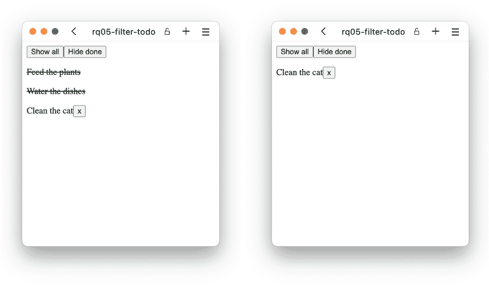

图 5.32 在完成两个简单项目后，我们可以决定是查看完整列表并享受 67%的完成进度，还是只查看剩余项目，因为单个令人畏惧的任务而感到有些不知所措。

当然，您在单个组件中不限于使用两个状态值。您可以使用尽可能多的状态值，但如果数量超过 10，可能会变得难以跟踪。我们建议在状态变得复杂时使用上下文提供者、reducer 或自定义钩子——或者三者都使用。我们将在第十章中回到这些更高级技术是如何工作的。

### 5.2.7 状态作用域

在我们之前创建的所有组件中，我们都在组件内部访问和更新状态，而不是在定义状态的组件外部访问或更新状态。但如果我们想要跨多个组件的状态呢？如果我们想在组件中访问值，但在另一个组件中更新它呢？我们在本章开头提到了这一点，当时我们讨论了整个应用程序组件树中状态组件的数量，但我们还没有实际做到这一点。

要实现这一点，我们可以使用属性传递状态值和状态设置函数到相关组件。状态流程图与之前相同；不同的是组件树。我们之前只有一个组件处理所有事情，现在我们将引入多个组件。TodoApplication 组件仍然是我们的状态组件，持有两个状态值。为了辅助这个组件，我们添加了一个 FilterButton 和一个 Task，分别负责渲染顶部的过滤器按钮和列表中的单个任务。图 5.33 展示了这个新的组件树以及所有属性。

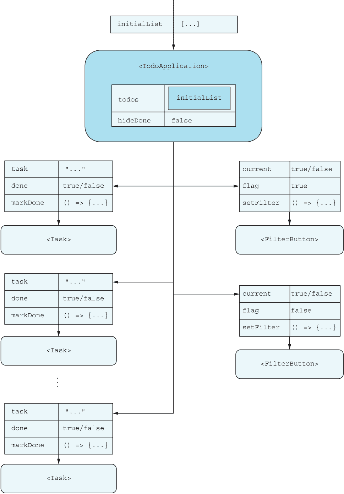

图 5.33 我们多组件待办事项应用程序的组件树。我们渲染了可变数量的 Task 实例，每个列表项一个，并且总是恰好两个过滤器按钮。

现在，让我们将这些内容整合到一个单独的应用程序中，如列表 5.9 所示，并且，趁此机会，让我们也用一些样式让它看起来更美观。

列表 5.9 高级多组件待办事项应用程序

```
import { useState } from "react";
function markDone(list, index) {
  return list.map(
    (item, i) => (i === index ? { ...item, done: true } : item)
  );
}
function FilterButton(
  { current, flag, setFilter, children }          ❶
) {
  const style = {
    border: "1px solid dimgray",
    background: current === flag ? "dimgray" : "transparent",
    color: current === flag ? "white" : "dimgray",
    padding: "4px 10px",
  };
  return (
    <button
      style={style}
      onClick={() => setFilter(flag)}             ❷
    >
      {children}
    </button>
  );
}
function Task({ task, done, markDone }) {         ❸
  const paragraphStyle = {
    color: done ? "gray" : "black",
    borderLeft: "2px solid",
  };
  const buttonStyle = {
    border: "none",
    background: "transparent",
    display: "inline",
    color: "inherit",
  };
  return (
    <p style={paragraphStyle}>
      <button
        style={buttonStyle}
        onClick={done ? null : markDone}          ❹
      >
        {done ? "✓ " : "◯ "}
      </button>
      {task}
    </p>
  );
}
function TodoApplication({ initialList }) {
  const [todos, setTodos] = useState(initialList);
  const [hideDone, setHideDone] = useState(false);
  const filteredTodos = hideDone
    ? todos.filter(({ done }) => !done)
    : todos;
  return (
    <main>
      <div style={{ display: "flex" }}>
        <FilterButton                             ❺
          current={hideDone}                      ❺
          flag={false}                            ❺
          setFilter={setHideDone}                 ❺
        >                                         ❺
          Show all                                ❺
        </FilterButton>                           ❺
        <FilterButton                             ❺
          current={hideDone}                      ❺
          flag={true}                             ❺
          setFilter={setHideDone}                 ❺
        >                                         ❺
          Hide done                               ❺
        </FilterButton>                           ❺
      </div>
      {filteredTodos.map((todo, index) => (       ❻
        <Task
          key={todo.task}
          task={todo.task}
          done={todo.done}
          markDone={() => setTodos((value) =>     ❼
            markDone(value, todo.index)           ❼
          )}                                      ❼
        />
      ))}
    </main>
  );
}
function App() {
  const items = [
    { task: "Feed the plants", done: false, index: 0 },
    { task: "Water the dishes", done: false, index: 1 },
    { task: "Clean the cat", done: false, index: 2 },
  ];
  return <TodoApplication initialList={items} />;
}
export default App;
```

❶ FilterButton 接受四个属性，并根据这些属性渲染一个漂亮的按钮。

❷ 特别是，按钮上的 onClick 属性会调用传递的设置函数，并传入传递的值。

❸ 同样，Task 组件接受多个属性，包括一个回调函数。

❹ 这次，我们只是在点击按钮时调用传递的回调，因为如果项目尚未完成，它就会执行所需的工作。

❺ 最终组件中的两个过滤器按钮具有几乎相同的属性

❻ 对于每个任务项，创建一个 Task 组件实例

❼ 将 markDone 设置为与之前相同的更新函数。

仓库：rq05-nice-todo

这个例子可以在仓库 rq05-nice-todo 中看到。你可以通过创建一个基于相关模板的新应用程序来使用该仓库：

```
$ npx create-react-app rq05-nice-todo --template rq05-nice-todo
```

或者，你可以访问这个网站来浏览代码，直接在浏览器中查看应用程序的运行情况，或者下载源代码的 zip 文件：

[`rq2e.com/rq05-nice-todo`](https://rq2e.com/rq05-nice-todo)

And there we have it—our first complete, useful, and well-architected application in React! It looks just like before, except it looks a lot nicer, as you can see in figure 5.34.

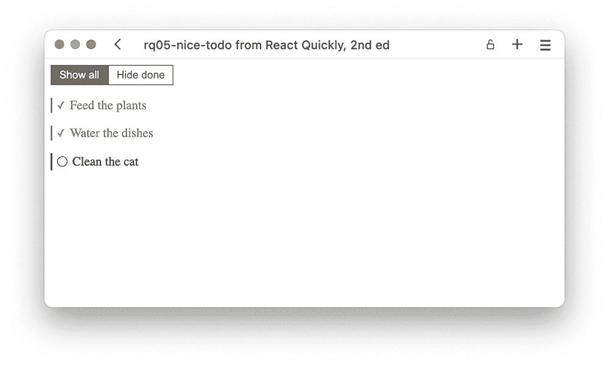

图 5.34 我们完全开发的待办事项应用程序，甚至拥有可爱的 UI！目前，过滤器设置为显示所有，但如果我们将它切换到隐藏完成，则只会显示最后一个条目——就像之前一样。

这个应用程序中使用的思想是任何应用程序的动力源泉。我们在一个级别存储状态，并在适用的情况下将其传递到其他组件，以渲染我们所需的结果。在我们的最新待办事项应用程序中，状态存储在 TodoApplication 组件中，而不仅仅是在每个子组件内部。

如果我们要添加另一个组件到这个列表中，它位于任务列表旁边，但需要访问与任务列表相同的州值，我们就需要将状态从 TodoApplication 组件提升到 App 组件，然后将值和设置器传递到 TodoApplication 组件。所有这些传递状态值和设置器的工作可能会变得有些复杂，但我们将看到如何在第十章中使用 React Context 以更好的方式解决这个问题。

## 5.3 具有状态的类组件

到目前为止，我们已经介绍了如何向函数组件添加组件状态。但具有状态的组件在 hooks 出现之前就已经存在了。事实上，状态是内置到基于类组件功能中的主要特性。

在类组件中，状态的工作方式与图 5.5 中显示的相同四个步骤相同：

1.  初始化状态。

1.  显示当前值。

1.  更新状态。

1.  通知 React 状态已更新。

我们已经看到了很多如何在函数组件中执行这四个步骤的例子。现在让我们看看如何在基于类组件中执行相同的操作。API 是相似的，但语法略有不同，行为也略有差异。基本概念是相同的。

一个（部分）计数组件的代码如下所示：

```
class Counter extends Component {
  state = { counter: 0 }
  render() {
    return (
      ...
      <p>Clicks: {this.state.counter}</p>
      <button onClick={() =>
        this.setState({ counter: this.state.counter + 1 })
      ...
    );
  }
}
```

现在，请查看图 5.35，快速了解不同部分如何与状态循环的不同位相关联。与我们在函数组件中一样作为局部变量存储值不同，我们在名为 this.state 的类成员上存储状态值。

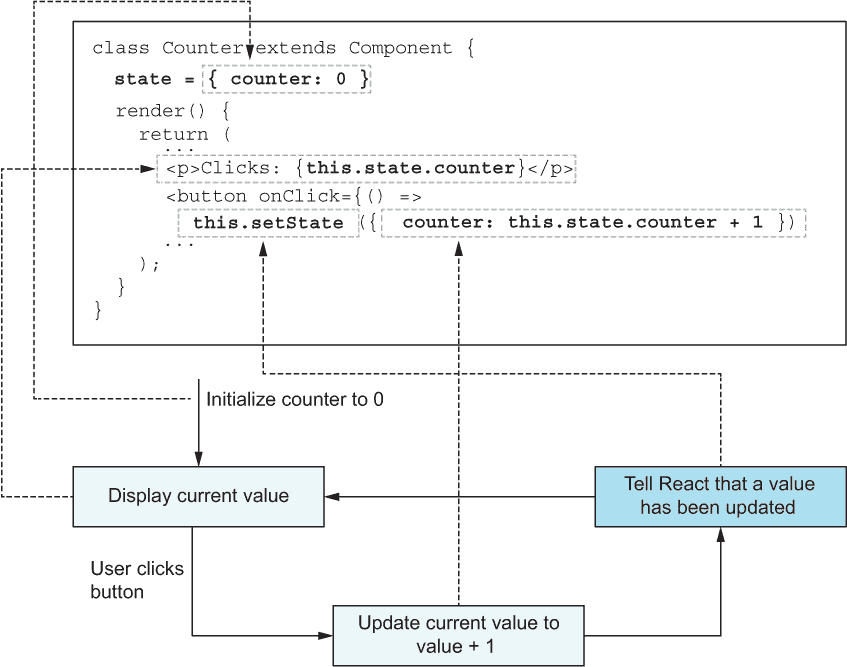

图 5.35 添加代码后的点击计数器数据流程图。虚线箭头将流程图中的状态连接到负责该特定操作的相应代码部分。

在本节中，我们首先介绍如何将状态添加到基于类的组件与添加到函数组件类似，但语法略有不同；然后，我们将讨论由于行为上的三个较大变化，这也有根本性的不同；最后，我们将简要介绍如何将具有状态的类组件转换为函数组件。请注意，我们本节不会提供完整的示例，只是解释差异。

### 5.3.1 与 useState 钩子的相似之处

我们在函数组件中迄今为止所做的一切也可以在基于类组件中完成。初始化、更新和显示状态是游戏的名字，我们可以用略有不同的语法来做这件事。参见表 5.1，了解语法差异的概述。

表 5.1 函数组件和类组件中的状态

| 函数组件 | 类组件 |
| --- | --- |

|

```
const [counter, setCounter] =
  useState(0);
```

如果状态是从静态值初始化的，则情况就是这样。|

```
state = {
  counter: 0,
}
```

当我们在这里将状态初始化为静态值时，我们可以使用类成员。|

|

```
const [counter, setCounter] =
  useState(initialValue);
```

如果状态是从属性初始化为动态值，则情况就是这样。|

```
constructor(props) {
  this.state = {
    counter:
      props.initialValue,
  };
}
```

在这里，我们必须在构造函数中访问属性，并使用 this.state 初始化状态。|

|

```
<p>
  Counter: {counter}
</p>
```

|

```
<p>
  Counter: {this.state.counter}
</p>
```

|

|

```
onClick={() =>
  setCounter(0)
}
```

如果我们将状态设置为固定值，我们可以使用设置器的非函数版本。|

```
onClick={() =>
  this.setState({ counter: 0 })
}
```

我们在这里做的是同样的事情，但我们需要将其变成一个对象。|

|

```
onClick={() =>
  setCounter(
    value => value + 1
  )
}
```

如果我们使用更新函数，我们只需使用旧值，并使用我们在状态中拥有的任何类型返回一个新的值。|

```
onClick={() =>
  this.setState(
    ({ counter }) =>
      ({ counter: counter + 1 })
  )
}
```

如果我们将状态设置为基于当前状态的动态值，我们可以使用设置器的函数更新版本，但我们必须基于旧状态对象返回一个对象。|

### 5.3.2 与 useState 钩子的区别

在基于类的组件中，状态的使用方式也存在差异。这些差异是显著的，并将影响你在基于类的组件中与函数组件相比如何使用状态。主要区别如下：

+   你只能有一个状态对象，它始终是一个对象。

+   组件*在更新时总是重新渲染，*即使没有任何变化。

+   更新状态时，对象会合并，因此*部分更新是可能的*。

我们将在以下小节中通过简短的示例来介绍这些区别。

只有一个状态对象

正如你在表 5.1 中看到的，基于类的组件状态位于状态对象内部。即使你只有一个值——例如，一个计数器——你也必须在该状态对象上创建它，更新它，并从状态对象中显示它。

优点是，从单个状态值移动到多个状态值非常平滑。你只需在状态对象中添加第二个属性，就可以继续进行。一旦你将状态引入基于类的组件，你就可以无任何问题地支持一个或多个状态值。

组件在状态更新时总是渲染

我们在 5.2.5 节中提到，useState 钩子只会导致组件重新渲染，如果状态实际上已经更新。如果你将状态值设置为 0，而它已经是 0，则不会更新组件。React 假设我们的组件是纯的，并且如果状态没有更新，组件将渲染相同的内容。

在过去，情况有所不同，当时一些应用程序实际上依赖于这一点。在基于类的组件中，你可以使用相同的值或甚至没有值调用 setState，React 将重新渲染你的组件。

状态对象是合并的

由于基于类的组件中的状态是一个可能包含数十个状态值的单个大对象，因此必须记住设置所有这些值会非常麻烦。

想象一下，你使用以下片段重置计数器：

```
this.setState({ counter: 0 });
```

如果你在这个相同的组件中有其他一些状态值，想象一下，这将重置或甚至删除所有这些其他状态值，因为你没有在传递给 setState 的对象中包含它们。这会很烦人。如果发生这种情况，你每次都必须这样做，将所有现有值复制到新对象中：

```
this.setState(
  oldState => ({ ...oldState, counter: 0 })
);
```

幸运的是，您不必这样做。React 会自动为基于类的组件执行此操作。当您将新对象（或返回对象的更新函数）传递给 setState 方法时，React 会自动将此新对象合并到现有状态对象上。它将执行与上一个代码片段中显示的完全相同的功能，因此您不必每次都记住这样做。

## 5.4 习题

1.  以下哪个应该存储在组件状态中？

    1.  动态应用程序数据

    1.  组件属性

    1.  常量值

1.  以下哪种是初始化函数组件中简单数值状态的正确方法？

    1.  const { value, setter } = useState(0);

    1.  const [ value, setter ] = useState(0);

    1.  const { value, setter } = useState({ value: 0 });

    1.  const [ value, setter ] = useState({ value: 0 });

1.  您在每个函数组件中只能有一个 useState 钩子。*正确*还是*错误*？

1.  当通过 useState setter 函数更新组件状态值时，组件总是会重新渲染。*正确*还是*错误*？

1.  以下哪个用于在基于类的组件中从状态中读取单个数值？

    1.  <p>值：{this.state}。</p>

    1.  <p>值：{this.counter}。</p>

    1.  <p>值：{this.state.counter}。</p>

## 习题答案

1.  您绝对应该在状态中存储动态应用程序数据，但永远不要存储属性（您已经在属性对象中有了它们），也不应该将不变的值存储在状态中。

1.  const [ value, setter ] = useState(0);. 您将初始值作为简单值提供给 useState，并将返回值解构为数组，而不是对象。

1.  *错误*。您可以在每个组件中拥有任意数量的 useState 钩子。

1.  *错误*。组件只有在传递给 setter 函数的新值与现有值不同时才会重新渲染。比较是通过引用相等性进行的，因此即使对象内部已更新，如果它仍然是同一个对象，则不会导致重新渲染。

1.  <p>值：{this.state.counter}。</p>。请记住，在基于类的组件中，状态始终是一个对象，而您的状态值是该对象的属性。

## 摘要

+   组件状态用于使您的应用程序交互式。如果您没有状态组件，您的应用程序开发将几乎无法取得任何进展。

+   您可以在基于类的组件和函数组件中都有状态。

+   函数组件中的状态是通过单独的 distinct 调用 useState 初始化的，每个状态值都有一个单独的 setter。

+   您可以通过提供静态值、动态值，甚至返回初始值的函数来初始化 useState 钩子的值。

+   您可以在任何时间更新 useState 钩子的值，但只能在回调或其他钩子中，而不能直接在组件定义中。

+   当更新 useState 钩子的值时，您可以直接提供新值，也可以提供基于旧值的返回新值的函数。

+   在类组件中，状态初始化为一个单一的对象，并使用 setState 方法进行更新。

+   将有状态的类组件转换为有状态的函数组件可能需要进行较大的重构，因为这两种方法有显著的不同。
