# 6 效果和 React 组件生命周期

本章涵盖

+   在组件内部运行效果

+   React 组件生命周期的完整指南

+   组件的挂载、卸载和渲染

+   介绍类组件的生命周期方法

React 组件使用 JavaScript XML (JSX)以 HTML 的形式向用户发送信息。但组件需要做更多的事情才能在应用程序中变得有用。在 React 中，所有发生的事情都发生在某个组件中，所以如果你的应用程序想要设置 cookie、加载数据、处理表单输入、显示用户的摄像头、启动或停止计时器，或者有无数其他动态功能，你需要的不仅仅是 JSX。

如果你希望你的组件从服务器加载数据，你希望效果在组件加载时立即运行，但即使组件重新渲染，也不需要效果再次运行。另一方面，如果你想在登录字段中设置最后输入的用户名作为 cookie，你希望该效果在用户每次输入输入字段时运行。如果你想在组件内显示计时器，你希望计时器在组件加载时开始滴答作响，但你也不想当组件稍后卸载时计时器仍在滴答，以避免不必要地占用资源。

你需要的是效果。*效果*是在组件的特定情况下运行的函数。要运行一个效果，你必须指定效果应在何种情况下运行。要完全理解这一点，我们必须深入研究 React 组件生命周期的主题。

我们将正确定义一些我们之前已经使用过但未充分解释的术语，例如挂载、卸载和重新渲染。后者尤为重要。组件何时以及为什么重新渲染，你如何挂钩到这个过程中来控制它或对其做出反应？

我们将在课堂上简要介绍生命周期方法如何在类组件中工作，以及它们与函数组件相比是什么。这两种组件类型之间的差异比我们之前看到的更为明显。与函数组件中效果的简单性相比，类组件的生命周期方法异常复杂且难以理解。考虑到所有这些内容，让我们开始吧！

注意：本章中示例的源代码可在[`rq2e.com/ch06`](https://rq2e.com/ch06)找到。但正如你在第二章中学到的，你可以使用单个命令直接从命令行实例化所有示例。

## 6.1 在组件中运行效果

假设你有一个计时器组件，并且你希望它显示已经挂载的秒数。首先想到的是在函数体内使用`setInterval`创建一个间隔，每秒增加一个计数器状态值。但是当你改变状态值时，整个组件会重新渲染，这会导致每秒重新渲染两次组件，然后每秒再启动两个间隔，使其每秒渲染四次，以此类推。这显然不是正确的方法。

另一个想法是使用`setTimeout`。在这种情况下，组件渲染 1 秒后，我们增加计数器状态值，这反过来又会导致重新渲染，启动一个新的超时。这似乎是一个合理的方案。但是，如果你的组件因为其他原因重新渲染怎么办？组件可以因为属性变化或因为它有多个可以独立于计数器变化的独立状态值而重新渲染。如果你的组件因为不再需要而卸载，超时将继续运行，并在一秒后尝试更新一个不再存在的组件。这显然也不是一个好的方法。

为了解决这个问题，React 引入了一个名为 `useEffect` 的 *effect* *hook*（注意所有 hooks 都使用了重要的 use* 前缀）。当依赖集中任何值发生变化时，useEffect hook 中的效果会被触发。此外，当 useEffect 中的效果运行时，它可以定义一个清理函数，该函数应在以下两种情况下运行：在效果再次触发之前或组件卸载时。图 6.1 展示了这种流程。

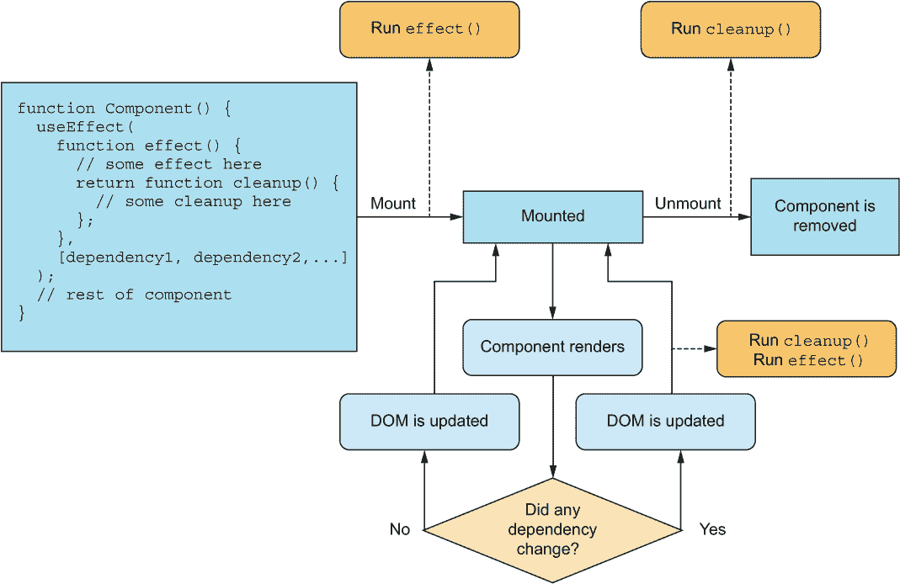

图 6.1 这里将 useEffect hook 以代码片段和流程图的形式展示。hook 包含一个可选的效果以及一个可选的清理函数。效果在挂载时运行，清理在卸载时运行——如果它们被定义的话。此外，如果效果有一个依赖数组，清理和效果也会在依赖数组中任何值引用改变时运行。

这个图表相当复杂，所以我们将一步一步地通过介绍一次只做几件事情的函数来带你了解它。这个图表的技巧在于你可以设置`useEffect`调用，以便在需要时只定义效果、只定义清理函数或两者都定义。此外，通过精心构建包含正确值的依赖数组，你可以触发效果和清理在精确期望的实例上运行。

你希望你的效果和清理函数在五种可能的情况下运行。我们将通过每个示例的例子来介绍所有五种情况：

+   你在一个组件中加载一些外部数据。为了在效果中正确地做到这一点，你需要它在组件挂载时运行。

+   你正在使用间隔创建一个计时器。为了实现这一点，你需要在组件挂载时运行这样的效果，但也要在组件稍后卸载时清理它。

+   您想跟踪对话框何时关闭，无论它是如何关闭的。为了正确地做到这一点，您需要在组件卸载时仅运行这样的效果。

+   您想更新浏览器窗口（或标签）的标题，以显示当前显示的页面的标题。为了在效果中实现这一点，您需要它在标题属性每次更改时运行，但只要标题保持不变，就不需要更改任何其他属性。

+   您想运行一个计时器，但只有当计时器处于活动状态，即由 isActive 标志表示时。为了实现这一点，您需要在 isActive 标志每次更改时运行这样的效果及其清理，但只要 isActive 标志保持不变，就不需要更改其他属性或值。

### 6.1.1 在挂载时运行效果

假设我们想要创建一个下拉组件，该组件从外部服务器加载数据以在下拉列表中显示。我们需要在组件挂载时加载数据作为运行效果，然后它就不再运行（因为我们已经有了数据）。在这种情况下，只有图 6.2 中突出显示的图部分是相关的。

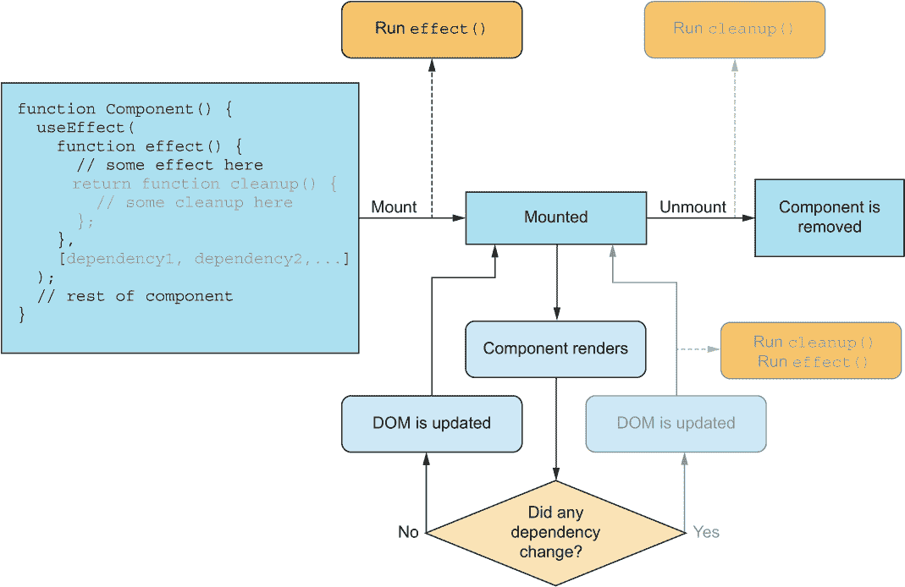

图 6.2 当效果只希望在组件挂载时运行时效果钩子的执行。注意依赖数组保持为空，并且没有清理函数。这意味着效果仅在挂载时执行，而不会在组件重新渲染时执行。

您可以在列表 6.1 中看到代码，在图 6.3 中看到结果。

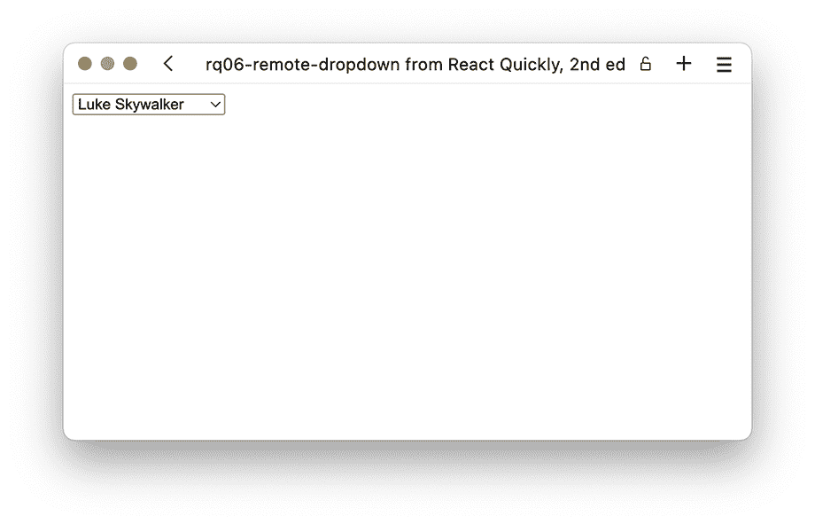

图 6.3 我们在行动中的星球大战角色下拉列表。愿源代码与你同在！

列表 6.1 从远程加载下拉选项

```
import { useState, useEffect } from "react";
function RemoteDropdown() {
  const [options, setOptions] = useState([]);     ❶
  useEffect(() => {
    fetch("/ /www.swapi.tech/api/people")         ❷
      .then((res) => res.json())
      .then((data) => data.results)
      .then((characters) => characters.map(({ name }) => name))
      .then((names) => setOptions(names));        ❸
  }, []);                                         ❹
  return (
    <select>
      {options.map((option) => (
        <option key={option}>{option}</option>
      ))}
    </select>
  );
}
function App() {
  return <RemoteDropdown />;
}
export default App;
```

❶ 我们需要一个状态来存储在选项被检索后保留的值。

❷ 在我们的效果钩子中，我们加载这个 URL（这是一个星球大战角色的列表）。

❸ 当结果被解析时，我们使用字符名称的数组设置我们的状态值。

❹ 最后，我们确保传递一个空的依赖数组，这样这个效果只在挂载时运行，而不会再次运行。

仓库：rq06-remote-dropdown

这个例子可以在 rq06-remote-dropdown 仓库中看到。您可以通过创建一个基于相关模板的新应用来使用该仓库：

```
$ npx create-react-app rq06-remote-dropdown --template rq06-remote-dropdown
```

或者，您可以访问此网站来浏览代码，直接在浏览器中查看应用程序的运行情况，或者下载源代码的 zip 文件：

[`rq2e.com/rq06-remote-dropdown`](https://rq2e.com/rq06-remote-dropdown)

这是一个相当经典的设置，您在加载只与整体应用程序的小部分相关的数据的 Web 应用程序中经常会看到。但是，它确实有一个小问题。如果由于某种原因，组件在服务器响应返回之前卸载了——可能是因为互联网连接不稳定或服务器负载很大——我们将不得不在清理函数中处理这个问题。下一节将介绍。

### 6.1.2 在挂载时运行效果并在卸载时清理

我们的任务是创建一个计时器组件。组件挂载后应立即启动一个间隔，随着时间的流逝不断递增；然而，如果组件在未来任何时候被卸载（例如，因为用户关闭它），我们必须确保停止间隔。这需要一个在挂载时运行但在卸载时也运行清理函数的效果。在这种情况下，只有图 6.4 中突出显示的图示部分是相关的。

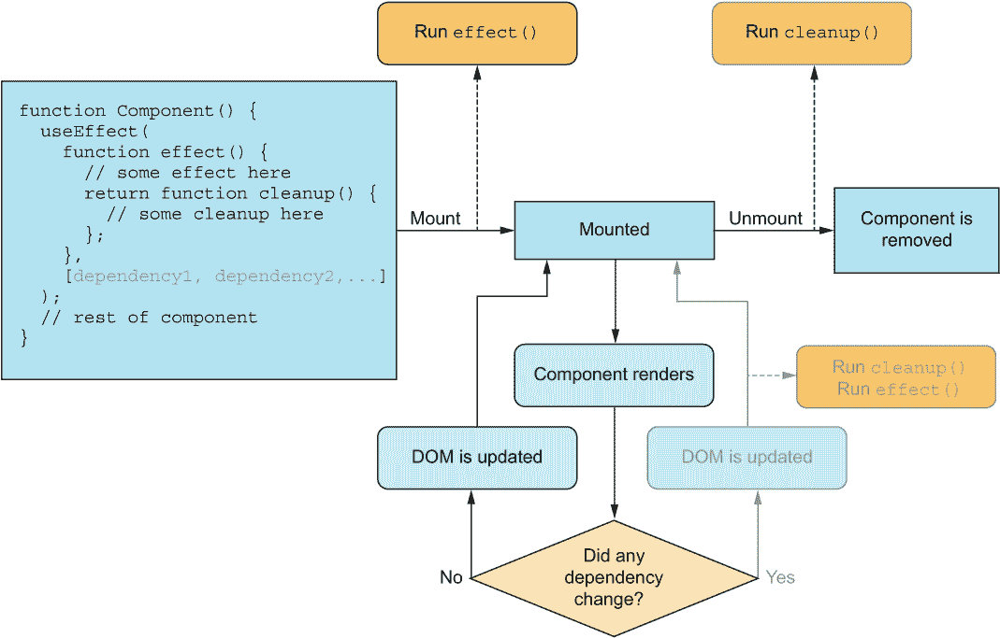

图 6.4 为了使效果钩子仅在挂载和卸载时分别激活效果和清理，您必须添加一个空依赖数组，以确保效果和清理永远不会仅仅因为组件重新渲染而运行。

您可以在以下列表中看到此类组件的代码。图 6.5 显示了组件的运行情况。

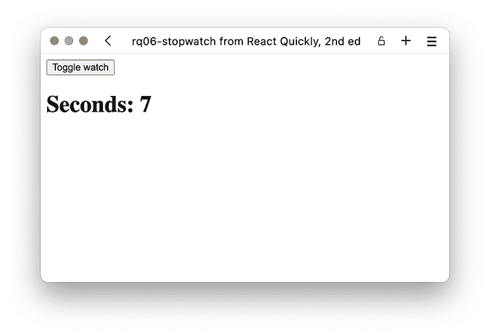

图 6.5 我们的计时器正在滴答作响。

列表 6.2 计时器

```
import { useState, useEffect } from "react";
function Stopwatch() {
  const [seconds, setSeconds] = useState(0);
  useEffect(() => {                                ❶
    const interval = setInterval(                  ❷
      () => setSeconds((seconds) => seconds + 1),
      1000
    );
    return () => clearInterval(interval);          ❸
  }, []);
  return <h1>Seconds: {seconds}</h1>;
}
function App() {
  const [showWatch, setShowWatch] = useState(false);
  return (
    <>
      <button onClick={() => setShowWatch((b) => !b)}>Toggle watch</button>
      {showWatch && <Stopwatch />}                 ❹
    </>
  );
}
export default App;

```

❶ 在我们的效果函数中，我们启动了一个每秒运行一次的间隔，用于递增计数器。

❷ 使用浏览器内置函数 setInterval，我们可以以稳定的速率调用递增函数。

❸ 在清理函数中使用内置函数 clearInterval 取消正在进行的间隔

❹ 条件渲染计时器以查看清理函数执行其工作

仓库：rq06-stopwatch

这个例子可以在 rq06-stopwatch 仓库中看到。您可以通过创建一个基于相关模板的新应用来使用该仓库：

```
$ npx create-react-app rq06-stopwatch --template rq06-stopwatch
```

或者，您可以访问此网站浏览代码，直接在浏览器中查看应用程序的运行情况，或下载源代码的 zip 文件：

[`rq2e.com/rq06-stopwatch`](https://rq2e.com/rq06-stopwatch)

尽管我们在效果内部使用了 setSeconds 变量，但我们没有将其列为依赖项，因为它是一个稳定的变量，不会改变。由 useState 钩子返回的状态更新函数在引用上始终是相同的函数。您可以将它包含在数组中，钩子的工作方式相同，所以如果您觉得这部分有点复杂难以记住，只需将函数包含在数组中即可。

事件

另一个仅用于挂载和卸载的效果的常见例子是监听事件。例如，您可能希望当整个网页大小调整（监听调整大小事件）或某个元素滚动（监听滚动事件）时，组件能够更新自己。我们将在第八章中看到许多此类示例，该章节专门讨论事件。

取消未挂载时的操作

挂载和卸载的第三种用例是前一小节中示例的扩展。我们的 RemoteDropdown 在挂载时加载数据，但如果数据传输缓慢，用户在响应到来之前就导航到了应用程序中带有下拉菜单的部分，会发生什么？我们将会尝试更新不再存在的组件的状态！

这可以通过两种方式之一来缓解：你可以在清理函数中取消请求（在 JavaScript 中通过 AbortController），或者你可以有一个局部标志来记住组件是否仍然挂载，并且只有当标志为 true 时才更新组件状态。如果不是，组件将忽略返回的响应。

在组件卸载时使用 AbortController 取消请求看起来是这样的：

```
useEffect(() => {
  const controller = new AbortController();    ❶
  fetch(url, { controller })                   ❷
    .then(data => {
      // handle the data
    });
  return () => {
    controller.abort();                        ❸
  };
}, []);
```

❶ 在效果函数内创建一个 abort 控制器

❷ 确保将 abort 控制器传递给 fetch 函数

❸ 在清理函数中，我们要求 abort 控制器执行其任务。如果请求已经通过，即使尝试取消也不会发生任何事情。

取消请求的前一种方法是更好的选择，因为我们可以直接取消请求；然而，这并不总是可能的。如果我们无法取消请求，我们可以如下跟踪组件是否仍然挂载：

```
useEffect(() => {
  let mounted = true;    ❶
  fetch(url)
    .then(data => {
      if (!mounted) {    ❷
        return;
      }
      // handle the data
    });
  return () => {
    mounted = false;     ❸
  };
}, []);
```

❶ 在我们的效果函数中保持一个局部变量，初始设置为 true，反映的是，就我们所知，组件目前处于挂载状态

❷ 数据到达后，我们首先检查组件是否仍然挂载。如果不是，现在就取消。

❸ 在清理函数中翻转布尔标志，这将仅在组件卸载时被调用

这种设置适用于任何类型在效果钩子中运行的延迟回调。这可能是一个解决的承诺，一个执行的超时，或者任何类似的东西。当组件卸载时，你在效果中设置一个局部变量为 false，然后确保在触发时仅取消回调。

### 6.1.3 在卸载时运行清理

想象我们正在开发一个大型应用程序，其中包含一个在需要向用户展示某种警报时显示的对话框组件。这个对话框可以通过多种方式关闭，包括点击角落的小 x，按键盘上的 escape 键，点击底部的 OK 按钮等。我们的任务是添加一个分析调用，当对话框关闭时。我们可以在对话框关闭的所有不同方式中手动添加这段代码，但我们知道我们可以在组件卸载时运行一个效果。在这种情况下，只有图 6.6 中突出显示的部分是相关的。

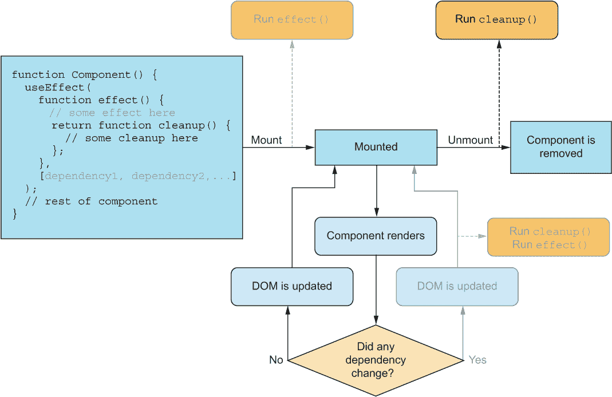

图 6.6 如果只有清理函数是相关的，就没有必要指定任何效果代码，只需从效果函数中返回一个函数。再次使用空的依赖数组，这段代码将永远不会因为组件重新渲染而运行。

我们可以在对话框中这样做：

```
function Dialog() {
  useEffect(
    () => () => trackEvent('dialog_dismissed'),   ❶
    [],
  );
  // rest of component goes here
};
```

❶ 双箭头符号是必需的，因为我们希望我们的效果函数在执行时返回一个函数。

注意，这只是一个部分示例，因为它假设我们的对话框是更大应用程序的一部分，具有更多的功能。

另一个例子，巧合的是它还涉及对话框管理。当您使用键盘通过 Tab 键导航到一个按钮并按 Enter 键打开对话框后，如果您稍后关闭对话框，您希望键盘焦点返回到那个*相同的按钮*，以便您可以从那里继续 Tab 键导航到用户界面中的其他按钮。当对话框打开时，我们希望键盘焦点移动到对话框内部，但一旦卸载，我们必须确保将键盘焦点重置到对话框打开之前的任何具有焦点的元素。这可以通过一个只有清理函数的 useEffect 钩子来完成。

您可能会注意到，前面的两个例子都有些牵强，或者至少非常具体于某些狭窄的使用案例。这是因为仅使用 useEffect 钩子的清理函数在卸载时进行清理的这种流程有些不寻常，在现实世界的组件中并不常见。

清理函数的一个更常见的用例是做它名字所暗示的事情：清理在卸载后留下某种功能性的 useEffect，以避免在应用程序中误用资源或产生内存泄漏。您在前面的小节中看到了一个例子，未来您还将看到更多这样的例子。

### 6.1.4 在某些渲染上运行效果

如果浏览器中的标签页标题在用户在我们博客中导航时更新，那岂不是很好？我们使用 React 创建了整个博客网站，并且有一个可以动态显示任何博客文章的组件。现在我们想在每次博客标题更改时在效果中更改文档标题，但如果任何其他属性更改则不需要运行。在这种情况下，只有图 6.7 中突出显示的图示部分是相关的。您可以在列表 6.3 中看到此组件。

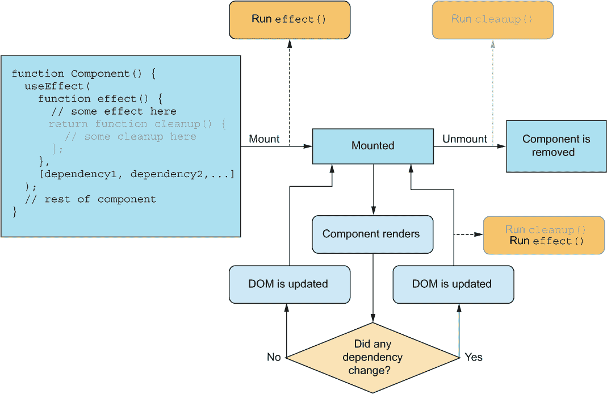

图 6.7 这次，我们将利用依赖数组。我们希望我们的效果在挂载时运行，但也每次某个属性更改时运行。然而，我们不想仅仅因为其他属性更改而运行，所以我们小心地只包括依赖数组中的相关变量。

列表 6.3 钩子中执行的效果

```
import { useEffect } from "react";
function BlogPost({ title, body }) {
  useEffect(() => {
    document.title = title;    ❶
  }, [title]);                 ❷
  return (
    <article>
      <h1>{title}</h1>
      {body}
    </article>
  );
}
function App() {
  return (
    <main>
      <BlogPost title="First post" body={
        <p>Welcome to my cool website.</p>
      } />
    </main>
  );
}
export default App;
```

❶ 我们在 useEffect 中的效果将文档标题设置为标题属性的值。

❷ 只在依赖数组中放置标题确保只有当帖子标题更新时，文档标题才会更新。

存储库：rq06-blog-title

此示例可在 rq06-blog-title 存储库中查看。您可以通过创建基于相关模板的新应用程序来使用该存储库：

```
$ npx create-react-app rq06-blog-title --template rq06-blog-title
```

或者，您可以访问这个网站浏览代码，直接在浏览器中查看应用程序的实际应用，或者下载源代码的 zip 文件：

[`rq2e.com/rq06-blog-title`](https://rq2e.com/rq06-blog-title)

这可能是 useEffect 旨在实现的最佳教科书示例，即执行组件的副作用。你不能通过 DOM 更新文档标题，所以它必须是一个副作用；为此，useEffect 是完美的解决方案。

从属性更新

另一个常见的用例是基于属性更新状态值。你可能还记得，在前一章中，如果我们将状态初始化为 useState 中的属性值，那么在组件首次渲染并挂载时，它只会设置为那个属性值。如果组件后来以新的属性值重新渲染，状态不会自动更新到那个值。

我们可以使用一个依赖于属性值的 effect 来修复这个问题，并根据它更新状态值。让我们构建一个非常简单的电子邮件输入组件，用户可以在其中输入他们的电子邮件地址。然而，我们将允许电子邮件地址通过属性从“外部”由父组件预先填充。

列表 6.4 从属性更新的状态

```
import { useEffect, useState } from "react";
function EmailInput({ value }) {
  const [email, setEmail] = useState("");                ❶
  useEffect(() => setEmail(value), [value]);             ❷
  return (
    <label>
      Email address:
      <input
        type="email"
        value={email}                                    ❸
        onChange={(evt) => setEmail(evt.target.value)}   ❹
      />
    </label>
  );
}
const EMAIL1 = "daffyduck@looneytunes.invalid";
const EMAIL2 = "bugsbunny@looneytunes.invalid";
const EMAIL3 = "elmerfudd@looneytunes.invalid";
function App() {
  const [defaultEmail, setDefaultEmail] = useState(EMAIL1);
  return (
    <main>
      <button onClick={() => setDefaultEmail(EMAIL1)}>Use {EMAIL1}</button>
      <br />
      <button onClick={() => setDefaultEmail(EMAIL2)}>Use {EMAIL2}</button>
      <br />
      <button onClick={() => setDefaultEmail(EMAIL3)}>Use {EMAIL3}</button>
      <br />
      <EmailInput value={defaultEmail} />
    </main>
  );
}
export default App;
```

❶ 我们创建了一个新的状态值，但并没有将其初始化为任何内容。

❷ 这是因为在每次属性值变化的渲染中，我们都会（重新）设置电子邮件状态值为属性值。我们记得添加一个依赖数组，它只包含值属性。

❸ 在这个组件中，我们以新的方式更新电子邮件输入字段（在第八章中进一步讨论）。

❹ 最后，我们每次输入更改时都会更新状态值。

存储库：rq06-email-input

这个例子可以在 rq06-email-input 存储库中看到。你可以通过创建一个基于相关模板的新应用程序来使用那个存储库：

```
$ npx create-react-app rq06-email-input --template rq06-email-input
```

或者，你可以访问这个网站来浏览代码，直接在你的浏览器中查看应用程序的运行情况，或者下载源代码的 zip 文件：

[`rq2e.com/rq06-email-input`](https://rq2e.com/rq06-email-input)

这里的用例可能有点难以理解，但在受控输入组件中，这是一个相当常见的模式。

### 6.1.5 在某些渲染上运行效果和清理

这次，我们不会创建一个向上计时的计时器，而是要创建一个倒计时组件——正如你所猜到的——它会倒计时。现在，这个倒计时可以被暂停和恢复。要做到这一点，我们仍然需要在 effect 中运行一个间隔，但每次倒计时被暂停和恢复时，我们需要停止和启动这个间隔。为此，我们需要创建一个具有依赖项的 effect（带有清理函数）。在这种情况下，图 6.8 中显示的图中的一切都是相关的。


图 6.8 在某些渲染中，效果钩子中的所有内容都与效果和清理相关。

倒计时组件是我们想要在卸载时运行清理的组件的例子。这个组件与之前提到的计时器组件不同，您可以在不卸载和重新挂载组件的情况下随时暂停、开始和停止时钟（这是停止之前计时器组件的唯一方法）。

倒计时组件将使用计数器的起始时间初始化，在这个例子中是 10。它还有一个重置按钮，可以在任何时间点将计数器重置到初始值。此外，还有一个暂停/继续按钮，可以切换计数器是否运行。最后，还有实际的每秒递减的倒计时，一旦达到 0 就会暂停计数器。为了确保我们不能在 0 时再次启动计数器，如果倒计时结束，暂停/继续按钮将被禁用。这听起来很复杂，但请参阅图 6.9 中此组件的状态流程图。

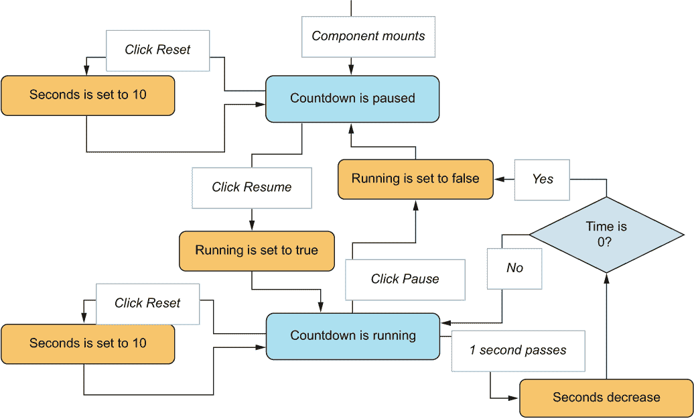

图 6.9 随着时间的推移和用户与组件交互，倒计时组件的状态流。特别注意点击重置不会停止或开始倒计时，只是让它继续运行或停止。此外，注意时间在时间耗尽时停止。

您可以在下一列表中看到这个实现的示例。结果如图 6.10 所示。

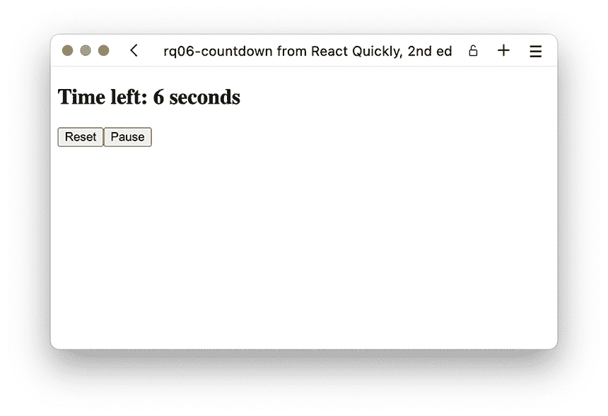

图 6.10 运行中的倒计时组件

列表 6.5 一个交互式倒计时

```
import { useEffect, useState } from "react";
function Countdown({ from }) {
  const [seconds, setSeconds] = useState(from);        ❶
  const [isRunning, setRunning] = useState(false);     ❷
  useEffect(() => {
    if (!isRunning) {                                  ❸
      return;
    }
    const interval = setInterval(
      () =>
        setSeconds((value) => {                        ❹
          if (value <= 1) {
            setRunning(false);                         ❺
          }
          return value - 1;                            ❻
        }),
      1000
    );
    return () => clearInterval(interval);              ❼
  }, [isRunning]);                                     ❽
  return (
    <section>
      <h2>Time left: {seconds} seconds</h2>
      <button onClick={() => setSeconds(from)}>        ❾
        Reset
      </button>
      <button
        onClick={() => setRunning((v) => !v)}          ❿
        disabled={seconds === 0}                       ❿
      >
        {isRunning ? "Pause" : "Resume"}               ⓫
      </button>
    </section>
  );
}
function App() {
  return <Countdown from={10} />;
}
export default App;
```

❶ 将秒数初始化为初始属性的值

❷ 将 isRunning 标志初始化为 false

❸ 在效果中，我们首先检查倒计时是否正在运行。如果没有，我们就会静默地终止（并且返回空值——没有要清理的内容）。

❹ 如果倒计时正在运行，我们定义一个间隔，每秒更新状态值。

❺ 当我们更新状态值时，我们检查值是否为 1（或更少）；如果是，我们确保停止倒计时。

❻ 返回计数器当前值减一

❼ 确保我们的效果返回一个完全取消间隔的清理函数

❽ 我们使我们的效果依赖于 isRunning 状态值的值。每当这个值发生变化时，我们的效果就会运行（并且在上一个效果运行之前清理上一个效果）。

❾ 在我们的组件 JSX 中，我们有一个重置计数器的按钮，而且只有这个按钮（它不会改变运行标志的值）。

❿ 另一个按钮会翻转运行标志的值，但不会改变计数器的值。然而，如果计数器为零，则此按钮将被禁用。

⓫ 我们根据运行标志的当前状态改变切换按钮上的文本。

仓库：rq06-countdown

此示例可以在 rq06-countdown 仓库中看到。您可以通过创建一个基于相关模板的新应用程序来使用该仓库：

```
$ npx create-react-app rq06-countdown --template rq06-countdown
```

或者，您可以访问此网站浏览代码，直接在浏览器中查看应用程序的运行情况，或下载源代码的 zip 文件：

[`rq2e.com/rq06-countdown`](https://rq2e.com/rq06-countdown)

这个组件中发生了很多事情，我们巧妙地组合使用了三个钩子来实现预期的目标。你可能注意到，当我们的计数器达到零时，我们并没有直接停止间隔。在列表 6.5 中，我们使用 setRunning(false)将运行标志切换为 false。这样做将迫使我们的组件重新渲染，因为 isRunning 被列为效果的依赖项。随着效果的重新运行，清理函数将停止间隔。因此，将 isRunning 标志设置为 false 将间接停止间隔，但这是通过钩子的魔法实现的。

这是一个相当高级的组件，所以如果你一开始不理解它，那也是正常的。我们强烈建议你下载前面应用的代码，并对其进行操作。尝试更改代码的部分，看看是什么让它运转，以及它是如何工作的。

### 6.1.6 同步运行效果

现在我们将讨论一个比我们通常讨论的更假设的情况。想象一下，我们正在创建一个包含大量文本的组件，我们想要计算总共有多少个字母，并显示这个数字。文本都是静态的，所以我们可以在创建组件之前手动计算所有字母，但我们要确保如果以后更改文本，组件可以自动更新计数。

创建这种效果的一种方法是为组件添加一个状态值，该值将包含字母计数，并将其初始化为零。然后，我们添加一个效果到组件中，该效果在组件渲染后运行，计算所有字母，并更新状态。当组件重新渲染时，它将显示正确的计数。这将结合效果钩子和状态钩子的数据流，如图 6.11 所示。

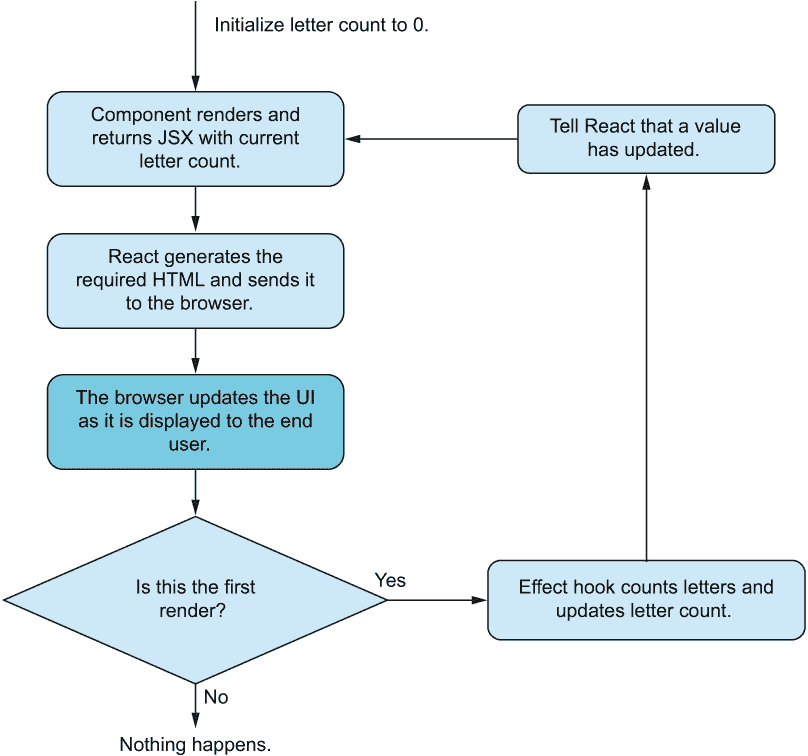

图 6.11 更新状态和运行效果时的状态流。这里的问题是较暗的框。当我们更新 UI 时，用户会在组件快速重新渲染并显示正确的字母数量之前，看到最初显示的 0。

如图 6.11 所示，描述和显示的流程问题在于浏览器在效果钩子运行之前就更新了 UI 并显示给用户。这意味着用户会在组件重新渲染并显示正确的字母数量之前，短暂地看到组件渲染了 0。

如果我们能够在 React 生成所需的 HTML 之后，但在浏览器更新 UI 并将其显示给用户之前运行一个效果会如何？嗯，惊喜，惊喜，我们确实可以做到这一点。我们可以运行一个 *布局效果钩子*，它比常规效果钩子做两件事不同。首先，它在浏览器更新 UI 之前运行，但——同样重要的是——它也随着 DOM 的生成而立即运行。如果 React 检测到来自布局效果的 state 更新，它将立即使用更新后的状态重新渲染组件。我们可以在图 6.12 中看到这一点。通过在这个特殊实例中将 useEffect 替换为 useLayoutEffect，我们可以避免错误内容的一闪而过。

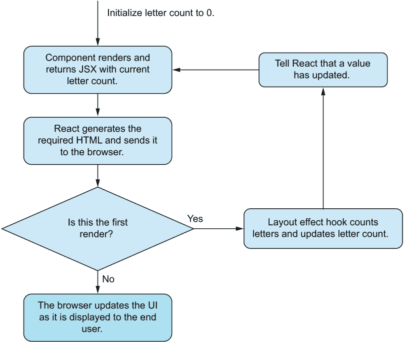

图 6.12 现在我们正在使用布局效果，它将在浏览器 UI 更新之前运行，并且新的状态将随着效果的更新立即渲染，这使得 UI 在第一次就正确无误。

请注意，useEffect 几乎适用于所有用例的正确钩子，而 useLayoutEffect 只在少数特殊情况下相关。始终首先尝试 useEffect，只有当它不符合你的目的时，才考虑 useLayoutEffect 可能是正确的选择。

布局效果的详细技术

useLayoutEffect 钩子是 useEffect 的一个变体。它在所有方面都与 useEffect 相同，除了它被调用的 *时机*。与 useEffect 类似，useLayoutEffect 钩子也接受一个函数和一个依赖数组作为参数。当任何依赖项发生变化时，上一个效果的清理函数（如果有的话）将被运行，然后为这个实例运行效果，同时捕获任何由效果产生的潜在返回的清理函数。

useEffect 和 useLayoutEffect 之间的区别有点技术性，但归结为时机。useLayoutEffect 在组件渲染到 DOM 中的同一执行周期内被 *同步调用*（但在浏览器有机会将 DOM 绘制到浏览器窗口之前）。另一方面，useEffect 在下一个执行周期中被异步调用，此时 DOM 已被绘制到窗口，所有 CSS 都已生效并被计算。这两个事件的时机在图 6.13 中显示。

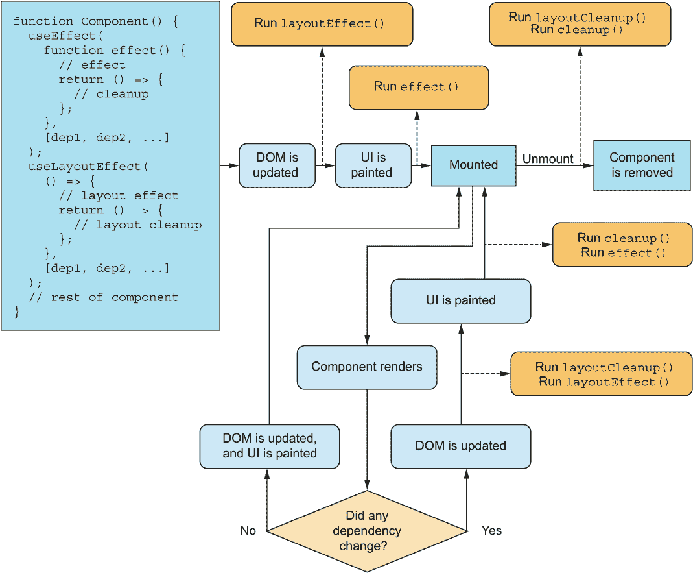

图 6.13 useLayoutEffect 与 useEffect 的时机。注意布局效果是在 DOM 更新后立即运行的，但在浏览器有机会使用 CSS 布局元素之前。（对于拥挤的图表表示歉意！）

如您在图 6.13 中所见，我们从前面的 useEffect 执行图中隐藏了一些细节。请注意，这里我们有一个 useEffect 和一个 useLayoutEffect，它们具有相同的依赖项。这些依赖项可以变化，这会使不同渲染的流程运行不同，因为一些只会运行布局效果和清理，其他会运行常规效果和清理，还有一些可能会运行两者。

布局效果在渲染后同步运行的一个后果是，如果效果复杂，屏幕不会更新直到效果完成。UI 在布局效果运行期间基本上被阻塞。因此，在编写布局效果时应该格外小心，以确保它们尽可能少地占用 CPU 周期。

如果你没有完全理解常规效果和布局效果之间的区别，你不必过于担心。在 99%的情况下，你应该使用 useEffect 钩子。只有在非常罕见的情况下，你需要在一个效果在绘制到窗口之前但组件已经渲染后更新 DOM 时，你才需要使用 useLayoutEffect 钩子。

## 6.2 理解渲染

在上一节中，我们讨论了组件多次重新渲染的情况。在本节中，我们将深入探讨一个组件（重新）渲染的技术细节。请注意，这在实际应用中并不直接有用，但它对于理解应用程序中发生的事情是非常重要的背景信息。

一个函数组件会因以下三个原因之一进行渲染：

+   组件刚刚被*挂载*（即，组件之前不在组件树中，现在在）。

+   父组件重新渲染了。

+   组件使用了有状态的钩子，并且已经更新了。

就这些了。如果前面的任何一项都没有发生，你的组件*不会*重新渲染，这是一个保证。如果这三个中的任何一个发生，你的组件*一定会*重新渲染。然而，React 可能会在发生多次这些情况后批量渲染，所以如果状态值发生变化并且父组件重新渲染，组件可能只重新渲染一次，或者可能重新渲染两次。这由 React 控制，并取决于微妙的时机细节。我们将给出所有这些场景的详细示例，讨论如何观察这些事情的发生，以及当它们发生时你可以做什么。

注意，我们讨论的是组件整体重新渲染。你可能在组件中拥有函数或回调，它们渲染输出的一部分，并且它们可以根据你的使用情况因无数原因而重新渲染。这尤其适用于你使用所谓的“渲染属性”，这些属性常用于较老的代码库和 React 上下文 API 的非钩子变体。你可能在现代和更复杂的代码库中仍然看到渲染属性，因为它们可以用于在通用组件中渲染部分内容。我们将在本节末尾讨论这个话题。

### 6.2.1 挂载时的渲染

假设我们有一个加载一些外部数据的组件。我们可以用我们之前提到的远程下拉列表作为例子。当它挂载时，它会从远程服务器加载数据并将其存储在组件中。当它卸载时，数据就会被遗忘。

组件在挂载时发生的渲染是最简单和最明显的。请注意，如果组件以*条件性*方式包含在父组件中，它将根据*该条件*挂载和卸载。这并不总是你想要的。

如果我们在父组件中条件性地渲染之前提到的 RemoteDropdown 组件，从而多次切换其开/关状态，我们将会多次加载外部数据并将其丢弃，浪费相同请求的时间和带宽。虽然网络缓存会在一定程度上有所帮助，但我们有两种方法可以减轻这种情况。我们可以将数据存储和数据获取移动到更高层次的组件，该组件始终包含在应用程序中，或者我们可以条件性地以不同的方式渲染组件。你有时会在日常组件中看到这种情况。通常，我们会以这种方式条件性地渲染一个组件：

```
return (
  <main>
    {hasDropdown && (<RemoteDropdown />)     ❶
  </main>
);
```

❶ 如果布尔值为真，我们挂载组件。如果后来设置为假，组件将被卸载。

我们可以这样做：

```
return (
  <main>
    <RemoteDropdown isVisible={hasDropdown} />    ❶
  </main>
);
```

❶ 我们始终挂载组件，并简单地切换一个作为属性的标志。

我们需要修改组件以使用此标志作为指示器，表示是否渲染任何内容：

```
function RemoteDropdown({ isVisible }) {
  const [options, setOptions] = useState([]);   ❶
  useEffect(() => {                             ❶
    // Loading happens here
  }, []);
  if (!isVisible) {                             ❷
    return null;
  }
  // Rest of component goes here
);
```

❶ 我们首先在组件中包含所有需要的钩子。

❷ 只有在所有钩子都被评估之后，我们才能检查是否需要渲染任何内容。

虽然这种条件渲染的方法通常不推荐（以及前一种方法），但在你不希望组件反复挂载和卸载，但希望始终将其保留在文档中，而只是偶尔实际渲染任何内容时，这可以是一个有用的工具。

### 6.2.2 在父组件渲染时渲染

这可能部分令人惊讶，但每个子组件在其父组件渲染时也会渲染。让我们创建一个简单的例子，一个图标在按钮内部：

```
function Icon() {                               ❶
  return 
);
function Button() {                             ❷
  const [enabled, setEnabled] = useState(false);
  const style = { border: `1px solid ${enabled ? "red" : "black"}`;
  return (
    <button style={style} onClick={() => setEnabled(b => !b)}>
      <Icon /> Toggle
    </button>
  );
}
```

❶ 图标组件非常简单：它从不改变也不根据任何内容更新。

❷ 按钮组件具有内部状态，并且每次状态改变时都会渲染。

如果我们在浏览器中测试这个功能，你认为会发生什么？每次我们点击按钮，启用标志都会翻转，按钮会重新渲染。但图标呢？它是否会再次渲染（即，函数名为 Icon 的函数是否会再次执行）？是的，它会。React 并不假设组件是“纯”的，它们可能不是。因此，每当父组件渲染时，React 都会渲染组件。如果组件有属性，React 会无论这些属性是否改变都渲染组件。

让我们想象一个不同的场景，其中我们正在积极利用这种行为。我们可以创建一个骰子投掷器，我们可以投掷三个骰子。你可以在列表 6.6 中看到代码，在图 6.14 中看到输出。

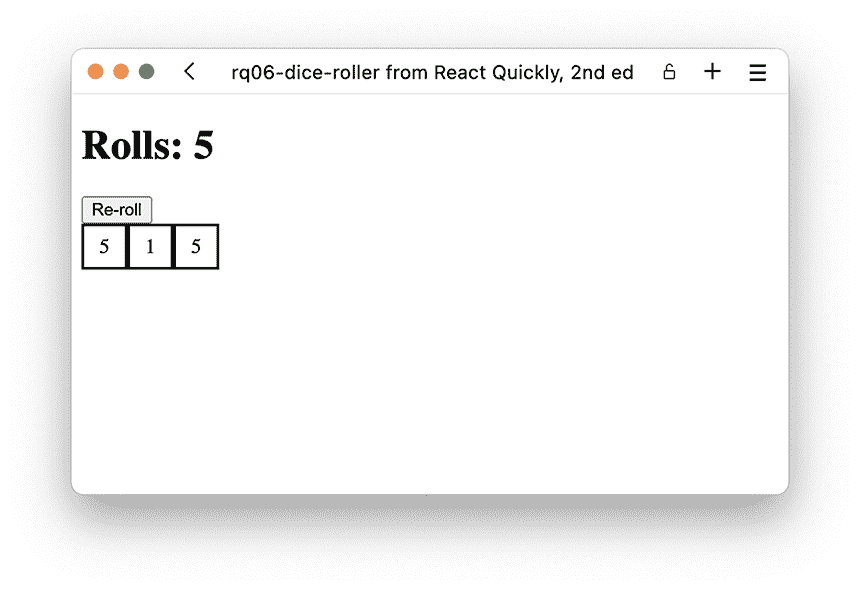

图 6.14 五次投掷后的骰子投掷器

列表 6.6 骰子投掷器

```
import { useState } from "react";
function Die() {
  const style = {
    border: "2px solid black",
    display: "inline-block",
    width: "2em",
    height: "2em",
    textAlign: "center",
    lineHeight: 2,
  };
  const value = Math.floor(6 * Math.random());           ❶
  return <span style={style}>{value}</span>;
}
function DiceRoller() {
  const [rolls, setRolls] = useState(1);                 ❷
  return (
    <main>
      <h1>Rolls: {rolls}</h1>
      <button onClick={() => setRolls((r) => r + 1)}>    ❸
        Re-roll
      </button>
      <div>
        <Die />                                          ❹
        <Die />                                          ❹
        <Die />                                          ❹
      </div>
    </main>
  );
}
function App() {
  return <DiceRoller />;
}
export default App;
```

❶ 尽管我们的骰子组件看起来是纯的，但实际上它有一个外部信息源（Math.random）并且在每次渲染时（可能）返回新的内容。

❷ 我们的 DiceRoller 组件是有状态的。

❸ 当我们点击按钮时，我们增加投掷次数，这会强制组件完全渲染，导致所有子组件渲染，并依次给我们新的骰子值。

❹ 同一个骰子组件的三个独立实例——每个实例都有自己的内部随机信息源

仓库：rq06-dice-roller

这个例子可以在 rq06-dice-roller 仓库中看到。你可以通过创建一个基于相关模板的新应用程序来使用该仓库：

```
$ npx create-react-app rq06-dice-roller --template rq06-dice-roller
```

或者，你可以访问这个网站浏览代码，直接在浏览器中查看应用程序的运行情况，或者下载源代码的 zip 文件：

[`rq2e.com/rq06-dice-roller`](https://rq2e.com/rq06-dice-roller)

在一般层面上，你应该始终将此类变量内容（例如，骰子点数的总和）放在组件状态中，而不是依赖它在每次渲染时神奇地更新，就像前面的例子那样。请不要在家这样做。这使得前面的例子成为一个糟糕的 React 设计模式。例如，我们无法在父组件中显示骰子总和，因为它不知道子组件的值。

一个更好的结构是父组件生成三个随机数并将它们作为属性传递给骰子。但为了演示目的，这确实突出了即使看似纯组件，当它们的父组件渲染时，它们也会进行渲染。

### 6.2.3 状态更新时的渲染

当你在有状态钩子（详见第七章有关有状态钩子的更多细节）内部更新状态时，使用该钩子的组件将会进行渲染。这就是更新状态的整个目的，因此这个流程非常明显，甚至可以说是期望的。

但如果你的状态包含经常更新的数据，你也会渲染得太频繁。你想要避免组件不断渲染，因为这可能会对浏览器非常 CPU 和/或内存密集，同时也会对用户造成困扰。

一个可能频繁更新的信息来源是鼠标位置。用户可以频繁地移动鼠标——每秒多次。如果你有多个组件在状态中存储鼠标位置，你将会有多个组件每秒渲染多次，这会减慢你的计算机速度。接下来，我们将查看两种不同配置的实例以及如何最小化状态更新时的渲染。

存储高级信息

想象一个组件，当光标在左侧时背景为黄色，当光标在右侧时背景为蓝色。假设组件宽度为 200 像素，因此如果光标距离左侧边缘超过 100 像素，光标就在右侧；否则，就在左侧。

实现这一点的第一种方法是将光标从左侧的偏移量保存到状态值中，并在每次渲染时检查显示哪种背景颜色：

```
function BlinkingBackground() {
  const [left, setLeft] = useState(0);               ❶
  const onMouseMove = (evt) =>                       ❷
    setLeft(evt.nativeEvent.offsetX);                ❷
  const style = {
    backgroundColor: left < 100 ? "blue" : "red",    ❸
  };
  return <div style={style} onMouseMove={onMouseMove} />;
}
```

❶ 状态保存鼠标位置。

❷ 记录鼠标在移动时的位置状态

❸ 每次组件渲染时确定使用哪种颜色

这种方法浪费了大量的渲染周期，因为当你只在组件的一侧移动鼠标时，它将因为每个位置而一次又一次地重新渲染。一个更聪明的做法是只在状态中存储光标是在左侧还是右侧，其他什么也不存储。这样，我们的组件只有在光标改变方向时才会渲染。

```
function BlinkingBackground() {
  const [isLeft, setLeft] = useState(true);         ❶
  const onMouseMove = (evt) =>                      ❷
    setLeft(evt.nativeEvent.offsetX < 100);         ❷
  const style = {
    backgroundColor: isLeft ? "blue" : "red"        ❸
  };
  return <div style={style} onMouseMove={onMouseMove} />;
}
```

❶ 状态只保存一个布尔标志。

❷ 记录鼠标在移动时的位置状态

❸ 每次组件渲染时确定使用哪种颜色

在这个例子中，我们利用了 React 只在实际状态值发生变化时才渲染组件的事实。我们调用 setter 函数的频率与上一个例子相同，但由于我们只存储一个布尔值，该值仅在鼠标光标移过组件中心时从 true 变为 false，因此大多数 setter 调用都被简单地忽略，因为它们不会改变组件状态。这个新例子导致数据流更加清晰，现在我们的组件只有在影响输出的某些事情发生时才会渲染。

直接操作 DOM 元素

在这个例子中，我们希望有一个组件能够始终与光标同步移动元素。看起来我们注定要失败。我们如何在组件中更新元素样式而不将其存储在组件状态中？

对于这种情况，我们可能想要考虑绕过 React 并直接更新 DOM。为此，我们需要一个指向相关元素的引用（这需要另一个钩子，即第七章中讨论的 useRef），然后在鼠标移动时，我们将直接更新元素的样式：

```
function PhantomCursor() {
  const element = useRef();              ❶
  const onMouseMove = (evt) => {
    element.current.style.left =         ❷
      `${evt.nativeEvent.offsetX}px`;    ❷
    element.current.style.top =          ❷
      `${evt.nativeEvent.offsetY}px`;    ❷
  }
  return (
    <div style={{ position: "relative" }} onMouseMove={onMouseMove}>
      
    </div>
  );
}
```

❶ 创建一个引用，该引用将指向我们的 DOM 元素

❷ 每当鼠标移动时，直接通过引用更新 DOM 元素

❸ 记得将 ref 放在我们想要操作的元素上。

这个组件永远不会重新渲染。它在挂载时渲染，然后只是保持在那里。鼠标事件会改变组件的外观，但这超出了 React 的控制。从 React 的角度来看，这是一个永远不会改变的静态组件。

这里的问题是我们如果需要在应用程序的其他地方使用鼠标位置——做一些数学运算、检查碰撞等——我们仍然必须将其存储在状态中。然而，如果可能的话，我们希望避免频繁更新状态。

### 6.2.4 函数内的渲染

一个组件不必直接在另一个组件内部渲染；它也可以在函数内部渲染，例如。如果是这种情况，组件将在函数每次运行时渲染。有时，这样的函数仅在父组件渲染时运行，所以结果是相同的；然而，你也可能有一个可以在其他时间运行的函数，导致渲染在不同时间发生。

想象一个按钮组件，允许父组件指定组件的图标。按钮是一个推按钮，因此它有两种状态：按下或未按下。有时你希望这两种状态下的图标不同。你可以让组件接受两个不同的属性来用于这两种状态，或者你可以接受一个函数，该函数将接收按钮的状态作为参数，然后返回适当的图标。

列表 6.7 带有图标函数的推按钮

```
import { useState } from "react";
function Icon({ type }) {                                       ❶
  return ;
}
function Button({ label, getIcon }) {
  const [pressed, setPressed] = useState(false);
  return (
    <button onClick={() => setPressed((p) => !p)}>
      {getIcon(pressed)}                                        ❷
      {label}
    </button>
  );
}
function LockButton() {
  const getIcon = (pressed) =>                                  ❸
    pressed ? <Icon type="lock" /> : <Icon type="unlock" />;    ❸
  return <Button label="Lock" getIcon={getIcon} />;
}
function App() {
  return <LockButton />;
}

```

❶ 一个通用图标组件嵌入从正确文件夹加载的图像。

❷ 我们的按钮在每次渲染时都会调用 getIcon 函数，并传递其当前状态。

❸ 定义 getIcon 以返回两个图标中的一个

仓库：rq06-push-button

这个例子可以在 rq06-push-button 仓库中看到。你可以通过创建一个基于相关模板的新应用程序来使用该仓库：

```
$ npx create-react-app rq06-push-button --template rq06-push-button
```

或者，你可以访问这个网站来浏览代码，在你的浏览器中直接查看应用程序的运行情况，或者下载源代码的 zip 文件：

[`rq2e.com/rq06-push-button`](https://rq2e.com/rq06-push-button)

在这种设置中，我们在函数内部渲染图标组件，而不是直接在我们的组件内部渲染。然而，这个函数仅在按钮组件直接渲染时调用，所以这就像我们直接在渲染中条件性地包含一个图标一样——我们只是通过函数来做这件事。然而，这确实改变了一些关于组件的已知事实，优化这部分源代码或甚至弄清楚到底发生了什么可能有点困难。

然而，我们也可以用一种更熟悉的方式达到相同的结果。再次看看那个 getIcon 函数。这是一个基于一些参数返回 JSX 的函数。这听起来熟悉吗？这正是函数组件所做的。因此，我们可以稍作修改，将 getIcon 函数变成一个自定义组件。

列表 6.8 带有图标组件的推按钮

```
import { useState } from "react";
function Icon({ type }) {
  return ;
}
function Button({ label, ButtonIcon }) {                 ❶
  const [pressed, setPressed] = useState(false);
  return (
    <button onClick={() => setPressed((p) => !p)}>
      <ButtonIcon pressed={pressed} />                   ❷
      {label}
    </button>
  );
}
function LockIcon({ pressed }) {                         ❸
  return pressed ? <Icon type="lock" /> : <Icon type="unlock" />;
}
function LockButton() {
  return <Button label="Lock" ButtonIcon={LockIcon} />;  ❹
}
function App() {
  return <LockButton />;
}
export default App;
```

❶ 按钮组件现在期望一个（大写）ButtonIcon 属性，而不是之前的 getIcon 函数。

❷ 因为它是一个我们期望的组件，所以我们可以直接在主体中将其渲染。

❸ getIcon 现在不仅是一个函数，而是一个完整的函数组件（通过接受属性而不是简单的参数）。

❹ 最后，我们只是将 LockIcon 作为一个属性提供，尽管我们之前没有这样做过，但这在法律上是允许的。

仓库：rq06-push-button2

这个例子可以在 rq06-push-button2 仓库中看到。你可以通过创建一个基于相关模板的新应用程序来使用该仓库：

```
$ npx create-react-app rq06-push-button2 --template rq06-push-button2
```

或者，你也可以访问这个网站来浏览代码，直接在你的浏览器中查看应用程序的运行情况，或者下载源代码的 zip 文件：

[`rq2e.com/rq06-push-button2`](https://rq2e.com/rq06-push-button2)

这效果很好——看起来干净多了！我们当然可以进一步优化这个例子（例如，通过将三元条件运算符移动到 LockIcon 组件内部更改的属性），但这超出了这个示例的范围。

提供渲染 JSX 的函数的概念被称为 *render props*，这在旧的 React 代码库中是一个相当常见的方法。然而，随着函数组件的出现，几乎所有这些情况都通过将参数转换为完整的组件来更好地解决，就像我们在这里所做的那样。这使得整个数据流更容易理解，并解决了函数（即，*不是* 函数组件）渲染 JSX 的 ~95% 的情况。

React Context

在函数中使用 JSX 渲染的剩余原因之一是如果你使用 React Context API 的非钩子版本与 MyContext.Consumer 组件。这个组件将一个函数作为子组件（本身就是一个令人震惊的概念）。但这是一个非常特殊的情况，你不太可能在现代使用函数组件的 React 代码库中遇到这种情况。如果确实发生了这种情况，你应该查看在线 React 文档以了解如何使用 React Context API。更好的做法是将组件转换为函数组件，并在可能的情况下使用 useContext 钩子（参见第七章和第十章以获取更多关于如何使用此钩子的详细信息）。

## 6.3 基于类的组件的生命周期

当基于类的组件挂载、渲染和卸载时，而不是使用钩子，你可以使用生命周期方法来响应组件生命周期的不同阶段。这些方法的命名是根据它们所做的工作以及它们在生命周期中的位置来命名的，因此在大多数情况下它们是相当直观的。

一些生命周期方法在多个事件中执行。其他生命周期方法允许你在拥有 React 没有的内部知识的情况下，干扰 React 的常规组件更新调度。React 以前有更多的生命周期方法，但由于它们的行为问题，它们在新版本的 React 中已被弃用。

你应该使用函数组件，但如果你遇到基于类的组件，并且想要将其重构为函数组件，有一些通用的提示可以帮助你完成这种转换。请注意，这并不是一门精确的科学，可能需要重写或完全重新思考功能。

### 6.3.1 生命周期方法

当组件挂载时，这些类方法会按顺序被调用：

1.  constructor()

1.  static getDerivedStateFromProps()

1.  render()

1.  componentDidMount()

当基于类的组件更新（由于之前提到的任何原因）时，以下方法会按顺序被调用：

1.  static getDerivedStateFromProps()

1.  shouldComponentUpdate()

1.  render()

1.  getSnapshotBeforeUpdate()

1.  componentDidUpdate()

实际上，这并不完全正确。shouldComponentUpdate() 在这里很特殊，如果你定义了它，并且返回 false，你可以停止渲染循环。这似乎是一个最小化渲染的好方法，但它可能非常棘手，如果使用不当，可能会导致组件与其实际的 DOM 表示形式不同步。当组件卸载时，将调用以下方法：componentDidUnmount()。

### 6.3.2 遗留的生命周期方法

之前存在许多生命周期方法，你可能在一些遗留代码库中仍然看到它们，因为这些方法非常受欢迎，但它们带来了很多问题，因此被弃用。目前这些方法已经被重命名，但仍然存在于 React 代码库中——甚至在 React 18 中也是如此。在某个时刻，它们将被移除并且不再工作，但到目前为止它们仍然有效。尽管如此，如果你使用它们，你会意识到它们根据当前的命名方式是多么脆弱。这些方法**曾经**被称为：

+   componentWillMount()

+   componentWillUpdate()

+   componentWillReceiveProps()

这三个方法都已经重命名，你现在必须创建以下类方法才能使用这些功能：

+   UNSAFE_componentWillMount()

+   UNSAFE_componentWillUpdate()

+   UNSAFE_componentWillReceiveProps()

输入 UNSAFE 将让大多数开发者意识到他们可能不应该使用此方法，或者至少应该有一个计划，以便尽快将其淘汰。

我们不会介绍它们的功能，因为强烈建议不要使用它们。如果你在代码库中找到它们，请查看在线文档以了解它们的功能，这样你就可以在不使用这些方法的情况下重新创建功能。

### 6.3.3 将生命周期方法转换为钩子

将基于类的组件转换为函数组件可能很棘手。我们已经看到了如何处理一些相关的任务，随着我们引入了有状态组件，这些任务变得有些复杂。现在，当我们添加生命周期方法时，它变得更加令人畏惧。以下列出了这些方法，并描述了如何使用钩子实现类似的功能：

+   constructor()——此方法可以通过无依赖项的 useEffect() 实现，或者如果用于预计算昂贵值，则可以在无依赖项的 useMemo() 中实现。

+   getDerivedStateFromProps()——这可以通过具有相关属性的 useEffect() 钩子来实现。

+   render()——整个函数组件就是渲染函数。

+   componentDidMount()——此方法主要用于实现与无依赖项的 useEffect() 钩子相同的效果。它通常与 componentDidUnmount() 一起使用，后者是钩子的等效清理函数。请注意，为了在技术上正确，componentDidMount 是**同步**运行的，而 useEffect 是**异步**运行的，因此为了达到相同的效果，你可能需要使用 useLayoutEffect。然而，大多数时候，useEffect 就足够好了，因为同步方面很少是与此生命周期方法相关的因素。

+   shouldComponentUpdate()—这个方法没有钩子等效，但在使用钩子时也不必要。如果你想最小化功能组件的渲染次数，请使用下一章简要介绍的 memoization 钩子。

+   getSnapshotBeforeUpdate()—这是一个很少使用的奇怪方法。它几乎仅用于单一特定目的，即记录组件更新前的某个部分的滚动位置，这样你就可以在组件更新后使用新数据恢复该位置。这种特定行为可以通过在更新组件和导致新渲染之前，在自定义函数中记录旧滚动位置的方式在功能组件中模拟。

+   componentDidUpdate()—这个方法可以通过设置相关值作为依赖项的 useEffect 钩子来模拟，这些值导致了你想要响应的任何改变行为。

+   componentDidUnmount()—这个方法中的功能可以移动到没有依赖项的 useEffect（或 useLayoutEffect）钩子中的清理函数。这通常用于取消在挂载时设置的订阅或间隔，因此它与同一钩子中的副作用一起使用。

## 6.4 习题

1.  在功能组件内部无法运行副作用，因为只有基于类的组件才能这样做。*正确*还是*错误*？

1.  你可以在何时使用 effect 钩子运行副作用？

    1.  当组件 *挂载*

    1.  当组件 *卸载*

    1.  当组件 *更新*

    1.  所有上述选项

1.  如果你希望在组件显示时立即加载数据，但在组件更新后不重新加载数据，你的依赖数组应该

    1.  被跳过

    1.  保持为空

    1.  仅包含数据的 URL

1.  当父组件渲染时，子组件只有在它们的属性更新时才会重新渲染。*正确*还是*错误*？

1.  对于仅在组件卸载时运行的副作用钩子的正确语法是什么？

    1.  useEffect(() => runOnUnmount(), []);

    1.  useEffect(() => () => runOnUnmount(), []);

    1.  useEffect(() => runOnUnmount());

    1.  useEffect(() => () => runOnUnmount());

## 习题答案

1.  *错误*。通过 useEffect（以及备选的 useLayoutEffect）钩子，你同样可以在功能组件内部运行副作用。

1.  你可以在组件的任何特定渲染上运行副作用，甚至在它卸载时，所以所有这些场景都是正确的。

1.  如果你只想在组件挂载时运行副作用，你应该提供一个空的依赖数组。

1.  *错误*。每当组件渲染时，该组件的所有子组件也会渲染，无论它们的属性是否改变。

1.  useEffect(() => () => runOnUnmount(), []);. 卸载（也称为清理）副作用必须由副作用函数返回，因此需要双重函数表示法。此外，依赖数组必须是空的，不能被跳过。

## 摘要

+   一个 React 组件的每个实例都有一个独立的生命周期。

+   useEffect 钩子是触发与特定组件挂载、渲染和卸载相关的副作用的主要方式。

+   通过精心构建依赖数组，你可以触发副作用钩子恰好在你需要它运行的时间点运行，这就是如何创建能够以多种方式与浏览器、网络和用户交互的智能组件的方法。

+   组件在以下三种主要情况下会被渲染：当组件挂载时，当组件的状态更新时，以及当父组件渲染时。

+   基于类的组件不能使用钩子，而是依赖于生命周期方法来实现类似的行为。这些方法可以被转换为钩子，但转换并不总是直接的。
