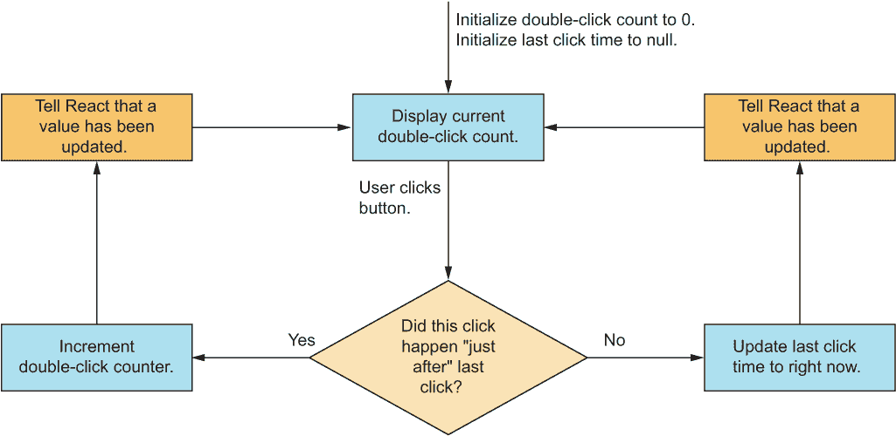
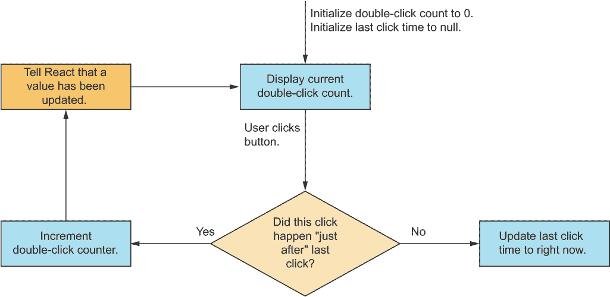

# 7 个钩子为您的 Web 应用程序提供动力

本章涵盖

+   创建有状态组件的更广阔视角

+   介绍通过钩子可解决的先进主题

+   使用钩子时需要注意的规则

钩子是使现代 React 应用程序运行的关键。它们是 React API 中的一个相对较小的部分，但仍然非常重要。钩子的使用也非常复杂。在本章中，我们将讨论所有钩子，它们的功能，以及使用钩子时的一些重要事项。

钩子是 React 生物圈中的一种特殊生物。从外部看，它们在功能上似乎完全不相关，但当我们仔细观察时，它们有一些共同的特性和行为，我们在使用它们时需要考虑。可以说，它们起源于进化树中的某个共同祖先，尽管它们已经进化成为非常不同的生物。

我们之所以将本章奉献给所有这些钩子，正是因为这个原因。因此，虽然我们将要涵盖一些截然不同的主题，但它们都与使用钩子有关。我们将在最后通过解释所有这些钩子实际上是如何相互关联的，尽管它们似乎具有不同的目的，来为它们画上一个句号。

您已经看到了三个不同的钩子：useState（第五章）和 useEffect 以及 useLayoutEffect（第六章）。在撰写本文时，React 中有 15 个内置钩子（截至 React 18），我们将简要介绍，按其功能分组：

+   *有状态钩子*—这些函数关注于在多个不同层次和复杂度级别上使组件和应用具有状态：useState, useReducer, useRef, useContext, useDeferredValue, 和 useTransition。

+   *效果钩子*—这些函数关注在组件的不同生命周期阶段以及每个渲染周期内运行效果：useEffect 和 useLayoutEffect。

+   *记忆化钩子*—这些函数通过避免重新计算其组成部分未发生变化时的值来用于性能优化：useMemo, useCallback, useId。

+   *库钩子*—这些高级函数几乎仅用于创建大型组件库，这些库是为了与社区共享或在更大的组织内部共享而创建的。这些函数在较小或中等规模的应用程序中很少使用：useDebugValue, useImperativeHandle, useInsertionEffect, 和 useSyncExternalStore。

这 15 个钩子是 React 内置的“基础”钩子。您可以在它们之上构建更多钩子，但不能构建自己的基础钩子。您只能构建利用一个或多个现有钩子的钩子。我们将在第十章中讨论自定义钩子。

注意，React 可能会在未来的版本中扩展更多内置钩子。React 18.0 带来了五个新的钩子，React 18 之后的增量版本可能会带来更多。

注意：本章中示例的源代码可在 [`rq2e.com/ch07`](https://rq2e.com/ch07) 获取。但正如你在第二章中学到的，你可以使用单个命令直接从命令行实例化所有示例。

## 7.1 有状态组件

我们在第五章中一般性地介绍了有状态组件，但为了完整性，我们在这里会再次重申这些信息。有状态组件以及相应的有状态应用程序对于使网络应用程序真正有趣使用是必不可少的。

一个没有状态的应用程序是完全静态的。整个你在浏览器中打开它的过程中，应用程序都是相同的，对于使用该应用程序的每个用户来说也都是相同的。如果你需要登录、会话、交互以及随时间的变化和变化，你需要你的应用程序是有状态的。

然而，有状态组件并不都是一样的，就像不是所有的状态都是一样的。一个状态只是短暂地保持，另一个状态是针对单个组件的超局部状态，而另一个状态是应用级别的。此外，状态可以是一个单一变量，也可以是一个复杂的相互依赖的变量网络，这些变量必须同时更新。在本节中，我们将介绍一些有状态组件和应用程序的不同用例，并讨论如何通过适当的钩子解决给定的挑战。

### 7.1.1 使用 useState 的简单状态值

useState 是有状态应用程序的基石。你可能会发现自己需要状态时，大多数情况下都会使用这个钩子，所以它肯定是一个重要的钩子。

如果你有一个可以打开和关闭的菜单，你会在你的菜单组件内部使用一个本地的 useState 来保持其状态。这个单一简单的值只在这个组件内部使用，并且与应用程序中的任何其他状态值无关。

我们在第五章中讨论了 useState 的所有细节，所以在这里我们不会进一步详细介绍这个钩子。然而，在本节的其余部分，我们将介绍一些更复杂的场景，在这些场景中 useState 不够用或不是最优的。

### 7.1.2 使用 useReducer 创建复杂状态

假设我们有一个加载组件，我们想知道加载是否成功或失败，在失败的情况下错误信息是什么，在成功的情况下数据是什么。错误信息的值只有在加载失败时才有意义。如果加载成功，错误信息就完全无关紧要，甚至不应该设置——反之亦然，对于结果数据也是如此。这是一个 *相互依赖* 状态的例子。状态中的各个值相互依赖，你通常会同时更新多个值。

useReducer 是为了这个目的而设计的有状态钩子。它是对 useState 的一个高级版本，如果我们有一个比单个状态值可以合理表示更复杂的设置，我们可以以更复杂和受控的方式改变我们的状态（几乎像状态机，但又不完全是）。

使用 reducer 是一种仅基于当前状态和一些携带负载的动作来生成新状态（“减少”）的方法。*减少状态*的概念来自其他框架，如 Redux（因此得名），所以它对许多 React 开发者来说已经很熟悉了。

注意，useReducer 永远不是严格必要的——我们可以用 reducer 做任何事情，也可以用更简单的 useState 的组合来做。有许多情况下，你可能会想使用 reducer 而不是满足于多个不同的状态，以确保更严格的数据流和更好的控制。

当我们转向更复杂的应用架构时，我们将在第十章中展示一些 reducer 的示例。reducer 只与相对复杂的数据流相关，因此它不是我们在本书中构建的简单应用中会大量使用的东西。

### 7.1.3 使用 useRef 记忆值而不重新渲染

假设我们想要创建一个按钮，它只在该按钮被双击且在特定毫秒数内时才起作用。为了实现这一点，我们需要记住连续点击之间经过的时间。在组件内部记忆数据正是我们使用状态的目的。我们有一个希望在渲染之间持续存在的值，但我们不使用它来进行渲染。按钮在第一次点击时不会改变。我们只需要在组件实例内部记住一个值一段时间，但我们不会使用这个值来确定组件的输出。

useRef 既是 React 中最简单的钩子之一，也是理解最少的钩子之一。它是一个具有*被动状态*的钩子，这意味着钩子可以包含状态，但设置或更新状态不会导致重新渲染。

useRef 被用于多个目的，包括在渲染之间记忆值以及作为在渲染中使用的 DOM 元素的引用。后者是一个非常重要的用例（也是其名称的由来，useRef），因为这是在组件中通过脚本访问 DOM 元素的最佳和最简单的方式。

被动状态值

你可以使用 useRef 钩子来记忆一些在组件渲染之间相关但不会直接影响组件输出的值。这听起来有点复杂，甚至罕见。你何时会在组件中遇到这样的值？作为一个例子，让我们再次重构我们的计数器组件，但这次增加了功能，即增加按钮只有在双击时才起作用。

我们需要在组件中某个地方存储上一次点击事件的时刻，并且这个时刻需要在渲染之间持续存在。我们已经知道，我们可以通过 useState 钩子提供的状态来存储这样的值。这个场景的草图如图 7.1 所示，实现代码见列表 7.1。



图 7.1 当用户点击按钮时，根据这个点击是否发生在上一次记录的点击非常短的时间内，执行路径会分支。

列表 7.1 使用 useState 的双击计数器

```
import { useState } from "react";
const THRESHOLD = 300;
function DoubleClickCounter() {
  const [counter, setCounter] = useState(0);
  const [lastClickTime, setLastClickTime] =     ❶
    useState(null);                             ❶
  const onClick = () => {
    const isDoubleClick =                       ❷
      Date.now() - lastClickTime < THRESHOLD;   ❷
    if (isDoubleClick) {
      setCounter((value) => value + 1);         ❸
    } else {
      setLastClickTime(Date.now());             ❹
    }
  };
  return (
    <main>
      <p>Counter: {counter}</p>
      <button onClick={onClick}>Increment</button>
    </main>
  );
}
function App() {
  return <DoubleClickCounter />;
}
export default App;
```

❶ 在状态值中记住上一次点击的时间

❷ 如果上一次点击的时间小于 300 毫秒，则认为是双击。

❸ 只有在是双击的情况下才增加计数器

❹ 如果不是双击，则记住当前点击的时间

然而，这并不是必要的，并且会导致不必要的额外重新渲染。当我们调用 setLastClickTime 时，React 会因为状态值的变化而重新渲染组件。然而，组件中的 JSX 不会改变，并且相同的 DOM 输出将被渲染到屏幕上。列表 7.1 中的代码是有效的，但不是最优的。

由于我们只需要在组件内部使用状态值，并且不需要因为值更新而使组件重新渲染，我们可以通过 useRef 钩子使用引用。要实例化一个 useRef 钩子，您只需调用该钩子并将其存储在一个变量中。您还可以向钩子传递一个初始值。要读取或更新 useRef 钩子的当前值，您需要访问钩子返回值的.current 属性。将图 7.2 中的场景与图 7.1 中的场景进行比较——我们跳过了一个完整的渲染周期！这是在列表 7.2 中实现的。



图 7.2 这次，如果用户第一次点击按钮，记录上一次点击的时间，但由于它不是一个活动状态值，而是一个被动状态值，所以不会引起重新渲染。这意味着我们仍然可以在稍后（在这个或未来的渲染中）访问这个值，但它本身不会引起新的渲染。

列表 7.2 使用 useRef 的双击计数器

```
import { useState, useRef } from "react";
const THRESHOLD = 300;
function DoubleClickCounter() {
  const [counter, setCounter] = useState(0);
  const lastClickTime = useRef(null);                  ❶
  const onClick = () => {
    const isDoubleClick =                              ❷
      Date.now() - lastClickTime.current < THRESHOLD;  ❷
    if (isDoubleClick) {
      setCounter((value) => value + 1);
    } else {
      lastClickTime.current = Date.now();              ❸
    }
  };
  return (
    <main>
      <p>Counter: {counter}</p>
      <button onClick={onClick}>Increment</button>
    </main>
  );
}
function App() {
  return <DoubleClickCounter />;
}
export default App;
```

❶ 在 useRef 值中记住上一次点击的时间

❷ 执行与之前相同的检查，但现在通过.current 属性访问值

❸ 通过.current 属性更新状态值

仓库：rq07-double-counter

这个例子可以在 rq07-double-counter 仓库中看到。您可以通过创建一个基于相关模板的新应用程序来使用该仓库：

```
$ npx create-react-app rq07-double-counter --template rq07-double-counter
```

或者，您也可以访问这个网站来浏览代码，直接在您的浏览器中查看应用程序的运行情况，或者下载源代码的 zip 文件：

[`rq2e.com/rq07-double-counter`](https://rq2e.com/rq07-double-counter)

这是我们组件的一个更好的版本，因为我们没有不必要的重新渲染。我们以正确的方式持久化状态，即使组件因其他原因重新渲染也是如此。

对 DOM 元素的引用

如前所述，useRef 的另一个用途是获取 DOM 元素的引用。您将在本书的其余部分多次看到它的使用。我们使用它来引用由我们创建的 JSX 元素在文档中渲染的实际 DOM 元素。语法非常简单：

```
function Component() {
  const ref = useRef();       ❶
  return <div ref={ref} />;   ❷
}
```

❶ 使用钩子创建引用

❷ “分配”引用到 DOM 节点，当组件渲染时，将引用分配给 ref 对象内部的 DOM 节点

这并不是使用引用做任何事情，而仅仅是创建它。你可以在 effect 钩子中使用引用来，例如，调用元素的函数，这是通过 DOM 元素的属性直接无法实现的。

例如，让我们在组件挂载时自动聚焦输入字段：

```
function AutoFocusInput() {
  const ref = useRef();
  useEffect(() => ref.current.focus(), []);    ❶
  return <input ref={ref} />;
}
```

❶ 仅在组件挂载时运行效果（空依赖数组）并通过引用对象聚焦元素。注意，它使用了之前提到的 ref.current 语法。

这后一种 useRef 的使用更为常见（以及最初的目的）。关于 useRef 和 JSX 引用属性的工作方式还有很多话要说，但我们现在就到这里。我们将在相关的未来章节中对此进行一些扩展。

### 7.1.4 使用 useContext 实现更简单的多组件状态

useContext 是一个有状态的钩子，意味着它的工作方式类似于 useState。但与在本地存储中加载和更新值不同，useContext 在组件树中某个父组件的存储中工作。这是 React Context API 的钩子版本，我们将在第十章中看到更多关于它在实践中是如何工作的。我们可以揭示，当涉及到构建良好的架构时，它是最强大的钩子之一。

### 7.1.5 使用 useDeferredValue 和 useTransition 进行低优先级状态更新

注意：这个主题既相当高级，又非常新颖。这些是仅随着 React 18 新增的功能，因此关于最佳实践的发现还有很多。它也是一个高级主题，可能对日常应用不相关。我们不会在本节中全面介绍这些钩子的功能，但我们将简要概述它们存在的原因。如果你现在不关心它们，请随意跳过这一节。

想象一下，我们创建了一个类似于 Google Docs 的在线文档编辑应用程序，并为其添加了许多功能。我们现在正在向应用程序添加拼写检查器，并希望通过添加一个可以点击以启用和再次点击以禁用拼写检查的按钮来实现这一点。当启用时，按钮具有不同的背景颜色。

当用户点击此按钮时，它应该立即响应。按钮应在几毫秒内改变显示，使用户感觉按钮在起作用。我们可以通过在按钮内部使用 useState 设置器切换一个启用属性来实现这一点。

但我们的按钮将要做的不仅仅是这些。当拼写检查被启用时，文档中的所有错别字都应该用红色下划线突出显示。如果用户正在处理一个大型文档，查找和突出显示所有错误可能是一个昂贵的操作。你必须在文档中的所有单词上运行很多操作来查找错误，甚至可能为每个错误找到正确的拼写建议。这些任务可能需要十分之一秒甚至整秒的时间来执行。

如果我们在 React 中同时更新按钮内部的内部启用状态标志以及触发拼写检查计算的全球标志，并且具有相同的优先级，React 的内部将把这两个更新视为同时发生，并且不会渲染任何内容，直到这两个更新都已经完全计算完成。这并不理想，因为拼写检查按钮将看起来没有功能。当用户点击按钮而没有发生任何事时，他们会再次点击它。然后，突然之间，按钮在计算完成后实际上会工作，但由于用户已经再次点击了它，用户禁用了该功能。这是一个糟糕的用户体验。

如果我们能通知 React 更新按钮状态是高优先级的，应该立即发生，而突出显示文档中的所有拼写错误是低优先级的，我们并不介意它落后于按钮点击几个渲染周期呢？React 18 引入了一个全新的概念，并发模式，它正好允许这样做。useDeferredValue 和 useTransition 钩子是两种从不同角度指定低优先级状态更新的不同方法。鉴于这些钩子的复杂性，我们不会在本书中进一步介绍它们，但请参考以下在线材料以获取更多信息：

+   文章：[`mng.bz/jPAP`](http://mng.bz/jPAP)

+   视频：[`mng.bz/WzM1`](http://mng.bz/WzM1)

## 7.2 组件效果

本节将会很短，所以请尽量不要眨眼，否则你可能会完全错过！*组件效果*是一组专门用于在钩子内部执行副作用，具有三个不同目的的钩子：

+   基于组件状态影响外部

+   基于外部信息更新组件状态

+   同时影响外部并更新组件状态

我们已经在上一章中看到了两个这样的钩子，即 useEffect 和 useLayoutEffect。只有一个这样的钩子，即 useInsertionEffect，但它被保留给特定库的高级使用，因此不建议“常规”开发者使用。

在本章中，我们不会添加有关 useEffect 和 useLayoutEffect 的信息，因为我们已经在第六章中涵盖了所有需要知道的内容。最后一个效果钩子 useInsertionEffect 将在第 7.4 节中简要介绍。

## 7.3 通过最小化重新渲染来优化性能

注意：这是一个高级话题，对于大多数简单应用程序不是必需的。我们在这里只会简要介绍这个话题，而不会详细讨论，因为它对于你的第一个、第二个甚至第十个应用程序都不是必需的。只有当你开始开发包含数十个甚至数百个组件的大型应用程序时，这些钩子才开始发挥作用。

如果你正在开发一个包含许多动态部分、数据来自多个来源以及监听多种类型输入的大型应用程序，如果组件不必要地渲染，性能可能会开始下降。一旦你的应用程序达到这个阶段，记忆化可能就是帮助你应用程序恢复响应性的技巧。

在本质上，*记忆化* 是缓存给定计算结果的原则，以便如果稍后执行相同的计算，则返回缓存的结果。这可以在 React 中以多种方式使用，包括本节中我们将介绍的三种钩子。

如前所述，我们不会在本章中详细介绍这些钩子，因为作为 React 开发者入门时它们并不是必需的。实际上，错误地应用记忆化可能会降低性能，而不是提高。因此，鉴于这个主题的先进性，我们在这本书中根本不使用记忆化，我们将在以下子节中简要介绍这三个钩子。

你可以在 *Job-Ready React* (Morten Barklund, Manning, 2024) 中了解更多关于优化 React 性能的内容，这本书不仅涵盖了这些钩子和一般性的记忆化，还介绍了其他使你的应用程序更高效的方法。

### 7.3.1 使用 useMemo 记忆化任何值

假设你需要显示在输入字段中输入的给定密码的加密散列。这种散列的计算相当昂贵，因此你不希望在密码没有改变的情况下执行计算。但是，即使密码没有改变，你的组件也会多次重新渲染。在这种情况下，你可以使用 useMemo 钩子仅在依赖项更改时在组件中重新计算给定的值。

### 7.3.2 使用 useCallback 记忆化函数

useCallback 是 useMemo 的一个特殊版本，当 useMemo 用于记忆化一个函数时非常有用。但由于这种情况经常发生，因此存在 useCallback 钩子用于此目的，并且它通常比 useMemo 更常用。

### 7.3.3 使用 useId 创建稳定的 DOM 标识符

这是一个更加高级的话题，仅与服务器生成的 React 相关。要理解这个钩子如此狭窄的使用情况，需要相当多的知识积累。

useId 确保对于两个完全相同的组件树，如果树中的某个组件调用 useId，无论在哪个平台上运行钩子，它都会得到相同的 ID。这用于确保在客户端和服务器上生成的 HTML 是相同的。

## 7.4 创建复杂组件库

本节仅为了完整性而包含，因此我们涵盖了 React 中的所有钩子。下一小节中描述的四个钩子都非常高级且很少使用。它们主要用于可重用的包，如组件库或开源模块。

本节最后提到的两个钩子是在 React 18 中作为新并发模式的结果引入的。一些库必须更新以正确地在并发模式下渲染，以避免计算不必要的逻辑或由于并发而提前计算的逻辑。如果你想继续更实用的内容，可以自由跳过本节，直接进入 7.5 节。

### 7.4.1 使用 useImperativeHandle 创建组件 API

这个钩子用于高级组件库，其中你希望向父组件暴露一个 API，这个 API 要么是针对特定组件的自定义的，要么是为了便于使用而模仿内置 DOM 元素。它几乎总是与 forwardRef 一起使用，这允许你创建自己的组件，这些组件可以接受引用，但将它们传递给其他元素或创建一个自定义引用。

这的一个快速示例是一个通用的自定义输入组件，其中你希望父组件能够聚焦到输入框。也许你有一个错误信息提示“缺少字段”，如果用户点击错误信息，正确的字段就会被聚焦。然而，在你的组件内部，输入可以是许多不同类型的元素（输入框、文本区域或选择框），甚至可以有多个输入字段（想象一下一个电话表单字段，包括国家前缀字段和另一个电话号码字段）。

为了将这些情况统一起来并创建一个统一的 API，你可以使用 useImperativeHandle 钩子来为你的组件暴露一个 focus() 方法。这个方法可以在命令式代码中使用（而不是仅通过属性进行声明式代码），确保在调用时聚焦到正确的元素。

本书不会详细介绍这个钩子以及 forwardRef 的工作原理，因为这属于本章范围之外的进阶主题，但如果你想创建一个通过引用暴露自定义 API 的高级自定义组件，了解这个钩子的存在是有好处的。更多信息，请参阅使用 useImperativeHandle 的“终极指南”*：[`mng.bz/EQ0O`](http://mng.bz/EQ0O)。

### 7.4.2 使用 useDebugValue 提高钩子的调试能力

这是一个仅针对开发者体验的钩子。无论如何使用，它都不会改变或提升你应用程序的用户体验。

useDebugValue 钩子允许你作为 React 库开发者，当其他开发者在他们的 React 应用程序中使用浏览器中的 React Developer Tools 插件检查你的自定义钩子时，显示一个自定义消息。

通常，自定义 hook 会在 React 开发者工具资源管理器中显示其所有内部状态，但这对不关心你自定义 hook 内部结构的人来说可能很困惑。使用 useDebugValue 钩子，你可以仅暴露开发者使用你的 hook 所关心的内容。更多信息，请参阅“如何在 React 中使用 useDebugValue”在[`mng.bz/N251`](http://mng.bz/N251)。

### 7.4.3 使用 useSyncExternalStore 同步非 React 数据

在并发模式中，React 可以以低优先级更新状态值，在计算该更新的后果时，可能会出现紧急更新，该更新必须在不考虑不完整更新的情况下进行计算。因为 React 是并发运行的，React 将运行几个完全独立的实例，因此当出现紧急更新时，可以根据之前的状态启动新的计算。

如果一个应用程序使用外部库来保持状态更新，那么这个外部库必须能够支持这种并发状态逻辑，以便它也能同时运行多个状态实例。React 18 引入了 useSyncExternalStore 就是为了这个目的。更多信息，请参阅有关 useSyncExternalStore 的文章：[`mng.bz/8r1K`](http://mng.bz/8r1K)。

### 7.4.4 使用 useInsertionEffect 在渲染前运行副作用

如果你有一个库，在组件渲染的副作用中创建样式表或类似的 HTML 节点，那么你的库现在需要了解并发模式以在正确的时间渲染正确的节点。为此特定目的，React 18 引入了 useInsertionEffect 钩子。

虽然这看起来像是一个与 useEffect 和 useLayoutEffect 类似的副作用钩子，但 useInsertionEffect 钩子永远不会适用于常规组件。它只是作为一些通用库必须更新的结果而创建的，以考虑到并发的影响。更多细节，请参阅有关 useInsertionEffect 的这篇简短文章：[`mng.bz/EQlq`](http://mng.bz/EQlq)。

## 7.5 hooks 的两个关键原则

关于 React hooks，你只需要遵守两条规则：

+   只能在函数组件的*顶层*无条件地调用 hooks。

+   只能在函数组件内部调用 hooks。

第一条规则，我们已经讨论过了：你只能在组件中直接使用 hooks，并且必须始终包含相同数量的 hooks。这意味着你永远不能在函数内部（包括在钩子中使用的函数内）或嵌套块（无论是条件还是循环）中调用 hooks，而且在你渲染所有 hooks 之前，你的组件中不能有提前返回。

第二条规则可能很显然，但也许并不那么明显：你只能在函数组件中使用 hooks。你不能创建一些辅助函数或回调来调用 hook。你也不能在基于类的组件中使用它们。

唯一的例外是，你可以在其他钩子中使用钩子，这些钩子被称为**自定义钩子**，你还可以在其他自定义钩子中使用自定义钩子，依此类推。但你可以使用这些自定义钩子要么在其他自定义钩子中，要么在你的组件中，所以你不能规避这个规则——你只能将其隐藏一层（或多层）之下。我们将在第十章中介绍自定义钩子。

## 7.6 习题

1.  React 一直有，将来也总是会有 15 个钩子。**正确**还是**错误**？

1.  哪些被认为是**状态钩子**？

    1.  `useState`

    1.  `useValue`

    1.  `useId`

    1.  `useReducer`

1.  `useMemo` 是 `useCallback` 的一个专用版本。**正确**还是**错误**？

1.  你不能在函数内部调用钩子，除非它是功能组件或自定义钩子。**正确**还是**错误**？

1.  以下哪种构造是不允许的？

    | a. |
    | --- |

    ```
     function Component({ isVisible }) {
       if (!isVisible) return false;
       useEffect(() => { ... }, []);
       ...
     }
    ```

    |

    | b. |
    | --- |

    ```
    function Component({ hasEffect }) {
       if (hasEffect) {
         useEffect(() => { ... }, []);
       }
       ...
     }
    ```

    |

    | c. |
    | --- |

    ```
     function Component({ shouldRender }) {
       useEffect(() => { ... }, []);
       if (!shouldRender) return false;
       ...
     }
    ```

    |

## 习题答案

1.  **错误**。React 16.8 引入了前 10 个钩子，React 18.0 又增加了 5 个。未来版本中肯定还会增加更多。

1.  `useState` 和 `useReducer` 是状态钩子。`useValue` 不是一个内置钩子（但如果你愿意，你可以创建一个名为此的自定义钩子），而 `useId` 则用于一个相当特定的记忆目的。

1.  **错误**。情况正好相反。`useMemo` 是一个用于记忆**任何值**的通用钩子，而 `useCallback` 是一个仅用于记忆**函数**的钩子。

1.  **正确**。你不应该在不是自定义钩子的函数中调用钩子。尽管一开始可能看起来可以工作，但如果你突然开始在功能组件之外调用这些函数之一，这只会导致后续出现问题。遵守钩子的原则！

1.  违法的构造是 a 和 b。只有版本 c 是有效的组件。版本 a 和 b 都使用了钩子的条件渲染，这是不允许的。

## 摘要

+   React 有 15 个不同的内置钩子，但其中一些很少使用，大约留下 10 个作为所有 React 应用程序构建的核心 API。

+   钩子用于各种目的，使组件变得智能，并能够与整个网页进行交互。尽管所有钩子的用途都大相径庭，但它们都有一些共同的特征。

+   状态钩子是使应用程序具有状态所必需的。你可以根据应用程序的复杂性和状态中的值使用几个不同的钩子。在 React 18 中，你甚至可以进行低优先级和高优先级的状态更新，以帮助 React 使你的 UI 尽可能地响应。

+   效果钩子用于在组件内部运行副作用，正如你在第六章中学到的。通过使用依赖数组，你可以触发你的效果在期望的时间（们）运行。

+   记忆钩子用于优化 React 中的渲染，一旦你的应用程序变得庞大而复杂。

+   库钩子仅适用于更复杂的代码库，可能对你的日常应用不相关。

+   如果你使用钩子，你必须遵守钩子的两条法则：只能在组件的最顶层调用钩子（因此不能有条件钩子或钩子的循环），并且只能在函数组件内部使用钩子（因此不能在组件外部、辅助函数中，甚至在基于类的组件中使用钩子）。
