# 8 在 React 中处理事件

本章涵盖了

+   使用事件响应用户输入

+   处理事件捕获和冒泡

+   管理默认事件行为

+   直接将事件监听器附加到 DOM

事件是用户与 JavaScript Web 应用程序交互的方式。事件可能由鼠标移动或点击、触摸界面的点击和拖动、键盘按钮按下、滚动、复制和粘贴，以及间接交互，如聚焦和取消聚焦元素或整个应用程序等引起。

到目前为止，我们创建的 React 应用程序用户交互非常少。我们处理了这里和那里的按钮点击，但并没有深入讨论点击事件是如何工作的，以及我们作为开发者如何处理它。在本章中，我们将改变这一点，本章专门讨论事件处理。

你可以将事件视为处理用户输入的方式。我们的 Web 应用程序创建 JavaScript XML（JSX），然后将其转换为 HTML。用户随后与该 HTML 进行交互，这些交互的结果作为事件从 HTML 元素派发到我们的 React 应用程序。这种简单的信息流流程在图 8.1 中得到了说明。

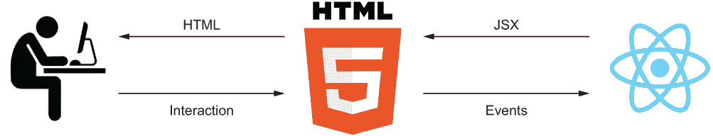

图 8.1 React 与用户之间的信息流通过 HTML 进行。想象一下用户访问登录页面。用户输入电子邮件和密码，浏览器将这些交互作为事件转发给 React，应用程序随后生成所需的 JSX 来显示每个输入旁边的绿色勾选标记，浏览器渲染相应的 HTML 以显示给用户。

事件也被浏览器内部用来表示元素之间发生变化的情况。这可能是在视频播放/暂停/缓冲时、动画完成时、DOM 节点发生变更时、数据加载（或加载失败）时等情况。有数百种可能的事件，任何交互式 Web 应用程序都将使用其中相当一部分。（你可以在[`mng.bz/9D1j`](https://shortener.manning.com/9D1j)的事件参考文档中了解更多关于所有可能的 DOM 事件的信息。）

在 React 中处理事件有两种方式：

+   你可以使用 React 来管理你的事件监听器。

+   你可以直接在 DOM 节点上手动添加和移除你的事件监听器。

依赖 React 来处理监听器可以节省大量繁琐的工作和头痛（以及潜在的内存泄漏），但这也带来了一些灵活性的损失。直接添加事件监听器允许你在需要时监听所有类型的事件，并将监听器分配给你觉得合适的任何节点，但这也带来了需要管理监听器（并记得再次移除它们）以及处理可能在不同浏览器中有所不同的原生事件的成本。

在本章中，我们将展示这两种方法，并讨论何时最好应用其中一种。请注意，在 React 中处理事件既容易又推荐。因此，这个场景将在本章中详细讨论。

当我们介绍如何使用 React 的接口监听事件时，我们将讨论许多关于 React 如何处理事件以及你如何与 React API 合作以监听所需特定事件的话题。我们将回答以下问题：

+   哪些事件是被支持的？

+   你如何创建事件处理器函数？

+   你将接收到哪些事件对象？

+   事件阶段和传播是如何工作的？

+   你如何在事件分发的捕获阶段处理事件？

+   默认操作是什么，你如何防止它们？

+   你应该在何时持久化事件？

+   你能否使用属性作为事件处理器？

+   什么是事件处理器生成器？

然后，我们将继续到 React 内置事件处理能力不足的情况，我们需要在 DOM 中手动处理事件。我们也会给你提供如何最好地做到这一点的所有见解。

所有这些都将引导我们进入下一章，我们将利用我们对事件处理的全新理解来创建交互式表单输入和表单，这是许多 Web 应用的基石。

注意：本章中示例的源代码可在 [`rq2e.com/ch08`](https://rq2e.com/ch08) 找到。但正如你在第二章中学到的，你可以使用单个命令直接从命令行实例化所有示例。

## 8.1 在 React 中处理 DOM 事件

事件是用户与脚本以及应用程序中不同元素之间在浏览器中进行通信的基本方式。正因为如此，适当的事件处理是 React 的一等公民，这意味着 React 已经为其核心 API 中的这一特定目的投入了很大一部分。

API 非常简单。如果你在 JSX 元素上定义了一个属性，该属性引用了一个 HTML 节点，并且该属性与 React 支持的事件列表中的已知事件匹配，React 将将该属性视为事件监听器，而不是 DOM 属性。React 将确保在组件挂载和卸载时正确地添加和移除事件监听器。

### 8.1.1 React 中的基本事件处理

几乎在所有 Web 应用程序中，最重要的一个事件就是点击事件。尽管它的名字叫点击事件，但它不仅仅用于接受鼠标的点击。当触摸屏用户点击按钮（或链接）或键盘用户使用 Enter 键激活按钮（或链接）时，HTML 中的点击事件也会被触发。

让我们回到我们信任的计数器组件，并更仔细地看看我们是如何处理点击事件的。如果你还记得，这个应用程序有一个按钮，我们通过用户点击来增加状态值。首先，让我们重复这个简单应用程序的代码。

列表 8.1 计数器组件

```
import { useState } from "react";
function Counter() {
  const [counter, setCounter] = useState(0);
  const onClick = () =>                                 ❶
    setCounter((value) => value + 1);                   ❶
  return (
    <>
      <h1>Value: {counter}</h1>
      <button onClick={onClick}>Increment</button>      ❷
    </>
  );
}
function App() {
  return <Counter />;
}
export default App;
```

❶ 创建一个局部变量，它是一个函数，当被调用时会增加状态值

❷ 将该局部变量分配给我们的按钮的 onClick 属性

在此示例中，我们处理了一个 HTML 对象的点击事件，该对象是一个<button>。任何 HTML 元素在点击时都会触发一个点击事件，因此我们可以将此元素更改为<div>或其他类型的元素。

我们可以在所有对象上监听的其他事件之一是鼠标（或指针）事件。任何元素都可以在鼠标移动到该元素边界内时触发，例如，mousemove 事件。我们可以以相同的方式监听此类事件。

让我们创建一个组件，如果鼠标在元素内部移动，则显示勾选标记，但如果鼠标停止移动半秒钟或鼠标移出元素，则变为叉号。

要做到这一点，我们需要监听鼠标移动事件。在 React 中，这意味着我们将一个函数分配为我们的目标元素的 onMouseMove 属性。在这种情况下，我们将使用一个<section>元素，并在其中显示我们的结果。请参见以下列表中的实现和图 8.2 中的结果。

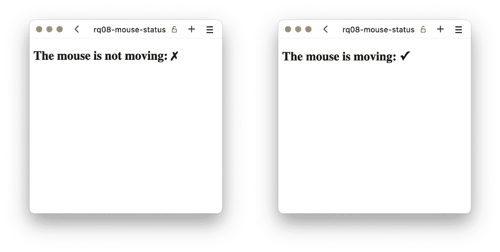

图 8.2 当鼠标不移动或移动时，我们的鼠标状态组件分别显示

列表 8.2 鼠标是否在移动？

```
import { useState, useEffect } from "react";
function MouseStatus() {
  const [isMoving, setMoving] = useState(false);
  const onMouseMove = () => setMoving(true);          ❶
  useEffect(() => {
    if (!isMoving) return;
    const timeout = setTimeout(() => setMoving(false), 500);
    return () => clearTimeout(timeout);
  }, [isMoving]);
  return (
    <section onMouseMove={onMouseMove}>               ❷
      <h2>
        The mouse is {!isMoving && "not"} moving: {isMoving ? "✓" : "✗"}
      </h2>
    </section>
  );
}
function App() {
  return <MouseStatus />;
}
export default App;
```

❶ 创建一个局部变量，它是一个函数，当被调用时会将移动标志设置为 true

❷ 将该局部变量分配给我们的元素的相关属性——这次是 section 元素的 onMouseMove 属性

存储库：rq08-mouse-status

此示例可在 rq08-mouse-status 存储库中查看。您可以通过创建基于相关模板的新应用程序来使用该存储库：

```
$ npx create-react-app rq08-mouse-status --template rq08-mouse-status
```

或者，您可以访问此网站浏览代码，直接在您的浏览器中查看应用程序，或下载源代码的 zip 文件：

[`rq2e.com/rq08-mouse-status`](https://rq2e.com/rq08-mouse-status)

然而，并非所有事件都是由所有类型的元素触发的。视频（和音频）元素在视频（或音频）开始播放时触发 play 事件。按钮不会触发该事件，因为它们不是播放视频（或音频）的元素。

让我们创建一个应用程序，显示一个位于视频旁边的播放/暂停按钮。当视频正在播放时，按钮是暂停按钮；当视频暂停时，按钮是播放按钮。

为了做到这一点，我们需要总共四个监听器。我们需要监听视频对象上的播放和暂停事件，并且我们需要监听我们按钮上的点击事件，但根据视频是否正在播放，使用两个不同的事件监听器。我们将在下一个列表中实现这一点。如果您运行此应用程序，您应该在浏览器中看到类似于图 8.3 的内容。


图 8.3 分别显示视频播放和暂停时的视频播放器界面

列表 8.3 一个非常简单的视频播放器

```
import { useState, useRef } from "react";
const VIDEO_SRC =
  "//images-assets.nasa.gov/video/One Small Step/One Small Step~orig.mp4";
function VideoPlayer() {
  const [isPlaying, setPlaying] = useState(false);
  const onPlay = () => setPlaying(true);                  ❶
  const onPause = () => setPlaying(false);                ❷
  const onClickPlay = () => video.current.play();         ❸
  const onClickPause = () => video.current.pause();       ❹
  const video = useRef();
  return (
    <section>
      <video
        ref={video}
        src={VIDEO_SRC}
        controls
        width="480"
        onPlay={onPlay}                                   ❺
        onPause={onPause}                                 ❺
      />
      <button onClick={
        isPlaying ? onClickPause : onClickPlay            ❻
      }>
        {isPlaying ? "Pause" : "Play"}
      </button>
    </section>
  );
}
function App() {
  return <VideoPlayer />;
}
export default App;
```

❶ 当视频开始播放时，将状态标志切换为 true

❷ 当视频暂停时，将标志切换为 false

❸ 当按钮被点击以播放视频时，在视频 DOM 元素的引用上调用 play

❹ 当视频正在播放时点击按钮，将暂停视频

❺ 使用适当的属性将两个视频事件监听器分配给视频元素

❻ 根据标志将其中一个按钮点击事件监听器分配给 onClick 属性

仓库：rq08-video-player

此示例可在 rq08-video-player 仓库中看到。您可以通过创建基于相关模板的新应用程序来使用该仓库：

```
$ npx create-react-app rq08-video-player --template rq08-video-player
```

或者，您可以访问此网站浏览代码，直接在您的浏览器中查看应用程序的运行情况，或下载源代码的 zip 文件：

```
[`rq2e.com/rq08-video-player`](https://rq2e.com/rq08-video-player)
```

在 React 中监听事件实际上只涉及三件事：

+   知道要监听哪个事件

+   知道要监听哪个元素

+   在正确的元素上为正确的属性分配监听函数

这就是全部内容。本章的其余部分将介绍许多事件示例，因此您的工具箱将准备好处理您遇到的任何事件场景。

由 react 支持的事件

您只能使用 React 监听由 React 支持的事件。通常，这并不是您需要担心的事情，因为几乎所有的 DOM 事件都由 React 支持。您可以在表 8.1 中查看所有支持的事件的完整列表。

然而，有一些 JavaScript 事件在 React 中不受支持——主要是因为这些事件是从不在 DOM 中的对象派发的，但您只在 JavaScript 中创建了这些对象。这些包括来自套接字连接和请求对象等对象的这些事件。

一些其他不受支持的 DOM 事件是仅发送到 window 或 document 节点的那些事件。React 不支持这些事件，因为这些两个节点永远不会在您的 React 应用程序内部。React 只存在于文档元素内部，永远不会在其上方。

注意，如果您在 JSX 元素上设置一个属性，该属性与表 8.1 中列出的已知事件类型匹配，React 会将该属性转换为该元素上的监听器，无论该元素是否可以派发该事件。例如，您可以将 onPlay 事件监听器分配给<h1 />元素，尽管该事件将仅从<video />和<audio />元素派发。

表 8.1 列出 React 直接支持的事件

| 剪贴板事件 | onCopy onCut onPaste |
| --- | --- |
| 组合事件 | onCompositionEnd onCompositionStart onCompositionUpdate |
| 键盘事件 | onKeyDown onKeyPress onKeyUp |
| 焦点事件 | onFocus onBlur |
| 表单事件 | onChange onInput onInvalid onReset onSubmit |
| 通用事件 | onError onLoad |
| 鼠标事件 | onClick onContextMenu onDoubleClick onDrag onDragEnd onDragEnter onDragExit onDragLeave onDragOver onDragStart onDrop onMouseDown onMouseEnter onMouseLeave onMouseMove onMouseOut onMouseOver onMouseUp |
| 指针事件 | onPointerDown onPointerMove onPointerUp onPointerCancel onGotPointerCapture onLostPointerCapture onPointerEnter onPointerLeave onPointerOver onPointerOut |
| 选择事件 | onSelect |
| 触摸事件 | onTouchCancel onTouchEnd onTouchMove onTouchStart |
| UI 事件 | onScroll |
| 滚轮事件 | onWheel |
| 媒体事件 | onAbort onCanPlay onCanPlayThrough onDurationChange onEmptied onEncrypted onEnded onError onLoadedData onLoadedMetadata onLoadStart onPause onPlay onPlaying onProgress onRateChange onSeeked onSeeking onStalled onSuspend onTimeUpdate onVolumeChange onWaiting |
| 图像事件 | onLoad onError |
| 动画事件 | onAnimationStart onAnimationEnd onAnimationIteration |
| 过渡事件 | onTransitionEnd |
| 其他事件 | onToggle |

## 8.2 事件处理器

要处理一个事件，只需将任何函数分配给可能触发此类事件的 JSX 元素的相关属性。你的函数不需要以任何特定的方式表现或接受任何特定的参数。事件处理器函数将使用单个参数——事件对象来调用，但你不必接受它。

由于没有来自“官方”来源的任何限制或定义的最佳实践来定义事件处理器函数，你会看到人们以许多不同的方式来做这件事。在本节中，我们将介绍一些不同的选项和一些我们在较大的代码库中看到的使用惯例。

### 8.2.1 事件处理器定义

注意：本小节不会教授你任何新的 React 知识。它主要重申了如何在 JavaScript 函数内部以不同的方式定义函数。如果你是 JavaScript 专家，请随意跳过本节，直接进入 8.2.2 节。

你可以以任何你喜欢的方式定义事件函数。如果它是一个有效的函数，它就作为事件处理器有效。常见选项包括以下：

+   使用箭头函数将函数定义为局部变量。

+   使用函数表达式将函数定义为局部变量。

+   使用箭头函数直接分配给属性的方式将函数定义为行内函数。

这是我们的计数器组件的另一个示例，使用箭头函数和局部变量：

```
function Counter() {
  const [counter, setCounter] = useState(0);
  const onClick = () => setCounter(c => c + 1);       ❶
  return (
    <>
      <h1>Value: {counter}</h1>
      <button onClick={onClick}>Increment</button>    ❷
    </>
  );
}
```

❶ 使用 const 创建变量并使用箭头函数符号分配函数

❷ 将该变量分配给 onClick 属性

这是完全相同的组件，但使用函数表达式定义了处理器函数：

```
function Counter() {
  const [counter, setCounter] = useState(0);
  function onClick() {                                ❶
    setCounter(c => c + 1);
  }
  return (
    <>
      <h1>Value: {counter}</h1>
      <button onClick={onClick}>Increment</button>    ❷
    </>
  );
}
```

❶ 使用函数表达式创建函数，这将变量作用域作为局部变量

❷ 将该变量分配给 onClick 属性

最后，这是同一个组件，但使用箭头函数在行内定义了处理器：

```
function Counter() {
  const [counter, setCounter] = useState(0);  return (
    <>
      <h1>Value: {counter}</h1>
      <button onClick={() => setCounter(c => c + 1)}>   ❶
        Increment
      </button>
    </>
  );
}
```

❶ 在行内创建事件处理器并将其直接分配给 HTML 元素的相关属性

第二种方法，在组件内部使用函数表达式，虽然完全有效，但有点不寻常。我们不会使用那种语法，而且在野外也没有看到很多。

你是在变量中定义事件处理程序还是在 JSX 中内联定义，这取决于你。许多人会混合使用这两种选项，本书也是如此。你的团队可能会找到一个对他们有效的约定，如果你是单独工作的，找到对你有效的方法。

常见的做法是将单行事件处理程序直接定义在内联中，而将多行事件处理程序定义在单独的变量中。因此，没有任何阻止你这样做的原因：

```
return (
  <button onClick={() => {
    setCounter(count => count + 1);
    toggleState();
  }}>Button</button>
);
```

但一些开发者可能会觉得这有点混乱，并更喜欢在 JSX 返回之前将这样的多行事件处理程序单独定义在变量中：

```
const onClick = () => {
  setCounter(count => count + 1);
  toggleState();
};
return <button onClick={onClick}>Button</button>;
```

### 8.2.2 事件对象

当事件处理程序因为事件发生而被调用时，事件处理程序会带有一个参数——事件对象。这既发生在常规 HTML 和 JavaScript 中，也发生在 React 中。

React 事件对象有点特殊，但我们在下一小节中会讨论这一点。现在，我们将展示常规 JavaScript 事件对象和 React 事件对象的一些共同点。

让我们再次尝试构建我们的计数器组件，这次我们将使用带有增加和减少按钮的组件，但这次我们将使用相同的事件处理程序函数来处理两个按钮的点击事件。我们这样做是为了展示代码结构的另一种方式。在代码性能方面，这并不更快或更好，但有些人可能更喜欢这种风格而不是之前的那一种。

要做到这一点，我们需要知道哪个按钮触发了发送给事件处理程序的事件。我们可以通过查看传递的事件对象来实现。它将有一个属性，.target，指向被点击的 HTML 节点。为了将这个目标属性与实际节点进行比较，我们需要我们组件中的一个节点的引用。让我们在下面的列表中实现这一点。

列表 8.4 使用单个事件处理程序进行增加和减少

```
import { useState, useRef } from "react";
function Counter() {
  const [counter, setCounter] = useState(0);
  const increment = useRef();                       ❶
  const onClick = (evt) => {
    const delta =                                   ❷
      evt.target === increment.current ? 1 : -1;    ❷
    setCounter((value) => value + delta);           ❸
  };
  return (
    <section>
      <h1>Value: {counter}</h1>
      <button ref={increment} onClick={onClick}>    ❹
        Increment
      </button>
      <button onClick={onClick}>Decrement</button>  ❹
    </section>
  );
}
function App() {
  return <Counter />;
}
export default App;
```

❶ 首先，我们需要一个引用，这样我们就可以访问 HTML 节点。

❷ 然后，在我们的单个事件处理程序中，我们比较事件目标与增量节点。如果不是那个按钮，那么它一定是另一个按钮。

❸ 将增量添加到当前存储的值

❹ 将相同的事件处理程序分配给两个按钮，但只将引用分配给增量按钮

这是否比有两个单独的事件处理程序更好？这是一个主观的问题。两种解决方案都很好。有时一种方法似乎更合适，而有时则相反。选择通常取决于个人偏好。你是否觉得使用单个事件处理程序可以使代码更易读，或者你更喜欢使用单独的处理程序？在性能上没有区别，所以这完全取决于你喜欢的风格。

事件对象始终有一个目标属性，该属性指向事件的目标。所有事件都具有的一个属性是类型属性。该属性的值是触发事件的类型。想象一下，如果我们将相同的事件处理程序分配给输入字段的 onMouseEnter 和 onFocus 属性。那么，当用户将鼠标移至字段或使用键盘切换到字段时，我们的事件处理程序就会触发。我们可以通过查看 evt.type 属性来确定哪个事件发生了。

一些事件对象具有特定于它们触发的事件类型的额外属性。例如，鼠标事件对象始终具有.clientX 和.clientY 属性，这些属性指示鼠标事件在文档中的位置，以及.ctrlKey 和.shiftKey 属性，这些属性指示在鼠标事件发生时是否按下了这些键。尽管鼠标事件对象还有许多其他属性，但这些都是其中的一部分。要查看 React 中所有不同事件对象的所有可用属性列表，请在此处查看在线文档：[`mng.bz/D4Zy`](http://mng.bz/D4Zy)。

### 8.2.3 React 事件对象

React 事件处理程序与“真正的”DOM 事件处理程序不同。DOM 事件处理程序被添加到 DOM 节点上，并在调用时传递一个 DOM 事件对象。React 事件处理程序不会直接添加到任何 DOM 节点上，而是在 React 检测到该节点上发生了给定类型的事件时，由 React 使用 React 事件对象调用。在图 8.4 中比较和对比这两种方法。

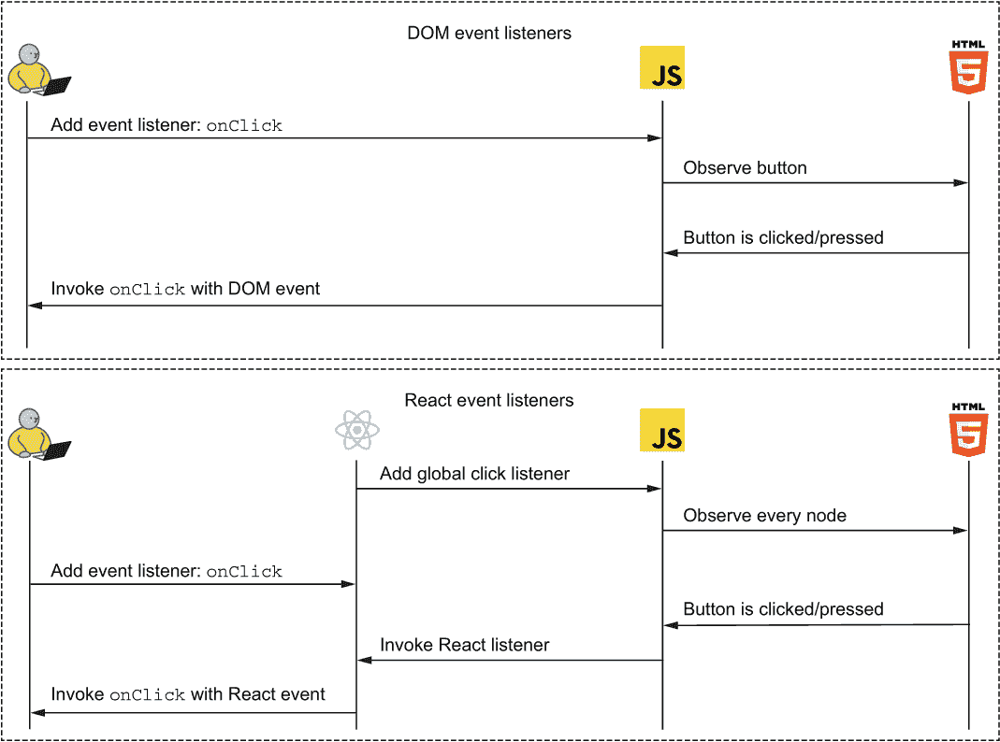

图 8.4 React 不会在单个节点上添加监听器，而是监听任何节点上的任何事件，这与原生的 DOM 监听器不同。

在图 8.4 中，请注意，当你向 JSX 元素添加监听器时，React 不会在任何地方添加新的监听器。相反，它只是记住你想要了解这个特定节点上这种特定类型的事件。React 已经监听所有节点上的所有事件，所以当指定类型的事件发生时，React 会检查目标是否与请求的目标匹配；如果是，React 将使用自定义的 React 事件对象调用你的事件监听器。React 在现有的原生浏览器事件系统之上实现这个新的事件系统的理由有两个：性能和一致性。

性能

正如我们刚才提到的，React 不会向单个节点添加监听器。React 为每个事件类型向文档添加一个单独的监听器，这是出于性能考虑。

性能提升是真实的。如果你添加了 1000 个按钮，并将点击事件监听器分配给纯 JavaScript 中的每个节点，这需要大量的内存。但如果你使用 React 来做同样的事情，React 将只为整个文档创建一个单独的点击事件监听器，并在调用时检查目标是否与请求的目标匹配。这显著减少了内存使用。

因此，你不必担心在 React 中添加过多的事件监听器。如果你使用纯 JavaScript 实现一个 Web 应用程序，你可能需要创建一些解决方案来减少监听器的数量。当使用 React 时，这一切都为你处理好了，所以你可以随意添加监听器，并知道你仍然拥有出色的性能。

一致性

尽管浏览器越来越符合标准，但仍然存在一些较老的浏览器，它们可能以不同的方式处理事情。这尤其与事件 API 有关。许多这种担忧都与 5 年以上（Firefox 的旧版本，尤其是 Internet Explorer 9 及更早版本）的浏览器有关，所以今天这并不显得特别重要，但这些浏览器可能仍然存在。

另一个导致一致性的重要原因可能有些令人惊讶。一些事件没有标准化，但每个浏览器都实现了它们。这包括鼠标滚轮事件。这个事件没有标准，也没有任何即将到来的标准，但所有浏览器仍然支持它，因此 React 也一样。因为没有标准，所以当涉及到命名时，浏览器在处理鼠标滚轮事件时略有不同。在 x 方向上的滚动轮变化被存储在不同的属性中，比如 `.deltaX` 或 `.wheelDeltaX`，这取决于不同的浏览器。React 的合成鼠标滚轮事件处理了这一点，并统一了这个命名，即始终使用 `.deltaX`。类似的一统也发生在其他非标准属性上，包括这个和其他事件类型。

因此，当使用 React 事件时，你不必担心浏览器的差异。你只需依赖 React 文档，并相信 React 会为你处理所有底层细节。由于随着旧浏览器使用的减少，浏览器差异正在消失，因此 React 合成事件系统的这个特性可能在未来的某个时刻消失，并完全被浏览器原生事件所取代。

合成事件 API

React 的合成事件有一个基于 HTML 规范中定义的标准 API 模型。这意味着你可以使用你期望从事件中获取的所有属性和方法。

所有合成事件都共享一组常见的属性和方法，而更专业的事件则具有特定事件的额外属性。例如，所有事件都有一个 `.type` 属性和一个 `.target` 属性。它们还都有 `.preventDefault()` 和 `.stopPropagation()` 方法。我们稍后会回到这些方法是如何工作的。

个体事件类型根据特定事件的需要具有额外的属性，包括例如鼠标和指针事件上的 `.pageX` 和 `.pageY` 属性，它们包括页面上的点击坐标。

注意：有关特定属性和方法的详细信息，请参阅 React 合成事件 API 文档：[`mng.bz/D4Zy`](http://mng.bz/D4Zy)。

访问原生事件

如果出于某种原因你需要访问底层原生事件，可能是因为你正在为特定浏览器做某些事情，这可能包括一些对你特定应用程序有用的额外信息，你可以通过.nativeEvent 属性来访问它。这是一个非标准属性，是 React 对事件 API 的扩展。

### 8.2.4 合成事件对象持久性

事件不再需要持久化。就是这样，下一节。等等，什么？这听起来可能有些奇怪，但在 React 17 发布之前，事件持久化是早期版本 React 中必须执行的操作，在那之后就不再需要了。

然而，由于持久化是一个曾经广泛使用的“特性”，但最近才变得过时，我们仍然在这里介绍它，以防你在野外遇到它。你会在迁移到 React 新版本或甚至在不完全更新的 React 教程和指南中找到事件持久化。

在那个时代，出于性能考虑，React 的合成事件被池化，以避免不断创建过多的对象。在版本 17 之前，React 在每次事件分发时并不会创建新的事件对象。相反，React 维护一个内部的事件池（基本上是一个数组），当需要发送事件时，React 会从池中取出一个事件，然后在事件分发后立即将事件对象返回到池中。当事件对象返回池中时，事件会被“清除”，意味着所有属性都被重置为无值。

作为一名开发者，这意味着如果你在事件处理器中收到一个事件，你必须立即*消费*该事件。你不能保存它或以其他方式延迟访问它。

假设我们想要创建一个计数器，我们可以通过下拉选择来增加它的值。我们已经创建了很多计数器，但这是一个新的变体。目标是显示当前的计数器值（从 0 开始）以及一个包含 1 到 5 的值的下拉菜单。当你选择其中一个值时，计数器将增加相应的数量。当你选择新的值时，下拉菜单将再次增加新的数量，依此类推。让我们在下一个列表中实现这个功能。

列表 8.5 下拉计数器

```
import { useState } from "react";
function DropdownCounter() {
  const [counter, setCounter] = useState(0);
  const onChange = (evt) => setCounter(
    (value) => value + parseInt(evt.target.value)  ❶
  );
  const values = [1, 2, 3, 4, 5];
  return (
    <section>
      <h1>Counter: {counter}</h1>
      <select onChange={onChange}>                 ❷
        {values.map((value) => (
          <option key={value} value={value}>
            {value}
          </option>
        ))}
      </select>
    </section>
  );
}
function App() {
  return <DropdownCounter />;
}
export default App;
```

❶ 通过使用更新函数将选定的选项添加到当前计数器的值中，在我们的更改事件处理器中

❷ 将事件处理器分配给选择元素

仓库：rq08-persistence

这个例子可以在 rq08-persistence 仓库中看到。你可以通过创建一个基于相关模板的新应用程序来使用该仓库：

```
$ npx create-react-app rq08-persistence --template rq08-persistence
```

或者，你可以访问这个网站来浏览代码，直接在你的浏览器中查看应用程序，或者下载源代码的 zip 文件：

[`rq2e.com/rq08-persistence`](https://rq2e.com/rq08-persistence)

这方法可行且一切顺利。然而，如果你在 React 16.8（React hooks 介绍时）通过 React 16.14（React 17 介绍之前的最新 React 16 版本）中创建这样的功能，它将不会工作。相反，evt.target.value 会在控制台中抛出一个错误，因为 evt.target 是未定义的。这是因为我们向状态设置器传递了一个更新函数，而这个更新函数是异步调用的。当函数被调用时，React 已经将事件对象返回到池中并重置了它，包括清除 evt.target。我们可以在 React 16 中通过以下两种方式之一解决这个问题：

+   立即从所需的事件对象中制作一个值的本地副本，并在我们的更新函数中异步使用该值。

+   保持事件状态，这意味着 React 会知道不要将此特定事件对象返回到池中，而是将其丢弃作为“一次性事件对象”，并创建另一个新的事件对象返回到池中。

复制所需值的第一个方法看起来像这样：

```
const onChange = (evt) => {
  const delta = parseInt(evt.target.value);    ❶
  setCounter((value) => value + delta);        ❷
};
```

❶ 首先，我们复制需要稍后访问的事件对象的值。

❷ 然后，我们使用那个值。

持续事件对象的第二种方法看起来像这样：

```
const onChange = (evt) => {
  evt.persist();                           ❶
  setCounter((value) =>
    value + parseInt(evt.target.value));   ❷
};
```

❶ 我们指示 React 不要重用此事件对象，而是无限期地保持其状态以供我们使用。

❷ 然后，我们可以在异步代码中自由使用事件对象。

这种必须记住在异步使用时保持事件状态的情况相当令人烦恼。这种情况并不经常发生，并且是混淆和错误的一个非常常见来源，即使是经验丰富的开发者也是如此，这也是它被放弃的部分原因。另一个原因是，随着设备速度的提高，事件池化的性能增益减少了，因此它成为了一个不必要的优化。

## 8.3 事件阶段和传播

事件不仅仅是发送到目标对象。当你点击一个链接时，链接会分发一个点击事件。但如果链接内部有一个加粗的文本元素（例如，<a href>A <strong>bold</strong> link</a>），你实际上点击的是加粗的文本元素。然后链接会分发一个点击事件，因为你同时也点击了链接元素。你“点击”了加粗文本元素的所有父元素。这被称为 *事件传播*。

为了介绍事件传播的概念，让我们考虑一个新的例子。我们想要构建一个包含两个不同部分（字段集）的联系人表单。第一个部分是关于用户的信息（姓名和电子邮件），第二个部分是关于他们为什么发送这个联系请求（主题和正文）。

因为我们要使表单看起来既美观又用户友好，所以我们会突出显示用户当前输入数据的部分。我们希望结果看起来像图 8.5 中所示的那样。

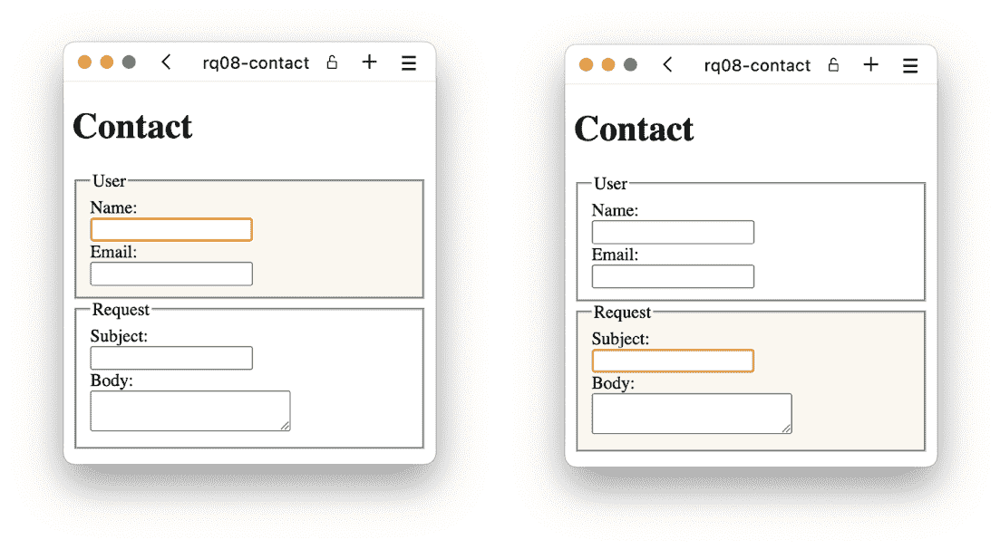

图 8.5 用户在任一部分输入数据时的完成表单

为了实现这个目标，我们需要监听输入字段的焦点和失焦事件。当一个输入获得焦点时，将其部分存储为焦点部分。当一个输入字段失去焦点时，记住没有部分有焦点。采用这种方法，我们需要在每个部分的每个输入上放置两个事件监听器。在这个例子中，每个部分中只有两个输入，所以总共是八个监听器，但如果我们有更多的输入呢？我们就必须将相同的两个监听器复制到每个输入字段。如果这听起来像是一种糟糕的方法，那它确实如此。如果可能的话，你应该避免重复。在这个例子中，由于事件冒泡，这种情况完全可以避免。

React 中的每个事件都会向上冒泡，穿过其文档树上的所有节点。为了知道哪个部分有焦点，我们只需要监听任何部分内的元素何时获得焦点。同样，为了知道某个元素失去焦点，我们只需要知道表单内任何元素何时失去焦点。我们可以使用这个技巧在两个部分上放置焦点监听器，并在表单本身上放置失焦监听器。然后，我们只需要总共三个事件监听器就能达到这个效果，而不是八个不同的监听器，其中大多数是相同的。让我们看看图 8.6 中的结果 JSX 结构以及我们想要放置监听器的位置。

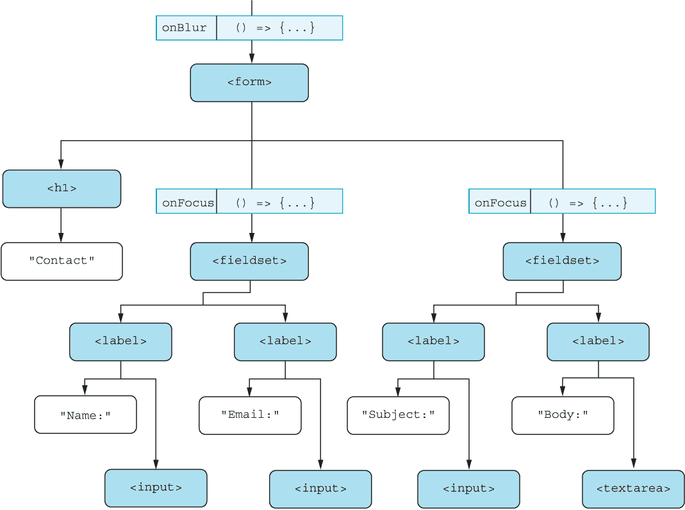

图 8.6 我们在表单上添加了一个失焦监听器，并在两个字段集上添加了焦点监听器。当任何输入（在底部行）上发生事件时，事件将向上传播并被适当的事件处理程序处理。

当你聚焦任何输入字段时，事件首先在输入字段本身上触发，但之后，相同的事件将在目标元素的所有祖先元素上依次触发，从父元素一直向上到 React 应用程序的根节点。当冒泡到达字段集时，React 将调用我们放置在那里的 onFocus 监听器。同样，当输入失去焦点时，React 将调用放置在表单元素上的 onBlur 监听器。

现在我们已经知道了我们想要实现什么，以及结果的 JSX 将会是什么样子，剩下的就是将所有这些组合成一个单独的组件。让我们在列表 8.6 中这样做。

列表 8.6 突出显示联系表单部分

```
import { useState } from "react";
const FOCUS_NONE = 0;
const FOCUS_USER = 1;
const FOCUS_REQUEST = 2;
function getStyle(isActive) {                            ❶
  return {
    display: "flex",
    flexDirection: "column",
    backgroundColor: isActive ? "oldlace" : "transparent",
  };
}
function Field({ label, children }) {
  return (
    <label>
      {label}:
      <br />
      {children}
    </label>
  );
}
function Contact() {
  const [focus, setFocus] = useState(FOCUS_NONE);        ❷
  const onUserFocus = () => setFocus(FOCUS_USER);        ❸
  const onRequestFocus = () => setFocus(FOCUS_REQUEST);  ❸
  const onBlur = () => setFocus(FOCUS_NONE);             ❸
  return (
    <form onBlur={onBlur}>                               ❹
      <h1>Contact</h1>
      <fieldset
        onFocus={onUserFocus}                            ❹
        style={getStyle(focus === FOCUS_USER)}           ❺
      >
        <legend>User</legend>
        <Field label="Name">
          <input />
        </Field>
        <Field label="Email">
          <input type="email" />
        </Field>
      </fieldset>
      <fieldset
        onFocus={onRequestFocus}                         ❹
        style={getStyle(focus === FOCUS_REQUEST)}        ❺
      >
        <legend>Request</legend>
        <Field label="Subject">
          <input />
        </Field>
        <Field label="Body">
          <textarea />
        </Field>
      </fieldset>
    </form>
  );
}
function App() {
  return <Contact />;
}
export default App;
```

❶ 首先，我们添加一个辅助函数，根据该部分是否为活动部分来生成其样式。

❷ 第二，我们需要记住当前哪个部分有焦点（一开始，它们都没有）。

❸ 创建三个不同且非常简单的监听器，我们需要使用它们

❹ 将监听器分配到所需的位置

❺ 根据部分是否有焦点，为每个部分分配正确的样式

仓库：rq08-contact

这个例子可以在仓库 rq08-contact 中看到。你可以通过基于相关模板创建一个新应用程序来使用该仓库：

```
$ npx create-react-app rq08-contact --template rq08-contact
```

或者，您也可以访问这个网站浏览代码，直接在您的浏览器中查看应用程序的运行情况，或者下载源代码的 zip 文件：

[`rq2e.com/rq08-contact`](https://rq2e.com/rq08-contact)

就这些了！我们现在有一个样式精美的联系表单，其中包含一些非常聪明的焦点监听器。如果您在浏览器中运行它，您将得到与图 8.5 中看到的结果完全一致的结果。

在本节的其余部分，我们将更详细地讨论从技术角度如何实现事件传播。首先，我们将涵盖 HTML 和 JavaScript 中的事件，然后是 React 中的事件。

### 8.3.1 浏览器中阶段和传播的工作原理

正如刚才提到的，React 事件会冒泡。HTML 事件也会冒泡。当您点击一个按钮时，该按钮的所有祖先节点都会派发事件。它们将派发两个事件——一个在目标元素本身之前，一个在目标元素本身之后。

注意：本小节是关于 HTML 中一般事件的，而不是专门关于 React 的。我们需要先介绍这个主题，以便您更好地理解 React 中事件的工作方式。在接下来的小节中，我们将具体讨论 React 中的事件阶段，它们略有不同。

之前，我们讨论了事件冒泡，这是在事件已经派发到目标元素之后，祖先节点派发事件的情况。然而，所有事件也会*捕获*，这是在事件派发到目标元素之前发生的情况。事件派发的三个阶段如下：

+   *捕获阶段*—事件按降序派发到所有父 DOM 节点，从窗口元素开始，经过每个祖先节点，直到目标元素的父节点。

+   *目标阶段*—事件被派发到目标元素本身。

+   *冒泡阶段*—事件按顺序派发到所有父 DOM 节点，从目标元素的父节点开始，向上移动到祖先节点，直到窗口元素

请参阅图 8.7 以了解这一过程的说明。整个概念被称为*事件传播*。事件首先在捕获阶段从窗口对象“向下”传播到目标元素，然后在冒泡阶段继续传播回窗口对象。

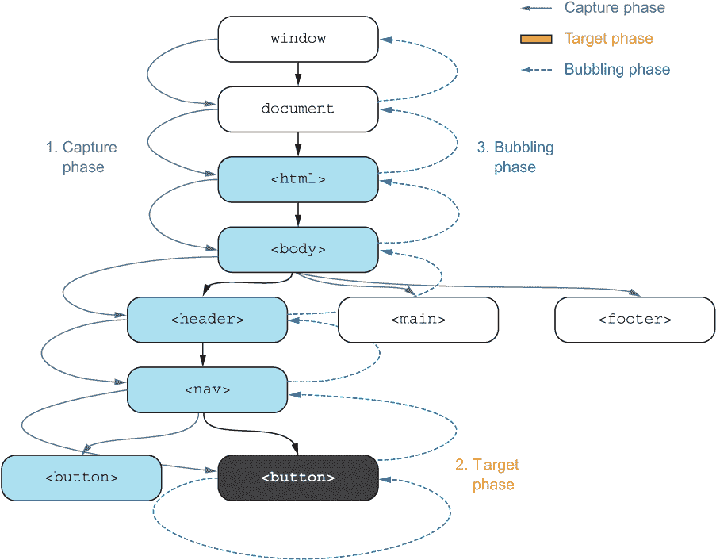

图 8.7 当您点击黑色按钮时，浏览器将从窗口开始在整个文档节点中传播事件，从捕获阶段开始向下通过文档树，直到目标，然后在冒泡阶段向上移动到窗口。

当您想在特定元素上监听事件时，您可以指定在哪个阶段监听该事件。默认情况下，监听冒泡和目标阶段的事件，但您可以添加一个参数来专门监听捕获阶段的事件。

在 JavaScript 中，你通过简单地调用 addEventListener 并传递事件和回调函数来添加监听器（冒泡和目标）：

```
element.addEventListener("click", onClick);
```

如果你想要使用捕获监听器，你必须添加一个带有对象的第三个参数：

```
element.addEventListener("click", onClick, { capture: true });
```

当你收到一个事件时，你可以检查事件对象的 `.eventPhase` 属性以查看它属于哪个事件阶段。可能的值在此列出：

+   Event.CAPTURING_PHASE (1) 用于捕获

+   Event.AT_TARGET (2) 用于目标

+   Event.BUBBLING_PHASE (3) 用于冒泡

在图 8.7 的示例中，总共将按以下顺序发送 14 个潜在事件：

1.  捕获阶段：

    1.  在窗口上派发捕获事件

    1.  在文档上派发捕获事件

    1.  在 `<html>` 元素上派发捕获事件

    1.  在 `<body>` 元素上派发捕获事件

    1.  在 `<header>` 元素上派发捕获事件

    1.  在 `<nav>` 元素上派发捕获事件

1.  目标阶段：

    1.  目标事件（注册为捕获监听器）在 `<button>` 元素上派发

    1.  目标事件（注册为冒泡监听器）在 `<button>` 元素上派发

1.  冒泡阶段：

    1.  在 `<nav>` 元素上派发冒泡事件

    1.  在 `<header>` 元素上派发冒泡事件

    1.  在 `<body>` 元素上派发冒泡事件

    1.  在 `<html>` 元素上派发冒泡事件

    1.  在文档上派发冒泡事件

    1.  在窗口上派发冒泡事件

事件 2.a 和 2.b 可能看起来很相似，但它们首先将被分组到所有派发到定义为捕获监听器的监听器中，然后是派发到定义为冒泡监听器的监听器中。当然，你可以在同一个目标上对同一个事件有多个监听器。如果发生这种情况，事件将按监听器分配的顺序派发。

让我们在图 8.8 中用一个简化视图来表示前面的图，其中只包含三个元素，按降序排列。

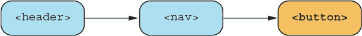

图 8.8 降序排列的三个元素

假设我们按以下顺序向不同元素添加多个监听器：

1.  将捕获监听器添加到 `<nav>` 元素

1.  将冒泡监听器添加到 `<button>` 元素

1.  再次将捕获监听器添加到 `<button>` 元素

1.  将捕获监听器添加到 `<header>` 元素

1.  再次将捕获监听器添加到 `<nav>` 元素

1.  再次将捕获监听器添加到 `<button>` 元素

1.  将冒泡监听器添加到 `<nav>` 元素

这八个监听器（A 到 G）将按以下顺序调用：

1.  在 `<header>` 上的捕获监听器：D (事件阶段=CAPTURING_PHASE)

1.  在 `<nav>` 上的捕获监听器：A, E (事件阶段=CAPTURING_PHASE)

1.  在 `<button>` 上的捕获监听器：C, F (事件阶段=AT_TARGET)

1.  在 `<button>` 上的冒泡监听器：B (事件阶段=AT_TARGET)

1.  在 `<nav>` 元素上的冒泡监听器：G (事件阶段: BUBBLING_PHASE)

1.  在 `<header>` 元素上的冒泡监听器：*无*

注意，尽管目标元素上的监听器将按捕获监听器先派发，然后是冒泡监听器的顺序派发，但它们都将使用事件阶段 AT_TARGET，而不是分别使用捕获和冒泡阶段。

### 8.3.2 在 React 中处理事件阶段

在 React 中，事件不是通过在节点上添加监听器来添加的。在 React 中，事件是通过将属性分配给表示该节点的 JSX 元素来添加的。因此，你无法添加一个参数来说明你正在监听事件的哪个阶段。在 React 中，就像在 JavaScript 中一样，默认情况下是将事件添加为冒泡监听器。当你写下

```
<main onClick={onClickHandler}>
  ...
</main>
```

这个 onClickHandler 将被添加为冒泡阶段监听器。如果你想添加捕获事件监听器，你必须将事件后缀为*Capture*。对于一个点击处理程序，那就是 onClickCapture。所以，如果你有

```
<main onClickCapture={handler1} onClick={handler4}>
  <button onClickCapture={handler2} onClick={handler3} />
</main>
```

这些点击处理程序将被调用为 handler1、handler2、handler3，然后是 handler4。

捕获处理程序相当罕见。你可能永远不会使用它们，或者在一个大型应用程序中可能只使用一两次，但当你真正需要它们时，它们是一个非常好的工具。它们是 React 的细丝皮削器——很少使用，但使用时却非常适合这项工作！

### 8.3.3 不寻常的事件传播

有四种事件类型在 React 中有非常不寻常的事件传播流程。这涉及到鼠标进入/离开和指针进入/离开这对。这些事件相关联，因为鼠标或指针在离开一个元素的同时会进入另一个元素。这些事件的传播是从离开的元素冒泡到进入的元素，并且它们不捕获。

如果你需要有关此流程的详细信息，请参阅以下文章：[`barklund.dev/mouseevents`](https://barklund.dev/mouseevents)。这只会出现在一些非常特殊的情况下，所以这可能不是你需要担心的事情。

### 8.3.4 非冒泡 DOM 事件

在 DOM 中，一些事件根本不冒泡，但它们仍然捕获。这仅发生在失焦和焦点事件上。然而，在 React 中，为了方便使用，这两个事件仍然像其他事件一样冒泡。所以，假设你在 React 中有以下结构：

```
<label onFocusCapture={handler1} onFocus={handler3}>
  <input onFocus={handler2} />
</label>
```

如果你将光标放在输入字段内，三个事件处理程序将按以下顺序触发：handler1、handler2、handler3。如果你在没有 React 的情况下实现相同的功能并使用 JavaScript 添加事件监听器，handler3 永远不会触发，因为它是一个不冒泡的事件类型的冒泡阶段的事件。

这些事件在 HTML 中不冒泡有一个技术原因，但因为它对开发者来说非常令人困惑（而且很容易忘记），React 简单地也将这些事件冒泡。作为一个 React 开发者，你不需要担心这个问题，可以直接像使用正常事件一样使用焦点和失焦事件，实际上我们在本节的开始就已经这样做了。

为什么焦点和失焦事件在 HTML 中不冒泡

当用户通过切换浏览器标签或切换到不同的程序使窗口失去焦点时，将在 window 对象上触发一个 blur 事件。同样，当用户返回到浏览器中的相同窗口/标签时，窗口将重新获得焦点，并在 window 对象上触发一个 focus 事件。

如果输入字段或按钮上的 focus 或 blur 事件冒泡，它必须冒泡到 window 对象。然后，作为开发者，您可能会因为用户使窗口失去/获得焦点而混淆事件。您可以通过检查事件的.target 属性来区分这两种情况，但出于历史原因，这些事件不会简单地冒泡，以确保不会发生这种混淆。

在 React 中，这不是问题，因为您不能将 React 事件监听器分配给 window 对象。您只能将 React 事件监听器分配给实际的 HTML 元素（并且 window 对象不是 HTML 元素），并且仅限于您应用程序内部的元素（这些元素位于<body>元素内部）。因此，在 React 中，focus 和 blur 事件*确实*会冒泡。

## 8.4 默认操作及其防止方法

浏览器在某些事件发生后会有默认操作。大多数时候，作为开发者，您希望这些默认操作发生，但有时您不希望这样。在下一个示例中，我们将看到一个您不希望浏览器执行默认操作，并展示如何防止其发生。

假设我们想在 React 中创建一个管理员登录表单，其中包含密码字段和登录按钮。当用户点击按钮时，我们希望我们的代码检查密码是否与秘密字符串"platypus"匹配。如果是，我们应用程序内部的所有秘密信息都应该向显然合法的管理员揭示。让我们从以下列表开始创建这个功能。

列表 8.7 管理员表单（可能已损坏？）

```
import { useState } from "react";
function Admin() {
  const [password, setPassword] = useState("");     ❶
  const [isAdmin, setAdmin] = useState(false);      ❷
  const onClick = () => {
    if (password === "platypus") {                  ❸
      setAdmin(true);
    }
  };
  return (
    <>
      {isAdmin && <h1>Bacon is delicious!</h1>}     ❹
      <form>
        <input                                      ❺
          type="password"                           ❺
          onChange={                                ❺
            (evt) => setPassword(evt.target.value)  ❺
          }                                         ❺
        />                                          ❺
        <button onClick={onClick}>                  ❻
          Login
        </button>
      </form>
    </>
  );
}
function App() {
  return <Admin />;
}
export default App;
```

❶ 将输入的密码存储在状态值中

❷ 在另一个状态值中存储用户是否被批准为管理员用户

❸ 当用户点击按钮时，检查输入的密码是否与预期匹配，如果是，则更新状态

❹ 根据用户是否被批准为管理员用户显示条件 JSX

❺ 我们输入字段会在更改时更新状态 password。

❻ 我们按钮在被点击时会调用事件处理器。

如果您在浏览器中打开它，输入一些内容到输入字段，并点击按钮，会发生一些意外的事情。整个页面重新加载，输入字段被清除。这完全不是我们想要的，看起来像是一个完全随机的结果。为什么会发生这种情况？

### 8.4.1 默认事件操作

如果我们在网页上创建一个带有按钮的 HTML 表单并点击该按钮，页面将重新加载。这是 HTML 中的默认行为。

假设我们将以下 HTML（注意我们现在谈论的是纯 HTML，而不是 JSX）放入一个文件并在浏览器中打开它：

```
<form>
  <button>Click me</button>
</form>
```

点击此按钮会重新加载页面。这是因为表单内的按钮会导致表单提交，当表单提交时，表单内的变量将被发送到表单的目标 URL。即使表单没有任何输入，即使表单没有显式的目标 URL（默认目标 URL 是页面本身），这种情况也会发生。

了解这些信息后，我们现在可以看到之前我们犯了什么错误。我们应用程序内的按钮会提交表单，提交表单会导致页面默认重新加载。

### 8.4.2 防止默认行为

利用我们新获得的知识，我们将在表单中做两件事以使其正确工作。首先，我们将事件处理程序从点击按钮移动到提交表单。这是同一个处理程序，我们只是将其分配给表单的 onSubmit 属性，而不是按钮的 onClick 属性。

其次，我们需要告诉表单不要执行它通常在提交时执行的默认操作。我们通过在传递给事件处理程序的事件对象上调用 evt.preventDefault()来实现这一点。让我们在下一个列表中实现这一点。

列表 8.8 管理表单（可能已修复？）

```
import { useState } from "react";
function Admin() {
  const [password, setPassword] = useState("");
  const [isAdmin, setAdmin] = useState(false);
  const onSubmit = (evt) => {                   ❶
    evt.preventDefault();                       ❷
    if (password === "platypus") {
      setAdmin(true);
    }
  };
  return isAdmin ? (
    <h1>Bacon is delicious!</h1>
  ) : (
    <form onSubmit={onSubmit}>                  ❸
      <input
        type="password"
        onChange={(evt) => setPassword(evt.target.value)}
      />
      <button>Login</button>
    </form>
  );
}
function App() {
  return <Admin />;
}
export default App;
```

❶ 将事件对象作为参数传递给事件处理程序以防止默认操作

❷ 在提交处理程序中调用 evt.preventDefault() 方法，无论处理程序中发生什么

❸ 将事件处理程序连接到表单元素

存储库：rq08-admin

此示例可在 rq08-admin 存储库中看到。您可以通过创建一个基于相关模板的新应用程序来使用该存储库：

```
$ npx create-react-app rq08-admin --template rq08-admin
```

或者，您可以访问此网站浏览代码，直接在浏览器中查看应用程序的运行情况，或下载源代码的 zip 文件：

[`rq2e.com/rq08-admin`](https://rq2e.com/rq08-admin)

就这样。我们的管理表单按预期工作！我们在表单中阻止了默认事件的发生，因此浏览器原生的事件处理程序没有启动。您可以在图 8.9 中看到结果。

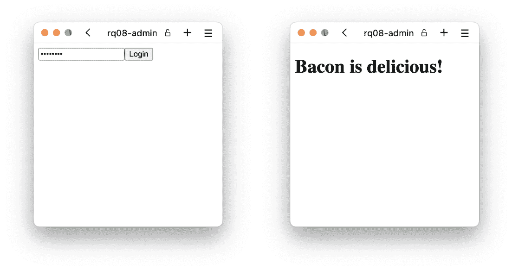

图 8.9 管理登录表单工作正常，当我们输入正确的密码时，宇宙的秘密就展现在我们面前（而且显然这些秘密很美味）。

如果您在表单内具有提交按钮的输入字段中按下 Enter 键，表单将被提交。如果我们只是将事件处理程序放在按钮上作为 onClick，则在输入字段中聚焦时按下 Enter 键提交表单将不会按预期工作，并且由于表单提交，页面仍然会重新加载。通过将我们的处理程序移动到表单的提交事件上，我们处理了两种提交表单的方式。

注意：当然，这个示例在网络安全方面并不恰当。在 React 中发生的任何事情都可以被您的网页上的任何访客读取，并且上述安全措施会在几秒钟内被破坏。请确保使用适当的网络架构来创建安全的登录。

### 8.4.3 其他默认事件

表单提交事件有一个默认操作，即表单实际上会提交到目标 URL，并包含表单中输入的所有值。这是浏览器中使用的默认事件之一，但绝对不是唯一的一个。

点击链接将在链接元素上创建一个点击事件。此事件的默认操作是遵循链接并转到由 href 属性指示的新 URL。同样，您可以通过在事件处理程序中接收到的点击事件对象上调用.preventDefault()方法来防止此默认行为。这意味着浏览器不会转到目标 URL，实际上什么都不会发生。

您可以通过检查.cancellable 属性来检查事件是否可取消。如果是 true，则可以调用.preventDefault()来阻止浏览器执行默认操作。如果是 false，调用.preventDefault()仍然是可能的，但它不会做任何事情。以下是一个不完整的可取消事件列表：

+   滚动事件是可取消的，这会导致滚动不会发生，并且滚动偏移量保持不变。

+   键盘按下、按键和键盘抬起事件是可取消的，这会导致字符不会被插入（如果是在输入字段或文本区域中调用）或者防止浏览器执行给定键的默认操作（例如，在取消 Page Up 的按下时，使浏览器不滚动页面）。另一方面，输入事件是不可取消的，因为它们是在事实发生后分发的（例如，在用户输入某些内容或粘贴某些内容之后）。

+   拖动开始和拖动进入事件是可取消的（分别，导致根本不发生拖动或导致拖动效果保持不变），但拖动结束和拖动离开事件是不可取消的。

React 遵循与 HTML 相同的默认操作和可预防操作的程序，因此请参考任何在线 HTML 指南，了解哪些事件是可取消的以及默认操作是什么。

## 8.5 React 事件对象总结

我们已经看到了许多使用 React 发送到事件处理程序的事件对象的不同方法。表 8.2 列出了所有事件对象共有的属性子集。这些属性中的许多已经在本章中详细解释过。这些并不是所有事件对象上可用的所有属性，但据我们意见，它们是最重要的。

表 8.2 React 和 HTML 中所有事件对象共有的重要属性

| 属性 | 目的 |
| --- | --- |
| 冒泡 | 一个布尔值，表示事件是否冒泡 |
| 可取消 | 一个布尔值，表示事件是否可以被取消 |
| 事件阶段 | 一个数值，表示事件传播中此事件属于哪个阶段 |
| preventDefault | 防止浏览器使用默认操作处理事件的方法 |
| stopPropagation | 防止事件进一步传播的方法 |
| 目标 | 此事件分配到的目标节点 |
| timestamp | 事件创建的时间，以毫秒为单位 |
| type | 导致此事件对象被分发的事件的类型 |

## 8.6 从属性中获取事件处理器函数

当你创建可重用的 UI 元素时，一个关键部分是创建通用的接口元素，然后你可以将其用于其他位置，而无需每次都对其进行样式设计。为此，现在让我们创建一个可以重复使用的样式化通用按钮组件。我们将使用这个通用按钮组件来创建一个带有增加和减少按钮的计数器——但具有样式。我们希望创建出像图 8.10 那样的东西——看看那些时尚的按钮。

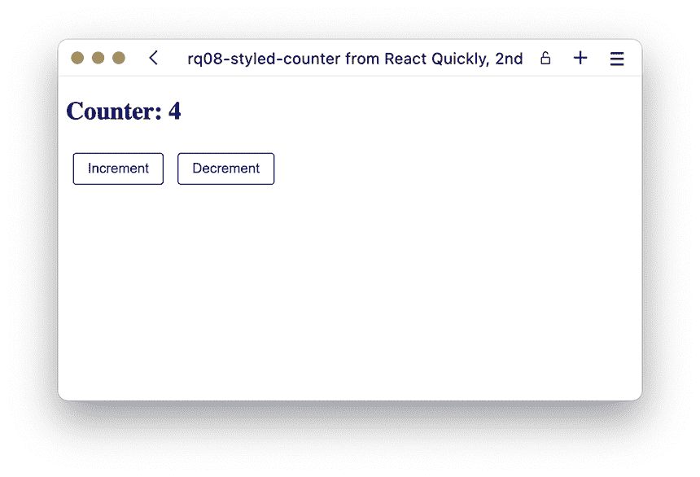

图 8.10 最终应用程序，计数器已经增加了几次。这些按钮看起来是不是比我们习惯看到的默认按钮要好看一点？

我们将按照图 8.11 中的 JSX 图结构化所示的应用程序。

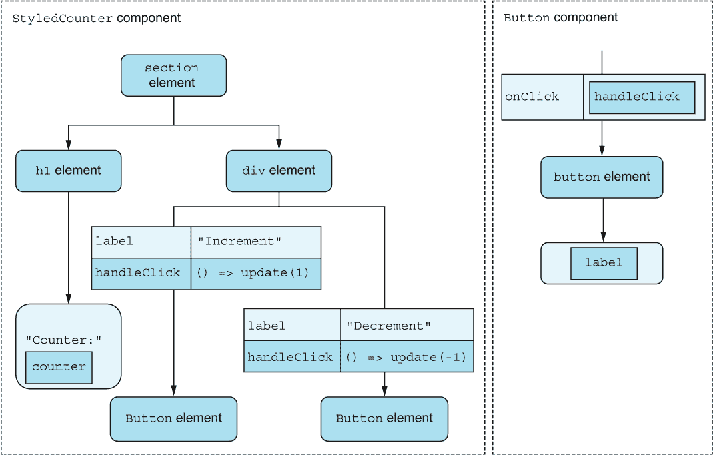

图 8.11 我们定制的计数器应用程序将包含两个具有略微不同属性的按钮组件实例。

如你所见，我们将传递一个函数，handleClick，到每个按钮组件实例，它应该内部被分配为按钮的点击处理器。让我们在列表 8.9 中实现这一点。

列表 8.9 样式化计数器

```
import { useState } from "react";
function Button({ handleClick, label }) {
  const buttonStyle = {
    color: "blue",
    border: "1px solid",
    background: "transparent",
    borderRadius: ".25em",
    padding: ".5em 1em",
    margin: ".5em",
  };
  return (
    <button style={buttonStyle} onClick={handleClick}>    ❶
      {label}
    </button>
  );
}
function StyledCounter() {
  const [counter, setCounter] = useState(0);
  const update = (d) => setCounter((v) => v + d);
  return (
    <section>
      <h1>Counter: {counter}</h1>
      <div>
        <Button
          handleClick={() => update(1)}                   ❷
          label="Increment"
        />
        <Button
          handleClick={() => update(-1)}                  ❷
          label="Decrement"
        />
      </div>
    </section>
  );
}
function App() {
  return <StyledCounter />;
}
export default App;
```

❶ 直接将接收到的 handleClick 属性作为按钮组件内的 onClick 事件处理器

❷ 当按钮被点击时，将 handleClick 属性设置为更新状态的函数

存储库：rq08-styled-counter

这个例子可以在 rq08-styled-counter 存储库中看到。你可以通过创建一个基于相关模板的新应用程序来使用该存储库：

```
$ npx create-react-app rq08-styled-counter --template rq08-styled-counter
```

或者，你可以访问这个网站来浏览代码，直接在你的浏览器中查看应用程序，或者下载源代码的 zip 文件：

[`rq2e.com/rq08-styled-counter`](https://rq2e.com/rq08-styled-counter)

这看起来相当不错，是一个很好、紧凑、定义良好的应用程序。然而，有一点稍微有点奇怪。当我们使用我们的按钮组件时，我们分配了一个当按钮被点击时应调用的函数。然而，在列表 8.9 中，因为我们直接将函数作为 onClick 属性分配给按钮，所以函数以事件对象作为第一个和唯一的参数被调用。有时，这可能是一个好的解决方案，但有时这并不理想。外部组件不应访问此事件对象，因为它按钮组件的内部实现细节。

要从函数调用中移除此事件，我们必须创建另一个函数作为事件处理器，并在调用时调用 handleClick 属性（不带任何参数）。这看起来可能像这样：

```
function Button({ handleClick, label }) {             ❶
  const buttonStyle = {...};
  const onClick = () => handleClick();                ❷
  return (
    <button style={buttonStyle} onClick={onClick}>    ❸
      {label}
    </button>
  );
}
```

❶ 仍然像以前一样接收 handleClick 属性

❷ 现在创建一个局部函数，当调用时，调用传递的属性

❸ 将此局部函数分配为事件处理器，而不是传递的属性

注意，我们将事件监听器命名为一个 handle* 属性。这是一种相当常见的做法，当将函数作为属性传递给不是直接事件监听器本身，而是作为回调函数（根据需要由事件监听器或效果调用）的元素时。我们也可以将这个属性命名为 onClick，但这样会让人误以为它是一个事件监听器，用户会期望它作为事件监听器行事（而且我们肯定必须将事件对象作为参数发送给它）。

你会在现实世界的代码库中看到许多将函数属性作为回调调用的例子（要么直接作为事件监听器，要么在事件监听器内部），因为这是一种非常常见的用于设计可重用 UI 组件库的方法。我们也会在未来的章节中使用这种结构。我们将使用 on* 命名来为直接事件处理程序（接收事件对象）命名，并使用 handle* 命名来为回调（要么不带任何参数，要么带一些自定义参数）命名。

## 8.7 事件处理程序生成器

如果你有很多只有细微差别的事件处理程序函数，你可能希望将它们泛化成一个 *事件处理程序生成器*。让我们以我们之前的例子为例，一个带有增加和减少按钮的计数器。我们将这两个不同的函数泛化成一个基于参数更新值的单个函数，然后在两个按钮的点击事件处理程序中用不同的参数调用 *这个* 函数：

```
function Counter() {
  const [counter, setCounter] = useState(0);
  const update = (delta) =>                   ❶
    setCounter((c) => c + delta);             ❶
  return (
    <>
      <h1>Value: {counter}</h1>
      <button onClick={() => update(1)}>      ❷
        Increment
      </button>
      <button onClick={() => update(-1)}>     ❷
        Decrement
      </button>
    </>
  );
}
```

❶ 一个用于使用 delta 更新计数器值的通用函数

❷ 在事件处理程序中调用 update 并使用两个不同的值

我们可以将这个概念进一步发展。请注意，在这两个事件处理程序中，我们仍然在定义一个函数，然后调用 update（两者都有箭头定义，如 () => update）。我们可以使用一个 *柯里化* 函数将这个函数定义移到 update 函数内部。这使得 update 函数成为一个事件处理程序 *生成器*，当被调用时返回一个事件处理程序。所以，这是一个返回另一个函数的函数：

```
function Counter() {
  const [counter, setCounter] = useState(0);
  const update = (delta) => () =>                       ❶
    setCounter((c) => c + delta);                       ❶
  return (
    <>
      <h1>Value: {counter}</h1>
      <button onClick={update(1)}>Increment</button>    ❷
      <button onClick={update(-1)}>Decrement</button>   ❷
    </>
  );
}
```

❶ 一个用于使用 delta 更新计数器值的通用事件处理程序生成器

❷ 在事件处理程序中调用事件处理程序生成器以生成具有特定 delta 的事件处理程序

这可能看起来有点晦涩，而且你并不需要完全理解这里的逻辑。只需注意，这是一种许多开发者常用的相当常见的方法，所以你可能会在日常工作中看到它。我们将在下一章关于表单事件处理中重新审视使用事件处理程序生成器的方法，这样你就可以在那里获得更多关于这个概念的经验。

## 8.8 手动监听 DOM 事件

有时，你希望能够在不由 React 直接控制的节点上监听事件，而有时，你希望手动控制是否监听事件。为了这两个目的，你可以在常规 JavaScript 中直接在 DOM 节点上监听事件，绕过 React 的事件监听器设置。以下是一些你可能想要手动管理事件监听器的情况示例：

+   你想监听窗口或文档对象上的事件。

+   你想在 HTML 节点上监听事件，这些节点不是直接包含在 React 应用程序中的，例如 body，它永远不可能在 React 应用程序内部，但也可能是 React 应用程序控制之外的某个节点。

+   你想在非 DOM 对象上监听事件，例如请求、套接字或任何其他 JavaScript 对象。

+   你想在特定节点上监听单个事件，而不关心事件发生的多个实例。

+   你想有条件地监听节点上的事件。

列表中的前三个示例只能通过直接在节点上监听来实现，但后两个示例仍然可以使用 React 实现。然而，两者都可能需要额外的工作，这可能不是必要的。在下面的子节中，你将看到如何通过在 React 架构之外手动监听 DOM 事件来实现前面列表中的每一项。

### 8.8.1 监听窗口和文档事件

假设我们想在应用程序中显示浏览器窗口的大小。我们可以在组件首次渲染时通过查看 window.innerWidth 和 window.innerHeight 来显示浏览器窗口的大小。但是，如果用户在组件挂载时调整窗口大小，它不会自动重新渲染，我们也不会更新显示的值。

为了确保我们的组件在窗口大小调整时更新，我们需要监听窗口对象上的 resize 事件。因为这是一个不由 React 管理的事件，我们需要直接在窗口对象上使用 window.addEventListener 附加我们的监听器。但是，我们也需要确保在组件卸载时通过调用 window.removeEventListener 再次移除我们的事件监听器。

如果你回想起第六章关于组件生命周期的内容，这可能会是一个使用 useEffect 钩子的完美候选者——而且确实如此！我们将结合 useState 钩子来实现一个组件，其工作流程类似于图 8.12 中概述的流程图。实现方式在列表 8.10 中展示。

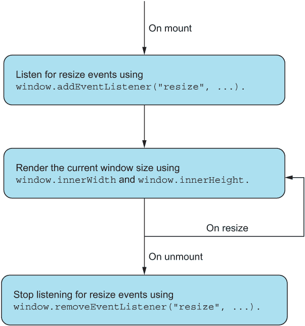

图 8.12 WindowSize 组件必须在挂载时添加监听器，并在组件卸载时再次移除。在挂载期间，如果浏览器窗口大小发生变化，浏览器将调用我们的回调函数。

列表 8.10 窗口大小显示

```
import { useState, useEffect } from "react";
function getWindowSize() {                                ❶
  return `${window.innerWidth}x${window.innerHeight}`;
}
function WindowSize() {
  const [size, setSize] = useState(getWindowSize());      ❷
  useEffect(() => {                                       ❸
    const onResize = () => setSize(getWindowSize());      ❹
    window.addEventListener("resize", onResize);          ❺
    return () =>                                          ❻
      window.removeEventListener("resize", onResize);     ❻
  }, [setSize]);                                          ❼
  return <h1>Window size: {size}</h1>;                    ❽
}
function App() {
  return <WindowSize />;
}
export default App;
```

❶ 首先，一个实用函数，用于获取浏览器窗口大小的良好显示值

❷ 使用该实用函数来初始化我们的状态值

❸ 设置一个 effect 钩子

❹ 在这个钩子内部，我们定义了一个在窗口大小改变时被调用的函数。

❺ 将此函数直接作为事件监听器分配给窗口对象

❻ 确保我们的 effect 钩子返回一个清理函数，该函数再次移除监听器

❼ 因为它是一个 effect 钩子，我们需要设置我们的依赖项。它们只包含我们知道的稳定的 setSize 函数，但仍然包含在内以提高透明度。

❽ 在返回的 JSX 中渲染实际的窗口大小

仓库：rq08-window-size

这个例子可以在 rq08-window-size 仓库中看到。你可以通过创建一个基于相关模板的新应用来使用该仓库：

```
$ npx create-react-app rq08-window-size --template rq08-window-size
```

或者，你可以访问这个网站来浏览代码，直接在你的浏览器中查看应用，或者下载源代码的 zip 文件：

[`rq2e.com/rq08-window-size`](https://rq2e.com/rq08-window-size)

如果你在浏览器中运行此应用，你将看到类似于图 8.13 的内容。

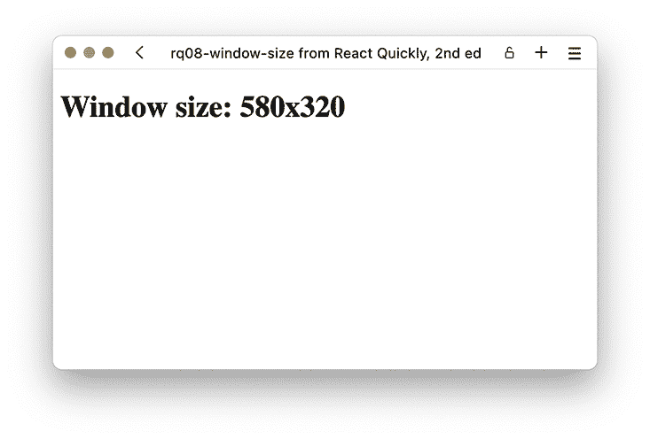

图 8.13 窗口大小应用在小型窗口中的运行情况

这是一个如何监听永久对象（如窗口或文档）上事件的非常基础的例子。这是处理仅在这两个对象上发生的一定数量的事件或捕获某些类型所有冒泡事件的常见方法。

注意我们在 useEffect 中巧妙地使用了清理函数。因为我们定义我们的监听函数在 effect 内部，添加监听器在 effect 中，并且——如果我们需要清理——再次移除监听器，这种结构无论我们的依赖项如何，以及我们的函数是否多次挂载和卸载，都是有效的。

然而，也请注意，因为我们没有使用 React 的巧妙技巧，即只监听一次事件并手动记住谁监听什么，所以我们为我们的组件的每个实例添加了一个监听器到窗口对象。如果这是一个长列表中的类似元素之一，我们就会为添加的每个元素添加一个新的监听器。如果我们能够添加单个监听器，这显然是毫无意义的。当直接在 DOM 节点上添加事件时，你可能需要特别注意如何优化它们。

### 8.8.2 处理不受支持的 HTML 事件

现在，让我们看看如何监听 React 不支持的一些 DOM 事件，例如过渡事件。这些事件实际上是由 CSS 触发的，当 CSS 过渡被分配、开始、结束和取消时。在这四个事件中，只有 ended 事件在 React 中直接支持，使用 onTransitionEnd 属性。

让我们创建一个具有过渡元素的组件。我们希望显示从红色到蓝色再返回的文本过渡。我们将使用两个不同的按钮来触发这个过渡，这两个按钮直接在 HTML 节点上使用节点的 style 对象设置颜色。然后我们想在标题中显示过渡是否正在运行。

虽然我们可以在 React 中使用 onTransitionEnd 属性监听 transitionend 事件，但我们不能以同样的方式监听 transitionstart 事件。因此，为了方便使用，我们将使用常规 DOM 监听器来监听这两个事件。让我们在下面的列表中将所有这些结合起来。你可以在图 8.14 中看到结果。

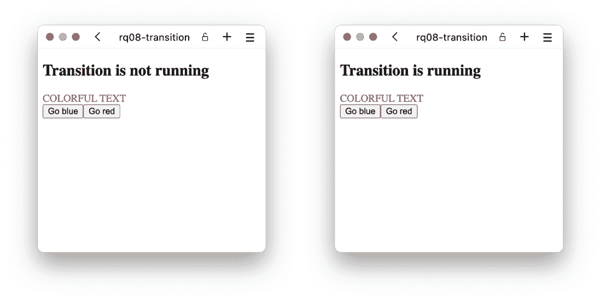

图 8.14 如果你点击两个按钮，你会看到文本颜色从红色变为蓝色再变回红色，标题将反映动画是否正在运行。作为额外奖励，注意如果你在文本已经是红色时点击 Go Red 按钮，过渡永远不会开始，所以标题永远不会改变。

列表 8.11 过渡事件

```
import { useState, useRef, useEffect } from "react";
function Transition() {
  const [isRunning, setRunning] = useState(false);
  const div = useRef();                                  ❶
  useEffect(() => {
    const onStart = () => setRunning(true);              ❷
    const onEnd = () => setRunning(false);               ❷
    const node = div.current;                            ❸
    node.addEventListener("transitionstart", onStart);   ❹
    node.addEventListener("transitionend", onEnd);       ❹
    return () => {
      node.removeEventListener(                          ❺
        "transitionstart", onStart                       ❺
      );                                                 ❺
      node.removeEventListener("transitionend", onEnd);  ❺
    };
  }, [setRunning]);
  return (
    <section>
      <h1>Transition is {!isRunning && "not"} running</h1>
      <div
        style={{ color: "red", transition: "color 1s linear" }}
        ref={div}                                        ❻
      >
        COLORFUL TEXT
      </div>
      <button onClick={() => (div.current.style.color = "blue")}>
        Go blue
      </button>
      <button onClick={() => (div.current.style.color = "red")}>
        Go red
      </button>
    </section>
  );
}
function App() {
  return <Transition />;
}
export default App;
```

❶ 因为我们需要引用一个 HTML 元素，所以我们需要使用 useRef 钩子。

❷ 在 effect 钩子内部创建两个回调函数作为监听器

❸ 我们还需要一个指向 DOM 元素的本地变量，这样我们就可以在清理函数中访问该元素。

❹ 在 effect 钩子中直接在 DOM 元素上添加监听器

❺ 在清理时从同一对象中移除相同的监听器

❻ 在我们的目标元素上设置 ref 属性

仓库：rq08-transition

这个例子可以在 rq08-transition 仓库中看到。你可以通过创建一个基于相关模板的新应用程序来使用那个仓库：

```
$ npx create-react-app rq08-transition --template rq08-transition
```

或者，你可以访问这个网站浏览代码，直接在浏览器中查看应用程序的运行情况，或者下载源代码的 zip 文件：

[`rq2e.com/rq08-transition`](https://rq2e.com/rq08-transition)

这是一个独特的案例之一，你需要监听 React 直接不支持的一些事件之一。这是因为这个事件在应用程序中很少使用，但这并不意味着它没有用例。

在复杂场景的应用程序中，更有可能使用直接在 HTML 节点上的 DOM 监听器。在这些情况下，监听器可以根据其他标准进行更改，手动管理事件监听器比依赖 JSX 和 React 为我们添加和删除监听器更有意义。接下来，我们将看到一个这样的例子。

### 8.8.3 结合 React 和 DOM 事件处理

在这个例子中，我们将结合使用 React 的事件监听器和手动 DOM 事件监听器。让我们创建一个当点击按钮时弹出菜单，然后当我们在菜单外部任何地方点击鼠标时再次关闭的菜单。我们将分两个迭代创建这个应用程序。我们首先以一种稍微简单的方式实现它，然后当我们发现一个错误时，我们会修复这个错误，并正确实现组件。

现在，让我们考虑事件流。我们需要监听打开菜单的按钮上的点击。我们知道如何使用 React 中的 onClick 来做这件事。但是，我们还需要在菜单打开时监听任何地方的鼠标按下事件。为此，我们需要在窗口对象上监听任何鼠标按下（或指针按下，因此我们也捕获触摸事件），并且我们需要在效果钩子中分配此处理程序。此事件流如图 8.15 所示，实现将在下一个列表中展示。

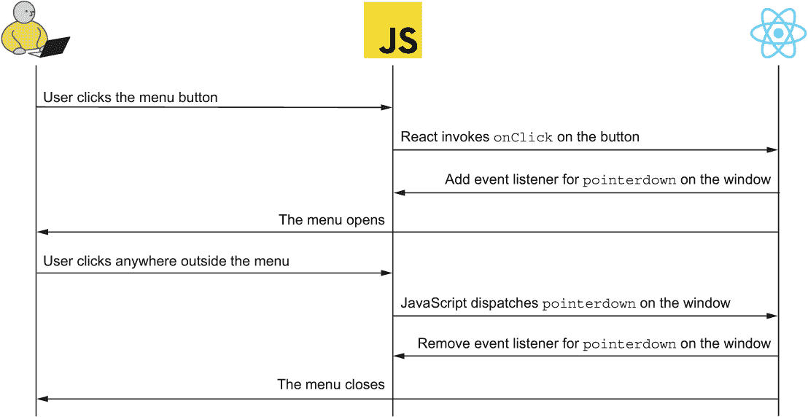

图 8.15 控制我们的菜单组件的事件流程图

列表 8.12 可扩展菜单（原始版本）

```
import { useState, useEffect } from "react";
function Menu() {
  const [isExpanded, setExpanded] = useState(false);      ❶
  useEffect(() => {
    if (!isExpanded) {                                    ❷
      return;
    }
    const onWindowClick = () => setExpanded(false);       ❸
    window.addEventListener(                              ❹
      "pointerdown", onWindowClick                        ❹
    );                                                    ❹
    return () => window.removeEventListener(              ❺
      "pointerdown", onWindowClick                        ❺
    );                                                    ❺
  }, [isExpanded]);                                       ❻
  return (
    <main>
      <button onClick={() => setExpanded(true)}>          ❼
        Show menu
      </button>
      {isExpanded && (                                    ❽
        <div style={{ border: "1px solid black", padding: "1em" }}>
          This is the menu
        </div>
      )}
    </main>
  );
}
function App() {
  return <Menu />;
}
export default App;
```

❶ 在状态值中存储菜单是否展开（默认为 false）

❷ 如果菜单未展开，则在我们的效果钩子内部提前终止（在这种情况下没有要做的）

❸ 如果菜单已展开，我们创建一个监听器，当鼠标在窗口内任何地方点击时，将再次折叠菜单。

❹ 将监听器添加到窗口对象

❺ 在清理时再次移除监听器

❻ 因为我们在依赖数组中有 isExpanded，所以每当菜单从展开状态变为折叠状态，反之亦然时，此钩子都会重新运行。

❾ 使菜单按钮简单地切换展开标志为 true

❽ 如果展开标志为 true，则渲染我们的菜单

仓库：rq08-naive-menu

此示例可以在仓库 rq08-naive-menu 中看到。您可以通过创建一个基于相关模板的新应用程序来使用该仓库：

```
$ npx create-react-app rq08-naive-menu --template rq08-naive-menu
```

或者，您可以访问此网站来浏览代码，直接在您的浏览器中查看应用程序的运行情况，或下载源代码的 zip 文件：

[`rq2e.com/rq08-naive-menu`](https://rq2e.com/rq08-naive-menu)

图 8.16 显示了该应用程序在浏览器中的运行情况。然而，存在一个小问题。如果你尝试这个，当菜单展开时点击*外部*，菜单会正确关闭。然而，如果你点击*内部*菜单，它也会关闭。这不太好。我们希望用户能够与我们的菜单进行交互，因为我们可能稍后会在这里放置一些按钮或链接。

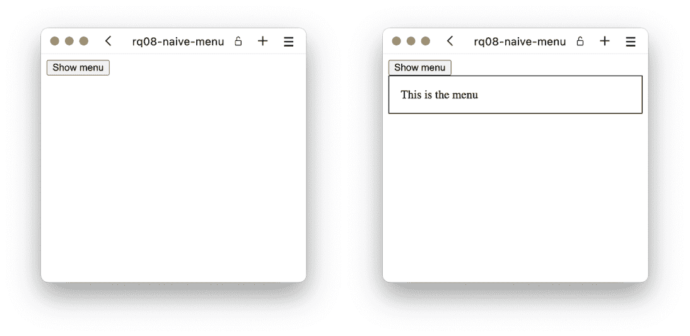

图 8.16 菜单应用在折叠和展开时的状态

我们希望仅在用户点击菜单外的鼠标时关闭菜单，而不是在菜单内点击时关闭。棘手的部分是在除特定位置外的“任何地方”点击鼠标时执行某些操作。为此，我们将使用我们迄今为止学到的三种技术：

+   当我们展开菜单时，我们将在窗口对象上添加一个监听器，以监听在窗口上发生的任何指针按下事件。当被调用时，我们将像之前一样折叠菜单。

+   这次，我们还会在菜单本身上添加一个事件监听器，该监听器将阻止这些指针事件在内部冒泡到窗口对象。我们通过停止这些事件的传播来实现这一点。

+   因为我们需要对我们的菜单 DOM 节点的引用，所以我们需要使用 useRef 钩子。

通过结合这三件事，我们将确保任何鼠标点击（即使在完全不受 React 控制的元素上）都会导致我们的菜单折叠，但任何在菜单内部的鼠标点击都不会导致菜单折叠，因为我们已经确保这些事件不会冒泡到窗口对象。我们在图 8.17 中捕获了这种事件流，并在列表 8.13 中实现了它。

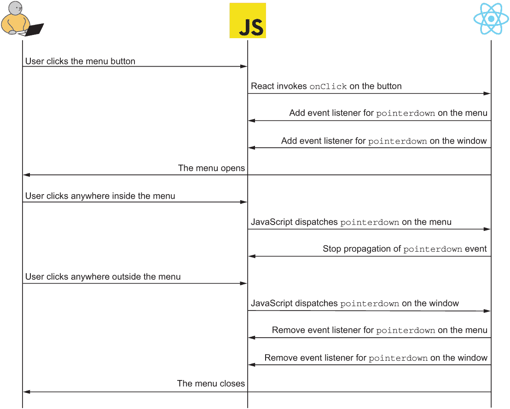

图 8.17 控制我们的菜单组件的流程图

列表 8.13 可展开菜单

```
import { useRef, useState, useEffect } from "react";
function Menu() {
  const [isExpanded, setExpanded] = useState(false);
  useEffect(() => {
    if (!isExpanded) {
      return;
    }
    const onWindowClick = () => setExpanded(false);
    const onMenuClick = (evt) => evt.stopPropagation();      ❶
    const menu = menuRef.current;                            ❷
    window.addEventListener("pointerdown", onWindowClick);
    menu.addEventListener("pointerdown", onMenuClick);       ❸
    return () => {
      window.removeEventListener(                            ❹
        "pointerdown", onWindowClick                         ❹
      );                                                     ❹
      menu.removeEventListener(                              ❹
        "pointerdown", onMenuClick                           ❹
      );                                                     ❹
    };
  }, [isExpanded]);
  const menuRef = useRef();                                  ❺
  return (
    <main>
      <button onClick={() => setExpanded(true)}>Show menu</button>
      {isExpanded && (
        <div
          ref={menuRef}                                      ❻
          style={{ border: "1px solid black", padding: "1em" }}
        >
          This is the menu
        </div>
      )}
    </main>
  );
}
function App() {
  return <Menu />;
}
export default App;
```

❶ 通过抑制指针事件从菜单节点“逃逸”的传播来停止菜单内部的指针事件，从而关闭菜单

❷ 在我们为菜单元素分配监听器之前，我们需要通过 ref 捕获对该元素的引用。

❸ 为菜单元素添加监听器

❹ 在清理时移除这两个监听器

❺ 我们需要一个 useRef 来存储我们对菜单元素的引用。

❻ 将我们的引用分配给正确的 JSX 元素

仓库：rq08-menu

此示例可以在 rq08-menu 仓库中看到。您可以通过创建基于相关模板的新应用程序来使用该仓库：

```
$ npx create-react-app rq08-menu --template rq08-menu
```

或者，您可以访问这个网站浏览代码，直接在浏览器中查看应用程序的实际应用，或者下载源代码的 zip 文件：

[`rq2e.com/rq08-menu`](https://rq2e.com/rq08-menu)

如果您在浏览器中运行此应用程序，您将看到与图 8.16 中相同的内容。注意，当您展开菜单时，您可以通过点击除菜单本身以外的任何地方来折叠菜单（即，除了在带有黑色边框的大框内）。

注意我们如何使用各种钩子，甚至将 React 事件监听器与 DOM 事件监听器结合起来以实现此结果。所有这些低级元素都很好地组合在一个简单的组件中，该组件正好完成我们想要它做的事情。

## 8.9 小测验

1.  添加点击监听器到 JSX 按钮的正确方式是什么？

    1.  <button click={onClick}>点击我</button>

    1.  <button click="onClick">点击我</button>

    1.  <button onClick={onClick}>点击我</button>

    1.  <button onClick="onClick">点击我</button>

1.  React 事件处理器也可以通过在 JSX 元素上调用 addEventListener 来分配。*正确*或*错误*？

1.  事件冒泡很少见，并且仅发生在少数事件类型中。*正确*或*错误*？

1.  如果您不希望在表单提交时重新加载页面，您该怎么办？

    1.  将监听器作为捕获监听器分配。

    1.  在事件对象上调用 evt.preventDefault()。

    1.  在 HTML 节点上手动分配监听器。

    1.  在事件对象上调用 evt.stopPropagation()。

1.  您不能监听不在 React 应用程序内部的 HTML 节点上的事件。*正确*或*错误*？

## 小测验答案

1.  <button onClick={onClick}>点击我</click>.

1.  *错误*。React 事件处理器只能通过属性分配，例如，onClick。它们不能使用 addEventListener 分配。

1.  *错误*。所有事件在 React 中都会冒泡——甚至一些在 HTML 中不会冒泡的事件。

1.  如果你想取消默认操作，必须在事件对象上调用 evt.preventDefault()。一个 HTML 表单在提交时会作为默认操作导致页面重新加载。

1.  *错误*。只要你有对其的引用，你可以使用手动 DOM 事件监听器来监听任何 HTML 节点上的事件。

## 摘要

+   事件对于创建交互式 Web 应用程序至关重要。事件是应用程序对用户输入做出反应的方式。

+   事件也被用于在 HTML 节点与 React 应用程序之间进行通信，例如，当资源已加载或视频播放完毕时。

+   使用属性将 React 事件监听器分配给 JSX 元素。使用 onClick 分配点击监听器，使用 onPaste 分配粘贴监听器，依此类推。

+   事件监听器使用事件对象来调用，该对象可以用来确定发生了哪个事件，哪个节点导致了事件的发生，当前事件传播的哪个阶段正在进行中，以及与特定事件相关的其他几个属性。

+   事件对象也可以通过阻止浏览器默认行为、停止事件进一步传播到其他事件监听器或两者兼而有之来中断事件处理的正常流程。

+   事件从窗口对象传播到目标节点，然后再从窗口传播回来。你可以分配监听器来监听事件在树中向上或向下传播，例如，中断常规流程或监听多个目标上的事件。

+   你仍然可以使用常规 JavaScript 将常规事件监听器分配给 JavaScript 对象和 HTML 节点。有时你必须这样做，因为并非所有事件类型都在 React 中受支持，也并非所有 HTML 节点都可以通过 React 访问。
