# 9 在 React 中处理表单

本章涵盖

+   定义表单和表单元素

+   捕获表单数据的变化

+   在表单元素中更新数据

+   通过事件和引用访问表单元素

+   使用受控或未受控输入

想象一个没有表单的网页：你无法在任何地方登录。你无法在网店中订购任何东西。你无法与任何人聊天。甚至，你都无法抱怨，因为没有联系表单！

表单是许多交互式 Web 应用的骨架。特别是表单元素，是捕获用户输入（在输入字段、复选框、下拉菜单、文件上传以及更多相关元素中）的主要方式。

由于表单非常重要，任何合格的 Web 框架都必须支持处理表单数据。React 在处理表单方面非常强大。实际上，正确处理表单数据是 React 代码库中最早优先考虑的事项之一，因为这对于 React 开发的工作至关重要。

你可以通过两种方式在 React 中处理表单。你可以让 React 控制表单的状态，并将当前值存储在组件状态中，这是推荐和主要的方式。这是推荐的方式，因为你可以将逻辑和数据流保持在 React 内部。让你的 React 应用控制整个应用通常比将控制权交给其他方或应用更受欢迎。在这种情况下，你从浏览器的自动表单处理中接管控制权，让 React 来处理。

或者，你可以让 HTML 负责表单状态，并在 React 需要时才读取它。这样做的好处是利用了浏览器内置的表单处理功能，但这也意味着你在应用中会失去一些控制权。未受控的输入值完全受用户和浏览器支配。你的应用无法（轻易地）强制它遵守你可能想要应用的任何规则。

我们将这两个选项分别称为“受控”和“未受控”。在本章中，我们将深入探讨这两种不同模式包含的内容以及它们如何影响你的选项和架构。

到本章结束时，你将能够创建包含各种输入（包括文本字段、日期字段、数字输入、范围、按钮和下拉菜单）的复杂表单。图 9.1 显示了 React 中可以使用的所有输入变体的完整列表，到本章结束时，你将能够在 React 应用中使用它们。你还将能够识别出未受控表单可能比默认的受控表单更好的情况，尽管这些情况可能很少见。

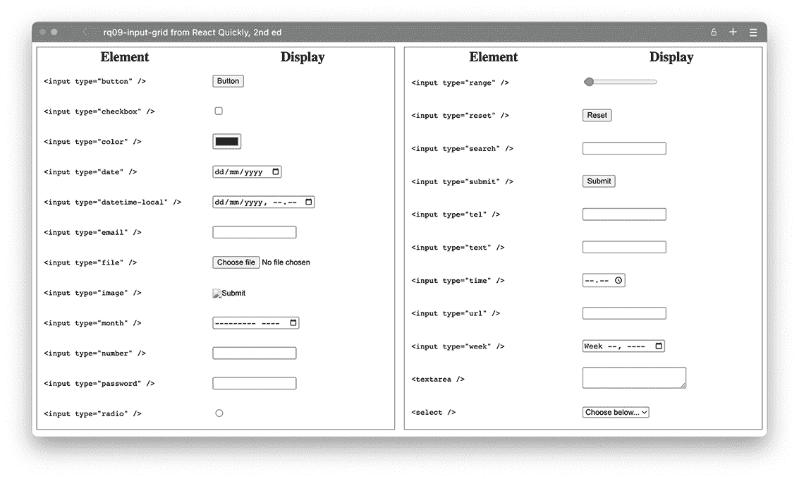

图 9.1 所有可以在 React 中使用的不同 HTML 输入控件

注意：本章中示例的源代码可在[`rq2e.com/ch09`](https://rq2e.com/ch09)找到。但正如你在第二章中学到的，你可以使用单个命令直接从命令行实例化所有示例。

## 9.1 受控与非受控输入

当输入被控制时，React 负责显示什么。React 必须确认对输入值的给定更改将导致输入值发生变化。当输入未被控制时，输入值根据用户的交互而改变，React 只能被动地读取状态，但不能影响或改变它。

这两种方法的区别在图 9.2 中得到了突出。特别要注意图示受控版本中的动作 4 和 5。这两个交互是强制性的。另一方面，在非受控版本中，动作 4.b 是可选的，而动作 5.b 完全缺失，因为这种动作是不可能的。

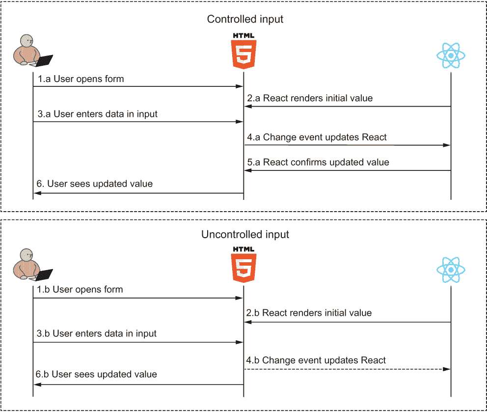

图 9.2 在受控和非受控输入中，数据流的不同之处在于 React 在输入渲染后不控制值。动作 5.a 强调了 React 即使在用户交互后对输入的控制——React 可以拦截更新并在飞行中更改它们，甚至忽略它们。在底部的非受控输入中，React 没有这样的控制，用户输入的任何内容都将显示在输入中。

在图示的两个版本中，React 都可以决定初始值是什么。但只有在受控版本的图示中，React 才能控制用户开始输入数据后值的改变。

在你不需要在初始值之后控制输入的情况下，你可以使用任一模式。在你想要在用户输入数据时控制输入的情况下——例如，当你想要过滤输入或对其应用一些格式化掩码时——你必须使用受控输入。永远没有必须使用非受控输入的情况，所以没有必要使用它。这个选项主要出于性能考虑。在接下来的两个部分中，我们将查看一些如何表明你的输入是给定类型以及如何使用它的示例。

## 9.2 管理受控输入

对于这个例子，我们想要创建一个非常基本的输入表单。我们将构建一个包含两个不同输入和一个输出的简单计算器，该输出将显示两个值的总和。为了实现这个结果，我们需要创建如图 9.3 所示的 JSX。

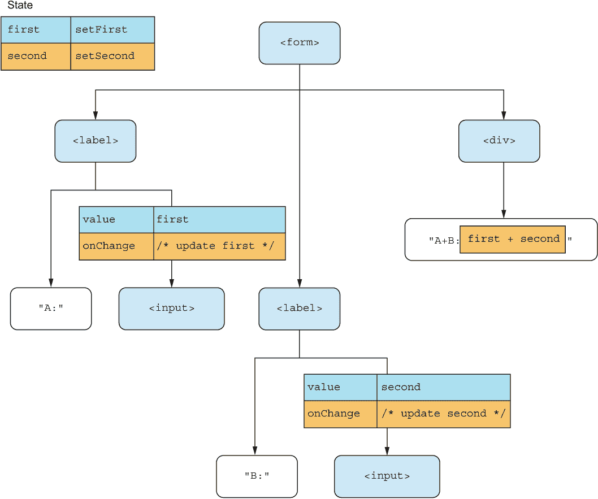

图 9.3 我们计算器的期望输出 JSX 包含两个输入。注意我们向两个输入传递了两个特定的属性：值和 onChange。

如你所见，我们为输入指定了值和 onChange 属性，这是创建受控输入所必需的。实际上，这就是受控输入的定义。如果你在 React 中直接设置值，你必须也监听更改事件并更新值，这使得你的输入成为受控输入。如果你没有在 React 中设置值，你不需要监听更新，因为你无论如何都无法控制输入。

作为额外的好处，为了确保输入是数字，我们还将它们的类型设置为"number"。让我们继续在下面的列表中实现这一点。如果您在浏览器中尝试此操作，您应该会看到类似于图 9.4 的内容。

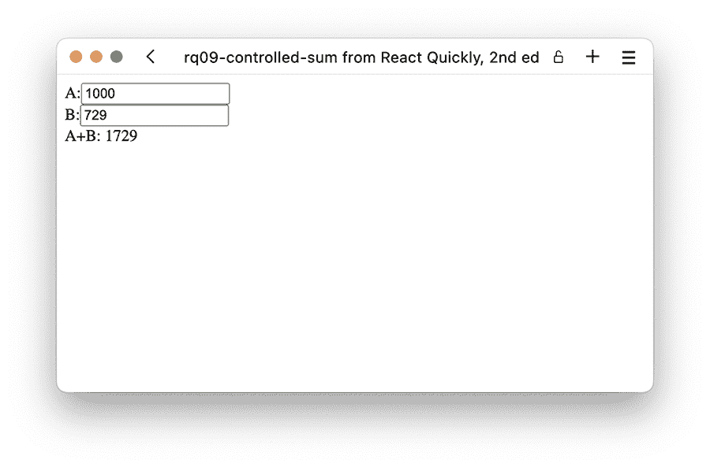

图 9.4 我们的动作求和组件。1000 和 729 的和确实是 1729（正如拉马努金所指出的）。

列表 9.1 求和

```
import { useState } from "react";
function Sum() {
  const [first, setFirst] = useState(0);     ❶
  const [second, setSecond] = useState(0);   ❶
  const onChangeFirst = (evt) =>             ❷
    setFirst(evt.target.valueAsNumber);      ❷
  const onChangeSecond = (evt) =>            ❷
    setSecond(evt.target.valueAsNumber);     ❷
  return (
    <form style={{ display: "flex", flexDirection: "column" }}>
      <label>
        A:
        <input
          type="number"
          value={first}                      ❸
          onChange={onChangeFirst}           ❸
        />
      </label>
      <label>
        B:
        <input
          type="number"
          value={second}                     ❸
          onChange={onChangeSecond}          ❸
        />
      </label>
      <div>A+B: {first + second}</div>       ❹
    </form>
  );
}
function App() {
  return <Sum />;
}
export default App;
```

❶ 初始化两个状态值。我们不必将它们初始化为 0；任何起始数字在这里都适用。

❷ 创建了两个几乎相同的更改处理程序，它们只是从输入事件更新不同的状态值

❸ 将正确的值和更改监听器分配给两个输入

❹ 显示最终输出，即两个状态值的总和

存储库：rq09-controlled-sum

此示例可在 rq09-controlled-sum 存储库中看到。您可以通过创建基于相关模板的新应用程序来使用该存储库：

```
$ npx create-react-app rq09-controlled-sum --template rq09-controlled-sum
```

或者，您也可以访问此网站浏览代码，直接在浏览器中查看应用程序的运行情况，或下载源代码的 zip 文件：

[`rq2e.com/rq09-controlled-sum`](https://rq2e.com/rq09-controlled-sum)

注意，我们已经将值和 onChange 设置为输入的属性——这不是巧合。这两个属性正是您需要指定的属性，以使用受控输入，并且您需要确保在调用更改处理程序时值发生变化。您也可以在其他时候更改值，但您*必须*在更改处理程序更新时更新值。如果不这样做，用户输入的信息将被忽略。

### 9.2.1 过滤输入

如果你不在数据输入时更新状态值，输入字段不会更新。当然，你可以有选择地使用这种行为。假设我们想要添加一个十六进制颜色的输入，旁边是一个显示相同颜色的小方块。

一个十六进制颜色由六个十六进制数字组成，即 0-9 和 A-F。由于允许非数字字符，我们不能像以前那样依赖 type="number"。我们将使用 type="text"的常规输入，但我们需要过滤输入，以确保用户输入的数据中只有有效的字符被输入到实际的文本字段中。请参见图 9.5。

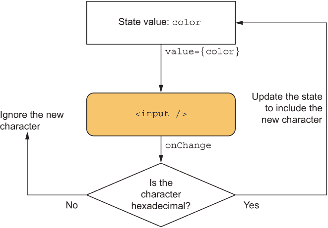

图 9.5 我们的颜色显示组件中的数据流包括在 onChange 事件处理程序中的过滤器。在我们将值“确认”回 JSX 之前，我们将从输入字符串中删除非十六进制字符。

注意：我们了解用于选择颜色的特殊输入，即<input type="color" />，它被所有现代浏览器支持。然而，我们不会在这里使用它，因为这会使它变得过于简单。

要做到这一点，我们只需在设置状态值之前在 onChange 函数中应用一个过滤器。然后，当输入有效字符时，输入字段将正确更新，而忽略任何无效字符。此外，我们还将强制所有字符都转换为大写，因为这看起来更漂亮。当我们显示颜色时，我们只显示六个字符的颜色字符串。如果字符串不是六个字符长，我们显示一个占位符背景来指示没有有效输入。让我们在下一个列表中实现这一点。如果您在浏览器中运行它，您将在图 9.6 中看到结果。

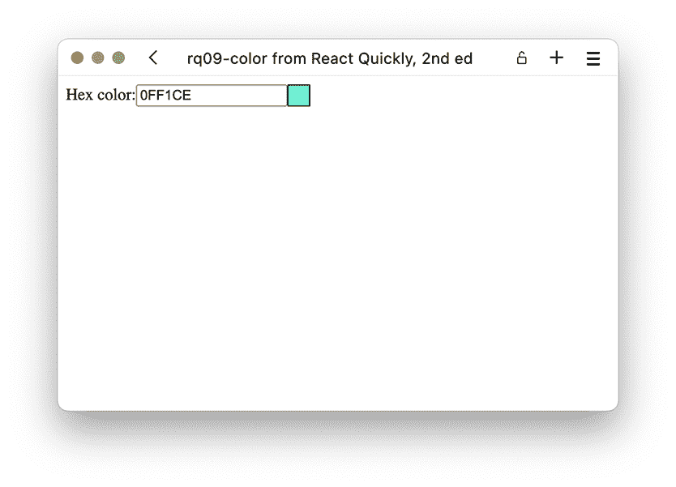

图 9.6 0FF1CE 是一个有效的颜色——一种漂亮的青色。

列表 9.2 十六进制颜色显示

```
import { useState } from "react";
const PLACEHOLDER = `conic-gradient(                ❶
  gray 0.25turn, white 0 0.5turn,                   ❶
  gray 0 0.75turn, white 0 1turn                    ❶
)`;                                                 ❶
function HexColor() {
  const [color, setColor] = useState("BADA55");     ❷
  const onChange = (evt) =>
    setColor(                                       ❸
      evt.target.value                              ❸
        .replace(/[⁰-9a-f]/gi, "")                 ❸
        .toUpperCase()                              ❸
    );                                              ❸
  const outputStyle = {
    width: "20px",
    border: "1px solid",
    background: color.length === 6                  ❹
      ? `#${color}`                                 ❹
      : PLACEHOLDER,                                ❹
  };
  return (
    <form style={{ display: "flex" }}>
      <label>
        Hex color:
        <input value={color} onChange={onChange} /> ❺
      </label>
      <span style={outputStyle} />
    </form>
  );
}
function App() {
  return <HexColor />;
}
export default App;
```

❶ 定义了一个静态占位符，它使用圆锥渐变来显示棋盘背景

❷ 将我们的状态初始化为有效的颜色输入

❸ 在变更处理程序中，检查事件后的输入字段当前值，使用正则表达式过滤输入，并将整个结果转换为大写

❹ 当我们想要输出颜色值时，我们首先检查颜色字符串是否正好是六个字符。如果是好的，我们在前面加上一个井号；否则，我们显示占位符。

❺ 如前所述，将值和变更处理程序添加到输入字段

仓库：rq09-color

这个例子可以在 rq09-color 仓库中看到。您可以通过创建一个基于相关模板的新应用程序来使用该仓库：

```
$ npx create-react-app rq09-color --template rq09-color
```

或者，您也可以访问这个网站来浏览代码，直接在您的浏览器中查看应用程序，或者下载源代码的 zip 文件：

[`rq2e.com/rq09-color`](https://rq2e.com/rq09-color)

注意，在图 9.5 的图中，我们讨论了评估新输入字符是包含还是丢弃，但在实际源代码中，在列表 9.2 的 onChange 回调中，我们不是查看单个字符，而是每次都查看整个输入值。这是因为输入并不一定是逐个字符输入的。用户可以从剪贴板粘贴一串字符。如果他们这样做，我们就必须检查整个新的输入而不是单个字符。用户还可以决定在新字符串的任何位置输入新字符，这将使事情更加复杂。为了绕过所有这些额外的工作，我们总是评估整个输入，并对其与我们的过滤器进行验证。

此外，请注意，这次我们决定将状态值初始化为不仅仅是空字符串。这实际上就是在输入字段中设置默认值所需的所有操作。

### 9.2.2 掩码输入

另一种更高级的变更处理程序是，在用户输入时对给定的输入字段应用一个掩码。对于这个例子，我们想要添加一个用于输入虚构网站票据号的输入框。这些虚构的票据号定义为三个字母数字字符，后面跟着一个破折号，再跟着另外三个字母数字字符，例如，R1S-T2U。

当我们有一个这样的输入时，在用户输入时帮助他们是有意义的。首先，我们希望无论用户是否以这种方式输入，都显示大写字母（我们已经知道如何做到这一点！）。其次，我们希望在第一个三个字符后添加一个破折号。最后，我们希望将输入限制为总共只有七个字符。

这听起来可能很复杂，但实际上相当简单。我们只需要修改我们的 onChange，只更新状态值中的有效和正确格式的字符串，并忽略任何其他输入。完成此任务的实际 JavaScript 代码是一系列字符串格式化操作，这些操作共同实现了所需的企业逻辑。

这次，我们还想在我们的输入中添加一个占位符，在用户输入数据时引导他们。让我们在下一个列表中实现所有这些。如果你在浏览器中运行它，你会得到图 9.7 中所示的结果。

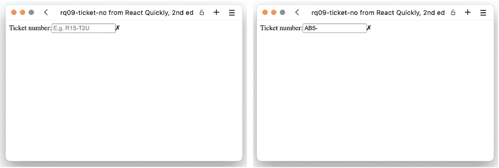

图 9.7 这是票号输入字段在输入值之前和输入时的输出。当你尝试这个时，请注意破折号是如何在输入三个字符后自动添加的。

列表 9.3 票号输入

```
import { useState } from "react";
function TicketNumber() {
  const [ticketNumber, setTicketNumber] = useState("");
  const onChange = (evt) => {
    const [first = "", second = ""] = evt.target.value   ❶
      .replace(/[⁰-9a-z]/gi, "")                        ❶
      .slice(0, 6)                                       ❶
      .match(/.{0,3}/g);                                 ❶
    const value = first.length === 3                     ❷
      ? `${first}-${second}`                             ❷
      : first;                                           ❷
    setTicketNumber(value.toUpperCase());
  };
  const isValid = ticketNumber.length === 7;             ❸
  return (
    <form style={{ display: "flex" }}>
      <label>
        Ticket number:
        <input
          value={ticketNumber}                           ❹
          onChange={onChange}                            ❹
          placeholder="E.g. R1S-T2U"                     ❹
        />
      </label>
      <span>{isValid ? "✓" : "✗"}</span>                ❺
    </form>
  );
}
function App() {
  return <TicketNumber />;
}
export default App;
```

❶ 这次我们对输入值进行了更多的验证，这导致将其分解为最多两个部分，每部分最多三个字符。

❷ 如果第一部分恰好有三个字符，我们会通过在输入字段中添加破折号来帮助用户。

❸ 如果输入恰好有七个字符长，它必须是一个有效的票号。

❹ 将所有属性添加到输入字段中，包括占位符值

❺ 在末尾显示一个图标，指示输入是否有效

仓库：rq09-ticket-no

这个例子可以在 rq09-ticket-no 仓库中看到。你可以通过创建一个基于相关模板的新应用程序来使用该仓库：

```
$ npx create-react-app rq09-ticket-no --template rq09-ticket-no
```

或者，你可以访问这个网站来浏览代码，直接在浏览器中查看应用程序的运行情况，或者下载源代码的 zip 文件：

[`rq2e.com/rq09-ticket-no`](https://rq2e.com/rq09-ticket-no)

注意，这并不是一个完美的解决方案。如果你按下 Backspace 键来删除一些字符，你将无法删除破折号字符，因为删除后，脚本会注意到字符串长度为三个字符，并自动再次添加破折号。创建这样的掩码输入可能非常棘手。如果你需要创建这种复杂的掩码输入，有一些库和教程可以帮助你。

### 9.2.3 许多类似的输入

如果你有一个包含许多输入的表单，为所有这些创建单独的状态值和更改处理程序可能会很繁琐（并可能导致代码重复）。相反，你可以有一个包含所有表单值的单个状态值，以及一个通用的更改处理程序生成器，它可以更新任何输入。

例如，这对于一个简单的地址表单是有效的，该表单包含地址行 1、地址行 2、城市、邮编、州和国家/地区的输入。我们为所有这些使用普通的输入字段，而不进行验证，因为不同国家/地区对它们的验证规则各不相同。没有更多信息的情况下，我们只是让用户在这些字段中输入他们喜欢的任何数据。

我们将在状态中保持一个对象，包含所有相关的表单数据，初始化为空字符串。因为我们所有的值都在同一个对象中，通过键索引，我们可以使用这个单个键来识别每个更新处理器中要更新的字段。生成的 JSX 将类似于图 9.8 中显示的部分 JSX 树。

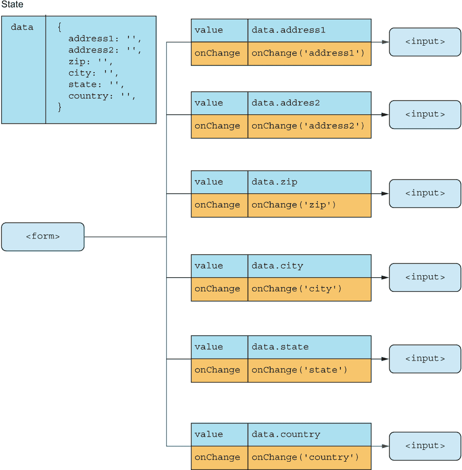

图 9.8 一个部分 DOM 树（不显示标签和其他琐碎元素），专注于输入及其属性。请注意，我们只是为了将所有元素都放入其中，而将树从自上而下改为自左向右。

现在我们需要创建一个事件处理器生成函数，该函数接受要设置的状态对象的属性，并在事件处理器被调用时使用事件对象的输入值来更新它。为此，我们必须创建一个返回函数的函数，就像我们在第八章中看到的那样。让我们将这些内容全部汇总到列表 9.4 中。如果你在浏览器中运行它，你会得到图 9.9 中显示的结果。

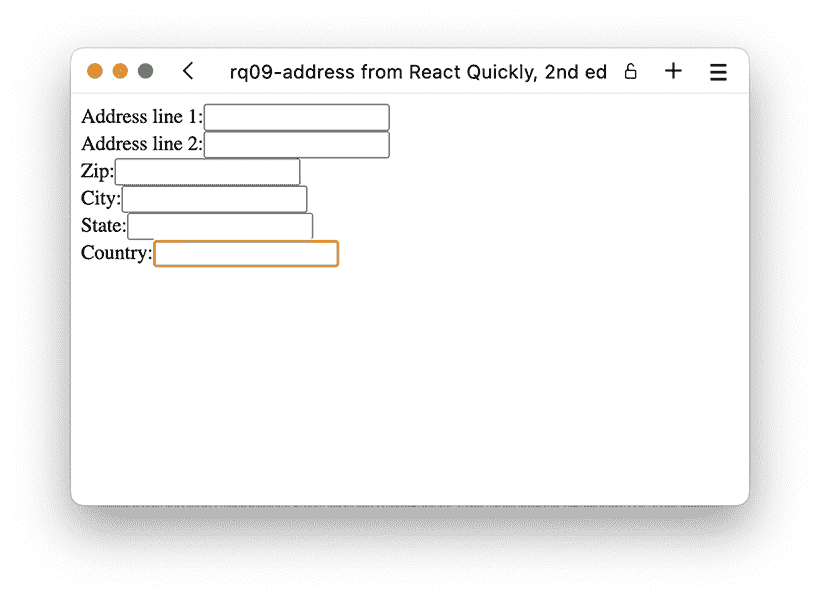

图 9.9 浏览器中的完整地址表单——不是最漂亮的，但完全功能。

列表 9.4 地址表单

```
import { useState } from "react";
function Address() {
  const [data, setData] = useState({              ❶
    address1: "",                                 ❶
    address2: "",                                 ❶
    zip: "",                                      ❶
    city: "",                                     ❶
    state: "",                                    ❶
    country: "",                                  ❶
  });                                             ❶
  const onChange = (key) => (evt) => {            ❷
    setData((oldData) =>                          ❸
      ({ ...oldData, [key]: evt.target.value })   ❸
    );                                            ❸
  };
  return (
    <form style={{ display: "flex", flexDirection: "column" }}>
      <label>
        Address line 1:
        <input
          value={data.address1}                   ❹
          onChange={onChange("address1")}         ❹
        />
      </label>
      <label>
        Address line 2:
        <input
          value={data.address2}                   ❹
          onChange={onChange("address2")}         ❹
        />
      </label>
      <label>
        Zip:
        <input
          value={data.zip}                        ❹
          onChange={onChange("zip")}              ❹
        />
      </label>
      <label>
        City:
        <input
          value={data.city}                       ❹
          onChange={onChange("city")}             ❹
        />
      </label>
      <label>
        State:
        <input
          value={data.state}                      ❹
          onChange={onChange("state")}            ❹
        />
      </label>
      <label>
        Country:
        <input
          value={data.country}                    ❹
          onChange={onChange("country")}          ❹
        />
      </label>
    </form>
  );
}
function App() {
  return <Address />;
}
export default App;
```

❶ 这次状态是一个对象，包含我们需要的所有变量。

❷ onChange 函数现在是一个生成器，它首先接受一个键，然后返回一个事件处理器。

❸ 当输入更改时，我们使用整个旧状态更新状态（以不覆盖任何现有值），然后添加带有指示键的新值。

❹ 将值和更改处理器应用于所有输入

存储库：rq09-address

这个例子可以在 rq09-address 存储库中看到。你可以通过创建一个基于相关模板的新应用程序来使用该存储库：

```
$ npx create-react-app rq09-address --template rq09-address
```

或者，你可以访问这个网站来浏览代码，直接在你的浏览器中查看应用程序的运行情况，或者下载源代码的 zip 文件：

[`rq2e.com/rq09-address`](https://rq2e.com/rq09-address)

使用名称属性

我们可以将这个想法再进一步。表单元素可以有一个名称属性，这是如果你使用常规 HTML 表单将提交的字段的 ID。我们可以使用这个属性来包含更改处理器中要更新的键。然后，我们根本不需要将键传递给更改处理器，因为它可以检查事件目标的名称属性。我们的 JSX 将看起来像图 9.10 而不是图 9.8（比较图 9.8）。


图 9.10 带有我们更简单的事件处理器的部分 DOM 树

现在，我们可以为每个元素使用相同的事件处理器。事件处理器将使用事件目标名称作为键，使用事件目标值作为值来更新状态对象。

这次，我们还想看到我们的状态实际上包含我们所认为的内容。因此，在最后，我们将包括一个<pre>元素，它将数据变量作为 JSON 文档输出。我们将所有这些内容组合在下面的列表中。查看图 9.11 以了解其工作情况。

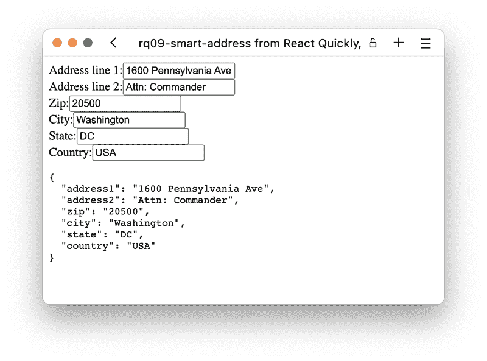

图 9.11 我们智能但简单的地址表单似乎完全按照设计工作！

列表 9.5 简化的地址表单

```
import { useState } from "react";
function Address() {
  const [data, setData] = useState({
    address1: "",
    address2: "",
    zip: "",
    city: "",
    state: "",
    country: "",
  });
  const onChange = (evt) => {
    const key = evt.target.name;                  ❶
    const value = evt.target.value;               ❷
    setData((oldData) =>
      ({ ...oldData, [key]: value }));            ❸
  };
  return (
    <form style={{ display: "flex", flexDirection: "column" }}>
      <label>
        Address line 1:
        <input
          value={data.address1}
          name="address1"                         ❹
          onChange={onChange}                     ❹
        />
      </label>
      <label>
        Address line 2:
        <input
          value={data.address2}
          name="address2"                         ❹
          onChange={onChange}                     ❹
        />
      </label>
      <label>
        Zip:
        <input
          value={data.zip}
          name="zip"                              ❹
          onChange={onChange}                     ❹
        />
      </label>
      <label>
        City:
        <input
          value={data.city}
          name="city"                             ❹
          onChange={onChange}                     ❹
        />
      </label>
      <label>
        State:
        <input
          value={data.state}
          name="state"                            ❹
          onChange={onChange}                     ❹
        />
      </label>
      <label>
        Country:
        <input
          value={data.country}
          name="country"                          ❹
          onChange={onChange}                     ❹
        />
      </label>
      <pre>{JSON.stringify(data, true, 2)}</pre>  ❺
    </form>
  );
}
function App() {
  return <Address />;
}
export default App;
```

❶ onChange 函数现在又回到了一个简单的事件处理器，我们从目标中提取输入的名称。

❷ 同样以相同的方式提取输入字段中的当前值

❸ 使用新更改的输入更新状态对象

❹ 为每个输入节点分配名称属性和简单的事件处理器

❺ 打印出当前数据状态的漂亮 JSON 表示，这样我们就可以看到我们是否正在正确地做每件事

仓库：rq09-smart-address

此示例可在 rq09-smart-address 仓库中看到。您可以通过创建基于相关模板的新应用程序来使用该仓库：

```
$ npx create-react-app rq09-smart-address --template rq09-smart-address
```

或者，您可以访问此网站来浏览代码，在您的浏览器中直接查看应用程序，或下载源代码的 zip 文件：

[`rq2e.com/rq09-smart-address`](https://rq2e.com/rq09-smart-address)

使用输入名称属性来存储输入中输入的信息的键的想法非常常见。这不是必需的，但是一种非常方便的方式来组织表单，特别是如果它们变得很大。

然而，这个表单（以及我们在本章中之前创建的所有表单）缺少一些东西。我们如何提交这个表单？在提交时我们如何处理数据？让我们在下一节中探讨这个问题。

### 9.2.4 表单提交

让我们创建一个非常简单但完整、有用且完全功能的待办事项应用程序。在 Web 框架中完成这是一个经典的练习，所以我们不妨完成它。

我们希望能够创建带有标题、类别、持续时间和截止日期的新待办事项。然后我们希望能够看到创建的待办事项列表，当然，在完成它们时删除项目。我们将有两个不同的屏幕：一个用于显示项目列表，另一个用于添加新项目。

在这个阶段，重要的是表单处理。我们想要创建一个带有一些输入的表单。当用户提交表单时，我们想要根据输入的数据创建一个新的数据对象，将其添加到项目列表中，清除表单，并允许用户添加新的项目。这个流程如图 9.12 所示。

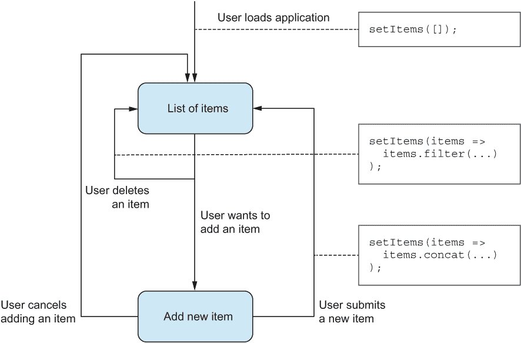

图 9.12 待办事项应用程序中的数据流程

在这个应用中，我们只会在内存中存储待办事项列表，所以如果你重新加载页面，你将丢失所有数据。持久化数据并不是有趣的部分；目前，我们只想以逻辑方式处理表单数据。让我们使用三个组件来创建这个应用（参见图 9.13 中的结构）：

+   <App />—这个主要组件包含项目列表作为本地状态，以及添加和删除项目的函数。它还知道我们当前是在添加项目还是查看所有项目的列表，并提供一个小的菜单来在两种视图之间切换。

+   <List />—这个组件接受要显示的项目列表以及当删除项目时调用的函数。

+   <Add />—这个组件包含一个用于输入新项目信息的表单以及提交它的功能。当提交一个项目时，你将回到列表。你也可以取消提交并返回列表而不添加任何内容。

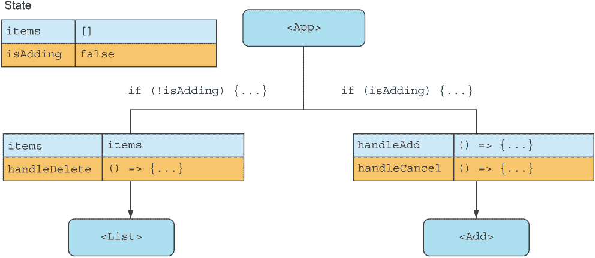

图 9.13 我们应用中三个组件的非常粗略的概述及其关系

最后，我们希望创建一个看起来像图 9.14 的应用程序。

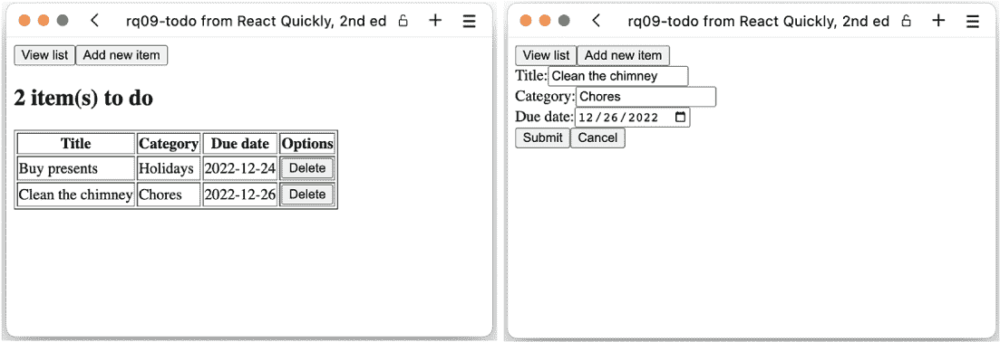

图 9.14 查看项目列表并添加新项目时的最终应用

现在，让我们开始实现主要的 <App /> 组件。对于这个例子，我们将使用多个文件，所以应用程序组件放在 App.js 文件中。内容如列表 9.6 所示。

列表 9.6 App.js 中的主要组件

```
import { useState } from "react";
import List from "./List";                                ❶
import Add from "./Add";                                  ❶
function App() {
  const [items, setItems] = useState([]);                 ❷
  const [isAdding, setAdding] = useState(false);          ❷
  const handleDelete = (item) =>                          ❸
    setItems((oldItems) =>                                ❸
      oldItems.filter((oldItem) => oldItem !== item));    ❸
  const handleAdd = (newItem) => {                        ❹
    setItems((oldItems) => oldItems.concat([newItem]));   ❹
    setAdding(false);                                     ❹
  };                                                      ❹
  const handleCancel = () => setAdding(false);            ❺
  return (
    <main>
      <nav>
        <button onClick={() => setAdding(false)}>         ❻
          View list
        </button>
        <button onClick={() => setAdding(true)}>          ❻
          Add new item
        </button>
      </nav>
      {isAdding ? (                                       ❼
        <Add                                              ❽
          handleAdd={handleAdd}                           ❽
          handleCancel={handleCancel}                     ❽
        />                                                ❽
      ) : (
        <List                                             ❾
          items={items}                                   ❾
          handleDelete={handleDelete}                     ❾
        />                                                ❾
      )}
    </main>
  );
}
export default App;
```

❶ 从单独的文件导入两个详细视图

❷ 应用的初始状态反映了一个空的待办事项列表，并且我们当前没有添加项目。

❸ 当我们删除一个项目时，我们更新状态，包括所有项目，但不包括要删除的项目。

❹ 当我们添加一个项目时，我们更新状态，包括所有现有项目和新增的项目。然后我们返回到列表视图。

❺ 当我们取消添加项目时，我们只是返回到列表视图。

❻ 我们菜单简单地切换是否添加项目的标志。

❼ 应用程序的主要部分依赖于当前状态——我们是在添加项目吗？

❽ 如果我们在添加项目，我们包括相关的组件，并作为属性包含两个必要的回调函数。

❾ 如果我们不在添加项目，我们显示所有项目的列表，因此我们还需要在这里传递相关的属性。

在处理完主要的 <App /> 组件之后，让我们将注意力转向 List.js 中的 <List /> 组件。它很简单，因为它只是显示所有项目的表格，并在每个项目旁边包含一个按钮，允许你删除该项目。该组件接受两个属性：要显示的项目列表和当删除项目时调用的回调函数，如下一列表所示。

列表 9.7 List.js 中的列表组件

```
function List({ items, handleDelete }) {
  if (!items.length) {                                  ❶
    return <h2>To-do list empty, go out and play!</h2>;
  }
  return (
    <>
      <h2>{items.length} item(s) to do</h2>
      <table border="1">
        <thead>
          <tr>
            <th>Title</th>
            <th>Category</th>
            <th>Due date</th>
            <th>Options</th>
          </tr>
        </thead>
        <tbody>
          {items.map((item) => (                        ❷
            <tr key={JSON.stringify(item)}>
              <td>{item.title}</td>
              <td>{item.category}</td>
              <td>{item.date}</td>
              <td>
                <button
                  onClick={() => handleDelete(item)}    ❸
                >
                  Delete
                </button>
              </td>
            </tr>
          ))}
        </tbody>
      </table>
    </>
  );
}
export default List;
```

❶ 这个组件的重要部分是在没有项目时进行早期返回。如果没有内容填充，就没有必要显示表格。

❷ 当有内容需要展示时，我们会遍历所有项目并为每个项目显示一行表格。

❸ 删除按钮会调用带有整个项目作为参数的取消回调函数。

最后，我们需要实现这个应用程序的重要组件：在 Add.js 中的<Add />组件中添加新项目的表单。我们将使用本章中看到的所有技巧，包括一个通用的更改处理程序，用于所有更新组件状态的输入，基于输入的名称属性。让我们在列表 9.8 中实现它。

列表 9.8 Add.js 中的表单组件

```
import { useState } from "react";
function Add({ handleAdd, handleCancel }) {
  const [data, setData] = useState({                   ❶
    title: "",                                         ❶
    category: "",                                      ❶
    date: "",                                          ❶
  });                                                  ❶
  const onChange = (evt) => {                          ❷
    const key = evt.target.name;                       ❷
    const value = evt.target.value;                    ❷
    setData((oldData) =>                               ❷
      ({ ...oldData, [key]: value }));                 ❷
  };                                                   ❷
  const onSubmit = (evt) => {                          ❸
    handleAdd(data);                                   ❸
    evt.preventDefault();                              ❸
  };                                                   ❸
  return (
    <form
      onSubmit={onSubmit}                              ❹
      style={{ display: "flex", flexDirection: "column" }}
    >
      <label>
        Title:
        <input
        value={data.title}                             ❺
        name="title"                                   ❺
        onChange={onChange}                            ❺
        />
      </label>
      <label>
        Category:
        <input
        value={data.category}                          ❺
        name="category"                                ❺
        onChange={onChange}                            ❺
        />
      </label>
      <label>
        Due date:
        <input
        type="date"                                    ❺
        value={data.date}                              ❺
        name="date"                                    ❺
        onChange={onChange}                            ❺
        />
      </label>
      <div>
        <button>Submit</button>                        ❻
        <button type="button" onClick={handleCancel}>  ❼
          Cancel
        </button>
      </div>
    </form>
  );
}
export default Add;
```

❶ 如前所述初始化我们的状态

❷ 这是我们之前在列表 9.5 中使用过的同一个更改处理程序——它是一个非常通用的结构！

❸ 当我们提交表单时，我们需要将表单数据发送到相关的回调函数并防止默认的表单操作。如果我们忘记后者，页面将重新加载并且所有数据都将丢失。

❹ 将提交处理程序分配给表单

❺ 正常地将属性分配给输入框。注意我们如何也将 type="date"添加到截止日期输入框中。

❻ 按钮默认是提交按钮，除非明确设置为 type="button"，所以这是提交按钮。我们不需要点击处理程序，因为表单提交处理程序将负责处理。

❼ 取消按钮不能提交表单，因此我们必须添加一个显式的类型，然后在点击时调用取消回调。

仓库：rq09-todo

这个示例可以在 rq09-todo 仓库中看到。您可以通过创建一个基于相关模板的新应用程序来使用该仓库：

```
$ npx create-react-app rq09-todo --template rq09-todo
```

或者，您可以访问此网站来浏览代码，在您的浏览器中直接查看应用程序的运行情况，或者下载源代码的 zip 文件：

[rq09-todo 仓库](https://rq2e.com/rq09-todo)

这是我们的第一个较大的应用程序，所以我们强烈建议您尝试玩一下这个源代码，如果您还没有为每个示例这样做的话。您应该开始看到我们讨论的所有关于属性、事件、状态、JSX 和组件组合在这个应用程序中的结合，以及我们关于表单处理的新知识如何使这个小型但非常强大的应用程序更加完善。

没有什么阻止我们将其扩展到包括所有各种新元素。我们可以为创建新项目的类别创建一个单独的表单，然后在表单中显示一个下拉菜单以供选择。我们只需要知道如何使用下拉菜单，但我们将在这下一节中介绍。我们还可以创建一个日历显示模式，其中所有项目都将显示在一个网格中。我们可以在项目上添加我们想要的任何额外属性，例如预期持续时间。然后我们可以为每天的所有项目总结预期持续时间。

表单提交与按钮点击

当你想要提交你的表单时，你基本上想要收集表单中的数据并将其发送到远程服务或另一个存储位置。因为我们在这个部分使用受控输入，所以 React 组件的状态是真相的来源，因此我们可以直接从状态中读取值。

我们想在表单上创建一个提交处理程序。正如我们之前讨论的，表单的提交处理程序将在两种不同的情况下自动由浏览器调用：

+   如果用户在表单内点击提交按钮

+   如果用户在包含提交按钮的表单中的输入字段内聚焦并按下 Enter 键

因为表单的提交处理程序处理了这两个用例，所以它是处理这个问题的合适位置。如果我们直接将处理程序作为点击处理程序放在提交按钮上，那么如果用户在包含提交按钮的输入字段内聚焦并按下 Enter 键，我们就会错误地处理表单提交。

### 9.2.5 其他输入

在前面的例子中，我们简要地看到了不同类型的输入。我们有一个日期输入字段，如图 9.14 所示，它在浏览器中的显示方式不同。这并不是我们拥有的唯一特殊类型，因为还有许多其他有用的输入变体。图 9.15（图 9.1 的副本）显示了在 HTML 表单中一般可以使用以及在 React 表单中特别可以使用的所有输入类型。


图 9.15 HTML 和 React 表单中可用的各种输入的表格。注意，这主要包括输入字段的变体，但也包括一系列按钮和下拉菜单。

这些输入中的一些仅仅是变体，使得在较小的设备上输入数据更加容易。例如，当在移动设备上聚焦时，type="tel"将显示一个仅包含与输入电话号码相关的按钮的键盘（数字、+、-以及一些其他按钮）。其他输入则更加复杂，具有更复杂的界面。

其中一些输入实际上并不是输入，而是按钮。这些包括图 9.15 中可以看到的重置、提交、按钮和图像类型。

尽管大多数这些输入字段与文本输入字段具有相同的 API，但从 React 的角度来看，它们非常容易处理。注意，在前面的例子中，我们并没有因为使用了日期字段而在 React 中做任何改变。我们以相同的方式使用了属性和事件。

然而，这些输入类型中的一些略有不同，需要你以不同的方式使用输入和事件。我们将在下一小节中通过一些小示例逐一介绍每种输入类型，以展示你如何使用不同的输入类型。

注意：本节中的所有示例都将包含在之前提到的 rq09-todo 存储库中，因为它们都是该示例中使用的添加表单的变体。然而，这些文件将只部分功能，因为该应用程序中的列表组件仅设置用于我们之前使用的常规添加表单。

将跳过一种输入类型。文件输入在受控输入中不可用，所以我们将在稍后描述它，当我们到达非受控输入时。

数字输入

数字输入几乎与文本输入完全相同，只有一个例外。目标对象上的正常值属性是一个字符串，但由于我们正在处理数字，我们希望获取输入字段的当前值作为数字。为此，我们可以查看 evt.target.valueAsNumber 属性，而不是常规的 evt.target.value 属性。我们不需要手动解析输入并将其转换为字符串，因为 JavaScript 会自动为我们完成这项工作。

数字输入分为两类：数字输入和日历输入。数字输入包括“number”和“range”输入类型，而日历输入包括“date”、“datetime-local”、“month”、“time”和“week”输入类型。

如果你有一个日历输入，值属性将根据你的本地语言和其他设置将选择作为字符串返回。因此，对于 type="week"输入，值可能返回"2022-W52"作为字符串。另一方面，valueAsNumber 属性对大多数日历输入类型返回一个时间戳，这是 1970 年 1 月 1 日凌晨与所选日期和时间之间的毫秒数。因此，对于 2022 年的同一周 52，这将返回数字 1672012800000。

月份输入再次是日历输入的特殊变体，因为它们返回 1970 年 1 月和所选月份之间的月份数。因此，如果你在输入中选择 2022 年 12 月，valueAsNumber 将返回 635，因为这是从那时起经过的月份数。数字输入还接受 min、max 和 step 属性，这些属性指示有效值范围以及如果你使用键盘更改值时输入可以更改的默认量。

React 不会关心你将数字输入的值设置为数字还是字符串。但在显示之前，它将被转换为数字，所以如果你传递了无法在给定输入中显示的内容，它将显示不正确。因此，将值作为数字存储在 JavaScript 中以避免转换问题是有意义的。

复选框和单选按钮

复选框和单选按钮是特殊的，因为它们没有值——或者至少它们的值不会改变。值只是一个标识符，表示复选框或单选按钮的含义，但它不包含有关输入是否被选中或未选中的信息。

例如，考虑图 9.16 中显示的表单。四个单选按钮都是独立的<input>元素，但它们的值是静态的——它们只是四个优先级。这个输入元素的动态部分是关于列表中当前选中的单选按钮的信息。因此，这两种类型的输入，复选框和单选按钮，都有一个 checked 属性，你必须将其设置为 true 或 false 来控制组件的状态。

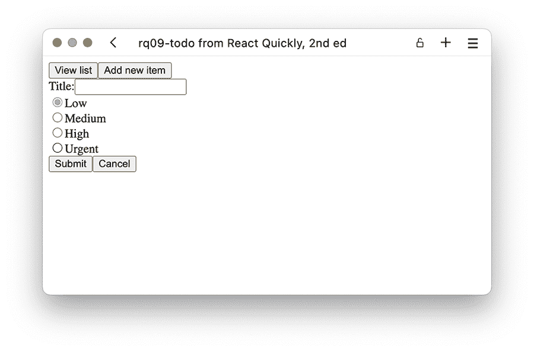

图 9.16 使用单选按钮来设置优先级。

首先，我们将创建包含四个单选按钮的表单。以下列表显示了这将是什么样子。

列表 9.9 如果我们想要单选按钮的表单组件（摘录）

```
import { useState } from "react";
function Radio({ value, label, onChange, current }) {     ❶
  return (
    <label>
      <input
        type="radio"
        name="importance"                                ❷
        checked={value === current}                      ❸
        value={value}                                    ❹
        onChange={onChange}                              ❺
      />
      {label}
    </label>
  );
}
function Add({ handleAdd, handleCancel }) {
  const [data, setData] = useState({ title: "", importance: "low" });
  const onChangeTitle = (evt) =>
    setData((oldData) => ({ ...oldData, title: evt.target.value }));
  const onChangeImportance = (evt) =>                    ❻
    setData((oldData) =>                                 ❻
      ({ ...oldData, importance: evt.target.value }));   ❻
  ...
      <Radio                                             ❼
        value="low"                                      ❼
        label="Low"                                      ❼
        current={data.importance}                        ❼
        onChange={onChangeImportance}                    ❼
      />                                                 ❼
      <Radio                                             ❼
        value="medium"                                   ❼
        label="Medium"                                   ❼
        current={data.importance}                        ❼
        onChange={onChangeImportance}                    ❼
      />                                                 ❼
      <Radio                                             ❼
        value="high"                                     ❼
        label="High"                                     ❼
        current={data.importance}                        ❼
        onChange={onChangeImportance}                    ❼
      />                                                 ❼
      <Radio                                             ❼
        value="urgent"                                   ❼
        label="Urgent"                                   ❼
        current={data.importance}                        ❼
        onChange={onChangeImportance}                    ❼
      />                                                 ❼
  ...
```

❶ 创建一个辅助组件来渲染一个包含单选按钮的标签

❷ 将所有单选按钮的名称设置为在此组件中相同的名称，以便它们成为同一个单选按钮组的一部分。

❸ 只将当前选中的单选按钮的选中状态设置为 true

❹ 为此组件的每个实例设置静态值

❺ 将相同的变更处理程序添加到所有这些中

❻ 变更处理程序按常规工作。

❼ 创建四个 Radio 组件实例

让我们创建之前提到的待办事项表单的另一个变体。这次，我们只想记录任务的标题以及这个任务是否紧急。这将是一个存储在项目对象中的布尔标志。我们将为此目的使用复选框。

列表 9.10 带有复选框的表单组件（摘录）

```
import { useState } from "react";
function Add({ handleAdd, handleCancel }) {
  const [data, setData] = useState({ title: "", isUrgent: false });
  const onChangeTitle = (evt) =>                         ❶
    setData((oldData) =>                                 ❶
      ({ ...oldData, title: evt.target.value }));        ❶
  const onChangeUrgent = (evt) =>                        ❷
    setData((oldData) =>                                 ❷
      ({ ...oldData, isUrgent: evt.target.checked }));   ❷
  ...
      <label>
        Title:
        <input
          value={data.title}                             ❸
          onChange={onChangeTitle}                       ❸
        />
      </label>
      <label>
        <input
          type="checkbox"
          checked={data.isUrgent}                        ❹
          onChange={onChangeUrgent}                      ❹
        />
        Urgent?
      </label>
  ...
```

❶ 标题输入框的变更处理程序通过查看目标属性上的值来工作，正如我们多次看到的。

❷ 复选框的变更处理程序不同。它检查目标属性上的布尔属性.checked。

❸ 正常分配值和 onChange 属性到常规文本输入

❹ 将 checked 和 onChange 属性分配给我们的复选框输入。请注意，我们不需要 value 属性，因为在这次实例中它没有任何有用的功能。

选择框

选择框，也称为下拉菜单，在 HTML 中的其他输入类型中似乎非常不同。选择框使用多个元素，并且它们的选项以完全不同的方式表示。但 React 使得使用这种输入类型变得简单。在属性使用方面，你可以像使用常规输入元素一样使用选择框。当然，你仍然需要添加选项元素。

让我们实现图 9.16 中看到的优先级示例，但使用下拉菜单代替。这看起来可能像图 9.17 所示。这出奇地简单，因为 React 使我们能够轻松地做到这一点。

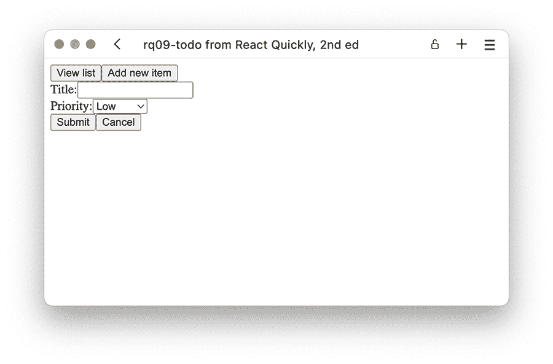

图 9.17 现在可以使用下拉菜单设置优先级。

列表 9.11 带有下拉菜单的表单组件（摘录）

```
import { useState } from "react";
function Add({ handleAdd, handleCancel }) {
  const [data, setData] = useState({
    title: "",
    priority: "low",                                ❶
  });
  const onChange = (evt) => {                       ❷
    const key = evt.target.name;                    ❷
    const value = evt.target.value;                 ❷
    setData((oldData) =>                            ❷
      ({ ...oldData, [key]: value }));              ❷
  };                                                ❷
  ...
      <label>
        Priority:
        <select
          value={data.priority}                     ❸
          name="priority"                           ❸
          onChange={onChange}                       ❸
        >
          <option value="low">Low</option>          ❹
          <option value="medium">Medium</option>    ❹
          <option value="high">High</option>        ❹
          <option value="urgent">Urgent</option>    ❹
        </select>
      </label>
  ...
```

❶ 将优先级初始化为简单的字符串

❷ 我们可以使用与常规输入一样以及与选择框相同的变更处理程序。

❸ 直接在 select 元素上分配值和 onChange 属性，就像在常规输入上一样

❹ 使用具有值和显示文本的选项元素添加选项

如果你之前使用过 HTML 中的选择框，你知道你通常必须设置 selected 属性在各个<option>元素上，以指示哪个被选中。HTML 中的选择元素上没有值属性。但是 React 确保使其易于使用，因此 API 与输入相同，对于选择框也是如此，这非常巧妙！

你甚至可以使用多选框，用户能够选择多个选项。想象一下，如果我们有一个包含人员名单的选项框，用户可以从中选择参与特定任务的人员。如果我们将人员数组存储在本地状态中，我们可以使用选择数组作为组件的值，如下一列表所示。

列表 9.12 带有多选框的表单组件（摘录）

```
import { useState } from "react";
function Add({ handleAdd, handleCancel }) {
  const [data, setData] = useState({
    title: "",
    people: [],                                           ❶
  });
  const onChange = (evt) => {
    const key = evt.target.name;
    const value = evt.target.value;
    setData((oldData) => ({ ...oldData, [key]: value }));
  };
  const onChangePeople = (evt) => {
    const options =                                       ❷
      Array.from(evt.target.selectedOptions);             ❷
    const value = options.map((opt) => opt.value);        ❸
    setData((oldData) => ({ ...oldData, people: value }));
  };
  ...
      <label>
        People:
        <select                                           ❹
          value={data.people}                             ❹
          name="people"                                   ❹
          onChange={onChangePeople}                       ❹
          multiple                                        ❹
        >                                                 ❹
          <option>Tinky Winky</option>
          <option>Po</option>
          <option>Laa-Laa</option>
          <option>Dipsy</option>
        </select>
      </label>
  ...
```

❶ 状态值只是一个数组，我们可以将其初始化为空数组。

❷ 我们需要创建一个自定义的变更处理器，因为我们必须查看目标对象上所选选项的列表。

❸ 对于每个选定的选项，我们必须提取值属性。然后我们可以将结果选项值数组存储在状态中。

❹ 我们像往常一样分配属性，但现在我们还设置了"multiple"属性。

处理多选框需要更多的工作，但很少需要。然而，对于那些偶尔需要的情况，这是一个很好的工具箱。

多行输入

多行输入在 HTML 中被称为文本区域。文本区域在 HTML 中似乎与输入字段相同，主要区别在于文本字段的值不是作为元素的值属性添加，而是作为子文本节点。如果我们想将 HTML 中输入字段的值设置为"this text"，我们使用值属性来完成：

```
<input value="this text" />
```

如果我们想在文本区域中做同样的事情，我们必须将其设置为元素的子节点：

```
<textarea>this text</textarea>
```

然而，在 React 中，我们并不这样做。在 React 中，我们使用文本区域就像它们是文本字段一样。所以，如果我们想在待办事项表单中添加一个描述字段，我们只需扩展表单即可。

列表 9.13 带有文本区域的表单组件（摘录）

```
import { useState } from "react";
function Add({ handleAdd, handleCancel }) {
  const [data, setData] = useState({
    title: "",
    description: "",                  ❶
  });
  const onChange = (evt) =>
    setData((oldData) =>
      ({ ...oldData, [evt.target.name]: evt.target.value }));
  ...
      <label>
        Description:
        <textarea
          value={data.description}    ❷
          name="description"
          onChange={onChange}         ❸
        />
      </label>
   ...
```

❶ 状态值再次初始化为字符串。

❷ 直接在 textarea 元素上设置值属性——不需要将其设置为子节点

❸ 只要我们确保设置名称属性，就使用与之前相同的通用变更处理器

在所有这些额外的输入类型中，你现在应该已经准备好创建最复杂的表单，并且能够以大量代码重用的方式，既正确又巧妙地处理数据，避免重复。

### 9.2.6 其他属性

所有其他属性在所有不同类型的输入上仍然按预期工作。这是因为大部分额外功能由 HTML 管理，所以我们不需要在 React 中做任何事情来获得这些额外功能的好处。以下是一个你可以添加到输入中以改变表单工作方式的额外属性的不完整列表：

+   required—如果设置在输入字段上，输入将是必需的。如果字段为空，则无法提交表单——浏览器不会调用 onSubmit 回调。如果字段非空，提交将按正常工作。这是一个布尔属性，所以你只需要将其包含为<input required />。

+   min, max, *和* step—这些属性用于数字输入和范围，以控制值的允许范围。你可以在范围输入中使用它们，如下所示：<input type="range" min="100" max="200" step="10" />。

+   readOnly—这个属性确实如其名所示：使你的输入变为只读。你无法编辑输入字段中的值，也不会触发 onChange 处理程序。这也是一个布尔属性。注意拼写中的大写 O。

+   disabled—如果设置，输入将被禁用。这与只读输入不同，因为你不能像只读输入那样聚焦禁用输入。只读输入仍然被视为表单中可提交数据的一部分，但禁用输入不是。这是一个布尔属性。

+   list—如果设置为文档中其他位置的<datalist>元素的 ID，该数据列表将作为你可以输入到输入中的选项列表。它有点像下拉菜单，只不过列表只是建议列表，所以输入不限于这些值。

+   maxLength—这表示允许在输入中输入的最大字符数，并且大多数浏览器会自动管理。注意拼写中的大写 L。

这里还有许多其他未涵盖的属性。这些属性都不是 React 特定的，但在 HTML 中通常都适用。如果你想了解更多信息，建议查看 MDN 文档中关于输入字段的说明：[`mng.bz/WzAg`](http://mng.bz/WzAg)。

## 9.3 管理非受控输入

让我们创建另一个非常简单的计算器——这次只有一个输入。我们想要创建一个组件，给定一个输入，将返回所有小于或等于该数字的整数的总和。所以，给定一个输入为 4，它将返回 1+2+3+4=10。这里有一个非常简单的公式，即 n*(n+1)/2，其中 n 是要计算总和的数字。这次我们不会在用户点击提交按钮之前计算最终值。创建此受控组件的组件树如图 9.18 所示。

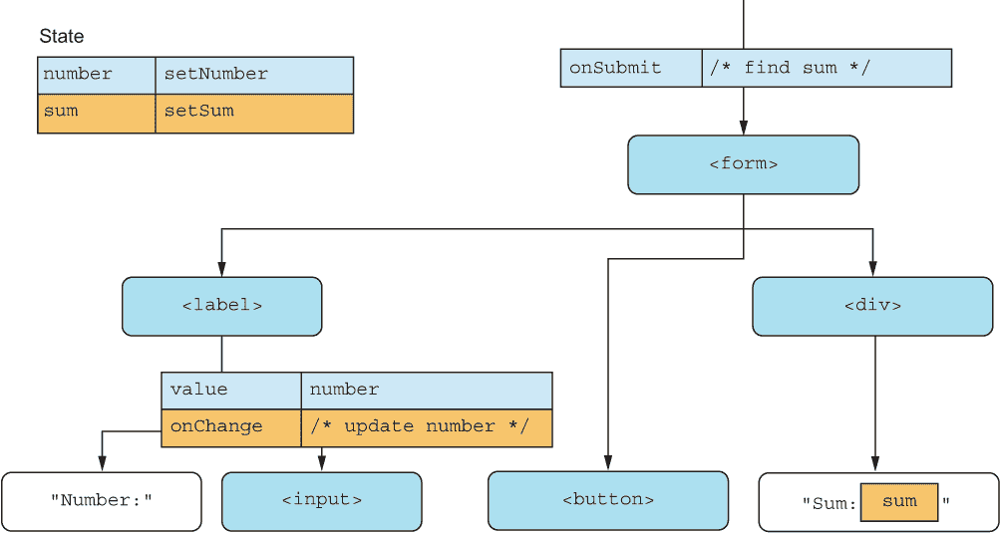

图 9.18 整数求和计算器的输出 JSX。当表单提交时，我们计算总和，并在输出元素中显示。

正如我们多次做的那样，我们创建一个本地状态变量来保存输入值。这次，我们还需要另一个变量来保存总和，因为只有在表单提交时总和才会改变。

那么，我们为什么还需要数字变量呢？数字变量的唯一原因是可以将其传递回受控输入组件。当然，拥有它非常方便，并且我们可以完全控制输入，但我们实际上并不需要这种控制，因为用户可以输入他们想要的任何内容（只要我们设置了 min="0"，因为不能计算负数的总和）。

我们还可以用另一种方式来做这件事。我们可以放弃对输入的所有控制，只让 HTML 控制，并保持它直到我们需要它。我们只需要在表单提交时获取值，而实际上我们不需要在处理时让我们的组件负担控制输入状态的重任。

这种方法的缺点是我们只能控制组件中的初始值；之后，我们实际上无法做任何事情。但我们也不需要在这个组件中保持对值的控制，所以这没关系。如果我们实现了这个，我们将在状态中只有一个总和变量，并在表单提交事件处理程序中计算它。结果组件树如图 9.19 所示。

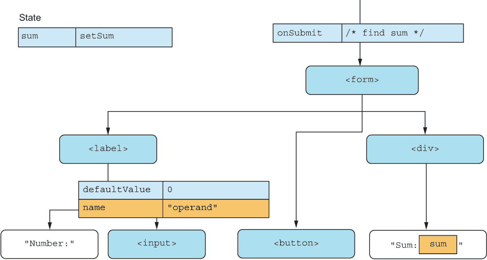

图 9.19 整数求和计算器的输出 JSX，带有非受控输入组件

现在的技巧是如何访问输入中的数字。我们可以对输入创建一个引用，并通过 ref.current.valueAsNumber 来访问，但这不是必要的。提交事件将有一个 target 属性，它是对表单元素的引用，而表单元素通过.name 集合直接引用其所有输入。因此，因为我们已经将输入命名为"operand"，所以我们可以通过表单提交事件对象作为 evt.target.elements.operand.valueAsNumber 来访问它。这并不太糟糕。让我们按照下面的列表来实现它。

列表 9.14 自然数的总和

```
import { useState } from "react";
function NaturalSum() {
  const [sum, setSum] = useState(0);                ❶
  const onSubmit = (evt) => {
    const value =                                   ❷
      evt.target.elements.operand.valueAsNumber;    ❷
    const naturalSum = (value * (value + 1)) / 2;
    setSum(naturalSum);
    evt.preventDefault();
  };
  return (
    <form
      onSubmit={onSubmit}
      style={{ display: "flex", flexDirection: "column" }}
    >
      <label>
        Number:
        <input
          type="number"
          min="1"
          defaultValue="1"                          ❸
          name="operand"                            ❸
        />
      </label>
      <div>
        <button>Submit</button>
      </div>
      <div>Sum: {sum}</div>
    </form>
  );
}
function App() {
  return <NaturalSum />;
}
export default App;
```

❶ 我们根本不在状态中存储输入数据。

❷ 我们必须通过 DOM 读取输入值，而不是从状态中读取。幸运的是，对于表单元素来说，这样做非常简单。

❸ 在输入元素上设置 defaultValue 但不设置 value，并设置名称以便通过表单轻松查找

仓库：rq09-natural-sum

这个例子可以在 rq09-natural-sum 仓库中看到。您可以通过创建一个基于相关模板的新应用程序来使用该仓库：

```
$ npx create-react-app rq09-natural-sum --template rq09-natural-sum
```

或者，您可以访问这个网站来浏览代码，直接在浏览器中查看应用程序的运行情况，或者下载源代码的 zip 文件：

[`rq2e.com/rq09-natural-sum`](https://rq2e.com/rq09-natural-sum)

这应该可以工作。让我们尝试在浏览器中运行它，在那里你应该会看到类似图 9.20 的内容。

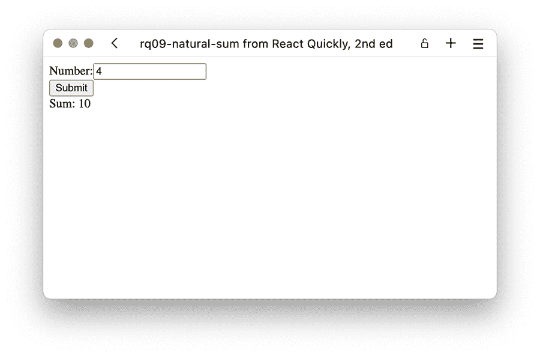

图 9.20 自然数求和计算器在正确计算输入 4 的总和时的运行情况

注意，我们本来可以在输入上有一个变化事件处理器，读取其变化时的值，但我们不需要这么做。

那么，我们在这里得到了什么，失去了什么？我们在表 9.1 中总结了两种方法之间的差异。

表 9.1 控制与非控制输入之间的差异

|  | 控制输入 | 非控制输入 |
| --- | --- | --- |
| **设置初始值** | 是的。 | 是的。 |
| **读取变化时的值** | 我们必须这么做。 | 如果想的话，我们可以这么做，但不是必须的。 |
| **在提交时读取值** | 很简单，我们已经在状态中有它们了。 | 我们必须通过 DOM 来读取，但肯定是可以做到的。 |
| **状态值** | 我们需要为每个输入使用它们。 | 我们根本不需要任何。 |
| **动态更改值** | 很简单。 | 非常困难（但可以通过 DOM 实现）。 |
| **数据来源** | 组件状态值。 | DOM 值。 |

### 9.3.1 机会

那么，你什么时候会想使用非控制输入呢？表 9.1 给我们提供了一些提示。如果你回想一下我们之前在列表 9.5 中提到的地址表单，我们需要一些状态值和变化处理器，但实际上我们没有对它们做任何事情。我们只是将 DOM 值复制到状态值，然后再反过来。

如果我们想用非控制输入实现相同的表单，那将会非常简单。回想一下在列表 9.5 中，我们实际上并没有使用表单做任何事情。我们没有在表单上设置提交处理器。我们编辑了数据，但没有将其发送到任何地方。

假设我们想制作一个地址表单，并在提交时，想通过这个 URL 使用 POST 请求将数据发送到远程服务：/ /salespower.invalid/ api/address。请注意，这只是一个示例 URL；它不起作用（.invalid 顶级域名也表明了这一点）。如果我们将列表 9.5 中的示例扩展为一个提交处理器，该处理器将数据作为 POST 数据发送到这个 URL，它就变成了列表 9.15。

列表 9.15 控制地址表单与提交

```
import { useState } from "react";
const URL = "//salespower.invalid/api/address";
function Address() {
  const [data, setData] = useState({      ❶
    address1: "",                         ❶
    address2: "",                         ❶
    zip: "",                              ❶
    city: "",                             ❶
    state: "",                            ❶
    country: "",                          ❶
  });                                     ❶
  const onChange = (evt) => {             ❷
    const key = evt.target.name;          ❷
    const value = evt.target.value;       ❷
    setData((oldData) =>                  ❷
      ({ ...oldData, [key]: value }));    ❷
  };                                      ❷
  const onSubmit = (evt) => {
    fetch(URL, {
      method: "POST",
      body: JSON.stringify(data),         ❸
    });
    evt.preventDefault();
  };
  return (
    <form
      onSubmit={onSubmit}
      style={{ display: "flex", flexDirection: "column" }}
    >
      <label>
        Address line 1:
        <input
          value={data.address1}
          name="address1"
          onChange={onChange}             ❹
        />
      </label>
      <label>
        Address line 2:
        <input
          value={data.address2}
          name="address2"
          onChange={onChange}             ❹
        />
      </label>
      <label>
        Zip:
        <input
          value={data.zip}
          name="zip" 
          onChange={onChange}             ❹
        />
      </label>
      <label>
        City:
        <input
          value={data.city}
          name="city" 
          onChange={onChange}             ❹
        />
      </label>
      <label>
        State:
        <input
          value={data.state}
          name="state"
          onChange={onChange}             ❹
        />
      </label>
      <label>
        Country:
        <input
          value={data.country}
          name="country"
          onChange={onChange}             ❹
        />
      </label>
      <button>Submit</button>             ❺
    </form>
  );
}
export default Address;
```

❶ 首先初始化状态

❷ 创建一个可以更新状态的变更处理器

❸ 使用状态作为提交处理器中的数据

❹ 为每个输入分配一个 onChange 处理器

❺ 提交按钮

让我们来看看非控制输入的情况。首先，我们根本不需要任何状态值，也不需要在任何地方使用变化处理器。这两件事将大大减少我们表单的复杂性。

提交处理器将变得更加复杂，因为尽管我们在 evt.target.elements 中有一个状态值的对象，但它并不是直接的状态值列表，而是输入元素本身的对象。然而，这个对象也包含了所有的表单输入，作为编号索引，所以 form.elements[0]是表单中的第一个元素，以此类推。提交按钮也是表单的一个元素，但我们只能查看前六个表单输入，因为我们知道它们是唯一相关的。我们需要遍历这个元素列表，提取每个的名称和值，并将它们放入一个对象中。

列表 9.16 无控制地址表单与提交

```
const URL = "//salespower.invalid/api/address";
function Address() {
  const onSubmit = (evt) => {                           ❶
    const data = Object.fromEntries(                    ❶
      Array.from(evt.target.elements)                   ❶
        .slice(0, 6)                                    ❶
        .map((input) => [input.name, input.value])      ❶
    );                                                  ❶
    fetch(URL, {                                        ❶
      method: "POST",                                   ❶
      body: JSON.stringify(data),                       ❶
    });                                                 ❶
    evt.preventDefault();                               ❶
  };                                                    ❶
  return (
    <form
      onSubmit={onSubmit}                               ❷
      style={{ display: "flex", flexDirection: "column" }}
    >
      <label>
        Address line 1:
        <input name="address1" />
      </label>
      <label>
        Address line 2:
        <input name="address2" />
      </label>
      <label>
        Zip:
        <input name="zip" />
      </label>
      <label>
        City:
        <input name="city" />
      </label>
      <label>
        State:
        <input name="state" />
      </label>
      <label>
        Country:
        <input name="country" />
      </label>
      <button>Submit</button>                           ❸
    </form>
  );
}
export default Address;
```

❶ 这里的主要变化是在提交处理器，我们直接从表单中提取当前数据，而不是像以前那样从本地组件状态中读取。

❷ 将提交处理器添加到表单对象中

❸ 提交按钮

如果我们计算两个不同列表中的字符数，列表 9.15 中的受控变体有 1,441 个字符，而列表 9.16 中的无控制示例只有 1,022 个字符。这减少了大约 30%的代码！此外，受控组件在用户输入时每次都会重新渲染，而未受控组件根本不会重新渲染！

这听起来几乎像是无控制表单更好，在这样一个极其简单的表单案例中，你不需要控制任何东西。但如果你想要通过验证、限制、格式化等方式智能地控制表单，那么你至少需要使那些字段受控。说实话，如果你有一个如此简单的地址表单，没有验证或规则，只是使用 POST 将输入值发送到目标 URL，你根本不需要 React（或 JavaScript）。一个普通的 HTML 表单就可以为你做到这一点。

React 只有在网络应用变得复杂时才能真正发光，你的表单也是如此。如果你想在前面两个表单中添加验证等功能，那么在列表 9.15 中的受控示例中做这件事比在列表 9.16 中的无控制示例中要容易得多。如果你不需要这些功能，你可能不需要在 React 组件内部控制你的输入。事实上，你可能甚至不需要 React。

### 9.3.2 文件输入

文件输入只能是无控制的，因为值属性在 DOM 中被作为浏览器安全特性保护。你不能直接设置文件输入的值；你只能在用户选择上传文件后读取它。你能做的唯一一件事是清除值，但你不能以任何方式更改或将其设置为初始值。

因此，在 React 中，文件输入永远不能被控制。如果你创建一个带有`<input type="file" value={file} />`的组件，浏览器会告诉你停止胡闹，并显示类似这样的消息：

```
Uncaught DOMException: Failed to set the 'value' property on
'HTMLInputElement': This input element accepts a filename, which
may only be programmatically set to the empty string.
```

这不是 React 阻止你做的事情。只是浏览器根本不允许你尝试设置文件输入的值。

因此，如果你需要在 React 表单中添加文件输入，你必须至少使该输入无控制。但因为你根本不需要验证、限制或格式化文件输入的当前值，所以这应该没问题。

## 9.4 测验

1.  你只能在受控输入中指定初始值，不能在无受控输入中。*正确*还是*错误*？

1.  你在处理下拉框中的输入时使用哪个事件处理器？

    1.  onValue

    1.  onChange

    1.  onSelect

    1.  onClick

1.  你会使用以下哪个属性在事件处理器中读取复选框输入的新状态？

    1.  evt.target.value

    1.  evt.target.selected

    1.  evt.target.checked

    1.  evt.target.valueAsBoolean

1.  当您需要在表单提交处理程序中针对名为 "email" 的未受控输入节点时，以下哪种方法是正确的？

    1.  evt.target.inputs.email

    1.  evt.target.email

    1.  evt.target.nodes.email

    1.  evt.target.elements.email

1.  在受控输入元素上需要哪两个属性？

    1.  name

    1.  value

    1.  defaultValue

    1.  onChange

## 问答答案

1.  *错误*。在两种模式下都可以设置初始值。在未受控输入中，您不能更新初始值之后的价值，但您可以*设置*初始值。

1.  无论您使用哪个表单输入元素，您始终使用 onChange 事件处理器。

1.  复选框输入元素的状态存储在 checked 属性中，因此您可以在更改处理程序中通过 evt.target.checked 访问它。

1.  表单元素可以通过 DOM 中的表单元素通过 elements 属性访问。名为 "email" 的表单元素可以通过表单提交处理器的 evt.target.elements.email 访问。

1.  所有受控输入必须始终定义值和 onChange 属性。

## 摘要

+   处理表单数据是 React 中的首要任务，表单和输入非常容易处理。

+   表单输入元素可以是受控的或未受控的。

+   建议使用受控输入，这为您提供了在飞行中验证、修改和过滤输入的选项。

+   要使用受控输入，您必须在 JSX 中的输入元素上指定值和 onChange 属性，并通过更新值属性“确认”每次更改。

+   另一种选择是使用未受控输入，这减少了修改数据的选择，但也减少了处理需要少量数据控制的表单所需的代码量。

+   未受控输入可以使用 defaultValue 指定初始值，但不能设置 value 属性。

+   您可以在 React 中使用所有类型的 HTML 输入，包括但不限于文本输入、数字输入、日历和时间输入、密码输入、复选框、单选按钮、下拉菜单、范围计和文本区域。

+   一些输入类型在 API 中有一些细微的差异，例如，读取复选框、单选按钮和多选框的状态。

+   文件输入只能始终是未受控的，因为在 JavaScript 中无法控制文件输入的值。
