# 10 高级 React 钩子用于扩展

本章涵盖

+   使用 React Context 结构化数据流

+   使用 reducer 管理复杂状态

+   创建自定义钩子以实现代码复用

到目前为止，你已经学到了自己构建小型、简单 React 应用程序所需的所有知识。你拥有创建具有状态、交互性和相关性的 React 小部件所需的所有知识和工具，只要你在处理相当小的项目。

在现实世界中，你的 React 应用程序可能比我们迄今为止所检查的任何示例都要大得多、复杂得多。你可以为网站创建一些小部件（例如，BMI 计算器），它们只有几个组件，但仍能做得很好，但这些例子很少，并且主要与业余开发者相关。

作为一名专业的 React 工程师，你更有可能要么独立开发一个较大的应用程序，要么作为团队的一部分开发一个更大的应用程序。随着应用程序的增大，组件接口变得更加复杂，对代码库的工作需要更多的技巧。

如果你没有结构或程序地开发应用程序，以下几件事情可能会开始成为问题：

1.  复杂的数据流可能导致所有组件上都有大量属性，以传输所需的所有数据。

1.  如果没有仔细注意相关状态值的同步，复杂的状态流可能导致无效的状态。

1.  如果你只尝试概括整个组件而不是组件的部分，重复的代码有时很难进行概括。

无论你是独自工作还是在更大的团队中，所有这些问题都会出现。这些都是扩展问题。在小规模上有效的东西，不一定在大规模上有效。

当我们在第九章中创建更复杂的形式时，我们看到了类似的扩展问题。当你只有 1 或 2 个输入时，为每个输入使用状态值是可以的。但是，如果你有 5 或 10 个输入，为每个输入拥有单独的状态值会变得麻烦，坦白说，这是糟糕的软件设计。当概念应用于更大的项目时，它们通常会被调整以允许更好的扩展。

在本章中，我们将讨论可以帮助你组织和结构化你的 React 应用程序以及整个 React 项目的工具，以创建更好的软件和更好的开发者体验。

本章将涵盖前三个扩展问题的解决方案：

1.  你可以使用 React Context 使值对组件可用，无论深度如何，这是组织复杂数据流的好方法。我们将在第 10.1 节中介绍这一点。

1.  当你有多值状态且相互依赖时，你可以使用 reducer 进行状态更新，这是一个从函数式编程中借用的想法。我们将在第 10.2 节中介绍这一点。

1.  自定义钩子是通用小型和大型业务逻辑的绝佳方式，我们将在第 10.3 节中介绍这一点。自定义钩子正迅速成为在项目内部以及作为 GitHub 和/或 npm 上可用的开源库提供可重用功能的主要方式。

注意：本章示例的源代码可在[`rq2e.com/ch10.`](https://rq2e.com/ch10)找到。但如你在第二章中学到的，你可以使用单个命令直接从命令行实例化所有示例。

## 10.1 在组件间解析值

让我们再次构建一个解决现实世界问题的应用程序。这次，我们将使用用户仪表板，这是您登录某些应用程序后看到的屏幕。这个仪表板显示一条欢迎您的消息，以及位于右上角的一个按钮，显示您的姓名并链接到您的设置页面。这里的技巧是名称是动态的，将由某个后端返回给我们。最终结果应该看起来像图 10.1。

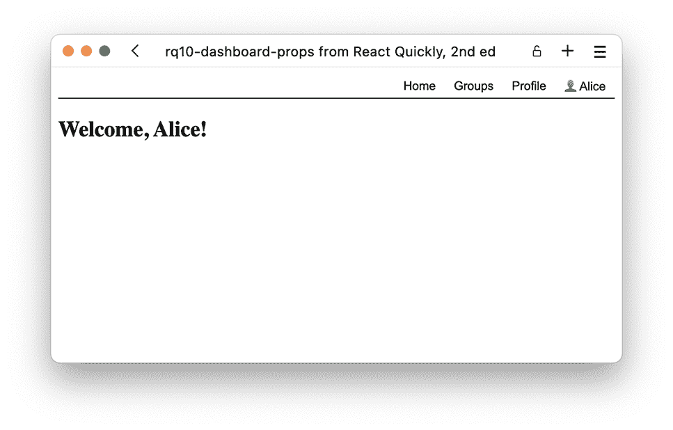

图 10.1 我们用户仪表板期望的最终结果。在这个屏幕截图中，用户的姓名被显示两次，这是这里问题的核心。

让我们将这个结构分解成组件。我们希望顶部菜单是标题的一部分。中央欢迎页面只是我们应用程序可以显示的众多页面之一。我们知道我们将来会添加更多内容，所以让我们为了这个预期添加一些额外的层级。我们将使用图 10.2 中展示的组件方法。

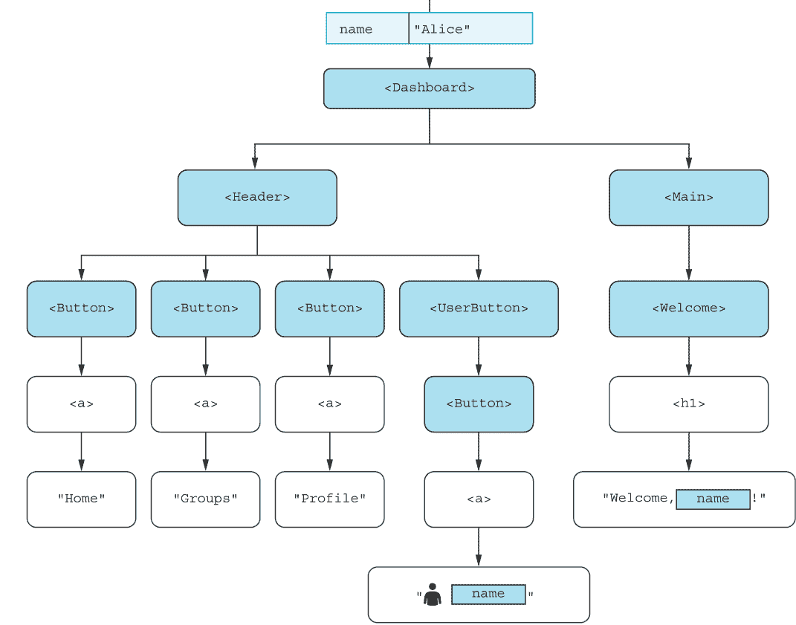

图 10.2 我们组件结构中包含必要的名称占位符。注意“名称”属性被使用两次，但仍然没有作为属性传递。

然而，如图 10.2 所示，我们没有展示如何从组件树的顶部获取名称，从那里它被传递到仪表板组件，一直到底部的两个较小的组件，它们需要显示这个名称。

使用我们迄今为止所做的工作，我们需要将属性传递给每个组件，直到它到达需要它的组件。如果我们这样做，它将看起来像图 10.3。

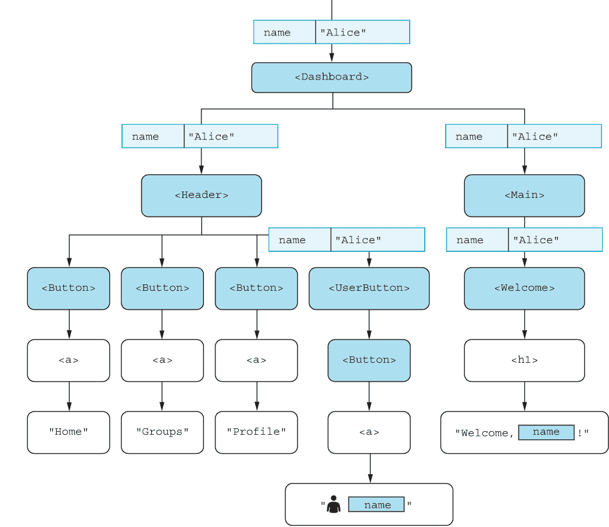

图 10.3 如果我们将名称传递给所有需要传递的组件，我们的组件结构将如何。五个组件需要名称属性，但只有两个组件会显示它。

但请注意，在这个组件树中，我们将名称属性传递给了 Header 和 Main 组件。这两个组件本身都不需要这个属性。我们必须将这个属性传递给这两个组件的唯一原因是它们可以将属性转发给另一个组件。尽管如此，这可行，并且如列表 10.1 所示，它可以实现。

列表 10.1 带有许多名称属性的仪表板

```
const BUTTON_STYLE = {
  display: "inline-block",
  padding: "4px 10px",
  background: "transparent",
  border: "0",
};
const HEADER_STYLE = {
  display: "flex",
  justifyContent: "flex-end",
  borderBottom: "1px solid",
};
function Button({ children }) {
  return (
    <button style={BUTTON_STYLE}>
      {children}
    </button>
  );
}
function UserButton({ name }) {
  return <Button>👤 {name}</Button>;   ❶
}
function Header({ name }) {             ❷
  return (
    <header style={HEADER_STYLE}>
      <Button>Home</Button>
      <Button>Groups</Button>
      <Button>Profile</Button>
      <UserButton name={name} />        ❸
    </header>
  );
}
function Welcome({ name }) {
  return (
    <section>
      <h1>Welcome, {name}!</h1>
    </section>
  );
}
function Main({ name }) {               ❷
  return (
    <main>
      <Welcome name={name} />           ❸
    </main>
  );
}
function Dashboard({ name }) {
  return (
    <>
      <Header name={name} />
      <Main name={name} />
    </>
  );
}
function App() {
  return <Dashboard name="Alice" />;
}
export default App;
```

❶ 你知道你可以在 React 中直接使用表情符号吗？你可以！

❷ 将一个不需要使用该属性的属性传递给一个组件

❸ 组件只传递属性，以便将其传递给另一个组件。

仓库：rq10-dashboard-props

这个例子可以在 rq10-dashboard-props 仓库中看到。您可以通过创建一个基于相关模板的新应用程序来使用该仓库：

```
$ npx create-react-app rq10-dashboard-props --template rq10-dashboard-props
```

或者，您可以访问这个网站浏览代码，直接在浏览器中查看应用程序的实际运行情况，或者下载源代码的 zip 文件：

[`rq2e.com/rq10-dashboard-props`](https://rq2e.com/rq10-dashboard-props)

这是一个合理的方法，并且它有效。如果您在浏览器中打开它，您会看到我们想要的图 10.1 中的内容。

### 10.1.1 React Context

这些属性被传递给组件，只是为了将它们传递给另一个组件，这看起来并不是一个好的软件设计。一定有更好的方法。如果我们能有一个封装了多个组件的存储对象，当它们需要时，可以将其数据提供给所有子组件，而不需要传递任何额外的属性，会怎么样呢？

恭喜，我们刚刚发明了 React Context。上下文正是如此——它使用值包裹了多个组件，所有子组件都可以访问这些值，而无需通过属性。

属性钻取

将属性添加到组件中的做法，唯一目的是允许该组件将这些属性传递给其他组件，而这些组件可能只需要将这些属性传递给另一层组件，这种做法被称为*属性钻取*。您通过许多组件层*钻取*您的*属性*，因为您需要从外部获取它到内部。

在大型代码库中，属性钻取问题可能会很快出现，React Context 是解决这个问题的最佳工具之一。如果没有适当的设计模式，例如使用上下文提供者，您可能会在一些组件上拥有数十个属性，仅仅是因为它们在组件树中需要进一步使用。

这显然是糟糕的软件设计，也是 React Context 如此受欢迎的原因之一。

React 中的上下文由两部分组成。它需要一个提供者，其中包含您想要传递给任何子组件的值，并且需要一个消费者，您在每个希望访问提供值的子组件中使用它。

上下文提供者是一个相当简单的 React 组件。消费者最容易被创建为一个 useContext 钩子。本质上，使用上下文看起来就像图 10.4 所示。

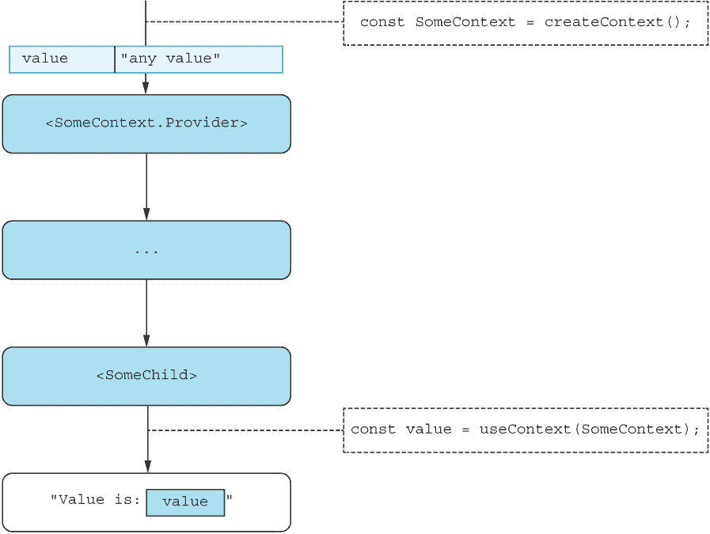

图 10.4 使用 useContext 钩子从提供者到消费者的值传递

在这里我们需要 React Context API 的两个部分。首先，我们需要 createContext 来定义上下文，我们将其存储在一个变量中。这个变量是在任何组件外部创建的，并且与其他组件位于同一位置，因此它可以像任何其他组件一样被引用。其次，我们需要 useContext 钩子。这个钩子接受上下文的引用，并返回当前的上下文值。让我们将一个 NameContext 添加到我们之前提到的仪表板应用程序的组件树中，如图 10.5 所示。

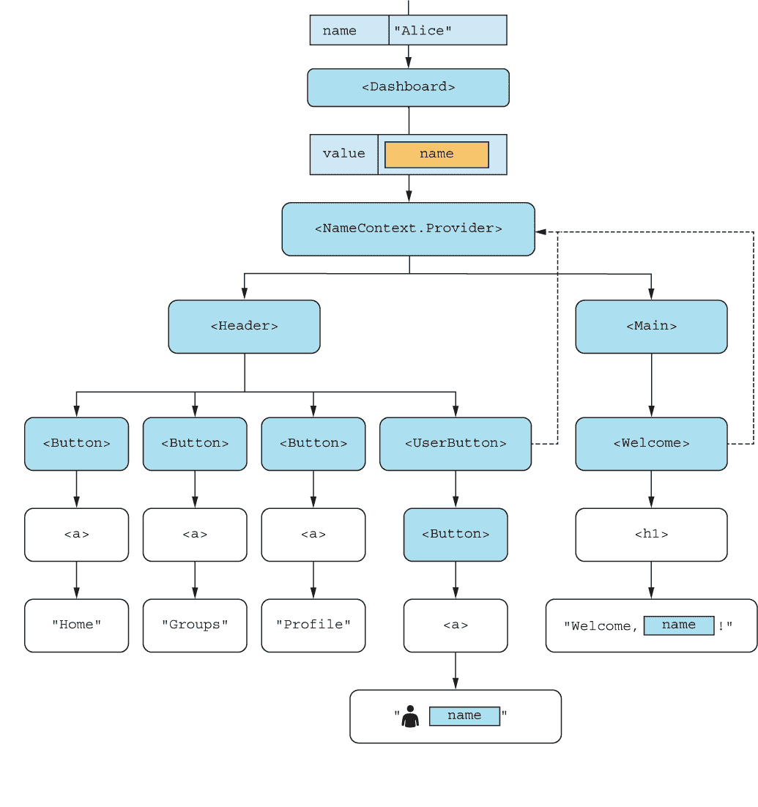

图 10.5 带有上下文的仪表板应用程序组件树。箭头表示使用上下文的组件，并回指由上下文提供者定义的当前值。

这实际上就是全部内容。我们可以像以下列表所示那样实现它。我们得到与之前相同的结果，但数据流更加顺畅。

列表 10.2 带有上下文的仪表板

```
import { createContext, useContext } from "react";      ❶
const BUTTON_STYLE = {
  display: "inline-block",
  padding: "4px 10px",
  background: "transparent",
  border: "0",
};
const HEADER_STYLE = {
  display: "flex",
  justifyContent: "flex-end",
  borderBottom: "1px solid",
};
const NameContext = createContext();                    ❷
function Button({ children }) {
  return <button style={BUTTON_STYLE}>{children}</button>;
}
function UserButton() {                                 ❸
  const name = useContext(NameContext);                 ❹
  return <Button>👤 {name}</Button>;
}
function Header() {                                     ❸
  return (
    <header style={HEADER_STYLE}>
      <Button>Home</Button>
      <Button>Groups</Button>
      <Button>Profile</Button>
      <UserButton />
    </header>
  );
}
function Welcome() {                                    ❸
  const name = useContext(NameContext);                 ❹
  return (
    <section>
      <h1>Welcome, {name}!</h1>
    </section>
  );
}
function Main() {                                       ❸
  return (
    <main>
      <Welcome />
    </main>
  );
}
function Dashboard({ name }) {
  return (
    <NameContext.Provider value={name}>                 ❺
      <Header />
      <Main />
    </NameContext.Provider>
  );
}
function App() {
  return <Dashboard name="Alice" />;                    ❻
}
export default App;
```

❶ 从 React 包中导入两个函数

❷ 上下文是在全局范围内创建的，因此我们可以从任何地方访问它。

❸ 我们的大多数组件现在根本不再接受任何属性。

❹ 需要访问名称的两个组件可以通过使用 useContext 钩子连接到上下文。

❺ 在仪表板组件中，我们确保将整个树包裹在一个以名称为上下文值的 context provider 中。

❻ 在主应用程序组件中，我们使用名称 "Alice" 初始化整个仪表板。

存储库：rq10-dashboard-context

这个例子可以在 rq10-dashboard-context 存储库中看到。你可以通过创建一个基于相关模板的新应用程序来使用该存储库：

```
$ npx create-react-app rq10-dashboard-ctx --template rq10-dashboard-context
```

或者，你可以访问这个网站浏览代码，直接在浏览器中查看应用程序的运行情况，或者下载源代码的 zip 文件：

[`rq2e.com/rq10-dashboard-context`](https://rq2e.com/rq10-dashboard-context)

### 10.1.2 上下文状态

使用上下文存储在整个应用程序中使用的静态值确实很方便，但更方便的是我们还可以在那里存储动态信息。useContext 钩子是有状态的，所以如果上下文值发生变化，useContext 钩子将导致使用它的组件自动重新渲染。

让我们想象一下同样的仪表板，但这次你是一个管理员，希望能够看到数据库中任何用户的仪表板外观。作为管理员，你有一个用户下拉菜单，可以看到仪表板。我们将像图 10.6 所示那样实现这一功能，其中仪表板组件与之前相同（我们只是没有显示所有子组件以节省空间）。

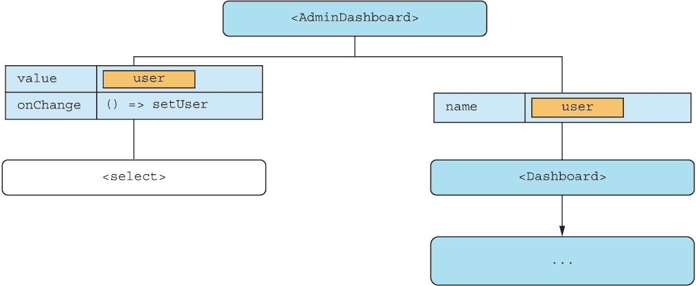

图 10.6 管理员仪表板允许用户选择查看哪个用户的仪表板。管理员仪表板包括一个选择框和常规用户仪表板。

我们将使用一个简单的选择元素来允许用户在系统中的三个用户之间进行选择：Alice、Bob 和 Carol。我们可以使用简单的 useState 来记住选定的用户，并根据需要将其传递给组件。让我们用这个新的管理员仪表板扩展之前的例子。

列表 10.3 管理员仪表板

```
import {
  useState,                                             ❶
  createContext,
  useContext,
} from "react";
const BUTTON_STYLE = {
  display: "inline-block",
  padding: "4px 10px",
  background: "transparent",
  border: "0",
};
const HEADER_STYLE = {
  display: "flex",
  justifyContent: "flex-end",
  borderBottom: "1px solid",
};
const NameContext = createContext();
function Button({ children }) {
  return <button style={BUTTON_STYLE}>{children}</button>;
}
function UserButton() {
  const name = useContext(NameContext);
  return <Button>👤 {name}</Button>;
}
function Header() {
  return (
    <header style={HEADER_STYLE}>
      <Button>Home</Button>
      <Button>Groups</Button>
      <Button>Profile</Button>
      <UserButton />
    </header>
  );
}
function Welcome() {
  const name = useContext(NameContext);
  return (
    <section>
      <h1>Welcome, {name}!</h1>
    </section>
  );
}
function Main() {
  return (
    <main>
      <Welcome />
    </main>
  );
}
function Dashboard({ name }) {                           ❷
  return (
    <NameContext.Provider value={name}>
      <Header />
      <Main />
    </NameContext.Provider>
  );
}
function AdminDashboard() {
  const [user, setUser] = useState("Alice");             ❸
  return (
    <>
      <select                                            ❹
        value={user}                                     ❹
        onChange={(evt) => setUser(evt.target.value)}    ❹
      >                                                  ❹
        <option>Alice</option>
        <option>Bob</option>
        <option>Carol</option>
      </select>
      <Dashboard name={user} />                         ❺
    </>
  );
}
function App() {
  return <AdminDashboard />;
}
export default App;
```

❶ 我们还需要导入 useState 钩子。

❷ 仪表板组件内部的一切都和之前一样。

❸ 创建一个简单的状态，默认为 Alice

❹ 使用受控选择元素来选择一个用户

❺ 将当前选定的用户传递给仪表板组件

仓库：rq10-dashboard-admin

这个例子可以在 rq10-dashboard-admin 仓库中看到。你可以通过创建一个基于相关模板的新应用程序来使用那个仓库：

```
$ npx create-react-app rq10-dashboard-admin --template rq10-dashboard-admin
```

或者，你可以访问这个网站来浏览代码，直接在浏览器中查看应用程序，或者下载源代码的 zip 文件：

[`rq2e.com/rq10-dashboard-admin`](https://rq2e.com/rq10-dashboard-admin)

如果我们在浏览器中尝试这个，它看起来就像图 10.7 所示。请尝试从下拉菜单中选择不同的名字，并看到名字在仪表板上的菜单和标题中正确更新。

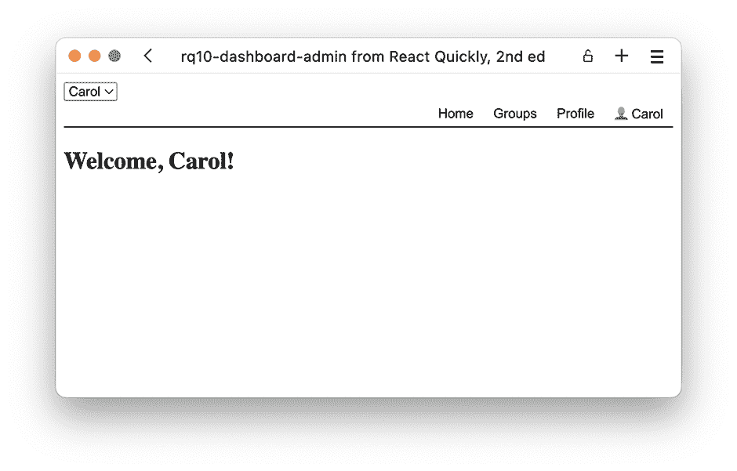

图 10.7 显示了用户仪表板，即 Carol 的仪表板，正如我们在左上角的管理员下拉菜单中选择了她的名字

### 10.1.3 React Context 解构

在这个阶段，让我们退一步，更详细地看看 React Context。正如之前提到的，要使用 React Context，你需要创建一个提供者（provider）和一个消费者（consumer）。你可以以两种不同的方式创建消费者：要么作为一个钩子（hook），要么使用*渲染属性（render prop）*。但在你能够做任何这些之前，你需要通过使用函数 createContext 来创建上下文本身，这个函数存在于 React 包中：

```
import { createContext } from 'react';
const MyContext = createContext(defaultValue);
```

这里有两个需要注意的地方：

+   通常我们会用大写字母命名上下文变量，因为它有点像 React 组件的作用（或者至少是它上面的属性）。

+   createContext 函数接受一个单一参数，即默认值。我们稍后会回到它是如何发挥作用的。

消费上下文

当你有一个上下文变量，例如，前一个片段中的 MyContext，它有两个属性，这是我们关心的：MyContext.Provider 和 MyContext.Consumer。我们已经解释了如何使用 useContext 钩子来消费上下文。你也可以用 MyContext.Consumer 属性做类似的事情，但这稍微复杂一些。

假设我们想在名为 DisplayName 的组件中显示由最近的名字上下文提供的名字段落。我们可以使用 useContext 钩子来实现这一点：

```
function DisplayName() {
  const name = useContext(NameContext);
  return <p>{name}</p>
}
```

这很简单。我们调用钩子，并将当前值作为变量返回，我们可以在组件中直接使用它。

如果我们尝试使用 Consumer 组件做同样的事情，我们必须用函数作为第一个也是唯一的子组件来调用 Consumer 组件，并且该函数将使用上下文的值被调用：

```
function DisplayName() {
  return (
    <p>
      <NameContext.Consumer>
        {(name) => name}
      </NameContext.Consumer>
    </p>
  );
}
```

将返回 JSX 的函数作为子组件传递给组件是一个渲染属性（如前所述），因为它是一个在调用时可以渲染 JSX 的属性。你可能已经看到这需要更多的工作来输入，如果我们需要对返回的值进行一些计算或逻辑处理，我们必须相当大幅度地重构我们的组件。

在函数式代码库中使用 Consumer 组件相当罕见。它主要用于较老的基于类的项目中。

上下文组合

Provider 用于创建可以被消费的上下文。Consumer 用于消费最近的提供上下文。请注意，你可以在整个应用程序中多次提供相同的上下文，甚至可以嵌套提供相同的上下文。你还可以在没有任何提供者的情况下多次使用相同的上下文。

当你消费一个上下文时，你将得到从 JSX 文档树向上查找的最近提供者的值。如果消费者上方没有提供者，你将得到在创建上下文时定义的默认值。所有这些都在图 10.8 中得到了说明。

下面是图 10.8 中需要注意的一些事项：

+   如果你消费一个没有上层提供者的上下文，例如在 TopComponent 中，你将得到上下文定义中的默认值（在这种情况下为 0）。

+   如果你消费一个有多个提供者的上下文，例如在 BottomComponent 中，你将得到从最近的提供者通过文档树向上查找的值（例如，在这种情况下为 17 而不是 2）。

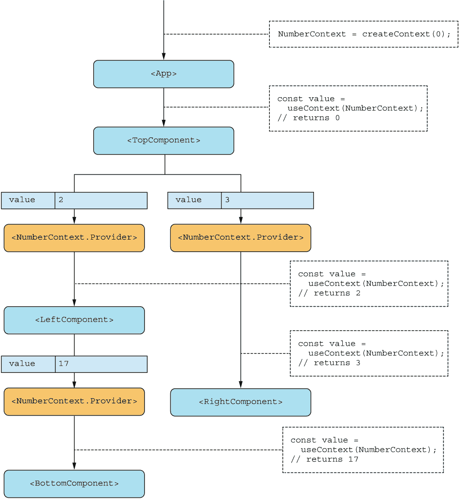

图 10.8 你可以有多个相同上下文的提供者和消费者。

嵌套上下文示例

你可以想象一个用于 UI 变量的嵌套上下文的用例，例如一个应用程序，其中我们有一些按钮在应用程序中具有不同的边框宽度。我们的 Web 应用程序是一个网上商店，有不同商品可供购买和关于业务的页面。我们在页眉和页脚中都有一些按钮。我们还在页眉和页脚中都有打开购物车的按钮。

默认情况下，所有按钮的边框宽度为 1 像素，但在页脚中所有按钮的边框宽度为 2 像素。此外，每个指向购物车的按钮必须始终具有 5 像素的边框宽度，因为它是一个重要的按钮。让我们首先绘制这个系统，如图 10.9 所示。

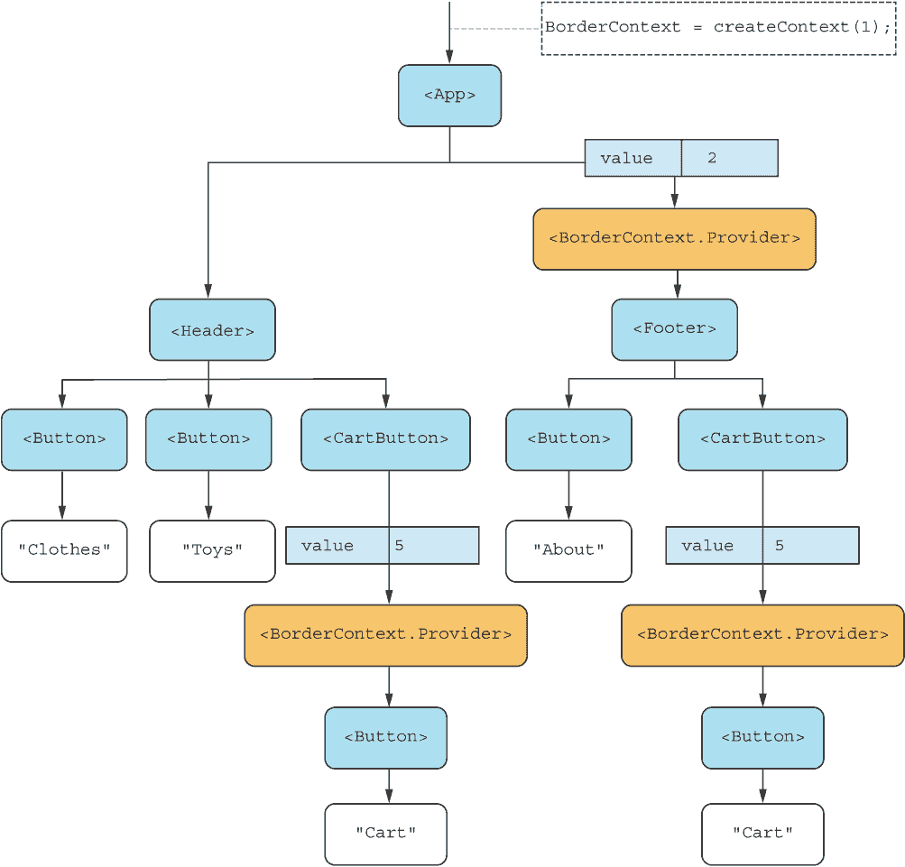

图 10.9 我们购物网站的组件树。注意我们既有默认的上下文值，也有几个上下文提供者。

现在，每个按钮组件都会查找组件树以找到最近的边框上下文提供者，并使用那里获取的边框宽度。如果在树中没有找到提供者，按钮将使用在原始上下文创建中定义的默认值。让我们在图 10.10 中用所有这些查找最近的提供者来注释树。

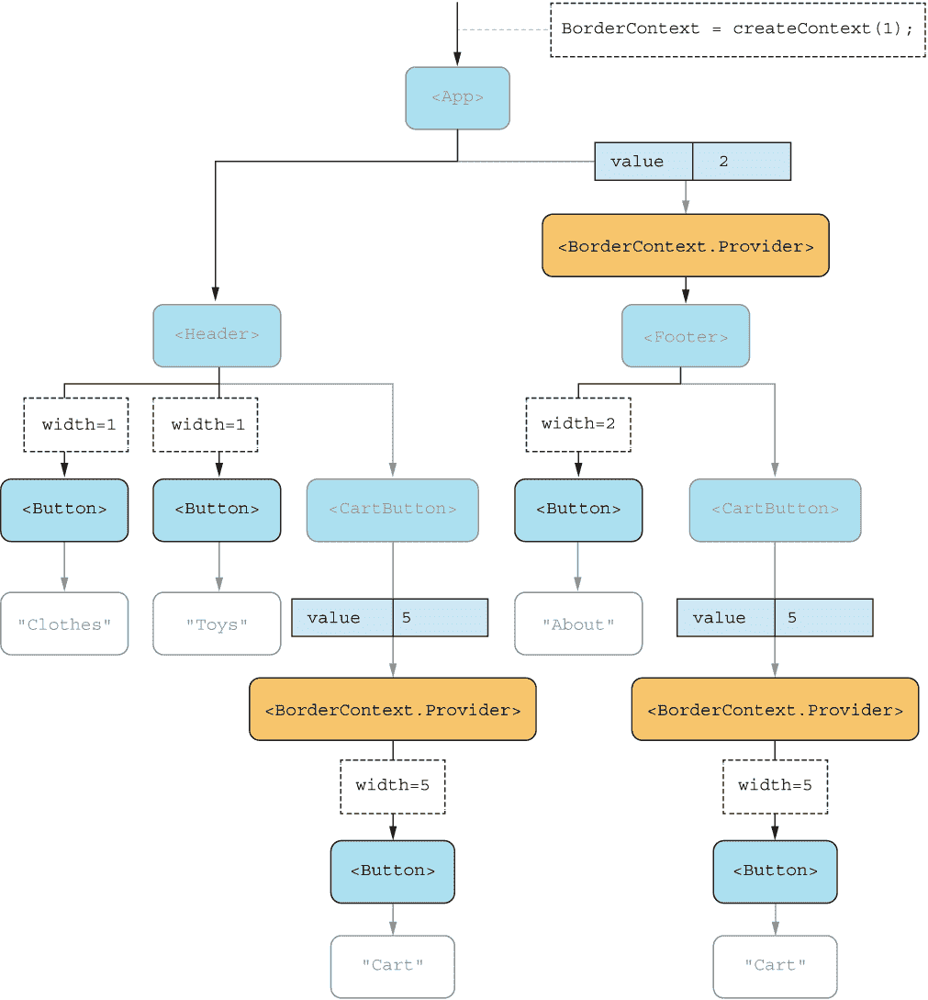

图 10.10 每个按钮组件的组件树（或根）都标记了一个更重的箭头，以表示最近的提供者（或根），并为该组件解析了边框宽度。

现在我们已经拥有了所有需要的信息，让我们来实现它，如图 10.4 列表所示。一旦我们在浏览器中打开它，我们就会看到图 10.11。

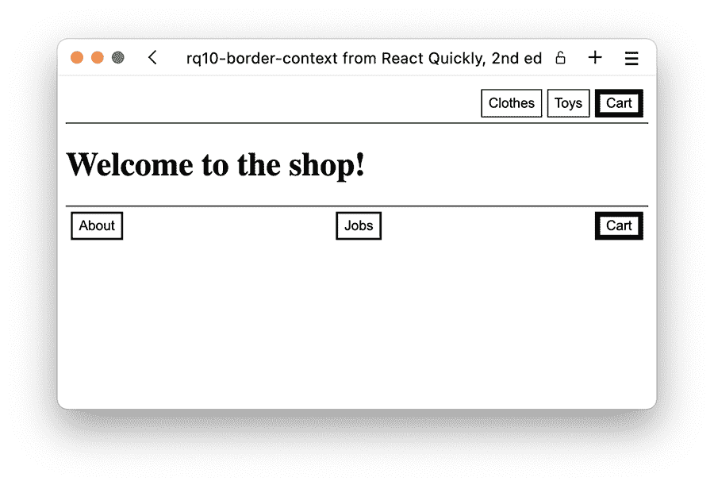

图 10.11 我们的商店网站显示了所有按钮，其宽度与设计完全一致。它看起来不太好，但出于某种原因，客户想要的就是这样！

列表 10.4 根据上下文设置边框宽度

```
import { useContext, createContext } from "react";
const BorderContext = createContext(1);               ❶
function Button({ children }) {

  const borderWidth = useContext(BorderContext);      ❷
  const style = {
    border: `${borderWidth}px solid black`,
    background: "transparent",
  };
  return <button style={style}>{children}</button>;
}
function CartButton() {
  return (
    <BorderContext.Provider value={5}>                ❸
      <Button>Cart</Button>
    </BorderContext.Provider>
  );
}
function Header() {
  const style = {
    padding: "5px",
    borderBottom: "1px solid black",
    marginBottom: "10px",
    display: "flex",
    gap: "5px",
    justifyContent: "flex-end",
  };
  return (
    <header style={style}>
      <Button>Clothes</Button>
      <Button>Toys</Button>
      <CartButton />
    </header>
  );
}
function Footer() {
  const style = {
    padding: "5px",
    borderTop: "1px solid black",
    marginTop: "10px",
    display: "flex",
    justifyContent: "space-between",
  };
  return (
    <footer style={style}>
      <Button>About</Button>
      <Button>Jobs</Button>
      <CartButton />
    </footer>
  );
}
function App() {
  return (
    <main>
      <Header />
      <h1>Welcome to the shop!</h1>
      <BorderContext.Provider value={2}>            ❹
        <Footer />
      </BorderContext.Provider>
    </main>
  );
}
export default App;
```

❶ 使用默认值 1 创建初始上下文

❷ 在按钮组件中，我们消费最近的提供者提供的任何值，并将其用作 CSS 中的边框宽度属性。

❸ 在购物车按钮内部添加一个边框宽度提供者，为该按钮提供正好 5 px 的边框。

❹ 我们在页脚周围包裹了一个提供者，确保默认情况下所有内部的按钮都将有 2 px 的边框，除非另一个更具体的提供者告诉它们否则。

存储库：rq10-border-context

这个例子可以在 repository rq10-border-context 中看到。你可以通过创建一个基于相关模板的新应用程序来使用那个存储库：

```
$ npx create-react-app rq10-border-context --template rq10-border-context
```

或者，你可以访问这个网站来浏览代码，直接在你的浏览器中查看应用程序的运行情况，或者下载源代码的 zip 文件：

[`rq2e.com/rq10-border-context`](https://rq2e.com/rq10-border-context)

## 10.2 如何处理复杂状态

让我们回到我们所有时间中最喜欢的例子：带有增加和减少按钮的计数器！这次，我们将采用不同的方法。我们不会使用常规的 useState 钩子来持有和管理状态值，而是会使用 reducer 和 useReducer 钩子。

我们现在将快速介绍 useReducer 钩子的工作原理，以便开始这个例子，但你将在接下来的小节中了解更多细节。

useReducer API 的样子如下：

```
const [state, dispatch] = useReducer(reducer, initialState);
```

这四个元素在一定程度上是相互关联的，如图 10.12 所示。

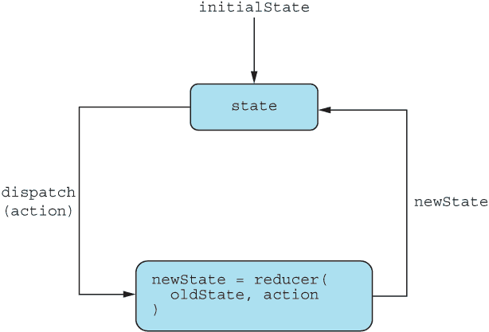

图 10.12 useReducer 钩子中的数据流在某种程度上类似于常规的 useState 钩子，因为它从初始值开始，然后随着应用程序的进展而更新。但更新内部状态的方式更复杂，因为你使用函数和动作“减少”新状态从旧状态。

这里有四个独立的部分。状态和初始状态的工作方式与 useState() 相同。因此，对于我们的计数器，初始状态将是 0，状态将是那一刻计数器达到的任何值。

在这段代码中引入的两个新事物是分发函数和还原函数。dispatch 作为我们的增强型设置函数，允许我们不是直接设置值，而是指导还原函数如何设置值。因此，还原函数是一个函数，它接受当前状态和分发动作，并根据它们返回新的状态。您使用动作对象调用 dispatch，该对象随后与旧状态一起传递给还原函数，并期望还原函数返回新状态。现在，让我们为我们的上下计数器实现这一点。

列表 10.5 带有还原器的计数器组件

```
import { useReducer } from "react";
function reducer(state, { type }) {                       ❶
  switch (type) {
    case "INCREMENT":                                     ❷
      return state + 1;                                   ❷
    case "DECREMENT":                                     ❷
      return state - 1;                                   ❷
    default:
      return state;
  }
}
function Counter() {
  const [counter, dispatch] = useReducer(reducer, 0);     ❸
  return (
    <section>
      <h1>Counter: {counter}</h1>
      <div>
        <button onClick={
          () => dispatch({ type: "INCREMENT" })           ❹
        }>
          Increment
        </button>
        <button onClick={
          () => dispatch({ type: "DECREMENT" })           ❹
        }>
          Decrement
        </button>
      </div>
    </section>
  );
}
function App() {
  return <Counter />;
}
export default App;
```

❶ 创建一个还原函数，它接受旧状态（当前值）和动作对象，动作对象有一个类型

❷ 根据类型返回旧值加或减 1

❸ 使用还原函数和初始值 0 初始化钩子

❹ 调用带有相关动作对象的分发函数

仓库：rq10-counter-reducer

此示例可以在仓库 rq10-counter-reducer 中看到。您可以通过创建基于相关模板的新应用程序来使用该仓库：

```
$ npx create-react-app rq10-counter-reducer --template rq10-counter-reducer
```

或者，您可以访问此网站浏览代码，直接在浏览器中查看应用程序的实际运行情况，或下载源代码的 zip 文件：

[`rq2e.com/rq10-counter-reducer`](https://rq2e.com/rq10-counter-reducer)

*这就是了*！我们再次实现了计数器。我们以更复杂和详尽的方式做到了这一点，但这个还原概念可以用于更复杂的状态场景，您将在下一小节中看到。

### 10.2.1 依赖状态

随着您的应用程序变得更加复杂，可能会出现另一个问题，即依赖状态。当状态中有不同的值相互关联，但不是彼此的副本时，就会发生这种情况。例如，让我们想象一个简单的组件，用于加载一些外部内容并在加载完成后显示内容。因为这是外部内容，加载可能会失败。如果是这样，我们需要显示错误消息。

构建此类组件的简单方法是有三个不同的状态值。一个值表示加载进度（是否正在加载，加载是否成功，加载是否失败），另一个持有加载成功的结果对象，最后一个状态持有加载失败时的错误消息。我们可以在图 10.13 中想象这个简单的状态流。


图 10.13 简单加载组件中的状态流。虚线框表示程序执行给定点的期望状态。

我们有三个相互依赖的不同值，这意味着我们只有当值的某些组合有意义时才有语义意义。例如，如果状态是 LOADING，错误或结果不应该是 null 就没有意义，因为我们还没有下载任何内容（或未能这样做）。同样，如果状态是 FAILURE，结果状态不能有值，因为它根本不能有。

然而，作为一个开发者，你必须记住这些值之间的关系。当我们使用 useState()时，我们不能直接用简单的状态值编码这个关系。我们必须记住在重新加载外部资源时要清除错误和结果状态，因为如果我们不这样做，可能会导致组件处于无效状态，不知道它应该显示什么。

在这里，更好的解决方案是创建一个单独的函数，使我们能够在不同语义状态之间移动，而不仅仅是单个变量。例如，想象一下，如果我们有三个单独的变量并且需要设置其中两个，当加载失败时会发生什么：

```
fetch(...).catch(() => {
  setStatus(FAILURE);
  setError("Loading failed");
});
```

如果我们采用了推荐的方法，即调用一个改变语义状态的单一函数，我们就会做以下操作：

```
fetch(...).catch(() => {
  failureHappenedAndThisIsTheErrorMessage("Loading failed");
});
```

这里的区别很大。前者语法有很多错误的空间，而后者是一个更干净的 API，几乎没有任何误解操作的空间。

useReducer 来拯救

所有这些都是在说，这正是 useReducer 出现的地方。但我们的状态不再是单一的基本值，而是一个包含多个状态值的对象。然后我们也可以使用分发的动作对象来根据需要操纵这个整个状态值对象。

因此，让我们回到我们的状态流程图，看看我们需要哪些动作对象来推进状态，以及它们需要什么 payload 参数来按需更新状态值（见图 10.14）。现在我们只需要定义 reducer 函数，它接受现有的状态和一个动作对象，然后根据这些生成一个新的状态。

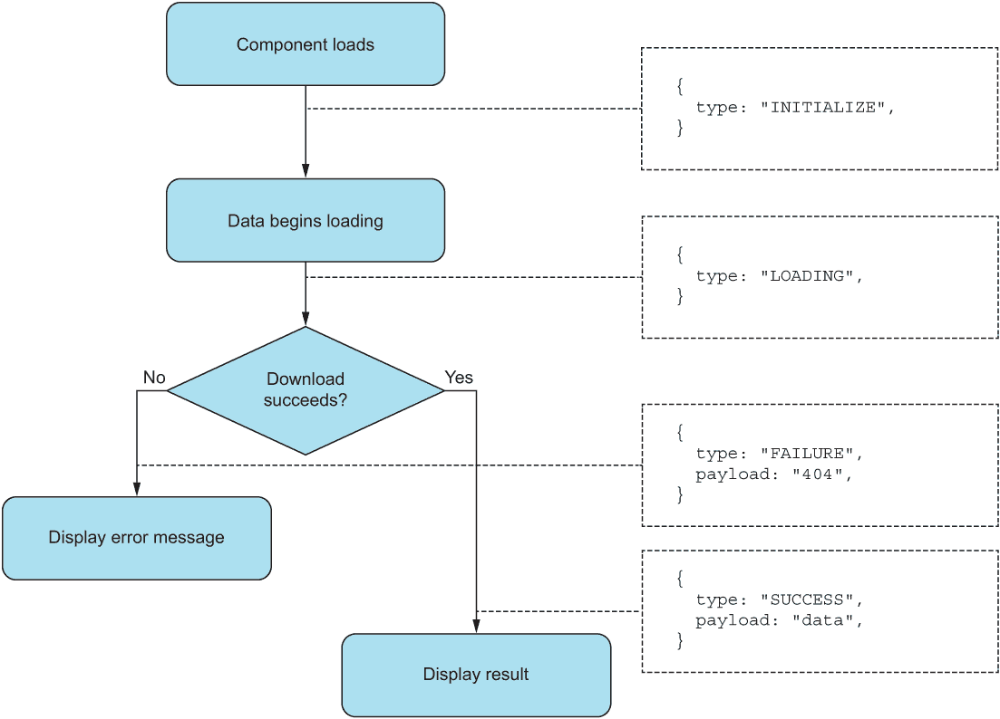

图 10.14 所需动作 API 的状态流程。在这个图中，虚线框表示我们将分发的动作对象发送到 reducer，以便 reducer 更新内部状态。

reducer 的整体结构通常组织如下：

```
function reducer(state, { type, payload }) {
  switch (type) {
    case "TYPE_A":
      // return new state based on TYPE_A
    case "TYPE_B":
      // return new state based on TYPE_B
  }
}
```

因此，对于我们的特定用例，动作类型已经定义为"INITIALIZE"、"LOADING"、"ERROR"和"SUCCESS"。以下是从每个这些动作产生的状态：

+   当初始化时，将状态设置为"INITIALIZE"，并将所有其他变量设置为 null，无论它们的现有值如何。

+   当加载时，将状态设置为"LOADING"，并保持其他一切不变。

+   当加载失败时，将状态设置为"FAILURE"，并将错误设置为传递的 payload。

+   当加载成功时，将状态设置为"SUCCESS"，并将结果设置为传递的 payload。

现在，让我们在先前的 reducer 结构中实现这一点：

```
function reducer(state, { type, payload }) {
  switch (type) {
    case "INITIALIZE":
      return {
        status: "INITIALIZE",    ❶
        result: null,            ❶
        error: null,             ❶
      };
    case "LOADING":
      return {
        ...state,
        status: "LOADING",       ❷
      };
    case "FAILURE":
      return {
        ...state,
        status: "FAILURE",       ❸
        error: payload,          ❸
        };
    case "SUCCESS":
      return {
        ...state,
        status: "SUCCESS",       ❹
        result: payload,         ❹
      };
  }
}
```

❶ 当我们初始化时，无论之前的状态如何，都会清除一切。

❷ 当加载发生时，我们只更改状态，不做其他任何事情。

❸ 当发生错误时，我们更改状态并设置错误。

❹ 当加载成功时，我们更改状态并设置结果。

好的，让我们回到原始目的。我们需要一个可以加载一些数据并在过程中显示状态的组件。我们将使用之前定义的 reducer 来处理状态，但我们会更改一些事情。

列表 10.6 带有 reducer 的加载组件

```
import { useReducer, useEffect } from "react";
const URL = "//swapi.dev/api/films";
const INITIAL_STATE = {
  status: "INITIALIZE",
  result: null,                                  ❶
  error: null,                                   ❶
};
function reducer(state, { type, payload }) {
  switch (type) {
    case "LOADING":                              ❷
      return { ...state, status: "LOADING" };
    case "FAILURE":                              ❷
      return { ...state, status: "FAILURE", error: payload };
    case "SUCCESS":                              ❷
      return { ...state, status: "SUCCESS", result: payload };
    default:                                     ❸
      return state;
  }
}
function Loader() {
  const [state, dispatch] =                      ❹
    useReducer(reducer, INITIAL_STATE);          ❹
  useEffect(() => {
    dispatch({ type: "LOADING" });               ❺
    fetch(URL)
      .then((res) => res.json())
      .then(
        ({ results }) =>                         ❻
          dispatch({                             ❻
            type: "SUCCESS",                     ❻
            payload: results,                    ❻
          })                                     ❻
      )
      .catch(
        ({ message }) =>                         ❼
          dispatch({                             ❼
            type: "FAILURE",                     ❼
            payload: message,                    ❼
          })                                     ❼
      );
  }, []);
  const { status, error, result } = state;       ❽
  if (status === "INITIALIZE") {                 ❾
    return <h1>Initializing...</h1>;
  }
  if (status === "LOADING") {                    ❾
    return <h1>Loading...</h1>;
  }
  if (status === "FAILURE") {                    ❾
    return <h1>Error occurred: {error}</h1>;
  }
  return (                                       ❾
    <>
      <h1>Results are in</h1>
      <ul>
        {result.map(({ title }) => (
          <li key={title}>{title}</li>
        ))}
      </ul>
    </>
  );
}
function App() {
  return <Loader />;
}
export default App;
```

❶ 我们将初始状态提取到一个变量中，而不是 reducer 内部的选项之一。

❷ 我们现在只期望类型为 LOADING、FAILURE 和 SUCCESS 的动作。

❸ 我们在 switch 中添加了一个默认情况来处理发送了某些未知胡言乱语的情况。

❹ 当加载成功时，我们更改状态并设置结果。

❺ 在一个效果钩子中，我们首先通过发送适当的动作将状态设置为 LOADING。

❻ 如果返回结果，我们将通过发送 SUCCESS 动作在状态中设置它们。

❼ 如果在过程中发生某些错误，我们将发送一个包含消息的 ERROR 动作。

❽ 在处理完所有这些之后，我们现在可以将状态解构为包含的三个变量。

❾ 最后，根据状态变量和必要的错误和结果值，显示适当的消息。

存储库：rq10-reducer-load

这个例子可以在 rq10-reducer-load 存储库中看到。你可以通过创建一个基于相关模板的新应用程序来使用该存储库：

```
$ npx create-react-app rq10-reducer-load --template rq10-reducer-load
```

或者，你可以访问这个网站浏览代码，在你的浏览器中直接查看应用程序的运行情况，或者下载源代码的 zip 文件：

[`rq2e.com/rq10-reducer-load`](https://rq2e.com/rq10-reducer-load)

如果我们在浏览器中运行它，它就起作用了！查看图 10.15。

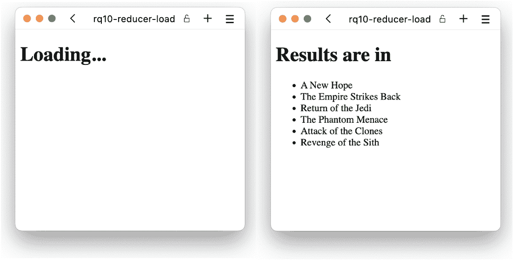

图 10.15 我们正在运行的加载组件——首先是加载状态，然后是成功状态

如果我们将 URL 更改为不存在的某个内容，例如，如果我们按照以下方式更改它：

```
const URL = '//swapi.dev.invalid/api/films';
```

如果我们的加载失败，我们将看到图 10.16 中显示的错误消息。

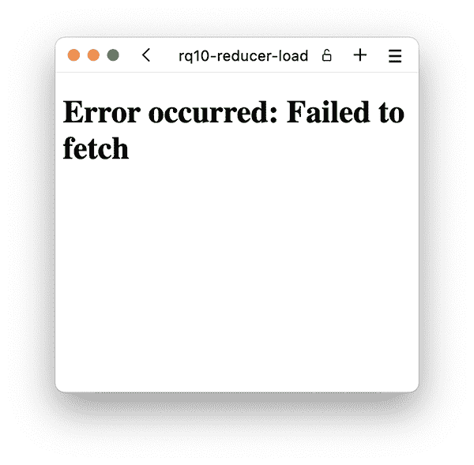

图 10.16 如果加载失败，将显示错误消息。

我们创建的这个 reducer 的一个很好的特点是它完全通用。它不关心我们正在加载什么或如何加载它。reducer 只管理可以加载和可能加载失败的事物的状态。这些事物可以是数据、图像、视频、字体、小海狸，或任何其他东西。

什么是 reducer？

术语*reducer*来自软件工程模型*MapReduce*，这是一种关于数据模型和数据流的方法，它基于数据流中的记录来动态更新你的数据模型。

Reducers 通常被认为是纯的、简单的、无副作用的函数，它们是确定的，并且仅由它们的参数定义。Reducer 通常接受世界的当前状态和一些新的记录/动作，并根据这些更新世界的状态。

在大规模计算和数据分析中，reducers 被用来快速有效地遍历复杂的数据结构。

在 React 中，*reducer*指的是将当前状态转换为新的状态的功能或函数集，基于给定的动作。在 React 中，我们期望 reducer 是纯的、确定的，并且没有副作用。

## 10.3 自定义钩子

让我们回到这本书前面提到的仪表板示例。我们在多个位置有这段代码：

```
const name = useContext(NameContext);
```

尽管这段代码相当简单，但它确实要求你正确地组合 useContext 和 NameContext 这两个部分。相反，我们可以通过将这个功能移动到一个新函数中，并用这个来替换前面的代码，使其变得更容易一些：

```
const name = useName();
```

我们能这样做吗？当然可以！我们只需创建一个在幕后完成这项工作的自定义函数。所以，这个函数使用了 useContext 钩子从 NameContext 上下文中提取当前值：

```
function useName() {
  return useContext(NameContext);
}
```

就这样——通过将代码的重复部分移动到公共函数中来泛化功能。

但这里有一个转折，那就是我们正在基于一个 React 钩子来泛化功能，并且有关于我们如何使用 React 钩子的规则。首先，我们不能在功能组件之外使用 React 钩子。其次，只有当我们始终以相同的顺序使用相同的钩子时，我们才能使用 React 钩子。

我们在这里创建的新函数 useName 也必须遵守这些规则。这个函数现在也是一个钩子。它是一个自定义钩子，你刚刚在这本书中创建了第一个！请注意，这个钩子非常简单，不接收任何参数，但自定义钩子如果需要的话可以接收参数。你将在下一个子节中看到一些自定义钩子。现在让我们探讨究竟是什么让一个函数成为自定义钩子，你如何决定何时何地使用自定义钩子，以及你可以在哪里找到更多自定义钩子。

### 10.3.1 何时是自定义钩子？

自定义钩子是一个使用钩子的函数。钩子可以是任何内置钩子或自定义钩子，所以这几乎像是一个自引用的定义，但事实并非如此。整个事情始于我们之前详细说明的 10 个内置钩子。如果你使用这 10 个钩子中的任何一个来创建一个函数，那么你就创建了一个自定义钩子。如果你使用这 10 个钩子中的任何一个或使用已经使用了这 10 个钩子的自定义钩子来创建一个函数，那么你也创建了一个自定义钩子，以此类推。因此，你确实需要在某个地方有一个或多个内置钩子，以便函数成为自定义钩子。图 10.17 展示了这一点的几个示例。

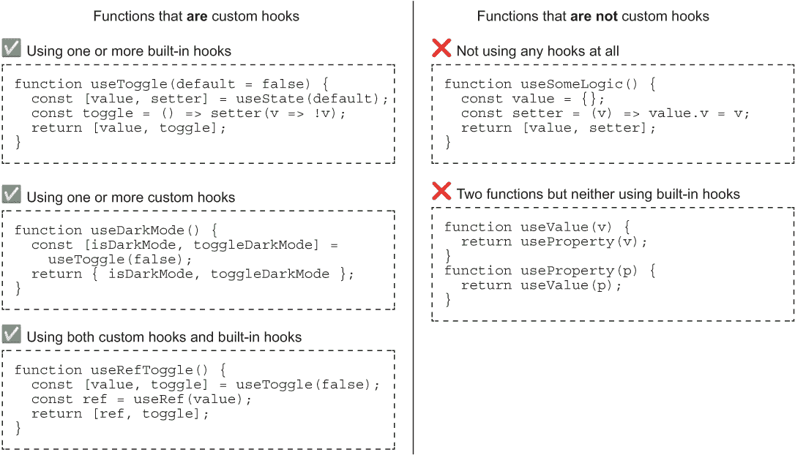

图 10.17 自定义钩子是什么以及不是什么的示例

注意这里的函数命名。将所有自定义钩子命名为 use*是一种常见的做法，而不会用其他方式命名。然而，与命名本身相关的特殊魔法并不存在。这取决于你作为开发者确保你的自定义钩子被命名为 use*。同样，你必须检查名为 use*的东西确实是一个自定义钩子。

### 10.3.2 我应该在什么时候使用自定义钩子？

你应该在任何需要的时候使用自定义钩子。几乎永远不可能让你的代码过于流畅和紧凑。好吧，你可以，但那个限制相当遥远。

你经常会发现你的自定义钩子有两种形式：

+   你正在创建一个自定义钩子，你将在多个地方需要这个功能。

+   你正在将功能移动到自定义钩子中，以清理组件并使其更易于阅读。

这两个目标都是完全有效的，你经常会看到开发者同时使用它们。两者之间的区别通常体现在钩子的命名上。如果一个钩子有一个听起来通用的名字，它可能是一个可重用的功能。如果一个钩子有一个非常具体的名字，它可能只是将复杂逻辑提取到外部文件以简化概览。让我们从本书中我们构建的一些先前应用中的一些例子开始。

useToggle

让我们看看第六章中我们的一些早期组件，其中在交互式倒计时中有这段代码摘录：

```
function Countdown({ from }) {
  ...
  const [isRunning, setRunning] = useState(false);
  ...
  onClick={() => setRunning((v) => !v)}
  ...
}
```

在状态中创建一个布尔标志并有一个允许标志交替的切换函数，这似乎是一个相当通用的过程。

让我们将这个概念推广为一个看起来像常规的 useState 钩子的钩子，只不过它返回的是一个切换函数，而不是一个设置函数。状态值只允许为布尔值：

```
function useToggle(default = false) {
  const [value, setter] = useState(Boolean(default));
  const toggle = () => setter(v => !v);
  return [value, toggle];
}
```

注意这个钩子如何返回一个包含值和函数的数组，就像正常的 useState 钩子一样。这也是自定义钩子中的一种常见模式，因为它使得自定义钩子更容易使用。从 useToggle 钩子返回的值可以像从 useState 钩子返回的值一样使用，但函数是不同的。useState 钩子返回的设置函数可以用来将值设置为任何值，而 useToggle 钩子返回的切换函数只能用来反转当前的布尔值——切换函数不接受任何参数。

这就是全部。这是一个很好的通用切换器。我们可以将其应用于我们的交互式倒计时，如下所示：

```
function Countdown({ from }) {
  ...
  const [isRunning, toggleRunning] = useToggle();
  ...
  onClick={toggleRunning}
  ...
}
```

我们没有保存很多字符，但现在没有那个额外功能，看起来要简单得多。我们还可以在其他地方使用这个钩子，如果我们需要为其他东西提供一个有状态的切换功能的话。

useForm

你可能还记得在第九章中，我们在表单组件中有这个功能：

```
function Address() {
  const [data, setData] = useState({
    address1: "",
    address2: "",
    zip: "",
    city: "",
    state: "",
    country: "",
  });
  const onChange = (evt) => {
    const key = evt.target.name;
    const value = evt.target.value;
    setData(oldData => ({ ...oldData, [key]: value }));
  };
  ...
}
```

我们还可以将这个功能推广为一个自定义钩子，它可以用于不仅限于这个具有六个特定输入的表单，还可以用于任何具有任意数量输入的表单：

```
function useForm(initialValues) {
  const [data, setData] = useState(initialValues);
  const onChange = (evt) => {
    const key = evt.target.name;
    const value = evt.target.value;
    setData(oldData => ({ ...oldData, [key]: value }));
  };
  return [data, onChange];
}
```

我们可以在我们的特定表单中如下使用它：

```
function Address() {
  const [data, onChange] = useForm({
    address1: "",
    address2: "",
    zip: "",
    city: "",
    state: "",
    country: "",
  });
  ...
}
```

这看起来确实很棒且可重用。

useLoader

记得我们在本章早期创建的 reducer 吗？它是一个通用的钩子，用于加载任何类型的内容，允许组件指定加载是进行中、成功还是失败。然而，我们并没有真正使 reducer 通用化，只是将其保留在我们的组件内部。组件在之前是这样的：

```
import { useEffect, useReducer } from "react";
function reducer(state, { type, payload }) {
  switch (type) {
    case "LOADING":
      return { ...state, status: "LOADING" };
    case "FAILURE":
      return { ...state, status: "FAILURE", error: payload };
    case "SUCCESS":
      return { ...state, status: "SUCCESS", result: payload };
    default:
      return state;
  }
}
const INITIAL_STATE = { status: "INITIALIZE", result: null, error: null }
function Loader() {
  const [state, dispatch] = useReducer(reducer, INITIAL_STATE);
  useEffect(() => {
    dispatch({ type: "LOADING" });
    fetch(URL)
      .then((res) => res.json())
      .then(
        ({ results }) => dispatch({ type: "SUCCESS", payload: results })
      )
      .catch(
        ({ message }) => dispatch({ type: "FAILURE", payload: message })
      );
  }, []);
  ...
}
```

我们可以将逻辑的通用部分提取到一个外部钩子中，并在组件中使用它。这个钩子将如下所示：

```
import { useReducer } from "react";
function reducer(state, { type, payload }) {
  switch (type) {
    case "LOADING":
      return { ...state, status: "LOADING" };
    case "FAILURE":
      return { ...state, status: "FAILURE", error: payload };
    case "SUCCESS":
      return { ...state, status: "SUCCESS", result: payload };
    default:
      return state;
  }
};
function useLoader(initialState) {
  return useReducer(reducer, initialState);
}
export default useLoader;
```

如果我们将前面的代码片段保存到与原始组件相邻的文件 useLoader.js 中，我们的组件将简化为如下所示：

```
import { useEffect } from "react";
import useLoader from "./useLoader";
const INITIAL_STATE = { status: "INITIALIZE", result: null, error: null };
function Loader() {
  const [state, dispatch] = useLoader(INITIAL_STATE);
  useEffect(() => {
    dispatch({ type: "LOADING" }); 
    fetch(URL)
      .then((res) => res.json())
      .then(
        ({ results }) => dispatch({ type: "SUCCESS", payload: results })
      )
      .catch(
        ({ message }) => dispatch({ type: "FAILURE", payload: message })
      );
  }, [actions]);
  ...
}
```

这种将逻辑分离成两个独立单元的做法使两部分都读起来更加清晰。

useCounter

在这个例子中，我们将我们的业务逻辑从组件内部提取到一个外部组件中，只是为了使原始组件更容易获得概览，而不需要创建通用功能。让我们以我们之前带有增加和减少按钮的计数器组件为例。我们不需要在其他地方使用这个特定的功能；我们寻求使我们的组件更加简洁。

在之前，组件看起来是这样的：

```
function StyledCounter() {
  const [counter, setCounter] = useState(0);
  const update = (d) => setCounter((v) => v + d)
  const handleIncrement = () => update(1);
  const handleDecrement = () => update(-1);
  return (
    <section>
      <h1>Counter: {counter}</h1>
      <div>
        <Button handleClick={handleIncrement} label="Increment" />
        <Button handleClick={handleDecrement} label="Decrement" />
      </div>
    </section>
  );
}
```

如果我们将以下部分提取到一个自定义钩子中

```
import { useState } from "react";
function useCounter() {
  const [counter, setCounter] = useState(0);
  const update = (d) => setCounter((v) => v + d);
  const handleIncrement = () => update(1);
  const handleDecrement = () => update(-1);
  return {counter, handleIncrement, handleDecrement};
}
export default useCounter;
```

并将前面的代码片段保存到与原始组件相邻的文件 useCounter.js 中，我们的组件就变成了这样：

```
import useCounter from "./useCounter";
function StyledCounter() {
  const {counter, handleIncrement, handleDecrement} = useCounter();
  return (
    <section>
      <h1>Counter: {counter}</h1>
      <div>
        <Button handleClick={handleIncrement} label="Increment" />
        <Button handleClick={handleDecrement} label="Decrement" />
      </div>
    </section>
  );
}
```

现在这是一个干净的组件！只需顶部的一个钩子就能创建所有必要的状态值和回调函数，以履行职责，而组件中的其余代码就是 JSX。

### 10.3.3 我在哪里可以找到自定义钩子？

你可以在任何地方找到自定义钩子！自定义钩子是暴露复杂逻辑规则的最佳方式之一，你会发现许多库和在线工具都是以自定义钩子的形式出现的。钩子比组件更灵活，因为它们不包含关于语义、UI 或 HTML 元素的隐含想法。自定义钩子是纯功能，你可以以适合你应用的方式应用它们。以下是一个你可以直接在应用中使用的不完全列表的出色自定义钩子：

+   *useHooks* ([`usehooks.com`](https://usehooks.com))—一个包含各种通用钩子的集合，用于日常工作。

+   *React Hooks 的集合* ([`nikgraf.github.io/react-hooks`](https://nikgraf.github.io/react-hooks))—一个包含 400 多个用户提交的、用于各种目的的钩子库。

+   *React Aria* ([`react-spectrum.adobe.com/react-aria`](https://react-spectrum.adobe.com/react-aria))—一个开源库，提供针对可访问性的钩子，为 Adobe 开发和维护的许多不同类型、复杂程度不一的控件提供适当的键盘和指针绑定

+   *awesome-react-hooks* ([`github.com/rehooks/awesome-react-hooks`](https://github.com/rehooks/awesome-react-hooks))—一个按类别排序的 React 钩子精选列表，每个钩子都有简短的描述

## 10.4 小测验

1.  以下哪个是创建名为 StyleContext 的上下文提供者的正确方式，其值为 style？

    | a. |
    | --- |

    ```
     <StyleProvider value={style}>
       ...
     </StyleProvider>
    ```

    |

    | b. |
    | --- |

    ```
    <StyleContext.Provider value={style}>
       ...
     </StyleContext.Provider>
    ```

    |

    | c. |
    | --- |

    ```
    <StyleProvider style={style}>
       ...
     </StyleProvider>
    ```

    |

    | d. |
    | --- |

    ```
     <StyleContext.Provider style={style}>
       ...
     </StyleContext.Provider>
    ```

    |

1.  如果你在一个没有相关提供者的 JSX 文档树中，使用 useContext 钩子与一个没有关联提供者的上下文，该钩子会抛出一个错误。*正确*还是*错误*？

1.  状态钩子比 useReducer 钩子更优越，你用后者能做的任何事情，你都可以用 useState 钩子做得更好。*正确*还是*错误*？

1.  如果你定义了一个自定义钩子，你必须使用特定的 React 函数将其注册为*官方*自定义钩子。*正确*还是*错误*？

1.  自定义钩子是使你的应用程序功能通用化的好方法，并使组件更容易阅读和使用。*正确*还是*错误*？

## 问答答案

| 1 |
| --- |

```
<StyleContext.Provider value={style}>
  ...
</StyleContext.Provider>
```

|

你总是通过上下文的 .Provider 属性提供上下文，并且你总是使用 value 属性提供上下文值。

1.  *错误*。如果没有找到相关提供者，useContext 钩子将返回 createContext 提供的默认值。

1.  大多数情况下*错误*，然而，确实有某些情况下你想要使用 useState 钩子而不是 useReducer 钩子。这两个钩子服务于稍微不同的目的，并且很少直接竞争。

1.  *错误*。任何你定义的利用另一个钩子的函数自动成为自定义钩子。你不需要做任何其他事情来使其作为钩子工作。

1.  *正确*。自定义钩子是共享应用程序中组件之间复杂业务逻辑的主要方式之一，甚至在不同应用程序之间。许多 React 库以自定义钩子的形式公开其功能。

## 摘要

+   React Context 和 useContext 钩子是你在 React 开发者工具箱中极其灵活和有用的工具。

+   React Context 是避免 prop drilling（将属性传递给组件的唯一目的是让该组件将属性传递给下一组件）的完美工具。这是糟糕的软件设计，React Context 帮助你避免这种情况。

+   当在组件树中查找时，React Context 消费者（无论是通过 .Consumer 属性还是通过 useContext 钩子）将从相同类型的最近 React Context 提供者获取当前上下文值——如果没有找到提供者，则返回默认值。

+   推荐在功能代码库中使用 useContext 钩子而不是 .Consumer 组件属性。

+   React Context 可以在大型应用中非常成功地用于非常复杂的数据管理。

+   约束钩子是管理你应用程序中复杂状态的理想选择。它们是处理相互依赖变量和确保不可能出现无效状态配置的出色工具。

+   约束器是基于给定操作将状态减少到新状态的功能。

+   约束器在本质上是无副作用的纯函数。

+   你可以创建自定义钩子来通用化功能。

+   自定义钩子通常比整个组件更容易泛化，并且通常是你在应用程序的不同部分之间共享业务逻辑的主要方式。

+   你可以在网上找到大量的自定义钩子，它们存在于各种包中，或者可以直接复制粘贴使用。
