# 11 项目：网站菜单

本章涵盖了

+   为菜单组件创建必要的脚手架

+   渲染静态网站菜单

+   作业：向菜单添加高级功能

我们已经达到了一个里程碑。随着第十章的完成，你现在已经了解了关于 React 本身所需的所有知识，可以开始构建一些相当复杂的 Web 应用程序了。这一章和接下来的两章都是项目章节。这些项目是更大的示例，引导你通过创建一个功能齐全的 Web 应用程序的第一步，并为你创建这些应用程序的更高级版本做好准备。

本章的项目是一个网站菜单。这是一个可以直接在网站中使用的顶部栏菜单组件。我们将按照图 11.1 中概述的五个步骤创建这个项目。

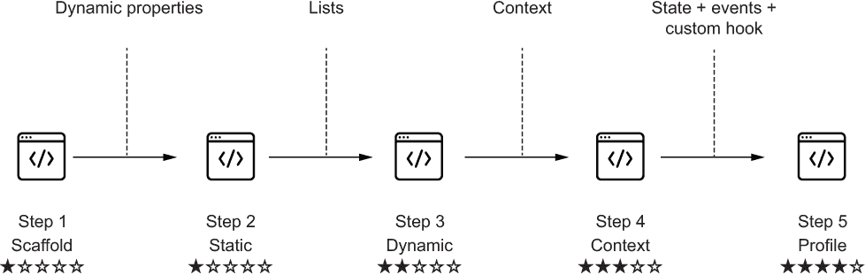

图 11.1 我们从这个脚手架开始这个项目，通过本章中的步骤，我们将构建一个完整的动态菜单，并可选地链接到个人资料页面。

脚手架是你开始构建这个应用程序的地方。应用程序的每个附加步骤都会为菜单添加更多高级功能，同时利用 React API 的新部分。我们将在本章中首先设置步骤 1，然后我们将一起解决步骤 2。从那时起，我们将向您介绍后续的步骤，但之后你必须自己解决它们。

当然，我们将为所有步骤提供参考解决方案，包括步骤 3 到 5，但我们不会告诉你我们是如何做到这一点的。你步骤 3 到 5 的解决方案肯定不会与我们的一样，因为做事情的方法有很多种。如果你遇到困难，随时可以查看我们后者的解决方案，但请首先尝试自己解决。

表 11.1 概述了在每一步中确切发生的事情，包括我们正在创建的功能以及我们正在利用的 React API 的哪些部分。

表 11.1 菜单项目的五个步骤

| 步骤 | 功能 | 使用额外的 React API | 难度 |
| --- | --- | --- | --- |
| 步骤 1：脚手架 | 创建一个带有空菜单的网站的基本组件结构。 | 第 1-4 章：使用 JSX 的功能组件 | ★☆☆☆☆ |
| 步骤 2：静态菜单 | 使用具有动态属性的定制菜单项组件添加静态 JSX 菜单。 | 第 3-4 章：使用具有动态属性的 JSX | ★☆☆☆☆ |
| 步骤 3：从链接列表创建动态菜单 | 从描述菜单项的对象列表中渲染菜单。注意：这是作业。你必须自己创建这一步！ | 第 3-4 章：渲染 JSX 元素列表 | ★★☆☆☆ |
| 步骤 4：从上下文中检索链接 | 从围绕整个应用程序提供的上下文中检索菜单项列表。注意：这是作业。你必须自己创建这一步！ | 第十章：上下文 | ★★★☆☆ |
| 第 5 步：添加可选链接 | 添加一个登录/注销按钮，该按钮将动态地将个人资料链接添加到/从菜单中。注意：这是作业。你必须自己创建这一步！ | 第五章：状态第八章：事件第十章：复杂上下文和自定义钩子 | ★★★★☆ |

在我们开始之前，让我们看看我们要构建什么。这是一个具有顶部菜单链接的最简网站。查看图 11.2 以查看菜单的实际截图。

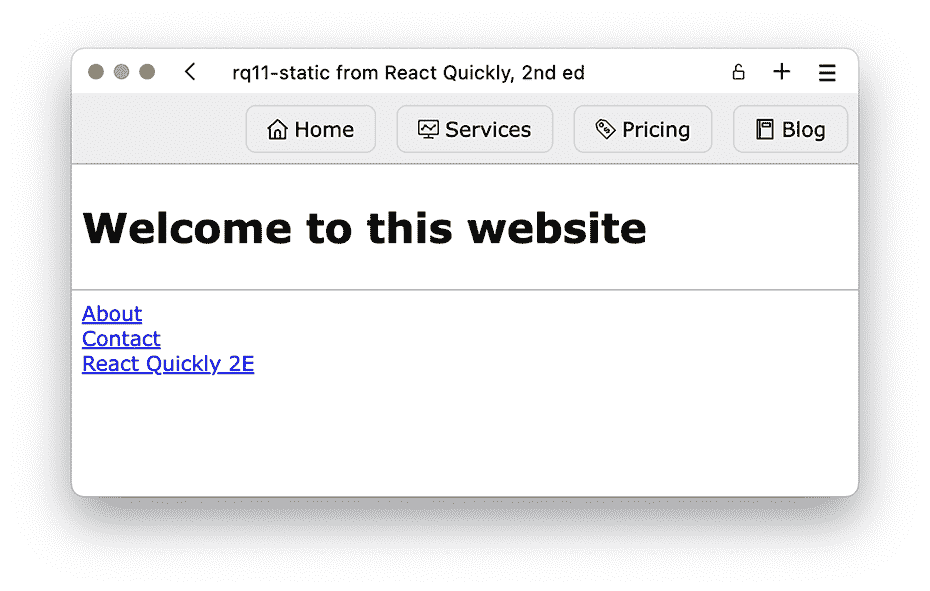

图 11.2 这是我们将要构建的网站。顶部的菜单——主页、服务、定价和博客——是主要焦点。在第一次迭代中，菜单项是静态定义的。

为了增加一些风格，我们还将添加一些用户体验设计，包括当你的指针移到菜单项上时，会有轻微的悬停效果。图 11.3 展示了这看起来是什么样子。设计目标确定后，让我们开始吧！

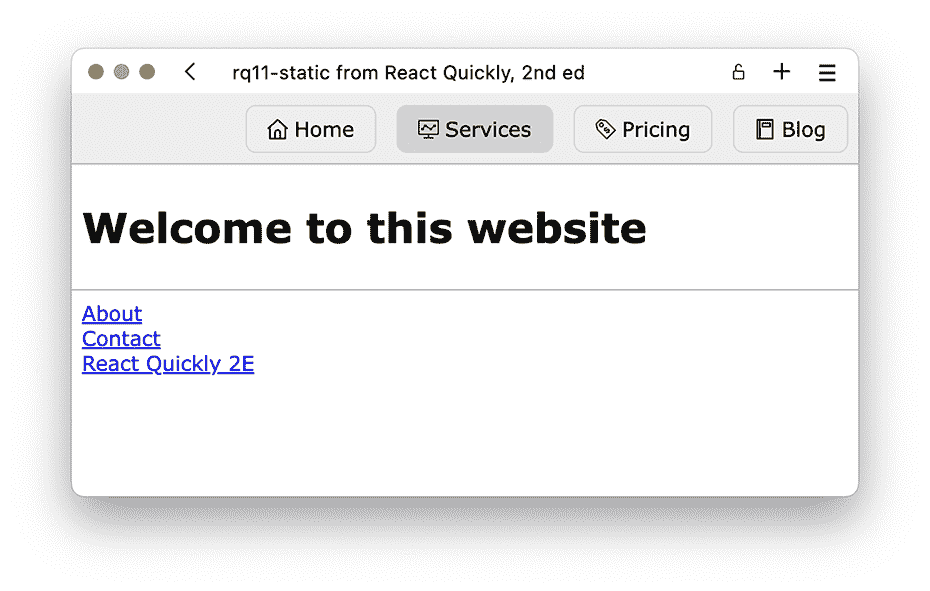

图 11.3 当用户悬停在菜单项上时，背景变为略深的灰色以突出显示用户正在与之交互的内容。

注意：本章中所有部分的源代码和解决方案的代码框架都可以在[`rq2e.com/ch11`](https://rq2e.com/ch11)找到。但正如你在第二章中学到的，你可以使用单个命令直接从命令行实例化所有示例和解决方案。

## 11.1 菜单的代码框架

好的，现在我们开始了。我们的第一个“真正”的 React 项目就在眼前。为了做到这一点，我们需要一个计划。我们将像对待一个真正的项目一样，这个项目是我们必须为客户、雇主或你叔叔的草坪修剪和婴儿看护业务（即 Laps & Naps Inc.）解决的，来思考这个问题。

从图 11.2 和 11.3 中所示的目标结果开始，我们将按以下步骤进行：

1.  定义将渲染所需结果的 HTML 输出。

1.  创建多个 React 组件，以渲染 JSX 来实现所需的 HTML。

1.  将静态图像放置在公共文件夹中，以便在运行时加载。

1.  创建一个样式表。

1.  实现我们需要的组件以获得必要的功能。

让我们开始吧！

### 11.1.1 HTML 输出

在这个项目中，我们首先使用 React 和 JSX 构建一个静态 HTML 页面。一般来说，你既不会也不会使用 React 来做这个，但因为这是第一步，而且我们稍后将在其上添加动态功能，所以从静态输出开始是有意义的。代码框架的期望输出 HTML 看起来像图 11.4。

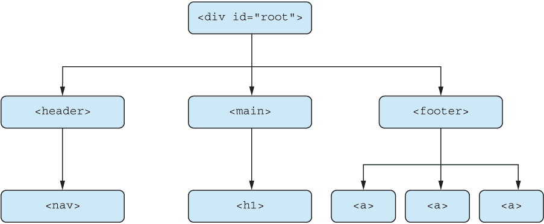

图 11.4 菜单应用程序代码框架的 HTML 节点树仅由这些元素组成。

### 11.1.2 组件层次结构

为了渲染所需的 HTML 树，我们需要一个 React 应用程序来渲染一组类似的 JSX 节点。我们可以使用任意数量的 React 组件来实现这一点。如果我们想的话，我们可以为每个 HTML 节点创建一个组件，或者我们可以创建一个渲染整个内容的单个组件。这就是开发者判断发挥作用的地方。

你已经看到了我们为本书中迄今为止的所有示例设计了所需的 React 组件结构。但很快（在本章的后面部分），这将成为你的责任。你必须负责。你必须为给定的预期输出设计一个组件树。

确定如何切割蛋糕并将给定的预期输出拆分为组件是成为 React 开发者的一项核心任务。在图 11.5 中，你可以看到两种不同的方法来创建渲染预期输出的组件。

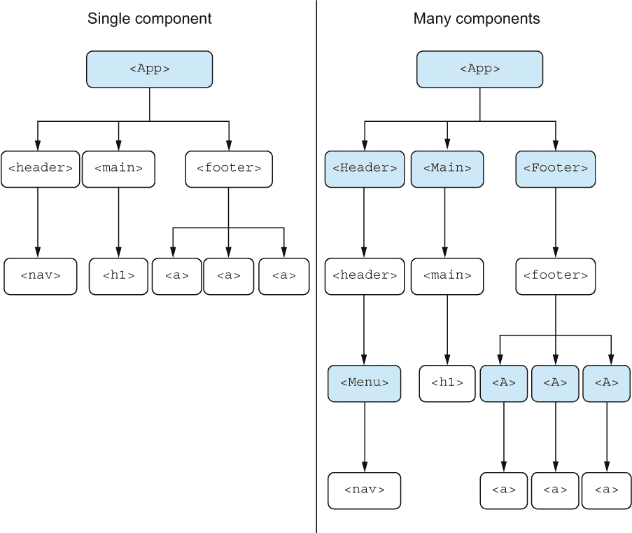

图 11.5 创建用于预期输出的组件的两种不同方法。我们实际上将不会选择其中任何一种，而是选择介于两者之间的中等方法，因为我们只关注菜单。

组件树的结构化方式不止一种，没有哪一种方式是绝对正确的。在决定如何构建你的组件时，你应该在复杂性和责任之间寻求平衡。在这种情况下，我们可以轻松地将整个应用程序实现为一个组件，就像图 11.5 中最左侧的情况；但考虑到我们将在页眉中的 <nav> 元素内添加额外功能，我们将将其封装为它自己的组件。目前这个组件将会非常小，但我们会稍后扩展它。

### 11.1.3 图标

正如你在图 11.2 中的原始截图中所注意到的，我们在菜单中有些图标。让我们在图 11.6 中更仔细地看看这些图标。

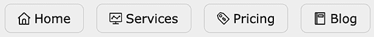

图 11.6 菜单中图标的特写

在 React 中渲染图标的方法有很多，但我们现在使用的是最简单的一种。我们将通过将文件放置在 React 应用程序文件夹中的公共文件夹中来渲染可缩放矢量图形（SVG）图像。我们可以这样做：

```
public/
  icons/            ❶
    blog.svg        ❷
    home.svg        ❷
    pricing.svg     ❷
    profile.svg     ❷
    services.svg    ❷
  favicon.ico       ❸
  index.html        ❸
```

❶ 在公共文件夹内创建一个图标文件夹

❷ 在图标文件夹内放置五个 SVG 文件

❸ 公共文件夹中也包含这两个由 create-react-app (CRA) 默认创建的文件。我们不会去修改它们。

当这些文件位于公共文件夹中时，我们可以通过路径"/icons/blog.svg"在任何地方加载它们。例如，我们可以将博客图标渲染为一个标签：

```

```

注意，我们还在图标文件夹中有一个 profile.svg 图像。对于菜单的第一版，我们不需要它，但稍后我们会需要它，所以如果你继续在同一应用程序上工作，它已经在那里了。所有图标都是公共领域，可以完全免费在任何你想要的上下文中使用。

### 11.1.4 CSS

最后，我们还需要相当多的 CSS 来完成此应用程序。到目前为止，我们通过 JSX 元素上的 style 属性使用了内联样式。这已经足够好了，因为我们只需要应用非常有限的样式。然而，在这个应用程序中，我们需要很多样式，并且需要悬停样式。虽然使用内联样式可以渲染很多样式，但这并不是最佳选择。但是，使用内联样式无法实现悬停样式，因此我们需要一个合适的样式表。

幸运的是，React 和 CRA 使这变得非常简单。我们还没有详细讨论这个问题，但在 React 文件中，你可以直接导入样式表，React 编译器会在需要时将其转换为常规样式表并插入到 HTML 中。

*将样式内联加载或使用样式表的优势和劣势超出了本书的范围，因此，目前我们将采用这种方法，因为它简单且适用于较小的应用程序：*

1.  在 src 文件夹内创建一个样式表，style.css。

1.  在定义根应用程序的 main App.js 文件中加载样式表。

1.  将类名应用于 JSX 元素，并使用样式表中定义的规则进行渲染。

就这样！

在 JavaScript 中加载样式表意味着导入文件。你不需要像导入组件那样导入它，你只需像这样导入文件：

```
import "./style.css";
```

就这些。现在您可以在相关位置应用类名。

### 11.1.5 模板

我们创建了这个整个框架作为您开始工作的模板。

仓库：rq11-scaffold

此示例可以在仓库 rq11-scaffold 中看到。您可以通过创建基于相关模板的新应用程序来使用该仓库：

```
$ npx create-react-app rq11-scaffold --template rq11-scaffold
```

或者，您可以访问此网站浏览代码，直接在浏览器中查看应用程序的运行情况，或下载源代码的 zip 文件：

[`rq2e.com/rq11-scaffold`](https://rq2e.com/rq11-scaffold)

此模板包含以下与您的应用程序相关的文件：

```
public/
  icons/          ❶
    blog.svg      ❶
    home.svg      ❶
    pricing.svg   ❶
    profile.svg   ❶
    services.svg  ❶
  favicon.ico     ❷
  index.html      ❷
src/
  App.js          ❸
  index.js        ❷
  Menu.js         ❸
  style.css       ❹
```

❶ 用于渲染菜单项的图标

❷ 我们未修改的 CRA 最小项目中的默认文件

❸ 基础框架的自定义组件

❹ 一个包含完成此项目所需所有规则的完整样式表

然而，如果您想从头开始，您也可以这样做。您可以使用以下仅包含图标和样式表的模板，但没有自定义组件。src 文件夹完全基于常规最小模板，除了需要的样式表：

```
npx create-react-app web-menu --template rq11-minimal
```

如果您使用此后的方法，您将不得不开始编辑 src/App.js。请记住，还需要导入样式表。此最小模板包含以下文件：

```
public/
  icons/           ❶
    blog.svg       ❶
    home.svg       ❶
    pricing.svg    ❶
    profile.svg    ❶
    services.svg   ❶
  favicon.ico      ❷
  index.html       ❷
src/
  App.js           ❷
  index.js         ❷
  style.css        ❸
```

❶ 用于渲染菜单项的图标

❷ 我们未修改的 CRA 最小项目中的默认文件

❸ 一个包含完成此项目所需所有规则的完整样式表

### 11.1.6 源代码

框架应用程序的源代码，定义在 src/App.js 中，如下所示。

列表 11.1 框架中的 src/App.js

```
import Menu from "./Menu";   ❶
import "./style.css";        ❷
function App() {
  return (
    <>
      <header>
        <Menu />             ❸
      </header>
      <main>
        <h1>Welcome to this website</h1>
      </main>
      <footer>
        <a href="/about">About</a>
        <a href="/contact">Contact</a>
        <a href="//reactquickly.dev">React Quickly 2E</a>
      </footer>
    </>
  );
}
export default App;
```

❶ 菜单定义在一个外部文件中，并在顶部导入。

❷ 在名为 style.css 的文件中外部定义 CSS

❸ 在页眉的相关位置渲染菜单组件

CSS 文件，src/style.css 的源代码定义在下一个列表中。

列表 11.2 框架中的 src/style.css

```
html,
body {
  margin: 0;
  font-family: Verdana;
}
main,
header,
footer {
  padding: 8px;
}

header {
  border-bottom: 1px solid darkgray;
  background: #eee;
}
footer {
  border-top: 1px solid darkgray;
  display: flex;
  flex-direction: column;
}
.menu {
  display: flex;
  gap: 16px;
  padding: 0;
  margin: 0;
  list-style: none;
  justify-content: flex-end;
}
.menu-link {
  text-decoration: none;
  color: inherit;
  display: flex;
  align-items: center;
  gap: 5px;
  padding: 8px 16px;
  border: 1px solid lightgray;
  border-radius: 8px;
}
.menu-link:hover {
  background: lightgray;
}
```

菜单的源代码，定义在 src/Menu.js 中，如下所示。

列表 11.3 框架中的 src/Menu.js

```
function Menu() {
  return <nav></nav>;     ❶
}
export default Menu;
```

❶ 目前菜单只渲染一个空的 <nav> 元素。

### 11.1.7 在浏览器中

如果我们在浏览器中运行这个程序，我们会得到一个带有空菜单的漂亮网站，如图 11.7 所示。

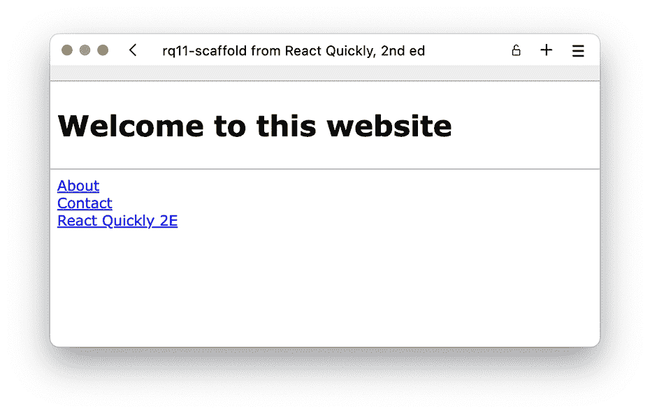

图 11.7 一个暂时为空菜单的网站，我们很快会用一些优秀的链接来填充

## 11.2 渲染静态菜单

在这个项目步骤中，我们将完成练习第一部分后的当前状态，并添加所需的功能来渲染一个具有固定菜单项的静态菜单。

您可以通过根据上一节提供的信息自行实现框架或从 rq11-scaffold 模板定义的应用程序开始来启动项目。这一步的结果是以下仓库中定义的应用程序。

仓库：rq11-static

这个例子可以在 rq11-static 仓库中看到。您可以通过创建基于相关模板的新应用程序来使用该仓库：

```
$ npx create-react-app rq11-static --template rq11-static
```

或者，您可以访问这个网站来浏览代码，直接在您的浏览器中查看应用程序的运行情况，或者下载源代码的 zip 文件：

[`rq2e.com/rq11-static`](https://rq2e.com/rq11-static)

### 11.2.1 本练习的目标

本练习的目标是在上一步中填充空白的菜单。菜单组件就是这样的——一个完全空白的元素，没有任何菜单项：

```
function Menu() {
  return <nav></nav>;
}
```

在我们开始之前，我们首先需要定义所需的 HTML 输出，然后决定一个最佳的组件树来创建这个输出，最后实现这些组件。

### 11.2.2 所需的 HTML 输出

我们只关注 <nav> 组件内部的 HTML 输出。为了在菜单中渲染一系列链接，图 11.8 中可视化的 HTML 树会渲染出期望的结果。

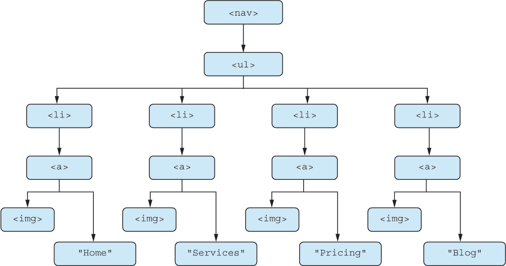

图 11.8 导航元素的 HTML 节点树是一个链接的无序列表。

### 11.2.3 组件树

这个组件树几乎可以自己写出来。我们想要创建一个组件，它封装了图 11.8 中的 HTML 树中的重复 HTML。我们可以称这个组件为 MenuItem 组件，它接受三个属性：

+   href—链接实际指向的目标 URL

+   icon—要加载为图标的 SVG 文件名

+   children—链接内的文本

我们可以用图 11.9 中的组件树来表示这一点。

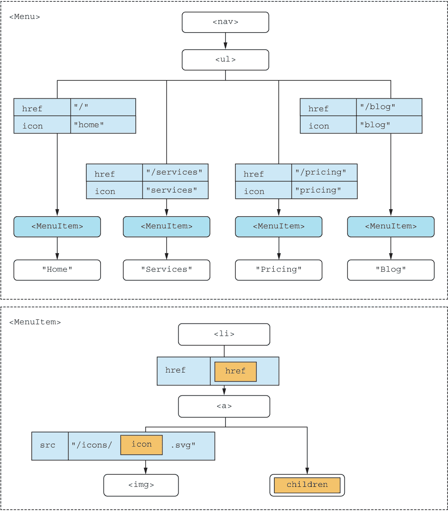

图 11.9 除了有两个组件外，我们还向 MenuItem 组件传递了两个属性和 children。

在解决这个问题之后，我们现在可以在相关组件中实现所需的变化。

### 11.2.4 源代码

首先，我们在下一个列表中实现更新的 Menu.js 组件。如图 11.7 所示，我们需要渲染四个 MenuItem 实例的列表。

列表 11.4 src/Menu.js 用于静态菜单

```
import MenuItem from "./MenuItem";
function Menu() {
  return (
    <nav>
      <ul className="menu">
        <MenuItem href="/" icon="home">               ❶
          Home                                        ❶
        </MenuItem>                                   ❶
        <MenuItem href="/services" icon="services">   ❶
          Services                                    ❶
        </MenuItem>                                   ❶
        <MenuItem href="/pricing" icon="pricing">     ❶
          Pricing                                     ❶
        </MenuItem>                                   ❶
        <MenuItem href="/blog" icon="blog">           ❶
          Blog                                        ❶
        </MenuItem>                                   ❶
      </ul>
    </nav>
  );
}
export default Menu;
```

❶ 四个我们的 MenuItem 组件实例，每个实例具有略微不同的属性

第二，我们实现新的组件，MenuItem.js。

列表 11.5 src/MenuItem.js 用于静态菜单

```
function MenuItem({ href, icon, children }) {       ❶
  const iconSrc = `/icons/${icon}.svg`;             ❷
  return (
    <li>
      <a href={href} className="menu-link">         ❸
             ❹
        {children}                                  ❺
      </a>
    </li>
  );
}
export default MenuItem;
```

❶ MenuItem 组件接受三个属性，其中一个是特殊的子属性。

❷ 基于图标文件的已知位置以及传递的图标属性定义图标源

❸ 锚点元素需要一个 href，我们从属性中获取。

❹ 图像元素需要一个源，我们已经在一个变量中计算了它。

❺ 将子属性作为链接文本放在图像旁边

### 11.2.5 在浏览器中

如果我们在浏览器中运行它，我们将得到如图 11.2 所示的原始所需结果，但在此处重复图 11.10 以进行比较。

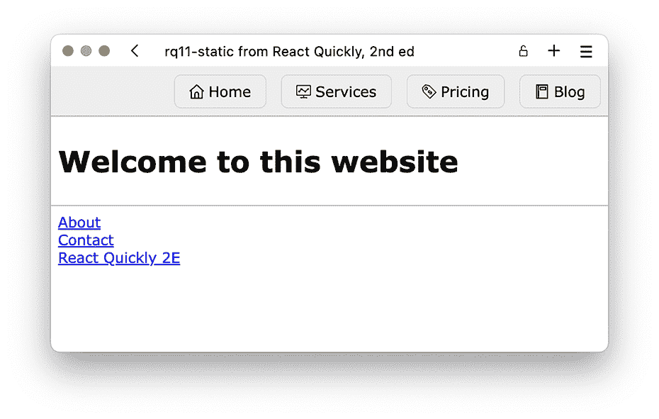

图 11.10 我们静态菜单工作！在浏览器中尝试悬停菜单项，以查看通过样式表规则实现的轻微悬停效果。

## 11.3 家庭作业：一个动态菜单

在步骤 2 之后，我们有一个漂亮的静态菜单，所以你现在可能想知道为什么我们想要以不同的方式做这件事。事实上，在项目的后期阶段，菜单项将是动态的（管理层之前告诉我们），所以我们最好为此做好准备。

动态菜单项意味着随着用户与网站交互，项目数量以及文本、图标和可能 href 的单个菜单项可能会更新。想象一下，你以客户身份登录网站，突然一些菜单项被删除，而其他菜单项被添加。不同的客户在登录后可能会看到不同的菜单项。因此，虽然当前方法可行，但它并不适合动态菜单，我们必须根据状态和外部数据更新菜单项。

### 11.3.1 本步骤的目标

本步骤的目标是通过将菜单项转换为要渲染的对象列表，而不是手动在 JSX 中输入所有菜单项，为动态渲染准备项目。项目的结构将与您可能拥有的相同数量的组件相同，但组件之间传递的数据将更多。

然而，要求在 App 组件中定义菜单项列表（因为一些高级架构师这么说，我们又能质疑谁呢？）。因为我们将使用这个列表在 Menu 组件中，我们需要将这个列表作为属性传递。

### 11.3.2 解决本步骤的提示

本步骤的核心要点需要回答这两个问题：

1.  我们将如何构建列表项以捕获我们渲染菜单项所需的所有信息？

1.  我们将如何根据对象列表渲染菜单项？

我们将为每个问题提供一个提示。

定义列表项

列表项需要包含有关菜单项链接指向何处（href）、将要显示哪个图标以及将要显示什么文本的信息。这可以捕获在一个像这样的对象中：

```
{ title: "Home", href: "/", icon: "home" }
```

属性的命名完全取决于您，如果您愿意，您可能会以不同的方式来做。

渲染列表项

要根据项目列表渲染 JSX 节点，回想一下第 3.2.8 节关于渲染 JSX 对象列表的内容。这通常具有以下结构：

```
<parent>
  {list.map((object) => (        ❶
    <node
      key={object.id}            ❷
      otherProp={object.other}   ❸
      ...
    />
  ))}
</parent>
```

❶ 将对象列表映射到 JSX 节点列表

❷ 为每个节点添加一个唯一的键

❸ 从映射的列表元素添加任何其他相关属性

重要的是，记得在映射的响应中的每个节点上定义一个唯一的键。

### 11.3.3 组件层次结构

组件的数量没有变化，但我们使用它们的方式略有不同。在我们之前在 Menu 组件内部有四个 MenuItem 组件实例的静态列表中，我们现在有一个基于链接数组长度的动态 MenuItem 实例列表。我们需要将这个链接列表从 App 组件传递到 Menu 组件。唯一没有变化的是 MenuItem 组件，因为它已经可以动态显示内容。

我们对组件层次结构的建议显示在图 11.11 中，但您可以根据自己的意愿提出自己的结构。对此没有唯一的正确解决方案。

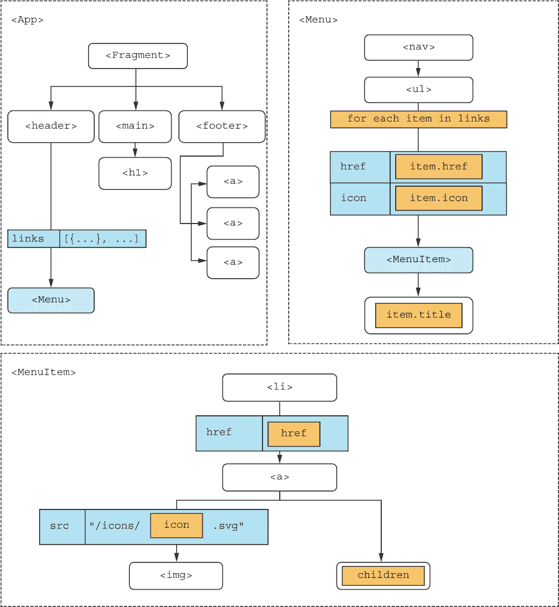

图 11.11 我们现在从 App 组件传递一个属性到 Menu 组件，然后我们使用该属性来生成动态数量的 MenuItem 实例。

### 11.3.4 现在怎么办？

我们强烈建议您亲自尝试一下。如果您在第二步中自己实现了静态列表，我们建议您继续从这里开始。但如果您想从零开始，您也可以从 rq11-static 仓库中的我们的第二步实现开始。

完成这个练习后，您可能想比较一下您的解决方案和我们的版本，不是为了看是否完全相同（因为您做到这一点的机会很小），而是为了看看我们是否有不同的方法。

仓库：rq11-dynamic

这个例子可以在 rq11-dynamic 仓库中看到。您可以通过创建一个基于相关模板的新应用程序来使用该仓库：

```
$ npx create-react-app rq11-dynamic --template rq11-dynamic
```

或者，您可以去这个网站浏览代码，直接在浏览器中查看应用程序的实际运行情况，或者下载源代码的 zip 文件：

[`rq2e.com/rq11-dynamic`](https://rq2e.com/rq11-dynamic)

如果您喜欢这一步，我们建议您尝试这个项目中的下两个步骤，尽管它们会变得稍微有点难。

## 11.4 作业：从上下文中检索项目

我们已经使菜单变得动态，这是一个很好的第一步。但要使其真正动态，我们需要能够从应用程序的任何地方操作菜单项的列表。将链接列表传递给许多组件会很麻烦，所以我们更愿意将链接列表移动到包围整个应用程序的上下文中。这将确保我们能够轻松地从任何地方访问列表。

### 11.4.1 本步骤的目标

在这一步中，我们将抽象提升到另一个层次。而不是将链接列表作为属性在组件之间传递，我们将它移动到上下文中。目前，这个上下文只包含我们的链接列表，该列表在 Menu 组件内部使用。为了准备下一步，其中上下文还需要从应用程序的其他部分访问，我们建议将上下文包裹在整个应用程序周围。

### 11.4.2 解决此步骤的提示

要从上下文中加载链接，我们需要做三件事：

1.  在一个可以从多个组件访问的变量中定义一个 React 上下文。

1.  在应用程序的相关部分创建一个上下文提供者。

1.  在我们需要访问上下文变量的地方应用 useContext 钩子。

定义上下文

要定义一个 React 上下文，你只需从 React 包中调用 createContext() 函数。为了确保这个变量可以从多个组件中访问，你可以在一个单独的文件中创建它并导出。这是实现这一目标的最短方式：

```
import { createContext } from 'react';
const Context = createContext([]);       ❶
export default Context;
```

❶ 在这个例子中，默认参数是一个空数组。

注意我们如何提供一个空数组作为默认上下文值。如果我们出于某种原因试图访问未定义的上下文，我们会得到一个空链接列表作为值。

创建上下文提供者

要创建一个上下文提供者，将相关组件包裹在 Context.Provider 组件内部。这个组件实例应该提供一个包含当前上下文值的 value 属性。

如果你有一个名为 MenuContext 的变量包含上下文信息，以及一个名为 links 的变量包含链接列表，你可以为组件 A、B 和 C 提供上下文，如下所示：

```
return (
  <MenuContext.Provider value={links}>
    <A />
    <B />
    <C />
  </MenuContext.Provider>
);
```

访问上下文值

要访问上下文值，你需要在上下文提供者内部某个组件中使用 useContext 钩子。如果相关的上下文名为 MenuContext，你可以这样访问当前值：

```
import { useContext } from 'react';
function SomeComponent() {
  const value = useContext(MenuContext);
  ...
}
```

### 11.4.3 组件层次结构

再次强调，你可以用很多种方式来做这件事。我们在图 11.12 中概述了我们的建议，但这只是众多树形图解决方案之一。

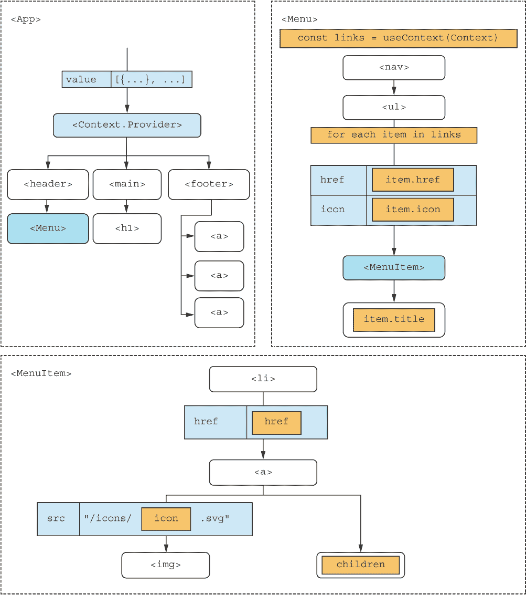

图 11.12 整个应用程序被包裹在一个上下文提供者中，我们使用相同的上下文在菜单组件内部检索上下文值。

### 11.4.4 接下来做什么？

我们建议您亲自尝试。如果您已经完成了第 3 步，我们建议您从那里继续。但如果您不喜欢您的结果或出于其他原因想要从头开始，您可以从 rq11-dynamic 存储库中的第 3 步实现开始。完成后，您可能想为了教育目的将您的解决方案与我们的解决方案进行比较。

既然您已经走到这一步，我们建议您也尝试下一步。这有点难，但很可能值得，因为您将真正看到事物是如何开始协同工作的。

存储库：rq11-context

此示例可以在 rq11-context 存储库中看到。您可以通过创建基于相关模板的新应用程序来使用该存储库：

```
$ npx create-react-app rq11-context --template rq11-context
```

或者，您可以访问这个网站来浏览代码，直接在您的浏览器中查看应用程序，或者下载源代码的 zip 文件：

[`rq2e.com/rq11-context`](https://rq2e.com/rq11-context)

## 11.5 家庭作业：可选链接

我们已经到达了这个项目的最后一步。现在，我们将添加一些非常简单的认证机制，一旦认证成功，用户将在菜单中看到一个额外的链接。

您问基本认证方案有多基本？基于信任的。如果您点击登录按钮，您就登录了。然后如果您点击注销按钮，您就注销了。当然，这对任何真正的认证都没有用，但为了演示目的，它将对我们很有用。此应用程序的流程图非常简单，如图 11.13 所示。

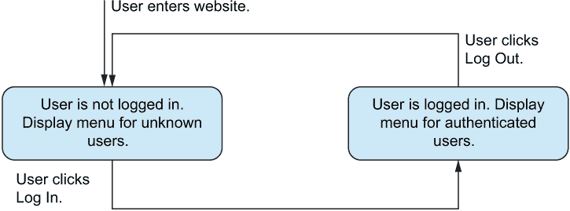

图 11.13 用户将要么登录，要么未登录，菜单将反映这一点。

为了实现这一点，我们将在页面标题下方的主区域添加一个非常简单的登录按钮。您可以在图 11.14 中看到网站在这个状态下的样子。

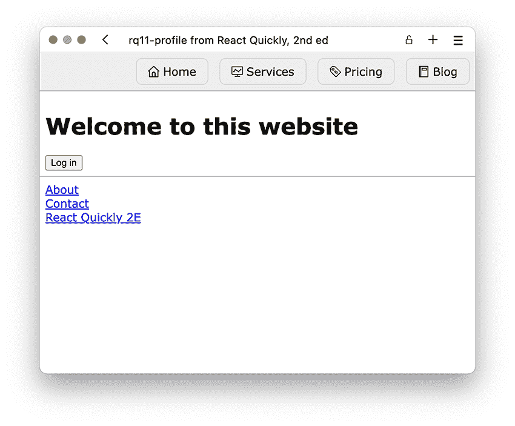

图 11.14 当用户未知时，网站的主区域包含一个登录按钮，菜单仍然像以前一样有四个菜单项。

如果您点击该按钮，您将被视为已登录，可以在菜单中看到新的个人资料链接。您可以在图 11.15 中看到它应该是什么样子。

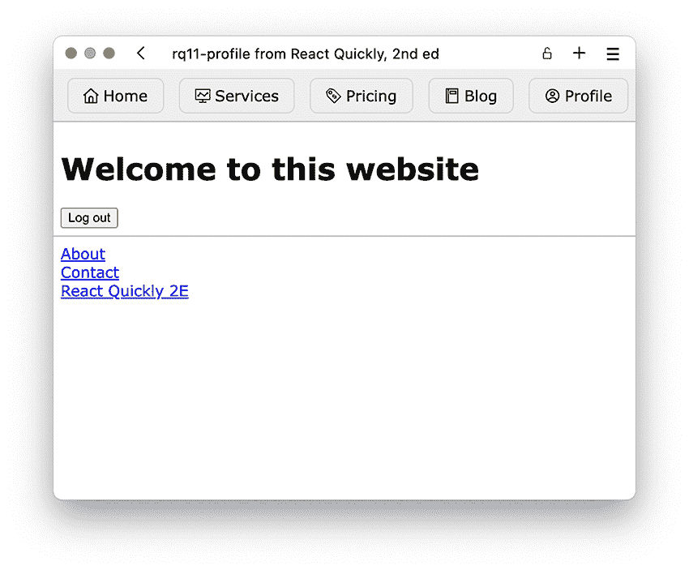

图 11.15 当用户认证时，网站的主区域现在包含一个注销按钮，菜单有一个额外的、第五个菜单项。

### 11.5.1 此步骤的目标

此步骤的目标是扩展上下文提供者，以包含了解状态和操作状态所需的额外属性。我们还需要以可更新的方式将状态存储在某个地方。

在进行这项工作时，请随意根据您的需要重新组织组件。如果您认为这样做是正确的，您可能还想添加额外的组件。如前所述，这是开发者需要做出的判断。

### 11.5.2 解决此步骤的提示

这里有一些可能有助于您解决问题的提示：

+   在步骤 4 中，上下文值只是一个链接列表。你现在需要上下文持有多个值，所以你可能想使用一个对象。

+   你可以创建一个自定义钩子来更轻松地访问上下文的值。

+   为了跟踪用户是否认证的布尔状态，你可能需要一个有状态的钩子。

+   将上下文提供者移动到专用组件可能会使应用程序更容易理解。

+   因为应用程序的主部分现在有更多的逻辑，它可能从成为它自己的组件中受益。

+   记住，你可以使用特殊的属性 children 将组件“传递”给另一个组件。

作为上下文值的对象

虽然我们在第十章中没有直接解决这个问题，但你可以在上下文中存储多个值。你可以通过使用对象来实现这一点：

```
const value = {
  someValue,       ❶
  someFunction,    ❷
);
return (
  <Context.Provider value={value}>
    ...
  </Context.Provider>
);
```

❶ 在提供者对象中，我们可以拥有我们想要的任意多个值。

❷ 我们甚至可以放函数在里面。

记住，如果你更改提供者的值，你可能还想更改传递给 createContext 的初始默认值。

用于上下文访问的自定义钩子

如果你有一个想在多个地方使用的上下文——比如说它是一个用于访问某些通用 API 功能的 API 上下文——你可以在多个地方直接使用 useContext 钩子，如下所示：

```
// In Component.js
import { useContext } from 'react';
import APIContext from './API';
...
function Component() {
  const value = useContext(APIContext);
  ...
}
```

但为了使自己的生活更简单（也许还有你的团队成员），你可以创建一个自定义钩子来为你完成这项工作。然后，你只需要导入一个东西：

```
// In API.js
...
export function useAPI() {
  return useContext(APIContext);
};
// In Component.js
import { useAPI } from './API';
...
function Component() {
  const value = useAPI();
  ...
}
```

创建这样的小型自定义钩子可能看起来有点愚蠢，但实际上很有帮助，并且是一种非常常见的做法。

有状态的布尔值

如果你需要一个简单的值在 React 中成为有状态的，最简单的方法是应用 useState 钩子，如第五章中所述：

```
import { useState } from 'react';
const [isVisible, setVisible] = useState(false);    ❶
```

❶ useState 的返回值可以被解构为值和设置函数。

记住，你不必直接暴露状态设置器。你可以创建自己的函数来使其更容易工作：

```
const [isVisible, setVisible] = useState(false);
const show = () => setVisible(true);
const hide = () => setVisible(false);
```

这些只是通用示例，当然；你必须根据具体的应用程序进行修改。

此外，请记住实际上在你的应用程序中使用这个有状态变量。特别是在这个应用程序中，你希望根据有状态布尔值改变链接变量的值。

专用上下文提供者组件

当我们向上下文中添加更多逻辑和更多值时，将其移动到专用组件通常是有意义的。所以，而不是

```
function App() {
  ...
  const value = { a, b, c };
  return (
    <Context.Provider value={value}>
      ...
    </Context.Provider>
  );
}
```

我们可以创建两个组件，App 和 ValueProvider，并将它们拆分如下：

```
function ValueProvider() {
  const value = { a, b, c };
  return (
    <Context.Provider value={value}>
      ...
    </Context.Provider>
  );
}
function App() {
  ...
  return (
    <ValueProvider>
      ...
    </ValueProvider>
  );
}
```

将组件的一部分转换为单独的组件

如果一个组件变得过于复杂，将其拆分出来是有意义的。比如说我们有一个包含几个不同部分的组件，并且我们正在增加其中一个部分的复杂性：

```
// In App.js
function App() {
  const onClickButton = () => { ... };     ❶
  return (
    <>
      <header>
        ...
      </header>
      <main>                               ❷
        <p>This is main</p>                ❷
        <button onClick={onClickButton}>   ❷
          ...                              ❷
        </button>                          ❷
      </main>                              ❷
      <aside>
        ...
      </aside>
    </>
  );
}
```

❶ 这个变量仅在主部分内部使用。

❷ 这里的主部分正在变得越来越大，可以重构为新的组件。

在某个时候，您可能会觉得应用程序的主要部分有点大，应该成为它自己的组件。如果您想这样做，您可以将组件的相关 JSX（和相关变量）移动到一个新的组件中：

```
// In Main.js
function Main() {        ❶
  const onClickButton = () => { ... };
  return (
    <main>
      <p>This is main</p>
      <button onClick={onClickButton}>
        ...
      </button>
    </main>
  );
}
// In App.js
function App() {
  return (
    <>
      <header>
        ...
      </header>
      <Main />           ❷
      <aside>
        ...
      </aside>
    </>
  );
}
```

❶ 我们创建了一个新的组件（在新的文件中），它只包含之前组件的一部分。

❷ 我们现在可以安全地用我们的新组件替换之前的主部分。

这两个组件现在都简单得多，更容易理解它们的目的。

子属性

有时您可能会创建一个新的组件，但您不想让它过于具体。您仍然希望能够在不同情况下用不同的内容填充它。假设您有一个具有多个相同样式的部分的应用程序，但内容是不同的：

```
function App() {
  return (
    <main>
      <section className="section section-fancy">   ❶
        <A />                                       ❷
      </section>
      <section className="section section-fancy">   ❶
        <B />                                       ❷
      </section>
      <section className="section section-fancy">   ❶
        <C />                                       ❷
      </section>
    </main>
  );
}
```

❶ 所有部分都有相同的类。

❷ 但内容是不同的。

在这里，为仍允许您传递任意子组件的部分创建一个组件是有意义的。您可以使用子属性做到这一点：

```
function Section({ children }) {     ❶
  return (
    <section className="section section-fancy">
      {children}                     ❷
    </section>
  );
}
function App() {
  return (
    <main>
      <Section>                      ❸
        <A />
      </Section>
      <Section>                      ❸
        <B />
      </Section>
      <Section>                      ❸
        <C />
      </Section>
    </main>
  );
}
```

❶ 这是一个具有通用部分标记的新组件。

❷ 记得在您希望子组件出现的地方渲染子属性。

❸ 我们现在可以用我们的新组件替换部分，这使得应用程序看起来更加整洁，没有重复的逻辑。

为什么我们在这一步提到它？因为这在专用提供者组件中经常使用，所以您可以这样做：

```
function App() {
  ...
  return (
    <ValueProvider>
      <h1>Some title in here</h1>
    </ValueProvider>
  );
}
```

### 11.5.3 组件层次结构

在这个最后一步，您有很多选择要做，所以我们不会过多地影响您。然而，图 11.16 显示了我们可能看到组件在最终应用程序中布局的高级概述。

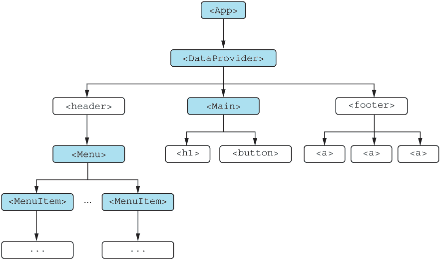

图 11.16 在此最终步骤中，组件如何在应用程序中布局的高级概述

### 11.5.4 接下来是什么？

如果您想自己尝试，我们真的认为您应该这样做，您可以从上一个步骤继续工作在您的应用程序。如果您想从步骤 4 完成后我们的应用程序开始，您可以从 rq11-context 存储库开始。完成后，您可能想为了教育目的比较您的解决方案和我们的解决方案。

存储库：rq11-profile

此示例可在 rq11-profile 存储库中看到。您可以通过创建基于相关模板的新应用程序来使用该存储库：

```
$ npx create-react-app rq11-profile --template rq11-profile
```

或者，您可以去这个网站浏览代码，直接在浏览器中查看应用程序的运行情况，或者下载源代码的 zip 文件：

[`rq2e.com/rq11-profile`](https://rq2e.com/rq11-profile)

就这样。这就是目前项目的结束。但请随意扩展以添加更多功能，并探索上下文在数据控制方面的强大功能。您可以添加一个不同的登录按钮，这样就可以以管理员身份登录，这可能会显示更多的菜单项——或者可能是一个完全不同的菜单。

## 11.6 最后的想法

这个第一个项目有很多指导，我们非常缓慢地进行了步骤，并且提供了很多相当详细的提示，说明了如何完成它们。在接下来的两个项目中，会有更少的指导和更少的冗长提示。但不要犹豫，参考这个项目，看看你可能想要经历哪些步骤来完成练习。

这个项目的最终产品是构建具有动态菜单的网站的一个坚实的基础。然而，还有很多东西缺失，才能使这个项目在真实网站中变得有用。这包括适当的托管、服务器端渲染、后端身份验证等等，但这些主题超出了本书的范围。

## 摘要

+   在这个项目中，我们学习了在常规使用 React 时，在真实项目中会经历的步骤。

+   以期望的结果开始这个过程，并尝试创建能够渲染期望输出的 HTML。

+   从那里，设计出能够创建等效 JSX 的组件树。你可以在第一次迭代中将其完全设计为静态和无状态的。

+   然后，逐渐增加更多的复杂性，直到你达到你希望应用程序所在的位置。

+   随着作为 React 开发者的经验越来越丰富，你将获得信心跳过这个过程中的更多步骤，也许可以直接跳到最后一步，因为你已经非常熟悉如何最好地使用上下文、JSX 对象列表、状态变量以及所有其他所需的东西。
