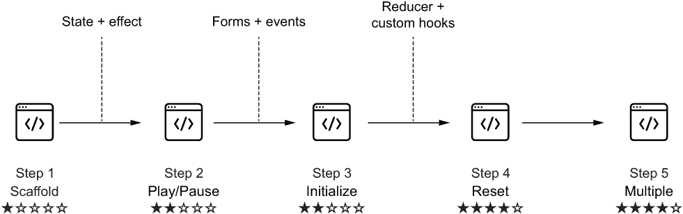
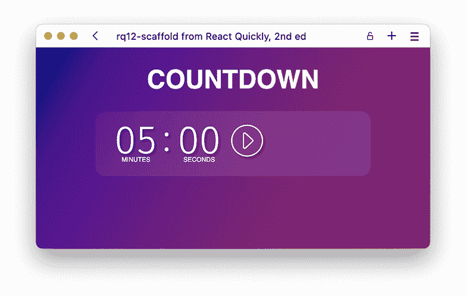
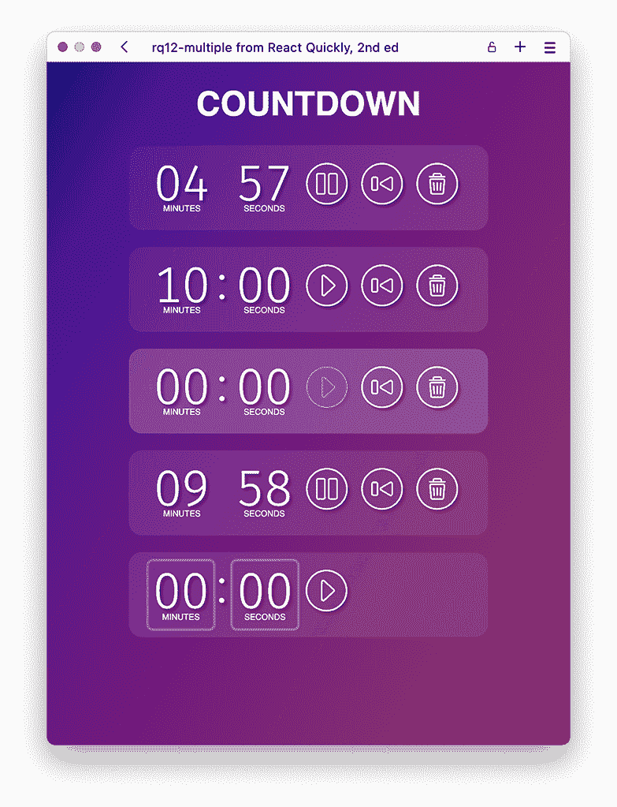
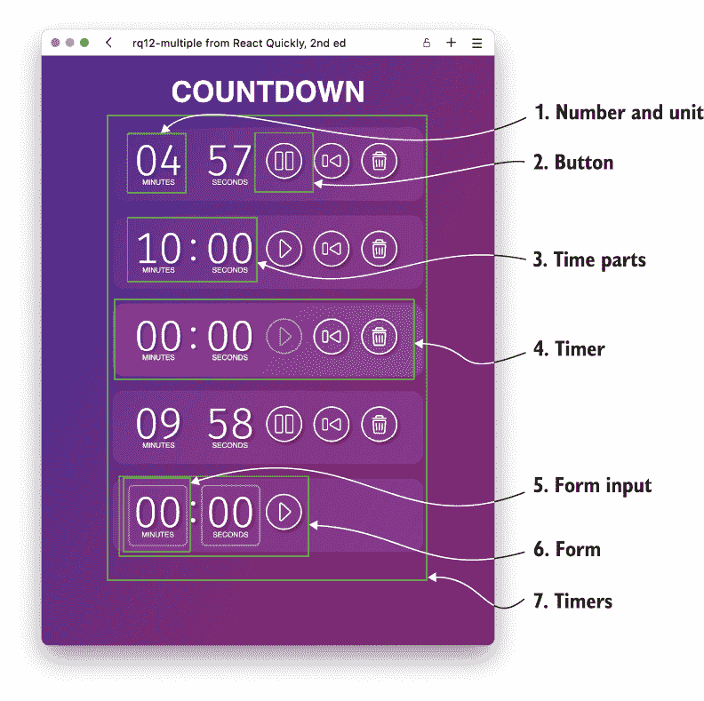
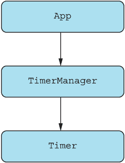
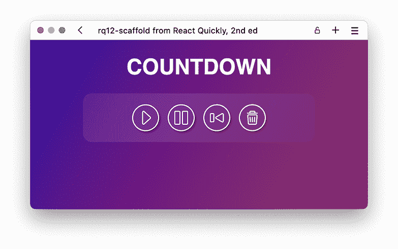
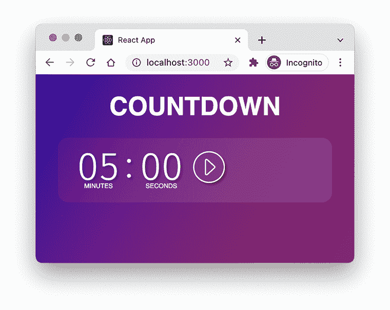
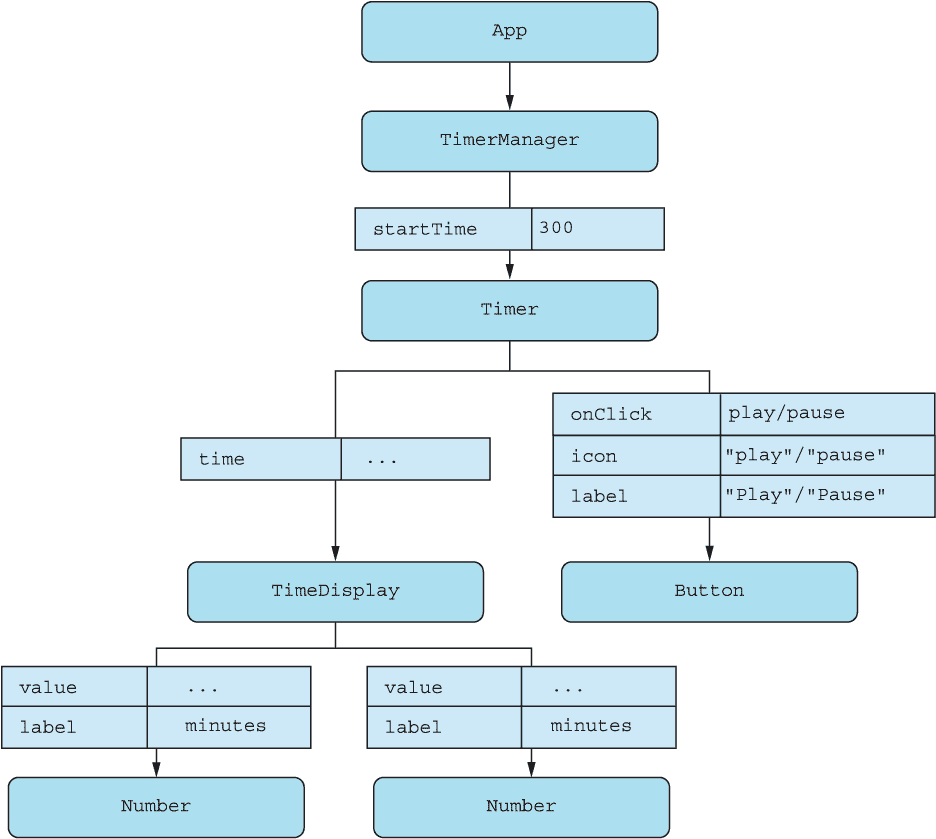
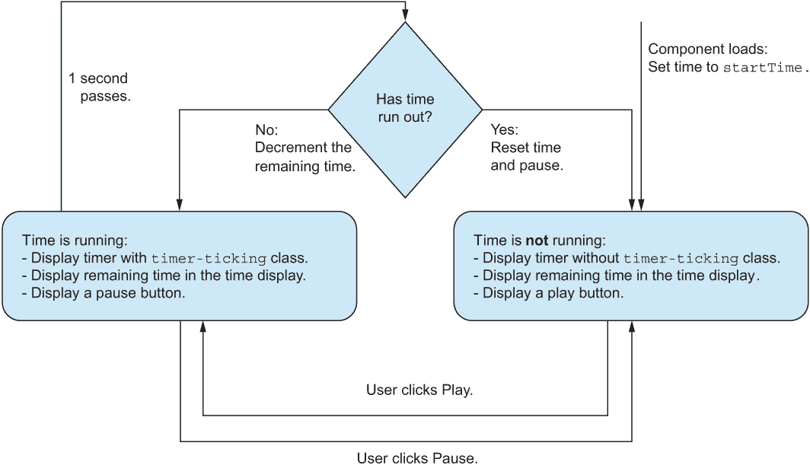
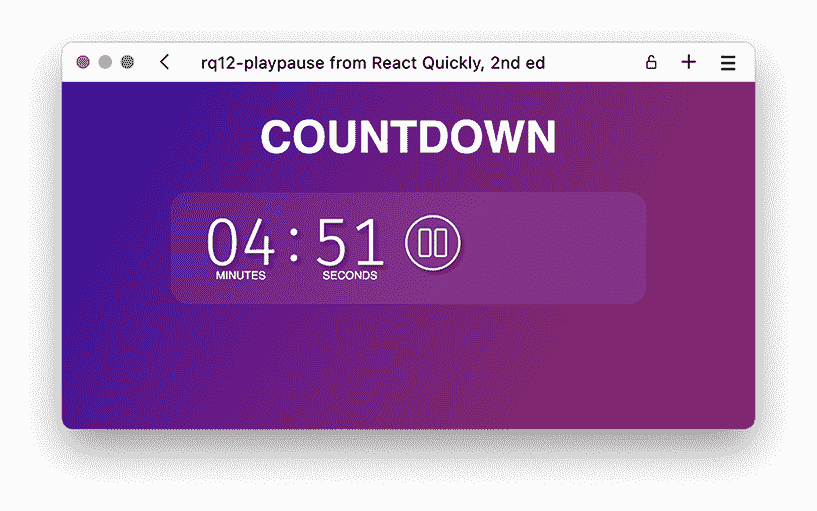

# 12 项目：计时器

本章涵盖

+   为计时器组件创建必要的脚手架

+   实现固定时长计时器

+   作业：为计时器添加高级功能

欢迎来到这个下一个项目，我们将构建一个倒计时计时器。它就像你手机上的计时器应用一样，只是这个是你自己构建的！在这个练习中，我们也会代表你变得更加雄心勃勃，所以，与第十一章相比，会有更少的指导，更多的开发工作需要你自己去探索。但别担心，我们对你充满信心和信任——我们知道你能做到！

我们会为你搭建项目的基础，这样你就不必在设计或语义上花费太多精力。为此，我们在第一步为你设置了一个脚手架，其中包含了步骤 2 所需的静态 HTML 和语义，还包含了整个项目所需的全部图像、图标和样式。见图 12.1，这是该项目的概览。



图 12.1 当你完成计时器项目时，你将通过以下五个步骤完成一个相当高级的计时器。

在第二步，我们将通过添加状态性将第一步的静态输出转换为具有固定时长的、尽管功能有限的计时器。在第三步，我们将添加一个初始化步骤，这样你可以将计时器设置为任意数字，也可以取消正在运行的计时器。这需要添加表单和事件处理。当我们添加在第四步重置计时器的额外选项时，我们还将通过转向 reducer 和自定义钩子来重构状态保持方式。最后，在第五步，我们将添加多个计时器独立运行的功能。

如前所述，我们代表你在这个项目中变得更加雄心勃勃，所以最后两个步骤相当复杂。你可以在表 12.1 中看到过程的更详细概述以及涉及的技术。

表 12.1 计时器项目的五个步骤

| 步骤 | 功能 | 使用的额外 React API | 难度 |
| --- | --- | --- | --- |
| 步骤 1：脚手架 | 创建时间显示和按钮的基本组件结构。 | 第一章至第四章：使用 JSX 的函数组件 | ★☆☆☆☆ |
| 步骤 2：播放/暂停 | 实现一个有状态的组件，在启动时倒计时，直到暂停或完成。 | 第五章：状态，第六章：Effect 钩子 | ★★☆☆☆ |
| 步骤 3：初始化 | 通过表单输入初始化计时器，该表单由用户定义的自定义时间定义。注意：这是作业。你必须自己创建这个步骤！ | 第八章：监听事件，第十章：在表单中处理用户输入 | ★★☆☆☆ |
| 步骤 4：重置 | 将状态逻辑转换为 reducer，并添加更多逻辑来处理重置计时器。注意：这是作业。你必须自己创建这个步骤！ | 第十章：Reducer 和自定义钩子 | ★★★★☆ |
| 步骤 5：多个计时器 | 允许用户定义多个计时器，它们将独立运行。注意：这是作业。你必须自己创建这个步骤！ |  | ★★★★☆ |

在我们开始之前，我们将展示一些最终产品的截图。请注意，尽管本书以灰度印刷，但实际的计时器带有令人愉悦的紫色渐变作为背景。步骤 1 的初始结果显示在图 12.2 中，而最终的多个计时器显示在图 12.3 中。



图 12.2 第一步设置了渲染此类静态计时器所需的项目结构和样式。此时按钮没有任何作用，时间也不会倒计时。



图 12.3 完成步骤 5 后，您将创建这个庞大的应用程序，您可以拥有任意多个独立运行的计时器。只需想象一下，您可以同时煮多少不同大小的鸡蛋！

好的，让我们开始倒计时！

注意：本章中搭建框架和所有部分的建议解决方案的源代码可在[`rq2e.com/ch12`](https://rq2e.com/ch12)找到。但正如您在第二章中学到的，您可以使用单个命令直接从命令行实例化所有示例和解决方案。

## 12.1 为计时器搭建框架

为了帮助您专注于实现 React 代码，而不是摆弄 HTML 和 CSS，我们将为您提供所有必需的样式和语义。我们还将在这里设置所有这些内容，为应用程序搭建框架。正如在先前的项目中（以及任何 Web 开发项目），我们将按照以下步骤完成项目：

1.  定义将渲染所需结果的 HTML 输出。

1.  创建多个 React 组件，将渲染 JSX 以实现所需的 HTML。

1.  在公共文件夹中放置静态图像，我们可以在运行时加载它们。

1.  创建一个样式表。

1.  实现我们需要的组件以获得必要的功能。

最后一点是有趣的部分，我们将在本项目的步骤 2-5 中逐步解决。第一步将完成前面列表中的前四点。

### 12.1.1 HTML 输出

对于此项目的 HTML 输出，我们将逐部分进行讲解，并详细说明我们将如何使用 HTML 来建模。然后，我们将为每个节点添加一些适当的 CSS 类，我们可以在下一部分的目标样式中定位它们。当我们有了所有单独的部分，我们就可以开始将它们组合起来，形成一个完整的项目。图 12.4 中的图形突出了此项目的各个部分。



图 12.4 组成完整计时器应用程序的七个部分。从最内层开始，我们有一个数字和单位，一个按钮，两个数字的集合，它们之间用冒号分隔，一个完整的计时器，一个表单输入，一个包含多个输入和按钮的表单，最后是整个计时器列表。

让我们逐一查看这些部分，并详细说明相关的 HTML 结构。

数量和单位

时间显示中的每个数字下面都有一个相关的单位。数字和单位文本字段在列表项中结合。这个列表项将用于整个时间显示。因此，每个单独的数字和单位都是一个列表项，其中包含段落：

```
<li class="part">
  <p class="number">05</p>
  <p class="unit">minutes</p>
</li>
```

按钮

一个按钮当然是一个按钮，但带有与标题匹配的图标：

```
<button title="Play" class="toggle">
  
</button>
```

时间部分

时间显示是一个部分列表，即一个数字和一个单位，然后是一个冒号，然后是另一个数字和一个单位：

```
<ul class="parts">
  <!-- number + unit -->
">:</li>
  <!-- number + unit -->
</ul>
```

计时器

计时器是一个由时间部分列表组成的部分，后面跟着一个或多个按钮：

```
<section class="timer">
  <!-- time parts -->
  <!-- button(s) -->
</section>
```

当计时器正在运行时，添加类 timer-ticking 使时间显示中的冒号闪烁：

```
<section class="timer timer-ticking">
  <!-- time parts -->
  <!-- button(s) -->
</section>"
```

如果计时器达到 0 并应该开始闪烁以指示时间已用完，可以通过添加类 timer-ringing 来标记：

```
<section class="timer timer-ringing">
  <!-- time parts -->
  <!-- button(s) -->
</section>
```

表单输入

输入是一个数字和单位，但这两个元素不是两个段落，而是一个输入和一个标签。它们仍然是一个部分，这是一个列表中的元素：

```
<li class="part">
  <input class="number" type="number" name="seconds" id="seconds" />
  <label class="unit" for="seconds">Seconds</label>
</li>
```

表单

输入与按钮一起构成了表单。因为按钮在表单内部自动充当提交按钮，所以我们不需要做任何特殊的事情来使表单工作：

```
<form class="timer timer-new">
  <ul class="parts">
    <!-- input -->
    <li class="colon">:</li>
    <!-- input -->
  </ul>
  <!-- button -->
</form>
```

计时器

计时器列表只是围绕所有计时器以及可能添加新计时器的表单的一个元素：

```
<div class="timers">
  <!-- timer(s) -->
  <!-- optional form -->
</div>
```

如果计时器列表的末尾有一个加号按钮来启动一个新的计时器，它可以添加为具有类 timer 和 timer-add 的按钮：

```
<div class="timers">
  <!-- timer(s) -->
  <button class="timer timer-add">+</button>
</div>
```

### 12.1.2 组件层次结构

上一节列出了应用程序的一些部分，这些部分可能非常直接地转换为我们需要渲染应用程序的 React 组件。然而，对于脚手架，我们将有更少的组件，并且只有在第二步开始添加功能时，我们才会开始将组件拆分成所有部分。对于这个脚手架，我们将只有三个组件，如图 12.5 所示。



图 12.5 这可能是我们很长时间以来最简单的组件树。注意，我们在这里只显示 React 组件，而不是我们也在渲染的所有纯 JSX 节点。

一旦我们到达未来步骤，我们将开始添加更多功能和逻辑，这自然会增加组件树的复杂性。

### 12.1.3 项目结构

对于这个项目，我们需要一些图标。我们需要四种不同类型的按钮来完成整个项目。你可以在图 12.6 中看到它们全部显示出来。



图 12.6 我们需要的四种按钮类型包括播放、暂停、重置和删除。

就像在第十一章中一样，我们将这些图标文件放在 public 文件夹内的一个单独的 icons 文件夹中。除此之外，我们还需要在组件树中我们之前提到的三个组件，然后当然，我们需要一个样式表。这导致我们得到以下脚手架中的文件列表：

```
public/
  icons/           ❶
    pause.svg      ❶
    play.svg       ❶
    reset.svg      ❶
    trash.svg      ❶
  favicon.ico      ❷
  index.html       ❷
src/
  index.js         ❷
  App.js           ❸
  style.css        ❹
  Timer.js         ❹
  TimerManager.js  ❹
```

❶ 我们为按钮添加的图标

❷ 我们未修改的默认文件

❸ 我们更新以适应我们需求的默认文件

❹ 我们添加的三个新文件，用于显示脚手架应用程序

仓库：rq12-scaffold

此示例可以在 rq12-scaffold 仓库中看到。您可以通过创建基于相关模板的新应用程序来使用该仓库：

```
$ npx create-react-app rq12-scaffold --template rq12-scaffold
```

或者，您也可以访问此网站浏览代码，直接在您的浏览器中查看应用程序的运行情况，或者下载源代码的 zip 文件：

[`rq2e.com/rq12-scaffold`](https://rq2e.com/rq12-scaffold)

从那里，您就可以开始了。继续阅读本节（12.1），了解脚手架中源代码的一些额外细节，但如果您喜欢您所看到的，您也可以跳到 12.2 节，在那里我们开始实现计时器的最简单版本。

### 12.1.4 源代码

本节包含在脚手架中包含的基本组件的源代码。尽管如此，您不必从这里复制它，因为这些源代码已经在之前提到的模板中准备好了。

样式表

我们没有列出整个样式表，因为它只是大量的简单 CSS 规则，但我们想强调一些事情。首先，我们在样式表中加载了一个来自 Google Fonts API 的字体，名为 Fira Sans，它有一些我们想用于实际时钟显示的漂亮数字。此字体还支持一个名为*表格数字*的功能。我们希望我们的数字以固定宽度格式显示；也就是说，我们不希望数字在时钟从 10 滴答到 09 时改变宽度。但在许多字体中，1 和 0 的宽度并不相同，这会导致我们的数字跳一下，除非我们将每个数字放入一个单独的框中。

一些字体家族具有一个功能，您可以请求将数字显示为固定宽度字符，这样它们在相同字体大小下都占据相同数量的像素宽度。我们通过使用此声明在 CSS 中加载字体并触发数字的表格变体：

```
@import url("https:/ /fonts.googleapis.com/css2
➥ ?family=Fira+Sans:wght@300&display=swap");
.number, .colon {
  font-family: "Fira Sans", sans-serif;    ❶
  font-variant-numeric: tabular-nums;      ❷
}
```

❶ 指示这些类使用加载的字体

❷ 触发字体使用字体变体"tabular-nums"，以确保使用固定宽度数字

并非所有字体都支持此字体变体，因此如果您想为数字使用不同的字体，请检查它是否支持此功能以获得最视觉上令人愉悦的结果。

其次，如果您查看样式表，您可能会注意到我们大多数布局都是在样式表中使用 Flexbox 完成的。对于像这样的应用程序，这是一个非常方便的工具来对齐元素。

主应用程序

主应用程序组件是应用程序的起点。在整个练习过程中，它始终保持与第一个版本（列表 12.1）完全相同，因为它只包含一个标题和 TimerManager 组件。所有的计时器逻辑都将放在那里，所以这个应用程序将没有全局状态。

注意，我们还在根组件中加载了 CSS 样式表。我们只需要加载一次，所以将其加载在根组件中是有意义的。您可以在下面的列表中看到文件 src/App.js。

列表 12.1 框架中的 src/App.js

```
import "./style.css";                       ❶
import TimerManager from "./TimerManager";  ❷
function App() {
  return (
    <main className="wrapper">
      <h1 className="title">Countdown</h1>
      <TimerManager />                      ❸
    </main>
  );
}
export default App;
```

❶ 导入样式表，以便我们可以从开始使用这些样式

❷ 加载计时器管理器组件

❸ 在需要的地方渲染它

计时器管理器

计时器管理器是包含一个或多个计时器以及初始化或添加新计时器逻辑的容器。该组件不会负责实际管理单个计时器（例如，向前推进时间），而是管理不同的计时器和起始时间。

在框架中，计时器管理器包含一个没有任何属性的单一计时器实例。此文件，src/TimerManager.js，将在下面显示。

列表 12.2 框架中的 src/TimerManager.js

```
import Timer from "./Timer";    ❶
function TimerManager() {
  return (
    <div className="timers">
      <Timer />                 ❷
    </div>
  );
}
export default TimerManager;
```

❶ 计时器管理器导入计时器组件以显示其实例。

❷ 渲染实例而不带任何属性或其他逻辑

单个计时器

计时器组件将是未来大部分工作的地方。在这个初始框架中，它是一个纯静态组件，具有固定的 JSX 响应，显示 05 分钟和 00 秒以及一个播放按钮。但目前它没有任何功能。

注意，这包含了一些可以稍后通过将其转换为单独的组件进行优化的重复 JSX，包括数字和单位显示。按钮也适合进行*组件化*，因为它将在以后的多处使用。此文件，src/Timer.js，将在下面的列表中显示。

列表 12.3 框架中的 src/Timer.js

```
function Timer() {
  return (
    <section className="timer">
      <ul className="parts">
        <li className="part">
          <p className="number">05</p>     ❶
          <p className="unit">minutes</p>
        </li>
        <li className="colon">:</li>
        <li className="part">
          <p className="number">00</p>     ❶
          <p className="unit">seconds</p>
        </li>
      </ul>
      <button title="Play" className="toggle">
        
      </button>
    </section>
  );
}
export default Timer;
```

❶ 目前我们硬编码了剩余时间为 05 分钟和 00 秒。

### 12.1.5 运行应用程序

如果我们在浏览器中启动此应用程序，我们将看到图 12.2 中显示的内容，这里重复显示在 12.7 中。这个应用程序什么也没做，但看起来很漂亮，不是吗？



图 12.7 计时器的框架目前什么也不做——还没有。

## 12.2 添加简单的播放/暂停计时器

上一步的结果是一个很好但非常无聊的应用程序，因为它什么也没做。我们现在将改变这一点。首先，我们将通过使播放按钮播放倒计时来使这个最简单的倒计时计时器工作。如果您觉得爆炸即将来临——或者鸡蛋快煮好了，您也可以暂停倒计时。

### 12.2.1 本练习的目标

本练习的目标是创建所需的功能以制作一个工作倒计时。为了实现这一目标，我们建议按照以下步骤进行，但它们绝对不是唯一或甚至可能是最佳的方式。这只是我们的方法：

1.  识别计时器中可以组件化的部分，以使计时器更容易处理。

1.  在计时器组件中创建状态以记录倒计时进度以及倒计时是否正在运行的布尔状态。

1.  为计时器添加一个效果，每秒减少剩余时间。

1.  如果计时器处于暂停状态，则显示一个开始倒计时的播放按钮，如果计时器正在运行，则显示一个暂停按钮。

精度

注意，计时精度不是这个练习的目标。我们甚至可以接受使用 setInterval 进行倒计时，尽管 setInterval 的精度声名狼藉地不可靠。这将导致倒计时在每个滴答声上可能偏离几百分之一到十分之一秒。当应用程序中的倒计时满 5 分钟时，这个偏差可能导致“真实时间”中额外半分钟。

如果你使用这个计时器进行需要实际精度的任何事情，这不是正确的方法。但精度计时不是这个练习的目标，所以我们将在整个项目中使用这种方法。

如果你愿意，请自由地提高实际倒计时的精度。查看 performance.now()进行精确计时（如果操作系统支持，可达到微秒级别）。

### 12.2.2 组件层次结构

如前所述，这个练习的第一个目标是将计时器部分组件化成相关的原子，以便可以适当地组合成一个整体。为此，我们将参考初始 HTML 组件列表，并按照那里的划分拆分组件。因此：

+   计时器——计时器由一个时间显示和一个或多个按钮组成。

+   时间显示——时间显示是一个数字和单位的列表，后面跟着一个冒号，然后是一个数字和一个单位。

+   数字——数字和单位就是那样，有适当的类名来引发所需的样式。

+   按钮——按钮有一个用于无障碍的标签和一个用于视觉识别的图标。

这四个组件现在构成了一个计时器，并且按照你在图 12.8 中看到的方式连接。你还可以看到，我们将直接从计时器管理器传递起始时间给计时器。



图 12.8 我们的单个计时器应用程序的组件树由三个新组件的几个实例组成：时间显示、数字和按钮。

计时器将只有一个按钮，但按钮图标、标签和点击处理程序将根据计时器当前是否正在运行而有所不同。此外，请注意，时间显示将只接收一个时间作为输入，即要显示的剩余秒数。然后时间显示组件必须将其拆分为分钟和秒，传递给两个数字组件。

### 12.2.3 更新后的项目结构

在这个项目步骤中，我们添加了一些新组件，并更新了其他组件。完成此步骤后，文件结构将更新如下：

```
public/             ❶
src/
  App.js            ❶
  index.js          ❶
  style.css         ❶
  TimeDisplay.js    ❷
  Timer.js          ❸
  TimerManager.js     
  Button.js         ❷
  Number.js         ❷
```

❶ 未更改的文件

❷ 新文件

❸ 更新后的文件

我们建议你尝试自己实现这一步，你可以从本项目步骤 1 中自己的脚手架实现开始，或者从 rq12-scaffold 仓库中的我们的实现开始。一旦完成，请随意比较你的解决方案与我们的。

仓库：rq12-playpause

此示例可在 rq12-playpause 存储库中看到。您可以通过创建一个基于相关模板的新应用程序来使用该存储库：

```
$ npx create-react-app rq12-playpause --template rq12-playpause
```

或者，您也可以访问此网站来浏览代码，在您的浏览器中直接查看应用程序的运行情况，或下载源代码的 zip 文件：

[`rq2e.com/rq12-playpause`](https://rq2e.com/rq12-playpause)

### 12.2.4 源代码

在本节中，我们将提供所有在此步骤中添加的更新和新文件的完整源代码，以及一些与理解我们的选择相关的实现细节。

计时器管理器

计时器管理器实际上并没有真正做任何事情。这里唯一改变的是，我们明确设置了计时器的默认时间。您可以随意更改它以进行测试。请参阅 src/TimerManager.js 的完整内容。

列表 12.4 简单计时器中的 src/TimerManager.js

```
import Timer from "./Timer";
function TimerManager() {
  return (
    <div className="timers">
      <Timer startTime={300} />    ❶
    </div>
  );
}
export default TimerManager;
```

❶ 添加一个具有默认开始时间的属性

一个通用的按钮组件

我们需要一个新按钮组件。它非常简单，并渲染一个带有适当标题和图标的按钮元素。如果我们向按钮组件传递额外的属性，我们将它们转发到按钮元素。请参阅以下列表以获取 src/Button.js 的完整内容。

列表 12.5 简单计时器中的 src/Button.js

```
function Button({ icon, label, ...rest }) {               ❶
  return (
    <button title={label} className="toggle" {...rest}>   ❷
      
    </button>
  );
}
export default Button;
```

❶ 我们需要传递一个图标和一个标签，但我们也可以传递给此组件的任何其他按钮属性。

❷ 所有额外的属性都将添加到按钮元素中。这是添加如 onClick 之类的位置。

数字和单位显示

数字和单位显示仅显示属性。但是，数字必须格式化为总是两位数，因此我们将其转换为字符串，并在需要时添加前导零，如下列所示。

列表 12.6 简单计时器中的 src/Number.js

```
function Number({ value, label }) {
  return (
    <li className="part">
      <p className="number">
        {String(value).padStart(2, "0")}   ❶
      </p>
      <p className="unit">{label}</p>      ❷
    </li>
  );
}
export default Number;
```

❶ 我们在这里显示数字，但我们确保它总是两位数长，通过将其转换为字符串并用前导零填充。这使得像 7 这样的数字显示为 07。

❷ 标签按原样显示——我们稍后使用 CSS 将其转换为大写以提高视觉效果。

时间显示组件

此组件接收要显示的时间，将其拆分为分钟和秒（使用除法、取整和取模），然后将这些值传递给两个数字组件实例。您可以在 src/TimeDisplay.js 中查看源代码。

列表 12.7 简单计时器中的 src/TimeDisplay.js

```
import Number from "./Number";
function TimeDisplay({ time }) {
  const minutes = Math.floor(time / 60);   ❶
  const seconds = time % 60;               ❷
  return (
    <ul className="parts">
      <Number value={minutes} label="minutes" />
      <li className="colon">:</li>
      <Number value={seconds} label="seconds" />
    </ul>
  );
}
export default TimeDisplay;
```

❶ 剩余分钟数是剩余时间除以 60 后取整的结果。

❷ 剩余秒数是除以 60 后的余数。

计时器组件

这就是一切汇聚的地方。我们在图 12.9 中用状态图展示了计时器组件中逻辑流程。



图 12.9 简单计时器组件的状态图——时间要么在运行，要么不在，这决定了显示什么以及哪些效果正在运行。

记住，计时器现在接受一个单一的属性，startTime，它决定了计时器将从哪里开始。从那里，我们可以初始化本地状态，包括我们可以滴下的剩余秒数，以及一个包含计时器是否真正在滴答的布尔值的单独状态。

然后，我们根据时间是否在运行执行不同的操作。如果在运行，我们运行一个效果钩子来递减（直到它达到零，然后重置一切）。如果正在运行，我们还会显示一个暂停按钮。

如果时间没有在运行，我们不会运行任何效果钩子（或者我们也会运行，因为我们必须运行，但我们不会在钩子内部做任何事情），并且我们显示一个播放按钮。完整的文件，src/Timer.js，将在下面的列表中显示。

列表 12.8 简单计时器的 src/Timer.js

```
import { useState, useEffect } from "react";
import Button from "./Button";
import TimeDisplay from "./TimeDisplay";
function Timer({ startTime }) {
  const [remaining, setRemaining] =                  ❶
    useState(startTime);                             ❶
  const [isRunning, setRunning] = useState(false);   ❷
  useEffect(() => {                                  ❸
    if (!isRunning) {                                ❸
      return;                                        ❸
    }                                                ❸
    function tick() {
      setRemaining((oldValue) => {
        const value = oldValue - 1;
        if (value <= 0) {
          setRunning(false);
          return startTime;
        }
        return value;
      });
    }
    const interval = setInterval(tick, 1000);        ❹
    return () => clearInterval(interval);            ❺
  }, [isRunning, startTime]);                        ❻
  const play = () => setRunning(true);
  const pause = () => setRunning(false);
  return (
    <section className={
      `timer ${isRunning ? "timer-ticking" : ""}`    ❼
    }>
      <TimeDisplay time={remaining} />               ❽
      {isRunning ? (                                 ❾
        <Button                                      ❿
          icon="pause"                               ❿
          label="Pause"                              ❿
          onClick={pause}                            ❿
        />                                           ❿
      ) : (
        <Button                                      ❿
          icon="play"                                ❿
          label="Play"                               ❿
          onClick={play}                             ❿
        />                                           ❿
      )}
    </section>
  );
}
export default Timer;
```

❶ 要有一个计时器，我们需要两个状态值。首先，我们需要知道还剩下多少秒。

❷ 第二，我们需要知道计时器当前是否正在运行。

❸ 我们将宇宙最终热寂的永恒进步实现为一个效果钩子。尽管如此，钩子只有在计时器实际上在运行时才会做任何事情。

❹ 如果计时器正在运行，我们安排一个每秒运行一次的间隔，该间隔将递减剩余秒数，或者如果达到 0 则停止计时器（然后重置计时器）。

❺ 总是清理你的工作。

❻ 这个钩子取决于计时器是否在运行以及开始时间（因为我们需要它在完成时重置计时器）。

❼ 为计时器部分添加一个条件类，以在运行时显示滴答的冒号

❽ 将剩余时间传递给时间显示组件

❾ 根据时间是否在运行显示不同的按钮

❿ 如果正在运行，我们显示一个暂停按钮来暂停计时器。如果不运行，我们做相反的操作。

### 12.2.5 运行应用程序

如果你在这个浏览器中启动这个应用，你将看到图 12.10 所示的 web 应用。



图 12.10 计时器可以是正在运行或暂停的状态。在运行时，冒号会随着时间流逝而闪烁。按钮的外观和行为会根据播放状态而改变。

## 12.3 家庭作业：将计时器初始化为自定义时间

这个步骤的目标是通过用户通过表单输入定义的自定义时间初始化计时器。以下是一些完成这个目标的提示：

1.  创建一个新的组件来处理添加新计时器。查看样式表，其中有一些类可以帮助你为这个表单及其输入进行样式设计。

1.  决定是否使新的计时器表单成为受控的。这两个选项对于这个组件都是有效的。

1.  记住，将按钮添加到表单中会使它成为一个提交按钮，即使它没有点击处理程序。

1.  使计时器管理器具有状态性，并记住你是否设置了计时器以及那个计时器的起始时间。

1.  将一个垃圾桶按钮（带有垃圾桶图标）添加到计时器组件中。

1.  计时器组件需要一个新属性，即当计时器运行完毕或被丢弃时调用的回调。此回调应重置计时器管理器，以便您可以再次使用新的计时器表单。

当然，我们希望您从上一步中开发的现有应用程序开始工作，但如果您想从我们的解决方案开始，可以通过检出 rq12-playpause 仓库来实现。完成后，您可以自由地比较您的解决方案与我们的。

仓库：rq12-initialize

此示例可在 rq12-initialize 仓库中看到。您可以通过创建基于相关模板的新应用程序来使用该仓库：

```
$ npx create-react-app rq12-initialize --template rq12-initialize
```

或者，您可以去这个网站浏览代码，直接在浏览器中查看应用程序的运行情况，或下载源代码的 zip 文件：

[`rq2e.com/rq12-initialize`](https://rq2e.com/rq12-initialize)

## 12.4 家庭作业：重置计时器

本步骤的目标是将状态逻辑转换为 reducer，并添加更多逻辑来处理重置计时器。以下是一些完成此目标的提示：

1.  将计时器中的状态转换为 reducer。

1.  在计时器中添加一个新的重置按钮，并允许通过在 reducer 上调用适当的操作来重新启动计时器。仔细思考在重置时 reducer 中的两个值应该发生什么。

1.  最后，您可能想改变计时器完成时发生的事情。所以，而不是仅仅删除它，您可以选择将其保留在原位，直到主动删除。

当然，我们希望您从上一步中开发的现有应用程序开始工作，但如果您想从我们的解决方案开始，可以通过检出 rq12-initialize 仓库来实现。完成后，您可以自由地比较您的解决方案与我们的。

仓库：rq12-reset

此示例可在 rq12-reset 仓库中看到。您可以通过创建基于相关模板的新应用程序来使用该仓库：

```
$ npx create-react-app rq12-reset --template rq12-reset
```

或者，您可以去这个网站浏览代码，直接在浏览器中查看应用程序的运行情况，或下载源代码的 zip 文件：

[`rq2e.com/rq12-reset`](https://rq2e.com/rq12-reset)

## 12.5 家庭作业：多个计时器

本步骤的目标是允许用户定义多个计时器，它们将相互独立运行。以下是一些完成此目标的提示：

1.  更新计时器管理器中保持的状态，以允许同时运行多个管理器（具有不同的起始时间）。

1.  确保仍然支持在任何时候删除计时器。

1.  允许计时器通过闪烁（样式表中有一个相应的类）来显示完成，这样用户就可以在这个时候重置或丢弃计时器。

1.  在计时器管理器中，允许用户按下按钮添加新的计时器，但在按下添加按钮之前不要显示新的计时器表单。当添加新的计时器时，再次重置到添加按钮。

当然，我们希望您从之前步骤中开发的现有应用开始工作，但如果您想从我们的解决方案开始，可以通过检出 rq12-reset 仓库来实现。一旦完成，您可以自由地比较您的解决方案与我们的。

仓库：rq12-multiple

这个例子可以在 rq12-multiple 仓库中看到。您可以通过创建一个基于相关模板的新应用来使用该仓库：

```
$ npx create-react-app rq12-multiple --template rq12-multiple
```

或者，您可以访问此网站浏览代码，直接在浏览器中查看应用的实际运行情况，或下载源代码的 zip 文件：

[rq12-multiple](https://rq2e.com/rq12-multiple)

## 摘要

+   在这个项目中，我们承担了一个更复杂的应用，它具有一些实际应用的可能性。

+   我们再次回顾了在专业环境中承担此类项目时您将经历的步骤——无论是单独工作还是团队合作。

+   请记住，在开始之前研究您的设计和主题，因为这通常会给您一个关于如何构建最终应用的良好想法。在这个项目中，我们能够仅从设计本身推断出我们需要的组件，并保持逻辑的分离。

+   还要考虑组件的内部状态，并记住您可以在多个不同层同时拥有状态。在这个项目中，我们有三个不同层的状态，它们相互独立工作，尽管它们在交互时之间存在接口。

+   计时器列表就是这样一个列表——计时器的列表。它知道每个计时器何时启动，但实际上并不知道哪些计时器正在运行，是否已过期，或者它们只是在滴答作响。

+   单个计时器会独立运行，直到被删除。当发生这种情况时，它会调用其父级提供的回调，而实际上并不关心之后会发生什么。

+   添加新计时器的表单会记住表单的状态，并在提交后调用回调。它并不知道表单提交后会发生什么。

+   如果您正在构建实际应用，请考虑适当的语义（并非所有内容都应该是<div>），并注意可访问性（在适用元素上添加适当的角色和标签）。
