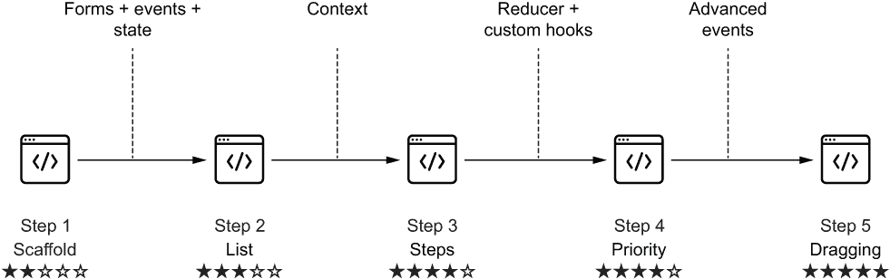
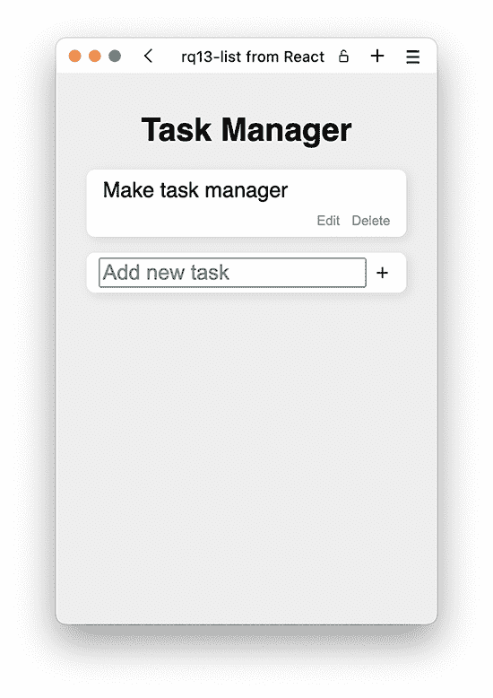
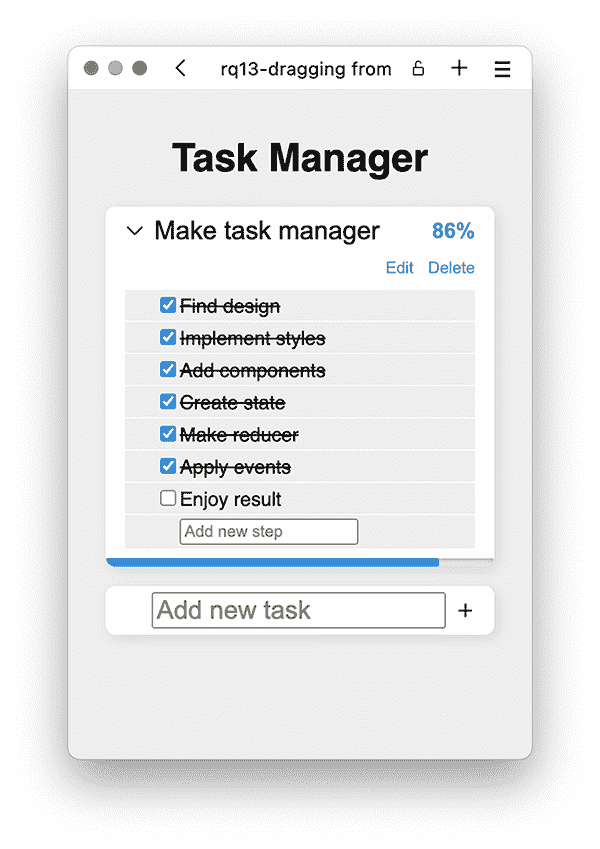
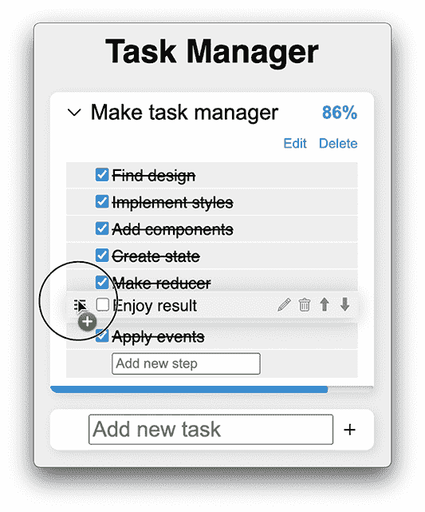
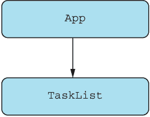
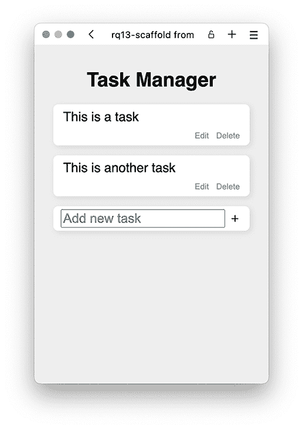
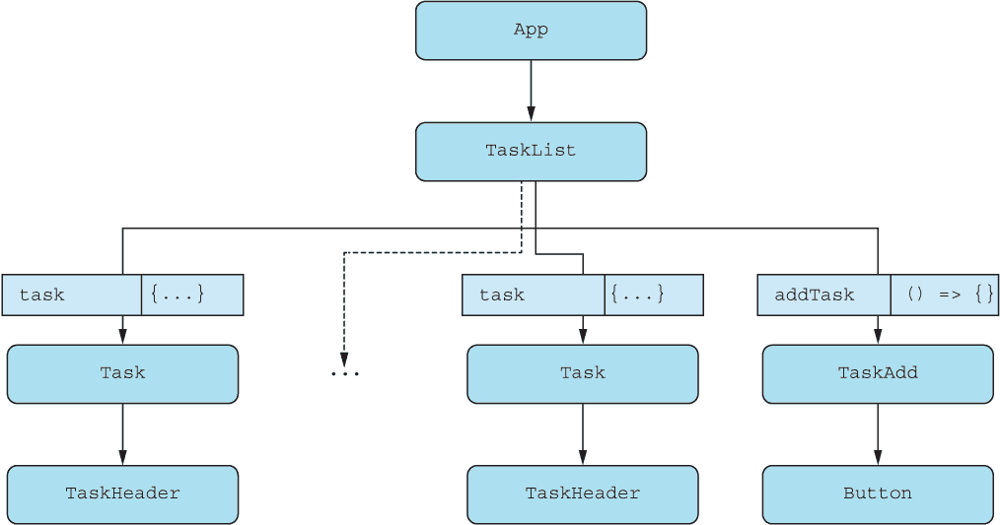
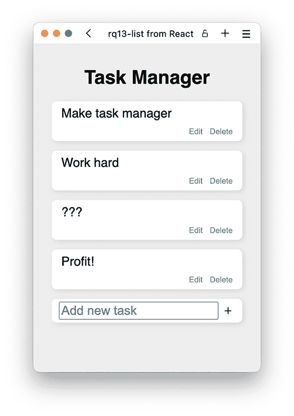

# 13 项目：任务管理器

本章涵盖

+   为任务管理器创建必要的框架

+   实现简单的任务列表

+   作业：为任务管理器添加高级功能

欢迎来到本书的第三个也是最后一个项目。现在你必须运用你迄今为止所学到的所有魔法和咒语，以及你可能在其他地方学到的关于 JavaScript 和 HTML 的额外知识——然而，这仅适用于本章末尾的非常高级的作业。

在这个项目中，我们将构建一个任务管理器。当我们说“任务管理器”时，我们指的是一个稍微复杂一点的待办事项列表变体。任务管理器最初是一个简单的待办事项列表，以卡片的形式实现，可以开始和完成。然后我们为每个任务添加子步骤，以便用户可以为手头的任务添加一些更详细的细节。接下来，我们添加了改变每个任务步骤顺序的选项，最初只使用按钮，但后来也使用了拖放。这就是步骤 5 中的最后一部分，拖放部分，这将是一个棘手的完成部分。你可以在图 13.1 中看到这一发展，我们将使用高级事件来完成最终步骤 5。



图 13.1 在实现任务管理器时，你将通过这五个步骤添加更多功能和复杂性到应用程序中。

再次强调，我们将在第一步中为项目打下基础，这样你就不必过多地与 HTML、图标和 CSS 打交道，以便让基本功能正常工作。然而，第一步中创建的基础将完全无效，不会做任何事情。为了添加功能，你必须随着项目的进行逐步增加项目的复杂性。

我们还在表 13.1 中列出了步骤，并提供了更多关于你将做什么以及完成练习时将参考哪些章节的详细信息。

表 13.1 任务管理器项目的五个步骤

| 步骤 | 功能 | 使用的额外 React API | 难度 |
| --- | --- | --- | --- |
| 步骤 1：搭建 | 创建任务列表和添加新任务表单的基本组件结构。 | 第一章至第四章：使用 JSX 的函数式组件 | ★☆☆☆☆ |
| 步骤 2：列表 | 将静态结构转换为存储在状态中的动态任务列表，包括编辑和删除任务的选项。 | 第五章：状态，第八章：事件，第九章：表单 | ★★★☆☆ |
| 步骤 3：步骤 | 为每个任务添加步骤和进度，包括删除和完成步骤的选项。任务列表还作为一个手风琴工作，一次只展开一个。注意：这是作业。你必须自己创建这个步骤！ | 第十章：上下文 | ★★★★☆ |
| 步骤 4：优先级 | 通过重新排序项来添加任务步骤的优先级选项。通过将状态转换为 reducer，这变得更容易。注意：这是作业。你必须自己创建这个步骤！ | 第十章：reducer 和自定义钩子 | ★★★★☆ |
| 步骤 5：拖动 | 允许用户拖动步骤以改变优先级，而不仅仅是使用箭头上下移动一个步骤。注意：这是作业。您必须自己创建这个步骤！ | 第八章：事件处理器 | ★★★★★ |

在完成步骤 2 后，您将进入这个练习的第一个迭代，它是一个非常简单的任务管理器，如图 13.2 所示。



图 13.2 任务管理器的第一个迭代仅仅有一个可以添加、删除和编辑任务的列表。

然而，当您完成这个项目直到步骤 5，您将拥有一个更高级的应用程序，如图 13.3 所示，有更多的选项。



图 13.3 现在每个任务都有一个步骤列表，您可以在任务内添加、完成、编辑、删除和重新排序这些步骤。

您甚至可以在每个任务内部拖动步骤，如图 13.4 所示。



图 13.4 您可以拖动列表中的步骤以方便重新排序。

在所有这些要完成的事情中，让我们开始这本书最后一章的最后一个项目。

注意：本章中支架的源代码以及所有步骤的建议解决方案可在[`rq2e.com/ch13`](https://rq2e.com/ch13)找到。但如您在第二章中学到的，您可以使用单个命令直接从命令行实例化所有示例和解决方案。

## 13.1 任务管理器的支架

再次强调，我们将为您提供一个基本支架来启动这个应用程序。我们将创建静态任务管理器的 HTML 输出，并提供所有必要的样式。它不会是动态的，甚至也不是功能性的，但它看起来就像成品；它只需要一点 React 魔法来启动。

我们还将为您提供一些图标，您将通过解决方案需要这些图标来创建一些图标按钮。

### 13.1.1 组件层次结构

在这个项目的这个步骤中，我们将稍微作弊一下。我们将在一个组件中创建整个（静态）应用程序。我们可以分割这些内容，但我们觉得这可以让您更好地决定如何自己将内容分割成组件。

在一个组件中返回整个应用程序的 JSX，并以静态、固定的设置，您可以清楚地看到整个创建过程以及如何从这里开始最佳地前进。正如您在图 13.5 中看到的，这留下了这个应用程序的一个极其简单的组件图。



图 13.5 虽然我们提到图 12.5 中的组件树是我们最简单的，但我们认为这个更胜一筹！

### 13.1.2 项目结构

在这个步骤中，组件层次结构如此简单，关于源文件夹没有太多可说的。我们有一个主应用程序文件和一个 CSS 文件，就像往常一样，以及我们的单个应用程序特定组件，TaskList。

然而，我们也有一些图标用于这个项目，我们在公共文件夹中添加了八个不同的 SVG 文件，这些文件将在整个项目中使用。这使我们有了以下文件结构：

```
public/
  icons/
    caret.svg
    check.svg
    down.svg
    drag.svg
    pencil.svg
    plus.svg
    trash.svg
    up.svg
  favicon.ico
  index.html
src/
  App.js
  index.js
  style.css
  TaskList.js
```

存储库：rq13-scaffold

此示例可在 rq13-scaffold 存储库中看到。您可以通过创建基于相关模板的新应用程序来使用该存储库：

```
$ npx create-react-app rq13-scaffold --template rq13-scaffold
```

或者，您可以访问此网站浏览代码，直接在浏览器中查看应用程序的运行情况，或下载源代码的 zip 文件：

[`rq2e.com/rq13-scaffold`](https://rq2e.com/rq13-scaffold)

### 13.1.3 源代码

在这一步中，只有两个重要的源文件需要列出。我们有主应用程序文件，它与我们所使用的其他文件几乎完全相同，然后是特定于应用程序的任务列表。

主要应用程序

主要应用程序包含在 src/App.js 中，到现在您应该已经很熟悉这个文件了。文件如下所示。

列表 13.1 框架中的 src/App.js

```
import "./style.css";                 ❶
import TaskList from "./TaskList";    ❷
function App() {
  return (
    <main>
      <h1>Task Manager</h1>
      <TaskList />                    ❸
    </main>
  );
}
export default App;
```

❶ 加载 CSS 文件

❷ 加载应用程序的最高级组件

❸ 在相关的 JSX 树中渲染该组件

任务列表

文件 src/TaskList.js 在列表 13.2 中显示。它包含渲染两个任务列表以及底部添加新任务表单的所有 JSX。尽管如此，所有这些都是完全不可用的，所以当你点击按钮时，不会发生任何（有趣）的事情。

列表 13.2 框架中的 src/TaskList.js

```
function TaskList() {
  return (
    <ol className="lane">                                    ❶
      <li className="card">                                  ❷
        <header className="card-header">                     ❸
          <p className="card-title">This is a task</p>
        </header>
        <ul className="card-controls">                       ❹
          <li>
            <button className="card-control">Edit</button>
          </li>
          <li>
            <button className="card-control">Delete</button>
          </li>
        </ul>
      </li>
      <li className="card">                                  ❷
        <header className="card-header">                     ❺
          <p className="card-title">This is another task</p>
        </header>
        <ul className="card-controls">                       ❹
          <li>
            <button className="card-control">Edit</button>
          </li>
          <li>
            <button className="card-control">Delete</button>
          </li>
        </ul>
      </li>
      <li className="card">                                  ❷
        <header
          className="card-header card-header-new"            ❻
        >
          <form className="card-title-form">
            <input
              className="card-title card-title-input"
              placeholder="Add new task"
              name="title"
            />
            <button className="icon-button">
              
            </button>
          </form>
        </header>
      </li>
    </ol>
  );
}
export default TaskList;
```

❶ 任务通道是一个有序列表。

❷ 每个任务都是一个列表项。

❸ 一个任务有一个包含标题的标题。

❹ 在任务标题下方是一个无序列表按钮。

❺ 一个任务有一个包含标题的标题。

❻ 列表中的最后一个任务略有不同，因为它包含一个表单，用于使用输入和图标按钮添加新任务

### 13.1.4 运行应用程序

框架的结果是一个看起来不错但其他方面完全无用的应用程序，它包含一个静态的任务列表和底部的表单，如图 13.6 所示。



图 13.6 如果按钮实际上能工作，这将是一个有点有用的应用程序。

## 13.2 一个简单的任务列表

现在我们已经完成了所有基本工作——也就是说，我们已经控制了 JSX、样式和图标——我们进入创建实际任务管理应用程序的下一步。到目前为止，我们只是常规的 Web 开发，所有这些工作所需技能大多超出了本书的范围。接下来是 React 开发，这正是我们必须应用本书中迄今为止所学到的所有技能的地方。

### 13.2.1 本练习的目标

在这个项目步骤中，我们将向框架中概述的结构添加实际的功能。完成这一步骤后，我们希望有一个简单的任务管理器，能够执行以下操作：

+   显示任务列表

+   允许用户通过编写任务标题添加新任务

+   允许用户删除任务

+   允许用户重命名任务

我们将分两步进行：

1.  将单个大组件拆分为多个更小的组件，这些组件在组件大小、责任和视觉表示方面都有意义。

1.  使应用程序具有状态，因此它从一个预定义的列表开始，然后用户可以根据需要添加、删除和更新任务。

### 13.2.2 组件层次结构

当我们只有一个与实际任务管理器相关的组件 TaskList 时，我们将在这一步扩展到多个组件。你可以在图 13.7 中看到分解。


图 13.7 在这个步骤中，任务管理器被巧妙地分解为五个不同的组件：带有标题或编辑标题的输入框的任务标题；包括标题和一些控制的任务；添加新任务的表单；一个图标按钮；最后，完整的任务列表。

从最内层开始，任务的标题可以是一个大段落或一个可以编辑标题并点击提交新标题的输入框。我们将创建这个组件作为我们的第一个组件，TaskHeader。在此基础上，每个任务都是一个单独的组件，Task，它处理任务的州，即标题是否正在编辑。

在任务列表的底部，我们将创建一个新的组件来添加新任务。这就是我们的第三个新组件 TaskAdd 的位置，它包含一个表单，并在提交后会调用一个回调函数。

最后，我们需要为这个项目添加一个图标按钮，所以我们不妨现在就添加。让我们非常创新，把这个组件命名为 Button。我们只需要在新的任务表单中用图标按钮，但我们预计在下一步中会有很多用途。所有这些都可以在图 13.8 中看到，其中组件树被布局出来。



图 13.8 本项目第二步的组件树有五个组件。特别是任务组件，根据要显示的实际任务数量，会使用多次。

### 13.2.3 更新的项目结构

如前所述，在这个项目步骤中，我们不仅添加了一些新组件，还更新了其他组件。作为一个新事物，我们还添加了一个用于设置状态化任务数组初始值的纯 JavaScript 文件。我们将这个文件命名为 fixture.js，因为*fixture*通常被用作“固定”数据的术语，你希望用这些数据填充你的应用程序。

最后，作为另一个新的改进，我们将使用嵌套的文件结构。我们目前还没有添加很多组件，但我们预计以后会添加更多组件，因此我们将特定于任务的四个组件封装到一个文件夹中。为了使这些组件更容易导入，我们还将添加一个索引文件到这个文件夹，该文件将只从这个文件夹导出必要的组件。

完成这一步后，将得到以下更新的文件结构：

```
public/            ❶
src/
  index.js         ❶
  style.css        ❶
  App.js           ❷
  Button.js        ❸
  task/
    fixture.js     ❸
    index.js       ❸
    Task.js        ❸
    TaskAdd.js     ❸
    TaskHeader.js  ❸
    TaskList.js    ❷
```

❶ 未更改的文件

❷ 更新的文件

❸ 新文件

我们建议您尝试自己实现这一步，您可以从本项目的第一步中自己的脚手架实现开始，或者从 rq13-scaffold 中的我们的实现开始。一旦完成，您可以自由地比较您的解决方案与我们的解决方案。

存储库：rq13-list

这个例子可以在 rq13-list 存储库中看到。您可以通过创建一个基于相关模板的新应用程序来使用该存储库：

```
$ npx create-react-app rq13-list --template rq13-list
```

或者，您可以访问这个网站来浏览代码，直接在浏览器中查看应用程序的实际应用，或者下载源代码的 zip 文件：

[`rq2e.com/rq13-list`](https://rq2e.com/rq13-list)

### 13.2.4 源代码

在本节中，我们将提供所有在本步骤中添加的更新和新文件的完整源代码，以及一些与理解我们的选择相关的实现细节。

主应用程序文件

对主应用程序组件的唯一更改是导入任务列表的位置。我们不是从名为 TaskList 的文件中作为默认导入导入任务列表，而是从名为 task 的文件夹中作为命名导入导入它。您可以在下一个列表中看到这个更改。

列表 13.3 简单任务列表中的 src/App.js

```
import "./style.css";
import { TaskList } from "./task";      ❶
function App() {
  return (
    <main>
      <h1>Task Manager</h1>
      <TaskList />
    </main>
  );
}
export default App;
```

❶ 这里唯一的变化是任务列表组件的位置和导入方式。

图标按钮

我们在文件 src/Button.js 中创建了一个非常简单的图标按钮。

列表 13.4 简单任务列表中的 src/Button.js

```
function Button({ className = "", icon, label, ...rest }) {              ❶
  return (
    <button className={`icon-button ${className}`} {...rest}>
          ❷
    </button>
  );
}
export default Button;
```

❶ 我们可以传递多个命名属性，然后是任何可以放在链接上的其他属性。

❷ 这里唯一有点特殊的是图像上的可拖动属性。这是为最后一步做准备，我们不想让我们的图标按钮独立于整个步骤进行拖动。

任务文件夹的公共接口

我们将任务文件夹作为一种分离的模块，在其中我们根据需要使用多个组件，但对于外部世界，我们只公开任务列表组件作为“公共”组件。这并不是一个技术限制，因为您可以从任务文件夹中导入任何组件，但这是一个打包项目结构的初步步骤。正如您在下面的列表中可以看到的，这使 src/task/index.js 成为一个非常简单的索引文件。

列表 13.5 简单任务列表中的 src/task/index.js

```
export { default as TaskList } from "./TaskList";    ❶
```

❶ 我们只从这个文件夹中公开任务列表组件，并且我们以命名导出的方式这样做。

默认任务的固定装置

我们在浏览器中本地存储任务列表，但第一次访问应用程序时，您将没有要恢复的任务列表，因此我们需要一些默认内容让应用程序能够运行。我们可以使用一个空列表，但您通常会看到应用程序使用一些示例数据来激发您。

虽然我们的示例数据可能并不那么鼓舞人心，但我们确实为您提供了一个快速启动。您可以在下一个列表中看到文件 src/task/fixture.js。

列表 13.6 简单任务列表中的 src/task/fixture.js

```
const initialState = [
  { id: 1, title: "Make task manager" },    
  { id: 2, title: "Now add some more tasks" },
];
export default initialState;
```

任务标题

任务标题看起来很简单，因为它只是标题。然而，标题是可以编辑的，如果它可编辑，则标题会变为一个带有勾选图标作为提交按钮的表单。您可以在 src/task/TaskHeader.js 中看到接下来的实现。

列表 13.7 简单任务列表中的 src/task/TaskHeader.js

```
function TaskHeader({
  task,                                     ❶
  isEditable,                               ❶
  setEditable,                              ❶
  editTask,                                 ❶
}) {
  const { title } = task;
  const handleEditTask = (evt) => {         ❷
    evt.preventDefault();
    editTask(task.id, evt.target.title.value);
    setEditable(false);
  };
  if (isEditable) {                         ❸
    return (
      <header className="card-header">
        <form                               ❹
          className="card-title-form"       ❹
          onSubmit={handleEditTask}         ❹
        >                                   ❹
          <input
            className="card-title card-title-input"
            defaultValue={title}
            name="title"
          />
          <button className="icon-button">
            
          </button>
        </form>
      </header>
    );
  }
  return (
    <header className="card-header">        ❺
      <p className="card-title">{title}</p>
    </header>
  );
}
export default TaskHeader;
```

❶ 此组件接受一些必要的属性以使标题可编辑。

❷ 当编辑表单提交时，我们阻止默认操作（即重新加载页面），使用新值更新当前任务，最后将标题设置为不可再次编辑。

❸ 如果标题是可编辑的，我们返回一组 JSX。

❹ 此 JSX 包含了一个我们之前定义的提交处理程序表单。

❺ 如果标题不可编辑，我们简单地返回一些包含当前标题的静态 JSX。

整个任务

前面的任务标题包含在每个任务内部。任务可以被编辑和删除。当任务被编辑时，标题会更新为相关的属性，包括从父组件传递过来的更新任务的回调。当任务被删除时，我们直接调用删除回调。所有这些都在 src/task/Task.js 中实现。

列表 13.8 简单任务列表中的 src/task/Task.js

```
import { useState } from "react";
import TaskHeader from "./TaskHeader";
function Task({ task, editTask, deleteTask }) {         ❶
  const [isEditable, setEditable] = useState(false);    ❷
  return (
    <li className="card">
      <TaskHeader                                       ❸
        task={task}
        isEditable={isEditable}
        setEditable={setEditable}
        editTask={editTask}
      />
      <ul className="card-controls">
        {!isEditable && (
          <li>
            <button
              className="card-control"
              onClick={() => setEditable(true)}         ❹
            >
              Edit
            </button>
          </li>
        )}
        <li>
          <button
            className="card-control"
            onClick={() => deleteTask(task.id)}         ❺
          >                                             ❺
            Delete
          </button>
        </li>
      </ul>
    </li>
  );
}
export default Task;
```

❶ 任务接受关于当前任务的所有信息以显示，以及两个回调，分别用于编辑和删除任务。

❷ 在每个任务内部保持一个本地状态，以捕获用户当前是否正在尝试编辑任务标题。

❸ 在组件顶部渲染之前定义的任务标题组件及其所有相关属性

在标题下方有两个按钮；第一个将本地可编辑标志切换为 true。

❺ 第二个按钮调用删除回调。

新任务表单

当我们想要添加一个新任务时，我们通过一个表单来完成，该表单包含一个用于任务标题的单个非受控输入和一个图标按钮形式的提交按钮。请参阅以下列表中的文件 src/task/TaskAdd.js。

列表 13.9 简单任务列表中的 src/task/TaskAdd.js

```
import Button from "../Button";
function TaskAdd({ addTask }) {       ❶
  const handleAddTask = (evt) => {    ❷
    evt.preventDefault();
    addTask(evt.target.title.value);
    evt.target.reset();
  };
  return (
    <li className="card">
      <header className="card-header card-header-new">
        <form
          className="card-title-form"
          onSubmit={handleAddTask}    ❸
        >
          <input
            className="card-title card-title-input"
            placeholder="Add new task"
            name="title"
          />
          <Button icon="plus" label="Add task" />
        </form>
      </header>
    </li>
  );
}
export default TaskAdd;
```

❶ 任务表单组件接受一个单一属性，即用于调用新添加任务的回调。

❷ 当任务表单提交时，我们执行三个操作：取消默认操作，调用回调，并将表单重置以便添加新的任务。

❸ 此提交处理程序被添加到表单节点。

完整且具有状态的任务列表

在此步骤中最后一个组件——任务列表——既是最重要的一个，也是责任最重的一个。它负责三件事情：

1.  管理所有任务的状态，并提供添加、编辑和删除任务的回调

1.  从本地存储或从固定装置初始化任务列表

1.  在列表中显示所有任务，然后是新任务表单

这对于一个单一组件来说责任重大，可能将其中一部分（尤其是第 1 和第 2 项）移动到自定义钩子中，以简化该组件的概览是有意义的。然而，我们现在将其保持为一个单独的文件，但这是我们在项目未来步骤中推荐您更改的事项之一。文件 src/task/TaskList.js 的实现将在下一列表中展示。

列表 13.10 src/task/TaskList.js 中的简单任务列表

```
import { useState, useEffect } from "react";
import Task from "./Task";
import TaskAdd from "./TaskAdd";
import initialState from "./fixture";
function getInitialState() {                            ❶
  return (
    JSON.parse(localStorage.getItem("task-manager-items-list")) ||
      initialState
  );
}
function TaskList() {
  const [tasks, setTasks] = useState(getInitialState);  ❷
  useEffect(() => {                                     ❸
    localStorage.setItem(                               ❸
      "task-manager-items-list",                        ❸
      JSON.stringify(tasks)                             ❸
    );                                                  ❸
  }, [tasks]);                                          ❸
  const addTask = (title) =>                            ❹
    setTasks((ts) => ts.concat(                         ❹
      [{ id: Math.random() * 1000000, title }]          ❹
    ));                                                 ❹
  const editTask = (id, title) =>                       ❺
    setTasks((ts) => ts.map(                            ❺
      (task) =>                                         ❺
        (task.id === id ? { ...task, title } : task)    ❺
    ));                                                 ❺
  const deleteTask = (id) => setTasks(                  ❻
    (ts) => ts.filter((task) => task.id !== id)         ❻
  );                                                    ❻
  return (
    <ol className="lane">
      {tasks.map((task) => (                            ❼
        <Task                                           ❼
          key={task.id}                                 ❼
          task={task}                                   ❼
          editTask={editTask}                           ❼
          deleteTask={deleteTask}                       ❼
        />                                              ❼
      ))}                                               ❼
      <TaskAdd addTask={addTask} />                     ❽
    </ol>
  );
}
export default TaskList;
```

❶ 任务列表的初始状态是如果存在则从本地存储解析的值，或者由固定装置返回的初始状态。

❷ 我们使用此函数作为状态钩子的参数返回初始状态。请记住，这个函数将在该组件第一次渲染时被调用，而不是在后续的重新渲染中。

❸ 每当任务列表更改时，添加效果以将任务列表存储在本地存储中。

❹ 首先，三个回调中的第一个是添加新任务的函数。它使用更新函数将参数追加到任务列表中。

❺ 第二，编辑任务的回调将整个任务列表映射到一个新数组，并在遍历所有项目时更新相关的任务。

❻ 第三，删除任务的回调将现有的任务列表过滤掉现在不再相关的任务。

❼ 对于所有任务列表中的每个任务，传递两个回调到任务组件中。

❽ 最后，在列表末尾添加新的任务表单。

### 13.2.5 运行应用程序

让我们在图 13.9 中看到这个效果，然后开始创建一些我们可以稍后删除的任务。



图 13.9 我们应用程序的第一个迭代，实际上可以工作。我们可以创建、删除和编辑任务。

## 13.3 家庭作业：任务步骤和进度

本步骤的目标是完成以下内容：

+   在每个任务中添加一个有序的“可完成”步骤列表。

+   在列表底部，始终包含一个输入字段，以允许用户将新项目添加到列表的末尾。

+   对于列表中的每个步骤，添加一个复选框以标记步骤是否完成，以及一个按钮以删除步骤。

+   允许用户隐藏和显示任务的步骤（默认隐藏）。

+   使用进度条总结任务的完成情况，该进度条显示任务中已完成步骤的比例。即使步骤列表被隐藏，此进度条也应可见。

这里有一些提示可以帮助您完成这个目标：

1.  虽然我们可以通过保持状态为一个由 useState 钩子维护的简单数组来完成任务，但现在我们需要对状态有更精细的控制，因此将状态转换为 reducer，并为不同的更新添加操作，例如：addTask（添加任务）、editTask（编辑任务）、deleteTask（删除任务）、addStep（添加步骤）、editStep（编辑步骤）和 deleteStep（删除步骤）。

1.  您可能还希望将任务列表包裹在一个上下文提供者中，以便在嵌套组件内部更容易访问前面的操作。

1.  要添加进度条，请使用<progress />HTML 元素。它使用简单，并且已经在现有的 CSS 文件中进行了样式设置。

1.  要显示带有复选框的步骤列表，请使用所有这些内容的适当语义 HTML 元素（<ol />, <li />, <label />和<input type="checkbox" />是一个不错的开始）。

1.  添加一个新步骤需要一个带有输入和按钮的表单。在这个阶段，这应该相当直接。

当然，我们希望你在上一步中开发的应用程序基础上工作，但如果你想从我们对那个步骤的解决方案开始，你可以通过检出 rq13-list 中的应用程序来这样做。完成后，请随意比较你的解决方案和我们的。

仓库：rq13-steps

这个例子可以在 rq13-steps 仓库中看到。你可以通过基于相关模板创建一个新应用来使用该仓库：

```
$ npx create-react-app rq13-steps --template rq13-steps
```

或者，你可以访问这个网站来浏览代码，直接在浏览器中查看应用程序的实际运行情况，或者下载源代码的 zip 文件：

[rq13-steps](https://rq2e.com/rq13-steps)

## 13.4 家庭作业：步骤优先级

本步骤的目标是完成以下内容：

+   在任务内添加一个按钮来重命名步骤。

+   在每个任务内添加按钮来重新排序步骤。

这里有一些提示可以帮助你完成这个目标：

1.  如果你还没有在上一步中将数据结构转换为 reducer 而不是简单的状态数组，你现在绝对应该这样做。在数组中移动元素并不太复杂，但请记住，你必须每次都创建一个新的数组；你永远不能修改现有的一个。这就是为什么在 reducer 函数中集中和组织功能可能很棒的原因。

1.  允许步骤被重命名的工作方式与允许整体任务被重命名的工作方式完全相同——设置一个本地状态值，用文本替换它，并在提交输入表单后使用 provider 输入和更新数据。

1.  除了那个之外，在这个阶段，在每个步骤旁边添加三个额外的按钮并在 reducer 中调用正确的函数应该轻而易举。

1.  为了额外的奖励和开发便利，请考虑这一点：在单个任务内部要调用的所有函数（例如，添加步骤、移动步骤、删除步骤等）需要任务的 ID 来引用整体任务对象中的正确对象。你可能能够在每个单个任务周围使用一个额外的 provider 来抽象出这个任务 ID，从而从任务内部的单独调用中将其抽象出来。

当然，我们希望你在上一步中开发的应用程序基础上工作，但如果你想从我们对那个步骤的解决方案开始，你可以通过检出 rq13-steps 中的应用程序来这样做。完成后，请随意比较你的解决方案和我们的。

仓库：rq13-priority

这个例子可以在 rq13-priority 仓库中看到。你可以通过基于相关模板创建一个新应用来使用该仓库：

```
$ npx create-react-app rq13-priority --template rq13-priority
```

或者，您可以访问此网站来浏览代码，直接在浏览器中查看应用程序的实际运行情况，或者下载源代码的 zip 文件：

[`rq2e.com/rq13-priority`](https://rq2e.com/rq13-priority)

## 13.5 作业：拖放

本步骤的目标是在每个任务内使步骤可拖放。以下是一些帮助您完成此目标的提示：

1.  在 HTML 中，拖放可以有两种实现方式。您可以使用 HTML5 内置的功能，包括 draggable 属性和 dragstart、dragover、dragenter、dragleave 和 drop 事件（所有这些都在 React 中得到支持），或者您可以使用纯鼠标事件（例如 mousedown、mousemove 和 mouseup）来创建自己的功能。

1.  无论您选择哪种方式，这都不会是一个容易完成的任务。有许多事情需要考虑。例如：如果您开始拖动列表中的第 3 个元素，您必须能够将其拖放到列表中的任何其他位置，包括第一个项目之前和最后一个项目之后。您必须确保您的应用程序正确支持这一点。

1.  您还必须更新您的 reducer 以允许将步骤移动到给定任务步骤列表中的任意位置。一个可能的接口可以是 moveStepTo({ taskId, step, position })。此外，考虑将步骤移动到列表中的较早位置与移动到较晚位置之间的区别。

1.  在 rq13-dragging 应用程序仓库中，我们使用了 HTML5 的本地拖放功能。为了在拖动步骤时有一个放置项的地方，我们在列表中的所有现有步骤之间显示新元素，并附加 onDrop 处理程序，以便用户能够将项目放在那里。请注意，您还必须为元素附加 onDragEnter、onDragLeave 和 onDragOver 事件处理程序（其中您阻止默认操作，即不允许放置），以便该元素被视为有效的放置目标。

1.  如果您发现这个练习很难，不要担心。它确实很难！我们的实现并不特别干净，但它可以工作，看起来也不错。

当然，我们希望您从上一步中开发的现有应用程序开始工作，但如果您想从我们的解决方案开始，您可以通过检出 rq13-priority 中的应用程序来这样做。一旦完成，您可以自由地比较您的解决方案与我们的。

仓库：rq13-dragging

此示例可以在 rq13-dragging 仓库中看到。您可以通过创建基于相关模板的新应用程序来使用该仓库：

```
$ npx create-react-app rq13-dragging --template rq13-dragging
```

或者，您可以访问此网站来浏览代码，直接在浏览器中查看应用程序的实际运行情况，或者下载源代码的 zip 文件：

[`rq2e.com/rq13-dragging`](https://rq2e.com/rq13-dragging)

## 13.6 结论

本书中的第三个项目是最具挑战性的。我们为您提供了一个坚实的基础，但您仍然需要进行大量的工程工作，并应用许多常识以及计算机科学直觉来解决步骤。

这个项目是一个真实世界项目情况的例子，包括复杂性的迭代增加以及利用有用的和可转移的 React 编码模式。对于这个最终项目，如果你尝试完成第 5 步，你肯定被扔进了深水区。有时，我们需要额外的推动力去走那最后一英里——我们可能在这里混合了比喻。

## 摘要

+   将设计分解为视觉部分，然后将每个部分转换为单独的 React 组件是一种很好的实践，它经常派上用场。

+   有时在 useState 和 useReducer 之间做出选择可能很困难，因为它们之间的界限模糊，这取决于个人偏好。在这个项目中，我们最初使用了 useState，但随着事情变得更加复杂，为了方便起见，我们转向了 reducer，尽管我们并不严格需要这样做。

+   提供者模式非常灵活，我们设法再次使用它来完成这个项目，但与之前的方式略有不同。尽量记住这个模式，因为它经常会证明是有用的。

+   当你需要记住保持对象和数组不可变时，编写状态更新可能很棘手。数组操作可能特别棘手，通过将所有元素复制到一个新数组中并按正确顺序移动元素来移动元素。

+   在 React 中处理单个事件很容易，但像拖放这样的复杂事件模式，即使在像 React 这样良好的系统中，仍然令人烦恼地难以管理。这可能在将来会变得更容易，但就目前而言，这是一项大量工作。
