# 第一部分

开始使用 React Native

第一章将通过介绍 React Native 是什么，它是如何工作的，它与 React 的关系，以及你何时可能想要使用 React Native（以及何时可能不使用）来帮助你入门。本章提供了 React Native 组件的概述，这些组件是 React Native 的核心。它以创建一个小的 React Native 项目结束。

第二章涵盖了状态和属性：它们是什么，如何工作，以及为什么在 React Native 应用程序开发中它们很重要。它还涵盖了 React 组件规范和 React 生命周期方法。

在第三章中，你将从零开始构建你的第一个 React Native 应用——待办事项应用。你还将了解如何在 iOS 和 Android 中使用开发者菜单进行调试，以及其他操作。

# 1

开始使用 React Native

*****本章涵盖*****

+   介绍 React Native

+   React Native 的优势

+   创建组件

+   创建一个入门项目

原生移动应用开发可能很复杂。开发者面临复杂的开发环境、冗长的框架和漫长的编译时间，开发高质量的原生移动应用并非易事。市场看到其份额的解决方案出现在场景中，试图解决原生移动应用开发的问题，并试图使其更容易。

这种复杂性的核心是跨平台开发的障碍。各种平台在本质上都是不同的，它们在开发环境、API 或代码方面共享的很少。正因为如此，我们必须为每个平台拥有独立的团队进行工作，这不仅成本高昂，而且效率低下。

但这是移动应用开发的一个激动人心的时期。我们正在见证移动开发领域的一个新范式，React Native 正处于这一转变的前沿，它改变了我们构建和工程化移动应用的方式。现在，我们可以使用单一的语言和单一团队来构建原生性能的跨平台应用以及网络应用。随着移动设备的兴起以及随之而来的人才需求增加，推动开发者薪资不断提高，React Native 带来了在所有平台上以极小的时间和成本交付高质量应用的能力，同时仍然提供高质量的用户体验和令人愉悦的开发者体验。

## 1.1 介绍 React 和 React Native

React Native 是一个使用 React JavaScript 库在 JavaScript 中构建原生移动应用的框架；React Native 代码编译成真正的原生组件。如果你不确定 React 是什么，它是一个由 Facebook 开源并在 Facebook 内部使用的 JavaScript 库。最初，它被用来构建网络应用的用户界面。它已经发展起来，现在也可以用来构建服务器端和移动应用（使用 React Native）。

React Native 有很多优点。除了得到 Facebook 的支持和开源之外，它还拥有一个庞大的、充满激情的社区。Facebook 群组，拥有数百万用户，也由 React Native 和 Facebook Ads Manager 提供支持。Airbnb、Bloomberg、Tesla、Instagram、Ticketmaster、SoundCloud、Uber、Walmart、Amazon 和 Microsoft 等公司都在投资或在生产中使用 React Native。

使用 React Native，开发者可以使用 JavaScript 构建原生视图并访问特定平台的原生组件。这使得 React Native 与其他混合应用框架（如 Cordova 和 Ionic）区分开来，后者将使用 HTML 和 CSS 构建的 web 视图打包成原生应用。相反，React Native 将 JavaScript 编译成真正的原生应用，可以访问特定平台的 API 和组件。类似的选择如 Xamarin 也采用相同的方法，但 Xamarin 应用是用 C#而不是 JavaScript 构建的。许多网页开发者都有 JavaScript 经验，这有助于从网页开发过渡到移动应用开发。

选择 React Native 作为移动应用框架有很多好处。因为应用直接渲染原生组件和 API，所以速度和性能比 Cordova 和 Ionic 等混合框架要好得多。使用 React Native，我们可以使用单一编程语言：JavaScript 来编写整个应用。我们可以重用大量代码，从而减少发布跨平台应用所需的时间。而且，招聘和寻找高质量的 JavaScript 开发者比招聘 Java、Objective C 或 Swift 开发者要容易得多，成本也更低，从而使得整个过程更加经济。

我们将在第二章深入探讨 React。在此之前，让我们先简要介绍几个核心概念。

### 1.1.1 一个基本的 React 类

*组件*是 React 或 React Native 应用的基本构建块。应用的入口点是一个需要并由其他组件构成组件。这些组件也可能需要其他组件，依此类推。

React Native 主要有两种组件类型：*有状态*和*无状态*。以下是一个使用 ES6 类的有状态组件示例：

```
class HelloWorld extends React.Component {
  constructor() {
    super()
    this.state = { name: 'Chris' }
  }

  render () {
    return (
      <SomeComponent />
    )
  }
} 
```

以下是一个无状态组件的示例：

```
const HelloWorld = () => (
  <SomeComponent />
) 
```

主要区别在于无状态组件不会连接到任何生命周期方法，也不持有自己的状态，因此任何要渲染的数据都必须作为属性（props）接收。我们将在第二章深入讲解生命周期方法，但在此我们先初步了解它们，并看看一个类。

列表 1.1 创建基本的 React Native 类

```
import React from 'react'
import { View, Text, StyleSheet } from 'react-native'

class HelloWorld extends React.Component {
 constructor () {    ①  
    super()
    this.state = {
      name: 'React Native in Action'
    }
  }
 componentDidMount () {    ②  
    console.log('mounted..')
  }
 render () {    ③  
    return (
      <View style={styles.container}>
        <Text>{this.state.name}</Text>
      </View>
    )
  }
}

const styles = StyleSheet.create({
  container: {
    marginTop: 100,
    flex: 1
  }
}) 
```

在文件顶部，你需要从`'react'`中引入`React`，以及从`'react-native'`中引入`View`、`Text`和`StyleSheet`。`View`是创建 React Native 组件和 UI 的基本构建块，可以将其视为 HTML 中的`div`元素。`Text`允许你创建文本元素，类似于 HTML 中的`span`标签。`StyleSheet`允许你创建用于应用程序中的样式对象。这两个包（`react`和`react-native`）作为 npm 模块提供。

当组件首次加载时，你在构造函数中设置一个带有`name`属性的`state`对象。为了使 React Native 应用程序中的数据动态化，它需要要么在状态中设置，要么作为 props 传递。在这里，你在构造函数中设置状态，因此可以通过调用

```
this.setState({
  name: 'Some Other Name'
}) 
```

这将重新渲染组件。在状态中设置变量允许你在组件的其他地方更新值。

然后调用`render`：它检查 props 和 state，然后必须返回一个 React Native 元素、`null`或`false`。如果你有多个子元素，它们必须被包装在一个父元素中。在这里，组件、样式和数据被组合起来，创建出将被渲染到 UI 中的内容。

生命周期中的最后一个方法是`componentDidMount`。如果你需要进行 API 调用或 AJAX 请求来重置状态，这通常是最佳位置。最后，UI 被渲染到设备上，你可以看到结果。

### 1.1.2 React 生命周期

当创建 React Native 类时，会实例化你可以挂钩的方法。这些方法被称为*生命周期方法*，我们将在第二章中深入探讨。列表 1.1 中的方法是`constructor`、`componentDidMount`和`render`，但还有一些其他方法，它们都有自己的用途。

生命周期方法同步发生，有助于管理组件的状态，并在每个步骤中执行代码，如果你愿意的话。唯一必需的生命周期方法是`render`；所有其他都是可选的。当你使用 React Native 时，你基本上使用的是与 React 相同的生命周期方法和规范。

## 1.2 你将学到什么

在这本书中，我们将涵盖你使用 React Native 框架构建健壮的 iOS 和 Android 移动应用所需了解的所有内容。因为 React Native 是用 React 库构建的，所以我们将从第二章开始，详细解释 React 的工作原理。

然后我们将介绍样式，涉及框架中大多数可用的样式属性。因为 React Native 使用 flexbox 进行 UI 布局，我们将深入探讨 flexbox 的工作原理，并讨论所有 flexbox 属性。如果你在 CSS 中使用了 flexbox 进行网页布局，所有这些对你来说都会很熟悉，但请注意，React Native 使用的 flexbox 实现并不完全相同。

然后，我们将详细介绍框架自带的大量原生组件，并说明每个组件是如何工作的。在 React Native 中，组件基本上是一段提供特定功能或 UI 元素的代码块，并且可以轻松地用于应用程序中。组件在本书中被广泛涵盖，因为它们是 React Native 应用程序的基本构建块。

实现导航的方式有很多，每种方式都有其独特的细微差别、优点和缺点。我们将深入讨论导航，并介绍如何使用最重要的导航 API 构建健壮的导航。我们将涵盖不仅包括 React Native 自带的本地导航 API，还包括通过 npm 可用的几个社区项目。

接下来，我们将深入探讨 React Native 中可用的跨平台和平台特定 API，以及它们是如何工作的。然后，你将开始使用网络请求、AsyncStorage（一种本地存储形式）、Firebase 和 WebSocket 等方式处理数据。然后，我们将深入研究不同的数据架构以及它们如何处理应用程序的状态。最后，我们将探讨测试以及在 React Native 中测试的几种不同方法。

## 1.3 你应该了解

为了充分利用这本书，你应该具备从初学者到中级水平的 JavaScript 知识。你的大部分工作将在命令行中完成，因此需要了解如何使用命令行的基本知识。你还应该了解 npm 是什么以及它在基本层面上是如何工作的。如果你将构建 iOS 应用，对 Xcode 的基本理解将有益于加快进度，但不是必需的。同样，如果你为 Android 构建应用，对 Android Studio 的基本理解将有益于加快进度，但也不是必需的。

对 JavaScript 编程语言 ES2015 版本中实现的新 JavaScript 特性的基本知识有益，但不是必需的。对 MVC 框架和单页架构的一些概念性知识也很好，但不是必需的。

## 1.4 理解 React Native 的工作原理

让我们通过讨论 JSX、线程模型、React、单向数据流等内容来了解 React Native 的工作原理。

### 1.4.1 JSX

React 和 React Native 都鼓励使用 JSX。JSX 实际上是对 JavaScript 的一种语法扩展，看起来类似于 XML。你可以不使用 JSX 来构建 React Native 组件，但 JSX 使得 React 和 React Native 更易于阅读和维护。JSX 可能一开始看起来有些奇怪，但它非常强大，大多数人最终都会喜欢上它。

### 1.4.2 线程

所有与原生平台交互的 JavaScript 操作都在一个单独的线程中完成，允许用户界面以及任何动画平滑地执行。这个线程是 React 应用程序所在的地方，也是所有 API 调用、触摸事件和交互处理的地方。当原生支持的组件发生变化时，更新会被批量发送到原生端。这发生在事件循环的每次迭代结束时。对于大多数 React Native 应用程序，业务逻辑在 JavaScript 线程上运行。

### 1.4.3 React

React Native 的一个显著特点是它使用 React。React 是一个由 Facebook 支持的开放源代码 JavaScript 库。它最初是为了构建应用程序和解决网页上的问题而设计的。自从发布以来，这个框架已经变得极其流行，许多知名公司都利用了它的快速渲染、可维护性和声明式 UI 等特性。

传统的 DOM 操作在性能上既慢又昂贵，应该尽量减少。React 通过所谓的*虚拟 DOM*绕过了传统的 DOM：基本上，这是实际 DOM 在内存中的副本，只有当比较虚拟 DOM 的新版本和旧版本时才会发生变化。这最小化了实现新状态所需的 DOM 操作数量。

### 1.4.4 单向数据流

React 和 React Native 强调单向，或单程，的数据流。由于 React Native 应用程序的构建方式，这种单向数据流很容易实现。

### 1.4.5 Diffing

React 将 diffing 的概念应用到原生组件上。它将你的 UI 发送到主线程，用原生组件渲染，所需的数据量最小。UI 基于状态声明式渲染，React 使用 diffing 通过桥梁发送必要的更改。

### 1.4.6 组件化思维

在 React Native 中构建 UI 时，将你的应用程序视为由一组组件组成是有用的。思考页面是如何设置的，你已经在概念上这样做，但使用像*header*、*footer*、*body*、*sidebar*等概念、名称或类名。在 React Native 中，你可以为这些组件命名，使其对你和其他可能使用你代码的开发者有意义，这使得将新人引入项目或转交给他人变得容易。

假设一位设计师给了你图 1.1 中显示的示例原型。让我们思考如何将这个概念转化为组件。

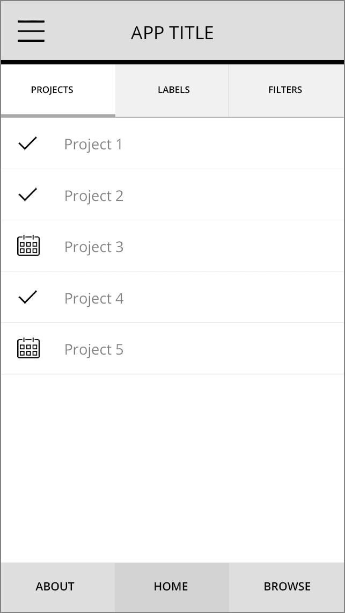

图 1.1 示例应用程序设计

首先要做的是在心理上将 UI 元素拆分成它们所代表的内容。示例原型中有一个标题栏，标题栏内包含标题和菜单按钮。标题栏下方是标签栏，标签栏内包含三个单独的标签。浏览原型其余部分，思考其他项目是什么。你正在识别的项目将被转换为组件。这是你在使用 React Native 构建 UI 时应该考虑的方法：将 UI 中的常见元素拆分成可重用组件，并相应地定义它们的接口。当你未来需要某个元素时，它将可供重用。

将 UI 元素拆分成可重用的组件有利于代码复用，同时也使得代码更具声明性和可理解性。例如，用 12 行代码实现页脚，元素可以命名为 `footer`。查看这样构建的代码，推理起来更容易，可以确切地知道正在发生什么。

图 1.2 展示了如何将 图 1.1 中的设计拆分成我刚才描述的样子。名称可以是任何对你有意义的名称。一些项目被分组在一起——我逻辑上单独分离了项目，并在概念上将组件分组。

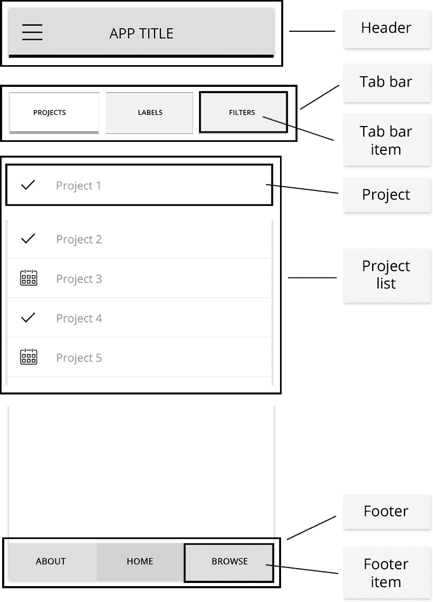

图 1.2 将应用程序结构拆分成单独的组件

接下来，让我们看看使用实际的 React Native 代码会是怎样的。首先，让我们看看主要 UI 元素在页面上的显示方式：

```
<Header />
<TabBar />
<ProjectList />
<Footer /> 
```

接下来，让我们看看子元素的外观：

```
TabBar:
      <TabBarItem  />
      <TabBarItem  />
      <TabBarItem />

ProjectList:
      // Add a Project component for each project in the list:
      <Project /> 
```

我使用了 图 1.2 中声明的名称，但它们可以是任何对你有意义的名称。

## 1.5 认可 React Native 的优势

如前所述，React Native 的主要优势之一是它使用 React。React，就像 React Native 一样，是一个由 Facebook 支持的开源项目。截至本文写作时，React 在 GitHub 上有超过 100,000 个星标和 1,100 多个贡献者——这表明项目受到了很多关注和社区参与，作为开发者或项目经理，更容易对其下注。由于 React 由 Facebook 开发、维护和使用，它拥有世界上最优秀的工程师之一来监督它，推动它向前发展，并添加新功能，因此它可能不会很快消失。

### 1.5.1 开发者可用性

随着原生移动开发者的成本上升和可用性下降，React Native 带着与原生开发相比的关键优势进入市场：它利用了现有的丰富才华横溢的 Web 和 JavaScript 开发者，并为他们提供了一个新的平台，让他们可以在不学习新语言的情况下构建应用程序。

### 1.5.2 开发者生产力

传统上，要构建跨平台移动应用程序，你需要一个 Android 团队和一个 iOS 团队。React Native 允许你使用单一编程语言 JavaScript（以及可能是一个单一团队）来构建 Android、iOS 和（很快）Windows 应用程序，这极大地减少了开发时间和开发成本，同时提高了生产力。作为一名原生开发者，来到这样一个平台的好处是你不再仅仅局限于 Android 或 iOS 开发者，这为许多机会打开了大门。这对 JavaScript 开发者来说也是个好消息，因为它允许他们在切换网页和移动项目时，能够保持一个统一的心态。这对那些传统上在 Android 和 iOS 之间分裂的团队来说也是一个胜利，因为他们现在可以基于单一代码库共同工作。为了强调这些观点，如果你使用 Redux（在第十二章中讨论）这样的工具，你可以分享你的数据架构不仅跨平台，还可以在网络上进行。

### 1.5.3 性能

如果你遵循其他跨平台解决方案，你可能已经熟悉了像 PhoneGap、Cordova 和 Ionic 这样的解决方案。尽管这些也是可行的解决方案，但普遍认为性能还没有达到原生应用程序的水平。这正是 React Native 也表现出色的地方，因为其性能通常与使用 Objective-C/Swift 或 Java 构建的原生移动应用程序没有明显区别。

### 1.5.4 单向数据流

单向数据流将 React 和 React Native 与其他大多数 JavaScript 框架以及任何 MVC 框架区分开来。React 从顶级组件开始，实现了一路到底的单向数据流（参见图 1.3）。这使得应用程序更容易推理，因为数据层有一个单一的真实来源，而不是散布在应用程序中。我们将在本书的后面更详细地探讨这一点。

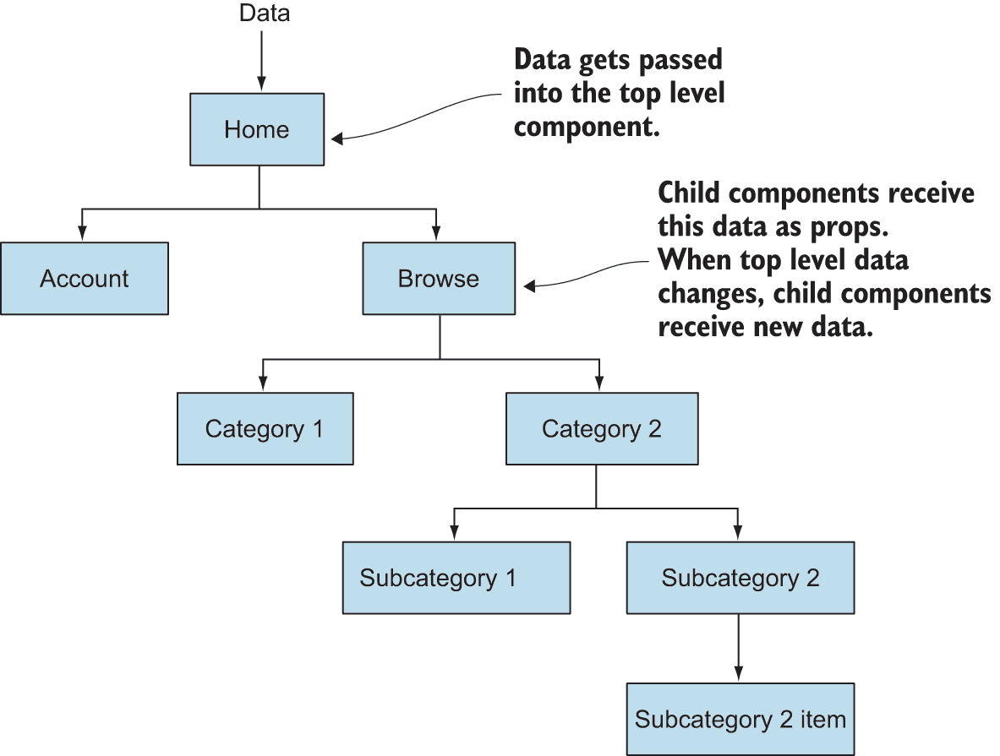

图 1.3 单向数据流的工作原理

### 1.5.5 开发者体验

开发者体验是 React Native 的一个重大优势。如果你曾经为网页开发过，你会知道浏览器快速的重载时间。网页开发没有编译步骤：只需刷新屏幕，你的更改就会出现。这与原生开发的漫长编译时间大相径庭。Facebook 决定开发 React Native 的一个原因是为了克服使用原生 iOS 和 Android 构建工具时 Facebook 应用程序漫长的编译时间。为了进行小的 UI 更改或其他更改，Facebook 开发者不得不等待很长时间，直到程序编译完成才能看到结果。漫长的编译时间会导致生产力下降和开发者成本增加。React Native 通过提供与网页、Chrome 和 Safari 调试工具相同的快速重载时间来解决这一问题，使得调试体验感觉就像在网页上一样。

React Native 还内置了一个名为 *热重载* 的功能。这意味着什么？好吧，在开发应用程序时，想象一下你需要点击几次才能到达你正在开发的地方。在使用热重载时，当你进行代码更改时，你不需要重新加载并通过应用程序点击回到当前状态。使用这个功能，你保存文件，应用程序只会重新加载你更改的组件，立即给你反馈并更新 UI 的当前状态。

### 1.5.6 转译

*转译* 通常是指一个名为 *转译器* 的工具将用一种编程语言编写的源代码转换为另一种语言的等效代码。随着新的 ECMAScript 特性和标准的兴起，转译已经扩展到包括将某些语言（在这种情况下是 JavaScript）的新版本和尚未实现的功能转换为转译后的标准 JavaScript，使得代码可以在只能处理语言较旧版本的平台上使用。

React Native 使用 Babel 来执行这个转译步骤，并且默认内置。Babel 是一个开源工具，可以将最前沿的 JavaScript 语言特性转译成今天可以使用的代码。你不需要等待语言特性被提出、批准然后实施的过程，你可以在它们进入 Babel 的时候就开始使用它们，这通常非常快。JavaScript 类、箭头函数和对象解构都是 ES2015 强大特性的例子，这些特性尚未在所有浏览器和运行时中实现；但使用 Babel 和 React Native，你可以今天就开始使用它们，无需担心它们是否能够工作。如果你喜欢使用最新的语言特性，你可以使用相同的转译过程来开发 Web 应用程序。

### 1.5.7 效率和生产力

原生移动开发变得越来越昂贵，因此能够跨平台和堆栈交付应用程序的工程师将变得越来越有价值且需求增加。一旦 React Native 或者类似的技术变得主流，使用单个框架开发桌面、Web 以及移动应用程序，那么工程团队的重组和重新思考将会发生。不再是开发者专门化于某个平台，如 iOS 或 Web，他们将负责跨平台的功能。在这个跨平台和跨堆栈工程团队的新时代，交付原生移动、Web 和桌面应用程序的开发者将更加高效和高效，因此他们可以要求比只能交付 Web 应用程序的传统 Web 开发者更高的工资。

雇佣开发者进行移动开发的公司，使用 React Native 可以获得最大的好处。所有内容都使用一种语言编写，这使得招聘变得更加容易和便宜。当团队在同一个页面上，使用单一技术工作时，生产力也会大幅提升，这简化了协作和知识共享。

### 1.5.8 社区

React 社区，以及由此扩展的 React Native 社区，是我曾经互动过的最开放和最有帮助的群体之一。当我遇到我在网上或 Stack Overflow 上搜索无法解决的问题时，我直接联系了团队成员或社区成员，并且得到了积极的反馈和帮助。

### 1.5.9 开源

React Native 是开源的。这带来了许多好处。首先，除了 Facebook 团队外，还有数百名开发者为 React Native 做出贡献。在开源软件中，比在专有软件中更快地指出错误，因为专有软件只有特定团队的工作人员负责错误修复和改进。开源通常更接近用户的需求，因为用户可以参与使软件成为他们想要的样子。考虑到购买专有软件、许可费用和支持成本，在衡量价格时，开源也更具优势。

### 立即更新

传统上，当发布应用的新版本时，您必须依赖应用商店的审批流程和日程安排。这个过程漫长而繁琐，可能需要长达两周的时间。即使是一个极小的更改，也是痛苦的，并且需要发布应用的新版本。

React Native 以及混合应用框架允许您直接将移动应用更新部署到用户的设备上，无需经过应用商店的审批流程。如果您习惯了网络和它提供的快速发布周期，现在您可以使用 React Native 和其他混合应用框架做到同样的事情。

### 其他构建跨平台移动应用的解决方案

React Native 并不是构建跨平台移动应用的唯一选择。还有多种其他选项可用，其中主要的是 Cordova、Xamarin 和 Flutter：

+   *Cordova* 实际上是一个围绕网络应用的本地壳，允许开发者访问应用内的本地 API。与传统的网络应用不同，Cordova 应用可以部署到 App Store 和 Google Play Store。使用类似 Cordova 的好处是，如果您已经是网络开发者，那么您不需要学习更多：您可以使用 HTML、JavaScript、CSS 以及您选择的 JavaScript 框架。Cordova 的主要缺点是，您将很难匹配 React Native 提供的性能和流畅的用户界面：您依赖于 DOM，因为您主要使用的是网络技术。

+   *Xamarin* 是一个框架，允许开发者使用 C# 编写的单一代码库来构建 iOS、Android、Windows 和 macOS 应用程序。Xamarin 根据目标平台的不同，以不同的方式编译成原生应用程序。Xamarin 提供了免费层，让开发者可以构建和部署移动应用程序，以及针对更大或企业公司的付费层。由于它不像 React Native 和 Cordova 那样与 Web 技术相似，Xamarin 可能会更吸引原生开发者。

+   *Flutter* 是由 Google 开源的一个框架，它使用 Dart 编程语言来构建在 iOS 和 Android 平台上运行的应用程序。

## 1.6 React Native 的缺点

既然我们已经讨论了使用 React Native 的好处，让我们看看一些可能不希望选择该框架的原因和情况。首先，与原生 iOS、Android 和 Cordova 等其他平台相比，React Native 仍然不够成熟。与原生 iOS 或 Cordova 的功能对等性尚未实现。大多数功能现在都已内置，但有时你可能需要尚未提供的功能，这意味着你必须深入研究原生代码来构建它，雇佣某人来做这件事，或者不实现该功能。

另一个需要考虑的事实是，如果你不熟悉 React，你和/或你的团队必须学习一项全新的技术。大多数人认为 React 很容易上手；但如果你已经熟练掌握 Angular 和 Ionic，例如，并且你有一个即将到来的应用程序截止日期，那么选择你已经熟悉的技术而不是花时间去学习和培训团队使用新技术可能是明智的。除了学习 React 和 React Native 之外，你还必须熟悉 Xcode 和 Android 开发环境，这可能需要一些时间来适应。

最后，React Native 是建立在现有平台 API 之上的一个抽象层。当 iOS、Android 和其他未来平台发布新版本时，可能会有一个时期 React Native 在新功能上落后，迫使你必须构建自定义实现来与这些新 API 交互，或者等待 React Native 恢复与新发布的功能对等性。

## 1.7 创建和使用基本组件

组件是 React Native 的基本构建块，它们在功能和类型上可能有所不同。常用案例中的组件包括按钮、标题、页脚和导航组件。它们的类型可以从包含自身状态和功能的完整视图，到仅从其父组件接收所有属性的单个无状态组件不等。

### 1.7.1 组件概述

正如我所说的，React Native 的核心是组件的概念。组件是数据和 UI 元素的集合，它们构成了视图，最终构成了应用程序。React Native 提供了内置组件，本书中描述为 *原生组件*，但您也可以使用框架构建自定义组件。我们将深入探讨如何构建、创建和使用组件。

如前所述，React Native 组件是使用 JSX 构建的。表 1.1 展示了 React Native 中 JSX 与 HTML 的几个基本示例。如您所见，JSX 看起来与 HTML 或 XML 类似。

表 1.1 JSX 组件与 HTML 元素对比

| **组件类型** | **HTML** | **React Native JSX** |
| --- | --- | --- |
| 文本 |

```
`<span>Hello World</span>` 
```

|

```
`<Text>Hello World</Text>` 
```

|

| 查看 |
| --- |

```
`<div>`
 `<span>Hello World 2</span>`
`</div>` 
```

|

```
`<View>`
 `<Text>Hello World 2</Text>`
`</View>` 
```

|

| 可触摸高亮 |
| --- |

```
`<button>`
 `<span>Hello World 2</span>`
`</button >` 
```

|

```
`<TouchableHighlight>`
 `<Text>Hello World 2</Text>`
`</TouchableHighlight>` 
```

|

### 1.7.2 原生组件

框架提供了一些原生组件，例如 `View`、`Text` 和 `Image` 等。您可以使用这些原生组件作为构建块来创建组件。例如，您可以使用以下标记使用 React Native 的 `TouchableHighlight` 和 `Text` 组件创建一个 `Button` 组件。

列表 1.4 创建 `Button` 组件

```
import { Text, TouchableHighlight } from 'react-native'
const Button = () => (
  <TouchableHighlight>
    <Text>Hello World</Text>
  </TouchableHighlight>
)
export default Button 
```

然后，您可以导入并使用新的按钮。

列表 1.5 导入和使用 `Button` 组件

```
import React from 'react'
import { Text, View } from 'react-native'
import Button from './components/Button'
const Home = () => (
  <View>
    <Text>Welcome to the Hello World Button!</Text>
    <Button />
  </View>
) 
```

接下来，我们将介绍组件的基本概念，组件如何适应工作流程，以及构建组件的常见用例和设计模式。

### 1.7.3 组件组合

组件通常使用 JSX 组成，但也可以使用 JavaScript 组成。在本节中，您将以几种不同的方式创建组件，以查看所有选项。您将创建以下组件：

```
<MyComponent /> 
```

此组件将“Hello World”输出到屏幕上。现在，让我们看看如何构建这个基本组件。您将用于构建此自定义组件的唯一开箱即用的组件是前面讨论过的 `View` 和 `Text` 元素。记住，`View` 组件类似于 HTML `<div>`，而 `Text` 组件类似于 HTML `<span>`。

让我们看看创建组件的几种方法。整个应用程序的组件定义不必完全一致，但通常建议您保持一致，并在整个应用程序中遵循相同的模式来定义类。

#### createClass 语法（ES5，JSX）

这是使用 ES5 语法创建 React Native 组件的方法。您可能仍然会在一些较旧的文档和示例中看到这种语法，但它现在不再被使用，并且已被弃用。本书的其余部分将专注于 ES2015 类语法，但在此处将回顾 `createClass` 语法，以防您在较旧的代码中遇到它：

```
 const React = require('react')
  const ReactNative = require('react-native')
  const { View, Text } = ReactNative

  const MyComponent = React.createClass({
    render() {
      return (
        <View>
         <Text>Hello World</Text>
        </View>)
      }
  }) 
```

#### 类语法（ES2015，JSX）

创建有状态的 React Native 组件的主要方法是使用 ES2015 类。这是您将在本书的其余部分创建有状态组件的方式，并且现在是社区和 React Native 创建者推荐的方法：

```
import  React from 'react'
import { View, Text } from ‘react-native’

class  MyComponent extends React.Component {
  render() {
    return (
      <View>
        <Text>Hello World</Text>
      </View>)
  }
} 
```

#### 无状态（可重用）组件（JSX）

自从 React 0.14 版本发布以来，我们就有能力创建*无状态*组件。我们还没有深入研究状态，但请记住，无状态组件基本上是纯函数，不能修改自己的数据，也不包含自己的状态。这种语法比`class`或`createClass`语法更简洁：

```
import React from 'react'
import { View, Text } from 'react-native'

const MyComponent = () => (
  <View>
    <Text>Hello World</Text>
  </View>
)

or 

import React from 'react'
import { View, Text } from 'react-native'

function MyComponent () {
  return <View><Text>HELLO FROM STATELESS</Text></View>
} 
```

#### createElement (JavaScript)

`React.createElement`很少使用，你可能永远不需要使用这种语法来创建 React Native 元素。但如果你需要更多控制创建组件的方式，或者你在阅读别人的代码时，它可能会很有用。它还会让你了解 JavaScript 如何编译 JSX。`React.createElement`接受几个参数：

```
React.createElement(type, props, children) {} 
```

让我们逐一了解它们：

+   `type`—你想要渲染的元素

+   `props`—你希望组件拥有的任何属性

+   `children`—子组件或文本

在以下示例中，你将视图作为第一个参数传递给`React.createElement`的第一个实例，将一个空对象作为第二个参数，并将另一个元素作为最后一个参数。在第二个实例中，你将文本作为第一个参数，将一个空对象作为第二个参数，并将“Hello”作为最后一个参数：

```
 class MyComponent extends React.Component {
  render() {
       return (
        React.createElement(View, {},
          React.createElement(Text, {}, "Hello")
        )        
      )
    }
  } 
```

这与以下声明组件的方式相同：

```
class MyComponent extends React.Component {
  render () {
    return (
      <View>
        <Text>Hello</Text>
      </View>
    )
  }
} 
```

### 1.7.4 可导出组件

接下来，让我们看看另一个更深入的 React Native 组件实现。你将创建一个可以导出并在另一个文件中使用的完整组件：

```
import React, { Component } from 'react'
import {
  Text,
  View
} from 'react-native'

class Home extends Component {
  render() {
    return (
      <View>
        <Text>Hello from Home</Text>
      </View>)
  }
}

export default Home 
```

让我们逐一了解组成这个组件的各个部分，并讨论正在发生的事情。

#### 导入

以下代码导入了 React Native 变量声明：

```
import React, { Component } from 'react'
import {
    Text,
    View
} from 'react-native' 
```

这里，你使用默认导入直接从 React 库中导入 React，并使用命名导入从 React 库中导入`Component`。你还使用命名导入将`Text`和`View`拉入你的文件。

使用 ES5 的`import`语句看起来像这样：

```
var React = require('react') 
```

如果不使用命名导入，这个语句看起来像这样：

```
import React = from 'react'
const Component = React.Component
import ReactNative from 'react-native'
const Text = ReactNative.Text
const View = ReactNative.View 
```

`import`语句用于导入已从另一个模块、文件或脚本中导出的函数、对象或变量。

#### 组件声明

以下代码声明了组件：

```
class Home extends Component { } 
```

这里你通过扩展它并命名为`Home`来创建一个 React Native `Component`类的新实例。之前，你声明了`React.Component`；现在你只是声明了`Component`，因为你已经在对象解构语句中导入了`Component`元素，这样你就可以访问`Component`，而不是必须调用`React.Component`。

#### 渲染方法

接下来，看看`render`方法：

```
render() {
  return (
    <View>
      <Text>Hello from Home</Text>
    </View>)
} 
```

组件的代码在`render`方法中执行，`return`语句之后的内容返回的是屏幕上渲染的内容。当调用`render`方法时，它应该返回一个单一子元素。任何在`render`函数外部声明的变量或函数都可以在这里执行。如果你需要进行任何计算，可以使用状态或属性声明任何变量，或者运行不操作组件状态的任何函数，你可以在`render`方法和`return`语句之间这样做。

#### 导出

现在，将组件导出以在应用程序的其他地方使用：

```
 export default Home 
```

如果你想在同一文件中使用组件，你不需要导出它。在声明之后，你可以在文件中使用它，或者将其导出到其他文件中使用。你也可以使用`module.exports = 'Home'`，这是 ES5 语法。

### 1.7.5 组合组件

让我们看看如何组合组件。首先，在单个文件中创建`Home`、`Header`和`Footer`组件。首先创建`Home`组件：

```
import React, { Component } from 'react'
import {
    Text,
    View
} from 'react-native'

class Home extends Component {
  render() {
    return (
      <View>

      </View>)
    }
 } 
```

在同一文件中，在`Home`类声明下方，构建一个`Header`组件：

```
class Header extends Component {
    render() {
      return <View>
               <Text>HEADER</Text>
             </View>
    }
  } 
```

这看起来不错，但让我们看看如何将`Header`重写为无状态组件。我们将在本书的后面深入讨论何时以及为什么使用无状态组件比常规 React Native 类更好。正如你将开始看到的那样，当你使用无状态组件时，语法和代码要干净得多：

```
const Header = () => (
  <View>
    <Text>HEADER</Text>
  </View>
) 
```

现在，将`Header`插入到`Home`组件中：

```
 class Home extends Component {
    render() {
 return (
       <View>
         <Header />
       </View>
     )
   }
 } 
```

创建一个`Footer`和一个`Main`视图：

```
const Footer = () => (
  <View>
    <Text>Footer</Text>
  </View>
)

const Main = () => (
  <View>
    <Text> Main </Text>
  </View>
) 
```

现在，将这些组件添加到你的应用程序中：

```
class Home extends Component {
  render() {
    return (
      <View>
        <Header />
        <Main />
        <Footer />
      </View>
    )
  }
} 
```

你刚才编写的代码非常声明式，这意味着它是这样编写的，它描述了你想要做什么，并且单独理解起来很容易。这是你对如何在 React Native 中创建组件和视图的高级概述，但应该能给你一个关于基础知识如何工作的良好概念。

## 1.8 创建起始项目

现在我们已经详细介绍了许多关于 React Native 的内容，让我们深入一些代码。我们将专注于使用 React Native CLI 构建应用程序，但你也可以使用 Create React Native App CLI 创建新项目。

### 1.8.1 创建 React Native App CLI

你可以使用 Create React Native App CLI 创建 React Native 项目，这是一个由 React 社区 GitHub 仓库维护的项目生成器，主要由 Expo 团队维护。Expo 创建了 React Native App 项目，作为一种让开发者能够无需担心安装所有与使用 CLI 运行 React Native 项目相关的原生 SDK 的方式，快速开始使用 React Native。

要使用 Create React Native App 创建新项目，首先安装 CLI：

```
npm install -g create-react-native-app 
```

这是使用命令行中的`create-react-native-app`创建新项目的方法：

```
create-react-native-app myProject 
```

### 1.8.2 React Native CLI

在我们继续之前，请检查这本书的附录以验证您是否已在您的机器上安装了必要的工具。如果您没有安装所需的 SDK，您将无法继续使用 React Native CLI 构建您的第一个项目。

要开始使用 React Native 启动项目和 React Native CLI，请打开命令行，然后创建并导航到一个空目录。一旦到达那里，通过输入以下内容全局安装 react-native CLI：

```
npm install -g react-native-cli 
```

在 React Native 安装到您的机器上后，您可以通过输入`react-native init`后跟项目名称来初始化一个新的项目：

```
react-native init myProject 
```

`myProject`可以是您选择的任何名称。CLI 将在您所在的任何目录中启动一个新的项目。在文本编辑器中打开项目。

首先，让我们看看这个过程为您生成的主文件和文件夹：

+   *android* —此文件夹包含所有 Android 平台特定的代码和依赖项。除非您正在实现自定义桥接至 Android 或安装需要某种深度配置的插件，否则您不需要进入此文件夹。

+   *ios* —此文件夹包含所有 iOS 平台特定的代码和依赖项。除非您正在实现自定义桥接至 iOS 或安装需要某种深度配置的插件，否则您不需要进入此文件夹。

+   *node_modules* —React Native 使用*npm*（node 包管理器）来管理依赖项。这些依赖项在.package.json 文件中标识和版本化，并存储在 node_modules 文件夹中。当您从 npm/node 生态系统安装任何新包时，它们将在这里。这些可以使用 npm 或 yarn 安装。

+   *.flowconfig* —Flow（也被 Facebook 开源）为 JavaScript 提供类型检查。如果您熟悉 TypeScript，Flow 就像 TypeScript 一样。此文件是 flow 的配置文件，如果您选择使用它。

+   *.gitignore* —这是存储您不想在版本控制中包含的任何文件路径的地方。

+   *.watchmanconfig* —Watchman 是 React Native 用来监视文件并记录它们何时更改的文件监视器。这是 Watchman 的配置文件。除非在罕见的使用情况下，否则不需要对此文件进行更改。

+   *index.js* —这是应用程序的入口点。在此文件中，导入 App.js 并调用`AppRegistry.registerComponent`，初始化应用程序。

+   *App.js* —这是在 index.js 中使用的默认主导入，包含基本项目。您可以通过删除此文件并在 index.js 中替换主导入来更改它。

+   *package.json* —此文件包含您的 npm 配置。当您使用 npm 安装文件时，您可以将其保存为依赖项。您还可以设置脚本来运行不同的任务。

以下列表显示了 App.js。

列表 1.6 App.js

```
/**
 * Sample React Native App
 * https://github.com/facebook/react-native
 * @flow
 */

import React, { Component } from 'react';
import {
  Platform,
  StyleSheet,
  Text,
  View
} from 'react-native';

const instructions = Platform.select({
  ios: 'Press Cmd+R to reload,\n' +
    'Cmd+D or shake for dev menu',
  android: 'Double tap R on your keyboard to reload,\n' +
    'Shake or press menu button for dev menu',
});

export default class App extends Component<{}> {
  render() {
    return (
      <View style={styles.container}>
        <Text style={styles.welcome}>
          Welcome to React Native!
        </Text>
        <Text style={styles.instructions}>
          To get started, edit App.js
        </Text>
        <Text style={styles.instructions}>
          {instructions}
        </Text>
 </View>
    );
  }
}

const styles = StyleSheet.create({
  container: {
    flex: 1,
    justifyContent: 'center',
    alignItems: 'center',
    backgroundColor: '#F5FCFF',
  },
  welcome: {
    fontSize: 20,
    textAlign: 'center',
    margin: 10,
  },
  instructions: {
    textAlign: 'center',
    color: '#333333',
    marginBottom: 5,
  },
}); 
```

这段代码看起来与我们在上一节中讨论的内容非常相似。有几个您尚未见过的新的项目：

```
StyleSheet
Platform 
```

`Platform` 是一个 API，它允许你检测你正在运行的当前操作系统类型：Web、iOS 或 Android。

`StyleSheet` 是类似于 CSS 样式表的抽象。在 React Native 中，你可以声明样式，要么是内联的，要么使用样式表。正如你在第一个视图中看到的，容器样式被声明：

```
<View style={styles.container}> 
```

这直接对应于

```
container: {
    flex: 1,
    justifyContent: 'center',
    alignItems: 'center',
    backgroundColor: '#F5FCFF',
} 
```

在 index.js 文件的底部，你可以看到

```
AppRegistry.registerComponent('myProject', () => App); 
```

这是运行所有 React Native 应用的 JavaScript 入口点。在 index 文件中，你将唯一调用此函数。应用的主组件应该通过 `AppRegistry.registerComponent` 进行注册。原生系统可以加载应用的包并在准备就绪时运行应用。

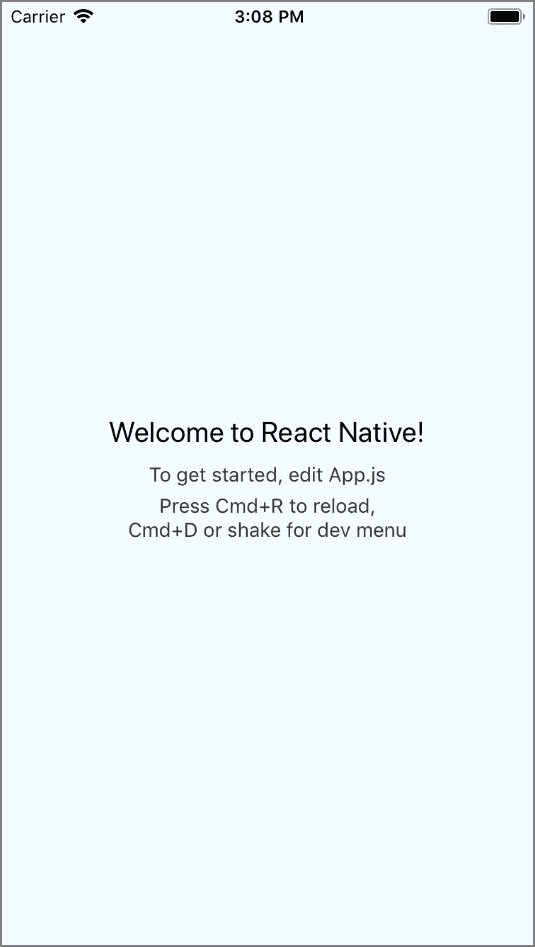

图 1.4 React Native 入门项目：在模拟器上运行入门项目后你应该看到的内容

现在我们已经了解了文件中的内容，请在你的 iOS 模拟器或 Android 模拟器上运行项目（参见 图 1.4）。在包含“欢迎使用 React Native”文本的文本元素中，输入“欢迎使用 Hello World！”或其他你选择的文本。刷新屏幕，你应该能看到你的更改。

## 摘要

+   React Native 是一个使用 React JavaScript 库在 JavaScript 中构建原生移动应用的框架。

+   React Native 的一些优势包括其性能、开发者体验、使用单一语言构建跨平台应用的能力、单向数据流和社区。你可能会考虑使用 React Native 而不是混合应用主要是因为其性能，以及使用 Native 而不是 React Native 主要是因为开发者体验和单一语言的跨平台能力。

+   JSX 是一个预处理步骤，它为 JavaScript 添加了类似 XML 的语法。你可以在 React Native 中使用 JSX 创建 UI。

+   组件是 React Native 的基本构建块。它们的功能和类型可能不同。你可以创建自定义组件以实现常见的设计元素。

+   需要使用 JavaScript 类通过扩展 `React.Component` 类来创建需要状态或生命周期方法的组件。

+   无状态组件可以通过为不需要维护自身状态的组件创建更少的样板代码来创建。

+   可以通过组合较小的子组件来创建较大的组件。

# 2

理解 React

*****本章*** ***涵盖*****

+   状态是如何工作的以及为什么它很重要

+   属性是如何工作的以及为什么它们很重要

+   理解 React 组件规范

+   实现 React 生命周期方法

现在我们已经了解了基础知识，是时候深入探讨构成 React 和 React Native 的其他一些基本组成部分了。我们将讨论如何管理状态和数据，以及数据是如何在应用中传递的。我们还将通过演示如何在组件之间传递属性（props）以及如何从上到下操作这些属性来进一步深入。

在你掌握了关于状态和属性的知识后，我们将更深入地探讨如何使用内置的 React 生命周期方法。这些方法允许你在组件创建或销毁时执行某些操作。理解它们是理解 React 和 React Native 的工作原理以及如何充分利用框架的关键。生命周期方法也是 React 和 React Native 中概念上最大的部分。

## 2.1 使用状态管理组件数据

在 React 或 React Native 组件中创建和管理数据的一种方式是使用状态。组件创建时声明状态，其结构是一个普通的 JavaScript 对象。状态可以在组件内部使用名为 `setState` 的函数进行更新，我们将在稍后深入了解。

处理数据的另一种方式是使用属性。属性在组件创建时作为参数传递；与状态不同，它们不能在组件内部更新。

### 2.1.1 正确操作组件状态

*状态* 是组件管理的一组值。React 将 UI 视为简单的状态机。当组件使用 `setState` 函数改变状态时，React 会重新渲染该组件。如果任何子组件作为属性继承了此状态，那么所有子组件也会被重新渲染。

当使用 React Native 构建应用程序时，理解状态的工作原理是基础，因为状态决定了有状态组件的渲染和行为。组件状态允许你创建动态和交互式的组件。在区分状态和属性时，需要理解的主要点是状态是可变的，而属性是不可变的。

#### 设置 *初始状态*

状态在组件创建时通过构造函数或属性初始化器初始化。一旦状态初始化，它就作为 `this.state` 在组件中可用。以下列表展示了示例。

列表 2.1 使用属性初始化器设置状态

```
import React from 'react'

class MyComponent extends React.Component {
  state = {
    year: 2016,
    name: 'Nader Dabit',
    colors: ['blue']
  }

  render() {
    return (
      <View>
        <Text>My name is: { this.state.name }</Text>
 <Text>The year is: { this.state.year }</Text>
        <Text>My colors are { this.state.colors[0] }</Text>
      </View>
    )
  }
`}` 
```

`constructor` 函数在 JavaScript 类实例化时被调用，如以下列表所示。这不是一个 React 生命周期方法，而是一个常规的 JavaScript 类方法。

列表 2.2 使用构造函数设置状态

```
import React {Component} from 'react'

class MyComponent extends Component {
  constructor(){
    super()
    this.state = {
      year: 2016,
      name: 'Nader Dabit',
      colors: ['blue']
    }
  }    
  render() {
    return (
      <View>
        <Text>My name is: { this.state.name }</Text>
        <Text>The year is: { this.state.year }</Text>
        <Text>My colors are { this.state.colors[0] }</Text>
      </View>
    )
  }
} 
```

构造函数和属性初始化器的工作方式完全相同，你使用哪种方法取决于个人喜好。

#### 更新状态

可以通过调用 `this.setState(object)` 来更新状态，传入一个包含你想要使用的新状态的对象。`setState` 会将前一个状态与当前状态合并，所以如果你只传入一个单项（键值对），其余的状态将保持不变，而状态中的新项将被覆盖。

让我们看看如何使用 `setState`（参见列表 2.3）。为此，我们将引入一个新的方法，一个名为 `onPress` 的触摸处理程序。`onPress` 可以在几种“可触摸”的 React Native 组件上调用，但在这里你将把它附加到一个 `Text` 组件上，以便从这个基本示例开始。当文本被按下时，你将调用一个名为 `updateYear` 的函数，以使用 `setState` 更新状态。这个函数将在 `render` 函数之前定义，因为通常最好在 `render` 方法之前定义任何自定义方法，但请注意，函数定义的顺序不会影响实际的功能。

列表 2.3 更新状态

```
import React {Component} from 'react'

class MyComponent extends Component {
    constructor(){
      super()
      this.state = {
        year: 2016,
      }
    }
    updateYear() {
      this.setState({
        year: 2017
      })
    }  
    render() {
      return (
        <View>
          <Text
            onPress={() => this.updateYear()}>
            The year is: { this.state.year }
          </Text>
        </View>
      )
    }
 } 
```

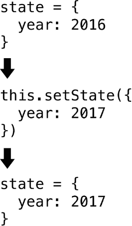

图 2.1 `setState` 的流程，箭头指示文本元素被按下时。在构造函数中，状态 `year` 属性被初始化为 2016。每次按下文本时，状态 `year` 属性被设置为 2017。

图 2.1 展示了每次按下列表 2.3 中的文本元素时状态是如何更新的。每次调用 `setState`，React 都会重新渲染组件（再次调用 `render` 方法）以及任何子组件。调用 `this.setState` 是改变状态变量并再次触发 `render` 方法的途径，因为直接改变状态变量不会触发组件的重新渲染，因此 UI 中不会看到任何变化。初学者常见的错误是直接更新状态变量。例如，以下代码在尝试更新状态时不起作用——`state` 对象被更新了，但由于没有调用 `setState` 且组件没有重新渲染，UI 不会更新：

```
class MyComponent extends Component {
  constructor(){
    super()
    this.state = {
      year: 2016,
    }
  }
  updateYear() {
    this.state.year = 2017 
  }  
  render() {
    return (
      <View>
        <Text
          onPress={() => this.updateYear()}>
          The year is: { this.state.year }
        </Text>
      </View>
    )
  }
} 
```

但在 React 中有一个方法可以在状态变量改变后强制更新，就像前面的代码片段中那样。这个方法叫做 `forceUpdate`；参见列表 2.4。调用 `forceUpdate` 会导致组件上的 `render` 被调用，从而触发 UI 的重新渲染。使用 `forceUpdate` 通常不是必需的或推荐的，但了解它在示例或文档中可能会遇到是有好处的。大多数情况下，这种重新渲染可以通过其他方法来处理，例如调用 `setState` 或传入新的 props。

列表 2.4 使用 `forceUpdate` 强制重新渲染

```
class MyComponent extends Component {
  constructor(){
    super()
    this.state = {
      year: 2016
    }
  }
  updateYear() {
    this.state.year = 2017 
  }
  update() {
    this.forceUpdate()
  }
  render() {
    return (
      <View>
 <Text onPress={ () => this.updateYear() }>
            The year is: { this.state.year }
          </Text>
          <Text
           onPress={ () => this. update () }>Force Update
          </Text>
      </View>
    )
  }
} 
```

现在我们已经了解了如何使用基本字符串来处理状态，让我们看看其他几种数据类型。你将把布尔值、数组和对象附加到状态中，并在组件中使用它。你还将根据状态中的布尔值有条件地显示组件。

列表 2.5 使用其他数据类型的状态

```
class MyComponent extends Component {
    constructor(){
      super()
      this.state = {
        year: 2016,
        leapYear: true,
        topics: ['React', 'React Native', 'JavaScript'],
        info: {
          paperback: true,
          length: '335 pages',
          type: 'programming'
        }
      }
    }
    render() {
      let leapyear = <Text>This is not a leapyear!</Text>
      if (this.state.leapYear) {
        leapyear = <Text>This is a leapyear!</Text>
      }
      return (
        <View>
          <Text>{ this.state.year }</Text>
          <Text>Length: { this.state.info.length }</Text>
          <Text>Type: { this.state.info.type }</Text>
          { leapyear }
        </View>
      )
    }
} 
```

## 2.2 使用 props 管理组件数据

*属性*（简称 *属性*）是组件继承的值或属性，它们是从父组件传递下来的。属性在声明时可以是静态或动态值，但在继承时是不可变的；它们只能通过更改它们声明和传递的顶层初始值来更改。React 的 “React 思维” 文档说，属性最好解释为“从父组件到子组件传递数据的一种方式。” 表 2.1 突出了属性和状态之间的一些差异和相似之处。

表 2.1 属性与状态

| **属性** | **状态** |
| --- | --- |
| 外部数据 | 内部数据 |
| 不可变 | 可变 |
| 从父组件继承 | 在组件内部创建 |
| 可以由父组件更改 | 只能在组件内部更新 |
| 可以作为属性向下传递 | 可以作为属性向下传递 |
| 在组件内部无法更改 | 在组件内部可以更改 |

解释属性工作原理的一个好方法是展示一个示例。以下列表声明了一个 `book` 值并将其作为静态属性传递给子组件。

列表 2.6 静态属性

```
class MyComponent extends Component {
  render() {
    return (
      <BookDisplay book="React Native in Action" />
    )
  }
}
class BookDisplay extends Component {
  render() {
    return (
      <View>
        <Text>{ this.props.book }</Text>
      </View>
    )
  }
} 
```

此代码创建了两个组件：`<MyComponent />` 和 `<BookDisplay />`。当你创建 `<BookDisplay />` 时，你传递一个名为 `book` 的属性并将其设置为字符串 “React Native in Action”。以这种方式传递的任何属性都可在子组件上作为 `this.props` 使用。

你也可以使用大括号和字符串值，就像下面的示例那样，以变量的方式传递字面量。

列表 2.7 显示静态属性

```
class MyComponent extends Component {
  render() {
    return (
      <BookDisplay book={"React Native in Action"} />
    )
  }
}
class BookDisplay extends Component {
  render() {
    return (
      <View>
        <Text>{ this.props.book }</Text>
      </View>
    )
  }
} 
```

#### 动态属性

接下来，将一个动态属性传递给组件。在 `render` 方法中，在 `return` 语句之前，声明一个变量 `book` 并将其作为属性传递。

列表 2.8 动态属性

```
class MyComponent extends Component {
    render() {
      let book = 'React Native in Action'
      return (
        <BookDisplay book={ book } />
      )
    }
  }

class BookDisplay extends Component {
  render() {
    return (
      <View>
        <Text>{ this.props.book }</Text>
      </View>
    )
  }
} 
```

现在，使用状态将一个动态属性传递给组件。

列表 2.9 使用状态动态属性

```
class MyComponent extends Component {
  constructor() {
    super()
    this.state = {
      book: 'React Native in Action'
 }
  }
  render() {
    return (
      <BookDisplay book={this.state.book} />
    )
  }
}
class BookDisplay extends Component {
  render() {
    return (
      <View>
        <Text>{ this.props.book }</Text>
      </View>
    )
  }
} 
```

接下来，让我们看看如何更新状态以及随之而来的将作为属性传递给 `BookDisplay` 的值。记住，属性是不可变的，所以你需要更改父组件（`MyComponent`）的状态，这将向 `BookDisplay` 的 `book` 属性提供一个新值并触发组件及其子组件的重新渲染。将这个想法分解成单独的部分，以下是需要执行的操作：

1.  声明状态变量：

```
this.state = {
  book: 'React Native in Action'
} 
```

1.  编写一个函数来更新状态变量：

```
updateBook() {
  this.setState({
    book: 'Express in Action'
  })
} 
```

1.  将函数和状态作为属性传递给子组件：

```
<BookDisplay 
  updateBook={ () => this.updateBook() } 
  book={ this.state.book } /> 
```

1.  将函数附加到子组件中的触摸处理程序：

```
<Text onPress={ this.props.updateBook }> 
```

现在你已经知道了所需的组件，你可以编写代码来实现这一功能。你将使用前一个示例中的组件并添加新的功能。

列表 2.10 更新动态属性

```
class MyComponent extends Component {
  constructor(){
    super()
 this.state = {
      book: 'React Native in Action'
    }
  }
  updateBook() {
    this.setState({
    book: 'Express in Action'
    })
  }
  render() {
    return (
      <BookDisplay 
       updateBook={ () => this.updateBook() } 
       book={ this.state.book } />
    )
  }
}
class BookDisplay extends Component {
  render() {
    return (
      <View>
        <Text 
         onPress={ this.props.updateBook }>
          { this.props.book }
        </Text>
      </View>
    )
  }
} 
```

#### 属性和状态的解构

持续引用状态和 props 为`this.state`和`this.props`可能会变得重复，违反了我们许多人试图遵循的 DRY（不要重复自己）原则。为了解决这个问题，你可以尝试使用解构。*解构*是作为 ES2015 规范的一部分添加到 JavaScript 中的新特性，并在 React Native 应用程序中可用。基本思想是你可以从对象中提取属性并将它们用作应用程序中的变量：

```
const person = { name: 'Jeff', age: 22 }

const { age } = person

console.log(age)   #22 
```

按照下面的示例使用解构编写组件。

列表 2.11 解构状态和 props

```
class MyComponent extends Component {
  constructor(){
    super()
    this.state = {
      book: 'React Native in Action'
    }
 }
  updateBook() {
    this.setState({ book: 'Express in Action' })
  }
  render() {
    const { book } = this.state
    return (
      <BookDisplay 
       updateBook={ () => this.updateBook() } 
       book={ book } />
    )
  }
}
class BookDisplay extends Component {
  render() {
    const { book, updateBook } = this.props
    return (
      <View>
        <Text 
         onPress={ updateBook }>
          { book }
        </Text>
      </View>
    )
  }
} 
```

当引用书籍时，你不再需要在组件中引用`this.state`或`this.props`；相反，你已经从状态和 props 中提取了`book`变量，可以直接引用该变量。这开始变得更有意义，并且随着状态和 props 变得更大更复杂，你的代码也会变得更加清晰。

#### 使用无状态组件的 props

由于无状态组件只需要关注 props 而没有自己的状态，因此在创建可重用组件时它们可以非常有用。让我们看看 props 如何在无状态组件中使用。

要使用无状态组件访问 props，将`props`作为函数的第一个参数传递。

列表 2.12 使用无状态组件的 props

```
const BookDisplay = (props) => {
  const { book, updateBook } = props
  return (
    <View>
      <Text 
        onPress={ updateBook }>
        { book }
      </Text>
    </View>
  )
} 
```

你也可以在函数参数中解构 props。

列表 2.13 在无状态组件中解构 props

```
const BookDisplay = ({ updateBook, book }) => {
  return (
    <View>
      <Text 
        onPress={ updateBook }>
        { book }
      </Text>
    </View>
  )
 } 
```

这样看起来更美观，并且清理了很多不必要的代码！你应该尽可能使用无状态组件，简化你的代码库和逻辑。

#### 将数组和对象作为 props 传递

其他数据类型的工作方式与你预期的一样。例如，要传递一个数组，你将数组作为 prop 传递。要传递一个对象，你将对象作为 prop 传递。让我们看看一个基本示例。

列表 2.14 将其他数据类型作为 props 传递

```
class MyComponent extends Component {
  constructor(){
    super()
    this.state = {
      leapYear: true,
      info: {
        type: 'programming'
      }
    }
  }
  render() {
    return (
      <BookDisplay 
       leapYear={ this.state.leapYear }
       info={ this.state.info }
       topics={['React', 'React Native', 'JavaScript']} />
    )
  }
}
const BookDisplay = (props) => {
  let leapyear
  let { topics } = props
  const { info } = props 
  topics = topics.map((topic, i) => {
    return <Text>{ topic }</Text>
 })
  if (props.leapYear) {
    leapyear = <Text>This is a leapyear!</Text>
  }
  return (
    <View>
         { leapyear }
         <Text>Book type: { info.type }</Text>
         { topics }
    </View>
  )
} 
```

## 2.3 React 组件规范

当创建 React 和 React Native 组件时，你可以挂钩到几个规范和生命周期方法来控制组件中的行为。在本节中，我们将讨论它们，并给你一个很好的理解，了解每个方法做什么以及何时应该使用它们。

首先，我们将介绍组件规范的基础知识。组件规范基本上概述了组件应该如何对组件生命周期中发生的不同事件做出反应。规范如下：

+   `render`方法

+   `constructor`方法

+   `statics`对象，用于定义类可用的静态方法

### 2.3.1 使用 render 方法创建 UI

`render`方法是组件规范中创建组件时唯一必需的方法。它必须返回单个子元素、`null`或`false`。这个子元素可以是你在组件中声明的组件（如`View`或`Text`组件），或者另一个你定义的组件（比如你创建并导入到文件中的`Button`组件）：

```
render() {
  return (
    <View>
      <Text>Hello</Text>
    </View>
  )
} 
```

你可以使用带或不带括号的`render`方法。如果你不使用括号，那么返回的元素当然必须与`return`语句在同一行：

```
render() {
  return <View><Text>Hello</Text></View> 
} 
```

`render`方法也可以返回在别处定义的另一个组件：

```
render() {
   return <SomeComponent />
}
#or
render() {
   return (
     <SomeComponent />
   )
} 
```

你也可以在`render`方法中检查条件，执行逻辑，并根据它们的值返回组件：

```
render() {
  if(something === true) {
    return <SomeComponent />
  } else return <SomeOtherComponent />
} 
```

### 2.3.2 使用属性初始化器和构造函数

状态可以在构造函数中创建或使用*属性初始化器*。属性初始化器是 JavaScript 语言的 ES7 规范，但它们与 React Native 无缝配合工作。它们提供了一种简洁的方法来在 React 类中声明状态：

```
class MyComponent extends React.Component {
  state = {
    someNumber: 1,
    someBoolean: false
  } 
```

你也可以使用`constructor`方法在类中使用时设置初始状态。类以及`constructor`函数的概念并不特定于 React 或 React Native；它是一个 ES2015 规范，并且只是 JavaScript 现有基于原型的继承之上创建和初始化对象的语法糖。你还可以在构造函数中通过使用`this.property`语法（`property`是属性的名称）为组件类设置其他属性。关键字`this`指的是你当前所在的类实例：

```
constructor(){
  super()
  this.state = {
    someOtherNumber: 19,
    someOtherBoolean: true
  }
  this.name = 'Hello World'
  this.type = 'class'
  this.loaded = false
} 
```

当使用构造函数创建 React 类时，你必须在使用`this`关键字之前使用`super`关键字，因为你正在扩展另一个类。此外，如果你需要在构造函数中访问任何 props，它们必须作为参数传递给构造函数，并在`super`调用中。

根据 props 设置状态通常不是好的做法，除非你故意为组件的内部功能设置某种类型的种子数据，因为如果数据被更改，状态将不再在组件之间保持一致性。状态仅在组件首次挂载或创建时创建。如果你使用不同的 prop 值重新渲染相同的组件，那么已经挂载的该组件实例将不会使用新的 prop 值来更新状态。

以下示例显示了在构造函数中使用 props 设置状态值。假设你最初将“Nader Dabit”作为 props 传递给组件：状态中的`fullName`属性将是“Nader Dabit”。如果组件随后被重新渲染为“Another Name”，则构造函数不会再次被调用，因此`fullName`的状态值将保持为“Nader Dabit”：

```
constructor(props){
   super(props)
   this.state = {
     fullName: props.first + ' ' + props.last,
   }
 } 
```

## 2.4 React 生命周期方法

在组件的生命周期中，各种方法会在特定的点被调用：这些被称为 *生命周期方法*。理解它们是如何工作的很重要，因为它们允许你在组件的创建和销毁的不同点执行特定的操作。例如，假设你想进行一个返回一些数据的 API 调用。你可能想确保组件已经准备好渲染这些数据，所以你会在组件挂载后，在名为 `componentDidMount` 的方法中进行 API 调用。在本节中，我们将介绍生命周期方法，并解释它们是如何工作的。

一个 React 组件的生命周期分为三个阶段：创建（挂载）、更新，以及删除（卸载）。在这三个阶段中，你可以钩入三组生命周期方法：

+   *挂载（创建）* —当组件被创建时，一系列生命周期方法会被触发，你有选择性地钩入任何一个或所有这些方法：`constructor`、`getDerivedStateFromProps`、`render` 和 `componentDidMount`。你迄今为止使用的一个这样的方法是 `render`，它渲染并返回一个 UI。

+   *更新* —当组件更新时，更新生命周期方法会被触发：`getDerivedStateFromProps`（当属性改变时）、`shouldComponentUpdate`、`render`、`getSnapshotBeforeUpdate` 和 `componentDidUpdate`。更新可以通过两种方式之一发生：

+   当在组件内部调用 `setState` 或 `forceUpdate` 时

+   当将新的属性传递到组件中

+   *卸载* —当组件被卸载（销毁）时，会触发一个最终的生命周期方法：`componentWillUnmount`。

### 2.4.1 `getDerivedStateFromProps` 静态方法

`getDerivedStateFromProps` 是一个静态类方法，在组件创建时以及接收到新属性时都会被调用。这个方法接收新的属性和最新的状态作为参数，并返回一个对象。对象中的数据会被更新到状态中。以下列表展示了一个示例。

列表 2.15 `static getDerivedStateFromProps`

```
export default class App extends Component {
  state = {
    userLoggedIn: false
  }
  static getDerivedStateFromProps(nextProps, nextState) {
    if (nextProps.user.authenticated) {
      return {
        userLoggedIn: true
      }
    }
    return null
  }
  render() {
    return (
      <View style={styles.container}>
        {
          this.state.userLoggedIn && (
            <AuthenticatedComponent />>
          )
        }
      </View>
    );
  }
} 
```

### 2.4.2 `componentDidMount` 生命周期方法

`componentDidMount` 只会被调用一次，在组件加载完毕之后。这个方法是一个很好的地方来使用 AJAX 调用获取数据，执行 `setTimeout` 函数，以及与其他 JavaScript 框架集成。

列表 2.16 `componentDidMount`

```
class MainComponent extends Component {
  constructor() {
    super()
    this.state = { loading: true, data: {} }
  }
  componentDidMount() {
      #simulate ajax call
    setTimeout(() => {
      this.setState({
        loading: false,
        data: {name: 'Nader Dabit', age: 35}
 })
    }, 2000)
  }
  render() {
    if(this.state.loading) {
      return <Text>Loading</Text>
    }
    const { name, age } = this.state.data
    return (
      <View>
        <Text>Name: {name}</Text>
        <Text>Age: {age}</Text>
      </View>
    )
  }
} 
```

### 2.4.3 `shouldComponentUpdate` 生命周期方法

`shouldComponentUpdate` 返回一个布尔值，让你决定组件何时渲染。如果你知道新的状态或属性不会要求组件或其子组件进行渲染，你可以返回 `false`。如果你想使组件重新渲染，返回 `true`。

列表 2.17 `shouldComponentUpdate`

```
class MainComponent extends Component {
   shouldComponentUpdate(nextProps, nextState) {
     if(nextProps.name !== this.props.name) {
       return true
     }
     return false
   }
   render() {
     return <SomeComponent />
   }
 } 
```

### 2.4.4 `componentDidUpdate` 生命周期方法

`componentDidUpdate` 在组件更新和重新渲染后被立即调用。你将获得前一个状态和前一个属性作为参数。

列表 2.18 `componentDidUpdate`

```
class MainComponent extends Component {
   componentDidUpdate(prevProps, prevState) {
     if(prevState.showToggled === this.state.showToggled) {
          this.setState({
         showToggled: !showToggled
       })
     }
   }
 render() {
     return <SomeComponent />
   }
 } 
```

### 2.4.5 `componentWillUnmount` 生命周期方法

`componentWillUnmount`在组件从应用程序中移除之前被调用。在这里，你可以执行任何必要的清理工作，移除监听器，并移除在`componentDidMount`中设置的计时器。

列表 2.19 componentWillUnmount

```
class MainComponent extends Component { 

   handleClick() {
      this._timeout = setTimeout(() => {
        this.openWidget();
      }, 2000);
    }
    componentWillUnmount() {
      clearTimeout(this._timeout); 
    }
    render() {
      return <SomeComponent 
               handleClick={() => this.handleClick()} />
    }
} 
```

## 概述

+   状态是处理 React 组件中数据的一种方式。更新状态会重新渲染组件的 UI 以及任何依赖于这些数据的子组件。

+   属性（props）是通过 React Native 应用程序向下传递数据到子组件的方式。更新 props 会自动更新接收相同 props 的任何组件。

+   React 组件规范是一组在 React 组件中的方法和属性，它指定了组件的声明。在创建 React 组件时，`render`是唯一必需的方法；所有其他方法和属性都是可选的。

+   React 组件的生命周期有三个主要阶段：创建（挂载）、更新和删除（卸载）。每个阶段都有自己的生命周期方法集。

+   React 生命周期方法在 React 组件中可用，并在组件生命周期的特定点执行。它们控制组件的功能和更新。

# 3

构建你的第一个 React Native 应用

*****本章***主要涵盖*****

+   从头开始构建待办事项应用

+   轻量级调试

当学习一个新的框架、技术、语言或概念时，通过构建一个真实的应用程序来直接进入过程是一种很好的快速启动学习过程的方法。现在你已经了解了 React 和 React Native 的基本工作原理，让我们将这些部分组合起来，制作你的第一个应用：一个待办事项应用。通过构建一个小应用并使用我们迄今为止所讨论的信息，将是一个很好的巩固你对如何使用 React Native 理解的方法。

你将使用一些在应用中尚未深入探讨的功能，以及一些我们尚未讨论的样式细节，但不用担心。现在不是逐一介绍这些新想法的时候，你将构建基本的应用程序，然后在后面的章节中详细学习这些概念。抓住这个机会，在构建应用的过程中尽可能多地学习：你可以自由地破坏和修复样式和组件，看看会发生什么。

## 3.1 设计待办事项应用

让我们开始构建待办事项应用。它将类似于 TodoMVC 网站上的应用（[`todomvc.com`](http://todomvc.com)）。图 3.1 显示了完成后的应用外观，这样你可以概念化你需要哪些组件以及如何组织它们。就像第一章中一样，图 3.2 将应用分解为组件和容器组件。让我们看看在应用中使用 React Native 组件的基本实现，这将如何呈现。

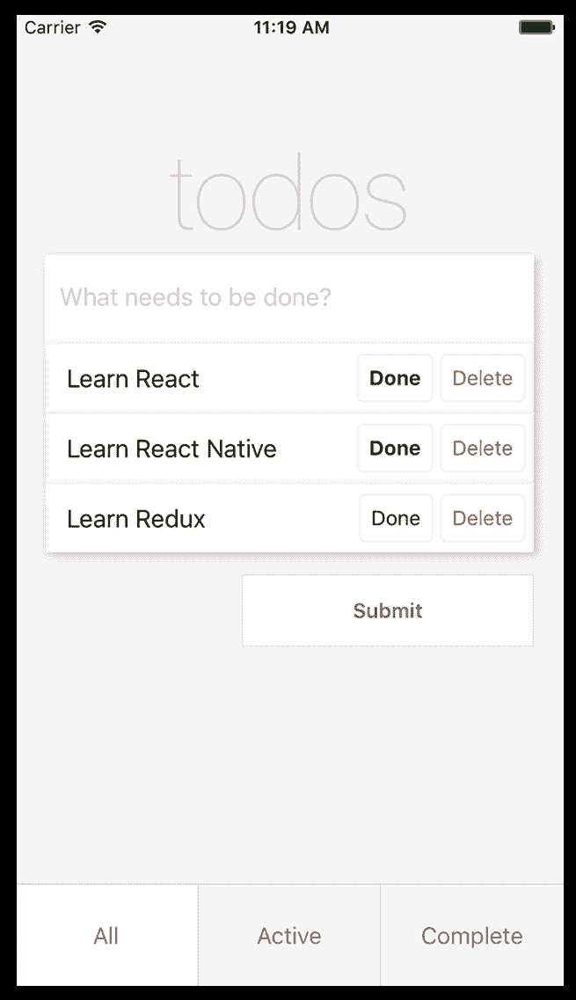

图 3.1 待办事项应用设计

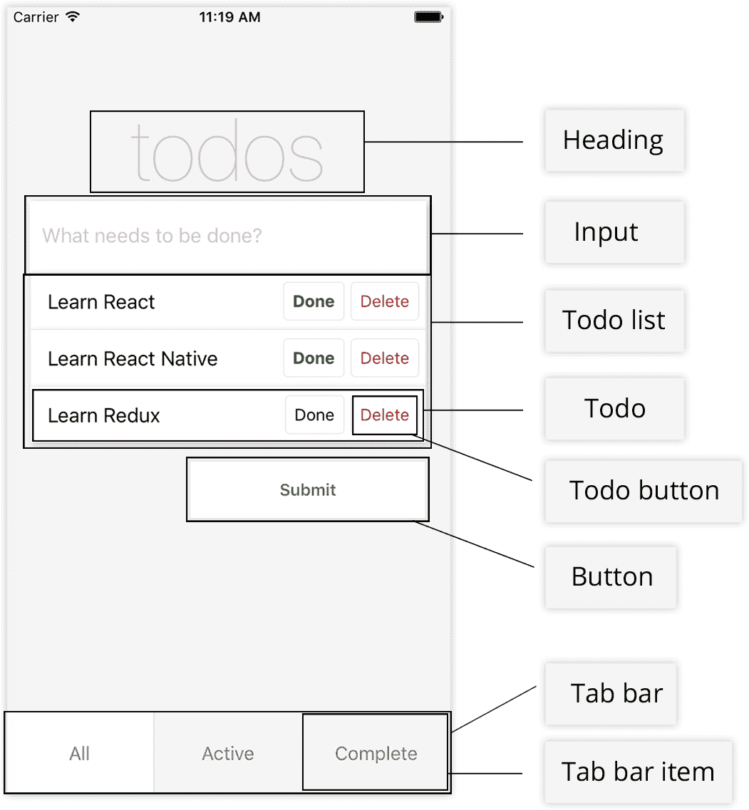

图 3.2 带描述的待办事项应用

列表 3.1 基本待办事项应用程序实现

```
<View>
  <Heading />
  <Input />
  <TodoList />
  <Button />
  <TabBar />
</View> 
```

应用程序将显示一个标题、一个文本输入框、一个按钮和一个标签栏。当你添加一个待办事项时，应用程序会将它添加到待办事项数组中，并在输入框下方显示新的待办事项。每个待办事项将有两个按钮：完成和删除。完成按钮将标记为完成，删除按钮将从待办事项数组中移除它。屏幕底部，标签栏将根据待办事项是否完成或仍然活跃来过滤待办事项。

## 3.2 编写待办事项应用程序的代码

让我们开始编写应用程序的代码。在终端中输入 `react-native init TodoApp` 来创建一个新的 React Native 项目（见图 3.3）。现在，进入你的索引文件：如果你正在为 iOS 开发，打开 index.iOS.js；如果你正在为 Android 开发，打开 index.Android.js。两个平台的代码将是相同的。

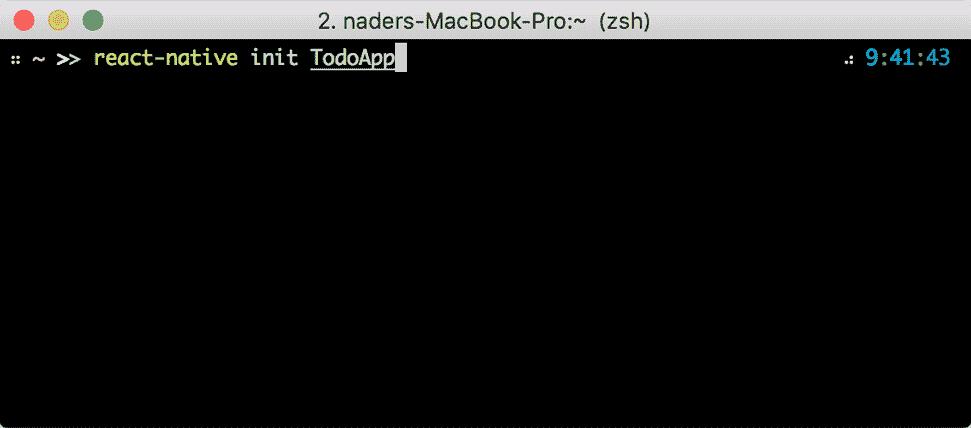

图 3.3 初始化新的 React Native 应用程序

在索引文件中，导入一个 `App` 组件（你很快就会创建它），并删除任何不再使用的样式和额外组件。

列表 3.2 index.js

```
import React from 'react'
import { AppRegistry } from 'react-native'
import App from './app/App'

   const TodoApp = () => <App />

AppRegistry.registerComponent('TodoApp', () => TodoApp) 
```

在这里，你从 `react-native` 中引入了 `AppRegistry`。同时，你也引入了主要的 `App` 组件，你将在下一部分创建它。

在 `AppRegistry` 方法中，你初始化了应用程序。`AppRegistry` 是运行所有 React Native 应用程序的 JS 入口点。它接受两个参数：`appKey`，或者你在初始化应用程序时定义的应用程序名称；以及一个返回你想要用作应用程序入口点的 React Native 组件的函数。在这种情况下，你返回了在列表 3.2 中声明的 `TodoApp` 组件。

现在，在应用程序的根目录下创建一个名为 app 的文件夹。在 app 文件夹中，创建一个名为 App.js 的文件，并添加下一列表中显示的基本代码。

列表 3.3 创建 `App` 组件

```
import React, { Component } from 'react'
import { View, ScrollView, StyleSheet } from 'react-native'

class App extends Component {
  render() {
    return (
      <View style={styles.container}>
        <ScrollView keyboardShouldPersistTaps='always'
                    style={styles.content}>
          <View/>
        </ScrollView>
      </View>
    )
  }
}

const styles = StyleSheet.create({
  container: {
    flex: 1,
    backgroundColor: '#f5f5f5'
  },
  content: {
    flex: 1,
    paddingTop: 60
  }
})

export default App 
```

你导入了一个名为 `ScrollView` 的新组件，它包装了平台 `ScrollView`，基本上是一个可滚动的 `View` 组件。添加了一个 `keyboardShouldPersistTaps` 属性，值为 `always`：这个属性会在键盘打开时关闭键盘，并允许 UI 处理任何 `onPress` 事件。你确保 `ScrollView` 和 `ScrollView` 的父 `View` 都有一个 `flex:1` 的值。`flex:1` 是一个样式值，它使组件填充其父容器整个空间。

现在，为一些你稍后需要的值设置一个初始状态。你需要一个数组来保存你的待办事项，你可以将其命名为 `todos`；一个用于保存添加待办事项的 `TextInput` 当前状态的值，命名为 `inputValue`；以及一个用于存储你当前查看的待办事项类型（全部、当前或活跃），命名为 `type`。

在 `App.js` 中，在 `render` 函数之前，给类添加一个构造函数和一个初始状态，并在状态中初始化这些值。

列表 3.4 设置初始状态

```
...

class App extends Component {
  constructor() {
    super()
 this.state = {
      inputValue: '',
      todos: [],
      type: 'All'
    }
  }
  render() {
    ...
  }
}

... 
```

接下来，创建`Heading`组件并为其设置一些样式。在应用文件夹中创建一个名为 Heading.js 的文件。这将是一个无状态组件。

列表 3.5 创建`Heading`组件

```
import React from 'react'
import { View, Text, StyleSheet } from 'react-native'

const Heading = () => (
  <View style={styles.header}>
    <Text style={styles.headerText}>
      todos
    </Text>
  </View>
)

const styles = StyleSheet.create({
  header: {
    marginTop: 80
  },
  headerText: {
    textAlign: 'center',
    fontSize: 72,
    color: 'rgba(175, 47, 47, 0.25)',
    fontWeight: '100'
  }
})

export default Heading 
```

注意，在`headerText`的样式设置中，你传递一个`rgba`值给`color`属性。如果你不熟悉 RGBA，前三个值组成 RGB 颜色值，最后一个值代表 alpha 或透明度（红、蓝、绿、alpha）。你传入一个 alpha 值为 0.25，即 25%。你还设置了字体粗细为`100`，这将使文本看起来更细。

返回 App.js，引入`Heading`组件，并将其放置在`ScrollView`中，替换你最初放置的空`View`。

运行应用以查看新的标题和布局：见图 3.4。要在 iOS 上运行应用，使用`react-native run-ios`。要在 Android 上运行，从你的 React Native 应用程序的根目录使用终端中的`react-native run-android`。


图 3.4 运行应用

列表 3.6 导入和使用`Heading`组件

```
import React, { Component } from 'react'
import {View, ScrollView, StyleSheet} from 'react-native'
import Heading from './Heading'

class App extends Component {
  ...
  render() {
    return (
      <View style={styles.container}>
        <ScrollView
         keyboardShouldPersistTaps='always'
         style={styles.content}>
          <Heading />
        </ScrollView>
      </View>
    )
  }
}
... 
```

接下来，创建`TextInput`组件并为其设置一些样式。在应用文件夹中创建一个名为 Input.js 的文件。

列表 3.7 创建`TextInput`组件

```
import React from 'react'
import { View, TextInput, StyleSheet } from 'react-native'

const Input = () => (
  <View style={styles.inputContainer}>
    <TextInput
      style={styles.input}
      placeholder='What needs to be done?'
      placeholderTextColor='#CACACA'
      selectionColor='#666666' />
  </View>
)

const styles = StyleSheet.create({
  inputContainer: {
    marginLeft: 20,
    marginRight: 20,
    shadowOpacity: 0.2,
    shadowRadius: 3,
    shadowColor: '#000000',
    shadowOffset: { width: 2, height: 2 }
  },
  input: {
    height: 60,
    backgroundColor: '#ffffff',
    paddingLeft: 10,
    paddingRight: 10
  }
})

export default Input 
```

你在这里使用了一个新的 React Native 组件`TextInput`。如果你熟悉 Web 开发，这类似于 HTML 中的`input`。你还为`TextInput`和外部`View`设置了它们自己的样式。

`TextInput`还有一些其他的属性。在这里，你指定了一个`placeholder`来在用户开始输入之前显示文本，一个`placeholderTextColor`来设置占位符文本的样式，以及一个`selectionColor`来设置`TextInput`的光标样式。

下一个步骤，在第 3.4 节中，将是一个将函数连接到获取`TextInput`的值并将其保存到`App`组件的状态中的步骤。你还将进入 App.js 并在`constructor`下方、`render`函数上方添加一个名为`inputChange`的新函数。这个函数将使用传入的值更新`inputValue`的状态值，并且目前还将使用`console.log()`输出`inputValue`的值，以便你可以通过查看`console.log()`语句来确保函数正常工作。但要在 React Native 中查看`console.log()`语句，你首先需要打开开发者菜单。让我们看看它是如何工作的。

## 3.3 打开开发者菜单

开发者菜单是 React Native 内置的菜单，作为 React Native 的一部分提供；它为你提供了使用的主要调试工具。你可以在 iOS 模拟器或 Android 模拟器中打开它。在本节中，我将向你展示如何在两个平台上打开和使用开发者菜单。

### 3.3.1 在 iOS 模拟器中打开开发者菜单

当项目在 iOS 模拟器中运行时，你可以通过以下三种方式之一打开开发者菜单：

+   在键盘上按 Cmd-D。

+   在键盘上按 Cmd-Ctrl-Z。

+   在模拟器选项中打开硬件 > 摇动手势菜单（见图 3.5）。

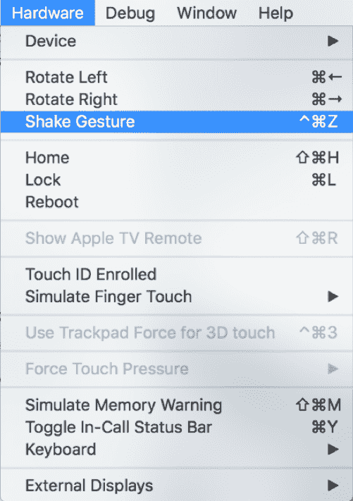

图 3.5 手动打开开发者菜单（iOS 模拟器）

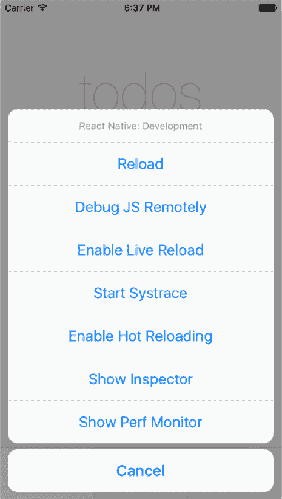

图 3.6 React Native 开发者菜单（iOS 模拟器）

当你这样做时，你应该看到图 3.6 所示的开发者菜单。

### 3.3.2 在 Android 模拟器中打开开发者菜单

在 Android 模拟器中打开并运行项目时，开发者菜单可以通过以下三种方式之一打开：

+   按键盘上的 F2 键。

+   按键盘上的 Cmd-M 键。

+   按下硬件按钮（见图 3.7）。

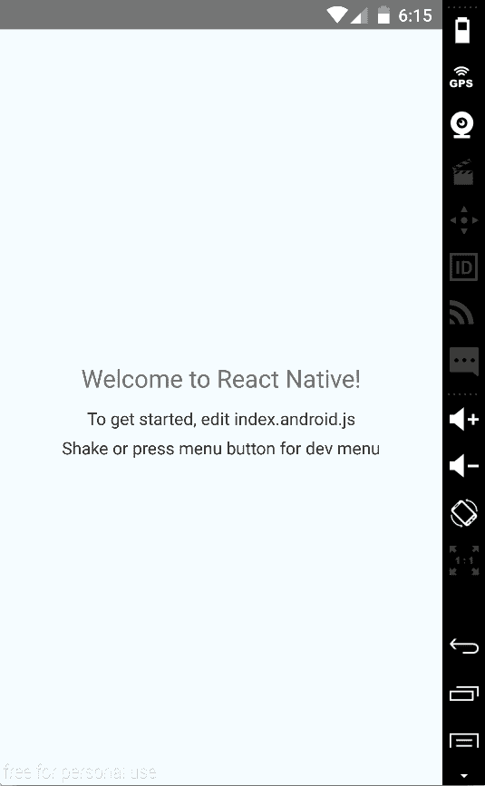

图 3.7 手动打开硬件菜单（Android 模拟器）

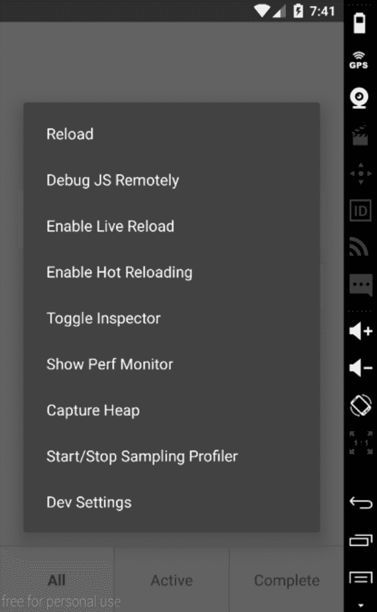

图 3.8 React Native 开发者菜单（Android 模拟器）

当你这样做时，你应该看到图 3.8 所示的开发者菜单。

### 3.3.3 使用开发者菜单

当开发者菜单打开时，你应该看到以下选项：

+   *重新加载（iOS 和 Android）*—重新加载应用。这也可以通过按键盘上的 Cmd-R（iOS）或按两次 R（Android）键来完成。

+   *远程调试 JS（iOS 和 Android）*—打开 Chrome 开发者工具，并通过浏览器提供完整的调试支持（图 3.9）。在这里，你可以访问代码中的日志语句，以及你在调试 Web 应用时习惯使用的断点和其他功能（除了 DOM）。如果你需要在应用中记录任何信息或数据，这通常是这样做的地方。

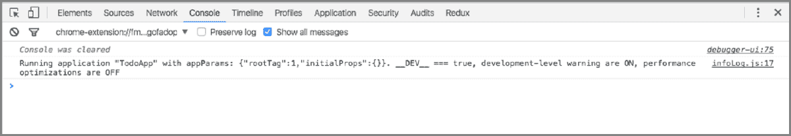

图 3.9 在 Chrome 中进行调试

+   *启用实时重新加载（iOS 和 Android）*—启用实时重新加载。当你修改代码时，整个应用将在模拟器中重新加载并刷新。

+   *启动 Systrace（仅限 iOS）*—Systrace 是一个性能分析工具。这将在你的应用运行时，为你提供一个关于每个 16 毫秒帧期间时间消耗的好主意。被分析代码块被起始/结束标记所包围，然后以彩色图表格式进行可视化。Systrace 也可以在 Android 中通过命令行手动启用。如果你想了解更多信息，请查看文档以获取全面的概述。

+   *启用热重新加载（iOS 和 Android）*—React Native 版本.22 中添加的一个优秀功能。它提供了一个惊人的开发者体验，允许你在文件更改时立即看到更改，而不会丢失应用当前状态。这对于在不丢失状态的情况下对应用深层的 UI 进行更改特别有用。这与实时重新加载不同，因为它保留了应用当前状态，只更新已更改的组件和状态（实时重新加载会重新加载整个应用，因此会丢失当前状态）。

+   *切换检查器（iOS 和 Android）*：弹出一个类似于你在 Chrome 开发工具中看到的属性检查器。你可以点击一个元素，并看到它在组件层次结构中的位置，以及应用到此元素上的任何样式（图 3.10）。

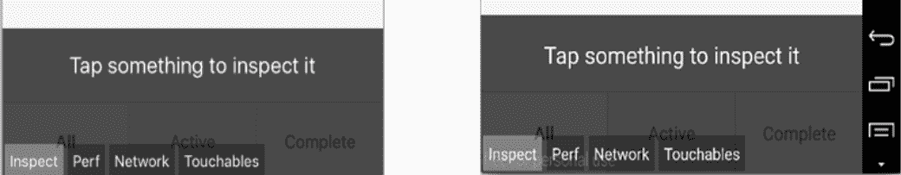

图 3.10 使用检查器（左：iOS，右：Android）

+   *显示性能监控器（iOS 和 Android）*：在应用的左上角弹出一个小的框，显示一些关于应用性能的信息。在这里，你可以看到正在使用的 RAM 数量和应用当前运行的每秒帧数。如果你点击这个框，它将展开以显示更多信息（图 3.11）。

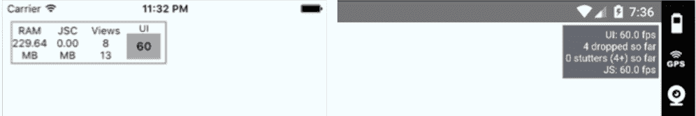

图 3.11 性能监控器（左：iOS，右：Android）

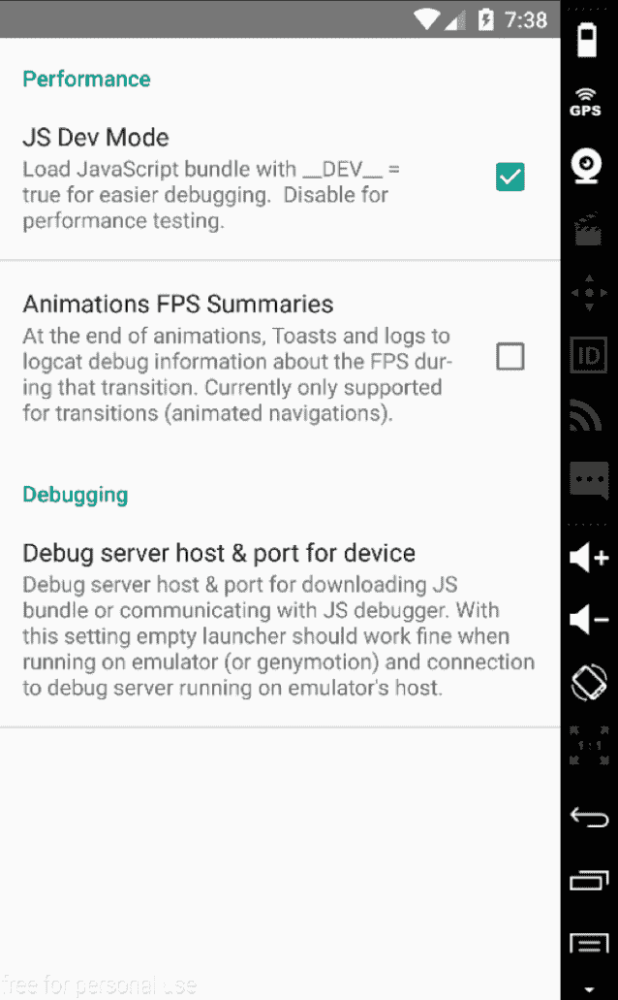

图 3.12 开发设置（Android 模拟器）

+   *开发设置（仅限 Android 模拟器）*：弹出一个包含额外调试选项的窗口，包括一个轻松切换 `__DEV__` 环境变量为 `true` 或 `false` 的方法（图 3.12）。

## 3.4 继续构建待办事项应用

现在你已经了解了开发者菜单的工作方式，打开它并按 Debug JS Remotely 以打开 Chrome 开发工具。你准备好开始将信息记录到 JavaScript 控制台了。

你需要将 `Input` 组件导入到 `app/App.js` 中，并将一个方法附加到 `TextInput` 上，然后将这个方法作为属性传递给 `Input`。你还将把存储在状态中的 `inputValue` 传递给 `Input` 作为属性。

列表 3.8 创建 `inputChange` 函数

```
...
import Heading from './Heading'
import Input from './Input'
class App extends Component {
  constructor() {
    …
  }
 inputChange(inputValue) {    ①  
 console.log(' Input Value: ' , inputValue)    ②  
 this.setState({ inputValue })    ③  
  }
  render() {
    const { inputValue } = this.state
    return (
      <View style={styles.container}>
        <ScrollView
          keyboardShouldPersistTaps='always'
          style={styles.content}>
          <Heading />
          <Input 
 inputValue={inputValue}    ④  
 inputChange={(text) => this.inputChange(text)} />    ⑤  
        </ScrollView>
      </View>
    )
  }} 
```

`inputChange` 接收一个参数，即 `TextInput` 的值，并使用 `TextInput` 返回的值更新状态中的 `inputValue`。

现在，你需要将函数与 `Input` 组件中的 `TextInput` 连接起来。打开 `app/Input.js`，并更新 `TextInput` 组件，使用新的 `inputChange` 函数和 `inputValue` 属性。

列表 3.9 将 `inputChange` 和 `inputValue` 添加到 `TextInput`

```
...
const Input = ({ inputValue, inputChange }) => (    ①  
  <View style={styles.inputContainer}>
    <TextInput
      value={inputValue}
      style={styles.input}
      placeholder='What needs to be done?'
      placeholderTextColor='#CACACA'
      selectionColor='#666666'
 onChangeText={inputChange} />    ②  
  </View>
)
... 
```

在创建无状态组件时，你将解构 `inputValue` 和 `inputChange` 属性。当 `TextInput` 的值发生变化时，将调用 `inputChange` 函数，并将值传递给父组件以设置 `inputValue` 的状态。你还将 `TextInput` 的值设置为 `inputValue`，这样你就可以稍后控制和重置 `TextInput`。`onChangeText` 是一个方法，每次 `TextInput` 组件的值发生变化时都会被调用，并将 `TextInput` 的值传递给它。

再次运行项目并查看其外观（图 3.13）。你正在记录输入值，所以当你输入时，你应该看到值被记录到控制台（图 3.14）。

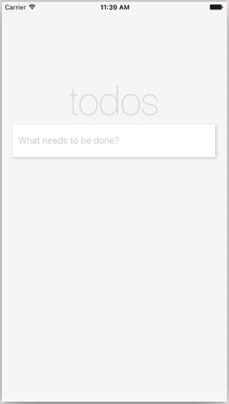

图 3.13 添加 `TextInput` 后的更新视图

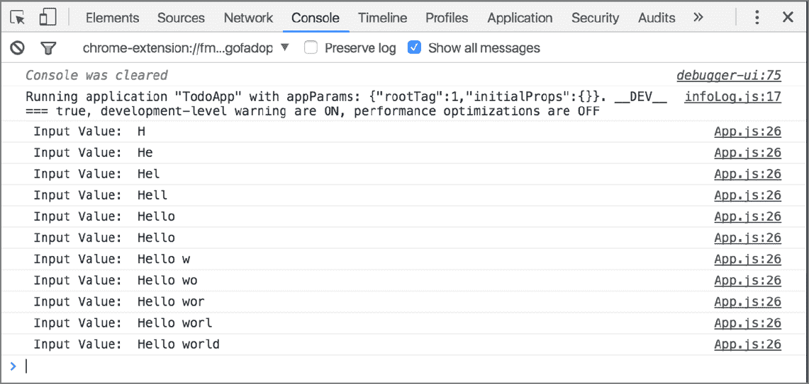

图 3.14 使用 `inputChange` 方法记录 `TextInput` 的值

现在 `inputValue` 的值被存储在状态中，你需要创建一个按钮来将项目添加到待办事项列表中。在这样做之前，创建一个函数，你将把它绑定到按钮上，以便将新的待办事项添加到构造函数中定义的待办事项数组中。将此函数命名为 `submitTodo`，并将其放置在 `inputChange` 函数之后和 `render` 函数之前。

列表 3.10 添加 `submitTodo` 函数

```
...
submitTodo () {    ①  
 if (this.state.inputValue.match(/^\s*$/)) {    ①  
 return    ①  
 }    ①  
 const todo = {    ②  
 title: this.state.inputValue,    ②  
 todoIndex,    ②  
 complete: false    ②  
 }    ②  
 todoIndex++    ③  
 const todos = [...this.state.todos, todo]    ④  
 this.setState({ todos, inputValue: '' }, () => {    ⑤  
 console.log('State: ', this.state)    ⑥  
  }) 
}
... 
```

接下来，在 App.js 文件顶部创建 `todoIndex`，在最后一个 `import` 语句下方。

列表 3.11 创建 `todoIndex` 变量

```
...
import Input from './Input'

let todoIndex = 0

class App extends Component {
... 
```

现在已经创建了 `submitTodo` 函数，创建一个名为 Button.js 的文件，并将该函数连接到按钮以工作。

列表 3.12 创建 `Button` 组件

```
import React from 'react'
import { View, Text, StyleSheet, TouchableHighlight } from 'react-native'

const Button = ({ submitTodo }) => (    ①  
  <View style={styles.buttonContainer}>
    <TouchableHighlight
      underlayColor='#efefef'
      style={styles.button}
 onPress={submitTodo}>    ②  
      <Text style={styles.submit}>
        Submit
      </Text>
    </TouchableHighlight>
  </View>
)

const styles = StyleSheet.create({
  buttonContainer: {
    alignItems: 'flex-end'
  },
  button: {
    height: 50,
    paddingLeft: 20,
    paddingRight: 20,
    backgroundColor: '#ffffff',
    width: 200,
    marginRight: 20,
    marginTop: 15,
    borderWidth: 1,
    borderColor: 'rgba(0,0,0,.1)',
    justifyContent: 'center',
    alignItems: 'center'
  },
  submit: {
    color: '#666666',
    fontWeight: '600'
  }
})

export default Button 
```

在此组件中，你首次使用 `TouchableHighlight`。`TouchableHighlight` 是创建 React Native 中按钮的一种方式，与 HTML 的 `button` 元素基本相当。

使用 `TouchableHighlight`，你可以包裹视图并使其正确响应触摸事件。在按下时，默认的 `backgroundColor` 被替换为你提供的指定 `underlayColor` 属性。在这里，你指定一个 `underlayColor` 为 `'#efefef'`，这是一种浅灰色；背景颜色是白色。这将使用户对触摸事件是否已注册有一个良好的感觉。如果没有定义 `underlayColor`，则默认为黑色。

`TouchableHighlight` 只支持一个主要子组件。在这里，你传递一个 `Text` 组件。如果你想在 `TouchableHighlight` 中使用多个组件，将它们包裹在一个单独的 `View` 中，并将此 `View` 作为 `TouchableHighlight` 的子组件传递。

你已经创建了 `Button` 组件，并将其与 App.js 中定义的函数连接起来。现在将此组件带入应用（app/App.js）并查看它是否工作！

列表 3.13 导入 `Button` 组件

```
...
import Button from './Button'    ①  

let todoIndex = 0

...
constructor() {
    super()
    this.state = {
      inputValue: '',
      todos: [],
      type: 'All'
    }
 this.submitTodo = this.submitTodo.bind(this)    ②  
  }
...
render () {
    let { inputValue } = this.state
    return (
      <View style={styles.container}>
        <ScrollView
          keyboardShouldPersistTaps='always'
          style={styles.content}>
          <Heading />
          <Input
            inputValue={inputValue}
            inputChange={(text) => this.inputChange(text)} />
 <Button submitTodo={this.submitTodo} />    ③  
        </ScrollView>
      </View>
    )
  } 
```

你导入 `Button` 组件，并在 `render` 函数中将它放置在 `Input` 组件下方。`submitTodo` 作为名为 `this.submitTodo` 的属性传递给 `Button`。

现在，刷新应用。它应该看起来像 图 3.15。当你添加待办事项时，`TextInput` 应该清除，并且应用状态应该记录到控制台，显示包含新待办事项的待办事项数组 (图 3.16)。


图 3.15 带有 `Button` 组件的更新应用

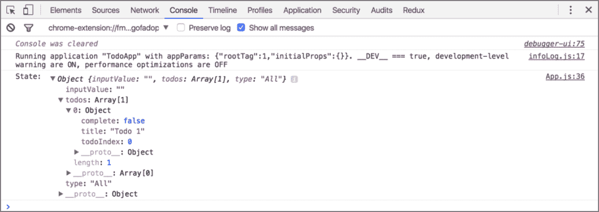

图 3.16 记录状态

现在你正在向待办事项数组中添加待办事项，你需要将它们渲染到屏幕上。要开始这个操作，你需要创建两个新的组件：`TodoList` 和 `Todo`。`TodoList` 将渲染待办事项列表，并使用 `Todo` 组件为每个单独的待办事项。首先，在应用文件夹中创建一个名为 Todo.js 的文件。

列表 3.14 创建 `Todo` 组件

```
import React from 'react' 
import { View, Text, StyleSheet } from 'react-native'

const Todo = ({ todo }) => (
  <View style={styles.todoContainer}>
    <Text style={styles.todoText}>
      {todo.title}
    </Text>
  </View>
)

const styles = StyleSheet.create({
  todoContainer: {
    marginLeft: 20,
    marginRight: 20,
    backgroundColor: '#ffffff',
    borderTopWidth: 1,
    borderRightWidth: 1,
    borderLeftWidth: 1,
    borderColor: '#ededed',
    paddingLeft: 14,
    paddingTop: 7,
    paddingBottom: 7,
    shadowOpacity: 0.2,
    shadowRadius: 3,
    shadowColor: '#000000',
    shadowOffset: { width: 2, height: 2 },
    flexDirection: 'row',
    alignItems: 'center'
  },
  todoText: {
    fontSize: 17
  }
})

export default Todo 
```

目前 `Todo` 组件只接受一个属性——一个待办事项，并在 `Text` 组件中渲染标题。你还在 `View` 和 `Text` 组件上添加了样式。

接下来，创建 `TodoList` 组件（app/TodoList.js）。

列表 3.15 创建 `TodoList` 组件

```
import React from 'react'
import { View } from 'react-native'
import Todo from './Todo'

const TodoList = ({ todos }) => {
  todos = todos.map((todo, i) => {
    return (
      <Todo
        key={todo.todoIndex}
        todo={todo} />
 )
  })
  return (
    <View>
      {todos}
    </View>
  )
}

export default TodoList 
```

目前 `TodoList` 组件只接受一个属性：一个待办事项数组。然后你遍历这些待办事项，并为每个待办事项创建一个新的 `Todo` 组件（在文件顶部导入），将待办事项作为属性传递给 `Todo` 组件。你还指定了一个键，并将待办事项项的索引作为键传递给每个组件。`key` 属性帮助 React 在计算与虚拟 DOM 的差异时识别已更改的项目。如果你省略了这一点，React 将会给出警告。

你需要做的最后一件事是将 `TodoList` 组件导入到 App.js 文件中，并将待办事项作为属性传入。

列表 3.16 导入 `TodoList` 组件

```
...
import TodoList from './TodoList'
...
render () {
    const { inputValue, todos } = this.state
    return (
      <View style={styles.container}>
        <ScrollView
          keyboardShouldPersistTaps='always'
          style={styles.content}>
          <Heading />
          <Input inputValue={inputValue} inputChange={(text) => this.inputChange(text)} />
          <TodoList todos={todos} />
          <Button submitTodo={this.submitTodo} />
        </ScrollView>
      </View>
    )
  }
... 
```

运行应用。当你添加一个待办事项时，你应该看到它在待办事项列表中弹出（图 3.17）。

下一步是标记待办事项为完成，以及删除待办事项。打开 App.js，并在 `submitTodo` 函数下方创建 `toggleComplete` 和 `deleteTodo` 函数。`toggleComplete` 将切换待办事项是否完成，而 `deleteTodo` 将删除待办事项。

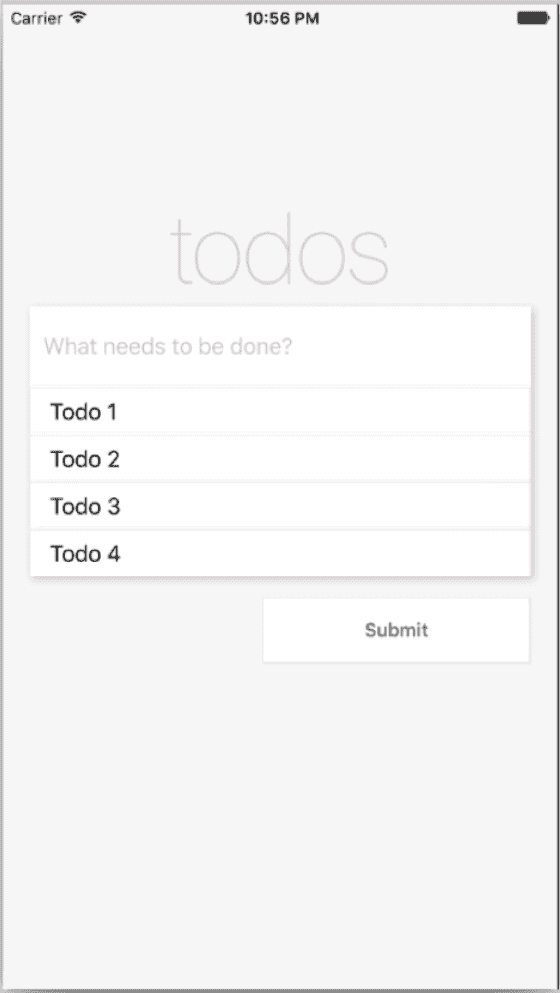

图 3.17 更新后的应用，包含 `TodoList` 组件

列表 3.17 添加 `toggleComplete` 和 `deleteTodo` 函数

```
constructor () {
  ...
 this.toggleComplete = this.toggleComplete.bind(this)    ①  
 this.deleteTodo = this.deleteTodo.bind(this)    ②  
}
...
deleteTodo (todoIndex) {    ③  
  let { todos } = this.state
  todos = todos.filter((todo) => todo.todoIndex !== todoIndex)
  this.setState({ todos })
}

toggleComplete (todoIndex) {    ④  
  let todos = this.state.todos
  todos.forEach((todo) => {
    if (todo.todoIndex === todoIndex) {
      todo.complete = !todo.complete
    }
  })
  this.setState({ todos })
}
... 
```

为了连接这些函数，你需要创建一个按钮组件并将其传递给待办事项。在 app 文件夹中，创建一个新的文件，命名为 TodoButton.js。

列表 3.18 创建 TodoButton.js

```
import React from 'react'
import { Text, TouchableHighlight, StyleSheet } from 'react-native'

const TodoButton = ({ onPress, complete, name }) => (    ①  
  <TouchableHighlight
    onPress={onPress}
    underlayColor='#efefef'
    style={styles.button}>
    <Text style={
      styles.text,
 complete ? styles.complete : null,  [  ②  
 name === 'Delete' ? styles.deleteButton : null ]}    ③  
     >
      {name}
    </Text>
  </TouchableHighlight>
)

const styles = StyleSheet.create({
  button: {
    alignSelf: 'flex-end',
    padding: 7,
    borderColor: '#ededed',
    borderWidth: 1,
    borderRadius: 4,
    marginRight: 5
  },
  text: {
    color: '#666666'
  },
  complete: {
    color: 'green',
    fontWeight: 'bold'
  },
  deleteButton: {
    color: 'rgba(175, 47, 47, 1)'
  }
})
export default TodoButtton 
```

现在，将新的函数作为 props 传递给 `TodoList` 组件。

列表 3.19 将 `toggleComplete` 和 `deleteTodo` 作为 props 传递给 `TodoList`

```
render () {
  ...
        <TodoList
          toggleComplete={this.toggleComplete}
          deleteTodo={this.deleteTodo}
          todos={todos} />
        <Button submitTodo={this.submitTodo} />
  ...
} 
```

接下来，将 `toggleComplete` 和 `deleteTodo` 作为 props 传递给 `Todo` 组件。

列表 3.20 将 `toggleComplete` 和 `deleteTodo` 作为 props 传递给 `ToDo`

```
...
const TodoList = ({ todos, deleteTodo, toggleComplete }) => {
  todos = todos.map((todo, i) => {
    return (
      <Todo
        deleteTodo={deleteTodo}
        toggleComplete={toggleComplete}
        key={i}
        todo={todo} />
    )
  })
... 
```

最后，打开 Todo.js 并更新 `Todo` 组件，以引入新的 `TodoButton` 组件和按钮容器的样式。

列表 3.21 更新 Todo.js 以引入 `TodoButton` 和功能

```
import TodoButton from './TodoButton'
...
const Todo = ({ todo, toggleComplete, deleteTodo }) => (
  <View style={styles.todoContainer}>
    <Text style={styles.todoText}>
      {todo.title}
    </Text>
    <View style={styles.buttons}>
      <TodoButton
        name='Done'
        complete={todo.complete}
        onPress={() => toggleComplete(todo.todoIndex)} />
      <TodoButton
        name='Delete'
        onPress={() => deleteTodo(todo.todoIndex)} />
    </View>
  </View>
)

const styles = StyleSheet.create({
...
  buttons: {
    flex: 1,
    flexDirection: 'row',
    justifyContent: 'flex-end',
    alignItems: 'center'
  },
...
)} 
```

你添加了两个 `TodoButton` 按钮：一个命名为完成，另一个命名为删除。你还传递了 `toggleComplete` 和 `deleteTodo` 作为函数，以便在 TodoButton.js 中调用你定义的 `onPress`。如果你刷新应用并添加一个待办事项，你现在应该能看到新的按钮（图 3.18）。

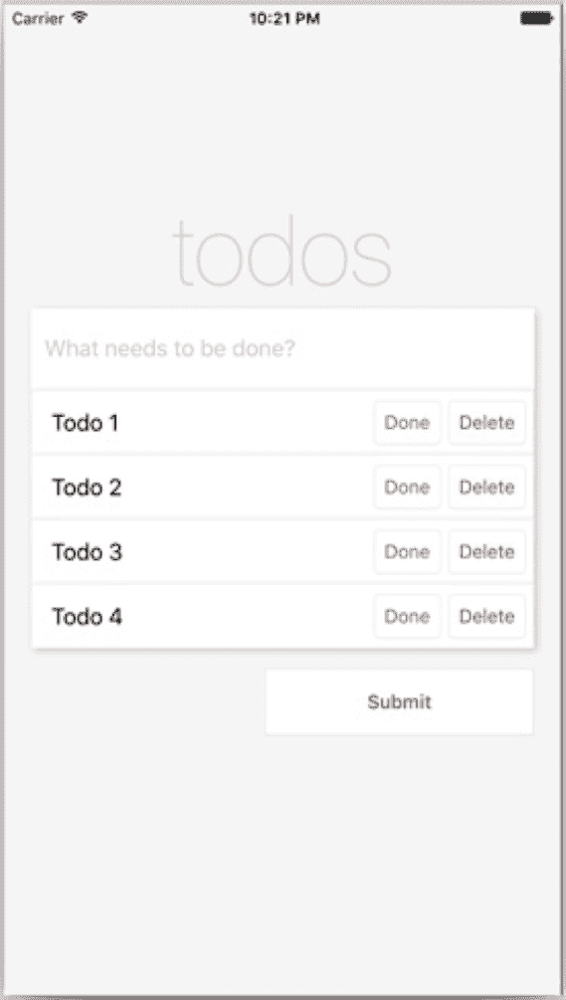

图 3.18 显示 `TodoButton`s 的应用

如果你点击完成，按钮文本应该加粗并变为绿色。如果你点击删除，待办事项应该从待办事项列表中消失。

你现在几乎完成了应用。最后一步是构建一个标签栏过滤器，它将显示所有待办事项、仅显示完成的待办事项或仅显示未完成的待办事项。为了开始这个，你需要创建一个新的函数来设置要显示的待办事项类型。

在构造函数中，当你第一次创建应用时，你将状态变量 `type` 设置为 `'All'`。现在你将创建一个名为 `setType` 的函数，它将接受一个类型作为参数并更新状态中的类型。在 App.js 中 `toggleComplete` 函数下方放置此函数。

列表 3.22 添加 `setType` 函数

```
constructor () {
  ...
  this.setType = this.setType.bind(this)
}
...
setType (type) {
  this.setState({ type })
}
... 
```

接下来，你需要创建 `TabBar` 和 `TabBarItem` 组件。首先，创建 `TabBar` 组件：在 app 文件夹中添加一个名为 TabBar.js 的文件。

列表 3.23 创建 `TabBar` 组件

```
import React from 'react'
import { View, StyleSheet } from 'react-native'
import TabBarItem from './TabBarItem'

const TabBar = ({ setType, type }) => (
  <View style={styles.container}>
    <TabBarItem  type={type} title='All'
      setType={() => setType('All')} />
    <TabBarItem type={type} border title='Active'
      setType={() => setType('Active')} />
    <TabBarItem type={type} border title='Complete'
      setType={() => setType('Complete')} />
  </View>
)

const styles = StyleSheet.create({
  container: {
    height: 70,
    flexDirection: 'row',
    borderTopWidth: 1,
    borderTopColor: '#dddddd'
  }
})

export default TabBar 
```

此组件接受两个属性：`setType` 和 `type`。这两个属性都是从主 `App` 组件传递下来的。

你正在导入尚未定义的 `TabBarItem` 组件。每个 `TabBarItem` 组件接受三个属性：`title`、`type` 和 `setType`。其中两个组件还接受一个 `border` 属性（布尔值），如果设置为 `true`，将添加左边界样式。

接下来，在 app 文件夹中创建一个名为 TabBarItem.js 的文件。

列表 3.24 创建 `TabBarItem` 组件

```
import React from 'react'
import { Text, TouchableHighlight, StyleSheet } from 'react-native'

const TabBarItem = ({ border, title, selected, setType, type }) => (
  <TouchableHighlight
    underlayColor='#efefef'
    onPress={setType}
    style={[
      styles.item, selected ? styles.selected : null,
      border ? styles.border : null,
      type === title ? styles.selected : null ]}>
    <Text style={[ styles.itemText, type === title ? styles.bold : null ]}>
      {title}
    </Text>
  </TouchableHighlight>
)

const styles = StyleSheet.create({
  item: {
    flex: 1,
    justifyContent: 'center',
    alignItems: 'center'
  },
  border: {
    borderLeftWidth: 1,
    borderLeftColor: '#dddddd'
  },
  itemText: {
    color: '#777777',
    fontSize: 16
  },
  selected: {
    backgroundColor: '#ffffff'
  },
  bold: {
    fontWeight: 'bold'
  }
})

export default TabBarItem 
```

在 `TouchableHighlight` 组件中，你检查一些属性并根据属性设置样式。如果 `selected` 是 `true`，你给它 `styles.selected` 的样式。如果 `border` 是 `true`，你给它 `styles.border` 的样式。如果 `type` 等于 `title`，你给它 `styles.selected` 的样式。

在 `Text` 组件中，你也会检查 `type` 是否等于 `title`。如果是，给它添加粗体样式。

要实现 `TabBar`，打开 app/App.js，引入 `TabBar` 组件，并设置它。你还将 `type` 作为 `render` 函数的一部分，在解构 `this.state` 时引入。

列表 3.25 实现 `TabBar` 组件

```
...
import TabBar from './TabBar'
class App extends Component {
...
render () {
  const { todos, inputValue, type } = this.state
  return (
    <View style={styles.container}>
      <ScrollView
        keyboardShouldPersistTaps='always'
        style={styles.content}>
        <Heading />
        <Input inputValue={inputValue} 
               inputChange={(text) => this.inputChange(text)} />
        <TodoList
          type={type}
          toggleComplete={this.toggleComplete}
          deleteTodo={this.deleteTodo}
          todos={todos} />
        <Button submitTodo={this.submitTodo} />
      </ScrollView>
      <TabBar type={type} setType={this.setType} />
    </View>
  )
}
... 
```

在这里，你引入了 `TabBar` 组件。然后从状态中解构 `type` 并不仅将其传递给新的 `TabBar` 组件，还传递给 `TodoList` 组件；你将在下一秒使用这个 `type` 变量来根据此类型过滤待办事项。你还把 `setType` 函数作为属性传递给 `TabBar` 组件。

你需要做的最后一件事是打开 `TodoList` 组件，并添加一个过滤器，只返回当前选定的标签页类型的待办事项。打开 TodoList.js，从属性中解构 `type`，在 `return` 语句之前添加以下 `getVisibleTodos` 函数。

列表 3.26 更新 `TodoList` 组件

```
...
const TodoList = ({ todos, deleteTodo, toggleComplete, type }) => {
  const getVisibleTodos = (todos, type) => {
    switch (type) {
      case 'All':
        return todos
      case 'Complete':
        return todos.filter((t) => t.complete)
      case 'Active':
 return todos.filter((t) => !t.complete)
    }
  }

  todos = getVisibleTodos(todos, type)
  todos = todos.map((todo, i) => {
... 
```

你使用 `switch` 语句检查当前设置的是哪种类型。如果设置为 `'All'`，则返回待办事项的整个列表。如果设置为 `'Complete'`，则过滤待办事项并只返回完成的待办事项。如果设置为 `'Active'`，则过滤待办事项并只返回未完成的待办事项。

然后，你将 `todos` 变量设置为 `getVisibleTodos` 返回的值。现在你应该能够运行应用并看到新的 `TabBar` (图 3.19)。`TabBar` 将根据选定的类型进行过滤。

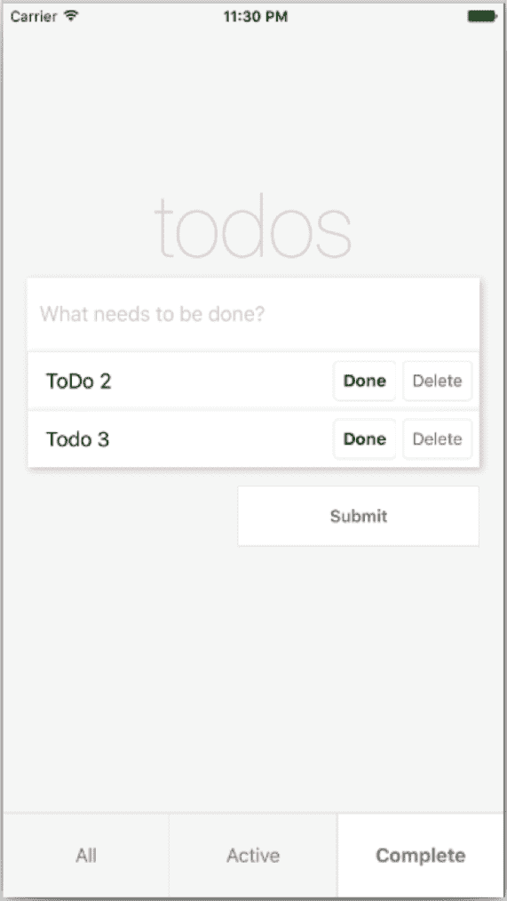

图 3.19 最终待办事项应用

## 摘要

+   `AppRegistry` 是运行所有 React Native 应用的 JavaScript 入口点。

+   React Native 组件 `TextInput` 与 HTML 的 `input` 类似。你可以指定多个属性，包括一个 `placeholder` 属性，用于在用户开始输入之前显示文本，一个 `placeholderTextColor` 属性，用于设置占位符文本的样式，以及一个 `selectionColor` 属性，用于设置 `TextInput` 的光标样式。

+   `TouchableHighlight` 是在 React Native 中创建按钮的一种方式；它与 HTML 的 `button` 元素相当。你可以使用 `TouchableHighlight` 来包裹视图，并使其正确响应触摸事件。

+   你已经学会了如何在 iOS 和 Android 模拟器中启用开发者工具。

+   使用 JavaScript 控制台（可通过开发者菜单访问）是调试你的应用并记录有用信息的好方法。
