# 第二部分

在 React Native 中开发应用程序

在掌握基础知识之后，你就可以开始向你的 React Native 应用程序添加功能了。本部分中的章节涵盖了样式、导航、动画以及使用数据架构（重点关注 Redux）优雅地处理数据的方法。

第四章和第五章教授了如何将样式应用于组件内联或在其可以引用的样式表中。由于 React Native 组件是应用程序 UI 的主要构建块，第四章花了一些时间教授你可以使用 `View` 组件做的有用事情。第五章在第四章教授的技能基础上进行扩展。它涵盖了特定于平台的样式方面，以及一些高级技术，包括使用 flexbox 使布局更容易。

第六章展示了如何使用两个最推荐和最常用的导航库，React Navigation 和 React Native Navigation。我们介绍了创建三种主要类型的导航器——标签、堆栈和抽屉，以及如何控制导航状态。

第七章涵盖了创建动画需要做的四件事，与 Animated API 一起提供的四种可动画组件类型，如何创建自定义可动画组件，以及一些其他有用的技能。

在第八章中，我们探讨了使用数据架构处理数据。由于 Redux 是 React 生态系统中处理数据最广泛采用的方法，因此你使用它来构建应用程序，同时学习数据处理技能。我们展示了如何使用 Context API，以及如何通过使用 reducer 来保存 Redux 状态和从示例应用程序中删除项目来实现 Redux。我们还涵盖了如何使用 providers 将全局状态传递给应用程序的其余部分，如何使用 `connect` 函数从子组件访问示例应用程序，以及如何使用动作添加功能。

# 4

样式介绍

*****本章*****涵盖了

+   使用 JavaScript 进行样式化

+   应用和组织样式

+   将样式应用于 `View` 组件

+   将样式应用于 `Text` 组件

建立移动应用程序需要才能，但要使它们出色则需要 *风格*。如果你是一位图形设计师，你对此有直觉性的认识，深入骨髓。如果你是一位开发者，你可能正在抱怨并翻着白眼。无论哪种情况，理解 React Native 组件的基本样式原理对于制作一个吸引人且他人愿意使用的应用程序至关重要。

很可能你已经有一些 CSS 经验，即使只是看到过其语法。你很容易理解像 `background-color: 'red'` 这样的 CSS 规则想要做什么。当你开始阅读这一章时，可能会觉得在 React Native 中对组件进行样式化就像使用 CSS 规则的驼峰命名法一样简单。例如，设置 React Native 组件的背景颜色使用几乎相同的语法，`backgroundColor: 'red'`——但请提前警告，相似之处到此为止。

尽量不要执着于你在 CSS 中做事情的方式。拥抱 React Native 的方式，你会发现学习如何样式化组件是一个更加愉快的体验——即使是对于开发者来说也是如此。

本章的第一部分提供了样式组件的概述。我们将确保你理解将样式应用到组件的各种方法，并讨论如何在应用程序中组织样式。现在形成良好的组织习惯将使事情更容易管理，并有助于将来使用更高级的技术。

因为 React Native 使用 JavaScript 进行样式设计，我们将讨论如何开始将样式视为代码，以及如何利用 JavaScript 的特性，如变量和函数。最后两个部分将探讨 `View` 组件和 `Text` 组件的样式。在某些情况下，我们会用简短的例子来解释一个主题，但大部分时间，我们将通过实际样式的例子来讲解。你将所学应用到构建个人资料卡片的过程中。

本章中的所有示例代码，你可以从默认生成的应用程序开始，用单独列表中的代码替换 `App.js` 中的内容。完整的源代码可以在 [www.manning.com/books/react-native-in-action](http://www.manning.com/books/react-native-in-action) 找到，以及本书的 Git 仓库 https://github.com/dabit3/react-native-in-action 下的第四章。

## 4.1 在 React Native 中应用和组织样式

React Native 内置了许多组件，社区也构建了许多你可以包含到你的项目中的组件。组件支持特定的样式集。这些样式可能或可能不适用于其他类型的组件。例如，`Text` 组件支持 `fontWeight` 属性（`fontWeight` 指的是字体的粗细），但 `View` 组件不支持。相反，`View` 组件支持 `flex` 属性（`flex` 指的是视图内组件的布局），但 `Text` 组件不支持。

不同的组件之间有些样式元素是相似的，但并不完全相同。例如，`View` 组件支持 `shadowColor` 属性，而 `Text` 组件支持 `textShadowColor` 属性。一些样式，如 `ShadowPropTypesIOS`，只适用于特定的平台（在这种情况下，是 iOS）。

学习各种样式以及如何操作它们需要时间。这就是为什么从如何应用和组织样式等基础知识开始很重要。本节将专注于教授这些样式基础知识，这样你将有一个良好的基础，从那里开始探索样式并构建示例个人资料卡片组件。

### 4.1.1 在应用程序中应用样式

为了在市场上竞争，移动应用程序必须有一种风格感。你可以开发一个功能齐全的应用程序，但如果它看起来很糟糕且不吸引人，人们是不会感兴趣的。你不必建造世界上看起来最酷的应用程序，但你确实需要致力于创建一个精致的产品。一个精致、外观锐利的应用程序会极大地影响人们对应用程序质量的看法。

你可以在 React Native 中以多种方式应用样式。在第一章和第三章中，我们介绍了内联样式（如下所示）以及使用 `StyleSheet` 的样式（清单 4.2）。

清单 4.1 使用内联样式

```
import React, { Component } from 'react'
import { Text, View } from 'react-native'

export default class App extends Component {
  render () {
    return (
 <View style={{marginLeft: 20, marginTop: 20}}>    ①  
 <Text style={{fontSize: 18,color: 'red'}}>Some Text</Text>    ②  
      </View>
    )
  }
} 
```

如你所见，你可以通过向 `styles` 属性提供一个对象来一次性指定多个样式。

清单 4.2 引用 `StyleSheet` 中定义的样式

```
import React, { Component } from 'react'
import { StyleSheet, Text, View } from 'react-native'

export default class App extends Component {
  render () {
    return (
 <View style={styles.container}>    ①  
 <Text style={[styles.message,styles.warning]}>Some Text</Text>    ②  
      </View>    
    )
  }
}

const styles = StyleSheet.create({
 container: {    ③  
    marginLeft: 20,
    marginTop: 20
  },
 message: {    ③  
    fontSize: 18
  },
 warning: {    ③  
    color: 'red'      
  }
}); 
```

在功能上，使用内联样式与引用在 `StyleSheet` 中定义的样式没有区别。使用 `StyleSheet`，你可以创建一个 `style` 对象并单独引用每个样式。将样式与 `render` 方法分离使得代码更容易理解，并促进了样式在组件间的复用。

当使用像 `warning` 这样的样式名时，很容易识别消息的意图。但是内联样式 `color: 'red'` 并没有提供关于为什么消息是红色的任何见解。将样式指定在一个地方而不是在许多组件的内联中，使得在整个应用程序中应用更改变得更加容易。想象一下，如果你想将警告消息改为黄色，你只需要在样式表中更改一次样式定义，`color: 'yellow'`。

清单 4.2 还展示了如何通过提供一个包含样式属性的数组来指定多个样式。记住，当你这样做时，如果存在重复的属性，最后传入的样式将覆盖之前的样式。例如，如果提供了一个这样的样式数组，`color` 的最后一个值将覆盖所有之前的值：

```
style={[{color: 'black'},{color: 'yellow'},{color: 'red'}]} 
```

在这个例子中，颜色将是红色。

你也可以通过使用内联样式和样式表的引用来组合这两种方法，指定一个包含样式属性的数组：

```
style={[{color: 'black'}, styles.message]} 
```

React Native 在这方面非常灵活，这既有好的一面也有不好的一面。当你快速尝试原型设计时，指定内联样式非常容易，但从长远来看，你需要小心地组织你的样式；否则，你的应用程序可能会迅速变得混乱且难以管理。通过组织你的样式，你会使以下操作变得更加容易：

+   维护你的应用程序代码库

+   在组件间复用样式

+   在开发过程中尝试样式变化

### 4.1.2 组织样式

如前文所述，你可能已经猜到，使用内联样式并不是推荐的做法：样式表是管理样式的更有效方式。但在实际操作中这意味着什么呢？

在设计网站时，我们经常使用样式表。我们经常使用 Sass、Less 和 PostCSS 等工具来创建整个应用程序的单一代码样式表。在网页的世界里，样式本质上是全球的，但这不是 React Native 的方式。

React Native 专注于组件。目标是使组件尽可能可重用和独立。使组件依赖于应用程序的样式表是模块化的对立面。在 React Native 中，样式是针对组件的——而不是针对应用程序。

如何实现这种封装完全取决于你团队的偏好。没有对错之分，但在 React Native 社区中，你会发现两种常见的方法：

+   在组件相同的文件中声明样式表

+   在组件外部单独声明样式表

#### 在组件相同的文件中声明样式表

正如你在本书中已经做的那样，声明样式的常见方法是在将使用它们的组件内部进行。这种方法的优点是组件及其样式完全封装在一个单独的文件中。然后，这个组件可以被移动或在任何地方使用。这是组件设计的一种常见方法，你会在 React Native 社区中经常看到。

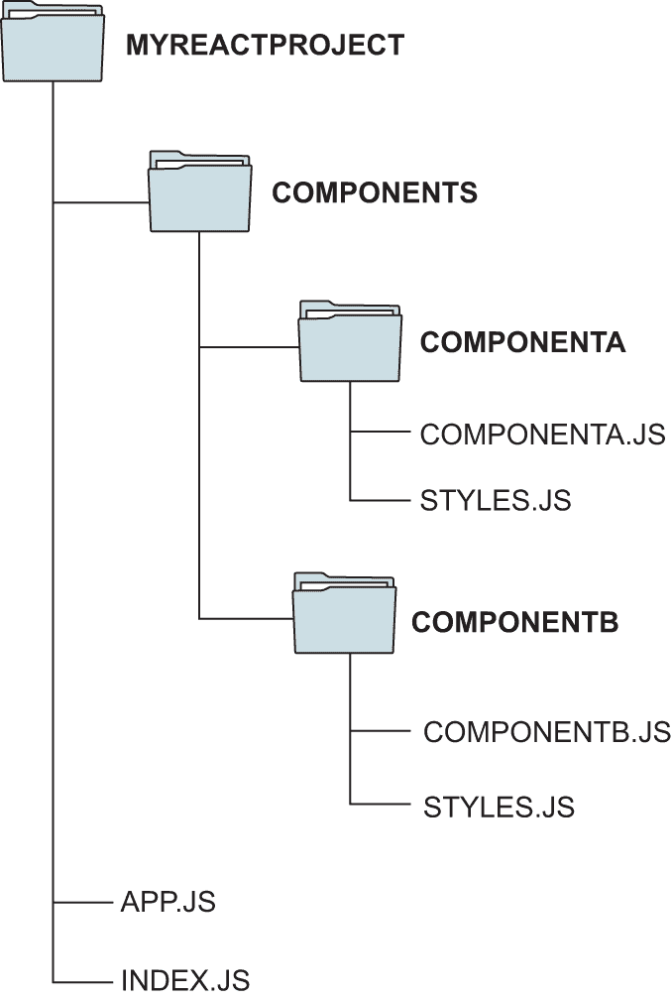

图 4.1 一个示例文件结构，其中样式与组件分开保存在单个文件夹中而不是单个文件中

当将样式定义与组件一起包含时，通常的约定是在组件之后指定样式。本书中迄今为止的所有列表都遵循了这一约定。

#### 在单独的文件中声明样式表

如果你习惯于编写 CSS，将样式放入单独的文件可能看起来是一个更好的方法，并且感觉更熟悉。样式表定义是在一个单独的文件中创建的。你可以给它取任何你想要的名称（styles.js 是典型的名称），但请确保扩展名是 .js；毕竟，它是 JavaScript。样式表文件和组件文件保存在同一个文件夹中。

如 图 4.1 所示的文件结构保留了组件和样式之间的紧密关系，并通过不将样式定义与组件的功能方面混合而提供了一些清晰度。列表 4.3 对应于一个用于样式化图中的 `ComponentA` 和 `ComponentB` 的 `styles.js` 文件。在定义样式表时使用有意义的名称，以便清楚地了解正在样式化组件的哪个部分。

列表 4.3 将组件的样式表外部化

```
import { StyleSheet } from 'react-native'

const styles = StyleSheet.create({    ①  
 container: {    ②  
    marginTop: 150,
    backgroundColor: '#ededed',
    flexWrap: 'wrap'
  }
})

const buttons = StyleSheet.create({    ③  
 primary: {    ④  
    flex: 1,
    height: 70,
    backgroundColor: 'red',
    justifyContent: 'center',
    alignItems: 'center',
    marginLeft: 20,
    marginRight: 20
  }
})

export { styles, buttons }    ⑤   
```

组件导入外部样式表并可以引用其中定义的任何样式。

列表 4.4 导入外部样式表

```
import { styles, buttons } from './component/styles'    ①   
```

```
<View style={styles.container}>    ②  
 <TouchableHighlight style={buttons.primary} />    ③  
    ...
  </TouchableHighlight>
</View> 
```

### 4.1.3 样式是代码

你已经看到了如何在 React Native 中使用 JavaScript 定义样式。尽管拥有完整的脚本语言，包括变量和函数，但你的样式相当静态，但它们当然不必如此！

网页开发者多年来一直在与 CSS 作斗争。为了克服层叠样式表的许多限制，创造了新的技术，如 Sass、Less 和 PostCSS。即使像定义一个变量来存储网站的主色这样的简单事情，没有 CSS 预处理器也是不可能的。2015 年 12 月 CSS 变量级联模块 1 的候选推荐引入了自定义属性的概念，这些属性类似于变量；但在撰写本文时，使用中的不到 80% 的浏览器支持此功能。

让我们利用我们正在使用 JavaScript 的这一事实，开始将样式视为代码。你将构建一个简单的应用程序，用户可以通过它从浅色主题切换到深色主题。但在你开始编码之前，让我们回顾一下你试图构建的内容。

应用程序在屏幕上有一个单独的按钮。该按钮被一个小正方形框包围。当按钮被按下时，主题将切换。当选择浅色主题时，按钮标签将显示为白色，背景将是白色，按钮周围的框将是黑色。当选择深色主题时，按钮标签将显示为黑色，背景将是黑色，按钮周围的框将是白色。图 4.2 展示了选择主题时屏幕应该看起来像什么。

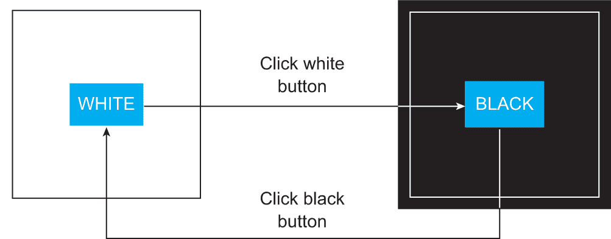

图 4.2 一个支持两种主题（白色和黑色）的简单应用程序。用户可以按按钮在白色背景和黑色背景之间切换。

对于这个例子，将样式组织在一个单独的文件 styles.js 中。然后，创建一些常量来保存颜色值，并为浅色和深色主题创建两个样式表。

列表 4.5 从主组件文件中提取的动态样式表

```
import {StyleSheet} from 'react-native';

export const Colors = {    ①  
    dark: 'black',
    light: 'white'
};

const baseContainerStyles = {    ②  
    flex: 1,
    justifyContent: 'center',
    alignItems: 'center'
};

const baseBoxStyles = {    ③  
    justifyContent: 'center',
    alignItems: 'center',
    borderWidth: 2,
    height: 150,
    width: 150
};

const lightStyleSheet = StyleSheet.create({    ④  
 container: {
        ...baseContainerStyles,
        backgroundColor: Colors.light
    },
    box: {
        ...baseBoxStyles,
        borderColor: Colors.dark
    }
});

const darkStyleSheet = StyleSheet.create({    ⑤  
    container: {
        ...baseContainerStyles,
        backgroundColor: Colors.dark
    },
    box: {
        ...baseBoxStyles,
        borderColor: Colors.light
    }
});

export default function getStyleSheet(useDarkTheme){    ⑥  
 return useDarkTheme ? darkStyleSheet : lightStyleSheet;    ⑦  
} 
```

一旦配置了样式，你就可以开始在 App.js 中构建组件应用程序了。因为你只有浅色和深色主题，创建一个实用函数 `getStyleSheet`，它接受一个布尔值。如果提供 `true`，则返回深色主题；否则返回浅色主题。

列表 4.6 在浅色和深色主题之间切换的应用程序

```
import React, { Component } from 'react';
import { Button, StyleSheet, View } from 'react-native';
import getStyleSheet from './styles';    ①  

export default class App extends Component {

  constructor(props) {
      super(props);
      this.state = {
 darkTheme: false    ②  
      };
 this.toggleTheme = this.toggleTheme.bind(this);    ③  
  }

  toggleTheme() {
 this.setState({darkTheme: !this.state.darkTheme})    ④  
  };

  render() {

 const styles = getStyleSheet(this.state.darkTheme);    ⑤  
    const backgroundColor =
 StyleSheet.flatten(styles.container).backgroundColor;    ⑥  

    return (
 <View style={styles.container}>    ⑦  
 <View style={styles.box}>    ⑧  
 <Button title={backgroundColor}    ⑨  
 onPress={this.toggleTheme}/>    ⑩  
            </View>
        </View>
    );
  }
} 
```

应用程序切换主题：请随意尝试并进一步探索。尝试将浅色主题改为不同的颜色。注意这有多么容易，因为颜色被定义为一个地方的可变常量。尝试将深色主题中的按钮标签改为与背景相同的颜色，而不是总是白色。尝试创建一个全新的主题，或者修改代码以支持许多不同的主题，而不是仅仅两个——享受乐趣！

## 4.2 样式化视图组件

现在你已经对 React Native 中的样式有了全面的了解，让我们更多地讨论个别样式。本章涵盖了你会经常使用的许多基本属性。在第五章中，我们将更深入地探讨并介绍你不会每天看到的样式以及特定平台的样式。但就目前而言，让我们专注于基础知识：在本节中，那就是 `View` 组件。`View` 组件是 UI 的主要构建块，也是理解以正确方式设置样式的重要组件之一。记住，`View` 元素在某种程度上类似于 HTML 的 `div` 标签，因为你可以用它来包裹其他元素，并在其中构建 UI 代码块。

随着你通过本章的学习，你将使用所学知识来构建一个真实组件：配置文件组件。构建配置文件组件将展示如何将一切组合在一起。图 4.3 展示了本节结束时组件的外观。在创建此组件的过程中，你将学习以下内容：

+   使用 `borderWidth` 在配置文件容器周围创建边框

+   使用 `borderRadius` 来圆滑那个边框的角落

+   通过使用组件宽度一半大小的 `borderRadius` 创建看起来像圆的边框

+   使用边距和填充属性来定位一切

接下来的几节将教授你创建配置文件组件所需了解的样式技术。我们将从讨论如何设置组件的背景颜色开始。你将能够使用相同的技巧来设置配置文件组件的背景颜色。

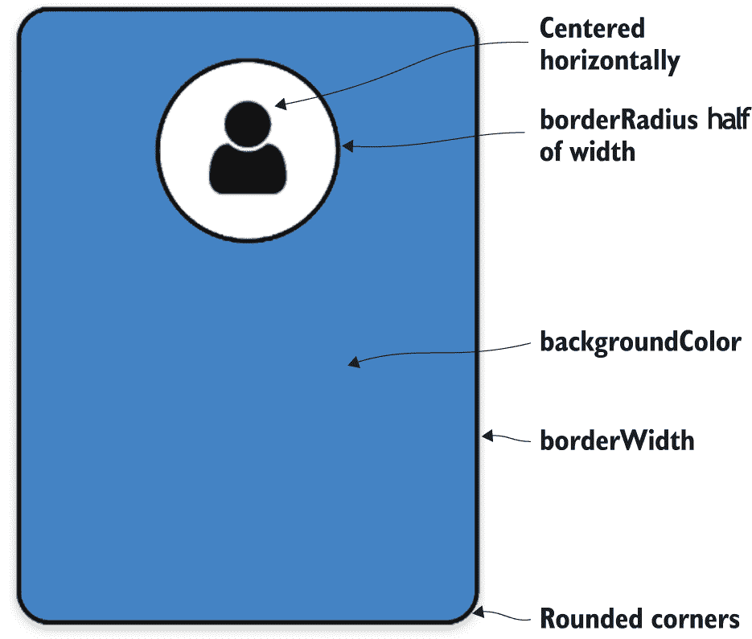

图 4.3 在结构视图组件样式化之后，配置文件组件的外观。配置文件组件是一个圆角矩形，有一个圆形区域用于配置图像。

### 4.2.1 设置背景颜色

没有色彩的点缀，用户界面（UI）看起来会显得无聊和单调。你不需要色彩爆炸来使事物看起来有趣，但你确实需要一点。`backgroundColor` 属性设置元素的背景颜色。此属性接受一个字符串，可以是 表 4.1 中显示的属性之一。在屏幕上渲染文本时也提供相同的颜色。

表 4.1 支持的颜色格式

| **支持的颜色格式** | **示例** |
| --- | --- |
| `#rgb` | `'#06f'` |
| `#rgba` | `'#06fc'` |
| `#rrggbb` | `'#0066ff'` |
| `#rrggbbaa` | `'#ff00ff00'` |
| `rgb(number, number, number)` | `'rgb(0, 102, 255)'` |
| `rgb(number, number, number, alpha)` | `'rgba(0, 102, 255, .5)'` |
| `hsl(hue, saturation, lightness)` | `'hsl(216, 100%, 50%)'` |
| `hsla(hue, saturation, lightness, alpha)` | `'hsla(216, 100%, 50%, .5)'` |
| 透明背景 | `'transparent'` |
| 任何 CSS3 指定的命名颜色（黑色、红色、蓝色等） | `'dodgerblue'` |

幸运的是，支持的色彩格式与 CSS 支持的格式相同。我们不会深入细节，但鉴于这可能是您第一次看到这些格式中的某些格式，这里有一个简要的解释：

+   `rgb` 代表红色、绿色和蓝色。您可以使用 0–255（或十六进制 00–ff）的刻度来指定红色、绿色和蓝色的值。数值越高，每种颜色的含量越多。

+   `alpha` 与不透明度类似（0 是透明的，1 是实心的）。

+   `hue` 代表在 360 度色轮上的 1 度，其中 0 是红色，120 是绿色，240 是蓝色。

+   `saturation` 是从 0% 灰度到 100% 全色的颜色强度。

+   `lightness` 是 0% 到 100% 之间的百分比。0% 是较暗的（接近黑色），100% 是较亮的（接近白色）。

您已经在之前的示例中看到了 `backgroundColor` 的应用，所以让我们在下一个示例中更进一步。为了使用您的新技能创建一些真实的东西，让我们开始构建 Profile Card。目前，它看起来不会太多，就像您在 图 4.4 中看到的那样——它只是一个 300 × 400 的彩色矩形。

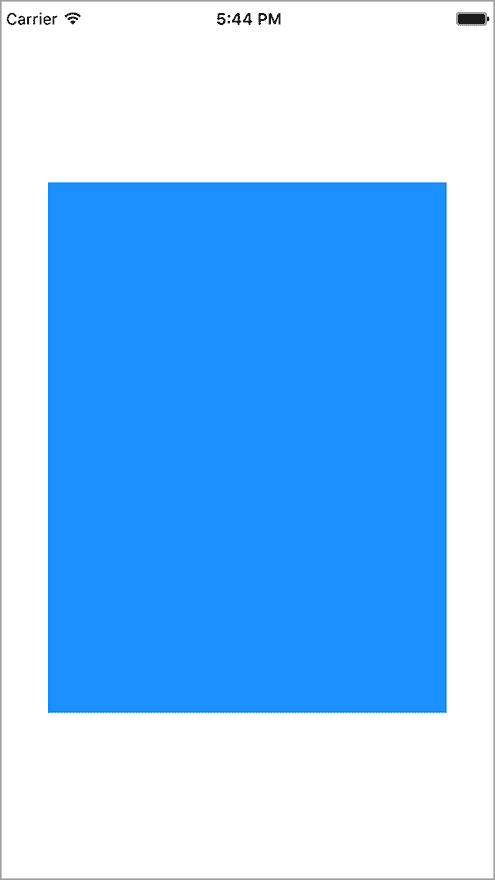

图 4.4 一个简单的 300 × 400 彩色矩形，它是 Profile Card 组件的基础

下面的列表显示了初始代码。不要担心其中大部分与样式无关的事实。我们将逐一讲解每个部分，但您需要有一个起点。

列表 4.7 Profile Card 组件的初始框架

```
import React, { Component } from 'react';
import { StyleSheet, View} from 'react-native';

export default class App extends Component<{}> {
    render() {
        return (
 <View style={styles.container}>    ①  
 <View style={styles.cardContainer}/>    ②  
            </View>
        );
    }
}

const profileCardColor = 'dodgerblue';    ③  

const styles = StyleSheet.create({
 container: {    ④  
        flex: 1,
        justifyContent: 'center',
        alignItems: 'center'
    },
 cardContainer: {    ⑤  
 backgroundColor: profileCardColor,    ⑥  
        width: 300,
        height: 400
    }
}); 
```

第一个 `View` 组件是最外层的元素。它充当围绕其他所有内容的容器。它的唯一目的是在设备显示上居中子组件。第二个 `View` 组件将是 Profile Card 的容器。目前，它是一个 300 × 400 的彩色矩形。

### 4.2.2 设置边框属性

给组件应用背景颜色确实可以使它脱颖而出，但如果没有清晰的边框线来界定组件的边缘，它看起来就像是在空间中漂浮。组件之间的清晰界定将帮助用户理解如何与您的移动应用程序交互。

在组件周围添加边框是给屏幕元素一个具体、真实感觉的最佳方式。有很多 `border` 属性，但从概念上讲，只有四个：`borderColor`、`borderRadius`、`borderStyle` 和 `borderWidth`。这些属性适用于组件整体。

对于颜色和宽度，每个边都有单独的属性：`borderTopColor`、`borderRightColor`、`borderBottomColor`、`borderLeftColor`、`borderTopWidth`、`borderRightWidth`、`borderBottomWidth` 和 `borderLeftWidth`。对于边框半径，每个角落都有属性：`borderTopRightRadius`、`borderBottomRightRadius`、`borderBottomLeftRadius` 和 `borderTopLeftRadius`。但只有一个 `borderStyle`。

#### 使用颜色、宽度和样式属性创建边框

要设置`border`，你必须首先设置`borderWidth`。`borderWidth`是边框的大小，它始终是一个数字。你可以设置一个适用于整个组件的`borderWidth`，或者选择你想要具体设置的`borderWidth`（顶部、右侧、底部或左侧）。你可以以许多不同的方式组合这些属性，以获得你喜欢的效果。查看图 4.5 以获取一些示例。


图 4.5 边框样式设置的多种组合示例

如你所见，你可以组合边框样式以创建边框效果的组合。下一个列表显示了这是多么容易做到。

列表 4.8 设置各种边框组合

```
import React, { Component } from 'react';
import { StyleSheet, Text, View} from 'react-native';

export default class App extends Component<{}> {
    render() {
      return (
        <View style={styles.container}>
 <Example style={{borderWidth: 1}}>    ①  
               <Text>borderWidth: 1</Text>
           </Example>
 <Example style={{borderWidth: 3, borderLeftWidth: 0}}>    ②  
               <Text>borderWidth: 3, borderLeftWidth: 0</Text>
           </Example>
 <Example style={{borderWidth: 3, borderLeftColor: 'red'}}>    ③  
               <Text>borderWidth: 3, borderLeftColor: 'red'</Text>
           </Example>
 <Example style={{borderLeftWidth: 3}}>    ④  
               <Text>borderLeftWidth: 3</Text>
           </Example>
 <Example style={{borderWidth: 1, borderStyle: 'dashed'}}>    ⑤  
               <Text>borderWidth: 1, borderStyle: 'dashed'</Text>
           </Example>
         </View>
      );
    }
}

const Example = (props) => (    ⑥  
    <View style={[styles.example,props.style]}>
        {props.children}
    </View>
);

const styles = StyleSheet.create({ 
    container: {
        flex: 1,
        justifyContent: 'center',
        alignItems: 'center'
    },
    example: {
        marginBottom: 15
    }
}); 
```

当只指定`borderWidth`时，`borderColor`默认为`'black'`，而`borderStyle`默认为`'solid'`。如果`borderWidth`或`borderColor`在组件级别被设置，这些属性可以通过使用更具体的属性如`borderWidthLeft`来覆盖；具体性优先于一般性。

#### 使用边框半径创建形状

另一个可以产生良好效果的边框属性是`borderRadius`。现实世界中的许多物体都有直边，但很少有直线能传达任何风格感。你不会买一辆看起来像箱子的汽车。你希望你的车有漂亮的曲线，看起来流畅。使用`borderRadius`样式可以让你在应用中添加一些风格。通过在正确的位置添加曲线，你可以制作出许多不同、有趣的外形。

使用`borderRadius`，你可以定义元素上圆角边框的形状。正如你可能猜到的，`borderRadius`适用于整个组件。如果你设置了`borderRadius`但没有设置更具体的值，如`borderTopLeftRadius`，则所有四个角都会被圆化。查看图 4.6 了解如何将不同的边框圆化以创建酷炫效果。

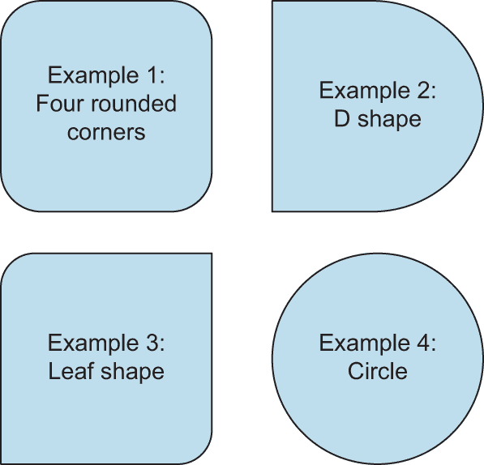

图 4.6 各种边框半径组合的示例。示例 1：四个角都圆化的正方形。示例 2：右下两个角圆化，形成 D 形状。示例 3：相对的两个角圆化，看起来像树叶。示例 4：边框半径等于边长的一半，结果形成一个圆。

创建图 4.6 中的形状相对简单，如列表 4.9 所示。说实话，这段代码中最棘手的部分是确保文本不要太大或太长。我很快就会在列表 4.10 中展示我的意思。

列表 4.9 设置各种边框半径组合

```
import React, { Component } from 'react';
import { StyleSheet, Text, View} from 'react-native';

export default class App extends Component<{}> {
    render() {
        return (
            <View style={styles.container}>
 <Example style={{borderRadius: 20}}>    ①  
                    <CenteredText>
 Example 1:{"\n"}4 Rounded Corners    ②  
                    </CenteredText>
                </Example>
                <Example style={{borderTopRightRadius: 60,
 borderBottomRightRadius: 60}}>    ③  
                    <CenteredText>
                        Example 2:{"\n"}D Shape
                    </CenteredText>
                </Example>
                <Example style={{borderTopLeftRadius: 30,
 borderBottomRightRadius: 30}}>    ④  
                    <CenteredText>
                        Example 3:{"\n"}Leaf Shape
                    </CenteredText>
                </Example>
 <Example style={{borderRadius: 60}}>    ⑤  
                    <CenteredText>
                        Example 4:{"\n"}Circle
                    </CenteredText>
                </Example>
            </View>
        );
    }
}

const Example = (props) => (
    <View style={[styles.example,props.style]}>
        {props.children}
    </View>
);

const CenteredText = (props) => (    ⑥  
    <Text style={[styles.centeredText, props.style]}>
        {props.children}
    </Text>
);

const styles = StyleSheet.create({
 container: {    ⑦  
        flex: 1,
        flexDirection: 'row',
        flexWrap: 'wrap',
 marginTop: 75
    },
    example: {
        width: 120,
        height: 120,
        marginLeft: 20,
        marginBottom: 20,
        backgroundColor: 'grey',
        borderWidth: 2,
        justifyContent: 'center'
    },
 centeredText: {    ⑧  
        textAlign: 'center',
        margin: 10
    }
}); 
```

特别注意居中文本的样式。你很幸运使用了`margin: 10`。如果你使用的是`padding: 10`，文本组件的背景会遮挡`View`组件下层的边框描边（见图 4.7）。

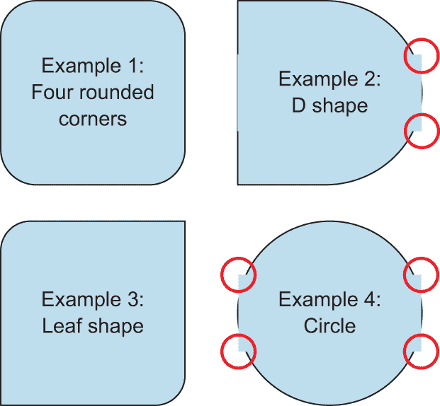

图 4.7 如果`centeredText`样式使用`padding: 10`而不是`margin: 10`来定位文本，图 4.6 将看起来像这样。小圆圈突出了文本组件的边界框与视图组件边框重叠的点。

默认情况下，`Text`组件继承其父组件的背景颜色。因为`Text`组件的边界框是一个矩形，所以背景会重叠在漂亮的圆角上。显然，使用`margin`属性可以解决这个问题，但也可以用另一种方法来补救。你可以在`centeredText`样式中添加`backgroundColor: 'transparent'`。使文本组件的背景透明可以让底层的边框显示出来，看起来恢复正常，如图 4.6 所示。

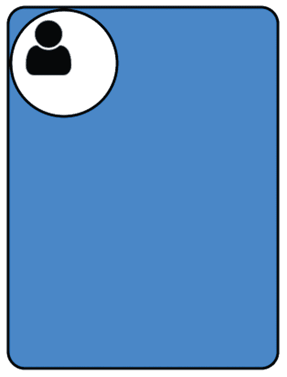

图 4.8 将边框属性整合到“个人资料卡”组件中，将 300 × 400 的彩色矩形转换成更接近你最终想要的“个人资料卡”组件的样子。

#### 为你的“个人资料卡”组件添加边框

通过你对边框属性的新认识，你几乎可以完成“个人资料卡”组件的初始布局。仅使用上一节中的边框属性，你就可以将 300 × 400 的彩色矩形转换成更接近你想要的样子。图 4.8 展示了你可以通过图像和迄今为止学到的技术达到的程度。它包括一个用作个人照片占位符的图像；你可以在源代码中找到它。但圆圈是通过操纵边框半径来创建的，正如前例中所述。

显然，“个人资料卡”有一些布局问题，但你几乎就要完成了。我们将在下一节讨论如何使用边距和填充样式来正确地对齐所有内容。

列表 4.10 将边框属性整合到“个人资料卡”

```
import React, { Component } from 'react';
import { **Image**, StyleSheet, View} from 'react-native';    ①  

export default class App extends Component<{}> {
    render() {
        return (
            <View style={styles.container}>
                <View style={styles.cardContainer}>
 **<View style={styles.cardImageContainer}>**
 **<Image style={styles.cardImage}** 
 **source={require('./user.png')}/>**  ②  
 **</View>**
                </View>
            </View>
        );
    }
}

const profileCardColor = 'dodgerblue';

const styles = StyleSheet.create({
    container: {
        flex: 1,
        justifyContent: 'center',
        alignItems: 'center'
    },
    cardContainer: {
 **borderColor: 'black',**  ③  
 **borderWidth: 3,**
 **borderStyle: 'solid',**
 **borderRadius: 20,**
        backgroundColor: profileCardColor,
        width: 300,
        height: 400
    },
 **cardImageContainer: {**  ④  
 **backgroundColor: 'white',**
 **borderWidth: 3,**
 **borderColor: 'black',**
 **width: 120,**
 **height: 120,**
 **borderRadius: 60,**
 **},**
 **cardImage: {**  ⑤  
 **width: 80,**
 **height: 80**
 **}**
}); 
```

列表 4.10 与之前的“个人资料卡”代码(列表 4.7)之间的差异已被加粗，以突出增量更改。

### 4.2.3 指定边距和填充

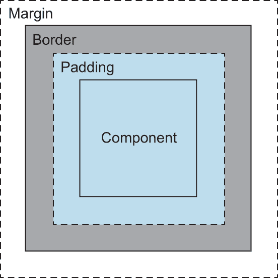

图 4.9 常见的边距、填充和边框相互关系图示

你可以明确地将每个组件放置在屏幕上，并按照你想要的布局排列，但如果布局需要响应用户操作，这将非常繁琐。将项目相对于彼此定位更有意义，这样如果你移动一个组件，其他组件可以根据它们的相对位置做出响应。

边距样式允许您定义组件之间的关系。填充样式让您定义组件相对于其边框的相对位置。使用这些属性一起提供在布局组件时的很大灵活性。您将每天都会使用这些属性，因此理解它们的意义和作用非常重要。

从概念上讲，边距和填充与 CSS 中的工作方式完全相同。边距和填充与边框和内容区域的关系的传统描述仍然适用（见图 4.9）。

在处理边距和填充时，您可能会遇到功能性的问题。您可能会倾向于称它们为“怪癖”，但无论如何它们都是麻烦的。就大多数情况而言，`View`组件上的边距表现良好，并在 iOS 和 Android 上工作。填充在操作系统之间的工作方式略有不同。在撰写本文时，在 Android 环境中填充文本组件根本不起作用；我怀疑这将在即将发布的版本中改变。

#### 使用边距属性

在布局组件时，首先要解决的问题之一是组件之间的距离。为了避免为每个组件指定一个距离，您需要一种指定相对位置的方法。`margin`属性允许您定义组件的周界，这决定了元素与上一个或父组件的距离。以这种方式阐述布局允许容器确定组件相对于彼此的位置，而不是您必须计算每个组件的位置。

可用的边距属性有`margin`、`marginTop`、`marginRight`、`marginBottom`和`marginLeft`。如果只设置了通用的`margin`属性，而没有其他更具体的值，如`marginLeft`或`marginTop`，则该值应用于组件的所有侧面（顶部、右侧、底部和左侧）。如果同时指定了`margin`和更具体的`margin`属性（例如`marginLeft`），则更具体的`margin`属性具有优先权。它的工作方式与边框属性完全相同。让我们应用一些这些样式：见图 4.10。

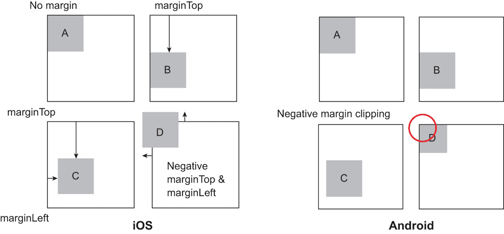

图 4.10 应用边距到组件的示例。在 iOS 中，示例 A 没有应用边距。示例 B 应用了顶部边距。示例 C 应用了顶部和左侧边距。示例 D 应用了负顶部和负左侧边距。在 Android 中，负边距的行为略有不同：组件被父容器裁剪。

所有边距都按预期定位组件，但请注意，当应用负边距时，Android 设备会裁剪组件。如果你计划同时支持 iOS 和 Android，从项目开始就应在每个设备上进行测试。不要只在 iOS 上开发，并认为你设计的样式在 Android 上会有相同的行为。列表 4.11 展示了图 4.10 中示例的代码。

列表 4.11 将各种边距应用于组件

```
import React, { Component } from 'react';
import { StyleSheet, Text, View} from 'react-native';

export default class App extends Component<{}> {
 render() {
        return (
          <View style={styles.container}>
            <View style={styles.exampleContainer}>
 <Example>    ①  
                <CenteredText>A</CenteredText>
              </Example>
            </View>
          <View style={styles.exampleContainer}>
 <Example style={{marginTop: 50}}>    ②  
                <CenteredText>B</CenteredText>
              </Example>
          </View>
          <View style={styles.exampleContainer}>
 <Example style={{marginTop: 50, marginLeft: 10}}>    ③  
              <CenteredText>C</CenteredText>
            </Example>
          </View>
          <View style={styles.exampleContainer}>
 <Example style={{marginLeft: -10, marginTop: -10}}>    ④  
              <CenteredText>D</CenteredText>
            </Example>
          </View>
        </View>
      );
  }
}

const Example = (props) => (
    <View style={[styles.example,props.style]}>
        {props.children}
    </View>
);

const CenteredText = (props) => (
    <Text style={[styles.centeredText, props.style]}>
        {props.children}
    </Text>
);

const styles = StyleSheet.create({
    container: {
        alignItems: 'center',
        flex: 1,
        flexDirection: 'row',
        flexWrap: 'wrap',
        justifyContent: 'center',
        marginTop: 75
    },
    exampleContainer: {
        borderWidth: 1,
        width: 120,
        height: 120,
        marginLeft: 20,
        marginBottom: 20,
 },
    example: {
        width: 50,
        height: 50,
        backgroundColor: 'grey',
        borderWidth: 1,
        justifyContent: 'center'
    },
    centeredText: {
        textAlign: 'center',
        margin: 10
    }
}); 
```

#### 使用填充属性

你可以将边距视为元素之间的距离，但填充表示元素内容与其边框之间的空间。当指定填充时，它允许组件的内容不与边框对齐。在 图 4.9 中，`backgroundColor` 属性从组件边缘渗透到边框，这是由 `padding` 定义的空隙。可用于 `padding` 的属性有 `padding`、`paddingLeft`、`paddingRight`、`paddingTop` 和 `paddingBottom`。如果只设置了主要的 `padding` 属性而没有其他更具体的值，如 `paddingLeft` 或 `paddingTop`，则该值将传递到组件的所有侧面（顶部、右侧、底部和左侧）。如果同时指定了 `padding` 和更具体的 `padding` 属性，如 `paddingLeft`，则更具体的 `padding` 属性具有优先级。这种行为与边框和边距完全相同。

我们不如创建一个新的示例来展示填充与边距的不同，而是重用 列表 4.11 中的代码并进行一些调整。将示例组件上的 `margin` 样式更改为 `padding` 样式，并在 `Text` 组件周围添加边框并更改它们的背景颜色。图 4.11 展示了最终的结果。

列表 4.12 将 列表 4.11 修改为用填充替换边距

```
import React, { Component } from 'react';

...

       <View style={styles.container}>
        <View style={styles.exampleContainer}>
 <Example style={{}}>    ①  
               <CenteredText>A</CenteredText>
            </Example>
        </View>
        <View style={styles.exampleContainer}>
 <Example style={{**paddingTop**: 50}}>    ②  
                <CenteredText>B</CenteredText>
            </Example>
        </View>
        <View style={styles.exampleContainer}>
 <Example style={{**paddingTop**: 50, **paddingLeft**: 10}}>    ③  
                <CenteredText>C</CenteredText>
 </Example>
        </View>
        <View style={styles.exampleContainer}>
 <Example style={{**paddingLeft**: -10, **paddingTop**: -10}}>    ④  
                <CenteredText>D</CenteredText>
            </Example>
        </View>
    </View>

...

    },
    centeredText: {
       textAlign: 'center',
       margin: 10,
 **borderWidth: 1,**    ⑤  
       **backgroundColor: 'lightgrey'**
    }
}); 
```

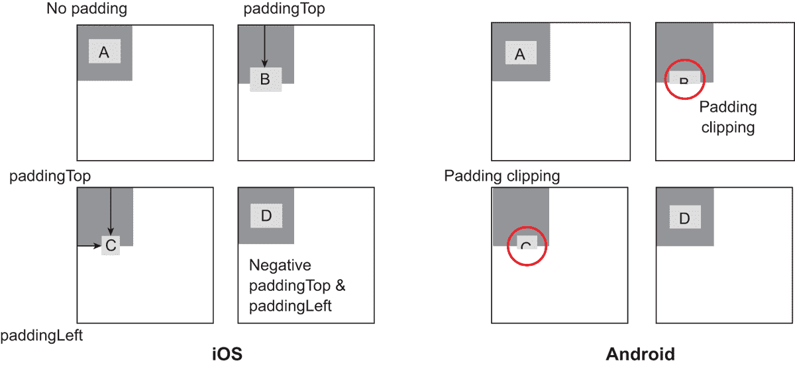

图 4.11 将前一个示例中的边距样式更改为填充样式。示例 A 没有填充，看起来与没有应用边距时相同。示例 B 显示了应用了 paddingTop 的组件。示例 C 与示例 B 相同，但它还应用了 paddingLeft。示例 D 将负填充值应用于 paddingTop 和 paddingLeft，这些值将被忽略。

与指定组件与其父组件之间空间的不同，填充是从组件的边框应用到其子组件。在示例 B 中，填充是从顶部边框计算的，这会将 `Text` 组件 B 从顶部边框向下推。示例 C 添加了一个 `paddingLeft` 值，这也会将 `Text` 组件 C 从左侧边框向内推。示例 D 将负填充值应用于 `paddingTop` 和 `paddingLeft`。

可以得出一些有趣的观察。示例 B 和示例 C 在 Android 设备上都被裁剪了。示例 C 的 `Text` 组件的宽度被压缩，示例 D 中的 `padding` 的负值被忽略。

### 4.2.4 使用位置放置组件

到目前为止，我们所看到的一切都是相对于另一个组件定位的，这是默认的布局位置。有时利用绝对定位并将组件放置在您想要的确切位置是有益的。React Native 中 `position` 样式的实现与 CSS 类似，但选项较少。默认情况下，所有元素都是相对于彼此布局的。如果 `position` 设置为 `absolute`，则元素相对于其父元素进行布局。`position` 可用的属性是 `relative`（默认位置）和 `absolute`。

CSS 有其他值，但在 React Native 中只有这两个。当使用 `absolute` 定位时，以下属性也是可用的：`top`、`right`、`bottom` 和 `left`。

让我们通过一个简单的示例来演示相对定位和绝对定位之间的区别。在 CSS 中，定位可能会变得非常复杂，但在 React Native 中，“默认情况下所有内容都具有相对定位”使得定位项目变得容易得多。在 图 4.12 中，块 A、B 和 C 在一行中相对彼此布局。没有任何边距或填充，它们一个接一个地排列。Block D 是 ABC 行的兄弟，这意味着 ABC 行和 Block D 的父容器是主容器。

Block D 被设置为 `{position: 'absolute', right: 0, bottom: 0}`, 因此它被定位在其容器右下角。Block E 也被设置为 `{position: 'absolute', right: 0, bottom: 0}`, 但它的父容器是 block B，这意味着 block E 是相对于 block B 绝对定位的。相反，Block E 出现在 block B 的右下角。列表 4.13 展示了这个示例的代码。

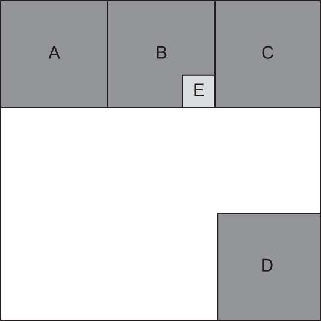

图 4.12 一个显示块 A、B 和 C 相对彼此布局的示例。Block D 有绝对位置 right: 0 和 bottom: 0。Block E 也有绝对位置 right: 0 和 bottom: 0，但它的父容器是 block B 而不是主容器，而 D 的父容器是主容器。

列表 4.13 相对和绝对定位比较

```
import React, { Component } from 'react';
import { StyleSheet, Text, View} from 'react-native';

export default class App extends Component<{}> {
    render() {
        return (
            <View style={styles.container}>
 <View style={styles.row}>    ①  
                    <Example>
                        <CenteredText>A</CenteredText>
                    </Example>
                    <Example>
                        <CenteredText>B</CenteredText>
 <View style={styles.tinyExample,  [  ②  
                                     {position: 'absolute',
                                      right: 0,
                                      bottom: 0}]}>
                            <CenteredText>E</CenteredText>
                        </View>
                    </Example>
                    <Example>
                        <CenteredText>C</CenteredText>
                    </Example>
                </View>
 <Example style={{position: 'absolute',    ③  
                                 right: 0, bottom: 0}}>
                    <CenteredText>D</CenteredText>
                </Example>
            </View>
        );
    }
}

const Example = (props) => (
    <View style={[styles.example,props.style]}>
        {props.children}
    </View>
);

const CenteredText = (props) => (
    <Text style={[styles.centeredText, props.style]}>
        {props.children}
    </Text>
);

const styles = StyleSheet.create({
    container: {
        width: 300,
        height: 300,
        margin: 40,
        marginTop: 100,
        borderWidth: 1
    },
 row: {    ④  
 flex: 1,
        flexDirection: 'row'
    },
    example: {
        width: 100,
        height: 100,
        backgroundColor: 'grey',
        borderWidth: 1,
        justifyContent: 'center'
    },
    tinyExample: {
        width: 30,
        height: 30,
        borderWidth: 1,
        justifyContent: 'center',
        backgroundColor: 'lightgrey'
    },
    centeredText: {
        textAlign: 'center',
        margin: 10
    }
}); 
```

我们已经完成了 `View` 组件的基本样式。你已经了解了一些布局技术：边距、填充和位置。让我们回顾一下 Profile Card 组件，并修复那些还没有正确布局的部分。

### 4.2.5 Profile Card 定位

以下列表展示了需要修改 列表 4.10 的代码，以正确地间隔圆圈和用户图像，并使一切居中。图 4.13 展示了结果。

列表 4.14 修改 Profile Card 样式以修复布局

```
...
    cardContainer: {
 **alignItems: 'center',**    ①  
        borderColor: 'black',
        borderWidth: 3,
        borderStyle: 'solid',
        borderRadius: 20,
        backgroundColor: profileCardColor,
        width: 300,
        height: 400
 },
    cardImageContainer: {
 **alignItems: 'center',**    ②  
        backgroundColor: 'white',
        borderWidth: 3,
        borderColor: 'black',
        width: 120,
        height: 120,
        borderRadius: 60,
 **marginTop: 30,**    ③  
 **paddingTop: 15**    ④  
    },
... 
```

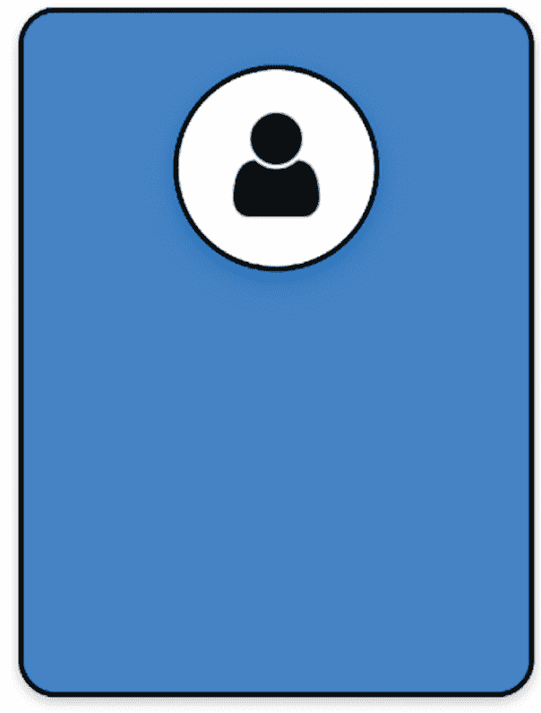

图 4.13 在所有`View`组件正确排列后的个人资料卡组件

现在，个人资料卡的`View`组件已经就位。通过使用到目前为止讨论的技术，你已经为组件构建了一个不错的基座，但你还没有完成。你需要添加关于这个人的信息：姓名、职业和简短的个人简介。所有这些信息都是基于文本的，所以接下来你将学习如何对`Text`组件进行样式设计。

## 4.3 文本组件的样式

在本节中，我们将讨论如何对`Text`组件进行样式设计。在你掌握了如何使文本看起来很棒之后，我们将再次查看个人资料卡并添加一些关于用户的信息。图 4.14 是带有用户姓名、职业和简短个人描述的完成后的个人资料卡组件。但在我们重新审视个人资料卡之前，让我们看看将使你能够完成构建它的样式技术。

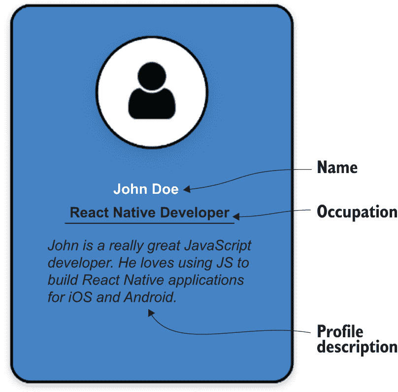

图 4.14 带有用户姓名、职业和简短个人描述的完成后的个人资料卡

### 4.3.1 文本组件与 View 组件对比

除了我们尚未涉及的弹性属性外，大多数适用于`View`元素的样式也可以在`Text`元素上按预期工作。`Text`元素可以有边框和背景，并且会受到布局属性如`margin`、`padding`和`position`的影响。

反过来则不然。大多数`Text`元素可以使用的样式对`View`元素不起作用，这是完全合理的。如果你曾经使用过文字处理器，你知道你可以为文本使用不同的字体并更改字体颜色；你可以调整文本大小、加粗和斜体；你还可以应用下划线等装饰。

在我们深入文本特定样式之前，让我们谈谈颜色，这是`Text`和`View`组件共有的样式。然后你将使用颜色以及迄今为止所学的一切来开始向个人资料卡添加文本。

#### 文本着色

`color`属性以与`View`组件完全相同的方式应用于`Text`组件。正如预期的那样，此属性指定了`Text`元素中文本的颜色。所有在表 4.1 中列出的颜色格式仍然适用——甚至包括`transparent`，尽管我想象不出这有什么好处。默认情况下，文本颜色为黑色。

图 4.14 展示了个人资料卡中的三个`Text`元素：

+   姓名

+   职业

+   个人简介

使用你已经学到的知识，你可以居中文本、定位文本，将姓名的颜色从黑色改为白色，并添加一个简单的边框来区分职业和描述。图 4.15 展示了通过应用你的工具库中的技术你最终会得到什么。

到目前为止，你应该能够跟随列表 4.15 并理解所有发生的事情。如果你没有跟上，不要感到难过——如果需要，可以回过头去重新阅读适当的章节。

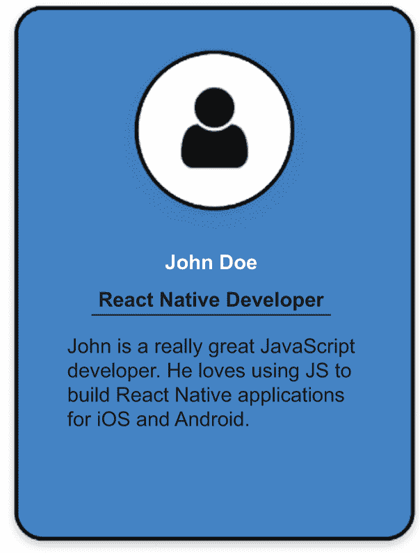

图 4.15 使用文本样式默认值和将名称的颜色属性设置为白色添加文本元素的个人资料卡

列表 4.15 向个人资料卡添加文本

```
import React, { Component } from 'react';
import { Image, StyleSheet, **Text**, View} from 'react-native';    ①  

export default class App extends Component<{}> {
  render() {
    return (
      <View style={styles.container}>
        <View style={styles.cardContainer}>
          <View style={styles.cardImageContainer}>
            <Image style={styles.cardImage}
                   source={require('./user.png')}/>
          </View>
 **<View>**
 **<Text style={styles.cardName}>**    ②  
 **John Doe**
 **</Text>**
 **</View>**
 **<View style={styles.cardOccupationContainer}>**    ③  
 **<Text style={styles.cardOccupation}>**    ④  
 **React Native Developer**
 **</Text>**
 **</View>**
 **<View>**
 **<Text style={styles.cardDescription}>**    ⑤  
              **John is a really great JavaScript developer. He**
 **loves using JS to build React Native applications**
 **for iOS and Android.**
 **</Text>**
 **</View>**
        </View>
      </View>
    );
 }
}

const profileCardColor = 'dodgerblue';

const styles = StyleSheet.create({
    container: {
        flex: 1,
        justifyContent: 'center',
        alignItems: 'center'
    },
    cardContainer: {
        alignItems: 'center',
        borderColor: 'black',
        borderWidth: 3,
        borderStyle: 'solid',
        borderRadius: 20,
        backgroundColor: profileCardColor,
        width: 300,
        height: 400
    },
    cardImageContainer: {
        alignItems: 'center',
        backgroundColor: 'white',
        borderWidth: 3,
        borderColor: 'black',
        width: 120,
        height: 120,
        borderRadius: 60,
        marginTop: 30,
        paddingTop: 15
    },
    cardImage: {
        width: 80,
        height: 80
    },
 **cardName: {**    ⑥  
 **color: 'white',**
 **marginTop: 30,**
 **},**
 **cardOccupationContainer: {**    ⑦  
 **borderColor: 'black',**
 **borderBottomWidth: 3**
 **},**
 **cardOccupation: {**    ⑧  
 **marginTop: 10,**
 **marginBottom: 10,**
 **},**
 **cardDescription: {**    ⑨  
 **marginTop: 10,**
 **marginRight: 40,**
 **marginLeft: 40,**
 **marginBottom: 10**
 **}**
}); 
```

在这个阶段，你已经拥有了个人资料卡的完整内容，但它看起来相当简单。在接下来的几节中，我们将讨论如何设置字体属性并为文本添加装饰样式。

### 4.3.2 字体样式

如果你曾经使用过文字处理软件或编写过具有丰富文本功能的电子邮件，你曾经能够更改字体、增加或减少字体大小、加粗或斜体化文本等。这些是你将在本节中学到的如何更改的样式。通过调整这些样式，你可以使文本对最终用户更具吸引力和吸引力。我们将讨论以下属性：`fontFamily`、`fontSize`、`fontStyle` 和 `fontWeight`。

#### 指定字体族

`fontFamily` 属性看似简单。如果你坚持使用默认值，那么很容易；但如果你想使用特定的字体，你可能会很快遇到麻烦。iOS 和 Android 都自带一组默认字体。对于 iOS，大量可用的字体可以开箱即用。对于 Android，有 Roboto，一个等宽字体，以及一些简单的衬线和无衬线变体。要获取 React Native 中开箱即用的 Android 和 iOS 字体的完整列表，请访问 [`github.com/dabit3/react-native-fonts`](https://github.com/dabit3/react-native-fonts)。

如果你想在应用程序中使用等宽字体，你不能指定以下任何一个：

+   `fontFamily: 'monospace'`——iOS 上不支持 `'monospace'` 选项，因此在该平台上你会得到错误“未识别的字体族 `'monospace'`。”但在 Android 上，字体将正确渲染而没有任何问题。与 CSS 不同，你不能向 `fontFamily` 属性提供多个字体。

+   `fontFamily: 'American Typewriter, monospace'`——你会在 iOS 上再次遇到错误，“未识别的字体族 `'American Typewriter, monospace'`。”但在 Android 上，当你提供一个它不支持的字体时，它会回退到默认字体。这可能在 Android 的每个版本中都不一定成立，但可以肯定的是，这两种方法都不会奏效。

如果你想要使用不同的字体，你将不得不使用 React Native 的 `Platform` 组件。我们将在第十章中更详细地讨论 `Platform`，但我想要介绍它，这样你就可以看到如何解决这个困境。图 4.16 显示了在 iOS 上渲染的 American Typewriter 字体和在 Android 上使用的通用等宽字体。

下面的列表显示了生成此示例的代码。请注意，`fontFamily` 是如何使用 `Platform.select` 设置的。

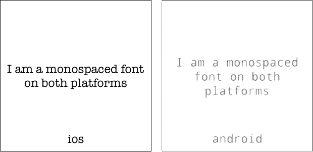

图 4.16 在 iOS 和 Android 上渲染等宽字体的示例

列表 4.16 在 iOS 和 Android 上显示等宽字体

```
import React, { Component } from 'react';
import { Platform, StyleSheet, Text, View} from 'react-native';    ①  

export default class App extends Component<{}> {
    render() {
        return (
            <View style={styles.container}>
                <View style={styles.row}>
                    <CenteredText>
                        I am a monospaced font on both platforms
                    </CenteredText>
                    <BottomText>
 {Platform.OS}    ②  
                    </BottomText>
                </View>
            </View>
        );
    }
}

const CenteredText = (props) => (
    <Text style={[styles.centeredText, props.style]}>
        {props.children}
    </Text>
);

const BottomText = (props) => (
 <CenteredText style={{position: 'absolute', bottom: 0},  [  ③  
                          props.style]}>
        {props.children}
    </CenteredText>
);

const styles = StyleSheet.create({
    container: {
        width: 300,
        height: 300,
        margin: 40,
        marginTop: 100,
        borderWidth: 1
    },
    row: {
        alignItems: 'center',
        flex: 1,
        flexDirection: 'row',
        justifyContent: 'center'
    },
    centeredText: {
        textAlign: 'center',
        margin: 10,
        fontSize: 24,
 ...Platform.select({    ④  
            ios: {
 fontFamily: 'American Typewriter'
            },
            android: {
                fontFamily: 'monospace'
            }
        })
    }
}); 
```

此示例展示了如何根据操作系统选择字体，但您可用的字体集合仍然仅限于 React Native 默认提供的字体。您可以使用字体文件（TTF、OTF 等）将自定义字体添加到项目中，并将它们作为资源链接到您的应用程序中。理论上这个过程很简单，但成功与否很大程度上取决于操作系统和所使用的字体文件。我想让您知道这是可行的，但如果您想尝试，请打开您选择的搜索引擎并查找 `react-native link`。

#### 使用 `fontSize` 调整文本大小

`fontSize` 非常简单：它调整 `Text` 元素中文字的大小。您已经使用过很多次了，所以我们不会深入细节，除了默认的 `fontSize` 是 14。

#### 更改字体样式

您可以使用 `fontStyle` 将字体样式更改为斜体。默认值为 `'normal'`。目前只有两个选项：`'normal'` 和 `'italic'`。

#### 指定字体粗细

`fontWeight` 指的是字体的粗细。默认值为 `'normal'` 或 `'400'`。`fontWeight` 的选项有 `'normal'`, `'bold'`, `'100'`, `'200'`, `'300'`, `'400'`, `'500'`, `'600'`, `'700'`, `'800'`, 和 `'900'`。数值越小，文字越细；数值越大，文字越粗。

现在您已经知道如何更改字体样式，您几乎可以完成个人资料卡组件。让我们更改一些字体样式，看看您能接近最终产品到什么程度，如图 4.17 所示。下一列表将展示如何从 列表 4.16 更改样式以实现这种外观。

列表 4.17 在个人资料卡中为文本元素设置字体样式

```
…
cardName: {
    color:  'white',
 fontWeight: 'bold',    ①  
 fontSize: 24,    ②  
    marginTop: 30,
},
…
cardOccupation: {
 fontWeight: 'bold',    ③  
    marginTop: 10,
    marginBottom: 10,
},
cardDescription: {
 fontStyle: 'italic',    ④  
    marginTop: 10,
    marginRight: 40,
    marginLeft: 40,
    marginBottom: 10
}
… 
```

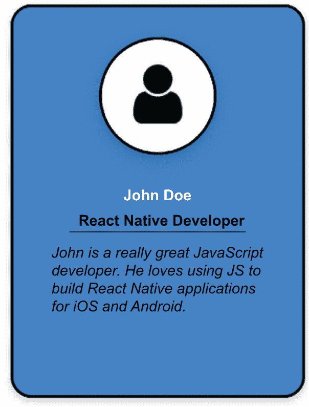

图 4.17 应用了字体样式的姓名、职业和描述文本的个人资料卡

修改姓名、职业和描述文本的字体样式有助于区分各个部分，但姓名仍然不够突出。下一节将介绍一些装饰性的文本样式以及如何使用这些技术使姓名在个人资料卡中更加突出。

### 4.3.3 使用装饰性文本样式

在本节中，您将超越更改字体样式的基础，并开始将装饰性样式应用于文本。我将向您展示如何进行下划线和删除线文本，以及添加阴影等技术。这些技术可以为应用程序添加很多视觉多样性，并帮助文本元素彼此区分。

在本节中，我们将介绍以下属性：

+   *iOS 和 Android* —`lineHeight`, `textAlign`, `textDecorationLine`, `textShadowColor`, `textShadowOffset`, 和 `textShadowRadius`

+   *仅限 Android* —`textAlignVertical`

+   *仅限 iOS* —`letterSpacing`, `textDecorationColor`, `textDecorationStyle`, 和 `writingDirection`。

注意，一些属性仅适用于一个操作系统或另一个。可以分配给属性的某些值也是操作系统特定的。这一点很重要，尤其是如果您依赖于特定的样式来突出屏幕上特定的文本元素。

#### 指定文本元素的高度

`lineHeight` 指定 `Text` 元素的高度。图 4.18 和 列表 4.18 展示了在 iOS 和 Android 上这种行为的不同。将 100 的 `lineHeight` 应用到 Text B 元素：该行的长度明显大于其他行。同时请注意 iOS 和 Android 在行内定位文本的不同方式。在 Android 上，文本位于行的底部。

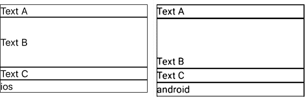

图 4.18 在 iOS 和 Android 中使用 lineHeight 的示例。

列表 4.18 在 iOS 和 Android 中将 `lineHeight` 应用到 `Text` 元素

```
import React, { Component } from 'react';
import { Platform, StyleSheet, Text, View} from 'react-native';

export default class App extends Component<{}> {
    render() {
        return (
            <View style={styles.container}>
                <TextContainer>
                    <LeftText>Text A</LeftText>
                </TextContainer>
                <TextContainer>
 <LeftText style={{lineHeight: 100}}>    ①  
                        Text B
                    </LeftText>
                </TextContainer>
                <TextContainer>
                    <LeftText>Text C</LeftText>
                </TextContainer>
                <TextContainer>
                    <LeftText>{Platform.OS}</LeftText>
                </TextContainer>
            </View>
        );
    }
}

const LeftText = (props) => (
    <Text style={[styles.leftText, props.style]}>
        {props.children}
    </Text>
);

const TextContainer = (props) => (
    <View style={[styles.textContainer, props.style]}>
        {props.children}
 </View>
);

const styles = StyleSheet.create({
    container: {
        width: 300,
        height: 300,
        margin: 40,
        marginTop: 100
    },
    textContainer: {
 borderWidth: 1    ②  
    },
    leftText: {
        fontSize: 20
    }
}); 
```

#### 水平对齐文本

`textAlign` 指的是元素中文本的水平对齐方式。`textAlign` 的选项有 `'auto'`、`'center'`、`'right'`、`'left'` 和 `'justify'`（仅限 iOS）。

#### 为文本添加下划线或贯穿线

使用 `textDecorationLine` 属性为给定文本添加下划线或贯穿线。`textDecorationLine` 的选项有 `'none'`、`'underline'`、`'line-through'` 和 `'underline line-through'`。默认值是 `'none'`。当您指定 `'underline line-through'` 时，引号中的值由单个空格分隔。

#### 文本装饰样式（仅限 iOS）

iOS 支持一些 Android 不支持的文本装饰样式。第一个是 `textDecorationColor`，它允许您为 `textDecorationLine` 设置颜色。iOS 还支持对线条本身进行样式化。在 Android 上，线条始终是实线，但在 iOS 上 `textDecorationStyle` 允许您指定 `'solid'`、`'double'`、`'dotted'` 和 `'dashed'`。Android 将忽略这些额外的样式。

要使用额外的 iOS 装饰样式，请与主要的 `textDecorationLine` 样式一起指定。例如：

```
`{`
 `textDecorationLine: 'underline',` 
 `textDecorationColor: 'red',` 
 `textDecorationStyle: 'double'`
`}` 
```

#### 为文本添加阴影

您可以使用 `textShadowColor`、`textShadowOffset` 和 `textShadowRadius` 属性为 `Text` 元素添加阴影。要创建阴影，您需要指定三件事：

+   颜色

+   偏移量

+   半径

偏移量指定了阴影相对于投掷阴影的组件的位置。半径基本上定义了阴影的模糊程度。您可以指定一个文本阴影如下：

```
`{`
 `textShadowColor: 'red',`
 `textShadowOffset: {width: -2, height: -2},` 
 `textShadowRadius: 4`
`}` 
```

#### 控制字母间距（仅限 iOS）

`letterSpacing` 指定文本字符之间的间距。这不是您每天都会使用的东西，但它可以产生一些有趣的视觉效果。请注意，它仅限 iOS，因此如果您需要，请使用它。

#### 文本样式的示例

我们在本节中介绍了很多不同的样式。图 4.19 展示了应用于 `Text` 组件的各种样式。

下面是 图 4.19 中每个示例所使用的样式的快速概述：

+   A 使用 `{fontStyle: 'italic'}` 创建斜体文本。

+   B 显示带有下划线和贯穿文本的文本装饰。这种样式的代码是 `{textDecorationLine: 'underline line-through'}`。

+   C 通过应用一些仅适用于 iOS 的文本样式 `{textDecorationColor: 'red', textDecorationStyle: 'dotted'}` 扩展了示例 B。注意这些样式在 Android 中没有效果。

+   D 使用 `{textShadowColor: 'red', textShadowOffset: {width: -2, height: -2}, textShadowRadius: 4}` 应用阴影。

+   E 使用仅适用于 iOS 的 `{letterSpacing: 5}`，这不会影响 Android。

+   文本 *ios* 和 *android* 使用 `{textAlign: 'center', fontWeight: 'bold'}` 进行样式化。

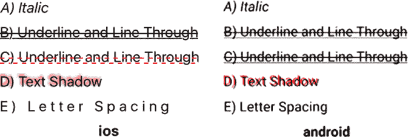

图 4.19 文本组件样式的各种示例

以 列表 4.19 为起点，看看修改样式如何影响结果。

列表 4.19 `Text` 组件的样式示例

```
import React, { Component } from 'react';
import { Platform, StyleSheet, Text, View} from 'react-native';

export default class App extends Component<{}> {
  render() {
    return (
      <View style={styles.container}>
        <LeftText style={{fontStyle: 'italic'}}>
          A) Italic
        </LeftText>
        <LeftText style={{textDecorationLine: 'underline line-through'}}>
          B) Underline and Line Through
        </LeftText>
        <LeftText style={{textDecorationLine: 'underline line-through',
                          textDecorationColor: 'red',
                          textDecorationStyle: 'dotted'}}>
          C) Underline and Line Through
        </LeftText>
        <LeftText style={{textShadowColor: 'red',
                          textShadowOffset: {width: -2, height: -2},
                          textShadowRadius: 4}}>
          D) Text Shadow
        </LeftText>
        <LeftText style={{letterSpacing: 5}}>
          E) Letter Spacing
        </LeftText>
        <LeftText style={{textAlign: 'center', fontWeight: 'bold'}}>
          {Platform.OS}
        </LeftText>
      </View>
    );
  }
}

const LeftText = (props) => (
    <Text style={[styles.leftText, props.style]}>
        {props.children}
    </Text>
);

const styles = StyleSheet.create({
    container: {
        width: 300,
        height: 300,
        margin: 40,
        marginTop: 100
    },
    leftText: {
        fontSize: 20,
        paddingBottom: 10
    }
}); 
```

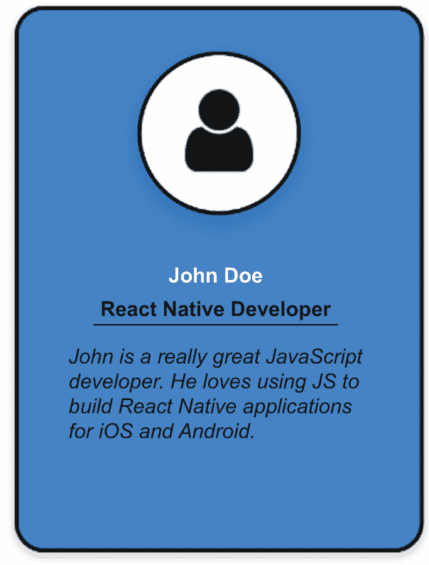

图 4.20 完成的个人资料卡片示例。已添加有关使用本节中介绍的文本样式技术的人的文本信息。

现在您已经知道如何创建阴影效果，让我们给人的名字添加阴影，使其从其他文本中突出出来。图 4.20 显示了期望的结果。

下一个提供的是个人资料卡片的完整代码。您只需添加一小段代码来设置名称的文本阴影。

列表 4.20 完成的个人资料卡片示例

```
import React, { Component } from 'react';
import { Image, StyleSheet, Text, View} from 'react-native';    

export default class App extends Component<{}> {
    render() {
        return (
            <View style={styles.container}>
                <View style={styles.cardContainer}>
                    <View style={styles.cardImageContainer}>
                        <Image style={styles.cardImage}  
                               source={require('./user.png')}/>
                    </View>
                    <View>
                        <Text style={styles.cardName}>   
                            John Doe
                        </Text>
                    </View>
                    <View style={styles.cardOccupationContainer}>    
                        <Text style={styles.cardOccupation}>   
                            React Native Developer
                        </Text>
                    </View>
                    <View>
                        <Text style={styles.cardDescription}>  
                            John is a really great JavaScript developer. 
                            He loves using JS to build React Native  
                            applications for iOS and Android.
 </Text>
                    </View>
                </View>
            </View>
        );
    }
}

const profileCardColor = 'dodgerblue';

const styles = StyleSheet.create({
    container: {
        flex: 1,
        justifyContent: 'center',
        alignItems: 'center'
    },
    cardContainer: {
        alignItems: 'center',
        borderColor: 'black',
        borderWidth: 3,
        borderStyle: 'solid',
        borderRadius: 20,
        backgroundColor: profileCardColor,
        width: 300,
        height: 400
    },
    cardImageContainer: {
        alignItems: 'center',
        backgroundColor: 'white',
        borderWidth: 3,
        borderColor: 'black',
        width: 120,
        height: 120,
        borderRadius: 60,
        marginTop: 30,
        paddingTop: 15
    },
    cardImage: {
        width: 80,
        height: 80
    },
    cardName: {
        color: 'white',
        fontWeight: 'bold',
        fontSize: 24,
        marginTop: 30,
 **textShadowColor: 'black',**  ①  
 **textShadowOffset: {**  ②  
 **height: 2,**
 **width: 2**
 **},**
 **textShadowRadius: 3**  ③  
 **},**
    cardOccupationContainer: { 
        borderColor: 'black',
        borderBottomWidth: 3
 },
    cardOccupation: {
        fontWeight: 'bold',
        marginTop: 10,
        marginBottom: 10,
    },
    cardDescription: {
        fontStyle: 'italic',
        marginTop: 10,
        marginRight: 40,
        marginLeft: 40,
        marginBottom: 10
    }
}); 
```

您可以对这个基本示例进行很多改进，但目标是展示理解样式概念的好处。您不必是一位出色的图形设计师就能制作出美观的组件——一些简单的技巧就能使您的应用程序看起来很棒。

在本章中，我们涵盖了大量的内容，但信不信由你，这只是一个简短的介绍！我们将在第五章探索一些额外的先进主题。

## 概述

+   样式可以内联应用于组件，或者通过创建可以被组件引用的样式表来应用。

+   样式应该在组件定义之后或外部化到单独的 styles.js 文件中与组件组织在同一文件中。

+   样式是代码。JavaScript 是一个完整的语言，具有变量和函数，这为传统 CSS 提供了许多优势。

+   `View` 组件是 UI 的主要构建块，并且它们具有许多样式属性。

+   您可以使用边框以多种方式增强组件的外观。您甚至可以使用边框创建形状，例如圆形。

+   您可以使用边距和填充将组件相对于彼此定位。

+   绝对定位允许您将组件放置在父容器内的任何位置。

+   根据您设置的边框、边距和填充方式，Android 设备上可能会发生裁剪。

+   指定除默认字体以外的字体可能很棘手。使用`Platform`组件选择适合操作系统的适当字体。

+   使用通用的字体样式，如颜色、大小和粗细，来改变`Text`组件的大小和外观。

+   操作系统之间存在渲染差异，例如 iOS 和 Android 之间行高的行为不同。

+   文本装饰样式可以为文本添加下划线或阴影效果。可用的样式集合因操作系统而异。

# 5

深入了解样式

*****本章*** ***涵盖*****

+   特定平台的尺寸和样式

+   为组件添加阴影效果

+   在 x 轴和 y 轴上移动和旋转组件

+   缩放和倾斜组件

+   使用 flexbox 进行布局

第四章介绍了样式 React Native 组件。它展示了如何样式化`View`和`Text`组件，这些样式你可能会每天使用，并且主要影响组件的外观。本章继续讨论并深入探讨特定平台的样式；阴影效果；使用变换如平移、旋转、缩放和倾斜来操作组件；以及使用 flexbox 动态布局组件。

其中一些主题可能感觉熟悉。你在第四章的几个示例中使用了特定平台的样式和 flexbox。我们没有详细讲解，但你已经在几个代码示例中看到了它们。

本章扩展了这些主题。变换使你能够在二维或三维中操作组件。你可以将组件从一处位置平移到另一处，旋转组件，将组件缩放到不同的大小，以及倾斜组件。变换本身很有用，但在第七章中，它将扮演一个更大的角色，第七章将详细讨论动画。

我们将继续讨论平台之间的差异，并更深入地探讨 flexbox。因为 flexbox 是一个基本概念，正确理解它对于你能够在 React Native 中创建布局和 UI 很重要。你可能会在创建的每个应用程序中使用 flexbox。你将使用一些新的样式技术来继续构建上一章中的`ProfileCard`示例的新功能。

## 5.1 特定平台的尺寸和样式

你已经看到了如何使用`Platform.select`实用函数来选择仅在 iOS 或 Android 上可用的字体。你使用`Platform.select`来选择每个平台支持的等宽字体。你可能当时并没有太在意，但记住你正在为两个不同的平台开发是很重要的。你应用于组件的样式在两个操作系统之间或甚至在 iOS 和 Android 的不同版本之间可能看起来或表现不同。

你不是为单个设备编码；你甚至不是为单个操作系统编码。React Native 的美丽之处在于你使用 JavaScript 创建可以在 iOS 和 Android 上运行的应用程序。如果你查看 React Native 文档，你会看到许多以 IOS 或 Android 结尾的组件，例如`ProgressBarAndroid`、`ProgressViewIOS`和`ToolbarAndroid`，因此样式也可以是平台特定的，这并不令人惊讶。

你可能没有注意到，你从未为任何东西指定过像素大小，比如`width: 300`与`width: '300px'`。这是因为 iOS 和 Android 操作系统之间的大小概念本身就不同。

### 5.1.1 像素、点和 DP

尺寸可能是一个令人困惑的话题，但如果你需要绝对精确地定位屏幕上的组件时，这一点很重要。即使你不想制作高保真度的布局，了解这些概念也会很有用，以防你在不同设备上的布局中出现小的差异。

让我们从一开始，定义一个像素。一个 *像素* 是显示上可编程颜色的最小单位。一个像素通常由红色、绿色和蓝色（RGB）颜色成分组成。通过操纵每个 RGB 值的强度，像素会发出你看到的颜色。直到你开始查看显示器的物理属性：屏幕尺寸、分辨率和每英寸点数，像素才告诉你任何信息。

*屏幕尺寸* 是屏幕对角线的测量值，从一个角落到另一个角落。例如，iPhone 的原始屏幕尺寸为 3.5 英寸，而 iPhone X 的屏幕尺寸为 5.8 英寸。尽管 iPhone X 的尺寸明显更大，但这个尺寸本身并没有什么意义，直到你了解有多少像素可以适应这个屏幕尺寸。

*分辨率* 是显示中的像素数，通常以设备宽度和高度的像素数来表示。原始 iPhone 的分辨率为 320 × 480，而 iPhone X 的分辨率为 1125 × 2436。

屏幕尺寸和分辨率可以用来计算像素密度：*每英寸像素数*（PPI）。你经常会看到这个值被表示为*每英寸点数*（DPI），这是一个来自印刷世界的遗留术语，其中在页面上打印了一个颜色点。PPI 和 DPI 经常被互换使用，尽管这并不完全正确，所以如果你在屏幕的上下文中看到 DPI，要知道 PPI 才是真正被讨论的内容。

PPI 给你一个图像清晰度的度量。想象一下，如果两个屏幕具有相同的分辨率，320 × 480（半 VGA），相同的图像在 3.5 英寸的 iPhone 显示屏上与 17 英寸 HVGA 监视器显示屏上会有什么不同？相同的图像在 iPhone 上看起来会更清晰，因为它的 PPI 是 163，而 CRT 监视器的 PPI 是 34。你可以在原始 iPhone 的相同物理空间中放入近五倍的信息。表 5.1 比较了两个设备的对角线尺寸、分辨率和 PPI。

表 5.1 17 英寸 HVGA 监视器的 PPI 与原始 iPhone 的 PPI 比较

|  | **HVGA 监视器** | **原始 iPhone** |
| --- | --- | --- |
| **对角线尺寸** | 17 英寸 | 3.5 英寸 |
| **分辨率** | 320 × 480 | 320 × 480 |
| **PPI** | 34 | 163 |

这有什么关系呢？因为 iOS 和 Android 都不是使用实际的物理测量值来将内容渲染到设备的屏幕上。iOS 使用一个抽象的点作为测量单位，而 Android 使用一个类似的抽象密度无关像素作为测量单位。

当 iPhone 4 出现时，它与前辈们具有相同的物理尺寸；但它有一个新潮的 Retina 屏幕，分辨率为 640 × 960，是原始设备的四倍。如果 iPhone 以 1:1 的比例渲染现有应用程序的图像，那么所有内容在新的 Retina 显示屏上都会以四分之一的大小绘制。对于苹果来说，做出这样的改变并破坏所有现有应用程序是一个疯狂的建议。

相反，苹果引入了逻辑概念上的“点”。点是一个可以独立于设备分辨率进行缩放的距离单位，因此一个 320 × 480 的图像，在原始 iPhone 上占据了整个屏幕，可以被放大 2 倍以完全适应 Retina 显示屏。图 5.1 提供了几个 iPhone 型号的像素密度可视化。

原始 iPhone 的 163 PPI 是 iOS 点的基准。iOS 点是一英寸的 1/163。不深入细节，Android 使用一个类似的度量单位，称为“设备无关像素”（DIP，通常缩写为 DP）。Android DP 是一英寸的 1/160。

当在 React Native 中定义样式时，你使用逻辑上的像素概念，iOS 上的点，以及 Android 上的 DP。当在本地级别工作时，你偶尔可能需要通过将逻辑像素乘以屏幕缩放（例如，2x，3x）来与设备像素一起工作。

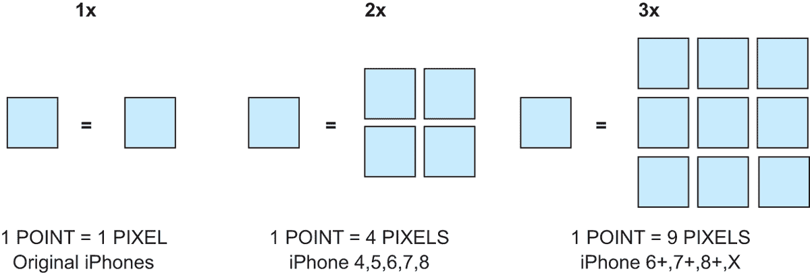

图 5.1 iPhone 像素密度与点数比较的可视化。原始 iPhone 的分辨率为 320 × 480。iPhone 4 的分辨率为 640 × 960，是原始设备的四倍。iPhone 4 的 PPI（326 比 163）是双倍，因此说图像被放大了 2 倍。

### 5.1.2 使用 ShadowPropTypesIOS 和 Elevation 创建阴影

在第四章中，你使用了文本阴影属性为 `ProfileCard` 标题添加阴影。iOS 和 Android 都支持为 `Text` 组件添加阴影。通过为卡片和圆形图像容器添加阴影来美化 `ProfileCard` 会很好，但两个平台之间没有用于 `View` 组件的通用样式属性。

这并不意味着一切都失去了。`ShadowPropTypesIOS` 样式可以用于在 iOS 设备上添加阴影；它不会影响组件的 z 调序。在 Android 上，你可以使用 `Elevation` 样式来模拟阴影，但它 *确实* 影响组件的 z 调序。

#### 使用 ShadowPropTypesIOS 在 iOS 中创建阴影

让我们看看如何使用 `ShadowPropTypesIOS` 样式为几个视图组件添加阴影。 图 5.2 展示了可以实现的多种阴影效果。表 5.2 列出了实现每种阴影效果的具体设置。重要的要点如下：

+   如果你没有为 `shadowOpacity` 提供值，你将看不到阴影。

+   阴影偏移以宽度和高度来表示，但你可以将其视为在 x 和 y 方向上移动阴影。你甚至可以指定宽度和高度的负值。

+   `shadowOpacity` 的值为 1 时是完全不透明的，而值为 0.2 时则更加透明。

+   `shadowRadius` 的值会有效地模糊阴影的边缘。阴影更加扩散。

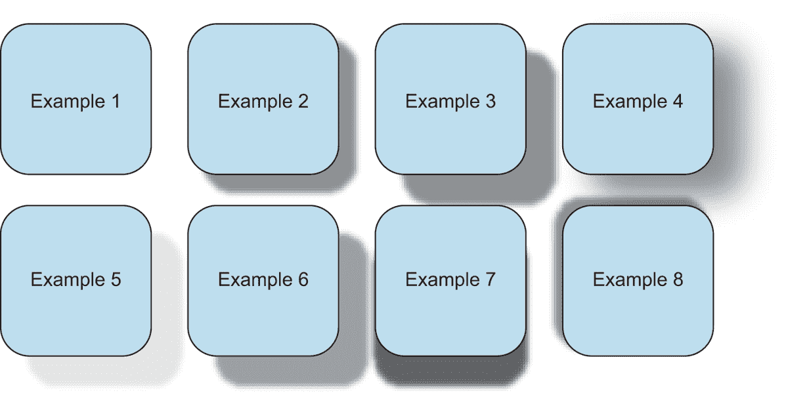

图 5.2 iOS 特定的示例，展示如何将 ShadowPropTypesIOS 样式应用于 View 组件。示例 1 应用了阴影但没有设置不透明度，导致阴影不显示。示例 2 具有相同的阴影效果，但设置了不透明度为 1。示例 3 具有稍大的阴影，示例 4 具有相同大小的阴影并设置了阴影半径。示例 5 具有相同的阴影大小，但将不透明度从 1 更改为 0.2。示例 6 改变了阴影的颜色。示例 7 仅在一个方向上应用阴影，示例 8 在相反方向上应用阴影。

表 5.2 用于创建 图 5.2 中示例的阴影属性

|  |  | ****shadowOffset**** |  |  |
| --- | --- | --- | --- | --- |
| **示例** | ****shadowColor**** | ****width** (x)** | ****height** (y)** | ****shadowOpacity**** | ****shadowRadius**** |
| --- | --- | --- | --- | --- | --- |
| 1 | 黑色 | 10 | 10 |  |  |
| 2 | 黑色 | 10 | 10 | 1 |  |
| 3 | 黑色 | 20 | 20 | 1 |  |
| 4 | 黑色 | 20 | 20 | 1 | 20 |
| 5 | 黑色 | 20 | 20 | 0.2 |  |
| 6 | 红色 | 20 | 20 | 1 |  |
| 7 | 黑色 |  | 20 | 1 |  |
| 8 | 黑色 | -5 | -5 | 1 |  |

此图的代码可以在 git 仓库的 chapter5/figures/Figure-5.2-ShadowPropTypesIOS 目录下找到。如果你要运行此示例的代码，请记住在 iOS 模拟器中运行。在 Android 设备上，你将只看到八个无聊的、带圆角的正方形。`ShadowPropTypesIOS` 样式在 Android 上被忽略。

#### 在 Android 设备上近似实现具有高度的下阴影

你如何在 Android 设备上获得相同的效果？事实是，你无法做到。你可以使用 Android 的 `elevation` 样式来影响组件的 z-顺序。如果有两个或更多组件占据相同的空间，你可以通过赋予它更大的高度（elevation）和因此更大的 z-index 来决定哪个应该在前，这将创建一个小的下阴影，但它远不如在 iOS 上可以实现的阴影效果那么引人注目。请注意，这仅适用于 Android，因为 iOS 不支持 `elevation` 样式，如果指定了它，iOS 会乐意忽略它。

尽管如此，让我们看看 `elevation` 的实际应用。为了做到这一点，你将创建一个包含三个盒子的 `View` 组件，每个盒子都绝对定位。你将赋予它们三个不同的高度——1、2 和 3——然后你将反转高度分配，看看这如何影响布局。图 5.3 展示了这些高度调整的结果。

表 5.3 展示了用于每个盒子组的绝对位置和高度。请注意，除了分配给每个盒子的`高度`之外，没有其他任何变化。iOS 忽略样式，始终将盒子 C 放在盒子 B 的上方，盒子 B 放在盒子 A 的上方。但 Android 尊重样式，并反转渲染盒子的顺序，因此盒子 A 现在位于盒子 B 的上方，盒子 B 位于盒子 C 的上方。

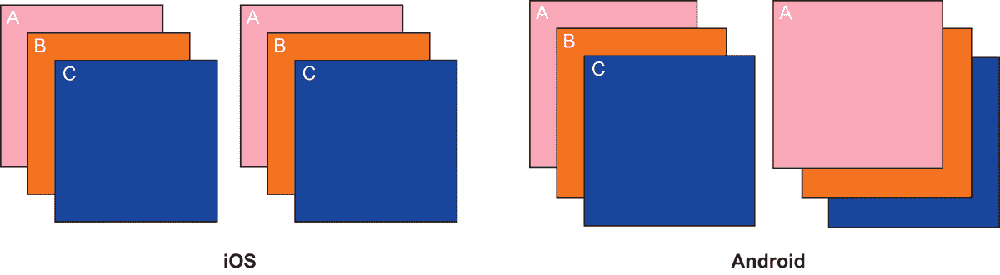

图 5.3 在 iOS 和 Android 上使用 elevation 样式的示例。在 iOS 上，高度被忽略；所有组件保留相同的 z-顺序，因此布局中最后出现的组件位于顶部。在 Android 上，使用高度，z-顺序被改变；在第二个示例中，高度分配被反转，A 位于顶部。

表 5.3 图 5.3 的高度设置

| **示例** | ****颜色**** | ****顶部**** | ****左侧**** | ****高度**** |
| --- | --- | --- | --- | --- |
| A | 红色 | 0 | 0 | 1 |
| B | 橙色 | 20 | 20 | 2 |
| C | 蓝色 | 40 | 40 | 3 |
| A | 红色 | 0 | 0 | 3 |
| B | 橙色 | 20 | 20 | 2 |
| C | 蓝色 | 40 | 40 | 1 |

### 5.1.3 实践应用：ProfileCard 中的下阴影

让我们回到上一章的 `ProfileCard` 示例，并添加一些在 iOS 上看起来很棒而在 Android 上不那么出色的下阴影。你将为整个 `ProfileCard` 容器和圆形图像容器添加下阴影。图 5.4 展示了在 iOS 上你追求的效果以及在 Android 上你将得到的结果。

注意，即使在 Android 上应用了`elevation`，你也看不到很多阴影。实际上，在 Android 上，你永远无法接近 React Native 默认在 iOS 上产生的阴影效果。如果你真的需要在 Android 上实现阴影效果，那么我建议在 npm 或 yarn 上寻找一个可以满足你需求的组件。尝试不同的组件，看看你是否可以使 Android 版本看起来与 iOS 版本一样清晰。我没有任何推荐；我避免使用阴影效果或接受差异。

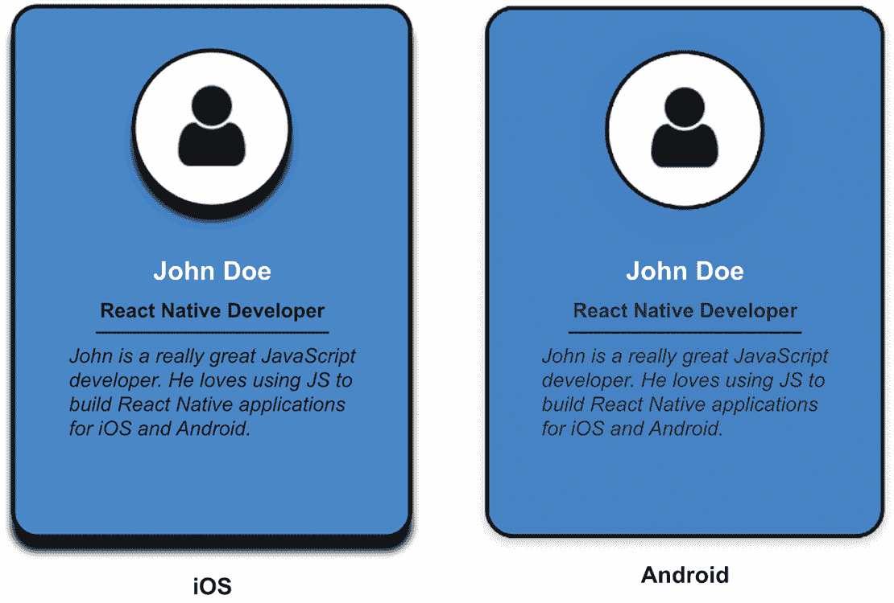

图 5.4 在 iOS 和 Android 上添加到卡片容器和圆形图像容器后的`ProfileCard`。iOS 上的阴影是通过 iOS 特定的阴影属性创建的：`shadowColor`、`shadowOffset`和`shadowOpacity`。在 Android 上，使用`elevation`属性来尝试创建深度。它只产生微弱的阴影效果，远不如 iOS 上产生的阴影。

本章中的代码从列表 4.20 开始：第四章中完成的`ProfileCard`示例。列表 5.1 仅显示了应用阴影效果到组件上所需更改的部分。你不需要添加很多代码就能在 iOS 上实现阴影效果。查看 Android 设备上的列表，看看`elevation`设置如何导致最微弱的阴影。

列表 5.1 向`ProfileCard`添加阴影效果

```
import React, { Component } from 'react';
import { Image, **Platform**, StyleSheet, Text, View} from 'react-native';    ①  
...
cardContainer: {
...
  height: 400,
 **...Platform.select({**    ②  
 **ios: {**
 **shadowColor: 'black',**
 **shadowOffset: {**
 **height: 10**
 **},**
 **shadowOpacity: 1**
 **},**
 **android: {**
 **elevation: 15**
 **}**
 **})**
},
cardImageContainer: {
...
  paddingTop: 15,
 **...Platform.select({**    ③  
 **ios: {**
 **shadowColor: 'black',**
 **shadowOffset: {**
 **height: 10,**
 **},**
 **shadowOpacity: 1**
 **},**
 **android: {**
 **borderWidth: 3,**
 **borderColor: 'black',**
 **elevation: 15**
 **}**
 **})**
},
... 
```

正如第四章中字体选择一样，你使用`Platform.select`函数根据平台（iOS 或 Android）应用不同的样式到组件上。在某些情况下，比如阴影效果，一个平台可能比另一个平台表现得好得多；但在大多数情况下，样式在两个平台上表现相同，这是 React Native 的一个惊人的好处。

## 5.2 使用变换来移动、旋转、缩放和倾斜组件

到目前为止，我们讨论的样式主要影响了组件的外观。你学习了如何设置样式、粗细、大小和颜色等属性，比如边框和字体的样式。你应用了背景颜色和阴影效果，并看到了如何通过使用边距和填充来操纵组件相对于彼此的外观。但我们还没有探讨如何独立于其他一切来操纵组件在屏幕上的位置或方向。你如何移动屏幕上的组件，或者如何使组件在圆周上旋转？

答案是**变换**。React Native 提供了一系列有用的变换，允许你在 3D 空间中修改组件的形状和位置。你可以将组件从一个位置移动到另一个位置，围绕所有三个轴旋转组件，以及在 x 和 y 方向上缩放和倾斜组件。单独使用变换可以产生一些有趣的效果，但它们的真正力量来自于将它们按顺序组合起来形成动画。

本节将帮助你牢固地理解变换以及它们如何影响所应用的组件。如果你清楚地理解了它们的作用，你将能够更好地将它们结合起来，以创建有意义的动画。

`transform`样式接受一个变换属性的数组，该数组定义了如何将变换应用于组件。例如，要旋转组件 90 度并缩小 50%，请将此变换应用于组件：

```
transform: [{rotate: '90deg', scale: .5}] 
```

`transform`样式支持以下属性：

+   `perspective`

+   `translateX`和`translateY`

+   `rotateX`、`rotateY`和`rotateZ`（`rotate`）

+   `scale`、`scaleX`和`scaleY`

+   `skewX`和`skewY`

### 5.2.1 具有透视效果的 3D 效果

`perspective`通过影响 z 平面与用户之间的距离为元素提供 3D 空间。这与其他属性一起使用以产生 3D 效果。`perspective`值越大，组件的 z-index 就越高，使其看起来更靠近用户。如果 z-index 为负，组件看起来就离用户更远。

### 5.2.2 使用 translateX 和 translateY 沿 x 轴和 y 轴移动元素

平移属性将元素沿着 x 轴（`translateX`）或 y 轴（`translateY`）从当前位置移动。这在正常开发中并不非常实用，因为你已经有`margin`、`padding`和其他位置属性可用。但这对动画很有用，可以将组件从一个位置移动到屏幕上的另一个位置。

让我们看看如何使用`translateX`和`translateY`样式属性移动一个正方形。在图 5.5 中，一个正方形放置在显示器的中心，然后向四个主要方向和四个次要方向之一移动：西北（左上），北（顶部），东北（右上），西（左侧），东（右侧），西南（左下），南（底部），和东南（右下）。在每种情况下，正方形的中心在 x 或 y 方向上移动 1.5 倍正方形的大小，或者同时在两个方向上移动。

在学习几何时，你通常看到正 y 轴向上绘制而不是向下。但在移动设备上，惯例是正 y 轴向下穿过屏幕，这反映了最常见的滚动屏幕以查看更多内容的交互方式。结合这一点知识，很容易看出在图 5.5 中将中心正方形沿正 x 方向和正 y 方向移动会导致正方形最终出现在右下角。通过组合`translateX`和`translateY`，你可以在笛卡尔平面（x-y 平面）的任何方向上移动组件。

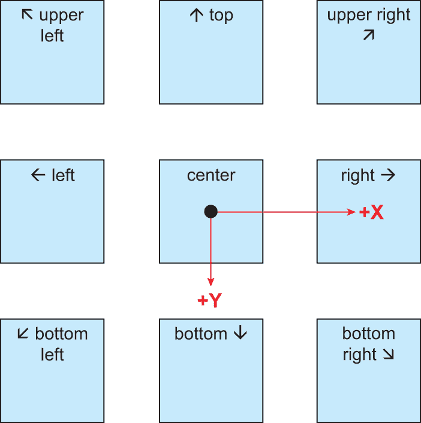

图 5.5 展示了中心正方形在四个主要方向和四个次要方向上的移动：西北（左上），北（顶部），东北（右上），西（左侧），东（右侧），西南（左下），南（底部），和东南（右下）

在 z 平面上的移动没有相应的平移。z 轴垂直于设备的表面，这意味着你正对着它。如果没有相应的大小变化，向前或向后移动组件将不明显。`perspective`变换旨在处理这种视觉效果。

在下一节中，我们将使用相同的例子，并关注中心行，其中中心正方形被向左和向右平移。你会看到当你沿着每个轴旋转组件时会发生什么。

### 5.2.3 使用 rotateX、rotateY 和 rotateZ（rotate）旋转元素

旋转属性确实如其名所示：它们旋转元素。旋转沿着一个轴发生：x、y 或 z。旋转的起点是在应用任何变换之前元素的中心点，所以如果你使用`translateX`或`translateY`，请记住旋转将围绕原始位置的轴进行。旋转量可以用度（deg）或弧度（rad）指定。示例使用度：

```
transform: [{ rotate:  '45deg' }]
transform: [{ rotate:  '0.785398rad' }] 
```

图 5.6 显示了每个轴的旋转正负方向。`rotate`变换与`rotateZ`变换做的是同样的事情。

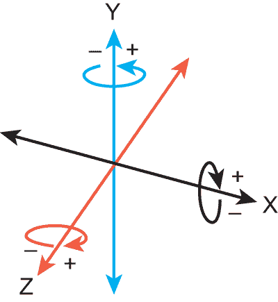

图 5.6 每个轴的旋转正负方向

让我们以 35°的增量围绕 x 轴旋转 100 × 100 的正方形，如图图 5.7 所示。每个正方形都画了一条中心线，这样更容易看到正方形是如何旋转的。你可以将 x 轴的正向旋转想象为正方形从顶部旋转到页面内。当顶部远离你时，底部会靠近你。

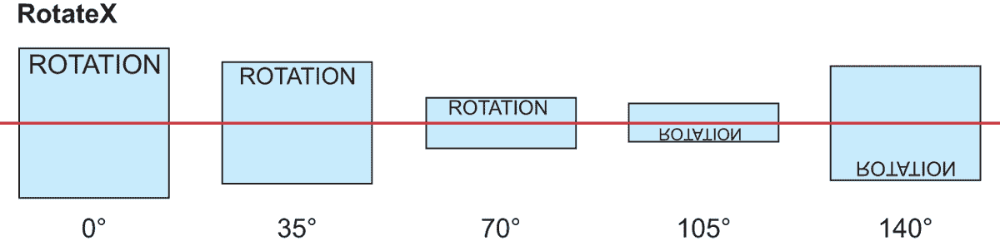

图 5.7 以 35°的增量围绕 x 轴旋转 100 × 100 的正方形。在 90°之后，“ROTATION”标签可以通过元素看到，是颠倒的。

在 90°时，你看到的是正方形的边缘（因为它没有厚度，你看不到任何东西）。当正方形旋转超过 90°标记后，你开始看到正方形的背面。如果你仔细看图 5.7，你会看到“ROTATION”标签是颠倒的，因为你正在透过正方形的背面看。

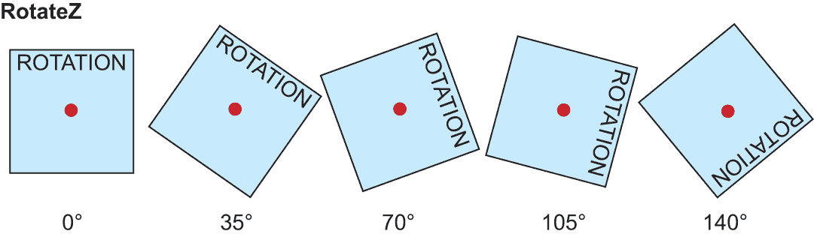

图 5.9 以 35°的增量围绕 z 轴旋转 100 × 100 的正方形。正旋转是顺时针，负旋转是逆时针。

下一个例子将围绕 y 轴旋转相同的 100 × 100 正方形，而不是继续使用 35° 的增量来展示旋转（见图 5.8）。想象正方形的右侧远离你，进入页面。当正方形旋转超过 90° 标记后，你可以看到“旋转”标签穿过组件。因为你正在通过组件的背面看，所以文本看起来是反的。

将 图 5.8 与 图 5.7 进行比较。本质上，围绕 y 轴的旋转与围绕 x 轴的旋转没有区别。我在 图 5.8 中垂直排列正方形，这样你可以很容易地看到旋转轴。我喜欢通过想象一本书的开合来可视化 y 轴的旋转：如果你在打开一本书，封面是逆时针旋转的。如果你在合上书，那么你是在顺时针旋转封面。

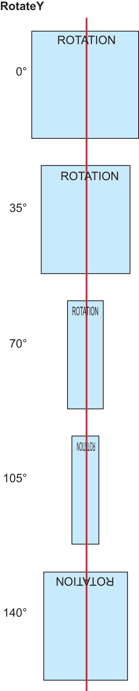

图 5.8 以 35° 的增量围绕 y 轴旋转 100 × 100 的正方形。在 90° 之后，可以看到“旋转”标签穿过元素，向后。

关于 z 轴的旋转最容易可视化。正向旋转会使物体顺时针旋转，而负向旋转会使正方形逆时针旋转。在本例中，如图 5.9 所示，旋转轴用正方形中心的点表示，因为 z 轴基本上是你的视线；它直接进入屏幕。

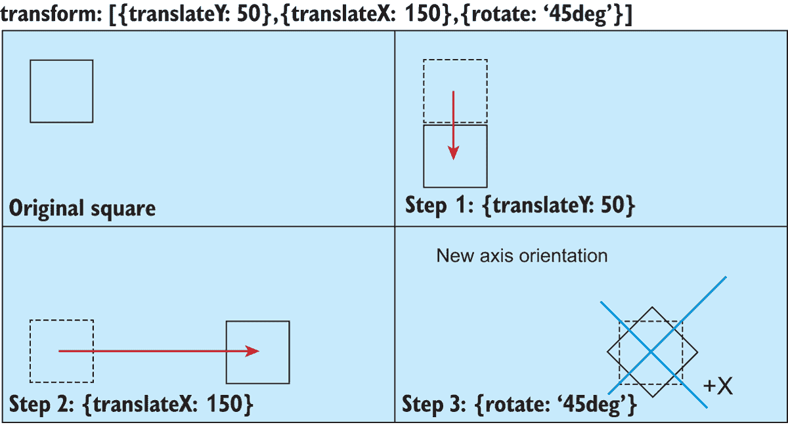

图 5.10 应用变换：[{translateY: 50},{translateX: 150},{rotate: '45deg'}] 到原始正方形

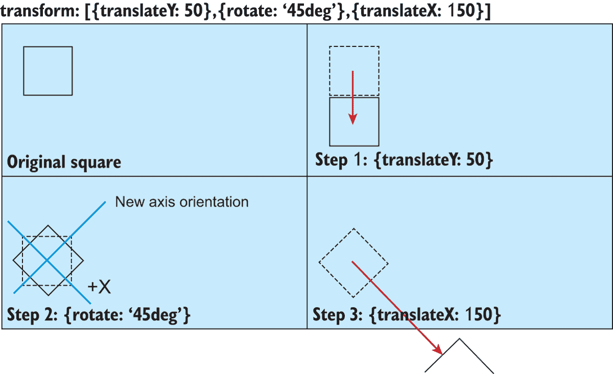

图 5.11 应用变换：[{translateY: 50},{rotate: '45deg'},{translateX: 150}] 到原始正方形上。旋转正方形会改变 x 轴和 y 轴的方向，因此当正方形沿 +x 方向平移 150 个点时，它就会沿着对角线向下并移出视口。

现在，旋转变换的工作原理应该相当明显了。理解正负旋转对物体影响的方向可能是最复杂的部分。但是，当你开始将其他变换与旋转结合使用时，你可能会对结果感到惊讶。记住，变换属性是一个变换数组，因此可以一次性提供多个变换，顺序很重要！指定一个变换并改变数组中元素的顺序将产生不同的结果。

让我们调查改变变换指定顺序如何影响最终布局。让我们对一个正方形应用三个不同的变换：沿 y 方向平移 50 点，沿 x 方向平移 150 点，以及旋转正方形 45°。图 5.10 按照上述顺序指定了变换。正方形原始/之前的位置有虚线边框，而正方形的新位置有实线轮廓，这样你可以看到变换如何影响原始正方形的位置和方向。

图 5.10 中的结果基本上符合预期，但如果你在将正方形沿 y 方向移动后再应用旋转，会发生什么？请看图 5.11 并找出答案。

哇，发生了什么？变换应用后，正方形完全离开了屏幕！这可能不是立即显而易见的，这就是为什么图 5.11 上标注了新的轴方向。

旋转之后，+x-和+y-轴在屏幕上不再垂直和水平对齐：它们旋转了 45°。当应用`translateX`变换时，正方形在+x 方向上移动了 150 点，但现在+x 方向与原始 x 轴成 45°角。

下一个部分展示了旋转变换的另一个有趣方面。

### 5.2.4 在元素旋转超过 90°时设置可见性

如果你回顾图 5.7 和 5.8，当你围绕 x-或 y-轴旋转正方形并超过 90°点时，你仍然可以看到正方形前脸上的文本。*`backfaceVisibility`*属性决定了当元素旋转超过 90°时元素是否可见。*此属性可以设置为`'visible'`或`'hidden'`。*此属性不是变换，但它让你能够在查看对象的背面时隐藏或显示元素。*****

**`backfaceVisibility`属性默认为`'visible'`，但如果将`backfaceVisibility`更改为`'hidden'`，一旦组件在 x 或 y 方向旋转超过 90°，你就完全看不到该元素。在图 5.7 和 5.8 中，对应 105°和 140°旋转的正方形将消失。如果这听起来很困惑，请看图 5.12**

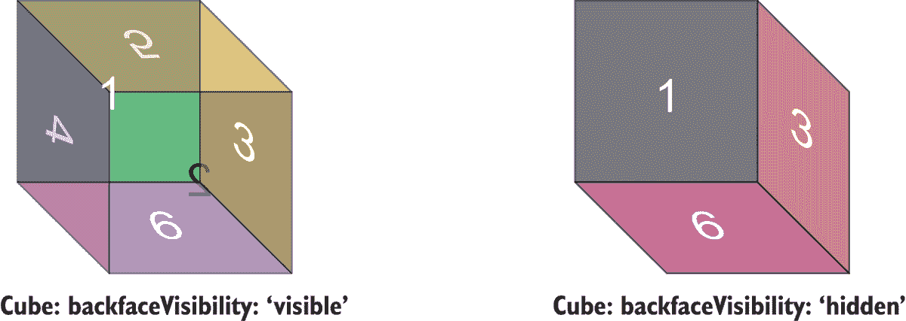

图 5.12 展示了将`backfaceVisibility`属性设置为`'hidden'`如何隐藏旋转超过 90°的元素。左边的立方体显示了 2、4 和 5 面，这些面都旋转了 180°。右边的立方体隐藏了这些面。

在图中，你可以很容易地看到将`backfaceVisibility`设置为`'hidden'`的效果。这也很容易看出这种行为在动画中可能是有益的。当立方体的面旋转出视线时，你希望它们被隐藏。

### 5.2.5 使用 scale、scaleX 和 scaleY 在屏幕上缩放对象

本节讨论了在屏幕上缩放对象。缩放有许多实际用途，许多模式也利用了其功能。例如，缩放可以用来创建对象的缩略图。你已经在许多应用中看到了这一点；用户轻触缩略图，动画逐渐将对象放大到全尺寸。这是一种常见的过渡技术，提供了良好的视觉效果。

你将学习缩放对象的基础知识，然后使用这些技能创建一个当按下时可以打开到全尺寸的`ProfileCard`缩略图。稍后，本章将讨论 flexbox 及其如何用于在画廊界面中管理多个`ProfileCard`缩略图，你可以从中按下个人资料以查看更多详细信息。

`scale`通过传递给它的数字乘以元素的大小，默认值为 1。为了使元素看起来更大，传递一个大于 1 的值；为了使其看起来更小，传递一个小于 1 的值。

元素也可以使用`scaleX`或`scaleY`沿着单个轴进行缩放。`scaleX`沿着 x 轴水平拉伸元素，而`scaleY`沿着 y 轴垂直拉伸元素。让我们创建几个正方形来展示缩放的效果：参见图 5.13。

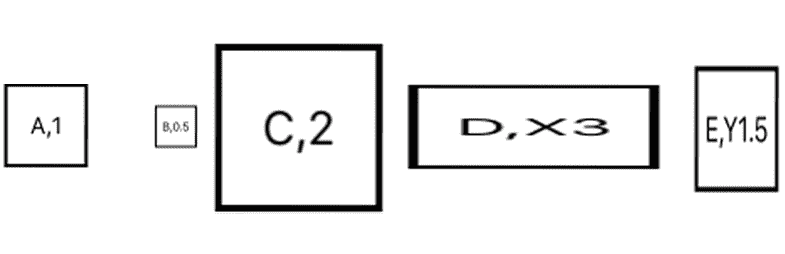

图 5.13 展示了缩放变换如何改变原始正方形的例子。所有正方形都以与 A 相同的大小和形状开始，A 具有默认的缩放比例 1。B 将正方形缩放为 0.5，使其缩小。C 将正方形缩放为 2，使其放大。D 使用`scaleX`，沿着 x 轴将正方形变换为 3 倍。E 使用`scaleY`，沿着 y 轴将正方形变换为 1.5 倍。

没有什么异常发生；缩放对象相当直接。列表 5.2 展示了这有多么简单。

列表 5.2 使用`scale`、`scaleX`和`scaleY`缩放正方形

```
import React, { Component } from 'react';
import { StyleSheet, Text, View} from 'react-native';

export default class App extends Component<{}> {
  render() {
    return (
      <View style={styles.container}>
 <Example style={{}}>A,1</Example>    ①  
 <Example style={{transform: [{scale: 0.5}]}}>B,0.5</Example>    ②  
 <Example style={{transform: [{scale: 2}]}}>C,2</Example>    ③  
 <Example style={{transform: [{scaleX: 3}]}}>D,X3</Example>    ④  
 <Example style={{transform: [{scaleY: 1.5}]}}>E,Y1.5</Example>    ⑤  
      </View>
    );
  }
}

const Example = (props) => (
    <View style={[styles.example,props.style]}>
        <Text>
            {props.children}
        </Text>
    </View>
);

const styles = StyleSheet.create({
    container: {
        marginTop: 75,
        alignItems: 'center',
        flex: 1
    },
    example: {
        width: 50,
        height: 50,
        borderWidth: 2,
        margin: 15,
        alignItems: 'center',
        justifyContent: 'center'
    },
}); 
```

### 5.2.6 使用缩放变换创建 ProfileCard 的缩略图

现在你已经看到了缩放的实际应用，让我们使用这个技术来创建`ProfileCard`的缩略图。通常你会对即将展示的内容进行动画处理，以避免闪烁，但让我们看看如何以实际的方式使用缩放。图 5.14(Figure 5.14)显示了`ProfileCard`组件的一个小型、缩小的版本——缩略图。如果你按下缩略图，组件将恢复到全尺寸。如果你按下全尺寸组件，它将折叠回缩略图视图。

从列表 5.1 中的代码开始。就样式而言，你只需要添加一个新样式来执行从全尺寸到缩略图的缩放变换。代码的其余部分重新组织了组件的各个部分，使其成为一个更可重用的结构，并提供了处理`onPress`事件的触摸能力。

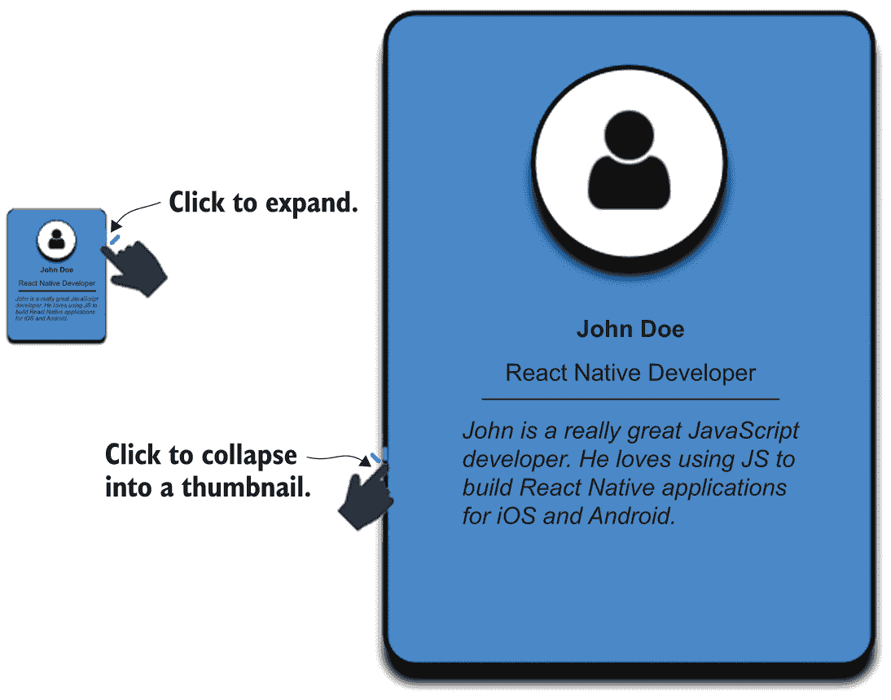

图 5.14 将全尺寸 ProfileCard 缩小 80%为缩略图。按下缩略图将 ProfileCard 恢复到原始大小，按下全尺寸组件将组件折叠成缩略图。

列表 5.3 将`ProfileCard`从全尺寸缩放到缩略图

```
import React, { Component } from 'react';
import PropTypes from 'prop-types';    ①  
import update from 'immutability-helper';    ②  
import { Image, Platform, StyleSheet, Text, 
 TouchableHighlight, View} from 'react-native';    ③   

const userImage = require('./user.png');

constdata = {  [  ④  
    image: userImage,
    name: 'John Doe',
    occupation: 'React Native Developer',
    description: 'John is a really great Javascript developer. ' +
'He loves using JS to build React Native applications ' +
'for iOS and Android',
    showThumbnail: true
  }
];

const ProfileCard = (props) => {    ⑤  

  const { image, name, occupation, 
          description, onPress, showThumbnail } = props;
  let containerStyles = [styles.cardContainer];
 if (showThumbnail) {    ⑥  
    containerStyles.push(styles.cardThumbnail);
  }

  return (
 <TouchableHighlight onPress={onPress}>    ⑦  
      <View style={[containerStyles]}>
        <View style={styles.cardImageContainer}>
          <Image style={styles.cardImage} source={image}/>
        </View>
        <View>
          <Text style={styles.cardName}>
            {name}
          </Text>
        </View>
        <View style={styles.cardOccupationContainer}>
          <Text style={styles.cardOccupation}>
            {occupation}
          </Text>
        </View>
        <View>
          <Text style={styles.cardDescription}>
            {description}
          </Text>
        </View>
      </View>
    </TouchableHighlight>
  )
};

ProfileCard.propTypes = {
  image: PropTypes.number.isRequired,
  name: PropTypes.string.isRequired,
  occupation: PropTypes.string.isRequired,
  description: PropTypes.string.isRequired,
  showThumbnail: PropTypes.bool.isRequired,
  onPress: PropTypes.func.isRequired
};

export default class App extends Component<{}> {

  constructor(props, context) {
    super(props, context);
 this.state = {    ⑧  
      data: data
    }
  }
 handleProfileCardPress = (index) => {    ⑨  
    const showThumbnail = !this.state.data[index].showThumbnail;
    this.setState({
      data: update(this.state.data, 
{[index]: {showThumbnail: {$set: showThumbnail}}})
    });
  };
  render() {
 const list = this.state.data.map(function(item, index) {    ⑩  
 const { image, name, occupation, description, showThumbnail } = item;
      return <ProfileCard key={'card-' + index}
                   image={image}
                   name={name}
                   occupation={occupation}
                   description={description}
                   onPress={this.handleProfileCardPress.bind(this, index)}
                   showThumbnail={showThumbnail}/>
    }, this);

    return (
      <View style={styles.container}>
 {list}    ⑪  
      </View>
    );
  }
}
...
 cardThumbnail: {    ⑫  
    transform: [{scale: 0.2}]
  },
... 
```

通过重新组织组件的结构，你可以更好地处理向应用程序中添加更多`ProfileCard`组件。在第 5.3 节中，你将添加更多`ProfileCard`并了解如何将它们组织成画廊布局。

### 5.2.7 使用 skewX 和 skewY 沿 x 轴和 y 轴倾斜元素

在我们离开变换并讨论布局之前，让我们看看`skewX`和`skewY`变换。在生成图 5.12（github chapter5/figures/Figure-5.12-BackfaceVisibility）中`backfaceVisibility`示例的立方体源代码中，你可以看到倾斜正方形对于产生立方体面的三维效果是至关重要的。让我们讨论`skewX`和`skewY`的作用，这样当你详细查看源代码时，你会明白你所看到的内容。

`skewX`属性沿 x 轴倾斜元素。同样，`skewY`属性沿 y 轴倾斜元素。图 5.15 展示了以下倾斜正方形的结果：

+   正方形 A 未应用任何变换。

+   正方形 B 沿 x 轴倾斜 45°。

+   正方形 C 沿 x 轴倾斜-45°。

+   正方形 D 沿 y 轴倾斜 45°。

+   正方形 E 沿 y 轴倾斜-45°。

与缩放类似，倾斜一个元素相对简单：提供一个角度，并指定轴。下一个列表提供了所有详细信息。

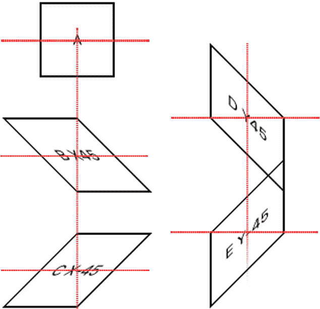

图 5.15 在 iOS 上沿 x 轴和 y 轴倾斜正方形的示例。正方形 A 未应用任何变换。正方形 B 沿 x 轴倾斜 45°。正方形 C 沿 x 轴倾斜-45°。正方形 D 沿 y 轴倾斜 45°，正方形 E 沿 y 轴倾斜-45°。

列表 5.4 展示如何通过倾斜变换正方形

```
import React, { Component } from 'react';
import { StyleSheet, Text, View} from 'react-native';

export default class App extends Component<{}> {
  render() {
    return (
    <View style={styles.container}>
      <Example style={{}}>A</Example>
 <Example style={{transform: [{skewX: '45deg'}]}}>    ①  
          B X45
      </Example>   
 <Example style={{transform: [{skewX: '-45deg'}]}}>    ②  
          C X-45
      </Example> 
 <Example style={{transform: [{skewY: '45deg'}]}}>    ③  
          D Y45
      </Example>   
 <Example style={{transform: [{skewY: '-45deg'}]}}>    ④  
          E Y-45
      </Example> 
    </View>
    );
 }
}

const Example = (props) => (
    <View style={[styles.example,props.style]}>
        <Text>
            {props.children}
        </Text>
    </View>
);

const styles = StyleSheet.create({
    container: {
        marginTop: 50,
        alignItems: 'center',
        flex: 1
    },
    example: {
        width: 75,
        height: 75,
        borderWidth: 2,
        margin: 20,
        alignItems: 'center',
        justifyContent: 'center'
    },
}); 
```

### 5.2.8 变换关键点

在本节中，我们讨论了许多变换思想！其中一些相对简单，而其他一些可能一开始难以可视化。我没有展示很多结合变换的例子，所以你可以专注于单个变换的作用。我鼓励你尝试任何例子，并添加额外的变换，以进行实验并看看会发生什么。

在第七章中，当我们讨论动画时，你会看到变换如何使事物栩栩如生。现在，记住这些关键点：

+   x 轴和 y 轴的原点在左上角，这意味着 y 轴的正方向是向下屏幕。你在上一章的绝对定位中看到了这一点，但可能与你习惯的相反，这可能会使推理变换将做什么变得困难。

+   旋转和变换的起点始终在元素的原始位置。你不能在 x 或 y 方向上平移一个对象，然后再围绕新的中心点旋转它。

变换是移动组件在屏幕上的好方法，但你不会在日常基础上使用它们。最常见的是使用 Yoga，这是一个实现了 W3C 的 flexbox 网络规范大部分内容的布局引擎。在下一节中，我们将详细讨论 Yoga 的 flexbox 实现。

## 5.3 使用 flexbox 布局组件

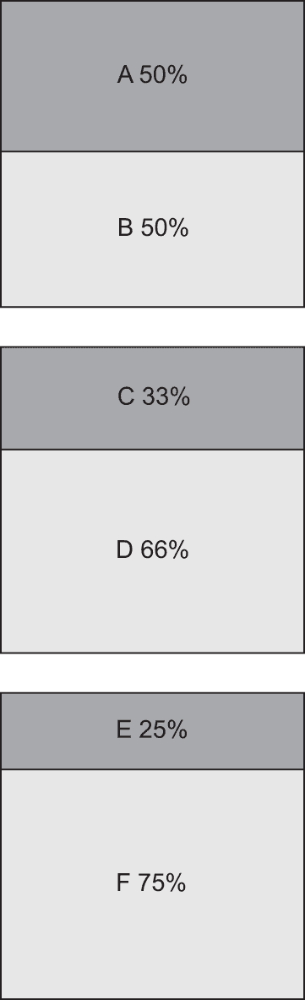

图 5.16 使用 flex 属性的三种布局示例。顶部示例是 1:1，A = {flex: 1}和 B = {flex: 1}，结果每个都占用 50%的空间。中间示例是 1:2，C = {flex: 1}和 D = {flex: 2}，结果 C 占用 33%的空间，D 占用 66%。底部示例是 1:3，E = {flex: 1}和 F = {flex: 3}，结果 E 占用 25%的空间，F 占用 75%的空间。

Flexbox 是 React Native 用来提供用户创建 UI 和控制定位的高效布局实现。React Native 的 flexbox 实现基于 W3C 的 flexbox 网络规范，但并不完全共享 100%的 API。它的目标是提供一个简单的方法来推理、对齐和分配布局中项目之间的空间，即使它们的尺寸未知或动态。

你已经在前面的许多示例中看到了 flexbox 的使用。它功能强大，使得布局项目比其他方法更容易，以至于很难不使用它。花时间理解本节的内容将对你大有裨益。以下是用于控制 flexbox 布局的对齐属性：`flex`、`flexDirection`、`justifyContent`、`alignItems`、`alignSelf`和`flexWrap`。

### 5.3.1 使用 flex 调整组件的尺寸

`flex`属性指定了一个组件改变其尺寸以填充其所在容器空间的能力。这个值相对于同一容器中其他项目的`flex`属性是相对的。

如果你有一个高度为 300 和宽度为 300 的`View`元素，并且一个子`View`元素具有`flex: 1`属性，那么子视图将完全填充父视图。如果你决定添加另一个具有`flex`属性为`flex: 1`的子元素，每个视图将在父容器中占用相等的空间。`flex`数字仅相对于占用相同空间的其它`flex`项目而言是重要的。

另一种看待这个问题的方式是将`flex`属性视为百分比。例如，如果你想子组件分别占用 66.6%和 33.3%，你可以使用`flex:66`和`flex:33`。而不是`flex:66`和`flex:33`，你可以指定`flex:2`和`flex:1`，以达到相同的布局效果。

为了更好地理解其工作原理，让我们看看 图 5.16 中展示的几个示例。这些可以通过在单个元素上设置适当的 `flex` 值轻松实现。以下列表显示了创建此类布局所需的步骤。

列表 5.5 具有比例 1:1、1:2 和 1:3 的 flex 视图

```
…
render() {
  return (
    <View style={styles.container}>
      <View style={[styles.flexContainer]}>
 <Example style={[{flex: 1},styles.darkgrey]}>A 50%</Example>    ①  
        <Example style={[{flex: 1}]}>B 50%</Example>
      </View>
 <View style={[styles.flexContainer]}>    ②  
        <Example style={[{flex: 1},styles.darkgrey]}>C 33%</Example>
        <Example style={{flex: 2}}>D 66%</Example>
      </View>
 <View style={[styles.flexContainer]}>    ③  
        <Example style={[{flex: 1},styles.darkgrey]}>E 25%</Example>
        <Example style={{flex: 3}}>F 75%</Example>
      </View>
    </View>
  );
}
… 
```

### 5.3.2 使用 flexDirection 指定 flex 的方向

在前面的示例中，flex 容器中的项目按列（y 轴）布局，意味着从上到下。A 堆叠在 B 上，C 堆叠在 D 上，E 堆叠在 F 上。使用 `flexDirection` 属性，你可以更改布局的主轴，从而改变布局的方向。`flexDirection` 应用于包含示例组件的父视图中。

实现图 5.17 中的布局只需在 `flexContainer` 样式中添加一行代码，这是每个示例组件的父容器。更改此容器的 `flexDirection` 影响其所有 flex 子项的布局。向样式添加 `flexDirection: 'row'`，并查看它如何更改布局。

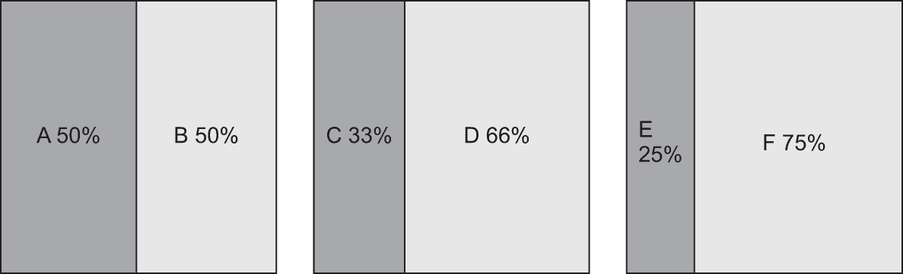

图 5.17 与 图 5.16 相同的示例，但 flexDirection 设置为 'row'。现在项目在行内水平占用空间，而不是在列内垂直占用空间。

列表 5.6 向父容器添加 `flexDirection: 'row'`

```
flexContainer: {    ①  
    width: 150,
    height: 150,
    borderWidth: 1,
    margin: 10,
 **flexDirection: 'row'**    ②  
}, 
```

子元素现在从左到右显示。`flexDirection` 有两个选项：`'row'` 和 `'column'`。默认设置是 `'column'`。如果你没有指定 `flexDirection` 属性，内容将以列的形式布局。当你在 React Native 中开发应用程序时，你将大量使用此属性，因此理解它及其工作原理非常重要。

### 5.3.3 使用 justifyContent 定义组件周围空间的使用方式

使用 `flex` 属性，你可以指定每个组件在其父容器中占用的空间量；但如果你不是试图占用整个空间，怎么办？你如何使用 flexbox 使用组件的原始大小来布局组件？

`justifyContent` 定义了在容器的主轴（即 flex 方向）上如何分配和围绕 flex 项目之间的空间。`justifyContent` 在父容器上声明。有五种选项可用：

+   `center` 使子元素在父容器内居中。空闲空间分布在子元素群集的两侧。

+   `flex-start` 根据分配给 `flexDirection` 的值将组件分组在 flex 列或行的开始处。`flex-start` 是 `justifyContent` 的默认值。

+   `flex-end` 以相反的方式起作用：它将项目组合在容器的末尾。

+   `space-around` 尝试在元素周围均匀分配空间。不要将其与在容器中均匀分布元素混淆；空间是围绕元素分配的。如果它是基于元素的，你会期望

*空间 – 元素 – 空间 – 元素 – 空间*

相反，flexbox 在元素的每一侧分配相同数量的空间，从而得到

*空间 – 元素 – 空间 – 空间 – 元素 – 空间*

在这两种情况下，空白量的数量是相同的；但在后者中，元素之间的空间更大。

+   `space-between` 不会在容器的开始或结束处应用间距。任何两个连续元素之间的空间与任何其他两个连续元素之间的空间相同。

图 5.18 展示了每个 `justifyContent` 属性如何在 flex 元素之间和周围分配空间。每个示例都使用两个元素来帮助描述正在发生的情况。

列表 5.7 展示了生成 图 5.18 所使用的代码。仔细查看它，以了解其工作原理，然后尝试以下操作：向每个示例添加更多元素，以查看项目数量增加时会发生什么；将 `flexDirection` 设置为 `row`，以查看项目水平布局而不是垂直布局时会发生什么。

列表 5.7 展示 `justifyContent` 选项的示例

```
...
render() {
  return (
    <View style={styles.container}>
 <FlexContainer style={[**{justifyContent: 'center'}**]}>    ①  
        <Example>center</Example>
        <Example>center</Example>
      </FlexContainer>
 <FlexContainer style={[**{justifyContent: 'flex-start'}**]}>    ②  
        <Example>flex-start</Example>
        <Example>flex-start</Example>
      </FlexContainer>
 <FlexContainer style={[**{justifyContent: 'flex-end'}**]}>    ③  
        <Example>flex-end</Example>
        <Example>flex-end</Example>
      </FlexContainer>
 <FlexContainer style={[**{justifyContent: 'space-around'}**]}>    ④  
        <Example>space-around</Example>
        <Example>space-around</Example>
      </FlexContainer>
 <FlexContainer style={[**{justifyContent: 'space-between'}**]}>    ⑤  
        <Example>space-between</Example>
        <Example>space-between</Example>
      </FlexContainer>
    </View>
  );
}
... 
```

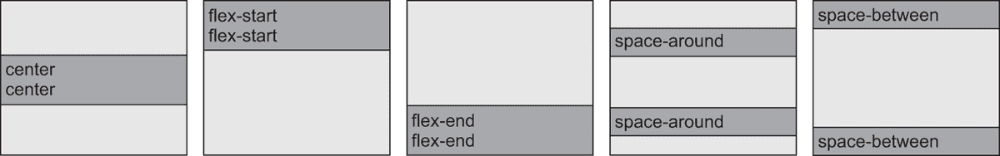

图 5.18 展示了 justifyContent 如何影响每个支持选项（居中、flex-start、flex-end、space-around 和 space-between）下弹性子元素之间的空间分布。

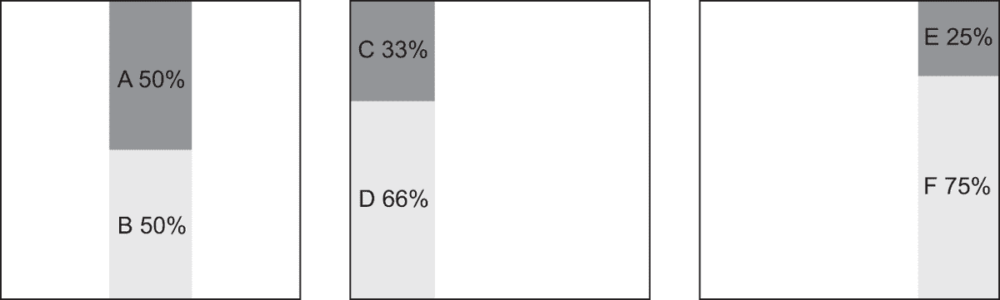

图 5.19 使用非默认的 `alignItems` 属性（居中、flex-start 和 flex-end）修改后的示例，来自 图 5.16

### 5.3.4 在容器中使用 alignItems 对齐子元素

`alignItems` 定义了如何沿其容器的次要轴对齐子元素。此属性在父视图中声明，并影响其弹性子元素，就像 `flexDirection` 一样。`alignItems` 有四个可能的值：`stretch`、`center`、`flex-start` 和 `flex-end`。

`stretch` 是默认值，用于图 5.17 和 5.18。每个示例组件都被拉伸以填充其父容器。图 5.19 回顾了 图 5.16，并展示了使用其他选项（`center`、`flex-start` 和 `flex-end`）会发生什么。因为示例组件没有指定精确的宽度，它们只占据渲染其内容所需的水平空间，而不是拉伸以填充空间。在第一种情况下，`alignItems` 设置为 `'center'`。在第二种情况下，`alignItems` 设置为 `'flex-start'`。最后，`alignItems` 设置为 `'flex-end'`。使用 列表 5.8 来更改每个示例从 列表 5.5 中的对齐方式。

列表 5.8 使用非默认的 `alignItems` 属性

```
render() {
  return (
    <View style={styles.container}>
      <View style={[styles.flexContainer,
 **{alignItems: 'center'}**]}>    ①  
        <Example style={[styles.darkgrey]}>A 50%</Example>
        <Example>B 50%</Example>
 </View>
      <View style={[styles.flexContainer,
 **{alignItems: 'flex-start'}**]}>    ②  
        <Example style={[styles.darkgrey]}>C 33%</Example>
        <Example style={{flex: 2}}>D 66%</Example>
      </View>
      <View style={[styles.flexContainer,
 **{alignItems: 'flex-end'}**]}>    ③  
        <Example style={[styles.darkgrey]}>E 25%</Example>
        <Example style={{flex: 3}}>F 75%</Example>
      </View>
    </View>
  );
  } 
```

既然你已经看到了如何使用其他 `alignItems` 属性及其对默认列布局的影响，为什么不将 `flexDirection` 设置为 `'row'` 并看看会发生什么？

### 5.3.5 使用 `alignSelf` 覆盖父容器的对齐方式

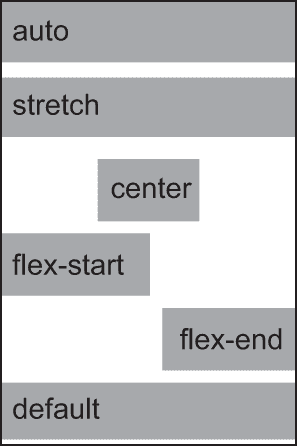

图 5.20 当父容器中的 `alignItems` 属性设置为默认值 stretch 时，每个 `alignSelf` 属性如何影响布局

到目前为止，所有弹性属性都应用于父容器。`alignSelf` 直接应用于单个弹性子元素。

使用 `alignSelf`，你可以访问容器内单个元素的 `alignItems` 属性。本质上，`alignSelf` 给你覆盖父容器上设置的任何对齐方式的能力，因此子对象可以独立于其同伴进行对齐。可用的选项有 `auto`、`stretch`、`center`、`flex-start` 和 `flex-end`。默认值是 `auto`，它从父容器的 `alignItems` 设置中获取值。其余属性以与 `alignItems` 上相应属性相同的方式影响布局。

在 图 5.20 中，父容器没有设置 `alignItems`，因此默认为 `stretch`。在第一个例子中，`auto` 值从其父容器继承 `stretch`。接下来的四个例子布局正如你所期望的那样。最后一个例子没有设置 `alignSelf` 属性，因此默认为 `auto` 并与第一个例子以相同的方式布局。

列表 5.9 做了一些不同的事情。它不是直接将样式应用到 `Example` 元素上，而是创建一个新的组件属性：`align`。这个属性被传递到 `Example` 组件中，并用来设置 `alignSelf`。否则，这个例子与本章中的许多其他例子相同；它探讨了将每个值应用到样式上的效果。

列表 5.9 使用 `alignSelf` 覆盖父元素的 `alignItems`

```
import React, { Component } from 'react';
import { StyleSheet, Text, View} from 'react-native';

export default class App extends Component<{}> {
    render() {
        return (
            <View style={styles.container}>
                <FlexContainer style={[]}>
 <Example **align='auto'**>auto</Example>    ①  
 <Example **align='stretch'**>stretch</Example>    ②  
 <Example **align='center'**>center</Example>    ③  
 <Example **align='flex-start'**>flex-start</Example>    ④  
 <Example **align='flex-end'**>flex-end</Example>    ⑤  
 <Example>default</Example>    ⑥  
                </FlexContainer>
            </View>
        );
    }
}

const FlexContainer = (props) => (
    <View style={[styles.flexContainer,props.style]}>
        {props.children}
    </View>
);

const Example = (props) => (
    <View style={styles.example,
                  styles.lightgrey,
 **{alignSelf: props.align || 'auto'}**,  [  ⑦  
                  props.style
    ]}>
        <Text>
            {props.children}
        </Text>
    </View>
);

const styles = StyleSheet.create({
    container: {
        marginTop: 50,
        alignItems: 'center',
        flex: 1
    },
    flexContainer: {
        backgroundColor: '#ededed',
        width: 120,
        height: 180,
        borderWidth: 1,
        margin: 10
    },
    example: {
        height: 25,
        marginBottom: 5,
        backgroundColor: '#666666'
    },
}); 
```

### 5.3.6 使用 `flexWrap` 防止项目被裁剪

在本节之前，你已经了解到 `flexDirection` 属性有两个值：`column`（默认值）和 `row`。`column` 水平排列项目，而 `row` 垂直排列项目。但你还没有看到项目因为不合适而溢出屏幕的情况。

`flexWrap` 有两个值：`nowrap` 和 `wrap`。默认值是 `nowrap`，这意味着如果项目不合适，它们将溢出屏幕。项目将被裁剪，用户无法看到它们。为了解决这个问题，请使用 `wrap` 值。

在 图 5.21 中，第一个例子使用了 `nowrap`，正方形溢出屏幕。正方形行在右侧被截断。第二个例子使用了 `wrap`，正方形环绕并开始新的一行。列表 5.10 展示了代码。

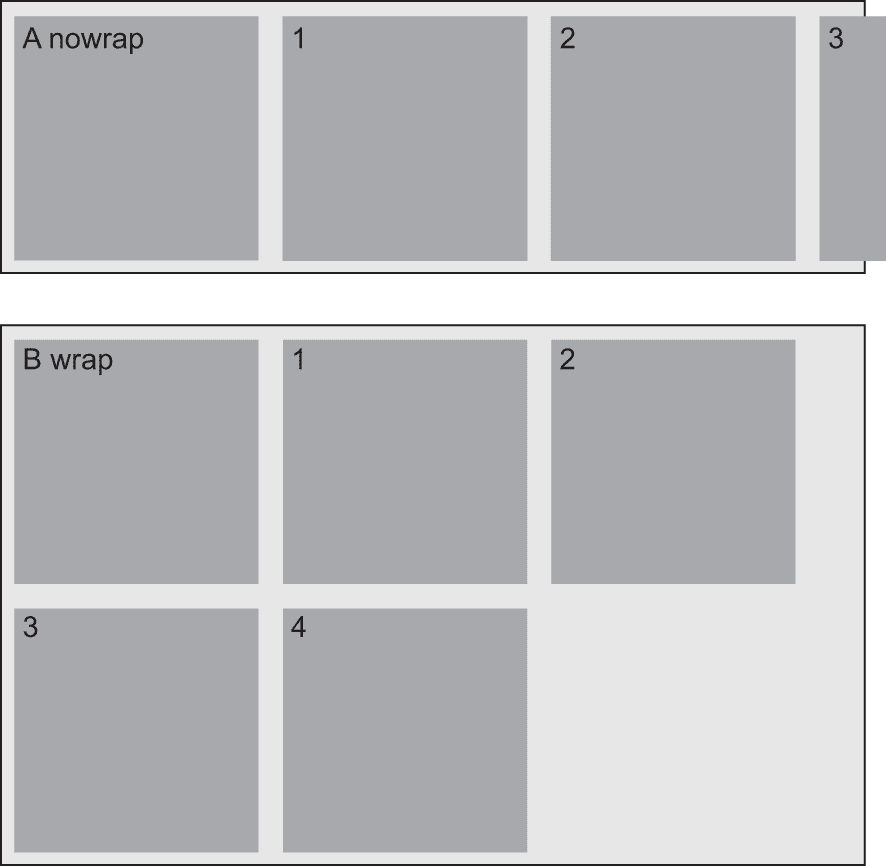

图 5.21 两个溢出容器的示例：一个将 `flexWrap` 设置为 nowrap，另一个设置为 wrap

列表 5.10 `flexWrap` 值影响布局的示例

```
import React, { Component } from 'react';
import { StyleSheet, Text, View} from 'react-native';

export default class App extends Component<{}> {
    render() {
        return (
            <View style={styles.container}>
 <NoWrapContainer>    ①  
                    <Example>A nowrap</Example>
 <Example>1</Example>
                    <Example>2</Example>
                    <Example>3</Example>
                    <Example>4</Example>
                </NoWrapContainer>
 <WrapContainer>    ②  
                    <Example>B wrap</Example>
                    <Example>1</Example>
                    <Example>2</Example>
                    <Example>3</Example>
                    <Example>4</Example>
                </WrapContainer>
            </View>
        );
    }
}

const NoWrapContainer = (props) => (
 <View style={[**styles.noWrapContainer**,props.style]}>    ③  
        {props.children}
    </View>
);

const WrapContainer = (props) => (
 <View style={[**styles.wrapContainer**,props.style]}>    ④  
        {props.children}
    </View>
);

const Example = (props) => (
    <View style={[styles.example,props.style]}>
        <Text>
            {props.children}
        </Text>
    </View>
);

const styles = StyleSheet.create({
    container: {
        marginTop: 150,
        flex: 1
    },
    noWrapContainer: {
        backgroundColor: '#ededed',
 **flexDirection: 'row',**  ⑤  
 **flexWrap: 'nowrap',**
        borderWidth: 1,
        margin: 10
    },
    wrapContainer: {
        backgroundColor: '#ededed',
 **flexDirection: 'row',**  ⑥  
 **flexWrap: 'wrap',**
        borderWidth: 1,
        margin: 10
    },
 example: {
        width: 100,
        height: 100,
        margin: 5,
        backgroundColor: '#666666'
    },
}); 
```

在布局瓷砖时，很容易看出哪种行为更可取，但你可能会遇到一种情况，其中 `nowrap` 会更适合你。无论如何，你现在应该对弹性盒子及其在 React Native 中构建响应式布局的多种方式有清晰的理解。

## 摘要

+   在为显示调整项目大小时，iOS 使用点，而 Android 使用密度无关像素。测量系统不同，但除非你需要像素完美的图形，否则应该对开发影响不大。

+   一些样式仅在某个平台上可用。`ShadowPropTypeIOS` 仅在 iOS 上可用，而 `elevation` 仅在 Android 上被识别。

+   可以使用 `translateX` 和 `translateY` 变换在 x 和 y 方向上移动组件。

+   可以使用 `rotateX`、`rotateY` 和 `rotateZ` 在 x、y 和 z 轴上围绕组件旋转。旋转点是应用任何转换之前对象的原始位置。

+   组件可以在 x 和 y 方向上缩放，以使组件增长或缩小。

+   组件也可以在 x 和 y 方向上倾斜。

+   可以同时应用多个转换，但它们指定的顺序很重要。旋转一个组件会改变该组件在后续转换中的方向。

+   `flexDirection` 属性定义了主轴，默认为 `column`（y 轴）。

+   `justifyContent` 属性定义了项目应该如何沿着主轴排列。

+   `alignItems` 属性定义了项目应该如何沿着次轴排列。

+   可以使用 `alignSelf` 属性来覆盖由父容器指定的 `alignItems` 属性。

+   `flexWrap` 属性告诉弹性盒子如何处理通常会溢出屏幕的项目。**  **# 6

导航

*****本章***** ***涵盖了*****

+   React Native 与网页中的导航

+   使用标签、堆栈和抽屉进行导航

+   管理嵌套导航器

+   在路由间传递数据和方法

任何移动应用的核心功能之一是导航。在构建应用之前，我建议你花些时间策略性地考虑你希望应用如何处理导航和路由。本章涵盖了移动应用中典型的三种主要导航类型：基于标签、基于堆栈和基于抽屉的导航。

基于标签的导航通常标签位于屏幕的顶部或底部；按下标签会跳转到与标签相关的屏幕。许多流行的应用，如 Twitter、Instagram 和 Facebook，都在主屏幕上实现了这种类型的导航。

基于堆栈的导航从一个屏幕转换到另一个屏幕，替换当前屏幕，并通常实现某种形式的动画转换。然后你可以后退或继续向前移动堆栈。你可以将基于堆栈的导航想象成一个组件数组：将新的组件推入数组会带你到新组件的屏幕。要返回，你需要从堆栈中弹出最后一个屏幕，然后导航到上一个屏幕。大多数导航库都会为你处理弹出和推入。

基于抽屉的导航通常是一个从屏幕的左侧或右侧弹出并显示选项列表的侧边菜单。当你按下某个选项时，抽屉关闭，你将被带到新的屏幕。

React Native 框架不包含导航库。在构建 React Native 应用的导航时，你必须选择一个第三方导航库。有一些好的导航库可供选择，但在这个章节中，我选择使用 React Navigation 作为构建演示应用的导航库。React Navigation 库由 React Native 团队推荐，并由 React 和 React Native 社区的许多人维护。

React Navigation 是一个基于 JavaScript 的导航实现。所有的转换和控制都由 JavaScript 处理。有些团队可能因为多种原因而偏好原生解决方案：例如，他们可能正在将 React Native 添加到现有的原生应用中，并希望整个应用中的导航保持一致。如果你对原生导航解决方案感兴趣，可以查看 React Native Navigation，这是一个由 Wix 的工程师构建和维护的开源 React Native 导航库。

## 6.1 React Native 导航与网络导航的比较

因为网络导航的范式与 React Native 的范式大不相同，所以导航对于许多刚开始接触 React Native 的开发者来说是一个难题。在网络上，我们习惯于使用 URL 进行操作。根据框架或环境的不同，有多种方式可以导航到新的路由，但通常你希望将用户发送到新的 URL，如果需要的话，还可以添加一些 URL 参数。

在 React Native 中，路由是基于组件的。你使用你正在工作的导航器来加载或显示一个组件。根据它是基于标签、基于堆栈、基于抽屉还是这些的组合，路由也会有所不同。我们将在下一节构建演示应用时详细说明这些内容。

你还需要在整个路由中跟踪数据和状态，并可能访问应用中其他地方定义的方法，因此围绕数据和方法的共享策略非常重要。你可以通过在定义导航的顶层管理数据和方法，或者使用如 Redux 或 MobX 这样的状态管理库来管理数据和方法。在示例中，你将在应用顶层的类中管理数据和方法的。

## 6.2 构建基于导航的应用

在本章中，你将学习如何通过构建一个同时使用基于标签页和基于堆栈的导航的应用来实施导航。你将创建的应用程序名为 Cities；它在图 6.1 中显示。它是一个旅行应用，让你能够跟踪你访问或想要访问的所有城市。你还可以在每个你想要访问的城市中添加位置。

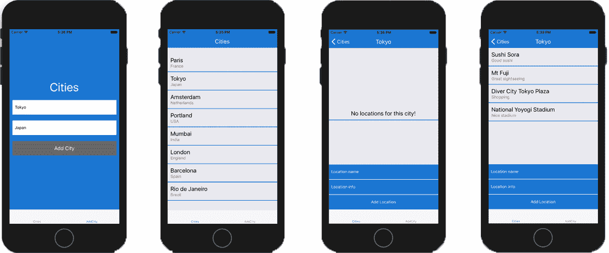

图 6.1 完成的 Cities 应用，包含添加城市、列出城市、查看城市详情和查看城市内位置的功能界面

主要导航是基于标签页的，其中一个标签页包括基于堆栈的导航。左侧标签页显示你创建的城市列表，右侧标签页包含创建新城市的表单。在左侧标签页，你可以点击单个城市来查看它，以及查看和创建城市内的位置。

要开始，创建一个新的 React Native 应用。在你的终端中，导航到一个空目录，并使用 React Native CLI 安装新的 React Native 应用：

```
react-native init CitiesApp 
```

接下来，导航到新目录，并安装两个依赖项：React Navigation 和 uuid。React Navigation 是导航库，uuid 将被用于为城市创建唯一的 ID，以便唯一地识别它们：

```
cd CitiesApp
npm install react-navigation uuid 
```

现在，让我们开始创建组件！在应用的根目录下创建一个新的主目录，命名为 src。这个目录将包含应用的大部分新代码。在这个新目录中，添加三个主要子目录：Cities、AddCity 和 components。

由于主要导航是基于标签页的，所以你会将主要应用分为两个主要组件（`Cities`和`AddCity`），每个组件都有自己的标签页。AddCity 文件夹将只包含一个组件，AddCity.js。Cities 文件夹将包含两个组件：Cities.js 用于查看城市列表，City.js 用于查看单个城市。components 文件夹将包含任何可重用组件；在这个例子中，它将包含一个组件。

你还将拥有 src/index.js 和 src/theme.js 文件。src/index.js 将包含所有的导航配置，而 theme.js 将用于保存可主题化的配置——在这个例子中，是一个主色调配置。图 6.2 显示了项目的完整文件夹结构。

现在你已经创建了文件夹结构和安装了必要的依赖项，让我们开始编写代码。你将首先处理的是 src/theme.js 文件。在这里，你将设置主色调并使其可导出以在应用中使用。我为应用选择的主色调是蓝色，但你可以自由选择任何颜色；如果你更改这个文件中的颜色值，应用的工作方式将保持不变。

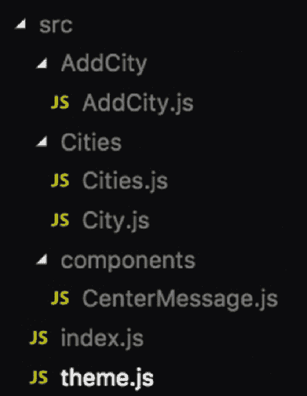

图 6.2 完整的 src 文件夹结构

列表 6.1 创建包含主色调的主题文件

```
const colors = {
  primary: '#1976D2'
}

export {
  colors
} 
```

如果你愿意，可以在整个应用中导入这个主色调，并且可以选择在一个地方更改它。

然后，编辑 src/index.js 以创建主导航配置。你将在这里创建两个导航实例：基于标签的导航和基于堆栈的导航。

列表 6.2 创建导航配置

```
import React from 'react'

import Cities from './Cities/Cities'    ①  
import City from './Cities/City'    ①  
import AddCity from './AddCity/AddCity'    ①  

import { colors } from './theme'    ②  

import { createBottomTabNavigator, 
 createStackNavigator } from 'react-navigation'    ③  

const options = {    ④  
  navigationOptions: {
    headerStyle: {
      backgroundColor: colors.primary
    },
 headerTintColor: '#fff'
  }
}

const CitiesNav = createStackNavigator({    ⑤  
  Cities: { screen: Cities },
  City: { screen: City }
}, options)

const Tabs = createBottomTabNavigator({    ⑥  
  Cities: { screen: CitiesNav },
  AddCity: { screen: AddCity }
})

export default Tabs 
```

当你创建 `options` 对象时，堆栈导航器会自动在每个路由的顶部放置一个标题。标题通常是放置当前路由标题以及像返回按钮这样的按钮的地方。`options` 对象还定义了标题的背景颜色和色调颜色。

对于第一个导航实例，`createStackNavigator` 接受两个参数：路由配置以及有关应用导航的样式配置等。你将两个路由作为第一个参数传递，并将 `options` 对象作为第二个参数传递。

接下来，更新 App.js 以包含新的导航并作为主入口点渲染。除了渲染导航组件外，App.js 还将包含并控制任何要提供给应用的方法和数据。

列表 6.3 更新 App.js 以使用导航配置

```
import React, { Component } from 'react';
import {
  Platform,
  StyleSheet,
  Text,
  View
} from 'react-native';

import Tabs from './src'    ①  

export default class App extends Component {
 state = {    ②  
    cities: []

  }
 addCity = (city) => {    ③  
    const cities = this.state.cities
    cities.push(city)
    this.setState({ cities })
  }
 addLocation = (location, city) => {    ④  
    const index = this.state.cities.findIndex(item => {
      return item.id === city.id
    })
 const chosenCity = this.state.cities[index]
    chosenCity.locations.push(location)
    const cities = [
      ...this.state.cities.slice(0, index),
      chosenCity,
      ...this.state.cities.slice(index + 1)
    ]
    this.setState({
      cities
    })
  }
  render() {
    return (
 <Tabs    ⑤  
        screenProps={{
          cities: this.state.cities,
          addCity: this.addCity,
          addLocation: this.addLocation
        }}
      />
    )
  }
} 
```

App.js 包含三个主要功能。它创建应用初始状态：一个名为 `cities` 的空数组。每个城市将是一个对象，包含名称、国家、ID 和位置数组。`addCity` 方法允许你向状态中存储的 `cities` 数组添加新的城市。`addLocation` 方法识别你想要添加位置的特定城市，更新该城市，并使用新数据重置状态。

React Navigation 有一种方法可以将这些方法和状态传递给导航器使用的所有路由。为此，传递一个名为 `screenProps` 的属性，包含你想要访问的内容。然后，从任何路由内部，`this.props.screenProps` 提供了对数据或方法的访问。

接下来，你将创建一个名为 `CenterMessage` 的可重用组件，它在 Cities.js 和 City.js（src/components/CenterMessage.js）中使用。当数组为空时，它将显示消息。例如，当应用首次启动时，它不会有任何城市要列出；你可以显示如图 6.3 所示的消息，而不是只显示一个空白屏幕。

列表 6.4 `CenterMessage` 组件

```
import React from 'react'
import {
  Text,
  View,
  StyleSheet
} from 'react-native'

import { colors } from '../theme'

const CenterMessage = ({ message }) => (
  <View style={styles.emptyContainer}>
 <Text style={styles.message}>{message}</Text>
  </View>
)

const styles = StyleSheet.create({
  emptyContainer: {
    padding: 10,
    borderBottomWidth: 2,
    borderBottomColor: colors.primary
  },
  message: {
    alignSelf: 'center',
    fontSize: 20
  }
})

export default CenterMessage 
```

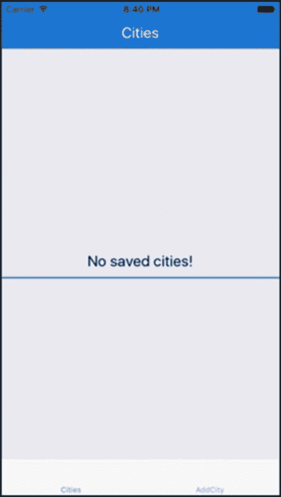

图 6.3 可重用的 CenterMessage 组件在显示区域中居中显示消息。

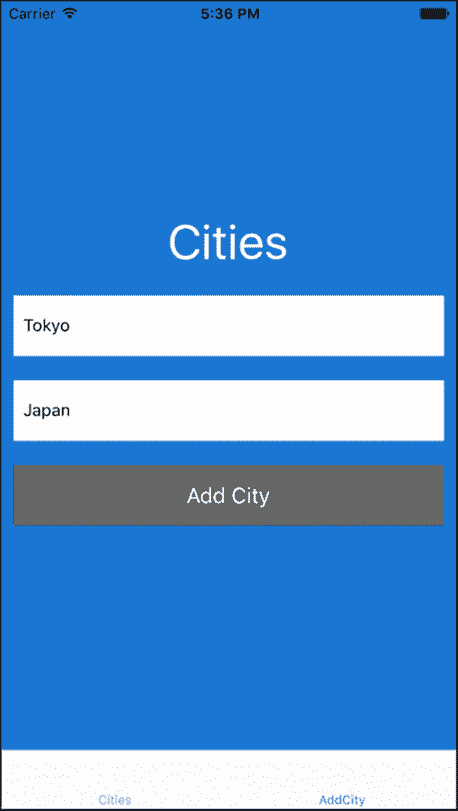

图 6.4 AddCity 标签页允许用户输入新的城市名称和国家名称。

此组件很简单。它是一个无状态组件，仅接收一个消息作为属性，并显示该消息以及一些样式。

接下来，在 src/AddCity/AddCity.js 中，创建 `AddCity` 组件，该组件将允许你向 `cities` 数组添加新城市（参见 图 6.4）。这个组件将包含一个表单，其中包含两个文本输入：一个用于保存城市名称，另一个用于保存国家名称。此外，一个按钮将调用 App.js 中的 `addCity` 方法。

列表 6.5 AddCity 选项卡（功能）

```
import React from 'react'
import {
  View,
  Text,
  StyleSheet,
  TextInput,
  TouchableOpacity
} from 'react-native'

import uuidV4 from 'uuid/v4'

import { colors } from '../theme'

export default class AddCity extends React.Component {
 state = {    ①  
    city: '',
    country: '',
  }
 onChangeText = (key, value) => {    ②  
    this.setState({ [key]: value })
  }
 submit = () => {    ③  
    if (this.state.city === '' || this.state.country === '') {
      alert('please complete form')
    }
    const city = {
      city: this.state.city,
      country: this.state.country,
      id: uuidV4(),
      locations: []
    }
    this.props.screenProps.addCity(city)
    this.setState({
      city: '',
      country: ''
    }, () => {
      this.props.navigation.navigate('Cities')
    })
  }
  render() {   
    return (
      <View style={styles.container}>
        <Text style={styles.heading}>Cities</Text>
        <TextInput
          placeholder='City name'
          onChangeText={val => this.onChangeText('city', val)}
          style={styles.input}
          value={this.state.city}
 />
        <TextInput
          placeholder='Country name'
          onChangeText={val => this.onChangeText('country', val)}
          style={styles.input}
          value={this.state.country}
        />
        <TouchableOpacity onPress={this.submit}>
          <View style={styles.button}>
            <Text style={styles.buttonText}>Add City</Text>
          </View>
        </TouchableOpacity>
      </View>
    )
  }
} 
```

首先，你检查确保城市和国家都不是空字符串。如果任一或两个都是空的，你将返回，因为你不想在不填写两个字段的情况下存储数据。接下来，你创建一个对象来保存要添加到 `cities` 数组中的城市。从状态中获取现有的城市和国家值，并使用 `uuidV4` 方法添加一个 ID 值以及一个空的位置数组。调用 `this.props.screenProps.addCity`，传入新的城市。然后重置状态以清除状态中存储的任何值。最后，通过调用 `this.props.navigation.navigate` 并传入要导航到的路由字符串——在这种情况下，是 `'Cities'`——将用户导航到城市选项卡以显示他们添加了新城市后的城市列表。

每个在导航器中作为屏幕的组件自动可以访问两个属性：`screenProps` 和 `navigation`。在 列表 6.3 中，当你创建导航组件时，你传递了三个 `screenProps`。在 `submit` 方法中，你调用了 `this.props.screenProps.addCity`，访问并调用这个 `screenProps` 方法。你同样通过调用 `this.props.navigation.navigate` 来访问导航属性。`navigate` 是你在 React Navigation 中用于在路由间导航的方法。

接下来，为这个组件添加样式。这段代码位于 src/AddCity/AddCity.js 中的类定义下方。

列表 6.6 AddCity 选项卡（样式）

```
const styles = StyleSheet.create({
  button: {
    height: 50,
    backgroundColor: '#666',
    justifyContent: 'center',
    alignItems: 'center',
    margin: 10
  },
  buttonText: {
    color: 'white',
    fontSize: 18
  },
 heading: {
    color: 'white',
    fontSize: 40,
    marginBottom: 10,
    alignSelf: 'center'
  },
  container: {
    backgroundColor: colors.primary,
    flex: 1,
    justifyContent: 'center'
  },
  input: {
    margin: 10,
    backgroundColor: 'white',
    paddingHorizontal: 8,
    height: 50
  }
}) 
```

现在，创建 src/Cities/Cities.js 以列出应用程序存储的所有城市并允许用户导航到单个城市（参见 图 6.5）。功能在下面的列表中显示，样式在 列表 6.8 中。

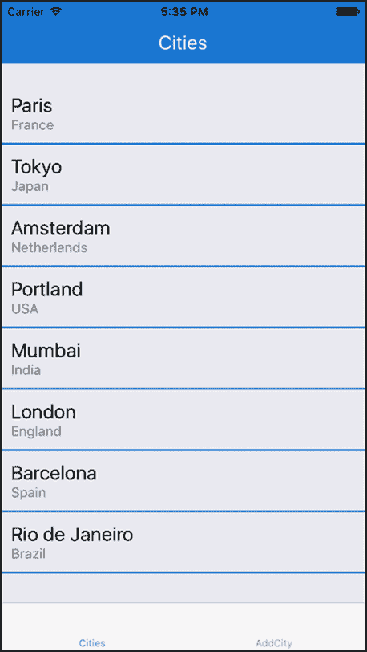

图 6.5 Cities.js 显示了已添加到应用程序中的城市列表。

列表 6.7 Cities 路由（功能）

```
import React from 'react'
import {
  View,
  Text,
  StyleSheet,
  TouchableWithoutFeedback,
  ScrollView
} from 'react-native'

import CenterMessage from '../components/CenterMessage'    ①  

import { colors } from '../theme'

export default class Cities extends React.Component {
 static navigationOptions = {    ②  
    title: 'Cities',
    headerTitleStyle: {
      color: 'white',
      fontSize: 20,
      fontWeight: '400'
    }
  }
  navigate = (item) => {   
 this.props.navigation.navigate('City', { city: item })    ③  
  }
  render() {
 const { screenProps: { cities } } = this.props    ④  
    return (
      <ScrollView  contentContainerStyle={[!cities.length && { flex: 1 }]}>
        <View style={[!cities.length && 
                      { justifyContent: 'center', flex: 1 }]}>
        {  
 !cities.length && <CenterMessage message='No saved cities!'/>    ⑤  
        }
        {  
 cities.map((item, index) => (    ⑥  
            <TouchableWithoutFeedback 
              onPress={() => this.navigate(item)} key={index} >
              <View style={styles.cityContainer}>
                <Text style={styles.city}>{item.city}</Text>
                <Text style={styles.country}>{item.country}</Text>
              </View>
            </TouchableWithoutFeedback>
          ))
        }
        </View>
      </ScrollView>
    )
  }
} 
```

在这个列表中，你首先导入 `CenterMessage` 组件。React Navigation 有一种方法可以控制路由内的某些导航选项。为此，你可以在类上声明一个静态的 `navigationOptions` 属性并声明路由的配置。在这种情况下，你想要设置一个标题并设置标题的样式，因此给配置添加一个 `title` 和 `headerTitleStyle` 属性。

`navigate`方法调用`this.props.navigation.navigate`，并传入路由名称以及要访问的`City`路由中的城市。传入城市作为第二个参数；在`City`路由中，你将能够访问`props.navigation.state.params`中的此属性。渲染方法访问并解构`cities`数组。它还包括检查`cities`数组是否为空的逻辑；如果是，向用户显示适当的消息。你映射数组中的所有城市，显示城市名称和国家名称。将`navigate`方法附加到`TouchableWithoutFeedback`组件，允许用户通过在城市上的任何地方点击来导航到城市。

列表 6.8 Cities 路由（样式）

```
const styles = StyleSheet.create({
  cityContainer: {
    padding: 10,
    borderBottomWidth: 2,
    borderBottomColor: colors.primary
  },
  city: {
    fontSize: 20,
  },
  country: {
    color: 'rgba(0, 0, 0, .5)'
  },  
}) 
```

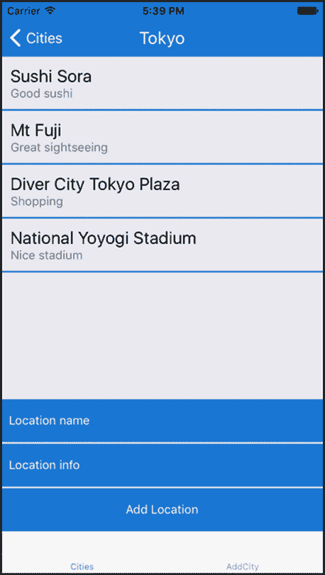

图 6.6 City.js 显示了城市内的地点。

接下来，创建`City`组件（src/Cities/City.js），用于存储每个城市的地点以及一个允许用户在 cities 中创建新地点的表单；参见图 6.6。此组件将从`screenProps`中访问城市，并使用`screenProps`中的`addLocation`方法向城市添加地点。

列表 6.9 City 路由（功能）

```
import React from 'react'
import {
  View,
  Text,
  StyleSheet,
  ScrollView,
  TouchableWithoutFeedback,
  TextInput,
  TouchableOpacity
} from 'react-native'

import CenterMessage from '../components/CenterMessage'
import { colors } from '../theme'

class City extends React.Component {
 static navigationOptions = (props) => {    ①  
    const { city } = props.navigation.state.params
    return {
      title: city.city,
      headerTitleStyle: {
        color: 'white',
        fontSize: 20,
        fontWeight: '400'
      }
    }
  }
  state = {
    name: '',
    info: ''
  }
  onChangeText = (key, value) => {
    this.setState({
      [key]: value
    })
  }
 addLocation = () => {    ②  
    if (this.state.name === '' || this.state.info === '') return
    const { city } = this.props.navigation.state.params
    const location = {
      name: this.state.name,
      info: this.state.info
    }
    this.props.screenProps.addLocation(location, city)
    this.setState({ name: '', info: '' })
  }
  render() {
 const { city } = this.props.navigation.state.params    ③  
    return (
      <View style={{ flex: 1 }}>
 <ScrollView 
          contentContainerStyle={
            [!city.locations.length && { flex: 1 }]
        }>
          <View style={[
                styles.locationsContainer, 
                !city.locations.length && { flex: 1, 
                                            justifyContent: 'center' }
          ]}>
            {
              !city.locations.length && 
              <CenterMessage message='No locations for this city!' />
            }
            {  
 city.locations.map((location, index) => (    ④  
                <View key={index} style={styles.locationContainer}>
                  <Text style={styles.locationName}>{location.name}</Text>
                  <Text style={styles.locationInfo}>{location.info}</Text>
                </View>
              ))
            }
          </View>
        </ScrollView>
 <TextInput    ⑤  
          onChangeText={val => this.onChangeText('name', val)}
          placeholder='Location name'
          value={this.state.name}
          style={styles.input}
          placeholderTextColor='white'
        />
        <TextInput
          onChangeText={val => this.onChangeText('info', val)}
          placeholder='Location info'
          value={this.state.info}
          style={[styles.input, styles.input2]}
          placeholderTextColor='white'
        />
        <View style={styles.buttonContainer}>
          <TouchableOpacity onPress={this.addLocation}>
            <View style={styles.button}>
              <Text style={styles.buttonText}>Add Location</Text>
            </View>
          </TouchableOpacity>
        </View>
      </View>
    )
  }
} 
```

此代码首先创建`navigationOptions`属性。你使用回调函数来返回一个对象，而不是直接声明一个对象，因为你需要访问属性，以便访问通过导航传递下来的城市信息。你需要知道城市标题，用作路由标题，而不是硬编码的字符串。

`addLocation`方法从`this.props.navigation.state.params`中解构`city`对象，以便在函数中稍后使用。然后创建一个包含地点名称和信息的`location`对象。调用`this.props.screenProps.addLocation`将地点添加到当前查看的城市，并重置状态。再次，从导航状态中解构`city`。你需要`city`以便在城市的地点上映射，并在创建新地点时作为参数使用，以标识你引用的城市。最后，你映射城市，返回一个显示城市名称和城市信息的组件，并创建一个包含两个文本输入和一个按钮的表单。

## 6.3 持久化数据

你已经完成，应该能够运行应用程序。在应用程序中尝试添加城市和地点，然后刷新它。注意，当你刷新时，所有城市都会消失。这是因为你只将数据存储在内存中。让我们使用`AsyncStorage`来持久化状态，这样如果用户关闭或刷新应用程序，他们的数据仍然可用。

要做到这一点，你将在`App`组件的 App.js 中工作，并执行以下操作：

+   每次添加新城市时，将城市数组存储在`AsyncStorage`中。

+   每次向城市添加新地点时，将城市数组存储在`AsyncStorage`中。

+   当用户打开应用时，检查 `AsyncStorage` 以查看是否存储了任何城市。如果是，则使用这些城市更新状态。

+   `AsyncStorage` 只接受字符串作为存储值。因此，在存储值时，如果该值不是字符串，请调用 `JSON.stringify`，如果在使用前需要解析存储的值，请调用 `JSON.parse`。

打开 App.js 并进行以下更改：

1.  导入 `AsyncStorage` 并创建一个键变量。

```
import {
    #omitting previous imports
 **AsyncStorage**  
} from 'react-native';

**const key = 'state'** 

export default class App extends Component {
    #omitting class definition 
```

1.  创建一个 `componentDidMount` 函数，该函数将检查 `AsyncStorage` 并获取您设置的键值存储的任何项：

```
 async componentDidMount() {
    try {
      let cities = await AsyncStorage.getItem(key)
      cities = JSON.parse(cities)
      this.setState({ cities })
    } catch (e) {
      console.log('error from AsyncStorage: ', e)
    }
  } 
```

1.  在 `addCity` 方法中，在创建新的 `cities` 数组后，将其存储在 `AsyncStorage` 中：

```
addCity = (city) => {
  const cities = this.state.cities
  cities.push(city)
  this.setState({ cities })
  **AsyncStorage.setItem(key, JSON.stringify(cities))** 
    .then(() => console.log('storage updated!'))
    .catch(e => console.log('e: ', e))
} 
```

1.  更新 `addLocation` 方法，在调用 `setState` 后存储城市数组。

```
 addLocation = (location, city) => {
      #previous code omitted
    **this.setState({** 
      cities
    }, () => {
      AsyncStorage.setItem(key, JSON.stringify(cities))
        .then(() => console.log('storage updated!'))
        .catch(e => console.log('e: ', e))
      })
  } 
```

现在，当用户关闭应用后再打开它，他们的数据仍然可用。

## 6.4 使用 DrawerNavigator 创建基于抽屉的导航

我们已经介绍了如何创建基于堆栈和基于标签的导航。让我们看看创建基于抽屉导航的 API。

抽屉导航器的 API 与堆栈和标签导航器非常相似。您将使用 React Navigation 中的 `createDrawerNavigator` 函数来创建基于抽屉的导航。首先定义要使用的路由：

```
import Page1 from './routeToPage1'
import Page2 from './routeToPoage2' 
```

接下来，定义您想要在导航器中使用的屏幕：

```
const screens = {
  Page1: { screen: Page1 },
  Page2: { screen: Page2 }
} 
```

现在，您可以使用屏幕配置来定义导航器，并在应用中使用它：

```
const DrawerNav = createDrawerNavigator(screens)

// somewhere in our app

<DrawerNav /> 
```

## 摘要

+   在构建应用之前，花时间策略化您希望它如何处理导航和路由。

+   许多导航库适用于 React Native，但最推荐的两个是 React Navigation 和 React Native Navigation。React Navigation 是一个基于 JavaScript 的导航库，而 React Native Navigation 是一个原生实现。

+   主要有三种类型的导航器：

+   基于标签的导航通常在屏幕的顶部或底部有标签。当您按下标签时，您将被带到与该标签相关的屏幕。例如，`createBottomTabNavigator` 在屏幕底部创建标签。

+   基于堆栈的导航从一个屏幕切换到另一个屏幕，替换当前屏幕。您可以在堆栈中向后或继续向前移动。基于堆栈的导航通常实现某种动画过渡。您使用 `createStackNavigator` 函数创建基于堆栈的导航。

+   基于抽屉的导航通常是一个从屏幕的左侧或右侧弹出的菜单，显示一系列选项。当您按下选项时，抽屉关闭，您将被带到新的屏幕。您使用 `createDrawerNavigator` 函数创建基于抽屉的导航。

+   根据您使用的导航类型——基于标签、基于堆栈、基于抽屉或这些类型的组合——路由也会有所不同。React Navigation 库管理的每个路由或屏幕都有一个 `navigation` 属性，您可以使用它来控制导航状态。

+   使用`AsyncStorage`持久化状态，以便如果用户关闭或刷新应用程序，他们的数据仍然可用。

# 7

动画

*****本章*** ***涵盖*****

+   使用`Animated.timing`创建基本动画

+   使用插值与动画值

+   创建动画和并行

+   使用`Animated.stagger`交错动画

+   使用原生驱动程序将动画卸载到原生 UI 线程

React Native 的其中一个优点是能够轻松地使用 Animated API 创建动画。这是 React Native 中更稳定且易于使用的 API 之一，并且在 React Native 生态系统中，与导航和状态管理等领域不同，几乎有 100%的共识来解决一个问题。

动画通常用于增强应用程序的 UI，并为现有设计带来更多活力。有时，平均用户体验与优秀用户体验之间的差异可以归因于在正确的时间使用正确的动画，从而将应用程序与其他类似的应用程序区分开来。

本章中涵盖的实际用例包括以下内容：

+   扩展用户输入，当聚焦时进行动画

+   动画欢迎界面比基本的静态欢迎界面更具活力

+   自定义动画加载指示器

在本章中，我们将深入探讨如何创建动画。我们将涵盖您需要了解的一切，以充分利用 Animated API。

## 7.1 *介绍 Animated API*

Animated API 随 React Native 一起提供，因此要使用它，您只需像导入任何其他 React Native API 或组件一样导入它。在创建动画时，您始终需要执行以下四个操作：

1.  从 React Native 导入 Animated。

1.  使用 Animated API 创建一个可动画化的值。

1.  将值附加到组件作为样式。

1.  使用一个函数动画化可动画化的值。

默认情况下，Animated API 附带四种可动画化组件：

+   `View`

+   `ScrollView`

+   `Text`

+   `Image`

本章中的示例在这些组件上工作方式完全相同。在第 7.5 节中，我们还介绍了如何使用`createAnimatedComponent`创建任何元素或组件的自定义动画组件。

让我们快速看一下使用 Animated 的基本动画可能是什么样子。在示例中，您将动画化一个框的顶部边距（见图 7.1）。

列表 7.1 使用 Animated 和更新`marginTop`属性

```
import React, { Component } from 'react';
import {
  StyleSheet,
  View,
 Animated,    ①  
  Button
} from 'react-native';

export default class RNAnimations extends Component {
 marginTop = new Animated.Value(20);    ②  
 animate = () => {    ③  
    Animated.timing(
      this.marginTop,
      {
        toValue: 200,
        duration: 500,
 }
    ).start();
  }
  render() {
    return (
      <View style={styles.container}>
 <Button    ④  
          title='Animate Box'
          onPress={this.animate}
        />
        <Animated.View 
 style={[styles.box, { marginTop: this.marginTop } ]} />    ⑤  
      </View>
    );
  }
}

const styles = StyleSheet.create({
  container: {
    flex: 1,
    padding: 10,
    paddingTop: 50,
  },
  box: {
    width: 150,
    height: 150,
    backgroundColor: 'red'
  }
}); 
```

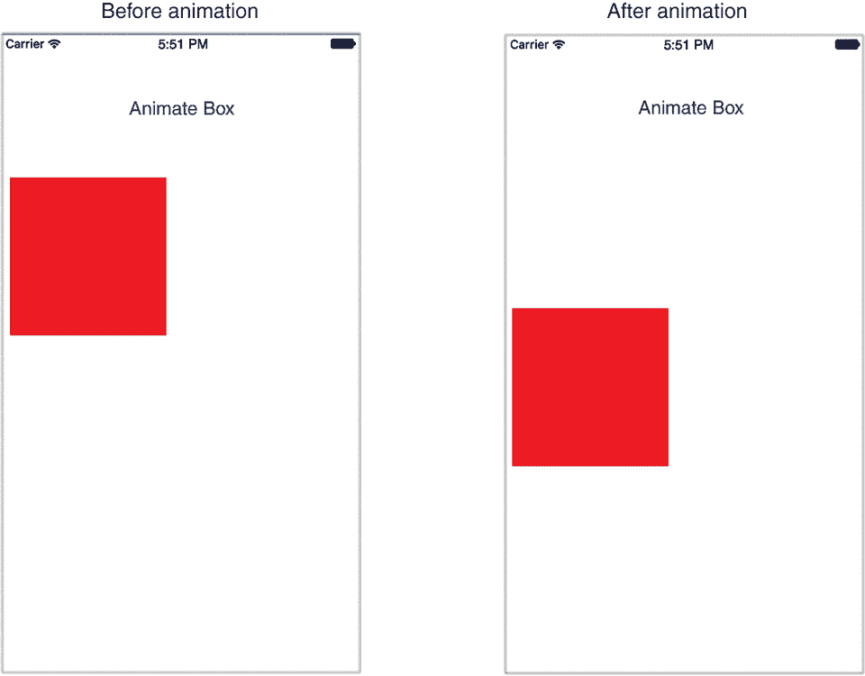

图 7.1 使用 Animated 动画化一个正方形框的顶部边距

本例使用`timing`函数来动画化一个值。`timing`函数接受两个参数：一个起始值和一个配置对象。配置对象传递一个`toValue`来设置动画应该动画化的值，以及一个以毫秒为单位的持续时间来设置动画的长度。

与`View`组件不同，你使用`Animated.View`。Animated 有四个可以开箱即用的可动画组件：`View`、`Image`、`ScrollView`和`Text`。在`Animated.View`的样式化中，你传入一个包含基本样式（`styles.box`）和动画样式（`marginTop`）的样式数组。

现在你已经创建了一个基本的动画组件，你将使用可能有用的真实世界用例创建更多动画。

## 7.2 动画化表单输入以在聚焦时扩展

在这个例子中，你将创建一个基本的表单输入，当用户聚焦时它会扩展，当输入失焦时会收缩。这是一个流行的 UI 模式。

除了在这本书中与`TextInput`组件一起使用的属性，例如`value`、`placeholder`和`onChangeText`，你还可以使用`onFocus`和`onBlur`在输入聚焦和失焦时调用函数。这就是你将实现这种动画（如图 7.2 所示）的方式。

列表 7.2 动画化 TextInput 以在输入聚焦时扩展

```
import React, { Component } from 'react';
import {
  StyleSheet,
  View,
  Animated,
  Button,
  TextInput,
  Text,
} from 'react-native';

export default class RNAnimations extends Component {
 animatedWidth = new Animated.Value(200);    ①  
 animate = (value) => {    ②  
    Animated.timing(
      this.animatedWidth,
      {
        toValue: value,
        duration: 750,
      }
    ).start()
  }
  render() {
    return (
      <View style={styles.container}>
 <Animated.View style={{ width: this.animatedWidth }}>    ③  
 <TextInput    ④  
            style={[styles.input]}
            onBlur={() => this.animate(200)}
            onFocus={() => this.animate(325)}
 ref={input => this.input = input}
          />
        </Animated.View>
        <Button
          title='Submit'
          onPress={() => this.input.blur()}
        />
      </View>
    );
  }
}

const styles = StyleSheet.create({
  container: {
    flex: 1,
    padding: 10,
    paddingTop: 50,
  },
  input: {
    height: 50,
    marginHorizontal: 15,
    backgroundColor: '#ededed',
    marginTop: 10,
    paddingHorizontal: 9,
  },
}); 
```

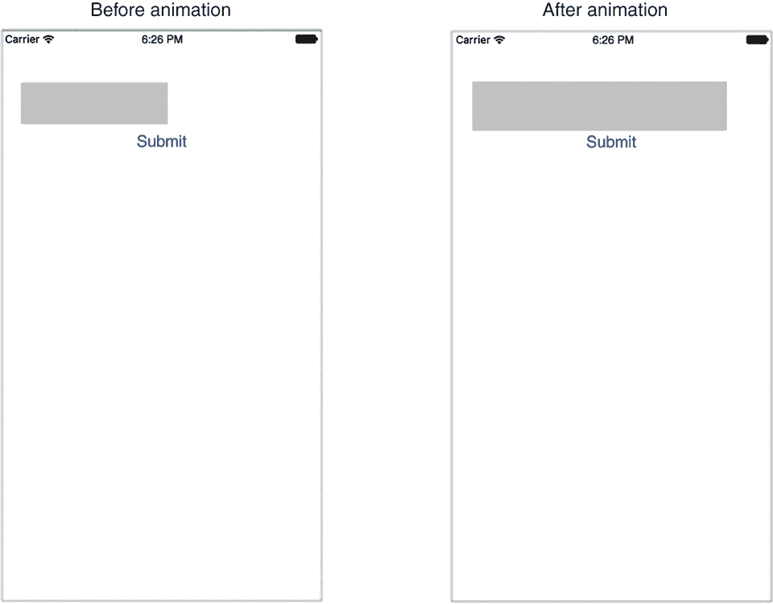

图 7.2 当输入聚焦时动画化`TextInput`组件

## 7.3 使用插值创建自定义加载动画

许多时候，你需要创建无限循环的动画，例如加载指示器和活动指示器。创建此类动画的一种简单方法是用`Animated.loop`函数。在本节中，你将使用`Animated.loop`与 Easing 模块一起创建一个加载指示器，无限循环地旋转图像！

到目前为止，我们只看了如何使用`Animated.timing`调用动画。在这个例子中，你希望动画持续运行而不停止。为此，你将使用一个新的静态方法`loop`。`Animated.loop`会持续运行给定的动画：每次到达末尾时，它会重置到开始并重新开始。

你将比过去以不同的方式处理样式。在列表 7.1 和 7.2 中，你直接在组件的`style`属性中使用动画值。在后续的例子中，你将在变量中存储这些动画值，并在使用新的插值变量在`style`属性之前对值进行插值。因为你要创建一个旋转效果，所以你会使用字符串而不是数字：例如，你将引用一个如`360deg`的值用于`style`。

Animated 有一个名为`interpolate`的类方法，你可以使用它来操作动画值，将它们转换为你可以使用的其他值。`interpolate`方法接受一个包含两个键的配置对象：`inputRange`（数组）和`outputRange`（也是一个数组）。`inputRange`是在类中处理的原始动画值，而`outputRange`指定了原始值应更改到的值。

最后，您将更改动画的缓动值。*缓动*基本上允许您控制动画的运动。在这个例子中，您希望旋转效果有一个平滑、均匀的运动，所以您将使用线性缓动函数。

React Native 有一个内置的方式来实现常见的缓动函数。就像您导入其他 API 和组件一样，您可以导入 Easing 模块并使用它，与 Animated 一起使用。Easing 可以在配置对象中配置，在`Animated.timing`的第二个参数中设置值，如`toValue`和`duration`。让我们看看一个名为`animatedMargin`的动画值的例子。将`animatedMargin`设置为 0 并将值动画化到 200，通常通过在时间函数中直接将值从 0 到 200 动画化来实现缓动效果。使用插值，您可以在时间函数中动画化 0 到 1 之间的值，然后使用 Animated 的`interpolate`类方法通过使用另一个变量来插值该值，并将该值保存到另一个变量中，然后在样式（通常在渲染方法中）中引用*那个*变量：

```
const marginTop = animatedMargin.interpolate({
  inputRange: [0, 1],
  outputRange: [0, 200],
}); 
```

现在，使用插值来创建加载指示器。当应用程序加载时，您将显示指示器；在`componentDidMount`中，您将调用`setTimeout`，该调用在 2,000 毫秒后取消加载状态（参见图 7.3）。这里使用的图标位于[`github.com/dabit3/react-native-in-action/blob/chapter7/assets/35633-200.png`](https://github.com/dabit3/react-native-in-action/blob/chapter7/assets/35633-200.png)；您可以自由使用它或任何其他您想要的图像。

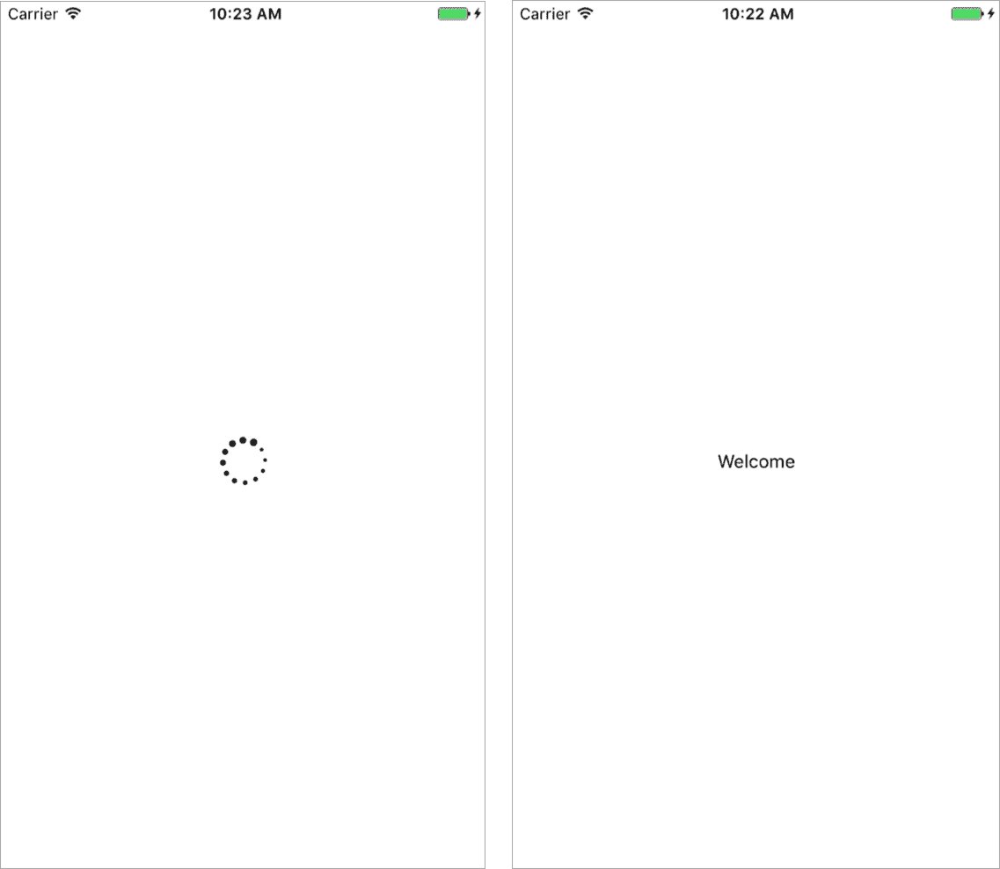

图 7.3 使用插值和动画循环创建旋转加载指示器

列表 7.3 创建无限旋转的加载动画

```
import React, { Component } from 'react';
import {
  Easing,
  StyleSheet,
  View,
  Animated,
  Button,
  Text,
} from 'react-native';

export default class RNAnimations extends Component {
  state = {
 loading: true,    ①  
  }
 componentDidMount() {    ②  
    this.animate();
 setTimeout(() => this.setState({ loading: false }), 2000)
  }
 animatedRotation = new Animated.Value(0);    ③  
 animate = () => {    ④  
    Animated.loop(
      Animated.timing(
        this.animatedRotation,
        {
          toValue: 1,
          duration: 1800,
          easing: Easing.linear,
        }
      )
    ).start()
  }
  render() {
 const rotation = this.animatedRotation.interpolate({    ⑤  
 inputRange: [0, 1],    ⑥  
 outputRange: ['0deg', '360deg'],    ⑦  
    });
    const { loading } = this.state;
    return (      
      <View style={styles.container}>      
        {      
 loading ? (    ⑧  
            <Animated.Image      
              source={require('./pathtoyourimage.png')}      
              style={{ width: 40, 
                       height: 40, 
                       transform: [{ rotate: rotation }] }}      
            />      
          ) : (      
            <Text>Welcome</Text>      
          )      
        }      
      </View>      
    );     
  }
}

const styles = StyleSheet.create({
  container: {
    flex: 1,
    justifyContent: 'center',
    alignItems: 'center',
    padding: 10,
    paddingTop: 50,
  },
  input: {
    height: 50,
    marginHorizontal: 15,
    backgroundColor: '#ededed',
    marginTop: 10,
    paddingHorizontal: 9,
  },
}); 
```

`animate`类方法将`Animated.timing`传递给`Animated.loop`的调用。在配置中，您将`toValue`设置为 1，`duration`设置为 1800，`easing`设置为`Easing.linear`，以创建平滑的旋转运动。

`animatedRotation`值通过`interpolate`方法创建一个新的名为`rotation`的值。`inputRange`给出动画的开始和结束值，`outputRange`给出`inputRange`应映射到的值：开始值为 0 度，最终值为 360 度，创建一个完整的 360 度旋转。

在`return`语句中，首先检查`loading`是否为`true`。如果是，显示动画加载指示器（更新此路径为您的应用程序中图像的路径）；如果是`false`，则显示欢迎信息。将`rotation`变量附加到`Animated.Image`的样式中的`transform` `rotate`值。

## 7.4 创建多个并行动画

有时候您需要同时创建多个动画并使它们同时运行。Animated 库有一个名为`parallel`的类方法，您可以使用它来做这件事。`parallel`同时启动一个动画数组。

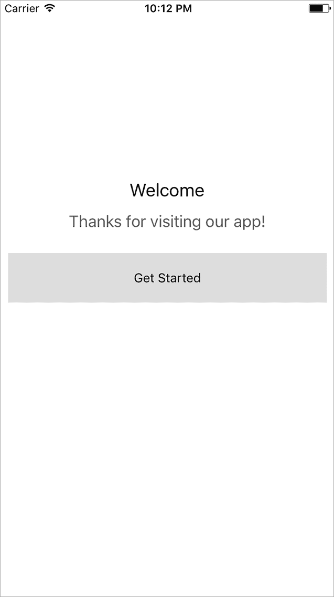

图 7.4 使用并行动画的欢迎屏幕（动画完成后显示）

例如，要使两个消息和一个按钮同时出现在欢迎屏幕上，你可以创建三个独立的动画，并对每个动画调用`.start()`。但更高效的方法是使用`Animated.parallel`函数，并将要同时运行的动画数组传递给它。

在这个例子中，你将创建一个欢迎屏幕，当组件挂载时，屏幕上的两个消息和按钮会进行动画。因为你使用了`Animated.parallel`，所以所有三个动画将同时开始。你将在配置中添加一个`delay`属性来控制两个动画的开始时间。

列表 7.4 创建动画欢迎屏幕

```
import React, { Component } from 'react';
import {
  Easing,
  StyleSheet,
  View,
  Animated,
  Text,
  TouchableHighlight,
} from 'react-native';

export default class RNAnimations extends Component {
 animatedTitle = new Animated.Value(-200);    ①  
 animatedSubtitle = new Animated.Value(600);    ①  
 animatedButton = new Animated.Value(800);    ①  

  componentDidMount() {
 this.animate();    ②  
  }
 animate = () => {    ③  
 Animated.parallel(  [  ③  
 Animated.timing(    ③  
        this.animatedTitle,
        {
          toValue: 200,
          duration: 800,
	        }    
      ),
 Animated.timing(    ③  
        this.animatedSubtitle,
        {
          toValue: 0,
          duration: 1400,
          delay: 800,
        }
      ),
 Animated.timing(    ③  
        this.animatedButton,
        {
          toValue: 0,
          duration: 1000,
          delay: 2200,
        }
      )
    ]).start();
  }
 render() {
    return (   
      <View style={styles.container}>   
        <Animated.Text style={[styles.title, 
                              { marginTop: this.animatedTitle}]}>
          Welcome
 </Animated.Text>    ④  
        <Animated.Text style={[styles.subTitle, 
                              { marginLeft: this.animatedSubtitle }]}>
          Thanks for visiting our app!
 </Animated.Text>    ④  
 <Animated.View style={{ marginTop: this.animatedButton }}>    ④  
          <TouchableHighlight style={styles.button}>   
            <Text>Get Started</Text>   
          </TouchableHighlight>   
        </Animated.View>   
      </View>   
    );   
  }
}

const styles = StyleSheet.create({
  container: {
    flex: 1,
  },
  title: {
    textAlign: 'center',
    fontSize: 20,
    marginBottom: 12,
  },
  subTitle: {
    width: '100%',
    textAlign: 'center',
    fontSize: 18,
    opacity: .8,
  },
  button: {
    marginTop: 25,
    backgroundColor: '#ddd',
    height: 55,
    justifyContent: 'center',
    alignItems: 'center',
    marginHorizontal: 10,
  }
}); 
```

## 7.5 创建动画序列

动画*序列*是一系列依次发生的动画，每个动画在开始之前都要等待前一个动画完成。你可以使用`sequence`创建动画序列。与`parallel`类似，`sequence`也接受一个动画数组：

```
Animated.sequence([
  animationOne,
 animationTwo,
  animationThree
]).start() 
```

在这个例子中，你将创建一个序列，将数字 1、2 和 3 每隔 500 毫秒依次降落到屏幕上（图 7.5）。

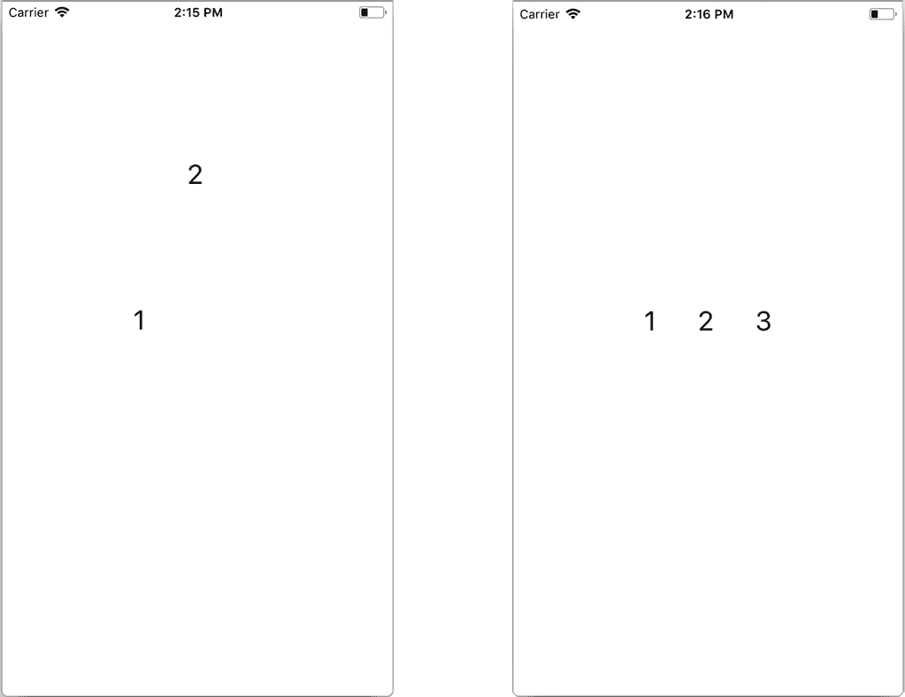

图 7.5 创建数字的动画序列

列表 7.5 创建动画序列

```
import React, { Component } from 'react';
import {
  StyleSheet,
  View,
 Animated    ①  
} from 'react-native';

export default class RNAnimations extends Component {
  componentDidMount() {
 this.animate();    ②  
  }
 AnimatedValue1 = new Animated.Value(-30);    ③  
 AnimatedValue2 = new Animated.Value(-30);    ③  
 AnimatedValue3 = new Animated.Value(-30);    ③  
  animate = () => {
 const createAnimation = (value) => {    ④  
      return Animated.timing(
        value, {
          toValue: 290,
          duration: 500
        })
    }
 Animated.sequence(  [  ⑤  
 createAnimation(this.AnimatedValue1),    ⑤  
 createAnimation(this.AnimatedValue2),    ⑤  
 createAnimation(this.AnimatedValue3)    ⑤  
 ]).start()    ⑤  
  }
  render() {
    return (
      <View style={styles.container}>
        <Animated.Text style={[styles.text, 
 { marginTop: this.AnimatedValue1}]}>    ⑥  
          1
        </Animated.Text>
        <Animated.Text style={[styles.text, 
 { marginTop: this.AnimatedValue2}]}>    ⑥   
          2
        </Animated.Text>
        <Animated.Text style={[styles.text, 
 { marginTop: this.AnimatedValue3}]}>    ⑥  
          3
        </Animated.Text>
      </View>
    );
  }
}

const styles = StyleSheet.create({
  container: {
    flex: 1,
    justifyContent: 'center',
    flexDirection: 'row',
  },
  text: {
    marginHorizontal: 20,
    fontSize: 26
  }
}); 
```

这个例子使用初始动画值为-30，因为它们是文本元素的`marginTop`值：文本在动画开始之前被拉出屏幕并隐藏。`createAnimation`函数也接收一个动画值作为其参数。

## 7.6 使用 Animated.stagger 错开动画开始时间

我们将要介绍的最后一种动画类型是`Animated.stagger`。与`parallel`和`sequence`类似，`stagger`也接受一个动画数组。动画数组以并行方式开始，但所有动画的开始时间均匀错开。与`parallel`和`sequence`不同，`stagger`的第一个参数是错开时间，第二个参数是动画数组：

```
Animated.stagger(
  100,
  [
    Animation1,
    Animation2,
    Animation3
  ]
).start() 
```

在这个例子中，你将动态创建大量动画，用于将一系列红色框错开显示在屏幕上（图 7.6）。

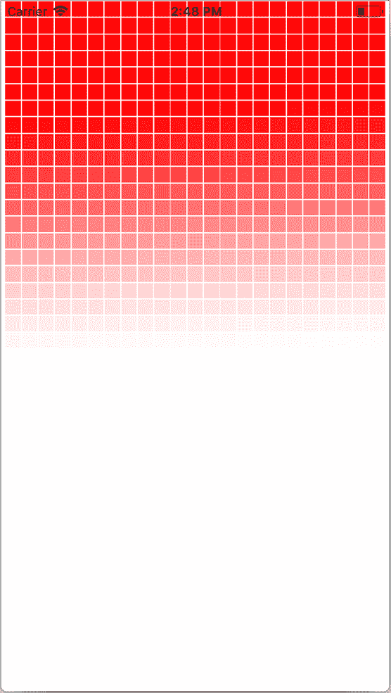

图 7.6 使用 Animated.stagger 创建错开动画数组

列表 7.6 使用`Animated.stagger`来错开一系列动画的开始时间

```
import React, { Component } from 'react'
import {
  StyleSheet,
  View,
 Animated    ①  
} from 'react-native'

export default class RNAnimations extends Component {
  constructor () {
    super()
 this.animatedValues = []    ②  
 for (let i = 0; i < 1000; i++) {    ②  
 this.animatedValues[i] = new Animated.Value(0)    ②  
 }    ②  
 this.animations = this.animatedValues.map(value => {    ③  
 return Animated.timing(    ③  
 value,    ③  
 {    ③  
 toValue: 1,    ③  
 duration: 6000    ③  
 }    ③  
 )    ③  
    })
  }
  componentDidMount() {
 this.animate()    ④  
  }
  animate = () => {
 Animated.stagger(15, this.animations).start()    ⑤  
  }
  render() {
    return (
      <View style={styles.container}>
        {
 this.animatedValues.map((value, index) => (    ⑥  
            <Animated.View key={index} 
                           style={[{opacity: value}, 
 styles.box]} />    ⑥  
 ))    ⑥  
        }
      </View>
    );
  }
}

const styles = StyleSheet.create({
  container: {
    flex: 1,
    justifyContent: 'center',
    flexDirection: 'row',
    flexWrap: 'wrap'
  },
  box: {
 width: 15,
    height: 15,
    margin: .5,
    backgroundColor: 'red'
  }
}) 
```

## 7.7 使用 Animated 库的其他有用技巧

除了我们已经介绍过的 Animated API 的部分之外，还有一些其他技巧值得了解：重置动画值、调用回调、将动画卸载到原生线程以及创建自定义可动画组件。本节将简要介绍这些内容。

### 7.7.1 重置动画值

如果你正在调用动画，你可以使用 `setValue(value)` 将值重置为你想要的任何值。如果你已经对一个值调用过动画，需要再次调用动画，并且希望将值重置为原始值或新值，这很有用：

```
animate = () => {
  this.animatedValue.setValue(300);
    #continue here with the new animated value
} 
```

### 7.7.2 调用回调

当动画完成时，可以触发一个可选的回调函数，如下所示：

```
Animated.timing(
  this.animatedValue,
  {
    toValue: 1,
    duration: 1000
  }
).start(() => console.log('animation is complete!')) 
```

### 7.7.3 将动画卸载到原生线程

默认情况下，Animated 库使用 JavaScript 线程执行动画。在大多数情况下，这没问题，你不太会遇到性能问题。但如果有任何操作阻塞了 JavaScript 线程，你可能会看到帧被跳过，导致动画卡顿或跳跃。

有一种绕过使用 JavaScript 线程的方法：你可以使用一个名为 `useNativeDriver` 的配置布尔值。`useNativeDriver` 将动画卸载到原生 UI 线程，然后原生代码可以直接在 UI 线程上更新视图，如下所示：

```
Animated.timing(
  this.animatedValue,
 {
    toValue: 100,
    duration: 1000,
    useNativeDriver: true
  }
).start(); 
```

并非所有动画都可以使用 `useNativeDriver` 卸载，所以当你使用它时，务必检查 Animated API 文档。截至本文撰写时，只有非布局属性可以使用此方法进行动画化；flexbox 属性以及诸如边距和填充之类的属性不能进行动画化。

### 7.7.4 使用 createAnimatedComponent 创建自定义可动画化组件

我们在 7.1 节中提到，默认情况下唯一可动画化的组件是 `View`、`Text`、`Image` 和 `ScrollView`。还有一种方法可以从任何现有或自定义 React Native 元素或组件创建动画组件。你可以通过将组件包裹在 `createAnimatedComponent` 的调用中来实现这一点。以下是一个示例：

```
const Button = Animated.createAnimatedComponent(TouchableHighlight)

<Button onPress={somemethod} style={styles.button}>
  <Text>Hello World</Text>
</Button> 
```

现在，你可以像使用常规 React Native 组件一样使用按钮。

## 摘要

+   内置的 Animated API 是在 React Native 中创建动画的推荐方式。

+   `Animated.timing` 是使用 Animated 库创建动画的主要方法。

+   默认情况下，唯一可动画化的组件是 `View`、`Text`、`ScrollView` 和 `Image`，但你可以使用 `createAnimatedComponent` 创建自定义的可动画化组件。

+   要插值和重用动画值，请使用 Animated 的 `interpolate` 方法。

+   要同时创建和触发一组动画，请使用 `Animated.parallel`。

+   要创建无限循环的动画，请使用 `Animated.loop`。

+   使用 `Animated.sequence` 创建一系列依次执行的动画。

+   使用 `Animated.stagger` 创建一个并行发生的动画数组，但其开始时间基于传入的时间进行错位。

# 8

使用 Redux 数据架构库

*****本章*** ***涵盖*****

+   React 上下文 API 的工作原理

+   创建 Redux `store`

+   如何使用 Redux 动作和 Reducers 管理全局状态

+   使用 `combineReducers` 进行 Reducer 组合

在现实世界中构建 React 和 React Native 应用程序时，你会很快学到，如果处理不当，数据层可能会变得复杂且难以管理。处理数据的一种方法是将它保存在组件状态中，并作为 props 传递，正如我们在本书中所做的那样。另一种方法是使用数据架构模式或库。本章介绍了 Redux 库：它是 React 生态系统中处理数据最广泛采用的方法，由维护 React 和 React Native 的 Facebook 团队维护。

## 8.1 什么是 Redux？

在 Redux 文档中，该库被描述为“JavaScript 应用程序的可预测状态容器。”Redux 基本上是一个全局状态对象，它是应用程序中的唯一真相来源。这个全局状态对象作为 props 被接收进 React Native 组件。每当 Redux 状态中的某个数据被更改时，整个应用程序都会以 props 的形式接收这个新数据。

Redux 通过将所有状态移动到一个称为*store*的地方来简化应用程序状态；这使得推理和理解变得更加容易。当你需要某个值时，你将知道在 Redux 应用程序中确切地在哪里查找，并且可以预期在应用程序的其他地方也能获得相同且最新的值。

那么，Redux 是如何工作的呢？它利用了 React 的一个特性，称为*上下文*，这是一种创建和管理全局状态的机制。

## 8.2 在 React 应用程序中使用上下文创建和管理全局状态

上下文是 React API，它创建可以在应用程序的任何地方访问的全局变量，只要接收上下文的组件是创建它的组件的子组件。通常，你需要通过将 props 传递到组件结构的每一层来实现这一点。使用上下文，你不需要使用 props。你可以在应用程序的任何地方使用上下文，并访问它而无需将其传递到每一层。

让我们看看如何在三个组件的基本组件结构中创建上下文：`Parent`、`Child1`和`Child2`。这个例子展示了如何从父级应用应用范围的主题，如果需要，这可以使得控制整个应用程序的样式成为可能。

列表 8.1 创建上下文

```
const ThemeContext = React.createContext()    ①  

class Parent extends Component {
 state = { themeValue: 'light' }    ②  
 toggleThemeValue = () => {    ③  
 const value = this.state.themeValue === 'dark' ? 'light' : 'dark'    ③  
 this.setState({ themeValue: value })    ③  
 }    ③  
  render() {
    return (
 <ThemeContext.Provider    ④  
        value={{
          themeValue: this.state.themeValue,
          toggleThemeValue: this.toggleThemeValue
        }}
      >
        <View style={styles.container}>
 <Text>Hello World</Text>
        </View>
        <Child1 />
      </ThemeContext.Provider>
    );
  }
}

const Child1 = () => <Child2 />    ⑤  

const Child2 = () => (    ⑥  
  <ThemeContext.Consumer>
    {(val) => (
        <View style={[styles.container, 
                      val.themeValue === 'dark' && 
                     { backgroundColor: 'black' }]}>
          <Text style={styles.text}>Hello from Component2</Text>
          <Text style={styles.text} 
                onPress={val.toggleThemeValue}>
              Toggle Theme Value
          </Text>
        </View>
      )}
  </ThemeContext.Consumer>
)

const styles = StyleSheet.create({
  container: {
    flex: 1,
    justifyContent: 'center',
    alignItems: 'center',
    backgroundColor: '#F5FCFF',
  },
  text: {
    fontSize: 22,
    color: '#666'
  }
}) 
```

`Child2` 无状态函数返回一个被`ThemeContext.Consumer`包裹的组件。`ThemeContext.Consumer`需要一个函数作为其子元素。该函数接收一个包含任何可用上下文的参数（在这个例子中，包含两个属性的`val`对象）。现在你可以在组件中使用这些上下文值。

当你使用 Redux 与 React 结合时，你会利用一个名为`connect`的函数，该函数基本上将上下文的片段转换为组件的 props。理解上下文应该会使学习 Redux 变得更加容易！

## 8.3 在 React Native 应用程序中实现 Redux

现在你已经了解了 Redux 的基础知识，并看到了在上下文背后的操作，让我们创建一个新的 React Native 应用程序并开始添加 Redux。你将创建一个基本的列表应用程序，你可以用它来跟踪你读过的书籍（参见 图 8.1）。按照以下步骤操作：

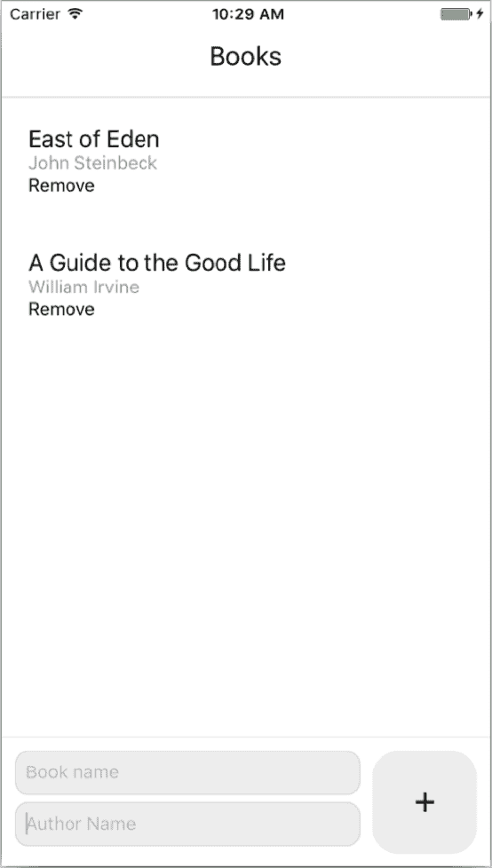

图 8.1 完成的图书列表应用

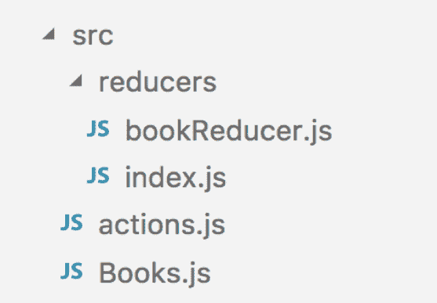

图 8.2 RNRedux src 文件夹结构

1.  创建一个新的 React Native 应用程序，并将其命名为 RNRedux：

```
react-native init RNRedux 
```

1.  切换到新目录：

```
cd RNRedux 
```

1.  安装你需要的 Redux 特定依赖项：

```
npm i redux react-redux –-save 
```

1.  在目录的根目录下创建一个名为 src 的文件夹，并向其中添加以下文件：Books.js 和 actions.js。此外，在 src 中创建一个名为 reducers 的文件夹，包含两个文件：bookReducer.js 和 index.js。src 文件夹结构现在应该看起来像 图 8.2。

下一步是创建第一个 Redux 状态。你将在 bookReducer.js 中做这件事。在第 8.1 节中，我将 Redux 描述为一个全局对象。要创建这个全局对象，你将使用所谓的 *Reducer* 将更小的对象拼接在一起。

## 8.4 创建 Redux Reducer 以存储 Redux 状态

Reducer 是一个返回对象的函数；当与其他 Reducer 结合时，它们会创建全局状态。Reducer 可以更容易地被视为数据存储。每个存储包含一块数据，这正是 Redux 架构中 Reducer 所做的。

在 reducers 文件夹中有两个文件：bookReducer.js 和 index.js。在 index.js 中，你将结合应用中的所有 Reducer 来创建全局状态。应用一开始将只有一个 Reducer (`bookReducer`)，因此全局状态对象将看起来像这样：

```
{
  bookReducer: {} 
} 
```

你还没有决定在 `bookReducer` 中放置什么。一个用于存储图书列表的数组将是一个好的开始。这个 Reducer 将创建并返回一个状态，你稍后将从 Redux 存储中访问它。在 reducers/bookReducer.js 中，创建你的第一个 Reducer。这段代码创建了一个函数，其唯一目的（目前）是返回状态。

列表 8.2 创建 Reducer

```
const initialState = {    ①  
 books: [{ name: 'East of Eden', author: 'John Steinbeck' }]    ①  
}    ①  
```

```
 const bookReducer = (state = initialState) => {    ②  
 return state    ③  
}

export default bookReducer 
```

`initialState` 对象将保存初始状态。在这种情况下，那是一个包含 `name` 和 `author` 属性的对象数组，你将用这些对象填充它。你创建一个函数，该函数接受一个参数 `state`，并将默认值设置为初始状态。当这个函数第一次被调用时，`state` 将是未定义的，并将返回 `initialState` 对象。此时，这个函数的唯一目的是返回状态。

现在你已经创建了第一个 Reducer，进入 `rootReducer`（reducers/index.js）并创建将成为全局状态的内容。根 Reducer 收集应用中的所有 Reducer，并允许你通过将它们组合起来创建一个全局存储（状态对象）。

列表 8.3 创建根 Reducer

```
import { combineReducers } from 'redux'    ①  
import bookReducer from './bookReducer'    ②  

const rootReducer = combineReducers({    ③  
  bookReducer
})

export default rootReducer 
```

接下来，为了将这些组件连接起来，你将进入 App.js，创建 Redux 存储，并使用几个 Redux 和 React-Redux 辅助函数使存储对所有子组件可用。

## 8.5 添加提供者并创建存储

在本节中，你将在应用中添加一个 *provider*。provider 通常是一个父组件，它将某种类型的数据传递给所有子组件。在 Redux 中，provider 将全局状态/存储传递给应用的其他部分。在 App.js 中，按照以下方式更新代码。

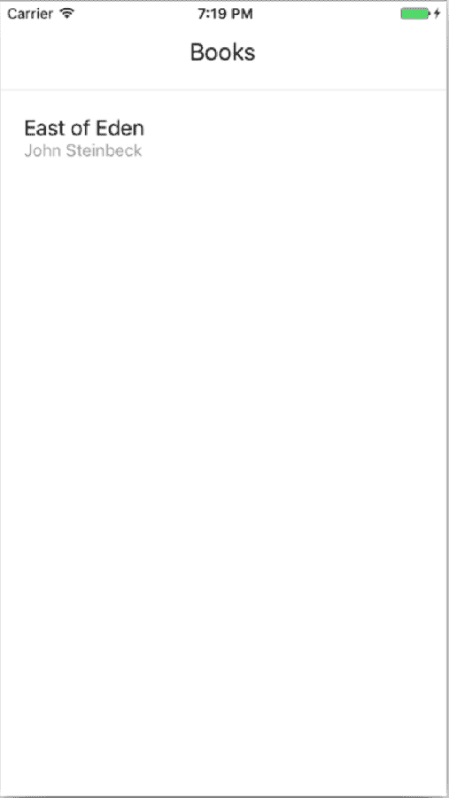

图 8.3 从 Redux 存储渲染书籍列表

列表 8.4 添加提供者和存储

```
import React from 'react'

import Books from './src/Books'    ①  
import rootReducer from './src/reducers'    ②  

import { Provider } from 'react-redux'    ③  
import { createStore } from 'redux'    ④  

const store = createStore(rootReducer)    ⑤  

export default class App extends React.Component {
  render() {
    return (
 <Provider store={store} >    ⑥  
 <Books />    ⑥  
 </Provider>    ⑥  
    )
  }
} 
```

`Provider` 包装器用于包装主组件。`Provider` 的任何子组件都将能够访问 Redux 存储。`createStore` 是 Redux 中的一个实用工具，你通过传递 `rootReducer` 来创建 Redux 存储。你已经完成了基本的 Redux 设置，现在你可以通过 Redux 和 React-Redux 的几个辅助函数在应用中访问 Redux 存储。

在 `Books` 组件中，你将连接到 Redux 存储，提取 `books` 数组，并对书籍进行映射，在 UI 中显示它们（图 8.3）。因为 `Books` 是 `Provider` 的子组件，它可以访问 Redux 存储中的任何内容。

## 8.6 使用 connect 函数访问数据

你可以通过使用 react-redux 中的 `connect` 函数从子组件访问 Redux 存储。`connect` 的第一个参数是一个函数，它给你提供访问整个 Redux 状态的权限。然后你可以返回一个对象，包含你想要访问的存储的任何部分。

`connect` 是一个 *curried* 函数，这意味着在最基本的意义上，它是一个返回另一个函数的函数。你将有两组参数，一个看起来像这样的蓝图：`connect(args)(args)`。从 `connect` 的第一个参数返回的对象中的属性然后作为 props 传递给组件。

让我们通过查看你在 Books.js 组件中将使用的 `connect` 函数来了解这意味着什么。

列表 8.5 Books.js 中的 `connect` 函数

```
connect(
 (state) => {    ①  
 return {    ②  
      books: state.bookReducer.books
    }
  }
)(Books)    ③   
```

`connect` 函数的第一个参数是一个函数，它将全局 Redux `state` 对象作为参数传递。然后你可以引用这个 `state` 对象，并访问 Redux 状态中的任何内容。从这个函数中返回一个对象。对象中返回的任何键都将成为你包装的组件（在这个例子中是 `Books`）中的 props。你将 `Books` 作为 `connect` 函数第二个函数调用的唯一参数传递。

通常，你会将这个函数分离并存储在一个变量中，以便更容易阅读。

```
const mapStateToProps = state => ({
  books: state.bookReducer.books
}) 
```

在这个连接组件中有一个新的属性叫做 `this.props.books`，这是来自 `bookReducer` 的 `books` 数组。将这些全部结合起来，访问 `books` 数组，并对书籍进行映射，以显示在 UI 中，如下所示（Books.js）。

列表 8.6 访问 Redux 存储 和 `bookReducer` 数据

```
import React from 'react'
import {
  Text,
  View,
     ScrollView,
  StyleSheet
} from 'react-native'

import { connect } from 'react-redux'    ①  

class Books extends React.Component<{}> {
  render() {
 const { books } = this.props    ②  

    return (
      <View style={styles.container}>
        <Text style={styles.title}>Books</Text>
        <ScrollView
          keyboardShouldPersistTaps='always'
          style={styles.booksContainer}
        >
          {
 books.map((book, index) => (    ③  
 <View style={styles.book} key={index}>    ③  
 <Text style={styles.name}>{book.name}</Text>    ③  
 <Text style={styles.author}>{book.author}</Text>    ③  
 </View>    ③  
 ))    ③  
          }
        </ScrollView>
      </View>
    )
  }
}

const styles = StyleSheet.create({
  container: {
    flex: 1
  },
  booksContainer: {
    borderTopWidth: 1,
    borderTopColor: '#ddd',
    flex: 1
  },
  title: {
    paddingTop: 30,
    paddingBottom: 20,
    fontSize: 20,
    textAlign: 'center'
  },
  book: {
    padding: 20
  },
  name: {
 fontSize: 18
  },
  author: {
    fontSize: 14,
    color: '#999'
  }
})

const mapStateToProps = (state) => ({    ④  
 books: state.bookReducer.books    ④  
})    ④  

export default connect(mapStateToProps)(Books)    ⑤   
```

你首先从 `react-redux` 中导入 `connect`。在 列表 8.5 中，你直接在函数中返回了属性。此列表将其分离并命名为 `mapStateToProps`，遵循 Redux 生态系统的约定。这种命名约定非常有意义，因为你实际上是在将 Redux 状态映射到组件属性。此函数接受 Redux 状态作为参数，并返回一个包含一个键的对象，该键包含 `bookReducer` 中的 `books` 数组。最后，你导出 `connect` 函数，将 `mapStateToProps` 作为 `connect` 的第一个参数传递，并将 `Books` 作为 `connect` 第二组参数中的唯一参数。

启动应用程序后，你应该会看到一个基本的书籍列表，如图 8.3 中所示。

## 8.7 添加动作

现在你已经可以访问 Redux 状态，下一步的逻辑是添加一些功能，允许你向 Redux 存储 `books` 数组中添加书籍。为此，你将使用 *动作*。动作基本上是返回对象的函数，这些对象将数据发送到存储并更新 reducer；它们是更改存储的唯一方式。每个动作都应该包含一个 `type` 属性，以便 reducer 能够使用它们。以下是一些动作的示例：

```
function fetchBooks() {
     return {
       type: 'FETCH_BOOKS'
     }
   }

   function addBook(book) {
     return {
       type: 'Add_BOOK',
       book: book
     }
   } 
```

当使用 Redux 的 `dispatch` 函数调用动作时，这些动作作为第二个参数发送到应用程序中的所有 reducer。（我们将在本章后面介绍如何附加 Redux 的 `dispatch` 函数。）当 reducer 接收到动作时，你检查动作的 `type` 属性，并根据动作是否是它正在监听的动作来更新 reducer 返回的内容。

在这个例子中，你只需要为下一步添加一个 `addBook` 动作，以便向书籍数组中添加额外的书籍。在 actions.js 文件中，创建以下动作。

列表 8.7 创建第一个动作

```
export const ADD_BOOK = 'ADD_BOOK'    ①  

export function addBook (book) {    ②  
  return {
    type: ADD_BOOK,
    book
  }
} 
```

接下来，将 `bookReducer` 连接到使用 `addBook` 动作。

列表 8.8 更新 `bookReducer` 以使用 `addBook` 动作

```
import { ADD_BOOK } from '../actions'    ①  

const initialState = {
  books: [{ name: 'East of Eden', author: 'John Steinbeck' }]
}

const bookReducer = (state = initialState, action) => {    ②  
 switch(action.type) {    ③  
    case ADD_BOOK:
      return {
 books:   [  ④  
          ...state.books,
          action.book
        ]
      }
 default:    ⑤  
      return state
  }
}

export default bookReducer 
```

在列表中，如果动作类型等于 `ADD_BOOK`，你将返回一个新的 `books` 数组，包含数组中的所有先前项。你是通过创建一个新的数组，使用扩展运算符将现有 `books` 数组的元素添加到新数组中，并将动作的 `book` 属性作为新项添加到数组中。

在 Redux 配置中，你需要做的就这些来使它工作。最后一步是进入 UI 并将其全部连接起来。为了获取用户的书籍信息，你需要创建一个表单。图 8.4 展示了 UI 将会是什么样子。

此表单有两个输入：一个用于书籍名称，一个用于作者名称。它还有一个提交按钮。当用户在表单中输入时，你需要跟踪本地状态中的值。然后，当用户点击提交按钮时，你可以将这些值传递给动作。

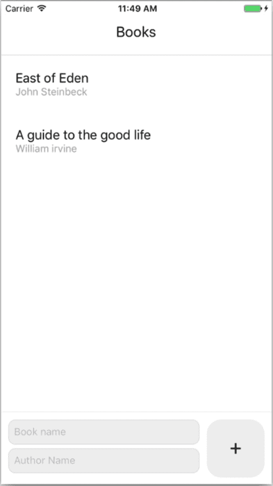

图 8.4 添加了文本输入以捕获书籍和作者名称的 UI

打开`Books.js`，导入实现此功能所需的额外组件，以及从 actions 中导入的`addBook`函数。你还将创建一个`initialState`变量，用作本地组件状态。

列表 8.9 Books.js 中的额外导入

```
import React from 'react'
import {
  Text,
  View,
  ScrollView,
  StyleSheet,
 TextInput,    ①  
 TouchableOpacity    ①  
} from 'react-native'
import { addBook } from './actions'    ②  

import { connect } from 'react-redux'

const initialState = {    ③  
 name: '',    ③  
 author: ''    ③  
}

... 
```

接下来，在类的主体中，你需要创建三样东西：组件状态，一个当`textInput`值改变时跟踪组件状态的方法，以及一个当提交按钮被按下时将包含书籍值（名称和作者）的动作发送到 Redux 的方法。在`render`方法之前，添加以下代码。

列表 8.10 向 Books.js 添加状态和类方法

```
class Books extends React.Component {

 state = initialState    ①  

 updateInput = (key, value) => {    ②  
    this.setState({
      ...this.state,
      [key]: value
    })
  }

 addBook = () => {    ③  
    this.props.dispatchAddBook(this.state)
    this.setState(initialState)
  }

... 
```

`addBook`方法调用一个你可以通过`connect`函数访问的 props 中的函数：`dispatchAddBook`。这个函数接受整个状态作为参数，它是一个具有`name`和`author`属性的对象。在调用 dispatch 动作之后，然后通过将其重置为`initialState`值来清除组件状态。

在功能实现后，你可以创建 UI 并将这些方法连接到它。在`Books.js`中的`ScrollView`关闭标签下添加表单 UI。

列表 8.11 添加表单的 UI

```
class Books extends React.Component {
      ...
      render() {
         ...
      </ScrollView>
      <View style={styles.inputContainer}>
        <View style={styles.inputWrapper}>
 <TextInput    ①  
            value={this.state.name}
            onChangeText={value => this.updateInput('name', value)}
            style={styles.input}
            placeholder='Book name'
          />
 <TextInput    ①  
            value={this.state.author}
            onChangeText={value => this.updateInput('author', value)}
            style={styles.input}
            placeholder='Author Name'
          />
        </View>
 <TouchableOpacity onPress={this.addBook}>    ②  
          <View style={styles.addButtonContainer}>
            <Text style={styles.addButton}>+</Text>
          </View>
        </TouchableOpacity>
      </View>
       </View>
     }
   }

const styles = StyleSheet.create({
 inputContainer: {    ③  
    padding: 10,
    backgroundColor: '#ffffff',
    borderTopColor: '#ededed',
    borderTopWidth: 1,
    flexDirection: 'row',
    height: 100
  },
  inputWrapper: {
    flex: 1
  },
  input: {
    height: 44,
    padding: 7,
    backgroundColor: '#ededed',
    borderColor: '#ddd',
    borderWidth: 1,
    borderRadius: 10,
    flex: 1,
    marginBottom: 5
  },
  addButton: {
    fontSize: 28,
    lineHeight: 28
  },
  addButtonContainer: {
    width: 80,
    height: 80,
    backgroundColor: '#ededed',
    marginLeft: 10,
    justifyContent: 'center',
    alignItems: 'center',
    borderRadius: 20
  },
  ...
}

const mapDispatchToProps = {    ④  
  dispatchAddBook: (book) => addBook(book)
}

export default connect(mapStateToProps, mapDispatchToProps)(Books)    ⑤  

} 
```

在`mapDispatchToProps`对象中，你可以声明你希望在组件的 props 中访问的函数。你创建一个新的函数名为`dispatchAddBook`，并让它调用`addBook`动作，传入`book`作为参数。类似于`mapStateToProps`将状态映射到组件 props，`mapDispatchToProps`将需要分发到 reducer 的动作映射到组件 props。为了使一个动作能被 Redux 的 reducer 识别，它必须在`mapDispatchToProps`对象中声明。你将`mapDispatchToProps`作为`connect`函数的第二个参数传入。

现在你应该能够轻松地将书籍添加到书单中。

## 8.8 在 reducer 中从 Redux 存储中删除项目

下一个合乎逻辑的步骤是添加一种方法来移除你已经读过的书籍。考虑到你已经构建的一切，这不会需要太多额外的工作（图 8.5）。

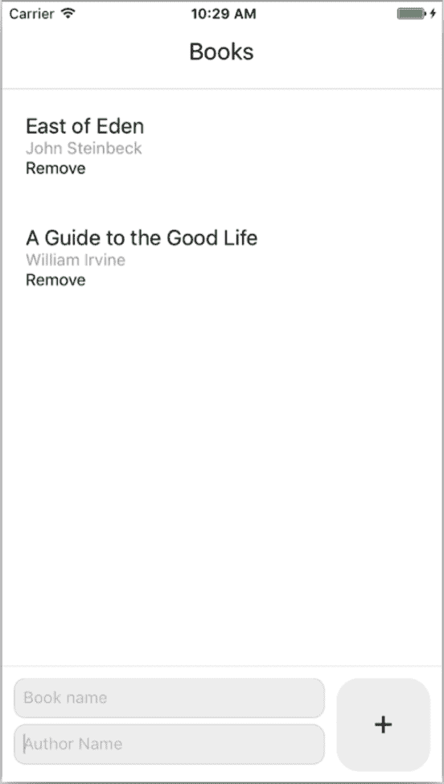

图 8.5 在 Books.js UI 中添加移除按钮

当从类似这样的数组中移除项时，首先要考虑的是如何识别一个书籍作为唯一的。目前，一个用户可能有多个作者相同的书籍或多个名称相同的书籍，所以使用现有的属性将不起作用。相反，你可以使用如 uuid 这样的库来动态创建唯一标识符。为了开始设置，从命令行，将 uuid 库安装到`node_modules`：

```
npm i uuid --save 
```

接下来，你将在 reducer 中为`initialState`中的`books`数组项实现一个唯一标识符。在`reducers/bookReducer.js`中，更新导入和`initialState`以类似于以下列表。

列表 8.12 导入和使用 uuid

```
import uuidV4 from 'uuid/v4'    ①  
import { ADD_BOOK } from '../actions'

const initialState = {    ②  
  books: [{ name: 'East of Eden', author: 'John Steinbeck', id: uuidV4() }]
} 
```

uuid 库提供了一些算法可供选择。在这里，你只导入 v4 算法，它创建一个随机的 32 位字符字符串。然后你向 `initialState` 的 `books` 数组添加一个新的属性 `id`，并通过调用 `uuidV4()` 生成一个新的唯一标识符。

现在你有了在 `books` 数组中唯一标识项目的方法，你就可以继续实现其余的功能。下一步是在 `actions.js` 中创建一个新的动作；当你想要删除一本书时，你会调用它。你还需要更新 `addBook` 动作，以便为新创建的书籍添加一个 ID。

列表 8.13 创建 `removeBook` 动作

```
export const ADD_BOOK = 'ADD_BOOK'
export const REMOVE_BOOK = 'REMOVE_BOOK'    ①  
import uuidV4 from 'uuid/v4'    ②  

export function addBook (book) {
  return {
    type: ADD_BOOK,
    book: {
      ...book,
 id: uuidV4()    ③  
    }
  }
}

export function removeBook (book) {    ④  
  return {
    type: REMOVE_BOOK,
    book
  }
} 
```

接下来，reducer 需要意识到新的动作。在 `reducers/bookReducer.js` 中，创建一个新的类型监听器，这个监听器用于 `REMOVE_BOOK`，并添加必要的功能以从 Redux 状态中存储的书籍数组中删除一本书。

列表 8.14 在 Redux reducer 中从数组中移除一个项目

```
import uuidV4 from 'uuid/v4'
import { ADD_BOOK, REMOVE_BOOK } from '../actions'    ①  

const initialState = {
  books: [{ name: 'East of Eden', author: 'John Steinbeck', id: uuidV4() }]
}
const bookReducer = (state = initialState, action) => {
  switch(action.type) {
    ...
 case REMOVE_BOOK:    ②  
      const index = state.books.findIndex(
 book => book.id === action.book.id)    ③  
      return {
 books:   [  ④  
          ...state.books.slice(0, index),
          ...state.books.slice(index + 1)
        ]
      }
    ...
  }
}

export default bookReducer 
```

最后一件要做的事情是在 `Books` 组件（Books.js）的 UI 中实现这个新的 `removeBook` 功能。你会导入 `removeBook` 动作，为每个渲染的项目添加一个删除按钮，并将删除按钮连接到 `removeBook` 动作。

列表 8.15 添加 `removeBook` 功能

```
...
import { addBook, removeBook } from './actions'    ①  
...
 removeBook = (book) => {    ②  
 this.props.dispatchRemoveBook(book)    ②  
  }
...

{
 books.map((book, index) => (    ③  
 <View style={styles.book} key={index}>    ③  
 <Text style={styles.name}>{book.name}</Text>    ③  
 <Text style={styles.author}>{book.author}</Text>    ③  
 <Text onPress={() => this.removeBook(book)}>    ③  
 Remove    ③  
 </Text>    ③  
 </View>    ③  
            ))
          }

...
const mapDispatchToProps = {
  dispatchAddBook: (book) => addBook(book),
 dispatchRemoveBook: (book) => removeBook(book)    ④  
}
... 
```

## 摘要

+   使用上下文，你可以在 React Native 应用程序中向子组件传递属性和数据，而无需显式地将属性传递给每个单独的子组件。

+   Reducer 在某种程度上类似于传统的数据存储，因为它们会跟踪并返回数据，同时也允许你更新存储中的数据。

+   你可以创建并使用动作来更新 Redux 存储。

+   使用 `connect` 函数，你可以将 Redux 状态中的数据作为 props 访问，并且可以创建与 reducer 通过动作交互的 dispatch 函数。

+   任何需要在 reducer 中更改数据的时候，都必须通过使用一个动作来完成。**
