# 第三部分

API 参考

React Native 提供了丰富的 API。本部分章节涵盖了跨平台 API 以及特定于 iOS 和 Android 平台的 API。

在第九章中，我们探讨了使用 React Native 的跨平台 API：可以在 iOS 或 Android 上使用的 API，用于创建提醒；检测应用是否在前台、后台或非活动状态；持久化、检索和删除数据；存储和更新文本到设备剪贴板；以及执行许多其他有用任务。在第十章和第十一章中，我们将探讨 React Native 针对 iOS 平台或 Android 平台的特定 API。

# 9

实现跨平台 API

**本章内容涵盖**

+   创建原生应用程序警告对话框

+   检测应用是否处于前台、后台或非活动状态

+   将文本存储和更新到设备剪贴板

+   使用地理位置获取并使用用户设备的纬度、经度、速度和高度

+   检测设备属性，如屏幕的高度和宽度以及连接类型

使用 React Native 的一个关键好处是，可以轻松地使用 JavaScript 访问和使用原生 API。在本章中，我们将介绍框架中大多数可用的跨平台 API。当访问这些 API 时，您将能够使用单个代码库在 iOS 和 Android 上实现特定于平台的行为。

本章讨论的原生 API 与原生组件之间的主要区别在于，原生组件通常与 UI 有关，例如显示特定的 UI 元素。另一方面，API 更多地涉及访问手机中的原生功能和硬件，例如与设备中的数据（地理位置、应用状态等）交互或访问。

本章涵盖了以下跨平台 API：

+   Alert

+   AppState

+   AsyncStorage

+   Clipboard

+   Dimensions

+   地理位置服务

+   键盘

+   NetInfo

+   PanResponder

虽然 React Native 提供了其他跨平台 API，但你会发现这些是最有用的。

除了跨平台 API 之外，React Native 还提供了特定于平台的 API（即仅在 iOS 或 Android 上工作的 API）。我们将在第十章中介绍特定于 iOS 的 API，在第十一章中介绍特定于 Android 的 API。

## 9.1 使用 Alert API 创建跨平台通知

Alert 通过调用`alert`方法（`Alert.alert`）来启动具有标题、消息和可选方法的平台特定警告对话框，这些方法可以在按下警告按钮时调用。Alert 可以通过调用`alert`方法触发，该方法接受四个参数（见表 9.1）：

```
Alert.alert(title, message, buttons, options) 
```

表 9.1 `Alert.alert`方法参数

| **参数** | **类型** | **描述** |
| --- | --- | --- |
| `title` | 字符串 | 提醒按钮的主要信息 |
| `message` | 字符串 | 提醒按钮的次要信息 |
| `buttons` | 数组 | 按钮数组，每个按钮都是一个具有两个键的对象：`title`（字符串）和`onPress`（函数） |
| `options` | 对象 | 包含可取消布尔值的对象（选项：`{ cancelable: true }`） |

### 9.1.1 警报的使用用例

警报是在网页和移动设备上常见的 UI 模式，并且是让用户了解应用程序中发生的事情（如错误或成功）的简单方式。很多时候，如果下载完成、发生错误或异步过程（如登录）完成，就会使用警报。

### 9.1.2 使用警报的示例

你可以通过调用 `Alert.alert()` 方法并传入一个或多个参数来触发一个警报。在这个示例中，你将创建一个带有两个选项的警报：取消和显示消息（见图 9.1）。如果按下取消，你将关闭警报；如果按下显示消息，你将更新状态以显示消息。

列表 9.1 将警报绑定到触摸事件

```
import React, { Component } from 'react'
import { TouchableHighlight, View, Text, StyleSheet, Alert } 
 from 'react-native'    ①  
let styles = {}

export default class App extends Component {
  constructor () {
    super()
 this.state = {    ②  
 showMessage: false    ②  
    }
    this.showAlert = this.showAlert.bind(this)
  }
 showAlert () {    ③  
    Alert.alert(
      'Title',
      'Message!',
      
        {
          text: 'Cancel',
          onPress: () => console.log('Dismiss called...'),
          style: 'destructive'
        },
        {
 text: 'Show Message',  [  ④  
 onPress: () => this.setState({ showMessage: true })    ④  
        }
      ]
    )
  }
  render () {
    const { showMessage } = this.state
    return (
      <View style={styles.container}>
        <TouchableHighlight onPress={this.showAlert} style={styles.button}>
          <Text>SHOW ALERT</Text>
        </TouchableHighlight>
 {    ⑤  
 showMessage && <Text>Showing message - success</Text>    ⑤  
 }    ⑤  
      </View>
    )
  }
}

styles = StyleSheet.create({
  container: {
    justifyContent: 'center',
    flex: 1
  },
  button: {
    height: 70,
    justifyContent: 'center',
    alignItems: 'center',
    backgroundColor: '#ededed'
  }
}) 
```

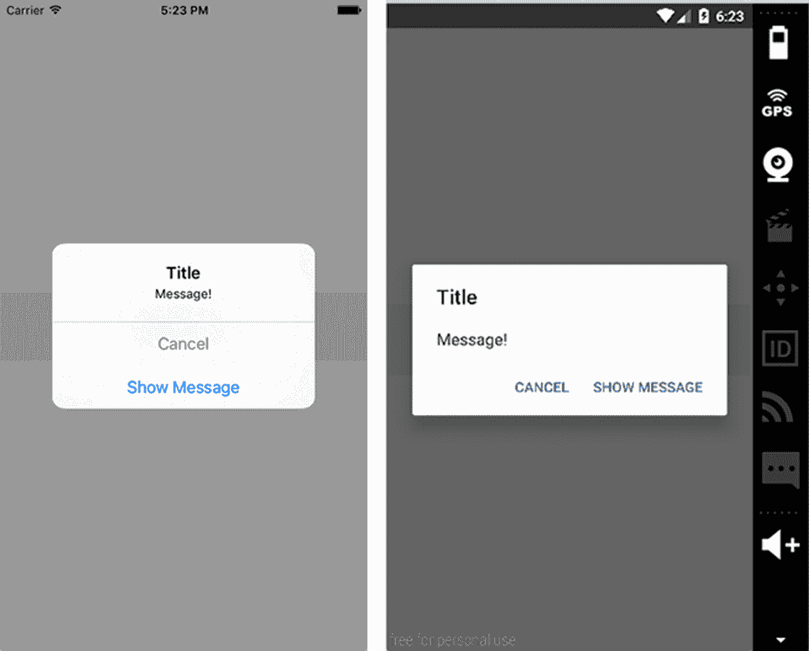

图 9.1 按压警报带有两个选项：取消和显示消息（左：iOS，右：Android）

## 9.2 使用 AppState API 检测当前应用程序状态

AppState 会告诉你应用是活动状态、非活动状态还是后台状态。它基本上会在应用状态改变时调用一个方法，允许你根据应用的状态执行操作或调用其他方法。

当应用状态改变时，AppState 会触发并返回 `active`、`inactive` 或 `background`。要响应应用状态改变，添加事件监听器并在事件触发时调用一个方法。AppState 用于响应的事件是 `change` 和 `memorywarning`。本节的示例使用 `change`，因为在现实场景中你主要会用到它。

### 9.2.1 AppState 的使用用例

AppState 是一个有用的 API，并且经常派上用场。很多时候，当应用被拉回前台时，你可能想做一些事情，比如从你的 API 中获取新鲜数据——这就是 AppState 的一个很好的用例。

另一个用例是身份验证。当应用置于前台时，你可能想添加另一层安全措施，例如 PIN 码或指纹。

如果你正在进行轮询，例如每 15 秒左右击打一次数据库以检查新数据，那么当用户将应用推入后台时，你可能想禁用轮询。AppState 也是这种情况的一个很好的用例。

### 9.2.2 使用 AppState 的示例

在这个示例中，你将在 `componentDidMount` 中添加一个事件监听器，监听 `change` 事件，然后在控制台显示当前状态。

列表 9.2 使用 AppState 记录当前应用状态

```
import React, { Component } from 'react'
import { AppState, View, Text, StyleSheet } from 'react-native'    ①  
let styles = {}

class App extends Component {
 componentDidMount () {    ②  
 AppState.addEventListener('change', this.handleAppStateChange)    ②  
  }
 handleAppStateChange (currentAppState) {    ③  
    console.log('currentAppState:', currentAppState)
  }
  render () {
    return (
      <View style={styles.container}>
        <Text>Testing App State</Text>
      </View>
    )
  }
}

styles = StyleSheet.create({
  container: {
    justifyContent: 'center',
    flex: 1
  }
})

export default App 
```

运行项目，并通过在 iOS 模拟器中按 CMD-Shift-H 或在 Android 模拟器中按主页按钮来测试它。控制台应记录当前应用状态（活动、非活动或后台）。

## 9.3 使用 AsyncStorage API 持久化数据

接下来是 AsyncStorage。AsyncStorage 是持久化和存储数据的好方法：它是异步的，这意味着你可以使用 promise 或`async await`检索数据，并且它使用键值系统来存储和检索数据。

当你使用一个应用然后关闭它时，它的状态将在你下次打开时重置。AsyncStorage 的主要优点之一是它允许你直接将数据存储到用户的设备上，并在需要时检索它！

AsyncStorage 的方法和参数列于表 9.2 中。

表 9.2 AsyncStorage 方法和参数

| **方法** | **参数** | **描述** |
| --- | --- | --- |
| `setItem` | `key`, `value`, `callback` | 在 AsyncStorage 中存储一个项 |
| `getItem` | `key`, `callback` | 从 AsyncStorage 中检索一个项 |
| `removeItem` | `key`, `callback` | 从 AsyncStorage 中删除一个项 |
| `mergeItem` | `key`, `value`, `callback` | 将一个现有值与另一个现有值合并（两个值都必须是字符串化的 JSON） |
| `clear` | `callback` | 删除 AsyncStorage 中的所有值 |
| `getAllKeys` | `callback` | 获取应用中存储的所有键 |
| `flushGetRequests` | 无 | 清除任何挂起的请求 |
| `multiGet` | `[keys]`, `callback` | 允许你使用键数组获取多个值 |
| `multiSet` | `[keyValuePairs]`, `callback` | 允许你一次性设置多个键值对 |
| `multiRemove` | `[keys]`, `callback` | 允许你使用键数组删除多个值 |
| `multiMerge` | `[keyValuePairs]`, `callback` | 允许你将多个键值对合并到一个方法中 |

### 9.3.1 AsyncStorage 的使用场景

AsyncStorage 常用于认证目的，持久化用户数据和信息，防止在应用关闭时丢失。例如，当用户登录并从 API 获取他们的名字、用户 ID、头像等信息时，你不想每次他们打开应用时都强制他们登录。当他们第一次登录时，你可以将他们的信息保存到 AsyncStorage 中，然后从那时起，使用原始信息，并在必要时更新它。

另一个用例是当你处理大量数据集或慢速 API 时，不想多次等待。例如，如果一个数据集需要几秒钟来检索，你可能想在 AsyncStorage 中缓存该数据，在用户打开应用时显示它，并在后台进程中刷新数据，这样用户就不必等待开始与数据或 UI 交互。

### 9.3.2 AsyncStorage 使用示例

在这个例子中，你将取一个用户对象并将其存储到 AsyncStorage 的`componentDidMount`中。然后，你将使用一个按钮从 AsyncStorage 中提取数据，用数据填充状态，并将其渲染到视图中。

列表 9.3 使用 AsyncStorage 持久化和检索数据

```
import React, { Component } from 'react'
import { TouchableHighlight, AsyncStorage, View, 
 Text, StyleSheet } from 'react-native'    ①  
let styles = {}

const person = {    ②  
  name: 'James Garfield',
  age: 50,
  occupation: 'President of the United States'
}

const key = 'president'    ③  

export default class App extends Component {
  constructor () {
    super()
    this.state = {
 person: {}    ④  
    }
    this.getPerson= this.getPerson.bind(this)
  }
  componentDidMount () {
 AsyncStorage.setItem(key, JSON.stringify(person))    ⑤  
      .then(() => console.log('item stored...'))
      .catch((err) => console.log('err: ', err))
  }
 getPerson () {    ⑥  
 AsyncStorage.getItem(key)    ⑦  
 .then((res) => this.setState({ person: JSON.parse(res) }))    ⑧  
      .catch((err) => console.log('err: ', err))
  }
  render () {
    const { person } = this.state
    return (
      <View style={styles.container}>
        <Text style={{textAlign: 'center'}}>Testing AsyncStorage</Text>
        <TouchableHighlight onPress={this.getPerson} 
 style={styles.button}>    ⑨  
          <Text>Get President</Text>
        </TouchableHighlight>
        <Text>{person.name}</Text>
        <Text>{person.age}</Text>
        <Text>{person.occupation}</Text>
      </View>
    )
  }
}

styles = StyleSheet.create({
  container: {
    justifyContent: 'center',
    flex: 1,
    margin: 20
  },
  button: {
    justifyContent: 'center',
    marginTop: 20,
    marginBottom: 20,
    alignItems: 'center',
    height: 55,
    backgroundColor: '#dddddd'
  }
}) 
```

如你所见，promises 被用来设置和从 AsyncStorage 返回值。还有另一种方法来做这件事：让我们看看`async await`。

列表 9.4 使用 `async await` 异步获取数据

```
async componentDidMount () {
  try {
    await AsyncStorage.setItem(key, JSON.stringify(person))
    console.log('item stored')
  } catch (err) {
    console.log('err:', err)
  }
}
async getPerson () {
  try {
    var data = await AsyncStorage.getItem(key)
    var person = await data
    this.setState({ person: JSON.parse(person) })
  } catch (err) {
    console.log('err: ', err)
  }
} 
```

`async await` 首先需要您通过在函数名前添加 `async` 关键字来标记函数为异步。然后您可以使用 `await` 关键字等待函数返回的值，允许您像编写同步代码一样编写基于 promise 的代码。当您等待一个 promise 时，函数会等待直到 promise 解决，但它以非阻塞的方式进行；然后它将值赋给变量。

## 9.4 使用剪贴板 API 将文本复制到用户的剪贴板

剪贴板允许您在 iOS 和 Android 上保存和检索剪贴板内容。剪贴板有两个方法：`getString()` 和 `setString()`（见 表 9.3）。

表 9.3 剪贴板方法

| **方法** | **参数** | **描述** |
| --- | --- | --- |
| `getString` | None | 获取剪贴板的内容 |
| `setString` | `content` | 设置剪贴板的内容 |

### 9.4.1 剪贴板的用例

剪贴板最常见的用例是当用户需要复制一段文本字符串时。用户不必记住它，可以使用剪贴板复制到剪贴板，然后将其粘贴到任何他们想要使用信息的地方！

### 9.4.2 使用剪贴板的示例

在此示例中，您将在 `componentDidMount` 中设置一个初始剪贴板值“Hello World”，然后使用附加到 `TextInput` 的方法更新剪贴板。您将添加一个按钮，将当前的 `ClipboardValue` 推送到一个数组并将其渲染到视图。

列表 9.5 保存和替换剪贴板内容

```
import React, { Component } from 'react'
import { TextInput, Clipboard, TouchableHighlight, View, 
 Text, StyleSheet } from 'react-native'    ①  
let styles = {}

export default class App extends Component {
  constructor() {
    super()
    this.state = {
 clipboardData: []    ②  
    }
    this.pushClipboardToArray = this.pushClipboardToArray.bind(this)
  }
  componentDidMount () {
 Clipboard.setString('Hello World! ');    ③  
  }
  updateClipboard (string) {
 Clipboard.setString(string);    ④  
  }
 async pushClipboardToArray() {    ⑤  
    const { clipboardData } = this.state
 var content = await Clipboard.getString();    ⑥  
 clipboardData.push(content)    ⑦  
 this.setState({clipboardData})    ⑧  
  }
  render () {
    const { clipboardData } = this.state
    return (
      <View style={styles.container}>
        <Text style={{textAlign: 'center'}}>Testing Clipboard</Text>
        <TextInput style={styles.input} 
                   onChangeText={
                       (text) => this.updateClipboard(text)
 } />    ⑨  
        <TouchableHighlight onPress={this.pushClipboardToArray}
 style={styles.button}>    ⑩  
          <Text>Click to Add to Array</Text>
        </TouchableHighlight>
        {
 clipboardData.map((d, i) => {    ⑪  
            return <Text key={i}>{d}</Text>
          })
        }
      </View>
    )
  }
}

styles = StyleSheet.create({
  container: {
    justifyContent: 'center',
    flex: 1,
    margin: 20
  },
  input: {
    padding: 10,
    marginTop: 15,
    height: 60,
    backgroundColor: '#dddddd'
  },
  button: {
    backgroundColor: '#dddddd',
    justifyContent: 'center',
    alignItems: 'center',
    height: 60,
    marginTop: 15,
  }
}) 
```

## 9.5 使用维度 API 获取用户的屏幕信息

维度提供了一种获取设备屏幕高度和宽度的方法。这是一种根据屏幕尺寸进行计算的好方法。

### 9.5.1 维度 API 的用例

许多时候，您可能需要知道用户设备的精确尺寸，以便创建完美的 UI。在创建全局主题时，拥有宽度和高度来设置全局变量（如字体大小）是提供跨设备一致样式的好方法。使用设备宽度来创建一致的网格元素是另一种轻松创建一致体验的方法。总之：无论何时需要设备屏幕的高度和宽度，请使用维度。

### 9.5.2 使用维度 API 的示例

要使用维度，从 React Native 导入 API，然后调用 `get()` 方法，传入 `window` 或 `screen` 作为参数。返回 `width`、`height` 或两者。

列表 9.6 使用维度检索设备的宽度和高度

```
import React, { Component } from 'react'
import { View, Text, Dimensions, StyleSheet } from 'react-native'    ①  
let styles = {}

const { width, height } = Dimensions.get('window')    ②  
const windowWidth = Dimensions.get('window').width    ③  

const App = () => (
 <View style={styles.container}>    ④  
    <Text>{width}</Text>
    <Text>{height}</Text>
    <Text>{windowWidth}</Text>
  </View>
)

styles = StyleSheet.create({
  container: {
    flex: 1,
    justifyContent: 'center',
    alignItems: 'center'
  }
}) 
```

获取维度的一种方式是解构从调用 `Dimensions.get` 在窗口返回的内容，在这种情况下是 `width` 和 `height`。您还可以获取窗口的缩放比例。另一种方式是调用 `Dimensions.get` 并直接访问对象属性，在 `Dimensions.get` 上调用 `.width`。

## 9.6 使用 Geolocation API 获取用户当前位置信息

在 React Native 中，使用与浏览器中相同的 API 实现地理位置，`navigator.geolocation` 全局变量在应用程序的任何地方都可用。您不需要导入任何内容即可开始使用，因为它再次作为全局变量可用。

### 9.6.1 Geolocation API 的用例

如果您正在构建需要用户纬度和经度的应用程序，那么您将需要使用地理位置。`react-native-maps`，这是由 Airbnb 创建并开源的地图组件，是地理位置的一个很好的用例。很多时候，您希望地图加载到用户的当前位置；要做到这一点，您必须传入正确的坐标。使用地理位置来获取这些坐标。

### 9.6.2 使用 Geolocation 的示例

要开始使用地理位置，如果您为 Android 开发（iOS 默认启用），则必须启用其在应用程序中使用：

```
<uses-permission android:name="android.permission.ACCESS_FINE_LOCATION" /> 
```

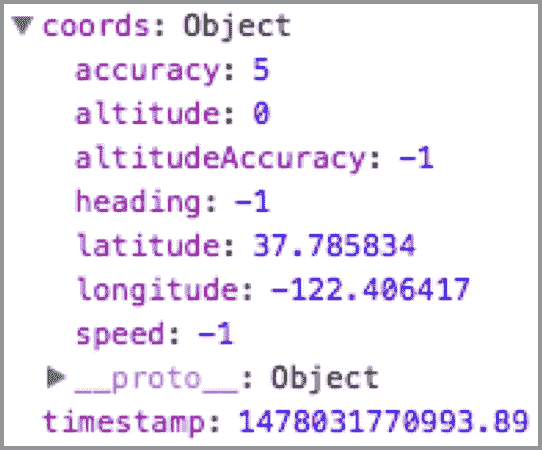

图 9.2 地理位置返回的坐标对象

表 9.4 列出了可用的方法。

表 9.4 地理位置方法

| **方法** | **参数** | **描述** |
| --- | --- | --- |
| `getCurrentPosition` | `successcallback`, `errcallback`, `optionsobject{enableHighAccuracy: Boolean, timeout: number, maximumAge: number}` | 获取当前位置。成功返回一个包含 `coords` 对象和时间的对象。 |
| `watchPosition` | `successcallback`, `errcallback`, `optionsobject{enableHighAccuracy: Boolean, timeout: number, maximumAge: number}` | 获取当前位置，并在设备位置改变时自动调用。 |
| `clearWatch` | `watchId` | 取消一个监视。在创建时将 `watchPosition` 方法存储在变量中以访问 `watchId`。 |
| `stopObserving` | 无 | 取消所有已设置的地定位监视。 |

`getCurrentPosition` 和 `watchPosition` 返回一个包含有关当前用户位置信息的对象（见 图 9.2）。返回的信息不仅包含纬度和经度，还包括速度、海拔以及其他一些数据点。

要看到这个动作，您将设置一个 Geolocation 实例 `getCurrentPosition` 和 `watchPosition`。您还将有一个按钮来调用 `clearWatch`，这将清除由 `watchPosition` 调用启用的监视位置功能。

`watchPosition` 仅在您物理改变坐标时才会更改。例如，如果您在设备上运行此代码并四处走动，您应该会看到坐标更新。您可以通过调用 `navigator.geolocation.clearWatch(id)` 来在任何时候取消此监视，传入您想要取消的监视的 ID。然后您将显示原始坐标以及更新后的坐标（纬度和经度）。

列表 9.7 使用地理位置 API 获取用户坐标

```
import React, { Component } from 'react'
import { TouchableHighlight, View, Text, StyleSheet } from 'react-native'
let styles = {}

export default class App extends Component {
  constructor () {
    super()
 this.state = {    ①  
 originalCoords: {},    ①  
 updatedCoords: {},    ①  
 id: ''    ①  
    }
    this.clearWatch = this.clearWatch.bind(this)
  }
  componentDidMount() {
 navigator.geolocation.getCurrentPosition(    ②  
      (success) => {
 this.setState({originalCoords: success.coords})    ③  
      },
      (err) => console.log('err:', err)
    )
 let id = navigator.geolocation.watchPosition(    ④  
      (success) => {
 this.setState({    ⑤  
 id,    ⑤  
          updatedCoords: success.coords
        })        
      },
      (err) => console.log('err:', err)
    )
  }
 clearWatch () {    ⑥  
    navigator.geolocation.clearWatch(this.state.id)
  }
  render () {
    const { originalCoords, updatedCoords } = this.state
    return (
 <View style={styles.container}>    ⑦  
 <Text>Original Coordinates</Text>    ⑦  
 <Text>Latitude: {originalCoords.latitude}</Text>    ⑦  
 <Text>Longitude: {originalCoords.longitude}</Text>    ⑦  
 <Text>Updated Coordinates</Text>    ⑦  
 <Text>Latitude: {updatedCoords.latitude}</Text>    ⑦  
 <Text>Longitude: {updatedCoords.longitude}</Text>    ⑦  
        <TouchableHighlight
 onPress={this.clearWatch}
          style={styles.button}>
          <Text>Clear Watch</Text>
        </TouchableHighlight>
      </View>
    )
  }
}

styles = StyleSheet.create({
  container: {
    flex: 1,
    justifyContent: 'center',
    padding: 20,
  },
  button: {
    height: 60,
    marginTop: 15,
    backgroundColor: '#ededed',
    justifyContent: 'center',
    alignItems: 'center'
  }
}) 
```

## 9.7 使用 Keyboard API 控制原生键盘的位置和功能

Keyboard API 让您可以访问原生键盘。您可以使用它来监听键盘事件（并根据这些事件调用方法）或关闭键盘。键盘方法列在表 9.5 中。

表 9.5 键盘方法

| **方法** | **参数** | **描述** |
| --- | --- | --- |
| `addListener` | `event`, `callback` | 将方法连接到基于原生键盘事件（如`keyboardWillShow`, `keyboardDidShow`, `keyboardWillHide`, `keyboardDidHide`, `keyboardWillChangeFrame`, 和 `keyboardDidChangeFrame`）调用的功能 |
| `removeAllListeners` | `eventType` | 移除指定类型的所有监听器 |
| `dismiss` | 无 | 关闭键盘 |

### 9.7.1 Keyboard API 的使用场景

许多时候，文本输入和键盘的默认行为正是您想要的，但并非总是如此。如果您使用其他类型的组件模拟文本输入，键盘不会滑动。在这种情况下，您可以导入 Keyboard 并手动和细致地控制键盘何时显示和隐藏。

在某些情况下，即使文本输入处于焦点状态，您可能也想要手动关闭键盘。例如，如果 PIN 号码输入接受四个数字并在最后一个输入值上自动检查输入值是否正确，您可能希望提供一个在最后一个值输入后检索或检查的 UI。隐藏键盘可能是有意义的，您可以使用 Keyboard API 实现这一点。

### 9.7.2 使用 Keyboard API 的示例

在此示例中，您将设置一个文本输入并监听所有可用的事件。当事件被触发时，您将在控制台记录事件。您还将有两个按钮：一个用于关闭键盘，另一个用于移除在`componentWillMount`中设置的 所有事件监听器。

列表 9.8 使用 Keyboard API 控制设备键盘

```
import React, { Component }  from 'react'
import { TouchableHighlight, Keyboard, TextInput, View, 
 Text, StyleSheet } from 'react-native'    ①  

let styles = {}

export default class App extends Component {
 componentWillMount () {    ②  
    this.keyboardWillShowListener =
        Keyboard.addListener('keyboardWillShow', 
 () => this.logEvent('keyboardWillShow'))    ②  
    this.keyboardDidShowListener = 
        Keyboard.addListener('keyboardDidShow', 
 () => this.logEvent('keyboardDidShow'))    ②  
    this.keyboardWillHideListener =
        Keyboard.addListener('keyboardWillHide', 
 () => this.logEvent('keyboardWillHide'))    ②  
    this.keyboardDidHideListener = 
        Keyboard.addListener('keyboardDidHide', 
 () => this.logEvent('keyboardDidHide'))    ②  
    this.keyboardWillChangeFrameListener =
        Keyboard.addListener('keyboardWillChangeFrame', 
 () => this.logEvent('keyboardWillChangeFrame'))    ②  
    this.keyboardDidChangeFrameListener =
        Keyboard.addListener('keyboardDidChangeFrame', 
 () => this.logEvent('keyboardDidChangeFrame'))    ②  
  }
 logEvent(event) {    ③  
 console.log('event: ', event)    ③  
  }
 dismissKeyboard () {    ④  
 Keyboard.dismiss()    ④  
  }
 removeListeners () {    ⑤  
 Keyboard.removeAllListeners('keyboardWillShow')    ⑤  
 Keyboard.removeAllListeners('keyboardDidShow')    ⑤  
 Keyboard.removeAllListeners('keyboardWillHide')    ⑤  
 Keyboard.removeAllListeners('keyboardDidHide')    ⑤  
 Keyboard.removeAllListeners('keyboardWillChangeFrame')    ⑤  
 Keyboard.removeAllListeners('keyboardDidChangeFrame')    ⑤  
  }
  render () {
    return (
      <View style={styles.container}>
        <TextInput style={styles.input} />
 <TouchableHighlight    ⑥  
 onPress={this.dismissKeyboard}    ⑥  
 style={styles.button}>    ⑥  
 <Text>Dismiss Keyboard</Text>    ⑥  
 </TouchableHighlight>    ⑥  
 <TouchableHighlight    ⑦  
 onPress={this.removeListeners}    ⑦  
 style={styles.button}>    ⑦  
 <Text>Remove Listeners</Text>    ⑦  
 </TouchableHighlight>    ⑦  
      </View>
    )
  }
}

styles = StyleSheet.create({
  container: {
    flex: 1,
    marginTop: 150,
  },
  input: {
    margin: 10,
    backgroundColor: '#ededed',
    height: 50,
    padding: 10
  },
  button: {
    height: 50,
    backgroundColor: '#dddddd',
    margin: 10,
    justifyContent: 'center',
    alignItems: 'center'
  }
}) 
```

## 9.8 使用 NetInfo 获取用户的当前在线/离线状态

NetInfo 是一个 API，允许您访问描述设备是否在线或离线的数据。要在 Android 上使用 NetInfo API，您需要在 AndroidManifest.xml 中添加所需的权限：

```
<uses-permission android:name="android.permission.ACCESS_NETWORK_STATE"/> 
```

iOS 和 Android 有不同的连接类型，列在表 9.6 中。访问它们取决于用户连接的实际连接类型。为了确定连接类型，您可以使用表 9.7 中的方法。

表 9.6 跨平台和 Android 特定连接类型

| **跨平台（iOS 和 Android）** | **Android** |
| --- | --- |
| `none` | `bluetooth` |
| `wifi` | `ethernet` |
| `cellular` | `wimax` |
| `unknown` |  |

表 9.7 NetInfo 方法

| **方法** | **参数** | **描述** |
| --- | --- | --- |
| `isConnectionExpensive` | 无 | 返回一个 Promise，该 Promise 返回一个布尔值，指定连接是否昂贵 |
| `isConnected` | None | 返回一个指定设备是否连接的布尔值的 Promise |
| `addEventListener` | `eventName`, `callback` | 为指定的事件添加事件监听器 |
| `removeEventListener` | `eventName`, `callback` | 移除指定事件的监听器 |
| `getConnectionInfo` | None | 返回一个 Promise，该 Promise 返回一个包含类型和有效类型的对象。 |

### 9.8.1 NetInfo 的使用场景

NetInfo 通常用于防止其他 API 调用发生，或者提供一个离线 UI，该 UI 提供了一些但不是所有在线应用程序的功能。例如，假设你有一个项目列表，当按下时，会显示一个新视图，其中包含有关该项目的获取信息。当设备离线时，你可以显示应用程序离线的某些指示，并且不导航到项目详情。NetInfo 将为你提供此类设备信息，允许你以有用的方式与用户交互。

另一个用例是根据连接类型设置不同的 API 配置。例如，在 Wi-Fi 上，你可能希望允许请求和发送的数据量更慷慨：如果用户在蜂窝网络中，你可能一次只获取 10 个项目；但在 Wi-Fi 上，你将把这个数字提高到 20。使用 NetInfo，你可以确定用户是否有连接类型。

### 9.8.2 使用 NetInfo 的示例

让我们设置一个`NetInfo.getConnectionInfo`方法来获取初始连接信息。然后，你将设置一个监听器来记录当前的 NetInfo，如果它发生变化的话。

列表 9.9 使用 NetInfo 获取和显示用户连接类型

```
import React, { Component }  from 'react'
import { NetInfo, View, Text, StyleSheet } from 'react-native'    ①  

class App extends Component {
  constructor () {
    super()
 this.state = {    ②  
 connectionInfo: {}    ②  
    }
    this.handleConnectivityChange = 
        this.handleConnectivityChange.bind(this)
  }
  componentDidMount () {
 NetInfo.getConnectionInfo().then((connectionInfo) => {    ③  
      console.log('type: ' + connectionInfo.type +
 ', effectiveType: ' + connectionInfo.effectiveType)    ③  
 this.setState({connectionInfo})    ③  
    })
    NetInfo.addEventListener('connectionChange',
 this.handleConnectivityChange)    ④  
  }
 handleConnectivityChange (connectionInfo) {    ⑤  
 console.log('new connection:', connectionInfo)    ⑤  
 this.setState({connectionInfo})    ⑤  
  }
  render () {
    return (
      <View style={styles.container}>
 <Text>{this.state.connectionInfo.type}</Text>    ⑥  
      </View>
    )
  }
}

const styles = StyleSheet.create({
  container: {
    flex: 1,
    justifyContent: 'center',
    alignItems: 'center'
  }
}) 
```

## 9.9 使用 PanResponder 获取触摸和手势事件信息

PanResponder API 提供了一种使用触摸事件数据的方法。通过它，你可以根据单个和多个触摸事件（如滑动、点击、捏合、滚动等）精细地响应和操作应用程序状态。

### 9.9.1 PanResponder API 的使用场景

由于 PanResponder 的基本功能是确定用户设备上当前发生的触摸，因此使用场景是无限的。在我的经验中，我经常使用此 API 来完成以下类似的事情：

+   创建一个可滑动的卡片堆叠，当项目从视图中滑动出去时（想想 Tinder），从堆叠中移除该项目

+   创建一个可动画的覆盖层，用户可以通过点击按钮关闭它，或者通过向下滑动将其移出视图

+   通过按下列表项的一部分并将其移动到所需位置，使用户能够重新排列列表中的项目

PanResponder 的使用场景很多，但最明显和最常使用的是根据用户的按下/滑动位置在 UI 中移动项目。

让我们看看使用 `onPanResponderMove(event, gestureState)` 的基本手势事件，它提供了有关触摸事件当前位置的数据，包括当前位置、当前位置与原始位置之间的累积差异等：

```
onPanResponderMove(evt, gestureState) {
  console.log(evt.nativeEvent)
  console.log(gestureState)
} 
```

要使用此 API，你首先在 `componentWillMount` 方法中创建 `PanResponder` 的一个实例。在这个实例中，你可以设置 `PanResponder` 的所有配置和回调方法，使用这些方法来操作状态和 `View`。

让我们看看 `create` 方法，这是 PanResponder 唯一可用的方法。它为 `PanResponder` 实例创建配置。表 9.8 展示了 `create` 方法可用的配置选项。

表 9.8 PanResponder `create` 方法的配置参数

| **配置属性** | **描述** |
| --- | --- |
| `onStartShouldSetPanResponder` | 确定是否启用 PanResponder。在元素被触摸后调用。 |
| `onMoveShouldSetPanResponder` | 确定是否启用 PanResponder。在初始触摸第一次移动后调用。 |
| `onPanResponderReject` | 如果 PanResponder 没有注册，则调用。 |
| `onPanResponderGrant` | 如果 PanResponder 注册，则调用。 |
| `onPanResponderStart` | 在 PanResponder 注册后调用。 |
| `onPanResponderEnd` | 在 PanResponder 完成后调用。 |
| `onPanResponderMove` | 当 PanResponder 移动时调用。 |
| `onPanResponderTerminationRequest` | 当其他东西想要成为响应者时调用。 |
| `onPanResponderRelease` | 当触摸被释放时调用。 |
| `onPanResponderTerminate` | 此响应者已被另一个响应者接管。 |

每个配置选项都提供了原生事件和手势状态。表 9.9 描述了 `evt.nativeEvent` 和 `gestureState` 的所有可用属性。

表 9.9 `evt` 和 `gestureState` 属性

| **evt.nativeEvent 属性** | **描述** |
| --- | --- |
| `changedTouches` | 自上次事件以来所有已更改的触摸事件的数组 |
| `identifier` | 触摸的 ID |
| `locationX` | 相对于元素的触摸 X 位置 |
| `locationY` | 相对于元素的触摸 Y 位置 |
| `pageX` | 相对于根元素的触摸 X 位置 |
| `pageY` | 相对于根元素的触摸 Y 位置 |
| `target` | 接收触摸事件的元素的节点 ID |
| `timestamp` | 触摸的时间标识符；对于速度计算很有用 |
| `touches` | 屏幕上所有当前触摸的数组 |
| **gestureState 属性** | **描述** |
| `stateID` | `gestureState` 的 ID，只要屏幕上至少有一个触摸，就会持续存在 |
| `moveX` | 最近移动的触摸的最新屏幕坐标 |
| `moveY` | 最近移动的触摸的最新屏幕坐标 |
| `x0` | 响应者的屏幕坐标 |
| `y0` | 响应者的屏幕坐标 |
| `dx` | 自触摸开始以来手势的累积距离 |
| `dy` | 自触摸开始以来手势的累积距离 |
| `vx` | 手势的当前速度 |
| `vy` | 手势的当前速度 |
| `numberActiveTouches` | 当前屏幕上的触摸次数 |

### 9.9.2 使用 PanResponder 的示例

在这个例子中，您将创建一个可拖动的正方形，并在视图中显示其 x 和 y 坐标。结果如图 9.3 所示。

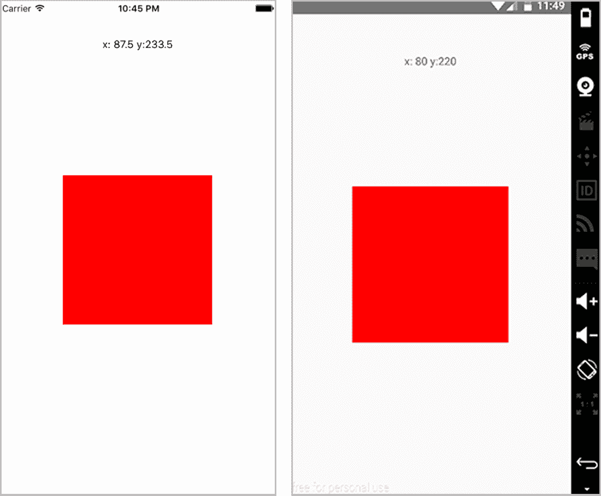

图 9.3 用于使正方形可拖动的 PanResponder

列表 9.10 使用 PanResponder 创建可拖动元素

```
import React, { Component }  from 'react'
import { Dimensions, TouchableHighlight, PanResponder, TextInput, 
 View, Text, StyleSheet } from 'react-native'    ①  
const { width, height } = Dimensions.get('window')    ②  
let styles = {}

class App extends Component {
  constructor () {
    super()
    this.state = {
 oPosition: {    ③  
        x: (width / 2) - 100,
        y: (height / 2) - 100,
      },
 position: {    ④  
        x: (width / 2) - 100,
        y: (height / 2) - 100,
      },
    }
 this._handlePanResponderMove = this._handlePanResponderMove.bind(this)
    this._handlePanResponderRelease =
         this._handlePanResponderRelease.bind(this)
  }
  componentWillMount () {
 this._panResponder = PanResponder.create({    ⑤  
 onStartShouldSetPanResponder: () => true,    ⑤  
 onPanResponderMove: this._handlePanResponderMove,    ⑤  
 onPanResponderRelease: this._handlePanResponderRelease    ⑤  
    })
  }
 _handlePanResponderMove (evt, gestureState) {    ⑥  
 let ydiff = gestureState.y0 - gestureState.moveY    ⑥  
 let xdiff = gestureState.x0 - gestureState.moveX    ⑥  
 this.setState({    ⑥  
 position: {    ⑥  
 y: this.state.oPosition.y - ydiff,    ⑥  
 x: this.state.oPosition.x - xdiff    ⑥  
      }
    })
  }
 _handlePanResponderRelease () {    ⑦  
 this.setState({    ⑦  
 oPosition: this.state.position    ⑦  
    })
  }
  render () {
    return (
      <View  style={styles.container}>
        <Text style={styles.positionDisplay}>
            x: {this.state.position.x} y:{this.state.position.y}
 </Text>    ⑧  
        <View
 {...this._panResponder.panHandlers}    ⑨  
          style={[styles.box, 
                 { marginLeft: this.state.position.x, 
                   marginTop: this.state.position.y } ]} 
 />    ⑩  
      </View>
    )
  }
}

styles = StyleSheet.create({
  container: {
    flex: 1,
  },
  positionDisplay: {
    textAlign: 'center',
    marginTop: 50,
    zIndex: 1,
    position: 'absolute',
    width
  },
  box: {
 position: 'absolute',
    width: 200,
    height: 200,
    backgroundColor: 'red'
  }
}) 
```

## 摘要

+   Alert 允许您在应用中提示或警告用户有关重要信息或事件。

+   AppState 提供了有关当前应用是否正在使用的相关信息。然后您可以在应用中以有用的方式使用这些信息。

+   AsyncStorage 允许您将数据持久化到用户的设备上，这样即使用户关闭应用，您仍然可以访问这些数据。

+   剪贴板将信息复制到用户的设备剪贴板，以便他们稍后访问。

+   Dimensions 提供了有关用户设备的有用信息，最重要的是屏幕宽度和高度。

+   地理定位提供了用户设备的位置以及其他重要信息，并允许您在用户移动时检查位置数据。

+   NetInfo 提供了用户的当前连接信息，包括连接类型以及他们是否当前连接。

+   PanResponder 提供了用户设备上发生的当前触摸位置。您可以使用这些信息来增强 UX 和 UI。

# 10

实现 iOS 特定组件和 API

**本章涵盖**

+   有效地定位平台特定代码的策略

+   使用选择器组件，`DatePickerIOS`和`PickerIOS`

+   使用`ProgressViewIOS`显示加载进度

+   使用`SegmentedControlIOS`和`TabBarIOS`选择视图

+   使用`ActionSheetIOS`调用和选择动作表中的项目

React Native 项目的其中一个最终目标是拥有尽可能少的平台特定逻辑和代码。大多数 API 都可以构建，使得平台特定的代码通过框架抽象化，从而为您提供一种单一的方式来与之交互，并轻松创建跨平台功能。

不幸的是，总会有一些平台特定的 API 无法通过跨平台有意义的方案完全抽象化。因此，您将需要至少使用一些平台特定的 API 和组件。在本章中，我们将介绍 iOS 特定的 API 和组件，讨论它们的 props 和方法，并创建模拟功能性和逻辑的示例，以帮助您快速上手。

## 10.1 定位平台特定代码

平台特定代码的主要思想是以一种方式编写组件和文件，根据你所在的平台渲染 iOS 或 Android 特定的代码。有一些技术可以实现根据应用程序运行的平台显示组件，我们在这里介绍其中两种最有用的技术：使用正确的文件扩展名和使用 Platform API。

### 10.1.1 iOS 和 Android 文件扩展名

定位平台特定代码的第一种方法是使用正确的文件扩展名命名文件，这取决于你希望针对的平台。例如，iOS 和 Android 之间差异相当大的一个组件是 `DatePicker`。如果你想在 `DatePicker` 周围应用特定的样式，将所有代码都写在一个主组件中可能会变得冗长且难以维护。相反，你可以创建两个文件——DatePicker.ios.js 和 DatePicker.android.js——并将它们导入到主组件中。当你运行项目时，React Native 会自动根据你使用的平台选择正确的文件并渲染它。让我们看看列表 10.1、10.2 和 10.3 中的基本示例。（注意，这个示例会抛出错误——`DatePicker` 需要属性和方法才能正确运行。）

列表 10.1 iOS 平台特定代码

```
import React from 'react'
import { View, Text, DatePickerIOS } from 'react-native'

export default () => (
  <View>
    <Text>This is an iOS specific component</Text>
    <DatePickerIOS />
  </View>
) 
```

列表 10.2 Android 平台特定代码

```
import React from 'react'
import { View, Text, DatePickerAndroid } from 'react-native'

export default () => (
  <View>
    <Text>This is an Android specific component</Text>
    <DatePickerAndroid />
  </View>
) 
```

列表 10.3 渲染跨平台组件

```
import React from 'react'
import DatePicker from './DatePicker'

const MainComponent = () => (
  <View>
    ...
    <DatePicker />
    ...
  </View>
) 
```

你导入日期选择器时没有指定特定的文件扩展名。React Native 会根据平台知道要导入哪个组件。从那里，你可以在应用程序中使用它，而无需担心你所在的平台。

### 10.1.2 使用 Platform API 检测平台

另一种检测和基于平台执行逻辑的方法是使用 Platform API。Platform 有两个属性。第一个是一个 OS 键，它读取 `ios` 或 `android`，这取决于平台。

列表 10.4 使用 `Platform.OS` 属性检测平台

```
import React from 'react'
import { View, Text, Platform } from 'react-native'

const PlatformExample = () => (
  <Text
    style={{ marginTop: 100, color: Platform.OS === 'ios' ? 'blue' : 'green' }}
  >
     Hello { Platform.OS }
  </Text>
) 
```

在这里，你检查 `Platform.OS` 的值是否等于字符串 `'ios'`，如果是，则返回 `'blue'` 颜色。如果不是，则返回 `'green'`。

Platform 的第二个属性是一个名为 `select` 的方法。`select` 接收一个包含 `Platform.OS` 字符串（`ios` 或 `android`）作为键的对象，并返回你正在运行的平台的值。

列表 10.5 使用 `Platform.select` 根据平台渲染组件

```
import React from 'react'
import { View, Text, Platform } from 'react-native'

const ComponentIOS = () => (
  <Text>Hello from IOS</Text>
)

const ComponentAndroid = () => (
  <Text>Hello from Android</Text>
)

const Component = Platform.select({
  ios: () => ComponentIOS,
  android: () => ComponentAndroid,
})();

const PlatformExample = () => (
  <View style={{ marginTop: 100 }}>
    <Text>Hello from my App</Text>
    <Component />
  </View>
) 
```

你还可以使用 ES2015 扩展运算符语法来返回对象，并使用这些对象来应用样式。你可能记得在第四章的几个示例中使用了 `Platform.select` 函数。

列表 10.6 使用 `Platform.select` 根据平台应用样式

```
import React from 'react'
import { View, Text, Platform } from 'react-native'

let styles = {}

const PlatformExample = () => (
  <View style={styles.container}>
    <Text>
       Hello { Platform.OS }
    </Text>
  </View>
)

styles = {
  container: {
    marginTop: 100,
    ...Platform.select({
      ios: {
        backgroundColor: 'red'
      }
    })
  }
} 
```

## 10.2 DatePickerIOS

`DatePickerIOS` 提供了一种在 iOS 上实现原生日期选择器组件的简单方法。`它` 有三种模式，在处理日期和时间时非常有用：`date`、`time` 和 `dateTime`，如图 10.1 所示。

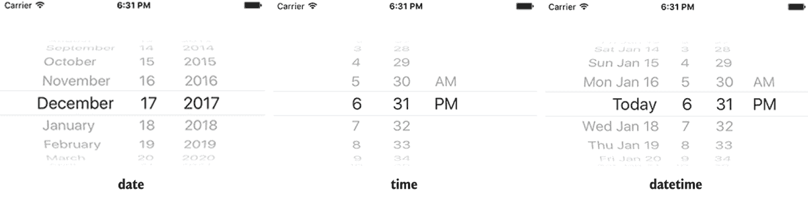

图 10.1 `DatePickerIOS` 的 `date` 模式、`time` 模式和 `datetime` 模式

`DatePickerIOS` 有列在 表 10.1 中的属性。需要传递的最小属性是 `date`（作为开始或当前日期选择的日期）和一个 `onDateChange` 方法。当任何日期值改变时，`onDateChange` 被调用，传递函数新的日期值。

表 10.1 `DatePickerIOS` 属性与方法

| **属性** | **类型** | **描述** |
| --- | --- | --- |
| `date` | 日期 | 当前选择的日期 |
| `maximumDate` | 日期 | 允许的最大日期 |
| `minimumDate` | 日期 | 允许的最小日期 |
| `minuteInterval` | 枚举 | 可选择的分钟间隔 |
| `mode` | 字符串：`date`、`time` 或 `datetime` | 日期选择器模式 |
| `onDateChange` | 函数：`onDateChange(date) { }` | 当日期改变时调用的函数 |
| `timeZoneOffsetInMinutes` | 数字 | 时区偏移量（分钟）；覆盖默认值（设备时区） |

### 10.2.1 使用 `DatePickerIOS` 的示例

在以下示例中，你将设置一个 `DatePickerIOS` 组件并在视图中显示时间。你不会传递模式属性，因为模式默认为 `datetime`。图 10.2 显示了结果。

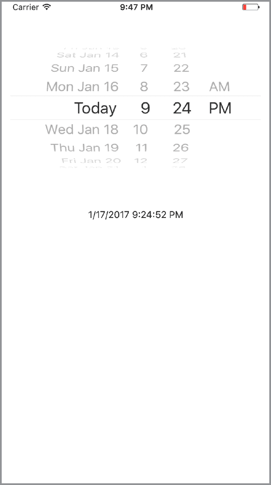

图 10.2 `DatePickerIOS` 渲染选择的日期和时间

列表 10.7 使用 `DatePicker` 显示和更新时间值

```
import React, { Component } from 'react'
import { Text, View, DatePickerIOS } from 'react-native'    ①  

class App extends Component {

  constructor() {
    super()
 this.state = {    ②  
 date: new Date(),    ②  
    }
    this.onDateChange = this.onDateChange.bind(this)
  }

 onDateChange(date) {    ③  
 this.setState({date: date});    ③  
  };

 render() {
    return (
      <View style={{ marginTop: 50 }}>
 <DatePickerIOS    ④  
 date={this.state.date}    ④  
 onDateChange={this.onDateChange}    ④  
        />
        <Text style={{ marginTop: 40, textAlign: 'center' }}>
 { this.state.date.toLocaleDateString() } { this.state.date.toLocaleTimeString() }    ⑤  
        </Text>
      </View>)
  }
} 
```

## 10.3 使用 `PickerIOS` 处理值列表

使用 `PickerIOS`，你可以访问原生的 iOS `Picker` 组件。此组件基本上允许你使用原生 UI 滚动并通过列表选择值（见 图 10.3）。`PickerIOS` 有列在 表 10.2 中的方法和属性。

表 10.2 `PickerIOS` 方法与属性

| **属性** | **类型** | **描述** |
| --- | --- | --- |
| `itemStyle` | 对象（样式） | 容器内项目的文本样式 |
| `onValueChange` | 函数（值） | 当 `PickerIOS` 的值改变时调用 |
| `selectedValue` | 数字或字符串 | 当前选择的 `PickerIOS` 值 |

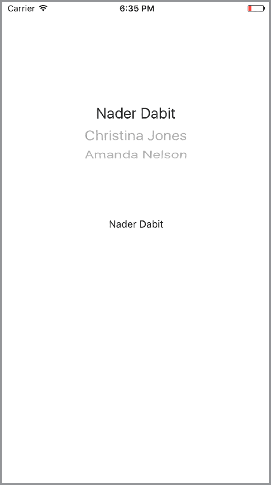

图 10.3 `PickerIOS` 渲染人员列表

`PickerIOS` 包裹要作为子元素渲染的项目列表。每个子元素必须是 `PickerIOS.Item`：

```
import { PickerIOS } from 'react-native'
const PickerItem = PickerIOS.Item

<PickerIOS>
  <PickerItem />
  <PickerItem />
  <PickerItem />
</PickerIOS> 
```

可以像这里一样单独声明每个 `PickerIOS.Item`，但大多数情况下，你将遍历数组中的元素，并为数组中的每个项目返回一个 `PickerIOS.Item`。以下列表显示了一个示例。

列表 10.8 使用 `PickerIOS` 与 `PickerIOS.Item` 数组

```
const people = [   #an array of people ];

render() {
  <PickerIOS>
    {
      people.map((p, i) =>(
        <PickerItem key={i} value={p} label={p}/>
      ))
    }
  <PickerIOS> 
```

}

`PickerIOS` 和 `PickerIOS.Item` 接收它们自己的属性。对于 `PickerIOS`，主要的属性是 `onValueChange` 和 `selectedValue`。`onValueChange` 方法在每次选择器改变时被调用。`selectedValue` 是选择器在 UI 中显示为已选的值。

对于 `PickerIOS.Item`，主要的属性是 `key`、`value` 和 `label`。`key` 是一个唯一标识符，`value` 是将传递给 `PickerIOS` 组件的 `onValueChange` 方法的值，而 `label` 是在 UI 中作为 `PickerIOS.Item` 标签显示的内容。

### 10.3.1 使用 PickerIOS 的示例

在这个例子中，你将在 `PickerIOS` 中渲染人员数组。当值改变时，你将更新 UI 以显示新值。

列表 10.9 使用 `PickerIOS` 渲染人员数组

```
import React, { Component } from 'react'
import { Text, View, PickerIOS } from 'react-native'    ①  

const people =   [  ②  
  {
    name: 'Nader Dabit',
    age: 36
  },
  {
    name: 'Christina Jones',
    age: 39
  },
  {
    name: 'Amanda Nelson',
    age: 22
  }
];

const PickerItem = PickerIOS.Item

class App extends Component {

  constructor() {
    super()
 this.state = {    ③  
 value: 'Christina Jones'    ③  
 }    ③  
 this.onValueChange = this.onValueChange.bind(this)    ③  
  }

 onValueChange(value) {    ④  
 this.setState({ value });    ④  
  };

  render() {
    return (
      <View style={{ marginTop: 50 }}>
 <PickerIOS    ⑤  
 onValueChange={this.onValueChange}    ⑤  
 selectedValue={this.state.value}    ⑤  
 >    ⑤  
          {
 people.map((p, i) => {    ⑥  
              return (
                <PickerItem
 key={i}
                  value={p.name}
                  label={p.name}
                />
              )
            })
          }
        </PickerIOS>
        <Text style={{ marginTop: 40, textAlign: 'center' }}>
 {this.state.value}    ⑦  
        </Text>
      </View>)
  }
} 
```

## 10.4 使用 ProgressViewIOS 显示加载指示器

`ProgressViewIOS` 允许你在 UI 中渲染原生的 `UIProgressView`。基本上，这是一种显示加载百分比指示、下载百分比指示或任何表示正在完成的任务的指示的原生方式（参见图 10.4）。它具有表 10.3 中显示的属性。

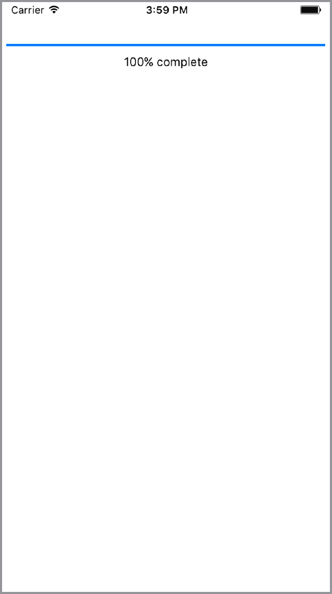

图 10.4 在 UI 中渲染 `ProgressViewIOS`

表 10.3 `ProgressViewIOS` 方法和属性

| **属性** | **类型** | **描述** |
| --- | --- | --- |
| `progress` | 数字 | 进度值（介于 0 和 1 之间） |
| `progressImage` | 图片源 | 用于显示的进度条的可拉伸图片 |
| `progressTintColor` | 字符串（颜色） | 进度条着色 |
| `progressViewStyle` | 枚举（默认或条形） | 进度条样式 |
| `trackImage` | 图片源 | 可拉伸的图片，用于显示在进度条后面 |
| `trackTintColor` | 字符串 | 进度条轨道着色 |

### 10.4.1 ProgressViewIOS 的使用案例

`ProgressViewIOS` 最常见的用例是与外部 API 一起工作，该 API 告诉你当你在获取或提交数据或与本地 API 一起工作时，已经通过线缆传递了多少信息。例如，如果你正在将视频保存到用户的相机胶卷，你可以使用 `ProgressViewIOS` 来显示用户下载还需要多长时间以及已经完成了多少。

### 10.4.2 使用 ProgressViewIOS 的示例

创建此功能所需了解的主要属性是 `progress`。`progress` 接受介于 0 和 1 之间的数字，并将 `ProgressViewIOS` 填充到 0%到 100%的百分比填充。

在这个例子中，你将通过在 `componentDidMount` 中调用 `setInterval` 方法来模拟一些数据加载。你将每 0.01 秒增加状态值 0.01，直到达到 1，初始值为 0。

列表 10.10 使用 ProgressViewIOS 从 0%增加到 100%的进度条

```
import React, { Component } from 'react'
import { Text, View, ProgressViewIOS } from 'react-native'    ①  

class App extends Component {

  constructor() {
    super()
 this.state = {    ②  
 progress: 0,    ②  
    }
  }

  componentDidMount() {
 this.interval = setInterval(() => {    ③  
 if (this.state.progress >= 1) {    ③  
 return clearInterval(this.interval)    ③  
 }    ③  
 this.setState({    ③  
 progress: this.state.progress + .01    ③  
 })    ③  
 }, 10)    ③  
 }

  render() {
    return (
      <View style={{ marginTop: 50 }}>
 <ProgressViewIOS    ④  
 progress={this.state.progress}    ④  
        />
        <Text style={{ marginTop: 10, textAlign: 'center' }}>
 {Math.floor(this.state.progress * 100)}% complete    ⑤  
        </Text>
      </View>)
  }
} 
```

## 10.5 使用 SegmentedControlIOS 创建水平标签栏

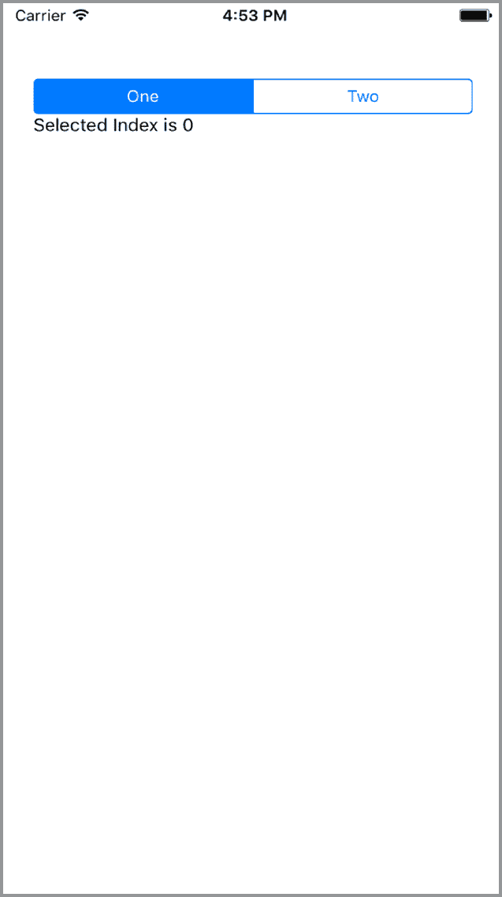

图 10.5 基本的两个值（一个和两个）的 `SegmentedControlIOS` 实现

`SegmentedControlIOS` 允许你访问原生的 iOS `UISegmentedControl` 组件。它由单个按钮组成的水平标签栏，如图图 10.5 所示。

`SegmentedControlIOS` 的方法和属性在 表 10.4 中列出。至少，它需要一个值数组来渲染控制值，一个 `selectedIndex` 作为已选控制的索引，以及一个当控制被按下时将被调用的 `onChange` 方法。

表 10.4 `SegmentedControlIOS` 方法与属性

| **属性** | **类型** | **描述** |
| --- | --- | --- |
| `enabled` | 布尔值 | 如果为 `false`，则用户无法与控件交互。默认值为 `true`。 |
| `momentary` | 布尔值 | 如果为 `true`，选择一个段不会在视觉上持续。`onValueChange` 仍将按预期工作。 |
| `onChange` | 函数（event） | 当用户点击一个段时调用的回调；将事件作为参数传递。 |
| `onValueChange` | 函数（value） | 当用户点击一个段时调用的回调；将段的值作为参数传递。 |
| `selectedIndex` | 数字 | 要（预）选择的段的 `props.values` 中的索引。 |
| `tintColor` | 字符串（颜色） | 控件的强调颜色。 |
| `values` | 字符串数组 | 控制按钮的标签，按顺序排列。 |

### 10.5.1 SegmentedControlIOS 的用例

`SegmentedControlIOS` 是在 UI 中分离和显示某些可筛选/可排序数据的良好位置。例如，如果一个应用有按周列出和可查看的信息，你可以使用 `SegmentedControlIOS` 通过星期几进一步分离这些数据，为每一天提供一个单独的视图。

### 10.5.2 使用 SegmentedControlIOS 的示例

在此示例中，你将渲染一个包含三个项目的数组作为 `SegmentedControlIOS`。你还将根据所选项目在 UI 中显示一个值。

列表 10.11 `SegmentedControlIOS` 渲染三个值

```
import React, { Component } from 'react'
import { Text, View, SegmentedControlIOS } from 'react-native'    ①  

const values = ['One', 'Two', 'Three']    ②  

class App extends Component {

  constructor() {
    super()
    this.state = {
 selectedIndex: 0,    ③  
    }
  }

 render() {
    const { selectedIndex } = this.state
 let selectedItem = values[selectedIndex]    ④  
    return (
      <View style={{ marginTop: 40, padding: 20 }}>
 <SegmentedControlIOS    ⑤  
 values={values}    ⑤  
 selectedIndex={this.state.selectedIndex}    ⑤  
 onChange={(event) => {    ⑤  
            this.setState({selectedIndex:
 event.nativeEvent.selectedSegmentIndex});    ⑤  
          }}
        />
 <Text>{selectedItem}</Text>    ⑥  
      </View>)
  }
} 
```

## 10.6 使用 TabBarIOS 在 UI 底部渲染标签

`TabBarIOS` 允许你访问原生 iOS 标签栏。它将在 UI 底部渲染标签，如图 10.6 所示，为你提供一种优雅、简单的方式将应用程序分成几个部分。其方法和属性列在 表 10.5 中。

表 10.5 `TabBarIOS` 属性

| **属性** | **类型** | **描述** |
| --- | --- | --- |
| `barTintColor` | 字符串（颜色） | 标签栏的背景颜色。 |
| `itemPositioning` | 枚举（`"fill", "center", "auto"`） | 标签栏项目定位。`fill` 将项目分布在整个标签栏宽度上。`center` 在可用的标签栏空间中居中项目。`auto`（默认）根据 UI 习惯动态分布项目；在水平紧凑环境中默认为 `fill`；否则默认为 `center`。 |
| `style` | 对象（样式） | `TabBarIOS` 的样式。 |
| `tintColor` | 字符串（颜色） | 当前选中标签图标的颜色。 |
| `translucent` | 布尔值 | 表示标签栏是否为半透明。 |
| `unselectedItemTintColor` | 字符串（颜色） | 未选择标签图标的颜色（自 iOS 10 以来可用）。 |
| `unselectedTintColor` | 字符串（颜色） | 未选择标签上文本的颜色。 |

`TabBarIOS` 接受一个 `TabBarIOS.Item` 组件列表作为子组件：

```
const Item = TabBarIOS.Item

<TabBarIOS>
  <Item>
 <View>   #some content here </View>
  </Item>
  <Item>
    <View>   #some other content here </View>
  </Item>
</TabBarIOS> 
```

要显示 `TabBarIOS.Item` 中的内容，`TabBarIOS.Item` 的 `selected` 属性必须是 `true`：

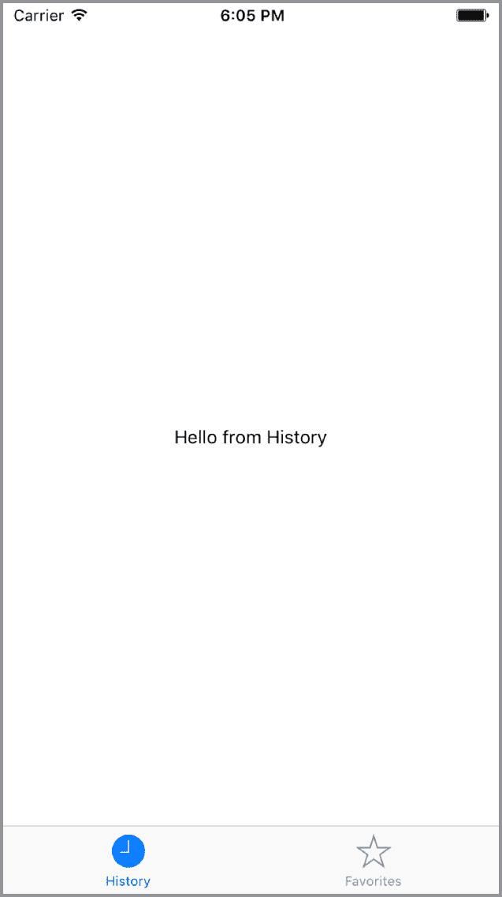

图 10.6 `TabBarIOS` 包含两个标签页：历史和收藏

```
<Item
  selected={this.state.selectedComponent === 'home'}
>
    #your content here
</Item> 
```

### 10.6.1 TabBarIOS 的使用场景

`TabBarIOS` 的主要使用场景是导航。在移动设备上，很多时候，最好的导航类型是标签栏。将 UI 分离并在标签分隔的各个部分中显示内容是一种常见的模式，并且被鼓励，因为它提供了良好的用户体验。

### 10.6.2 使用 TabBarIOS 的示例

在此示例中，您将创建一个包含两个视图的应用程序：历史和收藏。当按下 `TabBarIOS.Item` 时，您将通过调用 `onPress` 方法来更新状态，在视图之间切换。

列表 10.12 使用 `TabBarIOS` 渲染标签

```
import React, { Component } from 'react'
import { Text, View, TabBarIOS } from 'react-native'    ①  

const Item = TabBarIOS.Item    ②  

class App extends Component {

  constructor() {
    super()
    this.state = {
 selectedTab: 'history',    ③  
    }
    this.renderView = this.renderView.bind(this)
  }

 renderView(tab) {    ④  
    return (
      <View style={{ flex: 1, justifyContent: 'center', 
                     alignItems: 'center' }}>
        <Text>Hello from {tab}</Text>
      </View>
    )
  }

  render() {
    return (
 <TabBarIOS>    ⑤  
        <Item
 systemIcon="history"    ⑥  
 onPress={() => this.setState({ selectedTab: 'history' })}    ⑦  
 selected={this.state.selectedTab === 'history'}    ⑦  
        >
 {this.renderView('History')}    ⑧  
        </Item>
        <Item
          systemIcon='favorites'
          onPress={() => this.setState({ selectedTab: 'favorites' })}
          selected={this.state.selectedTab === 'favorites'}
        >
          {this.renderView('Favorites')}
        </Item>
      </TabBarIOS>
    )
  } 
```

您可以使用系统图标或通过传递图标属性并要求本地图像来设置图标。有关所有系统图标的列表，请参阅 http://mng.bz/rYNJ。

## 10.7 使用 ActionSheetIOS 显示操作或分享表单

`ActionSheetIOS` 允许您访问原生 iOS `UIAlertController` 来显示原生 iOS 操作表或分享表单（见 图 10.7）。

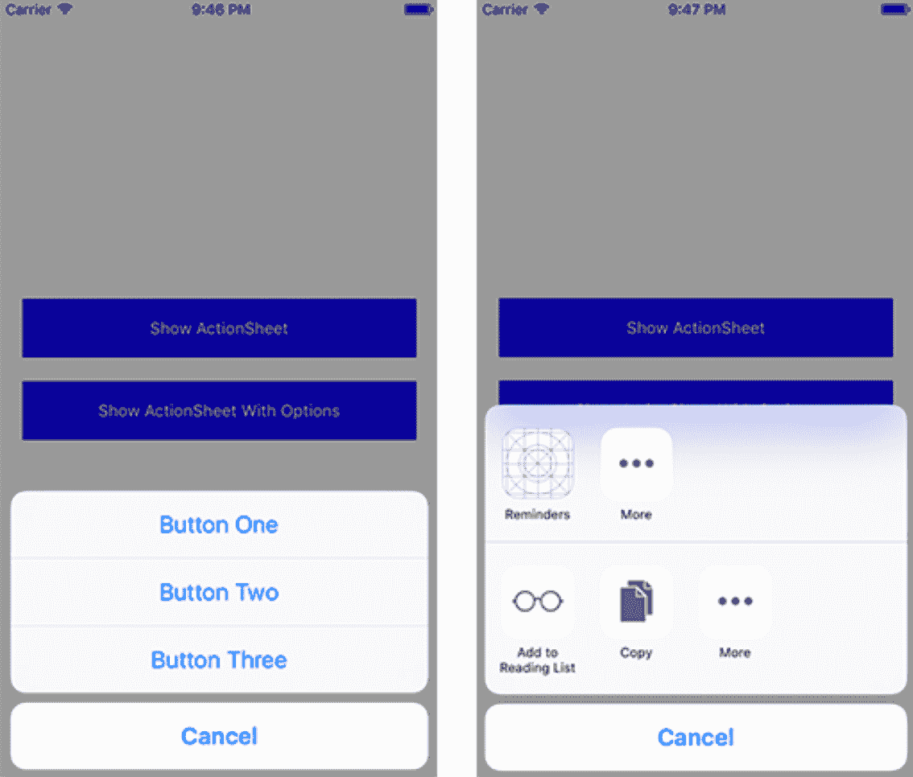

图 10.7 `ActionSheetIOS` 渲染操作表（左侧）和分享表单（右侧）

您可以在 `ActionSheetIOS` 上调用的两个主要方法是 `showActionSheetWithOptions` 和 `showShareActionSheetWithOptions`；这些方法分别列在表 10.6 和 10.7 中。`showActionSheetWithOptions` 允许您传递一个按钮数组并将方法附加到每个按钮上。它使用两个参数调用：一个 `options` 对象和一个回调函数。`showShareActionSheetWithOptions` 显示原生 iOS 分享表单，传递要分享的 URL、消息和主题。它使用三个参数调用：一个 `options` 对象、一个失败回调函数和一个成功回调函数。

表 10.6 `ActionSheetIOS` 的 `showActionSheetWithOptions` 选项

| **选项** | **类型** | **描述** |
| --- | --- | --- |
| `options` | 字符串数组 | 按钮标题列表（必需） |
| `cancelButtonIndex` | 整数 | `options` 中取消按钮的索引 |
| `destructiveButtonIndex` | 整数 | `options` 中破坏性按钮的索引 |
| `title` | 字符串 | 在操作表上方显示的标题 |
| `message` | 字符串 | 在标题下方显示的消息 |

表 10.7 `ActionSheetIOS` 的 `showShareActionSheetWithOptions` 选项

| **选项** | **类型** | **描述** |
| --- | --- | --- |
| `url` | 字符串 | 要分享的 URL |
| `message` | 字符串 | 要分享的消息 |
| `subject` | 字符串 | 消息的主题 |
| `excludedActivityTypes` | 数组 | 要排除在操作表中的活动 |

### 10.7.1 ActionSheetIOS 的使用场景

`ActionSheetIOS` 的主要用途是为用户提供一组选项进行选择，并根据他们的选择调用一个函数。例如，在 Twitter 应用中，当按下重发按钮时，操作表被用来提供用户几个选项，包括重发、引用重发和取消。这是一个常见的用例，在用户按下按钮后显示操作表，并给用户一组选项进行选择。

### 10.7.2 使用 ActionSheetIOS 的示例

在此示例中，你将创建一个包含两个按钮的视图。一个按钮将调用 `showActionSheetWithOptions`，另一个将调用 `showShareActionSheetWithOptions`。

列表 10.13 使用 `ActionSheetIOS` 创建操作表和分享表

```
import React, { Component } from 'react'
import { Text, View, ActionSheetIOS, 
 TouchableHighlight } from 'react-native'    ①  

const BUTTONS = ['Cancel', 'Button One', 'Button Two', 'Button Three']    ②  

class App extends Component {
  constructor() {
    super()
 this.state = {    ③  
 clicked: null    ③  
    }
    this.showActionSheet = this.showActionSheet.bind(this)
    this.showShareActionSheetWithOptions =
        this.showShareActionSheetWithOptions.bind(this)
  }

 showActionSheet() {    ④  
    ActionSheetIOS.showActionSheetWithOptions({
      options: BUTTONS,
      cancelButtonIndex: 0,
    },
    (buttonIndex) => {
      if (buttonIndex > 0) {
        this.setState({ clicked: BUTTONS[buttonIndex] });
 }
    });
  }

 showShareActionSheetWithOptions() {    ⑤  
    ActionSheetIOS.showShareActionSheetWithOptions({
      url: 'http://www.reactnative.training',
      message: 'React Native Training',
    },
    (error) => console.log('error:', error),
 (success, method) => {    ⑥  
      if (success) {
        console.log('successfully shared!', success)
      }
    });
  };
  render() {
    return (
 <View style={styles.container}>    ⑦  
        <TouchableHighlight onPress={this.showActionSheet}
 style={styles.button}>    ⑦  
 <Text style={styles.buttonText}>    ⑦  
 Show ActionSheet    ⑦  
 </Text>    ⑦  
 </TouchableHighlight>    ⑦  
        <TouchableHighlight onPress={this.showShareActionSheetWithOptions}
 style={styles.button}>    ⑦  
 <Text style={styles.buttonText}>    ⑦  
 Show ActionSheet With Options    ⑦  
 </Text>    ⑦  
        </TouchableHighlight>
        <Text>
          {this.state.clicked}
        </Text>
      </View>
    )
  }
}

styles = {
  container: {
    flex: 1,
    justifyContent: 'center',
    padding: 20,
  },
  button: {
    height: 50,
    marginBottom: 20,
    justifyContent: 'center',
    alignItems: 'center',
    backgroundColor: 'blue'
  },
  buttonText: {
    color: 'white'
  }
} 
```

在 `showActionSheet` 方法中，你将按钮作为选项传入。将 `cancelButtonIndex` 设置为零将取消按钮放置在操作表的底部。回调方法接受按钮索引作为参数；如果按钮索引大于 0，则 `clicked` 状态值设置为新的按钮值。当你创建 `showShareActionSheetWithOptions` 方法时，你将 `url` 和要分享的 `message` 传入。第一个回调函数检查是否有错误，第二个检查成功是否为 `true`。

## 概述

+   要导入跨平台文件，请使用特定平台的 android.js 和 ios.js 文件扩展名。

+   要渲染特定平台的代码，请使用 Platform API。

+   使用 `DatePickerIOS` 在你的应用中选择和保存日期。

+   使用 `PickerIOS` 渲染和保存列表中的值。

+   使用 `ProgressViewIOS` 显示加载进度。

+   使用 `SegmentedControlIOS` 从选项数组中选择。

+   使用 `TabBarIOS` 在你的应用中创建和切换标签页。

+   使用 `ActionSheetIOS`，你可以在应用中调用原生 iOS 的操作表或分享表。

# 11

实现 Android 特定组件和 API

**本章涵盖**

+   使用 `DrawerLayoutAndroid` 创建侧边菜单

+   使用 `ToolbarAndroid` 创建原生工具栏

+   使用 `ViewPagerAndroid` 创建分页视图。

+   使用 `DatePickerAndroid` 和 `TimePickerAndroid` 创建日期/时间选择器。

+   使用 `ToastAndroid` 创建托盘通知

在本章中，我们将实现最常用的 Android 特定 API 和组件，讨论它们的属性和方法，并创建示例，这些示例将模仿功能性和逻辑，帮助你快速上手。为了了解这些功能是如何工作的，你将创建一个包含菜单、工具栏、可滚动分页、日期选择器和时间选择器的演示应用。该应用还将实现 Android 的托盘通知。在实现每个这些功能时，你将学习最常用的 Android 特定 API 和组件的能力。

## 11.1 使用 DrawerLayoutAndroid 创建菜单

要开始，你首先将创建一个滑动菜单（见图 11.1）。此菜单将链接到应用的每个功能部分。它基本上将作为在组件之间导航的方式。你将使用 `DrawerLayoutAndroid` 组件创建此菜单。

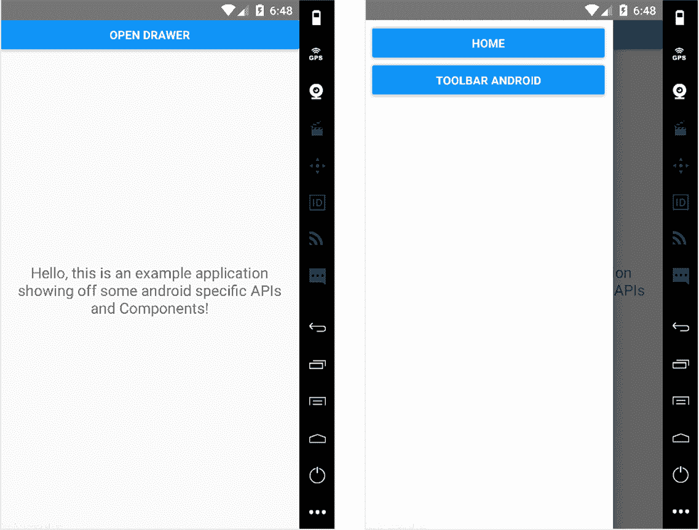

图 11.1 使用 `DrawerLayoutAndroid` 的应用程序初始布局。在第一个屏幕顶部的按钮“打开抽屉”将调用一个打开抽屉的方法。第二个屏幕是打开的抽屉。

首先要做的事情是创建一个新的 Android 应用程序。从你将要工作的文件夹中的命令行，创建一个新的应用程序，将以下命令中的 `YourApplication` 替换为你选择的任何应用程序名称：

```
react-native init YourApplication 
```

接下来，创建你将用于创建所有这些功能的文件。在应用程序的根目录下，添加一个名为 app 的文件夹和四个文件：App.js、Home.js、Menu.js 和 Toolbar.js。

现在，你需要更新 index.android.js 以使用你的第一个特定于 Android 的组件，`DrawerLayoutAndroid`，这是一个从屏幕左侧滑动的工具栏。编辑 index.android.js 以包含并实现此组件。

列表 11.1 实现 `DrawerLayoutAndroid` 组件

```
import React from 'react'
import {
  AppRegistry,
 DrawerLayoutAndroid,    ①  
  Button,
  View
} from 'react-native'

import Menu from './app/Menu'    ②  
import App from './app/App'    ③  

class mycomponent extends React.Component {

  constructor () {
    super()
    this.state = {
 scene: 'Home'    ④  
    }
    this.jump = this.jump.bind(this)
    this.openDrawer = this.openDrawer.bind(this)
  }

  openDrawer () {
 this.drawer.openDrawer()    ⑤  
  }

 jump (scene) {    ⑥  
 this.setState({    ⑥  
 scene    ⑥  
 })    ⑥  
 this.drawer.closeDrawer()    ⑥  
  }

  render () {
    return (
 <DrawerLayoutAndroid    ⑦  
 ref={drawer => this.drawer = drawer}    ⑧  
 drawerWidth={300}    ⑨  
 drawerPosition={DrawerLayoutAndroid.positions.Left}    ⑩  
 renderNavigationView={() => <Menu onPress={this.jump} />}>    ⑪  
 <View style={{ margin: 15 }}>    ⑫  
          <Button onPress={() => this.openDrawer()} title='Open Drawer' />
        </View>
 <App    ⑬  
          openDrawer={this.openDrawer}
          jump={this.jump}
          scene={this.state.scene} />
      </DrawerLayoutAndroid>
    )
  }
}

AppRegistry.registerComponent('mycomponent', () => mycomponent) 
```

接下来，在 app/Menu.js 中创建你将在抽屉中使用的菜单。

列表 11.2 创建 `DrawerLayoutAndroid` 菜单组件

```
import React from 'react'
import { View, StyleSheet, Button } from 'react-native'

let styles

const Menu = ({onPress }) => {
  const {
    button
  } = styles

  return (
    <View style={{ flex: 1 }}>
      <View style={button} >
        <Button onPress={() => onPress('Home')} title='Home' />
      </View>
      <View style={button} >
        <Button onPress={() => onPress('Toolbar')} title='Toolbar Android' />
      </View>
    </View>
  )
}

styles = StyleSheet.create({
  button: {
    margin: 10,
    marginBottom: 0
  }
})

export default Menu 
```

现在，在 app/App.js 中，创建以下组件，它基本上接受一个 `scene` 作为属性并根据属性返回一个组件。

列表 11.3 创建 `DrawerLayoutAndroid` 应用组件

```
import React from 'react'

import Home from './Home'    ①  
import Toolbar from './Toolbar'    ②  

function getScene (scene) {    ③  
  switch (scene) {
    case 'Home':
      return Home
    case 'Toolbar':
      return Toolbar
    default:
      return Home
  }
}

const App = (props) => {
 const Scene = getScene(props.scene)    ④  
 return (
 <Scene openDrawer={props.openDrawer} jump={props.jump} />    ⑤  
  )
}

export default App 
```

现在你可以开始创建与菜单交互的组件。为了使当前设置正常工作，你需要创建一个 `Home` 组件和一个 `Toolbar` 组件。尽管你已经看到了导入，但你还没有真正创建这些组件。在 app/Home.js 中，创建以下组件，这是一个基本的介绍页面。

列表 11.4 创建 `DrawerLayoutAndroid` 主组件

```
import React, { Component } from 'react'
import {
  View,
  Text,
  StyleSheet
} from 'react-native'

let styles

class Home extends Component {
  render () {
    return (
      <View style={styles.container}>
        <Text style={styles.text}>
          Hello, this is an example application showing off some 
          android-specific APIs and Components!
        </Text>
      </View>
    )
  }
}

styles = StyleSheet.create({
  container: {
    flex: 1,
    justifyContent: 'center',
    alignItems: 'center'
  },
  text: {
    margin: 20,
    textAlign: 'center',
    fontSize: 18
  }
})

export default Home 
```

在 app/Toolbar.js 中，创建以下组件，这将通过显示“来自工具栏的问候”消息来表明你处于工具栏中。

列表 11.5 创建 `DrawerLayoutAndroid` 工具栏组件

```
import React from 'react'
import {
  View,
  Text
} from 'react-native'

class ToolBar extends React.Component {
  render () {
    return (
      <View style={{ flex: 1 }}>
        <Text>Hello from Toolbar</Text>
      </View>
    )
  }
}

export default ToolBar 
```

启动应用程序，你应该看到图 11.1 所示的菜单。

## 11.2 使用 `ToolbarAndroid` 创建工具栏

一切设置完毕后，让我们添加一个新的组件，`ToolbarAndroid`。`ToolbarAndroid` 是一个 React Native 组件，它包装了原生的 Android 工具栏。此组件可以显示各种内容，包括标题、副标题、日志、导航图标和操作按钮。

在此示例中，你将使用标题、副标题和两个操作（选项和菜单；参见图 11.2）来实现 `ToolbarAndroid`。当点击菜单时，你将触发 `openDrawer` 方法，这将打开菜单。

在 app/Toolbar.js 中，按照以下代码更新以实现工具栏。

列表 11.6 实现 `ToolbarAndroid`

```
import React from 'react'
import {
 ToolbarAndroid,    ①  
  View
} from 'react-native'

class Toolbar extends React.Component {
  render () {
 const onActionSelected = (index) => {    ②  
 if (index === 1) {    ②  
 this.props.openDrawer()    ②  
      }
    }

    return (
      <View style={{ flex: 1 }}>
 <ToolbarAndroid    ③  
          subtitleColor='white'  
          titleColor='white'   
          style={{ height: 56, backgroundColor: '#52998c' }}  
 title='React Native in Action'   
          subtitle='ToolbarAndroid'  
          actions={[ { title: 'Options', show: 'always' }, 
 { title: 'Menu', show: 'always' } ]}    ④  
 onActionSelected={onActionSelected}    ⑤  
        />
      </View>
    )
  }
}
export default Toolbar 
```

当你刷新你的设备时，你应该不仅看到 `ToolbarAndroid`，还应该能够通过按标有菜单的按钮来打开 `DrawerLayoutAndroid` 菜单。

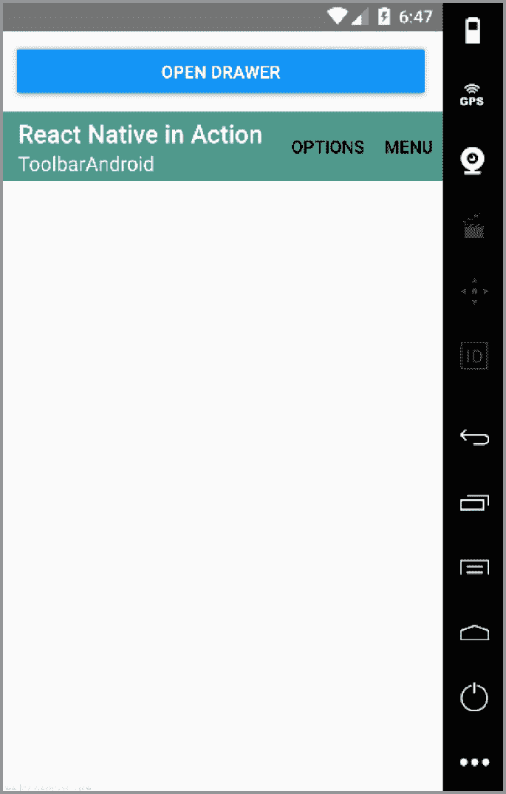

图 11.2 带有标题、副标题和两个操作的 `ToolbarAndroid`。此菜单可配置，但在此示例中你只使用默认设置。

## 11.3 使用 ViewPagerAndroid 实现可滚动分页

接下来，你将创建一个新的示例页面和组件，使用 `ViewPagerAndroid`。此组件允许你轻松地在视图之间左右滑动。`ViewPagerAndroid` 的每个子项都被视为一个独立的、可滑动的视图（见 图 11.3）。

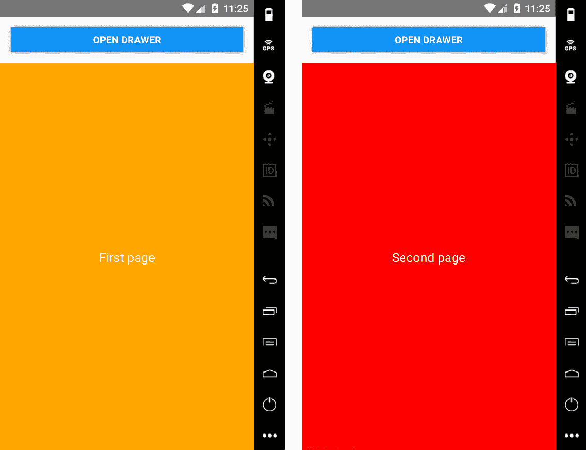

图 11.3 带有两个子视图的 `ViewPagerAndroid`。当你滑动页面时，它们左右滚动以显示下一页。

要开始，创建一个 app/ViewPager.js 文件并将 列表 11.7 中的代码添加进去以实现 `ViewPagerAndroid` 组件。

列表 11.7 使用 `ViewPagerAndroid` 实现可滚动分页视图

```
import React, { Component } from 'react'
import {
 ViewPagerAndroid,    ①  
  View,
  Text
} from 'react-native'

let styles

class ViewPager extends Component {
  render () {
    const {
      pageStyle,
      page1Style,
      page2Style,
      textStyle
    } = styles
    return (
 <ViewPagerAndroid    ②  
        style={{ flex: 1 }}
 initialPage={0}>
        <View style={[ pageStyle, page1Style ]}>
          <Text style={textStyle}>First page</Text>
        </View>
        <View style={[ pageStyle, page2Style ]}>
          <Text style={textStyle}>Second page</Text>
        </View>
      </ViewPagerAndroid>
    )
  }
}

styles = {
  pageStyle: {
    justifyContent: 'center',
    alignItems: 'center',
    padding: 20,
    flex: 1,
  },
  page1Style: {
    backgroundColor: 'orange'
  },
  page2Style: {
    backgroundColor: 'red'
  },
  textStyle: {
    fontSize: 18,
    color: 'white'
  }
}

export default ViewPager 
```

接下来，更新 Menu.js 以添加按钮以查看新组件。在 Menu.js 中，在 Toolbar Android 按钮下方添加此按钮：

```
<View style={button} >
  <Button onPress={() => onPress('ViewPager')} title='ViewPager Android' />
</View> 
```

最后，导入新组件并更新 App.js 中的 `switch` 语句以渲染组件。

列表 11.8 包含新 `ViewPager` 组件的 App.js

```
import React from 'react'

import Home from './Home'
import Toolbar from './Toolbar'
import ViewPager from './ViewPager'

function getScene (scene) {
  switch (scene) {
    case 'Home':
      return Home
    case 'Toolbar':
      return Toolbar
 case 'ViewPager':
      return ViewPager
    default:
      return Home
  }
}

const App = (props) => {
  const Scene = getScene(props.scene)
  return (
    <Scene openDrawer={props.openDrawer} jump={props.jump} />
  )
}

export default App 
```

运行应用程序。你应该在侧菜单中看到新的 ViewPager Android 按钮，并且你可以查看和与之交互的新组件。

## 11.4 使用 DatePickerAndroid API 显示原生日期选择器

`DatePickerAndroid` 允许你打开并交互使用原生 Android 日期选择器对话框，如图 11.4 所示。要打开和使用 `DatePickerAndroid` 组件，导入 `DatePickerAndroid` 并调用 `DatePickerAndroid.open()`。要开始，创建 app/DatePicker.js 并在其中创建 `DatePicker` 组件（列表 11.9）。

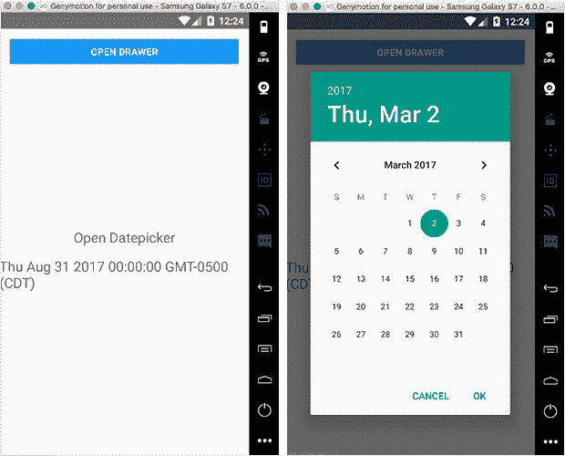

图 11.4 带有打开日期选择器并显示选中日期的视图的按钮的 `DatePickerAndroid`

列表 11.9 实现 `DatePicker` 组件

```
import React, { Component } from 'react'
import { DatePickerAndroid, View, Text } from 'react-native'    ①  

let styles

class DatePicker extends Component {

  constructor() {
    super()
 this.state = {    ②  
      date: new Date()
    }
    this.openDatePicker = this.openDatePicker.bind(this)
  }

 openDatePicker () {    ③  
    DatePickerAndroid.open({
      date: this.state.date
    })
    .then((date) => {
 const { year, month, day, action } = date    ④  
 if (action === 'dateSetAction') {    ⑤  
        this.setState({ date: new Date(year, month, day) })
      }
    })  }

  render() {
    const {
      container,
      text
    } = styles

    return (
 <View style={container}>    ⑥  
        <Text onPress={this.openDatePicker} style={text}>
          Open Datepicker
 </Text>    ⑥  
 <Text style={text}>{this.state.date.toString()}</Text>    ⑥  
 </View>    ⑥  
    )
  }
}

styles = {
  container: {
    flex: 1,
    justifyContent: 'center',
    alignItems: 'center'
  },
  text: {
    marginBottom: 15,
    fontSize: 20
  }
}

export default DatePicker 
```

现在你有了这个组件，更新 app/App.js 以包含它。

列表 11.10 包含新 `DatePicker` 组件的 app/App.js

```
import React from 'react'

import Home from './Home'
import Toolbar from './Toolbar'
import ViewPager from './ViewPager'
import DatePicker from './DatePicker'

function getScene (scene) {
  switch (scene) {
    case 'Home':
      return Home
    case 'Toolbar':
      return Toolbar
    case 'ViewPager':
      return ViewPager
    case 'DatePicker':
      return DatePicker
    default:
      return Home
  }
}

const App = (props) => {
  const Scene = getScene(props.scene)
  return (
    <Scene openDrawer={props.openDrawer} jump={props.jump} />
  )
}

export default App 
```

最后，更新菜单以添加将打开 `DatePicker` 组件的新按钮。在 app/Menu.js 中，在 `ViewPager` Android 按钮下方添加以下按钮：

```
<View style={button} >
  <Button onPress={() => onPress('DatePicker')} title='DatePicker Android' />
</View> 
```

## 11.5 使用 TimePickerAndroid 创建时间选择器

接下来是 `TimePickerAndroid`。它与 `DatePickerAndroid` 类似，即你导入它并调用 `open` 方法来与之交互。此组件弹出一个时间选择对话框，允许你选择时间并在你的应用程序中使用它（图 11.5）。

为了标准化时间格式，你将使用一个名为 moment.js 的第三方库。要开始使用此库，你必须首先安装它。在项目的根目录中，使用 npm 或 yarn（根据你的喜好——npm 和 yarn 在这里都将完全相同）安装 moment：

```
npm install moment –save 
```

或者

```
yarn add moment 
```

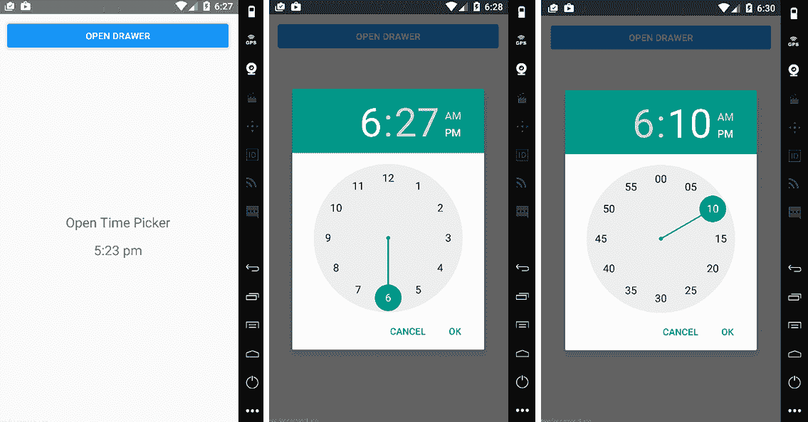

图 11.5 `TimePickerAndroid` 同时显示小时和分钟视图

在 app/TimePicker.js 中，创建以下 `TimePicker` 组件。

列表 11.11 使用 moment.js 的 `TimePickerAndroid`

```
import React, { Component } from 'react'
import { TimePickerAndroid, View, Text } from 'react-native'    ①  
import moment from 'moment'    ②  

let styles

class TimePicker extends Component {

  constructor () {
    super()
    this.state = {
 time: moment().format('h:mm a')    ③  
    }
    this.openTimePicker = this.openTimePicker.bind(this)
  }

 openTimePicker () {    ④  
 TimePickerAndroid.open({    ⑤  
      time: this.state.time
    })
    .then((time) => {
 const { hour, minute, action } = time    ⑥  
      if (action === 'timeSetAction') {
        const time = moment().minute(minute).hour(hour).format('h:mm a')
        this.setState({ time })
      }
 })
  }

  render () {
    const {
      container,
      text
    } = styles

    return (
 <View style={container}>    ⑦  
        <Text onPress={this.openTimePicker} style={text}>Open Time Picker</Text>
        <Text style={text}>{this.state.time.toString()}</Text>
      </View>
    )
  }
}

styles = {
  container: {
    flex: 1,
    justifyContent: 'center',
    alignItems: 'center'
  },
  text: {
    marginBottom: 15,
    fontSize: 20
  }
}

export default TimePicker 
```

接下来，更新 app/App.js 以包含新组件。

列表 11.12 添加 `TimePicker` 组件到 app/App.js

```
import React from 'react'

import Home from './Home'
import Toolbar from './Toolbar'
import ViewPager from './ViewPager'
import DatePicker from './DatePicker'
import TimePicker from './TimePicker'

function getScene (scene) {
  switch (scene) {
    case 'Home':
      return Home
    case 'Toolbar':
      return Toolbar
    case 'ViewPager':
      return ViewPager
    case 'DatePicker':
      return DatePicker
    case 'TimePicker':
      return TimePicker
 default:
      return Home
  }
}

const App = (props) => {
  const Scene = getScene(props.scene)
  return (
    <Scene openDrawer={props.openDrawer} jump={props.jump} />
  )
}

export default App 
```

最后，更新菜单以添加将打开新 `TimePicker` 组件的按钮。在 app/Menu.js 中，在 DatePicker Android 按钮下方添加以下按钮：

```
<View style={button} >
  <Button onPress={() => onPress('TimePicker')} title='TimePicker Android' />
</View> 
```

## 11.6 使用 ToastAndroid 实现 Android toasts

`ToastAndroid` 允许你从 React Native 应用程序中轻松调用原生 Android toasts。Android *toast* 是一个带有消息的弹出窗口，在给定的时间后消失（见图 11.6）。要开始构建此组件，创建 app/Toast.js，如下所示。

列表 11.13 实现 `ToastAndroid`

```
import React from 'react'
import { View, Text, ToastAndroid } from 'react-native'    ①  

let styles

const Toast = () => {
  let {
    container,
    button
  } = styles

 const basicToast = () => {    ②  
 ToastAndroid.show('Hello World!', ToastAndroid.LONG)    ②  
  }

 const gravityToast = () => {    ③  
    ToastAndroid.showWithGravity('Toast with Gravity!', 
                                 ToastAndroid.LONG, ToastAndroid.CENTER)
  }

  return (
 <View style={container}>    ④  
 <Text style={button} onPress={basicToast}>    ⑤  
        Open basic toast    
      </Text>   
 <Text style={button} onPress={gravityToast}>    ⑥  
        Open gravity toast   
      </Text>   
    </View>   
  )
}

styles = {
  container: {
    flex: 1,
    justifyContent: 'center',
    alignItems: 'center'
  },
  button: {
    marginBottom: 10,
    color: 'blue'
  }
}

export default Toast 
```

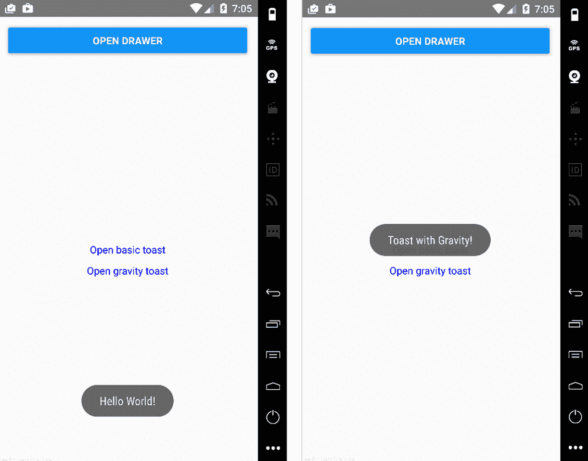

图 11.6 `ToastAndroid` 在默认和中间位置显示 toasts

`ToastAndroid.show()` 方法接受两个参数：一个消息和一个显示 toast 的时间长度。时间可以是 `SHORT`（大约 2 秒）或 `LONG`（大约 4 秒）；此示例使用 `LONG`。`ToastAndroid.showWithGravity()` 方法类似于 `ToastAndroid.show()`，但你可以传递第三个参数来将 toast 定位到视图的顶部、底部或中心。在这种情况下，你使用 `ToastAndroid.CENTER` 作为第三个参数将 toast 定位到屏幕中间。

现在，更新 app/App.js 以包含新组件。

列表 11.14 向应用程序添加 toast 组件

```
import React from 'react'

import Home from './Home'
import Toolbar from './Toolbar'
import ViewPager from './ViewPager'
import DatePicker from './DatePicker'
import TimePicker from './TimePicker'
import Toast from './Toast'

function getScene (scene) {
  switch (scene) {
    case 'Home':
      return Home
    case 'Toolbar':
      return Toolbar
    case 'ViewPager':
      return ViewPager
    case 'DatePicker':
      return DatePicker
    case 'TimePicker':
      return TimePicker
    case 'Toast':
      return Toast
    default:
      return Home
  }
}

const App = (props) => {
  const Scene = getScene(props.scene)
  return (
    <Scene openDrawer={props.openDrawer} jump={props.jump} />
  )
}

export default App 
```

最后，更新菜单以添加将打开 toast 组件的新按钮。在 app/Menu.js 中，在 TimePicker Android 按钮下方添加以下按钮：

```
<View style={button} >
  <Button onPress={() => onPress('Toast')} title='Toast Android' />
</View> 
```

## 摘要

+   你可以使用 `DrawerLayoutAndroid` 创建应用程序的主菜单。

+   你可以使用 `ToolbarAndroid` 创建一个交互式应用程序工具栏。

+   你可以使用 `ViewPagerAndroid` 创建可滑动视图。

+   使用 `DatePickerAndroid`，你可以访问原生日期选择器，允许你在应用程序中创建和操作日期。

+   `TimePickerAndroid` 允许你访问原生时间选择器，使得在应用程序中创建和操作时间成为可能。

+   你可以使用 `ToastAndroid` 轻松创建原生 Android toast 通知。
