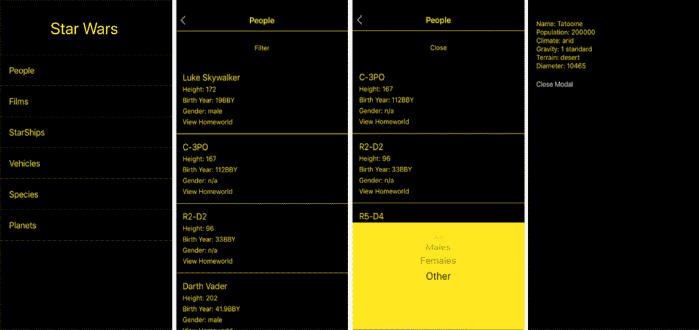
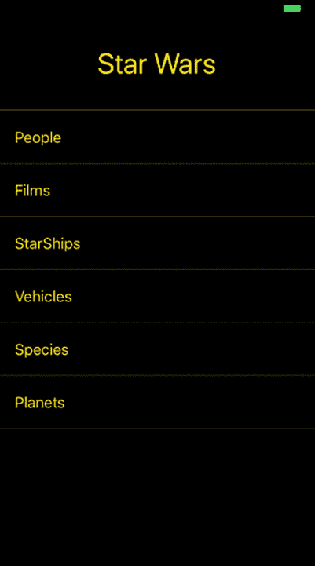
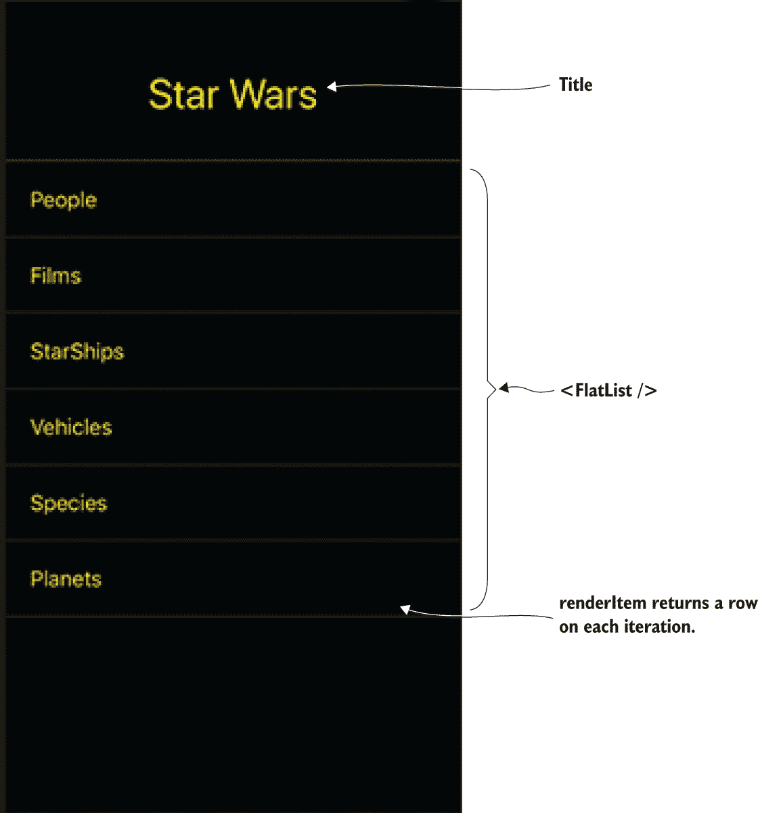
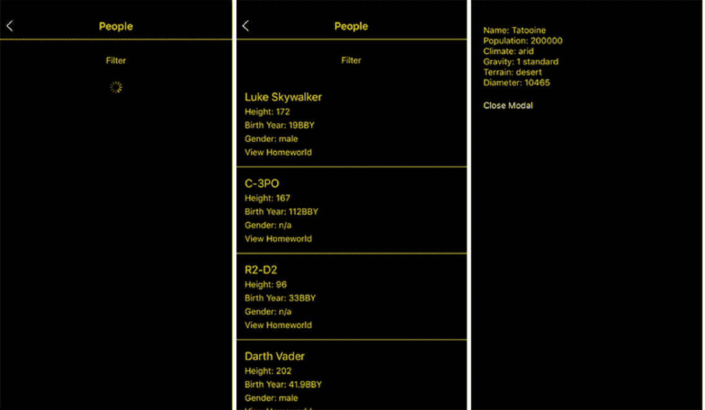

# 第四部分

将所有内容整合在一起

本书这一部分将前几章中涵盖的所有内容——样式、导航、动画以及一些跨平台组件——整合到一个应用程序中。我们将首先查看最终设计，并简要概述应用程序将执行的操作。

你将创建一个新的 React Native 应用程序并安装 React Navigation 库，深入探讨组件以及导航 UI 的样式，通过使用 Fetch API 处理外部网络资源的数据，并最终构建一个允许用户查看他们最喜欢的*星球大战*角色信息的应用程序。

# 12

使用跨平台组件构建星球大战应用

**本章涵盖**

+   使用 Fetch API 获取数据的基本方法

+   使用`Modal`组件显示和隐藏视图

+   使用`FlatList`组件创建列表

+   使用`ActivityIndicator`显示加载状态

+   在实际项目中使用 React Navigation 处理导航

React Native 附带了许多可在应用程序中使用的组件。其中一些组件是跨平台的：也就是说，无论你在 iOS 还是 Android 上运行应用程序，它们都能工作。其他组件是平台特定的：例如，`ActionSheetIOS`仅在 iOS 上运行，而`ToolbarAndroid`仅在 Android 平台上运行（跨平台组件在第十章和第十一章中已介绍）。

本章涵盖了构建演示应用程序时使用的一些最常用的跨平台组件及其实现方法。为此，你将通过构建一个跨平台的*星球大战*信息应用来实现以下跨平台组件和 API：

+   Fetch API

+   `Modal`

+   `ActivityIndicator`

+   `FlatList`

+   `Picker`

+   `React-Navigation`

此应用将访问 SWAPI，即《星球大战》API（[`swapi.co`](https://swapi.co)），并返回有关*星球大战*角色、飞船、家园星球等信息，如图 12.1 所示。当用户点击“人物”时，应用从[`swapi.co/api/people`](https://swapi.co/api/people)获取电影的主要演员阵容并显示其信息。在这个过程中，应用使用了几个 React Native 跨平台组件。在本章中，你将学习如何在以下操作中使用这些组件：

1.  设置一个新的 React Native 应用程序并安装依赖项

1.  导入`People`组件并创建`Container`组件

1.  创建`Navigation`组件并注册路由

1.  创建视图的主要类

1.  创建`People`组件

1.  使用跨平台组件`FlatList`、`Modal`和`Picker`创建状态并设置获取数据的 fetch 调用



图 12.1 你将使用 React Native 跨平台组件构建的完成的*星球大战*应用程序。你将关注第一个链接：人物。

## 12.1 创建应用程序并安装依赖项

你需要做的第一件事是设置一个新的 React Native 应用程序并安装构建此应用程序所需的任何依赖项。转到命令行，并输入以下内容创建一个 React Native 应用程序：

```
react-native init StarWarsApp 
```

接下来，切换到新创建的 StarWarsApp 目录：

```
cd StarWarsApp 
```

你需要为这个应用程序安装的唯一东西是 react-navigation，所以你可以使用 npm 或 yarn 安装它：

+   使用 npm：`npm i react-navigation`

+   使用 yarn：`yarn add react-navigation`

现在项目已创建，打开 App.js 并创建 图 12.2 中显示的屏幕所需的组件。在文件顶部，导入以下组件。

列表 12.1 导入初始组件

```
import React, { Component } from 'react';
import {
  StyleSheet,
  Text,
  FlatList,
  TouchableHighlight
} from 'react-native';
import { createStackNavigator } from 'react-navigation'; 
```

在这个列表中，你导入了所需的 React Native 组件，以及来自 `react-navigation` 的 `createStackNavigator`。`FlatList` 是一个组件，它允许你使用任何数据数组在应用程序中渲染性能列表。`createStackNavigator` 是来自 `react-navigation` 的一个导航器，它提供了一个在场景之间导航的简单方法；每个场景都推送到路由堆栈的顶部。所有动画都已为你配置好，并提供了默认的 iOS 和 Android 感觉和过渡效果。

### 12.1.1 导入 People 组件并创建 Container 组件



图 12.2 应用程序的初始视图

接下来，你需要导入你将在应用程序中使用的两个视图。再次查看 图 12.2 中的第一个屏幕。正如你所见，有 People、Films 等链接。当用户点击 People 时，应用程序应该导航到一个列出 *星球大战* 电影中人物（主要角色）的组件。为此，你将在 12.2 节中创建一个 `People` 组件——你现在将导入该组件，稍后创建它。在 列表 12.1 的最后一个 `import` 下方，导入尚未创建的 `People` 组件：

```
import People from './People' 
```

由于设计使用黑色背景，并且你不想在组件之间重复样式代码，让我们创建一个 `Container` 组件，你将使用它作为视图的包装器。这个 `Container` 组件将仅用于样式。在应用程序的根目录下创建一个名为 Container.js 的新文件，并输入以下代码。

列表 12.2 创建可重用的 `Container` 组件

```
import React from 'react'
import { StyleSheet, View } from 'react-native'

const styles = StyleSheet.create({    ①  
  container: {
    flex: 1,
    backgroundColor: 'black',
  },
})

const Container = ({ children }) => (    ②  
 <View style={styles.container}>    ③  
 {children}    ③  
 </View>    ③  
)

export default Container 
```

将 `Container` 导入到 App.js 文件中，在 `People` 组件的最后一个 `import` 下方：

```
import Container from './Container' 
```

在 `Container` 导入下方，创建一个数组，你将使用它来创建链接。数组中的项将被传递给 `FlatList` 组件以创建链接列表。此数组应包含对象，并且每个对象都应该包含一个 `title` 键。你需要 `title` 键来显示链接的名称：

```
const links = [
  { title: 'People' },
  { title: 'Films' },
  { title: 'StarShips' },
  { title: 'Vehicles' },
  { title: 'Species' },
  { title: 'Planets' }
] 
```

### 12.1.2 创建导航组件并注册路由

在 `App.js` 文件的底部，您接下来将创建主导航组件并将其传递给 `AppRegistry`。您正在使用 `createStackNavigator` 作为导航组件，并且需要注册您将在应用程序中使用的路由。

初始化 `createStackNavigator` 并将导航器传递给 `AppRegistry` 方法，用导航组件替换默认的 `StarWars` 组件，如下所示。`createStackNavigator` 为应用提供在屏幕之间切换的方式：每个新的屏幕都放置在堆栈的顶部，并且是一个跨平台组件。

清单 12.3 使用 `createStackNavigator`

```
const App = `createStackNavigator`({    ①  
  StarWars: {
 screen: StarWars    ②  
  },
  People: {
 screen: People    ③  
  }
})
export default App 
```

### 12.1.3 创建初始视图的主类

在 `App.js` 文件中，在您在 12.1.1 节中创建的链接数组下方，添加视图的主类（清单 12.4）。这个类返回一个列表，将渲染从 API 返回的所有电影角色。您还将使用 `navigationOptions` 静态属性设置标题，并在头部设置标志。您将使用 React Native 的 `FlatList` 渲染这个列表。它是用于在 React Native 应用中渲染简单列表的内置界面。

清单 12.4 创建主 `StarWars` 组件

```
class StarWars extends Component {

 static navigationOptions = {    ①  
    ①  
 headerTitle: <Text    ①  
 style={{    ①  
 fontSize: 34, color: 'rgb(255,232,31)'    ①  
 }}    ①  
 >Star Wars</Text>,    ①  
 headerStyle: { backgroundColor: "black", height: 110 }    ①  
  }
 navigate = (link) => {    ②  
    const { navigate } = this.props.navigation
    navigate(link)
  }

 renderItem = ({ item, index }) => {    ③  
    return (
      <TouchableHighlight
        onPress={() => this.navigate(item.title)}
        style={[ styles.item, { borderTopWidth: index === 0 ? 1 : null} ]}>
        <Text style={styles.text}>{item.title}</Text>
      </TouchableHighlight>
    )
  }

 render() {    ④  
 return (    ④  
 <Container>    ④  
 <FlatList    ④  
 data={links}    ④  
 keyExtractor={(item) => item.title}    ④  
 renderItem={this.renderItem}    ④  
 />    ④  
 </Container>    ④  
    )
  }
}

const styles = StyleSheet.create({
  item: {
    padding: 20,
    justifyContent: 'center',
    borderColor: 'rgba(255,232,31, .2)',
    borderBottomWidth: 1
  },
  text: {
    color: '#ffe81f',
    fontSize: 18
  }
}); 
```



图 12.3 `StarWars` 组件的组件和标题

因为您正在使用来自 `react-navigation` 的 `createStackNavigator`，您可以传递每个路由的配置。在这个路由中，您想要更改默认的头部配置和样式。为此，您创建一个静态的 `navigationOptions` 对象，并在其中传递一个包含标题的 `headerTitle` 组件和一个包含一些特定样式的 `headerStyle` 对象。`headerTitle` 是您将用作标志的文本，而 `headerStyle` 将背景颜色设置为黑色，并设置一个固定高度以适应文本。

`navigate` 方法接收一个链接作为参数。由 `StackNavigation` 渲染的任何组件都接收导航对象作为属性。您使用此属性解构 `navigate` 方法，然后导航到传入的链接。在这种情况下，链接是链接数组中的 `title` 属性，与传递给 `createStackNavigator` 的键相关联。

`FlatList` 接收一个 `renderItem` 方法，该方法遍历作为 `data` 属性传入的数据数组，并为数组中的每个项目返回一个包含 `item` 和 `index` 的对象。`item` 是具有所有属性的真正项目，而 `index` 是项目的索引。您将这些作为参数解构，将 `item` 作为参数传递给 `navigate` 以显示标题，并使用 `index` 在它是第一个数组项时应用 `borderTop` 样式。

`render()`返回`Container`，在其中你包装`FlatList`，传入作为数据链接和之前创建的`renderItem`方法。你还传入一个`keyExtractor`方法。如果数组中没有标记为`key`的项目，你必须告诉`FlatList`使用哪个项目作为其键；否则它将抛出错误。图 12.3 显示了应用程序的初始视图及其组件。App.js 的最终代码在[www.manning.com/books/react-native-in-action](http://www.manning.com/books/react-native-in-action)和 GitHub 上[`github.com/dabit3/react-native-in-action/blob/chapter12/StarWars/App.js`](https://github.com/dabit3/react-native-in-action/blob/chapter12/StarWars/App.js)。

## 12.2 使用 FlatList、Modal 和 Picker 创建 People 组件

接下来，你将创建一个`People`组件来获取并显示从星球大战 API (图 12.4) 获取的*星球大战*演员信息。作为此组件的一部分，你将使用 React Native 跨平台组件`Modal`和`Picker`。`Modal`允许你在当前正在工作的视图之上显示一个元素。`Picker`显示一个可滚动的选项或值列表；此组件提供了一个方便的方法来捕获用户的输入并使他们的选择对应用程序的其余部分可用。



图 12.4 此组件将显示 People.js 屏幕的`Loading`（左侧）和`Loaded`（中间）状态。它还将允许你查看每个角色的家乡信息（右侧）。

当`People`组件加载时，它将从一个空的数据数组开始，一个`loading`状态为`true`，以及一些其他的状态：

```
state = {
    data: [],
    loading: true,
    modalVisible: false,
    gender: 'all',
    pickerVisible: false
  } 
```

当组件挂载时，你将从星球大战 API [`swapi.co/api/people`](https://swapi.co/api/people) 获取所需的数据；当这些数据返回时，你将使用返回的数据填充数据数组，并将`loading`布尔值设置为`false`。

你将使用`modalVisible`布尔值来显示和隐藏用于获取角色家乡信息的`Modal`组件。你将使用`pickerVisible`来显示和隐藏一个`Picker`组件，该组件将允许你选择你想要查看的人的性别，并将结果传递给一个过滤器，以便相应地过滤结果。

创建一个新的文件，People.js，并开始编码。

列表 12.5 People.js 导入

```
import React, { Component } from 'react'
import {    ①  
  StyleSheet,
  Text,
  View,
  Image,
  TouchableHighlight,
  ActivityIndicator,
  FlatList,
  Modal,
  Picker
} from 'react-native'
import _ from 'lodash'    ②  

import Container from './Container'    ③  
import HomeWorld from './HomeWorld'    ④   
```

Lodash 实用库提供了许多便利函数。在导入之前，你需要通过 npm 或 yarn 安装它。

下一步是创建组件的主要类并设置`navigationOptions`以给标题添加标题以及一些样式。在 People.js 中的最后一个导入下面，创建以下`People`类。

列表 12.6 创建`People`类并设置页面标题

```
export default class People extends Component {
 static navigationOptions = {    ①  
    headerTitle: 'People',
 headerStyle: {    ②  
      borderBottomWidth: 1,
      borderBottomColor: '#ffe81f',
      backgroundColor: 'black'
    },
    headerTintColor: '#ffe81f',
 pressColorAndroid: 'white'    ③  
  }
} 
```

在这里创建了静态的 `navigationOptions` 属性，就像在 App.js 文件中一样，但不是传递一个组件作为 `headerTitle`，而是传递字符串“People”。你还在其中添加了一些样式。

### 12.2.1 创建状态并设置一个用于检索数据的 `fetch` 调用

现在你将创建状态并在 `componentDidMount` 中设置一个 `fetch` 调用。Fetch 是一个跨平台的 API，用于获取网络资源，它正在取代 `XMLHttpRequest`。Fetch 还未与所有互联网浏览器完全兼容，但 React Native 提供了一个 polyfill（一个模拟原始 API 行为的 API，在这种情况下是 Fetch）。Fetch API 是一种易于使用的现成方式来处理网络请求，包括 `GET`、`POST`、`PUT` 和 `DELETE`。`fetch` 返回一个承诺，这使得异步处理变得容易。``

````` A `fetch` request usually looks something like this:    ``` fetch('https://swapi.co/api/people/')   .then(response => response.json())   .then(json => {       #do something with the returned data / json   })   .catch(err => {       #handle error here   })  ```    In the example, the `fetch` call will hit the Star Wars API at [`swapi.co/api/people`](https://swapi.co/api/people) and return an object containing a results array. This results array will contain the characters to display on this page. To view this dataset, open the URL in a browser to check out the data structure.    The data set looks like the following, with results being the array of movie characters you’re interested in using:    ``` {   "count": 87,    "next": "http://swapi.co/api/people/?page=2",    "previous": null,    "results": [     {   "name": "Luke Skywalker",          "height": "172",          "mass": "77",         ...     },     ... }  ```    Once the data is returned from the API, you update the data array in the state with the results.    Below the `navigationOptions` object in People.js, create the state and the `componentDidMount` `fetch` call.    Listing 12.7 Setting up the initial state and fetching data    ``` state = {     data: [],     loading: true,     modalVisible: false,     gender: 'all',     pickerVisible: false   }   componentDidMount() {      fetch('https://swapi.co/api/people/')       .then(res => res.json())       .then(json => this.setState({ data: json.results, loading: false }))       .catch((err) => console.log('err:', err))   }  ```    In `componentDidMount`, you fetch the data from the API using `fetch()`. `fetch` returns a promise. You then take the returned data and call the `.json()` method to read the response and transform the data. `.json()` returns a promise containing the JSON data. Finally, you set the state again, updating the data and loading variables.    ### 12.2.2 Adding the remaining class methods    At this point in the app, if you load this page, the data should be loaded into the state and ready to use. Next up, you need to create the rest of the functionality to display this data, as well as a `render` method to display the data. To create the rest of the methods used in this component, add the following code after `componentDidMount` in People.js.    Listing 12.8 Remaining methods for component functionality    ``` renderItem = ({ item }) => {    ①     return (     <View style={styles.itemContainer}>       <Text style={styles.name}>{item.name}</Text>       <Text style={styles.info}>Height: {item.height}</Text>       <Text style={styles.info}>Birth Year: {item.birth_year}</Text>       <Text style={styles.info}>Gender: {item.gender}</Text>       <TouchableHighlight         style={styles.button}         onPress={() => this.openHomeWorld(item.homeworld)}       >         <Text style={styles.info}>View Homeworld</Text>       </TouchableHighlight>     </View>   ) }  openHomeWorld = (url) => {    ②     this.setState({     url,     modalVisible: true   }) }  closeModal = () => {    ③     this.setState({ modalVisible: false }) }  togglePicker = () => {    ④     this.setState({ pickerVisible: !this.state.pickerVisible }) }  filter = (gender) => {    ⑤     this.setState({ gender }) }  ```    The `renderItem` method is what you’ll pass to `FlatList` to render the data in the state. Every time an item is passed through this method, you get an object with two keys: `item` and `key`. You destructure the item when the method is called and use the item properties to display the data for the user (`item.name`, `item.height`, and so on). Note the ``onPress method passed to the `TouchableHighlight` component: this method passes the `item.homeworld` property to the `openHomeWorld` method. `item.homeworld` is a URL you’ll use to fetch the movie character’s home planet information.``   ````The `togglePicker` method toggles the `pickerVisible` Boolean. This Boolean shows and hides a picker from which you can choose a filter to view characters by gender: all, female, male, or other (robots and so on).    ### 12.2.3 Implementing the render method    With all the methods set up, the last thing to do is implement the UI in the `render` method. In People.js, you’ll introduce a new component called the `ActivityIndicator`: a cross-platform circular loading indicator that will indicate the loading state (you can see a list of properties in table 12.1). After the `filter` method, add the render method as shown next.    Listing 12.9 `render` method    ``` render() {  let { data } = this.state    ①    if (this.state.gender !== 'all') {    ②    data = data.filter(f => f.gender === this.state.gender)    ②     }    return (     <Container>       <TouchableHighlight style={styles.pickerToggleContainer}  onPress={this.togglePicker}>    ③           <Text style={styles.pickerToggle}>            {this.state.pickerVisible ? 'Close Filter' : 'Open Filter'}  </Text>    ③         </TouchableHighlight>  {    ④    this.state.loading ? <ActivityIndicator color='#ffe81f' /> : (    ④    <FlatList    ④    data={data}    ④    keyExtractor={(item) => item.name}    ④    renderItem={this.renderItem}    ④    />    ④    )    ④         }  <Modal    ⑤    onRequestClose={() => console.log('onrequest close called')}    ⑥    animationType="slide"    ⑦    visible={this.state.modalVisible}>    ⑤           <HomeWorld closeModal={this.closeModal}                     url={this.state.url} />  </Modal>    ⑤         {  this.state.pickerVisible && (    ⑧             <View style={styles.pickerContainer}>  <Picker    ⑨    style={{ backgroundColor: '#ffe81f' }}    ⑨    selectedValue={this.state.gender}    ⑨    onValueChange={(item) => this.filter(item)}>    ⑨                  <Picker.Item itemStyle={{ color: 'yellow' }}                             label="All"                             value="all" />               <Picker.Item label="Males" value="male" />               <Picker.Item label="Females" value="female" />               <Picker.Item label="Other" value="n/a" />             </Picker>           </View>         )       }     </Container>   ); }  ```    When the Close Filter / Open Filter button is clicked, the `togglePicker` method is called and the picker is shown or hidden. The `onValueChange` method fires every time the picker value is updated, which then updates the state, triggering a rerender of the component, and updating the filtered list of items in the view.    Table 12.1 `ActivityIndicator` properties     | **Property** | **Type** | **Description (some from docs)** | | --- | --- | --- | | `animating` | Boolean | Animates the `ActivityIndicator` icon | | `color` | Color | Color of the `ActivityIndicator` | | `size` | String (small or large) | Size of the `ActivityIndicator` |    The last thing you need is the styling for this component. This code goes below the class definition in People.js.    Listing 12.10 `People` component styling    ``` const styles = StyleSheet.create({   pickerToggleContainer: {     padding: 25,     justifyContent: 'center',  alignItems: 'center'   },   pickerToggle: {     color: '#ffe81f'   },   pickerContainer: {     position: 'absolute',     bottom: 0,     right: 0,     left: 0   },   itemContainer: {     padding: 15,     borderBottomWidth: 1, borderBottomColor: '#ffe81f'   },   name: {     color: '#ffe81f',     fontSize: 18   },   info: {     color: '#ffe81f',     fontSize: 14,     marginTop: 5   } });  ```    You can find the final code for this component at [www.manning.com/books/react-native-in-action](http://www.manning.com/books/react-native-in-action) and also on GitHub at [`github.com/dabit3/react-native-in-action/blob/chapter12/StarWars/People.js`](https://github.com/dabit3/react-native-in-action/blob/chapter12/StarWars/People.js).    ## 12.3 Creating the HomeWorld component    To finish the app, you’ll create the final component: `HomeWorld`. In People.js, you created a `Modal`, and this `HomeWorld` component was the `Modal`’s content:    ``` <Modal   onRequestClose={() => console.log('onrequest close called')}   animationType="slide"   visible={this.state.modalVisible}>   <HomeWorld closeModal={this.closeModal} url={this.state.url} /> </Modal>  ```    You’ll use the `HomeWorld` component to fetch data about a character’s home planet and display this information to the user in the modal, as shown in figure 12.5.      Figure 12.5 `HomeWorld` component displaying data after fetching from the API. The Close Modal button calls the `closeModal` function passed in as a prop.      This component will fetch the `url` prop that’s passed in when the modal opens in a `fetch` call placed in `componentDidMount`. This happens because `componentDidMount` is called every time the `visible` property of the modal is set to `true`: it’s basically reloading the component when the modal is shown.    ### 12.3.1 Creating the HomeWorld class and initializing state    Create a new file: HomeWorld.js. Then, import the components you’ll need, create the class definition, and create the initial state, as shown next.    Listing 12.11 `HomeWorld` component class, imports, and initial state    ``` import React from 'react' import {   View,   Text,   ActivityIndicator,   StyleSheet, } from 'react-native'  export default class HomeWorld extends React.Component {  state = {    ①       data: {},     loading: true   } }  ```    The initial state holds only two things: an empty `data` object and a `loading` Boolean set to `true`. When the component loads, you’ll show a loading indicator while you wait for the data to come back from the API. Once the data loads, you’ll update the `loading` Boolean to `false` and render the data that came back from the API.    ### 12.3.2 Fetching data from the API using the url prop    You’ll call the API using the `url` property in `componentDidMount`, which will be called once the component loads. Below the state declaration in HomeWorld.js, create the following `componentDidMount` method.    Listing 12.12 Fetching data and uploading state in `componentDidMount`    ``` componentDidMount() {  if (!this.props.url) return    ①    const url = this.props.url.replace(/^http:\/\//i, 'https://')    ②    fetch(url)    ③       .then(res => res.json())     .then(json => {       this.setState({ data: json, loading: false })     })     .catch((err) => console.log('err:', err)) }  ```    You update the API URL to use HTTPS because React Native doesn’t allow unsecure HTTP requests out of the box (although it can be configured to work if necessary). You call `fetch` on the URL and, when the response comes back, transform the data into JSON, update the state to set `loading` to `false`, and add the data to the state by updating the `data` value of `state` with the returned JSON.    Finally, you need to create the `render` method and the styling. In the `render` method, you’ll display some properties relating to the character’s home world, such as its name, population, climate, and so on. These styles will be repetitive. In React and React Native, it’s best to create and reuse a component rather than creating and reusing styling, if it’s something you’ll be doing more than a handful of times.    In this case, it makes sense to create a custom `TextContainer` component to use in the `render` method to display data. Above the class declaration in HomeWorld.js, create the following `TextContainer` component.    Listing 12.13 Creating a reusable `TextContainer` component    ``` const TextContainer = ({ label, info }) => (   <Text style={styles.text}>{label}: {info}</Text> )  ```    In this component, you return a basic `Text` component and receive two props that you’ll use: `label` and `info`. The static `label` is the description of the field, and `info` is the information you get when the API returns the home world data.    ### 12.3.3 Wrapping up the HomeWorld component    Now that the `TextContainer` is ready to go, finish the component by creating the `render` method and the styling in HomeWorld.js.    Listing 12.14 `render` method and styling    ``` export default class HomeWorld extends React.Component {   ...    render() {  const { data } = this.state    ①       return (       <View style={styles.container}>         {  this.state.loading ? (    ②               <ActivityIndicator color='#ffe81f' />           ) : (  <View style={styles.HomeworldInfoContainer}>    ③                   <TextContainer label="Name" info={data.name} />                 <TextContainer label="Population" info={data.population} />                 <TextContainer label="Climate" info={data.climate} />                 <TextContainer label="Gravity" info={data.gravity} />                 <TextContainer label="Terrain" info={data.terrain} />                 <TextContainer label="Diameter" info={data.diameter} />  <Text    ④    style={styles.closeButton}    ④    onPress={this.props.closeModal}>    ④    Close Modal    ④    </Text>    ④                 </View>             )         }       </View>     )   } }  const styles = StyleSheet.create({   container: {     flex: 1,     backgroundColor: '#000000',     paddingTop: 20   },   HomeworldInfoContainer: {     padding: 20   },   text: {     color: '#ffe81f',   },   closeButton: {     paddingTop: 20,     color: 'white',     fontSize: 14   } })  ```    ## Summary    *   React Native ships with cross-platform components: components that work on both the iOS and Android platforms. *   Use the `Modal` component to show overlays by setting the `visible` prop to `true` or `false`. *   Use the `Picker` component to easily allow user selections. The `selectedValue` prop defines which value is selected. *   Use the Fetch API to work with network requests and use the response data. `fetch` will return a promise with data you can use in the app. *   The `FlatList` component lets you easily and efficiently render lists of data by passing in a `renderItem` method as well as a data array as props. *   `ActivityIndicator` is a great, easy way to indicate a loading state in your app. An indicator is shown or hidden based on the loading state. *   Create reusable containers by wrapping the `children` prop in two React Native `View` components.```` `````
