## 第一部分\. 热身

这本书的这一部分将为您的 JavaScript 忍者训练做好准备。在第一章中，我们将探讨 JavaScript 的现状，并探索 JavaScript 代码可以执行的一些环境。我们将特别关注一切开始的地方——*浏览器*——并讨论开发 JavaScript 应用程序的一些最佳实践。

由于我们的 JavaScript 探索将在浏览器环境中进行，在第二章中，我们将向您介绍客户端 Web 应用程序的生命周期以及执行 JavaScript 代码如何融入这个生命周期。

当你完成这本书的这一部分后，你将准备好开始你的 JavaScript 忍者训练！

## 第一章\. JavaScript 无处不在

*本章涵盖*

+   JavaScript 的核心语言特性

+   JavaScript 引擎的核心项目

+   JavaScript 开发中的三个最佳实践

让我们谈谈鲍勃。在花了几年的时间学习如何用 C++创建桌面应用程序后，他在 2000 年代初以软件工程师的身份毕业，然后进入了广阔的世界。那时，网络刚刚步入正轨，每个人都想成为下一个亚马逊。所以他做的第一件事就是学习 Web 开发。

他学习了一些 PHP，以便能够动态生成网页，他通常会在网页上添加 JavaScript 以实现复杂的功能，如表单验证甚至动态页面时钟！快进几年，智能手机已经成为一种潮流，因此预见一个巨大的新市场即将开放，鲍勃提前学习了 Objective-C 和 Java 来开发在 iOS 和 Android 上运行的移动应用。

这些年来，鲍勃创建了许多成功的应用程序，所有这些都需要维护和扩展。不幸的是，每天在所有这些不同的编程语言和应用框架之间跳转，真的开始让可怜的鲍勃感到疲惫。

现在，让我们谈谈安。两年前，安以软件开发学位毕业，专攻基于 Web 和云的应用程序。她基于现代模型-视图-控制器（MVC）框架创建了一些中型 Web 应用程序，以及相应的在 iOS 和 Android 上运行的移动应用程序。她创建了一个在 Linux、Windows 和 OS X 上运行的桌面应用程序，甚至还开始构建一个完全基于云的无服务器版本的应用程序。而且*她所做的一切都是用 JavaScript 编写的*。

那太棒了！鲍勃用 10 年和 5 种语言才做到的事情，安在 2 年内只用一种语言就实现了。在计算机历史的整个过程中，某个特定的知识集能够在如此多的不同领域轻松转移和有用是罕见的。

1995 年开始的一个简短的 10 天项目，现在已经成为世界上最广泛使用的编程语言之一。JavaScript 实际上 *无处不在*，这得益于更强大的 JavaScript 引擎以及 Node、Apache Cordova、Ionic 和 Electron 等框架的引入，这些框架将语言的应用范围扩展到了简单的网页之外。而且，就像 HTML 一样，这门语言本身现在也正在进行长期期待已久的升级，旨在使 JavaScript 更适合现代应用程序开发。

在这本书中，我们将确保你了解所有关于 JavaScript 的知识，无论你是像 Ann 还是像 Bob，你都可以在绿色或棕色土地上开发各种应用程序。

### 你知道吗？

> **Q1:**
> 
> Babel 和 Traceur 是什么，为什么它们对今天的 JavaScript 开发者来说很重要？
> 
> **Q2:**
> 
> 任何网络浏览器中用于网络应用程序的 JavaScript API 的核心部分是什么？

### 1.1. 理解 JavaScript 语言

随着他们职业生涯的推进，许多像 Bob 和 Ann 这样的 JavaScript 开发者会达到一个积极使用构成语言的大量元素的阶段。然而，在许多情况下，这些技能可能并没有被提升到基本水平以上。我们的猜测是，这通常是因为 JavaScript 使用类似于 C 的语法，与广泛使用的类似 C 语言（如 C# 和 Java）在外观上有一定的相似性，因此给人留下了熟悉的感觉。

人们常常觉得，如果他们了解 C# 或 Java，他们已经对 JavaScript 的工作原理有了相当牢固的理解。但这是一个陷阱！与其他主流语言相比，JavaScript 要更加 *函数式*。一些 JavaScript 概念与大多数其他语言的基本概念有根本性的区别。

这些差异包括以下内容：

+   ***函数是一等公民——*** 在 JavaScript 中，函数与其他 JavaScript 对象共存，并且可以像其他 JavaScript 对象一样被对待。它们可以通过字面量创建，通过变量引用，作为函数参数传递，甚至作为函数返回值返回。我们在第三章 chapter 3 中投入了大量篇幅来探讨函数作为一等公民为我们的 JavaScript 代码带来的许多美妙好处。

+   ***函数闭包——*** 函数闭包的概念通常理解得不好，但与此同时，它从根本上和不可逆转地证明了函数对 JavaScript 的重要性。目前，只需知道函数是 *当它积极维护（“封闭”）其主体中使用的外部变量时，就是一个闭包*。现在如果你没有看到闭包的许多好处，请不要担心；我们将在第五章 chapter 5 中确保一切都很清晰。除了闭包之外，我们还将彻底探讨第三章 chapters 3 和第四章 chapters 4 中函数本身的许多方面，以及第五章 chapters 5 中的标识符作用域。

+   **作用域——** 直到最近，JavaScript 没有块级变量（如其他 C 语言类似的语言）；相反，我们只能依赖全局变量和函数级变量。

+   **基于原型的面向对象——** 与其他主流编程语言（如 C#、Java 和 Ruby）使用基于类的面向对象不同，JavaScript 使用原型。通常，当开发者从基于类的语言（如 Java）转向 JavaScript 时，他们试图将 JavaScript 当作 Java 来使用，本质上是用 JavaScript 的语法编写 Java 的基于类的代码。然后，由于某种原因，当结果与预期不符时，他们会感到惊讶。这就是为什么我们将深入探讨原型，了解基于原型的面向对象是如何工作的，以及它在 JavaScript 中的实现方式。

JavaScript 由对象和原型、函数和闭包之间的紧密关系组成。理解这些概念之间的强大关系可以极大地提高你的 JavaScript 编程能力，为你提供任何类型的应用程序开发的基础，无论你的 JavaScript 代码将在网页、桌面应用程序、移动应用程序还是服务器上执行。

除了这些基本概念之外，其他 JavaScript 特性可以帮助你编写更优雅、更高效的代码。其中一些是经验丰富的开发者如 Bob 从其他语言（如 Java 和 C++）中认识到的特性。特别是，我们关注以下内容：

+   *生成器*，它们是可以在每次请求的基础上生成多个值并可以在请求之间暂停执行的函数

+   *承诺*，它让我们更好地控制异步代码

+   *代理*，它允许我们控制对某些对象的访问

+   *高级数组方法*，使数组处理代码更加优雅

+   *映射*，我们可以用它来创建字典集合；以及*集合*，它允许我们处理唯一项的集合

+   *正则表达式*，它让我们可以简化原本可能很复杂的代码片段

+   *模块*，我们可以用它将代码分解成更小、相对自包含的部分，使项目更易于管理

深入理解基础知识并学习如何使用高级语言特性以最佳方式提升你的代码水平。将这些概念和特性结合起来，将使你达到一个层次，使创建任何类型的 JavaScript 应用程序成为可能。

#### 1.1.1. JavaScript 将如何演变？

负责标准化语言的 ECMAScript 委员会刚刚完成了 JavaScript 的 ES7/ES2016 版本。ES7 版本是对 JavaScript 的相对较小的升级（至少与 ES6 相比），因为委员会未来的目标是专注于语言的小型、年度增量变化。

在这本书中，我们全面探讨了 ES6，同时也关注 ES7 的新特性，例如新的异步函数，这将帮助你处理异步代码（在第六章中讨论）。

|  |
| --- |

##### 注意


当我们介绍 ES6/ES2015 或 ES7/ES2016 中定义的 JavaScript 特性时，你会在链接旁边看到这些图标，以了解它们是否被你的浏览器支持。

|  |
| --- |

语言规范的年度增量更新是好消息，但这并不意味着在规范发布后，Web 开发者会立即获得新特性的访问权限。JavaScript 代码必须由 JavaScript 引擎执行，所以我们经常不得不焦急地等待我们最喜欢的 JavaScript 引擎更新，以包含这些新而令人兴奋的特性。

不幸的是，尽管 JavaScript 引擎开发者正在努力跟上，并且一直在做得更好，但总有可能遇到你迫切想要使用但尚未得到支持的特性。

幸运的是，你可以通过 [`kangax.github.io/compat-table/es6/`](https://kangax.github.io/compat-table/es6/)、[`kangax.github.io/compat-table/es2016plus/`](http://kangax.github.io/compat-table/es2016plus/) 和 [`kangax.github.io/compat-table/esnext/`](https://kangax.github.io/compat-table/esnext/) 上的列表来跟踪各种浏览器中特性支持的状态。

#### 1.1.2\. 转译器让我们今天就能使用明天的 JavaScript

由于浏览器快速发布周期，我们通常不需要等待很长时间就能看到 JavaScript 特性的支持。但如果我们想利用最新 JavaScript 特性的所有好处，却受到残酷现实的束缚：我们的 Web 应用的用户可能仍在使用较旧的浏览器？

解决这个问题的方法之一是使用 *转译器*（“转换+编译”），这些工具可以将前沿的 JavaScript 代码转换成在大多数当前浏览器中正确运行的等效（或，如果不可能，相似）代码。

今天最受欢迎的转译器是 Traceur ([`github.com/google/traceur-compiler`](https://github.com/google/traceur-compiler)) 和 Babel ([`babeljs.io/`](https://babeljs.io/))。设置它们非常简单；只需遵循其中一个教程，例如 [`github.com/google/traceur-compiler/wiki/Getting-Started`](https://github.com/google/traceur-compiler/wiki/Getting-Started) 或 [`babeljs.io/docs/setup/`](http://babeljs.io/docs/setup/)。

在这本书中，我们特别关注在浏览器中运行 JavaScript 代码。为了有效地使用浏览器平台，你必须亲自动手研究浏览器的内部工作原理。让我们开始吧！

### 1.2\. 理解浏览器

现在，JavaScript 应用程序可以在许多环境中执行。但所有这一切开始的环境，所有其他环境从中汲取灵感的来源，以及我们将要关注的环境，是 *浏览器*。浏览器提供了各种概念和 API 以供彻底探索；参见 图 1.1。

##### 图 1.1\. 客户端 Web 应用程序依赖于浏览器提供的架构。我们将特别关注 DOM、事件、计时器和浏览器 API。

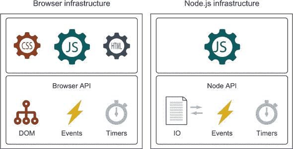

我们将重点关注以下内容：

+   ***文档对象模型 (DOM) —*** DOM 是客户端 Web 应用程序 UI 的结构化表示，至少最初是由 Web 应用的 HTML 代码构建的。要开发出色的应用程序，你不仅需要深入理解核心 JavaScript 机制，还需要研究 DOM 的构建方式 (第二章) 以及如何编写有效代码来操作 DOM (第十二章)。这将使你能够轻松创建高级、高度动态的 UI。

+   ***事件 —*** 大多数 JavaScript 应用程序都是 *事件驱动* 应用程序，这意味着大部分代码都是在响应特定事件的上下文中执行的。事件示例包括网络事件、计时器和用户生成的事件，如点击、鼠标移动、键盘按键等。因此，我们将彻底探讨第十三章 chapter 13 中事件背后的机制。我们将特别关注 *计时器*，它们通常是谜团，但让我们处理复杂编码任务，如长时间计算和流畅动画。

+   ***浏览器 API —*** 为了帮助我们与世界互动，浏览器提供了一个 API，允许我们访问有关设备的信息、本地存储数据或与远程服务器通信。本书中我们将探讨一些这些 API。

精通 JavaScript 编程技能并深入理解浏览器提供的 API 将带你走得很远。但 sooner, rather than later, you’ll run face first into *the browsers* and their various issues and inconsistencies. 在一个完美的世界里，所有浏览器都不会有错误，并且会以一致的方式支持 Web 标准；不幸的是，我们并不生活在这个世界里。

浏览器的质量最近有了很大的提升，但它们仍然存在一些错误、缺失的 API 和浏览器特有的怪癖，我们需要处理这些问题。制定一个全面策略来解决这些浏览器问题，并深入了解它们之间的差异和怪癖，这几乎和掌握 JavaScript 本身一样重要。

当我们编写浏览器应用或用于其中的 JavaScript 库时，选择支持哪些浏览器是一个重要的考虑因素。我们希望支持所有浏览器，但开发和测试资源的限制决定了否则。因此，我们将彻底探讨第十四章中跨浏览器开发的策略。第十四章。

开发有效的、跨浏览器的代码在很大程度上取决于开发者的技能和经验。本书旨在提高这一技能水平，因此让我们通过查看当前的最佳实践来着手进行。

### 1.3\. 使用当前最佳实践

掌握 JavaScript 语言和了解跨浏览器编码问题，是成为一名专家 Web 应用开发者的重要部分，但它们并不是全部。要进入高级别，你还需要展现出许多前开发者证明对编写高质量代码有益的特质。这些特质被称为*最佳实践*，除了语言掌握之外，还包括如下元素：

+   调试技能

+   测试

+   性能分析

在编码时坚持这些实践至关重要，我们将在整本书中使用它们。接下来，让我们考察其中的一些。

#### 1.3.1\. 调试

调试 JavaScript 过去意味着使用`alert`来验证变量的值。幸运的是，调试 JavaScript 代码的能力已经大幅提高，这在很大程度上得益于 Firefox 的 Firebug 开发者扩展的流行。为所有主要浏览器都开发了类似的工具：

+   ***Firebug—*** Firefox 中流行的开发者扩展，它推动了这一进程([`getfirebug.com/`](http://getfirebug.com/))

+   ***Chrome DevTools—*** Chrome 团队开发，用于 Chrome 和 Opera

+   ***Firefox 开发者工具—*** Firefox 团队开发的一个工具

+   ***F12 开发者工具—*** 包含在 Internet Explorer 和 Microsoft Edge 中

+   ***WebKit Inspector—*** Safari 使用的工具

正如你所见，每个主要浏览器都提供了我们可以用来调试我们的 Web 应用的开发者工具。使用 JavaScript 弹窗进行调试的日子已经一去不复返了！

所有这些工具都基于类似的思想，这些思想大多由 Firebug 引入，因此它们提供了类似的功能：探索 DOM、调试 JavaScript、编辑 CSS 样式、跟踪网络事件等。任何一种都能很好地完成任务；使用您浏览器提供的工具，或者在使用中调查 bug 的浏览器中。

此外，您还可以使用其中的一些，例如 Chrome Dev Tools，来调试其他类型的应用程序，如 Node.js 应用。（我们将在附录 B 中介绍一些调试技术。附录 B）

#### 1.3.2\. 测试

在整本书中，我们将应用测试技术来确保示例代码按预期运行，并作为如何测试代码的一般示例。我们将使用的主要测试工具是一个 `assert` 函数，其目的是断言一个前提是正确还是错误。通过指定断言，我们可以检查代码是否按预期运行。

该函数的一般形式如下：

```
assert(condition, message);
```

第一个参数是一个应该为真的条件，第二个参数是在它不为真时将显示的消息。

例如，考虑以下内容：

```
assert(a === 1, "Disaster! a is not 1!");
```

如果变量 `a` 的值不等于 `1`，则断言失败，并显示一个有些过于夸张的消息。

| |
| --- |

##### 注意

`assert` 函数不是语言的标准功能，因此我们将自己在 附录 B 中实现它。

| |
| --- |

#### 1.3.3. 性能分析

另一个重要的实践是性能分析。JavaScript 引擎在 JavaScript 性能方面取得了惊人的进步，但这并不是编写马虎和低效代码的借口。

我们将在本书后面使用如下代码来收集性能信息：

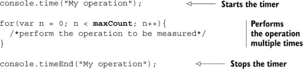

在这里，我们使用内置的 `console` 对象的 `time` 和 `timeEnd` 方法的两次调用将待测代码的执行括起来。

在操作开始执行之前，对 `console.time` 的调用以一个名称（在这种情况下，`My operation`）启动计时器。然后我们运行 `for` 循环中的代码一定次数（在这种情况下，`maxCount` 次）。由于代码的单个操作发生得太快而无法可靠地测量，我们需要多次执行代码以获得可测量的值。通常，这个计数可以是成千上万，甚至数百万，这取决于被测量的代码的性质。一点尝试和错误让我们选择一个合理的值。

当操作结束时，我们使用相同名称的 `console.timeEnd` 方法。这会导致浏览器输出自计时器开始以来经过的时间。

这些最佳实践技术，以及你将在学习过程中了解的其他技术，将极大地提高你的 JavaScript 开发技能。使用浏览器提供的受限资源开发应用程序，结合浏览器功能和兼容性的日益复杂，需要一套强大而完整的技能。

### 1.4. 提高技能迁移性

当鲍勃刚开始学习网页开发时，每个浏览器都有自己解释脚本和 UI 样式的独特方式，宣扬自己的方法是最佳方法，这让每个开发者都感到沮丧。幸运的是，随着 HTML、CSS、DOM API 和 JavaScript 的标准化，浏览器大战终于结束，开发者的关注点转向了有效的跨浏览器 JavaScript 应用。确实，这种将网站视为应用的关注导致了众多想法、工具和技术从桌面应用跨越到 Web 应用。现在，这种知识和工具的迁移再次发生，因为起源于客户端 Web 开发的想法、工具和技术也已经渗透到其他应用领域。

因此，通过核心 API 的知识来深入理解基本的 JavaScript 原则可以使你成为一个更灵活的开发者。通过使用浏览器和 Node.js（一个从浏览器衍生出来的环境），你可以开发几乎任何类型的应用程序：

+   *桌面应用程序*，例如使用 NW.js ([`nwjs.io/`](http://nwjs.io/)) 或 Electron ([`electron.atom.io/`](http://electron.atom.io/))。这些技术通常封装浏览器，这样我们就可以使用标准的 HTML、CSS 和 JavaScript（这样我们就可以依赖我们的核心 JavaScript 和浏览器知识）来构建桌面 UI，并提供了额外的支持，使得我们可以与文件系统交互。我们可以构建真正平台独立的桌面应用程序，在 Windows、Mac 和 Linux 上具有相同的视觉和感觉。

+   *使用框架的移动应用*，例如 Apache Cordova ([`cordova.apache.org/`](https://cordova.apache.org/))。与使用 Web 技术构建的桌面应用类似，移动应用框架使用封装的浏览器，但增加了特定平台的 API，使我们能够与移动平台交互。

+   *使用 Node.js 的 Server-side 应用程序和嵌入式设备应用程序*，Node.js 是一个从浏览器衍生出来的环境，它使用了许多与浏览器相同的底层原则。例如，Node.js 执行 JavaScript 代码并依赖于事件。

安妮不知道她有多幸运（尽管鲍勃有一个相当好的想法）。无论她是否需要构建标准桌面应用程序、移动应用程序、服务器端应用程序，甚至嵌入式应用程序——所有这些类型的应用程序都共享一些标准客户端 Web 应用程序的相同的基本原则。通过理解 JavaScript 的核心机制如何工作，以及理解浏览器提供的核心 API（例如事件，这些事件也与 Node.js 提供的机制有很多共同之处），她可以全面提升她的开发技能。你也是如此。在这个过程中，你将成为一个更全能的开发者，并获得解决各种问题的知识和理解。你甚至能够使用基于云的 AWS Lambda 等服务提供的 JavaScript API 来构建自己的无服务器应用程序，以部署、维护和控制应用程序的云组件。

### 1.5. 概述

+   客户端 Web 应用程序是目前最受欢迎的，曾经仅用于其开发的理念、工具和技术已经渗透到其他应用领域。理解客户端 Web 应用程序的基础将帮助你在广泛的领域开发应用程序。

+   提高你的开发技能，你必须深入理解 JavaScript 的核心机制以及浏览器提供的基础设施。

+   本书重点关注核心 JavaScript 机制，如函数、函数闭包和原型，以及新的 JavaScript 特性，如生成器、承诺、代理、映射、集合和模块。

+   JavaScript 可以在大量环境中执行，但所有这一切开始的地方，以及我们将集中关注的环境，是浏览器。

+   除了 JavaScript 之外，我们还将探索浏览器内部结构，如 DOM（网页 UI 的结构化表示）和事件，因为客户端 Web 应用程序是事件驱动应用程序。

+   我们将带着最佳实践进行这次探索：调试、测试和性能分析。

## 第二章. 在运行时构建页面

*本章涵盖*

+   Web 应用程序生命周期中的步骤

+   处理 HTML 代码以生成网页

+   执行 JavaScript 代码的顺序

+   通过事件实现交互性

+   事件循环

我们的 JavaScript 探索是在客户端 Web 应用程序和浏览器（作为执行 JavaScript 代码的引擎）的背景下进行的。为了有一个强大的基础，继续探索 JavaScript 作为一门语言和浏览器作为平台，我们首先必须理解完整的 Web 应用程序生命周期，特别是我们的 JavaScript 代码如何适应这个生命周期。

在本章中，我们将彻底探讨客户端网络应用程序的生命周期，从页面请求开始，到用户执行的各种交互，直到页面关闭。首先，我们将探索如何通过处理 HTML 代码来构建页面。然后，我们将关注 JavaScript 代码的执行，它为我们的页面增添了必要的动态性。最后，我们将研究如何处理事件，以开发对用户操作做出响应的交互式应用程序。

在这个过程中，我们将探讨一些基本的网络应用程序概念，如 DOM（网页的结构化表示）和事件循环（确定应用程序如何处理事件）。让我们深入探讨！

### 你知道吗？

> **Q1:**
> 
> 浏览器是否总是按照给定的 HTML 准确构建页面？
> 
> **Q2:**
> 
> 网络应用程序一次可以处理多少个事件？
> 
> **Q3:**
> 
> 为什么浏览器必须使用事件队列来处理事件？

### 2.1\. 生命周期概述

典型的客户端网络应用程序的生命周期始于用户在浏览器的地址栏中输入 URL 或点击链接。假设我们想查找一个术语并访问谷歌的主页。我们输入 URL [www.google.com](http://www.google.com)，如图 2.1 上方所示。

##### 图 2.1\. 客户端网络应用程序的生命周期始于用户指定网站地址（或点击链接），并在用户离开网页时结束。它由两个步骤组成：*页面构建* 和 *事件处理*。

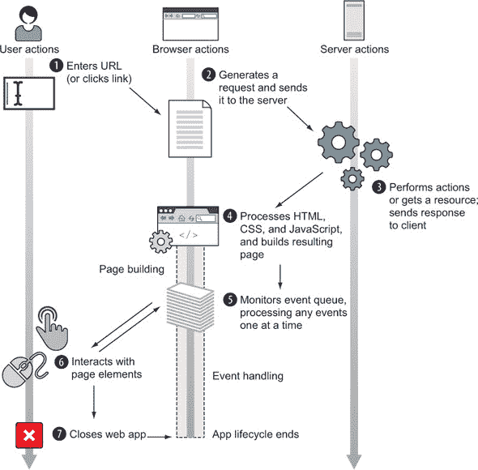

代表用户，浏览器制定一个请求发送到服务器 ，服务器处理请求  并制定一个通常由 HTML、CSS 和 JavaScript 代码组成的响应。当浏览器接收到这个响应  时，我们的客户端网络应用程序真正开始活跃起来。

由于客户端网络应用程序是图形用户界面 (GUI) 应用程序，它们的生命周期遵循与其他 GUI 应用程序（如标准桌面应用程序或移动应用程序）相似的阶段，并在以下两个步骤中执行：

1.  ***页面构建—*** 设置用户界面。

1.  ***事件处理—*** 进入循环  等待事件发生 ，并开始调用事件处理器。

应用程序的生命周期在用户关闭或离开网页  时结束。

现在我们来看一个具有简单 UI 并对用户操作做出响应的示例网络应用程序：每次用户移动鼠标或点击页面时，都会显示一条消息。我们将在这个章节中使用这个应用程序。

##### 列表 2.1\. 带有 GUI 并对事件做出响应的小型网络应用程序

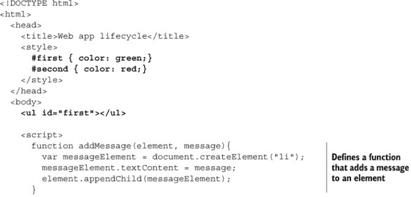

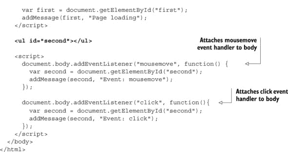

代码列表 2.1 首先定义了两个 CSS 规则，`#first` 和 `#second`，它们指定了具有 ID `first` 和 `second` 的元素的文本颜色（这样我们可以轻松地区分它们）。然后我们定义一个具有 id `first` 的列表元素：

```
<ul id="first"></ul>
```

然后我们定义了一个 `addMessage` 函数，当被调用时，创建一个新的列表项元素，设置其文本内容，并将其追加到一个现有元素中：

```
function addMessage(element, message){
  var messageElement = document.createElement("li");
  messageElement.textContent = message;
  element.appendChild(messageElement);
}
```

接着，我们使用内置的 `getElementById` 方法从文档中获取 ID 为 `first` 的元素，并向其添加一条消息，通知我们页面正在加载：

```
var first = document.getElementById("first");
addMessage(first, "Page loading");
```

接下来我们定义另一个列表元素，现在具有属性 ID `second`：

```
<ul id="second"></ul>
```

最后，我们将两个事件处理器附加到网页的主体上。我们首先从 `mousemove` 事件处理器开始，它在用户移动鼠标时执行，并通过调用 `addMessage` 函数将一条消息 `"Event: mousemove"` 添加到 `second` 列表元素中：

```
document.body.addEventListener("mousemove", function() {
  var second = document.getElementById("second");
  addMessage(second, "Event: mousemove");
});
```

我们还注册了一个 `click` 事件处理器，每当用户点击页面时，都会记录一条消息 `"Event: click"`，也记录到 `second` 列表元素中：

```
document.body.addEventListener("click", function(){
  var second = document.getElementById("second");
  addMessage(second, "Event: click");
});
```

运行和与该应用程序交互的结果显示在图 2.2 中。

##### 图 2.2. 当代码列表 2.1 中的代码运行时，根据用户操作记录消息。

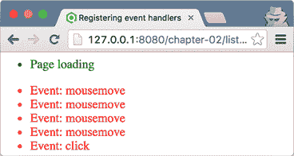

我们将使用这个示例应用程序来探索和说明不同阶段之间的差异。让我们从页面构建阶段开始。

### 2.2. 页面构建阶段

在一个 Web 应用程序可以交互或甚至显示之前，页面必须从从服务器收到的信息（通常是 HTML、CSS 和 JavaScript 代码）构建。页面构建阶段的目标是设置 Web 应用程序的 UI，这是通过两个不同的步骤完成的：

1.  解析 HTML 和构建文档对象模型（DOM）

1.  执行 JavaScript 代码

第一步是在浏览器处理 HTML 节点时执行，第二步是在遇到一种特殊的 HTML 元素——`script` 元素（包含或引用 JavaScript 代码）时执行。在页面构建阶段，浏览器可以根据需要在这两个步骤之间切换，如图 2.3 所示。

##### 图 2.3. 页面构建阶段开始于浏览器接收到页面代码时。它分为两个步骤：解析 HTML 和构建 DOM，以及执行 JavaScript 代码。

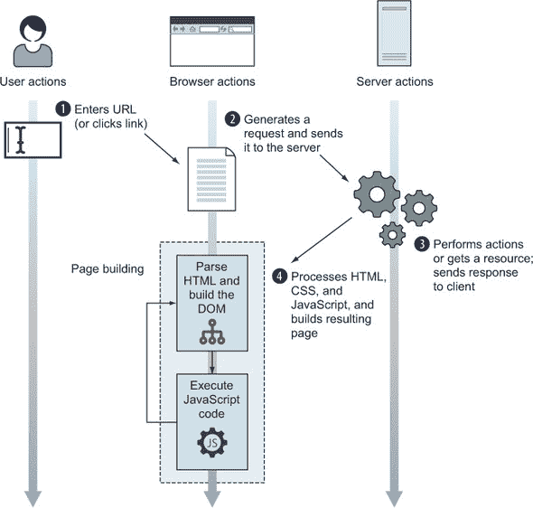

#### 2.2.1. 解析 HTML 和构建 DOM

页面构建阶段始于浏览器接收到 HTML 代码，该代码作为浏览器构建页面 UI 的基础。浏览器通过逐个解析 HTML 代码，并构建一个 DOM，即 HTML 页面的结构化表示，其中每个 HTML 元素都表示为一个节点来完成这一操作。例如，图 2.4 显示了构建到第一个`script`元素时的示例页面 DOM。

##### 图 2.4\. 当浏览器遇到第一个`script`元素时，它已经创建了一个包含多个 HTML 元素的 DOM（右侧的节点）。

![02fig04_alt.jpg]

注意图 2.4 中的节点是如何组织的，使得除了第一个节点（根`html`节点 ![num-01.jpg]）之外，每个节点恰好有一个父节点。例如，`head`节点 ![num-02.jpg] 的父节点是`html`节点 ![num-01.jpg]。同时，一个节点可以有任意数量的子节点。例如，`html`节点 ![num-01.jpg] 有两个子节点：`head`节点 ![num-02.jpg] 和`body`节点 ![num-07.jpg]。同一元素的孩子被称为*兄弟节点*。（`head`节点 ![num-02.jpg] 和`body`节点 ![num-07.jpg] 是兄弟节点。）

需要强调的是，尽管 HTML 和 DOM 紧密相关，DOM 是由 HTML 构建的，但它们并不相同。您应该将 HTML 代码视为浏览器在构建页面初始 DOM（即 UI）时遵循的*蓝图*。浏览器甚至可以修复它在这个蓝图中发现的问题，以创建一个有效的 DOM。让我们考虑图 2.5 中显示的示例。

##### 图 2.5\. 浏览器修复的无效 HTML 示例

![02fig05_alt.jpg]

图 2.5 展示了一个简单的错误 HTML 代码示例，其中段落元素被放置在`head`元素中。`head`元素的本意是用于提供页面的一般信息：例如，页面标题、字符编码和外部样式和脚本。它并不用于定义页面内容，正如这个例子所示。因为这个错误，浏览器通过构建正确的 DOM（如图 2.5 中的右侧所示）来静默地修复它，其中段落元素被放置在`body`元素中，这是页面内容应该放置的地方。

| |
| --- |

**HTML 规范和 DOM 规范**

当前版本的 HTML 是 HTML5，其规范可在[`html.spec.whatwg.org/`](https://html.spec.whatwg.org/)找到。如果您需要更易读的内容，我们推荐 Mozilla 的 HTML5 指南，可在[`developer.mozilla.org/en-US/docs/Web/Guide/HTML/HTML5`](https://developer.mozilla.org/en-US/docs/Web/Guide/HTML/HTML5)找到。

另一方面，DOM 的演变要慢一些。当前版本是 DOM3，其规范可在 [`dom.spec.whatwg.org/`](https://dom.spec.whatwg.org/) 找到。同样，Mozilla 准备了一份报告，可在 [`developer.mozilla.org/en-US/docs/Web/API/Document_Object_Model`](https://developer.mozilla.org/en-US/docs/Web/API/Document_Object_Model) 找到。

|  |
| --- |

在页面构建过程中，浏览器可能会遇到一种特殊的 HTML 元素，即 `script` 元素，它用于包含 JavaScript 代码。当这种情况发生时，浏览器会暂停从 HTML 代码构建 DOM，并开始执行 JavaScript 代码。

#### 2.2.2\. 执行 JavaScript 代码

包含在 `script` 元素中的所有 JavaScript 代码都由浏览器的 JavaScript 引擎执行；例如，Firefox 的 Spidermonkey、Chrome 和 Opera 的 V8，或者 Edge 的 (IE 的) Chakra。由于 JavaScript 代码的主要目的是为页面提供动态性，浏览器通过一个全局对象提供了一个 API，该 API 可以由 JavaScript 引擎用来与页面交互和修改页面。

##### JavaScript 中的全局对象

浏览器向 JavaScript 引擎暴露的主要全局对象是 `window` 对象，它代表了包含网页的窗口。`window` 对象是 *唯一的* 全局对象，通过它所有其他全局对象、全局变量（甚至用户定义的变量）和浏览器 API 都可以访问。全局 `window` 对象的一个重要属性是 `document`，它代表了当前页面的 DOM。通过使用这个对象，JavaScript 代码可以修改页面的 DOM 到任何程度，通过修改或删除现有元素，甚至创建和插入新的元素。

让我们看看 列表 2.1 中的代码片段：

```
var first = document.getElementById("first");
```

这个例子使用全局 `document` 对象从 DOM 中选择具有 ID `first` 的元素并将其分配给变量 `first`。然后我们可以使用 JavaScript 代码对该元素进行各种修改，例如更改其文本内容、修改其属性、动态创建并添加新的子元素，甚至从 DOM 中删除该元素。

|  |
| --- |

**浏览器 API**

在整本书中，我们使用了许多浏览器内置对象和函数（例如，`window` 和 `document`）。不幸的是，涵盖浏览器支持的所有内容超出了 JavaScript 书籍的范围。幸运的是，Mozilla 再次为我们提供了支持，在 [`developer.mozilla.org/en-US/docs/Web/API`](https://developer.mozilla.org/en-US/docs/Web/API) 上，你可以找到 Web API 接口的当前状态。

|  |
| --- |

在了解了浏览器提供的全局对象的基本知识之后，让我们看看两种不同类型的 JavaScript 代码，它们定义了代码的确切执行时间。

##### 不同类型的 JavaScript 代码

我们广泛区分两种不同的 JavaScript 代码类型：*全局代码* 和 *函数代码*。以下列表将帮助您理解这两种类型代码之间的差异。

##### 列表 2.2\. 全局和函数 JavaScript 代码

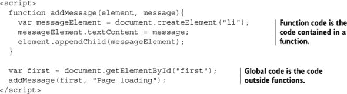

这两种类型代码之间的主要区别在于它们的放置位置：函数中包含的代码称为 *函数代码*，而放置在所有函数之外的代码称为 *全局代码*。

这两种代码类型在执行上也有所不同（你将在后面看到一些额外的差异，尤其是在 第五章 中）。全局代码由 JavaScript 引擎自动按顺序逐行执行，就像遇到它时那样。例如，在 列表 2.2 中，定义 `addMessage` 函数的全局代码使用内置的 `getElementById` 方法获取 ID 为 `first` 的元素并调用 `addMessage` 函数；它们按顺序遇到时执行，如图 2.6 所示。

##### 图 2.6\. 执行 JavaScript 代码时的程序执行流程

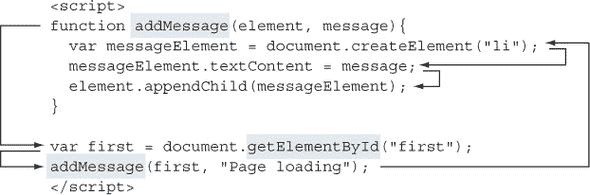

另一方面，函数代码为了执行，必须被其他东西调用：要么是全局代码（例如，全局代码中的 `addMessage` 函数调用导致 `addMessage` 函数代码的执行），要么是其他函数，或者由浏览器（很快就会详细介绍）。

##### 在页面构建阶段执行 JavaScript 代码

当浏览器在页面构建阶段到达 `script` 节点时，它会暂停基于 HTML 代码的 DOM 构建并开始执行 JavaScript 代码。这意味着执行 `script` 元素中包含的全球 JavaScript 代码（以及由全球代码调用的函数也会执行）。让我们回到 列表 2.1 的例子。

图 2.7 展示了全局 JavaScript 代码执行后的 DOM 状态。让我们慢慢分析其执行过程。首先定义一个函数 `addMessage`：

```
function addMessage(element, message){
  var messageElement = document.createElement("li");
  messageElement.textContent = message;
  element.appendChild(messageElement);
 }
```

##### 图 2.7\. 执行 `script` 元素中包含的 JavaScript 代码后的页面 DOM

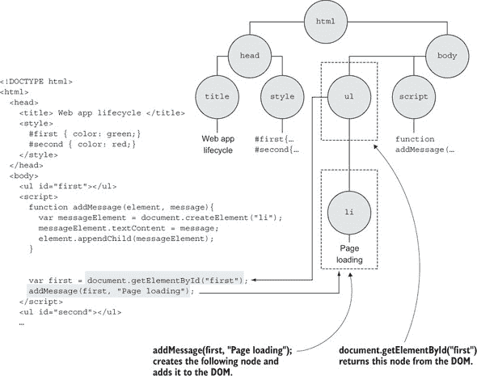

然后使用全局 `document` 对象及其 `getElementById` 方法从 DOM 中获取现有元素：

```
var first = document.getElementById("first");
```

这之后是对 `addMessage` 函数的调用

```
addMessage(first, "Page loading");
```

这会导致创建一个新的 `li` 元素，修改其文本内容，并将其最终插入到 DOM 中。

在这个例子中，JavaScript 代码通过创建一个新元素并将其插入到 DOM 中来修改当前 DOM。但一般来说，JavaScript 代码可以修改 DOM 到任何程度：它可以创建新节点，修改或删除现有的 DOM 节点。但也有一些它做不到的事情，例如选择和修改尚未创建的元素。例如，我们无法选择和修改具有 ID `second` 的 `ul` 元素，因为该元素是在当前 `script` 节点之后找到的，尚未到达并创建。这就是人们倾向于将 `script` 元素放在页面底部的原因之一。这样，我们就不必担心特定的 HTML 元素是否已经被到达。

当 JavaScript 引擎执行 `script` 元素中最后一行 JavaScript 代码（在 图 2.5 中，这意味着从 `addMessage` 函数返回），浏览器退出 JavaScript 执行模式，并继续通过处理剩余的 HTML 代码来构建 DOM 节点。如果在处理过程中，浏览器再次遇到 `script` 元素，则从 HTML 代码创建 DOM 再次暂停，JavaScript 运行时开始执行包含的 JavaScript 代码。重要的是要注意，在此期间 JavaScript 应用程序的全球状态持续存在。在单个 `script` 元素中执行 JavaScript 代码期间创建的所有用户定义的全局变量通常都可以在其他 `script` 元素中的 JavaScript 代码中访问。这是因为存储所有全局 JavaScript 变量的全局 `window` 对象在整个页面生命周期中都是活跃且可访问的。

这两个步骤

1.  从 HTML 构建 DOM

1.  执行 JavaScript 代码

只要还有要处理的 HTML 元素和要执行的 JavaScript 代码，这两个步骤就会重复。

最后，当浏览器处理完所有 HTML 元素后，页面构建阶段就完成了。然后，浏览器继续进入 Web 应用程序生命周期的第二部分：*事件处理*。

### 2.3\. 事件处理

客户端 Web 应用程序是 GUI 应用程序，这意味着它们会对不同类型的事件做出反应：鼠标移动、点击、键盘按键等。因此，在页面构建阶段执行的 JavaScript 代码，除了影响全局应用程序状态和修改 DOM 之外，还可以注册事件监听器（或处理程序）：当事件发生时由浏览器执行的功能。通过这些事件处理程序，我们为我们的应用程序提供交互性。但在深入了解注册事件处理程序之前，让我们先了解一下事件处理背后的基本思想。

#### 2.3.1\. 事件处理概述

浏览器执行环境的核心思想是：一次只能执行一段代码：所谓的*单线程*执行模型。想象一下银行排队。每个人都排成单行，必须等待轮到自己被柜员“处理”。但使用 JavaScript 时，只有一个柜员窗口是开放的！客户（事件）在轮到他们时才会被处理，一次只处理一个。只需一个人认为在柜员窗口时做整个财年的财务规划是合适的（我们都有遇到过这种情况！）就会让整个流程变得混乱。

每当发生事件时，浏览器都应该执行相关的事件处理函数。但我们无法保证用户有极大的耐心，总是在触发另一个事件之前等待适当的时间。因此，浏览器需要一种方式来跟踪已经发生但尚未处理的事件。为此，浏览器使用一个*事件队列*，如图 2.8 所示。

##### 图 2.8。在事件处理阶段，所有事件（无论是来自用户，如鼠标点击和按键，还是来自服务器，如 Ajax 事件）都会在发生时排队，并按照执行的单线程顺序进行处理。

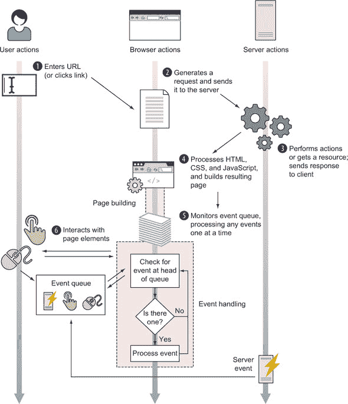

所有的生成事件（无论是用户生成的，如鼠标移动或按键，还是服务器生成的，如 Ajax 事件）都会按照浏览器检测到的顺序放入同一个事件队列中。如图 2.8 的中间部分所示，事件处理过程可以用一个简单的流程图来描述：

+   浏览器检查事件队列的头部。

+   如果没有事件，浏览器会持续检查。

+   如果事件队列的头部有事件，浏览器会取走它并执行相关处理程序（如果有的话）。在执行过程中，其余的事件会耐心地等待在事件队列中，等待轮到自己被处理。

由于一次只能处理一个事件，我们必须格外注意处理事件所需的时间；编写执行时间很长的处理程序会导致 Web 应用无响应！（如果这听起来有点模糊，不要担心；我们将在第十三章 chapter 13 中回到事件循环，并确切地了解它如何影响 Web 应用的感知性能）。

重要的是要注意，将事件*放入*队列的浏览器机制是独立于页面构建和事件处理阶段的。确定事件何时发生并将它们推入事件队列所需的处理不参与处理事件的线程。

##### 事件是异步的

当事件发生时，它们可能在不可预测的时间和顺序中发生（强制用户以特定顺序按键或点击是有点棘手的）。我们说事件的处理，以及因此调用其处理函数，是*异步的*。

以下类型的事件可能发生，等等：

+   浏览器事件，例如页面加载完成或即将卸载时

+   网络事件，例如来自服务器的响应（Ajax 事件，服务器端事件）

+   用户事件，例如鼠标点击、鼠标移动和按键

+   定时器事件，例如超时到期或间隔触发

大多数代码都是由于此类事件而执行的！

事件处理的概念是网络应用的核心，你将在本书的示例中反复看到：代码是在事先设置好以便在稍后执行。除了全局代码外，我们放置在页面上的绝大多数代码都将作为某些事件的结果执行。

在事件可以被处理之前，我们的代码必须通知浏览器我们感兴趣处理特定事件。让我们看看如何注册事件处理器。

#### 2.3.2\. 注册事件处理器

正如我们已经提到的，事件处理器是我们希望在特定事件发生时执行的函数。为了实现这一点，我们必须通知浏览器我们对事件感兴趣。这被称为*事件处理器注册*。在客户端网络应用中，有两种方式可以注册事件：

+   通过将函数分配给特殊属性

+   通过使用内置的`addEventListener`方法

例如，编写以下代码将函数分配给`window`对象的特殊`onload`属性：

```
window.onload = function(){};
```

为`load`事件（当 DOM 准备就绪且完全构建时）注册了事件处理器。（如果赋值操作符右侧的符号看起来有点奇怪，请不要担心；我们将在后面的章节中详细讨论函数。）同样，如果我们想在文档的`body`上注册`click`事件的处理器，我们可以写类似以下的内容：

```
document.body.onclick = function(){};
```

将函数分配给特殊属性是注册事件处理器的一种简单直接的方法，你可能已经遇到过。但我们不建议你以这种方式注册事件处理器，因为这样做有一个缺点：只能为特定事件注册一个函数处理器。这意味着很容易覆盖先前的事件处理器函数，这可能会有些令人沮丧。幸运的是，有一个替代方案：`addEventListener`方法使我们能够注册所需数量的事件处理器函数。为了给你一个例子，以下列表回到列表 2.1 的示例摘录。

##### 列表 2.3\. 注册事件处理器


这个例子使用 HTML 元素上的内置`addEventListener`方法来指定事件类型（`mousemove`或`click`）和事件处理器函数。这意味着每当鼠标移动到页面上时，浏览器都会调用一个函数，将消息`"Event: mousemove"`添加到 ID 为`second`的列表元素中（当点击主体时，向同一元素添加类似的消息`"Event: click"`）。

现在你已经知道了如何设置事件处理器，让我们回顾一下你之前看到的简单流程图，并更仔细地看看事件是如何被处理的。

#### 2.3.3\. 处理事件

事件处理背后的主要思想是，当事件发生时，浏览器调用相关的事件处理器。正如我们之前提到的，由于单线程执行模型，一次只能执行一个事件处理器。任何后续的事件都只有在当前事件处理器完全执行完毕后才会被处理！

让我们回到列表 2.1 的应用。展示了用户快速移动并点击鼠标的一个示例执行过程。

##### ![图 2.9\. 事件处理阶段的示例，其中处理了两个事件—`mousemove`和`click`]

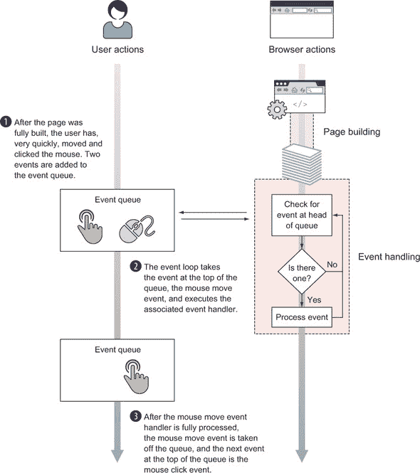

让我们来看看这里发生了什么。作为对这些用户行为的响应，浏览器按照它们发生的顺序将`mousemove`和`click`事件放入事件队列中：首先是`mousemove`事件，然后是`click`事件。

在事件处理阶段，事件循环随后检查队列，看到队列前面有一个`mousemove`事件，并执行相关的事件处理器。当`mousemove`处理器正在处理时，`click`事件在队列中等待它的轮次。当`mousemove`处理器函数的最后一行执行完毕并且 JavaScript 引擎退出处理器函数后，`mousemove`事件就被完全处理，事件循环再次检查队列。这次，在队列前面，事件循环找到了`click`事件并处理它。一旦`click`处理器执行完成，队列中没有新的事件，事件循环继续循环，等待处理新事件。这个循环将一直执行，直到用户关闭 Web 应用。

现在我们对事件处理阶段发生的整体步骤有了感觉，让我们看看这个执行是如何影响 DOM 的（图 2.10）。`mousemove`处理器的执行选择了 ID 为`second`的第二个列表元素，并通过使用`addMessage`函数，添加了一个新的列表项元素，其文本为`"Event: mousemove"`。一旦`mousemove`处理器的执行完成，事件循环执行`click`处理器，这导致创建另一个列表项元素，该元素也被添加到 ID 为`second`的第二个列表元素中。

##### 图 2.10. 处理了`mousemove`和`click`事件后的示例应用的 DOM

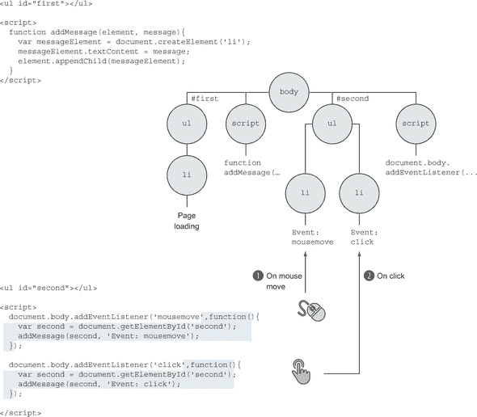

带着对客户端 Web 应用生命周期的扎实理解，在本书的下一部分，我们将开始关注 JavaScript 语言，通过学习函数的细节来深入了解。 

### 2.4. 概述

+   浏览器接收到的 HTML 代码用作创建 DOM 的蓝图，DOM 是客户端 Web 应用结构的内部表示。

+   我们使用 JavaScript 代码动态修改 DOM，为 Web 应用带来动态行为。

+   客户端 Web 应用的执行分为两个阶段：

    +   ***页面构建—*** 处理 HTML 代码以创建 DOM，并在遇到脚本节点时执行全局 JavaScript 代码。在执行过程中，JavaScript 代码可以修改当前 DOM 到任何程度，甚至可以注册事件处理程序—在特定事件发生时执行（例如，鼠标点击或键盘按键）。注册事件处理程序很简单：使用内置的`addEventListener`方法。

    +   ***事件处理—*** 各种事件按它们生成的顺序逐个处理。事件处理阶段高度依赖于事件队列，其中所有事件都按它们发生的顺序存储。事件循环始终检查队列的顶部以查找事件，如果找到事件，则调用匹配的事件处理函数。

### 2.5. 练习

> **1**
> 
> 客户端 Web 应用的生命周期中有哪两个阶段？
> 
> **2**
> 
> 使用`addEventListener`方法注册事件处理程序与将处理程序分配给特定元素属性相比，主要优势是什么？
> 
> **3**
> 
> 一次可以处理多少个事件？
> 
> **4**
> 
> 事件队列中的事件是按什么顺序处理的？
