## 第二部分\. 理解函数

现在你已经做好了心理准备，并且理解了 JavaScript 代码执行的 环境，你就可以学习 JavaScript 为你提供的功能基础了。

在第三章中，你将了解 JavaScript 最重要的基本概念：不是对象，而是函数。本章将教你为什么理解 JavaScript 函数是解锁语言秘密的关键。

第四章通过研究函数的调用以及执行函数代码时可以访问的所有隐式参数的来龙去脉，继续深入探索函数。

第五章 通过闭包将函数提升到新的层次——这可能是 JavaScript 语言中最被误解（甚至未知）的方面之一。正如你很快就会看到的，闭包与作用域紧密相关。在本章中，除了闭包之外，我们还特别关注 JavaScript 中的作用域机制。

我们对函数的探索将在第六章中完成，我们将讨论一种全新的函数类型——生成器函数，它具有一些特殊属性，在处理异步代码时特别有用。

## 第三章\. 新手的优先级函数：定义和参数

*本章涵盖*

+   理解函数为什么如此关键

+   函数是如何成为一等对象的

+   定义函数的方法

+   参数分配的秘密

当你翻到这本书关于 JavaScript 基础的部分时，可能会感到惊讶，讨论的第一个主题是*函数*而不是*对象*。我们当然会在书的第三部分第三部分中详细讨论对象，但归根结底，编写 JavaScript 代码与编写 JavaScript 忍者代码之间的主要区别在于理解 JavaScript 作为一种*函数式语言*。你将在 JavaScript 中编写的所有代码的复杂程度都取决于这一认识。

如果你正在阅读这本书，你不是一个初学者。我们假设你足够了解对象基础来应对（我们将在第七章中查看更高级的对象概念），但真正理解 JavaScript 中的函数是你能使用的最重要的武器。事实上，如此重要，以至于本章以及接下来的三个章节都致力于彻底理解 JavaScript 中的函数。

最重要的是，在 JavaScript 中，函数是一等对象，或者如人们常说的*一等公民*。它们与其他 JavaScript 对象共存，并且可以像其他 JavaScript 对象一样被对待。就像更平凡的 JavaScript 数据类型一样，它们可以通过变量引用，用字面量声明，甚至作为函数参数传递。在本章中，我们将首先探讨这种对函数的定位带来的差异，你将看到这如何帮助我们编写更紧凑、更易于理解的代码，通过允许我们在需要的地方定义函数。我们还将探讨如何利用函数作为一等对象来编写性能更好的函数。你将看到定义函数的各种方法，甚至包括一些新类型，如*箭头*函数，这将帮助你编写更优雅的代码。最后，我们将探讨函数参数和函数参数之间的区别，特别关注 ES6 新增的功能，如剩余参数和默认参数。

让我们从探讨函数编程的一些好处开始。

### 你知道吗？

> **Q1:**
> 
> 在什么情况下回调函数可能会同步使用？异步使用？
> 
> **Q2:**
> 
> 箭头函数和函数表达式之间的区别是什么？
> 
> **Q3:**
> 
> 为什么你可能需要在函数中使用默认参数值？

### 3.1\. 功能差异是什么？

函数和函数概念在 JavaScript 中如此重要的一个原因是函数是执行的主要模块单元。除了在页面构建阶段执行的全球 JavaScript 代码外，我们将为我们的页面编写的所有脚本代码都将在一个函数内部。

由于我们的大部分代码都将作为函数调用的结果运行，你会发现拥有灵活且强大的函数构造给我们编写代码带来了极大的灵活性和影响力。本书的很大一部分内容解释了如何利用函数作为一等对象的本质，以获得巨大的好处。但首先，让我们看看我们可以用对象执行的一些操作。在 JavaScript 中，对象享有某些能力：

+   它们可以通过字面量创建：`{}`

+   它们可以被分配给变量、数组条目和其他对象的属性：

    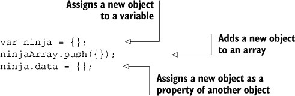

+   它们可以作为参数传递给函数：

    

+   它们可以作为函数的返回值：

    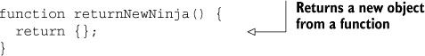

+   它们可以拥有可以动态创建和分配的属性：

    

结果表明，与许多其他编程语言不同，在 JavaScript 中，我们可以用函数做几乎完全相同的事情。

#### 3.1.1\. 函数作为一等对象

JavaScript 中的函数具有所有对象的能力，因此它们在语言中像任何其他对象一样被对待。我们说函数是*一等*对象，它们也可以被

+   通过字面量创建

    ```
    function ninjaFunction() {}
    ```

+   分配给变量、数组条目和其他对象的属性

    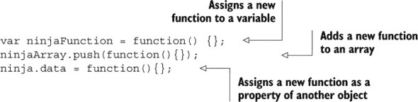

+   作为参数传递给其他函数

    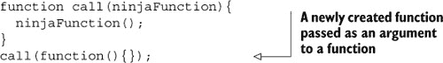

+   函数返回的值

    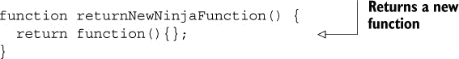

+   它们可以拥有可以动态创建和分配的属性：

    

我们可以用函数做任何可以用对象做的事情。函数*就是*对象，只是具有额外的、特殊的能力，即*可调用性*：函数可以被调用或调用以执行某个操作。

| |
| --- |

**JavaScript 中的函数式编程**

将函数作为一等对象是迈向*函数式编程*的第一步，这是一种专注于通过组合函数（而不是像主流的命令式编程那样指定一系列步骤）来解决问题的编程风格。函数式编程可以帮助我们编写更容易测试、扩展和模块化的代码。但这是一个很大的主题，在这本书中我们只是简要地提到了它（例如，在第九章[kindle_split_021.html#ch09]）。如果你对学习如何利用函数式编程的概念并将其应用于 JavaScript 程序感兴趣，我们推荐 Luis Atencio 的《JavaScript 函数式编程》（Manning，2016），可在[www.manning.com/books/functional-programming-in-javascript](http://www.manning.com/books/functional-programming-in-javascript)找到。

| |
| --- |

一等对象的一个特点是它们可以作为参数传递给函数。在函数的情况下，这意味着我们传递一个函数作为参数给另一个函数，该函数可能在应用程序执行过程中的某个时刻调用传入的函数。这是一个更一般概念——回调函数——的例子。让我们探讨这个重要概念。

#### 3.1.2. 回调函数

每当我们设置一个函数以便在以后的时间被调用，无论是浏览器在事件处理阶段还是其他代码，我们都是在设置一个*回调*。这个术语来源于我们正在建立一个函数，其他代码将在适当的执行点“回调”这个函数。

回调是有效使用 JavaScript 的一个基本部分，我们敢打赌你已经在你的代码中大量使用了它们——无论是执行按钮点击时的代码、从服务器接收数据，还是动画化 UI 的某些部分。

在本节中，我们将探讨如何使用回调来处理事件或轻松地对集合进行排序——这是回调在现实世界中使用的典型例子。但这有点复杂，所以在深入之前，让我们将回调概念完全剥离开来，以最简单的形式来审视它。我们将从一个接受另一个函数引用作为参数并作为回调调用该函数的无用函数的例子开始：

```
function useless(ninjaCallback) {
  return ninjaCallback();
}
```

尽管这个函数毫无用处，但它展示了将函数作为参数传递给另一个函数，并随后通过传递的参数调用该函数的能力。

我们可以使用以下列表中的代码来测试这个无用的函数。

##### 列表 3.1\. 一个简单的回调示例

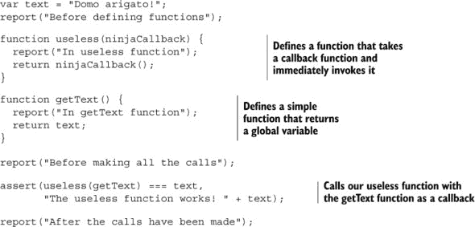

在这个列表中，我们使用自定义的 `report` 函数在代码执行过程中输出几条消息，这样我们就可以跟踪程序的执行。我们还使用了我们在第一章中提到的 `assert` 测试函数。`assert` 函数通常接受两个参数。第一个参数是一个断言前提的表达式。在这种情况下，我们想要确定调用我们的 `useless` 函数并传递参数 `getText` 返回的值是否等于变量 `text` 的值（`useless(getText) === text`）。如果第一个参数评估为 `true`，则断言通过；否则，被视为失败。第二个参数是相关的消息，通常与适当的通过/失败指示器一起记录。(附录 C 讨论了测试的一般情况，以及我们自己的 `assert` 和 `report` 函数的小型实现）。

当我们运行这段代码时，最终得到图 3.1 中所示的结果。如图所示，使用我们的 `getText` 回调函数作为参数调用 `useless` 函数返回了预期的值。

##### 图 3.1\. 运行列表 3.1 中代码的结果

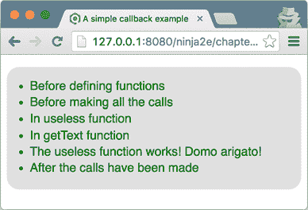

我们还可以查看这个简单的回调示例是如何具体执行的。如图 3.2(#ch03fig02)所示，我们将 `getText` 函数作为参数传递给 `useless` 函数。这意味着在 `useless` 函数的体内，可以通过 `callback` 参数引用 `getText` 函数。然后，通过调用 `callback()`，我们导致 `getText` 函数的执行；我们作为参数传递的 `getText` 函数被 `useless` 函数回调。

##### 图 3.2\. 执行 `useless(getText)` 调用时的执行流程。`useless` 函数以 `getText` 作为参数被调用。在 `useless` 函数的体内有一个对传入函数的调用，这在本例中触发了 `getText` 函数的执行（我们“回调”到 `getText` 函数）。

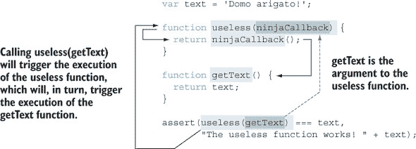

这很简单，因为 JavaScript 的函数式特性让我们可以像处理一等对象一样处理函数。我们甚至可以更进一步，通过以下方式重写我们的代码：

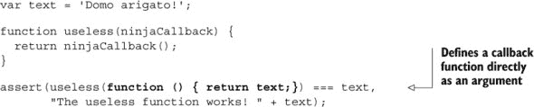

JavaScript 最重要的特性之一是能够在代码的任何位置创建函数，只要表达式可以出现的地方。除了使代码更加紧凑和易于理解（通过将函数定义放置在它们被使用的地方附近），这个特性还可以在函数不会在代码的多个地方被引用时，消除污染全局命名空间中不必要的名称的需求。

在先前的回调示例中，我们调用了自己的回调。但回调也可以由浏览器调用。回想一下第二章，其中有一个包含以下片段的示例：

```
document.body.addEventListener("mousemove", function() {
  var second = document.getElementById("second");
  addMessage(second, "Event: mousemove");
});
```

这也是一个回调函数，它被定义为`mousemove`事件的处理器，并且当该事件发生时，浏览器会调用它。

| |
| --- |

##### 注意

本节介绍了回调函数作为其他代码将在适当的执行点“回调”的函数。您已经看到了一个例子，其中我们的代码立即调用了提供的回调（`useless`函数示例），以及一个例子，其中浏览器在特定事件发生时进行调用（`mousemove`示例）。重要的是要注意，与我们的不同，有些人认为回调必须异步调用，因此第一个例子并不是真正的回调。我们只是提到这一点，以防您遇到一些热烈的讨论。

| |
| --- |

现在让我们考虑一个回调的使用，这将极大地简化我们排序集合的方式。

##### 使用比较器进行排序

几乎在我们拥有数据集合的同时，我们很可能会需要对其进行排序。假设我们有一个随机排序的数字数组：0, 3, 2, 5, 7, 4, 8, 1。这种顺序可能很好，但很可能会在某个时候想要重新排列它。

通常，实现排序算法并不是编程任务中最简单的；我们必须选择最适合当前任务的算法，实现它，适应我们的当前需求（以便项目按特定顺序排序），并且要小心不要引入错误。在这些任务中，唯一与特定应用相关的就是排序顺序。幸运的是，所有 JavaScript 数组都可以访问`sort`方法，它只需要我们定义一个比较算法，告诉排序算法如何对值进行排序。

这就是回调介入的地方！我们不会让排序算法决定哪些值应该排在其他值之前，*我们*将提供一个执行比较的函数。我们将给排序算法提供访问这个函数作为回调的权限，算法将在需要比较时调用回调。回调预期返回一个正数，如果传递的值的顺序应该被反转，返回一个负数，如果不应该反转，返回零，如果值相等；从比较的值中减去产生所需的返回值以对数组进行排序：

```
var values = [0, 3, 2, 5, 7, 4, 8, 1];

values.sort(function(value1, value2){
  return value1 - value2;
});
```

没有必要考虑排序算法的低级细节（甚至不需要选择哪种排序算法）。我们提供了一个回调函数，JavaScript 引擎将在需要比较两个项目时调用它。

功能性方法允许我们创建一个作为独立实体的函数，就像我们可以创建任何其他对象类型一样，并且可以将它作为参数传递给一个方法，就像任何其他对象类型一样，该方法可以将其作为参数接受，就像任何其他对象类型一样。这就是一等公民地位发挥作用的地方。

### 3.2. 函数作为对象的乐趣

在本节中，我们将探讨利用函数与其他对象类型共享的相似性的方法。一个可能令人惊讶的能力是，没有任何阻止我们将属性附加到函数上：


让我们看看使用这种能力可以做的几件更有趣的事情：

+   *将函数存储在集合中*使我们能够轻松管理相关的函数——例如，当发生某些感兴趣的事情时必须调用的回调函数。

+   *记忆化*允许函数记住之前计算过的值，从而提高后续调用的性能。

让我们开始吧。

#### 3.2.1. 存储函数

在某些情况下（例如，当我们需要管理在发生特定事件时应该调用的回调函数集合时），我们希望存储一组独特的函数。向此类集合添加函数时，我们可能面临的一个挑战是确定哪些函数是集合中的新函数，应该添加，哪些函数已经存在，不应该添加。通常，在管理回调函数集合时，我们不希望有任何重复，因为单个事件会导致对同一回调函数的多次调用。

一种明显但天真技术是将所有函数存储在数组中，然后遍历数组，检查重复的函数。不幸的是，这表现不佳，作为一个忍者，我们希望事情能够**良好**地工作，而不仅仅是工作。我们可以使用函数属性以适当的复杂度实现这一点，如下一列表所示。

##### 列表 3.2. 存储一组独特的函数

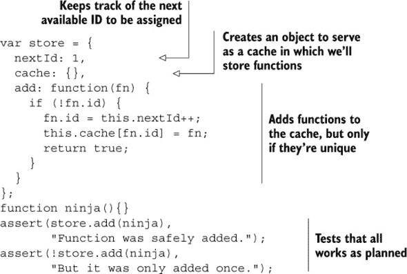

在这个列表中，我们创建了一个对象，分配给变量`store`，我们将在这个对象中存储一组独特的函数。这个对象有两个数据属性：一个用于存储下一个可用的`id`值，另一个用于在其中`缓存`存储的函数。函数通过`add()`方法添加到这个缓存中：

```
add: function(fn) {
  if (!fn.id) {
    fn.id = this.nextId++;
    this.cache[fn.id] = fn;
    return true;
  }
 ...
```

在`add`函数内部，我们首先检查函数是否已经被添加到集合中，通过查找`id`属性的存在来确认。如果当前函数有一个`id`属性，我们假设该函数已经被处理，并忽略它。否则，我们将一个`id`属性分配给函数（同时递增`nextId`属性），并将函数作为`cache`的属性添加，使用`id`值作为属性名。然后我们返回值`true`，这样我们就可以在调用`add()`之后知道函数何时被添加。

在浏览器中运行页面显示，当我们的测试尝试两次添加`ninja()`函数时，函数只被添加了一次，如图 3.3 所示。第九章展示了利用集合和 ES6 中可用的新类型对象集的更佳技术来处理唯一项集合。

##### 图 3.3。通过将一个属性附加到一个函数上，我们可以跟踪它。这样，我们可以确保我们的函数只被添加了一次。

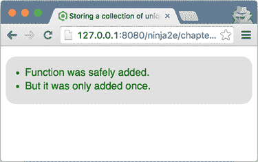

当使用函数属性时，我们可以从袖子里拿出另一个有用的技巧，那就是给函数赋予修改自己的能力。这项技术可以用来记住之前计算过的值，在未来的计算中节省时间。

#### 3.2.2. 自记忆化函数

如前所述，*记忆化*（不，这不是一个打字错误）是构建一个能够记住之前计算值的函数的过程。简而言之，每当函数计算其结果时，我们都会将结果存储在函数参数旁边。这样，当另一个调用发生，并且参数相同，我们可以返回之前存储的结果，而不是重新计算。这可以通过避免已经执行的无用复杂计算来显著提高性能。记忆化在执行动画计算、搜索不经常变化的数据或任何耗时数学计算时特别有用。

例如，让我们看看一个简单（当然，也绝不是特别高效）的算法，用于计算素数。虽然这是一个复杂计算的简单示例，但这种技术可以轻松应用于其他复杂的计算（例如，计算字符串的 MD5 散列），而这些计算过于复杂，无法在此展示。

从外部看，这个函数看起来就像任何正常函数一样，但我们将秘密地构建一个答案缓存，其中函数将保存它执行的计算的答案。请查看以下代码。

##### 列表 3.3. 记忆化之前计算过的值

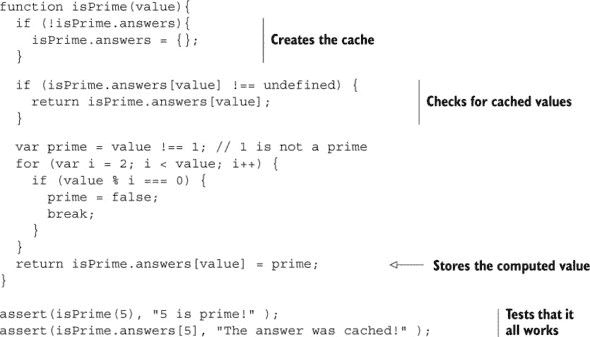

在`isPrime`函数内部，我们首先检查我们将用作缓存的`answers`属性是否已经创建，如果没有，我们创建它：

```
if (!isPrime.answers) {
    isPrime.answers = {};
}
```

这个最初为空的对象的创建只会发生在对函数的第一次调用中；之后，缓存将存在。

然后我们检查传递的值的计算结果是否已经缓存在了`answers`中：

```
if (isPrime.answers[value] !== undefined) {
  return isPrime.answers[value];
}
```

在这个缓存中，我们将使用`value`作为属性键来存储计算出的答案（`true`或`false`）。如果我们找到缓存的答案，我们就返回它。

如果找不到缓存的值，我们将继续执行所需的计算以确定该值是否为`质数`（对于较大的值，这可能是一项昂贵的操作），并在返回时将其结果存储在缓存中：

```
return isPrime.answers[value] = prime;
```

我们的缓存是函数本身的属性，因此只要函数本身存在，它就会保持活跃。

最后，我们测试一下缓存是否正常工作！

```
assert(isPrime(5), "5 is prime!" );
assert(isPrime.answers[5], "The answer was cached!" );
```

这种方法有两个主要优点：

+   最终用户在请求之前已计算过的函数值时，会享受到性能上的好处。

+   这一切都在幕后无缝进行；既不需要最终用户也不需要页面作者执行任何特殊请求或进行任何额外的初始化，以便使其正常工作。

但并非一切都如此美好；它的缺点可能需要权衡其优点：

+   任何形式的缓存都会牺牲内存以换取性能。

+   纯粹主义者可能会认为缓存是一个不应该与业务逻辑混合的问题；一个函数或方法应该只做一件事，并且做好。但别担心；在第八章中，你将看到如何处理这种抱怨。

+   对于这种类型的算法，很难进行负载测试或测量其性能，因为我们的结果取决于函数的先前输入。

现在你已经看到了一些一等函数的实际用例，让我们来探讨定义函数的各种方式。

### 3.3. 定义函数

JavaScript 函数通常通过使用*函数字面量*来定义，它以与例如，数字字面量创建数字值相同的方式创建函数值。记住，作为一等对象，函数是可以在语言中使用，就像其他值一样，例如字符串和数字。而且无论你是否意识到，你一直在这样做。

JavaScript 提供了几种定义函数的方法，可以分为四组：

+   *函数声明*和*函数表达式*——定义函数最常见且细微不同的两种方式。人们通常甚至不把它们视为不同的，但正如你将看到的，了解它们之间的差异可以帮助我们理解何时我们的函数可以调用：

    ```
    function myFun(){ return 1;}
    ```

+   *箭头函数*（通常称为*lambda 函数*）——JavaScript 标准中最近添加的 ES6 功能，使我们能够用更少的语法冗余来定义函数。它们甚至解决了回调函数的一个常见问题，但关于这一点稍后会更详细地讨论：

    ```
    myArg => myArg*2
    ```

+   ***函数构造函数—*** 一种不太常用的定义函数的方式，使我们能够从字符串动态构造一个新函数，该字符串也可以动态生成。以下示例动态创建了一个具有两个参数`a`和`b`的函数，该函数返回这两个参数的和：

    ```
    new Function('a', 'b', 'return a + b')
    ```

+   ***生成器函数—*** 这是 JavaScript 中 ES6 的添加，使我们能够创建函数，与普通函数不同，可以在应用程序执行过程中退出并在稍后重新进入，同时保持这些变量在这些重新进入中的值。我们可以定义*函数声明*、*函数表达式*和*函数构造函数*的生成器版本：

    ```
    function* myGen(){ yield 1; }
    ```

理解这些差异非常重要，因为函数的定义方式显著影响函数何时可以被调用以及它的行为，以及可以在哪个对象上调用函数。

在本章中，我们将探讨函数声明、函数表达式和箭头函数。你将学习它们的语法以及它们是如何工作的，并且我们将在整本书中多次回到它们，以探讨它们的细节。另一方面，生成器函数相当独特，与标准函数有显著的不同。我们将在第六章中详细回顾它们。第六章。

这就留下了函数构造函数，这是一个 JavaScript 特性，我们将完全跳过。尽管它有一些有趣的应用，尤其是在动态创建和评估代码时，但我们认为它是 JavaScript 语言的边缘特性。如果你想了解更多关于函数构造函数的信息，请访问[`mng.bz/ZN8e`](http://mng.bz/ZN8e)。

让我们从最简单、最传统的方式来定义函数开始：*函数声明*和*函数表达式*。

#### 3.3.1\. 函数声明和函数表达式

在 JavaScript 中定义函数的两种最常见的方式是使用函数声明和函数表达式。这两种技术非常相似，以至于我们经常甚至不区分它们，但正如你将在以下章节中看到的，存在细微的差异。

##### 函数声明

在 JavaScript 中定义函数最基本的方式是使用函数声明（参见图 3.4）。正如你所看到的，每个函数声明都以一个强制性的`function`关键字开始，后面跟着一个强制性的函数名和一个可选的、用强制性的括号括起来的逗号分隔的参数名列表。函数体，一个可能为空的状态列表，必须被一个开括号和一个闭括号包围。除了这个每个函数声明都必须满足的形式之外，还有一个额外的条件：函数声明必须单独放置，作为一个独立的 JavaScript 语句（但可以包含在其他函数或代码块中；你将在下一节中看到我们确切的意思）。

##### 图 3.4\. 函数声明独立地站立，作为一个单独的 JavaScript 代码块！（它可以包含在其他函数中。）

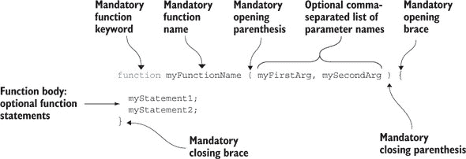

下面的列表展示了几个函数声明的例子。

##### 列表 3.4\. 函数声明的例子

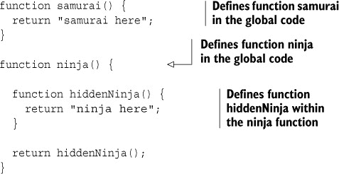

如果你仔细观察，你会发现一些你可能不习惯的东西，如果你没有太多接触过函数式语言：在另一个函数内部定义的函数！

```
function ninja() {
  function hiddenNinja() {
    return "ninja here";
  }
  return hiddenNinja();
}
```

在 JavaScript 中，这是完全正常的，我们在这里再次强调函数在 JavaScript 中的重要性。

|  |
| --- |

##### 注意

在其他函数中包含函数可能会引起一些关于作用域和标识符解析的棘手问题，但先暂时放下，因为我们将在第五章中详细回顾这个案例。

|  |
| --- |

##### 函数表达式

正如我们多次提到的，JavaScript 中的函数是一等对象，这意味着它们可以通过字面量创建，分配给变量和属性，并用作其他函数的参数和返回值。因为函数是如此基本的构造，JavaScript 允许我们将它们视为任何其他表达式。所以，就像我们可以使用数字字面量一样

```
var a = 3;
myFunction(4);
```

同样，我们也可以在相同的位置使用函数字面量。

```
var a = function() {};
myFunction(function(){});
```

这种始终是另一个语句一部分的函数（例如，作为赋值表达式的右侧，或作为另一个函数的参数）被称为*函数表达式*。函数表达式很棒，因为它们允许我们在需要的地方精确地定义函数，从而使得我们的代码更容易理解。

下面的列表显示了函数声明和函数表达式的区别。

##### 列表 3.5\. 函数声明和函数表达式

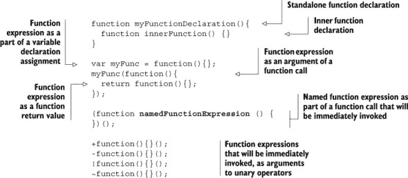

这个示例代码从一个标准的函数声明开始，其中包含另一个内部函数声明：

```
function myFunctionDeclaration(){
  function innerFunction() {}
}
```

这里你可以看到函数声明是如何作为 JavaScript 代码的独立语句，但可以包含在其他函数的体内的。

相比之下，函数表达式始终是另一个语句的一部分。它们放置在表达式级别，作为变量声明（或赋值）的右侧：

```
var myFunc = function(){};
```

或者作为另一个函数调用的参数，或者作为函数的返回值：

```
myFunc(function() {
  return function(){};
});
```

除了它们在代码中的位置，函数声明和函数表达式之间还有一个区别：对于函数声明，函数名称是*必需的*，而对于函数表达式，它是完全*可选的*。

函数声明必须有一个已定义的名称，因为它们是独立的。因为函数的一个基本要求是它必须可调用，我们必须有一种方式来引用它，而唯一的方法是通过它的名称。

另一方面，函数表达式是其他 JavaScript 表达式的部分，因此我们有其他方法来调用它们。例如，如果一个函数表达式被分配给一个变量，我们可以使用该变量来调用函数：

```
var doNothing = function(){};
doNothing();
```

或者，如果它是另一个函数的参数，我们可以在该函数内部通过匹配的参数名来调用它：

```
function doSomething(action) {
  action();
}
```

##### 立即函数

函数表达式甚至可以被放置在最初看起来有点奇怪的位置，例如在我们通常期望函数标识符的位置。让我们停下来仔细看看这个结构（见图 3.5）。

##### 图 3.5\. 标准函数调用与对函数表达式的立即调用的比较

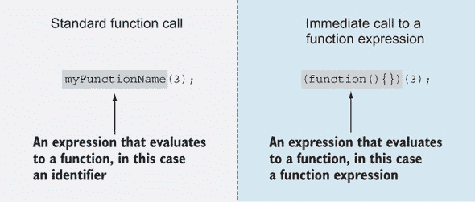

当我们想要进行函数调用时，我们使用一个求值结果为函数的表达式，后面跟着一对函数调用括号，其中可能包含参数。在最基本的函数调用中，我们放置一个求值结果为函数的标识符，就像图 3.5 的左侧所示。但是调用括号左侧的表达式不一定是简单的标识符；它可以是任何求值结果为函数的表达式。例如，指定一个求值结果为函数的表达式的一个简单方法就是使用函数表达式。所以图 3.5 的右侧，我们首先创建一个函数，然后立即调用这个新创建的函数。顺便说一句，这被称为**立即调用的函数表达式**（IIFE），或简称为**立即函数**，它是 JavaScript 开发中的一个重要概念，因为它允许我们在 JavaScript 中模拟模块。我们将在第十一章中关注 IIFE 的这种应用。

| |
| --- |

**函数表达式周围的括号**

还有一件事可能让你对我们在函数表达式周围立即调用函数的方式感到困扰：函数表达式本身的括号。我们为什么需要这些括号呢？原因纯粹是语法上的。JavaScript 解析器必须能够轻松区分函数声明和函数表达式。如果我们省略函数表达式周围的括号，并将立即调用作为一个单独的语句`function(){}(3)`，JavaScript 解析器将开始处理它，并得出结论，因为它是一个以关键字`function`开始的单独语句，所以它正在处理一个函数声明。因为每个函数声明都必须有一个名称（而在这里我们没有指定一个），将会抛出一个错误。为了避免这种情况，我们将函数表达式放在括号内，向 JavaScript 解析器发出信号，表明它正在处理一个表达式，而不是一个语句。

此外，还有一种更简单的方法（虽然奇怪，但使用频率较低）可以达到相同的目的：（`function(){}(3)`）。通过将立即执行函数定义和调用包裹在括号内，你也可以通知 JavaScript 解析器它正在处理一个表达式。

| |
| --- |

列表 3.5 中的最后四个表达式是立即调用函数表达式（IIFE）的变体，这种表达式在许多 JavaScript 库中经常可以看到：

```
+function(){}();
-function(){}();
!function(){}();
~function(){}();
```

这次，我们不再使用括号来区分函数表达式和函数声明，而是可以使用一元运算符：`+`、`-`、`!` 和 `~`。我们这样做是为了向 JavaScript 引擎发出信号，表明它正在处理表达式而不是语句。注意应用这些一元运算符的结果并没有被存储在任何地方；从计算的角度来看，它们并不重要；只有对 IIFE 的调用才是重要的。

现在我们已经研究了 JavaScript 中定义函数的两种最基本的方法（函数声明和函数表达式）的细节，让我们探索 JavaScript 标准中的一个新特性：*箭头函数*。

#### 3.3.2\. 箭头函数

| |
| --- |

##### 注意

箭头函数是 JavaScript 标准中 ES6 的一个新增特性（关于浏览器兼容性，请参阅 [`mng.bz/8bnH`](http://mng.bz/8bnH)）。

| |
| --- |

因为在我们的 JavaScript 中使用了 *很多* 函数，所以添加一些语法糖，使我们能够以更短、更简洁的方式创建函数，从而让我们的开发生活更加愉快，这是有意义的。

在很多方面，箭头函数是函数表达式的一种简化。让我们回顾一下本章第一部分中的排序示例：

```
var values = [0, 3, 2, 5, 7, 4, 8, 1];
values.sort(function(value1,value2){
  return value1 – value2;
});
```

这个例子使用了一个回调函数表达式，它被发送到数组对象的 sort 方法；这个回调将由 JavaScript 引擎调用，以按降序对数组的值进行排序。

现在，让我们看看如何使用箭头函数做完全相同的事情：

```
var values = [0, 3, 2, 5, 7, 4, 8, 1];
values.sort((value1,value2) => value1 – value2);
```

看看这有多简洁？

没有由 `function` 关键字、花括号或 `return` 语句引起的杂乱。与函数表达式相比，箭头函数以一种更简单的方式声明：这是一个接受两个参数并返回它们差值的函数。注意新操作符 `=>` 的引入，即所谓的 *粗箭头* 操作符（一个等于号紧跟着一个大于号），这是定义箭头函数的核心。

现在让我们分解箭头函数的语法，从最简单的方式开始：

```
param => expression
```

这个箭头函数接受一个参数并返回一个表达式的值。我们可以使用以下示例中的语法来使用这种语法。

##### 列表 3.6\. 比较箭头函数和函数表达式

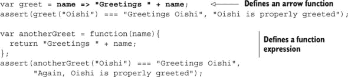

仔细欣赏箭头函数如何使代码更加简洁，同时不失清晰。这是箭头函数语法的最简单版本，但通常，箭头函数可以用两种方式定义，如图 3.6 所示。

##### 图 3.6。箭头函数的语法

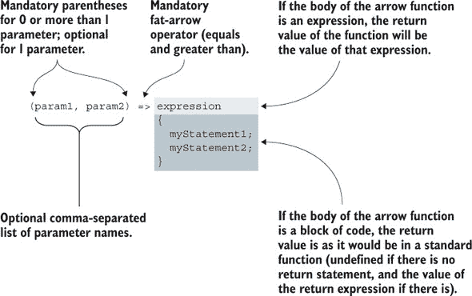

如您所见，箭头函数的定义从可选的逗号分隔的参数名列表开始。如果没有参数，或者参数超过一个，这个列表必须用括号括起来。但是，如果我们只有一个参数，括号是可选的。这个参数列表后面跟着一个强制性的粗箭头操作符，它告诉我们和 JavaScript 引擎我们正在处理一个箭头函数。

在粗箭头操作符之后，我们有两种选择。如果是一个简单函数，我们就在那里放一个表达式（一个数学运算，另一个函数调用，等等），函数调用的结果将是该表达式的值。例如，我们的第一个箭头函数示例具有以下箭头函数：

```
var greet = name => "Greetings " + name;
```

函数的返回值是字符串“`Greetings`”与`name`参数值的连接。

在其他情况下，当我们的箭头函数不那么简单且需要更多代码时，我们可以在箭头操作符之后包含一段代码块。例如：

```
var greet = name => {
  var helloString = 'Greetings ';
  return helloString + name;
};
```

在这种情况下，箭头函数的返回值行为与标准函数相同。如果没有返回语句，函数调用的结果将是`undefined`，如果有，结果将是返回表达式的值。

我们将在整本书中多次回顾箭头函数。在众多其他事情中，我们将展示箭头函数的附加功能，这将帮助我们避免与更标准函数相关的微妙错误。

箭头函数，像所有其他函数一样，可以通过传递参数来接收它们以执行其任务。让我们看看我们传递给函数的值会发生什么。

### 3.4。参数和函数参数

讨论函数时，我们经常几乎互换使用术语*参数*和*参数*，好像它们是或多或少相同的东西。但现在，让我们更加正式：

+   *参数*是我们将作为函数定义一部分列出的变量。

+   *参数*是我们调用函数时传递给函数的值。

图 3.7 说明了这种区别。

##### 图 3.7。函数参数和函数参数之间的区别

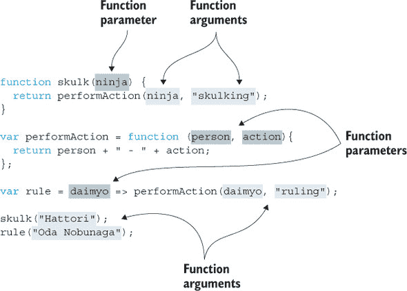

如您所见，函数参数是在函数定义中指定的，所有类型的函数都可以有参数：

+   函数声明（`skulk`函数的`ninja`参数）

+   函数表达式（`perform-Action`函数的`person`和`action`参数）

+   箭头函数（`daimyo`参数）

另一方面，参数与函数的调用相关联；它们是在函数调用时传递给函数的值：

+   字符串`Hattori`被传递为`skulk`函数的参数。

+   字符串`Oda Nobunaga`被传递为`rule`函数的参数。

+   `skulk`函数的`ninja`参数被传递为`performAction`函数的参数。

当将参数列表作为函数调用的一部分提供时，这些参数将按照指定的顺序分配给函数定义中的参数。第一个参数被分配给第一个参数，第二个参数被分配给第二个参数，依此类推。

如果我们的参数数量与参数数量不同，不会引发错误。JavaScript 对这种情况处理得很好，并按以下方式处理。如果提供的参数多于参数，则“多余的”参数不会被分配给参数名称。例如，请参阅图 3.8。

##### 图 3.8\. 参数按照指定的顺序分配给函数参数。多余的参数不会被分配给任何参数。

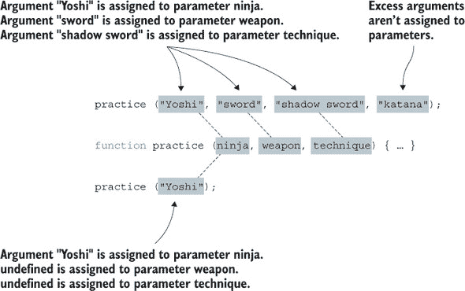

图 3.8 显示，如果我们调用`practice`函数并使用`practice("Yoshi", "sword", "shadow sword", "katana")`，参数`Yoshi`、`sword`和`shadow sword`将分别分配给参数`ninja`、`weapon`和`technique`。参数`katana`是一个多余的参数，不会被分配给任何参数。在下一章中，您将看到即使某些参数没有被分配给参数名称，我们仍然有方法访问它们。

另一方面，如果我们有比参数更多的参数，没有对应参数的参数将被设置为`undefined`。例如，如果我们调用`practice("Yoshi")`，参数`ninja`将被分配值`Yoshi`，而参数`weapon`和`technique`将被设置为`undefined`。

处理函数参数与 JavaScript 本身一样古老，但现在让我们来探索 ES6 赋予 JavaScript 的两个新特性：剩余参数和默认参数。

#### 3.4.1\. 剩余参数

| |
| --- |

##### 注意

ES6 标准（为了浏览器兼容性，请参阅[`mng.bz/3go1`](http://mng.bz/3go1)）增加了剩余参数。

| |
| --- |

在我们的下一个例子中，我们将构建一个函数，该函数将第一个参数与剩余参数中的最大值相乘。这可能不是我们应用中特别适用的东西，但它是对函数内处理参数的更多技术的示例。

这可能看起来很简单：我们将获取第一个参数并将其与剩余参数值中的最大值相乘。在 JavaScript 的旧版本中，这需要一些工作（我们将在下一章中探讨）。幸运的是，在 ES6 中，我们不需要跳过任何障碍。我们可以使用*剩余参数*，如下面的列表所示。

##### 列表 3.7\. 使用剩余参数

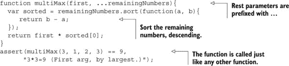

通过在函数的最后一个命名参数前加上省略号（...），我们将其转换成一个名为*剩余参数*的数组，它包含所有传入的剩余参数。

```
function multiMax(first, ...remainingNumbers){
  ...
}
```

例如，在这种情况下，`multiMax` 函数使用四个参数被调用：`multiMax(3, 1, 2, 3)`。在 `multiMax` 函数体内，第一个参数的值，`3`，被分配给第一个 `multiMax` 函数参数，`first`。因为函数的第二个参数是剩余参数，所以所有剩余的参数（`1, 2, 3`）都被放置在一个新的数组中：`remainingNumbers`。然后我们通过按降序排序数组（注意如何简单地更改排序顺序）并选择排序数组中的第一个数字来获取最大的数字，这个数字就是我们的排序数组中的第一个位置。（这远非确定最大数字的最有效方法，但为什么不利用我们在本章早期获得的知识呢？）

|  |
| --- |

##### 注意

只有最后一个函数参数可以是剩余参数。尝试在最后一个参数之前的任何参数前放置省略号将只会带来悲伤，以`SyntaxError: parameter after rest parameter`的形式。

|  |
| --- |

在下一节中，我们将继续丰富我们的 JavaScript 工具箱，添加额外的 ES6 功能：默认参数。

#### 3.4.2\. 默认参数

|  |
| --- |

##### 注意

默认参数由 ES6 标准（为了浏览器兼容性，请参阅[`mng.bz/wI8w`](http://mng.bz/wI8w)）添加。

|  |
| --- |

许多 Web UI 组件（尤其是 jQuery 插件）可以进行配置。例如，如果我们正在开发一个滑动组件，我们可能希望给我们的用户提供一个选项，指定一个计时器间隔，在此之后一个项目会被另一个项目替换，以及一个在变化发生时使用的动画。同时，也许有些用户并不关心，并且乐于使用我们提供的任何设置。默认参数是这种情况的理想选择！

我们关于滑动组件设置的简单示例只是以下情况的一个具体案例：在这种情况下，几乎所有函数调用都使用特定参数的相同值（注意对*几乎*的强调）。考虑一个更简单的情况，我们的大多数忍者都习惯于潜行，但柳生却只关心简单的潜行：

```
function  performAction(ninja, action) {
  return ninja + " " + action;
}
performAction("Fuma", "skulking");
performAction("Yoshi", "skulking");
performAction("Hattori", "skulking");
performAction("Yagyu", "sneaking");
```

总是重复相同的论点，`潜行`，仅仅因为柳生固执且拒绝像一名真正的忍者那样行动，这难道不觉得繁琐吗？

在其他编程语言中，这个问题通常通过函数重载（指定具有相同名称但参数集不同的额外函数）来解决。不幸的是，JavaScript 不支持函数重载，所以当过去遇到这种情况时，开发者通常会求助于以下列表。

##### 列表 3.8\. 在 ES6 之前处理默认参数

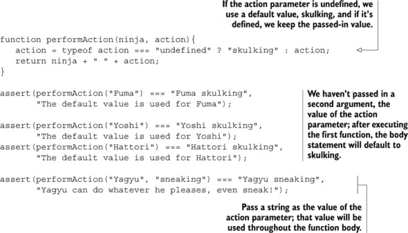

在这里，我们定义了一个 `performAction` 函数，该函数检查 `action` 参数的值是否为 `undefined`（通过使用 `typeof` 运算符），如果是，则函数将 `action` 变量的值设置为 `skulking`。如果 `action` 参数通过函数调用传递（它不是 `undefined`），我们保持其值。

|  |
| --- |

##### 注意

`typeof` 运算符返回一个字符串，指示操作数的类型。如果操作数未定义（例如，如果我们没有为函数参数提供匹配的参数），则返回值是字符串 `undefined`。

|  |
| --- |

这是一个常见的模式，编写起来很繁琐，因此 ES6 标准已经添加了对 *默认参数* 的支持，如下所示。

##### 列表 3.9. 在 ES6 中处理默认参数

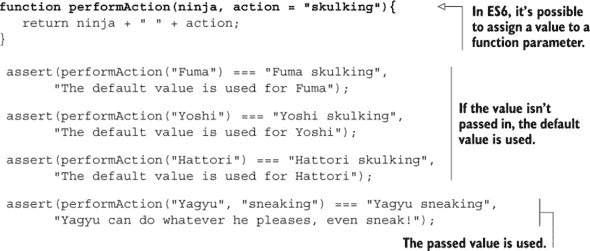

在这里，你可以看到 JavaScript 中默认函数参数的语法。要创建默认参数，我们给函数参数赋值：

```
function performAction(ninja, action = "skulking"){
   return ninja + " " + action;
}
```

然后，当我们进行函数调用并且省略了匹配的参数值，就像 `Fuma`、`Yoshi` 和 `Hattori` 一样，将使用默认值（在这种情况下，`skulking`）：

```
assert(performAction("Fuma") === "Fuma skulking",
      "The default value is used for Fuma");

assert(performAction("Yoshi") === "Yoshi skulking",
      "The default value is used for Yoshi");

assert(performAction("Hattori") === "Hattori skulking",
      "The default value is used for Hattori");
```

如果我们指定了值，则默认值将被覆盖：

```
assert(performAction("Yagyu", "sneaking") === "Yagyu sneaking",
       "Yagyu can do whatever he pleases, even sneak!");
```

我们可以将任何值分配给默认参数：简单的原始值，如数字或字符串，也可以是复杂类型，如对象、数组，甚至是函数。这些值在每次函数调用时按从左到右的顺序进行评估，并且在将值分配给后续的默认参数时，我们可以引用前面的参数，如下所示。

##### 列表 3.10. 引用之前的默认参数


尽管 JavaScript 允许你这样做，但我们强烈建议谨慎行事。在我们看来，这并不增强代码的可读性，并且应该尽可能避免。但是，适度使用默认参数——作为避免 null 值的手段，或者作为相对简单的标志来配置我们函数的行为——可以导致更简单、更优雅的代码。

### 3.5. 摘要

+   编写复杂的代码取决于将 JavaScript 作为函数式语言来学习。

+   函数是第一类对象，在 JavaScript 中被当作任何其他对象一样对待。类似于任何其他对象类型，它们可以被

    +   通过字面量创建

    +   分配给变量或属性

    +   作为参数传递

    +   作为函数结果返回

    +   分配属性和方法

+   回调函数是其他代码将后来“回调”的函数，并且通常在事件处理中使用。

+   我们可以利用函数可以具有属性，并且这些属性可以用来存储任何信息的事实；例如

    +   我们可以将函数存储在函数属性中以供以后引用和调用。

    +   我们可以使用函数属性来创建缓存（记忆化），从而避免不必要的计算。

+   有不同类型的函数：函数声明、函数表达式、箭头函数和函数生成器。

+   函数声明和函数表达式是两种最常见的函数类型。函数声明必须有一个名称，并且必须作为单独的语句放置在我们的代码中。函数表达式不需要命名，但必须是另一个代码语句的一部分。

+   箭头函数是 JavaScript 的新增功能，它使我们能够以比标准函数更简洁的方式定义函数。

+   参数是我们将作为函数定义一部分列出的变量，而参数是我们调用函数时传递给函数的值。

+   函数的参数列表和其参数列表可以有不同的长度：

    +   未分配的参数评估为`undefined`。

    +   额外的参数不会绑定到参数名称。

+   休息参数和默认参数是 JavaScript 的新增功能：

    +   休息参数使我们能够引用没有匹配参数名称的剩余参数。

    +   默认参数使我们能够指定默认参数值，当在函数调用期间未提供值时将使用这些值。

### 3.6\. 练习

> **1**
> 
> 在以下代码片段中，哪些是回调函数？
> 
> ```
> numbers.sort(function sortAsc(a,b){
>   return a – b;
> });
> 
> function ninja(){}
> ninja();
> 
> var myButton = document.getElementById("myButton");
> myButton.addEventListener("click", function handleClick(){
>   alert("Clicked");
> });
> ```
> 
> **2**
> 
> 在以下代码片段中，根据其类型（函数声明、函数表达式或箭头函数）对函数进行分类。
> 
> ```
> numbers.sort(function sortAsc(a,b){
>   return a – b;
> });
> 
> numbers.sort((a,b) => b – a);
> 
> (function(){})();
> 
> function outer(){
>   function inner(){}
>   return inner;
> }
> 
> (function(){}());
> 
> (()=>"Yoshi")();
> ```
> 
> **3**
> 
> 执行以下代码片段后，变量`samurai`和`ninja`的值是什么？
> 
> ```
> var samurai = (() => "Tomoe")();
> var ninja = (() => {"Yoshi"})();
> ```
> 
> **4**
> 
> 在`test`函数体内部，对于两次函数调用，参数`a`、`b`和`c`的值是什么？
> 
> ```
> function test(a, b, ...c){ /*a, b, c*/}
> 
> test(1, 2, 3, 4, 5);
> test();
> ```
> 
> **5**
> 
> 执行以下代码片段后，`message1`和`message2`变量的值是什么？
> 
> ```
> function getNinjaWieldingWeapon(ninja, weapon = "katana"){
>   return ninja + " " + katana;
> }
> 
> var message1 = getNinjaWieldingWeapon("Yoshi");
> var message2 = getNinjaWieldingWeapon("Yoshi", "wakizashi");
> ```

## 第四章\. 适合工匠的函数：理解函数调用

*本章涵盖*

+   两个隐式函数参数：arguments 和 this

+   调用函数的方法

+   处理函数上下文的问题

在上一章中，您了解到 JavaScript 是一种具有显著功能导向特性的编程语言。我们探讨了函数调用参数和函数参数之间的区别，以及值是如何从调用参数传递到函数参数的。

本章继续以类似的方式展开，首先讨论我们在上一章中保留的内容：隐式函数参数`this`和`arguments`。这些参数被静默传递给函数，并且可以在函数体内部像任何其他显式命名的函数参数一样访问。

`this` 参数代表函数上下文，即我们的函数被调用的对象，而 `arguments` 参数代表通过函数调用传入的所有参数。这两个参数在 JavaScript 代码中都非常重要。`this` 参数是面向对象 JavaScript 的基本成分之一，而 `arguments` 参数使我们能够对函数接受的参数进行创造性使用。因此，我们将探讨一些与这些隐含参数相关的常见陷阱。

然后，我们将继续探讨在 JavaScript 中调用函数的方法。我们调用函数的方式对隐含函数参数的确定有很大影响。

最后，我们将通过学习与函数上下文、`this` 参数相关的常见问题来结束本章。无需多言，让我们开始探索吧！

### 你知道吗？

> **Q1:**
> 
> 为什么 `this` 参数被称为函数 *上下文*？
> 
> **Q2:**
> 
> 函数和方法之间的区别是什么？
> 
> **Q3:**
> 
> 如果构造函数明确返回一个对象会发生什么？

### 4.1\. 使用隐含函数参数

在上一章中，我们探讨了函数 *参数*（作为函数定义一部分列出的变量）和函数 *参数*（当我们调用函数时传递给函数的值）之间的区别。但我们没有提到，除了我们在函数定义中明确声明的参数之外，函数调用通常还传递两个隐含参数：`arguments` 和 `this`。

通过 *隐含的*，我们是指这些参数没有在函数签名中明确列出，但它们被默默地传递给函数，并在函数内部可访问。它们可以在函数内部像任何其他明确命名的参数一样被引用。让我们依次查看这些隐含参数。

#### 4.1.1\. 参数

`arguments` 参数是传递给函数的所有参数的集合。它很有用，因为它允许我们访问所有函数参数，无论匹配的参数是否明确定义。这使我们能够实现函数重载，这是 JavaScript 本身不支持的功能，以及接受可变数量参数的变长函数。说实话，由于上一章引入的 `rest` 参数，`arguments` 参数的需要已经大大减少。然而，了解 `arguments` 参数的工作方式仍然很重要，因为当你处理遗留代码时，你很可能会遇到它。

`arguments` 对象有一个名为 `length` 的属性，表示参数的确切数量。可以通过数组索引表示法获取单个参数值；例如，`arguments[2]` 将获取第三个参数。请看下面的列表。

##### 列表 4.1\. 使用参数

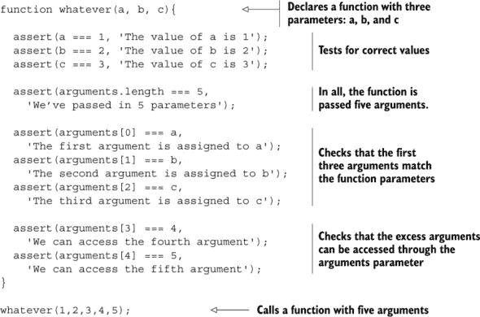

这里有一个 `whatever` 函数，它被调用了五个参数，`whatever (1,2,3,4,5)`，尽管它只声明了三个参数，`a, b, c`：

```
function whatever(a, b, c){
  ...
}
```

我们可以通过各自的功能参数 `a`、`b` 和 `c` 访问前三个参数：

```
assert(a === 1, 'The value of a is 1');
assert(b === 2, 'The value of b is 2');
assert(c === 3, 'The value of c is 3');
```

我们还可以通过使用 `arguments.length` 属性来检查传递给函数的总参数数。

`arguments` 参数也可以用来通过数组表示法访问每个单独的参数。重要的是要注意，这也包括与任何函数参数都不相关的多余参数：

```
assert(arguments[0] === a, 'The first argument is assigned to a');
assert(arguments[1] === b, 'The second argument is assigned to b');
assert(arguments[2] === c, 'The third argument is assigned to c');
assert(arguments[3] === 4, 'We can access the fourth argument');
assert(arguments[4] === 5, 'We can access the fifth argument');
```

在本节中，我们特意避免将 `arguments` 参数称为 *数组*。你可能会被误导，认为它是一个数组；毕竟，它有一个 `length` 参数，并且可以使用数组表示法获取其条目。但它 *不是* 一个 JavaScript 数组，如果你尝试在 `arguments` 上使用数组方法（例如，在上一章中使用的 `sort` 方法），你会发现只有失望和心碎。只需将 `arguments` 视为一个 *类似数组* 的结构，并在使用时保持克制。

正如我们之前提到的，`arguments` 对象的主要目的是允许我们访问传递给函数的所有参数，无论特定参数是否与函数参数相关联。让我们通过实现一个可以计算任意数量参数的总和的函数来了解如何做到这一点。

##### 列表 4.2\. 使用参数对象对所有函数参数进行操作

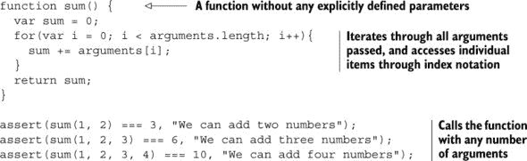

在这里，我们首先定义了一个 `sum` 函数，它没有明确列出任何参数。尽管如此，我们仍然可以通过 `arguments` 对象访问所有函数参数。我们遍历所有参数并计算它们的总和。

现在是回报的时候了。我们可以用任意数量的参数调用函数，所以我们对几个案例进行了测试，看看是否一切正常。这是 `arguments` 对象的真正力量。它允许我们编写更灵活、更通用的函数，这些函数可以轻松处理不同的情况。

| |
| --- |

##### 注意

我们之前提到，在许多情况下，我们可以使用 `rest` 参数而不是 `arguments` 参数。`rest` 参数是一个真正的数组，这意味着我们可以使用所有我们喜欢的数组方法来操作它。这使它在某种程度上优于 `arguments` 对象。作为一个练习，将 列表 4.2 重写为使用 `rest` 参数而不是 `arguments` 参数。

| |
| --- |

现在我们已经了解了 `arguments` 对象的工作原理，让我们来探讨一些它的陷阱。

##### 参数对象作为函数参数的别名

`arguments` 参数有一个奇特的功能：它将函数参数作为别名。如果我们为例如 `arguments[0]` 设置一个新值，第一个参数的值也会改变。请看以下列表。

##### 列表 4.3\. 参数对象别名函数参数

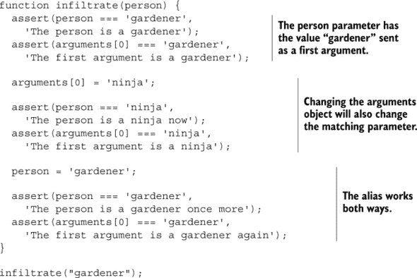

你可以看到 `arguments` 对象是如何作为函数参数的代理的。我们定义了一个函数 `infiltrate`，它接受一个参数 `person`，并用参数 `gardener` 调用它。我们可以通过函数参数 `person` 和 `arguments` 对象访问值 `gardener`：

```
assert(person === 'gardener', 'The person is a gardener');
assert(arguments[0] === 'gardener', 'The first argument is a gardener');
```

因为 `arguments` 对象是函数参数的代理，如果我们改变 `arguments` 对象，这种改变也会反映在匹配的函数参数上：

```
arguments[0] = 'ninja';

assert(person === 'ninja', 'The person is a ninja now');
assert(arguments[0] === 'ninja', 'The first argument is a ninja');
```

同样的情况也适用于另一个方向。如果我们改变一个参数，这种改变可以在参数和 `arguments` 对象中观察到：

```
person = 'gardener';

assert(person === 'gardener',
    'The person is a gardener once more');
assert(arguments[0] === 'gardener',
    'The first argument is a gardener again');
```

##### 避免代理

通过 `arguments` 对象代理函数参数的概念可能会令人困惑，因此 JavaScript 提供了一种通过使用 *严格模式* 来退出该模式的方法。

|  |
| --- |

**严格模式**

严格模式是 JavaScript ES5 的一个新增功能，它改变了 JavaScript 引擎的行为，使得错误被抛出而不是静默地捕获。一些语言特性的行为发生了变化，甚至一些不安全的语言特性被完全禁止（关于这一点稍后还会提到）。严格模式改变的事情之一是它禁用了 `arguments` 代理。

|  |
| --- |

像往常一样，让我们看看一个简单的例子。

##### 列表 4.4\. 使用严格模式避免参数代理

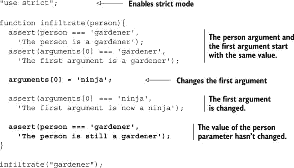

我们首先将简单的字符串 `use strict` 作为代码的第一行。这告诉 JavaScript 引擎我们想要以严格模式执行以下代码。在这个例子中，严格模式改变了我们程序的含义，使得 `person` 参数和第一个 `argument` 以相同的值开始：

```
assert(person === 'gardener', 'The person is a gardener');
assert(arguments[0] === 'gardener', 'The first argument is a gardener');
```

但是，与非严格模式不同，这次 `arguments` 对象并没有代理参数。如果我们改变第一个参数的值，`arguments[0] = 'ninja'`，第一个参数的值会改变，但 `person` 参数不会：

```
assert(arguments[0] === 'ninja', 'The first argument is now a ninja');
assert(person === 'gardener', 'The person is still a gardener');
```

我们将在本书的后面部分重新访问 `arguments` 对象，但到目前为止，让我们专注于另一个隐式参数：`this`，它在某些方面甚至更有趣。

#### 4.1.2\. `this` 参数：介绍函数上下文

当一个函数被调用时，除了在函数调用中提供的显式参数之外，还会传递一个名为 `this` 的隐式参数给函数。`this` 参数是面向对象 JavaScript 中的一个重要组成部分，它指向与函数调用相关联的对象。因此，它通常被称为 *函数上下文*。

函数上下文是一个概念，那些来自像 Java 这样的面向对象语言的人可能会认为他们理解。在这些语言中，`this` 通常指向定义方法所在的类的实例。

但要小心！正如我们很快就会看到的，在 JavaScript 中，将函数作为*方法*调用只是函数被调用的方式之一。而且，实际上，`this`参数指向的内容并不是（如在 Java 或 C#中）仅由函数的定义方式和位置决定的；它还可以受到函数*调用*方式的影响。因为理解`this`参数的确切性质是面向对象 JavaScript 最重要的支柱之一，我们将探讨调用函数的各种方式。你会发现它们之间的一个主要区别在于`this`值的确定方式。然后，在接下来的几个章节中，我们将详细研究函数上下文，所以如果事情一开始没有完全弄清楚，请不要担心。

现在我们将详细地看看函数是如何被调用的。

### 4.2\. 调用函数

我们都调用过 JavaScript 函数，但你有没有停下来想过当函数被调用时实际上会发生什么？实际上，函数被调用的方式对函数内部代码的操作方式有巨大的影响，主要是在如何建立`this`参数、函数上下文方面。这种差异比最初看起来要重要得多。我们将在本节中对其进行研究，并在本书的其余部分利用它来帮助我们提升代码到忍者级别。

我们可以通过四种方式调用一个函数，每种方式都有其独特的细微差别：

+   *作为函数*—`skulk()`，其中函数以直接的方式被调用

+   *作为方法*—`ninja.skulk()`，将调用与一个对象关联起来，从而实现面向对象编程

+   *作为构造函数*—`new Ninja()`，其中创建了一个新的对象

+   *通过函数的* `apply` *或* `call` *方法*—`skulk.call(ninja)`或`skulk.apply(ninja)`

这里有一些例子：

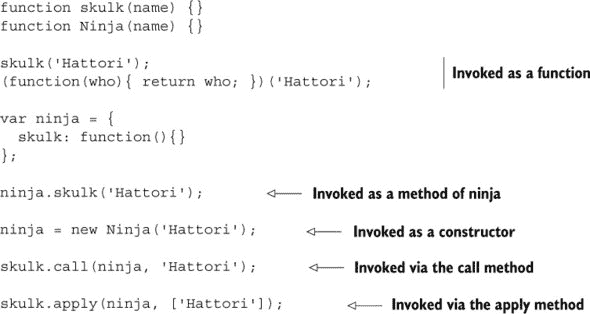

对于除了`call`和`apply`方法之外的所有方法，函数调用运算符是一组跟在评估为函数引用的任何表达式后面的括号。

让我们从最简单的形式开始，将函数作为函数调用。

#### 4.2.1\. 作为函数的调用

作为函数调用？当然，函数当然是以函数的方式被调用的。认为其他方式是愚蠢的。但在现实中，我们说函数是以“作为函数”的方式被调用的，以区别于其他调用机制：方法、构造函数和`apply`/`call`。如果一个函数不是作为方法、构造函数或通过`apply`或`call`调用，那么它就是作为函数被调用的。

当使用`()`运算符调用函数，并且该运算符应用的表达式不引用函数作为对象的属性时，会发生这种类型的调用。（在这种情况下，我们将有一个方法调用，但我们将在下一节讨论。）以下是一些简单的例子：

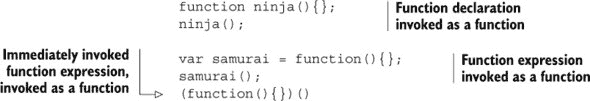

以这种方式调用时，函数上下文（`this`关键字的值）可以是两件事：在非严格模式中，它将是全局上下文（`window`对象），而在严格模式中，它将是`undefined`。

以下列表说明了严格模式和非常严格模式之间的行为差异。

##### 列表 4.5\. 作为函数的调用

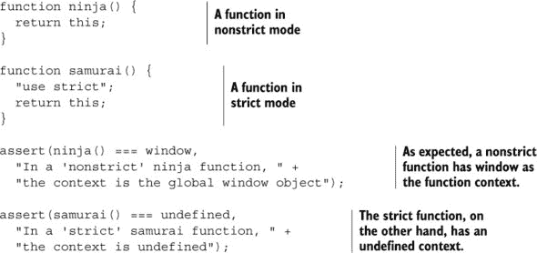

|  |
| --- |

##### 注意

如您所见，严格模式在大多数情况下比非严格模式更直接。例如，当列表 4.5 将函数作为函数调用（而不是作为方法调用）时，它没有指定应该在该对象上调用该函数的对象。因此，我们认为将`this`关键字设置为`undefined`（如在严格模式中）比在非严格模式中的全局`window`对象更有意义。一般来说，严格模式解决了许多这些小的 JavaScript 怪异之处。（还记得章节开头提到的参数别名吗？）

|  |
| --- |

你可能已经多次编写了这样的代码，但并没有过多思考。现在让我们提高一个档次，看看函数是如何作为*方法*被调用的。

#### 4.2.2\. 作为方法的调用

当一个函数被分配给对象的属性，并且通过引用该属性来调用该函数时，那么该函数就是作为该对象的*方法*被调用的。以下是一个例子：

```
var ninja = {};
ninja.skulk = function(){};
ninja.skulk();
```

好吧；那么这又意味着什么呢？在这种情况下，函数被称为*方法*，但那又有什么有趣或有用之处呢？嗯，如果你有面向对象背景，你会记得一个方法所属的对象可以在方法的主体中作为`this`使用。这里也是同样的情况。当我们把一个函数作为对象的*方法*调用时，该对象成为函数上下文，并且可以通过`this`参数在函数内部使用。这是 JavaScript 允许编写面向对象代码的主要方法之一。（构造函数是另一个，我们很快就会讨论到。）

让我们在下一个列表中考虑一些测试代码，以说明作为函数调用和作为方法调用之间的差异和相似之处。

##### 列表 4.6\. 函数调用和方法调用的差异


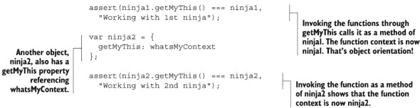

这个测试设置了一个名为`whatsMyContext`的函数，我们将在列表的其余部分中使用它。这个函数唯一做的事情就是返回其函数上下文，这样我们就可以从函数外部看到调用时的函数上下文是什么。（否则，我们将很难知道。）

```
function whatsMyContext() {
  return this;
}
```

当我们直接通过名称调用函数时，这是一个将函数作为函数调用的例子，因此我们期望函数上下文将是全局上下文（`window`），因为我们处于非严格模式。我们断言这是正确的：

```
assert(whatsMyContext() === window, ...)
```

然后，我们在一个名为 `getMyThis` 的变量中创建对函数 `whatsMyContext` 的引用：`var getMyThis = whatsMyContext`。这并没有创建函数的第二个实例；它仅仅创建了对同一个函数的引用（你知道，第一类对象和所有）。

当我们通过变量调用函数时——我们可以这样做，因为函数调用操作符可以应用于任何求值结果为函数的表达式——我们再次将函数作为函数调用。因此，我们再次期望函数上下文是 `window`，并且确实是这样的：

```
assert(getMyThis() === window,
       "Another function call in window");
```

现在，事情变得稍微复杂一些，我们在变量 `ninja1` 中定义了一个名为 `getMyThis` 的属性，它接收对 `whatsMyContext` 函数的引用。通过这样做，我们说我们在对象上创建了一个名为 `getMyThis` 的 *方法*。我们并没有说 `whatsMyContext` 已经 *成为* `ninja1` 的一个方法；它并没有。你已经看到 `whatsMyContext` 是一个独立的函数，可以通过多种方式调用：

```
var ninja1 = {
  getMyThis: whatsMyContext
};
```

根据我们之前所说的，当我们通过方法引用调用函数时，我们期望函数上下文是该方法的对象（在这种情况下，`ninja1`），我们这样断言：

```
assert(ninja1.getMyThis() === ninja1,
      "Working with 1st ninja");
```

|  |
| --- |

##### 注意

将函数作为方法调用对于编写面向对象的 JavaScript 至关重要。这样做使得你可以在任何方法中使用 `this` 来引用该方法的所有权对象——这是面向对象编程中的一个基本概念。

|  |
| --- |

为了强调这一点，我们继续通过创建另一个对象 `ninja2` 来进行测试，它也具有一个名为 `getMyThis` 的属性，该属性引用 `whatsMyContext` 函数。通过 `ninja2` 对象调用此函数时，我们正确地断言其函数上下文是 `ninja2`：

```
var ninja2 = {
  getMyThis: whatsMyContext
};

assert(ninja2.getMyThis() === ninja2,
  "Working with 2nd ninja");
```

即使在整个示例中使用了 *相同的* 函数——`whatsMyContext`，但 `this` 返回的函数上下文会根据 `whatsMyContext` 的调用方式而改变。例如，完全相同的函数由 `ninja1` 和 `ninja2` 共享，但执行时，该函数可以通过调用方法的对象访问并操作对象。我们不需要为不同的对象创建函数的单独副本来执行完全相同的处理。这是面向对象编程的一个原则。

尽管这是一种强大的功能，但在本例中它的使用方式存在局限性。首先，当我们创建两个忍者对象时，我们可以共享同一个函数作为每个对象的方法，但我们必须使用一些重复的代码来设置单独的对象及其方法。

但这并不是绝望的理由——JavaScript 提供了机制，使得从单个模式创建对象比本例中要容易得多。我们将在第七章（[kindle_split_019.html#ch07](https://kindle_split_019.html#ch07)）中深入探讨这些功能。但就目前而言，让我们考虑与函数调用相关的那部分机制：*构造函数*。

#### 4.2.3. 作为构造函数的调用

将要作为构造函数使用的函数没有什么特别之处。*构造函数*的声明方式与任何其他函数一样，我们可以轻松地使用函数声明和函数表达式来构造新对象。唯一的例外是箭头函数，你将在本章后面看到，它的工作方式略有不同。但无论如何，主要区别在于函数的调用方式。

要将函数作为构造函数调用，我们在函数调用之前加上关键字`new`。例如，回想一下上一节中的`whatsMyContext`函数：

```
function whatsMyContext(){ return this; }
```

如果我们想将`whatsMyContext`函数作为构造函数调用，我们写这个：

```
new whatsMyContext();
```

尽管我们可以将`whatsMyContext`作为构造函数调用，但这个函数并不是一个特别有用的构造函数。让我们通过讨论使构造函数特殊的原因来找出原因。

|  |
| --- |

##### 注意

记得在第三章中，我们讨论了定义函数的方法吗？在函数声明、函数表达式、箭头函数和生成器函数中，我们还提到了*函数构造器*，它使我们能够从字符串中构造新的函数。例如：`new Function('a', 'b', 'return a + b')`创建了一个具有两个参数`a`和`b`的新函数，它返回它们的和。请注意不要将这些*函数构造器*与*构造函数*混淆！区别虽然微妙，但很重要。函数构造器使我们能够从动态创建的字符串中创建函数。另一方面，*构造函数*，本节的主题，是我们用来创建和初始化对象实例的函数。

|  |
| --- |

##### 构造函数的超级能力

将函数作为构造函数调用是 JavaScript 的一个强大功能，我们将在下面的列表中探讨。

##### 列表 4.7\. 使用构造函数设置常见对象

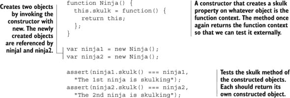

在这个例子中，我们创建了一个名为`Ninja`的函数，我们将用它来构造，嗯，忍者。当使用关键字`new`调用时，会创建一个空的对象实例，并将其作为函数上下文（`this`参数）传递给函数。构造函数在这个对象上创建了一个名为`skulk`的属性，并将其分配了一个函数，使该函数成为新创建的对象的方法。

通常，当调用构造函数时，会发生一些特殊操作，如图 4.1 所示。使用关键字`new`调用函数会触发以下步骤：

1.  一个新的空对象被创建。

1.  此对象作为`this`参数传递给构造函数，因此成为构造函数的函数上下文。

1.  新构造的对象作为`new`运算符的值返回（但有一个例外，我们很快就会讨论到）。

##### 图 4.1\. 当使用关键字`new`调用函数时，会创建一个新的空对象，并将其设置为构造函数的上下文，即`this`参数。

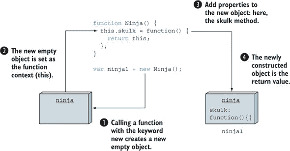

最后两点涉及到为什么在`new whatsMyContext()`中的`whatsMyContext`使得构造函数变得糟糕。构造函数的目的是创建一个新的对象，对其进行设置，并将其作为构造函数的值返回。任何干扰这一意图的东西都不适合作为构造函数。

让我们考虑一个更合适的构造函数，`Ninja`，它用于设置潜行的忍者，如列表 4.7 所示：

```
function Ninja() {
  this.skulk = function() {
    return this;
  };
}
```

`skulk`方法执行与前面章节中`whatsMyContext`相同的操作，返回函数上下文，以便我们可以外部测试它。

构造函数定义后，我们通过两次调用构造函数创建了两个新的`Ninja`对象。请注意，从调用中返回的值被存储在变量中，这些变量成为新创建的`Ninja`对象的引用：

```
var ninja1 = new Ninja();
var ninja2 = new Ninja();
```

然后我们运行确保每个方法调用都操作预期对象的测试：

```
assert(ninja1.skulk() === ninja1,
  "The 1st ninja is skulking");
assert(ninja2.skulk() === ninja2,
  "The 2nd ninja is skulking");
```

那就是全部！现在你知道如何使用构造函数函数创建和初始化新对象了。用关键字`new`调用函数返回新创建的对象。但让我们检查这是否总是完全正确。

##### 构造函数返回值

我们之前提到，构造函数的目的是初始化新创建的对象，并且新构造的对象是构造函数调用的结果（通过`new`运算符）。但是当构造函数返回自己的值时会发生什么？让我们在下面的列表中探索这种情况。

##### 列表 4.8\. 返回原始值的构造函数

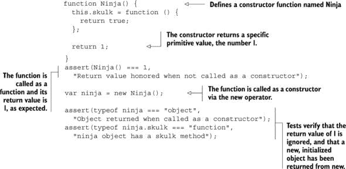

如果我们运行这个列表，我们会看到一切正常。这个`Ninja`函数返回一个简单的数字`1`对代码的行为没有显著影响。如果我们像预期的那样将`Ninja`函数作为函数调用，它返回`1`；如果我们用关键字`new`将其作为构造函数调用，就会构建并返回一个新的`ninja`对象。到目前为止，一切顺利。

但现在让我们尝试做一些不同的事情，一个构造函数函数返回另一个对象，如下面的列表所示。

##### 列表 4.9\. 显式返回对象值的构造函数

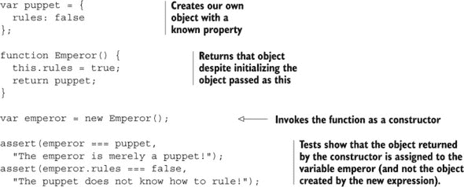

这个列表采取了一种稍微不同的方法。我们首先创建一个`puppet`对象，其`rules`属性设置为`false`：

```
var puppet = {
  rules: false
};
```

然后我们定义了一个`Emperor`函数，它向新构造的对象添加一个`rules`属性并将其设置为`true`。此外，`Emperor`函数有一个怪癖；它返回全局的`puppet`对象：

```
function Emperor() {
  this.rules = true;
  return puppet;
}
```

后来，我们用关键字`new`将`Emperor`函数作为构造函数调用：

```
var emperor = new Emperor();
```

通过这种方式，我们设置了一个模糊的情况：我们得到一个对象传递给构造函数作为函数上下文中的`this`，我们初始化它，但随后我们返回一个完全不同的`puppet`对象。哪个对象将统治？

让我们测试它：

```
assert(emperor === puppet, "The emperor is merely a puppet!");
assert(emperor.rules === false,
      "The puppet does not know how to rule!");
```

结果表明，我们的测试表明构造函数调用的值返回了 `puppet` 对象，而我们构造函数中在函数上下文中执行的所有初始化都是徒劳的。`puppet` 已经暴露了！

现在我们已经进行了一些测试，让我们总结一下我们的发现：

+   如果构造函数返回一个对象，则该对象作为整个 `new` 表达式的值返回，而新创建的对象作为 `this` 传递给构造函数被丢弃。

+   如果构造函数返回的不是对象，则返回值将被忽略，并返回新创建的对象。

由于这些特殊性，打算用作构造函数的函数通常以与其他函数不同的方式编写。让我们更详细地探讨这一点。

##### 构造函数的编码考虑因素

构造函数的目的是初始化由函数调用创建的新对象到初始条件。尽管这样的函数 *可以* 作为“正常”函数调用，或者甚至分配给对象属性以便作为方法调用，但它们通常作为这样的用途并不太有用。例如

```
function Ninja() {
    this.skulk = function() {
      return this;
    };
}
var whatever = Ninja();
```

我们可以将 `Ninja` 作为简单的函数调用，但在非严格模式下，`skulk` 属性将在 `window` 上创建——这不是一个特别有用的操作。在严格模式下，事情会变得更加糟糕，因为 `this` 将是未定义的，我们的 JavaScript 应用程序将会崩溃。但这是好事；如果我们非严格模式下犯了这个错误，我们可能没有注意到（除非我们有很好的测试），但在严格模式下，错误是显而易见的。这是一个为什么引入严格模式的好例子。

由于构造函数通常以与其他函数不同的方式编写和使用，并且除非作为构造函数调用，否则并不那么有用，因此出现了一种命名约定来区分构造函数和普通函数和方法。如果你一直很注意，你可能已经注意到了这一点。

函数和方法通常以描述它们所执行动作的动词开头（例如 `skulk`、`creep`、`sneak`、`doSomethingWonderful` 等），并且以小写字母开头。另一方面，构造函数通常以描述正在构建的对象的名词命名，并且以大写字母开头：`Ninja`、`Samurai`、`Emperor`、`Ronin` 等。

很容易看出，构造函数如何使创建符合相同模式的多个对象变得更加优雅，而无需一遍又一遍地重复相同的代码。公共代码只编写一次，作为构造函数的主体。在 第七章 中，你将了解更多关于使用构造函数以及 JavaScript 提供的其他面向对象机制，这些机制使设置对象模式变得更加容易。

但我们还没有完成函数调用的讨论。JavaScript 还有一种让我们调用函数的方法，它提供了对调用细节的大量控制。

#### 4.2.4\. 使用 apply 和 call 方法进行调用

到目前为止，你已经看到函数调用类型之间一个主要的不同点在于最终成为执行函数中隐式 `this` 参数上下文的对象是什么。对于方法，它是拥有该方法的对象；对于顶层函数，它要么是 `window`，要么是 `undefined`（取决于当前的严格性）；对于构造函数，它是一个新创建的对象实例。

但如果我们想使函数上下文成为我们想要的任何东西呢？如果我们想显式地设置它呢？如果我们想……好吧，我们为什么要这样做呢？

为了了解我们为什么会对这种能力感兴趣，我们将查看一个实际例子，它说明了与事件处理相关的一个令人惊讶的常见错误。现在，考虑一下当事件处理器被调用时，函数上下文被设置为事件绑定到的对象。（如果你觉得这很模糊，不用担心；你将在第十三章中详细了解事件处理。）看看下面的列表。

##### 列表 4.10\. 将特定上下文绑定到函数

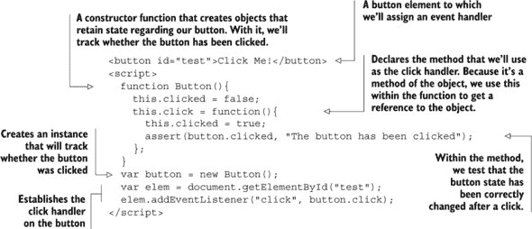

在这个例子中，我们有一个按钮，`<button id="test">点击我！</button>`，我们想知道它是否曾被点击过。为了保留这种状态信息，我们使用构造函数创建一个名为 `button` 的后端对象，我们将在此对象中存储点击状态：

```
function Button(){
  this.clicked = false;
  this.click = function(){
    this.clicked = true;
    assert(button.clicked, "The button has been clicked");
  };
}
var button = new Button();
```

在那个对象中，我们还定义了一个 `click` 方法，它将在按钮被点击时作为事件处理器触发。该方法将点击属性设置为 `true`，然后测试状态是否已正确记录在后端对象中（我们有意使用了 `button` 标识符而不是 `this` 关键字——毕竟，它们应该指向同一件事，对吧？）。最后，我们将 `button.click` 方法作为按钮的点击处理器建立起来：

```
var elem = document.getElementById("test");
elem.addEventListener("click", button.click);
```

当我们将示例加载到浏览器中并点击按钮时，通过 图 4.2 的显示，我们可以看到有些不对劲；被划掉的文字表明测试失败了。在 列表 4.10 中的代码失败了，因为 `click` 函数的上下文并没有按照我们的意图指向 `button` 对象。

##### 图 4.2\. 为什么我们的测试失败了？状态变化去哪里了？通常，事件回调的上下文是引发事件的那个对象（在这种情况下，是 HTML 按钮，而不是按钮对象）。

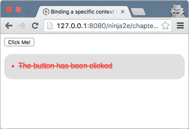

回想一下本章前面的课程，如果我们通过`button.click()`调用函数，上下文*将会*是按钮，因为函数将作为`button`对象上的方法被调用。但在这个例子中，浏览器的事件处理系统定义了调用的上下文为目标元素，这导致上下文是`<button>`元素，而不是`button`对象。因此，我们在错误的对象上设置了我们的`click`状态！

这是一个非常常见的问题，在本章的后面部分，你将看到完全避免它的技术。现在，让我们通过检查如何使用`apply`和`call`方法显式设置函数上下文来探讨如何解决这个问题。

##### 使用 apply 和 call 方法

JavaScript 为我们提供了一种调用函数并显式指定我们想要作为函数上下文的对象的方法。我们通过使用每个函数都存在的两种方法之一来实现这一点：`apply`和`call`。

是的，我们说的是函数的方法。作为一等对象（顺便提一下，是由内置的`Function`构造函数创建的），函数可以像任何其他对象类型一样拥有属性，包括方法。

要使用`apply`方法调用函数，我们向`apply`传递两个参数：用作函数上下文的对象，以及用作调用参数的值数组。`call`方法以类似的方式使用，除了参数直接传递到参数列表中，而不是作为数组。

以下列表显示了这两种方法的作用。

##### 列表 4.11。使用 apply 和 call 方法提供函数上下文

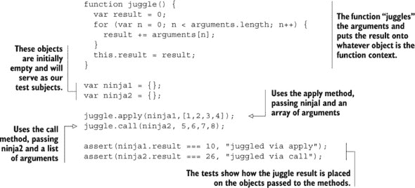

在这个例子中，我们设置了一个名为`juggle`的函数，在其中我们将抛接定义为将所有参数相加并将它们存储在函数上下文（通过`this`关键字引用）上的一个名为`result`的属性中。这可能是一个相当蹩脚的抛接定义，但它*将*允许我们确定是否正确地将参数传递给了函数，以及哪个对象最终成为了函数上下文。

然后，我们设置了两个对象`ninja1`和`ninja2`，我们将它们用作函数上下文，将第一个传递给函数的`apply`方法，并附带一个*数组*参数，将第二个传递给函数的`call`方法，并附带一个*列表*参数：

```
juggle.apply(ninja1,[1,2,3,4]);
juggle.call(ninja2, 5,6,7,8);
```

注意，`apply`和`call`之间的唯一区别在于参数的提供方式。在`apply`的情况下，我们使用一个参数数组，而在`call`的情况下，我们将其作为调用参数列出，在函数上下文之后。参见图 4.3。

##### 图 4.3。`call`和`apply`方法都接受一个作为函数上下文使用的对象作为第一个参数。区别在于后面的参数。`apply`只接受一个额外的参数，即参数值的数组；`call`接受任意数量的参数，这些参数将用作函数参数。

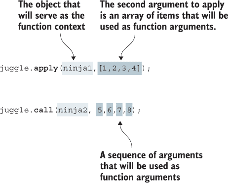

在我们提供了函数上下文和参数之后，我们继续测试！首先，我们检查通过 `apply` 调用的 `ninja1` 是否收到了一个 `result` 属性，该属性是传递数组中所有参数值（`1`，`2`，`3`，`4`）的总和。然后我们对通过 `call` 调用的 `ninja2` 做同样的检查，检查参数 `5`，`6`，`7` 和 `8` 的结果：

```
assert(ninja1.result === 10, "juggled via apply");
assert(ninja2.result === 26, "juggled via call");
```

图 4.4 更详细地展示了 列表 4.11 中的内容。

##### 图 4.4\. 通过使用内置的 `call` 和 `apply` 从 列表 4.11 手动设置函数上下文，产生了这些函数上下文（`this` 参数）和 `arguments` 的组合。

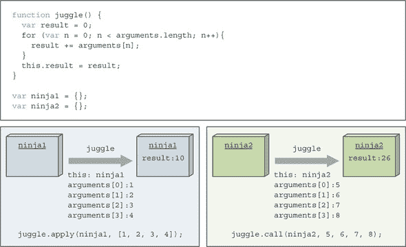

这两种方法，`call` 和 `apply`，在需要用我们自己的对象来替代通常的函数上下文时非常有用——这在调用回调函数时尤其有用。

##### 在回调函数中强制函数上下文

让我们考虑一个具体的例子，强制函数上下文成为我们自己的对象。我们将使用一个简单的函数来对数组的每个条目执行操作。

在命令式编程中，将数组传递给一个方法并使用 `for` 循环遍历每个条目，对每个条目执行操作是很常见的：

```
function(collection) {
  for (var n = 0; n < collection.length; n++) {
    /* do something to collection[n] */
  }
}
```

相比之下，函数式方法是为单个元素创建一个函数，并将每个条目传递给该函数：

```
function(item){
  /* do something to item */
}
```

差别在于思考的层面，在这个层面上，函数是程序的主要构建块。你可能认为这无关紧要，你只是在将 `for` 循环移动了一个层级，但我们还没有完全梳理这个例子。

为了便于更函数式风格的编程，所有数组对象都可以访问一个 `forEach` 函数，该函数会对数组中的每个元素调用回调函数。这种方法通常更简洁，熟悉函数式编程的人更倾向于使用这种方法而不是传统的 `for` 循环语句。在第五章（kindle_split_016.html#ch05）介绍了闭包之后，这种组织上的好处将变得更加明显（咳嗽，代码重用，咳嗽）。这样的迭代函数 *可以* 将当前元素作为参数传递给回调函数，但大多数情况下，它们将当前元素作为回调函数的函数上下文。

尽管现在所有现代的 JavaScript 引擎都支持数组上的 `forEach` 方法，但我们在下一个列表中仍将构建这样一个函数的（简化）版本。

##### 列表 4.12\. 构建一个 `forEach` 函数以演示设置函数上下文

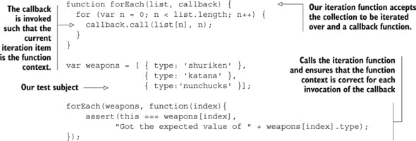

迭代函数具有简单的签名，它期望第一个参数是要迭代的对象数组，第二个参数是回调函数。该函数遍历数组条目，为每个条目调用回调函数：

```
function forEach(list,callback) {
  for (var n = 0; n < list.length; n++) {
    callback.call(list[n], n);
  }
}
```

我们使用回调函数的`call`方法，将当前迭代条目作为第一个参数，将循环索引作为第二个参数。这*应该*导致当前条目成为函数上下文，并将索引作为单个参数传递给回调。

现在来测试一下！我们设置了一个简单的`武器`数组。然后我们调用`forEach`函数，传递测试数组和回调函数，在回调函数内部我们检查预期的条目是否被设置为每次回调调用的函数上下文：

```
forEach(weapons, function(index){
  assert(this === weapons[index],
        "Got the expected value of " + weapons[index].type);
});
```

图 4.5 显示我们的函数工作得非常好。

##### 图 4.5\. 测试结果显示，我们有能力将任何对象设置为回调调用上下文。

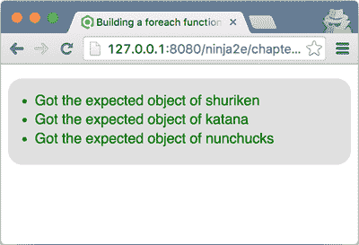

在这样一个函数的生产就绪实现中，还有很多工作要做。例如，如果第一个参数不是一个数组怎么办？如果第二个参数不是一个函数怎么办？你将如何允许页面作者在任何时候终止循环？作为一个练习，你可以增强这个函数以处理这些情况。另一个你可以自己尝试的练习是增强这个函数，使得页面作者可以向回调传递任意数量的参数，除了迭代索引。

既然`apply`和`call`几乎做同样的事情，那么你现在可能会问自己一个问题：我们如何决定使用哪一个？高级答案与许多此类问题相同：我们使用任何一个可以提高代码清晰度的。一个更实际的答案是使用最适合我们手头参数的。如果我们有一堆无关的值在变量中或作为字面量指定，`call`允许我们直接在其参数列表中列出它们。但如果我们已经有了一组参数值在数组中，或者如果方便以这种方式收集它们，`apply`可能是更好的选择。

### 4.3\. 解决函数上下文问题

在前面的章节中，你看到了在处理 JavaScript 中的函数上下文时可能会遇到的一些问题。在回调函数（如事件处理器）中，函数上下文可能并不完全符合我们的预期，但我们可以使用`call`和`apply`方法来解决这个问题。在本节中，你将看到两种其他选项：箭头函数和`bind`方法，在某些情况下，它们可以达到相同的效果，但方式更加优雅。

#### 4.3.1\. 使用箭头函数绕过函数上下文

除了允许我们以比标准函数声明和函数表达式更优雅的方式创建函数之外，上一章中引入的箭头函数还有一个特性使它们特别适合作为回调函数：箭头函数没有自己的`this`值。相反，它们会记住定义时`this`参数的值。让我们回顾一下以下列表中的按钮点击回调问题。

##### 列表 4.13。使用箭头函数绕过回调函数上下文

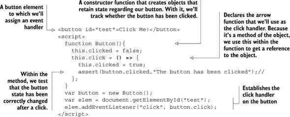

与列表 4.10 相比，唯一的改变是列表 4.13 使用了一个箭头函数：

```
this.click = () = > {
  this.clicked = true;
  assert(button.clicked, "The button has been clicked");
};
```

现在，如果我们运行代码，我们将得到图 4.6 中显示的输出。

##### 图 4.6。箭头函数没有它们自己的上下文。相反，上下文是从它们定义的函数中继承的。我们箭头函数回调中的`this`参数指向按钮对象。

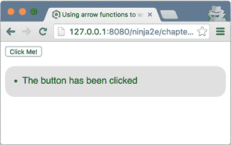

如您所见，现在一切正常。按钮对象跟踪`clicked`状态。发生的事情是我们的点击处理程序是在`Button`构造函数内部作为一个箭头函数创建的：

```
function Button(){
    this.clicked = false;
    this.click = () => {
      this.clicked = true;
      assert(button.clicked, "The button has been clicked");
    };
}
```

正如我们之前提到的，当我们调用箭头函数时，箭头函数不会获得它们自己的隐式`this`参数；相反，它们会记住它们创建时的`this`参数的值。在我们的例子中，`click`箭头函数是在构造函数内部创建的，其中`this`参数是新构造的对象，所以无论我们（或浏览器）何时调用`click`函数，`this`参数的值都将始终绑定到新构造的按钮对象。

##### 注意：箭头函数和对象字面量

由于`this`参数的值是在箭头函数创建时获取的，因此可能会出现一些看似奇怪的行为。让我们回到我们的按钮点击处理程序示例。假设我们得出结论，我们不需要构造函数，因为我们只有一个按钮。我们用以下方式替换它为一个简单的对象字面量。

##### 列表 4.14。箭头函数和对象字面量

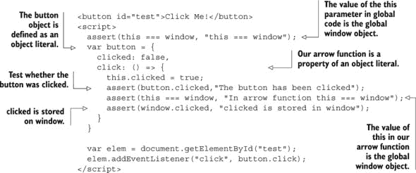

如果我们运行列表 4.14，我们又会失望，因为`button`对象再次未能跟踪`clicked`状态。参见图 4.7。

##### 图 4.7。如果一个箭头函数是在全局代码中定义的对象字面量内部定义的，那么与箭头函数关联的`this`参数的值是全局的`window`对象。

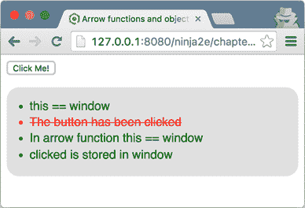

幸运的是，我们在代码中散布了一些断言，这将有助于我们。例如，我们将以下内容直接放置在全局代码中，以便检查`this`参数的值：

```
assert(this === window, "this === window");
```

因为断言通过了，我们可以确信在全局代码中`this`指的是全局的`window`对象。

我们接着指定`button`对象字面量有一个`click`箭头函数属性：

```
var button = {
  clicked: false,
  click: () => {
    this.clicked = true;
    assert(button.clicked,"The button has been clicked");
    assert(this === window, "In arrow function this === window");
    assert(window.clicked, "Clicked is stored in window");
  };
}
```

现在，我们将再次回顾我们的小规则：*箭头函数在创建时获取* `this` *参数的值*。因为`click`箭头函数作为一个属性值在对象字面量上创建，而对象字面量是在全局代码中创建的，所以箭头函数的`this`值将是全局代码的`this`值。而且，正如我们从我们在全局代码中放置的第一个断言中看到的

```
assert(this === window, "this === window");
```

全局代码中 `this` 参数的值是全局的 `window` 对象。因此，我们的 `clicked` 属性将在全局 `window` 对象上定义，而不是在我们的 `button` 对象上。为了确保这一点，最后我们检查 `window` 对象是否被分配了一个 `clicked` 属性：

```
assert(window.clicked, "Clicked is stored in window");
```

正如你所见，未能记住所有箭头函数的后果可能会导致一些微妙的错误，所以请小心！

现在我们已经探讨了如何使用箭头函数来绕过函数上下文的问题，让我们继续使用另一种方法来解决这个问题。

#### 4.3.2\. 使用 `bind` 方法

在本章中，你已经遇到了每个函数都可以访问的两个方法，`call` 和 `apply`，你也看到了如何使用它们来对我们的函数调用有更大的控制权。

除了这些方法外，每个函数都可以访问 `bind` 方法，简而言之，它创建一个新的函数。这个函数有相同的主体，但它的上下文始终绑定到某个对象，*无论* 我们如何调用它。

让我们再次回顾一下我们的按钮点击处理器的小问题。

##### 列表 4.15\. 将特定上下文绑定到事件处理器

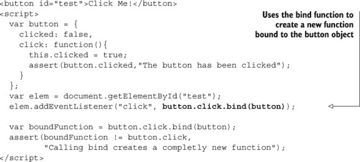

这里添加的秘密成分是 `bind()` 方法：

```
elem.addEventListener("click", button.click.bind(button));
```

`bind` 方法对所有函数都可用，并且旨在 *创建* 并返回一个 *新* 的函数，该函数绑定到传入的对象（在这种情况下，是 `button` 对象）。`this` 参数的值始终设置为该对象，无论绑定函数是如何调用的。除此之外，绑定函数的行为与原始函数一样，因为它在其主体中有相同的代码。

每次按钮被点击时，那个绑定函数都会以 `button` 对象作为其上下文被调用，因为我们已经将那个 `button` 对象作为 `bind` 的参数。

注意，调用 `bind` 方法不会修改原始函数。它创建了一个全新的函数，这在示例的末尾得到了证实：

```
var boundFunction = button.click.bind(button);
assert(boundFunction != button.click,
           "Calling bind creates a completly new function");
```

有了这个，我们将结束对函数上下文的探索。现在休息一下，因为下一章，我们将处理 JavaScript 中最重要概念之一：闭包。

### 4.4\. 总结

+   当调用一个函数时，除了在函数定义中明确声明的参数外，函数调用还传递了两个隐含参数：`arguments` 和 `this`：

    +   `arguments` 参数是传递给函数的参数集合。它有一个 `length` 属性，表示传递了多少个参数，并且它使我们能够访问没有匹配参数的参数值。在非严格模式下，`arguments` 对象是函数参数的别名（改变参数会改变参数的值，反之亦然）。这可以通过使用严格模式来避免。

    +   `this`参数表示函数上下文，一个与函数调用关联的对象。`this`是如何确定的，可以取决于函数的定义方式以及它的调用方式。

+   函数可以通过四种方式被调用：

    +   作为函数：`skulk()`

    +   作为方法：`ninja.skulk()`

    +   作为构造函数：`new Ninja()`

    +   通过其`apply`和`call`方法：`skulk.call(ninja)`或`skulk.apply(ninja)`

+   函数的调用方式会影响`this`参数的值：

    +   如果一个函数作为函数被调用，非严格模式下`this`参数的值通常是全局`window`对象，而在严格模式下是`undefined`。

    +   如果一个函数作为方法被调用，`this`参数的值通常是调用该函数的对象。

    +   如果一个函数作为构造函数被调用，`this`参数的值是新构造的对象。

    +   如果一个函数通过`call`和`apply`被调用，`this`参数的值是`call`和`apply`提供的第一个参数。

+   箭头函数没有自己的`this`参数值。相反，它们在创建时获取它。

+   使用所有函数都有的`bind`方法创建一个新的函数，该函数始终绑定到`bind`方法的参数。在其他所有方面，绑定函数的行为与原始函数相同。

### 4.5\. 练习

> **1**
> 
> 以下函数通过使用`arguments`对象计算传入参数的总和：
> 
> ```
> function sum(){
>   var sum = 0;
>   for(var i = 0; i < arguments.length; i++){
>      sum += arguments[i];
>   }
>   return sum;
> }
> 
> assert(sum(1, 2, 3) === 6, 'Sum of first three numbers is 6');
> assert(sum(1, 2, 3, 4) === 10, 'Sum of first four numbers is 10');
> ```
> 
> 通过使用上一章中引入的剩余参数，重写`sum`函数，使其不使用`arguments`对象。
> 
> **2**
> 
> 在运行以下代码后，变量`ninja`和`samurai`的值是什么？
> 
> ```
> function getSamurai(samurai){
>   "use strict"
> 
>   arguments[0] = "Ishida";
> 
>   return samurai;
> }
> 
> function getNinja(ninja){
>   arguments[0] = "Fuma";
>   return ninja;
> }
> 
> var samurai = getSamurai("Toyotomi");
> var ninja = getNinja("Yoshi");
> ```
> 
> **3**
> 
> 在运行以下代码时，哪个断言会通过？
> 
> ```
> function whoAmI1(){
>   "use strict";
>   return this;
> }
> 
> function whoAmI2(){
>   return this;
> }
> 
> assert(whoAmI1() === window, "Window?");
> assert(whoAmI2() === window, "Window?");
> ```
> 
> **4**
> 
> 在运行以下代码时，哪个断言会通过？
> 
> ```
> var ninja1 = {
>    whoAmI: function(){
>      return this;
>    }
> };
> 
> var ninja2 = {
>   whoAmI: ninja1.whoAmI
> };
> var identify = ninja2.whoAmI;
> 
> assert(ninja1.whoAmI() === ninja1, "ninja1?");
> assert(ninja2.whoAmI() === ninja1, " ninja1 again?");
> 
> assert(identify() === ninja1, "ninja1 again?");
> 
> assert(ninja1.whoAmI.call(ninja2) === ninja2, "ninja2 here?");
> ```
> 
> **5**
> 
> 在运行以下代码时，哪个断言会通过？
> 
> ```
> function Ninja(){
>   this.whoAmI = () => this;
> }
> 
> var ninja1 = new Ninja();
> var ninja2 = {
>   whoAmI: ninja1.whoAmI
> };
> 
> assert(ninja1.whoAmI() === ninja1, "ninja1 here?");
> assert(ninja2.whoAmI() === ninja2, "ninja2 here?");
> ```
> 
> **6**
> 
> 以下哪个断言会通过？
> 
> ```
> function Ninja(){
>   this.whoAmI = function(){
>     return this;
>   }.bind(this);
> }
> 
> var ninja1 = new Ninja();
> var ninja2 = {
>   whoAmI: ninja1.whoAmI
> };
> 
> assert(ninja1.whoAmI() === ninja1, "ninja1 here?");
> assert(ninja2.whoAmI() === ninja2, "ninja2 here?");
> ```

## 第五章\. 为大师准备的函数：闭包和作用域

*本章涵盖*

+   使用闭包简化开发

+   使用执行上下文跟踪 JavaScript 程序的执行

+   使用词法环境跟踪变量作用域

+   理解变量类型

+   探索闭包的工作原理

与我们在前几章中学到的函数紧密相关，闭包是 JavaScript 的一个定义性特征。尽管许多 JavaScript 开发者可以编写代码而不理解闭包的好处，但闭包的使用不仅可以帮助我们减少添加高级功能所需的代码量和复杂性，而且还能使我们能够完成其他情况下不可能完成或过于复杂而无法实现的事情。例如，任何涉及回调的任务，如事件处理或动画，如果没有闭包，将会变得非常复杂。其他任务，如提供对私有对象变量的支持，将完全不可能。语言本身以及我们编写代码的方式，都因闭包的引入而永远改变。

传统上，闭包是纯函数式编程语言的一个特性。看到它们跨越到主流开发中是令人鼓舞的。在 JavaScript 库和其他高级代码库中，闭包的普遍存在是因为它们能够极大地简化复杂的操作。

闭包是 JavaScript 中作用域工作方式的副作用。因此，我们将探讨 JavaScript 的作用域规则，特别关注最近的新增功能。这将帮助你理解闭包在幕后是如何工作的。让我们直接进入正题！

### 你知道吗？

> **Q1:**
> 
> 变量或方法可以有多少个不同的作用域，它们是什么？
> 
> **Q2:**
> 
> 标识符及其值是如何追踪的？
> 
> **Q3:**
> 
> 什么是可变变量，如何在 JavaScript 中定义一个？

### 5.1\. 理解闭包

*闭包* 允许一个函数访问和操作该函数外部定义的变量。闭包允许一个函数访问在函数定义时作用域内的所有变量，以及其他函数。

|  |
| --- |

##### 注意

你可能熟悉作用域的概念，但以防万一，*作用域* 指的是标识符在程序某些部分的可视性。作用域是程序的一部分，在这个部分中，某个名称绑定到某个变量上。

|  |
| --- |

这可能看起来很直观，直到你记得一个声明的函数可以在任何后来的时间被调用，甚至是在它声明的范围消失之后。这个概念最好通过代码来解释。但在我们具体讨论有助于你编写更优雅的动画代码或定义私有对象属性的示例之前，让我们从小处着手，从以下列表开始。

##### 列表 5.1\. 一个简单的闭包

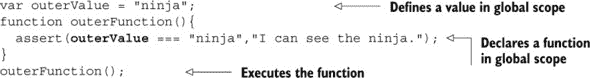

在这个代码示例中，我们在同一个作用域中声明了一个变量 `outerValue` 和一个函数 `outerFunction`——在这个例子中，是全局作用域。之后，我们调用了 `outerFunction`。

正如你在 图 5.1 中看到的，函数能够“看到”并访问 `outerValue` 变量。你可能已经编写了数百次这样的代码，而没有意识到你正在创建闭包！

##### 图 5.1\. 我们的功能已经找到了隐藏在明处的忍者。

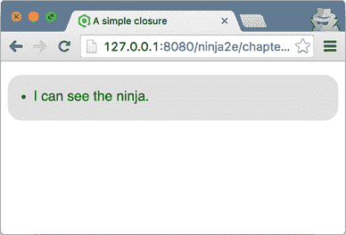

不太满意？猜这并不奇怪。因为`outerValue`和`outerFunction`都是在全局范围内声明的，这个范围（它是一个闭包）永远不会消失（只要我们的应用程序正在运行）。函数能够访问变量并不奇怪，因为它仍然在范围内且有效。

尽管闭包存在，但其好处还不明显。让我们在下一个列表中添加一些内容。

##### 列表 5.2\. 另一个闭包示例

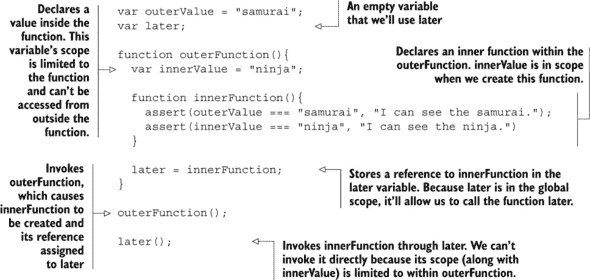

让我们过度分析`innerFunction`中的代码，看看我们是否能预测可能会发生什么：

+   第一个`assert`肯定能通过；`outerValue`在全局范围内，对一切可见。但第二个`assert`呢？

+   我们是通过将函数的引用复制到全局变量`later`中，在`outerFunction`执行后执行`innerFunction`的。

+   当`innerFunction`执行时，外函数内部的范围已经消失且在通过`later`调用函数的点上不可见。

+   因此，我们完全可以预期`assert`会失败，因为`innerValue`肯定会被赋予`undefined`。对吗？

但当我们运行测试时，我们看到的是图 5.2 中的显示。

##### 图 5.2\. 尽管试图隐藏在函数内部，忍者已经被检测到！


怎么会这样？什么魔法允许我们在执行内部函数时，即使在其创建的作用域已经消失很久之后，`innerValue`变量仍然“存活”？答案是闭包。

当我们在外函数内部声明`innerFunction`时，不仅定义了函数声明，还创建了一个闭包，它包括函数定义以及函数定义点的作用域内的所有变量。当`innerFunction`最终执行时，即使它是在声明它的作用域消失之后执行的，它也可以通过其闭包访问其声明的原始作用域，如图 5.3 所示。

##### 图 5.3\. 就像保护性的气泡一样，`innerFunction`的闭包使函数作用域内的变量在函数存在期间保持活跃。


这就是闭包的全部内容。它们创建了一个“安全气泡”，包含函数及其在函数定义点的作用域内的变量，这样函数就有它执行所需的一切。这个包含函数及其变量的气泡，只要函数存在就会一直存在。

尽管所有这些结构并不一目了然（没有“闭包”对象持有所有这些信息供你检查），以这种方式存储和引用信息是有直接成本的。重要的是要记住，每个通过闭包访问信息的函数都附有一个“球和链”，携带这些信息。因此，尽管闭包非常有用，但它们并非没有开销。所有这些信息都需要保留在内存中，直到 JavaScript 引擎明确知道它不再需要（并且可以安全地进行垃圾回收），或者直到页面卸载。

别担心；我们并非只有关于闭包工作原理的这些话要说。但在探索使闭包得以实现的机制之前，让我们先看看它们的实际用途。

### 5.2\. 利用闭包

现在我们对闭包有了高层次的理解，让我们看看如何在 JavaScript 应用程序中利用它们。现在，我们将关注它们的实际方面和好处。在本章的后面部分，我们将重新审视相同的示例，以了解幕后到底发生了什么。

#### 5.2.1\. 模拟私有变量

许多编程语言使用*私有变量*——对象属性，对外部方隐藏。这是一个有用的特性，因为我们不希望在使用对象时，让用户承受不必要的实现细节的负担。不幸的是，JavaScript 没有对私有变量的原生支持。但通过使用闭包，我们可以实现一个可接受的近似，如下面的代码所示。

##### 列表 5.3\. 使用闭包近似私有变量


在这里，我们创建一个函数，`Ninja`，作为构造函数。我们在第三章中介绍了使用函数作为构造函数（我们将在第七章中深入探讨）。现在，请回忆一下，当在函数上使用`new`关键字时，会创建一个新的对象实例，并且该函数会以这个新对象作为上下文被调用，作为该对象的构造函数。因此，函数内的`this`指向一个新实例化的对象。

在构造函数中，我们定义一个变量来保存状态，`feints`。这个变量的 JavaScript 作用域规则限制了其可访问性仅限于*构造函数内部*。为了从代码外部的作用域访问变量的值，我们定义了一个*访问器*方法：`getFeints`，它可以用来读取私有变量。（访问器方法通常被称为*获取器*。）

```
function Ninja() {
  var feints = 0;
  this.getFeints = function(){
    return feints;
  };
  this.feint = function(){
    feints++;
  };
 }
```

然后创建了一个实现方法，`feint`，以让我们控制变量的值。在实际应用中，这可能是业务方法，但在这个例子中，它只是增加`feints`的值。

构造函数完成其任务后，我们可以在新创建的`ninja1`对象上调用`feint`方法：

```
var ninja1 = new Ninja();
ninja1.feint();
```

我们的测试表明，我们可以使用访问器方法来获取私有变量的值，但我们不能直接访问它。这防止了我们能够无控制地更改变量的值，就像它是一个真正的私有变量一样。这种情况在图 5.4 中有所描述。

##### 图 5.4\. 将变量隐藏在构造函数中使其对外部作用域不可见，但在它起作用的地方，变量仍然活跃，并受到闭包的保护。


使用闭包可以让忍者的状态在方法内部保持，而不会让方法的使用者直接访问它——因为变量通过闭包对内部方法可用，但对外部构造函数之外的代码不可用。

这是对面向对象 JavaScript 世界的窥视，我们将在第七章中更深入地探讨。现在，让我们专注于闭包的另一种常见用途。

#### 5.2.2\. 使用闭包与回调

闭包的另一种常见用途发生在处理回调函数时——当函数在不确定的将来某个时间被调用时。通常，在这样的函数中，我们经常需要访问外部数据。以下列表显示了一个使用回调计时器创建简单动画的示例。

##### 列表 5.4\. 在计时器间隔回调中使用闭包


这段代码特别重要的是它使用了一个匿名函数，作为`setInterval`的参数，来完成目标`div`元素的动画。该函数通过闭包访问三个变量：`elem`、`tick`和`timer`，以控制动画过程。这三个变量（DOM 元素的引用`elem`；计数器`tick`；计时器引用`timer`）都必须在动画的各个步骤中保持。而且我们需要将它们保持在全局作用域之外。

但如果我们把变量从`animateIt`函数移出并放入全局作用域，示例仍然可以正常工作。那么为什么还要大惊小怪，不去污染全局作用域呢？

尝试将变量移入全局作用域并验证示例是否仍然有效。现在修改示例以动画两个元素：添加另一个具有唯一 ID 的元素，并在原始调用之后立即使用该 ID 调用`animateIt`函数。

问题立即变得明显。如果我们保持变量在全局作用域中，我们需要为每个动画设置一组三个变量。否则，它们会相互覆盖，试图使用同一组变量来跟踪多个状态。

通过在函数内部定义变量，并依靠闭包使它们对计时器回调调用可用，每个动画都获得自己的私有“气泡”变量，如图 5.5 所示。

##### 图 5.5. 通过保持函数多个实例的变量分离，我们可以同时做很多事情。


没有闭包，同时做很多事情，无论是事件处理、动画，甚至是服务器请求，都会非常困难。如果你一直在等待一个关心闭包的理由，那就是它了！

这个例子特别适合演示闭包如何产生一些令人惊讶直观和简洁的代码。通过在`animateIt`函数中包含变量，我们创建了一个隐式的闭包，而无需任何复杂的语法。

这个例子还清楚地说明了另一个重要概念。我们不仅可以看到闭包创建时这些变量的值，我们还可以在闭包内部执行函数时更新它们。闭包不仅仅是创建时作用域状态的快照，而是一个我们可以修改的活跃封装状态，只要闭包存在。

闭包与作用域密切相关，因此我们将在本章中花费大量时间探讨 JavaScript 中的作用域规则。但首先，我们将从 JavaScript 中代码执行跟踪的细节开始。

### 5.3. 使用执行上下文跟踪代码执行

在 JavaScript 中，执行的基本单位是函数。我们经常使用它们，用于计算某些东西，执行副作用，如更改 UI，实现代码重用，或使我们的代码更容易理解。为了实现其目的，一个函数可以调用另一个函数，然后另一个函数可以调用另一个函数，依此类推。当一个函数执行其操作时，我们的程序执行必须返回到函数被调用的位置。但你有没有想过 JavaScript 引擎是如何跟踪所有这些正在执行的函数和返回位置的？

如我们在第二章中提到的，JavaScript 代码主要有两种类型：*全局代码*，放置在所有函数之外，和*函数代码*，包含在函数中。当我们的代码被 JavaScript 引擎执行时，每个语句都是在一定的*执行上下文*中执行的。

正如我们有两种类型的代码，我们也有两种类型的执行上下文：一个*全局执行上下文*和一个*函数执行上下文*。这里有一个显著的区别：只有一个全局执行上下文，在我们 JavaScript 程序开始执行时创建，而每次函数调用都会创建一个新的*函数执行上下文*。

| |
| --- |

##### 注意

你可能还记得第四章中提到的，*函数上下文*是我们函数被调用的对象，可以通过`this`关键字访问。执行上下文，尽管名称相似，但完全是另一回事。它是一个 JavaScript 引擎用来跟踪我们函数执行的内部概念。

| |
| --- |

如我们在第二章中提到的，JavaScript 基于单线程执行模型：一次只能执行一段代码。每次调用函数时，当前执行上下必须停止，并创建一个新的函数执行上下文，其中将评估函数代码。函数执行完其任务后，其函数执行上下文通常会被丢弃，并恢复调用者的执行上下文。因此，需要跟踪所有这些执行上下文——正在执行的以及耐心等待的。最简单的方法是使用一个*栈*，称为*执行上下文栈*（或通常称为*调用栈*）。

| |
| --- |

##### 注意

栈是一种基本的数据结构，你只能将新项目放入顶部，只能从顶部取出现有项目。想象一下自助餐厅里的一摞托盘。当你想要取一个时，你从顶部取一个。而且，有一个新干净的托盘的自助餐厅工作人员也会把它放在顶部。

| |
| --- |

这可能看起来有些模糊，那么让我们看看以下代码，它报告了两个潜行忍者的活动。

##### 列表 5.5\. 执行上下文的创建


这段代码很简单；我们定义了一个`skulk`函数，它调用`report`函数，该函数输出一条消息。然后，从全局代码中，我们分别调用两次`skulk`函数：`skulk("Kuma")`和`skulk("Yoshi")`。以这段代码为基础，我们将探讨执行上下文的创建，如图 5.6 所示。

##### 图 5.6\. 执行上下文栈的行为


当执行示例代码时，执行上下文的行为如下：

1.  执行上下文栈以全局执行上下文开始，全局执行上下文在每个 JavaScript 程序中只创建一次（在网页的情况下，每页只创建一次）。全局执行上下文是执行全局代码时的活动执行上下文。

1.  在全局代码中，程序首先定义了两个函数：`skulk`和`report`，然后调用`skulk`函数，并传递参数`skulk("Kuma")`。因为一次只能执行一段代码，JavaScript 引擎暂停全局代码的执行，并转到执行带有参数`Kuma`的`skulk`函数代码。这是通过创建一个新的函数执行上下文并将其推到栈顶来完成的。

1.  `skulk`函数反过来调用`report`函数，并传递参数`Kuma skulking`。同样，因为一次只能执行一段代码，`skulk`执行上下文被暂停，并为`report`函数创建一个新的函数执行上下文，参数为`Kuma skulking`，并将其推入栈中。

1.  在`report`函数通过内置的`console.log`函数（见附录 C）记录消息并完成其执行后，我们必须回到`skulk`函数。这是通过从栈中弹出`report`函数的执行上下文来完成的。然后重新激活`skulk`函数的执行上下文，并继续执行`skulk`函数。

1.  当`skulk`函数完成其执行时，也会发生类似的事情：`skulk`函数的函数执行上下文从栈中移除，整个过程中一直耐心等待的全局执行上下文被恢复为活动执行上下文。全局 JavaScript 代码的执行也被恢复。

这个整个过程以类似的方式重复进行，对于`skulk`函数的第二次调用，现在带有参数`Yoshi`。当相应的函数被调用时，创建了两个新的函数执行上下文并推入栈中，分别是`skulk("Yoshi")`和`report("Yoshi skulking")`。当程序从匹配的函数返回时，这些执行上下文也会从栈中弹出。

尽管执行上下文栈是 JavaScript 的一个内部概念，你可以在任何 JavaScript 调试器中探索它，在那里它被称为*调用栈*。图 5.7 展示了 Chrome DevTools 中的调用栈。

##### 图 5.7. Chrome DevTools 中执行上下文栈的当前状态


| |
| --- |

##### 注意

附录 C 提供了关于各种浏览器中可用调试工具的更详细说明。

| |
| --- |

除了跟踪应用程序执行中的位置，执行上下文在*标识符解析*中也非常重要，这是确定某个标识符引用哪个变量的过程。执行上下文通过*词法环境*来完成这项工作。

### 5.4. 使用词法环境跟踪标识符

*词法环境*是 JavaScript 引擎内部的一个结构，用于跟踪标识符到特定变量的映射。例如，考虑以下代码：

```
var ninja = "Hattori";
console.log(ninja);
```

当在`console.log`语句中访问`ninja`变量时，会咨询词法环境。

| |
| --- |

##### 注意

词法环境是 JavaScript 作用域机制的内部实现，人们通常口语化地称它们为*作用域*。

| |
| --- |

通常，词法环境与 JavaScript 代码的特定结构相关联。它可以与一个函数、一段代码或`try-catch`语句的`catch`部分相关联。这些结构（函数、块和`catch`部分）都可以有自己的独立的标识符映射。

| |
| --- |

##### 注意

在 ES6 之前的 JavaScript 版本中，词法环境只能与一个函数关联。变量只能是函数作用域的。这造成了很多混淆。因为 JavaScript 是一种类似 C 的语言，来自其他类似 C 的语言（如 C++、C# 或 Java）的人自然期望一些底层概念，如块作用域的存在，是相同的。随着 ES6 的推出，这个问题终于得到了解决。

|  |
| --- |

#### 5.4.1\. 代码嵌套

词法环境在很大程度上基于 *代码嵌套*，这使得一个代码结构可以被包含在另一个代码结构中。图 5.8 展示了各种类型的代码嵌套。

##### 图 5.8\. 代码嵌套的类型


在这个例子中，我们可以看到以下内容：

+   `for` 循环嵌套在 `report` 函数中。

+   `report` 函数嵌套在 `skulk` 函数中。

+   `skulk` 函数嵌套在全局代码中。

在作用域方面，每次代码被评估时，每个代码结构都会获得一个相关的词法环境。例如，每次调用 `skulk` 函数时，都会创建一个新的函数词法环境。

此外，重要的是要强调内部代码结构可以访问外部代码结构中定义的变量；例如，`for` 循环可以访问 `report` 函数、`skulk` 函数和全局代码中的变量；`report` 函数可以访问 `skulk` 函数和全局代码中的变量；而 `skulk` 函数只能访问全局代码中的额外变量。

这种访问变量的方式并没有什么特别之处；我们中的大多数人可能已经做过很多次了。但是，JavaScript 引擎是如何跟踪所有这些变量的，以及从哪里可以访问它们呢？这就是词法环境介入的地方。

#### 5.4.2\. 代码嵌套和词法环境

除了跟踪局部变量、函数声明和函数参数之外，每个词法环境还必须跟踪其 *外部*（父级）词法环境。这是必要的，因为我们必须能够访问外部代码结构中定义的变量；如果在当前环境中找不到标识符，则会搜索外部环境。这会在找到匹配的变量时停止，或者如果已经达到全局环境且没有找到搜索的标识符，则会引发引用错误。图 5.9 展示了一个示例；你可以看到在执行 `report` 函数时，标识符 `intro`、`action` 和 `ninja` 是如何被解析的。

##### 图 5.9\. JavaScript 引擎如何解析变量的值


在这个例子中，`report` 函数是由 `skulk` 函数调用的，而 `skulk` 函数又是由全局代码调用的。每个执行上下文都与一个词法环境相关联，该环境包含在该上下文中直接定义的所有标识符的映射。例如，全局环境包含标识符 `ninja` 和 `skulk` 的映射，`skulk` 环境包含标识符 `action` 和 `report` 的映射，而 `report` 环境包含标识符 `intro` 的映射（即图 5.9 的右侧）。

在特定的执行上下文中，除了访问匹配词法环境中直接定义的标识符外，我们的程序通常还会访问外部环境中定义的其他变量。例如，在 `report` 函数的主体中，我们访问外部 `skulk` 函数的 `action` 变量，以及全局的 `ninja` 变量。为了做到这一点，我们必须以某种方式跟踪这些外部环境。JavaScript 通过利用函数作为一等对象来实现这一点。

每当创建一个函数时，都会将函数创建时的词法环境引用存储在一个内部（这意味着你不能直接访问或操作它）属性中，该属性名为 `[[Environment]]`；双中括号是我们用来标记这些内部属性的符号。在我们的例子中，`skulk` 函数将保留对全局环境的引用，而 `report` 函数将保留对 `skulk` 环境的引用，因为这些是函数创建的环境。

| |
| --- |

##### 注意

这一开始可能看起来有些奇怪。我们为什么不只是遍历整个执行上下文栈并搜索它们的匹配环境以查找标识符映射呢？技术上，在我们的例子中这会起作用。但记住，JavaScript 函数可以被像任何其他对象一样传递，因此函数定义的位置和函数被调用的位置通常是不相关的（记住闭包）。

| |
| --- |

每当调用一个函数时，都会创建一个新的函数执行上下文并将其推入执行上下文栈。此外，还会创建一个新的相关词法环境。现在到了关键部分：对于新创建的词法环境的外部环境，JavaScript 引擎将调用函数内部 `[[Environment]]` 属性引用的环境，即现在被调用的函数创建时的环境！

在我们的例子中，当调用 `skulk` 函数时，新创建的 `skulk` 环境的外部环境变为全局环境（因为它是 `skulk` 函数创建的环境）。同样，当调用 `report` 函数时，新创建的 `report` 环境的外部环境被设置为 `skulk` 环境。

现在让我们来看看 `report` 函数：

```
function report() {
  var intro = "Aha!";
  assert(intro === "Aha!", "Local");
  assert(action === "Skulking", "Outer");
  assert(action === "Muneyoshi", "Global");
}
```

当第一个 `assert` 语句正在评估时，我们必须解析 `intro` 标识符。为此，JavaScript 引擎首先检查当前运行执行上下文的环境，即 `report` 环境。因为 `report` 环境包含对 `intro` 的引用，所以标识符被解析。

接下来，第二个 `assert` 语句必须解析 `action` 标识符。同样，检查当前运行执行上下文的环境。但是 `report` 环境不包含对 `action` 标识符的引用，所以 JavaScript 引擎必须检查 `report` 环境的外部环境：`skulk` 环境。幸运的是，`skulk` 环境包含对 `action` 标识符的引用，并且标识符被解析。尝试解析 `ninja` 标识符时遵循类似的流程（一个小提示：标识符可以在全局环境中找到）。

现在您已经了解了标识符解析的基础知识，让我们来看看变量可以声明的各种方式。

### 5.5. 理解 JavaScript 变量的类型

在 JavaScript 中，我们可以使用三个关键字来定义变量：`var`、`let` 和 `const`。它们在两个方面有所不同：*可变性*和它们与词法环境的关系。

| |
| --- |

##### 注意

关键字 `var` 自 JavaScript 诞生以来就是其一部分，而 `let` 和 `const` 是 ES6 的新增功能。您可以在以下链接中检查您的浏览器是否支持 `let` 和 `const`：[`mng.bz/CGJ6`](http://mng.bz/CGJ6) 和 [`mng.bz/uUIT`](http://mng.bz/uUIT)。

| |
| --- |

#### 5.5.1. 变量可变性

如果我们要根据可变性来划分变量声明关键字，我们会把 `const` 放在一侧，而 `var` 和 `let` 放在另一侧。所有使用 `const` 定义的变量都是不可变的，这意味着它们的值只能设置一次。另一方面，使用关键字 `var` 和 `let` 定义的变量是典型的常规变量，我们可以根据需要多次更改它们的值。

现在，让我们深入了解 `const` 变量的工作方式和行为。

##### const 变量

一个 `const` “变量”与普通变量类似，除了在声明时我们必须提供一个初始化值，并且之后不能为其分配一个全新的值。嗯，这不太像“变量”，对吧？

`Const` 变量通常用于两个略有不同的目的：

+   指定不应重新分配的变量（在本书的其余部分，我们主要用这种方式使用它们）。

+   通过名称引用一个固定值，例如，小队中浪人的最大数量 `MAX_RONIN_COUNT`，而不是使用一个字面量数字，如 234。这使得我们的程序更容易理解和维护。我们的代码不是充满了看似随机的字面量（`234`），而是充满了有意义的名称（`MAX_RONIN_COUNT`），其值只在一个地方指定。

在任何情况下，因为`const`变量在程序执行期间都不应该被重新赋值，所以我们已经保护了我们的代码免受未预期或意外的修改，甚至让 JavaScript 引擎能够进行一些性能优化。

下面的列表说明了`const`变量的行为。

##### 列表 5.6\. `const`变量的行为


在这里，我们首先定义了一个名为`firstConst`的`const`变量，其值为`samurai`，并测试该变量是否已按预期初始化：

```
const firstConst = "samurai";
assert(firstConst === "samurai", "firstConst is a samurai");
```

我们继续尝试将一个全新的值`ninja`赋给我们的`firstConst`变量：

```
try{
  firstConst = "ninja";
  fail("Shouldn't be here");
} catch(e){
  pass("An exception has occurred");
}
```

因为`firstConst`变量是一个常量，所以我们不能给它分配新的值，所以 JavaScript 引擎会抛出一个异常而不修改变量的值。注意，我们使用了之前没有使用过的两个函数：`fail`和`pass`。这两个方法的行为与`assert`方法类似，但`fail`总是失败，而`pass`总是通过。在这里，我们使用它们来检查是否发生了异常：如果发生异常，`catch`语句会被激活，并执行`pass`方法。如果没有异常，`fail`方法会被执行，我们会被告知某些事情并不像它应该的那样。我们可以检查以验证异常是否发生，如图 5.10 所示。

##### 图 5.10\. 检查`const`变量的行为。当我们尝试给`const`变量分配一个全新的值时，会发生异常。


接下来，我们定义另一个`const`变量，这次将其初始化为一个空对象：

```
const secondConst = {};
```

现在我们将讨论`const`变量的重要特性。正如您已经看到的，我们无法给`const`变量分配一个全新的值。但没有任何阻止我们修改当前值。例如，我们可以向当前对象添加新的属性：

```
secondConst.weapon = "wakizashi";
assert(secondConst.weapon === "wakizashi",
       "We can add new properties");
```

或者，如果我们的`const`变量引用的是一个数组，我们可以修改这个数组到任何程度：

```
const thirdConst = [];
assert(thirdConst.length === 0, "No items in our array");

thirdConst.push("Yoshi");

assert(thirdConst.length === 1, "The array has changed");
```

就这样。`const`变量本身并不复杂。您只需要记住，`const`变量的值只能在初始化时设置，并且我们以后不能分配一个全新的值。我们仍然可以修改现有值；我们只是不能完全覆盖它。

现在我们已经探讨了变量的可变性，让我们考虑不同类型变量和词法环境之间关系的细节。

#### 5.5.2\. 变量定义关键字和词法环境

三种变量定义类型——`var`、`let`和`const`——也可以根据它们与词法环境的关系（换句话说，它们的范围）进行分类。在这种情况下，我们可以将`var`放在一边，而将`let`和`const`放在另一边。

##### 使用`var`关键字

当我们使用`var`关键字时，变量定义在最近的函数或全局词法环境中。（注意，块被忽略！）这是 JavaScript 的一个长期细节，让很多来自其他语言的开发者感到困惑。

考虑以下代码示例。

##### 列表 5.7\. 使用`var`关键字


我们首先定义一个全局变量`globalNinja`，然后定义一个`reportActivity`函数，该函数循环两次并通知我们`globalNinja`的跳跃活动。正如你所见，在`for`循环体中，我们可以正常访问块变量（`i`和`forMessage`），函数变量（`functionActivity`）和全局变量（`globalNinja`）。

但 JavaScript 中有些奇怪的地方，让很多来自其他语言的开发者感到困惑，那就是我们可以在代码块外部访问使用代码块定义的变量：

```
assert(i === 3 && forMessage === "Yoshi jumping",
       "Loop variables accessible outside of the loop");
```

这源于使用`var`关键字声明的变量总是注册在最近的函数或全局词法环境中，而不考虑块。通过显示`reportActivity`函数中`for`循环第二次迭代后的词法环境状态来描述这种情况。

##### 图 5.11\. 使用`var`关键字定义变量时，变量定义在最近的函数或全局环境中（同时忽略块环境）。在我们的例子中，变量`forMessage`和`i`注册在`reportActivity`环境中（最近的函数环境），尽管它们包含在`for`循环中。


这里我们有三个词法环境：

+   注册`globalNinja`变量的全局环境（因为这是最近的函数或全局词法环境）

+   `reportActivity`函数调用时创建的`reportActivity`环境，其中包含`functionActivity`、`i`和`forMessage`变量，因为它们是用`var`关键字定义的，这是它们最近的函数环境

+   `for`块环境为空，因为用`var`定义的变量忽略了块（即使它们包含在其中）

由于这种行为有点奇怪，ES6 版本的 JavaScript 提供了两个新的变量声明关键字：`let`和`const`。

##### 使用`let`和`const`指定块作用域变量

与定义变量在最近的函数或全局词法环境中的`var`不同，`let`和`const`关键字更为直接。它们在最近的词法环境中定义变量（这可以是块环境、循环环境、函数环境，甚至是全局环境）。我们可以使用`let`和`const`来定义块作用域、函数作用域和全局作用域变量。

让我们重写之前的例子，使用`const`和`let`。

##### 列表 5.8\. 使用`const`和`let`关键字


图 5.12 展示了当前情况，当`reportActivity`函数中`for`循环的第二次迭代执行完毕时。我们再次有三个词法环境：全局环境（用于所有函数和块之外的全局代码），与`reportActivity`函数绑定的`reportActivity`环境，以及`for`循环体块的块环境。但是因为我们使用了`let`和`const`关键字，变量定义在其最近的词法环境中；`GLOBAL_NINJA`变量定义在全局环境中，`functionActivity`变量在`reportActivity`环境中，而`i`和`forMessage`变量在`for`块环境中。

##### 图 5.12。当使用`let`和`const`关键字定义变量时，变量定义在其最近的词法环境中。在我们的例子中，变量`forMessage`和`i`注册在`for`块环境中，变量`functionActivity`在`reportActivity`环境中，而`GLOBAL_NINJA`变量在全局环境中（在所有情况下，都是各自变量的最近词法环境）。


现在，随着`const`和`let`的引入，大量最近从其他编程语言转来的新 JavaScript 开发者可以安心了。JavaScript 终于支持与其他 C-like 语言相同的作用域规则。因此，从本书的这个点开始，我们几乎总是使用`const`和`let`而不是`var`。

现在我们已经了解了标识符映射如何在词法环境中保持，以及词法环境如何与程序执行相关联，让我们讨论标识符在词法环境中定义的确切过程。这将帮助我们更好地理解一些常见的错误。

#### 5.5.3。在词法环境中注册标识符

设计 JavaScript 作为编程语言背后的一个驱动原则是其易用性。这也是没有指定函数返回类型、函数参数类型、变量类型等原因之一。而且你已经知道 JavaScript 代码是逐行、直接执行。考虑以下内容：

```
firstRonin = "Kiyokawa";
secondRonin = "Kondo";
```

将值`Kiyokawa`分配给标识符`firstRonin`，然后值`Kondo`分配给标识符`secondRonin`。这没什么奇怪的，对吧？但是看看另一个例子：

```
const firstRonin = "Kiyokawa";
check(firstRonin);
function check(ronin) {
  assert(ronin === "Kiyokawa", "The ronin was checked! ");
}
```

在这种情况下，我们将值`Kiyokawa`分配给标识符`firstRonin`，然后我们用标识符`firstRonin`作为参数调用`check`函数。但是等等——如果代码逐行执行，我们是否应该能够调用`check`函数？我们的程序执行还没有达到其声明，所以 JavaScript 引擎甚至不应该知道它。

但如果我们检查，如图 5.13 所示，你会看到一切正常。JavaScript 对我们定义函数的位置并不太挑剔。我们可以选择在函数调用之前或之后放置函数声明。这不是开发者需要烦恼的事情。

##### 图 5.13\. 函数确实在执行达到其定义之前就已经可见了。


##### 注册标识符的过程

但除了易用性之外，如果代码是逐行执行的，JavaScript 引擎是如何知道存在一个名为 `check` 的函数的呢？实际上，JavaScript 引擎“作弊”了一点点，JavaScript 代码的执行发生在两个阶段。

每当创建一个新的词法环境时，都会激活第一阶段。在这个阶段，代码不会执行，但 JavaScript 引擎会访问并注册当前词法环境内声明的所有变量和函数。第二阶段，JavaScript 执行，在完成这一阶段后开始；具体行为取决于变量的类型（`let`、`var`、`const`、函数声明）和环境的类型（全局、函数或块）。

该过程如下：

1.  如果我们正在创建一个函数环境，就会创建隐式的 `arguments` 标识符，以及所有形式参数及其参数值。如果我们处理的是一个非函数环境，这一步就会被跳过。

1.  如果我们正在创建一个全局或函数环境，当前代码会被扫描（但不进入其他函数的主体）以查找函数声明（但不包括函数表达式或箭头函数！）。对于每个发现的函数声明，都会创建一个新的函数并将其绑定到环境中具有该函数名称的标识符。如果该标识符名称已经存在，其值将被覆盖。如果我们处理的是块环境，这一步会被跳过。

1.  当前代码会被扫描以查找变量声明。在函数和全局环境中，所有使用 `var` 关键字声明且在其他函数外部定义的变量（但它们可以放在块中！）都会被发现，以及所有使用 `let` 和 `const` 关键字声明且在其他函数和块外部定义的变量都会被发现。在块环境中，代码只会扫描使用 `let` 和 `const` 关键字直接在当前块中声明的变量。对于每个发现的变量，如果标识符在环境中不存在，则注册该标识符并将其值初始化为 `undefined`。但如果标识符存在，则保留其值。

这些步骤总结在图 5.14 中。

##### 图 5.14\. 根据环境类型注册标识符的过程


现在，我们将探讨这些规则的含义。您将看到一些常见的 JavaScript 难题，这些问题可能导致奇怪的错误，这些错误容易创建但难以理解。让我们从为什么我们能够在函数声明之前调用函数的原因开始。

##### 在函数声明之前调用函数

使 JavaScript 易于使用的一个特性是函数定义的顺序并不重要。那些使用过 Pascal 的人可能不会对它的严格结构要求有很好的回忆。在 JavaScript 中，我们甚至可以在正式声明函数之前就调用它。查看以下列表。

##### 列表 5.9\. 在函数声明之前访问函数


我们甚至可以在定义函数`fun`之前就访问它。我们可以这样做，因为`fun`被定义为函数声明，而本节之前列出的第二步表明，使用函数声明创建的函数在当前词法环境创建时就已经创建并注册了标识符，*在*任何 JavaScript 代码执行之前。所以，在我们开始执行我们的`assert`调用之前，`fun`函数已经存在了。

JavaScript 引擎这样做是为了让我们作为开发者更容易，允许我们向前引用函数，而不必为我们放置函数的顺序施加精确的要求。函数在我们代码开始执行时就已经存在了。

注意，这仅适用于函数声明。函数表达式和箭头函数不是这个过程的一部分，而是在程序执行到达它们的定义时创建的。这就是为什么我们无法访问`myFunExp`和`myArrow`函数。

##### 覆盖函数

接下来要解决的问题是如何覆盖函数标识符的问题。让我们看看另一个例子。

##### 列表 5.10\. 覆盖函数标识符


在这个例子中，一个变量声明和一个函数声明有相同的名字：`fun`。如果您运行这段代码，您会看到两个`assert`都通过了。在第一个`assert`中，标识符`fun`指的是一个函数；而在第二个和第三个中，`fun`指的是一个数字。

这种行为是直接后果于注册标识符时采取的步骤。在概述的过程的第二步中，使用函数声明定义的函数在评估任何代码之前就已经创建并与其标识符关联；在第三步中，处理变量声明，并将值`undefined`与当前环境中尚未遇到的标识符关联。

在这种情况下，因为标识符 `fun` 在函数声明注册的第二步中被遇到，所以没有将值 `undefined` 分配给变量 `fun`。这就是为什么第一个断言，测试 `fun` 是否是函数，通过的原因。之后，我们有一个赋值语句，`var fun = 3`，它将数字 3 分配给标识符 `fun`。通过这样做，我们失去了对函数的引用，从那时起，标识符 `fun` 指的是一个数字。

在实际程序执行过程中，函数声明会被跳过，所以 `fun` 函数的定义对 `fun` 标识符的值没有任何影响。

|  |
| --- |

**变量提升**

如果你阅读了许多解释标识符解析的 JavaScript 博客或书籍，你可能已经遇到过术语 *提升*——例如，变量和函数声明会被提升，或者 *提升* 到函数或全局作用域的顶部。

然而，如你所见，这是一个过于简化的观点。变量和函数声明在技术上并不是“移动”到任何地方。在执行任何代码之前，它们在词法环境中被访问和注册。尽管 *提升*，正如它通常定义的那样，足以提供对 JavaScript 作用域工作方式的基本理解，但我们通过查看词法环境，在成为真正的 JavaScript 大师的路上又迈出了新的一步。

|  |
| --- |

在下一节中，我们将探讨本章到目前为止所探讨的所有概念，这将帮助你更好地理解闭包。

### 5.6\. 探索闭包的工作方式

我们从闭包开始本章，这是一种机制，允许函数在函数本身创建时访问所有作用域内的变量。你也看到了闭包如何帮助你的一些方式——例如，通过允许我们模拟私有对象变量或在我们处理回调时使我们的代码更加优雅。

闭包与作用域不可逆转地紧密耦合。闭包是 JavaScript 中作用域规则工作方式的直接副作用。因此，在本节中，我们将重新审视本章开头的闭包示例。但这次，你将利用执行上下文和词法环境，这将使你能够理解闭包在底层是如何工作的。

#### 5.6.1\. 重新探讨使用闭包模拟私有变量

正如你之前已经看到的，闭包可以帮助我们模拟私有变量。现在，我们已经对 JavaScript 中作用域规则的工作方式有了坚实的理解，让我们重新审视私有变量示例。这次，我们将专注于执行上下文和词法环境。为了使事情更容易理解，让我们重复一下列表。

##### 列表 5.11\. 使用闭包近似私有变量


现在我们将分析在创建第一个 `Ninja` 对象之后应用程序的状态，如图 5.15 所示。我们可以利用我们对标识符解析复杂性的了解，更好地理解在这种情况下闭包是如何起作用的。JavaScript 构造函数是使用 `new` 关键字调用的函数。因此，每次我们调用构造函数时，我们都会创建一个新的词法环境，该环境跟踪构造函数的局部变量。在这个例子中，创建了一个新的 `Ninja` 环境来跟踪 `feints` 变量。

##### 图 5.15\. 私有变量作为由构造函数中定义的对象方法创建的闭包来实现。


此外，每当创建一个函数时，它会保留对其创建时的词法环境的引用（通过内部的 `[[Environment]]` 属性）。在这种情况下，在 `Ninja` 构造函数函数内部，我们创建了两个新的函数：`getFeints` 和 `feint`，它们获取对 `Ninja` 环境的引用，因为这是它们被创建的环境。

`getFeints` 和 `feint` 函数被分配为新创建的 `ninja` 对象的方法（如果你还记得上一章，可以通过 `this` 关键字访问）。因此，`getFeints` 和 `feint` 将可以从 `Ninja` 构造函数函数外部访问，这又导致你实际上创建了一个围绕 `feints` 变量的闭包。

当我们创建另一个 `Ninja` 对象，即 `ninja2` 对象时，整个过程会重复。图 5.16 展示了创建第二个 `Ninja` 对象后应用程序的状态。

##### 图 5.16\. 每个实例的方法围绕“私有”实例变量创建闭包。


使用 `Ninja` 构造函数创建的每个对象都获得自己的方法（`ninja1.getFeints` 方法与 `ninja2.getFeints` 方法不同），这些方法围绕在构造函数调用时定义的变量周围。这些“私有”变量只能通过在构造函数内创建的对象方法访问，而不能直接访问！

现在我们来看一下在调用 `ninja2.getFeints()` 时会发生什么。图 5.17 展示了详细信息。

##### 图 5.17\. 执行上下文和词法环境在执行 `ninja2.getFeints()` 调用时的状态。创建了一个新的 `getFeints` 环境作为其外部环境，该环境是 `ninja2` 被创建的构造函数函数的环境。`getFeints` 可以访问“私有”的 `feints` 变量。


在调用 `ninja2.getFeints()` 之前，我们的 JavaScript 引擎正在执行全局代码。我们的程序执行处于全局执行上下文中，这也是执行栈中的唯一上下文。同时，唯一的活跃词法环境是全局环境，与全局执行上下文相关联的环境。

当调用 `ninja2.getFeints()` 时，我们正在调用 `ninja2` 对象的 `getFeints` 方法。因为每次函数调用都会导致创建一个新的执行上下文，所以会创建一个新的 `getFeints` 执行上下文并将其推入执行栈。这也导致了新的 `getFeints` 词法环境的创建，这通常用于跟踪在此函数中定义的变量。此外，`getFeints` 词法环境，作为其外部环境，获取了 `getFeints` 函数被创建时的环境，即当 `ninja2` 对象被构建时活动的 `Ninja` 环境。

现在我们来看看当我们尝试获取 `feints` 变量的值时会发生什么。首先，查询当前活动的 `getFeints` 词法环境。因为我们没有在 `getFeints` 函数中定义任何变量，所以这个词法环境是空的，我们的目标 `feints` 变量不会在那里找到。接下来，搜索继续在当前词法环境的 *外部* 环境——在我们的例子中，当构建 `ninja2` 对象时，`Ninja` 环境是活动的。这一次，`Ninja` 环境有一个对 `feints` 变量的引用，搜索完成。就这么简单。

现在我们已经了解了在处理闭包时执行上下文和词法环境所起的作用，我们想将注意力转向“私有”变量以及为什么我们总是将引号放在它们周围。正如你可能现在已经猜到的，这些“私有”变量不是对象的私有属性，而是由构造函数中创建的对象方法保持活跃的变量。让我们看看这个的一个有趣的副作用。

#### 5.6.2\. 私有变量注意事项

在 JavaScript 中，没有任何阻止我们将一个对象上创建的属性赋值给另一个对象。例如，我们可以轻松地将 列表 5.11 中的代码重写为以下类似的形式。

##### 列表 5.12\. 通过函数访问私有变量，而不是通过对象！


这个列表以修改源代码的方式，将 `ninja1.getFeints` 方法赋值给一个全新的 `imposter` 对象。然后，当我们对 `imposter` 对象调用 `getFeints` 函数时，我们测试我们是否可以访问在 `ninja1` 实例化时创建的变量 `feints` 的值，从而证明我们是在伪造整个“私有”变量的事情。参见 图 5.18。

##### 图 5.18\. 我们可以通过函数访问“私有”变量，即使该函数附加到另一个对象上！


这个例子说明在 JavaScript 中没有私有对象变量，但我们可以使用由对象方法创建的闭包来有一个“足够好”的替代方案。尽管这不是真正的解决方案，但许多开发者发现这种隐藏信息的方式很有用。

#### 5.6.3\. 重新审视闭包和回调示例

让我们回到我们的简单动画示例，这次我们将使用回调计时器来动画化两个对象，如下列所示。

##### 列表 5.13\. 在计时器间隔回调中使用闭包

```
<div id="box1">First Box</div>
<div id="box2">Second Box</div>
<script>
  function animateIt(elementId) {
    var elem = document.getElementById(elementId);
    var tick = 0;
    var timer = setInterval(function(){
      if (tick < 100) {
        elem.style.left = elem.style.top = tick + "px";
        tick++;
      }
      else {
        clearInterval(timer);
        assert(tick === 100,
               "Tick accessed via a closure.");
        assert(elem,
               "Element also accessed via a closure.");
        assert(timer,
               "Timer reference also obtained via a closure." );
      }
    }, 10);
  }
  animateIt("box1");
  animateIt("box2");
</script>
```

如您在本章前面所见，我们使用闭包来简化在页面上对多个对象的动画处理。但现在我们将考虑词法环境，如图 5.19 所示。

##### 图 5.19\. 通过创建多个闭包，我们可以同时做很多事情。每当间隔到期时，回调函数会重新激活回调创建时活跃的环境。每个回调的闭包会自动跟踪其自己的变量集。


每次我们调用 `animateIt` 函数时，都会创建一个新的函数词法环境  ，该环境会跟踪对动画重要的变量集（`elementId`；`elem`，正在被动画化的元素；`tick`，当前的 tick 数；以及 `timer`，执行动画的计时器 ID）。只要至少有一个函数通过闭包与这些变量一起工作，这个环境就会保持活跃。在这种情况下，浏览器会保持 `setInterval` 回调的活跃状态，直到我们调用 `clearInterval` 函数。稍后，当间隔到期时，浏览器会调用相应的回调——通过闭包，回调创建时定义的变量也随之而来。这使我们能够避免手动映射回调和活动变量    的麻烦，从而显著简化我们的代码。

关于闭包和作用域，我们就说这么多。现在回顾本章内容，我们将在下一章中探讨两个全新的 ES6 概念：生成器和承诺，这些概念可以帮助我们编写异步代码。

### 5.7\. 摘要

+   闭包允许函数访问在函数定义时处于作用域内的所有变量。它们为函数及其定义点处的作用域内的变量创建一个“安全气泡”。这样，即使函数创建的作用域已经消失，函数仍然拥有执行所需的一切。

+   我们可以使用函数闭包来实现这些高级用法：

    +   通过方法闭包封装构造函数变量，模拟私有对象变量

    +   处理回调，从而显著简化我们的代码

+   JavaScript 引擎通过执行上下文栈（或俗称调用栈）来跟踪函数执行。每次函数被调用时，都会创建一个新的函数执行上下文并将其放置在栈上。当函数执行完毕时，对应的执行上下文将从栈中弹出。

+   JavaScript 引擎使用词法环境（或俗称作用域）来跟踪标识符。

+   在 JavaScript 中，我们可以定义全局作用域、函数作用域，甚至块作用域的变量。

+   定义变量时，我们使用 `var`、`let` 和 `const` 关键字：

    +   `var` 关键字在最近的函数或全局作用域中定义变量（同时忽略块）。

    +   `let` 和 `const` 关键字定义了最接近的作用域（包括块）中的变量，使我们能够创建块级作用域变量，这在 ES6 之前的 JavaScript 中是不可能的。此外，关键字 `const` 允许我们定义“变量”，其值只能被赋值一次。

+   闭包仅仅是 JavaScript 作用域规则的副作用。一个函数可以在它被创建的作用域已经消失很久之后被调用。

### 5.8\. 练习

> **1**
> 
> 闭包允许函数
> 
> 1.  在函数定义时访问作用域内的外部变量
> 1.  
> 1.  在函数被调用时访问作用域内的外部变量
> 1.  
> **2**
> 
> 闭包附带
> 
> 1.  代码大小成本
> 1.  
> 1.  内存成本
> 1.  
> 1.  处理成本
> 1.  
> **3**
> 
> 在以下代码示例中，标记通过闭包访问的标识符：
> 
> ```
> function Samurai(name) {
>   var weapon = "katana";
>   this.getWeapon = function(){
>     return weapon;
>   };
> 
>   this.getName = function(){
>     return name;
>   }
> 
>   this.message = name + " wielding a " + weapon;
> 
>   this.getMessage = function(){
>     return this.message;
>   }
> }
> 
> var samurai = new Samurai("Hattori");
> 
> samurai.getWeapon();
> samurai.getName();
> samurai.getMessage();
> ```
> 
> **4**
> 
> 在以下代码中，创建了多少执行上下文，以及执行上下文栈的最大大小是多少？
> 
> ```
> function perform(ninja) {
>   sneak(ninja);
>   infiltrate(ninja);
> }
> 
> function sneak(ninja) {
>   return ninja + " skulking";
> }
> 
> function infiltrate(ninja) {
>   return ninja + " infiltrating";
> }
> 
> perfom("Kuma");
> ```
> 
> **5**
> 
> 在 JavaScript 中，哪个关键字允许我们定义不能重新赋值为完全新值的变量？
> 
> **6**
> 
> `var` 和 `let` 之间的区别是什么？
> 
> **7**
> 
> 以下代码将在哪里和为什么抛出异常？
> 
> ```
> getNinja();
> getSamurai();
> 
> function getNinja() {
>   return "Yoshi";
> }
> 
> var getSamurai = () => "Hattori";
> ```

## 第六章\. 未来函数：生成器和承诺

*本章涵盖*

+   使用生成器继续函数执行

+   使用承诺处理异步任务

+   通过结合生成器和承诺实现优雅的异步代码

在前三个章节中，我们专注于函数，特别是如何定义函数以及如何有效地使用它们。尽管我们介绍了一些 ES6 特性，如箭头函数和块级作用域，但我们主要是在探索 JavaScript 已经存在了一段时间的特性。本章通过介绍 *生成器* 和 *承诺*，即两个全新的 JavaScript 特性，来处理 ES6 的前沿技术。

|  |
| --- |

##### 注意

生成器和承诺都是由 ES6 引入的。你可以查看当前浏览器的支持情况，请访问 [`mng.bz/sOs4`](http://mng.bz/sOs4) 和 [`mng.bz/Du38`](http://mng.bz/Du38)。

|  |
| --- |

*生成器* 是一种特殊类型的函数。与标准函数在从头到尾运行其代码时最多产生一个值不同，生成器在每次请求的基础上产生多个值，在请求之间暂停其执行。尽管在 JavaScript 中是新的，但生成器在 Python、PHP 和 C# 中已经存在了一段时间。

生成器通常被认为是一种几乎怪异或边缘语言特性，普通程序员很少使用。尽管本章的大部分示例都是为了教你如何使用生成器函数，我们也会探讨一些生成器的实际应用。你会看到如何使用生成器简化复杂的循环，以及如何利用生成器暂停和恢复执行的能力，这可以帮助你编写更简单、更优雅的异步代码。

另一方面，*承诺*是一种新的内置对象类型，可以帮助你处理异步代码。承诺是一个占位符，代表我们目前还没有但将在某个未来的点拥有的值。它们特别适合处理多个异步步骤。

在本章中，你将了解生成器和承诺是如何工作的，然后我们将通过探索如何将它们结合起来，极大地简化我们对异步代码的处理。但在深入具体细节之前，让我们先窥视一下我们的异步代码可以多么优雅。

### 你知道吗？

> **Q1:**
> 
> 生成器函数有哪些常见的用途？
> 
> **Q2:**
> 
> 为什么承诺对于异步代码来说比简单的回调更好？
> 
> **Q3:**
> 
> 你使用 `Promise.race` 开始一系列长时间运行的任务。承诺何时解决？它何时会失败而无法解决？

### 6.1\. 使用生成器和承诺使我们的异步代码更优雅

想象一下，你是一名在 [freelanceninja.com](http://freelanceninja.com) 工作的开发商，这是一个流行的自由职业者忍者招聘网站，它使客户能够雇佣忍者执行秘密任务。你的任务是实现一个功能，让用户能够获取由最受欢迎的忍者完成的最高评分任务的详细信息。代表忍者的数据、他们任务的摘要以及任务详情都存储在一个远程服务器上，编码为 JSON。你可能编写如下代码：

```
try {
   var ninjas = syncGetJSON("ninjas.json");
   var missions = syncGetJSON(ninjas[0].missionsUrl);
   var missionDetails = syncGetJSON(missions[0].detailsUrl);
   //Study the mission description
}
catch(e){
  //Oh no, we weren't able to get the mission details
}
```

这段代码相对容易理解，如果在任何步骤中发生错误，我们可以在 `catch` 块中轻松捕获它。但不幸的是，这段代码有一个大问题。从服务器获取数据是一个长时间运行的操作，由于 JavaScript 依赖于单线程执行模型，我们刚刚阻塞了我们的 UI，直到长时间运行的操作完成。这导致了无响应的应用程序和失望的用户。为了解决这个问题，我们可以用回调重写它，当任务完成时将调用回调，而不会阻塞 UI：

```
getJSON("ninjas.json", function(err, ninjas){
  if(err) {
    console.log("Error fetching list of ninjas", err);
    return;
  }
  getJSON(ninjas[0].missionsUrl, function(err, missions) {
    if(err) {
      console.log("Error locating ninja missions", err);
      return;
    }
  getJSON(missions[0].detailsUrl, function(err, missionDetails){
    if(err) {
      console.log("Error locating mission details", err);
      return;
    }
    //Study the intel plan
    });
  });
});
```

虽然这段代码可能会受到我们用户的更好欢迎，但你可能会同意，它很混乱，添加了大量的样板错误处理代码，而且看起来很丑陋。这就是生成器和承诺介入的地方。通过将它们结合起来，我们可以将非阻塞但笨拙的回调代码转变为更加优雅的代码：


如果这个例子让你感到困惑，或者你发现某些语法（例如 `function*` 或 `yield`）不熟悉，请不要担心。到本章结束时，你将遇到所有必要的元素。现在，只要你能比较非阻塞回调代码和非阻塞生成器和承诺代码的优雅性（或缺乏优雅性）就足够了。

让我们从探索生成器函数开始，这是通向优雅异步代码的第一块垫脚石。

### 6.2\. 使用生成器函数

生成器是一种全新的函数类型，与标准、普通的函数有显著的不同。一个 *生成器* 是一个生成一系列值的函数，但不是一次性生成，就像标准函数那样，而是在每次请求的基础上生成。我们必须明确请求生成器提供一个新值，生成器将返回一个值或通知我们它没有更多的值可以生成。更令人好奇的是，在生成一个值之后，生成器函数不会像普通函数那样结束执行。相反，生成器只是被挂起。然后，当有另一个值的请求时，生成器从上次停止的地方继续执行。

下面的列表提供了一个使用生成器生成武器序列的简单示例。

##### 列表 6.1\. 使用生成器函数生成一系列值


我们首先定义一个生成器，它将生成一系列武器。创建生成器函数很简单：我们在 `function` 关键字后添加一个星号 (`*`)。这使得我们可以在生成器的主体中使用新的 `yield` 关键字来生成单个值。图 6.1 说明了语法。

##### 图 6.1\. 在函数关键字后添加一个星号 (*) 来定义生成器。


在这个例子中，我们创建了一个名为 `WeaponGenerator` 的生成器，它生成一系列武器：`Katana`、`Wakizashi` 和 `Kusarigama`。消费这些武器序列的一种方法是通过使用一种新的循环类型，即 `for-of` 循环：

```
for(let weapon of WeaponGenerator()) {
  assert(weapon, weapon);
}
```

调用此 `for-of` 循环的结果显示在图 6.2 中。（目前，不必过分担心 `for-of` 循环，因为我们将在稍后探讨它。）

##### 图 6.2\. 遍历我们的 `WeaponGenerator()` 的结果


在 `for-of` 循环的右侧，我们放置了调用我们的生成器的结果。但是，如果您仔细查看 `WeaponGenerator` 函数的主体，您会看到没有 `return` 语句。这是怎么回事？在这种情况下，`for-of` 循环的右侧不应该评估为 `undefined` 吗？就像我们处理标准函数那样？

事实上，生成器与标准函数相当不同。首先，调用生成器不会执行生成器函数；相反，它创建了一个名为 *迭代器* 的对象。让我们来探索这个对象。

#### 6.2.1\. 通过迭代器对象控制生成器

调用生成器并不意味着生成器函数的主体将被执行。相反，创建了一个迭代器对象，通过这个对象我们可以与生成器进行通信。例如，我们可以使用迭代器请求额外的值。让我们调整之前的示例来探索迭代器对象的工作方式。

##### 列表 6.2\. 通过迭代器对象控制生成器


如您所见，当我们调用生成器时，会创建一个新的 *迭代器*：

```
const weaponsIterator = WeaponGenerator();
```

迭代器用于控制生成器的执行。迭代器对象公开的一个基本功能是`next`方法，我们可以用它通过请求值来控制生成器：

```
const result1 = weaponsIterator.next();
```

作为对那个调用的响应，生成器执行其代码直到它达到一个`yield`关键字，该关键字产生一个中间结果（生成项序列中的一个项），并返回一个*新*对象，该对象封装了该结果并告诉我们其工作是否完成。

一旦产生当前值，生成器会暂停其执行而不会阻塞，并耐心地等待另一个值请求。这是一个非常强大的特性，标准函数没有这个特性，我们将在后面用它产生很好的效果。

在这种情况下，迭代器`next`方法的第一次调用会执行生成器的代码，直到第一个`yield`表达式`yield "Katana"`，然后返回一个具有`value`属性设置为`Katana`和`done`属性设置为`false`的对象，表示还有更多值要生成。

后来，我们通过再次调用`weaponIterator`的`next`方法从生成器请求另一个值：

```
const result2 = weaponsIterator.next();
```

这将唤醒生成器从暂停状态，生成器继续从上次停止的地方开始执行其代码，直到达到另一个中间值：`yield "Wakizashi"`。这会暂停生成器并产生一个携带`Wakizashi`的对象。

最后，当我们第三次调用`next`方法时，生成器继续执行。但这次没有更多的代码可以执行，所以生成器返回一个`value`设置为`undefined`和`done`设置为`true`的对象，表示它已经完成了其工作。

现在你已经看到了如何通过迭代器控制生成器，你就可以学习如何迭代产生的值了。

##### 迭代迭代器

通过调用生成器创建的迭代器通过`next`方法公开，我们可以从中请求新的值。`next`方法返回一个包含生成器产生的值的对象，以及存储在`done`属性中的信息，该属性告诉我们生成器是否有更多的值要产生。

现在，我们将利用这些事实来使用普通的`while`循环迭代生成器产生的值。请看下面的列表。

##### 列表 6.3\. 使用`while`循环迭代生成器结果


在这里，我们再次通过调用生成器函数来创建一个迭代器对象：

```
const weaponsIterator = WeaponGenerator();
```

我们还创建了一个`item`变量，我们将用它来存储生成器产生的单个值。我们继续通过指定一个稍微复杂的循环条件来执行`while`循环，我们将稍作分解：

```
while(!(item = weaponsIterator.next()).done) {
  assert(item !== null, item.value)
}
```

在每次循环迭代中，我们通过调用 `weaponsIterator` 的 `next` 方法从生成器中获取一个值，并将其存储在 `item` 变量中。像所有这样的对象一样，`item` 变量引用的对象有一个 `value` 属性，用于存储生成器返回的值，以及一个 `done` 属性，用于指示生成器是否已完成值的生成。如果生成器还没有完成其工作，我们将进入循环的另一个迭代；如果它已经完成，我们将停止循环。

这就是我们的第一个生成器示例中的 `for-of` 循环是如何工作的。`for-of` 循环是迭代器迭代的语法糖：

```
for(var item of WeaponGenerator ()){
  assert(item !== null, item);
}
```

我们可以使用 `for-of` 循环来完成手动调用匹配迭代器的 `next` 方法以及始终检查我们是否完成的工作，只是在幕后进行。

##### 委托给另一个生成器

正如我们经常从一个标准函数调用另一个标准函数一样，在某些情况下，我们希望能够将一个生成器的执行委托给另一个生成器。让我们看看一个同时生成武士和忍者的例子。

##### 列表 6.4\. 使用 yield* 将任务委托给另一个生成器


如果你运行这段代码，你会看到输出是 `Sun Tzu`、`Hattori`、`Yoshi`、`Genghis Khan`。生成 `Sun Tzu` 可能不会让你感到意外；它是 `WarriorGenerator` 生成的第一个值。但第二个输出 `Hattori` 值得解释。

通过在迭代器上使用 `yield*` 操作符，我们可以委托给另一个生成器。在这个例子中，我们从 `WarriorGenerator` 委托给一个新的 `NinjaGenerator`；当前 `WarriorGenerator` 迭代器的 `next` 方法的所有调用都被重定向到 `NinjaGenerator`。这会持续到 `NinjaGenerator` 没有剩余的工作要做。所以，在我们的例子中，在 `Sun Tzu` 之后，程序生成 `Hattori` 和 `Yoshi`。只有当 `NinjaGenerator` 完成其工作后，原始迭代器的执行才会继续，输出 `Genghis Khan`。请注意，这对调用原始生成器的代码来说是透明的。`for-of` 循环并不关心 `WarriorGenerator` 是否委托给另一个生成器；它继续调用 `next` 直到完成。

现在你已经了解了生成器的一般工作原理以及委托给另一个生成器的工作原理，让我们看看一些实际例子。

#### 6.2.2\. 使用生成器

生成项目序列听起来很美好，但让我们更实际一些，从一个简单的生成唯一 ID 的例子开始。

##### 使用生成器生成 ID

在创建某些对象时，我们通常需要为每个对象分配一个唯一的 ID。最简单的方法是通过全局计数器变量，但这有点丑陋，因为变量可能会在我们的代码的任何地方被意外破坏。另一种选择是使用生成器，如下面的列表所示。

##### 列表 6.5\. 使用生成器生成 ID


这个例子从一个具有一个局部变量 `id` 的生成器开始，`id` 变量代表我们的 ID 计数器。`id` 变量是生成器本地的；不用担心有人会意外地从代码的其他地方修改它。这后面跟着一个无限的 `while` 循环，在每次迭代中产生一个新的 `id` 值，并暂停其执行，直到有另一个 ID 请求到来：

```
function *IdGenerator(){
  let id = 0;
  while(true){
    yield ++id;
  }
}
```

|  |
| --- |

##### 注意

在标准函数中编写无限循环并不是我们通常想要做的事情。但有了生成器，一切都很正常！每当生成器遇到 `yield` 语句时，生成器执行就会暂停，直到再次调用 `next` 方法。所以每个 `next` 调用只执行无限 `while` 循环的一次迭代，并返回下一个 ID 值。

|  |
| --- |

在定义生成器之后，我们创建一个迭代器对象：

```
const idIterator = IdGenerator();
```

这允许我们通过调用 `idIterator.next()` 方法来控制生成器。这执行生成器直到遇到 `yield`，返回我们可以用于我们的对象的新 ID 值：

```
const ninja1 = { id: idIterator.next().value };
```

看看这是多么简单？没有可以意外更改值的混乱的全局变量。相反，我们使用迭代器从生成器请求值。此外，如果我们以后需要另一个迭代器来跟踪例如 `samurai` 的 ID，我们可以为那个初始化一个新的生成器。

##### 使用生成器遍历 DOM

正如你在第二章中看到的，网页布局基于 DOM，这是一个 HTML 节点的树状结构，其中每个节点（除了根节点）恰好有一个父节点，可以有零个或多个子节点。因为 DOM 是网络开发中的基本结构，所以我们的很多代码都是围绕遍历它来编写的。一个相对简单的方法是实现一个递归函数，该函数将为每个访问的节点执行。请看下面的代码。

##### 列表 6.6\. 递归 DOM 遍历


在这个例子中，我们使用递归函数遍历具有 `id subtree` 的元素的子代，在这个过程中记录我们访问的每种节点类型。在这种情况下，代码输出 `DIV`、`FORM`、`INPUT`、`P` 和 `SPAN`。

我们已经编写了这样的 DOM 遍历代码一段时间了，它一直为我们服务得很好。但现在我们有了生成器，我们可以用不同的方式来做这件事；请看下面的代码。

##### 列表 6.7\. 使用生成器遍历 DOM 树


这个示例表明，我们可以像使用标准递归一样轻松地使用生成器进行 DOM 遍历，但还有一个额外的优点，就是不必使用稍微有些尴尬的回调语法。我们不是通过递归到另一个级别来处理每个访问节点的子树，而是为每个访问节点创建一个生成器函数并向它发送`yield`。这使得我们可以以可迭代的方式编写概念上递归的代码。好处是，我们可以使用简单的`for-of`循环来消费生成的节点序列，而不必求助于讨厌的回调。

这个例子特别出色，因为它还展示了如何使用生成器来分离产生值的代码（在这种情况下，HTML 节点）和消费生成值序列的代码（在这种情况下，记录访问节点的`for-of`循环），而不必求助于回调。此外，在某些情况下，使用迭代比递归更自然，所以总是好的，保持我们的选择开放。

现在我们已经探索了一些生成器的实际应用方面，让我们回到一个稍微更理论性的话题，看看如何与正在运行的生成器交换数据。

#### 6.2.3\. 与生成器通信

在前面提供的示例中，你已经看到了如何使用`yield`表达式从生成器返回多个值。但生成器比这更强大！我们还可以将数据发送到生成器，从而实现双向通信！使用生成器，我们可以产生一个中间结果，使用该结果从生成器外部计算其他东西，然后，当我们准备好时，将完全新的数据发送回生成器并继续其执行。我们将在本章末尾使用这个特性来处理异步代码，但现在让我们保持简单。

##### 将值作为生成器函数参数发送

向生成器发送数据最简单的方法是将它当作任何其他函数一样对待，并使用函数调用参数。请看下面的示例。

##### 列表 6.8\. 向生成器发送数据并从生成器接收数据


接收数据的函数没有什么特别之处；普通的函数一直在做这件事。但请记住，生成器有这种惊人的能力；它们可以被暂停和恢复。而且，事实证明，与标准函数不同，生成器甚至可以在它们的执行开始后接收数据，只要我们通过请求下一个值来恢复它们。

##### 使用`next`方法向生成器发送值

除了在首次调用生成器时提供数据外，我们还可以通过向`next`方法传递参数将数据发送到生成器中。在这个过程中，我们唤醒了暂停的生成器并继续其执行。这个传入的值被生成器用作当前暂停的整个`yield`表达式的值，如图 6.3 所示。

##### 图 6.3\. 第一次调用 `ninjaIterator.next()` 从生成器请求一个新值，生成器返回 `Hattori skulk` 并在 `yield` 表达式处暂停生成器的执行。第二次调用 `ninjaIterator.next("Hanzo")` 请求一个新值，同时也将参数 `Hanzo` 传递给生成器。这个值将用作整个 `yield` 表达式的值，而变量 `imposter` 现在将携带 `Hanzo` 的值。


在这个例子中，我们对 `ninjaIterator` 的 `next` 方法进行了两次调用。第一次调用 `ninjaIterator.next()`，请求生成器的第一个值。因为我们的生成器还没有开始执行，这次调用启动了生成器，计算表达式 `"Hattori " + action` 的值，产生 `Hattori skulk` 值，并暂停生成器的执行。这没有什么特别的；我们在本章中已经多次做过类似的事情。

有趣的事情发生在对 `ninjaIterator` 的 `next` 方法的第二次调用中：`ninjaIterator.next("Hanzo")`。这次，我们使用 `next` 方法将数据传递回生成器。我们的生成器函数正耐心地等待，暂停在 `yield ("Hattori " + action)` 表达式处，因此传递给 `next()` 的值 `Hanzo` 被用作整个 `yield` 表达式的值。在我们的例子中，这意味着 `imposter = yield ("Hattori " + action)` 中的变量 `imposter` 最终将获得 `Hanzo` 的值。

这就是我们与生成器实现双向通信的方法。我们使用 `yield` 从生成器返回数据，并使用迭代器的 `next()` 方法将数据传递回生成器。

|  |
| --- |

##### 注意

`next` 方法为等待的 `yield` 表达式提供值，所以如果没有等待的 `yield` 表达式，就没有值可以提供。因此，我们 *不能* 在第一次调用 `next` 方法时提供值。但记住，如果你需要向生成器提供一个初始值，你可以在调用生成器本身时这样做，就像我们用 `NinjaGenerator("skulk")` 所做的那样。

|  |
| --- |

##### 抛出异常

另一种，稍微不那么正统的方法，向生成器提供一个值：通过抛出异常。每个迭代器除了有一个 `next` 方法外，还有一个 `throw` 方法，我们可以用它来向生成器抛出异常。再次，让我们看看一个简单的例子。

##### 列表 6.9\. 向生成器抛出异常


列表 6.9 与 列表 6.8 类似，通过指定一个名为 `NinjaGenerator` 的生成器开始。但这次，生成器的主体略有不同。我们用 `try-catch` 块包围了整个函数主体代码：

```
function* NinjaGenerator() {
  try{
    yield "Hattori";
    fail("The expected exception didn't occur");
  }
  catch(e){
    assert(e === "Catch this!", "Aha! We caught an exception");
  }
}
```

然后我们继续创建一个迭代器，并从生成器中获取一个值：

```
const ninjaIterator = NinjaGenerator();
const result1 = ninjaIterator.next();
```

最后，我们使用所有迭代器都有的 `throw` 方法将异常抛回生成器：

```
ninjaIterator.throw("Catch this!");
```

通过运行这个列表，我们可以看到我们的异常抛出工作如预期所示，如图 6.4。

##### 图 6.4。我们可以从生成器外部向生成器抛出异常。


这个特性使我们能够将异常抛回到生成器，一开始可能会觉得有点奇怪。我们为什么要这样做呢？别担心，我们不会让你长时间处于黑暗中。在本章末尾，我们将使用这个特性来改进异步服务器端通信。只需再耐心一点。

现在你已经看到了生成器的几个方面，我们准备深入底层看看生成器是如何工作的。

#### 6.2.4. 探索底层的生成器

到目前为止，我们知道调用生成器并不会执行它。相反，它创建了一个新的迭代器，我们可以使用它来请求生成器的值。在生成器产生（或产生）一个值之后，它会暂停其执行并等待下一个请求。所以从某种意义上说，生成器几乎像一个小程序，一个在状态之间移动的状态机：

+   ***暂停开始——*** 当生成器被创建时，它从这个状态开始。生成器的任何代码都没有被执行。

+   ***执行中——*** 生成器代码被执行的状态。执行要么从开始处继续，要么从生成器上次暂停的地方继续。当调用匹配迭代器的`next`方法且存在要执行的代码时，生成器移动到这个状态。

+   ***暂停产生——*** 在执行过程中，当生成器达到一个`yield`表达式时，它创建一个新的携带返回值的对象，产生它，并暂停其执行。这是生成器暂停并等待继续执行的状态。

+   ***完成——*** 如果在执行过程中生成器遇到了`return`语句或者没有更多的代码可以执行，生成器就会移动到这个状态。

图 6.5 说明了这些状态。

##### 图 6.5。在执行过程中，生成器在调用匹配迭代器的`next`方法时在状态之间移动。


现在，让我们从更深层次补充这一点，通过查看生成器的执行是如何与执行上下文一起跟踪的。

##### 使用执行上下文跟踪生成器

在上一章中，我们介绍了执行上下文，这是一个内部 JavaScript 机制，用于跟踪函数的执行。尽管有些特殊，但生成器仍然是函数，让我们通过探索它们与执行上下文之间的关系来更深入地了解它们。我们将从一个简单的代码片段开始：

```
function* NinjaGenerator(action) {
  yield "Hattori " + action;
  return "Yoshi " + action;
}

const ninjaIterator = NinjaGenerator("skulk");
const result1 = ninjaIterator.next();
const result2 = ninjaIterator.next();
```

在这里，我们重用我们的生成器，它产生两个值：`Hattori skulk`和`Yoshi skulk`。

现在，我们将探索应用程序的状态，以及在应用程序执行过程中的各个点的执行上下文堆栈状态。图 6.6 给出了应用程序执行两个位置的快照。第一个快照显示了调用`NinjaGenerator`函数之前的应用程序执行状态 。因为我们正在执行全局代码，所以执行上下文堆栈中只包含全局执行上下文，它引用了我们的标识符所保持的全局环境。只有`NinjaGenerator`标识符引用一个函数，而所有其他标识符的值都是`undefined`。

##### 图 6.6\. 在调用`NinjaGenerator`函数之前的状态 ，以及调用`NinjaGenerator`函数时 


当我们调用`NinjaGenerator`函数时 

```
const ninjaIterator = NinjaGenerator("skulk");
```

控制流进入生成器，就像我们进入任何其他函数时发生的情况一样，创建一个新的`NinjaGenerator`执行上下文项（以及匹配的词法环境）并将其推入堆栈。但由于生成器是特殊的，*没有任何*函数代码被执行。相反，创建了一个新的迭代器，我们在代码中将其称为`ninjaIterator`，并将其返回。因为迭代器用于控制生成器的执行，所以迭代器获得了对其创建时的执行上下文的引用。

当程序执行离开生成器时，会发生有趣的事情，如图 6.7 所示。图 6.7。通常，当程序执行从一个标准函数返回时，匹配的执行上下文会从堆栈中弹出并完全丢弃。但生成器的情况并非如此。

##### 图 6.7\. 从`NinjaGenerator`调用返回时的应用程序状态


匹配的`NinjaGenerator`堆栈项确实从堆栈中弹出，但它并没有被丢弃，因为`ninjaIterator`保持对其的引用。你可以将其视为闭包的类似物。在闭包中，我们需要保持函数创建时活跃的变量的活跃状态，因此我们的函数会保持对其创建环境的引用。这样，我们确保环境及其变量在函数本身存在期间保持活跃。另一方面，生成器必须能够恢复其执行。因为所有函数的执行都由执行上下文处理，迭代器保持对其创建时的执行上下文的引用，以便在迭代器需要时保持活跃。

当我们在迭代器上调用`next`方法时，发生另一件有趣的事情：

```
const result1 = ninjaIterator.next();
```

如果这是一个标准的直接函数调用，这将导致创建一个新的 `next()` 执行上下文项，并将其放置在栈上。但正如你可能已经注意到的，生成器根本不是标准的，对迭代器的 `next` 方法的调用行为大不相同。它重新激活匹配的执行上下文，在这种情况下，是 `NinjaGenerator` 上下文，并将其放置在栈顶，继续上次停止的地方执行，如图 6.8 所示。

##### 图 6.8。调用迭代器的 `next` 方法重新激活匹配生成器的执行上下文栈项，将其推入栈中，并从上次停止的地方继续执行。


图 6.8 展示了标准函数和生成器之间的重要区别。标准函数只能重新调用，并且每次调用都会创建一个新的执行上下文。相比之下，生成器的执行上下文可以被临时挂起并随意恢复。

在我们的例子中，因为这是对 `next` 方法的第一次调用，生成器还没有开始执行，所以生成器开始执行并移动到执行状态。当我们的生成器函数到达这个点时，接下来有趣的事情发生了：

```
yield "Hattori " + action
```

生成器确定表达式等于 `Hattori skulk`，评估到达了 `yield` 关键字。这意味着 `Hattori skulk` 是我们生成器的第一个中间结果，并且我们想要挂起生成器的执行并返回该值。从应用程序状态的角度来看，发生的事情与之前类似：`NinjaGenerator` 上下文从栈中移除，但它并未完全丢弃，因为 `ninjaIterator` 保留了对它的引用。现在生成器被挂起，并移动到挂起产生状态，没有阻塞。程序执行通过将产生的值存储到 `result1` 中在全局代码中继续。应用程序的当前状态如图 6.9 所示。

##### 图 6.9。在产生一个值后，生成器的执行上下文从栈中弹出（但并未丢弃，因为 `ninjaIterator` 保留了对它的引用），生成器的执行被挂起（生成器移动到挂起产生状态）。


代码继续执行，到达另一个迭代器调用：

```
const result2 = ninjaIterator.next();
```

在这个阶段，我们再次走一遍整个流程：我们重新激活由 `ninjaIterator` 引用的 `NinjaGenerator` 上下文，将其推入栈中，并从上次停止的地方继续执行。在这种情况下，生成器评估表达式 `"Yoshi " + action`。但这次没有 `yield` 表达式，而是程序遇到了一个 `return` 语句。这返回了值 `Yoshi skulk` 并通过将生成器移动到完成状态来完成生成器的执行。

哎，这真是个大发现！我们深入探讨了生成器在底层是如何工作的，以向您展示生成器的所有美妙好处都是由于如果我们从生成器中 `yield`，生成器的执行上下文会保持活跃，而不是像返回值和标准函数那样被销毁。

现在我们建议您在继续学习编写优雅的异步代码的第二个关键要素——Promise 之前，先稍作休息。

### 6.3. 使用 Promise

在 JavaScript 中，我们大量依赖于异步计算，这些计算的结果我们目前还没有，但将在某个未来的时刻获得。因此，ES6 引入了一个新的概念，使得处理异步任务变得更加容易：Promise。

*Promise* 是一个占位符，用于表示我们现在没有但将来会有的值；它是对我们最终将知道异步计算结果的保证。如果我们履行我们的承诺，我们的结果将是一个值。如果发生问题，我们的结果将是一个错误，解释了我们为什么无法交付的理由。使用 Promise 的一个很好的例子是从服务器获取数据；我们承诺我们最终会得到数据，但总有可能出现问题。

如您在以下示例中看到的那样，创建一个新的 Promise 很简单。

##### 列表 6.10. 创建一个简单的 Promise


要创建一个 Promise，我们使用新的内置 `Promise` 构造函数，我们向它传递一个函数，在这种情况下是一个箭头函数（但我们也可以简单地使用函数表达式）。这个函数被称为 *执行器* 函数，它有两个参数：`resolve` 和 `reject`。当使用两个内置函数作为参数构造 `Promise` 对象时，执行器会被立即调用：`resolve`，如果我们想成功解析 Promise，则手动调用它；`reject`，如果发生错误，则调用它。

此代码通过在 `Promise` 对象上调用内置的 `then` 方法来使用 Promise，我们向该方法传递两个回调函数：一个 *成功* 回调和一个 *失败* 回调。如果 Promise 成功解析（如果在 Promise 上调用了 `resolve` 函数），则调用前者；如果出现问题（要么发生未处理的异常，要么在 Promise 上调用了 `reject` 函数），则调用后者。

在我们的示例代码中，我们创建了一个 Promise 并立即通过调用带有参数 `Hattori` 的 `resolve` 函数来解析它。因此，当我们调用 `then` 方法时，第一个成功回调会被执行，并且输出 `We were promised Hattori!` 的测试通过。

既然我们已经对 Promise 是什么以及它是如何工作的有了大致的了解，让我们退一步来看看 Promise 解决的一些问题。

#### 6.3.1. 理解简单回调的问题

我们使用异步代码，因为我们不希望在长时间运行的任务执行时阻塞我们应用程序的执行（从而让我们的用户失望）。目前，我们通过以下方式解决这个问题：向长时间运行的任务提供一个函数，一个回调，当任务最终完成时将被调用。

例如，从服务器获取 JSON 文件是一个长时间运行的任务，在这个过程中，我们不希望让我们的应用程序对用户无响应。因此，我们提供了一个回调，当任务完成时将被调用：

```
getJSON("data/ninjas.json", function() {
  /*Handle results*/
});
```

自然地，在长时间运行的任务期间，可能会发生错误。回调的问题是你不能以这种方式使用内置的语言结构，例如`try-catch`语句：

```
try {
  getJSON("data/ninjas.json", function() {
    //Handle results
  });
} catch(e) {/*Handle errors*/}
```

这是因为调用回调的代码通常不会在事件循环的同一步骤中执行，与启动长时间运行任务的代码（当你学习到第十三章中关于事件循环的更多内容时，你会确切地了解这是什么意思）。因此，错误通常会被丢失。因此，许多库定义了自己的约定来报告错误。例如，在 Node.js 的世界里，回调通常接受两个参数，`err`和`data`，其中如果过程中发生错误，`err`将不会是空值。这导致了回调的第一个问题：*错误处理困难*。

在我们执行了长时间运行的任务之后，我们通常想要对获得的数据做些处理。这可能导致启动另一个长时间运行的任务，这最终可能触发另一个长时间运行的任务，以此类推——导致一系列相互依赖的、异步的、回调处理的步骤。例如，如果我们想要执行一个秘密的计划来找到我们所有的忍者，获取第一个忍者的位置，并发送一些命令，我们最终会得到如下代码：

```
getJSON("data/ninjas.json", function(err, ninjas){
  getJSON(ninjas[0].location, function(err, locationInfo){
    sendOrder(locationInfo, function(err, status){
     /*Process status*/
    })
  })
});
```

你可能至少一次或两次遇到过类似结构的代码——一系列嵌套的回调，代表了一系列必须执行的步骤。你可能注意到，这段代码很难理解，插入新步骤很痛苦，错误处理显著复杂化了你的代码。你得到了一个不断增长且难以管理的“灾难金字塔”。这导致我们面临回调的第二个问题：*执行一系列步骤很棘手*。

有时候，我们得到最终结果所需的步骤之间没有相互依赖，所以我们不需要按顺序执行它们。相反，为了节省宝贵的时间，我们可以并行执行它们。例如，如果我们想要启动一个需要我们知道我们有哪些忍者的计划，计划本身，以及我们的计划将实施的位置，我们可以利用 jQuery 的`get`方法并编写如下代码：

```
var ninjas, mapInfo, plan;

$.get("data/ninjas.json", function(err, data){
  if(err) { processError(err); return; }
  ninjas = data;
  actionItemArrived();
});

$.get("data/mapInfo.json", function(err, data){
  if(err) { processError(err); return; }
  mapInfo = data;
  actionItemArrived();
});

$.get("plan.json", function(err, data) {
  if(err) { processError(err); return; }

  plan = data;
  actionItemArrived ();
});

function actionItemArrived(){
  if(ninjas != null && mapInfo != null && plan != null){
    console.log("The plan is ready to be set in motion!");
  }
}

function processError(err){
  alert("Error", err)
}
```

在此代码中，我们并行执行获取忍者、获取地图信息和获取计划的操作，因为这些操作之间没有依赖关系。我们只关心最终我们是否拥有所有可用的数据。因为我们不知道数据接收的顺序，所以每次我们获取一些数据时，我们必须检查它是否是我们缺少的最后一块拼图。最后，当所有部件都到位时，我们可以开始执行我们的计划。请注意，我们不得不编写大量的样板代码，仅仅是为了执行像并行执行多个操作这样常见的事情。这导致我们面临回调的第三个问题：*并行执行多个步骤也很棘手*。

当我们展示回调的第一个问题——处理错误时，我们展示了我们无法使用一些基本语言结构，例如`try-catch`语句。与循环类似：如果你想要对集合中的每个项目执行异步操作，你必须跳过一些额外的步骤来完成它。

事实确实如此，你可以创建一个库来简化处理所有这些问题（许多人已经这样做了）。但这样做往往会导致处理相同问题的多种略微不同的方式，因此 JavaScript 背后的开发者赐予了我们**承诺**，这是一种处理异步计算的标准方法。

现在你已经了解了引入承诺背后的大多数原因，以及对其有基本的了解，让我们更进一步。

#### 6.3.2\. 深入理解承诺

承诺是一个对象，它作为异步任务结果的占位符。它代表一个我们目前没有但希望未来能拥有的值。因此，在其生命周期内，承诺可以经历几个状态，如图 6.10 所示。

##### 图 6.10\. 承诺的状态


承诺从**挂起**状态开始，我们对我们承诺的值一无所知。这就是为什么挂起状态的承诺也被称为`未解决`承诺。在程序执行过程中，如果调用承诺的`resolve`函数，承诺将进入**已解决**状态，这时我们已经成功获得了承诺的值。另一方面，如果调用承诺的`reject`函数，或者在处理承诺时发生未处理的异常，承诺将进入**拒绝**状态，这时我们无法获得承诺的值，但至少我们知道原因。一旦承诺达到**已解决**或**拒绝**状态之一，它就不能切换（承诺不能从已解决状态变为拒绝状态或反之亦然），并且它始终保持在那个状态。我们说承诺是**已解决**的（无论是成功还是不成功）。

下面的列表提供了当我们使用承诺时发生情况的更详细说明。

##### 列表 6.11\. 深入了解承诺的执行顺序


代码清单 6.11 中的代码输出了图 6.11 中显示的结果。正如你所见，代码首先通过我们定制的`report`函数（附录 C）记录了“代码开始”的消息，该函数将消息输出到屏幕上。这使得我们能够轻松跟踪执行顺序。

##### 图 6.11\. 执行代码清单 6.11 的结果


接下来，我们通过调用`Promise`构造函数创建一个新的承诺。这立即调用了设置超时的执行器函数：

```
setTimeout(() => {
  report("Resolving ninjaDelayedPromise");
  resolve("Hattori");
}, 500);
```

超时将在 500 毫秒后解析承诺。这可以是任何其他异步任务，但我们选择简单超时是因为它的简单性。

在创建`ninjaDelayedPromise`之后，它仍然不知道它最终将具有的值，或者它是否甚至会被成功解析。（记住，它仍在等待解析它的超时。）因此，在构建之后，`ninjaDelayedPromise`处于第一个承诺状态，`pending`。

接下来，我们在`ninjaDelayedPromise`上使用`then`方法来安排一个回调，当承诺成功解析时执行：

```
ninjaDelayedPromise.then(ninja => {
  assert(ninja === "Hattori",
        "ninjaDelayedPromise resolve handled with Hattori");
});
```

这个回调*总是*会异步调用，无论承诺的当前状态如何。

我们继续通过创建另一个承诺，`ninjaImmediatePromise`，在构建过程中立即通过调用`resolve`函数来解析它。与在构建后处于`pending`状态的`ninjaDelayedPromise`不同，`ninja-ImmediatePromise`在`resolved`状态下完成构建，并且承诺已经具有值`Yoshi`。

之后，我们使用`ninjaImmediatePromise`的`then`方法注册一个回调，当承诺成功解析时执行。但我们的承诺已经确定；这意味着成功回调会被立即调用还是会被忽略？答案是*都不是*。

承诺被设计用来处理异步操作，因此 JavaScript 引擎*总是*求助于异步处理，以使承诺行为可预测。引擎通过在事件循环当前步骤的所有代码执行之后执行`then`回调来实现这一点（我们将在第十三章中再次探讨这究竟意味着什么）。因此，如果我们研究图 6.11 中的输出，我们会看到我们首先记录“代码结束”，然后记录`ninjaImmediatePromise`已被解析。最后，在 500 毫秒超时到期后，`ninjaDelayedPromise`被解析，这导致匹配的`then`回调执行。

在这个例子中，为了简单起见，我们只处理了一切顺利的情景。但现实世界并非总是阳光明媚，所以让我们看看如何处理可能出现的各种疯狂问题。

#### 6.3.3\. 拒绝承诺

有两种拒绝承诺的方式：*显式地*，通过在承诺执行函数中调用传入的 `reject` 方法，以及*隐式地*，如果在处理承诺期间发生未处理的异常。让我们从以下列表开始我们的探索。

##### 列表 6.12\. 显式拒绝承诺


我们可以通过调用传入的 `reject` 方法显式地拒绝一个承诺：`reject("显式拒绝一个承诺!")`。如果一个承诺被拒绝，当通过 `then` 方法注册回调时，第二个，错误，回调总是会调用。

此外，我们可以使用一种替代语法来处理承诺拒绝，通过使用内置的 `catch` 方法，如下所示。

##### 列表 6.13\. 链式调用 catch 方法


如 列表 6.13 所示，我们可以在 `then` 方法之后链式调用 `catch` 方法，以提供当承诺被拒绝时将被调用的错误回调。在这个例子中，这是一个个人风格的问题。两种选项都同样有效，但稍后，当处理承诺链时，我们将看到一个其中链式调用 `catch` 方法是有用的例子。

除了显式拒绝（通过 `reject` 调用）之外，如果在其处理过程中发生异常，承诺也可以被隐式拒绝。看看以下示例。

##### 列表 6.14\. 异常隐式拒绝一个承诺


在承诺执行函数的主体中，我们尝试增加 `undeclaredVariable`，这是一个在我们的程序中没有定义的变量。不出所料，这导致了一个异常。因为执行函数的主体中没有 `try-catch` 语句，这导致当前承诺的隐式拒绝，最终调用 `catch` 回调。在这种情况下，我们也可以同样容易地向 `then` 方法提供第二个回调，最终效果将是相同的。

以统一的方式处理在处理承诺时发生的所有问题的方式非常方便。无论承诺是如何被拒绝的，无论是通过显式地调用 `reject` 方法，甚至是隐式地，如果发生异常，所有错误和拒绝原因都会被导向我们的拒绝回调。这使得我们的开发生活变得稍微容易一些。

现在我们已经了解了承诺是如何工作的，以及如何安排成功和失败回调，让我们来看一个现实场景，从服务器获取 JSON 格式的数据，并将其“承诺化”。

#### 6.3.4\. 创建我们的第一个现实世界的承诺

在客户端，最常见的异步操作之一是从服务器获取数据。因此，这是一个关于承诺使用的极好的小案例研究。对于底层实现，我们将使用内置的 `XMLHttpRequest` 对象。

##### 列表 6.15\. 创建一个 getJSON 承诺


| |
| --- |

##### 注意

执行此示例以及所有重用此函数的后续示例需要一个正在运行的服务器。例如，你可以使用[www.npmjs.com/package/http-server](http://www.npmjs.com/package/http-server)。

| |
| --- |

我们的目的是创建一个`getJSON`函数，该函数返回一个承诺，使我们能够为从服务器异步获取 JSON 格式数据注册成功和失败回调。对于底层实现，我们使用内置的`XMLHttpRequest`对象，它提供了两个事件：`onload`和`onerror`。`onload`事件在浏览器从服务器收到响应时触发，而`onerror`在通信发生错误时触发。这些事件处理程序将按异步方式由浏览器调用，就像它们发生时一样。

如果发生通信错误，我们肯定无法从服务器获取数据，所以诚实的做法是拒绝我们的承诺：

```
request.onerror = function(){
  reject(this.status + " " + this.statusText);
};
```

如果我们收到服务器的响应，我们必须分析该响应并考虑具体情况。不深入细节，服务器可以响应各种内容，但在这个案例中，我们只关心响应是否成功（状态 200）。如果不是，我们再次拒绝承诺。

即使服务器已经成功响应了数据，这并不意味着我们已经安全。因为我们的目标是获取来自服务器的 JSON 格式对象，JSON 代码可能总是存在语法错误。这就是为什么，在调用`JSON.parse`方法时，我们用`try-catch`语句包围代码。如果在解析服务器响应时发生异常，我们也会拒绝承诺。这样，我们就处理了所有可能发生的糟糕情况。

如果一切按计划进行，并且我们成功获取了我们的对象，我们可以安全地解析承诺。最后，我们可以使用我们的`getJSON`函数从服务器获取忍者：

```
getJSON("data/ninjas.json").then(ninjas => {
  assert(ninjas !== null, "Ninjas obtained!");
}).catch(e => fail("Shouldn't be here:" + e));
```

在这种情况下，我们有三个潜在的错误来源：服务器和客户端之间建立通信时的错误、服务器响应了未预料到的数据（无效的响应状态），以及无效的 JSON 代码。但从使用`getJSON`函数的代码的角度来看，我们并不关心错误的具体来源。我们只提供一个回调，当一切顺利且数据正确接收时触发，以及一个回调，当发生任何错误时触发。这使得我们的开发生活变得更加容易。

现在，我们将更进一步，探索承诺的另一个重大优势：它们的优雅组合。我们将从一系列不同的步骤中链式连接几个承诺开始。

#### 6.3.5. 链式承诺

你已经看到了如何处理一系列相互依赖的步骤会导致“末日金字塔”，这是一个深度嵌套且难以维护的回调序列。承诺（Promises）是解决该问题的第一步，因为它们具有链式调用的能力。

在本章前面，您看到通过在承诺上使用 `then` 方法，我们可以注册一个回调，如果承诺成功解决，则执行该回调。我们没有告诉您的是，调用 `then` 方法也会返回一个新的承诺。因此，我们没有任何阻止我们链入任意数量的 `then` 方法；请参见以下代码。

##### 列表 6.16\. 使用 then 链接承诺


这将创建一系列承诺，如果一切按计划进行，将依次解决。首先，我们使用 `getJSON("data/ninjas.json")` 方法从服务器上的文件获取忍者列表。收到该列表后，我们获取第一个忍者的信息，并请求该忍者分配的任务列表：`getJSON(ninjas[0].missionsUrl)`。稍后，当这些任务到来时，我们再次请求第一个任务的详细信息：`getJSON(missions[0].details-Url)`。最后，我们记录任务的详细信息。

使用标准回调编写此类代码会导致深度嵌套的回调序列。确定确切的步骤顺序可能不容易，而且我们绝对不希望在中途添加额外的步骤。

##### 链接承诺中的错误捕获

在处理一系列异步步骤时，任何步骤都可能发生错误。我们已经知道，我们可以在 `then` 调用中提供一个第二个错误回调，或者可以链入一个带有错误回调的 `catch` 调用。当我们只关心整个步骤序列的成功/失败时，为每个步骤提供特殊错误处理可能很繁琐。所以，如 列表 6.16 所示，我们可以利用之前看到的 `catch` 方法：

```
...catch(error => fail("An error has occurred:" + err));
```

如果之前的任何承诺发生失败，`catch` 方法将捕获它。如果没有发生错误，程序流程将继续通过它，不受阻碍。

与常规回调相比，使用承诺处理一系列步骤要方便得多，不是吗？但它仍然不如它本可以的那样优雅。我们很快就会看到这一点，但首先让我们看看如何使用承诺来处理并行异步步骤。

#### 6.3.6\. 等待多个承诺

除了帮助我们处理一系列相互依赖的异步步骤外，承诺还显著减轻了等待多个独立异步任务的负担。让我们回顾一下我们的例子，其中我们想要并行收集关于我们可用的忍者的信息、计划的复杂性以及计划将启动的位置的地图。使用承诺，这就像以下列表中所示的那样简单。

##### 列表 6.17\. 使用 Promise.all 等待多个承诺


如您所见，我们不必关心任务执行的顺序，也不必关心其中一些任务是否已完成，而另一些任务尚未完成。我们通过使用内置的 `Promise.all` 方法来声明我们想要等待一定数量的承诺。此方法接受一个承诺数组，并创建一个*新*的承诺，当所有传入的承诺都成功解决时，该承诺成功解决，如果任何一个承诺失败，则拒绝。成功回调接收一个成功值数组，每个传入的承诺一个，按顺序排列。花一分钟来欣赏使用承诺处理多个并行异步任务的代码的优雅性。

`Promise.all` 方法等待列表中的所有承诺。但有时我们有许多承诺，但我们只关心第一个成功（或失败）的承诺。认识一下 `Promise.race` 方法。

##### 竞赛承诺

假设我们有一组可供我们使用的忍者，并且我们想要将任务分配给第一个回应我们召唤的忍者。在处理承诺时，我们可以编写如下所示的内容。

##### 列表 6.18\. 使用 Promise.race 竞赛承诺

```
Promise.race([getJSON("data/yoshi.json"),
              getJSON("data/hattori.json"),
              getJSON("data/hanzo.json")])
       .then(ninja => {
         assert(ninja !== null, ninja.name + " responded first");
        }).catch(error => fail("Failure!"));
```

如此简单。无需手动跟踪一切。我们使用 `Promise.race` 方法接受一个承诺数组，并返回一个完全*新*的承诺，该承诺在第一个承诺解决或拒绝时立即解决或拒绝。

到目前为止，你已经看到了承诺是如何工作的，以及我们如何使用它们来极大地简化处理一系列异步步骤，无论是顺序还是并行。虽然与普通的回调相比，在错误处理和代码优雅性方面有所改进，但承诺化的代码仍然没有达到简单同步代码的优雅水平。在下一节中，我们将介绍本章中引入的两个主要概念，*生成器*和*承诺*，它们结合在一起提供了同步代码的简单性和异步代码的非阻塞特性。

### 6.4\. 结合生成器和承诺

在本节中，我们将结合生成器（及其暂停和恢复执行的能力）与承诺，以实现更优雅的异步代码。我们将使用一个功能示例，该功能允许用户获取最受欢迎的忍者完成的最高评级任务的详细信息。代表忍者的数据、他们任务的摘要以及任务详情都存储在远程服务器上，编码为 JSON 格式。

所有这些子任务都是长时间运行且相互依赖的。如果我们以同步方式实现它们，我们会得到以下简单的代码：

```
try {
   const ninjas = syncGetJSON("data/ninjas.json");
   const missions = syncGetJSON(ninjas[0].missionsUrl);
   const missionDetails = syncGetJSON(missions[0].detailsUrl);
   //Study the mission description
} catch(e){
  //Oh no, we weren't able to get the mission details
}
```

尽管这段代码在简单性和错误处理方面很出色，但它会阻塞用户界面，导致用户不满。理想情况下，我们希望修改此代码，以便在长时间运行的任务期间不发生阻塞。实现这一目标的一种方法是将生成器和承诺结合起来。

如我们所知，从生成器中产生会暂停生成器的执行，但不会阻塞。为了唤醒生成器并继续其执行，我们必须在生成器的迭代器上调用 `next` 方法。另一方面，承诺允许我们指定一个回调，当能够获取承诺的值时将被触发，以及一个回调，当发生错误时将被触发。

因此，我们的想法是将生成器和承诺以以下方式结合：我们将使用异步任务的代码放在生成器中，并执行该生成器函数。当我们到达生成器执行中调用异步任务的位置时，我们创建一个代表该异步任务值的承诺。因为我们不知道这个承诺何时会解决（甚至是否会被解决），在这个生成器执行点，我们从生成器中产生，这样我们就不会造成阻塞。过了一段时间，当承诺得到解决后，我们通过调用迭代器的 `next` 方法继续生成器的执行。我们根据需要这样做多次。请参见以下列表以获取实际示例。

##### 列表 6.19\. 结合生成器和承诺


`async` 函数接受一个生成器，调用它，并创建一个迭代器，该迭代器将用于恢复生成器的执行。在 `async` 函数内部，我们声明一个 `handle` 函数，该函数处理生成器的一个返回值——迭代器的一次“迭代”。如果生成器结果是一个成功解决的承诺，我们使用迭代器的 `next` 方法将承诺的值发送回生成器并恢复生成器的执行。如果发生错误并且承诺被拒绝，我们通过迭代器的 `throw` 方法将错误抛给生成器（告诉过你会派上用场）。我们一直这样做，直到生成器表示它已完成。

|  |
| --- |

##### 注意

这是一个粗略的草图，结合生成器和承诺所需的最小代码量。我们不推荐在生产环境中使用此代码。

|  |
| --- |

现在让我们更仔细地看看生成器。在迭代器的`next`方法第一次被调用时，生成器会执行到第一个`getJSON("data/ninjas.json")`调用。这个调用创建了一个最终将包含我们`ninjas`信息列表的承诺。因为这个值是异步获取的，所以我们不知道浏览器获取它需要多少时间。但我们知道一件事：我们不希望在等待时阻塞应用程序的执行。正因为如此，在执行的这个时刻，生成器交出控制权，暂停生成器，并将控制流返回到`handle`函数的调用。因为产生的值是一个`getJSON`承诺，在`handle`函数中，通过使用承诺的`then`和`catch`方法，我们注册了一个成功和错误回调，并继续执行。有了这个，控制流离开了`handle`函数的执行和`async`函数的主体，并在调用`async`函数之后继续（在我们的例子中，之后没有更多的代码，所以它处于空闲状态）。在这段时间里，我们的生成器函数耐心地等待挂起，不会阻塞程序执行。

在很久以后，当浏览器收到响应（无论是积极的还是消极的）时，其中一个承诺回调会被调用。如果承诺成功解决，则调用成功回调，这反过来又会导致迭代器的`next`方法的执行，该方法要求生成器提供另一个值。这意味着我们在第一次`yield`表达式之后重新进入生成器的主体，其值成为从服务器异步获取的`ninjas`列表。生成器函数的执行继续，并将值分配给`plan`变量。

在生成器的下一行中，我们使用一些获取到的数据，`ninjas[0].missionUrl`，来发起另一个`getJSON`调用，该调用创建另一个承诺，该承诺最终应包含最受欢迎的忍者完成的任务列表。同样，由于这是一个异步任务，我们不知道它将花费多长时间，所以我们再次交出执行并重复整个过程。

这个过程会一直重复，直到生成器中还有异步任务。

这有点复杂，但我们喜欢这个例子，因为它结合了你迄今为止学到的大部分内容：

+   ***函数作为一等对象—*** 我们将一个函数作为参数传递给`async`函数。

+   ***生成器函数—*** 我们使用它们暂停和恢复执行的能力。

+   ***承诺—*** 它们帮助我们处理异步代码。

+   ***回调—*** 我们在我们的承诺上注册成功和失败回调。

+   ***箭头函数—*** 由于它们的简单性，对于回调我们使用箭头函数。

+   ***闭包——*** 通过`async`函数创建的迭代器，用于控制生成器，我们通过闭包在承诺回调中访问它。

现在我们已经完成了整个过程，让我们花一分钟来欣赏一下实现我们业务逻辑的代码是多么的优雅。考虑以下内容：

```
getJSON("data/ninjas.json", (err, ninjas) => {
  if(err) { console.log("Error fetching ninjas", err); return; }

  getJSON(ninjas[0].missionsUrl, (err, missions) => {
     if(err) { console.log("Error locating ninja missions", err); return; }
     console.log(misssions);
  })
});
```

与混合控制流和错误处理以及稍微有些混乱的代码不同，我们最终得到如下内容：

```
async(function*() {
  try {
    const ninjas = yield getJSON("data/ninjas.json");
    const missions = yield getJSON(ninjas[0].missionsUrl);

    //All information recieved
  }
  catch(e) {
    //An error has occurred
  }
});
```

这种最终结果结合了同步和异步代码的优点。从同步代码中，我们有易于理解，以及使用所有标准控制流和异常处理机制的能力，如循环和`try-catch`语句。从异步代码中，我们得到非阻塞的特性；在等待长时间运行的异步任务时，我们的应用程序的执行不会被阻塞。

#### 6.4.1. 展望——异步函数

注意，我们仍然不得不编写一些样板代码；我们必须开发一个`async`函数来处理承诺并从生成器请求值。虽然我们只能编写这个函数一次，然后在我们的代码中重用它，但如果我们可以不必考虑它，那就更好了。JavaScript 的负责人非常清楚生成器和承诺结合的有用性，他们希望通过内置直接语言支持来混合生成器和承诺，从而使我们的生活更加轻松。

对于这些情况，目前的计划是包含两个新的关键字`async`和`await`，将处理这些样板代码。不久，我们将能够写出如下内容：

```
(async function (){
  try {
    const ninjas = await getJSON("data/ninjas.json");
    const missions = await getJSON(missions[0].missionsUrl);

    console.log(missions);
  }
  catch(e) {
    console.log("Error: ", e);
  }
})()
```

我们在函数关键字前使用`async`关键字来指定该函数依赖于异步值，在调用每个异步任务的地方，我们放置`await`关键字，告诉 JavaScript 引擎请等待此结果而不阻塞。在后台，一切正如我们在本章前面讨论的那样发生，但现在我们不需要担心它。

|  |
| --- |

##### 注意

异步函数将在 JavaScript 的下一部分中介绍。目前没有浏览器支持它，但如果你想在代码中使用异步，可以使用 Babel 或 Traceur 等转换器。

|  |
| --- |

### 6.5. 摘要

+   生成器是生成值序列的函数——不是一次性生成，而是在每次请求的基础上生成。

+   与标准函数不同，生成器可以暂停和恢复它们的执行。生成器生成一个值后，它会暂停执行而不阻塞主线程，并耐心地等待下一个请求。

+   生成器通过在函数关键字后放置一个星号（`*`）来声明。在生成器的主体中，我们可以使用新的`yield`关键字，它产生一个值并暂停生成器的执行。如果我们想向另一个生成器产生值，我们使用`yield*`运算符。

+   调用一个生成器会通过一个迭代器对象创建一个迭代器，我们可以通过这个迭代器控制生成器的执行。我们通过使用迭代器的 `next` 方法从生成器请求新值，甚至可以通过调用迭代器的 `throw` 方法向生成器抛出异常。此外，`next` 方法还可以用来向生成器发送值。

+   承诺是计算结果的占位符；它保证我们最终会知道计算的结果，通常是异步计算的结果。承诺可以成功或失败，一旦完成，就不会再有变化。

+   承诺显著简化了我们处理异步任务的方式。我们可以通过使用 `then` 方法链承诺来轻松地处理一系列相互依赖的异步步骤。并行处理多个异步步骤也大大简化了；我们使用 `Promise.all` 方法。

+   我们可以将生成器和承诺结合使用，以同步代码的简单性处理异步任务。

### 6.6. 练习

> **1**
> 
> 运行以下代码后，变量 `a1` 到 `a4` 的值是什么？
> 
> ```
> function *EvenGenerator(){
>   let num = 2;
>   while(true){
>     yield num;
>     num = num + 2;
>   }
> }
> 
> let generator = EvenGenerator();
> 
> let a1 = generator.next().value;
> let a2 = generator.next().value;
> let a3 = EvenGenerator().next().value;
> let a4 = generator.next().value;
> ```
> 
> **2**
> 
> 运行以下代码后，`ninjas` 数组的内文是什么？（提示：考虑如何使用 `while` 循环实现 `for-of` 循环。）
> 
> ```
> function* NinjaGenerator(){
>   yield "Yoshi";
>   return "Hattori";
>   yield "Hanzo";
> }
> 
> var ninjas = [];
> for(let ninja of NinjaGenerator()){
>   ninjas.push(ninja);
> }
> 
> ninjas;
> ```
> 
> **3**
> 
> 运行以下代码后，变量 `a1` 和 `a2` 的值是什么？
> 
> ```
> function *Gen(val){
>   val = yield val * 2;
>   yield val;
> }
> 
> let generator = Gen(2);
> let a1 = generator.next(3).value;
> let a2 = generator.next(4).value;
> ```
> 
> **4**
> 
> 以下代码的输出是什么？
> 
> ```
> const promise = new Promise((resolve, reject) => {
>   reject("Hattori");
> });
> 
> promise.then(val => alert("Success: " + val))
>        .catch(e => alert("Error: " + e));
> ```
> 
> **5**
> 
> 以下代码的输出是什么？
> 
> ```
> const promise = new Promise((resolve, reject) => {
>   resolve("Hattori");
>   setTimeout(()=> reject("Yoshi"), 500);
> });
> 
> promise.then(val => alert("Success: " + val))
>        .catch(e => alert("Error: " + e));
> ```
