## 第三部分. 深入对象并加强你的代码

现在你已经了解了函数的方方面面，我们将通过更仔细地研究第七章第七章中的对象基础来继续我们的 JavaScript 探索。

在第八章中，我们将学习如何使用获取器和设置器以及代理来控制对对象的访问并监控我们的对象，代理是 JavaScript 中一种全新的对象类型。

我们将在第九章中查看集合——传统的如数组，以及全新的类型如映射和集合。

从那里，我们将继续到第十章第十章中的正则表达式。你将了解到，许多以前需要大量代码才能完成的任务，通过正确使用 JavaScript 正则表达式，可以简化为仅仅几个语句。

最后，在第十一章第十一章中，我们将向您展示如何将 JavaScript 应用程序结构化为更小、更组织化的功能单元，称为模块。

## 第七章. 使用原型的面向对象

*本章涵盖*

+   探索原型

+   使用函数作为构造函数

+   使用原型扩展对象

+   避免常见陷阱

+   使用继承构建类

你已经了解到函数是 JavaScript 中的第一类对象，闭包使它们变得极其灵活和有用，并且你可以将生成器函数与承诺结合使用来解决异步代码的问题。现在我们准备解决 JavaScript 的另一个重要方面：对象原型。

一个*原型*是一个对象，可以将其特定属性的搜索委托给它。原型是定义将自动对其他对象可访问的属性和功能的一种方便方式。原型在经典面向对象语言中类似于类的作用。确实，原型在 JavaScript 中的主要用途是产生类似但又不完全像 Java 或 C#等更传统、基于类的语言中的代码的面向对象代码。

在本章中，我们将深入研究原型的工作原理，研究它们与构造函数的联系，并了解如何模仿在其他更传统的面向对象语言中经常使用的某些面向对象特性。我们还将探索 JavaScript 的一个新特性，即`class`关键字，它并不完全将功能齐全的类引入 JavaScript，但确实使我们能够轻松地模仿类和继承。让我们开始探索。

### 你知道吗？

> **Q1:**
> 
> 你如何测试一个对象是否可以访问特定的属性？
> 
> **Q2:**
> 
> 为什么原型链在 JavaScript 中处理对象时很重要？
> 
> **Q3:**
> 
> ES6 类是否会改变 JavaScript 处理对象的方式？

### 7.1. 理解原型

在 JavaScript 中，对象是由具有值的命名属性组成的集合。例如，我们可以轻松地使用对象字面量语法创建新的对象：

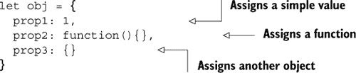

如我们所见，对象属性可以是简单的值（如数字或字符串）、函数，甚至是其他对象。此外，JavaScript 是一种高度动态的语言，我们可以通过修改和删除现有属性来轻松地更改分配给对象的属性：

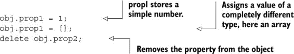

我们甚至可以添加完全新的属性：


最后，所有这些修改都没有改变我们简单对象的状态：

```
{
  prop1: [],
  prop3: {},
  prop4: "Hello"
};
```

在开发软件时，我们努力不重复造轮子，因此我们希望尽可能多地重用代码。一种代码重用形式也有助于组织我们的程序，那就是继承，将一个对象的特性扩展到另一个对象。在 JavaScript 中，继承是通过原型实现的。

原型的概念很简单。每个对象都可以有一个对其`prototype`的引用，这是一个对象，如果对象本身没有该属性，则可以将对该属性的搜索委托给该对象。想象一下，你在一群人中参加一个游戏问答，游戏主持人问你一个问题。如果你知道答案，你会立即给出，如果你不知道，你会问旁边的人。就这么简单。

让我们看一下下面的代码示例。

##### 列表 7.1\. 使用原型，对象可以访问其他对象的属性

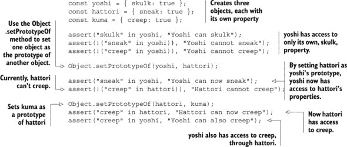

在这个例子中，我们首先创建了三个对象：`yoshi`、`hattori`和`kuma`。每个对象都有一个特定的属性，只有该对象可以访问：只有`yoshi`可以`skulk`，只有`hattori`可以`sneak`，只有`kuma`可以`creep`。参见图 7.1。

##### 图 7.1\. 初始时，每个对象只能访问它自己的属性。

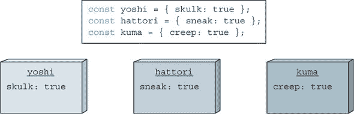

要测试一个对象是否可以访问特定的属性，我们可以使用`in`运算符。例如，执行`skulk in yoshi`返回`true`，因为`yoshi`可以访问`skulk`属性；而执行`sneak in yoshi`返回`false`。

在 JavaScript 中，对象的`prototype`属性是一个内部属性，不能直接访问（所以我们用`[[prototype]]`标记它）。相反，内置方法`Object.setPrototypeOf`接受两个对象参数，并将第二个对象设置为第一个对象的原型。例如，调用`Object.setPrototypeOf(yoshi, hattori);`会将`hattori`设置为`yoshi`的原型。

因此，每当我们要询问`yoshi`一个它没有的属性时，`yoshi`会将该搜索委托给`hattori`。我们可以通过`yoshi`访问`hattori`的`sneak`属性。参见图 7.2。

##### 图 7.2\. 当我们访问对象没有的属性时，会搜索对象的原型以查找该属性。在这里，我们可以通过`yoshi`访问`hattori`的`sneak`属性，因为`yoshi`是`hattori`的原型。

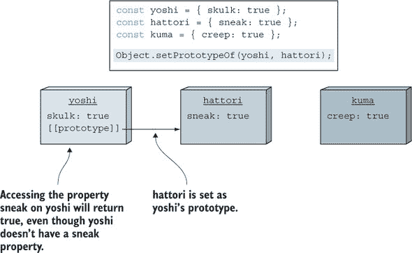

我们可以用类似的方法处理 `hattori` 和 `kuma`。通过使用 `Object.setPrototypeOf` 方法，我们可以将 `kuma` 设置为 `hattori` 的原型。如果我们然后询问 `hattori` 他没有的属性，搜索将会委托给 `kuma`。在这种情况下，`hattori` 现在可以访问 `kuma` 的 `creep` 属性。参见 图 7.3。

##### 图 7.3\. 搜索特定属性会在没有更多原型可以探索时停止。访问 `yoshi.creep` 首先在 `yoshi` 中搜索，然后是 `hattori`，最后是 `kuma`。


需要强调的是，每个对象都可以有一个原型，一个对象的原型也可以有一个原型，以此类推，形成一个 *原型链*。特定属性的搜索会在整个链上进行，直到没有更多的原型可以探索为止。例如，如图 7.3 所示，询问 `yoshi` 的 `creep` 属性值会首先在 `yoshi` 中搜索该属性。因为属性未找到，所以会搜索 `yoshi` 的原型 `hattori`。再次，`hattori` 没有名为 `creep` 的属性，所以会搜索 `hattori` 的原型 `kuma`，最终找到该属性。

现在我们已经基本了解了通过原型链搜索特定属性的过程，接下来让我们看看在构造新对象时构造函数是如何使用原型的。

### 7.2\. 对象构造和原型

创建新对象的最简单方法是使用如下语句：

```
const warrior = {};
```

这将创建一个新的空对象，然后我们可以通过赋值语句向其中添加属性：

```
const warrior = {};
warrior.name = 'Saito';
warrior.occupation = 'marksman';
```

但那些来自面向对象背景的人可能会错过类构造函数带来的封装和结构化，类构造函数是一个用于初始化对象到已知初始状态的功能。毕竟，如果我们打算创建同一类型对象的多个实例，逐个分配属性不仅麻烦，而且容易出错。我们希望能够在同一个地方合并一个对象类的一组属性和方法。

JavaScript 提供了这样的机制，尽管它的形式与其他大多数语言不同。像 Java 和 C++ 这样的面向对象语言，JavaScript 使用 `new` 操作符通过构造函数实例化新对象，但在 JavaScript 中没有真正的类定义。相反，将 `new` 操作符应用于构造函数（正如你在第三章中看到的），会触发一个新分配的对象的创建。

在前面的章节中，我们没有学习到的是每个函数都有一个原型对象，这个对象会自动设置为使用该函数创建的对象的原型。让我们看看以下列表中它是如何工作的。

##### 列表 7.2\. 使用原型方法创建新实例

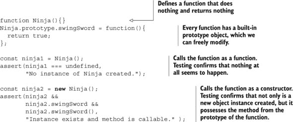

在这段代码中，我们定义了一个看似什么也不做的函数`Ninja`，我们将以两种方式调用它：作为“正常”函数，`const ninja1 = Ninja()`；以及作为构造函数，`const ninja2 = new Ninja()`。

当函数被创建时，它立即为其原型对象分配一个新的对象，这个对象我们可以像任何其他对象一样扩展。在这种情况下，我们向其中添加一个`swingSword`方法：

```
Ninja.prototype.swingSword = function(){
  return true;
};
```

然后我们对这个函数进行测试。首先我们正常调用该函数并将结果存储在变量`ninja1`中。查看函数体，我们看到它没有返回任何值，所以我们预计`ninja1`将测试为`undefined`，我们断言这是`true`。作为一个简单的函数，`Ninja`看起来并不那么有用。

然后我们通过`new`运算符调用该函数，将其作为*构造函数*调用，这时会发生完全不同的事情。函数再次被调用，但这次创建了一个新的对象，并将其设置为函数的上下文（并且可以通过`this`关键字访问）。`new`运算符返回的是对这个新对象的引用。然后我们测试`ninja2`是否引用了这个新创建的对象，并且这个对象有一个我们可以调用的`swingSword`方法。参见图 7.4 以了解当前应用程序的状态。

##### 图 7.4\. 每个函数在创建时都会得到一个新的原型对象。当我们使用函数作为构造函数时，构造的对象的原型被设置为函数的原型。

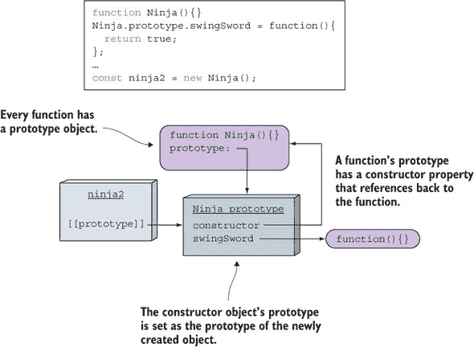

如您所见，函数在创建时得到一个新的对象，该对象被分配给其原型属性。原型对象最初只有一个属性，即`constructor`，它引用回函数（我们稍后会重新访问`constructor`属性）。

当我们使用函数作为构造函数（例如，通过调用`new Ninja()`）时，新构造的对象的原型被设置为构造函数引用的对象。

在这个例子中，我们通过`swingSword`方法扩展了`Ninja.prototype`，当创建`ninja2`对象时，其`prototype`属性被设置为`Ninja`的原型。因此，当我们尝试在`ninja2`上访问`swingSword`属性时，对该属性的搜索被委托给`Ninja`原型对象。请注意，所有使用`Ninja`构造函数创建的对象都将能够访问`swingSword`方法。现在这就是代码复用！

`swingSword`方法是`Ninja`原型的属性，而不是`ninja`实例的属性。让我们来探讨实例属性和原型属性之间的区别。

#### 7.2.1\. 实例属性

当函数通过`new`运算符作为构造函数被调用时，其上下文被定义为新的对象实例。除了通过原型公开属性外，我们还可以通过`this`参数在构造函数内初始化值。让我们在下一列表中查看这种实例属性的创建。

##### 列表 7.3\. 观察初始化活动的优先级

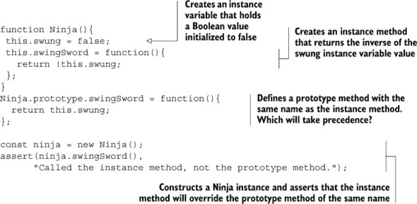

列表 7.3 与上一个示例类似，我们通过将其添加到构造函数的`prototype`属性中来定义`swingSword`方法：

```
Ninja.prototype.swingSword = function(){
   return this.swung;
};
```

但我们还在构造函数本身中添加了一个同名的方法：

```
function Ninja(){
  this.swung = false;
  this.swingSword = function(){
    return !this.swung;
  };
}
```

这两个方法被定义为返回相反的结果，这样我们就可以知道哪个将被调用。

|  |
| --- |

##### 注意

这不是我们在实际代码中建议做的事情；恰恰相反。我们在这里这样做只是为了演示属性的优先级。

|  |
| --- |

当你运行测试时，你会看到它通过了！这表明实例成员将隐藏在原型中定义的同名属性。参见图 7.5。

##### 图 7.5\. 如果实例本身可以找到属性，甚至不会咨询原型！

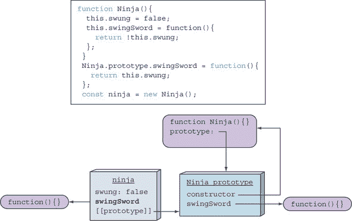

在构造函数内部，`this`关键字指向新创建的对象，因此构造函数内添加的属性是直接创建在新的`ninja`实例上的。稍后，当我们访问`ninja`上的`swingSword`属性时，不需要遍历原型链（如图 7.4 所示）；在构造函数内创建的属性立即被找到并返回（参见图 7.5）。

这有一个有趣的副作用。看看图 7.6，它显示了如果我们创建三个`ninja`实例时应用程序的状态。

##### 图 7.6\. 每个实例都拥有在构造函数内创建的属性的独特版本，但它们都可以访问相同的原型属性。


如您所见，每个`ninja`实例都拥有在构造函数内创建的属性的独特版本，同时它们都可以访问相同的原型属性。这对于特定于每个对象实例的值属性（例如，`swung`）来说是可行的。但在某些情况下，对于方法可能会出现问题。

在这个例子中，我们将有三个版本的`swingSword`方法，它们都执行相同的逻辑。如果我们创建几个对象，这并不是问题，但如果我们计划创建大量对象，那就需要注意了。因为每个方法副本的行为都是相同的，创建多个副本通常没有意义，因为它只会消耗更多的内存。当然，一般来说，JavaScript 引擎可能会执行一些优化，但这不是我们可以依赖的。从这个角度来看，将对象方法仅放在函数的原型上是有意义的，因为这样我们就有了一个所有对象实例共享的单个方法。

| |
| --- |

##### 注意

记住 第五章 中的闭包：在构造函数中定义的方法允许我们模拟私有对象变量。如果我们需要这样做，在构造函数中指定方法是唯一的方法。

| |
| --- |

#### 7.2.2\. JavaScript 动态特性的副作用

您已经看到 JavaScript 是一种动态语言，其中的属性可以随意添加、删除和修改。同样，这也适用于原型，无论是函数原型还是对象原型。请参见以下列表。

##### 列表 7.4\. 使用原型，一切都可以在运行时更改

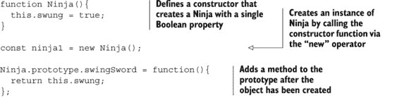

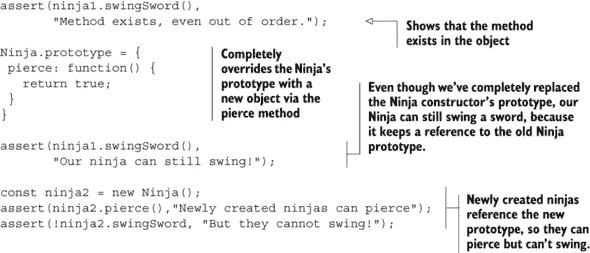

在这里我们再次定义一个 `Ninja` 构造函数，并继续使用它来创建一个对象实例。此时应用程序的状态如图 7.7 所示。

##### 图 7.7\. 构造之后，`ninja1` 有 `swung` 属性，其原型是只有一个 `constructor` 属性的 `Ninja` 原型。

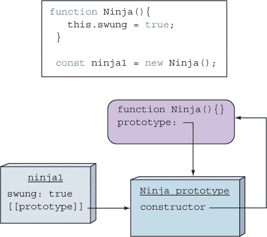

*在* 实例创建之后，我们在原型中添加了一个 `swingSword` 方法。然后我们运行一个测试来显示在对象构造之后对原型所做的更改生效。应用程序的当前状态如图 7.8 所示。

##### 图 7.8\. 因为 `ninja1` 实例引用了 `Ninja` 原型，所以即使在实例创建之后所做的更改也可以访问。

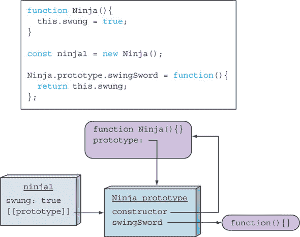

之后，我们通过将其赋值给一个具有 `pierce` 方法的全新对象来覆盖 `Ninja` 函数的原型。这导致应用程序的状态如图 7.9 所示。

##### 图 7.9\. 函数的原型可以随意替换。已经构造的实例引用的是旧的原型！

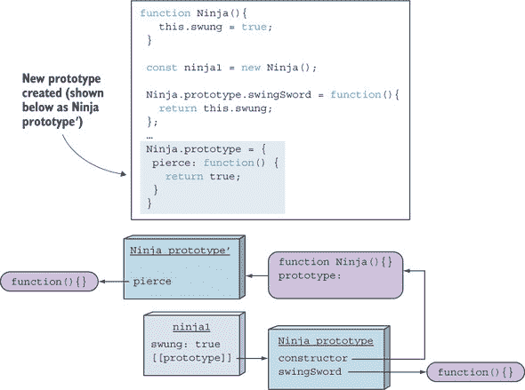

如您所见，尽管 `Ninja` 函数没有引用旧的 `Ninja` 原型，但旧的原型仍然被 `ninja1` 实例所保持活跃，它仍然可以通过原型链访问 `swingSword` 方法。但如果我们在这个原型切换之后创建新的对象，应用程序的状态将如图 7.10 所示。

##### 图 7.10\. 所有新创建的实例都引用新的原型。

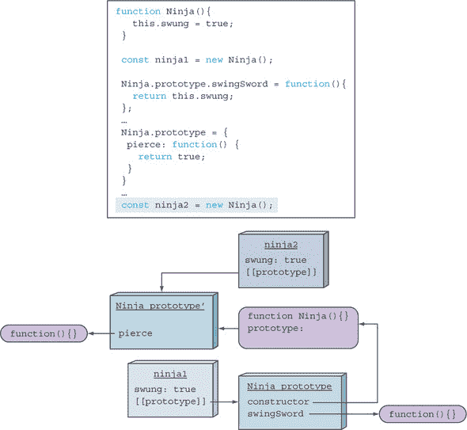

对象与函数原型的引用是在对象实例化时建立的。新创建的对象将引用新的原型，并将能够访问 `pierce` 方法，而旧的、在原型更改之前创建的对象则保持其原始原型，快乐地挥舞着他们的剑。

我们已经探讨了原型的工作原理以及它们与对象实例化的关系。做得好！现在深吸一口气，我们可以继续学习更多关于这些对象特性的知识。

#### 7.2.3\. 通过构造函数进行对象类型化

虽然了解 JavaScript 如何使用原型来找到正确的属性引用是很好的，但知道哪个函数构造了对象实例也很方便。正如你之前看到的，对象的构造函数可以通过构造函数原型的`constructor`属性来访问。例如，图 7.11 显示了我们使用`Ninja`构造函数实例化对象时的应用程序状态。

##### 图 7.11. 每个函数的原型对象都有一个指向函数的`constructor`属性。

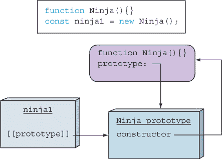

通过使用`constructor`属性，我们可以访问用于创建对象的函数。这些信息可以用作类型检查的一种形式，如下一列表所示。

##### 列表 7.5. 检查实例的类型及其构造函数

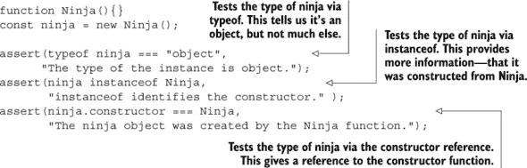

我们定义了一个构造函数并使用它来创建一个对象实例。然后我们通过使用`typeof`运算符来检查实例的类型。这并没有揭示太多，因为所有实例都将返回`object`，因此总是返回`object`作为结果。更有趣的是`instanceof`运算符，它为我们提供了一种确定实例是否由特定函数构造函数创建的方法。你将在本章后面了解更多关于`instanceof`运算符的工作原理。

此外，我们可以使用现在我们知道对所有实例都可访问的`constructor`属性，作为创建它的原始函数的引用。我们可以使用这一点来验证实例的来源（就像我们可以使用`instanceof`运算符一样）。

此外，因为这只是对原始构造函数的引用，我们可以使用它来实例化一个新的`Ninja`对象，如下一列表所示。

##### 列表 7.6. 使用构造函数的引用来实例化新对象

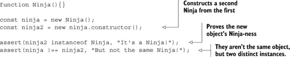

在这里，我们定义了一个构造函数并使用该构造函数创建了一个实例。然后我们使用创建的实例的`constructor`属性来构造第二个实例。测试显示，已经构造了第二个`Ninja`实例，并且变量不仅仅指向同一个实例。

尤其有趣的是，我们甚至不需要访问原始函数就能做到这一点；我们可以在幕后完全使用引用，即使原始构造函数已经不在作用域内。

| |
| --- |

##### 备注

虽然对象的`constructor`属性可以被更改，但这样做并没有任何立即或明显的建设性目的（尽管我们可能能够想到一些恶意用途）。这个属性存在的理由是指出对象是从哪里构造的。如果`constructor`属性被覆盖，原始值就会丢失。

| |
| --- |

这都是很有用的，但我们只是刚刚触及了原型赋予我们的超级能力的表面。现在事情变得有趣起来。

### 7.3. 实现继承

*继承*是一种重用形式，其中新对象可以访问现有对象的属性。这有助于我们避免在代码库中重复代码和数据。在 JavaScript 中，继承的工作方式与其他流行的面向对象语言略有不同。考虑以下列表，我们试图实现继承。

##### 列表 7.7\. 尝试使用原型实现继承

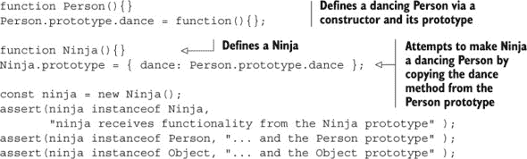

因为函数的原型是一个对象，所以有多种方式可以复制功能（如属性或方法）以实现继承。在这段代码中，我们定义了一个“人”，然后定义了一个“忍者”。因为“忍者”显然是一个人，我们希望“忍者”继承“人”的属性。我们尝试通过将“人”原型方法中的`dance`属性复制到“忍者”原型中同名属性中来实现这一点。

运行我们的测试显示，尽管我们可能已经教会了忍者跳舞，但我们未能使“忍者”成为“人”，如图 7.12 所示。我们教会了“忍者”模仿人的舞蹈，但这并没有*使*“忍者”成为“人”。这不是继承——这只是复制。

##### 图 7.12\. 我们的“忍者”实际上不是一个“人”。没有快乐的舞蹈！

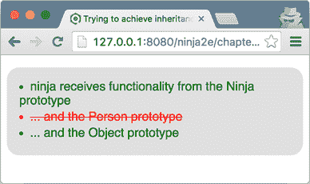

除了这种方法并不完全奏效之外，我们还需要将“人”的每个属性单独复制到“忍者”的原型中。这不是继承的正确方法。让我们继续探索。

我们真正想要实现的是一个*原型链*，使得一个“忍者”可以*成为*一个“人”，一个“人”可以成为“哺乳动物”，一个“哺乳动物”可以成为“动物”，以此类推，一直到“对象”。创建这种原型链的最佳技术是使用一个对象的实例作为另一个对象的原型：

```
*SubClass*.prototype = new *SuperClass*();
```

例如：

```
Ninja.prototype = new Person();
```

这保留了原型链，因为“子类”实例的原型将是一个“超类”的实例，该实例具有“超类”的所有属性，并且它将反过来有一个指向其超类实例的原型，以此类推。在下一个列表中，我们稍微修改了列表 7.7 以使用这种技术。

##### 列表 7.8\. 使用原型实现继承

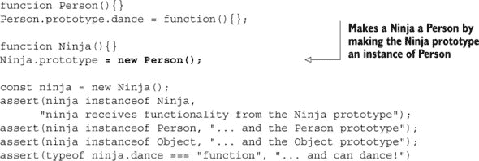

代码的唯一更改是将“人”的一个实例用作“忍者”的原型。运行测试显示我们已经成功，如图 7.13 所示。现在我们将通过查看创建新“忍者”对象后的应用程序状态来更详细地了解其内部工作原理，如图 7.14 所示。

##### 图 7.13\. 我们的“忍者”是一个“人”！胜利的舞蹈开始吧。

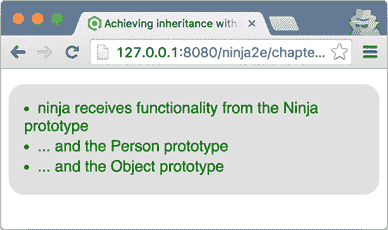

##### 图 7.14\. 我们通过将“忍者”构造函数的原型设置为“人”对象的新实例来实现继承。

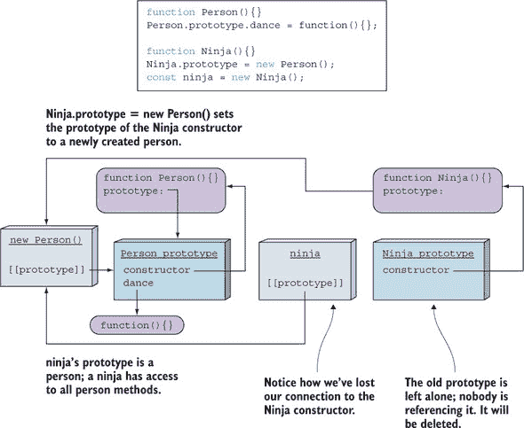

图 7.14 显示，当我们定义一个`Person`函数时，也会创建一个`Person`原型，它通过其`constructor`属性引用`Person`函数。通常，我们可以通过扩展`Person`原型来添加额外的属性，在这种情况下，我们指定每个使用`Person`构造函数创建的人都可以访问`dance`方法：

```
function Person(){}
Person.prototype.dance = function(){};
```

我们还定义了一个`Ninja`函数，它具有自己的原型对象，该对象具有一个引用`Ninja`函数的`constructor`属性：`function Ninja(){}`。

接下来，为了实现继承，我们将`Ninja`函数的原型替换为一个新的`Person`实例。现在，当我们创建一个新的`Ninja`对象时，新创建的`ninja`对象的内部原型属性将被设置为当前`Ninja`原型属性指向的对象，即之前构建的`Person`实例：

```
function Ninja(){}
Ninja.prototype = new Person();
var ninja = new Ninja();
```

当我们尝试通过`ninja`对象访问`dance`方法时，JavaScript 运行时会首先检查`ninja`对象本身。因为它没有`dance`属性，所以会搜索其原型，即`person`对象。`person`对象也没有`dance`属性，所以会继续搜索其原型，最终找到该属性。这就是 JavaScript 中实现继承的方法！

这里有一个重要的含义：当我们执行`instanceof`操作时，我们可以确定函数是否继承了其原型链中任何对象的函数功能。

| |
| --- |

##### 注意

另一种可能已经想到的技术，但我们强烈建议不要使用，是将`Person`原型对象直接用作`Ninja`原型，如下所示：`Ninja.prototype = Person.prototype`。然后，对`Ninja`原型的任何更改也将更改`Person`原型（因为它们是同一个对象），这很可能会产生不良的副作用。

| |
| --- |

以这种方式进行原型继承的另一个额外的好处是，所有继承的函数原型都将继续实时更新。从原型继承的对象始终可以访问当前的原型属性。

#### 7.3.1. 覆盖构造函数属性的问题

如果我们仔细观察图 7.14，我们会看到，通过将新的`Person`对象设置为`Ninja`构造函数的原型，我们已经失去了与原始`Ninja`原型保持的联系的`Ninja`构造函数。这是一个问题，因为`constructor`属性可以用来确定创建对象时所使用的函数。有人使用我们的代码可能会做出一个完全合理的假设，即以下测试将会通过：

```
assert(ninja.constructor === Ninja,
      "The ninja object was created by the Ninja constructor");
```

但在当前的应用状态中，这个测试失败了。如图 7.14 所示，如果我们搜索`ninja`对象中的`constructor`属性，我们将找不到它。因此，我们转向其原型，它也没有`constructor`属性，然后我们再次跟随原型，最终到达`Person`的原型对象，它有一个指向`Person`函数的`constructor`属性。实际上，我们得到了错误的答案：如果我们询问`ninja`对象哪个函数构建了它，我们将得到`Person`作为答案。这可能是某些严重错误的来源。

这取决于我们如何解决这个问题！但在我们能够这样做之前，我们必须绕道而行，看看 JavaScript 是如何使我们能够配置属性的。

##### 配置对象属性

在 JavaScript 中，每个对象属性都是通过一个*属性描述符*来描述的，通过它可以配置以下键：

+   `configurable`——如果设置为`true`，属性的描述符可以被更改，属性可以被删除。如果设置为`false`，我们无法执行这两件事。

+   `enumerable`——如果设置为`true`，属性将在遍历对象属性的`for-in`循环中显示（我们很快就会了解到`for-in`循环）。

+   `value`——指定属性的值。默认为`undefined`。

+   `writable`——如果设置为`true`，属性值可以通过赋值来更改。

+   `get`——定义*获取器*函数，当访问属性时将被调用。不能与`value`和`writable`一起定义。

+   `set`——定义*设置器*函数，当对属性进行赋值时将被调用。也不能与`value`和`writable`一起定义。

假设我们通过简单的赋值创建一个属性，例如：

```
ninja.name = "Yoshi";
```

这个属性将是可配置的、可枚举的、可写的，其值将被设置为`Yoshi`，而`get`和`set`函数将是`undefined`。

当我们想要微调我们的属性配置时，我们可以使用内置的`Object.defineProperty`方法，它接受一个对象，该对象将定义属性，属性的名字，以及一个属性描述符对象。以下是一个例子。

##### 列表 7.9\. 配置属性

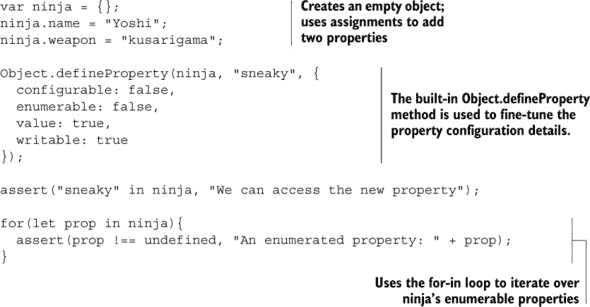

我们从一个空对象开始，向其中添加两个属性：`name`和`weapon`，按照传统的方式，通过使用赋值。接下来，我们使用内置的`Object.defineProperty`方法来定义属性`sneaky`，它不是`configurable`的，不是`enumerable`的，并且其`value`被设置为`true`。因为这个`value`可以被更改，所以它是`writable`的。

最后，我们测试我们是否可以访问新创建的`sneaky`属性，我们使用`for-in`循环遍历对象的所有可枚举属性。图 7.15 显示了结果。

##### 图 7.15\. 在`for-in`循环中将被访问的属性是`name`和`weapon`，而我们的特殊添加的`sneaky`属性则不会（即使我们通常可以访问它）。

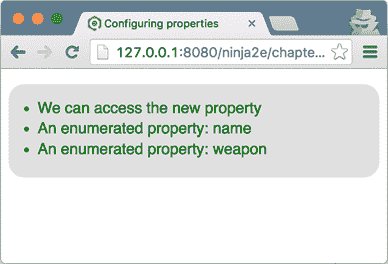

通过将 `enumerable` 设置为 `false`，我们可以确保属性在使用 `for-in` 循环时不会出现。为了理解我们为什么要这样做，让我们回到原始问题。

##### 最终解决了覆盖构造函数属性的问题

当尝试用 `Ninja` 扩展 `Person`（或者使 `Ninja` 成为 `Person` 的子类）时，我们遇到了以下问题：当我们把一个新的 `Person` 对象设置为 `Ninja` 构造函数的原型时，我们失去了原本的 `Ninja` 原型，它保留了我们的 `constructor` 属性。我们不希望失去 `constructor` 属性，因为它对于确定创建我们的对象实例所用的函数很有用，并且其他正在我们代码库上工作的开发者可能会期望它。

我们可以通过使用我们刚刚获得的知识来解决这个问题。我们将使用 `Object.defineProperty` 方法在新的 `Ninja.prototype` 上定义一个新的 `constructor` 属性。请参见以下列表。

##### 列表 7.10\. 修复构造函数属性问题

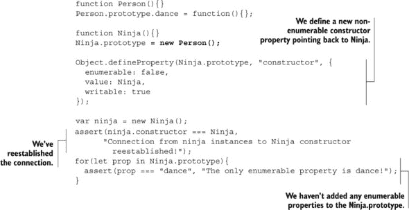

现在如果我们运行代码，我们会看到一切都很顺利。我们已经重新建立了 `ninja` 实例和 `Ninja` 函数之间的联系，因此我们可以知道它们是由 `Ninja` 函数构建的。此外，如果有人尝试遍历 `Ninja.prototype` 对象的属性，我们已经确保我们的修补属性 `constructor` 不会被访问。现在这就是真正的忍者的标志；我们进去，完成了我们的工作，然后离开，没有人注意到外面有任何变化！

#### 7.3.2\. instanceof 操作符

在大多数编程语言中，检查一个对象是否属于类层次结构的一种直接方法就是使用 `instanceof` 操作符。例如，在 Java 中，`instanceof` 操作符通过检查左侧的对象是否与右侧的类类型相同或是一个子类来工作。

尽管可以与 JavaScript 中的 `instanceof` 操作符的工作方式建立某些相似之处，但也有一些细微差别。在 JavaScript 中，`instanceof` 操作符在对象的原型链上工作。例如，假设我们有以下表达式：

```
ninja instanceof Ninja
```

`instanceof` 操作符通过检查 `Ninja` 函数的 *当前* 原型是否在 `ninja` 实例的原型链中来工作。让我们回到我们的人物和忍者，以一个更具体的例子。

##### 列表 7.11\. 研究 instanceof 操作符

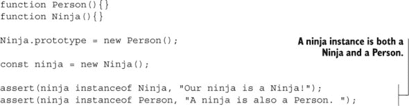

如预期，忍者同时是 `Ninja` 和 `Person`。但是，为了确定这一点，图 7.16 展示了幕后整个工作的过程。

##### 图 7.16\. `ninja` 实例的原型链由一个 `new Person()` 对象和 `Person prototype` 组成。

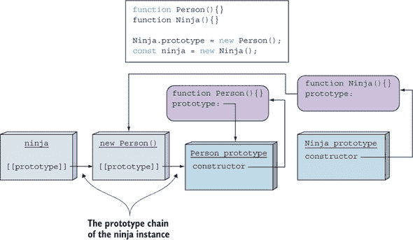

`ninja`实例的原型链由一个`new Person()`对象组成，通过它我们实现了继承，以及`Person prototype`。当评估表达式`ninja instanceof Ninja`时，JavaScript 引擎会取`Ninja`函数的原型，`new Person()`对象，并检查它是否在`ninja`实例的原型链中。因为`new Person()`对象是`ninja`实例的直接原型，所以结果是`true`。

在第二种情况下，当我们检查`ninja instanceof Person`时，JavaScript 引擎会取`Person`函数的原型，`Person prototype`，并检查它是否可以在`ninja`实例的原型链中找到。同样，它可以找到，因为它是我们`new Person()`对象的原型，正如我们之前看到的，它是`ninja`实例的原型。

关于`instanceof`运算符的所有知识就这些了。尽管它最常见的使用是在提供一个明确的方式来确定一个实例是否是由特定的函数构造器创建的，但它并不完全是这样工作的。相反，它检查右侧函数的原型是否在左侧对象的原型链中。因此，有一个需要注意的警告。

##### instanceof 的注意事项

正如你在本章中多次看到的，JavaScript 是一种动态语言，在程序执行期间我们可以修改很多东西。例如，没有阻止我们改变构造函数的原型，如下面的列表所示。

##### 列表 7.12. 注意构造函数原型的变化

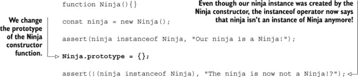

在这个例子中，我们再次重复了创建`ninja`实例的所有基本步骤，我们的第一次测试进行得很顺利。但如果我们在创建`ninja`实例之后改变`Ninja`构造函数的原型，然后再测试`ninja`是否是`Ninja`的实例，我们会看到情况已经改变。这只会让我们感到惊讶，如果我们坚持认为`instanceof`运算符告诉我们实例是否是由特定的函数构造器创建的。另一方面，如果我们接受`instanceof`运算符的真实语义——它只检查右侧函数的原型是否在左侧对象的原型链中——我们就不会感到惊讶。这种情况在图 7.17 中显示。

##### ![图 7.17]. `instanceof`运算符检查右侧函数的原型是否在左侧对象的原型链中。请注意；函数的原型可以随时更改！

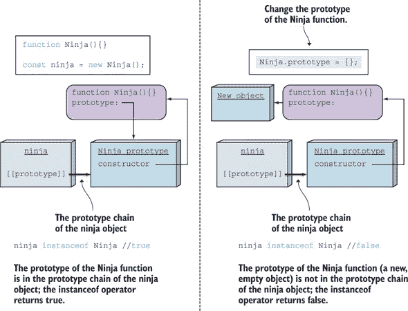

现在我们已经了解了 JavaScript 中原型的工作方式，以及如何结合构造函数使用原型来实现继承，让我们继续探讨 JavaScript ES6 版本中的新特性：类。

### 7.4. 在 ES6 中使用 JavaScript“类”

很好，JavaScript 允许我们通过原型的方式使用一种继承形式。但许多开发者，尤其是那些有经典面向对象背景的开发者，更希望将 JavaScript 的继承系统简化或抽象成一个他们更熟悉的系统。

这不可避免地引导我们进入类的领域，尽管 JavaScript 本身不支持原生的经典继承。作为对这个需求的回应，已经出现了几个模拟经典继承的 JavaScript 库。因为每个库都以自己的方式实现类，ECMAScript 委员会已经标准化了模拟基于类继承的语法。注意我们是如何说“模拟”的。尽管现在我们可以在 JavaScript 中使用`class`关键字，但底层实现仍然是基于原型继承的！

| |
| --- |

##### 注意

`class`关键字已被添加到 JavaScript 的 ES6 版本中，并且并非所有浏览器都实现了它（有关当前支持情况，请参阅[`mng.bz/3ykA`](http://mng.bz/3ykA)）。

| |
| --- |

让我们从学习新的语法开始。

#### 7.4.1\. 使用类关键字

ES6 引入了一个新的`class`关键字，它提供了一个比手动使用原型实现对象和继承更优雅的方法。使用`class`关键字很简单，如下面的列表所示。

##### 列表 7.13\. 在 ES6 中创建类

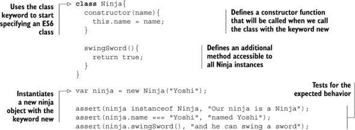

列表 7.13 展示了我们可以通过使用`class`关键字来创建一个`Ninja`类。在创建 ES6 类时，我们可以显式定义一个在实例化`Ninja`实例时将被调用的`constructor`函数。在构造函数体内，我们可以使用`this`关键字访问新创建的实例，并且可以轻松添加新的属性，例如`name`属性。在类体内，我们还可以定义所有`Ninja`实例都可以访问的方法。在这种情况下，我们定义了一个返回`true`的`swingSword`方法：

```
class Ninja{
  constructor(name){
    this.name = name;
  }

  swingSword(){
    return true;
  }
}
```

接下来，我们可以通过使用关键字`new`调用`Ninja`类来创建一个`Ninja`实例，就像我们之前在章节中用`Ninja`作为简单的构造函数一样：

```
var ninja = new Ninja("Yoshi");
```

最后，我们可以测试`ninja`实例是否按预期行为，即它是一个`instance-of Ninja`，有一个`name`属性，并且可以访问`swingSword`方法：

```
assert(ninja instanceof Ninja, "Our ninja is a Ninja");
assert(ninja.name === "Yoshi", "named Yoshi");
assert(ninja.swingSword(), "and he can swing a sword");
```

##### 类是语法糖

如前所述，尽管 ES6 引入了`class`关键字，但底层我们仍然处理的是古老的、好的原型；类是语法糖，旨在使我们在模拟 JavaScript 中的类时生活更加轻松。

我们从列表 7.13 中的类代码可以转换为功能上相同的 ES5 代码：

```
function Ninja(name) {
  this.name = name;
}
Ninja.prototype.swingSword = function() {
  return true;
};
```

如您所见，ES6 类并没有什么特别新的地方。代码更加优雅，但应用的概念是相同的。

##### 静态方法

在前面的例子中，你看到了如何定义对象方法（原型方法），这些方法对所有对象实例都是可访问的。除了这些方法之外，像 Java 这样的经典面向对象语言还使用静态方法，即在类级别上定义的方法。查看以下示例。

##### 列表 7.14\. ES6 中的静态方法

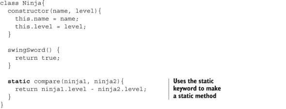

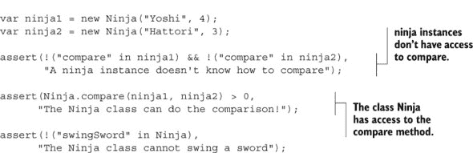

我们再次创建一个具有 `swingSword` 方法的 `Ninja` 类，这个方法可以从所有 `ninja` 实例中访问。我们还通过在方法名前加关键字 `static` 定义了一个静态方法 `compare`。

```
static compare(ninja1, ninja2){
    return ninja1.level - ninja2.level;
}
```

`compare` 方法，它比较两个忍者的技能水平，是在类级别上定义的，而不是实例级别！稍后我们将测试这实际上意味着 `compare` 方法不能从 `ninja` 实例中访问，但可以从 `Ninja` 类中访问：

```
assert(!("compare" in ninja1) && !("compare" in ninja2),
       "The ninja instance doesn't know how to compare");
assert(Ninja.compare(ninja1, ninja2) > 0,
      "The Ninja class can do the comparison!");
```

我们还可以看看如何在 ES6 之前的代码中实现“静态”方法。为此，我们只需要记住，类是通过函数实现的。因为静态方法是类级别的，我们可以通过利用函数作为一等对象，并给我们的构造函数添加一个方法属性来实现它们，如下例所示：

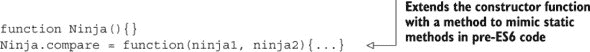

现在让我们继续讨论继承。

#### 7.4.2\. 实现继承

老实说，在 ES6 之前的代码中执行继承可能会很痛苦。让我们回到我们信任的忍者和人例子：

```
function Person(){}
Person.prototype.dance = function(){};

function Ninja(){}
Ninja.prototype = new Person();

Object.defineProperty(Ninja.prototype, "constructor", {
  enumerable: false,
  value: Ninja,
  writable: true
});
```

这里有很多需要注意的地方：应该直接将可访问所有实例的方法添加到构造函数的原型中，就像我们用 `dance` 方法和 `Person` 构造函数所做的那样。如果我们想实现继承，我们必须将派生“类”的原型设置为基“类”的实例。在这种情况下，我们将 `Person` 的新实例分配给了 `Ninja.prototype`。不幸的是，这破坏了 `constructor` 属性，因此我们必须使用 `Object.defineProperty` 方法手动恢复它。在尝试实现一个相对简单且常用功能（继承）时，这些都是需要记住的。幸运的是，随着 ES6 的出现，所有这些都显著简化了。

让我们看看以下列表中是如何实现的。

##### 列表 7.15\. ES6 中的继承

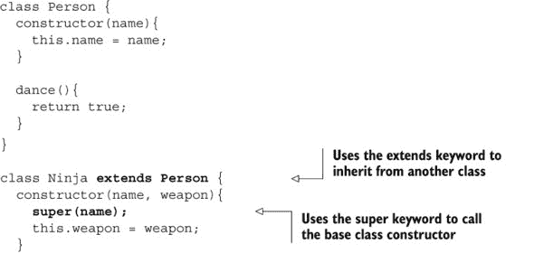

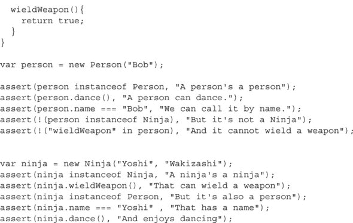

列表 7.15 展示了如何在 ES6 中实现继承；我们使用 `extends` 关键字从另一个类继承：

```
class Ninja extends Person
```

在这个例子中，我们创建了一个 `Person` 类，其构造函数将 `name` 分配给每个 `Person` 实例。我们还定义了一个 `dance` 方法，它将可访问所有 `Person` 实例：

```
class Person {
  constructor(name){
    this.name = name;
  }
  dance(){
    return true;
  }
}
```

接下来我们定义一个扩展 `Person` 类的 `Ninja` 类。它有一个额外的 `weapon` 属性，以及一个 `wieldWeapon` 方法：

```
class Ninja extends Person {
  constructor(name, weapon){
    super(name);
    this.weapon = weapon;
  }

  wieldWeapon(){
    return true;
  }
}
```

在派生类 `Ninja` 的构造函数中，通过关键字 `super` 调用了基类 `Person` 的构造函数。如果你使用过任何基于类的语言，这应该很熟悉。

我们继续创建一个`person`实例，并检查它是否是具有`name`和可以`dance`的`Person`类的实例。为了确保这一点，我们还检查一个不是`Ninja`的人不能使用武器：

```
var person = new Person("Bob");

assert(person instanceof Person, "A person's a person");
assert(person.dance(), "A person can dance.");
assert(person.name === "Bob", "We can call it by name.");
assert(!(person instanceof Ninja), "But it's not a Ninja");
assert(!("wieldWeapon" in person), "And it cannot wield a weapon");
```

我们还创建了一个`ninja`实例，并检查它是否是`Ninja`的实例，并且能够使用武器。因为每个`ninja`也是一个`Person`，所以我们检查一个`ninja`是否是`Person`的实例，它有一个`name`，并且在战斗间隙，它也喜欢跳舞：

```
var ninja = new Ninja("Yoshi", "Wakizashi");
assert(ninja instanceof Ninja, "A ninja's a ninja");
assert(ninja.wieldWeapon(), "That can wield a weapon");
assert(ninja instanceof Person, "But it's also a person");
assert(ninja.name === "Yoshi" , "That has a name");
assert(ninja.dance(), "And enjoys dancing");
```

看起来有多简单？没有必要考虑原型或某些重写属性的副作用。我们定义类，并使用`extends`关键字指定它们之间的关系。最后，使用 ES6，来自 Java 或 C#等语言的大量开发者可以安心了。

就这样。使用 ES6，我们几乎可以像在其他任何更传统的面向对象语言中一样轻松地构建类层次结构。

### 7.5. 摘要

+   JavaScript 对象是具有值的命名属性集合。

+   JavaScript 使用原型。

+   每个对象都可以有一个指向一个*原型*的引用，一个当对象本身没有要搜索的属性时，我们将搜索该属性的搜索委托给的对象。一个对象的原型可以有自己的原型，以此类推，形成一个*原型链*。

+   我们可以使用`Object.setPrototypeOf`方法定义一个对象的原型。

+   原型与构造函数紧密相关。每个函数都有一个`prototype`属性，该属性被设置为它实例化的对象的原型。

+   函数的`prototype`对象有一个指向该函数本身的`constructor`属性。这个属性对所有使用该函数实例化的对象都是可访问的，并且，在一定限制下，可以用来确定一个对象是否是由特定函数创建的。

+   在 JavaScript 中，几乎可以在运行时更改任何东西，包括对象的原型和函数的原型！

+   如果我们想让由`Ninja`构造函数创建的实例“继承”（更准确地说，能够访问）由`Person`构造函数创建的实例可访问的属性，请将`Ninja`构造函数的原型设置为`Person`类的新实例。

+   在 JavaScript 中，属性有属性（configurable、enumerable、writable）。这些属性可以使用内置的`Object.defineProperty`方法定义。

+   JavaScript ES6 增加了对`class`关键字的支持，这使得我们能够更容易地模拟类。幕后，原型仍然在发挥作用！

+   `extends`关键字使得优雅的继承成为可能。

### 7.6. 练习

> **1**
> 
> 以下哪个属性指向一个对象，如果目标对象没有要搜索的属性，则会搜索该对象？
> 
> 1.  `class`
> 1.  
> 1.  `instance`
> 1.  
> 1.  `prototype`
> 1.  
> 1.  `pointTo`
> 1.  
> **2**
> 
> 执行以下代码后，变量`a1`的值是多少？
> 
> ```
> function Ninja(){}
> Ninja.prototype.talk = function (){
>   return "Hello";
> };
> 
> const ninja = new Ninja();
> const a1 = ninja.talk();
> ```
> 
> **3**
> 
> 运行以下代码后`a1`的值是多少？
> 
> ```
> function Ninja(){}
> Ninja.message = "Hello";
> 
> const ninja = new Ninja();
> 
> const a1 = ninja.message;
> ```
> 
> **4**
> 
> 解释以下两个代码片段中`getFullName`方法的区别：
> 
> ```
> //First fragment
> function Person(firstName, lastName){
>   this.firstName = firstName;
>   this.lastName = lastName;
> 
>   this.getFullName = function () {
>     return this.firstName + " " + this.lastName;
>   }
> }
> 
> //Second fragment
> function Person(firstName, lastName) {
>   this.firstName = firstName;
>   this.lastName = lastName;
> }
> 
> Person.prototype.getFullName = function () {
>   return this.firstName + " " + this.lastName;
> }
> ```
> 
> **5**
> 
> 在运行以下代码后，`ninja.constructor`将指向什么？
> 
> ```
> function Person() { }
> function Ninja() { }
> 
> const ninja = new Ninja();
> ```
> 
> **6**
> 
> 在运行以下代码后，`ninja.constructor`将指向什么？
> 
> ```
> function Person() { }
> function Ninja() { }
> Ninja.prototype = new Person();
> const ninja = new Ninja();
> ```
> 
> **7**
> 
> 解释以下示例中`instanceof`运算符的工作原理。
> 
> ```
> function Warrior() { }
> 
> function Samurai() { }
> Samurai.prototype = new Warrior();
> 
> var samurai = new Samurai();
> 
> samurai instanceof Warrior; //Explain
> ```
> 
> **8**
> 
> 将以下 ES6 代码转换为 ES5 代码。
> 
> ```
> class Warrior {
>   constructor(weapon){
>     this.weapon = weapon;
>   }
> 
>   wield() {
>     return "Wielding " + this.weapon;
>   }
> 
>   static duel(warrior1, warrior2){
>     return warrior1.wield() + " " + warrior2.wield();
>   }
> }
> ```

## 第八章。控制对对象的访问

*本章涵盖*

+   使用获取器和设置器控制对对象属性的访问

+   通过代理控制对对象的访问

+   使用代理处理横切关注点

在上一章中，您了解到 JavaScript 对象是动态的属性集合。我们可以轻松地添加新属性、更改属性值，甚至完全删除现有属性。在许多情况下（例如，在验证属性值、日志记录或在 UI 中显示数据时），我们需要能够监控我们的对象所发生的一切。因此，在本章中，您将学习控制访问和监控您对象中发生的所有更改的技术。

我们将从获取器和设置器开始，这些方法用于控制对特定对象属性的访问。您第一次在第五章和第七章中看到这些方法的使用。在本章中，您将了解它们的一些内置语言支持以及如何使用它们进行日志记录、执行数据验证和定义计算属性。

我们将继续介绍代理，这是 ES6 中引入的一种全新的对象类型。这些对象控制对其他对象的访问。您将了解它们的工作原理以及如何有效地使用它们来轻松扩展代码，包括性能测量或日志记录等横切关注点，以及如何通过自动填充对象属性来避免空异常。让我们从我们已知的某个程度开始：获取器和设置器。

### 你知道吗？

> **Q1:**
> 
> 通过获取器和设置器访问属性值有哪些好处？
> 
> **Q2:**
> 
> 代理与获取器和设置器的主要区别是什么？
> 
> **Q3:**
> 
> 代理陷阱是什么？命名三种类型的陷阱。

### 8.1. 使用获取器和设置器控制属性访问

在 JavaScript 中，对象是相对简单的属性集合。跟踪我们程序状态的主要方式是通过修改这些属性。例如，考虑以下代码：

```
function Ninja (level) {
  this.skillLevel = level;
}
const ninja = new Ninja(100);
```

在这里，我们定义了一个`Ninja`构造函数，它创建具有`skillLevel`属性的`ninja`对象。稍后，如果我们想更改该属性的值，我们可以编写以下代码：`ninja.skillLevel = 20`。

这听起来很方便，但在以下情况下会发生什么？

+   我们希望防止意外错误，例如分配未预料到的数据。例如，我们希望阻止自己执行如下操作：`ninja.skillLevel = "high"`。

+   我们希望记录对 `skillLevel` 属性的所有更改。

+   我们需要在我们的网页 UI 中某处显示我们的 `skillLevel` 属性的值。自然地，我们希望展示属性的最后一个、最新的值，但我们如何轻松地做到这一点呢？

我们可以使用获取器和设置器方法优雅地处理所有这些情况。

在 第五章 中，你看到了使用获取器和设置器作为在 JavaScript 中通过闭包模拟私有对象属性的方法。让我们通过使用只有通过获取器和设置器才能访问的私有 `skillLevel` 属性的忍者来回顾你迄今为止学到的内容，如下所示。

##### 列表 8.1\. 使用获取器和设置器保护私有属性

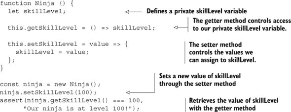

我们定义了一个 `Ninja` 构造函数，它创建只有通过我们的 `getSkillLevel` 和 `setSkillLevel` 方法才能访问的“私有”`skillLevel` 变量的忍者：属性值只能通过 `getSkillLevel` 方法获取，而新的属性值只能通过 `setSkillLevel` 方法设置（还记得 第五章 中的闭包吗？）。

现在，如果我们想记录对 `skillLevel` 属性的所有读取尝试，我们扩展 `getSkillLevel` 方法；如果我们想对所有的写入尝试做出反应，我们扩展 `setSkillLevel` 方法，如下面的代码片段所示：

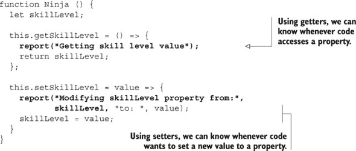

这很好。我们可以通过插入，例如，记录、数据验证或其他副作用（如 UI 修改）来轻松地对我们属性的交互做出反应。

但一个令人烦恼的疑问可能正在你的脑海中浮现。`skillLevel` 属性是一个值属性；它引用数据（数字 100），而不是一个函数。不幸的是，为了充分利用受控访问的所有好处，我们与该属性的交互必须通过显式调用相关方法来完成，这，坦白说，有点尴尬。

幸运的是，JavaScript 有内置的对真正的获取器和设置器的支持：作为正常数据属性访问的属性（例如，`ninja.skillLevel`），但它们是计算请求属性值、验证传入的值或我们需要的任何其他操作的方法。让我们看看这个内置支持。

#### 8.1.1\. 定义获取器和设置器

在 JavaScript 中，获取器和设置器方法可以以两种方式定义：

+   在对象字面量或 ES6 类定义中指定它们

+   通过使用内置的 `Object.defineProperty` 方法

对获取器和设置器的显式支持已经存在了一段时间，自从 ES5 时代起。一如既往，让我们通过一个示例来探索语法。在这种情况下，我们有一个存储忍者列表的对象，我们希望能够获取和设置列表中的第一个忍者。

##### 列表 8.2\. 在对象字面量中定义获取器和设置器

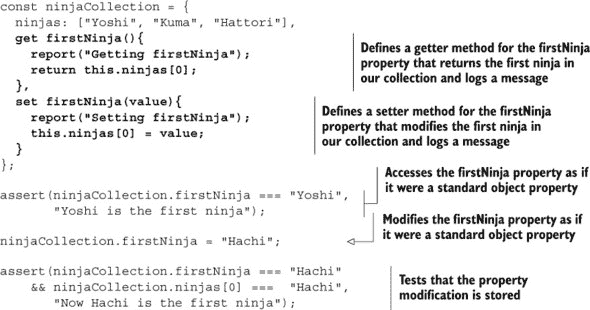

此示例定义了一个`ninjaCollection`对象，它有一个标准属性`ninjas`，该属性引用了一个忍者数组，以及`firstNinja`属性的获取器和设置器。获取器和设置器的一般语法在图 8.1 中显示。

##### 图 8.1\. 定义获取器和设置器的语法。在属性名前加上`get`或`set`关键字。

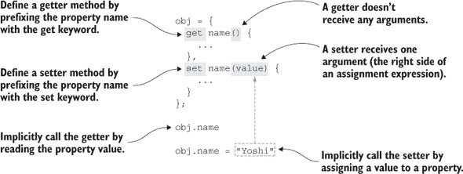

如您所见，我们通过在名称前加上`get`关键字来定义获取器属性，并通过`set`关键字定义设置器属性。

在列表 8.2 中，获取器和设置器都记录了一条消息。此外，获取器返回索引`0`处的忍者的值，而设置器将新值赋给同一索引处的忍者：

```
get firstNinja(){
  report("Getting firstNinja");
  return this.ninjas[0];
},
set firstNinja(value){
  report("Setting firstNinja");
  this.ninjas[0] = value;
}
```

接下来，我们测试访问获取器属性返回第一个忍者，Yoshi：

```
assert(ninjaCollection.firstNinja === "Yoshi",
       "Yoshi is the first ninja");
```

注意，获取器属性被访问的方式就像它是标准对象属性（而不是作为方法）一样。

在我们访问获取器属性后，相关的获取器方法被隐式调用，记录了消息`Getting firstNinja`，并返回索引`0`处的忍者的值。

我们继续利用我们的设置器方法，写入`firstNinja`属性，就像我们分配新值给普通对象属性一样：

```
ninjaCollection.firstNinja = "Hachi";
```

与前一个情况类似，因为`firstNinja`属性有一个设置器方法，所以每次我们给该属性赋值时，设置器方法都会被隐式调用。这记录了消息`Setting firstNinja`并修改了索引`0`处的忍者的值。

最后，我们可以测试我们的修改是否已经完成工作，以及索引`0`处的忍者的新值可以通过`ninjas`集合和我们的获取器方法访问：

```
assert(ninjaCollection.firstNinja === "Hachi"
    && ninjaCollection.ninjas[0] ===  "Hachi",
       "Now Hachi is the first ninja");
```

图 8.2 显示了列表 8.2 生成的输出。当我们通过`ninjaCollection.firstNinja`访问具有获取器的属性时，获取器方法立即被调用，在这种情况下，记录了消息`Getting firstNinja`。稍后，我们测试输出是`Yoshi`，并记录了消息`Yoshi is the first ninja`。我们通过给`firstNinja`属性赋新值的方式继续进行，正如我们可以在输出中看到的那样，这隐式触发了设置器方法的执行，该方法输出了消息`Setting firstNinja`。

##### 图 8.2\. 列表 8.2 的输出：如果一个属性有获取器和设置器方法，那么每次我们读取属性值时，都会隐式调用获取器方法，而每次我们给属性赋新值时，都会调用设置器方法。

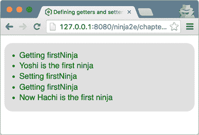

从所有这些中可以得出的一个重要观点是，原生的获取器和设置器允许我们指定作为标准属性访问的属性，但这些属性的方法在属性被访问时立即触发执行。这在图 8.3 中得到了进一步的强调。

##### 图 8.3\. 使用 getter 方法访问属性会隐式调用匹配的 getter。这个过程与这是一个标准方法调用时相同，getter 方法会被执行。当我们通过 setter 方法将值赋给属性时，也会发生类似的事情。

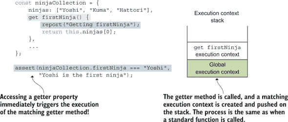

定义 getter 和 setter 的这种语法很简单，所以我们可以用完全相同的语法在其他情况下定义 getter 和 setter 也就不足为奇了。以下示例使用了 ES6 类。

##### 列表 8.3\. 使用 ES6 类中的 getter 和 setter

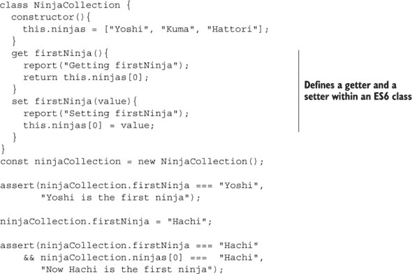

这将列表 8.2 中的代码修改为包括 ES6 类。我们保留所有测试以验证示例仍然按预期工作。

| |
| --- |

##### 注意

对于给定的属性，我们并不总是需要定义一个 getter 和一个 setter。例如，我们通常会只想提供一个 getter。如果在这种情况下我们仍然尝试向该属性写入值，确切的行为取决于代码是在严格模式还是非严格模式下。如果代码是在非严格模式下，向只有一个 getter 的属性赋值将没有任何效果；JavaScript 引擎会静默地忽略我们的请求。另一方面，如果代码是在严格模式下，JavaScript 引擎将抛出一个类型错误，表明我们正在尝试向一个有 getter 但没有 setter 的属性赋值。

| |
| --- |

虽然通过 ES6 类和对象字面量指定 getter 和 setter 很简单，但你可能已经注意到了一些缺失的东西。传统上，getter 和 setter 用于控制对私有对象属性的访问，如列表 8.1 所示。不幸的是，正如我们已经在第五章中知道的那样，JavaScript 没有私有对象属性。相反，我们可以通过定义变量和指定将覆盖这些变量的对象方法来模拟它们。因为在我们使用对象字面量和类时，我们的 getter 和 setter 方法并不是在用于私有对象属性的变量相同的函数作用域内创建的，所以我们不能这样做。幸运的是，有一种替代方法，即通过`Object.defineProperty`方法。

在第七章中，你看到了可以使用`Object.defineProperty`方法通过传递一个属性描述符对象来定义新属性。属性描述符可以包括一个`get`和一个`set`属性，它们定义了属性的 getter 和 setter 方法。

我们将使用这个特性来修改列表 8.1 以实现内置的 getter 和 setter，这些 getter 和 setter 可以控制对“私有”对象属性的访问，如下面的列表所示。

##### 列表 8.4\. 使用 Object.defineProperty 定义 getter 和 setter

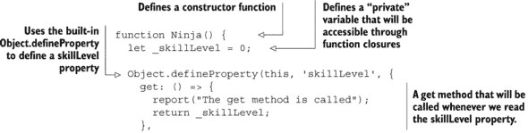

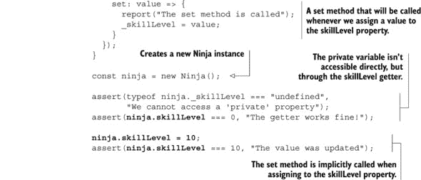

在这个例子中，我们首先定义了一个`Ninja`构造函数，其中包含一个`_skillLevel`变量，我们将使用它作为私有变量，就像在列表 8.1 中一样。

接下来，在由 `this` 关键字引用的新创建的对象上，我们使用内置的 `Object.defineProperty` 方法定义一个 `skillLevel` 属性：

```
Object.defineProperty(this, 'skillLevel', {
  get: () => {
    report("The get method is called");
    return _skillLevel;
  },
  set: value => {
    report("The set method is called");
    _skillLevel = value;
  }
});
```

因为我们希望 `skillLevel` 属性控制对私有变量的访问，所以我们指定了一个在访问属性时将被调用的 `get` 和 `set` 方法。

注意，与在对象字面量和类上指定的获取器和设置器不同，通过 `Object.defineProperty` 定义的 `get` 和 `set` 方法是在与“私有”`skillLevel` 变量相同的范围内创建的。这两个方法都在私有变量周围创建了一个闭包，我们只能通过这两个方法来访问那个私有变量。

其余的代码与前面的示例完全一样。我们创建一个新的 `Ninja` 实例，并检查我们是否可以直接访问私有变量。相反，所有交互都必须通过获取器和设置器进行，我们现在就像它们是标准对象属性一样使用它们：

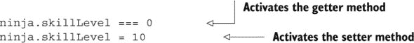

如您所见，使用 `Object.defineProperty` 的方法比对象字面量和类中的获取器和设置器更冗长和复杂。但在某些情况下，当我们需要私有对象属性时，这是值得的。

无论我们如何定义它们，获取器和设置器都允许我们定义像标准对象属性一样使用的对象属性，但它们是方法，每当我们在特定属性上读取或写入时，都可以执行额外的代码。这是一个非常实用的功能，使我们能够执行日志记录、验证赋值值，甚至在某些更改发生时通知代码的其他部分。让我们探索一些这些应用。

#### 8.1.2\. 使用获取器和设置器验证属性值

如我们所知，设置器是一个方法，每当我们将值写入匹配的属性时都会执行。我们可以利用设置器在尝试更新属性值时执行某些操作。例如，我们可以执行的操作之一是验证传入的值。请看以下代码，它确保我们的 `skillLevel` 属性只能被分配整数值。

##### 列表 8.5\. 使用设置器验证属性值赋值

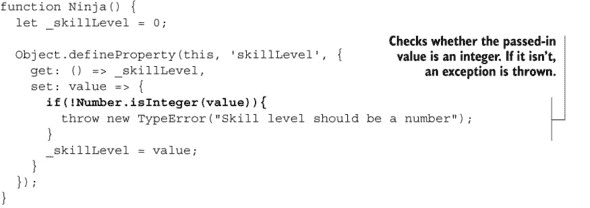

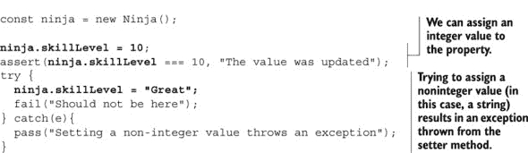

这个例子是 列表 8.4 的直接扩展。唯一的重大区别是，现在每当将新值分配给 `skillLevel` 属性时，我们检查传入的值是否为整数。如果不是，将抛出异常，私有 `_skillLevel` 变量不会被修改。如果一切顺利并且接收到了整数值，我们将得到私有 `_skillLevel` 变量的新值：

```
set: value => {
  if(!Number.isInteger(value)){
    throw new TypeError("Skill level should be a number");
  }
  _skillLevel = value;
}
```

在测试此代码时，我们首先检查如果我们分配一个整数，一切是否顺利：

```
ninja.skillLevel = 10;
assert(ninja.skillLevel === 10, "The value was updated");
```

然后我们测试了错误地分配其他类型值的情况，例如字符串。在这种情况下，我们应该得到一个异常。

```
try {
  ninja.skillLevel = "Great";
  fail("Should not be here");
} catch(e){
  pass("Setting a non-integer value throws an exception");
}
```

这就是如何避免当错误类型的值最终出现在某个属性中时发生的所有那些愚蠢的小错误。当然，这会增加开销，但这是我们有时不得不为了安全地使用像 JavaScript 这样高度动态的语言而付出的代价。

这只是 setter 方法有用性的一个例子；还有更多我们没有明确探讨的例子。例如，你可以使用同样的原则来跟踪值历史、执行日志记录、提供变更通知等等。

#### 8.1.3\. 使用 getter 和 setter 定义计算属性

除了能够控制对某些对象属性的访问之外，getter 和 setter 还可以用来定义 *计算属性*，这些属性的值是按请求计算的。计算属性不存储值；它们提供 `get` 和/或 `set` 方法来间接检索和设置其他属性。在下面的示例中，该对象有两个属性，`name` 和 `clan`，我们将使用它们来计算属性 `fullTitle`。

##### 列表 8.6\. 定义计算属性

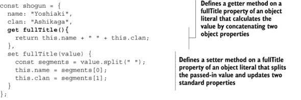

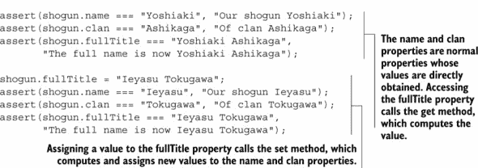

在这里，我们定义了一个 `shogun` 对象，具有两个标准属性，`name` 和 `clan`。此外，我们还指定了一个计算属性 `fullTitle` 的 getter 和 setter 方法：

```
const shogun = {
  name: "Yoshiaki",
  clan: "Ashikaga",
  get fullTitle(){
    return this.name + " " + this.clan;
  },
  set fullTitle(value) {
    const segments = value.split(" ");
    this.name = segments[0];
    this.clan = segments[1];
  }
};
```

`get` 方法在请求时通过连接 `name` 和 `clan` 属性来计算 `fullTitle` 属性的值。另一方面，`set` 方法使用所有字符串都有的内置 `split` 方法，通过空格字符将分配的字符串分割成段。第一个段代表名字，并分配给 `name` 属性，而第二个段代表部落，并分配给 `clan` 属性。

这处理了两种路由：读取 `fullTitle` 属性会计算其值，向 `fullTitle` 属性写入会修改构成属性值的属性。

说实话，我们不必使用计算属性。一个名为 `getFullTitle` 的方法可能同样有用，但计算属性可以提高我们代码的概念清晰度。如果某个值（在这个例子中，是 `fullTitle` 值）*仅*依赖于对象的内部状态（在这个例子中，依赖于 `name` 和 `clan` 属性），那么将其表示为数据字段、属性而不是函数是完美的。

这就结束了我们对 getter 和 setter 的探索。你已经看到，它们是语言的有用补充，可以帮助我们处理日志记录、数据验证和检测属性值的变化。不幸的是，有时这还不够。在某些情况下，我们需要控制与我们的对象的所有类型的交互，为此，我们可以使用一种全新的对象类型：一个 *代理*。

### 8.2\. 使用代理来控制访问

*代理* 是一个代理，通过它我们可以控制对另一个对象的访问。它使我们能够定义在对象交互时（例如，当读取或设置属性值，或调用方法时）将执行的定制操作。你可以将代理视为几乎是一般化的获取器和设置器；但是，每个获取器和设置器只控制对单个对象属性的访问，而代理使我们能够通用地处理与对象的交互，包括甚至方法调用。

当我们传统上使用获取器和设置器（例如用于日志记录、数据验证和计算属性）时，我们可以使用代理。但代理的功能更强大。它们允许我们轻松地为代码添加性能分析和性能测量，自动填充对象属性以避免讨厌的空异常，以及将宿主对象（如 DOM）包装起来以减少跨浏览器不兼容性。

|  |
| --- |

##### 注意

代理是由 ES6 引入的。有关当前浏览器的支持情况，请参阅[`mng.bz/9uEM`](http://mng.bz/9uEM)。

|  |
| --- |

在 JavaScript 中，我们可以使用内置的 `Proxy` 构造函数创建代理。让我们从一个拦截所有尝试读取和写入对象属性值的代理开始。

##### 列表 8.7\. 使用 Proxy 构造函数创建代理


我们首先创建我们的基础 `emperor` 对象，它只有一个 `name` 属性。然后，通过使用内置的 `Proxy` 构造函数，我们将 `emperor` 对象（或通常称为 *target* 对象）包装成一个名为 `representative` 的代理对象。在代理构造过程中，我们还将一个对象作为第二个参数发送，该对象指定了 *traps*，即当对对象执行某些操作时将被调用的函数：

```
const representative = new Proxy(emperor, {
  get: (target, key) => {
    report("Reading " + key + " through a proxy");
    return key in target ? target[key]
                             : "Don't bother the emperor!"
  },
  set: (target, key, value) => {
    report("Writing " + key + " through a proxy");
    target[key] = value;
  }
});
```

在这种情况下，我们指定了两个捕获器：一个 `get` 捕获器，它将在我们尝试通过代理读取属性值时被调用，以及一个 `set` 捕获器，它将在我们通过代理设置属性值时被调用。*get* 捕获器执行以下功能：如果目标对象具有属性，则返回该属性；如果对象没有属性，我们返回一条消息警告用户不要因为琐碎的细节而打扰 `emperor`。

```
get: (target, key) => {
  report("Reading " + key + " through a proxy");
  return key in target ? target[key]
                       : "Don't bother the emperor!"
}
```

接下来，我们测试我们是否可以通过目标 `emperor` 对象以及我们的代理对象直接访问 `name` 属性：

```
assert(emperor.name === "Komei", "The emperor's name is Komei");
assert(representative.name === "Komei",
      "We can get the name property through a proxy");
```

如果我们直接通过 `emperor` 对象访问 `name` 属性，将返回值 `Komei`。但如果通过 `proxy` 对象访问 `name` 属性，将隐式调用 `get` 捕获器。因为 `name` 属性在目标 `emperor` 对象中找到，所以也返回值 `Komei`。参见图 8.4。

##### 图 8.4\. 直接访问 `name` 属性（在左侧）和通过代理间接访问（在右侧）


|  |
| --- |

##### 注意

重要的是要强调，代理陷阱的激活方式与获取器和设置器相同。一旦我们执行一个动作（例如，在代理上访问属性值），匹配的陷阱就会隐式调用，JavaScript 引擎会经历一个类似于我们显式调用函数的过程。

| |
| --- |

另一方面，如果我们直接在目标 `emperor` 对象上访问一个不存在的 `nickname` 属性，我们会得到一个 `undefined` 值。但如果我们尝试通过我们的 `proxy` 对象来访问它，`get` 处理程序将被激活。因为目标 `emperor` 对象没有 `nickname` 属性，代理的 `get` 陷阱将返回 `Don't bother the emperor!` 消息。

我们将通过代理对象分配一个新属性来继续这个例子：`representative.nickname = "Tenno"`。因为分配是通过代理完成的，而不是直接完成，所以 `set` 陷阱，它记录一条消息并将属性分配给我们的目标 `emperor` 对象，被激活：

```
set: (target, key, value) => {
    report("Writing " + key + " through a proxy");
    target[key] = value;
}
```

自然地，新创建的属性可以通过代理对象和目标对象来访问：

```
assert(emperor.nickname === "Tenno",
      "The emperor now has a nickname");
assert(representative.nickname === "Tenno",
      "The nickname is also accessible through the proxy");
```

这就是使用代理的精髓：通过 `Proxy` 构造函数，我们创建一个代理对象，该对象通过激活某些陷阱来控制对目标对象的访问，每当直接在代理上执行操作时。

在这个例子中，我们使用了 `get` 和 `set` 陷阱，但许多其他内置陷阱允许我们为各种对象操作定义处理程序（见 [`mng.bz/ba55`](http://mng.bz/ba55)）。例如：

+   当调用函数时，将激活 *apply* 陷阱，当使用 `new` 操作符时，将激活 *construct* 陷阱。

+   当读取/写入属性时，将激活 *get* 和 *set* 陷阱。

+   对于 `for-in` 语句，将激活 *enumerate* 陷阱。

+   `getPrototypeOf` 和 `setPrototypeOf` 将在获取和设置原型值时被激活。

我们可以拦截许多操作，但详细讨论所有这些操作超出了本书的范围。现在，我们将注意力转向一些我们无法覆盖的操作：相等性（== 或 ===）、`instanceof` 和 `typeof` 操作符。

例如，表达式 `x == y`（或更严格的 `x === y`）用于检查 `x` 和 `y` 是否引用相同的对象（或具有相同的值）。这个相等操作符有一些假设。例如，比较两个对象应该总是为相同的两个对象返回相同的值，如果我们不能保证这个值是由用户指定的函数确定的，那么我们无法保证这一点。此外，比较两个对象的行为不应该提供对其中一个对象的访问，如果相等性可以被捕获，那么就会发生这种情况。出于类似的原因，`instanceof` 和 `typeof` 操作符也不能被捕获。

现在我们已经了解了代理的工作原理以及如何创建它们，让我们来探讨一些它们的实际应用方面，例如如何使用代理进行日志记录、性能测量、自动填充属性以及实现可以通过负索引访问的数组。我们将从日志记录开始。

#### 8.2.1\. 使用代理进行日志记录

当试图了解代码的工作原理或试图找到讨厌的 bug 的根本原因时，最强大的工具之一是*日志记录*，即在特定时刻输出我们认为有用的信息的行为。例如，我们可能想知道哪些函数被调用，它们执行了多长时间，哪些属性被读取或写入，等等。

不幸的是，在实现日志记录时，我们通常会在代码中分散地放置日志语句。看看本章前面提到的“忍者”示例。

##### 列表 8.8\. 不使用代理的日志记录


我们定义了一个 `Ninja` 构造函数，它向 `skillLevel` 属性添加了一个获取器和设置器，记录对该属性的所有读取和写入尝试。

注意，这不是一个理想的解决方案。我们使处理对象属性读写操作的领域代码变得杂乱无章，加入了日志代码。此外，如果将来在“忍者”对象上需要更多的属性，我们必须小心不要忘记为每个新属性添加额外的日志语句。

幸运的是，代理的一个直接用途是在我们读取或写入属性时启用日志记录，但以一种更加优雅和干净的方式。考虑以下示例。

##### 列表 8.9\. 使用代理使向对象添加日志记录更加容易


在这里，我们定义了一个 `makeLoggable` 函数，它接受一个 `target` 对象并返回一个新的 `Proxy`，该 `Proxy` 具有带有 `get` 和 `set` 陷阱的处理程序。这些陷阱除了读取和写入属性外，还会记录读取或写入的属性信息。

接下来，我们创建一个具有 `name` 属性的 `ninja` 对象，并将其传递给 `make-Loggable` 函数，其中它将作为新创建的代理的目标。然后我们将代理赋值回 `ninja` 标识符，以覆盖它。（别担心，我们的原始 `ninja` 对象作为代理的目标对象仍然保持活跃。）

每当我们尝试读取一个属性（例如，使用 `ninja.name`）时，`get` 陷阱将被调用，并记录已读取的属性信息。当向属性写入时也会发生类似的事情：`ninja.weapon = "sword"`。

注意，与使用获取器和设置器的标准方式相比，这要容易得多，也更加透明。我们不需要将领域代码与日志代码混合，也不需要为每个对象属性添加单独的日志。相反，所有属性读取和写入都通过我们的代理对象陷阱方法进行。日志记录只在唯一的位置指定，并且根据需要重复使用，在尽可能多的对象上使用。

#### 8.2.2\. 使用代理来测量性能

除了用于记录属性访问外，代理还可以用于测量函数调用的性能，甚至不需要修改函数的源代码。比如说，我们想要测量一个计算一个数是否为质数的函数的性能，如下面的列表所示。

##### 列表 8.10\. 使用代理测量性能


在这个例子中，我们有一个简单的 `isPrime` 函数。（具体的函数不重要；我们只是用它作为函数执行可能持续一段时间的示例。）

现在想象一下，我们需要测量 `isPrime` 函数的性能，但又不想修改其代码。我们可以将函数包装到一个代理中，该代理有一个陷阱，每当函数被调用时都会被调用：

```
isPrime = new Proxy(isPrime, {
  apply: (target, thisArg, args) => {
...
  }
});
```

我们使用 `isPrime` 函数作为新构造的代理的目标对象。此外，我们还提供了一个带有 `apply` 陷阱的处理程序，该陷阱将在函数调用时执行。

类似于前一个示例，我们将新创建的代理分配给了 `isPrime` 标识符。这样，我们就不必更改任何调用我们想要测量执行时间的函数的代码；程序代码的其余部分对我们的更改一无所知。（这难道不是一些忍者隐形行动吗？）

每当调用 `isPrime` 函数时，该调用会被重定向到我们的代理的 `apply` 陷阱，该陷阱将使用内置的 `console.time` 方法启动计时器（记住 第一章），调用原始的 `isPrime` 函数，记录经过的时间，并最终返回 `isPrime` 调用的结果。

#### 8.2.3\. 使用代理来自动填充属性

除了简化日志记录外，代理还可以用于自动填充属性。例如，假设您必须模拟计算机的文件夹结构，其中文件夹对象可以具有也可以是文件夹的属性。现在想象一下，您必须模拟一个位于长路径末尾的文件，如下所示：

```
rootFolder.ninjasDir.firstNinjaDir.ninjaFile = "yoshi.txt";
```

为了创建这个，你可能需要写一些类似以下的内容：

```
const rootFolder = new Folder();
rootFolder.ninjasDir = new Folder();
rootFolder.ninjasDir.firstNinjaDir = new Folder();
rootFolder.ninjasDir.firstNinjaDir.ninjaFile = "yoshi.txt";
```

这似乎比必要的繁琐多了，不是吗？这就是自动填充属性发挥作用的地方；只需看看下面的例子。

##### 列表 8.11\. 使用代理来自动填充属性


通常情况下，如果我们只考虑以下代码，我们预期会抛出一个异常：

```
const rootFolder = new Folder();
rootFolder.ninjasDir.firstNinjaDir.ninjaFile = "yoshi.txt";
```

我们正在访问 `rootFolder` 对象中未定义的属性 `ninjasDir` 的属性 `firstNinjaDir`。但如果我们运行代码，你会看到一切正常，如图 图 8.5 所示。

##### 图 8.5\. 运行 列表 8.11 代码的输出


这是因为我们在使用代理。每次我们访问一个属性时，代理的 `get` 陷阱就会被激活。如果我们的文件夹对象已经包含请求的属性，它的值就会被返回，如果没有，就会创建一个新的文件夹并将其分配给属性。这就是我们的两个属性 `ninjasDir` 和 `firstNinjaDir` 被创建的方式。请求未初始化属性的值会触发其创建。

最后，我们终于有一个工具可以摆脱一些讨厌的空指针异常了！

#### 8.2.4\. 使用代理实现负数组索引

在我们的日常编程中，我们通常会处理 *很多* 数组。让我们探索如何利用代理使我们对数组的处理更加愉快。

如果你的编程背景来自像 Python、Ruby 或 Perl 这样的语言，你可能已经习惯了负数组索引，这允许你使用负索引从后端访问数组项，如下面的代码片段所示：


现在比较我们通常用来访问数组最后一个元素的代码，`ninjas [ninjas.length-1]`，以及如果我们选择的语言支持负数组索引，我们可以使用的代码，`ninjas[-1]`。看看这有多优雅？

不幸的是，JavaScript 并没有提供对负数组索引的原生支持，但我们可以通过代理来模拟这种能力。为了探索这个概念，我们将查看由 Sindre Sorhus 编写的代码的略微简化版本（[`github.com/sindresorhus/negative-array`](https://github.com/sindresorhus/negative-array)），如下所示列表。

##### 列表 8.12\. 使用代理实现负数组索引


在这个例子中，我们定义了一个函数，该函数将为传入的数组创建一个代理。因为我们不希望我们的代理与其他类型的对象一起工作，所以如果参数不是数组，我们会抛出一个异常：

```
if (!Array.isArray(array)) {
    throw new TypeError('Expected an array');
}
```

我们继续创建并返回一个新的代理，它有两个陷阱：一个 `get` 陷阱，它会在我们尝试读取数组项时激活，以及一个 `set` 陷阱，它会在我们写入数组项时激活：

```
return new Proxy(array, {
  get: (target, index) => {
    index = +index;
    return target[index < 0 ? target.length + index : index];
  },
  set: (target, index, val) => {
    index = +index;
    return target[index < 0 ? target.length + index : index] = val;
  }
});
```

陷阱体是相似的。首先，我们使用一元加运算符（`index = +index`）将属性转换为数字。然后，如果请求的索引小于 `0`，我们通过锚定到数组的长度从后端访问数组项，如果它大于或等于 `0`，我们以标准方式访问数组项。

最后，我们执行各种测试来检查在正常数组中我们只能通过正数组索引访问数组项，而且如果我们使用代理，我们可以通过负索引访问和修改数组项。

现在你已经看到了如何使用代理来实现一些有趣的功能，比如自动填充对象属性和访问负数组索引（没有代理这是不可能的），让我们探索代理的最大缺点：性能问题。

#### 8.2.5\. 代理的性能成本

如我们所知，代理是一个代理对象，通过它我们可以控制对另一个对象的访问。代理可以定义陷阱，即当在代理上执行特定操作时将执行的函数。而且，正如你所看到的，我们可以使用这些陷阱来实现有用的功能，如记录、性能测量、自动填充属性、负数组索引等。不幸的是，也存在一个缺点。由于所有操作都必须通过代理进行，这增加了一个间接层，使我们能够实现所有这些酷炫功能，但同时它也引入了大量的额外处理，这影响了性能。

为了测试这些性能问题，我们可以在列表 8.12 中的负数组索引示例的基础上构建，并比较在正常数组中访问项目与通过代理访问项目时的执行时间，如下面的列表所示。

##### 列表 8.13\. 检查代理的性能限制


由于代码的单个操作发生得太快，无法可靠地测量，因此必须多次执行代码才能得到可测量的值。通常，这个计数可以是数万次，甚至数百万次，具体取决于被测量的代码的性质。一点尝试和错误让我们选择一个合理的值：在这种情况下是 500,000。

我们还需要使用两个`new Date().getTime()`时间戳来括号化代码的执行：一个在我们开始执行目标代码之前，另一个在之后。它们的差值告诉我们代码执行所需的时间。最后，我们可以通过在代理数组和对标准数组上调用`measure`函数来比较结果。

在我们的机器上，代理的结果并不理想。结果是，在 Chrome 中，代理大约慢 50 倍；在 Firefox 中，它们大约慢 20 倍。

目前，我们建议你在使用代理时要小心。虽然它们允许你在控制对象访问方面具有创造性，但这种控制程度伴随着性能问题。你可以使用对性能不敏感的代码与代理一起使用，但在大量执行的代码中使用它们时要小心。一如既往，我们建议你彻底测试你代码的性能。

### 8.3\. 摘要

+   我们可以使用获取器（getters）、设置器（setters）和代理（proxies）来监控我们的对象。

+   通过使用访问器方法（获取器和设置器），我们可以控制对对象属性的访问。

    +   访问器属性可以通过使用内置的`Object.defineProperty`方法或使用特殊的`get`和`set`语法作为对象字面量或 ES6 类的部分来定义。

    +   每当我们尝试读取时，都会隐式调用`get`方法，而当我们为匹配对象的属性赋值时，则会调用`set`方法。

    +   获取器方法可以用来定义计算属性，这些属性的价值是基于每个请求计算的，而设置器方法可以用来实现数据验证和日志记录。

+   代理是 JavaScript 的 ES6 新增功能，用于控制其他对象。

    +   代理使我们能够定义在对象交互时（例如，当读取属性或调用函数时）将执行的定制操作。

    +   所有交互都必须通过代理进行，当发生特定操作时，代理会触发陷阱。

+   使用代理实现优雅

    +   记录

    +   性能测量

    +   数据验证

    +   自动填充对象属性（从而避免讨厌的 null 异常）

    +   负数组索引

+   代理并不快，所以在大量执行的代码中使用它们时要小心。我们建议您进行性能测试。

### 8.4\. 练习

> **1**
> 
> 在运行以下代码后，以下哪个表达式会抛出异常，以及为什么？
> 
> ```
> const ninja = {
>    get name() {
>      return "Akiyama";
>    }
> }
> ```
> 
> 1.  `ninja.name();`
> 1.  
> 1.  `const name = ninja.name;`
> 1.  
> **2**
> 
> 在以下代码中，哪种机制允许获取器访问私有对象变量？
> 
> ```
> function Samurai() {
>   const _weapon = "katana";
>   Object.defineProperty(this, "weapon", {
>     get: () => _weapon
>   });
> }
> const samurai = new Samurai();
> assert(samurai.weapon === "katana", "A katana wielding samurai");
> ```
> 
> **3**
> 
> 以下哪个断言会通过？
> 
> ```
> const daimyo = { name: "Matsu", clan: "Takasu"};
> const proxy = new Proxy(daimyo, {
>   get: (target, key) => {
>     if(key === "clan"){
>       return "Tokugawa";
>     }
>   }
> });
> 
> assert(daimyo.clan === "Takasu", "Matsu of clan Takasu");
> assert(proxy.clan === "Tokugawa", "Matsu of clan Tokugawa?");
> 
> proxy.clan = "Tokugawa";
> 
> assert(daimyo.clan === "Takasu", "Matsu of clan Takasu");
> assert(proxy.clan === "Tokugawa", "Matsu of clan Tokugawa?");
> ```
> 
> **4**
> 
> 以下哪个断言会通过？
> 
> ```
> const daimyo = { name: "Matsu", clan: "Takasu", armySize: 10000};
> const proxy = new Proxy(daimyo, {
>   set: (target, key, value) => {
>     if(key === "armySize") {
>       const number = Number.parseInt(value);
>       if(!Number.isNaN(number)){
>         target[key] = number;
>       }
>     } else {
>        target[key] = value;
>     }
>   },
> });
> 
> assert(daimyo.armySize === 10000, "Matsu has 10 000 men at arms");
> assert(proxy.armySize === 10000, "Matsu has 10 000 men at arms");
> 
> proxy.armySize = "large";
> assert(daimyo.armySize === "large", "Matsu has a large army");
> 
> daimyo.armySize = "large";
> assert(daimyo.armySize === "large", "Matsu has a large army");
> ```

## 第九章\. 处理集合

*本章涵盖*

+   创建和修改数组

+   使用和重用数组函数

+   使用映射创建字典

+   使用集合创建唯一对象的集合

现在我们已经花了一些时间处理 JavaScript 中面向对象的特定性，我们将继续探讨一个与之密切相关的话题：项目集合。我们将从数组开始，这是 JavaScript 中最基本的集合类型，并探讨一些如果你在另一种编程语言中编程背景，可能不会预料到的数组特性。我们将继续探讨一些内置的数组方法，这些方法将帮助你编写更优雅的数组处理代码。

接下来，我们将讨论两个新的 ES6 集合：映射和集合。使用映射，你可以创建一种类型的字典，它携带键和值之间的映射——这种集合在特定的编程任务中非常有用。另一方面，集合是唯一项目的集合，其中每个项目只能出现一次。让我们从最简单、最常见的一切集合开始：数组。

### 你知道吗？

> **Q1:**
> 
> 使用对象作为字典或映射时，常见的陷阱有哪些？
> 
> **Q2:**
> 
> 在`Map`中，键/值对可以有什么值类型？
> 
> **Q3:**
> 
> `Set`中的项目必须具有相同的类型吗？

### 9.1\. 数组

数组是最常见的数据类型之一。使用它们，你可以处理项目集合。如果你的编程背景是在 C 这样的强类型语言中，你可能认为数组是存储相同类型项的连续内存块，每个内存块具有固定的大小，并通过一个关联的索引可以轻松访问它。

但就像 JavaScript 中的许多事物一样，数组也有一些转折：它们只是对象。尽管这导致了一些不幸的副作用，主要是性能方面，但它也有一些好处。例如，数组可以访问方法，就像其他对象一样——这些方法将使我们的生活变得更加容易。

在本节中，我们将首先探讨创建数组的方法。然后我们将探讨如何向数组的不同位置添加项和从数组中移除项。最后，我们将检查内置的数组方法，这些方法将使我们的数组处理代码更加优雅。

#### 9.1.1. 创建数组

创建新数组有两种基本方法：

+   使用内置的`Array`构造函数

+   使用数组字面量`[]`

让我们从创建一个忍者数组和武士数组的简单例子开始。

##### 列表 9.1. 创建数组


在列表 9.1 中，我们首先创建两个数组。`ninjas`数组是通过简单的数组字面量创建的：

```
const ninjas = ["Kuma", "Hattori", "Yagyu"];
```

它立即填充了三个忍者：Kuma、Hattori 和 Yagyu。`samurai`数组是通过内置的`Array`构造函数创建的：

```
const samurai = new Array("Oda", "Tomoe");
```

|  |
| --- |

**数组字面量与数组构造函数**

使用数组字面量创建数组比使用`Array`构造函数创建数组更受欢迎。主要原因是简单性：`[]`与`new Array()`（2 个字符与 11 个字符——几乎不是一个公平的竞争）。此外，由于 JavaScript 高度动态，没有人可以阻止某人覆盖内置的`Array`构造函数，这意味着调用`new Array()`不一定必须创建一个数组。因此，我们建议你通常坚持使用数组字面量。

|  |
| --- |

无论我们如何创建它，每个数组都有一个`length`属性，该属性指定了数组的大小。例如，`ninjas`数组的长度是`3`，它包含 3 个忍者。我们可以通过以下断言来测试这一点：

```
assert(ninjas.length === 3, "There are three ninjas");
assert(samurai.length === 2, "And only two samurai");
```

如你所知，你通过使用索引符号来访问数组项，其中第一个项目位于索引`0`，最后一个项目位于索引`array.length - 1`。但是如果我们尝试访问这些范围之外的索引——例如，使用`ninjas[4]`（记住，我们只有三个忍者！），我们不会得到在大多数其他编程语言中接收到的可怕的“数组索引越界”异常。相反，返回`undefined`，表示那里没有内容：

```
assert(ninjas[4] === undefined,
      "We get undefined if we try to access an out of bounds index");
```

这种行为是 JavaScript 数组是对象的事实的结果。正如如果我们尝试访问一个不存在的对象属性会得到`undefined`一样，当我们尝试访问一个不存在的数组索引时，也会得到`undefined`。

另一方面，如果我们尝试写入数组范围之外的某个位置，就像

```
ninjas[4] = "Ishi";
```

数组将扩展以适应新的情况。例如，参见 图 9.1：我们在数组中实际上创建了一个空位，索引 `3` 的项目是 `undefined`。这也改变了 `length` 属性的值，现在报告的值是 `5`，尽管数组中有一个项目是 `undefined`。

##### 图 9.1\. 在数组边界之外写入数组索引会扩展数组。


与大多数其他语言不同，在 JavaScript 中，数组还表现出与 `length` 属性相关的奇特特性：没有任何东西阻止我们手动更改它的值。将值设置得高于当前长度将会使用 `undefined` 项目扩展数组，而将值设置得低于当前长度将会裁剪数组，例如 `ninjas.length = 2;`。

既然我们已经了解了数组创建的基础知识，那么让我们来看看一些最常见的数组方法。

#### 9.1.2\. 在数组的两端添加和移除项目

让我们从以下简单的方法开始，这些方法可以帮助我们在数组中添加和移除项目：

+   `push` 方法向数组的末尾添加一个项目。

+   `unshift` 方法向数组的开头添加一个项目。

+   `pop` 方法从数组的末尾移除一个项目。

+   `shift` 方法从数组的开头移除一个项目。

你可能已经使用过这些方法，但为了以防万一，让我们通过探索以下列表来确保我们处于同一页面上。

##### 列表 9.2\. 添加和移除数组项目


在这个例子中，我们首先创建一个新的空 `ninjas` 数组：

```
ninjas = [] // ninjas: []
```

在每个数组中，我们可以使用内置的 `push` 方法将项目追加到数组的末尾，在这个过程中改变其长度：

```
ninjas.push("Kuma"); // ninjas: ["Kuma"];
ninjas.push("Hattori"); // ninjas: ["Kuma", "Hattori"];
```

我们还可以通过使用内置的 `unshift` 方法在数组的开头添加新项目：

```
ninjas.unshift("Yagyu");// ninjas: ["Yagyu", "Kuma", "Hattori"];
```

注意现有数组项目是如何调整的。例如，在调用 `unshift` 方法之前，`"Kuma"` 在索引 `0`，之后它位于索引 `1`。

我们还可以从数组的末尾或开头移除元素。调用内置的 `pop` 方法会从数组的末尾移除一个元素，在这个过程中减少数组的长度：

```
var lastNinja = ninjas.pop(); // ninjas:["Yagyu", "Kuma"]
                              // lastNinja: "Hattori"
```

我们还可以通过使用内置的 `shift` 方法从数组的开头移除一个项目：

```
var firstNinja = ninjas.shift(); //ninjas: ["Kuma"]
                                 //firstNinja: "Yagyu"
```

图 9.2 展示了 `push`、`pop`、`shift` 和 `unshift` 如何修改数组。

##### 图 9.2\. `push` 和 `pop` 方法修改数组的末尾，而 `shift` 和 `unshift` 修改数组的开头。


|  |
| --- |

**性能考虑：pop 和 push 与 shift 和 unshift 的比较**

`pop` 和 `push` 方法只影响数组中的最后一个项目：`pop` 通过删除最后一个项目，而 `push` 通过在数组末尾插入一个项目。另一方面，`shift` 和 `unshift` 方法改变数组中的第一个项目。这意味着任何后续数组项的索引都需要调整。因此，`push` 和 `pop` 的操作比 `shift` 和 `unshift` 快得多，我们建议除非有充分的理由，否则使用它们。

|  |
| --- |

#### 9.1.3\. 在任何数组位置添加和删除项

之前的例子是从数组的开始和结束删除项。但这太受限制了——一般来说，我们应该能够从数组的任何位置删除项。以下列表展示了实现这一点的直接方法。

##### 列表 9.3\. 删除数组项的朴素方法


从数组中删除项的方法不起作用。我们实际上只是在数组中创建了一个空位。数组仍然报告它有四个项目，但其中之一——我们想要删除的那个——是 `undefined`（见图 9.3）。

##### 图 9.3\. 从数组中删除项会在数组中创建一个空位。


类似地，如果我们想在任意位置插入一个项目，我们甚至从哪里开始呢？作为对这些问题的回答，所有 JavaScript 数组都可以访问 `splice` 方法：从给定索引开始，这个方法会删除和插入项目。查看以下示例。

##### 列表 9.4\. 在任意位置添加和删除项


我们首先创建一个包含四个项目的新数组：

```
var ninjas = ["Yagyu", "Kuma", "Hattori", "Fuma"];
```

然后我们调用内置的 `splice` 方法：

```
var removedItems = ninjas.splice(1,1);//ninjas:["Yagyu","Hattori", "Fuma"];
                                    //removedItems: ["Kuma"]
```

在这种情况下，`splice` 接受两个参数：开始剪切操作的索引，以及要删除的元素数量（如果我们省略这个参数，则删除数组末尾的所有元素）。在这种情况下，索引为 `1` 的元素从数组中删除，并且所有后续元素相应地移动。

此外，`splice` 方法返回一个包含已删除项的数组。在这种情况下，结果是包含单个项目的数组：`"Kuma"`。

使用 `splice` 方法，我们还可以在数组的任意位置插入项目。例如，考虑以下代码：

```
removedItems = ninjas.splice(1, 2, "Mochizuki", "Yoshi", "Momochi");
//ninjas: ["Yagyu", "Mochizuki", "Yoshi", "Momochi"]
//removedItems: ["Hattori", "Fuma"]
```

从索引 `1` 开始，它首先删除两个项目，然后添加三个项目：`"Mochizuki"`、`"Yoshi"` 和 `"Momochi"`。

既然我们已经向您介绍了数组的工作原理，让我们继续研究一些在数组上经常执行的一些常见操作。这将帮助您编写更优雅的数组处理代码。

#### 9.1.4\. 数组上的常见操作

在本节中，我们将探讨数组上的一些最常见操作：

+   *迭代*（或*遍历*）数组

+   *映射*现有的数组项以创建基于它们的新数组

+   *测试*数组项以检查它们是否满足某些条件

+   *查找*特定的数组项

+   *聚合* 数组并基于数组项计算单个值（例如，计算数组的总和）

我们将从基础知识开始：数组迭代。

##### 遍历数组

最常见的操作之一是遍历数组。回到计算机科学 101，迭代通常以以下方式执行：


这个例子看起来很简单。它使用 `for` 循环检查数组中的每个项；结果在 图 9.4 中显示。

##### 图 9.4\. 使用 `for` 循环检查忍者的输出


你可能已经写了无数次类似的东西，以至于你甚至不再需要思考。但以防万一，让我们更仔细地看看 `for` 循环。

要遍历一个数组，我们必须设置一个计数器变量 `i`，指定我们想要计数的数字（`ninjas.length`），并定义计数器如何被修改（`i++`）。这是一件非常繁琐的事情，只是执行这样一个常见的操作，而且它可能是令人烦恼的小错误的来源。此外，它使我们的代码更难以阅读。读者必须仔细查看 `for` 循环的每个部分，以确保它遍历了所有项且没有跳过任何项。

为了使生活更简单，所有 JavaScript 数组都有一个内置的 `forEach` 方法，我们可以在这种情况下使用。看看以下示例。

##### 列表 9.5\. 使用 forEach 方法


我们提供了一个回调（在这种情况下，一个箭头函数），它对数组中的每个项都会立即被调用。就是这样——不再需要担心起始索引、结束条件或精确的增量。JavaScript 引擎会为我们处理所有这些，幕后操作。注意，这段代码更容易理解，并且错误产生的点更少。

我们将继续提高难度，看看我们如何将数组映射到其他数组。

##### 映射数组

假设你有一个 `ninja` 对象的数组。每个忍者和他最喜欢的武器，你想要从 `ninjas` 数组中提取武器数组。有了 `forEach` 方法的知识，你可能会写出以下列表。

##### 列表 9.6\. 原始提取武器数组


这并不算太糟糕：我们创建了一个新的、空的数组，并使用 `forEach` 方法遍历 `ninjas` 数组。然后，对于每个 `ninja` 对象，我们将当前武器添加到 `weapons` 数组中。

如你所想，根据现有数组中的项创建新数组是出奇地常见——常见到它有一个特殊的名称：*映射* 数组。其想法是将一个数组中的每个项映射到新数组的新项。方便的是，JavaScript 有一个 `map` 函数可以做到这一点，如下面的列表所示。

##### 列表 9.7\. 映射数组


内置的 `map` 方法构建一个全新的数组，然后遍历输入数组。对于输入数组中的每个项目，`map` 根据提供给 `map` 的回调函数的结果，在新建的数组中放置一个项目。`map` 函数的内部工作原理在 图 9.5 中展示。

##### 图 9.5\. `map` 函数对每个数组项目调用提供的回调函数（fc），并创建一个包含回调返回值的新数组。


现在我们知道了如何映射数组，让我们看看如何测试数组项目是否满足特定条件。

##### 测试数组项目

当处理项目集合时，我们经常会遇到需要知道是否所有或至少某些数组项目满足特定条件的情况。为了尽可能高效地编写此代码，所有 JavaScript 数组都可以访问内置的 `every` 和 `some` 方法，如下所示。

##### 列表 9.8\. 使用 `every` 和 `some` 方法测试数组


列表 9.8 展示了一个例子，其中我们有一个 `ninja` 对象集合，但我们不确定它们的名称以及是否所有对象都配备了武器。为了找到这个问题的根源，我们首先利用 `every`：

```
var allNinjasAreNamed = ninjas.every(ninja => "name" in ninja);
```

`every` 方法接受一个回调函数，对于集合中的每个 `ninja`，检查我们是否知道 `ninja` 的名字。只有当传入的回调函数对数组中的每个项目都返回 `true` 时，`every` 才返回 `true`。图 9.6 展示了 `every` 的工作原理。

##### 图 9.6\. `every` 方法测试数组中的所有项目是否满足由回调函数表示的某个条件。


在其他情况下，我们只关心是否某些数组项目满足特定条件。对于这些情况，我们可以使用内置方法 `some`：

```
const someNinjasAreArmed = ninjas.some(ninja => "weapon" in ninja);
```

从第一个数组项目开始，`some` 对每个数组项目调用回调函数，直到找到一个回调返回 `true` 值的项目。如果找到了这样的项目，返回值是 `true`；如果没有，返回值是 `false`。

图 9.7 展示了 `some` 方法在底层是如何工作的：我们按顺序搜索数组以确定其项目是否满足某个条件。接下来，我们将探讨如何搜索数组以找到特定项目。

##### 图 9.7\. `some` 方法检查至少有一个数组项目是否满足传入回调函数表示的条件。


##### 搜索数组

你迟早会使用的一个常见操作是查找数组中的项目。同样，这个任务可以通过另一个内置数组方法 `find` 得到极大的简化。让我们研究以下列表。

| |
| --- |

##### 注意

内置的 `find` 方法是 ES6 标准的一部分。关于当前浏览器的兼容性，请参阅 [`mng.bz/U532`](http://mng.bz/U532)。

| |
| --- |

##### 列表 9.9\. 查找数组项目


找到一个满足特定条件的数组项很容易：我们使用内置的 `find` 方法，传递一个回调函数，该函数对集合中的每个项进行调用，直到找到目标项。这由回调返回 `true` 来指示。例如，以下表达式

```
ninjas.find(ninja => ninja.weapon === "wakizashi");
```

找到 `ninjas` 数组中第一个携带短刀的忍者 Kuma。

如果我们遍历了整个数组而没有单个项返回 `true`，则搜索的最终结果是 `undefined`。例如，以下代码

```
ninjaWithKatana = ninjas.find(ninja => ninja.weapon === "katana");
```

返回 `undefined`，因为没有携带武士刀的忍者。 展示了 `find` 函数的内部工作原理。

##### 图 9.8\. `find` 函数在一个数组中查找一个项：第一个使 `find` 回调返回 `true` 的项。


如果我们需要找到满足特定标准的多项，我们可以使用 `filter` 方法，它创建一个包含所有满足该标准的项的新数组。例如，以下表达式

```
const armedNinjas = ninjas.filter(ninja => "weapon" in ninja);
```

创建一个只包含 `ninja`s 武器的 `armedNinjas` 数组。在这种情况下，可怜的无武器 Yoshi 被排除在外。 展示了 `filter` 函数的工作方式。

##### 图 9.9\. `filter` 函数创建一个新数组，该数组包含所有使回调返回 `true` 的项。


在这个例子中，你已经看到了如何在数组中查找特定项，但在许多情况下，也可能需要找到项的索引。让我们通过以下示例进行更详细的了解。

##### 列表 9.10\. 查找数组索引

```
const ninjas = ["Yagyu", "Yoshi", "Kuma", "Yoshi"];

assert(ninjas.indexOf("Yoshi") === 1, "Yoshi is at index 1");
assert(ninjas.lastIndexOf("Yoshi") === 3, "and at index 3");

const yoshiIndex = ninjas.findIndex(ninja => ninja === "Yoshi");

assert(yoshiIndex === 1, "Yoshi is still at index 1");
```

要找到特定项的索引，我们使用内置的 `indexOf` 方法，传递我们想要找到索引的项：

```
ninjas.indexOf("Yoshi")
```

在特定项可以在数组中多次出现的情况下（例如 `"Yoshi"` 和 `ninjas` 数组），我们可能还感兴趣找到 Yoshi 出现的最后一个索引。为此，我们可以使用 `lastIndexOf` 方法：

```
ninjas.lastIndexOf("Yoshi")
```

最后，在大多数情况下，当我们没有要搜索的项的确切索引的引用时，我们可以使用 `findIndex` 方法：

```
const yoshiIndex = ninjas.findIndex(ninja => ninja === "Yoshi");
```

`findIndex` 方法接受一个回调函数并返回第一个使回调返回 `true` 的项的索引。本质上，它的工作方式与 `find` 方法非常相似，唯一的区别在于 `find` 返回一个特定的项，而 `findIndex` 返回该项的索引。

##### 排序数组

最常见的数组操作之一是 *排序*——有系统地按某种顺序排列项。不幸的是，正确实现排序算法并不是一项容易的编程任务：我们必须为任务选择最佳的排序算法，实现它，并根据我们的需求进行调整，同时始终小心不要引入微妙的错误。为了减轻这个负担，正如你在第三章中看到的，所有 JavaScript 数组都可以访问内置的 `sort` 方法，其用法如下：

```
array.sort((a, b) => a – b);
```

JavaScript 引擎实现了排序算法。我们唯一需要提供的是回调函数，它告知排序算法两个数组项之间的关系。可能的结果如下：

+   如果回调返回的值小于 `0`，则项目 `a` 应该排在项目 `b` 之前。

+   如果回调返回的值等于 `0`，则项目 `a` 和 `b` 处于平等地位（就排序算法而言，它们是相等的）。

+   如果回调返回的值大于 `0`，则项目 `a` 应该排在项目 `b` 之后。

图 9.10 展示了排序算法根据回调返回值所做的决策。

##### 图 9.10\. 如果回调返回的值小于 `0`，则第一个项目应排在第二个项目之前。如果回调返回 `0`，则两个项目应保持不变。如果返回值大于 `0`，则第一个项目应排在第二个项目之后。


关于排序算法，你只需要知道这么多。实际的排序是在幕后进行的，我们无需手动移动数组项。让我们看看一个简单的例子。

##### 列表 9.11\. 排序数组


在 列表 9.11 中，我们有一个包含 `ninja` 对象的数组，其中每个忍者和一个名字。我们的目标是按忍者名字的字典顺序（字母顺序）对数组进行排序。为此，我们自然使用 `sort` 函数：

```
ninjas.sort(function(ninja1, ninja2){
  if(ninja1.name < ninja2.name) { return -1; }
  if(ninja1.name > ninja2.name) { return 1; }

  return 0;
});
```

我们只需要传递给 `sort` 函数一个用于比较两个数组项的回调函数。因为我们想进行字典比较，所以我们声明如果 `ninja1` 的名字“小于” `ninja2` 的名字，回调返回 `-1`（记住，这意味着 `ninja1` 应该在最终排序顺序中排在 `ninja2` 之前）；如果它更大，回调返回 `1`（`ninja1` 应该排在 `ninja2` 之后）；如果它们相等，回调返回 `0`。注意，我们可以使用简单的小于 (`<`) 和大于 (`>`) 运算符来比较两个忍者的名字。

就这些了！排序的其余细节留给 JavaScript 引擎处理，我们无需担心。

##### 聚合数组项

你有多少次编写过如下代码？

```
const numbers = [1, 2, 3, 4];
const sum = 0;

numbers.forEach(number => {
   sum += number;
});

assert(sum === 10, "The sum of first four numbers is 10");
```

这段代码必须访问集合中的每个项目并聚合一些值，本质上是将整个数组缩减为一个值。别担心——JavaScript 也有助于这种情况，那就是 `reduce` 方法，如下例所示。

##### 列表 9.12\. 使用 `reduce` 聚合项目


`reduce` 方法通过获取初始值（在本例中为 `0`）并在每个数组项上调用回调函数，将前一个回调调用的结果（或初始值）和当前数组项作为参数。`reduce` 调用的结果是最后一个回调的结果，该回调在最后一个数组项上调用。图 9.11 更详细地说明了这个过程。

##### 图 9.11。`reduce`函数将回调函数应用于聚合值和数组中的每个元素，以将数组缩减为单个值。


我们希望我们已经说服您，JavaScript 包含一些有用的数组方法，这些方法可以使我们的生活变得更加轻松，代码更加优雅，而无需求助于讨厌的`for`循环。如果您想了解更多关于这些和其他数组方法的信息，我们建议您查看 Mozilla 开发者网络上的解释，网址为[`mng.bz/cS21`](http://mng.bz/cS21)。

现在我们将进一步深入，向您展示如何在自己的自定义对象上重用这些数组方法。

#### 9.1.5。重用内置数组函数

有时候，我们可能想要创建一个包含数据集合的对象。如果集合是我们唯一关心的事情，我们可以使用数组。但在某些情况下，可能需要存储比集合本身更多的状态——也许我们需要存储有关收集项的一些元数据。

有一种选择是每次需要创建此类对象的新版本时，就创建一个新的数组，并将元数据属性和方法添加到其中。记住，我们可以随意向对象添加属性和方法，包括数组。然而，通常情况下，这可能会很慢，而且很繁琐。

让我们考察一下使用普通对象并“赋予”它我们所需功能的可能性。`Array`对象上已经存在一些知道如何处理集合的方法；我们能否欺骗它们在我们的对象上工作？事实证明我们可以，如下面的列表所示。

##### 列表 9.13。模拟数组类似方法


在这个例子中，我们创建了一个“普通”对象，并对其进行了配置以模拟数组的一些行为。首先，我们定义一个`length`属性来记录存储的元素数量，就像数组一样。然后，我们定义一个方法来向模拟数组的末尾添加一个元素，这个方法叫做`add`：

```
add: function(elem){
  Array.prototype.push.call(this, elem);
}
```

我们可以不编写自己的代码，而是使用 JavaScript 数组的原生方法：`Array.prototype.push`。

通常，`Array.prototype.push`方法会通过其函数上下文操作它自己的数组。但在这里，我们通过使用`call`方法（记得第四章）并强制我们的对象成为`push`方法的上下文，来欺骗这个方法使用我们的对象作为上下文。（注意我们也可以同样容易地使用`apply`方法。）`push`方法增加`length`属性（认为它是数组的`length`属性），向对象添加一个引用传递元素的编号属性。从某种意义上说，这种行为几乎是颠覆性的（对于忍者来说多么合适！），但它展示了我们可以用可变对象上下文做什么。

`add`方法期望传递一个元素引用以进行存储。虽然有时我们可能周围有这样的引用，但更常见的情况是我们没有，所以我们还定义了一个便利方法`gather`，它通过其`id`值查找元素并将其添加到存储中：

```
gather: function(id){
  this.add(document.getElementById(id));
}
```

最后，我们还定义了一个`find`方法，它允许我们通过利用内置数组`find`方法的优势，在我们的自定义对象中找到任意项：

```
find: function(callback){
  return Array.prototype.find.call(this, callback);
}
```

在本节中展示的边缘恶性行为不仅揭示了可塑函数上下文赋予我们的力量，还展示了我们如何巧妙地重用已经编写的代码，而不是不断地重新发明轮子。

现在我们已经花了一些时间在数组上，让我们继续学习 ES6 引入的两种新类型的集合：映射和集合。

### 9.2。映射

假设你是[freelanceninja.com](http://freelanceninja.com)的开发商，这个网站希望迎合更国际化的受众。对于网站上的每一篇文本——例如，“招聘忍者”——你希望为每种目标语言创建一个映射，例如“”（日语），“”（中文）或“”（韩语）（希望谷歌翻译已经做得足够好）。这些将键映射到特定值的集合，在不同的编程语言中被称为不同的名称，但最常见的是被称为*字典*或*映射*。

但你如何在 JavaScript 中有效地管理这种本地化？一种传统的方法是利用对象是命名属性和值的集合的事实，并创建类似以下字典的东西：


乍一看，这似乎是解决这个问题的完美方法，在这个例子中，它并不算太差。但不幸的是，在一般情况下，你不能依赖它。

#### 9.2.1。不要将对象用作映射

假设在我们网站的某个地方我们需要访问单词*constructor*的翻译，所以我们把字典示例扩展到以下代码。

##### 代码清单 9.14。对象可以访问未明确定义的属性


我们尝试访问单词*constructor*的翻译——一个我们愚蠢地忘记在字典中定义的单词。通常情况下，在这种情况下，我们期望字典返回`undefined`。但结果并非如此，正如你在图 9.12 中看到的那样。

##### 图 9.12 显示，运行代码清单 9.14 表明对象不是好的映射，因为它们可以访问未明确定义（通过它们的原型）的属性。


如你所见，通过访问`constructor`属性，我们获得了以下字符串：

```
"function Object() { [native code] }"
```

这是怎么回事？正如你在第七章中学到的，所有对象都有原型；即使我们定义新的、空的对象作为我们的映射，它们仍然可以访问原型对象中的属性。这些属性之一是`constructor`（回想一下，`constructor`是原型对象指向构造函数的属性），它是我们现在手头混乱的罪魁祸首。

此外，在对象中，键只能为字符串值；如果你想要为任何其他值创建映射，该值将被静默转换为字符串，而不会有人询问你任何问题！例如，想象一下我们想要跟踪一些关于 HTML 节点的信息，如下所示。

##### 列表 9.15\. 使用对象将值映射到 HTML 节点


在列表 9.15 中，我们创建了两个 HTML 元素，`firstElement`和`secondElement`，然后我们使用`document.getElementById`方法从 DOM 中获取它们。为了创建一个将存储每个元素额外信息的映射，我们定义了一个普通的 JavaScript 对象：

```
const map = {};
```

然后，我们使用 HTML 元素作为映射对象的键，并与之关联一些数据：

```
map[firstElement] = { data: "firstElement"}
```

然后，我们检查我们是否可以检索这些数据。因为这是按预期工作的，所以我们为第二个元素重复整个过程：

```
map[secondElement] = { data: "secondElement"};
```

再次，一切看起来都很正常；我们已经成功地与我们的 HTML 元素关联了一些数据。但如果我们决定重新访问第一个元素，就会出现问题：

```
map[firstElement].data
```

本来可能会认为我们会再次获得第一个元素的信息，但事实并非如此。相反，如图图 9.13 所示，返回的是第二个元素的信息。

##### 图 9.13\. 运行列表 9.15 中的代码显示，如果我们尝试将对象用作对象属性，对象会被转换为字符串。


这是因为在对象中，键被存储为字符串。这意味着当我们尝试将任何非字符串值，例如一个 HTML 元素，作为对象的属性时，该值会通过调用其`toString`方法被静默转换为字符串。在这里，这返回字符串`"[object HTMLDivElement]"`，并且关于第一个元素的信息被存储为`[object HTMLDivElement]`属性的值。

接下来，当我们尝试为第二个元素创建映射时，发生类似的事情。第二个元素也是一个 HTML div 元素，它也被转换为字符串，并且它的额外数据也被分配给`[object HTMLDivElement]`属性，覆盖了我们为第一个元素设置的值。

由于这两个原因——通过原型继承的属性和仅支持字符串键的支持——普通对象通常不适用于映射。由于这种限制，ECMAScript 委员会指定了一个全新的类型：`Map`。

| |
| --- |

##### 注意

Map 是 ES6 标准的一部分。关于当前浏览器的兼容性，请参阅：[`mng.bz/JYYM`](http://mng.bz/JYYM)。

| |
| --- |

#### 9.2.2\. 创建我们的第一个映射

创建映射很容易：我们使用一个新的内置`Map`构造函数。看看以下示例。

##### 列表 9.16\. 创建我们的第一个映射


在这个例子中，我们通过调用内置的`Map`构造函数来创建一个新的映射：

```
const ninjaIslandMap = new Map();
```

接下来，我们创建了三个忍者对象，巧妙地命名为`ninja1`、`ninja2`和`ninja3`。然后我们使用内置的映射`set`方法：

```
ninjaIslandMap.set(ninja1, { homeIsland: "Honshu"});
```

这在键（在这种情况下，是`ninja1`对象）和值（在这种情况下，是一个携带忍者家乡岛屿信息的对象）之间创建了一个映射。我们为前两个忍者`ninja1`和`ninja2`这样做。

在下一步中，我们通过使用另一个内置的映射方法`get`来获取前两个忍者的映射：

```
assert(ninjaIslandMap.get(ninja1).homeIsland === "Honshu",
      "The first mapping works");
```

课程映射对于前两个忍者是存在的，但对于第三个忍者则不存在，因为我们没有将第三个忍者作为`set`方法的参数使用。当前映射的状态显示在图 9.14 中。

##### 图 9.14\. 映射是一组键值对，其中键可以是任何东西——甚至是另一个对象。


除了`get`和`set`方法之外，每个映射还有一个内置的`size`属性和`has`以及`delete`方法。`size`属性告诉我们我们创建了多少映射。在这种情况下，我们只创建了两个映射。

另一方面，`has`方法会通知我们特定键的映射是否已经存在：

```
ninjaIslandMap.has(ninja1); //true
ninjaIslandMap.has(ninja3); //false
```

`delete`方法使我们能够从我们的映射中删除项：

```
ninjaIslandMap.delete(ninja1);
```

处理映射时的一个基本概念是确定两个映射键何时相等。让我们探讨这个概念。

##### 键相等

如果你来自一个稍微传统一点的背景，比如 C#、Java 或 Python，你可能对下一个例子感到惊讶。

##### 列表 9.17\. 映射中的键相等


在列表 9.17 中，我们使用内置的`location.href`属性来获取当前页面的 URL。接下来，通过使用内置的 URL 构造函数，我们创建了两个指向当前页面的新 URL 对象。然后我们将描述对象与每个链接关联起来。最后，我们检查是否创建了正确的映射，如图图 9.15 所示。

##### 图 9.15\. 如果我们运行列表 9.17 中的代码，我们可以看到映射中的键相等是基于对象相等的。


对于主要在 JavaScript 中工作的人来说，这个结果可能并不意外：我们创建了两个不同的对象，并为它们创建了两个不同的映射。但请注意，尽管这两个 URL 对象是独立的对象，它们仍然指向相同的 URL 位置：当前页面的位置。我们可以争论，在创建映射时，这两个对象应该被视为相等。但在 JavaScript 中，我们不能重载等号运算符，并且这两个对象，尽管它们具有相同的内容，总是被视为不同的。在其他语言中，例如 Java 和 C#，情况并非如此，所以请小心！

#### 9.2.3\. 遍历映射

到目前为止，你已经看到了一些映射的优势：你可以确信它们只包含你放入其中的项目，并且你可以使用任何东西作为键。但还有更多！

因为映射是集合，所以我们没有理由不能使用 `for...of` 循环遍历它们。（记住，我们在第六章中使用了 `for...of` 循环来遍历由生成器创建的值。）你还可以保证这些值将以它们被插入的顺序被访问（当我们使用 `for...in` 循环遍历对象时，我们无法依赖这一点）。让我们看看以下示例。

##### 列表 9.18\. 遍历映射


如前一个列表所示，一旦我们创建了一个映射，我们就可以很容易地使用 `for...of` 循环遍历它：

```
for(var item of directory){
  assert(item[0] !== null, "Key:" + item[0]);
  assert(item[1] !== null, "Value:" + item[1]);
}
```

在每次迭代中，这会给出一个包含两个项目的数组，其中第一个项目是一个键，第二个项目是我们目录映射中一个项目的值。我们还可以使用 `keys` 和 `values` 方法来遍历映射中包含的键和值。

现在我们已经了解了映射，让我们来看看 JavaScript 的另一个新成员：*集合*，它是一组唯一的项。

### 9.3\. 集合

在许多现实世界的问题中，我们必须处理称为 *集合* 的唯一项的集合（意味着每个项目不能出现多次）。在 ES6 之前，你必须通过使用标准对象模拟集合来实现这一点。以下是一个粗略的示例。

##### 列表 9.19\. 使用对象模拟集合


列表 9.19 展示了如何使用对象模拟集合的简单示例。我们使用数据存储对象 `data` 来跟踪我们的集合项，并公开了三个方法：`has`，它检查一个项目是否已经包含在集合中；`add`，它仅在相同的项目尚未包含在集合中时添加项目；以及 `remove`，它从集合中删除已包含的项目。

但这是一个糟糕的复制品。因为与映射不同，你实际上不能存储对象——只有字符串和数字，并且始终存在访问原型对象的危险。出于这些原因，ECMAScript 委员会决定引入一种全新的集合类型：*集合*。

|  |
| --- |

##### 注意

集合是 ES6 标准的一部分。关于当前浏览器的兼容性，请参阅 [`mng.bz/QRTS`](http://mng.bz/QRTS)。

|  |
| --- |

#### 9.3.1\. 创建我们的第一个集合

创建集合的基石是新引入的构造函数，方便地命名为 `Set`。让我们看看一个示例。

##### 列表 9.20\. 创建一个集合


在这里，我们使用内置的 `Set` 构造函数创建一个新的 `ninjas` 集合，它将包含不同的忍者。如果我们不传递任何参数，将创建一个空集合。我们也可以传递一个数组，例如这个，它预先填充集合：

```
new Set(["Kuma", "Hattori", "Yagyu", "Hattori"]);
```

如我们之前提到的，集合是唯一项目的集合，它们的主要目的是阻止我们存储相同对象的多个实例。在这种情况下，这意味着 `"Hattori"`，我们试图添加两次，只添加了一次。

每个集合都可以访问多个方法。例如，`has` 方法检查一个项目是否包含在集合中：

```
ninjas.has("Hattori")
```

和 `add` 方法用于向集合中添加唯一的元素：

```
ninjas.add("Yoshi");
```

如果你好奇一个集合中有多少个元素，你总是可以使用 `size` 属性。

与映射和数组类似，集合是集合，因此我们可以使用 `for...of` 循环遍历它们。正如你在图 9.16 中可以看到的，元素总是按照它们被插入的顺序遍历。

##### 图 9.16. 运行列表 9.20 中的代码显示，集合中的元素是按照它们被插入的顺序遍历的。


既然我们已经了解了集合的基础知识，让我们来看看集合的一些常见操作：并集、交集和差集。

#### 9.3.2. 集合的并集

两个集合 `A` 和 `B` 的并集创建了一个新的集合，该集合包含 `A` 和 `B` 中的所有元素。自然地，每个元素在新集合中不会出现超过一次。

##### 列表 9.21. 使用集合执行集合的并集操作


我们首先创建一个 `ninjas` 数组和一个 `samurai` 数组。注意，服部的生活很忙碌：白天是武士，晚上是忍者。现在想象一下，如果我们需要创建一个集合，我们可以召集这些人，如果邻近的大名决定他的领地有点拥挤。我们创建一个新的集合 `warriors`，包括所有忍者和所有武士。服部在两个集合中，但我们只想包含他一次——不像有两个服部会回应我们的召唤。

在这种情况下，集合是完美的！我们不需要手动跟踪一个项目是否已经被包含：集合会自动处理这一点。在创建这个新集合时，我们使用扩展运算符 `[...ninjas, ...samurai]`（记住第三章）来创建一个新的数组，该数组包含所有忍者和所有武士。如果你想知道，服部在这个新数组中出现了两次。但当我们最终将这个数组传递给 `Set` 构造函数时，服部只被包含一次，如图 9.17 所示。

##### 图 9.17. 两个集合的并集保留了两个集合中的元素（没有重复）。


#### 9.3.3. 集合的交集

两个集合 `A` 和 `B` 的*交集*创建了一个包含 `A` 中也在 `B` 中的元素的集合。例如，我们可以找到既是忍者又是武士的人，如下所示。

##### 列表 9.22. 集合的交集


清单 9.22 的想法是创建一个只包含也是武士的忍者的新集合。我们通过利用数组的 `filter` 方法来实现这一点，正如你可能记得的，`filter` 方法创建一个只包含符合特定标准的项目的新数组。在这种情况下，标准是忍者也是武士（包含在武士集合中）。因为 `filter` 方法只能用于数组，我们必须通过使用扩展运算符将 `ninjas` 集合转换为数组：

```
[...ninjas]
```

最后，我们检查是否只找到了一个既是忍者又是武士的忍者：万事通，服部。

#### 9.3.4. 集合的差集

两个集合 `A` 和 `B` 的差集包含所有在集合 `A` 中但不在集合 `B` 中的元素。正如你可能猜到的，这与集合的交集类似，但有一个微小但重要的区别。在下一个列表中，我们只想找到真正的忍者（不是那些也兼职做武士的人）。

##### 列表 9.23. 集合的差集


唯一的改变是，我们只关心那些不是武士的忍者，通过在 `samurai.has(ninja)` 表达式前放置一个感叹号（`!`）来实现。

### 9.4. 概述

+   数组是一种特殊的对象，具有 `length` 属性，其原型为 `Array.prototype`。

+   我们可以使用数组字面量表示法（`[]`）或通过调用内置的 `Array` 构造函数来创建新数组。

+   我们可以使用从数组对象可访问的几种方法来修改数组的内 容：

    +   内置的 `push` 和 `pop` 方法可以在数组的末尾添加和移除项目。

    +   内置的 `shift` 和 `unshift` 方法可以在数组的开始处添加和移除项目。

    +   内置的 `splice` 方法可以用来从任意数组位置移除项目并添加项目。

+   所有数组都可以访问许多有用的方法：

    +   `map` 方法通过在每一个元素上调用回调函数来创建一个包含结果的新数组。

    +   `every` 和 `some` 方法确定所有或某些数组项目是否满足某个特定标准。

    +   `find` 和 `filter` 方法可以找到满足特定条件的数组项目。

    +   `sort` 方法可以对数组进行排序。

    +   `reduce` 方法将数组中的所有项目聚合到一个单一值。

+   当通过显式设置 `call` 或 `apply` 方法的方法调用上下文来实现自己的对象时，你可以重用内置的数组方法。

+   映射和字典是包含键和值之间映射的对象。

+   JavaScript 中的对象作为映射很糟糕，因为你只能使用字符串值作为键，并且始终存在访问原型属性的风险。相反，使用新的内置 `Map` 集合。

+   映射是集合，可以使用 `for...of` 循环迭代。

+   集合是一系列独特的项目。

### 9.5. 练习

> **1**
> 
> 在运行以下代码后，`samurai` 数组的内容将是什么？
> 
> ```
> const samurai = ["Oda", "Tomoe"];
> samurai[3] = "Hattori";
> ```
> 
> **2**
> 
> 运行以下代码后，`ninjas`数组的内容将会是什么？
> 
> ```
> const ninjas = [];
> 
> ninjas.push("Yoshi");
> ninjas.unshift("Hattori");
> 
> ninjas.length = 3;
> 
> ninjas.pop();
> ```
> 
> **3**
> 
> 运行以下代码后，`samurai`数组的内容将会是什么？
> 
> ```
> const samurai = [];
> 
> samurai.push("Oda");
> samurai.unshift("Tomoe");
> samurai.splice(1, 0, "Hattori", "Takeda");
> samurai.pop();
> ```
> 
> **4**
> 
> 运行以下代码后，变量`first`、`second`和`third`将会存储什么？
> 
> ```
> const ninjas = [{name:"Yoshi", age: 18},
>              {name:"Hattori", age: 19},
>              {name:"Yagyu", age: 20}];
> 
> const first = persons.map(ninja => ninja.age);
> const second = first.filter(age => age % 2 == 0);
> const third = first.reduce((aggregate, item) =>  aggregate + item, 0);
> ```
> 
> **5**
> 
> 运行以下代码后，变量`first`和`second`将会存储什么？
> 
> ```
> const ninjas = [{ name: "Yoshi", age: 18 },
>                { name: "Hattor", age: 19 },
>                { name: "Yagyu", age: 20 }];
> 
> const first = ninjas.some(ninja => ninja.age % 2 == 0);
> const second = ninjas.every(ninja => ninja.age % 2 == 0);
> ```
> 
> **6**
> 
> 以下哪个断言将会通过？
> 
> ```
> const samuraiClanMap = new Map();
> 
> const samurai1 = { name: "Toyotomi"};
> const samurai2 = { name: "Takeda"};
> const samurai3 = { name: "Akiyama"};
> 
> const oda = { clan: "Oda"};
> const tokugawa = { clan: "Tokugawa"};
> const takeda ={clan: "Takeda"};
> 
> samuraiClanMap.set(samurai1, oda);
> samuraiClanMap.set(samurai2, tokugawa);
> samuraiClanMap.set(samurai2, takeda);
> assert(samuraiClanMap.size === 3, "There are three mappings");
> assert(samuraiClanMap.has(samurai1), "The first samurai has a mapping");
> assert(samuraiClanMap.has(samurai3), "The third samurai has a mapping");
> ```
> 
> **7**
> 
> 以下哪个断言将会通过？
> 
> ```
> const samurai = new Set("Toyotomi", "Takeda", "Akiyama", "Akiyama");
> assert(samurai.size === 4, "There are four samurai in the set");
> 
> samurai.add("Akiyama");
> assert(samurai.size === 5, "There are five samurai in the set");
> 
> assert(samurai.has("Toyotomi", "Toyotomi is in!");
> assert(samurai.has("Hattori", "Hattori is in!");
> ```

## 第十章\. 处理正则表达式

*本章涵盖*

+   正则表达式复习

+   编译正则表达式

+   使用正则表达式捕获

+   处理常见习语

正则表达式是现代开发的必需品。我们就是这样说的。尽管许多网页开发者可能一生中都可以快乐地忽略正则表达式，但在 JavaScript 代码中需要解决的问题中，没有正则表达式就无法优雅地解决。

当然，可能还有其他解决同样问题的方法。但通常，使用适当的正则表达式，可能需要半屏代码的任务可以简化为一个语句。所有 JavaScript 忍者都需要正则表达式作为他们工具箱的一个基本部分。

正则表达式简化了拆分字符串并查找信息的过程。在主流 JavaScript 库的任何地方，你都会看到正则表达式被广泛用于各种定位任务：

+   操作 HTML 节点字符串

+   在 CSS 选择器表达式中定位部分选择器

+   确定元素是否具有特定的类名

+   输入验证

+   以及更多

让我们从查看一个例子开始。

|  |
| --- |

##### 提示

要熟练掌握正则表达式需要大量的练习。你可能会发现像 JS Bin([`jsbin.com`](http://jsbin.com))这样的网站在尝试示例时很有用。有几个网站专门用于正则表达式测试，例如 JavaScript 的正则表达式测试页面([www.regexplanet.com/advanced/javascript/index.html](http://www.regexplanet.com/advanced/javascript/index.html))和 regex101([www.regex101.com/#javascript](http://www.regex101.com/#javascript))。regex101 对于初学者来说尤其有用，因为它还会自动生成目标正则表达式的解释。

|  |
| --- |

### 你知道吗？

> **Q1:**
> 
> 在什么情况下你更愿意使用正则表达式字面量而不是正则表达式对象？
> 
> **Q2:**
> 
> 什么是粘性匹配，如何启用它？
> 
> **Q3:**
> 
> 当使用全局正则表达式与非全局正则表达式匹配时，匹配有何不同？

### 10.1\. 为什么正则表达式很棒

假设我们想要验证一个字符串，可能是网站用户输入到表单中的字符串，是否符合九位美国邮政编码的格式。我们都知道美国邮政服务几乎没有幽默感，并坚持认为邮政编码（也称为 ZIP 代码）必须遵循以下特定格式：

```
99999-9999
```

每个`9`代表一个十进制数字，格式是 5 个十进制数字，后面跟着一个连字符，然后是 4 个十进制数字。如果你使用任何其他格式，你的包裹或信件就会被送入手工分拣部门的黑洞，好运预测它再次出现需要多长时间。

让我们创建一个函数，给定一个字符串，验证美国邮政服务是否会保持满意。我们可以通过逐个字符进行比较，但我们是忍者，这种解决方案太不优雅了，会导致很多不必要的重复。相反，考虑以下解决方案。

##### 列表 10.1\. 在字符串中测试特定模式


这段代码利用了这样一个事实，即我们只需要进行两次检查，这取决于字符在字符串中的位置。我们仍然需要在运行时进行多达九次比较，但我们必须只写一次每个比较。

即使如此，有人会认为这个解决方案是*优雅的*吗？它比蛮力、非迭代方法更优雅，但它仍然看起来为这样一个简单的检查编写了太多的代码。现在考虑这个方法：

```
function isThisAZipCode(candidate) {
  return /^\d{5}-\d{4}$/.test(candidate);
}
```

除了函数体中的一些晦涩语法之外，这要简洁和优雅得多，不是吗？这就是正则表达式的力量，这只是冰山一角。如果那种语法看起来像是某个人的宠物鬣蜥在键盘上走过，请不要担心；在我们教你如何以忍者般的方式在你的页面上使用正则表达式之前，我们将回顾正则表达式。

### 10.2\. 正则表达式复习

尽管我们很想在这里提供一个关于正则表达式的详尽教程，但我们不能。毕竟，已经有整本书是关于正则表达式的。但我们将尽力涵盖所有重要点。

对于本章中我们无法提供的更多细节，杰弗里·E·F·弗里德尔的《精通正则表达式》、迈克尔·菲茨杰拉德的《介绍正则表达式》以及简·戈伊瓦雷茨和史蒂文·莱维森的《正则表达式食谱》（所有来自 O'Reilly 出版社）都是流行的选择。

让我们深入探讨。

#### 10.2.1\. 正则表达式解释

术语*正则表达式*起源于中世纪的数学，当时一位名叫斯蒂芬·克莱尼的数学家将计算自动机的模型描述为“正则集”。但这不会帮助我们理解正则表达式，所以让我们简化一下，说正则表达式是表达文本字符串匹配模式的一种方式。表达式本身由术语和运算符组成，允许我们定义这些模式。我们很快就会看到这些术语和运算符由什么组成。

在 JavaScript 中，就像大多数其他对象类型一样，我们有两种方式来创建正则表达式：

+   通过正则表达式字面量

+   通过构造一个`RegExp`对象的实例

例如，如果我们想创建一个普通的正则表达式（或简称为 *regex*），以精确匹配字符串 `test`，我们可以使用正则表达式字面量来完成：

```
const pattern = /test/;
```

这可能看起来有些奇怪，但正则表达式字面量与字符串字面量一样，都是用正斜杠分隔的。

或者，我们可以构造一个 `RegExp` 实例，传递正则表达式作为字符串：

```
const pattern = new RegExp("test");
```

这两种格式都会在变量 `pattern` 中创建相同的正则表达式。

|  |
| --- |

##### 提示

当正则表达式在开发时已知时，首选字面量语法，而当正则表达式在运行时通过动态构建字符串来构建时，则使用构造函数方法。

|  |
| --- |

之所以首选字面量语法而不是在字符串中表达正则表达式，其中一个原因是（您很快就会看到）反斜杠字符在正则表达式中起着重要作用。但反斜杠字符也是字符串字面量的转义字符，因此要在字符串字面量中表达反斜杠，我们需要使用双反斜杠（`\\`）。这可能会使正则表达式，其本身就已经具有神秘的语法，在字符串中表达时看起来更加奇特。

除了表达式本身之外，还可以将五个标志与正则表达式相关联：

+   `i`—使正则表达式不区分大小写，因此 `/test/i` 不仅匹配 *test*，还匹配 *Test*、*TEST*、*tEsT* 等等。

+   `g`—匹配所有模式的实例，而不是默认的 *局部* 匹配，后者只匹配第一个出现。关于这一点稍后会有更多介绍。

+   `m`—允许跨多行匹配，就像从 `textarea` 元素的值中获取的那样。

+   `y`—启用粘性匹配。正则表达式通过尝试从最后一个匹配位置开始匹配，在目标字符串中执行粘性匹配。

+   `u`—启用使用 Unicode 点转义（`\u{...}`）。

这些标志附加到字面量的末尾（例如，`/test/ig`）或作为 `RegExp` 构造函数的第二个参数传递（`new RegExp("test", "ig")`）。

精确匹配字符串 *test*（即使在不区分大小写的情况下）并不有趣——毕竟，我们可以用简单的字符串比较来完成这个特定的检查。所以，让我们来看看那些赋予正则表达式强大匹配能力的关键词和运算符。

#### 10.2.2\. 术语和运算符

正则表达式，就像我们熟悉的许多其他表达式一样，由术语和运算符组成，这些术语和运算符对术语进行限定。在接下来的章节中，您将看到这些术语和运算符如何用来表达模式。

##### 精确匹配

任何不是特殊字符或运算符（我们将随着介绍而介绍）的字符都必须在表达式中以字面形式出现。例如，在我们的 `/test/` 正则表达式中，四个术语代表在字符串中必须以字面形式出现的字符，以便匹配所表达的图案。

将此类字符依次放置，隐含地表示一个操作，意味着 *跟随*。所以 `/test/` 表示 *t* 跟随 *e* 跟随 *s* 跟随 *t*。

##### 从字符类中匹配

许多时候，我们可能不想匹配特定的字面字符，而是想匹配有限字符集中的字符。我们可以通过将我们想要匹配的字符集放在方括号中来指定这一点：`[abc]`。

上述示例表示我们想匹配字符 `a`、`b` 或 `c` 中的任意一个。请注意，尽管这个表达式跨越了五个字符（三个字母和两个括号），但它只匹配候选字符串中的单个字符。

其他时候，我们可能想匹配除了有限字符集之外的任何字符。我们可以通过在集合操作符的开括号后放置一个 caret 字符（`^`）来指定这一点：

```
[^abc]
```

这将改变意义，变为除了 `a`、`b` 或 `c` 之外的任意字符。

集合操作中还有一个非常有价值的变体：指定值范围的能力。例如，如果我们想匹配介于 *a* 和 *m* 之间的任意一个小写字母，我们可以写成 `[abcdefghijklm]`。但我们可以更简洁地表达如下：

```
[a-m]
```

破折号表示从 `a` 到 `m`（包括）的所有字符（按字典顺序）都包含在集合中。

##### 转义

并非所有字符都代表它们的字面等价物。当然，所有的字母和十进制数字字符都代表自己，但正如你将看到的，特殊字符如 `$` 和点（.）代表的是除了它们自身之外的其他匹配项，或者是对前面项进行限定运算符。事实上，你已经在 `[`、`]`、`-` 和 `^` 字符如何用来表示除了它们字面意义之外的内容中看到了。

我们如何指定我们想要匹配字面 ``、`$`、`^` 或其他特殊字符？在正则表达式中，反斜杠字符会转义其后的任何字符，使其成为一个字面匹配项。所以 `\[` 指定对 `[` 字符的字面匹配，而不是字符类表达式的开始。双反斜杠（`\\`）匹配单个反斜杠。

##### 开始和结束

经常情况下，我们可能想确保一个模式与字符串的开头匹配，或者可能在字符串的末尾匹配。当正则表达式的第一个字符是 caret 字符时，它将匹配锚定在字符串的开头，例如 `/^test/` 只在匹配的子字符串 `test` 出现在被匹配的字符串开头时才匹配。（注意，这是 `^` 字符的重载，因为它也用于否定字符类集。）

类似地，美元符号（`$`）表示模式必须出现在字符串的末尾：

```
/test$/
```

使用 `^` 和 `$` 两个符号表示指定的模式必须涵盖整个候选字符串：

```
/^test$/
```

##### 重复出现

如果我们要匹配一系列四个 `a` 字符，我们可以用 `/aaaa/` 来表达，但如果我们想匹配任何数量的相同字符呢？正则表达式使我们能够指定几个重复选项：

+   要指定一个字符是可选的（它可以出现一次或不出现），在其后跟 `?`。例如，`/t?est/` 匹配 `test` 和 `est`。

+   要指定一个字符出现一次或多次，使用 `+`，例如 `/t+est/`，它可以匹配 `test`、`ttest` 和 `tttest`，但不能匹配 `est`。

+   要指定字符出现 *零、一次* 或 *多次*，使用 `*`，例如 `/t*est/`，它可以匹配 `test`、`ttest`、`tttest` 和 `est`。

+   要指定固定数量的重复，在花括号中指定允许重复的次数。例如，`/a{4}/` 表示匹配四个连续的 `a` 字符。

+   要指定重复计数的范围，用逗号分隔符表示范围。例如，`/a{4,10}/` 匹配任何由 4 到 10 个连续 `a` 字符组成的字符串。

+   要指定一个开放的范围，省略范围中的第二个值（但保留逗号）。正则表达式 `/a{4,}/` 匹配任何由四个或更多连续 `a` 字符组成的字符串。

这些重复运算符可以是 *贪婪的* 或 *非贪婪的*。默认情况下，它们是贪婪的：它们将消耗构成匹配的所有可能的字符。通过在运算符上使用 `?` 字符（`?` 运算符的重载），例如 `a+?`，可以使操作非贪婪的：它将只消耗 *足够* 的字符以进行匹配。

例如，如果我们正在匹配字符串 `aaa`，正则表达式 `/a+/` 会匹配所有三个 `a` 字符，而非贪婪表达式 `/a+?/` 只会匹配一个 `a` 字符，因为单个 `a` 字符就足以满足 `a+` 项。

##### 预定义字符类

我们可能想要匹配的一些字符无法用字面字符指定（例如，回车等控制字符）。此外，我们可能经常想要匹配字符类，例如一组十进制数字或一组空白字符。正则表达式语法提供了预定义的术语来表示这些字符或常用类，这样我们就可以在我们的正则表达式中使用控制字符匹配，而无需求助于字符类运算符来处理常用字符集。

[表 10.1 列出了这些术语以及它们所代表的字符或集合。这些预定义集合有助于使我们的正则表达式看起来不那么晦涩。

##### 表 10.1\. 预定义字符类和字符项

| 预定义术语 | 匹配 |
| --- | --- |
| \t | 水平制表符 |
| \b | 退格 |
| \v | 垂直制表符 |
| \f | 分页符 |
| \r | 回车 |
| \n | 换行 |
| \cA : \cZ | 控制字符 |
| \u0000 : \uFFFF | Unicode 十六进制 |
| \x00 : \xFF | ASCII 十六进制 |
| . | 任何字符，除了空白字符 (\s) |
| \d | 任何十进制数字；等同于 [0-9] |
| \D | 任何非十进制数字字符；等同于 [⁰-9] |
| \w | 包括下划线的任何字母数字字符；等同于 [A-Za-z0-9_] |
| \W | 任何非字母数字和下划线字符；等同于 [^A-Za-z0-9_] |
| \s | 任何空白字符（空格、制表符、换页符等） |
| \S | 任何非空白字符 |
| \b | 单词边界 |
| \B | 非单词边界（在单词内部） |

##### 分组

到目前为止，你已经看到运算符（如 `+` 和 `*`）只影响前面的术语。如果我们想将运算符应用于一组术语，我们可以使用括号进行分组，就像在数学表达式中一样。例如，`/(ab)+/` 匹配 `ab` 子串的一个或多个连续出现。

当正则表达式的一部分用括号分组时，它具有双重作用，同时也创建了一个称为 *捕获* 的内容。关于捕获有很多内容，我们将在 第 10.4 节 中更深入地讨论。

##### 选择（或）

可以使用管道符（`|`）来表示替代项。例如：`/a|b/` 匹配字符 `a` 或 `b`，而 `/(ab)+|(cd)+/` 匹配 `ab` 或 `cd` 的一个或多个连续出现。

##### 回溯引用

我们可以在正则表达式中表达的最复杂术语是回溯到正则表达式中定义的 *捕获*。我们在 第 10.4 节 中详细讨论了捕获，但在此处，你可以将它们视为与正则表达式中的术语成功匹配的候选字符串的部分。此类术语的表示法是反斜杠后跟要引用的捕获编号，从 1 开始，例如 `\1`、`\2` 等。

例如 `/^([dtn])a\1/` 匹配以 `d`、`t` 或 `n` 中的任何一个字符开始的字符串，后面跟着一个 `a`，然后跟着与第一个捕获匹配的任何字符。这一点很重要！这不同于 `/[dtn] a[dtn]/`。`a` 后面的字符不能是 `d` 或 `t` 或 `n` 中的任何一个，而必须是触发第一个字符匹配的那个字符。因此，`\1` 将匹配哪个字符只能在评估时才能知道。

这种方法在匹配 XML 类型的标记元素时可能非常有用。考虑以下正则表达式：

```
/<(\w+)>(.+)<\/\1>/
```

这允许我们匹配简单的元素，例如 `<strong>` whatever `</strong>`。如果没有指定回溯引用的能力，这是不可能的，因为我们无法提前知道哪个结束标签会匹配前面的开始标签。

|  |
| --- |

##### 小贴士

这就是关于正则表达式的一个快速入门课程。如果它们仍然让你感到困扰，并且你发现自己陷入了后续材料的困境，我们强烈建议你使用本章前面提到的资源之一。 

|  |
| --- |

现在你已经掌握了正则表达式的基础，你就可以开始学习如何在代码中明智地使用它们了。

### 10.3\. 编译正则表达式

正则表达式会经过多个处理阶段，了解每个阶段发生的事情可以帮助我们优化使用正则表达式的 JavaScript 代码。两个主要阶段是编译和执行。

*编译*发生在正则表达式首次创建时。*执行*发生在我们使用编译后的正则表达式来匹配字符串中的模式时。

在编译过程中，表达式被 JavaScript 引擎解析并转换为它的内部表示（无论是什么）。这个解析和转换阶段必须每次创建正则表达式时发生（不考虑浏览器执行的任何内部优化）。

通常，浏览器足够智能，能够确定何时使用相同的正则表达式，并缓存该特定表达式的编译结果。但我们不能依赖所有浏览器都这样做。对于复杂表达式，特别是，我们可以通过预先定义（因此预先编译）我们的正则表达式以供以后使用，开始获得一些明显的速度提升。

正如我们在上一节中的正则表达式概述中学到的，在 JavaScript 中创建编译后的正则表达式有两种方式：通过字面量和通过构造函数。让我们在下面的列表中看看一个例子。

##### 列表 10.2\. 创建编译后的正则表达式的两种方式


在这个例子中，两个正则表达式在创建后都处于编译状态。如果我们把对`re1`的每个引用都替换为字面量`/test/i`，那么同一个正则表达式可能会被一次又一次地编译，所以编译正则表达式*一次*并将其存储在变量中以供以后引用可能是一个重要的优化。

注意，每个正则表达式都有一个独特的对象表示：每次创建正则表达式（因此编译）时，都会创建一个新的正则表达式对象。这与其他原始类型（如字符串、数字等）不同，因为结果总是唯一的。

特别重要的是使用构造函数（`new RegExp(...)》）来创建正则表达式。这种技术允许我们从可以在运行时动态创建的字符串构建和编译表达式。这对于构建将被大量重用的复杂表达式非常有用。

例如，假设我们想要确定文档中哪些元素具有特定的类名，其值我们将在运行时才知道。因为元素可以与多个类名相关联（不便地存储在空格分隔的字符串中），这构成了一个有趣的运行时正则表达式编译的例子（见以下列表）。

##### 列表 10.3\. 编译运行时正则表达式以供以后使用


我们可以从列表 10.3 中了解几个有趣的事情。首先，我们设置了一些带有各种类名组合的测试主题`<div>`和`<span>`元素。然后我们定义了我们的类名检查函数，该函数接受我们将要检查的类名和要检查的元素类型作为参数。

然后，我们通过使用`getElementsByTagName`内置方法收集指定类型的所有元素，并设置我们的正则表达式：

```
const regex = new RegExp("(^|\\s)" + className + "(\\s|$)");
```

注意使用`new RegExp()`构造函数根据传递给函数的类名编译正则表达式。这是一个我们不能使用正则表达式文本的情况，因为我们将要搜索的类名事先是未知的。

我们只构建（因此，编译）这个表达式一次，以避免频繁且不必要的重新编译。因为表达式的内容是动态的（基于传入的`className`参数），我们可以通过这种方式处理表达式，从而实现重大的性能提升。

正则表达式本身匹配字符串的开始或一个空白字符，后跟目标类名，后跟一个空白字符或字符串的结尾。注意新正则表达式中的双重转义（`\\`）的使用：`\\s`。当创建包含反斜杠的文本正则表达式时，我们必须只提供一次反斜杠。但由于我们是在字符串中写入这些反斜杠，我们必须对它们进行双重转义。这确实是一个麻烦，但当我们构建字符串中的正则表达式而不是文本时，我们必须意识到这一点。

正则表达式编译后，通过`test`方法收集匹配元素变得非常简单：

```
regex.test(elems[i].className)
```

预先构建和预编译正则表达式，以便它们可以一次又一次地重复使用（执行），这是一种推荐的技术，它提供的性能提升不容忽视。几乎所有的复杂正则表达式情况都可以从使用这种技术中受益。

在本章前面，我们提到正则表达式中的括号不仅用于对术语进行分组以应用运算符，而且还会创建*捕获*。让我们了解更多关于这一点的内容。

### 10.4. 捕获匹配段

关于正则表达式的实用性，当我们*捕获*找到的结果以便我们可以对它们进行操作时，这种实用性达到了顶峰。确定一个字符串是否与模式匹配是一个明显的第一步，通常也是我们所需要的，但在许多情况下，确定*匹配了什么*也是有用的。

#### 10.4.1. 执行简单捕获

假设我们想要提取嵌入在复杂字符串中的值。这样的字符串的一个很好的例子是 CSS 转换属性的值，通过它可以修改 HTML 元素的视觉位置。

##### 列表 10.4. 捕获嵌入值的简单函数


我们定义一个元素，指定将位置平移 15 px 的样式：

```
"transform:translateY(15px);"
```

不幸的是，浏览器没有提供易于获取元素平移量的 API。因此，我们创建了自己的函数：

```
function getTranslateY(elem){
    const transformValue = elem.style.transform;
    if(transformValue){
      const match = transformValue.match(/translateY\(([^\)]+)\)/);
      return match ? match[1] : "";
    }
     return "";
   }
```

转换解析代码一开始可能看起来有些复杂：

```
const match = transformValue.match(/translateY\(([^\)]+)\)/);
return match ? match[1] : "";
```

但当我们将其分解时，情况并不太糟糕。首先，我们需要确定是否存在一个`transform`属性，以便我们进行解析。如果不存在，我们将返回一个空字符串。如果`transform`属性存在，我们就可以开始提取不透明度值。正则表达式的`match`方法在找到匹配项时返回一个捕获值的数组，如果没有找到匹配项，则返回`null`。

`match`返回的数组包括第一个索引中的整个匹配，然后是每个后续的捕获。因此，零索引将包含`translateY(15px)`的整个匹配字符串，下一个位置的条目将是`15px`。

记住，捕获是由正则表达式中的括号定义的。因此，当我们匹配转换值时，该值位于数组的`[1]`位置，因为我们指定的唯一捕获是在正则表达式的`translateY`部分之后嵌入的括号创建的。

此示例使用本地正则表达式和`match`方法。当我们使用全局表达式时，情况会有所变化。让我们看看。

#### 10.4.2\. 使用全局表达式进行匹配

如前节所述，使用不带全局标志的本地正则表达式（`String`对象的`match`方法）返回一个包含整个匹配字符串的数组，以及任何在操作中匹配的捕获。

但当我们提供一个全局正则表达式（包含`g`标志的）时，`match`返回的结果就不同了。它仍然是一个结果数组，但在全局正则表达式的案例中，它匹配候选字符串中的所有可能性，而不仅仅是第一个匹配项，返回的数组包含全局匹配；在这种情况下，不返回每个匹配项内的捕获。

我们可以在以下代码和测试中看到这一行为。

##### 列表 10.5\. `match`方法中全局和本地搜索的差异


我们可以看到，当我们进行本地匹配时，`html.match(/<(\/?)(\w+)([^>]*?)>/)`，匹配单个实例，并且该匹配项内的捕获也被返回。但当我们使用全局匹配时，`html.match(/<(\/?)(\w+)([^>]*?)>/g)`，返回的是匹配列表。

如果捕获对我们很重要，我们可以在执行全局搜索的同时恢复此功能，通过使用正则表达式的`exec`方法。此方法可以反复调用正则表达式，每次调用时都返回下一个匹配的信息集。以下是一个典型的使用模式。

##### 列表 10.6\. 使用`exec`方法进行捕获和全局搜索


在这个例子中，我们反复调用`exec`方法：

```
while ((match = tag.exec(html)) !== null) {...}
```

这保留了前一次调用的状态，以便后续的每次调用都进展到下一个全局匹配。每次调用都返回下一个匹配项及其捕获。

通过使用`match`或`exec`，我们总能找到我们想要的精确匹配（和捕获）。但如果我们想在正则表达式中引用捕获本身，我们还需要进一步挖掘。

#### 10.4.3\. 引用捕获

我们可以通过两种方式引用已捕获的匹配部分：一种是在匹配本身内部，另一种是在替换字符串（如果适用）内部。例如，让我们回顾列表 10.6 中的匹配（其中我们匹配一个开标签或闭标签）并修改它，在以下列表中使其也匹配标签本身的内部内容。

##### 列表 10.7\. 使用后向引用匹配 HTML 标签的内容


我们使用`\1`来引用表达式中的第一个捕获，在这个例子中是标签的名称。利用这些信息，我们可以匹配适当的闭合标签，引用捕获匹配的内容。（当然，这假设当前标签内没有嵌套的同名标签，所以这几乎不是一个详尽的标签匹配示例。）

此外，我们还可以在`replace`方法的调用中的替换字符串中获取捕获引用。与列表 10.7 中的后向引用代码不同，我们使用`$1`、`$2`、`$3`等语法，直到每个捕获编号。以下是一个示例：

```
assert("fontFamily".replace(/([A-Z])/g, "-$1").toLowerCase() ===
       "font-family", "Convert the camelCase into dashed notation.");
```

在此代码中，第一个捕获的值（在这个例子中是首字母大写的`F`）在*替换字符串*（通过`$1`）中被引用。这允许我们在匹配时间之前甚至不知道其值的情况下指定替换字符串。这是一件强大的类似忍者般的武器。

能够引用正则表达式捕获的能力使得许多原本难以编写的代码变得非常简单。它提供的表达性最终允许我们编写一些简洁的语句，否则这些语句可能会相当晦涩、复杂且冗长。

由于捕获和表达式分组都是通过括号指定的，正则表达式处理器无法知道我们在正则表达式中添加的哪些括号是为了分组，哪些是为了表示捕获。它将所有括号集都视为组和捕获，这可能导致捕获比我们真正想要的信息更多，因为我们需要在正则表达式中指定一些分组。在这种情况下我们该怎么办？

#### 10.4.4\. 非捕获组

正如我们之前提到的，括号具有双重作用：它们不仅用于对操作项进行分组，还用于指定捕获。这通常不会成为问题，但在进行大量分组操作的正则表达式中，可能会导致不必要的捕获，这可能会使得对结果捕获的排序变得繁琐。

考虑以下正则表达式：

```
const pattern = /((ninja-)+)sword/;
```

这里，我们的意图是创建一个正则表达式，允许前缀 `ninja-` 在 `sword` 单词之前出现一次或多次，并且我们想要捕获整个前缀。这个正则表达式需要两组括号：

+   定义捕获的括号（字符串 `sword` 之前的所有内容）

+   将 `ninja-` 文本分组以供 `+` 操作符使用的括号

这一切都没有问题，但它由于内部分组括号的存在，导致捕获的结果多于一个预期的结果。

为了表示一组括号不应该导致捕获，正则表达式语法允许我们在开括号后立即放置 `?:` 符号。这被称为*被动子表达式*。

将这个正则表达式改为

```
const pattern = /((?:ninja-)+)sword/;
```

只导致外部的括号集创建捕获。内部的括号已被转换为被动子表达式。

为了测试这一点，请看以下代码。

##### 列表 10.8\. 无捕获的分组


运行这些测试，我们可以看到被动子表达式 `/((?:ninja-)+)sword/` 阻止了不必要的捕获。

在我们的正则表达式中，尽可能使用非捕获（被动）组来代替捕获，当捕获不是必需的时候，这样表达式引擎在记住和返回捕获时会有更少的工作要做。如果我们不需要捕获的结果，就没有必要去请求它们！我们付出的代价是，已经复杂的正则表达式可能会变得更加晦涩难懂。

现在，让我们将注意力转向正则表达式赋予我们忍者力量的另一种方式：使用`String`对象的`replace`方法与函数一起使用。

### 10.5\. 使用函数进行替换

`String`对象的`replace`方法是一个强大且多功能的函数，我们在讨论捕获时简要地使用了它。当正则表达式作为`replace`的第一个参数提供时，它将对模式进行替换（如果正则表达式是全局的，则替换所有匹配项）而不是对固定字符串进行替换。

例如，假设我们想要将字符串中的所有大写字母替换为 `X`。我们可以写出以下代码：

```
"ABCDEfg".replace(/[A-Z]/g,"X")
```

这将得到 `XXXXXfg` 的值。不错。

但`replace`方法最强大的特性可能是提供函数作为替换值而不是固定字符串的能力。

当替换值（第二个参数）是一个函数时，它会对每个找到的匹配项调用（记住全局搜索会匹配源字符串中模式的全部实例）并带有可变参数列表：

+   比赛全文

+   比赛捕捉，每个参数一个

+   匹配项在原始字符串中的索引

+   源字符串

函数返回的值作为替换值。

这为我们提供了巨大的灵活性来确定运行时替换字符串应该是什么，我们手头有大量关于匹配性质的信息。例如，在下面的列表中，我们使用该函数提供动态替换值，将用破折号分隔单词的字符串转换为它的驼峰式等效形式。

##### 列表 10.9\. 将破折号字符串转换为驼峰式


在这里，我们提供了一个匹配任何由破折号字符之前字符的正则表达式。全局正则表达式中的捕获识别了被匹配的字符（不包括破折号）。每次函数被调用时（在这个例子中是两次），它都会传递完整的匹配字符串作为第一个参数，以及捕获（对于这个正则表达式只有一个）作为第二个参数。我们对于其余的参数不感兴趣，因此我们没有指定它们。

第一次函数被调用时，传递 `-b` 和 `b;`，第二次调用时传递 `-w` 和 `w`。在每种情况下，捕获的字母都会被转换为大写并作为替换字符串返回。我们最终将 `-b` 替换为 `B`，将 `-w` 替换为 `W`。

由于全局正则表达式会导致替换函数在源字符串中的每个匹配项上执行，因此这种技术甚至可以扩展到执行机械的替换之外。我们可以将这种技术用作字符串遍历的手段，而不是像在本章前面看到的 `exec()`-in-a-while-loop 技术那样。

例如，假设我们正在寻找将查询字符串转换为适合我们目的的替代格式的操作。我们会将一个查询字符串，例如

```
foo=1&foo=2&blah=a&blah=b&foo=3
```

转换为如下所示

```
foo=1,2,3&blah=a,b"
```

使用正则表达式和 `replace` 的解决方案可能会导致一些特别简洁的代码，如下一列表所示。

##### 列表 10.10\. 压缩查询字符串的技术


这个例子最有趣的地方在于它将字符串 `replace` 方法用作遍历字符串以获取值的一种手段，而不是用作搜索和替换机制。这个技巧有两个方面：将一个函数作为替换值参数传递，并且不返回值，而是用它作为搜索的手段。

示例代码首先声明一个哈希 `key`，在其中我们存储在源查询字符串中找到的键和值。然后我们在源字符串上调用 `replace` 方法，传递一个将匹配键值对并捕获键和值的正则表达式。我们还传递一个函数，该函数将传递完整的匹配、键捕获和值捕获。这些捕获的值将被存储在哈希中以供以后参考。请注意，我们返回空字符串，因为我们不关心源字符串中发生了什么替换——我们只是使用副作用而不是结果。

在`replace`返回后，我们声明一个数组，我们将在这里聚合结果并遍历我们找到的键，将每个添加到数组中。最后，我们使用`&`作为分隔符将存储在数组中的每个结果连接起来，并返回结果：

```
const result = [];
for (let key in keys) {
  result.push(key + "=" + keys[key]);
}
return result.join("&");
```

使用这种技术，我们可以利用`String`对象的`replace`方法作为我们自己的字符串搜索机制。结果不仅快速，而且简单有效。这种技术提供的强大功能，尤其是在代码量很少的情况下，不应被低估。

所有这些正则表达式技术都可能对我们编写页面上的脚本产生巨大影响。让我们看看如何应用你所学的知识来解决我们可能遇到的一些常见问题。

### 10.6\. 使用正则表达式解决常见问题

在 JavaScript 中，一些惯用表达式可能会反复出现，但它们的解决方案并不总是显而易见。了解正则表达式无疑可以提供帮助，在本节中，我们将探讨一些我们可以用正则表达式解决的一些常见问题。

#### 10.6.1\. 匹配换行符

在进行搜索时，有时希望点号（`.`）术语，它匹配除换行符之外的任何字符，也能包括换行符。其他语言的正则表达式实现通常包括一个标志来实现这一点，但 JavaScript 的实现没有。

让我们看看在 JavaScript 中如何解决这种遗漏的几种方法，如下一列表所示。

##### 列表 10.11\. 匹配*所有*字符，包括换行符


此示例定义了一个测试主题字符串：`"<b>Hello</b>\n<i>world!</i>"`，其中包含换行符。然后我们尝试各种方法来匹配字符串中的所有字符。

在第一个测试中，`/.*/.exec(html)[0] === "<b>Hello</b>"`，我们验证了换行符不会被`.`运算符匹配。忍者不会拒绝，所以在下一个测试中，我们使用一个替代正则表达式`/[\S\s]*/`，在其中我们定义一个字符类，它匹配任何不是空白字符的字符，以及任何是空白字符的字符。这个并集是所有字符的集合。

下一个测试采用了另一种方法：

```
/[\S\s]*/.exec(html)[0] === "<b>Hello</b>\n<i>world!</i>"
```

在这里，我们使用一个交替正则表达式`/(?:.|\s)*/`，在其中我们匹配由`.`匹配的所有内容，即除了换行符之外的所有内容，以及被认为是空白字符的所有内容，包括换行符。结果并集是包括换行符在内的所有字符的集合。注意使用被动子表达式以防止任何意外的捕获。由于其简单性（以及隐含的速度优势），`/[\S\s]*/`提供的解决方案通常被认为是最佳的。

接下来，让我们进一步拓宽视野，将其扩展到全球范围。

#### 10.6.2\. 匹配 Unicode

在使用正则表达式的过程中，我们经常想要匹配字母数字字符，例如在 CSS 选择器引擎实现中的一个 ID 选择器。但假设字母字符仅来自英语 ASCII 字符集是短视的。

将集合扩展到包括 Unicode 字符有时是可取的，明确支持传统字母数字字符集未涵盖的多种语言（见以下列表）。

##### 列表 10.12. 匹配 Unicode 字符


此列表通过创建一个包含 `\w` 项的字符类来匹配整个匹配范围内的 Unicode 字符，以匹配所有“正常”的单词字符，以及一个跨越 U+0080 以上整个 Unicode 字符集的范围。从 128 开始，我们得到了一些高 ASCII 字符以及基本多语言平面中的所有 Unicode 字符。

聪明的你们可能会注意到，通过添加上述 `\u0080` 的整个 Unicode 字符范围，我们不仅匹配了字母字符，还匹配了所有 Unicode 标点符号和其他特殊字符（例如箭头）。但这没关系，因为本例的目的是展示如何一般性地匹配 Unicode 字符。如果您想要匹配特定范围的字符，您可以使用本例的教训将您想要的任何范围添加到字符类中。

在我们结束对正则表达式的考察之前，让我们解决一个更常见的问题。

#### 10.6.3. 匹配转义字符

页面作者在为页面元素分配 `id` 值时通常使用符合程序标识符的名称，但这只是一个约定；`id` 值可以包含除“单词”字符以外的字符，包括标点符号。例如，一个网络开发者可能会为元素使用 `id` 值 `form:update`。

当一个库开发者为 CSS 选择器引擎编写实现时，他希望支持转义字符。这允许用户指定不符合典型命名约定的复杂名称。因此，让我们开发一个正则表达式，以便匹配转义字符。考虑以下代码。

##### 列表 10.13. 匹配 CSS 选择器中的转义字符


这个特定的表达式通过允许匹配单词字符序列或一个反斜杠后跟任何字符的序列来工作。

注意，要完全支持所有转义字符需要做更多的工作。更多详情，请访问 [`mathiasbynens.be/notes/css-escapes`](https://mathiasbynens.be/notes/css-escapes)。

### 10.7. 摘要

+   正则表达式是现代 JavaScript 开发中无处不在的强大工具；几乎任何类型的匹配的各个方面都依赖于它们的使用。通过对本章中涵盖的高级正则表达式概念的深入了解，你应该能够轻松应对任何可能从正则表达式中受益的具有挑战性的代码片段。

+   我们可以使用正则表达式字面量（`/test/`）和 `RegExp` 构造函数（`new RegExp("test")`）来创建正则表达式。当正则表达式在开发时已知时，首选字面量，当正则表达式在运行时构建时，首选构造函数。

+   每个正则表达式都可以关联五个标志：`i` 使正则表达式变为不区分大小写，`g` 匹配模式的全部实例，`m` 允许跨多行匹配，`y` 启用粘性匹配，而 `u` 启用 Unicode 转义。标志添加在正则表达式字面量的末尾：`/test/ig`，或者作为 `RegExp` 构造函数的第二个参数：`new RegExp("test", "i")`。

+   使用 `[]`（如 `[abc]`）来指定我们希望匹配的字符集。

+   使用 `^` 来表示模式必须出现在字符串的开头，而使用 `$` 来表示模式必须出现在字符串的末尾。

+   使用 `?` 来指定一个术语是可选的，`+` 来指定一个术语应该出现一次或多次，而 `*` 来指定一个术语出现零次、一次或多次。

+   使用 `.` 来匹配任何字符。

+   我们可以使用反斜杠（`\`）来转义特殊正则表达式字符（例如：`.` `[` ` $ ` ` ^ `）。

+   使用括号 `()` 将多个术语组合在一起，并使用管道符（`|`）来指定交替。

+   成功匹配术语的字符串部分可以使用反斜杠后跟捕获编号（`\1`、`\2` 等）进行反向引用。

+   每个字符串都可以访问 `match` 函数，该函数接受一个正则表达式并返回一个包含整个匹配字符串以及任何匹配捕获的数组。我们还可以使用 `replace` 函数，该函数在模式匹配上执行替换，而不是在固定字符串上。

### 10.8. 练习

> **1**
> 
> 在 JavaScript 中，可以使用以下哪种方式创建正则表达式？
> 
> 1.  正则表达式字面量
> 1.  
> 1.  内置的 `RegExp` 构造函数
> 1.  
> 1.  内置的 `RegularExpression` 构造函数
> 1.  
> **2**
> 
> 以下哪个是正则表达式字面量？
> 
> 1.  `/test/`
> 1.  
> 1.  `\test\`
> 1.  
> 1.  `new RegExp("test");`
> 1.  
> **3**
> 
> 选择正确的正则表达式标志：
> 
> 1.  `/test/g`
> 1.  
> 1.  `g/test/`
> 1.  
> 1.  `new RegExp("test", "gi");`
> 1.  
> **4**
> 
> 正则表达式 `/def/` 匹配以下哪个字符串？
> 
> 1.  字符串 `d`、`e` 或 `f` 之一
> 1.  
> 1.  `def`
> 1.  
> 1.  `de`
> 1.  
> **5**
> 
> 正则表达式 `/[^abc]/` 匹配以下哪个？
> 
> 1.  字符串 `a`、`b` 或 `c` 之一
> 1.  
> 1.  字符串 `d`、`e` 或 `f` 之一
> 1.  
> 1.  匹配字符串 `ab`
> 1.  
> **6**
> 
> 以下哪个正则表达式匹配字符串 `hello`？
> 
> 1.  `/hello/`
> 1.  
> 1.  `/hell?o/`
> 1.  
> 1.  `/hel*o/`
> 1.  
> 1.  `/[hello]/`
> 1.  
> **7**
> 
> 正则表达式 `/(cd)+(de)*/` 匹配以下哪个字符串？
> 
> 1.  `cd`
> 1.  
> 1.  `de`
> 1.  
> 1.  `cdde`
> 1.  
> 1.  `cdcd`
> 1.  
> 1.  `ce`
> 1.  
> 1.  `cdcddedede`
> 1.  
> **8**
> 
> 在正则表达式中，我们可以用以下哪种方式表示选择？
> 
> 1.  `#`
> 1.  
> 1.  `&`
> 1.  
> 1.  `|`
> 1.  
> **9**
> 
> 在正则表达式 `/([0-9])2/` 中，我们可以用以下哪种方式引用第一个匹配的数字？
> 
> 1.  `/0`
> 1.  
> 1.  `/1`
> 1.  
> 1.  `\0`
> 1.  
> 1.  `\1`
> 1.  
> **10**
> 
> 正则表达式 `/([0-5])6\1/` 将匹配以下哪个？
> 
> 1.  `060`
> 1.  
> 1.  `16`
> 1.  
> 1.  `261`
> 1.  
> 1.  `565`
> 1.  
> **11**
> 
> 正则表达式`/(?:ninja)-(trick)?-\1/`将匹配以下哪个？
> 
> 1.  `ninja-`
> 1.  
> 1.  `ninja-trick-ninja`
> 1.  
> 1.  `ninja-trick-trick`
> 1.  
> **12**
> 
> 执行`"012675".replace(/0-5/g, "a")`的结果是什么？
> 
> 1.  `aaa67a`
> 1.  
> 1.  `a12675`
> 1.  
> 1.  `a1267a`

## 第十一章\. 代码模块化技术

*本章涵盖*

+   使用模块模式

+   使用当前编写模块化代码的标准：AMD 和 CommonJS

+   与 ES6 模块一起工作

到目前为止，我们已经探讨了 JavaScript 的基本原语，如函数、对象、集合和正则表达式。我们拥有解决 JavaScript 代码中特定问题的工具。但随着我们的应用程序开始增长，与如何构建和管理我们的代码相关的一系列问题开始出现。一次又一次地证明，大型、单体代码库比小型、组织良好的代码库更难理解和维护。因此，改善我们程序的结构和组织的一种方法自然是将它们分解成更小、相对松散耦合的段，称为*模块*。

模块是比对象和函数更大的代码组织单位；它们允许我们将程序划分为属于一起的集群。在创建模块时，我们应该努力形成一致的抽象并封装实现细节。这使得推理我们的应用程序变得更加容易，因为我们使用模块功能时不会被各种琐碎的细节所困扰。此外，拥有模块意味着我们可以轻松地在应用程序的不同部分以及不同的应用程序中重用模块功能，从而显著加快我们的开发过程。

如您在本书前面所见，JavaScript 非常重视全局变量：只要我们在主代码中定义一个变量，该变量就会自动被视为全局变量，并且可以从代码的任何其他部分访问。对于小型程序来说，这可能不是问题，但随着我们的应用程序开始增长，并且我们包含了第三方代码，命名冲突发生的可能性开始显著增加。在大多数其他编程语言中，这个问题通过命名空间（C++和 C#）或包（Java）来解决，这些命名空间或包将所有封装的名称包裹在另一个名称中，从而显著减少了潜在的冲突。

到 ES6 为止，JavaScript 没有提供更高层次的内置功能，允许我们在模块、命名空间或包中分组相关的变量。因此，为了解决这个问题，JavaScript 程序员已经开发了一些高级代码模块化技术，这些技术利用了现有的 JavaScript 结构，如对象、立即函数和闭包。在本章中，我们将探讨这些技术中的一些。

幸运的是，我们很快就能完全放弃这些权宜之计，因为 ES6 最终引入了原生模块。不幸的是，浏览器还没有跟上，所以我们将探讨在 ES6 中模块应该如何工作，尽管我们不会有一个特定的原生浏览器实现来测试它们。

让我们从我们可以使用的模块化技术开始。

### 你知道吗？

> **Q1:**
> 
> 你使用什么现有机制在预 ES6 的 JavaScript 中近似模块？
> 
> **Q2:**
> 
> AMD 和 CommonJS 模块规范有什么区别？
> 
> **Q3:**
> 
> 使用 ES6，你需要使用哪两个语句从名为 `test` 的模块中在另一个名为 `guineaPig` 的模块内调用 `tryThisOut()` 函数？

### 11.1\. 在预 ES6 的 JavaScript 中模块化代码

预 ES6 的 JavaScript 只有两种作用域：全局作用域和函数作用域。它没有介于两者之间的事物，如命名空间或模块，这会允许我们将某些功能组合在一起。为了编写模块化代码，JavaScript 开发者被迫利用现有的 JavaScript 语言特性进行创新。

在决定使用哪些特性时，我们必须记住，在最基本的情况下，每个模块系统应该能够做到以下事情：

+   *定义一个接口*，通过该接口我们可以访问模块提供的功能。

+   *隐藏模块内部细节*，这样我们的模块用户就不会被一大堆不重要的实现细节所负担。此外，通过隐藏模块内部细节，我们保护这些内部细节免受外部世界的影响，从而防止可能导致各种副作用和错误的未希望修改。

在本节中，我们将首先看到如何通过使用我们在本书中已经探讨过的标准 JavaScript 特性来创建模块，例如对象、闭包和立即函数。我们将继续探索异步模块定义（AMD）和 CommonJS，这两种最流行的模块规范标准，它们建立在略微不同的基础上。您将学习如何使用这些标准来定义模块，以及它们的优缺点。

但让我们从在前几章中已经设定了基础的内容开始。

#### 11.1.1\. 使用对象、闭包和立即函数来指定模块

让我们回到我们最小的模块系统要求，*隐藏实现细节*和*定义模块接口*。现在考虑一下我们可以利用哪些 JavaScript 语言特性来实现这些最小要求：

+   ***隐藏模块内部——*** 如我们所知，调用 JavaScript 函数会在其中创建一个新的作用域，我们可以在其中定义仅在当前函数中可见的变量。因此，隐藏模块内部的一个选项是使用函数作为模块。这样，所有函数变量都成为内部模块变量，对外部世界隐藏。

+   ***定义模块接口—*** 通过函数变量实现模块内部意味着这些变量只能从模块内部访问。但如果我们希望模块能被其他代码使用，我们必须能够定义一个干净的接口，通过这个接口我们可以暴露模块提供的功能。实现这一目标的一种方法是通过利用对象和闭包。想法是，从我们的函数模块中，我们返回一个代表我们模块公共接口的对象。这个对象应该包含模块提供的方法，这些方法将通过闭包保持我们的内部模块变量活跃，即使我们的模块函数执行完毕后也是如此。

现在我们已经给出了如何在 JavaScript 中实现模块的高级描述，让我们一步一步地慢慢来，从使用函数来隐藏模块内部开始。

##### 函数作为模块

调用一个函数会创建一个新的作用域，我们可以在这个作用域中定义变量，这些变量在当前函数外部是不可见的。让我们看一下以下代码片段，它计算网页上的点击次数：


在这个例子中，我们创建了一个名为 `countClicks` 的函数，它创建了一个变量 `numClicks` 并在整个文档上注册了一个点击事件处理程序。每当点击发生时，`numClicks` 变量会增加，并通过一个警告框将结果显示给用户。这里有两个重要的事情需要注意：

+   `numClicks` 变量，是 `countClicks` 函数内部的，通过点击处理函数的闭包保持活跃。这个变量只能在处理程序中引用，*其他任何地方都不能引用*！我们已经将 `numClicks` 变量从 `countClicks` 函数外部的代码中屏蔽。同时，我们也没有将一个可能对我们代码的其他部分不是那么重要的变量污染到我们的程序的全局命名空间中。

+   我们的 `countClicks` 函数只在这个地方被调用，因此我们不是定义一个函数然后在单独的语句中调用它，而是使用立即执行函数，或者称为 IIFE（在第三章中介绍），来定义并立即调用 `countClicks` 函数。

我们还可以查看当前应用程序的状态，特别是我们的内部函数（或模块）变量如何通过闭包保持活跃，如图 11.1 所示。

##### 图 11.1\. 点击事件处理程序，通过闭包，使局部 `numClicks` 变量保持活跃。


现在我们已经了解了如何隐藏内部模块细节，以及闭包如何使这些内部细节在必要时保持活跃，让我们继续到模块的第二个最小要求：定义模块接口。

##### 模块模式：将函数作为模块，以对象作为接口增强

模块接口通常由一组变量和函数组成，我们的模块将这些变量和函数提供给外部世界。创建此类接口的最简单方法就是使用谦逊的 JavaScript 对象。

例如，让我们为我们的模块创建一个接口，该接口用于计算网页上的点击次数，如下面的列表所示。

##### 列表 11.1\. 模块模式

![286fig01_alt.jpg]

在这里，我们使用立即函数来实现一个模块。在立即函数内部，我们定义我们的内部模块实现细节：一个局部变量`numClicks`和一个局部函数`handleClick`，这些变量和函数只能在模块内部访问。接下来，我们创建并立即返回一个对象，该对象将作为模块的“公共接口”。这个接口包含一个`countClicks`方法，我们可以从模块外部使用这个方法来访问模块功能。

同时，因为我们已经公开了模块接口，我们的内部模块细节通过接口创建的闭包保持活跃。例如，在这种情况下，接口的`countClicks`方法保持了内部模块变量`numClicks`和`handleClick`的活跃状态，如图 11.2 所示。

##### 图 11.2\. 通过返回的对象公开模块的公共接口。内部模块实现（“私有”变量和函数）通过公共接口方法创建的闭包保持活跃。

![11fig02_alt.jpg]

最后，我们将立即函数返回的表示模块接口的对象存储在一个名为`MouseCounterModule`的变量中，通过这个变量我们可以轻松地使用模块功能，如下面的代码所示：

```
MouseCounterModule.countClicks()
```

这基本上就是全部内容。

通过利用立即函数，我们可以隐藏某些模块实现细节。然后通过添加对象和闭包，我们可以指定一个模块接口，将我们的模块提供的功能暴露给外部世界。

使用立即函数、对象和闭包在 JavaScript 中创建模块的模式称为*模块模式*。它由 Douglas Crockford 推广，是第一种广泛流行的 JavaScript 代码模块化方式。

一旦我们有了定义模块的能力，总是很乐意能够将它们拆分到多个文件中（以便更容易管理），或者能够在不修改其源代码的情况下，在现有模块上定义额外的功能。

让我们看看这是如何实现的。

##### 增强模块

让我们增强前一个例子中的`MouseCounterModule`，添加一个额外的功能，即计算鼠标滚动的次数，而不修改原始的`MouseCounterModule`代码。请参见以下列表。

##### 列表 11.2\. 增强模块

![ch11ex02-0.jpg]


当增强一个模块时，我们通常遵循一个类似于创建新模块的程序。我们立即调用一个函数，但这次，我们将要扩展的模块作为参数传递给它：

```
(function(module){
  ...
  return module;
})(MouseCounterModule);
```

在函数内部，我们继续进行我们的工作并创建所有必要的私有变量和函数。在这种情况下，我们定义了一个用于计数和报告滚动次数的私有变量和私有函数：

```
let numScrolls = 0;
const handleScroll = () => {
  alert(++numScrolls);
}
```

最后，我们通过立即函数的 `module` 参数扩展我们的模块，就像我们扩展任何其他对象一样：

```
module.countScrolls = ()=> {
  document.addEventListener("wheel", handleScroll);
};
```

在执行这个简单的操作之后，我们的 `MouseCounterModule` 也可以 `countScrolls`。

我们公开的模块接口现在有两个方法，我们可以以下方式使用模块：


正如我们已经提到的，我们通过立即调用的函数扩展模块，这种方式类似于创建一个新的模块。这在闭包方面有一些有趣的副作用，所以让我们在增强模块后更仔细地看看应用状态，如图 11.3 所示。

##### 图 11.3。当我们增强一个模块时，我们通过将模块传递给另一个立即函数来扩展其外部接口以添加新功能。在这个例子中，我们向我们的 MouseCounterModule 添加了 `countScrolls` 的能力。请注意，两个不同的函数在不同的环境中定义，它们无法访问彼此的内部变量。


如果你仔细观察，图 11.3 还显示了模块模式的一个缺点：无法在模块扩展之间共享私有模块变量。例如，`countClicks` 函数围绕 `numClicks` 和 `handleClick` 变量保持闭包，我们可以通过 `countClicks` 方法访问这些私有模块内部。

不幸的是，我们的扩展，即 `countScrolls` 函数，是在一个完全独立的范围内创建的，具有一组全新的私有变量：`numScrolls` 和 `handleScroll`。`countScrolls` 函数只围绕 `numScrolls` 和 `handleScroll` 变量创建闭包，因此无法访问 `numClicks` 和 `handleClick` 变量。

| |
| --- |

##### 注意

当通过单独的立即函数执行模块扩展时，模块扩展无法共享私有模块内部，因为每次函数调用都会创建一个新的作用域。尽管这是一个缺点，但它并不是一个致命缺陷，我们仍然可以使用模块模式来保持我们的 JavaScript 应用程序模块化。

| |
| --- |

注意，在模块模式中，模块就像任何其他对象一样是对象，我们可以以任何我们认为合适的方式扩展它们。例如，我们可以通过向模块对象添加新属性来添加新功能：

```
MouseCounterModule.newMethod = ()=> {...}
```

我们也可以使用相同的原理轻松创建子模块：

```
MouseCounterModule.newSubmodule = () => {
  return {...};
}();
```

注意，所有这些方法都受到模块模式相同的基本缺陷的影响：模块的后续扩展无法访问先前定义的内部模块细节。

不幸的是，模块模式还存在更多问题。当我们开始构建模块化应用程序时，模块本身通常会依赖于其他模块来实现其功能。不幸的是，模块模式并没有涵盖这些依赖的管理。作为开发者，我们必须注意正确的依赖顺序，以确保我们的模块代码拥有执行所需的一切。尽管这在小型和中型应用程序中不是问题，但它可能会在大量使用相互依赖模块的大型应用程序中引入严重问题。

为了处理这些问题，出现了一些相互竞争的标准，即异步模块定义（AMD）和 CommonJS。

#### 11.1.2\. 使用 AMD 和 CommonJS 模块化 JavaScript 应用程序

AMD 和 CommonJS 是相互竞争的模块规范标准，允许我们指定 JavaScript 模块。除了语法和哲学上的某些差异外，主要区别在于 AMD 是专门针对浏览器设计的，而 CommonJS 是为通用 JavaScript 环境设计的（例如服务器，使用 Node.js），而不受浏览器限制。本节提供了一个相对简短的模块规范概述；设置它们并将它们包含在项目中超出了本书的范围。有关更多信息，我们推荐 Nicolas G. Bevacqua 的《JavaScript 应用程序设计》（Manning，2015 年）。

##### AMD

AMD 诞生于 Dojo 工具包（[`dojotoolkit.org/`](https://dojotoolkit.org/)），这是构建客户端 Web 应用程序中流行的 JavaScript 工具包之一。AMD 允许我们轻松指定模块及其依赖项。同时，它是从零开始为浏览器构建的。目前，最受欢迎的 AMD 实现是 RequireJS（[`requirejs.org/`](http://requirejs.org/)）。

让我们看看一个定义小型模块的例子，该模块依赖于 jQuery。

##### 列表 11.3\. 使用 AMD 指定依赖于 jQuery 的模块


AMD 提供了一个名为 `define` 的函数，它接受以下内容：

+   新创建模块的 ID。这个 ID 可以在以后从我们系统的其他部分调用该模块时使用。

+   我们当前模块所依赖的模块 ID 列表（所需的模块）。

+   一个初始化模块的工厂函数，它接受所需的模块作为参数。

在这个例子中，我们使用 AMD 的`define`函数创建一个 ID 为`MouseCounterModule`的模块，该模块依赖于 jQuery。由于这个依赖关系，AMD 首先请求 jQuery 模块，如果文件需要从服务器请求，这可能需要一些时间。这个操作是异步执行的，以避免阻塞。在所有依赖项都下载并评估完毕后，模块工厂函数被调用，每个请求的模块都有一个参数。在这种情况下，将有一个参数，因为我们的新模块只需要 jQuery。在工厂函数内部，我们创建我们的模块，就像使用标准模块模式一样：通过返回一个对象来公开模块的公共接口。

正如你所见，AMD 提供了几个有趣的好处，例如这些：

+   自动解析依赖关系，这样我们就不必考虑我们包含模块的顺序。

+   模块可以异步加载，从而避免阻塞。

+   一个文件中可以定义多个模块。

现在你已经了解了 AMD 的基本工作原理，让我们来看看另一个广泛流行的模块定义标准。

##### CommonJS

与 AMD 专为浏览器构建不同，CommonJS 是一个为通用 JavaScript 环境设计的模块规范。目前它在 Node.js 社区中拥有最多的追随者。

CommonJS 使用基于文件的模块，因此我们可以为每个文件指定一个模块。对于每个模块，CommonJS 公开一个变量`module`，它有一个属性`exports`，我们可以通过添加额外的属性轻松扩展它。最终，`module.exports`的内容被公开为模块的公共接口。

如果我们想在应用程序的其他部分使用一个模块，我们可以使用`require`来引用它。文件将以同步方式加载，我们将能够访问其公共接口。这也是为什么 CommonJS 在服务器上比客户端更受欢迎的原因，在服务器上模块检索相对较快，因为它只需要文件系统读取，而在客户端，模块需要从远程服务器下载，并且同步加载通常意味着阻塞。

让我们来看一个例子，这个例子定义了我们的重复使用的`MouseCounterModule`，这次是在 CommonJS 中。

##### 列表 11.4\. 使用 CommonJS 定义一个模块


要在另一个文件中包含我们的模块，我们可以这样写：

```
const MouseCounterModule = require("MouseCounterModule.js");
MouseCounterModule.countClicks();
```

看看这是多么简单？

由于 CommonJS 的哲学是每个文件一个模块，因此我们放入文件模块中的任何代码都将成为该模块的一部分。因此，没有必要将变量包裹在立即执行函数中。模块内部定义的所有变量都安全地包含在当前模块的作用域内，不会泄漏到全局作用域。例如，我们所有的模块变量（`$`、`numClicks` 和 `handleClick`）都是模块作用域的，即使它们是在顶层代码中定义的（在所有函数和块之外），这在技术上会使它们成为标准 JavaScript 文件中的全局变量。

再次强调，需要注意的是，只有通过 `module.exports` 对象暴露的变量和函数才能从模块外部访问。这个过程与模块模式类似，只是我们不是返回一个全新的对象，而是环境已经提供了一个，我们可以通过我们的接口方法和属性来扩展它。

CommonJS 有几个优点：

+   它具有简单的语法。我们只需要指定 `module.exports` 属性，而模块代码的其余部分基本上与如果我们编写标准 JavaScript 一样。引入模块也很简单；我们只需使用 `require` 函数。

+   CommonJS 是 Node.js 的默认模块格式，因此我们可以通过 npm（node 的包管理器）访问成千上万的可用包。

CommonJS 的最大缺点是它没有明确地考虑到浏览器。在浏览器中的 JavaScript，没有对 `module` 变量和 `export` 属性的支持；我们必须将我们的 CommonJS 模块打包成浏览器可读的格式。我们可以通过 Browserify ([`browserify.org/`](http://browserify.org/)) 或 RequireJS ([`requirejs.org/docs/commonjs.html`](http://requirejs.org/docs/commonjs.html)) 来实现这一点。

由于存在两个用于指定模块的竞争标准，AMD 和 CommonJS，这导致了人们倾向于分成两个，有时甚至是对立的阵营。如果你在相对封闭的项目上工作，这可能不是问题；你可以选择更适合你的标准。然而，当我们需要从对立阵营重用代码并被迫跳过各种障碍时，可能会出现问题。一种解决方案是使用通用模块定义（UMD），[`github.com/umdjs/umd`](https://github.com/umdjs/umd)，这是一种语法有些复杂的模式，允许同一文件同时被 AMD 和 CommonJS 使用。这超出了本书的范围，但如果你对它感兴趣，网上有许多优质资源。

幸运的是，ECMAScript 委员会已经认识到在所有 JavaScript 环境中支持统一模块语法的必要性，因此 ES6 定义了一个新的模块标准，这应该最终结束这些差异。

### 11.2\. ES6 模块

ES6 模块旨在结合 CommonJS 和 AMD 的优点：

+   与 CommonJS 类似，ES6 模块具有相对简单的语法，ES6 模块是基于文件的（每个文件一个模块）。

+   与 AMD 类似，ES6 模块提供了对异步模块加载的支持。

|  |
| --- |

##### 注意

内置模块是 ES6 标准的一部分。正如你很快就会看到的，ES6 模块语法包括一些额外的语义和关键字（如`export`和`import`关键字），这些关键字当前浏览器不支持。如果我们想今天使用模块，我们必须使用 Traceur ([`github.com/google/traceur-compiler`](https://github.com/google/traceur-compiler))、Babel ([`babeljs.io/`](http://babeljs.io/))或 TypeScript ([www.typescriptlang.org/](http://www.typescriptlang.org/))将我们的模块代码进行转译。我们还可以使用 SystemJS 库 ([`github.com/systemjs/systemjs`](https://github.com/systemjs/systemjs))，它提供了对所有当前可用的模块标准的支持：AMD、CommonJS，甚至是 ES6 模块。你可以在项目的存储库中找到如何使用 SystemJS 的说明 ([`github.com/systemjs/systemjs`](https://github.com/systemjs/systemjs))。

|  |
| --- |

ES6 模块背后的主要思想是，只有从模块中显式导出的标识符才能从模块外部访问。所有其他标识符，即使在顶级作用域（在标准 JavaScript 中将是全局作用域）中定义的，也只可以在模块内部访问。这受到了 CommonJS 的启发。

为了提供这种功能，ES6 引入了两个新的关键字：

+   `export`——用于使某些标识符从模块外部可用

+   `import`——用于导入导出的模块标识符

导出和导入模块功能的语法很简单，但它有很多细微的差别，我们将逐步探索。

#### 11.2.1\. 导出和导入功能

让我们从简单的例子开始，展示如何从一个模块导出功能并将其导入到另一个模块中。

##### 列表 11.5\. 从 Ninja.js 模块导出


我们首先定义一个变量，`ninja`，这是一个模块变量，它只在本模块内部可访问，即使它放在顶级代码中（在 ES6 之前的代码中这将使其成为全局变量）。

接下来，我们定义另一个顶级变量，`message`，通过使用新的`export`关键字，使其可以从模块外部访问。最后，我们还创建并导出了`sayHiToNinja`函数。

就这样！这是我们定义自己的模块所需了解的最基本的语法。我们不需要使用立即执行函数或记住任何晦涩的语法，以便从模块中导出功能。我们编写代码的方式就像编写标准的 JavaScript 代码一样，唯一的区别是我们使用`export`关键字作为一些标识符（如变量、函数或类）的前缀。

在学习如何导入这种导出功能之前，我们将看看另一种导出标识符的方法：我们在模块的末尾列出我们想要导出的所有内容，如下面的列表所示。

##### 列表 11.6\. 在模块末尾导出


这种导出模块标识符的方式与模块模式有些相似，因为立即函数返回一个表示我们模块公共接口的对象，特别是与 CommonJS 相似，因为我们通过公共模块接口扩展了 `module.exports` 对象。

无论我们如何导出某个模块的标识符，如果我们需要将它们导入到另一个模块中，我们必须使用 `import` 关键字，如下面的示例所示。

##### 列表 11.7\. 从 Ninja.js 模块导入


我们使用新的 `import` 关键字从 `ninja` 模块中导入一个变量 `message` 和一个函数 `sayHiToNinja`：

```
import { message, sayHiToNinja} from "Ninja.js";
```

通过这样做，我们获得了访问在 `ninja` 模块中定义的这两个标识符的权限。最后，我们可以测试我们是否可以访问 `message` 变量和调用 `sayHiToNinja` 函数：

```
assert(message === "Hello",
      "We can access the imported variable");
assert(sayHiToNinja() === "Hello Yoshi",
      "We can say hi to Yoshi from outside the module");
```

我们无法访问未导出和未导入的变量。例如，我们无法访问 `ninja` 变量，因为它没有标记为 `export`：

```
assert(typeof ninja === "undefined",
      "But we cannot access Yoshi directly");
```

使用模块，我们最终可以更安全地避免全局变量的误用。我们没有明确标记为导出的所有内容都很好地隔离在模块内部。

在这个例子中，我们使用了 *命名导出*，这使得我们可以从一个模块中导出多个标识符（就像我们使用 `message` 和 `sayHiToNinja` 一样）。由于我们可以导出大量标识符，将它们全部列在导入语句中可能会很繁琐。因此，一种简写符号使我们能够将模块中所有导出的标识符导入进来，如下面的列表所示。

##### 列表 11.8\. 从 Ninja.js 模块导入所有命名导出


如 列表 11.8 所示，要从一个模块中导入所有导出的标识符，我们使用 `import *` 符号，并结合一个我们将用来引用整个模块的标识符（在这种情况下，是 `ninjaModule` 标识符）。完成此操作后，我们可以通过属性符号访问导出的标识符；例如，`ninjaModule.message`，`ninjaModule.sayHiToNinja`。请注意，我们仍然无法访问未导出的顶层变量，例如 `ninja` 变量。

##### 默认导出

通常我们不想从一个模块中导出一组相关的标识符，而是想通过单个导出来表示整个模块。这种情况相当常见的一个例子是，当我们的模块包含一个单独的类时，如下面的列表所示。

##### 列表 11.9\. 从 Ninja.js 模块导出的默认值


在这里，我们在 `export` 关键字之后添加了 `default` 关键字，这指定了此模块的默认绑定。在这种情况下，此模块的默认绑定是名为 `Ninja` 的类。尽管我们指定了默认绑定，我们仍然可以使用命名导出导出额外的标识符，就像我们使用 `compare-Ninjas` 函数那样。

现在，我们可以使用简化的语法从 Ninja.js 导入功能，如下所示。

##### 列表 11.10\. 导入默认导出


我们从这个例子开始导入默认导出。为此，我们使用一个更简洁的导入语法，通过省略导入命名导出时必须的括号。注意，我们可以选择任意名称来引用默认导出；我们不必使用我们在导出时使用的那个名称。在这个例子中，`ImportedNinja` 指的是在文件 Ninja.js 中定义的 `Ninja` 类。

我们继续这个例子，通过导入一个命名导出，就像之前的例子一样，只是为了说明我们可以在单个模块中既有默认导出也有多个命名导出。最后，我们实例化了一些 `ninja` 对象并调用了 `compareNinjas` 函数，以确认所有导入都按预期工作。

在这种情况下，两个导入都来自同一个文件。ES6 提供了一种简写语法：

```
import ImportedNinja, {compareNinjas} from "Ninja.js";
```

我们在这里使用逗号运算符从 Ninja.js 文件中导入默认导出和命名导出，在单个语句中完成。

##### 重命名导出和导入

如果需要，我们也可以重命名导出和导入。让我们从重命名导出开始，如下面的代码所示（注释表明代码位于哪个文件中）：


在前面的例子中，我们定义了一个名为 `sayHi` 的函数，并测试我们只能通过 `sayHi` 标识符访问该函数，而不能通过我们在模块末尾通过 `as` 关键字提供的 `sayHello` 别名：

```
export { sayHi as sayHello }
```

我们只能在这种导出形式中执行导出重命名，而不能通过在变量或函数声明前加上 `export` 关键字来实现。

然后，当我们导入重命名的导出时，我们通过给定的别名引用导入：

```
import { sayHello } from "Greetings.js";
```

最后，我们测试我们是否有权访问别名标识符，但不能访问原始标识符：

```
assert(typeof sayHi === "undefined"
    && typeof sayHello === "function",
      "When importing, we can only access the alias");
```

当重命名导入时，情况类似，如下面的代码段所示：


类似于导出标识符，我们也可以使用 `as` 关键字在从其他模块导入标识符时创建别名。当我们需要提供一个更适合当前上下文的名字，或者当我们想要避免命名冲突时，这很有用，就像在这个小例子中一样。

通过这种方式，我们完成了对 ES6 模块语法的探索，这在 表 11.1 中进行了总结。

##### 表 11.1\. ES6 模块语法概述

| 代码 | 含义 |
| --- | --- |

|

```
export const ninja = "Yoshi";
export function compare(){}
export class Ninja{}
```

| 导出一个命名变量。导出一个命名函数。导出一个命名类。 |
| --- |

|

```
export default class Ninja{}
export default function Ninja(){}
```

| 导出默认类导出。导出默认函数导出。 |
| --- |

|

```
const ninja = "Yoshi";
function compare(){};
export {ninja, compare};
export {ninja as samurai, compare};
```

| 导出现有变量。通过新名称导出变量。 |
| --- |

|

```
import Ninja from "Ninja.js";
import {ninja, Ninja} from "Ninja.js";
```

| 导入默认导出。导入命名导出。 |
| --- |

|

```
import * as Ninja from "Ninja.js";
```

| 从模块中导入所有命名的导出。 |
| --- |

|

```
import {ninja as iNinja} from "Ninja.js";
```

| 通过新名称导入命名导出。 |
| --- |

### 11.3\. 概述

+   大型、单体代码库比小型、组织良好的代码库更难理解和维护。改善我们程序的结构和组织的一种方法是将它们分解成更小、相对松散耦合的段或模块。

+   模块是比对象和函数更大的代码组织单元，它们允许我们将程序划分为属于一起的集群。

+   通常，模块促进了可理解性、易于维护和提高了代码的可重用性。

+   在 ES6 之前的 JavaScript 没有内置的模块，开发者必须利用现有语言特性进行创新，以实现代码模块化。创建模块最流行的方式之一是将立即调用的函数与闭包结合起来。

    +   立即函数被使用，因为它们为定义模块变量创建了一个新的作用域，这些变量在该作用域之外是不可见的。

    +   使用闭包是因为它们使我们能够保持模块变量存活。

    +   最流行的模式是模块模式，它通常将立即函数与表示模块公共接口的新对象返回值结合起来。

+   除了模块模式之外，还存在两个流行的模块标准：异步模块定义（AMD），旨在使浏览器中的模块化成为可能；以及 CommonJS，它在服务器端 JavaScript 中更为流行。

    +   AMD 可以自动解析依赖关系，模块异步加载，从而避免阻塞。

    +   CommonJS 具有简单的语法，同步加载模块（因此更适合服务器端），并且通过 node 的包管理器（npm）提供了许多可用的包。

+   ES6 模块旨在考虑 AMD 和 CommonJS 的特性。这些模块具有受 CommonJS 影响的简单语法，并提供与 AMD 相似的异步模块加载。

    +   ES6 模块基于文件，每个文件一个模块。

    +   我们导出标识符，以便其他模块可以使用新的 `export` 关键字来引用它们。

    +   我们使用 `import` 关键字导入来自其他模块导出的标识符。

    +   模块可以有一个单一的 `default` 导出，如果我们想通过单个导出来表示整个模块，我们就使用它。

    +   导入和导出都可以使用 `as` 关键字重命名。

### 11.4\. 练习

> **1**
> 
> 哪种机制使得模块模式中存在私有模块变量？
> 
> 1.  原型
> 1.  
> 1.  闭包
> 1.  
> 1.  Promises
> 1.  
> **2**
> 
> 在以下使用 ES6 模块的代码中，如果导入模块，哪些标识符可以被访问？
> 
> ```
> const spy = "Yagyu";
> function command(){
>   return general + " commands you to wage war!";
> }
> export const general = "Minamoto";
> ```
> 
> 1.  `spy`
> 1.  
> 1.  `command`
> 1.  
> 1.  `general`
> 1.  
> **3**
> 
> 在以下使用 ES6 模块的代码中，当导入模块时，哪些标识符可以被访问？
> 
> ```
> const ninja = "Yagyu";
> function command(){
>   return general + " commands you to wage war!";
> }
> const general  = "Minamoto";
> 
> export {ninja as spy};
> ```
> 
> 1.  `spy`
> 1.  
> 1.  `command`
> 1.  
> 1.  `general`
> 1.  
> 1.  `ninja`
> 1.  
> **4**
> 
> 以下哪些导入是允许的？
> 
> ```
> //File: personnel.js
> const ninja = "Yagyu";
> function command(){
>   return general + " commands you to wage war!";
> }
> const general  = "Minamoto";
> 
> export {ninja as spy};
> ```
> 
> 1.  `从 "personnel.js" 中导入 {ninja, spy, general}` 
> 1.  
> 1.  `从 "personnel.js" 中导入所有内容为 Personnel`
> 1.  
> 1.  `从 "personnel.js" 中导入 {spy}`
> 1.  
> **5**
> 
> 如果我们有以下模块代码，以下哪个语句将导入 `Ninja` 类？
> 
> ```
> //Ninja.js
> export default class Ninja {
>   skulk(){ return "skulking"; }
> }
> ```
> 
> 1.  `从 “Ninja.js” 中导入 Ninja`
> 1.  
> 1.  `从 “Ninja.js” 中导入 * as Ninja`
> 1.  
> 1.  `从 “Ninja.js” 中导入 *`
