## 第四部分\. 浏览器侦察

现在我们已经探讨了 JavaScript 语言的基础，我们将转向浏览器，这是大多数 JavaScript 应用执行的环境。

在第十二章中，我们将通过探索修改 DOM 的有效技术来更深入地了解 DOM，以实现快速、高度动态的网络应用。

在第十三章中，你将了解事件，特别关注事件循环及其对感知网络应用性能的影响。

最后，这本书以一个不太愉快但必要的主题结束：跨浏览器开发。尽管近年来情况有了很大改善，但我们仍然不能假设我们的代码在所有可用的浏览器中将以相同的方式工作。因此，第十四章介绍了开发跨浏览器网络应用的战略。

## 第十二章\. 操作 DOM

*本章涵盖*

+   将 HTML 插入 DOM

+   理解 DOM 属性和 DOM 属性

+   发现计算样式

+   处理布局抖动

到目前为止，你主要学习的是 JavaScript 语言，尽管纯 JavaScript 有很多细微差别，但当我们把浏览器的文档对象模型（DOM）加入其中时，开发网络应用肯定不会变得更容易。实现高度动态且对用户动作做出响应的网络应用的主要方法之一是修改 DOM。但如果打开一个 JavaScript 库，你会注意到简单 DOM 操作背后的代码的长度和复杂性。即使是像`cloneNode`和`removeChild`这样的看似简单的操作也有相对复杂的实现。

这提出了两个问题：

+   为什么这段代码如此复杂？

+   如果库会为你处理它，为什么你需要了解它是如何工作的？

最有力的理由是**性能**。了解库中 DOM 修改的工作原理可以让你编写更好、更快的代码，使用库，或者，你也可以将这些技术应用到自己的代码中。

因此，我们将从探讨如何通过注入任意 HTML 按需创建我们页面的新部分开始本章。然后，我们将检查浏览器在元素属性和属性方面对我们提出的所有难题，并发现为什么结果并不总是我们可能期望的那样。

这同样适用于层叠样式表（CSS）和元素的样式。我们在构建动态网络应用时遇到的许多困难都源于设置和获取元素样式的复杂性。这本书无法涵盖关于处理元素样式的所有已知信息（这足以填满另一整本书），但核心要点已讨论。

我们将通过查看一些可能出现的性能困难来结束本章，这些困难可能出现在你没有注意你修改和从 DOM 中读取信息的方式时。让我们首先看看如何将任意 HTML 注入我们的页面。

### 你知道吗？

> **Q1:**
> 
> 为什么在将 HTML 注入页面之前需要预先解析页面中的自闭合元素？
> 
> **Q2:**
> 
> 在插入 HTML 时，与 DOM 片段一起工作的好处是什么？
> 
> **Q3:**
> 
> 你如何确定页面中隐藏元素的尺寸？

### 12.1. 将 HTML 注入 DOM

在本节中，我们将探讨一种在给定 HTML 字符串的情况下，在任何位置高效插入 HTML 的方法。我们提出这种特定的技术，因为它经常用于创建高度动态的网页，其中用户界面作为对用户操作或从服务器接收的数据的响应而修改。这在以下场景中尤其有用：

+   将任意 HTML 注入页面，并操作和插入客户端模板

+   获取和注入从服务器发送的 HTML

正确实现此功能可能具有技术挑战性（尤其是与构建面向对象的 DOM 构建 API 相比，后者当然更容易实现，但需要比注入 HTML 额外的抽象层）。考虑以下示例，从 HTML 字符串创建 HTML 元素，我们可以使用 jQuery：

```
$(document.body).append("<div><h1>Greetings</h1><p>Yoshi here</p></div>")
```

将其与仅使用 DOM API 的方法进行比较：

```
const h1 = document.createElement("h1");
h1.textContent = "Greetings";

const p = document.createElement("p");
p.textContent = "Yoshi here";

const div = document.createElement("div");

div.appendChild(h1);
div.appendChild(p);

document.body.appendChild(div);
```

你更愿意使用哪一个？

由于这些原因，我们将从头开始实现我们自己的清洁 DOM 操作方法。实现需要以下步骤：

1.  将任意但有效的 HTML 字符串转换为 DOM 结构。

1.  尽可能高效地将该 DOM 结构注入 DOM 中的任何位置。

这些步骤为页面作者提供了一种智能的方法来将 HTML 注入文档。让我们开始吧。

#### 12.1.1. 将 HTML 转换为 DOM

将 HTML 字符串转换为 DOM 结构并不涉及太多的魔法。实际上，它使用了一个你可能已经很熟悉的工具：DOM 元素的`innerHTML`属性。

使用它是一个多步骤的过程：

1.  确保 HTML 字符串包含有效的 HTML 代码。

1.  将字符串包裹在任何浏览器规则要求的封装标记中。

1.  使用`innerHTML`将 HTML 字符串插入到虚拟 DOM 元素中。

1.  将 DOM 节点提取出来。

步骤并不过于复杂，但实际的插入有一些需要注意的陷阱。让我们详细看看每个步骤。

##### 预处理 HTML 源字符串

首先，我们需要清理源 HTML 以满足我们的需求。例如，让我们看看一个骨架 HTML，它允许我们通过`option`元素选择一个忍者，并在表格中显示所选忍者的详细信息，这些详细信息打算稍后添加：

```
<option>Yoshi</option>
<option>Kuma</option>
<table/>
```

这个 HTML 字符串有两个问题。首先，选项元素不应该独立存在。如果你遵循正确的 HTML 语义，它们应该包含在一个 `select` 元素内。其次，尽管标记语言通常允许我们自闭合无子元素的元素，如 `<table/>`，但在 HTML 中，自闭合只适用于一小部分元素（`table` 不是其中之一）。在其他情况下尝试使用该语法可能会在某些浏览器中引起问题。

让我们从解决自闭合元素的问题开始。为了支持这个特性，我们可以在 HTML 字符串上进行快速预解析，将如 `<table/>` 这样的元素转换为 `<table></table>`（这将在所有浏览器中统一处理），如下面的列表所示。

##### 列表 12.1\. 确保自闭合元素被正确解释

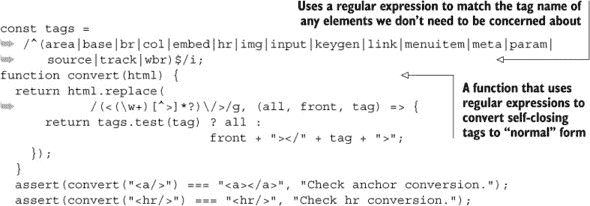

当我们将 `convert` 函数应用于这个示例 HTML 字符串时，我们最终得到以下 HTML 字符串：

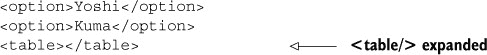

完成这些后，我们仍然需要解决我们的 `option` 元素不包含在 `select` 元素中的问题。让我们看看如何确定一个元素是否需要被包裹。

##### HTML 包裹

根据 HTML 的语义，一些 HTML 元素在注入之前必须位于某些容器元素内。例如，一个 `<option>` 元素必须包含在一个 `<select>` 元素内。

我们可以通过两种方式解决这个问题，这两种方式都需要在问题元素和它们的容器之间构建映射：

+   可以通过使用 `innerHTML` 将字符串直接注入到特定的父元素中，其中父元素之前已经使用内置的 `document.createElement` 构建过。尽管在某些情况下和某些浏览器中这可能有效，但它并不保证在所有情况下都有效。

+   可以将字符串包裹在适当的所需标记中，然后直接注入到任何容器元素中（例如一个 `<div>`）。这更可靠，但工作量也更大。

第二种技术更受欢迎；与第一种方法相比，它涉及很少的特定浏览器代码，而第一种方法需要相当多的主要是特定浏览器代码。

需要包裹在特定容器元素中的问题元素集幸运地只有七个是可管理的。在表 12.1 中，省略号(`...`)表示元素需要注入的位置。

##### 表 12.1\. 需要包含在其他元素中的元素

| 元素名称 | 祖先元素 |
| --- | --- |
| <option>, <optgroup> | <select multiple>...</select> |
| <legend> | <fieldset>...</fieldset> |
| <thead>, <tbody>, <tfoot>, <colgroup>, <caption> | <table>...</table> |

| <tr> | <table><thead>...</thead></table> <table><tbody>...</tbody></table> |

<table><tfoot>...</tfoot></table> |

| <td>, <th> | <table><tbody><tr>...</tr></tbody></table> |
| --- | --- |

| <col> | <table> <tbody></tbody> |

<colgroup>...</colgroup>

</table> |

几乎所有这些都是直接的，除了以下需要一些解释的点：

+   使用具有`multiple`属性的`<select>`元素（而不是非多选选择），因为它不会自动检查放置在其内的任何选项（而单选将自动检查第一个选项）。

+   `<col>`修复包括一个额外的`<tbody>`，没有它，`<colgroup>`将无法正确生成。

在元素正确映射到其包装要求之后，让我们开始生成。

根据表 12.1 中的信息，我们可以生成需要插入到 DOM 元素中的 HTML，如下所示。

##### 列表 12.2\. 从一些标记生成 DOM 节点列表

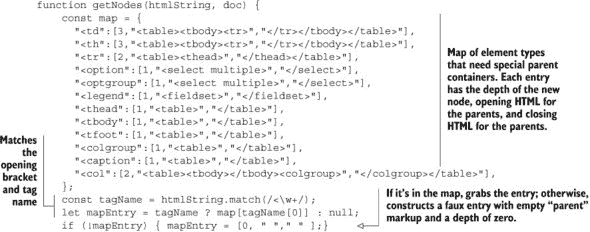

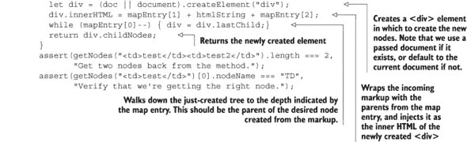

我们创建一个映射，其中包含需要放置在特殊父容器内的所有元素类型，该映射包含节点的深度以及封装的 HTML。接下来，我们使用正则表达式来匹配要插入的元素的打开括号和标签名：

```
const tagName = htmlString.match(/<\w+/);
```

然后我们选择一个映射条目，如果没有，我们创建一个带有空父元素标记的虚拟条目：

```
let mapEntry = tagName ? map[tagName[0]] : null;
if  (!mapEntry) { mapEntry = [0, " ", " "]; }
```

我们随后创建一个新的`div`元素，将其与映射的 HTML 包装在一起，并将新创建的 HTML 插入到之前创建的`div`元素中：

```
let div = (doc || document).createElement("div");
div.innerHTML = mapEntry[1] + htmlString + mapEntry[2]
```

最后，我们找到从我们的 HTML 字符串创建的所需节点的父节点，并返回新创建的节点：

```
while (mapEntry[0]--) { div = div.lastChild;}
return div.childNodes;
```

在所有这些之后，我们有一组 DOM 节点可以开始插入到文档中。

如果我们回到我们的动机示例，并应用`getNodes`函数，我们最终会得到以下类似的结果：

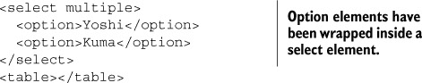

#### 12.1.2\. 在文档中插入元素

在我们获得 DOM 节点后，是时候将它们插入到文档中了。需要几个步骤，我们将在本节中逐一介绍。

由于我们需要插入的元素数组——可能插入到文档中的任何位置——我们希望尽量减少执行的操作数量。我们可以通过使用*DOM 片段*来实现这一点。DOM 片段是 W3C DOM 规范的一部分，并且所有浏览器都支持。这个有用的功能为我们提供了一个容器来保存一组 DOM 节点。

这本身很有用，但它还有一个优点，即片段可以在单个操作中注入和克隆，而不是每次都要重复注入和克隆每个单独的节点。这有可能大大减少页面所需的操作数量。

在我们将在代码中使用此机制之前，让我们回顾一下列表 12.2 中的`getNodes()`代码，并稍作调整以使用 DOM 片段。这些更改很小，包括向函数参数列表中添加一个`fragment`参数，如下所示。

##### 列表 12.3\. 使用片段扩展 getNodes 函数

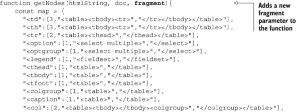

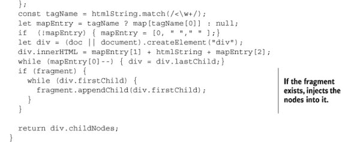

在这个例子中，我们进行了一些修改。首先，我们通过添加另一个参数`fragment`修改了函数签名：

```
function getNodes(htmlString, doc, fragment) {...}
```

如果传递了此参数，则预期它是一个 DOM 片段，我们希望将节点注入其中以供以后使用。

要做到这一点，我们在函数的`return`语句之前添加以下片段，以便将节点添加到传递的片段中：

```
if (fragment) {
  while (div.firstChild) {
    fragment.appendChild(div.firstChild);
  }
}
```

现在，让我们看看它是如何使用的。在下面的列表中，假设更新的`getNodes`函数在作用域内，创建了一个片段并将其传递给该函数（你可能还记得，该函数将传入的 HTML 字符串转换为 DOM 元素）。现在，这个 DOM 被附加到片段中。

##### 列表 12.4\. 在 DOM 的多个位置插入 DOM 片段

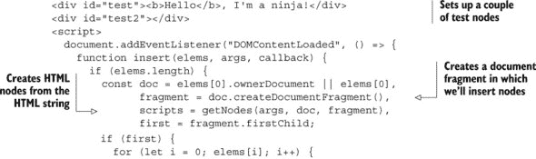


这里还有一个重要的点：如果我们将此元素插入文档的多个位置，我们将需要反复克隆此片段。如果我们没有使用片段，我们就必须每次都克隆每个单独的节点，而不是整个片段。

通过这种方式，我们已经开发出了一种以直观方式生成和插入任意 DOM 元素的方法。让我们继续探索 DOM，看看 DOM 属性和属性之间的区别。

### 12.2\. 使用 DOM 属性和属性

当访问元素属性值时，我们有两种选择：使用传统的 DOM 方法`getAttribute`和`setAttribute`，或者使用与属性对应的 DOM 对象属性。

例如，要获取存储在变量`e`中的元素的`id`，我们可以使用以下两种方法中的任何一种：

```
e.getAttribute('id')
e.id
```

任何一种方法都会给我们`id`的值。

让我们检查以下代码，以更好地理解属性值及其对应属性的行为。

##### 列表 12.5\. 通过 DOM 方法和属性访问属性值


这个例子展示了元素属性和元素属性之间有趣的行为。它首先定义了一个简单的`<div>`元素，我们将用它作为测试对象。在文档的`DOMContentLoaded`处理程序（以确保 DOM 完全构建）中，我们获取对唯一的`<div>`元素的引用，`const div = document.querySelector("div")`，然后运行一些测试。

在第一个测试中，我们通过`setAttribute()`方法将`id`属性设置为值`ninja-1`。然后我们断言`getAttribute()`返回该属性的相同值。当页面加载时，这个测试工作得很好，这并不令人惊讶：

```
div.setAttribute("id", "ninja-1");
assert(div.getAttribute('id') === "ninja-1",
       "Attribute successfully changed");
```

同样，在下一个测试中，我们将`id`属性设置为值`ninja-2`，然后验证属性值确实已更改。没问题。

```
div.id = "ninja-2";
assert(div.id === "ninja-2",
      "Property successfully changed");
```

下一个测试是当事情变得有趣的时候。我们再次将`id`属性设置为新的值，在这种情况下是`ninja-3`，并再次验证属性值已经改变。但然后我们断言，不仅属性值应该改变，而且`id` *属性*的值也应该改变。两个断言都通过了。从这个例子中我们了解到，`id`属性和`id`属性是某种方式联系在一起的。改变`id`属性值也会改变`id`属性值：

```
div.id = "ninja-3";
assert(div.id === "ninja-3",
      "Property successfully changed");
assert(div.getAttribute('id') === "ninja-3",
       "Attribute successfully changed via property");
```

下一个测试证明它也可以反过来工作：设置属性值也会改变相应的属性值。

```
div.setAttribute("id","ninja-4");
assert(div.id === "ninja-4",
       "Property successfully changed via attribute");
assert(div.getAttribute('id') === "ninja-4","Attribute changed");
```

但不要被这个想法误导，以为属性和属性值是共享相同的值——它们不是。我们将在本章后面看到，尽管属性和相应的属性是链接的，但它们并不总是相同的。

重要的是要注意，并非所有属性都由元素属性表示。尽管对于由 HTML DOM 原生指定的属性来说通常是正确的，但我们在页面元素上放置的*自定义属性*并不会自动成为元素属性的表示。要访问自定义属性值，我们需要使用 DOM 方法`getAttribute()`和`setAttribute()`。

如果你不确定一个属性的属性值是否存在，你总是可以测试它，如果不存在，就回退到 DOM 方法。以下是一个例子：

```
const value = element.someValue ? element.someValue
                                : element.getAttribute('someValue');
```

| |
| --- |

##### 小贴士

在 HTML5 中，使用前缀`data-`为所有自定义属性，以保持它们在 HTML5 规范眼中的有效性。这是一个良好的约定，它清楚地区分了自定义属性和原生属性。

| |
| --- |

### 12.3. 样式属性头痛问题

与一般的属性一样，获取和设置样式属性可能会让人头疼。与上一节中的属性和属性值一样，我们再次有两种处理`style`值的方法：属性值，以及由此创建的元素属性。

这些中最常用的是`style`元素属性，它不是一个字符串，而是一个包含与元素标记中指定的样式值相对应的属性的对象。此外，你还会看到有一个方法可以访问元素的计算样式信息，其中*计算样式*是指评估所有继承和应用的样式信息后应用于元素的样式。

本节概述了在浏览器中处理样式时需要了解的内容。让我们先看看样式信息是如何记录的。

#### 12.3.1. 我的样式在哪里？

DOM 元素的`style`属性中定位的样式信息最初是从元素标记中指定的`style`属性值设置的。例如，`style="color:red;"`会导致该样式信息被放入样式对象中。在页面执行期间，脚本可以设置或修改样式对象中的值，这些更改将直接影响元素的显示。

许多脚本作者失望地发现，页面上的`<style>`元素或外部样式表中的任何值都不在元素的`style`对象中可用。但我们的失望不会持续太久——你很快就会看到一种获取这些信息的方法。

现在，让我们看看`style`属性是如何获取其值的。检查以下代码。

##### 列表 12.6\. 检查样式属性

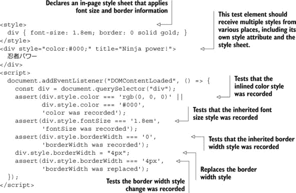

在这个例子中，我们设置了一个`<style>`元素来建立一个内部样式表，其值将应用于页面上的元素。样式表指定所有`<div>`元素将以默认字体大小的 1.8 倍显示，并带有宽度为`0`的实心金色边框。任何应用了这个样式的元素都将具有边框，但由于宽度为`0`，它将不可见。

```
<style>
  div { font-size: 1.8em; border: 0 solid gold; }
</style>
```

然后我们创建了一个带有内联样式属性的`<div>`元素，该属性将元素的文本颜色设置为黑色：

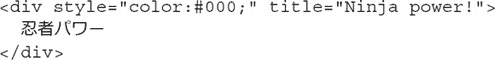

我们随后开始测试。在获取到`<div>`元素引用后，我们测试`style`属性是否接收到了一个表示分配给该元素的颜色的`color`属性。请注意，尽管`color`在行内样式中被指定为`#000`，但在大多数浏览器中将它设置为`style`属性时，它会被规范化为 RGB 表示法（因此我们检查了两种格式）。

```
assert(div.style.color === 'rgb(0, 0, 0)' ||
       div.style.color === '#000',
       'color was recorded');
```

向前看，在图 12.1 中，我们看到这个测试通过了。

##### 图 12.1\. 通过运行这个测试，我们可以看到内联和指定的样式被记录，但继承的样式没有被记录。


然后我们天真地测试了内联样式表中指定的字体大小样式和边框宽度是否已记录在样式对象中。但尽管我们在图 12.1 中看到字体大小样式已被应用到元素上，测试却失败了。这是因为样式对象没有反映从 CSS 样式表中继承的任何样式信息：

```
assert(div.style.fontSize === '1.8em',
       'fontSize was recorded');
assert(div.style.borderWidth === '0',
       'borderWidth was recorded');
```

接下来，我们使用赋值来改变样式对象中`borderWidth`属性的值，将其设置为 4 像素宽，并测试这个更改是否被应用。我们可以在图 12.1 中看到测试通过了，并且之前不可见的边框被应用到元素上。这个赋值导致在元素的`style`属性中出现了`borderWidth`属性，正如测试所证明的那样。

```
div.style.borderWidth = "4px";
assert(div.style.borderWidth === '4px',
       'borderWidth was replaced');
```

应该注意的是，元素`style`属性中的任何值都优先于从样式表继承的任何内容（即使样式表规则使用了`!important`注释）。

你可能在列表 12.6 中注意到了一点，CSS 将字体大小属性指定为`font-size`，但在脚本中我们引用它为`fontSize`。为什么是这样？

#### 12.3.2\. 样式属性命名

当涉及到访问浏览器提供的值时，CSS 属性在跨浏览器中引起的问题相对较少。但 CSS 命名样式和我们在脚本中访问它们的方式之间存在差异，并且一些样式名称在不同的浏览器中是不同的。

包含多个单词的 CSS 属性使用连字符分隔单词；例如`font-weight`、`font-size`和`background-color`。你可能记得 JavaScript 中的属性名称*可以*包含连字符，但包含连字符会阻止通过点运算符访问属性。

考虑以下示例：

```
const fontSize = element.style['font-size'];
```

前面的代码是有效的。但以下代码不是：

```
const fontSize = element.style.font-size;
```

JavaScript 解析器会将连字符视为减法运算符，没有人会对结果感到满意。与其强迫页面开发者始终使用属性访问的一般形式，不如将多词 CSS 样式名称在用作属性名称时转换为驼峰式。因此，`font-size`变为`fontSize`，`backgroundcolor`变为`backgroundColor`。

我们可以记住这样做，或者编写一个简单的 API 来设置或获取样式，该 API 会自动处理驼峰式，如下面的列表所示。

##### 列表 12.7\. 访问样式的简单方法

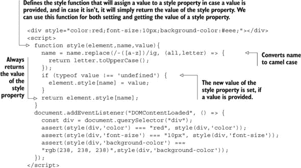

样式函数有两个重要特性：

+   它使用正则表达式将`name`参数转换为驼峰式表示法。（如果你对正则表达式驱动的转换操作感到困惑，你可能想回顾第十章的内容。）

+   它可以通过检查其自己的参数列表同时作为设置器和获取器使用。例如，我们可以使用`style(div, 'font-size')`获取字体大小属性的值，并且我们可以使用`style(div, 'font-size', '5px')`设置新的值。

考虑以下代码：

```
function style(element,name,value){
    ...
  if (typeof value !== 'undefined') {
    element.style[name] = value;
  }

  return element.style[name];
}
```

如果向函数传递一个`value`参数，则函数作为设置器，将传递的值设置为属性的值。如果省略`value`参数，并且只传递前两个参数，则函数作为获取器，检索指定属性的值。在任一情况下，都会返回属性的值，这使得在函数调用链中以任一模式使用函数变得容易。

元素的`style`属性不包括元素从作用域内的样式表中继承的任何样式信息。很多时候，知道应用于元素的完整计算样式会很有用，所以让我们看看是否有方法可以获得它。

#### 12.3.3\. 获取计算样式

在任何时刻，元素的*计算样式*是浏览器提供的所有内置样式、通过样式表应用的所有样式、元素的`style`属性以及通过脚本对`style`属性的任何操作的组合。图 12.2 显示了浏览器开发者工具如何区分样式。

##### 图 12.2\. 与元素关联的最终样式可以来自许多方面：浏览器的内置样式（用户代理样式表）、通过`style`属性分配的样式，以及 CSS 代码中定义的 CSS 规则中的样式。

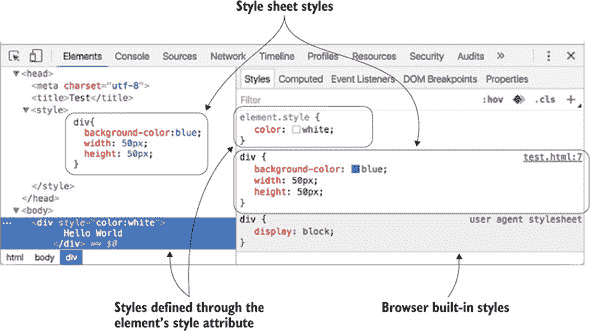

标准方法，由所有现代浏览器实现，是 `getComputedStyle` 方法。这个方法接受一个要计算样式的元素，并返回一个接口，通过这个接口可以进行属性查询。返回的接口提供了一个名为 `getPropertyValue` 的方法，用于检索特定样式属性的计算后样式。

与元素的 `style` 对象的属性不同，`getPropertyValue` 方法接受 CSS 属性名（如 `font-size` 和 `background-color`），而不是这些名称的驼峰式版本。

下面的列表展示了一个简单的例子。

##### 列表 12.8\. 获取计算后的样式值

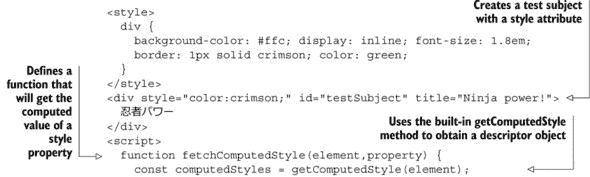

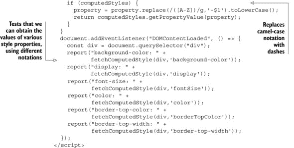

为了测试我们将要创建的函数，我们设置了一个在标记中指定样式信息的元素和一个提供要应用于元素的样式规则的样式表。我们预计计算后的样式将是将直接和应用的样式应用于元素的结果。

然后我们定义一个新的函数，它接受一个元素和我们要查找计算值的样式属性。为了特别友好（毕竟，我们是忍者——让使用我们代码的人更容易是我们的工作的一部分），我们将允许以两种格式指定多词属性名：破折号或驼峰式。换句话说，我们将接受 `backgroundColor` 和 `background-color`。我们将在稍后展示如何实现这一点。

我们首先想要做的是获取计算后的样式接口，我们将它存储在一个变量 `computedStyles` 中，以便稍后引用。我们这样做的理由是因为我们不知道调用这个接口可能需要多少成本，而且最好避免无谓地重复调用。

```
const computedStyles = getComputedStyle(element);
if (computedStyles) {
  property = property.replace(/([A-Z])/g,'-$1').toLowerCase();
  return computedStyles.getPropertyValue(property);
}
```

如果这成功了（我们想不出任何它不会成功的理由，但通常谨慎一些是有好处的），我们就调用接口的 `getPropertyValue()` 方法来获取计算后的样式值。但首先我们需要调整属性的名称，以适应属性名的驼峰式或破折号版本。`getPropertyValue` 方法期望的是破折号版本，所以我们使用 `String` 的 `replace()` 方法，配合一个简单但巧妙的正则表达式，在每一个大写字母前插入一个破折号，然后将整个字符串转换为小写。（这比你想的要容易吧。）

为了测试这个函数，我们调用函数，传递各种格式和样式名称，并显示结果，如图 12.3 所示。

##### 图 12.3\. 计算后的样式包括元素指定的所有样式以及从样式表中继承的样式。

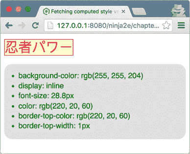

注意，无论这些样式是否在元素上显式声明或从样式表中继承，都会检索到这些样式。另外，注意在样式表和元素上直接指定的`color`属性返回的是显式值。通过元素的`style`属性指定的样式始终优先于继承的样式，即使标记为`!important`。

在处理样式属性时，我们还需要注意一个额外的主题：*混合*属性。CSS 允许我们使用简写符号来表示如`border-`属性这样的混合属性。我们不必分别指定颜色、宽度和所有四个边框的边框样式，可以使用如下规则：

```
border: 1px solid crimson;
```

我们在列表 12.8 中使用了这个精确的规则。这可以节省很多输入，但我们需要意识到，当我们检索属性时，我们需要获取低级别的单个属性。我们不能获取`border`，但我们可以获取如`border-top-color`和`border-top-width`这样的样式，就像我们在示例中所做的那样。

这可能有点麻烦，尤其是当所有四个样式都赋予相同的值时，但我们只能接受这个现实。

#### 12.3.4\. 转换像素值

在设置样式值时，需要考虑的是分配代表像素的数值。当为一个样式属性设置数值时，我们必须指定单位，以便它在所有浏览器中可靠地工作。例如，假设我们想要将一个元素的`height`样式值设置为 10 像素。以下两种方法都可以安全地在浏览器之间进行操作：

```
element.style.height = "10px";
element.style.height = 10 + "px";
```

以下方法在浏览器之间不安全：

```
element.style.height = 10;
```

你可能会认为向列表 12.7 的`style()`函数添加一点逻辑，将`px`添加到传入函数的数值的末尾很容易。但别急！并非所有数值都代表像素！一些样式属性接受的数值不代表像素维度。以下是一些例子：

+   `z-index`

+   `font-weight`

+   `opacity`

+   `zoom`

+   `line-height`

对于这些（以及你可以想到的任何其他情况），请扩展列表 12.6 的功能，以自动处理非像素值。此外，当尝试从一个样式属性中读取像素值时，应使用`parseFloat`方法，以确保在所有情况下都能得到预期的值。

现在让我们看看一组重要的样式属性，这些属性可能很难处理。

#### 12.3.5\. 测量高度和宽度

样式属性如`height`和`width`存在特殊问题，因为当未指定时，它们的值默认为`auto`，这样元素就会根据其内容的大小自动调整。因此，除非在属性字符串中提供了显式值，否则我们不能使用`height`和`width`样式属性来获取准确值。

幸运的是，`offsetHeight`和`offsetWidth`属性正好提供了这样的功能：一种相当可靠的方式来访问元素的高度和宽度。但请注意，分配给这两个属性的价值包括元素的填充。如果我们试图将一个元素定位在另一个元素之上，通常这正是我们想要的信息。但有时我们可能想要获取有关元素尺寸的信息，包括和不包括边框和填充。

然而，需要注意的是，在高度交互的网站上，元素可能会花费一些时间处于非显示状态（`display`样式设置为`none`），当一个元素不是显示的一部分时，它没有尺寸。尝试获取非显示元素的`offsetWidth`或`offsetHeight`属性将导致值为`0`。

对于这些隐藏元素，如果我们想获取非隐藏维度，我们可以使用一个技巧来暂时显示元素，获取值，然后再隐藏它。当然，我们希望这样做的方式不会留下任何明显的线索，表明幕后正在进行这种情况。我们如何使一个隐藏的元素看起来不隐藏，同时又不会让它变得可见？

利用我们的忍者技巧，我们可以做到！下面是如何操作的：

1.  将`display`属性更改为`block`。

1.  将`visibility`设置为`hidden`。

1.  将`position`设置为`absolute`。

1.  捕获维度值。

1.  恢复更改的属性。

将`display`属性更改为`block`允许我们获取`offsetHeight`和`offsetWidth`的值，但这会使元素成为显示的一部分，因此是可见的。为了使元素不可见，我们将`visibility`属性设置为`hidden`。但（总会有另一个“但是”）这将留下一个很大的洞，元素就定位在那里，所以我们还将`position`属性设置为`absolute`，将元素从正常的显示流程中移除。

所有这些听起来比实现要复杂，下面的列表显示了实现。

##### 列表 12.9。获取隐藏元素的尺寸

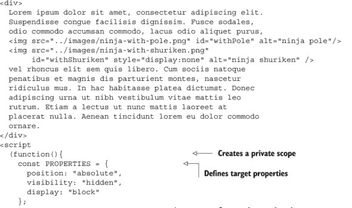

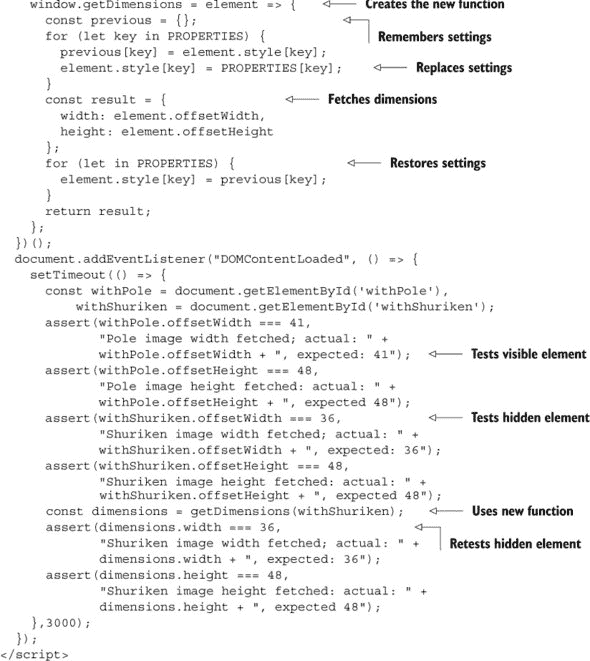

这是一段很长的列表，但其中大部分是测试代码；新维度获取函数的实现只有十几行代码。

让我们逐个分析它。首先，我们设置了用于测试的元素：一个包含大量文本的`<div>`元素，其中包含两张图片，通过外部样式表中的样式左对齐。这些图片元素将成为我们测试的主题；一个是可见的，一个是隐藏的。

在运行任何脚本之前，元素看起来如图 12.4 所示。如果第二张图片没有被隐藏，它将作为一个第二忍者出现在可见忍者右侧。

##### 图 12.4。我们将使用两张图片——一张可见，一张隐藏——来测试获取隐藏元素的尺寸。

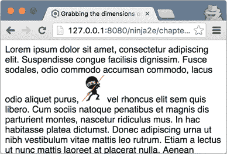

接着，我们着手定义我们的新函数。我们将使用一个哈希表来存储一些重要信息，但我们不想用这个哈希表污染全局命名空间；我们希望它在函数的局部作用域内可用，但仅限于此。

我们通过将哈希定义和函数声明放在立即函数中来实现这一点，这创建了一个局部作用域。哈希表在立即函数外部不可访问，但我们也在立即函数中定义的 `getDimensions` 函数可以通过闭包访问这个哈希表。不错吧？

```
(function(){
    const PROPERTIES = {
      position: "absolute",
      visibility: "hidden",
      display: "block"
    };
    window.getDimensions = element => {
      const previous = {};
      for (let key in PROPERTIES) {
        previous[key] = element.style[key];
        element.style[key] = PROPERTIES[key];
      }
      const result = {
        width: element.offsetWidth,
        height: element.offsetHeight
      };
      for (let key in PROPERTIES) {
        element.style[key] = previous[key];
      }
      return result;
    };
  })();
```

我们首先声明了新的维度获取函数，该函数接受要测量的元素。在这个函数内部，我们首先创建一个名为 `previous` 的哈希表，我们将记录将要修改的样式属性的前一个值，以便稍后恢复它们。在遍历替换属性时，我们记录每个属性的前一个值，并用新值替换它们。

完成这些后，我们准备测量元素，该元素现在已成为显示布局的一部分，不可见，并且绝对定位。尺寸记录在分配给局部变量 `result` 的哈希表中。

现在我们已经得到了我们想要的东西，我们通过恢复我们修改的样式属性的原值来擦除我们的痕迹，并将包含 `width` 和 `height` 属性的哈希表作为结果返回。

所有这些都很好，但它真的起作用吗？让我们来看看。

在加载处理程序中，我们在 3 秒计时器的回调中执行测试。为什么问这个？加载处理程序确保我们在知道 DOM 已经构建后才执行测试，计时器使我们能够在测试运行时观察显示，以确保我们在调整隐藏元素的属性时不会出现显示故障。毕竟，如果我们运行我们的函数时显示以任何方式受到干扰，那将是一个失败。

在计时器回调中，我们首先获取我们的测试对象（两个图像）的引用，并断言我们可以通过使用偏移属性来获取可见图像的尺寸。这个测试通过了，如果我们提前看到图 12.5。

##### 图 12.5。通过临时调整隐藏元素的样式属性，我们可以成功获取它们的尺寸。

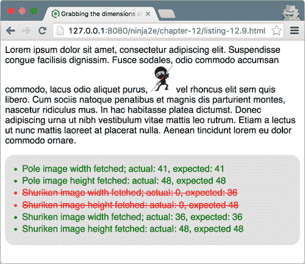

然后我们对隐藏元素进行了相同的测试，错误地假设偏移属性将适用于隐藏图像。不出所料，因为我们已经承认这不会工作，测试失败了。

接下来，我们在隐藏图像上调用我们的新函数，然后使用这些结果重新进行测试。成功了！我们的测试通过了，如图 12.5 所示。

当测试运行时，如果我们观察页面的显示——记住，我们延迟运行测试直到 DOM 加载后的 3 秒——我们可以看到，我们的隐藏元素属性背后的调整并没有以任何方式影响显示。

|  |
| --- |

##### 提示

检查`offsetWidth`和`offsetHeight`样式属性是否为零可以作为一个非常高效的确定元素可见性的方法。

|  |
| --- |

### 12.4. 最小化布局抖动

到目前为止，在本章中，你已经学会了如何相对容易地修改 DOM：通过创建和插入新元素、删除现有元素或修改它们的属性。修改 DOM 是实现高度动态 Web 应用程序的基本工具之一。

但这个工具也附带了一些使用注意事项，其中最重要的一点是，要注意*布局抖动*。布局抖动发生在我们连续对 DOM 进行一系列的读取和写入操作时，在这个过程中不允许浏览器执行布局优化。

在我们深入探讨之前，请考虑这样一个事实：改变一个元素的属性（或修改其内容）并不一定只会影响该元素；相反，它可能引起一系列的变化。例如，设置一个元素的宽度可能会导致该元素的孩子、兄弟和父元素发生变化。因此，每当进行更改时，浏览器都必须计算这些更改的影响。在某些情况下，我们对此无能为力；我们需要这些更改发生。但与此同时，我们也没有必要给我们的可怜的浏览器增加额外的负担，导致我们的 Web 应用程序性能下降。

由于重新计算布局代价高昂，浏览器尽可能地变得懒惰，通过尽可能推迟处理布局；它们试图将尽可能多的 DOM 写入操作排队，以便一次性执行这些操作。然后，当出现需要最新布局的操作时，浏览器不情愿地服从，执行所有排队的操作，并最终更新布局。但有时，我们编写代码的方式并没有给浏览器足够的空间来执行这些优化，这迫使浏览器进行大量的（可能是多余的）重新计算。这就是布局抖动的问题；它发生在我们的代码执行一系列（通常是多余的）连续的 DOM 读取和写入操作时，不允许浏览器优化布局操作。问题是，每当修改 DOM 时，浏览器都必须在读取任何布局信息之前重新计算布局。这个动作在性能方面代价高昂。让我们看看一个例子。

##### 列表 12.10. 连续的读取和写入序列导致布局抖动

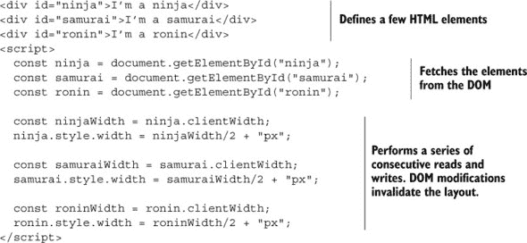

读取元素的`clientWidth`属性值是那些需要浏览器保持布局最新状态的操作之一。通过连续读取和写入不同元素的宽度属性，我们不允许浏览器以智能的方式偷懒。相反，因为我们每次布局修改后都会读取布局信息，所以浏览器必须每次都重新计算布局，以确保我们仍然得到正确的信息。

减小布局抖动的一种方法是以不会引起不必要的布局重新计算的方式编写代码。例如，我们可以将 列表 12.10 重写为以下内容。

##### 列表 12.11\. 批量 DOM 读取和写入以避免布局抖动

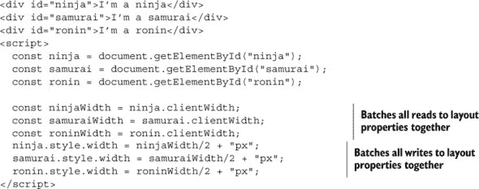

在这里，我们批量处理所有读取和写入操作，因为我们知道我们元素的尺寸之间不存在依赖关系；设置`ninja`元素的宽度不会影响`samurai`元素的宽度。这允许浏览器以懒加载的方式批量处理修改 DOM 的操作。

布局抖动不是你在较小、较简单的页面上会注意到的事情，但在开发复杂网络应用程序时，尤其是在移动设备上，这是需要记住的事情。因此，始终记住需要最新布局的方法和属性总是好的，如下表所示（来自 [`ricostacruz.com/cheatsheets/layout-thrashing.html`](http://ricostacruz.com/cheatsheets/layout-thrashing.html)）。

##### 表 12.2\. 导致布局无效化的 API 和属性

| 接口 | 属性名 |
| --- | --- |
| Element | clientHeight, clientLeft, clientTop, clientWidth, focus, getBoundingClientRect, getClientRects, innerText, offsetHeight, offsetLeft, offsetParent, offsetTop, offsetWidth, outerText, scrollByLines, scrollByPages, scrollHeight, scrollIntoView, scrollIntoViewIfNeeded, scrollLeft, scrollTop, scrollWidth |
| MouseEvent | layerX, layerY, offsetX, offsetY |
| Window | getComputedStyle, scrollBy, scrollTo, scroll, scrollY |
| Frame, Document, Image | height, width |

已经开发出几个试图最小化布局抖动的库。其中较受欢迎的一个是 FastDom ([`github.com/wilsonpage/fastdom`](https://github.com/wilsonpage/fastdom))。库的存储库包括示例，清楚地展示了通过批量 DOM 读写操作可以获得性能提升 ([`wilsonpage.github.io/fastdom/examples/aspect-ratio.html`](https://wilsonpage.github.io/fastdom/examples/aspect-ratio.html))。

|  |
| --- |

**React 的虚拟 DOM**

最受欢迎的客户端库之一是 Facebook 的 React ([`facebook.github.io/react/`](https://facebook.github.io/react/))。React 通过使用虚拟 DOM（一组模仿实际 DOM 的 JavaScript 对象）实现了出色的性能。当我们使用 React 开发应用程序时，我们会对虚拟 DOM 进行所有修改，而不考虑布局抖动。然后，在适当的时候，React 使用虚拟 DOM 来确定需要对实际 DOM 进行哪些更改，以保持 UI 保持同步。这种更新批处理提高了应用程序的性能。

|  |
| --- |

### 12.5\. 摘要

+   将 HTML 字符串转换为 DOM 元素包括以下步骤：

    +   确保 HTML 字符串是有效的 HTML 代码

    +   将其包装到浏览器规则要求的封装标记中

    +   通过 DOM 元素的 `innerHTML` 属性将 HTML 插入到虚拟 DOM 元素中

    +   提取创建的 DOM 节点

+   为了快速插入 DOM 节点，请使用 DOM 片段，因为片段可以在单个操作中注入，从而大大减少操作次数。

+   DOM 元素属性和属性，尽管相关联，但并不总是相同！我们可以通过使用 `getAttribute` 和 `setAttribute` 方法来读取和写入 DOM 属性，而通过使用对象属性表示法来写入 DOM 属性。

+   当处理属性和属性时，我们必须注意 *自定义属性*。我们决定放置在 HTML 元素上的属性，以便携带对我们应用程序有用的信息，并不会自动作为元素属性呈现。

+   `style` 元素属性是一个对象，它包含与元素标记中指定的样式值相对应的属性。要获取计算后的样式，这也会考虑在样式表中设置的样式，请使用内置的 `getComputedStyle` 方法。

+   要获取 HTML 元素的尺寸，请使用 `offsetWidth` 和 `offsetHeight` 属性。

+   当代码执行一系列连续的 DOM 读取和写入操作时，会发生布局抖动，每次都会迫使浏览器重新计算布局信息。这导致 Web 应用程序运行缓慢，响应性降低。

+   批量更新 DOM！

### 12.6\. 练习

> **1\.**
> 
> 在以下代码中，以下哪个断言将会通过？
> 
> ```
> <div id="samurai"></div>
> <script>
>   const element = document.querySelector("#samurai");
> 
>   assert(element.id === "samurai", "property id is samurai");
>   assert(element.getAttribute("id") === "samurai",
>          "attribute id is samurai");
> 
>   element.id = "newSamurai";
>   assert(element.id === "newSamurai", "property id is newSamurai");
>   assert(element.getAttribute("id") === "newSamurai",
>          "attribute id is newSamurai");
> </script>
> ```
> 
> **2**
> 
> 给定以下代码，我们如何访问元素的 `border-width` 样式属性？
> 
> ```
> <div id="element" style="border-width: 1px;
>                          border-style:solid; border-color: red">
> </div>
> <script>
>   const element = document.querySelector("#element");
> </script>
> ```
> 
> 1.  `element.border-width`
> 1.  
> 1.  `element.getAttribute("border-width");`
> 1.  
> 1.  `element.style["border-width"];`
> 1.  
> 1.  `element.style.borderWidth;`
> 1.  
> **3**
> 
> 哪个内置方法可以获取应用到特定元素上的所有样式（浏览器提供的样式、通过样式表应用的样式以及通过样式属性设置的属性）？
> 
> 1.  `getStyle`
> 1.  
> 1.  `getAllStyles`
> 1.  
> 1.  `getComputedStyle`
> 1.  
> **4**
> 
> 布局抖动何时发生？

## 第十三章：应对事件

*本章涵盖*

+   理解事件循环

+   使用计时器处理复杂任务

+   使用计时器管理动画

+   使用事件冒泡和委托

+   使用自定义事件

第二章中包含了对 JavaScript 单线程执行模型的简要讨论，并介绍了事件循环和事件队列，其中事件等待轮到它们被处理的机会。当展示网页的生命周期步骤时，特别是讨论某些 JavaScript 代码执行的顺序时，这次讨论特别有用。同时，这也是一种简化，因此为了更全面地了解浏览器的工作原理，我们将在本章中花相当大的篇幅来探索事件循环的各个角落。这将帮助我们更好地理解 JavaScript 和浏览器中固有的某些性能限制。反过来，我们将利用这些知识来开发运行更流畅的应用程序。

在这次探索中，我们将特别关注定时器，这是一个 JavaScript 特性，它允许我们通过一定的时间延迟异步执行一段代码。乍一看，这可能看起来并不重要，但我们将向您展示如何使用定时器将长时间运行的任务分解成不会阻塞浏览器的小任务。这有助于开发性能更好的应用程序。

我们将继续探索事件，展示事件是如何通过 DOM 树传播的，以及如何利用这些知识来编写更简单、内存消耗更少的代码。最后，我们将以创建自定义事件结束本章，这有助于减少应用程序不同部分之间的耦合。现在，让我们不拖延，开始遍历事件循环。

### 你知道吗？

> **Q1:**
> 
> 为什么定时器回调的时机没有保证？
> 
> **Q2:**
> 
> 如果一个`setInterval`定时器在另一个事件处理程序运行了 16 毫秒的同时每 3 毫秒触发一次，定时器的回调函数将被添加到微任务队列多少次？
> 
> **Q3:**
> 
> 为什么事件处理函数的函数上下文有时与事件的目标不同？

### 13.1. 深入事件循环

如您可能已经猜到的，事件循环比其在第二章中的描述要复杂。首先，事件循环不仅仅有一个只包含事件的单一事件队列，它至少包含两个队列，除了事件外，这些队列还持有浏览器执行的其他操作。这些操作被称为*任务*，并被分为两类：*宏任务*（或通常简称为任务）和*微任务*。

宏任务的例子包括创建主文档对象、解析 HTML、执行主线（或全局）JavaScript 代码、更改当前 URL，以及各种事件，如页面加载、输入、网络事件和定时器事件。从浏览器的角度来看，一个宏任务代表一个离散的、自包含的工作单元。执行完一个任务后，浏览器可以继续其他任务，例如重新渲染页面 UI 或执行垃圾回收。

另一方面，微任务是较小的任务，用于更新应用程序状态，应该在浏览器继续其他任务（如重新渲染 UI）之前执行。例如，包括 promise 回调和 DOM 变更。微任务应该尽快以异步方式执行，但不需要执行整个新的宏任务。微任务使我们能够在 UI 重新渲染之前执行某些操作，从而避免显示不一致的应用程序状态的无效 UI 渲染。

| |
| --- |

##### 注意

ECMAScript 规范没有提到事件循环。相反，事件循环在 HTML 规范中详细说明（[`html.spec.whatwg.org/#event-loops`](https://html.spec.whatwg.org/#event-loops)），同时也讨论了宏任务和微任务的概念。ECMAScript 规范在处理 promise 回调时提到了*作业*（与微任务类似）。尽管事件循环在 HTML 规范中定义，但其他环境，如 Node.js，也使用它。

| |
| --- |

事件循环的实现应该至少使用一个队列来处理宏任务，以及至少一个队列来处理微任务。事件循环的实现通常不止于此，并为不同类型的宏任务和微任务提供多个队列。这使得事件循环能够优先处理不同类型的任务；例如，优先处理性能敏感的任务，如用户输入。另一方面，由于野外有众多浏览器和 JavaScript 执行环境，如果你遇到只有单个队列同时处理这两种类型任务的事件循环，也不必感到惊讶。

事件循环基于两个基本原理：

+   任务是逐个处理的。

+   一个任务运行到完成，不能被另一个任务中断。

让我们看看图 13.1，它描绘了这两个原则。

##### 图 13.1。事件循环通常至少可以访问两个任务队列：一个微任务队列和一个宏任务队列。这两种类型的任务都是逐个处理的。

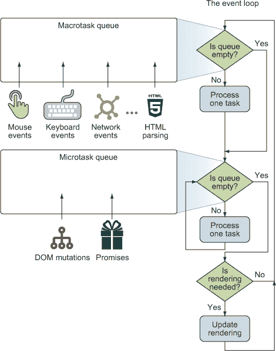

在高层次上，图 13.1 显示，在单次迭代中，事件循环首先检查宏任务队列，如果有等待执行的任务，则开始执行。只有在任务完全处理完毕（或者队列中没有任务）之后，事件循环才会继续处理微任务队列。如果队列中有等待的任务，事件循环会取走并执行它直到完成。这会针对队列中的所有微任务执行。注意处理宏任务和微任务队列之间的区别：在单次循环迭代中，最多处理一个宏任务（其他任务则留在队列中等待），而所有微任务都会被处理。

当微任务队列最终为空时，事件循环检查是否需要 UI 渲染更新，如果是的话，UI 就会被重新渲染。这标志着事件循环当前迭代的结束，然后它回到开始处再次检查宏任务队列。

现在我们对事件循环有了高层次的理解，让我们检查图 13.1 中显示的一些有趣细节：

+   *两个任务队列都放置在事件循环之外*，以表明将任务添加到其匹配队列的行为发生在事件循环之外。如果不是这样，在 JavaScript 代码执行期间发生的任何事件都将被忽略。因为我们绝对不希望这样做，所以检测和添加任务的行为与事件循环分开进行。

+   *两种类型的任务一次执行一个*，因为 JavaScript 基于单线程执行模型。当一个任务开始执行时，它会执行到完成，不会被另一个任务中断。只有浏览器可以停止任务的执行；例如，如果任务变得过于自私，占用太多时间或内存。

+   *所有微任务都应该在下一轮渲染之前执行*，因为它们的目的是在渲染发生之前更新应用程序状态。

+   *浏览器通常每秒尝试渲染页面 60 次*，以达到每秒 60 帧（60 fps），这是一种常被认为对平滑运动，如动画等理想的帧率——*也就是说，浏览器尝试每 16 毫秒渲染一帧。* 注意到“更新渲染”操作，如图 13.1 所示，发生在事件循环内部，因为当页面正在渲染时，页面的内容不应该被另一个任务修改。所有这些都意味着，如果我们想实现运行流畅的应用程序，我们在单个事件循环迭代中处理任务的时间并不多。*一个任务及其产生的所有微任务理想上应该在 16 毫秒内完成*。

现在，让我们考虑在浏览器完成页面渲染后的下一个事件循环迭代中可能出现的三种情况：

+   事件循环在另一个 16 毫秒过去之前就达到了“是否需要渲染？”的决策点。因为更新 UI 是一个复杂的操作，如果没有明确的渲染页面需求，浏览器可能会选择不在这次循环迭代中执行 UI 渲染。

+   事件循环在大约最后一次渲染后的 16 毫秒左右达到“是否需要渲染？”的决策点。在这种情况下，浏览器更新 UI，用户将体验到运行流畅的应用程序。

+   执行下一个任务（及其所有相关微任务）需要超过 16 毫秒。在这种情况下，浏览器将无法以目标帧率重新渲染页面，UI 将不会更新。如果运行任务代码的时间不太长（不超过几百毫秒），这种延迟可能甚至感觉不到，尤其是如果页面上没有太多运动。另一方面，如果我们花费太多时间，或者页面上有动画运行，用户可能会觉得网页运行缓慢且无响应。在最坏的情况下，如果一个任务执行超过几秒钟，用户的浏览器会显示可怕的“无响应脚本”消息。（别担心，在本章的后面部分，我们将向你展示一种将复杂任务分解成更小任务的技术，这样就不会阻塞事件循环。）

| |
| --- |

##### 注意

仔细考虑你决定处理哪些事件，它们发生的频率，以及事件处理器消耗的处理时间。例如，在处理鼠标移动事件时，你应该格外小心。鼠标的移动会导致大量事件被排队，因此在鼠标移动处理器中执行任何复杂操作都可能导致构建一个缓慢且不流畅的 Web 应用程序。

| |
| --- |

现在我们已经描述了事件循环的工作原理，你就可以详细探索几个示例了。

#### 13.1.1\. 只包含宏任务的示例

JavaScript 的单线程执行模型不可避免的结果是，一次只能执行一个任务。这反过来意味着所有创建的任务都必须在队列中等待，直到轮到它们执行。

让我们关注一个简单的网页，它包含以下内容：

+   非平凡的常规（全局）JavaScript 代码

+   两个按钮和两个非平凡的点击处理器，每个按钮一个

下面的列表显示了示例代码。

##### 列表 13.1\. 事件循环演示的一个任务队列的伪代码

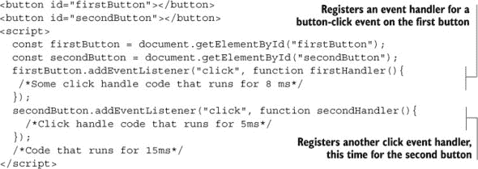

这个例子需要一些想象力，所以我们不把不必要的代码添加到代码片段中，而是要求你想象以下内容：

+   我们的主线 JavaScript 代码执行需要 15 毫秒。

+   第一次点击事件处理器运行了 8 毫秒。

+   第二次点击事件处理器运行了 5 毫秒。

现在让我们继续发挥想象力，假设我们有一个超级快的用户，在脚本开始执行后的 5 毫秒点击了第一个按钮，在 12 毫秒后点击了第二个按钮。图 13.2 描述了这种情况。

##### 图 13.2\. 这个时间图显示了事件如何随着它们的发生被添加到任务队列中。当一个任务执行完毕时，事件循环将其从队列中移除，并继续执行下一个任务。

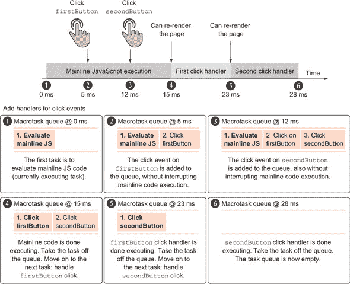

这里有很多信息需要消化，但完全理解它将更好地帮助你了解事件循环是如何工作的。在图的上部，时间（以毫秒为单位）沿着 x 轴从左到右运行。时间线之下的矩形代表正在执行的 JavaScript 代码的部分，它们的持续时间与它们运行的时间相同。例如，第一块主线 JavaScript 代码执行了大约 15 毫秒，第一个点击处理程序大约 8 毫秒，第二个点击处理程序大约 5 毫秒。时序图还显示了某些事件发生的时间；例如，第一个按钮点击发生在应用程序执行 5 毫秒时，第二个按钮点击发生在 12 毫秒时。图的底部显示了应用程序执行过程中各个时间点的宏任务队列的状态。

程序开始执行主线 JavaScript 代码。立即，两个元素 `firstButton` 和 `secondButton` 被从 DOM 中获取，两个函数 `firstHandler` 和 `secondHandler` 被注册为点击事件处理程序：

```
firstButton.addEventListener("click", function firstHandler(){...});
secondButton.addEventListener("click", function secondHandler(){...});
```

接着是执行了另外 15 毫秒的代码。在这段执行过程中，我们的快速用户在程序开始执行后 5 毫秒点击了 `firstButton`，并在 12 毫秒后点击了 `secondButton`。

由于 JavaScript 基于单线程执行模型，点击 `firstButton` 并不意味着点击处理程序会立即执行。（记住，如果一个任务正在执行，它不能被另一个任务中断。）相反，与 `firstButton` 相关的点击事件被放置在任务队列中，它耐心地等待轮到它执行。当 `secondButton` 被点击时，也会发生同样的事情：一个匹配的事件被放置在任务队列中，等待执行。请注意，事件检测和添加到任务队列发生在事件循环之外；即使在主线 JavaScript 代码执行的同时，任务也会被添加到任务队列中。

如果我们在脚本执行 12 毫秒时对任务队列进行快照，我们将看到以下三个任务：

1.  评估主线 JavaScript 代码——当前正在执行的任务。

1.  点击 `firstButton`——当点击 `firstButton` 时创建的事件。

1.  点击 `secondButton`——当点击 `secondButton` 时创建的事件。

这些任务也显示在图 13.3 中。

##### 图 13.3\. 在应用程序执行 12 毫秒时，任务队列中有三个任务：一个用于评估主线 JavaScript 代码（当前正在执行的任务），以及每个按钮点击事件一个。

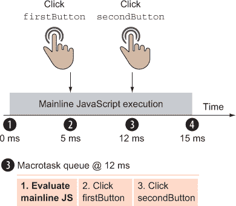

应用程序执行中的下一个有趣点发生在 15 毫秒，此时主线 JavaScript 代码完成执行。如图 13.1 所示，在任务完成执行后，事件循环继续处理微任务队列。因为在这种情况下我们没有微任务（我们甚至在图中没有显示微任务队列，因为它总是空的），所以我们跳过这一步，继续更新 UI。在这个例子中，尽管更新发生了并且花费了一些时间，但为了简单起见，我们将其排除在我们的讨论之外。这样，事件循环完成第一次迭代，并开始第二次迭代，移动到队列中的下一个任务。

接下来，`firstButton`点击任务开始执行。图 13.4 说明了应用程序执行 15 毫秒时的任务队列。与`firstButton`点击相关的`firstHandler`执行大约需要 8 毫秒，处理程序被执行到完成，没有中断，而与`secondButton`相关的点击事件正在队列中等待。

##### 图 13.4.应用程序执行 15 毫秒时的任务队列包含两个点击事件的任务。第一个任务目前正在执行。

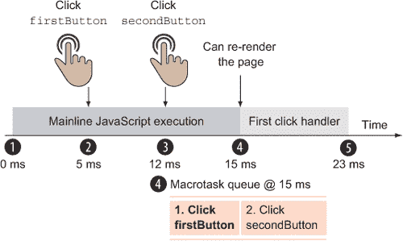

接下来，在 23 毫秒时，`firstButton`点击事件被完全处理，匹配的任务从任务队列中移除。同样，浏览器检查微任务队列，它仍然是空的，并在必要时重新渲染页面。

最后，在第三次循环迭代中，正在处理`secondButton`点击事件，如图 13.5 所示。`secondHandler`大约需要 5 毫秒来执行，在此之后，任务队列最终在 28 毫秒时为空。

##### 图 13.5.应用程序开始执行后 23 毫秒，只有一个任务，即处理`secondButton`点击事件，需要执行。

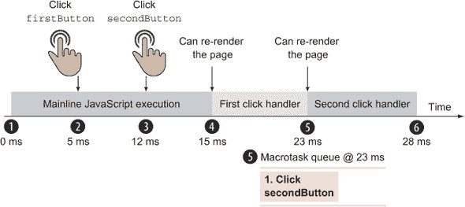

这个例子强调，如果其他任务正在处理中，事件必须等待其轮次才能被处理。例如，尽管`secondButton`点击发生在应用程序执行的 12 毫秒处，但匹配的处理程序在大约 23 毫秒处被调用。

现在让我们将这段代码扩展到包括微任务。

#### 13.1.2. 包含宏任务和微任务的例子

现在你已经看到了事件循环如何针对一个任务队列工作，我们将扩展我们的例子，也包括一个微任务队列。最干净的方法是在第一个按钮点击处理程序中包含一个 promise，以及在其解析后处理 promise 的代码。如你从第六章中回忆的那样，*promise 是我们尚未拥有但将来会拥有的值的占位符；*它是对我们最终将知道异步计算结果的保证。因此，promise 处理程序，我们通过 promise 的`then`方法附加的回调，总是异步调用的，即使我们将其附加到已解析的 promise 上。

下面的列表显示了此双队列示例的修改后的代码。

##### 列表 13.2\. 我们带有两个队列的事件循环演示的伪代码

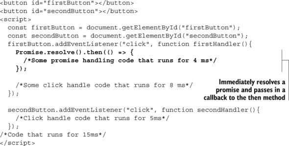

在这个例子中，我们假设发生的行为与第一个例子相同：

+   `firstButton` 在 5 毫秒后被点击。

+   `secondButton` 在 12 毫秒后被点击。

+   `firstHandler` 处理 `firstButton` 的点击事件，并运行 8 毫秒。

+   `secondHandler` 处理 `secondButton` 的点击事件，并运行 5 毫秒。

唯一的不同之处在于，这次，在 `firstHandler` 代码中，我们还创建了一个立即解决的承诺，并将一个运行时间为 4 毫秒的回调传递给它。因为承诺代表一个我们通常不知道的未来的值，所以承诺处理程序总是异步处理的。

说实话，在这种情况下，我们已经创建了一个立即解决的承诺，JavaScript 引擎可以立即调用回调，因为我们已经知道承诺已经成功解决。但是，为了保持一致性，JavaScript 引擎并不这样做，而是将所有承诺回调异步地调用，在执行完其余的 `firstHandler` 代码（运行时间为 8 毫秒）之后。它是通过创建一个新的微任务并将其推入微任务队列来做到这一点的。让我们来探索这个执行过程的时序图，如图 13.6 所示。

##### 图 13.6\. 如果微任务被排入微任务队列，它将获得优先级，即使队列中已经有一个更早的任务在等待，它也会被处理。在这种情况下，承诺成功微任务比 `secondButton` 点击事件任务具有优先级。

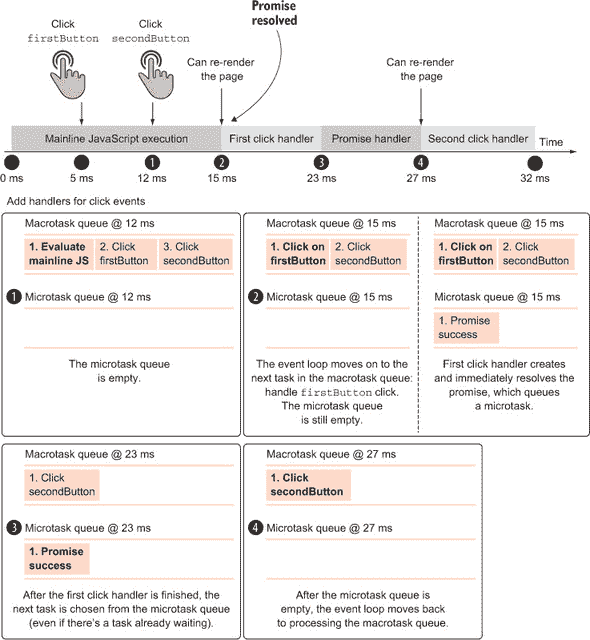

这个时序图与上一个例子的图相似。如果我们对应用程序执行 12 毫秒时的任务队列进行快照，我们会看到队列中确切的相同任务：主线 JavaScript 代码正在处理，而处理 `firstButton` 点击和 `secondButton` 点击的任务正在等待它们的轮次（就像在图 13.3 中一样）。但在任务队列之外，在这个例子中我们还将关注微任务队列，在应用程序执行 12 毫秒时，微任务队列仍然是空的。

应用程序执行中的下一个有趣点发生在 15 毫秒，此时主线 JavaScript 执行结束。因为一个任务已经完成执行，事件循环检查微任务队列，该队列是空的，如果需要，则继续页面渲染。为了简单起见，我们不包括渲染片段在我们的时序图中。

在事件循环的下一个迭代中，正在处理与 `firstButton` 点击相关联的任务：

```
firstButton.addEventListener("click", function firstHandler(){
    Promise.resolve().then(() => {
      /*Some promise handling code that runs for 4ms*/
    });
    /*Some click handle code that runs for 8ms*/
  });
```

`firstHandler` 函数通过调用 `Promise.resolve()` 并传入一个一定会被调用的回调函数来创建一个已解决的承诺，因为承诺已经解决。这会创建一个新的微任务来运行回调代码。微任务被放入微任务队列中，而点击处理程序继续执行另外 8 毫秒。当前任务队列的状态显示在 图 13.7 中。

##### 图 13.7\. 在第一个点击处理程序执行期间，创建了一个已解决的承诺。这将在微任务队列中排一个承诺成功微任务，该任务将尽可能快地执行，但不会打断当前正在运行的任务。

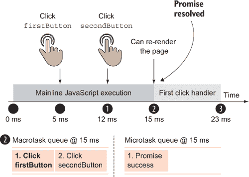

在 `firstButton` 点击完全处理并从任务队列中移除后，应用执行 23 毫秒时，我们再次回顾任务队列。

在这一点上，事件循环必须选择下一个要处理的任务。我们有一个处理 `secondButton` 点击的宏任务，该任务在应用执行 12 毫秒时放入任务队列，还有一个处理承诺成功的微任务，该任务在应用执行大约 15 毫秒时放入微任务队列。

如果考虑这些因素，`secondButton` 点击任务首先被处理似乎是公平的，但正如我们之前提到的，微任务是应该尽快执行的小任务。微任务有优先级，如果你回顾 图 13.1，你会看到每次处理任务时，事件循环首先检查微任务队列，目标是处理所有微任务，然后再继续渲染或其他任务。

因此，承诺成功任务在 `firstButton` 点击后立即执行，即使“较老”的 `secondButton` 点击任务仍然在任务队列中等待，如 图 13.8 所示。

##### 图 13.8\. 任务执行后，事件循环处理微任务队列中的所有任务。在这种情况下，在移动到 `secondButton` 点击任务之前，处理了承诺成功任务。

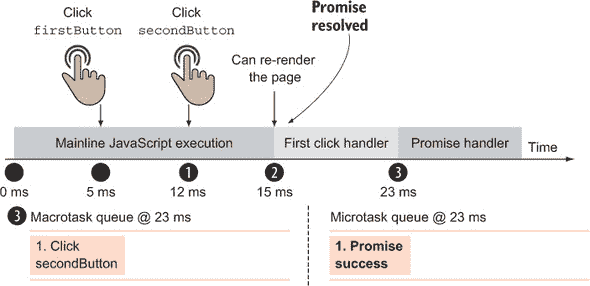

有一个重要的观点我们需要强调。在宏任务执行完毕后，事件循环立即转向处理微任务队列，直到微任务队列为空之前不允许渲染。只需看看 图 13.9 中的时间图即可。

##### 图 13.9\. 在两个宏任务（主线 JavaScript 执行和第一个点击处理程序）之间可以重新渲染页面，而**不能**在执行微任务之前（在承诺处理程序之前）进行渲染。

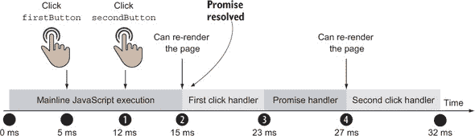

图 13.9 显示，在两个宏任务之间可以发生重新渲染，前提是它们之间没有微任务。在我们的情况下，页面可以在主线 JavaScript 执行和第一个点击处理程序之间渲染，但不能在第一个点击处理程序之后立即渲染，因为微任务（如承诺处理程序）的优先级高于渲染。

在微任务之后也可以发生渲染，但前提是微任务队列中没有其他微任务等待。在我们的例子中，在承诺处理程序发生之后，但在事件循环移动到第二个点击处理程序之前，浏览器可以重新渲染页面。

注意，没有任何东西可以阻止成功承诺的微任务将其他微任务排队，并且所有这些微任务都将优先于 `secondButton` 点击任务。事件循环只有在微任务队列为空时才会重新渲染页面并移动到 `secondButton` 任务，所以请小心！

现在你已经了解了事件循环的工作原理，让我们来看看一组特殊的事件：定时器。

### 13.2\. 驯服定时器：超时和间隔

定时器，JavaScript 中一个常被误用且理解不深的特性，如果使用得当，可以增强复杂应用程序的开发。定时器使我们能够通过至少一定的毫秒数延迟执行一段代码。我们将利用这一功能将长时间运行的任务分解成更小的任务，这样就不会阻塞事件循环，从而停止浏览器渲染，在这个过程中使我们的网络应用变得缓慢且无响应。

但首先，我们将从检查我们可以用来构建和操作定时器的函数开始。浏览器提供了两种创建定时器的方法：`setTimeout` 和 `setInterval`。浏览器还提供了两种相应的方法来清除（或移除）它们：`clearTimeout` 和 `clearInterval`。所有这些都是 `window`（全局上下文）对象的方法。与事件循环类似，定时器不是在 JavaScript 本身中定义的；相反，它们由宿主环境（例如客户端的浏览器或服务器的 Node.js）提供。表 13.1 列出了创建和清除定时器的方法。

##### 表 13.1\. JavaScript 的定时器操作方法（全局 `window` 对象的方法）

| 方法 | 格式 | 描述 |
| --- | --- | --- |
| setTimeout | id = setTimeout(fn,delay) | 启动一个定时器，该定时器将在指定的延迟时间过后执行一次传入的回调函数。返回一个唯一标识定时器的值。 |
| clearTimeout | clearTimeout(id) | 如果定时器尚未触发，则取消（清除）由传入值标识的定时器。 |
| setInterval | id = setInterval(fn,delay) | 启动一个定时器，该定时器将在指定的延迟间隔内不断尝试执行传入的回调函数，直到取消。返回一个唯一标识定时器的值。 |
| clearInterval | clearInterval(id) | 取消（清除）由传递的值标识的间隔计时器。 |

这些方法允许我们设置和清除计时器，这些计时器要么一次性触发，要么在指定的时间间隔内周期性触发。在实践中，大多数浏览器允许你使用`clearTimeout`和`clearInterval`来取消这两种类型的计时器，但如果只是为了清晰，建议使用匹配的成对方法。

|  |
| --- |

##### 注意

重要的是要理解*计时器的延迟是不保证的*。这与事件循环有很大关系，我们将在下一节中看到。

|  |
| --- |

#### 13.2.1. 事件循环中的计时器执行

你已经详细地检查了事件发生时会发生什么。但是计时器与标准事件不同，所以让我们探索一个与之前看到的类似的例子。下面的列表显示了用于此例的代码。

##### 列表 13.3.我们的超时和间隔演示的伪代码

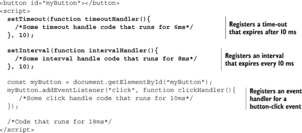

这次我们只有一个按钮，但我们还注册了两个计时器。首先，我们注册了一个在 10 毫秒后到期的超时：

```
setTimeout(function timeoutHandler(){
  /*Some timeout handler code that runs for 6ms*/
}, 10);
```

作为处理者，那个超时有一个执行时间为 6 毫秒的功能。接下来，我们还注册了一个每 10 毫秒就到期的间隔：

```
setInterval(function intervalHandler(){
  /*Some interval handler code that runs for 8ms*/
}, 10);
```

间隔有一个处理程序，它需要 8 毫秒来执行。我们继续注册一个按钮点击事件处理程序，它需要 10 毫秒来执行：

```
const myButton = document.getElementById("myButton");
myButton.addEventListener("click", function clickHandler(){
   /*Some click handler code that runs for 10ms*/
});
```

这个例子以一个运行约 18 毫秒（再次，请稍等片刻，想象一些复杂的代码）的代码块结束。

现在，假设我们有一个快速且不耐烦的用户在应用程序执行 6 毫秒时点击了按钮。图 13.10 显示了执行前 18 毫秒的时序图。

##### 图 13.10。一个显示示例程序中 18 毫秒执行时间的时序图。第一个，当前正在运行的任务是评估主线 JavaScript 代码。它需要 18 毫秒来执行。在执行过程中，发生了三个事件：鼠标点击、计时器到期和间隔触发。

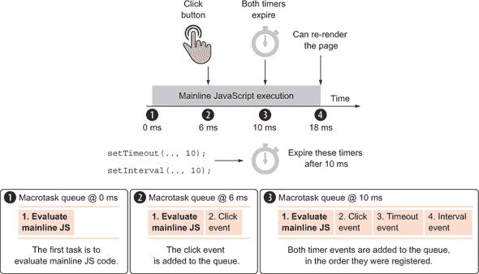

如前所述，队列中的第一个任务是执行主线 JavaScript 代码。在这个过程中，大约需要 18 毫秒来完成，发生了三件重要的事情：

1.  在 0 毫秒时，启动了一个 10 毫秒延迟的超时计时器，并启动了一个 10 毫秒延迟的间隔计时器。它们的引用被浏览器保留。

1.  在 6 毫秒时，鼠标被点击。

1.  在 10 毫秒时，超时计时器到期，第一个间隔触发。

正如我们从事件循环探索中已经知道的，一个任务总是运行到完成，不能被另一个任务中断。相反，所有新创建的任务都被放置在一个队列中，它们耐心地等待轮到它们被处理。当用户在应用程序执行 6 毫秒时点击按钮，该任务被添加到任务队列中。在大约 10 毫秒时，当计时器到期并触发间隔时，也会发生类似的事情。计时器事件，就像输入事件（如鼠标事件）一样，被放置在任务队列中。请注意，计时器和间隔都是以 10 毫秒的延迟启动的，并且在此期间，它们的匹配任务被放置在任务队列中。我们稍后会回到这一点，但现在你只需要注意到任务是以处理程序注册的顺序添加到队列中的：首先是超时处理程序，然后是间隔处理程序。

初始代码块在 18 毫秒后完成执行，因为这次执行中没有微任务，浏览器可以重新渲染页面（再次省略了我们的时间讨论，因为简单），并进入事件循环的第二次迭代。此时任务队列的状态在图 13.11 中显示。

##### 图 13.11。计时器事件在到期时被放置到任务队列中。

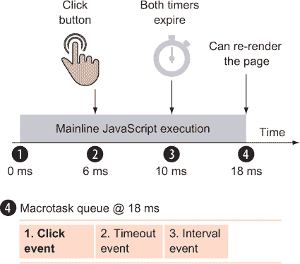

当初始代码块在 18 毫秒时结束执行，有三个代码块被排队等待执行：点击处理程序、超时处理程序和间隔处理程序的第一次调用。这意味着等待的点击处理程序（我们假设它需要 10 毫秒来执行）开始执行。图 13.12 显示了另一个时间图。

##### 图 13.12。如果一个间隔事件被触发，并且一个任务已经与该间隔关联并等待在队列中，则不会添加新的任务。相反，就像在 20 毫秒和 30 毫秒的队列中所示，什么都不会发生。

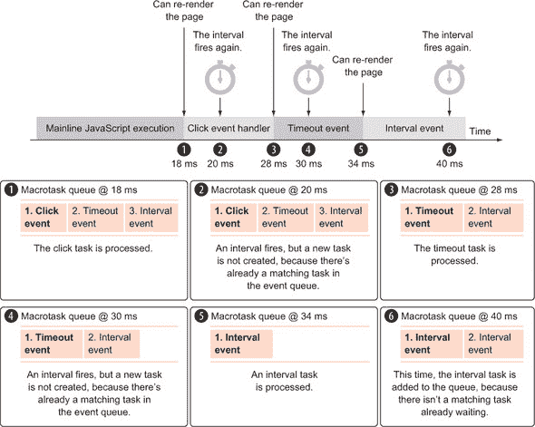

与只触发一次的`setTimeout`函数不同，`setInterval`函数会一直触发，直到我们明确清除它。所以，在大约 20 毫秒时，另一个间隔被触发。通常，这会创建一个新的任务并将其添加到任务队列中。但这次，因为一个间隔任务的实例已经排队并等待执行，这次调用被丢弃。*浏览器不会为特定的间隔处理程序排队超过一个实例*。

点击处理程序在 28 毫秒时完成，在事件循环进入下一次迭代之前，浏览器再次被允许重新渲染页面。在事件循环的下一个迭代中，在 28 毫秒时，处理超时任务。但回想一下这个示例的开始。我们使用以下函数调用来设置一个应该在 10 毫秒后到期的超时：

```
setTimeout(function timeoutHandler(){
  /*Some timeout handle code that runs for 6ms*/
}, 10);
```

因为这是我们应用程序中的第一个任务，所以期待超时处理程序在 10 毫秒后正好执行并不奇怪。但正如你在图 13.11 中看到的，超时是在 28 毫秒标记开始的！

正因如此，我们在说定时器提供的能力可以异步延迟代码执行至少一定数量的毫秒时格外小心。由于 JavaScript 的单线程特性，我们只能控制定时器任务何时被添加到队列，而不能控制它何时最终执行！现在我们已经澄清了这个小难题，让我们继续处理应用程序执行的其余部分。

超时任务需要 6 毫秒来执行，所以它应该在应用程序执行的 34 毫秒时完成。在这个时间段内，在 30 毫秒时另一个间隔触发，因为我们已经安排它每 10 毫秒执行一次。再次，没有额外的任务被排队，因为间隔处理程序执行的匹配任务已经在队列中等待。在 34 毫秒时，超时处理程序完成，浏览器再次有机会重新渲染页面并进入事件循环的另一个迭代。

最后，间隔处理程序在 34 毫秒开始执行，比它被添加到事件队列的 10 毫秒标记晚了 24 毫秒。这再次强调了我们将作为参数传递给`setTimeout(fn, delay)`和`setInterval(fn, delay)`函数的延迟，只指定了匹配任务添加到队列后的延迟时间，而不是执行的确切时间。

间隔处理程序需要 8 毫秒来执行，所以在它执行的过程中，另一个间隔在 40 毫秒标记处到期。这次，因为间隔处理程序正在执行（而不是在队列中等待），一个新的间隔任务最终被添加到任务队列中，并且应用程序的执行继续，如图 13.13 所示。将`setInterval`延迟设置为 10 毫秒并不意味着我们的处理程序会每 10 毫秒执行一次。例如，因为任务被排队，单个任务执行的时间可能有所不同，所以间隔可以一个接一个地执行，就像 42 毫秒和 50 毫秒标记处的间隔一样。

##### 图 13.13。由于鼠标点击和超时处理程序造成的延误，间隔处理程序每 10 毫秒开始执行需要一些时间。

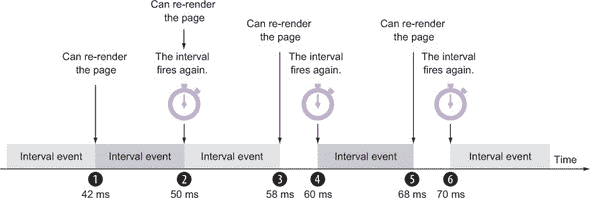

最后，经过 50 毫秒后，我们的间隔稳定下来，并且每 10 毫秒执行一次。需要记住的重要概念是事件循环一次只能处理一个任务，而且我们永远不能确定定时器处理程序会正好在我们期望的时候执行。这一点在间隔处理程序中尤其如此。在这个例子中，尽管我们安排了在 10、20、30、40、50、60 和 70 毫秒标记处触发的间隔，但回调却在 34、42、50、60 和 70 毫秒标记处执行。在这种情况下，我们完全丢失了其中两个，而且有些并没有在预期的时间执行。

如我们所见，间隔有一些特殊的考虑因素，这些因素不适用于超时。让我们更仔细地看看这些。

##### 超时和间隔之间的差异

初看之下，一个间隔可能看起来像是一个周期性重复的时间暂停。但差异要深得多。让我们通过一个例子来更好地说明`setTimeout`和`setInterval`之间的区别：

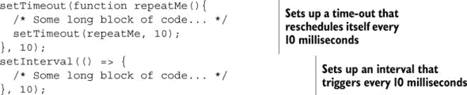

这两段代码可能*看起来*在功能上是等效的，但它们并不是。值得注意的是，代码的`setTimeout`变体在之前的回调执行后始终至少有 10 毫秒的延迟（取决于事件队列的状态，它可能最终会更多，但绝不会更少），而`setInterval`将尝试在每次回调执行后每 10 毫秒执行一次。而且，正如你在上一节中的示例中所看到的，间隔可以立即连续触发，而不管延迟是多少。

我们知道，超时回调并不保证在触发时正好执行。它不会像间隔那样每 10 毫秒触发一次，而是在执行完毕后重新安排 10 毫秒后执行。

所有这些知识都极其重要。了解 JavaScript 引擎如何处理异步代码，尤其是在平均页面中通常发生的众多异步事件，为构建高级应用程序代码奠定了坚实的基础。

在掌握了所有这些知识之后，让我们看看我们对计时器和事件循环的理解如何帮助我们避免一些性能陷阱。

#### 13.2.2. 处理计算密集型处理

JavaScript 的单线程特性可能是复杂 JavaScript 应用程序开发中最大的陷阱。当 JavaScript 正在执行时，浏览器中的用户交互最多只能变得缓慢，最坏的情况是变得无响应。浏览器可能会出现卡顿或似乎挂起的情况，因为当 JavaScript 执行时，页面的所有更新都会暂停。

如果我们希望保持界面响应，将所有超过几百毫秒的复杂操作简化为可管理的部分变得必要。此外，大多数浏览器会在脚本连续运行至少 5 秒后，弹出一个对话框警告用户脚本已变得“无响应”，而一些其他浏览器甚至会静默地终止运行超过 5 秒的任何脚本。

你可能参加过一次家庭聚会，其中一位健谈的叔叔不停地说个不停，坚持一遍又一遍地讲述同样的故事。如果没有人有机会打断并说上几句，对话对任何人来说都不会愉快（除了布鲁斯叔叔）。同样，占用所有处理时间的代码会导致结果不尽如人意；产生无响应的用户界面永远不是好事。但几乎肯定会出现需要我们处理大量数据的情况，例如操作几千个 DOM 元素。

在这些场合，计时器可以救命，并且变得特别有用。因为计时器能够有效地挂起 JavaScript 代码的执行，直到稍后时间，它们也可以将单个代码片段分解成不会使浏览器挂起的不够长的时间段。考虑到这一点，我们可以将密集的循环和操作转换为非阻塞操作。

让我们看看以下可能需要花费很长时间的任务示例。

##### 列表 13.4。一个长时间运行的任务

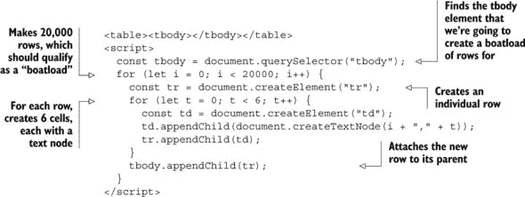

在这个例子中，我们总共创建了 240,000 个 DOM 节点，用包含 6 个单元格的 20,000 行填充表格，每个单元格都包含一个文本节点。这非常昂贵，并且在执行过程中很可能会使浏览器挂起一段时间，从而阻止用户进行正常交互（就像布鲁斯叔叔在家庭聚会上主导谈话一样）。

我们需要定期让布鲁斯叔叔闭嘴，这样其他人就有机会加入谈话。在代码中，我们可以引入计时器来创建这样的“谈话中断”，如下一个列表所示。

##### 列表 13.5。使用计时器分解长时间运行的任务

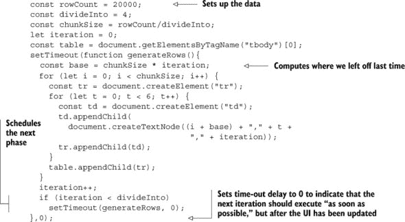

在这个对示例的修改中，我们将长时间操作分解为四个更小的操作，每个操作都创建自己的 DOM 节点。这些较小的操作不太可能中断浏览器的流程，如图 13.14 所示。请注意，我们已经将其设置为将控制操作的数据值收集到易于调整的变量中（`rowCount`、`divideInto`和`chunkSize`），如果我们需要将操作分解为，比如说，四个部分而不是十个部分。

##### 图 13.14。使用计时器将长时间运行的任务分解为不会阻塞事件循环的小任务。

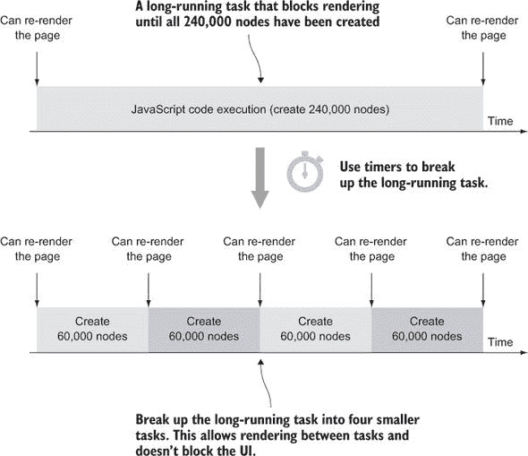

还需要注意的是，我们需要一点数学知识来跟踪我们在前一次迭代中留下的位置，`base = chunkSize * iteration`，以及我们如何自动安排下一次迭代，直到我们确定已经完成：

```
if (iteration < divideInto)
    setTimeout(generateRows, 0);
```

令人印象深刻的是，为了适应这种新的异步方法，代码需要做的改动非常小。我们必须做一点额外的工作来跟踪正在发生的事情，确保操作正确执行，并安排执行部分。但除此之外，代码的核心看起来与我们开始时相似。

|  |
| --- |

##### 注意

在这种情况下，我们为超时延迟使用了`0`。如果你密切关注事件循环的工作方式，你就会知道这并不意味着回调将在 0 毫秒后执行。相反，这是一种告诉浏览器的方式，请尽快执行此回调；但与微任务不同，你可以在其中进行页面渲染。这允许浏览器更新 UI，并使我们的 Web 应用更加响应。

|  |
| --- |

从用户的角度来看，这种技术最明显的变化是，长时间的浏览器挂起被替换为四（或我们选择的任何数量）页面的视觉更新。尽管浏览器会尽可能快地执行代码段，但它也会在每个定时器步骤之后渲染 DOM 更改。在代码的原始版本中，它需要等待一次大的批量更新。

大多数时候，这些类型的更新对用户来说是不可察觉的，但重要的是要记住它们确实发生了。我们应该努力确保我们引入页面的任何代码都不会明显中断浏览器的正常操作。

这种技术有多么有用往往令人惊讶。通过理解事件循环的工作原理，我们可以绕过单线程浏览器环境的限制，同时仍然为用户提供愉悦的体验。

现在我们已经理解了事件循环以及定时器在处理复杂操作中的作用，让我们更仔细地看看事件本身是如何工作的。

### 13.3\. 处理事件

当某个事件发生时，我们可以在我们的代码中处理它。正如你在本书中多次看到的，注册事件处理器的一种常见方式是使用内置的 `addEventListener` 方法，如下面的列表所示。

##### 列表 13.6\. 注册事件处理器

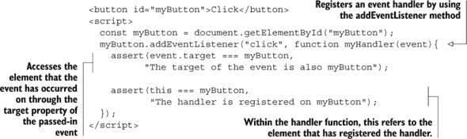

在这个片段中，我们定义了一个名为 `myButton` 的按钮，并通过从所有元素可访问的内置 `addEventListener` 方法注册了一个点击事件处理器。

在点击事件发生后，浏览器会调用相关处理器，在本例中是 `myHandler` 函数。浏览器会将一个包含我们可用于获取更多事件信息的属性的事件对象传递给此处理器，例如鼠标的位置或被点击的鼠标按钮，如果我们处理的是鼠标点击事件，或者按下的键，如果我们处理的是键盘事件。

传入事件对象的属性之一是 `target` 属性，它引用了事件发生的元素。

| |
| --- |

##### 注意

就像在大多数其他函数中一样，在事件处理器中，我们可以使用 `this` 关键字。人们常常口语化地说，在事件处理器中，`this` 关键字指的是事件发生的对象，但正如我们很快就会发现的，这并不完全正确。相反，`this` 关键字指的是事件处理器已被注册的元素。坦白说，在大多数情况下，事件处理器已被注册的元素确实是事件发生的元素，但也有一些例外。我们很快就会探讨这些情况。

| |
| --- |

在进一步探索这个概念之前，让我们设定场景，以便你可以看到事件是如何通过 DOM 传播的。

#### 13.3.1\. 通过 DOM 传播事件

如我们已在第二章中了解到的，在 HTML 文档中，元素以树状结构组织。一个元素可以有零个或多个子元素，每个元素（除了根`html`元素）恰好有一个父元素。现在，假设我们正在处理一个页面，其中包含另一个元素内的元素，并且这两个元素都有点击处理器，如下所示。

##### 列表 13.7\. 嵌套元素和点击处理器

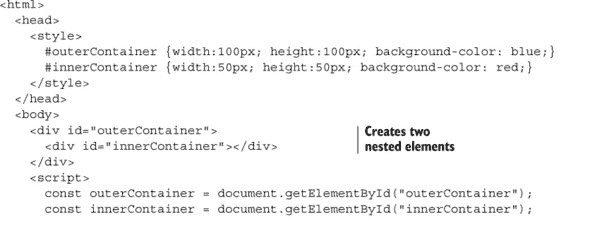

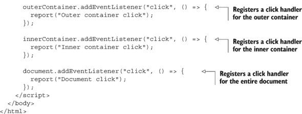

这里我们有两个 HTML 元素，`outerContainer`和`innerContainer`，它们，就像所有其他 HTML 元素一样，包含在我们的全局`document`中。并且在这三个对象上，我们注册了一个点击处理器。

现在假设用户点击了`innerContainer`元素。因为`innerContainer`包含在`outerContainer`元素中，而这两个元素都包含在`document`中，所以很明显，这将触发所有三个事件处理器的执行，输出三条消息。不明显的是事件处理器的执行顺序。

我们应该遵循事件注册的顺序吗？应该从事件发生元素开始向上移动？还是应该从顶部开始向下移动到目标元素？在浏览器最初做出这些决定的时候，两大主要竞争对手，网景和微软，做出了相反的选择。

在网景的事件模型中，事件处理从顶层元素开始，逐级向下传递到事件目标元素。在我们的例子中，事件处理器的执行顺序如下：`document`点击处理器，`outerContainer`点击处理器，最后是`innerContainer`点击处理器。这被称为*事件捕获*。

微软选择了另一种方式：从目标元素开始，向上冒泡到 DOM 树。在我们的例子中，事件的执行顺序如下：`innerContainer`点击处理器，`outerContainer`点击处理器，以及`document`点击处理器。这被称为*事件冒泡*。

由万维网联盟（[www.w3.org/TR/DOM-Level-3-Events/](http://www.w3.org/TR/DOM-Level-3-Events/））制定的标准，被所有现代浏览器实现，它包含了两种方法。事件处理分为两个阶段：

1.  ***捕获阶段—*** 事件首先在顶层元素被捕获，然后逐级向下传递到目标元素。

1.  ***冒泡阶段—*** 在捕获阶段到达目标元素后，事件处理切换到冒泡，事件再次从目标元素向上冒泡到顶层元素。

这两个阶段在图 13.15 中展示。

##### 图 13.15\. 在捕获中，事件逐级向下传递到目标元素。在冒泡中，事件从目标元素向上冒泡。

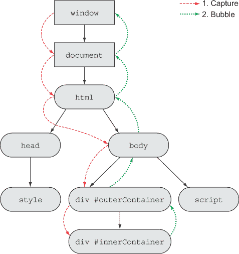

我们可以通过向 `addEventListener` 方法添加另一个布尔参数轻松地决定我们想要使用的事件处理顺序。如果我们使用 `true` 作为第三个参数，事件将被捕获，而如果我们使用 `false`（或省略该值），事件将冒泡。因此，从某种意义上说，W3C 标准略微更倾向于事件冒泡而不是事件捕获，因为冒泡已经成为默认选项。

现在，让我们回到 代码列表 13.7 并仔细看看我们注册事件的方式：

```
outerContainer.addEventListener("click", () => {
  report("Outer container click");
});

innerContainer.addEventListener("click", () => {
  report("Inner container click");
});

document.addEventListener("click", () => {
  report("Document click");
});
```

如你所见，在这三种情况下，我们只使用两个参数调用了 `addEventListener` 方法，这意味着选择了默认方法，即 *冒泡*。因此，在这种情况下，如果我们点击 `innerContainer` 元素，事件处理程序将按以下顺序执行：`innerContainer` 点击处理程序，`outerContainer` 点击处理程序，`document` 点击处理程序。

让我们按照以下方式修改 代码列表 13.7 中的代码。

##### 列表 13.8\. 捕获与冒泡

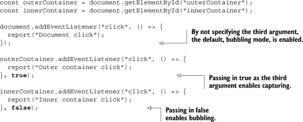

这次，我们将 `outerContainer` 的事件处理程序设置为捕获模式（通过传递 `true` 作为第三个参数），而将 `innerContainer`（通过传递 `false` 作为第三个参数）和 `document` 的事件处理程序设置为冒泡模式（省略第三个参数选择默认的冒泡模式）。

如你所知，单个事件可以触发多个事件处理程序的执行，其中每个处理程序可以是捕获模式或冒泡模式。因此，事件首先从顶层元素开始，逐级向下到事件目标元素。当达到目标元素时，冒泡模式被激活，事件从目标元素冒泡回顶部。

在我们这个例子中，捕获从顶部开始，从 `window` 对象开始，逐级向下到 `innerContainer` 元素，目的是找到所有在捕获模式下具有此点击事件事件处理程序的所有元素。只找到一个元素，即 `outerContainer`，其匹配的点击事件处理程序作为第一个事件处理程序执行。

事件继续沿着捕获路径向下移动，但没有找到更多具有捕获的事件处理程序。当事件达到事件目标元素，即 `innerContainer` 元素时，事件进入冒泡阶段，从目标元素一路冒泡回顶部，执行该路径上所有冒泡事件处理程序。

在我们这个例子中，`innerContainer` 的点击事件处理程序将作为第二个事件处理程序执行，而 `document` 的点击事件处理程序将作为第三个。点击 `innerContainer` 元素生成的输出以及所采取的路径显示在 图 13.16 中。

##### 图 13.16\. 首先，事件从顶部逐级向下，执行所有捕获模式的事件处理程序。当达到目标元素时，事件向上冒泡到顶部，执行所有冒泡模式的事件处理程序。

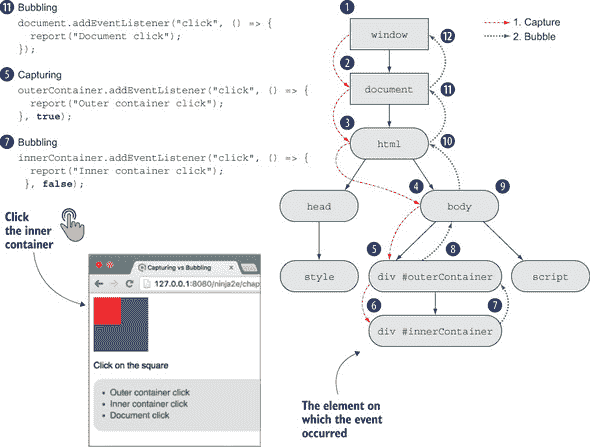

这个例子展示的一个事情是，处理事件的元素不必是事件发生的元素。例如，在我们的情况下，事件发生在`innerContainer`元素上，但我们可以处理它在上层 DOM 层次结构中的元素，比如`outerContainer`或`document`元素。

这带我们回到了事件处理程序中的`this`关键字，以及为什么我们明确指出`this`关键字指的是事件处理程序注册的元素，而不一定是事件发生的元素。

再次，让我们修改我们的运行示例，如下所示。

##### 列表 13.9\. 事件处理程序中`this`和`event.target`之间的区别

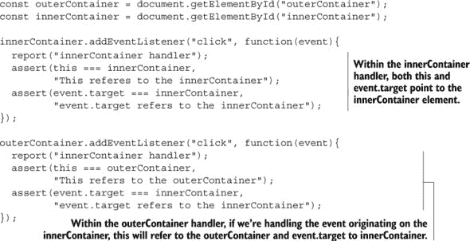

再次，让我们看看当点击`innerContainer`时应用程序的执行情况。因为两个事件处理程序都使用事件冒泡（在`addEventListener`方法中没有设置第三个参数为`true`），首先调用`innerContainer`点击处理程序。在处理程序的主体中，我们检查`this`关键字和`event.target`属性是否都指向`innerContainer`元素：

```
assert(this === innerContainer,
       "This refers to the innerContainer");
assert(event.target === innerContainer,
       "event.target refers to the innerContainer");
```

`this`关键字指向`innerContainer`元素，因为这是当前处理程序已注册的元素，而`event.target`属性指向`innerContainer`元素，因为这是事件发生的元素。

接下来，事件冒泡到`outerContainer`处理程序。这次，`this`关键字和`event.target`指向不同的元素：

```
assert(this === outerContainer,
       "This refers to the outerContainer");
assert(event.target === innerContainer,
       "event.target refers to the innerContainer");
```

如预期，`this`关键字指向`outerContainer`元素，因为这是当前处理程序已注册的元素。另一方面，`event.target`属性指向`innerContainer`元素，因为这是事件发生的元素。

现在我们已经了解了事件是如何通过 DOM 树传播的，以及如何访问事件最初发生的元素，让我们看看如何应用这些知识来编写更节省内存的代码。

##### 将事件委托给祖先

假设我们想要通过最初为每个单元格显示白色背景，然后在单元格被点击后改变背景颜色为黄色，来视觉上指示用户是否点击了表格内的单元格。听起来足够简单。我们可以遍历所有单元格，并在每个单元格上建立处理程序来改变背景颜色属性：

```
const cells = document.querySelectorAll('td');
for (let n = 0; n < cells.length; n++) {
  cells[n].addEventListener('click', function(){
    this.style.backgroundColor = 'yellow';
  });
}
```

虽然这可行，但这是否优雅？不。我们在可能成百上千个元素上建立了完全相同的事件处理程序，它们都做**完全相同的事情**。

一个更加优雅的方法是在比单元格更高的级别上建立一个单一的处理程序，使用事件冒泡来处理所有事件。

我们知道所有单元格都将是其包含表格的后代，我们也知道我们可以通过 `event.target` 获取被点击元素的引用。将事件处理委托给表格要优雅得多，如下所示：

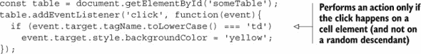

在这里，我们创建了一个处理程序，它可以轻松地处理更改表格中被点击的所有单元格的背景颜色的任务。这要高效得多，也更优雅。

使用事件委托，我们必须确保它只应用于事件目标元素的祖先元素。这样，我们才能确保事件最终会冒泡到已委托处理器的元素。

到目前为止，我们一直在处理浏览器提供的事件，但你有没有热烈地渴望过能够触发你自己的 *自定义* 事件？

#### 13.3.2\. 自定义事件

想象一个场景，你想要执行一个操作，但你希望在不同的代码片段中，在多种条件下触发它，也许甚至是从共享脚本文件中的代码触发。新手会在需要的地方重复代码。熟练工会创建一个全局函数并在需要的地方调用它。忍者会使用自定义事件。但为什么？

##### 松耦合

假设我们在共享代码中执行操作，并且我们想在特定条件需要响应时让页面代码知道。如果我们使用熟练工的全局函数方法，我们会引入一个缺点，即我们的共享代码需要为函数定义一个固定的名称，并且所有使用共享代码的页面都需要使用这样的函数。

此外，如果在触发条件发生时需要执行多项操作呢？为多个通知留出空间将会是艰巨且必然混乱的。这些缺点是 *紧密耦合* 的结果，在这种耦合中，检测条件的代码必须知道将对此条件做出反应的代码的详细信息。

另一方面，*松耦合* 发生在触发条件的代码对将对此条件做出反应的代码一无所知的情况下，甚至不知道是否有什么东西会做出反应。事件处理程序的一个优点是我们可以建立尽可能多的处理程序，并且这些处理程序之间完全独立。因此，事件处理是松耦合的一个很好的例子。当按钮点击事件被触发时，触发事件的代码对我们已经在页面上建立的处理器一无所知，甚至不知道是否存在任何处理器。相反，点击事件由浏览器推送到任务队列，而触发事件的任何东西都不会关心之后会发生什么。如果已经为点击事件建立了处理器，它们最终将以完全独立的方式逐个调用。

紧耦合有很多优点。在我们的场景中，当共享代码检测到有趣的条件时，它会触发某种类型的信号，表示“发生了这个有趣的事情；任何感兴趣的人都可以处理它”，而且它根本不在乎是否有人感兴趣。让我们考察一个具体的例子。

##### 一个 Ajax 示例

让我们假设我们已经编写了一些共享代码，这些代码将执行 Ajax 请求。使用这些代码的页面希望在 Ajax 请求开始和结束时得到通知；每个页面在发生这些“事件”时都有它需要做的事情。

例如，在一个使用此包的页面上，我们希望在 Ajax 请求开始时显示一个旋转的风扇，当请求完成时隐藏它，以便给用户提供一些视觉反馈，表明请求正在处理。如果我们把开始条件想象成一个名为 `ajax-start` 的事件，把停止条件想象成 `ajax-complete`，如果我们能在页面上为这些事件建立显示和隐藏图像的处理程序，那岂不是很好？

考虑以下内容：

```
document.addEventListener('ajax-start', e => {
  document.getElementById('whirlyThing').style.display = 'inline-block';
});
document.addEventListener('ajax-complete', e => {
  document.getElementById('whirlyThing').style.display = 'none';
});
```

很遗憾，这些事件并不存在，但没有任何阻止我们使它们成为现实。

##### 创建自定义事件

自定义事件是模拟（对于我们的共享代码的用户）真实事件体验的一种方式，但这个事件在我们应用程序的上下文中具有业务意义。下面的列表显示了一个触发自定义事件的示例。

##### 列表 13.10\. 使用自定义事件

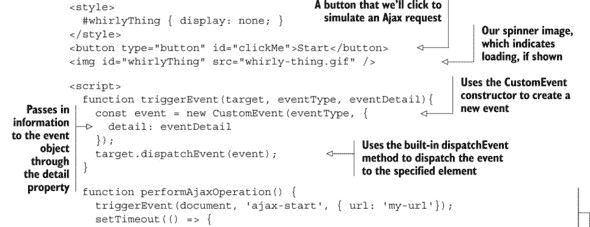


在这个例子中，我们通过建立前一个章节中描述的场景来探索自定义事件：在 Ajax 操作进行时显示一个动画风扇图像。操作是由按钮的点击触发的。

以完全解耦的方式，为名为 `ajax-start` 的自定义事件创建了一个处理程序，同样为 `ajax-complete` 自定义事件也创建了一个处理程序。这些事件的处理程序分别显示和隐藏风扇图像：

```
button.addEventListener('click', () => {
  performAjaxOperation();
});

document.addEventListener('ajax-start', e => {
  document.getElementById('whirlyThing').style.display = 'inline-block';
  assert(e.detail.url === 'my-url', 'We can pass in event data');
});

document.addEventListener('ajax-complete', e => {
    document.getElementById('whirlyThing').style.display = 'none';
});
```

注意，这三个处理程序彼此之间一无所知。特别是，按钮点击处理程序在显示和隐藏图像方面没有责任。

Ajax 操作本身是通过以下代码模拟的：

```
function performAjaxOperation() {
  triggerEvent(document, 'ajax-start', { url: 'my-url'});
  setTimeout(() => {
    triggerEvent(document, 'ajax-complete');
  }, 5000);
}
```

该函数触发 `ajax-start` 事件并发送关于事件的数据（`url` 属性），假装即将发起一个 Ajax 请求。然后该函数发出一个 5 秒的超时，模拟一个跨越 5 秒的 Ajax 请求。当计时器到期时，我们假装响应已经返回，并触发一个 `ajax-complete` 事件，表示 Ajax 操作已完成。

注意这个例子中高度的解耦。共享的 Ajax 操作代码不知道当事件被触发时页面代码会做什么，甚至不知道是否真的有页面代码来触发。页面代码被模块化成小的处理程序，它们之间互不了解。此外，页面代码对共享代码如何执行一无所知；它只是对可能或可能不被触发的事件做出反应。

这种程度的解耦有助于保持代码模块化，更容易编写，当出现问题时也更容易调试。它还使得共享代码片段变得容易，并且可以在不违反代码片段之间耦合依赖的情况下移动它们。解耦是使用自定义事件时的基本优势，它允许我们以更表达性和灵活的方式开发应用程序。

### 13.4\. 摘要

+   事件循环任务代表浏览器执行的动作。任务分为两类：

    +   宏任务是一些离散的、自包含的浏览器操作，例如创建主文档对象、处理各种事件以及进行 URL 更改。

    +   微任务是一些应该尽快执行的小任务。例如，包括承诺回调和 DOM 变更。

+   由于单线程执行模型，任务一次处理一个，一旦任务开始执行，就不能被另一个任务中断。事件循环通常至少有两个事件队列：宏任务队列和微任务队列。

+   定时器提供了一种异步延迟代码执行至少一些毫秒数的能力。

    +   使用 `setTimeout` 函数在指定的延迟时间过后执行回调。

    +   使用 `setInterval` 函数启动一个定时器，该定时器将在指定的延迟间隔内尝试执行回调，直到被取消。

    +   两个函数都返回一个定时器的 ID，我们可以通过 `clearTimeout` 和 `clearInterval` 函数来取消定时器。

    +   使用定时器将计算密集型代码分解成可管理的块，这样就不会阻塞浏览器。

+   DOM 是一个元素分层树，一个元素（目标）上发生的事件通常通过 DOM 传播。有两种传播机制：

    +   在事件捕获中，事件从顶层元素逐级向下传递到目标元素。

    +   在事件冒泡中，事件从目标元素逐级向上冒泡到顶层元素。

+   当调用事件处理器时，浏览器也会传递一个事件对象。通过事件对象的 `target` 属性访问事件发生的元素。在处理器内部，使用 `this` 关键字来引用已注册处理器的元素。

+   使用通过内置的 `CustomEvent` 构造函数创建的自定义事件，并通过 `dispatchEvent` 方法分发，以减少应用程序不同部分之间的耦合。

### 13.5\. 练习

> **1**
> 
> 为什么将任务添加到任务队列中发生在事件循环之外很重要？
> 
> **2**
> 
> 为什么事件循环的每一迭代不需要超过大约 16 毫秒很重要？
> 
> **3**
> 
> 运行以下代码 2 秒后，输出结果是什么？
> 
> ```
> setTimeout(function(){
>   console.log("Timeout ");
> }, 1000);
> 
> setInterval(function(){
>   console.log("Interval ");
> }, 500);
> ```
> 
> 1.  `Timeout Interval Interval Interval Interval`
> 1.  
> 1.  `Interval Timeout Interval Interval Interval`
> 1.  
> 1.  `Interval Timeout Timeout`
> 1.  
> **4**
> 
> 运行以下代码 2 秒后的输出结果是什么？
> 
> ```
> const timeoutId = setTimeout(function(){
>   console.log("Timeout ");
> }, 1000);
> 
> setInterval(function(){
>   console.log("Interval ");
> }, 500);
> 
> clearTimeout(timeoutId);
> ```
> 
> 1.  `Interval Timeout Interval Interval Interval`
> 1.  
> 1.  `Interval`
> 1.  
> 1.  `Interval Interval Interval Interval`
> 1.  
> **5**
> 
> 运行以下代码并点击 ID 为`inner`的元素后，输出结果是什么？
> 
> ```
> <body>
>   <div id="outer">
>     <div id="inner"></div>
>   </div>
>   <script>
>     const innerElement = document.querySelector("#inner");
>     const outerElement = document.querySelector("#outer");
>     const bodyElement = document.querySelector("body");
> 
>     innerElement.addEventListener("click", function(){
>        console.log("Inner");
>     });
> 
>     outerElement.addEventListener("click", function(){
>        console.log("Outer");
>     }, true);
> 
>     bodyElement.addEventListener("click", function(){
>        console.log("Body");
>     })
>   </script>
> </body>
> ```
> 
> 1.  `Inner Outer Body`
> 1.  
> 1.  `Body Outer Inner`
> 1.  
> 1.  `Outer Inner Body`

## 第十四章\. 开发跨浏览器策略

*本章涵盖*

+   开发可重用的跨浏览器 JavaScript 代码

+   分析需要解决的跨浏览器问题

+   以智能方式解决这些问题

任何在页面上开发 JavaScript 代码的人都知道，在确保代码在一系列支持的浏览器中完美运行时，存在广泛的痛点。这些考虑因素从满足基本开发需求，到为未来的浏览器发布做准备，再到在尚未创建的网页上重用代码，涵盖了所有这些。

为多个浏览器编写代码是一个非平凡的任务，必须根据你现有的开发方法和项目可用的资源进行平衡。尽管我们希望我们的页面能够在所有曾经存在或将来存在的浏览器中完美运行，但现实总会露出其丑陋的一面，我们必须认识到我们的开发资源是有限的。我们必须计划适当地、谨慎地应用这些资源，以获得最大的效益。

因此，我们从这个章节开始，提供关于选择支持哪些浏览器的建议。接下来是关于跨浏览器开发的主要问题的讨论，以及处理这些问题的有效策略。让我们直接进入如何谨慎选择支持浏览器的途径。

### 你知道吗？

> **Q1:**
> 
> 处理不同浏览器之间行为不一致的常见方法有哪些？
> 
> **Q2:**
> 
> 最好的方法是什么，可以使你的代码在别人的页面上可用？
> 
> **Q3:**
> 
> 为什么 polyfills 在跨浏览器脚本中很有用？

### 14.1\. 跨浏览器考虑因素

完善我们的 JavaScript 编程技能将使我们受益匪浅，尤其是现在 JavaScript 已经摆脱了浏览器的限制，并在 Node.js 服务器上使用。但当我们开发基于浏览器的 JavaScript 应用程序（本书的重点）时，迟早会直面*浏览器*及其各种问题和不一致性。

在一个完美的世界里，所有浏览器都不会有错误，并且会一致地支持网络标准，但正如我们所知，我们并不生活在这个世界里。尽管近年来浏览器的质量有了很大提高，但所有浏览器仍然存在一些错误、缺失的 API 和浏览器特有的怪癖，我们需要处理这些问题。制定一个全面策略来应对这些浏览器问题，并深入了解它们之间的差异和怪癖，并不亚于掌握 JavaScript 本身的重要性。

在编写浏览器应用程序时，选择支持哪些浏览器很重要。我们可能希望支持所有浏览器，但开发和测试资源的限制决定了否则。那么我们如何决定支持哪些，以及支持到什么程度？

我们可以采用的一种方法是借鉴了较老的 Yahoo!方法，即*分级浏览器支持*。在这种技术中，我们创建一个浏览器支持矩阵，作为浏览器及其平台对我们需求重要性的快照。在这个表格中，我们列出目标平台在一轴上，浏览器在另一轴上。然后，在表格单元格中，我们对每个浏览器/平台组合给出一个“等级”（A 到 F，或任何满足我们需求的评分系统）。表 14.1 显示了假设的例子。

##### 表 14.1\. 一个假设的浏览器支持矩阵

|   | Windows | OS X | Linux | iOS | Android |
| --- | --- | --- | --- | --- | --- |
| IE 9 |   | N/A | N/A | N/A | N/A |
| IE10 |   | N/A | N/A | N/A | N/A |
| IE11 |   | N/A | N/A | N/A | N/A |
| Edge |   | N/A | N/A | N/A | N/A |
| Firefox |   |   |   | N/A |   |
| Chrome |   |   |   |   |   |
| Opera |   |   |   |   |   |
| Safari |   |   | N/A |   | N/A |

注意，我们还没有填写任何等级。你分配给特定平台和浏览器组合的等级完全取决于你项目的需求和需求，以及其他重要因素，如目标受众的构成。我们可以使用这种方法来制定衡量该平台/浏览器支持重要性的等级，并将这些信息与支持的成本结合起来，试图找出最佳的支持浏览器组合。

当我们选择支持一个浏览器时，我们通常做出以下承诺：

+   我们将使用我们的测试套件积极测试该浏览器。

+   我们将修复与该浏览器相关的错误和回归。

+   浏览器将以合理的性能执行我们的代码。

由于针对众多平台/浏览器组合进行开发不切实际，我们必须权衡支持各种浏览器所带来的成本与收益。这种分析必须考虑多个因素，其中主要因素如下：

+   目标受众的期望和需求

+   浏览器的市场份额

+   支持浏览器所需的工作量

第一点是一个主观的观点，只有你的项目可以确定。另一方面，市场份额通常可以使用可用信息来衡量。通过考虑浏览器的功能和它们对现代标准的遵守程度，可以确定支持每个浏览器所需的大致工作量。

图 14.1 展示了一个代表浏览器使用信息（2016 年 4 月从 [`gs.statcounter.com`](http://gs.statcounter.com) 获取）的样本图表。任何可重用的 JavaScript 代码，无论是大众消费的 JavaScript 库还是我们自己的页面代码，都应该开发成在尽可能多的环境中工作，专注于对最终用户重要的浏览器和平台。对于大众消费的库，这是一个很大的集合；对于更针对性的应用，所需的集合可能更窄。

##### 图 14.1. 观察桌面和移动设备上的浏览器使用统计，我们可以了解哪些浏览器需要我们关注。


但是，不要贪多嚼不烂，质量永远不应该为了覆盖面而牺牲。这一点很重要，值得重复；实际上，我们敦促你大声朗读：

> *质量永远不应该为了覆盖面而牺牲*。

在本章中，我们将探讨 JavaScript 代码在跨浏览器支持方面可能遇到的情况。然后，我们将探讨编写该代码的一些最佳方法，目的是减轻这些情况可能带来的任何潜在问题。这应该有助于你决定哪些技术值得你投入时间采用，并帮助你完善自己的浏览器支持图表。

### 14.2. 五大主要开发关注点

任何非平凡代码都包含无数的开发关注点。但五个主要点对我们可重用 JavaScript 代码构成了最大的挑战，如图 14.2 所示。

##### 图 14.2. 可重用 JavaScript 开发关注的五大要点


这些是五个要点：

+   浏览器错误

+   浏览器错误修复

+   外部代码

+   浏览器回归

+   浏览器中缺失的功能

我们将想要平衡我们在每个点上花费的时间与由此产生的收益。最终，这些问题是你必须回答的，将它们应用于你自己的情况。分析你的目标受众、开发资源和时间表都是影响你决策的因素。

当努力开发可重用 JavaScript 代码时，我们必须考虑所有这些要点，但最密切的关注点是目前最流行的浏览器，因为这些最有可能被我们的目标受众使用。对于其他不太受欢迎的浏览器，我们至少要确保我们的代码能够优雅地降级。例如，如果一个浏览器不支持某个 API，至少我们应该小心，确保我们的代码不会抛出任何异常，这样其余的代码就可以执行。

在接下来的几节中，我们将分解这些各种关注点，以更好地理解我们所面临的挑战以及如何应对它们。

#### 14.2.1\. 浏览器错误和差异

在开发可重用 JavaScript 代码时，我们需要处理与我们所决定支持的浏览器集合相关的各种错误和 API 差异。尽管如今浏览器更加统一，但我们在代码中提供的任何功能都应该在所有我们选择的浏览器中完全且**可验证地**正确。

实现这一点的方法很简单：我们需要一套全面的测试来覆盖代码的常见和边缘用例。有了良好的测试覆盖率，我们可以放心地知道我们开发的代码将在支持的浏览器集合中工作。并且假设后续的浏览器更改不会破坏向后兼容性，我们将有一种温暖而舒适的感觉，认为我们的代码甚至可以在那些浏览器的未来版本中工作。我们将在第 14.3 节中查看处理浏览器错误和差异的具体策略。

在所有这些中，一个棘手的问题是，以这种方式实施对当前浏览器错误的修复，使得它们能够抵抗未来浏览器版本中实施的任何针对这些错误的修复。

#### 14.2.2\. 浏览器错误修复

假设浏览器将永远存在某个特定错误是愚蠢的——大多数浏览器错误最终都会得到修复，**依赖**于错误的持续存在是一种危险的开发策略。最好使用第 14.3 节中的技术，以确保任何错误绕过策略尽可能具有未来性。

当编写一段可重用 JavaScript 代码时，我们希望确保它能够长期存在。就像编写网站的任何方面（CSS、HTML 等）一样，我们不希望因为新浏览器的发布而不得不回过头来修复损坏的代码。

对浏览器错误的假设会导致一种常见的网站故障形式：为了绕过浏览器提出的错误而实施的特定黑客手段，当浏览器在未来版本中修复这些错误时，这些手段会失效。

处理浏览器错误的问题有两个方面：

+   当最终实施错误修复时，我们的代码可能会出现故障。

+   我们可能会训练浏览器供应商**不**修复错误，以免造成网站故障。

第二种情况的一个有趣的例子最近刚刚发生，就是`scrollTop`错误（[`dev.opera.com/articles/fixing-the-scrolltop-bug/`](https://dev.opera.com/articles/fixing-the-scrolltop-bug/)）。

当处理 HTML DOM 中的元素时，我们可以使用`scrollTop`和`scrollLeft`属性来访问和修改元素的当前滚动位置。但如果我们对根元素`html`使用这些属性，根据规范，这些属性应该报告（并影响）视口的滚动位置。IE 11 和 Firefox 严格遵循这个规范。不幸的是，Safari、Chrome 和 Opera 不遵循。相反，如果你尝试修改根元素`html`的这些属性，什么都不会发生。为了在这些浏览器中达到相同的效果，我们必须使用`body`元素的`scrollTop`和`scrollLeft`属性。

面对这种不一致性，网页开发者们常常求助于检测当前浏览器的名称（通过用户代理字符串，关于这一点稍后详述），然后如果我们的 JavaScript 代码在 IE 或 Firefox 中执行，就修改`html`元素的`scrollTop`和`scrollLeft`，如果代码在 Safari、Chrome 或 Opera 中执行，就修改`body`元素。不幸的是，这种绕过这个错误的方法已经被证明是灾难性的。因为现在许多页面明确编码“如果是 Safari、Chrome 或 Opera”，就修改`body`元素，这些浏览器实际上无法修复这个错误，因为修复错误反而会导致许多网页失败。

这又提出了关于错误的一个重要观点：在确定某个功能是否可能是错误时，始终要使用规范来验证它！

浏览器错误也与未指定的 API 不同。参考浏览器规范很重要，因为它们提供了浏览器开发和完善代码的确切标准。相比之下，未指定 API 的实现可能会在任何时候发生变化（尤其是如果实现试图成为标准化的情况下）。在未指定 API 的不一致情况下，你应该始终测试你期望的输出。始终意识到，随着它们变得稳固，这些 API 可能会发生未来的变化。

此外，错误修复和 API 更改之间还有一个区别。虽然错误修复很容易预见——浏览器最终会修复其实施中的错误，即使这需要很长时间——但 API 更改很难发现。标准 API 不太可能更改（尽管并非完全不可能）；更改更有可能发生在未指定的 API 上。

幸运的是，这种情况很少发生到足以严重破坏大多数 Web 应用的程度。但如果确实发生了，那么在事先是难以检测到的（除非，当然，我们测试了我们接触过的每一个 API——但这样的过程所造成的开销将是荒谬的）。这种类型的 API 更改应像处理任何其他回归一样处理。

对于我们下一个关注点，我们知道没有人是一座孤岛，我们的代码也不例外。让我们探讨其影响。

#### 14.2.3\. 外部代码和标记

任何可重用代码都必须与周围的代码共存。无论我们期望我们的代码在我们自己编写的页面上工作，还是在他人开发的网站上工作，我们都需要确保它可以在页面上与任何其他随机代码共存。

这是一把双刃剑：我们的代码不仅必须能够承受与可能编写不良的外部代码共存，而且必须注意不要对其共存的代码产生不利影响。

我们需要对此关注点保持多高的警惕性，很大程度上取决于我们期望代码被使用的环境。例如，如果我们正在编写适用于单个或有限数量网站的可重用代码，并且我们对这些网站有一定程度的控制，那么可能不需要过于担心外部代码的影响，因为我们知道代码将在哪里运行，并且我们可以在一定程度上自行修复任何问题。

| |
| --- |

##### 小贴士

这是一个足够重要的问题，足以写成一整本书。如果您想深入了解，我们强烈推荐本·文尼加和安东·科瓦洛夫的《第三方 JavaScript》（Manning，2013 年，[`www.manning.com/books/third-party-javascript`](https://www.manning.com/books/third-party-javascript))。

| |
| --- |

如果我们正在开发将在未知（且不可控）环境中广泛应用的代码，我们需要确保我们的代码是健壮的。让我们讨论一些实现这一目标的策略。

##### 封装我们的代码

为了防止我们的代码影响加载页面上的其他代码片段，最好的做法是实践*封装*。一般来说，这指的是将某物放入或仿佛放入胶囊中的行为。一个更专注于特定领域的定义是“一种语言机制，用于限制对某些对象组件的访问。”您的阿姨玛蒂尔达可能会更简洁地总结为“管好自己的事！”

当我们将代码引入页面时，保持极小的全局影响范围可以极大地让阿姨玛蒂尔达感到满意。事实上，将我们的全局影响范围限制在几个全局变量，或者更好，*一个*全局变量，相当容易。

正如你在第十二章中看到的，jQuery，最受欢迎的客户端 JavaScript 库，是这种做法的一个很好的例子。它引入了一个名为`jQuery`的全局变量（一个函数），以及该全局变量的一个别名`$`。它甚至有支持将`$`别名返回给页面上其他代码或其他库的途径。

几乎 jQuery 中的所有操作都是通过`jQuery`函数完成的。它提供的任何其他函数（称为*实用函数*）都被定义为`jQuery`的属性（记得从第三章中了解到，定义其他函数的属性是多么容易），因此使用`jQuery`作为所有定义的*命名空间*。

我们可以使用相同的策略。假设我们正在定义一组函数，供我们自己使用或供他人使用，我们将它们分组在我们自己选择的命名空间下——比如说，`ninja`。

我们可以像 jQuery 一样，定义一个名为`ninja()`的全局函数，该函数根据我们传递给函数的内容执行各种操作。例如：

```
var ninja = function(){ /* implementation code goes here */ }
```

定义我们自己的实用函数，这些函数使用此函数作为它们的命名空间，是很容易的：

```
ninja.hitsuke = function(){ /* code to distract guards with fire here */ }
```

如果我们不希望或需要`ninja`是一个函数，而只想将其作为命名空间使用，我们可以如下定义它：

```
var ninja = {};
```

这将创建一个空对象，我们可以在其中定义属性和函数，以避免将这些名称添加到全局命名空间中。

为了保持我们的代码封装，我们还想避免的其他做法是修改任何现有的变量、函数原型，甚至 DOM 元素。我们代码修改的页面任何方面，除了自身之外，都可能是潜在的冲突和混淆区域。

双向街道的另一边是，即使我们遵循最佳实践并仔细封装我们的代码，我们也不能保证我们没有编写的代码会表现得很好。

##### 处理不尽如人意的代码

有一个古老的笑话，自从 Grace Hopper 在白垩纪时期从继电器中移除那只蛾子以来一直在流传：“唯一不糟糕的代码就是你自己写的代码。”这听起来可能有些愤世嫉俗，但当我们无法控制的代码与我们的代码共存时，为了安全起见，我们应该假设最坏的情况。

一些代码，即使写得很好，也可能**故意**进行修改函数原型、对象属性和 DOM 元素方法等操作。这种做法，无论初衷如何，都可能为我们设置陷阱。

在这种情况下，我们的代码可能在进行一些无害的操作，例如使用 JavaScript 数组，而且没有人会因为我们简单地假设 JavaScript 数组会像 JavaScript 数组那样表现而责怪我们。但如果页面上其他代码修改了数组的工作方式，我们的代码可能最终无法按预期工作，而这绝对不是我们的错。

不幸的是，在处理这类情况时，并没有很多坚定不移的规则，但我们可以采取一些缓解措施。接下来的几节将介绍这些防御性步骤。

##### 应对贪婪的 ID

大多数浏览器都表现出一种*反功能*（我们不能称之为*bug*，因为这种行为是完全有意的），这可能导致我们的代码意外地出错。这个功能通过使用原始元素的`id`或`name`属性将元素引用添加到其他元素中。当那个`id`或`name`与元素已包含的属性冲突时，就会发生不好的事情。

看一下以下 HTML 片段，以观察这些*贪婪的 ID*可能导致的恶劣后果：

```
<form id="form" action="/conceal">
  <input type="text" id="action"/>
  <input type="submit" id="submit"/>
</form>
```

现在，在浏览器中，我们将其称为：

```
var what = document.getElementById('form').action;
```

正确地，我们期望这是表单的`action`属性的值。在大多数情况下，它确实是。但如果我们检查变量`what`的值，我们会发现它实际上是对`input#action`元素的引用！ huh？

让我们试试别的：

```
document.getElementById('form').submit();
```

这个语句应该会导致表单提交，但相反，我们得到了一个脚本错误：

```
Uncaught TypeError: Property 'submit' of object #<HTMLFormElement> is not a function
```

发生了什么？

浏览器为表单中的每个输入元素添加了属性，这些属性引用了该元素。一开始这看起来很方便，直到我们意识到添加的属性名称是从输入元素的`id`或`name`值中取来的。如果这个值恰好是表单元素的已使用属性，比如`action`或`submit`，那么这些原始属性就会被新属性所取代。这通常被称为*DOM 覆盖*。

因此，在创建`input#submit`元素之前，引用`form.action`指向的是`<form>`的`action`属性的值。之后，它指向`input#submit`元素。`form.submit`也会发生同样的事情。唉！

这是从很久以前遗留下来的，那时浏览器还没有丰富的 API 方法来从 DOM 中获取元素。浏览器供应商添加了这个功能，以便轻松访问表单元素。如今，我们可以轻松访问 DOM 中的任何元素，所以我们只剩下这个功能的遗憾副作用。

无论如何，这个浏览器特有的“功能”可能会在我们的代码中引起众多神秘的问题，我们在调试时应该牢记这一点。当我们遇到看似无法解释地变成了我们预期之外的其他属性时，DOM 覆盖可能是罪魁祸首。

幸运的是，我们可以在自己的标记中避免这个问题，通过避免可能与其他标准属性名冲突的简单`id`和`name`值，并鼓励他人也这样做。`submit`值尤其要避免，因为它是一个常见的导致令人沮丧和困惑的故障行为的来源。

##### 样式表和脚本的加载顺序

我们通常期望在代码执行时 CSS 规则已经可用。确保当我们的 JavaScript 代码执行时，由样式表提供的 CSS 规则已定义的最好方法之一是在包含外部脚本文件之前包含外部样式表。

不这样做可能会导致意外结果，因为脚本尝试访问尚未定义的样式信息。不幸的是，这个问题不能轻易地用纯 JavaScript 修复，而应该通过用户文档来处理。

这些最后几个部分介绍了一些基本示例，说明了外部因素如何影响我们的代码工作，通常是以无意和令人困惑的方式。当其他用户尝试将其集成到“他们”的网站时，我们代码的问题通常会浮出水面，此时我们应该能够诊断这些问题并构建适当的测试来处理它们。在其他时候，当我们将他人的代码集成到我们的页面中时，希望这些部分中的提示有助于识别原因。

很不幸，除了采取一些明智的初步步骤并编写防御性代码之外，没有更好的和确定性的解决方案来处理这些集成问题。我们现在将转向下一个关注点。

#### 14.2.4. 回归

“回归”是我们将在创建可重用和可维护的 JavaScript 代码过程中遇到的最困难的问题之一。这些是错误，或者非向后兼容的 API 更改（主要是对未指定的 API），浏览器已经引入，并以不可预测的方式导致代码中断。

|  |
| --- |

##### 注意

在这里，我们使用“回归”这个术语的经典定义：曾经起作用但现在不再按预期工作的功能。这通常是无意的，但有时是由故意改变现有代码而导致的。

|  |
| --- |

##### 预测变化

有一些 API 更改，通过一些预见性，我们可以主动检测和处理，如列表 14.1 所示。例如，在 Internet Explorer 9 中，微软引入了对 DOM 2 级事件处理程序的支持（使用`addEventListener`方法绑定），而之前的 IE 版本则使用 IE 特定的内置`attachEvent`方法。对于在 IE 9 之前编写的代码，简单的功能检测能够处理这种变化。

##### 列表 14.1. 预测即将到来的 API 更改


在这个例子中，我们使代码具有未来兼容性，知道（或抱着一线希望）有一天微软会将 Internet Explorer 纳入 DOM 标准。如果浏览器支持符合标准的 API，我们使用功能检测来推断这一点，并使用标准 API，即`addEventListener`方法。如果不支持，我们检查 IE 专有的方法`attachEvent`是否可用，并使用它。如果所有其他方法都失败，我们就不做任何事情。

很遗憾，大多数未来的 API 更改并不容易预测，而且无法预测即将出现的错误。这正是我们在本书中强调测试的一个重要原因。面对将影响我们代码的不可预测的变化，我们所能期望的最好的事情就是勤勉地监控每个浏览器版本的测试，并迅速解决回归可能引入的问题。

拥有一个好的测试套件并密切关注即将发布的浏览器版本是处理此类未来回归的绝对最佳方式。这不需要对您的正常开发周期造成负担，您的开发周期应该已经包括常规测试。在新的浏览器版本上运行这些测试应该始终纳入任何开发周期的规划中。

您可以从以下位置获取有关即将发布的浏览器版本的信息：

+   微软 Edge（IE 的后继产品）：[`blogs.windows.com/msedgedev/`](http://blogs.windows.com/msedgedev/)

+   Firefox: [`ftp.mozilla.org/pub/firefox/nightly/latest-trunk/`](http://ftp.mozilla.org/pub/firefox/nightly/latest-trunk/)

+   WebKit（Safari）：[`webkit.org/nightly/`](https://webkit.org/nightly/)

+   Opera: [`dev.opera.com/`](https://dev.opera.com/)

+   Chrome: [`chrome.blogspot.hr/`](http://chrome.blogspot.hr/)

勤勉很重要。因为我们永远无法完全预测浏览器将引入的错误，所以最好确保我们始终关注我们的代码，并迅速避免可能出现的任何危机。

幸运的是，浏览器供应商正在做很多事情以确保这种类型的回归不会发生，浏览器通常将来自各种 JavaScript 库的测试套件集成到它们的主浏览器测试套件中。这确保了不会引入任何未来的回归，这些回归会直接影响到这些库。尽管这不会捕获所有回归（当然，在所有浏览器中都不会），但这是一个很好的开始，显示了浏览器供应商在尽可能防止尽可能多的问题方面取得的良好进展。

在本节中，我们已经讨论了开发可重用 JavaScript 的四个主要关注点：浏览器错误、浏览器错误修复、外部代码和浏览器回归。第五个关注点——浏览器中缺失的功能——值得特别提及，因此我们在下一节中将其与其他适用于跨浏览器 Web 应用的实现策略一起介绍。

### 14.3. 实施策略

了解需要关注的问题只是战斗的一半。找出有效的解决方案并使用它们来实现健壮的跨浏览器代码是另一回事。

一系列策略可供选择，尽管并非每个策略都适用于每种情况，但本节中提供的策略涵盖了我们需要在健壮的代码库中解决的大多数问题。让我们从一件既简单又几乎无麻烦的事情开始。

#### 14.3.1. 安全的跨浏览器修复

最简单（也是最安全）的跨浏览器修复类型是那些具有两个重要特性的类型：

+   它们对其他浏览器没有负面影响或副作用。

+   他们不使用任何形式的浏览器或功能检测。

应用这些修复的实例可能很少，但它们是我们应该在应用程序中始终追求的策略。

让我们来看一个例子。以下代码片段代表了一个更改（从 jQuery 中摘取），这是在处理 Internet Explorer 时出现的：

```
// ignore negative width and height values
if ((key == 'width' || key == 'height') && parseFloat(value) < 0)
  value = undefined;
```

一些版本的 IE 在将负值设置为 `height` 或 `width` 样式属性时抛出异常。所有其他浏览器都忽略负输入。这个解决方案忽略了所有浏览器中的所有负值。这个更改防止了在 Internet Explorer 中抛出异常，并且对任何其他浏览器都没有影响。这是一个无痛苦的更改，为用户提供了一个统一的 API（因为抛出意外的异常是不希望的）。

这种类型修复的另一个例子（也来自 jQuery）出现在属性操作代码中。考虑以下内容：

```
if (name == "type" &&
    elem.nodeName.toLowerCase()== "input" &&
    elem.parentNode)
  throw "type attribute can't be changed";
```

Internet Explorer 不允许我们操作已包含在 DOM 中的输入元素的 `type` 属性；尝试更改此属性会导致抛出专有异常。jQuery 达成了一个折中方案：它禁止在所有浏览器中注入输入元素上的 `type` 属性的所有尝试，并抛出一个统一的信息性异常。

对 jQuery 代码库的这种更改不需要浏览器或功能检测；它在所有浏览器中统一了 API。操作仍然会导致异常，但这个异常在所有浏览器类型中都是统一的。

这种特定的方法可能会被认为是具有争议性的。它故意限制了在所有浏览器中库的功能，因为只有一个浏览器存在一个错误。jQuery 团队仔细权衡了这个决定，并认为拥有一个始终如一工作的统一 API 比在开发跨浏览器代码时意外中断的 API 更好。在开发自己的可重用代码库时，你可能会遇到这种情况，你需要仔细考虑这种限制方法是否适合你的受众。

对于这些类型的代码更改，重要的是要记住，它们提供了一个在浏览器之间无缝工作的解决方案，无需进行浏览器或功能检测，实际上使它们免受未来更改的影响。你应该始终努力寻求以这种方式工作的解决方案，即使适用实例很少。

#### 14.3.2\. 功能检测和填充

正如我们之前讨论的，*特征检测*是在编写跨浏览器代码时常用的一种方法。这种方法不仅简单，而且通常有效。它通过确定是否存在某个对象或对象属性，并假设它提供了隐含的功能来实现。 (在下一节中，我们将看到当这个假设失败时应该怎么做。)

最常见的是，特征检测用于在提供重复功能的多重 API 之间进行选择。例如，第十章（kindle_split_022.html#ch10）探讨了所有数组都可以访问的`find`方法，我们可以使用它来找到满足特定条件的第一个数组项。不幸的是，这个方法只能在完全支持 ES6 的浏览器中使用。那么当我们遇到仍然不支持这个特性的浏览器时，我们该怎么办？一般来说，我们如何处理浏览器中缺失的功能？

答案是 polyfill！polyfill 是一种浏览器回退。如果一个浏览器不支持特定的功能，我们就提供自己的实现。例如，Mozilla 开发者网络（MDN）为广泛的 ES6 功能提供了 polyfill。其中之一就是`Array.prototype.find`方法的 JavaScript 实现（[`mng.bz/d9lU`](http://mng.bz/d9lU)），如下面的列表所示。

##### 列表 14.2\. `Array.prototype.find`方法的 polyfill


在这个例子中，我们首先使用特征检测来检查当前浏览器是否内置了对`find`方法的支持：

```
if (!Array.prototype.find) {
 ...
}
```

在可能的情况下，我们应该默认使用执行任何操作的标准方式。如前所述，这将有助于使我们的代码尽可能具有未来性。因此，如果浏览器已经支持该方法，我们就不做任何事情。如果我们处理的是尚未赶上 ES6 的浏览器，我们提供自己的实现。

结果表明，该方法的核心非常简单。我们遍历数组，调用传入的谓词函数，该函数检查数组项是否满足我们的标准。如果满足，我们就返回它。

在这个列表中，介绍了一种有趣的技巧：

```
var length = list.length >>> 0;
```

`>>>`运算符是*零填充右移运算符*，它将第一个操作数向右移动指定的位数，同时丢弃多余的位。在这种情况下，这个运算符用于将`length`属性转换为非负整数。这样做是因为 JavaScript 中的数组索引应该是无符号整数。

特征检测的一个重要用途是发现代码执行的环境提供的浏览器环境设施。这允许我们在代码中使用这些设施提供的功能，或者确定我们是否需要提供回退。

以下代码片段展示了使用功能检测检测浏览器功能是否存在的基本示例，以确定我们是否应该提供完整的应用程序功能或简化体验的回退：

```
if (typeof document !== "undefined" &&
    document.addEventListener &&
    document.querySelector &&
    document.querySelectorAll) {
  // We have enough of an API to work with to build our application
}
else {
  // Provide Fallback
}
```

这里，我们测试是否

+   浏览器已加载文档

+   浏览器提供了一种绑定事件处理器的方法

+   浏览器可以根据选择器找到元素

如果任何这些测试失败，我们将不得不求助于回退位置。在回退中做什么取决于代码的消费者期望以及代码的要求。可以考虑以下几种选项：

+   我们可以执行进一步的功能检测，以确定如何提供一种使用一些 JavaScript 的简化体验。

+   我们可以选择不执行任何 JavaScript，转而使用页面上的未脚本化 HTML。

+   我们可以将用户重定向到网站的简化版本。例如，谷歌在 Gmail 中就是这样做的。

由于功能检测几乎没有开销（它只是属性/对象查找）并且实现相对简单，它是在 API 和应用程序级别提供基本回退水平的好方法。它是您可重用代码编写的第一道防线的好选择。

#### 14.3.3. 无法测试的浏览器问题

不幸的是，JavaScript 和 DOM 有几个可能的问题区域，这些区域要么无法测试，要么测试成本过高。这些情况很幸运地很少发生，但当我们遇到它们时，花时间调查看看是否有什么可以做的总是值得的。

以下几节讨论了一些使用任何传统 JavaScript 交互都无法测试的已知问题。

##### 事件处理器绑定

浏览器中令人恼火的一个缺陷是无法通过编程方式确定事件处理器是否已被绑定。浏览器没有提供任何方法来确定是否有任何函数被绑定到元素的事件监听器上。除非我们在创建时维护了对所有绑定处理器的引用，否则无法从元素中移除所有绑定的事件处理器。

##### 事件触发

另一个令人烦恼的问题是确定事件是否会触发。虽然可以确定浏览器是否支持绑定事件的方法，但无法知道浏览器是否会触发事件。这会在几个地方造成问题。

首先，如果脚本在页面已经加载后动态加载，脚本可能会尝试绑定一个监听器等待窗口加载，但实际上那个事件已经发生了。由于无法确定事件是否已经发生，代码可能会无限期地等待执行。

第二种情况发生在脚本想要使用浏览器提供的自定义事件作为替代时。例如，Internet Explorer 提供了`mouseenter`和`mouseleave`事件，这些事件简化了确定用户鼠标进入或离开元素边界的过程。这些事件经常被用作`mouseover`和`mouseout`事件的替代，因为它们比标准事件更直观。但由于没有方法在绑定事件并等待用户交互之前确定这些事件是否会触发，所以在可重用代码中使用它们很困难。

##### CSS 属性效果

另一个痛点是确定更改某些 CSS 属性是否会影响显示效果。一些 CSS 属性仅影响显示的视觉表示，而不影响其他任何内容；它们不会改变周围的元素或影响元素上的其他属性。例如，`color`、`backgroundColor`和`opacity`。

没有方法可以通过编程方式确定更改这些样式属性是否会生成期望的效果。验证影响的唯一方法是通过页面的视觉检查。

##### 浏览器崩溃

测试导致浏览器崩溃的脚本又是一个烦恼。导致浏览器崩溃的代码特别有问题，因为与可以轻松捕获和处理异常不同，这些代码将始终导致浏览器崩溃。

例如，在 Safari 的旧版本中（见[`bugs.jquery.com/ticket/1331`](http://bugs.jquery.com/ticket/1331)），创建一个使用 Unicode 字符范围的正则表达式将始终导致浏览器崩溃，如下面的示例所示：

```
new RegExp("[\\w\u0128-\uFFFF*_-]+");
```

这个问题的麻烦在于，无法测试这个问题是否存在，因为测试本身将始终在旧浏览器中产生崩溃。

此外，那些导致浏览器永久崩溃的 bug 变得非常棘手，因为尽管对于使用你浏览器的某些用户群体来说禁用 JavaScript 可能是可以接受的，但直接让这些用户的浏览器崩溃是绝对不可接受的。

##### 不一致的 API

一段时间前，我们看到了 jQuery 决定禁止在所有浏览器中更改`type`属性的能力，这是由于 Internet Explorer 中的一个 bug。我们*可以*测试这个功能，并仅在 IE 中禁用它，但这会设置一个不一致性，因为 API 在各个浏览器中的工作方式将不同。在这些情况下，当 bug 如此严重以至于导致 API 损坏时，唯一的选择是绕过受影响的区域并提供不同的解决方案。

除了无法测试的问题之外，还有一些问题是*可以*测试的，但测试起来非常困难。让我们看看其中的一些。

##### API 性能

有时，特定的 API 在不同的浏览器中可能更快或更慢。在编写可重用和健壮的代码时，尝试使用提供良好性能的 API 很重要。但并不总是明显知道哪个 API 是正确的。

对一个功能进行有效的性能分析通常意味着向其投入大量数据，这通常需要相对较长的时间。因此，这不是我们可以在页面加载时随时进行的事情。

无法测试的特性是编写可重用 JavaScript 的一个重大麻烦，但通常我们可以通过一些努力和巧妙的方法来绕过它们。通过使用替代技术，或者构建我们的 API 以消除这些问题，我们可能会在不利的情况下构建出有效的代码。

### 14.4. 减少假设

编写跨浏览器、可重用的代码是一场假设的战斗，但通过使用巧妙的检测和编写，我们可以减少我们在代码中做出的假设数量。当我们对我们编写的代码做出假设时，我们可能会在未来的道路上遇到问题。

例如，假设一个问题或错误总是存在于特定浏览器中是一个巨大且危险的做法。相反，测试问题（正如我们在本章中一直所做的那样）证明要有效得多。在我们的编码中，我们应该始终努力减少假设的数量，从而有效地减少错误的空间和事情可能反过来咬我们屁股的概率。

在 JavaScript 中，最常见的假设区域是在用户代理检测方面——具体来说，是分析浏览器提供的用户代理（`navigator.userAgent`）并据此做出关于浏览器行为的假设（换句话说，浏览器检测）。不幸的是，大多数用户代理字符串分析都证明是未来错误的一个极好来源。假设一个错误、问题或专有特性总是与特定浏览器相关联，这无疑是一个灾难性的做法。

但在减少假设方面，现实总是介入：几乎不可能完全去除所有假设。在某个时刻，我们不得不假设浏览器会做它应该做的事情。确定如何达到这种平衡完全取决于开发者，这也是他们所说的“区分男人和男孩”的地方（向我们的女性读者致歉）。

例如，让我们重新审视本章中已经看到的事件绑定代码：

```
function bindEvent(element, type, handle) {
  if (element.addEventListener) {
    element.addEventListener(type, handle, false);
  }
  else if (element.attachEvent) {
    element.attachEvent("on" + type, handle);
  }
}
```

不看后续内容，看看你是否能找出这段代码中做出的三个假设。继续吧，我们会等待的。（*《危险边缘》主题音乐播放中...）

你做得怎么样？前面的代码至少有这三个假设：

+   我们正在检查的是可调用的函数。

+   这些是正确的函数，执行我们期望的动作。

+   这两种方法是绑定事件的唯一可能方式。

我们可以通过添加检查来轻松去除第一个假设，看看这些属性实际上是否是函数。解决剩余的两个点要困难得多。

在这段代码中，我们总是需要决定对我们需求、目标受众和我们自己来说最优化的是多少假设。通常，减少假设的数量也会增加代码库的大小和复杂性。试图将假设减少到完全疯狂的程度是完全可能的，而且相当容易，但到了某个时候，我们必须停下来，评估我们所拥有的，说“足够好”，然后从这里开始工作。记住，即使是假设最少的代码也仍然容易受到浏览器引入的回归的影响。

### 14.5\. 摘要

+   尽管情况已经大大改善，但不幸的是，浏览器仍然存在错误，并且通常不会一致地支持 Web 标准。

+   在编写 JavaScript 应用程序时，选择支持哪些浏览器和平台是一个重要的考虑因素。

+   由于无法支持所有组合，质量永远不应该为了覆盖率而牺牲！

+   能够在各种浏览器中执行的 JavaScript 代码的最大挑战是错误修复、回归、浏览器错误、缺少功能和外部代码。

+   可重用跨浏览器开发涉及权衡几个因素：

    +   ***代码大小—*** 保持文件大小小

    +   ***性能开销—*** 保持性能水平在可接受的最低限度以上

    +   ***API 质量—*** 确保 API 在所有浏览器中都能统一工作

+   没有确定这些因素正确平衡的魔法公式。

+   开发因素是每个开发者在其个人开发工作中必须权衡的东西。

+   通过使用智能技术，如功能检测，我们可以防御来自多个方向的攻击，而无需做出任何不必要的牺牲。

### 14.6\. 练习

> **1**
> 
> 决定支持哪些浏览器时，我们应该考虑哪些因素？
> 
> **2**
> 
> 解释贪婪 ID 的问题。
> 
> **3**
> 
> 功能检测是什么？
> 
> **4**
> 
> 浏览器 polyfill 是什么？
