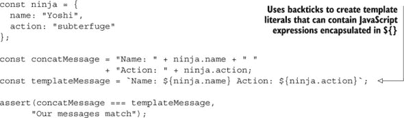
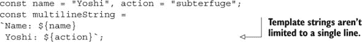
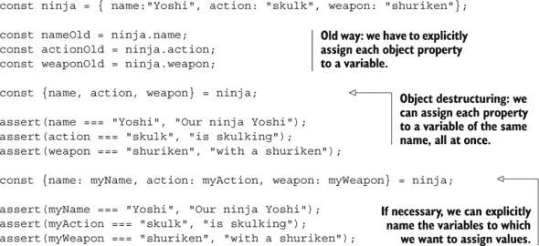
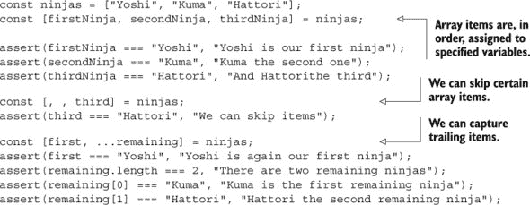
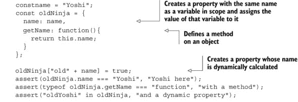
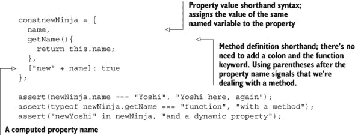

## 附录 A. ES6 新增特性

*本附录涵盖*

+   模板字符串

+   解构

+   对象字面量增强

本附录涵盖了一些“较小”的 ES6 特性，这些特性不适合放入前面的章节。*模板字符串*使字符串插值和多行字符串成为可能，*解构*使我们能够轻松地从对象和数组中提取数据，而*增强的对象字面量*则改进了与对象字面量的处理。

### 模板字符串

模板字符串是 ES6 的一个新特性，它使字符串操作比以前更加愉快。回想一下；你有多少次被迫写出像这样丑陋的东西？

```
const ninja = {
  name: "Yoshi",
  action: "subterfuge"
};

const concatMessage = "Name: " + ninja.name + " "
                    + "Action: " + ninja.action;
```

在这个例子中，我们必须构建一个包含动态插入数据的字符串。为了实现这一点，我们必须求助于一些混乱的连接。但不再是这样了！在 ES6 中，我们可以使用模板字符串达到相同的结果；只需看看下面的列表。

##### 列表 A.1\. 模板字符串



如您所见，ES6 提供了一种新的字符串类型，它使用反引号（`` ` ``），这种字符串可以包含占位符，用`${}`语法表示。在这些占位符内，我们可以放置任何 JavaScript 表达式：一个简单的变量、一个对象属性访问（就像我们用`ninja.action`做的那样），甚至函数调用。

当模板字符串被评估时，占位符会被替换为那些占位符内包含的 JavaScript 表达式的评估结果。

此外，模板字符串不仅限于单行（就像标准的双引号和单引号字符串那样），我们也没有什么阻止我们使它们成为多行的，如下面的列表所示。

##### 列表 A.2\. 多行模板字符串



现在我们已经为您简要介绍了模板字符串，让我们看看另一个 ES6 特性：解构。

### 解构

解构允许我们通过使用模式轻松地从对象和数组中提取数据。例如，假设你有一个你想要将其属性分配给几个变量的对象，如下面的列表所示。

##### 列表 A.3\. 解构对象



如列表 A.3 所示，使用对象解构，我们可以轻松地从对象字面量中提取多个变量，一次提取所有。考虑以下语句：

```
const {name, action, weapon} = ninja;
```

这创建了三个新变量（`name`、`action`和`weapon`），它们的值分别是语句右侧对象匹配属性的值（`ninja.name`、`ninja.action`和`ninja.weapon`，分别）。

当我们不想使用对象属性的名称时，我们可以对它们进行微调，如下面的语句所示：

```
const {name: myName, action: myAction, weapon: myWeapon} = ninja;
```

在这里，我们创建了三个变量（`myName`、`myAction`和`myWeapon`）并将指定的对象属性值分配给它们。

之前，我们提到过我们也可以解构数组，因为数组只是对象的一种特殊形式。看看下面的列表。

##### 列表 A.4\. 解构数组



解构数组与解构对象略有不同，主要在于语法，因为变量被括号包围（与用于对象解构的大括号相反），如下面的片段所示：

```
const [firstNinja, secondNinja, thirdNinja] = ninjas;
```

在这种情况下，第一个忍者`Yoshi`被分配给变量`firstNinja`。`Kuma`被分配给变量`secondNinja`。`Hattori`被分配给变量`thirdNinja`。

数组解构也有一些高级用法。例如，如果我们想跳过某些项，我们可以省略变量名，同时保留逗号，如下面的语句所示：

```
const [, , third] = ninjas;
```

在这种情况下，前两个忍者将被忽略，而第三个忍者`Hattori`的值将被分配给变量`third`。

此外，我们还可以只提取某些项，同时将剩余项分配给一个新数组：

```
const [first, ...remaining] = ninjas;
```

第一个项目，`Yoshi`，被分配给变量`first`，其余的忍者，`Kuma`和`Hattori`，被分配给新的数组`remaining`。注意，在这种情况下，剩余的项目与剩余参数（`...`运算符）的标记方式相同。

### 增强的对象字面量

关于 JavaScript 的伟大之处之一是其使用对象字面量创建对象的简便性：我们定义几个属性，并将它们放在大括号内，然后 voilà，我们就创建了一个新的对象。在 ES6 中，对象字面量语法增加了一些新扩展。让我们看一个例子。假设我们想创建一个`ninja`对象，并基于作用域内的变量值给它赋一个属性，一个动态计算名称的属性，以及一个方法，如下面的列表所示。

##### 列表 A.5：增强的对象字面量





此示例首先使用旧的预 ES6 对象字面量语法创建一个`oldNinja`对象：

```
const name = "Yoshi";
const oldNinja = {
  name: name,
  getName: function(){
    return this.name;
  }
};
oldNinja["old" + name] = true;
```

我们将此与增强的对象字面量进行对比，后者可以达到完全相同的效果，但语法更简洁：

```
const newNinja = {
  name,
  getName(){
    return this.name;
  },
  ["new" + name]: true
};
```

这完成了我们对 ES6 引入的重要新概念的探索。
