## 附录 B. 带上测试和调试的武装

*本附录涵盖*

+   调试 JavaScript 代码的工具

+   生成测试的技术

+   构建测试套件

+   概述一些流行的测试框架

本附录介绍了开发客户端网络应用的一些基本技术：调试和测试。构建有效的测试套件对于我们的代码始终很重要。毕竟，如果我们不测试我们的代码，我们怎么知道它是否按我们的意图运行呢？测试为我们提供了一种确保我们的代码不仅能够运行，而且能够正确运行的手段。

此外，尽管一个坚实的测试策略对于所有代码来说都很重要，但在外部因素有可能影响我们代码操作的情况下，它可能是至关重要的，这正是我们在跨浏览器 JavaScript 开发中所面临的情况。我们不仅面临着确保代码质量（尤其是在处理多个开发者共同维护的单一代码库时）的典型问题，还要防范可能导致 API 部分失效的回归（所有程序员都需要处理的通用问题），而且我们还有确定我们的代码在我们选择支持的浏览器中是否都能正常工作的问题。

在本章中，我们将探讨调试 JavaScript 代码的工具和技术，基于这些结果生成测试，并构建一个可靠的测试套件来运行这些测试。让我们开始吧。

### 网络开发者工具

很长一段时间，JavaScript 应用程序的开发受到了缺乏基本调试基础设施的限制。调试 JavaScript 代码的唯一方法是在代码中散布`alert`语句，这些语句会通知我们有关被警告表达式的值，这些语句散布在表现异常的代码周围。正如你可能想象的那样，这使得调试（几乎从来不是一项有趣的活动）变得更加困难。

幸运的是，Firefox 的一个扩展——Firebug，在 2007 年被开发出来。Firebug 在许多网络开发者心中占有特殊的位置，因为它是最早提供与最先进的集成开发环境（IDE）中的调试体验相匹配的工具之一，如 Visual Studio 或 Eclipse。此外，Firebug 还激发了为所有主要浏览器开发类似开发者工具的进程：包含在 Internet Explorer 和 Microsoft Edge 中的 F12 开发者工具；包含在 Safari 中的 WebKit Inspector；包含在 Firefox 中的 Firefox 开发者工具；以及包含在 Chrome 和 Opera 中的 Chrome DevTools。让我们稍微探索一下它们。

#### Firebug

Firebug，第一个高级网络应用调试工具，仅适用于 Firefox，可以通过按 F12 键（或在页面上任何位置右键单击并选择带有 Firebug 的“检查元素”）访问。您可以通过在 Firefox 中打开页面（[`getfirebug.com/`](https://getfirebug.com/)）并按照说明来安装 Firebug。图 B.1 展示了 Firebug。

##### 图 B.1\. 仅在 Firefox 中可用的 Firebug 是第一个针对网络应用的高级调试工具。

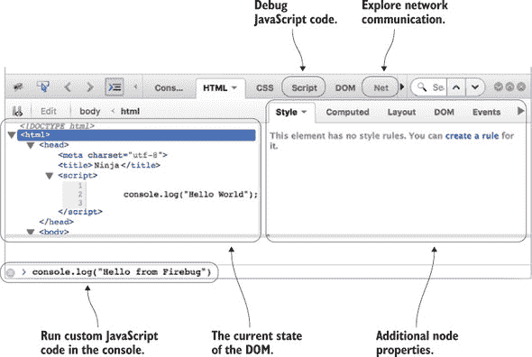

Firebug 提供了高级调试功能，其中一些功能甚至是由它首创的。例如，我们可以通过使用 HTML 选项卡（如图 B.1 所示的选项卡）轻松地探索 DOM 的当前状态，通过控制台（如图 B.1 底部所示）在当前页面的上下文中运行自定义 JavaScript 代码，通过脚本选项卡探索我们的 JavaScript 代码的状态，甚至可以通过网络选项卡探索网络通信。

#### Firefox 开发者工具

除了 Firebug 之外，如果你是 Firefox 用户，你可以使用内置的 Firefox DevTools，如图 B.2 所示。正如你所看到的，Firefox 开发者工具的外观和感觉与 Firebug 类似（除了某些细微的布局和标签差异；例如，Firebug 中的 HTML 选项卡在 Firefox 开发者工具中被称为检查器）。

##### 图 B.2\. 内置于 Firefox 的 Firefox 开发者工具提供了所有 Firebug 功能以及更多。

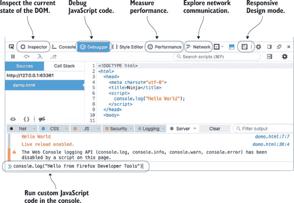

Firefox 开发者工具是由 Mozilla 团队构建的，他们通过引入一些额外的有用功能，利用了与 Firefox 的紧密集成。例如，性能选项卡提供了关于我们网络应用性能的详细洞察。此外，Firefox 开发者工具是以现代网络为设计理念的。例如，它们提供了响应式设计模式，这有助于我们探索不同屏幕尺寸下网络应用的外观和感觉——这是我们必须小心注意的，因为如今用户不仅从他们的电脑，还从移动设备、平板电脑甚至电视访问网络应用。

#### F12 开发者工具

如果你属于 Internet Explorer (IE) 阵营，你可能会很高兴地知道 IE 和 Microsoft Edge（IE 的继任者）提供了他们自己的开发者工具，即 F12 开发者工具。（快速猜测一下哪个键可以切换它们的开和关。）这些工具如图 B.3 所示。

##### 图 B.3\. 通过按 F12 键切换的 F12 开发者工具（在 Internet Explorer 和 Edge 中可用）。

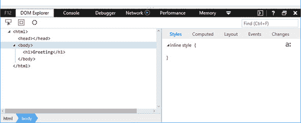

再次注意 F12 开发者工具和 Firefox 开发者工具之间的相似性（标签只有细微的差异）。F12 工具还使我们能够探索 DOM 的当前状态（DOM 探索器选项卡，图 B.3），通过控制台运行自定义 JavaScript 代码，调试我们的 JavaScript 代码（调试器选项卡），分析网络流量（网络），处理响应式设计（UI 响应性），以及分析性能和内存消耗（性能分析器和内存）。

#### WebKit 检查器

如果你是一名 OS X 用户，你可以使用 Safari 提供的 WebKit 检查器，如图 B.4 所示。尽管 Safari 的 WebKit 检查器的用户界面略有不同

##### 图 B.4\. 仅在 Safari 中可用的 WebKit 检查器

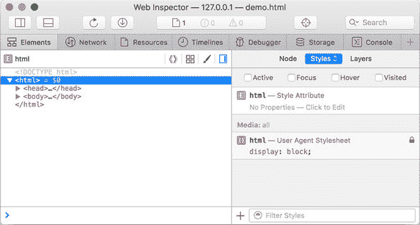

与 F12 开发者工具或 Firefox 的开发者工具相比，请放心，WebKit 检查器也支持所有重要的调试功能。

#### Chrome DevTools

我们将用 Chrome DevTools 完成我们对开发者工具的小调查——在我们看来，这是目前推动了许多创新的网络应用开发者工具的旗舰产品。如图 B.5（#app02fig05）所示，其基本用户界面和功能与其他开发者工具类似。

##### 图 B.5\. 可在 Chrome 和 Opera 中使用的 Chrome DevTools

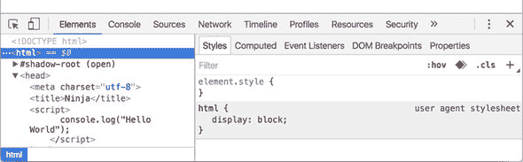

在整本书中，我们为了保持一致性，使用了 Chrome DevTools。但如您在本节中看到的，大多数开发者工具都提供了类似的功能（如果其中之一提供了新的功能，其他工具也会很快跟进）。您同样可以轻松地使用您选择的浏览器的开发者工具。

现在您已经了解了可用于调试代码的工具，让我们来探索一些调试技术。

### 调试代码

在软件开发过程中，很大一部分时间都花在移除烦人的错误上。虽然这有时可能很有趣，几乎像解决一个悬疑故事一样，但通常我们希望代码尽快正确无误且无错误。

调试 JavaScript 有两个重要的方面：

+   *记录*，它打印出代码运行时的状态

+   *断点*，它允许我们暂时暂停代码的执行并探索应用程序的当前状态

它们都用于回答重要的问题，“我的代码中发生了什么？”但每个都从不同的角度着手。让我们先从记录开始看。

#### 记录

*记录*语句用于在程序执行期间输出消息，而不会干扰程序的正常流程。当我们向代码中添加记录语句时（例如，使用 `console.log` 方法），我们可以在浏览器的控制台中看到消息。例如，如果我们想了解在程序执行的某些点上变量 `x` 的值，我们可能会编写如下列表。

##### 列表 B.1\. 在程序执行的各个点上记录变量 x 的值

```
  <!DOCTYPE html>
1: <html>
2:   <head>
3:    <title>Logging</title>
4:    <script>
5:      var x = 213;
6:      console.log("The value of x is: ", x);
7:
8:      x = "Hello " + "World";
9:      console.log("The value of x is now:", x);
10:   </script>
11:  </head>
12:  <body></body>
13:</html>
```

图 B.6 展示了在启用 JavaScript 控制台的情况下，在 Chrome 浏览器中执行此代码的结果。

##### 图 B.6\. 记录使我们能够看到代码运行时的状态。在这种情况下，我们可以看到从列表 B.1 的第 6 行记录了 213 的值，以及从第 9 行记录了“Hello World”。所有开发者工具，包括此处展示的 Chrome DevTools，都有一个用于记录的“控制台”标签页。

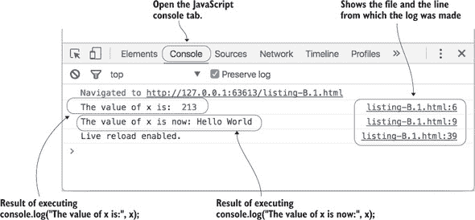

如您所见，浏览器将消息直接记录到 JavaScript 控制台，显示了记录的消息及其所在的行。

这是一个在程序执行的不同点记录变量值的简单示例。但通常，你可以使用日志记录来探索运行中的应用程序的各个方面，例如重要函数的执行、重要对象属性的更改或特定事件的发生。

当代码运行时，日志记录对于查看事物的状态是很好，但有时我们可能想要停止动作并四处看看。这就是断点的作用。

#### 断点

使用 *断点* 可能比日志记录更复杂，但它们有一个显著的优势：它们会在特定的代码行处暂停脚本的执行，使浏览器暂停。这允许我们在断点处悠闲地调查各种事物的状态。

假设我们有一个页面，它记录了对一位著名忍者的问候，如下所示。

##### 列表 B.2\. 一个简单的“问候忍者”页面

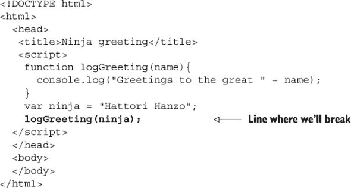

假设我们通过在列表 B.2 中调用 `logGreeting` 函数的注释行上使用 Chrome DevTools 设置断点（通过在调试器面板中点击行号空白处）并刷新页面来执行代码。然后调试器会在该行停止执行并显示 图 B.7 中的显示。

##### 图 B.7\. 当我们通过点击行空白处设置代码行的断点并加载页面时，浏览器会在执行该行之前停止执行 JavaScript 代码。然后你可以在右侧的面板中悠闲地探索应用程序的当前状态。

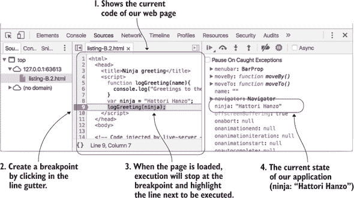

右侧的面板显示了我们的代码正在运行的应用程序的状态，包括 `ninja` 变量的值（`Hattori Hanzo`）。调试器在断点之前的行上中断；在这个例子中，调用 `logGreeting` 函数尚未执行。

#### 进入函数

如果我们正在尝试调试 `logGreeting` 函数的问题，我们可能想要 *进入* 该函数以查看其内部的情况。当我们的执行在 `logGreeting` 调用处暂停（我们之前设置的断点）时，我们点击 Step Into 按钮（在大多数调试器中显示为指向点的箭头）或按 F11，这将导致调试器执行到我们的 `logGreeting` 函数的第一行。图 B.8 显示了结果。

##### 图 B.8\. 进入函数让我们看到函数执行的新状态。我们可以通过研究调用堆栈和局部变量的当前值来探索当前位置。

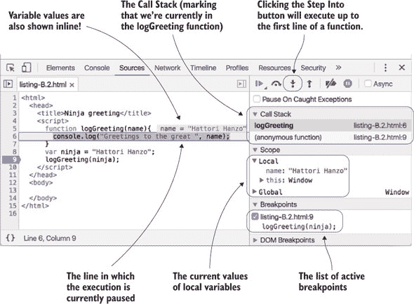

注意，Chrome DevTools 的外观略有变化（与图 B.7 相比）以允许我们探索 `logGreeting` 函数执行的应用程序状态。例如，现在我们可以轻松地探索 `logGreeting` 函数的局部变量，并看到我们有一个值为 `Hattori Hanzo` 的 `name` 变量（变量值甚至以内联方式显示，源代码在左侧）。此外，请注意右上角有一个调用堆栈面板，显示我们目前处于由全局代码调用的 `logGreeting` 函数中。

| |
| --- |

**单步执行和跳出**

除了“进入”命令外，我们还可以使用“单步执行”和“跳出”。

“单步执行”命令逐行执行我们的代码。如果执行行中的代码包含函数调用，调试器将跳过该函数（函数将被执行，但调试器不会跳入其代码）。

如果我们暂停了函数的执行，点击“跳出”按钮将执行函数中的代码直到结束，然后调试器将在执行离开该函数后再次暂停。

| |
| --- |

#### 条件断点

标准断点会在调试器每次达到程序执行中的特定点时停止应用程序执行。在某些情况下，这可能会很累。考虑以下列表。

##### 列表 B.3\. 计数忍者与条件断点

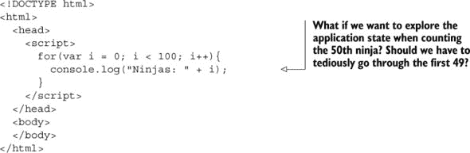

假设我们想要探索在计数第 50 个忍者的应用程序状态。在最终到达我们想要的忍者之前，访问所有 49 个忍者会有多累？

欢迎使用条件断点！与传统断点不同，每次断点所在的行被执行时，断点都会停止，而*条件断点*仅在关联的条件表达式满足时才会导致调试器中断。您可以通过在行号凹槽中右键单击并选择添加来设置条件断点（有关如何在 Chrome 中执行的操作，请参阅图 B.9）。

##### 图 B.9\. 在行号边缘右键单击以设置条件断点；注意这些断点以不同的颜色显示，通常是橙色。

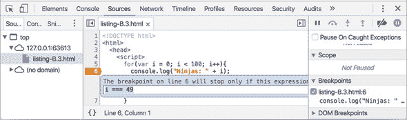

通过将表达式：`i == 49` 与条件断点关联，调试器只有在满足该条件时才会停止。这样，我们可以立即跳转到我们感兴趣的应用程序执行点，而忽略那些不太有趣的点。

到目前为止，你已经看到了如何使用不同浏览器的各种开发者工具来通过日志和断点调试我们的代码。这些都是伟大的工具，帮助我们定位特定的错误，并更好地理解特定应用程序的执行。但除此之外，我们还想建立一个基础设施，以便我们能够尽快检测到错误。这可以通过测试来实现。

### 创建测试

罗伯特·弗罗斯特写道：“好的篱笆能成为好的邻居”，但在网络应用的世界里，实际上在任何编程领域，好的测试能产生好的代码。注意对“好”这个词的强调。如果测试构建得不好，即使有一个庞大的测试套件，也可能对我们的代码质量毫无帮助。

好的测试表现出三个重要的特征：

+   ***可重复性—*** 我们测试的结果应该高度可重复。重复运行的测试应该始终产生完全相同的结果。如果测试结果是不确定的，我们如何知道哪些结果是有效的，哪些是无效的？此外，可重复性确保我们的测试不依赖于外部因素，例如网络或 CPU 负载。

+   ***简洁性—*** 我们的测试应该专注于测试**一个**事物。我们应该努力去除尽可能多的 HTML 标记、CSS 或 JavaScript，而不破坏测试用例的意图。我们去除的越多，测试用例受我们测试的具体代码影响的可能性就越大。

+   ***独立性—*** 我们的测试应该独立执行。我们必须避免使一个测试的结果依赖于另一个测试。将测试分解成尽可能小的单元将有助于我们在发生错误时确定错误的准确来源。

我们可以使用各种方法来构建测试。两种主要的方法是分解法和构建法：

+   ***分解测试用例—*** 现有代码被削减（分解）以隔离问题，消除与问题无关的任何内容。这有助于实现之前列出的三个特征。我们可能从一个完整的网站开始，但在去除额外的标记、CSS 和 JavaScript 之后，我们将到达一个较小的案例，可以重现问题。

+   ***构建测试用例—*** 我们从一个已知的好、简化的案例开始，直到我们能够重现所讨论的 bug。要使用这种测试风格，我们需要几个简单的测试文件来构建测试，以及一种使用我们代码的干净副本生成这些新测试的方法。

让我们看看构建测试的一个例子。

在创建简化测试用例时，我们可以从包含最小功能的一些 HTML 文件开始。我们甚至可能为不同的功能区域有不同的起始文件；例如，一个用于 DOM 操作，一个用于 Ajax 测试，一个用于动画，等等。

例如，以下列表显示了一个简单的 DOM 测试用例，用于测试 jQuery。

##### 列表 B.4\. jQuery 的简化 DOM 测试用例

```
<style>
  #test { width: 100px; height: 100px; background: red; }
</style>
<div id="test"></div>
<script src="dist/jquery.js"></script>
<script>
  $(document).ready(function() {
    $("#test").append("test");
  });
</script>
```

另一个选择是使用为创建简单测试用例而设计的预构建服务，例如 JSFiddle ([`jsfiddle.net/`](http://jsfiddle.net/))、CodePen ([`codepen.io/`](http://codepen.io/)) 或 JS Bin ([`jsbin.com/`](http://jsbin.com/))。它们都具有类似的功能；它们允许我们构建测试用例，这些测试用例在唯一的 URL 上可用。（你甚至可以包含流行库的副本。）JSFiddle 中的一个示例在 图 B.10 中显示。

##### 图 B.10\. JSFiddle 允许我们在沙盒中测试 HTML、CSS 和 JavaScript 片段的组合，以查看是否按预期工作。

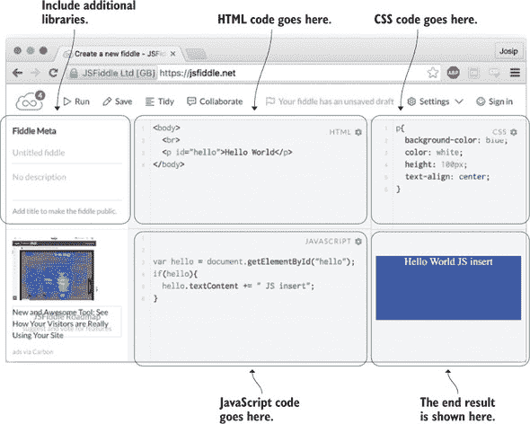

当我们需要快速测试某个概念时，使用 JSFiddle（或类似工具）既方便又实用，尤其是因为你可以轻松地与他人分享，甚至可能得到一些有用的反馈。不幸的是，运行此类测试需要你手动打开测试并检查其结果，如果你只有几个测试，这可能还不错，但通常我们应该有很多很多测试，检查我们代码的每一个角落和缝隙。因此，我们希望尽可能自动化我们的测试。让我们看看如何实现这一点。

### 测试框架的基本原理

测试框架的主要目的是让我们能够指定可以封装成单个单元的单独测试，以便它们可以批量运行，提供一个可以轻松且重复运行的单一资源。

为了更好地理解测试框架是如何工作的，查看它是如何构建的很有意义。也许令人惊讶的是，JavaScript 测试框架很容易构建。

然而，你可能会问，“我为什么要构建一个新的测试框架？” 对于大多数情况，编写自己的 JavaScript 测试框架并不是必要的，因为已经有很多高质量的框架可用（你很快就会看到）。但构建自己的测试框架可以作为一个很好的学习经历。

#### 断言

单元测试框架的核心是其断言方法，通常命名为 `assert`。此方法通常接受一个 *值*——一个前提被 *断言* 的表达式——以及断言目的的描述。如果该值评估为 `true`，则断言通过；否则，被视为失败。相关的消息通常与适当的通过/失败指示器一起记录。

这个概念的一个简单实现可以在以下列表中看到。

##### 列表 B.5\. 一个简单的 JavaScript 断言实现

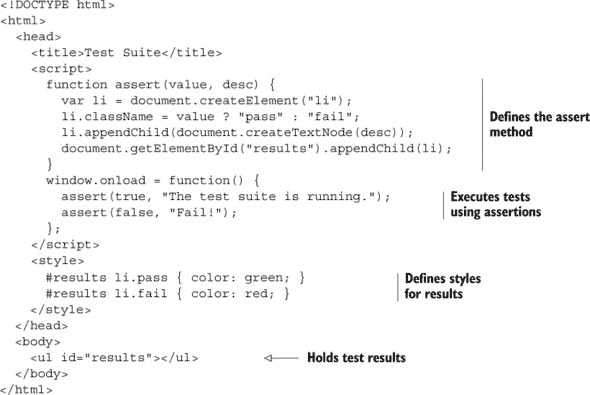

命名为 `assert` 的函数几乎出奇地简单。它创建一个新的 `<li>` 元素，包含描述，根据断言参数（`value`）的值分配一个名为 `pass` 或 `fail` 的类，并将新元素附加到文档体中的列表元素。

测试套件由两个简单的测试组成：一个总是成功，另一个总是失败：

```
assert(true, "The test suite is running."); //Will always pass
assert(false, "Fail!"); //Will always fail
```

对于 `pass` 和 `fail` 类的样式规则使用颜色直观地表示成功或失败。

在 Chrome 中运行我们的测试套件的结果显示在图 B.11 中。

##### 图 B.11\. 我们第一个测试套件运行的结果

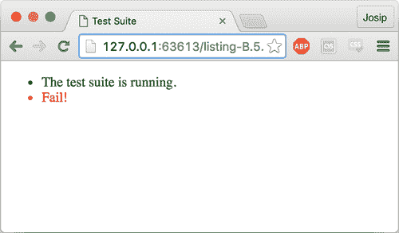

| |
| --- |

##### 提示

如果你需要快速的方法，可以使用内置的 `console.assert()` 方法（见图 B.12）。

##### 图 B.12\. 你可以使用内置的 `console.assert` 作为测试代码的快捷方式。只有当断言失败时，失败信息才会记录到控制台。

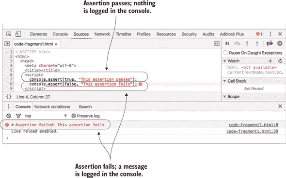

| |
| --- |

现在我们已经构建了自己的基础测试框架，让我们来认识一些广泛可用且更受欢迎的测试框架。

#### 流行的测试框架

一个测试框架应该是你开发工作流程的基本部分，因此你应该选择一个特别适合你的编码风格和代码库的框架。一个 JavaScript 测试框架应该满足单一需求：显示测试结果，并使确定哪些测试通过或失败变得容易。测试框架可以帮助我们达到这个目标，而无需担心除了创建测试并将它们组织成称为 *test suites* 的集合之外的其他任何事情。

根据测试的需求，我们可能在 JavaScript 单元测试框架中寻找几个功能。以下是一些可能的功能：

+   能够模拟浏览器行为（点击、按键等）

+   测试的交互式控制（暂停和恢复测试）

+   处理异步测试超时

+   能够过滤要执行哪些测试

让我们来认识目前最流行的两个测试框架：QUnit 和 Jasmine。

#### QUnit

QUnit 是最初为测试 jQuery 而构建的单元测试框架。它已经超越了最初的目标，现在是一个独立的单元测试框架。QUnit 主要设计为一个简单的单元测试解决方案，提供最小但易于使用的 API。QUnit 的独特特性如下：

+   简单的 API

+   支持异步测试

+   不仅限于 jQuery 或使用 jQuery 的代码

+   特别适合回归测试

让我们看看以下列表中的 QUnit 测试示例，该示例测试我们是否开发了一个能够准确地对忍者说“Hi”的函数。

##### 列表 B.6\. QUnit 测试示例

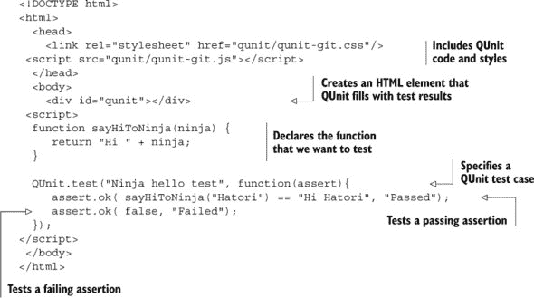

当你在浏览器中打开此示例时，你应该得到图 B.13 中显示的结果，其中有一个通过断言来自执行 `sayHiToNinja("Hatori")` 行，还有一个失败的断言来自 `assert.ok(false, "Failed")`。

##### 图 B.13\. QUnit 测试运行的一个示例。作为我们测试的一部分，我们有一个通过和一个失败的断言（两个断言中有一个通过，一个失败。）显示的结果对失败的测试给予了更大的关注，以确保我们尽快修复它。

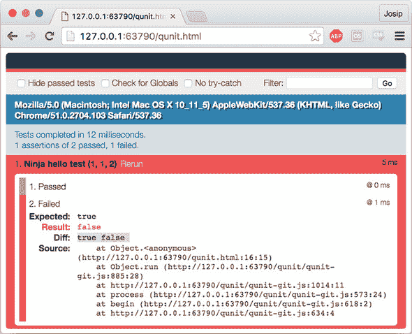

关于 QUnit 的更多信息可以在 [`qunitjs.com/`](http://qunitjs.com/) 找到。

#### Jasmine

Jasmine 是另一个流行的测试框架，其构建基础与 QUnit 略有不同。框架的主要部分如下：

+   `describe` 函数，用于描述测试套件

+   `it` 函数，用于指定单个测试

+   `expect` 函数，用于检查单个断言

这些函数的组合和命名旨在使测试套件几乎具有对话性质。例如，以下列表展示了如何使用 Jasmine 测试 `sayHiToNinja` 函数。

##### 列表 B.7\. Jasmine 测试示例

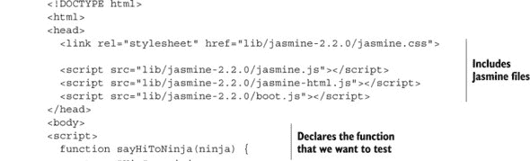

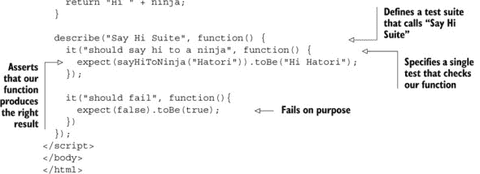

在浏览器中运行此 Jasmine 测试套件的结果如图 B.14 所示。

##### 图 B.14\. 在浏览器中运行 Jasmine 测试套件的结果。我们有两个测试：一个通过和一个失败（两个规范，一个失败）。

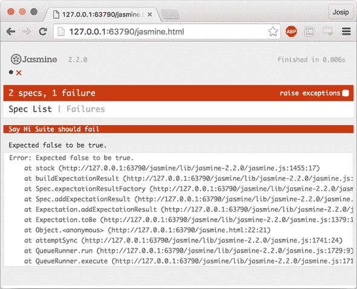

关于 Jasmine 的更多信息可以在 [`jasmine.github.io/`](http://jasmine.github.io/) 找到。

#### 测量代码覆盖率

要说清楚什么使一个特定的测试套件**良好**是很困难的。理想情况下，我们应该测试我们程序的所有可能的执行路径。不幸的是，除了最简单的情况外，这是不可能的。朝着正确方向迈出的一步是尝试测试尽可能多的代码，而衡量测试套件覆盖我们代码程度的指标被称为**代码覆盖率**。

例如，如果一个测试套件的代码覆盖率是 80%，这意味着我们的程序代码中有 80% 被测试套件执行，而 20% 的代码没有被执行。尽管我们无法完全确定这 80% 的代码中没有错误（我们可能遗漏了导致错误的执行路径），但我们对于那 20% 没有被执行的代码一无所知。这就是为什么我们应该衡量测试套件的代码覆盖率。

在 JavaScript 开发中，我们可以使用几个库来测量测试套件的覆盖率，最著名的是 Blanket.js ([`github.com/alex-seville/blanket`](https://github.com/alex-seville/blanket)) 和 Istanbul ([`github.com/gotwarlost/istanbul`](https://github.com/gotwarlost/istanbul))。设置这些库超出了本书的范围，但它们的相应网页提供了我们可能需要的所有关于正确设置它们的信息。
