## 第一部分. 介绍 SPA

在阅读这一页的时间里，将有 3500 万人分钟的时间被花费在等待传统网站页面加载上。这足以让好奇号飞往火星并返回 96 次。传统网站的生产力成本令人震惊，对企业来说可能是毁灭性的。一个慢速的网站可能会让用户离开你的网站——并进入那些微笑着欢迎竞争对手的口袋。

传统网站速度慢的一个原因是流行的 MVC 服务器框架专注于向一个本质上无知的客户端连续提供一页又一页的静态内容。例如，当我们点击传统网站幻灯片中的一条链接时，屏幕会闪白，并在几秒钟内重新加载：导航、广告、标题、文本和页脚都会再次渲染。然而，唯一改变的是幻灯片图片，也许还有描述文本。更糟糕的是，没有指示器表明页面上的某些元素何时变得可用。例如，有时一个链接可以在它出现在网页上时立即点击；而其他时候，我们必须等待重绘完成 100%加上五秒钟。这种缓慢、不一致且笨拙的体验对于一个日益复杂的 Web 消费者来说变得越来越无法接受。

准备学习另一种——我们甚至可以说更好的——开发 Web 应用的方法，即单页 Web 应用（SPA）。SPA 在浏览器中提供桌面应用。结果是高度响应式的体验，它让用户感到惊喜和愉悦，而不是困惑和烦恼。在第一部分中，我们了解到：

+   什么是单页应用以及它相较于传统网站的优势

+   如何使用 SPA 方法使我们的 Web 应用变得更加响应和吸引人

+   如何提高我们的 JavaScript 技能以进行 SPA 开发

+   如何构建一个示例 SPA

产品设计越来越被视为商业和企业级 Web 应用成功的关键因素。SPA 通常是提供最佳用户体验的最佳选择。因此，我们预计以用户为中心的设计需求将推动 SPA 的采用和复杂化。

## 第一章. 我们的第一个单页应用

|  |
| --- |

**本章涵盖**

+   定义单页 Web 应用

+   比较最流行的单页应用平台——Java、Flash 和 JavaScript

+   编写我们的第一个 JavaScript 单页应用

+   使用 Chrome 开发者工具检查应用

+   探索单页应用的用户优势

|  |
| --- |

本书面向至少具备一些 JavaScript、HTML 和 CSS 经验的 Web 开发者、架构师和产品经理。如果你从未涉足过 Web 开发，这本书**并不适合**你，尽管你仍然可以购买它（快去，爸爸需要一辆新车）。市面上有许多书籍都出色地教授初学者网站开发和设计，但这本书并不属于此类。

本书 *确实* 致力于成为使用 JavaScript 从头到尾设计和构建大规模单页网络应用（SPA）的指南。事实上，正如 图 1.1 所描绘的，我们使用 JavaScript 作为数据库、网络服务器 *以及* 浏览器应用的语言。

##### 图 1.1\. JavaScript 从头到尾

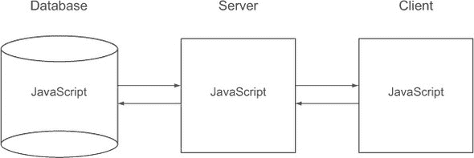

我们在过去六年中一直领导着众多大规模商业和企业级 SPA 的发展。在这段时间里，我们不断更新我们的实践以应对遇到的挑战。我们将这些实践分享在这本书中，因为它们帮助我们更快地开发、提供更好的用户体验、确保质量和改进团队沟通。

### 1.1\. 定义、一点历史和一些重点

单页应用（SPA）是一种在浏览器中交付的应用，使用过程中不会重新加载页面。像所有应用一样，它的目的是帮助用户完成一项任务，例如“撰写文档”或“管理网络服务器”。我们可以将 SPA 视为从网络服务器加载的胖客户端。

#### 1.1.1\. 一点历史

单页应用（SPA）已经存在很长时间了。让我们看看一些早期的例子：

+   *井字棋*—[`rintintin.colorado.edu/~epperson/Java/TicTacToe.html`](http://rintintin.colorado.edu/~epperson/Java/TicTacToe.html)。嘿，我们并没有说这会很好看。这个应用挑战我们与一个强大而冷酷的电脑对手在井字棋游戏中一较高下。需要 Java 插件——请参阅 [`www.java.com/en/download/index.jsp`](http://www.java.com/en/download/index.jsp)。您可能需要授予浏览器运行此小程序的权限。

+   *Flash 空间人*—[`games.whomwah.com/spacelander.html`](http://games.whomwah.com/spacelander.html)。这是 Duncan Robertson 大约在 2001 年编写的一个早期 Flash 游戏。需要 Flash 插件——请参阅 [`get.adobe.com/flashplayer/`](http://get.adobe.com/flashplayer/)。

+   *JavaScript 贷款计算器*—[`www.mcfedries.com/creatingawebpage/mortgage.htm`](http://www.mcfedries.com/creatingawebpage/mortgage.htm)。这个计算器似乎和 JavaScript 一样古老，但它运行得很好。*不需要插件。*

精明的读者——甚至是一些粗心大意的读者^([1])——会注意到我们提供了三个最受欢迎的单页应用（SPA）平台的例子：Java 小程序、Flash/Flex 和 JavaScript。同样的读者可能还会注意到，*只有 JavaScript SPA 在使用过程中不需要第三方插件的额外开销或安全担忧。*

> ¹ 如果您在吃胸前的薯片时阅读这一章，您就是粗心大意的。

今天，JavaScript SPA 通常是最好的选择之一。但 JavaScript 在大多数 SPA 应用中需要一段时间才能变得具有竞争力，甚至变得可行。让我们看看为什么。

#### 1.1.2\. 为什么 JavaScript SPA 用了这么久才出现？

Flash 和 Java 小程序到 2000 年已经发展得很好。Java 被用来通过浏览器提供复杂的应用程序，甚至是一个完整的办公套件.^([2]) Flash 已经成为提供丰富浏览器游戏和后来视频的平台。另一方面，JavaScript 仍然主要被限制在抵押贷款计算器、表单验证、悬停效果和弹出窗口等小应用中。问题是，我们无法依赖 JavaScript（或它使用的渲染方法）在流行的浏览器上提供一致的关键功能。尽管如此，JavaScript SPA 承诺在 Flash 和 Java 之上提供许多诱人的优势：

> ² Applix (VistaSource) Anywhere Office

+   *无需插件*—用户无需担心插件的安装、维护和操作系统兼容性问题即可访问应用程序。开发者也不必担心单独的安全模型，这可以减少开发和维护的烦恼.^([3])

    > ³ 你能说出“同源策略”吗？如果你曾经用 Flash 或 Java 进行过开发，你几乎肯定熟悉这个挑战。

+   *减少冗余*—使用 JavaScript 和 HTML 的 SPA 应该比需要额外运行时环境的插件使用显著更少的资源。

+   *单一客户端语言*—网络架构师和大多数开发者必须了解许多语言和数据格式—HTML、CSS、JSON、XML、JavaScript、SQL、PHP/Java/Ruby/Perl 等等。为什么要在我们的页面上用 Java 编写小程序，或者用 ActionScript 编写 Flash 应用程序，当我们已经在其他地方使用 JavaScript 呢？在客户端使用单一编程语言是一种减少复杂性的好方法。

+   *更流畅和互动的页面*—我们都见过网页上的 Flash 或 Java 应用程序。通常，应用程序显示在某个地方的框中，许多细节与围绕它的 HTML 元素不同：图形小部件不同，右键单击不同，声音不同，与页面的其他部分的交互有限。使用 JavaScript SPA，整个浏览器窗口就是应用程序界面。

随着 JavaScript 的成熟，其大多数弱点要么已被修复，要么得到了缓解，其优势的价值也增加了：

+   *网页浏览器是世界上最广泛使用的应用程序*—许多人始终打开浏览器窗口，并全天使用它。访问 JavaScript 应用程序只需多点击一个书签即可。

+   *浏览器中的 JavaScript 是全球最广泛分布的执行环境之一*—到 2011 年 12 月，每天有近一百万台 Android 和 iOS 移动设备被激活。这些设备都内置了强大的 JavaScript 执行环境。在过去三年中，全球已发货超过十亿的强大 JavaScript 实现，这些实现被用于手机、平板电脑、笔记本电脑和台式计算机。

+   *JavaScript 的部署非常简单*——一个 JavaScript 应用程序可以通过托管在 HTTP 服务器上，向超过十亿的网页用户提供服务。

+   *JavaScript 对于跨平台开发非常有用*——现在我们可以使用 Windows、Mac OS X 或 Linux 创建 SPAs，并且我们可以将单个应用程序部署到所有桌面机器上，以及平板电脑和智能手机。我们可以感谢浏览器之间标准实现的趋同，以及像 jQuery 和 PhoneGap 这样的成熟库，它们平滑了不一致性。

+   *JavaScript 意外地快，有时甚至可以与编译型语言相媲美*——其加速得益于 Mozilla Firefox、Google Chrome、Opera 和 Microsoft 之间持续的激烈竞争。现代 JavaScript 实现享受着高级优化，如 JIT 编译到原生机器代码、分支预测、类型推断和多线程.^([4])

    > ⁴ 请参阅 [`iq12.com/blog/as3-benchmark/`](http://iq12.com/blog/as3-benchmark/) 和 [`jacksondunstan.com/articles/1636`](http://jacksondunstan.com/articles/1636)，了解与 Flash ActionScript 3 的比较。

+   *JavaScript 已经发展出了高级功能*——这些功能包括原生 JSON 对象、原生 jQuery 风格的选择器以及更一致的 AJAX 功能。使用成熟的库如 Strophe 和 Socket.IO，推送消息变得容易得多。

+   *HTML5、SVG 和 CSS3 标准和支持已经取得了进步*——这些进步使得可以渲染出像素级的图形，其速度和质量可以与 Java 或 Flash 相媲美。

+   *JavaScript 可以在整个 Web 项目中使用*——现在我们可以使用出色的 Node.js Web 服务器和像 CouchDB 或 MongoDB 这样的数据存储，它们都使用 JSON，这是一种 JavaScript 数据格式。我们甚至可以在服务器和浏览器之间共享库。

+   *桌面、笔记本电脑甚至移动设备都变得更加强大*——多核处理器的普遍性和数 GB 的 RAM 意味着以前在服务器上完成的处理现在可以分配到客户端浏览器。

由于这些优势，JavaScript SPAs 正变得越来越受欢迎，对经验丰富的 JavaScript 开发人员和架构师的需求也在不断增长。曾经为许多操作系统（或 Java 或 Flash）开发的应用程序现在正以单个 JavaScript SPA 的形式交付。初创公司已经将 Node.js 作为首选的 Web 服务器，而移动应用开发者正在使用 JavaScript 和 PhoneGap，通过单一代码库为多个移动平台创建“原生”应用程序。

JavaScript 并不完美，我们不必走得太远就能找到遗漏、不一致和其他不喜欢的方面。但这是所有语言的共性。一旦你熟悉了其核心概念，遵循最佳实践，并了解哪些部分需要避免，JavaScript 开发可以变得愉快且富有成效。

|  |
| --- |

**生成的 JavaScript：一个目的地，两条路径**

我们发现直接使用 JavaScript 开发 SPA 更容易。我们称之为*原生*JavaScript SPA。另一种出人意料地受欢迎的方法是使用*生成*JavaScript，其中开发者用另一种语言编写代码，然后将其转换为 JavaScript。这种转换发生在运行时或单独的生成阶段。显著的 JavaScript 生成器包括：

+   *Google Web Toolkit (GWT)*—见[`code.google.com/webtoolkit/`](http://code.google.com/webtoolkit/)。GWT 将 Java 代码生成 JavaScript。

+   *Cappuccino*—见[`cappuccino.org/`](http://cappuccino.org/)。Cappuccino 使用 Objective-J，这是 Mac OS X 中 Objective-C 语言的克隆。Cappuccino 本身是 Cocoa 应用程序框架的移植，同样来自 OS X。

+   *CoffeeScript*—见[`coffeescript.org/`](http://coffeescript.org/)。CoffeeScript 将一种提供一些语法糖的自定义语言转换为 JavaScript。

由于谷歌使用 GWT（Google Web Toolkit）为 Blogger、Google Groups 以及许多其他网站提供服务，我们可以安全地说，生成的 JavaScript SPA 被广泛使用。这引发了一个问题：*为什么要在一种高级语言中编写代码，然后再将其转换为另一种语言*？以下是一些生成 JavaScript 仍然受欢迎的原因，以及为什么这些原因不像以前那样有说服力：

+   *熟悉性*—开发者可以使用更熟悉或更简单的语言。生成器和框架允许他们在不学习 JavaScript 的复杂性情况下进行开发。问题是，翻译过程中最终会丢失一些东西。当这种情况发生时，开发者必须检查生成的 JavaScript 并理解它，以便正确地完成工作。我们觉得直接在 JavaScript 中工作比通过语言抽象层工作更有效。

+   *框架*—开发者欣赏 GWT 提供的为服务器和客户端构建的匹配库的统一系统。这是一个有说服力的论点，尤其是如果团队已经拥有大量专业知识和正在生产中的产品。

+   *多个目标*—开发者可以让生成器为多个目标编写代码，例如为 Internet Explorer 编写一个文件，为世界上其他浏览器编写另一个文件。虽然为不同的目标生成代码听起来不错，但我们认为部署单一 JavaScript 源代码给所有浏览器使用更为有效。多亏了浏览器实现的趋同以及成熟的跨浏览器库如 jQuery，现在编写一个无需修改即可在所有主要浏览器上运行的复杂 SPA（单页应用）变得容易得多。

+   *成熟度*——开发者认为 JavaScript 在大型应用开发中结构不足。然而，JavaScript 已经发展成为一个更好的语言，具有令人印象深刻的优点和可管理的缺点。来自强类型语言（如 Java）的开发者有时会感到缺乏类型安全是不可原谅的。而一些来自包容性框架（如 Ruby on Rails）的开发者则哀叹明显的结构缺失。幸运的是，我们可以通过代码验证工具、代码标准和成熟库的使用来缓解这些问题。

我们认为原生 JavaScript SPA 通常是今天更好的选择。这正是我们在本书中设计和构建的内容。

| |
| --- |

#### 1.1.3\. 我们的关注点

本书展示了如何使用 JavaScript 从头到尾开发引人入胜、健壮、可扩展和可维护的单页应用程序（SPAs）。^([5]) 除非另有说明，从现在起当我们提到 SPA 时，我们指的是原生 JavaScript SPA，其中业务和表示逻辑直接用 JavaScript 编写并由浏览器执行。这种 JavaScript 使用 HTML5、CSS3、Canvas 或 SVG 等技术渲染界面。

> ⁵ 这本书的另一个标题可能是 *使用最佳实践构建单页 Web 应用程序*。但这样似乎太冗长了。

SPAs 可以使用任何数量的服务器技术。由于大量网络应用迁移到浏览器，服务器需求通常显著减少。图 1.2 说明了业务逻辑和 HTML 生成如何从服务器迁移到客户端。

##### 图 1.2\. 数据库、服务器和客户端的责任

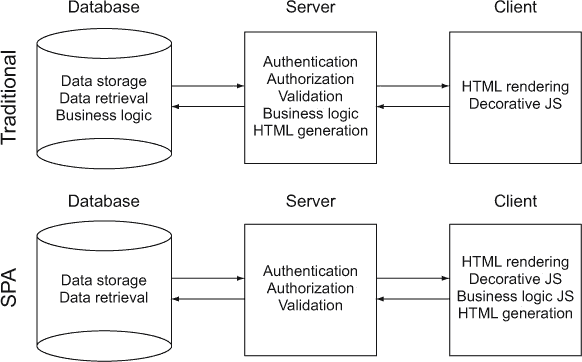

我们在第七章和第八章中关注后端，在那里我们使用 JavaScript 作为控制语言的网络服务器和数据库。你可能没有这样的选择，或者可能更喜欢不同的后端。没关系——本书中使用的绝大多数 SPA 概念和技术无论你使用什么后端技术都能很好地工作。但如果你想要使用端到端的 JavaScript，我们为你提供了解决方案。

我们的客户端库包括用于 DOM 操作的 jQuery，以及用于历史管理和事件处理的插件。我们使用 TaffyDB2 提供高性能、以数据为中心的模型。Socket.IO 在 Web 服务器和客户端之间提供无缝的近实时消息传递。在服务器上，我们使用 Node.js 作为基于事件的网络服务器。Node.js 使用 Google V8 JavaScript 引擎，擅长处理数万个并发连接。我们还在 Web 服务器上使用 Socket.IO。我们的数据库是 MongoDB，这是一个使用 JavaScript 原生数据格式 JSON 存储数据的 NoSQL 数据库，它还具有 JavaScript API 和命令行界面。所有这些都是经过验证且流行的解决方案。

与传统的网站相比，SPA 开发需要更大规模的 JavaScript 编码，因为大部分应用程序逻辑从服务器移动到浏览器。单个 SPA 的开发可能需要许多开发者同时编码，并可能导致超过 10 万行代码。以前为服务器端开发保留的惯例和纪律现在在这个规模上变得必不可少。另一方面，服务器软件被简化，并降级为身份验证、验证和数据服务。在我们继续举例时，请记住这一点。

### 1.2\. 构建我们的第一个 SPA

现在是时候开发一个 SPA 了。我们将使用最佳实践，并在进行中解释它们。

#### 1.2.1\. 定义目标

我们第一个 SPA 的目标是提供一个位于浏览器窗口右下角的聊天滑块，类似于你在 Gmail 或 Facebook 上可能看到的一个。当我们加载应用程序时，滑块将被收起；当我们点击滑块时，它将展开，如图 1.3 所示。再次点击将收起它。

##### 图 1.3\. 聊天滑块的收起和展开

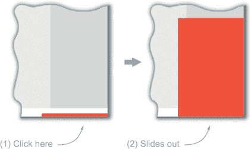

SPAs 通常除了打开和关闭聊天滑块之外，还会做许多其他事情——比如发送和接收聊天消息。为了使这个介绍相对简单和简短，我们将省略这些烦人的细节。用一句名言来歪曲，一天之内是无法征服 SPAs 的。不必担心，我们将在第六章和第八章中回到发送和检索消息。

在接下来的几节中，我们将为 SPA 开发设置一个文件，介绍一些我们最喜欢的工具，开发聊天滑块的代码，并强调一些最佳实践。我们在这里给了你很多要吸收的东西，并不期望你现在就能理解一切——尤其是我们使用的某些 JavaScript 技巧。在接下来的几章中，我们将对每个这些主题有更多要说的，但现在，放松，不要为小事烦恼，了解这片土地的情况。

#### 1.2.2\. 开始文件结构

我们将在一个文件 spa.html 中创建我们的应用程序，只使用 jQuery 作为我们的一个外部库。通常，最好为 CSS 和 JavaScript 使用单独的文件，但从一个文件开始对于开发和示例来说很方便。我们首先定义我们将放置样式和 JavaScript 的位置。我们还将添加一个`<div>`容器，我们的应用程序将在这里写入 HTML 实体，如图 1.1 所示：

##### 列表 1.1\. 浅尝辄止——spa.html

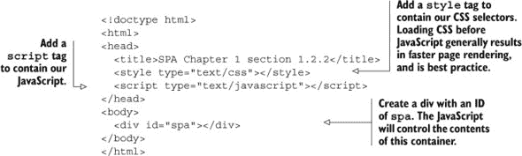

现在我们有了准备好的文件，让我们设置 Chrome 开发者工具来检查应用程序的当前状态。

#### 1.2.3\. 设置 Chrome 开发者工具

让我们使用 Google Chrome 打开我们的列表——spa.html。我们应该看到一个空白的浏览器窗口，因为我们还没有添加任何内容。但是，在幕后正在进行活动。让我们使用 Chrome 开发者工具来检查它们。

我们可以通过点击 Chrome 右上角的扳手图标，选择工具，然后开发者工具（菜单 > 工具 > 开发者工具）来打开 Chrome 开发者工具。这将显示开发者工具，如图 1.4 所示。如果我们看不到 JavaScript 控制台，我们可以通过点击左下角的激活控制台按钮来显示它。控制台应该是空的，这意味着我们没有 JavaScript 警告或错误。这是好的，因为我们目前没有 JavaScript。控制台上方的元素部分显示了我们的页面 HTML 和结构。

##### 图 1.4\. Google Chrome 开发者工具

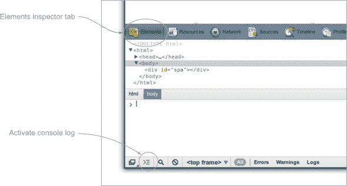

虽然我们在本书中使用了 Chrome 开发者工具，但其他浏览器也有类似的功能。例如，Firefox 有 Firebug，而 IE 和 Safari 都提供了自己的开发者工具版本。

当我们在本书中呈现列表时，我们通常会使用 Chrome 开发者工具来确保我们的 HTML、CSS 和 JavaScript 都能很好地协同工作。现在让我们创建我们的 HTML 和 CSS。

#### 1.2.4\. 开发 HTML 和 CSS

我们需要在 HTML 中添加一个单独的聊天滑块容器。让我们从在 spa.html 文件的 `<style>` 部分中设置容器样式开始。以下列表显示了 `<style>` 部分的调整：

##### 列表 1.2\. HTML 和 CSS—spa.html

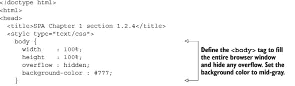

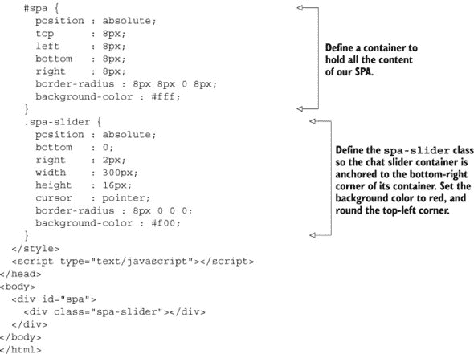

当我们在浏览器中打开 spa.html 时，我们应该看到滑块收起，如图 1.5 所示。我们使用的是液体布局，其中界面适应显示大小，滑块始终锚定在右下角。我们没有为我们的容器添加边框，因为它们会增加容器宽度，可能会阻碍开发，因为我们必须调整容器大小以适应这些边框。在创建和验证基本布局之后添加边框很方便，就像我们在后面的章节中所做的那样。

##### 图 1.5\. 聊天滑块收起—spa.html

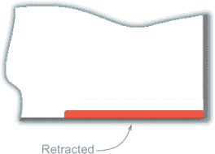

现在我们已经放置了视觉元素，是时候使用 JavaScript 使页面交互了。

#### 1.2.5\. 添加 JavaScript

我们希望在我们的 JavaScript 中采用最佳实践。一个将有所帮助的工具是 Douglas Crockford 编写的 *JSLint*。JSLint 是一个 JavaScript 验证器，确保我们的代码不会违反许多合理的 JavaScript 最佳实践。我们还希望使用 *jQuery*，这是由 John Resig 编写的文档对象模型 (DOM) 工具包。jQuery 提供了简单的跨浏览器工具，可以轻松实现滑块动画。

在我们开始编写 JavaScript 之前，让我们概述一下我们想要做什么。我们的第一个脚本标签将加载 jQuery 库。我们的第二个脚本标签将包含 *我们的* JavaScript，我们将将其分为三个部分：

1.  一个声明我们 JSLint 设置的标题。

1.  一个名为 `spa` 的函数，用于创建和管理聊天滑块。

1.  一条在浏览器文档对象模型 (DOM) 准备就绪时启动 `spa` 函数的行。

让我们更仔细地看看 `spa` 函数需要做什么。根据经验，我们知道我们想要一个声明模块变量和包含配置常数的部分。我们需要一个切换聊天滑块的功能。我们还需要一个接收用户点击事件并调用切换函数的功能。最后，我们需要一个初始化应用程序状态的功能。让我们更详细地绘制一个大纲：

##### 列表 1.3\. JavaScript 开发，第一次遍历——spa.html

```
/* jslint settings */

// Module /spa/
// Provides chat slider capability
  // Module scope variables
    // Set constants
    // Declare all other module scope variables

  // DOM method /toggleSlider/
  // alternates slider height

  // Event handler /onClickSlider/
  // receives click event and calls toggleSlider

  // Public method /initModule/
  // sets initial state and provides feature
    // render HTML
    // initialize slider height and title
    // bind the user click event to the event handler

// Start spa once DOM is ready
```

这是一个良好的开始！让我们保持注释不变，并添加我们的代码。我们为了清晰起见，将注释用粗体表示。

##### 列表 1.4\. JavaScript 开发，第二次遍历——spa.html

```
/* jslint settings */
// Module /spa/
// Provides chat slider capability
//
var spa = (function ( $ ) {
  // Module scope variables
  var
    // Set constants
    configMap = { },
    // Declare all other module scope variables
     $chatSlider,
     toggleSlider, onClickSlider, initModule;

   // DOM method /toggleSlider/
   // alternates slider height
   //
   toggleSlider = function () {};

   // Event handler /onClickSlider/
   // receives click event and calls toggleSlider
   //
   onClickSlider = function ( event ) {};

   // Public method /initModule/
   // sets initial state and provides feature
   //
   initModule = function ( $container ) {
      // render HTML
      // initialize slider height and title
      // bind the user click event to the event handler
   };
 }());

 // Start spa once DOM is ready
```

现在，让我们再次审视 spa.html，如 列表 1.5 所示。我们加载 jQuery 库，然后包含我们自己的 JavaScript，其中包含我们的 JSLint 设置、`spa` 模块以及一条在 DOM 准备就绪后启动模块的命令。`spa` 模块现在完全可用。如果你一开始没有完全理解，不要担心——这里有很多内容，我们将在接下来的章节中更详细地介绍。这只是一个例子，展示你可以做什么：

##### 列表 1.5\. JavaScript 开发，第三次遍历——spa.html

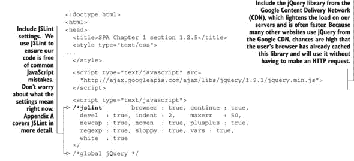

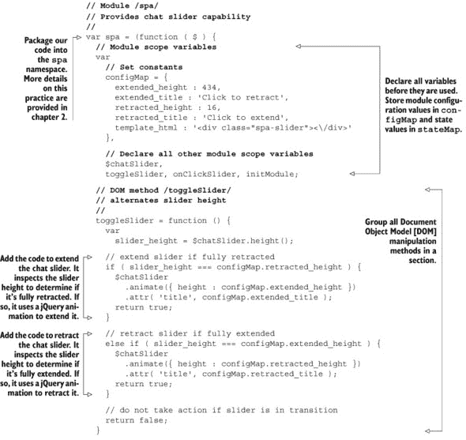

不要过于担心 JSLint 验证，我们将在接下来的章节中详细说明其用法。但现在，我们将介绍一些值得注意的概念。首先，脚本顶部的注释设置了我们的验证偏好。其次，这个脚本和设置没有错误或警告地通过了验证。最后，JSLint 要求在函数使用之前声明它们，因此脚本从下到上读取，最高级别的函数在最后。

我们使用 jQuery，因为它为基本的 JavaScript 功能提供了优化且跨浏览器的实用工具：DOM 选择、遍历和操作；AJAX 方法；以及事件。例如，jQuery 的 `$(selector).animate(...)` 方法提供了一种简单的方式来执行其他情况下相当复杂的事情：在指定的时间内将聊天滑块的长度从收缩状态动画到扩展状态（反之亦然）。这种运动开始缓慢，加速，然后减速至停止。这种类型的运动——称为 *缓动*——需要了解帧率计算、三角函数以及在不同流行浏览器中的实现细节。如果我们自己编写，将需要数十行额外的代码。

`$jQuery(document).ready(function)` 也为我们节省了很多工作。它只在实际可以操作 DOM 之后才运行函数。传统上，我们使用 `window.onload` 事件来做这件事。由于各种原因，`window.onload` 对于更复杂的前端应用（SPAs）来说并不是一个高效的解决方案——尽管在这里影响不大。但是，编写适用于所有浏览器的正确代码是痛苦且冗长的.^([6])

> ⁶参见[www.javascriptkit.com/dhtmltutors/domready.shtml](http://www.javascriptkit.com/dhtmltutors/domready.shtml)以体验痛苦。

如前例所示，jQuery 的好处通常远远超过其成本。在这种情况下，它缩短了我们的开发时间，减少了脚本长度，并提供了强大的跨浏览器兼容性。使用它的成本介于低和可忽略之间，因为它的库在最小化时很小，而且用户可能已经在他们的设备上缓存了它。图 1.6 显示了完成的聊天滑块。

##### 图 1.6. 完成的聊天滑块在 spa.html 中的动作

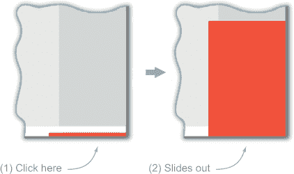

现在我们已经完成了聊天滑块的第一种实现，让我们看看应用程序实际上是如何使用 Chrome 开发者工具工作的。

#### 1.2.6. 使用 Chrome 开发者工具检查我们的应用程序

如果你熟悉使用 Chrome 开发者工具，你可以跳过这一部分。如果不熟悉，我们强烈建议你在家里尝试。

让我们打开我们的文件 spa.html，在 Chrome 中。加载后，让我们立即打开开发者工具（菜单 > 工具 > 开发者工具）。

你可能首先注意到的是，我们的模块如何将 DOM 改变以包含`<div class="spa-slider" ... >`元素，如图 1.7 所示。随着我们继续，我们的应用程序将添加更多类似这样的动态元素。

##### 图 1.7. 检查元素—spa.html

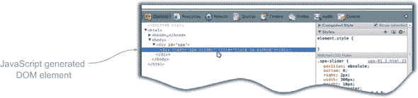

我们可以通过点击开发者工具顶部菜单中的“源”按钮来探索 JavaScript 执行。然后选择包含 JavaScript 的文件，如图 1.8 所示。

##### 图 1.8. 选择源文件—spa.html


在后面的章节中，我们将把我们的 JavaScript 放入单独的文件中。但在这个例子中，它就像图 1.9 所示的那样在我们的 HTML 文件中。我们需要向下滚动以找到我们想要检查的 JavaScript。

##### 图 1.9. 查看源文件—spa.html


当我们导航到第 76 行时，我们应该看到一个`if`语句，如图 1.10 所示。我们希望在执行此语句之前检查代码，因此我们点击左侧边缘以添加断点。每当 JavaScript 解释器在脚本中到达此行时，它将暂停，这样我们就可以检查元素和变量，更好地理解正在发生的事情。

##### 图 1.10. 设置断点—spa.html

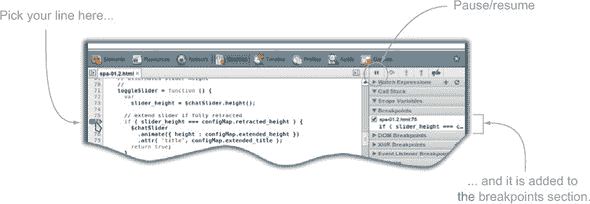

现在，让我们回到浏览器并点击滑块。我们会看到 JavaScript 在行 76 的红色箭头处暂停，如图 1.11 所示。当应用程序暂停时，我们可以检查变量和元素。我们可以打开控制台部分，输入各种变量并按回车键以查看它们在暂停状态下的值。我们看到`if`语句的条件为真（`slider_height`是 16，`configMap.retracted_height`也是 16），我们甚至可以检查像`configMap`对象这样的复杂变量，如控制台底部所示。当我们完成检查后，我们可以通过点击行 76 的左侧边缘来移除断点，然后点击右上角的继续按钮（在监视表达式上方）。

##### 图 1.11\. 在断点处检查值—spa.html

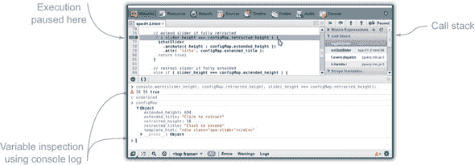

一旦我们点击继续，脚本将从行 76 继续执行并完成切换滑块。让我们回到元素标签页，查看 DOM 如何变化，如图 1.12 所示。在这张图中，我们可以看到由`spa-slider`类提供的 CSS `height`属性（见右下角的匹配 CSS 规则）已被元素样式覆盖（元素样式比来自类或 ID 的样式具有更高的优先级）。如果我们再次点击滑块，我们可以实时观察高度的变化，因为滑块在收缩。

##### 图 1.12\. 查看 DOM 变化—spa.html

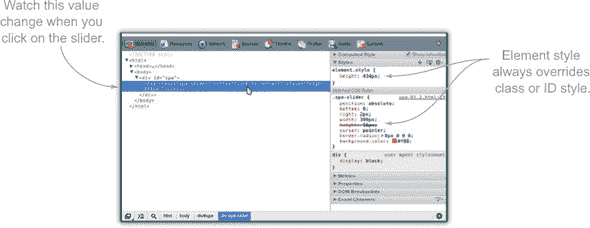

我们对 Chrome 开发者工具的简要介绍仅展示了它们帮助我们理解和改变应用程序“内部”发生的事情能力的一小部分。我们将继续使用这些工具来开发这个应用程序，并建议您花些时间阅读[`mng.bz/PzIJ`](http://mng.bz/PzIJ)上的在线手册。这是值得花时间的事情。

### 1.3\. 一个编写良好的 SPA 的用户优势

现在我们已经构建了我们的第一个 SPA，让我们考虑 SPA 相对于传统网站的主要优势：它提供了一个实质上更吸引人的用户体验。SPA 可以提供两个世界的最佳结合：桌面应用程序的即时性和网站的便携性和可访问性。

+   *一个 SPA 可以像桌面应用程序一样渲染*—SPA 只会在需要时重绘界面中需要改变的部分。相比之下，传统的网站在许多用户操作时都会重新绘制整个页面，导致浏览器从服务器检索并重新绘制页面上的所有内容时出现暂停和“闪烁”。如果页面很大、服务器繁忙或网络连接慢，这种闪烁可能需要几秒钟或更长时间，用户不得不猜测页面何时可以再次使用。与 SPA 的快速渲染和即时反馈相比，这是一种糟糕的体验。

+   *一个 SPA 可以像桌面应用程序一样响应*——SPA 通过尽可能将工作（临时）数据和处理从服务器移动到浏览器来最小化响应时间。SPA 拥有做出大多数决策所需的数据和业务逻辑，因此可以快速做出决策。只有数据验证、身份验证和永久存储必须保留在服务器上，原因我们在第六章（[kindle_split_017.html#ch06](https://wiki.example.org/kindle_split_017.html#ch06)）到第八章（[kindle_split_020.html#ch08](https://wiki.example.org/kindle_split_020.html#ch08)）中讨论。传统的网站大多数应用程序逻辑都在服务器上，用户必须等待请求/响应/重绘周期来响应他们的输入。这可能会花费几秒钟，而 SPA 的响应几乎是即时的。

+   *一个 SPA 可以像桌面应用程序一样通知用户其状态*——当一个 SPA 确实需要等待服务器时，它可以动态渲染进度条或忙碌指示器，这样用户就不会因为延迟而感到困惑。相比之下，传统的网站，用户实际上必须*猜测*页面何时加载和可用。

+   *一个 SPA 几乎像网站一样普遍可访问*——与大多数桌面应用程序不同，用户可以从任何网络连接和良好的浏览器访问 SPA。今天，这个列表包括智能手机、平板电脑、电视、笔记本电脑和台式电脑。

+   *一个 SPA 可以像网站一样即时更新和分发*——用户不需要做任何事情就能意识到这些好处——当他们重新加载浏览器时，它就会工作。维护多个并发软件版本的麻烦在很大程度上被消除了。7 作者曾参与过一天内构建和更新多次的 SPA。桌面应用程序通常需要下载和行政访问权限来安装新版本，版本之间的间隔可能是几个月或几年。

    > ⁷ 但并非完全如此：如果服务器-客户端数据交换格式发生变化，而许多用户在他们的浏览器中加载了先前的软件版本，会发生什么？这可以通过一些预先考虑得到解决。

+   *一个单页应用（SPA）就像网站一样跨平台*——与大多数桌面应用程序不同，一个编写良好的 SPA 可以在提供现代 HTML5 浏览器的任何操作系统上运行。虽然这通常被认为是开发者的好处，但对于拥有多种设备组合的用户来说，这极其有用——比如在工作时使用 Windows，在家中使用 Mac，使用 Linux 服务器，使用 Android 手机，以及使用亚马逊平板电脑。

所有这些好处意味着你可能希望将你的下一个应用程序制作成 SPA。那些每次点击后都会重新渲染整个页面的笨拙网站往往会让越来越复杂的用户感到疏远。一个编写良好的 SPA 的沟通和响应式界面，加上互联网的易用性，有助于让我们的客户留在他们应该的地方——使用我们的产品。

### 1.4. 摘要

单页应用已经存在一段时间了。直到最近，Flash 和 Java 一直是使用最广泛的 SPA 客户端平台，因为它们的性能、速度和一致性超过了 JavaScript 和浏览器渲染。但最近，JavaScript 和浏览器渲染已经达到了一个转折点，它们克服了最大的缺陷，同时提供了相对于其他客户端平台的显著优势。

我们专注于使用原生 JavaScript 和浏览器渲染创建 SPA，当我们提到 *SPA* 时，除非另有说明，否则我们指的是原生 JavaScript SPA。我们的 SPA 工具链包括 jQuery、TaffyDB2、Node.js、Socket.IO 和 MongoDB。所有这些都是经过验证的、流行的解决方案。你可以选择使用这些技术的替代方案，但 SPA 的基本结构将不会因具体技术决策而改变。

我们开发的简单聊天滑动应用演示了 JavaScript SPA 的许多功能。它对用户输入立即做出响应，并且它使用存储在客户端的数据而不是服务器来做出决策。我们使用 JSLint 确保我们的应用程序不包含常见的 JavaScript 错误。我们还使用 jQuery 选择和动画 DOM，并处理用户点击滑动条时的事件。我们探讨了使用 Chrome 开发者工具来帮助我们理解应用程序的工作方式。

一个单页应用（SPA）可以提供两种世界的最佳结合——桌面应用的即时性和网站的便携性和可访问性。JavaScript SPA 可在支持现代网络浏览器且不要求任何专有插件的超过十亿台设备上运行。只需稍加努力，它就可以支持运行多种不同操作系统的桌面、平板电脑和智能手机。SPA 容易更新和分发，通常无需用户采取任何行动。所有这些优势都解释了为什么你可能想要将你的下一个应用做成 SPA。

在下一章中，我们将探讨一些对于 SPA 开发至关重要但经常被忽视或误解的 JavaScript 概念。然后，我们将在此基础上改进和扩展本章中开发的示例 SPA。

## 第二章：重新介绍 JavaScript

|  |
| --- |

**本章涵盖**

+   变量作用域、函数提升和执行上下文对象

+   解释变量作用域链及其使用原因

+   使用原型创建 JavaScript 对象

+   编写自执行的匿名函数

+   使用模块模式和私有变量

+   利用闭包以娱乐和盈利

|  |
| --- |

本章回顾了我们需要了解的独特的 JavaScript 概念，如果我们想要构建一个具有重大规模的本地 JavaScript 单页应用程序。来自第一章的列表 2.1 的代码片段展示了我们将要讨论的概念。如果你理解了所有这些 *如何* 和 *为什么* 概念，那么你可以快速浏览或跳过本章，直接在第三章中开始构建 SPA。

要在家中跟随学习，你可以将本章中的所有列表复制粘贴到 Chrome 开发工具的控制台中，然后按 Return 键来查看它们的执行结果。我们强烈鼓励你加入这个乐趣。

##### 列表 2.1\. 应用 JavaScript

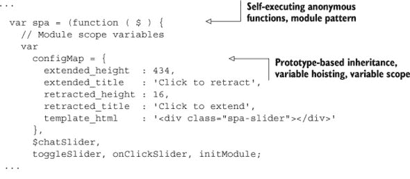


|  |
| --- |

**编码标准和 JavaScript 语法**

对于初学者来说，JavaScript 的语法可能有些难以理解。在继续学习之前，了解变量声明块和对象字面量非常重要。如果你已经熟悉它们，可以自由地跳过这个侧边栏。关于我们认为重要的 JavaScript 语法和良好的编码标准，请参阅附录 A。

**变量声明块**

`var spa = "Hello world!";`

JavaScript 变量的声明遵循 `var` 关键字。一个变量可以包含任何类型的数据：数组、整数、浮点数、字符串等等。变量类型没有指定，因此 JavaScript 被认为是一种 *弱类型* 语言。即使一个值已经赋给变量，通过赋值一个不同类型的值，值的类型也可以改变，因此它也被认为是一种 *动态* 语言。

可以通过在 `var` 关键字后用逗号分隔来链式地声明和赋值 JavaScript 变量：

```
var book, shopping_cart,
    spa = "Hello world!",
    purchase_book = true,
    tell_friends = true,
    give_5_star_rating_on_amazon = true,
    leave_mean_comment = false;
```

关于变量声明块的最佳格式有许多观点。我们更喜欢将未定义的变量声明放在顶部，然后是带有定义的变量声明。我们也更喜欢在行尾使用逗号，如所示，但我们并不对此过于执着，JavaScript 引擎也不关心这一点。

**对象字面量**

一个 *对象字面量* 是由逗号分隔的属性列表定义的对象，这些属性包含在大括号内。属性使用冒号而不是等号来设置。对象字面量还可以包含数组，数组是由方括号包围的逗号分隔的成员列表。可以通过将函数设置为某个属性的值来定义方法：

```
var spa = {
    title: "Single Page Web Applications",           //attribute
    authors: [ "Mike Mikowski", "Josh Powell" ],     //array
    buy_now: function () {                           //function
      console.log( "Book is purchased" );
    }
}
```

在整本书中广泛使用了对象字面量和变量声明块。

|  |
| --- |

### 2.1\. 变量作用域

我们讨论的起点是变量的行为以及变量何时在或不在作用域内。

在 JavaScript 中，变量由函数作用域限定，它们要么是全局的，要么是局部的。*全局*变量在所有地方都可以访问，而*局部*变量只能在它们被声明的位置访问。在 JavaScript 中，定义变量作用域的唯一块是函数。仅此而已。全局变量是在函数外部定义的，而局部变量是在函数内部定义的。简单，对吧？

另一种看待方式是，函数就像一个监狱，函数内部定义的变量就像囚犯。就像监狱包含囚犯并且不允许他们逃出监狱围墙一样，函数包含局部变量并且不允许它们逃出函数之外，如下面的代码所示：

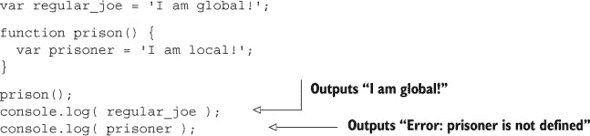

| |
| --- |

**JavaScript 1.7, 1.8, 1.9+ 和块作用域**

JavaScript 1.7 引入了一个新的块作用域构造函数，即`let`语句。不幸的是，尽管存在 JavaScript 1.7、1.8 和 1.9 的标准，但甚至 1.7 也没有在所有浏览器中得到一致的部署。直到浏览器兼容这些 JavaScript 更新之前，我们将假装 JavaScript 1.7+不存在。不过，让我们看看它是如何工作的。

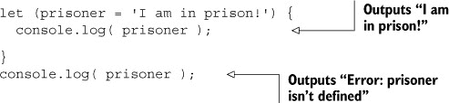

要使用 JavaScript 1.7，将版本放在`<script>`标签的`type`属性中：

`<script type="application/javascript;version=1.7">`

这只是对 JavaScript 1.7+的一个简要介绍；还有很多其他的变化和新特性。

| |
| --- |

如果事情真的这么简单就好了。你可能会遇到的第一个 JavaScript 作用域问题是，在函数内部，只需省略`var`声明，就可以声明一个全局变量，如图 2.1 所示。并且与所有编程语言一样，全局变量几乎总是个坏主意。

##### 图 2.1。如果你在函数中声明局部变量时忘记了 var 关键字，你将创建一个全局变量。

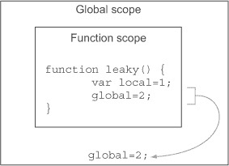

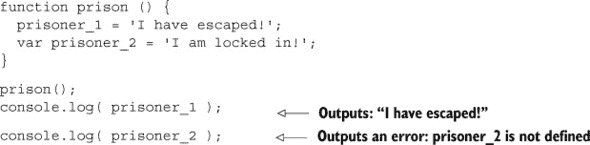

这并不好——不要让你的囚犯逃走。这种问题经常出现在我们忘记在`for`循环中声明计数器时使用`var`。尝试以下对`prison`函数的定义，一次一个：

```
// wrong
function prison () {
  for( i = 0 ; i < 10; i++ ) {
    //...
  }
}
prison();
console.log( i );  // i is 10
delete window.i;

// permissible
function prison () {
  for( var i = 0; i < 10; i++ ) {
    //...
  }
}
prison();
console.log( i );  // i is not defined

// best
function prison () {
  var i;
  for ( i = 0; i < 10; i++ ) {
    // ...
  }
}
prison();
console.log( i );  // i is not defined
```

我们更喜欢这个版本，因为将变量声明在函数顶部可以使它的作用域非常清晰。在`for`循环初始化器内部声明变量可能会让一些人误以为变量的作用域仅限于`for`循环，就像在其他一些语言中那样。

我们将这个逻辑扩展到解决和组合函数顶部声明的所有 JavaScript 声明和大多数赋值，以便变量的作用域清晰：

```
function prison() {
  var prisoner = 'I am local!',
      warden   = 'I am local too!',
      guards   = 'I am local three!'
  ;
}
```

通过使用逗号合并局部变量定义，我们使它们易于查看，也许更重要的是，减少了打字错误意外地创建全局变量而不是局部变量的可能性。你也注意到了它们排得有多整齐吗？看看末尾的分号是如何在视觉上起到变量声明块闭合标签的作用的？我们在附录 A 中的 JavaScript 编码标准中讨论了这一点以及其他用于可读性和可理解性的 JavaScript 格式化方法。JavaScript 的另一个有趣特性，变量提升，与这种声明局部变量的方法有关。让我们接下来看看这一点。

### 2.2. 变量提升

当在 JavaScript 中声明一个变量时，其声明被认为是提升到其函数作用域的顶部，并且变量被赋予`undefined`的值。这导致变量在函数的任何地方声明都存在于整个函数中，尽管它的值在赋予值之前是未定义的，如图 2.2 所示。

##### 图 2.2. JavaScript 变量声明被“提升”到它们出现的函数的开始处，但初始化保持原位。JavaScript 引擎实际上并没有重写代码：每次函数被调用时，声明都会被重新提升。

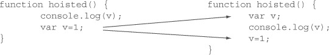

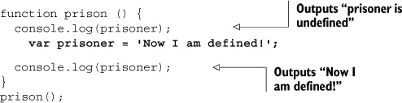

将图中的代码与尝试访问未在局部或全局作用域中声明的变量进行对比，这会导致运行时 JavaScript 错误，该错误将停止 JavaScript 在该语句处执行：

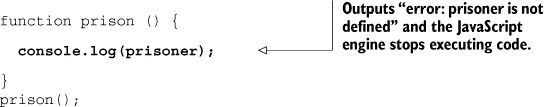

因为变量声明总是提升到你的函数作用域的顶部，所以最佳实践是在函数顶部声明你的变量，最好使用单个`var`语句。这与 JavaScript 的行为相匹配，并避免了我们在上一幅图中展示的那种混淆。

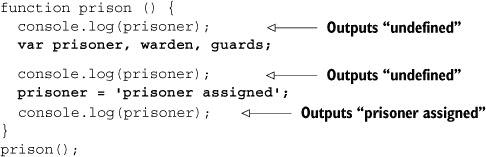

这种作用域和提升行为有时会结合在一起导致一些令人惊讶的行为。看看以下代码：

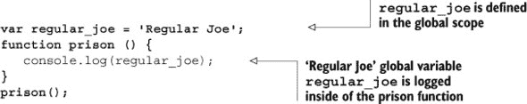

当执行监狱代码并请求`console.log()`中的`regular_joe`时，JavaScript 引擎首先检查`regular_joe`是否在局部作用域中声明。因为`regular_joe`没有在局部作用域中声明，JavaScript 引擎然后检查全局作用域，发现它在那里定义，并返回该值。这被称为*沿着作用域链向上查找*。但如果变量也在局部作用域中声明呢？

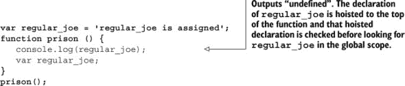

这看起来反直觉或令人困惑吗？让我们来看看 JavaScript 在幕后是如何处理提升的。

### 2.3. 高级变量提升和执行上下文对象

我们到目前为止所讨论的所有概念通常被认为是成为成功的 JavaScript 开发者所必需了解的。让我们更进一步，看看引擎内部发生了什么：你将成为少数几个真正理解 JavaScript 如何工作的开发者之一。我们将从 JavaScript 的一个更“神奇”的功能开始：变量和函数提升。

#### 2.3.1\. 提升

就像所有形式的魔法一样，当秘密被揭露时，技巧几乎让人失望。秘密在于当 JavaScript 引擎进入作用域时，它会遍历代码两次。在第一次遍历中，它初始化变量，在第二次遍历中执行代码。我知道，很简单；我不知道为什么通常不会用这些术语来描述。让我们更详细地了解一下 JavaScript 引擎在第一次遍历中做了什么，因为它有一些有趣的影响。

在第一次遍历中，JavaScript 引擎遍历代码并做三件事：

1.  声明并初始化函数参数。

1.  声明局部变量，包括分配给局部变量的匿名函数，但不会初始化它们。

1.  声明并初始化函数。

##### 列表 2.2\. 第一次遍历

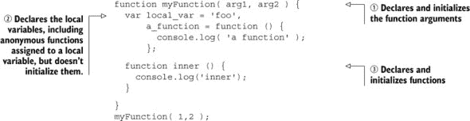

在第一次遍历中，**不会**将值分配给局部变量，因为可能需要执行代码来确定值，而第一次遍历不会执行代码。值分配给参数，因为确定参数值所需的任何代码都是在参数传递给函数之前运行的。

我们可以通过将它们与上一节末尾展示的函数提升代码进行比较来证明在第一次遍历中设置了参数的值。

##### 列表 2.3\. 变量在声明之前是未定义的

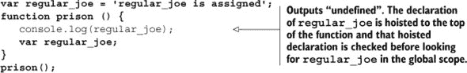

在监狱函数中声明`regular_joe`之前，它是未定义的，但如果`regular_joe`也被作为参数传递，它在声明之前就有值。

##### 列表 2.4\. 变量在声明之前有值

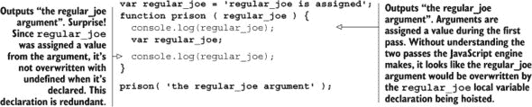

如果你感到头晕，那没关系。虽然我们解释了 JavaScript 引擎在执行函数时遍历两次，并且在第一次遍历中存储变量，但我们还没有看到它是如何存储变量的。了解 JavaScript 引擎如何存储变量可能会消除任何剩余的困惑。JavaScript 引擎将变量存储在称为**执行上下文对象**的对象上的属性中。

#### 2.3.2\. 执行上下文和执行上下文对象

每次函数被调用时，都会有一个新的执行上下文。执行上下文是一个概念，即运行中的函数的概念——它不是一个对象。就像在跑步或跳跃的上下文中考虑一名运动员一样。我们可以说一个跑步的运动员，而不是一个在跑步上下文中的运动员，就像我们可以说一个运行中的函数，但术语不是这样用的。我们说**执行上下文**。

执行上下文由函数执行期间发生的一切组成。这与函数声明是不同的，因为函数声明描述了函数执行时会发生什么。执行上下文*就是*函数的执行。

在函数中定义的所有变量和函数都被认为是执行上下文的一部分。执行上下文是开发人员在谈论函数的*作用域*时所指的一部分。如果变量在当前执行上下文中可访问，则认为该变量“在作用域内”，这另一种说法是，如果变量在函数运行时可以访问，则该变量在作用域内。

执行上下文中的变量和函数存储在*执行上下文对象*上，这是执行上下文 ECMA 标准的实现。执行上下文对象是 JavaScript 引擎中的一个对象，而不是 JavaScript 中可以直接访问的变量。虽然间接访问它很容易，因为每次使用变量时，你都是在访问执行上下文对象的属性。

之前我们讨论了 JavaScript 引擎如何对执行上下文进行两次遍历，声明和初始化变量，但变量存储在哪里呢？JavaScript 引擎将变量声明和初始化为执行上下文对象的属性。为了了解变量是如何存储的，请查看表 2.1。

##### 表 2.1\. 执行上下文对象

| 代码 | 执行上下文对象 |
| --- | --- |

|

```
var example_variable = "example",
    another_example  = "another";
```

|

```
{
   example_variable: "example",
   another_example: "another"
};
```

|

可能你从未听说过执行上下文对象。这并不是在网页开发者社区中常见讨论的话题，可能是因为执行上下文对象被埋藏在 JavaScript 的实现中，并且在开发过程中无法直接访问。

理解执行上下文对象对于理解本章的其余部分至关重要，因此让我们回顾一下执行上下文对象的生命周期以及创建它的 JavaScript 代码。

##### 列表 2.5\. 执行上下文对象——第一次遍历

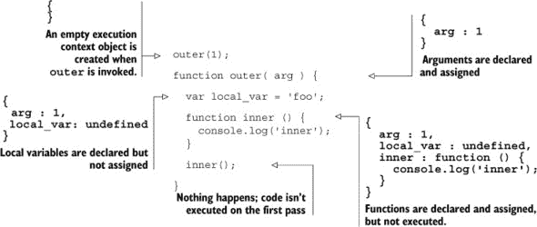

现在已经声明和分配了参数和函数，并且已经声明了局部变量，接下来进行第二次遍历，执行 JavaScript 代码并分配局部变量的定义。

##### 列表 2.6\. 执行上下文对象——第二次遍历

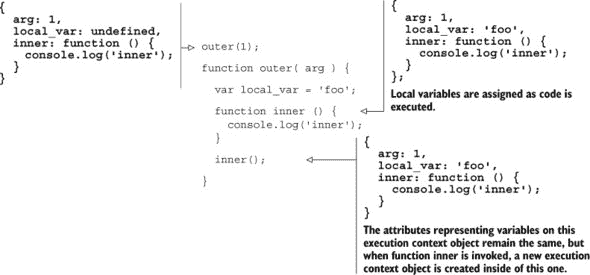

这可以深入很多层，因为函数可以在执行上下文中被调用。在执行上下文中调用一个函数会在现有执行上下文中创建一个新的嵌套执行上下文。好吧，又开始头晕了；现在是时候看图了。请看图 2.3。

##### 图 2.3\. 调用一个函数创建一个执行上下文。

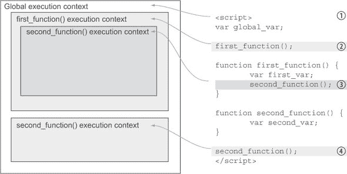

1.  `<script>`标签内的所有内容都在全局执行上下文中。

1.  调用`first_function`在全局执行上下文中创建一个新的执行上下文。当`first_function`运行时，它可以访问其被调用的执行上下文中的变量。在这种情况下，`first_function`可以访问全局执行上下文中定义的变量以及`first_function`中定义的局部变量。这些变量被称为*在作用域内*。

1.  调用`second_function`在`first_function`执行上下文中创建一个新的执行上下文。`second_function`可以访问`first_function`执行上下文中的变量，因为它是在其中被调用的。`second_function`还可以访问全局执行上下文中的变量以及`second_function`中定义的局部变量。这些变量被称为*在作用域内*。

1.  再次调用`second_function`，这次是在全局执行上下文中。这个`second_function`无法访问`first_function`执行上下文中的变量，因为这次`second_function`不是在`first_function`执行上下文中被调用的。换句话说，当这次调用`second_function`时，它无法访问在`first_function`中定义的变量，因为它不是在`first_function`内部被调用的。这个`second_function`执行上下文也无法访问之前调用`second_function`时创建的变量，因为它们发生在不同的执行上下文中。换句话说，当你调用一个函数时，你无法访问上次调用该函数时创建的局部变量，下次调用该函数时你也不会访问这次函数调用中的局部变量。这些不可访问的变量被称为*超出作用域*。

JavaScript 引擎查找执行上下文对象以访问“在作用域内”的变量的顺序被称为*作用域链*，它与*原型链*一起描述了 JavaScript 访问变量及其属性的顺序。我们将在接下来的几节中讨论这些概念。

### 2.4。作用域链

到目前为止，我们主要将变量作用域限制在*全局*和*局部*。这是一个好的起点，但作用域更为复杂，如上一节中嵌套执行上下文讨论所暗示的。变量作用域更准确地可以看作是一个链，如图 2.4 所示。当寻找变量的定义时，JavaScript 引擎首先查看局部执行上下文对象。如果定义不在那里，它就会跳到作用域链上，到创建它的执行上下文中，并在该执行上下文对象中寻找变量定义，依此类推，直到找到定义或达到全局作用域。

##### 图 2.4。在运行时，JavaScript 会搜索作用域层次结构以解析变量名。

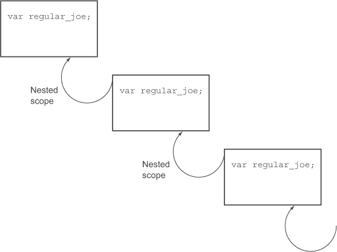

让我们修改一个早期的例子来说明作用域链。在列表 2.7 中的代码将打印以下内容：

```
I am here to save the day!
regular_joe is assigned
undefined
```

##### 列表 2.7\. 作用域链示例——在每次调用作用域中定义`regular_joe`

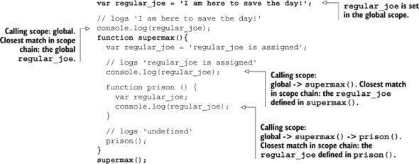

在运行时，JavaScript 会搜索作用域层次结构以解析变量名。它从当前作用域开始，然后逐级向上到顶级作用域，即`window`（浏览器）或`global`（Node.js）对象。它使用找到的第一个匹配项并停止搜索。请注意，这表明深层嵌套作用域中的变量可以通过替换它们当前作用域中的变量来隐藏更全局作用域中的变量。这可能是好是坏，这取决于你是否期望它发生。在实际代码中，你应该尽可能使变量名唯一：我们刚刚查看的代码，其中相同的名称被引入到三个不同的嵌套作用域中，几乎不是最佳实践的例子，并且仅用于说明这一点。

在列表中，从三个作用域请求了一个名为`regular_joe`的变量的值：

1.  列表中的最后一条语句`console.log(regular_joe)`是在全局作用域中。JavaScript 开始搜索全局执行上下文对象的`regular_joe`属性。它找到一个值为`I am here to save the day`的属性并使用它。

1.  在`supermax`函数的最后一条语句中，我们看到`console.log(regular_joe)`。这个调用是在`supermax`执行上下文中进行的。JavaScript 开始搜索`supermax`执行上下文对象的`regular_joe`属性。它找到一个值为`regular_joe is assigned`的属性并使用它。

1.  在`prison`函数的最后一条语句中，我们看到`console.log(regular_joe)`。这个调用是在`supermax`执行上下文中的`prison`执行上下文中进行的。JavaScript 开始搜索`prison`执行上下文对象的`regular_joe`属性。它找到一个值为`undefined`的属性并使用它。

在这个例子中，`regular_joe`的值在所有三个作用域中都被定义。在代码的下一个版本中，在列表 2.8 中，我们只在全局作用域中定义它。现在程序会打印三次“我来到这里是为了拯救世界！”：

##### 列表 2.8\. 作用域链示例——只在单个作用域中定义`regular_joe`

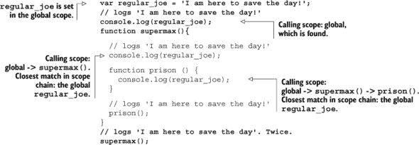

重要的是要记住，当我们请求变量值时，结果可能来自作用域链中的任何位置。这取决于我们控制并理解我们的值是从链中的哪个位置派生出来的，否则我们可能会陷入痛苦的编码混乱。附录 A 中的 JavaScript 编码标准概述了帮助我们完成这项工作的多种技术，我们将随着我们的进展使用它们。

|  |
| --- |

**全局变量和窗口对象**

我们通常所说的 *全局* 变量是执行环境顶级对象的属性。浏览器顶级对象是 `window` 对象；在 node.js 中，顶级对象称为 `global`，变量作用域的工作方式不同。

`window` 对象包含许多属性，这些属性本身包含对象、方法（`onload`、`onresize`、`alert`、`close`...）、DOM 元素（`document`、`frames`...）和其他变量。所有这些属性都是通过使用语法 `window.` *属性* 来访问的。

```
window.onload = function(){
  window.alert('window loaded');
}
```

node.js 的顶级对象称为 `global`。因为 node.js 是一个网络服务器而不是浏览器，所以可用的函数和属性与浏览器有很大的不同。

当浏览器中的 JavaScript 检查全局变量的存在时，它会查看 `window` 对象。

```
var regular_joe = 'Global variable';
console.log( regular_joe );        // 'Global variable'
console.log( window.regular_joe ); // 'Global variable'
console.log( regular_joe === window.regular_joe ); // true
```

|  |
| --- |

JavaScript 有一个与作用域链平行的概念，称为 *原型链*，它定义了对象查找其属性定义的位置。让我们看看原型和原型链。

### 2.5. JavaScript 对象和原型链

JavaScript 对象是基于原型的，而今天其他最广泛使用的语言都使用基于类的对象。在基于类的系统中，一个对象是通过描述它将如何看起来来定义一个类的。在基于原型的系统中，我们创建一个看起来像我们希望所有该类型对象都看起来像的对象，然后告诉 JavaScript 引擎我们想要更多看起来像那样的对象。

不要过分夸张这个比喻，但如果建筑是一个基于类的系统，建筑师会绘制房子的蓝图，然后根据那个蓝图建造房子。如果建筑是基于原型的，建筑师会建造一栋房子，然后根据那栋房子建造其他房子。

让我们基于之前的囚犯例子来构建，并比较在每个系统中创建一个具有姓名、囚犯 ID、刑期年数和缓刑年数属性的单个囚犯需要什么。

##### 表 2.2. 简单对象创建：类与原型

| 基于类 | 基于原型 |
| --- | --- |
| --- | --- |

|

```
public class Prisoner {
  public int sentence  = 4;
  public int probation = 2;
  public string name   = "Joe";
  public int id        = 1234;
}
```

|

```
var prisoner = {
  sentence  : 4,
  probation : 2,
  name      : 'Joe',
  id        : 1234
};
```

|

当只有一个对象实例时，基于原型的对象更简单、更快地编写。在基于类的系统中，你必须定义一个类，定义一个构造函数，然后实例化一个属于该类的对象。基于原型的对象简单地定义在原地。

基于原型的系统在简单的一个对象用例中表现出色，但它也可以支持具有相似特性的多个对象的更复杂用例。让我们以之前的囚犯例子为例，让代码改变囚犯的 `name` 和 `id`，但保持相同的预设刑期和缓刑期限。

正如你在 表 2.3 中可以看到，两种编程方式遵循相似的顺序，如果你习惯了类，适应原型不应该有很大困难。但问题在于细节，如果你来自基于类的系统，没有学习基于原型的方法就跳入 JavaScript，很容易在看似简单的事情上绊倒。让我们逐步分析这个顺序，看看我们能学到什么。

##### 表 2.3\. 多个对象：类与原型

| 基于类 | 基于原型 |
| --- | --- |

|

```
/* step 1 */
public class Prisoner {
  public int sentence = 4;
  public int probation = 2;
  public string name;
  public string id;

  /* step 2 */
  public Prisoner( string name,
    string id ) {

    this.name = name;
    this.id   = id;
  }
}

/* step 3 */
Prisoner firstPrisoner
 = new Prisoner("Joe","12A");

Prisoner secondPrisoner
 = new Prisoner("Sam","2BC");
```

1.  定义类

1.  定义类构造函数

1.  实例化对象

|

```
// * step 1 *
var proto = {
  sentence  : 4,
  probation : 2
};

//* step 2 *
var Prisoner =
    function(name, id){
  this.name = name;
  this.id   = id;
};

//* step 3 *
Prisoner.prototype = proto;

// * step 4 *
var firstPrisoner =
  new Prisoner('Joe','12A');

var secondPrisoner =
  new Prisoner('Sam','2BC');
```

1.  定义原型对象

1.  定义对象构造函数

1.  将构造函数链接到原型

1.  实例化对象

|

在每个方法中，我们首先为我们的对象创建模板。在基于类的编程中，模板被称为 *类*，在基于原型的编程中，被称为 *原型对象*，但它们都服务于相同的目的：作为创建对象的框架。

其次，我们创建一个构造函数。在基于类的语言中，构造函数定义在类内部，因此在实例化对象时可以清楚地知道哪个构造函数与哪个类相对应。在 JavaScript 中，对象构造函数设置在原型之外，因此需要额外的步骤来将它们链接在一起。

最后，实例化对象。

JavaScript 使用 `new` 操作符与其基于原型的根源不同，可能是因为试图使其对熟悉基于类继承的开发者更易于理解。不幸的是，我们认为这模糊了问题，使得本应不熟悉（因此需要研究）的东西看起来很熟悉，导致开发者盲目尝试，直到遇到问题，花费数小时试图找出由将 JavaScript 错误地视为基于类系统而引起的错误。

作为使用 `new` 操作符的替代方案，已经开发并使用了 `Object.create` 方法，以给 JavaScript 对象创建添加更多基于原型的感觉。我们在整本书中仅使用 `Object.create` 方法。使用 `Object.create` 从 表 2.3 中的基于原型的示例创建囚犯看起来是这样的：

##### 列表 2.9\. 使用 `Object.create` 创建对象

```
var proto = {
  sentence  : 4,
  probation : 2
};

var firstPrisoner = Object.create( proto );
firstPrisoner.name = 'Joe';
firstPrisoner.id = '12A';

var secondPrisoner = Object.create( proto );
secondPrisoner.name = 'Sam;
secondPrisoner.id = '2BC';
```

`Object.create` 方法接受一个原型作为参数并返回一个对象；通过这种方式，你可以在原型对象上定义公共属性和方法，并使用它来创建具有相同属性的多达多个对象。必须手动在每个对象上设置 `name` 和 `id` 是一件痛苦的事情，因为重复代码并不干净。作为替代方案，使用 `Object.create` 的一个常见模式是使用一个工厂函数来创建并返回最终对象。我们命名所有的工厂函数为 `make<object_name>`。

##### 列表 2.10\. 使用工厂函数与 `Object.create` 的结合

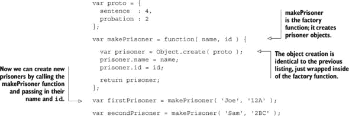

尽管在 JavaScript 中有几种创建对象的方法（这是另一个经常被争论的开发者话题），但通常认为使用 `Object.create` 是一种最佳实践。我们更喜欢这种方法，因为它清楚地说明了原型是如何设置的。不幸的是，`new` 操作符可能是创建对象最常用的方法。我们说不幸，因为它误导开发者认为语言是类基础的，并掩盖了基于原型的系统的细微差别。

|  |
| --- |

**针对旧浏览器的 Object.create**

`Object.create` 在 IE 9+、Firefox 4+、Safari 5+ 和 Chrome 5+ 中工作。为了与旧浏览器兼容（我们指的是 IE 6、7 和 8！），我们需要在它不存在时定义 `Object.create`，并在已经实现了它的浏览器中保持不变。

```
// Cross-browser method to support Object.create()

var objectCreate = function ( arg ){
  if ( ! arg ) { return {}; }
  function obj() {};
  obj.prototype = arg;
  return new obj;
};
Object.create = Object.create || objectCreate;
```

|  |
| --- |

现在我们已经看到了 JavaScript 如何使用原型来创建具有相同属性的对象，让我们深入原型链，并讨论 JavaScript 引擎是如何实现查找对象上属性值的。

#### 2.5.1\. 原型链

在基于原型的 JavaScript 中，对象的属性实现和功能与基于类的系统不同。尽管它们有足够的相似之处，大多数时候我们可以在没有明确理解的情况下过得去，但当差异显现出来时，我们就会在挫败感和生产力损失中付出代价。就像学习原型和类之间的基本差异值得一开始就学习一样，学习原型链也同样重要。

JavaScript 使用 *原型链* 来解析属性值。原型链描述了 JavaScript 引擎如何从对象到对象的原型，再到原型的原型，以定位对象的属性值。当我们请求一个对象的属性时，JavaScript 引擎首先在对象上直接查找该属性。如果在那里找不到属性，它会查看原型（存储在对象的 `__proto__` 属性中）并查看原型是否包含请求的属性。

如果 JavaScript 引擎在对象的原型中找不到属性，它会检查原型的原型（原型本身也是一个对象，因此它也有一个原型）。依此类推。当 JavaScript 达到通用的 `Object` 原型时，原型链结束。如果 JavaScript 在链中的任何地方都找不到请求的属性，它将返回 `undefined`。随着 JavaScript 引擎沿着原型链检查，细节可能会变得复杂，但就本书的目的而言，我们只需要记住，如果一个属性在对象上找不到，则会检查原型。

沿着原型链的这种攀升类似于 JavaScript 引擎沿着作用域链攀升以找到变量定义的过程。正如你在 图 2.5 中可以看到的，这个概念几乎与 图 2.4 中的作用域链相同。

##### 图 2.5\. 在运行时，JavaScript 会搜索原型链以解析属性值。

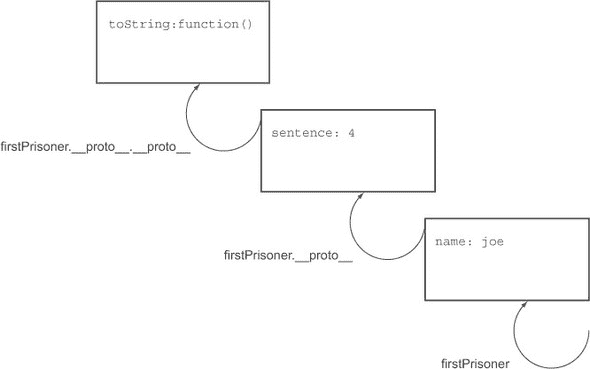

您可以使用 `__proto__` 属性手动遍历原型链。

```
var proto = {
  sentence : 4,
  probation : 2
};

var makePrisoner = function( name, id ) {

  var prisoner = Object.create( proto );
  prisoner.name = name;
  prisoner.id = id;

  return prisoner;
};

var firstPrisoner = makePrisoner( 'Joe', '12A' );

// The entire object, including properties of the prototype
// {"id": "12A", "name": "Joe", "probation": 2, "sentence": 4}
console.log( firstPrisoner );

// Just the prototype properties
// {"probation": 2, "sentence": 4}
console.log( firstPrisoner.__proto__ );

// The prototype is an object with a prototype. Since one
// wasn't set, the prototype is the generic object prototype,
// represented as empty curly braces.
// {}
console.log( firstPrisoner.__proto__.__proto__ );

// But the generic object prototype has no prototype
// null
console.log( firstPrisoner.__proto__.__proto__.__proto__ );

// and trying to get the prototype of null is an error
// "firstPrisoner.__proto__.__proto__.__proto__ is null"
console.log( firstPrisoner.__proto__.__proto__.__proto__.__proto__ );
```

如果我们请求 `firstPrisoner.name`，JavaScript 将直接在对象上找到囚犯的名字并返回 `Joe`。如果我们请求 `firstPrisoner.sentence`，JavaScript 不会在对象上找到属性，但会在原型中找到它并返回值 `4`。如果我们请求 `firstPrisoner.toString()`，我们将得到字符串 `[object Object]`，因为基本 Object 原型有那个方法。最后，如果我们请求 `firstPrisoner.hopeless`，我们将得到 `undefined`，因为该属性在原型链中无处可寻。这些结果总结在 表 2.4 中。

##### 表 2.4\. 原型链

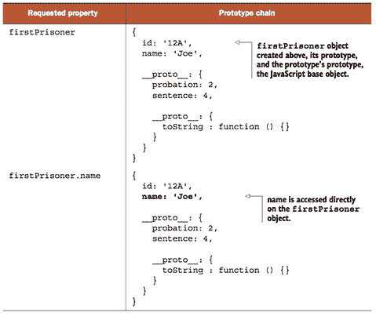

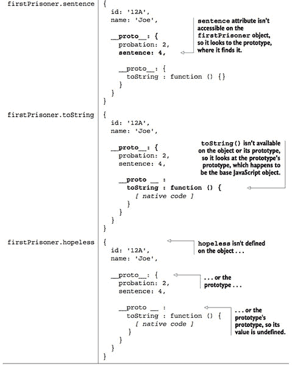

另一种演示原型链的方法是看看当我们改变由原型设置的对象上的值时会发生什么。

##### 列表 2.11\. 覆盖原型

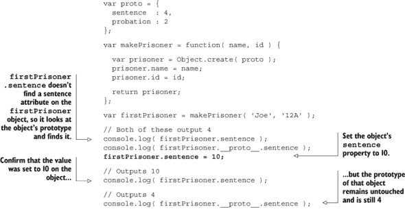

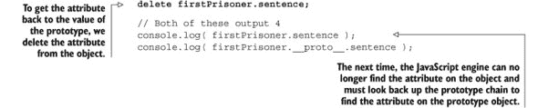

那么，如果您在思考，当我们改变原型对象上的属性值时会发生什么？

##### 原型变异

原型继承提供的一种强大且可能危险的行为是能够一次性突变基于原型的 *所有* 对象。对于那些熟悉静态变量的，原型上的属性就像从原型创建的对象的静态变量。让我们再次检查我们的代码。

```
var proto = {
  sentence  : 4,
  probation : 2
};

var makePrisoner = function( name, id ) {
  var prisoner = Object.create( proto );
  prisoner.name = name;
  prisoner.id = id;

  return prisoner;
};

var firstPrisoner = makePrisoner( 'Joe', '12A' );

var secondPrisoner = makePrisoner( 'Sam', '2BC' );
```

如果在先前的示例之后检查 `firstPrisoner` 或 `secondPrisoner`，我们会发现继承属性 `sentence` 被设置为 4。

```
... // Both of these output '4'
console.log( firstPrisoner.sentence );
console.log( secondPrisoner.sentence );
```

如果我们改变原型对象，例如通过设置 `proto.sentence` `=` `5`，那么在 *之后* 和 *之前* 创建的所有对象都将反映这个值。因此 `firstPrisoner.sentence` 和 `secondPrisoner.sentence` 被设置为 5。

```
...
proto.sentence = 5;

// Both of these output '5'
console.log( firstPrisoner.sentence );
console.log( secondPrisoner.sentence );
```

这种行为有优点也有缺点。重要的是，它在 JavaScript 环境中是一致的，并且我们知道这一点，因此我们可以相应地编写代码。

既然我们已经知道了对象是如何通过原型从其他对象继承属性的，那么让我们看看函数是如何工作的，因为它们可能表现得与您预期的不同。我们还将调查这些差异如何提供一些有用的功能，我们将在整本书中利用这些功能。

### 2.6\. 函数——深入了解

函数是 JavaScript 中的第一等对象。它们可以被存储在变量中，赋予属性，甚至可以作为参数传递给函数调用。它们用于控制变量作用域并提供私有变量和方法。理解函数是理解 JavaScript 的关键之一，也是构建专业单页应用的重要基础。

#### 2.6.1\. 函数和匿名函数

JavaScript 中函数的一个重要特性是它是一个对象，就像任何其他对象一样。我们可能都见过像这样声明的 JavaScript 函数：

```
function prison () {}
```

但我们也可以将函数存储在变量中：

```
var prison = function prison () {};
```

我们可以通过将其制作成*匿名函数*来减少冗余（以及名称不匹配的机会），匿名函数只是对没有名称的函数声明的标签。以下是将匿名函数保存到局部变量的示例：

```
var prison = function () {};
```

保存到局部变量的函数是以我们预期函数调用的方式调用的：

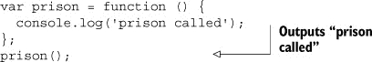

#### 2.6.2\. 自执行匿名函数

在 JavaScript 中，我们经常面临的一个问题是，在全局作用域中定义的任何内容都可以在任何地方访问。有时你不想与每个人分享，也不想第三方库与你共享它们的内部变量，因为这很容易导致库之间的冲突，并造成难以诊断的问题。利用我们对函数的了解，我们可以将整个程序包裹在一个函数中，调用该函数，然后我们的变量就不会被任何外部代码访问。

```
var myApplication = function () {
  var private_variable = "private";
};

myApplication();

//outputs an error saying the variable in undefined.
console.log( private_variable );
```

但这样做既啰嗦又别扭。如果我们可以不定义一个函数，将其保存到变量中，然后执行该函数，那就太好了。确实，有一个简写的方法。猜猜看……我们确实有！

```
(function () {
  var private_variable = "private";
})();

//outputs an error saying the variable in undefined.
console.log( private_variable );
```

这被称为*自执行匿名函数*，因为它是在没有给出名称或保存到变量中定义的，并且立即执行。我们做的只是将函数用括号包围，然后使用一对括号来执行该函数，如表 2.5 所示。与显式调用的函数并排看时，语法并不令人惊讶。

##### 表 2.5\. 显式调用与自执行函数的比较。它们具有相同的效果：创建一个函数然后立即调用它

| 显式调用 | 自执行函数 |
| --- | --- |

|

```
var foo = function () {
  // do something
};
foo();
```

|

```
(function () {
  // do something
})();
```

|

自执行匿名函数用于包含变量作用域并防止变量泄漏到代码的其他地方。这可以用来创建不会与应用程序代码冲突的 JavaScript 插件，因为它们不会向全局命名空间添加任何变量。在下一节中，我们将演示一个更高级的使用案例，我们在整本书中都使用了它。它被称为*模块模式*，它允许我们定义私有变量和方法。首先，让我们看看在自执行匿名函数中变量作用域是如何工作的。如果这看起来很熟悉，那是因为它与之前完全一样，只是使用了新的语法：

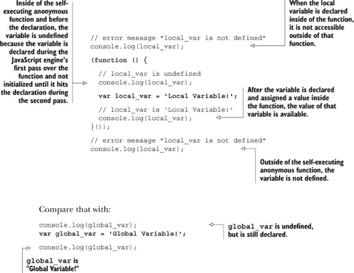

在这里，全局命名空间被`global_var`变量污染，并存在与我们在代码或项目中使用的同名外部 JavaScript 库中的变量冲突的风险。*全局命名空间的污染*是你在 JavaScript 圈中可能会经常听到的术语——这就是它所指的。

自执行的匿名函数可以解决的一个问题是，全局变量可能会被第三方库覆盖，甚至可能无意中被你自己的代码覆盖。通过将一个值作为参数传递给自执行的匿名函数，你可以保证该参数的值将是你在该执行上下文中期望的，因为外部代码无法影响它。

首先，让我们看看如何将一个参数传递给一个自执行的匿名函数。

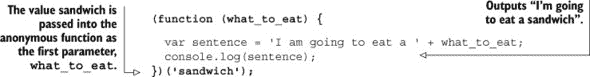

如果这个语法让你感到困惑，它只是将值 `sandwich` 作为第一个参数传递给匿名函数。让我们将这个语法与一个普通函数进行比较：

```
var eatFunction = function (what_to_eat) {
  var sentence='I am going to eat a ' + what_to_eat;
  console.log( sentence );
};
eatFunction( 'sandwich' );

// is the same as

(function (what_to_eat) {
  var sentence = 'I am going to eat a ' + what_to_eat;
  console.log(sentence);
})('sandwich');
```

唯一的不同之处在于已经移除了变量 `eatFunction`，并且函数定义被括号包围。

防止变量被覆盖的一个著名例子是使用 jQuery 和 Prototype JavaScript 库。它们都大量使用了单字符变量 `$`。如果你在应用程序中包含这两个库，那么最后添加的库将控制 `$`。将变量传递给自执行的匿名函数的技术可以用来确保 jQuery 可以在一段代码中使用 `$` 变量。

对于这个例子，你应该知道 jQuery 和 `$` 变量是彼此的别名。通过将 jQuery 变量传递给使用它作为 `$` 参数的自执行的匿名函数，你可以防止 `$` 被 Prototype 库接管：

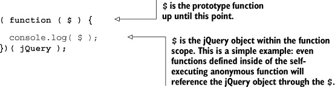

#### 2.6.3\. 模块模式——将私有变量引入 JavaScript

能够将我们的应用程序包裹在一个自执行的匿名函数中，以保护我们的应用程序免受第三方库（以及我们自身）的影响，这真是太好了，但单页应用程序非常大，无法在一个文件中定义。如果有一种方法可以将该文件拆分成模块，每个模块都有自己的私有变量，那就太好了。好吧，你可以看到我要去哪里了...我们可以做到！

让我们看看如何将我们的代码拆分成多个文件，同时仍然利用自执行的匿名函数来控制变量的作用域。

|  |
| --- |

**你还没有习惯自执行的匿名函数的语法吗？**

让我们再看看这个看起来很奇怪的语法：

```
var prison = (function() {
  return "Mike is in prison";
})();
```

实际上等同于以下语法：

```
function makePrison() {
  return 'Mike is in prison';
}
var prison = makePrison();
```

在这两种情况下，`prison` 的值都是“Mike is in prison”。唯一的实际区别是，不需要保存 `makePrison` 函数，因为它只需要使用一次，函数被创建并调用，而不需要保存到任何地方。

|  |
| --- |

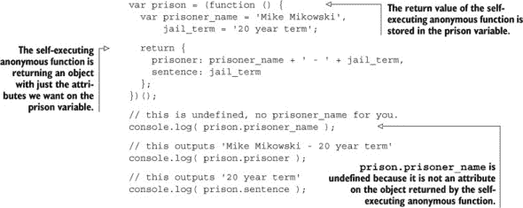

我们的自执行匿名函数立即执行，并返回一个具有 `prisoner` 和 `sentence` 属性的对象。匿名函数没有被存储在 `prison` 变量中，因为匿名函数已经执行了——*匿名函数的返回值* 被存储在 `prison` 变量中。

我们不是将变量 `prisoner_name` 和 `jail_term` 添加到全局作用域，而是只添加变量 `prison`。在更大的模块中，全局变量的减少可能更为显著。

我们对象的一个问题是，在自执行的匿名函数停止执行后，定义在匿名函数中的变量就消失了，因此它们不能被更改。`prisoner_name` 和 `jail_term` 不是保存到变量 `prison` 的对象的属性，因此不能通过这种方式访问。它们是用于在匿名函数返回的对象上定义 `prisoner` 和 `sentence` 属性的变量，并且这些属性可以通过 `prison` 变量访问。


`prison.prisoner` 没有更新是因为几个原因。首先，`jail_term` 不是 `prison` 对象或原型的属性；它是在创建对象并保存到 `prison` 变量时的执行上下文中的一个变量，并且由于函数已经执行完毕，该执行上下文不再存在。其次，这些属性在匿名函数执行时只设置一次，并且永远不会更新。为了使它们更新，我们必须将这些属性转换为每次调用时访问变量的方法。

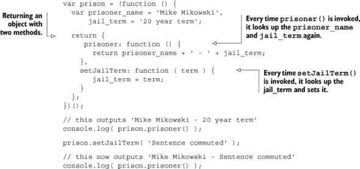

即使自执行的匿名函数已经执行完毕，变量 `prisoner_name` 和 `jail_term` 仍然可以通过 `prisoner` 和 `setJailTerm` 方法访问。`prisoner_name` 和 `jail_term` 现在像私有属性一样作用于 `prison` 对象。它们只能通过匿名函数返回的对象上的方法访问，不能直接在对象或对象的原型上访问。你也许听说过闭包很难。等等，对不起... 我还没有解释这是如何成为闭包的，对吧？好的，让我们退后几步，然后逐步接近它。

##### 什么是闭包？

作为一种抽象概念，闭包可能难以理解，所以在回答“什么是闭包？”这个问题之前，我们需要先设定一些背景知识。请耐心等待，因为在本节结束时，你将得到这个问题的答案。

当程序运行时，它们会占用并使用计算机的内存来完成各种事情，例如存储变量的值。如果程序运行后不再释放不再需要的内存，计算机最终会崩溃。在一些语言中，如 C 语言，内存管理必须由程序员处理，程序员会花费大量时间编写代码以确保内存被释放。

其他语言，如 Java 和 JavaScript，通过从计算机内存中移除不再需要的代码来自动释放内存。这些自动化的系统被称为*垃圾回收器*，可能是因为占位空间的无用变量很臭。关于哪种系统更好，自动或手动，各有各的看法，但这本书的范围之外。只需知道 JavaScript 有一个垃圾回收器。

当一个函数执行完毕时，一种简单的方法是将其内部创建的所有内容从内存中移除。毕竟，函数已经执行完毕，所以看起来我们不再需要访问执行上下文中的任何内容了。

```
var prison = function () {
  var prisoner = 'Josh Powell';
};

prison();
```

一旦`prison`执行完毕，我们就不再需要访问`prisoner`变量，所以乔希可以自由地走了。这种模式比较冗长，所以让我们将其转换回自执行的匿名函数模式。

```
(function () {
  var prisoner = 'Josh Powell';
})();
```

这里也是同样的情况：函数执行完毕后，犯人变量不再需要保留在内存中。再见，乔希！

让我们把这段代码放入我们的模块模式中。

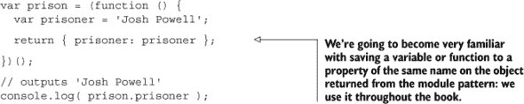

在匿名函数执行完毕后，我们仍然不需要访问`prisoner`变量。因为字符串`Josh Powell`现在存储在`prison.prisoner`中，所以没有必要在模块中保留`prisoner`变量，因为它不再可访问。尽管看起来可能不是这样，`prison.prisoner`的值是字符串`Josh Powell`；它并不指向`prisoner`变量。

```
var prison = (function () {
  var prisoner = 'Josh Powell';

  return {
    prisoner: function () {
      return prisoner;
    }
  }
})();
// outputs 'Josh Powell'
console.log( prison.prisoner() );
```

现在，每次执行`prison.prisoner`时都会访问`prisoner`变量。`prison.prisoner()`返回`prisoner`变量的当前值。如果垃圾回收器来移除它，调用`prison.prisoner`将返回`undefined`而不是`Josh Powell`。

现在，最后，我们可以回答“什么是闭包？”的问题。闭包是通过在创建变量的执行上下文外部保持对变量的访问，防止垃圾回收器从内存中移除变量的过程。当`prisoner`函数被保存在`prison`对象上时，就创建了闭包。闭包是通过在当前执行上下文外部保存一个函数，该函数具有对`prisoner`变量的动态访问权限，从而创建的，这阻止了垃圾回收器从内存中移除`prisoner`变量。

让我们看看几个闭包的更多例子。

```
var makePrison = function ( prisoner ) {
  return function () {
    return prisoner;
  }
};

var joshPrison = makePrison( 'Josh Powell' );
var mikePrison = makePrison( 'Mike Mikowski' );

// outputs 'Josh Powell', prisoner variable is saved in a closure.
// The closure is created because of the anonymous function returned
// from the makePrison call that accesses the prisoner variable.
console.log( joshPrison() );
// outputs 'Mike Mikowski',the prisoner variable is saved in a closure.
// The closure is created because of the anonymous function returned
// from the makePrison call that accesses the prisoner variable.
console.log( mikePrison() );
```

闭包的另一个常见用途是在 Ajax 调用返回时保存变量。在使用 JavaScript 对象的函数时，`this`指向对象：

```
var prison = {
  names: 'Mike Mikowski and Josh Powell',
  who: function () {
    return this.names;
  }
};

// returns 'Mike Mikowski and Josh Powell'
prison.who();
```

如果你使用 jQuery 在方法中发起 Ajax 调用，那么`this`不再指向你的对象；它指向 Ajax 调用：

```
var prison = {
  names: 'Josh Powell and Mike Mikowski',
  who: function () {
    $.ajax({
      success: function () {
        console.log( this.names );
      }
    });
  }
};

// outputs undefined, 'this' is the ajax object
prison.who();
```

那么如何引用该对象呢？闭包来帮忙！记住，闭包是通过将一个可以访问当前执行上下文中变量的函数保存到当前执行上下文之外的变量中创建的。在下面的例子中，它是通过将 `this` 保存到 `that` 中，并在 Ajax 调用返回时执行的函数中访问 `that` 创建的。Ajax 调用是异步的，所以响应是在发出 Ajax 调用的执行上下文之外到达的。

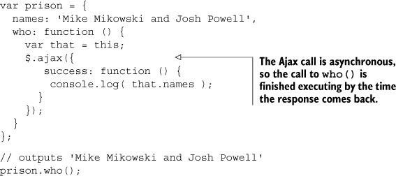

即使 `who()` 在 Ajax 调用返回之前已经执行完毕，但 `that` 变量没有被垃圾回收，并且可以由 `success` 方法使用。

希望我们已经以一种易于理解的方式介绍了闭包，使得我们能够轻松地掌握它们是什么以及它们是如何工作的。现在我们已经了解了闭包是什么，让我们深入探讨闭包的机制，看看它们是如何实现的。

#### 2.6.4\. 闭包

闭包是如何工作的？现在我们理解了 *什么是* 闭包，但还不了解 *它是如何实现的*。答案在于执行上下文对象。让我们看看上一节的一个例子：

```
var makePrison = function (prisoner) {
  return function () {
    return prisoner;
  }
};

var joshPrison = makePrison( 'Josh Powell' );
var mikePrison = makePrison( 'Mike Mikowski' );

// outputs 'Josh Powell'
console.log( joshPrison() );

// outputs 'Mike Mikowski'
console.log( mikePrison() );
```

当调用 `makePrison` 时，会创建一个针对该 *特定* 调用的执行上下文对象，并将 `prisoner` 赋值为传入的值。请记住，执行上下文对象是 JavaScript 引擎的一部分，在 JavaScript 中无法直接访问。

在前面的例子中，我们调用了两次 `makePrison`，并将结果保存到 `joshPrison` 和 `mikePrison` 中。因为 `makePrison` 的返回值是一个函数，当我们将其赋值给 `joshPrison` 变量时，对该 *特定* 执行上下文对象的引用计数为 1，并且因为计数仍然大于零，所以该 *特定* 执行上下文对象被 JavaScript 引擎保留。如果该计数降至零，那么 JavaScript 引擎就会知道该对象可以被垃圾回收。

当再次调用 `makePrison` 并将其赋值给 `mikePrison` 时，会创建一个新的执行上下文对象，并且对该执行上下文对象的引用计数也设置为 1。此时，我们有两个指向两个执行上下文对象的指针，它们的引用计数都是 1，尽管它们都是由执行相同函数创建的。

如果我们再次调用 `joshPrison`，它将使用在 `makePrison` 调用并保存到 `joshPrison` 时的执行上下文对象中的值。除了关闭网页（聪明人）之外，清除保留的执行上下文对象的唯一方法就是删除 `joshPrison` 变量。当我们这样做时，对该执行上下文对象的引用计数降至 0，它可能被 JavaScript 随意移除。

让我们同时启动几个执行上下文对象，看看会发生什么：

##### 列表 2.12\. 执行上下文对象

```
var curryLog, logHello, logStayinAlive, logGoodbye;

curryLog = function ( arg_text ){
  var log_it = function (){ console.log( arg_text ); };
  return log_it;
};

logHello      = curryLog('hello');
logStayinAlive = curryLog('stayin alive!');
logGoodbye    = curryLog('goodbye');

// This creates no reference to the execution context,
// and therefore the execution context object can be
// immediately purged by the JavaScript garbage collector
curryLog('fred');

logHello();      // logs 'hello'
logStayinAlive(); // logs 'stayin alive!'
logGoodbye();    // logs 'goodbye'
logHello();      // logs 'hello' again

// destroy reference to 'hello' execution context
delete window.logHello;

// destroy reference to 'stayin alive!' execution context
delete window.logStayinAlive;

logGoodbye();    // logs 'goodbye'
logStayinAlive(); // undefined - execution context destroyed
```

我们必须记住，每次调用函数时都会创建一个唯一的执行上下文对象。函数执行完成后，执行对象会立即被丢弃*除非调用者保留对其的引用*。如果你返回一个数字，通常你不能保留对函数执行上下文对象的引用。另一方面，如果你返回一个更复杂的结构，如函数、对象或数组，创建对执行上下文的引用通常是通过将返回值存储到变量中实现的——有时是错误地实现的。

有可能创建多层深度的执行上下文引用链。当我们需要时（例如，考虑*对象继承*），这确实是一件好事。但有时我们并不希望有这种闭包，因为它们可能会造成内存使用失控（例如，考虑*内存泄漏*）。在附录 A 中提供了规则和工具，可以帮助你避免意外的闭包。

|  |
| --- |

**闭包——再谈一次！**

在继续之前，因为闭包是 JavaScript 中如此重要且令人困惑的一部分，让我们再尝试一次解释。如果你已经完全掌握了闭包，请随意继续。

```
var   menu, outer_function,
      food = 'cake';

outer_function =function (){
  var fruit, inner_function;

  fruit = 'apple';

  inner_function= function() {
    return { food: food, fruit: fruit };
  }

  return inner_function;
};

menu=  outer_function();

// returns { food:  'cake',fruit: 'apple' }
menu();
```

当`outer_function`执行时，它创建了一个执行上下文。`inner_function`定义在这个执行上下文中

因为`inner_function`是在`outer_function`执行上下文中定义的，所以它可以访问`outer_function`中所有作用域内的变量——在这个例子中是`food`、`fruit`、`outer_function`、`inner_function`和`menu`。

当`outer_function`执行完毕后，你可能预期该执行上下文内部的所有内容都会被垃圾回收器销毁。你会错的。

它没有被销毁，因为在全局作用域中的变量`menu`中保存了对`inner_function`的引用。因为`inner_function`需要保留在它声明时作用域内的所有变量的访问权限，它“覆盖”了`outer_function`执行上下文，以防止垃圾回收器将其移除。这是一个闭包。

|  |
| --- |

这又带我们回到了第一个例子，让我们来分析为什么在 Ajax 调用返回后`scoped_var`仍然是可访问的。

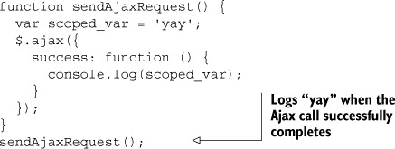

它是可访问的，因为成功方法是在调用`sendAjaxRequest`时创建的执行上下文中定义的，而`scoped_var`当时是有效的。如果你对闭包仍然感到困惑，不要灰心。闭包是 JavaScript 中较为复杂的概念之一，如果在阅读本节几次之后你仍然不理解，请继续前进；这可能是一个需要更多实践经验才能理解的概念。希望到本书结束时，你将拥有足够的实践经验，使其变得自然而然。

由此，我们深入探讨了 JavaScript 的细节，虽然这次回顾并不全面，但重点在于我们认为对于开发大规模 SPA 所必需的概念。我们希望您享受这次旅程。

### 2.7\. 摘要

在本章中，我们介绍了一些概念，虽然这些概念并非 JavaScript 独有，但在其他广泛使用的编程语言中有时也找不到。对这些主题的了解对于编写单页应用至关重要——如果没有这些知识，在构建应用的过程中你可能会感到迷茫。

理解变量作用域、变量提升和函数提升是揭开 JavaScript 中变量神秘面纱的基础。理解执行上下文对象对于理解作用域和提升的工作方式至关重要。

知道如何在 JavaScript 中使用原型创建对象，使得使用原生 JavaScript 编写可重用代码成为可能。如果没有理解基于原型的对象，工程师通常会回退到使用库来编写可重用代码，依赖于库提供的基于类的模型，而实际上这个库是在基于原型的模型之上构建的包装。如果你在学习了基于原型的方法之后仍然偏好使用基于类的系统，你仍然可以利用基于原型的模型来处理简单用例。对于构建我们的单页应用，我们将使用基于原型的模型，原因有两个：我们相信它对于我们的用例来说更简单易用，而且这是 JavaScript 的方式，我们正在用 JavaScript 进行编码。

编写自执行的匿名函数将包含你的变量作用域，帮助你防止无意中污染全局命名空间，并帮助你编写不与其他库冲突的库和代码库。

理解模块模式以及如何使用私有变量，可以使你为你的对象培养一个深思熟虑的公共 API，并隐藏所有其他对象不需要访问的混乱的内部方法和变量。这使你的 API 既整洁又清晰，并使你明确知道哪些方法是应该消费的，哪些是 API 的私有辅助方法。

最后，我们花了很多时间深入探讨最困难的 JavaScript 概念之一：闭包。如果你至今还没有完全理解闭包，希望本书中的足够实践经验能帮助你巩固理解。

带着这些概念，让我们继续进入下一章，开始构建一个具有生产质量的 SPA。
