## 第二部分：SPA 客户端

一个单页应用（SPA）客户端提供的不仅仅是传统网站的用户界面（UI）。尽管有些人说 SPA 客户端可以像桌面应用程序一样响应，但更准确的说法是，编写良好的 SPA 客户端就是桌面应用程序。

与桌面应用程序一样，SPA 客户端与传统网页有显著的不同。当我们用 SPA 替换传统网站时，整个软件栈都会发生变化——从数据库服务器到 HTML 模板。那些有远见卓识，成功从传统网站过渡到 SPA 的公司已经明白，旧的做法和结构必须改变。他们重新聚焦工程人才、纪律和客户端测试。服务器仍然很重要，但它的重点在于提供 JSON 数据服务。

所以，让我们忘记我们关于传统网站客户端开发所知道的一切。好吧，不是*一切*——了解 JavaScript、HTML5、CSS3、SVG、CORS 和其他一些缩写词仍然是有益的。但我们需要记住，当我们进入这些章节时，*我们将构建一个桌面应用程序*，而不是传统网站。在第二部分中，我们将学习如何：

+   构建和测试一个高度可扩展、可测试和强大的 SPA 客户端

+   让后退按钮、书签和其他历史控制功能按预期工作

+   设计、实现和测试健壮的功能模块及其 API

+   让我们的用户界面在移动设备和桌面电脑上无缝工作

+   组织模块和命名空间，以极大地提高测试、团队开发和面向质量的设计。

我们没有讨论的是如何使用特定的 SPA 框架库。我们有很多原因（参见第六章侧边栏中的深入讨论）。我们想解释编写良好的 SPA 的内部工作原理，而不是仅适用于单个框架库的实现复杂性。相反，我们使用经过六年和许多商业产品优化的架构。这个架构鼓励可测试性、可读性和面向质量的设计。它还使得在多个客户端开发者之间分配工作变得简单且愉快。采用这种方法，那些*想要*使用框架库的读者可以做出明智的决定，并更成功地进行使用。

## 第三章：开发 Shell

| |
| --- |

**本章涵盖**

+   描述 Shell 模块及其在我们架构中的位置

+   结构化你的文件和命名空间

+   创建和设计功能容器

+   使用事件处理器切换功能容器

+   使用锚接口模式来管理应用程序状态

| |
| --- |

在本章中，我们描述了*Shell*，这是我们架构的一个必需组件。我们开发了一个包含我们的功能容器的页面布局，然后调整 Shell 来渲染它们。接下来，我们展示了 Shell 如何通过扩展和收缩聊天滑块来管理功能容器。然后，我们让它捕获用户点击事件以打开和关闭滑块。最后，我们使用 URI 锚点作为我们的状态 API，采用*锚点接口模式*。这为用户提供他们期望的浏览器控件——如前进和后退按钮、浏览器历史记录和书签。

到本章结束时，我们将为可扩展和可管理的 SPA 打下基础。但让我们不要过于超前。首先，我们必须理解 Shell。

### 3.1\. 理解 Shell

*Shell*是我们 SPA 的主控制器，并在我们的架构中是必需的。我们可以将 Shell 模块的作用与飞机的机身进行比较：

*飞机的壳体*（也称为单体或机身）为车辆提供形状和结构。座椅、托盘桌和发动机等组件通过各种紧固件附着在其上。所有组件都设计成尽可能独立地工作，因为没有人喜欢当阿姨米莉打开她的托盘桌时，飞机突然向右急剧倾斜。

*Shell 模块*为我们应用程序提供形状和结构。像聊天、登录和导航这样的功能模块通过 API“附着”到 Shell 上。所有功能模块都设计成尽可能独立地工作，因为没有人喜欢当阿姨米莉在她的聊天滑块中输入“`ROTFLMAO!!!` `UR` `totally` `pwned!`”时，应用程序立即关闭她的浏览器窗口。

Shell 只是我们在许多商业项目中精炼的架构的一部分。这个架构——以及 Shell 的位置——在图 3.1 中展示。我们喜欢首先编写 Shell，因为它是我们架构的核心。它协调功能模块与业务逻辑和通用浏览器接口（如 URI 或 cookies）之间的关系。当用户点击后退按钮、登录或执行任何其他改变应用程序可书签状态的操作时，Shell 协调这种变化。

##### 图 3.1\. 我们 SPA 架构中的 Shell

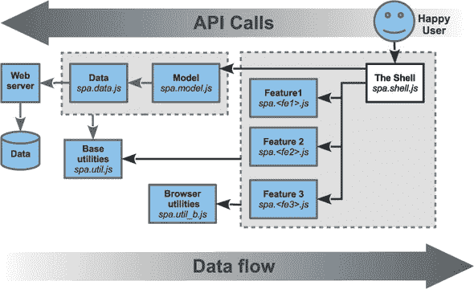

对于熟悉模型-视图-控制器（MVC）架构的您来说，可能会认为 Shell 是主控制器，因为它协调所有从属功能模块的控制器。

Shell 负责以下事项：

+   渲染和管理功能容器

+   管理应用程序状态

+   协调功能模块

下一章将详细介绍功能模块的协调。本章涵盖渲染功能容器和管理应用程序状态。首先让我们准备我们的文件和命名空间。

### 3.2\. 设置文件和命名空间

我们将根据 附录 A 中找到的代码标准来设置我们的文件和命名空间。特别是，我们将为每个 JavaScript 命名空间创建一个 JavaScript 文件，并使用自执行的匿名函数来防止全局命名空间的污染。我们还将设置具有并行结构的 CSS 文件。这种约定加快了开发速度，提高了质量，并简化了维护。随着我们向项目中添加更多模块和开发者，其价值也会增加。

#### 3.2.1\. 创建文件结构

我们为我们的应用程序的根命名空间选择了 `spa`。我们同步 JavaScript 和 CSS 文件名、JavaScript 命名空间和 CSS 选择器名称。这使得跟踪哪个 JavaScript 与哪个 CSS 相关联变得容易得多。

##### 规划目录和文件

网页开发者通常将他们的 HTML 文件放在一个目录中，然后将他们的 CSS 和 JavaScript 放在子目录中。我们没有看到打破传统的原因。让我们创建如 列表 3.1 所示的目录和文件：

##### 列表 3.1\. 文件和目录，第一次遍历

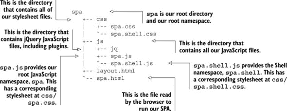

现在我们已经建立了基础，让我们开始安装 jQuery。

##### 安装 jQuery 和插件

jQuery 及其插件通常提供为压缩版或普通版文件。我们几乎总是安装普通版文件，因为这有助于调试，而且我们无论如何都会在我们的构建系统中进行压缩。不用担心它们的功能——我们将在本章的后面部分详细介绍。

jQuery 库提供了有用的跨平台 DOM 操作和其他实用工具。我们使用的是版本 1.9.1，可以从 [`docs.jquery.com/Downloading_jQuery`](http://docs.jquery.com/Downloading_jQuery) 获取。让我们将其放置在我们的 jQuery 目录中：

```
...
  +-- js
  |   +-- jq
  |   |   +-- jquery-1.9.1.js
  ...
```

jQuery 的 `uriAnchor` 插件提供了管理 URI 锚组件的实用工具。它可以在 github 上找到 [`github.com/mmikowski/urianchor`](https://github.com/mmikowski/urianchor)。让我们将其放置在相同的 jQuery 目录中：

```
...
  +-- js
  |   +-- jq
  |   |   +-- jquery.uriAnchor-1.1.3.js
  ...
```

我们文件和目录现在应该看起来像 列表 3.2：

##### 列表 3.2\. 添加 jQuery 和插件后的文件和目录

```
spa
  +-- css
  |   +-- spa.css
  |   `-- spa.shell.css
  +-- js
  |   +-- jq
  |   |   +-- jquery-1.9.1.js
  |   |   `-- jquery.uriAnchor-1.1.3.js
  |   +-- spa.js
  |   `-- spa.shell.js
  +-- layout.html
  `-- spa.html
```

现在我们已经将所有文件放置到位，是时候开始编写一些 HTML、CSS 和 JavaScript 了。

#### 3.2.2\. 编写应用程序 HTML

当我们打开我们的浏览器文档（spa/spa.html）时，我们可以享受到目前为止我们所创造的所有的单页应用（SPA）优点。当然，因为这个文件是空的，所以提供的优点仅限于一个无错误的、高度安全的空白页，什么也不做。让我们改变“空白页”部分。

浏览器文档（spa/spa.html）将始终保持小巧。它的唯一作用是加载库和样式表，然后启动我们的应用程序。让我们启动我们最喜欢的文本编辑器，并添加我们通过本章所需的全部代码，如 列表 3.3 所示：

##### 列表 3.3\. 应用程序 HTML—spa/spa.html

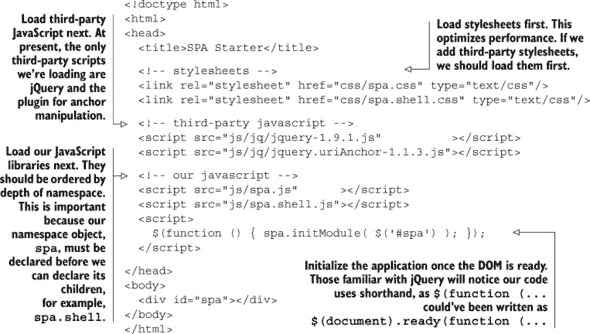

在场的性能意识开发者可能会问：“为什么我们不把脚本放在 `body` 容器的末尾，就像传统的网页一样？”这是一个合理的问题，因为这样通常可以使页面渲染更快，因为静态 HTML 和 CSS 可以在 JavaScript 加载完成之前显示。但是，单页应用（SPAs）并不这样工作。它们使用 JavaScript 生成 HTML，因此将脚本放在头部外部并不会导致渲染更快。相反，我们保持所有外部脚本在 `head` 部分以改善组织和可读性。

#### 3.2.3. 创建根 CSS 命名空间

我们的根命名空间是 `spa`，根据我们在附录 A 中的约定，我们的根样式表应该命名为 spa/css/spa.css。我们之前创建了此文件，但现在我们需要填充它。因为这是我们的根样式表，它将比我们的其他 CSS 文件包含更多部分。让我们再次使用我们最喜欢的文本编辑器来添加所需的规则，如图列表 3.4 所示：

##### 列表 3.4. 根 CSS 命名空间—spa/css/spa.css

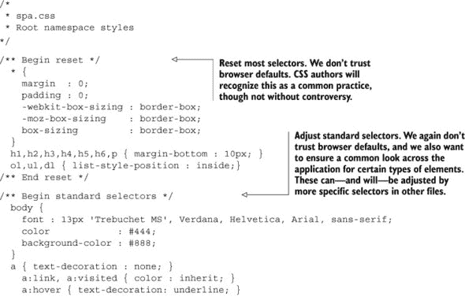

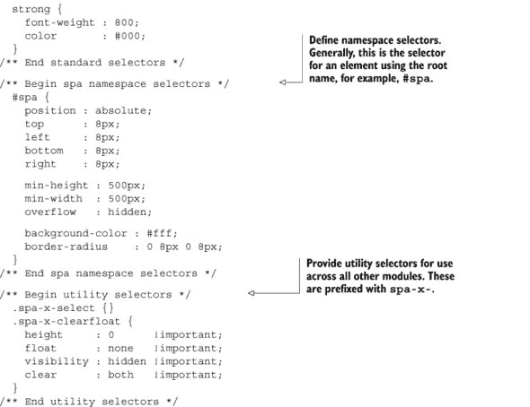

根据我们的代码标准，这个文件中所有的 CSS ID 和类名都以前缀 `spa-` 开头。现在我们已经创建了根应用程序 CSS，我们将创建相应的 JavaScript 命名空间。

#### 3.2.4. 创建根 JavaScript 命名空间

我们的根命名空间是 `spa`，根据我们在附录 A 中的约定，我们的根 JavaScript 应该命名为 spa/js/spa.js。所需的 JavaScript 最少是 `var spa = {};`。但是，我们想要添加一个初始化应用程序的方法，并确保代码能够通过 JSLint 检查。我们可以使用附录 A 中的模板，并对其进行简化，因为我们不需要所有部分。让我们用我们第二喜欢的文本编辑器打开文件，并按照列表 3.5 中的内容进行填充：

##### 列表 3.5. 根 JavaScript 命名空间—spa/js/spa.js

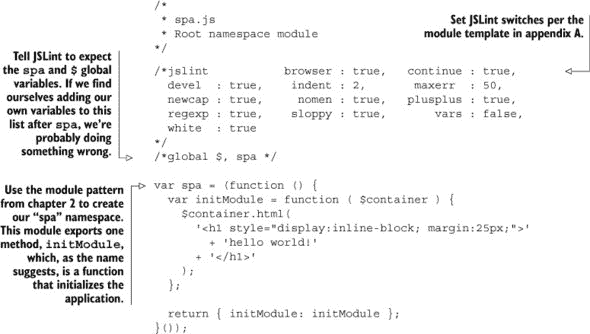

我们想要确保我们的代码没有任何常见错误或不良实践。附录 A 展示了如何安装和运行有价值的 JSLint 实用工具，它正是这样做的。它描述了文件顶部所有的 `/*jslint ... */` 开关的含义。除了附录，我们还在第五章中进一步讨论了 JSLint。

让我们在命令行中输入 `jslint spa/js/spa.js` 来检查我们的代码——我们不应该看到任何警告或错误。现在我们可以打开我们的浏览器文档（spa/spa.html），并看到合同规定的“hello world”演示，如图图 3.2 所示。

##### 图 3.2. 强制性的“hello world”截图

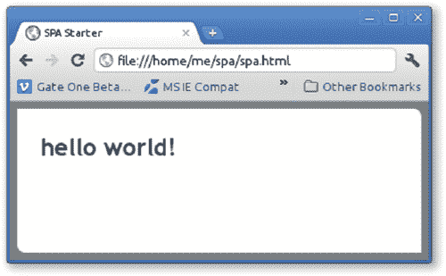

现在我们已经向世界打招呼，并因成功的甜美味道而信心倍增，让我们开始一个更雄心勃勃的探索。在下一节中，我们将开始构建我们的第一个“真实世界”SPA。

### 3.3. 创建功能容器

外壳创建并管理我们的功能模块将使用的容器。例如，我们的聊天滑块容器将遵循流行惯例，并锚定在浏览器窗口的右下角。外壳负责滑块容器，但不会管理容器内部的行为——这留给了聊天功能模块，我们将在 第六章 中讨论。

让我们把聊天滑块放置在一个相对完整的布局中。图 3.3 显示了我们希望看到的容器线框图。

##### 图 3.3\. 应用程序容器线框图

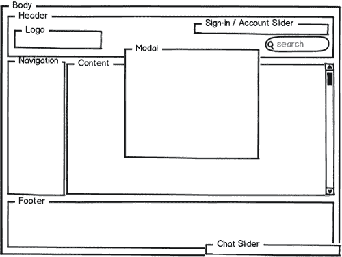

当然，这只是一个线框图。我们需要将其转换为 HTML 和 CSS。让我们讨论一下我们可能如何做到这一点。

#### 3.3.1\. 选择策略

我们将在 spa/layout.html 单一布局文档文件中开发我们的功能容器的 HTML 和 CSS。只有在我们将容器调整到满意的程度之后，我们才会将代码移动到外壳的 CSS 和 JavaScript 文件中。这种方法通常是开发初始布局最快和最有效的方法，因为我们可以在不担心与其他代码交互的情况下进行操作。

我们首先编写 HTML，然后稍后添加样式。

#### 3.3.2\. 编写外壳 HTML

HTML5 和 CSS3 的一个显著特点是我们真的可以分离样式和内容。线框图显示了我们想要的容器以及它们的嵌套方式。这就是我们自信地编写容器 HTML 所需要的一切。让我们打开我们的布局文档 ([spa/layout.html](http://spa/layout.html)) 并输入 列表 3.6 中所示的 HTML：

##### 列表 3.6\. 创建容器的 HTML——spa/layout.html

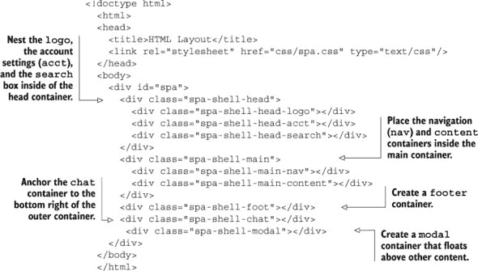

现在我们应该验证 HTML 以确保它没有错误。我们喜欢使用备受推崇的 Tidy 工具，它可以找到缺失的标签和其他常见的 HTML 错误。您可以在 [`infohound.net/tidy/`](http://infohound.net/tidy/) 在线找到 Tidy，或从 [`tidy.sourceforge.net/`](http://tidy.sourceforge.net/) 下载源代码。如果您使用的是 Ubuntu 或 Fedora 等 Linux 发行版，Tidy 可能已经在标准软件仓库中可用。现在让我们给这些容器添加一些样式。

#### 3.3.3\. 编写外壳 CSS

我们将编写 CSS 以提供一种 *液体布局*，其中内容的宽度和高度将调整以填充浏览器窗口，除非在最极端的大小之外。我们将为我们的功能容器提供背景颜色，这样我们就可以轻松地看到它们。我们还将避免任何边框，因为它们可以改变 CSS 盒子的大小。这会给我们的快速原型过程带来不必要的繁琐。一旦我们对容器的展示感到满意，我们就可以返回添加必要的边框。

|  |
| --- |

**液体布局**

随着我们的布局变得越来越复杂，我们可能需要使用 JavaScript 来提供其**流动性**。通常，我们会使用窗口大小调整事件处理器来确定浏览器窗口的大小，然后重新计算并应用新的 CSS 尺寸。我们在第四章中展示了这一技术。

|  |
| --- |

让我们将 CSS 添加到布局文档的 `<head>` 部分 ([spa/layout.html](http://spa/layout.html))。我们可以在 `spa.css` 样式表链接之后立即放置它，如图 3.7 节所示。所有更改都以**粗体**显示：

##### 列表 3.7\. 为容器创建 CSS—spa/layout.html

```
...
  <head>
    <title>HTML Layout</title>
    <link rel="stylesheet" href="css/spa.css" type="text/css"/>
    <style>
      .spa-shell-head, .spa-shell-head-logo, .spa-shell-head-acct,
      .spa-shell-head-search, .spa-shell-main, .spa-shell-main-nav,
      .spa-shell-main-content, .spa-shell-foot, .spa-shell-chat,
      .spa-shell-modal {
        position : absolute;
      }
      .spa-shell-head {
        top     : 0;
        left    : 0;
        right   : 0;
        height  : 40px;
      }
      .spa-shell-head-logo {
        top        : 4px;
        left       : 4px;
        height     : 32px;
        width      : 128px;
        background : orange;
      }
      .spa-shell-head-acct {
        top    : 4px;
        right  : 0;
        width  : 64px;
        height : 32px;
        background : green;
      }
      .spa-shell-head-search {
        top        : 4px;
        right      : 64px;
        width      : 248px;
        height     : 32px;
        background : blue;
      }

      .spa-shell-main {
        top    : 40px;
        left   : 0;
        bottom : 40px;
        right  : 0;
      }
      .spa-shell-main-content,
      .spa-shell-main-nav {
        top    : 0;
        bottom : 0;
      }
      .spa-shell-main-nav {
        width      : 250px;
        background : #eee;
      }
      .spa-x-closed .spa-shell-main-nav {
        width : 0;
      }

      .spa-shell-main-content {
        left       : 250px;
        right      : 0;
        background : #ddd;
      }
      .spa-x-closed .spa-shell-main-content {
        left : 0;
      }

      .spa-shell-foot {
        bottom : 0;
        left   : 0;
        right  : 0;
        height : 40px;
      }
      .spa-shell-chat {
        bottom     : 0;
        right      : 0;
        width      : 300px;
        height     : 15px;
        background : red;
        z-index    : 1;
      }
      .spa-shell-modal {
        margin-top    : -200px;
        margin-left   : -200px;
        top           : 50%;
        left          : 50%;
        width         : 400px;
        height        : 400px;
        background    : #fff;
        border-radius : 3px;
        z-index       : 2;
      }
     </style>
  </head>
...
```

当我们打开我们的浏览器文档 ([spa/layout.html](http://spa/layout.html)) 时，我们应该看到一个看起来与我们的线框图惊人相似的页面，如图 3.4 节所示。当我们调整浏览器窗口大小时，我们可以看到功能容器也会相应调整大小。我们的流动布局确实有一个限制——如果我们使宽度或高度小于 500 像素，将显示滚动条。我们这样做是因为我们无法将内容挤压到这个大小以下。

##### 图 3.4\. 容器的 HTML 和 CSS—spa/layout.html


我们可以使用 Chrome 开发者工具来尝试一些我们新定义的样式，这些样式在初始显示中并未使用。例如，让我们将类 `spa-x-closed` 添加到 `spa-shell-main` 容器中。这将关闭页面左侧的导航栏。移除该类将恢复导航栏，如图 3.5 节所示。

##### 图 3.5\. 在 Chrome 开发者工具中双击 HTML 添加类

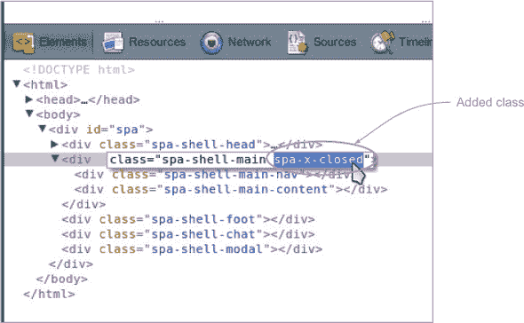

### 3.4\. 渲染功能容器

我们创建的布局文档 ([spa/layout.html](http://spa/layout.html)) 是一个很好的基础。现在我们将使用它在我们的 SPA 中。第一步是让 Shell 渲染容器，而不是使用静态 HTML 和 CSS。

#### 3.4.1\. 将 HTML 转换为 JavaScript

我们需要我们的 JavaScript 来管理所有文档更改；因此，我们需要将之前开发的 HTML 转换为 JavaScript 字符串。我们将保持 HTML 缩进以方便可读性和维护性，如图 3.8 节所示：

##### 列表 3.8\. 连接 HTML 模板

```
varmain_html =String()
  +'<div  class="spa-shell-head">'
   + '<div class="spa-shell-head-logo"></div>'
   + '<div class="spa-shell-head-acct"></div>'
   + '<div class="spa-shell-head-search"></div>'
  +'</div>'
  +'<div  class="spa-shell-main">'
   + '<div class="spa-shell-main-nav"></div>'
   + '<div class="spa-shell-main-content"></div>'
  +'</div>'
  +'<div  class="spa-shell-foot"></div>'
  +'<div  class="spa-shell-chat"></div>'
  +'<div class="spa-shell-modal"></div>';
```

我们并不担心连接字符串的性能惩罚。一旦进入生产阶段，JavaScript 压缩器会为我们连接字符串。

|  |
| --- |

**配置您的编辑器！**

一位专业的开发者应该使用专业级的文本编辑器或 IDE。其中大多数都支持正则表达式和宏。我们应该能够自动化将 HTML 转换为 JavaScript 连接字符串。例如，备受尊敬的 `vim` 编辑器可以被配置为通过两个按键将 HTML 格式化为 JavaScript 连接字符串。我们可以在我们的 ~/.vimrc 文件中添加以下内容：

```
vmap <silent> ;h :s?^\(\s*\)+ '\([^']\+\)',*\s*$?\1\2?g<CR>
vmap <silent> ;q :s?^\(\s*\)\(.*\)\s*$? \1 + '\2'?<CR>
```

一旦我们重启 vim，我们可以直观地选择要更改的 HTML。当我们按下 `;q` 时，选择将被格式化；当我们按下 `;h` 时，我们将撤销格式。

|  |
| --- |

#### 3.4.2\. 将 HTML 模板添加到我们的 JavaScript 中

现在是时候大胆地迈出一步，创建我们的 Shell。当我们初始化 Shell 时，我们希望它用功能容器填充我们选择页面的元素。在此期间，我们还想缓存 jQuery 集合对象。我们可以使用附录 A 中的模块模板[kindle_split_022.html#app01]以及我们刚刚创建的 JavaScript 字符串来完成此操作。让我们打开我们的文本编辑器并创建列表 3.9 中所示的文件。请仔细注意注释，因为它们提供了有用的细节：

##### 列表 3.9. 启动 Shell——spa/js/spa.shell.js

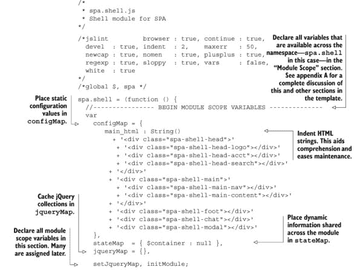

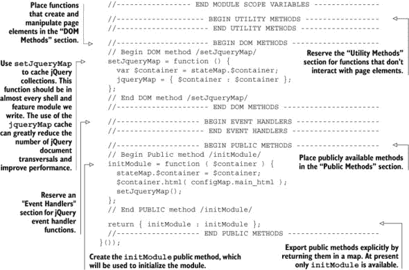

现在我们有一个渲染功能容器的模块，但我们仍然需要填充 CSS 文件，并指导根命名空间模块（spa/js/spa.js）使用 Shell 模块（spa/js/spa.shell.js）而不是展示传统的“hello world”文本。让我们开始吧。

#### 3.4.3. 编写 Shell 样式表

使用我们在附录 A 中介绍的命名空间约定 appendix A，我们知道我们需要将我们的`spa-shell-*`选择器放入一个名为 spa/css/spa.shell.css 的文件中。我们可以直接将我们在[spa/layout.html](http://spa/layout.html)中开发的 CSS 复制到该文件中，如列表 3.10 所示：

##### 列表 3.10. Shell CSS，第 1 版——spa/css/spa.shell.css

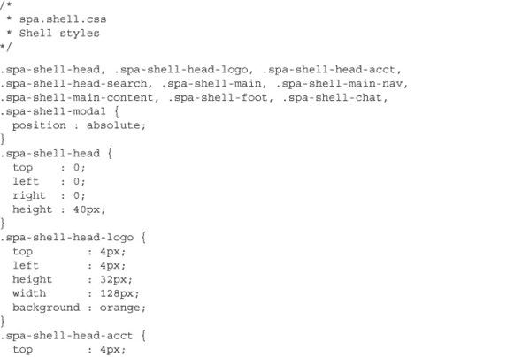

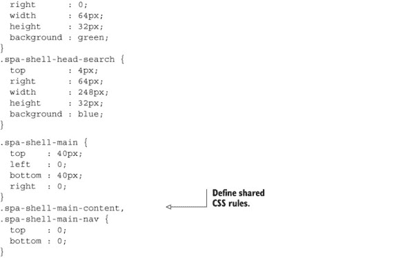

所有选择器都有`spa-shell-`前缀。这有几个好处：

+   它显示这些类是由 Shell 模块（spa/js/spa.shell.js）控制的。

+   它防止了与第三方脚本和我们的其他模块的命名空间冲突。

+   当我们在调试和检查文档 HTML 时，我们可以立即看到哪些元素是由 shell 模块生成的。

所有这些好处都阻止了我们陷入 CSS 选择器名称混乱的地狱。任何管理过大量样式表的人都应该知道我们说的是什么。

#### 3.4.4. 指导应用程序使用 Shell

现在让我们修改我们的根命名空间模块（spa/js/spa.js），让它使用 Shell 而不是盲目地将“hello world”复制到 DOM 中。以下**粗体**的调整应该能解决问题：

```
/*
 * spa.js
 * Root namespace module
*/
...
/*global $, spa */
var spa = (function () {
  var initModule = function ( $container ) {
     spa.shell.initModule( $container );
  };

  return { initModule: initModule };
}());
```

我们现在应该能够打开我们的浏览器文档([spa/spa.html](http://spa/spa.html))并看到类似于图 3.6 的内容。我们可以使用 Chrome 开发者工具来确认我们的 SPA 生成的文档([spa/spa.html](http://spa/spa.html))与我们的布局文档([spa/layout.html](http://spa/layout.html))相匹配。

##### 图 3.6. 这就像又一次的似曾相识——spa/spa.html

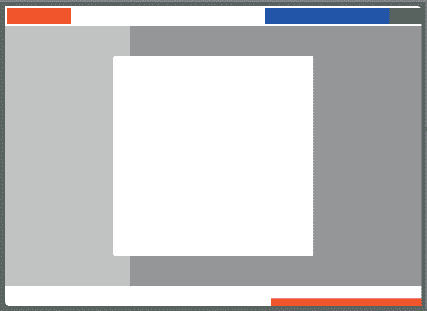

在这个基础上，我们将开始工作，让 Shell 管理功能容器。现在休息一下可能也是个好主意，因为下一部分相当雄心勃勃。

### 3.5. 管理功能容器

Shell 负责渲染和控制*功能容器*。这些是“顶级”容器——通常是`DIV`元素，它们包含功能内容。Shell 初始化并协调应用程序中的所有功能模块。Shell 指导功能模块创建和管理功能容器内的所有内容。我们将在第四章中进一步讨论功能模块。第四章。

在本节中，我们首先编写一个方法来展开和缩回聊天滑动功能容器。然后我们将构建点击事件处理器，以便用户可以根据需要随时打开或关闭滑动。然后我们将检查我们的工作，并讨论下一个重要的事情——使用 URI 哈希片段管理页面状态。

#### 3.5.1\. 编写展开或缩回聊天滑动的方法

我们对聊天滑动功能将抱有适度的雄心。我们需要它达到生产质量，但不需要过于奢华。以下是我们要实现的要求：

1.  允许开发者配置滑动动作的速度和高度。

1.  创建一个单一的方法来展开或缩回聊天滑动。

1.  避免出现滑动同时展开和缩回的竞态条件。

1.  允许开发者传递一个可选的回调函数，在滑动动作完成后调用。

1.  编写测试代码以确保滑动正常工作。

让我们调整 Shell 以满足这些要求，如列表 3.11 所示.^([1]) 所有更改都以**粗体**显示。请查看注释，因为它们详细说明了更改如何与要求相关：

> ¹ 现在是感谢您最喜欢的天体 jQuery 的时候了，因为没有它这将困难得多。

##### 列表 3.11\. Shell，修订以展开和缩回聊天滑动—spa/js/spa.shell.js

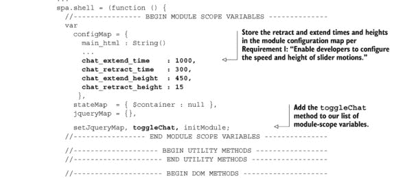

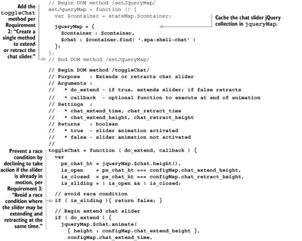

如果你*正在家中参与其中*，让我们首先通过在命令行中键入`jslintspa/js/spa.shell.js`来使用 JSLint 检查我们的代码——我们不应该看到任何警告或错误。接下来，让我们重新加载浏览器文档([spa/spa.html](http://spa/spa.html))，并查看聊天滑动在 3 秒后展开，在 8 秒后缩回。现在我们有了滑动的效果，我们可以使用用户的鼠标点击来切换其位置。

#### 3.5.2\. 添加聊天滑动点击事件处理器

大多数用户期望点击聊天滑动并看到它展开或缩回，因为这是一种常见的约定。以下是我们要实现的要求：

1.  设置工具提示文本以提示用户操作，例如“点击缩回。”

1.  添加一个点击事件处理器来调用`toggleChat`。

1.  将点击事件处理器绑定到 jQuery 事件。

让我们调整 Shell 以满足这些要求，如列表 3.12 所示。所有更改再次以**粗体**显示，注释详细说明了更改如何与要求相关。

##### 列表 3.12\. Shell，修订以处理聊天滑动点击事件—spa/js/spa.shell.js

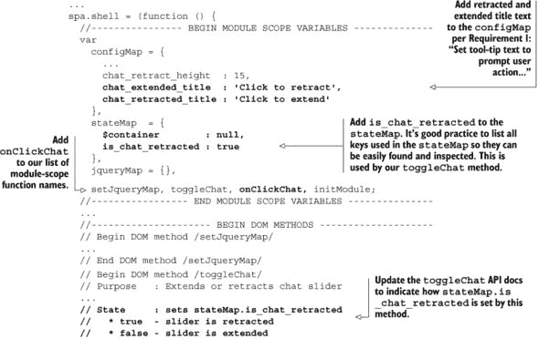

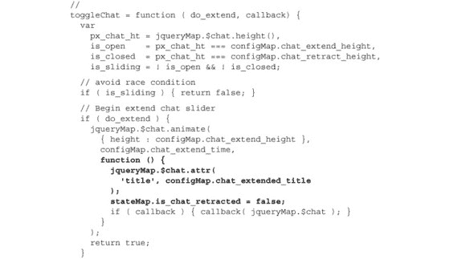

在家练习的人应该再次通过在命令行中键入 `jslint` `spa/js/spa.shell.js` 来检查我们的代码。我们不应该看到任何警告或错误。

我们认为 jQuery 事件处理器的一个方面非常重要，需要记住：返回值被 jQuery 解释为指定其继续处理事件。我们通常从我们的 jQuery 事件处理器返回 `false`。以下是这样做的作用：

+   它告诉 jQuery 阻止默认操作——比如跟随链接或选择文本——的发生。在事件处理器中调用 `event.preventDefault()` 可以获得相同的效果。

+   它告诉 jQuery 停止事件在父 DOM 元素上触发相同的事件（这种行为通常称为 *冒泡*）。在事件处理器中调用 `event.stopPropagation()` 可以获得相同的效果。

+   它结束了处理器执行。如果点击的元素在此处理器之后还有其他绑定的事件处理器，下一个处理器将被执行。（如果我们不希望后续处理器执行，我们可以调用 `event.preventImmediatePropagation()`。）

这三个动作通常是我们要让事件处理器执行的动作。很快我们将编写不希望这些动作的事件处理器。这些事件处理器将返回 `true` 值。

Shell 不必一定处理点击事件。它可以通过将滑块操作作为对聊天模块的回调来提供这种能力——我们鼓励这样做。但是，因为我们还没有编写那个模块，所以我们目前还在 Shell 中处理点击事件。

现在让我们给 Shell 样式添加一点风采。列表 3.13 展示了更改：

##### 列表 3.13．为 Shell 添加一些风采—spa/css/spa.shell.css

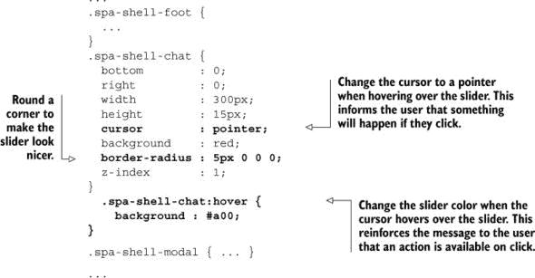

当我们重新加载浏览器文档 ([spa/spa.html](http://spa/spa.html)) 时，我们可以点击滑块，看到它像 图 3.7 中所示的那样扩展。

##### 图 3.7\. 扩展聊天滑块—spa/spa.html

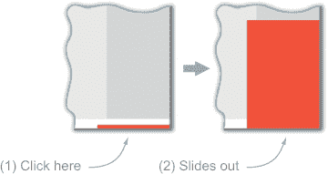

滑块扩展的速度比收缩慢得多。我们可以通过更改 Shell 中的配置（spa/js/spa.shell.js）来改变滑块的速度，例如：

```
...
  configMap = {
    main_html : String()
    ...
    chat_extend_time  : 250,
    chat_retract_time : 300,
    ...
 },
...
```

在下一节中，我们将调整我们的应用程序以更好地管理其状态。完成之后，所有浏览器历史功能，如书签、前进按钮和后退按钮，都将按用户期望的方式为聊天滑块工作。

### 3.6\. 管理应用程序状态

在计算机科学中，*状态*是应用程序中信息的唯一配置。桌面和 Web 应用程序通常试图在会话之间保持某种状态。例如，当我们保存一个文档处理文档并在稍后日期再次打开它时，文档会被恢复。应用程序也可能恢复窗口大小、我们的首选项以及光标和页面位置。我们的 SPA 也需要管理状态，因为使用浏览器的用户已经习惯了某些行为。

#### 3.6.1\. 理解浏览器用户期望的行为

桌面和 Web 应用程序在维护状态方面差异很大。如果桌面应用程序不提供“返回”功能，则可以省略上一个按钮。但在 Web 应用程序中，我们有一个浏览器的前进按钮——这是最常用的浏览器控制之一——直接面对用户，请求被点击——而我们无法将其删除。

同样，对于前进按钮、书签按钮和查看历史记录，用户期望这些*历史记录*控制能够正常工作。如果它们不能正常工作，我们的用户会变得烦躁，我们的应用程序将永远不会赢得 Webby 奖。表 3.1 展示了这些历史记录控制的大致桌面应用程序对应项。

##### 表 3.1\. 浏览器与桌面控制对比

| 浏览器控制 | 桌面控制 | 评论 |
| --- | --- | --- |
| 后退按钮 | 撤销 | 回到先前的状态 |
| 向前按钮 | 重做 | 从最近的“撤销”或“后退”动作恢复状态 |
| 书签 | 保存为 | 存储应用程序状态以供将来使用或参考 |
| 查看历史记录 | 撤销历史记录 | 查看撤销/重做序列中的步骤 |

因为我们确实希望赢得 Webby 奖，我们必须确保这些历史记录控制按用户期望的方式工作。接下来，我们将讨论提供用户期望的行为的策略。

#### 3.6.2\. 选择一个策略来管理历史记录控制

提供历史记录控制的最佳策略应满足以下要求：

1.  历史记录控制应按用户期望的方式工作，如表 3.1 所示。

1.  支持历史记录控制的开发应相对便宜。与没有历史记录控制的开发展开相比，它不应需要更多的时间或复杂性。

1.  应用程序应表现良好。应用程序不应比响应用户动作花费更长的时间，用户界面也不应因此变得更加复杂。

让我们以聊天滑块和以下用户交互为例，考虑一些策略：

1.  苏珊访问我们的 SPA 并点击聊天滑块以打开它。

1.  她将 SPA 添加到书签，然后浏览到其他网站。

1.  之后，她决定返回我们的应用程序并点击她的书签。

让我们考虑三种策略，使苏珊的书签按预期工作。请不用担心记住它们；我们只是想说明它们的相对优点：^([2])

> ² 有其他策略——比如使用持久 cookie 或 iframe——但这些策略实际上过于有限且复杂，不值得考虑。

*策略 1*——在点击时，事件处理程序直接调用`toggleChat`例程，并忽略 URI。当苏珊返回到她的书签时，滑块将显示在其默认位置——关闭。苏珊对此并不满意，因为书签没有按预期工作。开发者詹姆斯也不满意，因为他的产品经理认为应用程序的可用性不可接受，并不断催促他。

*策略 2*—在点击时，事件处理器直接调用 `toggleChat` 例程，然后修改 URI 以记录此状态。当苏珊返回到她的书签时，应用程序必须识别 URI 中的参数并对其采取行动。苏珊很高兴。开发者詹姆斯则 *不高兴*，因为他现在必须支持两种将滑块打开的条件：运行时点击事件和加载时 URI 参数。而且詹姆斯的产品经理也不太高兴，因为支持这种双路径方法速度较慢，且容易出错和出现不一致。

*策略 3*—在点击时，事件处理器更改 URI 然后立即返回。Shell `hashchange` 事件处理器捕获更改，并将任务调度到 `toggleChat` 例程。当苏珊返回到她的书签时，URI 由相同的例程解析，并恢复打开的滑块。苏珊很高兴，因为书签按预期工作。开发者詹姆斯也很高兴，因为他可以使用 *一条代码路径实现所有可书签状态*。而且詹姆斯的产品经理也很高兴，因为开发速度快且相对无错误。

我们首选的解决方案是 *策略 3*，因为它支持所有历史控制（要求 A）。它解决了并最小化了开发问题（要求 B）。并且通过仅调整在使用历史控制时需要更改的页面部分来确保应用程序性能（要求 C）。这种 URI 总是驱动页面状态的解决方案，我们称之为 *锚点接口模式*，如图 图 3.8 所示。

##### 图 3.8\. 锚点接口模式

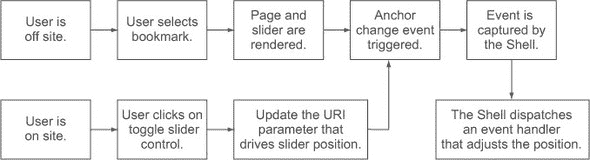

我们将在 第四章 中回到这个模式。现在我们已经选择了我们的策略，让我们来实现它。

#### 3.6.3\. 当发生历史事件时更改锚点

URI 的锚点组件指示浏览器显示页面的一部分。锚点的其他常见名称有 *书签组件* 或 *哈希片段*。锚点始终以 `#` 符号开头，在以下代码中用 **粗体** 表示：

```
http://localhost/spa.html#!chat=open
```

传统上，网络开发者使用锚点机制来使用户能够轻松地在长文档的各个部分之间“跳转”。例如，顶部有目录的网页可能会将所有章节标题链接到文档中相应的部分。每个部分可能在末尾都有一个“返回顶部”的链接。博客和论坛仍然广泛使用这种机制。

锚点组件的一个特例是，当它更改时，浏览器不会重新加载页面。锚点组件仅是客户端控制，这使得它成为存储我们应用程序状态的理想位置。这种技术被许多单页应用程序（SPAs）所使用。

我们将我们希望在浏览器历史记录中保留的应用程序状态变化称为*历史事件*。因为我们决定打开或关闭聊天是一个历史事件（你错过了会议），所以我们可以让我们的点击事件处理器更改锚点以表达聊天滑块的状态。我们可以使用`uriAnchor`jQuery 插件来完成这项繁重的工作。让我们修改 Shell，以便用户点击可以像列表 3.14 中所示的那样更改 URI。所有更改都以**粗体**显示。

##### 列表 3.14\. uriAnchor jQuery 插件在 spa/js/spa.shell.js 中的应用

```
...
  //------------------- BEGIN EVENT HANDLERS -------------------
  onClickChat = function ( event ) {
    if ( toggleChat( stateMap.is_chat_retracted ) ) {
      $.uriAnchor.setAnchor({
        chat : ( stateMap.is_chat_retracted ? 'open' : 'closed' )
      });
    }
    return false;
  };
  //-------------------- END EVENT HANDLERS --------------------
  ...
```

现在我们点击滑块，我们会看到 URI 中的锚点发生变化——但只有当`toggleChat`成功并返回 true 时。例如，当我们点击打开和关闭聊天滑块时，我们会看到以下内容：

```
http://localhost/spa.html#!chat=closed
```

| |
| --- |

**关于那个感叹号**

在示例 URI 中，跟随哈希符号（`#!`）的感叹号用于通知 Google 和其他搜索引擎，该 URI 可能被索引以供搜索。我们将在第九章中详细介绍搜索引擎优化。

| |
| --- |

我们需要确保当锚点发生变化时，只有需要调整的应用程序部分发生变化。这使得应用程序运行得更快，并避免了当页面的某些部分不必要地被清除和重新渲染时发生的令人烦恼的“闪烁”。例如，假设 Susan 在打开聊天滑块时正在查看一千个用户资料的列表。如果她点击返回按钮，应用程序应该简单地关闭滑块——资料不应该被重新渲染。

我们问自己三个问题，以确定事件的变化是否值得历史支持：

+   用户将多么强烈地希望书签已发生的变化？

+   用户将多么强烈地希望恢复到变化之前的状态？

+   这将花费多少？

虽然使用锚点接口模式维护状态的增量成本通常很小，但在某些情况下，它可能很昂贵或不可能。例如，当用户点击返回按钮时，在线购买可能很难撤销。在这种情况下，我们需要完全避免历史条目的创建。幸运的是，我们的`uriAnchor`插件支持这一点。

#### 3.6.4\. 使用锚点驱动应用程序状态

我们希望锚点组件始终驱动可书签的应用程序状态。这确保了历史功能始终按预期工作。以下伪代码概述了我们如何处理历史事件的方式：

+   当发生历史事件时，更改 URI 的锚点组件以反映变化后的状态：

    +   接收事件的处理器调用 Shell 实用程序来更改锚点。

    +   事件处理器随后退出。

+   Shell 的`hashchange`事件处理器会注意到 URI 的变化并对其做出反应：

    +   它将当前状态与由新锚点提出的状态进行比较。

    +   它试图根据比较结果更改需要调整的应用程序部分。

    +   如果它无法执行所需的更改，它将保持当前状态，并将锚恢复以匹配它。

现在我们已经绘制了伪代码，让我们开始将其转换为实际内容。

##### 将 Shell 修改为使用锚组件

让我们修改 Shell 以使用锚组件来驱动应用程序状态，如 列表 3.15 所示。这里有很多新的代码，但不要气馁——所有内容都将适时解释：

##### 列表 3.15\. 使用锚来驱动应用程序状态——spa/js/spa.shell.js

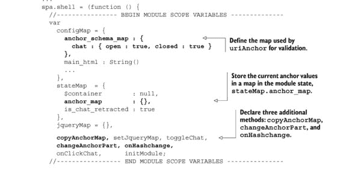

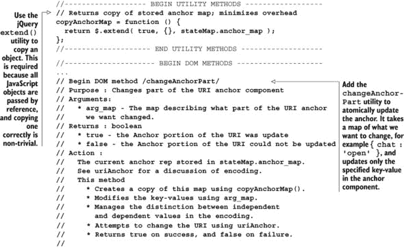

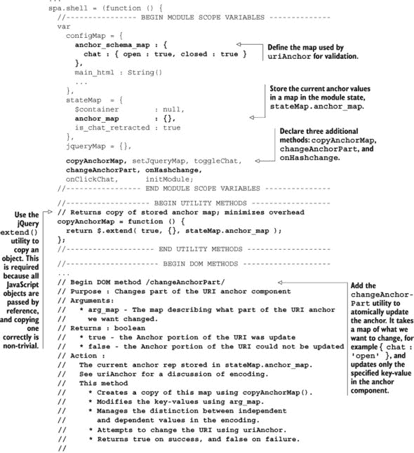

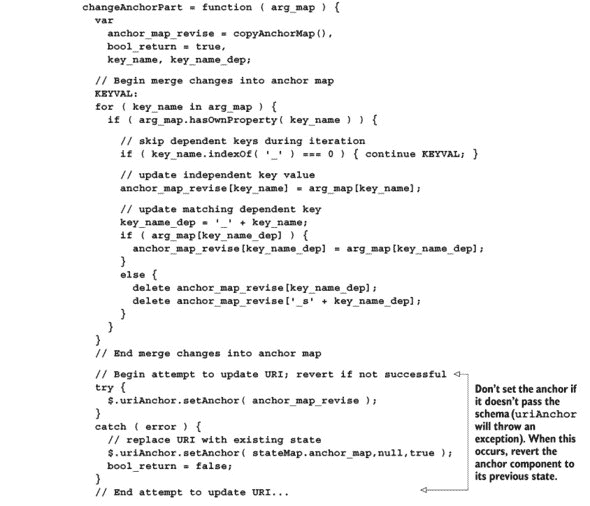

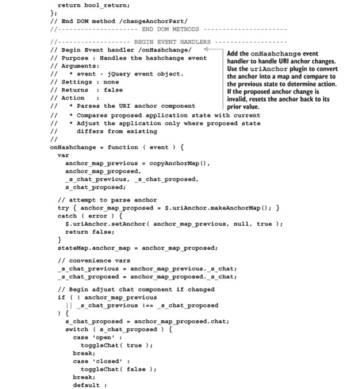

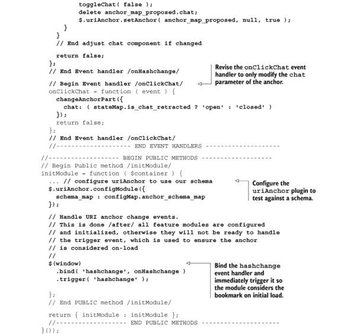

现在我们已经调整了代码，我们应该看到所有历史控制——前进按钮、后退按钮、书签和浏览器历史记录——都按预期工作。如果我们手动将其更改为我们不支持参数或值，锚应该“自动修复”——例如，尝试在浏览器地址栏中替换锚为 `#!chat=barney` 并按 Return。

现在我们有了历史控制功能，让我们讨论我们如何使用锚来驱动应用程序状态。我们将首先展示我们如何使用 `uriAnchor` 来编码和解码锚。

##### 理解 Urianchor 如何编码和解码锚

我们使用 jQuery 的 `hashchange` 事件来识别锚组件的变化。应用程序状态使用 *独立* 和 *依赖* 键值对的概念进行编码。以下是一个用 **粗体** 标示的锚示例：

```
http://localhost/spa.html#!chat=profile:on:uid,suzie|status,green
```

在此示例中，*独立* 键是 `profile`，其值为 `on`。进一步定义 `profile` 状态的键是 *依赖* 键，它们遵循冒号 (:) 分隔符。这包括键 `uid`，其值为 `suzie`，以及键 `status`，其值为 `green`。

`uriAnchor` 插件，js/jq/jquery.uriAnchor-1.1.3.js，负责为我们编码和解码依赖和独立值。我们可以使用 `$.uriAnchor .setAnchor()` 方法来更改浏览器 URI，以匹配先前的示例：

```
var anchorMap = {
  profile  : 'on',
  _profile : {
    uid    : 'suzie',
    status : 'green'
  }
};
$.uriAnchor.setAnchor( anchorMap );
```

可以使用 `makeAnchorMap` 方法来读取和解析锚到一个映射中：

```
var anchorMap = $.uriAnchor.makeAnchorMap();
console.log( anchorMap );

// If the URI anchor component in the browser is
// http://localhost/spa.html#!chat=profile:on:uid,suzie|status,green
//
// Then console.log( anchorMap ) should show the
// following:
//
// { profile  : 'on',
//   _profile : {
//     uid    : 'suzie',
//     status : 'green'
//   }
// };
//
```

希望你现在更好地理解了如何使用 `uriAnchor` 来编码和解码在 URI 锚组件中表示的应用程序状态。现在让我们更详细地看看我们如何使用 URI 锚组件来驱动应用程序状态。

##### 理解锚变化如何驱动应用程序状态

我们的历史控制策略是，任何改变可书签状态的任何事件都应该做两件事：

1.  更改锚。

1.  立即返回。

我们向 Shell 添加了 `changeAnchorPart` 方法，这使得我们能够更新锚的一部分，同时确保独立和依赖键值得到适当处理。它统一了锚管理的逻辑，*并且这是我们的应用程序修改锚的唯一方式*。

当我们说“立即返回”时，我们的意思是锚点更改后，事件处理器的任务就完成了。它不会更改页面元素。它不会更新变量或标志。它不会通过“GO”或收集 200 美元。它只是直接返回到其调用事件。这在我们 `onClickChat` 事件处理器中得到了说明：

```
onClickChat = function ( event) {
  changeAnchorPart({
    chat: ( stateMap.is_chat_retracted ? 'open' : 'closed' )
  });
  return false;
};
```

此事件处理器使用 `changeAnchorPart` 来更改锚点的 `chat` 参数，然后立即返回。因为锚点组件已更改，这触发了 `hashchange` 浏览器事件。Shell 监听 `hashchange` 事件并根据锚点内容采取行动。例如，如果 Shell 注意到 `chat` 值已从 `opened` 变为 `closed`，它将关闭聊天滑块。

你可能会把锚点——通过 `changeAnchorPart` 方法修改的锚点——视为可书签状态的 *API*。这种方法的优点是，它无关紧要 *为什么* 锚点被更改——可能是我们的应用程序修改了它，或者用户点击了书签，或者玩弄了前进或后退按钮，或者直接在浏览器地址栏中输入。无论如何，它总是正确工作，并且只使用单个执行路径。

### 3.7. 摘要

我们已经完成了 Shell 的两个主要责任的实现。我们创建了并设计了功能容器，并创建了一个框架，使用 URI 锚点驱动应用程序状态。我们更新了聊天滑块以帮助说明这些概念。

我们与 Shell 的合作尚未完成，因为我们尚未解决其第三大主要责任：协调功能模块。下一章将展示如何构建功能模块，如何从 Shell 配置和初始化它们，以及如何调用它们。将功能隔离到它们自己的模块中大大提高了可靠性、可维护性、可扩展性和工作流程。它还鼓励使用和开发第三方模块。所以请留下来——这是真正落地的地方。

## 第四章. 添加功能模块

| |
| --- |

**本章涵盖**

+   定义功能模块以及它们如何融入我们的架构

+   比较功能模块和第三方模块

+   解释分形 MVC 设计模式及其在我们架构中的作用

+   为功能模块设置文件和目录

+   定义和实现功能模块 API

+   实现常用功能模块功能

| |
| --- |

在开始之前，你应该已经完成了本书的第一章–第三章。你还应该有第三章的项目文件，因为我们将在它们的基础上构建。我们建议你将第三章中创建的所有文件和整个目录结构复制到一个新的“第四章”目录中，以便你可以在那里更新它们。

*功能模块*为 SPA 提供了一种定义明确且范围有限的 capability。在本章中，我们将第三章中引入的聊天滑块功能移动到一个功能模块中，并提高了其功能。除了聊天滑块之外，其他功能模块的例子可能包括图片查看器、账户管理面板，或者用户可能在其中组装图形对象的工坊。

我们设计的功能模块与我们的应用程序接口类似，就像第三方模块一样——具有定义明确的 API 和强大的隔离性。这使得我们能够更早地以更高的质量发布，因为我们可以专注于创建我们的增值核心模块，同时将次要模块留给第三方。这种策略还提供了一条清晰的增强路径，因为我们可以在时间和资源允许的情况下，选择性地用更好的模块替换第三方模块。作为额外的优势，我们的模块易于在多个项目中重用。

### 4.1. 功能模块策略

第三章中讨论的 Shell 负责应用范围内的任务，如管理 URI 锚点或 cookies，并将特定功能的任务调度到精心隔离的功能模块。这些模块有自己的视图、控制器，以及 Shell 与他们共享的一部分模型。架构概述如图 4.1 所示图 4.1：^([1])

> ¹ 作者将此图贴在办公桌旁边的墙上。

##### 图 4.1. SPA 架构中的功能模块（以白色显示）

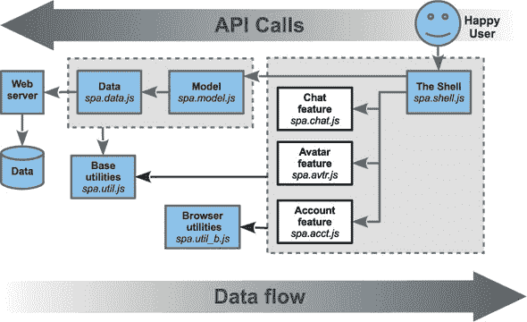

样本功能模块可能包括`spa.wb.js`用于在工坊上绘图，`spa.acct.js`用于账户管理功能，如登录或登出，以及`spa.chat.js`用于聊天界面。由于我们似乎在聊天方面取得了进展，因此在本章中我们将重点关注该模块。

#### 4.1.1. 与第三方模块的比较

功能模块与第三方模块非常相似，它们为现代网站提供各种功能.^([2]) 示例第三方模块包括博客评论(*DisQus*或*LiveFyre*)、广告(*DoubleClick*或*ValueClick*)、分析(*Google*或*Overture*)、分享(*AddThis*或*ShareThis*)和社交服务(*Facebook*“赞”或*Google*“+1”按钮)。它们非常受欢迎，因为网站运营商可以在极小的成本、努力和维护下，将高质量的功能添加到他们的网站上，而如果他们自己开发这些功能，成本将会非常高昂.^([3]) 通常，第三方模块是通过在静态网页中包含一个脚本标签或在 SPA 中添加一个函数调用来添加到网站上的。如果没有第三方模块，许多网站上的许多功能将无法实现，因为成本将是不切实际的。

> ² 要了解更多关于第三方模块及其创建的信息，请参阅 Ben Vinegar 和 Anton Kovalyov 的《第三方 JavaScript》（Manning，2012 年）。
> 
> ³很难准确衡量第三方模块的流行程度，但很难找到一个没有至少一个第三方模块的商业网站。例如，在撰写本文时，我们在[TechCrunch.com](http://TechCrunch.com)上发现了至少 16 个主要第三方模块在使用中，仅分析服务就有至少五个——以及惊人的 53 个脚本标签。

编写良好的第三方模块具有以下共同特征：

+   *它们在自己的容器中渲染，这可能是由它们提供的，或者它们直接附加到文档上*。

+   *它们提供了一个定义良好的 API 来控制它们的行为*。

+   *它们通过仔细隔离它们的 JavaScript、数据和 CSS 来避免污染宿主页面*。

第三方模块有一些缺点。主要问题是“第三方”有自己的商业目标，这可能与我们的目标相冲突。这可以以许多方式表现出来：

+   *我们依赖于它们的代码和服务。* 如果它们失败或停业，它们的服务可能会丢失。如果它们在发布时出错，甚至可能阻止我们的网站工作。遗憾的是，这种情况比应该发生的要频繁得多。

+   *它们通常比自定义模块慢*，因为服务器嘈杂或功能膨胀。如果一个第三方模块运行缓慢，它可能会减慢我们整个应用程序的速度。

+   *隐私是一个关注点*，因为每个第三方模块都有自己的服务条款，其中他们的律师几乎总是保留在第一时间改变的权利。

+   由于数据、样式不匹配或缺乏灵活性，*功能往往无法无缝集成*。

+   如果我们不能将它们的第三方数据集成到我们的 SPA 中，*跨功能通信*可能很困难或不可能。

+   *模块的定制*可能很困难或不可能。

我们的功能模块保留了第三方模块的积极特性，但由于没有第三方，我们避免了它们的缺点。这意味着对于给定的功能，Shell 提供了一个容器，功能模块填充并控制它，如图 4.2 所示。figure 4.2。功能模块为 Shell 提供了一致的 API，用于配置、初始化和使用。通过使用独特和协调的 JavaScript 和 CSS 命名空间，并且不允许调用任何外部调用（除了共享工具），功能与其他功能保持隔离。

##### 图 4.2\. Shell 和功能模块的责任

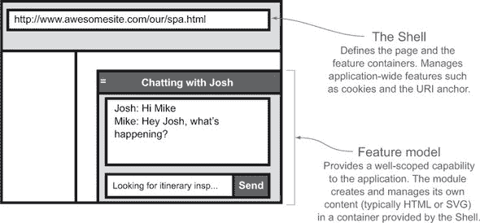

将功能模块开发成第三方模块的样子，让我们能够利用第三方风格 JavaScript 的好处：

+   *团队可以更有效率*，因为开发者可以根据模块分配责任。让我们面对现实：如果你在一个团队中工作，唯一不是第三方模块的就是你负责的那个模块。不负责模块的团队成员只需要了解它的 API 就能使用它。

+   当模块只管理它们负责的应用程序部分，并且它们针对我们的使用进行了优化，没有未使用或不想要的特性的冗余时，*应用程序往往表现良好*。

+   *代码维护和重用要容易得多*，因为模块被整齐地隔离。许多更复杂的 jQuery 插件，如日期选择器，实际上是第三方应用程序。想想使用日期选择器插件有多容易，而不是自己编写一个。

当然，开发我们的功能模块像第三方模块一样，还有一个其他巨大的优势：我们很好地定位了使用第三方模块来处理我们网络应用的非核心功能，然后根据时间和资源的允许，选择性地用我们自己的功能模块替换它们，这些模块可以更好地集成、更快、更少侵入性，或者以上所有。

#### 4.1.2\. 功能模块和分形 MVC 模式

许多网络开发者熟悉 *模型-视图-控制器 (MVC)* 设计模式，因为它在许多框架中都有介绍，如 Ruby on Rails、Django（Python）、Catalyst（Perl）、Spring MVC（Java）或 MicroMVC（PHP）。由于许多读者熟悉这个模式，我们将解释我们的 SPA 架构如何与之相关，特别是与功能模块相关。

让我们回顾一下 MVC 是一种用于开发应用程序的模式。它的部分包括：

+   *模型*，它提供应用程序的数据和业务规则。

+   *视图*，它提供了模型数据的感官（通常是视觉的，但也很常见的是音频）表示。

+   *控制器*，它将用户的请求转换为更新应用程序的模型和/或视图的命令。

熟悉网络 MVC 框架的开发者应该对这一章的大部分内容感到舒适。传统网络开发者对 MVC 框架的看法与我们的 SPA 架构之间最大的区别如下：

+   我们的 SPA 尽可能地将应用程序移动到浏览器中。

+   我们认识到 MVC 模式就像在分形中一样重复。

*分形* 是一种在所有级别上显示自相似性的模式。一个简单的例子在图 4.3 中展示，从远处看，我们看到一个一般模式，当我们更仔细地看时，我们看到模式在更精细的细节级别上重复。

##### 图 4.3\. 箱形分形


我们的 SPA 架构在多个级别上采用重复的 MVC 模式，所以我们称之为 *分形模型-视图-控制器*，或 FMVC。这个概念并不新鲜，开发者们至少已经讨论了十年。我们看到的分形有多少是一个视角问题。当我们从远处看我们的网络应用，如图 4.4 所示，我们看到一个单独的 MVC 模式——控制器处理 URI 和用户输入，与模型交互，并在浏览器中提供视图。

##### 图 4.4\. 从远处看我们的网络应用

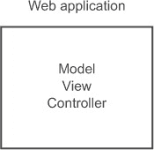

当我们稍微放大一些，如图图 4.5 所示，我们看到 Web 应用程序被分为两部分：服务器端，它使用 MVC 模式向客户端提供数据，以及 SPA，它使用 MVC 允许用户查看和与浏览器模型交互。服务器的模型包括数据库中的数据，而视图是发送到浏览器的数据表示，控制器是协调数据管理和与浏览器通信的代码。在客户端，模型包括从服务器接收到的数据，视图是用户界面，控制器是协调客户端数据与界面的逻辑。

##### 图 4.5\. 我们的 Web 应用稍微近一点

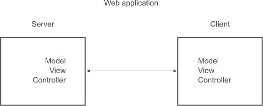

当我们进一步放大，如图图 4.6 所示，我们看到了更多的 MVC 模式。例如，服务器应用程序使用 MVC 模式提供 HTTP 数据 API。服务器应用程序使用的数据库也采用自己的 MVC 模式。在客户端，客户端应用程序使用 MVC 模式，而 Shell 调用从属功能模块，这些模块本身也使用 MVC 模式。

##### 图 4.6\. 我们的 Web 应用近距离观察

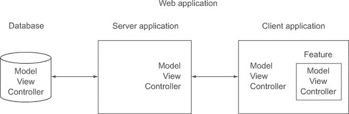

几乎所有现代网站都符合这种模式，即使开发者没有意识到这一点。例如，一旦开发者从*DisQus*或*LiveFyre*添加评论功能到他们的博客——或者几乎任何其他第三方模块——他们就在添加另一个 MVC 模式。

我们的 SPA 架构采用了这种分形 MVC 模式。换句话说，无论整合第三方功能还是我们自己编写的功能模块，我们的 SPA 工作方式几乎相同。图 4.7 显示了我们的聊天模块将如何使用自己的 MVC 模式。

##### 图 4.7\. MVC 模式在我们聊天功能模块中的体现


我们已经讨论了功能模块在我们架构中的位置，它们与第三方模块的相似之处，以及它们如何采用分形 MVC。在下一节中，我们将应用这些概念并创建我们的第一个功能模块。

### 4.2\. 设置功能模块文件

我们将要创建的第一个 SPA 功能模块将是聊天功能模块，我们将在此章节中将其称为 *Chat*。我们选择这个功能是因为我们在第三章中已经对其进行了大量工作，并且转换有助于突出功能模块的定义特征。

#### 4.2.1\. 规划文件结构

我们建议您将第三章中创建的整个目录结构复制到一个新的“chapter_4”目录中，这样我们就可以在那里更新它们。让我们回顾一下我们在第三章中留下的文件结构，如列表 4.1 所示：

##### 列表 4.1\. 第三章中的文件结构

```
spa
+-- css
|   +-- spa.css
|   `-- spa.shell.css
+-- js
|   +-- jq
|   |   +-- jquery-1.9.1.js
|   |   `-- jquery.uriAnchor-1.1.3.js
|   +-- spa.js
|   `-- spa.shell.js
+-- layout.html
`-- spa.html
```

这里是我们希望做出的更改：

+   为 Chat 创建一个命名空间样式表。

+   为 Chat 创建一个命名空间 JavaScript 模块。

+   为浏览器模型创建一个占位符。

+   创建一个为所有其他模块提供常用例程的实用模块。

+   修改*浏览器文档*以包含新文件。

+   删除我们用来开发布局的文件。

当我们完成时，我们的更新后的文件和目录应该看起来像列表 4.2。所有我们需要创建或修改的文件都显示为**粗体**：

##### 列表 4.2\. Chat 的修订版文件结构

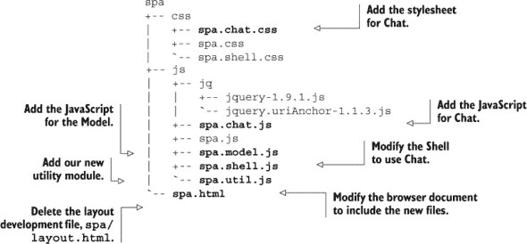

既然我们已经确定了要添加或修改的文件，让我们启动我们信任的文本编辑器并完成工作。我们将按照我们展示的顺序逐一考虑每个文件。

#### 4.2.2\. 填充文件

我们要考虑的第一个文件是 Chat 风格表，spa/css/spa.chat.css。我们将创建一个文件，并用列表 4.3 中显示的内容填充它。最初，它将是一个*占位符*:^([4])

> ⁴ *占位符*是有意不完整或占位符资源。例如，在第五章中，我们创建了一个“占位符”数据模块，它模拟与服务器的通信。

##### 列表 4.3\. 我们的风格表（占位符）—spa/css/spa.chat.css

```
/*
 * spa.chat.css
 * Chat feature styles
*/
```

接下来，让我们创建我们的 Chat 功能模块，spa/js/spa.chat.js，如列表 4.4 所示，使用我们的模块模板附录 A。这只是一个初步的版本，我们将让它填充聊天滑块容器中的某些简单 HTML：

##### 列表 4.4\. 我们的 Chat 模块，功能有限—spa/js/spa.chat.js

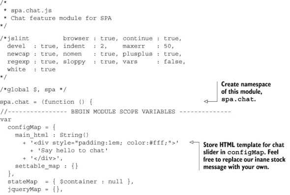

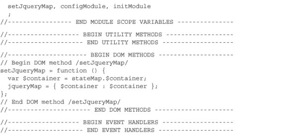

现在，让我们创建我们的模型，如列表 4.5 所示。这同样是一个占位符。像所有我们的模块一样，文件名（spa.model.js）表示它提供的命名空间（`spa.model`）：

##### 列表 4.5\. 我们的模型（占位符）—spa/js/spa.model.js

```
/*
 * spa.model.js
 * Model module
*/

/*jslint         browser : true, continue : true,
  devel  : true, indent  : 2,    maxerr   : 50,
  newcap : true, nomen   : true, plusplus : true,
  regexp : true, sloppy  : true, vars     : false,
  white  : true
*/

/*global $, spa */

spa.model = (function (){ return {}; }());
```

让我们创建一个通用实用模块，这样我们就可以在所有模块之间共享常用例程，如列表 4.6 所示。`makeError`方法可以用来轻松创建错误对象。`setConfigMap`方法提供了一种简单且一致的方式来更改模块的设置。因为这些是公共方法，我们详细说明它们的使用，以供其他开发者参考：

##### 列表 4.6\. 公共实用工具—spa/js/spa.util.js

```
/*
 * spa.util.js
 * General JavaScript utilities
 *
 * Michael S. Mikowski - mmikowski at gmail dot com
 * These are routines I have created, compiled, and updated
 * since 1998, with inspiration from around the web.
 *
 * MIT License
 *
*/

/*jslint          browser : true, continue : true,
  devel  : true,  indent  : 2,    maxerr   : 50,
  newcap : true,  nomen   : true, plusplus : true,
  regexp : true,  sloppy  : true, vars     : false,
  white  : true
 */
/*global $, spa */

spa.util = (function () {
  var makeError, setConfigMap;

  // Begin Public constructor /makeError/
  // Purpose: a convenience wrapper to create an error object
  // Arguments:
  //   * name_text - the error name
  //   * msg_text  - long error message
  //   * data      - optional data attached to error object
  // Returns : newly constructed error object
  // Throws  : none
  //
  makeError = function ( name_text, msg_text, data ) {
    var error     = new Error();
    error.name    = name_text;
    error.message = msg_text;

    if ( data ){ error.data = data; }

    return error;
  };
  // End Public constructor /makeError/

  // Begin Public method /setConfigMap/
  // Purpose: Common code to set configs in feature modules
  // Arguments:
  //   * input_map    - map of key-values to set in config
  //   * settable_map - map of allowable keys to set
  //   * config_map   - map to apply settings to
  // Returns: true
  // Throws : Exception if input key not allowed
  //
  setConfigMap = function ( arg_map ){
    var
      input_map    = arg_map.input_map,
      settable_map = arg_map.settable_map,
      config_map   = arg_map.config_map,
      key_name, error;

    for ( key_name in input_map ){
      if ( input_map.hasOwnProperty( key_name ) ){
        if ( settable_map.hasOwnProperty( key_name ) ){
          config_map[key_name] = input_map[key_name];
        }
        else {
          error = makeError( 'Bad Input',
            'Setting config key |' + key_name + '| is not supported'
          );
          throw error;
        }
      }
    }
  };
  // End Public method /setConfigMap/

  return {
    makeError    : makeError,
    setConfigMap : setConfigMap
  };
}());
```

最后，我们可以通过修改我们的浏览器文档来加载新的 JavaScript 和 CSS 文件，将这些更改全部结合起来。首先我们将加载我们的样式表，然后是我们的 JavaScript。JavaScript 库的包含顺序 *确实* 重要：第三方库应该首先加载，因为它们通常是先决条件，这种做法也有助于克服偶尔的第三方命名空间混乱（见侧边栏“为什么我们的库最后加载”）。我们的库接下来，必须按命名空间层次结构排序——例如，提供 `spa`、`spa.model` 和 `spa.model.user` 命名空间的模块必须按此顺序加载。任何超出此范围的排序都是惯例，并不是必需的。我们喜欢这种惯例：根 -> 核心工具 -> 模型 -> 浏览器工具 -> Shell -> 功能模块。

|  |
| --- |

**为什么我们的库最后加载**

我们喜欢我们的库对命名空间拥有最终决定权，因此我们最后加载它们。如果某些流氓第三方库声称 `spa.model` 命名空间，我们的库在加载时会“取回”它。如果发生这种情况，我们的单页应用（SPA）有很大机会继续运行，尽管第三方功能可能不会工作。如果库的顺序被颠倒，我们的 SPA 几乎肯定会被完全破坏。我们宁愿修复第三方评论功能的问题，也不愿向 CEO 解释为什么我们的网站在午夜时分 *完全停止工作*。

|  |
| --- |

让我们更新我们的浏览器文档，如 列表 4.7 所示。从 第三章 的更改以粗体显示：

##### 列表 4.7\. 浏览器文档的更改—spa/spa.html

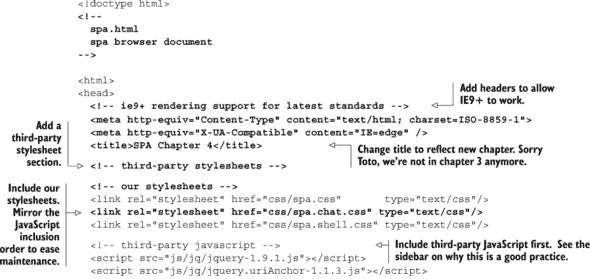

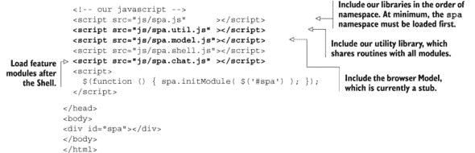

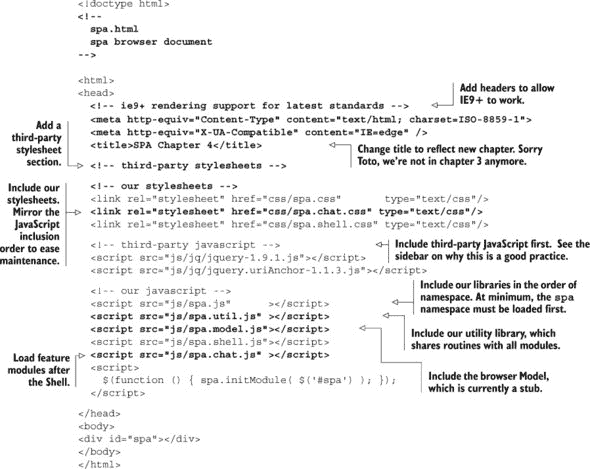

现在，让我们按照 列表 4.8 中的说明配置和初始化 Shell。所有更改都以粗体显示：

##### 列表 4.8\. Shell 修订版—spa/js/spa.shell.js

```
...
    // configure uriAnchor to use our schema
    $.uriAnchor.configModule({
    schema_map : configMap.anchor_schema_map
    });

    // configure and initialize feature modules
    spa.chat.configModule( {} );
    spa.chat.initModule( jqueryMap.$chat );

    // Handle URI anchor change events
...
```

我们现在完成了第一次遍历。尽管这是一项相当多的工作，但其中许多步骤对于未来的功能模块可能不再需要。现在让我们看看我们创造了什么。

#### 4.2.3\. 我们所造成的

当我们加载我们的浏览器文档 ([spa/spa.html](http://spa/spa.html)) 时，聊天滑块应看起来像 图 4.8。

##### 图 4.8\. 我们更新的浏览器文档—spa/spa.html

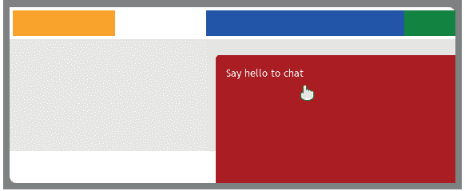

`Say` `hello` `to` `chat` 文本显示 Chat 已正确配置和启动，并且它已提供了聊天滑块内容。但这次展示远非令人印象深刻。在下一节中，我们将显著改进聊天界面。

### 4.3\. 设计方法 API

根据我们的架构，Shell 可以调用 SPA 中的任何从属模块。功能模块应该只调用共享实用模块；功能模块之间的调用是不允许的。功能模块所需的数据或能力只能来自 Shell，以模块公共方法提供的参数形式，例如在配置或初始化期间。图 4.9 展示了这种分层结构。

##### 图 4.9\. 功能模块的近距离视图—允许的调用

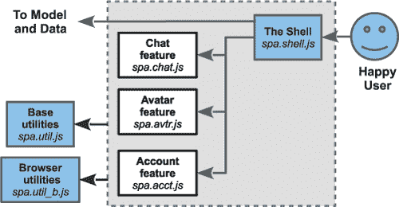

这种隔离是故意的，因为它有助于防止特定功能的缺陷传播到应用层或其他功能。5

> ⁵ 功能模块之间的通信应始终由 Shell 或模型协调。

#### 4.3.1\. 锚接口模式

回想一下 第三章 中我们希望 URI 锚始终驱动页面状态，而不是相反。有时执行路径可能难以追踪，因为 Shell 负责 URI 锚的管理，而 Chat 负责滑块展示。我们依靠 *锚接口模式* 来支持 URI 锚和用户事件驱动的状态，在两种情况下都使用相同的 jQuery `hashchange` 事件。这种单一的应用程序状态更改路径确保了历史安全 URL、一致的行为，并有助于加速开发，因为只有一个状态更改机制。该模式在 图 4.10 中展示。

> ⁶ “历史安全”意味着浏览器历史控制，如前进、后退、书签和浏览器历史，都按用户期望的方式工作。

##### 图 4.10\. Chat 的锚接口模式


我们已经在上一章中实现了 Chat 的许多行为。现在，让我们将剩余的聊天代码移动到它自己的模块中。同时，我们也要指定 Chat 和 Shell 将用于通信的 API。这将立即为我们带来好处，并使代码重用变得更加简单。API 规范需要详细说明所需的资源以及将提供的功能。它们应被视为“活文档”，并在 API 发生更改时进行更新。

我们希望 Chat 提供的一个常见公共方法是 `configModule`，我们将使用它来在初始化之前更改设置。Chat，像每个功能模块一样，通常应该有一个初始化方法 `initModule`，然后我们将使用它来指导模块向用户提供其功能。我们还想让 Chat 提供一个 `setSliderPosition` 方法，以便 Shell 可以请求滑块位置。我们将在以下部分设计这些方法的 API。

#### 4.3.2\. Chat 配置 API

当我们 *配置* 一个模块时，我们调整那些我们希望在用户会话期间不会改变的设置。使用 Chat，以下设置符合这一标准：

+   一个提供调整 `chat` URI 锚参数能力的函数。

+   提供发送和接收消息方法的对象（来自模型）。

+   提供与用户列表交互方法的对象（来自模型）。

+   任何数量的行为设置，如滑块打开高度、滑块打开时间和滑块关闭时间。

| |
| --- |

**JavaScript 参数的真相**

记住，只有简单的值——字符串、数字和布尔值——是直接传递给函数的。JavaScript 中的所有复杂数据类型（如对象、数组和函数）都是*按引用传递的*。这意味着它们*永远不会*像某些其他语言中那样被复制。相反，传递一个内存位置值。这通常比复制要快得多，但缺点是很容易意外更改通过引用传递的对象或数组。

当一个函数期望一个函数引用作为参数时，这个引用通常被称为*回调*。回调功能强大，但它们可能变得难以管理。我们通过使用 jQuery 全局自定义事件在第五章和第六章中展示了如何减少回调的使用。

| |
| --- |

根据这些预期，我们可以制定 Chat `configModule` API 规范，如列表 4.9 所示。此文档不用于 JavaScript：

##### 列表 4.9\. Chat API 规范——spa/js/spa.chat.js

```
// Begin public method /configModule/
// Example   : spa.chat.configModule({ slider_open_em : 18 });
// Purpose   : Configure the module prior to initialization
// Arguments :
//   * set_chat_anchor - a callback to modify the URI anchor to
//     indicate opened or closed state. This callback must return
//     false if the requested state cannot be met
//   * chat_model - the chat model object provides methods
//       to interact with our instant messaging
//   * people_model - the people model object which provides
//       methods to manage the list of people the model maintains
//   * slider_* settings. All these are optional scalars.
//       See mapConfig.settable_map for a full list
//       Example: slider_open_em is the open height in em's
// Action    :
//   The internal configuration data structure (configMap) is
//   updated with provided arguments. No other actions are taken.
// Returns   : true
// Throws    : JavaScript error object and stack trace on
//             unacceptable or missing arguments
//
```

现在我们已经有了 Chat 配置的 API，让我们为 Shell 中的`setChatAnchor`回调制定一个规范。列表 4.10 是一个很好的起点。此文档不用于 JavaScript：

##### 列表 4.10\. Shell API 规范——`setChatAnchor`回调——spa/js/spa.shell.js

```
// Begin callback method /setChatAnchor/
// Example  : setChatAnchor( 'closed' );
// Purpose  : Change the chat component of the anchor
// Arguments:
//   * position_type - may be 'closed' or 'opened'
// Action   :
//   Changes the URI anchor parameter 'chat' to the requested
//   value if possible.
// Returns  :
//   * true - requested anchor part was updated
//   * false - requested anchor part was not updated
// Throws   : none
//
```

现在我们已经完成了 Chat 配置 API 和 Shell 回调 API 的设计，让我们继续到 Chat 初始化。

#### 4.3.3\. Chat 初始化 API

当我们*初始化*我们的功能模块之一时，我们要求它渲染 HTML 并开始向用户提供其功能。与配置不同，我们预计功能模块在用户会话期间可能会被初始化多次。在 Chat 的情况下，我们希望发送一个 jQuery 集合作为参数。jQuery 集合将包含一个元素——我们想要附加聊天滑块的元素。让我们绘制如列表 4.11 所示的 API。此文档不用于 JavaScript：

##### 列表 4.11\. Chat API 规范——spa/js/spa.chat.js

```
// Begin public method /initModule/
// Example    : spa.chat.initModule( $('#div_id') );
// Purpose    :
//   Directs Chat to offer its capability to the user
// Arguments  :
//   * $append_target (example: $('#div_id')).
//     A jQuery collection that should represent
//     a single DOM container
// Action     :
//   Appends the chat slider to the provided container and fills
//   it with HTML content. It then initializes elements,
//   events, and handlers to provide the user with a chat-room
//   interface
// Returns    : true on success, false on failure
// Throws     : none
//
```

本章我们将指定的最后一个 API 将是 Chat `setSliderPosition`方法。这将用于打开和关闭聊天滑块。我们将在下一节中处理这个问题。

#### 4.3.4\. Chat setSliderPosition API

我们决定让 Chat 提供公共方法`setSliderPosition`，这将使 Shell 能够请求滑块位置。我们将滑块位置与 URI 锚点关联的决定引发了一些我们需要解决的问题：

+   聊天可能无法总是调整滑块到请求的位置。例如，它可能决定滑块不能打开，因为用户未登录。我们将`setSliderPosition`返回`true`或`false`，这样 Shell 就会知道请求是否成功。

+   如果 Shell 调用`setSliderPosition`回调，并且回调无法满足请求（换句话说，它返回`false`），Shell 需要将 URI 锚点`chat`参数重置为请求之前的值。

让我们指定一个符合这些要求的 API，如列表 4.12 所示。这份文档不用于 JavaScript：

##### 列表 4.12\. `setSliderPosition`的聊天 API 规范——spa/js/spa.chat.js

```
// Begin public method /setSliderPosition/
//
// Example  : spa.chat.setSliderPosition( 'closed' );
// Purpose  : Ensure chat slider is in the requested state
// Arguments:
//   * position_type - enum('closed', 'opened', or 'hidden')
//   * callback - optional callback at end of animation.
//     (callback receives slider DOM element as argument)
// Action   :
//   Leaves slider in current state if it matches requested,
//   otherwise animate to requested state.
// Returns  :
//   * true  - requested state achieved
//   * false - requested state not achieved
// Throws   : none
//
```

定义了这个 API 之后，我们几乎准备好编写一些代码了。但在我们这样做之前，让我们看看配置和初始化是如何通过我们的应用程序级联的。

#### 4.3.5\. 配置和初始化级联

我们的配置和初始化遵循一个常见的模式。首先，我们浏览器文档中的一个脚本标签配置和初始化我们的根命名空间模块`spa.js`。然后我们的根模块配置和初始化 Shell 模块`spa.shell.js`。然后 Shell 模块配置和初始化我们的功能模块`spa.chat.js`。这种配置和初始化的级联在图 4.11 中显示。

##### 图 4.11\. 配置和初始化级联

![04fig11_alt.jpg]

我们的所有模块都提供了一个公共的`initModule`方法。我们只提供`config-Module`方法，如果我们需要支持设置。在开发这个阶段，只有聊天可以配置。

当我们加载浏览器文档([spa/spa.html](http://spa/spa.html))时，它会加载我们所有的 CSS 和 JavaScript 文件。接下来页面中的一个脚本执行初始维护并初始化根命名空间模块（spa/js/spa.js），向它提供一个页面元素（`spa div`）供其使用：

```
$(function (){

  // housekeeping here ...

  // if we needed to configure the root module,
  // we would invoke spa.configModule first

  spa.initModule( $('#spa' ) );

}());
```

当初始化时，根命名空间模块（spa/js/spa.js）执行任何根级别的维护工作，然后配置和初始化 Shell（spa/js/spa.shell.js），为它提供一个页面元素（`$container`）供其使用：

```
var initModule = function ( $container ){

  // housekeeping here ...

  // if we needed to configure the Shell,
  // we would invoke spa.shell.configModule first

  spa.shell.initModule( $container );

};
```

Shell（spa/js/spa.shell.js）随后执行任何 Shell 级别的维护工作，并配置和初始化所有其功能模块，例如聊天（spa/js/spa.chat.js），为它提供一个页面元素（`jqueryMap.$chat`）供其使用：

```
initModule = function ( $container ) {

  // housekeeping here ...

  // configure and initialize feature modules
  spa.chat.configModule( {} );
  spa.chat.initModule( jqueryMap.$chat );

  // ...

};
```

我们需要对这个级联感到舒适，因为所有功能模块都是一样的。例如，我们可能希望将聊天（spa/js/spa.chat.js）的一些功能拆分到一个从属模块中，该模块处理在线用户列表——我们将它称为名单——并在 spa/js/spa.chat.roster.js 中创建其文件。然后我们将让聊天使用`spa.chat.roster.configModule`方法配置该模块，并使用`spa.chat.roster.initModule`方法初始化它。聊天还会向名单提供一个 jQuery 容器，名单将在其中显示用户列表。

现在我们已经回顾了配置和初始化的级联过程，我们准备将我们的应用程序更新到我们设计的 API。我们将进行一些改动，这可能会暂时破坏一些功能，所以如果你在家中进行操作，请不要慌张——我们很快就会修复这些问题。

### 4.4\. 实现功能 API

本节的主要目标是实现我们定义的 API。而且，正如他们所说，“代码已经准备好”，我们还想处理一些次要目标：

+   完成将 Chat 配置和实现移动到其自己的模块。Shell 唯一需要担心的是 Chat 的 URI 锚管理。

+   更新聊天功能，使其看起来更“健谈”。

我们需要更新的文件以及它们需要如何更改的总结在列表 4.13 中展示。

##### 列表 4.13\. 我们在 API 实现过程中将更改的文件

```
spa
+-- css
|   +-- spa.chat.css  # Move chat styles from spa.shell.css, enhance
|   `-- spa.shell.css # Remove chat styles
`-- js
    +-- spa.chat.js   # Move capabilities from the Shell, implement APIs
    `-- spa.shell.js  # Removed Chat capabilities
                      # and add setSliderPosition callback per API
```

我们将按照展示的顺序修改这些文件。

#### 4.4.1\. 样式表

我们希望将所有 Chat 样式移动到它们自己的样式表（spa/css/spa.chat.css）中，并在这样做的同时改进我们的布局。我们的本地 CSS 布局专家提供了一个很好的计划，如图 4.12 所示。

##### 图 4.12\. 元素和选择器的 3D 视图—spa/css/spa.chat.css

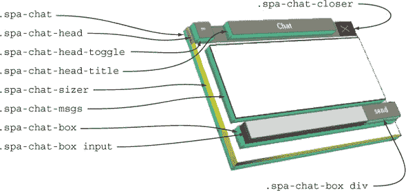

注意我们如何像处理 JavaScript 一样命名空间我们的 CSS。这有诸多优点：

+   我们不需要担心与其他模块发生冲突，因为我们保证所有类名都有一个唯一的前缀：`spa-chat`。

+   与第三方包的冲突几乎总是可以避免。即使有些奇怪的情况它们没有避免，修复（更改前缀）也是微不足道的。

+   这对调试非常有帮助，因为当我们检查由 Chat 控制的元素时，其类名会指引我们到原始的功能模块，`spa.chat`。

+   名称表明了什么包含（因此控制）什么。例如，注意`spa-chat-head-toggle`包含在`spa-chat-head`中，而`spa-chat-head`又包含在`spa-chat`中。

这部分样式大多是样板代码（抱歉，CSS 布局专家）。但我们有几个点会使我们的工作变得特别。首先，`spa-chat-sizer`元素需要有一个固定的高度。这将即使在滑块缩回时也为聊天和消息区域提供空间。如果没有这个元素，当滑块缩回时，滑块内容会被“挤压”，这对用户来说至多也是令人困惑的。其次，我们的布局专家希望我们移除所有对绝对像素的引用，转而使用相对测量，如`em`和百分比。这将使我们的 SPA 在低密度和高密度显示上都能同样良好地展示。

| |
| --- |

**像素与相对单位**

HTML 专家在开发 CSS 时经常采取严肃的扭曲来使用相对度量，完全避免使用*px*单位，以便他们的创作可以在任何尺寸的显示上良好工作。我们已经观察到一种现象，这让我们重新考虑了这种努力的价值：浏览器对其像素维度撒谎。

考虑最新的超高清分辨率笔记本电脑、平板电脑和智能手机的显示器。这些设备上的浏览器不会直接将浏览器中的*px*与物理屏幕像素相关联。相反，它们将*px*单位标准化，以便观看体验近似于具有每英寸 96 到 120 像素密度的传统桌面显示器。

结果是，在智能手机浏览器上渲染的*10 px*正方形框实际上每边可能有 15 或 20 个物理像素。这意味着*px*也已成为一个相对单位，与其他所有单位（*%，in，cm，mm，em，ex，pt，pc*）相比，它通常更可靠。我们拥有其他设备，例如 10.1 英寸和 7 英寸的平板电脑，它们具有相同的 1280 x 800 分辨率和相同的操作系统。一个*400 px*的正方形框可以适应 10.1 英寸的平板电脑屏幕；但在 7 英寸的平板电脑上则不行。为什么？因为每个*px*使用的物理像素数量在较小的平板电脑上更高。看起来较大平板电脑的缩放比例是每*px* 1.5 像素，而较小平板电脑是每*px* 2 像素。

我们不知道未来会怎样，但最近我们在使用*px*单位时感到的罪恶感少了很多。

|  |
| --- |

在所有这些计划之后，我们现在可以将符合规格的 CSS 添加到 spa.chat.css 中，如列表 4.14 所示：

##### 列表 4.14\. 添加增强的 Chat 样式—spa/css/spa.chat.css

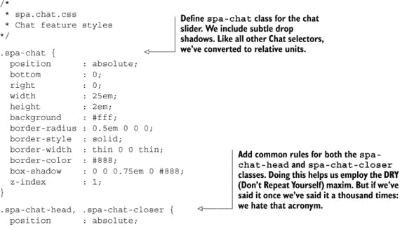

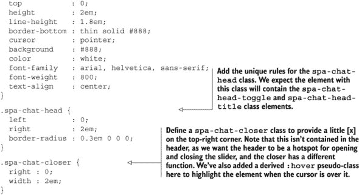

现在我们有了 Chat 的样式表，我们可以从 spa/css/spa.shell.css 中的 Shell 样式表中移除之前的定义。首先，让我们从绝对定位选择器的列表中移除`.spa-shell-chat`。更改应如下所示（我们可以省略注释）：

```
.spa-shell-head, .spa-shell-head-logo, .spa-shell-head-acct,
.spa-shell-head-search, .spa-shell-main, .spa-shell-main-nav,
.spa-shell-main-content, .spa-shell-foot, */* .spa-shell-chat */*
 .spa-shell-modal {
  position : absolute;
}
```

我们还希望从 spa/css/spa.shell.css 中移除任何`.spa-shell-chat`类。如下所示，有两个要删除：

```
/* delete these from spa/css/spa.shell.css
 .spa-shell-chat {
  bottom  : 0;
  right   : 0;
  width   : 300px;
  height  : 15px;
  cursor  : pointer;
  background : red;
  border-radius : 5px 0 0 0;
  z-index : 1;
}
  .spa-shell-chat:hover {
    background : #a00;
  } */
```

最后，让我们隐藏模态容器，以免它妨碍我们的聊天滑块：

```
...
.spa-shell-modal {
...
  display: none;
}
...
```

到目前为止，我们应该能够打开我们的浏览器文档([spa/spa.html](http://spa/spa.html))，在 Chrome 开发者工具的 JavaScript 控制台中看不到任何错误。但聊天滑块将不再可见。保持冷静，继续前进——我们将在下一节完成修改 Chat 时修复这个问题。

#### 4.4.2\. 修改 Chat

我们现在将修改 Chat 以实现我们之前设计的 API。以下是我们的计划更改：

+   添加我们更详细的聊天滑块的 HTML。

+   将配置扩展以包括滑块高度和缩回时间等设置。

+   创建将`em`单位转换为`px`（像素）的`getEmSize`实用工具。

+   更新`setJqueryMap`以缓存更新聊天滑块的许多新元素。

+   添加`setPxSizes`方法，使用像素单位设置滑块尺寸。

+   实现与我们的 API 匹配的`setSliderPosition`公共方法。

+   创建`onClickToggle`事件处理器以更改 URI 锚点并立即返回。

+   更新`configModule`公共方法文档以匹配我们的 API。

+   更新`initModule`公共方法以匹配我们的 API。

让我们更新 Chat 以实现这些更改，如列表 4.15 所示。我们之前设计的 API 规范已复制到该文件中，并在实现过程中用作指南。这加速了开发并确保了未来维护的准确文档。所有更改均以**粗体**显示：

##### 列表 4.15\. 修改 Chat 以符合 API 规范—spa/js/spa.chat.js

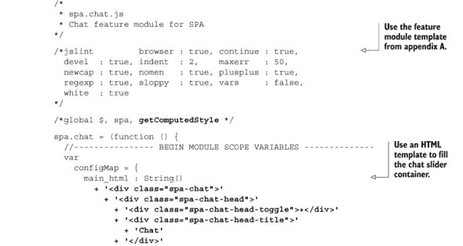

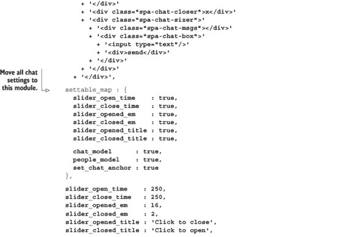

到目前为止，我们应该能够加载浏览器文档([spa/spa.html](http://spa/spa.html))，并且在 Chrome 开发者工具的 JavaScript 控制台中不会看到任何错误。我们应该看到聊天滑块的上部。但如果我们点击它，我们应该在控制台中看到类似于“`set_chat_anchor` *不是函数*”的错误消息。我们将在清理 Shell 时修复这个问题。

#### 4.4.3\. 清理 Shell

现在，我们将通过更新 Shell 来完成我们的更改。这是我们想要做的事情：

+   删除大多数聊天滑块设置和功能，因为这些已移动到 Chat。

+   修改`onHashchange`事件处理器，如果无法设置请求的滑块位置，则回退到有效位置。

+   添加`setChatAnchor`方法以满足我们之前设计的 API。

+   改善`initModule`文档。

+   将`initModule`更新为使用我们之前设计的 API 配置 Chat。

让我们按照列表 4.16 所示修改 Shell。注意，我们之前开发的所有新 API 规范都直接放置在这个文件中，并在实现过程中用作指南。所有更改均以**粗体**显示：

##### 列表 4.16\. 清理 Shell—spa/js/spa.shell.js

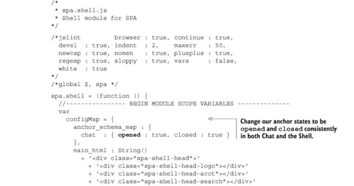


当我们打开浏览器文档([spa/spa.html](http://spa/spa.html))时，我们现在应该看到类似于图 4.13 的内容。我们认为这个修订后的聊天滑块显著更炫酷。它还没有显示消息——我们将在第六章中介绍这一功能。

##### 图 4.13\. 我们更炫酷的 Chat 滑块

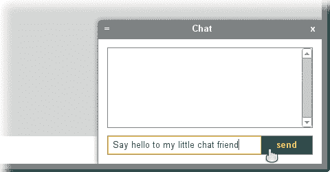

现在代码运行良好，让我们通过分析应用程序的执行过程来查看一些关键修订。

#### 4.4.4\. 执行过程

本节突出了我们在上一节中对应用程序所做的修订。我们查看应用程序的配置和初始化方式，然后探索当用户点击聊天滑块时会发生什么。

当我们加载浏览器文档([spa/spa.html](http://spa/spa.html))时，一个脚本初始化我们的根命名空间(spa/js/spa.js)，向它提供一个页面元素（`#spa` `div`）供其使用：

```
$(function (){ spa.initModule( $('#spa') ); });
```

根命名空间模块（spa/js/spa.js）随后初始化 Shell（spa/js/spa.shell.js），向它提供一个页面元素（`$container`）供其使用：

```
var initModule = function ( $container ){
  spa.shell.initModule( $container );
};
```

Shell（spa/js/spa.shell.js）随后配置并初始化 Chat（spa/js/spa.chat.js）。但这次这两个步骤都有点不同。配置现在与之前定义的 API 匹配。`set_chat_anchor` 配置是遵循我们之前创建的规范的回调：

```
...
// configure and initialize feature modules
spa.chat.configModule({
  set_chat_anchor : setChatAnchor,
  chat_model      : spa.model.chat,
  people_model    : spa.model.people
});
spa.chat.initModule(jqueryMap.$container);
...
```

Chat 初始化也有细微的不同：Shell 现在提供的是一个容器，Chat 将会将其聊天滑块 *附加* 到这个容器上。如果你信任模块作者，这是一个很好的安排。我们确实信任他们。

```
...
  //   * set_chat_anchor - a method modify to modify the URI anchor to
  //     indicate opened or closed state. Return false if requested
  //     state cannot be met.
...
```

当用户点击滑块切换按钮时，Chat 使用 `set_chat_anchor` 回调请求将 URI 锚点的 `chat` 参数更改为 *打开* 或 *关闭*，然后返回。Shell 仍然处理 `hashchange` 事件，如我们在 spa/js/spa.shell.js 中看到的：

```
initModule = function ( $container ){
  ...
  $(window)
    .bind( 'hashchange', onHashchange )
  ...
```

因此，当用户点击滑块时，`hashchange` 事件被 Shell 捕获，它将调度到 `onHashchange` 事件处理器。如果 URI 锚点的聊天组件已更改，此例程将调用 `spa.chat.setSliderPosition` 请求新的位置：

```
// Begin adjust chat component if changed
   if ( ! anchor_map_previous
    || _s_chat_previous !== _s_chat_proposed
   ) {
     s_chat_proposed = anchor_map_proposed.chat;
     switch ( s_chat_proposed ) {
       case 'opened' :
         is_ok = spa.chat.setSliderPosition( 'opened' );
       break;
       case 'closed' :
         is_ok = spa.chat.setSliderPosition( 'closed' );
       break;
       ...
     }
   }
   // End adjust chat component if changed
```

如果位置有效，滑块将移动到请求的位置，并将 URI 锚点的 `chat` 参数更改为。

我们所做的更改导致了一个符合我们设计目标实现。URI 控制聊天滑块状态，我们还把所有 Chat UI 逻辑和代码移动到了我们的新功能模块中。滑块看起来和运行得都更好。现在让我们添加一些在许多功能模块中常见的其他公共方法。

### 4.5. 添加常用方法

在功能模块中，一些公共方法被频繁使用，因此它们值得单独讨论。第一个是一个重置方法（`removeSlider`）；第二个是一个窗口调整大小方法（`handleResize`）。我们将实现这两个方法。首先，让我们在模块作用域变量部分的底部在 Chat 中声明这些方法名称，并在模块末尾将它们作为公共方法导出，如列表 4.17 所示。变化以粗体显示：

##### 列表 4.17. 声明方法函数名称——spa/js/spa.chat.js

```
...

    jqueryMap = {},

    setJqueryMap, getEmSize, setPxSizes, setSliderPosition,
    onClickToggle, configModule, initModule,
    removeSlider, handleResize
    ;
  //----------------- END MODULE SCOPE VARIABLES ---------------
  ...

  // return public methods
  return {
    setSliderPosition : setSliderPosition,
    configModule      : configModule,
    initModule        : initModule,
    removeSlider      : removeSlider,
    handleResize      : handleResize
  };
  //------------------- END PUBLIC METHODS ---------------------
}());
```

现在方法名称已声明，我们将在以下部分实现它们，从移除方法开始。

#### 4.5.1. 移除滑块方法

我们发现我们想要为许多功能模块实现一个 `remove` 方法。例如，如果我们实现身份验证，我们可能希望在用户登出时完全移除聊天滑块。通常，这种动作是为了提高性能或增强安全性——假设 `remove` 方法能够很好地删除过时的数据结构。

我们的方法需要删除 Chat 添加的 DOM 容器，并按照顺序*撤销*我们的初始化和配置。列表 4.18 包含了 `removeSlider` 方法的代码更改。更改内容以**粗体**显示：

##### 列表 4.18\. `removeSlider` 方法——spa/js/spa.chat.js

```
...
  // End public method /initModule/

  // Begin public method /removeSlider/
  // Purpose :
  //   * Removes chatSlider DOM element
  //   * Reverts to initial state
  //   * Removes pointers to callbacks and other data
  // Arguments : none
  // Returns   : true
  // Throws    : none
  //
  removeSlider = function () {
    // unwind initialization and state
    // remove DOM container; this removes event bindings too
    if ( jqueryMap.$slider ) {
      jqueryMap.$slider.remove();
      jqueryMap = {};
    }
    stateMap.$append_target = null;
    stateMap.position_type  = 'closed';

    // unwind key configurations
    configMap.chat_model      = null;
    configMap.people_model    = null;
    configMap.set_chat_anchor = null;

    return true;
  };
  // End public method /removeSlider/

  // return public methods
...
```

我们不试图在任何一个 `remove` 方法上表现得过于聪明。目的是破坏任何先前的配置和初始化，仅此而已。我们仔细确保数据指针被移除。这是很重要的，因为这样可以让数据结构的引用计数降到 0，从而允许垃圾回收完成其工作。*这就是为什么我们总是在模块的顶部列出潜在的 configMap 和 stateMap 键的原因之一——这样我们可以看到我们需要清理什么*。

我们可以通过打开 Chrome 开发者工具的 JavaScript 控制台并输入以下内容来测试 `removeSlider` 方法（别忘了按 Return！）：

```
spa.chat.removeSlider();
```

当我们检查浏览器窗口时，我们可以看到聊天滑块已经被移除。如果我们想将其恢复，我们可以将以下几行代码输入到 JavaScript 控制台中：

```
spa.chat.configModule({ set_chat_anchor: function (){ return true; } });
spa.chat.initModule( $( '#spa') );
```

我们通过 JavaScript 控制台“恢复”的聊天滑块并不完全功能，因为我们为 `set_chat_anchor` 回调提供了 `null` 函数。在实际使用中，我们总是会从 Shell 中重新启用聊天模块，在那里我们可以访问所需的回调。

我们可以用这个方法做更多的事情——比如让滑块优雅地消失——但我们将其留作读者的练习。现在让我们实现另一个通常由功能模块所需的方法，`handleResize`。

#### 4.5.2\. 处理 `handleResize` 方法

第二个在许多功能模块中常见的通用方法是 `handleResize`。通过良好的 CSS 使用，大多数内容在 SPA 中都可以在合理大小的窗口中工作。但有些情况下*大多数*是不行的，需要一些重新计算。让我们首先实现如列表 4.19 所示的 `handleResize` 方法，然后讨论其用法。更改内容以**粗体**显示：

##### 列表 4.19\. 添加 `handleResize` 方法——spa/js/spa.chat.js

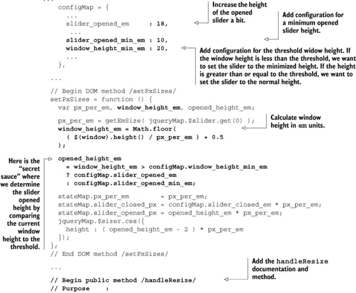

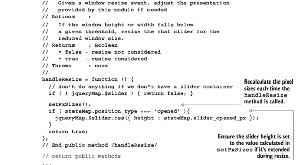

`handleResize` 事件不会调用自身。现在我们可能会想为每个功能模块实现一个 `window.resize` 事件处理器，但这不是一个好主意。问题是 `window.resize` 事件触发的频率因浏览器而异。假设我们有五个功能模块，它们都拥有 `window.resize` 事件处理器，并且用户决定调整浏览器的大小。如果 `window.resize` 事件每 10 毫秒触发一次，并且产生的图形变化足够复杂，这很容易将单页应用（SPA）——以及可能运行在其上的整个浏览器和操作系统——拖垮。

一个更好的方法是让 Shell 事件处理器捕获调整大小事件，然后调用所有从属功能模块的 `handleResize` 方法。这允许我们限制调整大小处理和从单个事件处理器分发。让我们在 Shell 中实现此策略，如 代码清单 4.20 所示。更改以粗体显示：

##### 代码清单 4.20\. 添加 onResize 事件处理器——spa/js/spa.shell.js


我们想调整我们的样式表，以便更好地看到我们劳动的成果。在 代码清单 4.21 中，我们调整 spa.css 以减小最小窗口大小，改为使用相对单位，并移除内容周围的冗余边框。更改以粗体显示：

##### 代码清单 4.21\. 对 `onResize` 进行样式更改——spa/css/spa.css


我们现在可以通过打开我们的浏览器文档 ([spa/spa.html](http://spa/spa.html)) 并增加或减少浏览器窗口高度来观察调整大小事件的工作。 比较了达到阈值前后滑块的展示：

##### 图 4.14\. 阈值前后聊天滑块大小的比较


当然，总有更多的改进空间。一个很好的增强是让滑块保持与顶部边界的最小距离。例如，如果窗口超过阈值 0.5 em，滑块可以精确地比正常短 0.5 em。这将提供更好的用户体验，最佳的聊天空间，并在调整大小时更加平滑。实现并不困难，留给读者作为练习。

### 4.6\. 摘要

本章展示了如何利用功能模块利用第三方模块的优点，而不必承担所有缺点。我们定义了功能模块是什么，将它们与第三方模块进行比较，并讨论了它们如何适应我们的架构。我们探讨了我们的应用程序——以及大多数网站——如何包含 MVC 模式的分形重复，以及这在功能模块中的表现。然后，我们从 第三章 中开发的代码开始创建一个功能模块。在我们的第一次遍历中，我们添加了所有需要的文件并添加了基本功能。然后我们在第二次遍历中设计了我们的 API 并实现了它们。最后，我们添加了一些常用的功能模块方法并详细说明了它们的用法。

现在是时候将我们的业务逻辑集中到模型中。在接下来的几章中，我们将开发模型并展示如何体现用户、人员和聊天的业务逻辑。我们使用 jQuery 事件来触发 DOM 变化，而不是依赖于脆弱的回调，并模拟一个“实时”的聊天会话。请继续跟随我们——这是我们如何将我们的 SPA 从一个花哨的演示转变为一个几乎完整的客户端应用程序。

## 第五章\. 构建模型

| |
| --- |

**本章涵盖**

+   定义模型及其在架构中的位置

+   模型、数据和模拟模块之间的关系

+   为模型设置文件

+   启用触摸设备

+   设计`people`对象

+   构建`people`对象并测试 API

+   更新 Shell 以便用户可以登录和注销

| |
| --- |

本章基于本书第三章和第四章中编写的代码。在开始之前，你应该有第四章的项目文件，因为我们将在此基础上添加内容。我们建议你将第四章中创建的整个目录结构复制到一个新的“chapter_5”目录中，并在那里更新它。

在本章中，我们设计和构建模型中`people`对象的部分。模型为 Shell 和功能模块提供业务逻辑和数据。模型独立于用户界面（UI），并将其从逻辑和数据管理中隔离。模型本身通过使用数据模块与 Web 服务器隔离。

我们希望我们的 SPA 使用`people`对象来管理人员列表，包括用户以及他们正在聊天的人。在修改和测试模型后，我们更新 Shell，以便用户可以登录和注销。在此过程中，我们添加了触摸控制，这样我们就可以在智能手机或平板电脑上使用我们的 SPA。让我们先更好地了解模型的作用以及它如何融入我们的架构。

### 5.1. 理解模型

在第三章中，我们介绍了 Shell 模块，该模块负责应用范围内的任务，如 URI 锚点管理和应用布局。Shell 将特定功能的任务调度到我们在第四章中引入的精心隔离的功能模块。这些模块有自己的视图、控制器，以及 Shell 与它们共享的模型的一部分。架构概述如图 5.1 所示。图 5.1.^([1])

> ¹ 使用共享工具的模块组被虚线框包围。例如，聊天、头像和 Shell 模块都使用“浏览器工具”和“基本工具”，而数据和模型模块只使用“基本工具”。

##### 图 5.1. 我们 SPA 架构中的模型


模型将所有业务逻辑和数据集中在一个命名空间中。Shell 或功能模块从不直接与 Web 服务器通信，而是与模型交互。模型本身通过使用数据模块与 Web 服务器隔离。这种隔离导致开发速度更快，质量更高，正如我们很快将看到的。

本章开始介绍模型的发展和运用。在第六章中，我们将完成这项工作。让我们看看在这两章中我们将取得什么成果，以及模型将需要具备的相应能力。

#### 5.1.1. 我们将要构建的内容

在我们讨论模型之前，参考一个示例应用是有用的。图 5.2 展示了我们计划在第六章结束时添加到我们的 SPA 中的功能。Shell 将管理登录过程——我们可以在右上角看到已登录的用户。聊天功能模块将管理聊天窗口，它显示在右下角。而 *头像* 功能模块将管理代表左侧显示的人的彩色框。让我们考虑每个模块所需的业务逻辑和数据：

##### 图 5.2\. 我们近未来 SPA 的一个愿景


+   Shell 需要表示当前用户以管理登录和登出过程。它需要方法来确定当前用户是谁，并在需要时更改用户。

+   聊天功能模块还需要能够检查当前用户（例如，本例中的“Josh”），并确定他是否有权发送或接收消息。它还需要确定用户正在与哪个人聊天（如果有的话）。它还需要查询在线人员名单，以便在聊天滑块的左侧显示他们。最后，它还需要发送消息和选择聊天对象的方法。

+   头像功能模块还需要检查当前用户（“Josh”），并确定他是否有权查看和交互头像。它还需要当前用户标识，以便在蓝色中突出显示相关的头像。它还需要确定用户正在与哪个人聊天（“Betty”），以便在绿色中突出显示此人的头像。最后，它还需要为所有当前在线的人设置和检索头像细节（如颜色和位置）的方法。

我们模块所需的企业逻辑和数据有很多重叠。例如，我们知道 Shell、聊天和头像模块都需要当前用户对象。我们还知道我们需要为聊天和头像提供在线用户名单。关于如何管理这种重叠，有几个策略浮现在脑海中：

+   在每个功能模块中构建所需的逻辑和数据。

+   在不同的功能模块中构建逻辑和数据的一部分。例如，我们可能会考虑聊天是 `people` 对象的所有者，而头像是 `chat` 对象的所有者。然后我们将在模块之间进行调用以共享信息。

+   建立一个中心模型来整合我们的逻辑和数据。

在不同模块中维护并行数据和方法的第一个选项既有趣又容易出错，而且劳动密集。如果我们这样做，我们可能会更愿意寻找一个令人兴奋的炸薯条翻工的工作。而且是的，我 *确实* 想要薯条。

第二个选项效果更好，但只能维持一段时间。一旦逻辑和数据达到中等复杂度，跨模块的依赖关系数量就会导致令人恐惧的“SPA-意大利面”代码。

在我们的经验中，使用模型是迄今为止最好的选择，同时也提供了不那么明显的益处。让我们看看一个写得好的模型应该做什么。

#### 5.1.2\. 模型做什么

模型是 Shell 和我们的所有功能模块访问 SPA 中数据和业务逻辑的地方。如果我们需要登录，我们就调用模型提供的方法。如果我们想要获取人员列表，我们就从模型中获取。如果我们想要获取头像信息...嗯，你明白了。任何我们想要在功能模块之间共享的数据或逻辑，或者对于应用程序来说是核心的，都应该放入模型中。如果你对模型-视图-控制器（MVC）架构感到舒适，那么你对模型也应该感到舒适。

虽然所有业务逻辑和数据都是通过模型访问的，但这并不意味着我们必须只使用一个（可能非常大的）JavaScript 文件来提供它。我们可以使用命名空间将模型拆分成更易于管理的部分。例如，如果我们有一个包含`people`对象和`chat`对象的模型，我们可以将`people`逻辑放在 spa.model.people.js 中，将`chat`逻辑放在 spa.model.chat.js 中，然后在我们的主模型文件 spa.model.js 中合并它们。使用这种技术，无论模型使用的文件数量如何，Shell 看到的接口都不会改变。

#### 5.1.3\. 模型不做什么

*模型不需要浏览器。* 这意味着模型不能假设存在`document`对象或浏览器特定的方法，如`document.location`可用。Shell 和（特别是）功能模块渲染模型数据的表示是良好的 MVC 卫生习惯。这种分离使得自动化单元和回归测试变得简单得多。我们发现，随着你进入浏览器交互，自动化测试的价值随着实现成本的上升而大大降低。但通过避免 DOM，我们可以测试到 UI 的所有内容，而无需运行浏览器。

| |
| --- |

**单元和回归测试**

开发团队必须决定何时投资于自动化测试。自动化模型 API 的测试几乎总是好的投资，因为测试可以隔离以使用每个 API 调用相同的数据。自动化 UI 的测试要昂贵得多，因为有许多变量不容易控制或预测。例如，模拟用户可能点击一个按钮然后另一个按钮的速度可能既困难又昂贵，或者预见当用户参与时数据如何在系统中传播，或者知道网络性能有多快可能很难。出于这些原因，网页测试通常是通过一些工具如 HTML 验证器和链接检查器手动进行的。

一个设计良好的 SPA 应该有独立的 Data、Model 和功能模块（视图 + 控制器）层。我们确保我们的 Data 和 Model 有明确定义的 API，并且与功能模块隔离，因此我们不需要使用浏览器来测试这些层。相反，我们可以使用 Node.js 或 Java 的 Rhino 等 JavaScript 执行环境以低成本地执行自动单元和回归测试。根据我们的经验，视图和控制层仍然最好由真实的人手动测试。

| |
| --- |

*模型不提供通用工具*。 相反，我们使用一个不需要 DOM 的通用工具库（spa/js/spa.util.js）。我们单独打包这些工具，因为我们将在多个 SPA 中使用它们。另一方面，模型通常是为特定的 SPA 定制的。

*模型不直接与服务器通信*。 我们有一个名为 Data 的单独模块来处理这个问题。Data 模块负责从服务器获取模型所需的所有数据。

现在我们对我们架构中模型的作用有了更好的理解，让我们设置本章所需的文件。

### 5.2\. 设置模型和其他文件

我们需要添加和修改一些文件来支持构建我们的模型。我们还希望现在就添加 Avatar 功能模块的文件，因为我们很快就会需要它们。

#### 5.2.1\. 规划文件结构

我们建议您将第四章中创建的整个目录结构复制到一个新的“chapter_5”目录中，这样我们就可以在那里更新它们。让我们回顾一下我们在第四章中留下的文件结构，如列表 5.1 所示：

##### 列表 5.1\. 第四章的文件结构

```
spa
+-- css
|   +-- spa.chat.css
|   +-- spa.css
|   `-- spa.shell.css
+-- js
|   +-- jq
|   |   +-- jquery-1.9.1.js
|   |   `-- jquery.uriAnchor-1.1.3.js
|   +-- spa.js
|   +-- spa.chat.js
|   +-- spa.model.js
|   +-- spa.shell.js
|   `-- spa.util.js
`-- spa.html
```

这里是我们计划进行的修改：

+   *创建* 我们命名的 Avatar CSS 样式表。

+   *修改* 我们命名的 Shell CSS 样式表以支持用户登录。

+   *包含* jQuery 插件以实现统一的触摸和鼠标输入。

+   *包含* jQuery 插件以实现全局自定义事件。

+   *包含* 浏览器数据库的 JavaScript 库。

+   *创建* 我们命名的 Avatar 模块。这是第六章的占位符。

+   *创建* 我们命名的 Data 模块。这将提供一个接口来访问“真实”数据。

+   *创建* 我们命名的 Fake 模块。这将提供一个接口来访问我们用于测试的“虚假”数据。

+   *创建* 我们命名的浏览器实用工具模块，以便我们可以共享需要浏览器的通用例程。

+   *修改* 我们命名的 Shell 模块以支持用户登录。

+   *修改* 浏览器文档以包含新的 CSS 和 JavaScript 文件。

我们更新的文件和目录应该看起来像列表 5.2。我们用粗体标出我们将要创建或修改的所有文件：

##### 列表 5.2\. 更新的文件结构

![144fig01_alt.jpg]

既然我们已经确定了要添加或修改的文件，让我们启动我们信任的文本编辑器并完成工作。结果，考虑每个文件的顺序正好是呈现的顺序。如果您在家中参与，可以在我们遍历代码时构建文件。

#### 5.2.2\. 填充文件

我们首先考虑的文件是 spa/css/spa.avtr.css。我们将创建该文件，并用 列表 5.3 中显示的内容填充它。最初，它将是一个 *占位符*：

##### 列表 5.3\. 我们的 *Avatar* 样式表（占位符）—spa/css/spa.avtr.css

```
/*
 * spa.avtr.css
 * Avatar feature styles
*/
```

接下来的三个文件是库文件。让我们将它们下载到 spa/js/jq 目录中。

+   spa/js/jq/jquery.event.ue-0.3.2.js 文件可在 [`github.com/mmikowski/jquery.event.ue`](https://github.com/mmikowski/jquery.event.ue) 获取。它提供统一的触摸和鼠标输入。

+   spa/js/jq/jquery.event.gevent-0.1.9.js 文件可在 [`github.com/mmikowski/jquery.event.gevent`](https://github.com/mmikowski/jquery.event.gevent) 获取，并且是使用全局自定义事件所必需的。

+   spa/js/jq/taffydb-2.6.2.js 文件提供我们的客户端数据库。它可能位于 [`github.com/typicaljoe/taffydb`](https://github.com/typicaljoe/taffydb)。它不是一个 jQuery 插件，如果我们处理的是一个更大的项目，我们会将其放在一个单独的 spa/js/lib 目录中。

接下来的三个 JavaScript 文件—spa/js/spa.avtr.js、spa/js/spa.data.js 和 spa/js/spa.fake.js—将是占位符。它们的内容显示在 列表 5.4、5.5 和 5.6 中。它们大部分是相同的——每个都有一个标题，然后是我们的 JSLint 选项，然后是一个与文件名一致的命名空间声明。我们用 **粗体** 标出了独特部分：

##### 列表 5.4\. 创建头像功能模块—spa/js/spa.avtr.js

```
/*
 * spa.avtr.js
 * Avatar feature module
*/

/*jslint         browser : true, continue : true,
  devel  : true, indent  : 2,    maxerr   : 50,
  newcap : true, nomen   : true, plusplus : true,
  regexp : true, sloppy  : true, vars     : false,
  white  : true
*/
/*global $, spa */
spa.avtr = (function () { return {}; }());
```

##### 列表 5.5\. 创建数据模块—spa/js/spa.data.js

```
/*
  * spa.data.js
  * Data module
*/

/*jslint         browser : true, continue : true,
  devel  : true, indent  : 2,    maxerr   : 50,
  newcap : true, nomen   : true, plusplus : true,
  regexp : true, sloppy  : true, vars     : false,
  white  : true
*/
/*global $, spa */
spa.data = (function () { return {}; }());
```

##### 列表 5.6\. 创建模拟数据模块—spa/js/spa.fake.js

```
/*
  * spa.fake.js
  * Fake module
*/

/*jslint         browser : true, continue : true,
  devel  : true, indent  : 2,    maxerr   : 50,
  newcap : true, nomen   : true, plusplus : true,
  regexp : true, sloppy  : true, vars     : false,
  white  : true
*/
/*global $, spa */
spa.fake = (function () { return {}; }());
```

记住，`/*jslint` `...*/` 和 `/*global` `...*/` 部分是在我们运行 JSLint 检查代码中的常见错误时使用的。`/*jslint` `...*/` 部分设置验证的首选项。例如，`browser` `:` `true` 告诉 JSLint 验证器假设我们将在此浏览器中运行此 JavaScript，因此我们将有一个 `document` 对象（以及其他事物）。`/*global` `$, spa */` 部分告诉 JSLint 验证器变量 `$` 和 `spa` 是在此模块外部定义的。如果没有这些信息，验证器会抱怨这些变量在使用之前没有被定义。参见 附录 A 以获取我们 JSLint 设置的完整讨论。

接下来我们可以添加我们的浏览器工具文件，spa/js/spa.util_b.js。此模块提供仅在浏览器环境中工作的常用例程。换句话说，浏览器工具通常不会与 Node.js 一起工作，而我们的标准工具 (spa/js/spa.util.js) 会。 显示了该模块在我们的架构中。

##### 图 5.3. 浏览器实用工具模块提供了需要浏览器运行的实用工具


我们的浏览器实用工具将提供`encodeHtml`和`decodeHtml`实用工具，不出所料，这些工具可以用来编码和解码 HTML 中使用的特殊字符，如`&`或`<`。它还将提供`getEmSize`实用工具，可以计算浏览器中`em`单位像素的数量。共享这些实用工具确保它们得到一致的实施，同时也最小化了我们需要编写的代码量。让我们启动我们的文本编辑器并创建如图 5.7 所示的文件。方法以粗体显示：

> ² 这些方法对于防止当我们展示来自用户输入的数据时的跨站脚本攻击非常重要。

##### 列表 5.7. 创建浏览器实用工具模块—spa/js/spa.util_b.js


需要考虑的最后一个文件是浏览器文档。我们将更新它以使用所有新的 CSS 和 JavaScript 文件，如列表 5.8 所示。从第四章的更改以粗体显示：

##### 列表 5.8. 更新浏览器文档—spa/spa.html


现在一切准备就绪，让我们来谈谈如何将触摸控制添加到我们的 SPA 中。

#### 5.2.3. 使用统一的触摸鼠标库

智能手机和平板电脑目前在全球范围内销量超过传统的笔记本电脑和台式电脑。我们预计移动设备销量将继续超过传统计算设备，并作为活跃的 SPA-兼容设备百分比的增长。不久，大多数希望使用我们网站的潜在客户可能都在使用触摸设备。

我们认识到这一趋势，并在本章中包含了统一的触摸鼠标界面库—`jquery.event.ue-0.3.2.js`。这个库，尽管并不完美，但在使应用程序在触摸和指针界面之间无缝工作方面做了很多魔法；它处理了多点触控、捏合缩放、拖放和长按，以及更常见的其他事件。我们将详细说明它在本章和未来章节中更新我们的 UI 时的使用方法。

我们现在已经准备好了将要应用更改的文件。当我们加载我们的浏览器文档([spa/spa.html](http://spa/spa.html))时，我们应该看到与我们在第四章中离开时相同的页面，没有任何错误。现在让我们开始构建我们的模型。

### 5.3. 设计人员对象

在本章中，我们将构建模型中的人员对象部分，如图 5.4 所示。

##### 图 5.4. 在本节中，我们以人员对象开始我们的模型设计


我们预计我们的模型将分为两个部分：一个`chat`对象和一个`people`对象。这是我们在第四章中首先草拟的规范：

```
...
  //   * chat_model - the chat model object provides methods
  //       to interact with our instant messaging
  //   * people_model - the people model object which provides methods
  //       to interact with the list of people the model maintains
...
```

为`people`对象提供的描述——“一个提供与 Model 维护的人员列表交互方法的对象”——是一个好的开始，但它对于实现来说还不够详细。让我们从我们将用来表示我们列表中每个人员的对象开始设计`people`对象。

#### 5.3.1\. 设计人员对象

我们已经决定`people`对象应该管理一个人员列表。经验表明，一个人可以用一个对象很好地表示。因此，我们的`people`对象将管理许多`person`对象。以下是我们认为每个`person`对象应该拥有的最小属性：

+   `id`—服务器 ID。这将定义所有从后端发送的对象。

+   `cid`—客户端 ID。这应该始终定义，通常将与 ID 相同；但如果我们在客户端创建一个新的`person`对象而后端尚未更新，则服务器 ID 将是未定义的。

+   `name`—人员的姓名。

+   `css_map`—显示属性的映射。我们需要这个来支持头像。

一个`person`对象的 UML 类图显示在表 5.1 中：

##### 表 5.1\. 人员对象的 UML 类图

| person |
| --- |
| **属性名称** | **属性类型** |
| id | 字符串 |
| cid | 字符串 |
| name | 字符串 |
| css_map | 字典 |
| **方法名称** | **返回类型** |
| get_is_user() | 布尔 |
| get_is_anon() | 布尔 |
|  |

**不使用客户端 ID 属性**

这些天，我们很少使用单独的客户端 ID 属性。相反，我们使用一个单一的 ID 属性，并为客户端生成的 ID 应用一个唯一的前缀。例如，一个客户端 ID 可能看起来像`x23`，而一个来自后端的 ID 可能看起来像`50a04142c692d1fd18000003`（特别是如果你在使用 MongoDB）。因为后端生成的 ID 永远不会以`x`开头，所以很容易确定任何 ID 的生成位置。大多数应用程序逻辑不需要担心 ID 的来源。唯一变得重要的时候是我们与后端同步时。

|  |
| --- |

在我们考虑`person`对象应该有哪些方法之前，让我们考虑`people`对象可能需要管理的用户类型。图 5.5 显示了我们希望用户看到的内容草稿，以及一些关于人员的注释。

##### 图 5.5\. 我们 SPA 的草稿以及关于人员的注释


看起来`people`对象需要识别四种类型的人员：

1.  当前用户

1.  匿名人士

1.  与用户聊天的人员

1.  其他在线人士

目前我们只关注当前用户和匿名人士——我们将在下一章中关注在线人士。我们希望有方法帮助我们识别这些类型的用户：

+   `get_is_user()`—如果`person`对象是当前用户，则返回`true`。

+   `get_is_anon()`—如果`person`对象是匿名的，则返回`true`。

现在我们已经详细说明了`person`对象，让我们考虑`people`对象将如何管理它们。

#### 5.3.2\. 设计人员对象 API

`people` 对象 API 将由方法和 jQuery 全局自定义事件组成。我们首先考虑方法调用。

##### 设计人员方法调用

我们希望我们的模型始终有一个当前用户对象可用。如果某人未登录，则用户对象应该是 *匿名* 的 `person` 对象。当然，这暗示我们应该提供一种让某人登录和注销的方法。聊天滑块左侧列出的人员列表表明我们希望维护一个可以与之聊天的在线人员列表，并且我们希望他们按字母顺序返回。考虑到这些要求，这个方法列表似乎是合适的：

+   `get_user()`—返回当前用户 `person` 对象。如果当前用户未登录，则返回匿名 `person` 对象。

+   `get_db()`—获取包括当前用户在内的所有 `person` 对象的集合。我们希望人员列表始终按字母顺序排列。

+   `get_by_cid( <client_id> )`—获取与唯一客户端 ID 关联的 `person` 对象。虽然可以通过获取集合并通过客户端 ID 搜索 `person` 对象来实现相同的功能，但我们预计这个功能会被频繁使用，因此一个专用方法可以帮助避免错误并提供优化机会。

+   `login( <user_name> )`—以指定的用户名登录。我们将避免在本书范围内讨论登录认证的复杂性，因为其他地方有许多示例。当用户登录时，当前用户对象应更改为反映新的身份。我们还应该发布一个名为 `spa-login` 的事件，并将当前用户对象作为数据。

+   `logout()`—将当前用户对象重置为匿名人员。我们应该发布一个名为 `spa-logout` 的事件，并将前一个用户对象作为数据。

`login()` 和 `logout()` 方法描述都指出，我们将作为它们响应的一部分发布事件。下一节将讨论这些事件是什么以及为什么使用它们。

##### 设计人员事件

我们使用事件来异步发布数据。例如，如果人员列表发生变化，模型可能希望发布一个 `spa-listchange` 事件，该事件共享更新的人员列表。图 5.6 展示了事件是如何广播给订阅的功能模块和 Shell 的。

> ³ 事件机制的其他名称包括 *推送通信* 或 *pub-sub*（即 *发布-订阅*）。

##### 图 5.6\. 事件从我们的模型中广播，可以被我们的功能模块或 Shell 中的订阅方法接收


我们希望模型至少发布两种事件类型作为 `people` 对象 API 的一部分^([4])。

> ⁴ 我们为所有发布的事件名称使用命名空间前缀 (`spa-`)。这有助于避免与第三方 JavaScript 和库潜在的冲突。

+   当登录过程完成时，应发布 `spa-login` 事件。这不会立即发生，因为登录过程通常需要与后端进行往返。应将更新后的当前用户对象作为事件数据提供。

+   当注销过程完成时，应发布 `spa-logout` 事件。应将前一个用户对象作为事件数据提供。

事件通常是一种更佳的方式用于异步数据的分发。经典的 JavaScript 实现使用回调函数，这会导致代码变得混乱，难以调试和模块化。事件允许模块代码保持独立，同时使用相同的数据。出于这些原因，我们在从模型分发异步数据时强烈倾向于使用事件。

由于我们已经在使用 jQuery，因此使用 jQuery 全局自定义事件作为发布机制是一个明智的选择。我们已经创建了一个全局自定义事件插件来提供这种功能^([5])。jQuery 全局自定义事件性能良好，并且与其他 jQuery 事件具有相同的熟悉界面。任何 jQuery 集合都可以订阅特定的全局自定义事件，并在事件发生时调用一个函数。事件通常与数据相关联。例如，`spa-login` 事件可能会传递最新的用户对象。当一个元素从文档中移除时，任何订阅在该删除元素上的函数将自动移除。列表 5.9 说明了这些概念。我们可以打开浏览器文档 ([spa/spa.html](http://spa/spa.html))，打开 JavaScript 控制台，并测试：

> ⁵ 在版本 1.9.0 之前，jQuery 本地支持此功能。当然，他们在我们即将付印之前将其移除，只是为了让我们的生活更有趣。

##### 列表 5.9\. 使用 jQuery 全局自定义事件


如果你已经熟悉 jQuery 事件处理，这可能是老生常谈，但这是个好消息。如果不熟悉，也不要过于担心。只需高兴这种行为与其他所有 jQuery 事件保持一致。它也非常强大，经过充分的测试，并且利用了与 jQuery 内部方法相同的代码。*为什么要在可以使用一个事件机制的情况下学习两个呢？* 这就是使用 jQuery 全局自定义事件的强大论据——也是反对使用引入冗余且细微不同的事件机制的“框架”库的强大论据。

#### 5.3.3\. 记录 people 对象 API

现在我们将所有这些思考整合到一个相对简洁的格式中，我们可以将其放入我们的 Model 模块以供参考。列表 5.10 是一个很好的初次尝试：

##### 列表 5.10. people 对象 API

```
// The people object API
// ---------------------
// The people object is available at spa.model.people.
// The people object provides methods and events to manage
// a collection of person objects. Its public methods include:
//   * get_user() - return the current user person object.
//     If the current user is not signed-in, an anonymous person
//     object is returned.
//   * get_db() - return the TaffyDB database of all the person
//     objects - including the current user - pre-sorted.
//   * get_by_cid( <client_id> ) - return a person object with
//     provided unique id.
//   * login( <user_name> ) - login as the user with the provided
//     user name. The current user object is changed to reflect
//     the new identity.
//   * logout()- revert the current user object to anonymous.
//
// jQuery global custom events published by the object include:
//   * 'spa-login' is published when a user login process
//     completes. The updated user object is provided as data.
//   * 'spa-logout' is published when a logout completes.
//     The former user object is provided as data.
//
// Each person is represented by a person object.
// Person objects provide the following methods:
//   * get_is_user() - return true if object is the current user
//   * get_is_anon() - return true if object is anonymous
//
// The attributes for a person object include:
//   * cid - string client id. This is always defined, and
//     is only different from the id attribute
//     if the client data is not synced with the backend.
//   * id - the unique id. This may be undefined if the
//     object is not synced with the backend.
//   * name - the string name of the user.
//   * css_map - a map of attributes used for avatar
//     presentation.
//
```

现在我们已经为`people`对象完成了一个规范，让我们构建它并测试 API。之后，我们将调整 Shell 以使用 API，这样用户就可以登录和登出了。

### 5.4. 构建 people 对象

现在我们已经设计了`people`对象，我们可以开始构建它了。我们将使用 Fake 模块为 Model 提供模拟数据。这将使我们能够在没有服务器或功能模块的情况下继续进行。Fake 是快速开发的关键推动者，我们将继续模拟直到我们真正实现。

让我们重新审视我们的架构，看看 Fake 如何能帮助我们提高开发效率。我们的完整实现架构如图 5.7 所示。figure 5.7。

##### 图 5.7. 我们 SPA 架构中的 Model


好吧，这很棒，但我们不能一步到位。我们更愿意在没有要求网络服务器或 UI 的情况下进行开发。我们希望在现阶段专注于 Model，不被其他模块分散注意力。我们可以使用 Fake 模块来模拟数据和服务器连接，并可以使用 JavaScript 控制台直接进行 API 调用，而不是使用浏览器窗口。图 5.8 说明了我们以这种方式开发时所需的模块。

##### 图 5.8. 我们在开发过程中使用了一个名为 Fake 的模拟数据模块


让我们清除所有未使用的代码，看看剩下哪些模块，如图 5.9 所示。figure 5.9。

##### 图 5.9. 这里是我们用于开发和测试 Model 的所有模块


通过使用 Fake 模块和 JavaScript 控制台，我们能够专注于 Model 的开发和测试。这对于像 Model 这样重要的模块特别有益。*随着我们的进展，我们应该记住，在本章中，“后端”是由 Fake 模块模拟的。*现在我们已经概述了开发策略，让我们开始着手 Fake 模块的开发。

#### 5.4.1. 创建一个模拟的 people 列表

我们所说的“真实”数据通常是从网络服务器发送到浏览器的。但如果我们工作了一整天，感到疲惫，没有精力处理“真实”数据怎么办？没关系——有时模拟一下是可以的。在本节中，我们将公开、诚实地讨论如何模拟数据。我们希望提供您想知道的所有关于模拟数据的信息，但可能因为害怕而不敢询问。

在开发过程中，我们将使用名为 Fake 的模块来为应用程序提供模拟数据和函数。我们将在模型中设置一个`isFakeData`标志，以指示它使用 Fake 模块而不是使用来自数据模块的“真实”Web 服务器数据和函数。这使我们可以独立于服务器进行快速、专注的开发。因为我们已经很好地概述了`person`对象将如何表现，我们应该能够很容易地伪造我们的数据。首先，我们想创建一个返回假人列表数据的方法。让我们打开我们的文本编辑器并创建`spa.fake.getPeopleList`，如列表 5.11 所示：

##### 列表 5.11\. 将模拟用户列表添加到 Fake—spa/js/spa.fake.js

```
/*
 * spa.fake.js
 * Fake module
*/
/*jslint         browser : true, continue : true,
  devel  : true, indent  : 2,    maxerr   : 50,
  newcap : true, nomen   : true, plusplus : true,
  regexp : true, sloppy  : true, vars     : false,
  white  : true
*/
/*global $, spa */

spa.fake = (function () {
  'use strict';
  var getPeopleList;

  getPeopleList = function () {
    return [
      { name : 'Betty', _id : 'id_01',
        css_map : { top: 20, left: 20,
          'background-color' : 'rgb( 128, 128, 128)'
        }
      },
      { name : 'Mike', _id : 'id_02',
        css_map : { top: 60, left: 20,
          'background-color' : 'rgb( 128, 255, 128)'
        }
      },
      { name : 'Pebbles', _id : 'id_03',
        css_map : { top: 100, left: 20,
          'background-color' : 'rgb( 128, 192, 192)'
        }
      },
      { name : 'Wilma', _id : 'id_04',
        css_map : { top: 140, left: 20,
          'background-color' : 'rgb( 192, 128, 128)'
        }
      }
    ];
  };

  return { getPeopleList : getPeopleList };
}());
```

我们在这个模块中引入了`'use strict'`指令，如**粗体**所示。如果你对大规模 JavaScript 项目认真负责——我们知道你是——我们鼓励你考虑在**命名空间函数作用域**内使用严格指令。在严格模式下，JavaScript 更有可能在执行不安全操作时抛出异常，例如使用未声明的全局变量。它还禁用了令人困惑或考虑不周的功能。虽然很诱人，**不要**在全局作用域中使用严格指令，因为它可能会破坏其他，不那么有远见的第三方开发者的 JavaScript，他们不像你那样开明。现在让我们使用这个假人列表在我们的模型中。

#### 5.4.2\. 开始构建人对象

我们现在将开始在模型中构建`people`对象。当它初始化时（使用`spa.model.initModule()`方法），我们将首先使用与创建其他`person`对象相同的`makePerson`构造函数创建匿名`person`对象。这确保了这个对象具有与其他`person`对象相同的方法和属性，无论构造函数的未来变化如何。

接下来，我们将使用`spa.fake.getPeopleList()`提供的假人列表来创建一个包含`person`对象的 TaffyDB 集合。TaffyDB 是一个为在浏览器中使用而设计的 JavaScript 数据存储库。它提供了许多数据库式功能，例如通过匹配属性选择对象数组。例如，如果我们有一个名为`people_db`的 TaffyDB `person`对象集合，我们可以这样选择具有名为 Pebbles 的人的数组：

```
found_list = people_db({ name : 'Pebbles' }).get();
```

|  |
| --- |

**为什么我们喜欢 TaffyDB**

我们喜欢 TaffyDB，因为它专注于在浏览器中提供丰富的数据管理功能，并且它不会尝试做其他任何事情（比如引入一个与 jQuery 冗余的不同的事件模型）。我们喜欢使用像 TaffyDB 这样的最优、专注的工具。如果出于某种原因，我们需要不同的数据管理功能，我们可以用另一个工具（或自己编写）替换它，而无需重构整个应用程序。请参阅[`www.taffydb.com`](http://www.taffydb.com)以获取关于这个实用工具的详细文档。

|  |
| --- |

最后，我们将导出 `people` 对象，以便我们可以测试我们的 API。在此阶段，我们将提供两种与 `person` 对象交互的方法：`spa.model.people.get_db()` 将返回 TaffyDB 人员集合，而 `spa.model.people.get_cid_map()` 将返回一个以客户端 ID 为键的映射。让我们启动信任的文本编辑器并开始我们的模型，如 列表 5.12 所示。这只是我们的第一次尝试，所以不要觉得你必须现在就理解一切：

##### 列表 5.12\. 开始构建模型—spa/js/spa.model.js


当然，还没有调用 `spa.model.initModule()`。让我们通过更新我们的根命名空间模块 spa/js/spa.js 来修复它，如 列表 5.13 所示：

##### 列表 5.13\. 将模型初始化添加到根命名空间模块—spa/js/spa.js


现在，让我们加载我们的浏览器文档 ([spa/spa.html](http://spa/spa.html))，以确保页面与之前一样工作——如果它没有工作或控制台中有错误，我们做错了什么，应该回溯到这一步。尽管它可能看起来一样，但底层代码正在以不同的方式工作。让我们打开 Chrome 开发者工具 JavaScript 控制台来测试 `people` API。我们可以获取人员集合并探索 TaffyDB 的一些好处，如 列表 5.14 所示。类型输入以 **粗体** 显示；输出以 *斜体* 显示：

##### 列表 5.14\. 与模拟人员互动并喜欢它


这项测试表明，我们已经成功构建了 `people` 对象的一部分。在下一节中，我们将完成这项工作。

#### 5.4.3\. 完成人员对象

我们需要更新模型和 Fake 模块，以确保 `people` 对象 API 符合我们之前编写的规范。让我们先更新模型。

##### 更新模型

我们希望 `people` 对象完全支持 `user` 的概念。让我们考虑我们需要添加的新方法：

+   `login( <用户名> )` 将启动登录过程。我们需要创建一个新的 `person` 对象并将其添加到人员列表中。当登录过程完成后，我们将发出一个 `spa-login` 事件，该事件将当前用户对象作为数据发布。

+   `logout()` 将启动登出过程。当用户登出时，我们将从人员列表中删除用户 `person` 对象。当登出过程完成后，我们将发出一个带有先前用户对象作为数据的 `spa-logout` 事件。

+   `get_user()` 将返回当前用户 `person` 对象。如果有人尚未登录，用户对象将是匿名 `person` 对象。我们将使用模块状态变量 (`stateMap.user`) 来存储当前用户 `person` 对象。

我们需要添加其他一些功能来支持这些方法：

+   由于我们将使用 Socket.IO 连接向 Fake 模块发送和接收消息，因此我们将在 `login( <用户名> )` 方法中使用模拟的 `sio` 对象。

+   由于我们将使用 `login( <username> )` 创建一个新的 `person` 对象，我们将使用 `makeCid()` 方法为已登录用户创建一个客户端 ID。我们将使用模块状态变量 (`stateMap.cid_serial`) 来存储创建此 ID 所使用的序列号。

+   由于我们将从人员列表中移除用户 `person` 对象，我们需要一个方法来移除用户。我们将使用 `removePerson( <client_id> )` 方法来完成这个操作。

+   由于登录过程是异步的（它只在假模块返回 `userupdate` 消息时完成），我们将使用 `completeLogin` 方法来完成这个过程。

让我们按照 列表 5.15 中的说明更新模型。所有更改都以 **粗体** 显示：

##### 列表 5.15\. 完成模型中的 `people` 对象——spa/js/spa.model.js


现在我们已经更新了模型，我们可以继续进行假模块的更新。

##### 更新假模块

我们的假模块需要更新以提供模拟 Socket.IO 连接对象 `sio`。我们希望它能够模拟我们需要的登录和登出功能：

+   模拟的 `sio` 对象必须提供注册消息回调的能力。我们只需要支持单个消息 `userupdate` 的回调来测试登录和登出。在模型中，我们为此消息注册了 `completeLogin` 方法。

+   当用户登录时，模拟的 `sio` 对象将从模型接收到一个 `adduser` 消息，以及一个包含用户数据的映射作为其参数。我们通过等待三秒钟然后执行 `userupdate` 回调来模拟服务器响应。我们故意延迟这个响应，以便我们可能发现登录过程中的任何竞争条件。

+   目前我们不需要担心使用模拟的 `sio` 对象进行登出，因为模型目前处理这个条件。

让我们按照 列表 5.16 中的说明更新假模块。所有更改都以 **粗体** 显示：

##### 列表 5.16\. 在假数据中添加带有延迟的模拟套接字对象——spa/js/spa.fake.js


现在我们已经完成了模型和假数据的更新，我们可以测试登录和登出了。

#### 5.4.4\. 测试人员对象 API

正如我们计划的那样，隔离模型使我们能够在不设置服务器或准备用户界面的时间和成本的情况下测试登录和登出过程。除了节省成本之外，它还确保了更高的质量，因为我们的测试结果不会受到接口或数据错误的扭曲，并且我们在测试已知的数据集。这种方法还允许我们在不需要其他开发小组完成其组件的情况下继续进行。

让我们加载我们的浏览器文档 ([spa/spa.html](http://spa/spa.html)) 来确保应用程序像以前一样工作。然后我们可以打开 JavaScript 控制台并测试 `login`、`logout` 和其他方法，如 列表 5.17 所示。输入的文本以 **粗体** 显示；输出以 *斜体* 显示：

##### 列表 5.17\. 使用 JavaScript 控制台测试登录和登出


这项测试令人放心。我们已经证明 `people` 对象很好地实现了其目标。我们可以登录和注销，并且模型的行为符合定义。而且由于模型不需要 UI 或服务器，因此很容易创建一个测试套件来确保所有方法都符合其设计规范。这个套件可以通过使用 jQuery 和 Node.js 在没有浏览器的情况下运行。请参阅附录 B，了解如何实现这一点。

这可能是一个休息的好时机。在下一节中，我们将更新我们的界面，以便用户可以登录和注销。

### 5.5\. 在 Shell 中启用登录和注销

到目前为止，我们已经将模型开发与 UI 隔离，如图 5.10 所示：

##### 图 5.10\. 使用 JavaScript 控制台测试模型


现在我们已经彻底测试了模型，我们希望用户通过 UI 而不是 JavaScript 控制台进行登录和注销。我们现在将使用 Shell 来实现这一点，如图 5.11 所示。

##### 图 5.11\. 在本节中，我们向 Shell 添加图形登录功能


当然，在我们能够构建 UI 之前，我们必须就其工作方式达成一致。我们将在下一节中这样做。

#### 5.5.1\. 设计用户登录体验

我们希望保持用户体验简单且熟悉。按照流行的惯例，我们希望用户点击页面右上角开始登录过程。我们设想的步骤如图 5.12 所示。

##### 图 5.12\. 用户看到的登录过程


1.  如果用户未登录，右上角（“用户区域”）将提示“请登录”。当用户点击此文本时，将出现登录对话框。

1.  一旦用户完成对话框表单并点击“确定”按钮，登录处理就开始了。

1.  登录对话框被移除，用户区域在登录过程中显示“...处理中...”（我们的 Fake 模块总是需要三秒钟来完成这一步骤）。

1.  一旦登录过程完成，用户区域将显示已登录用户的姓名。

已登录用户可以通过点击用户区域来注销。这将文本恢复为“请登录”。

现在我们已经设计了用户体验，我们可以更新 Shell 来实现它。

#### 5.5.2\. 更新 Shell JavaScript

因为我们把所有数据处理和逻辑都放在了我们的模型中，所以 Shell 只需处理视图和控制角色。正如他们所说，我们还可以轻松添加对触摸设备（如平板电脑和手机）的支持。让我们按照列表 5.18 所示修改 Shell。更改以粗体显示：

##### 列表 5.18\. 更新 Shell 以添加登录—spa/js/spa.shell.js


一旦我们熟悉了 jQuery 全局自定义事件的发布-订阅特性，我们做出的更改就很容易理解了。现在让我们调整 CSS，以正确显示用户区域。

#### 5.5.3\. 更新 Shell 样式表

我们的样式表更改并不复杂。我们添加或修改了一些选择器，使用户区域看起来更美观，并在过程中清理了一些冗余。列表 5.19 显示了我们需要在 **粗体** 中进行的更改：

##### 列表 5.19\. 在 Shell 样式表中添加用户区域样式—spa/css/spa.shell.css


现在我们已经设置了 CSS，让我们测试一下这些更改。

#### 5.5.4\. 使用 UI 测试登录和登出

当我们加载浏览器文档 ([spa/spa.html](http://spa/spa.html)) 时，我们应该在窗口右上角的用户区域看到一个“请登录”的页面。当我们点击这个按钮时，我们应该看到一个如图 图 5.13 所示的对话框。

##### 图 5.13\. 登录对话框截图


一旦我们输入用户名并点击“确定”，对话框应该关闭，我们将在用户区域看到“...处理中...”^([6]) 三秒钟，之后应该发布 `spa-login` 事件。Shell 中订阅此事件的处理器应该更新窗口右上角的用户名，如图 图 5.14 所示。

> ⁶ 在我们公开网站之前，我们可能会使用一个漂亮的“进行中”动画图形来代替文本。许多网站提供免费的高质量自定义“进行中”图形。

##### 图 5.14\. 登录完成后的截图


通过在整个过程中让用户了解正在发生的事情，我们确保了良好的用户体验。这是良好设计的标志——始终如一地提供即时反馈可以使即使是相对较慢的应用程序看起来更加敏捷和响应。

### 5.6\. 总结

在本章中，我们介绍了模型，并讨论了它如何融入我们的架构。我们概述了模型应该做什么以及不应该做什么。然后我们设置了构建和测试模型所需的文件。

我们设计、指定、开发和测试了模型的一部分——`people` 对象。我们使用 Fake 模块为模型提供受控的数据集，并使用 JavaScript 控制台测试 `people` 对象 API。以这种方式隔离模型导致了更快的开发和更受控的测试。我们还修改了我们的 SPA，以使用鼠标触摸插件，以便移动用户可以使用它。

在最后一节中，我们修改了 Shell，向用户展示了登录和登出功能。我们使用了 `people` 对象提供的 API 来实现这一功能。我们还确保了通过我们的单页应用（SPA）在用户输入后立即提供反馈，从而保证了良好的用户体验。

在下一章中，我们将向模型添加 `chat` 对象。这将使我们能够完成聊天功能模块并创建头像功能模块。然后，我们将准备客户端以与真实网络服务器一起工作。

## 第六章. 完成模型和数据模块

|  |
| --- |

**本章涵盖**

+   设计模型中的 `chat` 对象部分

+   实现 `chat` 对象并测试其 API

+   完成聊天功能模块

+   创建新的头像功能模块

+   使用 jQuery 进行数据绑定

+   使用数据模块与服务器通信

|  |
| --- |

本章完成了在第五章开始的工作，即模型和功能模块。在开始之前，你应该拥有第五章的项目文件[kindle_split_016.html#ch05]，因为我们将在其基础上添加内容。我们建议你将第五章中创建的整个目录结构复制到“chapter_6”目录中，并在那里更新它们。

在这一章中，我们设计并构建了模型中的 `chat` 对象部分。然后，通过使其使用并响应 `chat` 对象 API 来完成聊天滑块 UI。我们还添加了一个头像功能模块，它也使用 `chat` 对象 API 来显示在线人员的屏幕表示。我们讨论了如何使用 jQuery 实现数据绑定。最后，我们通过添加数据模块来完成 SPA 的客户端部分。

让我们先从设计 `chat` 对象开始。

### 6.1\. 设计聊天对象

在本章中，我们将构建模型中的 `chat` 对象部分，如图 6.1 第六章所示。

##### 图 6.1\. 我们将在本章中处理模型的 `chat` 对象


在上一章中，我们设计了、构建并测试了模型中的 `people` 对象部分。在这一章中，我们将设计、构建并测试 `chat` 对象。让我们回顾一下我们在第四章首次提出的 API 规范第四章：

```
...
   // * chat_model - the chat model object provides methods
   //     to interact with our instant messaging
   // * people_model - the people model object which provides methods
   //     to interact with the list of people the model maintains
...
```

提供给 `chat` 对象的描述——“一个提供与即时通讯交互的方法的对象”——是一个良好的开端，但对于实现来说过于宽泛。让我们首先通过分析我们希望它实现什么来设计 `chat` 对象。

#### 6.1.1\. 设计方法和事件

我们知道我们希望 `chat` 对象提供即时通讯功能，但我们需要详细确定这些功能是什么。让我们考虑图 6.2，它显示了带有关于我们聊天界面一些注释的 SPA 模拟。

##### 图 6.2\. 我们单页应用（SPA）的模拟——聊天焦点


根据经验，我们知道我们可能需要初始化一个聊天室。我们还预计用户可能会更改*聊天对象*（他们正在与之聊天的人），并可能向这个人发送消息。根据我们对头像的讨论，我们知道用户可能会更新头像信息。用户不会是唯一驱动 UI 的来源，因为我们预计其他人会加入和离开聊天室，发送和接收消息，以及更改头像信息。基于这种分析，我们可以列出需要通过`chat`对象 API 公开的能力：

+   提供加入或离开聊天室的方法。

+   提供一个方法来更改聊天对象。

+   提供一个方法向其他人发送消息。

+   提供一个方法告诉服务器用户已更新头像。

+   如果聊天对象因任何原因更改，发布一个事件。例如，如果聊天对象离线或用户选择了新的聊天对象。

+   当消息面板需要因任何原因更改时，发布一个事件。例如，如果用户发送或接收消息。

+   如果在线人员列表因任何原因发生变化，发布一个事件。例如，如果有人加入或离开聊天室，或者如果某个用户的头像被移动。

我们的`chat`对象 API 将使用两个通信通道。一个通道是经典的方法-返回值机制。这个通道是**同步**的——数据传输按照已知的顺序进行。`chat`对象可以调用外部方法并接收返回值。其他代码可以调用`chat`对象的公共方法并从返回值中获取信息。

聊天对象将使用的另一个通信通道是事件机制。这个通道是**异步**的——事件可能在任何时间发生，无论`chat`对象的操作如何。`chat`对象将接收事件（如来自服务器的消息）并为 UI 发布事件。

让我们首先考虑我们将提供的同步方法，开始设计`chat`对象。

##### 设计聊天方法

正如我们在第五章中讨论的那样，方法是一个公开暴露的函数，如`spa.model.chat.get_chatee`，它可以用来执行操作并同步返回数据。根据我们的要求，这个方法列表似乎是合适的：

+   `join()`——加入聊天。如果用户是匿名的，则此方法应终止并返回`false`。

+   `get_chatee()`——返回我们正在与之聊天的人的`person`对象。如果没有聊天对象，则返回`null`。

+   `set_chatee( <person_id> )`——将聊天对象设置为唯一由`person_id`标识的`person`对象。此方法应发布一个包含聊天对象信息的`spa-setchatee`事件。如果在在线人员集合中找不到匹配的`person`对象，则将聊天对象设置为`null`。如果请求的人已经是聊天对象，则返回`false`。

+   `send_message( <msg_text> )`—向聊天对象发送消息。我们应该发布一个包含消息信息的`spa-updatechat`事件作为数据。如果用户是匿名或聊天对象为`null`，此方法不应采取任何操作并返回`false`。

+   `update_avatar( <update_avatar_map> )`—调整`person`对象的头像信息。参数（`update_avatar_map`）应包括`person_id`和`css_map`属性。

这些方法似乎符合我们的要求。现在让我们更详细地考虑`chat`对象应该发布的事件。

##### 设计聊天事件

如我们之前讨论的，事件用于异步发布数据。例如，如果收到消息，`chat`对象需要通知订阅的 jQuery 集合更改，并提供更新展示所需的数据。

我们预计在线人员集合和聊天对象会经常变化。这些变化不一定是由用户的行为引起的——例如，聊天对象可能随时发送消息。以下是应将这些更改通知给功能模块的事件：

+   当在线人员列表更改时，应发布`spa-listchange`。应提供更新的人员集合作为数据。

+   当聊天对象更改时，应发布`spa-setchatee`。应提供包含旧聊天对象和新聊天对象的映射作为数据。

+   当发送或接收新消息时，应发布`spa-updatechat`。应提供包含消息信息的映射作为数据。

正如我们在第五章中所做的那样，我们将使用 jQuery 全局事件作为我们的发布机制。现在我们已经考虑了我们需要的方法和事件，让我们继续进行文档和实现。

#### 6.1.2\. 记录聊天对象 API

让我们将我们的计划整合成一个 API 规范，我们可以将其放入模型代码中供参考。

##### 列表 6.1\. `chat`对象 API—spa/js/spa.model.js

```
// The chat object API
// -------------------
// The chat object is available at spa.model.chat.
// The chat object provides methods and events to manage
// chat messaging. Its public methods include:
//  * join() - joins the chat room. This routine sets up
//    the chat protocol with the backend including publishers
//    for 'spa-listchange' and 'spa-updatechat' global
//    custom events. If the current user is anonymous,
//    join() aborts and returns false.
//  * get_chatee() - return the person object with whom the user
//    is chatting. If there is no chatee, null is returned.
//  * set_chatee( <person_id> ) - set the chatee to the person
//    identified by person_id. If the person_id does not exist
//    in the people list, the chatee is set to null. If the
//    person requested is already the chatee, it returns false.
//    It publishes a 'spa-setchatee' global custom event.
//  * send_msg( <msg_text> ) - send a message to the chatee.
//    It publishes a 'spa-updatechat' global custom event.
//    If the user is anonymous or the chatee is null, it
//    aborts and returns false.
//  * update_avatar( <update_avtr_map> ) - send the
//    update_avtr_map to the backend. This results in an
//    'spa-listchange' event which publishes the updated
//    people list and avatar information (the css_map in the
//    person objects). The update_avtr_map must have the form
//    { person_id : person_id, css_map : css_map }.
//
// jQuery global custom events published by the object include:
//  * spa-setchatee - This is published when a new chatee is
//    set. A map of the form:
//      { old_chatee : <old_chatee_person_object>,
//        new_chatee : <new_chatee_person_object>
//      }
//    is provided as data.
//  * spa-listchange - This is published when the list of
//    online people changes in length (i.e. when a person
//    joins or leaves a chat) or when their contents change
//    (i.e. when a person's avatar details change).
//    A subscriber to this event should get the people_db
//    from the people model for the updated data.
//  * spa-updatechat - This is published when a new message
//    is received or sent. A map of the form:
//      { dest_id   : <chatee_id>,
//        dest_name : <chatee_name>,
//        sender_id : <sender_id>,
//        msg_text : <message_content>
//      }
//    is provided as data.
//
```

现在我们已经完成了`chat`对象的规范，让我们实现它并测试 API。之后，我们将调整 Shell 和功能模块以使用`chat`对象 API 提供新的功能。

### 6.2\. 构建聊天对象

现在我们已经设计了`chat`对象 API，我们可以构建它。正如第五章中所述，我们将使用假模块和 JavaScript 控制台来避免使用 Web 服务器或 UI。*随着我们的进展，我们应该记住，在本章中，“后端”是由假模块模拟的。*

#### 6.2.1\. 使用加入方法启动聊天对象

在本节中，我们将在模型中创建`chat`对象，以便我们：

+   使用`spa.model.people.login(<username>)`方法登录。

+   使用`spa.model.chat.join()`方法加入聊天室。

+   注册一个回调，每当模型从后端接收到`listchange`消息时，发布一个`spa-listchange`事件。这表示用户列表已更改。

我们的`chat`对象将依赖于`people`对象来处理登录并维护在线人员列表。它不会允许匿名用户`join`聊天室。让我们按照列表 6.2 中的说明在模型中开始构建`chat`对象。更改以**粗体**显示：

##### 列表 6.2\. 开始我们的`chat`对象—spa/js/spa.model.js


这是我们的`chat`对象的第一版实现。我们不想添加更多方法，而是想测试我们迄今为止创建的方法。在下一节中，我们将更新 Fake 模块以模拟我们需要测试的服务器交互。

#### 6.2.2\. 更新 Fake 以响应 chat.join

现在我们需要更新 Fake 模块，使其能够模拟我们需要测试`join`方法的服务器响应。我们需要做的更改包括：

+   将已登录用户包含在模拟人员列表中。

+   模拟从服务器接收`listchange`消息。

第一步很简单：我们创建一个人员映射并将其推入 Fake 管理的人员列表中。第二步更复杂，所以请跟我来：`chat`对象仅在用户登录并加入聊天后才会注册一个处理程序来处理来自后端的`listchange`消息。因此，我们可以添加一个私有的`send_listchange`函数，只有在这个处理程序注册后才会发送模拟的人员列表。让我们按照列表 6.3 中的说明应用这些更改。更改以**粗体**显示：

##### 列表 6.3\. 更新 Fake 以模拟加入服务器消息—spa/js/spa.fake.js


现在我们已经完成了`chat`对象的一部分，让我们像在第五章中处理`people`对象那样对其进行测试。

#### 6.2.3\. 测试 chat.join 方法

在我们继续构建`chat`对象之前，我们应该确保我们迄今为止已实现的特性按预期工作。首先，让我们加载我们的浏览器文档([spa/spa.html](http://spa/spa.html))，打开 JavaScript 控制台，并确保 SPA 没有显示 JavaScript 错误。然后，使用控制台，我们可以像列表 6.4 中所示测试我们的方法。输入的文本以**粗体**显示；输出以*斜体*显示：

##### 列表 6.4\. 在没有 UI 或服务器的情况下测试 spa.model.chat.join()


我们已经完成并测试了`chat`对象的第一部分，其中我们可以登录、加入聊天并检查人员列表。现在我们希望`chat`对象能够处理发送和接收消息。

#### 6.2.4\. 向聊天对象添加消息功能

发送和接收消息并不像看起来那么简单。正如 FedEx 会告诉你的，我们必须处理*物流*——消息的传输和接收管理。我们需要做的是：

+   维护一个记录*chatee*（用户正在与之聊天的人）的记录。

+   将发送者 ID、姓名和接收者 ID 等元数据与消息一起发送。

+   优雅地处理可能由于潜在连接而导致我们的用户向离线人员发送消息的情况。

+   当从后端接收到消息时发布 jQuery 自定义全局事件，以便我们的 jQuery 集合可以订阅这些事件并对其执行操作。

首先，让我们按照列表 6.5 所示更新我们的模型。更改以**粗体**显示：

##### 列表 6.5\. 向模型添加消息功能--spa/js/spa.model.js


我们已经完成了`chat`对象的第二次实现，其中我们添加了消息功能。和以前一样，我们在添加更多功能之前想要检查我们的工作。在下一节中，我们将更新 Fake 模块以模拟所需的服务器交互。

#### 6.2.5\. 更新 Fake 以模拟消息

现在我们需要更新 Fake 模块，以便它可以模拟我们测试消息方法所需的服务器响应。我们需要进行的更改包括：

+   通过回复一个来自当前聊天对象的`updatechat`消息来模拟对发出的`updatechat`消息的响应。

+   模拟来自 Wilma 人员的未经请求的`updatechat`消息。

+   模拟对发出的`leavechat`消息的响应。当用户注销时发送此消息。我们可以在这一点上解绑聊天消息回调。

让我们更新 Fake 以采用这些更改，如列表 6.6 所示。更改以**粗体**显示：

##### 列表 6.6\. 向 Fake 添加模拟消息—spa/js/spa.fake.js


现在我们已经更新了`chat`对象和 Fake，我们可以测试消息功能。

#### 6.2.6\. 测试聊天消息

现在我们可以测试设置聊天对象、发送消息和接收消息。让我们加载我们的浏览器文档([spa/spa.html](http://spa/spa.html))并打开 JavaScript 控制台，确保没有错误。然后我们可以按照列表 6.7 所示进行测试。输入的文本以**粗体**显示；输出以*斜体*显示：

##### 列表 6.7\. 测试消息交换


我们的`chat`对象几乎完成了。我们现在需要添加头像支持。一旦我们完成了这个，我们将更新用户界面。

### 6.3\. 将头像支持添加到模型

由于我们可以构建在`chat`对象的消息基础设施之上，因此添加头像功能相对简单。我们提出这一功能的主要原因是展示近实时消息的其他用途。它在会议上的良好表现只是锦上添花。首先，我们将更新模型。

#### 6.3.1\. 将头像支持添加到聊天对象

为了使 `chat` 对象支持头像，我们需要做的更改相对较小。我们只需要添加 `update_avatar` 方法，该方法将发送一个包含描述哪个头像更改以及如何更改的映射的 `updateavatar` 消息到后端。我们期望后端在头像更新时发送 `listchange` 消息，处理该消息的代码已经编写并测试过了。

让我们更新模型，如 列表 6.8 所示。更改以 **粗体** 显示：

##### 列表 6.8\. 更新模型以支持头像—spa/js/spa.model.js


我们已经完成了为 `chat` 对象添加的所有方法和事件。在下一节中，我们将更新 Fake 模块以模拟服务器交互以支持头像。

#### 6.3.2\. 修改 Fake 以模拟头像

我们下一步是修改 Fake 模块以支持在用户将头像拖动到新位置或点击头像以更改其颜色时向后端发送 `updateavatar` 消息。当 Fake 收到此消息时，它应该：

+   模拟向服务器发送 `updateavatar` 消息。

+   模拟从服务器接收一个包含更新人员列表的 `listchange` 消息。

+   执行为 `listchange` 消息注册的回调，并提供更新的人员列表。

这些三个步骤可以按照 列表 6.9 所示完成。更改以 **粗体** 显示：

##### 列表 6.9\. 修改 Fake 以支持头像—spa/js/spa.fake.js


现在我们已经有了 `chat` 对象和 Fake 的更新，我们可以测试头像了。

#### 6.3.3\. 测试头像支持

这是我们的最终模型测试。再次，让我们加载我们的浏览器文档 ([spa/spa.html](http://spa/spa.html)) 并确保单页应用 (SPA) 仍然像以前一样工作。我们将打开 JavaScript 控制台并测试我们的 `update_avatar` 方法，如 列表 6.10 所示。输入的文本以 **粗体** 显示；输出以 *斜体* 显示：

##### 列表 6.10\. 测试 update_avatar 方法


我们已经完成了 `chat` 对象。与第五章中的 `people` 对象一样，测试令人放心，我们可以添加一个测试套件，用于在没有服务器或浏览器的情况下使用。

#### 6.3.4\. 测试驱动开发

所有那些测试驱动开发 (TDD) 狂热者可能都在看着所有这些手动测试，想着“天哪，为什么不直接将其放入一个可以自动运行的测试套件中呢？”作为有抱负的狂热者，我们可以，我们也做到了。查看 附录 B 了解如何使用 Node.js 自动化此过程。

我们实际上在测试套件中发现了一些问题。大多数都是针对测试的，所以我们将在附录中留下 *那些*。但有两个真正的错误我们需要修复：我们的注销机制并不完全正确，因为它没有正确清除用户列表，并且在调用 `spa.model.chat.update_avatar` 方法后，`chatee` 对象没有被正确更新。现在让我们修复这两个问题，如 列表 6.11 所示。更改以粗体显示：

##### 列表 6.11\. 修复注销和聊天对象更新—spa/js/spa.model.js


这是一个休息的好时机。在本章的剩余部分，我们将回到 UI，使用模型提供的 `chat` 和 `people` 对象 API 完成聊天功能模块。我们还将创建一个头像功能模块。

### 6.4\. 完成聊天功能模块

在本节中，我们将更新图 6.3 中所示的聊天功能模块。现在我们可以利用模型的 `chat` 和 `people` 对象来提供模拟的聊天体验。让我们回顾一下我们之前模拟的聊天界面，并决定如何修改它以与 `chat` 对象一起工作。图 6.4 展示了我们想完成的内容。我们可以将这个模拟提炼成我们希望添加到聊天功能模块的功能列表。这些包括：

##### 图 6.3\. 我们 SPA 架构中的聊天功能模块


##### 图 6.4\. 我们想要的聊天界面


+   将聊天滑块的样式设计改为包含人员列表。

+   当用户登录时，执行以下操作：加入聊天，打开聊天滑块，更改聊天滑块标题，并显示在线人员列表。

+   在在线人员列表更改时更新在线人员列表。

+   在在线人员列表中突出显示聊天对象，并在列表更改时更新显示。

+   赋予用户发送消息和从在线人员列表中选择聊天对象的能力。

+   在消息日志中显示用户、其他人和系统的消息。这些消息都应该看起来不同，并且消息日志应该从底部向上平滑滚动。

+   修改界面以支持触摸控制。

+   当用户注销时，执行以下操作：更改聊天滑块的标题，清除消息日志，并收回滑块。

让我们从更新 JavaScript 开始。

#### 6.4.1\. 更新聊天 JavaScript

我们需要更新聊天 JavaScript 以添加我们刚刚讨论的功能。主要更改包括：

+   修改 HTML 模板以包含人员列表。

+   创建 `scrollChat`、`writeChat`、`writeAlert` 和 `clearChat` 方法来管理消息日志。

+   创建用户输入事件处理器 `onTapList` 和 `onSubmitMsg`，允许用户从人员列表中选择聊天对象并发送消息。确保支持触摸事件。

+   创建 `onSetchatee` 方法来处理模型发布的 `spa-setchatee` 事件。这将改变聊天对象的显示，更改聊天滑块的标题，并在消息窗口中提供系统警报。

+   创建 `onListchange` 方法来处理模型发布的 `spalistchange` 事件。这将渲染带有高亮聊天对象的名单。

+   创建 `onUpdatechat` 方法来处理模型发布的 `spa-update-chat` 事件。这将显示用户、服务器或其他人发送的新消息。

+   创建 `onLogin` 和 `onLogout` 方法来处理模型发布的 `spa-login` 和 `spa-logout` 事件。`onLogin` 处理器将在用户登录时打开聊天滑块。`onLogout` 处理器将清除消息记录，重置标题，并关闭聊天滑块。

+   订阅所有模型发布的事件，然后绑定所有用户输入事件。

| |
| --- |

**关于那些事件处理器名称**

我们知道有些人可能会想，“为什么方法名 `onSetchatee` 不是 `onSetChatee`？” 好吧，确实有原因。

我们为事件处理器命名的约定是 `on<Event>[<Modifier>]`，其中 *Modifier* 是一个可选参数。这通常工作得很好，因为大多数事件都是单音节词。例如包括 `onTap` 或 `onTapAvatar`。这个约定很方便，这样我们就可以精确地追踪处理器所处理的事件。

就像所有约定一样，总有一些边缘情况可能会让人困惑。例如，在 `onListchange` 的情况下，我们遵循了我们的约定：事件名是 `listchange`，而不是 `listChange`。因此 `onListchange` 是正确的，而 `onListChange` 则不是。同样的规则也适用于 `onSetchatee` 和 `onUpdatechat`。

| |
| --- |

让我们更新 JavaScript 文件，如列表 6.12 所示。更改以**粗体**显示：

##### 列表 6.12\. 更新聊天 JavaScript 文件—spa/js/spa.chat.js


| |
| --- |

**模板系统与您**

我们的 SPA 使用简单的字符串连接来生成 HTML，这对于我们的目的来说完全是可以接受的。但总有需要更复杂 HTML 生成的时候。那就是考虑使用模板系统的时候了。

模板系统将数据转换为显示元素。我们可以根据开发者用来指导元素生成的语言来广泛地划分模板系统。*嵌入式风格*允许我们直接在模板中嵌入宿主语言——在我们的例子中，是 JavaScript。*工具箱风格*提供了一种独立于宿主语言的特定领域模板语言（DSL）。

我们不推荐使用任何 *嵌入式风格* 系统，因为它们使得将业务逻辑与显示逻辑混合变得过于容易。最流行的 JavaScript *嵌入式风格* 系统可能是由 *underscore.js* 的 *template* 方法提供的，但还有很多其他的选择。

我们注意到，在其他语言中，*工具包样式*系统随着时间的推移逐渐变得受欢迎。这可能是因为这些系统倾向于鼓励显示和业务逻辑的清晰分离。许多好的*工具包样式*模板系统可用于 SPA。在撰写本文时，流行的、经过良好测试的工具包样式模板系统包括*Handlebars*、*Dust*和*Mustache*。我们认为它们都值得你考虑。

|  |
| --- |

现在我们已经放置了 JavaScript，让我们修改样式表以匹配。

#### 6.4.2\. 更新样式表

现在我们将更新增强界面的样式表。首先，我们希望更新我们的根样式表，以防止在大多数元素上选择文本。这消除了在触摸设备上特别明显的令人烦恼的用户体验。更新显示在列表 6.13。更改以**粗体**显示：

##### 列表 6.13\. 更新根样式表—spa/css/spa.css


现在我们需要更新我们的聊天样式表。主要更改包括：

+   设计一个在线人员列表，显示在滑块的左侧。

+   使滑块更宽，以容纳人员列表。

+   设计消息窗口样式。

+   移除所有`spa-chat-box*`和`spa-chat-msgs*`选择器。

+   为从用户、聊天对象和系统接收的消息添加样式。

这些更新显示在列表 6.14。更改以**粗体**显示：

##### 列表 6.14\. 更新聊天样式表—spa/css/spa.chat.css


现在我们已经放置了样式表，让我们看看我们的更新后的聊天用户界面工作得怎么样。

#### 6.4.3\. 测试聊天 UI

当我们加载浏览器文档([spa/spa.html](http://spa/spa.html))时，现在我们应该在右上角的用户区域看到一个显示“请登录”的页面。当我们点击这个按钮时，我们可以像以前一样登录。用户区域将显示“...处理中...”3 秒钟，然后显示用户名在用户区域。那时，聊天滑块应该打开，界面应该看起来像图 6.5 中所示。

##### 图 6.5\. 登录后的更新聊天界面


几秒钟后，我们将收到 Wilma 的第一条消息。我们可以回复，然后选择 Pebbles 并发送给她一条消息。聊天界面应该类似于图 6.6。

##### 图 6.6\. 使用一段时间后的聊天滑块


我们现在已经使用模型的`chat`和`people`API 提供了我们在聊天功能模块中想要的所有功能。现在我们想添加头像功能模块。

### 6.5\. 创建头像功能模块

在本节中，我们创建如图 6.7 所示的头像功能模块。

##### 图 6.7\. 我们 SPA 架构中的头像功能模块


`chat`对象已经提供了管理头像信息的功能。我们只需要决定一些细节。让我们回顾一下如图 6.8 所示的头像 UI。

##### 图 6.8\. 我们希望展示的化身


每个在线人物都有一个形状像盒子、带有粗边框并在中心显示其名字的化身。代表用户的化身应该有蓝色边框。聊天对象的化身应该有绿色边框。当我们轻触或点击一个化身时，它应该改变颜色。在长按或触摸化身后，其外观应该改变，并且我们应该能够将其拖动到新的位置。

我们将使用功能模块的典型流程来开发我们的化身模块：

+   使用隔离的命名空间为功能模块创建一个 JavaScript 文件。

+   为功能模块创建一个以命名空间为前缀的样式表文件。

+   更新浏览器文档以包含新的 JavaScript 和样式表文件。

+   调整外壳以配置和初始化新模块。

在接下来的几节中，我们将遵循以下步骤。

#### 6.5.1\. 创建化身 JavaScript

在添加化身功能模块的第一步是创建 JavaScript 文件。由于该模块使用了与聊天模块相同的许多事件，我们可以将 spa/js/spa.chat.js 复制到 spa/js/spa.avtr.js，然后相应地进行调整。列表 6.15 是我们新创建的功能模块文件。由于它与聊天模块非常相似，我们不提供深入的讨论。但有趣的部分已经进行了注释：

##### 列表 6.15\. 创建化身 JavaScript—spa/js/spa.avtr.js


现在我们已经完成了模块的 JavaScript 部分，我们可以创建相关的样式表。

#### 6.5.2\. 创建化身样式表

我们的化身模块通过绘制矩形来图形化地表示用户。我们可以定义一个单独的类 (`spa-avtr-box`) 来设置矩形的样式。然后，我们可以修改这个类来突出显示用户 (`spa-x-is-user`)，突出显示聊天对象 (`spa-x-is-chatee`)，或者突出显示正在拖动的矩形 (`spa-x-is-drag`)。这些选择器在 列表 6.16 中展示：

##### 列表 6.16\. 创建化身样式表—spa/css/spa.avtr.css


模块文件完成后，我们现在需要调整两个额外的文件：外壳和浏览器文档。

#### 6.5.3\. 更新外壳和浏览器文档

如果我们想使用新创建的功能模块，我们需要更新外壳以配置和初始化它，如 列表 6.17 所示：

##### 列表 6.17\. 更新外壳以配置和初始化化身—spa/js/spa.shell.js


创建功能模块的最后一步是更新浏览器文档以包含 JavaScript 和样式表文件。这一步在 第五章 中已经完成，但为了完整性，这里再次展示 列表 6.18 中的更改：

##### 列表 6.18\. 更新浏览器文档以包含化身—spa/spa.html

```
...
  <!-- our stylesheets -->
  <link rel="stylesheet" href="css/spa.css"       type="text/css"/>
  <link rel="stylesheet" href="css/spa.shell.css" type="text/css"/>
  <link rel="stylesheet" href="css/spa.chat.css" type="text/css"/>
  <link rel="stylesheet" href="css/spa.avtr.css"  type="text/css"/>
...
  <!-- our javascript -->
...
  <script src="js/spa.shell.js" ></script>
  <script src="js/spa.chat.js" ></script>
  <script src="js/spa.avtr.js"  ></script>
...
```

化身功能模块的创建和集成已完成。现在让我们测试一下。

#### 6.5.4\. 测试头像功能模块

当我们加载浏览器文档([spa/spa.html](http://spa/spa.html))时，我们应该在右上角的用户区域看到一个显示“请登录”的页面。当我们点击这个按钮时，我们可以像以前一样登录。一旦聊天滑块打开，我们应该看到一个类似于图 6.9 的界面。

##### 图 6.9\. 登录后的头像显示


我们现在可以通过按住并拖动它们来拖动头像（它们都从左上角开始）。轻触头像会导致颜色变化。经过一些点击和拖动后，我们应该看到一个类似于图 6.10 的界面。用户头像有一个蓝色边框，聊天对象的头像有一个绿色边框，任何正在被拖动的头像都有一个黑白红配色方案：

##### 图 6.10\. 活跃的头像


我们已经实现了本章开头讨论的所有功能。现在让我们看看我们是如何完成我们工作的一个方面，这个方面是当今的一个热门话题——数据绑定。

### 6.6\. 数据绑定和 jQuery

*数据绑定*是一种机制，确保当模型数据发生变化时，界面会相应地改变以反映它；反之，当用户更改界面时，模型数据也会相应更新。这并不新鲜——如果你曾经从事过 UI 工作，你肯定已经作为常规实现了数据绑定。

我们在本章中使用了 jQuery 方法来实现数据绑定。当我们的 SPA 中的模型数据发生变化时，我们发布 jQuery 全局自定义事件。我们的 jQuery 集合订阅特定的自定义全局事件，并在事件发生时调用函数来更新它们的展示。当用户在屏幕上修改数据时，他们会触发事件处理器，调用方法来更新模型。这很简单，并且在如何以及何时更新数据和展示方面提供了相当大的灵活性。使用 jQuery 进行数据绑定并不难，也不是神秘神奇的——这是一个好事。

| |
| --- |

**警惕携带礼物的 SPA“框架”库**

一些 SPA“框架”库承诺“自动双向数据绑定”，这听起来确实不错。但尽管有令人印象深刻的演示，我们还是学到了一些关于这种承诺的注意事项：

+   我们需要学习库的语言——它的 API 和术语，以便让它做那些一个精心打扮的演讲者能做的事情。这可能是一个重大的投资。

+   库的作者通常有一个关于 SPA 应该如何构建的愿景。如果我们的 SPA*不符合*这个愿景，那么改造可能会变得昂贵。

+   库可能很大、有 bug，并且提供了一个可能出错的新层级的复杂性。

+   库的数据绑定可能往往不符合我们的 SPA 要求。

让我们关注最后一点。也许我们希望用户能够编辑表格中的一行，并在完成编辑后，要么接受整个行，要么取消（在这种情况下，行应恢复到旧值）。此外，当用户完成编辑行后，我们希望用户接受或取消整个编辑过的表格。然后我们才会考虑将表格保存到后端。

框架库支持这种合理交互“开箱即用”的概率很低。因此，如果我们选择一个库，我们需要创建一个自定义覆盖方法来绕过默认行为。如果我们不得不这样做几次，我们很容易就会得到更多的代码、更多的层、更多的文件和更多的复杂性，比我们最初自己编写这个该死的东西还要多。

经过几次良好的尝试后，我们学会了谨慎地对待框架库。我们发现它们可能会给单页应用（SPA）增加复杂性，而不是使开发变得更好、更快或更容易理解。这并不意味着我们永远不应该使用框架库——它们有自己的位置。但我们的示例 SPAs（以及生产中的许多）仅使用 jQuery、一些插件和一些专门的工具（如 TaffyDb）就能很好地工作。通常，简单更好。

| |
| --- |

现在让我们通过添加数据模块并进行一些小的调整来完成单页应用（SPA）的客户端部分。

### 6.7\. 创建数据模块

在本节中，我们创建了如图 6.11 所示的数据模块 链接。

##### 图 6.11\. 我们单页应用（SPA）架构中的数据模型


这将为客户端准备使用来自服务器的“真实”数据和服务的功能，而不是我们的模拟模块。完成本节后，应用程序将无法工作，因为所需的网络功能尚未到位。这将在第七章 链接 和第八章 链接 中介绍。

我们需要将 Socket.IO 库添加到我们加载的库列表中，因为这将是我们消息传输机制。这如列表 6.19 所示完成。变化以粗体显示：

##### 列表 6.19\. 在浏览器文档中包含 Socket.IO 库—spa/spa.html

```
...
<!-- third-party javascript -->
  <script src="socket.io/socket.io.js"        ></script>
  <script src="js/jq/taffydb-2.6.2.js"       ></script>
...
```

我们希望确保在模型或外壳之前初始化数据模块，如图 6.20 所示 列表。变化以粗体显示：

##### 列表 6.20\. 在根命名空间模块中初始化数据—spa/js/spa.js


接下来，我们更新数据模块，如图 6.21 所示 列表。此模块管理我们架构中与服务器所有的连接，并且客户端和服务器之间所有的数据通信都通过此模块进行。这个模块所做的一切可能目前还不清楚，但不用担心——我们将在下一章中更详细地介绍 Socket.IO。变化以粗体显示：

##### 列表 6.21\. 更新数据模块—spa/js/spa.data.js


在准备使用服务器数据的过程中，我们的最后一步是告诉模型停止使用假数据，如列表 6.22 所示。更改以粗体显示：

##### 列表 6.22. 更新模型以使用“真实”数据—spa/js/spa.model.js

```
...
spa.model = (function () {
  'use strict';
  var
    configMap = { anon_id : 'a0' },
    stateMap  = {
      ...
    },
    isFakeData = false,
...
```

在这次最后的更改之后，当我们加载我们的浏览器文档([spa/spa.html](http://spa/spa.html))时，我们会发现我们的单页应用(SPA)将无法像以前那样工作，我们会在控制台中看到错误。如果我们想在没有服务器的情况下继续开发，我们可以轻松地“切换开关”，将`isFakeData`赋值还原为`true`。1 现在，我们已经准备好将服务器添加到我们的 SPA 中。

> ¹ 浏览器可能会抱怨找不到 Socket.IO 库，但这应该是无害的。

### 6.8. 摘要

在本章中，我们完成了对模型的工作。我们系统地设计、指定、开发和测试了`chat`对象。与第五章一样，我们使用来自假模块的模拟数据来加速开发。然后，我们更新了聊天功能模块，使其使用模型提供的`chat`和`people`对象 API。我们还创建了头像功能模块，它也使用了相同的 API。然后，我们讨论了使用 jQuery 进行数据绑定。最后，我们添加了一个数据模块，该模块将使用 Socket.IO 与 Node.js 服务器通信。在第八章 8 中，我们将设置服务器以与数据模块协同工作。在下一章中，我们将熟悉 Node.js。 
