## 第三部分。SPA 服务器

当用户在传统网站上导航时，服务器会消耗大量的处理能力来生成并发送一页又一页的内容到浏览器。SPA 服务器则截然不同。大部分的业务逻辑——以及所有的 HTML 模板和展示逻辑——都被移到了客户端。服务器仍然很重要，但它变得更加精简，更专注于像持久数据存储、数据验证、用户认证和数据同步等服务。

从历史上看，网络开发者不得不花费大量时间开发逻辑来转换一种数据格式到另一种，就像把泥土从一个大而潮湿的土堆铲到另一个土堆一样——而且几乎一样低效。网络开发者还必须掌握许多不同的语言和工具包。一个传统的网站堆栈可能需要详细了解 SQL、Apache2、mod_rewrite、mod_perl2、Perl、DBI、HTML、CSS 和 JavaScript。学习所有这些语言并在它们之间切换是昂贵且令人烦恼的。更糟糕的是，如果我们需要将一些逻辑从一个应用程序的部分移动到另一个部分，我们就必须用完全不同的语言重写它。在第三部分中我们学到：

+   Node.js 和 MongoDB 的基础知识

+   如何停止在数据转换上浪费服务器周期，转而在整个 SPA 堆栈中使用 JSON 数据格式

+   如何仅使用一种语言——JavaScript 构建 HTTP 服务器应用程序并与之交互

+   SPA 部署的挑战以及我们如何解决它们

我们在我们的堆栈中端到端使用 JSON 和 JavaScript。这*消除了*数据转换的开销。并且它*显著减少了*我们需要掌握的语言和开发环境数量。结果是更好的产品，其开发、交付和维护的成本显著降低。

## 第七章. 网络服务器

| |
| --- |

**本章涵盖**

+   在支持 SPA 时，网络服务器的作用

+   使用 Node.js 作为网络服务器语言

+   使用 Connect 中间件

+   使用 Express 框架

+   配置 Express 以支持 SPA 架构

+   路由和 CRUD

+   使用 Socket.IO 进行消息传递以及我们为什么关心

| |
| --- |

本章讨论了服务器支持 SPA 所需的逻辑和代码。它还提供了 Node.js 的良好入门介绍。如果在阅读本章后你真的非常兴奋，并想使用 Node.js 构建一个完全可投入生产的应用程序，我们建议查看书籍《Node.js 实战》（Manning 2013）。

### 7.1. 服务器的作用

单页应用（SPA）将传统网站服务器上发现的大部分业务逻辑移动到了浏览器。但我们需要一些服务器端的“阴”来匹配客户端的“阳”。有些领域需要网络服务器参与以实现预期效果——例如，安全性——或者服务器比客户端更适合执行任务。SPA 网络服务器最常见的职责包括*身份验证和授权*、*数据验证*以及*数据存储和同步*。

#### 7.1.1\. 身份验证和授权

*身份验证*是确保某人就是他们所说的那个人的过程。服务器是必需的，因为我们绝不应该仅依赖于客户端提供的数据。如果身份验证仅由客户端处理，恶意黑客可能会逆向工程身份验证机制并创建必要的凭证来冒充用户并窃取他们的账户。身份验证通常是通过用户输入用户名和密码来启动的。

越来越多的开发者转向第三方身份验证服务，例如由 Facebook 或 Yahoo 提供的服务。当与第三方进行身份验证时，用户需要提供第三方服务的凭证——通常是用户名和密码。例如，如果我们使用 Facebook 身份验证，用户将被期望向 Facebook 服务器提供他们的 Facebook 账户的用户名和密码。然后第三方服务器与我们的服务器通信以验证用户。对用户的好处是他们可以重用他们已经记住的用户名和密码。对开发者的好处是他们可以将实现的大部分繁琐细节外包出去，并获得访问第三方用户群体的权限。

*授权*是确保只有那些应该有权访问数据的人或系统能够接收数据的流程。这可以通过将权限绑定到用户来实现，这样当用户登录时，会有一个记录表明他们被允许看到什么。确保授权在服务器上处理非常重要，这样就不会向客户端发送未经授权的数据。否则，我们的恶意黑客可能会再次逆向工程我们的应用程序并访问他们不应该看到的敏感信息。授权的一个附带好处是，因为它只发送用户有权看到的数据，所以它最小化了发送到客户端的数据量，可能使交易变得更快。

#### 7.1.2\. 验证

验证是一个质量控制过程，确保只能保存准确和合理的数据。验证有助于防止错误被保存并传播到其他用户或系统。例如，航空公司可能会验证当用户选择购买机票的航班日期时，他们选择的是有可用座位的未来日期。如果没有这种验证，航空公司可能会超额预订航班，预订不存在航班的座位，或者预订已经起飞航班的座位。

验证在客户端和服务器端都发生很重要：它应该在客户端实现以获得快速响应，并且应该在服务器上验证，因为它永远不应该信任客户端的代码是有效的。服务器接收无效数据可能会导致各种问题：

+   编程错误可能会损坏或省略 SPA 中的客户端验证。

+   不同的客户端可能缺乏验证——Web 服务器应用程序通常有多个客户端访问同一个服务器。

+   一个曾经有效的选项可能在数据提交时变得无效（比如说，用户点击提交后，有人刚刚预订了座位）。

+   我们的恶意黑客可能会再次出现，并试图通过用损坏的数据填充我们的数据存储来劫持或破坏网站。

不当的服务器验证的经典例子是 SQL 注入攻击，这些攻击让许多本应知道更好的知名组织感到尴尬。我们不想加入那个行列，对吧？

#### 7.1.3. 数据的保留和同步

虽然单页应用（SPA）可以在客户端保存数据，但这些数据是临时的，并且很容易在 SPA 的控制之外被修改或删除。在大多数情况下，客户端应仅用于临时存储，服务器负责长期存储。

数据可能还需要在多个客户端之间同步，比如当一个人的在线状态需要与查看他们主页的每个人共享时。实现这一点的最简单方法是让客户端将状态发送到服务器，让服务器保存它，然后将状态广播给所有经过身份验证的客户端。同步也可以用于临时数据；例如，当我们使用聊天服务器向经过身份验证的客户端发送消息时：尽管服务器不存储数据，但它有将消息路由到正确的经过身份验证的客户端的关键任务。

### 7.2. Node.js

*Node.js* 是一个使用 JavaScript 作为其控制语言的平台。当我们将其用作 HTTP 服务器时，它在哲学上与 Twisted、Tornado 或 mod_perl 相似。相比之下，许多其他流行的 Web 服务器平台被分为两个组件：HTTP 服务器和应用进程容器。例如，包括 Apache/PHP、Passenger/Ruby 或 Tomcat/Java。

将 HTTP 服务器和应用程序一起编写使我们能够轻松完成在具有独立 HTTP 和应用程序组件的平台上的某些任务。例如，如果我们想将日志写入内存数据库，我们可以这样做，而无需担心 HTTP 服务器在哪里结束，应用程序服务器在哪里开始。

#### 7.2.1\. 为什么选择 Node.js？

我们选择 Node.js 作为我们的服务器平台，因为它具备使它成为现代 SPA（单页应用）优秀选择的特性：

+   服务器就是应用程序。结果是无需担心设置和与单独的应用程序服务器接口。所有控制都在一个地方，由一个进程完成。

+   服务器应用程序的语言是 JavaScript，这意味着我们可以消除在一种语言中编写服务器应用程序而在另一种语言中编写 SPA 的认知负担。这也意味着我们可以在客户端和服务器之间共享代码，这有许多优点。例如，我们可能在 SPA 和服务器上使用相同的数据验证库。

+   Node.js 是非阻塞和事件驱动的。简而言之，这意味着在适度硬件上，单个 Node.js 实例可以处理成千上万的并发打开连接，如实时消息中使用的连接，这通常是现代 SPA 高度期望的特性。

+   Node.js 速度快，支持良好，并且拥有快速增长的模块和开发者群体。

Node.js 处理网络请求的方式与大多数其他服务器平台不同。大多数 HTTP 服务器维护一个进程或线程池，以准备服务传入的请求。相比之下，Node.js 只有一个事件队列，它会处理每个传入的请求，并且甚至将传入请求的部分处理拆分为主事件队列中的单独事件。在实践中，这意味着 Node.js 不会在处理其他事件之前等待长时间的事件完成。如果某个数据库查询耗时较长，Node.js 会继续处理其他事件。当数据库查询完成时，一个事件会被放入队列，以便控制例程可以使用结果。

不再拖延，让我们深入了解 Node.js，看看如何用它创建一个网络服务器应用程序。

#### 7.2.2\. 使用 Node.js 创建“Hello World”

让我们去 Node.js 网站([`nodejs.org/#download`](http://nodejs.org/#download))下载并安装 Node.js。有许多下载和安装它的方法；如果你不熟悉命令行，最简单的方法可能是使用操作系统的安装程序。

Node 包管理器`npm`与 Node.js 一起安装。它类似于 Perl 的`CPAN`、Ruby 的`gem`或 Python 的`pip`。根据我们的命令，它下载并安装包，同时解决依赖关系。这比我们手动做要容易得多。现在我们已经安装了 Node.js 和`npm`，让我们创建我们的第一个服务器。Node.js 网站([`nodejs.org`](http://nodejs.org))有一个简单的 Node 网络服务器的示例，所以我们将使用它。让我们创建一个名为 webapp 的目录并将其作为工作目录。然后我们可以在其中创建一个名为 app.js 的文件，并包含列表 7.1 中的代码：

##### 列表 7.1\. 创建一个简单的 Node 服务器应用程序—`webapp/app.js`

```
/*
 * app.js - Hello World
*/

/*jslint         node    : true, continue : true,
  devel  : true, indent  : 2,    maxerr   : 50,
  newcap : true, nomen   : true, plusplus : true,
  regexp : true, sloppy  : true, vars     : false,
  white : true
*/
/*global */

var http, server;

http   = require( 'http' );
server = http.createServer( function ( request, response ) {
  response.writeHead( 200, { 'Content-Type': 'text/plain' } );
  response.end( 'Hello World' );
}).listen( 3000 );

console.log( 'Listening on port %d', server.address().port );
```

打开终端，导航到我们保存 app.js 文件的目录，并使用以下命令启动服务器：

```
node app.js
```

你应该看到`Listening on port 3000`。当我们打开一个网络浏览器（在同一台计算机上）并访问`http://localhost:3000`时，我们应该在浏览器中看到`Hello World`出现。哇，这很简单！只用七行代码就创建了一个服务器。我不知道你现在感觉如何，但我很高兴能在几分钟内编写并运行一个网络服务器应用程序。现在让我们来分析一下代码的含义。

我们的第一部分是带有 JSLint 设置的常规标题。它允许我们验证我们的服务器 JavaScript，就像我们验证客户端 JavaScript 一样：

```
/*
 * app.js - Hello World
*/

/*jslint         node    : true, continue : true,
  devel  : true, indent  : 2,    maxerr   : 50,
  newcap : true, nomen   : true, plusplus : true,
  regexp : true, sloppy  : true, vars     : false,
  white  : true
*/
/*global */
```

下一个行声明我们将使用的模块作用域变量：

```
var http, server;
```

下一个行告诉 Node.js 包含`http`模块以供此服务器应用程序使用。这类似于使用 HTML `script`标签包含 JavaScript 文件以供浏览器使用。`http`模块是一个 Node.js 核心模块，用于创建 HTTP 服务器，我们将模块存储在变量`http`中：

```
http = require( 'http' );
```

接下来我们使用`http.createServer`方法创建一个 HTTP 服务器。我们提供一个匿名函数，每当 Node.js 服务器接收到请求事件时都会调用该函数。该函数接收一个`request`对象和一个`response`对象作为参数。`request`对象是客户端发送的 HTTP 请求：

```
server = http.createServer( function ( request, response ) {
```

在我们的匿名函数内部，我们开始定义对 HTTP 请求的响应。下一行使用`response`参数创建 HTTP 头。我们提供一个`200`的 HTTP 响应代码来指示成功，并提供一个具有`Content-Type`属性和`text/plain`值的匿名对象。这告诉浏览器在消息中期望什么类型的内容：

```
response.writeHead( 200, { 'Content-Type': 'text/plain' } );
```

下一个行使用`response.end`方法向客户端发送字符串`‘Hello World'`，并让 Node.js 知道我们已经完成了这个响应：

```
response.end( 'Hello World' );
```

我们随后关闭匿名函数和对`createServer`方法的调用。代码随后在`http`对象上链式调用`listen`方法。`listen`方法指示`http`对象监听 3000 端口：

```
}).listen( 3000 );
```

我们最后一行代码在启动此服务器应用程序时打印到控制台。我们能够使用我们之前创建的`server`对象的一个属性来报告正在使用的端口号：

```
console.log( 'Listening on port %d', server.address().port );
```

我们已经使用 Node.js 创建了一个非常基本的服务器。花些时间在`http.createServer`方法中传递给匿名函数的`request`和`response`参数上玩耍是值得的。让我们从在列表 7.2 中记录`request`参数开始。新行以**粗体**显示：

##### 列表 7.2\. 向节点服务器应用程序添加简单的日志记录—`webapp/app.js`

```
/*
 * app.js - Basic logging
*/
...
var http, server;

http   = require( 'http' );
server = http.createServer( function ( request, response ) {
  console.log( request );
  response.writeHead( 200, { 'Content-Type': 'text/plain' } );
  response.end( 'Hello World' );
}).listen( 3000 );

console.log( 'Listening on port %d', server.address().port );
```

当我们重新启动网络应用程序时，我们将在运行 Node.js 应用程序的终端中看到对象被记录，如列表 7.3 所示。现在不必太在意对象的架构；我们稍后会讲解我们需要了解的部分。

##### 列表 7.3\. 请求对象

```
{ output: [],
  outputEncodings: [],
  writable: true,
  _last: false,
  chunkedEncoding: false,
  shouldKeepAlive: true,
  useChunkedEncodingByDefault: true,
  sendDate: true,
  _hasBody: true,
  _trailer: '',
  finished: false,

... // down another 100 or so lines of code
```

`request`对象的一些显著属性包括：

+   `ondata`——当服务器开始从客户端接收数据时会被调用的一个方法，例如当设置`POST`变量时。这与大多数框架从客户端获取参数的方法有显著不同。我们将抽象化这部分，以便在变量中提供完整的参数列表。

+   `headers`——请求中的所有头部信息。

+   `url`——请求的页面，不包含主机。例如，[`www.singlepagewebapp.com/test`](http://www.singlepagewebapp.com/test) 的 `url` 将是 `/test`。

+   `method`——用于发送请求的方法：`GET`或`POST`。

带着对这些属性的知识的武装，我们可以开始编写一个基本的路由器，如列表 7.4 所示。变化以**粗体**显示：

##### 列表 7.4\. 向节点服务器应用程序添加简单的路由—`webapp/app.js`

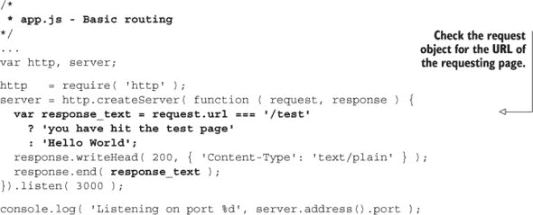

我们可以继续编写我们自己的路由器，对于简单的应用程序来说，这是一个合理的选择。然而，我们对我们的服务器应用程序有更大的抱负，我们希望使用 Node.js 社区开发和测试过的框架。我们将考虑的第一个框架是 Connect。

#### 7.2.3\. 安装和使用 Connect

Connect 是一个可扩展的 *中间件* 框架，它为 Node.js 网络服务器添加了基本认证、会话管理、静态文件服务和表单处理等功能。它不是唯一的框架，但它是简单且相对标准的。Connect 允许我们在请求接收和最终响应之间注入 *中间件* 函数。通常，中间件函数接收一个传入的请求，对其进行一些操作，然后将请求传递给下一个中间件函数或使用`response.end`方法结束响应。

熟悉 Connect 和中间件模式最好的方式是使用它。让我们确保 webapp 是我们的工作目录，并安装 connect。在命令行中输入以下内容：

```
npm install connect
```

这将创建一个名为 node_modules 的文件夹，并在其中安装 Connect 框架。node_modules 目录是所有 Node.js 应用程序模块的文件夹。`npm` 将在此目录中安装模块，当我们编写自己的模块时，它们将放在这里。我们可以按照 列表 7.5 中的说明修改我们的服务器应用程序。变更以**粗体**显示：

##### 列表 7.5\. 修改节点服务器应用程序以使用 Connect—`webapp/app.js`

```
/*
 * app.js - Simple connect server
*/
...
var
  connectHello, server,
  http     = require( 'http'    ),
  connect  = require( 'connect' ),
  app      = connect(),
  bodyText = 'Hello Connect';

connectHello = function ( request, response, next ) {
  response.setHeader( 'content-length', bodyText.length );
  response.end( bodyText );
};

app.use( connectHello );
server = http.createServer( app );

server.listen( 3000 );
console.log( 'Listening on port %d', server.address().port );
```

这个 Connect 服务器的行为与上一节中的第一个节点服务器非常相似。我们定义了第一个中间件函数 `connectHello`，然后告诉 Connect 对象 `app` 使用这个方法作为其唯一的中间件函数。由于 `connectHello` 函数调用了 `response.end` 方法，它结束了服务器响应。让我们在此基础上添加更多的中间件。

#### 7.2.4\. 添加 Connect 中间件

假设我们想要记录每次有人访问页面时的情况。我们可以使用 Connect 提供的内置中间件函数来实现。列表 7.6 展示了添加 `connect.logger()` 中间件函数。变更以**粗体**显示：

##### 列表 7.6\. 使用 Connect 向节点服务器应用程序添加日志—`webapp/app.js`

```
/*
 * app.js - Simple connect server with logging
*/
...
var
  connectHello, server,
  http     = require( 'http'    ),
  connect  = require( 'connect' ),

  app      = connect(),
  bodyText = 'Hello Connect';

connectHello = function ( request, response, next ) {
  response.setHeader( 'content-length', bodyText.length );
  response.end( bodyText );
};

app
  .use( connect.logger() )
  .use( connectHello     );
server = http.createServer( app );

server.listen( 3000 );
console.log( 'Listening on port %d', server.address().port );
```

我们所做的只是在我们定义的 `connectHello` 中间件之前添加了 `connect.logger()` 作为中间件。现在每次客户端向服务器应用程序发出 HTTP 请求时，首先被调用的中间件函数是 `connect.logger()`，它将日志信息打印到控制台。随后被调用的下一个中间件函数是我们定义的 `connectHello`，它像之前一样向客户端发送 `Hello Connect` 并结束响应。当我们将浏览器指向 http://localhost:3000 时，我们应该在 Node.js 控制台日志中看到以下内容：

```
Listening on port 3000
127.0.0.1 - - [Wed, 01 May 2013 19:27:12 GMT] "GET / HTTP/1.1" 200\
13 "-" "Mozilla/5.0 (X11; Linux x86_64) AppleWebKit/537.31 \
(KHTML, like Gecko) Chrome/26.0.1410.63 Safari/537.31"
```

尽管 Connect 比 Node.js 是一个更高级的抽象，但我们希望有更多的功能。是时候升级到 Express 了。

#### 7.2.5\. 安装和使用 Express

Express 是一个轻量级 Web 框架，其设计灵感来自 Sinatra，一个轻量级的 Ruby Web 框架。在 SPA 中，我们不需要充分利用 Express 提供的每个功能，但它确实提供了比 Connect 更丰富的功能集——实际上，它是建立在 Connect 之上的。

确保 webapp 是我们的工作目录，并安装 Express。与之前使用 Connect 时的命令行不同，我们将使用名为 package.json 的清单文件来告诉 `npm` 我们的应用程序需要哪些模块和版本才能正确运行。这在将应用程序安装到远程服务器或有人在我们机器上下载并安装我们的应用程序时非常有用。让我们创建 package.json 以安装 Express，如 列表 7.7 所示：

##### 列表 7.7\. 为 `npm install` 创建清单—`webapp/package.json`

```
{
 "name"     : "SPA",
  "version" : "0.0.3",
  "private" : true,
  "dependencies":  {
    "express"   :"3.2.x"
  }
}
```

`name` 属性是应用程序的名称；它可以是我们想要的任何名称。`version` 属性是应用程序的版本，它应该使用主要、次要和补丁版本方案（`<major>.<minor>.<patch>`）。将 `private` 属性设置为 `true` 告诉 `npm` 不要发布您的应用程序。最后，`dependencies` 属性描述了我们想要 `npm` 安装的模块和版本。在这种情况下，我们只有一个模块，即 `express`。让我们首先删除现有的 webapp/ node_modules 目录，然后使用 `npm` 安装 Express：

```
npm install
```

当使用 `npm` 命令添加新模块时，我们可以使用 `--save` 选项来自动更新 package.json 以包含新模块。这在开发过程中非常有用。注意我们如何指定我们想要的 Express 版本为 `"3.2.x"`，这意味着我们想要 Express 版本 3.2，带有最新的补丁。这是一个推荐的版本声明，因为补丁很少破坏 API，而是修复错误或帮助确保向后兼容性。

现在让我们编辑 app.js 以使用 Express。我们将在这个实现中使用 `'use strict'` 预言和几个部分分隔符，如 列表 7.8 所示。变化以 **粗体** 显示：

##### 列表 7.8\. 使用 Express 创建一个 node 服务器应用程序—`webapp/app.js`

```
/*
  * app.js - Simple express server
*/
...
// ------------ BEGIN MODULE SCOPE VARIABLES --------------
'use strict';
var
  http    = require( 'http'    ),
  express = require( 'express' ),

  app     = express(),
  server  = http.createServer( app );
// ------------- END MODULE SCOPE VARIABLES ---------------

// ------------- BEGIN SERVER CONFIGURATION ---------------
app.get( '/', function ( request, response ) {
  response.send( 'Hello Express' );
});
// -------------- END SERVER CONFIGURATION ----------------

// ----------------- BEGIN START SERVER -------------------
server.listen( 3000 );
console.log(
  'Express server listening on port %d in %s mode',
   server.address().port, app.settings.env
);
// ------------------ END START SERVER --------------------
```

在查看这个小型示例时，可能不会立即明显地看出为什么 Express 更容易使用，所以让我们逐行分析并查看。首先，我们加载 `express` 和 `http` 模块（如 **粗体** 所示）：

```
// ------------ BEGIN MODULE SCOPE VARIABLES --------------
'usestrict';
var
  http = require( 'http' ),
  express = require( 'express' ),

  app     = express(),
  server  = http.createServer(app );
// ------------- END MODULE SCOPE VARIABLES ---------------
```

然后，我们使用 `express` 创建一个 `app` 对象。该对象具有设置应用程序路由和其他属性的函数。我们还创建了 HTTP `server` 对象，我们将在以后使用它（如 **粗体** 所示）：

```
// ------------ BEGIN MODULE SCOPE VARIABLES --------------
'usestrict';
var
  http    = require( 'http'    ),
  express = require(  'express'),
  app = express(),
  server = http.createServer( app );
// ------------- END MODULE SCOPE VARIABLES ---------------
```

接下来，我们通过使用 `app.get` 方法来定义我们应用程序的路由：

```
// ------------- BEGIN SERVER CONFIGURATION ---------------
app.get( '/', function ( request, response) {
  response.send( 'Hello Express' );
});
// --------------END SERVER CONFIGURATION----------------
```

由于 Express 提供了丰富的 `get` 等方法，Node.js 中的路由变得简单。`app.get` 的第一个参数是一个与请求 URL 进行比较的模式。例如，如果我们的开发机器上的浏览器向 http://localhost:3000 或 http://localhost:3000/ 发送请求，则 `GET` 请求字符串将是 ‘/’，这与模式匹配。

第二个参数是一个当匹配发生时执行的回调函数。`request` 和 `response` 对象是提供给回调函数的参数。查询字符串参数可以在 `request.params` 中找到。

我们的第三和最后一部分开始启动服务器并将日志记录到控制台：

```
// ----------------- BEGIN START SERVER -------------------
server.listen( 3000 );
console.log(
  'Express server listening on port %d in %s mode',
  server.address().port, app.settings.env
);
```

现在我们有一个工作的 Express 应用程序，让我们添加一些中间件。

#### 7.2.6\. 添加 Express 中间件

由于 Express 是建立在 Connect 之上的，我们也可以使用类似的语法调用并传递中间件。让我们为我们的应用程序添加日志中间件，如 7.9 所示。变化以 **粗体** 显示。

##### 列表 7.9\. 将 Express 日志中间件添加到我们的应用程序中—`webapp/app.js`

```
/*
 * app.js - Simple express server with logging
*/
...
// ------------- BEGIN SERVER CONFIGURATION ---------------
app.use( express.logger() );
app.get( '/', function ( request, response ) {
  response.send( 'Hello Express' );
});
// -------------- END SERVER CONFIGURATION ----------------
```

Express 提供了所有的 Connect 中间件方法，这样我们就不需要在页面中引入 Connect。运行前面的代码会导致应用程序将请求记录到控制台，就像上一节中的`connect.logger`所做的那样。

我们可以使用 Express 的`app.configure`方法来组织我们的中间件，就像列表 7.10 中所示。变更以**粗体**显示。

##### 列表 7.10\. 使用 configure 组织我们的 Express 中间件—`webapp/app.js`

```
/*
 * app.js - Express server with middleware
*/
...
// ------------- BEGIN SERVER CONFIGURATION ---------------
app.configure( function () {
  app.use( express.logger() );
  app.use( express.bodyParser() );
  app.use( express.methodOverride() );
});
app.get( '/', function ( request, response ) {
  response.send( 'Hello Express' );
});
// -------------- END SERVER CONFIGURATION ----------------
...
```

此配置添加了两个新的中间件方法：`bodyParser`和`methodOver-ride`。`bodyParser`解码表单，将在以后广泛使用。`methodOverride`用于创建 RESTful 服务。`configure`方法还允许我们根据应用程序运行的 Node.js 环境更改配置。

#### 7.2.7\. 使用 Express 的环境

Express 支持根据环境设置切换配置的概念。示例环境包括`development`、`testing`、`staging`和`production`。Express 可以通过读取`NODE_ENV`环境变量来确定正在使用哪个环境，然后相应地设置其配置。如果你使用 Windows，你可以这样启动服务器应用程序：

```
SET NODE_ENV=production node app.js
```

使用 Mac 或 Linux，设置如下：

```
NODE_ENV=production node app.js
```

如果你使用的是其他东西，我们非常有信心你能弄明白。

当我们运行 Express 服务器应用程序时，我们可以使用任何字符串作为环境名称。如果没有设置`NODE_ENV`变量，它将默认使用`development`。

让我们调整我们的应用程序以适应提供的环境。我们希望在每一个环境中都使用`bodyParser`和`methodOverride`中间件。在`开发`环境中，我们希望应用程序记录 HTTP 请求和详细错误。在`生产`环境中，我们只想记录错误摘要，如列表 7.11 所示。变更以**粗体**显示：

##### 列表 7.11\. 使用 Express 支持不同的环境—`webapp/app.js`


我们可以通过在开发模式下运行应用程序（`node app.js`）并在浏览器中加载页面来测试这些配置。你应该在 Node.js 控制台中看到日志输出。接下来，我们可以停止服务器，并以生产模式运行它（`NODE_ENV=production node app.js`）。当我们重新加载浏览器中的页面时，日志中应该没有条目。

现在我们已经对 Node.js、Connect 和 Express 的一些基本原理有了很好的理解，让我们继续学习更高级的路由方法。

#### 7.2.8\. 使用 Express 提供静态文件服务

如你所预期，使用 Express 提供静态文件需要添加一些中间件和一点重定向。让我们将第六章中的 spa 目录的内容复制到公共目录中，如列表 7.12 所示。

##### 列表 7.12\. 添加静态文件目录

```
webapp
  +-- app.js
  +-- node_modules/...
  +-- package.json
  `-- public # contents of 'spa' copied here
      +-- css/...
      +-- js/...
      `-- spa.html
```

现在我们可以调整应用程序以提供静态文件，如列表 7.13 所示。变更以粗体显示。

##### 列表 7.13\. 使用 Express 提供静态文件—`webapp/app.js`

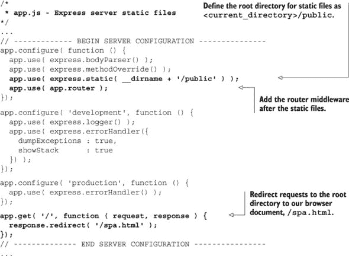

现在我们运行应用程序（`node app.js`）并将浏览器指向 http://localhost:3000，我们应该看到我们离开第六章时的 SPA。尽管如此，我们目前还不能登录，因为后端还没有准备好。

现在我们对 Express 中间件有了很好的了解，让我们看看高级路由，这对于 Web 数据服务是必需的。

### 7.3\. 高级路由

到目前为止，我们的应用程序所做的一切只是为 Web 应用程序的根提供路由，并向浏览器返回一些文本。在本节中，我们将：

+   使用 Express 框架为管理 `user` 对象提供 CRUD 路由。

+   为所有用于 CRUD 的路由设置响应属性，例如内容类型。

+   使代码通用，以便它适用于所有 CRUD 路由。

+   将路由逻辑放入一个单独的模块中。

#### 7.3.1\. 用户 CRUD 路由

*CRUD* 操作（创建、读取、更新、删除）是数据持久存储通常需要的重大操作。如果您需要复习或第一次听说 CRUD，维基百科有一个深入的讨论。在 Web 应用程序中用于实现 CRUD 的常见设计模式被称为 *REST*，或 *表征状态转移*。REST 使用严格和定义良好的语义来定义动词 `GET`、`POST`、`PUT`、`PATCH` 和 `DELETE` 的作用。如果您了解并喜爱 REST，请随意实现它；它是在分布式系统之间交换数据的完全有效的方法，Node.js 甚至有许多模块旨在帮助实现这一点。

我们已经为用户对象实现了基本的 CRUD 路由，并且出于几个原因没有在这个示例中实现 REST。一个挑战是许多浏览器尚未实现本地的 REST 动词，因此 `PUT`、`PATCH` 和 `DELETE` 通常通过传递额外的表单参数或 `POST` 中的头信息来实现。这意味着开发者无法轻易地知道正在使用哪个动词，而必须通过发送数据的头信息进行搜索。尽管 REST 动词看起来与 CRUD 操作相似，但 REST 并不是 CRUD 的完美映射。最后，当处理状态码时，Web 浏览器可能会造成障碍。例如，我们本应将 302 状态码传递给客户端 SPA，但浏览器可能会拦截该代码并尝试“做正确的事”，将重定向到不同的资源。这可能不是我们总希望的行为。

我们可以通过列出所有用户开始。

##### 创建获取用户列表的路由

我们可以创建一个简单的路由来提供用户列表。请注意，我们将响应对象的 `contentType` 设置为 `json`。这会将 HTTP 头信息设置为让浏览器知道响应是 JSON 格式，如列表 7.14 所示。变更以粗体显示：

##### 列表 7.14\. 创建一个获取用户列表的路由—`webapp/app.js`

```
/*
 * app.js - Express server with advanced routing
*/
...
// ------------- BEGIN SERVER CONFIGURATION ---------------
...
// all configurations below are for routes
app.get( '/', function ( request, response ) {
  response.redirect( '/spa.html' );
});

app.get( '/user/list', function ( request, response ) {
  response.contentType( 'json' );
  response.send({ title: 'user list' });
});
// -------------- END SERVER CONFIGURATION ----------------
...
```

用户列表路由期望一个 HTTP `GET` 请求。如果我们正在检索数据，这完全没问题。在我们的下一个路由中，我们将使用 `POST` 以便我们可以向服务器发送大量数据。

##### 创建一个创建用户对象的路由

当我们创建一个创建用户对象的路由时，我们需要处理来自客户端的 `POST` 数据。Express 提供了一个快捷方法 `app.post`，它处理与提供的模式匹配的 `POST` 请求。我们可以在我们的服务器应用程序中添加以下内容，如 列表 7.15 所示。变化以粗体显示：

##### 列表 7.15\. 创建一个创建用户对象的路由—`webapp/app.js`

```
/*
 * app.js - Express server with advanced routing
*/
...
// -------------BEGIN SERVERCONFIGURATION ---------------
...

app.get( '/user/list', function ( request,response ){
  response.contentType( 'json');
  response.send({title: 'userlist' });
});

app.post( '/user/create', function ( request, response ) {
  response.contentType( 'json' );
  response.send({ title: 'user created' });
});
// --------------END SERVER CONFIGURATION----------------
...
```

我们还没有对提交的数据做任何处理；我们将在下一章中介绍。如果我们用浏览器导航到 http://localhost:3000/user/create，我们会看到一个 404 错误和消息 `Cannot GET /user/create`。这是因为浏览器正在发送一个 `GET` 请求，而这个路由只处理 `POST` 请求。相反，我们可以使用命令行来创建一个用户：

```
curl http://localhost:3000/user/create -d {}
```

服务器应该响应：

```
{"title":"User created"}
```

|  |
| --- |

**CURL 和 WGET**

如果你使用的是 Mac 或 Linux 机器，你可以使用 `curl` 来测试你的 API 并跳过浏览器。我们可以通过向 user/create 发送 `POST` 来测试我们刚刚创建的 URL：

```
curl http://localhost:3000/user/create -d {}
{"title":"User created"}
```

`-d` 用于发送数据，而空对象字面量不会发送任何数据。与其打开浏览器来测试一个路由，使用 `curl` 可以显著加快你的开发时间。要了解更多关于 `curl` 的功能，请在命令提示符下输入 `curl -h`。

使用 `wget` 也可以得到类似的结果：

```
wget http://localhost:3000/user/create --post-data='{}' -O -
```

要了解更多关于 `wget` 的功能，请在命令提示符下输入 `wget -h`。

|  |
| --- |

现在我们有一个创建用户对象的路由，我们想要创建一个读取用户对象的路由。

##### 创建一个读取用户对象的路由

读取用户对象的路由与创建路由类似，但使用 `GET` 方法，并通过 URL 传递一个额外的参数：用户的 ID。此路由是通过在路由路径中使用冒号来定义参数创建的，如 列表 7.16 所示。变化以粗体显示：

##### 列表 7.16\. 创建一个读取用户对象的路由—`webapp/app.js`

```
/*
 * app.js - Express server with advanced routing
*/
...
// ------------- BEGIN SERVERCONFIGURATION ---------------
...

app.post( '/user/create', function ( request, response) {
  response.contentType( 'json');
  response.send({title: 'usercreated' });
});

app.get( '/user/read/:id', function ( request, response ) {
  response.contentType( 'json' );
  response.send({
    title: 'user with id ' + request.params.id + ' found'
  });
});
// -------------- END SERVER CONFIGURATION ----------------
...
```

路由末尾的用户 `:id` 参数可以通过 `request.params` 对象访问。`/user/read/:id` 路由使得用户 ID 可在 `request.params[`id`]` 或 `request.params.id` 处访问。如果请求的 URL 是 http://localhost:3000/user/read/12，那么 `request.params.id` 的值将是 12。试一试，并注意这个路由无论 `id` 的值是什么都有效——只要有一个有效的值就可以接受。更多示例见 表 7.1。

##### 表 7.1\. 路由及其结果

| 在浏览器中尝试这些 | Node.js 终端中的输出 |
| --- | --- |
| /user/read/19 | {“title”:“User with id 19 found”} |
| /user/read/spa | {“title”:“User with id spa found”} |
| /user/read/ | 无法获取 /user/read/ |
| /user/read/? | 无法获取 /user/read/? |

虽然捕获任何路由都很好，但如果我们的 ID 始终是数字呢？我们不希望路由器拦截 ID 不是数字的路径。Express 通过在路由定义中添加正则表达式模式`[(0-9)]+`，提供了仅接受包含数字的路由的能力，如列表 7.17 所示。变化以**粗体**显示：

##### 列表 7.17\. 将路由限制为仅接受数字 ID—`webapp/app.js`

```
/*
 * app.js - Express server with advanced routing
*/
...
// ------------- BEGIN SERVER CONFIGURATION ---------------
...

app.get( '/user/read/:id([0-9]+)', function ( request, response ) {
  response.contentType( 'json' );
  response.send({
    title: 'user with id ' + request.params.id + ' found'
  });
});
// -------------- END SERVER CONFIGURATION ----------------
...
```

表 7.2 显示，路由现在将仅接受数字 ID。

##### 表 7.2\. 路由及其结果

| 在浏览器中尝试这些操作 | 结果 |
| --- | --- |
| /user/read/19 | {“title”:“找到 ID 为 19 的用户”} |
| /user/read/spa | 无法获取 /user/read/spa |

##### 创建更新或删除用户的路由

目前更新和删除用户的路由与读取用户的路由几乎相同，尽管在下一章中它们对用户对象执行的操作将大不相同。我们在列表 5.18 中添加了更新和删除用户的路由。变化以**粗体**显示：

##### 列表 7.18\. 定义 CRUD 路由—`webapp/app.js`

```
/*
 * app.js - Express server with advanced routing
*/
...
// ------------- BEGIN SERVER CONFIGURATION ---------------
...

app.get( '/user/read/:id([0-9]+)', function ( request, response ) {
  response.contentType( 'json' );
  response.send({
    title: 'user with id ' + request.params.id + ' found'
  });
});

app.post( '/user/update/:id([0-9]+)',
  function ( request, response ) {
     response.contentType( 'json' );
     response.send({
       title: 'user with id ' + request.params.id + ' updated'
     });
  }
);

app.get( '/user/delete/:id([0-9]+)',
  function ( request, response ) {
     response.contentType( 'json' );
     response.send({
       title: 'user with id ' + request.params.id + ' deleted'
     });
  }
);
// -------------- END SERVER CONFIGURATION ----------------
...
```

创建这些基本路由很简单，但你可能已经注意到，我们必须为每个响应设置`contentType`。这很容易出错且效率低下——更好的方法是我们能够为所有这些用户 CRUD 操作的响应设置`contentType`。理想情况下，我们希望创建一个拦截所有传入用户路由并设置响应`contentType`为`json`的路由。有两个问题阻碍了我们：

1.  一些请求使用`GET`方法，而另一些使用`POST`。

1.  在设置响应的`contentType`之后，我们希望路由器像以前一样工作。

幸运的是，Express 再次发挥了作用。除了`app.get`和`app.post`方法外，还有一个`app.all`方法可以拦截任何类型的路由。Express 还允许我们通过在路由回调方法中设置和调用第三个参数来将控制权交回给路由器，以查看是否有其他路由与请求匹配。按照惯例，第三个参数被称为`next`，它立即将控制权传递给下一个中间件或路由。我们在列表 7.19 中添加了`app.all`方法。变化以**粗体**显示：

##### 列表 7.19\. 使用`app.all()`设置常用属性—`webapp/app.js`

```
/*
 * app.js - Express server with advanced routing
*/
...
// ------------- BEGIN SERVER CONFIGURATION ---------------
...
// all configurations below are for routes
app.get( '/', function ( request, response ) {
  response.redirect( '/spa.html' );
});

app.all( '/user/*?', function ( request, response, next ) {
  response.contentType( 'json' );
  next();
});

app.get( '/user/list', function ( request, response ) {
  // REMOVE response.contentType( 'json' );
  response.send({ title: 'user list' });
});

app.post( '/user/create', function ( request, response ) {
  // REMOVE response.contentType( 'json' );
  response.send({ title: 'user created' });
});

app.get( '/user/read/:id([0-9]+)',
  function ( request, response ) {
    // REMOVE response.contentType( 'json' );
    response.send({
      title: 'user with id ' + request.params.id + ' found'
    });
  }
);

app.post( '/user/update/:id([0-9]+)',
  function ( request, response ) {
     // REMOVE response.contentType( 'json' );
     response.send({
       title: 'user with id ' + request.params.id + ' updated'
     });
  }
);

app.get( '/user/delete/:id([0-9]+)',
  function ( request, response ) {
     // REMOVE response.contentType( 'json' );
     response.send({
       title: 'user with id ' + request.params.id + ' deleted'
     });
  }
);
// -------------- END SERVER CONFIGURATION ----------------
...
```

在路由模式`/user/*?`中，`*`将匹配任何内容，而`?`使其成为可选的。`/user/*?`将匹配以下任何路由：

+   `/user`

+   `/user/`

+   `/user/12`

+   `/user/spa`

+   `/user/create`

+   `/user/delete/12`

现在我们已经设置了用户路由，很容易想象随着我们添加对象类型，路由的数量会激增。我们真的需要为每种对象类型定义五个新路由吗？幸运的是，不需要。我们可以使这些路由通用，并将它们放在自己的模块中。

#### 7.3.2\. 通用 CRUD 路由

我们已经知道我们可以使用路由参数来接受来自客户端的参数，但我们也可以使用它们来使我们的路由通用。我们只需要告诉 Express 使用 URI 的一部分作为参数。这将解决问题：

```
app.get( '/:obj_type/read/:id([0-9]+)',
  function ( request, response) {
    response.send({
      title: request.params.obj_type + ' with id '
       + request.params.id + 'found'
    });
  }
);
```

现在我们请求 `/horse/read/12` 时，将在请求参数 `request.params.obj_type` 中获取对象类型（`horse`），响应 JSON 将是 `{ title: "horse with id 12 found" }`。将此逻辑应用于我们的其他方法，我们最终得到 列表 7.20 中的代码。所有更改都以 **粗体** 显示。

##### 列表 7.20\. 完整的通用 CRUD 路由—`webapp/app.js`

```
/*
 * app.js - Express server with generic routing
*/
...
// ------------- BEGIN SERVER CONFIGURATION ---------------
...
// all configurations below are for routes
app.get( '/', function ( request, response ) {
  response.redirect( '/spa.html' );
});

app.all( '/:obj_type/*?', function ( request, response, next ) {
  response.contentType( 'json' );
  next();
});

app.get( '/:obj_type/list', function ( request, response ) {
  response.send({ title: request.params.obj_type + ' list' });
});

app.post( '/:obj_type/create', function ( request, response ) {
  response.send({ title: request.params.obj_type + ' created' });
});

app.get( '/:obj_type/read/:id([0-9]+)',
  function ( request, response ) {
    response.send({
       title: request.params.obj_type
        + ' with id ' + request.params.id + ' found'
    });
  }
);

app.post( '/:obj_type/update/:id([0-9]+)',
  function ( request, response) {
    response.send({
       title: request.params.obj_type
        + ' with id ' + request.params.id + ' updated'
    });
  }
);

app.get( '/:obj_type/delete/:id([0-9]+)',
  function ( request, response) {
    response.send({
       title: request.params.obj_type
        + ' with id ' + request.params.id + ' deleted'
    });
  }
);
// --------------END SERVER CONFIGURATION----------------
...
```

现在我们启动应用程序（`node app.js`）并将浏览器指向 http://localhost:3000，我们将看到我们熟悉的 SPA，如图 图 7.1 所示：

##### 图 7.1\. 浏览器中的我们的 SPA——http://localhost:3000


这表明我们的静态文件配置允许浏览器读取所有的 HTML、JavaScript 和 CSS 文件。但我们仍然可以访问我们的 CRUD API。如果我们将浏览器指向 http://localhost:3000/user/read/12，我们应该看到类似的内容：

```
{
  title: "user with id 12 found"
}
```

如果我们在 `<root_directory>/user/read/12` 有一个文件（别笑，你知道这种情况会发生），我们的情况下，将返回文件而不是 CRUD 响应。这是因为 `express.static` 中间件被添加到路由器之前，如下所示：

```
...
app.configure( function () {
  app.use( express.bodyParser() );
  app.use( express.methodOverride() );
  app.use( express.static( __dirname + '/public' ) );
  app.use( app.router );
});
...
```

如果我们反转了顺序，将路由器放在前面，将返回 CRUD 响应而不是静态文件。这种安排的好处可能是对 CRUD 请求的更快响应；缺点是文件访问更慢且更复杂。*聪明的*做法是将所有 CRUD 请求放在单个根名称下，例如 /api/1.0.0/，这样动态内容和静态内容就可以整洁地分离。

现在我们已经拥有了管理任何对象类型的干净、通用的路由器的基础。显然，这并没有考虑到授权问题，但我们会稍后讨论这个逻辑。首先，让我们先将所有路由逻辑移动到一个单独的模块中。

#### 7.3.3\. 将路由放置在单独的 Node.js 模块中

将所有路由定义在主 `app.js` 文件中，就像在 HTML 页面中编写客户端 JavaScript 一样——它会弄乱您的应用程序，并且没有保持职责的清晰分离。让我们首先更仔细地看看 Node.js 模块系统，这是 Node.js 包括模块化代码的方式。

##### Node 模块

Node 模块是通过 `require` 函数加载的。

```
var spa = require( './routes' );
```

传递给 `require` 的字符串指定要加载的文件的路径。需要记住一些不同的语法规则，所以请耐心。为了您的方便，这些内容在 表 7.3 中描述。

##### 表 7.3\. Node 对 *require* 的搜索路径逻辑

| 语法 | 搜索路径，按优先级顺序 |
| --- | --- |

|

```
require(
 './routes.js'
);

require(
'./routes'
);

require(
'../routes.js'
);

require(
'routes'
);
```

|

```
app/routes.js

app/routes.js
app/routes.json
app/routes.node

../routes.js

app/node_modules/routes.js
app/node_modules/routes/index.js
<system_install>/node_modules/routes.js
<system_install>/node_modules/routes/index.js
```

|

|   | 此语法也用于引用核心 node.js 模块，例如 http 模块。 |
| --- | --- |

在一个 node 模块内部，使用 `var` 声明的变量被限制在模块内部，不需要一个自执行的匿名函数来保持变量不在全局作用域中，就像客户端所需要的那样。相反，有一个 `module` 对象。分配给 `module.exports` 属性的值作为 `require` 方法的返回值。让我们创建一个路由模块，如 列表 7.21 所示：

##### 列表 7.21\. 创建路由模块—`webapp/routes.js`

```
module.exports = function () {
  console.log( 'You have included the routes module.' );
};
```

`module.exports` 的值可以是任何数据类型，如函数、对象、数组、字符串、数字或布尔值。在这种情况下，routes.js 将 `module.exports` 的值设置为匿名函数。让我们在 app.js 中 `require` routes.js 并将返回值存储在 `routes` 变量中。然后我们可以像 列表 7.22 所示那样调用返回的函数。更改以粗体显示：

##### 列表 7.22\. 包含一个模块并使用返回值—`webapp/app.js`

```
/*
 * app.js - Express server with sample module
*/
...
// ------------ BEGIN MODULE SCOPE VARIABLES --------------
'use strict';
var
  http    = require( 'http'     ),
  express = require( 'express'  ),
  routes  = require( './routes' ),
  app     = express(),
  server  = http.createServer( app );

routes();
// ------------- END MODULE SCOPE VARIABLES ---------------
...
```

当我们在命令提示符中键入 `node app.js` 时，我们应该看到以下内容：

```
You have included the routes module.
 Express server listening on port 3000 in development mode
```

现在我们已经添加了我们的路由模块，让我们将我们的路由器配置移动到它那里。

##### 将路由移动到模块中

当我们创建一个非平凡的应用程序时，我们喜欢在主应用程序文件夹中定义我们的路由到一个单独的文件。在一个具有大量路由的大应用中，我们可以在一个路由文件夹中定义它们，文件夹中有我们需要的文件数量。

由于我们的下一个应用程序将不是平凡的，让我们在根 spa 目录中创建一个名为 routes.js 的文件，并将现有的路由复制到 `module.exports` 函数中。它应该看起来像 列表 7.23。

##### 列表 7.23\. 将路由放置在单独的模块中—`webapp/routes.js`

![ch07list23-0.jpg]

![ch07list23-1.jpg]

现在我们可以调整 `webapp/app.js` 以使用路由模块，如 列表 7.24 所示。更改以粗体显示。

##### 列表 7.24\. 更新服务器应用程序以使用外部路由—`webapp/app.js`

![ch07list24-0.jpg]

![ch07list24-1.jpg]

这使得我们的 app.js 变得相当干净：它加载所需的库模块，创建我们的 Express 应用程序，配置我们的中间件，添加我们的路由，并启动服务器。它没有做的是通过执行任何请求的操作将数据持久化到数据库中。我们将在设置 MongoDB 并将其连接到我们的 Node.js 应用程序之后，在下一章中设置它。在此之前，让我们先看看我们可能需要的一些其他事情。

### 7.4\. 添加认证和授权

现在我们已经为在对象上执行 CRUD 操作创建了路由，我们应该添加认证。我们可以通过艰难的方式自己编写代码，或者通过简单的方式利用另一个 Express 中间件。嗯。想想...想想，选择哪一个？

#### 7.4.1\. 基本认证

基本身份验证是 HTTP/1.0 和 1.1 标准中客户端在请求时提供用户名和密码的方式；通常被称为 *基本认证*。记住，中间件是按照添加到应用程序的顺序调用的，所以如果你想使应用程序授权访问路由，中间件需要在路由中间件之前添加。这就像 列表 7.25 中所示的那样容易完成。更改以 **粗体** 表示：

##### 列表 7.25. 将基本认证添加到我们的服务器应用程序——`webapp/app.js`

```
/*
 * app.js - Express server with basic auth
*/
...
// -------------BEGIN SERVERCONFIGURATION ---------------
app.configure( function () {
  app.use( express.bodyParser() );
  app.use( express.methodOverride() );
  app.use( express.basicAuth( 'user', 'spa' ) );
  app.use( express.static( __dirname + '/public' ) );
  app.use( app.router );
});
...
```

在这个例子中，我们硬编码了应用程序，使其期望用户为 `user`，密码为 `spa`。`basicAuth` 也接受一个函数作为第三个参数，该函数可以用来提供更高级的机制，例如在数据库中查找用户详细信息。该函数应该返回 `true` 如果用户有效，当用户无效时返回 `false`。当我们重新启动服务器并重新加载浏览器时，它应该打开一个类似于 图 7.2 的警告对话框，在允许访问之前要求有效的用户名和密码。

##### 图 7.2. Chrome 的身份验证对话框

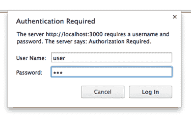

如果我们输入错误的密码，它会持续提示，直到我们输入正确。按下取消按钮将带我们到一个显示“未经授权”的页面。

基本身份验证不建议在生产应用程序中使用。它以纯文本形式发送每个请求的凭据——安全专家称这为 *大攻击向量*。即使我们使用 SSL（HTTPS）加密传输，我们也只有一层安全在客户端和服务器之间。

自己构建身份验证机制现在正变得过时。许多初创公司甚至更大、更成熟的公司都在使用来自 Facebook 或 Google 等第三方身份验证服务。有许多在线教程展示了如何集成这些服务；Node.js 中间件 Passport 可以帮助你入门。

### 7.5. Web sockets 和 Socket.IO

*Web sockets* 是一种令人兴奋的技术，它正在获得广泛的浏览器支持。Web sockets 允许客户端和服务器通过单个 TCP 连接保持持久、轻量级和双向的通信通道。这使得客户端或服务器能够在没有 HTTP 请求-响应周期开销和延迟的情况下实时推送消息。在 Web sockets 之前，开发者采用了替代但效率较低的技巧来提供类似的功能。这些技术包括使用 Flash sockets；长轮询，其中浏览器向服务器打开一个请求，并在有响应或请求超时时重新初始化请求；以及服务器在很短的间隔内轮询（例如，每秒一次）。

Web 服务器的问题在于规范尚未最终确定，旧浏览器永远不会支持它。Socket.IO 是一个 Node.js 模块，它优雅地解决了后一个问题，因为它在可用的情况下提供浏览器到服务器的 WebSocket 消息传递，但如果 WebSocket 不可用，它将降级使用其他技术。

#### 7.5.1\. 简单 Socket.IO

让我们创建一个简单的 Socket.IO 应用程序，该应用程序每秒更新服务器上的计数并将当前计数推送到已连接的客户端。我们可以通过更新我们的 package.json 来安装 Socket.IO，如 列表 7.26 所示。更改以粗体显示：

##### 列表 7.26\. 安装 Socket.IO—webapp/package.json

```
{
 "name"     : "SPA",
  "version" : "0.0.3",
  "private" : true,
  "dependencies"  :{
    "express"   :"3.2.x",
    "socket.io" : "0.9.x"
  }
}
```

现在，我们可以运行 `npm install` 来确保 Express 和 Socket.IO 都已安装。

让我们添加两个文件，一个名为 webapp/socket.js 的服务器应用程序和一个名为 [webapp/socket.html](http://webapp/socket.html) 的浏览器文档。让我们首先构建一个可以提供静态文件并且有一个每秒递增一次的计时器的服务器应用程序。既然我们知道我们将使用 Socket.IO，我们将包括该库。列表 7.27 显示了我们的新 socket.js 服务器应用程序：

##### 列表 7.27\. 开始服务器应用程序—webapp/socket.js

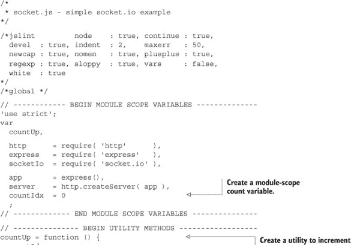

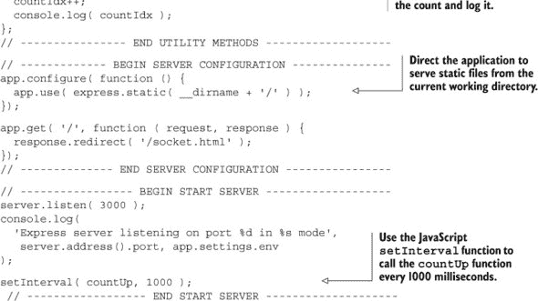

当我们启动服务器—`node socket.js`—我们在终端看到它正在记录一个不断递增的数字。现在，让我们创建 [webapp/socket.html](http://webapp/socket.html) 中所示的 `[webapp/socket.html](http://webapp/socket.html)` 来显示这个数字。我们将包括 jQuery，因为它使获取 body 标签变得简单：

##### 列表 7.28\. 创建浏览器文档—webapp/socket.html

```
<!doctype html>
<!--socket.html- simple socket example -->
<html>
<head>
  <script type="text/javascript"
src="http://ajax.googleapis.com/ajax/libs/jquery/1.9.1/jquery.min.js"
  ></script>
</head>
<body>
  Loading...
</body>
</html>
```

我们现在应该能够加载 `http://localhost:3000` 并看到几乎空白的页面。让 Socket.IO 向客户端发送此信息只需要在我们的服务器应用程序中添加两行，如 列表 7.29 所示。更改以粗体显示：

##### 列表 7.29\. 将 WebSocket 添加到服务器应用程序—webapp/socket.js

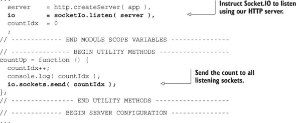

浏览器文档只需要额外的六行来启用 Socket.IO，如 列表 7.30 所示。更改以粗体显示：

##### 列表 7.30\. 将 WebSocket 添加到浏览器文档—webapp/socket.html

```
<!doctype html>
<!-- socket.html - simple socket example -->
<html>
<head>
  <script type="text/javascript"
src="http://ajax.googleapis.com/ajax/libs/jquery/1.9.1/jquery.min.js"
  ></script>
  <script src="/socket.io/socket.io.js"></script>
  <script>
    io.connect().on('message', function ( count ) {
      $('body').html( count );
    });
  </script>
</head>
<body>
  Loading...
</body>
</html>
```

JavaScript 文件 `/socket.io/socket.io.js` 由 Socket.IO 安装提供，因此无需创建一个；它也是一个“神奇”的文件，实际上并不存在于服务器上，所以不要去寻找它。`io.connect()` 返回一个 Socket.IO 连接，而 `on` 方法与 jQuery 中的 `bind` 方法类似，它告诉它监视某种 Socket.IO 事件。在这种情况下，我们正在寻找的事件是通过连接发送的任何消息。然后我们使用 jQuery 更新 body 以新的计数。你是在服务器上寻找 socket.io.js 文件，对吧？

如果我们在浏览器中打开 `http://localhost:3000/`，我们应该看到计数器在增加。当我们打开另一个标签到同一位置时，我们应该看到另一个计数器以相同的数量和速率增加，因为 `countIdx` 是服务器应用程序的模块作用域变量。

#### 7.5.2\. Socket.IO 和信息服务器

当我们使用 Socket.IO 在客户端和服务器之间路由消息时，我们正在创建一个信息服务器。另一个信息服务器的例子是 *Openfire*，它使用 XMPP 协议来提供消息，这是 Google Chat 和 Jabber 所使用的协议。信息服务器必须维护与所有客户端的连接，以便它们可以快速接收和响应消息。它们还应该通过避免不必要的数据来最小化消息的大小。

传统的网络服务器，如 Apache2，是糟糕的信息服务器，因为它们为每个连接创建和分配一个进程（或线程），**并且每个进程必须在其连接持续期间存在**。正如你可能猜到的，在几百或几千个连接之后，网络服务器将耗尽所有用于服务连接的进程所使用的资源。Apache2 从未为此而设计；它被编写为一个内容服务器，其理念是尽可能快地响应请求推送数据，然后尽可能快地关闭连接。对于这些类型的用途，Apache2 是一个很好的选择——只需问问 YouTube。

与之相比，Node.js 是一个优秀的信息服务器。多亏了其事件模型，它**不会**为每个连接创建一个进程。相反，它在连接打开或关闭时做一些记账，并在之间进行一些维护。因此，它可以在普通的硬件上处理成千上万的并发连接。Node.js 不会在其打开的连接之一或多个上发生信息事件——如请求或响应——之前做任何显著的工作。

Node.js 可以处理的消息客户端数量取决于服务器遇到的实际工作量。如果客户端相对安静且服务器任务轻量，服务器可以处理**很多**客户端。如果客户端很健谈且服务器任务更重，服务器可以处理的客户端就**少得多**。在一个高流量环境中，负载均衡器可能会在提供消息的 Node.js 服务器集群、提供动态网页内容的另一个 Node.js 服务器集群以及提供静态内容的 Apache2 服务器集群之间路由流量。

使用 Node.js 而不是 XMPP 等其他消息协议的好处有很多。这里只列举几个：

+   Socket.IO 使得在 Web 应用中进行跨浏览器消息传递几乎变得微不足道。我们之前曾为生产应用程序使用过 XMPP。相信我们：仅为了软件，它就**要复杂得多**。

+   我们可以避免维护一个单独的服务器和配置。这又是一个巨大的优势。

+   我们可以使用原生的 JSON 协议而不是不同的语言。XMPP 是 XML，需要复杂的软件来编码和解码。

+   我们不必担心（至少最初）那些困扰其他消息平台的“同源”策略。这个浏览器策略阻止内容加载到浏览器中，如果它不是来自使用它的 JavaScript 相同的服务器。

现在我们来看一个一定会给人留下深刻印象的 Socket.IO 用法：动态更新我们的 SPA。

#### 7.5.3\. 使用 Socket.IO 更新 JavaScript

使用单页应用程序（SPA）的一个挑战是确保客户端软件与服务器应用程序匹配。想象一下，如果鲍比在我们的浏览器中加载了我们的 SPA，五分钟后我们更新了我们的服务器应用程序。现在鲍比遇到了问题，因为我们的更新后的服务器使用了一种新的数据格式，而鲍比的 SPA 仍然期望使用旧的数据格式。解决这种情况的一种方法是在我们发送消息宣布服务器更新后，强制鲍比重新加载整个 SPA——比如说，我们发送了消息后。但我们还可以做得更复杂——我们可以在 SPA 中仅更新已更改的 JavaScript，而不必强制整个应用程序重新加载。

那么，我们如何进行这种神奇的更新？需要考虑三个部分：

1.  监视 JavaScript 文件以检测它们何时被修改。

1.  通知客户端文件已更新。

1.  当通知客户端更改时更新客户端侧的 JavaScript。

第一部分，检测文件何时被修改，可以使用本机 node 文件系统模块`fs`完成。第二部分是向浏览器发送 Socket.IO 通知，如前所述，通过接收通知时注入新的 script 标签来更新客户端。我们可以从上一个示例中更新我们的服务器应用程序，如列表 7.31 所示。更改以粗体显示：

##### 列表 7.31\. 更新服务器应用程序以监视文件—`webapp/socket.js`

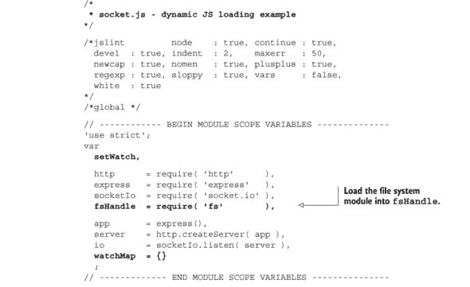

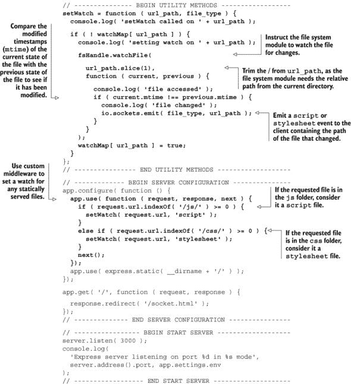

现在我们已经准备好了服务器应用程序，让我们看看客户端，从我们将要更新的 JavaScript 文件开始，然后是索引页面。我们的数据文件，`webapp/js/data.js`，包含一行将一些文本赋值给变量的代码，如列表 7.32 所示：

##### 列表 7.32\. 创建数据文件—`webapp/js/data.js`

```
var b = 'SPA';
```

我们浏览器文档的更改需要更实质一些，如列表 7.33 所示。更改以粗体显示：

##### 列表 7.33\. 更新浏览器文档—`webapp/socket.html`

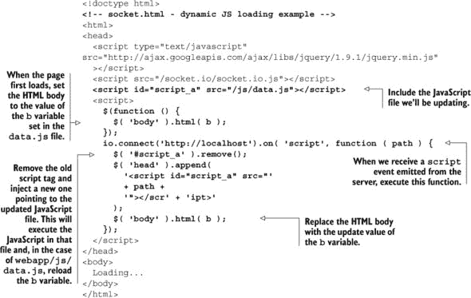

现在，我们可以让魔法发生。首先，让我们启动我们的服务器应用程序（在命令行中输入`node socket.js`）。接下来，让我们打开我们的浏览器文档（[webapp/socket.html](http://webapp/socket.html)）。我们应该在我们的浏览器主体中看到`SPA`。然后，让我们编辑 webapp/js/ data.js 文件，将`SPA`的值更改为`生活的意义是一个芜菁`或一些其他同样简洁的评论。当我们返回浏览器时，我们应该看到显示从`SPA`更改为上述简洁评论的变化（无需重新加载浏览器）。可能会有几秒钟的延迟，因为`watchFile`命令可能需要这么长时间才能注意到文件变化.^([1])

> ¹ 在生产环境中，我们通常希望将文件轮询（`fstat`s）保持在最低限度，因为它可能会严重影响性能。`fileWatch`方法可以设置选项，以便更频繁地轮询文件。例如，我们可能每 30,000 毫秒（30 秒）轮询一次，而不是默认的 0（我们只能假设这意味着“检查非常、非常频繁”）。

### 7.6. 概述

在本章中，我们看到了尽管 SPA 的大部分逻辑已经转移到客户端，但服务器仍然负责身份验证、数据验证和数据存储。我们已经设置了一个 Node.js 服务器，并使用 Connect 和 Express 中间件使路由、日志和身份验证变得更容易。

将路由和配置逻辑分离到不同的文件中使其更容易理解，Express 为我们提供了定义不同环境的不同配置的能力。Express 为我们提供了创建适用于所有对象类型的 CRUD 路由的工具。

我们还没有解决如何验证和存储数据的问题——这将在下一章中解决，当我们将应用程序和数据结合在一起时。

## 第八章. 服务器数据库

| |
| --- |

**本章涵盖**

+   在 SPA 中数据库的作用

+   使用 JavaScript 作为 MongoDB 的数据库语言

+   理解 Node.js MongoDB 驱动程序

+   实现 CRUD 操作

+   使用 JSV 进行数据验证

+   使用 Socket.IO 推送数据更改到客户端

| |
| --- |

本章基于我们在第七章中编写的代码。我们建议将那个章节的整个目录结构复制到一个新的“chapter_8”目录中，并更新那里的文件。

在本章中，我们将数据库添加到我们的 SPA 中，以实现持久数据存储。这完成了我们使用 JavaScript 端到端——在数据库、服务器和浏览器上的愿景。当我们完成时，我们将能够启动我们的 Node.js 服务器应用程序，并邀请我们的朋友使用他们的电脑或触摸设备登录 SPA。他们可以互相聊天或更改每个人都可以在近实时看到的人物形象。让我们通过更仔细地研究数据库的作用来开始。

### 8.1. 数据库的作用

我们使用数据库服务器来提供数据的可靠、持久存储。我们依赖服务器来扮演这个角色，因为客户端存储的数据是短暂的，容易受到应用程序错误、用户错误和用户篡改的影响。客户端数据也难以进行点对点共享，并且仅在客户端在线时可用。

#### 8.1.1\. 选择数据存储

在选择服务器存储解决方案时，我们有许多选项需要考虑：关系数据库、键值存储和 NoSQL 数据库等。但最佳选择是什么？就像生活中的许多问题一样，答案是“这取决于。”我们曾与使用这些解决方案中的许多用于不同目的的 Web 应用程序合作过。许多人已经撰写了大量关于各种数据存储优点的内容，例如关系数据库（如 *MySQL*）、键值存储（如 *memcached*）、图数据库（如 *Neo4J*）或文档数据库（如 *Cassandra* 或 *MongoDB*）。尽管作者们倾向于保持中立，认为这些都有其位置，但这些解决方案相对优缺点的讨论超出了本书的范围。

让我们设想我们已经创建了一个作为文字处理器的 SPA。我们可能会使用循环冗余文件系统数据存储来存储大量文件，但使用 MySQL 数据库进行索引。此外，我们可能将身份验证对象存储在 MongoDB 中。在任何情况下，用户几乎肯定会期望将他们的文档保存到服务器上进行长期存储。有时用户可能希望从本地磁盘上的文件读取或保存，我们几乎肯定应该提供这个选项。但随着网络、远程存储的价值和可靠性以及可访问性的持续提高，本地存储的使用案例正在不断减少。

我们选择 MongoDB 作为我们的数据存储，原因有很多：它已被证明是可靠的，它具有可扩展性，性能良好，并且——与一些其他 NoSQL 选项不同——它定位为通用数据库。我们发现它非常适合 SPA，因为它使我们能够从 SPA 的一端到另一端使用 JavaScript 和 JSON。它的命令行界面使用 JavaScript 作为其查询语言，因此我们可以在探索数据库的同时轻松测试 JavaScript 结构，或者使用与我们服务器或浏览器环境完全相同的表达式来操作数据。它使用 JSON 作为其存储格式，其数据管理工具是为 JSON 量身定制的。

#### 8.1.2\. 消除数据转换

考虑一下用 MySQL/Ruby on Rails（或 mod_perl、PHP、ASP、Java 或 Python）和 JavaScript 编写的传统网络应用程序：开发者必须编写代码将 SQL -> Active Record -> JSON 在客户端的路径上转换，然后在返回的路径上将 JSON -> Active Record -> SQL 转换（见图 8.1）。这涉及到三种语言（SQL、Ruby、JavaScript）、三种数据格式（SQL、Active Record、JSON）和四种数据转换。在最坏的情况下，这会浪费大量的服务器资源，这些资源本可以用于其他更好的用途。在最坏的情况下，每个转换都提供了引入错误的机会，并且可能需要大量的努力来实现和维护。

##### 图 8.1\. 网络应用程序中的数据转换

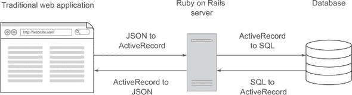

我们使用 MongoDB、Node.js 和原生 JavaScript SPA，因此我们的数据映射如下：在客户端的路径上 JSON -> JSON -> JSON，然后在返回的路径上 JSON -> JSON -> JSON（见图 8.2）。我们使用一种语言（JavaScript）、一种数据格式（JSON）和没有数据转换。这给曾经复杂系统带来了强大的简单性。

##### 图 8.2\. 使用 MongoDB、Node.js 和 SPA，无需数据转换


这种设置的简单性也使我们能够在决定放置应用程序逻辑的位置时更加灵活。

#### 8.1.3\. 将逻辑移动到需要的位置

在我们的传统网络应用程序示例中，考虑一下我们如何选择放置某些应用程序逻辑的位置。也许我们应该将其放在存储的 SQL 存储过程中？或者也许我们应该将逻辑嵌入到服务器应用程序中？也许我们应该将逻辑放在客户端？如果我们需要从一个层移动到另一个层，通常需要付出大量的努力，因为层使用不同的语言和数据格式。换句话说，犯错误通常代价高昂（例如，想象一下将逻辑从 Java 重写到 JavaScript）。这导致了妥协的“安全”选择，限制了应用程序的能力。

使用单一语言和数据格式大大减少了改变主意的成本。这使我们能够在开发过程中更加富有创新性，因为*犯错误的成本极低*。如果我们需要将一些逻辑从服务器移动到客户端，我们可以使用相同的 JavaScript，几乎不需要或不需要修改。

现在，让我们更深入地了解我们选择的数据库，MongoDB。

### 8.2\. MongoDB 简介

根据 MongoDB 网站，MongoDB 是“一个可扩展、高性能的开源 NoSQL 数据库”，使用基于文档的存储和动态模式，提供“简单和强大”。让我们一步步了解这意味着什么：

+   *可扩展，高性能*—MongoDB 被设计为水平扩展，使用成本较低的服务器。在使用关系型数据库的情况下，唯一容易扩展数据库的方法就是购买更好的硬件。1 使用 MongoDB，您可以轻松地添加另一台服务器以提供更多容量或性能。

    > ¹ 是的，你可以创建关系型数据库集群和副本，但它们通常需要相当多的专业知识来配置和维护。购买更快的服务器要容易得多。

+   *文档型存储*—MongoDB 以 JSON 文档格式存储数据，而不是以列和行组成的表。文档，大致相当于 SQL 行，存储在集合中，集合类似于 SQL 表。

+   *动态模式*—与关系型数据库需要模式来定义可以在哪些表中存储哪些数据不同，MongoDB 不需要。你可以在集合中存储任何 JSON 文档。同一集合中的单个文档可以具有完全不同的结构，文档结构在文档更新期间也可能完全改变。

关于性能的第一个要点将吸引每个人，尤其是运营经理。接下来的两个要点对 SPA 开发者特别有趣，值得详细探讨。如果你已经熟悉 MongoDB，可以直接跳到第 8.3 节，在那里我们将它与我们的 Node.js 应用程序连接起来。

#### 8.2.1. 文档型存储

MongoDB 以 JSON 文档的形式存储数据，这使得它非常适合大多数 SPA。我们的 SPA 中的 JSON 文档可以存储和检索，无需转换.^([2]) 这很有吸引力，因为我们不必花费开发或处理时间在原生格式之间转换数据。当我们发现客户端数据中的问题时，检查它是否在数据库中找到非常简单，因为格式是相同的。

> ² 将此与关系型数据库进行比较，在关系型数据库中，我们首先必须将其转换为 SQL 以存储文档，然后在检索时将其转换回 JSON。

这不仅使开发和应用程序更简单，还提供了性能优势。服务器不必在格式之间转换数据，而是直接传递。这对托管和扩展应用程序的成本也有影响，因为服务器需要执行的工作更少。在这种情况下，工作并没有转移到客户端；它只是因为单一的数据格式而“消失”。这并不一定意味着 Node.js + MongoDB 比 Java + PostgreSQL 更快——许多其他因素会影响应用程序的整体速度，但它在其他条件相同的情况下，单一数据格式应该提供更好的性能。

#### 8.2.2. 动态文档结构

MongoDB 不限制文档的结构。我们不需要定义结构，只需开始向集合中添加文档即可。我们甚至不需要先`创建`一个集合——向不存在的集合中插入数据会创建它。将此与关系型数据库进行比较，在关系型数据库中，你必须明确定义表和模式，任何数据结构的变化都需要对模式进行更改。拥有一个不需要模式的数据库有一些有趣的好处：

+   *文档结构灵活。* MongoDB 将存储文档，无论其结构如何。如果文档结构频繁更改或无结构，MongoDB 将无需调整即可存储它们。

+   *应用程序更改通常不需要数据库更改。* 当我们更新文档以包含新的或不同的属性时，我们可以部署应用程序，它将立即开始存储新的文档结构。另一方面，我们可能需要调整代码以处理之前保存的文档中不存在的文档属性。

+   *没有模式更改会导致停机和服务延迟。* 我们不必锁定数据库的部分来适应文档结构更改。但就像之前一样，我们可能需要调整我们的应用程序。

+   *不需要对模式设计有专业知识。* 无模式意味着有一个完整的知识领域，不需要掌握这些知识就可以构建应用程序。这意味着应用程序对通才来说更容易构建，并且可能需要更少的规划才能启动。

但没有模式也有一些缺点：

+   *没有文档结构强制。* 数据库级别不强制执行文档结构，对它们结构的任何更改都不会自动传播到现有文档。当多个应用程序使用相同的集合时，这可能会特别痛苦。

+   *没有文档结构定义。* 数据库中没有地方让数据库工程师或应用程序确定数据*应该*具有的结构。通过检查文档来确定集合的目的更困难，因为没有保证结构在文档之间是相同的。

+   *定义不明确。* 文档数据库在数学上没有明确定义。在关系数据库中存储数据时，通常有一些经过数学证明的最佳实践，以使数据访问尽可能灵活和快速。对于 MongoDB，优化并没有那么明确，尽管一些传统方法，如创建索引，是支持的。

现在我们已经对 MongoDB 存储数据的方式有了感觉，让我们开始使用它。

#### 8.2.3\. 从 MongoDB 开始

一种开始使用 MongoDB 的好方法是安装它，然后使用 MongoDB shell 与集合和文档交互。首先，让我们从 MongoDB 网站[`www.mongodb.org/downloads`](http://www.mongodb.org/downloads)安装 MongoDB，然后启动 `mongodb` 进程。启动程序因操作系统而异，请参阅文档以获取详细信息([`docs.mongodb.org/manual/tutorial/manage-mongodb-processes/`](http://docs.mongodb.org/manual/tutorial/manage-mongodb-processes/))。一旦我们启动了数据库，让我们打开一个终端，通过输入 `mongo` (`mongo.exe` 在 Windows 上) 来启动 shell。你应该会看到类似以下内容：

```
MongoDB shell version: 2.4.3
connecting to: test
>
```

在与 MongoDB 交互时，一个重要的概念是您不需要手动创建数据库或集合：它们在需要时自动创建。为了“创建”一个新的数据库，发出使用该数据库的命令。为了“创建”一个集合，向该集合中插入一个文档。如果您在查询中引用了一个不存在的集合，查询不会失败；它将表现得像该集合存在一样，但实际上只有在您插入文档时才会创建它。表 8.11 展示了一些常见操作。我们建议您使用“spa”作为 *database_name* 依次尝试它们。

##### 表 8.1\. 基本 MongoDB shell 命令

| 命令 | 描述 |
| --- | --- |
| show dbs | 显示此 MongoDB 实例中所有数据库的列表。 |
| use database_name | 将当前数据库切换到 *database_name*。如果数据库尚不存在，则在第一次向该数据库的集合中插入文档时创建它。 |
| db | 当前数据库。 |
| help | 获取一般帮助。db.help() 将提供关于 db 方法的帮助。 |
| db.getCollectionNames() | 获取当前数据库中所有集合的列表。 |
| db.collection_name | 当前数据库中的一个集合。 |
| db.collection_name.insert({ ‘name': ‘Josh Powell' }) | 将字段 *name* 值为“Josh Powell”的文档插入到 *collection_name* 集合中。 |
| db.collection_name.find() | 返回 *collection_name* 集合中的所有文档。 |
| db.collection_name.find({ ‘name': ‘Josh Powell' }) | 返回所有字段 *name* 值为“Josh Powell”的 *collection_name* 集合中的文档。 |

| db.collection_name.update({ ‘name': ‘Josh Powell' }, {'name':

‘Mr. Joshua C. Powell'}) | 查找所有名为“Josh Powell”的文档，并将它们替换为 {’name’: ‘Mr. Joshua C. Powell’ }。 |

| db.collection_name.update({ ‘name': ‘Mr. Joshua C. Powell' }, {$set: {‘job': ‘Author'} }) | 查找所有名为“Mr. Joshua C. Powell”的文档，并使用 $set 属性添加或修改提供的属性。 |
| --- | --- |
| db.collection_name.remove({ {‘name': ‘Mr. Joshua C. Powell'}. | 从 *collection_name* 集合中删除所有字段 *name* 值为“Mr. Joshua C. Powell”的文档。 |
| exit | 退出 MongoDB shell。 |

当然，MongoDB 的功能远不止表格中展示的那么多。例如，有方法可以对数据进行排序、返回现有字段的子集、更新文档、增加或修改属性、操作数组、添加索引等等。要深入了解 MongoDB 提供的一切，请参阅*MongoDB in Action*（Manning 2011）、在线 MongoDB 手册([`docs.mongodb.org/manual/`](http://docs.mongodb.org/manual/))或*Little MongoDB Book*([`openmymind.net/mongodb.pdf`](http://openmymind.net/mongodb.pdf))。我们已经运行了一些基本的 MongoDB 命令，现在让我们将应用程序连接到 MongoDB。首先，我们需要准备项目文件。

### 8.3\. 使用 MongoDB 驱动程序

在特定语言中的应用程序需要一个数据库驱动程序来高效地与 MongoDB 交互。没有驱动程序，与 MongoDB 交互的唯一方式是通过 shell。已经为各种语言编写了多个 MongoDB 驱动程序，包括 Node.js 中的 JavaScript 驱动程序。一个好的驱动程序可以处理与数据库交互的许多底层任务，而不会打扰开发者。一些例子包括在连接丢失的情况下重新连接到数据库、管理副本集的连接、缓冲区池和游标支持。

#### 8.3.1\. 准备项目文件

在本章中，我们将在第七章中完成的工作基础上继续。我们将把第七章的整个文件结构复制到一个新的“chapter_8”目录中，在那里我们将继续我们的工作。列表 8.1 展示了我们完成复制后的文件结构。我们将要删除的文件和目录以**粗体**显示：

##### 列表 8.1\. 从第七章复制文件

```
chapter_8
`-- webapp
    |-- app.js
    |-- js
    |   `-- data.js
    |-- node_modules
    |-- package.json
    |-- public
    |   |-- css/
    |   |-- js/
    |   `-- spa.html
    |-- routes.js
    |-- socket.html
    `-- socket.js
```

让我们删除 js 目录、[socket.html](http://socket.html)文件和 socket.js 文件。我们还应该删除 node_modules 目录，因为在模块安装过程中将重新生成该目录。我们的更新结构应该看起来像列表 8.2：

##### 列表 8.2\. 删除我们不再需要的某些文件和目录

```
chapter_8
`-- webapp
    |-- app.js
    |-- package.json
    |-- public
    |   |-- css/
    |   |-- js/
    |   `-- spa.html
    `-- routes.js
```

现在我们已经复制并整理了目录，我们准备将 MongoDB 附加到我们的应用程序上。我们的第一步是安装 MongoDB 驱动器。

#### 8.3.2\. 安装并连接到 MongoDB

我们发现 MongoDB 驱动器是许多应用的优秀解决方案。它简单、快速且易于理解。如果我们需要更多功能，我们可能会考虑使用*对象文档映射器（ODM）*。ODM 类似于常用于关系数据库的*对象关系映射器（ORM）*。有几个选项可供选择：*Mongoskin*、*Mongoose*和*Mongolia*等。

我们将使用基本的 MongoDB 驱动程序来构建我们的应用程序，因为我们的大部分关联和高级数据建模都是在客户端处理的。我们不希望有任何 ODM 验证功能，因为我们将通过通用的 JSON 模式验证器来验证我们的文档结构。我们做出这个选择是因为 JSON 模式验证器是符合标准的，并且可以在客户端和服务器上运行，而 ODM 验证目前只能在服务器上运行。

我们可以使用我们的`package.json`来安装 MongoDB 驱动程序。和之前一样，我们将指定模块的主版本和次版本，但请求最新的补丁版本，如列表 8.3 所示。更改以**粗体**显示：

##### 列表 8.3\. 更新`npm install`的清单—webapp/package.json

```
{ "name"    : "SPA",
  "version" : "0.0.3",
  "private" : true,
  "dependencies" : {
    "express"   : "3.2.x",
    "mongodb"   : "1.3.x",
    "socket.io" : "0.9.x"
  }
}
```

我们可以通过运行`npm install`来安装清单中的所有模块，包括 MongoDB 驱动程序。让我们编辑`routes.js`文件以包含`mongodb`并建立连接，如列表 8.4 所示。更改以**粗体**显示：

##### 列表 8.4\. 打开 MongoDB 连接—webapp/routes.js


我们也可以从我们的服务器应用程序中移除基本认证，如列表 8.5 所示。

##### 列表 8.5\. 从我们的服务器应用程序中移除基本认证—webapp/app.js

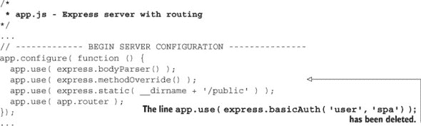

现在我们可以启动我们的服务器应用程序（在命令提示符中输入`node app.js`）并查看以下输出：

```
Express server listening on port 3000 in development mode
** Connected to MongoDB **
```

现在我们已经将我们的服务器应用程序连接到 MongoDB，让我们探索基本的创建-读取-更新-删除（CRUD）操作。

#### 8.3.3\. 使用 MongoDB CRUD 方法

在我们进一步更新服务器应用程序之前，我们希望熟悉 MongoDB 的 CRUD 方法。让我们打开一个终端并输入`mongo`来启动 MongoDB shell。然后我们可以在集合中*创建*一些文档（使用`insert`方法），如列表 8.6 所示。我们的输入以**粗体**显示：

##### 列表 8.6\. 在 MongoDB 中创建一些文档

```
> use spa;
switched to db spa
> db.user.insert({
  "name" : "Mike Mikowski",
  "is_online" : false,
  "css_map":{"top":100,"left":120,
     "background-color":"rgb(136, 255, 136)"
  }
});

> db.user.insert({
  "name" : "Mr. Joshua C. Powell, humble humanitarian",
  "is_online": false,
  "css_map":{"top":150,"left":120,
     "background-color":"rgb(136, 255, 136)"
  }
});

> db.user.insert({
  "name": "Your name here",
  "is_online": false,
  "css_map":{"top":50,"left":120,
     "background-color":"rgb(136, 255, 136)"
  }
});

> db.user.insert({
  "name": "Hapless interloper",
  "is_online": false,
  "css_map":{"top":0,"left":120,
    "background-color":"rgb(136, 255, 136)"
  }
});
```

我们可以通过*读取*这些文档来确保它们已经被正确添加（使用`find`方法），如列表 8.7 所示。我们的输入以**粗体**显示：

##### 列表 8.7\. 从 MongoDB 读取文档

```
> db.user.find()
{ "_id" : ObjectId("5186aae56f0001debc935c33"),
  "name" : "Mike Mikowski",
  "is_online" : false,
  "css_map" : {
    "top" : 100, "left" : 120,
    "background-color" : "rgb(136, 255, 136)"
  }
},
{ "_id" : ObjectId("5186aaed6f0001debc935c34"),
  "name" : "Mr. Josh C. Powell, humble humanitarian",
  "is_online" : false,
  "css_map" : {
    "top" : 150, "left" : 120,
    "background-color" : "rgb(136, 255, 136)"
  }
}
{ "_id" : ObjectId("5186aaf76f0001debc935c35"),
  "name" : "Your name here",
  "is_online" : false,
  "css_map" : {
    "top" : 50, "left" : 120,
    "background-color" : "rgb(136, 255, 136)"
  }
}
{ "_id" : ObjectId("5186aaff6f0001debc935c36"),
  "name" : "Hapless interloper",
  "is_online" : false,
  "css_map" : {
    "top" : 0, "left" : 120,
    "background-color" : "rgb(136, 255, 136)"
  }
}
```

注意，MongoDB 会自动为任何`insert`的文档添加一个唯一的 ID 字段，名为`_id`。嗯，尽管我们作者之一的`name`字段显然是正确的（尽管可能有点过于保守），但它似乎过于正式。让我们去除这种拘谨，并使用`update`方法来*更新*文档，如列表 8.8 所示。我们的输入以**粗体**显示：

##### 列表 8.8\. 在 MongoDB 中更新文档

```
> db.user.update(
  { "_id" : ObjectId("5186aaed6f0001debc935c34") },
  { $set : { "name" : "Josh Powell" } }
);

db.user.find({
  "_id" : ObjectId("5186aaed6f0001debc935c34")
});

{ "_id" : ObjectId("5186aaed6f0001debc935c34"),
  "name" : "Josh Powell",
  "is_online" : false,
  "css_map" : {
    "top" : 150, "left" : 120,
    "background-color" : "rgb(136, 255, 136)"
  }
}
```

我们不禁注意到一个 *不幸的闯入者* 已经进入了我们的数据库。就像一部 *星际迷航* 登陆小组成员中的红衫队员一样，一个不幸的闯入者不应该在场景结束时还活着。我们不愿意打破传统，所以让我们立即派遣这个闯入者，并 *删除* 文档（使用 `remove` 方法），如 列表 8.9 所示。我们的输入以 **粗体** 显示：

##### 列表 8.9\. 从 MongoDB 删除文档

```
> db.user.remove(
  { "_id" : ObjectId("5186aaff6f0001debc935c36") }
);

> db.user.find()
{ "_id" : ObjectId("5186aae56f0001debc935c33"),
  "name" : "Mike Mikowski",
  "is_online" : false,
  "css_map" : {
    "top" : 100, "left" : 120,
    "background-color" : "rgb(136, 255, 136)"
  }
}
{ "_id" : ObjectId("5186aaed6f0001debc935c34"),
  "name" : "Josh Powell",
  "is_online" : false,
  "css_map" : {
    "top" : 150, "left" : 120,
    "background-color" : "rgb(136, 255, 136)"
  }
}
{ "_id" : ObjectId("5186aaf76f0001debc935c35"),
  "name" : "Your name here",
  "is_online" : false,
  "css_map" : {
    "top" : 50, "left" : 120,
    "background-color" : "rgb(136, 255, 136)"
  }
}
```

我们现在已经使用 MongoDB 控制台完成了创建-读取-更新-删除操作。现在让我们更新我们的服务器应用程序以支持这些操作。

#### 8.3.4\. 将 CRUD 添加到服务器应用程序

由于我们使用 Node.js，与 MongoDB 的交互将不同于大多数其他语言，因为 JavaScript 是基于事件的。现在我们在数据库中已经有了一些文档可以操作，让我们更新我们的路由器以使用 MongoDB 获取用户对象列表，如 列表 8.10 所示。更改以 **粗体** 显示：

##### 列表 8.10\. 更新我们的路由器以检索用户列表—`webapp/routes.js`

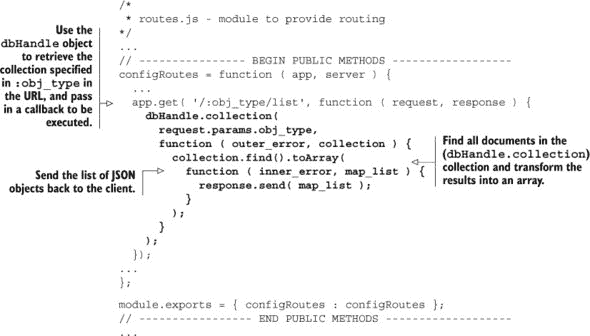

在浏览器中查看结果之前，你可能想要安装一个浏览器扩展或插件，使 JSON 更易于阅读。我们在 Chrome 上使用 *JSONView 0.0.32*，在 Firefox 上使用 *JSONovich 1.9.5*。这两个插件都可以在各自的供应商插件网站上找到。

我们可以通过在终端中输入 `node app.js` 来启动我们的应用程序。当我们将浏览器指向 http://localhost:3000/user/list 时，我们应该看到一个类似于 图 8.3 的 JSON 文档展示。

##### 图 8.3\. 通过 Node.js 从 MongoDB 到客户端的响应

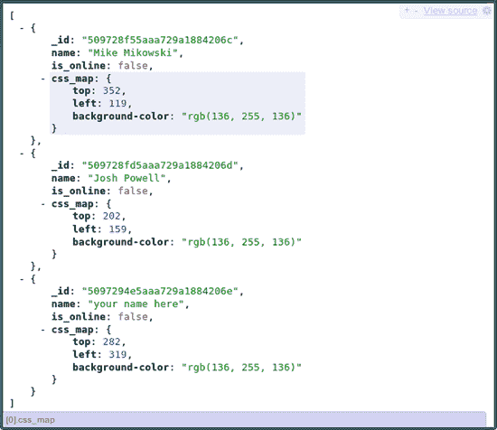

我们现在可以添加剩余的 CRUD 操作，如 列表 8.11 所示。更改以 **粗体** 显示：

##### 列表 8.11\. 将 MongoDB 驱动和 CRUD 添加到我们的路由器—routes.js

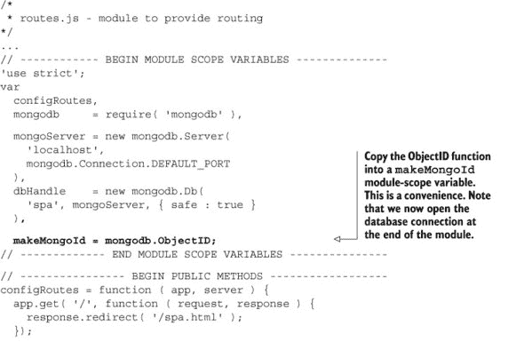

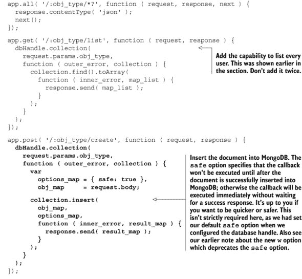

现在我们已经从客户端通过 Node.js 服务器到 MongoDB，然后再返回，用户 CRUD 操作正在工作。现在我们希望应用程序验证从客户端接收到的数据。

### 8.4\. 验证客户端数据

MongoDB 没有定义可以添加到集合中的内容的机制。在保存之前，我们需要自己验证客户端数据。我们希望数据传输如图 8.5 所示：

##### 图 8.4\. 验证客户端数据——代码路径

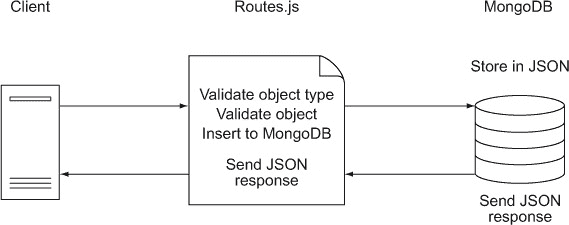

##### 图 8.5\. 对象类型验证

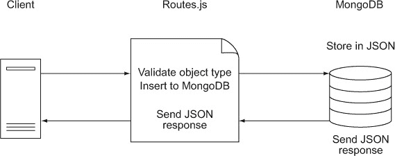

我们的第一步是定义哪些类型的对象是有效的。

#### 8.4.1\. 验证对象类型

如现在所示，我们接受任何路由并将对象传递给 MongoDB，甚至没有验证它是否是允许的类型。例如，一个用于创建马的 POST 请求将工作。以下是一个使用 `wget` 的示例。我们的输入以 **粗体** 显示：

```
# Create a new MongoDB collection of horses
wget http://localhost:3000/horse/create \
  --header='content-type: application/json' \
  --post-data='{"css_map":{"color":"#ddd"},"name":"Ed"}'\
  -O -

# Add another horse
wget http://localhost:3000/horse/create \
  --header='content-type: application/json' \
  --post-data='{"css_map":{"color":"#2e0"},"name":"Winney"}'\
  -O -

# Check the corral
wget http://localhost:3000/horse/list -O -
  [ {
    "css_map": {
      "color": "#ddd"
    },
    "name": "Ed",
    "_id": "51886ac7e7f0be8d20000001"
  },
  {
    "css_map": {
      "color": "#2e0"
    },
    "name": "Winney",
    "_id": "51886adae7f0be8d20000002"
  }]
```

这甚至比看起来更糟糕。MongoDB 不仅会存储文档，它还会*创建一个全新的集合*（就像我们在示例中所做的那样），这会消耗相当多的资源。我们不能这样上线，因为一个简单的脚本小子可以在几分钟内通过运行一个创建数千个新 MongoDB 集合的脚本而轻易地压垮服务器（s）。我们应该只允许访问经过批准的对象类型，如图 8.5 所示。

> ³在我的 64 位开发机器上，每个*几乎为空*的集合大约占用 64MB 的磁盘空间。

这很容易实现。我们可以创建一个允许的对象类型的映射，然后在路由器中检查它。让我们修改 routes.js 文件来实现这一点，如图 8.12 所示。变化以**粗体**显示：

##### 列表 8.12。验证传入的路由—`routes.js`

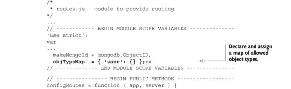

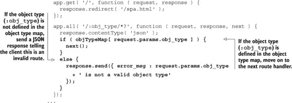

我们不希望仅仅确保对象类型被允许。我们还想确保客户端数据结构如我们所期望的那样。让我们接下来这么做。

#### 8.4.2。验证对象

浏览器客户端发送一个 JSON 文档到服务器以表示一个对象。正如许多读者可能已经知道的那样，JSON 已经取代了 XML 在许多 Web API 中的应用，因为它更紧凑，通常更容易处理。

XML 提供的一个非常出色的功能是能够定义一个*文档类型定义（DTD）*，它描述了允许的内容。JSON 有一个类似但不够成熟的类似标准，可以确保文档内容类似于 DTD。它被称为*JSON schema*。

*JSV*是一个使用 JSON schema 的验证器。它可以在浏览器和服务器上使用，所以我们不需要编写或维护两个不同的（并且总是微妙地冲突的）验证库。以下是我们需要验证我们的对象的步骤：

+   安装 JSV 节点模块

+   创建一个 JSON schema

+   加载 JSON schemas

+   创建一个验证函数

+   验证传入数据

我们的第一步是安装 JSV。

##### 安装 Jsv Node 模块

将 package.json 文件更新为包含 JSV 4.0.2。现在它应该看起来像列表 8.13：

##### 列表 8.13。更新清单以包含 JSV—`webapp/package.json`

```
{ "name"    : "SPA",
  "version" : "0.0.3",
  "private" : true,
  "dependencies"  :{
    "express"   :"3.2.x",
    "mongodb"   :"1.3.x",
    "socket.io" :"0.9.x",
    "JSV" : "4.0.x"
  }
}
```

当我们运行`npm install`时，`npm`应该能够检测到更改并安装 JSV。

##### 创建一个 Json Schema

在我们能够验证用户对象之前，我们必须决定允许哪些属性以及它们可能取哪些值。JSON schema 为我们提供了一个很好的、标准的机制来描述这些约束，如图 8.14 所示。务必仔细注意注释，因为它们解释了约束。

##### 列表 8.14。创建用户 schema—webapp/user.json

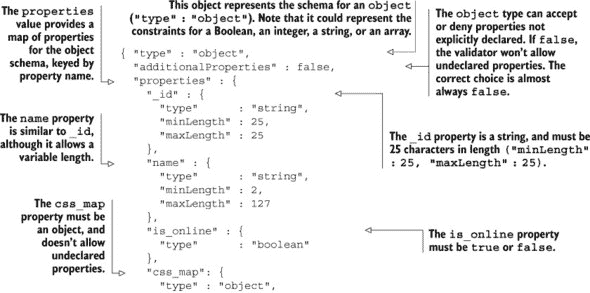

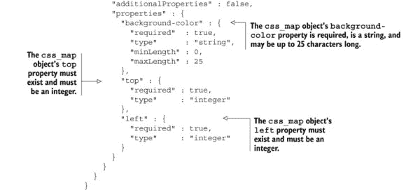

你可能已经注意到，我们定义了一个约束对象的模式，并在该对象内约束对象。这说明了 JSON 模式可以无限递归。JSON 模式也可以扩展其他模式，就像 XML 一样。如果你想了解更多关于 JSON 模式的信息，请查看官方网站 [jsonschema.org](http://jsonschema.org)。现在我们可以加载我们的模式并确保我们收到的任何用户对象只包含我们允许的数据。

##### 加载 Json 模式

当服务器启动时，让我们将我们的模式文档加载到内存中。这将避免在服务器应用程序运行时进行昂贵的文件查找。我们可以按对象类型映射（`objTypeMap`）中定义的对象类型加载每个模式文档（如图 列表 8.15 所示）。变化以**粗体**显示：^([4])

> ⁴ Windows 用户需要将文件系统路径中的正斜杠（`/`）替换为双反斜杠（`\\`）。

##### 列表 8.15\. 在我们的路由器中加载模式—`webapp/routes.js`

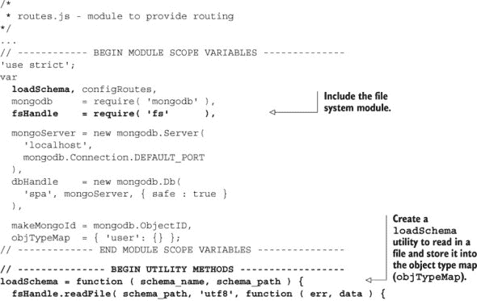

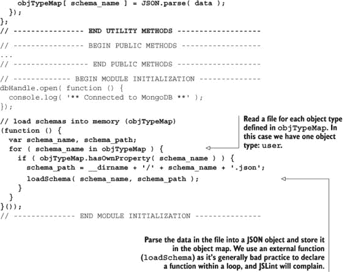

现在我们已经加载了我们的模式，我们可以创建一个验证函数。

##### 创建一个验证函数

现在我们已经加载了 `user` JSON 模式，我们想要将传入的客户端数据与模式进行比较。列表 8.16 展示了一个简单的函数来完成这项工作。变化以**粗体**显示：

##### 列表 8.16\. 添加一个验证文档的功能—`webapp/routes.js`

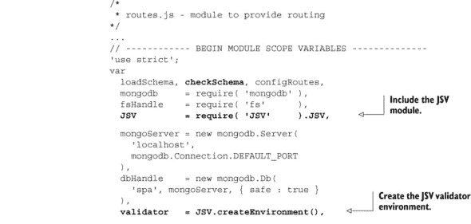

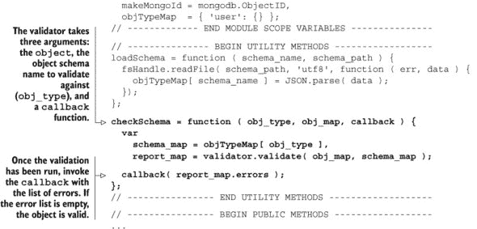

现在我们有了 JSON 模式加载和验证函数，我们可以验证传入的客户端数据。

##### 验证传入的客户端数据

现在我们可以完成验证。我们只需要调整接受客户端数据的路由（创建和更新）以使用验证器。在每种情况下，如果错误列表为空，我们想要执行请求的操作。否则，我们想要返回一个错误报告，如图 列表 8.17 所示。变化以**粗体**显示：

##### 列表 8.17\. 创建和更新带有验证的路由—`webapp/`routes.js`

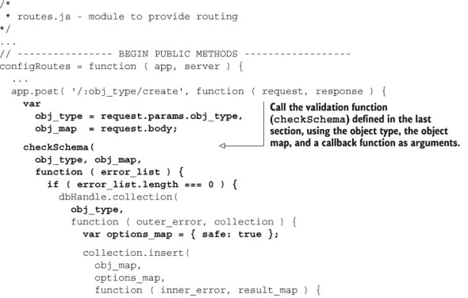

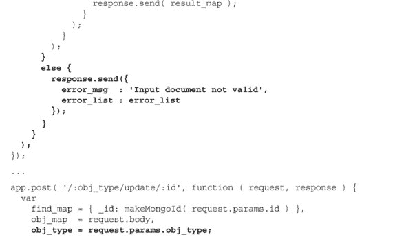

现在我们已经完成了验证，让我们看看我们做得怎么样。首先，我们应该确保所有我们的模块都通过 JSLint (`jslint user.json app.js routes.js`)，然后启动应用程序（`node app.js`）。然后我们可以使用我们熟练的 `wget` 技巧来 `POST` 好的和坏的数据，如图 列表 8.18 所示。我们的输入以**粗体**显示：

##### 列表 8.18\. 使用熟练的 `wget` 技巧 `POST` 好的和坏的数据

```
# Try invalid data
wget http://localhost:3000/user/create \
  --header='content-type: application/json' \
  --post-data='{"name":"Betty",
     "css_map":{"background-color":"#ddd",
     "top" : 22 }
  }' -O -

--2013-06-07 22:20:17--  http://localhost:3000/user/create
Resolving localhost (localhost)... 127.0.0.1
Connecting to localhost (localhost)|127.0.0.1|:3000... connected.
HTTP request sent, awaiting response... 200 OK
Length: 354 [application/json]
Saving to: á€~STDOUTမ
...
{ "error_msg": "Input document not valid",
  "error_list": [
     {
      "uri": "urn:uuid:8c05b92a...",
      "schemaUri": "urn:uuid:.../properties/css_map/properties/left",
      "attribute": "required",
      "message": "Property is required",
      "details": true
     }
  ]
}
...
# Oops, we missed the "left" property.  Let's fix that:
wget http://localhost:3000/user/create \
  --header='content-type: application/json' \
  --post-data='{"name":"Betty",
     "css_map":{"background-color":"#ddd",
     "top" : 22, "left" : 500 }
  }' -O -
--2013-05-07 22:24:02--  http://localhost:3000/user/create
Resolving localhost (localhost)... 127.0.0.1
Connecting to localhost (localhost)|127.0.0.1|:3000... connected.
HTTP request sent, awaiting response... 200 OK
Length: 163 [application/json]
Saving to: á€~STDOUTမ
...
  {
    "name": "Betty",
    "css_map": {
      "background-color": "#ddd",
      "top": 22,
      "left": 500
    },
    "_id": "5189e172ac5a4c5c68000001"
  }
...
# Success!
```

使用 `wget` 更新用户留作读者练习。

在下一节中，我们将 CRUD 功能移动到一个单独的模块中。这将导致代码更干净、更容易理解，并且更易于维护。

### 8.5\. 创建一个单独的 CRUD 模块

在这一点上，CRUD 操作和路由的逻辑包含在如图 图 8.6 所示的 routes.js 文件中。

##### 图 8.6\. 代码中的路径


我们的服务器正在接受来自客户端的调用，验证数据，并将其保存到数据库中。验证和保存数据的唯一方式是通过调用路由进行 HTTP 调用。如果这就是我们应用所需的所有内容，那么可能就没有必要进一步抽象化，在这里停止。但我们的单页应用还需要通过 WebSocket 连接创建和修改对象。因此，我们将创建一个 CRUD 模块，其中包含验证和管理数据库中文档的所有逻辑。然后，路由器将使用 CRUD 模块进行任何所需的 CRUD 操作。

在我们创建 CRUD 模块之前，我们想强调为什么我们等到现在才创建它。我们喜欢保持我们的代码尽可能直接和简单，但不要过于简单。如果我们必须在代码中只执行一次操作，我们通常更喜欢将其内联或至少作为一个局部函数。但当我们发现我们需要执行两次或更多次操作时，我们希望进行抽象化。尽管这可能不会节省初始编码时间，但它几乎总是节省维护时间，因为我们把逻辑集中到一个单独的例程中，并避免了可能导致实现差异的微妙错误。当然，需要良好的判断力来确定这一哲学的适用范围。例如，我们认为抽象化所有的 `for` 循环通常不是一个好主意，尽管用 JavaScript 完全可能做到。

在我们将 MongoDB 连接和验证移动到一个单独的 CRUD 模块之后，我们的路由器将不再关心数据存储的实现，而更像是一个控制器：它将请求调度到其他模块，而不是自己执行操作，如图 8.7 所示。

##### 图 8.7\. 服务器上的代码路径


创建 CRUD 模块的第一步是准备文件结构。

#### 8.5.1\. 准备文件结构

自本章开始以来，我们的文件结构一直保持一致。现在我们需要添加一个额外的模块，我们需要对其进行一些思考。我们当前的结构如图 8.19 所示：

##### 列表 8.19\. 我们当前的文件结构

```
chapter_8
`-- webapp
    |-- app.js
    |-- node_modules/
    |-- package.json
    |-- public
    |   |-- css/
    |   |-- js/
    |   `-- spa.html
    |-- user.json
    `-- routes.js
```

我们更愿意将我们的模块保存在一个名为 lib 的单独目录中。这将整理 webapp 目录，并将我们的模块与 node_modules 目录分开。node_modules 目录应仅包含通过 `npm install` 添加的外部模块，以便它可以被删除和重新创建，而不会干扰我们的模块。列表 8.20 展示了我们希望如何组织我们的文件。变更以粗体显示：

##### 列表 8.20\. 一个新的启迪性文件结构

```
chapter_8
`-- webapp
    |-- app.js
    |-- lib
    |   |-- crud.js
    |   |-- routes.js
    |   `-- user.json
    |-- node_modules/
    |-- package.json
|-- public
    |-- css/
    |-- js/
    `-- spa.html
```

我们迈向文件启迪的第一步是将我们的路由文件移动到 webapp/lib。一旦我们这样做，我们需要更新我们的服务器应用程序以指向新的路径，如图 8.21 所示。变更以粗体显示：

##### 列表 8.21\. 修改 app.js 以引入移动后的 routes.js—`webapp/app.js`

```
/*
 * app.js - Express server with routing
*/
...
// ------------ BEGIN MODULE SCOPE VARIABLES --------------
'use strict';
var
  http    = require( 'http'         ),
  express = require( 'express'      ),
  routes  = require( './lib/routes' ),
  app     = express(),
  server  = http.createServer( app );
// ------------- END MODULE SCOPE VARIABLES ---------------
...
```

我们接下来的步骤是将 CRUD 模块包含到我们的路由模块中，如列表 8.22 所示。变更以**粗体**显示：

##### 列表 8.22\. 调整路由模块以要求 CRUD—`webapp/lib/routes.js`

```
/*
 * routes.js - module to provide routing
*/
...
// ------------ BEGIN MODULE SCOPE VARIABLES --------------
'use strict';
var
  loadSchema, checkSchema, configRoutes,
  mongodb     = require( 'mongodb' ),
  fsHandle    = require( 'fs'      ),
  JSV         = require( 'JSV'     ).JSV,
  crud        = require( './crud'  ),
  ...
```

我们可以创建我们的 CRUD 模块并草拟其 API。我们将使用 `module.exports` 来共享 CRUD 方法，如列表 8.23 所示。

##### 列表 8.23\. 创建 CRUD 模块—`webapp/lib/crud.js`

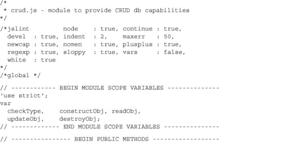

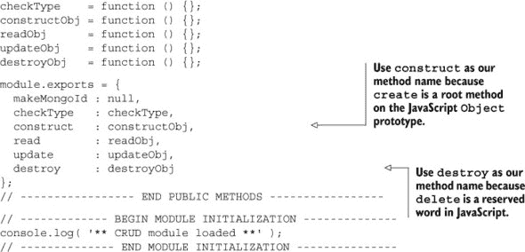

当我们使用 `node app.js` 启动服务器时，它应该在没有错误的情况下运行：

```
** CRUD module loaded **
Express server listening on port 3000 in development mode
** Connected to MongoDB **
```

注意，我们添加了两个超出基本 CRUD 操作的公共方法。第一个是 `makeMongoId`，它提供了创建 MongoDB ID 对象的能力。第二个是 `checkType`，我们打算用它来检查允许的对象类型。现在我们的文件已经就绪，我们可以将 CRUD 逻辑移动到适当的模块。

#### 8.5.2\. 将 CRUD 移动到自己的模块

我们可以通过复制路由模块中的方法来完成 CRUD 模块，然后将特定的 HTTP 参数替换为通用的参数。我们不会深入细节，因为我们认为转换是显而易见的。完成的模块在列表 8.24 中显示。请注意注释，因为它们提供了一些额外的见解：

##### 列表 8.24\. 将逻辑移动到我们的 CRUD 模块—`webapp/lib/crud.js`

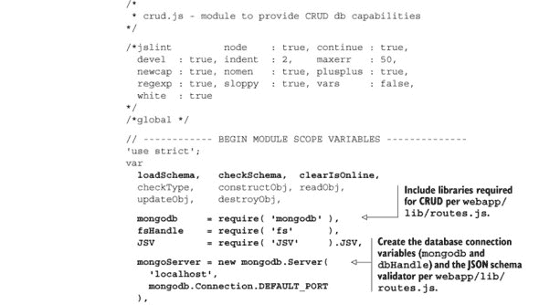

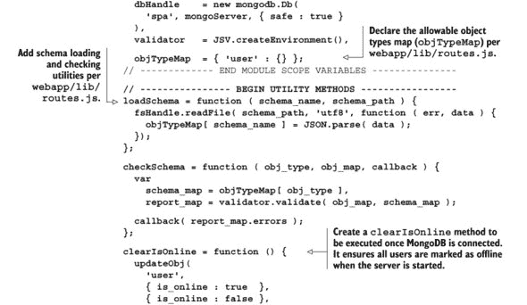

路由模块现在变得简单多了，因为大部分逻辑和许多依赖都已经被移动到了 CRUD 模块。一个修订后的路由文件应看起来像列表 8.25。变更以**粗体**显示：

##### 列表 8.25\. 我们修改后的路由模块—`webapp/lib/routes.js`

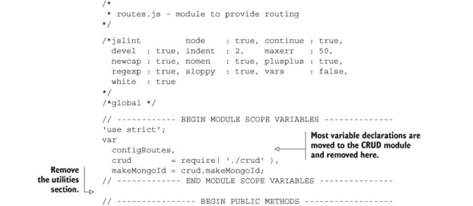

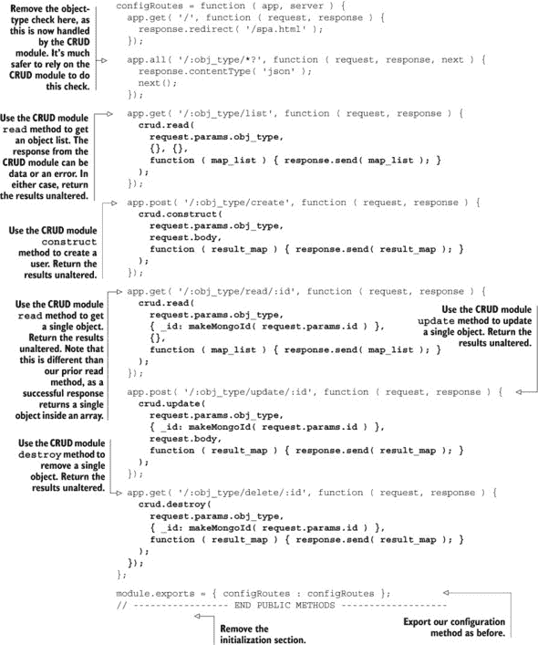

现在我们的路由模块变得更小，并使用 CRUD 模块来服务路由。也许更重要的是，我们的 CRUD 模块已经准备好在下一节中我们将构建的聊天模块中使用。

### 8.6\. 构建聊天模块

我们希望我们的服务器应用程序能够为我们的单页应用（SPA）提供聊天功能。到目前为止，我们一直在服务器上构建客户端、UI 和支持框架。参见图 8.8 以了解聊天实现后我们的应用程序应如何看起来。

##### 图 8.8\. 完成的聊天应用程序

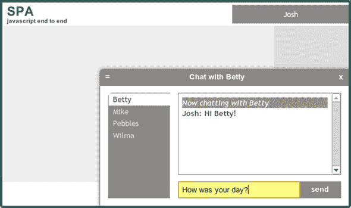

我们将在本节结束时拥有一个可工作的聊天服务器。我们将首先创建一个聊天模块。

#### 8.6.1\. 启动聊天模块

Socket.IO 应已安装在我们的 webapp 目录中。请确保您的 webapp/package.json 清单中列出了正确的模块：

```
{ "name"    : "SPA",
  "version" : "0.0.3",
  "private" : true,
  "dependencies" : {
    "express"   : "3.2.x",
    "mongodb"   : "1.3.x",
    "socket.io" : "0.9.x",
    "JSV"       : "4.0.x"
  }
}
```

一旦我们的清单与示例匹配，我们就可以运行 `npm install`，`npm` 将确保安装 `socket.io` 和所有其他所需的模块。

现在我们可以构建我们的聊天消息模块。我们想包括 CRUD 模块，因为我们确信我们将在消息中使用它。我们将构建一个 `chatObj` 对象，并使用 `module.exports` 导出它。最初，这个对象将只有一个名为 `connect` 的方法，它将接受 `http.Server` 实例（`server`）作为参数，并开始监听套接字连接。我们的第一次尝试如下所示 清单 8.26：

##### 清单 8.26\. 我们对聊天消息模块的第一次尝试—`webapp/lib/chat.js`

```
/*
 * chat.js - module to provide chat messaging
*/

/*jslint         node   : true, continue : true,
  devel  : true, indent : 2,    maxerr   : 50,
  newcap : true, nomen  : true, plusplus : true,
  regexp : true, sloppy : true, vars     : false,
  white  : true
*/
/*global */

// ------------ BEGIN MODULE SCOPE VARIABLES --------------
'use strict';
var
  chatObj,
  socket = require( 'socket.io' ),
  crud   = require( './crud'    );
// ------------- END MODULE SCOPE VARIABLES ---------------

// ---------------- BEGIN PUBLIC METHODS ------------------
chatObj = {
  connect : function ( server ) {
    var io = socket.listen( server );
    return io;
  }
};

module.exports = chatObj;
// ----------------- END PUBLIC METHODS -------------------
```

你可能还记得 第六章，客户端将使用 `/chat` 命名空间向服务器发送消息—`adduser`、`updatechat`、`leavechat`、`disconnect` 和 `updateavatar`。让我们设置我们的聊天客户端来处理这些消息，如下所示 清单 8.27。更改以粗体显示：

##### 清单 8.27\. 设置我们的应用程序并概述消息处理器—`webapp/lib/chat.js`

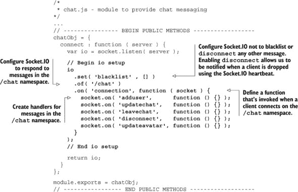

让我们回到路由模块，我们将包括聊天模块，然后使用 `chat.connect` 方法初始化 Socket.IO 连接。我们提供 `http.Server` 实例（`server`）作为参数，如 清单 8.28 所示。更改以粗体显示：

##### 清单 8.28\. 更新路由模块以初始化聊天—`webapp/lib/routes.js`

```
/*
 * routes.js - module to provide routing
*/
...
// ------------ BEGIN MODULE SCOPE VARIABLES --------------
'use strict';
var
  configRoutes,
  crud         = require( './crud' ),
  chat         = require( './chat' ),
  makeMongoId  = crud.makeMongoId;
// ------------- END MODULE SCOPE VARIABLES ---------------

// ---------------- BEGIN PUBLIC METHODS ------------------
configRoutes = function ( app, server ) {
  ...

  chat.connect( server );
};

module.exports = { configRoutes : configRoutes };
// ----------------- END PUBLIC METHODS -------------------
```

当我们使用 `node app.js` 启动服务器时，我们应该在 Node.js 服务器日志中看到 `info - socket.io started`。我们也可以像以前一样访问 http://localhost:3000 来管理用户对象或在浏览器中查看我们的应用程序。

我们已经声明了所有的消息处理器，但现在我们需要让它们做出响应。让我们从 `adduser` 消息处理器开始。

| |
| --- |

**为什么选择 WebSocket？**

WebSocket 相比于浏览器中使用的其他近实时通信技术具有一些明显的优势：

+   一个 WebSocket 数据帧只需要两个字节来维护数据连接，而 AJAX HTTP 调用（在长轮询中使用）通常每个数据帧传输千字节的信息（实际数量根据 Cookie 的数量和大小而变化）。

+   WebSocket 与长轮询相比具有优势。它们通常使用大约 1-2% 的网络带宽，并且延迟减少到三分之一。WebSocket 还往往更受防火墙欢迎。

+   WebSocket 是全双工的，而大多数其他解决方案不是，并且需要相当于两个连接。

+   与 Flash 套接字不同，WebSocket 在几乎所有平台上的任何现代浏览器上都能工作，包括智能手机和平板电脑等移动设备。

虽然 Socket.IO 倾向于使用 WebSocket，但知道如果 WebSocket 不可用，它将协商最佳连接，这让人感到安慰。

| |
| --- |

#### 8.6.2\. 创建 adduser 消息处理器

当用户尝试登录时，客户端会向我们的服务器应用程序发送包含用户数据的 `adduser` 消息。我们的 `adduser` 消息处理器应该：

+   尝试使用 CRUD 模块在 MongoDB 中查找提供的用户名对应的用户对象。

+   如果找到了请求的用户对象，使用找到的对象。

+   如果没有找到请求的用户对象**不是**，则使用提供的用户名创建一个新的用户对象并将其插入数据库。使用这个新创建的对象。

+   更新 MongoDB 中的用户对象以指示用户在线（`is_online: true`）。

+   更新`chatterMap`以存储用户 ID 和 socket 连接作为键值对。

让我们按照列表 8.29 中所示实现这个逻辑。更改以**粗体**显示：

##### 列表 8.29. 创建 adduser 消息处理器—`webapp/lib/chat.js`


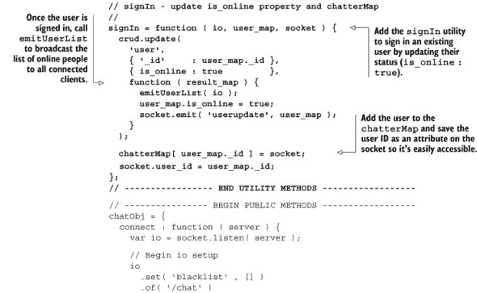

调整到回调方法的思考可能需要一段时间，但通常当我们调用一个方法，并且该方法完成时，我们提供的回调将被执行。本质上它将过程代码转换为这样：

```
var user = user.create();

if (user ) {
  //do things withuser object
}
```

进入类似这样的事件驱动代码：

```
user.create( function ( user ){
    // do things with user object
});
```

我们使用回调，因为 Node.js 中的许多函数调用都是异步的。在前面的例子中，当我们调用`user.create`时，JavaScript 引擎将继续执行后续代码，而不会等待调用完成。在结果准备好后立即使用结果的保证方法之一是使用回调.^([5]) 如果你熟悉 jQuery AJAX 调用，它使用回调机制：

> ⁵ 另一种机制称为*承诺*，通常比普通的回调更灵活。承诺库包括 Q (`npm install q`) 和 Promised-IO (`npm install promised-io`)。jQuery for Node.js 也提供了一套丰富且熟悉的承诺方法。附录 B 展示了 jQuery 与 Node.js 的使用。

```
$.ajax({
  'url': '/path',
  'success': function ( data ) {
    // do things with data
  }
});
```

我们现在可以将浏览器指向 localhost:3000 并登录。我们鼓励在家练习的人尝试一下。现在让我们开始聊天。

#### 8.6.3. 创建 updatechat 消息处理器

实现登录功能需要相当多的代码。我们的应用程序现在在 MongoDB 中跟踪用户，管理他们的状态，并向所有连接的客户端广播在线人员列表。处理聊天消息相对简单，尤其是在我们完成登录逻辑之后。

当客户端向我们的服务器应用程序发送`updatechat`消息时，它是在请求将消息发送给某人。我们的`updatechat`消息处理器应该：

+   检查聊天数据并检索收件人。

+   确定目标收件人是否在线。

+   如果收件人在线，通过他们的 socket 将聊天数据发送给收件人。

+   如果收件人**不在线**，将新的聊天数据发送给发送者在其 socket 上。新的聊天数据应通知发送者目标收件人不在线。

让我们按照列表 8.30 中所示实现这个逻辑。更改以**粗体**显示：

##### 列表 8.30. 添加 updatechat 消息处理器—`webapp/lib/chat.js`

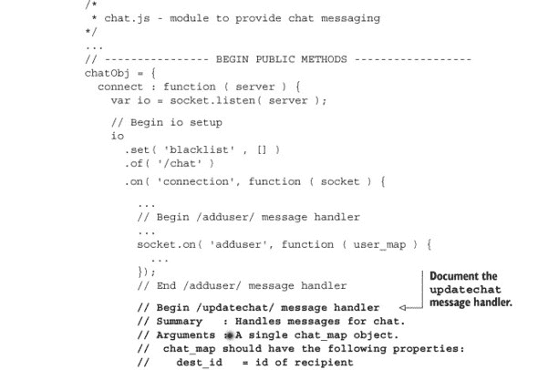

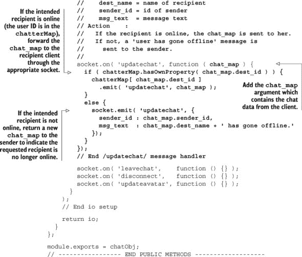

现在，我们可以将我们的浏览器指向 localhost:3000 并登录。如果我们以不同的用户身份登录到另一个浏览器窗口，我们可以互相传递消息。一如既往，我们鼓励在家中的玩家尝试一下。目前唯一不起作用的功能是断开连接和头像。让我们先处理断开连接的问题。

#### 8.6.4. 创建断开连接消息处理程序

客户端可以通过两种方式之一关闭会话。首先，用户可以点击浏览器窗口右上角的用户名来注销。这会向服务器发送一个`leavechat`消息。其次，用户可以关闭浏览器窗口。这会导致服务器收到一个`disconnect`消息。在两种情况下，Socket.IO 都很好地清理了套接字连接。

当我们的服务器应用程序收到`leavechat`或`disconnect`消息时，它应该采取相同的两个行动。首先，它应该将关联客户端的人标记为离线（`is_online : false`）。其次，它需要向所有已连接客户端广播更新的在线人员列表。这个逻辑在列表 8.31 中显示。变化以**粗体**显示：

##### 列表 8.31. 添加断开连接方法—`webapp/lib/chat.js`

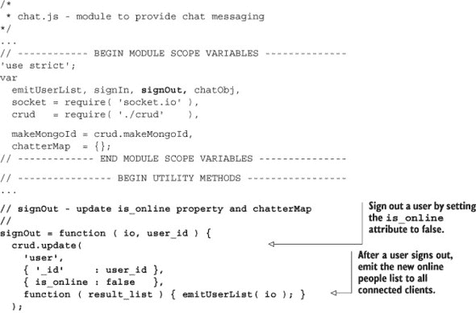

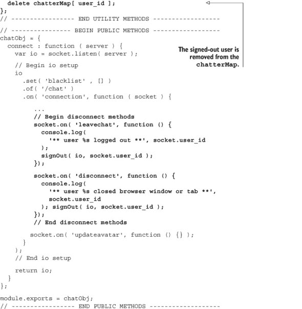

现在我们可以打开多个浏览器窗口，将它们指向 http://localhost:3000，并通过点击每个窗口右上角来以不同的用户身份登录。然后我们可以在用户之间发送消息。我们故意留下了一个缺陷作为读者的练习：服务器应用程序将允许同一用户在多个客户端登录。这是不应该发生的。你应该可以通过检查`adduser`消息处理程序中的`chatterMap`来修复这个问题。

我们还有一个尚未实现的功能：同步头像。

#### 8.6.5. 创建更新头像消息处理程序

WebSocket 消息可用于所有类型的服务器-客户端通信。当我们需要与浏览器进行近乎实时通信时，它通常是最佳选择。为了展示 Socket.IO 的另一种用途，我们在聊天中加入了用户可以移动和改变颜色的头像。当任何人更改头像时，Socket.IO 会立即将这些更新推送给其他用户。让我们通过图 8.9、8.10 和 8.11 来了解一下这看起来是什么样子。

##### 图 8.9. 登录时的头像


##### 图 8.10. 移动头像


##### 图 8.11. 其他用户登录时的头像

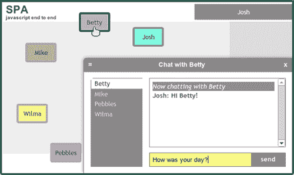

这个客户端代码已经在第六章中演示过，我们现在已经到了将所有这些放在一起的时刻。现在我们已经设置了 Node.js 服务器、MongoDB 和 Socket.IO，使服务器端代码变得非常小。我们只需在 lib/chat.js 中添加一个与其它消息处理程序相邻的消息处理程序，就像列表 8.32 中所示：

##### 列表 8.32. 看看这些头像—`webapp/lib/chat.js`

```
/*
 * chat.js - module to provide chat messaging
*/
...
// ---------------- BEGIN PUBLIC METHODS ------------------
chatObj = {
  connect : function ( server ) {
    var io = socket.listen( server );

    // Begin io setup
    io
      .set( 'blacklist' , [] )
      .of( '/chat' )
      .on( 'connection', function ( socket ) {

        ...

        // End disconnect methods

        // Begin /updateavatar/ message handler
        // Summary : Handles client updates of avatars
        // Arguments : A single avtr_map object.
        //   avtr_map should have the following properties:
        //   person_id = the id of the persons avatar to update
        //   css_map = the css map for top, left, and
        //     background-color
        // Action :
        //   This handler updates the entry in MongoDB, and then
        //   broadcasts the revised people list to all clients.
        //
        socket.on( 'updateavatar', function ( avtr_map ) {
          crud.update(
            'user',
            { '_id' : makeMongoId( avtr_map.person_id ) },
            { css_map : avtr_map.css_map },
            function ( result_list ) { emitUserList( io ); }
          );
        }); // End /updateavatar/ message handler
      }
    );
    // End io setup

    return io;
  }
};

module.exports = chatObj;
// ----------------- END PUBLIC METHODS -------------------
```

让我们用`node app.js`启动服务器，将我们的浏览器指向 http://localhost:3000/，并登录。我们还要打开第二个浏览器窗口，并用不同的用户名登录。在这个时候，我们可能只能看到一个头像，因为两个可能重叠。我们可以通过长按拖动来移动头像。我们可以通过点击或轻触来改变它的颜色。这在桌面和触摸设备上都有效。无论如何，我们的服务器应用程序在近乎实时地同步头像。

消息传递是实现近乎实时协作的关键。通过 Web sockets，我们可以创建应用程序，让遥远的人们可以一起解决谜题、设计引擎或绘制图片——可能性是无限的。这是实时网络的承诺，我们每天都在看到更多这样的应用。

### 8.7. 概述

在本章中，我们设置了 MongoDB，将其连接到 Node.js，并执行了一些基本的 CRUD 操作。我们介绍了 MongoDB，并讨论了它的许多优点和缺点。我们还展示了如何使用客户端相同的代码在将数据插入数据库之前对其进行验证。这种重用避免了在服务器端用一种语言编写验证器，然后在浏览器端用 JavaScript 重写它的熟悉痛苦。

我们介绍了 Socket.IO，并展示了如何使用它来提供聊天消息。我们将 CRUD 功能移动到一个单独的模块中，以便它可以轻松地为 HTTP API 和 Socket.IO 提供服务。我们还使用消息在许多客户端之间提供近乎实时的头像同步。

在下一章中，我们将探讨如何使我们的单页应用（SPA）为生产做好准备。我们将回顾我们在托管 SPA 时遇到的一些问题，并讨论如何解决这些问题。

## 第九章。为生产准备我们的 SPA

| |
| --- |

**本章内容涵盖**

+   优化 SPA 以适应搜索引擎

+   使用 Google Analytics

+   在内容分发网络（CDN）上放置静态内容

+   记录客户端错误

+   缓存和缓存清除

| |
| --- |

本章基于我们在第八章中编写的代码。我们建议将那一章的整个目录结构复制到一个新的“chapter_9”目录中，并更新那里的文件。

我们已经完成了一个响应式 SPA 的编写，使用了经过良好测试的架构，但仍然存在一些挑战，这些挑战更多是关于操作而不是编程。

我们需要调整我们的 SPA，以便用户可以使用 Google 和其他搜索引擎找到他们需要的内容。我们的 Web 服务器需要与索引我们内容的*爬虫*机器人进行交互，因为这些爬虫不会执行我们的 SPA 用来生成内容的 JavaScript。我们还想使用分析工具。在传统的网站上，分析数据通常是通过添加到每个 HTML 页面的 JavaScript 片段来收集的。由于 SPA 中的所有 HTML 都是由 JavaScript 生成的，我们需要采取不同的方法。

我们还希望调整我们的 SPA 以提供关于流量、用户行为和错误的详细日志记录。服务器日志为传统网站提供了许多这样的洞察。SPA 将大多数用户交互逻辑移动到客户端，因此需要不同的方法。我们希望我们的 SPA 非常响应。提高响应时间的一种方法是通过使用内容分发网络（CDN）来提供静态文件和数据。另一种方法是使用 HTTP 和服务器缓存。

让我们从使我们的 SPA 内容可搜索开始。

### 9.1. 优化我们的 SPA 以适应搜索引擎

当谷歌和其他搜索引擎索引网站时，它们不会执行 JavaScript。这似乎让 SPA 与传统的网站相比处于巨大的劣势。不在谷歌上可能意味着一个企业的死亡，这个令人畏惧的陷阱可能会诱使不知情的人放弃 SPA。

SPAs（单页应用程序）实际上在搜索引擎优化（SEO）方面比传统网站有优势，因为谷歌和其他搜索引擎已经认识到了这个挑战。他们已经为 SPAs 创建了一种机制，不仅可以让它们的动态页面被索引，还可以针对爬虫优化它们的页面。本节重点介绍最大的搜索引擎谷歌，但其他大型搜索引擎如雅虎和必应也支持相同的机制。

#### 9.1.1. 谷歌如何爬取 SPA

当谷歌索引一个传统网站时，它的网络爬虫（称为*Googlebot*）首先扫描和索引顶级 URI（例如，[www.myhome.com](http://www.myhome.com)）的内容。一旦完成，它就会跟随该页面上所有的链接，并索引这些页面。然后它跟随后续页面上的链接，依此类推。最终，它会索引网站上所有相关域的内容。

当 Googlebot 尝试索引一个 SPA 时，它在 HTML 中看到的是一个空的容器（通常是一个空的`div`或`body`标签），因此没有可以索引的内容和可以爬取的链接，它相应地索引了该网站（在其桌旁的圆形“文件夹”中）。

如果这就是故事的结局，那么许多 Web 应用程序和网站的 SPA 时代也就结束了。幸运的是，谷歌和其他搜索引擎已经认识到了 SPA 的重要性，并提供了工具，允许开发者向爬虫提供比传统网站更好的搜索信息。

使我们的 SPA 可爬取的第一个关键是要意识到我们的服务器可以判断一个请求是由爬虫还是由使用网络浏览器的人发起，并相应地做出反应。当我们的访客是使用网络浏览器的人时，正常响应，但对于爬虫，返回一个针对爬虫优化的页面，以显示爬虫可以轻松读取的格式中我们想要展示的内容。

对于我们网站的首页，一个针对爬虫优化的页面看起来是什么样子？它可能是我们希望在搜索结果中出现的标志或其他主要图像，一些 SEO 优化的文本解释应用程序的功能，以及一个仅指向我们希望 Google 索引的页面的 HTML 链接列表。页面没有 CSS 样式或应用于它的复杂 HTML 结构。也没有 JavaScript 或链接到我们不希望 Google 索引的区域（如法律免责声明页面或其他我们不希望人们通过 Google 搜索进入的页面）。图 9.1 展示了页面可能如何呈现给浏览器和爬虫。

##### 图 9.1\. 主页的客户和爬虫视图

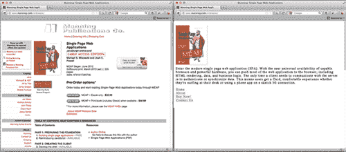

页面上的链接不会被爬虫以人类跟随链接的方式跟随，因为我们应用了特殊的字符 `#!`（发音为 *hash bang*）在我们的 URI 锚组件中。例如，如果在我们单页应用（SPA）中，用户页面链接看起来像 `/index.htm#!page=user:id,123`，爬虫会看到 `#!` 并知道要查找具有 URI `/index.htm?_escaped_fragment_=page=user:id,123` 的网页。知道爬虫会遵循这个模式并查找这个 URI，我们可以编程服务器响应这个请求，返回一个通常由浏览器中的 JavaScript 渲染的网页的 HTML 快照。这个快照将被 Google 索引，但任何点击我们 Google 搜索结果中列表的人都会被带到 `/index.htm#!page=user:id,123`。SPA JavaScript 将从那里接管并按预期渲染页面。

这为单页应用（SPA）开发者提供了针对 Google 和用户特别定制网站的机会。不必编写既对人类可读又吸引人，同时又能被爬虫理解的文本，页面可以针对每个进行优化，而不必担心另一个。我们可以控制爬虫在我们网站上的路径，从而将人们从 Google 搜索结果引导到一组特定的入口页面。这需要工程师进行更多的工作来开发，但它在搜索结果位置和客户保留方面可以带来巨大的回报。

在撰写本文时，Googlebot 通过带有用户代理字符串 `Googlebot/2.1 (+[`www.googlebot.com/bot.html`](http://www.googlebot.com/bot.html))` 的请求向服务器宣布自己是一个爬虫。我们的 Node.js 应用程序可以在中间件中检查这个用户代理字符串，如果匹配，则发送回针对爬虫优化的主页。否则，我们可以正常处理请求。或者，我们可以将其钩入我们的路由中间件，如 列表 9.1 所示：

##### 列表 9.1\. 在 `routes.js` 文件中检测 Googlebot 并提供替代内容

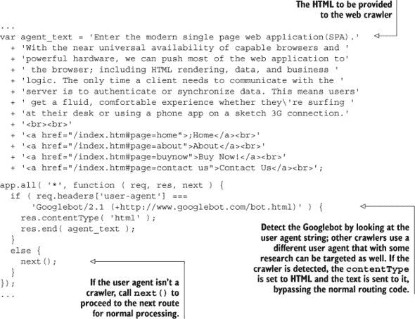

这种安排看起来测试起来可能很复杂，因为我们没有谷歌爬虫。谷歌提供了一项服务，作为其网站管理工具的一部分，用于测试公开可用的生产网站（[`support.google.com/webmasters/bin/answer.py?hl=en&answer=158587`](http://support.google.com/webmasters/bin/answer.py?hl=en&answer=158587)），但一个更简单的方法是伪造我们的用户代理字符串。这曾经需要一些命令行技巧，但 Chrome 开发者工具使得这个过程变得非常简单，只需点击一个按钮并勾选一个复选框即可：

1.  通过点击位于谷歌工具栏右侧带有三个水平线的按钮，然后从菜单中选择工具并点击开发者工具，可以打开 Chrome 开发者工具。

1.  屏幕左下角有一个齿轮图标：点击该图标，可以看到一些高级开发者选项，例如禁用缓存和开启`XmlHttpRequest`s 的日志记录。

1.  在第二个标签页，标记为“覆盖”的旁边，点击用户代理标签旁边的复选框，并从下拉菜单中选择任何数量的用户代理，从 Chrome 到 Firefox，再到 IE、iPad 等。谷歌爬虫代理不是默认选项。为了使用它，选择“其他”，并将用户代理字符串复制并粘贴到提供的输入框中。

1.  现在这个标签页正在伪造自己为谷歌爬虫，当我们打开我们网站上的任何 URI 时，我们应该能看到爬虫页面。

显然，不同的应用程序在处理网络爬虫方面会有不同的需求，但始终只返回一个页面给谷歌爬虫可能是不够的。我们还需要决定我们想要公开哪些页面，并为我们的应用程序提供将`_escaped_fragment_=key=value` URI 映射到我们想要显示的内容的方法。无论情况如何，这本书都应该为你提供决定如何最好地抽象化爬虫内容以适应你应用程序的工具。你可能想要做得更复杂，将服务器响应与前端框架结合起来，但通常我们采取更简单的方法，为爬虫创建自定义页面，并将它们放在一个单独的路由文件中。

此外，还有许多合法的爬虫，因此一旦我们调整了服务器以适应谷歌爬虫，我们就可以将它们也包括在内。

### 9.2. 云服务和第三方服务

许多公司提供帮助构建和管理应用程序的服务，这些服务可以大大节省开发和维护成本。如果我们是一家小公司，我们可能想利用其中的一些服务。三个重要的服务——网站分析、客户端日志和 CDN——对于 SPA 开发尤为重要。

#### 9.2.1. 网站分析

网络开发者工具包中的一个重要工具是获取他们正在工作的网站的分析能力。在传统网站上，开发者已经依赖于像谷歌分析和新 relic 这样的工具来提供关于人们如何使用网站以及找到应用程序或业务性能瓶颈（网站如何有效地产生销售额）的详细分析。使用相同的工具采取略有不同的方法将使它们在 SPA 上同样有效。

谷歌分析提供了一个简单的方法来获取关于我们的 SPA 及其各种状态的流行度统计，以及流量如何进入我们的网站。我们可以在传统网站上使用谷歌分析，通过将一小段 JavaScript 代码粘贴到网站上每个 HTML 页面上，并对页面进行一些小的修改来分类页面。我们也可以用这种方法来处理我们的 SPA，但那样我们只能得到初始页面加载的统计分析。我们可以使用两条路径来启用我们的 SPA 充分利用谷歌分析：

1.  使用谷歌事件跟踪标签变化

1.  使用 Node.js 记录服务器端

我们将从查看谷歌事件开始。

##### 谷歌事件

谷歌长期以来一直认识到记录和分类页面事件的需求——SPA 开发可能相对较新，但 Ajax 技术已经存在很长时间（在网页年代，这真的是很长……自 1999 年以来！）跟踪事件很容易，尽管它比跟踪页面浏览量需要更多手动工作。在传统网站上，JavaScript 代码片段会调用 `_gaq` 对象上的 `_trackPageView` 方法。这允许我们传递自定义变量来设置代码片段所在页面的信息。该调用通过请求一个图像并在请求末尾传递参数将信息发送到谷歌。这些参数被谷歌服务器用来处理关于该页面浏览的信息。使用谷歌事件在 `_gaq` 对象上执行不同的调用：它调用 `_trackEvent` 并传递一些参数。然后 `_trackEvent` 会加载一个带有一些参数的图像，谷歌使用这些参数来处理关于该事件的信

设置和使用事件跟踪的步骤相当直接：

1.  在谷歌分析网站上设置我们网站的跟踪。

1.  调用 `_trackEvent` 方法。

1.  查看报告。

`_trackEvent` 方法需要两个必需参数和三个可选参数：

```
_trackEvent(category, action, opt_label, opt_value, opt_noninteraction)
```

参数细节如下：

+   `category` 是必需的，用于命名属于该组的事件。它将在我们的报告中显示，用于分类事件。

+   `action` 是必需的，用于定义我们通过每个事件跟踪的具体操作。

+   `opt_label` 是一个可选参数，用于添加关于事件的额外数据。

+   `opt_value` 是一个可选参数，用于提供关于事件的数值数据。

+   `opt_noninteraction` 是一个可选参数，用于告诉谷歌不要将此事件用于跳出率计算。

例如，如果在我们 SPA 中想要跟踪用户打开聊天窗口的时刻，我们可能会进行以下`_trackEvent`调用：

```
_trackEvent( 'chat', 'open', 'home page' );
```

这个调用将出现在报告中，让我们知道发生了聊天事件，用户打开了聊天窗口，并且用户是在主页上完成的。另一个调用可能是：

```
_trackEvent( 'chat', 'message', 'game' );
```

这将记录一个聊天事件发生，用户发送了消息，并且是在游戏页面上完成的。像传统网站的方法一样，如何组织和跟踪不同的事件取决于开发者决定。作为一个捷径，我们可以在不将每个事件编码到客户端模型中的情况下，将`_trackEvent`调用插入到客户端路由器（监视哈希标签变化的代码）中，然后解析这些变化为类别、操作和标签，并使用这些变化作为参数调用`_trackEvent`方法。

##### 服务器端 Google Analytics

如果我们想要获取有关从服务器请求的数据的信息，服务器端跟踪是有用的，但它不能用来跟踪不向服务器端发出请求的客户端交互，这在 SPA 中相当多。它可能看起来不那么有用，因为它不能跟踪客户端操作，但能够跟踪通过客户端缓存的请求是有用的。它可以帮助我们追踪运行过慢的服务器请求和其他行为。尽管这仍然能够提供有价值的见解，但如果我们必须选择一个，我们会选择客户端。

由于 JavaScript 在服务器上使用，我们似乎可以修改 Google Analytics 代码以便从服务器端使用。这不仅可能，而且像许多看似好主意的事情一样，社区可能已经实现了它。快速搜索结果显示了*node-googleanalytics*和*nodealytics*作为社区开发的项目。

#### 9.2.2. 记录客户端错误

在传统网站上，当服务器发生错误时，错误会被写入日志文件。在 SPA 中，当客户端遇到类似错误时，没有现成的记录机制。我们不得不手动编写代码来跟踪错误，或者寻求第三方服务的帮助。自行处理提供了灵活性，可以做我们想要做的任何关于错误的事情，但使用第三方服务则给我们提供了将时间和资源用于其他事情的机会。此外，他们可能已经实现了比我们能够实现得多的功能。而且，这并不是全有或全无——我们可以在使用第三方服务的同时，如果需要跟踪或升级服务不提供的方式的错误，我们可以自行实现所需的功能。

##### 第三方客户端日志

有几个第三方服务收集和汇总我们应用程序生成的错误和指标数据：

+   *Airbrake*专注于 Ruby on Rails 应用程序，但提供了实验性的 JavaScript 支持。

+   *Bugsense*专注于移动应用程序解决方案。他们的产品与 JavaScript SPAs 和原生移动应用程序兼容。如果我们有一个以移动为重点的应用程序，他们可能是一个不错的选择。

+   *Errorception*专注于记录 JavaScript 错误，因此是 SPA 客户端的一个好选择。它们不如 Airbrake 或 Bugsense 那样成熟，但我们喜欢它们的活力。*Errorception*维护一个开发者博客([`blog.errorception.com/`](http://blog.errorception.com/))，在那里我们可以获得 JavaScript 错误记录的见解。

+   *New Relic*正迅速成为网络应用程序性能监控的行业标准。其性能监控包括请求/响应周期中每个步骤的错误日志和性能指标，从数据库查询耗时到浏览器渲染 CSS 样式耗时。该服务为客户端和服务器上的性能提供了令人印象深刻的洞察力。

在撰写本文时，我们倾向于更喜欢 New Relic 或 Errorception。虽然 New Relic 提供了更多数据，但我们发现 Errorception 在处理 JavaScript 错误时更胜一筹，并且易于设置。

##### 手动记录客户端错误

当具体到这些服务时，它们都使用这两种方法之一来发送 JavaScript 错误：

1.  使用`window.onerror`事件处理器捕获错误。

1.  将代码包裹在`try/catch`块中，并发送它捕获的内容。

`window.onerror`事件是大多数第三方应用的基础。`onerror`会在运行时错误发生时触发，但不会在编译错误时触发。由于浏览器支持的差异和潜在的安全漏洞，`onerror`有些争议，但它是我们日志记录客户端 JavaScript 错误的重大武器。

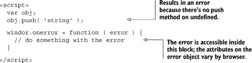

`try/catch`方法需要在我们的 SPA 中的主要调用周围包裹`try/catch`块。这将捕获我们应用程序生成的任何同步错误；不幸的是，它也会阻止它们冒泡到`window.onerror`或显示在错误控制台中。它不会捕获异步调用中的任何错误，如事件处理器中或`setTimeout`或`setInterval`函数中做出的调用。这意味着必须将所有代码包裹在我们的异步函数中的`try/catch`块中。

```
<script>
  setTimeout( function () {
    try {
      var obj;
      obj.push( 'string' );
    } catch ( error ) {
      // do something with error
    }
 }), 1);
</script>
```

对于我们所有的异步调用都必须这样做会变得乏味，并阻止错误报告到控制台。将代码包裹在`try/catch`块中也会阻止该块中的代码预先编译，导致其运行速度变慢。对于 SPA 的一个良好折衷方法是，将我们的`init`调用包裹在`try/catch`块中，在`catch`内部将错误记录到控制台，并通过 Ajax 发送，然后使用`window.onerror`来捕获所有我们的异步错误并通过 Ajax 发送。无需手动将异步错误记录到控制台，因为它们仍然会自动出现在那里。

```
<script>
    $(function () {
      try {
        spa.initModule( $('#spa') );
      } catch ( error ) {
        // log the error to the console
        // then send it to a third party logging service
      }
    });

    window.onerror = function ( error ) {
      // do something with asynchronous errors
    };

</script>
```

现在我们已经了解了客户端发生的错误，我们可以专注于如何更快地向网站访客提供内容。

#### 9.2.3. 内容分发网络

*内容分发网络（CDN）*是一个建立起来以尽可能快地交付静态文件的网络。它可能只是一个位于我们应用程序服务器旁边的单个 Apache 服务器，或者是一个拥有数十个数据中心的全局基础设施。无论如何，设置一个单独的服务器来交付我们的静态文件是有意义的，这样就不会给我们的应用程序服务器带来负担。Node.js 特别不适合交付大型静态内容文件（图像、CSS、JavaScript），因为这种使用无法利用 Node.js 的异步特性。具有预分叉的 Apache 则更适合。

由于我们精通 Apache，我们**可以**自己搭建一个“单服务器 CDN”，直到我们准备好扩展网站；否则，我们还可以使用许多第三方 CDN。其中三个大的是亚马逊、Akamai 和 Edgecast。亚马逊有 Cloudfront 产品，而 Akamai 和 Edgecast 则通过其他公司如 Rackspace、Distribution Cloud 等进行转售。实际上，市场上有很多 CDN 公司，甚至有一个网站专门用于选择合适的提供商：[www.cdnplanet.com](http://www.cdnplanet.com)。

使用全球分布式的 CDN 的另一个好处是，我们的内容是从最近的服务器提供的，这使得提供这些文件所需的时间大大缩短。当我们考虑性能优势时，使用 CDN 通常是一个容易做出的选择。

### 9.3. 缓存和缓存失效

缓存对于使我们的应用程序运行快速至关重要。没有比客户端缓存更快的检索数据方式，而服务器缓存通常比再次请求和计算相同信息要好得多。在我们的 SPA 中有许多地方有缓存数据的潜力，从而加快应用程序的这一部分。我们将逐一介绍：

+   Web 存储

+   HTTP 缓存

+   服务器缓存

+   数据库缓存

在缓存时考虑数据新鲜度至关重要。我们不希望向应用程序用户提供过时的数据，但与此同时，我们希望尽可能快速地响应用户请求。

#### 9.3.1. 缓存机会

每个这些缓存都有不同的职责，并以不同的方式与客户端交互，以加快应用程序。

+   *Web 存储*在客户端存储字符串，并且对应用程序是可访问的。使用这些存储从服务器检索并处理的数据的完成 HTML。

+   *HTTP 缓存*是客户端缓存，它存储来自服务器的响应。为了正确控制这种缓存方式，需要学习很多细节，但一旦学习和实施，我们几乎可以免费获得大量的缓存。

+   *服务器缓存*使用 Memcached 和 Redis，通常用于缓存处理过的服务器响应。这是第一种可以存储不同用户数据的缓存形式，这样如果某个用户请求某些信息，下次其他人请求时，它已经缓存了这些信息，从而节省了数据库的访问。

+   *数据库缓存*或查询缓存，是数据库用来缓存查询结果，以便如果开启，后续相同的查询将返回缓存而不是再次收集数据。

图 9.2 显示了具有所有缓存机会的典型请求/响应周期。我们可以看到每个缓存级别如何通过在各个阶段缩短周期来加速响应。HTTP 缓存和数据库缓存实现起来最简单，通常只需要设置一些配置，而 Web 存储和服务器缓存则更复杂，需要开发者付出更多努力。

##### 图 9.2\. 使用缓存缩短请求/响应周期

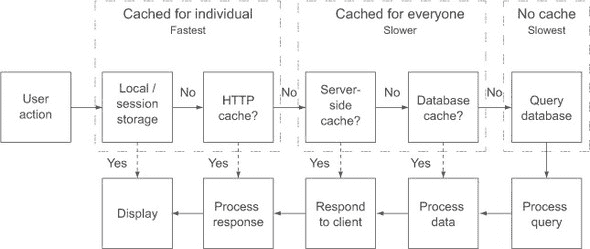

#### 9.3.2\. Web 存储

Web 存储，也称为*DOM 存储*，分为两种类型：本地存储和会话存储。它们被所有现代浏览器支持，包括 IE8+。它们是简单的键/值存储，其中键和值都必须是字符串。会话存储只存储当前标签页会话中的数据——关闭标签页将关闭会话并清除数据。本地存储将存储缓存，没有过期日期。在任何情况下，数据只对存储它的网页可用。对于 SPA 来说，这意味着整个网站都可以访问存储。使用 Web 存储的一个极好方法是存储处理过的 HTML 字符串，这样就可以绕过整个请求/响应周期，直接显示结果。图 9.3 显示了详细信息。

##### 图 9.3\. Web 存储

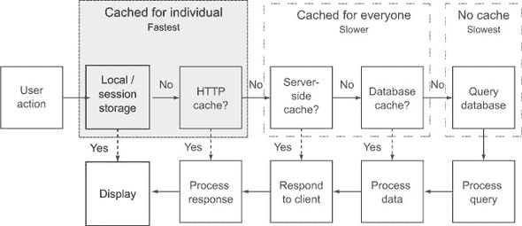

我们使用本地存储来存储我们希望在当前浏览器会话之外持久化的非敏感信息。我们使用会话存储来存储不会在当前会话中持久化的数据。

由于 Web 存储只能保存字符串值，通常保存 JSON 或 HTML。在 SPA 中使用 HTTP 缓存保存 JSON 是多余的，我们将在下一节讨论，并且仍然需要一些处理才能使用。通常，存储 HTML 字符串更好，这样我们就可以节省客户端创建它的处理工作。这种存储可以抽象为一个 JavaScript 对象，它为我们处理细节。

会话存储只存储当前会话的数据，因此我们有时可以不必过多考虑过时数据的问题——但并非总是如此。当我们确实需要担心过时数据时，一种强制数据刷新的方法是将时间编码到缓存键中。如果我们希望数据每天过期，我们可以在键中包含当天的日期。如果我们希望数据每小时过期，我们也可以将小时编码到其中。这不会处理每个场景，但在执行方面可能是最简单的，如列表 9.2 所示：

##### 列表 9.2. 在缓存键中编码时间

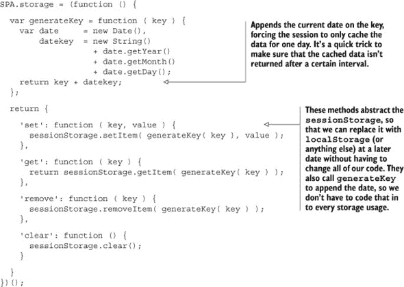

#### 9.3.3. HTTP 缓存

HTTP 缓存发生在浏览器根据服务器在头部设置的某些属性或根据行业标准的默认缓存指南缓存从服务器发送的数据时。尽管它可能比 Web 存储慢，因为结果仍然需要处理，但它通常更简单，并且仍然比服务器端缓存快。图 9.4 显示了 HTTP 缓存在请求/响应周期中的位置。

##### 图 9.4. HTTP 缓存

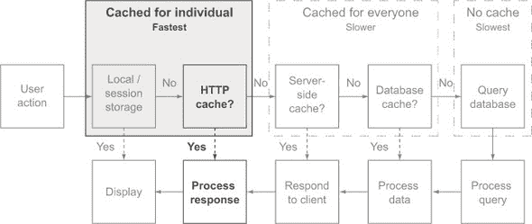

HTTP 缓存用于在客户端存储服务器响应，以避免再次进行往返。它可以遵循两种模式：

1.  直接从缓存中提供服务，不检查服务器的新鲜度。

1.  检查服务器的新鲜度，如果新鲜则从缓存中提供服务，如果过时则从服务器响应中提供服务。

直接从缓存中提供服务而不检查数据的新鲜度是最快的，因为我们避免了往返服务器的过程。对于图像、CSS 和 JavaScript 文件来说，这样做更安全，但我们也可以设置我们的应用程序，使其能够缓存数据一段时间。例如，如果我们有一个每天午夜只更新某些类型数据的应用程序，那么我们可以指示客户端缓存数据直到午夜过后。

有时这并不提供足够最新的信息。在这种情况下，浏览器可以被指示再次与服务器联系，以查看数据是否仍然新鲜。

让我们深入探讨，看看这种缓存是如何工作的。HTTP 缓存通过让客户端查看从服务器发送的响应头来实现。客户端寻找三个主要属性：`max-age`、`no-cache`和`last-modified`。每个属性都向客户端传达了数据缓存多长时间。

##### Max-Age

为了让客户端能够使用其缓存中的数据而不需要尝试联系服务器，初始响应的头部必须在 `Cache-Control` 头部中设置 `max-age`。这个值告诉客户端在再次请求之前应该缓存数据多长时间。`max-age` 的值以秒为单位。这既是一个强大的功能，也是一个潜在的危险功能。它之所以强大，是因为这是访问数据的最快方式；一旦数据被加载，使用这种方式缓存数据的程序将会非常快。它之所以危险，是因为客户端不再检查服务器是否有变化，因此我们必须对此格外小心。

当使用 Express 时，我们可以使用 `max-age` 属性设置 `Cache-Control` 头部。

```
res.header("Cache-Control", "max-age=28800");
```

一旦以这种方式设置缓存，唯一打破缓存并强制客户端发出新请求的方法是更改文件名。

显然，每次将文件推送到生产环境时都更改文件名是不理想的。幸运的是，更改传递给文件的参数将打破缓存。这通常是通过附加一个版本号或一些整数来完成的，我们的构建系统会随着每次部署递增这个整数。有许多实现这种方法的方式，但我们更喜欢有一个单独的文件，其中包含我们的递增值，并将该数字附加到文件名末尾。因为索引页面是静态的，我们可以设置我们的部署工具生成最终的 HTML 文件，并在我们的包含文件末尾包含版本号。让我们看看 列表 9.3 的例子，看看缓存破坏者在最终的 HTML 中会是什么样子。

##### 列表 9.3\. 打破 `max-age` 缓存

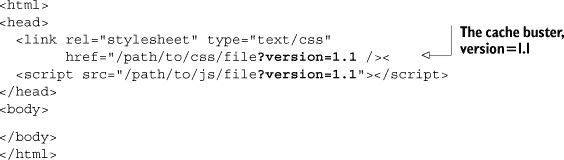

`max-age` 的另一个用途是将它设置为 0，这告诉客户端内容应该始终重新验证。当设置为这种情况时，客户端将始终检查服务器以确保内容仍然有效，但服务器仍然可以回复一个 302 响应，通知客户端数据不是过时的，应该从缓存中提供。设置 `max-age=0` 的副作用是，中间服务器——那些位于客户端和最终服务器之间的服务器——只要它们也在响应中设置了一个警告标志，仍然可以响应一个过时的缓存。

现在，如果我们希望防止中间服务器永远使用其缓存，那么我们就需要查看 `no-cache` 属性。

##### 无缓存

根据规范，`no-cache`属性的工作方式与设置`max-age=0`非常相似，以至于容易造成混淆。它告诉客户端在使用缓存中的数据之前，需要先与服务器进行重新验证，但它也告诉中间服务器，即使有警告信息，它们也不能提供过时的内容。在过去的几年中，出现了一个有趣的情况，因为 IE 和 Firefox 开始将此设置解释为在任何情况下都不应该缓存此数据。这意味着客户端在保留数据之前甚至不会询问服务器它最后接收的数据是否新鲜；客户端永远不会将其缓存中的数据存储。这可能导致带有`no-cache`头部的资源加载变得不必要地缓慢。如果期望的行为是防止客户端缓存资源，那么应该使用`no-store`属性。

##### No-Store

`no-store`属性通知客户端和中间服务器，永远不要在它们的缓存中存储有关此请求/响应的任何信息。尽管这有助于提高此类传输的隐私性，但它绝不是一种完美的安全形式。在正确实现的系统中，任何数据痕迹都将消失；有可能数据会通过不当或恶意编码的系统，从而容易受到窃听。

##### Last-Modified

如果没有设置`Cache-Control`，则客户端将依赖于基于`last-modified`日期的算法来确定缓存数据的时间长度。通常这相当于自`last-modified`日期以来的三分之一时间。因此，如果图像文件是三天前最后修改的，当它被请求时，客户端将默认从缓存中提供它一天，然后再与服务器再次检查。这导致资源从缓存中提供的时间量在很大程度上是随机的，取决于文件上次推送到生产环境的时间长度。

还有许多其他与缓存相关的属性，但掌握这些基本属性将显著加快应用程序的加载时间。HTTP 缓存允许我们的应用程序的客户在无需再次请求信息或以最小的开销询问服务器资源是否仍然新鲜的情况下，提供之前看到的资源。这加快了后续请求中的应用程序，但对于其他客户端发出的相同请求呢？HTTP 缓存对此没有帮助；相反，数据需要在服务器上进行缓存。

#### 9.3.4\. 服务器缓存

服务器响应客户端动态数据请求最快的方式是从缓存中提供服务。这样做可以减少查询数据库并将查询响应序列化为 JSON 字符串所需的时间。图 9.5 展示了服务器缓存在请求/响应周期中的位置。

##### 图 9.5\. 服务器缓存

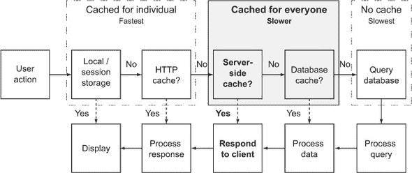

在服务器上缓存数据的两种流行方法是 Memcached 和 Redis。根据[memcached.org](http://memcached.org)，“Memcached 是一个用于小块任意数据的内存键值存储。”它专门设计为从数据库、API 调用或处理 HTML 中检索数据的临时缓存。当服务器内存不足时，它将自动根据最近最少使用（LRU）算法开始丢弃数据。Redis 是一个*高级键值存储*，可以用于存储更复杂的数据结构，如字符串、散列、列表、集合和有序集合。

缓存的整体思路是减少服务器负载并加快响应时间。当接收到数据请求时，应用程序首先检查该查询的响应是否已存储在缓存中。如果应用程序找到数据，它就会将其提供给客户端。如果没有缓存数据，它就会进行相对昂贵的数据库查询，并将数据转换为 JSON。然后，它在缓存中存储数据，并使用结果回复客户端。

当我们使用缓存时，必须考虑何时需要“清除”缓存。如果只有我们的应用程序向缓存写入数据，那么当数据发生变化时，它可以清除或重新生成缓存。如果有其他应用程序也向缓存写入数据，那么我们需要它们也更新缓存。有几种方法可以解决这个问题：

1.  我们可以在一定时间后使缓存失效并强制刷新数据。如果我们每小时这样做一次，那么一天中将有高达 24 次没有缓存的响应。显然，这并不适用于所有应用程序。

1.  我们可以检查数据的最后更新时间，如果它与缓存的最后更新时间相同或更早。这比第一个选项处理时间更长，但它可能不会像复杂请求那样耗时，并且我们可以确保数据是新鲜的。

我们选择哪种选项取决于我们应用程序的需求。

服务器缓存对于我们的 SPA 来说过于冗余。MongoDB 为我们示例数据集提供了出色的性能。我们并不处理 MongoDB 的响应——我们只是将其传递给客户端。

那么，我们应该在何时考虑将服务器缓存添加到我们的 Web 应用程序中？当我们发现我们的数据库或 Web 服务器成为瓶颈时。通常，它将减少服务器和数据库的负载，并提高响应时间。在购买昂贵的全新服务器之前尝试它肯定值得。但请记住，服务器缓存需要另一个服务（如 Memcached 或 Redis）来监控和维护，并且它也增加了我们应用程序的复杂性。

Node.js 为 Memcached 和 Redis 都提供了驱动程序。让我们将 Redis 添加到我们的应用程序中，并使用它来缓存有关我们用户的数据。我们可以访问[`redis.io`](http://redis.io)并遵循说明在我们的系统上安装 Redis。一旦安装并运行，我们可以通过使用命令`redis-cli`启动 Redis 外壳来确认它可用。

让我们更新 `npm` 清单以安装 Redis 驱动程序，如 列表 9.4 所示。变更以粗体显示：

##### 列表 9.4\. 更新 npm 清单以包含 redis—`webapp/package.json`

```
{ "name"    : "SPA",
  "version" : "0.0.3",
  "private" : true,
  "dependencies" : {
    "express"   : "3.2.x",
    "mongodb"   : "1.3.x",
    "socket.io" : "0.9.x",
    "JSV"       : "4.0.x",
    "redis"     : "0.8.x"
   }
}
```

在我们开始之前，让我们考虑一下我们需要能够用缓存做什么。两个想到的事情是 *设置* 缓存键值对和 *通过键获取* 缓存值。我们还可能希望能够 *删除* 缓存键。有了这些，让我们通过在 lib 目录中创建一个 cache.js 文件并填充它以 node 模块模式和获取、设置和从缓存中删除的方法来设置节点模块。参见 列表 9.5 了解如何将 Node.js 连接到 Redis 并设置缓存文件的框架。

##### 列表 9.5\. 启动 redis 缓存—`webapp/cache.js`

```
/*
 * cache.js - Redis cache implementation
*/

/*jslint         node   : true, continue : true,
  devel  : true, indent : 2,    maxerr   : 50,
  newcap : true, nomen  : true, plusplus : true,
  regexp : true, sloppy : true, vars     : false,
  white  : true
*/
/*global */

// ------------ BEGIN MODULE SCOPE VARIABLES --------------
'use strict';
var
  redisDriver = require( 'redis' ),
  redisClient = redisDriver.createClient(),
  makeString, deleteKey, getValue, setValue;
// ------------- END MODULE SCOPE VARIABLES ---------------

// ---------------- BEGIN PUBLIC METHODS ------------------
deleteKey = function ( key ) {};
getValue = function ( key, hit_callback, miss_callback ) {};

setValue = function ( key, value ) {};

module.exports = {
  deleteKey : deleteKey,
  getValue  : getValue,
  setValue  : setValue
};
// ----------------- END PUBLIC METHODS -------------------
```

现在，让我们开始填充这些方法；完成的方法在 列表 9.6 中。我们将从 `setValue` 开始，因为它是最简单的。Redis 有很多不同的数据类型，根据我们缓存的数据类型，这些类型可能很有用。在这个例子中，我们将坚持使用基本的字符串键值对。使用 Redis 驱动程序设置值就像调用 `redis.set( key, value );` 一样简单。因为没有回调，我们将假设这个方法有效，并让调用异步执行并忽略失败。如果我们想的话，我们可以做些更复杂的事情，比如在 Redis 中增加一个值来跟踪失败。我们鼓励感兴趣的读者探索这种方法。

`getValue` 方法接受三个参数：要搜索的 `key`、缓存命中的回调（`hit_callback`）和缓存未命中的回调（`miss_callback`）。当这个方法被调用时，它请求 Redis 返回与键关联的值。如果命中（值不是 `null`），它将使用值作为参数调用 `hit_callback`。如果未命中（值是 `null`），它将调用 `miss_callback`。查询数据库的任何逻辑都留给调用者，因为我们希望这段代码专注于缓存。

`deleteKey` 方法调用 `redis.del` 并传入 Redis 键。我们不使用回调，因为我们将会异步执行并假设它有效。

`makeString` 工具用于在我们将键和值呈现给 Redis 之前将它们转换。我们需要这样做，因为否则 Redis Node 驱动程序会在键和值上使用 `toString()` 方法。这会导致看起来像 `[Object object]` 的字符串，这不是我们想要的。

我们更新的缓存模块在 列表 9.6 中展示。变更以粗体显示：

##### 列表 9.6\. 最终 Redis 缓存文件—`webapp/lib/cache.js`


现在我们已经设置了缓存文件，我们可以在 crud.js 文件中利用它，通过添加五行代码，如 列表 9.7 所见。变更以粗体显示：

##### 列表 9.7\. 从缓存中读取—`webapp/lib/crud.js`


我们确保当对象被删除时，键从 Redis 数据库中移除。但这远非理想。它不能确保所有缓存的实例数据都被删除；它只能确保与用于删除项目的*键*关联的缓存数据被移除。例如，我们可以删除刚刚被解雇的员工*通过 ID*，但用户可能仍然登录并导致系统混乱，因为信息可能使用*用户名和密码*键进行缓存。在更新对象时也可能出现同样的问题。

这不是一个容易解决的问题，这也是为什么服务器缓存通常被推迟到系统需要扩展时才投入时间解决的原因。一些可能的解决方案包括在一段时间后过期缓存记录（最小化缓存不匹配窗口），在删除或更新用户时清除整个用户缓存（更安全，但会导致更多的缓存未命中），或者手动跟踪缓存对象（对开发者来说更容易出错）。 

服务器缓存中有许多更多的机会和挑战——足够写一本书，但希望这足以让你开始。现在让我们看看最终的缓存方法：在数据库中缓存数据。

#### 9.3.5. 数据库查询缓存

*查询缓存*发生在数据库缓存特定查询的结果时。在关系型数据库中，这尤为重要，因为需要将结果转换为应用程序可以读取的形式。查询缓存存储这个转换后的结果。请查看图 9.6 以了解查询缓存在请求/响应周期中的位置。

##### 图 9.6. 查询缓存


使用 MongoDB，这由操作系统文件系统自动处理。MongoDB 不是缓存特定查询的结果，而是试图将整个索引保持在内存中，当整个数据集可以保持在内存中时，这会导致查询非常快。MongoDB，或者更确切地说，操作系统的子系统内存，将根据服务器的需求动态分配内存。这意味着 MongoDB 将拥有所有可用的空闲 RAM，而无需猜测要分配多少，并且当需要时将自动释放内存给其他进程。像最近最少使用算法这样的缓存行为是根据操作系统的行为工作的。

### 9.4. 总结

在本章中，我们回答了在托管 SPA 网站时出现的一些常见问题。我们展示了如何调整我们的 SPA 以便它可以被搜索引擎索引，如何使用分析工具（如 Google Analytics），以及如何将应用程序错误记录到服务器上。最后，我们讨论了如何在应用程序的每一层进行缓存，每一层缓存提供的实际好处，以及如何利用它。

我们关于如何构建健壮、可测试和可扩展的 SPA 的建议几乎已经完成。我们强烈建议您阅读附录 A 和 B，因为它们都涵盖了重要主题，并且进行了深入探讨。附录 A 展示了我们在本书的大部分内容中使用的代码标准；附录 B 展示了如何使用测试模式和自动化来轻松识别、隔离和修复软件缺陷。

在本书的第一部分中，我们构建了我们的第一个单页应用（SPA）并讨论了为什么 SPA 对于许多网站来说是一个极佳的选择。特别是，SPA 可以提供传统网站无法比拟的极响应和交互式的用户体验。接下来，我们回顾了一些需要理解以成功实施大型 SPA 的 JavaScript 编程概念。

在第二部分中，我们继续使用经过良好测试的架构设计和实现了 SPA。我们没有使用“框架”库，因为我们想展示 SPA 的内部工作原理。您应该能够使用这个架构来开发自己的 SPA，或者利用必要的经验来学习许多框架库之一，以判断它是否提供了您需要的工具。

在第三部分中，我们设置了一个 Node.js 和 MongoDB 服务器，为我们的 SPA 提供了 CRUD 后端。我们使用了 Socket.IO 来提供客户端和服务器之间响应式和轻量级的全双工通信。我们还消除了在传统网站中经常看到的数据格式之间的数据打包过程。

最后，我们发现整个堆栈都使用 JavaScript 作为其语言，JSON 作为其数据格式。这种优雅的简洁性在开发过程的每一步都提供了累积的好处。例如，使用单一语言提供了在客户端和服务器之间移动和共享代码的机会，这可以显著减少我们代码的大小和复杂性。它还节省了我们的时间，避免了混淆，因为语言或数据格式之间的上下文切换很少。而且好处还扩展到测试阶段，因为我们不仅可以有显著更少的代码需要测试，而且我们还可以几乎为所有代码使用相同的测试框架，而不需要浏览器测试套件的额外开销和费用。

我们希望您喜欢这本书，并且像我们撰写它一样学到很多。继续学习单页网页应用的最佳方式是继续开发它们。我们努力为您提供了使用 JavaScript 端到端完成所需的所有工具。
