## 附录 A. JavaScript 编码标准

| |
| --- |

**本附录涵盖：**

+   探讨为什么编码标准很重要

+   一致地布局和记录代码

+   一致地命名变量

+   使用命名空间隔离代码

+   组织文件并确保一致的语法

+   使用 JSLint 验证代码

+   使用体现标准的模板

| |
| --- |

编码标准是有争议的。几乎每个人都同意你应该有一个，但似乎很少有人同意标准应该是什么。让我们考虑一下为什么编码标准对 JavaScript 尤其重要。

### A.1. 为什么我们需要编码标准

对于像 JavaScript 这样的松散类型、动态语言，有一个明确的标准几乎比严格的语言更重要。JavaScript 的极大灵活性可能使其成为编码语法和实践的潘多拉盒子。而严格的语言天生提供结构和一致性，JavaScript 则需要纪律和适用的标准来实现同样的效果。

下面是我们多年来使用和修订的标准。它相当全面和连贯，我们在整本书中一直使用它。在这里的表述并不非常简洁，因为我们添加了许多解释和示例。其中大部分都被压缩成了一份三页的速查表，可在[`github.com/mmikowski/spa`](https://github.com/mmikowski/spa)找到。

我们并不自以为是地认为这个编码标准适合所有人：你应该根据自己的需要使用或忽略这个标准。无论如何，我们希望讨论的概念能鼓励你审视自己的实践。我们强烈建议任何团队在开始大型项目之前就达成一致的标准，以避免经历自己的巴别塔。

经验和研究表明，我们将花费更多的时间维护代码而不是编写它。因此，我们的标准更倾向于可读性而不是创建速度。我们发现，编写为了被理解的代码往往在第一次编写时更加仔细和结构化。

我们发现，一个成功的编码标准：

+   最小化编码错误的可能性。

+   结果是适合大规模项目和团队的代码——一致、可读、可扩展和可维护。

+   鼓励代码的效率、效果和重用。

+   鼓励使用 JavaScript 的优势并避免其弱点。

+   被开发团队的每个成员使用。

马丁·福勒曾著名地说：“任何傻瓜都能写出计算机能理解的代码。优秀的程序员写出人类能理解的代码。”虽然明确和全面的标准不能保证 JavaScript 的可读性，但它们确实能有所帮助——就像词典和语法指南有助于确保英语的可读性一样。

### A.2. 代码布局和注释

以一致和深思熟虑的方式布局你的代码是提高理解度的一种最佳方式。它也是代码标准中更具争议性的问题之一。¹ 所以当你阅读这一节时，放松一下。喝一杯无咖啡因的拿铁，做一个薄荷茶叶足疗，打开你的心扉。这会很有趣。真的。

> ¹ 无数的开发者花费了无数小时狂热地争论制表位的使用——如果你需要更多证据，请在互联网上搜索“制表位与空格”。

#### A.2.1\. 为可读性布局你的代码

如果我们从这本书中省略所有标题、标点、空格和大写字母，会怎样呢？嗯，这本书可能会提前几个月出版，但我们的读者可能会发现它难以理解。也许这就是为什么我们的编辑坚持要求我们格式化和应用写作约定，以便你，亲爱的读者，有理解内容的机会。

JavaScript 代码有两个需要理解它的受众——将执行它的机器和将维护或扩展它的人类。通常，我们的代码会被阅读得比编写得多。我们格式化和应用约定到我们的代码中，以便我们的同事开发者（包括几周后的我们自己）有理解内容的机会。

##### 使用一致的缩进和行长度

我们可能都注意到了报纸上的文本栏长度通常在 50 到 80 个字符之间。超过 80 个字符的行对于人眼来说越来越难以跟随。Bradyhurst 的权威著作《版式设计要素》建议行长度在 45-75 个字符之间，以获得最佳的阅读理解和舒适度，其中 66 个字符被认为是最佳选择。

较长的行在电脑显示屏上阅读起来也很有难度。如今，越来越多的网页采用多列布局——尽管这通常被认为实施起来非常昂贵。一个网页开发者愿意付出这样的麻烦，唯一的理由可能是存在长行的问题（或者如果他们按小时收费）。

支持更宽的制表位（4-8 个空格）的人说，这使他们的代码更易读。但他们也经常主张较长的行长度来补偿宽的制表位。我们采取另一种方法：较短的制表位宽度（2 个空格）和较短的行长度（78 个字符）共同作用，提供更窄、更易读的文档，每行内容丰富。短的制表位宽度也认识到，像 JavaScript 这样的事件驱动语言通常比纯过程性语言缩进更多，这是由于回调和闭包的普遍存在。

+   **每级代码缩进两个空格**。

+   **使用空格而不是制表位进行缩进，因为没有制表位位置的标准**。

+   **限制行长度为 78 个字符**。

较窄的文档在所有显示设备上都表现更好，允许个人在两个高清显示器上同时打开六个文件视图，或者轻松地在笔记本电脑、平板电脑或智能手机上的较小屏幕上阅读单个文档。它们也适合作为电子阅读器或印刷书籍格式中的列表，这使得我们的编辑器非常高兴.^([2])

> ²本书中列表的行长度限制实际上是 72 个字符，失去最后六个字符是痛苦的。

##### 在段落中组织代码

英语和其他书面语言以段落的形式呈现，以帮助读者理解何时一个主题完成，另一个主题要呈现。计算机语言也受益于这一惯例。这些段落可以作为整体进行注释。通过适当使用空白^([3))，我们的 JavaScript 可以像格式良好的书籍一样阅读。

> ³空白是指空格、换行符或制表的任意组合。但不要使用制表符。

+   **将代码组织成逻辑段落**，并在每个段落之间留空白行。

+   **每行最多包含一个语句或赋值**，尽管我们确实允许每行有多个变量声明。

+   **在运算符和变量之间留空白**，以便更容易地找到变量。

+   **每个逗号后都要留空白。**

+   **在段落内对齐相同类型的运算符。**

+   **将注释缩进与它们解释的代码相同。**

+   **在每条语句的末尾放置分号。**

+   **在控制结构中的所有语句周围放置花括号。**控制结构包括`for`、`if`和`while`构造等。也许最常见的是违反这一指南的做法是省略单行`if`语句的花括号。不要这样做。始终使用花括号，这样就可以轻松添加语句而不会意外引入错误。

##### 列表 A.1\. 不像这样

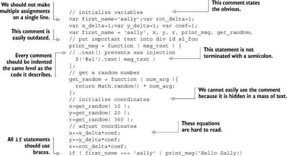

##### 列表 A.2\. 但像这样

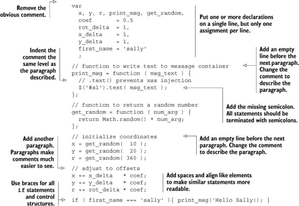

当我们布局代码时，我们希望追求清晰度，而不是减少字节数。一旦我们的代码达到生产阶段，我们的 JavaScript 将在到达用户之前被连接、压缩和压缩。因此，我们用来帮助理解的工具——空白、注释和更具描述性的变量名——对性能的影响很小或没有影响。

##### 保持一致的换行

如果语句不超过最大行长度，我们应该将其放在一行上。但这种情况通常是不可能的，所以我们必须将其分成两行或更多行。以下指南将有助于减少错误并提高认知：

+   **在运算符之前换行**，这样就可以轻松地查看左列中的所有运算符。

+   **缩进语句的后续行**一个级别，例如在我们的例子中是两个空格。

+   **在逗号分隔符后换行。**

+   **将结束括号或括号单独放在一行上。**这清楚地表明了语句的结束，而不必强迫读者水平扫描分号。

##### 列表 A.3\. 不像这样

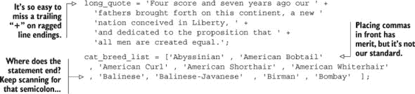

##### 列表 A.4\. 但像这样

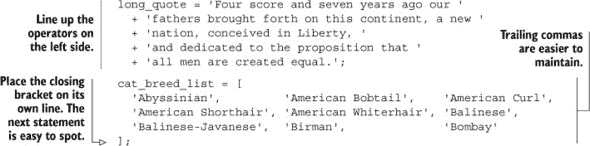

我们将在附录的稍后部分安装 JSLint，这将帮助我们检查我们的语法。

##### 使用 K&R 风格括号

*K&R 风格括号*平衡了垂直空间的使用与可读性。在格式化对象和映射、数组、复合语句或调用时应该使用它。复合语句包含一个或多个用大括号括起来的语句。例如包括`if`、`while`和`for`语句。像`alert( ‘I have been invoked!' );`这样的调用调用一个函数或方法。

+   **尽可能使用单行**。例如，当短数组声明可以放在一行时，不要不必要地将它拆分为三行。

+   **将开括号、花括号或方括号放在开行末尾**。

+   **在分隔符内缩进代码**（括号、花括号或方括号）一级——例如，两个空格。

+   **将关闭括号、花括号或方括号放在与开行相同的缩进级别上**。

##### 列表 A.5\. 不像这样


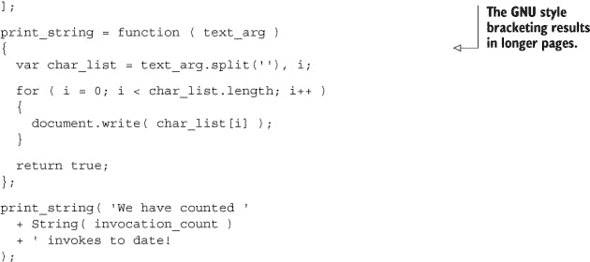

##### 列表 A.6\. 但像这样

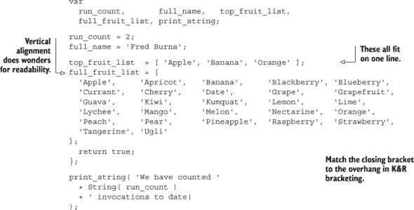

调整元素以垂直对齐确实有助于理解，但如果没有强大的文本编辑器，也可能很耗时。Vim、Sublime、WebStorm 等提供的垂直文本选择有助于对齐值。WebStorm 甚至提供了自动对齐映射值的工具，这是一个节省时间的好方法。如果你的编辑器不支持垂直选择，我们强烈建议你考虑更换编辑器。

##### 使用空白空间来区分函数和关键字

许多语言都有文章的概念——像*an*、*a*或*the*这样的词。文章的一个目的是让读者或听者知道下一个词将是名词或名词短语。空白空间可以与函数和关键字一起使用，以达到类似的效果。

+   **在函数关键字和开括号`(`之间没有空格**。

+   **在关键字后跟一个空格**，然后是其开括号，`(`。

+   **在格式化 for 语句时**，在每个分号后添加一个空格。

##### 列表 A.7\. 不像这样

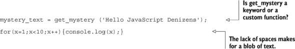

##### 列表 A.8\. 但像这样

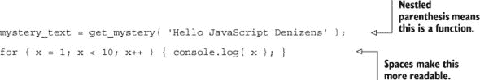

这种约定与其他动态语言（如 Python、Perl 或 PHP）很常见。

##### 一致引用

我们*更喜欢单引号*作为字符串分隔符，因为 HTML 标准属性分隔符是双引号。HTML 通常在 SPA 中经常引用。使用单引号的 HTML 分隔符需要更少的字符转义或编码。结果是更短、更容易阅读，且出错的可能性更小。

##### 列表 A.9\. 不像这样

```
html_snip = "<input name=\"alley_cat\" type=\"text\" value=\"bone\">";
```

##### 列表 A.10\. 但像这样

```
html_snip = '<input name="alley_cat" type="text" value="bone">';
```

许多语言如 Perl、PHP 和 Bash 都有插值和非插值引号的概念。*插值引号*会扩展其中找到的变量值，而*非插值引号*则不会。通常，双引号（`"`）是插值的，而单引号（`‘`）不是。JavaScript 引号从不插值，但单双引号的使用没有行为上的差异。因此，我们的使用与其他流行语言保持一致。

#### A.2.2\. 注释以解释和记录

注释甚至可能比它们引用的代码更重要，因为它们可以传达一些不明显的关键细节。这在事件驱动编程中尤为明显，因为回调的数量可能会使跟踪代码执行变得耗时。但这并不意味着添加更多的注释总是更好的。战略性地放置、信息丰富且维护良好的注释非常受重视，而一堆不准确的注释可能比没有注释更糟。

##### 战略性地解释代码

我们的标准旨在最小化注释并最大化其价值。我们通过使用约定来使代码尽可能自明来最小化注释。我们通过将它们与描述的段落对齐并确保其内容对读者有价值来最大化它们的值。

##### 列表 A.11\. 不像这样

```
var
  welcome_to_the = '<h1>Welcome to Color Haus</h1>',
  houses_we_use   = [ 'yellow','green','little pink' ],
  the_results, make_it_happen, init;

// get house spec
var make_it_happen = function ( house ) {
  var
    sync = houses_we_use.length,
    spec = {},
    i;

  for ( i = 0; i > sync; i++ ) {
    ...
    // 30 more lines
  }
  return spec;
};

var init = function () {
  // houses_we_use is an array of house colors.
  // make_it_happen is a function that returns a map of building specs
  //
  varthe_results = make_it_happen( houses_we_use );

  //And place welcome messageinto our DOM
  $('#welcome').text( welcome_to_the );
  //And now our specifications
  $('#specs').text( JSON.stringify( the_results ) );
};

init();
```

##### 列表 A.12\. 但像这样


一致的、有意义的变量名可以用更少的注释提供更多信息。我们关于变量命名的部分将在附录中稍后出现，但让我们先看看一些亮点。所有指代函数的变量都以动词作为其首词——`get_spec_map`、`run_init`。其他变量被命名以帮助我们理解其内容——`welcome_html`是一个 HTML 字符串，`house_color_list`是一个颜色名称数组，而`spec_map`是一个规格映射。这有助于减少我们需要添加或维护的注释数量。

##### 记录你的 API 和待办事项

注释也可以为你的代码提供更正式的文档。但我们需要小心——关于一般架构的文档不应该被埋在几十个 JavaScript 文件中的一个，而应该放入一个专门的架构文档中。但关于函数或对象 API 的文档可以，并且通常应该直接放置在代码旁边。

+   **通过指定其*目的*、使用的*参数*或*设置*、返回的*值*以及抛出的任何*异常*来解释任何非平凡函数**。

+   **如果你禁用代码**，请用以下格式的注释解释原因：`//TODO 日期 用户名 - 注释`。用户名和日期对于决定注释的新鲜度很有价值，也可以由自动化工具用来报告代码库中的待办事项。

##### 列表 A.13\. 函数 API 文档示例

```
// BEGIN DOM Method /toggleSlider/
// Purpose   : Extends and retracts chat slider
// Required Arguments :
//   * do_extend (boolean) true extends slider, false retracts
// Optional Arguments :
//   * callback (function) executed after animation is complete
// Settings :
//   * chat_extend_time,   chat_retract_time
//   * chat_extend_height, chat_retract_height
// Returns   : boolean
//   * true - slider animation activated
//   * false - slider animation not activated
// Throws    : none
//
toggleSlider = function( do_extend, callback ) {
  //   ...
};
// END DOM Method /toggleSlider/
```

##### 列表 A.14\. 禁用代码示例

```
// BEGIN TODO 2012-12-29 mmikowski - debug code disabled
// alert( warning_text );
//  ... (lots more lines) ...
//
// END TODO 2012-12-29 mmikowski - debug code disabled
```

有些人说，你应该总是立即删除代码，并在需要时从源代码控制中恢复它。但我们发现，注释掉我们可能还会用到的代码比尝试找到禁用代码原始版本的版本然后合并它更有效率。代码禁用一段时间后，你可以安全地将其删除。

### A.3\. 变量名

你有没有注意到，书籍通常在其代码列表中包含一个临时的命名约定？例如，你会看到像 `person_str = ‘fred’;` 这样的行。作者通常这样做是因为他不想后来插入一个笨拙的、消耗时间和注意力的提醒，说明变量代表什么。名字本身就是显而易见的。

每个编写代码的人都会使用命名约定，无论他们是否意识到这一点。⁴ 一个好的命名约定在所有团队成员都理解并使用它时提供最大的价值。当他们这样做时，他们就可以从单调的代码追踪和艰难的注释维护中解放出来，并可以专注于代码的目的和逻辑。

> ⁴ 就像“如果你选择不决定，你仍然做出了选择”（出自 Rush 的《Freewill》，收录于《Permanent Waves》专辑，1980 年）

#### A.3.1\. 使用命名约定减少和改进注释

一致且具有描述性的名称对于企业级 JavaScript 应用程序至关重要，因为它们可以极大地加快认知速度，并有助于避免常见错误。考虑以下完全有效且现实的 JavaScript 代码：

##### 列表 A.15\. 示例 A

```
var creator = maker( 'house' );
```

现在，让我们使用我们即将讨论的命名约定重写它：

##### 列表 A.16\. 示例 B

```
var make_house = curry_build_item({ item_type : 'house' });
```

示例 B 显然更具有描述性。根据我们的约定，我们可以得出以下结论：

+   `make_house` 是一个对象构造函数。

+   被调用的函数是一个柯里化函数——它使用闭包来维护状态并返回一个函数。

+   被调用的函数接受一个字符串参数，该参数指示一个 `type`。

+   变量在局部作用域内。

现在，我们可以通过查看代码的上下文来找出示例 A 的所有这些信息。这可能需要我们花费 5、30 或 60 分钟来追踪所有函数和变量。然后，*我们还需要记住所有这些*，在处理或围绕这段代码时。这不仅会浪费时间，还可能使我们失去最初想要完成的目标的焦点。

这种可避免的开销将在每次新开发者使用此代码时产生。记住，离开这段代码几周后，任何开发者——包括原始作者——实际上都相当于一个新开发者。显然，这是效率低下且容易出错的。

让我们看看如果使用注释提供与示例 B 相同数量的意义，示例 A 会是什么样子：

##### 列表 A.17\. 带注释的示例 A

```
// 'creator' is an object constructor we get by
// calling 'maker'. The first positional argument
// of 'maker' must be a string, and it directs
// the type of object constructor to be returned.
// 'maker' uses a closure to remember the type
// of object the returned function is to
// meant to create.

var creator = maker( 'house' );
```

不仅带有注释的示例 A 比示例 B 更冗长，而且编写它也花费了更长的时间，这可能是我们试图传达与命名约定相同数量的信息。更糟糕的是：随着时间的推移，随着代码的变化和开发者的懒惰，注释容易变得不准确。让我们假设我们决定几周后更改几个名称：

##### 列表 A.18. 变量名更改后的示例 A，带有注释


哎呀，我们忘记更新引用我们刚刚更改的变量名的注释了。现在，注释完全错误且具有误导性。不仅如此，所有这些注释都使代码变得混乱，因为列表的长度是*九倍*。最好一点注释都没有。与如果我们想更改示例 B 中的变量名相比：

##### 列表 A.19. 变量名更改后的示例 B

```
var make_abode = curry_make_item({ item_type : 'abode' });
```

这些修订立即正确，因为*没有注释需要调整*。正如这所示，一个经过深思熟虑的命名约定是自我文档化代码的绝佳方式，由原始作者以更高的精度进行，而不需要注释的杂乱，这些注释几乎无法维护。它有助于加快开发速度，提高质量，并简化维护。

#### A.3.2. 使用命名指南

变量名可以传达很多信息，正如我们上面所展示的。让我们回顾一些我们认为最有用的指南。

##### 使用公共字符

尽管我们团队中许多人可能认为将变量命名为`queensrÿche_album_name`很聪明，但试图在键盘上找到`ÿ`键的人可能会有不同的、并且明显更负面的看法。最好将变量名限制在大多数世界键盘上可用的字符。

+   **在变量名中使用 a-z, A-Z, 0-9, 下划线和$字符**。

+   **不要以数字开头变量名**。

##### 通信变量作用域

我们的 JavaScript 文件和模块有一一对应的关系，类似于 Node.js（我们将在附录中详细说明）。我们发现区分在模块中任何地方都可用和作用域更有限的变量是有用的。

+   **当变量是全模块作用域时使用驼峰式命名**（它可以在模块命名空间的任何地方访问）。

+   **当变量不是全模块作用域时使用下划线**（模块命名空间内函数的局部变量）。

+   **确保所有模块作用域变量至少有两个音节**，以便作用域清晰。例如，我们可以在变量`config`中使用更描述性和显然是模块作用域的`configMap`。

##### 认识到变量类型的重要性

虽然 JavaScript 允许你对变量类型进行快速和宽松的处理，但这并不意味着你应该这样做。考虑以下示例：

##### 列表 A.20. 类型隐式转换

```
var x = 10, y = '02', z = x + y;
console.log ( z ); // '1002'
```

在这种情况下，JavaScript 将 `x` 转换为字符串，并将其与 `y` (`02`) 连接，得到字符串 `1002`。这可能不是预期的结果。类型转换的结果可能产生更深远的影响：

##### 列表 A.21\. 类型转换的阴暗面

```
var
  x = 10,
  z = [ 03, 02, '01' ],
  i , p;

for ( i in z ) {
  p = x + z[ i ];
  console.log( p.toFixed( 2 ) );
}

// Output:
// 13.00
// 12.00
// TypeError: Object 1001 has no method 'toFixed'
```

我们发现，这种 *非故意* 的类型转换比 *故意* 的类型转换更为常见，这通常会导致难以找到和解决的错误。我们很少 *故意* 改变变量的类型，因为（原因之一）这样做几乎总是太混乱或难以管理，以至于不值得这种好处。5 因此，当我们命名我们的变量时，我们通常希望传达我们打算让它包含的变量类型

> ⁵ 更新版本的 Firefox 的 JavaScript JIT 编译器认识到这个事实，并使用一种称为 *类型推断* 的技术，在现实世界的代码中实现 20-30% 的性能提升。

##### 命名布尔值

当布尔值表示状态时，我们使用单词 `is`；例如，`is_retracted` 或 `is_stale`。当我们使用布尔值来指导动作时，比如在函数参数中，我们使用单词 `do`，例如 `do_retract` 或 `do_extend`。当我们使用布尔值来表示所有权时，我们使用 `has`；例如，`has_whiskers` 或 `has_wheels`。表 A.1 展示了一些例子。

##### 表 A.1\. 正则表达式命名示例

| 指标 | 局部作用域 | 模块作用域 |
| --- | --- | --- |
| bool [通用] | bool_return | boolReturn |
| do (请求动作) | do_retract | doRetract |
| has (表示包含) | has_whiskers | hasWhiskers |
| is (表示状态) | is_retracted | isRetracted |

##### 命名字符串

我们之前的例子表明，如果我们知道我们正在使用一个字符串变量，那么这很有用。表 A.2 是一个我们常用字符串的指标图表。

##### 表 A.2\. 字符串命名示例

| 指标 | 局部作用域 | 模块作用域 |
| --- | --- | --- |
| str [通用] | direction_str | directionStr |
| id (标识符) | email_id | emailId |
| date | email_date | emailDate |
| html | body_html | bodyHtml |
| msg (消息) | employee_msg | employeeMsg |
| name | employee_name | employeeName |
| text | email_text | emailText |
| type | item_type | itemType |

##### 命名整数

JavaScript 不暴露整数作为支持的变量类型，但在许多情况下，除非我们提供整数，否则语言无法正常工作。例如，在遍历数组时，使用浮点数作为索引是不正确的：

```
var color_list = [ 'red', 'green', 'blue' ];

color_list[1.5] = 'chartreuse';

console.log( color_list.pop() ); // 'blue'
console.log( color_list.pop() ); // 'green'
console.log( color_list.pop() ); // 'red'
console.log( color_list.pop() ); // undefined - where did 'chartreuse' go?
console.log( color_list[1.5] ); // oh, there it is

console.log( color_list ); // shows [1.5: "chartreuse"]
```

其他内置函数也期望整数值，例如字符串 `substr()` 方法。因此，当使用数字是整数很重要时，可以使用指标，如 表 A.3 所示。

##### 表 A.3\. 整数命名示例

| 指标 | 局部作用域 | 模块作用域 |
| --- | --- | --- |
| int [通用] | size_int | sizeInt |
| *none* (约定) | i, j, k | (不允许在模块作用域中) |
| count | employee_count | employeeCount |
| index | employee_index | employeeIndex |
| time（毫秒） | retract_time | retractTime |

##### 命名数字

如果理解我们正在处理非整数数字很重要，我们可以使用其他指标（见 表 A.4）。

##### 表 A.4\. 示例数字名称

| 指标 | 本地作用域 | 模块作用域 |
| --- | --- | --- |
| num [通用] | size_num | sizeNum |
| *none*（约定） | x, y, z | （在模块作用域中不允许） |
| coord（坐标） | x_coord | xCoord |
| ratio | sales_ratio | salesRatio |

##### 命名正则表达式

我们通常在正则表达式前加上 `regex`，如 表 A.5 中所示。

##### 表 A.5\. 示例正则表达式名称

| 指标 | 本地作用域 | 模块作用域 |
| --- | --- | --- |
| regex | regex_filter | regexFilter |

##### 命名数组

在命名数组时，我们发现以下几条准则很有用：

+   **数组变量名应该是一个单数名词，后跟“list”这个词。**

+   对于模块作用域的数组，首选名词-“List”形式。

表 A.6 展示了一些示例。

##### 表 A.6\. 示例数组名称

| 指标 | 本地作用域 | 模块作用域 |
| --- | --- | --- |
| list | timestamp-list | timestampList |
| list | color_list | colorList |

##### 命名映射

JavaScript 官方并没有 `map` 数据类型——它只有对象。但我们发现区分仅用于存储数据（`maps`）的简单对象和功能齐全的对象是有用的。这种映射结构类似于 Java 中的 `map`，Python 中的 `dict`，PHP 中的 `关联数组`，或 Perl 中的 `hash`。

当我们命名一个映射时，我们通常希望强调开发者的意图并在名称中包含 `map` 这个词。通常结构是一个名词后跟 `map` 这个词，并且总是单数。见 表 A.7 中的示例映射名称。

##### 表 A.7\. 示例映射名称

| 指标 | 本地作用域 | 模块作用域 |
| --- | --- | --- |
| map | employee_map | employeeMap |
| map | receipt_timestamp_map | receiptTimestampMap |

有时映射的键是一个不寻常或区分性的特征。在这种情况下，我们在名称中指明键，例如，`receipt_timestamp_map`。

##### 命名对象

对象通常有一个具体的“现实世界”对应物，我们相应地命名它们：

+   **对象变量名应该是一个名词**，后跟一个可选的修饰符——`employee` 或 `receipt`。

+   **确保模块作用域的对象变量名有两个或更多音节**，以便作用域清晰——`storeEmployee` 或 `salesReceipt`。

+   **在 jQuery 对象前加上 $.** 这是当今的一个常见约定，jQuery 对象（或有时称为集合）在单页应用（SPAs）中很常见。

表 A.8 展示了一些示例。

##### 表 A.8\. 示例对象名称

| 指标 | 本地作用域 | 模块作用域 |
| --- | --- | --- |
| *none*（单数名词） | 员工 | 店铺员工 |
| *none*（单数名词） | 收据 | 销售收据 |
| $ | $area_tabs | $areaTabs |

如果我们期望 jQuery 集合包含多个条目，我们将其变为复数。

##### 函数命名

函数几乎总是对一个对象执行操作。因此，我们总是喜欢将动作动词作为函数名称的第一部分：

+   **函数名应始终包含一个动词后跟一个名词**，例如 `get_record` 或 `empty_cache_map`。

+   **模块作用域的函数应始终包含两个或更多音节**，以便作用域清晰，例如 `getRecord` 或 `emptyCacheMap`。

+   **使用一致的动词意义**。表 A.9 显示了常见动词的一致意义。

    ##### 表 A.9\. 示例函数名称

    | 指示符 | 指示符的含义 | 本地作用域 | 模块作用域 |
    | --- | --- | --- | --- |
    | fn [通用] | 通用函数指示符。 | fn_sync | fnSync |
    | curry | 返回由参数指定的函数。 | curry_make_user | curryMakeUser |
    | destroy, remove | 删除数据结构，例如数组。意味着数据引用将根据需要整理。 | destroy_entry, remove_element | destroyEntry, removeElement |
    | empty | 在不删除容器的情况下删除数据结构的一些或全部成员——例如，删除数组中的所有元素但保持数组完整。 | empty_cache_map | emptyCacheMap |
    | fetch | 从外部源返回数据，例如从 AJAX 或 WebSocket 调用。 | fetch_user_list | fetchUserList |
    | get | 从对象或其他内部数据结构返回数据。 | get_user_list | getUserList |
    | make | 返回新构造的对象（不使用 new 操作符） | make_user | makeUser |
    | on | 事件处理器。事件应为一个单词，如 HTML 标记中的用法。 | on_mouseover | onMouseover |
    | save | 将数据保存到对象或其他内部数据结构。 | save_user_list | saveUserList |
    | set | 初始化或更新由参数提供的值。 | set_user_name | setUserName |
    | store | 将数据发送到外部源进行存储，例如通过 AJAX 调用。 | store_user_list | storeUserList |
    | update | 与 set 类似，但有“之前已初始化”的含义 | update_user_list | updateUserList |

我们找到了 `make` 构造函数动词，以及 `fetch/get` 和 `store/save` 之间的区别，这在跨开发团队传达意图方面特别有价值。此外，使用 `onEventname` 作为事件处理器已成为常见且有用。一般形式为 *on<eventname><modifier>*，其中修饰符是可选的。请注意，我们保持事件名称为一个单词。例如，`onMouseover` *不是* `onMouseOver`，或 `on_dragstart` *不是* `on_drag_start`。

##### 未知类型变量命名

有时我们真的不知道我们的变量包含什么数据类型。这种情况通常有两种情况：

+   **我们编写一个多态函数**——一个可以接受多种数据类型的函数。

+   **我们从外部数据源接收数据**，例如 AJAX 或 WebSocket 数据流。

在这些情况下，变量的主要特征是其数据类型的不可确定性。我们确定了一个做法，确保名字中包含单词 `data`（见 表 A.10）。

##### 表 A.10. 示例数据名称

| 本地作用域 | 模块作用域 | 备注 |
| --- | --- | --- |
| http_data, socket_data | httpData, socketData | 从 HTTP 源或 WebSocket 接收到的未知数据类型 |
| arg_data, data | --- | 接收到的参数数据类型未知 |

现在我们已经审查了我们的命名指南，让我们开始使用它们。

#### A.3.3. 应用指南

在我们应用命名指南之前和之后，让我们比较一下对象原型的变化。

##### 列表 A.22. 不像这样

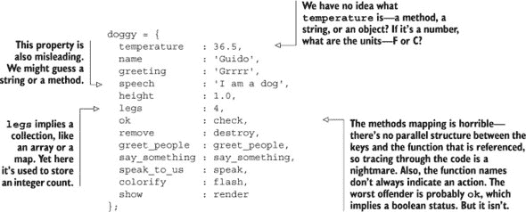

##### 列表 A.23. 但像这样

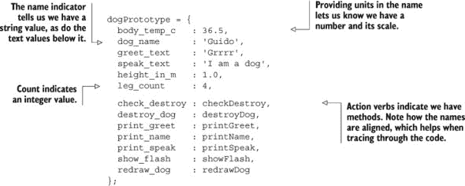

这些示例是从两篇网页示例中摘录的——可以在本书资源中找到的 `[listings/apx0A/bad_dog.html](http://listings/apx0A/bad_dog.html)` 和 `[listings/apx0A/good_dog.html](http://listings/apx0A/good_dog.html)`。我们鼓励您下载并比较它们，看看哪个更易于理解和维护。

### A.4. 变量声明和赋值

变量可以被赋值为函数指针、对象指针、数组指针、字符串、数字、null 或 undefined。一些 JavaScript 实现可能在整数、32 位有符号和 64 位双精度浮点数之间进行内部区分，但没有正式的接口来强制这种类型。

+   **使用 `{}` 或 `[]`** 来创建新的对象、映射或数组，而不是使用 `new Object()` 或 `new Array()`。记住，映射是一个没有方法的简单数据对象。如果您需要对象继承，请使用 第二章 和本附录的 A.5 节中展示的 `createObject` 工具。

+   **使用工具来复制对象和数组**。当变量被赋值时，简单的变量，如布尔值、字符串或数字会被复制。例如，`new_str = this_str` 将会将底层数据（在这种情况下，是一个字符串）复制到 `new_str`。JavaScript 中的复杂变量，如数组和对象，在赋值时**不会**被复制；相反，数据结构的指针会被复制。例如，`second_map = first_map` 将导致 `second_map` 指向与 `first_map` 相同的数据，并且对 `second_map` 的任何操作都会反映在 `first_map` 上。正确地复制数组和对象并不总是显而易见或容易。我们强烈建议使用经过良好测试的工具来完成此目的，例如 jQuery 提供的工具。

+   **首先在功能范围内使用单个`var`关键字明确声明所有变量**。JavaScript 通过函数来管理变量作用域，并且不提供块级作用域。因此，如果你在函数内部任何地方声明一个变量，在函数调用时它将被立即初始化为`undefined`的值。将所有变量声明放在前面可以识别这种行为。这也有助于使代码更易于阅读和检测未声明的变量（这是不可接受的）。

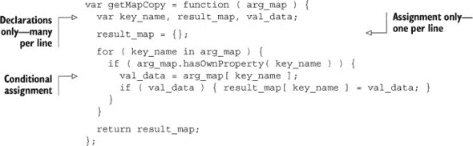

声明一个变量与向其赋值不同：*声明*通知 JavaScript 引擎该变量存在于某个作用域中。*赋值*为变量提供一个值（而不是`undefined`）。为了方便，你可以使用`var`语句将声明和赋值结合起来，但这不是必需的。

+   **不要使用代码块**，因为 JavaScript 不提供块级作用域.^([6]) 在代码块中定义变量可能会让熟悉其他 C 系列语言的程序员感到困惑。请在功能作用域中定义变量。

    > ⁶ 这基本上是正确的，但截至版本 1.7，Firefox 的 JavaScript 引入了`let`语句，它可以用来提供块级作用域。但是，它不是所有主流浏览器都支持的，因此应该忽略。

+   **将所有函数分配给变量**。这强调了 JavaScript 将函数视为一等对象的事实。

    ```
    // BAD
    function getMapCopy( arg_map ) { ... };
    // GOOD
    var getMapCopy = function ( arg_map ) { ... };
    ```

+   **在函数中需要三个或更多参数时，请使用命名参数**，因为位置参数容易忘记，并且不具备自文档化的特性。

    ```
    // BAD
    var coor_map = refactorCoords( 22, 28, 32, 48);
    // BETTER
    var coord_map = refactorCoords({ x1:22, y1:28, x2:32, y2:48 });
    ```

+   **每个变量赋值使用一行**。如果可能，按字母顺序或逻辑分组排序。*多个声明*可以放在同一行上：

    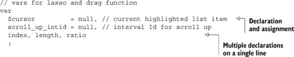

### A.5\. 函数

函数在 JavaScript 中扮演着核心角色：它们组织代码，提供变量作用域的容器，并提供执行上下文，可以用来构建基于原型的对象。因此，尽管我们对函数的指导原则不多，但我们非常重视它们。

+   **使用工厂模式进行对象构造**，因为它更好地说明了 JavaScript 对象的实际工作方式，速度快，并且可以用来提供类似类的功能，如对象计数。

    ```
    var  createObject,extendObject,
      sayHello, sayText, makeMammal,
      catPrototype, makeCat, garfieldCat;

    // **Utility function to set inheritance
    // Cross-browser method to inherit Object.create()
    //   Newer js engines (v1.8.5+) support itnatively

    var objectCreate =function (arg )   {
      if ( ! arg ) { return {}; }
      function obj() {};
      obj.prototype =arg;
      return new obj;
    };

    Object.create = Object.create|| objectCreate;

    // **Utility function to extend an object
    extendObject = function ( orig_obj, ext_obj ) {
      varkey_name;
      for( key_name in ext_obj   ){
        if ( ext_obj.hasOwnProperty( key_name ) ) {
          orig_obj[ key_name ] = ext_obj[ key_name ];
        }
      }
    };

    // ** object methods...
    sayHello = function () {
      console.warn( this.hello_text + ' says ' + this.name );
    };

    sayText = function ( text ) {
      console.warn( this.name + ' says ' + text );
    };

    // ** makeMammal constructor
    makeMammal = function ( arg_map ) {
      var mammal = {
        is_warm_blooded : true,
        has_fur         : true,
        leg_count       : 4,
        has_live_birth  : true,
        hello_text      : 'grunt',
        name            : 'anonymous',
        say_hello       : sayHello,
        say_text        : sayText
      };
      extendObject( mammal, arg_map );
      return mammal;
    };

    // ** use mammal constructor to create cat prototype
    catPrototype = makeMammal({
      has_whiskers : true,
      hello_text   : 'meow'
    });

    // ** cat constructor
    makeCat = function( arg_map ) {
      var cat = Object.create( catPrototype );
      extendObject( cat, arg_map );
      return cat;
    };

    // ** cat instance
    garfieldCat = makeCat({
      name       : 'Garfield',
      weight_lbs : 8.6
    });

    // ** cat instance method invocations
    garfieldCat.say_hello();
    garfieldCat.say_text('Purr...');
    ```

+   **避免使用伪类对象构造函数**——那些带有`new`关键字的。如果你不带`new`关键字调用这样的构造函数，全局命名空间会被破坏。如果你*必须*保留这样的构造函数，它的第一个字母应该大写，以便识别为伪类构造函数。

+   **在使用函数之前声明所有函数**——记住，声明函数与*赋值*给它们是不同的。

+   **当函数需要立即调用时**，将函数用括号括起来，以便清楚地表明产生的值是函数的结果，而不是函数本身：`spa.shell = (function () { ... }());`

### A.6\. 命名空间

早期的许多 JavaScript 代码相对较小，并且单独在单个网页上使用。这些脚本可以使用全局变量，几乎没有影响。但随着 JavaScript 应用程序变得更加雄心勃勃，第三方库变得普遍，其他人想要全局 `i` 变量的可能性急剧增加。当两个代码库声称相同的全局变量时，所有的事情都可能变得混乱。^([[7)]

> 作者曾经在一个应用程序中工作，其中一个第三方库突然错误地声明了全局变量 `util`（他们本应该使用 JSLint...）。尽管我们的应用程序只有三个命名空间，`util` 就是其中之一。这种冲突导致我们的应用程序崩溃，诊断和解决这个问题花了四个小时。我们非常不满意。

我们可以通过在单个全局函数内部使用所有其他变量作为示例来大大减少这个问题：

```
var spa = (function () {
  // other code here

  var initModule = function () {
    console.log( 'hi there' );
  };

  return { initModule : initModule };
}());
```

我们称这个单独的全局函数（在这个例子中是 `spa`）为我们的 *命名空间*。我们分配给它的函数在加载时执行，当然，在该函数内部分配的任何局部变量都不会对全局命名空间可用。请注意，我们确实使 `init-Module` 方法可用。因此，其他代码可以调用初始化函数，但不能访问其他内容。而且它必须使用我们的 `spa` 前缀：

```
// from another library, call the spa initialization function
spa.initModule();
```

我们可以细分命名空间，这样我们就不必被迫将一个 50KB 的应用程序压缩到一个文件中。例如，我们可以创建 `spa`、`spa.shell` 和 `spa.slider` 的命名空间：

```
// In the file spa.js:
var spa = (function () {
  // some code here
}());

// In the file spa.shell.js:
var spa.shell = (function () {
  // some code here
}());

// In the file spa.slider.js:
var spa.slider = (function () {
 // some code here
}());
```

这种命名空间对于在 JavaScript 中创建可管理的代码至关重要。

### A.7\. 文件名和布局

命名空间是我们文件命名和布局的基础。以下是一些一般性指南：

+   **使用 jQuery** 进行 DOM 操作。

+   **在构建自己的代码之前调查第三方代码**，如 jQuery 插件——平衡集成成本和膨胀与标准化和代码一致性的好处。

+   **避免在 HTML 中嵌入** **JavaScript** 代码；使用外部库代替。

+   **在上线前压缩、混淆和 gzip JavaScript 和 CSS**。例如，在准备阶段使用 Uglify 压缩和混淆 JavaScript，在交付时使用 Apache2/ mod_gzip 对文件进行 gzip。

JavaScript 文件指南如下：

+   **在我们的 HTML 中首先包含第三方 JavaScript 文件**，这样它们的函数就可以被评估并准备好用于我们的应用程序。

+   **按命名空间的顺序包含我们的 JavaScript 文件**。例如，如果根命名空间 `spa` 尚未加载，则无法加载命名空间 `spa.shell`。

+   **给所有 JavaScript 文件添加 .js 后缀**。

+   **将所有静态 JavaScript 文件存储在名为 `js` 的目录下**。

+   **根据提供的命名空间命名 JavaScript 文件**，每个文件一个命名空间。例如：

    ```
    spa.js        // spa.*        namespace
    spa.shell.js  // spa.shell.*  namespace
    spa.slider.js // spa.slider.* namespace
    ```

+   **使用模板**开始任何 JavaScript 模块文件。一个可以在本附录的末尾找到。

我们在 JavaScript 和 CSS 文件以及类名之间保持平行结构：

+   **为每个生成 HTML 的 JavaScript 文件创建一个 CSS 文件**。例如：

    ```
    spa.css        // spa.*        namespace
    spa.shell.css  // spa.shell.*  namespace
    spa.slider.css // spa.slider.* namespace
    ```

+   **给所有 CSS 文件添加 .css 后缀。**

+   **将所有 CSS 文件**存储在名为 *css* 的目录下。

+   **根据模块的名称前缀 CSS 选择器**。这种做法有助于极大地避免与第三方模块的类产生意外交互。例如：

    ```
    spa.css defines #spa, .spa-x-clearall
    spa.shell.css defines
      #spa-shell-header, #spa-shell-footer, .spa-shell-main
    ```

+   **使用 <namespace>-x-<descriptor>** 为状态指示符和其他共享类名。例如包括 `spa-x-select` 和 `spa-x-disabled`。将这些放在根命名空间样式表中，例如 `spa.css`。

这些是简单的指南，易于遵循。结果的组织和一致性使得 CSS 和 JavaScript 之间的关联更容易理解。

### A.8\. 语法

本节是对 JavaScript 语法以及我们遵循的指南的概述。

#### A.8.1\. 标签

语句标签是可选的。只有以下这些语句应该有标签：`while`、`do`、`for`、`switch`。标签应始终为大写单数名词：

```
var
  horseList  = [ Anglo-Arabian', 'Arabian', 'Azteca', 'Clydsedale' ],
  horseCount = horseList.length,
  breedName, i
  ;

HORSE:
for ( i = 0; i < horseCount; i++ ) {
  breedName = horseList[ i ];
  if ( breedName === 'Clydsedale' ) { continue HORSE; }
  // processing for non-bud horses follows below
  // ...
}
```

#### A.8.2\. 语句

下文列出了常见的 JavaScript 语句，以及我们建议的使用方式。

##### Continue

我们避免使用 `continue` 语句，除非我们使用标签。否则，它往往会模糊控制流。标签的包含也使得 `continue` 更健壮。

```
// discouraged
 continue;

// encouraged
 continue HORSE;
```

##### DO

`do` 语句应具有以下形式：

```
do {
  // statements
} while ( condition );
```

总是以分号结束 `do` 语句。

##### For

`for` 语句应具有以下形式之一：

```
for ( *initialization; condition; update* ) {
  // statements
}

for ( *variable in object* ) {
  if ( *filter* ) {
    // statements
  }
}
```

第一种形式应与数组和已知迭代次数的循环一起使用。

第二种形式应与对象和映射一起使用。请注意，添加到对象原型的属性和方法将包含在枚举中。使用 `hasOwnProperty` 方法来过滤真正的属性：

```
for ( *variable in object* ) {
  if ( object.hasOwnProperty( *variable* ) ) {
    // statements
  }
}
```

##### If

`if` 语句应具有以下形式之一。`else` 关键字应开始其自己的行：

```
if ( *condition* ) {
  // statements
}

if ( *condition* ) {
  // statements
}
else {
  // statements
}

if ( *condition* ) {
  // statements
}
else if ( *condition* ) {
  // statements
}
else {
  // statements
}
```

##### Return

`return` 语句不应在返回值周围使用括号。返回值表达式必须与 `return` 关键字在同一行上开始，以避免插入分号。

##### Switch

`switch` 语句应具有以下形式：

```
switch ( *expression* ) {
  case expression:
    // statements
  break;
  case *expression*:
    // statements
  break;
  default:
   // statements
}
```

每组语句（除了默认情况）应结束于 `break`、`return` 或 `throw`；只有在使用标签和伴随注释时才应使用 fall-through，并且即使如此，也应重新考虑其必要性。简洁性真的值得牺牲可读性吗？可能不是。

##### Try

`try` 语句应具有以下形式之一：

```
try {
  // statements
}
catch ( *variable* ) {
  // statements
}

try {
  // statements
}
catch ( *variable* ) {
  // statements
}
finally {
  // statements
}
```

##### While

`while` 语句应具有以下形式：

```
while ( *condition* ) {
  // statements
}
```

应避免使用 `while` 语句，因为它们往往会引起无限循环条件。尽可能使用 `for` 语句。

##### With

应避免使用 `with` 语句。使用 `object.call()` 方法族来调整函数调用期间 `this` 的值。

#### A.8.3\. 其他语法

当然，JavaScript 不仅仅是标签和语句。以下是我们遵循的一些额外指南：

##### 避免使用逗号运算符

避免使用逗号运算符（如在某些`for`循环结构中找到的）。这不适用于逗号分隔符，它在对象字面量、数组字面量、var 语句和参数列表中使用。

##### 避免使用赋值表达式

避免在`if`和`while`语句的条件部分使用赋值——不要写成`if ( a = b ) { ...`，因为这不清楚你是否打算测试相等性或成功的赋值。

##### 总是使用 === 和 !== 比较运算符

几乎总是最好使用`===`和`!==`运算符。`==`和`!=`运算符会进行类型强制转换。特别是，不要使用`==`来比较非真值。我们的 JSLint 配置不允许类型强制转换。如果你想测试一个值是否为真值或假值，可以使用如下结构：

```
if ( is_drag_mode ) { // is_drag_mode is truthy!
  runReport();
}
```

##### 避免混淆加号和减号

注意不要将一个`+`后面直接跟另一个`+`或`++`。这种模式可能会令人困惑。在它们之间插入括号以明确你的意图。

```
// confusing:
total= total_count + +arg_map.cost_dollars;

// better:
 total = total_count + (+arg_map.cost_dollars);
```

这可以防止`+ +`被误读为`++`。同样的规则也适用于减号，`-`。

##### 不要使用 Eval

小心——`eval`有邪恶的别名。不要使用`Function`构造函数。不要将字符串传递给`setTimeout`或`setInterval`。使用解析器而不是`eval`将 JSON 字符串转换为内部数据结构。

### A.9. 验证代码

JSLint 是由 Douglas Crockford 编写和维护的 JavaScript 验证工具。它非常受欢迎且非常有用，可以查找代码错误并确保遵循基本指南。如果你正在创建专业级的 JavaScript，你应该使用 JSLint 或类似的验证器。它帮助我们避免了许多类型的错误，并显著缩短了开发时间。

#### A.9.1. 安装 JSLint

1.  从[`code.google.com/p/jslint4java/`](http://code.google.com/p/jslint4java/)下载最新的 jslint4java 发行版，例如`jslint4java-2.0.2.zip`。

1.  根据您平台上的说明进行解包和安装。

|  |
| --- |

**如果你正在运行 OS X 或 Linux**

你可以将 jar 文件移动，例如`sudo mv jslint4java-2.0.2.jar /usr/local/lib/`，然后在`/usr/local/bin/jslint`中创建以下包装器：

```
#!/bin/bash
# See http://code.google.com/p/jslint4java/

for jsfile in $@;
do /usr/bin/java \
  -jar /usr/local/lib/jslint4java-2.0.1.jar \
  "$jsfile";
done
```

确保 jslint 是可执行的——`sudo chmod 755 /usr/local/bin/jslint`

|  |
| --- |

如果你已经安装了 Node.js，你可以安装不同的版本，例如：`npm install-g jslint`。这个版本运行得更快，尽管它没有与本书中的列表进行测试。

#### A.9.2. 配置 JSLint

我们的模块模板包括 JSLint 的配置。这些设置用于匹配我们的编码标准：

```
/*jslint         browser : true, continue : true,
  devel  : true, indent  : 2,    maxerr   : 50,
  newcap : true, nomen   : true, plusplus : true,
  regexp : true, sloppy  : true, vars     : false,
  white  : true
*/
/*global $, spa, <other external vars> */
```

+   `browser : true`—允许浏览器关键字如`document`、`history`、`clearInterval`等。

+   `continue : true`—允许`continue`语句。

+   `devel : true`—允许开发关键字如`alert`、`console`等。

+   `indent : 2`—期望两个空格缩进。

+   `maxerr : 50`—在 50 个错误后终止 JSLint。

+   `newcap : true`—容忍前导下划线。

+   `nomen : true`—容忍未大写的构造函数。

+   `plusplus : true`—容忍 ++ 和 --。

+   `regexp : true`—允许有用但可能危险的正则表达式构造。

+   `sloppy : true`—不要求使用 `use strict` 预言。

+   `vars : false`—不允许在功能作用域内多次使用 `var` 语句。

+   `white : true`—禁用 JSLint 的格式检查。

#### A.9.3. 使用 JSLint

我们可以在需要检查代码有效性时随时从命令行使用 JSLint。语法如下：

```
jslint filepath1 [filepath2, ... filepathN]
# example: jslint spa.js
# example: jslint *.js
```

我们编写了一个 `git` 提交钩子，在允许将更改的 JavaScript 文件提交到仓库之前，对其进行测试。以下 shell 脚本可以添加为 `repo/.git/hooks/pre-commit`。

```
#!/bin/bash

# See www.davidpashley.com/articles/writing-robust-shell-scripts.html
# unset var check
set -u;
# exit on error check
# set -e;

BAIL=0;
TMP_FILE="/tmp/git-pre-commit.tmp";
echo;
echo "JSLint test of updated or new *.js files ...";
echo " We ignore third_party libraries in .../js/third_party/...";
git status \
  | grep '.js$' \
  | grep -v '/js/third_party/' \
  | grep '#\s\+\(modified\|new file\)' \
  | sed -e 's/^#\s\+\(modified\|new file\):\s\+//g' \
  | sed -e 's/\s\+$//g' \
  | while read LINE; do
      echo -en " Check ${LINE}: ... "
      CHECK=$(jslint $LINE);
      if [ "${CHECK}" != "" ]; then
        echo "FAIL";
      else
        echo "pass";
      fi;
    done \
  | tee "${TMP_FILE}";

echo "JSlint test complete";
if grep -s 'FAIL' "${TMP_FILE}"; then
  echo "JSLint testing FAILED";
  echo " Please use jslint to test the failed files and ";
  echo " commit again once they pass the check.";
  exit 1;
fi
echo;
exit 0;
```

您可能需要根据您的需求对其进行一些修改。另外，请确保它是可执行的（在 Mac 或 Linux 中，`chmod 755 pre-commit`）。

### A.10. 模块模板

经验表明，将模块分解为一致的章节是一种有价值的实践。它有助于我们的理解和导航，并提醒我们良好的编码实践。在数百个模块和多个项目中，我们确定下来的模板如下，其中穿插了一些示例代码：

##### 列表 A.24. 推荐的模块模板

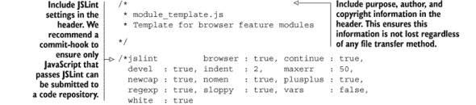

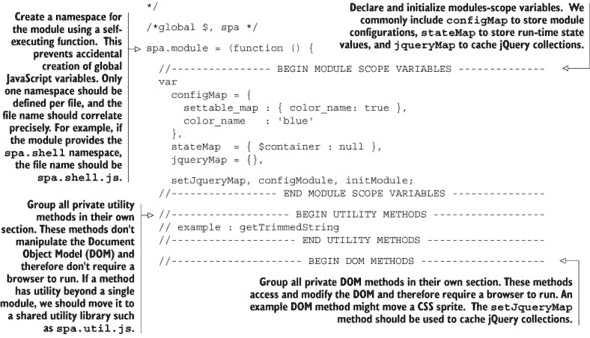

### A.11. 摘要

对于一个或多个开发者高效工作，需要良好的编码标准。我们提出的标准是全面且一致的，但我们认识到它可能并不适合每个团队。无论如何，我们希望它能鼓励我们的读者思考常见问题以及公约如何解决或减轻这些问题。我们强烈建议任何团队在开始大型项目之前就达成一致的标准。

代码将被阅读得多于编写，因此我们优化了可读性。我们限制行宽为 78 个字符，并使用两个空格缩进。我们不允许使用制表符。我们将行分组为逻辑段落，以帮助读者理解我们的意图，并保持行的一致性。我们使用 K&R 风格进行括号，并使用空格来区分关键字和函数。我们倾向于在定义字符串字面量时使用单引号。我们更喜欢使用公约而不是注释来传达代码的功能。描述性和一致的变量名是传达我们的意图的关键，而不需要过度使用注释。当我们注释时，我们通过段落进行战略性的文档记录。非平凡的内部接口是一致记录的。

我们通过使用命名空间来保护我们的代码不受其他脚本的不当交互。我们使用自执行函数来提供命名空间。我们将根命名空间细分以组织我们的代码，并提供合理的文件大小和范围。我们的 JavaScript 文件每个都包含一个命名空间，它们的文件名反映了它们提供的命名空间。我们为 CSS 选择器和文件创建了一个并行命名空间。

我们安装并配置了 JSLint。在允许代码被提交到我们的代码库之前，我们总是使用 JSLint 来验证我们的代码。我们使用一致的设置进行验证。我们展示了一个模块模板，它体现了许多提出的约定，并在头部包含了我们的 JSLint 设置。

编码标准旨在通过引入一种通用方言和一致的结构，使开发者从繁琐的任务中解放出来。这使他们能够将创造性的精力集中在重要的逻辑上。一个好的标准为大型项目的成功提供了至关重要的意图清晰度。
