## 附录 B. 测试 SPA

|  |
| --- |

**本附录涵盖**

+   设置测试模式

+   选择测试框架

+   设置 nodeunit

+   创建测试套件

+   调整 SPA 模块以进行测试设置

|  |
| --- |

本附录基于我们在第八章中完成的代码。在开始之前，你应该有第八章中的项目文件，因为我们将在此基础上添加内容。我们建议您将第八章中创建的整个目录结构复制到一个新的“appendix_B”目录中，并在那里更新它们。

我们是测试驱动开发的粉丝，并参与过*gonzo*项目，其中测试的*生成*是自动化的。使用排列工具通过简单地描述 API 及其预期行为来自动生成数千个回归测试。如果开发者修改了代码，它必须通过回归测试后才能被提交到仓库。当引入新的 API 时，开发者将描述添加到配置中，然后自动生成数百或数千个新测试。这种做法导致了卓越的质量，因为代码覆盖率很高，我们很少出现任何类型的回归。

虽然我们喜欢这类回归测试，但在这个附录中我们不会如此雄心勃勃。我们只有足够的空间和时间让你试试水，而不是给你洗个澡。相反，我们将设置测试模式，讨论它们的使用，然后使用 jQuery 和一个测试框架创建一个测试套件。我们测试的时间比我们希望的更晚——我们更喜欢在编写代码的同时编写测试，因为这有助于阐明代码应该做什么。而且，就像是为了证明这一点一样，我们在编写这个附录时发现了并修复了两个问题。^([1)] 现在让我们讨论我们希望 SPA 拥有的测试模式。

> ¹ 如果您想知道，它们是：1) 在注销时，在线人员列表没有被正确清除，2) 在聊天者的头像更新后，对`spa.model.chat.get_chatee()`的调用返回了一个过时的对象。这两个错误已在第六章中修复。

### B.1\. 设置测试模式

在开发 SPA 时，我们至少使用四种不同的测试模式。这些模式通常应按以下顺序使用：

1.  使用模拟数据（模式 1）在不使用浏览器的情况下测试模型。

1.  使用模拟数据（模式 2）测试用户界面。

1.  使用实时数据（模式 3）在不使用浏览器的情况下测试模型。

1.  使用实时数据（模式 4）测试模型和用户界面。

我们需要能够轻松地在测试模式之间切换，以便我们能够快速识别、隔离和解决问题。这个目标的推论是，我们应该为所有模式使用相同的代码。我们希望在无需浏览器的情况下运行测试（模式 1 和 3），以及在带有浏览器的情况下运行测试（模式 2 和 4）。

图 B.1 显示了我们在使用模拟数据（模式 1）不使用浏览器测试模型时使用的模块。这种测试模式通常应首先使用，以确保模型 API 按设计工作。

##### 图 B.1\. 使用假数据（模式 1）在没有浏览器的情况下测试模型

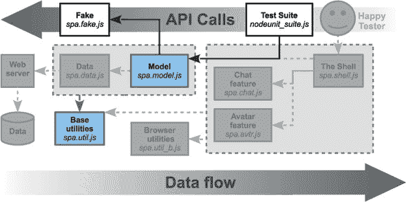

图 B.2 展示了在用假数据（模式 2）测试用户界面时使用的模块。这是在模型测试之后隔离视图和控制器相关错误的好模式。

##### 图 B.2\. 使用假数据（模式 2）测试视图和控制器

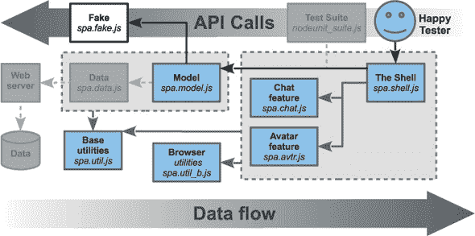

图 B.3 展示了在用实时数据（模式 3）测试模型而不使用浏览器时使用的模块。这有助于隔离服务器 API 的问题。

##### 图 B.3\. 使用测试套件和实时数据（模式 3）测试模型

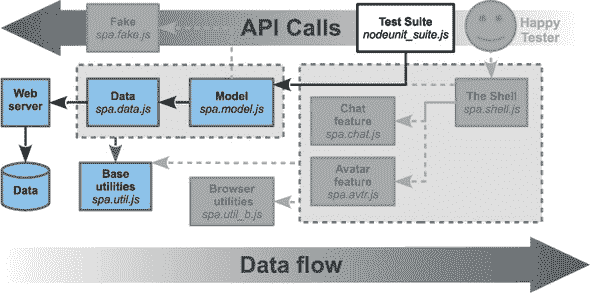

图 B.4 展示了在用实时数据（模式 4）测试用户界面时使用的模块。这允许用户测试整个栈，实际上就是整个应用程序。测试狂热者（或者像我们这样的有志狂热者）称这为 *集成测试*。

##### 图 B.4\. 使用实时数据（模式 4）进行集成测试

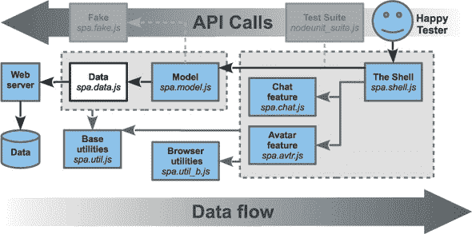

如果我们在其他模式下做好测试工作，我们可以在模式 4 中找到的问题数量就会最小化。一旦我们在模式 4 中找到问题，我们应该尝试在更简单的模式下隔离它，从模式 1 开始。当谈到有效地解决问题时，模式 4 就像月亮——它是一个有趣的地方去参观，但你不想在那里生活。

在本节中，我们将进行必要的更改，以便我们可以使用浏览器界面同时使用实时数据和假数据（模式 2 和 4）。以下是我们需要做的事情：

+   创建 `spa.model.setDataMode` 模型方法以在假数据和实时数据之间切换。

+   在初始化时更新 Shell 以检查 URI 查询参数 `fake` 的值。然后使用 `spa.model.setDataMode` 设置数据模式。

`spa.model.setDataMode` 方法很容易添加到模型中，因为我们只需要更改模块作用域的 `isFakeData` 变量。以下列表显示了更新。更改以 **粗体** 显示：

##### 列表 B.1\. 将 `setDataMode` 添加到模型中—webapp/public/js/spa.model.js

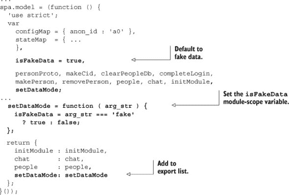

我们下一步是调整 Shell，使其在初始化时读取 URI 查询参数，然后调用 `spa.model.setDataMode`（你知道，我们刚刚添加的方法）。这个更改是手术性的，如下列所示。更改以 **粗体** 显示：

##### 列表 B.2\. 在 Shell 中设置数据模式—webapp/public/js/spa.shell.js

```
...
  //------------------- BEGIN PUBLIC METHODS -------------------
  // Begin Public method /initModule/
  ...
  //
  initModule = function ( $container ) {
    var data_mode_str;

    // set data to fake if URI query argument set
    data_mode_str
      = window.location.search === '?fake'
      ? 'fake' : 'live';
     spa.model.setDataMode( data_mode_str );

     // load HTML and map jQuery collections
    stateMap.$container = $container;
     $container.html( configMap.main_html );
    setJqueryMap();
    ...
```

首先，让我们进入我们的 webapp 目录并安装模块（`npm install`），然后启动节点应用程序（`node app.js`）。当我们用 `fake` 标志打开浏览器文档（`http://localhost:3000/spa.html?fake`）时，将使用假数据与界面（模式 2）进行测试。如果我们不使用 `fake` 标志打开浏览器文档（`http://localhost:3000/spa.html`），则将使用实时数据（模式 4）。在接下来的章节中，我们将讨论如何在没有浏览器的情况下测试我们的 SPA（模式 1 和 3）。首先，让我们决定一个测试框架。

> ² 是的，我们知道查询参数解析是一个 hack。在生产环境中，我们会使用一个更健壮的库函数。

### B.2\. 选择测试框架

我们设计我们的 SPA 架构，以便我们可以轻松地在不使用浏览器的情况下测试模型。我们发现，当模型完全按设计工作，修复用户界面错误的开销往往微不足道。我们还发现，人类在界面测试方面通常（但不总是）比脚本更有效。

我们将使用 Node.js 来测试模型，而不是浏览器。这将使我们能够在开发期间和部署之前轻松自动运行测试套件。而且因为我们不依赖于浏览器，测试编写、维护和扩展都更简单。

Node.js 有许多经过多年使用和改进的测试框架。让我们明智地选择一个，而不是自己编写。以下是我们发现的一些有趣的框架列表：^([3])

> ³ 请参阅[`github.com/joyent/node/wiki/modules#testing`](https://github.com/joyent/node/wiki/modules#testing)以获取完整的列表。

+   *jasmine-jquery*—可以“监视”jQuery 事件。

+   *mocha*—流行的测试框架，类似于 nodeunit 但具有更好的报告功能。

+   *nodeunit*—流行的，具有简单而强大的工具。

+   *patr*—使用 promises（类似于 jQuery `$.Deferred`对象）进行异步测试。

+   *vows*—流行的异步 BDD 框架。

+   *zombie*—流行的全栈无头测试框架，具有 WebKit 引擎。

Zombie 是一个包容性的测试框架，旨在测试用户界面以及模型。它甚至包括自己的 WebKit 渲染引擎实例，以便测试可以检查渲染的元素。我们不会在这里追求这种测试，因为它安装、设置和维护成本高昂且繁琐——这是一个附录，*不是另一本书*。尽管我们发现 jasmine-jquery 和 patr 因其列出的原因而有趣，但我们觉得它们没有我们需要的支持水平。Mocha 和 vows 很流行，但我们想从简单开始。

这就留下了 nodeunit，它流行、强大、简单，并且与我们的 IDE 集成良好。让我们设置它。

### B.3\. 设置 nodeunit

在我们安装 nodeunit 之前，我们需要确保 Node.js 已按第七章中概述的方式安装。一旦 Node.js 可用，我们需要安装两个`npm`包来使 node-unit 准备好运行我们的测试套件：

+   `jquery`—我们需要安装 jQuery 的 Node.js 版本，因为我们的模型使用全局自定义事件，这需要 jQuery 和 jquery.event.gevent 插件。作为额外的奖励，安装此包提供了一个模拟的浏览器环境。所以如果我们想测试 DOM 操作，我们就可以做到。

+   `nodeunit`—这提供了 nodeunit 命令行工具。当我们运行测试套件时，我们将使用`nodeunit`命令而不是`node`。

我们喜欢在系统范围内安装这些包，这样它们就可以被所有 Node.js 项目使用。我们可以使用 `-g` 开关并将它们作为 root（或在 Windows 上是管理员）安装。以下适用于 Linux 和 Mac：

##### 列表 B.3\. 在系统范围内安装 jQuery 和 nodeunit

```
$ sudo npm install -g jquery
$ sudo npm install -g nodeunit
```

注意，你可能需要通过设置 `NODE_PATH` 环境变量来告诉你的执行环境在哪里可以找到系统 Node.js 库。在 Linux 或 Mac 上，这可以通过向你的 ~/.bashrc 文件中添加以下内容来完成：

```
$ echo 'export NODE_PATH=/usr/lib/node_modules' >> ~/.bashrc
```

这将确保每次你启动一个新的终端会话时都会设置 `NODE_PATH`。^[[4]] 现在，我们已经安装了 Node.js、jQuery 和 nodeunit，让我们为测试准备我们的模块。

> ⁴ 对于当前会话，输入 `export PATH=/usr/lib/node_modules`。根据 Node.js 的安装方式，路径可能会有所不同。在 Mac 上，你可能尝试 /usr/local/share/npm/lib/node_modules。

### B.4\. 创建测试套件

到 第六章 为止，我们已经有了使用已知数据（多亏了 Fake 模块）和定义良好的 API 成功测试我们模型的所有成分。图 B.5 展示了我们计划如何测试模型：^[[5]]

> ⁵ 精明的闯入者会注意到这个图是一个懒散的、像素完美的复制之前展示过的图。我们应该按列英寸来付费...

##### 图 B.5\. 使用测试套件和模拟数据测试模型（模式 1）


在我们开始测试之前，我们需要让 Node.js 加载我们的模块。让我们接下来这样做。

#### B.4.1\. 让 Node.js 加载我们的模块

Node.js 处理全局变量的方式与浏览器不同。与浏览器 JavaScript 不同，文件中的变量默认是局部的。实际上，Node.js 将所有库文件包裹在一个匿名函数中。我们使变量在所有模块中可用的方法是将其作为顶层对象的属性。在 Node.js 中，顶层对象不是 `window`，像在浏览器中那样，而是称为——等等——`global`。

我们的设计模块是为了浏览器使用。但通过巧妙的方法，我们可以让 Node.js 在稍作修改后使用它们。以下是我们的做法：我们的整个应用程序都在 `spa` 的单个命名空间（对象）中运行。因此，如果我们在我们加载模块之前在 Node.js 测试脚本中声明一个 `global.spa` 属性，一切应该都能按预期工作。

在所有这些内容从我们的短期记忆中消失之前，让我们开始我们的测试套件，webapp/public/nodeunit_suite.js，如下所示列表。

##### 列表 B.4\. 在测试套件中声明我们的命名空间—webapp/public/nodeunit_suite.js

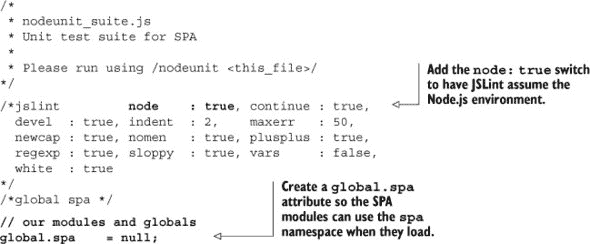

我们只需要调整根 JavaScript 文件（webapp/public/js/spa.js）以完成模块的加载。我们的调整使得测试套件能够使用正确的全局 `spa` 变量，如下所示列表。变更以**粗体**显示：

##### 列表 B.5\. 调整我们的根 SPA JavaScript—webapp/public/js/spa.js

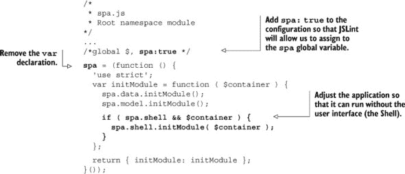

现在我们已经创建了一个 `global.spa` 变量，我们可以像处理我们的浏览器文档（[webapp/public/spa.html](http://webapp/public/spa.html)）一样加载我们的模块。首先，我们将加载第三方模块，如 jQuery 和 TaffyDB，并确保它们的全局变量也可用（如果你必须知道的话，是 `jQuery`、`$` 和 `TAFFY`）。然后我们可以加载我们的 jQuery 插件，然后是我们的 SPA 模块。我们不会加载我们的 Shell 或功能模块，因为我们不需要它们来测试模型。让我们在意识中仍然保留这些想法的同时更新我们的单元测试文件。变化以**粗体**显示：

##### 列表 B.6\. 添加库和我们的模块—webapp/public/nodeunit_suite.js

```
...
/*global $, spa */

// third-party modules and globals
global.jQuery = require( 'jquery' );
global.TAFFY  = require( './js/jq/taffydb-2.6.2.js' ).taffy;
global.$      = global.jQuery;
require( './js/jq/jquery.event.gevent-0.1.9.js' );

// our modules and globals
global.spa = null;
require( './js/spa.js'       );
require( './js/spa.util.js'  );
require( './js/spa.fake.js'  );
require( './js/spa.data.js'  );
require( './js/spa.model.js' );

// example code
spa.initModule();
spa.model.setDataMode( 'fake' );

var $t = $( '<div/>' );
$.gevent.subscribe(
  $t, 'spa-login',
  function ( event, user ){
    console.log( 'Login user is:', user );
  }
);

spa.model.people.login( 'Fred' );
```

哎呀，我们在列表的末尾偷偷加入了一个简短的测试脚本。虽然我们最终希望使用 nodeunit 来运行这个文件，但我们将首先使用 Node.js 来运行它，以确保它正确地加载了库。确实，当我们使用 Node.js 运行我们的测试套件时，我们会看到类似以下的内容：

```
$ node nodeunit_suite.js
Loginuser is: { cid: 'id_5',
  name: 'Fred',
  css_map: { top:25, left: 25, 'background-color': '#8f8' },
  ___id: 'T000002R000003',
  ___s: true,
  id:'id_5' }
```

如果你在家中参与，请耐心等待。我们将在三秒后看到任何输出，因为模拟模块在完成登录请求之前会暂停这么长时间。输出后还需要另外八秒，Node.js 才能完成运行。这是因为模拟模块在模拟服务器时使用计时器（计时器由 `setTimeout` 和 `setInterval` 方法创建）。在这些计时器完成之前，Node.js 会认为程序“正在运行”并且不会退出。我们稍后会回到这个问题。现在让我们熟悉一下 nodeunit。

#### B.4.2\. 设置单个 nodeunit 测试

现在我们有了 Node.js 加载我们的库，我们可以专注于设置我们的 node-unit 测试。首先，让我们独自熟悉一下 nodeunit。运行成功测试的步骤如下：

+   声明测试函数。

+   在每个测试函数中，使用 `test.expect( <count> )` 告诉 `test` 对象期望多少个断言。

+   在每个测试中运行断言；例如 `test.ok( true );`。

+   在每个测试结束时，使用 `test.done()` 告诉测试对象这个测试已完成。

+   按顺序导出要运行的测试列表。每个测试都将在前一个测试完成后才运行。

+   使用 `nodeunit <filename>` 运行测试套件。

列表 B.7 展示了一个使用这些步骤进行单个测试的 nodeunit 脚本。请阅读注释，因为它们提供了有价值的见解：

##### 列表 B.7\. 我们的第一个 nodeunit 测试—webapp/public/nodeunit_test.js


当我们运行 `nodeunit nodeunit_test.js` 时，我们应该看到以下输出：

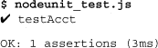

现在让我们将我们的 nodeunit 经验与我们要测试的代码结合起来。

#### B.4.3\. 创建我们的第一个真实测试

我们现在将第一个示例转换为真实测试。我们可以使用 nodeunit 和 jQuery 延迟对象来避免测试事件驱动代码的陷阱。首先，我们依赖于 nodeunit 在先前的测试通过执行`test.done()`声明完成之前不会继续到新的测试。这使得测试更容易编写和理解。其次，我们可以使用 jQuery 中的延迟对象在所需的`spa-login`事件发布后调用`test.done()`。这然后允许脚本继续到下一个测试。让我们更新我们的测试套件，如列表 B.8 所示。更改以**粗体**显示：

##### 列表 B.8\. 我们的第一个真实测试—webapp/public/nodeunit_suite.js

```
...
// our modules and globals
global.spa = null;
require( './js/spa.js'       );
require( './js/spa.util.js'  );
require( './js/spa.fake.js'  );
require( './js/spa.data.js'  );
require( './js/spa.model.js' );

// Begin /testAcct/ initialize and login
var testAcct = function ( test ) {
  var $t, test_str, user, on_login,
    $defer = $.Deferred();

  // set expected test count
  test.expect( 1 );

  // define handler for 'spa-login' event
  on_login = function (){ $defer.resolve(); };

  // initialize
  spa.initModule( null );
  spa.model.setDataMode( 'fake' );

  // create a jQuery object and subscribe
  $t = $('<div/>');
  $.gevent.subscribe( $t, 'spa-login', on_login );

  spa.model.people.login( 'Fred' );

  // confirm user is no longer anonymous
  user     = spa.model.people.get_user();
  test_str = 'user is no longer anonymous';
  test.ok( ! user.get_is_anon(), test_str );

  // declare finished once sign-in is complete
  $defer.done( test.done );
};
// End /testAcct/ initial setup and login

module.exports = { testAcct : testAcct };
```

当我们使用`nodeunit ./nodeunit_suite.js`运行测试套件时，我们应该看到以下输出：

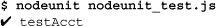

现在我们已经成功实现了一个单个测试，让我们规划出我们希望在套件中拥有的测试，并讨论我们将如何确保它们按正确的顺序执行。

#### B.4.4\. 映射事件和测试

当我们在第 5 和 6 章手动测试模型时，在输入下一个测试之前等待某些进程完成是自然而然的。对人类来说，显然我们必须在测试消息之前等待登录完成。但对测试套件来说，这并不明显。

我们必须为我们的测试套件规划一系列的事件和测试，以便其能够正常工作。编写测试套件的一个好处是，它使我们能够更全面地分析和理解我们的代码。有时我们在编写测试时发现的错误比在运行测试时更多。

让我们先为我们的套件设计一个测试计划。我们希望测试模型，就像我们的想象用户 Fred 一样，让我们的 SPA 经受考验。以下是 Fred 需要做的事情，带有标签：

+   `testInitialState`—测试模型的初始状态。

+   `loginAsFred`—以 Fred 的身份登录并测试在进程完成之前用户对象。

+   `testUserAndPeople`—测试在线用户列表和用户详情。

+   `testWilmaMsg`—接收 Wilma 的消息并测试消息细节。

+   `sendPebblesMsg`—将聊天对象更改为 Pebbles 并发送给她一条消息。

+   `testMsgToPebbles`—测试发送给 Pebbles 的消息的内容。

+   `testPebblesResponse`—测试 Pebbles 发送的响应消息的内容。

+   `updatePebblesAvtr`—更新 Pebbles 头像的数据。

+   `testPebblesAvtr`—测试 Pebbles 头像的更新。

+   `logoutAsFred`—以 Fred 的身份登出。

+   `testLogoutState`—测试登出后模型的状态。

我们的测试框架 nodeunit 按照呈现的顺序运行测试，并且不会继续到下一个测试，直到先前的测试声明它已完成。这对我们来说是有利的，因为我们想确保在运行某些测试之前特定事件已经发生。例如，我们想在测试在线人员列表之前，用户登录事件发生。让我们绘制我们的测试计划，其中包含在我们可以从每个测试继续之前需要发生的事件，如图 列表 B.9 所示。请注意，我们的测试名称与计划中的标签完全匹配，并且它们是可读的：

##### 列表 B.9\. 详细说明带有阻塞事件的测试计划

```
// Begin /testInitialState/
  // initialize our SPA
  // test the user in the initial state
  // test the list of online persons
  // proceed to next test without blocking
// End /testInitialState/

// Begin /loginAsFred/
  // login as 'Fred'
  // test user attributes before login completes
  // proceed to next test when both conditions are met:
  //   + login is complete (spa-login event)
  //   + the list of online persons has been updated
  //     (spa-listchange event)
// End /loginAsFred/

// Begin /testUserAndPeople/
  // test user attributes
  // test the list of online persons
  // proceed to next test when both conditions are met:
  //   + first message has been received (spa-updatechat event)
  //     (this is the example message from 'Wilma')
  //   + chatee change has occurred (spa-setchatee event)
// End /testUserAndPeople/

// Begin /testWilmaMsg/
  // test message received from 'Wilma'
  // test chatee attributes
  // proceed to next test without blocking
// End /testWilmaMsg/

// Begin /sendPebblesMsg/
  // set_chatee to 'Pebbles'
  // send_msg to 'Pebbles'
  // test get_chatee() results
  // proceed to next test when both conditions are met:
  //   + chatee has been set (spa-setchatee event)
  //   + message has been sent (spa-updatechat event)
// End /sendPebblesMsg/

// Begin /testMsgToPebbles/
  // test the chatee attributes
  // test the message sent
  // proceed to the next test when
  //   + A response has been received from 'Pebbles'
  //     (spa-updatechat event)
// End /testMsgToPebbles/

// Begin /testPebblesResponse/
  // test the message received from 'Pebbles'
  // proceed to next test without blocking
// End /testPebblesResponse/

// Begin /updatePebblesAvtr/
  // invoke the update_avatar method
  // proceed to the next test when
  //   + the list of online persons has been updated
  //     (spa-listchange event)
// End /updatePebblesAvtr/

// Begin /testPebblesAvtr/
  // get 'Pebbles' person object using get_chatee method
  // test avatar details for 'Pebbles'
  // proceed to next test without blocking
// End /testPebblesAvtr/

// Begin /logoutAsFred/
  // logout as fred
  // proceed to next test when
  //   + logout is complete (spa-logout event)
// End /logoutAsFred/

// Begin /testLogoutState/
  // test the list of online persons
  // test user attributes
  // proceed without blocking
// End /testLogoutState/
```

此计划是线性的，易于理解。在下一节中，我们将将我们的计划付诸实践。

#### B.4.5\. 创建测试套件

现在，我们可以添加一些实用工具，并逐步添加测试到我们的套件中。在每一步中，我们将运行套件以检查我们的进度。

##### 添加初始状态和登录测试

我们将从编写一些实用工具并添加前三个测试开始我们的测试套件，以检查初始模型状态，让弗雷德登录，然后检查用户和人员列表属性。我们发现测试通常分为两类：

1.  验证测试中使用了多个断言（例如 `user.name === 'Fred'`）来检查程序数据的正确性。这些测试通常不会阻塞。

1.  控制测试执行诸如登录、发送消息或更新头像等操作。这些测试很少有很多断言，并且通常在满足基于事件的条件之前会阻塞进度。

我们发现最好接受这种自然划分，并相应地命名我们的测试。验证测试命名为 `test<something>`，而控制测试则根据它们执行的操作命名，例如 `loginAsFred.`。

`loginAsFred` 测试要求在允许 nodeunit 继续执行 `testUserAndPeople` 测试之前，登录必须完成 *并且* 在线用户列表已更新。这是通过 `$t` jQuery 集合订阅 `spa-login` 和 `spa-listchange` 事件来实现的。然后测试套件使用 jQuery 延迟对象来确保这些事件在 `loginAsFred` 执行 `test.done()` 之前发生。

让我们更新测试套件，如图 列表 B.10 所示。像往常一样，请阅读注释，因为它们提供了额外的见解。我们在 列表 B.9 中为测试计划构建的注释以粗体显示：

##### 列表 B.10\. 添加我们的前两个测试—webapp/public/nodeunit_suite.js

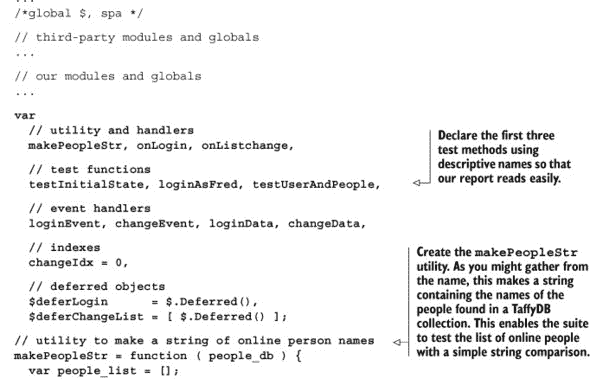

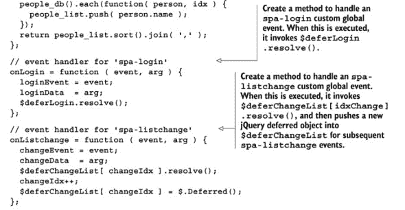

当我们运行测试套件（`nodeunitnodeunit_suite.js`）时，我们应该看到如下输出：

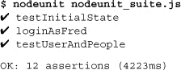

套件大约需要 12 秒才能将控制权返回到控制台，因为 JavaScript 有活动计时器需要完成。不用担心，当我们完成测试套件时，这将成为一个非问题。现在让我们添加消息事务的测试。

##### 添加消息事务测试

现在，我们将从我们的测试计划中添加接下来的四个测试。这些测试是一个很好的逻辑组，因为它们都测试了发送和接收消息的问题。测试包括 `testWilmaMsg`、`sendPebblesMsg`、`testMsgToPebbles` 和 `testPebblesResponse`。我们认为这些名称很好地总结了每个测试的功能。

当我们添加我们的测试时，我们需要更多的 jQuery 延迟对象以确保序列化进度。列表 B.11 展示了这种实现。请阅读注释，因为它们详细说明了在这些新测试上如何实现阻塞。所有更改都以**粗体**显示：

##### 列表 B.11\. 为消息事务添加测试—webapp/public/nodeunit_suite.js

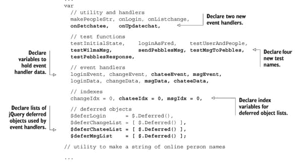

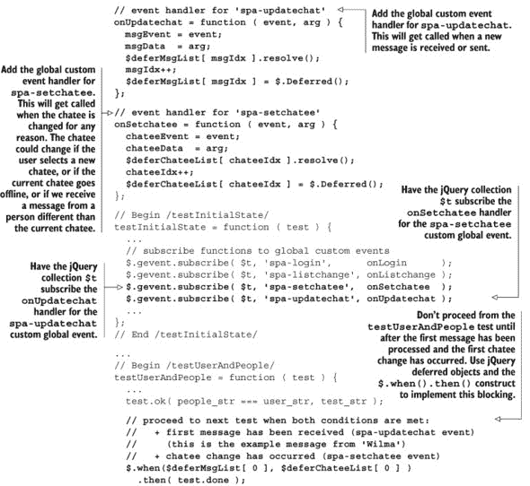

当我们运行我们的测试套件（`nodeunitnodeunit_suite.js`）时，我们应该看到如下输出：

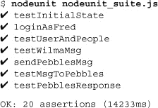

套件从执行中返回所需的时间与之前一样长，但现在我们看到了新的测试。具体来说，套件现在正在等待并测试威尔玛向用户发送的消息。现在让我们添加更多测试以完成测试套件。

##### 为头像、注销和注销状态添加测试

现在，我们将通过添加计划中的剩余四个测试来完成我们的测试套件。同样，我们使用延迟对象来确保在允许一个测试继续到另一个测试之前，某些事件已被接收。列表 B.12 展示了额外的测试。所有更改都以**粗体**显示：

##### 列表 B.12\. 额外测试—webapp/public/nodeunit_suite.js

```
...
var
  // utility and handlers
  makePeopleStr, onLogin,      onListchange,
  onSetchatee,   onUpdatechat, onLogout,

  // test functions
  testInitialState,    loginAsFred,       testUserAndPeople,
  testWilmaMsg,        sendPebblesMsg,    testMsgToPebbles,
  testPebblesResponse, updatePebblesAvtr, testPebblesAvtr,
  logoutAsFred,        testLogoutState,

  // event handlers
  loginEvent, changeEvent, chateeEvent, msgEvent, logoutEvent,
  loginData, changeData, msgData, chateeData, logoutData,
  ...

  $deferMsgList    = [ $.Deferred() ],
  $deferLogout     = $.Deferred();

...
// event handler for 'spa-setchatee'
...
// event handler for 'spa-logout'
onLogout = function ( event, arg ) {
  logoutEvent = event;
  logoutData  = arg;
  $deferLogout.resolve();
};

// Begin /testInitialState/
testInitialState = function ( test ) {
  ...
  $.gevent.subscribe( $t, 'spa-updatechat', onUpdatechat );
  $.gevent.subscribe( $t, 'spa-logout',     onLogout     );

  // test the user in the initial state
...
// End /testPebblesResponse/

// Begin /updatePebblesAvtr/
updatePebblesAvtr = function ( test ) {
  test.expect( 0 );

  // invoke the update_avatar method
  spa.model.chat.update_avatar({
    person_id : 'id_03',
    css_map   : {
      'top' : 10, 'left' : 100,
      'background-color' : '#ff0'
    }
  });

  // proceed to the next test when
  //   + the list of online persons has been updated
  //     (spa-listchange event)
  $deferChangeList[ 1 ].done( test.done );
};
// End /updatePebblesAvtr/

// Begin /testPebblesAvtr/
testPebblesAvtr = function ( test ) {
  var chatee, test_str;
  test.expect( 1 );

  // get 'Pebbles' person object using get_chatee method
  chatee = spa.model.chat.get_chatee();

  // test avatar details for 'Pebbles'
  test_str = 'avatar details updated';
  test.deepEqual(
    chatee.css_map,
     { top : 10, left : 100,
      'background-color' : '#ff0'
    },
    test_str
  );

  // proceed to next test without blocking
  test.done();
};
// End /testPebblesAvtr/

// Begin /logoutAsFred/
logoutAsFred = function( test ) {
  test.expect( 0 );

  // logout as fred
  spa.model.people.logout();

  // proceed to next test when
  //   + logout is complete (spa-logout event)
  $deferLogout.done( test.done );
};
// End /logoutAsFred/

// Begin /testLogoutState/
testLogoutState = function ( test ) {
  var user, people_db, people_str, user_str, test_str;
  test.expect( 4 );

  test_str = 'logout as Fred complete';
  test.ok( true, test_str );

  // test the list of online persons
  people_db  = spa.model.people.get_db();
  people_str = makePeopleStr( people_db );
  user_str    = 'anonymous';
  test_str   = 'user list provided is expected - ' + user_str;

  test.ok( people_str === 'anonymous', test_str );

  // test user attributes
  user     = spa.model.people.get_user();
  test_str = 'current user is anonymous after logout';
  test.ok( user.get_is_anon(), test_str );
  test.ok( true, 'test complete' );

  // Proceed without blocking
  test.done();
};
// End /testLogoutState/

module.exports = {
  testInitialState     : testInitialState,
  loginAsFred          : loginAsFred,
  testUserAndPeople    : testUserAndPeople,
  testWilmaMsg         : testWilmaMsg,
  sendPebblesMsg       : sendPebblesMsg,
  testMsgToPebbles     : testMsgToPebbles,
  testPebblesResponse  : testPebblesResponse,
  updatePebblesAvtr    : updatePebblesAvtr,
  testPebblesAvtr      : testPebblesAvtr,
  logoutAsFred         : logoutAsFred,
  testLogoutState      : testLogoutState
};
// End of test suite
```

当我们运行我们的测试套件（`nodeunitnodeunit_suite.js`）时，我们应该看到如下输出：


我们已经按照我们的计划完成了测试套件。我们可以在将更新检查到存储库之前自动运行此套件（想想“提交钩”）。这种做法不应该减慢我们的进度，而应该通过防止回归并确保质量来*加速*我们的开发。这是在设计产品时将质量*融入*产品，而不是仅在产品“完成”后对其进行测试的例子。

然而，一个明显的问题仍然存在：当前的测试套件永远不会退出。当然，终端显示了 25 个断言已完成，但控制权从未返回到终端或任何其他调用进程。这阻止了我们自动化测试套件的运行。在下一节中，我们将讨论为什么会发生这种情况以及我们可以做什么。

### B.5\. 调整 SPA 模块以进行测试

Node.js（以及通过扩展，nodeunit）遇到的一个麻烦问题是*它如何知道测试套件的执行何时完成？*这是一个经典的计算机科学*停机问题*的例子，在任何事件驱动语言中都不是微不足道的。一般来说，Node.js 认为一个应用程序完成时，它找不到要执行的代码，并且没有挂起的交易。

到目前为止，我们的代码是为连续使用而设计的，没有考虑到关闭浏览器标签之外的退出条件。当测试者使用模式 2（在浏览器中使用假数据进行测试）并登出时，我们的 Fake 模块会启动一个 `setTimeout` 以期待另一个登录。

我们的测试套件，就像一些电影类型一样，需要一个明确的结尾。因此，如果我们打算 **永远** 在 `SIGTERM` 或 `SIGKILL` 这一边看到我们的测试套件完成，我们需要使用一个 *测试设置*。^([6]) 测试设置是测试所需的配置或指令，但不是“生产”使用所需的。

> ⁶ 让我们明确——我们需要这个程序退出，因为我们的自动化提交钩子将依赖于对退出代码的分析。没有退出意味着没有退出代码，这意味着没有自动化，这当然是不可以接受的。

如您所料，我们宁愿最小化测试设置，以防止它们引入自己的错误。有时，这是不可避免的。在这种情况下，我们需要一个测试设置来阻止我们的 Fake 模块不断重新启动计时器。这将允许我们的套件退出，以便我们可以使用脚本来自动化测试套件的运行并解释结果。

我们可以执行以下步骤来防止 Fake 在登出后重新启动计时器：

+   在测试套件中，将 `true` 参数添加到登出调用中，如下所示：`spa.model.people( true )`。这个指令（我们称之为 *do_not_reset* 标志）通知模型，在登出后，我们不想让它重置值以准备另一个登录。

+   在模型 `spa.model.people.logout` 方法中，接受一个可选的 `do_not_reset` 参数。将此值作为单个参数传递给 `chat._leave` 方法。

+   在模型 `spa.model.chat._leave` 方法中，接受一个可选的 `do_not_reset` 参数。在发送 `leavechat` 消息到后端时，将此值作为数据传递。

+   将 Fake (webapp/public/js/spa.fake.js) 更改为确保 `leavechat` 回调将接收到的数据视为 `do_not_reset` 标志。当 `leavechat` 回调看到它接收到的数据值为 `true` 时，它应该 **不** 在登出后重新启动计时器。

虽然这比我们预期的要更多的工作（我们希望没有额外的任务），但这只需要对三个文件进行微调。让我们从测试套件开始，并将 `do_not_reset` 指令添加到我们的 `logout` 方法调用中，如 列表 B.13 所示。这个单词的增加以 **粗体** 显示：

##### 列表 B.13\. 将 `do_not_reset` 添加到套件—webapp/public/nodeunit_suite.js

```
...
// Begin /logoutAsFred/
logoutAsFred = function( test ) {
  test.expect( 0 );

  // logout as fred
  spa.model.people.logout( true );

  // proceed to next test when
  //   + logout is complete (spa-logout event)
  $deferLogout.done( test.done );
};
// End /logoutAsFred/
...
```

现在，让我们在模型中添加 `do_not_reset` 参数，如下列所示。更改以 **粗体** 显示：

##### 列表 B.14\. 将 `do_not_reset` 添加到模型—webapp/public/js/spa.model.js

```
 ...
  people = (function () {
    ...
    logout = function ( do_not_reset ) {
      var user = stateMap.user;

      chat._leave( do_not_reset );
      stateMap.user = stateMap.anon_user;
      clearPeopleDb();

      $.gevent.publish( 'spa-logout', [ user ] );
     };
    ...
  }());
  ...
  chat = (function () {
    ...
    _leave_chat = function ( do_not_reset ) {
      var sio = isFakeData ? spa.fake.mockSio : spa.data.getSio();
      chatee  = null;
      stateMap.is_connected = false;
      if ( sio ) { sio.emit( 'leavechat', do_not_reset ); }
     };
    ...
  }());
  ...
```

最后，让我们更新 Fake 模块，使其在发送 `leavechat` 消息时考虑 `do_not_reset` 指令。更改以 **粗体** 显示：

##### 列表 B.15\. 将 `do_not_reset` 添加到 Fake—webapp/public/js/spa.fake.js

```
...
mockSio = (function () {
...
emit_sio = function ( msg_type, data ) {
  ...
  if ( msg_type === 'leavechat' ) {
    // reset login status
    delete callback_map.listchange;
    delete callback_map.updatechat;

    if ( listchange_idto ) {
      clearTimeout( listchange_idto );
      listchange_idto = undefined;
    }
    if ( ! data ) { send_listchange(); }
  }
  ...
```

更新后，我们可以运行`nodeunit nodeunit_suite.js`并观察测试套件运行*并退出*：

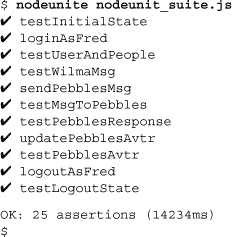

套件的退出代码将是失败的断言数量。因此，如果所有测试都通过，退出代码将是 0（我们可以在 Linux 和 Mac 上使用`echo $?`来检查退出代码）。脚本可以使用这个退出状态（以及其他输出）来做诸如阻止构建部署，或者向相关开发者或项目经理发送电子邮件等事情。

### B.6. 摘要

测试是一种帮助我们更快、更好地开发的实践。一个运行良好的项目从一开始就被设计为支持多种测试模式，并且测试代码与代码一起编写，以帮助快速有效地识别和解决问题。几乎每个人在某个时候都曾在项目中工作过，每个进步似乎都伴随着曾经工作良好的东西的匹配失败。一致、早期和精心设计的测试可以防止回归并促进快速进步。

本附录展示了四种测试模式，并讨论了如何设置它们以及何时使用它们。我们选择了 nodeunit 作为我们的测试框架。这样我们就可以在不使用网络浏览器的情况下测试我们的模型。在创建测试套件时，我们使用了 jQuery 延迟对象和测试指令来确保测试按正确的顺序执行。最后，我们展示了如何调整模块以便在测试环境中成功运行测试。

我们希望您觉得我们的演示富有启发性和鼓舞人心。祝您测试愉快！
