# 1 CSS 简介

本章涵盖

+   CSS 的简要概述

+   基本 CSS 样式

+   如何有效地选择 HTML 元素

层叠样式表（CSS）用于控制网页元素的显示。CSS 使用样式规则来指导浏览器选择某些元素并对它们应用样式和效果。

如果你刚开始学习 CSS 或需要复习，第一章是一个很好的起点。我们将从 CSS 的简要历史开始，迅速过渡到如何开始使用 CSS，探讨将 CSS 与 HTML 链接的方法。

当我们的 CSS 运行起来后，我们将通过创建一个静态的单列文章页面，包含基本媒体组件（如标题、内容和图像）来查看 CSS 的结构，以了解所有元素是如何协同工作的。

## 1.1 CSS 概述

Håkon Wium Lie 在 1994 年提出了 CSS 的概念，这比 Tim Berners-Lee 在 1990 年创建 HTML 晚了几年。CSS 通过颜色、布局和字体排印等选项将样式从网页内容中分离出来。

### 1.1.1 关注点分离

这种内容和呈现的分离基于设计原则“关注点分离”（SoC）。这一原则背后的理念是，计算机程序或应用应该被分解成单个、独立的、按目的分离的部分。保持良好的 SoC 的好处包括

+   减少代码重复，因此更容易维护

+   可扩展性，因为它要求元素专注于单一目的

+   稳定性，因为代码更容易维护和测试

基于这一原则，HTML 充当网页的结构和内容，CSS 是呈现，JavaScript（JS）提供额外的功能。它们共同构成了网页。图 1.1 显示了这一过程的示意图。

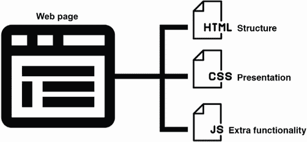

图 1.1 网页的分解

自从 2000 年代中期智能手机的引入以来，网络已经扩展到移动网站（通常使用 m.子域名，如 m.mywebsite.com），这些网站通常比桌面版本功能更少，并且采用了响应式和自适应设计。创建响应式/自适应或针对移动设备的网站有其优点和缺点。

响应式设计和自适应设计之间的区别

*响应式设计*使用单一流动布局，可以根据屏幕大小、方向和设备偏好等因素进行变化。*自适应设计*也可以根据这些因素进行变化。但与单一流动布局不同，我们可以创建多个固定布局，这使我们能够对每个布局有更大的控制权——但代价是比单一响应式布局需要更多的时间。在实践中，我们可以将这两种方法结合起来使用。

通常情况下，响应式和自适应设计是行业发展的趋势，尤其是在 CSS 不断扩展，为我们提供了更多基于窗口大小和媒体类型（如屏幕或打印）应用 CSS 的能力之后。自从 1994 年 CSS 发布以来，共有三个主要版本发布：

+   1996 年—第一个万维网联盟（W3C）的 CSS 推荐

+   1997 年—CSS2 的第一个工作草案

+   1999 年—第一个三个 CSS3 草案（颜色配置文件、多列布局和分页媒体；[`www.w3.org/Style/CSS20`](https://www.w3.org/Style/CSS20)）

1999 年之后，发布策略改为允许更快、更频繁地发布新功能。现在 CSS 被划分为模块，以 1 开始编号，随着功能和功能的演变和扩展，向上递增。

CSS 级别 1 模块是 CSS 中全新的东西，例如一个以前作为官方标准不存在的属性。经过几个版本讨论的模块，如媒体查询、颜色、字体以及层叠和继承模块，有更高的级别编号。

将 CSS 划分为模块的好处是每个部分可以独立移动，而不需要整个语言的大规模更改。已经有一些关于是否需要有人宣布当前阶段为 CSS4 的讨论，即使只是为了承认自 1999 年以来 CSS 已经发生了很大变化。然而，这个想法至今还没有得到任何支持。

### 1.1.2 什么是 CSS？

CSS 是一种声明性编程语言：代码告诉浏览器需要做什么，而不是如何做。例如，我们的代码表示我们想要某个标题是红色，浏览器将决定如何应用这种样式。这很有用，因为如果我们想增加段落的行高以改善阅读体验，那么布局、尺寸和格式化新行高的决定权在浏览器手中，这减少了开发者的工作量。

领域特定语言

CSS 是一种*领域特定语言*（DSL）——一种为解决特定问题而创建的专用语言。DSL 通常比通用语言（如 Java 和 C#）简单。CSS 的特定目的是样式化网页内容。SQL、HTML 和 XPath 等语言也是 DSL。

自从 1994 年以来，CSS 已经走了很长的路。现在我们有方法来动画和过渡元素，创建运动路径来动画可缩放矢量图形（SVG）图像，并根据视口大小条件应用样式。这类功能以前只能通过 JavaScript 或 Adobe Flash（现已退役）来实现。我们可以通过查看 CSS Zen Garden（[www.csszengarden.com](http://www.csszengarden.com/））来一窥可能性；通过比较第一个和最后一个设计，我们可以观察到 CSS 随时间的发展([`www.w3.org/Style/CSS20`](https://www.w3.org/Style/CSS20))。

在过去，使用透明度、圆角、遮罩和混合等设计选择是可能的，但需要非传统的 CSS 技术和技巧。随着 CSS 的发展，添加了属性来用标准、文档化的功能替换这些技巧。

CSS 预处理器

CSS 的演变也导致了 CSS 预处理器和 Syntactically Awesome Style Sheets (Sass)的引入，Sass 于 2006 年发布。它们被创建出来是为了简化代码的编写，使其更易于阅读和维护，同时也提供了 CSS 本身不具备的附加功能。在第十二章中，我们将使用预处理器来样式化一个页面。

可以说，CSS 正处于一个黄金时代。随着语言的持续发展，新的和创造性的体验机会几乎是无限的。

## 1.2 通过创建文章布局开始学习 CSS

在我们的第一个项目中，我们将探索网络上的一个常见用例：创建单列文章。本章重点介绍如何将 CSS 链接到 HTML，并探讨我们可以使用的选择器来样式化我们的 HTML。

我们首先需要理解的是如何将我们的 CSS 与 HTML 关联起来，以及如何选择一个元素。然后我们再考虑我们想要应用哪些属性和值。让我们先从一些基础知识开始。

如果你刚开始学习编程，你通常可以找到免费工具来使用这些项目。你有在线编码的选项，或者你可以在电脑上使用代码编辑器，如 Sublime Text ([`www.sublimetext.com`](https://www.sublimetext.com))、Brackets ([` brackets.io`](https://brackets.io)) 或 Visual Studio Code ([`code.visualstudio.com`](https://code.visualstudio.com)) 进行工作。或者，你也可以使用 Mac 的 TextEdit ([`mng.bz/rd9x`](http://mng.bz/rd9x))、Windows 的记事本 ([`mng.bz/VpAN`](http://mng.bz/VpAN)) 或 Linux 的 gedit ([`wiki.gnome.org/Apps/Gedit`](https://wiki.gnome.org/Apps/Gedit)) 作为基本文本编辑器。

与使用代码编辑器或集成开发环境（IDE）相比，使用基本文本编辑器的缺点是它缺乏语法高亮。这种高亮会根据文本在代码中的作用以不同的颜色和字体显示文本，这有助于提高可读性。

你还可以使用免费的在线开发编辑器，如 CodePen ([`codepen.io`](https://codepen.io))。在线开发编辑器是测试想法的好方法；它们为前端项目提供了快速、便捷的访问。CodePen 提供了一个付费的 Pro 选项，允许你托管图像等资产，这些资产你将在后面的章节中需要。另一个选项是链接到存储图像的 GitHub 位置，因为所有上传到 GitHub 的资产都存储在`raw.githubusercontent.com`域名下。

当你在电脑上安装了代码编辑器或者选择了在线编辑器并创建了账户后，你需要获取本章的起始代码。我们在 GitHub ([`github.com/michaelgearon/Tiny-CSS-Projects`](https://github.com/michaelgearon/Tiny-CSS-Projects)) 上创建了一个代码仓库，其中包含了你需要跟随每个章节的所有代码。图 1.2 显示了该仓库的截图。

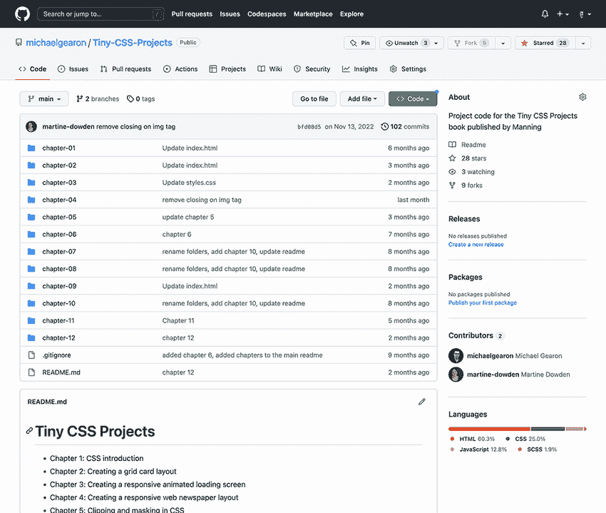

图 1.2 GitHub 上的 Tiny-CSS-Projects 仓库

代码按章节组织在文件夹中。每个章节文件夹中都有两个版本的代码：

+   `before`—包含项目的初始代码。如果你要和本章一起编码，你需要这个版本。

+   `after`—包含章节末尾完成的项目的最终状态，并应用了展示的 CSS。

使用屏幕顶部的代码下拉菜单下载（或者如果你熟悉 Git，克隆）项目。如果你要和本章一起编码，从第一章的`before`文件夹中获取文件，并将它们复制到你的项目文件夹或笔中。你应该会看到一个包含一些初始代码和一个空 CSS 文件的 HTML 文件。如果你在浏览器中打开 HTML 文件或将`<body>`标签的内容复制到 CodePen 中，你会看到内容没有样式，除了浏览器提供的默认样式（图 1.3）。现在你就可以开始用 CSS 样式化内容了，如列表 1.1 所示。

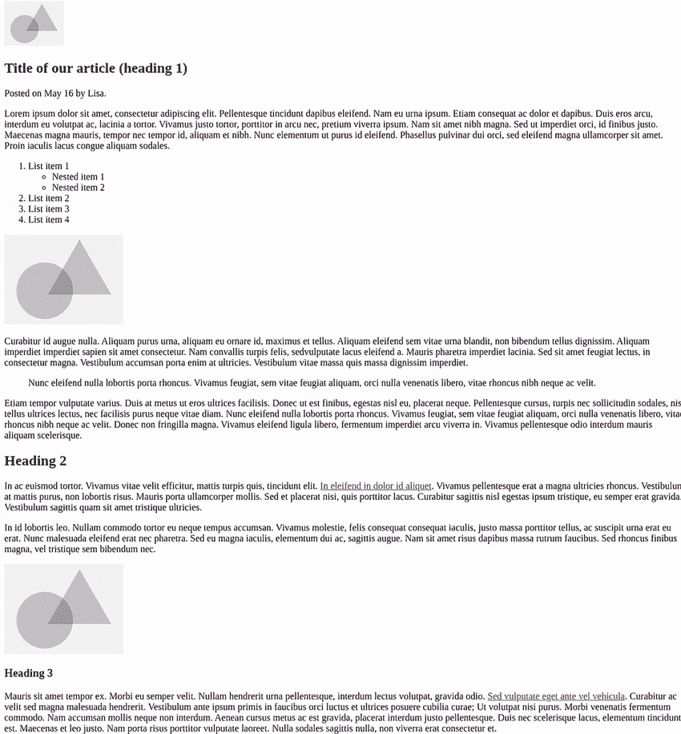

图 1.3 我们文章的初始 HTML

注意：CodePen 会自动处理`<head>`标签中的信息。因此，如果你在 CodePen 或类似的在线编辑器中跟随，你只需要复制`<body>`标签内的代码。

列表 1.1 开始的 HTML

```
<!doctype html>
<html lang="en">
<head>
  <meta charset="utf-8">
  <meta name="viewport" content="width=device-width, initial-scale=1">
  <title>Chapter 1 - CSS introduction</title>
  <link rel="stylesheet" href="styles.css">
</head>
<body>
  
  <article>
    <header>
      <h1>Title of our article (heading 1)</h1>
      <p>
        Posted on
        <time datetime="2015-05-16 19:00">May 16</time>
        by Lisa.
      </p>
    </header>
    <p>Lorem ipsum dolor sit amet, ...</p>
    <ol class="ordered-list">
      <li>List item 1
        <ul>
          <li>Nested item 1</li>
          <li>Nested item 2</li>
        </ul>
      </li>
      <li>List item 2</li>
      <li>List item 3</li>
      <li>List item 4</li>
    </ol>
    
    <p>Curabitur id augue nulla ...</p>
    <blockquote id="quote-by-author">
     Nunc eleifend nulla lobortis ...
    </blockquote>
    <p>Etiam tempor vulputate varius ...</p>
    <h2>Heading 2</h2>
    <p>
       In ac euismod tortor ...
       <a target="_blank" href="#">In eleifend in dolor id aliquet</a>
       ...
    </p>
    <p>In id lobortis leo ...</p>
    
    <h3>Heading 3</h3>
    <p>
      Mauris sit amet tempor ex ...
      <a href="#">Sed vulputate eget ante vel vehicula</a>.
      Curabitur ac velit sed ...
    </p>
    <p>Quisque vel erat et ...</p>
    <h4 class="small-heading">Heading 4</h4>
    <p>Aliquam porttitor, ex ...
      <a href="#">Cras sed finibus libero</a>
      Duis lobortis, ipsum ut consectetur ...
    </p>
    <h2>Heading 2</h2>
    <h3>Heading 3</h3>
    <svg  width="300" height="150">
      <circle cx="70" cy="70" r="50"></circle>
      <rect y="80" x="200" width="50" height="50" />
    </svg>
    <h4>Heading 4</h4>
    <h5 class="small-heading">Heading 5</h5>
    <p>In finibus ultrices nulla ut rhoncus ...</p>
    <h6 class="small-heading">Heading 6</h6>
    <p lang="it">Questo paragrafo è definito in italiano.</p>
    <ul class="list">
      <li>List item 1
        <ul>
          <li>Nested item 1</li>
          <li>Nested item 2</li>
        </ul>
      </li>
      <li>List item 2</li>
      <li>List item 3</li>
      <li>List item 4</li>
    </ul>
    <footer>
      <p>Footer text</p>
    </footer>
  </article>
  <p>Nam rutrum nunc at lectus ...</p>
</body>
</html>
```

## 1.3 向我们的 HTML 添加 CSS

当我们用 CSS 进行样式设计时，我们有三种方法将 CSS 应用到我们的 HTML 中：

+   内联

+   内嵌

+   外部

### 1.3.1 内联 CSS

我们可以通过给一个元素添加一个`style`属性来内联 CSS。这种方法让我们直接在 HTML 中向元素添加 CSS。

属性总是在开标签中指定，通常由属性的名称组成——在这个例子中是`style`。属性有时后面跟着一个等号（`=`）和用引号括起来的值。所有的 CSS 都放在开引号和闭引号之间。

例如，让我们将我们的`heading`的颜色设置为`crimson`：`<h1 style="color: crimson">文章的标题（heading 1）</h1>`。如果我们保存我们的 HTML 并在浏览器中查看，我们会看到它是 crimson 色。如果我们使用的是代码编辑器而不是网络客户端（CodePen），我们需要刷新浏览器页面来查看我们的更改。图 1.4 显示了输出。注意，唯一受影响的元素是我们应用了样式的`<h1>`。

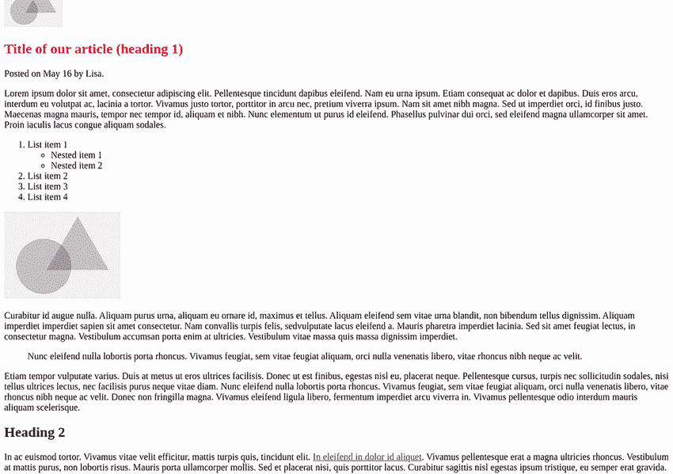

图 1.4 紫红色标题

内联 CSS 的一个缺点是它在 CSS 中具有最高的特定性，我们将在稍后更详细地探讨这一点。内联 CSS 的另一个主要缺点是它很快就会变得难以管理。假设我们在一个 HTML 文档中有 20 个段落。我们需要应用相同的样式属性和相同的 CSS 属性 20 次，以确保所有段落看起来都一样。这种情况涉及两个问题：

+   我们的关注点不再分离。负责内容的 HTML 和负责样式的 CSS 现在在同一个地方，并且紧密耦合。

+   我们在许多地方重复代码，这使得维护和保持样式一致性变得极其困难。

内联 CSS 的优点是页面加载性能。浏览器首先加载 HTML 文件，然后加载它渲染页面所需的任何其他文件。当 CSS 已经在 HTML 文件中时，浏览器不需要等待从单独的位置加载它。让我们撤销对`<h1>`添加的样式，并看看一种具有与内联相同优点但缺点更少的不同的技术。

### 1.3.2 嵌入式 CSS

要解决重复代码的问题，我们可以在嵌入式（有时称为内部）`<style>`元素中添加我们的 CSS。`<style>`元素必须放置在开`<head>`标签和闭`<head>`标签之间。要使所有标题元素变为深红色，我们可以使用以下列表中的代码片段。

列表 1.2 嵌入式 CSS

```
<!DOCTYPE html>
<html lang="en">
 <head>
   ...
  <style>
   h1, h2, h3, h4, h5, h6 {
    color: crimson;
   }
  </style>
 </head>
 <body>
  ...
 </body>
</html>
```

这种方法的优点是现在我们将所有 CSS 组合在一起，CSS 将应用于整个 HTML 文档。在我们的例子中，该网页内的所有标题（`<h1>`、`<h2>`、`<h3>`、`<h4>`、`<h5>`和`<h6>`）都将变为深红色，正如我们可以在图 1.5 中观察到的。

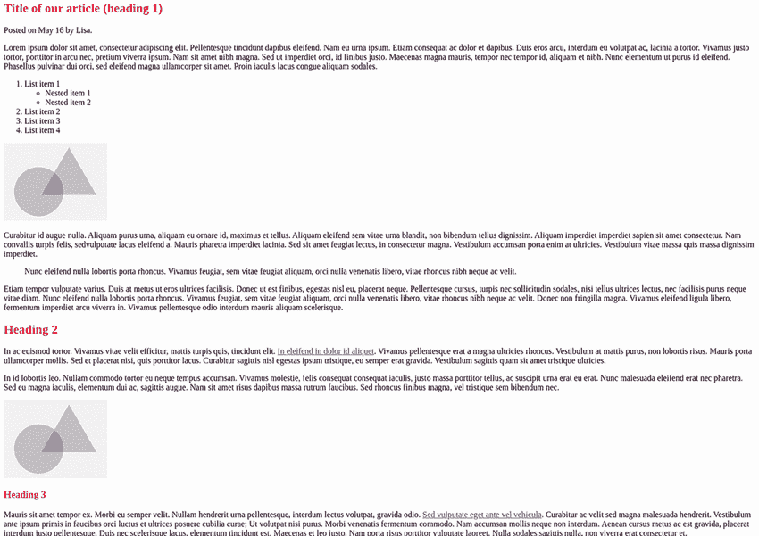

图 1.5 应用到所有标题的样式

我们还看到嵌入式 CSS 与内联 CSS 在书写方式上的差异。当我们编写嵌入式 CSS 时，我们创建所谓的*规则集*，它由图 1.6 中显示的部分组成。

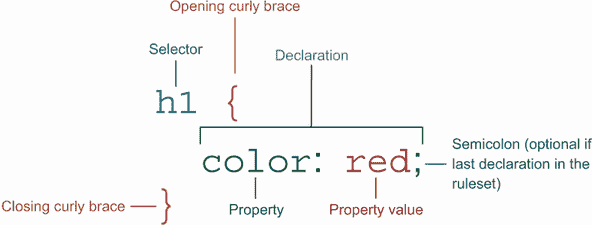

图 1.6 CSS 规则的示例

规则中定义应用于哪些元素的部分被称为*选择器*。图 1.6 中的规则将应用于所有`<h1>`元素；其选择器为`h1`。

要应用多个选择器，我们将它们作为逗号分隔的列表写在开括号之前。例如，要选择所有`<h1>`和`<h2>`元素，我们会写`h1,h2` `{` `...` `}`。

声明由属性组成——在本例中为`color`，后跟一个冒号，然后是属性值（`red`）。声明定义了所选元素将被如何样式化。属性和值都必须用美式英语书写。如*colour*和*capitalise*之类的拼写变体不受支持，并且浏览器不会识别。当浏览器遇到无效的 CSS 时，它会忽略它。如果一个规则中有无效的声明，则有效的声明仍然会被应用；只有无效的声明会被忽略。

嵌入式 CSS 适用于一次性的网页，其中样式特定于该页面。它很好地组织了 CSS，允许我们编写应用于元素的规则，从而避免在多个地方复制和粘贴相同的样式。它还具有与内联样式相同的性能优势，即浏览器可以立即访问 CSS；它不需要等待从不同位置获取 CSS。

将 CSS 放在 HTML 文档中的缺点是，CSS 只适用于该文档。所以如果我们的网站有多个页面，这通常是情况，我们就需要将 CSS 复制到每个 HTML 文档中。除非这些样式是由模板或后端语言（如 PHP）生成的，否则这项任务将很快变得难以维护，尤其是对于大型应用程序，如博客和电子商务网站。接下来，让我们最后一次撤销项目中的更改，并查看第三种技术。

### 1.3.3 外部 CSS

与内联 CSS 类似，外部 CSS 方法将我们的样式分组在一起，但它将 CSS 放在单独的 `.css` 文件中。通过将我们的 HTML 和 CSS 分离，我们可以有效地分离我们的关注点：内容和样式。

我们通过使用 `<link>` HTML 标签将样式表链接到 HTML。链接元素需要两个属性来指定样式表：`rel` 属性，它描述了 HTML 文档与被链接对象之间的关系，以及 `href` 属性，它代表 *超文本引用* 并指示要包含的文档的位置。以下列表显示了我们将样式表链接到我们的 HTML 的方法。

列表 1.3 将外部 CSS 应用到 HTML

```
<!DOCTYPE html>
<html>
<head>
   <link rel="stylesheet" href="styles.css">
 </head>
 <body>
   <h1>Inline CSS</h1>
 </body>
</html>
```

大多数情况下，这种方法是我们在互联网上看到的方法，因此我们将在这本书中一直使用这种方法。外部样式表的好处是我们的 CSS 在一个单独的文档中，可以一次性修改以应用到所有 HTML 页面上。这种方法的缺点是它需要浏览器额外的请求来检索该文档，从而失去了将 CSS 直接放在 HTML 中的性能优势。

## 1.4 CSS 的层叠

CSS 的一个基本特性是我们需要理解的是层叠。当 CSS 被创建时，它是围绕 *层叠* 的概念开发的，这允许样式相互覆盖或继承。这个概念为多个样式表竞争网页的展示铺平了道路。

因此，当我们使用浏览器的开发者工具检查一个元素时，我们有时会看到多个 CSS 值在争夺浏览器渲染的机会。浏览器通过特定性来决定将哪些 CSS 属性值应用到元素上。特定性允许浏览器（或用户代理）确定哪些声明与 HTML 相关，并将样式应用到该元素。

特定性计算的一个方面是样式表的应用顺序。当应用多个样式表时，后续样式表中的样式将覆盖先前样式表提供的样式。换句话说，假设使用了相同的选择器，最后声明的样式将获胜。CSS 有三种不同的样式表来源：

+   用户代理样式表

+   作者样式表

+   用户样式表

### 1.4.1 用户代理样式表

第一个来源是浏览器的默认样式。当我们打开项目，在我们添加任何样式之前，我们的元素并不都看起来一样。例如，我们的标题比我们的文本更大、更粗。这种格式化是由**用户代理**（UA）样式表定义的。这些样式表在三种类型中具有最低的优先级，我们发现不同的浏览器对 HTML 属性的呈现略有不同。

大多数情况下，用户代理（UA）样式表设置字体大小、边框样式以及一些基本布局，例如文本输入和进度条，这在用户样式表找不到或发生文件加载错误时可能很有用。UA 样式表提供了一些回退样式，这使得页面更易于阅读，并保持了不同元素类型之间的视觉差异。

### 1.4.2 作者样式表

我们开发者编写的样式表被称为**作者样式表**，在浏览器显示的样式优先级中通常具有第二高的优先级。当我们创建网页时，我们编写的 CSS（内嵌、外部或内联）并将其应用于我们的网页的样式表就是作者样式表。

### 1.4.3 用户样式表

访问我们网页的用户可以使用他们自己的样式表来覆盖作者和 UA 样式。这个选项可以改善他们的体验，特别是对于残障用户。

用户可能出于各种原因使用自己的样式表，例如设置最小字体大小、选择自定义字体、提高对比度或增加元素之间的间距。任何用户都可以将用户样式表应用于网页。这些样式表如何应用于网页取决于浏览器，通常是通过浏览器设置或插件。

用户样式表仅适用于添加它的用户，并且仅在应用它的浏览器中生效。这种更改是否可以从一个设备传输到另一个设备，取决于浏览器本身及其在多个设备之间同步用户设置和已安装插件的能力。

### 1.4.4 CSS 重置

浏览器提供的默认样式并不一致。每个浏览器都有自己的样式表。例如，默认样式在 Google Chrome 中与在 Apple 的 Safari 中不同。如果我们希望我们的应用程序在所有浏览器中看起来都一样，这种差异可能会带来一些挑战。

幸运的是，有两种选择可用：CSS 重置和 CSS 规范化器（例如 Normalize.css；[`github.com/necolas/normalize.css`](https://github.com/necolas/normalize.css)）。尽管两者都可以用来解决跨浏览器样式问题，但它们的工作方式截然不同。

通过使用 CSS 重置，我们撤销了浏览器的默认样式；我们告诉浏览器我们根本不想要任何默认样式。在没有应用任何作者样式的情况下，所有元素，无论它们是什么，看起来都像普通文本（图 1.7）。

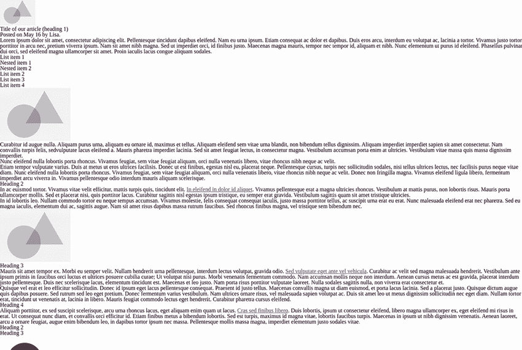

图 1.7 CSS 重置应用效果

要将 CSS 重置应用于我们的项目，首先我们创建一个重置样式表并将其添加到我们的项目中。在我们的项目文件夹中，我们创建一个名为`reset.css`的文件。然后我们将重置 CSS 复制到文件中。存在许多重置选项；一个常用的选项可以在[`meyerweb.com/eric/tools/css/reset`](https://meyerweb.com/eric/tools/css/reset)找到。

最后，我们需要将我们的样式表链接到我们的 HTML 文件。因为顺序很重要，我们想要确保在我们的`<head>`中包含重置 CSS，在作者样式之前。因此，我们的 HTML 将看起来像列表 1.4。

页面加载性能

为了可读性，将重置和我们的样式放在单独的文件中比将所有内容放在一个文件中要好得多。然而，这种方法对页面加载性能来说并不理想。

在生产环境中，我们想要做以下事情之一：

+   将重置 CSS 放置在我们自己的样式所在的同一文件的开始处，这样我们只加载一个样式表。我们可以手动做这件事，或者将其作为构建过程的一部分。

+   在我们自己的样式之前从内容分发网络（CDN）加载重置代码。通过从 CDN 加载，我们增加了用户在他们机器上已经缓存了代码的可能性。

列表 1.4 添加 CSS 重置

```
<head>
  ...
  <link rel="stylesheet" href="reset.css">      ①
  <link rel="stylesheet" href="styles.css">     ②
 </head>
```

① 重置样式表

② 作者样式表

CSS 重置的好处是我们有一个空白画布可以从中开始。如图 1.7 所示，现在我们的所有元素看起来都像是普通文本。缺点是我们需要为所有元素定义基本样式，包括为列表添加项目符号和区分标题级别。此外，每个 CSS 重置的版本都会根据版本和编写它的开发者有所不同。

我们的另一种选择是使用标准化器。与重置样式不同，标准化器专门针对在不同浏览器中具有差异的元素，并应用规则以标准化它们。

### 1.4.5 标准化器

就像 CSS 重置一样，标准化器根据版本和作者的不同，对样式进行轻微的调整。一个常用的 CSS 标准化器可以在[`necolas.github.io/normalize.css`](https://necolas.github.io/normalize.css)找到。我们可以以与 CSS 重置代码相同的方式将其应用于我们的项目：创建一个文件，将代码复制到文件中，并将其链接到我们的 HTML 文件。请注意，同样的性能考虑也适用于这里。

当应用标准化器（如图 1.8 所示）时，我们的 HTML 看起来与最初相同，因为它处理的大多数差异都在这个特定项目中未使用的元素上。根据我们使用的浏览器，我们可能会注意到`<h1>`的大小有所不同。


图 1.8 应用到我们项目中的标准化器

好消息是，用户代理（UA）样式表差异比 10 多年前的问题要小得多。今天，浏览器在样式上更加一致，因此使用 CSS 重置或标准化器更多的是一种个人选择，而不是必需品。

然而，仍然存在一些差异。无论我们是否使用 CSS 重置或正常化器，我们都应该在各种设备和浏览器上测试我们的代码。

### 1.4.6 !important 注释

`!important`注释你可能在一些样式表中见过。通常在所有其他方法都失败时作为最后的手段使用，它是一种覆盖特定性并声明特定值是最重要的事情的方法。然而，权力越大，责任越大。`!important`注释最初被创建为一个可访问性功能。

记得我们提到过用户能够应用自己的样式以获得更好的用户体验吗？这个注释是为了帮助用户定义自己的样式，而无需担心特定性。因为它覆盖了任何其他样式，所以它确保了用户的样式总是具有最高的优先级，因此是应用的那一个。

使用`!important`被认为是不良实践，因此我们应该尽量避免在我们的作者样式表中使用它。此外，这个注释打破了 CSS 的自然级联，可能会使管理样式表变得更加困难。

## 1.5 CSS 中的特定性

当多个属性值被应用于一个元素时，其中一个将胜过其他。我们通过一个多步骤的过程来确定胜者。我们暂时忽略`!important`（第 1.4.6 节），因为它打破了正常的流程；我们稍后会回到它。

首先，我们来看一下值从哪里来。在规则中明确定义的任何内容都将覆盖继承的值。例如，在列表 1.5 和 1.6 中，如果我们将`<body>`元素的字体颜色设置为`red`，那么`<body>`内部的所有元素都将显示红色文本。

字体颜色被子元素继承。如果我们特别在`<body>`内的段落中设置不同的颜色，继承的`red`值将被在段落上设置的更具体的`blue`值覆盖。因此，那个段落的文本颜色将是蓝色。

列表 1.5 继承示例（HTML）

```
<body>
  <h1>Example</h1>       ①
  <p>My paragraph</p>    ②
</body>
```

① 我们的页眉将继承红色颜色。

② 段落的颜色将是蓝色，这是由段落规则设置的。

列表 1.6 继承示例（CSS）

```
body { color: red }
p { color: blue }
```

并非所有属性值都会被继承。与主题相关的样式，如颜色和字体大小通常会被继承；布局考虑通常不会。这个指南是松散的，有明确的例外，但这是一个好的起点。我们将在整个项目中根据具体情况处理例外。

如果属性值没有被继承，浏览器会查看所使用的选择器类型，并通过数学计算特定性值。我们将在第 1.6 节中更详细地介绍每种选择器类型是什么，但首先让我们看看数学是如何应用的。

浏览器查看选择器，根据规则分类使用的选择器类型，并应用类型值。然后它添加所有值并得到一个最终特定性值。图 1.9 展示了这个过程。最大的数字获胜，所以图中的规则 1 会胜过规则 2。

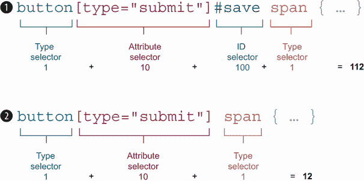

图 1.9 计算特定性

根据选择器类型的特定性值如下：

+   `100`—ID 选择器

+   `10`—类选择器、属性选择器和伪类

+   `1`—类型选择器和伪元素

+   `0`—通用选择器

如果我们仍然有平局，浏览器会查看样式来自哪个样式表。如果两个值都来自同一个样式表，文档中较后的那个获胜。如果值来自不同的样式表，顺序如下：

1.  用户样式表

1.  作者样式表（按照导入的顺序；最后一个生效）

1.  UA 样式表

我们之前将`!important`放在一边。现在我们理解了正常流程，让我们将其添加回混合中。当一个值有`!important`注释时，流程被短路，带有注释的值自动获胜。

如果两个值都有`!important`注释，浏览器遵循正常流程。图 1.10 显示了通过样式表的流程，包括`!important`声明。

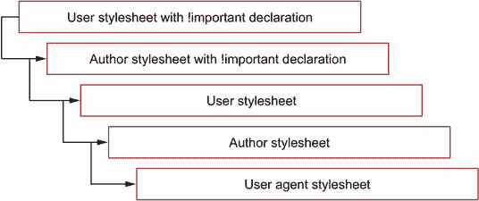

图 1.10 CSS 优先级顺序

我们已经确定选择器的类型会影响特定性。让我们更仔细地查看选择器，并在我们的项目中使用它们。

## 1.6 CSS 选择器

选择器设置我们想要定位的 HTML 元素。在 CSS 中，我们有七种方式来定位我们想要样式的 HTML 元素，如以下各节所述。

### 1.6.1 基本选择器

将样式应用于 HTML 元素的最常见方法是根据名称、ID 或类名选择它们。这些最常使用，因为它们与 HTML 元素本身或元素上设置的属性的一对一映射。

类型选择器

*类型选择器*通过名称定位 HTML 元素。使用类型选择器的优点是，当我们阅读我们的 CSS 时，我们可以快速确定如果我们在规则中做出更改，哪些 HTML 元素会受到影响的。这个选择器不需要我们在 HTML 中添加任何特定的标记来定位元素。

让我们使用类型选择器来定位所有我们的标题（`<h1>`到`<h6>`），并将它们的颜色改为深红。我们的 CSS 将是`h1,` `h2,` `h3,` `h4,` `h5,` `h6` `{` `color:` `crimson;` `}`。图 1.11 显示我们的标题颜色已更改。

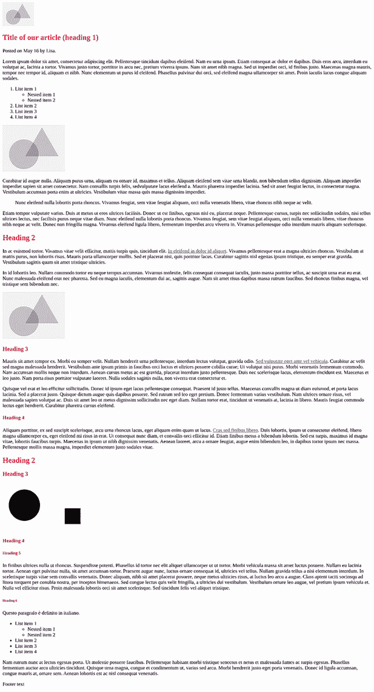

图 1.11 标题颜色更改

类选择器

我们可以在我们想要的任何不同元素上使用类选择器。通过将类名应用于元素，我们正在将多个 HTML 元素分组，以便当我们应用样式时，它们将扩展到具有该类名的任何元素。

要向 HTML 添加类，我们使用 `class` 属性。在 `class` 属性内，我们可以添加尽可能多的值（或类），每个值用空格分隔。

我们有许多方法和方式来编写我们的类名，例如块状、元素、修饰符（BEM）方法（[`en.bem.info`](https://en.bem.info)）和可伸缩和模块化 CSS 架构（SMACSS；[`smacss.com`](http://smacss.com)），这些都是编写一致样式表的指南。

主要目的是编写对每个人都有意义的类名。例如，给段落元素添加类名 `text` 会非常令人困惑。其他元素，如我们的标题，也可以被视为文本，所以可能不清楚我们指的是哪个特定元素。

根据特定的样式（如 `color`）应用类名也可能很危险。给一个元素添加类名 `blue` 可能会立即生效，但如果设计改变并且应用的颜色现在是红色，我们的类名将不再有意义。

在我们的 HTML 中，我们发现一些标题具有 `small-heading` 类。我们将创建一个选择 `small-heading` 并将元素的文本改为大写的规则。

要选择 `small-heading` 类名，在 CSS 中我们首先输入点（`.`）然后是类名 `small-heading`。然后我们的样式进入大括号，如下所示：`.small-heading` `{` `text-transform:` `uppercase` `}`。图 1.12 展示了我们的大写标题。注意，其他标题没有受到影响——只有那些应用了该类的标题。

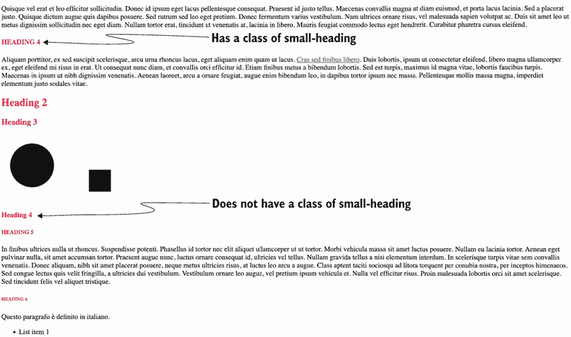

图 1.12 类选择器应用于具有类名 `small-heading` 的元素

ID 选择器

在 HTML 中，ID 是唯一的。任何给定的 ID 应该在网页上只使用一次。如果 ID 重复，我们的代码被认为是无效的 HTML。

通常我们应该避免使用 ID 选择器；因为它们在 HTML 中必须是唯一的，针对 ID 构造的规则不容易重用。此外，ID 选择器是可用的最具体选择器之一，使得使用 ID 选择器应用的风格难以覆盖。除非元素的唯一性是关键，否则请避免使用 ID 属性。

我们的示例文章包含一个具有 `ID` 属性的 `blockquote`，其值为 `quote-by-author`。在我们的 CSS 中，要选择 `blockquote`，我们使用井号（`#`），然后紧接着是我们想要定位的 `ID`。然后我们有大括号，在大括号内放置我们的声明，如下所示。

列表 1.7 ID 选择器

```
#quote-by-author {
  background: lightgrey;
  padding: 10px;
  line-height: 1.75;
}
```

图 1.13 展示了应用于我们项目的代码。

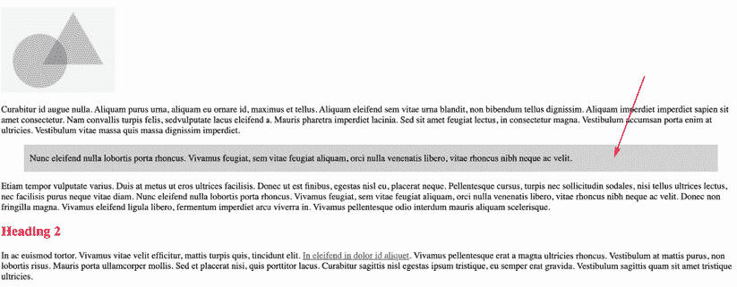

图 1.13 显示了 `#quote-by-author` 应用的样式

### 1.6.2 组合器

另一种编写 CSS 的方法是使用 *组合器*，这允许在不过度使用 `class` 或 `ID` 名称的情况下编写更复杂的 CSS。这里有四种组合器：

+   后代组合器（`space`）

+   子组合器（`>`）

+   相邻兄弟组合器（`+`）

+   通用兄弟组合器（`~`）

需要理解的一个重要概念是元素之间的关系。在接下来的几个示例中，我们将探讨如何使用元素之间的关系来定位不同的 HTML 元素以样式化我们的文章。图 1.14 介绍了我们将要检查的关系类型。

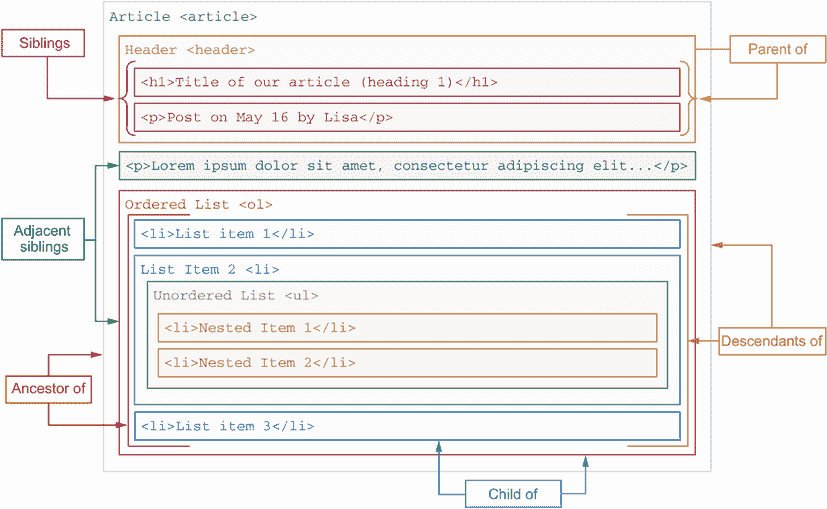

图 1.14 HTML 元素之间的关系

后代组合符（空格）

使用后代组合符的选择器选择父元素内的所有 HTML 元素。使用后代组合符的选择器由三部分组成。第一部分是父元素，在本例中是文章元素。父元素后面跟着一个空格，然后是我们想要选择的所有元素。图 1.15 示例了语法。

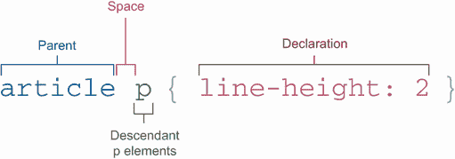

图 1.15 使用后代组合符的选择器示例

在此示例中，浏览器将找到任何 `<article>` 元素，针对其父 `<article>` 元素中的所有后代段落 (`<p>`) 进行双倍行距处理。当应用此选择器时，我们的文章看起来像图 1.16。

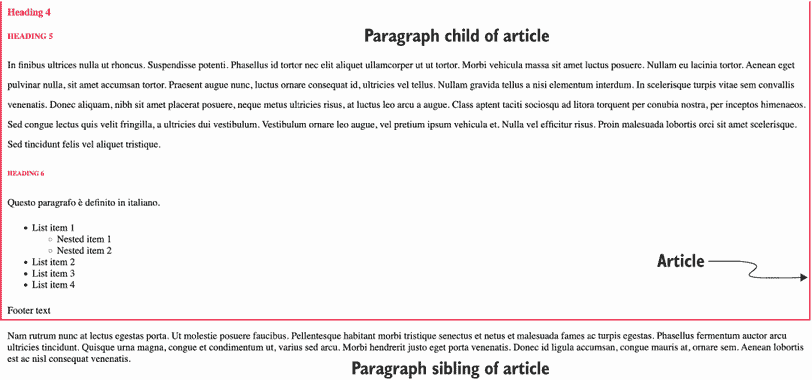

图 1.16 子段落双倍行距

子组合符（>）

子组合符允许我们定位特定选择器的直接子元素。这个组合符与使用后代组合符的选择器不同，因为在子组合符的情况下，目标元素必须是直接子元素。使用后代组合符的选择器可以选中任何后代（子元素、孙子元素、曾孙元素等）。

在我们的项目中，我们将对文章中的列表项进行样式化。如列表 1.8 所示，我们有一个无序列表 (`<ul>`) 和列表项 (`<li>`)。第一个子元素有自己的嵌套项，这些将是孙子元素和曾孙元素。

列表 1.8 HTML 列表项

```
<ul class="list">                      ①
  <li>List item 1                      ②
    <ul>                               ③
      <li>Nested item 1</li>           ④
      <li>Nested item 2</li>           ④
    </ul>
  </li>
  <li>List item 2</li>                 ②
  <li>List item 3</li>                 ②
  <li>List item 4</li>                 ②
 </ul>                                 ①
```

① 父元素项 (.list)

② .list 的子元素

③ .list 的曾孙元素

④ .list 的曾孙元素

我们将仅对第一级列表项——即 `<ul>` 的直接子元素——使用包含 `list` 的 `class` 属性值进行样式化，使其呈现深红色，而不会影响嵌套列表项（即曾孙元素）。因此，浏览器将找到包含 `list` 类的元素，仅针对它们的直接子元素（即列表项 `<li>`）更改 `color` 为 `crimson`。我们将使用以下 CSS：

```
.list > li { color: crimson; }
```

使用此 CSS，整个列表变为深红色，而不仅仅是顶级列表项。颜色应用于 `<li>` 元素及其所有后代。尽管我们选择了直接子元素，但由于颜色是继承的，子元素也变为深红色。

因此，为了仅选择顶级元素，我们需要添加第二个规则

```
.list > li ul { color: initial }
```

这将使嵌套列表项恢复到初始颜色，如图 1.17 所示。


图 1.17 将子组合符应用于 `list` 项

我们可以反过来执行这个操作，选择子元素的父母元素，对吧？简短的回答是：不行，以下示例不会起作用：`article` `<` `p` `{` `color:` `blue;` `}`。如果我们想选择一个元素的父元素或祖先元素，我们需要使用`has()`伪类——`article:has(p)` `{` `color:` `blue;` `}`——这在 1.6.3 节中有介绍。

相邻兄弟组合符（+）

当我们需要对与另一个元素处于同一级别的元素进行样式设计时，就像你的兄弟姐妹与你处于家族树中的同一级别一样，我们可以使用相邻兄弟组合符。如果我们想定位直接跟在另一个元素后面的元素，我们可以使用一个使用相邻兄弟组合符的选择器。

在列表 1.9 中，浏览器将找到任何`<header>`元素的使用，目标是在`<header>`元素之后立即（或相邻）的`<p>`元素，并将`font-size`更改为`1.5rem`，将`font-weight`更改为`bold`。图 1.18 显示了应用于我们的文章的代码。

列表 1.9 相邻兄弟组合符

```
header + p {
  font-size: 1.25rem;
  font-weight: bold;
}
```

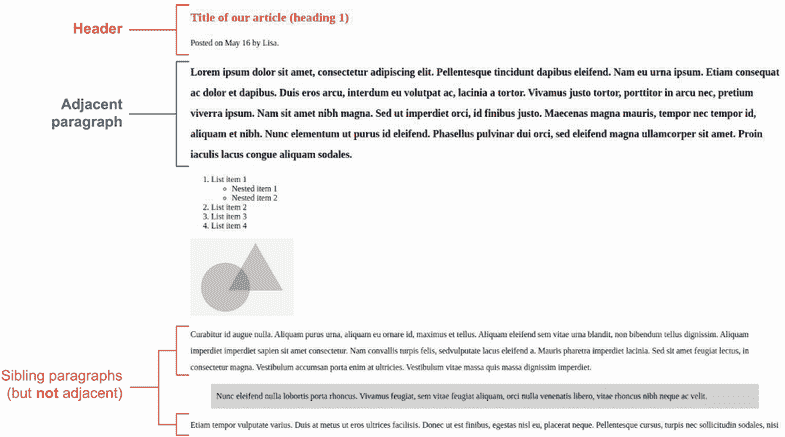

图 1.18 样式化标题之后的段落

这种方法在尝试将第一个元素与其他元素区分开来，使其突出时可能很有用。我们可能在报纸上看到这种效果。文章的第一段可能会被设计得比其他段落更突出，以吸引我们的注意。

另一个用例是在表单中进行错误处理。相邻兄弟组合符允许我们在表单控件中的无效值之后立即向用户显示错误消息。

通用兄弟组合符（~）

通用兄弟组合符比其他方法更开放，因为它允许我们针对选择器定位的元素之后的所有兄弟元素。

在我们的例子中，我们将为`<header>`元素之后的所有图像进行样式设计。请注意，我们有三个占位图像。第一个图像很小（它可能是一个标志或作者照片），位于`<header>`之上。我们不想对它进行样式设计。其他两个图像在文章中更低的位置。我们希望围绕它们添加边框，以保持与文章其余部分的色彩主题一致。

我们的规则将如下所示：`header` `~` `img` `{` `border:` `4px` `solid` `crimson;` `}`。浏览器将找到`<header>`元素；目标在该元素之后的所有兄弟图像（``）；并添加一个厚度为`4px`的边框，这是一条实线（而不是点线、虚线或双线），颜色为`crimson`。我们可以在图 1.19 中看到应用于我们的文章的代码。

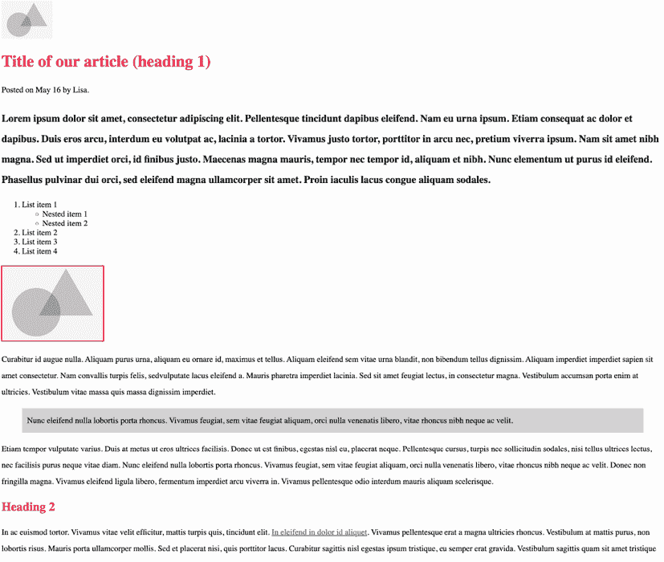

图 1.19 通用兄弟组合符定位标题的兄弟图像

### 1.6.3 伪类和伪元素选择器

CSS 有称为*伪类*和*伪元素*的选择器。你可能想知道这些名称的来源。"伪"意味着“不是真正的，虚假的或假装的”。这个定义是有意义的，因为从技术上讲，我们正在定位一个可能还不存在的状态或元素的部分。我们只是在假装。

并非所有伪元素和伪类都适用于所有 HTML 元素。在这本书的整个过程中，我们将探讨我们可以使用伪类的地方以及与哪些 HTML 元素一起使用。

伪类

向选择器添加一个*伪类*以定位元素的具体状态。伪类对于用户将要与之交互的元素特别有用，例如链接、按钮和表单字段。伪类使用单个冒号（`:`）后跟元素的状态。

我们的文章包含一些链接。我们没有以任何方式对链接进行样式设计；因此，它们的样式将来自用户代理（UA）样式表。大多数浏览器会在链接下划线并基于链接是否被访问过（即 URL 是否出现在浏览器的历史记录中）以不同的颜色显示它们。

对于链接，我们需要考虑一些状态。最常见的是

+   `link`—一个锚标签（`<a>`）包含一个`href`属性和一个不会出现在用户浏览器历史记录中的 URL。

+   `visited`—一个锚（`<a>`）元素包含一个`href`属性和一个会出现在用户浏览器历史记录中的 URL。

+   `hover`—用户将光标悬停在元素上但尚未点击它。

+   `active`—用户正在点击并保持元素。

+   `focus`—一个*聚焦元素*是默认接收键盘事件的元素。当用户点击一个可聚焦元素时，它会自动获得焦点（除非某些 JavaScript 改变了这种行为）。使用键盘在表单字段、链接和按钮之间导航也会改变当前聚焦的元素。

+   `focus-within`—当`focus-within`应用于父元素，并且父元素的子元素获得焦点时，`focus-within`样式将被应用。

+   `focus-visible`—当使用`focus-visible`选择元素时，样式仅在通过键盘导航获得焦点或用户通过键盘与元素交互时应用。

我们之前提到了`:has()`。它也是一个伪类，但不仅限于链接，`:has()`在元素至少有一个符合括号内指定的选择器的后代时应用。当我们编写这本书时，`:has()`尚未在所有主要浏览器中得到实现。

在我们当前的这篇文章项目中，我们将创建一个 `a:link` 规则来改变包含 `href` 属性且未被访问的锚标签的颜色，使其变为浅蓝色，使用十六进制颜色代码 `#1D70B8`。`:visited` 状态应该与 `:link` 状态不同，因为它应该向用户表明他们之前未曾访问过该页面（也就是说，URL 不存在于他们的浏览器历史记录中）。通常，网站不会区分这两种状态，但区分它们可以提供更好的用户体验。在我们的例子中，我们将`:visited`状态改为紫色`颜色`，使用十六进制代码值 `#4C2C92`。

然后，我们将处理 `:hover` 状态。此状态不适用于移动用户，因为在移动设备上没有识别用户悬停在链接上的方法。在我们的文章中，我们将`:hover`状态文本颜色改为深蓝色，使用十六进制代码值 `#003078`。

最后，我们将处理 `:focus` 状态。我们可以在任何可聚焦元素上使用此状态。链接、按钮和表单字段默认可聚焦（除非禁用），但我们可以通过使用正数 `tabindex` 使任何元素可聚焦，在这种情况下，可以应用基于聚焦的样式。当用户点击或轻触元素时，将显示 `:focus` 状态。当元素聚焦时，我们在元素上添加一个 1 像素的深红色轮廓。所有这些加在一起，我们的链接规则如下所示。

列表 1.10 使用伪元素设置链接样式

```
a:link {
  color: #1D70B8;
}
a:visited {
  color: #4C2C92;
}
a:hover {
  color: #003078;
}
a:focus {
 outline: solid 1px crimson;
}
```

注意，这些规则集的编写顺序很重要，因为它们具有相同的具体性级别。在样式表中，最底部的条件如果多个条件适用，将获胜。在我们的例子中，如果一个链接已被访问但正在悬停，则该链接将采用由 `a:hover` `{}` 规则指定的颜色，因为它在我们的样式表中位于 `a:visited` `{}` 规则之后。

虽然开发者工具在功能和访问方式上有所不同，但在大多数浏览器中，我们可以通过进入浏览器，右键单击，并在上下文菜单中选择“检查”来查看不同的元素状态。通常，我们会看到一个带有 CSS 侧边的 HTML 视图。通过点击样式部分中的 `:hov` 按钮，我们会看到一个可能显示“强制元素状态”的面板，然后我们可以打开和关闭不同的伪类。图 1.20 显示了 Chrome 开发者工具中打开 `:hov` 面板的情况。

浏览器中的开发者工具

所有主流浏览器都提供了开发者工具，允许开发者修改、调试和优化网站。对于这本书，我们将使用开发者工具来检查我们的代码。我们还将检查浏览器工具中的编译代码，以了解浏览器是如何处理我们的 CSS 的。有关开发者工具及其访问方式的更多信息，请参阅附录。


图 1.20 使用浏览器开发者工具查看不同的元素状态

伪元素

*伪元素*使用双冒号（`::`）。伪元素的目的在于允许我们样式化元素的一个特定部分。有时，伪元素会使用单冒号书写，尽管使用两个冒号是强烈推荐的。忽略第二个冒号的能力是为了向后兼容；双冒号语法是作为 CSS3 的一部分引入的，以更好地区分伪类和伪元素。

使用`::first-letter`伪元素，我们可以定位段落的第一个字母，而不是将其包裹在类似`span`元素的某物中，这会打断单词并使我们的 HTML 变得杂乱。这种方法允许我们创建复杂的 CSS 而不使 HTML 变得复杂。

在我们的文章中，我们使用了相邻兄弟组合器来使第一段加粗，并且比其他段落的字体大小更大。现在我们将改变第一段第一个字母的颜色，并将其字体样式改为`italic`。

首先，我们定位`header`元素；然后，我们定位段落（`<p>`）的第一个字母（`::first-letter`）。创建选择器后，我们添加我们的声明。我们的 CSS 将如下所示。

列表 1.11 选择第一个字母

```
header + p::first-letter {
  color: crimson;
  font-style: italic;
}
```

当此代码应用后，第一个字母是红色的，并且是斜体的（图 1.21）。

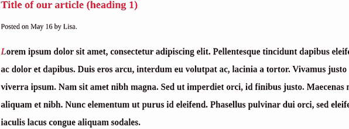

图 1.21 伪元素定位在标题后的第一段第一个字母

### 1.6.4 属性值选择器

属性选择器通常用于样式化链接和表单元素，它样式化包含指定属性的 HTML 元素。属性值选择器寻找具有相同值的特定属性。

在我们的文章中，我们有一些意大利语内容。段落的语言由`lang`属性指定，如下所示。

列表 1.12 指定意大利语内容

```
<p lang="it">Questo paragrafo è definito in italiano.</p>
```

为了提示用户该内容是意大利语，我们将使用 CSS 添加意大利旗标表情。浏览器将找到值为意大利语（it）的`lang`属性，然后在它之前添加一个意大利旗标表情。列表 1.13 也使用了`::before`伪元素。我们可以使用多种类型的选择器来定位我们想要样式的 HTML 的精确部分。

列表 1.13 使用多种类型的选择器在意大利语内容前添加旗标

```
[lang="it"]::before {
  content: ""
}
```

当此代码应用后，我们的意大利语内容前面有一个表情旗标（图 1.22）。

设备和应用中的表情符号差异

如果你正在与本章一起编码，你的输出可能与图 1.22 不同。表情符号在不同的设备、操作系统和应用中呈现方式不同。例如，Emojipedia（[`emojipedia.org`](https://emojipedia.org)）展示了特定表情符号在应用程序和设备上的外观。你可以在[`emojipedia.org/flag-italy`](https://emojipedia.org/flag-italy)上找到意大利国旗的详细信息。

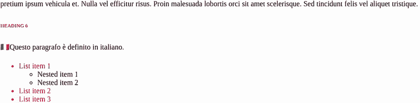

图 1.22 通过属性选择器和伪元素应用的意大利国旗

### 1.6.5 通用选择器

最广泛的选择器类型是通用选择器，它使用星号符号（`*`）。使用通用选择器做出的任何声明都将应用于所有 HTML 元素。

有时，这个选择器可以用来重置 CSS，但从特定性的角度来看，它具有 `0` 的特定性值，这意味着如果需要，它可以很容易地被覆盖。这很重要，因为它针对了每个元素。通用选择器还可以用来针对特定选择器的任何和所有后代，例如 `.foo` `*` `{` `background:` `yellow;` `}`，其中具有 `foo` 类的任何和所有后代元素都将被赋予黄色背景。

在我们的示例项目中，我们将使用通用选择器（`*`）将 `font-family` 设置为 `sans-serif`，以便在整个文章中字体始终为无衬线字体，如下面的列表所示。

列表 1.14 使我们的 `font-family` 保持一致

```
* { font-family: sans-serif; }
```

当此代码被应用时，我们文档中的所有文本都将使用无衬线字体，无论元素类型如何（图 1.23）。

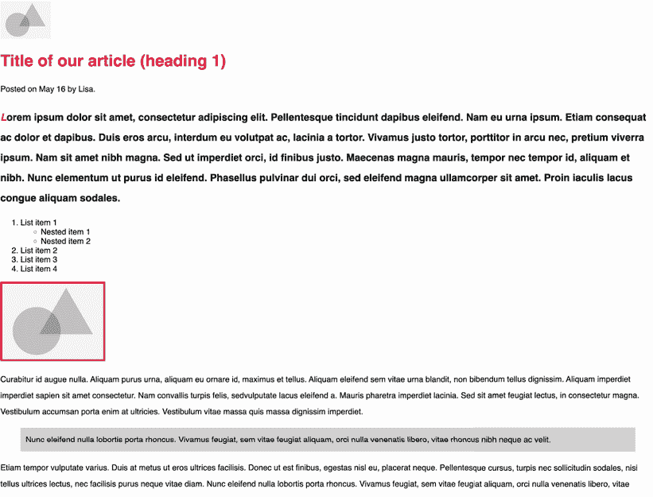

图 1.23 使用通用选择器更改所有元素的字体类型

## 1.7 编写 CSS 的不同方式

CSS 允许我们在编写规则和格式化时具有灵活性。在本节中，我们将探讨缩写属性（我们将在整本书中不断回到这个话题）以及格式化 CSS 的方法。

### 1.7.1 缩写

*缩写* 通过将所有值合并到一个属性中来替代编写多个 CSS 属性。我们可以使用一些属性，如 `padding`、`margin` 和 `animation`，这些属性在本书的各个部分都有涉及。编写缩写的优点是它减少了样式表的大小，从而提高了可读性、性能和内存使用。

每个缩写属性都有不同的值。让我们探索我们在项目中使用的那个。我们在文章中有一个 `blockquote`。当我们为其添加样式时，我们使用了 `padding` 属性，并声明了以下 `padding`：`padding:` `10px`。通过这样做，我们使用了缩写。相反，我们本可以像以下列表中所示那样编写代码。

列表 1.15 扩展 `padding`

```
  padding-top: 10px;
  padding-right: 10px;
  padding-bottom: 10px;
  padding-left: 10px;
```

将每个声明单独编写是完全可行的，但从计算性能的角度来看，这样做是昂贵的，尤其是因为所有属性值都是相同的。相反，我们可以使用 `padding` 属性并将所有四个值放在同一行上。顺序是 `top`、`right`、`bottom` 和 `left`。如果 `right`/`left` 和 `top`/`bottom` 的值相同，我们还可以将它们组合起来，如图 1.24 所示。

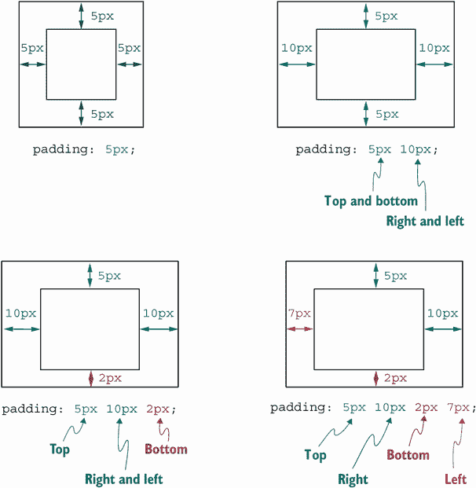

图 1.24 解释缩写属性 `padding`

如图中所示，我们可以声明所有四个值来定义`top`、`right`、`bottom`和`left`的值。但如果我们说`right`和`left`相同，而`top`和`bottom`不同，我们可以指定三个值，顺序为`top`、`right` `&` `left`、`bottom`。

如果声明了两个值，我们表示第一个值是`top`和`bottom`应该是什么；然后第二个值设置`right`和`left`。最后，如果只声明了一个值，该值将设置所有四个边。

### 1.7.2 格式化

我们可以用几种方式编写 CSS，并且当我们查看他人的代码时，我们经常看到不同的格式。本节展示了几个示例。

列表 1.16 中所示的多行格式可能是格式化的最流行选择。每个声明都在自己的行上，并通过制表符或空格缩进。

列表 1.16 多行格式

```
h1 {
  color: red;
  font-size: 16px;
  font-family: sans-serif
}
```

列表 1.17 所示的多行格式的变体将开括号放在自己的行上。这个例子可能是我们在 PHP 语言中看到的东西。将开括号放在自己的行上可能被认为是多余的。

列表 1.17 多行格式的变体

```
h1
{
  color: red;
  font-size: 16px;
  font-family: sans-serif
}
```

列表 1.18 中所示的单行格式非常有意义；它紧凑，我们可以扫描一个文件，知道第一部分是选择器。缺点是如果规则包含许多声明，它可能难以阅读。

列表 1.18 单行格式

```
h1 { color: red; font-size: 16px; font-family: sans-serif }
```

所有这些选项都有优点和缺点，但本书中的项目使用了一和三的组合。要知道的主要是，没有正确或错误的方法；选择通常取决于对你和/或你的团队来说什么最有效。只要代码易于理解，那就足够了。

那些有鹰眼的人会注意到，在列表 1.16、1.17 和 1.18 中，规则的最后一个声明的末尾没有分号（`;`）。这个分号是可选的。CSS 最好的一个方面之一是我们可以用最舒适的方式编写它。

## 摘要

+   CSS 是一种成熟的编码语言，CSS 的每一部分都由模块组成。

+   模块替换了像 CSS3 这样的大型发布。

+   内联 CSS 可以具有最高优先级，并且性能良好，但它重复且难以维护。

+   外部 CSS 将我们的 CSS 与 HTML 分开，保持 SoC。

+   除了我们自己的 CSS 外，浏览器还会应用默认样式。

+   用户还可以应用他们自己的 CSS，这可以覆盖作者和 UA 样式表。

+   使用`!important`被认为是不良实践。

+   一个 CSS 规则由一个选择器和一条或多条声明组成。

+   我们可以为许多类型的选择器创建规则，并且每个规则都可以有自己的特定级别。
