# 2 使用 CSS Grid 设计布局

本章涵盖

+   探索网格轨道并排列我们的网格

+   在 CSS 网格中使用`minmax`和`repeat`函数

+   使用 CSS Grid 独特的分数单位

+   创建模板区域并将项目放置在区域中

+   使用网格时考虑可访问性

+   在网格中创建列和行之间的间隙

现在我们对 CSS 的工作原理有了基本的了解，我们可以开始探索布局 HTML 内容的选项。在本章中，我们将专注于使用网格进行布局。

## 2.1 CSS Grid

在这种意义上，*网格*是由交叉形成一系列正方形或矩形的线条网络。现在所有主流浏览器都支持 CSS Grid，它已成为一种流行的布局技术。

实际上，网格由列和行组成。我们将创建我们的网格，然后为我们的项目分配位置，就像我们在玩棋盘游戏“战舰”时在网格上放置船只一样。

虽然网格布局有时与表格相比较，但它们有不同的用途和满足不同的需求。网格用于布局，而表格用于表格数据。如果正在设计的样式内容适合 Microsoft Excel 表格，那么它是表格数据，应该放在表格中。

在 2000 年代中期，我们使用表格进行布局，有时我们仍然需要这样做。（例如，电子邮件有时需要使用表格进行布局，因为它们只支持 CSS 样式的一个子集。）然而，在网络上，这种技术被认为是不良实践，因为它会导致可访问性差和语义缺失。现在我们可以使用网格代替。

CSS Grid 赋予我们创造力，可以制作各种布局，并配合媒体查询适应不同条件。我们将使用网格来设计我们的项目，到本章结束时，我们的布局将看起来像图 2.1。


图 2.1 最终输出

我们在 GitHub 仓库的 chapter-02 文件夹中（[`github.com/michaelgearon/Tiny-CSS-Projects`](https://github.com/michaelgearon/Tiny-CSS-Projects)）或 CodePen（[`codepen.io/michaelgearon/pen/eYRKXqv`](https://codepen.io/michaelgearon/pen/eYRKXqv)）的起始 HTML，看起来如下所示。

列表 2.1 项目 HTML

```
<body>
  <main>                                   ①
    <header>                               ②
      
      <h1>Sonnets by William Shakespeare</h1>
    </header>
    <article>                              ②
      <h2>
        Sonnet 1
        <br><small>by William Shakespeare</small>
      </h2>
      <p>
        <span>From fairest creatures we desire increase,</span>
        ...
      </p>  
    </article>
    <aside>                                ②
      <section>
        
        <h3>Sonnet 2</h3>
        <p>
          When forty winters shall besiege thy brow,
          <br>And dig deep trenches in thy beauty's field, ...
        </p>
        <a href="">Read more of Sonnet 2</a>
      </section>
      <section>
        
        <h3>Sonnet 3</h3>
        <p>
          Look in thy glass and tell the face thou viewest,
          <br>Now is the time that face should form another, ...
        </p>
        <a href="">Read more of Sonnet 3</a>
      </section>
    </aside>
    <section class="author-details">       ②
      <h3>
        <small>About the Author</small>
        <br>William Shakespeare
      </h3>
      <p>English playwright, poet, ...</p>
    </section>
    <section class="plays">                ②
      
      <h3>Checkout out his plays:</h3>
      <ul>
        <li><a href="">All's Well That Ends Well</a></li>
        ...
      </ul>
    </section>
    <footer>                               ②
      <p>Want to read more ...</p>
    </footer>
  </main>
</body>
```

① 我们项目的容器

② 我们容器内的子元素

我们还有一些起始 CSS（列表 2.2），以指导我们在开始将 HTML 元素放置在网格格式时。在本章中，我们不会担心这些预设样式（如边距、填充、颜色、字体和边框）。这些概念在其他部分的书中有详细说明，因为我们想专注于本项目的布局。

列表 2.2 起始 CSS

```
body {
  margin: 0;
  padding: 0;
  background: #fff9e8;
  min-height: 100vh;                         ①
  font-family: sans-serif;
  color: #151412
}
main { margin: 24px }
img {
  float: left;                               ②
  margin: 12px 12px 12px 0
}
main > * {                                   ③
  border: solid 1px #bfbfbf;                 ④
  padding: 12px;
}
main > *, section { display: flow-root }     ⑤
p, ul { line-height: 1.5 }
article p span { display: block; }
article p span:last-of-type,                 ⑥
article p span:nth-last-child(2) {           ⑥
  text-indent: 16px                          ⑥
}                                            ⑥
.plays ul { margin-left: 162px }             ⑦
```

① 背景覆盖整个页面，即使窗口比内容长。

② 允许文本围绕图像换行

③ 星号和子组合选择主元素的所有直接子元素。

④ 边框指出通过网格定位的章节。

⑤ 防止图像从其容器中溢出

⑥ 缩进十四行诗的最后两行

⑦ 缩进列表；否则，项目符号会紧挨着图像。

我们将字体从`serif`改为`sans-serif`，并使用`margin`增加浏览器窗口边界和容器之间的间距。我们还使图像左浮动，并调整行高、字体和填充。

注意，我们在`main`元素的直接子项上添加了边框和一些填充，以帮助我们定义布局。我们将在项目的后期移除这些元素。我们的起始点看起来像图 2.2。

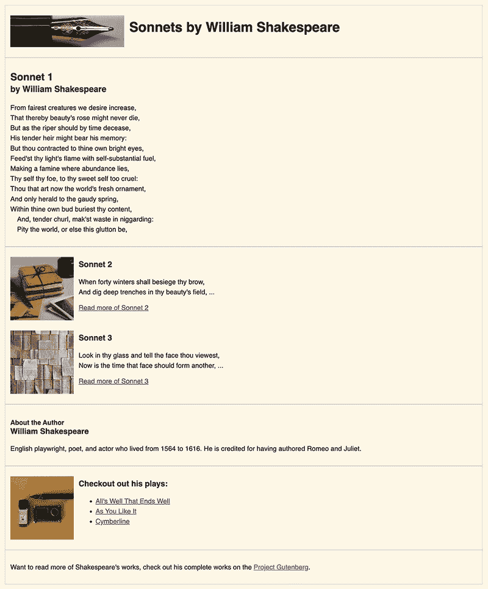

图 2.2 起始点

CSS 网格是一种在 2D 布局上放置项的方法：水平（x 轴）和垂直（y 轴）。相比之下，flexbox（在第六章中介绍）是单轴导向的。它仅在其配置的 x 轴或 y 轴上操作。

我们可以使用 CSS Flexbox 和 CSS Grid 在网页上对齐和布局项。但随着我们进入本章，我们会发现 Grid 相对于 Flexbox 的一个好处是，它允许我们轻松地将页面划分为区域并创建复杂的布局。

首先，我们将设置我们的网格。然后我们将探讨根据窗口大小如何改变网格的行为。

## 2.2 显示网格

安排网格的第一步是将父容器项的`display`值设置为`grid`。在创建网格布局时，我们可以使用两个值之一：

+   `grid`—当我们希望浏览器在块级框中显示网格时使用。网格占据容器的全部宽度，并自行在新行上设置。

+   `inline-grid`—当我们希望网格成为内联级框时使用。网格将自己设置为与之前内容的内联，就像一个`<span>`。

我们将使用列表 2.3 中显示的`grid`值进行布局。

块级和内联级框的区别

在 HTML 中，每个元素都是一个框。块级框表示一个元素的框应该使用其父元素的整个水平空间，因此默认情况下阻止任何其他元素位于同一水平线上。相比之下，内联元素允许其他内联元素位于同一水平线上，具体取决于剩余空间。

列表 2.3 设置显示为`grid`

```
main {
  display: grid;
}
```

如果我们在浏览器中预览此代码，我们会注意到视觉上没有任何变化，因为浏览器默认情况下将直接子项显示在一列中。然后浏览器为所有子元素生成足够的行。

使用我们浏览器中的开发者工具（图 2.3），我们看到，尽管布局在视觉上没有改变，但网格已经被创建。要在大多数浏览器中查看底层网格，我们可以右键点击网页，并在上下文菜单中选择“检查”。在 Mozilla Firefox 的检查窗口中，当我们选择父容器时，我们看到两个指示布局现在是网格的东西：

+   每个直接子项周围都有紫色线条。

+   在 HTML 中，`<main>`元素中有一个名为 grid 的图标。当我们点击`<main>`旁边的网格图标时，布局面板会显示我们的网格结构。

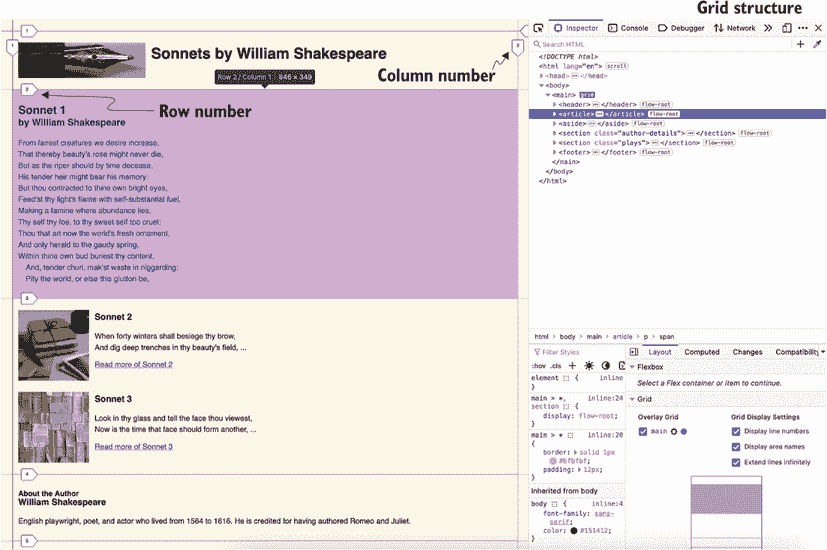

图 2.3 Firefox 的开发工具

我们可以在 Google Chrome 或 Apple 的 Safari 中遵循类似的步骤。

## 2.3 网格轨道和线

当 CSS 网格布局模块被引入时，它引入了新的术语来描述布局项。这些术语中的第一个是*网格线*。网格线水平垂直排列，并从左上角开始编号为 1。在正数对面的是负数。

书写模式和脚本方向

每一行分配的数字取决于书写模式（文本行是水平还是垂直排列）以及组件的脚本方向。例如，如果书写模式是英语，那么左边的第一行编号为 1。如果由于语言而将语言方向设置为从右到左，例如阿拉伯语（从右到左书写），则第 1 行将是最右侧的行。

网格线之间的空间被称为*网格轨道*，它们由列和行组成。列从左到右排列，行从上到下排列。*轨道*是网格上任意两条线之间的空间。在图 2.4 中，高亮的轨道是我们网格中的第一行轨道。列轨道将是两条垂直线之间的空间。

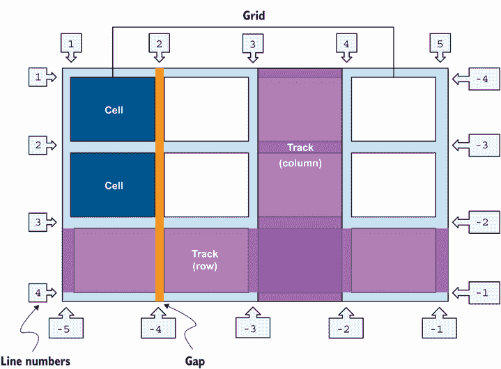

图 2.4 基于英语书写模式，方向设置为从左到右的网格结构

每个轨道中都有网格单元格。*单元格*是网格行和网格列的交点。

我们可以使用`grid-template-columns`和`grid-template-rows`属性来布局我们的网格。这些属性指定了一个以空格分隔的轨道列表，包括网格的线名和轨道尺寸函数。`grid-template-columns`属性指定了网格列的轨道列表，而`grid-template-rows`指定了网格行的轨道列表。

在我们设置列之前，我们需要了解一些 CSS 网格特有的概念。

### 2.3.1 重复列

为了在代码中避免重复，您可以使用`repeat()`函数来指定您需要的列数或行数。

定义：*函数*是一个自包含的、可重用的代码片段，具有特定的角色。函数存在于其他编程语言中，如 JavaScript。有时，我们可以向函数传递一个或多个值；这些值被称为*参数*。向函数传递值时，我们将它们放在括号中。我们无法在 CSS 中创建自己的函数；相反，我们使用 CSS 提供的内置函数。

`repeat()`函数需要两个以逗号分隔的值。第一个值表示要创建多少列或行。第二个值是每列或每行的尺寸。

对于我们的项目，我们将指定我们想要两列，并且对于每列的大小，我们将使用 `minmax()` 函数。因此，我们的列定义将是 `grid-template-columns:` `repeat(2,` `minmax(auto,` `1fr))` `250px;`。如果我们正在定义行的高度，我们将使用 `repeat()` 与 `grid-template-rows`。

这个声明生成了三列，其中两列使用分数单位具有相同宽度，一列为 250 像素。让我们进一步看看这个声明。注意在 `repeat()` 函数内部，我们使用了 `minmax()` 函数。

### 2.3.2 minmax() 函数

`minmax(min,` `max)` 函数由两个参数组成：网格轨道的最小和最大范围。万维网联盟（W3C）规范指出，`minmax` 函数“定义了一个大于或等于 `min` 且小于或等于 `max` 的大小范围”([`www.w3.org/TR/css-grid-2`](https://www.w3.org/TR/css-grid-2))。

注意：为了使函数有效，`min` 值（第一个参数）需要小于 `max` 值。否则，浏览器会忽略 `max`，函数仅依赖于 `min` 值。

对于我们的项目，我们将 `min` 值设置为 `auto`，将 `max` 值设置为 `2`。让我们看看 `auto` 的含义。

### 2.3.3 自动关键字

`auto` 关键字可以在函数的最低或最高值中使用。当 `auto` 关键字用于最大值时，它被处理成与 `max-content` 关键字相同。行或列的尺寸将与行或列内内容所需的空间相等。

虽然我们没有在我们的项目中使用它，但 `auto` 关键字的一个常见用例是创建包含固定页眉和页脚的布局。当我们为设置为 `auto` 的区域分配溢出时，该区域会随着窗口大小而收缩和扩展，如图 2.5 所示。

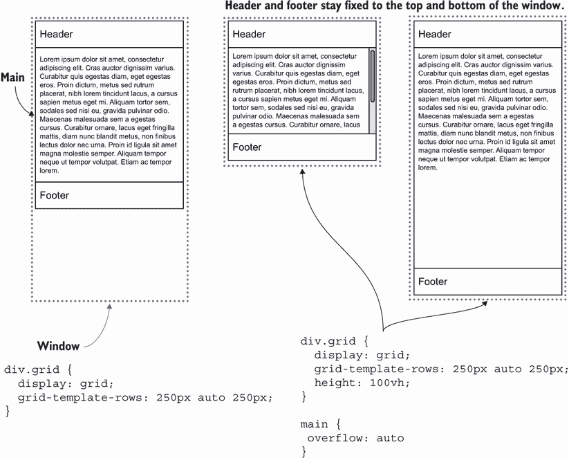

图 2.5 使用 `auto` 关键字的示例

对于我们的用例，在声明 `grid-template-columns:` `repeat(2,` `minmax(auto,` `1fr))` `250px;` 中，`auto` 关键字规定，对于我们的前两列，列的最小宽度应与包含的元素宽度相同。让我们看看用来设置最大宽度的灵活长度单位（`fr`）。

### 2.3.4 分数（fr）单位

分数单位（`fr`）是在 CSS 网格布局模块中引入的。`fr` 单位是网格特有的，它告诉浏览器一个 HTML 元素应该有多少空间，与其他元素相比，这是通过在应用最小值之后分配剩余空间来实现的。CSS 将可用空间平均分配给 `fr` 单位，因此 `1fr` 的值等于可用空间除以指定的 `fr` 单位总数。

让我们通过图 2.6 中显示的美味蛋糕图解来探索分数的含义。（如果这个图让你想吃一块蛋糕，那很抱歉。）

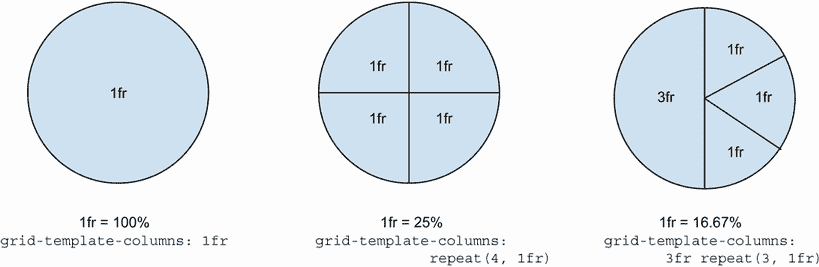

图 2.6 分数值

如果你有一个完整的蛋糕，它等于 100%。从 CSS 的角度来看，如果我们决定吃掉所有的蛋糕，那将是 1 个分数。在我们的 CSS 中，这将是`grid-template-columns:` `1fr`，这将等于列的 100%。

但我们是友好的，所以我们决定把一些蛋糕分给四个朋友。我们需要确定每个人将有多少份蛋糕。

如果我们公平的话，可以说我们的蛋糕可以分成四等份。在我们的 CSS 中，这将是`grid-template-columns:` `1fr` `1fr` `1fr` `1fr`。我们告诉浏览器给每个 HTML 元素一个相等的整体份额。

但如果我们决定偷偷地多留一些给自己呢？毕竟，是我们烤的蛋糕。我们决定拿走一半的蛋糕，然后把剩下的另一半分成三份。为了做到这一点，我们需要六个分数：三个分数代表我们 50%的蛋糕，然后对剩下的 50%再分三次。

我们的 CSS 将是`grid-template-columns:` `3fr` `1fr` `1fr` `1fr`。所以我们在说总共有六个分数；第一列得到三个（或者说总量的 50%），然后剩下的 50%应该平均分配给其他三个列。我们可以使用`fr`单位和`repeat()`函数来使这个值更容易阅读，这将`grid-template-columns:` `3fr` `repeat(3,` `1fr`)。

对于我们的项目，我们将通过在以下列表中添加代码到`main`规则中来创建列的网格线。

列表 2.4 设置列的数量

```
main {
  display: grid;
  grid-template-columns: repeat(2, minmax(auto, 1fr)) 250px;
}
```

在浏览器中预览时（图 2.7），我们看到现在我们的网格在每个线上都设置了数字。我们可以利用这些信息，明确选择在网格中放置我们的 HTML 元素的位置，基于网格线的编号。

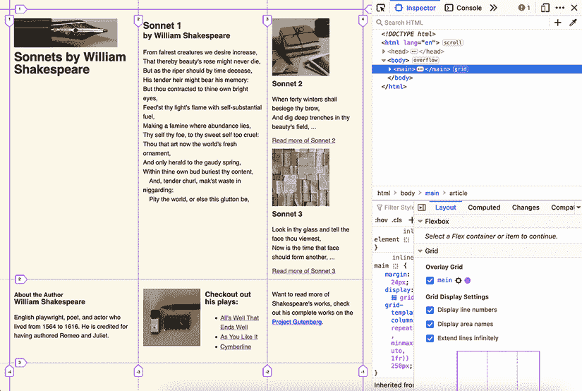

图 2.7 Firefox 浏览器预览显示的网格线和每行的相关数字

我们还注意到，浏览器假设我们想要在每个网格单元内放置我们的 HTML 元素。而不是垂直堆叠元素，浏览器会填充每个列单元，直到填满，然后创建一个新的行，并填充那些列。自动创建额外的网格单元也被称为*隐式网格*。

显式网格与隐式网格

当我们使用`grid-template-columns`或`grid-template-rows`时，我们正在创建一个显式网格。我们明确地告诉浏览器这个网格应该有多少列和行。

隐式部分（对于行和列）是浏览器自动创建的部分，这发生在子项多于网格单元的情况下。在这种情况下，浏览器隐式地向我们的网格添加单元格，以确保所有元素都有一个网格单元。

我们可以通过`grid-auto-flow`、`grid-auto-columns`和`grid-auto-rows`来控制隐式行为。

在这个阶段，我们已经创建了一个包含三列的网格。其中两列使用 `minmax()`，我们的第三列有一个固定的值 `250px`。这些设置给我们一个三列布局。我们希望将主要内容分布在第一列和第二列中，并使用第三列来显示不太重要的内容，这就是为什么我们给它较少的视觉空间。（在大多数屏幕上，第三列将比前两列窄。）

## 2.4 网格模板区域

如果我们想在网格的特定行和列上显式设置一个元素，我们有两种选择。首先，我们可以使用行号并指定子元素的如下位置：`grid-column:` `1` `/` `4`。在这个语法中，第一个数字表示元素开始的位置，第二个数字表示元素结束的位置（图 2.8）。这个例子将元素放置在第一列，跨越第二列和第三列。如果只提供一个数字，则元素只跨越一行或一列。

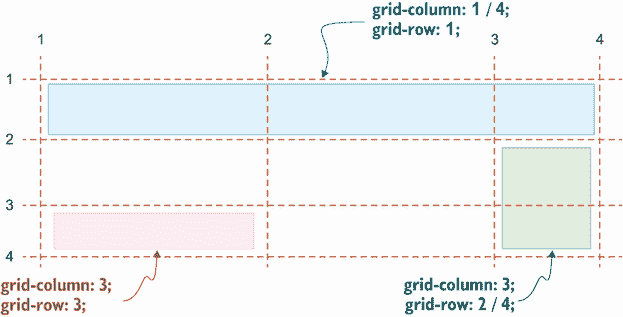

图 2.8 示例 `grid-column` 和 `grid-row` 语法

要定义行，我们会使用与列相同的语法，通过 `grid-row` 属性。为了放置一个元素，使其从第三行开始并跨越两行，我们会写 `grid-row:` `3` `/` `5`。`grid-column` 和 `grid-row` 属性是 `grid-column-start`、`grid-column-end`、`grid-row-start` 和 `grid-row-end` 的缩写。

我们可以不用处理数字，而使用命名区域来引用，当我们明确地将元素放置在网格上时。为此，我们使用 `grid-template-areas` 属性，它允许我们定义我们希望网页如何布局。

`grid-template-areas` 属性接受多个字符串，每个字符串由它们描述的区域的名称组成。每个字符串代表布局中的一行，如图 2.8 所示。每个名称代表行内的一个列。如果两个相邻的单元格具有相同的名称（水平或垂直），则这两个单元格被视为一个区域。网格区域可以是一个单独的单元格，例如图 2.9 中定义的 `plays` 区域，但如果它包含多个单元格，则这些单元格必须创建一个矩形形状，并且所有具有相同名称的单元格必须是相邻的。例如，您无法创建一个 L 形状。

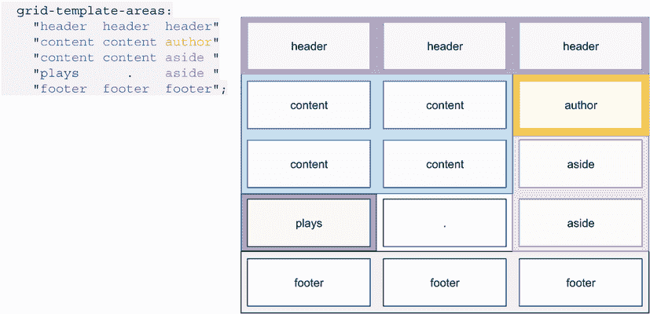

图 2.9 `grid-template-areas` 属性的语法

命名区域的优点在于最终结果的可视化。我们将定义我们的 `grid-template-areas`，如列表 2.5 所示。注意图 2.9 中第四行的点（`.`）。点用于定义我们打算保持为空的单元格。因为那个单元格没有名称，所以内容不能分配给它。

列表 2.5 创建我们的模板区域

```
main {
  display: grid;
  grid-template-columns: repeat(2, minmax(auto, 1fr)) 250px;
  grid-template-areas:
  "header  header  header"
  "content content author"
  "content content aside "
  "plays      .    aside "
  "footer  footer  footer";
}
```

尽管我们已经定义了区域，但内容仍然隐式地定位在每个可用的单元格中，忽略了我们定义的区域（图 2.10）。我们需要将这些内容分配给这些区域的每一个。

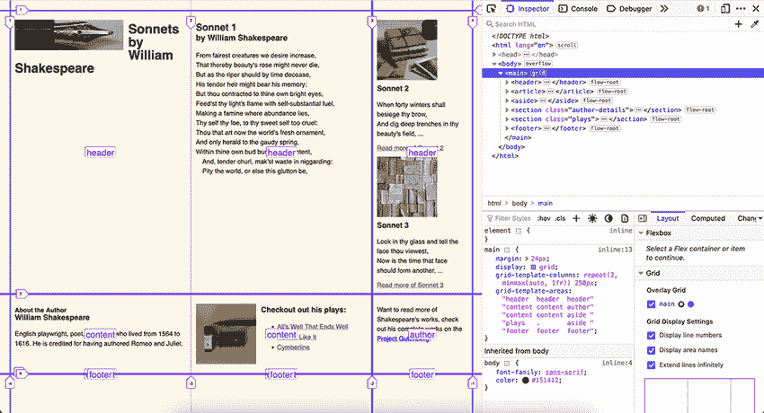

图 2.10 Firefox 中显示的已定义网格区域

### 2.4.1 `grid-area` 属性

为了将元素放置在定义的区域中，我们使用 `grid-area` 属性。它的值是在 `grid-template-areas` 属性中分配的名称。如果我们想将 `<header>` 元素放置在我们定义为 `header` 的区域内部，例如，我们将定义 `header { grid-area: header; }`。对于我们的项目，我们按照以下列表所示在我们的网格上设置元素。

列表 2.6 将内容分配给网格区域

```
header { grid-area: header }
article { grid-area: content }
aside { grid-area: aside }
.author-details { grid-area: author }
.plays { grid-area: plays }
footer { grid-area: footer }
```

现在我们已经明确定义了内容应该放置的位置，内容就会落到位（图 2.11）。

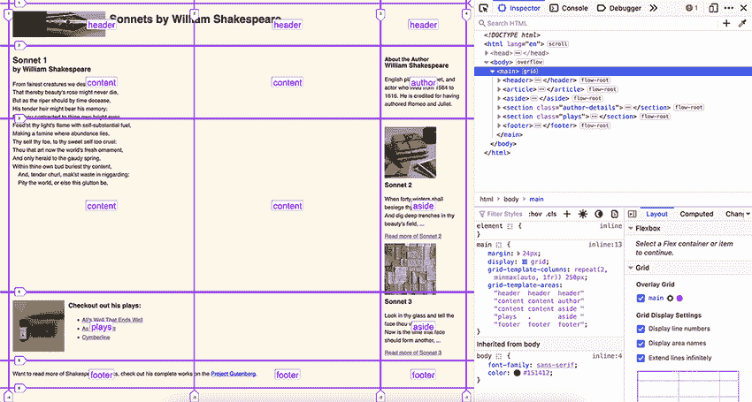

图 2.11 明确放置在网格上的内容

在布局设置中，让我们移除一些为了理解我们的布局做了什么而添加的样式。如下所示列表中，我们移除了内容部分的填充和边框。

列表 2.7 移除调试样式

```
main > * {
 border: solid 1px #bfbfbf;
 padding: 12px;
}
```

移除这些样式并缩小屏幕宽度（图 2.12）后，相邻列或行中的内容看起来更靠近。


图 2.12 窄屏幕宽度

让我们在区域之间添加空间。为了完成这个任务，我们将使用 `gap` 属性。

### 2.4.2 gap 属性

`gap` 属性是 `row-gap` 和 `column-gap` 属性的简写。通过设置行和列的间隙，我们定义了行和列之间的空白。*空白*是来自印刷设计的术语，定义了列之间的间隙。默认情况下，列和行之间的间隙是关键字 `normal`。这个值在所有上下文中都等于 `0px`，除非它与 CSS 多列模块一起使用，这时它等于 `1em`。

当我们使用 `gap` 属性时，额外的空间仅应用于网格的轨道之间。在第一个轨道之前或最后一个轨道之后不应用空白。为了设置网格周围的空间，我们使用填充和边距属性。

gap 与 grid-gap 的比较

当 CSS Grid 正在被定义时，这个属性的规范被称为 `grid-gap` 属性，但现在推荐使用 `gap`。我们可能在旧项目中看到 `grid-gap`。

`gap` 属性可以有最多两个正值。第一个值设置 `row-gap`，第二个值用于 `column-gap`。如果只声明了一个值，它将应用于 `row-gap` 和 `column-gap` 属性。

对于我们的项目，我们将通过在 `main` 规则中添加 `gap: 20px` 来设置行和列之间的 `20px` 间隙。图 2.13 显示了添加到布局中的间隙。添加了间隙后，让我们将注意力转向根据屏幕大小调整布局。

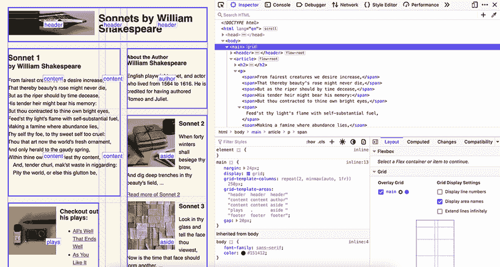

图 2.13 添加了间隙的网格布局

## 2.5 媒体查询

CSS 允许我们根据条件应用样式。一种条件是屏幕大小。媒体查询是*规则*：它们以`@`符号开头，并定义了包含它们的样式应在何种条件下应用。如果我们查看宽屏上的当前布局（图 2.14），我们会注意到页面中心有大量空间可以更好地利用。

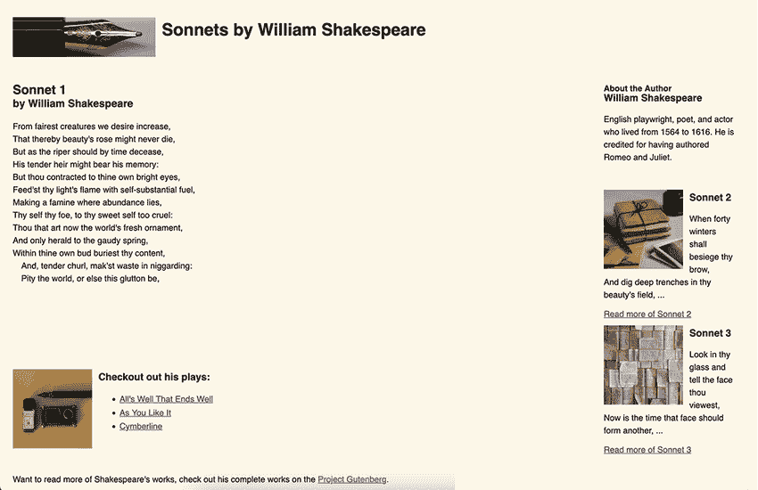

图 2.14 宽屏上的布局

让我们创建一个针对宽度大于`955px`的屏幕的媒体查询。查询是`@media` `(min-width:` `955px)` `{` `}`。我们放在大括号`{}`内的所有规则仅在屏幕大小大于或等于`955px`时应用。

列表 2.8 显示了我们的媒体查询。如果满足媒体查询条件，我们重新定义`grid-template-areas`以具有不同的配置。我们还更新了列的大小，以便列具有相等的宽度。

列表 2.8 使用媒体查询创建我们的模板区域

```
@media (min-width: 955px) {                    ①
  main {
    grid-template-columns: repeat(3, 1fr);     ②
    grid-template-areas:                       ③
    "header  header  header"                   ③
    "content author aside"                     ③
    "content plays aside "                     ③
    "footer  footer  footer";                  ③
  }
}
```

① 与媒体特性一起的 at 规则

② 重新定义列的大小

③ 重新配置内容应放置的位置

现在布局看起来像图 2.15 和图 2.16。

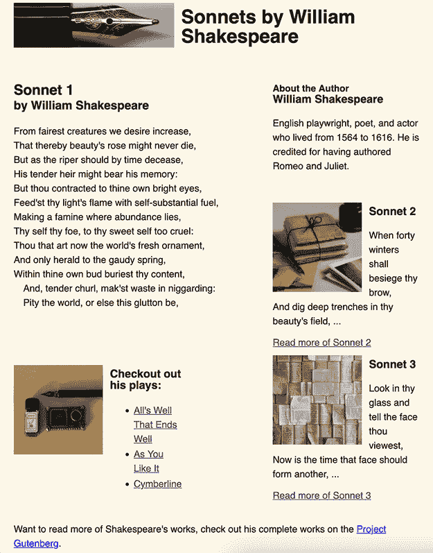

图 2.15 窄屏使用原始布局。

将`grid-template-areas`与媒体查询结合使用，我们可以用最少的代码重新配置我们的布局。但我们必须避免一些可访问性的陷阱。

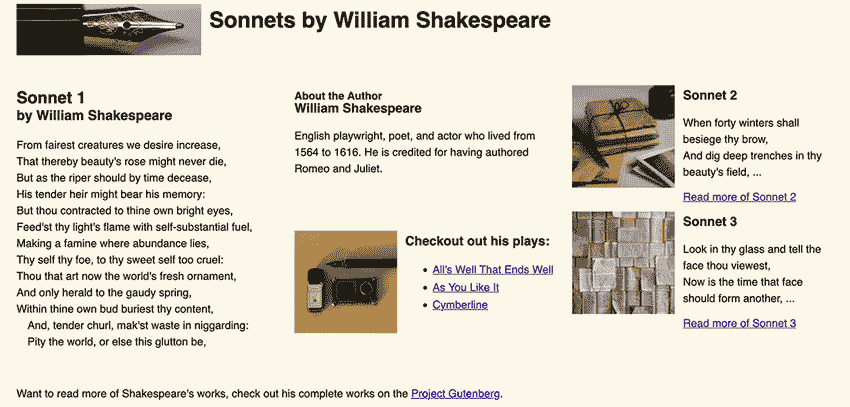

图 2.16 宽屏使用媒体查询的布局。

## 2.6 可访问性考虑

当我们将项目放置在网格区域内时，我们主要保持了它们在 HTML 中出现的顺序：页眉保持在顶部，页脚保持在底部，内容以逻辑的视觉顺序排列。但如果 HTML 顺序和视觉显示顺序不同怎么办？

如果用户正在使用屏幕阅读器跟随或通过键盘导航页面，并且程序性顺序与显示的内容不匹配，那么行为看起来将是随机的。这种随机性将使用户难以导航页面并理解其内容。通过使用网格改变内容的位置的视觉变化不会影响辅助技术向用户呈现信息的顺序。W3 网格布局模块建议如下关于这种情况（[`mng.bz/xdD7`](http://mng.bz/xdD7)）：

作者必须仅使用顺序和*网格放置*属性进行视觉上的内容重新排序，而不是逻辑上的重新排序。使用这些功能进行逻辑重新排序的样式表是不符合规范的。

解决方案是保持源代码和视觉体验相同，或者至少在合理的顺序上。这种方法既提供了最可访问的 Web 文档，又提供了一个良好的工作结构。对于英语来说，这意味着内容和 HTML 应该遵循相同的顺序，从左上角到右下角。

在将我们的元素分配到网格的相应区域后，我们应该始终测试我们的页面，以确保无论用户如何访问页面，顺序都是合理的。一种方法是使用屏幕阅读器访问我们的页面，并通过标签顺序来确保标签顺序仍然有效。

一些工具和扩展可以帮助可视化标签顺序。例如，在 Firefox DevTools 中，我们可以选择“无障碍性”选项卡并勾选“显示标签顺序”复选框，如图 2.17 所示，它会突出显示并编号可聚焦元素。我们可以看到我们的标签顺序是合理的，不太可能让用户感到困惑，所以我们可以继续前进。

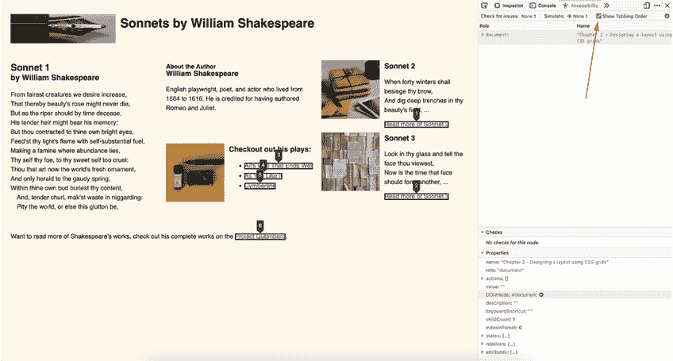

图 2.17 Firefox DevTools 中暴露的 HTML 标签顺序

现在我们的项目已经完成（图 2.18）。

网格的未来

在本章中，我们使用了 CSS 网格布局模块来创建一个根据浏览器宽度做出响应的布局。网格的许多方面仍在开发和迭代中，最值得注意的是子网格，这将允许网格中有网格。

虽然你现在可以在网格内设置网格，但子网格的好处是它们与其父网格更紧密相关。为了关注未来的增强和发展，请查看网格规范[`www.w3.org/TR/css-grid`](https://www.w3.org/TR/css-grid)。

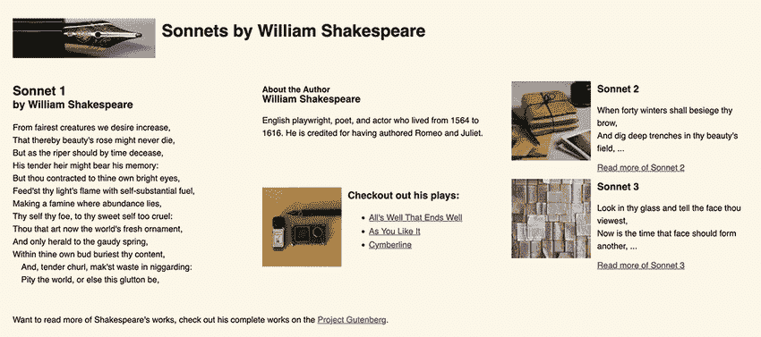

图 2.18 宽屏上的最终产品

## 摘要

+   网格是由交叉形成一系列正方形或矩形的线条网络。

+   值为 `grid` 的 `display` 属性允许我们在网格布局上放置项目。

+   `display` 属性应用于包含要放置在网格上的子元素的父项。

+   `grid-template-columns` 和 `grid-template-rows` 属性用于显式定义网格应包含的列和行的数量和大小。

+   可伸缩长度 (`fr`) 单位是 CSS 网格作为设置项目维度的一种替代方式而形成的测量单位。

+   我们可以使用 `repeat()` 函数提高代码效率，其中一行或多列具有相同的大小。

+   `minmax()` 函数允许我们设置两个参数：列应具有的最小宽度和最大宽度。

+   `grid-template-areas` 属性允许我们定义每个网格区域被称为什么。然后我们可以使用子项上的 `grid-area` 属性将它们分配到那些命名位置。

+   `gap` 属性在网格单元之间添加间距（创建边距）。

+   源代码和视觉体验需要保持相同的逻辑顺序。如有疑问，我们可以使用浏览器开发者工具来检查标签顺序。
