# 3 创建一个响应式的动画加载界面

本章涵盖

+   使用可缩放矢量图形 (SVG) 创建基本形状

+   了解 SVG 中 viewbox 和 viewport 的区别

+   理解关键帧和动画 SVG

+   使用动画属性

+   使用 CSS 样式化 SVG

+   使用外观属性样式化 HTML 进度条元素

我们在当今的大多数应用程序中都能看到加载器。这些加载器向用户传达正在加载、上传或等待的信息。它们给用户带来信心，表明正在发生某些事情。

如果没有某种指示器告诉用户正在发生某些事情，他们可能会尝试重新加载，再次点击链接，或者放弃并离开。当操作超过 1 秒时，我们应该使用某种进度指示器，这时用户往往会失去注意力并质疑是否存在问题。除了显示正在发生的事情的图形外，加载器还应伴随文本，告诉用户正在发生什么，以改善屏幕阅读器和其他辅助技术的网页可访问性。

对于我们的动画，我们将研究 CSS 动画模块，理解动画属性、关键帧和过渡，以及可访问性和对用户偏好的尊重。

## 3.1 设置

在这个项目中，我们将在 SVG 中创建矩形。我们将了解 SVG 提供的内容，并理解样式化 HTML 元素和 SVG 元素之间的细微差别。

我们还将创建一个进度条，显示用户完成了多少任务以及还剩下多少任务。我们将使用 HTML `<progress>` 元素，然后查看我们如何编辑浏览器的默认样式并应用自己的样式。总的来说，我们希望创建一个一致、响应式的加载器，能够在各种设备上工作。图 3.1 显示了结果。

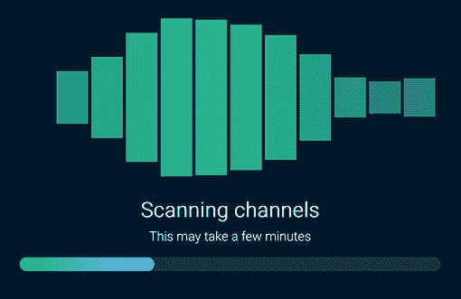

图 3.1 本章目标

本项目的代码位于 GitHub 仓库中（[`github.com/michaelgearon/Tiny-CSS-Projects`](https://github.com/michaelgearon/Tiny-CSS-Projects)）的第三章文件夹内。您可以在 CodePen 上找到完成项目的演示 [`codepen.io/michaelgearon/pen/eYvVVre`](https://codepen.io/michaelgearon/pen/eYvVVre)。

## 3.2 SVG 基础

*SVG* 代表 *可缩放矢量图形*。SVG 是一种基于 XML 的标记语言，由笛卡尔平面上的矢量组成。矢量图形可以从头开始编写，但通常是在 Adobe Illustrator、Figma 或 Sketch 等图形程序中创建。然后以 SVG 文件格式导出，并可以在代码文本编辑器中打开。

*向量* 是一个定义了几何原初的数学公式。线条、多边形、曲线、圆和矩形都是几何原初的例子。

平面上的 *笛卡尔坐标系* 是一个基于网格的系统，它使用一对基于点到两条垂直轴距离的数值坐标来定义一个点。这两条轴交叉的位置是 *原点*，其坐标值为 `(0, 0)`。回想一下数学课；当被要求在图上绘制线条时，你就是在使用笛卡尔坐标系。本质上，SVG 是用 XML 编写的坐标平面上的形状。

相比之下，PNG、JPEG 和 GIF 是 *位图图像*，它们是通过使用像素网格创建的。图 3.2 展示了位图和矢量图形之间的区别。

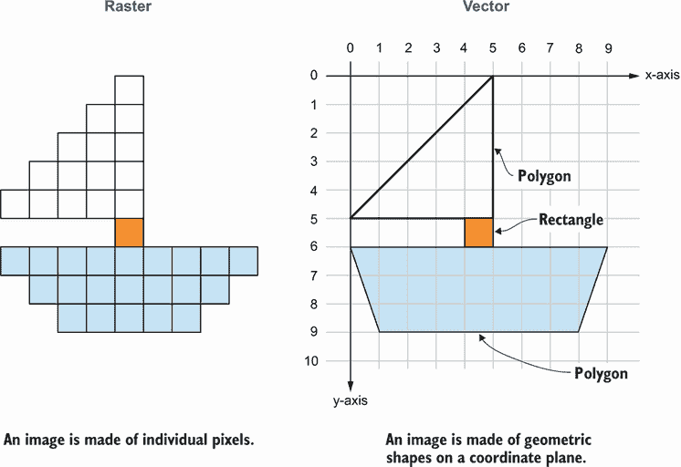

图 3.2 矢量图形与位图图形的比较

SVG 相比于位图图像有许多优势，包括无限可缩放。我们可以将图像缩小或放大到我们想要的程度，而不会丢失质量。我们无法在不看到 *像素化* 的情况下放大位图图像，这是由于放大渲染网格中的像素网格，使得网格的各个小方块变得可见。相比之下，当我们放大 SVG 时，我们是在坐标平面上程序化地设置形状和线条；点之间的路径被重新绘制，质量不会降低。

因为 SVG 是用 XML 编写的，所以我们可以直接在我们的 HTML 中放置 SVG 代码，并以与我们处理其他 HTML 元素相同的方式访问、操作和编辑它。SVG 对于图形来说，就像 HTML 对于网页一样。

然而，对于处理高度复杂的图像，如照片，位图是一个更好的选择。使用 SVG 创建逼真的图像是可能的，但这并不实用。矢量图形的文件大小和因此的加载性能比位图图像大得多。

SVG 最常见的用途是标志、图标和加载器。我们使用它们作为标志，因为标志通常是简单的图像，需要无论大小或媒介都保持清晰。此外，一个公司或产品拥有几个版本的标志，用于深色背景和浅色背景的情况并不少见。重新着色、简洁和缩放也是我们为什么使用 SVG 作为图标的原因。

我们使用 SVG 作为加载器，因为与它们的位图对应物不同，它们允许我们在图像内部添加动画。我们可以将图形内的单个元素隔离开来，并应用 CSS 或 JavaScript 到这个单独的部分——这是位图无法做到的。

之前我们提到 SVG 是基于笛卡尔坐标系（一个二维坐标平面）。让我们来看看这意味着什么以及它是如何工作的。

### 3.2.1 SVG 元素的定位

当我们处理 SVG 元素时，考虑定位的方式是想象我们在一个网格上放置元素。一切从`(0,0)`（原点）开始，这是 SVG 文档的左上角。`x`或`y`值越高，它离左上角就越远。图 3.3 在图 3.2 的船的例子上进行了扩展，增加了每个形状的原点和坐标值。

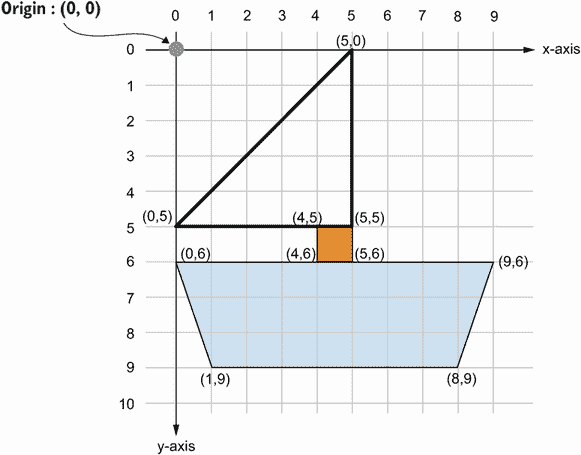

图 3.3 在坐标平面上定位元素

我们项目中的加载器由一系列 11 个矩形组成。为了放置它们，我们需要考虑它们在坐标平面上的位置，包括它们的宽度和它们之间的间隙。

### 3.2.2 视口

`视口`是用户可以看到 SVG 的区域。它由两个属性设置：`width`和`height`。将视口想象成一个画框：它设置了画框的大小，但不会影响其中图形的大小。如果我们在一个比画框大的画框内放置一个图像，那么就会发生溢出。同样的事情也会发生在我们的 SVG 上。在 CSS 定位中，视口测量值以 SVG 的左上角为起点（图 3.4）。

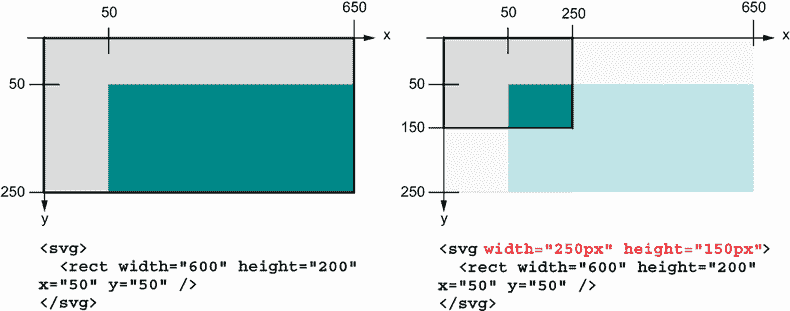

图 3.4 带有和没有定义视口的 SVG

加载器的视口将是

```
<svg width="100%" height="300px"> <!--SVG code --> </svg>
```

宽度设置为`100%`，但 100%是指什么？我们规定加载器将占用其父项提供的 100%的可用空间。

以下列表显示了我们的起始 HTML。我们看到我们的加载器嵌套在一个部分中；因此，我们的加载器将与该部分的宽度相同。

列表 3.1 开始使用 HTML

```
<body>
  <section>
    <svg width="100%" height="300px"></svg>          ①
    <h1>Scanning channels</h1>
    <p>This may take a few minutes</p>
    <progress value="32" max="100">32%</progress>    ②
  </section>
</body>
```

① 加载器增加了 100%宽度、300 像素高度的视口

② 我们将在本章后面讨论的进度条

我们还有一些起始 CSS（列表 3.2）。背景（`<body>`）、`<section>`、标题（`<h1>`）和段落（`<p>`）已经被预先样式化，以关注加载器、进度条和动画。

列表 3.2 开始使用 CSS

```
body { background: rgb(0 28 47); }
section {                                ①
  display: flex;                         ②
  flex-direction: column;                ②
  justify-content: space-between;        ②
  align-items: center;                   ②
  max-width: 800px;                      ②
  margin: 40px auto;                     ③
  font: 300 100% 'Roboto', sans-serif;   ④
  text-align: center;                    ④
  color: rgb(255 255 255);               ⑤
}                                        ⑥
h1 {
  font-size: 4.5vw;
  margin: 40px 0 12px;
}

p {
  font-size: 2.8vw;
  margin-top: 0;
}
```

① 规则样式开始，用于样式化加载器的容器

② 使用 flexbox 布局，将子项设置为列方向，水平居中，并设置元素之间的等间距

③ 使用缩写属性编写的边距：顶部和底部，40 像素边距；左侧和右侧，自动

④ 字体设置将字体重量设置为轻，使用 Roboto 字体，回退为无衬线字体，并居中文本

⑤ 使用 RGB 设置颜色为白色

⑥ 规则样式结束，用于样式化加载器的容器

我们看到我们的部分宽度被限制在 800 像素。`<section>`是一个块级元素，因此默认情况下，它将占用其可用的全部宽度。《body》和`<html>`也是块级元素。

由于我们没有在`<body>`或`<html>`上指定宽度、填充或边距，它们将占据整个窗口宽度。`<section>`将占据`<body>`的整个宽度。但由于我们为`<section>`分配了最大宽度，当窗口宽度达到 800 像素时，部分将停止与`<body>`一起增长，并保持 800 像素宽。由于部分元素有顶部和底部边距为`40px`，它将略微增加浏览器窗口和元素之间的间隙。

我们的加载器包含在部分中。该部分将占据整个身体的宽度，直到达到 800 像素；因此，我们的加载器也将这样做。图 3.5 显示了加载器的宽度将如何受到屏幕尺寸的影响。

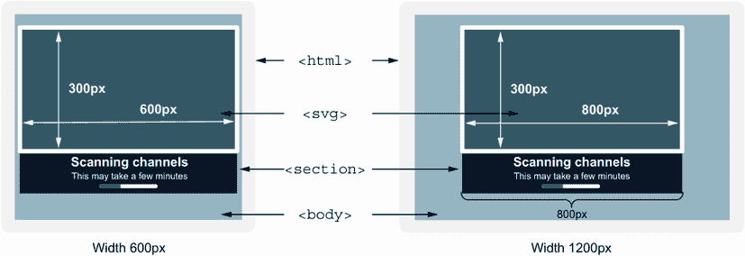

图 3.5 使用`max-width`时 SVG 宽度受窗口宽度的影响

设置了视口后，让我们设置视图框，以便 SVG 的内容可以与其容器一起缩放。记住，到目前为止，我们只处理了框架，而不是其内部。

### 3.2.3 视图框

*视图框*设置了图形在视口内的位置、高度和宽度。之前，我们将视口比作画框。视图框允许我们调整图像以适应我们的画框。它可以定位图像，也可以缩放图形，使其适合画框。我们可以将视图框视为我们的平移和缩放工具。要设置视图框，我们将`viewBox`属性应用于 SVG，并使用以下四个值和语法：`viewBox="min-x` `min-y` `width` `height"`。列表 3.3 显示了`viewBox`应用于我们的加载器。

按顺序分析数字，我们从`min-x`和`min-y`开始，它们都设置为`0`。我们希望图形的左上角位于框架的左上角。`min-x`和`min-y`允许我们调整图形在其框架中的位置；它是平移工具。由于我们希望它正好位于左上角，我们将值设置为`0`。

接下来，我们应用宽度，设置为`710`，因为我们的加载器有 11 个总条形，每个条形宽度为`60`。60 × 11 = 660，我们有 10 个间隙。每个条形之间的间隙宽度为 5 × 10 = 50；因此，我们的加载器宽度将是`660` `+` `50` `=` `710`。

我们将基于加载器中条形的高度设置`viewBox`的高度。条形的高度值为`300`，因此我们也设置了视口高度为`300`。我们的加载器将正好适合其视口。下一个列表显示了应用于 SVG 的`viewBox`。

列表 3.3 声明视图框

```
<svg viewBox="0 0 710 300" width="100%" height="300px">
 <!--SVG code-->
</svg>
```

注意，我们的视图框和视口高度都等于`300`。这就是我们缩放的方式。如果视图框的数字小于视口的数字，我们实际上是在框架外缩放，图形将更小。如果视图框的数字大于视口的数字，我们是在缩放。然而，由于我们的视口和视图框高度相等，所以我们没有缩放。

现在我们已经定义了我们将在其中工作的空间，我们可以开始向加载器添加形状。

### 3.2.4 SVG 中的形状

SVG 中有一些标准的形状和元素：

+   `rect`（矩形）

+   `circle`

+   `ellipse`

+   `line`

+   `polyline`

+   `polygon`

如果我们要创建一个不规则形状，我们也可以使用 `path`，但在这个加载器中我们不需要它。通常，路径是我们查看标志、图标和复杂动画图形背后的 XML 时看到的。对于我们的项目，我们将使用基本的矩形形状来创建波浪。

为了定义我们的矩形，这些矩形将在加载器中创建条形，我们将使用 `<rect>` 元素并添加四个属性：`height`、`width`、`x` 和 `y`。`x` 和 `y` 属性决定了矩形相对于 SVG 左上角的位置。 

我们想要创建 11 个矩形（列表 3.4），宽度为`60`，高度为`300`，我们将使用 `x` 属性在图形中移动矩形。我们从`0`开始，并将值增加条形的宽度（`60`）加上额外的间隙`5`。每个矩形的 `x` 值将比前一个多`65`。我们的第 11 个矩形的 `x` 值应该是`650`。

列表 3.4 十一个矩形

```
    <svg viewBox="0 0 710 300" width="100%" height="300">
        <rect width="60" height="300" x="0" />
        <rect width="60" height="300" x="65" />
        <rect width="60" height="300" x="130" />
        <rect width="60" height="300" x="195"/>
        <rect width="60" height="300" x="260"/>
        <rect width="60" height="300" x="325"/>
        <rect width="60" height="300" x="390"/>
        <rect width="60" height="300" x="455"/>
        <rect width="60" height="300" x="520"/>
        <rect width="60" height="300" x="585"/>
        <rect width="60" height="300" x="650"/>
    </svg>
```

现在我们已经将矩形放置在视口中，并且它们随着窗口大小的增加和减少而正确地调整大小，这是通过我们的 `viewBox` 实现的。图 3.6 显示了不同窗口大小下的我们的 SVG（我们在 SVG 上添加了白色边框和条形，以便在屏幕截图中更明显）。内容在其可用空间内收缩和增长，而不会扭曲它们所包含的矩形，因为随着窗口大小的调整，宽高比发生变化。

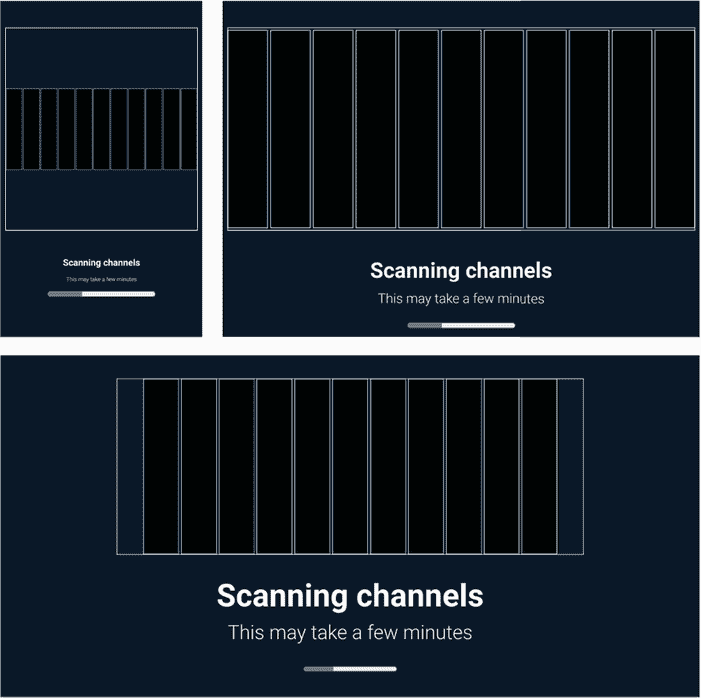

图 3.6 在 SVG 内添加 11 个矩形

注意到我们的矩形是黑色的。我们接下来的任务是给它们添加样式。

## 3.3 将样式应用于 SVG

我们可以像在 HTML 中一样应用 SVG 元素的样式：内联、在 `<style>` 标签内部或在外部样式表中。然而，存在一些细微的差异。首先，SVG 如何导入到我们的 HTML 中会影响样式需要放置的位置以影响元素。

向网页添加矢量图形最简单的方法是使用图像标签。我们引用图像文件的方式与引用任何其他图像相同：``。我们也可以将其作为 `background-image` 添加到我们的 CSS 中：`background-image: url("myImage.svg");`。

在这两种情况下，我们的 HTML 和样式可以影响 SVG，但不能影响其内部的元素。例如，我们可以影响图像的大小，但不能改变 SVG 中特定形状的颜色。图像基本上是一个黑盒，我们无法穿透以进行更改。要操纵图像内部的元素，我们必须将样式放置在 SVG 本身内部。

我们的第三个选项——我们将在本章中使用的是——将 SVG 的 XML 内联放置，直接在我们的 HTML 中而不是在外部文件中，防止我们遇到代码在外部文件中的黑盒问题。缺点是现在我们的图像代码与我们的 HTML 混合在一起，我们的关注点没有很好地分离。

当我们的 SVG 放置在 HTML 中时，应用于任何其他 HTML 元素的标准 CSS 应用方式同样适用。因此，我们可以将想要应用到我们的 SVG 中的样式放在我们的 CSS 中，就像 SVG 是任何其他 HTML 元素一样。

SVG 展示属性

在 HTML 中，当我们内联应用样式时，我们需要包含一个样式属性，例如 `<p style="background: blue">`。然而，SVG 有可以直接添加到元素作为属性的样式。这些样式被称为 *展示属性*。

例如，`fill` 属性（SVG 中的 `background-color` 等价物），可以直接应用于元素而不需要样式标签：`<rect fill="blue">`。这些属性不必直接内联应用于元素。它们可以像应用任何其他 CSS 样式一样添加到样式标签或样式表中：`rect { fill: blue; }`。

你可以在 [`mng.bz/Alee`](http://mng.bz/Alee) 找到 SVG 展示属性的完整列表。

尽管应用样式到我们的 SVG 元素的技术与 HTML 中的技术相同（除了上述内联应用的 SVG 展示属性），我们将用于样式化元素的某些属性将会有所不同。让我们更仔细地看看我们将在这个项目中使用的一个属性。

要设置加载条背景颜色，而不是使用 `background-color`，我们将使用 `fill` 属性，因为 `background-color` 属性对 SVG 元素不起作用。`fill` 属性支持与 `background-color` 相同的值，例如颜色名称、RGB(a)、HSL(a) 和十六进制。所以，我们不会写 `rect { background-color: blue; }`，而是写 `rect { fill: blue; }`。如果未为特定形状分配 `fill` 值，则 `fill` 将默认为黑色，这就是为什么我们的矩形是黑色的。

让我们给我们的矩形添加一个填充颜色。因为不是所有的矩形都是同一种颜色（它们有不同深浅的蓝色和绿色，给加载器带来一点渐变效果），而不是给每个元素一个类，我们将使用伪类 `nth-of-child(n)`，它根据元素在父元素中的位置来匹配元素。我们将寻找第 `n` 个矩形，我们将对其应用填充。因此，`section rect:nth-of-type(3)` 将找到容器中的第三个矩形。列表 3.5 展示了我们对每个矩形的填充颜色应用。

注意：伪类针对元素的状态——在这种情况下，其相对于其兄弟元素的位置。

列表 3.5 给我们的矩形添加填充颜色

```
rect:nth-child(1) { fill: #1a9f8c }
rect:nth-child(2) { fill: #1eab8d }
rect:nth-child(3) { fill: #20b38e }
rect:nth-child(4) { fill: #22b78d }
rect:nth-child(5) { fill: #22b88e }
rect:nth-child(6) { fill: #21b48d }
rect:nth-child(7) { fill: #1eaf8e }
rect:nth-child(8) { fill: #1ca48d }
rect:nth-child(9) { fill: #17968b }
rect:nth-child(10) { fill: #128688 }
rect:nth-child(11) { fill: #128688 }
```

图 3.7 显示了我们的输出。我们可以看到，加载器中的条不再为黑色；已经将颜色应用到它们上。

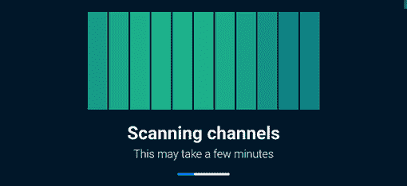

图 3.7 填充应用到加载器矩形

我们声明的缺点是，如果另一个 SVG 图形有矩形，我们的代码可能会错误地样式化错误的图形。为了避免这个问题，我们可以在我们的 SVG 图形上添加一个类名作为标识符，以指定我们想要样式的矩形。但由于我们的项目中只有一个 SVG，我们不需要担心这个问题。

## 3.4 使用 CSS 动画元素

CSS 动画模块允许我们使用关键帧来动画化属性，我们将在 3.4.1 节中探讨这一点。我们可以控制动画的各个方面，例如它的持续时间以及它应该运行多少次。CSS 提供了几个我们可以用来定义动画行为的属性，包括以下内容：

+   `animation-delay`—动画开始前的等待时间

+   `animation-direction`—动画是向前播放还是向后播放

+   `animation-duration`—动画运行一次需要多长时间

+   `animation-fill-mode`—动画执行完成后，被动画化的元素应该如何样式化

+   `animation-iteration-count`—动画应该运行多少次

+   `animation-name`—应用的关键帧的名称

+   `animation-play-state`—动画是正在运行还是暂停

+   `animation-timing-function`—动画如何随时间通过样式

对于我们的动画，我们将关注以下四个属性：

+   `animation-name`

+   `animation-duration`

+   `animation-iteration-count`

+   `animation-delay`

我们想要创建的效果是矩形缩小和放大，但不是同步的。在任何给定的时间点，我们希望元素的高度略有不同。当矩形缩小和放大时，我们希望矩形的顶部和底部向中心移动，然后恢复到完整的高度。本质上，我们将创建一个挤压效果，从大到小再回到大。

尽管我们将对所有的矩形应用相同的动画，但为了错开它们的大小，我们将对每个矩形的动画开始应用一个稍微不同的延迟。由于每个矩形在不同的时间开始动画，每个矩形将处于不同的扩展和收缩阶段，从而产生涟漪效果。

首先，我们将创建动画本身。然后，我们将将其应用到矩形上。最后，我们将添加个别延迟以错开任何给定时间点的大小。为了创建动画，我们将使用关键帧。`animation`属性将引用关键帧并指定持续时间、延迟以及我们希望动画运行多少次。

### 3.4.1 关键帧和 animation-name

当我们创建关键帧时，我们需要给它一个名称。`animation-name`声明值与关键帧名称匹配以连接两者。使用`animation-name`属性，我们可以通过逗号分隔列出多个动画。

关键帧的起源

关键帧来自动画和电影行业。当公司以前手工制作动画时，艺术家会创作许多单独的图片，每张图片或帧中都有变化。随着时间的推移，他们在每一帧中进行更改，并逐渐达到最终帧。这种技术的简单例子是翻页动画。你拥有的帧越多，在短时间内进行的调整越微妙，动画就越流畅。

关键帧代表了动画中最重要（关键）的变化（即帧）。然后浏览器计算出定义帧之间的时间变化。这个过程被称为*插值*。允许硬件完成这项工作，浏览器可以快速填充关键帧之间的空隙，在一种状态和另一种状态之间创建平滑的过渡。插值过程如图 3.8 所示。

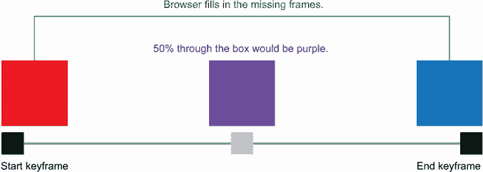

图 3.8 插值

在 CSS 中，使用名为`@keyframes`的 at 规则定义关键帧，它控制动画序列中的步骤。*at 规则*是 CSS 语句，它规定了我们的样式应该如何表现以及何时应用。它们以一个 at（`@`）符号开头，后跟一个标识符（在我们的情况下是 keyframes）。我们在第二章中使用了 at 规则来创建我们的媒体查询；在这里，我们将使用它来创建关键帧。语法是`@keyframes` `animation-name` `{` `...` `}`。大括号内的代码定义了动画的行为。`@keyframes` at 规则块内的每个关键帧都由一个百分比（动画中经过的时间百分比）和我们在那个时间点应用的风格定义。

在我们将动画应用到我们的项目之前，让我们先看看一个更简单的场景，以了解语法（列表 3.6）。你还可以在 CodePen 上找到这个例子，网址为[`codepen.io/michaelgearon/pen/oNyvbWX`](https://codepen.io/michaelgearon/pen/oNyvbWX)，在那里你可以看到动画的运行情况（图 3.9）。

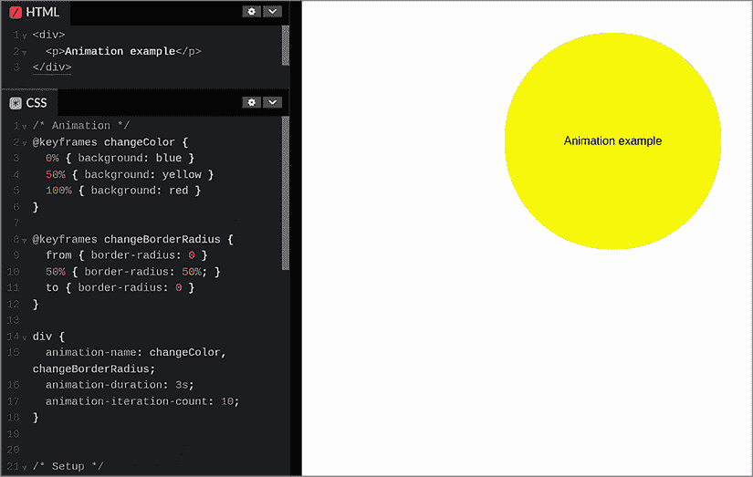

图 3.9 CodePen 中的简单动画场景

列表 3.6 示例动画

```
@keyframes changeColor {                                ①
  0% { background: blue }                               ①
  50% { background: yellow }                            ①
  100% { background: red }                              ①
}                                                       ①
@keyframes changeBorderRadius {                         ②
  from { border-radius: 0 }                             ②
  50% { border-radius: 50% }                            ②
  to { border-radius: 0 }                               ②
}                                                       ②
div {
  animation-name: changeColor, changeBorderRadius;      ③
  animation-duration: 3s;                               ④
  animation-iteration-count: 10;                        ⑤
}
```

① 第一个关键帧，命名为 changeColor

② 第二个关键帧，命名为 changeBorderRadius

③ 指向两个动画的 animation-name 属性

④ 设置动画完成所需的时间

⑤ 设置动画应该运行多少次

示例中有两组关键帧：一组命名为`changeColor`，另一组命名为`changeBorderRadius`。我们将这两个动画应用到`div`元素上。然后我们定义动画应该运行多长时间（3 秒）以及应该运行多少次（10 次）。在每一组关键帧内部，都有代码指定应该应用到元素上的样式。因此，我们有两种不同的表示法，我们有关键字，还有百分比。让我们分析一下我们在第一组关键帧中定义的内容。

我们断言，当动画开始时（`0%`），我们希望将`<div>`的背景色设置为`蓝色`。当我们达到动画的`50%`（3 秒的一半，即 1.5 秒）时，我们的背景将是`黄色`。当动画结束时（`100%`，或 3 秒），我们的背景将是`红色`。在关键帧之间，颜色会平滑地从一种状态变化到另一种状态。

在第二组关键帧中，`changeBorderRadius`，我们使用的是关键字`from`和`to`，而不是百分比。`from`等同于`0%`，而`to`等同于`100%`。我们可以在同一组关键帧中混合使用我们想要的符号。

当我们将动画应用于`div`规则集时，我们还设置了持续时间和迭代次数。请注意，这两个值被应用于两个动画。

在我们更详细地研究这两个属性及其工作原理之前，让我们为我们的加载器创建动画。对于我们的加载器，我们希望随时间增长和缩小——或者说*缩放*——我们的矩形。因此，我们将我们的关键帧命名为`doScale`。我们的 at 规则将是`@keyframes` `doScale` `{` `}`。

在 at 规则内部，我们定义动画的关键帧。我们将从矩形具有完整高度开始。动画进行到一半时，我们希望矩形的高度是其原始高度的 20%。当动画结束时，我们希望矩形的高度恢复到完整大小。因此，我们需要定义三个步骤：`from`（或`0%`）、`50%`和`to`（或`100%`）。

要改变矩形的大小，我们将使用`transform`属性，它允许我们改变元素的外观（旋转、缩放、扭曲、移动等），而不会影响周围的元素。如果我们使用`height`属性来减少元素的高度，下面的内容会向上移动以填充新可用的空间。使用`transform`，元素的空间和页面流中的位置不会改变——只有可见的方面会改变。使用相同的场景，如果我们使用`transform`来减少相同元素的高度，下面的内容不会向上移动。我们会有一个空白空间。

为了影响元素，`transform`属性接受一个`transform()`函数。我们将使用`scaleY()`。（您可以在[`mng.bz/Zo1N`](http://mng.bz/Zo1N)找到可用的完整函数列表。）

`scaleY()`函数垂直调整元素的大小，而不会影响其宽度或挤压或拉伸它。为了定义元素应该挤压或拉伸的程度，我们向函数传递一个百分比或数值。数值映射到其百分比等价的十进制值；因此，`scaleY(.5)`和`scaleY(50%)`达到相同的结果，将元素的高度减少到原始值的 50%。大于`100%`的值会增加元素的大小，而介于`0%`和`100%`之间的值会缩小它。

将 `scaleY()` 应用的负值会垂直翻转元素，因此 `scaleY(-0.5)` 会将元素翻转过来并使其高度缩小 50%。`scaleY(-1.5)` 会将元素翻转过来，并使其高度变为原始值的 1.5 倍。

对于我们的加载条，我们希望矩形在动画开始和结束时达到满高度，在动画中途达到原始高度的 20%。我们应用了变换的完成关键帧如下所示。

列表 3.7 完成关键帧

```
@keyframes doScale {                   ①
  from { transform: scaleY(1) }        ②
  50% { transform: scaleY(0.2) }       ③
  to { transform: scaleY(1) }          ④
}                                      ⑤
rect { animation-name: doScale; }      ⑥
```

① `doScale` at-rule 的开始

② 在全高度处开始动画

③ 动画中途，高度应该是原始值的 20%。

④ 到动画结束时，矩形返回到满高度。

⑤ `doScale` at-rule 的结束

⑥ 将动画应用于矩形

如果我们运行代码，我们会注意到没有任何变化；我们的矩形还没有增长和缩小，尽管我们已经为矩形应用了关键帧。我们仍然需要定义持续时间和迭代次数。让我们进一步探讨这些属性。

### 3.4.2 持续时间属性

`duration` 属性设置动画从开始到结束的持续时间。持续时间可以用秒（`s`）或毫秒（`ms`）来设置。持续时间越长，动画完成得越慢。考虑到可访问性，我们希望考虑对运动敏感的用户（第 3.4 节）并选择一个合理的持续时间。

动画、抽搐和闪烁率

互联网联盟（W3C）建议，为了防止在光敏感用户中引起抽搐，我们需要确保我们的动画在任何 1 秒期间内不会闪烁超过三次（[`mng.bz/RldR`](http://mng.bz/RldR)）。

选择合适的动画时间需要考虑很多因素。动画过快可能会产生难以察觉的变化或引起抽搐，这取决于其性质。动画过慢可能会使我们的应用程序看起来反应迟缓。大多数微动画都很短，是过渡性的；它们动画化元素从一个状态到另一个状态的变化，例如将箭头从向上指变为向下指。这类动画的普遍接受的时间大约是 250 毫秒。

如果动画更大或更复杂，例如打开和关闭一个大的面板或菜单，我们可以将持续时间增加到大约 500 毫秒。然而，加载器略有不同。它不是对用户动作的快速反应；它是一个用户会关注一段时间的大型视觉元素。

在确定加载器的“正确”时间时，我们通常使用试错法来找到与我们的图形最匹配的速度。对于我们的项目，我们希望将动画设置为在 2.2 秒内完成。为了应用动画应该持续的时间，我们在矩形上添加了 `animation-duration` 属性，如下所示。

列表 3.8 添加动画持续时间

```
rect {
  animation-name: doScale;
  animation-duration: 2.2s;
}
```

当我们运行代码时，我们的加载器动画只运行一次，然后永远不会再次动画化，除非我们重新加载浏览器窗口。我们还注意到所有条形同时增加和减少大小。首先，让我们让我们的加载器随着时间的推移继续动画化；然后我们将动画错开在我们的矩形之间，使它们看起来有不同的高度。

### 3.4.3 `iteration-count`属性

为了让我们的动画在完成之后重新开始，我们使用`iteration-count`属性，该属性设置动画应该重复的次数。默认情况下，其值为`1`。因为我们还没有设置值，浏览器假设我们想要动画只运行一次然后结束。我们希望我们的动画能够持续重复，所以我们将使用`infinite`关键字值。

通过应用这个值，我们声明动画应该永远播放。如果我们想要运行特定的次数，我们将使用一个整数值。在我们添加迭代计数后，我们的代码看起来如下所示。

列表 3.9 添加动画迭代计数

```
rect {
  animation-name: doScale;
  animation-duration: 2.2s;
  animation-iteration-count: infinite;
}
```

当我们运行代码时，我们看到所有矩形同步地增长和缩小，从顶部开始，并且动画在完成后会重新开始。我们还有一些工作要做，将动画设置在矩形的中间而不是顶部，以及使动画在我们的元素之间错开。不过，首先让我们快速暂停一下，看看动画简写属性。

### 3.4.4 `animation`简写属性

我们目前有三个声明定义了我们的动画：`animation-name`、`animation-duration`和`animation-iteration-count`。我们可以通过将这三个声明组合在`animation`简写属性中来简化我们的代码，这允许我们使用单个属性定义动画的行为。在这个属性中，我们可以定义 3.3 节中列出的任何属性的值。我们不需要为所有属性提供值。如果属性没有作为简写属性或单独定义，它们将使用默认值。

如前所述，我们正在定义三个属性：`animation-name`、`animation-duration`和`animation-iteration-count`。重构后使用动画简写属性，我们的声明看起来如图 3.10 所示。

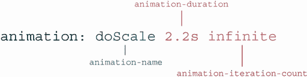

图 3.10 动画简写属性的分解

这段代码在功能上与目前应用于我们矩形的代码相同。使用简写属性可以使我们的代码更简洁，并且可以使其更容易阅读。但如果你发现逐个写出每个属性对你来说更容易，两种方法都是完全有效的。做对你最有利的事情。

当我们使用动画简写属性时，我们的更新后的 CSS 看起来如下所示。在修改我们的代码后，我们注意到我们的动画没有改变。

列表 3.10 使用简写属性重构

```
rect {
 animation-name: doScale;
 animation-duration: 2.2s;
 animation-iteration-count: infinite;
  animation: doScale 2.2s infinite;
}
```

接下来，让我们解决每个矩形的错开高度问题。

### 3.4.5 动画延迟属性

`animation-delay` 属性的作用正如其名称所暗示的那样：它允许我们在元素上延迟动画。延迟应用于动画的开始。当动画开始时，它将正常循环。与 `duration` 属性一样，我们可以使用秒（`s`）或毫秒（`ms`）来设置延迟的持续时间值。默认值是 `0`。默认情况下，动画没有延迟。

为了在我们的动画中创建错位效果，我们将为我们的每个矩形分配不同的延迟值，如列表 3.11 所示。第一个矩形的动画将立即开始。我们给它一个延迟值 `0`。我们可以省略这个声明，因为 `0` 是 `animation-delay` 的默认值；我们在这里添加它是为了使代码更清晰。

第二个矩形有一个 `200ms` 的延迟，并且我们继续为每个后续的矩形增加 `200ms` 的延迟。注意，在第六个矩形上，我们改为使用秒而不是毫秒。我们这样做是为了使代码更易读，因为秒或毫秒值都是可接受的。

列表 3.11 添加了动画迭代次数

```
rect:nth-child(1) {
  fill: #1a9f8c;
  animation-delay: 0;
}
rect:nth-child(2) {
  fill: #1eab8d;
  animation-delay: 200ms;
}
rect:nth-child(3) {
  fill: #20b38e;
  animation-delay: 400ms;
}

rect:nth-child(4) {
  fill: #22b78d;
  animation-delay: 600ms;
}
rect:nth-child(5) {
  fill: #22b88e;
  animation-delay: 800ms;
}
rect:nth-child(6) {
  fill: #21b48d;
  animation-delay: 1s;
}
rect:nth-child(7) {
  fill: #1eaf8e;
  animation-delay: 1.2s;
}
rect:nth-child(8) {
  fill: #1ca48d;
  animation-delay: 1.4s;
}
rect:nth-child(9) {
  fill: #17968b;
  animation-delay: 1.6s;
}
rect:nth-child(10) {
  fill: #128688;
  animation-delay: 1.8s;
}
rect:nth-child(11) {
  fill: #128688;
  animation-delay: 2s;
}
```

在添加延迟后，我们可以看到我们实现了错位效果（图 3.11）。但是元素是从顶部而不是从中心开始增长和缩小的。

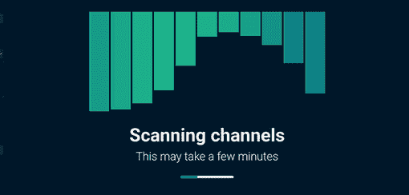

图 3.11 从顶部发出高度变化的动画矩形

要说明我们希望元素从哪里开始增长和缩小，我们需要告诉浏览器动画应该在矩形的哪个位置开始。为了解决这个问题，我们将使用 `transform-origin` 属性。

### 3.4.6 变换原点属性

`transform-origin` 属性设置元素变换的起点或点。如果我们旋转对象，`transform-origin` 属性将设置我们想要从元素上的哪个位置旋转。在我们的情况下，我们将使用此属性来设置动画应该开始的位罝（原点）。

如果变换发生在三维（3D）空间中，值可以有三个（`x`、`y` 和 `z`）；如果变换发生在二维（2D）空间中，我们可以有两个值（`x` 和 `y`）。第一个值是水平位置，或 x 轴；第二个值是垂直位置，或 y 轴。当我们处于 3D 空间工作时，第三个值将是前后方向，或 z 轴。

我们可以用三种方式声明 `transform-origin` 属性的值：

+   长度

+   百分比

+   关键词

    +   `top`

    +   `right`

    +   `bottom`

    +   `left`

    +   `center`

在 HTML 中，此属性的初始值是 `50%` `50%` `0`，即 `center`、`center`、`flat`。然而，对于 SVG 元素，初始值是 `0` `0` `0`，这将其放置在左上角。

对于我们的动画，我们希望矩形的变换原点位于中心。我们希望矩形的上下部分缩小，而不是顶部固定，然后矩形从这个点开始扩展和收缩。为此，我们可以应用关键字值`center`，或者将`transform-origin`属性的值设置为`50%`。无论哪种方式，我们都在说我们希望原点位于矩形的中心。对于我们的项目，我们将使用关键字值`center`。列表 3.12 显示了我们的更新后的`rect`规则。

我们之前提到，当与 2D 动画一起工作时，该属性需要两个值，但我们只传递了一个。当只传递一个值时，它应用于垂直和水平位置；因此，`transform-origin:` `center;` 等同于 `transform-origin:` `center` `center;`。

列表 3.12 使用`transform-origin`属性的更新后的`rect`规则

```
rect {
  animation: doScale 2.2s infinite;
  transform-origin: center;
}
```

我们已经完成了加载动画（图 3.12）。但我们仍然需要考虑我们的设计如何具有可访问性。第 3.4 节深入探讨了我们可以为所有用户提供积极体验的一些方法。

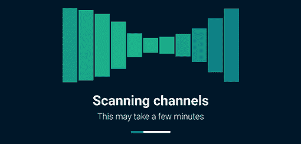

图 3.12 完成的加载动画

## 3.5 可访问性和`prefers-reduced-motion`媒体查询

随着这些效果变得更容易实现和浏览器支持改进，网页上运动、视差（背景比前景移动慢的效果）和动画的使用已经增加。通过使用这些技术，我们可以创建更丰富的用户界面，它们是交互式的，并提供更丰富的用户体验。

然而，使用这些技术的代价是。对于一些用户，特别是那些有前庭功能障碍的用户，屏幕上的运动可能引起头痛、头晕和恶心。正如我们之前提到的，动画也可能引起癫痫发作，特别是如果它们包含闪烁元素的话。

在许多操作系统中，用户可以在他们的设备上禁用动画。在我们的应用程序中，我们需要确保我们尊重那些偏好。为了检查用户设置，第 5 级媒体查询模块引入了`prefers-reduced-motion`媒体查询。这个查询是一个 at-rule，它检查用户对屏幕上运动的偏好，并允许我们根据这些偏好应用条件样式。查询有两个值：

+   `no-preference`

+   `reduce`

当用户偏好减少运动或未指定偏好时，我们可以选择禁用或减少动画。用户的减少运动偏好并不意味着我们不能使用任何动画，但我们应该选择性地保留哪些动画。可能决定保留哪些动画启用的方面包括

+   它有多快

+   它有多长

+   它占视口的多少

+   闪烁频率是多少

+   它对于网站功能或内容理解有多重要

TIP 值得注意的是，用户可能更喜欢减少或没有动画，但可能不知道如何通过系统首选项设置来关闭动画。提供一个现场退出按钮可能是有用的，这取决于我们的网站有多少动画。

动画的可访问性指南

用户应该能够暂停、停止或隐藏持续时间超过 3 秒且不被认为是基本内容的动画（[`mng.bz/RldR`](http://mng.bz/RldR)）。在这一点上，加载器有点棘手，因为它们向用户传达重要信息（应用程序正在做某事并且没有冻结），但可能很大并且有很多动作。

我们的加载器可以被认为是基本内容，但我们还提供了一个进度条在其下方，以向用户指示应用程序正在做什么。因为信息是通过不同的媒介传达的，并且因为动画很大，有很多动作，并且可能持续超过 3 秒，我们将为更喜欢减少运动的用户禁用它，使用以下列表中的代码。

列表 3.13 为更喜欢减少运动的用户禁用动画

```
@media (prefers-reduced-motion: reduce) {     ①
  rect { animation: none; }                   ②
}
```

① 当用户启用 prefer-reduced-motion 首选项时，条件性地应用 at 规则内的样式

② 禁用之前应用于矩形的动画

要检查我们是否成功禁用了动画，而不是编辑我们机器的设置，在大多数浏览器中我们可以做以下操作：

1.  进入我们的浏览器开发者工具。

1.  在控制台标签显示中，选择渲染标签。

    （在 Google 的 Chrome 浏览器中，如果此标签尚未显示，请点击垂直省略号按钮，然后从下拉菜单中选择更多工具 > 渲染。）

1.  启用减少运动模拟。

图 3.13 展示了在此写作时 Chrome 最新版本中禁用的动画和开发者工具（[`mng.bz/51rZ`](http://mng.bz/51rZ)）。

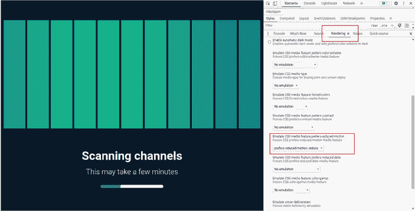

图 3.13 使用 Chrome 开发者工具模拟减少运动首选项

在我们的加载动画完成并且可访问性需求得到处理后，让我们将注意力转向屏幕底部的进度条。

## 3.6 为 HTML 进度条设置样式

`<progress>` HTML 元素可以用来显示某物正在加载或上传，或者数据已经被传输。它通常用来显示用户完成了多少任务。

`<progress>`元素的默认样式在不同浏览器和操作系统之间有所不同。进度条的大部分功能在操作系统级别处理；因此，我们可用的属性很少，可以重新设计控件，尤其是在条内彩色进度指示器方面。在本节中，我们将探讨一些解决方案及其陷阱。让我们从一个简单的开始。

图 3.14 显示了由列表 3.14 中的 HTML 生成的起点。在此阶段，尚未应用到控件上的样式。该图显示了 Martine 的机器生成的默认样式。

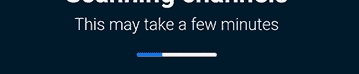

图 3.14 Chrome 中进度条的起点

列表 3.14 进度条 HTML

```
<body>
  <section>
    ...
    <progress value="32" max="100">32%</progress>     ①
  </section>
```

① 进度条

### 3.6.1 进度条样式

让我们从改变高度和宽度开始。为了将进度条的宽度增加到与部分宽度相匹配，我们将它的`width`属性值设置为`100%`。我们还想将高度增加到`24px`。

要改变进度指示器（控件的有色部分）的颜色，我们可以使用一个相当新的属性：`accent-color`。这个属性允许我们改变表单控件的颜色，如勾选标记、单选输入和`progress`元素。我们将它设置为`#128688`，与我们的加载器最后一条条的颜色相匹配。以下列表显示了我们的进度规则到目前为止的情况。

列表 3.15 进度规则

```
progress {
  height: 24px;
  width: 100%;
  accent-color: #128688;
}
```

图 3.15 显示了列表 3.15 中应用于我们的控件的样式。

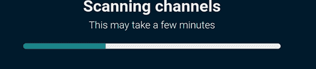

图 3.15 应用于`progress`元素的宽度、高度和突出颜色

如果我们尝试给我们的元素添加背景颜色（`background:` `pink`），我们会注意到添加并没有起作用。事实上，它失败了（见图 3.16）。它彻底改变了元素的外观，并改变了我们之前设置的`accent-color`。此外，背景颜色变成了灰色而不是粉色。

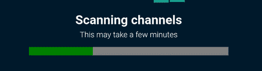

图 3.16 `background-color`失败

我们如何解决这个问题？为了重新设计控件样式，我们需要忽略默认样式并从头开始重新创建样式。然而，要做到这一点，我们需要使用供应商前缀属性。

供应商前缀

从历史上看，当浏览器引入新属性时，它们会在属性名之前添加供应商前缀。每个浏览器的前缀都基于它所使用的渲染引擎。表 3.1 显示了主要浏览器及其前缀。

表 3.1 供应商前缀及其浏览器

| 前缀 | 浏览器 |
| --- | --- |
| `-webkit-` | Chrome, Safari, Opera, 大多数 iOS 浏览器（包括 iOS 的 Firefox），Edge |
| `-moz-` | Firefox |

供应商前缀通常是浏览器可能随时选择移除或重构的不完整或不标准的实现。尽管这个事实已经明确记录了多年，但那些渴望使用最新属性的开发商仍然经常在生产环境中使用它们。

为了防止这种行为持续发生，大多数主要浏览器都转向在功能标志后面发布实验性功能。要启用该功能并与之互动，用户必须进入他们的浏览器设置并启用该特定标志。

通过转向基于标志的方法，浏览器能够让开发者尝试实验性、前沿的功能，而不用担心非标准实现可能会被用于生产代码中。但许多供应商前缀属性仍然在野外可用。有关供应商前缀和功能标志的更多信息，请参阅附录。

我们要做的第一件事是修复我们的 `background-color` 问题，即移除控件默认的 appearance。

appearance 属性

为了重置 `<progress>` 元素的 appearance，我们使用 `appearance` 属性。通过将其值设置为 `none`，我们取消由用户代理提供的默认样式。因为我们将从零开始创建所有样式，所以我们可以移除 `accent-color` 属性，因为它将不再有任何效果。

我们将保持高度和宽度，并添加一个 `border-radius`，因为我们将会有一个曲线的结束效果。`appearance` 属性被所有主要浏览器的所有新版本支持，但我们仍然需要包含供应商前缀版本，因为我们将使用的一些实验性属性需要它们。以下列表显示了我们的更新规则。

列表 3.16 更新进度规则

```
progress {
  height: 24px;
  width: 100%;
  border-radius: 20px;
  -webkit-appearance: none;
  -moz-appearance: none;
  appearance: none;
}
```

在这一点上，我们的进度条看起来与我们通过添加背景颜色而破坏它时相同。这个结果是预期的。通过添加 `appearance:none`，我们可以开始以我们之前无法做到的方式改变控件。首先，我们将关注带有 `-webkit-` 前缀的浏览器。

### 3.6.2 为 -webkit- 浏览器设置进度条样式

我们可以使用三个供应商前缀的伪元素来编辑我们的进度条样式：

+   `::-webkit-progress-inner-element`—进度元素的 最外层部分

+   `::-webkit-progress-bar`—进度元素的全部条，进度指示器下方的部分，以及 `::-webkit-progress-inner-element` 的子元素

+   `::-webkit-progress-value`—进度指示器和 `::-webkit-progress-bar` 的子元素

我们将使用所有三个伪元素来设置我们的元素样式。让我们从内部开始，逐步向外。我们想要设置的第一部分是进度指示器，我们需要使用 `::-webkit-progress-value`。我们将边缘弯曲并将条的颜色更改为浅蓝色，如下列所示。

列表 3.17 在 Chrome 中设置进度指示器样式

```
::-webkit-progress-value {
  border-radius: 20px;
  background-color: #7be6e8;
}
```

图 3.17 显示了在 WebKit 浏览器中的输出。


图 3.17 Chrome 中设置的进度值

接下来，我们将通过使用 `::-webkit-progress-bar` 编辑进度指示器后面的背景。我们还将添加圆角并将颜色更改为线性渐变，从深绿色渐变到浅蓝色，以符合整个作品的主题。

`linear-gradient()` 函数接受一个方向，后跟一系列颜色和百分比的配对。方向决定了渐变的角；颜色-百分比配对决定了我们在渐变中想要从一种颜色切换到另一种颜色的点。我们将使用关键字值 `to` `right` 作为我们的方向。然后我们将起始颜色设置为 `#128688`，结束颜色设置为 `#4db3ff`。因此，我们的渐变将从左到右，从起始颜色渐变到结束颜色。

CSS 渐变生成器和供应商前缀

由于渐变手动编写可能很繁琐，因此已经创建了多个 CSS 渐变生成器，它们在网络上免费提供。许多生成器仍然在其生成的代码中包含供应商前缀。由于现在所有主流浏览器都支持渐变，并且需要这些前缀的浏览器几乎已经完全不存在，因此这些前缀不再是必要的。

最后，我们给最外层的容器添加一个边框半径。我们的进度条 CSS 如下所示。

列表 3.18 Chrome 中样式化进度指示器容器

```
::-webkit-progress-bar {
  border-radius: 20px;
  background: #4db3ff;                         ①
  background: linear-gradient(to right, #128688 0%,#4db3ff 100%);
}
::-webkit-progress-inner-element {
  border-radius: 20px;
}
```

① 渐变的后备颜色

我们在 Chrome 中的进度指示器看起来很棒（图 3.18）。接下来，让我们看看它在 Firefox 中的样子。

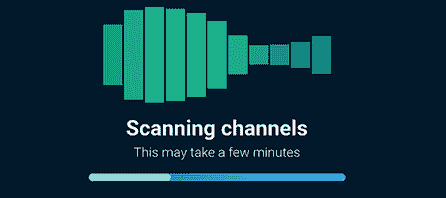

图 3.18 Chrome 中的样式化进度指示器

在 Firefox 中（图 3.19），我们发现我们的控件保持相对无样式，因为它需要的是 `-moz-` 前缀，而不是 `-webkit-` 前缀。因为我们已经为 `-webkit-` 前缀编写了代码，所以我们需要为使用 `-moz-` 前缀的浏览器做同样的事情。

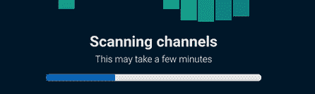

图 3.19 Firefox 中的无样式进度条

### 3.6.3 为 -moz- 浏览器样式化进度条

对于 Firefox，我们将采取不同的样式方法，因为我们没有太多属性可以操作。我们可用的唯一 `-moz-` 前缀属性是 `::-moz-progress-bar`。它也是一个伪元素，它针对进度指示器本身。因此，我们将以与 Chrome 中 `::-webkit-progress-value` 相同的方式对其进行样式化，因为我们希望在两个浏览器中达到相同的外观。

由于我们使用的是相同的样式，因此将 `-moz-` 选择器添加到现有规则中是合理的：`::-moz-progress-bar,` `::-webkit-progress-value` `{` `...` `}`。它在 Firefox 中（图 3.20）工作得很好，但它会破坏 Chrome（图 3.21）。

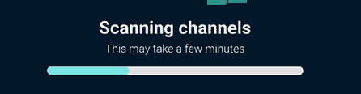

图 3.20 Firefox 中的样式化进度条


图 3.21 在同一个规则中添加两个选择器会破坏 Chrome。

在同一个规则中包含多个选择器不应该导致这种副作用，但我们正在处理实验性属性，它们有时会有非标准的行为。为了防止这种不幸的副作用，我们将为每个选择器编写两个相同的规则，如下面的列表所示。

列表 3.19 Chrome 中样式化进度指示器容器

```
::-webkit-progress-value {      ①
  border-radius: 20px;          ①
  background-color: #7be6e8;    ①
}
::-moz-progress-bar {           ②
  border-radius: 20px;          ②
  background-color: #7be6e8;    ②
}
```

① Chrome 的规则

② Firefox 的规则

要改变 Firefox 的背景颜色，我们需要给进度元素本身添加一个背景属性值。我们使用与 `::-webkit-progress-bar` 规则中相同的渐变。图 3.22 显示了 Firefox 中的进度。

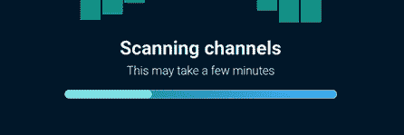

图 3.22 Firefox 中应用了背景的进度元素

我们最后需要做的是移除边框，我们将应用它到 `progress` 规则上。为了达到这个效果，我们将边框属性值设置为 `none`。下面的列表显示了我们的最终进度规则。

列表 3.20 最终进度规则

```
progress {
  height: 24px;
  width: 100%;
  -webkit-appearance: none;
  -moz-appearance: none;
  appearance: none;
  border-radius: 20px;
  background: linear-gradient(to right, #128688 0%,#4db3ff 100%);    ①
  border: none;                                                      ②
}
```

① 渐变背景

② 移除边框

正如我们在图 3.23 中所看到的，我们在 Chrome 和 Firefox 中实现了相同的结果。

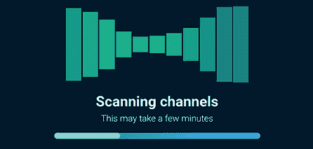

图 3.23 Firefox 中完成的进度条样式

我们必须强调，这些样式是通过使用非标准且可能在未来更改的实验性功能实现的。这里的价值在于能够在新功能变得易于获取之前进行实验。这也是参与社区的机会；在开发浏览器功能和规范的工作组在新的标准被接受并推广到一般使用之前请求反馈的情况并不少见。

## 摘要

+   `animation` 属性是一种使用 CSS 动画化位置、颜色或其他视觉元素值的方法。

+   `@keyframes` 规则是一种定义动画关键帧的方法。

+   我们可以通过使用 `animation-delay` 属性来延迟动画的开始。

+   `animation-duration` 设置动画单次迭代完成所需的时间。

+   SVG 可以使用 CSS 进行样式化。

+   `prefers-reduced-motion` 媒体查询允许我们根据用户的设置有条件地样式化动画。

+   HTML 进度条是一种显示已加载内容多少的方法。

+   默认情况下，浏览器会应用自己的样式到进度条上，但可以通过使用 `appearance` 属性并设置值为 `none` 来重置它。

+   除非我们使用实验性属性，否则我们对 `progress` 元素的样式化能力相当有限。

+   一些非标准属性可用于样式化 `progress` 元素，但它们需要使用供应商前缀。供应商前缀的属性是实验性的，这意味着它们有时会有非标准的实现，并且可能会随时更改。
