# 4 创建响应式网络报纸布局

本章涵盖

+   使用 CSS 多列布局模块创建报纸布局

+   使用 `counter-style` CSS 规则创建自定义列表样式

+   使用 `filter` 属性样式化图片

+   处理损坏的图片

+   格式化标题

+   使用 `quotes` 属性向 HTML 元素添加引号

+   使用媒体查询根据屏幕大小更改布局

在第一章中，我们探讨了创建单列文章，这使我们了解了 CSS 的基本原理。然而，设计很简单。让我们重新审视文章格式化的概念，但要使其更具视觉吸引力。在本章中，我们将样式化我们的内容，使其看起来像报纸的一页，如图 4.1 所示。

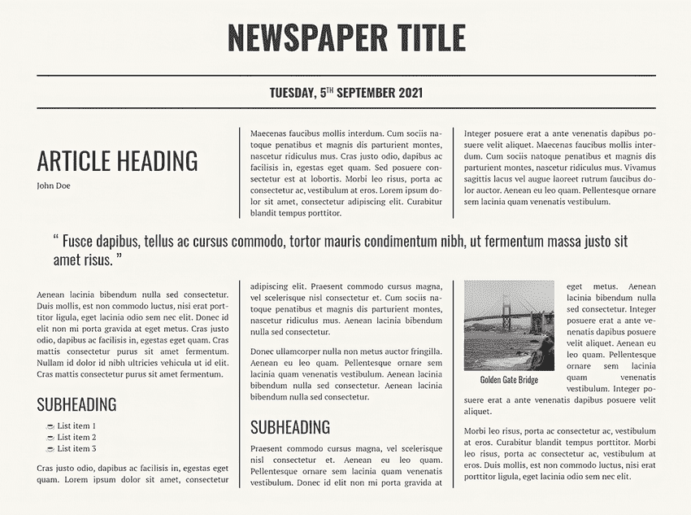

图 4.1 我们想要达到的结果

要创建内容列，我们将使用 CSS 多列布局模块。在这个过程中，我们还将探讨如何管理列之间的空间，如何跨列扩展元素，以及如何控制内容如何断行到新列。

报纸页面的一部分使用了一个项目列表，它由用户代理（UA）样式表为我们提供的默认样式。我们将探讨如何使用 CSS 列表和计数器模块，它允许我们自定义我们的 `list-items` 计数器（数字和项目符号）的样式。

本章我们将探讨的另一个概念是如何样式化图片，包括使用 `filter` 属性和函数来改变图片的外观。我们还将探讨解决损坏图片的方法以及使它们优雅失败的方式。当我们说“优雅失败”（有时也称为 *优雅降级*）时，我们正在设置回退，以便在我们要加载的东西出现问题或我们要使用的功能与用户的浏览器不兼容时使用。

您可以在 GitHub 仓库的 `chapter-04` 文件夹中找到我们项目的代码（[`mng.bz/OpOa`](http://mng.bz/OpOa)）或 CodePen 上的 [`codepen.io/michaelgearon/pen/yLxzbr`](https://codepen.io/michaelgearon/pen/yLxzbr)。我们的起始 HTML 由列表 4.1 中的元素组成。在 `<body>` 元素中是报纸的标题和印刷日期，然后是一篇文章。文章有一个标题、作者姓名、引言、两个副标题、一个列表、一些段落和一张图片。

列表 4.1 起始 HTML

```
<body>
  <h1>Newspaper Title</h1>                                         ①
  <time datetime="2021-09-07">                                     ②
    Tuesday, 5<sup>th</sup> September 2021                         ②
  </time>                                                          ②
  <article>                                                        ③
    <h2>Article heading</h2>                                       ④
    <div class="author">John Doe</div>                             ⑤
    <p>Maecenas faucibus mollis interdum. Cum sociis nato...</p>
    <p>Integer posuere erat a ante venenatis dapibus posu...</p>
    <blockquote>                                                   ⑥
      Fusce dapibus, tellus ac cursus commodo, tortor ma...        ⑥
    </blockquote>                                                  ⑥
    <p>Aenean lacinia bibendum nulla sed consectetur. Dui...</p>
    <h3>Subheading</h3>                                            ⑦
    <ul>                                                           ⑧
      <li>List item 1</li>                                         ⑧
      ...                                                          ⑧
    </ul>                                                          ⑧
    <p>Cras justo odio, dapibus ac facilisis in, egestas ...</p>
    <p>Donec ullamcorper nulla non metus auctor fringilla...</p>
    <h3>Subheading</h3>                                            ⑨
                                     ⑩
    <p>Praesent commodo cursus magna, vel scelerisque nisl...</p>
    <p>Morbi leo risus, porta ac consectetur ac, vestibulu...</p>
  </article>                                                       ⑪
</body>
</html>
```

① 报纸标题（主标题）

② 印刷日期

③ 文章开始

④ 文章标题

⑤ 文章作者

⑥ 引言

⑦ 第一个副标题

⑧ 列表

⑨ 第二个副标题

⑩ 图片

⑪ 文章结束

图 4.2 显示了我们的起始点。应用于 HTML 的样式是浏览器提供的默认样式。页面尚未应用任何作者样式。

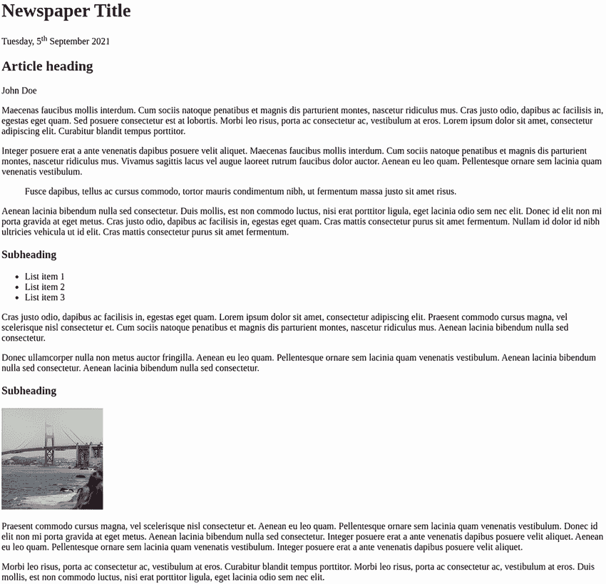

图 4.2 起始点

在我们担心布局之前，让我们定义我们的主题。

## 4.1 设置我们的主题

主题为页面设定基调；它通常包括颜色、字体、边框，有时还包括填充。我们的主题将保持不变，无论屏幕大小或布局如何。通常，网站的主题与其标志和品牌颜色紧密相关。

我们将在 `<body>` 元素上设置一些默认值，这些值可以被其后代继承。作为一般规则，围绕排版（`color`、`font-family` 等）的样式可以被大多数元素继承。例外是一些表单元素，我们将在第十章中介绍。当我们设置父级的可继承属性时，样式会向下传递到后代，从而减轻了我们需要将它们应用到每个元素上的需求。

### 4.1.1 字体

我们应用背景颜色、字体和文字颜色（列表 4.2）。注意，在 `body` 规则之前，我们从 Google Fonts 导入我们选择的 `font-family`。Google Fonts ([`fonts.google.com`](https://fonts.google.com)) 是开发者中流行的选项，因为它免费提供，用户无需创建账户或担心许可问题。

警告：当从内容分发网络（CDN）加载库或资产，包括字体时，始终检查隐私和数据条款，并确保它们符合当地法律，如通用数据保护条例（GDPR）和欧盟法律。如有疑问，请咨询您的法律团队。如果您没有 CDN 选项，请查看第九章以获取有关本地加载字体的详细信息。

例如，PT Serif 并不是我们期望用户已经在他们的电脑上加载的字体；因此，我们必须导入它，以便浏览器知道 *glyphs*（字母、数字和符号）应该看起来像什么。我们还提供了一个默认的 `serif` 作为回退选项，以防导入失败。

网络安全字体

可用的网络安全字体（我们可以假设大多数设备都能访问到的字体）只有少数。根据 W3Schools ([`mng.bz/Y6Ea`](http://mng.bz/Y6Ea))，一些安全选项包括 Arial、Verdana、Helvetica、Tahoma、Trebuchet MS、Times New Roman、Georgia、Garamond、Courier New 和 Brush Script MT。但没有官方标准规定构成网络安全字体或哪些字体会在所有浏览器和设备上真正可用。因此，无论我们选择哪种字体族，始终提供回退值（`serif`、`sans-serif`、`monospace`、`cursive` 或 `fantasy`）是一个好习惯。

虽然我们将在本章后面部分进行大量布局，但现在我们将在主体上添加一些左右填充，以便将文本从边缘移开。

列表 4.2 定义一些主题样式

```
@import url('https:/ /fonts.googleapis.com/css2?family=PT+Serif&display=swap'); ①

body {
  background-color: #f9f7f1;
  font-family: 'PT Serif', serif;                                               ②
  color: #404040;
  padding: 0 24px;
}
```

① 从 Google Fonts 导入 PT Serif

② 将 PT Serif 应用于我们的内容并提供回退选项

图 4.3 展示了我们的更新页面。注意，`<body>` 中的所有元素都继承了 `color` 和 `font-family`。


图 4.3 主题样式应用于主体并继承到后代

接下来，我们将对主标题和副标题进行样式设计。让我们从报纸标题开始，它在 HTML 中是 `<h1>`。我们希望将 `font-family` 改为使用名为 Oswald 的字体，增加文本大小，使其加粗，将字体转换为全大写字母，设置行高，并使文本居中。像 PT Serif 一样，Oswald 并不是大多数用户设备上都能识别的字体，所以我们就像导入 PT Serif 一样导入它。

注意，对于文本大小，我们使用单位 `rem`，它代表“根 em”。一个 *em* 是基于元素父字体大小的相对单位。如果一个容器 `div` 的字体大小为 `12px`，我们将子元素的大小设置为 `.5em`，则子元素的大小将是 12 x .5 或 `6px`。`rem` 单位的工作方式类似，但它不是相对于父元素的字体大小，而是基于根元素的基础值——在我们的例子中，是 `<html>`。我们没有在 HTML 元素上设置字体大小；因此，我们的基础将是浏览器的默认值，在大多数情况下是 `16px`。考虑到这一点，`4rem` 的字体大小——我们设置在主标题上的大小——将相当于 4 x 16 或 `64px`。

要从 Google Fonts 导入 Oswald，我们可以在文件顶部添加第二个 `@import`，或者为了更好的性能，我们可以将两个导入合并为一个 `@import` 语句。合并两个导入的能力是 Google Fonts 特有的；并非所有 CDN 都有这种能力。

注意在列表 4.3 中，在我们的 `@import` 之后，我们看到 `:wght@400;700`。此代码表示我们想要导入哪些 Oswald 字体权重。

列表 4.3 样式化报纸标题

```
@import url('https:/ /fonts.googleapis.com/css2?
➥ family=Oswald:wght@400;700&family=PT+Serif&display=swap');     ①

h1 {
  font-weight: 700;                                               ②
  font-size: 4rem;
  font-family:'Oswald', sans-serif;
  line-height: 1;
  text-transform: uppercase;
  text-align: center;
}
```

① 包含 Oswald 和 PT Serif 的更新导入

② 等同于使用粗体值

图 4.4 显示了我们的更新后的标题。

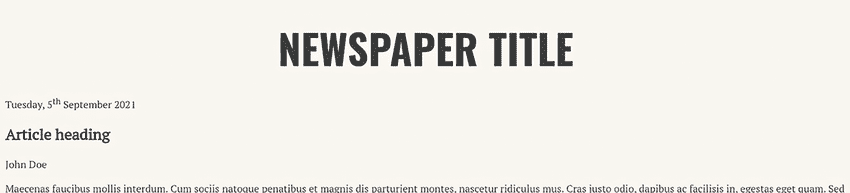

图 4.4 样式化标题

### 4.1.2 字体权重属性

`font-weight` 属性可以接受介于 `100` 和 `900` 之间的数字值或关键字值（`normal`、`bold`、`lighter` 或 `bolder`）。`normal` 等同于 `400`，而 `bold` 等同于 `700`。`lighter` 和 `bolder` 会根据父元素的字体权重来改变元素的字体权重。表 4.1 显示了数字 `font-weight` 值与其常见名称等效关系。

表 4.1 `font-weight` 值及其常见名称

| 值 | 常见名称 |
| --- | --- |
| `100` | 薄（细线） |
| `200` | 额外轻量（超轻量） |
| `300` | 轻量 |
| `400` | 正常（常规） |
| `500` | 中等 |
| `600` | 半粗体（半粗） |
| `700` | 粗体 |
| `800` | 额外粗体（超粗体） |
| `900` | 黑色（粗体） |
| `950` | 额外黑色（超黑色） |

如果我们没有导入与规则中设置的权重相匹配的权重，浏览器将应用它所能访问的最接近的权重。因此，如果我们只以`400`的权重导入 Oswald，并将我们的元素应用`font-weight`值为`bold`，浏览器将显示我们的文本为`400`的权重，因为这个值是它唯一可以工作的值。

### 4.1.3 字体简写属性

使用`font`简写属性，我们可以将规则中的大多数样式组合在一起。`font`属性要求我们提供一个`font-family`和`size`，可选地后跟`style`、`variant`、`weight`、`stretch`和`line-height`，使用以下语法：`font:` `font-style` `font-variant` `font-weight` `font-stretch` `font-size/line-height` `font-family`。下一个列表显示了使用`font`的更新规则。

列表 4.4 使用`font`简写属性设置标题样式

```
h1 {
  font: 700 4rem/1 'Oswald', sans-serif;
  text-transform: uppercase;
  text-align: center;
}
```

让我们将关于导入字体、`font-weight`和`font`简写属性的概念应用到样式化文章的主要标题和副标题。

### 4.1.4 视觉层次结构

为了在页面上创建视觉层次结构，我们将文章标题`<h2>`设置为比报纸的主要标题`<h1>`小，但比文章内的副标题`<h3>`大。一般来说，元素越大，人们认为它越重要，所以我们使用大小来使标题突出。通过使用与正文文本不同的`font-family`，并将所有标题字母转换为大写，我们进一步区分了它们。

创建视觉层次结构很重要，因为它使用户能够快速浏览屏幕并立即识别感兴趣元素。它还将信息分成组，使信息更容易处理和理解。

列表 4.5 显示了我们的标题规则。我们将保持相同的字体族，将字母转换为大写，并调整大小。我们还将移除文章标题的浏览器提供的底部边距，以使它们更接近它们之前的文本。

列表 4.5 文章标题规则

```
h2 {                                     ①
  font: 3rem/.95 'Oswald', sans-serif;
  text-transform: uppercase;
  margin-bottom: 16px;
}

h3 {                                     ②
  font: 2rem/.95 'Oswald', sans-serif;
  text-transform: uppercase;
  margin-bottom: 12px;
}
```

① 文章标题

② 文章副标题

现在我们文章的标题看起来像图 4.5。

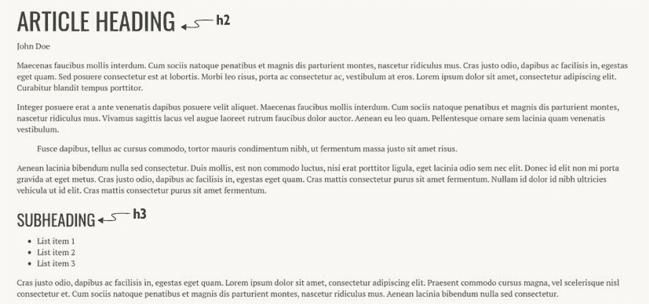

图 4.5 样式化的文章标题

### 4.1.5 内联元素与块元素

让我们继续使重要元素从其余内容中脱颖而出，从出版日期开始，该日期位于我们的 HTML 中的`<time>`元素内。`<time>`元素在语义上表示特定的时间段；它接受一个可选的`datetime`属性，该属性以机器可读的格式提供日期，以便搜索引擎搜索。我们的`<time>`元素看起来像这样：`<time datetime="2021-09-07">Tuesday,` `5<sup>th</sup>` `September` `2021</time>`。图 4.6 显示了我们要达到的外观。

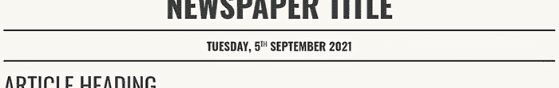

图 4.6 样式化的出版日期

从字体排印开始，我们使文本居中，使用 Oswald 字体家族，将`font-size`设置为`1.5rem`，并将文本改为大写和粗体。然后我们将上标元素（`<sup>`）中找到的`*th`的文本大小改为略小的字体大小和正常重量，以降低其突出度。

接下来，我们添加顶部和底部边框，使其为 3 像素粗细的实心深灰色线条。添加边框后，我们添加一些顶部和底部填充，以便在文本和边框之间留出一些空间。

`<time>`元素是一个内联级元素，这意味着它只占据其内容所需的确切空间，就像`<span>`或`<a>`元素一样。

相比之下，块级元素（如`<div>`、`<p>`和`<ul>`）将自己放置在新的一行上，并占据其可用空间的全宽，除非指定了固定宽度。为了实现图 4.6 中的设计，我们希望`<time>`元素表现得像块级元素，这样文本就会放置在屏幕中间，边框将占据整个页面的宽度。

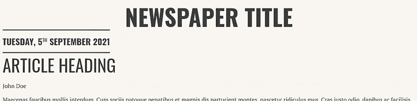

图 4.7 `<time>`元素表现出内联行为

要更改元素默认行为，我们将使用`display`属性并为其提供一个值为`block`的值。图 4.7 和图 4.8 显示了在添加`display`属性之前和之后`<time>`元素的表现。在图 4.7（添加`display`属性之前），元素表现出其作为内联级元素的默认行为。在图 4.8（添加`display`属性之后），元素表现得像块级元素，占据整个屏幕的宽度。

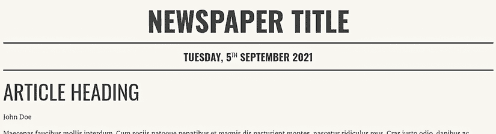

图 4.8 `<time>`元素表现出块级行为

以这种方式样式化出版日期有两个目的：样式使其突出，并在报纸信息（日期和报纸的主要标题）与文章本身（日期以下的所有内容）之间创建视觉分隔。以下列表包含我们编写的以实现我们设计的规则。

列表 4.6 样式化出版日期

```
time {
  font: 700 1.5rem 'Oswald', sans-serif;    ①
  text-align: center;                       ①
  text-transform: uppercase;                ①

  border-top: 3px solid #333333;            ②
  border-bottom: 3px solid #333333;         ②
  padding: 12px 0;                          ②

  display: block;                           ③
}
time sup {                                  ④
  font-size: .875rem;
  font-weight: normal;
}
```

① 字体排印

② 处理边框和填充

③ 使元素表现得像块级元素

④ 样式化“th”

### 4.1.6 引用

我们想要突出的最后一段文本是文章中第二段之后的`<blockquote>`。继续我们的主题，就像我们想要突出的所有其他元素一样，我们将使字体更大、更粗。我们还将调整行高并为元素添加边距。将元素与其周围的内容隔离开来使其更容易被发现。通过添加顶部和底部边距，我们在引用和其上下的段落之间添加空间，在元素周围创建空白。通过添加左右边距，我们改变其对齐方式，实际上使其缩进。添加的空白创建了隔离。

让我们也将引号添加到我们的 `<blockquote>` 中。为了在引语的开头和结尾添加引号，我们可以简单地进入 HTML 并手动添加它们，或者我们可以使用 CSS 逐行编程来完成这项工作。

`quotes` 属性允许我们定义自定义引号。我们可以将我们想要用作双引号和单引号图标的符号传递给此属性。并非所有语言都使用相同的符号。例如，美式英语使用 “ ... ” 和 ‘ ... ’，但法语使用 « ... » 和 ‹ ... ›。使用 `quotes` 属性，我们可以自定义我们想要使用的符号。如果我们没有为 `quotes` 提供值，浏览器默认行为是使用文档上设置的语言的常规符号。

然而，`quotes` 属性仅定义了符号；它不会添加它们。为了添加它们，我们使用 `content` 属性的 `open-quote` 和 `close-quote` 值，结合 `::before` 和 `::after` 伪元素，如列表 4.7 所示。伪元素允许我们通过 `content` 属性在应用它们的元素之前和之后插入内容。

列表 4.7 样式化 `blockquote`

```
blockquote {
  font: 1.8rem/1.25 'Oswald', sans-serif;
  margin: 1.5rem 2rem;
}
blockquote::before { content: open-quote; }
blockquote::after { content: close-quote; }
```

`open-quote` 和 `close-quote` 关键字代表由 `quotes` 属性定义的开头和结尾引号。因为我们没有在我们的 `blockquote` 规则中添加 `quotes` 声明，所以浏览器将使用文档语言的常规符号，我们在 `<html>` 标签的 `lang` 属性中将其设置为 `en-US`。`en-US` 的值指定我们的文档是用美式英语编写的；因此，浏览器渲染的符号是 “ 和 ”，正如我们在图 4.9 中看到的那样。

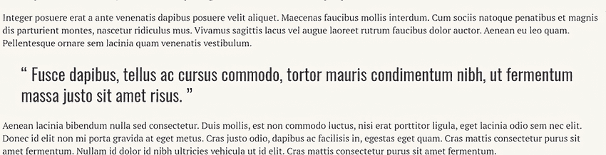

图 4.9 样式化的标题、标题、副标题和引语

在我们的引语样式化之后，让我们将注意力转向文章中间的列表。

## 4.2 使用 CSS 计数器

我们的文章包含一个无序列表（项目符号列表）。目前，每个列表项前面都有一个默认的项目符号。我们可以通过使用 `list-style-type` 属性来改变我们的项目符号的外观。默认情况下，我们可以选择圆点（•）、圆圈（○）、方块（▪），以及多种语言、字母表和数字格式中的数字或字母。但假设我们想要我们的项目符号是一个表情符号——具体来说，是热饮表情符号（☕）。我们必须创建一个自定义列表样式。

要创建我们的自定义列表样式，我们将使用 `@counter-style` at 规则。我们在第三章创建关键帧时使用了 at 规则。在这种情况下，我们不是定义动画将如何行为，而是定义列表的外观和行为。这个 at 规则被称为 `counter-style`，因为它专门针对 CSS 中列表项的内置计数机制。在底层，无论列表是有序的还是无序的，浏览器都会跟踪列表中项目的位置——也就是说，它会计数项目。

与关键帧（我们将其命名为以便在 `animation` 属性内部引用）一样，我们将命名我们的 `@counter-style`，以便我们可以使用 `list-style` 属性引用它并将其应用到我们的列表。让我们将我们的列表样式命名为 `emoji`。因此，我们的 at 规则将是 `@counter-style` `emoji` `{` `}`。

接下来，我们将在我们的 at 规则内部定义 `list-style` 需要的行为。我们将使用三个属性：`symbols`、`system` 和 `suffix`。

### 4.2.1 符号描述符

`symbols` 描述符定义了将用于创建项目符号样式的元素。为了将我们的表情符号作为要使用的符号，我们可以直接使用表情符号或使用其 Unicode 值。

*Unicode* 是一种字符编码标准，它指定了如何将 16 位二进制值表示为字符串。换句话说，它是我们表情符号的代码表示。实际的表情符号图像由操作系统和浏览器决定，这就是为什么我们在 iOS 和 Android 等设备上看到表情符号的外观有所不同。Unicode 值告诉机器如何渲染。

我们使用类似 [`mng.bz/GRQJ`](http://mng.bz/GRQJ) 的查找表来找到我们表情符号的此值。☕ 被列为以下代码：`U+2615`。为了告诉我们的 CSS 我们正在使用 Unicode 值，我们将用反斜杠 (`\`) 替换 `U+`。使用 Unicode 值，我们的声明值将是 `symbols:` `"\2615"`。如果我们使用表情符号，我们的声明值将是 `symbols:` ☕;。

接下来，我们需要定义我们的 `system` 描述符。

### 4.2.2 系统描述符

无论列表类型（有序或无序列表），浏览器在底层都会根据列表项在列表中的位置跟踪它所设置的样式。第一个项的整数值是 1，第二个是 2，依此类推。`system` 描述符值定义了将此整数值转换为我们在屏幕上看到的视觉表示所使用的算法。

我们将使用 `cyclic` 值。之前，我们在 `symbols` 声明中只提供了一个表情符号，但我们可以使用空格分隔的列表包含多个不同的表情符号。`cyclic` 值告诉浏览器循环遍历这些值，当用完时，从列表开头重新开始。因为我们只有一个值，浏览器将把 ☕ 应用到第一个列表项，然后符号用完。在第二个列表项之前用完符号后，浏览器从列表开头重新开始，这次将 ☕ 应用到第二个列表项。然后浏览器再次运行，移动到第三个列表项，循环继续。最后，我们将设置一个后缀。

### 4.2.3 后缀描述符

`suffix` 描述符定义了项目符号（我们的表情符号）和列表项内容之间的内容——默认情况下是一个句点。我们想要在表情符号和列表项内容之间替换句点，用空格。因此，我们将我们的 `suffix` 描述符值设置为 `"` `"`（一个空格）。

### 4.2.4 将一切组合起来

我们的 `counter-style` 定义完成后，可以将其应用到我们的列表中。记住，我们给 `counter-style` 规则命名为 `emoji`。我们将使用这个名称作为列表的 `list-style` 属性值，如下所示。

列表 4.8 样式化列表

```
@counter-style emoji {     ①
  symbols: "\2615";        ②
  system: cyclic;
  suffix: " ";
}

article ul {
  list-style: emoji;       ③
}
```

① 定义自定义列表样式的 at 规则

② ☕

③ 将自定义列表样式应用于文章的列表

图 4.10 显示了我们的新样式列表。

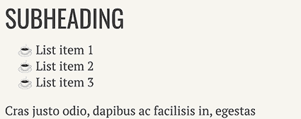

图 4.10 使用 ☕ 作为计数器的样式化列表

### 4.2.5 @counter 与 list-style-image

另一种更改正在使用的列表项标记的方法是使用 `list-style-image` 属性并将其分配给一个图像，类似于我们可以通过使用 `background-image` 属性来设置背景图像的方式。我们没有在这个项目中使用这种方法，因为我们使用了表情符号，这是一个 Unicode 字符而不是图像。计数器还为我们提供了更多的控制，例如分配后缀或指定计数器如何循环显示的项标记。

如果我们只想将标记更改为特定的图片，`list-style-image` 是完美的。但如果我们想要更精细的控制，或者在我们这个例子中，使用文本，我们需要使用 `@counter`。让我们继续向下滚动页面，接下来对图片进行样式设置。

## 4.3 图片样式

从历史上看，报纸是以黑白印刷的。当我们考虑印刷的历史时，新闻纸中的彩色油墨是一个相对较新的东西。因此，为了给我们的设计增添一点复古感，我们将使我们的图像变为灰度。首先，我们将看看如何使用滤镜来改变我们的图像。与印刷不同，在网络上我们需要担心资源加载失败或链接损坏，因此我们还将看看如果图像加载失败，如何使图像优雅地失败。最后，我们将添加一个标题来伴随图像。

### 4.3.1 使用 filter 属性

就像在照片编辑器或像 Instagram 这样的社交媒体网站上一样，我们可以使用 CSS 对图像应用滤镜。我们可以改变颜色、模糊并添加阴影，例如。图 4.11 显示了我们可以通过在 CSS 中使用滤镜对图像进行的一些操作示例。查看 CodePen 中的此代码示例以查看其效果：[`codepen.io/michaelgearon/pen/porovxJ`](https://codepen.io/michaelgearon/pen/porovxJ)。

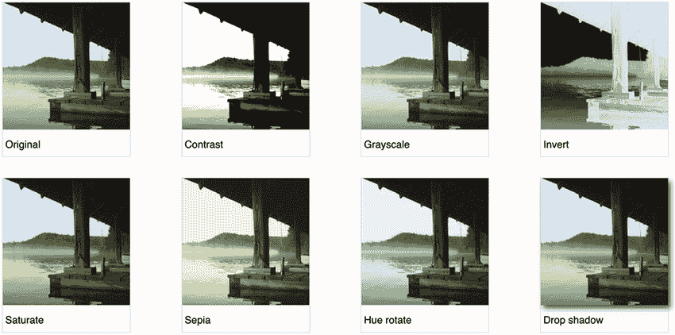

图 4.11 使用 `filter` 属性修改的图片示例

如果我们考虑数字时代之前的摄影，当我们使用胶片并需要去商店冲洗时，我们通过在镜头上添加一个半透明的圆盘来应用滤镜，这改变了进入相机箱和胶片的光线。通过改变光线的性质，我们改变了产生的图像。例如，如果我们拍照时使用红色滤镜，那么只有红色波长的光线被允许通过；我们的照片被染成了红色。偏光太阳镜是另一种改变通过镜头进入的光线的滤镜的例子。

我们仍然可以在数码相机上使用物理过滤器。然而，在许多情况下，过滤器是在拍照后以数字方式应用的。

在 CSS 中，我们使用`filter`属性对图像应用过滤器；然后我们使用一个函数来定义过滤器应有的行为。您可以在[`mng.bz/zmYA`](http://mng.bz/zmYA)找到可用函数的列表。我们将使用`grayscale()`函数使我们的图片看起来像黑白照片。

`grayscale()`函数接受一个百分比，表示我们想要减少图像中颜色的程度。我们想要移除所有颜色，所以我们将传递一个`100%`的值。因此，我们的规则将是`img { filter: grayscale(100%) }`。图 4.12 显示了应用在我们图像上的过滤器。

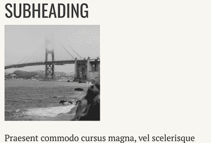

图 4.12 灰度图像

在使用过滤器之前，需要考虑它们对网站性能的影响。一些过滤器函数，如`grayscale()`，对浏览器来说处理起来相对简单，但像`drop-shadow()`和`blur()`这样的函数可能会消耗大量资源。如果我们发现我们在大量图像上应用了许多过滤器，我们应该考虑过滤器对整体页面性能的影响，以及我们是否应该预处理图像而不是用 CSS 应用更改。

### 4.3.2 处理损坏的图像

即使是最彻底的勤勉和最佳测试实践，损坏的图像链接也可能发生。让我们添加一些回退机制，以确保如果我们的图像无法加载（无论原因如何），我们仍然能为用户提供积极的体验。

首先，让我们故意破坏我们的链接。在 HTML 中，我们将图像的路径替换为项目中不存在的图像文件，如下所示：``。图像将显示为损坏，如图 4.13 所示。

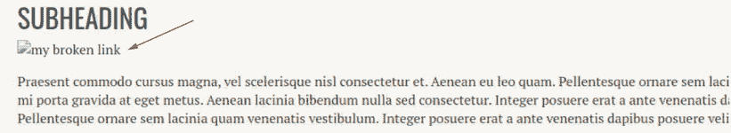

图 4.13 带有`alt`文本的损坏链接

注意到在`alt`属性中提供的文本会被显示出来。`alt`属性允许辅助技术向用户告知正在显示的图像。一个常见的用例是盲人用户通过屏幕阅读器访问内容。在这种情况下，因为图像损坏，文本替换了图像。尽管这种情况并不理想，但在图像损坏的情况下，用户仍然可以了解图像原本应该提供的内容。

在我们的情况下，图像纯粹是装饰性的，不提供任何内容价值，因此如果链接损坏，我们将隐藏图像。那里将什么都没有，但“什么都没有”比破损图像图标更不显眼。由于 CSS 中无法检测图像是否损坏，我们需要使用一点 JavaScript 来知道何时隐藏图像。我们将使用 `onerror` JavaScript 事件处理器来触发以下样式更改：``。这里对我们有意义的代码片段是 `onerror` 属性。当发生错误时，`onerror` 属性内的 JavaScript 触发并将图像的 `display` 属性设置为 `none`，隐藏图像。我们可以看到，在图 4.14 中，我们的破损图像缺失。

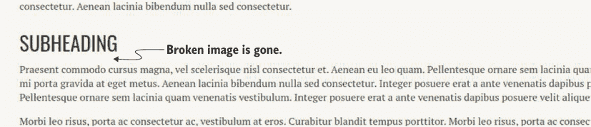

图 4.14 破损的图像缺失。

`onerror` 代码仅在图像加载失败时触发，因此让我们修复我们的资源路径到我们的图像，但保留错误处理：``。现在我们的图像已恢复（图 4.15），但我们有一个安全措施以防它失败。

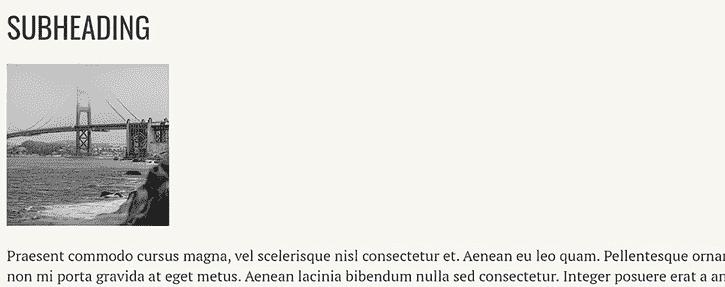

图 4.15 恢复的图像及备用

接下来，让我们给图像添加一个标题。

### 4.3.3 格式化标题

图像没有标题，因此我们将通过使用 `<figure>` 和 `<figcaption>` HTML 元素来添加一个标题。然后我们将对其进行样式化。

这两个元素是相辅相成的。`<figure>` 包含图像，然后是可选的 `<figcaption>`。在书籍和其他出版材料中，图表、图表或图像下面通常有文本来描述它或将其与文本相关联。从语义上讲，将图像和标题分组的好处是程序性地将图像与其标题链接起来。从样式化的角度来看，将元素与其标题一起放在父元素中允许我们将元素及其标题作为一个单元进行定位。以下列表显示了如何更改 HTML 以添加图像和标题。

列表 4.9 向 HTML 添加 `<figure>` 和 `<figcaption>`

```
<figure>                                                                  ①
      ②
  <figcaption>Golden Gate Bridge</figcaption>                             ③
</figure>                                                                 ④
```

① 图像开始

② 我们的图像

③ 我们的图像标题

④ 图像结束

让我们开始样式化图像和标题，首先移除当前应用于图像的浏览器提供的边距（图 4.16）。

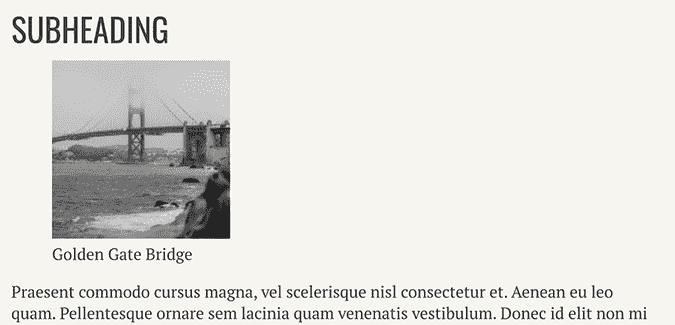

图 4.16 带有浏览器提供样式的 `<figure>`

接下来，我们将恢复底部边距，以便我们的标题与下面的段落保持分离。最后，我们将居中图像和标题。我们将标题文本的样式设置为使用 Oswald 字体家族（我们用于所有标题的字体）来在视觉上将其与文章文本区分开来。以下列表显示了用于样式化图像和标题的 CSS。

列表 4.10 `figure` 和 `figcaption` 样式

```
figure {
  margin: 0 0 12px 0;      ①
  text-align: center;
}
figcaption {
  font-family: 'Oswald', sans-serif;
}
```

① 内边距简写属性：上、左和右边距设置为 0，下边距设置为 12px

图 4.17 展示了到目前为止我们在项目上取得的进展。到目前为止，页面在窄屏幕上看起来不错，但我们仍然需要在宽屏幕上显示我们的列。接下来，我们将探讨如何使用 CSS 多列布局模块创建多列布局。

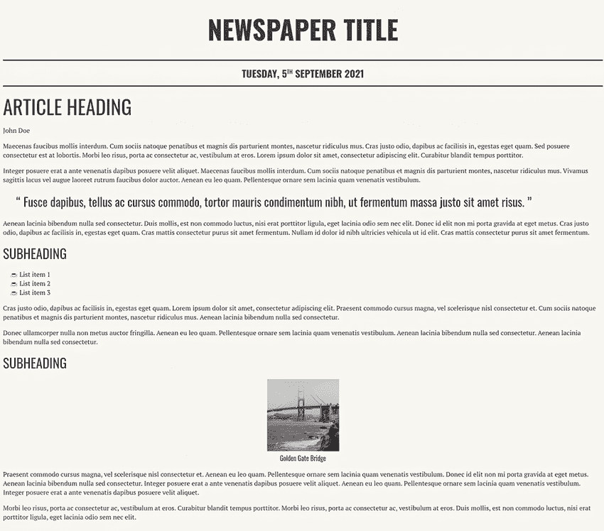

图 4.17 展示了到目前为止的进展，包括样式化的图表和图像标题

## 4.4 使用 CSS 多列布局模块

CSS 多列布局模块可能不如 Grid 和 Flexbox 那样广为人知，但它的用途同样重要。此模块的目的是允许内容在多个列之间自然流动。它的工作方式类似于我们在 Microsoft Word 或 Google Docs 文档中创建多列布局的方式。我们将列分配给内容的一部分，内容自然地从一列流到另一列。因为我们希望我们的内容仅在较宽的屏幕上以列的形式显示，所以我们将使用媒体查询在窗口达到特定大小时有条件地应用我们的列。

### 4.4.1 创建媒体查询

*媒体查询*是一种 at 规则；我们在第二章中简要介绍了它，当时我们更改了网格布局，使其依赖于屏幕宽度。就像我们本章早些时候使用的 `@counter-style` 一样，它以 at (`@`) 符号开头，后跟标识符 `media`。然后我们设置媒体查询内规则应用时的指令。我们希望在窗口宽度大于或等于 955 像素时放置内容。因此，我们的媒体查询将是 `@media(min-width: 955px) {}`。图 4.18 分解了查询的各个部分。在媒体查询内部，我们将定义我们的列。

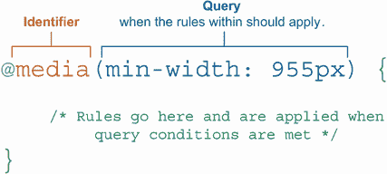

图 4.18 媒体查询分解

### 4.4.2 定义和样式化列

我们有两种定义列创建方式的方法：

+   *指定列宽*。浏览器将在可用空间内创建尽可能多的该宽度的列。

+   *指定我们想要多少列*。浏览器将在可用空间内适应该数量的等宽列。

我们将选择第二个选项，因为我们已经知道我们想要创建三列。我们特别针对文章，并使用 `column-count` 属性将数量设置为 `3`，如下面的列表所示。

列表 4.11 根据屏幕宽度有条件地将文章分为三列

```
@media(min-width: 955px) {    ①
  article {
    column-count: 3;          ②
  }
}
```

① 媒体查询

② 设置我们想要多少列

图 4.19 展示了使用列表 4.11 中的 CSS 将文章布局为三列。

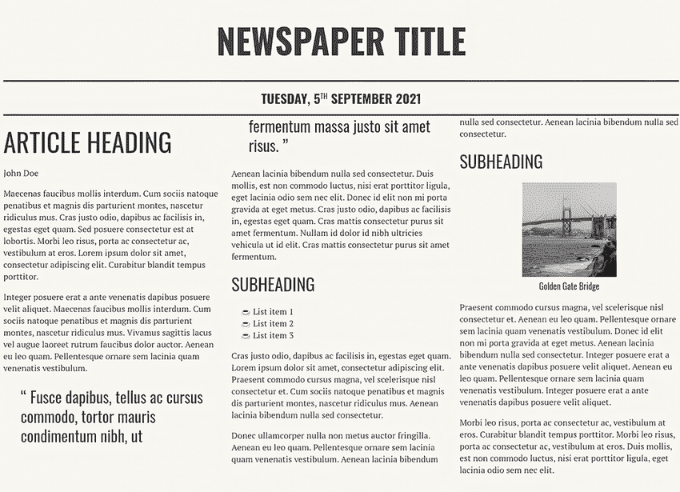

图 4.19 三列布局

接下来，我们将调整列之间的间距，并在它们之间添加垂直线。让我们从垂直线开始。

### 4.4.3 使用 column-rule 属性

为了在我们的列之间创建清晰的分隔，我们将使用`column-rule`属性添加一条垂直线。与边框和外框一样，我们需要设置线型、宽度和颜色。为了保持我们的线条工作一致，我们将使用与页面顶部日期上方和下方边框相同的颜色和样式。然而，我们将使线条略窄一些。

屏幕顶部的线条将内容类型（标题、日期和文章）分开。在这里，我们处于相同的内容类型中。我们添加线条是为了使列之间的视觉分隔更容易；我们不希望打断内容。我们希望线条不那么突出，所以我们将它们做得更细。

为了创建线条，我们在媒体查询中现有的文章规则内添加了`column-rule:` `2px` `solid` `#333333;`。现在我们的文章看起来像图 4.20。

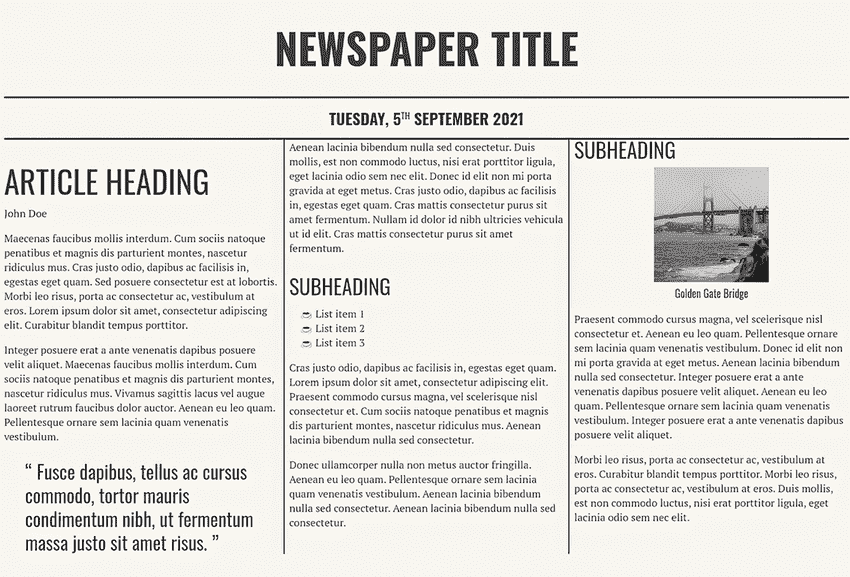

图 4.20 添加了垂直线的列

在线条到位后，我们看到文章本身和日期之间有一些拥挤，我们可以在我们的线条和文本之间使用更多空间。

### 4.4.4 使用 column-gap 属性调整间距

现在我们需要做两件事：增加文章日期和文章正文之间的容器间距，以及增加文章内部列之间的间隔。为了调整文章和日期之间的间距，我们将在文章顶部添加`36px`的边距。因为确定使用值并不是一门绝对的科学，有时我们需要进行一些试错来确定页面上看起来合适的内容。我们希望留出足够的空间，使每个项目都有其自己的空间并且清晰可见，但又不至于空间过大，使得项目看起来过于分散。

格式塔设计原则

设计的*格式塔原则*是一组描述人类感知原则的集合，它描述了人类如何将相似元素分组。七个原则之一是邻近性，它讨论了靠近在一起的事物看起来比间隔更远的事物更相关。有关格式塔原则的更多信息，请参阅[`mng.bz/0yNv`](http://mng.bz/0yNv)。

在处理完文章和日期之间的空间后，让我们将注意力转向列之间的空间。为了在垂直线和文本之间添加间隔，我们将使用`column-gap`属性，该属性定义了我们希望在列之间拥有的空白量。我们将我们的设置为`42px;`。

我们继续在媒体查询中添加这些样式，如列表 4.12 所示，因为我们希望它们只在我们的布局为列时应用。我们不希望这些样式更改应用于较窄的屏幕。

列表 4.12 更新的媒体查询和文章规则

```
@media (min-width: 955px) {
  article {
    column-count: 3;
    column-rule: 2px solid #333333;
    column-gap: 42px;
    margin-top: 36px;
  }
}
```

在做出这些调整（图 4.21）后，让我们将注意力转向引用。

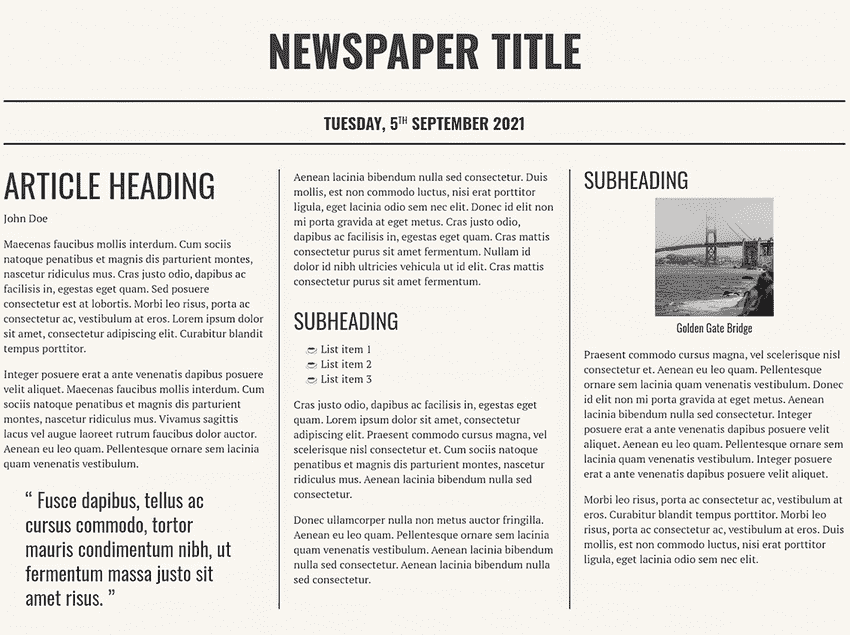

图 4.21 调整间距后的布局

在本章的早期，我们设计了块引用的样式，使其突出。但现在我们有了多列格式，它在页面上的其他视觉元素中有点迷失。让我们让它跨越多个列以使其更加突出。

### 4.4.5 使内容跨越多个列

我们可以通过使用 `column-span` 属性来使元素跨越多个列。我们的选择是 `all` 和 `none`。因为我们想让引用跨越整个页面，所以我们将选择 `all`。在我们的媒体查询中，我们将添加以下规则：`blockquote` `{` `column-span:` `all` `}`。这个规则导致图 4.22 所示的布局。

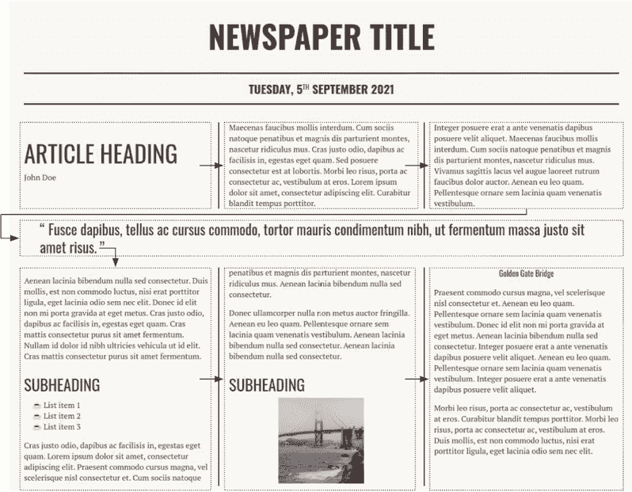

图 4.22 由于跨越列的 `blockquote` 而导致的内容重新排列

注意到内容流程已经改变。我们添加了箭头以显示通过使引用跨越屏幕而引入的新流程。我们不再将整个文章从左上角到右下角均匀分布在整个列中，而是将 `column-span:` 设置为 `all` 应用于引用，因此引用之前的内容现在从左上角到右上角跨越页面上的引用上方。引用之后的内容也做同样处理。由于内容跨越，我们改变了文本通过列的流程。

当我们查看内容流程时，我们注意到标题和图片已经被分割到两个列中，这并不理想。让我们防止这种情况发生。

### 4.4.6 控制内容断行

为了防止图片及其标题出现在不同的列中，我们可以使用 `break-inside` 属性与关键字值 `avoid`，我们将它设置在 `<figure>` 元素上。通过这个声明，我们通知浏览器在生成列时，元素的内容应作为一个单元保持在一起，而不是被分割到多个列中。换句话说，图片和图题应该保持在一起。我们添加到媒体查询的规则是 `figure` `{` `break-inside:` `avoid` `}`。图 4.23 显示了结果输出。

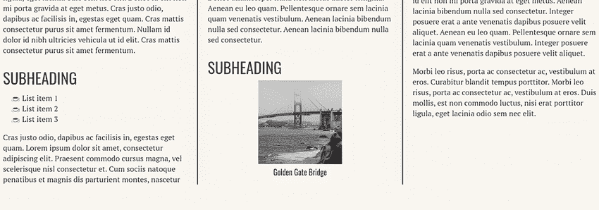

图 4.23 保持图片和标题在一起

## 4.5 添加最终细节

在我们的内容按我们想要的流程在列中流动后，让我们完善一些最终细节。报纸布局的一个特点是文本经常是齐行的。

### 4.5.1 文本齐行和连字符

*齐行*指的是文本主体内行的对齐，如图 4.24 所示。当文本*齐行*时，文本行从同一位置开始和结束，形成一个框。相比之下，左对齐的文本有参差不齐的结尾。

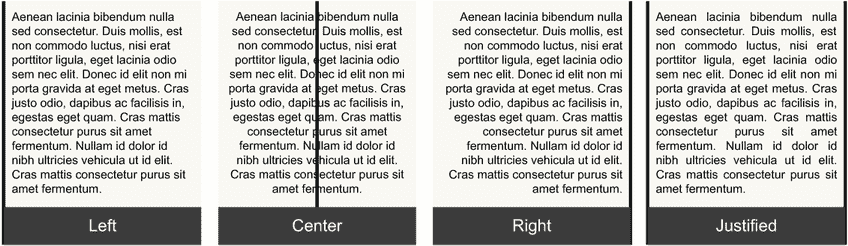

图 4.24 文本齐行

让我们使段落文本居中。为此，我们将使用 `text-align` 属性并将其值设置为 `justify`。为了使行长度相等，我们将额外空间分配到行上。我们可以通过使用 `text-justify` 属性来调整空间重新分配的方式。如果我们不设置 `text-justify` 值，浏览器将选择它认为最适合该情况的方式。我们有一个流体设计；它随着窗口大小的变化而增长和缩小。最好的选择可能因窗口大小而异，所以我们将让浏览器决定什么最适合。

然而，我们将添加一些连字符。默认情况下，浏览器不会在行尾断开单词；它们简单地继续到下一行。我们可以通过将 `hyphens` 属性设置为 `auto` 来改变这种行为。允许浏览器在行尾断开单词将有助于减少我们之间所需的空白量，以便对齐文本。

列表 4.13 展示了我们的段落规则。我们继续在我们的媒体查询中包含我们的更新，因为这些更改仅在切换到列布局时相关。

列表 4.13 居中段落文本

```
@media (min-width: 955px) {
  ...
  p {
    text-align: justify;
    hyphens: auto;
  }
}
```

现在我们的段落看起来像图 4.25 中的那些。

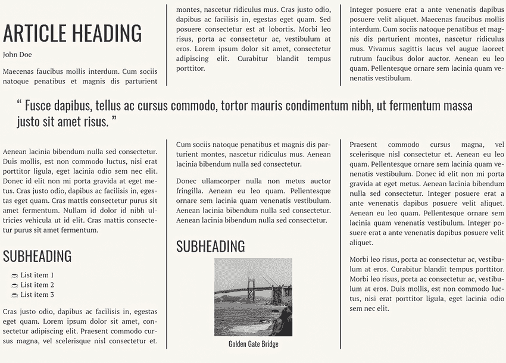

图 4.25 居中和带连字符的段落文本

当我们查看布局时，我们注意到第二列底部的图像看起来有点奇怪，位置不合适。让我们修复这个问题。

### 4.5.2 将文本围绕图像包裹

为了将图像与后续文本重新连接，我们将图像及其标题推到左边，并让文本围绕图像。为了创建这种效果，我们将使用 `float` 属性。将 `float` 属性应用于一个元素将其推到左边或右边，允许文本和内联元素围绕它。

在这种情况下，将图像和标题作为一个单元放在 `<figure>` 元素内对于样式化很有用。因为这两个项目都包含在 `<figure>` 中，我们将对图形应用 `float`，整洁地围绕图像和标题包裹文本。

列表 4.14 展示了如何浮动图形。注意我们给图形添加了一个右边距。因为我们把图形浮动到左边，它把自己放在列的左边，允许文本在剩余的右边空间中围绕它，如图 4.26 所示。右边距在图像和文本之间创建了一个空间，这样文本就不会紧挨着图像的边缘。

列表 4.14 浮动图形

```
@media (min-width: 955px) {
  ...
  figure {
    float: left;
    margin-right: 24px;
  }
}
```


图 4.26 浮动图像

正如你在第七章中看到的，我们可以用浮动图像做更多酷的事情。不过，现在让我们专注于我们的报纸页面。我们将要解决的最后一件事情是如何处理在极其宽的窗口中页面的行为。

### 4.5.3 使用 max-width 和自动边距值

图 4.26 显示，当窗口变得极其宽时，我们的布局开始退化。窗口越宽，问题越严重。越来越多的用户拥有超宽屏幕，因此我们需要考虑如果他们最大化窗口，占据整个屏幕会发生什么。为了处理这种情况，我们将使用与第二章中使用的加载器相同的技巧。我们将为我们的布局设置一个最大宽度，然后将其左右边距设置为`auto`，这样当窗口宽度大于我们的最大宽度时，容器将在水平方向上居中。

对于我们的页面，我们的容器是`body`，因此我们将给我们的`body`一个`max-width`为`1200px`，并将左右边距设置为`auto`。我们还需要将`background-color`从在`body`上设置移动到在`html`元素规则上设置；否则，当我们的屏幕宽度超过 1,200 像素时，我们会在页面的左右两侧出现白色带状区域。

这些更改不会进入媒体查询内部。我们将编辑本章开头设置的`body`样式，并添加一个`html`规则来设置背景颜色。以下列表显示了我们的更改。

列表 4.15 `body`和`html`元素的更改

```
html { background-color: #f9f7f1 }

body {
  background-color: #f9f7f1;       ①
  font-family: 'PT Serif', serif;
  color: #404040;
  padding: 0 24px;
  max-width: 1200px;               ②
  margin: 0 auto;                  ③
}
```

① 将背景颜色从 body 规则移动到 html 规则

② 设置页面可以成为的最大宽度

③ 使页面居中

经过这些最终更改，我们有一个适用于移动和桌面用户的页面。图 4.27 显示了我们的最终布局。

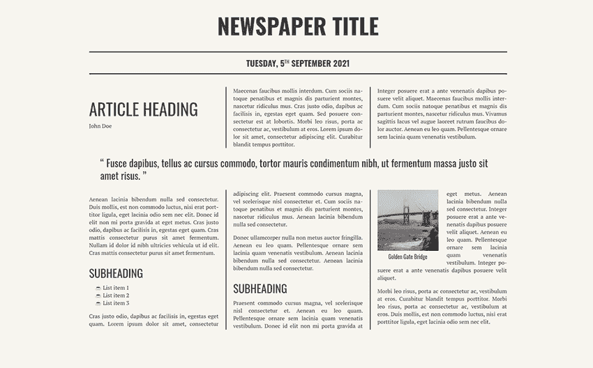

图 4.27 完成布局

## 摘要

+   主题是在整个应用程序中保持的一般外观和感觉。

+   我们可能需要导入我们的字体，因为很少的字体是普遍可用的。由于没有官方定义的 Web 安全字体列表，我们应该始终使用关键字回退。

+   创建视觉层次结构将帮助我们的用户在页面上定位自己并识别重要信息。

+   我们可以控制浏览器在指令显示引号时使用的符号。

+   我们可以通过使用`counter-style` at 规则来自定义列表显示其项目符号的方式。

+   过滤器允许我们改变图像的外观。

+   我们可以通过使用 CSS 多列布局模块来创建多列布局。

+   在创建多列布局时，我们可以使内容跨越所有列。

+   我们可以使浏览器在行尾使用连字符来断开单词。

+   浮动允许我们围绕元素包裹文本。
