# 5 张具有悬停交互的总结卡片

本章节涵盖

+   使用`background-clip`属性裁剪静态背景图像

+   使用过渡效果在悬停时显示内容

+   使用媒体查询根据设备能力和窗口大小选择样式

*总结卡片*用于多种目的，无论是显示电影的预览、购买房产、预览新闻文章，还是（在本章中）显示酒店列表。通常，总结卡片包含标题、描述和行动号召；有时，它还包含一个图像。图 5.1 显示了我们将在这个项目中创建的卡片。

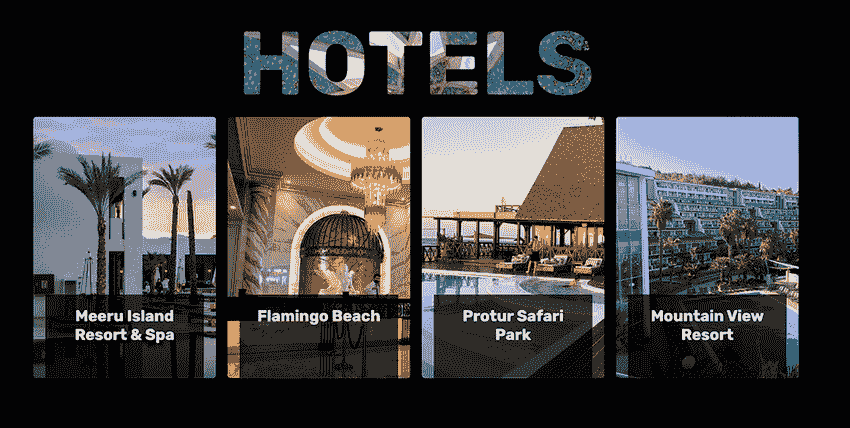

图 5.1 成品

卡片将排成一行，使用 CSS Grid 布局模块进行布局。每个卡片都将有自己的背景图像，内容放置在顶部。如果用户在支持悬停且屏幕宽度至少为 700 像素的设备上查看卡片，他们将能够看到标题，然后悬停在卡片上，这将揭示简短的描述和一个橙色的行动号召按钮，以与黑色背景形成对比（图 5.2）。

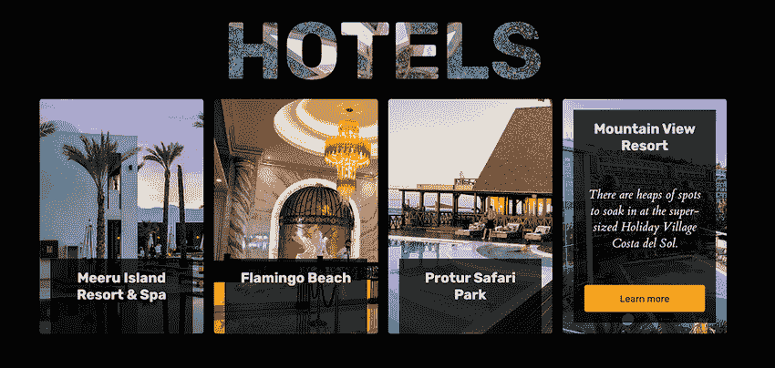

图 5.2 成品上的悬停效果

对于不支持悬停或屏幕宽度小于 700 像素的用户设备，我们将显示所有信息而不使用悬停，以确保用户体验不受影响（图 5.3）。

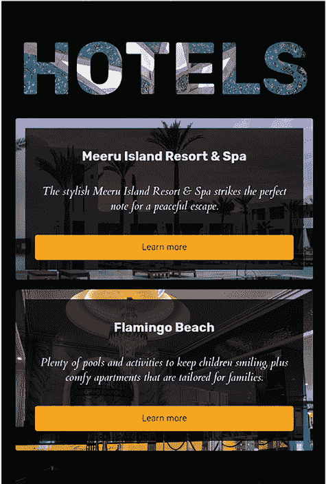

图 5.3 小型或触摸设备上无法处理悬停状态的成品

本项目的另一部分是页眉，我们希望使其突出并具有视觉吸引力。为此，我们将探索`background-clip`属性，看看我们如何可以在文本周围裁剪图像。

## 5.1 开始

列表 5.1 和列表 5.2 包含了我们在本章中将要构建的页面的起始 CSS 和 HTML。要跟随我们为页面添加样式的过程，您可以从 GitHub 仓库[`mng.bz/KlaO`](http://mng.bz/KlaO)或从 CodePen[`codepen.io/michaelgearon/pen/vYpaQPO`](https://codepen.io/michaelgearon/pen/vYpaQPO)下载起始 HTML 和 CSS。

移动端和桌面端体验将使用相同的 HTML 和样式表。类似于我们在第四章中所做的那样，我们将使用媒体查询根据浏览器大小和能力来调整样式。

列表 5.1 显示了我们的起始 HTML。每个卡片都包裹在一个`<section>`元素中，并包括其标题（`<h2>`）、描述（`<p>`）和行动号召（`<a>`）。

列表 5.1 起始 HTML

```
  <header>
    <h1>Hotels</h1>                            ①
  </header>
  <main>
    <section class="flamingo-beech">           ②
      <div>
        <h2>Meeru Island Resort & Spa</h2>     ③
        <p>The stylish Meeru Island ...</p>    ④
        <a href="#">Learn more</a>             ⑤
      </div>
    </section>                                 ⑥
    ...

  </main>
```

① 页面标题

② 第一张总结卡片的开始

③ 卡片标题

④ 卡片描述（当浏览器允许时仅在悬停时显示）

⑤ 卡片行动号召

⑥ 第一张总结卡片的结束

我们开始的 CSS（列表 5.2）包括一些基本样式来设置我们的页面。对于主体，我们增加了 40 像素的边距，并在所有四边添加了 20 像素的填充。我们使用 Google Fonts——这次是 Cardo 字体家族，常规重量，斜体版本——来描述每张卡片。对于标题，我们将使用 Rubik 字体的常规和粗体重量。这种字体是一个不错的选择，因为它结合了良好的可读性和圆角，提供了一种与 Cardo 字体相得益彰的非正式感。注意，当我们加载多个 Google Fonts 时，我们可以将导入合并为一个请求。

列表 5.2 起始 CSS

```
@import url("https:/ /fonts.googleapis.com/css?
➥ family=Cardo:400i|Rubik:400,700&display=swap");     ①

body {
  margin-top: 40px;
  padding: 20px;
}
```

① 请求加载 Cardo 和 Rubik 两种字体

当我们开始为我们的项目添加样式时，我们的页面看起来像图 5.4。

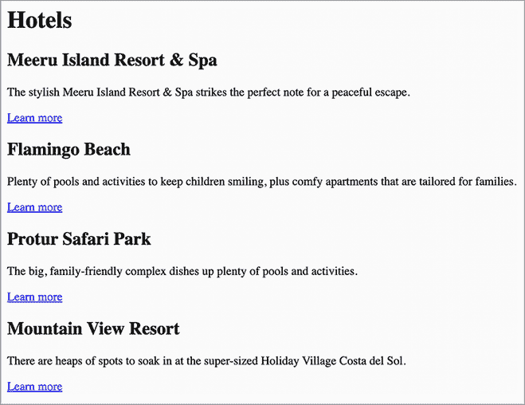

图 5.4 起始点

## 5.2 使用网格布局页面

一个好的起点是回顾我们卡片和网页的整体布局。我们需要考虑我们布局的三个方面：

+   标题和主要内容

+   卡片的容器

+   卡片内的内容

我们将在所有三个用例中使用 CSS Grid 布局模块进行布局。

注意：CSS Grid 布局模块允许我们在列和行的系统中在垂直和水平轴上放置和定位元素。查看第二章以了解此模块的工作原理。

为了在我们的页面上布局元素，我们将首先为窄屏幕创建样式，并通过使用媒体查询，在构建到更大屏幕尺寸的过程中编辑布局。

### 5.2.1 使用网格布局

我们的布局由两个地标组成：`<header>`和`<main>`，它们是`<body>`的直接子元素（列表 5.3）。通过给`<body>`设置一个值为`grid`的`display`属性，我们将影响`<header>`和`<main>`元素的位置。

列表 5.3 起始 HTML

```
<body>
  <header>    <!-- title -->
  </header>
   <main>    <!-- cards -->
   </main>
</body>
```

接下来，我们使用`place-items`属性来在页面上居中元素。这个属性是合并声明`align-items`和`justify-items`属性值的简写方式。我们将其值设置为`center`，使所有项目在其各自的行和列中间对齐。以下列表显示了我们的更新后的`body`规则。

列表 5.4 定位`<header>`和`<main>`元素

```
body {
  display: grid;
  place-items: center;
  margin-top: 40px;
  padding: 20px;
}
```

注意，我们没有定义任何`grid-template-rows`、`grid-template-columns`或`grid-template-areas`。默认情况下，当没有声明这些区域时，浏览器会创建一个一列网格，行数与要定位的元素数量相同。在我们的例子中，我们有两个元素：`<main>`和`<body>`。因此，我们的网格有一列和两行（图 5.5）。

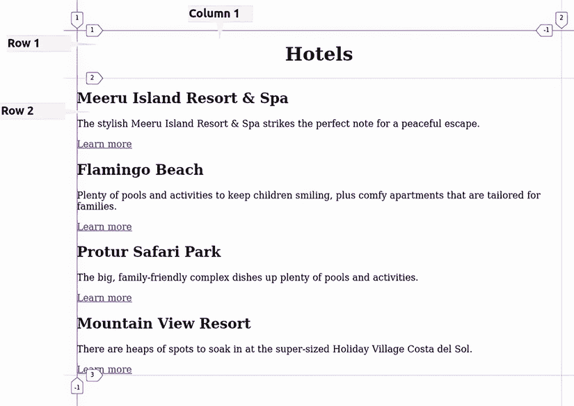

图 5.5 一行两列网格

`<header>` 和 `<main>` 的宽度通过在网格内调整，仅占用它们内容所需的水平空间。因为 `<header>` 的内容较窄（包含单词 *hotel* 的 `<h1>`），页面标题会自动居中在页面上。`<main>` 元素占据其可用的全部宽度，因为 Flamingo Beach 的描述（在第二张卡片中）需要全部宽度，并且甚至可以包裹。如果我们进一步扩展屏幕宽度，我们会看到 `<main>` 元素也会居中（图 5.6）。

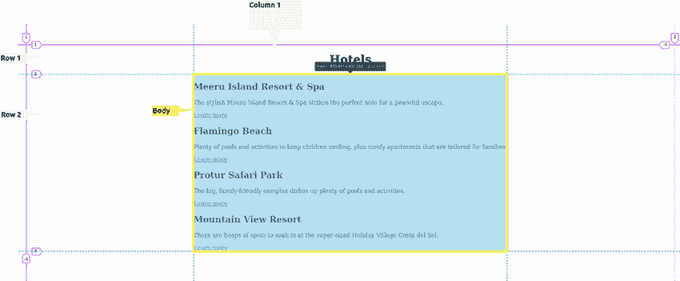

图 5.6 宽屏幕上的居中`main`

我们还将依赖网格的默认功能，省略定义行和列，因为我们希望在小屏幕上保持卡片堆叠。为了在卡片之间添加空间，我们包括一个`1rem`的间隙。我们还限制`<main>`元素的宽度最大为 1024 像素，以防止我们在宽屏幕上将卡片水平对齐后，卡片在宽屏幕上过于分散（第 5.2.2 节）。以下列表显示了我们的更新 CSS，它保持了卡片的堆叠，但在卡片之间添加了 1rem 的间隙（图 5.7）。

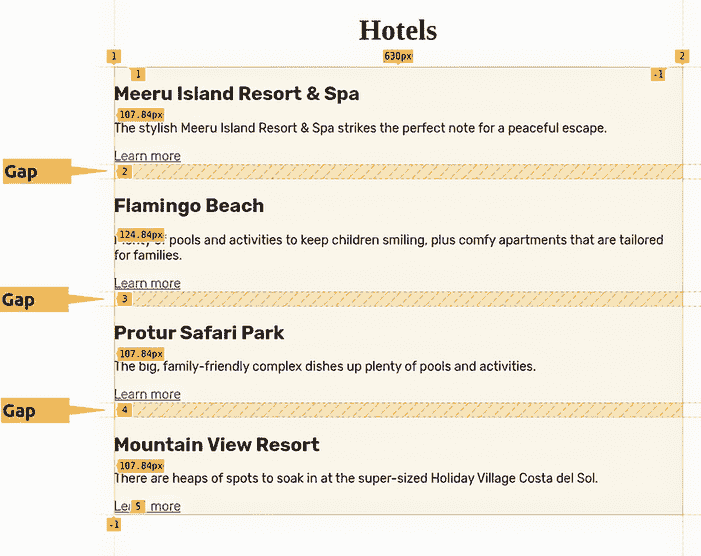

图 5.7 应用到`<main>`的网格

列表 5.5 在窄屏幕上定位卡片

```
main {
  display: grid;
  max-width: 1024px;
  grid-gap: 1rem;
}
```

### 5.2.2 媒体查询

目前，我们的卡片是垂直堆叠的——这是大多数情况下 HTML 元素的默认行为。这种布局在具有相对较窄屏幕的移动设备上是有意义的。然而，对于桌面屏幕，由于浏览器窗口可以非常宽，我们可以通过使用媒体查询来利用水平空间。我们可以定义一些媒体查询来调整布局：

+   如果窗口宽度大于或等于 700 像素，我们将调整网格以有两个等宽的列，并将每个部分的宽度设置为正好 350 像素。

+   在 950 像素时，我们再次调整布局，将布局调整为四个等宽的列，覆盖前面媒体查询中设置的`grid-template-columns`值。`height`属性值保持为 350 像素，因为前面媒体查询的条件（`min-width:` `700px`）仍然满足。

如果这些媒体查询的要求都不满足（当浏览器窗口宽度小于 700 像素时），卡片将垂直堆叠在单列中。以下列表显示了创建的两个媒体查询。

列表 5.6 卡片的布局

```
@media (min-width: 700px) {      ①
  main {
    grid-template-columns: repeat(2, 1fr);
  }
  main > section {
    height: 350px;
  }
}
@media (min-width: 950px) {      ②
  main {
    grid-template-columns: repeat(4, 1fr);
  }
}
```

① 媒体查询用于确定浏览器窗口是否至少有 700 像素宽。如果是这样，则使用查询内的样式。

② 第二个媒体查询用于确定浏览器窗口是否至少有 950 像素宽。如果是这样，此查询将覆盖前面的查询，并将网格设置为四列宽。

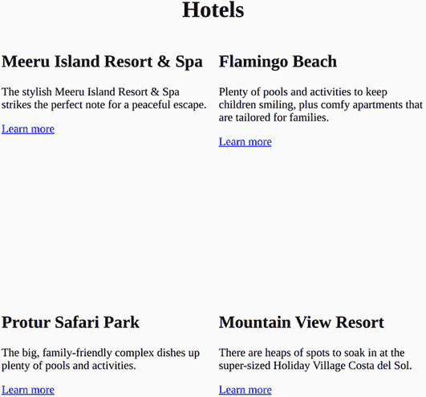

图 5.8 800 像素宽屏幕上的布局

图 5.8 和图 5.9 分别显示了浏览器窗口宽度为 800 像素和 1000 像素时的输出。

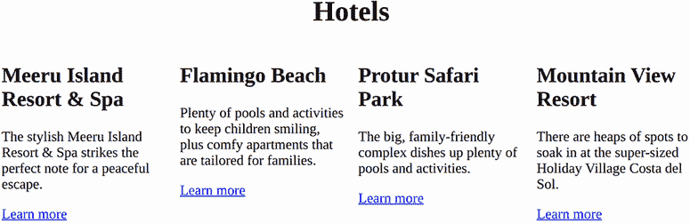

图 5.9 1000 像素宽屏幕上的布局

拥有我们的布局后，让我们专注于内容的样式设计，从标题开始。我们将更改 `<h1>` 元素的字体，并查看如何使用图片来为文本着色。

## 5.3 使用 background-clip 属性设置标题样式

这个页面的标题“酒店”在视觉上可能更有趣。一种让页面生动起来的方法可以是设置一个漂亮的鲜艳颜色，并将字体家族更新为现代风格。另一种方法是应用背景图像到文本。这些更改可以通过两个实验性属性：`background-clip` 和 `text-fill-color` 来实现。

实验性属性

一些属性的浏览器支持可能是值特定的。`background-clip` 属性就是其中之一。这个属性在其所有可能值中（除了 `text`，在撰写本书时，在 Microsoft Edge 和 Google Chrome 中仍然需要供应商前缀）都得到了所有主流浏览器的支持，没有供应商前缀。

实验性属性应谨慎使用，因为它们通常具有非标准实现。有关实验性属性的更多详细信息，请参阅第三章。

通过设置回退颜色值，我们可以减少 `background-clip:` `text` 作为实验性属性带来的风险，这样如果这两个属性不起作用，用户将看到没有背景图像的文本。

### 5.3.1 设置字体

第一步是更新 `font-family`、`weight` 和 `size`，并将文本转换为 `uppercase`。以下列表显示了这些更改。

列表 5.7 标题排版

```
h1 {
  font: 900 120px "Rubik", sans-serif;     ①
  text-transform: uppercase;
}
```

① 简写字体属性

我们使用了简写的 `font` 属性。第一个值设置 `weight`，在这个例子中是 `heavy`。第二个值是字体大小（`120px`），然后是我们想要使用的 `font-family`。如果这个字体无法加载，我们将回退到 `sans-serif` 字体。

我们通过样式将文本转换为大写，而不是在 HTML 中将所有文本都写成大写字母。使用全部大写字母可能会影响可访问性，因为一些屏幕阅读器可能会将全部大写字母解释为缩写，并逐个读取字母。如果我们通过 CSS 设置文本为大写，我们只是在视觉上样式化文本；字符可以是混合大小写。

此外，我们只有一个页面可以设置样式，这使我们处于独特的位置。在一个传统项目中，我们的样式很可能会应用于多个页面。通过调整我们的样式中的大小写，我们帮助确保整个网站或应用程序的一致性。

还值得注意的是，我们应该少量使用全部大写字母，因为这种格式可能会影响内容的可读性。现在我们的标题看起来像图 5.10。

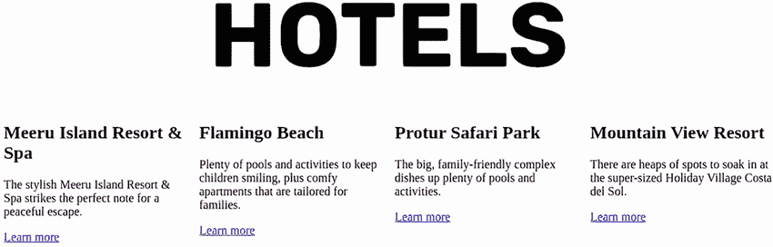

图 5.10 应用到标题的排版样式

### 5.3.2 使用 background-clip

现在我们将使用图像来着色字母，本质上是将背景图像应用于字母本身。首先，我们需要在 `<h1>` 元素上设置一个背景图像。为了确保图像覆盖 `<h1>` 元素的全部，我们将 `background-size` 属性的值设置为 `cover`。此值会自动计算图像所需的宽度和高度，以确保图像覆盖整个元素。

接下来，我们操作图像，使其仅应用于字母，而不是整个 `<h1>` 元素。这一步是 `background-clip` 属性发挥作用的地方。此属性基于盒模型定义了背景应该覆盖元素的哪个部分。在我们的例子中，我们将它的值设置为 `text`，因为我们希望图像显示在字母后面。具有 `text` 值的此属性仍然需要基于 WebKit 的浏览器（Chrome、Edge 和 Opera）的前缀，因此我们也包括针对这些浏览器的带前缀的属性以实现兼容性。

目前，我们的文本是黑色，阻止了图像的显示。我们必须使字母透明，以便不遮挡我们设置为文本背景的图像。`text-fill-color` 属性允许我们设置文本的颜色。此属性类似于 `color`，但如果两个属性都设置了，`text-fill-color` 将会覆盖 `color`。因为 `text-fill-color` 也需要浏览器前缀（对于基于 WebKit 和 Mozilla 的浏览器），所以如果图像没有加载或任何实验性属性失败，我们可以将 `color` 属性用作回退。

我们使用 `text-fill-color` 而不是使用值为 `transparent` 的 `color` 属性，因为我们将会使用 `color` 创建一个回退方案，以防 `background-clip` 在用户的浏览器中不起作用。我们将它的值设置为 `white`，因为我们将在本章后面添加黑色背景。这样，如果 `background-clip` 失败或不受支持，用户仍然可以看到文本；它将是白色而不是被图像着色。下面的列表显示了我们的更新后的标题类。

列表 5.8 `background-clip` 文本代码

```
h1 {
  text-transform: uppercase;
  font: 900 120px "Rubik", sans-serif;
  background: url(background: url("bg-img.jpg");    ①
  background-size: cover;
  -webkit-background-clip: text;                    ②
  background-clip: text;                            ②
  -moz-text-fill-color: transparent;                ③
  -webkit-text-fill-color: transparent;             ③
  color: white;                                     ④
}
```

① 添加背景图像

② 仅将背景裁剪应用于文本后面

③ 使文本透明，以便图像能够显示出来

④ 回退颜色

当使用前缀时，如果存在非前缀版本，我们会在非前缀版本之前添加 `-moz-` 和 `-webkit-` 属性。这允许浏览器确保在非实验性版本可用时使用该版本。

在我们的标题样式（图 5.11）完成后，下一个任务是样式化卡片。我们首先关注没有悬停效果的卡片样式，然后创建用于处理支持悬停的宽屏幕卡片的媒体查询。

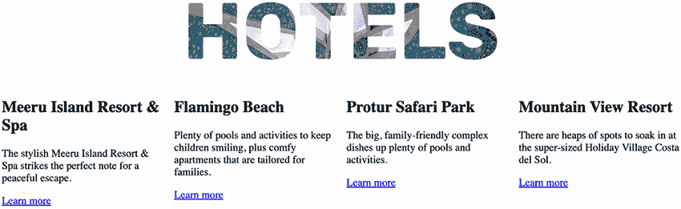

图 5.11 背景图像裁剪到标题处

## 5.4 样式化卡片

每个卡片都通过一个具有背景图像的外部 `<section>` 元素创建，并且有一个内部 `<div>`，我们将为它设置背景颜色，以保持文本在图像上的可读性。在该 `<div>` 内是实际的内容。以下列表显示了我们的卡片结构，独立于其他 HTML 部分。

列表 5.9 独立的卡片 HTML

```
<section class="meeru-island">                 ①
  <div>                                        ②
    <h2>Meeru Island Resort & Spa</h2>         ③
    <p>The stylish Meeru Island Resort...</p>  ③
    <a href="#">Learn more</a>                 ③
  </div>
</section>
```

① 外部卡片容器。每个部分都有一个基于其描述的酒店的类名。

② 内容容器

③ 内容

为了为卡片的每个部分进行样式设计，我们将从外向内工作，首先为每个卡片的容器进行样式设计，然后是内容容器的样式，最后是内容本身。

### 5.4.1 外部卡片容器

外部容器是获取背景图像的元素。每个部分为其酒店或度假村获取一个图像。我们将通过其类名单独选择每个部分。然后，我们将为每个部分分配一个背景图像，如下列所示。

列表 5.10 添加背景图像

```
.meeru-island {
  background-image: url("1.jpg");
}
.flamingo-beech {
  background-image: url("2.jpg");
}
.protur-safari {
  background-image: url("3.jpg");
}
.mountain-view {
  background-image: url("4.jpg");
}
```

在添加了背景图像（图 5.12）后，让我们配置适用于所有部分的通用样式。

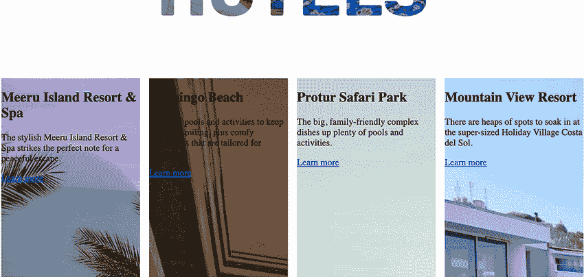

图 5.12 卡片背景图片

我们可以看到图片没有正确居中，并且没有很好地展示酒店和度假村。我们可以通过使用 `background-size` 属性来调整图片的大小。我们将此属性设置为 `cover`，以最大化显示图片，同时如果图片的宽高比与卡片的不同，则不会留下任何空白可见。我们还添加了 `#3a8491`（青绿色）作为后备颜色。最后，我们在卡片上添加了 `border-radius` 以使角落弯曲并软化边缘。列表 5.11 显示了我们的容器样式。

列表 5.11 卡片容器样式

```
main > section {
  background-size: cover;
  background-color: #3a8491;
  border-radius: 4px;
}
```

在处理了外部容器（图 5.13）后，让我们继续到内容容器。

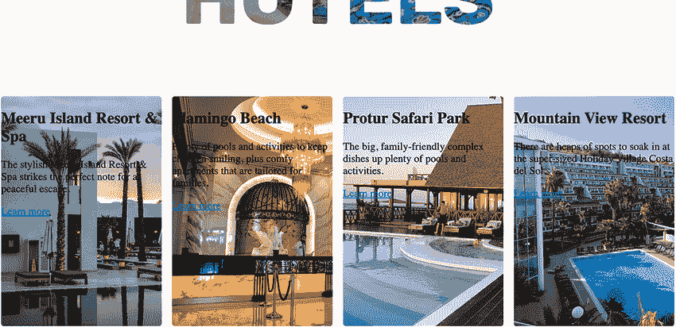

图 5.13 样式化的外部卡片容器

### 5.4.2 内部容器和内容

目前，我们的文本不可读；深色文本在图像背景上难以阅读，并且靠近外部容器的边缘。为了提高可读性，我们将内部容器的 `background-color` 设置为 `rgba(0, 0, 0, .75)`，这是一种带有一定透明度的黑色。我们还将文本颜色更改为 `whitesmoke` 并将其居中。通过在设计中使用纯黑或纯白，我们为整体构图带来了一种更柔和的感觉。

在添加背景颜色后，我们在内容容器中添加了 `1rem` 的填充，以使文本远离深色背景的边缘，并添加了 `1rem` 的边距，以在图片边缘和背景开始处留出空间。最后，我们调整了卡片内文本的 `font-size`、`font-weight`、`line-height` 和 `font-family`。以下列表显示了 CSS 代码。

列表 5.12 卡片内容样式

```
main > section > div {                       ①
  background-color: rgba(0, 0, 0, .75);      ①
  margin: 1rem;                              ①
  padding: 1rem;                             ①
  color: whitesmoke;                         ①
  text-align: center;                        ①
  font: 14px "Rubik", sans-serif;            ①
}                                            ①

section h2 {                                 ②
  font-size: 1.3rem;                         ②
  font-weight: bold;                         ②
  line-height: 1.2;                          ②
}                                            ②

section p {                                  ③
  font: italic 1.125rem "Cardo", cursive;    ③
  line-height: 1.35;                         ③
}                                            ③
```

① 卡片内容容器

② 卡片标题

③ 卡片内容

在应用了样式（图 5.14）后，最后需要样式的内容部分是我们的链接。

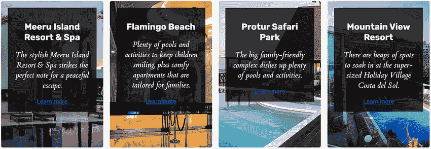

图 5.14 卡片内部容器和排版

因为我们的链接充当行动号召，引导用户查看更多关于酒店或度假村的信息，所以我们希望使其加粗并引人注目（列表 5.13）。为了达到这个目的，因为卡片内部的大部分元素颜色都比较深，我们将给链接一个明亮的黄橙色（`#ffa600`）背景，并将其文字颜色改为接近黑色。我们还会添加填充。但由于链接默认是一个内联元素，我们希望将其 `display` 属性的值更改为 `inline-block`，这样填充就会影响元素的高度。

列表 5.13 链接样式

```
a {
  background-color: #ffa600;
  color: rgba(0, 0, 0, .75);
  padding: 0.75rem 1.5rem;
  display: inline-block;
  border-radius: 4px;
  text-decoration: none;
}

a:hover {
  background-color: #e69500;
}

a:focus {
  outline: 1px dashed #e69500;
  outline-offset: 3px;
}
```

为了与卡片匹配，我们将链接的 `border-radius` 设置为 `4px`，并最终处理 `hover` 和 `focus` 状态。我们不会使用下划线，我们将移除它，在 `hover` 状态下，我们将稍微加深背景颜色，在 `focus` 状态下，我们将添加一个偏移 3 像素的虚线轮廓。图 5.15 显示了我们的样式化链接。

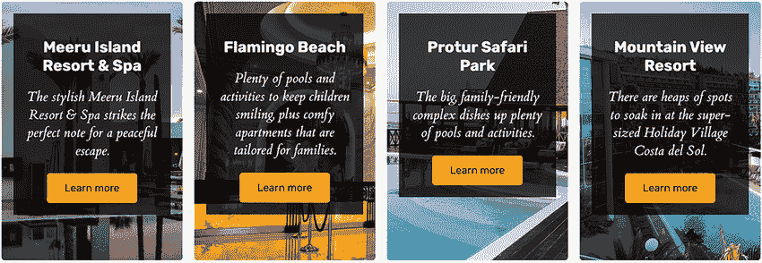

图 5.15 样式化链接

如果所有的链接都没有水平对齐，看起来会有些奇怪，并且似乎没有组织。为了使所有链接对齐，我们将再次使用 `grid`。我们将给内部容器一个 `display` 值为 `grid`，并将 `grid-template-rows` 值设置为 `min-content` `auto` `min-content`，同时将内部容器的高度设置为 `100%` 减去我们为其分配的填充和边距（图 5.16）。

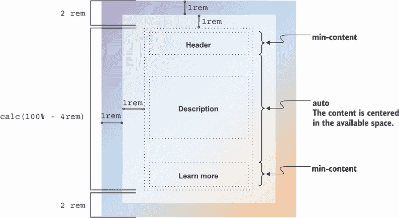

图 5.16 水平对齐卡片元素

在本章的早期部分，我们给内部容器设置了 `margin` 为 `1rem` 和 `padding` 为 `1rem`，这意味着它需要占据的空间高度等于 `100%` 减去 `4rem`（1 rem 的填充和 1 rem 的边距在顶部和底部，总共等于 4 rem）。为了在 CSS 中实现这种效果，我们使用 `calc()` 函数来为我们进行计算，将 `calc(100% - 4rem)` 分配给 `height` 属性。定义的行（`grid-template-rows`: `min-content` `auto` `min-content`）和设置的高度组合创建了一个布局，其中标题和链接只占据它们所需的空间，中间部分（段落元素）则得到剩余的空间。

最后，为了在卡片中间垂直居中段落内容，我们使用 `align-items` 属性并设置为 `center`，同时移除浏览器自动添加到 `<h2>` 的底部边距。如果我们保留标题底部的边距，那么段落顶部的空间会比底部多，因为 `min-content` 会考虑元素上的边距。因为卡片底部的链接没有边距，所以与段落下方相比，段落上方的空白空间会不成比例。下面的列表显示了我们的布局调整。

列表 5.14 内部容器布局调整

```
main > section > div {
  background-color: rgba(0, 0, 0, .75);
  margin: 1rem;
  padding: 1rem;
  color: whitesmoke;
  text-align: center;
  height: calc(100% - 4rem);
  display: grid;
  grid-template-rows: min-content auto min-content;
  align-items: center;
}

section h2 {
  font-size: 1.3rem;
  font-weight: bold;
  line-height: 1.2;
  margin-bottom: 0;
}
```

最后的调整完成了卡片布局（图 5.17）。接下来，我们将关注在宽度足够大（宽度大于或等于 700 像素）且具有悬停功能的设备上显示和隐藏内容部分。


图 5.17 样式化卡片

## 5.5 使用过渡动画在悬停和焦点内动画化内容

首先，我们需要创建一个媒体查询，检查设备是否支持`hover`交互，浏览器窗口是否至少 700 像素宽，以及用户是否在他们的机器上启用了`prefers-reduced-motion`。

减少运动偏好

一些用户希望退出运动密集的动画。他们可以通过在设备上启用一个设置来实现，该设置通过`prefers-reduced-motion`属性传达给浏览器。我们想确保我们尊重用户的设置。因此，我们将声明该设置未设置（具有`no-preference`的值）作为我们确定是否动画化内容的查询的一部分。有关`prefers-reduced-motion`的更多信息，请参阅第三章。

我们的媒体查询是`@media` `(hover:` `hover)` `and` `(min-width:` `700px)` `and` `(prefers-reduced-motion:` `no-preference)` `{` `}`。请注意，我们可以链式多个参数，只有当这些参数都满足时，查询中的 CSS 才会应用。

要隐藏除标题之外的所有内容，我们将使用`transform`属性和`translateY()`值将内容向下移动到卡片的底部。`translateY()`值允许我们将内容垂直移动到页面流之外；被移动元素周围的内容不受移动影响，不会重新定位或让路。

为了计算元素需要移动的距离，我们再次使用`calc()`函数。我们将通过以下列表所示，将标题向下移动卡片的高度（`350px`）减去`8rem`（容器的顶部边距 + 容器的顶部填充 + 标题的大小）。

列表 5.15 隐藏非标题内容

```
@media (hover: hover) and (min-width: 700px) and
➥ (prefers-reduced-motion: no-preference) {
  main > section > div {
    transform: translateY(calc(350px - 8rem));
  }
}
```

卡片的内部部分向下移动，如图 5.18 所示。

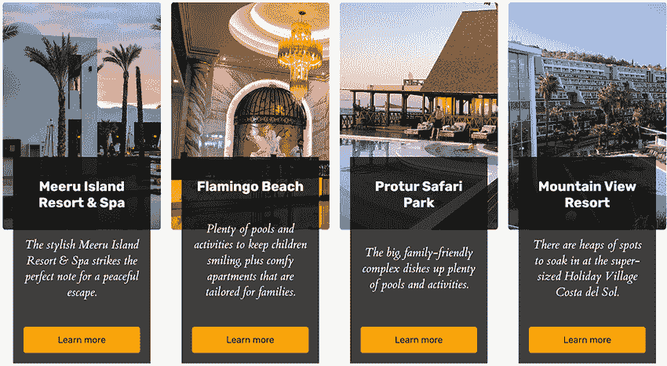

图 5.18 将内容向下移动

因为我们要在用户停止悬停在部分上方时动画显示内容，所以我们不想让底部的尾随内容保持：如果用户悬停在图片外溢的内容上，内容将向上移动到图片中，失去悬停状态，然后再次向下移动。这种行为会重复，产生闪烁。因此，我们将为我们的内部容器设置`5rem`的高度，并在段落和链接隐藏时隐藏溢出。

注意，在第二个卡片中，当内容应该被隐藏时，段落内容的一小部分仍然可见，因此我们还将使用不透明度隐藏非标题内容。此外，我们还将使用`translateY()`将内容向下移动`1rem`，这样当我们在`hover`时将其动画回时，它将获得一点运动效果。

所有的 CSS，用于隐藏内容和缩短内部容器，如下所示。为了选择所有不是标题的内容，我们可以使用`:not()`伪类。

列表 5.16 隐藏非标题内容

```
@media (hover: hover) and (min-width: 700px) and (prefers-reduced-motion:
➥ no-preference) {                              ①
  main > section > div {                         ②
    transform: translateY(calc(350px - 8rem));   ②
    height: 5rem;                                ②
    overflow: hidden;                            ②
  }                                              ②
  main > section > div > *:not(h2) {             ③
    opacity: 0;                                  ③
    transform: translateY(1rem);                 ③
  }                                              ③
}
```

① 媒体查询

② 移动并缩短内部内容容器

③ 隐藏所有非`<h2>`内容

`not()`伪类允许我们过滤选择器。在这种情况下，我们想要定位任何不是`<h2>`的东西。图 5.19 展示了这个过程。

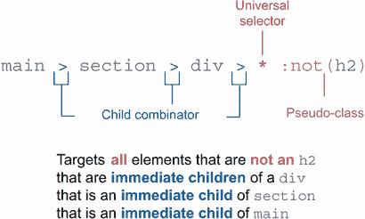

图 5.19 选择内部容器内所有不是`<h2>`的内容

现在内容已被隐藏（图 5.20），我们可以专注于再次显示它。

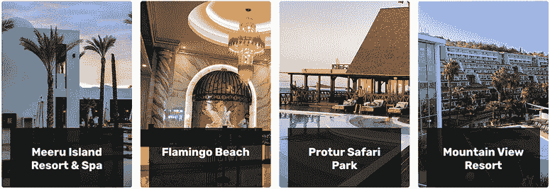

图 5.20 隐藏内容

要再次显示内容，我们需要撤销我们在`hover`和`focus`状态下所做的所有隐藏操作。因为我们没有从文档对象模型（DOM）中移除链接，它们只是视觉上被隐藏了；在程序上，它们仍然存在，用户可以通过键盘切换到链接。因此，当用户悬停在卡片上或链接获得焦点时，我们都需要显示内容。因为我们希望在子元素（链接）获得焦点时对祖先元素（内容容器）进行操作，我们可以使用`:focus-within`伪类。这个伪类允许我们根据元素是否有后代当前处于焦点状态有条件地应用样式。

因此，当链接获得焦点或章节被悬停时，我们通过将`translateY()`参数设置为`0`（无垂直位移）并将内部容器的高度设置为`350px`（外部容器的高度）减去`4rem`（容器垂直内边距和边界的总和）来将容器恢复到原位。我们还需要恢复段落和链接，它们的透明度被设置为`0`，并且已经被向下移动了`1rem`。

我们将通过为显示和隐藏的元素添加过渡效果来完成`hover`和`focus-within`效果。因为我们已经预定义了要改变的状态，并且希望动画只运行一次，当变化发生时，我们不需要使用关键帧。我们可以简单地指示 CSS 在变化发生时动画化所有变化，使用`transition`属性，值为`all 700ms ease-in-out`。所有变化都将被动画化；动画将花费 700 毫秒完成；动画将以慢速开始，加速，然后在完成前再次减速。以下列表显示了我们的`hover`和`focus-within`CSS。

列表 5.17 在`hover`和`focus-within`时显示内容

```
@media (hover: hover) and (min-width: 700px) and
➥ (prefers-reduced-motion: no-preference) {
 main > section > div {
  transform: translateY(calc(350px - 8rem));
  height: 5rem;
  overflow: hidden;
  transition: all 700ms ease-in-out;       ①
 }
 div > *:not(h2) {
  opacity: 0;
  transform: translateY(1rem);
  transition: all 700ms ease-in-out;       ①
 }
 section:hover div,                        ②
 section:focus-within div {                ③
  transform: translateY(0);
  height: calc(350px - 4rem);
 }

 section:hover div > *:not(h2),            ④
 section:focus-within div > *:not(h2){     ⑤
  opacity: 1;
  transform: translateY(0);
 }
}
```

① 动画变化

② 在章节`hover`时，将容器恢复到原位

③ 在章节`focus-within`时，将容器恢复到原位

④ 在`hover`时，将容器内的所有非`<h2>`元素恢复到原位，具有全不透明度

⑤ 在章节`focus-within`时，将容器内的所有非`<h2>`元素恢复到原位，具有全不透明度

应用这些更改（图 5.21）后，完成项目剩下的工作就是在我们的页面上设置背景。


图 5.21 `hover`和`focus-within`效果

要使图片更加突出，我们将为整个页面添加深灰色、几乎黑色的背景。要应用背景颜色，我们将添加值为`#010101`的`background`属性到现有的`body`规则中，如下面的列表所示。

列表 5.18 添加背景

```
body {
  display: grid;
  place-items: center;
  margin-top: 40px;
  padding: 20px;
  background: #010101;
}
```

图 5.22、5.23 和 5.24 展示了我们在不同屏幕尺寸下的完成项目。

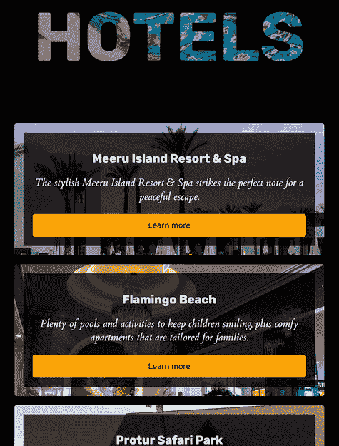

图 5.22 在宽度为 600 像素的窗口中的项目

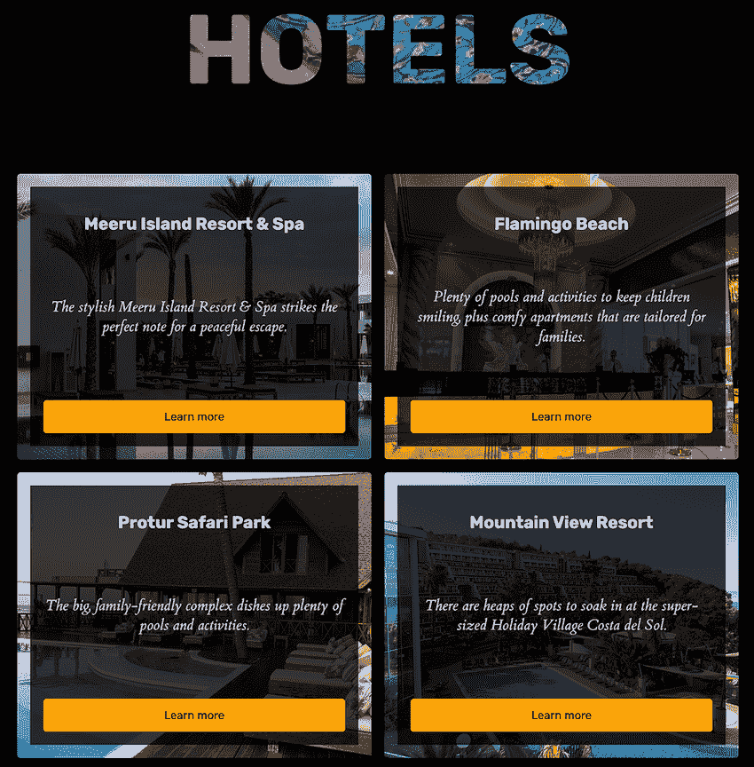

图 5.23 在宽度为 850 像素的窗口中的项目


图 5.24 在宽度为 1310 像素的窗口中启用`prefers-reduced-motion`的项目

## 摘要

+   网格可以用于整个布局或布局中的单个元素。

+   `text-transform`属性可以将文本转换为大写，而不会影响内容的可访问性。

+   请谨慎使用`text-transform:` `uppercase`，不要在大量内容区域使用。

+   `background-clip`属性值为`text`时，可以剪裁背景图像以围绕文本。

+   `background-clip`属性值为`text`时仍需要前缀，并且该属性在实现过程中可能会发生变化。

+   我们可以使用媒体查询来检查设备是否支持`hover`，并调整我们的布局，以防止用户在设备不支持`hover`时看到内容。

+   我们可以通过使用`and`来在同一个媒体查询中链式多个条件。

+   我们可以在媒体查询中使用`prefers-reduced-motion`来尊重用户对动画和运动的偏好。

+   `:not()`伪类代表不匹配一系列选择器的元素。

+   `translateY()`将内容垂直移动，而不会影响重新流。

+   我们可以使用`transition`属性在状态之间动画化样式变化。

+   要根据元素的子代是否处于焦点来有条件地应用样式，我们使用`focus-within`伪类。
