# 6 创建个人资料卡片

本章涵盖

+   使用 CSS 自定义属性

+   使用`radial-gradient`创建背景

+   设置图像大小

+   使用 flexbox 定位元素

在本章中，我们将创建一个个人资料卡片。在网页设计中，卡片是一个包含单个主题信息的视觉元素。我们将应用这个概念来展示某人的个人资料信息，本质上创建了一张数字名片。这种布局通常用于社交媒体和博客网站上，以向读者概述作者信息。有时它包含链接到详细个人资料页面或与个人资料所属的人互动的机会。

为了创建布局，我们将围绕定位做大量工作，特别是使用 CSS Flexbox 布局模块来对齐和居中元素。我们还将探讨如何使矩形图像适应圆形而不扭曲图像。到本章结束时，我们的个人资料卡片将看起来像图 6.1。

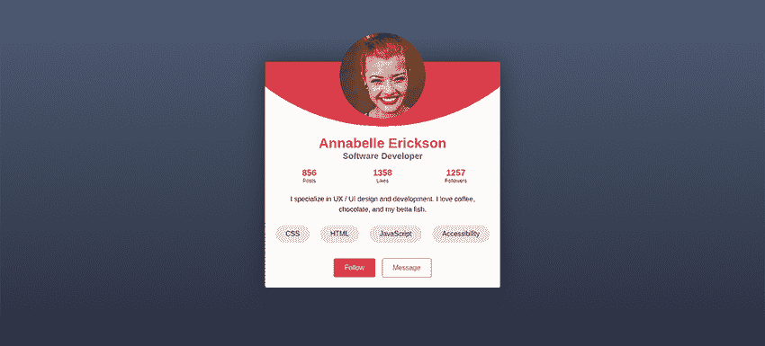

图 6.1 最终输出

## 6.1 开始项目

让我们直接深入看看我们的起始 HTML（列表 6.1），您可以在 GitHub 仓库[`mng.bz/5197`](http://mng.bz/5197)或 CodePen[`codepen.io/michaelgearon/pen/NWyByWN`](https://codepen.io/michaelgearon/pen/NWyByWN)上找到。我们有一个带有`card`类的`<div>`，其中包含在个人资料卡片中展示的所有元素。为了设置博客文章信息，我们将使用描述列表。我们的技术（CSS、HTML 等）以列表形式展示。

描述列表

一个*描述列表*包含一系列术语，包括描述术语（`dt`）和任意数量的描述（`dd`）。描述列表常用于创建术语表或显示元数据。因为我们正在将术语（帖子、点赞和关注者）与其计数（数量）配对，所以这个项目非常适合使用描述列表。

列表 6.1 项目 HTML

```
<body>
  <div class="card">                                            ①
          ②
    <h1>Annabelle Erickson</h1>                                 ③
    <div class="title">Software Developer</div>                 ④
    <dl>                                                        ⑤
      <div>                                                     ⑤
        <dt>Posts</dt>                                          ⑤
        <dd>856</dd>                                            ⑤
      </div>                                                    ⑤
      <div>                                                     ⑤
        <dt>Likes</dt>                                          ⑤
        <dd>1358</dd>                                           ⑤
      </div>                                                    ⑤
      <div>                                                     ⑤
        <dt>Followers</dt>                                      ⑤
        <dd>1257</dd>                                           ⑤
      </div>                                                    ⑤
    </dl>                                                       ⑤
    <p class="summary">I specialize in UX / UI...</p>           ⑥
    <ul class="technologies">                                   ⑦
      <li>CSS</li>                                              ⑦
      <li>HTML</li>                                             ⑦
      <li>JavaScript</li>                                       ⑦
      <li>Accessibility</li>                                    ⑦
    </ul>                                                       ⑦
    <div class="actions">                                       ⑧
      <button type="button" class="follow">Follow</button>      ⑧
      <a href="#" class="message">Message</a>                   ⑧
    </div>                                                      ⑧
  </div>                                                        ⑨
</body>
```

① 卡片开始

② 个人头像

③ 个人资料持有者的姓名

④ 个人资料持有者的职位

⑤ 文章信息

⑥ 个人简介/关于

⑦ 技术

⑧ 操作

⑨ 卡片结束

当我们开始为卡片添加样式时，页面看起来就像图 6.2 所示。

## 6.2 设置 CSS 自定义属性

在我们的布局中，特别是当我们为个人资料图像和图像下方卡片顶部的彩色部分添加样式时，我们需要为几个计算使用图像大小值。在 JavaScript 等语言中，当我们有一个将要多次引用的值时，我们使用*自定义属性*，有时也称为*CSS 变量*。

要创建一个自定义属性，我们需要在变量名前加上两个连字符（`--`），紧接着是变量名。我们以与任何其他属性相同的方式将值分配给自定义属性：冒号（`:`）后跟值。因此，CSS 变量声明看起来像这样：`--myVariableName:` `myValue;`。

与任何其他声明一样，我们需要在规则内定义我们的变量。对于我们的项目，我们将定义我们的颜色和图像大小，然后在列表 6.2 中声明的 `body` 规则内声明它们。因为我们定义变量在 `body` 上，所以 `<body>` 元素及其任何后代都将能够访问这些变量。

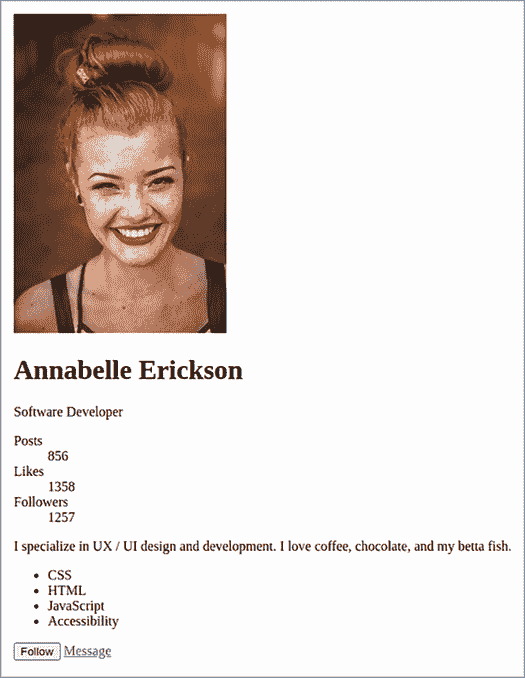

图 6.2 起始点

列表 6.2 定义 CSS 自定义属性

```
body {
  --primary: #de3c4b;                    ①
  --primary-contrast: white;
  --secondary: #717777;                  ②
  --font: Helvetica, Arial, sans-serif;
  --text-color: #2D3142;                 ③
  --card-background: #ffffff;
  --technologies-background: #ffdadd;
  --page-background: linear-gradient(#4F5D75, #2D3142);
  --imageSize: 200px;

  background: var(--page-background);
  font-family: var(--font);
  color: var(--text-color);
}
```

① 红色

② 灰色

③ 深蓝灰色

注意：我们的线性渐变将从顶部到底部渐变，从深蓝渐变到更深的蓝。要深入了解线性渐变，请参阅第三章。

注意我们可以为变量分配不同类型的值。我们分配颜色，例如在我们的 `--primary` 变量中（CSS 自定义属性最常见用途之一），但我们还定义了一个大小（`--imageSize`）、一个字体家族（`--font`）和一个渐变（`--page-background`）。

要引用变量并将其用作声明的一部分，我们使用语法 `var(--variableName)`。因此，为了设置我们的文本颜色，我们声明 `color:` `var (--text-color);`。在我们的背景和字体颜色及家族应用后（图 6.3），我们注意到我们的背景在页面底部重复。

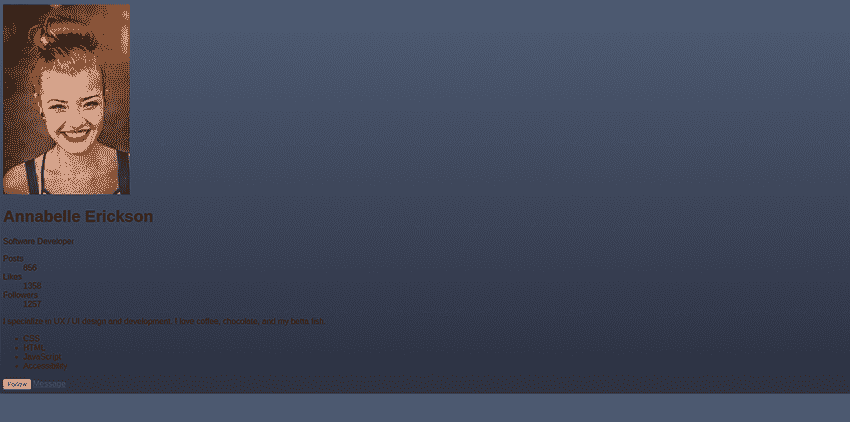

图 6.3 向 `<body>` 添加背景

## 6.3 创建全高度背景

一种 *线性渐变* 是一种图像类型。当我们将图像作为 CSS 中元素的背景时，如果图像小于元素，图像将重复，或 *平铺*。在这种情况下，我们不想让图像重复。我们有两种方法可以解决这个问题：

+   我们可以通过使用 `background-repeat:` `no-repeat`; 来告诉背景我们不希望它重复。然而，由于我们的 `<body>` 元素的高度仅与其内容相同，如果窗口比内容高，我们将在页面底部留下一个难看的白色条带——这并不理想。

+   我们的第二个选项（我们将使用的选项）是使 `<html>` 和 `<body>` 元素占据整个屏幕的高度，而不是根据内容大小调整。

我们将在列表 6.3 中的规则添加到我们的样式表中。我们将重置边距和填充为 `0`，因为我们想确保我们在窗口内从边缘到边缘。

列表 6.3 使背景高度满屏

```
html, body {
  margin: 0;
  padding: 0;
  min-height: 100vh;
}
```

要设置高度，我们使用 `min-height`，因为如果内容长度大于窗口高度，我们希望用户能够访问内容，并且我们希望背景在内容后面。通过使用 `min-height`，我们指示浏览器使 `<body>` 和 `<html>` 元素至少与窗口高度相同。如果内容迫使元素变高，浏览器将使用内容的高度。

我们为`min-height`设置的值是`100vh`。视口高度（`vh`），是一个基于视口自身高度的单元，是百分比为基础的。所以将`100vh`的值分配给`min-height`意味着我们希望元素至少有与视口高度相等的 100%的高度。现在我们已经设置了背景（图 6.4），让我们来设置卡片样式。

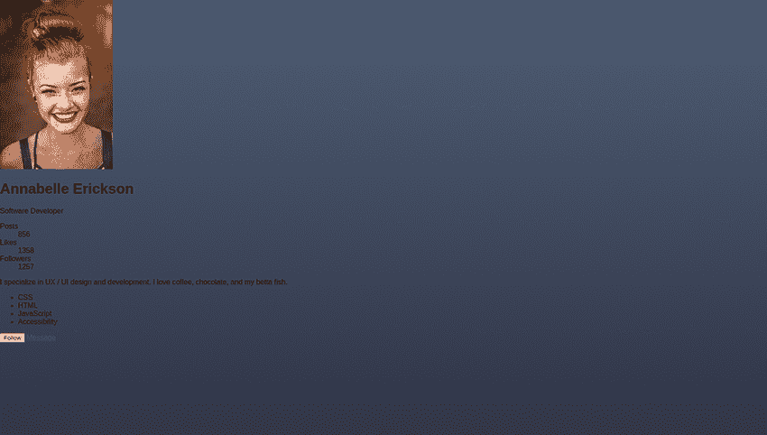

图 6.4 全屏渐变背景

## 6.4 使用 Flexbox 进行卡片样式和居中

让我们从样式化卡片本身开始。我们将给它一个白色背景和阴影，以给我们的布局增加一些深度。注意，我们不是使用背景颜色值，而是使用我们的`background`变量。

我们还将设置卡片的宽度为`75vw`。视口宽度（`vw`）是我们之前使用的视口高度（`vh`）单位的水平对应物。它也是基于百分比的，所以通过将宽度设置为`75vw`，我们设置了卡片的宽度为浏览器窗口总宽度的 75%。

接下来，我们将进一步限制卡片的宽度，最大宽度为 500 像素。通过使用`width`和`max-width`属性，我们允许卡片在屏幕尺寸较窄时缩小，但在较大屏幕上不会变得过于宽大和杂乱。最后，我们通过使用`border-radius`来使卡片的角落弯曲，以软化设计。以下列表显示了我们的卡片规则。

列表 6.4 样式化卡片

```
.card {
  background-color: var(--card-background);
  box-shadow: 0 0 55px rgba(38, 40, 45, .75);
  width: 75vw;
  max-width: 500px;
  border-radius: 4px;
}
```

图 6.5 显示了应用到我们项目中的样式。在卡片上添加了一些基本样式（我们将在本章后面继续添加），让我们将卡片垂直和水平放置在屏幕中间。


图 6.5 开始设置卡片样式

为了将卡片居中在屏幕的中间，我们将使用弹性布局（有时称为*flexbox*），它允许我们将元素放置在单个轴上，无论是垂直还是水平。虽然我们可以使用`grid`来定位卡片（而是否应该使用`grid`是一个个人偏好的问题），在这个例子中，我们只关心居中项目，而不是其在列和行中的位置，所以 Flexbox 似乎是一个更好的选择。

值为`flex`的`display`属性用于应该使用 Flexbox 放置在屏幕上的子元素的父元素。在我们的项目中，被定位的元素是卡片，其父元素是`<body>`元素，所以我们将添加`display:` `flex`声明到我们的`body`规则中。

接下来，我们定义我们希望`<body>`内的元素如何表现。在我们的例子中，我们有一个子元素（卡片），我们希望它居中。为了水平居中卡片，我们在`body`规则中添加一个`justify-content:` `center`声明。这个属性允许我们指定元素如何在我们的轴上分布。图 6.6 分解了选项。

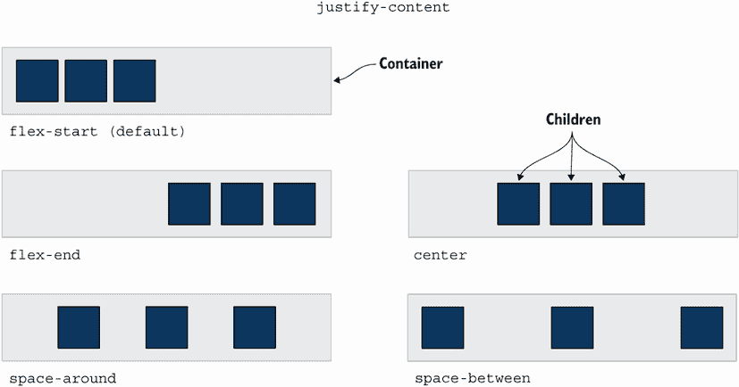

图 6.6 `justify-content`属性的值

我们还希望垂直居中卡片。对于垂直定位，我们将使用`align-items:` `center`。`align-items`属性使我们能够指定元素相对于彼此以及相对于容器的定位方式，如图 6.7 所示。

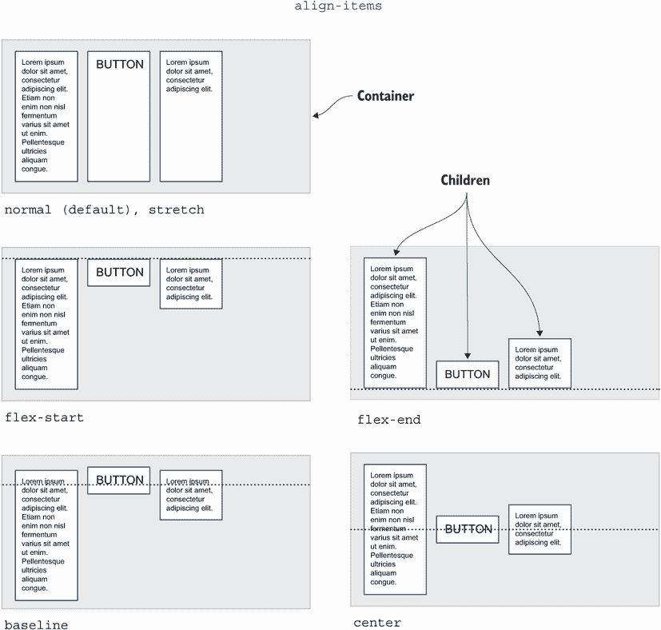

图 6.7 `align-items`属性的值

以下列表显示了我们的更新后的 body 规则。记住，被定位的元素的父元素是我们应用 flexbox 相关声明的目标。

列表 6.5 居中卡片

```
body {
  ...
  display: flex;
  justify-content: center;    ①
  align-items: center;        ②
}
```

① 水平居中卡片

② 垂直居中卡片

现在我们的卡片已经居中（图 6.8），让我们专注于卡片的内容，从个人资料图片开始。

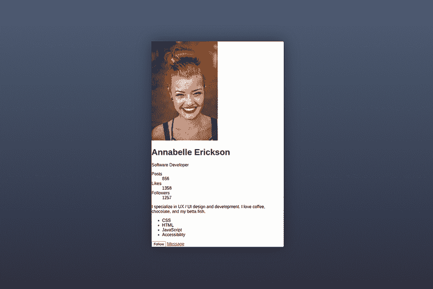

图 6.8 居中卡片

## 6.5 样式化和定位个人资料图片

我们目前有一个矩形图像。我们希望将其变成圆形。我们还希望它在卡片上居中，并且稍微突出顶部。让我们首先将图像转换为圆形。

### 6.5.1 对象填充属性

圆形的高度等于其宽度，所以正如我们在图 6.9 中看到的，如果我们将图片的高度和宽度设置为等于我们的图像大小变量，图片将会扭曲。

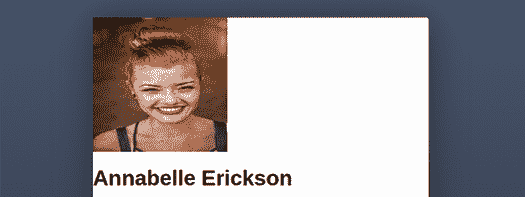

图 6.9 扭曲的个人资料图片

为了防止图像扭曲，我们还必须指定图像相对于其给定大小的行为。为此，我们将使用`object-fit`属性。通过将`object-fit`的值设置为`cover`，我们指示图像保持其初始宽高比，但适应可用空间。在这种情况下，由于图像的高度大于宽度，我们将会失去一些图像的顶部和底部。

当我们使用`object-fit`时，图像默认居中，如果图像的一部分被裁剪，那么这些部分是边缘，这对于我们当前的使用案例和图片来说效果很好。但如果我们想调整图像在其分配大小内的位置，并且只从底部裁剪，我们就会添加一个`object-position`声明。

要使我们的图像成为 200 像素宽的圆形，我们使用列表 6.6 中的 CSS。记住，我们在`body`中设置了图像大小作为 CSS 自定义属性，因此我们将图像的宽度和高度设置为等于`--imageSize`变量。我们添加了`object-fit`声明以防止图像扭曲。最后，我们给图像一个 50%的`border-radius`使其成为圆形。

列表 6.6 居中卡片

```
body {
  ...
  --imageSize: 200px;
}

img.portrait {
  width: var(--imageSize);
  height: var(--imageSize);
  object-fit: cover;         ①
  border-radius: 50%;        ②
}
```

① 防止扭曲

② 使图像成为圆形

现在我们的图像看起来像图 6.10。

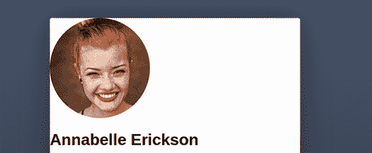

图 6.10 圆形个人资料图片

接下来，我们需要定位我们的图片。

### 6.5.2 负边距

为了将我们的图片定位在卡片上方突出，我们将使用负边距。为了将一个元素向下移动并远离其上方的内联内容，我们可以向元素添加一个正的`margin-top`值。但如果我们添加一个负边距，而不是被推下，元素将被拉上。我们将使用边距与文本居中结合来定位图片。查看图 6.11 中的最终设计，我们会注意到所有文本也是居中的。

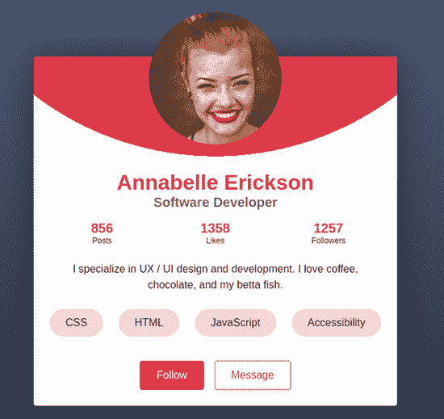

图 6.11 最终设计

因为所有文本都是居中的，让我们在卡片规则中添加一个`text-align:` `center`声明。图片默认是内联元素，所以我们会注意到，通过居中文本，图片也会居中（图 6.12）。

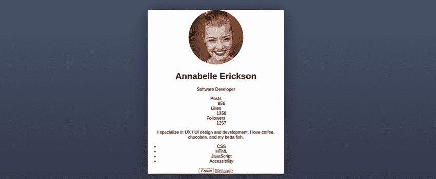

图 6.12 居中文本

现在剩下的就是添加负顶部边距来将图片向上移动。我们希望图片的三分之一从顶部突出出来，我们将使用`calc()`函数来帮我们做数学计算。我们的函数是`calc(-1 * var(--imageSize) / 3);`。我们将图片大小除以 3 得到图片高度的三分之一，然后乘以-1 使其变为负数。我们的边距将使图片的三分之一从卡片的顶部突出出来，如图 6.13 所示。

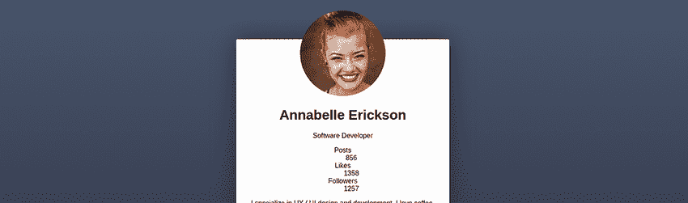

图 6.13 定位图片

接下来，我们需要给我们的卡片添加一些边距。由于我们添加到图片上的负边距，如果我们有一个短屏幕（图 6.14），图片的顶部就会消失在屏幕外。

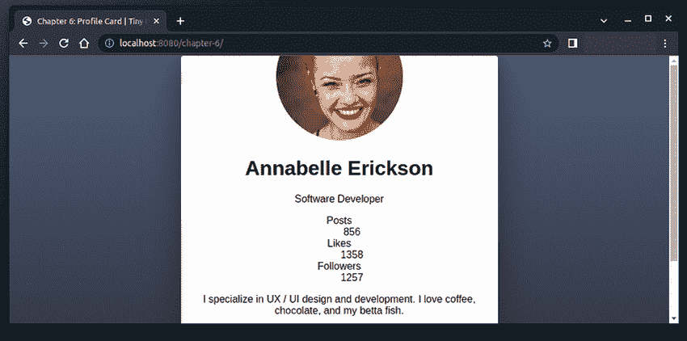

图 6.14 当窗口高度较小时裁剪图片的顶部

为了防止当窗口不是特别高时裁剪图片的一部分，我们想在卡片本身上添加一些垂直边距——一个大于或等于图片突出于卡片的部分的边距。为了计算突出的量，我们使用了`calc(-1 * var(--imageSize) / 3);`。对于我们的卡片边距，我们将使用类似的概念，取图片高度的 1/3，然后添加 24 像素来将卡片和图片移离边缘。我们的最终函数将是`calc(var(--imageSize) / 3 + 24px)`。以下列表显示了添加定位图片的 CSS。

列表 6.7 定位图片

```
.card {
  ...
  text-align: center;
  margin: calc(var(--imageSize) / 3 + 24px) 24px;   ①
}

img {
  width: var(--imageSize);
  height: var(--imageSize);
  object-fit: cover;
  border-radius: 50%;
  margin-top: calc(-1 * var(--imageSize) / 3);      ②
}
```

① 图像大小的三分之一加 24 像素的垂直边距和 24 像素的水平边距

② 负顶部边距使图片突出于卡片

在我们的图片定位和添加了边距，以确保在小屏幕上图片的顶部不会被裁剪（图 6.15）之后，让我们将注意力转向图片下面的弯曲红色背景。

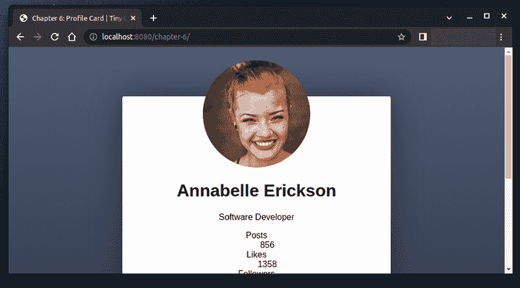

图 6.15 添加的卡片边距

## 6.6 设置背景大小和位置

要添加图片后面的红色弯曲背景，我们需要将以下列表中的声明添加到卡片规则中。

列表 6.8 定位图片

```
.card {
  background-color: var(--card-background);
  ...
  background-image: radial-gradient(
    circle at top,
    var(--primary) 50%,
    transparent 50%,
    transparent
  );
  background-size: 1500px 500px;
  background-position: center -300px;
  background-repeat: no-repeat;
}
```

让我们分解一下这段代码的功能。首先，我们添加了一个由图 6.16 所示的`radial-gradient`组成的`background-image`。


图 6.16 使用`radial-gradient`添加背景

结合背景颜色和图片

我们可以向同一个元素添加背景颜色和背景图片。我们将颜色分配给`background-color`属性，将图片分配给`background-image`属性。或者我们可以在`background`简写属性中同时应用它们，如下所示：`background: white url(path-to-image);`。

`radial-gradient`接受一个结束形状（圆形或椭圆形），然后定义我们想要每个颜色开始和结束的位置以形成渐变。我们将其定义为`radial-gradient(circle, var(--primary) 50%, transparent 50%, transparent);`。

我们的主要颜色是红色，所以我们的渐变将创建一个直到达到容器 50%大小的红色圆圈。在容器大小的 50%处，颜色立即变为透明。因为颜色的变化是立即的，所以没有渐变效果，我们得到了一个干净整洁的圆圈。

默认情况下，径向渐变从其容器的中心发散，所以接下来我们在`radial-gradient`函数的开始处添加`circle at top`，以将圆圈的起点从背景中心移动到顶部。我们更新的`radial-gradient`函数是`radial-gradient(circle at top, var(--primary) 50%, transparent 50%, transparent);`（图 6.17）。

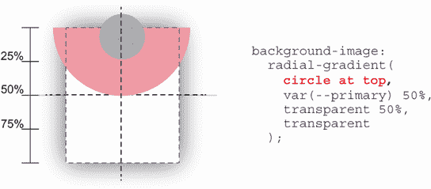

图 6.17 使渐变从容器顶部中心发散

现在我们希望将圆圈向上移动，使得圆圈的底部直接位于图片下方。图 6.18 显示，如果我们将背景向上移动-150 像素，并且我们的卡片相当短（我们的个人资料没有很多内容），那么圆圈和卡片边缘之间会在顶部角落出现间隙，这是我们不想看到的。

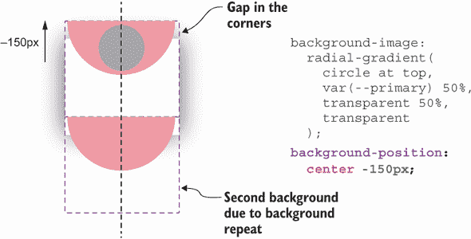

图 6.18 修改背景位置

为了防止这种情况发生，我们将背景图片设置为最大卡片尺寸的三倍宽度：`(3×500 =1500)`。当我们使用渐变创建`background-image`时，背景图片会随着容器的大小而增长和缩小，因此我们也将为背景设置一个固定高度。这样，无论卡片中有多少内容，我们背景的形状都是可预测的（图 6.19）。

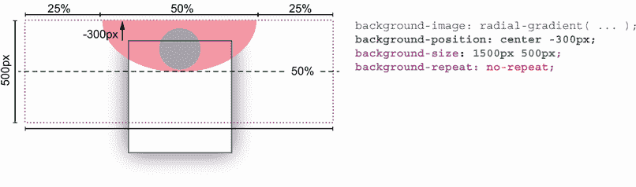

图 6.19 编辑`background-size`和处理`background-repeat`

在更改背景尺寸后，我们还增加了移动背景向上移动的量，以便它直接位于个人资料图像下方。最后，如本章前面所述，背景图像默认情况下会重复。通过将图像向上移动，我们为背景平铺留出空间。我们只想有一个半圆，因此我们添加了一个 `background-repeat` 声明，其值为 `no-repeat`。现在我们的卡片背景定义如下所示。

列表 6.9 定位图像

```
.card {
  background-color: var(--card-background);
  ...
  background-image: radial-gradient(    ①
    circle at top,                      ①
    var(--primary) 50%,                 ①
    transparent 50%,                    ①
    transparent                         ①
  );                                    ①
  background-size: 1500px 500px;        ②
  background-position: center -300px;   ③
  background-repeat: no-repeat;         ④
}
```

① 创建一个平边为卡片顶部的半圆

② 设置背景图像的尺寸为 1500px 宽和 500px 高

③ 将背景水平居中并从卡片上方开始 300px

④ 防止背景平铺

图 6.20 展示了添加到卡片中的背景。随着我们卡片的顶部开始看起来不错，让我们专注于其余的内容。

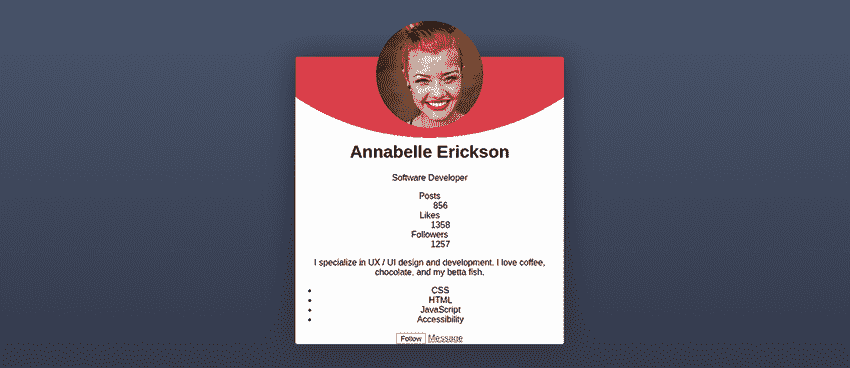

图 6.20 完成的背景图像

## 6.7 内容样式

我们当前的卡片没有任何填充，这意味着如果名字更长，它可能会潜在地延伸到卡片的边缘。在大多数情况下，我们会创建一个卡片作为组件或模板，以便为多个客户重复使用，因此让我们添加一些左右填充以确保文本不会延伸到卡片的边缘。我们还将添加一些底部填充，以便将链接和底部远离卡片的底部边缘。

列表 6.10 显示了我们的更新后的卡片规则，图 6.21 显示了新的输出。我们使用了填充简写属性，它定义了三个值：它声明顶部填充为 `0`，左右为 `24px`，底部填充为 `24px`。我们特别没有添加顶部填充，因为这会推下图像，迫使我们重新调整图像定位。

列表 6.10 向卡片添加填充

```
.card {
  ...
  padding: 0 24px 24px;
}
```

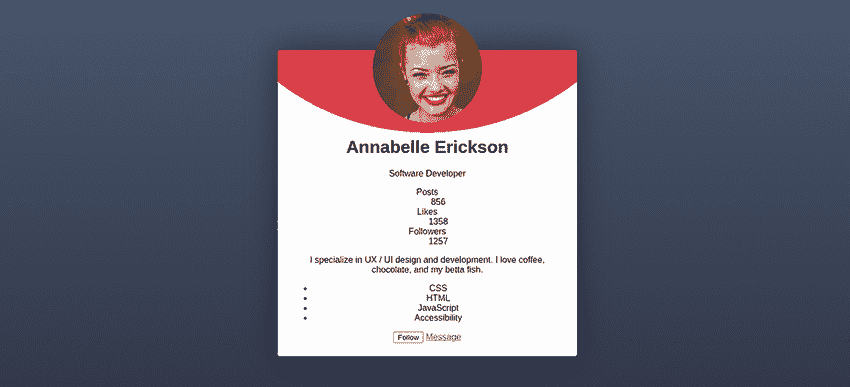

图 6.21 添加卡片填充

### 6.7.1 名称和职位

沿着卡片向下，我们看到第一部分内容是名字。作为一个 `<h1>`，它有一些浏览器提供的默认样式，包括一些边距。我们将编辑边距以增加标题和图像之间的空间，并移除底部边距，以便职位标题直接出现在名字下方。我们还将颜色改为红色，并将字体大小设置为 `2rem`。

rem 单位

一个 *rem* 是基于根元素的字体大小的相对单位——在我们的例子中，是 HTML。对于大多数浏览器，默认值是 `16px`。我们没有在我们的项目中设置 `html` 元素的字体大小；因此，当我们设置 `<h1>` 的 `font-size` 为 `2rem` 时，输出大小是 `32px`，假设默认值为 `16px`。

使用相对字体大小，如 `rem` 和 `em` 的好处是可访问性。这些大小有助于确保文本无论用户的设置或设备如何都能优雅地缩放。

对于职位标题，我们将增加字体的大小和粗细，并将字体颜色更改为我们的次要颜色，即灰色。以下列表显示了我们的新规则，图 6.22 显示了输出结果。

列表 6.11 命名样式

```
h1 {                            ①
  font-size: 2rem;              ①
  margin: 36px 0 0;             ①
  color: var(--primary);        ①
}                               ①

.title {                        ②
  font-size: 1.25rem;           ②
  font-weight: bold;            ②
  color: var(--secondary);      ②
}                               ②
```

① 命名的样式

② 职位标题的样式

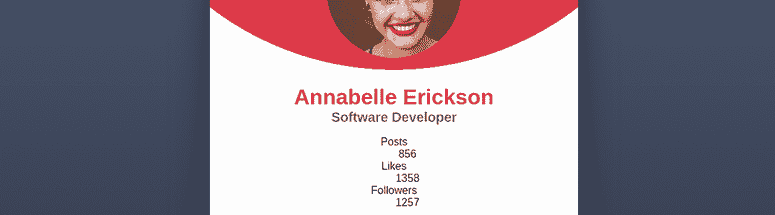

图 6.22 样式化姓名和职位标题

接下来，我们将对帖子、点赞和关注者信息进行样式化。

### 6.7.2 space-around 和 gap 属性

在我们的 HTML 中，描述列表（`dl`）包含职位、点赞数和关注者数（见 6.12 表）。每个分组都包含在一个`<div>`中，因此我们将为定义列表应用`display`值为`flex`以水平对齐所有三个分组。然后我们将`justify-content`属性设置为`space-around`以在卡片上分散它们。

列表 6.12 描述列表 HTML

```
<dl>
  <div>
    <dt>Posts</dt>
    <dd>856</dd>
  </div>
  <div>
    <dt>Likes</dt>
    <dd>1358</dd>
  </div>
  <div>
    <dt>Followers</dt>
    <dd>1257</dd>
  </div>
</dl>
```

`space-around`值通过在每个元素之间提供相等的空间并在每个边缘提供一半的空间，均匀地将元素分布在我们轴上。图 6.23 显示了间距的应用方式。

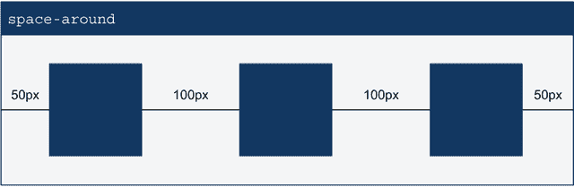

图 6.23 `space-around`属性

列表 6.13 显示了我们的描述列表样式。注意我们包括了`gap:` `12px`声明，这确保了元素之间最小空间为 12 像素。我们可以在描述列表内的`<div>`上添加边距，但边距会影响外部边缘。`gap`属性仅影响元素之间的空间。

注意：`gap`属性在 iOS 14.5 及以后的版本中得到支持。在撰写本文时，许多人仍在使用早期版本。要检查该属性的全球使用情况，请参阅[`caniuse.com/flexbox-gap`](https://caniuse.com/flexbox-gap)。

列表 6.13 命名样式

```
dl {
  display: flex;
  justify-content: space-around;
  gap: 12px;
}
```

如图 6.24 所示，现在我们的个人资料统计数据在卡片上成行且均匀分布。

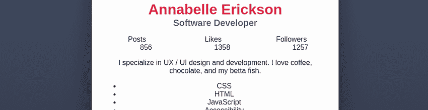

图 6.24 对齐的个人资料统计数据

然而，数字是偏移的。这种偏移来自描述，它有一些来自浏览器默认设置的边距。让我们去除这些设置，并使用以下列表中的 CSS 将文本样式设置为粗体、更大和红色。

列表 6.14 描述详情规则

```
dd {
  margin: 0;
  font-size: 1.25rem;
  font-weight: bold;
  color: var(--primary);
}
```

移除边距（图 6.25）后，我们注意到点赞数仍然没有在卡片上居中。


图 6.25 描述列表对齐

点赞数没有居中的原因是三个元素宽度并不完全相同。当元素分布时，浏览器会计算每个元素所需的总空间，并将剩余空间平均分配。因此，因为包含关注者的`<div>`比包含帖子的`<div>`大，所以点赞的`<div>`没有落在中间。

### 6.7.3 flex-basis 和 flex-shrink 属性

要居中对齐点赞，我们将为所有三个 `<div>` 分配相同的宽度。然而，不使用 `width` 属性，我们将使用 `flex-basis` 并将其值设置为 `33%`。`flex-basis` 设置浏览器在计算元素所需空间时应使用的初始大小。我们还将 `flex-shrink` 设置为 `1`。

`flex-shrink` 决定了如果容器中没有足够的空间容纳元素，元素是否允许缩小到小于由 `flex-basis` 值指定的尺寸。如果 `flex-shrink` 值为 `0`，则大小不会调整。任何正数值都允许调整大小。

我们将 `flex-basis` 设置为 `33%`。但请记住，我们还为每个元素之间设置了 12 像素的 `gap`。因此，当考虑到 `gap` 设置时，我们设置的 `flex-basis` 大小对于容器来说太宽了。通过允许元素缩小，我们告诉浏览器从每个 `<div>` 占据容器宽度的 33% 开始其定位计算，并将 `<div>` 均匀缩小以适应可用空间。这种情况防止我们不得不进行数学计算，以确定 `<div>` 应该有多宽才能保持相等的大小。

要编写我们的规则（列表 6.15），我们通过使用子组合器（`>`）针对描述列表（`dl`）的直接子 `<div>`，并应用 `flex-basis` 和 `flex-shrink` 声明。

列表 6.15 居中对齐点赞

```
dl > div {
  flex-basis: 33%;
  flex-shrink: 1;
}
```

在我们的点赞居中（图 6.26）后，让我们将注意力转向定义术语（`dt`）。

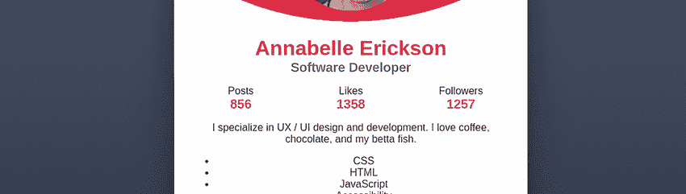

图 6.26 居中对齐的点赞

### 6.7.4 `flex-direction` 属性

在我们的原始设计中，描述细节（数字）位于描述术语上方。为了在视觉上翻转它们，我们将使用 `flex-direction` 属性。我们断言 Flexbox 可以在单个轴上放置元素。到目前为止，我们已经在水平轴（x 轴）上完成了我们的工作。

要将细节移动到术语上方，我们将使用垂直（y 轴）上的 Flexbox，有时称为 *block* 或 *cross* 轴。要更改 Flexbox 应该操作的轴，我们使用 `flex-direction` 属性。默认情况下，该属性具有 `row` 值，这使得 Flexbox 在 x 轴上操作。通过将值更改为 `column`，我们使其在 y 轴上操作。

此外，`flex-direction` 属性允许我们指定元素应该如何排序。将值设置为 `column-reverse` 告诉浏览器我们希望在 y 轴上操作，并且我们希望元素以反向 HTML 顺序排列，使描述细节（`<dd>`）首先出现，然后是描述术语（`<dt>`）。

如前所述，我们希望在父元素上设置行为——在本例中是 `<div>`。我们将向之前的 `<div>` 规则中添加以重新排序元素（列表 6.16）。我们还减小了描述术语（`<dt>`）的大小，以强调数字而不是其术语。

列表 6.16 反转内容顺序

```
dl > div {
  flex-basis: 33%;
  flex-shrink: 1;
  display: flex;
  flex-direction: column-reverse;
}
dt { font-size: .75rem; }
```

可访问性问题和内容显示顺序

由于可访问性的原因，我们想要确保我们编写的 HTML 顺序与它在屏幕上显示的顺序一致。如果一个用户在视觉上跟随页面内容的同时让电脑朗读页面内容，如果朗读的内容与他们看到的不匹配，他们可能会感到容易迷失方向或困惑。在使用`flex-direction`等属性重新排序内容时要谨慎。

图 6.27 显示了我们的样式化描述列表（`<dl>`）。

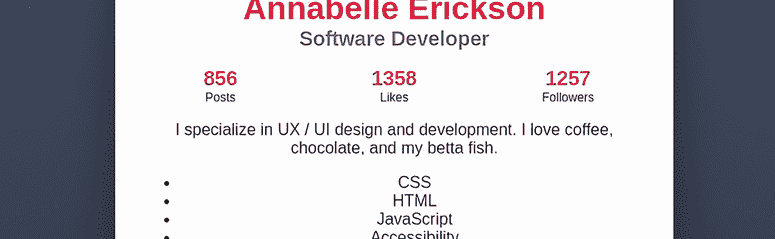

图 6.27 样式化描述列表

继续向下查看卡片，让我们将注意力转向位于个人资料统计信息下方的摘要段落。

### 6.7.5 段落

段落看起来已经很好了。我们打算对其做的唯一一件事是添加一些垂直边距以留出空间，并增加行高以提高可读性，如列表 6.17 所示。

注意，行高没有单位。通过不设置单位，我们允许行高与字体大小成比例缩放。这个无单位的值是特定于`line-height`属性的。如果我们将其设置为`12px`的值，例如，行高将保持 12 像素，无论字体大小如何。所以如果字体大小大幅增加，我们的字母会在垂直方向上重叠。始终不声明单位是最安全的。

列表 6.17 段落规则

```
p.summary {
  margin: 24px 0;
  line-height: 1.5;
}
```

在处理完段落（图 6.28）后，让我们样式化技术列表。

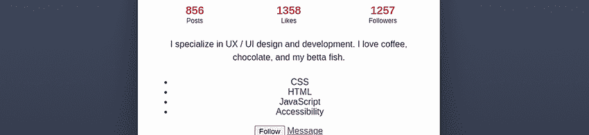

图 6.28 样式化摘要段落

### 6.7.6 `flex-wrap`属性

首先，我们将对列表元素本身进行样式化。我们将使用一种有时被称为*药丸*、*芯片*或*标签*的设计模式，其中元素具有背景颜色和圆角。我们的 CSS 将类似于列表 6.18。我们还包括一些填充，以便文本不会紧挨着标签的边缘。

列表 6.18 样式化列表元素

```
ul.technologies li {
  padding: 12px 24px;
  border-radius: 24px;
  background: var(--technologies-background);
}
```

在对单个元素进行样式化（图 6.29）后，我们可以专注于列表的布局。

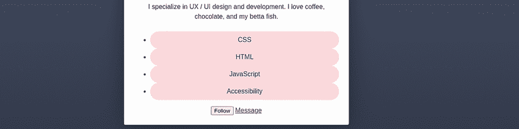

图 6.29 样式化列表项

首先，我们将通过使用`list-style:` `none`来移除项目符号。然后我们将移除所有填充，并将垂直边距设置为`24px`，水平边距设置为`0`。

为了定位项目，我们将使用 Flexbox，添加`12px`的`gap`，并将`justify-content`属性值设置为`space-between`。`space-between`与`space-around`类似，但它不会在容器的开始和结束处添加空间，如图 6.30 所示。


图 6.30 比较`space-around`和`space-between`

我们用于布局芯片的规则将类似于下一个列表。

列表 6.19 样式化技术列表

```
ul.technologies {
  list-style: none;
  padding: 0;
  margin: 24px 0;
  display: flex;
  justify-content: space-between;
  gap: 12px;
}
```

然而，当我们缩小屏幕宽度（图 6.31）时，我们注意到最后一个标签超出了我们的卡片。

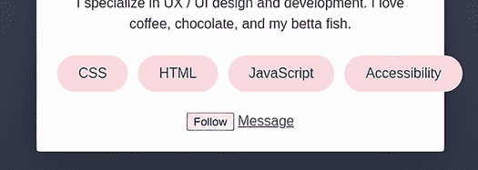

图 6.31 标签超出卡片宽度

在窄屏幕上，我们的列表比卡片宽。为了防止内容溢出卡片，我们可以使用`flex-wrap`属性。

默认情况下，即使容器太小，flex 项目也会以直线显示，正如我们在技术列表中遇到的情况。为了在空间不足时将最后一个元素强制换行，我们可以将`flex-wrap`属性设置为`wrap`。此设置告诉浏览器在空间不足时在下方开始新的一行项目。

与`flex-direction`一样，`flex-wrap`可以改变元素显示的顺序，但在这里我们不需要改变它。以下列表包含我们的更新规则。

列表 6.20 添加`flex-wrap`

```
ul.technologies {
  list-style: none;
  padding: 0;
  margin: 24px 0;
  display: flex;
  justify-content: space-between;
  gap: 12px;
  flex-wrap: wrap;
}
```

注意图 6.32 中 CSS 和可访问性标签之间的间隔，尽管我们的列表元素没有任何边距。我们的列表有一个`gap`属性值为`12px`，这意味着我们将在项目之间有至少 12 像素的水平间隔，而且当换行时，我们将在项目垂直方向上添加 12 像素的间隔。

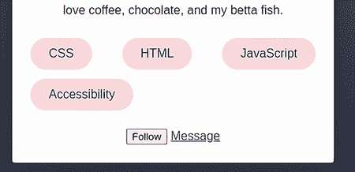

图 6.32 窄屏幕上包裹芯片

## 6.8 样式化操作

在我们的个人资料卡片中，我们需要最后样式化的东西是用户可以在卡片底部执行的两个操作：发消息或关注个人资料所有者。尽管这些操作在语义上不同——一个是链接，另一个是按钮——但我们将使两者看起来都像按钮。让我们从适用于两者的基本样式开始。我们创建了一个规则，其中包含适用于两者的选择器，以确保这两种元素类型在视觉上保持一致。然后我们为它们各自不同的地方创建单独的规则。

我们还创建了一个`focus-visible`规则，将通过通用选择器(`*`)和伪类`:focus-visible`应用于所有元素，这样当用户通过键盘导航到我们的链接和按钮时，元素周围会出现一个虚线轮廓，他们可以清楚地看到他们即将选择的内容。以下列表展示了我们的样式。

列表 6.21 添加`flex-wrap`

```
.actions a, .actions button {         ①
  padding: 12px 24px;
  border-radius: 4px;
  text-decoration: none;              ②
  border: solid 1px var(--primary);
  font-size: 1rem;
  cursor: pointer;
}

.follow {
  background: var(--primary);
  color: var(--primary-contrast);
}

.message {
  background: var(--primary-contrast);
  color: var(--primary);
}

*:focus-visible {
  outline: dotted 1px var(--primary);
  outline-offset: 3px;
}
```

① 适用于链接和按钮

② 移除下划线

注意到在我们的基本样式表中，我们将链接和按钮的`cursor`都更改为`pointer`。在大多数浏览器中，链接默认会使用`pointer`，但按钮则不会。因为我们希望这两个元素有相似的用户体验，我们将定义`cursor`以确保一致性。图 6.33 展示了我们的样式化链接和按钮。

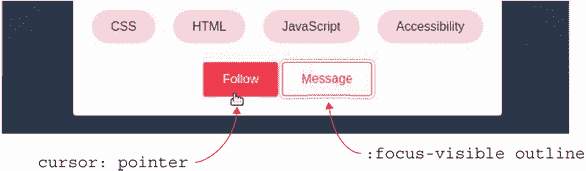

图 6.33 样式化操作

然而，由于这两个按钮非常靠近，我们希望在它们之间添加一些空间。让我们最后一次使用`flex`和`gap`来定位我们的操作元素。

我们将给列表设置 `display` 属性值为 `flex` 并添加 `16px` 的 `gap`。为了使两个元素居中，我们将使用 `justify-content` 属性并设置值为 `center`。最后，我们将通过给列表设置 `margin-top` 值为 `36px` 来在技术列表和我们的操作之间添加一些空间，如下所示。

列表 6.22 定位链接和按钮

```
.actions {
  display: flex;
  gap: 16px;
  justify-content: center;
  margin-top: 36px;
}
```

通过这个最后的规则，我们已经完成了个人资料卡的样式设计。最终产品如图 6.34 所示。

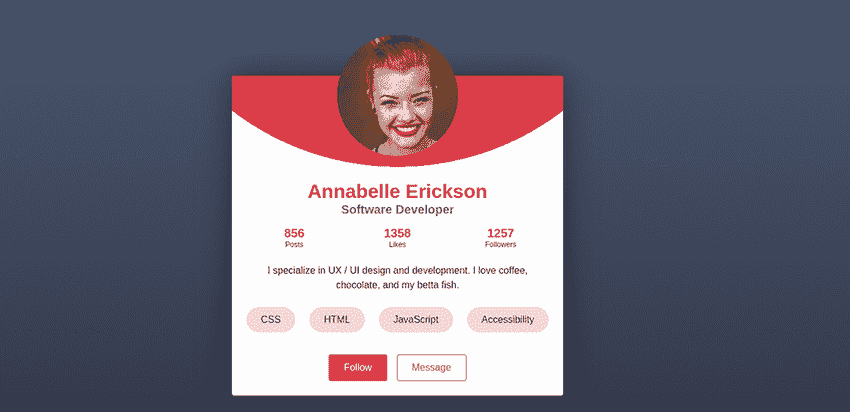

图 6.34 完成的个人资料卡

## 摘要

+   CSS 自定义属性允许我们设置可以在整个 CSS 中重用的变量。

+   CSS Flexbox 布局模块允许我们在单个轴上（水平或垂直）定位元素。

+   `flex-direction` 设置 Flexbox 将在哪个轴上操作。

+   `flex-direction` 和 `flex-wrap` 都可以改变元素显示的顺序。

+   `align-items` 属性设置元素相对于彼此在轴上的对齐方式。

+   `justify-content` 属性决定了元素如何定位；剩余空间将在应用该属性的元素内部进行分配。

+   `flex-basis` 为浏览器设置一个起始元素大小，用于布局伸缩内容。

+   `flex-shrink` 决定了当元素被伸缩时内容是否可以收缩以及如何收缩。

+   通过使用 `object-fit` 属性，我们可以防止在固定高度和宽度与图片的宽高比不匹配时图片变形。
